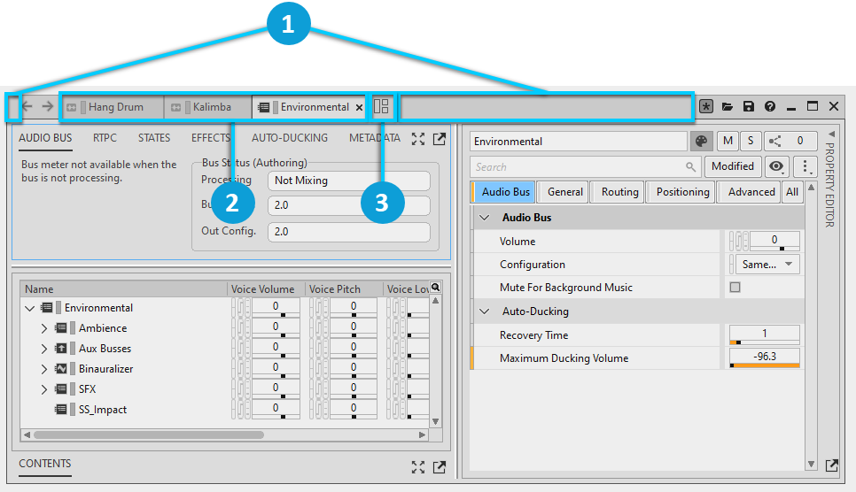
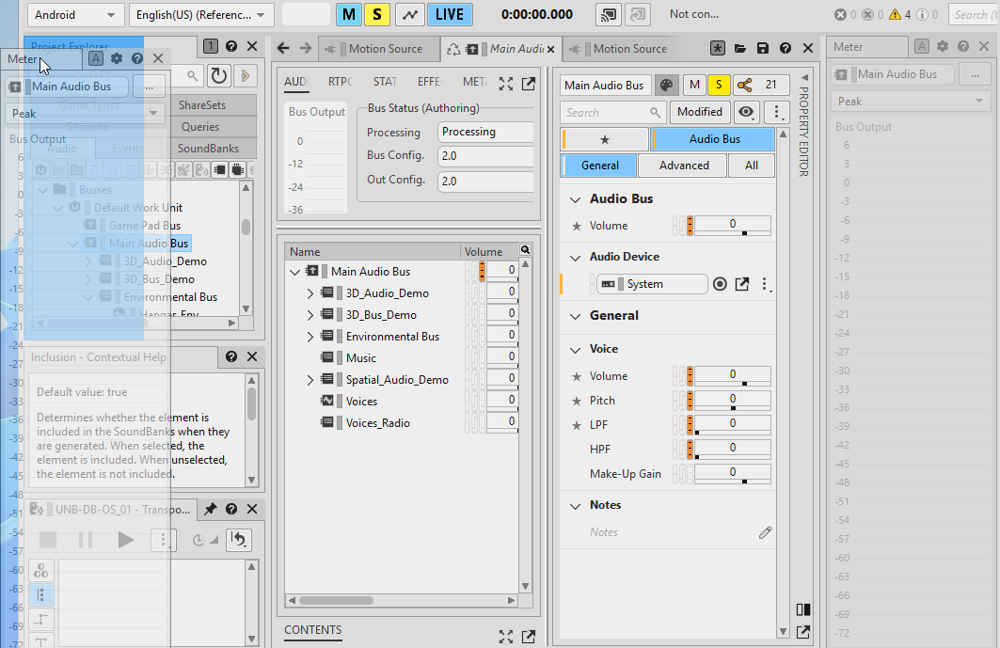
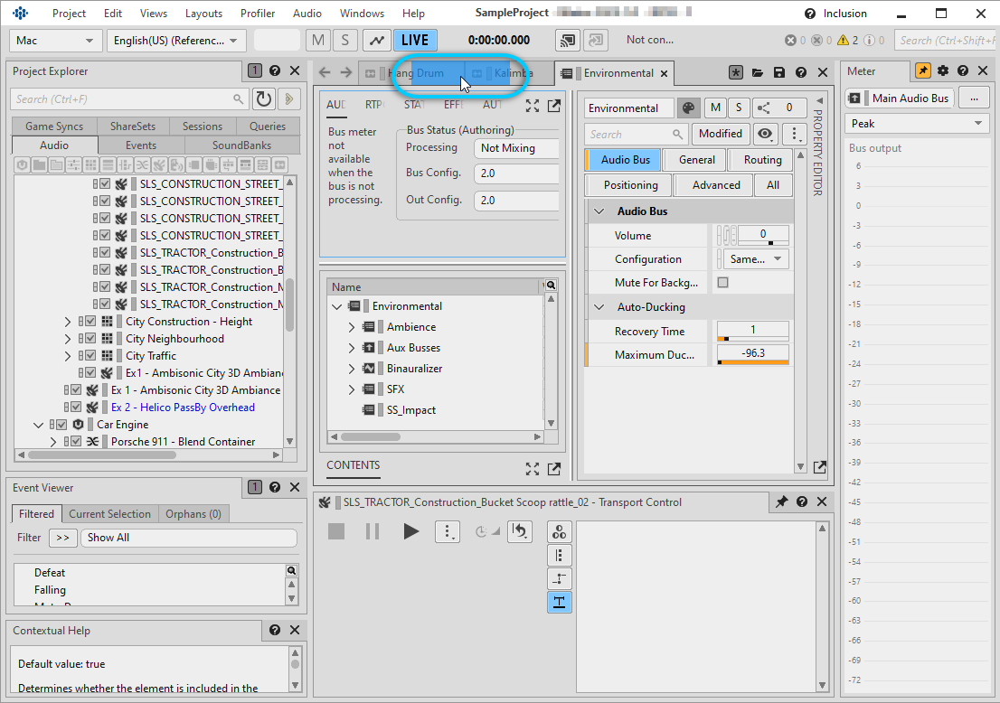
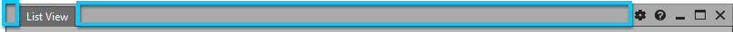

# Docking and undocking views and Object Tabs

[Wwise 帮助文档](../../../00-Wwise-帮助文档.md) > [入门](../../00-入门.md) > [个性化您的工作空间](../00-个性化您的工作空间.md) > [处理布局](00-处理布局.md) > Docking and undocking views and Object Tabs

### Docking and undocking views and Object Tabs

You can edit the contents and positioning of the views and Object Tab Groups within a
layout. For more information about views, see [“处理视图”一节](../01-处理视图/00-处理视图.md "处理视图").

在将视图、Object Tab 或 Object Tab Group 停靠到布局时，可根据需要选择以下停靠位置：

- 布局上下左右的任一端。
- 布局内各个视图上下左右的任一端。
- When docking Object Tabs and Object Tab Groups, it is also possible to dock among
  the tabs of a flat Object Tab Group.

You can move, or initiate the docking of, a floating view:

|  |  |
| --- | --- |
|  | To move a view without docking it, drag an empty area on the title bar. |
|  | To initiate the docking of a view, drag the view's title tab. |

You can move, or initiate the docking of, a floating Object Tab Group:

|  |  |
| --- | --- |
|  | To move an Object Tab Group without docking it, drag an empty area of the title bar. |
|  | 若要启动各个选项卡的停靠，可单击 Object Tab Group 中的任一 Object Tab 并拖动。 |
|  | 若要启动整个 Object Tab Group 的停靠，可单击所示图标并拖动。 |

After you have initiated the docking of a floating view, Object Tab, or Object Tab
Group, as you drag it around a layout, possible docking locations are highlighted in blue.
The extent of the blue region indicates the area that would be taken by the view if it were
docked.

在下图中，将浮动 Meter（电平表）视图拖向了固定 Project Explorer（工程资源管理器）视图的左端。固定视图的左端高亮显示出了潜在的停靠位置。The blue region indicates the area that would be taken by the Meter view if the mouse button were released.

In the following image, the Meter view is dragged a little further to the left. 这时布局的左端高亮显示出了潜在的停靠位置。The blue region indicates that the Meter view would expand to fill the vertical extent of the layout and half of its width if the mouse button were released.

When dragging either a single floating Object Tab or a floating Object Tab Group over a
flat Object Tab Group, blue highlighting indicates the additional possibility of docking the
floating tabs among the flat tabs.

**在布局内停靠浮动视图的方法如下：**

1. 单击视图的标题选项卡，然后开始拖动视图。

   
2. 根据要将视图停靠到布局内的哪个位置来将浮动视图拖到相应区域之上。

   The area is highlighted in blue.
3. 释放鼠标按钮。

   The floating view becomes a flat view, and you can optionally resize it. 请参阅 [“Resizing flat views in a layout”一节](00-处理布局.md#resizing_views_within_layout "Resizing flat views in a layout")。

**在布局中取消停靠视图的方法如下：**

1. 对于要取消停靠的视图，点击其标题栏，然后开始拖动视图。
2. Drag the view anywhere in the layout ensuring no area is highlighted blue. If an
   area is highlighted in blue, then the view will be docked there instead of being
   undocked.
3. 释放鼠标按钮。

   固定视图即变为浮动视图。其标题栏会显示缩短的标题选项卡。

**移动而不停靠浮动视图：**

1. 在标题选项卡的任一端单击视图的标题栏。

   
2. 将浮动视图拖到所需位置并松开鼠标按钮。

---