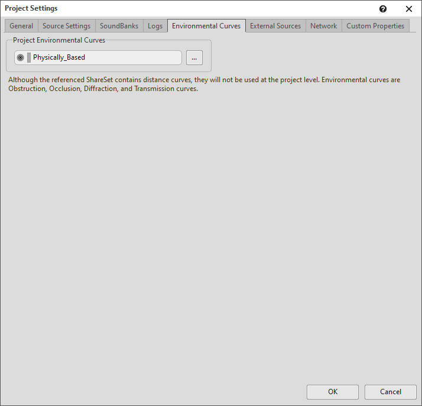
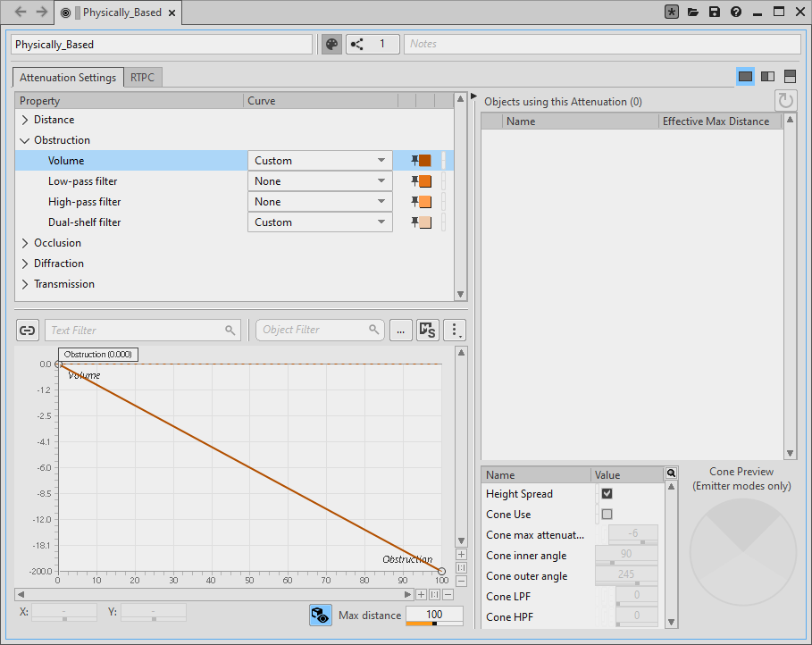

# Defining environmental curves for your project

[Wwise 帮助文档](../../../00-Wwise-帮助文档.md) > [设置工程](../../00-设置工程.md) > [处理工程](../00-处理工程.md) > [定义工程设置](00-定义工程设置.md) > Defining environmental curves for your project

### Defining environmental curves for your project

In the Environmental Curves tab of the Wwise Project Settings dialog, you can define the obstruction, occlusion, diffraction, and transmission settings for the sound objects for each platform in your project. 声障是指游戏几何空间中的对象（例如墙壁或立柱）部分遮挡声源与听者之间空间时的声学现象。Occlusion 是指游戏几何空间中的对象完全挡住了声源与听者之间的空间时的声学现象。Diffraction and transmission occur when using Spatial Audio Rooms and Portals or Spatial Audio Geometry.

游戏程序员通过编程的方法定义游戏的几何空间，在这种情况下可能就会产生声障和声笼条件。Wwise 自身不计算声障和声笼的程度。物理计算必须由游戏完成，并将结果传递给下面的函数： [SetObjectObstructionAndOcclusion()](https://www.audiokinetic.com/library/edge/?source=SDK&id=namespace_a_k_1_1_sound_engine_a1b3e18a25b405e55ba82de9b70cd11ba.html) 。

|  |  |
| --- | --- |
| [备注] | 备注 |
| 声障和声笼设置可以与 Environmental Effect（环境效果）并行使用，根据音源的位置来动态改变声音属性。有关详细信息，请参阅[“理解发送”一节](../../../05-使用声音和振动来提升游戏体验/04-管理效果器/02-利用效果器重构声学环境.md#understanding_sends "理解发送")。 |

有关开发者如何通过编写代码来设置声障和声笼的详细信息，请参阅 Wwise SDK 文档中的[声障、声笼及 Game-defined Auxiliary Sends](https://www.audiokinetic.com/library/?source=SDK&id=soundengine__obsocc.html) 章节。

For more information about diffraction and transmission, refer to the [Rooms and Portals Overview](https://www.audiokinetic.com/library/?source=SDK&id=spatial_audio_roomsportals_apioverview.html) and [Using the Geometry API for Simulating Diffraction and Transmission](https://www.audiokinetic.com/library/?source=SDK&id=spatial_audio_apigeometry_diffract.html) sections in the Wwise SDK documentation.

In Wwise, you can define platform-specific volume, LPF, HPF, and DSF curves to apply to sound objects when they are affected by obstruction, occlusion, diffraction, and transmission during gameplay. The values you define are relative and are accumulated with any values already applied to the game object. Volumes and DSF values are accumulated through addition, while LPF and HPF values are accumulated by retaining the highest value.

**To define the environmental settings for your project:**

1. 通过执行以下任一操作来打开 Project Settings 对话框：

   - 在菜单栏中，点击 **Project** > **Project Setting**。
   - 按 **Shift+K**。
2. Switch to the Environmental Curves tab.

   
3. Within the Project Environmental Curves group, click on the "..." button to choose an attenuation ShareSet to be used at the project level. A ShareSet can be used both at the project level and on an individual sound.

   |  |  |
   | --- | --- |
   | [备注] | 备注 |
   | To create a new ShareSet for the project environmental curves, add it in the [“ShareSets 选项卡”一节](../../../09-参考主题/04-Project-Explorer/05-ShareSets-选项卡/00-ShareSets-选项卡.md "ShareSets 选项卡") of the [*Project Explorer*](../../../09-参考主题/04-Project-Explorer/00-Project-Explorer.md "Project Explorer") first. |

   To modify the environmental curves, double-click on the attenuation ShareSet selector to open the corresponding [“Attenuation Editor”一节](../../../09-参考主题/04-Project-Explorer/05-ShareSets-选项卡/02-Attenuation-Editor.md "Attenuation Editor").

   

   |  |  |
   | --- | --- |
   | [备注] | 备注 |
   | 1. Although the ShareSet contains distance curves, they aren't used at the project level. 2. Curves set to Use Project Obstruction, Occlusion, Diffraction, or Transmission, are treated as set to None. |
4. 完成后，点击 **OK**。

   The Project Settings dialog closes and the chosen attenuation ShareSet will be used for your project.

   |  |  |
   | --- | --- |
   | [备注] | 备注 |
   | It is possible to open the chosen attenuation ShareSet from the [“ShareSets 选项卡”一节](../../../09-参考主题/04-Project-Explorer/05-ShareSets-选项卡/00-ShareSets-选项卡.md "ShareSets 选项卡") of the [*Project Explorer*](../../../09-参考主题/04-Project-Explorer/00-Project-Explorer.md "Project Explorer") later to apply changes to the curves. Live editing is possible. |

另外，还可禁用这些曲线或针对声音对象创建自定义曲线。Refer to [“应用衰减”一节](../../../05-使用声音和振动来提升游戏体验/02-定义定位/07-应用衰减/00-应用衰减.md "应用衰减") and its subsections to see how this is done.

---