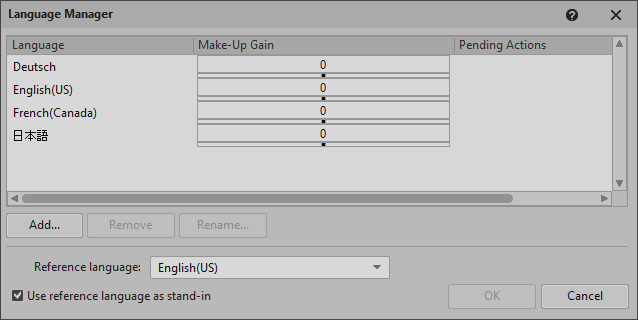
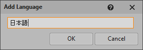
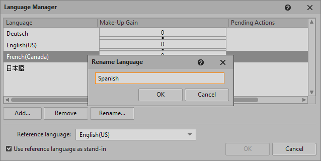

# 管理语言

[Wwise 帮助文档](../00-Wwise-帮助文档.md) > [设置工程](00-设置工程.md) > 管理语言

## 管理语言

With the Language Manager, you can define the languages used for localization and set a Make-Up Gain (volume offset) for each. You can also set the stand-in reference language. 请参阅 [“Localizing your project”一节](../07-完善工程/02-管理平台和语言版本/02-Localizing-your-project.md "Localizing your project")。After a language is defined, you can add audio sources for it. 详请参阅[“Importing language files”一节](../07-完善工程/02-管理平台和语言版本/02-Localizing-your-project.md#importing_language_files "Importing language files")。

The Language Manager queues all requested actions (Add, Remove, Rename, or set Make-Up
Gain). Click **OK** or **Cancel** to
execute or discard all pending actions respectively. After clicking OK, you are prompted to
confirm the action.

|  |  |
| --- | --- |
| [注意] | 注意 |
| These actions cannot be undone with **Edit > Undo** (Ctrl+Z). We recommend you back up your project before proceeding. |

All languages defined in a project are listed in the Language Selector in the toolbar and in
the Contents Editor for Sound Voice objects. See [“Switching to a different project language”一节](../07-完善工程/02-管理平台和语言版本/02-Localizing-your-project.md#switching_to_different_language_version "Switching to a different project language") and [“Contents Editor: Sound Voice”一节](../09-参考主题/04-Project-Explorer/01-Audio-tab/03-Containers-hierarchy-sound-and-motion-objects/13-Contents-Editor-Sound-Voice.md "Contents Editor: Sound Voice").

To open the Language Manager, from the Wwise menu bar, click **Project** > **Language Manager** (Shift+J).

| 界面元素 | 描述 |
| --- | --- |
|  | 配置列…。右键单击表格标题来打开 **Configure Columns** 对话框以指定要显示的列及其顺序。详请参阅[“使用表格”一节](../02-入门/03-Wwise-界面基础知识/00-Wwise-界面基础知识.md#using_tables "使用表格")。 |
| Language | The language name. |
| Make-Up Gain | The volume offset from -24 to +24 dB applied to the language's audio source. Default: 0. 请参阅 [“Setting the Make-Up Gain”一节](03-管理语言.md#make_up_gain "Setting the Make-Up Gain")。 |
| Pending Actions | A pending action to be performed upon clicking **OK**. Can be Add, Rename, or Remove. |
| Reference language | The language used when importing a Sound Voice object into a project. Default: English(US). 请参阅 [“Configuring the reference language”一节](03-管理语言.md#changing_reference_Language "Configuring the reference language")。 |
| 使用参考语言作为替代语言 | If enabled, and no audio source is available for the current language, then the audio source for the reference language is played. If disabled, and no audio source is available for the current language, then no audio is played. |
|  | Opens the Add language dialog, where a new language can be defined and added. 请参阅 [“Adding languages”一节](03-管理语言.md#add_language "Adding languages")。 |
|  | 移除所选语言。请参阅 [“Removing languages”一节](03-管理语言.md#removing_Language "Removing languages")。 |
|  | Opens the Rename language dialog. 请参阅 [“Renaming languages”一节](03-管理语言.md#rename_language "Renaming languages")。 |

## Adding languages

1. 点击 **Add**。
2. In the Add Language dialog, enter a language name using any OS-supported
   characters.

   
3. 单击 **OK**（确定）。

   The Pending Actions column is updated. To remove or rename the new language, select it
   and click the respective button. To cancel the action, click **Cancel**.
4. Click **OK** to execute any pending actions.

   The Process Log might open with messages for the executed actions.

## Removing languages

1. Select a language and click **Remove**.

   If the language has the Pending Action Add, then it is removed immediately. Otherwise,
   it is marked Remove.
2. Click **OK** to execute any pending actions.

   Depending on your project setup, a message might appear warning that corresponding
   audio files and plug-ins will be deleted, and the Process Log might open with messages for
   the executed actions.

## Renaming languages

1. Select a language and click **Rename**.
2. In the Rename Language dialog, enter the new language name using any OS-supported
   characters.

   
3. 单击 **OK**（确定）。

   The Pending Actions column is updated. If the language has the Pending Action Add,
   then it is renamed immediately. Otherwise, the language is marked Rename.
4. Click **OK** to execute any pending actions.

   The Process Log might open with messages for the executed actions.

## Configuring the reference language

Because some language files might not be available when you add a language, you can set a
reference language as a substitute for languages that are not yet ready. The conversion
settings associated with the reference language can also be used as default conversion
settings for other imported language files.

1. 从 **Reference language** 列表中选择一种语言。
2. **Use reference language as stand-in** is enabled by default. 这样的话对于本地化音频文件尚未到位的语言会将参考语言的音频文件暂时纳入 SoundBank（音频包）中。
3. Click **OK** to execute any pending actions.

   The Process Log opens with messages for the executed actions.

## Setting the Make-Up Gain

If your localized assets contain dialogue from different studios with different actors and
recording conditions, you can balance them and match the levels for each language.

The Make-Up Gain is the volume gain in decibels applied to the voice after all other
volume adjustments. The make-up gain is additive across the Containers hierarchy. See [Understanding the voice pipeline](../07-完善工程/01-管理输出/05-了解声部管线.md "了解声部管线") and [Using Loudness
Normalization or Make-up gain to Adjust Volume](../07-完善工程/01-管理输出/04-使用-Loudness-Normalization-或-Make-up-Gain-调节音量.md "使用 Loudness Normalization 或 Make-up Gain 调节音量").

1. 选择语言。
2. In the **Make-up Gain** column, use the slider to set a
   value from -24 to 24, or type it in.
3. Click **OK** to save the setting.
4. If the volume offset of some files differs from that of their language, a message box
   appears offering to conserve or overwrite the file offset. Click **Conserve** or **Overwrite** to continue.

---