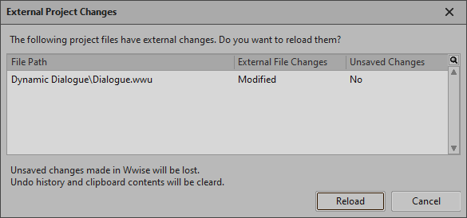

# 将工程分成 Work Units

[Wwise 帮助文档](../../00-Wwise-帮助文档.md) > [设置工程](../00-设置工程.md) > [Working with a team](00-Working-with-a-team.md) > 将工程分成 Work Units

## 将工程分成 Work Units

在划分工程前，首先必须确定组织工程中不同元素的最佳方法，以简化工作流程和减少冲突。由于划分工程的方法有很多，因此值得抽出时间来为您的工程确定最佳的划分方式。

在创建工作单元后，您可以通过将声音结构、事件、SoundBank 等拖到各自的工作单元中来划分工程中的工作。You can also unload specific Work Units from your version of the project, keeping only those that you are working on, to reduce project load times and memory usage.

### Creating Work Units in your project

You can create new Work Units for the following elements in your project:

- Sound and music structures in the Containers hierarchy
- 动作 Event 和对白 Event
- SoundBanks
- Bus structures in the Busses hierarchy
- 切换开关、状态、游戏参数和触发器
- 效果器和衰减共享集
- Soundcaster 和 Mixing Desk 会话
- Queries

每个工作单元只可包含为它创建的工程元素。例如，Event 工作单元中只可包含事件，效果器工作单元中只可包含效果器，以此类推。

若打算使用版本控制系统来管理工程文件，则可将所有 Work Unit（包括 Default Work Unit）添加到版本控制系统的中央存储库或文档库。若在使用版本控制插件时创建 Work Unit，则系统会提示将文件添加到存储库中。

**- 创建新的工作单元**

1. In the Project Explorer, right-click one of the Physical Folders (such as Busses or Containers).

   此时将会显示快捷菜单。
2. 点击 **New Child** > **Work Unit**。

   The Work Unit dialog opens.
3. 在 **Name** 字段中，输入Work Unit 的名称。

   |  |  |
   | --- | --- |
   | [备注] | 备注 |
   | 在 Wwise 中命名 Work Unit （工作单元）时，不得使用以下字符：‘:<>%\*?”/\|.’ |
4. 单击 **OK**（确定）。

   新的工作单元于是创建了。

   |  |  |
   | --- | --- |
   | [备注] | 备注 |
   | 您可以在 Project Explorer 或 File Manager 中直接删除或重命名此工作单元。要打开 File Manager，点击 **Projects** > **File Manager**。Shortcut: Shift + F1. |

### Assigning project elements to Work Units

By default, all the elements in your project, including Sound structures, Events, and SoundBanks, are automatically assigned to their respective Default Work Units. 在创建新的工作单元后，您可以将工程中的不同元素指派到新创建的工作单元。您只需将工程元素拖到特定的工作单元，就可以将它指派到工作单元中。

|  |  |
| --- | --- |
| [备注] | 备注 |
| 在将工程元素移到新的工作单元或者在现有工作单元之间移动之前，您应确保工程团队中的其他成员当前没有在处理会受到影响的工程元素。 |

**将工程元素指派到 Work Unit**

1. 在 Project Explorer 中，点击其中一个选项卡。（包括 **Audio**、**Events**、**SoundBanks**、**Game Syncs**、 **ShareSets** 、**Sessions** 和 **Queries** 选项卡。）
2. 将 **Default Work Unit** 中的若干工程元素拖至您创建的 Work Unit 中。

   The project element is now assigned to the new Work Unit.

### 管理实文件夹

Work Units can be organized into Physical Folders on disk inside the root folder associated with a specific category of objects, such as the Containers hierarchy. 如果您有数百个工作单元，并且不希望它们位于同一文件夹中，这样就尤其有用。

实文件夹和虚文件夹是两个截然不同的实体。实文件夹代表磁盘中的实际目录，而虚文件夹包含在工作单元文件中，是该工作单元的一部分。两者均用于组织内容，但 Physical Folder 是 Work Unit 的上级文件夹，而 Virtual Folder 是 Work Unit 的下级文件夹。

在 Project Explorer 中可直接创建实文件夹，方法是在其他实文件夹中使用上下文菜单或使用 Project Explorer 工具栏按钮。

实文件夹只可包含其他实文件夹或工作单元文件。

### Nested Object（嵌套工作单元）

工作单元可嵌套在其他工作单元内。When this is done, the content of the Work Unit is delegated to the nested Work Unit, instead of the parent Work Unit. This allows placing several Work Units under a common Property Container object, providing common behavior and mixing properties for the nested Work Units.

The nested Work Units allows a finer granularity in the file separation, reducing potential conflicts when merging.

嵌套工作单元保存在包含它们的实文件夹中。同一个实文件夹内的工作单元不能重名。

|  |
| --- |
|  |

以下对象类型下可以创建嵌套工作单元：

- 实文件夹
- Work Units
- 虚拟文件夹
- Property Containers
- Audio Bus

|  |  |
| --- | --- |
| [备注] | 备注 |
| 嵌套工作单元存储在磁盘中，与根工作单元处于相同的目录级别上。 |

### Loading/unloading Work Units from your project

After your project has been divided up into Work Units, you may want to unload some of these Work Units, keeping only those that you are working on. 从工程中卸载工作单元的主要原因是加快工程加载时间，降低内存占用，提高总体性能。如果工程很大，那么您可以通过卸载一个或多个工作单元来大幅提高性能。

The following types of user-created Work Units can be unloaded from a project:

- Containers hierarchy Work Units
- Event Work Units

|  |  |
| --- | --- |
| [备注] | 备注 |
| 默认工作单元对工程非常重要，因此它们无法卸载。 |

|  |  |
| --- | --- |
| [备注] | 备注 |
| 您可以单独卸载嵌套的 Work Unit。另外，在卸载其根 Work Unit 时也会予以卸载。 |

在从工程中卸载 Work Unit 后，其在 Project Explorer 中会显示为灰色（不可用）。直到将它们重新载入工程后才可使用它们。

|  |  |
| --- | --- |
|  | 已经卸载的 Work Unit。 |

您可以继续处理已加载工作单元中的对象和事件。然而，您可能会发现，部分对象和事件包含针对已卸载对象和/事件的引用。例如，在以下工程元素中可能有针对已卸载对象或事件的引用：

- Dialogue events（对白事件）
- Event
- 插播乐句
- Music Transitions
- Queries
- SoundBanks
- Soundcaster 和混音会话

在这些情况下，已卸载的元素将标记为 `[Unloaded]` ，并以黄色高亮显示。

|  |
| --- |
|  |

您仍可添加/移除对象，修改属性值，生成 SoundBank 等，但在 Wwise 中无法播放这些对象和事件。

在从工程中卸载 Work Unit 时，会将其立即卸载。如果您需要访问已卸载工作单元的内容，则可以随时轻松地将它重新加载回工程中。如果对工程作出的任何更改会影响已卸载工作单元内的对象或事件，当这些工作单元重新加载到工程中时，Project Load Log 中将列出这些更改。

|  |  |
| --- | --- |
| [备注] | 备注 |
| 当工作单元从工程中卸载时，Wwise 无法区分未使用的和没有加载到工程中的源文件。其结果是，直至所有工作单元重新加载到工程中并且 Wwise 可以执行全面验证之前，表面上看起来工程未使用的所有源文件将在 File Manager 的 **Usage** 列中标为“Unknown” 。 |

**从工程中卸载工作单元的方法是：**

1. 在 Project Explorer 中，选择您要卸载的工作单元。
2. 右键单击选定项，并从菜单中选择 **Unload Work Unit**（卸载工作单元）。

   这时将卸载 Work Unit，并在 Project Explorer 中将其显示为灰色（不可用）。

**将工作单元重新加载到工程中的方法是：**

1. 在 Project Explorer 中，选择您要重新加载到工程中的已卸载工作单元。
2. 右键点击选定项，并从菜单中选择 **Load Work Unit**。

   这些工作单元于是重新加载到工程中了。

   |  |  |
   | --- | --- |
   | [备注] | 备注 |
   | If any changes were made to the project that affected the objects or Events within the unloaded Work Unit, these changes will be listed in the Project Load Log when the Work Units are loaded back into the project. |

### Reloading Work Units in your project

在 Wwise 之外修改 Work Unit（工作单元）后，只需重新加载相应文件即可，而无需重新打开工程。

**在工程中重新加载 Work Unit：**

1. 在 Wwise 检测到工程目录中的 Work Unit 作了修改时，将打开 External Project Changes（外部工程更改）对话框。

   
2. 在 External Project Changes（外部工程更改）对话框中，选中想要重新加载的 Work Unit。
3. 单击 **Reload**（重新加载）。

   这时将在工程中重新加载所选 Work Unit。

在 Mac 上设计音频时，Wwise 不会自动检测针对硬盘上 Work Unit 所作的更改。在这种情况下，您需要手动检查外部更改。

**检查外部更改：**

1. 在菜单栏中，依次单击 **Project > Check for External Changes**（工程 > 检查外部更改）。

   - 若检测到更改，则将打开 External Project Changes（外部工程更改）对话框，并列出所有外部更改。这时可照常重新加载这些更改。
   - 若未检测到更改，则将打开对话框并显示相应消息。单击 **OK**（确定）关闭对话框。

### Renaming user-created Work Units

At some point you may need to rename a Work Unit that you have created in your project. 您可以在 Project Explorer 中对工作单元重命名，也可以在 File Manager 中进行。不可在 Windows 资源管理器或 Mac Finder 中对工作单元重命名或删除工作单元，否则将可能导致完好度错误或丢失工程数据。

|  |  |
| --- | --- |
| [注意] | 注意 |
| Default Work Units 是关键的工程文件，不得重命名或删除。 如果这样做了的话，Wwise 则将在您下次打开工程时重新创建它们。 |

**对工作单元进行重命名的方法是：**

1. 在 Project Explorer 中，按 **F2** 或使用 **Rename** 快捷菜单项。

   此时可编辑的文本框将显示在工作单元名称上方。
2. 在编辑框中，输入新名称，然后按 **Enter**。

   这时会显示 **Source Control Operation**（版本控制操作）对话框。
3. 验证要应用的操作，并点击 **Continue**。

   如果您使用版本控制插件，则要验证一下看看操作是否成功了。
4. 点击 **OK** 以关闭 Process Log。

### Deleting user-created Work Units

You may need to delete a Work Unit that you have created and no longer need in your project. 您可以在 Project Explorer 中删除工作单元，也可以在 File Manager 中删除它们。不得在 Windows 资源管理器或 Mac Finder 中删除工作单元，否则可能造成完好度错误或丢失工程数据。

如果您从版本控制系统中删除了某个工作单元，则该工作单元内的工程元素将不再存在于工程中，这可能会造成完好度错误。如有必要，当您打开工程时，这些错误以及如何解决它们的说明将一起显示出来。有关工程不一致性的详细信息，请参阅[“解决工程中的不一致现象”一节](04-解决工程中的不一致现象.md "解决工程中的不一致现象")。

|  |  |
| --- | --- |
| [注意] | 注意 |
| Default Work Units 是关键的工程文件，不得重命名或删除。 如果这样做了的话，Wwise 则将在您下次打开工程时重新创建它们。 |

**删除工作单元的方法是：**

1. 执行以下操作之一：

   - 在 Project Explorer（工程资源管理器）中，选中所要删除的 Work Unit（工作单元），然后按下 **Delete** 或使用快捷菜单中的 **Delete** 功能。
   - 这时会显示 **Source Control Operation**（版本控制操作）对话框。
2. 验证要应用的操作，并点击 **Continue**。

   如果您使用版本控制插件，则要验证一下看看操作是否成功了。
3. 点击 **OK** 以关闭 Process Log。

---