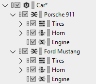

# 使用模板导入媒体文件

[Wwise 帮助文档](../../../00-Wwise-帮助文档.md) > [设置工程](../../00-设置工程.md) > [管理工程中的媒体文件](../00-管理工程中的媒体文件.md) > [导入媒体文件](00-导入媒体文件.md) > 使用模板导入媒体文件

### 使用模板导入媒体文件

当从文件夹中导入媒体文件时，您可以选择 Audio File Importer 将要使用的工程中的对象，为您正在导入的文件夹和媒体文件创建新的 Wwise 对象。在创建多个仅有媒体文件不同的类似结构时，这可能会非常有用。

典型示例是，创建多个车辆结构；它们都类似，但具有不同的媒体文件并且与特定车辆品牌或型号有关。以下是相应的工作流程：

1. 在工程中创建第一个车辆结构，然后将其作为模板来导入其它结构。此结构可包含任何容器和声音对象。

   

   如果您对此结构满意，那么可将此车辆结构作为下一个车辆结构的模板。
2. 在计算机中，创建与您刚刚在 Wwise 中创建的车辆结构相对应的文件夹结构，以保存您的媒体文件。

   |  |
   | --- |
   |  |

   现在，您有了一个可轻松导入的结构。
3. 执行以下操作之一：

   - From the Wwise menu bar, click **Project** >
     **Import Audio Files**.
   - From the Wwise menu bar, click **Views** >
     **Audio File Importer**.
   - Click **Shift**+**I**.

   **Audio File Importer** 将打开。
4. 点击 **Add Folders**。

   此时将会打开 Explorer（资源管理器）对话框。
5. 前往您要导入的该文件夹并点击该文件夹（您刚刚创建的车辆结构的父文件夹）。

   所选文件夹的名称将会显示在 **Folder**（文件夹）字段中。
6. 点击 **Select Folder**（选择文件夹）。

   返回 **Audio File Importer**，本地文件夹层级结构现在显示在 **Audio File/Folder** 面板中，并且在此结构中也可找到所有媒体文件。
7. To the left of the **Template** column, click the plus sign (+) and browse for the structure you created in the first step. 模板即以设置完成。The template menu also lists the objects most recently used as templates.

   

   此时，Wwise 将尝试自动将您导入的媒体文件和文件夹与模板中的对象相匹配。匹配的文件夹将指定为与其对应模板相同的容器类型，而默认情况下没有匹配的文件夹则为随机容器。

   |  |  |
   | --- | --- |
   | [备注] | 备注 |
   | 您可以更改 Wwise 匹配这些导入项的严格程度，方法是从 **Audio File Importer** 左下方的 **Template match mode**（模板匹配模式）列表中进行选择。**Match all**（匹配全部）模式使用特殊算法以在导入文件和模板对象之间找到最匹配项，而 **Perfect match only**（仅完美匹配）模式会仅在导入文件和文件夹与模板对象的名称完全匹配时才会对它们进行匹配。如果 Wwise 发现导入项与模板不匹配，则 **Message**（消息）列将会显示"No matching template found"（未找到匹配模板）。 |

   |  |  |
   | --- | --- |
   | [技巧] | 技巧 |
   | 模板匹配算法是基于名称进行比较的。因此，最佳做法是使文件夹层级结构中的名称与模板层级结构中的名称类似。 |

   |  |  |
   | --- | --- |
   | [备注] | 备注 |
   | 如果模板与导入的结构不匹配，则您可以完全删除模板，方法是点击选择器 [>>] 并选择 **None**（无）。您还可取消模板关联，方法是在 **Object Type/Action** 列中选择新的对象类型。 |
8. 点击 **Import**（导入）

   |  |  |
   | --- | --- |
   | [备注] | 备注 |
   | 如果与现有文件存在冲突，则 **Import Conflict Manager** 将会打开，以用来在完成导入前[解决冲突问题](../04-管理文件导入问题.md#managing_recoverable_errors "管理可恢复的错误")。 |

   The Audio File Importer closes and the new structure appears in the Project
   Explorer hierarchy.

     

   

---