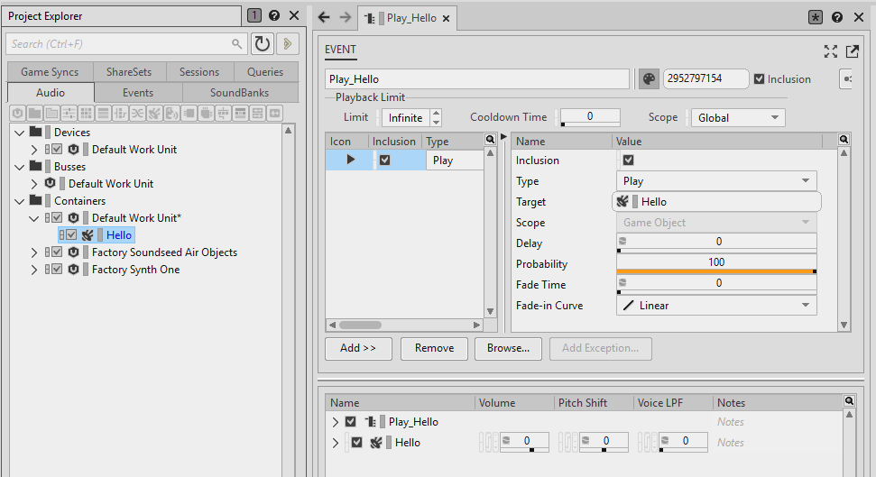
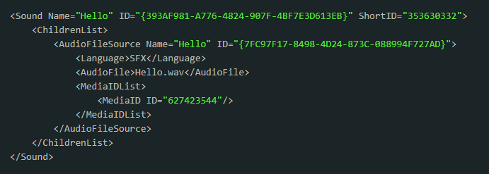
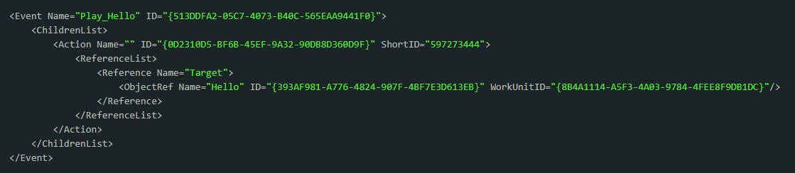
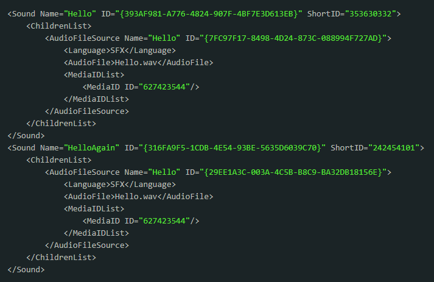
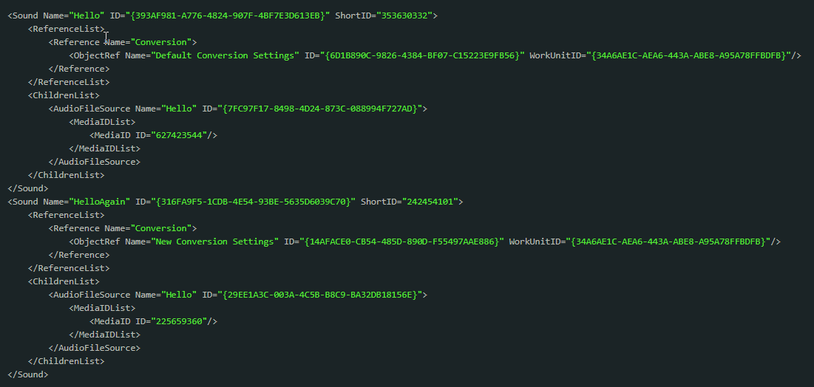

# 管理媒体素材 ID

[Wwise 帮助文档](../../00-Wwise-帮助文档.md) > [设置工程](../00-设置工程.md) > [管理工程中的媒体文件](00-管理工程中的媒体文件.md) > 管理媒体素材 ID

## 管理媒体素材 ID

Wwise 跟很多其他游戏引擎一样使用数字标识符 (ID) 管理工程素材。Wwise 指派给工程素材的 ID 类型有两种，分别用于 Wwise 设计工具 (wa) 和 Wwise 声音引擎 (wse)。在编辑工程的过程中，Wwise 会指派或更新这些 ID。这些操作全部都在后台完成，一般不需要工程团队手动处理。不过，为了便于后续对工程所涉及的游戏进行更新（无论是修复还是扩展），事先了解一下 Wwise 如何指派和使用素材 ID 还是很有必要的。不管怎么说，能尽量减少游戏更新所含的内容总是好的。鉴于绝大部分 Wwise 工程素材都是音频素材（.wem 文件），在实施更新时最好限制音频文件的数量。为此要尽量确保工程音频素材的 ID 不会随意变动，否则可能会因无法重复使用而不得不重新发布素材。

### Wwise ID 指派

接下来，我们将使用下图所示的简单工程来阐释 Wwise 如何将 ID 指派给工程素材。该工程包含：

- Hello.wav 音频素材；
- Hello Sound SFX（音效）对象：引用音频素材；
- Play\_Hello Event（事件）对象：带有 Play（播放）动作，由游戏用来触发音频素材的播放。

**图示：**Play\_Hello Event 和 Hello Sound SFX

我们来看下 Default Work Unit（默认工作单元）的内容，瞧瞧 Wwise 向 Sound SFX 对象指派了什么。下面是 Work Unit 文件 (.wwu) 中的 Sound SFX 对象条目。为清楚起见，我们删除了不相关的 Sound SFX 对象条目。

我们可以看到，Wwise 向 Sound SFX 对象指派了两个 ID：“ID”和“ShortID”。接下来，我们分别仔细说说。

### Wwise 设计工具 ID

“ID”是 Sound SFX 对象的 Wwise 设计工具 ID。它是一个 128 位的全局唯一标识符 (GUID)，保证不会出现重复。为简单起见，我们直接将其称为 GUID。Wwise 设计工具之所以使用 GUID 在于其具有全局唯一性。这样的话方便：

- 管理编辑软件必须执行的各种操作；
- 管理可能有多个团队成员参与的工程；
- 在多个 Work Unit 之间引用对象。

从 Play\_Hello Event 对象的 Work Unit 可以看到，它引用了 Hello Sound SFX 对象。

不过，鉴于字符串长度和工程中的素材数量，GUID 不太适合用在 Wwise 声音引擎中。

### Wwise 声音引擎 ID

另一 ID 是指派给 Work Unit 中特定对象的“ShortID”。它是一个 32 位整数。只有该标识符会存储在工程的 SoundBank（音频包）中以供 Wwise 声音引擎使用。为简单起见，我们直接将其称为 ShortID。GUID 用来准确识别整个工程内的对象，ShortID 则用来准确识别 ShortID 作用域内的对象。也就是说，只有在同一 ShortID 作用域内的对象之间 ShortID 才是不重复的。ShortID 作用域共有三个：

**1. 显式 ID –** ***无法*** **通过声音引擎的 SDK 函数访问的对象**

These are objects that cannot be referred to by user code (e.g. Containers hierarchy objects). 此作用域还可以按照对象类型进一步细分。这样只有在同一对象类型内的对象之间 ShortID 才是不重复的。下面举例列出了几种对象类型：

- Container objects (Sounds, Containers)
- Bus 对象（Bus、Aux Bus）
- Effects

这些 ShortID 是创建对象时指派的随机数值。因为这些数值是随机的，所以每个对象的 ShortID 都要显式记录在各自的 Work Unit 条目中。

**2. 隐式 ID –** **可以****通过声音引擎的 SDK 函数访问的对象（如 Event、State、Switch）**

因为这些对象可能会由 SDK 函数按照名称来引用，所以它们全都指派有特定的 ShortID 值。这些 ShortID 是通过对象名称的哈希值生成的。因此：

- 没有两个命名对象会拥有相同的名称。
- 没有两个命名对象会拥有相同的 ShortID。

跟上面的显式 ShortID 作用域一样，该作用域内的对象也可以按照类型分组。下面举例列出了几种对象类型：

- Event
- Switches（切换开关）
- States（状态）
- RTPC

因为这些 ShortID 不是随机的而是由对象名称隐式决定的，所以它们不必记录在各自的 Work Unit 条目中。从上面 Play\_Hello Event 的 Work Unit 条目可以看到，Play\_Hello Event 并没有 ShortID 条目。

**3. 媒体素材（.wem 文件）**

每个媒体素材都会被赋予一个独一无二的显式 ShortID。按照上文所述，这些 ShortID 是随机数值，所以必须记录在 Work Unit 条目中。在上面的例子中，Sound SFX 的媒体是通过 AudioFileSource 对象记录的，而指派给它的 ID 则是通过 MediaID 条目记录的。

### ShortID 的实际运用

Wwise 设计工具会在创建对象时为其指派 ShortID 并确保它们之间不存在重复。不过，若有多名团队成员加入新的素材，ShortID 还是有可能出现交叉的。试想一下下面的情形：

- 您的工程包含对象 A，其 ShortID 为 *12345678*。
- 另一团队成员创建了一个单独的 Work Unit。
- 新的 Work Unit 创建在先，之后您的工程才有了对象 A。
- 新的 Work Unit 被复制到了您的工程中。
- 这时将该 Work Unit 复制到工程中。

这时 ShortID 就出现了冲突，因为两个对象拥有相同的 ShortID。Wwise 需要通过为其中某个对象重新指派一个独一无二的 ShortID 来解决冲突。Wwise 会将这个新的 ShortID 指派给引起冲突的对象。也就是说，先加载的对象保持 ShortID 不变，只更改后续冲突对象的 ShortID。

不过，只要在 Wwise 中加入新的对象时加载了所有其他素材就不会出现交叉。对于包含 DLC 的游戏，在将新的素材加入到工程中时，一定要确保存在并加载了之前交付的素材（即工程 Work Unit）。这样才能保证新的素材绝对不会与现有/交付的素材发生冲突。若有些新素材与其他新素材发生冲突，Wwise 会在合并新素材时解决这些冲突。

**注：**在 Wwise 通过更改冲突对象的 ShortID 解决 ShortID 冲突时，会同时更改 SoundBank 中的 ShortID。在这种情况下，日志消息会告知您必须重新生成 SoundBank。

### 有关媒体素材 ID 的更多信息

我们已经了解了 Wwise 如何将 ShortID 指派给对象以便准确地加以识别，而且知道了相同的概念同样适用于媒体素材。不过，媒体素材与所有其他对象相比有个非常重要的区别：它们有可能被重复使用。接下来，我们看个简单工程的更新版本。这里创建了第二个使用 *Hello.wav* 的 Sound SFX 对象。下面是两个 Sound SFX 对象的 *Default Work Unit* 的相关内容。为简单起见，我们直接将媒体素材 ShortID 称为 MediaID。

我们可以看到，两个 Sound SFX 对象被赋予了相同的 MediaID。这是因为它们使用了完全相同的媒体素材。毕竟，我们没有必要在交付的游戏中包含相同媒体素材的多个副本。同一音频素材的两个实例只有在引用一样的 .wem 文件时才会被视为完全相同。也就是说：

1. 两个实例在转码之前完全相同：

   - 在通过 Source Editor（源编辑器）实施转码之前修改了媒体素材；
   - 文件修改包括修剪文件、添加淡变等操作；
   - 在本例中，两个 Sound SFX 对象都没有修改文件。
2. 两个实例在转码之后完全相同：

   - 可能通过 Conversion Settings Editor（转码设置编辑器）编辑了 Conversion Settings；
   - 在本例中，两个 Sound SFX 对象使用相同的 Conversion Settings。

上面说了 Hello.wav 音频素材的例子，其中两个 Sound SFX 对象拥有相同的 MediaID。接下来，我们对工程进行二次编辑，来向 *HelloAgain* 指派不同的 Conversion Settings。更新后的 Work Unit 如下所示。在此，我们同样删除了不相关的条目。

因为 HelloAgain 使用不同的 Conversion Settings，所以它将引用不同的 .wem 文件并被赋予新的 MediaID。另外注意，是 HelloAgain 而不是 Hello 被赋予了新的 MediaID。这是因为 Hello 并没有改变其媒体素材。

每次创建或编辑媒体素材时，Wwise 都会重估 MediaID。Wwise 会尽可能地确保 MediaID 保持不变。如有变化，则只为刚刚创建或经过编辑的素材指派新的 MediaID。

只要在 Wwise 中加载了整个工程的情况下进行编辑，Wwise 就可确保未经更改的媒体素材保持其 MediaID 不变。不过，要想保证工程中 MediaID 的一致性，工程团队还需考虑更多的问题。

### 加载 Work Unit

Wwise 在指派 MediaID 时会检查媒体素材的所有实例，并在多个实例使用同一转码后的媒体时重复使用一个 MediaID。为此，Wwise 必须获知媒体素材的所有实例。但是，如果有些实例没有加载到 Wwise 中该怎么办呢？比如，有个素材实例是个没有加载的 Work Unit。在加载 Work Unit 时，Wwise 必须重估 Work Unit 内的所有 MediaID 以保证不会出现冲突。换句话说，Wwise 必须确保每个转码后的媒体只能指派有一个唯一的 MediaID。这里有两种情形需要考虑。

**加载工程**

一旦加载了全部 Work Unit，Wwise 便会评估所有 MediaID。不过，在出现冲突时并没有办法预测会保留哪个 MediaID。比如，在多个团队成员将新的 Work Unit 加入到工程中的时候就可能会发生这种情况。例如：

1. 团队成员 1 加入 NewWorkUnit1，其包含媒体 Example.wav；
2. 团队成员 2 加入 NewWorkUnit2，其同样包含媒体 Example.wav；
3. 整个工程（包括两个新的 Work Unit）都被加载到了 Wwise 中。

这样就会导致 MediaID 出现冲突，不过 Wwise 可以自动解决。同样，这里也有两种情形需要考虑：

1. Example.wav 是新的素材。这种情况下不会影响工程的其他内容。Wwise 会直接保留其中一个新建 Work Unit 的 MediaID。
2. Example.wav 是现有素材。倘若两个团队成员都加载了该 Work Unit，Wwise 将从现有 Work Unit 获取 MediaID。

**加载 Work Unit**

工程的有些 Work Unit 可能没有加载到工程中（详见“[“Loading/unloading Work Units from your project”一节](../04-Working-with-a-team/01-将工程分成-Work-Units.md#loading_unloading_work_units_from_project "Loading/unloading Work Units from your project")”）。下面使用与上述相同的例子，只进行一些细微的更改：

1. Example.wav 已经存在于工程的 OldWorkUnit Work Unit 中；
2. 团队成员 1 和 2 分别创建新的 Work Unit，在没有加载  OldWorkUnit 的情况下加入  Example.wav。

这种情形的危险之处在于，没有获知 OldWorkUnit 的 MediaID 便为新的 Work Unit 赋予了 MediaID。这样在加载 OldWorkUnit 时就会出现冲突。此时，Wwise 会通过保留 NewWorkUnit1 或 NewWorkUnit2 的 MediaID 来解决冲突。但是，如果 OldWorkUnit 包含在之前交付的素材中该怎么办呢？

无论哪种情形，团队成员都很有可能会意外地更改工程的 MediaID 指派。为了避免这种情况，不妨采用以下工作流程：

### 使用单个文件管理 MediaID

为了恰当地指派 MediaID，Wwise 需要获知整个工程的 MediaID 指派情况。正如前面章节所述，这里并不存在没有加载 Work Unit 的情况。此时，Wwise 支持使用单个文件来管理工程的 MediaID 指派。下面是“使用单个文件管理 MediaID”的工作流程：

- 不再将 MediaID 存储在 Work Unit 中。
- 将整个工程的 MediaID 存储在一个名为 project-name.mediaid 的单独文件中，并放在工程主文件 project-name.wproj 旁边。

您可以通过 WwiseConsole.exe 调用以下参数，来设定 Wwise 如何管理 MediaID（使用 Work Unit 还是单个文件）：

- **move-media-ids-to-single-file**：将工作流程由传统的“在 Work Unit 中存储 MediaID”改为“使用单个文件管理 MediaID”。此操作会通过命令行加载整个工程，并生成 .mediaid 文件，同时从 Work Unit 文件中移除 MediaID 条目。
- **move-media-ids-to-work-units**：将工作流程由“使用单个文件管理 MediaID”改为传统的“在 Work Unit 中存储 MediaID”。此操作会通过命令行加载整个工程，并将 MediaID 从 .mediaid 文件移到相应的 Work Unit 文件，同时删除 .mediaid 文件。
- **update-media-ids-in-single-file**：更新 .mediaid 文件的内容。此操作会通过命令行加载整个工程，并将更新后的 MediaID 写入到 .mediaid 文件。

下面继续使用示例工程 *WwiseIDs*，来通过发布以下命令将 MediaID 移动到单个文件中：

WwiseConsole move-media-ids-to-single-file WwiseIDs

下面是 *WwiseIDs.mediaid* 文件的内容。

同样，示例工程仅包含一个媒体素材 Hello.wav，但是有两个音频源实例。对于 Hello.wav 的每个实例：

- 实例条目由音频源的 GUID（设计工具 ID）索引。
- 实例指派有 MediaID。
- 实例有相应的哈希值，其代表指派 MediaID 时使用的 Conversion Settings。

在加载工程的过程中，会先加载 Work Unit，再加载 MediaID 文件。无论加载哪些 Work Unit，都会加载 MediaID 文件。在加载 MediaID 文件时，会为音频文件的每个 Conversion Settings 实例赋予哈希值，并与该文件中的哈希值进行比对。倘若两个哈希值不一致，必要时将按照前面章节所列相同规则为实例指派新的 MediaID。一旦加载了工程，所加载的 Work Unit 的全部示例都将拥有*相应的* MediaID。不过，若稍后加载了更多的 Work Unit，则将重估这些 MediaID。

MediaID 文件可以用来将 Wwise 工程与项目节点同步。在每个项目节点，都会通过 *WwiseConsole.exe update-media-ids-in-single-file* 来加载*上一项目节点*的 MediaID 文件，以此更新 Wwise 工程的 MediaID 文件。在更新 MediaID 文件后，整个工程将被标记上新的项目节点。

### 结论

团队如何针对 Wwise 工程管理媒体素材 ID 取决于团队大小和工程规模。

对于小团队参与的小规模工程，每个团队成员在工作时都加载整个 Wwise 工程会更好管理。这样可以确保不需要通过工程所用的版本控制软件来管理任何 MediaID 冲突。只有在需要对工程进行扩展时才有必要使用版本控制软件。对于每个版本，通过在版本控制软件中锁定工程可以确保不会更改已经交付的素材。

对于规模较大的工程，会有多名团队成员同时参与并加入新的 Work Unit，所以需要采用更为稳妥的方式。团队成员可以选择分开制作新的 Work Unit。不过，这样的话在开发过程中需要加载整个 Wwise 工程，而且每次只能将一个新的 Work Unit 加入到工程中。在这种情况下，最好使用单个文件来管理工程的 MediaID。

---