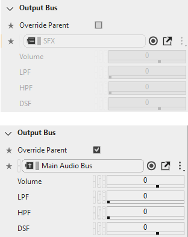
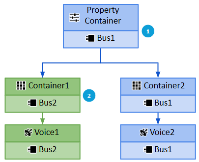

# 设置绝对属性

[Wwise 帮助文档](../../../00-Wwise-帮助文档.md) > [设置工程](../../00-设置工程.md) > [Building your sound and motion hierarchies](../00-Building-your-sound-and-motion-hierarchies.md) > [工程层级结构中的属性介绍](00-工程层级结构中的属性介绍.md) > 设置绝对属性

### 设置绝对属性

绝对属性会自动传递给各级子对象，因此应该在层级结构的顶层设置它们。如果特定子对象需要特有的属性值，可以 Override（不沿用）父对象属性，并设置其独有的属性。默认情况下，不能为子对象设置绝对属性，但勾选 Override parent（不沿用父项）选项后，绝对属性就可以修改了。

层级结构中，可以为对象设置以下绝对属性。

- [“指定对象的输出连线”一节](../../../07-完善工程/01-管理输出/01-指定对象的输出连线.md "指定对象的输出连线")

|  |  |
| --- | --- |
| [备注] | 备注 |
| The properties in the Effects, Positioning, and Advanced categories are also absolute properties, but they are discussed in a separate section. 关于 Effect、定位和高级属性的详细信息，请参阅[*管理效果器*](../../../05-使用声音和振动来提升游戏体验/04-管理效果器/00-管理效果器.md "管理效果器")、[*定义定位*](../../../05-使用声音和振动来提升游戏体验/02-定义定位/00-定义定位.md "定义定位")、和[*管理优先级*](../../../05-使用声音和振动来提升游戏体验/03-管理优先级/00-管理优先级.md "管理优先级")。 |

#### 不沿用父对象属性

如果要为子对象指定特有绝对属性值，可以 Override（不沿用）父对象属性，并为其设置独有属性。注意，若某个对象不沿用属性设置，则其子对象也不沿用所述设置。

下图说明了Override 命令如何影响当前对象及其所有子对象的属性设置。

|  |  |
| --- | --- |
|  | Object Property Container sets the Output Bus to Bus1, setting the Output Bus for descendants that do not override it (i.e., Container2 and Voice2). |
|  | 下级对象 Container1 和 Voice1 都不沿用该 Output Bus 设置（均设为 Bus2）。 |

**Override 父对象属性的方法如下：**

1. 将子对象加载到 Property Editor 中。
2. 为需要的绝对属性选择 **Override parent** 选项。

   该属性组将变为允许编辑。
3. 根据需要修改属性即可。

|  |  |
| --- | --- |
| [备注] | 备注 |
| 不同绝对属性须单独执行 Override 操作。 |

---