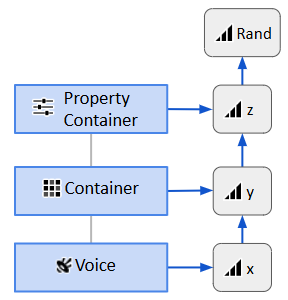

# 通过随机化属性值来改善播放

[Wwise 帮助文档](../../00-Wwise-帮助文档.md) > [设置工程](../00-设置工程.md) > [Building your sound and motion hierarchies](00-Building-your-sound-and-motion-hierarchies.md) > 通过随机化属性值来改善播放

## 通过随机化属性值来改善播放

在游戏当中，同一声音经常会播放不止一次。若要避免每次都播放同样的声音，则可使用 Randomizer 来修改每次播放的声音。

### 启用 Randomizer 并设置其属性

您可以将 Randomizer 应用于任何带有 Randomizer 图标的属性。

| 图标 | Status | 描述 |
| --- | --- | --- |
|  | Randomizer 已启用 | 随机化器效果已应用到的属性值。 |
|  | Randomizer 已禁用 | 尚未应用随机化器效果的属性值。 |
|  | 随机化器 Mixed | Multi Editor 中只有部分对象为该属性值启用了 Randomizer 效果。Property Editor 或 Contents Editor 中不会看到这个标识。 |

**编辑 Randomizer 属性：**

1. 双击属性的 Randomizer 图标。
2. 在打开的 Randomizer 视图中，根据下表设置属性。

另外，还可通过右键单击属性的 Randomizer 图标并选择 **Enable Randomizer** 或 **Disable Randomizer** 来启用或禁用 Randomizer。

若要同时编辑多个对象的 Randomizer 属性，请在 Project Explorer 中将其全部选中，然后右键单击选中项并选择 **Show in Multi Editor**。

| Randomizer 视图 | |
| --- | --- |
| 界面元素 | 描述 |
| Enabled | 决定 Randomizer 是否作用于对象属性值。如勾选，则应用 Randomizer。如果未勾选，则 Randomizer 不会作用于对象属性值。  Default value: false |
| Min Offset | 用于设置属性的最小可能偏置值。  Default value: 0 |
| Max Offset | 用于设置属性的最大可能偏置值。  Default value: 0 |

Randomizer 视图标题栏会显示所选 Wwise 对象的名称或所选对象的数量（如选择了多个对象）以及所选的属性。

就像 [“Multi Editor”一节](../../09-参考主题/04-Project-Explorer/12-搜索和工程全局编辑/03-Multi-Editor.md "Multi Editor") 一样，打开的 Randomizer 视图会根据 UI 聚焦位置重新加载相应的对象。除非明确改变属性，否则会一直显示最初加载的属性。Randomizer 视图中不会打开缺少当前所加载属性的对象。

### 了解 Randomizer 属性

用户有必要了解 Randomizer 会如何应用于属性值。在播放声音对象时，对于每项支持 Randomizer 的属性：

1. 声音对象及其所有上级对象的 Randomizer（如启用）都会生成一个随机值。
2. Randomizer 值的总和会添加到最终属性值。最终属性值包含：

   - 对象属性值。
   - 属性上的 RTPC。
   - 属性上的 State。

无论最终属性值以何种方式计算，都会将最终 Randomizer 值添加到最终属性值。对于 Volume 和 Pitch 属性，始终通过将多个来源叠加来计算属性值。对于 Low-pass filter 和 High-pass filter 属性，则取决于所配置的 Filter Behavior。参阅：

- [“定义相对属性（音量、音高、LPF、HPF）”一节](04-工程层级结构中的属性介绍/02-定义相对属性（音量、音高、LPF、HPF）/00-定义相对属性（音量、音高、LPF、HPF）.md "定义相对属性（音量、音高、LPF、HPF）")
- [“了解滤波器属性行为（LPF 和 HPF）”一节](04-工程层级结构中的属性介绍/03-了解滤波器属性行为（LPF-和-HPF）.md "了解滤波器属性行为（LPF 和 HPF）")

下图展示了会如何计算 Voice 对象的 Volume 属性的最终 Randomzier 值。每个对象的 Volume 属性都启用了 Randomizer。最终 Randomizer 值 Rand 为 x、y 和 z 的总和。该值将添加到 Voice 对象的最终 Volume 属性。

---