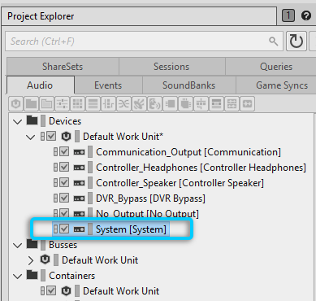
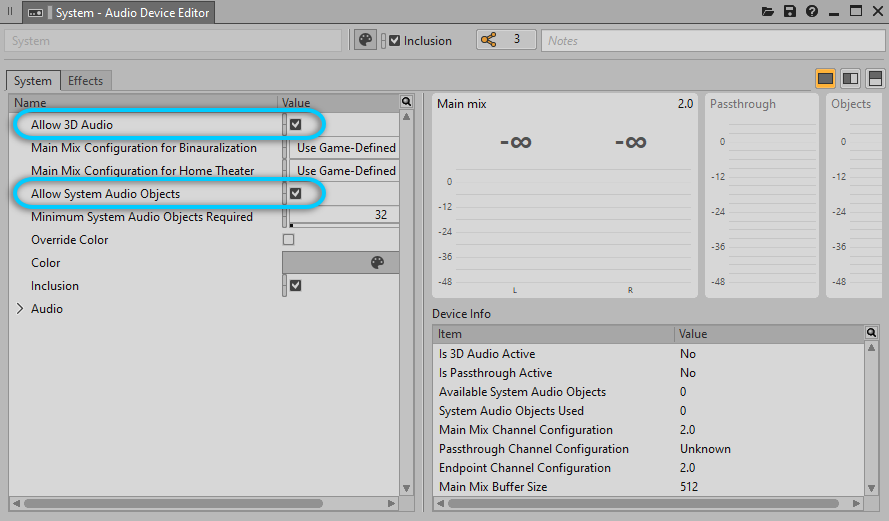
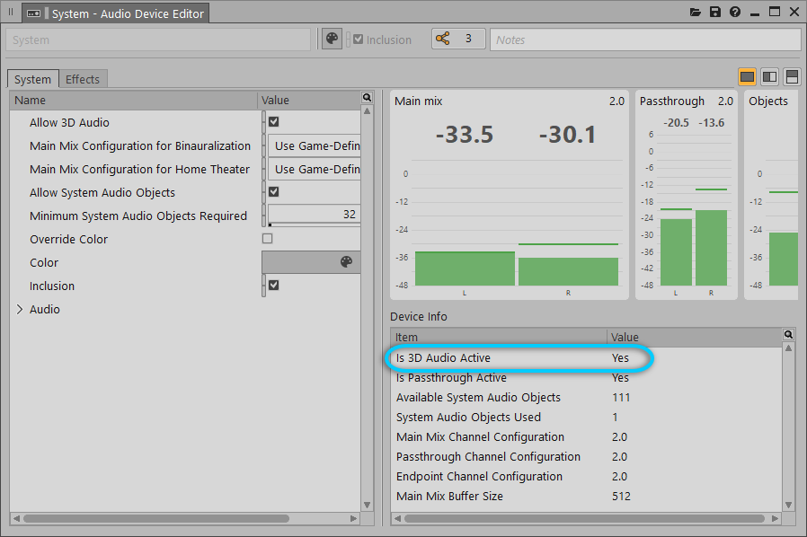
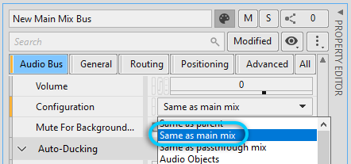
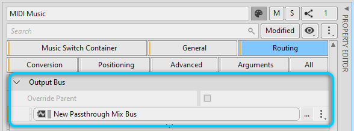
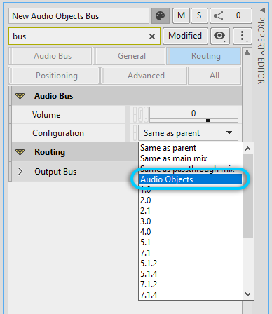
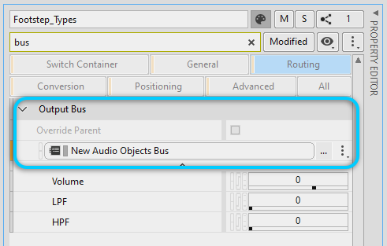

# 设定 Audio Object

[Wwise 帮助文档](../../../00-Wwise-帮助文档.md) > [设置工程](../../00-设置工程.md) > [建立输出总线的结构](../00-建立输出总线的结构.md) > [了解基于对象的音频](00-了解基于对象的音频.md) > 设定 Audio Object

### 设定 Audio Object

以下章节阐述了设定 Audio Object 并确保将其发送到 System Audio Device 以便转换为 System Audio Object 所需执行的四个主要步骤：

- [“为工程启用 3D Audio 和 Audio Object”一节](01-设定-Audio-Object.md#enabling_audio_objects "为工程启用 3D Audio 和 Audio Object")
- [“将背景环境声输出到 Main Mix”一节](01-设定-Audio-Object.md#routing_to_main_mix "将背景环境声输出到 Main Mix")
- [“将音乐输出到 Passthrough Mix”一节](01-设定-Audio-Object.md#routing_to_passthrough "将音乐输出到 Passthrough Mix")
- [“将对空间定位精度要求严格的声音输出到 Audio Objects 总线”一节](01-设定-Audio-Object.md#routing_to_audio_objects "将对空间定位精度要求严格的声音输出到 Audio Objects 总线")

#### 为工程启用 3D Audio 和 Audio Object

The following steps ensure that the processing status of the Main Audio Bus will be resolved as **Processing Audio Objects**  and that the System Audio Device will sort its output into three streams: Main Mix, Passthrough Mix, and System Audio Objects.

1. 在 Project Explorer（工程资源管理器）的 Audio（音频）选项卡中，双击 System Audio Device（系统音频设备）来打开 Audio Device Editor（音频设备编辑器）。

   
2. 在 Audio Device Editor（音频设备编辑器）中，选中 **Allow 3D Audio**（允许 3D 音频）和 **Allow System Audio Objects**（允许系统音频对象）。

   
3. 将 **Minimum System Audio Objects Required**（至少所需系统音频对象数）的值设为在构建工程时为了获得适宜的听觉体验至少需要同时播放的独立 3D 单声道声音数量。记住，若此值大于终端支持的 Audio Object 数量，则将 System Audio Device 收到的所有 Audio Object 输出到 Main Mix。注意，必须在终端相关文档中查看并确认终端支持的 Audio Object 数量。

   

   在实施性能分析时，可确认终端是否支持并启用了 [3D Audio](../../../14-词汇表.md#glossary_3daudio "3D Audio")。终端的状态由 Audio Device Editor 中的 **Is 3D Audio Active**（是否激活了 3D 音频）予以指示。

   

有关如何针对 Windows 设定 Audio Object 的详细信息，请参阅 Wwise SDK 文档中的[Enabling 3D Audio](https://www.audiokinetic.com/library/edge/?source=SDK&id=windows_specificinfo.html#Windows_Enabling_3DAudio) 章节。

#### 将背景环境声输出到 Main Mix

Main Mix 最适合需要实施双耳处理但无需精确定位 Audio Object 的声音。Main Mix 也叫 Spatialized Bed，是声音的中间表示形式，其位置按照基于声道的格式（如 5.1、7.1、7.1.4、Ambisonics）进行渲染。藉此，可生成适合进行虚拟化（即根据理想的扬声器位置实施虚拟定位）和双耳化处理的混音。

1. In the Audio tab of the Project Explorer, right-click the **Main Audio Bus** and select **New Child** > **Audio Bus**. 键入所需的名称。
2. 打开与新建 Audio Bus（音频总线）对应的 Property Editor（属性编辑器）。Set **Configuration** to **Same as main mix**.

   
3. 针对每个要作为 Main Mix（主混音）的一部分发送到终端的背景环境声对象，打开与之对应的 Property Editor（属性编辑器），然后选择新建的 Audio Bus（音频总线）作为 **Output Bus**（输出总线）。注意，可能需要选中 **Override parent**（不沿用父对象）。

   

#### 将音乐输出到 Passthrough Mix

Passthrough Mix 为立体声配置，可旁通原本可能要在终端执行的 3D 处理。这样可以确保保留全频和原始声道配置的声音。因此，Passthrough Mix 非常适合音乐和其他非剧情声音（如用户界面反馈）。

1. In the Audio tab of the Project Explorer, right-click the **Main Audio Bus** and select **New Child** > **Audio Bus**. 键入所需的名称。
2. 打开与新建 Audio Bus（音频总线）对应的 Property Editor（属性编辑器）。Set **Configuration** to **Same as passthrough mix**.

   
3. 针对所有要作为 Passthrough Mix（直通混音）的一部分发送到终端的对象，打开与之对应的 Property Editor（属性编辑器），然后选择新建的 Audio Bus（音频总线）作为 **Output Bus**（输出总线）。注意，可能需要选中 **Override parent**（不沿用父对象）。

   

#### 将对空间定位精度要求严格的声音输出到 Audio Objects 总线

Audio Objects 尤其适合对定位精度要求严格的声音，这些声音通常与游戏对象关联。每个 Audio Object 都包含可由终端用来模拟方向性的元数据（如位置和散布）。对此，可结合最终用户的收听配置，来最大限度地提升空间定位精度。

1. In the Audio tab of the Project Explorer, right-click the **Main Audio Bus** and select **New Child** > **Audio Bus**. 键入所需的名称。
2. 打开与新建 Audio Bus（音频总线）对应的 Property Editor（属性编辑器）。Set **Configuration** to **Audio Objects**.

   
3. 针对每个要作为 System Audio Object（系统音频对象）发送到终端的声音对象，打开与之对应的 Property Editor（属性编辑器）。

   - Select the newly created Audio Bus as the **Output Bus**. 注意，可能需要选中 **Override parent**（不沿用父对象）。

     
   - Ensure:

     - 启用 **Listener Relative Routing**（听者相对通路）。
     - 将 **3D Spatialization**（3D 空间化）设为 **Position**（位置）或 **Position + Orientation**（位置 + 朝向）。
     - 将 **Speaker Panning / 3D Spatialization Mix**（扬声器声像摆位/3D 空间化混音）设为 100%。
4. 针对每个要输出到 Audio Objects（音频对象）总线的声音，右键单击声音并选择 **Show in Schematic View**（在对象网络视图中显示）。这时将打开 Schematic View。
5. 察看声音经由总线层级结构的路径。确保其不会被输出到混音总线 。在将 Audio Object（音频对象）输出到混音总线时，会销毁其元数据（包括 3D 位置信息）。
6. 确保所有 Audio Object（音频对象）最终被输出到 System Audio Device（系统音频设备）。其他类型的 Audio Device 会对 Audio Object 进行渲染。

有关管线其余部分的详细信息，请参阅 [“System Audio Device 的作用”一节](02-System-Audio-Device-的作用.md "System Audio Device 的作用") 章节。

---