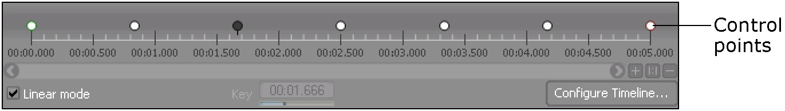

# 处理时间线中的点

[Wwise 帮助文档](../../../00-Wwise-帮助文档.md) > [使用声音和振动来提升游戏体验](../../00-使用声音和振动来提升游戏体验.md) > [定义定位](../00-定义定位.md) > [使用动画路径定义空间定位](00-使用动画路径定义空间定位.md) > 处理时间线中的点

### 处理时间线中的点

在创建动画路径时，需要定义声音沿路径传播的时间。Position Editor (3D Automation) 时间线方便指定各个控制点所对应的时间。

您可以沿时间线来移动控制点，从而定义对象在点之间沿路径运行的速度。您可以移动和删除点，但不能直接在时间线上添加点。控制点只可在坐标图视图中添加。您还可以同时选择多个点来移动或删除整条线段。

|  |  |
| --- | --- |
| [备注] | 备注 |
| 您可以在时间线上缩放和平移控制点，以便更加准确地定位控制点。 |

#### Changing the timeline mode

Position Editor (3D Automation) 中的时间线可设置为以下两种模式之一：

- **Linear**: 线性。控制点沿时间线自动均匀地放置。
- **Non-linear**: 非线性。控制点可放在时间线上任何位置。

当对象沿路径运动时，从一个节点到下一个节点，线性模式将产生匀速的运动。而非线性模式可用于当对象在两点之间沿路径运动时加快和减慢对象的速度。线性模式是默认的时间线模式。

点击 Configure Timeline 按钮可进一步配置时间线的特定行为。有关详细信息，请参阅[“Configuring the positioning timeline”一节](../../../08-使用-Wwise/08-认识时间线/02-Configuring-the-positioning-timeline.md "Configuring the positioning timeline")。

**更改时间线模式的方法是：**

1. 在 Position Editor (3D Automation) 中，执行以下操作之一：

   - 取消选中 **Linear** 选项以将时间线模式设为非线性。
   - 选择 **Linear** 选项以将时间线模式设为 Linear。

#### Selecting control points in the timeline

在移动或删除时间线中的控制点前，必须先选中控制点。您每次可选择一个、多个或所有控制点。

**选择时间线中一个控制点的方法是：**

1. 在时间线上，点击控制点以选中它。

   所选控制点将变为黑色。

**选择时间线上的多个控制点的方法是：**

1. 在时间线上，画矩形来选中您要选择的点。

   所选的点将变为黑色。

|  |  |
| --- | --- |
| [技巧] | 技巧 |
| 在按住 Ctrl 的同时点击各个点也可以选择多个点。 |

**选择时间线中全部控制点的方法是：**

1. 点击时间线任何位置来激活它。
2. 按下 **Ctrl+A**。

   时间线中的所有点于是都被选中并变成黑色。

#### Moving control points in the timeline

当时间线处于非线性模式时，您可以移动控制点来更改各个点之间的时间。这会让对象在各个控制点之间实现加速或减速移动的效果。一个控制点不可越过它前后的控制点。

**移动时间线上控制点的方法是：**

1. 在时间线上，选择若干个控制点。

   所选控制点将变为黑色。
2. 将选中点拖到时间线上的新位置。

|  |  |
| --- | --- |
| [备注] | 备注 |
| 直接在 Key 字段中输入值也可以移动点。如果选中了多个点，您在 Key 字段中输入的正值（+）或负值（-）则将使这些点偏移到它们初始位置的右侧或左侧。 |

#### Deleting control points in the timeline

除第一个控制点外，您可以删除时间线中的任意控制点。

**从曲线删中除控制点的方法如下：**

1. 在时间线中选择若干个点。

   选中的控制点变成黑色了。
2. 在 Windows 上，按下 **Delete** 键。在 macOS 上，按下 **fn+Delete**。

   控制点于是被从时间线和坐标图视图于中移除了。

---