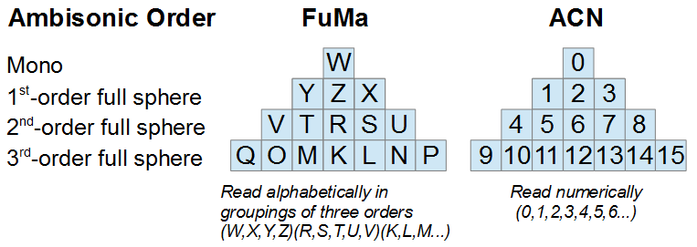

# Ambisonic 通道排序

[Wwise 帮助文档](../../../00-Wwise-帮助文档.md) > [使用声音和振动来提升游戏体验](../../00-使用声音和振动来提升游戏体验.md) > [定义定位](../00-定义定位.md) > [使用 Ambisonics](00-使用-Ambisonics.md) > Ambisonic 通道排序

### Ambisonic 通道排序

用于 Ambisonic 的通道排序格式主要有两种，包括通常称为 FuMa 的 Furse-Malham，和通常称为 ACN 的 Ambisonics Channel Number。如下图所示，前者使用字母标记（各组按照字母排序），从 W（全向）声道开始，到右下角，接着到左下角，再到两者中间；然后到下一阶，从 R 开始，到其右边，再到其左边，到最右边，再到最左边；然后到下一阶，并遵循相似的模式。相比之下，后者即 ACN 的编号顺序从左到右，更容易跟踪。

从顶部通道到第 1、2、3 阶排序，图中还表明各阶 Ambisonic 可以看作分别具有 4, 9 和 16 声道的金字塔结构。<片段1143>

#### Ambisonic ordering within Wwise

在 Wwise 中，Ambisonics 文件的排序可能与初始导入文件或后续导出文件不同。在默认情况下，Wwise 希望导入的 1 ~ 3 阶 Ambisonics 文件使用 FuMa 排序，而高阶 Ambisonics 则始终解释为 AmbiX 格式并使用 ACN 排序。

|  |  |
| --- | --- |
| [技巧] | 技巧 |
| 您可以在 Source Editor（源编辑器）中使用 **Channel Configuration Override**（覆盖声道配置）来更改 Wwise 对文件声道的解释方式。 |

Wwise 将把 FuMa 排序转码为经过 SN3D 归一化的新 ACN 排序，不过会保留直到三阶的 FuMa 字母标记。也就是说，在前面的图像中，FuMa 排序将从左到右读取，对应于 W Y Z X V T R S U Q O M K L N P。电平表以及设计工具中的 Source Editor [图像](../../../08-使用-Wwise/07-了解坐标图视图/00-了解坐标图视图.md "了解坐标图视图")都将使用这种遵循 ACN 排序的混合显示法。

这也意味着自定义插件的开发可以使用这种经 Wwise 转换的 ACN 排序。对于在 Ambisonics 总线上用 Wwise Recorder 插件录制的文件，可使用 FuMa 排序（从而生成可导入 Wwise 的文件）或 ACN 排序。这是由 Ambisonic Channel Ordering（Ambisonics 声道排序）选项决定的。

---