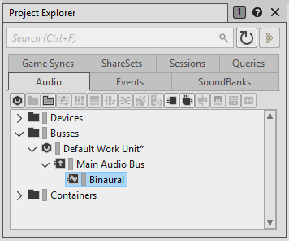
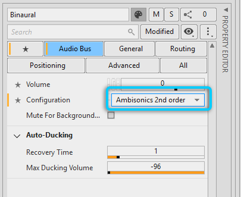

# 在 Ambisonics 总线上设置 Binauralizer 效果器

[Wwise 帮助文档](../../../00-Wwise-帮助文档.md) > [使用声音和振动来提升游戏体验](../../00-使用声音和振动来提升游戏体验.md) > [定义定位](../00-定义定位.md) > [使用 Ambisonics](00-使用-Ambisonics.md) > 在 Ambisonics 总线上设置 Binauralizer 效果器

### 在 Ambisonics 总线上设置 Binauralizer 效果器

您可以使用某些效果器插件（如 Auro Headphone 或 Resonance Audio – 可通过 Audiokinetic Launcher 安装）将 Ambisonics 信号转码为立体声配置；藉此，可将 Ambisonics 格式用作声音的中间表示形式，进而在信号到达最终输出之前有效地进行下混。

**在 Ambisonics 总线上设置 Binauralizer 效果器：**

1. In the Project Explorer, create a new audio bus under the Main Audio Bus. 本例中命名为了 Binaural。

   
2. In the Audio Bus category of the Property Editor for the new bus, set **Configuration** to one of the ambisonic configurations (while respecting the limitations of the plug-in). Ambisonics 阶数越高，空间音频的中间表示精度越高。

   
3. In the Effects tab of the Primary Editor, click **Add
   Effect**
   , then select none, to add an effect.
4. Click the [>>] selector and select an ambisonic binauralizer Effect from the list, such as Auro Headphone or Resonance Audio. 然后，在效果器名称右侧单击 **New**...（新建...）。

   The New Effect dialog opens.
5. 单击 **OK**（确定）。

   这时会在总线上插入新的效果器。虽然总线的配置为 Ambisonics，但 Binauralizer 效果器会将其 Out Config 设为立体声。

   
6. For all sounds that require binaural processing, in the Property Editor of the sound
   object, set the **Output Bus** to the new bus
   you just configured.

---