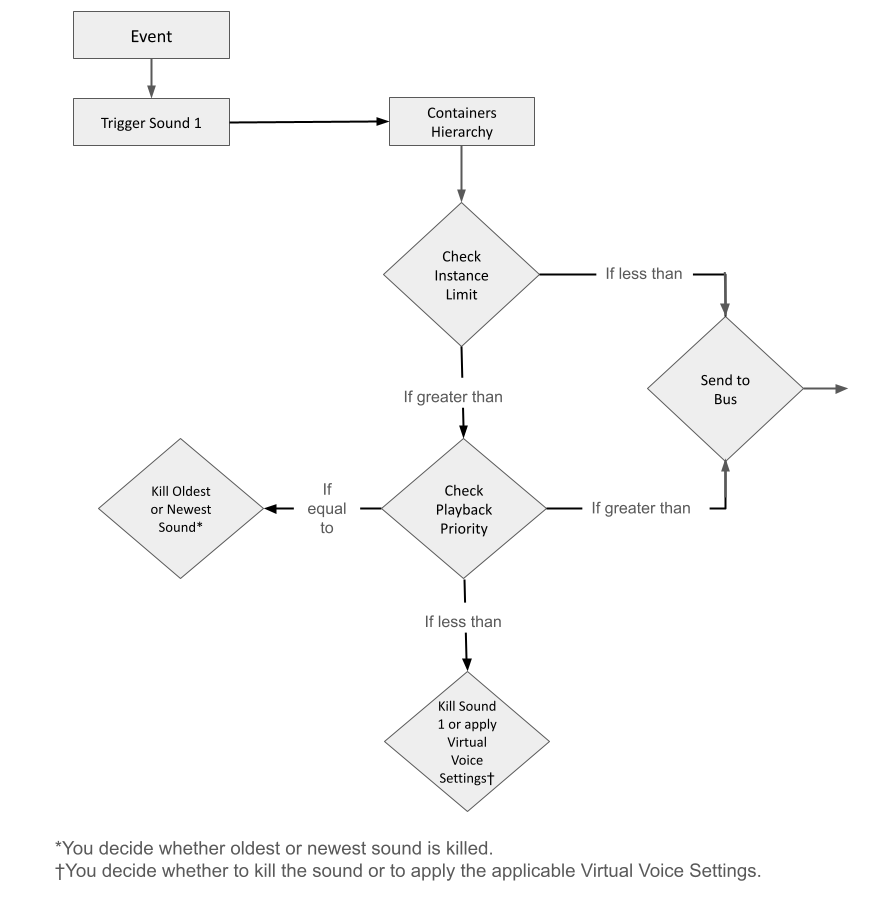

# 了解 Wwise 如何为对象排列优先级

[Wwise 帮助文档](../../00-Wwise-帮助文档.md) > [使用声音和振动来提升游戏体验](../00-使用声音和振动来提升游戏体验.md) > [管理优先级](00-管理优先级.md) > 了解 Wwise 如何为对象排列优先级

## 了解 Wwise 如何为对象排列优先级

Advanced Settings（适用于播放）决定游戏中将可以同时播放哪些对象。These playback settings are defined at two different levels within Wwise: at the object level in the Containers hierarchy, and at the bus level in the Busses hierarchy. 因为这些设置在 Wwise 内的不同层级定义，所以对象必须通过两层独立的处理过程才能播放。

The first process occurs at the level of the Containers hierarchy. 当您在这个层级定义对象的 **Advanced Settings** 时，所设置的是全局或各游戏对象的限制。If the limit is reached, the priority then determines which objects will be passed to the bus level in the Busses hierarchy.

The following flowchart shows how Wwise determines which sound, motion, and music objects within the Containers hierarchy will be played per game object. 事实上，最终决定将哪些对象输出到总线之前，可能需要经过不同父级对象的多次迭代（它们都有各自的限制）。

If the new object is not killed or sent to virtual voice at the Containers hierarchy level, it passes to the second process at the Busses level. 在这个层级，根据总线结构内的声部限制，对象将经历类似的流程。

下面的流程图显示了 Wwise 如何决定哪些对象将通过总线输出。

此时，Project Settings General 选项卡中的工程全局限制 **Max Voice Instances** 将决定声音是被终止，还是根据其各自的 Virtual Voice Settings 将其归入虚声部。

|  |  |
| --- | --- |
| [备注] | 备注 |
| All the properties on the Advanced category of the Property Editor are absolute properties. 有关绝对属性和不沿用父属性的详细信息，请参阅 [“设置绝对属性”一节](../../03-设置工程/06-Building-your-sound-and-motion-hierarchies/04-工程层级结构中的属性介绍/01-设置绝对属性.md "设置绝对属性")。 |

### Volume Threshold 和 Virtual Voices

除了 **Playback Limit** 和 **Playback Priority**，Wwise 还可以根据音量阈值来决定播放哪些声音、音乐和振动对象。当音量降低至音量阈值，或当声音的数量超出 Playback Limit 上限时，会为对象执行以下操作之一：

- 继续播放。
- 终止。
- 移至虚声部列表。

虚声部列表是一种虚拟环境，在这个环境中，声音引擎会监视列表里的声音的特定参数，但不会执行声音处理。如果您选择了该选项，对象则会根据其音量从实声部移至虚声部（反之亦然）。如果音量恢复至音量阈值以上，或声音的数量低于同时播放声音的限制，那么这些对象会自动恢复为实声部。有关音量阈值设置的详细信息，请参阅 [“为工程指定 Volume Threshold”一节](../../03-设置工程/01-处理工程/02-定义工程设置/08-为工程定义音量设置.md#specifying_volume_thresholds_for_project "为工程指定 Volume Threshold")。有关定义较音量较低的对象的行为的详细信息，请参阅 [“管理音量较低的对象”一节](04-管理音量较低的对象.md "管理音量较低的对象")。

---