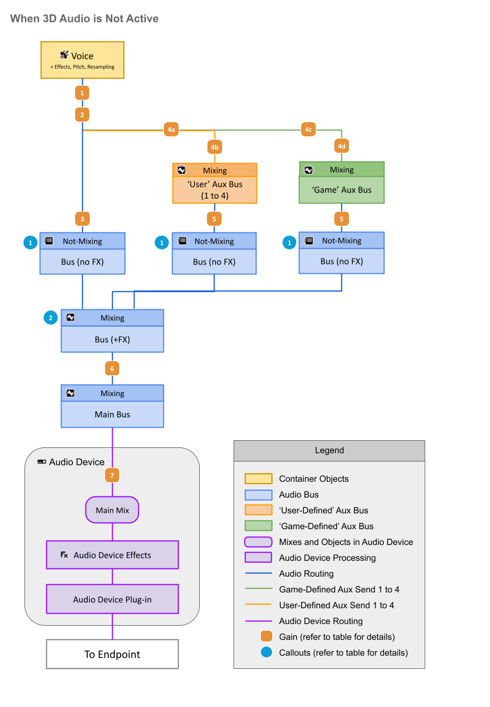
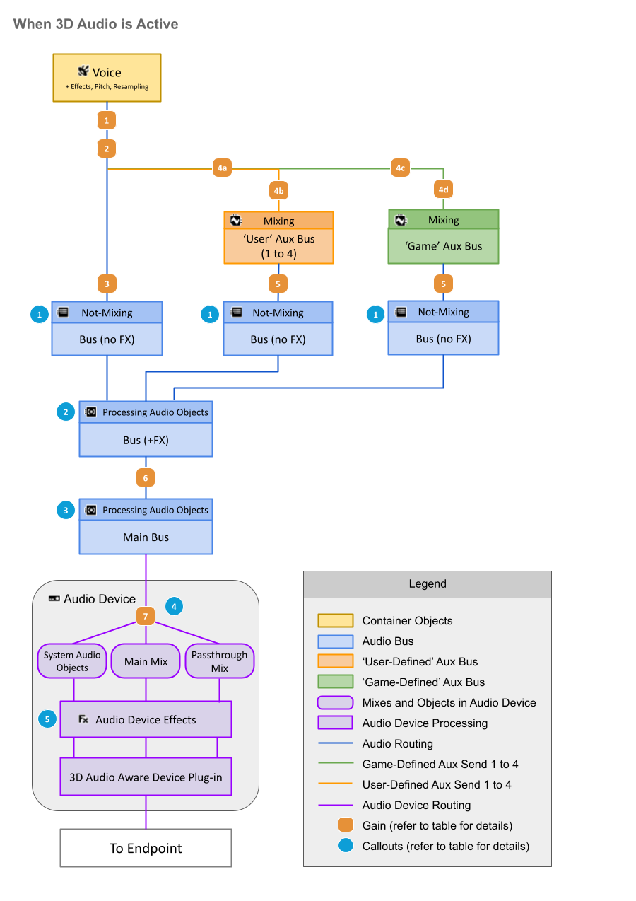

# 了解声部管线

[Wwise 帮助文档](../../00-Wwise-帮助文档.md) > [完善工程](../00-完善工程.md) > [管理输出](00-管理输出.md) > 了解声部管线

## 了解声部管线

以下图示和表格展示了如何处理声部、如何为其设置通路、在哪些环节应用不同的音量和效果器。第一张图显示的是未激活 [3D Audio](../../14-词汇表.md#glossary_3daudio "3D Audio") 的情形。第二张图展示的是激活了 3D Audio 的情形。

|  |  |
| --- | --- |
| **在未激活 3D Audio 时** | |
|  | 这些总线被配置为了 **Same as parent** 且未应用任何效果器。在这种情况下，将把数值应用于通路中的所有条目，但其本身不会实施混音或执行任何处理。 |
|  | 这条总线被配置为了 **Same as parent** 且应用了效果器。在这种情况下，其行为变化取决于是否启用了 3D Audio。 |

|  |  |
| --- | --- |
| **在激活了 3D Audio 时** | |
|  | 这些总线被配置为了 **Same as parent** 且未应用任何效果器。在这种情况下，将把数值应用于通路中的所有条目，但其本身不会实施混音或执行任何处理。 |
|  | 这条总线被配置为了 **Same as parent** 且应用了效果器。在这种情况下，其行为变化取决于是否启用了 3D Audio。 |
|  | The Main Audio Bus is Processing Audio Objects, so no mixing will occur on input. 在这种情况下，将把效果器应用于总线通路中的每个对象。 |
|  | The Audio Objects output by the Main Audio Bus are triaged/mixed here according to their Metadata and what the Sink plug-in supports. 在默认情况下，带有 3D 定位的对象将被归为 System Audio Object，而不会实施混音。对于不带 3D 定位的对象，将根据声道配置实施混音：对于 Mono（单声道）和 Stereo（立体声）对象，将在 Passthrough Mix（直通混音）中混音；对于所有其他对象，则在 Main Mix（主混音）中混音。若要改写此默认行为，请在总线层级结构的相应位置添加 Wwise System Output Settings 元数据插件，或者将其添加到各个音频源。 |
|  | 这里的 Audio Device Effects 启用了 3D Audio 功能，可接收所有 3D Audio 数据（Main Mix、Passthrough Mix 和 System Audio Object），并在一条执行通路中统一应用效果器。 |

| Gain # | 说明 – 无论是否激活 3D Audio 均适用 |
| --- | --- |
|  | 音量应用至所有声道  - 声部音量\*（总线上的 **Voice Volume** 参数以及自动闪避都将作用于这个层级） - 归一化（Normalization）和补偿增益（Makeup Gain） - HDR 信号衰减 - Occlusion  - Project Settings 中的“声笼音量曲线”   - API： [`SetObjectObstructionAndOcclusion()`](https://www.audiokinetic.com/library/edge/?source=SDK&id=namespace_a_k_1_1_sound_engine_a1b3e18a25b405e55ba82de9b70cd11ba.html) - API: [`SetScalingFactor()`](https://www.audiokinetic.com/library/edge/?source=SDK&id=namespace_a_k_1_1_sound_engine_a9b71daa02c5d398d08c9eb0643d52555.html)  LPF 属性和声笼 LPF 曲线（工程设置） |
|  | 各声道独立音量  - 定位  - 2D 声像摆位和 3D 定位   - 中心%   - Distance Attenuation Curve（距离衰减曲线）   - API： [`SetGameObjectOutputBusVolume()`](https://www.audiokinetic.com/library/edge/?source=SDK&id=namespace_a_k_1_1_sound_engine_adf1401ce64872af26cdff05b36e98161.html)   - API： [`SetPosition()`](https://www.audiokinetic.com/library/edge/?source=SDK&id=namespace_a_k_1_1_sound_engine_a789e25bda32d1e11849afb6584942455.html)   - API： [`SetMultiplePositions()`](https://www.audiokinetic.com/library/edge/?source=SDK&id=namespace_a_k_1_1_sound_engine_ad63431938ab1e605a1f6e7fb013c0128.html) - API： [`SetListenerSpatialization()`](https://www.audiokinetic.com/library/edge/?source=SDK&id=namespace_a_k_1_1_sound_engine_a3e3e9e5335df01fca37f9b3ed518e2bd.html) |
|  | “干声路径”  - 输出总线音量 (+ RTPC) - 距离衰减曲线中的“Output Bus Volume”（输出总线音量） - API： [`SetGameObjectOutputBusVolume()`](https://www.audiokinetic.com/library/edge/?source=SDK&id=namespace_a_k_1_1_sound_engine_adf1401ce64872af26cdff05b36e98161.html) - API： [`AkSpeakerVolumeMatrixCallbackInfo()`](https://www.audiokinetic.com/library/edge/?source=SDK&id=struct_ak_speaker_volume_matrix_callback_info.html) - Obstruction  - Project Settings 中的“声障音量曲线”   - API： [`SetObjectObstructionAndOcclusion()`](https://www.audiokinetic.com/library/edge/?source=SDK&id=namespace_a_k_1_1_sound_engine_a1b3e18a25b405e55ba82de9b70cd11ba.html) - 未插入效果的父级总线：音量\*  声障 LPF 曲线（Project Settings） |
|  | “湿声路径”  - - Distance Attenuation 曲线中的 Aux Send 音量  - API： [`AkSpeakerVolumeMatrixCallbackInfo()`](https://www.audiokinetic.com/library/edge/?source=SDK&id=struct_ak_speaker_volume_matrix_callback_info.html) - - User-Defined Auxiliary Sends 音量 (+ RTPC) - - Game-Defined Auxiliary Sends 音量 (+ RTPC) - - API： [`SetGameObjectAuxSendValues()`](https://www.audiokinetic.com/library/edge/?source=SDK&id=namespace_a_k_1_1_sound_engine_af960fca0239e219b9d08c2659fe9e5d4.html) |
|  | - 总线音量\*\* - 定位  - 2D 声像摆位和 3D 定位   - Center %   - Distance Attenuation Curve（距离衰减曲线） - API： [`AkSpeakerVolumeMatrixCallbackInfo()`](https://www.audiokinetic.com/library/edge/?source=SDK&id=struct_ak_speaker_volume_matrix_callback_info.html) - 未插入效果的父级总线：总线音量\*\* |
|  | - 总线音量\*\* - 定位  - 2D 声像摆位和 3D 定位   - Center %   - Distance Attenuation Curve（距离衰减曲线） - 未插入效果的父级总线：总线音量\*\* |
|  | - 总线音量\*\* |

\* 声部音量 = 音量滑杆 + RTPC + 状态 + Set Voice Volume Action （动作）

\*\* 总线音量 = 滑杆 + RTPC + 状态 + Set Voice Volume Action （动作）

---