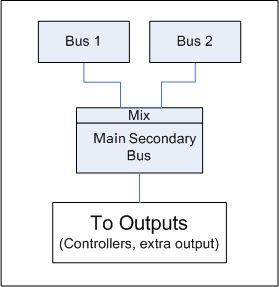
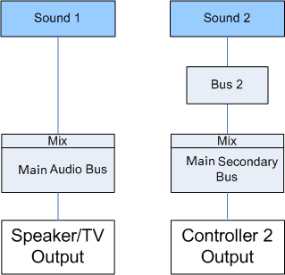
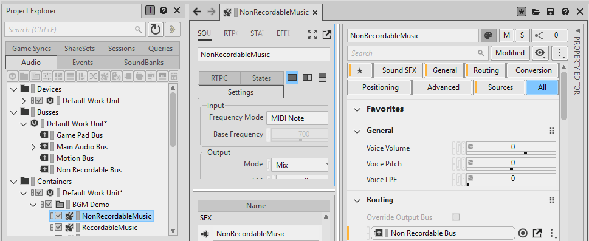
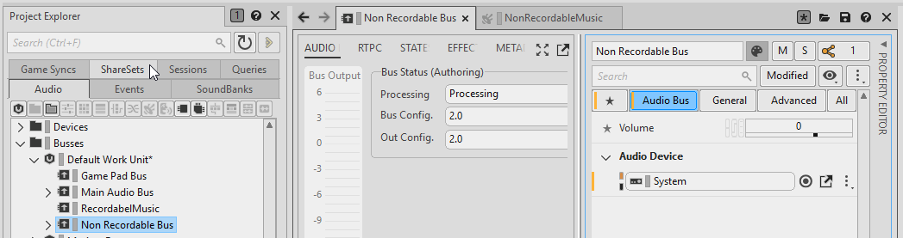
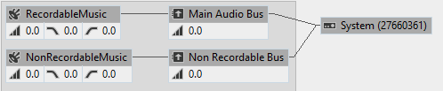

# 了解 Secondary Output

[Wwise 帮助文档](../../00-Wwise-帮助文档.md) > [完善工程](../00-完善工程.md) > [管理输出](00-管理输出.md) > 了解 Secondary Output

## 了解 Secondary Output

术语“Secondary Output”（二路输出）指的是主电视或主扬声器之外的任何音频输出。对于这些输出，必须根据不同情况独立完成音频混音。You can have as many main secondary busses as you need for each of the expected outputs of the game. 最常见的二路输出是游戏控制器上的扬声器或耳机。也存在其它独立的输出（聊天、背景音乐、耳机等）。本章的下面部分将围绕游戏控制器扬声器进行讨论，但也可以应用至其它所有类型的输出。

To output something on a secondary output, sounds need to be routed to the main secondary bus hierarchy using one of the two following approaches:

- **将声音的 Output Bus 属性直接设置为二路输出层级中的总线。** 这与其他声音路由的工作方式相同。对于通常只与一个二路输出相关联的声音，这是首选方法。例如，玩家发起的枪声，网球拍，PDA声音和玩法反馈等。
- **Routing a sound through any bus in the Main Audio Bus hierarchy and adding a user or game send to an Auxiliary Bus inside the secondary bus hierarchy.** This is the preferred method if the same sound is going to be heard from multiple outputs and/or the TV at the same time. 例如间谍相机和广播等。

总线层级只是混音时使用的层级结构。To associate that mix to a specific output, choose the appropriate [Audio Device ShareSet](06-内置音频设备.md "内置音频设备") on the corresponding main secondary bus.

必须要注意的是，对于游戏中多个玩家可能同时使用的输出端（如游戏控制器、耳机等），相关混音层级结构会针对每个玩家进行复制。对于特定类型的输出，工程定义的仅仅是特定的混音“处方”。实际信号输出到该结构的哪个副本则取决于听者和游戏对象的关系，是由程序员设置的。以下示例对此进行了说明。

- [“Secondary Output 示例”一节](07-了解-Secondary-Output.md#secondary_output_examples "Secondary Output 示例")
- [“Background Music 与 DVR 混音示例”一节](07-了解-Secondary-Output.md#secondary_output_dvr "Background Music 与 DVR 混音示例")
- [第三方和自定义 Audio Device](https://www.audiokinetic.com/library/edge/?source=Help&id=third_party_custom_audio_devices)

### Secondary Output 示例

Secondary Bus 层级的所有示例都将使用以下所示的总线结构。Main Audio Bus 层级将被省略。对于每路输出，该结构都将被复制，因此最终的混音是独立的。请注意，只有所需的总线将被实例化。

**图 1. Main Secondary Bus structure**

  

**图 2. 声音进入主输出的简单示例**

  

这是进入主输出的一个声音的简单示例。在常规游戏中，很多声音将被连接至多个子总线。但为简单起见，让我们假设电视输出中仅播放一个声音。

**图 3. 声音进入第二个玩家控制器输出的简单示例**

  

这次让我们在第二个玩家的游戏控制器中播放另一个声音。这次以菜单声为例，假设该玩家在使用菜单，而其它玩家没有。在这种情况下，声音应该独立输出至其总线中，而不进入电视混音。事实上，通过设置游戏听者与游戏对象的关联，该声音将仅在玩家的 2 号控制器中播放。在这里，程序员播放该声音的游戏对象将仅会被控制器 2 的听者所听到。

**图 4. 声音传输至玩家 1、玩家 2 和电视。**

|  |
| --- |
| 声音传输至玩家 1、玩家 2 和电视。 |

  

该示例表明两点：声音可以连线至多个二路输出，并可以连线至电视混音。在本示例中，这可以是玩家 1 发出的预先录制好的无线电求助呼叫，该呼叫可以被玩家 2 听到，因为他们属于同一团队，呼叫声也可以出现在电视中，因为电视角度靠近玩家 2 发出的声音。请注意，该声音的输出总线被设置为总线 1。This bus is duplicated for player 1 and 2, as is the main secondary Bus. 显然，玩家 2 听到的混音必须包含 Sound 2（只有其能听到该声音）及 Sound 1。Both copies of the Main Secondary Bus will have the same effects applied (if any), but won't do so on the same audio signal.

您还应注意到，声音 3 发出的 Send 进入电视混音。可以使用所有类型的 Send，以发送至其它输出。在本例中，由于呼叫也可被“摄影机”听到（根据距离和衰减），因此也需要进入主电视混音。该呼叫将从设定的辅助总线“进入”该混音。

### Background Music 与 DVR 混音示例

通过 PS4、PS5、Xbox One 和 Xbox Series X 的 DVR 功能录制受版权保护的音乐通常是不允许的。这些平台提供有专门的虚拟设备来单独管理音乐并防止进行录音。在 Wwise 中，这也意味着需要在单独的层级中为音乐混音。我们在 Integration Demo 工程中实现了这个功能。您可以查看 NonRecordable\_Bus，以及 RecordableMusic 和 NonRecordableMusic 声音的设置。代码方面可以查看 DemoBGM.cpp。

NonRecordableMusic（不可录制音乐）被输出到 Non Recordable Bus（不可录制总线），该总线将其信号输出到 DVR\_Bypass 输出中，如下所示：

**图 5. 路由至 NonRecordable\_Bus 的声音**

  

**图 6. 总线 Audio Device 设置为 DVR\_Bypass**

  

在代码方面，为实现该效果所需的处理非常简单。游戏必须使用 Audio Device ShareSet 名称调用 [`AK::SoundEngine::AddOutput()`](https://www.audiokinetic.com/library/edge/?source=SDK&id=namespace_a_k_1_1_sound_engine_a15ab79f954a307902f529d8ccde8ad48.html) 来初始化输出。

在 Wwise 的 Advanced Profiler 中，我们可以看到每个声音都输出至单独的总线和输出。在支持的平台上一般都是如此。（注意，中间的音乐总线被省略了。）

**图 7. Two main busses mixing in separate outputs**

  

在 Wwise 支持的其他平台上均没有 DVR 功能，所以我们要做一些不同处理。在这种情况下，如果不希望游戏音乐缺失，您必须正确地将其输出。您仅需正确地将音频设备 Unlink（取消链接），即可解决该问题。In the main bus Property Editor, the Audio Device property can also be unlinked. 在下面的示例中，我们将 Non Recordable Bus 输出至普通系统输出。不过对于支持的平台，其仍会输出到 DVR\_Bypass。正因如此，Link（链接）图标才有一半是橙色的。这就是我们在 Integration Demo 工程中的处理方式。这种情况下，代码不需要调用 `AK::SoundEngine::AddOutput` 来初始化输出，因为系统输出总是在启动时初始化。

**图 8. 音频设备被设置为系统输出**

  

播放这两种声音时，我们看到两个音频源信号分别通过独立的总线，但是它们最终混合在同一个系统输出中。

**图 9. Two main busses mixing in device**

---