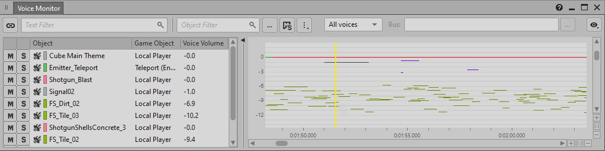

# 了解声部性能分析视图

[Wwise 帮助文档](../../00-Wwise-帮助文档.md) > [完善工程](../00-完善工程.md) > [性能分析](00-性能分析.md) > 了解声部性能分析视图

## 了解声部性能分析视图

Wwise 的声部性能分析工具作为对[游戏性能分析](02-探索游戏性能分析视图.md "探索游戏性能分析视图")的补充，可帮助分析工程的基本构成元素：声部。

Voice Profiler（声部性能分析器）布局整合了其他布局中常用的多个视图，其中有三个主要用来执行声部性能分析：[“Voice Explorer”一节](03-了解声部性能分析视图.md#exploring_voice_explorer "Voice Explorer")、[“Voice Inspector”一节](03-了解声部性能分析视图.md#exploring_voice_inspector "Voice Inspector") 和 [“Voice Monitor”一节](03-了解声部性能分析视图.md#exploring_voice_monitor "Voice Monitor")。

|  |  |
| --- | --- |
| [技巧] | 技巧 |
| 在 Wwise 中，默认情况下您可以按 **F11** 来切换到 Voice Profiler 布局。 |

  

### Voice Explorer

在捕获会话过程中和完毕后，Voice Explorer（声部资源管理器）会根据 Performance Monitor（性能监控器）或 Voice Monitor（声部监控器）中选定的时间点显示捕获的活跃声部列表。您可以从这些声部中选择一个来显示在 Voice Inspector（声部检视器）中。

### Voice Inspector

此视图中显示的内容与 Voice Explorer 或 Voice Monitor 视图中所选的声音相关。Voice Inspector 的 Voices Graph（声部图）和 Contribution List（影响列表）面板会显示声部工作流和影响最终音量输出的元素。

### Voice Monitor

在捕获会话过程中和完毕后，Voice Monitor 会显示捕获信息时间线，并列出播放的每一个声部及其相关音量。在时间线上选择某个时间点时，将列出当时活跃的所有 Wwise 和关联游戏对象及其声部音量。

---