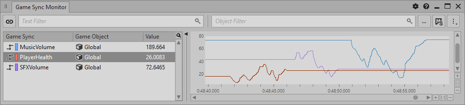

# 了解 Game Object 性能分析视图

[Wwise 帮助文档](../../00-Wwise-帮助文档.md) > [完善工程](../00-完善工程.md) > [性能分析](00-性能分析.md) > 了解 Game Object 性能分析视图

## 了解 Game Object 性能分析视图

Wwise 的游戏对象性能分析工具包括三个视图，通过配合使用，可以帮助您监控游戏对象以及它们对游戏音频和振动的影响。这三个视图在 Game Object Profiler 布局中可以同时查看。

|  |  |
| --- | --- |
| [技巧] | 技巧 |
| 在 Wwise 中，可以按 **F12** 键切换至 Game Object Profiler 布局。 |

### Game Object 3D Viewer

Game Object 3D Viewer 即三维对象查看器，能够查看游戏对象、与其他游戏对象的关系，以及它们成为听者之后的情况。您可以对Game Object 3D Viewer 进行设置，使其显示不同类别的数据并改变不同游戏对象的呈现方式。

### Game Sync Monitor

Game Sync Monitor（游戏同步器监控器）是实时分析 RTPC 数值的工具。此视图会显示 Game Parameter（游戏参数）、Modulator（即 LFO、Envelope 和 Time）和 MIDI 参数的值随时间的变化。

---