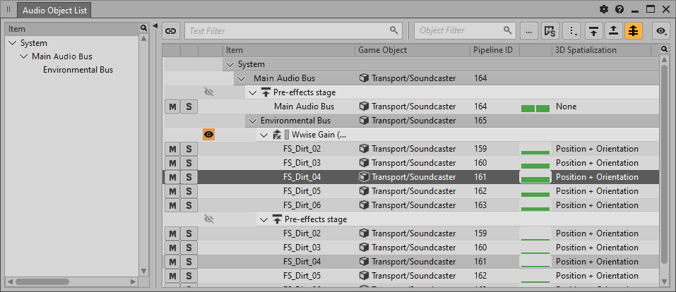
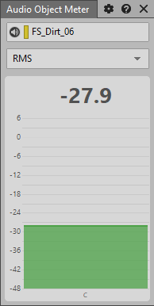

# 了解 Audio Object 性能分析视图

[Wwise 帮助文档](../../00-Wwise-帮助文档.md) > [完善工程](../00-完善工程.md) > [性能分析](00-性能分析.md) > 了解 Audio Object 性能分析视图

## 了解 Audio Object 性能分析视图

在 Wwise 中，可结合运用以下视图来监控总线管线内 Audio Object 的状态。只需选择 Audio Object Profiler（音频对象性能分析器）布局便可查看所有这些视图。

### Audio Object 3D Viewer

Audio Object 3D Viewer（音频对象 3D 查看器）提供了 Audio Object 相对于听者位置和朝向的详细定位信息。同时，视图中还显示了散布范围（表示为在围绕听者的球体上投射的圆）。您可以通过配置 Audio Object 3D Viewer 来显示不同类型的信息。而且，还可根据需要更改显示设置。

### Audio Object List

Audio Object List（音频对象列表）视图提供了总线管线内 Audio Object 的详细信息。视图以树状结构显示了在当前性能分析器光标时间位置实例化的总线和 Audio Object。

Audio Object List 还可用来选择要在其他三个 Audio Object 视图（Audio Object 3D Viewer、Audio Object Metadata 和 Audio Object Meter）中显示的 Audio Object。

### Audio Object Metadata

Audio Object Metadata（音频对象元数据）视图提供了当前所选 Audio Object 的详细元数据信息。

### Audio Object Meter

Audio Object Meter（音频对象电平表）以扩展视图的形式提供了当前所选 Audio Object 的测量数据。您可以根据需要将该电平表设为 Peak（峰值）或 RMS（均方根）模式。

---