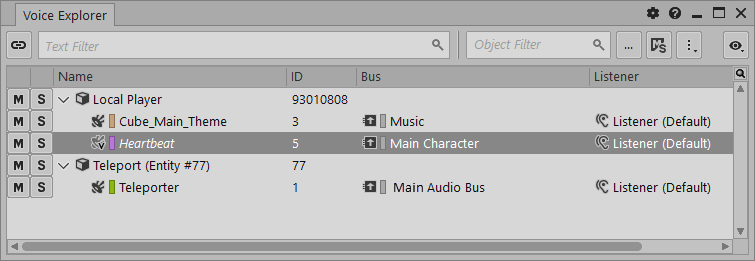
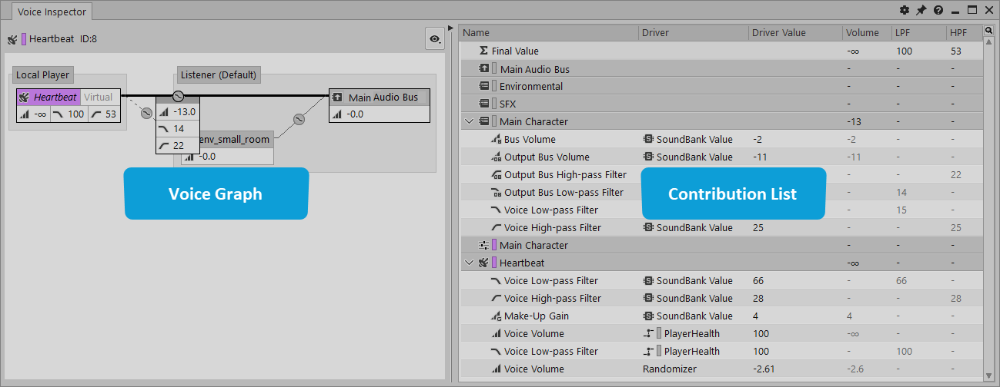
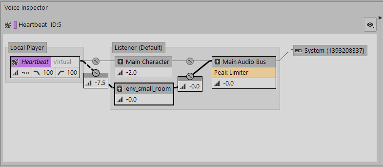
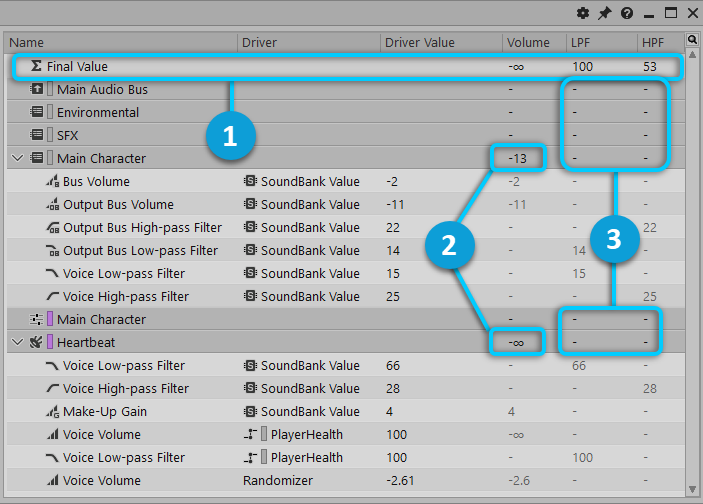

# 使用 Voice Inspector 分析声部

[Wwise 帮助文档](../../00-Wwise-帮助文档.md) > [完善工程](../00-完善工程.md) > [性能分析](00-性能分析.md) > 使用 Voice Inspector 分析声部

## 使用 Voice Inspector 分析声部

为什么这个声音的音量那么大？为什么我听不到这个声音？声音设计师经常会问这样的问题。经过各个层级结构的声音、衰减、Event（事件）、RTPC 和总线的影响，可能很难查明 Wwise 中音量输出电平异常问题的原因。利用 Voice Inspector，用户可以快速查出所有声部的音量驱动因素。

在 Voice Explorer（声部资源管理器）或 Voice Monitor（声部监控器）中选择声音时，将在 Voice Inspector（声部检视器）的 Voice Graph（声部图）中自动选择[干声路径](../../14-词汇表.md#glossary_dry_path "干声路径")，同时在 Contribution List（影响列表）中显示选定干声路径的完整层级结构。All changes made to the Volume/LPF/HPF/DSF are displayed in the Contribution List including RTPCs, States, Distance and Cone Attenuations, and Event Actions. 这些参数会实时更新并与 Performance Monitor/Voice Monitor（性能监控器/声部监控器）时间光标保持同步，方便用户通过移动时间光标来对比这些值随时间的变化。

### Voice Explorer

Voice Explorer 视图包含所有当时正在播放声音（无论虚实）的 Game Object（时间由 Performance Monitor/Voice Monitor 的时间光标指定）。在对应 Game Objects 下，可能会显示一个或多个活跃声音。在同一 Game Object 当前播放该声音的多个实例时，声音名称会在 Game Object 下出现多次。However, each instance has a different ID and its own Volume/LPF/HPF/DSF profiled independently.

在 Voice Explorer 中选择声音来更新 Voice Inspector 的 Voice Graph 和 Contribution List。默认选择干声路径。每次仅可显示一个声音。

双击声音来打开 Property Editor（属性编辑器）。右键单击声音来显示[标准快捷菜单](../../02-入门/05-提供工作效率/00-提供工作效率.md#using_shortcut_menus "Using shortcut menus")。

### Voice Inspector

Voice Inspector 视图包含 Voice Graph（左侧）和 Contribution List（右侧）。此视图中显示的内容与 Voice Explorer 或 Voice Monitor 视图中所选的声音相关。

Voice Graph 会显示从音频源到输出的所有声部信号路径。Since the Volume/LPF/HPF/DSF properties can have different values across the signal paths, only one path is active at a time. 对于活跃路径，会高亮显示声部图节点之间的连线。Contribution List 中会显示属性影响及选定路径。对于不属于选定路径的属性，将不予显示。

若要显示不同路径的属性值，请单击声部图节点或所需路径对应的连线。如需检视具有多个发送的路径（常见于 Spatial Audio 场景），可同时选择多个节点（Ctrl+单击）。

在此，可使用双击和右键单击等标准 Voice Graph 操作。

Select an object in the Voice Graph, such as the Main Audio Bus shown in the following image, to highlight the object and the associated path in the Voice Graph. 同时，还会在 Contribution List 中高亮显示该对象及其子对象。

The Contribution List contains, for the selected voice path of the selected sound,
all the parent objects from the Busses and Containers
hierarchies that modify the Volume/LPF/HPF/DSF, including all audio and Auxiliary Busses
involved in mixing the selected sound.

The Contribution List displays the actual value for Volume/LPF/HPF/DSF under each object of the hierarchy. Driver（驱动因素）和 Driver Value（驱动因素值）列会详细显示哪些因素导致了属性变化。若要转到属性页面以便查看属性变化，请双击属性名称。

### Final Value 和部分和

在 Contribution List 中，顶部的 Final Value（最终值）行会显示所有修改的累计结果。在 Volume（音量）列中，会针对每个适用对象行显示部分和。其表示选定路径节点所做的直接音量修改。注意，LPF 和 HPF 列中并未提供部分和，因为其累计方式因声部管线中应用修改的位置而异；有时取累加值，有时取最大值或最小值。The final DSF value is a weighted average of DSF values of each applicable object row where each DSF value is weighted (multiplied) by its corresponding volume.

|  |  |
| --- | --- |
|  | Final Value 行会显示所有修改的累计结果。 |
|  | Volume 列会针对每个适用对象显示部分和。 |
|  | Partial sums are *not* indicated in the LPF, HPF, and DSF columns. |

|  |  |
| --- | --- |
| [备注] | 备注 |
| 对于未经修改的值，将不予显示。不过，对于曾经修改过的值，倘若恢复为中间值 (0 dB)，则将持续显示。 |

### 使用 Voice Inspector

您可以在连接游戏的情况下或直接在 Wwise 设计工具中使用 Voice Inspector。

**设置 Voice Inspector：**

1. 转到 Voice Profiler（声部性能分析器）布局 (F11)，或直接打开 Voice Inspector（声部检视器）视图。
2. 在 Voice Inspector 中，单击右上角的“设置”图标或按下 Alt+G，打开 Profiler Settings（性能分析器设置）视图。
3. 启用 **Voices Data**（声部数据）和 **Voice Inspector Data**（声部检视器数据）。

**捕获数据：**

1. 在 Project Explorer（工程资源管理器）中，使用源文件来添加 Sound SFX（音效）。请将其设为无限循环。
2. In the Primary Editor's RTPC tab, add one or more RTPC curves attached to at least one
   value (of Volume, LPF, HPF, or Output Bus DSF).
3. Optionally, in the Property Editor, add an Attenuation ShareSet, and in the Attenuation
   Editor, enable **Cone Use**.
4. 在 Wwise 工具栏中，单击 Start Capture（开始捕获）。(Alt+C)
5. 在 Transport Control（走带控制）中，播放声音。(空格键)
6. 调节各项设置，比如：

   - 在 Attenuation Editor 中，移动 Distance Attenuation（距离衰减）和 Cone Attenuation。
   - In the Property Editor of the Main Audio Bus or the sound, change the base value of
     Volume, Pitch, Low-pass Filter, or High-pass Filter.
7. 停止捕获。(Alt+C)

At this point, the Voice Inspector has recorded all modifications to Volume/LPF/HPF/DSF on this voice. 若要查看这些修改，请打开 Voice Inspector 并在 Voice Monitor 中移动时间光标。

**查看捕获的数据：**

1. 确保打开 Voice Explorer（声部资源管理器）、Voice Inspector（声部检视器）和 Voice Monitor（声部监控器）视图（在默认情况下，Voice Profiler 布局同时包含三个视图）。
2. 在 Voice Monitor（声部监控器）中往回拖动时间光标，直到 Voice Explorer（声部资源管理器）中显示所述循环声音。在 Voice Explorer（声部资源管理器）视图中选中声音。
3. 在 Voice Explorer（声部资源管理器）中选择声音后，Voice Inspector（声部检视器）视图的左侧面板 (Voice Graph) 中会显示整条声部信号流。若在 Voice Graph（声部图）中选择节点，则会显示具体的声部路径，同时相应地更新右侧面板 (Contribution List)。
4. Move the time cursor back and forth in the Voice Monitor to see the
   modifications to Volume/LPF/HPF/DSF during the capture.

   |  |  |
   | --- | --- |
   | [技巧] | 技巧 |
   | Performance Monitor 或 Voice Monitor 中时间光标的移动跟其他视图是同步的。 |

### 有关特定属性显示方式的说明

为了充分了解 Voice Inspector（声部检视器）中显示的值，请注意以下事项。

- In general, if the same Driver is affecting Volume, LPF, HPF, and/or DSF, it will use only one line.
- **Project Value/SoundBank Value** （工程值/音频包值）：一般通过滑杆（如声音的主音量滑杆）修改的值会写入 SoundBank（音频包）并由游戏加载。在将性能分析器连接到游戏时，这些值会显示为 SoundBank Value。若仅使用性能分析器而不连接游戏（直接开始捕获），则这些基础声音属性将显示为 Project Value。在连接游戏时，任何在捕获之后对这些值所做的调节都会被视为 Live Edit。
- **Live Edit**（实时编辑）：假如在连接游戏时更改属性值，将在 Contribution List（影响列表）中显示为 Live Edit 条目，对应于所应用的偏置。因此，若原始音量为 -10 dB 且滑杆被移到 -4，则 Live Edit 将显示 +6，而 SoundBank Value 保持不变。不过，两者的总和会反映实际音量 (-4 dB)。此规则同样适用于未连接游戏时修改的值。在连接游戏时，Wwise 会将新的修改推送给游戏，同时显示为 Live Edit。这样便于识别需要重新生成的过时 SoundBank。

  |  |  |
  | --- | --- |
  | [备注] | 备注 |
  | 根据何时连接远程平台、何时加载 SoundBank 以及是否重新连接或重新捕获，Voice Inspector 会显示不同的 Live Edit 条目。  - 对于在连接远程平台之前经过编辑而又未保存到所生成的 SoundBank 的属性值，若未加载对应 SoundBank 即加载这些数值，则其将被标记为 Live Edit。同时，SoundBank Value 将被标记为 0，意味着该值被直接忽略。 - 对于上次捕获的 Live Edit 值，在重新开始捕获或重新连接远程平台时会将其标记为 SoundBank Value。 |
- **Event Actions**（事件动作）：在同时有多个活跃的 Action 时，Set/Reset Volume/LPF/HPF（设置/重置音量/LPF/HPF）会合并显示一个当前有效值。比方说，假如针对爆炸声发送了一个 Play Event，并利用第一个 Set Volume Action 将其设为 Absolute 30 dB，然后利用第二个带有 10 秒延迟的 Set Volume Action 将其设为 Relative -20 dB。那么，在触发 Event 大概 10 秒之后，爆炸声对象节点下的 Voice Vol 将会显示为 10。如需进一步查看 Set Volume 动作，请转到 Capture Log（捕获日志）。
- **Attenuation**: The Volume, LPF, HPF, and DSF values of an Attenuation correspond to its emitter-listener pair (also known as a "ray") values. When there are multiple listeners or multiple positions, the Attenuation values represent the maximum Volume, the minimum values of the low and high pass filters and the total gain of the dual-shelf filters among all of the Attenuation's emitter-listener pairs. Expand the Attenuation object node and then its respective rays to view details on any applicable Distance Attenuation, Cone Attenuation, Obstruction, Occlusion, Diffraction, and/or Transmission values, which combine to constitute a ray's values.
- **Source**（源）：此处不会显示 Source Editor（源编辑器）中设置的 Fade In（淡入）和 Fade Out（淡出），因为其会在转码时写入音频文件。
- **Fades**（淡变）：Event Action（Play、Stop、Mute、Unmute、Pause 和 Resume）产生的淡变只有在其不断改变音量时才显示。一旦淡变完成，Contribution List 中将不再显示淡变的行。各个淡变源均会单独显示。
- **RTPC**：在 RTPC 导致属性发生变化时，会将 Game Parameter（游戏参数）显示为 Driver，并在 Driver Value（驱动因素值）列中列出当前的参数值。The corresponding change, once the RTPC curve transforms the value, appears in the Volume, LPF, HPF, or DSF column.
- **States**（状态）：在 State 导致属性发生变化时，将在 Driver 列中列出 State Group（状态组），并在 Driver Value 列中显示当前 State。Volume、LPF 或 HPF 列中会显示属性的相应变化。
- **HDR Window**（HDR 窗口）：因 HDR 窗口变化导致的声音衰减将会显示为 Voice Volume (HDR) 条目，同时会将 HDR 总线显示为 Driver，并在 Driver Value 列中列出 HDR Window 音量。Volume 列中将会报告实际的音量变化（单位为 dB）。
- **Room Bus Normalization**（房间总线归一化）：Spatial Audio 中用来代表 Room 的 Auxiliary Bus（辅助总线）将根据源自该总线的传出连接数对输出进行归一化处理。比如，对于带有两条传出连接的 Room 总线，在选择其中一条传出连接时，通常会在 Voice Graph（声部图）中报告 -6 dB。Contribution List（影响列表）中并不会另行报告该归一化值。

**相关主题**

- [Wwise Fundamentals Module 12: Understanding the Master Audio Bus (Main
  Audio Bus)](https://www.audiokinetic.com/en/courses/wwise101/?source=wwise101&id=using_master_mixer_hierarchy)

---