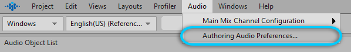
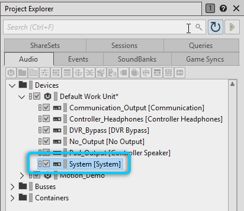
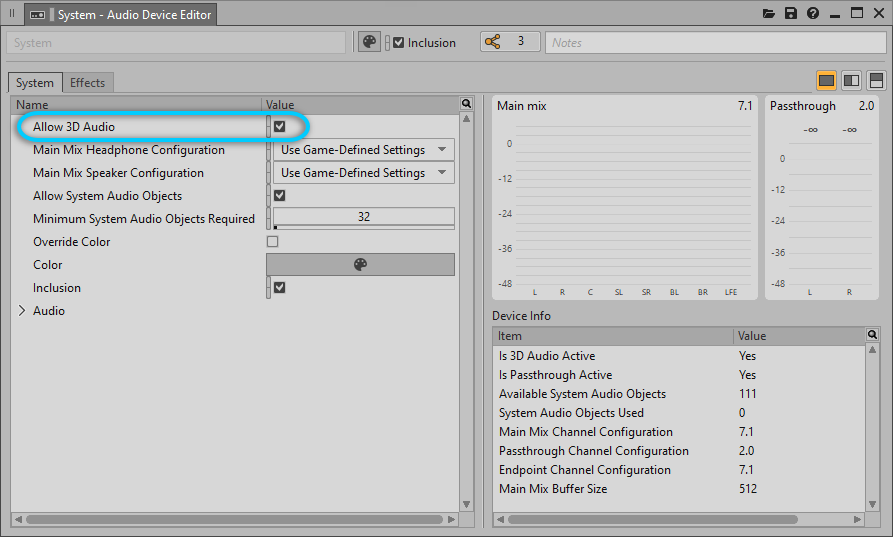
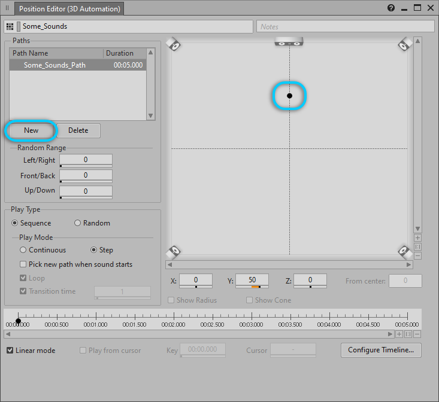
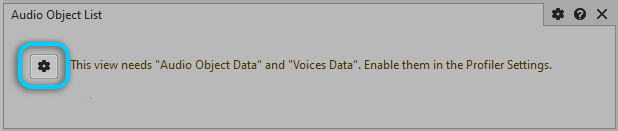
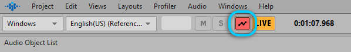
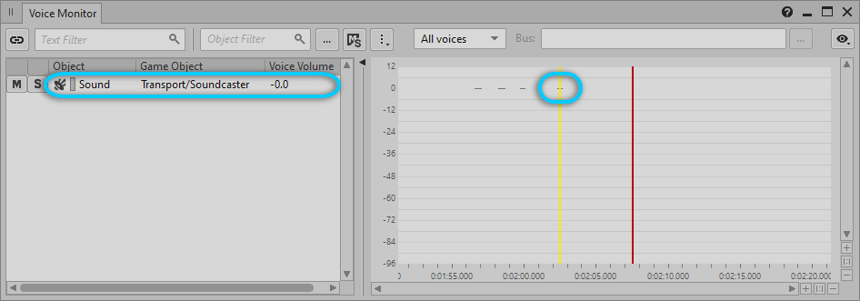
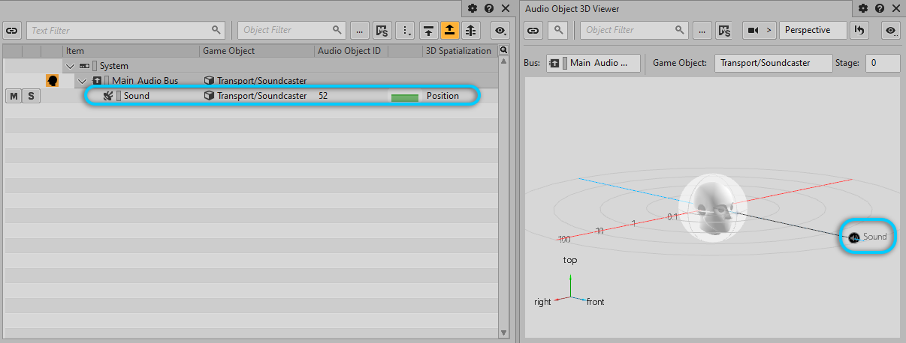

# 对 Audio Object 实施性能分析

[Wwise 帮助文档](../../00-Wwise-帮助文档.md) > [完善工程](../00-完善工程.md) > [性能分析](00-性能分析.md) > 对 Audio Object 实施性能分析

## 对 Audio Object 实施性能分析

Wwise 中的性能分析功能允许监控总线管线内 Audio Object（音频对象）的状态。它可以提供有关 Audio Object 的详细信息，比如散布、元数据、电平表以及相对于听者位置和朝向的位置。

1. 若在 Windows 上设计，请启用 [Windows Sonic](https://support.microsoft.com/en-us/windows/how-to-turn-on-spatial-sound-in-windows-10-ca2700a0-6519-448d-5434-56f499d59c96)。这样可以建立一个 Spatial Audio 终端来接收并处理来自 Wwise 的 Audio Object。

   
2. 在 Wwise 菜单栏中，依次选择 **Audio** > **Authoring Audio Preferences...**（音频 > 设计工具音频首选项...）。

   这时将打开 Authoring Audio Preferences 对话框。

   
3. 在 Authoring Audio Preferences（设计工具音频首选项）对话框中，选中 **Allow System Audio Objects**（允许系统音频对象）。

   

   |  |  |
   | --- | --- |
   | [备注] | 备注 |
   | 与游戏引擎不同的是，要想对通过 Wwise 设计工具播放的 Audio Object 实施性能分析，必须启用 System Audio Object 以供 Wwise 使用。 |
4. 在 Project Explorer（工程资源管理器）的 Audio（音频）选项卡中，双击 System Audio Device（系统音频设备）。

   这时将打开 System Audio Device Editor（系统音频设备编辑器）。

   
5. 在 System Audio Device Editor 中，选择 **Allow 3D Audio**（允许 3D 音频）。这样会允许 Audio Device 尝试激活终端的 [3D Audio](../../14-词汇表.md#glossary_3daudio "3D Audio") 功能。

   

   |  |  |
   | --- | --- |
   | [备注] | 备注 |
   | 启用该选项并不意味着一定会激活 3D Audio；只有在平台支持的情况下才会激活 3D Audio。有关此视图中其他元素的详细信息，请参阅 [Audio Device Editor：System](https://www.audiokinetic.com/library/edge/?source=Help&id=audio_devices_editor) 章节。 |
6. Open the Property Editor for the sound you would like to profile and do the following:

   - 将 **3D Spatialization**（3D 空间化）设为 **Position**（位置）。
   - 将 **3D Position**（3D 定位）设为 **Emitter with Automation**（发声体自动化）。
   - Click the **Edit the 3D Automation Paths** button. 这时将打开 Position Editor (3D Automation)（位置编辑器(3D 自动化)）视图。

   

   |  |  |
   | --- | --- |
   | [备注] | 备注 |
   | 通过将 3D 位置指派给声音，可在 Audio Object 3D Viewer（音频对象 3D 查看器）中显示 Audio Object 相对于听者的位置。 |
7. 在 Position Editor (3D Automation) 视图中，单击 **New**（新建）按钮。

   这时将创建一条偏离原点的路径。

   
8. 在菜单栏中，依次选择 **Layouts** > **Audio Object Profiler**（布局 > 音频对象性能分析器）。

   这时将打开 Audio Object Profiler 布局。

   
9. 在布局左上角的 Audio Object List（音频对象列表）视图中，单击 View Settings（视图设置）按钮。

   这时将打开 Profiler Settings（性能分析器设置）对话框。

   
10. 在 Profiler Settings 对话框中，选择 **Audio Object Data**（音频对象数据）和 **Voices Data**（声部数据）选项。
11. 单击 Start Capture（开始捕获）按钮来开始捕获性能分析数据。

    
12. 在菜单栏中，依次选择 **Views** > **Transport Control**（视图 > 走带控制），然后播放想要实施性能分析的声音。
13. 在布局底部的 Voice Monitor（声部监控器）视图中，向左拖动时间光标（黄线），直至在列表中看到该声音。

    

    此时，Audio Object List 视图和 Audio Object 3D Viewer 中会显示 Audio Object。

    
14. 在 Audio Object List 视图中选中声音。

    这时 Audio Object Metadata（音频对象元数据）和 Audio Object Meter（音频对象电平表）视图中会显示与所选 Audio Object 对应的数据。

    

    

---