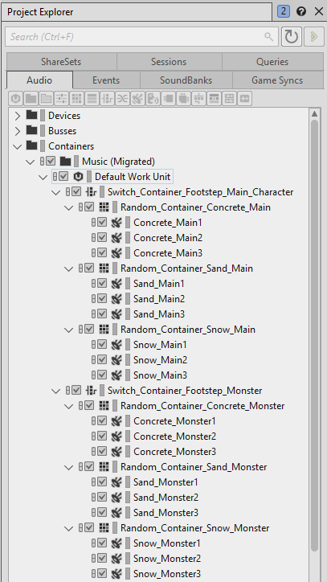

# 预备 Event 和 Game Sync（Switch 和 State）

[Wwise 帮助文档](../../../00-Wwise-帮助文档.md) > [完善工程](../../00-完善工程.md) > [管理 SoundBank](../00-管理-SoundBank.md) > [SoundBank 管理策略](00-SoundBank-管理策略.md) > 预备 Event 和 Game Sync（Switch 和 State）

### 预备 Event 和 Game Sync（Switch 和 State）

此方法适用于以下情形：

- 需要将媒体设为很高的粒度级别以保持较低的内存用量。
- 不想为将媒体素材拆分到多个 SoundBank 而烦恼。
- 工程中的 Event 根据切换开关和状态播放不同的声音。
- 工程中包含根据切换开状和状态播放音乐的互动音乐。

此方法基本与上一种方法相同，但对 Event 做 Prepare 时加载的媒体具有更大的控制力。使用这种方法时，只有 Prepare 的事件和当前活跃的 Game Sync 同时相关的媒体才会加载到内存中。

假设一个简单的工程中有两个 Event ："Play\_Maincharacter\_FootSteps"和"Play\_Monster\_Footsteps"。各个 Event 播放不同的切换容器，后者根据角色在行动时脚下的地面纹理来播放不同的随机声音。切换开关组名称为"GroundTexture"，拥有三个可能的状态："Snow"、"Concrete"和"Sand"。

在 Wwise 中，切换开关容器层级结构如下所示：

在此例中，18 个声音（3 个声音一组，共 6 组）可能加载到内存中。您可以采用“[“Prepare 动作事件”一节](03-Prepare-动作事件.md "Prepare 动作事件")”的方法，但粒度级别不会高于“每个 Event 有六个声音加载到内存中”。

您可以采用“[“细致地管理媒体”一节](02-细致地管理媒体.md "细致地管理媒体")”的方法来获得较高的粒度级别，但要为这个简单工程创建六个不同的 SounbBank（在实际工作场合下的工程中，SoundBank 的数量将迅速增加）。于是当怪兽出现时，您必须查看可能用到的纹理，然后再加载相应的 SoundBank。

在当前方法中，您只需指定可能的 Event 和 Game Sync，然后只有合适的媒体才会加载。为了简便起见，可以将所有媒体集中到一个 SoundBank 中。

**在对 Event 和 Game Sync 做 Prepare 时设置 SoundBank 的方法是：**

1. 创建名为"Events"的 SoundBank，并加载到 SoundBank Editor。
2. 将两个 Event 拖到 SoundBank Editor 的 Add 选项卡。
3. 禁用 **Media** 复选框，只将 **Events** 和 **Structures** 复选框保留为启用状态。在使用 PrepareEvent() 时，媒体不得位于 SoundBank 内，但可以作为松散文件直接从磁盘中加载。

   |  |  |
   | --- | --- |
   | [备注] | 备注 |
   | 在本例中，所有 Event 和结构包含在一个 SoundBank 中。虽然对于小型工程，这是可以接受的，但您很可能会需要将内容拆分到多个 SoundBank。另外还可以创建独立的"Structures"SoundBank，它无需从 SDK 命令行进行显式加载或 Prepare，因为各个 Event 都包含对需要加载的其它 SoundBank 的引用。 |
4. 生成 SoundBank，并将生成的 SoundBank 文件夹复制到游戏应用程序。

   |  |  |
   | --- | --- |
   | [备注] | 备注 |
   | 单个 SoundBank 中包含的结构数据不可在运行时拆分。因此，如果使用 AK::SoundEngine::PrepareEvent()，并且需要来自单独 SoundBank 的结构数据，则该 SoundBank 中的所有结构将一次性加载。为此，您可能会想将工程中的结构内容拆分到多个 SoundBank 中，以便最大限度地减少加载到内存中的非必要信息的数量。 |

#### 集成

有关集成的详细信息，请参阅 Wwise SDK 文档中的[预备 Event 和 Game Sync（Switch 和 State）](https://www.audiokinetic.com/library/edge/?source=SDK&id=sdk_bank_training.html#sdk_bank_training_Method_5)章节。

#### 有关此方法的补充说明

下表列举了对 Game Sync 做 Prepare 的优点和缺点。

| 优点 | 缺点 |
| --- | --- |
| 声音包生成过程简单。  媒体的粒度级别很高。  保持较低的总体内存占用。  易于实现过程自动化。  只有加载有用的媒体。 | 当逐一加载媒体素材时，可能增加磁盘上的读取和寻址次数。 |

---