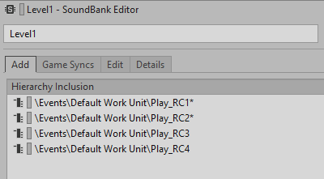
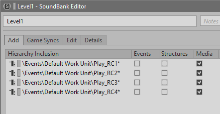

# 手动填充 SoundBank

[Wwise 帮助文档](../../../00-Wwise-帮助文档.md) > [完善工程](../../00-完善工程.md) > [管理 SoundBank](../00-管理-SoundBank.md) > [使用 User-defined SoundBank](00-使用-User-defined-SoundBank.md) > 手动填充 SoundBank

### 手动填充 SoundBank

在手动创建或通过导入定义文件批量创建 SoundBank（音频包）后，可手动添加和排除单个 Event（事件）、Game Sync（游戏同步器）和对象来优化其内容。为帮助您识别 SoundBank 中手动添加或弃用的工程元素，在 SoundBank Editor 的 Add 和 Game Sync 选项卡上，条目旁边会添加一个星号（\*）。

在将工程元素添加到 SoundBank 时，所有相应 Event、对象结构和媒体文件也会自动添加到 SoundBank。然而，您可以通过加入您需要的工程元素类型来修改 SoundBank 的内容。比如，您可能希望 SoundBank 只包含媒体。

为了帮助您更高效地工作，Wwise 允许将完整的结构、工作单元和文件夹从 Project Explorer 拖放到 SoundBank 编辑器中。如果这些工程元素包含子对象，则这些子对象也会自动添加到 SoundBank，但它们只会在 Edit 选项卡上显示。

当父对象、工作单元或文件夹添加到 SoundBank 时，它们与原始工程元素间将保持链接状态。比如，若有 SoundBank 包含一个 Event Work Unit，在稍后将两个 Event 添加到该 Work Unit 时，会将其自动添加到相应 SoundBank。若将该 SoundBank 加载到 SoundBank Editor 中，会发现 Add 选项卡仍然只显示原来的 Event Work Unit，但 Edit 选项卡会显示 Work Unit 内的所有 Event，包括刚刚添加的两个 Event。通过保持此链接，Wwise 确保您的 SoundBank 始终包含工程的最新修改。

|  |  |
| --- | --- |
| [备注] | 备注 |
| 若 SoundBank 包含已从工程中卸载的工程元素，则该工程元素在 SoundBank Editor 的 Add 选项卡中会显示为黄色。 |

**手动填充 SoundBank 的方法是：**

1. 通过执行以下操作之一切换到 SoundBanks 布局：

   - 在菜单栏中，点击 **Layouts** > **SoundBank**。
   - 按 **F7**。
2. 在 SoundBank Manager 中选中一个 SoundBank 来将其加载到 SoundBank Editor 中。
3. 将以下任何元素从 Project Explorer 拖到 SoundBank Editor 的 Add 选项卡：

   - Containers, Sounds, Motion, and Music objects.
   - Folders（文件夹）
   - Event
   - Work Units

   工程元素及其所有相关 Event 的整个层级结构、对象结构和媒体文件将自动添加到 SoundBank。现在您可以进一步优化 SoundBank 的内容，确定您希望启用的工程元素类型。

---