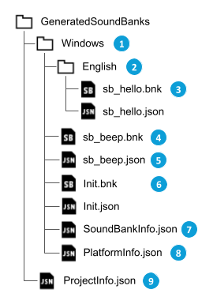
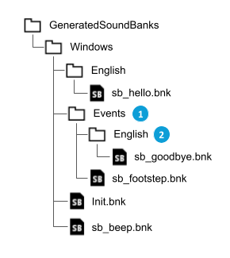
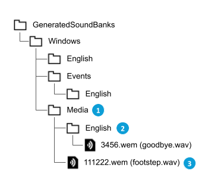

# SoundBank 输出文件夹布局

[Wwise 帮助文档](../../00-Wwise-帮助文档.md) > [完善工程](../00-完善工程.md) > [管理 SoundBank](00-管理-SoundBank.md) > SoundBank 输出文件夹布局

## SoundBank 输出文件夹布局

Wwise 会将 SoundBank 生成过程中生成的文件写入到配置的输出文件夹（工程的每个平台对应一个输出文件夹）。默认输出文件夹为 <project-directory>/GeneratedSoundBanks/<platform-name>。本节将详细介绍输出文件夹的结构。

### SoundBank 文件

假设有个包含以下内容的示例工程：

- 一个导入的媒体文件 beep.wav，具有关联的 SFX 对象 sfx\_beep。
- 一个导入的媒体文件 hello.wav，具有关联的 Voice 对象 voice\_hello。
- 两个媒体文件各有一个 Play Event，分别为 play\_beep 和 play\_hello。
- 两个 Event 各有一个 SoundBank，分别为 sb\_beep 和 sb\_hello。
- 工程有一个目标平台：Windows。

在成功完成 SoundBank 生成后，Wwise 将创建下图所示文件结构：

|  |  |
| --- | --- |
|  | 与 Windows 平台对应的输出文件夹。 |
|  | 与本地化 SoundBank 对应的输出文件夹。工程的每种语言对应一个文件夹。有关详细信息，请参阅[*管理语言*](../../03-设置工程/03-管理语言.md "管理语言")。 |
|  | SoundBank 文件 sb\_hello.bnk。因为 SoundBank 包含本地化素材 (Voice hello.wav)，所以 SoundBank 也会进行本地化处理。 |
|  | SoundBank 文件 sb\_beep.bnk。因为 SoundBank 只包含非本地化素材 (SFX beep.wav)，所以 SoundBank 不会进行本地化处理。 |
|  | 元数据文件 sb\_beep.json。此文件包含与 "sb\_beep.bnk" SoundBank 内容相关的元数据。 |
|  | Wwise 会为所有工程自动生成 "Init" SoundBank，不管采用怎样的 SoundBank 设置。 |
|  | 元数据文件 SoundBankInfo.json。此文件包含与生成的所有 SoundBank 相关的元数据。 |
|  | 元数据文件 PlatformInfo.json。此文件包含与上次生成 SoundBank 时的配置相关的元数据。 |
|  | 元数据文件 ProjectInfo.json。此文件包含与上次生成 SoundBank 时的工程配置相关的元数据（如平台列表）。 |

|  |  |
| --- | --- |
| [备注] | 备注 |
| 系统会根据用户的 SoundBank 设置选择是否生成元数据文件。有关详细信息，请参阅 [“SoundBanks 选项卡”一节](../../09-参考主题/01-工程/08-Project-Settings/03-SoundBanks-选项卡/00-SoundBanks-选项卡.md "SoundBanks 选项卡") 章节。 |

### Auto-defined SoundBank

上节介绍了 User-defined SoundBank（用户定义的音频包）的输出文件夹结构。User-defined SoundBank 全部列在 Project Explorer（工程资源管理器）的 SoundBanks 选项卡中。

不过，也可选择将工程配置为自动定义 SoundBank。这样的话，Wwise 便会为特定工程对象生成 SoundBank。有关详细信息，请参阅“[“Auto-defined SoundBank”一节](02-SoundBank-管理策略/05-Auto-defined-SoundBank.md "Auto-defined SoundBank")”。

为了便于理解，不妨设想对“[“SoundBank 文件”一节](06-SoundBank-输出文件夹布局.md#soundbank_output_folder_soundbank "SoundBank 文件")”中所述的示例工程做出以下更改：

- 一个导入的媒体文件 footstep.wav，具有关联的 SFX 对象 sfx\_footstep。
- 一个导入的媒体文件 goodbye.wav，具有关联的 Voice 对象 voice\_goodbye。
- 两个媒体文件各有一个 Play Event，分别为 play\_footstep 和 play\_goodbye。
- 新建的 Event 没有包含在任何 User-defined SoundBank 中。

对于 Auto-defined SoundBank（自动定义的音频包），Wwise 会采用与上述 User-defined SoundBank 相同的结构为每个对象类型创建一个新的 SoundBank 层级结构。在更新的示例工程中，Wwise 将为基于 Event（事件）和 Bus（总线）自动定义的 SoundBank 创建新的文件夹层级结构。下图显示了更新的文件夹结构和生成的文件。

|  |  |
| --- | --- |
|  | 为基于 Event 对象自动定义的 SoundBank 生成了新的文件夹层级结构。 |
|  | 新的文件夹层级结构具有与 User-defined SoundBank 层级结构相同的本地化文件夹。 |

|  |  |
| --- | --- |
| [备注] | 备注 |
| 为简单起见，图中略去了以下内容：  - 元数据文件。系统会采用与 User-defined SoundBank 相同的 SoundBank Settings 为 Auto-defined SoundBank 创建元数据文件。 - 基于 Bus 的 Auto-defined SoundBank。 |

### 媒体文件

工程的 SoundBank 不一定包含所有需要的媒体文件。SoundBank 中未包含的媒体文件被排除的原因有多种多样，比如：

- User-defined SoundBank 以显式方式从 SoundBank 中排除了媒体。
- Auto-defined Soundbank 在使用媒体文件。
- Auto-defined SoundBank 不包含媒体文件。
- 工程规定须对媒体文件进行流播放。

有关更多详细信息，请参阅“[“Auto-defined SoundBank”一节](02-SoundBank-管理策略/05-Auto-defined-SoundBank.md "Auto-defined SoundBank")”。

SoundBank Settings 可配置为将缺失的媒体文件复制到输出文件夹。在这种情况下，Wwise 会为复制的媒体文件创建新的文件夹层级结构。有关详细信息，请参阅 [“管理 SoundBank 媒体”一节](07-管理-SoundBank-媒体/00-管理-SoundBank-媒体.md "管理 SoundBank 媒体") 章节。

以“[“SoundBank 文件”一节](06-SoundBank-输出文件夹布局.md#soundbank_output_folder_soundbank "SoundBank 文件")”中所述的同一示例工程为参照，Wwise 不会包含 Auto-defined SoundBank 引用的媒体文件：

- footstep.wav
- goodbye.wav

为便于理解，假设 Wwise 按照如下所述指派了 Media ID（媒体 ID）：

- footstep.wav：111222
- goodbye.wav：3456

下图显示了更新的文件夹结构及复制的媒体文件。

|  |  |
| --- | --- |
|  | Media 文件夹层级结构的根文件夹。 |
|  | Media 文件夹还有本地化层级结构。 |
|  | 复制的媒体文件 footstep.wav（使用指派的 Media ID 进行了重命名）。 |

### 使用 ID 命名子文件夹

对于大的工程，最终的输出文件夹经常会包含上千个文件。其中的大部分文件往往都在 Media 和 Auto-defined Soundbank 文件夹中。这可能会导致对单个文件夹所含文件数存有限制的平台出现问题。为了将各个文件夹的文件进一步放到子文件夹中，Wwise 提供了 SoundBank 设置 **Sub-folders for Generated Files**（为生成的文件构建子文件夹）。有关更多详细信息，请参阅“[“SoundBanks 选项卡”一节](../../09-参考主题/01-工程/08-Project-Settings/03-SoundBanks-选项卡/00-SoundBanks-选项卡.md "SoundBanks 选项卡")”。

在启用该设置后，Wwise 会移动以下类型的文件：

- Auto-defined SoundBank 文件。其中包括 SoundBank 文件 (.bnk) 及关联的元数据。
- 媒体文件。

无论对于以上哪种情况，都会使用文件的 ID（十进制格式）的前两位来确定子文件夹名称。对于媒体文件，文件夹名称就是文件名的前两个字符。对于 SoundBank 文件，则会使用 SoundBank 的 ID。SoundBank 的 ID 可通过关联的元数据文件、全局元数据文件 SoundBankInfo.json 或调用 API 函数 [`AK::SoundEngine::GetIDFromString`](https://www.audiokinetic.com/library/edge/?source=SDK&id=namespace_a_k_1_1_sound_engine_a1aae6ebdec25946fb2897ce0e025366d.html) 来获取。

下图显示了启用该设置后的输出文件夹内容。本例假设 SoundBank 名称解析为以下 ID：

- sb\_beep：1111
- sb\_hello：2222
- sb\_footstep：3333
- sb\_goodbye：4444

注意，User-defined SoundBank 没有移到子文件夹。子文件夹规则仅适用于 Auto-defined SoundBank 和 Media 文件夹。

---