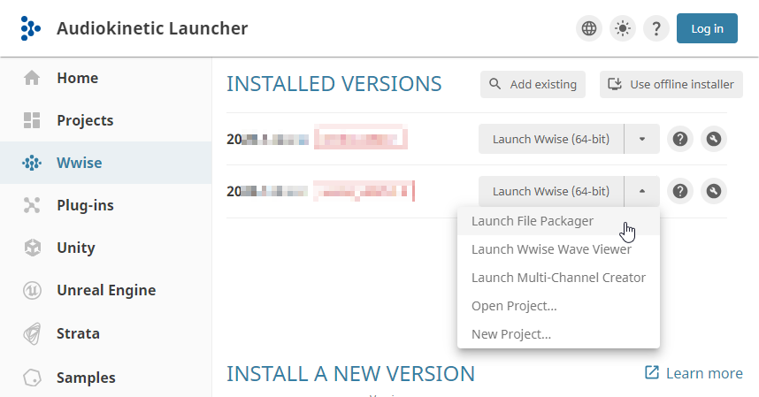

# 使用 File Packager 工程

[Wwise 帮助文档](../../00-Wwise-帮助文档.md) > [完善工程](../00-完善工程.md) > [管理 File Package](00-管理-File-Package.md) > 使用 File Packager 工程

## 使用 File Packager 工程

Each time you open the File Packager a new session is created. 可以将其另存为新的工程，或打开您之前保存的工程。The File Packager project contains all information related to the packages created during a session, including the number of packages, file assignment settings, and the contents and file order of each package.

**打开 File Packager 的方法如下：**

1. 在 Audiokinetic Launcher 中，选中 **Wwise** 页面。
2. 针对所需 Wwise 版本，在旁边的列表中单击 **Launch File Packager**（启动文件打包器）。

   

   这时会打开对应版本的 File Packager 并显示新的会话。

### 将 SoundBank 信息导入到工程中

Before you can create and fill your packages, you need to generate SoundBanks in Wwise and
then import the SoundBank data stored in the `SoundbanksInfo.xml` file,
which is located in the platform folder of the platform-specific SoundBank Path.
Wwise generates a `SoundbanksInfo.xml` file for each platform.

|  |  |
| --- | --- |
| [备注] | 备注 |
| In the Project Settings' or the SoundBanks Settings' SoundBanks tab, ensure that the **Generate All Banks Metadata File** and **Generate XML Metadata** options are selected. When these options are selected, Wwise generates the `SoundbanksInfo.xml` file whenever you generate SoundBanks. |

Whenever you open a saved File Packager project, the File Packager automatically reads the
associated `SoundbanksInfo.xml` file and fills the Files to package pane.
If changes are made in Wwise to the SoundBanks and streamed media files,
inconsistencies between the two projects might occur. Missing files are highlighted
in red.

**To import SoundBank information into a File Packager project:**

1. 打开 File Packager。
2. Click **Browse** beside the SoundBanks Info file
   field.

   The Windows File Explorer opens.
3. Browse to the `SoundbanksInfo.xml` file, select it, and click **Open**.

   All SoundBanks and streamed files are loaded into the Files to package pane. By default,
   all SoundBanks and streamed media files are assigned to the
   `Default.pck` package file.

### 保存 File Packager 工程

You can save File Packager sessions as projects so that you can load them later. File
Packager projects are saved as `.wfpproj` files.

**保存 File Packager 工程的方法如下：**

- 执行以下操作之一：

  - 在菜单栏中，点击 **File** > **Save**。
  - 按 **Ctrl**+**S** 键。

  The project is saved as a `.wfpproj` file.

### Opening File Packager projects

After you save a file packager project, you can open it later to continue to work on it.
Several instances of the File Packager can be open at one time, so you can work on
multiple projects simultaneously.

**To open a File Packager project:**

1. 打开 File Packager。
2. 从菜单栏中，点击 **File** > **Open**。

   The Windows File Explorer opens.
3. Browse to the directory that contains the File Packager project.
4. Select the `.wfpproj` file and click **Open**.

---