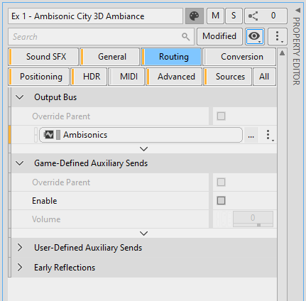

# Routing category

[Wwise 帮助文档](../../00-Wwise-帮助文档.md) > [使用 Wwise](../00-使用-Wwise.md) > [了解 Property Editor](00-了解-Property-Editor.md) > Routing category

## Routing category

The Routing category contains routing properties of the selected object. 请参阅[“指定对象的输出连线”一节](../../07-完善工程/01-管理输出/01-指定对象的输出连线.md "指定对象的输出连线")

The following figure shows the Routing category for a Sound SFX.

---