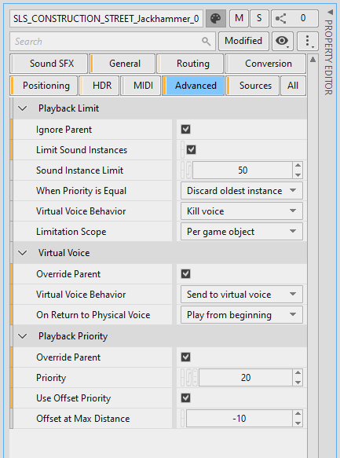

# Advanced category

[Wwise 帮助文档](../../00-Wwise-帮助文档.md) > [使用 Wwise](../00-使用-Wwise.md) > [了解 Property Editor](00-了解-Property-Editor.md) > Advanced category

## Advanced category

Advanced properties are specified to limit the number of sounds playing concurrently and to
specify their behavior when they are inaudible, which respectively provide the following
advantages:

- 提升性能和帮助清理混音
- 节省内存和 CPU 资源

The following figure shows the Advanced category for a Sound SFX.

### Advanced properties and mixing

You shouldn't wait too late in the production process to adjust the advanced properties. 更准确地说，至少应在混音前或混音期间执行第一轮高级设置调整。If you spend time tweaking your mix too early, and later realize that audio is using too many resources, you might end up using advanced properties so aggressively to keep audio processing within bounds that it would have a dramatic impact on your mix.

播放数限制实际上可帮助您实现混音。将它们当作动态混音的一种形式进行使用，帮助玩家集中注意力于重要的方面，而不是用大量声音来淹没玩家。您还可以使用总线闪避、**Set Volume** 动作、State 或 RTPC 来清理您的混音。

### Playback limit, priority, and under volume threshold behavior

Playback limits used on sound structures help you limit the number of sounds playing at the same time, either per game object or globally as specified in the Containers hierarchy. (In the Busses hierarchy, it is always globally). 它的逻辑以播放的声音数量为唯一依据。但是，声音设计师可以在整个层级结构中为不同的对象应用单独的数量限制。而且根据需要，还可以通过选择 **Ignore Parent** 选项来创建独立于上级数量限制的层级结构。总而言之，多种级别的播放限制能让声音设计师更容易控制所播放的内容。

在试图播放声音之前将检查播放数限制条件。当声音即将开始播放，并已达到播放数限制时，将停止播放此声音或另一个声音。第一个条件是声音的优先级。当两个候选声音具有相同的优先级时，声音引擎停止播放最早或最新的声音，具体由 **When limit is reached**（达到限制时）和 **When priority is equal**（优先级相同时）属性指定。

|  |  |
| --- | --- |
| [备注] | 备注 |
| 当声音由于播放数限制而被终止时，播放次数低于此限制则不会重新播放该声音。因此需要小心处理无限循环的环境声音。 |

优先级设置可搭配播放数限制一起使用。在层级结构中微调优先级，以平衡播放数限制系统。不应由播放数限制系统终止的声音（例如配音、背景音乐或循环环境声音）应具有最高的优先级。另外，已经生效的优先级还可以受到声音和听者之间的距离影响。

“under **Volume Threshold**”行为与播放数限制和优先级无任何关系。它只是决定当声音无法被听见时的声音行为。为了确定声音能否被听见，Wwise 只会查看音量元数据，它是所有层级结构、总线、状态、RTPC 和 Set Voice Volume 动作对音量产生的影响总和。它不分析 WAV 数据。

### 动态混音技术

The following dynamic mixing techniques can be applied in the Advanced category.

- **Limit playback on busses or on objects in the
  Containers hierarchy to make room for important sounds**

  例如，当有大量动作、爆炸或玩家应关注的任何元素上时，应减少环境声音和拟音的数量。查找环境声和拟音与枪声和爆炸声并存的总线，对该总线设置限制，并降低前者的优先级。
- **对优先级使用距离偏置**

  例如，在环境声音中，结合基于距离的优先级使用播放数限制，以将焦点集中在更近的声音上。**Offset priority by** 选项指定最大距离处的优先级偏置值，此值插值于 0 和 **at max distance** 之间。
- **闪避不重要的声音的音量**

  有时候不可使用播放数限制。例如，如果您在游戏关卡一开始就启动无限循环的环境声音，则应该避免使用播放数限制功能来停止这些声音，因为通过这种方式停止后，它们就不会再重新播放了。在这种情况或者您认为合适的任何情况下，当游戏音频的其它更重要区域中有活动时，应使用需要的技术来闪避它们的音量。例如，在配音或格斗期间关闭环境声音。当炸弹在您附近爆炸时，您无需听到电灯的嗞嗞声。此过程可视为元数据[侧链](../../14-词汇表.md#glossary_side_chaining "Side-Chaining（旁链）")。使用控制总线上的总线闪避功能或特定事件中的 **Set Voice Volume** 动作可用来触发音量变化。

  在特定场合中，一旦通过降低不重要声音的音量来清理混音后，微调它们的“under **Volume Threshold**”行为，以在它们无法被听见时使用尽可能少的 CPU 和内存资源。
- **实现代码侧动态混音系统**

  注意，播放数限制、优先级和优先级偏置可通过 RTPC 将控制接口交给游戏。Nothing prevents you from implementing a system which adapts these properties based on what's happening in the game.

---