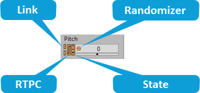

# 使用 Property Editor

[Wwise 帮助文档](../../00-Wwise-帮助文档.md) > [使用 Wwise](../00-使用-Wwise.md) > [了解 Property Editor](00-了解-Property-Editor.md) > 使用 Property Editor

## 使用 Property Editor

Property Editor 可包含一系列的选项、字段、滑杆、列表、按钮和坐标图视图，您可以用它们定义工程中不同对象和 Game Sync 的属性和行为。如果需要这些工具的使用帮助，请参阅以下各节：

- [“使用文本框和滑杆”一节](../../02-入门/03-Wwise-界面基础知识/00-Wwise-界面基础知识.md#using_text_boxes "使用文本框和滑杆")
- [“使用列表”一节](../../02-入门/03-Wwise-界面基础知识/00-Wwise-界面基础知识.md#using_lists "使用列表")
- [*了解坐标图视图*](../07-了解坐标图视图/00-了解坐标图视图.md "了解坐标图视图")

在 Property Editor 中修改属性值时，您可以选用随机化器或跨平台链接或取消链接该值。在 Wwise 中，这些功能通过独特的图标进行表示。Wwise 还通过图标指示某属性值是否通过 RTPC 指派到了某个游戏参数上。下表介绍了这些图标。

| 图标 | 名称 | 描述 |
| --- | --- | --- |
| |  | | --- | |  | | Inclusion | 决定是否包含该对象。如勾选，则包含该元素。如未勾选，则不会包含该元素。在默认情况下，此设置将应用于所有平台。可以使用 [Link Indicator](11-使用-Property-Editor.md#linking_unlinking_property_values "Linking or unlinking property values")（链接图标，位于复选框左侧）来查看或设置平台专有属性。  未勾选此选项时，Property Editor（属性编辑器）中各属性和行为选项都将不可用。 |

|  |  |  |
| --- | --- | --- |
|  | Link | 链接。属性值已链接到其它有效游戏平台的值。 |
|  | Unlink | 取消链接。属性值没有链接到其它有效游戏平台的值。 |
|  | Partial Unlink | 部分取消链接。当前平台的属性值已链接到其它有效平台，但其它平台的若干个相应值已取消链接。 |
|  | Link Mixed | 有些选定的对象具有不同的链接状态。有些可能是链接的，而另一些则是取消链接或部分取消链接的。 |

|  |  |  |
| --- | --- | --- |
|  | RTPC 已禁用 | 该属性值未绑定至游戏内参数值。 |
|  | RTPC 已启用 | 游戏内参数值已绑定至该属性值。这意味着，例如游戏赛车的速度可直接绑定至 Wwise 中的音调属性。当游戏中的赛车速度提高时，Wwise 中的音调也将实时提高。 |
|  | RTPC 部分启用 | Multi Editor 中只有部分对象为该属性绑定了游戏参数值。Property Editor 或 Contents Editor 中不会看到这个标识。 |

|  |  |  |
| --- | --- | --- |
|  | Randomizer 已启用 | 随机化器效果已应用到的属性值。 |
|  | Randomizer 已禁用 | 尚未应用随机化器效果的属性值。 |
|  | 随机化器 Mixed | Multi Editor 中只有部分对象为该属性值启用了 Randomizer 效果。Property Editor 或 Contents Editor 中不会看到这个标识。 |

|  |  |  |
| --- | --- | --- |
|  | State 已禁用 | 此属性值未与 State 绑定。 |
|  | State 已启用 | State Group 已与此属性值绑定。也就是说，所述属性（如 Volume）可能会随应用的 State 变化。 |
|  | State 混合情形 | State Group 绑定到了 Multi Editor 中加载的一个或多个对象（并非全部）的属性值。Property Editor 或 Contents Editor 中不会看到这个标识。 |

### Randomizing property values

为了增强游戏中的声音真实感，您可以在 Property Editor 中对大多数属性值应用随机化器。随机化器指定可用于特定属性的可能值域。每次播放对象时，Wwise 将在指定的值域内选择不同的属性值。对各个不同的属性值应用随机化器将确保每次在播放对象时对象听起来会不相同。

有关随机化器和如何使用它们的详细信息，请参阅[“通过随机化属性值来改善播放”一节](../../03-设置工程/06-Building-your-sound-and-motion-hierarchies/05-通过随机化属性值来改善播放.md "通过随机化属性值来改善播放")。

### Linking or unlinking property values

Wwise 还可以让您同时针对多个平台进行制作，其方法是链接（Link）和取消链接（Unlink）与对象相关联的大多数属性值。默认情况下，对于所有活动平台，所有属性值都是链接在一起的，因此属性在各平台上的值相同。取消链接属性值可让您为特定平台自定义属性值。

有关链接和取消链接属性值的详细信息，请参阅[“Customizing object properties per platform”一节](../../07-完善工程/02-管理平台和语言版本/01-Authoring-across-platforms.md#customizing_object_properties_per_platform "Customizing object properties per platform")。

### Assigning property values to Game Parameters

如上所述，您可以将游戏参数指定到 Wwise 中的特定属性值。它们被称为实时参数控制（RTPC）。Wwise gives you visual feedback on which properties have been assigned as an RTPC. 在将属性值指派给 Game Parameter（游戏参数）后，属性的 RTPC 标志会变为主题特定颜色（Classic 中为蓝色，Dark 中为橙色）。

|  |  |
| --- | --- |
|  | 使用了 RTPC。 |
|  | 未使用 RTPC。 |

有关使用 RTPC 的详细信息，请参阅[“使用 Game Parameter 控制属性值”一节](../../04-与游戏互动/05-使用-RTPC/03-使用-Game-Parameter-控制属性值/00-使用-Game-Parameter-控制属性值.md "使用 Game Parameter 控制属性值")。

### Displaying a project element's properties

Property Editor 显示与工程中特定工程元素相关的所有属性。您可以在许多不同的视图（例如 Project Explorer 的 Audio 选项卡、Contents Editor 和 Capture Log）中通过双击对象将特定对象加载到 Property Editor。您还可以在 Project Explorer 的 Game Syncs 选项卡中通过双击下列任何一项将 Game Sync 加载到 Property Editor 中：

- Switch Group （切换开关组）
- Switch（切换开关）
- State Group
- State（状态）
- Game Parameter（游戏参数）
- Trigger（触发器）

**在 Designer 布局中显示工程元素属性的方法是：**

1. 在 Designer 布局中，执行以下操作之一：

   - 在 Project Explorer 的 Audio 选项卡内选中某个对象。
   - 在 Project Explorer（工程资源管理器）的 Game Syncs（游戏同步器）选项卡中选择游戏同步器。

   此时将发生下列情况：

   - 对象的属性将显示在 Property Editor 中。
   - 对象或 Game Sync 内包含的所有子对象将显示在 Contents Editor 中。

   

   |  |  |
   | --- | --- |
   |  | 在 Project Explorer 的 Audio 选项卡内选中某个对象。 |
   |  | Property Editor 中加载该对象。 |
   |  | Contents Editor 中加载其子对象。 |

---