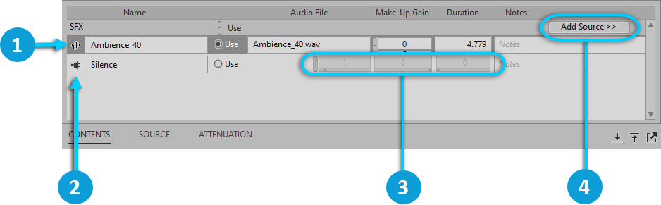

# Sound objects

[Wwise 帮助文档](../../00-Wwise-帮助文档.md) > [使用 Wwise](../00-使用-Wwise.md) > [认识 Contents Editor 视图](00-认识-Contents-Editor-视图.md) > Sound objects

## Sound objects

当您将 Sound Object（声音对象）加载到 Property Editor 时，它的 Source（源）将显示在 Contents Editor 中。声音对象可以包含多个源，包括：

- **Take** -- 版本。选择使用哪个源之前，您可以针对同一声音对象的不同版本进行试听和测试。这些音频源可以链接到音频文件、Silence（空白）源、插件或三者的组合。
- **Language** —— 工程的不同本地化语言版本。关于如何在 Wwise 中使用语言版本，详细信息请参阅[“Localizing your project”一节](../../07-完善工程/02-管理平台和语言版本/02-Localizing-your-project.md "Localizing your project")。

Contents Editor 中，对于每种不同的源类型，其控件和属性的显示也不同。

|  |  |
| --- | --- |
|  | Audio Source。 |
|  | 源插件。 |
|  | 插件属性控件。 |
|  | 单击添加源插件。 |

---