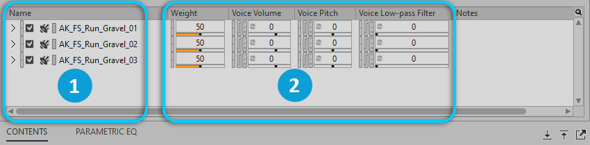

# Random Container（随机容器）

[Wwise 帮助文档](../../00-Wwise-帮助文档.md) > [使用 Wwise](../00-使用-Wwise.md) > [认识 Contents Editor 视图](00-认识-Contents-Editor-视图.md) > Random Container（随机容器）

## Random Container（随机容器）

当您将 Random Container（随机容器）加载到 Property Editor 时，它的子对象将显示在 Contents Editor 中，可以在其中编辑各对象的属性。

|  |  |
| --- | --- |
|  | 容器中嵌套的对象。 |
|  | 属性控件。 |

---