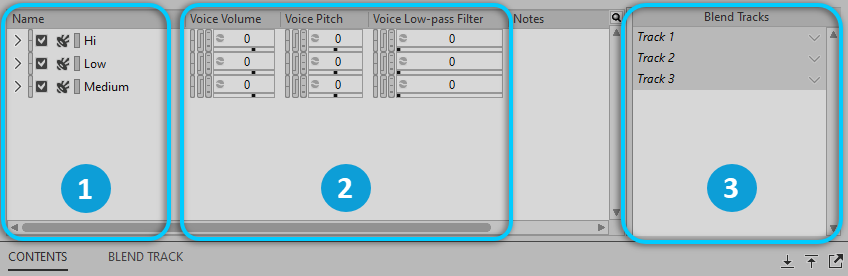

# Blend Container（混合容器）

[Wwise 帮助文档](../../00-Wwise-帮助文档.md) > [使用 Wwise](../00-使用-Wwise.md) > [认识 Contents Editor 视图](00-认识-Contents-Editor-视图.md) > Blend Container（混合容器）

## Blend Container（混合容器）

当您将 Blend Container（混合容器）加载到 Property Editor 时，子对象将显示在 Contents Editor 中。可以编辑子对象的属性，并将它们分配至不同的 Bland Track（混合轨）。

|  |  |
| --- | --- |
|  | 容器中嵌套的对象。 |
|  | 属性控件。 |
|  | Blend Tracks 窗格。 |

---