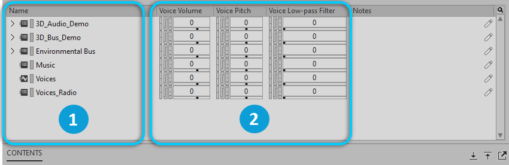

# Busses

[Wwise 帮助文档](../../00-Wwise-帮助文档.md) > [使用 Wwise](../00-使用-Wwise.md) > [认识 Contents Editor 视图](00-认识-Contents-Editor-视图.md) > Busses

## Busses

When you load the main bus or a parent bus into the Property Editor, its child busses are loaded into the Contents Editor. 可以在其中编辑子总线属性。

|  |  |
| --- | --- |
|  | 子总线。 |
|  | 属性控件。 |

---