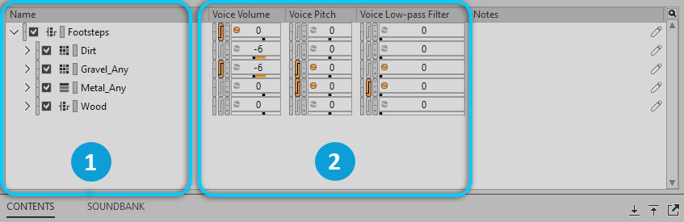

# Event

[Wwise 帮助文档](../../00-Wwise-帮助文档.md) > [使用 Wwise](../00-使用-Wwise.md) > [认识 Contents Editor 视图](00-认识-Contents-Editor-视图.md) > Event

## Event

在将 Event 加载到 Event Editor（事件编辑器）中时，会在 Contents Editor（内容编辑器）中显示与 Event 关联的对象。可以编辑它们的属性。

|  |  |
| --- | --- |
|  | 与 Event 关联的对象。 |
|  | 属性控件。 |

---