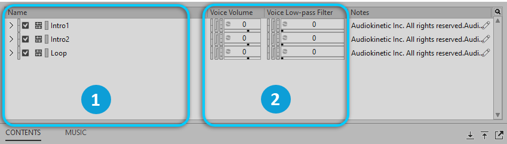

# Music Playlist Containers

[Wwise 帮助文档](../../00-Wwise-帮助文档.md) > [使用 Wwise](../00-使用-Wwise.md) > [认识 Contents Editor 视图](00-认识-Contents-Editor-视图.md) > Music Playlist Containers

## Music Playlist Containers

当您将 Music Playlist Container（音乐播放列表容器）加载到 Property Editor 中时，其子对象将显示在 Contents Editor 中，可以在此编辑其属性。

|  |  |
| --- | --- |
|  | Music Playlist Container 中的对象。 |
|  | 属性控件。 |

---