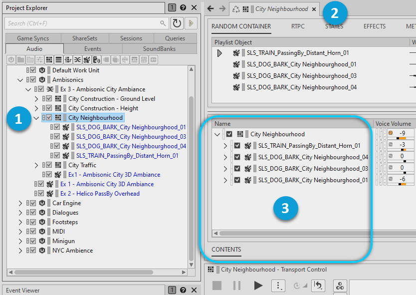
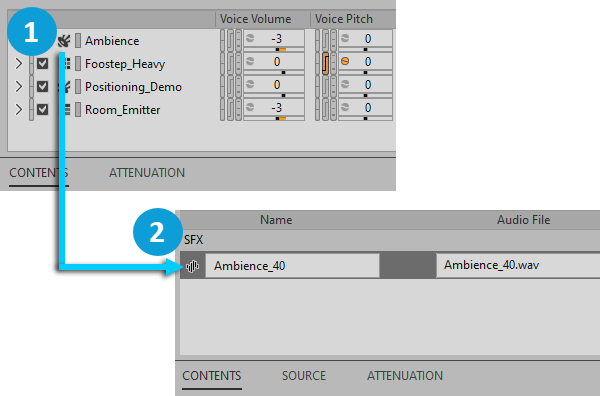
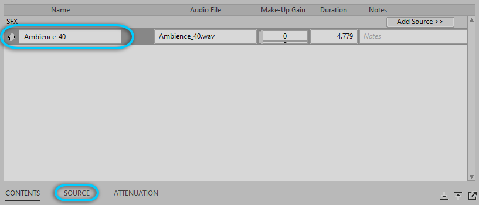
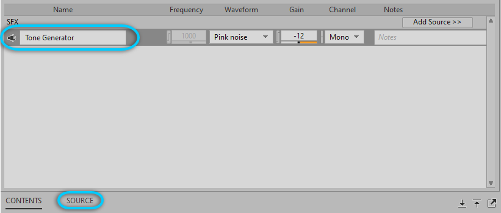

# Displaying objects in the Contents Editor

[Wwise 帮助文档](../../../00-Wwise-帮助文档.md) > [使用 Wwise](../../00-使用-Wwise.md) > [认识 Contents Editor 视图](../00-认识-Contents-Editor-视图.md) > [使用 Contents Editor](00-使用-Contents-Editor.md) > Displaying objects in the Contents Editor

### Displaying objects in the Contents Editor

在将对象从层级结构加载到 Property Editor（属性编辑器）中时，会在 Contents Editor（内容编辑器）中显示其子对象。比如，若在 Project Explorer（工程资源管理器）的 Audio（音频）选项卡内选中某个 Sequence Container（序列容器），则会将其加载到 Property Editor 中，并将其子段落加载到 Contents Editor 中。

|  |  |
| --- | --- |
|  | 在 Project Explorer 的 Audio 选项卡内选中某个对象。 |
|  | Property Editor 中加载该对象。 |
|  | Contents Editor 中加载其子对象。 |

您还可以在 Contents Editor 中双击对象，直接浏览工程层级的下级结构。

可以继续沿工程树向下展开，找到与对象关联的源。

|  |  |
| --- | --- |
|  | 在 Contents Editor 中双击某个对象。 |
|  | Contents Editor 中显示其源文件。 |

|  |  |
| --- | --- |
| [备注] | 备注 |
| 要回到上一对象，请按 **Backspace** 键。要向上一级，前往当前对象的父级，请按 Alt+向上箭头。 |

#### Working with sources in the Contents Editor

在 Contents Editor 中，一旦到了源层级，就可以进行音频源或源插件设置了。

在选中与音频源对应的 Source（源）选项卡时，会在 Secondary Editor（辅助编辑器）中打开 Source Editor（源编辑器）。您可以在坐标图或侧面板中编辑音频源。另外，还可使用 Conversion（转码）选项卡来调节转码设置。

在选中与源插件对应的 Source 选项卡时，会在 Property Editor 中显示插件的属性，并可对其进行编辑。

---