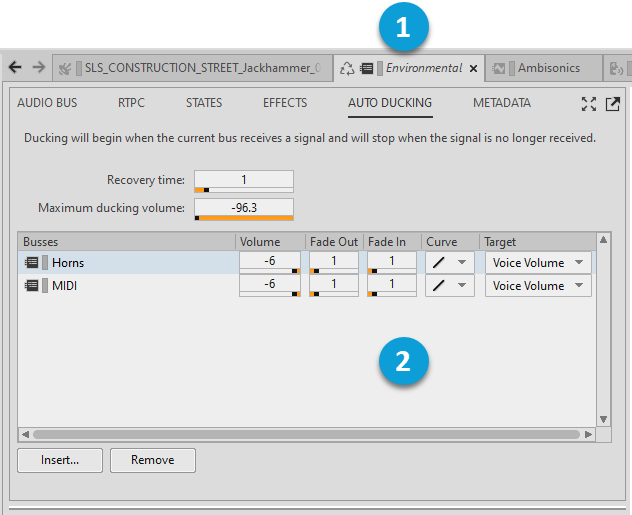

# Auto-ducking tab

[Wwise 帮助文档](../../../00-Wwise-帮助文档.md) > [使用 Wwise](../../00-使用-Wwise.md) > [使用 Object Tab 和 Object Tab Group](../00-使用-Object-Tab-和-Object-Tab-Group.md) > [Primary Editor 和 Secondary Editor](00-Primary-Editor-和-Secondary-Editor.md) > Auto-ducking tab

### Auto-ducking tab

在与 Audio Bus（音频总线）对应的 Auto-ducking（自动闪避）选项卡中，可通过插入窗格中的其他总线来突显当前总线。在当前总线上检测到信号时，会降低插入的所有总线的音量。

有关详细说明，请参阅[“闪避信号”一节](../../../03-设置工程/07-建立输出总线的结构/02-定义总线的属性.md#ducking_signals "闪避信号")。有关各个界面元素的描述，请参阅 [“Auto-Ducking tab: Audio Busses”一节](../../../09-参考主题/04-Project-Explorer/01-Audio-tab/02-Busses-hierarchy/02-Property-Editor：Audio-Bus/01-Auto-Ducking-tab-Audio-Busses.md "Auto-Ducking tab: Audio Busses")。

请参阅 [“定义总线的属性”一节](../../../03-设置工程/07-建立输出总线的结构/02-定义总线的属性.md "定义总线的属性")。

The following figure shows the Auto-ducking tab for an audio bus.

|  |  |
| --- | --- |
|  | **当前总线**：本例中为 Dialogue 总线。在此总线上检测到信号时，将闪避条目 2 中所述的总线。 |
|  | **受当前总线控制的总线**：这些总线的音量将被降低。 |

---