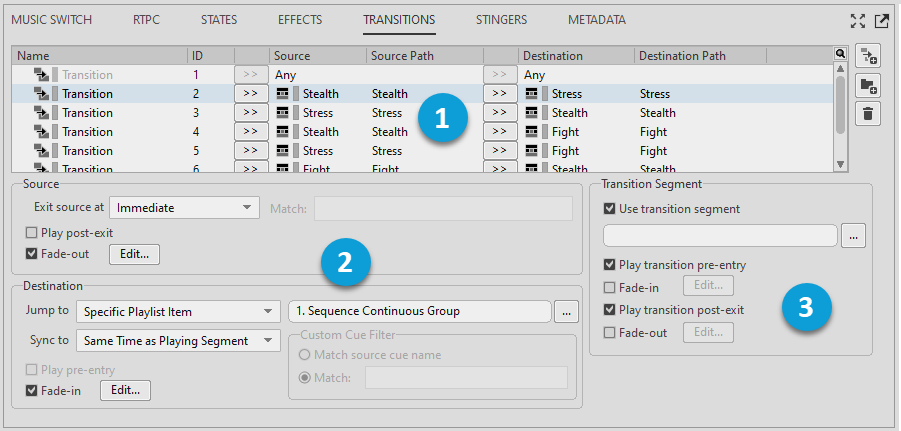

# Transitions tab

[Wwise 帮助文档](../../../00-Wwise-帮助文档.md) > [使用 Wwise](../../00-使用-Wwise.md) > [使用 Object Tab 和 Object Tab Group](../00-使用-Object-Tab-和-Object-Tab-Group.md) > [Primary Editor 和 Secondary Editor](00-Primary-Editor-和-Secondary-Editor.md) > Transitions tab

### Transitions tab

The main part of the Transitions tab is the transition matrix, a list of rules that defines how each object within a Music Switch or Playlist Container transitions to every other object within the container. 它还包含控件用来为过渡中的各个源和目标自定义属性，以及指定过渡段落用途和属性。

请参阅 [*使用 Transition*](../../../06-创建互动音乐/07-使用-Transition/00-使用-Transition.md "使用 Transition")。

The following figure shows the Transitions tab for a music switch.

|  |  |
| --- | --- |
|  | Transition Matrix。 |
|  | Source 和 Destination 属性。 |
|  | Transition Segment 属性。 |

---