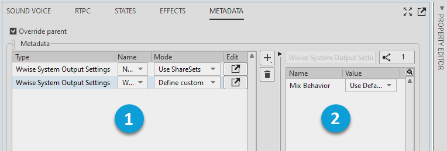

# Metadata tab

[Wwise 帮助文档](../../../00-Wwise-帮助文档.md) > [使用 Wwise](../../00-使用-Wwise.md) > [使用 Object Tab 和 Object Tab Group](../00-使用-Object-Tab-和-Object-Tab-Group.md) > [Primary Editor 和 Secondary Editor](00-Primary-Editor-和-Secondary-Editor.md) > Metadata tab

### Metadata tab

The [“Metadata tab”一节](../../../09-参考主题/04-Project-Explorer/01-Audio-tab/05-Common-tabs-and-categories-audio-structures/01-Metadata-tab.md "Metadata tab") allows you to associate an unlimited number of Metadata plug-ins with an object. 在将元数据插件与对象关联时，必须指定其 Type 和 Mode（Use ShareSets 或 Define custom）。通过单击 Edit [...] 按钮可打开 Metadata Editor（元数据编辑器），并编辑元数据插件的各项属性。

The following figure shows the Metadata tab for a Sound Voice.

|  |  |
| --- | --- |
|  | 将任意数量的元数据插件应用于所选对象。 |
|  | 编辑左侧面板中所选各个插件的属性。 |

---