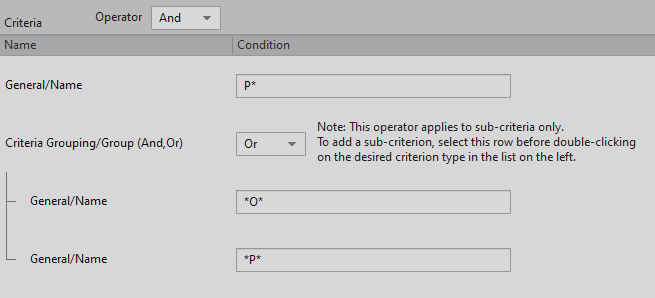

# Working with queries

[Wwise 帮助文档](../../00-Wwise-帮助文档.md) > [使用 Wwise](../00-使用-Wwise.md) > [使用 Search、Query 和 Reference](00-使用-Search、Query-和-Reference.md) > Working with queries

## Working with queries

当您需要查找工程中的特定对象而 Search 工具又找不到时，您可以在 Query Editor（查询编辑器）中创建查询。Query Editor 是一款复杂、强大的工具，可帮助您在工程进行搜索，查找您需要的任何对象。您的查询条件既可以设置得宽泛一些，也可以明确一些，具体取决于需要。您还可以保存和重新加载查询条件，让您的工作流程变得更加高效。在运行查询条件后，您可以一次性编辑 Results 窗格中的所有对象。例如，您可以使用 Multi Editor 开启或关闭流功能，也可以更改 Results 窗格中整组对象的转码设置。

例如，您可以创建并运行查询来执行以下任务：

- 要查找工程中以“sword”开头的所有声音，创建以 SFX 为声音类型、sword\* 为名称的声音查询。
- 要查找输出至给定总线的所有 Music Segment，请创建一个针对 Music Segment 的 Query 并查询该总线名称。
- 要查找低通滤波器属性大于 10 的所有声部，创建 sound type（声音类型）为 Voice、Low-Pass Filter 属性值大于 10 的声音查询。

Query Editor 包括以下分区：

|  |  |
| --- | --- |
|  | Query 描述 |
|  | Criteria Browser |
|  | Criteria 列表 |
|  | Results 列表 |

### Creating queries

在 Wwise 中创建查询时，您即建立了一个独特的搜索来查找工程中的对象。在对查询命名后，该查询将保存起来供今后使用。

在 Wwise 中，有两个地方可以创建查询：

- Project Explorer 的 Queries 选项卡
- 在 Query Editor 中

**在 Queries 选项卡中创建新的查询：**

1. 在 Project Explorer 中，切换到 Queries 选项卡。
2. 执行以下操作之一：

   - 选择工作单元或虚拟文件夹，然后点击 Project Explorer 工具栏中的 **Query** 图标。
   - 右键点击工作单元或虚拟文件夹，然后从快捷菜单中选择 **New Child** > **Query**（新建子项 > 衰减）。

   新的 Query 将被添加到选定的 Work Unit 或 Virtual Folder。
3. 将默认名称替换成最适合该查询操作的名称，然后按 **Enter**。

   |  |  |
   | --- | --- |
   | [备注] | 备注 |
   | 各个查询不得重名，且不可包括以下字符：‘:<>\*?”/\|.’。您可以随时重命名查询，方法是右键点击它，选择 *Rename*（重命名），然后输入新的名称。 |

**在 Query Editor 中创建新的查询的方法是：**

1. In the Query Editor, click **New**

   此时将打开 New Query 对话框。
2. 选择想要创建 Query 的 Work Unit。
3. 输入查询的名称。

   |  |  |
   | --- | --- |
   | [备注] | 备注 |
   | 各个查询不得重名，且不可包括以下字符：‘:<>\*?”/\|.’。您可以随时重命名查询，方法是右键点击它，选择 *Rename*（重命名），然后输入新的名称。 |
4. 单击 **OK**（确定）。

   此时将创建新的查询。

### Defining and running queries

第一次运行查询时，需要决定使用什么标准来搜索工程。这些标准会自动保存，在您今后再次运行此查询时可以为您节省时间。

|  |  |
| --- | --- |
| [备注] | 备注 |
| 查询结果将考虑由于被父对象覆盖而目前没有使用的对象级属性。If you encounter unexpected results in the Query Editor, you can look for hidden object-level properties by temporarily enabling the Override Parent option in the Property Editor. |

**定义查询的内容的方法是：**

1. 将查询加载到 Query Editor 中。
2. 在 Notes 字段中输入有关查询的任何附加信息。
3. 在 Query From（从此处查询）列表中，执行以下操作：

   - 选择要搜索的对象类型或其他工程元素。如果您不想搜索特定类型的对象，则选择 **All Objects**（全部对象）。

     要在层级结构中指定查询的起始位置，则需执行以下操作：

     - 在 Start From Here（从此处开始）框附近，点击 **Browse** 按钮（...）。
     - 这时会打开 Project Explorer - Browser（工程资源管理器 - 浏览器）对话框。
     - 前往您希望 Wwise 开始搜索的文件夹。
     - 单击 **OK**（确定）。

       |  |  |
       | --- | --- |
       | [备注] | 备注 |
       | 要清除您已选择的起始位置，点击 **Reset**。 |
   - 若要执行 WAQL 查询，请选中 **WAQL Query**（WAQL 查询）。这时 **WAQL Query** 字段将高亮显示（可用），而 **Start From** 字段将变为灰色（不可用）。有关如何创建 WAQL 查询的详细信息，请参阅[了解 Wwise Authoring Query Language (WAQL)](https://www.audiokinetic.com/library/edge/?source=SDK&id=waql_introduction.html)。
4. 从 Platform 列表中选择以下其中一个选项：

   - **All**（全部），以搜索用于工程所包含的任何平台上的对象。
   - **Current**（当前），以搜索用于当前选定平台上的对象。
5. 在浏览器列表中，选择查询所依据的各个条件。执行以下操作：

   双击某个标准，以将它加载到 Criteria 列表。

   为此标准输入或选择条件。在输入标准时，您可以使用通配符（\*）来替代词的一部分。

   |  |  |
   | --- | --- |
   | [备注] | 备注 |
   | 要删除条件，则需右键点击它，然后选择 **Remove**。 |
6. 在 Operator（运算符）列表中，执行以下操作之一：

   **And**，以返回满足所有标准的结果。

   **Or**，以返回满足至少一个标准的结果。

   |  |  |
   | --- | --- |
   | [备注] | 备注 |
   | 如果需要创建包含两个运算符的复杂查询，则可创建搜索条件组。有关搜索条件组的详细信息，请参阅[“Creating advanced queries using criteria groups”一节](03-Working-with-queries.md#creating_advanced_queries_using_criteria_groups "Creating advanced queries using criteria groups")。 |
7. 点击 **Run Query**（运行查询）。

   此时将会显示查询结果。您可以通过点击各个列标题来对结果进行排序。

   |  |  |
   | --- | --- |
   | [技巧] | 技巧 |
   | 当您选择 Result 列表中的某个条目时，它会自动加载至播放控制，并准备进行播放。您可以右键点击 Result 列表中的一系列条目来访问各种命令，如 **Edit**、**Show in Multi Editor**、**Show in Schematic View** 和 **Convert**。您还可以双击 Results 列表中的任何项，以在 Property Editor 中显示它。您也可将属性元素从 Results 列表拖至 Project Explorer。For example, you can drag one or more sound objects from the Results list into a Property Container within the Project Explorer. |
8. 要保留查询结果以便在另一应用程序中使用，则点击 **Copy to Clipboard**（复制到剪贴板）。
9. 要清空标准和搜索结果，则点击 **Clear**。

|  |  |
| --- | --- |
| [备注] | 备注 |
| 在 Wwise 中，对象有一些固有属性，即使被父对象的属性所代替，但仍然有效。如果您在结果中发现误报，即结果中不包含您正在搜索的标准，则这些对象的固有属性也可能被 Override parent 选项所覆盖。 |

### Creating advanced queries using criteria groups

在某些情况下，使用一个运算符的基本查询不够具体，无法准确地找到您正在查找的内容。在这些情况下，您可以使用搜索条件组来创建更加高级的搜索。搜索条件组是具有独立运算符控制的标准的子集。它可以让您使用不同类型的运算符来创建查询。例如，您可以创建一个查询来搜索名称以字母 P 开头并（AND）包含数字 1 或（OR）0 的所有对象。

您可以在该查询中使用若干个条件组来查找工程中的特定对象或其它元素。搜索条件组甚至可以与其它搜索条件组进行嵌套，创建出极其复杂的查询。

**在查询中创建搜索条件组的方法是：**

1. 将查询加载到 Query Editor 中。
2. 在 Browser 列表中，双击 Criteria Grouping（标准编组）部分中的 **Group (And/Or)**（编组（与/或）选项。

   新的搜索条件组添加到 Criteria 列表中。
3. 在 Browser 列表中，通过执行以下操作添加若干个标准到搜索条件组：

   选择 Criteria 列表中的搜索条件组。

   双击标准以将它添加到搜索条件组。

   为此标准输入或选择条件。在输入标准时，您可以使用通配符（\*）来替代词的一部分。

   |  |  |
   | --- | --- |
   | [备注] | 备注 |
   | 要对组中的标准重新排序，只需将标准拖到新位置即可。标准一旦添加到编组中，就不能将它拖到编组外。 |
4. 从 Criteria Group Operator（搜索条件组运算符）列表中，选择以下其中一项：

   **And**（与），以返回满足编组中所有标准的结果。

   **Or** —— 用于返回至少满足编组中一个标准的结果。

   |  |  |
   | --- | --- |
   | [备注] | 备注 |
   | 要在编组外添加另一个标准，在编组外进行点击以取消选中它，然后双击 Browser 列表中的标准。 |
5. 点击 **Run Query**（运行查询）。

   此时将会显示查询结果。您可以通过点击各个列标题来对结果进行排序。

   |  |  |
   | --- | --- |
   | [技巧] | 技巧 |
   | 当您选择 Result 列表中的某个条目时，它会自动加载至播放控制，并准备进行播放。您可以右键点击 Result 列表中的一系列条目来访问各种命令，如 **Edit**、**Show in Multi Editor**、**Show in Schematic View** 和 **Convert**。您还可以双击 Results 列表中的任何项，以在 Property Editor 中显示它。您也可将属性元素从 Results 列表拖至 Project Explorer。For example, you can drag one or more sound objects from the Results list into a Property Container within the Project Explorer. |
6. 要保留查询结果以便在另一应用程序中使用，则点击 **Copy to Clipboard**（复制到剪贴板）。
7. 要清空标准和搜索结果，则点击 **Clear**。

### Using factory-defined queries

Wwise 为许多常见查询提供了一些预定义出厂预设。使用它们比从头开始定义查询节省时间。

**运行出厂定义的查询的方法是：**

1. 在 Project Explorer 中，切换到 Queries 选项卡。
2. 在 Factory Queries（工厂定义的查询）列表中，双击查询。

   该查询加载到 Query Editor 中。
3. 根据需要为标准输入或选择条件。在输入标准时，您可以使用通配符（\*）来替代词的一部分。
4. 点击 **Run Query**（运行查询）。

   此时将会显示查询结果。您可以通过点击各个列标题来对结果进行排序。

   |  |  |
   | --- | --- |
   | [技巧] | 技巧 |
   | 当您选择 Result 列表中的某个条目时，它会自动加载至播放控制，并准备进行播放。您可以右键点击 Result 列表中的一系列条目来访问各种命令，如 **Edit**、**Show in Multi Editor**、**Show in Schematic View** 和 **Convert**。您还可以双击 Results 列表中的任何项，以在 Property Editor 中显示它。您也可将属性元素从 Results 列表拖至 Project Explorer。For example, you can drag one or more sound objects from the Results list into a Property Container within the Project Explorer. |
5. 要保留查询结果以便在另一应用程序中使用，则点击 **Copy to Clipboard**（复制到剪贴板）。
6. 要清空标准和搜索结果，则点击 **Clear**。

### Deleting queries

您可以删除不再需要的查询。

**删除查询的方法是：**

1. 在 Project Explorer 中，切换到 Queries 选项卡。
2. 右键点击您要删除的查询，并选择 **Delete Selection**（删除选中对象）。

   选中的查询被删除。

|  |  |
| --- | --- |
| [备注] | 备注 |
| 如果您无意中删错了查询，则可以按 **Ctrl+Z** 或点击 **Edit（编辑）> Undo（撤消）** 来撤消删除操作。 |

---