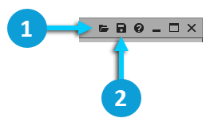

# 使用 Preset

[Wwise 帮助文档](../00-Wwise-帮助文档.md) > [使用 Wwise](00-使用-Wwise.md) > 使用 Preset

## 使用 Preset

Preset（预设）是与对象、效果器、定位、衰减或元数据相关的一组特定属性值。它们保存在一个专门的文件中，便于稍后在同一工程内重复使用。通过使用预设，您无需重新创建您想重新用于工程中其它对象的特定属性设置。您只需要设置一次这些属性值，保存预设，然后将预设应用于工程中的其它对象即可。这可以提高工作效率，即省时又省力。

|  |  |
| --- | --- |
| [备注] | 备注 |
| Unlike ShareSets, the property values in a Preset cannot be shared across objects. |

预设图标显示在各个视图的标题栏中，在标题栏中可以保存和加载预设。

|  |  |
| --- | --- |
|  | Load Preset （加载预设） |
|  | Save Preset （保存预设） |

## 预设的内容

预设于是得到保存，在同一工程中可随时重新使用该预设。下表描述了所有预设及其保存的信息。

| Preset（预设） | 层级结构中的位置 | 内容 |
| --- | --- | --- |
| 对象/源属性 | 顶层对象 | All property values in the Property Editor. |
| 子对象 | All property values in the Property Editor.  若保存 Preset 时未启用 **Override parent** 选项，则 Override 设置下的内容将不会保存到 Preset 中。若保存到 Preset 时启用了该选项，则 Preset 中将包含所有相应的 Override 属性值。但是，系统默认不启用 Override 选项。只有启用 **Override parent** 后，才能使用 Override 属性。 |
| Effect | - | Effect 的所有属性值。 |
| 定位（2D） | - | 点声源的位置。 |
| 定位（3D 自动化） | - | Position Editor (3D Automation) 中的所有定位路径、设置和值。 |
| Attenuation（衰减） | - | 所有曲线和所有衰减设置。 |
| Metadata | - | 元数据的所有属性值。 |

## 保存预设

在 Wwise 中，可以为以下任何元素保存预设：

- Property values and settings for objects and sources within the Containers hierarchy
- 定位值
- 衰减设置
- Effect Editor 中的效果器值
- Metadata Editor 中的元数据值

保存预设时，Wwise 会保存视图中各个选项卡上的各个值。保存预设后，预设将按以下其中一个类别分组：

- Audio Bus（音频总线）
- Auxiliary Bus
- Property Container
- Random or Sequence Container（随机或序列容器）
- Switch Container（切换容器）
- Blend Container（混合容器）
- Sound SFX/Voice（音效／语音对象）
- Audio Source Plug-in（音频源插件）
- Music Switch Container（音乐切换容器）
- Music Playlist Container （音乐播放列表容器）
- Music Segment （音乐段落）
- Music Track （音乐轨）
- 定位（3D 自动化）
- 定位（2D）
- Attenuation（衰减）
- Effects
- Metadata

When you open the Save Preset dialog, the Presets will be filtered to show only those Presets that are in the same category.

**保存预设的方法是：**

1. 在视图标题栏中，点击 **Save Preset** 图标。

   The Save Preset dialog opens.
2. 在 **Name** 字段中，输入预设的名称。
3. 在 **Notes** 字段中，输入进一步描述预设的任何信息。
4. 点击 **Save** 或按 **Enter**。

   预设于是得到保存，在同一工程中可随时重新使用该预设。

## 加载预设

在保存 Preset（预设）后，可将其应用于工程内的其他对象、效果器、定位、衰减或元数据。

When you open the Load Preset dialog, the Presets will be filtered to show only those Presets that are in the same category.

**加载预设的方法是：**

1. 在视图标题栏中，点击 **Load Preset** 图标。

   The Load Preset dialog opens.
2. 从列表中选择预设。
3. 点击 **Load** 或按 **Enter**。

   这时将把 Preset 应用于对象。

## 删除预设

如果不再需要某个预设，则可以删除它。

**删除预设的方法是：**

1. 在视图标题栏中，点击 **Load Preset** 图标。

   The Load Preset dialog opens.

   |  |  |
   | --- | --- |
   | [技巧] | 技巧 |
   | You can also delete Presets from the Save Preset dialog. |
2. 在 Preset 列表中，点击您要删除的预设。

   此时 Delete 按钮变成已启用。
3. 点击 **Delete**。

   该预设于是从 Preset 列表和工程中被删除掉了。

---