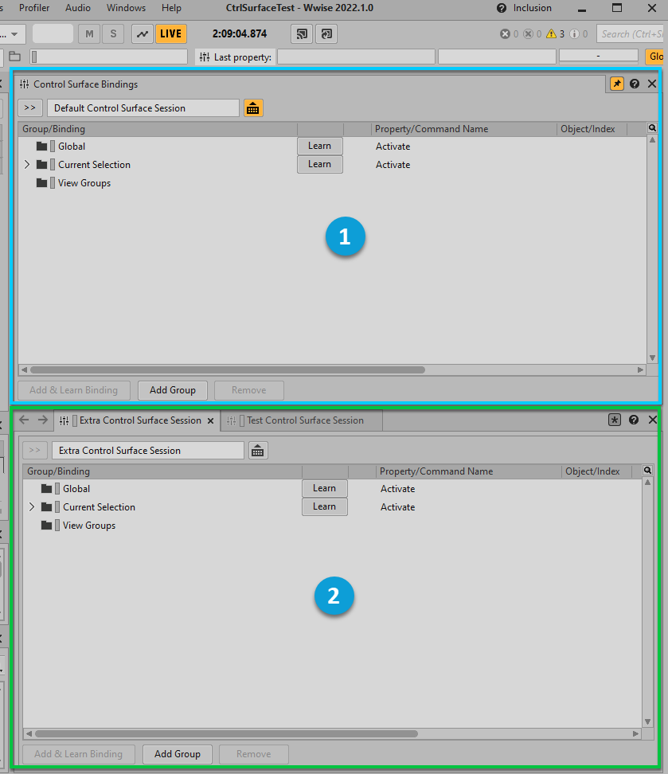

# 浏览 Control Surface Session

[Wwise 帮助文档](../../00-Wwise-帮助文档.md) > [使用 Wwise](../00-使用-Wwise.md) > [使用控制设备](00-使用控制设备.md) > 浏览 Control Surface Session

## 浏览 Control Surface Session

您可以在 Control Surface Bindings（控制器绑定）视图中打开单个 Control Surface Session（控制器会话）。倘若需要管理别的会话，可选择在 Object Tab（对象选项卡）中打开。所有通过 Project Explorer（工程资源管理器）打开的会话都会显示在 Object Tab 中（默认为非活跃状态）。所有通过 Control Surface Bindings 视图打开的会话默认为活跃状态。

若要更改活跃会话，请在该视图或与所需会话对应的 Object Tab 中单击“激活”图标 ()。橙色图标表示会话处于活跃状态，灰色图标表示其处于非活跃状态。活跃会话还会显示在 Control Surface Toolbar（控制器工具栏）中。

在以下示例中，Control Surface Bindings 视图中显示了 Default Control Surface Session，Object Tab 中显示了另外两个 Control Surface Session。Default Control Surface Session 处于活跃状态。

|  |  |
| --- | --- |
|  | Control Surface Bindings 视图 |
|  | Object Tab |

---