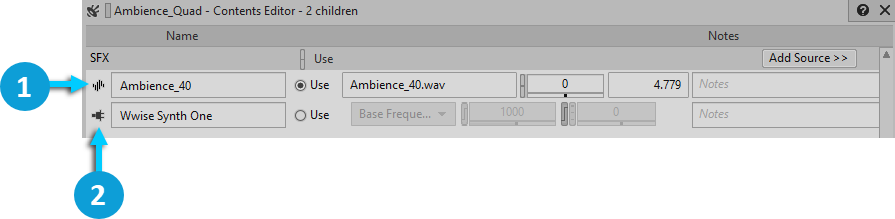

# Source Editor: plug-ins

[Wwise 帮助文档](../../../../00-Wwise-帮助文档.md) > [参考主题](../../../00-参考主题.md) > [Project Explorer](../../00-Project-Explorer.md) > [Audio tab](../00-Audio-tab.md) > [Containers hierarchy: sound and motion objects](00-Containers-hierarchy-sound-and-motion-objects.md) > Source Editor: plug-ins

#### Source Editor: plug-ins

插件的 Source Editor（源编辑器）不同于[音频源的 Source Editor](../06-Source-Editor：音频源.md "Source Editor：音频源")。它可以从 [“Contents Editor: Sound SFX”一节](12-Contents-Editor-Sound-SFX.md "Contents Editor: Sound SFX") 和 [“Contents Editor: Sound Voice”一节](13-Contents-Editor-Sound-Voice.md "Contents Editor: Sound Voice") 打开。直接双击音频源图标即可。

|  |  |
| --- | --- |
|  | 打开与音频源对应的 Source Editor |
|  | 打开与插件对应的 Source Editor |

它包含一系列与源插件关联的属性。该编辑器将基于您当前正在编辑的源插件来显示不同的属性。您可以实时修改各项属性并利用 RTPC 将其映射至 Game Parameter（游戏参数）。

Wwise 自带多个[源插件](../../../../10-Wwise-插件/03-源插件/00-源插件.md "源插件")。若要了解各个源插件的属性信息，请先打开所需插件的 Source Editor，然后单击其中的 Help（帮助）按钮。

另外，借助 Wwise 的开放式体系结构，您还可以轻松创建和集成自己的源插件。**Source Plug-in Editor** 可以显示插件程序员希望包含的任何信息。但是会使用默认 UI，并根据源插件 XML 中提供的信息来自动生成其中的各个字段。

有关为 Wwise 开发插件的详细信息，请查阅 SDK 文档。

---