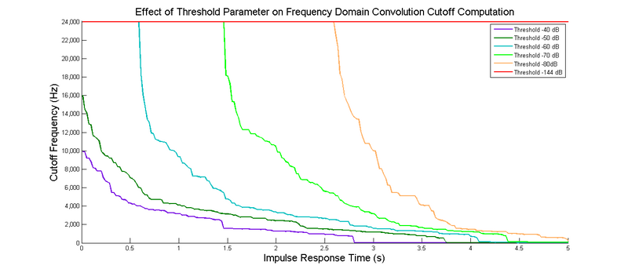

# AK Convolution Reverb（卷积混响）

[Wwise 帮助文档](../../00-Wwise-帮助文档.md) > [Wwise 插件](../00-Wwise-插件.md) > [效果器插件](00-效果器插件.md) > AK Convolution Reverb（卷积混响）

## AK Convolution Reverb（卷积混响）

（请参阅下文的 [“AK Convolution Reverb properties”一节](03-AK-Convolution-Reverb（卷积混响）.md#convolution_reverb_plug_in_properties "AK Convolution Reverb properties")。）

AK Convolution Reverb（卷积混响）插件可用于模拟真实空间中的声学效果。 对于每个空间建模，它都使用预先录制的冲激响应，并使用给定冲激响应文件与输入音频信号进行卷积运算。这样会将冲激响应中携带的录音房间声学特性应用到传入音频信号上，令声音听起来就像在该环境内播放一样。

AK Convolution Reverb 自带一系列现成的声学空间[“预设”一节](../../09-参考主题/04-Project-Explorer/11-预设/00-预设.md "预设")，在新的 Wwise 工程内均可使用。此外，您还可以使用通过现有库（商用或免费）或自有空间录音获得的冲激响应。

这些空间的声学属性可通过大量设置（在界面中可以编辑这些设置）进行调节，从而做到用同一冲激响应录音得到多样可选择的空间。

AK Convolution Reverb 插件分两个阶段进行处理：

- |  |  |
  | --- | --- |
  | [注意] | 注意 |
  | 当更改了这些离线设置之一时，必须重新生成 SoundBank，并重新部署到游戏（即，出于带宽方面的考虑，不通过网络通信在性能分析中推送）。 |

  **离线冲激响应转码**：对于原本显示的冲激响应文件，以离线方式应用某些特定设置。每当其中一个参数发生变化时，后台就会创建一个新的经过转换的冲激响应，并对它应用离线参数设置。 冲激响应图示内或上方的所有控制参数（位于界面的左侧部分）均为离线处理的参数。 后台会自动让这些变更生效，以在 Wwise 中播放或在生成 SoundBank 时播放。
- **实时处理**：在运行时，将预处理冲激响应与输入信号进行卷积运算，同时进行一系列其他运行时数字信号处理操作（大多可利用 RTPC 控制）。冲激响应图示右侧的这些参数全部在运行时应用，不会对打包到 SoundBank 中的冲激响应文件作出任何更改。

### Integrating AK Convolution Reverb inside the game

为了确保 Effect 在游戏内正常运行，必须将 AK Convolution Reverb 冲激响应文件包含在 SoundBank 中。有关详细信息，请参阅[“在 SoundBank 中启用插件媒体”一节](../../07-完善工程/07-管理-SoundBank/03-使用-User-defined-SoundBank/04-管理-SoundBank-内容/03-在-SoundBank-中启用插件媒体.md "在 SoundBank 中启用插件媒体")。

### Importing custom impulse responses

AK Convolution Reverb 插件支持 WAV 标准格式的冲激响应，以便您可以提供自己的冲激响应录音。 它可接受 16 位或 24 位整数格式的 WAV 文件。 同时，支持所有声道配置。

Wwise Convolution Reverb 插件使用以脉冲声音录制的冲激响应。 在使用正弦波法录制冲激响应时，必须首先正确地对录音执行去卷积（有商业产品可以执行该操作）。 为了获得最佳结果，在 AK Convolution Reverb 中加载冲激响应前，请按照如下方式编辑冲激响应 WAV 文件：

- 移除冲激响应开头处不必要的空白（或电平非常低的噪声），以避免出现不想要的延迟。
- 移除声音结尾处不必要的无声音源（或非常低的幅度噪声），以避免对性能和内存占用造成不良影响。 这还将加快 Wwise 频繁执行的冲激响应转码的速度。
- 移除录音中的干声尖峰。
- 按照最高可能位深（比如采用 24 位录音）对波形进行归一化，确保在卷积引擎内获得理想的信噪比。

|  |  |
| --- | --- |
| [备注] | 备注 |
| 除了对真实空间进行采样之外，还可以对电子混响单元或其它设备的冲激响应进行采样。 |

### 多声道输入信号和冲激响应

AK Convolution Reverb 插件可导入 Wwise 所支持全部声道配置的冲激响应，甚至可以是采用 7.1.4、Ambisonics 甚至 3 阶高度声道的标准配置。将 Channels 的下混选项设为 **As Input**（与输入相同）时，可按原样使用它们。设为其他下混选项时，则会生成单声道或立体声冲激响应。不过，输入信号和冲激响应声道配置需要大致匹配。若两者无法匹配，则在播放 Effect 时 Capture Log（捕获日志）中会显示错误消息：Unsupported channel configuration（不支持的声道配置）。规则如下：

- 通常，输入信号和冲激响应的声道配置类型必须相同。例如，Ambisonics 声音须采用 Ambisonics 冲激响应进行卷积运算，而标准声音（立体声、5.1 等）则须采用标准冲激响应进行卷积运算。
- 单声道声音或冲激响应可采用任意配置类型，不受上述规则限制。
- 匿名声道配置仅适用于 Filter（滤波器）模式，而不适用于 Reverb（混响）模式，除非只有一个声道。

|  |  |
| --- | --- |
| [备注] | 备注 |
| "Input signal" refers to the signal to be processed by the plug-in. The source of the input signal can vary based on where the effect is placed. When Convolution Reverb is placed after another effect in an effect chain, the input signal is the output signal of the previous effect in the chain. The previous effect determines the channel configuration of the input signal. When Convolution Reverb is the first effect in the chain, the source of the input signal depends on the type of object on which it is placed.  On an object in the Containers hierarchy, the input signal is the output of the source of the object. The channel configuration of the input signal is also controlled by the source of the object.  On a Bus, the input signal is the downmix performed by the Bus. The channel configuration of the input signal matches the Bus' channel configuration. |

在 Reverb 模式下，首先将按照 Input Levels（输入电平）设置将输入信号下混为单声道或立体声。然后，进行多声道卷积运算，最终将按照 Output Levels（输出电平）设置将结果上混并恢复为原始多声道配置。具体下混为单声道还是立体声，取决于输入和冲激响应的配置类型以及输入信号的声道数。

- 在采用标准配置时，会将输入声道下混为立体声，除非只有一个声道（即单声道或 0.1）。中置和 LFE 声道的影响可通过 Input Levels 来控制。此外，Input Spread（输入散布）会决定两个下混声道之间的串扰量。这两个声道分别采用冲激响应的左侧和右侧声道进行卷积运算。
- 在采用 Ambisonics 配置时，不支持 Input Spread。因此，始终会将输入信号下混为单声道。也就是使用 W 声道。然后，采用冲激响应的各个声道进行卷积运算，并将得到的各声道分别在对应输出声道中混音。接着，再根据 Front（前向）和 Rear（后向）两个 Reverb Level（混响电平）以及 Rear Delay （后向延迟）对输出进行附加处理。若输入信号和冲激响应的 Ambisonics 阶数不同，则按照两者中较低阶数进行卷积运算，而高阶声道中不会添加湿声。

在 Filter 模式下，在各个声道和冲激响应声道之间直接进行卷积运算。

- 在采用标准配置时，会使用最佳匹配冲激响应声道来对输入声道进行卷积运算。例如，在对左后 (BL) 输入声道进行卷积时，首选左后冲激响应声道，其次是左侧 (SL)，再次是左前 (FL)。
- 在采用 Ambisonics 和匿名配置时，如果冲激响应的声道数为 N，对于第 i 个输入声道，将使用冲激响应的 i % N 声道对其进行卷积运算。换句话说，会按照顺序对各个声道进行卷积，直到所有冲激响应声道都已使用，然后再从头开始。

### Memory and CPU optimizations

我们可以采用多种机制来减少 AK Convolution Reverb 的资源占用（CPU 和内存）：

- 时域截断：可利用开始和结束标记来修剪冲激响应文件的长度。由于 CPU 和内存消耗与冲激响应的长度直接相关，因此通过有效减少冲激响应的长度可实现显著优化。 如果导入的冲激响应未能正确裁剪，并在起点和结束点前包含相当长的空白，则应仔细裁剪该冲激响应，以避免使用任何不必要的资源。
- 冲激响应下混选项：在很多情况下，需要利用多声道冲激响应来实现对空间的准确感知。但有时使用单声道冲激响应便已足够。 在这种情况下，只需确保您使用冲激响应声道之一（左声道或右声道）或者通过提供的下混选项对两个声道进行下混来获得更有效的卷积。
- 频域截断：可利用阈值参数，在最低频率降至阈值以下时停止处理卷积，从而进一步减少卷积的内存和 CPU 占用。对于较高的阈值，检测到的截止频率会突然变化，造成扫频和尾音截断等副作用。 可使用平滑参数减少这些副作用，方法是避免冲激响应中出现剧烈变化，但要以降低优化效果为代价。 下图显示阈值和平滑参数对检测到的卷积截止频率的效果。

  

  
- 低通滤波：与频域截断的阈值参数结合使用时，可对冲激响应进行低通滤波处理，并通过时变曲线控制，从而获得进一步的优化效果。由于低通滤波令高频衰减更快（在创建黑暗声音环境时可能有用），因此在使用强烈的低通滤波时，频率截断算法可以更大刀阔斧地执行截断，并节省更多的内存和 CPU。
- 优化率显示：在实施以上某项优化时，请注意观察优化率显示数值，同时确认造成的音频差异不会影响原始房间的准确听感。

### Audio signal latency in AK Convolution Reverb

由于对 Convolution 效果器的处理，即便在效果器中指定了 0 ms 的 Pre Delay，还是可能在干声和湿声音频信号中引入一些延迟。为了实施内部卷积处理，效果器需要在一个或多个声音引擎帧做一定数量的音频样本缓冲，接着执行卷积处理，然后逐渐输出处理的缓冲结果。所要缓冲的样本数由效果器上的 Block Size 属性定义。

比如，假定针对声音引擎将 [`AkInitSettings.uNumSamplesPerFrame`](https://www.audiokinetic.com/library/edge/?source=SDK&id=struct_ak_init_settings_a2438a18ece872c83175f70d7f70d659b.html) 配置为每帧处理 256 个样本，但将 Convolution 效果器的 Block Size 设为 1024。在第一个声音引擎帧，效果器会将 256 个音频样本作为输入并存储在缓冲区中。在接下来的两帧，将重复这一操作。在第四帧，在做了 1024 个样本的缓冲后实施完整的卷积处理，然后只输出前 256 个样本的处理数据。在接下来的三帧，输出剩余 768 帧的处理数据，同时再次对输入音频进行缓冲，以便稍后执行另一卷积处理。这最终会对输出音频信号带来 768 个样本的延迟。

不过，假定针对声音引擎将 [`AkInitSettings.uNumSamplesPerFrame`](https://www.audiokinetic.com/library/edge/?source=SDK&id=struct_ak_init_settings_a2438a18ece872c83175f70d7f70d659b.html) 配置为每帧处理 256 个样本，而将 Convolution 效果器的 Block Size 设为 256。在这种情况下，效果器会在每一帧将 256 个音频样本作为输入，接着执行卷积处理，然后输出 256 个样本。这时给输出音频信号带来的延迟为 0 个样本。这确实会占用更多的内存和 CPU 资源，因为每帧都要执行卷积处理，而不是每四帧执行一次。不过，若要进行零延迟处理，这样可能会很有用。

相反，若信号的延迟不是问题，不妨将 Block Size 设得大一些。这样可降低卷积处理的频率，从而减少效果器摊销的 CPU 成本。Every Wwise project is different比如，效果器本身不打算处理任何干声信号部分，而且已经做好对湿声信号实施延迟的准备。这种情况就适合采用上述方式。

### Additional notes

|  |  |
| --- | --- |
| [注意] | 注意 |
| The AK Convolution Reverb plug-in is only compatible with sound engine sample rates of 48000 Hz. This is the default setting in [uSampleRate](https://www.audiokinetic.com/library/edge/?source=SDK&id=struct_ak_platform_init_settings_a2bf6f000f256b146d6cd36401a234b85.html#a2bf6f000f256b146d6cd36401a234b85). |

  

|  |  |
| --- | --- |
| [技巧] | 技巧 |
| 混响的复杂性（影响 CPU 和内存占用）与转码后冲激响应文件的长度成正比。 在混响时间很长时，最好采用参数化混响解决方案（如 [“RoomVerb”一节](20-RoomVerb.md "RoomVerb") 插件）。 |

  

|  |  |
| --- | --- |
| [技巧] | 技巧 |
| 在专门微调混响预设时，修改离线参数时在后台中创建的转码结果文件可能会导致转码结果文件积压，只有关闭工程或生成 SoundBank 才可解决这一问题。 在这种情况下，清空 Windows 平台上的音频文件缓存（仅限落单文件）可能是一个好办法。 |

  

|  |  |
| --- | --- |
| [技巧] | 技巧 |
| AK Convolution Reverb 插件可能会占用相当可观的内存和 CPU 资源。好办法是在设计初期规划所需的内存和 CPU。 请详细了解各项优化参数（如冲激响应、阈值、截断和下混），以便利用其确保插件的开销要求在可接受范围内。 |

### AK Convolution Reverb properties

| 界面元素 | 描述 |
| --- | --- |
| Name | 名称。效果器实例的名称。  效果器实例是一组效果器属性设置。它们可以是两种类型之一：自定义或共享集。自定义实例只能由一个对象使用，然而共享集可在多个对象之间共享。 |
| (Object Color) | 显示对象的颜色。单击图标可打开颜色选择器。    选择一种颜色并将其应用于对象。在为对象选择某种颜色时，会在选定方块上显示调色板图标，并在右下角标注黄色三角（如图所示）。  若要沿用父对象的颜色，请选中颜色选择器最左侧的方块。 |
| Inclusion | 启用。决定是否在生成 SoundBank 时在其中包含相应元素。如勾选，则包含该元素。如未勾选，则不会包含该元素。  为了针对各个平台来优化声音设计，有时需在特定平台上弃用某些元素。在默认情况下，此复选框会应用于所有平台。使用复选框左侧的 [Link 标志](../../08-使用-Wwise/03-了解-Property-Editor/11-使用-Property-Editor.md#linking_unlinking_property_values "Linking or unlinking property values") 来取消链接相应元素。然后，便可根据平台来自定义复选框的状态。  若取消选中此选项，则将禁用编辑器中的属性和行为选项。  Default value: true |
| (Show references) | 指示工程中有多少元素包含对对象的直接引用。若存在对对象的引用，则图标显示为橙色；若不存在此类引用，则图标显示为灰色。  通过单击该按钮，可打开 [“Reference View 视图”一节](../../09-参考主题/04-Project-Explorer/12-搜索和工程全局编辑/05-Reference-View-视图.md "Reference View 视图")，并在 **References to:**（引用:）字段中查看对象的名称。 |
| Notes | 备注。Effect 的其它信息。 |
| Metering | 电平测量。指示当前正在测量电平的对象的名称。 |
|  | 允许浏览其他要测量电平的对象。  |  |  | | --- | --- | | [备注] | 备注 | | 只有对于包含 VU 电平表的效果器，Effect Editor 中才会显示电平测量界面元素。 | |
|  | 设置 Effect Editor 中选定标签页的显示方式。默认情况下，整体面板中仅显示一个选定标签页。不过，您可以通过单击分隔器按钮将面板沿横向或纵向一分为二，显示两个不同的标签页。当前所选选项将以高亮背景色显示。  |  |  | | --- | --- | | [备注] | 备注 | | 无法同时在两个面板中显示同一标签页。若选中的标签页已在另一面板中显示，则另一面板将自动显示另一标签页。 | |

|  |  |
| --- | --- |
| **AK Convolution Reverb 离线设置**  这些属性在离线时作用于已转码的 IR 文件。 运行时不能修改它们。 | |
| **冲激响应设置** | |
| Filename | 文件名。卷积选用的冲激响应文件（WAV 或 AMB）。 |
| (浏览) | Opens a load dialog, where you can browse to and select the impulse response file (WAV or AMB) to be used for the convolution. |
| Channel Config | 声道配置。列出音频源可用的声道配置，配置会影响声道的转换方式。  Wwise 可按以下文件声道排序来识别音频源声道配置：  - **SMPTE**:在默认情况下，Wwise 将文件顺序识别为 SMPTE（Microsoft 标准），除非其包含 Ambisonics 文件头。对于 5.1，将显示为 **5.1(L,R,C,LFE,SL,SR)**。  不过，列表中会显示默认设置及 Detect [channelconfig]。其中，channelconfig 表示检测到的配置。对于 5.1，将显示为 **Detect [5.1(L,R,C,LFE,SL,SR)]**。 - **FuMa**:在默认情况下，对于 Ambisonics Component Ordering，Wwise 将文件顺序识别为 FuMa。对于 Ambisonics 1-1，将显示为 **4(Ambisonics) (FuMa)**。  不过，列表中会显示默认设置及 Detect [channelconfig]。其中，channelconfig 表示检测到的配置。对于 Ambisonics 1-1，将显示为 **Detect [4(Ambisonics)(FuMa)]**。 - **Anonymous**:匿名 Channel Config 选项直接按照图中显示顺序来标记声道编号。因此，Ambisonics 1-1 文件将显示为 1 + 2 + 3 + 4，而 5.1 文件则显示为 1 + 2 + 3 + 4 + 5 + 6。 - **Film**:除 Ambisonics 文件外，列表中的备选文件排序为 Film。对于 5.1，将显示为 **5.1(L,C,R,SL,SR,LFE)**。 - **AmbiX**:对于 Ambisonics，列表中的备选文件排序为 AmbiX（经过 SN3D 归一化的 ACN 排序）。对于 Ambisonics 1-1，将显示为 **4(Ambisonics)(AmbiX)**。  Default value: 0 |
| (固定/取消固定) | 当选择另一条曲线时，该属性曲线是否仍保留在坐标图视图中。  当选择 Pin 图标时，无论是否选择该曲线，曲线都会显示在坐标图视图中。 |
| |  | | --- | |  |  （颜色块） | 该颜色即为坐标图视图中相应属性曲线的颜色。 |
| Volume | 音量。对用不同录音电平录制的冲激响应进行补偿的音量偏置。 当结合曲线自动化（automation）使用时，它是创建幅度时间包络来修改冲激响应特征的强大工具。 例如，在冲激响应中采用音量淡变可在混响中形成更强的漫反射。  Default value: 0  Range: -96.3 to 24  Units: dB |
| LPF（低通滤波器） | 通过曲线自动化，LPF 可用于控制具有时变特性的低通滤波效果的截止频率。 这可用于模拟不同的频率相关阻尼特征。 例如，逐渐衰减的 LPF 包络一般会导致房间听起来比较晦暗，材料吸收率较高。  曲线范围：20 至 20,000 单位：Hz |
| Automate | 自动化。在原始冲激响应的持续期间内启用属性自动化，使用用户可编辑的曲线来操作。  勾选该选项后，您就可以在坐标图视图中编辑相应属性的自动化曲线。  Default value: false |
| **冲激响应变换** | |
| IR Stretch | 拉伸。冲激响应重采样因子。 这将通过重采样应用移调（pitch shift）效果器（从而影响其时长）。 它可以用来模拟较小或较大的空间，方法是平移冲激响应的共振频率。 属性值为 100 时不会改变时长和频率。 值为 50 将使经过转码的冲激响应缩短一倍，并有更高的共振频率（通常对应更小的声学空间）。 值为 200 将使经过转码的冲激响应增加一倍，并有更低的共振频率（通常对应更大的声学空间）。  Default value: 100  Range: 50 to 200 |
| IR Channels | 多声道冲激响应可用的下混选项包括：  - **As Input**:使用所有冲激响应声道实施多声道卷积运算。 - **Stereo**:对冲激响应进行立体声下混，并进行立体声卷积运算。对于匿名声道配置，将忽略此设置（改用 As Input）。 - **Mixdown**:将所有冲激响应声道进行下混，并对所有声道进行单声道卷积运算。对于匿名配置和 Ambisonics 配置，将使用第一个声道或 W 声道。 - **Left only**:使用冲激响应的左声道对所有声道执行单声道卷积。 对于匿名配置和 Ambisonics 配置，将使用第一个声道或 W 声道。 - **Right only**:使用冲激响应的右声道对所有声道执行单声道卷积。 对于匿名配置和 Ambisonics 配置，将使用第一个声道或 W 声道。  |  |  | | --- | --- | | [备注] | 备注 | | 只有在使用多声道冲激响应文件时，此控件才可用。 |  Default value: As Input |
| IR Balance | 平衡控件可用来平移立体声冲激响应。 这对于在录制时某个声道信号更强的冲激响应十分有用，使用这样的冲激响应可能导致立体声像（湿声分量）异常地偏向一侧。  由于平衡控制会通过不同权重对冲激响应立体声声道做重新混音，因此它也可以结合“Channels”参数的“Mixdown”选项使用，以有效地在左右声道的特征之间进行插值。  |  |  | | --- | --- | | [备注] | 备注 | | 只有在使用立体声冲激响应文件且 Channels 参数设为 **Stereo** 或 **Mixdown** 时，此控件才可用。 |  Default value: 0  Range: -100 to 100 |
| **冲激响应优化** | |
| Threshold | 阈值。指定一个电平，低于该电平时，冲激响应中所含的能量将被丢弃，以节省内存和 CPU 资源。 在计算特定频率的能量时会与该阈值相比较，由于特定频率的能量在冲激响应中随着时间而变化，这样做可优化卷积的存储和处理，而将品质损失降至最低。 值为 -144 dB 将处理全部冲激响应信息，而更低的值通常会消除能量低的高频信息，以获得显著优化。 阈值越高（如超过 -50 dB），压缩导致的副作用越明显。 建议您在不显著影响音频品质的情况下，将阈值设得尽可能高。 要了解详情，请参阅[“Memory and CPU optimizations”一节](03-AK-Convolution-Reverb（卷积混响）.md#memory_and_cpu_optimizations "Memory and CPU optimizations")。  默认值：-144  滑杆范围：-144 至 -30  单位：dB |
| Smooth | 平滑。使用低通滤波对根据阈值参数检测到的特定频率截断点进行平滑处理。 平滑处理可用于补偿因使用高阈值所导致的副作用。 使用高平滑值的后果是将削弱优化成果，因此只有在在必要时才应使用该值。 请注意，有时最好将阈值参数设为较低值，而不是使用较大的平滑参数值。 要了解详情，请参阅[“Memory and CPU optimizations”一节](03-AK-Convolution-Reverb（卷积混响）.md#memory_and_cpu_optimizations "Memory and CPU optimizations")。  |  |  | | --- | --- | | [备注] | 备注 | | 只有当将阈值参数设置为 -144 dB 以上时该选项才会启用。 |  默认值：0  滑杆范围：0 至 100 |
| HW Acceleration | 硬件加速。有些平台针对卷积处理设有硬件加速选项。在启用该选项时，可降低卷积效果器的 CPU 用量。 |
| Input Threshold | 输入阈值。在该值以下视为输入音频的高频成分音量太低而不会产生明显的听觉影响。通过忽略被认为不相关的高频音频信息，可降低卷积处理过程中占用的 CPU 资源。 |
| Block Size | 块大小。效果器的傅里叶变换和卷积处理所用的块的大小。可通过增加块大小来降低效果器的 CPU 成本，但这样会延长输出音频的延迟。要了解详情，请参阅[“Audio signal latency in AK Convolution Reverb”一节](03-AK-Convolution-Reverb（卷积混响）.md#convolution_latency "Audio signal latency in AK Convolution Reverb")。 |
| **IR 信息显示** | |
| Original | 原始信息。有关插件中加载的原始冲激响应文件的信息。 |
| Converted | 有关经过转换的冲激响应（即对原始冲激响应文件应用所有离线设置后）的信息。 |
| Channels | 声道。冲激响应文件中所含的声道数。 |
| Length（长度） | 长度。冲激响应文件的时长（秒）。 |
| Peak | 冲激响应文件的所有声道的峰值幅度（dB）。 |
| RT60 | RT60 是一种声学度量，用于计算混响时延。 也就是说，RT60 是对信号衰减 60 dB 所用时间的度量。  |  |  | | --- | --- | | [技巧] | 技巧 | | 在选择截断的结束标记位置的过程中，原始的 RT60 值可作为一个较好的起点。 |  |  |  | | --- | --- | | [备注] | 备注 | | RT60 是由斜率投影计算得来的估算值，因此 RT60 时间实际上要长于冲激响应本身的长度。 | |
| Lower Engine Memory | 底层引擎内存。指示每个使用当前效果器设置的播放实例预计需要多少运行时内存 (KB)。此估值假定在环绕声 (5.1) 环境下处理效果器。 |
| SoundBank Memory | SoundBank 内存占用。在使用当前设置打包至 SoundBank 时已转换的冲激响应文件将占用的预估内存量（单位为 KB）。 |
| Optimizations | 优化比显示 。确定总共节省了多少内存（SoundBank 和底层引擎），计算依据是优化参数和冲激响应使用开始标记和结束标记得出的截断。 因此，比率 2:1 表示在当前设置下，只需要一半的内存来执行卷积。 |
| **冲激响应图形显示控件** | |
|  | 基于坐标图视图的中心进行放大。 |
|  | 将坐标图视图重置为默认的 1:1 缩放比例。 |
|  | 基于坐标图视图的中心进行缩小。 |
| X | 所选控制点的 X 轴坐标。  如果选择了多个控制点，则字段显示 0 值，这时可以针对所有已选控制点的当前值，进行统一的增大或减小。例如，如果您选择两个控制点并在 X 文本框中输入 -5，则两个控制点都将向左移动 5 个单位。 |
| Y | 所选控制点的 Y 轴坐标。  如果选择了多个控制点，则字段显示 0 值，这时可以针对所有已选控制点的当前值，进行统一的增大或减小。例如，如果您选择两个控制点并在 Y 文本框中输入 -5，则两个控制点都将向下移动 5 个单位。 |
| **冲激响应时域显示** | |
| （波形图视图） | 显示原始冲激响应的图形表示。 加载的冲激响应为多声道时，所示波形将经过全波整流和下混。坐标图中也可显示音量和 LPF 属性的自动化曲线。 X 轴表示原始冲激响应声音的时长，Y 轴表示在具体时刻所应用的属性值。  只有选择了 Automate 选项的曲线才能在坐标图视图中进行编辑。您可以通过点击和拖动曲线上的点来移动它们。要添加点，请双击曲线上的任意位置，然后可以右键点击曲线段来选择不同的曲线形状。  坐标图视图可以同时显示多条曲线，方法是在列表中选择多个属性或使用固定选项。 |
| Begin 标记 | 开始标记。从卷积中移除原始冲激响应的开始部分。 它可用于获取不同听感的混响（如有更多漫反射的混响），或剪裁冲激响应文件，以移除可不必要的预延迟（pre-delay），这种延迟会导致能觉察到的延迟。 要了解详情，请参阅[“Memory and CPU optimizations”一节](03-AK-Convolution-Reverb（卷积混响）.md#memory_and_cpu_optimizations "Memory and CPU optimizations")。 |
| End 标记 | 结束标记。从卷积中移除原始冲激响应的结束部分。 这可用于获得不同听感的混响（例如更短的混响时间），或通过执行更短的混响来减少资源占用。 要了解详情，请参阅[“Memory and CPU optimizations”一节](03-AK-Convolution-Reverb（卷积混响）.md#memory_and_cpu_optimizations "Memory and CPU optimizations")。 |
| **冲激响应频域显示** | |
| （EQ 坐标图视图） | 在此原始冲激图形视图中，可通过更改频率响应来自定义冲激响应的音色特性（图形均衡器），并直接利用曲线控件来绘制所需频率响应。X 轴表示频率，Y 轴表示在具体频率上应用的所需增益。  您可以通过点击和拖动曲线上的点来移动它们。要添加点，请双击曲线上的任意位置，然后可以右键点击曲线段来选择不同的曲线形状。    |  |  | | --- | --- | | [备注] | 备注 | | 绘制的响应约每 20 Hz 采样一次。 在最大频率（20,000 Hz）上指定的增益会一直延伸到奈奎斯特频率处。 请注意，极突然的过渡可通过滤波过程有效地平滑掉，以避免出现 Gibbs 现象，会出现该现象是因为滤波过程具有非常小的过渡频带，而非真正意义上的砖墙。 | |
| IR Enable EQ | 启用/禁用图形均衡器。  |  |  | | --- | --- | | [技巧] | 技巧 | | 当只采用默认曲线时禁用图形均衡器（整个频谱均采用 0 dB），以加速音频文件转码过程。 |  Default value: false |
| **AK Convolution Reverb 运行时设置**  插件将在运行时应用这些属性。它们不会影响转码后的 IR 文件，所以可以实时修改。大部分属性可使用 RTPC 在游戏内控制（请参阅[*使用 RTPC*](../../04-与游戏互动/05-使用-RTPC/00-使用-RTPC.md "使用 RTPC")了解详细信息）。 | |
| **Reverb 效果器设置** | |
| Reverb Type | 确定使用的算法类型。  **Reverb** 默认的混响模式。在此模式中，首先使用 Input Level 版块中的控件下混多声道内容。 然后，进行多声道卷积运算，最终将按照 Output Levels（输出电平）设置将结果上混并恢复为原始多声道配置。同时，还将优化利用内存和 CPU 资源，来进行散布、预延迟和后声道延迟等附加处理。  |  |  | | --- | --- | | [技巧] | 技巧 | | 对于所有用于混响的场合，应使用该操作模式。 |  **Filter**:此模式可用于在各个声道和冲激响应声道之间进行直接卷积运算。与混响模式不同，该模式中不执行下混或上混，因此不启用输入/输出电平。 对于标准多声道冲激响应，左侧输入声道（左前、左和左后）采用左侧冲激响应声道进行卷积运算，而右侧输入声道则采用右侧冲激响应声道进行卷积运算。  |  |  | | --- | --- | | [技巧] | 技巧 | | 该模式可用于对所有输入声道应用复杂的频率响应（如电子设备的频响，或用校准过的冲激响应文件来执行砖墙滤波）。 |  Default value: Reverb |
| Pre Delay | 预延迟。指定直接信号与混响信号之间的延迟。 虽然预延迟支持 Exclusive RTPC，但其仅可用于在播放之前实施初始化。若使用 RTPC 在播放期间实时更改预延迟，则将反复重新初始化延迟缓冲区，进而导致混响信号突然静音或陡然变化。  Default value: 0  Range: 0 to 1000 |
| Rear Delay | 后置延迟。指定前声道与后声道的混响输出之间的延迟。  **Caution** 在 Filter 模式下，此属性不会对 Ambisonics 声音产生影响。  Default value: 0  Range: 0 to 200 |
| **Input Levels（输入电平 ）** | |
| Center Input Level | 中置。确定中置声道向混响算法贡献的信号量。  Default value: 0  Range: -96.3 to 0  Units: dB |
| LFE Input Level | 确定 LFE 声道向混响算法贡献的信号量。  Default value: -96.3  Range: -96.3 to 0  Units: dB |
| Input Spread | 输入散布。决定混响处理前，左右下混声道之间的串扰量。这样可以扩大输入信号在下混之后的散布范围，从而拓宽空间感，弥补冲激响应各声道的强相关性。  在值为 0 时，会将输入信号下混为单声道，然后采用各个冲激响应声道进行卷积运算。在值为 180 时，则会将多声道卷积运算的结果直接馈送至各独立声道。  换句话说，在 Input Spread 值为 180（最大值）时，只会采用左侧冲激响应声道对摆位至左侧的传入声音进行卷积运算，而这对声音传播来说显然是不合理的。  |  |  | | --- | --- | | [技巧] | 技巧 | | 对于多声道冲激响应，建议在 Reverb 模式下使用单声道或准单声道下混（Input Spread 值接近于 0）。对于单声道冲激响应，必须使用较大的 Input Spread 值。因为，只有这样才能为左侧和右侧声道生成不同的信号，从而产生空间感。 |  **Caution**:此属性不适用于 Filter 模式，其不会对 1.0（单声道）或 1.1 声道的声音产生影响。对于 Ambisonics 冲激响应配置，将忽略此属性。  |  |  | | --- | --- | | [备注] | 备注 | | Input Spread 可用于 Ambisonics 输入信号和单声道冲激响应。 |  Default value: 0  Range: 0 to 180 |
| **Reverb Levels（混响电平）** | |
| Reverb Front Level | 前置。控制作用于左前和右前声道的混响量。 该属性控制不会影响可显式控制的中置声道。  Default value: 0  Range: -96.3 to 0  Units: dB |
| Reverb Rear Level | 后置。控制作用于左后和右后声道的混响量。  Default value: 0  Range: -96.3 to 0  Units: dB |
| Reverb Center Level | 中置。控制作用于中置声道（如果有）的混响量。  Default value: 0  Range: -96.3 to 0  Units: dB |
| Reverb LFE Level | 控制作用于 LFE 声道（如有的话）的混数量。  Default value: -96.3  Range: -96.3 to 0  Units: dB |
| **Output Levels（输出电平）** | |
| Dry Level | 干声电平。确定作用于直接路径声音的增益系数。  Default value: -96.3  Range: -96.3 to 0  Units: dB |
| Reverb Level | 混响电平。确定作用于混响信号（混响尾音）的增益系数。  Default value: -20  Range: -96.3 to 0  Units: dB |
| Output Spread | 对于标准声道配置（立体声、5.1 等），Output Spread 将决定发送至左侧声道（左前和左后）和右侧声道（右前和右后）混响信号的相似性。这样就可以通过扩大或缩小信号混响（湿声部分）的散布范围来增强或减弱空间感。  当使用零值时，左声道和右声道的混响输出相同。 在值为 180 时，则会将多声道卷积运算的结果直接馈送至各独立声道。  对于 Ambisonics 配置，扩散并不只是横向的（立体声），而是遍布所有方向。实际上，它会改变各方向声道与全向声道 W 之间的比重。  在通过耳机监听时该效果会更明显，因为没有会减弱效果的扬声器串扰。  **Caution**:此属性不适用于 Filter 模式，其不会对 1.0（单声道）或 1.1 声道的声音产生影响。  单位：°  Default value: 180  Range: 0 to 180 |

---