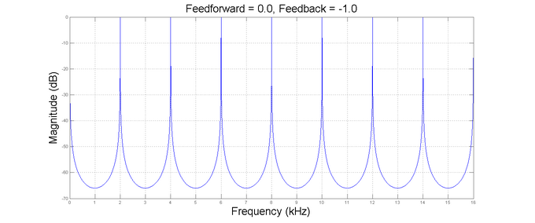
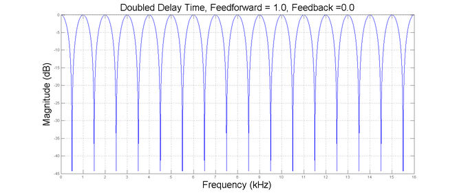

# Flanger

[Wwise 帮助文档](../../00-Wwise-帮助文档.md) > [Wwise 插件](../00-Wwise-插件.md) > [效果器插件](00-效果器插件.md) > Flanger

## Flanger

（请参阅下文的 [“Flanger properties”一节](07-Flanger.md#flanger_plug_in_properties "Flanger properties")。）

Flanging（镶边）音频效果的条件是两个相同信号进行混音，但其中一个信号发生少量而渐变的延迟。 这会产生扫频梳状滤波器效果：合成频谱中将产生在线性谐波级数中彼此相关的峰值和陷波。 使用 LFO 振荡器改变延迟会导致在频谱中上下移动。

### Comb filter spectral controls

Fanger 算法基于“统一梳状滤波器”（unified comb filter），可控制陷波和峰值的深度及其相对位置（如奇次或偶次谐波）。 这允许梳状滤波器可通过修改“前馈”和“反馈”系数来作出多样的频谱形态。

下图举列说明使用 0.5 ms 固定延迟可实现的幅度响应类型。 前馈系数控制频谱中的陷波深度，而反馈系数控制峰值幅度。

系数的符号可控制陷波或峰值出现在奇次谐波（采用正系数时）还是偶次谐波（采用负系数时），如下所示。

The feedforward and feedback components can be used together to build different spectral shapes for combining the effect of notches and peak as shown below.

延迟可有效控制陷波或峰值之间的间距。 延迟增加一倍，陷波之间的距离将减半，如下例所示。

### Alternate effects

借助“Blend”参数进一步提供的灵活性，可实现不同于镶边的效果，该参数可将延迟线的输入（包括反馈路径）与延迟线的前馈路径混合。

颤音（vibrato）效果就是这样一个例子（音高发生有规律的脉动变化）。 颤音可以表现为音高的变化量以及其变化速度。将反馈和混合值设置为 0 的时候，则只会保留（已调制）前馈路径（颤音分量）。

### Flanger properties

Flanger 插件包含一系列属性，其中很多属性可实时编辑，并可使用 RTPC 映射至特定游戏参数。

| 界面元素 | 描述 |
| --- | --- |
| Name | 名称。效果器实例的名称。  效果器实例是一组效果器属性设置。它们可以是两种类型之一：自定义或共享集。自定义实例只能由一个对象使用，然而共享集可在多个对象之间共享。 |
| (Object Color) | 显示对象的颜色。单击图标可打开颜色选择器。    选择一种颜色并将其应用于对象。在为对象选择某种颜色时，会在选定方块上显示调色板图标，并在右下角标注黄色三角（如图所示）。  若要沿用父对象的颜色，请选中颜色选择器最左侧的方块。 |
| Inclusion | 启用。决定是否在生成 SoundBank 时在其中包含相应元素。如勾选，则包含该元素。如未勾选，则不会包含该元素。  为了针对各个平台来优化声音设计，有时需在特定平台上弃用某些元素。在默认情况下，此复选框会应用于所有平台。使用复选框左侧的 [Link 标志](../../08-使用-Wwise/03-了解-Property-Editor/11-使用-Property-Editor.md#linking_unlinking_property_values "Linking or unlinking property values") 来取消链接相应元素。然后，便可根据平台来自定义复选框的状态。  若取消选中此选项，则将禁用编辑器中的属性和行为选项。  Default value: true |
| (Show references) | 指示工程中有多少元素包含对对象的直接引用。若存在对对象的引用，则图标显示为橙色；若不存在此类引用，则图标显示为灰色。  通过单击该按钮，可打开 [“Reference View 视图”一节](../../09-参考主题/04-Project-Explorer/12-搜索和工程全局编辑/05-Reference-View-视图.md "Reference View 视图")，并在 **References to:**（引用:）字段中查看对象的名称。 |
| Notes | 备注。Effect 的其它信息。 |
| Metering | 电平测量。指示当前正在测量电平的对象的名称。 |
|  | 允许浏览其他要测量电平的对象。  |  |  | | --- | --- | | [备注] | 备注 | | 只有对于包含 VU 电平表的效果器，Effect Editor 中才会显示电平测量界面元素。 | |
|  | 设置 Effect Editor 中选定标签页的显示方式。默认情况下，整体面板中仅显示一个选定标签页。不过，您可以通过单击分隔器按钮将面板沿横向或纵向一分为二，显示两个不同的标签页。当前所选选项将以高亮背景色显示。  |  |  | | --- | --- | | [备注] | 备注 | | 无法同时在两个面板中显示同一标签页。若选中的标签页已在另一面板中显示，则另一面板将自动显示另一标签页。 | |

|  |  |
| --- | --- |
| Delay | 延迟。梳状滤波器使用的延迟参数。 小延迟值将产生较少的频谱陷波／峰值。 大延迟值将在频率陷波／峰值之间产生小间隙。  单位：ms  Default value: 5  Range: 0.2 to 100 |
| **颜色设置** | |
| Blend | 混合。用于不进入被调制的延迟线的信号（反馈和干声信号的总和）上的缩放因子。 可用于创建从镶边到颤音等一系列效果。  Default value: 1.0  Range: 0 to 1 |
| Feedforward | 前馈。代表调制梳状滤波器的前馈路径所做贡献的缩放因子。 该参数取较大（绝对）值时将在频谱中形成较大的陷波。 而负值将把陷波放置在偶次谐波位置。  Default value: 1  Range: -1 to 1 |
| Feedback | 反馈。代表调制梳状滤波器的反馈路径所做贡献的缩放因子。 该参数取较大（绝对）值时将在频谱中产生较大的峰值。 而负值将把峰值放置在偶次谐波位置。  单位：线性增益  Default value: 0  Range: -1 to 1 |
| **Output 设置** | |
| Wet/Dry Mix | 控制湿声通路（Effect 输出）和干声通路（Effect 输入）之间的平衡。值为 0 时，原始信号将不受效果器影响的，而值为 100 时，则完全输出效果器信号。  单位：%  Default value: 100  Range: 0 to 100 |
| Output Gain | 增益。在执行动态压缩后作用于输出信号的增益量，可弥补潜在增益损失。  Default value: 0  Range: -24 to 24  Units: dB |
| Process Center | 确定是否在中置声道中处理效果。选中后，中置声道将不受效果器的影响。  Default value: false |
| Process LFE | 确定是否在 LFE 声道中处理效果。选中后，LFE 声道将不受效果器的影响。  Default value: false |
| **LFO 部分** | |
| LFO Depth | 深度。控制实际延迟长度的调幅量，单位为百分比。 值为 0% 时，梳状滤波器使用的延迟长度总是由延迟参数指定。 值为 100% 时，延迟长度调制为它的整个范围。  单位：%  Default value: 50  Range: 0 to 100 |
| LFO Frequency | 调制信号的频率。  单位：Hz  Default value: 1  Range: 0.02 to 20000  Units: Frequency |
| LFO Waveform | 波形。调制信号的形状。  值：Sine、Square、Triangle、Upward sawtooth、Downward sawtooth。  **Caution**:虽然在运行时可使用 RTPC 更改此参数，但不能保证信号是连续的。  Default value: Sine |
| LFO Smoothing | 平滑。作用于调制信号的平滑量。 它按特定值进行低通滤波，从 0 映射至 100%。 在 0% 时，信号按原样输出。 使用大值时，边缘和间断将进行平滑处理。  |  |  | | --- | --- | | [备注] | 备注 | | 此设置对正弦波无任何影响。 |  单位：%  Default value: 0  Range: 0 to 100 |
| PWM (Pulse Width Modulation) | 脉冲宽度调制。仅作用于方波形。 在一个周期内调制脉冲的宽度。 值为 50% 时，信号在半个周期内处于满幅度，剩下半个周期则为 0。 值接近 100% 时，信号在几乎整个周期内都处于满幅度，而只有极短的时间让幅度降到 0。  单位：%  Default value: 50  Range: 0 to 100 |
| **Initial Phase（初相）** | |
| LFO Phase Offset | 偏置。将所有声道的调制信号的相位偏置某个特定值。  |  |  | | --- | --- | | [备注] | 备注 | | 虽然在运行时可通过 RTPC 更改该参数，但在该效果器的实例已经开始播放后设置该参数时，该参数不会产生任何效果。 |  单位：°  Default value: 0  Range: -180 to 180 |
| LFO Spread Mode | 散布模式。定义初始阶段散布（参见参数“Spread”）如何应用于所有声道。 例如，将 Spread Mode 设置为“Front-Rear”时，所有前置声道开始使用等于 0 的相位进行播放，所有后置声道开始使用等于“Spread”的相位进行播放。 如果存在（并已处理），则 LFE 声道总是与左前声道同步。  值：  - **Left-Right**:左前声道和左后声道从偏置 0 开始播放，右前和右后声道从偏置“Spread”开始播放。 如果存在，则中置声道会从偏置“Spread”/2 开始播放。 - **Front-Rear**:前置和中置声道采用偏置 0 开始播放，后置声道采用偏置“Spread”开始播放。 - **Circular**:该模式在 1.x、2.x 和 3.x 配置的左声道和右声道之间，以及在 4.x 和 5.x 配置的左前声道和右后声道之间应用两极扩散 。 例如，3.0 信号将从以下相位开始：L=0、C=“Spread”/2、R=“Spread”。 5.0 信号将从以下相位开始：FL=0、C=“Spread”/4、FR=“Spread”/2、RL=“Spread”/2、RR=“Spread”。 - **Random**:各个声道将从均匀分布在 0 和“Spread”之间的随机相位开始。  |  |  | | --- | --- | | [备注] | 备注 | | 虽然在运行时可通过 RTPC 更改该参数，但在该效果器的实例已经开始播放后设置该参数时，该参数不会产生任何效果。 |  Default value: Left-Right |
| LFO Phase Spread | 散布。各声道之间初始相位扩散的差异量。 该值影响各个声道的方式取决于 Spread Mode 。  |  |  | | --- | --- | | [备注] | 备注 | | 虽然在运行时可通过 RTPC 更改该参数，但在该效果器的实例已经开始播放后设置该参数时，该参数不会产生任何效果。 |  单位：°  Default value: 0  Range: 0 to 180 |

|  |  |
| --- | --- |
| [注意] | 注意 |
| 请记住，在参数取大值时，Feedback 参数可使声音逐渐增大。 |

|  |  |
| --- | --- |
| [注意] | 注意 |
| 效果尾音（即声音停止输入后的一段时间，其间效果器将继续输出延迟线中累积的数据）与反馈值大小无关。也就是说，对于强反馈值，效果器可能会在音量很大的时候终止输出。 |

另请参阅[“Tremolo 属性”一节](25-Tremolo（震音）.md#Tremolo_LFO_Phase)了解 LFO 参数的详细说明。

---