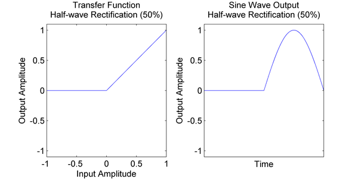

# Guitar Distortion（吉他失真效果器）

[Wwise 帮助文档](../../00-Wwise-帮助文档.md) > [Wwise 插件](../00-Wwise-插件.md) > [效果器插件](00-效果器插件.md) > Guitar Distortion（吉他失真效果器）

## Guitar Distortion（吉他失真效果器）

（请参阅下文的 [“Guitar Distortion properties”一节](09-Guitar-Distortion（吉他失真效果器）.md#guitar_distortion_plug_in_properties "Guitar Distortion properties")。）

失真是一种非线性处理，它会更改波形的形状，引入原始信号中不存在的频率分量。Guitar Distortion 插件模拟常见“stomp box”失真的行为，从而获取典型的吉他失真声音。

### Distortion types

Guitar Distortion 插件可提供几种失真算法效果。以下传递函数图演示不同失真类型如何对信号产生影响。在图像中，没有失真时，传递函数（左侧）将显示输出振幅始终与输入振幅相同。输入正弦波（右侧）时，算法输出将没有失真。

在振幅达到过载电平时，“Clip”失真类型将采用硬拐点（即无过渡）方式，将正负振幅对称削去相同的电平。

在振幅达到过载电平时，“Overdrive”失真类型将采用软拐点方式，缓慢过渡至完全削波，将正负振幅对称削去相同的电平。

在振幅达到过载电平时，“Heavy”失真类型将采用软拐点方式，缓慢过渡至完全削波，将正负振幅对称削去相同的电平。传递函数在零值周围曲线更陡峭，所以削波保持的时间会更长。它通常与较大的 Drive 参数值一起使用，以获得重金属失真效果。

“Fuzz”失真类型会为正负振幅不对称地削去电平。它为负振幅采用软拐点方式，缓慢过渡至完全削波，而正振幅在高电平时则使用硬拐点。此类型的失真更适合单音独奏型素材，因为在输入复杂的复音时，它会很快变得非常不和谐。Tone 参数主要用于控制负振幅的软拐点（图中 Tone 参数设置为 10）。

### Rectification

Rectification 参数值在 50% 以下时将执行半波整流，在 50% 和 100% 之间时将执行全波整流。半波整流用于让负振幅部分保持在特定电平之上；如图例，可以通过 Rectification 参数逐步将起始点 -1 调整为 0，值为 0% 时不会应用半波整流，值为 50% 时则不允许负振幅低于 0，即完全削波。

全波整流会更进一步，随着 Rectification 参数值上升，输入的负信号部分将逐步变为正信号。值为 100% 时将实现全波整流，负信号部分的极性将完全反转。它能起到让基频翻倍的作用，可用于实现“高八度”效果。

### Equalizer controls

由于失真是非线性处理（即在失真之前和之后应用增益不等效），因此进行滤波时，在失真算法之前和之后针对特定频率应用增益，效果也不同。实际上，常见做法是先以特定方式进行信号滤波（如增强低频），让失真算法以所需的方式运行，然后再滤除相同的频带来抵消失真前的滤波效果。因此，在失真处理前后将提供功能全面的参数均衡器，以便自定义失真行为并获取多样的失真效果。

### Guitar Distortion properties

Guitar Distortion 插件包含一系列属性，其中很多属性可实时编辑，并可使用 RTPC 映射至特定游戏参数。

| 界面元素 | 描述 |
| --- | --- |
| Name | 名称。效果器实例的名称。  效果器实例是一组效果器属性设置。它们可以是两种类型之一：自定义或共享集。自定义实例只能由一个对象使用，然而共享集可在多个对象之间共享。 |
| (Object Color) | 显示对象的颜色。单击图标可打开颜色选择器。    选择一种颜色并将其应用于对象。在为对象选择某种颜色时，会在选定方块上显示调色板图标，并在右下角标注黄色三角（如图所示）。  若要沿用父对象的颜色，请选中颜色选择器最左侧的方块。 |
| Inclusion | 启用。决定是否在生成 SoundBank 时在其中包含相应元素。如勾选，则包含该元素。如未勾选，则不会包含该元素。  为了针对各个平台来优化声音设计，有时需在特定平台上弃用某些元素。在默认情况下，此复选框会应用于所有平台。使用复选框左侧的 [Link 标志](../../08-使用-Wwise/03-了解-Property-Editor/11-使用-Property-Editor.md#linking_unlinking_property_values "Linking or unlinking property values") 来取消链接相应元素。然后，便可根据平台来自定义复选框的状态。  若取消选中此选项，则将禁用编辑器中的属性和行为选项。  Default value: true |
| (Show references) | 指示工程中有多少元素包含对对象的直接引用。若存在对对象的引用，则图标显示为橙色；若不存在此类引用，则图标显示为灰色。  通过单击该按钮，可打开 [“Reference View 视图”一节](../../09-参考主题/04-Project-Explorer/12-搜索和工程全局编辑/05-Reference-View-视图.md "Reference View 视图")，并在 **References to:**（引用:）字段中查看对象的名称。 |
| Notes | 备注。Effect 的其它信息。 |
| Metering | 电平测量。指示当前正在测量电平的对象的名称。 |
|  | 允许浏览其他要测量电平的对象。  |  |  | | --- | --- | | [备注] | 备注 | | 只有对于包含 VU 电平表的效果器，Effect Editor 中才会显示电平测量界面元素。 | |
|  | 设置 Effect Editor 中选定标签页的显示方式。默认情况下，整体面板中仅显示一个选定标签页。不过，您可以通过单击分隔器按钮将面板沿横向或纵向一分为二，显示两个不同的标签页。当前所选选项将以高亮背景色显示。  |  |  | | --- | --- | | [备注] | 备注 | | 无法同时在两个面板中显示同一标签页。若选中的标签页已在另一面板中显示，则另一面板将自动显示另一标签页。 | |

|  |  |
| --- | --- |
| **Pre-Distortion EQ** | |
| Pre-Distortion EQ Band Enable | 勾选后将启用 EQ 频带。  Default value: false |
| Pre-Distortion EQ Band Curve | 曲线。相应 EQ 频带信号的滤波类型。可以使用以下筛选器：  - **Low Pass** —— 低通。从指定频率中提供高频率的固定斜率衰减。 低于该点，信号几乎不受影响，但高于截止频率点时，频率越高，衰减逐步增大。 - **High Pass** —— 高通。从指定频率中提供低频率的固定斜率衰减。 高于该点，信号几乎不受影响，而低于截止频率点时，频率越低，衰减逐步增大。 - **Band Pass** —— 带通。拒绝指定中心频率周围的所有频率。 中心周围的频率范围由 Q 进行控制。 - **Notch** —— 带阻。为指定频率范围的固定衰减提供一个不同的宽度。 中心周围的频率范围由 Q 进行控制。 - **Low Shelf** —— 低架。为指定范围的低频率提供增益/衰减。 此曲线类型也被称为 Bass Tone Control（低音控制）。 - **High Shelf** —— 高架。为指定范围的高频率提供增益/衰减。 此曲线类型也被称为 Treble Tone Control（高音控制）。 - **Peaking** —— 峰值。为指定频率范围的放大/衰减提供一个不变的宽度。 峰值周围的频率范围由 Q 进行控制。  Default value: Low Shelf |
| Pre-Distortion EQ Band Gain | 增益。所选频带的音频信号的放大量。增大此值将“增强”音频信号。 减小此值将“削减”或衰减音频信号。  |  |  | | --- | --- | | [备注] | 备注 | | 当选择了 Low Pass、High Pass、Notch 和 Band Pass 曲线时，Gain 控件不可用，因为这些滤波器类型的通带已经归一化为 0 dB。 |  Default value: 0  Range: -48 to 48  Units: dB |
| Pre-Distortion EQ Band Frequency | 评率。频谱中将受到增益影响的部分。  单位：Hz  Default value: 1000  Range: 20 to 20000  Units: Frequency |
| Pre-Distortion EQ Band Quality Factor | 品质因数。中心频率周围将受增益变化影响的区域。 低 Q 值表示带宽范围较宽，相反，高 Q 值表示带宽范围较窄。  当选择了 Low Pass、High Pass、Low Shelf 和 High Shelf 曲线时，该控制不可用。  Default value: 1  Range: 0.1 to 20 |
| **失真** | |
| Type | 失真算法的类型。以下选项可用：  - **None**: **None：**不应用失真。 - **Overdrive**:**Overdrive：**平滑、蓝调类型的失真。 - **Heavy**:**Heavy：**硬失真，将产生大量高频谐波。 - **Clip**:**Clip：**不具有拐点过渡的硬削波。通常会导致不悦耳的静态噪音（削波失真）。 - **Fuzz**:**Fuzz：**不对称的硬削波和软削波，正负振幅阈值不同。此类型的失真将导致大量谐波，输入信号为复杂的乐音时，将很快产生不和谐的噪音。  Default value: None |
| Drive | 此参数用于在应用传递函数前调整输入信号。可视其为失真量。  单位：%  Default value: 50  Range: 0 to 100 |
| Tone | 按照上文所述方式更改传递函数。  |  |  | | --- | --- | | [备注] | 备注 | | 只有在失真类型设置为 Fuzz 时此参数才有效。 |  单位：%  Default value: 50  Range: 0 to 100 |
| Distortion Rectification | 将影响输入信号负值部分的半波或全波整流量。有关详细信息，请参阅 [Rectification](09-Guitar-Distortion（吉他失真效果器）.md#wwise_guitar_distortion_plug_in_rectification "Rectification") 。  单位：%  Default value: 0  Range: 0 to 100 |
| **Output** | |
| Output Gain | 输出信号的增益量。  Default value: 0  Range: -24 to 24  Units: dB |
| Wet/Dry Mix | 控制湿声通路（Effect 输出）和干声通路（Effect 输入）之间的平衡。值为 0 时，原始信号将不受效果器影响的，而值为 100 时，则完全输出效果器信号。  单位：%  Default value: 100  Range: 0 to 100 |
| **Post-Distortion EQ** | |
| Post-Distortion EQ Band Enable | 勾选后将启用 EQ 频带。  Default value: false |
| Post-Distortion EQ Band Curve | 曲线。相应 EQ 频带信号的滤波类型。可以使用以下筛选器：  - **Low Pass** —— 低通。从指定频率中提供高频率的固定斜率衰减。 低于该点，信号几乎不受影响，但高于截止频率点时，频率越高，衰减逐步增大。 - **High Pass** —— 高通。从指定频率中提供低频率的固定斜率衰减。 高于该点，信号几乎不受影响，而低于截止频率点时，频率越低，衰减逐步增大。 - **Band Pass** —— 带通。拒绝指定中心频率周围的所有频率。 中心周围的频率范围由 Q 进行控制。 - **Notch** —— 带阻。为指定频率范围的固定衰减提供一个不同的宽度。 中心周围的频率范围由 Q 进行控制。 - **Low Shelf** —— 低架。为指定范围的低频率提供增益/衰减。 此曲线类型也被称为 Bass Tone Control（低音控制）。 - **High Shelf** —— 高架。为指定范围的高频率提供增益/衰减。 此曲线类型也被称为 Treble Tone Control（高音控制）。 - **Peaking** —— 峰值。为指定频率范围的放大/衰减提供一个不变的宽度。 峰值周围的频率范围由 Q 进行控制。  Default value: Low Shelf |
| Post-Distortion EQ Band Gain | 增益。所选频带的音频信号的放大量。增大此值将“增强”音频信号。 减小此值将“削减”或衰减音频信号。  |  |  | | --- | --- | | [备注] | 备注 | | 当选择了 Low Pass、High Pass、Notch 和 Band Pass 曲线时，Gain 控件不可用，因为这些滤波器类型的通带已经归一化为 0 dB。 |  单位：dB  Default value: 0  Range: -48 to 48  Units: dB |
| Post-Distortion EQ Band Frequency | 评率。频谱中将受到增益影响的部分。  单位：Hz  Default value: 1000  Range: 20 to 20000  Units: Frequency |
| Post-Distortion EQ Band Quality Factor | 品质因数。中心频率周围将受增益变化影响的区域。 低 Q 值表示带宽范围较宽，相反，高 Q 值表示带宽范围较窄。  当选择了 Low Pass、High Pass、Low Shelf 和 High Shelf 曲线时，该控制不可用。  Default value: 1  Range: 0.1 to 20 |

---