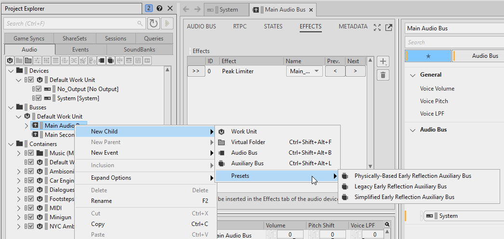
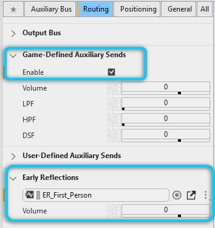
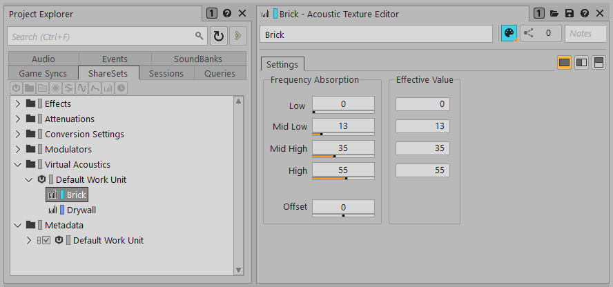
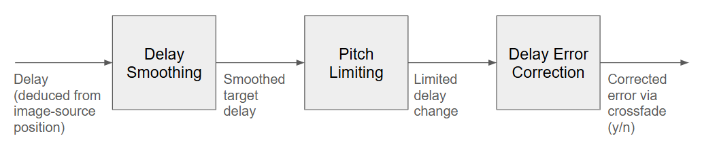
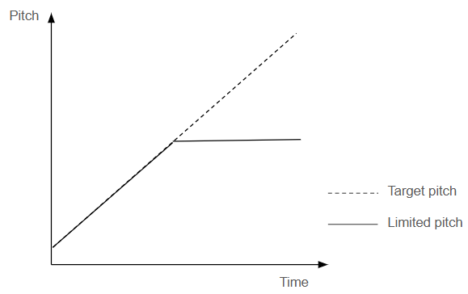
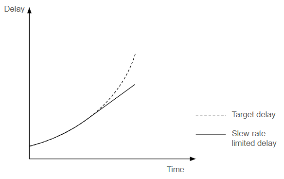
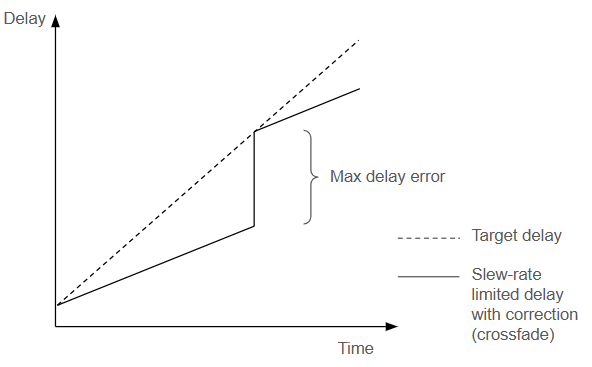

# Reflect

[Wwise 帮助文档](../../00-Wwise-帮助文档.md) > [Wwise 插件](../00-Wwise-插件.md) > [效果器插件](00-效果器插件.md) > Reflect

## Reflect

（请参阅下文的 [“Reflect properties”一节](19-Reflect.md#wwise_reflect_properties "Reflect properties")。）

Reflect 效果器插件利用多[抽头](../../14-词汇表.md#glossary_tap "Tap（延迟线分流）")时变[延迟线](../../14-词汇表.md#glossary_delay_line "Delay Line（延迟线）")及滤波器来模拟空间化早期反射。

在涉及声学特性的几何建模时，通常采用“[镜像声源法](http://interactiveacoustics.info/html/GA_IS.html)”计算空间化早期反射声。采用这种方法，可以通过镜像声源来表示早期反射声，就像反射声音的几何表面是镜面一样，具体可参见下图。

|  |
| --- |
|  |

在此图中，发声体 E 和听者 L 位于同一几何构造（房间）内（即黑色实线框标示部分）。从发声体到听者的反射路径标示为绿色实线。镜像声源法针对各个反射面生成发声体的镜像。镜像声源位于表面之后的等距离处，与发声体的连线与反射面正交。声音传播的总距离相当于镜像声源和听者之间的距离。注意，镜像声源的分布方位严格依赖于发声体位置和几何构造，而与听者位置无关。

对于给定插件实例，游戏会向其推送一系列镜像声源。对于每个镜像声源，都会向延迟线添加一个抽头 (tap)，然后依据其相对 3D 位置、由距离和衍射驱动的曲线及关联 [“Acoustic Texture”一节](19-Reflect.md#acoustic_textures "Acoustic Texture") 进一步滤波、摆位和缩放。

Reflect 一般用在代表早期反射的 Auxiliary Bus 上。若总线与其声音来源对应的游戏对象建立关联，则便可准确模拟早期反射声。

### 在 Wwise 工程中设置 Reflect

1. 添加用于早期反射的 Auxiliary Bus：

   1. 在 Project Explorer（工程资源管理器）中，右键单击要在其下创建 Early Reflection Auxiliary Bus 的总线。
   2. Select **New Child** > **Presets** and choose either **Physically-Based Early Reflection Auxiliary Bus**, **Simplified Early Reflection Auxiliary Bus** or **Legacy Early Reflection Auxiliary Bus**. We recommend using the simplified or physically-based auxiliary bus to benefit from all of Reflect's features. See the [“Intended Reflect workflow”一节](19-Reflect.md#reflect_intended "Intended Reflect workflow") below.

      |  |  |
      | --- | --- |
      | [备注] | 备注 |
      | These Presets are only available when Reflect is installed and the **Reflect** and/or **Reflect (Physically-Based)** Factory Presets have been added to your project. If the Presets haven't been added, you can add them using the [“Import Factory Assets”一节](../../09-参考主题/01-工程/06-Import-Factory-Assets.md "Import Factory Assets") dialog. |

      

      创建了新的 Auxiliary Bus 并为其添加了 Reflect 效果器插件。有关此总线的更多详细信息，请参阅“[“Reflect Auxiliary Bus 的特性”一节](19-Reflect.md#reflect_auxilary_bus_settings "Reflect Auxiliary Bus 的特性")”章节。
2. 配置想要反射的声音：

   1. 若要[“Setting up Reflect with spatial audio”一节](19-Reflect.md#reflect_setup_spatialaudio "Setting up Reflect with spatial audio")（首选方式）或使用 [SpatialAudio::SetImageSource](https://www.audiokinetic.com/library/edge/?source=SDK&id=namespace_a_k_1_1_spatial_audio_aab4d85317c62724c00d25ba8913fb503.html) API，请在 Sound Property Editor（声音属性编辑器）的 General Settings（常规设置）选项卡中将新建的总线指派给 Early Reflections（早期反射）的 **Auxiliary Bus**（辅助总线）。除此之外，还可设置发送音量。
   2. 若要[“Setting up Reflect without spatial audio”一节](19-Reflect.md#reflect_setup_nospatialaudio "Setting up Reflect without spatial audio")或将其发送到其他 Auxiliary Bus（辅助总线）来实施后期混响，请在 Sound Property Editor（声音属性编辑器）的 General Settings（常规设置）选项卡中选中 **Use game-defined auxiliary sends**（使用游戏定义的辅助发送）。

      
   3. 通常会以 3D 形式对所要反射的声音进行空间化处理并应用衰减。在 Sound Property Editor 的 Positioning 选项卡中：

      1. 选中 **Listener Relative Routing**（听者相对通路）。
      2. 将 3D Spatialization（3D 空间化）设为 **Position + Orientation**（位置 + 朝向）。
      3. 在 **Attenuation**（衰减）分组框中添加衰减。

      
3. 在 Reflect Effect Editor 中配置效果器：

   1. 通过修改 **Output Config**（输出配置）属性，将输出声道设为所需配置。其中，**Parent Bus**（父总线）代表 Auxiliary Bus 的父总线的输出总线配置。
   2. 在默认情况下，所有曲线均设为 **Use Attenuation**（使用衰减）。若将有些声音的 Early Reflections **Auxiliary Bus**（早期反射辅助总线）设为了此 Reflect 效果器上添加的 Auxiliary Bus，并且声音应用有衰减，则可选择 **Attenuations >**（衰减 >）按钮来在列表中查看衰减。通过选择此列表中的衰减，可在坐标图中查看不同的曲线。除此之外，还可将曲线设为 **Custom**（自定义）并自行设定。

      |  |  |
      | --- | --- |
      | [备注] | 备注 |
      | **Distance High-shelf Filter** and **Diffraction High-shelf Filter** curves are always custom, because these curves don't exist in Wwise Attenuation ShareSets. |
   3. 若有自定义曲线，请确保将 **Max Distance**（最大距离）设置得足够大，确保镜像声源发出的声音能够到达听者所在位置。

      
4. 确保已获取 Reflect 插件授权。
5. 生成 SoundBank（音频包）。

### Reflect Auxiliary Bus 的特性

当[“在 Wwise 工程中设置 Reflect”一节](19-Reflect.md#reflect_setup_wwise "在 Wwise 工程中设置 Reflect") 时，会创建一条 Auxiliary Bus（辅助总线）。它是标准 Auxiliary Bus，其采用了以下设置：

- 总线配置按照如下所述定义（取决于所选 Preset）：

  - **The Simplified and Physically-Based Presets**: The bus configuration is Audio Objects. 在将输入总线配置设为 Audio Objects 时，允许 Reflect 插件接收输入声音中的更多信息（比如声音上应用的衰减）。这样方便 Reflect 插件使用声音的衰减曲线来对输出声音进行滤波（如用户指定）。
  - **Legacy** Preset：总线配置为 1.0（单声道）。虽然 Reflect 能够处理多声道输入声音，但是其首先会将其下混为单声道。因此，将总线直接设置为单声道会更加高效，这样可以避免 Wwise 对发送到此 Auxiliary Bus 的声部执行不必要的空间化计算。

  |  |  |
  | --- | --- |
  | [备注] | 备注 |
  | 总线配置（Audio Objects 或单声道）不会影响 Reflect 的输出配置。您可以通过 Reflect 的 Effect Settings 来设定早期反射空间化所用的输出配置。 |
- 它上面添加有 Reflect 插件。The Legacy, Simplified, and Physically-Based Presets include different instances of Reflect. The Legacy Reflect instance is set to use **Custom** curves for its filtering, while the Simplified Reflect instance is set to **Use Attenuation** distance curves instead. For the Physically-Based preset, its diffraction curves are set to use **Custom** curves, which approximate the effect of lifelike diffraction using Shelf Filters. In all cases, this can be changed in the Reflect Effect Editor.

  |  |  |
  | --- | --- |
  | [备注] | 备注 |
  | 只有当所在早期反射 Auxiliary Bus 的总线配置设为 Audio Objects 时，设为 **Use Attenuation** 曲线的 Reflect 效果器才能检索衰减曲线。Likewise, Occlusion from Portals is only supported if the bus configuration is set to **Audio Objects** in the Simplified mode, by using the retrieved occlusion curve. |
- 在 Positioning（定位）选项卡中，选中了 **Listener Relative Routing**（听者相对通路）选项，而将 3D Spatialization（3D 空间化）保留为了 **None**（无）。否则，Wwise 会对 Reflect 生成和空间化的镜像声源实施进一步的摆位和衰减。

  注意，此总线应用的所有衰减都会基于发声体和听者的位置影响总线输出。若要基于不同镜像声源和听者的位置自定义衰减，请转到 Reflect Effect Editor。

### Intended Reflect workflow

Reflect 既可在原有 (legacy) 模式也可在简化 (simplified) 模式下使用。在原有模式下，用户必须设定一系列自定义曲线来对早期反射实施衰减。在简化模式下，Reflect 会使用各个声音自身的衰减曲线对早期反射实施衰减。前提假设是应当按照与声音本身相同的曲线来对声音的早期反射实施衰减。

Reflect 的简化模式可通过将早期反射辅助总线设为 Audio Objects 输入总线配置来激活。藉此，声音引擎可获取输入声音的衰减曲线，以在 Reflect 插件执行当中进行使用。这并不会影响辅助总线的输出，因为 Reflect 为非原地效果器。用户可在 Reflect Effect Editor 的 Output Config 属性中选择输出配置。

该模式称为简化模式。因为用户只需将声音与 Simplified Early Reflection Auxiliary Bus 关联，便可自动对声音的早期反射进行合理的设计。鉴于每个声音都可单独应用衰减，简化模式还允许同一 Reflect 效果器对多个声音实施不同的衰减。与之相比，在原有模式下，需要创建不同的 Reflect Effect ShareSet 来获取不同的曲线。

为了允许在简化模式下实施一些自定义，每个 Reflect ShareSet 都设置了距离和衍射扭曲属性。藉此，可分别突显或弱化距离和衍射产生的效果。比如，可通过设置正的距离扭曲值来将镜像声源定位到离听者更远的位置。这样的话，会对早期反射实施比直达信号更多的衰减，从而弱化由距离驱动的曲线所产生的效果。距离扭曲会将距离保持在 0 和曲线的最大距离之间。同样，也可通过扭曲衍射来突显或弱化衍射产生的效果（在 0 ~ 100 之间移动衍射值）。除此之外，还可利用 RTPC 来设置这些扭曲值，以依据游戏参数突显或弱化效果。

若扭曲不能满足要求，可以使用自定义曲线。各条曲线可单独设为使用衰减曲线或自定义曲线。注意，自定义曲线对所有使用同一 Reflect 效果器的声音来说都是单独设定的。扭曲处理也会影响自定义曲线。

The Physically-Based preset is a hybrid between the legacy and simplified modes. It works on an Audio Objects bus configuration and uses the input sound's distance attenuation curves, like in the simplified mode. However, for diffraction, it uses custom curves. These custom curves approximate the effect of lifelike diffraction, using volume attenuation and a shelf filter. Although the input sound typically has diffraction-driven curves built-in in Wwise, the diffraction effect simulated in Reflect mostly happens in the View zone, instead of the Shadow zone, and these zones affect the sound in different ways. The custom curves of the Physically-Based preset are likely to be more adequate for modeling view zone diffraction than the built-in curves in Wwise. Refer to [Spatial Audio Concepts - Diffraction](https://www.audiokinetic.com/library/edge/?source=SDK&id=spatial_audio_concepts.html#spatial_audio_concepts_diffraction) for an illustration of the View and Shadow diffraction zones.

只有在所有曲线都始终设为 Custom 并且想竭力避免使用 Audio Object 的情况下才建议使用原有模式。

### Setting up Reflect with spatial audio

在[“在 Wwise 工程中设置 Reflect”一节](19-Reflect.md#reflect_setup_wwise "在 Wwise 工程中设置 Reflect")后，需要在游戏端加以设置。为此，可使用 Spatial Audio API。

1. 确保通过包含 `AK/Plugin/AkReflectFXFactory.h` 来注册 Reflect 插件。
2. 包含 Spatial Audio 头文件：`AK/SpatialAudio/Common/AkSpatialAudio.h`。
3. 初始化 Spatial Audio 模块，并注册 Spatial Audio 听者。

   ```
   // Initialize Wwise Spatial Audio.
   AkSpatialAudioInitSettings settings;
   res = AK::SpatialAudio::Init(settings);

   // Register the listener game object if not already done, and then register it as the one and only spatial audio listener.
   static const AkGameObjectID LISTENER_ID = 10000;
   AK::SoundEngine::RegisterGameObj( LISTENER_ID, "Listener" );
   AK::SpatialAudio::RegisterListener( LISTENER_ID );
   ```
4. 定义并设置构成 Reflect 几何构造表面的几何构造。

   创建 `AkGeometryParams`，并填入几何构造的三角形、顶点和表面。

   ```
   static const AkGeometrySetID GEOMETRY_ID = 200;
   AkGeometryParams geometryParam;

   // Fill triangles, vertices and surfaces into geometryParam.
   // 参见 Integration Demo 中的示例。
   // ...

   AK::SpatialAudio::SetGeometry( GEOMETRY_ID, geometryParams );
   ```

### Setting up Reflect without spatial audio

在[“在 Wwise 工程中设置 Reflect”一节](19-Reflect.md#reflect_setup_wwise "在 Wwise 工程中设置 Reflect")后，需要在游戏端加以设置。

1. 确保通过包含 `AK/Plugin/AkReflectFXFactory.h` 来注册 Reflect 插件。
2. 包含 Reflect 头文件：`AK/Plugin/AkReflectGameData.h`。
3. 另外可能还要将 `AkReflectFX.lib` 添加到可执行程序的输入库。
4. 使用 Reflect API 创建镜像声源，并根据想要从哪里反射声音来设定其位置。

   ```
   // Create an AkReflectGameData object.
   AkReflectGameData * reflectGameData = nullptr;
   reflectGameData = (AkReflectGameData *)_alloca(AkReflectGameData::GetSize(1));
   // Fill in the data.
   reflectGameData->listenerID = LISTENER_ID;
   reflectGameData->uNumImageSources = 1;
   reflectGameData->arSources[0].uID = 123;
   reflectGameData->arSources[0].params.sourcePosition = { 200, 0, 0 };
   // The following represents a distance factor between the listener and the image source.
   // If the source position corresponds to the reflective surface, the number should be two.
   reflectGameData->arSources[0].params.fDistanceScalingFactor = 1.f;
   reflectGameData->arSources[0].params.fLevel = 1.f;
   // Associate the image source with Acoustic Textures here if needed.
   reflectGameData->arSources[0].texture.uNumTexture = 0;
   reflectGameData->arSources[0].name.SetName("Img src 1");

   // Send to Reflect.
   AK::SoundEngine::SendPluginCustomGameData(AK::SoundEngine::GetIDFromString("ER"), EMITTER_ID, AkPluginTypeEffect, AKCOMPANYID_AUDIOKINETIC, 171, reflectGameData, AkReflectGameData::GetSize(1));
   ```
5. 在需要更新镜像声源的位置时，发送新的 `AkReflectGameData`。

### Acoustic Texture

每个镜像声源最多可传递四种 Acoustic Texture（声学材质）。Acoustic Texture 代表材料属性（详见 [“Acoustic Texture Editor”一节](../../09-参考主题/04-Project-Explorer/05-ShareSets-选项卡/05-Acoustic-Texture-Editor.md "Acoustic Texture Editor")）。在应用插件的过程中，各材质的四个吸收频段（Low、Mid Low、Mid High 和 High）转换为四频段衰减。When Material Filtering is set to Favor Performance (see the [“Reflect properties”一节](19-Reflect.md#wwise_reflect_properties "Reflect properties")), which is the default value, then the Mid Low and Mid High frequency band attenuations are averaged and used as a single mid-band frequency band attenuation. If, however, Material Filtering is set to Favor Quality, these four frequency band attenuations are used as-is in four cascaded filters.

在应用多种 Acoustic Texture 时，频段吸收系数的效果将叠加，就像把信号连续滤波一样。这样可以有效模拟先后碰到多个表面后生成的反射声。



**Reflect mapping of frequency absorption bands**

If Material Filtering is set to Favor Performance (see the [“Reflect properties”一节](19-Reflect.md#wwise_reflect_properties "Reflect properties")), the frequency band attentuations occur at:

- **Low**（低）：< 250 Hz
- **Mid**: =1,000 Hz
- **High**: > 5,000 Hz

The frequencies for absorptions can not be changed when Material Filtering is set to Favor Performance.

Otherwise, when Material Filtering is set to Favor Quality, the frequency band attenuations occur at:

- **Low**（低）：< 250 Hz
- **Mid Low**（中低）：> 250 Hz 且 < 1,000 Hz
- **Mid High**（中高）：> 1,000 Hz 且 < 4,000 Hz
- **High**（高）：> 4,000 Hz

|  |  |
| --- | --- |
| [技巧] | 技巧 |
| The Reflect values for frequency absorption can be changed when Material Filtering is set to Favor Quality, but this should only be needed in very particular scenarios. 为此，可直接编辑 `%Wwise%\Authoring\x64\Release\bin\plugins\AkReflect.xml` 文件，更改 `BaseTextureFrequency` 的 `Default Value`。这样会定义新的默认 Low 频段，其他频段将按照两个八度的间隔连续排布。 |

### 利用 Reflect 模拟第三人称声音的反射

要想将 Reflect 用于第三人称声音，必须在与该发声体关联的总线上运行该插件。有关详细信息，请参阅 [3D 总线](../../09-参考主题/04-Project-Explorer/01-Audio-tab/02-Busses-hierarchy/04-Common-tabs-and-categories-Busses-hierarchy-object/05-Positioning-category-Audio-and-Auxiliary-Busses.md "Positioning category: Audio and Auxiliary Busses")和  [`AK::SoundEngine::SetGameObjectAuxSendValues()`](https://www.audiokinetic.com/library/edge/?source=SDK&id=namespace_a_k_1_1_sound_engine_af960fca0239e219b9d08c2659fe9e5d4.html)。您可以利用 [`AK::SpatialAudio`](https://www.audiokinetic.com/library/?source=SDK&id=namespace_a_k_1_1_spatial_audio.html) 服务来相应地设置总线实例。

### 微调 Reflect 设置

Wwise Reflect 提供一组简单的参数，方便微调生成的反射声。

反射声是将输入信号进行下混后，再经过摆位、滤波和延迟得到的。游戏驱动的镜像声源的距离和 Wwise Reflect 的 Speed of Sound 都会影响延迟时间。滤波和音量缩放将依据镜像声源距离和衍射系数，通过各个曲线计算得到。此外，滤波还会受镜像声源的 Acoustic Texture 影响。

|  |  |
| --- | --- |
| [技巧] | 技巧 |
| 距离衰减曲线用来模拟空气对声音的吸收和能量衰减。 |

### Working with diffraction

镜像声源也可应用衍射系数。若为镜面衍射，则该系数一般为零；若声音传播路径需要在反射表面边缘附近弯曲才能到达听者所在位置，则衍射系数不为零。这种反射的振幅一般较小且会经过滤波。Reflect 提供各种曲线，方便根据衍射系数来微调这些参数。有关衍射、衍射与早期反射的交互作用、`AK::SpatialAudio` 模拟方式的详细信息，请参阅 [Spatial Audio 概念 – 衍射](https://www.audiokinetic.com/library/edge/?source=SDK&id=spatial_audio_concepts.html#spatial_audio_concepts_diffraction)和[早期反射的几何衍射](https://www.audiokinetic.com/library/edge/?source=SDK&id=spatial_audio_apigeometry_diffract.html#spatial_audio_apigeometry_diffract_er)。

### Working with occlusion

Image sources can also have occlusion values. Spatial Audio assigns Portal occlusion according to the max of the Portal occlusion values for each Portal a reflection passed through. Reflect does not expose a bespoke curve for occlusion, therefore occlusion is only available when the bus configuration of the early reflection Auxiliary Bus is set to Audio Objects, which allows occlusion curves to be retrieved from each sound. See also: [Spatial Audio Concepts - Obstruction and Occlusion](https://www.audiokinetic.com/library/edge/?source=SDK&id=spatial_audio_concepts.html#spatial_audio_concepts_obsocc).

### Reducing Doppler artifacts

Delaying a signal using a time-varying delay causes its pitch to shift in proportion to the rate of change of the delay. This is called the Doppler effect. Although this phenomenon occurs in the real world, in the context of a game, it can cause undesirable artifacts. This is particularly true considering that game physics is often more abrupt than real world physics, and deals with geometries that can be unnatural. (They are typically optimized for gameplay and graphics, not audio.) Reflect offers mechanisms to minimize these artifacts.

Image sources undergo three consecutive transformations, which can help control Doppler. Here is an overview of the algorithms.



The first step is delay smoothing. It applies a smoothing filter to each reflection time, causing them to update more gradually. It is especially useful for reducing artifacts caused by abrupt or irregular position updates from the game engine, such as when the game and audio engine run at different update rates or are not perfectly synchronized. The following figure depicts its effect on delay.


Next, a pitch limiting step forces the audio signal to stay within the specified pitch shift limit. It does this by capping the rate of delay change. The following figures show how pitch is capped, and how this affects the effective delay time.





When the rate of delay change is clamped at the value required to satisfy the pitch limit, a discrepancy occurs between the effective delay and the target delay. When this discrepancy exceeds a certain threshold, defined by the **Delay Error Tolerance** property, the system corrects the delay using a short crossfade between the effective delay and the target delay. The following figure illustrates this process.



Here are a few tips for using these properties.

- Use **Delay Smoothing** to smooth out position updates coming from the game. Increase the value if position changes occur in small, abrupt bursts rather than a continuous motion.
- If you want to preserve the Doppler effect, keep the **Pitch Limit** set to a high value.
- If you want to reduce or eliminate the Doppler effect, lower the **Pitch Limit** to 100 (one semitone) or less.
- If you want to suppress the Doppler effect and you prefer a timing discrepancy over potential crossfade artifacts, increase the **Delay Error Tolerance**.
- If you want to suppress the Doppler effect and you don't mind crossfading, decrease the **Delay Error Tolerance**. Crossfading is typically transparent with wideband sounds.

### Reducing phasing artifacts

在两个或多个镜像声源的距离非常近时，极个别情况下可能会听到[相位偏移](../../14-词汇表.md#glossary_phasing "Phasing")杂音。在 Reflect 插件中，可通过两种方式来减弱相位偏移效应：

- 使用[去相关滤波器](../../14-词汇表.md#glossary_decorrelation_filter "Decorrelation Filter")：对源自延迟线抽头的音频信号实施细微的修改（去相关）。因为各个信号之间存在微妙的差异，在信号叠加时便不易出现相位偏移。
- 修改 Direct Sound Time（直达声时间）：将延迟时间在用户定义的值以内的多个镜像声源合并为单个逻辑镜像声源。这样便不会渲染多个镜像声源，也就不容易出现相位偏移杂音。不过，合并只能减弱反射与直达路径的相位偏移，在反射以较大的延迟产生干扰时并无帮助。

两种方式有好有坏：合并占用的 CPU 处理资源相对较少，但用途有限；去相关这种方法比较复杂，但总体上的效果更好。

### Reflect properties

| 界面元素 | 描述 |
| --- | --- |
| Name | 名称。效果器实例的名称。  效果器实例是一组效果器属性设置。它们可以是两种类型之一：自定义或共享集。自定义实例只能由一个对象使用，然而共享集可在多个对象之间共享。 |
| (Object Color) | 显示对象的颜色。单击图标可打开颜色选择器。    选择一种颜色并将其应用于对象。在为对象选择某种颜色时，会在选定方块上显示调色板图标，并在右下角标注黄色三角（如图所示）。  若要沿用父对象的颜色，请选中颜色选择器最左侧的方块。 |
| Inclusion | 启用。决定是否在生成 SoundBank 时在其中包含相应元素。如勾选，则包含该元素。如未勾选，则不会包含该元素。  为了针对各个平台来优化声音设计，有时需在特定平台上弃用某些元素。在默认情况下，此复选框会应用于所有平台。使用复选框左侧的 [Link 标志](../../08-使用-Wwise/03-了解-Property-Editor/11-使用-Property-Editor.md#linking_unlinking_property_values "Linking or unlinking property values") 来取消链接相应元素。然后，便可根据平台来自定义复选框的状态。  若取消选中此选项，则将禁用编辑器中的属性和行为选项。  Default value: true |
| (Show references) | 指示工程中有多少元素包含对对象的直接引用。若存在对对象的引用，则图标显示为橙色；若不存在此类引用，则图标显示为灰色。  通过单击该按钮，可打开 [“Reference View 视图”一节](../../09-参考主题/04-Project-Explorer/12-搜索和工程全局编辑/05-Reference-View-视图.md "Reference View 视图")，并在 **References to:**（引用:）字段中查看对象的名称。 |
| Notes | 备注。Effect 的其它信息。 |
| Metering | 电平测量。指示当前正在测量电平的对象的名称。 |
|  | 允许浏览其他要测量电平的对象。  |  |  | | --- | --- | | [备注] | 备注 | | 只有对于包含 VU 电平表的效果器，Effect Editor 中才会显示电平测量界面元素。 | |
|  | 设置 Effect Editor 中选定标签页的显示方式。默认情况下，整体面板中仅显示一个选定标签页。不过，您可以通过单击分隔器按钮将面板沿横向或纵向一分为二，显示两个不同的标签页。当前所选选项将以高亮背景色显示。  |  |  | | --- | --- | | [备注] | 备注 | | 无法同时在两个面板中显示同一标签页。若选中的标签页已在另一面板中显示，则另一面板将自动显示另一标签页。 | |

|  |  |
| --- | --- |
| **General** | |
| Speed Of Sound | 声速。游戏单位每秒。该单位与游戏使用并发送至 Reflect 的距离单位对应。声音在空气中的传播速度约为 340 m/s。若游戏所用单位为厘米，则该值应为 34,000(cm)/s。镜像声源延迟时间的计算方式是将距离除以声音速度。  注意：较小的声音速度值或较大的镜像声源距离值会导致较长的延迟时间，进而导致较高的内存用量。内存用量高就免不了会出现 CPU 峰值。  Default value: 345  Range: 0.001 to 2147483648 |
| Distance Warping | 距离扭曲。针对镜像声源突显或弱化距离产生的效果。通过双线性变换对距离值实施扭曲处理来在 0 到曲线的最大距离之间提高或降低它的值。在更改 Distance Warping 值时，会对应修改插件的由距离驱动的曲线的形状。这样有助于更加直观地呈现相应效果。  Default value: 0  Range: -100 to 100 |
| Diffraction Warping | 衍射扭曲。针对镜像声源突显或弱化衍射产生的效果。通过双线性变换对衍射百分比实施扭曲处理来在 0 到 100 之间提高或降低它的值。在更改 Diffraction Warping 值时，会对应修改插件的由衍射驱动的曲线的形状。这样有助于更加直观地呈现相应效果。  Default value: 0  Range: -100 to 100 |
| Delay Smoothing | 延迟平滑处理。针对不同反射时间应用平滑滤波器。增大平滑处理幅度将减慢反射时间的更新速度，但同时也有助于限制移动时产生的多普勒变调。  **Delay Smoothing** 尤其适合减少因为游戏引擎突然或不规律地更新位置而产生的杂音。比如，在游戏和音频引擎以不同的更新速率运行或两者不完全同步的时候。  归一化值介于 0 和 1 之间。在反射时长/延迟不断变化时，不会更新该值。此参数可由 RTPC 和 State 控制；不过，建议在游戏当中不要更新 RTPC 或 State。虽然可以进行实时更新，但在处理过程中有可能会产生杂音。  Default value: 0.5  Range: 0 to 1 |
| Smoothing Type | **This property is deprecated.**  平滑类型。定义平滑滤波器响应随时间变化的形状。IIR 和 FIR 对应的曲线图标指示滤波器对射线距离突变产生的影响。 |
| Threshold Mode | **This property is deprecated.**  阈值模式。Continous（连续）模式允许移动时产生最大限度的多普勒变调。若移动速度快到超出阈值，则将降低反射声音量，直至音高恢复至阈值以下。若将阈值设为 0，则每次出现移动时都会降低反射声音量。  Step（步进）模式允许距离阈值“冒泡”（即不连续），只有达到一定的最小位移量才会更新反射声。若将阈值设为 0，则每次出现移动时 Wwise Reflect 都会在新旧反射声之间交叉淡变。交叉淡变会产生时间拉伸效果，但不会修改音高。 |
| Pitch Limit | 音高限值。设置最多允许存在多少音分的多普勒变调。变调是由延迟时间的变化引起的。因此，延迟变化速率被限定在指定的 Pitch Limit 以内。在降低此速率以与限值协调一致时，有效延迟和期望延迟之间可能会出现差异。此差异可通过 **Delay Error Tolerance** 属性来控制。  在反射时长/延迟不断变化时，将不会更新此值。此参数可由 RTPC 和 State 控制；不过，建议在游戏当中不要更新 RTPC 或 State。虽然可以进行实时更新，但在处理过程中有可能会产生杂音。  Default value: 300  Range: 0 to 9600 |
| Distance Threshold | **This property is deprecated.**  距离阈值。在步进阈值模式下，按游戏单位设置射线距离变化的最小值，超过此下限后将更新反射声延迟时间。在设为 0 时，每次移动都时会将反射声交叉淡变。在反射时长/延迟不断变化时，将不会更新此值。此参数可由 RTPC 和 State 控制；不过，建议在游戏当中不要更新 RTPC 或 State。虽然可以进行实时更新，但在处理过程中有可能会产生杂音。 |
| Delay Error Tolerance | 延迟误差容限。设置有效延迟和期望延迟之间最多允许存在多大差异。在延迟变化速率受到 **Pitch Limit** 限制时，有效延迟和期望延迟之间可能会出现差异。若此差异超出给定容限，系统会在有效延迟和目标延迟之间插入短的交叉淡变来调节延迟。  此容限近似表示为目标延迟的百分比。比如，若容限为 25% 且目标延迟为 100 ms，则容许的最大误差为 25 ms。不过，映射并不是完全线性的：在将值设为 100% 时，任何差异都被允许（即对误差大小不做限制）。  对于有些音频内容，交叉淡变可能会引入细微的杂音。在设置 **Delay Error Tolerance** 时，要在可接受的时机偏差和交叉淡变可能导致的杂音之间做出取舍。  在反射时长/延迟不断变化时，将不会更新此值。此参数可由 RTPC 和 State 控制；不过，建议在游戏当中不要更新 RTPC 或 State。虽然可以进行实时更新，但在处理过程中有可能会产生杂音。  Default value: 25  Range: 0 to 100 |
| Image Source Fade Time | 镜像声源淡变时间。在新增镜像声源时向延迟抽头添加淡入，在移除镜像声源时向延迟抽头添加淡出。单位为毫秒。  为了保留瞬态，在初始化 Reflect 时不会应用淡入。在 Reflect 插件开始处理音频后添加镜像声源时才会应用淡入。  为了避免出现噼啪噪声，至少会应用 1 个音频缓冲区的淡出。  Default value: 500  Range: 0 to 10000 |
| Direct Sound Max Delay | 直达声最大延迟。在该镜像声源延迟 (ms) 下，镜像声源的反射声会与直达声融合。藉此，可抑制反射声和直达声之间出现的相位偏移杂音。比如，在发声体和听者都靠近表面时可能出现的杂音。  一般设为 20 ms 的默认值就可消除大部分对直达路径的可闻干扰。不过，理想值取决于声音的频率内容。  Default value: 20  Range: 0 to 1000 |
| Decorrelation Strength | 去相关强度。设置 [去相关滤波器](../../14-词汇表.md#glossary_decorrelation_filter "Decorrelation Filter") 的相位迁移强度。随着强度的增加，相位偏移会减弱。不过，强度越大对输出信号的修饰很可能就越多。  Default value: 0.0  Range: 0 to 100.0 |
| Decorrelation Mode | 去相关模式。将 [去相关滤波器](../../14-词汇表.md#glossary_decorrelation_filter "Decorrelation Filter") 的相位偏移设为以下任一模式：  - **Favor Performance**:占用较少内存和 CPU 资源，但会对输出信号进行修饰。 - **Favor Quality**:占用较多内存和 CPU 资源，但实施的修饰相对少一些。  Default value: Favor Performance |
| Widen Stereo Field | 拓宽立体声声场。若启用，将使用 [去相关滤波器](../../14-词汇表.md#glossary_decorrelation_filter "Decorrelation Filter") 拓宽立体声声像声场。宽度增加的幅度取决于 Decorrelation Strength。若要启用此功能，须在 Distance Spread 曲线中将 Spread 设为大于 0 的值。  注意，在启用此选项时，Reflect 会占用较多的内存和 CPU 资源。  Default value: false |
| Material Filtering | 设置材料滤波模式：  - **Favor Performance**:通过低架/高架滤波器模拟大部分材料的声学属性（可将 CPU 用量降低四倍）。在使用 Favor Performance 时，中低和中高频段的吸收并不是独立的，而是会共同形成中频增益。参见   [Acoustic Textures](19-Reflect.md#acoustic_textures "Acoustic Texture")   页面。 - **Favor Quality**:通过精细的四频段滤波器逼真地模拟材料的声学属性。 |
| Center % | 中置 %。3D 定位所使用的中置声道百分比。有关 Wwise 如何在 3D 定位中处理 Center % 的更多详细信息，请参阅 [Positioning 选项卡：音频和辅助总线](../../09-参考主题/04-Project-Explorer/01-Audio-tab/02-Busses-hierarchy/04-Common-tabs-and-categories-Busses-hierarchy-object/05-Positioning-category-Audio-and-Auxiliary-Busses.md "Positioning category: Audio and Auxiliary Busses") 页面。  Default value: 100  Range: 0 to 100 |
| Output Config | 输出配置。Reflect 为非原地效果器，其可采用与输入不同的声道配置来输出信号。Output Config 允许设计师选择要在哪种声道配置下对早期反射实施空间化处理。  若值为 **Parent Bus**，则 Reflect 将查询并使用对应父总线的总线配置。  注意，若 Output Config 为 Audio Objects，则 Reflect 将针对每个早期反射声输出一个 Audio Object。也就是说，最终可能会产生大量 Audio Object。建议将 Output Config 设为 Audio Objects 以外的空间化配置。  Default value: Same as main mix |
| Output Level | 输出电平。 [Wet Signal](../../14-词汇表.md#glossary_wet_signal "Wet Signal（湿声信号）") 的音量电平 (dB)。  Default value: 0  Range: -96 to 24 |
| **Monitoring List** | |
| Filter | 筛选。键入全部或部分匹配内容（如游戏对象的名称或 ID）。坐标图视图中的 Monitoring List 列表和曲线游标都将只显示匹配的镜像声源。 |
|  | 重置。清空 Filter 字段并在下方各列和相关坐标图中显示 Reflect 影响的所有镜像声源。 |
|  | 控制镜像声源的 Mute（静音）和 Solo（独奏）状态，并显示其被动静音和独奏状态。  在静音镜像声源时，其在当前监控会话中不会播放。在 Solo 镜像声源时，当前 Reflect 中的所有其他镜像声源都会静音。  粗体 **M** 或 **S** 字样表示镜像声源被直接设为 Mute 或 Solo 状态。非粗体淡色 **M** 或 **S** 字样表示镜像声源由于另一状态而被动设为 Mute 或 Solo 状态。  |  |  | | --- | --- | | [备注] | 备注 | | Mute 和 Solo 仅用于监视目的，而不会保存在工程中或存储在 SoundBank（声音包）中。 | |
| Image Source ID | 镜像声源 ID。与镜像声源关联的标识号。它是由游戏指派的唯一号码。 |
| Image Source Name | 镜像声源名称。镜像声源的名称。 |
| Game Object ID（游戏对象 ID） | 与游戏对象关联的标识号。它是由游戏指派的唯一号码。 |
| Game Object Name（游戏对象名称） | 名称。游戏对象的名称。 |
| Textures | 材质。反射声音的 [Acoustic Texture](../../09-参考主题/04-Project-Explorer/05-ShareSets-选项卡/05-Acoustic-Texture-Editor.md "Acoustic Texture Editor") 名称（如未找到名称，则显示 ID）。各阶反射均列有多种材质。  |  |  | | --- | --- | | [备注] | 备注 | | 在出现阻挡对象时反射路径会发生衍射，每个衍射边缘都将显示 (Edge)。 | |
| Distance | 距离。按游戏单位显示镜像声源和听者之间的距离。This value is used to evaluate the image source curves that are based on distance. |
| Level（电平） | 电平。镜像声源所发出声音的增益。此电平既可由用户使用 AkImageSourceParams 来设定，也可由 Spatial Audio 依据边缘反射产生的衍射角度来控制。对于后一种情况，若为镜面反射，则值为 1；若反射方向与表面平行，则值为 0。 |
| Diffraction | 衍射。对于可视区衍射，该项为镜面方向和反射方向之间的角度。对于阴影区衍射，该项为阴影区边界和反射方向之间的角度。 |
| Occlusion | The current value of occlusion. |
| Delay | 延迟。应用 Distance Smoothing 后的当前延迟值（毫秒）。  |  |  | | --- | --- | | [备注] | 备注 | | The Distance column displays the absolute distance between the image source and the listener. However, the delay calculation is based on the difference between the absolute image source distance and the distance between the emitter and listener. The delay is calculated in this way because in Wwise, the direct sound is instantaneous (there is no inherent delay based on distance). The delay might therefore seem inconsistent with the distance displayed in the Distance column. | |
| Pitch | 当前音高。连续阈值模式下，按音分显示当前反射距离改变所产生的多普勒变调。 |
| Doppler Suppression | The discrepancy between the target delay and the actual delay, caused by limiting pitch shift due to Doppler suppression. This value is an indication of how much the system is holding back delay updates to stay within the **Pitch Limit**. It's influenced by the **Delay Error Tolerance** setting.  When the value reaches 100%, the tolerance is exceeded, and the system crossfades to bring the actual delay in line with the target delay. This resets the value to 0.  When in step threshold mode (deprecated), this value indicates the accumulated displacement away from the current reflection length that has yet to be applied. It resets to 0 when the distance threshold is exceeded. |
| Attenuation Name | 衰减名称。与镜像声源关联的衰减的名称。若无关联衰减，则此列将显示 None。若无法检索有关衰减的信息，因为未将 ER Aux Bus 设为 Audio Objects 配置，则该列将显示 Unknown。若 Reflect 效果器的所有曲线均被设为 **Custom**，则不会获取衰减信息，并且该列会显示 None。 |
| (Image Source 坐标图视图) | 以图形形式显示曲线驱动因素（X 轴）和镜像声源属性值（Y 轴）之间的关系。  坐标图视图可同时显示多条曲线。  在使用距离和衍射扭曲属性时，会在坐标图中对相应曲线实施扭曲处理。自定义曲线会显示可编辑的未扭曲曲线以及扭曲后的曲线。 |
| Attenuations > | 衰减 >。该上下文菜单按钮允许用户在可与使用此 Reflect 效果器的镜像声源关联的衰减之间切换。此按钮中会显示应用于特定声音的衰减。这些声音的早期反射 Auxiliary Bus 上添加了当前 Reflect 效果器。在实施性能分析时，还会将镜像声源的 **Attenuation Name** 列中显示的所有衰减添加到列表中。 |
| (衰减标题) | 在通过 **Attenuations >** 按钮选择衰减时，会在衰减标题中显示其名称。可在此标题上单击来打开与之对应的 Attenuation Editor。 |
| Cursor Name Category | 游标名称类别。该列表用于指定坐标图中是否显示以下参数标记：  - No Flag - Image Source ID - Image Source Name - Game Object ID - Game Object Name - Texture(s) |
| X | 所选控制点的 X 轴坐标。X 值代表所选 Distance 或 Diffraction 的值（取决于曲线驱动因素）。  如果选择了多个控制点，则字段显示 0 值，这时可以针对所有已选控制点的当前值，进行统一的增大或减小。例如，若选中两个控制点并将 X 滑块移至 -5，则两个控制点将同时左移 5 个单位。 |
| Y | 所选控制点的 Y 轴坐标。Y 值代表属性值：Distance Attenuation 音量（分贝）、Distance Spread（百分比）或 Low/High-Pass Filter（赫兹）。  如果选择了多个控制点，则字段显示 0 值，这时可以针对所有已选控制点的当前值，进行统一的增大或减小。例如，若选中两个控制点并在 Y 文本框中输入 5，则两个控制点同时上移 5 个单位。 |
|  | 基于坐标图视图的中心进行放大。 |
|  | 将坐标图视图重置为默认的 1:1 缩放比例。 |
|  | 基于坐标图视图的中心进行缩小。 |
| Max Distance | 最大距离。由距离驱动并设为 Custom 的曲线的最大距离（游戏单位）。 |
| (固定/取消固定) | 锁定/解锁。在启用 Pin 图标后，属性曲线的轮廓即便未被选中也会显示在坐标图视图中。 |
| Color | 颜色。该色块图例用来区分不同的坐标图视图曲线。 |
| Properties | 属性。Reflect 镜像声源曲线，选中后会显示在坐标图中。  - **Distance Volume**（距离音量）：基于镜像声源到听者距离的 Volume 衰减。 - **Distance Low-Pass Filter**：距离低通滤波（镜像声源到听者）– 基于镜像声源到听者距离的一阶低通滤波。 - **Distance High-Pass Filter**：距离高通滤波（镜像声源到听者）– 基于镜像声源到听者距离的一阶高通滤波。 - **Distance High-shelf Filter**: High-shelf filter based on the distance between the image source and the listener. This curve sets the gain of the high frequency band, while the gain at low frequency is fixed to 0 dB. The frequency response smoothly transitions from 0 dB to the desired high-frequency gain, between approximately 200 Hz and 5000 Hz, mimicking the gentle slope of most natural phenomena. - **Distance Spread**（距离散布）：3D 定位所用 Spread，基于镜像声源到听者距离。有关 Wwise 如何在 3D 定位中处理 Spread 的详细信息，请参阅《Wwise 帮助》的“[3D 定位是如何计算的：](../../05-使用声音和振动来提升游戏体验/02-定义定位/03-使用-3D-空间化对象.md#how_3d_positioning_is_calculated "3D 定位是如何计算的：")”。 - **Diffraction Volume**（衍射音量）：基于此反射路径衍射系数的 Volume 衰减。为了保证镜面反射和衍射反射之间的插值平滑，请确保在 0% 衍射时该值为 0 dB。 - **Diffraction Low-pass Filter**（衍射低通滤波）：基于此镜像声源的衍射系数的一阶低通滤波。为了保证镜面反射和衍射反射之间的插值平滑，请确保在 0% 衍射时该值最大（无滤波）。 - **Diffraction High-pass Filter**（衍射高通滤波）：基于此镜像声源的衍射系数的一阶高通滤波。为了保证镜面反射和衍射反射之间的插值平滑，请确保在 0% 衍射时该值最小（无滤波）。 - **Diffraction High-shelf Filter**: High-shelf filter based on the diffraction between the image source and the listener. This curve sets the gain of the high frequency band, while the gain at low frequency is fixed to 0 dB. The frequency response smoothly transitions from 0 dB to the desired high-frequency gain, between approximately 200 Hz and 5000 Hz, mimicking the gentle slope of natural phenomena. |
| Curve | 曲线。用于对应属性的曲线。  - **Use Attenuation**（使用衰减）：对应属性曲线将使用同一属性和驱动因素的衰减曲线。 - **Custom**（自定义）：对应属性将使用自定义曲线，选中后可在坐标图中编辑。 |

---