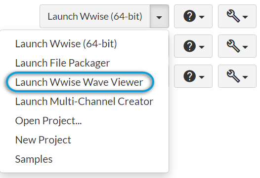

# Wwise Wave Viewer

[Wwise 帮助文档](../00-Wwise-帮助文档.md) > [Wwise 工具](00-Wwise-工具.md) > Wwise Wave Viewer

## Wwise Wave Viewer

使用 Wave Viewer（波形查看器）加载波形文件、播放其音频、对其进行比较并分析其波形。

**启动 Wave Viewer**

- **Audiokinetic Launcher**：在 Audiokinetic Launcher 中，从左侧菜单选择 Wwise。Then, in the list of installed versions, from the list, select **Launch Wwise Wave Viewer**.

  
- **Windows 命令提示**：可执行文件位于 `C:\Program Files (x86)\Audiokinetic\Wwise <version>\Authoring\x64\Release\bin\WaveViewer.exe`。
- **键盘快捷方式**：可对 Wave Viewer 进行配置来在 Wwise 设计工具环境下通过键盘快捷方式予以启动。详请参阅[“键盘快捷方式和自定义命令”一节](../09-参考主题/01-工程/12-键盘快捷方式和自定义命令.md "键盘快捷方式和自定义命令")和[“为键盘快捷方式创建绑定”一节](../08-使用-Wwise/14-使用控制设备/04-创建-Control-Surface-Binding.md#creating_binding_for_keyboard_shortcut "为键盘快捷方式创建绑定")。
- **退出 Wave Viewer**：跟使用标准操作系统命令一样，可使用 Esc 键关闭 Wave Viewer。

**在 Wave Viewer 中打开文件**

- **拖放**：Wave Viewer 支持以标准方式将文件从操作系统的文件浏览器拖放到应用程序中。除此之外，在 Windows 中还可执行以下操作：

  - 从 File Explorer（文件资源管理器）拖动文件来替换当前文件。
  - 在按住 Ctrl 的同时从 File Explorer 拖动文件来添加到当前文件。
  - 在按住 Shift 的同时从 File Explorer 拖动两个文件来对其进行比较。
- **菜单**：依次选择 **File** > **Open** (Ctrl+O)。
- **多个文件**：在以上两种情形下，都可使用标准鼠标选择操作来选择多个文件。
- **Windows 命令提示**：通过 `WaveViewer.exe <file1> <fileN>` 打开一个或多个文件。

**播放文件**

- **开始和停止播放**：单击视图模板来选择文件，并按下**空格键**开始播放。再次按下空格键即可停止播放并将播放光标重置到文件开头。

**文件信息**

- **文件路径**：文件路径显示在波形模板的左下角。若要将其复制到剪贴板，请右键单击模板并选择 **Copy selected path**（复制所选路径）。若要在 Windows File Explorer 中查看文件，请右键单击并选择 **Open Containing Folder**（打开包含该内容的文件夹）。
- **文件属性**：视图模板左侧列有以下信息：播放位置（秒）、文件长度（秒）、采样数、采样率 (Hz)、位深和声道数（如 1.0、5.1 或 7.1）。

**对两个文件进行比较**

- **Windows 命令提示**：`WaveViewer.exe <file1> <file2>`。
- **Wave Viewer**：在 Wave Viewer 中，从菜单依次选择 **File** > **Diff** (Ctrl+D)。另外，还可在按住 Shift 的同时从 Windows File Explorer 拖动两个文件来对其进行比较。
- **Wwise 版本控制**：可将 Wave Viewer 用作 Wwise 版本控制插件的比较工具。请参阅 [“配置版本控制插件”一节](../03-设置工程/01-处理工程/02-定义工程设置/01-定义工程的常规设置.md#configuring_source_control_plug_ins "配置版本控制插件")。

**显示工具**

- **DB scaling**（DB 缩放）：以分贝为单位对波形进行缩放。通过依次选择 **View** > **DB scaling**（视图 > DB 缩放）进行切换。
- **Mixdown channels**（声道下混）：在启用时，视图会显示各个声道的最大峰值。此项对单声道文件不起作用。通过依次选择 **View** > **Mixdown channels**（视图 > 声道下混）进行切换。对于多声道文件，会在左侧显示播放声道，并在视图模板上显示多个波形。
- **Normalize waveform**（波形归一化）：归一化可在保证品质的同时将音频的音量最大化。若要进行归一化处理，请右键单击波形并选择 **Normalize waveform**（波形归一化）。选择 **Reset Normalize Waveform**（重置波形归一化）即可撤消。
- **Peak dB values**（dB 峰值）：若要查看文件某部分的峰值，请拖动鼠标来选择波形区间。该值会显示在选定区间。
- **Rectified waveform**（整流波形）：在启用时，视图会结合最小和最大峰值来显示两者当中的绝对最高值。通过依次选择 **View** > **Rectified waveform**（视图 > 整流波形）进行切换。
- **Show markers**（显示标记）：在启用时，会显示标记（如有）。标记是波形中相应位置的元数据。通过依次选择 **View** > **Show markers**（视图 > 显示标记）进行切换。
- **Zoom**（缩放）：使用 **Ctrl+鼠标滚轮**在 X 轴（时间）上进行缩放。您可以使用画面右下角的**滚动条按钮**来在 X 和 Y 轴上进行缩放并重置缩放。

---