# Wwise 帮助文档

Wwise® 2025.1.4 Revision 2025.1

版权 © 2025 Audiokinetic Inc. All rights reserved.

This document (whether in written, graphic or video form) is supplied as a guide for the Wwise® product.
This documentation is the property of Audiokinetic Inc. (“Audiokinetic”), and protected by Canadian copyright law and in other jurisdictions by virtue of international copyright treaties. It may be used by you in accordance with the following.

This documentation may be duplicated, reproduced, stored or transmitted, exclusively for your internal, non-commercial purposes, but you may not alter the content of any portion of the documentation. Any copy of the documentation shall retain all copyright and other proprietary notices contained therein.

The content of this documentation is furnished for information purposes only, and its content is subject to change without notice. Reasonable care has been taken in preparing the information contained in this document, however, we disclaim all representations, warranties and conditions, whether express, implied or arising out of usage of trade or course of dealing, concerning this documentation and assume no responsibility or liability for any losses or damages of any kind arising out of the use of this guide or of any error or inaccuracy it may contain, even if we have been advised of the possibility of such loss or damage.

Wwise®, Audiokinetic®, Actor-Mixer®, SoundFrame® and Soundseed® are registered trademarks, and Master-Mixer™, SoundCaster™ and Randomizer™ are trademarks, of Audiokinetic. Other trademarks, trade names or company names referenced herein may be the property of their respective owners.

Wwise VST―© 2022 Audiokinetic VST® is a trademark of Steinberg Media Technologies GmbH,
registered in Europe and other countries.

[Audiokinetic VST Plug-in End User License Agreement](https://www.audiokinetic.com/download/documents/License_Agreements/Audiokinetic_VST_Plug-ins_EULA_v1_2022-09-01.pdf)

---

**目录**

[欢迎使用 Wwise 2025.1.4](pr01.html)

[入门](pt01.html)

[设置工程](pt02.html)

[与游戏互动](pt03.html)

[使用声音和振动来提升游戏体验](pt04.html)

[创建互动音乐](pt05.html)

[完善工程](pt06.html)

[使用 Wwise](pt07.html)

[参考主题](pt08.html)

[Wwise 插件](pt09.html)

[合作伙伴插件](pt10.html)

[Wwise 工具](pt11.html)

[其他资源](pt12.html)

[词汇表](go01.html)

---

## 欢迎使用 Wwise 2025.1.4

Wwise 是专门为了满足游戏开发管线的特定需求而设计，是面向设计师、作曲家和程序员的独特解决方案。通过让您在开发游戏画面的同时开发游戏音频、音乐和振动，Wwise 可以在游戏开发的各个阶段为复杂音频和振动的设计和制作提供便利。

如需了解对此 Wwise 版本所做的更改，请参阅 SDK 文档中的[版本说明](https://www.audiokinetic.com/library/edge/?source=SDK&id=releasenotes.html)章节。

### 关于 Wwise Help

Wwise 帮助是上下文相关帮助系统，包含说明 Wwise 中各个视图、字段和选项的参考主题以及基于任务的信息。文档包含以下几个主要章节，其中提供了有关 Wwise 的各种信息。

- **[入门](pt01.html "入门")**C 包括对 Wwise 中诸多概念的介绍、有关如何快速掌握 Wwise 的信息以及一些有关如何管理工作区并高效运用 Wwise 的帮助信息。
- **[设置工程](pt02.html "设置工程")**C 包含有关如何设置工程（单独设置或在团队环境下设置）、如何定义或调节工程所用的平台、如何处理工程中的素材、如何构建并充分利用 Wwise 素材层级结构的概念和步骤。
- **[与游戏互动](pt03.html "与游戏互动")** ―― 介绍如何使用事件、动态序列以及 Wwise 游戏同步器驱动游戏中的声音， 包括概念和操作步骤信息。
- **[使用声音和振动来提升游戏体验](pt04.html "使用声音和振动来提升游戏体验")** ―― 介绍如何使用各种属性和行为、效果器、振动、空间定位设置和播放优先级来增强丰富多彩、身临其境的游戏环境， 包括概念和操作步骤信息。
- **[创建互动音乐](pt05.html "创建互动音乐")** ―― 包括 Wwise 中互动音乐概念的概述和介绍，以及介绍如何为游戏创建互动音乐，含大量操作步骤信息。
- **[完善工程](pt06.html "完善工程")**C 包含有关如何构建最终混音、排查并模拟工程的不同方面、为游戏生成 SoundBank 和文件包以及 Wwise 下混行为的信息。
- **[使用 Wwise](pt07.html "使用 Wwise")** ―― 说明特定 Wwise 视图的功能，以帮助您上手使用软件。
- **[参考主题](pt08.html "参考主题")**- 提供有关 Wwise 中各种选项和视图的完整信息，可在 Wwise 内以上下文相关参考页面的形式访问。
- **[Wwise 插件](pt09.html "Wwise 插件")** -
  Provides detailed descriptions of the various plug-ins for Wwise developed by
  Audiokinetic.
- **[合作伙伴插件](pt10.html "合作伙伴插件")** - Provides
  detailed descriptions of plug-ins for Wwise developed by partners of Audiokinetic.
- **[Wwise 工具](pt11.html "Wwise 工具")**C 提供有关 Wwise 随附的各种工具（包括 Multi-Channel Creator）的信息。
- **[其他资源](pt12.html "其他资源")**C 提供 Wwise 文档集和各种学习材料的概要信息。
- **[词汇表](go01.html "词汇表")** ―― 提供按字母排列的 Wwise 和音频相关术语，以及相应定义。

### 访问 Wwise 上下文相关 Reference Topic

如需查找有关 Wwise 中特定选项或视图的信息，可按照以下任一方式在视图中打开对应的 Reference Topic：

- 在任意视图或对话框的右上角单击 Help（帮助）按钮。
- 按 **F1**。

这时会打开 Reference Topic 并显示有关当前所在视图或对话框的信息。

### 访问 Contextual Help 视图

除了前述上下文相关 Reference Topic，Contextual Help（上下文帮助）视图还会在 Wwise 内提供有关所选属性的信息以及 Capture Log（捕获日志）中的错误消息。有关详细信息，请参阅[“Contextual Help”一节](ch58s08.html "Contextual Help")。

### 设置 Wwise 文档偏好

For details on setting the source of the context-sensitive reference topics (online or
offline) and the language of the documentation (reference topics, Contextual Help view, and
the Wwise SDK documentation), see [“Setting the Wwise documentation preferences”一节](ch04s04.html#setting_documentation_preferences "Setting the Wwise documentation preferences").

### 键盘和鼠标规范

下表阐明了本文档中所用的与鼠标和键盘相关的术语。Wwise 会用到鼠标左键、中键和右键。除非另有说明，一般使用的是鼠标左键。

| 此术语 | 使用鼠标来解释该术语 |
| --- | --- |
| 点击 | 快速按下并释放鼠标左键。除非另有说明，请始终使用鼠标左键。 |
| 右键点击 | 快速按下并释放鼠标右键。 |
| 双击 | 快速点击两次鼠标左键。 |
| Shift+点击、Ctrl+点击、Alt+点击 | 在点击鼠标按钮时按住 Shift、Ctrl 或 Alt 键。 |
| 拖动 | 在移动鼠标时按住鼠标左键。这相当于拖放操作。 |
| Alt+键、Ctrl+键、Shift+键 | 按住第一个键的同时按第二个键。例如，“按 Ctrl+Z”意味着按住 Ctrl 键的同时按 Z 键。 |

### 前期准备

Before working with Wwise, you might want to read [Introduction to Wwise](https://www.audiokinetic.com/library/edge/?source=WwiseFundamentalApproach&id=wwise_fundamentals) to gain a better understanding of the key concepts and workflow of Wwise. Then you can start reading the individual sections in Wwise Help. 这些章节提供有关使用 Wwise 的概念和步骤、示例以及技巧和最佳实践。

---

## 入门

本章节包含对 Wwise 中诸多概念的介绍、有关如何快速掌握 Wwise 的信息以及一些有关如何管理工作区并高效运用 Wwise 的帮助信息。

- **[*启动和退出 Wwise*](ch02.html "启动和退出 Wwise")**C Wwise 系统要求；打开和关闭 Wwise；创建新的工程；打开现有工程。
- **[*Wwise 界面基础知识*](ch03.html "Wwise 界面基础知识")**C 简要介绍 Wwise 界面及界面元素；详述如何使用各种控件进行交互；了解命名规范。
- **[*个性化您的工作空间*](ch04.html "个性化您的工作空间")**―an
  introduction to working with views and layouts, as well as setting colors, user
  preferences, and audio preferences.
- **[*提供工作效率*](ch05.html "提供工作效率")**C 键盘快捷方式、快捷菜单和批量重命名。

|  |  |
| --- | --- |
| [技巧] | 技巧 |
| 刚开始使用 Wwise？The [Wwise Fundamentals](https://www.audiokinetic.com/learning/learn-wwise/wwise-fundamentals) learning material is free and guides you step-by-step through the creation of your first sound in a game and beyond. |

---

### Wwise 系统要求

在安装 Wwise 之前，确保系统满足最低配置要求。下表列出了安装和运行 Wwise 设计工具所需的硬件和软件。

| 系统组件 | 要求 |
| --- | --- |
| 操作系统 | This version of Wwise was tested on the following operating systems:  - Windows 11 64-bit - macOS Sequoia  If you are using a more recent operating system and you experience issues with Wwise, we recommend that you upgrade to the latest available version of Wwise.  Wwise 设计工具现在仅提供 64 位版本。 |
| Memory | 4 GB 内存 |
| 分辨率 | 出厂布局针对 1920 x 1080 分辨率的显示器进行了优化，不过也可通过调整来适配其他分辨率。如需支持 4K 或 5K 显示器，请在 Wwise 的 User Preferences（用户首选项）窗口中选中 **Enable High DPI**（启用高分辨率）复选框。 |
| PDF 阅读器 | 为了能够打开 Wwise 分发的 PDF 文件，需要安装 Adobe Reader 或其他 PDF 阅读器。 |
| **必需代码依赖项** | |
| Microsoft .NET Framework | Microsoft .NET Framework 4.8  Audiokinetic Launcher 会在安装 Wwise 之前自动安装此组件。不过，倘若使用 Launcher 以外的途径部署 Wwise（比如通过 Perforce 或其他版本控制系统），则须手动安装 .NET Framework 以便运行 File Packager。Refer to the [Microsoft .NET Framework download page](https://dotnet.microsoft.com/en-us/download/dotnet-framework). |

|  |  |
| --- | --- |
| [备注] | 备注 |
| 在不使用 Launcher 安装 Wwise 时，假如缺少一个或多个依赖项，很有可能会发生崩溃。The required dependencies are detailed in the following rows of the Wwise System Requirements table: [Microsoft .NET Framework](ch01.html#microsoft_net_framework). 建议使用 Launcher 安装设计工具，以此确保同时安装相应的依赖项。 |

---

### 启动和退出 Wwise

Audiokinetic Launcher 可管理所有 Wwise 安装和迁移。若尚未安装 Wwise，请参阅 [*Wwise 系统要求*](ch01.html "Wwise 系统要求")，确保系统装有必要的硬件和软件。然后转到 Audiokinetic 官网的 [下载](https://www.audiokinetic.com/download/) 页面，单击**下载 Audiokinetic Launcher** 来下载并安装 Audiokinetic Launcher。之后，只需点击与所需 Wwise 版本对应的按钮便可安装 Wwise。

If you have any difficulties, refer to [Installing Wwise and Its Components](https://www.audiokinetic.com/library/edge/?source=InstallGuide&id=installing_wwise_and_its_components) for a detailed procedure.

#### 启动 Wwise

**启动 Wwise 的方法如下：**

1. 执行以下操作之一：

   - 在桌面上双击 Audiokinetic Launcher 图标。
   - 从 Windows 启动菜单中，选择 **Audiokinetic Launcher**。

   Audiokinetic Launcher 将打开。
2. 单击 **Log in** 登录到 Audiokinetic 客户门户来获取您帐户的所有权限。
3. 如果以前使用过 Wwise，那么您可以转到 **Projects** 选项卡。

   如果从未使用过 Wwise，请转至 **Wwise** 选项卡。
4. 对于现有工程，点击 **Open with Wwise ####.#.#.####**（对应于您选择的版本）。工程将在该版本的 Wwise 中打开。

   否则，请点击 **Launch Wwise**，打开您需要的版本。该版本的 Wwise 将打开，并显示 Project Launcher。
5. Select a project or click **New** to create a new
   project.

   在前一种情况下，Wwise 会加载所选工程供您编辑。

   In the latter case, the New Project dialog opens and you will fill out the
   following information.

   1. 在 **Name**（名称）字段中键入工程的名称。
   2. 要更改工程文件的保存位置，请执行以下步骤：

      - 点击**Browse**（浏览）按钮（...）。
      - 这时会打开 Browse For Folder（浏览文件夹）对话框。
      - 前往您希望 Wwise 储存工程文件的文件夹。
      - 单击 **OK**（确定）。

      |  |  |
      | --- | --- |
      | [备注] | 备注 |
      | 如果您要为您的音频文件创建新的专用文件夹，则请点击 **Make New Folder**（新建文件夹）按钮。 |
   3. 要更改原始音频文件的保存目录，请执行以下操作：

      - 点击浏览按钮 (...)。
      - 这时会打开 Browse For Folder（浏览文件夹）对话框。
      - 前往您希望 Wwise 存储文件原始副本的文件夹，用来存储已导入至工程的音频。
      - 单击 **OK**（确定）。
   4. 单击 **OK**（确定）。

      Wwise 打开新的工程。

#### 退出 Wwise

完成工作会话后，保存您的工作并退出该应用程序。

**退出 Wwise 的方法如下：**

1. 在菜单栏中点击 **Project** > **Exit**。

   Wwise 将关闭工程并退出。

   |  |  |
   | --- | --- |
   | [备注] | 备注 |
   | 如果尚未保存工程，则 Wwise 在退出前将提示您进行保存。 |

---

### Wwise 界面基础知识

Wwise 界面分为多个不同的视图。各个视图都有其特定的目的，您可以访问其中的各种工具或选项，以管理和定义游戏的内容。这些视图组合在一起即成为布局，方便您处理特定任务或作业所需的工作。Wwise 中提供了不同的布局。有关详细信息，请参阅[“处理布局”一节](ch04s02.html "处理布局")。

各个布局的顶端是菜单栏和工具栏。通过菜单栏可以访问所有基本信息（如工程名称）和基本命令（如保存工程、更改布局、打开视图或打开属性的帮助条目）。通过工具栏可以快速访问某些工具，如 Platform 或 Language Selector、Capture 工具、Remote Platform Connector 和 Search 工具。

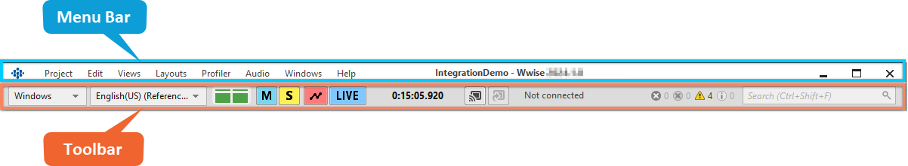

下图详细显示了菜单栏的各项信息。


下图详细显示了工具栏左侧的各项信息。

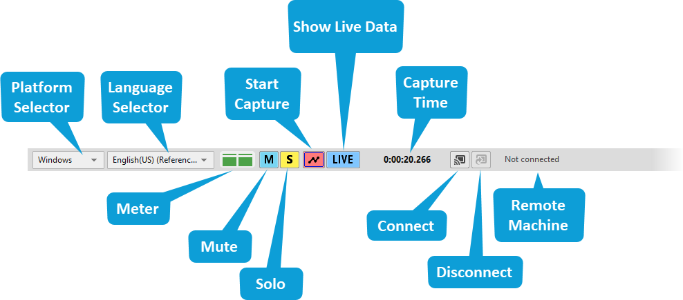

下图详细显示了工具栏右侧的各项信息。


当您首次启动 Wwise 时会显示 **Designer** 布局。

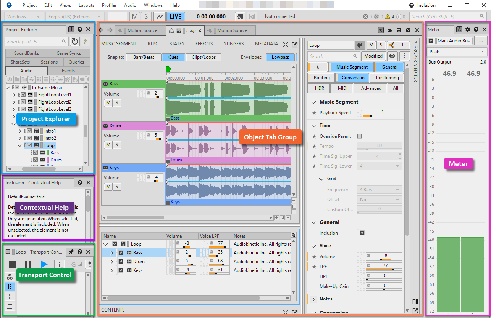

该布局包含以下视图：

- **Project Explorer**：这是主要区域，您可在其中管理和组织 Wwise 工程的各种元素。详请参阅[*认识 Project Explorer 视图*](ch43.html "认识 Project Explorer 视图")。Project Explorer 包含以下选项卡：

  - **Audio**：一种层次树视图，非常像 Windows 资源管理器和 Mac Finder，可以在其中组织工程中的资源（asset）。The Audio tab has three main hierarchies: Devices, Busses, and Containers.
  - **Events**（事件）：显示工程中的事件，包括操作和对白事件。
  - **SoundBanks**（音频包）: 显示工程中的所有**SoundBank**。
  - **Game Syncs**（游戏同步器）: 显示工程中的所有Switch（切换开关）、State（状态）、Game Parameters（游戏参数）和Trigger（触发器）。
  - **ShareSets**（共享集）: 显示工程中的所有效果和衰减工程集。
  - **Sessions**（会话）: 显示工程中的所有 Soundcaster（声音选角器）会话。
  - **Queries**（查询）: 显示工程中的所有查询。
- **Contextual Help view**: Provides information on properties selected anywhere in the Wwise user interface as well as details on error messages selected in the [“Capture Log”一节](ch62s01.html "Capture Log"). Refer to [“Contextual Help”一节](ch58s08.html "Contextual Help") for more information.
- **Object Tab Group**（对象选项卡分组）：可能不包含、包含一个或多个 Object Tab（具体取决于所作选择）。Wwise 中的任何对象都可显示在 Object Tab 中，其会根据各个对象的特性自动进行调整。各个 Object Tab 方便快速访问与对象最为相关的各种编辑器，并在一个集中位置定义声音、音乐或总线结构内对象的特性和行为。详请参阅[*使用 Object Tab 和 Object Tab Group*](ch51.html "使用 Object Tab 和 Object Tab Group")。
- **Transport Control**（播放控制）：播放您的对象。Transport Control 包含与音频播放相关的传统控件，如播放、停止和暂停。详请参阅[*认识 Transport Control 视图*](ch47.html "认识 Transport Control 视图")。
- **Meter view**（电平表视图）：为各个通道显示彩色电平值，可以选择三种不同类型之一，即峰值、真实峰值和 RMS值。对于 Ambisonics 总线，Meter 视图还可显示 3D Meter（显示方向数据）。

#### 使用文本框和滑杆

Wwise 中的大部分视图都包含文本框。您可在其中键入适当的值或有关对象的特定信息。文本框的名称表示栏中所显示信息的类型。根据视图的不同，文本框的名称可位于视图的旁边、上方或下方。


|  |  |
| --- | --- |
|  | 文本框名称。 |
|  | 属性值。 |

您可以通过右键单击文本并选择 **Copy**（复制）来复制文本框中的文本。若文本框中显示文本但无法编辑，则表示其不可用。

若要将属性值恢复为默认设置，请在按住 Ctrl 的同时单击文本框。

大部分包含属性值的文本框下方还会有一个横向滑杆。您可以拖动滑杆来在连续取值范围内设置文本框中的值。

横向滑杆包含滑块和滑动条。滑块是一个小点，代表当前属性值。滑动条代表当前值大小，它的取值在允许范围内。

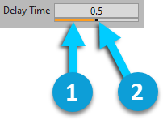

|  |  |
| --- | --- |
|  | 滑动条。 |
|  | 滑块。 |

根据默认值相对取值范围所处的位置，滑块会显示在滑杆的不同位置。同样，根据默认值相对取值范围所处的位置，滑动条会由不同位置开始并向不同方向延伸。

|  |  |
| --- | --- |
| [备注] | 备注 |
| 有些滑杆的默认取值范围只是属性完整取值范围的子集。若要为特定属性设置更大范围的值，请在文本框中输入默认取值范围以外的值。若要查看属性的默认取值范围和完整取值范围，请参阅属性的 Contextual Help 或相关视图的参考主题。 |

在文本框中点击并按住鼠标键时，会显示大型滑杆，以方便您微调该属性值。松开鼠标按钮时，较大的滑杆会消失。如果您需要更精确地定义该数值，则可按住 Shift 键同时拖动滑杆，以更小的增量来增加或减小该数值。


|  |  |
| --- | --- |
|  | 在文本框中单击并按住鼠标左键的时候，会显示大号滑杆以便拖动来更改属性值。 |

#### 使用列表

Wwise 中包含两种类型的列表：下拉式列表和快捷方式列表（有时称为上下文列表）。下拉列表（本帮助文档中简称为“列表”）指包含很多预定义选项的下拉栏。要显示列表，请点击下拉栏右侧的箭头。


|  |  |
| --- | --- |
|  | 单击箭头可显示选项列表。 |

选择器按钮 (>>) 用于显示一组选项或操作。快捷方式菜单可能包含相关信息栏，以显示所选的选项。点击该按钮，以显示菜单选项。

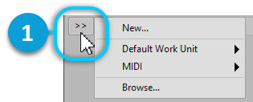

|  |  |
| --- | --- |
|  | 单击选择器按钮可显示选项列表。 |

#### 使用推子

某些属性（如音量）使用垂直滑杆或推子（而不是水平滑杆）更改值。音量控件使用垂直滑杆以更好地模拟硬件和软件混音器中的推子。您可向上或向下拖动滑杆，以增加或减小这些属性值。如果需要更精确地定义该值，则可以按住 Shift 键同时点击推子上方或下方，以更小的增量来增加或减小该数值。

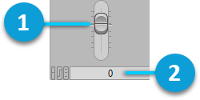

|  |  |
| --- | --- |
|  | 上下拖动推子可更改属性值。在按住 Ctrl 的同时单击推子或文本框可恢复为属性的默认值。 |
|  | 文本框：可在此处键入数值。 |

#### 使用表格

您可以使用光标键浏览表格中的单元格。在大部分情况下，还可配置列、调整列宽、按列对行进行排序并编辑表格中的属性值。

|  |
| --- |
|  |

**在表格中配置列标题的方法如下：**

在大部分表格中，都可通过 Configure Columns 对话框来配置所要显示的列。

1. 右键单击表格标题并选择 **Configure Columns**（配置列）。
2. 在弹出的 Configure Columns（配置列）对话框中，指定要显示的列及其顺序。

| Configure Columns 对话框 | |
| --- | --- |
| 界面元素 | 描述 |
| Column names 面板 | 系统会以复选框的形式列出视图中可用的列。  - 选中列名称可将其包含到视图的表格中。取消选中复选框便可将相应的列移除。 - 上下拖放列可重新进行排序。Configure Columns 对话框中列表的上下顺序与视图中列表内的左右顺序对应。 |
| Reset to default | 重置为默认值。单击此按钮可将列名称面板中的所有选中（可见）列恢复为默认设置并按照视图的默认顺序进行排序。 |

**调整表格中的列宽的方法如下：**

- 将鼠标指针悬停在列分隔线之上。在指针变为双箭头时，左右拖动分隔线来调整列宽。
- 若要将列宽恢复为默认值，请右键单击表格标题并选择 **Reset Column Widths to Default**（将列宽重置为默认值）。

**对表格的行进行排序：**

根据表格执行以下操作：

- 单击列标题来针对该列按升序顺序对行进行排序。再次单击可按降序顺序进行排序。
- 拖放相应的行。

**在表格中筛选元素的方法如下：**

1. 在表格标题右侧，单击 **Find in List**  或按下 Ctrl+F3（在 macOS 上按下 Command+F3）。

   随即显示标准字母数字搜索栏。

   |  |
   | --- |
   |  |
2. 输入字符（包括数字、标点符号、特殊字符和空格）。字母不区分大小写。在键入字符时会对表格进行筛选，而仅显示包含匹配内容的行。Wwise 会对所有的列进行搜索，在 File Manager 中的时候除外（只会对 **File** 列进行搜索）。

   |  |  |
   | --- | --- |
   | [备注] | 备注 |
   | 在 List View、Query Editor、MIDI Keymap Editor 和 Reference View 中，不会搜索被隐藏的子对象（所以它们会被滤掉）。 |
3. 若要关闭“搜索”字段，请单击“搜索”字段右侧的 Close（关闭）图标或按下 Ctrl+F3（在 macOS 上按下 Command+F3）。

#### 在 Wwise 中 Undo 和 Redo 操作

您可撤消您在 Wwise 中执行的大部分操作，如更改属性值、移动对象，或创建事件。如果您错误地撤消了某一操作，则可以恢复至上一个操作之前的值或状态。

要撤消某个操作，请点击  **Edit > Undo ><操作名称>** ，或按下 **Ctrl+Z**。您最多可撤消前 200 个操作。

要恢复某一操作，请点击  **Edit > Redo ><操作名称>** ，或按下 **Ctrl+Y**。您可为每个撤消操作调用一个恢复命令。

---

#### 理解 Wwise 中的视觉元素

Wwise 使用多种图标或视觉标识，以帮助在界面中呈现不同的元素。以下表格说明了 Wwise 中所用的不同视觉元素。

| 图标 | Name | 代表 |
| --- | --- | --- |
|  | Physical Folder（实文件夹） | 物理文件夹。该文件夹代表磁盘上的实际目录。所有 Wwise Work Unit 都存放在 Physical Folder 内。 |
|  | Virtual Folder（虚拟文件夹） | 可以在整个 Project Explorer 中添加虚拟文件夹，用来将项目元素分组。 |
| **Busses Hierarchy Icons** | | |
|  | Audio Bus（音频总线） | 一种声音对象分组，您可通过它处理游戏内不同的结构。例如，您可将所有环境声结构编组为一个音频总线，将所有玩家角色声音结构编组为另一个音频总线。 |
|  | Auxiliary Bus | 辅助总线。对工程中各处的声音对象进行细分，以便调节音量、总线配置、定位和 RTPC，并在回馈到父级 Audio Bus 前应用效果器或状态。在 Auxiliary Bus 中无法调节闪避、HDR 和声部混音。 |
| (Audio Bus)    (Auxiliary Bus) | Mixing | Wwise 可将该处理状态应用于 Audio Bus 和 Auxiliary Bus。对于 Mixing 状态的总线，会将其属性传递给发送到总线和子总线的对象。在这种情况下，将对总线上定义的所有效果器进行处理，最终采用基于声道的格式予以输出。  |  |  | | --- | --- | | [注意] | 注意 | | 在将声音发送到 Mixing 状态的总线时，会忽略与该声音关联的元数据或将其用在基于声道的混音中。此元数据既无法恢复也不能再用于 Audio Object 处理器或终端。 |  有关更多详细信息，请参阅 [“了解总线图标和处理状态”一节](ch34s11s01.html "了解总线图标和处理状态") 章节。 |
| (Audio Bus)    (Auxiliary Bus) | Processing Audio Objects | Wwise 可将该处理状态应用于 Audio Bus 和 Auxiliary Bus。此类总线的所有属性都会传递给发送到总线和子总线的对象。在这种情况下，将对总线上定义的所有效果器进行处理，最终作为 Audio Object 予以输出。  有关更多详细信息，请参阅 [“了解总线图标和处理状态”一节](ch34s11s01.html "了解总线图标和处理状态") 章节。 |
| (Audio Bus) | Not Mixing | Wwise 可将该处理状态应用于 Audio Bus。对于 Not Mixing 状态的总线，会将其属性传递给发送到总线和子总线的对象，但不会实施任何处理，也不会修改对象及子对象的格式。在这种情况下，将在声部层级把 Not Mixing 状态的总线上设定的所有属性应用于所发送的对象。  有关更多详细信息，请参阅 [“了解总线图标和处理状态”一节](ch34s11s01.html "了解总线图标和处理状态") 章节。 |
| (Audio Bus)    (Auxiliary Bus) | Processing | Wwise 可将该处理状态应用于 Audio Bus 和 Auxiliary Bus。在 Wwise 声音引擎连接到终端并接收有关支持格式的信息时，将把该总线的处理状态解析为 Mixing 或 Processing Audio Objects。  |  |  | | --- | --- | | [备注] | 备注 | | When profiling in Wwise, the resolved status will be displayed in the Property Editor, but not in the Project Explorer. |  有关更多详细信息，请参阅 [“了解总线图标和处理状态”一节](ch34s11s01.html "了解总线图标和处理状态") 章节。 |
| **Containers Hierarchy Icons** | | |
|  | Audio Source（音频源） | 音频文件与对象之间的独立抽象层。它链接到工程中导入的音频文件，并且音频源层级也是设置 Conversion Settings（针对活跃游戏平台）的位置。 |
|  | Source Plug-in（源插件） | 由 Wwise 外部的源插件创建的音频源。 |
|  | Sound SFX（音效声） | 包含声音效果的声音对象。 |
|  | Sound Voice（语音声） | 包含旁白或角色对话的声音对象。 |
|  | Work Unit（工作单元） | 可以通过独有的 XML 文件将工程拆分成独立单元，以便您团队中的不同成员同时处理工程的不同部分。这些 XML 文件可通过版本控制系统轻松管理。 |
|  | Property Container | A hierarchical structure of one or more sounds, containers, or Property Containers. You can use a Property Container to apply properties to all objects below it. |
|  | Blend Container（混合容器） | 该组中的对象或容器将被同时播放。在 Blend Container 中的声音和容器能够被编组到 Blend Track（混合轨）中，然后通过使用 RTPC 把这些声音的属性映射到游戏参数值上。在同一条Blend Track上的各个对象之间也可以基于游戏参数值来进行交叉淡变。 |
|  | Random Container （随机容器） | 该组中的的对象或容器将被随机播放。 |
|  | Sequence Container （序列容器） | 该组中的的对象或容器将根据特定顺序或播放列表播放。 |
|  | Switch Container（切换容器） | 该组中的对象或容器会被组织成与一系列切换开关或状态相符，当游戏调用相应的切换开关或状态时就会播放。 |
|  | Music Track （音乐轨） | 可以包含多个独立音乐片段音乐对象，并以波形形式显示它们，使您能够在音乐片段中以视觉方式进行调整。 |
|  | Music Track - Random Step （音乐轨 - 随机步进） | 每次播放其父段落时，将按随机顺序播放其子音乐轨。 |
|  | Music Track - Sequence Step （音乐轨 - 序列步进） | 每次播放其父级段落时，都将按照顺序播放其子音轨。 |
|  | Music Track - Switch | 将根据指定 Switch/State Group 中相关联的 Switch/State 来播放其子音轨。 |
|  | Music Segment （音乐段落） | 包含音乐轨的音乐对象，可使用同步点进行调整，在互动音乐中实现音乐编排。 |
|  | Music Playlist Container （音乐播放列表容器） | 由若干个段落按特定方式构成的一个编组，会按随机顺序或特定顺序播放这些段落。 |
|  | Music Switch Container（音乐切换容器） | 由若干个音乐段落和容器构成的一个编组，它们被组织成与一系列切换开关或状态相符，当游戏调用相应的切换开关或状态时就会播放。 |
| **其它工程元素图标** | | |
|  | Event | 触发游戏中音频或振动的方法，使用一个或一系列动作（如播放、静音和暂停）来控制若干个 Wwise 对象。 |
|  | Dialogue Event（对白事件） | A method to trigger audio, which may or may not be dialogue, or motion in game using a combination of State/Switch Groups and States/Switches arranged into paths that have been assigned to an object in the Wwise Containers hierarchy. |
|  | SoundBank | 事件、Wwise 对象和媒体的编组，可在游戏中特定时刻一起加载至游戏平台内存中。 |
|  | Switch Group （切换开关组） | 将相关的切换开关进行分组，用来管理游戏内指定元素在不同条件下的替代选项。 |
|  | Switch（切换开关） | 切换选项，用于游戏内指定元素在特定条件下播放声音。 |
|  | State Group | 将相关的状态进行分组，用来管理游戏环境中的全局更改。 |
|  | State（状态） | 对游戏音频属性所做的全局偏置或调整，使其符合游戏中物理及环境条件的变化。 |
|  | Game Parameter (RTPC) （游戏参数 (RTPC)） | 游戏中的参数，如赛车游戏中的速度和 RPM，可使用 RTPC 映射至 Wwise 属性值。 |
|  | Trigger （触发器） | 可由游戏中的特定操作触发播放的一小段音乐。 |
|  | Effect ShareSet （效果共享集） | 音频效果插件设定，可用于增强游戏中音频效果。这些设定保存为共享集，可在工程间共享。 |
|  | Attenuation ShareSet （衰减共享集） | 基于音源与听者之间相对距离而进行的音量衰减设定。这些设定保存为共享集，可在工程间共享。 |
|  | Conversion Settings ShareSet （转码设置共享集） | 转码设定包括采样率、音频格式和通道数量，可帮助定义音频输出的整体品质。这些设定已保存为共享集，可在工程间应用及共享。 |
|  | Soundcaster Session（声音选角器会话） | 按特定顺序集合一组声音、音乐、振动和事件模块，并与相关的游戏同步器设置一同保存，用来对游戏音频进行模拟。 |
|  | Mixing Session（混音会话） | 将一组总线或对象，与其各自属性一起在调音台界面内保存，用来对游戏的混音进行微调。 |
|  | Query （查询） | 一组特定的搜索条件，用于查找特定对象或对象元素。 |
| **Property Editor 和 Effect Editor 分隔器** | | |
|  | No split | 不分隔。编辑器将在一个标签页中显示信息。 |
|  | Column split | 列分隔。编辑器将在纵向面板中分左右两个标签页显示信息。 |
|  | Row split | 行分隔。编辑器将在横向面板中分上下两个标签页显示信息。 |
| **属性值标志** | | |

|  |  |  |
| --- | --- | --- |
|  | Link | 链接。属性值已链接到其它有效游戏平台的值。 |
|  | Unlink | 取消链接。属性值没有链接到其它有效游戏平台的值。 |
|  | Partial Unlink | 部分取消链接。当前平台的属性值已链接到其它有效平台，但其它平台的若干个相应值已取消链接。 |
|  | Link Mixed | 有些选定的对象具有不同的链接状态。有些可能是链接的，而另一些则是取消链接或部分取消链接的。 |

|  |  |  |
| --- | --- | --- |
|  | RTPC 已禁用 | 该属性值未绑定至游戏内参数值。 |
|  | RTPC 已启用 | 游戏内参数值已绑定至该属性值。这意味着，例如游戏赛车的速度可直接绑定至 Wwise 中的音调属性。当游戏中的赛车速度提高时，Wwise 中的音调也将实时提高。 |
|  | RTPC 部分启用 | Multi Editor 中只有部分对象为该属性绑定了游戏参数值。Property Editor 或 Contents Editor 中不会看到这个标识。 |

|  |  |  |
| --- | --- | --- |
|  | Randomizer 已启用 | 随机化器效果已应用到的属性值。 |
|  | Randomizer 已禁用 | 尚未应用随机化器效果的属性值。 |
|  | 随机化器 Mixed | Multi Editor 中只有部分对象为该属性值启用了 Randomizer 效果。Property Editor 或 Contents Editor 中不会看到这个标识。 |

|  |  |  |
| --- | --- | --- |
|  | State 已禁用 | 此属性值未与 State 绑定。 |
|  | State 已启用 | State Group 已与此属性值绑定。也就是说，所述属性（如 Volume）可能会随应用的 State 变化。 |
|  | State 混合情形 | State Group 绑定到了 Multi Editor 中加载的一个或多个对象（并非全部）的属性值。Property Editor 或 Contents Editor 中不会看到这个标识。 |

|  |  |  |
| --- | --- | --- |
| **属性底色** | | |
|  | "Unsupported feature (不支持的功能)" | 如果某一属性被显示为蓝色，则表示该功能在当前平台中不支持。 |
| **预设图标** | | |
|  | Save Preset （保存预设） | 该命令可将视图内所有值的当前状态保存至预设。 |
|  | Load Preset （加载预设） | 该命令可加载之前保存的预设。 |
| **"Source Control（版本控制）"** | | |
|  | "Source Control（版本控制）" | 已选中控件。在已选中控件周围显示的焦点边框（在使用 Wwise Classic 主题时显示为白色）。 |
| **视图图标** | | |
|  | Help | 帮助。该命令用于显示与特定视图、窗口或对话框相关的参考主题。The reference topic could be either online or offline, depending on your settings in the Help menu. 请参阅 [“Setting the Wwise documentation preferences”一节](ch04s04.html#setting_documentation_preferences "Setting the Wwise documentation preferences")。 |
|  | View Settings （视图设置） | 视图设置。该命令用于显示包含一系列设置的对话框，以便定义要在视图中显示哪些内容。 |
|  | Selection Channel | 选定通道。该命令用于将视图切换至特定 Selection Channel (1-4)。  有关详细信息，请参阅 [“了解 Selection Channel 和 Meter Instance”一节](ch04s01s01.html "了解 Selection Channel 和 Meter Instance") 章节。 |
|  | Close View | 该命令可关闭浮动视图。 |
| **Voice Inspector 图标** | | |
|  | Project Value | 工程值。在未连接游戏时，影响声部管线音量的基准音量值。 |
|  | SoundBank Value | 音频包值。在连接游戏时，影响声部管线音量的基准音量值。 |
|  | Live Value | 实时值。在连接游戏时，影响声部管线音量的属性值改变。 |
|  | API | 影响声部管线音量的API 调用。 |
|  | HDR | 影响声部管线音量的 HDR 窗口改变。 |
|  | 闪避 | 闪避。影响声部管线音量的闪避（降低音量）行为。 |
|  | Fade | 淡变。淡入或淡出：仅会在执行操作的过程中未显示时显示。 |
|  | Attenuation Distance | 衰减距离。影响声部管线音量的发声体与听者之间的距离。 |
|  | Blend Track（混合轨） | 混合音轨。影响声部管线音量的混合音轨。 |
|  | Cone Attenuation | 声锥衰减。影响声部管线音量的声锥角度衰减。 |
|  | Ray | 射线。影响声部管线音量的发声体与听者之间的射线距离。 |
|  | Occlusion or Transmission Loss | A ray occlusion or transmission, which drives a contribution to the voice pipeline. |
|  | Obstruction or Diffraction | A ray obstruction or diffraction, which drives a contribution to the voice pipeline. |
|  | Volume | 音量。影响声部管线音量的 Volume 属性/滑杆变化。 |
|  | Send Volume | 发送音量。影响声部管线音量的 Aux Bus Send Volume 属性/滑杆变化。 |
|  | Output Bus Volume | 输出总线音量。影响声部管线音量的 Output Bus Volume 属性/滑杆变化。 |
|  | Bus Volume | 总线音量。影响声部管线音量的 Bus Volume 属性/滑杆变化。 |
|  | Make-up Gain | 补偿增益。影响声部管线音量的音量补偿增益，在所有其他音量调节之后应用于声部。  |  |  | | --- | --- | | [备注] | 备注 | | 与其他音量调节不同，Make-up Gain 是在声部进行所有其他音量调节之后才应用于信号的。 | |
|  | Volume Mute | 音量 - 静音。Event 中影响声部管线音量的 Mute 动作。 |
|  | Volume Pause | 音量 - 暂停。Event 中影响声部管线音量的 Pause 动作。 |
|  | Low Pass | 低通。影响声部管线的 LPF 设置。 |
|  | Send Low Pass | 发送 - 低通。影响声部管线的辅助发送总线 LPF 设置。 |
|  | Output Bus Low Pass | 输出总线 - 低通。影响声部管线的输出总线 LPF 设置。 |
|  | High Pass | 高通。影响声部管线的 HPF 设置。 |
|  | Send High Pass | 发送 - 高通。影响声部管线的辅助发送总线 HPF 设置。 |
|  | Output Bus High Pass | 输出总线 - 高通。影响声部管线的输出总线 HPF 设置。 |
|  | Send Dual Shelf | A DSF, from an aux bus send, which drives a contribution to the voice pipeline. |
|  | Output Bus Dual Shelf | A DSF on the output bus, which drives a contribution to the voice pipeline. |
|  | Multiple Properties | 多项属性。影响声部管线 Volume、LPF 和 HPF 的多项属性。 |
|  | Send Multiple Properties | 发送 - 多项属性。影响声部管线的辅助发送总线的多项属性。 |
|  | Output Bus Multiple Properties | 输出总线 - 多项属性。影响声部管线的输出总线的多项属性。 |

---

#### Understanding file length limitations and naming conventions

Your operating system might restrict the maximum length of a combined filename and file path. For example, the limit is 260 characters on Windows 10 and 1024 on macOS. A file with a
combined name and path at or near the maximum length might be successfully imported into Wwise
but then produce errors during subsequent conversion.

在 Wwise 中命名工程和对象时，您可使用任何 Unicode 支持的字符。

For the following elements in Wwise only unaccented Roman letters and underscores are
accepted. Numbers can be used but not as the first character. This is to comply with the
naming restrictions of certain game engines.

- SoundBanks
- Event
- Dialogue events（对白事件）
- Effect ShareSets（效果共享集）
- Switch Groups（切换开关组）
- Switches（切换开关）
- State Groups（状态组）
- States（状态）
- RTPC（实时参数控制）游戏参数
- Triggers
- Work Units

---

### 个性化您的工作空间

可通过多种方式自定义 Wwise 工作环境。以下表格总结了可用的自定义类型。

| 自定义区域 | 描述 |
| --- | --- |
| [“处理视图”一节](ch04s01.html "处理视图") | 定义固定视图和浮动视图的大小和位置。 |
| [“处理布局”一节](ch04s02.html "处理布局") | 定义显示哪种布局、布局中显示哪种视图，以及显示位置。 |
| [“设置颜色”一节](ch04s03.html "设置颜色") | 定义 Wwise 工程的色块标志。 |
| [“设置用户偏好”一节](ch04s04.html "设置用户偏好") | 定义您独有的用户偏好。 |
| [“Setting authoring audio preferences”一节](ch04s05.html "Setting authoring audio preferences") | Defines your audio preferences. |

---

#### 处理视图

Wwise 界面由许多视图构成。视图是界面中独立的窗口，包含一组与特定任务相关的信息或命令。

由两种不同类型的视图：浮动视图和固定视图。固定视图停靠在布局中，而浮动视图就像窗口一样，可在布局上浮动。这两种类型的视图都可重新定位和调整大小。

**显示视图的方法如下：**

1. 在菜单栏中，依次单击 **Views** > <View Name>（视图 > <视图名称>）。

   选择的视图显示为浮动视图。

**切换浮动视图的方法如下：**

1. 在菜单栏中，依次单击 **Windows** > <View Name>（窗口 > <视图名称>）。

   选择的视图显示在堆叠的浮动窗口前方，成为活跃视图。

###### 理解视图的标题栏图标

视图在标题栏的右侧可包含一系列图标。各个图标执行与该视图相关的不同命令。根据视图的不同，会显示不同的图标组合。以下表格对视图的标题栏中显示的各个图标进行说明。

| 图标 | Name | 描述 |
| --- | --- | --- |
|  | Save Preset （保存预设） | 保存预设。将当前视图内所有值得当前状态保存至预设。 |
|  | Load Preset （加载预设） | 加载预设。加载之前保存的预设。 |
|  | Selection Channel | 选定通道。将视图同步到特定通道 (1-4)。在 Project Explorer 或 Event Viewer 中使用时，可在不同布局之间同步多个这些视图的实例。若针对多个 Project Explorer 或 Event Viewer 实例选择了同一 Selection Channel，则某一视图实例中所作的选择或移动将自动应用于其他实例。  在其他视图中使用此选项时，会将视图同步到 Project Explorer 或 Event Viewer 的特定通道。也就是说，只要在该通道对应 Project Explorer 或 Event Viewer 内选中对象，就会在同步的视图中自动显示所述对象。  有关更多详细信息，请参阅 [“了解 Selection Channel 和 Meter Instance”一节](ch04s01s01.html "了解 Selection Channel 和 Meter Instance") 章节。 |
|  | Help | Displays the reference topic related to that particular view, window, or dialog. The reference topic could be either online or offline, depending on your documentation settings in the Help menu. 请参阅 [“Setting the Wwise documentation preferences”一节](ch04s04.html#setting_documentation_preferences "Setting the Wwise documentation preferences")。 |
|  | View Settings （视图设置） | Displays a dialog with a series of settings that define what is displayed in the view. |
|  | Close View | 关闭视图。关闭浮动视图。 |

###### 管理布局内的浮动视图

在使用特定布局时，您可随时打开许多不同的浮动视图。您可使用窗口管理器高效地管理这些浮动视图。在窗口管理器中，您可轻松激活特定的浮动视图、最大化、最小化和恢复视图、移动视图及关闭视图。

**管理布局内的浮动视图的方法如下：**

1. 在菜单栏中，依次单击 **Windows** > **Windows...**（窗口 > 窗口...）。

   这时会打开 Windows 对话框。
2. 从 **View Name** 列表中，选择若干个视图，然后点击以下任一选项：

   - **Activate**：激活所选浮动视图，并将其显示在所有窗口的前方。
   - **Minimize**：最小化所选的浮动视图。
   - **Maximize**：最大化所选的浮动视图。
   - **Restore**：将之前已执行最小化或最大化操作的所选浮动视图恢复至原始大小和位置。
   - **Move To**: To move the selected floating views to
     a new location within your monitor(s).
   - **Close Window(s)**：关闭所选的浮动视图。
3. When you are finished, click **Close** to close the
   Windows dialog.

---

##### 了解 Selection Channel 和 Meter Instance

您可以使用 Selection Channel（选定通道）来在多个视图之间同步所做选择。利用 Meter Instance（电平表实例），可在多个布局之间同步电平表。也就是说，在某个电平表视图中选择总线或 Audio Device（音频设备）时，会在同一实例的所有电平表视图中自动选择对应的总线或 Audio Device。

###### 使用 Selection Channel 来同步视图

您可以采用以下任一方式使用 Selection Channel 来同步视图：

- **In the Project Explorer and Event Viewer**（在工程资源管理器和事件查看器中）：在不同布局内有多个 Project Explorer 或 Event Viewer 实例时，有时可能需要将这些视图同步。若针对多个 Project Explorer 或 Event Viewer 实例选择了同一 Selection Channel，则某一视图实例中所作的选择或移动将自动应用于其他实例。比如，若将三个不同布局内的三个不同 Project Explorer 全部同步到 Selection Channel 1，并切换到其中一个 Project Explorer 中的 Game Syncs（游戏同步器）选项卡，则所有同步到该通道的 Project Explorer 视图也会自动切换到 Game Syncs 选项卡。

  |  |  |
  | --- | --- |
  | [备注] | 备注 |
  | 同一布局内的多个 Project Explorer 或 Event Viewer 实例不能属于同一 Selection Channel。 |
- **In other views that include the Selection Channel icon in their title bar**（在标题栏中包含“选定通道”图标的其他视图中）：使用此选项来将视图与 Project Explorer 或 Event Viewer 的特定 Selection Channel 同步。也就是说，只要在该通道对应 Project Explorer 或 Event Viewer 内选中对象，就会在同步的视图中自动选中所述对象。

**在布局之间同步多个 Project Explorer 或 Event Viewer 实例：**

1. 在 Project Explorer（工程资源管理器）或 Event Viewer（事件查看器）的标题栏中，单击 Selection Channel（选定通道）图标。
2. 从快捷菜单中，选择以下任一选项：

   - **Pinned**（锁定）：禁止将视图与任何通道同步。
   - **Sync with Selection Channel 1**（与选定通道 1 同步）：将视图同步到通道 1。
   - **Sync with Selection Channel 2**（与选定通道 2 同步）：将视图同步到通道 2。
   - **Sync with Selection Channel 3**（与选定通道 3 同步）：将视图同步到通道 3。
   - **Sync with Selection Channel 4**（与选定通道 4 同步）：将视图同步到通道 4。
3. 若要在其他布局内同步 Project Explorer 和 Event Viewer，请切换布局并重复步骤 1-2。

**将其他视图同步到特定 Project Explorer 或 Event Viewer 通道：**

1. 在视图的标题栏中，单击 Selection Channel（选定通道）图标。
2. 从快捷菜单中，选择以下任一选项：

   - **Sync with Any Selection Channel**（与任意选定通道同步）：将视图同步到任意通道。
   - **Pinned**（锁定）：禁止将视图与任何通道同步。
   - **Sync with Selection Channel 1**（与选定通道 1 同步）：将视图同步到通道 1。
   - **Sync with Selection Channel 2**（与选定通道 2 同步）：将视图同步到通道 2。
   - **Sync with Selection Channel 3**（与选定通道 3 同步）：将视图同步到通道 3。
   - **Sync with Selection Channel 4**（与选定通道 4 同步）：将视图同步到通道 4。

在 Object Tab 或 Event Viewer 中选中对象时，会在同一 Selection Channel 的 Project Explorer 中自动将其选中。若要禁用这一自动选择操作，请清除 **Follow Object Selection**。

###### Using Meter Instances to sync Meters across layouts

共有三个专门用于电平测量的不同视图：Audio Device Meter（音频设备电平表）、Loudness Meter（响度电平表）和 Meter（电平表）。在布局内，最多可同时打开这些视图的四个实例（A、B、C 或 D）。不过，布局内相同类型的视图必须设为不同的实例。在每个实例中选择总线或 Audio Device 时，都会在各个布局的相同视图实例之间自动同步。在针对特定实例选择总线或 Audio Device 后，下次打开同一 Wwise 工程时还会恢复。

**同步两个 Meter 视图：**

1. 在 Wwise 菜单栏中，依次单击 **Views** > **Meter**（视图 > 电平表），然后选择以下任意一项：

   - **Meter - Instance A**
   - **Meter - Instance B**
   - **Meter - Instance C**
   - **Meter - Instance D**
2. 在打开的 Meter 视图中，选择所需总线或 Audio Device（音频设备）。
3. 切换到不同的布局，然后依次单击 **Views** > **Meter**（视图 > 电平表），并从列表中选择与步骤 1 中所选的相同电平表实例。

   在打开的 Meter 视图中，总线或 Audio Device 会与步骤 2 中所选的电平表实例自动匹配。后续对任一布局中所选总线或 Audio Device 做出的更改都会反映到另一布局中。

类似的操作同样适用于 Audio Device Meter 和 Loudness Meter。

**打开未同步/未锁定的电平表：**

1. 在 Wwise 菜单栏中，依次单击 **Views** > **Meter** > **Meter - New Pinned View**（视图 > 电平表 > 电平表 - 新的锁定视图）或按下 Ctrl+Shift+T。
2. 在打开的视图中，选择所需总线或 Audio Device（音频设备）。

   此电平表不会与其他电平表同步。

   |  |  |
   | --- | --- |
   | [备注] | 备注 |
   | 您可以打开任意数量的锁定电平表。 |

类似的操作同样适用于 Audio Device Meter。除此之外，还可通过单击视图标题栏中的图钉或字母（A、B、C 或 D）来切换电平表视图实例。

---

#### 处理布局

可将一组视图排列在一起，以创建布局。Wwise includes default layouts that have been optimized to help you perform certain tasks. In addition, there are four user layouts, which you can personalize to support specific workflows without modifying any of the default layouts.

**切换布局的方法如下：**

- From the menu bar, click **Layouts**, and then select a
  layout. You can also use the F5-F12 keyboard shortcuts for the default layouts.

| Default layouts | |
| --- | --- |
| Layout（布局） | 所含视图 |
| Designer (F5) | [Project Explorer](ch60.html "Project Explorer"), [“Meter”一节](ch58s07.html "Meter"), [“Contextual Help”一节](ch58s08.html "Contextual Help"), [“Transport Control”一节](ch58s10.html "Transport Control"), and an Object Tab Group. |
| Profiler (F6) | [“Advanced Profiler”一节](ch62s03.html "Advanced Profiler"), [“Capture Log”一节](ch62s01.html "Capture Log"), [“Contextual Help”一节](ch58s08.html "Contextual Help"), and [“Performance Monitor”一节](ch62s02.html "Performance Monitor"). |
| SoundBank (F7) | [Project Explorer](ch60.html "Project Explorer")、[Event Viewer](ch61.html "Event Viewer")、[“SoundBank Manager 视图”一节](ch58s09.html "SoundBank Manager 视图")、[“SoundBank Editor 视图”一节](ch60s03s01.html "SoundBank Editor 视图") 以及 Property Editor 或 Event Editor（因所选对象的类型而异）。 |
| Mixer (F8) | [Event Viewer](ch61.html "Event Viewer")、[“Meter”一节](ch58s07.html "Meter")、[“Mixing Desk 和 Mixing Session”一节](ch60s06s02.html "Mixing Desk 和 Mixing Session")、[Project Explorer](ch60.html "Project Explorer")和 [“Soundcaster 和 Soundcaster Session”一节](ch60s06s01.html "Soundcaster 和 Soundcaster Session")。 |
| Schematic (F9) | [Event Viewer](ch61.html "Event Viewer")、[“Meter”一节](ch58s07.html "Meter")、[Project Explorer](ch60.html "Project Explorer")、[“Schematic View”一节](ch60s12s04.html "Schematic View")和[“Transport Control”一节](ch58s10.html "Transport Control")。 |
| Audio Object Profiler (F10) | [“Audio Object List”一节](ch62s06.html "Audio Object List")、[“Audio Object 3D Viewer”一节](ch62s05.html "Audio Object 3D Viewer")、[“Audio Object Meter”一节](ch62s08.html "Audio Object Meter")、[“Audio Object Metadata”一节](ch62s07.html "Audio Object Metadata")、[“Advanced Profiler”一节](ch62s03.html "Advanced Profiler")、 和 [“Voice Monitor”一节](ch62s09.html "Voice Monitor")。 |
| Voice Profiler (F11) | [“Capture Log”一节](ch62s01.html "Capture Log"), [Project Explorer](ch60.html "Project Explorer"), [Property Editor](ch45.html "了解 Property Editor"), [“Transport Control”一节](ch58s10.html "Transport Control"), [“Voice Explorer”一节](ch62s10.html "Voice Explorer") [“Voice Inspector”一节](ch62s04.html "Voice Inspector"), and [“Voice Monitor”一节](ch62s09.html "Voice Monitor"). |
| Game Object Profiler (F12) | [“Game Object 3D Viewer”一节](ch62s11.html "Game Object 3D Viewer")、[“Voice Monitor”一节](ch62s09.html "Voice Monitor")、以及 [“Game Sync Monitor”一节](ch62s12.html "Game Sync Monitor")。 |

###### Resizing flat views in a layout

Flat views are docked into a layout. This is in contrast with floating views, which
float above the layout.

**To resize flat views:**

1. 将鼠标指针放置在两个或多个视图之间的分隔栏上。

   分隔栏变为高亮显示，鼠标指针变为双头箭头。
2. 拖动分隔栏，以调整高亮显示的分隔栏两侧所有视图的大小。

###### Adding and removing views from a layout

**To add a view to a layout:**

1. From the menu bar, click **Views** and then select a
   view to add.

   The view appears as a floating view in the layout.
2. You can resize and move the floating view anywhere within your monitors. This view will be displayed in the current layout until you remove it. You can also dock the view. 请参阅 [“Docking and undocking views and Object Tabs”一节](ch04s02s01.html "Docking and undocking views and Object Tabs")。

**从布局中移除视图的方法如下：**

- In the title bar of a view, click Close (X). If it was docked, the remaining views
  are resized to fill its space.

###### Resetting layouts to their factory settings

An edited layout is saved until you reset it to factory settings or edit it again. You
can reset the default layouts at any time.

**To reset layouts to their factory settings:**

1. From the menu bar, click **Layouts > Reset Factory
   Layouts**.
2. In the Reset Factory Layouts dialog, select the layouts to reset.
3. 单击 **Reset Layouts**（重置布局）。

---

##### Docking and undocking views and Object Tabs

You can edit the contents and positioning of the views and Object Tab Groups within a
layout. For more information about views, see [“处理视图”一节](ch04s01.html "处理视图").

在将视图、Object Tab 或 Object Tab Group 停靠到布局时，可根据需要选择以下停靠位置：

- 布局上下左右的任一端。
- 布局内各个视图上下左右的任一端。
- When docking Object Tabs and Object Tab Groups, it is also possible to dock among
  the tabs of a flat Object Tab Group.

You can move, or initiate the docking of, a floating view:


|  |  |
| --- | --- |
|  | To move a view without docking it, drag an empty area on the title bar. |
|  | To initiate the docking of a view, drag the view's title tab. |

You can move, or initiate the docking of, a floating Object Tab Group:


|  |  |
| --- | --- |
|  | To move an Object Tab Group without docking it, drag an empty area of the title bar. |
|  | 若要启动各个选项卡的停靠，可单击 Object Tab Group 中的任一 Object Tab 并拖动。 |
|  | 若要启动整个 Object Tab Group 的停靠，可单击所示图标并拖动。 |

After you have initiated the docking of a floating view, Object Tab, or Object Tab
Group, as you drag it around a layout, possible docking locations are highlighted in blue.
The extent of the blue region indicates the area that would be taken by the view if it were
docked.

在下图中，将浮动 Meter（电平表）视图拖向了固定 Project Explorer（工程资源管理器）视图的左端。固定视图的左端高亮显示出了潜在的停靠位置。The blue region indicates the area that would be taken by the Meter view if the mouse button were released.


In the following image, the Meter view is dragged a little further to the left. 这时布局的左端高亮显示出了潜在的停靠位置。The blue region indicates that the Meter view would expand to fill the vertical extent of the layout and half of its width if the mouse button were released.


When dragging either a single floating Object Tab or a floating Object Tab Group over a
flat Object Tab Group, blue highlighting indicates the additional possibility of docking the
floating tabs among the flat tabs.


**在布局内停靠浮动视图的方法如下：**

1. 单击视图的标题选项卡，然后开始拖动视图。

   
2. 根据要将视图停靠到布局内的哪个位置来将浮动视图拖到相应区域之上。

   The area is highlighted in blue.
3. 释放鼠标按钮。

   The floating view becomes a flat view, and you can optionally resize it. 请参阅 [“Resizing flat views in a layout”一节](ch04s02.html#resizing_views_within_layout "Resizing flat views in a layout")。

**在布局中取消停靠视图的方法如下：**

1. 对于要取消停靠的视图，点击其标题栏，然后开始拖动视图。
2. Drag the view anywhere in the layout ensuring no area is highlighted blue. If an
   area is highlighted in blue, then the view will be docked there instead of being
   undocked.
3. 释放鼠标按钮。

   固定视图即变为浮动视图。其标题栏会显示缩短的标题选项卡。

**移动而不停靠浮动视图：**

1. 在标题选项卡的任一端单击视图的标题栏。

   
2. 将浮动视图拖到所需位置并松开鼠标按钮。

---

#### 设置颜色

每个 Wwise 对象的右侧均设有色块，默认设为空白（灰色）。您可以根据需要将其更改为其他颜色（共 26 种）。这样方便快速查看和理解工程组织结构。

**设置对象色块的方法如下：**

1. 在 Project Explorer（工程资源管理器）内，选择一个或多个对象。
2. 打开[快捷菜单](ch05.html#using_shortcut_menus "Using shortcut menus")，并单击 **Set Color...**（设置颜色...）。

   这时将显示颜色选择器。

   |  |
   | --- |
   |  |

   |  |  |
   | --- | --- |
   | [备注] | 备注 |
   | 若选中颜色选择器最左侧方块，则对象沿用其父对象的颜色。若针对对象显式选择某种颜色，则显示调色板图标并在右下角标注黄色三角（如图所示）。 |
3. 单击所需颜色对应的方块。所选对象的色块将被填充。

此外，还可将 Multi Editor（多项编辑器）内所加载全部对象的色块设为同一种颜色。

**色块用例如下：**

- **状态**：您可以按照各项的工作状态来组织工程。比如：

  - 已锁定 = 黄色
  - 待处理 = 绿色
  - 已受阻 = 红色
  - 已完成 = 蓝色
- **团队**：您可以按照团队职责来组织工程。比如：

  - 脚本作者 = 黄色
  - 本地化人员 = 绿色
  - 作曲家 = 红色
  - 声音设计师 = 蓝色
- **类型**：您可以按照声音的类型来组织工程。比如：

  - 环境声 = 黄色
  - 对白 = 绿色
  - SFX = 红色

---

#### 设置用户偏好

###### Resetting confirmation messages

Wwise prompts you for confirmation before performing actions that cannot be undone.
While working in Wwise, you can disable some of these confirmation messages by clicking
**Don't ask again**. You can later undo this by resetting
confirmation messages in the User Preferences.

**To reset confirmation messages:**

1. From the menu bar, click **Project > User Preferences**
   (Shift+U).
2. In the **Confirmation Messages** group of the User
   Preferences dialog, click **Reset**.
3. In the confirmation dialog, click **OK**.

###### Managing external editors for audio

In Wwise, you can edit audio files in the external editor of your choice. 请参阅 [“在外部编辑器中编辑音频文件”一节](ch10s07.html "在外部编辑器中编辑音频文件")。

**To manage external editors:**

1. From the menu bar, click **Project > User
   Preferences** (Shift+U). External editors are listed in a table in the User
   Preferences dialog. See [“使用表格”一节](ch03.html#using_tables "使用表格") for details.
2. In the **External Editors** group, click **Add**.
3. In the Open dialog, browse to and select an audio editing program then click
   **Open**.
4. You can now optionally change a selected editor's file path by clicking , or delete it by clicking **Delete**.
5. Optionally change the **Start Mode**. The default,
   Single Process, is recommended for most editors.

   - **Single Process**: For each edit request, Wwise
     starts a single process and passes the list of files to edit as arguments to the
     process.
   - **Multiple Processes**: For each edit request,
     Wwise passes one file to edit as the argument of each process. Select this for audio
     editors that do not accept multiple files as arguments.
6. If you have more than one external editor, the first listed is the default. To
   change the default, select an editor and click **Set As
   Default**. In most views in Wwise, the keyboard shortcut Ctrl+E opens the
   selected file or files in the default editor.
7. Click **OK** to save your settings and close the
   dialog.

###### Setting the Wwise user interface font and scaling

**To set the font and scaling:**

1. From the menu bar, click **Project > User Preferences**
   (Shift+U).
2. In the **User Interface - Font and Scaling** group of
   the User Preferences dialog, optionally set:

   - **Font**: The font used in the Wwise user
     interface. A preview is rendered immediately.
   - **Font Size**: The change is visible after clicking
     **OK**.
   - **Enable High DPI**: By default, Wwise is optimized
     for display on a 4K or 5K monitor. For lower DPI monitors, you can disable this. The
     change takes effect after restarting Wwise.
3. Click **OK** to save your settings and close the
   dialog.

###### Setting the theme and color

**To set the theme and color:**

1. From the menu bar, click **Project > User Preferences**
   (Shift+U).
2. In the **Theme and Color** group of the User
   Preferences dialog, set the following:

   - Theme:

     - **Classic**: The gray theme used in Wwise since its
       first release.
     - **Dark**: A palette of primarily dark
       colors.
     - **Light**: A palette of primarily light
       colors.
   - **Lightness**: The lightness of the theme on a
     scale of -100 (darkest) to 100 (lightest). Default: 0.
   - **Contrast**: The contrast of the theme on a scale
     of -100 (least) to 100 (most). Default: 0.
   - **Saturation**: The saturation of the theme color,
     on a scale of 0 (least) to 100 (most). Default: 0. The color can be set with the
     Color setting.
   - **Color**: Colorizes neutral gray UI elements. Use
     the slider to select colors from a spectrum. Changes are visible when Saturation is
     positive. Default: 0.
3. Wwise updates the user interface with a preview of the changes. Click **OK** to save the changes and close the dialog.

###### Similarity Search

This setting specifies whether to enable or disable Similar Sound Search. Because
scanning files with Similar Sound Search requires more CPU and disk space, it is disabled by
default.

**To enable Similar Sound Search:**

1. From the menu bar, click **Project > User Preferences**
   (Shift+U).
2. In the **Similarity Search** group of the User
   Preferences dialog, select **Enable Similar Sound Search in Media
   Pool**.
3. Click **OK** to save your settings and close the
   dialog.

###### Restoring the legacy Property Editor

In Wwise 2024.1, the Property Editor was redesigned and moved from the Primary Editor to
the right side of the Object Tab. This option restores the pre-Wwise 2024.1 version of the
Property Editor alongside the later version.

**To restore the legacy Property Editor:**

1. From the menu bar, click **Project > User Preferences**
   (Shift+U).
2. In the **Property Editor** group of the User
   Preferences dialog, select **Add Legacy Property Editor to Primary
   Editors**.
3. Click **OK** to save your settings and close the
   dialog.

###### Configuring the Wwise Authoring API (WAAPI)

**To configure the Wwise Authoring API (WAAPI):**

1. From the menu bar, click **Project > User Preferences**
   (Shift+U).
2. In the **Wwise Authoring API (WAAPI)** group of the
   User Preferences dialog, set the following:

   - **Enable Wwise Authoring API**: Opens the
     connection for the Wwise Authoring API, according to the following settings.
   - **Allow connections from**: Comma-separated list of IP addresses (IPv4 or IPv6) that are considered valid. For example, if you have a local server running on localhost, the address would be 127.0.0.1. Wwise 会阻止来自任何其他 IP 地址的传入连接。Default: 127.0.0.1,::1

     The field also supports the metacharacter \*. This allows connections from any IP
     address. It is not secure, and is not recommended.
   - **Allow browser connections from**: Comma-separated list of origins (http://host:port) that are considered valid (HTTP header Origin). 例如，若所用本地服务器在端口 8081 上运行，则源端口为 http://localhost:8081。Wwise 会阻止来自任何其他源端口的传入连接。Use this with care because it is the only protection against cross-scripting attacks.

     The field also supports the metacharacter \*. This allows connections from any IP
     address. It is not secure, and is not recommended.
   - **WAMP port**: WAMP port used by the Wwise
     Authoring API server. Default: 8080.
   - **HTTP port**: HTTP port used by the Wwise
     Authoring API server. Default: 8090.
   - **WAMP max clients**: Maximum number of concurrent
     clients that can connect to the Wwise Authoring API server through WAMP. Default:
     5.
   - **HTTP max clients**: Maximum number of concurrent
     clients that can connect to the Wwise Authoring API server through HTTP POST.
     Default: 2.
3. Click **OK** to save your settings and close the
   dialog.

###### Setting the MIDI middle-C mapping

MIDI notes are mapped on a fixed numerical range of 0 - 127. The MIDI specification
defines the note number 60 as middle-C and all other notes are relative to this. There is a
discrepancy that occurs between various models of MIDI devices and software programs
concerning which octave of C is considered middle-C.

**To specify which octave of C is considered middle-C:**

1. From the menu bar, click **Project > User Preferences**
   (Shift+U).
2. In the **MIDI** group of the User Preferences dialog,
   choose a value for **Display Middle C As**:

   - **C3**: MIDI note range is C-2 to G8
   - **C4**: MIDI note range is C-1 to G9
   - **C5**: MIDI note range is C0 to G10
3. Click **OK** to save your settings and close the
   dialog.

###### Configuring Live Media Transfer

This sets the maximum memory that can be used by Live Media Transfer, which can occur if you are [“Editing while profiling a game”一节](ch39s08.html "Editing while profiling a game"). 新添加的和修改后的媒体不会替换磁盘上或游戏数据包中的文件；它会驻留在内存中，直至游戏终止。在此过程中，只会传输在 Wwise 工程中添加或修改且游戏正在使用的媒体。

When the limit is reached, an error is logged in the [“Advanced Profiler”一节](ch62s03.html "Advanced Profiler").

You can track the amount of memory used by Live Media Transfer in the **Loaded Media** tab of the [“Capture Log”一节](ch62s01.html "Capture Log"). 在 SoundBank Name（音频包名称）列中，会为基于此功能传输的媒体添加 From Authoring（来自设计工具）标记。

The amount of memory used by Live Media Transfer is also included in the **Used** value in the **Memory** tab of
the Advanced Profiler and in the **Total Used Memory** in the
[“Performance Monitor”一节](ch39s02.html#exploring_game_profiling_views_performance_monitor "Performance Monitor"). This contribution is
temporary and the amount of memory used by the packaged game will be lower.

**To configure Live Media Transfer:**

1. From the menu bar, click **Project > User Preferences**
   (Shift+U).
2. In the **Live Media Transfer** group of the User
   Preferences dialog, set the **Max memory for Media updates
   (MB)**. Default: 2000.
3. Click **OK** to save your settings and close the
   dialog.

###### Setting the Wwise documentation preferences

In Wwise Authoring, when you press **F1** or click the
question mark icon, documentation is displayed. You can choose to view it online at
audiokinetic.com or in a local CHM file.

Documentation is available in English, Japanese, Simplified Chinese, and Korean.

**To set the documentation source for Wwise Authoring:**

1. From the menu bar, click **Help > Documentation
   Source**.
2. Select the source:

   - **Audiokinetic.com**: View the documentation
     online in your browser.
   - **Offline**: View the documentation in a local
     `.chm` (Compiled HTML Help) file.

**To set the language for Wwise Help, [“Contextual Help”一节](ch58s08.html "Contextual Help"), and the Wwise
SDK documentation:**

1. 在菜单栏中，依次单击 **Help > Documentation Language**（帮助 > 文档语言）。
2. Select one of **English**, **Japanese**, **Simplified Chinese**, or
   **Korean**.

---

#### Setting authoring audio preferences

The settings described in the following sections only affect local audio playback in Wwise
Authoring. They do not affect in-game audio playback or the game sound engine buffer size. And
they do not affect playback when Wwise is connected to a remote platform.

###### Setting the output latency

Output latency is the time delay between the moment an Event is triggered and the moment
the sound is played. When you are playing sounds in Wwise Authoring, the sound engine uses
prefilled buffers to reduce latency. You can adjust the latency by changing the number of
output buffers and the number of samples per buffer.

Lower latency shortens the delay but increases the risk of audio problems such as
dropouts caused by voice starvation. Higher latency can prevent voice starvation, but
increases playback delay. By default Wwise uses four buffers with 512 samples each. You can
try changing this if you are experiencing audio problems.

Changing the Output Buffer Count resets the sound engine, so changes made to sound
object property values through Events are lost. For example, if you are auditioning a sound
that had its volume reduced through an Event, and then you change the Output Buffer Count,
the sound returns to its original volume.

**To set the output latency:**

1. From the menu bar, click **Audio > Authoring Audio
   Preferences**.
2. In the Authoring Audio Preferences dialog, select an **Output
   Buffer Count**. Note, you cannot change this setting while sounds are being
   played back or when you are connected to a game.
3. Set the **Samples Per Output Buffer**.
4. Review the **Output Latency** field. It displays a
   value calculated from the **Output Buffer Count** and the
   **Samples Per Output Buffer**.
5. Click **OK** to save your settings and close the
   dialog.

###### Setting the Music Track look-ahead time

In Wwise Authoring, audio playback is always streamed. If you have enabled streaming for
a Music Track in the Property Editor, the **Look-ahead time
(ms)** property for that Music Track is used. If you have not enabled streaming,
the **Music Track look-ahead time (ms)** defined in the
Authoring User Preferences dialog is used. This setting can help you avoid desynchronization
and voice starvation when playing music objects in Wwise Authoring.

**设置音乐轨预读时间的方法如下：**

1. From the menu bar, click **Audio > Authoring Audio
   Preferences** to open the Authoring User Preferences dialog.
2. In the **Music Track look-ahead time (ms)** field,
   enter a time from 0 - 10,000 milliseconds.
3. Click **OK** to save your settings and close the
   dialog.

###### Enabling multi-core rendering (Windows only)

Multi-core rendering uses multiple CPU cores for audio rendering.

**To enable multi-core rendering:**

1. From the menu bar, click **Audio > Authoring Audio
   Preferences** to open the Authoring User Preferences dialog.
2. Enable **Multi-Core Rendering**.
3. Click **OK** to save your settings and close the
   dialog.

###### Reserving system audio objects

When **Allow System Audio Objects** is enabled, Wwise
reserves system audio objects, preventing any game or application running alongside Wwise
from acquiring them. We recommend you enable this if you are trying to audition System Audio
Objects from within Wwise.

If you are trying to hear system audio objects from a game running alongside Wwise on the same PC, disabled this option. 这样可禁止 Wwise 保有系统对象，从而允许游戏获取它们。The result is that any audio object that would normally have been sent from Wwise as a system audio object is instead mixed to the Main Mix.

|  |  |
| --- | --- |
| [备注] | 备注 |
| “另一进程正在使用 Microsoft Spatial Sound 对象。可能会对某些音频对象实施混音。”在 Windows 上，所有当前运行的进程（包括游戏和应用）只能共用一定数量的 Microsoft Spatial Sound 对象。有些 Windows 版本存在漏洞，会禁止活跃的 Spatial Sound 媒体流获取已被另一进程释放的对象。To acquire them, the stream must be restarted. To circumvent this bug, you might have to restart the sound engine. |

**To reserve system audio objects:**

1. From the menu bar, click **Audio > Authoring Audio
   Preferences** to open the Authoring User Preferences dialog.
2. Enable **Allow System Audio Objects**.
3. Click **OK** to save your settings and close the
   dialog.

###### Selecting audio output devices

By default, all sound played in Wwise uses your system's default playback device. You
can specify the Audio Device and Hardware Device associated with each top level bus.

**To select the output devices:**

1. From the menu bar, click **Audio > Authoring Audio
   Preferences**. This opens the Authoring User Preferences dialog where top
   level busses are listed in a table. See [“使用表格”一节](ch03.html#using_tables "使用表格") for
   details.
2. For each **Top Level Bus**, select an **Audio Device and Hardware Device**.

   - The list of devices contains all the devices supported by the currently active
     Audio Device plug-ins, so a hardware device can be present multiple times in the
     list if it is supported by multiple plug-ins.
   - When set to **Default**, the device is selected by the Audio Device plug-in used by the bus. 若该 Audio Device 插件不可用，则使用系统的默认音频设备。
3. Click **OK** to save your settings and close the
   dialog.

###### Setting the main mix channel configuration

To set the main mix channel configuration:

1. From the menu bar, click **Audio > Main Mix Channel
   Configuration**.
2. Select an option from the following:

   - **Use Audio Device**: The speaker setup
     configuration for your system. On Windows this is defined in the Control
     Panel.
   - **2.0 (Speaker Panning)**: A stereo setup optimized
     for speakers. See [“Speaker and headphone panning rules”一节](ch22s12.html "Speaker and headphone panning rules") for
     details.
   - **2.0 (Headphone Panning)**: A stereo setup
     optimized for headphones. See [“Speaker and headphone panning rules”一节](ch22s12.html "Speaker and headphone panning rules")
     for details.
   - **5.1**: A surround speaker setup using L, R, C,
     SL, SR, and LFE channels. If selected while the Windows Control Panel is set to
     stereo, the audio system will probably downmix to stereo.
   - **7.1**: A surround speaker setup using L, R, C,
     SL, SR, BL, BR, and LFE channels. If selected while the Windows Control Panel is set
     to stereo, the audio system will probably downmix to stereo.

---

### 提供工作效率

随着对 Wwise 熟悉程度的加深，您可以开始使用一些更高级的功能。The following tools will increase your productivity by giving you quick access to certain operations and commands.

#### Navigating with the keyboard

Wwise 设计工具几乎可以完全通过鼠标来操控。不过，结合使用键盘会更有效率。

**若要使用按键在 Wwise 内导航，可按下：**

- **Tab**：从某一控件转到下一控件；
- **Shift+Tab**：返回上一控件；
- **Enter**：激活所选控件；
- **方向键**：选择列表选项或切换单选按钮。

|  |  |
| --- | --- |
| [备注] | 备注 |
| 在 Project Explorer（工程资源管理器）中高亮显示要重命名的对象时，可使用 Tab 和 Shift+Tab 按钮转到下一和上一对象。若跳转对象可以重命名，则会将其高亮显示。若其不可重命名，则停止高亮显示和键盘导航。 |

#### Using keyboard shortcuts

Wwise 中的很多命令都设有键盘快捷方式。比如，您可以使用 Ctrl+S 来保存工程，而无需使用鼠标依次单击 **File** > **Save**（文件 > 保存）。

大部分默认键盘快捷方式都可在 [“键盘快捷方式和自定义命令”一节](ch57s12.html "键盘快捷方式和自定义命令") 对话框中自定义。

在将鼠标悬停在按钮或工具上时会弹出工具提示。工具提示会对工具加以说明，通常还会显示关联的键盘快捷方式。菜单中也会显示键盘快捷方式。

此文档中会对可用的键盘快捷方式加以说明。以下快捷方式在调节属性值上是通用的。

| 操作 | 使用此快捷方式 |
| --- | --- |
| 恢复默认值 | Ctrl + 点击 |
| 使用超级滑杆来细调值 | Shift + 拖动 |
| 使用超级滑杆来偏置多个选中项的值。 | Alt + 拖动 |

#### Using shortcut menus

快捷菜单是 Wwise 界面中与对象、工程元素或特定区域相关的一组命令。您可通过右键点击某个对象或界面的特定区域来访问这些菜单。

例如，当您在 Project Explorer 中右键点击某个对象时，会显示一个包含多个命令的快捷菜单。您可使用这些命令完成剪切、复制或粘贴某个对象、创建父对象或子对象、创建与特定对象相关联的事件、转换声音对象等操作。


虽然这些菜单是与上下文相关的，但很多命令会显示在多个菜单中。除剪切、复制、粘贴、删除和重命名等标准 Windows 命令外，通过右键点击界面中不同的对象或区域，您还可访问很多下列 Wwise 特定命令。

- **Convert to Sound Voice… / Convert to Sound SFX…**：将对象由 Sound SFX 转换为 Sound Voice（反之亦可）。有关详细信息，请参阅[“声音对象类型转换”一节](ch11s01.html#converting_sound_objects "声音对象类型转换")。
- **Set Color…**：打开颜色菜单，以便选择对象色块的颜色，从而清晰地组织工程。
- **Edit**：将选择的对象或工程元素加载至其相应的编辑器内。
- **Find in Project Explorer**：在 Project Explorer 中高亮显示所选对象或工程元素。在使用此命令时，还需指定 Project Explorer 所属的 Selection Channel（如有）。
- **Find Similar in Media Pool**: Only available for Sound SFX, Sound Voice, and Audio Source (from the Contents Editor) objects. Opens the Media Pool with an Audio Similarity filter to search for sounds that are similar to the audio file used. You must have Similar Sound Search installed and enabled. 详请参阅[“Similar Sound Search”一节](ch52s02.html "Similar Sound Search")。
- **Show in List View**：在 List View 中显示所选对象。
- **Show in Media Pool**: Only available from the Source
  Editor and Contents Editor of Sound SFX objects. Opens the audio file in the Media
  Pool.
- **Show in Multi Editor**：在 Multi Editor 中显示所选对象。
- **Show in Schematic View**：在 Schematic View 中显示所选对象。
- **Find All References**：列出包含对当前对象的直接引用的工程元素。直接引用元素列表显示在 Reference 视图中。
- 仅在按住 Shift 键同时打开快捷菜单时，以下选项才可见：

  - **Copy path(s) to clipboard**：将所选对象（可多选）的完整路径复制到剪贴板。
  - **Copy GUID(s) to clipboard**：将所选对象（可多选）的专有 GUID 复制到剪贴板。
  - **Copy ShortID(s) to clipboard**：将所选对象（可多选）的专有 ShortID 复制到剪贴板。
- **Edit in External Editor**：打开外部编辑器列表（如已在 User Preferences 中定义）。详请参阅[“Managing external editors for audio”一节](ch04s04.html#selecting_external_audio_editors "Managing external editors for audio")。
- **Edit in Nuendo**：打开 Nuendo 中的元素。This option is only available if you have installed the Nuendo Game Audio Connect plug-in and set up the Nuendo Connection Settings (opened from the Project menu) properly, and Nuendo is currently running.
- **Create in Nuendo**（仅适用于音乐片段对象）：弹出 Steinberg Hub，可以在其中创建新的 Nuendo 项目 。Nuendo 将弹出窗口，询问您 **Do you want to import the transferred Segment into this Project**（是否要将转换的片段导入此工程？）点击 **Yes** 将音乐片段添加到 Project Zone。
- **Open containing folder**：打开 Windows 资源管理器或 Mac Finder 并转到对象父级元素所在位置。

---

#### 使用批量重命名

通过 Batch Rename 视图，执行一个步骤就能将可编辑的对象重命名，或更改其相关联的备注，该命令功能强大，可同时执行替换、移除和插入机制。单独重命名对象操作耗时长、单调乏味，并容易出错，批量重命名则消除了上述弊端。

以下页面提供了使用 Batch Rename 视图的说明和示例。

- [“打开 Batch Rename 视图”一节](ch05s01s01.html "打开 Batch Rename 视图")
- [“指定批量重命名设置”一节](ch05s01s02.html "指定批量重命名设置")
- [“应用批量重命名更改”一节](ch05s01s03.html "应用批量重命名更改")

---

##### 打开 Batch Rename 视图

可以从多个位置打开 Batch Rename 视图，视图中可能加载也可能不加载要重命名的对象。

**显示不包含对象的 Batch Rename 视图的方法如下：**

1. 选择 **Views** > **Batch Rename** 或使用快捷方式。默认快捷方式：Ctrl+F2。

   Batch Rename 视图打开一个空白的 **Preview** 面板。

**显示加载已选择对象的 Batch Rename 视图的方法如下：**

1. 在 Project Explorer（或其它对象视图，如 List View）中选择要对其执行重命名操作的可编辑对象。
2. 从快捷菜单（右键点击）中或使用键盘快捷方式选择 **Batch Rename**。

   此时打开 Batch Rename 视图，其 **Preview** 面板已加载所选对象。

**将对象添加至 Batch Rename 视图的方法如下：**

1. 打开 Batch Rename 后，在 Project Explorer（或其它对象视图）中选择要对其执行重命名操作的可编辑对象。
2. 从快捷菜单中选择 **Batch Rename**，也可使用键盘快捷方式，或将选择的对象拖至 **Preview** 面板上。

   选择的对象将显示在 **Preview** 面板中，并替换之前选择的对象。

   |  |  |
   | --- | --- |
   | [备注] | 备注 |
   | 按住 Shift 键的同时，将对象从 Project Explorer（或其它对象视图）拖至 **Preview** 面板，以添加至（而非替换）当前面板中对象。 |

---

##### 指定批量重命名设置

[“打开 Batch Rename 视图”一节](ch05s01s01.html "打开 Batch Rename 视图") 后，在 Batch Rename 视图的 **Settings** 面板中选择的更改动作，将应用至 **Preview** 面板中列出的对象。

**Settings** 面板包含以下三部分：

- **Replace**：替换内容，请参阅 [“替换内容”一节](ch05s01s02s01.html "替换内容") 了解详细信息。
- **Remove**：移除内容，请参阅 [“移除内容”一节](ch05s01s02s02.html "移除内容") 了解详细信息。
- **Insert**：插入内容，请参阅 [“插入内容”一节](ch05s01s02s03.html "插入内容") 了解详细信息。

---

###### 替换内容

**Replace** 部分是 Batch Rename **Settings** 面板内三个部分中的第一个部分。在此部分中，用户可使用从非常简便到极为复杂的替换方式，来替换对象名称或备注中的文本。

**替换内容的方法如下：**

1. 请在 **Apply To** 列表中指定该重命名操作将应用至所列对象的名称还是备注。
2. 选择 **Replace**。
3. 在 **Find what** 栏中以任意正则表达式模式输入文本进行查找。
4. 在 **Replace with** 栏中以任意正则表达式模式输入替换文本。
5. 如果您希望将 **Find what** 条目设置为仅查找具有相同大小写（大写或小写）字母的文本，则请选择 **Match case**。

   |  |  |
   | --- | --- |
   | [备注] | 备注 |
   | **Match case** 不适用于正则表达式模式，可在表达式中根据需要来区分大小写。 |
6. 如果您希望 Wwise 将 **Find what** 和 **Replace with** 条目理解为正则表达式语法，则请选择 **Use Regular Expression**。如需详细了解 Wwise 所能识别的语法，请参阅“[“正则表达式参考”一节](ch05s01s04.html "正则表达式参考")”。
7. 在 **Occurrence** 列表中指定为特定文本找到多个匹配项时，该执行何种操作。

   - **First**：仅包含首个匹配项。
   - **Last** ：仅包含最后一个匹配项。
   - **All**：包含对象名称或备注中的各个匹配项。
8. 检查您所做的更改，然后点击 **Rename All** 以替换内容。

|  |
| --- |
|  |

###### 示例：替换正则表达式

以 Wwise Sample Project 为例。In its Containers hierarchy, the **MIDI Work Unit** has dozens of MIDI objects that are, in part, named by their corresponding absolute note: C00, D00, E00, F00, G00, A01, B01, C02, and so on. 假设您要将该工程传输至您在法国的录音室，但在那里习惯使用固定唱名音符：Do、Re、Mi、Fa、Sol、La、Si、Do 等。如果我们能将所有这些对象重命名，则法国录音室设计师将对此深表谢意。可以：

1. 按下 Ctrl 并点击 **MIDI Work Unit**（MIDI 工作单元）。

   **MIDI Work Unit** 层级展开，显示其众多对象。
2. 在 Project Explorer 中选择所有 Kalimba、Sansula、Voice 和 Wood Sansula 对象。Then open the shortcut menu and select **Batch Rename**.

   此时显示 Batch Rename 视图及在其 **Preview** 面板中选择的对象。
3. 在 **Settings** 面板中，将 **Apply To** 设置为 **Name**（如尚未设置）。

   **Preview** 面板在 **Before** 列下列出当前对象名称。
4. 启用 **Replace**，在下面几行中启用 **Use Regular Expression**。

   **Find what** 和 **Replace with** 栏激活，将接受条目并解释为正则表达式。
5. 在 Find what 栏中输入 \_C(#?\d{1,2})。然后点击 **Preview** 面板，以查看预计结果。

   所有名称中包含 `_C`，有或没有 #，后接一个或两个数字的对象都将被列在 **After** 列中，但匹配的字符将不显示。针对一些对象会显示错误信息“**Resulting name is already used by a sibling object or is otherwise reserved**”（重命名结果已被同级对象使用，或不可用）。而针对所有其它对象将显示“**No replace match detected**”信息。
6. 在 Replace with 栏中输入 \_Do$1。然后点击 **Preview** 面板，以查看预计结果。**After** 列现在在 C 的位置列出 Do，而并非仅将匹配的 C 字符移除。
7. 点击 **Rename All** 以应用更改。

   对于各个匹配对象，会在 Preview 面板中显示名称更新和Successfully renamed信息。

我们可对余下的六个音符重复该操作。

关于我们的正则表达式、\_C(#?\d{1,2})，及其替换、\_Do$1 是如何实现的，以下表格提供了更为详细的说明。

| Before | After | 说明 |
| --- | --- | --- |
| VI\_VOICE\_33\_C#6 | VI\_VOICE\_33\_Do#6 | - **\_C** 与名称中的 \_C 在字面上匹配，就像非正则表达式替换那样。 - **#?**，与 # 相匹配或不匹配，# 是匹配项。 - **\d{1,2}**，一个或两个数字，6 是匹配项。 - #?\d{1,2} 两边的括号将匹配项 # 和 6 放入一组。  在替换中：  - 匹配项替换为 **\_Do**，并且 - 第一组 **$1** 的值为 **#6**。 |
| VI\_WOOD\_SANSULA\_C00\_HI | VI\_WOOD\_SANSULA\_Do00\_HI | - **\_C** 与名称中的 \_C 在字面上匹配，就像非正则表达式替换那样。 - **#?**，与 # 相匹配或不匹配，此例无匹配项。 - **\d{1,2}**，一个或两个数字，00 是匹配项。 - #?\d{1,2} 两边的括号将匹配项 00 放入一组。  在替换中：  - 匹配项替换为 **\_Do**，并且 - 第一组 **$1** 的值为 **00**。 |

---

###### 移除内容

**Remove** 部分是 Batch Rename **Settings** 面板内三个部分中的第二个部分。在此部分中，用户可使用简单的字符定位系统移除对象名称或备注中的文本。

**移除内容的方法如下：**

1. 请在 **Apply To** 列表中指定该重命名操作将应用至所列对象的名称还是备注。

   Preview 面板中的 Before 和 After 列将显示所选择的对象内容。
2. 启用 **Remove**。

   **Count（计数）**、**At position（定位）** 和 **From（起点）** 将被激活。
3. 在 **Count** 栏中输入整数，或将其滑杆移至所需值以指定要移除的字符数量。
4. 指定要执行移除操作的字符位置。为此请在 **At position** 栏中输入整数，或将滑杆移至所需值。
5. 选择应从哪个方向计数  **At position**：

   - （名称或备注的）**Beginning（起始位置）**
   - （名称或备注的）**End（结束位置）**
6. 检查您所做的更改，然后点击 **Rename All** 以移除内容。

|  |
| --- |
|  |

###### 示例：从匹配项中移除

以 Wwise Sample Project 为例，假设 Sample Project 的主管决定通过删除额外信息来缩短工程的对象名称。在本例中，Kalimba、Sansula、Voice 和 Wood Sansula 混合容器下的所有 SFX 都带有前缀“VI\_”，同虚拟乐器一样。这不是定义这些对象的关键因素，因此我们决定将其移除。

1. 打开 Batch Rename 视图，然后从 Project Explorer 中将这些混合容器的所有 SFX 拖至 **Preview** 面板。

   此时列出 106 个以“VI\_”开头的对象。（如未列出，请检查 **Apply To** 列表是否设置为将此批量重命名应用至对象的 Name，而非其 Notes。）
2. 移动至 **Settings** 的第二个层级，然后启用 **Remove**。
3. 在 **Count** 中输入 3。
4. 将 **At position** 指定为 0。
5. 在 **From** 列表中选择 **Beginning**。

   这包含名称的前三个字符，即“VI\_”。（如果您仅希望移除“VI”与乐器名称之间的下划线，则 **Count** 应为 1，而 **At position** 为 2。）
6. 点击 **Preview** 面板。

   **After** 列进行更新，以显示所有名称中将不再包含“VI\_”，如 **SENSUSLA\_A00\_00**。
7. 点击 **Rename All** 以应用更改。

   Batch Rename 中各个对象的名称都会更新，并会在 Preview 面板中显示Successfully renamed信息。

---

###### 插入内容

**Insert** 分区是 Batch Rename 窗口内 **Settings** 面板下三个分区中的第三个分区。在此部分中，用户可使用简单的替换和字符定位，在对象名称或备注中插入文本和 printf 格式化数字。

**插入内容的方法如下：**

1. 请在 **Apply To** 列表中指定该重命名操作将应用至所列对象的名称还是备注。
2. 启用 **Insert**。
3. 在 **Insert what** 中指定插入的类型：

   - **Text**：文本。 **To insert** 中仅识别纯文本条目。

     **# start**  **at** 将变为无效。
   - **Text with Number**：带数字的文本。 **To insert** 中识别文本条目，以及 C++ printf 格式化数字。

     **# start**  **at** 将变为有效。
4. 如果您选择 **Text with Number**，则在 **# start at** 栏中输入一个整数，或将滑杆移至所需的值，来给输入的 C++ printf 格式化数字指定开始计数的数值。

   如果您选择 **Text**，则该栏应处于无效状态。
5. 在 **To insert** 栏中指定插入文本。请注意，如果您指定了 **Text with Number**，则 Wwise 需要在此处输入相应的 C++ printf 格式化数字。

   - 另外也可以使用选择按键来选择预定义的文本，输入常用的 C++ printf 格式化数字。
6. 指定应要插入字符的位置。为此，可在 **At position**（在该位置）文本框中输入整数或通过移动滑杆来调到所需的值。
7. 选择应从哪个方向计数 **At position**：

   - （名称或备注的）**Beginning（起始位置）**
   - （名称或备注的）**End（结束位置）**
8. 检查您所做的更改，然后点击 **Rename All** 以插入内容。

|  |
| --- |
|  |

###### 示例：插入数字

让我们再次以 Wwise Sample Project 为例。Suppose we want to track all the Virtual Instrument SFX taken from the Sample Project's Kalimba, Sansula, Voice, and Wood Sansula Blend Containers of the Containers hierarchy's **MIDI** Work Unit. 不同的虚拟乐器应该有其自己的容器。在[“示例：从匹配项中移除”一节](ch05s01s02s02.html#example_removing_from_matches "示例：从匹配项中移除")中，我们已经从这些虚拟乐器的 SFX 对象名称中删除了组别前缀“VI\_”，因为它不是识别这些虚拟乐器 SFX 的关键字。QA 团队已决定如果对象以独有的识别数字开头，则会更容易对其进行跟踪，因此我们将执行以下操作：在这些 SFX 对象前面插入独有的数字。

1. 在 Project Explorer 中选择所有容器内的 SFX 对象，然后点击 Batch Rename 快捷方式：Ctrl+F2（默认情况下）。

   这时会打开 Batch Rename 视图并在 **Preview** 面板中显示所选的 SFX 对象。
2. 确保 **Name** 是所选的 **Apply to** 选项，在 Settings 面板中启用 Insert。

   插入栏（**Insert**、**Insert what**、**To insert**、**At position** 和 **From**）激活。
3. 选择 **Text with Number**。

   **# start at** 栏激活。
4. 保持 **#start at** 为默认值 `0`。
5. 在 **To Insert** 栏中，输入一个英文破折号，后接一个小写十六进制 printf 符号并补零，以确保其至少包含两位：**―%02x**
6. 将 `At position`（在该位置）设为 **0**。
7. 在 **From**（从）列表中选择 **End**（末尾）。
8. 点击 **Preview** 面板。
9. **After** 列更新，显示的对象名称后缀带有一个英文破折号（用来与原始对象名称作适当分隔）和两位十六进制数字，如 **SENSULA\_A02\_01―1f**。
10. 点击 **Rename All** 以应用更改。

    Batch Rename 中各个对象的名称都会更新，并会在 Preview 面板中显示Successfully renamed信息。

|  |  |
| --- | --- |
| [备注] | 备注 |
| Batch Rename 视图会按照重命名之前 **Preview** 面板中各对象的首字母顺序，为对象名称插入数字。因此对于 A、B 和 D 三个对象，如果选择插入 **Text with Number**，插入内容 **%d**，位置为 **0** from the **End**（末尾第零位），那么三个对象将被分别编号为 A0，B1 和 D2，无论工程层级结构中是否存在未加入 Batch Rename 的对象 C。 |

---

##### 应用批量重命名更改

[“指定批量重命名设置”一节](ch05s01s02.html "指定批量重命名设置") 后，在应用这些设置前，最好能检查一下 **Preview** 面板，以查看指定的重命名设置所造成的影响。

**查看预览的方法如下：**

1. 查看检测到的错误计数，以及面板下方栏中的警告。
2. 按信息类型列将对象排序（点击 **After** 右侧没有标题的列标）。

   首先列出的是包含错误信息的对象然后列出警告信息，最后列出没有信息的对象。
3. 察看 **Before** 和 **After** 列，仔细查看包含信息的对象。

   **After** 列会显示应用 **Settings** 面板设置之后的效果。

   如果有必要的话（警告不一定表示必须要进行更改），找出需要修改的部分。
4. 根据需要更改 **Settings** 面板条目，然后点击 **Preview** 面板。

   面板更新，显示更改之后的效果。
5. 继续调整这些设置，直至不再出现错误信息，并对预览结果感到满意（在 **After** 列中）。

**对所有列出的对象应用重命名设置的方法如下：**

1. 点击 **Rename All**，以更改 **Preview** 面板的 **Before** 列中列出的对象名称或备注。

   |  |  |
   | --- | --- |
   | [备注] | 备注 |
   | Batch Rename 将应用 于**Preview**面板中已添加的所有对象，包括由于搜索筛选而未显示的对象。 |

   所有列出的对象名称或备注将更改为其 **After** 列值。

   信息类型和 **Message** 列将更新，显示绿色方块和 **Successfully renamed** 信息。

---

##### 正则表达式参考

Wwise 使用 ECMAScript 正则表达式样式（详见以下表格）。

| 锚点 | |
| --- | --- |
| ^ | 字符串的开头或者多行模式中的行首 |
| $ | 字符串的末尾，或者多行模式中的行末尾 |
| \b | 单词（word）边界 |
| \B | 非单词边界 |

  

| 字符类别 | |
| --- | --- |
| \s | 空格 |
| \S | 非空格 |
| \d | 数字 |
| \D | 非数字 |
| \w | 单词 |
| \W | 非单词 |
| \x | 十六进制数  用于匹配十六进制代码字符，例如：  - “\xA9”将搜索到“0xA9”，代表版权符号 - “\x5B”将搜索到“0x5B”，代表正方括号 |

  

| 数量词 | |
| --- | --- |
| \* | 空格 |
| + | 非空格 |
| ? | 数字 |
| {3} | 正好 3 个 |
| {3,} | 3 个或 3 个以上 |
| {3,5} | 3 个、4 个或 5 个 |

  

| 转义字符序列 | |
| --- | --- |
| \ | 对下列字符进行转义  ^ [ . $ { \* ( \ + ) | ?< > |

  

| 特殊字符 | |
| --- | --- |
| \n | 换行 |
| \r | 回车 |
| \t | 选项卡 |

  

| 分组和范围 | |
| --- | --- |
| . | 除换行（\n）之外的任何字符 |
| \r | 回车 |
| (a|b) | a 或 b |
| (...) | Group |
| (?:...) | 被动（非捕获）组 |
| [abc] | 范围（a 或 b 或 c） |
| [^abc] | 非（a 或 b 或 c） |
| [a-q] | 小写字母 a 到 q |
| [A-Q] | 大写字母 A 到 Q |
| [0-7] | 数字 0 到 7 |

  

| 替换字符串 | |
| --- | --- |
| $n | 第 n 个非被动组 |
| $2 | /^(abc(xyz))$/ 中的“xyz” |
| $1 | /^(?:abc)(xyz)$/ 中的“xyz” |
| $` | 匹配的字符串之前 |
| $' | 匹配的字符串之后 |
| $+ | 上一个匹配的字符串 |
| $& | 整个匹配的字符串 |

---

## 设置工程

本节包含有关如何设置工程（单独设置或在团队环境下设置）、如何定义或调节工程所用的平台、如何处理工程中的素材、如何构建并充分利用 Wwise 素材层级结构的概念和步骤。

- **[*处理工程*](ch06.html "处理工程")**―managing
  projects, defining their settings, and troubleshooting project issues using either the
  Logs view or an Integrity Report.
- **[*管理多平台*](ch07.html "管理多平台")**C 使用 Platform Manager 定义工程的目标平台。
- **[*管理语言*](ch08.html "管理语言")**C 使用 Language Manager 定义工程所用的语言。
- **[*Working with a team*](ch09.html "Working with a team")**C 根据团队自身需求将工程拆分为 Work Unit；使用版本控制插件；结合 Wwise 使用版本控制系统。
- **[*管理工程中的媒体文件*](ch10.html "管理工程中的媒体文件")**C 详细介绍支持的媒体、导入流程；解决导入问题。
- **[*Building your sound and motion hierarchies*](ch11.html "Building your sound and motion hierarchies")**C 对对象进行分组；使用 Container；了解绝对和相对属性、属性筛选器行为；对属性值进行随机化处理。
- **[*建立输出总线的结构*](ch12.html "建立输出总线的结构")**C 定义总线的相对属性；闪避信号；了解基于对象的音频。
- **[*Setting up projects for DLC*](ch13.html "Setting up projects for DLC")**―setting up projects to support downloadable
  content.

---

### 处理工程

在 Wwise 中，工程包括所有素材，以及您为各个平台和语言的素材设置的属性和行为。该工程还包括 Wwise 元素，例如事件、预设、日志、模拟以及您生成的 SoundBanks（声音包）。工程包括您的所有工作，如果您与他人合作，则还包括同事的工作。

每款游戏只能使用一个 Wwise 工程。您可以将工程划分成多个独立的工作单元。有关使用工作单元的信息，请参阅[“将工程分成 Work Units”一节](ch09s01.html "将工程分成 Work Units")。

在 Wwise 中，工程开发的第一站是 Project Launcher（工程启动器），在此您可以创建和打开工程。在创建工程时，会在您的电脑或网络上您选择的位置中创建一系列的文件夹。

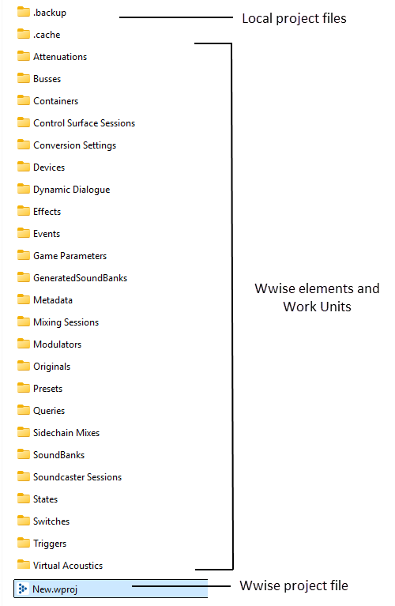

Wwise 工程文件夹结构包括各种文件夹，其中包含不同工程元素的 XML 文件，以便更轻松地管理工程版本和多个用户。典型的工程文件夹包括以下内容：

- **.cache** ―― 缓存文件夹，导入到工程中的 SFX、语音和插件素材的转码版本。它还包含一个名为 **SoundBankInfoCache.dat** 的文件。该文件由 Wwise 用来确定是否更改了 SoundBank。若无更改，则 Wwise 将不重新生成 SoundBank，同时在 Generating SoundBanks（生成音频包）对话框的 Created（创建日期）列中显示 Up to Date（最新）。请勿在版本控制系统中包含此文件夹。
- Containers hierarchy - Default and user-created Work Units for the project's sound, motion, and music objects.
- **Attenuations** - 衰减共享集文件夹，包含工程默认工作单元以及用户创建的工作单元。
- **Conversion Settings** - 转换设置共享集文件夹，包含工程默认工作单元以及用户创建的工作单元。
- **Dynamic Dialogue** - 对话事件文件夹，包含工程默认工作单元以及用户创建的工作单元。
- **Effects** - 效果器共享集文件夹，包含工程默认工作单元以及用户创建的工作单元。
- **Events** - 事件文件夹，包含工程默认工作单元以及用户创建的工作单元。
- **Game Parameters** - 游戏参数文件夹，包含工程默认工作单元以及用户创建的工作单元。
- Busses hierarchy - Default and user-created Work Units for the project output routing.
- **Mixing Sessions** - 混音会话文件夹，包含工程默认工作单元以及用户创建的工作单元。
- **Original** -- 原始音频文件夹，包含导入到工程中的素材原始版本的全部拷贝。
- **Presets** - 预设文件夹，包含工程默认工作单元以及用户创建的工作单元。
- **Queries** - 查询文件夹，包含工程默认工作单元以及用户创建的工作单元。
- **SoundBanks** - 音频包文件夹，包含工程默认工作单元以及用户创建的工作单元。为工程生成 SoundBank 后，会显示一个新的 Generated SoundBank（已生成的声音包）文件夹。
- **Soundcaster Sessions** - 声音选角器会话文件夹，包含工程默认工作单元以及用户创建的工作单元。
- **States** - 状态文件夹，包含工程默认工作单元以及用户创建的工作单元。
- **Switches** - 切换开关文件夹，包含工程默认工作单元以及用户创建的工作单元。
- **Triggers** - 触发器文件夹，包含工程默认工作单元以及用户创建的工作单元。
- .**validationcache** ―― 已对照当前 XML schema 版本进行了验证的所有工程文件的列表。通过跟踪记录经过验证的文件，Wwise 每次加载工程时无需再验证这些文件。这极大地缩短了 Wwise 加载工程所需要的时间。此文件不应由版本控制系统来管理。
- .**wsettings** ―― 为当前工程定义的默认转码和杂项对象设置。这些设置会按各个用户分别保存。此文件不应由版本控制系统来管理。
- **.wproj** ―― Wwise 工程文件。双击工程图标可打开工程。

创建工程后，您可以根据游戏设计将工程划分为不同工作单元，并为各种资源创建结构。At the same time, you can also build the structure for your project routing in the Busses hierarchy, and create the project Game Syncs.

工程中除这些文件夹外，还可能有其它文件，例如完好度报告和 SoundBank 工程头文件。

Wwise 工程及其文件夹的设计使它易于集成到外部版本控制管理工具中去。有关如何管理多个工程用户的详细信息，请参阅[*Working with a team*](ch09.html "Working with a team")。

---

#### 管理工程

由于一个 Wwise 工程包含游戏音频的所有声音、属性和 SoundBanks，因此认真管理工程非常重要。

在创建工程后，可使用电脑的文件系统来管理工程及工程文件。另外，也可直接通过工程文件夹中的 `.wproj` 文件打开工程。

在 Wwise 中打开工程后，可管理已有的工程或从 **Project** 菜单创建新的工程。

###### 使用 Project Launcher

在启动 Wwise 或关闭工程时，会打开 Project Launcher（工程启动器）对话框。您可以利用 Project Launcher 执行以下操作：

- 浏览 **Recent Projects**（最近打开的工程）列表，并通过双击工程或单击 **Open Selection**（打开选中项）来将其打开。若要对列表进行筛选，请单击右上角的“搜索”图标 (Ctrl+F3)。
- 单击 **Open Other**（打开其他）来搜索电脑上的工程文件 (`.wproj`)。
- 单击 **New**（新建）来创建新的工程。

###### 创建工程

1. 新的工程可通过 New Project 对话框来创建。您可以通过以下方式访问 New Project 对话框：

   - Project Launcher：单击 **New**（新建）。
   - 菜单栏：依次单击 **Project > New**（工程 > 新建）或按下 Ctrl+N。
   - Audiokinetic Launcher 的 Wwise 页面：参见 Launcher 文档中的 [Wwise](https://www.audiokinetic.com/library/wwise_launcher/?source=InstallGuide&id=wwise) 章节。
2. 在 New Project（新建工程）对话框的 **Name**（名称）字段中输入名称。有关其他设置的信息，请参阅下表来详细了解 New Project 对话框。
3. 单击 **OK**（确定）。

| New Project 对话框 | |
| --- | --- |
| 界面元素 | 描述 |
| Name | 名称。新工程的名称。  Wwise 中的各个工程不得重名。不得使用以下字符：**':<>\*?”|.%**。在输入有效的文件名后，**OK** 按钮才会被激活。 |
| Location | 位置。若工程存在于默认文件夹之外，则会在下拉列表中列出其所在文件夹。  单击“浏览”按钮 [...] 可选择要将工程存储到哪个文件夹。  |  |  | | --- | --- | | [注意] | 注意 | | 若为工程选择了映射的网络文件夹，则可能造成 Audiokinetic 无法提供支持的音频播放性能问题。 | |
| Original files | 原始文件。导入至 Wwise 中的原始媒体文件将存储在该位置。您可以直接采用默认的位置或单击“浏览”按钮 [...] 来选择要在哪个位置创建 `Originals` 文件夹。 |
| Project 文件夹 | 在该位置为工程创建新的文件夹。在创建时，会在 **Location** 后附加 **Name**。 |
| Platforms（平台） | 平台[“Platform Manager”一节](ch57s09.html "Platform Manager") 的集成视图，不包含 **Copy Settings**（复制设置）选项，您可其中定义工程的平台。  单击 **Add...**（添加...）可[“Adding platforms”一节](ch07.html#adding_platform "Adding platforms")；单击 **Remove**（移除）可[“Removing platforms”一节](ch07.html#removing_platform "Removing platforms")；单击 **Rename...**（重命名...）可更改在列表中选择的平台的名称。稍后可在 [“Platform Manager”一节](ch57s09.html "Platform Manager") 中更改工程平台。若要访问该选项，请在菜单栏中依次单击 **Projects > Platform Manager** (Shift+Alt+P)。 |
| Import factory assets to project | 将出厂素材导入到工程中。将选定素材导入到工程中。这些素材包括声音示例、效果器预设和插件媒体文件等。  稍后也可通过 [“Import Factory Assets”一节](ch57s06.html "Import Factory Assets") 来执行此操作。若要访问该选项，请在菜单栏中依次单击 **Project > Import Factory Assets**。  若要对列表进行筛选，请单击右上角的“搜索”图标 (Ctrl+F3)。 |
|  | 确定。保存新建的工程，关闭 New Project（新建工程）对话框，并在 Wwise 中打开新建的工程。 |
|  | 取消。关闭 New Project 对话框而不保存工程。 |

###### 打开和关闭工程

您可以依次单击 **Project > Open** (Ctrl+O) 来从 Wwise 菜单栏打开工程，或者直接通过 Audiokinetic Launcher 打开工程。

在打开工程之前，Wwise 会先对其进行验证。若有 XML 语法错误，则不会加载工程。若存在工程不一致问题，将打开 Project Load Log 对话框。请参阅 [“解决工程中的不一致现象”一节](ch09s04.html "解决工程中的不一致现象")。

**使用 Project Load Log 对话框：**

1. 在 Project Load Log（工程加载日志）对话框中，检查错误并确定如何予以修复。若要对列表进行筛选，请单击右上角的“搜索”图标 (Ctrl+F3)。
2. 单击 **Accept**（接受）接受建议的修复办法并加载工程。
3. 保存工程。只有保存工程才会保存所做的修复。

若工程加载得很慢，可选择只加载正在处理的 Work Unit。请参阅 [“Loading/unloading Work Units from your project”一节](ch09s01.html#loading_unloading_work_units_from_project "Loading/unloading Work Units from your project")。

在加载工程后，可在 Logs 视图的 [“Project Load 选项卡”一节](ch58s03.html#project_load_tab_log "Project Load 选项卡") 中查看所有 Project Load Log 条目。

**关闭工程：**

- 在菜单栏中，依次单击 **Project > Close**（工程 > 关闭）。这时会关闭工程并打开 Project Launcher。如果您删除了工程中的对象，在关闭工程时并不会删除关联的音频文件。若要将其删除，请清理缓存。详请参阅[“清除缓存”一节](ch10s06.html "清除缓存")。

###### 保存工程

若要保存工程，请在菜单栏中依次单击 **Project > Save**（工程 > 保存）或按下 Ctrl+S。

若工程包含未保存的内容，则 Wwise 标题栏中的工程名称旁会显示星号。在 Project Explorer（工程资源管理器）中，若 Work Unit（工作单元）包含未保存的内容，则其旁边也会显示星号。

若 Work Unit 在文件系统上是只读的，您可以在 Wwise 中对其进行修改但无法通过 **Project > Save** 命令来保存。此命令会保存工程的其余内容，但只读对象会保持显示星号，表示其存在未保存的内容。在开始处理 Work Unit 之前，请确保更改可以被保存。在使用版本控制系统管理工程文件时，请记住需要 checkout 工程文件才能保存这些文件。如需详细了解如何保存使用版本控制系统管理的工程文件，请参阅[“Saving your project when using Perforce”一节](ch09s05.html#saving_project_when_using_perforce "Saving your project when using Perforce")章节。

---

#### 定义工程设置

在 Wwise 中，可在 Project Settings（工程设置）对话框中定义工程的特定设置。

Project Settings 对话框包含以下选项卡：

- [General](ch06s02s01.html "定义工程的常规设置")（常规）：用于定义版本控制插件、Originals 工程素材文件夹的位置、自动采样率检测设置以及 Event（事件）名称创建设置。
- [Conversion](ch06s02s02.html "定义工程的转码设置")，用于设置工程的默认转换设置共享集，以及自动采样率检测设置。
- [SoundBanks](ch06s02s03.html "定义工程的 SoundBank 设置")，用于为工程定义 SoundBank 设置，包括是否生成内容文件、头文件以及 SoundBank 中 Event 的最大衰减距离信息，是否使用 SoundBank 名称，SoundBank 的存储位置，以及 SoundBank 生成前后执行的用户定义的自定义步骤（可选）。
- [Log](ch06s02s04.html "管理在日志中出现的消息")（日志），用于管理 Conversion 和 SoundBank 日志中显示的警告、错误和消息。
- [Environmental
  Curves](ch06s02s05.html "Defining environmental curves for your project") to define the default volume, LPF, HPF, and DSF curves for
  obstruction, occlusion, diffraction, and transmission in your project.
- [External Source](ch06s02s06.html "为 External Source 指定工程设置")（外部源），用于指定外部音频源的输入输出路径，这个外部源将结合 External Source 插件一起使用。
- [Network](ch06s02s07.html "指定网络端口")（网络），用于指定在Wwise 设计工具与游戏之间通信时使用的端口号。
- Custom Properties to define properties for the Sound and Audio Source objects of the Containers hierarchy.

|  |  |
| --- | --- |
| [备注] | 备注 |
| Wwise 仅在您点击 **OK** 后才会应用您对工程设置所做的任何更改，不支持实时编辑。 |

其他工程设置设在 Platform Manager（平台管理器）对话框中：

- 各个平台的 [Volume Threshold](ch06s02s08.html#specifying_volume_thresholds_for_project "为工程指定 Volume Threshold")（音量阈值）。
- 各个平台的 [Max Voice Instances](ch06s02s08.html#specifying_max_voice_instances "指定 Max Voice Instances")（最大声部实例数）。

---

##### 定义工程的常规设置

在 Project Settings 对话框的 General 选项卡中，可执行以下操作：

- [“配置版本控制插件”一节](ch06s02s01.html#configuring_source_control_plug_ins "配置版本控制插件")
- [“定义 Originals 文件夹设置”一节](ch06s02s01.html#defining_originals_folder_settings "定义 Originals 文件夹设置")
- [“定义缓存文件夹设置”一节](ch06s02s01.html#defining_cache_folder_settings "定义缓存文件夹设置")
- [“定义 Event 创建设置”一节](ch06s02s01.html#defining_event_creation_settings "定义 Event 创建设置")

###### 配置版本控制插件

若使用版本控制系统来管理工程素材和文件，则可为工程选择版本控制插件。如果 Wwise 的当前版本支持此插件，则您还可以配置此插件用于工作区域。

Wwise 配有两款版本控制插件：Perforce® 和 Subversion（已弃用）。

有关 Wwise 支持的 Perforce 和 Subversion 版本的详细信息，请参阅 [“Supported Perforce/Subversion versions”一节](ch09s05.html#supported_perforce_subversion_versions "Supported Perforce/Subversion versions") 或 [Wwise SDK 文档](https://www.audiokinetic.com/library/edge/?source=SDK&id=referencematerial_samplecode_source_control.html)。

|  |  |
| --- | --- |
| [备注] | 备注 |
| 各个版本控制插件有不同的配置要求。请向系统管理员核实配置设置。 |

**定义工程版本控制插件的方法是：**

1. 通过执行以下任一操作来打开 Project Settings 对话框：

   - 在 **Project**（工程）菜单中，选择 **Project Setting**。
   - 按 **Shift+K**。
2. 在 **Source Control**（版本控制）分组框的 **Plug-in**（插件）列表中，为工程选择 <Source Control> 插件。
3. 要配置该插件，请点击 **Config**。

   这时会打开 Source Control Plug-in Configuration 对话框。
4. 在 Source Control Plug-in Configuration（版本控制插件配置）对话框的字段中输入所需信息。若启用了 **Use Audiokinetic Wave Viewer to diff WAV files**（使用 Audiokinetic 波形查看器比较 WAV 文件），则使用 [*Wwise Wave Viewer*](ch73.html "Wwise Wave Viewer") 对 WAV 文件进行比较。

   |  |  |
   | --- | --- |
   | [备注] | 备注 |
   | 请向系统管理员核实配置设置。 |
5. 单击 **OK**（确定）保存配置设置并关闭 Plug-in Configuration（插件配置）对话框。
6. 单击 **OK**（确定）保存设置并关闭 Project Settings（工程设置）对话框。

###### 定义 Originals 文件夹设置

工程的 Originals 文件夹包含您导入到工程中的原始音频文件的副本。它的位置是在创建工程时定义的。在 General 选项卡中，您可以指定 Originals 文件的位置。另外，还可在路径中包含环境变量（如 `$(WWISESDK)` 或 `$(TEMP)`）。您可以选择一个位置供整个工程使用，也可以选择将这些文件保存到其它位置供您自己使用。在以下情形中，此选项可能会非常有用：

- 在远程工作时，您没有访问 Originals 文件夹的权限。
- 您没有更改 Originals 文件夹内容的权限。
- 需要为 Originals 文件夹创建一个临时位置，同时不更改工程 Originals 文件夹的位置。

|  |  |
| --- | --- |
| [备注] | 备注 |
| 如果工程定义的 Originals 文件夹不可访问，那么 Override 对应的设置将自动启用，并且 Originals 文件夹会被移到工程文件夹中，使您能够进入工程工作。 |

有关 Originals 文件夹的详细信息，请参阅[“媒体文件结构”一节](ch10s01s03.html "媒体文件结构")。

**定义工程 Originals 文件夹的位置的方法是：**

1. 通过执行以下任一操作来打开 Project Settings 对话框：

   - 在 **Project**（工程）菜单中，选择 **Project Settings**（工程设置）。
   - 按 **Shift+K**。
2. 要定义工程的 Originals 文件夹位置，则需要执行以下操作之一：

   在 **Original Audio Files**（原始音频文件）分组框中，键入或粘贴 Originals 文件夹的路径。该路径为绝对路径或相对于工程文件夹的相对路径。默认路径为“Originals”。

   单击 **Browse**（浏览）按钮 [...] 来使用 [“Advanced Folder Picker”一节](ch57s08s09.html "Advanced Folder Picker") 指定要将 Originals 音频文件夹存储到哪个位置。
3. 要定义 Originals 文件夹位置供您个人使用，请执行以下操作之一：

   - 在 **Original Audio Files**（原始音频文件）分组框中，选中 **Override location for current user**（不沿用当前用户设定的位置）选项。
   - Click the **Browse** button (...) to use the Advanced Folder Picker to specify a location where you want to store your Originals audio file folder.
4. 单击 **OK**（确定）保存设置并关闭 Project Settings（工程设置）对话框。

###### 定义缓存文件夹设置

工程缓存文件夹包含了音频文件转码及 SoundBank 生成期间由 Wwise 生成的中间数据。在创建一个新工程时，该文件的初始位置位于工程目录中的“.cache/”。在 Project Settings 对话框的 General 选项卡中，可修改缓存文件的存放位置。另外，还可在路径中包含环境变量（如 `$(WWISESDK)` 或 `$(TEMP)`）。您可以选择一个位置供整个工程使用，也可以选择将这些文件保存到其它位置供您自己使用。在以下情形中，此选项可能会非常有用：

- 远程工作时，没有访问缓存文件夹的权限。
- 您没有权限改变缓存文件夹的内容。
- 需要为 Originals 文件夹创建一个临时位置，而又不更改工程 Originals 文件夹的位置。

|  |  |
| --- | --- |
| [备注] | 备注 |
| 如果工程定义的缓存文件夹不可访问，那么 Override 对应的设置将自动启用，并且缓存文件夹会被移到工程文件夹中，使您能够进入工程工作。 |

如果您选择不沿用缓存文件夹的位置，则下次打开 Wwise 工程时，缓存文件夹将位于新的位置。然而其它用户仍将访问位于原始位置的文件夹。禁用此选项将恢复访问位于工程位置的缓存文件夹。有关缓存文件夹的详细信息，请参阅[“媒体文件结构”一节](ch10s01s03.html "媒体文件结构")。

|  |  |
| --- | --- |
| [注意] | 注意 |
| 多个用户不可同时访问同一个缓存文件夹。 |

**定义工程缓存文件夹的位置的方法是：**

1. 通过执行以下任一操作来打开 Project Settings 对话框：

   - 在 **Project**（工程）菜单中，选择 **Project Settings**（工程设置）。
   - 按 **Shift+K**。
2. 要定义工程的缓存文件夹位置，则需要执行以下操作之一：

   - 在 **Cached Audio Files**（缓存音频文件）分组框中，键入或粘贴缓存文件夹的路径。该路径为绝对路径或相对于工程文件夹的相对路径。默认路径为“.cache”。
   - 单击 **Browse**（浏览）按钮 [...] 来使用 [“Advanced Folder Picker”一节](ch57s08s09.html "Advanced Folder Picker") 指定要将缓存文件夹存储到哪个位置。
3. 要定义缓存文件夹位置供个人使用，请执行以下操作之一：

   - 在 **Cached Audio Files**（缓存音频文件）分组框中，选中 **Override location for current user**（不沿用当前用户设定的位置）选项。
   - Click the **Browse** button (...) to use the Advanced Folder Picker to specify a location where you want to store your cache file folder.
4. 单击 **OK**（确定）保存设置并关闭 Project Settings（工程设置）对话框。

###### 定义 Event 创建设置

在 Wwise 中创建事件的办法有很多。如果创建的事件没有目标对象，Wwise 会以通用名称为新事件命名。但如果是为选定对象创建事件，则可以指定 Wwise 如何为新事件命名。

**定义工程的 Event Creation Setting 的方法如下：**

1. 通过执行以下任一操作来打开 Project Settings 对话框：

   - 在 **Project**（工程）菜单中，选择 **Project Settings**（工程设置）。
   - 按 **Shift+K**。
2. 选择是否为工程或当前用户指定 Event Creation Setting：

   - 要为工程设定事件创建设置，选择 **Define settings for project**（定义工程设置）。
   - 要为当前用户设定 Event Creation Setting，选择 **Override settings for current user**。
3. 选择所需的事件创建设置：

   - 启用 **Add action name**，即可将操作名称包含在事件名称中。
   - 启用 **Modify case**，即可设置事件名称的大小写。

   见下文了解更多详情。
4. 单击 **OK**（确定）保存设置并关闭 Project Settings（工程设置）对话框。

默认情况下，将使用对象本身的名称作为新的事件名称。以下选项可以修改新的事件名称：

- **Add action name**：启用时，事件的操作名将添加到事件名中。

  1. set as prefix - 操作名称将作为对象名称的前缀：<action\_name>\_<object\_name>
  2. set as suffix - 操作名称将作为对象名称的后缀：<object\_name>\_<action\_name>
- **Modify case**：如果启用，则将更改事件名称的大小写。

  1. all lowercase -- 全部小写。事件名称全部为小写字母。
  2. all uppercase -- 全部大写。事件名称全部为大写字母。

|  |  |
| --- | --- |
| [备注] | 备注 |
| 可针对整个工程或当前用户配置 Event Creation Setting。 |

---

##### 定义工程的转码设置

In the Source Settings tab of the Project Settings dialog, you can carry out the following
tasks:

- [“指定 Default Conversion Settings”一节](ch06s02s02.html#specifying_default_conversion_settings "指定 Default Conversion Settings")
- [“定义 Sample Rate Automatic Detection 设置”一节](ch06s02s02.html#defining_sample_rate_automatic_detection_settings "定义 Sample Rate Automatic Detection 设置")

###### 指定 Default Conversion Settings

为工程创建 Conversion Settings ShareSets（转换设置共享集）后，您可以指定哪个共享集将用作默认设置。

默认 Conversion Settings ShareSet 将应用于以下情况：

- 创建新对象时 - 当新对象是顶层父对象时，会使用默认共享集。如果新对象是另一对象的子对象，它将继承父对象的 Conversion Settings。
- 在 SoundBank 生成过程中 - 如果某个对象尚未被指定 Conversion Setting ShareSet，则生成 SoundBanks 之前将使用默认共享集来转换对象。

**指定默认 Conversion Setting ShareSet 的方法如下：**

1. 通过执行以下任一操作来打开 Project Settings 对话框：

   - 在 **Project**（工程）菜单中，选择 **Project Settings**（工程设置）。
   - 按 **Shift+K**。
2. 切换到 Source Settings 选项卡。请参阅 [“Source Settings 选项卡”一节](ch57s08s02.html "Source Settings 选项卡")。
3. 在 **Default Conversion Settings**（默认转码设置）分组框中，单击 **Browse**（浏览）按钮 [...]。

   此时将会打开 Project Explorer ―― Browser。
4. 选择您希望作为工程默认转换设置的 Conversion Settings。
5. 单击 **OK**（确定）。

###### 定义 Sample Rate Automatic Detection 设置

确定媒体文件的最佳采样率既麻烦又耗时。为了加速进度，您可以使用 Wwise 根据快速傅立叶变换（FFT）算法来分析各个文件。Wwise 基本使用 FFT 来生成媒体文件的频谱分析，方法是每次使用 Hanning 窗口分析一部分声波。截止音量或阈值识别用于确定最佳采样率的频率，您的文件将按照该最佳采样率进行转码。作为 Project Settings 的一部分，您可以定义 FFT 算法使用的 Hanning 窗口的大小以及高、中、低三种不同质量设置的阈值电平。当您选择 Auto High（自动高）、Auto Medium（自动中）或 Auto Low（自动低）作为采样率转码方法时将使用这些阈值设置。

|  |  |
| --- | --- |
| [备注] | 备注 |
| 在归一化频谱的情况下使用音量阈值。 |

**定义工程的自动采样率检测设置的方法是：**

1. 通过执行以下任一操作来打开 Project Settings 对话框：

   - 在 **Project**（工程）菜单中，选择 **Project Setting**。
   - 按 **Shift+K**。
2. 切换到 Source Settings 选项卡。请参阅 [“Source Settings 选项卡”一节](ch57s08s02.html "Source Settings 选项卡")。
3. 在 **Sample Rate Automatic Detection**（采样率自动检测）分组框的 FFT window size（FFT 窗口大小）列表中，选择 FFT 算法分析声波时使用的 Hanning（汉宁）窗口大小。
4. 在 **Volume Thresholds**（音量阈值）分组框中，为以下各个品质选项指定 FFT 算法使用的截止音量电平：

   - **Low quality** -- 低品质。一个截止音量电平，用于识别可确定最佳采样率的频率，在对文件转码时将使用该最佳采样率。当选择 Auto Low 选项作为转码采样率时使用低品质阈值。
   - **Medium quality** -- 中等品质。一个截止音量电平，用于识别可确定最佳采样率的频率，在对文件转码时将使用该最佳采样率。当选择 Auto Medium 选项作为转码采样率时使用中等品质阈值。
   - **High quality** -- 高品质。一个截止音量电平，用于识别可确定最佳采样率的频率，在对文件转码时将使用该最佳采样率。当选择 Auto High 选项作为转码采样率时使用高品质阈值。

     |  |  |
     | --- | --- |
     | [备注] | 备注 |
     | 阈值级别越高，用于转码过程的采样率品质越低，文件大小越小。 |
5. 单击 **OK**（确定）保存设置并关闭 Project Settings（工程设置）对话框。

---

##### 定义工程的 SoundBank 设置

在为每种平台和语言生成 SoundBanks 前，您需要定义 SoundBank 设置。以下 SoundBank 设置可以在工程级别定义：

- [“定义 SoundBank 工程设置”一节](ch06s02s03.html#defining_soundbank_project_settings "定义 SoundBank 工程设置") ―― 确定生成的 SoundBank 中所包含的信息。
- [“为已保存的 SoundBank 指定新位置”一节](ch06s02s03.html#specifying_location_for_saved_soundbanks "为已保存的 SoundBank 指定新位置") ―― 确定硬盘或网络中保存 SoundBank 的位置。
- [“定义要在生成 SoundBank 之前/之后执行的操作”一节](ch06s02s03.html#defining_steps_to_be_performed_pre_post_soundbank_generation "定义要在生成 SoundBank 之前/之后执行的操作") ―― 确定在刚要生成 SoundBank 前将执行的任务。
- [“定义要在生成 SoundBank 之前/之后执行的操作”一节](ch06s02s03.html#defining_steps_to_be_performed_pre_post_soundbank_generation "定义要在生成 SoundBank 之前/之后执行的操作") ―― 确定在刚刚生成 SoundBank 后将执行的任务。

虽然这些设置在工程级别定义，但您可以创建自定义用户设置，覆盖这些工程设置。有关不沿用 SoundBank 工程设置的详细信息，请参阅[“配置用户 SoundBank 设置”一节](ch40s04.html "配置用户 SoundBank 设置")。

###### 定义 SoundBank 工程设置

在生成 SoundBanks 前，您需要确定哪些信息是生成过程的一部分、如何加入这些信息以及生成什么格式。您选择的设置将取决于游戏如何访问 SoundBanks 中的数据和媒体。

**定义 SoundBank 工程设置的方法是：**

1. 通过执行以下任一操作来打开 Project Settings 对话框：

   - 在 **Project**（工程）菜单中，选择 **Project Setting**。
   - 按 **Shift+K**。
2. 切换到 SoundBanks 选项卡。
3. 在 **SoundBank Settings**（音频包设置）分组框中，根据需要选择以下选项来为 SoundBank 定义自定义设置：

   - **Allow SoundBanks to exceed maximum size** -- 允许 SoundBanks 超出最大体积。即使超出指定的最大体积时，仍将生成 SoundBank。
   - **Generate SoundBank content file** -- 生成 SoundBank 内容文件。用于创建列出各个 SoundBank 的内容的文件。内容文件包括有关 Event、Buss、State 和 Switch 的信息，以及流播放音频文件和内存音频文件的完整列表。
   - **Generate header file** -- 生成头文件。创建将 Event、状态、切换开关和游戏参数名称映射到 ID 的头文件。
   - **Max attenuation** -- 最大衰减距离。在 SoundBanksInfo.xml 文件中包含各个 Event 的最大衰减距离信息。
   - **Estimated duration** -- 预计时长。在 SoundBanksInfo.xml 文件中包含各个 Event 的预计最大和最小时长，以及声音是无限循环播放还是只播放一次。
   - **Use SoundBank Name**: 使用 SoundBank 名称。使用 SoundBank 名称（勾选时）或 ID（不勾选时）来命名生成的 .bnk SoundBank 文件，以及在一个 SoundBank 中引用另一个 SoundBank。要了解详细信息，请参阅[“SoundBanks 选项卡”一节](ch57s08s03.html "SoundBanks 选项卡")。
4. 如果选择生成头文件，则必须确定是否保存它。为此，请执行以下操作之一：

   - 点击文本框并直接在其中输入路径。
   - 双击文本框或单击浏览按钮 [...] ，在弹出的浏览器中前往要选择的位置。

   |  |  |
   | --- | --- |
   | [备注] | 备注 |
   | 您可以使用完整路径或相对路径来指定保存头文件的位置。使用相对路径时，工程文件夹会作为路径的起始点。 |
5. 如果选择生成 SoundBank 内容文件，则可以选择所需的文本文件格式和 **SoundBank content file format** 选项。

   |  |  |
   | --- | --- |
   | [技巧] | 技巧 |
   | 如果文件路径、对象名称或对象备注包含非 ANSI 字符，则应使用 Unicode 格式。 |
6. 点击 **OK** 以应用这些设置。

###### 为已保存的 SoundBank 指定新位置

在生成工程的 SoundBanks 时，默认保存文件夹为：

ProjectName\GeneratedSoundBanks\Platform\

如果此位置对您不方便，那么可将它改为电脑或网络中的任何目录。

在为保存的 SoundBank 指定位置时，可使用完整路径或相对路径。使用相对路径时，工程文件夹会作为路径的起始点。例如，下列完整路径和相对路径指定的位置是相同的：

- C:\Wwise Projects\My Project\GeneratedSoundBanks\Windows
- GeneratedSoundBanks\Windows\

**为已保存的 SoundBank 指定新位置的方法是：**

1. 通过执行以下任一操作来打开 Project Settings 对话框：

   - 在 **Project**（工程）菜单中，选择 **Project Setting**。
   - 按 **Shift+K**。
2. 切换到 SoundBanks 选项卡。
3. 在 **SoundBank Paths**（音频包路径）分组框中，根据需要执行以下操作来指定路径：

   - 直接在文本框中输入路径。
   - 单击 **Browse**（浏览）并使用浏览器前往所选的位置。
4. 点击 **OK** 以使您所做的任何更改生效。

|  |  |
| --- | --- |
| [备注] | 备注 |
| 若在工程设置中启用了 **Copy Loose/Streamed Media**，则此设置还会决定要将媒体文件复制到哪个位置。有关详细信息，请参阅“[“SoundBanks 选项卡”一节](ch57s08s03.html "SoundBanks 选项卡")”。 |

###### 定义要在生成 SoundBank 之前/之后执行的操作

根据工作流程，在生成 SoundBank 之前或之后您可能需要立即执行特定步骤或任务。例如，在生成特定 SoundBank 文件前想从版本控制系统中 check out 它们；或者在生成后想立即将流播放文件复制到 SoundBanks 目录中。

在 Wwise 中，这些任务类型是通过创建命令行来定义的。Wwise 中有一个专门的命令行编辑器，方便您构建数目不限的命令行。为了进一步简化过程，编辑器中包含命令行中可使用的所有 Wwise 专用环境变量和其它 Windows 环境变量的列表。

可用于编写自定义命令行的专用 Wwise 变量如下：

| 命令行变量 | 描述 |
| --- | --- |
| `$(AllowExceedMaximum)` | 指定当 SoundBanks 超过指定最大大小时是否生成该 SoundBanks。  当选择了 **Allow SoundBanks to exceed maximum**（允许 SoundBanks 超过最大大小）选项时，此变量设为 True。 |
| `$(GenerateContentFile)` | 指定是否创建文件来列出各个 SoundBank 的内容。内容文件包括有关 Event、Buss、State 和 Switch 的信息，以及流播放音频文件和内存音频文件的完整列表。  当选择了 Generate SoundBank content files（生成 SoundBank 内容文件）选项时，此变量设为 True。 |
| `$(GenerateHeaderFile)` | 指定是否生成将 Event、状态、切换开关和游戏参数名称映射到 ID 的头文件。  当选择了 **Generate Header File**（生成头文件）选项时，此变量设为 True。 |
| `$(GenerateMaxAttenuationInfo)` | 指定是否为 Event 生成最大衰减距离信息。  当选择了 **Metadata Options**: **Max attenuation**选项时，此变量设为 True。 |
| `$(GenerateEstimatedDuration)` | 指定是否生成 Event 的预计最大和最小时长以及时长类型信息。  启用 **Metadata Options**: **Estimated Duration** 选项时，此变量将设置为 True。 |
| `$(HeaderFileFullFilePath)` | 头文件的完整路径，具体为：$(HeaderFilePath)\Wwise\_IDs.h |
| `$(HeaderFilePath)` | 保存头文件的路径或位置。  此路径来自 Header file path（头文件路径）文本框。 |
| `$(InfoFilePath)` | 当前平台的信息文件的完整文件名。 |
| `$(IsRunningFromCmdLine)` | 指定 Wwise 启动的命令行中是否带有`-generatesoundbanks` 选项。 |
| `$(LanguageList)` | 传送到命令行的语言的列表或者 SoundBank Manager 中的选定语言的列表。  |  |  | | --- | --- | | [备注] | 备注 | | 列表采用空格隔开。 | |
| `$(Platform)` | 当前平台的名称。 |
| `$(SoundBankList)` | 传送到命令行的 SoundBank 的列表或者 SoundBank Manager 中的选定 SoundBank 的列表。  |  |  | | --- | --- | | [备注] | 备注 | | 列表采用空格隔开。并用双引号括起整个参数中的列表。 | |
| `$(SoundBankListAsTextFile)` | 该文本文件中会列出传给命令行的 SoundBank 或 SoundBank Manager 中的选定 SoundBank。此选项在处理一长串 SoundBank 时可能会很有用。  |  |  | | --- | --- | | [备注] | 备注 | | 列表采用空格隔开。并用双引号括起整个参数中的列表。 | |
| `$(SoundBankPath)` | 保存当前平台的 SoundBanks 的路径或位置。 |
| `$(UseSoundBankNames)` | 指定选用 SoundBank 名称（设为 `true` 时）或 ID（设为 `false` 时）来用于命名生成的 SoundBank（BNK）文件，以及在 SoundBanks 中用于引用其它 SoundBank 中的媒体。  当选择了 Use SoundBank names （使用声音包名称）选项时，此变量设为 true。 |
| `$(WwiseExeDriveLetter)` | Wwise 可执行程序（Wwise.exe）所在的电脑盘符。 |
| `$(WwiseExePath)` | Wwise 可执行程序（Wwise.exe）的路径或位置。 |
| `$(WwiseExeProcessID)` | Wwise 可执行程序（Wwise.exe）的进程 ID （数字形式）。 |
| `$(WwiseProjectDriveLetter)` | Wwise 工程所在的电脑盘符。 |
| `$(WwiseProjectName)` | 当前工程的名称。 |
| `$(WwiseProjectPath)` | Wwise 工程的路径或位置。 |
| `$(WaapiWampPort)` | WAAPI 为 WAMP 协议使用的端口。 |
| `$(WaapiHttpPort)` | WAAPI 为 HTTP 协议使用的端口。 |

|  |  |
| --- | --- |
| [备注] | 备注 |
| 另外，所有环境变量（如 `$(WWISESDK)`）都是可以使用的。 |

为了尽可能提高灵活性，Wwise 支持为以下类型的步骤指定命令行：

- **Global opening step** -- 全局初始步骤。适用于所有平台并且在任何其它步骤前执行的命令行。
- **Platform-specific pre-generation step** -- 针对平台的生成前步骤。适用于特定平台并且在生成 SoundBanks 前执行的命令行。
- **Platform-specific post-generation step** -- 针对平台的生成后步骤。适用于特定平台并且在生成 SoundBanks 后执行的命令行。
- **Global closing step** -- 全局结束步骤。适用于所有平台并且在所有其它步之后执行的命令行。

在默认情况下，各个工程都包含平台专有的生成后步骤（post-generation step）命令行，该命令行将流播放文件复制到 SoundBank 目录下。然而，您可以通过执行一个不同的命令行将任何类型的任务自动化。Wwise 还自带另一个出厂命令行，它使用 File Packager 来生成包含 SoundBank 中所有数据和媒体的文件包。有关 File Packager 的详细信息，请参阅[*管理 File Package*](ch41.html "管理 File Package")。有关加载出厂命令行的详细信息，请参阅[“加载出厂/自定义命令行”一节](ch06s02s03.html#loading_factory_custom_command_lines "加载出厂/自定义命令行")。

您还可以将您创建的命令行保存到文件（WCMDLINE）中，以便今后在同一工程中使用，跨工程使用，或者与其它用户共享。有关保存命令的详细信息，请参阅[“将自定义命令行保存至文件”一节](ch06s02s03.html#saving_custom_command_lines_to_file "将自定义命令行保存至文件")。

**定义要在生成 SoundBank 之前执行的操作：**

1. 通过执行以下任一操作来打开 Project Settings 对话框：

   - 在 **Project**（工程）菜单中，选择 **Project Setting**。
   - 按 **Shift+K**。
2. 切换到 SoundBanks 选项卡。
3. 要创建全局 Pre-Generation Step（生成前步骤），请点击浏览按钮 [...] 以打开 Global Opening Step Editor。

   Pre-Generation Step Editor（生成前步骤编辑器）打开。
4. 在 **Description** 文本框中，输入名称，名称要能清晰描述将要执行的步骤或任务。
5. 点击 **Commands** 文本框，开始创建您的命令行。

   |  |  |
   | --- | --- |
   | [备注] | 备注 |
   | **Commands** 文本框和与大多数其他文本编辑器一样，允许您按 Enter 键添加新的文本行，选择文本并按 Delete 键删除文本，等等。 |
6. 如果要在命令中插入内置宏和环境变量，则请执行以下操作：

   在 **Macros**（宏）分组框中，根据需要选择以下选项：

   - **Built-in Macros** -- 内置宏。显示可用于 Wwise 命令行中的一列 Wwise 专用变量。
   - **Environment Variables** -- 环境变量。显示可用于 Wwise 命令行中的一列 Windows 专用环境变量。

   要添加变量到命令行中的话，要执行以下操作中的一项：

   - 双击列表中的变量。
   - 从列表中选择变量，然后点击 **Insert**（插入）。

   根据需要，继续添加变量到命令行。
7. 如果需要执行第二个全局生成前步骤，则只需转到第一行末尾，按 **Enter** 键，然后即可开始创建新的命令行。
8. 点击 **OK** 保存命令行并关闭 Pre-Generation Step Editor。

   |  |  |
   | --- | --- |
   | [备注] | 备注 |
   | 如果需要将命令行保存为文件，则在编辑器中点击 **Save As**（另存为）按钮。有关保存自定义命令行的详细信息，请参阅[“将自定义命令行保存至文件”一节](ch06s02s03.html#saving_custom_command_lines_to_file "将自定义命令行保存至文件")。 |
9. 要创建针对平台的生成前步骤，针对各个平台重复步骤 3 至 8。

   |  |  |
   | --- | --- |
   | [备注] | 备注 |
   | 您还可以通过点击 **Load** 按钮将出厂设定和先前保存的自定义命令行加载到 Editor 中。有关加载出厂设定/自定义命令的详细信息，请参阅[“加载出厂/自定义命令行”一节](ch06s02s03.html#loading_factory_custom_command_lines "加载出厂/自定义命令行")/>。 |

**定义要在生成 SoundBank 之后执行的操作：**

1. 通过执行以下任一操作来打开 Project Settings 对话框：

   - 在 **Project**（工程）菜单中，选择 **Project Setting**。
   - 按 **Shift+K**。
2. 切换到 SoundBanks 选项卡。
3. 在 **Post-Generation Step**（生成后操作）分组框中，您会发现系统会默认添加 **Copy Streamed Files**（复制流播放文件）命令行。要修改此命令行或添加其他命令行，请单击相应的浏览按钮 [...]。

   此时将打开 Post-Generation Step Editor。
4. 在 **Description** 文本框中，输入名称，名称要能清晰描述将要执行的步骤或任务。
5. 在 **Commands** 文本框中，单击当前命令行的末尾，然后按**Enter**。现在可以开始创建新的命令行了。

   |  |  |
   | --- | --- |
   | [备注] | 备注 |
   | **Commands** 文本框和与大多数其他文本编辑器一样，允许您按 Enter 键添加新的文本行，选择文本并按 Delete 键删除文本，等等。 |
6. 如果要在命令中插入内置宏和环境变量，则请执行以下操作：

   在 **Macros**（宏）分组框中，根据需要选择以下选项：

   - **Built-in Macros** -- 内置宏。显示可用于 Wwise 命令行中的一列 Wwise 专用变量。
   - **Environment Variables** -- 环境变量。显示可用于 Wwise 命令行中的一列 Windows 专用环境变量。

   要添加变量到命令行中的话，要执行以下操作中的一项：

   - 双击列表中的变量。
   - 从列表中选择变量，然后点击 **Insert**（插入）。

   根据需要，继续添加变量到命令行。
7. 如果需要执行第二个全局生成前步骤，则只需转到第一行末尾，按 Enter 键，然后即可开始创建新的命令行。
8. 点击 **OK** 以保存命令行并关闭 Post-Generation Step Editor。

   |  |  |
   | --- | --- |
   | [备注] | 备注 |
   | 如果需要将命令行保存为文件，则在编辑器中点击 **Save As**（另存为）按钮。有关保存自定义命令行的详细信息，请参阅[“将自定义命令行保存至文件”一节](ch06s02s03.html#saving_custom_command_lines_to_file "将自定义命令行保存至文件")。 |
9. 对于全局结束步骤或其它各个平台，重复执行步骤 3 至 8。

   |  |  |
   | --- | --- |
   | [备注] | 备注 |
   | 您还可以通过点击 **Load** 按钮将出厂设定和先前保存的自定义命令行加载到 Editor 中。有关如何加载出厂/自定义命令的详细信息，请参阅[“加载出厂/自定义命令行”一节](ch06s02s03.html#loading_factory_custom_command_lines "加载出厂/自定义命令行")章节。 |

###### 加载出厂/自定义命令行

Wwise 附带一些已经创建的命令行，包括将流播放文件复制到 SoundBank 目录的命令行，以及将流播放文件和 SoundBanks 打包到一个文件包（package）的命令行。这些被称作出厂设定命令行。您可以加载这些出厂设定命令行或您先前保存到文件中的自定义命令行。

**加载出厂设定/自定义命令行的方法是：**

1. 在 Pre/Post Generation Step Editor（生成前/后操作编辑器）中，单击 **Load**（加载）。
2. 在快捷菜单中，点击以下某个选项：

   - **From Factory Folder** - 打开 Explorer / Finder 并转至 Wwise 出厂设定命令行所在的目录。
   - **From Last Location** - 打开 Explorer / Finder 并转至上次加载命令行的目录。

   这时会打开 Open（打开）对话框。
3. 选择您要加载的命令行并点击 **Open**。

   命令行将被加载到编辑器中。

###### 将自定义命令行保存至文件

您可以将您创建的自定义命令行保存为文件，以便今后在同一工程中使用，跨工程使用，或者与其它用户共享。

**保存命令行为文件的方法是：**

1. 在 Pre-Post Generation Step Editor 中，编写命令行。
2. 完成时，点击 **Save As**。

   这时会打开 Save As（另存为）对话框。
3. 前往您想保存命令行的文件夹，对它命名，然后按 **Save**。

   命令行将保存为 WCMDLINE 文件，可以随时复用。

---

##### 管理在日志中出现的消息

有时不希望或不需要在生成过程中在 SoundBank Log（音频包日志）或 Conversion Log（转码日志）中显示特定警告和/或消息。若不想在 SoundBank 和 Conversion 日志中显示这些类型的警告和消息，可选择将其添加到 Log Ignore List。若想重新显示这些消息，则可从 Log Ignore List 移除相应消息类型。您可以转到 Project Settings 对话框并在工程层级管理此消息列表。

**添加消息到 Log Ignore List 的方法是：**

1. 在菜单栏中，点击 **Project** > **Project Setting**。
2. 在 Project Settings（工程设置）对话框中，选中 Logs（日志）选项卡。
3. 取消选中所有与要添加到 Log Ignore List（日志忽略列表）的消息对应的复选框。
4. 单击 **OK**（确定）关闭 Project Settings（工程设置）对话框。

   在下次生成日志时，Wwise 会忽略被取消选中的消息类型，并且不会在日志中予以显示。

   若要从 Log Ignore List（日志忽略列表）中移除某个消息类型，请勾选与之对应的消息类型。

   |  |  |
   | --- | --- |
   | [备注] | 备注 |
   | 您也可以通过直接在日志中右键单击一条或多条消息并选择 **Add Message(s) to Ignore List** 来将消息添加到 Log Ignore List。 |

**更改消息的严重性的方法是：**

1. 在菜单栏中，点击 **Project** > **Project Setting**。
2. 在 Project Settings（工程设置）对话框中，选中 Logs（日志）选项卡。
3. 使用 **Severity**（严重性）列中的列表来更改严重性。
4. 单击 **OK**（确定）关闭 Project Settings（工程设置）对话框。

   下次生成日志时，将应用选定的严重性。

**限制出现日志中消息数量的方法是：**

1. 在菜单栏中，点击 **Project** > **Project Setting**。
2. 在 Project Settings（工程设置）对话框中，选中 Logs（日志）选项卡。
3. 启用 **Limit number of messages displayed to:** 选项并输入您想要在日志中显示的最大消息数量。注意，此数字用于限制日志中的所有消息类型。
4. 单击 **OK**（确定）关闭 Project Settings（工程设置）对话框。

|  |  |
| --- | --- |
| [备注] | 备注 |
| 若要管理 General、Project Load 和 WAAPI 日志中显示的消息，请在 Logs 视图内单击“设置”图标，打开 Logs Settings 对话框。 |

---

##### Defining environmental curves for your project

In the Environmental Curves tab of the Wwise Project Settings dialog, you can define the obstruction, occlusion, diffraction, and transmission settings for the sound objects for each platform in your project. 声障是指游戏几何空间中的对象（例如墙壁或立柱）部分遮挡声源与听者之间空间时的声学现象。Occlusion 是指游戏几何空间中的对象完全挡住了声源与听者之间的空间时的声学现象。Diffraction and transmission occur when using Spatial Audio Rooms and Portals or Spatial Audio Geometry.

游戏程序员通过编程的方法定义游戏的几何空间，在这种情况下可能就会产生声障和声笼条件。Wwise 自身不计算声障和声笼的程度。物理计算必须由游戏完成，并将结果传递给下面的函数： [SetObjectObstructionAndOcclusion()](https://www.audiokinetic.com/library/edge/?source=SDK&id=namespace_a_k_1_1_sound_engine_a1b3e18a25b405e55ba82de9b70cd11ba.html) 。

|  |  |
| --- | --- |
| [备注] | 备注 |
| 声障和声笼设置可以与 Environmental Effect（环境效果）并行使用，根据音源的位置来动态改变声音属性。有关详细信息，请参阅[“理解发送”一节](ch24s02.html#understanding_sends "理解发送")。 |

有关开发者如何通过编写代码来设置声障和声笼的详细信息，请参阅 Wwise SDK 文档中的[声障、声笼及 Game-defined Auxiliary Sends](https://www.audiokinetic.com/library/?source=SDK&id=soundengine__obsocc.html) 章节。

For more information about diffraction and transmission, refer to the [Rooms and Portals Overview](https://www.audiokinetic.com/library/?source=SDK&id=spatial_audio_roomsportals_apioverview.html) and [Using the Geometry API for Simulating Diffraction and Transmission](https://www.audiokinetic.com/library/?source=SDK&id=spatial_audio_apigeometry_diffract.html) sections in the Wwise SDK documentation.

In Wwise, you can define platform-specific volume, LPF, HPF, and DSF curves to apply to sound objects when they are affected by obstruction, occlusion, diffraction, and transmission during gameplay. The values you define are relative and are accumulated with any values already applied to the game object. Volumes and DSF values are accumulated through addition, while LPF and HPF values are accumulated by retaining the highest value.

**To define the environmental settings for your project:**

1. 通过执行以下任一操作来打开 Project Settings 对话框：

   - 在菜单栏中，点击 **Project** > **Project Setting**。
   - 按 **Shift+K**。
2. Switch to the Environmental Curves tab.

   
3. Within the Project Environmental Curves group, click on the "..." button to choose an attenuation ShareSet to be used at the project level. A ShareSet can be used both at the project level and on an individual sound.

   |  |  |
   | --- | --- |
   | [备注] | 备注 |
   | To create a new ShareSet for the project environmental curves, add it in the [“ShareSets 选项卡”一节](ch60s05.html "ShareSets 选项卡") of the [*Project Explorer*](ch60.html "Project Explorer") first. |

   To modify the environmental curves, double-click on the attenuation ShareSet selector to open the corresponding [“Attenuation Editor”一节](ch60s05s02.html "Attenuation Editor").

   

   |  |  |
   | --- | --- |
   | [备注] | 备注 |
   | 1. Although the ShareSet contains distance curves, they aren't used at the project level. 2. Curves set to Use Project Obstruction, Occlusion, Diffraction, or Transmission, are treated as set to None. |
4. 完成后，点击 **OK**。

   The Project Settings dialog closes and the chosen attenuation ShareSet will be used for your project.

   |  |  |
   | --- | --- |
   | [备注] | 备注 |
   | It is possible to open the chosen attenuation ShareSet from the [“ShareSets 选项卡”一节](ch60s05.html "ShareSets 选项卡") of the [*Project Explorer*](ch60.html "Project Explorer") later to apply changes to the curves. Live editing is possible. |

另外，还可禁用这些曲线或针对声音对象创建自定义曲线。Refer to [“应用衰减”一节](ch22s07.html "应用衰减") and its subsections to see how this is done.

---

##### 为 External Source 指定工程设置

若打算使用 [“External Source（外部源）”一节](ch65s03.html "External Source（外部源）") 插件，则须指定 External Sources List 文件的存放位置。这个 XML 文件可用来指定以下设置：

- 可与 Wwise 中创建的 External Source 关联的外部音频文件的存放位置。
- 用于转换每个文件的 Conversion Settings。

您还必须指定保存经过转码后的源的文件夹，以便 Wwise 声音引擎在运行时可以使用它们。另外，输出文件夹路径中还可包含环境变量（如 `$(WWISESDK)` 或 `$(TEMP)`）。

您可以使用 SoundBank Manager（音频包管理器）的 User Settings（用户设置）覆盖这些工程设置。请参阅 [“为 External Source 指定用户设置”一节](ch40s04.html#specifying_input_ouput_location_for_external_source_files "为 External Source 指定用户设置")。

**为 External Source 指定工程设置：**

1. 在菜单栏中，点击 **Project** > **Project Setting**。
2. 在 Project Settings（工程设置）对话框中，切换到 **[“External Sources 选项卡”一节](ch57s08s06.html "External Sources 选项卡")**。
3. 在 **Input Path**（输入路径）分组框中，根据需要执行以下操作来指定要将 External Sources List（外部源列表）文件 (WSOURCES) 存储到哪个位置：

   - 点击 **External Sources List**，然后输入外部资源列表文件所在的路径。
   - 点击游戏平台的相应浏览按钮 [...]，前往该平台外部资源列表文件的文件夹，然后点击 **Open**。
4. 对工程中的各个有效平台重复执行步骤 **3**。
5. 在 **Output Path**（输出路径）分组框中，根据需要执行以下操作来指定要将转码后的 External Source（外部源）保存到哪个位置：

   - 点击 **External Sources Output Folder** 列表，并输入要保存音频文件的路径。
   - 单击与其中一个游戏平台对应的“浏览”按钮 [...] 来使用 [“Advanced Folder Picker”一节](ch57s08s09.html "Advanced Folder Picker") 指定要将与该平台关联的转码音频文件保存到哪个文件夹，然后单击 **OK**（确定）。
6. 对各个平台执行步骤 **5**。
7. 单击 **OK**（确定）关闭 Project Settings（工程设置）对话框。

---

##### 指定网络端口

将 Wwise 设计工具连接到游戏进行性能分析和实时编辑时，Wwise 与游戏之间的通信将通过您为其打开的网络端口进行处理。您可以在 Wwise Project Settings 对话框的 Network 选项卡中自定义 Wwise 设计工具所用的端口。在游戏初始化 Wwise 通信模块时，可以对游戏开放和使用的端口进行定制。

您可以定义特定的端口号（固定），也可以让操作系统自动选择一个端口号（动态）。具体选择取决于端口是由Wwise 设计工具开启还是由游戏开启：

|  |  |
| --- | --- |
| [注意] | 注意 |
| 在 Project Settings 中更改此端口时，请务必确保使用的值和代码中初始化 Wwise 通信模块时相同 (特别是传递给  [`AK::Comm::Init()`](https://www.audiokinetic.com/library/edge/?source=SDK&id=namespace_a_k_1_1_comm_a596691b552b507c26b4df958ee1c6de8.html) 的 ports.uDiscoveryBroadcast 结构成员）。 |

###### Game Discovery Broadcast 端口

此端口由集成到游戏中的 Wwise 通信模块开启，Wwise 设计工具为了发现网络上可以连接的游戏，会发送消息广播，游戏需要通过这个端口侦听网络中的消息广播。Wwise 设计工具将 Game Discovery（游戏探查）消息广播至该端口，因此游戏中和 Wwise 工程中应使用相同的端口，这点十分重要。由于游戏和Wwise 设计工具需要确定该端口，因此该端口不得为动态（不得设置为 0）。

|  |  |
| --- | --- |
| [注意] | 注意 |
| 您可以选择使用 1 到 65535 之间的任意端口号；但是请验证您定义的端口号不会与同一计算机或游戏机上运行的其它应用程序存在冲突。 |

###### Game Discovery Response 端口

此端口由 Wwise 设计工具开启。在此，游戏对 Game Discovery 消息做出响应。在定义此端口的端口号时，记住以下重要注意事项：

- 如果将此端口设置为 0 ，则等于告诉Wwise 设计工具自行请求动态的端口号，又称为临时端口号。这意味着操作系统不会使用特定端口号，而是自动选择一个端口号。自动选择端口号是默认行为，建议使用动态端口号以避免与其它应用程序发生冲突。
- 如果需要使用固定端口号（即不是动态/临时端口号），则要避免使用 Game Discovery Broadcast Port 的同一端口号，除非您不打算连接到与创作应用同机运行的游戏。
- 您可以选择使用 0 到 65535 之间的任意端口号；但是请验证您定义的端口号不会与同一计算机或游戏机上运行的其它应用程序存在冲突。

###### 自定义游戏中的通信端口

如前所述，Game Discovery Broadcast Port 由通信模块在游戏中开启。游戏中，通信模块还开启了三个其它端口，它们在初始化期间进行自定义。设计工具中并没有暴露这些端口。有关详细信息，请参阅 [Wwise SDK 文档](https://www.audiokinetic.com/library/?source=SDK&id=workingwithsdks__initialization.html#initialization_comm)的“通信初始化”章节。

自定义通信端口的方法是：

1. 通过执行以下任一操作来打开 Project Settings 对话框：

   - 在菜单栏中，点击 **Project > Project Settings**。
   - 按 **Shift+K**。
2. 切换到 Network 选项卡。
3. 根据需要编辑端口号。
4. 单击 **OK**（确定）。

这时会关闭 Project Settings 对话框。从现在起将使用新端口与游戏进行通信。

---

##### 为工程定义音量设置

在 Platform Manager（平台管理器）对话框中，可指定各个平台的 Volume Threshold（音量阈值）和 Max Voice Instances（最大声部实例数）。

###### 为工程指定 Volume Threshold

The Volume Threshold refers to the point below which a voice will be managed by behaviors defined in the Advanced category of the Property Editor. 您可以在 Platform Manager 对话框中为工程指定默认的 Volume Threshold。如果没有使用 Wwise API 另行设置 Volume Threshold，则会使用此值。关于管理底层音频和振动对象，以及设置对象达到音量阈值时的行为，更多信息请参阅 [“管理音量较低的对象”一节](ch23s04.html "管理音量较低的对象")。

**为工程设置 Volume Threshold 的方法如下：**

1. 通过执行以下任一操作来打开 Platform Manager 对话框：

   - 在 **Project**（工程）菜单中，选择 **Platform Manager**（平台管理器）。
   - 按下 **Shift+Alt+P**。
2. For each platform, specify the point at which the sound will be managed by the behaviors
   defined in the Advanced category of the Property Editor.

   |  |  |
   | --- | --- |
   | [备注] | 备注 |
   | 如果没有使用 Wwise API 另行设置 Volume Threshold，将使用此默认值。 |
3. 单击 **OK**（确定）保存设置并关闭 Platform Manager（平台管理器）对话框。

###### 指定 Max Voice Instances

与指定工程音量阈值非常相似，在工程中同时播放的声部数量有限。如果工程中的声部数量超过了这个指定值，则也会查找当前所有播放对象 Property Editor 中的 Advanced Settings。

在此，Wwise 将根据哪些对象具有最高优先级来决定保留哪些声部。因此，超出虚声部数量并且具有最低优先级的对象将被发送到虚声部或终止。

---

#### 为工程指定 Default Object Value

在 Wwise 中，可为工程指定特定的 Default Object Value。这些默认值会被应用于您创建的每个新对象，除非新建的对象被创建为另一对象的子对象。在这种情况下，对象会沿用指派给其父对象的音频输出和 Conversion Settings ShareSet。

建议在工程中提早指定 Default Object Value 以便在创建新的对象时予以应用。

在工程开发期间更改 Default Object Value 时，只会影响执行所述更改之后创建的对象。也就是说，您可以在创建某种对象（如 SFX 对象）之前设置 Default Object Value，并在创建另一种对象（如 Voice 对象）之前更改 Default Object Value。

每个用户都可指定 Default Object Value。Wwise 会将其保存到 `<project directory>/<project_name>.<user_name>.wsettings` 路径下的 XML 文件中。

**指定 Default Object Value：**

1. 在菜单栏中，依次单击 **Project > Default Object Values**（工程 > 默认对象值）或按下 Shift+D。
2. 在 Default Object Values（默认对象值）对话框中，指定默认值。有关详细信息，请参阅下表。
3. 单击 **OK**（确定）。

   这时会关闭 Default Object Values 对话框并保存所指定的值。

| 界面元素 | 描述 |
| --- | --- |
| **Routing（信号通路）** | |
| Audio Output | The default Audio Bus within the Busses hierarchy through which new sound and music objects will be routed. |
|  | 打开 Project Explorer - Browser，以选择默认音频总线。 |
| **Sound Object** | |
| Voice Volume（声部音量）。 | 声部音量。所有新声音对象的默认层级或振幅。  默认值：0 范围：-200 至 0 单位：dB |
| **Default Conversion Settings（默认转码设置）** | |
| Override Project Settings | 不沿用工程设置。该项方便选择另一个默认 Conversion Settings 共享集。  |  |  | | --- | --- | | [备注] | 备注 | | 默认 Conversion Settings 共享集适用于新创建的 Wwise 对象。更改此项后并不会替换先前应用的 Conversion Settings 共享集。 | |
| (Conversion Setting ShareSet) | ShareSet 的名称将用于默认 Conversion Settings。  每次在工程中创建新的顶级父对象时都会使用默认 Conversion Settings 共享集。若将新对象创建为另一对象的子对象，则其将继承指派给父对象的 Conversion Settings 共享集。  在生成 SoundBank（音频包）时，不会使用用户默认 Conversion Settings。 |
|  | 打开 Project Explorer - Browser（工程资源管理器 - 浏览器）。在此，可浏览并选择不同的默认 Conversion Settings 共享集。 |
|  | 确定。关闭 Default Object Values 对话框并保存设置。 |
|  | 取消。关闭 Default Object Values 对话框而不保存设置。 |

---

#### 排查工程的问题

在 Wwise 中，一般可通过以下两种方式探查工程内出现的问题：

- [“使用 Logs 视图”一节](ch06s04.html#using_logs_view "使用 Logs 视图")
- [“使用 Integrity Report”一节](ch06s04.html#using_the_integrity_report "使用 Integrity Report")

###### 使用 Logs 视图

通过 [Wwise 工具栏](ch03.html "Wwise 界面基础知识")的日志标志，可快速查看工程中显示的消息、警告和错误。如需了解更多详细信息，请将鼠标悬停在标志上。

|  |
| --- |
|  |

若要查看所列日志条目的全部信息，请单击标志以便打开 Logs（日志）视图。其中的五个选项卡涵盖了 Wwise 工程中可能遇到的所有问题。

|  |
| --- |
|  |

对于包含日志条目的选项卡，每个都会以图标显示其中最高的严重级别。您必须排除所有 Error（错误），因为其会影响操作的完整性。Fatal Error（严重错误）甚至会导致无法完成操作。Warning（警告）可能会影响操作的完整性，所以要加以评估。Message（消息）应该问题不大，但其提供有宝贵的信息，便于了解 Wwise 工程的运行情况。若日志中没有任何条目，则选项卡不会显示“严重级别”图标。

  

|  |  |
| --- | --- |
| [技巧] | 技巧 |
| Logs 视图选项卡中的所有列标题都可单击排序，以便高效地管理条目。比如，可按严重级别的高低来对 Severity（严重性）列进行排序（从低到高或从高到底）。 |

###### 使用 Integrity Report

您可以通过生成完好度报告来检查工程的状态。完好度报告中显示有关平台、音频文件 SoundBank 和插件问题的信息。通过检查此报告，您可以处理许多工程问题，例如：

- 缺失的媒体文件
- 缺少源，例如缺失语言版本
- 插件问题
- SoundBanks 缺少对象
- SoundBanks 的渲染和旁通效果问题
- SoundBanks 的渲染和 RTPC

除了显示工程问题外，完好度报告还提供包括下列问题的信息：

- **Platform**：平台。发生问题的平台。
- **Type**：类型。受影响的对象类型。
- **Object name**：对象名称。受影响的对象或元素的名称。
- **Status**：状态。问题的描述。
- **Comments/Suggestions**：备注/建议。有关如何处理问题的信息和建议。
- **Hierarchy**：层级结构。层级结构中受影响对象的位置。

###### 生成 Integrity Report

在 Wwise 工程开发期间，您可以随时生成完好度报告。生成 SoundBank 之前，建议先生成完好度报告。如果您也使用了版本控制软件，则应在提交各 Work Unit 中的重大更改之前生成该报告。

为简化特定问题类型的查找，您还可以通过指定要生成的信息类型来筛选此报告。您可以限制报告显示下列任意或全部内容：

- 音频文件和源
- 层级结构
- 参考源
- 优化

在生成报告后，您可以仔细查看报告中的各个问题，然后双击各个问题来执行建议的修复办法。例如，双击内容为“No group assigned to the Switch Container”（无编组被分配到切换容器）的状态消息，将打开 Property Editor，在此您可以将 Switch Group 或 State Group 分配给 Switch Container。

**生成完好度报告的方法是：**

1. 在 Wwise 菜单栏中，点击 **Views > Integrity Report**。

   此时将打开 Integrity Report。
2. 若要定义要在 Integrity Report 中包含哪些平台问题，请在 **Platforms** 分组框中选择一个或多个工程平台（如 [“Platform Manager”一节](ch57s09.html "Platform Manager") 中定义）。
3. 若要定义要在 Integrity Report 中包含哪些工程语言问题，请在 **Languages** 分组框中选中 **Languages** 选项并选择相应的语言。
4. 要筛选工程问题类型，则要选择以下若干项内容：

   音频文件和源

   层级结构

   引用失效

   优化
5. 点击 **Generate**。

   此时进度条将显示生成过程的状态。
6. 当 Wwise 完成生成完好度报告时，点击 **Close**（关闭）。

   这时会关闭 Integrity Report - Completed（完好度报告 - 完成）对话框并显示 Integrity Report。

   |  |  |
   | --- | --- |
   | [备注] | 备注 |
   | 在关闭 Integrity Report 对话框时，并不会保存相应的信息。如果您打算以后查看这些信息，则一定要保存该报告。有关使用完好度报告的详细信息，请参阅[“保存 Integrity Report”一节](ch06s04.html#saving_an_integrity_report "保存 Integrity Report")。 |
7. 双击问题来打开对应的对话框，以便加以修复或修改问题状态。

###### Integrity Report 问题

下表列出了工程中检测到的可能问题，以及如何纠正这些问题。

| 问题 | 信息/建议 |
| --- | --- |
| 找不到原始音频文件。 | 执行以下操作之一：  - 将缺失的文件拖到 Originals 文件夹。 - 使用 Audio File Importer（音频文件导入程序）导入缺失的文件。 |
| 音频源缺失。 | 双击消息以在 SFX Project Explorer 的 Audio 选项卡中和语音的 Contents Editor 中查看缺失的源。 |
| 平台上不支持源插件。 | 双击消息以打开 Contents Editor，在此您可以选择当前平台支持的源插件。 |
| 没有安装源插件。 | 安装源插件。 |
| 缺少语言源。 | 使用 Audio File Importer 导入缺少的语言源。 |
| 选定的编解码器不支持此源的声道配置。 | 在转码前，Wwise 将自动下混源。双击消息并更改编解码器（音频格式）或声道设置。 |
| 平台上不支持音频效果插件。 | 双击消息以打开 Property Editor，在此您可以选择当前平台支持的效果插件。 |
| 没有安装音频效果插件。 | 安装缺少的音频效果插件。 |
| Render Effect（将效果器渲染到 SoundBank 中）已经应用于非音频文件的“使用中的”源。 | 源插件不支持渲染效果。双击消息以执行以下操作之一：  在 Property Editor 中，取消选中渲染效果选项。  在 Contents Editor 中，选择所引用音频文件状态为“In Use”（使用中）的音频源。 |
| 必须渲染选定的效果。 | 双击以打开 Property Editor 并执行以下操作之一：  为效果器选择 Render 选项。  更改使用的效果器。 |
| 先对效果做渲染可以节省 CPU，因为在游戏中将不会改变其参数。 | 双击打开 Property Editor 并选择 **Render** 复选框。 |
| 已旁通此对象上的效果。将忽略渲染效果。 | 由于不能同时支持这两个操作，因此请验证渲染效果对您项目的重要性。如果想应用渲染效果选项，则要取消选中 Bypass Effect（旁通效果）。 |
| 已为此对象的 RTPC 指定 Bypass Effect 属性。将忽略渲染效果。 | 由于不能同时支持这两个操作，请验证 Render effect 操作和 RTPC 驱动的 Bypass effect 操作对项目的重要性。如果您想应用 Render 效果器选项，则需取消选中对象上的 RTPC 驱动的 Bypass 效果。 |
| RTPC 已应用于该对象的效果器。将忽略渲染效果。 | 由于不能同时支持这两个操作，因此请验证已经应用的 RTPC 或渲染效果对项目的重要性。如果您要应用渲染效果，则要取消选中 RTPC。 |
| 此虚声部行为需要 Seek Table（文件寻址表）。 | 双击消息来打开 Conversion Settings 对话框并根据需要执行以下操作：  - 在 Vorbis Encoder Parameters 对话框中启用 Seek Table。 - 更改文件格式。 |
| 此虚声部行为不需要 Seek Table。 | 为减少内存占用，您可以弃用 Seek Table。双击消息来打开 Conversion Settings 对话框，并在 Vorbis Encoder Parameters 对话框中禁用 Seek Table。 |
| Vorbis 格式的音乐对象需要 Seek Table。 | 双击消息来打开 Conversion Settings 对话框并根据需要执行以下操作：  在 Vorbis Encoder Parameters 对话框中启用 Seek Table。  更改文件格式。 |
| 此容器中的子对象没有分配给 Switch。 | 双击消息以打开 Project Explorer 和相应 Property Editor，在此您可以执行以下操作之一：  移除未分配的对象。  将对象指派给 Switch。 |
| 没有组指派给 Switch Container。 | 双击以打开 Property Editor，并将 Switch Group 或 State Group 指派给 Switch Container。 |
| Switch Container 中没有对象指派给了 Switch。 | 双击以打开 Contents Editor，并将对象指派给 Switch Container 中的 Switch。 |
| 没有组指派给 Music Switch Container。 | 双击以打开 Property Editor，并将 Switch Group 或 State Group 指派给 Music Switch Container。 |
| 没有音乐对象指派给此容器中的 Switch。 | 双击以打开 Music Switch Association Editor（音乐切换关联编辑器），在此您可以将音乐对象指派给 Switch。 |
| Sequence Container 的播放列表中没有指派好的对象。 | 双击以打开 Contents Editor，在此您可以将对象指派给播放列表。 |
| 音乐播放列表容器的播放列表中没有指派好的对象。 | 双击以打开 Music Playlist Editor（音乐播放编辑器），并将音乐对象指派给播放列表。 |
| Blend Container 中的混合轨没有指派好的对象。 | 双击以打开 Blend Track Editor，在此您可以执行以下操作之一：  添加对象到混合轨中。  移除混合轨。 |
| Music Segment 内的音乐轨中不包含音频文件。 | 双击以打开 Music Segment Editor（音乐段落编辑器），在此您可以执行以下操作之一：  添加片段到音乐轨中。  删除音乐轨。 |
| SoundBank 在引用不复存在的对象。 | 从 SoundBank 中删除事件或对象。 |
| Event Action 中没有指派对象。 | 双击并打开 Event Editor 来执行以下操作之一：  给这些 Action 指派对象。  移除 Event Action。 |
| 在 Dialogue Event 中的路径没有指派对象。 | 双击以打开 Dialogue Event Editor（对白事件编辑器）并执行以下操作之一：  将对象指派给路径。  移除路径。 |
| 此精确到采样点的容器中的部分子对象没有使用与父容器相同的输出属性。 | 父容器采样可能不再精确到采样点。双击以打开 Schematic View（原理图视图），对于精确到采样点的容器中的子对象，当它们有任何不沿用父对象输出的设定时，您可以在此取消这些设定。 |
| 精确到采样点的容器中的部分子对象没有使用与父容器相同的效果属性。 | 父容器采样可能不再精确到采样点。双击以打开 Schematic View，对于精确到采样点的容器中的子对象，当这些对象有任何不沿用父对象效果器的设定时，您可以在此取消这些设定。 |
| 此精确到采样点的容器中的部分子对象没有使用与父容器相同的高级设置属性。 | 父容器采样可能不再精确到采样点。双击以打开 Schematic View，对于精确到采样点的容器中的子对象，当这些对象有任何不沿用父对象的高级设定时，您可以在此取消这些设定。 |
| 此精确到采样点的容器的部分容器没有达到精确到采样点。 | 父容器采样可能不再精确到采样点。双击以打开 Project Explorer，并将精确到采样点的容器中的非精确到采样点的子容器更改为精确到采样点。 |
| 此精确到采样点的容器拥有子 Switch Container。 | 父容器采样可能不再精确到采样点。双击以打开 Project Explorer，从而移除 Switch Container。 |
| 此精确到采样点的容器中的音频源与容器中其它音频源的声道数量不一样。 | 父容器采样可能不再精确到采样点。验证此容器的所有音频源都具有相同数量的声道。 |
| 某些音频文件时间短于 0.05 秒钟。它们不可用于 crossfade（交叉淡变）过渡。 | 双击以打开 Project Explorer，找到由于音频文件过短而不适合交叉淡变过渡的关联声音对象，并执行以下操作之一。  将时长更长的另一个音频文件拖放到声音对象上。  在父对象的 Property Editor 中，选择另一个过渡类型。 |
| 多个 Switch Container 中有多个对象指派给了某个 Switch，这些 Switch Containers 没有正确地进行交叉淡变。 | 双击以打开 Project Explorer，并在相关联的 Property Editor 中确保只有一个对象指派给一个 Switch，以便实现交叉淡变过渡。 |
| 触发速率间隔小于 0.021 秒的容器可能无法按预期播放。 | 双击打开 Property Editor，将触发速率间隔改为 0.021 秒以上。 |
| 此源只包含 LFE 声道。 |  |
| 此源包含 LFE 声道。 |  |

###### 保存 Integrity Report

保存完好度报告是一个好办法，这样可以方便您查看报告，从而帮助解决工程中的问题或者为问题保留一份记录。

**保存完好度报告的方法是：**

1. 在完好度报告中，点击 **Save Report**（保存报告）。

   这时会打开 Save As（另存为）对话框。
2. 前往您要保存报告的文件夹。
3. 将默认报告名称替换成最适合此报告内容的名称，然后点击 **Save**（保存）。

   完好度报告将作为文本文件保存在您指定的位置。

---

#### 工程管理技巧与经验总结

您最好仔细阅读以下章节，一系列的技巧和经验总结可帮助您更好地管理您的工程。

###### 使用 Integrity Report

定期生成完好度报告是帮助您处理任何工程问题的好办法，在以下情况尤其如此：

- 在生成 SoundBank 之前 ―― 允许您在将音频和振动打包到 SoundBank 中之前，先解决工程里的问题。
- 提交 Work Unit 中的重大更改之前 ――允许您确保所做的更改没有导致工程出现问题。

###### 使用默认设置

您可以使用默认设置来"multi-edit"（同时编辑）工程的默认通路和音量。当您更改这些值时，更改后添加的所有对象都将采用新的默认值。因此，针对在更改这些设置后添加的对象，您可能会有不同的默认值。

###### Defining environmental curves

总是以线性方式来定义这些曲线是一个好方法，这可以最大限度地降低工程中的 CPU 和内存占用。总是以线性方式来定义这些曲线是一个好方法，这可以最大限度地降低工程中的 CPU 和内存占用。

###### 将大型工程拆分为 Work Unit

如果是多人协作完成一个大型工程，可能需要使用 Work Unit 将工程划分成更细的部分。工作单元是独特的 XML 文件，其中包含与工程中特定部分或元素相关的信息。这些工作单元可帮助您组织和管理工程中的各种不同元素。如果是团队协作，还可通过版本控制系统来管理这些工作单元，以便其他团队成员同时来处理此工程。将工程划分成 Work Unit 后，您可以卸载其中一部分，只保留正在处理的 Work Unit。从工程中卸载 Work Unit 的主要目的是提升工程加载速度，减少内存使用量，并提高 Wwise 的整体性能。如果工程很大，那么您可以通过卸载一个或多个工作单元来大幅提高性能。

---

### 管理多平台

一款游戏经常会针对多个平台发布多个版本。因此具备为工程指定目标平台的能力至关重要。在 Wwise 中，Platform Manager（平台管理器）是用来实现这个功能的。

In the Wwise menu bar, select **Project > Platform Manager…** to prompt the Platform Manager. 默认快捷键：Shift+Alt+P。

Platform Manager（见下文）用于为游戏指定平台。平台由平台名称和基础 SDK 组成。对于任何列出的 SDK，可以随心所欲地指定任意数量的平台。

|  |
| --- |
|  |

Wwise 包含一系列基础平台，它们涵盖与 Wwise 一起使用的基本 SDK。您可以根据与工程相关的所有基础平台自由地创建自己的平台。But, additionally, you might want to add multiple platforms with the same base platform in order to accommodate differences.

比如，可以在工程中同时开发 iPhone 和 iPad 平台。虽然从本质上说它们都属于 iOS 平台，但它们并不完全一致。为了方便不同工程类型的管理，可以创建两个基于 iOS 的不同平台：一个专门针对 iPad，另一个专门针对 iPhone。

#### Adding platforms

1. In the Platform Manager, click **Add**.

   The Add Platform dialog is displayed.

   |  |  |
   | --- | --- |
   | [备注] | 备注 |
   | If a platform is highlighted in the Platform Manager when clicking **Add**, then all three fields are populated with that platform's default information. 否则，这些字段中会使用字母顺序排在第一位的平台信息。 |
2. 从 SDK 列表中选择 **Base Platform**（基础平台）。

   名称字段相应更新了。
3. 如果需要，则可以选择 **Override Default Name**（改写默认名称）。这将激活名称字段，在此可以指定新平台的名称。名称必须使用字母和数字（不含空格，但可使用下划线），并且不能和已确定的平台名称重名。

   |  |  |
   | --- | --- |
   | [技巧] | 技巧 |
   | 如果可能的话，要避免改写默认名称，因为第三方 Wwise 插件可能会引用这个默认名称。 |
4. 或者，选择一个现有平台来**Copy settings from**（复制其设置）。
5. 点击 **OK** 确认新平台信息并关闭 Add Platform 对话框。

   The new platform name, base platform, and pending actions ("Add" and possibly "Copy settings from") appear in their respective columns of the new bottom row of the Add Platform dialog.

   |  |  |
   | --- | --- |
   | [备注] | 备注 |
   | 如果需要，则可点击 **Remove**（移除）来立即删除选定的新条目。 |
6. Adjust the **Volume Threshold** or **Max Voice Instances** for your platform if desired.
7. 点击 **OK** 以确认新添加的平台。

   此时将显示一条警告，说明这些平台更改不可撤消。
8. 点击 **Yes**（是）以继续进行待执行操作。

   此时将显示另一条警告，提醒您在工程重新加载后验证关于平台的更改，特别是路径名称。
9. 点击 **OK** 以重新加载工程。

   此时工程将关闭，然后使用新的平台设置重新加载。根据工程的大小，这可能需要若干秒钟。

#### Removing platforms

1. In the Platform Manager, select the listed platform you want to remove.
2. 点击 **Remove**（删除）。
3. 选定平台的 **Pending Actions** 列将显示 **Remove**。

   |  |  |
   | --- | --- |
   | [备注] | 备注 |
   | 要取消 Remove 操作，可以关闭 Platform Manager 或点击 **Cancel**。 |
4. 点击 **OK** 以激活被选中平台的移除操作。

   此时将显示一条警告，说明这些平台更改不可撤消。
5. 点击 **Yes**（是）以继续进行待执行操作。

   此时将显示另一条警告，提醒您在工程重新加载后验证关于平台的更改，特别是路径名称。
6. 点击 **OK** 以重新加载工程。

   此时工程将关闭，然后使用新的平台设置重新加载。根据工程的大小，这可能需要若干秒钟。

#### Copying platform settings

您可以选择将从以前定义的平台中把平台专有的设置复制到另一个平台。

如果多个平台的许多设置相同，那么这种复制操作可以为您节省大量的时间。

|  |  |
| --- | --- |
| [警告] | 警告 |
| 此操作不可撤消，并且会消除剪贴板上的 Wwise 相关内容和撤消操作（Undo）的历史记录。确保为工程保留一份最新的备份，以便您稍后决定恢复这些更改。 |

1. In the Platform Manager, click **Copy settings…**.

   This prompts the Copy Platform Settings dialog.
2. 在 **From**（源）列表中选择源平台。
3. 在 **To**（目标）列表中选择目标平台。
4. 点击 **OK** 以确认新添加的平台。

   此时将显示一条警告，说明这些平台更改不可撤消。
5. 点击 **Yes**（是）以继续进行待执行操作。

   此时将显示另一条警告，提醒您在工程重新加载后验证关于平台的更改，特别是路径名称。
6. 点击 **OK** 以重新加载工程。

   工程先关闭掉，然后重新加载新的工程[从源平台复制到目标平台的平台相关设置：](ch35s01.html#list_settings_copied_over "从源平台复制到目标平台的平台相关设置：")。根据工程的大小，这可能需要若干秒钟。

**相关主题**

- [“Copying settings from one platform to another”一节](ch35s01.html#copying_settings_from_one_platform_to_another "Copying settings from one platform to another")

---

### 管理语言

With the Language Manager, you can define the languages used for localization and set a Make-Up Gain (volume offset) for each. You can also set the stand-in reference language. 请参阅 [“Localizing your project”一节](ch35s02.html "Localizing your project")。After a language is defined, you can add audio sources for it. 详请参阅[“Importing language files”一节](ch35s02.html#importing_language_files "Importing language files")。

The Language Manager queues all requested actions (Add, Remove, Rename, or set Make-Up
Gain). Click **OK** or **Cancel** to
execute or discard all pending actions respectively. After clicking OK, you are prompted to
confirm the action.

|  |  |
| --- | --- |
| [注意] | 注意 |
| These actions cannot be undone with **Edit > Undo** (Ctrl+Z). We recommend you back up your project before proceeding. |

All languages defined in a project are listed in the Language Selector in the toolbar and in
the Contents Editor for Sound Voice objects. See [“Switching to a different project language”一节](ch35s02.html#switching_to_different_language_version "Switching to a different project language") and [“Contents Editor: Sound Voice”一节](ch60s01s03s13.html "Contents Editor: Sound Voice").

To open the Language Manager, from the Wwise menu bar, click **Project** > **Language Manager** (Shift+J).


| 界面元素 | 描述 |
| --- | --- |
|  | 配置列…。右键单击表格标题来打开 **Configure Columns** 对话框以指定要显示的列及其顺序。详请参阅[“使用表格”一节](ch03.html#using_tables "使用表格")。 |
| Language | The language name. |
| Make-Up Gain | The volume offset from -24 to +24 dB applied to the language's audio source. Default: 0. 请参阅 [“Setting the Make-Up Gain”一节](ch08.html#make_up_gain "Setting the Make-Up Gain")。 |
| Pending Actions | A pending action to be performed upon clicking **OK**. Can be Add, Rename, or Remove. |
| Reference language | The language used when importing a Sound Voice object into a project. Default: English(US). 请参阅 [“Configuring the reference language”一节](ch08.html#changing_reference_Language "Configuring the reference language")。 |
| 使用参考语言作为替代语言 | If enabled, and no audio source is available for the current language, then the audio source for the reference language is played. If disabled, and no audio source is available for the current language, then no audio is played. |
|  | Opens the Add language dialog, where a new language can be defined and added. 请参阅 [“Adding languages”一节](ch08.html#add_language "Adding languages")。 |
|  | 移除所选语言。请参阅 [“Removing languages”一节](ch08.html#removing_Language "Removing languages")。 |
|  | Opens the Rename language dialog. 请参阅 [“Renaming languages”一节](ch08.html#rename_language "Renaming languages")。 |

#### Adding languages

1. 点击 **Add**。
2. In the Add Language dialog, enter a language name using any OS-supported
   characters.

   
3. 单击 **OK**（确定）。

   The Pending Actions column is updated. To remove or rename the new language, select it
   and click the respective button. To cancel the action, click **Cancel**.
4. Click **OK** to execute any pending actions.

   The Process Log might open with messages for the executed actions.

#### Removing languages

1. Select a language and click **Remove**.

   If the language has the Pending Action Add, then it is removed immediately. Otherwise,
   it is marked Remove.
2. Click **OK** to execute any pending actions.

   Depending on your project setup, a message might appear warning that corresponding
   audio files and plug-ins will be deleted, and the Process Log might open with messages for
   the executed actions.

#### Renaming languages

1. Select a language and click **Rename**.
2. In the Rename Language dialog, enter the new language name using any OS-supported
   characters.

   
3. 单击 **OK**（确定）。

   The Pending Actions column is updated. If the language has the Pending Action Add,
   then it is renamed immediately. Otherwise, the language is marked Rename.
4. Click **OK** to execute any pending actions.

   The Process Log might open with messages for the executed actions.

#### Configuring the reference language

Because some language files might not be available when you add a language, you can set a
reference language as a substitute for languages that are not yet ready. The conversion
settings associated with the reference language can also be used as default conversion
settings for other imported language files.

1. 从 **Reference language** 列表中选择一种语言。
2. **Use reference language as stand-in** is enabled by default. 这样的话对于本地化音频文件尚未到位的语言会将参考语言的音频文件暂时纳入 SoundBank（音频包）中。
3. Click **OK** to execute any pending actions.

   The Process Log opens with messages for the executed actions.

#### Setting the Make-Up Gain

If your localized assets contain dialogue from different studios with different actors and
recording conditions, you can balance them and match the levels for each language.

The Make-Up Gain is the volume gain in decibels applied to the voice after all other
volume adjustments. The make-up gain is additive across the Containers hierarchy. See [Understanding the voice pipeline](ch34s05.html "了解声部管线") and [Using Loudness
Normalization or Make-up gain to Adjust Volume](ch34s04.html "使用 Loudness Normalization 或 Make-up Gain 调节音量").

1. 选择语言。
2. In the **Make-up Gain** column, use the slider to set a
   value from -24 to 24, or type it in.
3. Click **OK** to save the setting.
4. If the volume offset of some files differs from that of their language, a message box
   appears offering to conserve or overwrite the file offset. Click **Conserve** or **Overwrite** to continue.

---

### Working with a team

在当今的游戏环境中，随着游戏日趋复杂并且面临着上市的压力，声音设计师、作曲家、音频集成师和音频程序员能够协同处理同一工程至关重要。在 Wwise 中，可使用 Work Unit（工作单元）和版本控制系统加以实现。

每款游戏只能使用一个 Wwise 工程。为了让多人高效地协同处理同一工程，必须将工程分解成多个部分。在 Wwise 中，这些部分被称为工作单元。

|  |
| --- |
|  |

之后，可通过版本控制系统来管理这些 Work Unit 文件。

|  |
| --- |
|  |

之后，团队中的各个成员可并行处理工程的同一或不同部分。

|  |
| --- |
|  |

在大多数情况下，为了避免出现棘手和频繁的合并问题，您需要不同的成员处理工程的不同部分。然而在某些情况下，两个或多个成员必须并行处理同一工作单元。当这些文件重新 check-in 到版本控制系统时，您很可能需要处理合并冲突。请参阅版本控制文档，了解有关如何妥善处理合并冲突的详细信息。

虽然 Wwise 不是一款版本控制系统，但是您可以使用它的开放架构轻松地集成现有版本控制系统。它可以让您直接在 Wwise 中管理工程素材并执行许多版本控制功能。有关 Wwise 版本控制插件的详细信息，请参阅[“利用版本控制插件管理工程文件”一节](ch09s05.html "利用版本控制插件管理工程文件")。

|  |  |
| --- | --- |
| [备注] | 备注 |
| 要创建版本控制插件，所用版本控制系统需支持利用其 API 进行第三方集成。Wwise 中安装了 Perforce 和 Subversion 插件。 |

#### 什么是 Work Unit？

工作单元是独特的 XML 文件，其中包含与工程中特定部分或元素相关的信息。这些工作单元可帮助您组织和管理工程中的各种不同元素。如果是团队协作，还可通过版本控制系统来管理这些工作单元，以便其他团队成员同时来处理此工程。

When a project is created, a Default Work Unit is created for each of the following elements in Wwise:

- Containers hierarchy
- Audio Devices
- Attenuations
- Control Surface Session
- Conversion Settings（转码设置）
- Dynamic Dialogue
- Effects（效果器）
- Events（事件）
- Game Parameters
- Busses hierarchy
- Mixing Session
- Modulators（调制器）
- Presets（预设）
- Queries（查询）
- SoundBanks（声音库）
- Soundcaster Sessions（声音选角器会话）
- States（状态）
- Switches（切换开关）
- Triggers

这些默认工作单元位于工程目录下的相应文件夹中。每个都命名为“Default Work Unit.wwu”。默认 Work Unit 已经创建，这样您就可以直接新建对象、事件、状态等，而不必先为每个工程元素创建 Work Unit。

随着项目进展或者更多人员加入项目团队，您可能需要将不同的工程元素分成新的工作单元。例如，您可以为 StatesLevel1、StatesLevel2 和 StatesLevel3 状态创建三个不同的工作单元。

如果您决定创建新的工作单元，则可以将默认工作单元保留为空白。然而，Default Work Units 是关键的工程文件，不得重命名或删除。 如果您重命名或删除这些文件，Wwise 则将在您下次打开工程时重新创建它们。

工作单元可以按照实子文件夹来组织存储在磁盘上。Project Explorer 中将复制此实文件夹结构。

您可以为所有工程元素创建新的 Work Unit。

The following example shows how Work Units can be created and organized to divide up the sound structures in the Containers hierarchy.

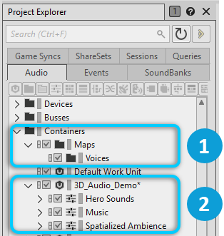

|  |  |
| --- | --- |
|  | Physical Folder。 |
|  | "3D\_Audio\_Demo" Work Unit 及其内容。 |

您可以在 Project Explorer 中的不同选项卡中创建和管理工作单元的内容。For more information about organizing your project into Work Units, refer to [“将工程分成 Work Units”一节](ch09s01.html "将工程分成 Work Units").

---

#### 将工程分成 Work Units

在划分工程前，首先必须确定组织工程中不同元素的最佳方法，以简化工作流程和减少冲突。由于划分工程的方法有很多，因此值得抽出时间来为您的工程确定最佳的划分方式。

在创建工作单元后，您可以通过将声音结构、事件、SoundBank 等拖到各自的工作单元中来划分工程中的工作。You can also unload specific Work Units from your version of the project, keeping only those that you are working on, to reduce project load times and memory usage.

###### Creating Work Units in your project

You can create new Work Units for the following elements in your project:

- Sound and music structures in the Containers hierarchy
- 动作 Event 和对白 Event
- SoundBanks
- Bus structures in the Busses hierarchy
- 切换开关、状态、游戏参数和触发器
- 效果器和衰减共享集
- Soundcaster 和 Mixing Desk 会话
- Queries

每个工作单元只可包含为它创建的工程元素。例如，Event 工作单元中只可包含事件，效果器工作单元中只可包含效果器，以此类推。

若打算使用版本控制系统来管理工程文件，则可将所有 Work Unit（包括 Default Work Unit）添加到版本控制系统的中央存储库或文档库。若在使用版本控制插件时创建 Work Unit，则系统会提示将文件添加到存储库中。

**- 创建新的工作单元**

1. In the Project Explorer, right-click one of the Physical Folders (such as Busses or Containers).

   此时将会显示快捷菜单。
2. 点击 **New Child** > **Work Unit**。

   The Work Unit dialog opens.
3. 在 **Name** 字段中，输入Work Unit 的名称。

   |  |  |
   | --- | --- |
   | [备注] | 备注 |
   | 在 Wwise 中命名 Work Unit （工作单元）时，不得使用以下字符：‘:<>%\*?”/\|.’ |
4. 单击 **OK**（确定）。

   新的工作单元于是创建了。

   |  |  |
   | --- | --- |
   | [备注] | 备注 |
   | 您可以在 Project Explorer 或 File Manager 中直接删除或重命名此工作单元。要打开 File Manager，点击 **Projects** > **File Manager**。Shortcut: Shift + F1. |

###### Assigning project elements to Work Units

By default, all the elements in your project, including Sound structures, Events, and SoundBanks, are automatically assigned to their respective Default Work Units. 在创建新的工作单元后，您可以将工程中的不同元素指派到新创建的工作单元。您只需将工程元素拖到特定的工作单元，就可以将它指派到工作单元中。

|  |  |
| --- | --- |
| [备注] | 备注 |
| 在将工程元素移到新的工作单元或者在现有工作单元之间移动之前，您应确保工程团队中的其他成员当前没有在处理会受到影响的工程元素。 |

**将工程元素指派到 Work Unit**

1. 在 Project Explorer 中，点击其中一个选项卡。（包括 **Audio**、**Events**、**SoundBanks**、**Game Syncs**、 **ShareSets** 、**Sessions** 和 **Queries** 选项卡。）
2. 将 **Default Work Unit** 中的若干工程元素拖至您创建的 Work Unit 中。

   The project element is now assigned to the new Work Unit.

###### 管理实文件夹

Work Units can be organized into Physical Folders on disk inside the root folder associated with a specific category of objects, such as the Containers hierarchy. 如果您有数百个工作单元，并且不希望它们位于同一文件夹中，这样就尤其有用。

实文件夹和虚文件夹是两个截然不同的实体。实文件夹代表磁盘中的实际目录，而虚文件夹包含在工作单元文件中，是该工作单元的一部分。两者均用于组织内容，但 Physical Folder 是 Work Unit 的上级文件夹，而 Virtual Folder 是 Work Unit 的下级文件夹。

在 Project Explorer 中可直接创建实文件夹，方法是在其他实文件夹中使用上下文菜单或使用 Project Explorer 工具栏按钮。

实文件夹只可包含其他实文件夹或工作单元文件。

###### Nested Object（嵌套工作单元）

工作单元可嵌套在其他工作单元内。When this is done, the content of the Work Unit is delegated to the nested Work Unit, instead of the parent Work Unit. This allows placing several Work Units under a common Property Container object, providing common behavior and mixing properties for the nested Work Units.

The nested Work Units allows a finer granularity in the file separation, reducing potential conflicts when merging.

嵌套工作单元保存在包含它们的实文件夹中。同一个实文件夹内的工作单元不能重名。

|  |
| --- |
|  |

以下对象类型下可以创建嵌套工作单元：

- 实文件夹
- Work Units
- 虚拟文件夹
- Property Containers
- Audio Bus

|  |  |
| --- | --- |
| [备注] | 备注 |
| 嵌套工作单元存储在磁盘中，与根工作单元处于相同的目录级别上。 |

###### Loading/unloading Work Units from your project

After your project has been divided up into Work Units, you may want to unload some of these Work Units, keeping only those that you are working on. 从工程中卸载工作单元的主要原因是加快工程加载时间，降低内存占用，提高总体性能。如果工程很大，那么您可以通过卸载一个或多个工作单元来大幅提高性能。

The following types of user-created Work Units can be unloaded from a project:

- Containers hierarchy Work Units
- Event Work Units

|  |  |
| --- | --- |
| [备注] | 备注 |
| 默认工作单元对工程非常重要，因此它们无法卸载。 |

|  |  |
| --- | --- |
| [备注] | 备注 |
| 您可以单独卸载嵌套的 Work Unit。另外，在卸载其根 Work Unit 时也会予以卸载。 |

在从工程中卸载 Work Unit 后，其在 Project Explorer 中会显示为灰色（不可用）。直到将它们重新载入工程后才可使用它们。


|  |  |
| --- | --- |
|  | 已经卸载的 Work Unit。 |

您可以继续处理已加载工作单元中的对象和事件。然而，您可能会发现，部分对象和事件包含针对已卸载对象和/事件的引用。例如，在以下工程元素中可能有针对已卸载对象或事件的引用：

- Dialogue events（对白事件）
- Event
- 插播乐句
- Music Transitions
- Queries
- SoundBanks
- Soundcaster 和混音会话

在这些情况下，已卸载的元素将标记为 `[Unloaded]` ，并以黄色高亮显示。

|  |
| --- |
|  |

您仍可添加/移除对象，修改属性值，生成 SoundBank 等，但在 Wwise 中无法播放这些对象和事件。

在从工程中卸载 Work Unit 时，会将其立即卸载。如果您需要访问已卸载工作单元的内容，则可以随时轻松地将它重新加载回工程中。如果对工程作出的任何更改会影响已卸载工作单元内的对象或事件，当这些工作单元重新加载到工程中时，Project Load Log 中将列出这些更改。

|  |  |
| --- | --- |
| [备注] | 备注 |
| 当工作单元从工程中卸载时，Wwise 无法区分未使用的和没有加载到工程中的源文件。其结果是，直至所有工作单元重新加载到工程中并且 Wwise 可以执行全面验证之前，表面上看起来工程未使用的所有源文件将在 File Manager 的 **Usage** 列中标为“Unknown” 。 |

**从工程中卸载工作单元的方法是：**

1. 在 Project Explorer 中，选择您要卸载的工作单元。
2. 右键单击选定项，并从菜单中选择 **Unload Work Unit**（卸载工作单元）。

   这时将卸载 Work Unit，并在 Project Explorer 中将其显示为灰色（不可用）。

**将工作单元重新加载到工程中的方法是：**

1. 在 Project Explorer 中，选择您要重新加载到工程中的已卸载工作单元。
2. 右键点击选定项，并从菜单中选择 **Load Work Unit**。

   这些工作单元于是重新加载到工程中了。

   |  |  |
   | --- | --- |
   | [备注] | 备注 |
   | If any changes were made to the project that affected the objects or Events within the unloaded Work Unit, these changes will be listed in the Project Load Log when the Work Units are loaded back into the project. |

###### Reloading Work Units in your project

在 Wwise 之外修改 Work Unit（工作单元）后，只需重新加载相应文件即可，而无需重新打开工程。

**在工程中重新加载 Work Unit：**

1. 在 Wwise 检测到工程目录中的 Work Unit 作了修改时，将打开 External Project Changes（外部工程更改）对话框。

   
2. 在 External Project Changes（外部工程更改）对话框中，选中想要重新加载的 Work Unit。
3. 单击 **Reload**（重新加载）。

   这时将在工程中重新加载所选 Work Unit。

在 Mac 上设计音频时，Wwise 不会自动检测针对硬盘上 Work Unit 所作的更改。在这种情况下，您需要手动检查外部更改。

**检查外部更改：**

1. 在菜单栏中，依次单击 **Project > Check for External Changes**（工程 > 检查外部更改）。

   - 若检测到更改，则将打开 External Project Changes（外部工程更改）对话框，并列出所有外部更改。这时可照常重新加载这些更改。
   - 若未检测到更改，则将打开对话框并显示相应消息。单击 **OK**（确定）关闭对话框。

###### Renaming user-created Work Units

At some point you may need to rename a Work Unit that you have created in your project. 您可以在 Project Explorer 中对工作单元重命名，也可以在 File Manager 中进行。不可在 Windows 资源管理器或 Mac Finder 中对工作单元重命名或删除工作单元，否则将可能导致完好度错误或丢失工程数据。

|  |  |
| --- | --- |
| [注意] | 注意 |
| Default Work Units 是关键的工程文件，不得重命名或删除。 如果这样做了的话，Wwise 则将在您下次打开工程时重新创建它们。 |

**对工作单元进行重命名的方法是：**

1. 在 Project Explorer 中，按 **F2** 或使用 **Rename** 快捷菜单项。

   此时可编辑的文本框将显示在工作单元名称上方。
2. 在编辑框中，输入新名称，然后按 **Enter**。

   这时会显示 **Source Control Operation**（版本控制操作）对话框。
3. 验证要应用的操作，并点击 **Continue**。

   如果您使用版本控制插件，则要验证一下看看操作是否成功了。
4. 点击 **OK** 以关闭 Process Log。

###### Deleting user-created Work Units

You may need to delete a Work Unit that you have created and no longer need in your project. 您可以在 Project Explorer 中删除工作单元，也可以在 File Manager 中删除它们。不得在 Windows 资源管理器或 Mac Finder 中删除工作单元，否则可能造成完好度错误或丢失工程数据。

如果您从版本控制系统中删除了某个工作单元，则该工作单元内的工程元素将不再存在于工程中，这可能会造成完好度错误。如有必要，当您打开工程时，这些错误以及如何解决它们的说明将一起显示出来。有关工程不一致性的详细信息，请参阅[“解决工程中的不一致现象”一节](ch09s04.html "解决工程中的不一致现象")。

|  |  |
| --- | --- |
| [注意] | 注意 |
| Default Work Units 是关键的工程文件，不得重命名或删除。 如果这样做了的话，Wwise 则将在您下次打开工程时重新创建它们。 |

**删除工作单元的方法是：**

1. 执行以下操作之一：

   - 在 Project Explorer（工程资源管理器）中，选中所要删除的 Work Unit（工作单元），然后按下 **Delete** 或使用快捷菜单中的 **Delete** 功能。
   - 这时会显示 **Source Control Operation**（版本控制操作）对话框。
2. 验证要应用的操作，并点击 **Continue**。

   如果您使用版本控制插件，则要验证一下看看操作是否成功了。
3. 点击 **OK** 以关闭 Process Log。

---

#### 查看工程文件的状态

随着工程不断取得进展，您需要跟踪工程中的各种文件。File Manager 显示工程中每个音频文件和工作单元以及工程文件本身的信息。您可以使用 File Manager 验证工程文件或源文件的状态和所有者，以及确定工程中的音频源是否正在使用源音频文件。

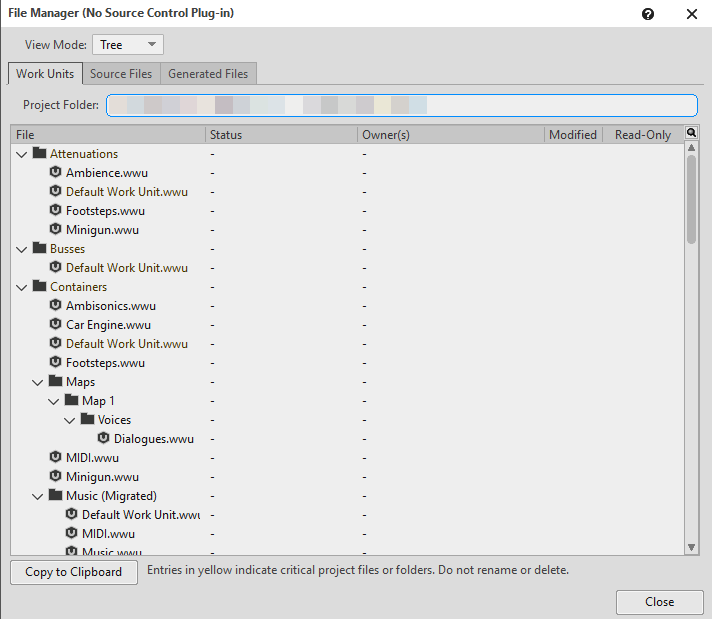

当工作单元被修改或者标记为只读后，该工程文件的相应列中将显示选中标记。此类反馈可帮助您跟踪您已经修改的和不可修改的文件。

File Manager 还显示工程正在使用的文件的信息，以便您定期清理不再使用的文件。然而当工作单元从工程中卸载后，Wwise 不可再分辨没有使用的和尚未加载到工程中的源文件。在这些情况下，工程中看来不会使用的所有源文件将在 **Usage** 列中被标为**Unknown**，直至 Wwise 能够执行全面的验证。

Wwise 还提供反馈信息，显示哪些文件已经直接在 Project Explorer 中进行了修改。与工程一样，Wwise 使用星号（\*）显示已经修改并且需要保存的工作单元。

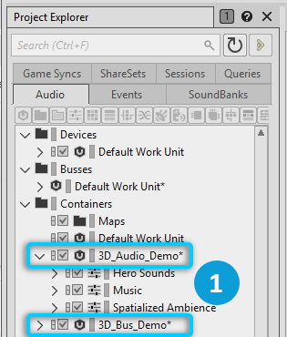

|  |  |
| --- | --- |
|  | 经过修改的 Work Unit。 |

|  |  |
| --- | --- |
| [注意] | 注意 |
| 如果您更改只读工作单元，则在保存工程时将不保存这些工作单元文件。有关保存工程的详细信息，请参阅[“保存工程”一节](ch06s01.html#saving_project "保存工程")。 |

**查看工程文件状态的方法是：**

1. 执行以下操作之一：

   - 在菜单栏中，依次单击 **Project** > **File Manager**（工程 > 文件管理器）。
   - 按 **Shift+F1**。

   The File Manager dialog opens.
2. 仔细查看工程文件以验证：

   - 它们是否经过了修改。
   - 它们是否为只读文件。
3. 切换到 Source File 选项卡，并查看源文件以验证：

   - 它们是否经过了修改。
   - 它们是否为只读文件。或者
   - 它们是否正在被工程中的若干个音频源使用。

   |  |  |
   | --- | --- |
   | [注意] | 注意 |
   | **Usage** 列中显示的信息不一定总是最新的。在删除被标记为**Unused**的任何文件之前，最好关闭并重新打开工程，以确保信息是最新的。 |
4. Click **OK** to close the Project File Status dialog.

---

#### 结合版本控制系统使用 Wwise

所有 Wwise 工程文件（包括各个 Work Unit）都基于 XML。所以，用户可使用版本控制系统轻松管理这些文件。建议将某些（并非全部）文件添加到版本控制系统。

File Manager（文件管理器）中的所有文件都可添加到版本控制系统。Wwise 会使用这些文件生成工程所需的其他文件。建议将以下内容添加到版本控制系统：

- **.wproj** ―― Wwise 工程文件。这些文件存放在工程文件夹的根目录下。
- **.wwu** C Wwise Work Unit。这些文件存放在主工程文件夹的子目录下。
- **Originals 文件夹** C 原始媒体文件。这些文件可用于创建工程的最终音频素材。

总的来说，Wwise 生成的文件可以放在版本控制系统之外。因为没必要将它们添加到版本控制系统，而且在多用户环境下共享某些文件可能会导致同步问题。建议将以下内容放在版本控制系统之外：

- **.backup 文件夹** C 在使用新的 Wwise 大版本打开工程时，会对工程进行升级并生成 .backup 文件夹。这样是为了在需要时将工程恢复为升级之前的状态。若将工程添加到了版本控制系统，则可藉此恢复为升级之前的状态。为此，可将 .backup 文件夹放在版本控制系统之外。
- **.cache 文件夹** C 工程目录下的 .cache 文件夹是 Wwise 的本地工作文件夹。.cache 文件夹的内容不得添加到版本控制系统，因为这可能造成 Wwise 中发生异常行为。
- **.prof** C 这些文件在每次捕获时生成，其并非工程数据的一部分。
- **.validationcache** C 这些文件由 .wwu 文件生成，可放在版本控制系统之外。
- **.wsettings** C 此文件特定于本地用户和电脑。
- **IncrementalSoundBankData.xml** C 此文件用于根据 Wwise 工程的本地内容和本地 SoundBank 生成记录来追踪 SoundBank 的状态。
- **Authoring/Data/Models/sfxclap.dat**- This file syncs the
  Similar Sound Search model in the Media Pool. This file is large and requires a
  lot memory and CPU for media analysis. The Media Pool can be used without
  Similar Sound Search. Exclude this file if you are not using Similar Sound
  Search with the Media Pool.

注意，在创建新的工程时会包含 .gitignore 和 .p4ignore 文件。下面有个示例 .gitignore 文件：

```
#### Wwise
.backup*
.cache*
*.akd
*.prof
*.validationcache
*.wsettings
IncrementalSoundBankData.xml
```

您可以随时通过工程来生成 SoundBank。不过，若有不使用 Wwise 的团队成员，则其需要这些生成的文件来在开发当中试玩游戏时试听声音。借助版本控制系统，团队成员可以访问这些文件。若有不止一个 Wwise 用户将 SoundBank 添加到版本控制系统，这些文件可能会不同步。为了避免这种情况，请将所有.bnk 和 .wem 文件添加到 soundbanks/ 路径下。鉴于 Wwise 与游戏引擎的集成方式各不相同，可能还要添加 .txt、.xml 和 .json 文件。

工程中的大文件可能还要进行特别处理以便节省时间（比如使用 Git LFS）。通过 Git LFS 放在版本控制系统之外的文件可能包括大的二进制文件（如 .wav、.aif、.png 和 .jpg）。

在游戏的整个开发过程中，都可在 File Manager 中查看工程文件 (.wproj)、Work Unit 文件 (.wwu) 和音频文件的状态。若使用 Perforce、Subversion 或别的版本控制插件，则可直接在 Wwise 中执行版本控制功能。有关如何在 Wwise 中使用版本控制插件的详细信息，请参阅[“利用版本控制插件管理工程文件”一节](ch09s05.html "利用版本控制插件管理工程文件")。

在默认情况下，Wwise 会在保存 Work Unit 文件、SoundBank 文件和某些工程文件时应用 LF 行结束符。Wwise 也可在保存时为其应用 CRLF 结束符。详见 Project Settings 的 [“General 选项卡”一节](ch57s08s01.html "General 选项卡")中的 **Line Ending**。

若您是团队的一员且使用版本控制系统来管理工程文件，请时刻留意有无其他成员在处理这一工程，以及是否存在可能需要解决的合并冲突。因此，经常同步和合并您的工作，并频繁与团队成员沟通交流您正在做的工作非常重要。有关经验总结的完整列表，请参阅[“Source control tips and best practices”一节](ch09s06.html "Source control tips and best practices")。

---

#### 解决工程中的不一致现象

当多人同时处理一个工程时，更改特定文件可能导致工程文件出错或不一致。为了减少这些问题的影响，Wwise 在您每次打开工程文件时执行两种类型的工程验证：

- XML 语法和 Schema 错误验证
- 工程一致性验证

这些验证可以帮助您解决错误，防止发生更多的工程问题。

###### XML syntax and schema errors

当工程文件 check-in 或合并到版本控制系统时，您可能需要更新 XML 代码本身来解决冲突。如果在更新期间导致 XML 语法或 Schema 错误，工程文件则将变为无效，并且 Wwise 将无法打开工程。此时将显示一个消息框，对错误进行描述，并指明错误所在的具体文件和位置。For example: File: D:\Wwise\Wwise20xx.x.x.xxxx\SampleProject\Containers\Default Work Unit.wwu.

To resolve the problem, you will have to review the individual Work Unit files listed in the error.

###### Project inconsistency issues

如果工程文件中不存在 XML 语法错误，那么 Wwise 将继续验证是否存在任何工程不一致性或错误。例如，如果在 States 工作单元中删除某个 State，但声音或音乐结构工作单元之一中的某个对象仍在使用它，则会发生工程不一致。

如果 Wwise 检测到任何工程问题，必要时它则将显示有关各个问题的信息以及如何解决该问题的说明。

|  |
| --- |
|  |

您可以选择全盘接受这些修复方案，也可以选择拒绝这些方案，然后恢复工程的旧版本或者尝试直接修正 XML 文件中的不一致性。

**解决工程不一致性的方法是：**

1. 在 Wwise 中打开工程。

   如果找到工程不一致性，则必要时 Project Load Log 将打开，其中包含工程问题的完整列表以及 Wwise 建议的修复办法。
2. 执行以下操作之一：

   - 点击 **Accept** 以接受建议的修复办法。

     Wwise 将修复不一致性并打开工程。如果您接受这些修复办法，则应逐一审查这些办法，评估一下是否需要手动修复问题。
   - 点击 **Cancel** 以拒绝建议的修复办法。

     此时 Wwise 将关闭工程。您可以恢复到工程的旧版本，也可以尝试直接修正 XML 文件中的不一致性。

   |  |  |
   | --- | --- |
   | [备注] | 备注 |
   | Wwise 对工程所做的修复直到您保存工程时才会保存。 |

---

#### 利用版本控制插件管理工程文件

Wwise 的开放架构便于通过使用或创建版本控制插件来集成版本控制软件。版本控制插件会在 Wwise 和版本控制软件之间建立链接，以便直接在 Wwise 中管理文件并执行版本控制功能（如签入和签出）。

因为每个版本控制系统的工作机制都不一样，所以具体可用的功能和采用的工作流程将取决于所用系统。

为了帮助用户快速入门，Wwise 针对 Perforce® 和 Subversion 软件配置管理系统配套提供了两个功能完备的示例版本控制插件。Perforce 和 Subversion 均不采用锁定-修改-解锁模式，而采用复制-修改-合并模式。在这种模式下，团队的各个成员可读取存储库或文档库并创建客户端工作区。此工作区是一个目录，里面包含工作站上文件和/或工程的个人工作副本。这样，团队的各个成员都可以并行工作，修改他们自己的个人副本。 做 Prepare 时，各个成员可以将他们的个人副本合并到一个新的最终版本中去。若存在冲突，可借助版本控制系统完成合并。不过，最终要由您来正确解决各种问题。

如果您在使用别的版本控制管理系统，可为 Wwise 创建自己的版本控制插件。如需了解如何创建和集成自己的版本控制插件，请参阅 SDK 文档中的[如何创建版本控制插件 DLL](https://www.audiokinetic.com/library/?source=SDK&id=source__control__dll.html) 章节。

您可以在 Project Settings（工程设置）对话框中选择并配置版本控制插件。有关详细信息，请参阅[“配置版本控制插件”一节](ch06s02s01.html#configuring_source_control_plug_ins "配置版本控制插件")。

在使用版本控制插件时，Wwise 中可直接使用众多的版本控制功能。例如在使用 Perforce 插件时，可以在 Wwise 中执行下列版本控制操作：

- **Get latest version** ―― 通过从文档库中检索最新版本来更新工作副本。
- **Submit changes** ―― 将待提交的文件发送到 Perforce 服务器进行处理。
- **Check out** ―― 在客户端工作区中创建文档库文件的工作副本。
- **Lock** ―― 锁定文件，使其它客户端无法将文件的工作副本提交到服务器。
- **Unlock** ―― 解锁文件，使其它客户端可以将文件的工作副本提交到服务器。
- **Mark for add** ―― 将文件添加到文档库。当文件被标记为添加时，它将被添加到更改列表（changelist），然后必须将它提交到文档库。
- **Mark for delete** ―― 将文件从文档库中删除。当文件被标记为删除时，它将被放置到更改列表中，然后必须将它提交到要删除它的文档库中。
- **Move** ―― 在 Originals 目录中的文件夹之间移动源文件。
- **Rename** ―― 重命名文档库中的文件。
- **Revert changes** ―― 放弃您对客户端工作区中的某文件所做的更改。
- **Resolve** ―― 调解文件两个修订版本之间的差异。
- **Diff** ―― 将客户端工作区中的文件与文档库中的文件进行比较。
- **File History** ―― 显示文件的修订历史记录。

|  |  |
| --- | --- |
| [备注] | 备注 |
| Subversion 插件中支持一系列类似的版本控制功能。 |

您不仅可以在 Wwise 中访问这些版本控制命令，还可通过 Project Explorer 中显示的专用叠加图标来快速识别 Work Unit 文件的状态。下表举例展示了 Perforce 版本控制插件中使用的叠加图标。

| 叠加图标 | 名称 | 描述 |
| --- | --- | --- |
| |  | | --- | |  | | Normal (not checked out) | 文件处于最新状态，没有人将它 check-out。 |
| |  | | --- | |  | | Marked for add  Moved | 文件已被标记为添加到 Perforce 文档库或者被移动过了因而带有 move／add（移动/添加）状态。 |
| |  | | --- | |  | | Checked out (Open for Edit) | 文件已从 Perforce 文档库中登出。 |
| |  | | --- | |  | | Checked out by another user | 文件已被团队中的另一用户签出。 |
| |  | | --- | |  | | Concurrently checked out | 文件已被您和团队中的另一用户签出。 |
| |  | | --- | |  |  |  | | --- | |  | | Outdated（非文件的最新修订版） | 服务器上存在一个更新的修订版本。您可以获取文件的最新版本。 |

  

|  |  |
| --- | --- |
| [备注] | 备注 |
| "Checked out by another user"、"Concurrently Checked out" 和 "Outdated" 图标仅在 Perforce 版本控制插件中可用。 |

###### Supported Perforce/Subversion versions

在使用所述版本控制插件之前，请检查以下信息来确保 Perforce 或 Subversion 的版本与版本控制插件兼容。

- Perforce: The Perforce Source Control plug-in was built using the Perforce SDK version 2022.1, but should work with most versions of the Perforce servers. 若使用了与版本控制插件不兼容的不同 Perforce 版本，可使用 Wwise SDK 中的源码及所用版本来重新构建插件。有关 Perforce 插件的详细信息，请参阅 [Wwise SDK 文档](https://www.audiokinetic.com/library/?source=SDK&id=referencematerial__samplecode__source__control.html#referencematerial_samplecode_source_control_perforce)。
- Subversion (deprecated): The Subversion Source Control plug-in has been
  deprecated since Wwise 2023.1 and will no longer be updated.

  Subversion 版本控制插件采用 Subversion 1.8.5 构建。若使用了与版本控制插件不兼容的不同 Subversion 版本，可使用 Wwise SDK 中的源码及所用版本来重新构建插件。For more information about rebuilding the Subversion plug-in, see the Wwise SDK documentation.

  Subversion 的 bin 文件夹在默认情况下位于 C:\Program Files\Subversion\bin 下，必须在系统的 PATH 环境变量中设置这个文件夹路径。Subversion 安装程序通常会将这条路径添加到 PATH 中，但是，如果从上文提到的 ZIP 文件手动安装 Subversion，您则必须将 Bin 文件夹手动添加到 PATH 中去。

以下章节阐述了如何使用版本控制插件来管理素材。虽然其内容主要针对 Perforce 版本控制插件，不过使用 Subversion 时的工作流程与之类似。

|  |  |
| --- | --- |
| [技巧] | 技巧 |
| Perforce、Subversion 和其他 Platform SDK 的更新都会在我们 SDK Documentation 的 [版本说明](https://www.audiokinetic.com/library/?source=SDK&id=releasenotes.html) 部分发布。 |

###### Setting up your project files in Perforce

在使用 Perforce 版本控制插件之前，您或系统管理员需要执行以下操作：

- 在每位团队成员的工作站上安装并设置版本控制管理软件的客户端版本。
- 在每位团队成员的工作站上配置客户端工作区。
- 从文档库中获取工程文件的最新版本，并将它们保存在客户端工作区中。
- 在 Wwise 中选择并配置版本控制插件。

有关安装和配置 Perforce 的详细信息，请联系系统管理员或参阅 Perforce 文档。

您可以在 Project Settings（工程设置）对话框中选择并配置版本控制插件。有关详细信息，请参阅[“配置版本控制插件”一节](ch06s02s01.html#configuring_source_control_plug_ins "配置版本控制插件")。

###### Adding files to Perforce

在开始开发工程前，应将工程文件和音频源添加到文档库或资源库。将文件添加到 Perforce 包括以下两个步骤：

- [将文件添加到更改列表的方法是：](ch09s05.html#to_add_files_to_changelist "将文件添加到更改列表的方法是：").
- [将您的更改提交到文档库的方法是：](ch09s05.html#to_submit_changes_to_depot "将您的更改提交到文档库的方法是：").

|  |  |
| --- | --- |
| [备注] | 备注 |
| 在创建新的 Work Unit 或将新的音频文件导入到工程中时，系统会提示您标记这些新文件以便添加到 Perforce 中。 |

**将文件添加到更改列表的方法是：**

1. 在菜单栏中，依次单击 **Project** > **File Manager**（工程 > 文件管理器）。

   File Manager 将打开 。
2. 切换到以下某个选项卡：

   - Work Units，将工作单元添加到 Perforce
   - Sources，将音频文件添加到 Perforce。
3. 选择您要添加到 Perforce 的文件。
4. 右键点击选定的工程文件，并从菜单中选择 **Mark for add**。

   The Process Log dialog opens showing that the selected file has been added to the changelist or “opened for add” and is ready to be submitted to the depot.
5. 点击 **OK** 以关闭 Process Log。

   文件的状态设置为“add”。
6. 点击 **Close** 以关闭 File Manager。

   在 Project Explorer 中，工程文件此刻便有了 Marked for add 叠加图标。

   此时，这些文件只是刚被添加到更改列表中而已，您还需要提交更改列表，以将这些新文件 check-in 到文档库。有关将文件提交到文档库的详细信息，请参阅[“Submitting your changes to the Perforce depot”一节](ch09s05.html#submitting_changes_to_perforce_depot "Submitting your changes to the Perforce depot")。
7. 保存工程。

###### Checking out files from the Perforce depot for editing

在编辑工程中的文件前，首先应该将它们 check-out，确保您的客户端工作区中有这些文件的最新版本。在 Perforce 中 check-out 文件时，这些文件变成可写状态。这意味着您可以保存对文件所做的更改。

在默认情况下，Perforce 不执行排他性 check-out，这意味着团队的其它成员可以同时处理同一文件。沟通是避免出现合并冲突的关键，解决合并冲突耗时又费力。

**check-out 文件进行编辑的方法是：**

1. 在菜单栏中，依次单击 **Project** > **File Manager**（工程 > 文件管理器）。

   File Manager 将打开 。
2. 切换到以下某个选项卡：

   - Work Units，将工作单元添加到 Perforce
   - Sources，将音频文件添加到 Perforce。
3. 选择您要打开进行编辑的文件。
4. 右键点击选定的工程文件之一，然后从菜单中选择 **Check out**。

   The Process Log dialog opens showing that the file has been checked out or “opened for edit.”
5. 点击 **OK** 以关闭 Process Log。

   文件的状态设置为“edit”。
6. 点击 **Close** 以关闭 File Manager。

   在 Project Explorer 中，工程文件上于是有了 Checked out 叠加图标。

|  |  |
| --- | --- |
| [备注] | 备注 |
| 在启用工程设置 **Prompt for checkout on edit** 时，若对未签出的文件实施更改，则将打开 Pending Source Control Operations 对话框。若要签出实施了更改的文件，请选择 **Check out modified files** 选项并单击 **OK**。若要撤消相应更改以免触发该对话框，请单击 **Cancel**。若取消选中 **Check out modified files** 选项并单击 **OK**，则允许继续实施更改。不过，若尝试保存工程，则将再次提示签出文件。有关详细信息，请参阅[“General 选项卡”一节](ch57s08s01.html "General 选项卡")。 |

###### Submitting your changes to the Perforce depot

如果处理完特定文件或者希望团队中的其它成员可以访问您的更改，您则可以将文件重新提交到文档库。非常重要的是，您需要详细描述所做的更改，以便您和其他人能充分了解文件中更改的范围。在处理冲突时，这些备注可能会很有用。

在将文件重新提交到文档库时，Perforce 会将您的更改合并到文档库中已有的文件中。如果存在任何冲突，则必须先解决冲突，然后文件才能成功地提交到文档库。

**将您的更改提交到文档库的方法是：**

1. 在菜单栏中，依次单击 **Project** > **File Manager**（工程 > 文件管理器）。

   File Manager 将打开 。
2. 点击 **Submit Changes** 按钮，然后点击以下其中某个选项：

   - **Work Units** ―― 仅发送工作单元到服务器进行登入。
   - **Sources** ―― 仅发送源文件到服务器进行登入。
   - **All** - Sends all pending files (Work Units and source files) to the server for check-in.

   The Submit Changes dialog opens.
3. 如果您不想将特定文件 check-in 到服务器，则可取消选择这些文件，然后点击 **OK**。
4. 右键点击选定的工程文件之一，然后从菜单中选择 **Submit Changes**。

   The Description dialog opens.
5. 输入您对文件所做的更改的详细描述。

   |  |  |
   | --- | --- |
   | [备注] | 备注 |
   | 若要用双字节字符在描述部分填写变更，例如使用日语或中文字符，请将P4系统环境变量 `P4CHARSET` 设置为 `utf8`。 |
6. 如果您想在提交更改后立即继续编辑文件，请选择 **Check out file(s) after submit** 选项。
7. 单击 **OK**（确定）。

   The Process Log dialog opens showing that the files have been checked in or “submitted.”
8. 点击 **OK** 以关闭 Process Log。

   文件的状态设置为“normal”。
9. 点击 **Close** 以关闭 File Manager。

   在 Project Explorer 中，除非您选择了  **Check out file(s) after submit** 选项，否则工程文件将带有 Checked in 叠加图标。

**将单个文件提交到文档库的方法是：**

1. 在菜单栏中，依次单击 **Project** > **File Manager**（工程 > 文件管理器）。

   File Manager 将打开 。
2. 切换到以下某个选项卡：

   - Work Units，将工作单元添加到 Perforce
   - Sources，将音频文件添加到 Perforce。
3. 选择您要提交的文件。
4. 右键点击选定的工程文件之一，然后从菜单中选择 **Submit Changes**。

   The Description dialog opens.
5. 输入您对文件所做的更改的详细描述。

   |  |  |
   | --- | --- |
   | [备注] | 备注 |
   | 若要用双字节字符在描述部分填写变更，例如使用日语或中文字符，请将P4系统环境变量 `P4CHARSET` 设置为 `utf8`。 |
6. 如果您想在提交更改后立即继续编辑文件，请选择 **Check out file(s) after submit** 选项。
7. 单击 **OK**（确定）。

   The Process Log dialog opens showing that the files have been checked in or “submitted.”
8. 点击 **OK** 以关闭 Process Log。

   文件的状态设置为“normal”。
9. 点击 **Close** 以关闭 File Manager。

   在 Project Explorer（工程资源管理器）中，除非选择了 **Check out file(s) after submit**（在提交后签出文件）选项，否则现在工程文件会带有 Checked in（已签入）叠加图标。

   |  |  |
   | --- | --- |
   | [技巧] | 技巧 |
   | 您也可以通过在 Project Explorer 中右键单击 Work Unit 并依次选择 **Source Control** > **Submit Changes** 来将更改提交到 Perforce 文档库。 |

###### Comparing your files with the files in the Perforce depot

您可以将客户端工作区中的文件与文档库中文件的最新版本进行比较，以确定两个文件之间是否存在差异。在比较文件之前应该保存工程，以便您使用文件的最新版本进行比较。

**将您的文件与文档库的文件进行比较的方法是：**

1. 在菜单栏中，依次单击 **Project** > **File Manager**（工程 > 文件管理器）。

   File Manager 将打开 。
2. 右键点击您要比较的工作单元文件，然后从菜单中选择 **Diff**。

   默认的 Perforce 差异查看器（diff viewer）中显示两个文件之间的差异。
3. 查看两个文件之间的差异。
4. 查看完差异后，关闭 Perforce 以返回 Wwise。

###### Moving source files within the Originals folder using Perforce

您可以在工程的 Originals 文件夹中移动源文件，但在这样做之前，应确保其它团队成员没有在使用这些文件。如果您移动一个已被其他人 check-out 的文件，则那些人在试图将更改提交到文档库中去时将遇到问题。

当 Perforce 移动文件时，它将打开当前文件以待删除，并在新位置中创建该文件的一个完全副本。这些文件不会在文档库中自动更新，因此在移动结束后，必须将更改列表提交到文档库中。在移动文件前，必须 check-in 文档库。

|  |  |
| --- | --- |
| [备注] | 备注 |
| 您必须先保存工程，然后再在 Originals 文件夹中移动源文件。 |

**在 Originals 目录内的文件夹之间移动文件的方法如下：**

1. 保存当前工程。
2. 执行以下操作之一：

   - 在菜单栏中，依次单击 **Project** > **File Manager**（工程 > 文件管理器）。
   - 按 **Shift+F1**。

   File Manager 将打开 。
3. 切换至 Source Files 选项卡。
4. 选择要移动的文件。
5. 右键点击选定项，然后从菜单中选择 **Move**（移动）。

   这时会打开 Browse For Folder（浏览文件夹）对话框。
6. 浏览文件夹结构并选择要移动其中文件的文件夹。

   |  |  |
   | --- | --- |
   | [备注] | 备注 |
   | 如果要创建新的文件夹，则请选择父文件夹，点击 **Make New Folder**（新建文件夹）按钮，然后为文件夹指定一个名称。 |
7. 打开 **OK** 以将文件移动到新文件夹。

   The Process Log dialog opens showing that a new copy of the file has been added to the specified folder using the branch command and the original file has been opened for delete.
8. 单击 **OK**（确定）关闭 Process Log（处理日志）对话框。
9. Select both entries in the list: the branch and deletion.
10. 右键点击选定项，并从菜单中选择 **Submit Change**。

    The Description dialog opens.
11. 输入有用的描述，然后点击 **OK**。

    此时 Process Log 将打开，显示两个待提交的操作已提交到文档库。
12. 点击 **OK** 以关闭 Process Log。

    文件于是放置于指定文件夹中了。

###### Renaming files when using Perforce

您可以对工程中的文件进行重命名，但在此之前，应确保其它团队成员没有在使用该文件。如果您对已被其他人 check-out 的文件进行重命名，他们在尝试将更改提交到文档库时则会遇到问题。

当 Perforce 对文件重命名时，它将打开当前文件以待删除，并使用新名称创建该文件的完全副本。这些文件不会自动在文档库中更新，因此重命名结束后，必须将更改列表提交到文档库中。在重命名文件前，必须先 check-in 到文档库中。

|  |  |
| --- | --- |
| [注意] | 注意 |
| 勿对默认工作单元进行重命名，因为它们对工程至关重要。 |

**对工程中的文件进行重命名的方法是：**

1. 在菜单栏中，依次单击 **Project** > **File Manager**（工程 > 文件管理器）。

   File Manager 将打开 。
2. Right-click the Work Unit file you want to rename, and select **Rename** from the menu.

   The Rename File dialog opens.
3. In the **Name** field, type the new name for your file.
4. 单击 **OK**（确定）。

   The Process Log dialog opens showing that a copy of the file was created with the new name using the branch command and the old file was opened for delete.
5. 点击 **OK** 以关闭 Process Log。

   旧文件的状态设置为“Delete”，并且创建了一个状态设为“Branch”的新文件。
6. 选择新旧文件。
7. 右键点击并从菜单中选择 **Submit Changes**。

   The Description dialog opens.
8. 输入有关更改的有用描述，并点击 **OK**。

   Process Log 打开，其中显示原始文件已删除，并添加了一个重命名的新文件。
9. 点击 **OK** 以关闭 Process Log。
10. 点击 **Close** 以关闭 File Manager。

    The Project dialog opens prompting you to reload the latest version of the project because changes have been made externally to the project.
11. 点击 **Yes**。

    工程的最新版本于是加载进来了，并且文件也被重命名了。

###### Deleting files from your project when using Perforce

当您不再需要工程中的某些文件时，可以删除它们。在 Perforce 中删除文件时，必须先打开文件以待删除，然后将更改列表提交到文档库。在删除文件前，应始终先保存工程，防止丢失您自上次保存以来所做的更改。

|  |  |
| --- | --- |
| [注意] | 注意 |
| 切勿删除默认工作单元，因为它们对工程至关重要。 |

**从工程中删除文件的方法是：**

1. 在菜单栏中，依次单击 **Project** > **File Manager**（工程 > 文件管理器）。

   File Manager 将打开 。
2. 选择您要删除的文件。
3. 右键点击选定的工程文件之一，然后从菜单中选择 **Mark for Delete**。

   此时将显示一条消息，提示您确认删除文件。
4. 点击 **Yes**。

   The Process Log dialog opens showing that the file(s) has been opened for delete.
5. 点击 **OK** 以关闭 Process Log。

   文件的状态设置为“delete”。
6. 点击 **Close** 以关闭 File Manager。

   The Project dialog opens prompting you to reload the latest version of the project since changes have been made externally to the project.
7. 点击 **Yes**。

   工程的最新版本于是加载进来了，并且文件也被删除了。

   此时，文件只是被添加到了更改列表中，并且已被标记为待删除。您还需要提交更改列表才能从文档库中删除文件。

###### Saving your project when using Perforce

只要签出了修改的所有工程文件，保存工程时就不会出现任何问题。但是，若对没有签出的文件实施了更改，则 Wwise 将提示必须签出这些文件才能保存工程。

**保存工程的方法是：**

1. 执行以下操作之一：

   - 在菜单栏中，点击 **Project** > **Save**。
   - 按 **Ctrl+S**。

   Wwise 试图保存工程中的所有文件。若对没有签出的文件实施了更改，则将打开 Pending Source Control Operations（待处理版本控制操作）对话框。

   |  |  |
   | --- | --- |
   | [备注] | 备注 |
   | 若启用了工程设置 **Prompt for checkout on edit**，则只要修改没有签出的文件，也会马上打开 Pending Source Control Operations 对话框。请参阅 [“General 选项卡”一节](ch57s08s01.html "General 选项卡") 了解详细信息。 |
2. 选择 **Check out modified files** 选项以检出已经更改的文件，以便 Wwise 保存它们。
3. 单击 **OK**（确定）。

   Wwise check-out 必要的文件并保存工程。

---

#### Source control tips and best practices

在结合 Wwise 使用版本控制系统前，最好仔细查看以下章节。您可以参照其中的技巧和窍门来在整个音频开发过程中更好地管理团队及工程文件。

###### Planning your project

- Divide your project into smaller Work Units. 如果工程很庞大，并且您还将所有工程数据都保留在默认工作单元中的话，那么不仅会延长 Wwise 的响应时间，而且每当团队中有人做出更改后，其他团队成员则都需要进行合并，这可能会令发生合并问题和冲突的概率激增。通过使用工作单元将工程划分成小块，可以提高人们的工作效率，加快访问信息的速度，处理不同的领域，从而降低发生合并问题的可能性。
- 为全局默认工作单元指定负责人。因此好办法是让一个人管理或者至少其他人清楚对这些工程元素所做的更改。

###### Basic workflow

- Manage global project elements effectively. 当您重命名或删除某个全局工程元素（例如状态或游戏参数）时，注意，您可能修改了工程中的许多其他对象，包括使用这些元素的所有声音对象和容器。当保存和登入这些更改时，您可能会影响其他人正在处理的众多工程文件。为限制此类更改的影响，应该尽早定义全局工程元素，此后再尽力避免更改这些元素。如果在初始设置后需要更改，则应执行以下操作：

  - 警告团队成员全局元素已被更改。
  - 要求团队全体成员登入他们的更改。
  - check-in 您的文件
  - 要求团队全体成员更新他们的工程文件。
  - 通过执行此流程，团队成员只需更新就可以获得新文件，无需合并。
- 检查工程文件状态。在开始处理某个工作单元前，使用 File Manager 验证哪些文件是只读文件。如果您更改的是只读工作单元，则将无法把该特定文件保存到工程中。
- 定期备份本地文件。虽然中央资源库中的文件可能是预定备份计划的一部分，但本地机器上的副本不是。为防止数据丢失，定期备份工程文件是个好办法，特别是当您对文件做了大量更改时，尤其如此。
- 在登入前生成完好度报告。在登入特定工作单元前，生成完好度报告是确保没有任何工程错误的好办法。If errors exist, you can quickly resolve them and then check the Work Unit in.

###### Syncing your files

- Sync before new work sessions. 您应该先将您的工程文件与服务器进行同步，然后再启动新的工作会话，以便您获得最新的修改。
- 同步前关闭 Wwise。在将工程文件与服务器机型同步之前，应关闭 Wwise 以防止丢失信息的可能性。如果 Wwise 一直是打开状态，则副本将保留在内存中。同步时磁盘中的文件将被修改，但工程的旧版本仍将保留在内存中。如果您保存当前已打开的工程，则会覆盖磁盘中已保存的其他人的更改。

  以上所述仅在未使用版本控制插件的情况下适用。在使用版本控制插件进行同步时，系统会自动提示重新加载最新版本的工程。

###### Checking in your files

- Submit often. 如果您有大更改，影响到团队的其他成员，应该经常将工程文件提交到服务器，以使其他成员可以使用您所做的更改。如果您等待太久，则还会增加发生冲突的概率。通过提交较小的、有针对性的更改，在必要时就容易恢复到工程的旧版本，并且容易在出现冲突时加以解决。
- 添加有用的注释。When you commit or check-in your files, make sure to fully describe the changes that you made.

###### Source control system

- Understand your source control system. 在使用版本控制系统管理 Wwise 工程文件之前，应充分了解它的工作原理。了解版本控制系统的复杂性可帮助您避免问题，构建高效的制作管线。

###### Project inconsistencies

- Become familiar with the Wwise project XML structure. 在合并文件前，花一点时间熟悉 Wwise 工程文件的 XML 结构。在一些情况下，您可能必须更新 XML 代码。如果您没有正确理解它，可能会毁坏您的工程。如果您的确要修改 XML，请确保在 Wwise 中打开工程，然后将文件重新登入到版本控制系统中。这将确保您对 XML 的更改是有效的，并且是您所需的。

###### Communication

- 建议经常进行坦诚的沟通。无论在怎样的团队环境中，与团队的其他成员经常进行坦诚的沟通都很关键。经常、坦诚的沟通可以减少冲突，缩短合并文件的时间，建立一个更加高效的制作管线。For example, before making changes to a Work Unit that affects other members of your team, you should ask them to check in their changes and wait for your word before syncing and resuming their work.

###### File usage

- Before deleting any files that are marked **Unused** in the **Usage** column of the File Manager, it is good practice to close and re-open the project to make sure the information is completely up to date.

###### SoundBanks

- SoundBanks are configured in Work Units in the SoundBanks tab of the Project Explorer.
  The Work Unit files are in the `<project>\SoundBanks\`
  directory, and are XML files with the extension `.wwu`. You can
  reduce the frequency of changes to these files by populating them with
  objects such as Containers instead of, for example, individual Sound
  SFX.
- Generated SoundBanks are created by Wwise, by default in the `<project>\GeneratedSoundBanks\` directory. They are binary files with the extension `.bnk`. Since they can always be generated from the project, we recommend you exclude them from source control. 参见[“结合版本控制系统使用 Wwise”一节](ch09s03.html "结合版本控制系统使用 Wwise")。

---

### 管理工程中的媒体文件

在一个典型的游戏里，您可能拥有成千上万的素材，了解如何有效管理工程中这些素材至关重要。通常情况下，Wwise 会将素材分为两类：

- 导入到 Wwise 中的原始音频素材。
- 为各种游戏平台创建的这些素材的各个版本。

Wwise 会将这两类素材存储在您工程文件夹内的不同位置，以便独立管理它们。原始音频素材存储在Originals（原始音频）工程文件夹中。由于这些素材通常由团队中的多个成员所共享，因此该文件夹可位于您网络中的任何位置并可通过版本控制系统轻松进行管理。

其他版本的素材存储在每个用户本地工程的缓存（cache）文件夹中。这样一来，各个用户都能够管理各自的平台版本，并且能够试用不同的转码设置。

这两类文件都可在 Wwise 中播放。每次在 Transport Control（走带控制）或 SoundCaster 中激活 **Original**（原始）控件都会播放未转码的原始音频文件。在 **Original** 控件没有激活的情况下，如果存在转码了的文件，则 Wwise 将尝试播放该文件。不过请务必要注意，某些格式的转码文件在 Wwise 中不一定能播放。在针对特定平台对某个音频文件做转码时，转码的目的是要满足该平台的特定硬件要求。因此，若 Wwise 设计工具的运行平台不支持该文件类型，则可能会无法播放这些转码后的文件。

---

#### 导入的过程

在将文件导入到 Wwise 工程中之前，建议先看看 Wwise 都支持哪些文件类型以及要将这些媒体文件存储在什么位置。Also see [“Understanding file length limitations and naming conventions”一节](ch03s02.html "Understanding file length limitations and naming conventions").

|  |  |
| --- | --- |
| [备注] | 备注 |
| 除[“ PCM（脉冲编码调制）音频文件格式”一节](ch10s01s01.html#pcm_audio_file_format "PCM（脉冲编码调制）音频文件格式")之外，还可以导入 MIDI 文件。请参阅 [“Importing MIDI files”一节](ch30.html#importing_midi_files "Importing MIDI files")。 |

###### 在导入过程中会发生什么？

在导入过程期间，Wwise 会执行几个活动。对这些媒体文件分别执行转码操作。有关针对各平台对媒体文件做转码的详细信息，请参阅[“对音频文件做转码”一节](ch34s10.html "对音频文件做转码")。

导入过程包括以下操作：

- 在将原始媒体文件复制到工程的 Originals 文件夹之前，Wwise 会对其进行验证。
- 为媒体文件创建音频源。
- 包含版本的声音对象或音乐对象会在 Wwise 中进行创建并在 Project Explorer 的 Audio 选项卡中以各自层级结构进行显示。

下图说明了在您将媒体文件导入到 Wwise 工程时会发生什么。

|  |
| --- |
|  |

---

##### 支持哪些媒体文件？

要想了解 Wwise 支持哪些类型的媒体文件的话，您需要了解以下内容：

- [“ PCM（脉冲编码调制）音频文件格式”一节](ch10s01s01.html#pcm_audio_file_format "PCM（脉冲编码调制）音频文件格式")
- [“Channel Configuration”一节](ch10s01s01.html#channel_configuration "Channel Configuration")
- [“采样率”一节](ch10s01s01.html#sample_rate "采样率")
- [“Bit depth”一节](ch10s01s01.html#bit_depth "Bit depth")

|  |  |
| --- | --- |
| [备注] | 备注 |
| 尝试导入 Wwise 不支持的文件将会导致在 Import Conflict Manager（导入冲突管理器）中显示不可恢复的错误。有关如何处理不可恢复的错误的信息，请参阅[“管理不可恢复的错误”一节](ch10s04.html#managing_non_recoverable_errors "管理不可恢复的错误")。 |

###### PCM（脉冲编码调制）音频文件格式

波形音频格式（WAV）文件和 Ambisonics 音频格式（AMB）文件可导入到 Wwise 中。通过读取文件头，Wwise 可以应用相应的声道配置。

###### Channel Configuration

Wwise 可导入具有多声道的媒体文件。

下表列出了 Wwise 支持的所有源声道配置以及 Wwise 使用的默认配置。

|  |  |
| --- | --- |
| [备注] | 备注 |
| Wwise 遵从 Microsoft 的声道顺序标准。导入的媒体文件中的声道顺序与 Wwise 中显现的顺序不同。下表显示的是媒体Wwise中的顺序。 |

| 声道名称 C 简称和全称 | | 建议的角度 |
| --- | --- | --- |
| L | 左 | 22°-30° |
| R | 右 | 22°-30° |
| C | 中置 | 0° |
| SL | 左环绕 | 90°-110° |
| SR | 右环绕 | 90°-110° |
| BL | 左后 | 135°-150° |
| BR | 右后 | 135°-150° |
| LFE | Low-Frequency Effects（低频效果） | 不适用 |

| Channels（声道） | Wwise 使用的声道配置 |
| --- | --- |
| 0.1 | LFE |
| 1.0 | C |
| 1.1 | C + LFE |
| 2.0 | L + R |
| 2.1 | L + R + LFE |
| 3.0 | L + R + C |
| 3.1 | L + R + C + LFE |
| 4.0 | L + R + SL + SR |
| 4.1 | L + R + SL + SR + LFE |
| 5.0 | L + R + C + SL + SR |
| 5.1 | L + R + C + SL + SR + LFE |
| 6.0 | L + R + BL + BR + SL + SR |
| 6.1 | L + R + BL + BR + SL + SR + LFE |
| 7.0 | L + R + C + BL + BR + SL + SR |
| 7.1 | L + R + C + BL + BR + SL + SR + LFE |
| 7.1.2 | L + R + C + BL + BR + SL + SR + HFL + HFR + LFE |
| 7.1.4 | L + R + C + BL + BR + SL + SR + HFL + HFR + HBL + HBR + LFE |
| 9.1 | L + R + C + SL + SR + HFL + HFR + HBL + HBR + LFE |
| 10.1 | L + R + C + SL + SR + T + HFL + HFR + HBL + HBR + LFE |
| 11.1 | L + R + C + SL + SR + T + HFL + HFC + HFR + HBL + HBR + LFE |
| 13.1 | L + R + C + BL + BR + SL + SR+ T + HFL + HFC + HFR + HBL + HBR + LFE |

如果您希望 Wwise 在导入文件时保留某个特定的多声道配置，则必须在 WAV 文件头的 WAVEFORMATEXTENSIBLE（可扩展波形文件格式）定义结构格式块中定义它。如果 WAVEFORMATEXTENSIBLE 中的声道掩码所定义的声道在 Wwise 中不支持，则这些声道将会被自动更改为支持的值。例如，如果某个配置定义了左声道但没有定义右声道，则左声道（0x01）会更改为中置声道（0x04）。如果某配置定义了侧边（环绕）声道，但没有定义后置（后）声道，则侧边声道（0x100 和 0x200）将更改为后置声道（0x10 和 0x20）。

您可以使用 Wwise Multi-Channel Creator（Wwise 多声道创建工具） 应用程序，将单个单声道音频文件和立体声音频文件合并为一个多声道文件。此独立工具是 Wwise 程序包安装内容的一部分并可在 Wwise 应用程序所在的目录下找到。您可以利用 Multi-Channel Creator 创建包含任何多声道配置的文件，以便能将这些配置导入到 Wwise 工程中。您还可以使用此工具将特定单声道文件标记为 0.1 组件，这样便可将这些文件作为独立的LFE（低频效果）导入到 Wwise 中。有关如何利用 Multi-Channel Creator 创建多声道文件的详细信息，请参阅 Help 文档的“Wwise 工具”章节的“使用 Multi-Channel Creator”小节。

###### 采样率

Wwise 可导入采样率在 300 Hz ~ 192 kHz 之间的媒体文件。

###### Bit depth

Wwise 可导入具有以下位深的媒体文件：

- 16 位
- 24 位

|  |  |
| --- | --- |
| [备注] | 备注 |
| Wwise 还可以导入 32 位浮点式 PCM（脉冲编码调制）文件；但是，转码格式最高仅支持 24 位。 |

---

##### 在导入时创建 Wwise 对象

After you have verified that the files that you want to import are supported by Wwise, you can determine what kind of object you want to create with the files.

Wwise 会区别对待 Sound SFX、Sound Voice，和 Music Track 对象。这样的话就可在 Wwise 中以不同的方式处理可能翻译为不同语言的 Sound Voice 对象。此外，还存在其他对象结构，例如 Container 和 Music Segment，可以用来对基础对象进行分组和组织。为了帮助区分这些对象，Wwise 使用不同的图标来表示每个对象类型。

| 图标 | 代表 |
| --- | --- |
| |  | | --- | |  | | **SFX** - The default object type when you import media files into the Containers hierarchy. |
| |  | | --- | |  | | **Voice** ―― 语音。为游戏中的对白而创建的对象，这些对白可能会翻译为多种语言的版本。  |  |  | | --- | --- | | [技巧] | 技巧 | | Hold Ctrl and Shift while dragging a WAV file to the Containers hierarchy to automatically set the **Import As:** list value to **Sound Voice**, as opposed to the default **Sound SFX**, for the Reference Language. | |
| |  | | --- | |  | | **Random Container** - Created, by default, when dragging a folder into the Containers hierarchy. 但是在弹出的 Audio File Importer 窗口中，可以在 **Object Type/Action**（对象类型/动作）下拉菜单中为文件选择其他选项：  - **Object（对象）** - **Virtual Folder（虚拟文件夹）** - **Property Container** - **Sequence Container （序列容器）** - **Switch Container（切换容器）** - **Blend Container（混合容器）** - **Sound SFX（音效声）**    |  |  | | --- | --- | | [技巧] | 技巧 | | Hold the Ctrl key while dragging a folder to the Project Explorer in the Containers hierarchy to automatically create a Random Container with Sound SFX objects for every WAV file found in the folder. | |
| |  | | --- | |  | | **Music Track** - Created when dragging a source file (WAV or AMB) onto the Containers hierarchy under a Music Segment.  |  |  | | --- | --- | | [技巧] | 技巧 | | Hold the Ctrl key while dragging a WAV file on top of Music Segment in the Containers hierarchy of the Project Explorer to automatically create a Music Track object. | |
| |  | | --- | |  | | **Music Segment** - Created, by default, when dragging a folder or a source file (WAV or AMB) onto the Containers hierarchy under a Music Switch Container or Music Playlist Container.  但在弹出的 Audio File Importer 窗口中，可以在 **Object Type/Action** 下拉菜单中为文件选择其他选项：  - **Object（对象）** - **Virtual Folder（虚拟文件夹）** - **Music Switch Container（音乐切换容器）** - **Music Playlist Container （音乐播放列表容器）**    |  |  | | --- | --- | | [备注] | 备注 | | When dragging WAV files onto an existing Music Segment, Music Tracks are created for every WAV file dragged. | |

---

##### 媒体文件结构

了解媒体文件在 Wwise 工程中的存储方式是大有帮助的，特别是您在以团队合作的方式工作时更是如此。媒体文件存储在两个单独的文件夹中：

- Originals（原始音频）文件夹
- .cache （缓存）文件夹


###### Originals（原始音频）文件夹

在将媒体文件导入到 Wwise 中时，这些媒体文件会复制到 Originals 工程文件夹中，并保持未转码和未更改的状态。通常，应该对此工程文件夹做版本控制，让协同处理该工程的人员都能访问它的存储位置。在创建工程时，会定义 Originals 文件夹的位置。不过，您可以在 Project Settings 对话框中进行更改。当您在 Transport Control（播放控制）或 Soundcaster（声音选角器）中选择 **Original** 时，将会播放这些“原始音频”文件。

Originals 文件夹具有以下几个子文件夹：

- Plugins（插件）
- SFX（音效）
- Voices（语音）

|  |
| --- |
|  |

所有导入到 Wwise 中的媒体文件都会按类型进行分类，以便 Wwise 能够有效管理这些文件。

随着工程不断增大，可能需要将这些文件夹中的文件分组存放到不同的子文件夹中。如果是这样的话，则在导入文件之前，您还需要注意以下限制：

- 组织到子文件夹中的媒体文件需要从相应的子文件夹内导入 Wwise。这使得 Wwise 可管理各个媒体文件的位置，方法是使用其完整路径和名称来保存媒体文件。
- 文件路径必须不能重复。也就是说，各个文件夹中的所有媒体文件名不得重名。但这并不妨碍两个媒体文件具有相同的文件名，只要这两个文件位于不同的文件夹中即可。

如果已经将媒体文件导入到工程中，那么您还可以在各文件夹之间移动源媒体文件。有关移动源媒体文件的详细信息，请参阅[“重新组织 Originals Folder 中的媒体文件。”一节](ch10s05.html "重新组织 Originals Folder 中的媒体文件。")。

###### .cache （缓存）文件夹

默认情况下，这个缓存文件夹存储在 Wwise 工程中并且包含您为各个平台开发游戏时采用的转码后的媒体文件。当您在 Transport Control（播放控制）或 Soundcaster（声音选角器）中未选择 Original（原始音频）按钮时，将会播放这些转码结果文件。

|  |  |
| --- | --- |
| [备注] | 备注 |
| 您可以在 Project Settings 对话框中修改缓存文件夹的位置。有关修改工程缓存文件夹位置的详细信息，请参阅[“定义缓存文件夹设置”一节](ch06s02s01.html#defining_cache_folder_settings "定义缓存文件夹设置")。 |

不过请务必要注意，某些格式的转码文件在 Wwise 中不一定能播放。在针对特定平台对某个音频文件做转码时，转码的目的是要满足该平台的特定硬件要求。因此，若 Wwise 设计工具的运行平台不支持该文件类型，则可能会无法播放这些转码后的文件。

要在 Wwise 中测试转码结果文件，您可以执行以下操作：

- **PCM** ―― 选择 Windows 平台。
- **ADPCM** -- 自适应差分脉冲编码调制。选择 Windows 平台。
- **Vorbis** ―― 选择 Windows 平台。

|  |  |
| --- | --- |
| [注意] | 注意 |
| 请勿在版本控制系统中包含此文件夹。 |

各个平台文件夹还可进一步包含以下子文件夹：

- Plugins（插件）
- SFX（音效）
- Voices（语音）

Wwise 为您管理这些文件夹的内容，因此您将不必再直接在这些文件夹中进行任何更改。

|  |
| --- |
|  |

|  |  |
| --- | --- |
| [备注] | 备注 |
| 缓存文件夹还包含名为 CacheVersion 的文件。该文件包含有关缓存版本的信息。当您打开工程时，Wwise 会查找该文件并进行验证以确保缓存的版本号与 Wwise 的版本号匹配。如果没有文件或缓存版本与 Wwise 的版本不同，则在 Wwise 中再次播放媒体文件之前，该缓存将会被删除而您将不得不重新对平台版本文件做转码。 |

---

#### 导入媒体文件

出于各种原因，您随时都会需要将音效或语音媒体文件导入到 Wwise，具体取决于您打算如何使用这些媒体文件。通常，您会在以下情况下导入文件：

- 在工程开始时或有文件要用时将媒体文件导入工程。
- 替换您之前导入的媒体文件。例如，您可能会需要替换工程之初使用的占位符文件或临时文件。
- 将多语言媒体文件导入工程以进行本地化。有关本地化的详细信息，请参阅[“Localizing your project”一节](ch35s02.html "Localizing your project")。

To be imported, files must be named correctly. 请参阅 [“Understanding file length limitations and naming conventions”一节](ch03s02.html "Understanding file length limitations and naming conventions")。

在 Wwise 中，您可使用 **Audio File Importer**（音频文件导入器）将媒体文件导入工程，或者您可以使用快速导入快捷方式执行音频文件导入。

###### 快速导入

下表列出了您可用于将媒体文件导入 Wwise 中的快捷方式。

| 操作 | 使用此快捷方式 |
| --- | --- |
| 导入音效媒体文件。 | 将文件拖动到 Wwise 中。 |
| 导入语音媒体文件。 | 按 Shift 并将文件拖动到 Wwise 中。 |
| 在不打开 Audio File Importer 的情况下导入音效媒体文件。 | 按 Ctrl 并将文件拖动到 Wwise 中。 |
| 在不打开 Audio File Importer 的情况下导入 Sound Voice 媒体文件。 | 同时按 Ctrl 和 Shift 并将文件拖动到 Wwise 中。  如果您使用此快捷方式导入语言，则请确保已在 Language Selector（语言选择器）中选择了引用语言。 |
| 将媒体文件作为新源导入 Contents Editor（内容编辑器）。 | 将文件拖动到 Contents Editor 中。 |
| 强制替换音效声或音乐源 | Alt + 拖动 |
| 强制替换 Sound Voice | Shift+Alt+drag |

|  |  |
| --- | --- |
| [技巧] | 技巧 |
| 如果您使用电子表格程序来管理工程中成千上万的语音素材，则可以在 Wwise 中使用 Voice Asset Importer（语音素材导入器）快速创建相应的 Sound Voice 对象。有关将语音素材导入 Wwise 的详细信息，请参阅[“导入文本文件中的语音素材”一节](ch10s02s06.html "导入文本文件中的语音素材")。 |

---

##### 导入用于音效的媒体文件

在 Audio File Importer 中，您可以指定您希望将媒体文件作为音效对象导入。在导入这些文件时，音效对象将在 Project Explorer 的 Audio 选项卡中的选定位置加以创建。根据您导入的层级结构，这些对象可以是声音对象或音乐对象。

**将音效媒体文件导入工程的方法如下：**

1. 执行以下操作之一：

   - 从 Wwise 菜单栏中，点击 **Project > Import Audio Files**。
   - From Wwise menu bar, click **Views** > **Audio File Importer**.
   - Right-click an object in the Containers hierarchy and select **Import Audio Files** from the menu.
   - Click **Shift + I**.

   **Audio File Importer** 将打开。
2. 点击 **Add Files**（添加文件）或 **Add Folders**（添加文件夹）。

   这时会打开 **Open File**（打开文件）对话框。
3. 浏览至您要导入的媒体文件的位置。
4. 选择文件或文件夹，然后点击  **Open**（打开）或 **Select Folder**（选择文件夹）。

   所选文件或文件夹会加载到 Audio File Importer 中。
5. 要将媒体文件导入为声音对象，请选择 **Import as Sound SFX**（导入为音效声）选项。
6. 要更改将在 Wwise 中创建对象的位置，请点击 **[...]**，然后在层级结构中选择新的位置。

   |  |  |
   | --- | --- |
   | [备注] | 备注 |
   | To import media files as music objects, browse to the location in the Containers hierarchy where you want to create the music objects. In the **Import as:** list, select **Music Segment**. |
7. 点击 **Import**（导入）

   这时会打开 Importing（导入）对话框。在此，可查看文件导入流程的进度。

   |  |  |
   | --- | --- |
   | [备注] | 备注 |
   | 如果媒体文件中存在错误或冲突，则将会打开 Import Conflict Manager（导入冲突管理器）。有关如何处理这些冲突的详细信息，请参阅[“管理文件导入问题”一节](ch10s04.html "管理文件导入问题")。 |

|  |  |
| --- | --- |
| [备注] | 备注 |
| 如果您正在使用版本控制，系统则将提示您将这些文件添加到版本控制系统。 |

---

##### 导入包含媒体文件的文件夹

您可以直接将若干个包含媒体文件的文件夹结构导入工程中。导入文件夹结构时：

- Wwise 可为导入结构中的各个文件夹创建容器对象（可选）。
- Wwise 在将媒体文件复制到 Originals 文件夹时会复制文件夹结构。

**将文件夹结构导入工程的方法如下：**

1. 执行以下操作之一：

   - 从 Wwise 菜单栏中，点击 **Project > Import Audio Files**。
   - From Wwise menu bar, click **Views** > **Audio File Importer**.
   - 右键点击 Project Explorer 层级结构，然后从菜单中选择 **Import Audio Files**。
   - Click **Shift + I**.

   **Audio File Importer** 将打开。
2. 点击 **Add Folders**。

   这时会打开 **Select Folder**（选择文件夹）对话框。
3. 浏览至您要导入的媒体文件的位置。
4. 选择文件夹，然后点击 **Select Folder**。

   所选文件夹将会加载到 Audio File Importer。
5. 在 **Object Type/Action**（对象类型/动作）列中，选择要为各个正在导入的文件夹创建对象类型。

   |  |  |
   | --- | --- |
   | [技巧] | 技巧 |
   | 您可以在 Audio File Importer 中选择多个文件夹条目，然后选择 Object Type/Action 以快速同时更改这些条目。 |
6. 点击 **Import**（导入）

   这时会打开 Importing（导入）对话框。在此，可查看文件导入流程的进度。

---

##### 使用模板导入媒体文件

当从文件夹中导入媒体文件时，您可以选择 Audio File Importer 将要使用的工程中的对象，为您正在导入的文件夹和媒体文件创建新的 Wwise 对象。在创建多个仅有媒体文件不同的类似结构时，这可能会非常有用。

典型示例是，创建多个车辆结构；它们都类似，但具有不同的媒体文件并且与特定车辆品牌或型号有关。以下是相应的工作流程：

1. 在工程中创建第一个车辆结构，然后将其作为模板来导入其它结构。此结构可包含任何容器和声音对象。

   

   如果您对此结构满意，那么可将此车辆结构作为下一个车辆结构的模板。
2. 在计算机中，创建与您刚刚在 Wwise 中创建的车辆结构相对应的文件夹结构，以保存您的媒体文件。

   |  |
   | --- |
   |  |

   现在，您有了一个可轻松导入的结构。
3. 执行以下操作之一：

   - From the Wwise menu bar, click **Project** >
     **Import Audio Files**.
   - From the Wwise menu bar, click **Views** >
     **Audio File Importer**.
   - Click **Shift**+**I**.

   **Audio File Importer** 将打开。
4. 点击 **Add Folders**。

   此时将会打开 Explorer（资源管理器）对话框。
5. 前往您要导入的该文件夹并点击该文件夹（您刚刚创建的车辆结构的父文件夹）。

   所选文件夹的名称将会显示在 **Folder**（文件夹）字段中。
6. 点击 **Select Folder**（选择文件夹）。

   返回 **Audio File Importer**，本地文件夹层级结构现在显示在 **Audio File/Folder** 面板中，并且在此结构中也可找到所有媒体文件。
7. To the left of the **Template** column, click the plus sign (+) and browse for the structure you created in the first step. 模板即以设置完成。The template menu also lists the objects most recently used as templates.

   

   此时，Wwise 将尝试自动将您导入的媒体文件和文件夹与模板中的对象相匹配。匹配的文件夹将指定为与其对应模板相同的容器类型，而默认情况下没有匹配的文件夹则为随机容器。

   |  |  |
   | --- | --- |
   | [备注] | 备注 |
   | 您可以更改 Wwise 匹配这些导入项的严格程度，方法是从 **Audio File Importer** 左下方的 **Template match mode**（模板匹配模式）列表中进行选择。**Match all**（匹配全部）模式使用特殊算法以在导入文件和模板对象之间找到最匹配项，而 **Perfect match only**（仅完美匹配）模式会仅在导入文件和文件夹与模板对象的名称完全匹配时才会对它们进行匹配。如果 Wwise 发现导入项与模板不匹配，则 **Message**（消息）列将会显示"No matching template found"（未找到匹配模板）。 |

   |  |  |
   | --- | --- |
   | [技巧] | 技巧 |
   | 模板匹配算法是基于名称进行比较的。因此，最佳做法是使文件夹层级结构中的名称与模板层级结构中的名称类似。 |

   |  |  |
   | --- | --- |
   | [备注] | 备注 |
   | 如果模板与导入的结构不匹配，则您可以完全删除模板，方法是点击选择器 [>>] 并选择 **None**（无）。您还可取消模板关联，方法是在 **Object Type/Action** 列中选择新的对象类型。 |
8. 点击 **Import**（导入）

   |  |  |
   | --- | --- |
   | [备注] | 备注 |
   | 如果与现有文件存在冲突，则 **Import Conflict Manager** 将会打开，以用来在完成导入前[解决冲突问题](ch10s04.html#managing_recoverable_errors "管理可恢复的错误")。 |

   The Audio File Importer closes and the new structure appears in the Project
   Explorer hierarchy.

     

   

---

##### 导入用于旁白的媒体文件

在导入用于对白或旁白的媒体文件时，您需要将它们指定为语音对象，以便 Wwise 之后在本地化过程中可以识别出这些对象。

在某些情况下，为了对工程进行本地化，您需要导入语音文件。在导入这些文件时，这些文件会保存在工程语言文件夹中，并且会在 Wwise 中为这些语言创建新源。在您能够执行此操作之前，您需要在 Language Manager 中定义工程的语言。在您设置了工程语言之后，您可以为语言源导入媒体文件。有关使用工程语言的详细信息，请参阅[“Localizing your project”一节](ch35s02.html "Localizing your project")。

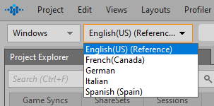

**将媒体文件作为语音对象导入工程的方法如下：**

1. 执行以下操作之一：

   - From the Wwise menu bar, click **Project** >
     **Import Audio Files**.
   - From the Wwise menu bar, click **Views** >
     **Audio File Importer**.
   - Click **Shift**+**I**.

   此时将会打开 Audio File Importer。
2. 点击 **Add Files**（添加文件）或 **Add Folders**（添加文件夹）。

   这时会打开 **Open File**（打开文件）对话框。
3. 浏览至您要导入的媒体文件的位置。
4. 选择这些文件，然后点击 **Open**（打开）。

   所选文件于是加载到 Audio File Importer 中了。
5. 选择 **Import as Sound Voice** 选项。
6. 要更改将要在 Wwise 中创建的对象位置，请点击 **[...]**，然后在层级结构中选择一个新位置。
7. 点击 **Import**（导入）

   这时会打开 Importing（导入）对话框。在此，可查看导入流程的进度。

   |  |  |
   | --- | --- |
   | [备注] | 备注 |
   | 如果媒体文件中存在错误或冲突，则将会打开 Import Conflict Manager。有关如何处理这些冲突的详细信息，请参阅[“管理文件导入问题”一节](ch10s04.html "管理文件导入问题")。 |

---

##### 从用制表符分割的文本文件导入媒体文件

您可以通过制表符分割（也叫制表符分隔）的文本文件大批量地导入媒体文件。用制表符分割的文本文件（TXT 或 TSV 扩展名）可通过 Microsoft Excel 或其它电子表格应用程序进行生成。导入的文件必须采用 UTF-8 编码格式。

|  |  |
| --- | --- |
| [注意] | 注意 |
| 请注意，导入数以万计的媒体文件可能需要花费大量的时间。在配有 SSD 硬盘的机器上进行大文件的导入，可以减少导入时间。请注意，导入时请确保已退出密集使用磁盘的应用程序，如版本控制同步、云同步，甚至是病毒保护服务（如有可能）。 |

用制表符分割的文件可定义以下元素：

- 要导入的 WAV、AMB 或 MIDI 文件
- 用于包含文件的对象结构
- 任何属性值或引用，例如声部音量或输出总线
- 要创建的事件

用制表符分割的文件的第一行为后续行定义了列的内容。列的顺序对导入过程不会有任何影响。

对于制表符分割的文本文件，下表列出了所有可能出现的列标题，并对其进行了说明。

|  |  |
| --- | --- |
| [技巧] | 技巧 |
| 在制表符分割的文件中，可以用 Absolute path 和 GUID 明确指定对象。要获得对象的绝对路径或 GUID，请按住 Shift 键并右键点击对象以显示快捷菜单。选择 **Copy path(s) to clipboard**（将路径复制到剪贴板）或 **Copy GUID(s) to clipboard**（将 GUID 复制到剪贴板）。 |

| 列标题 | 内容 |
| --- | --- |
| Audio File | 音频文件。指定要导入的 WAV 或 MIDI 文件的路径。文件将被复制到 **Originals** 文件夹或子文件夹中（前提是所述文件夹中不存在该文件）。路径可是绝对路径或相对路径。  - **绝对路径**：包含音频文件名本身的完整路径。  例如：  `C:\MyWaves\MyFolder\Originals\MySound.wav` - **相对路径**：相对于制符表分割文件目录的路径。  Example:   `..\..\MyWaves\MyFolder\Originals\MySound.wav`  如果创建容器，则此列可以留空。 |
| Audio File | 定义要导入的 base64 编码 WAV 音频文件。需要指定目标文件路径并使用竖线（|）将其与 base64 编码数据分隔。指定的目标文件路径可以在 **Originals** 下的导入类型文件夹中获取。  Example: `MySounds/MySound.wav|UklGRuRcAABXQVZFZm10IBAA...` |
| Object Path | 对象路径。定义要创建的对象的路径和名称。路径使用反斜杠，可以是绝对路径或相对路径。  - **绝对路径**：完整路径，以反斜杠和对象类别开头。  Example: `\Containers\MyWorkUnit\MyVirtualFolder\MySound`  |  |  |   | --- | --- |   | [注意] | 注意 |   | 若绝对路径中的顶层 Work Unit 不存在，则导入会失败。 | - **相对路径**：相对于导入目标的路径，在 Audio File Importer 对话框中进行指定。  Example: `MyVirtualFolder\MySound`  若指向对象的路径不存在，Wwise 会自动创建所有缺失的父对象和相应对象。It is possible to specify the type of different objects in the path by writing it between `<>` before the object's name. 如果未指定类型，导入流程将默认选择 Virtual Folder 。支持的对象类型列表与以下描述的 Object Type 列的类型相同。  如果此列留空，则对象的名字将从导入音频文件中获取，并且将会导入到 Audio File Importer 对话框中指定的目标。   **物体路径示例:**`\<Property Container>Barrel\<Sound SFX>Minigun_Barrel_Stop` |
| Object Type | 用于指定对象类型，有下列选项可用：  - Virtual Folder (for the Containers hierarchy) - **Containers hierarchy objects:**  - Property Container   - Random Container （随机容器）   - Sequence Container （序列容器）   - Switch Container（切换容器）   - Blend Container（混合容器）   - Sound SFX（音效声）   - Sound Voice（语音声）   - Music Switch Container（音乐切换容器）   - Music Playlist Container （音乐播放列表容器）   - Music Segment （音乐段落）   - Music Track （音乐轨）  如果此列留空，则会假定 Object Type 为 Virtual Folder，除非在 Object Path 中另行指定。  |  |  | | --- | --- | | [备注] | 备注 | | It is not possible to create Containers hierarchy objects during the same import when using the Audio File Importer. Nor is it possible, among the Containers hierarchy objects, to create Sound SFX objects and Sound Voice objects during the same import. It is however possible to import Containers hierarchy objects using the Wwise Authoring API and using the -TabDelimitedImport command line option. | |
| OriginalsSubFolder | Originals 子文件夹。指定要将导入的音频文件放在哪个 **Originals** 子文件夹。此文件夹与通常要导入文件的 **Originals** 文件夹相对。比如，若导入 SFX，则将音频文件导入到 Originals\SFX\<OriginalsSubFolder> 文件夹。 |
| Property[**属性名**]  或  @**属性名**  **示例：**   - `Property[Voice Volume]` - `Property[Volume]` - `@Voice Volume` - `@Volume` | 列标题指定要设置哪个属性。属性名称为显示名称，如 RTPC（实时参数控制）选项卡、Multi Editor 或 List View 中所示。  如果没有文件或缓存版本与 Wwise 的版本不同，则在 Wwise 中再次播放媒体文件之前，该缓存将会被删除而您将不得不重新对平台版本文件做转码。<https://www.audiokinetic.com/library/edge/?source=SDK&id=wobjects__index.html>  **常见属性名称：**   - Volume - Pitch - Lowpass - Highpass  **通用属性显示名称：**   - Voice Volume（声部音量）。 - Voice Pitch（声部音高） - Voice Low-pass Filter（声部低通滤波器） - Voice High-pass Filter（声部高通滤波器）。  各个后续行指定要在创建对象上设置的属性值。  枚举值必须指定与枚举名称有关的整数值，它可从 WWU 文件或 WObjects.xml 中找到。  如果此列留空，则未设置任何值。 |
| Reference[**引用名称**]  或  @**ReferenceName**  或  ~**ReferenceName** （不建议使用）  **示例：**   - `Reference[Output Bus]` - `Reference[OutputBus]` - `@Output Bus` - `@OutputBus` | 列标题指定要设置哪个引用。Reference name 可以是引用名称或者显示名称, 如 List View 和 Multi-Editor 中所示。  请参阅 [Wwise Objects Reference](https://www.audiokinetic.com/library/edge/?source=SDK&id=wobjects__index.html) 来获取更多关于引用名称的信息。  **通用引用显示名称：**   - Output Bus（输出总线） - User Auxiliary Send 0（用户辅助发送 0） - User Auxiliary Send 1（用户辅助发送 1） - User Auxiliary Send 2（用户辅助发送 2） - User Auxiliary Send 3（用户辅助发送 3） - Conversion Settings（转码设置） - Effect 0（效果器 0） - Effect 1（效果器 1） - Effetct 2（效果器 2） - Effect 3（效果器 3） - Attenuation（衰减） - MIDI Target  各个后续行指定以下内容之一：  - **绝对路径**：工程中对象的绝对路径。  Example: `\Busses\Default Work Unit\Main Audio Bus\Sub Bus` - **GUID**：对象的 GUID，可以在 WWU 文件中找到；在Wwise 设计工具中，打开对象快捷菜单的同时按住 Shift 键也可以直接看到。  Example:   `{10EC26E3-03EB-4470-8B30-4344B6F90438}`  如果此列留空，则未设置任何引用。 |
| Notes | 为要创建的对象定义说明或备注。 |
| Audio Source 说明或备注 | 为新建对象中的音频源文件进行说明或备注。 |
| Event | 为导入的对象定义要创建的 Event 路径和名称。  路径可是绝对路径或相对路径：  - **Absolute path**: An absolute path to an Event, which starts with `\Events\`, followed by the Work Unit name.  Example: `\Events\MyWorkUnit\PlayEvent` - **相对路径**：Event 相对于 Default Work Unit 的路径。  Example: `MyVirtualFolder\PlayEvent`  If a path element is preceded by `<Work Unit>` and the name that follows doesn't match an existing Work Unit, a Work Unit is created.  Example using an absolute path: `\Events\<Work Unit>NewWorkUnit\PlayEvent`  对于尚不存在的所有其他路径元素，都会创建 Virtual Folder。  To specify the Action type, append `@ActionName` to the end of the Event name. If not specified, the **Play** Action will be used.  Action Type 示例：  - `MyEvent@Play` - `MyEvent@Stop` - `MyEvent@Pause` - `MyEvent@Resume` - `MyEvent@Break` - `MyEvent@Seek`  若目标位置已存在指定 Event，则会将新的 Event Action 添加到现有 Event（如尚未添加完全一样的 Event Action）。  |  |  | | --- | --- | | [技巧] | 技巧 | | 要为单个对象创建多个事件，您可以多次添加 **Event**（事件）列。 | |
| Dialogue Event（对白事件） | 为导入的对象定义要创建的 Dialogue Event 路径和名称。路径可是绝对路径或相对路径：  - **Absolute path**: An absolute path to a Dialogue Event, which starts with `\Dynamic Dialogues\`, followed by the Work Unit name.  Example: `\Dynamic Dialogues\MyWorkUnit\DialogueEvent` - **相对路径**：对白事件相对于 Default Work Unit 的相对路径。  Example: `\MyVirtualFolder\DialogueEvent`  If a path element is preceded by `<Work Unit>` and the name that follows doesn't match an existing Work Unit, a Work Unit is created.  Example using an absolute path:`\Dynamic Dialogues\<Work Unit>NewWorkUnit\DialogueEvent`  对于尚不存在的所有其他路径元素，都会创建 Virtual Folder。  Dialogue Event 列的主要用于创建或修改 Dialogue Event 中的 Path，等同于在 Dialogue Event Editor 中进行操作。To specify a path, append  `@Path:`  to the end of the Dialogue Event name, followed by the Switch/State structures concatenated with a period.  还可以指定 Path 的 Probability 和 Weight 值（范围从 0 到 100）。To do so, simply add a  `|`  then enter  `Probability:###`  or  `Weight:###` . See more in [“为路径设置概率和权重”一节](ch15s01s06.html "为路径设置概率和权重"). 如果未指定 Path，Probability 或 Weight 参数将不起作用。  |  |  | | --- | --- | | [技巧] | 技巧 | | 要为单个对象创建多个对白事件，您可以多次添加 **Event**（对白事件）列。 |   **Dialogue Event 示例：.**`VirtualFolder\Unit_Under_Attack@Path:<Switch Group:MyVirtFolder\FS_Type>Running.<State Group:Hostile>Gang.<Switch Group:VirtualFolder\Location>Alley|Probability:80|Weight:20` |
| Switch Assignation | Defines a Switch Group or State Group that will be associated with a Switch Container within the Containers hierarchy only. 同时定义 Switch Container 的子对象与关联分组中的 Switch 或 State 的指派关系。  A Switch Group or State Group is declared between  `<>`  by giving the group type and its name separated by a colon. To perform the assignation, you can specify its child after the  `>` . 参见以下示例，了解更多详情。  除此之外，还可在 Switch Group、State Group 或 Switch Container 的子对象的名称前指定路径。  路径可是绝对路径或相对路径：  - **Absolute path**: An absolute path to a Switch Group or State Group, which starts with `\Switches\` or `\States\`, followed by the Work Unit name.  Example: `\Switches\MyWorkUnit` - **相对路径**：Switch 或 State 相对于 Default Work Unit 的路径。  Example: `\MyVirtualFolder`  If a path element is preceded by `<Work Unit>` and the name that follows doesn't match an existing Work Unit, a Work Unit is created.  Example using an absolute path: `\Switches\<Work Unit>NewWorkUnit`  对于尚不存在的所有其他路径元素，都会创建 Virtual Folder。  |  |  | | --- | --- | | [技巧] | 技巧 | | 要为单个对象创建多个 Switch Assignation，您可以添加多个 **Switch Assignation** 列。<segment 0594> |   **Switch Assignation 示例：.**`<Switch Group:YourSwitchGroupName>YourSwitchName`, `<Switch Group:SS_FS_Type>Jump` |

**导入用制表符分割的文件的方法如下：**

1. 执行以下操作之一：

   - From the Wwise menu bar, click **Project** >
     **Import Audio Files**.
   - From the Wwise menu bar, click **Views** >
     **Audio File Importer**.
   - Right-click the import destination object in the Project Explorer and select
     the **Import Audio Files** option.
   - Click **Shift**+**I**.

   此时将会打开 Audio File Importer。
2. 单击 **Import Tab Delimited**（导入制表符分割的文件）按钮。
3. 浏览找到该用制表符分割的文件，然后点击 **OK**（确定）。
4. 验证 Audio File Importer 列表中的导入内容。
5. 点击 **Import**（导入）

###### 用制表符分割的文件示例

以下表格（使用了 Sample Project 中的细节，但有差别 ）即使用制表符分割的电子表格示例。尽管这些表格不能包罗万象，但却展示了使用不同方式导入相似项的多种可能性，例如 Object Type 列与 Object Path 中的对象类型的使用，以及绝对路径与相对路径的使用。

**一次创建路径中的多个对象**：演示如何使用一行表格创建整个路径结构中的多个容器。Each of the 对象 Types specified in the 对象 Path could have been entered in separate lines with entries in the 对象 Type column.

| Audio File | Object Path | Property [Voice Pitch] | Reference [Output Bus] | Event |
| --- | --- | --- | --- | --- |
| C:\My Audio Files\ Minigun\ MnGn\_Barrel\_Down.wav | \Containers\ Default Work Unit\ <Property Container>Minigun\ <Blend Container>Barrel\ <Sound SFX> Minigun\_Barrel\_Stop | 50 | \Busses\Default Work Unit\Main Audio Bus\Environmental\SFX\Guns | \Events\Minigun\Pay\_Minigun@Play |

**创建 Switch Container，并设置 Switch Group 和 Switch 分配**：演示如何添加 Switch ，然后为其分配 Switch Group 和 Switch。

| Object Path | Object Type | Switch Assignation |
| --- | --- | --- |
| \Containers\My Default Work Unit\<Property Container>Minigun\<Switch Container>Shells\A | Sound SFX（音效声） | <Switch Group:\Switches\SS\_Impact\SS\_Surface>Dirt |
| \Containers\My Default Work Unit\<Property Container>Minigun\<Switch Container>Shells\B | Sound SFX（音效声） | <Switch Group:SS\_Surface>Wood\_Solid |

**通过 Dialogue Event 添加 Sound Voice**：演示如何通过 Dialogue Event 和 Path 添加关联的 Sound Voice。

| Audio File | Object Path | Object Type | Dialogue Event（对白事件） |
| --- | --- | --- | --- |
| ..\..\My Voice Recordings\English(US)\UNA-GG-AL\_01.wav | \Containers\Dialogues\Captain\_A\UNA-GG-AL\_01 | Sound Voice（语音声） | \Dynamic Dialogue\Default Work Unit\Unit\_Under\_Attack@Path:<State Group:Unit>Unit\_A.<Switch Group:FS\_Type>Running.<State Group:Hostile>Gang.<State Group:Location>\*|Probability:80|Weight:20 |
| ..\..\My Voice Recordings\English(US)\UNA-HS-AL\_01.wav | \Containers\Dialogues\Captain\_A\UNA-HS-AL\_01 | Sound Voice（语音声） | Unit\_Under\_Attack@Path:<State Group:Unit>Unit\_A.<Switch Group:FS\_Type>Running.<State Group:Hostile>DefuseBomb.<State Group:Location>Alley|Probability:20|Weight:20 |
| ..\..\My Voice Recordings\English(US)\UNA-GG-HG\_01.wav | {D2F87A0D-7D5C-429D-B13D-03478450C2A2} | Sound Voice（语音声） | Unit\_Under\_Attack@Path:<State Group:Unit>Unit\_A.<Switch Group:FS\_Type>Running.<State Group:Hostile>Gang.<State Group:Location>Hangar |

---

##### 导入文本文件中的语音素材

游戏中具有成千上万语音素材的情况并不少见，所以在 Wwise 中通过有效方法创建这些语音素材至关重要。由于这些素材通常在 Microsoft Excel 等外部程序中进行管理，因此 Wwise 可以通过导入用制表符分割的文件中的信息，在 Wwise 工程中重建这些素材。这不仅会加快创建过程，而且还可减少出错误的可能。

|  |  |
| --- | --- |
| [备注] | 备注 |
| 用制表符分割的文本文件是一种特殊类型的纯文本文件，信息会排列在该文件中用制表符分割的列中。大多数电子表格程序（包括 Microsoft Excel）都用来将电子表格中的信息导出到用制表符分割的文本文件中。 |

下图说明了将电子表格程序中的语音素材列表导入到 Wwise 中的工作流程。

|  |
| --- |
|  |

尽管您的文本文件可能包含有关素材的多种信息，但在导入文件时 Wwise 仅使用以下四种类型的信息：

- **Filename** ―― 文件名。此信息用于创建 Sound Voice 对象和其对应的音频源。最初音频源将为空，但它的确包含对相同名称的音频文件的引用。也就是说，您可以在 Wwise 中像处理其它音频文件那样替换它。有关为 Sound Voice 对象替换媒体文件的详细信息，请参阅[“替换 Sound Voice 媒体文件”一节](ch10s03.html#replacing_sound_voice_media_files "替换 Sound Voice 媒体文件")。
- **Random Container name** ―― 随机容器名称。如果文本文件中包含此信息，则将被用于创建相应 Sound Voice 对象的父随机容器。
- **Sound Voice notes** -- 声音对象备注。此信息会添加到 Sound Voice 对象的 Notes（备注）字段。例如，您可能会需要添加说话角色的名称。
- **Audio source note** ―― 音频源备注。此信息会添加到音频源的 Notes 字段。例如，您可能会需要包含所说的实际对话文本。

|  |  |
| --- | --- |
| [备注] | 备注 |
| 在将语音素材导入 Wwise 时，仅以引用语言创建音频源。要在工程中创建其它语言版本的音频源，请参阅[“Importing language files”一节](ch35s02.html#importing_language_files "Importing language files")。 |

文本文件中信息的顺序和信息量并不重要，因为在导入文件之前，您必须指定要导入文本文件中的哪些列。唯一强制的信息是文件名，因为此名称会用于创建 Sound Voice 对象和音频源。如果文本文件中的某列尚未映射到四个信息类型之一，则它将被 Wwise 忽略。

为了帮助您确保您已正确指定了列，会显示将要创建的对象和将要导入的信息的预览。

|  |
| --- |
|  |

|  |  |
| --- | --- |
| [注意] | 注意 |
| 在已导入文本文件中的语音素材之后，此操作无法撤消。 |

**导入文本文件中的语音素材的方法如下：**

1. 从 **Project** 菜单中，选择 **>Import Voice Assets**>（导入语音素材）。

   此时将会打开 Voice Asset Importer。
2. 点击 **File to import**（要导入文件）文本框旁边的浏览按钮 (...)。

   这时会打开 Open（打开）对话框。
3. 选择要导入的文本文件，然后点击 **Open**。

   导入文件的位置将显示在 **File to import** 中。
4. 如果文本文件中有标题行并且您希望使用它来指派列，则请选择 **Use header**（使用标题）复选框。
5. 在 **Header row** 选择框中，指定文本文件中的标题信息行。
6. 在 **Start import at row** 选择框中，选择 Wwise 读取语音素材信息的起始行。
7. 从 **Column Index**（列索引）列表中，为以下各列类型选择文本文件中的相应列：

   - **Filename**
   - **Random Container Name**
   - **Sound Voice Note**
   - **Audio Source Note**

   |  |  |
   | --- | --- |
   | [备注] | 备注 |
   | 文本文件中的 filename 列必须指派给相应的 **Filename** 信息类型，以便在 Wwise 中创建文本文件中的语音素材。所有其它信息为可选信息。 |
8. 检查 Voice Assets Preview（语音素材预览）表中的信息，以确保您将文本文件中的列正确指派给了 Wwise 中的相应信息类型。
9. 如果您希望更改将创建新 Sound Voice 的位置，则请执行以下操作：

   - 单击 Import destination（导入目标）文本框旁边的 **Browse**（浏览）按钮。
   - 在 Project Explorer - Browser 中，在工程层级结构中选择一个新位置。
   - 单击 **OK**（确定）。

   新路径将显示在 **Import destination** 文本字段。
10. 点击 **Import**（导入）

    Wwise 中会创建 Sound Voice 对象，如果有相应的音频源和随机容器，则也会随之一起进行创建。若在导入过程中遇到任何问题，Wwise 会将其列在 Import Completed（导入完成）对话框中。

    |  |  |
    | --- | --- |
    | [备注] | 备注 |
    | 如果素材很多，则导入过程可能需要一段时间，因为 Wwise 必须验证各个素材名称是否重名。 |

---

#### 替换媒体文件

在某些情况下，之前导入的文件可能存在技术问题，或您可能正在使用临时文件作为占位符文件，直到您收到打算在工程中使用的文件为止。在这些情况下，您需要替换之前已导入的媒体文件。您可以在 Audio File Importer 中或使用 Quick Replace（快速替换）快捷方式来执行此操作。

###### 快速替换

下表列出了您可以用于替换之前导入 Wwise 中的媒体文件的快捷方式。

| 操作 | 使用此快捷方式： |
| --- | --- |
| 更换现有音效文件并创建新声音对象。 | 拖放文件。 |
| 更换音效文件。 | 按 Alt 拖动文件。 |
| 更换现有语音文件并创建新的声音对象。 | 按 Shift 拖动文件。 |
| 更换语音文件。 | 按 Alt+Shift 并拖动文件。  如果您正使用此快捷方式替换语言，则请确保在 Language Selector 中选择了引用语言。 |

###### 导入 SFX 文件

使用 Audio File Importer，您可以替换工程中的现有音效文件。

**替换现有音效媒体文件的方法如下：**

1. 执行以下操作之一：

   - 从 Wwise 菜单栏中，点击 **Project > Import Audio Files**。
   - From Wwise menu bar, click **Views** > **Audio File Importer**.
   - Right-click an object in the Containers hierarchy and select **Import Audio Files** from the menu.
   - Click **Shift + I**.

   此时将会打开 Audio File Importer。
2. 点击 **Add**（添加）或 **Add Folders**。

   这时会打开 Open File（打开文件）对话框。
3. 浏览至您要导入的媒体文件的位置。
4. 选择文件，然后点击 **Open**。

   所选文件于是加载到 Audio File Importer 中了。
5. 在 **Import Mode**（导入模式）分组中，选择 **Replace audio files**（替换音频文件）。
6. 在 **Object Type**（对象类型）分组中，选择 **Import as Sound SFX**（导入为音效）。
7. 点击 **Import**（导入）

   这时会打开 Importing（导入）对话框。在此，可查看导入流程的进度。

   |  |  |
   | --- | --- |
   | [备注] | 备注 |
   | 如果媒体文件中存在错误或冲突，则将会打开 Import Conflict Manager。有关如何处理这些冲突的详细信息，请参阅[“管理文件导入问题”一节](ch10s04.html "管理文件导入问题")。 |

###### 替换 Sound Voice 媒体文件

您可以在 Audio File Importer 中以替换音频文件模式来替换工程中的现有语音媒体文件。在此模式中，转码设置选项不可用。如果您正在本地化您的工程，则您将需要使用 Localize Languages（本地化语言）模式。有关本地化的详细信息，请参阅[“Localizing your project”一节](ch35s02.html "Localizing your project")。

**替换工程中的语音媒体文件的方法如下：**

1. 执行以下操作之一：

   - 从 Wwise 菜单栏中，点击 **Project > Import Audio Files**。
   - From Wwise menu bar, click **Views** > **Audio File Importer**.
   - Right-click an object in the Containers hierarchy and select **Import Audio Files** from the menu.
   - Click **Shift + I**.

   此时将会打开 Audio File Importer。
2. 点击 **Add**。

   这时会打开 Open（打开）对话框。
3. 浏览至您要导入的媒体文件的位置。
4. 选择这些文件，然后点击 **Open**（打开）。

   所选文件于是加载到 Audio File Importer 中了。
5. 在 **Import Mode**（导入模式）分组中，选择 **Replace audio files**（替换音频文件）。
6. 在 **Object Type**（对象类型）分组中，选择 **Import as Sound Voice**（导入为语音）。
7. 从 Destination language（目标语言）列表中，选择语言。

   |  |  |
   | --- | --- |
   | [备注] | 备注 |
   | 工程语言的列表已在 Language Manager 中创建。有关工程语言的详细信息，请参阅[*管理语言*](ch08.html "管理语言")。 |
8. 点击 **Import**（导入）

   这时会打开 Importing（导入）对话框。在此，可查看导入流程的进度。

   |  |  |
   | --- | --- |
   | [备注] | 备注 |
   | 如果媒体文件中存在错误或冲突，则将会打开 Import Conflict Manager。有关如何处理这些冲突的详细信息，请参阅[“管理文件导入问题”一节](ch10s04.html "管理文件导入问题")。 |

---

#### 管理文件导入问题

在将媒体文件导入 Wwise 工程中时，您可能会遇到错误。可能出现两种错误：

- [“管理可恢复的错误”一节](ch10s04.html#managing_recoverable_errors "管理可恢复的错误")可在 Conflict Manager（冲突管理器）中解决。
- [“管理不可恢复的错误”一节](ch10s04.html#managing_non_recoverable_errors "管理不可恢复的错误")无法在 Wwise 中解决。

###### 管理可恢复的错误

如果在尝试导入 Wwise 中已经存在的文件时，您并没有在 Audio File Importer 中选择 Replace Mode，则 Conflict Manager 将会打开。基于您计划执行的操作，您有三个选项。

- **Replace** -- 替换。使用将要导入的文件替换现有音频文件。
- **Use Existing** -- 使用现有。继续使用当前链接到音频源的文件。
- **Cancel** -- 取消。取消导入操作。

您可以逐个应用选项，或者将这些选项应用于错误列表中的所有文件。

**替换包含可恢复错误的文件的方法如下：**

1. 在 Conflict Manager 窗口中，执行以下操作：

   要替换所有文件，请点击 Set All To（全部设置为）区域中的 **Replace**。

   要替换单个文件，请点击 Error List 中的 **Replace**。
2. 点击 **Import**（导入）

   导入列表中的文件会导入您指定的位置。

###### 管理不可恢复的错误

不可恢复的错误是指无法在 Wwise 中解决的错误。若在 Conflict Manager 中遇到此类错误，请取消导入受影响的文件。下面列举了几项此类错误：

- Not a valid WAV file.（不是有效的 WAV 文件。）
- Error copying the file to the originals folder.（将文件复制到 Originals 文件夹时出错。）
- Can't open source or output file.（无法打开源文件或输出文件。）

您可以设法在 Wwise 之外解决这些错误，然后尝试再次执行相应的操作。以下为可能的原因以及故障排查建议：

- 文件格式不受支持：检查 [“ PCM（脉冲编码调制）音频文件格式”一节](ch10s01s01.html#pcm_audio_file_format "PCM（脉冲编码调制）音频文件格式")并确认文件格式、采样范围、位深和声道配置是否受支持。
- File path is too long. 请参阅 [“Understanding file length limitations and naming conventions”一节](ch03s02.html "Understanding file length limitations and naming conventions")。
- 文件访问出错：查看文件权限并确认文件是否处于在用状态。外部驱动器上的文件有时会导致发生错误。
- 未找到音频文件：对于 Sound Voice 对象，没有与参考语言对应的媒体文件。

---

#### 重新组织 Originals Folder 中的媒体文件。

随着工程中的源媒体文件数量的增加，您可能会需要将文件组织到一系列的子文件夹中。由于 Wwise 需要跟踪各个源文件的完整路径，所以您必须在 Wwise 的 File Manager（文件管理器）中执行移动操作。

|  |  |
| --- | --- |
| [备注] | 备注 |
| 您必须先保存工程，然后再在 Originals 文件夹中移动源文件。 |

**在 Originals 目录内的文件夹之间移动文件的方法如下：**

1. 保存当前工程。
2. 执行以下操作之一：

   - 在菜单栏中，依次单击 **Project** > **File Manager**（工程 > 文件管理器）。
   - 按 **Shift+F1**。

   File Manager 将打开 。
3. 切换至 Source Files 选项卡。
4. 选择要移动的文件。
5. 右键点击选定项，然后从菜单中选择 **Move**（移动）。

   这时会打开 Browse For Folder（浏览文件夹）对话框。
6. 浏览文件夹结构并选择要移动其中文件的文件夹。

   |  |  |
   | --- | --- |
   | [备注] | 备注 |
   | 如果要创建新的文件夹，则请选择父文件夹，点击 Make New Folder（新建文件夹）按钮，然后为文件夹指定一个名称。 |
7. 打开 **OK** 以将文件移动到新文件夹。

   这时会打开 Process Log（处理日志）对话框，并显示有关各个移动的文件的信息。
8. 单击 **OK**（确定）关闭 Process Log（处理日志）对话框。

---

#### 清除缓存

要高效地管理转码媒体文件，需要定期清理 `.cache` 文件夹，以移除不再使用的文件、过时的文件或有问题的文件。您可以选择清除缓存中的所有转码媒体文件或者只清除落单的文件。您可能会需要在以下情况下清除缓存：

- **在您已删除 Wwise 对象后** ―― 转码媒体文件或落单文件不再有用，但仍与对象关联，除非您手动清除这些文件，否则这些文件会一直保留在缓存文件夹中。In this case, you might only want to clear these files.
- **针对某平台转换文件后可能导致质量降低**――您可能希望删除该平台的已转换文件并重新进行转换。
- **多语言文件的最终版本已经提交** ―― 您希望在缓存中仅保留新转码结果文件。

Only the converted media files in your `.cache` folder are deleted in this
operation. The `Originals` folder remains intact.

|  |  |
| --- | --- |
| [注意] | 注意 |
| 清除缓存的操作无法撤消。 |

**清除工程缓存的方法如下：**

1. From the menu bar, click **Project > Clear Audio File
   Cache**.
2. In the Clear Audio File Cache dialog, select the files to clear:

   - **Only orphan files**: Clears all converted media
     files in the `.cache` folder that are not currently associated with an
     object.
   - **All converted files**: Clears all converted media
     files in the `.cache` folder.
3. Click **Clear Cache**.

   The Clearing Audio File Cache dialog opens where you can view the clearing process.

---

#### 在外部编辑器中编辑音频文件

在准备要用于游戏工程的音频文件时，您可以使用若干个音频编辑器来完成任务。但是在将这些音频文件整合到工程中后，您可能会需要进一步编辑这些文件。例如，您可能会需要剪掉过长演讲的末尾部分，或为一段口哨吹的小调加一个音符。Wwise 可以选择已经导入工程的任何音频文件，并直接在您喜欢的音频编辑器中打开该文件。这样一来，即使在文件已整合到工程中后，您也可以微调文件。

|  |  |
| --- | --- |
| [备注] | 备注 |
| 要使用外部编辑器和 Wwise，您必须首先在 User Preferences（用户偏好设置）中指定您希望使用的所有编辑器。有关详细信息，请参阅[“Managing external editors for audio”一节](ch04s04.html#selecting_external_audio_editors "Managing external editors for audio")。 |

如果您有所需权限，则可以选择 Project Explorer 中所列的导入音频文件并直接在您所选的外部音频文件编辑器中打开这些文件。有关文件权限的详细信息，请参阅[“结合版本控制系统使用 Wwise”一节](ch09s03.html "结合版本控制系统使用 Wwise")。

**在外部编辑器中编辑音频文件的方法如下：**

1. 在 Project Explorer（工程资源管理器）的 Audio（音频）选项卡中选中一个或多个声音对象或容器，或者在 Contents Editor（内容编辑器）中选择音频源，然后执行以下操作之一：

   - 使用键盘快捷方式 **Ctrl+E** 在默认的 External Editor（外部编辑器）中打开文件。
   - 右键单击并选择 **Edit in External Editor**（在外部编辑器中编辑），然后选择 External Editor。

   这时会在所选的编辑器中打开与对象对应的音频文件。
2. 在编辑完文件后，将其保存到相同的路径并命名为与原始文件相同的名称：

   - 音效：`[ProjectName]\Originals\SFX\`
   - 语音：`[ProjectName]\Originals\Voices\[Language]\`

   编辑后的媒体文件现已能够在 Wwise 中播放了。

---

#### 使用插件创建 Source

Wwise 的开放式体系结构使您能够通过创建源插件（Source Plug-in）来提升音频效果。Wwise 的开放式体系结构使您能够通过创建源插件来增强音频和振动。这些插件（例如合成器和物理建模）可轻松集成到 Wwise 中，并可用于创建声音和振动对象。您还可以修改插件属性以创建更广泛的音效和振动效果。

Wwise 自带不少的源插件。

**可用的源插件**

- Audio Input（音频输入）
- External Source（外部源）
- Motion（振动）
- Silence
- Sine（正弦波）
- Soundseed Air Wind\*
- Soundseed Air Woosh\*
- Tone Generator

  \* - 如果您计划为您的游戏开发、集成和发布 Soundseed Air，则需要购买单独的授权。有关详细信息，请联系 Audiokinetic 销售团队，邮件地址是： [sales@audiokinetic.com。](mailto:sales@audiokinetic.com)

**添加源插件的方法如下：**

1. 将对象加载到 Property Editor 中。
2. 在 Contents Editor 中，点击 **Add Source**。

   Source 菜单中将会显示可用的源插件列表。

   |  |  |
   | --- | --- |
   | [备注] | 备注 |
   | 为特定平台创建的源插件，在所有其它平台的源插件列表中将显示为不可用。 |
3. 选择要添加的源插件。

   源已添加到对象中，并在 Contents Editor 中显示为新条目。
4. 双击源插件以在 Source Plug-in Property Editor（源插件属性编辑器）中显示完整的属性列表。
5. 根据需要，编辑属性。

---

#### 媒体文件管理技巧和经验总结

以下几节为您提供了一系列技巧和经验总结，以帮助您在整个音频开发过程中更好地管理工程中的媒体文件。

###### 清除缓存

要节省空间并有效管理文件，您需要定期清除缓存。您应在以下情况下执行此操作：

- 在删除对象后。
- 在 File Manager（文件管理器）中删除文件后。

###### File Manager

另一种跟踪工程媒体文件的方法是查看 File Manager（文件管理器） 的 Source Files（源文件）选项卡中的信息。File Manager 持续跟踪工程的 Originals 文件夹，以便您可以根据需要从工程中删除任何未使用的文件。For more information about the File Manager, see [“查看工程文件的状态”一节](ch09s02.html "查看工程文件的状态").

Removing audio files in the File Manager does not clear the associated converted files from your audio cache. You need to remove them manually. 请参阅 [“清除缓存”一节](ch10s06.html "清除缓存")。

---

#### 管理媒体素材 ID

Wwise 跟很多其他游戏引擎一样使用数字标识符 (ID) 管理工程素材。Wwise 指派给工程素材的 ID 类型有两种，分别用于 Wwise 设计工具 (wa) 和 Wwise 声音引擎 (wse)。在编辑工程的过程中，Wwise 会指派或更新这些 ID。这些操作全部都在后台完成，一般不需要工程团队手动处理。不过，为了便于后续对工程所涉及的游戏进行更新（无论是修复还是扩展），事先了解一下 Wwise 如何指派和使用素材 ID 还是很有必要的。不管怎么说，能尽量减少游戏更新所含的内容总是好的。鉴于绝大部分 Wwise 工程素材都是音频素材（.wem 文件），在实施更新时最好限制音频文件的数量。为此要尽量确保工程音频素材的 ID 不会随意变动，否则可能会因无法重复使用而不得不重新发布素材。

###### Wwise ID 指派

接下来，我们将使用下图所示的简单工程来阐释 Wwise 如何将 ID 指派给工程素材。该工程包含：

- Hello.wav 音频素材；
- Hello Sound SFX（音效）对象：引用音频素材；
- Play\_Hello Event（事件）对象：带有 Play（播放）动作，由游戏用来触发音频素材的播放。


**图示：**Play\_Hello Event 和 Hello Sound SFX

我们来看下 Default Work Unit（默认工作单元）的内容，瞧瞧 Wwise 向 Sound SFX 对象指派了什么。下面是 Work Unit 文件 (.wwu) 中的 Sound SFX 对象条目。为清楚起见，我们删除了不相关的 Sound SFX 对象条目。


我们可以看到，Wwise 向 Sound SFX 对象指派了两个 ID：“ID”和“ShortID”。接下来，我们分别仔细说说。

###### Wwise 设计工具 ID

“ID”是 Sound SFX 对象的 Wwise 设计工具 ID。它是一个 128 位的全局唯一标识符 (GUID)，保证不会出现重复。为简单起见，我们直接将其称为 GUID。Wwise 设计工具之所以使用 GUID 在于其具有全局唯一性。这样的话方便：

- 管理编辑软件必须执行的各种操作；
- 管理可能有多个团队成员参与的工程；
- 在多个 Work Unit 之间引用对象。

从 Play\_Hello Event 对象的 Work Unit 可以看到，它引用了 Hello Sound SFX 对象。


不过，鉴于字符串长度和工程中的素材数量，GUID 不太适合用在 Wwise 声音引擎中。

###### Wwise 声音引擎 ID

另一 ID 是指派给 Work Unit 中特定对象的“ShortID”。它是一个 32 位整数。只有该标识符会存储在工程的 SoundBank（音频包）中以供 Wwise 声音引擎使用。为简单起见，我们直接将其称为 ShortID。GUID 用来准确识别整个工程内的对象，ShortID 则用来准确识别 ShortID 作用域内的对象。也就是说，只有在同一 ShortID 作用域内的对象之间 ShortID 才是不重复的。ShortID 作用域共有三个：

**1. 显式 ID C** ***无法*** **通过声音引擎的 SDK 函数访问的对象**

These are objects that cannot be referred to by user code (e.g. Containers hierarchy objects). 此作用域还可以按照对象类型进一步细分。这样只有在同一对象类型内的对象之间 ShortID 才是不重复的。下面举例列出了几种对象类型：

- Container objects (Sounds, Containers)
- Bus 对象（Bus、Aux Bus）
- Effects

这些 ShortID 是创建对象时指派的随机数值。因为这些数值是随机的，所以每个对象的 ShortID 都要显式记录在各自的 Work Unit 条目中。

**2. 隐式 ID C** **可以****通过声音引擎的 SDK 函数访问的对象（如 Event、State、Switch）**

因为这些对象可能会由 SDK 函数按照名称来引用，所以它们全都指派有特定的 ShortID 值。这些 ShortID 是通过对象名称的哈希值生成的。因此：

- 没有两个命名对象会拥有相同的名称。
- 没有两个命名对象会拥有相同的 ShortID。

跟上面的显式 ShortID 作用域一样，该作用域内的对象也可以按照类型分组。下面举例列出了几种对象类型：

- Event
- Switches（切换开关）
- States（状态）
- RTPC

因为这些 ShortID 不是随机的而是由对象名称隐式决定的，所以它们不必记录在各自的 Work Unit 条目中。从上面 Play\_Hello Event 的 Work Unit 条目可以看到，Play\_Hello Event 并没有 ShortID 条目。

**3. 媒体素材（.wem 文件）**

每个媒体素材都会被赋予一个独一无二的显式 ShortID。按照上文所述，这些 ShortID 是随机数值，所以必须记录在 Work Unit 条目中。在上面的例子中，Sound SFX 的媒体是通过 AudioFileSource 对象记录的，而指派给它的 ID 则是通过 MediaID 条目记录的。

###### ShortID 的实际运用

Wwise 设计工具会在创建对象时为其指派 ShortID 并确保它们之间不存在重复。不过，若有多名团队成员加入新的素材，ShortID 还是有可能出现交叉的。试想一下下面的情形：

- 您的工程包含对象 A，其 ShortID 为 *12345678*。
- 另一团队成员创建了一个单独的 Work Unit。
- 新的 Work Unit 创建在先，之后您的工程才有了对象 A。
- 新的 Work Unit 被复制到了您的工程中。
- 这时将该 Work Unit 复制到工程中。

这时 ShortID 就出现了冲突，因为两个对象拥有相同的 ShortID。Wwise 需要通过为其中某个对象重新指派一个独一无二的 ShortID 来解决冲突。Wwise 会将这个新的 ShortID 指派给引起冲突的对象。也就是说，先加载的对象保持 ShortID 不变，只更改后续冲突对象的 ShortID。

不过，只要在 Wwise 中加入新的对象时加载了所有其他素材就不会出现交叉。对于包含 DLC 的游戏，在将新的素材加入到工程中时，一定要确保存在并加载了之前交付的素材（即工程 Work Unit）。这样才能保证新的素材绝对不会与现有/交付的素材发生冲突。若有些新素材与其他新素材发生冲突，Wwise 会在合并新素材时解决这些冲突。

**注：**在 Wwise 通过更改冲突对象的 ShortID 解决 ShortID 冲突时，会同时更改 SoundBank 中的 ShortID。在这种情况下，日志消息会告知您必须重新生成 SoundBank。

###### 有关媒体素材 ID 的更多信息

我们已经了解了 Wwise 如何将 ShortID 指派给对象以便准确地加以识别，而且知道了相同的概念同样适用于媒体素材。不过，媒体素材与所有其他对象相比有个非常重要的区别：它们有可能被重复使用。接下来，我们看个简单工程的更新版本。这里创建了第二个使用 *Hello.wav* 的 Sound SFX 对象。下面是两个 Sound SFX 对象的 *Default Work Unit* 的相关内容。为简单起见，我们直接将媒体素材 ShortID 称为 MediaID。


我们可以看到，两个 Sound SFX 对象被赋予了相同的 MediaID。这是因为它们使用了完全相同的媒体素材。毕竟，我们没有必要在交付的游戏中包含相同媒体素材的多个副本。同一音频素材的两个实例只有在引用一样的 .wem 文件时才会被视为完全相同。也就是说：

1. 两个实例在转码之前完全相同：

   - 在通过 Source Editor（源编辑器）实施转码之前修改了媒体素材；
   - 文件修改包括修剪文件、添加淡变等操作；
   - 在本例中，两个 Sound SFX 对象都没有修改文件。
2. 两个实例在转码之后完全相同：

   - 可能通过 Conversion Settings Editor（转码设置编辑器）编辑了 Conversion Settings；
   - 在本例中，两个 Sound SFX 对象使用相同的 Conversion Settings。

上面说了 Hello.wav 音频素材的例子，其中两个 Sound SFX 对象拥有相同的 MediaID。接下来，我们对工程进行二次编辑，来向 *HelloAgain* 指派不同的 Conversion Settings。更新后的 Work Unit 如下所示。在此，我们同样删除了不相关的条目。


因为 HelloAgain 使用不同的 Conversion Settings，所以它将引用不同的 .wem 文件并被赋予新的 MediaID。另外注意，是 HelloAgain 而不是 Hello 被赋予了新的 MediaID。这是因为 Hello 并没有改变其媒体素材。

每次创建或编辑媒体素材时，Wwise 都会重估 MediaID。Wwise 会尽可能地确保 MediaID 保持不变。如有变化，则只为刚刚创建或经过编辑的素材指派新的 MediaID。

只要在 Wwise 中加载了整个工程的情况下进行编辑，Wwise 就可确保未经更改的媒体素材保持其 MediaID 不变。不过，要想保证工程中 MediaID 的一致性，工程团队还需考虑更多的问题。

###### 加载 Work Unit

Wwise 在指派 MediaID 时会检查媒体素材的所有实例，并在多个实例使用同一转码后的媒体时重复使用一个 MediaID。为此，Wwise 必须获知媒体素材的所有实例。但是，如果有些实例没有加载到 Wwise 中该怎么办呢？比如，有个素材实例是个没有加载的 Work Unit。在加载 Work Unit 时，Wwise 必须重估 Work Unit 内的所有 MediaID 以保证不会出现冲突。换句话说，Wwise 必须确保每个转码后的媒体只能指派有一个唯一的 MediaID。这里有两种情形需要考虑。

**加载工程**

一旦加载了全部 Work Unit，Wwise 便会评估所有 MediaID。不过，在出现冲突时并没有办法预测会保留哪个 MediaID。比如，在多个团队成员将新的 Work Unit 加入到工程中的时候就可能会发生这种情况。例如：

1. 团队成员 1 加入 NewWorkUnit1，其包含媒体 Example.wav；
2. 团队成员 2 加入 NewWorkUnit2，其同样包含媒体 Example.wav；
3. 整个工程（包括两个新的 Work Unit）都被加载到了 Wwise 中。

这样就会导致 MediaID 出现冲突，不过 Wwise 可以自动解决。同样，这里也有两种情形需要考虑：

1. Example.wav 是新的素材。这种情况下不会影响工程的其他内容。Wwise 会直接保留其中一个新建 Work Unit 的 MediaID。
2. Example.wav 是现有素材。倘若两个团队成员都加载了该 Work Unit，Wwise 将从现有 Work Unit 获取 MediaID。

**加载 Work Unit**

工程的有些 Work Unit 可能没有加载到工程中（详见“[“Loading/unloading Work Units from your project”一节](ch09s01.html#loading_unloading_work_units_from_project "Loading/unloading Work Units from your project")”）。下面使用与上述相同的例子，只进行一些细微的更改：

1. Example.wav 已经存在于工程的 OldWorkUnit Work Unit 中；
2. 团队成员 1 和 2 分别创建新的 Work Unit，在没有加载  OldWorkUnit 的情况下加入  Example.wav。

这种情形的危险之处在于，没有获知 OldWorkUnit 的 MediaID 便为新的 Work Unit 赋予了 MediaID。这样在加载 OldWorkUnit 时就会出现冲突。此时，Wwise 会通过保留 NewWorkUnit1 或 NewWorkUnit2 的 MediaID 来解决冲突。但是，如果 OldWorkUnit 包含在之前交付的素材中该怎么办呢？

无论哪种情形，团队成员都很有可能会意外地更改工程的 MediaID 指派。为了避免这种情况，不妨采用以下工作流程：

###### 使用单个文件管理 MediaID

为了恰当地指派 MediaID，Wwise 需要获知整个工程的 MediaID 指派情况。正如前面章节所述，这里并不存在没有加载 Work Unit 的情况。此时，Wwise 支持使用单个文件来管理工程的 MediaID 指派。下面是“使用单个文件管理 MediaID”的工作流程：

- 不再将 MediaID 存储在 Work Unit 中。
- 将整个工程的 MediaID 存储在一个名为 project-name.mediaid 的单独文件中，并放在工程主文件 project-name.wproj 旁边。

您可以通过 WwiseConsole.exe 调用以下参数，来设定 Wwise 如何管理 MediaID（使用 Work Unit 还是单个文件）：

- **move-media-ids-to-single-file**：将工作流程由传统的“在 Work Unit 中存储 MediaID”改为“使用单个文件管理 MediaID”。此操作会通过命令行加载整个工程，并生成 .mediaid 文件，同时从 Work Unit 文件中移除 MediaID 条目。
- **move-media-ids-to-work-units**：将工作流程由“使用单个文件管理 MediaID”改为传统的“在 Work Unit 中存储 MediaID”。此操作会通过命令行加载整个工程，并将 MediaID 从 .mediaid 文件移到相应的 Work Unit 文件，同时删除 .mediaid 文件。
- **update-media-ids-in-single-file**：更新 .mediaid 文件的内容。此操作会通过命令行加载整个工程，并将更新后的 MediaID 写入到 .mediaid 文件。

下面继续使用示例工程 *WwiseIDs*，来通过发布以下命令将 MediaID 移动到单个文件中：

WwiseConsole move-media-ids-to-single-file WwiseIDs

下面是 *WwiseIDs.mediaid* 文件的内容。


同样，示例工程仅包含一个媒体素材 Hello.wav，但是有两个音频源实例。对于 Hello.wav 的每个实例：

- 实例条目由音频源的 GUID（设计工具 ID）索引。
- 实例指派有 MediaID。
- 实例有相应的哈希值，其代表指派 MediaID 时使用的 Conversion Settings。

在加载工程的过程中，会先加载 Work Unit，再加载 MediaID 文件。无论加载哪些 Work Unit，都会加载 MediaID 文件。在加载 MediaID 文件时，会为音频文件的每个 Conversion Settings 实例赋予哈希值，并与该文件中的哈希值进行比对。倘若两个哈希值不一致，必要时将按照前面章节所列相同规则为实例指派新的 MediaID。一旦加载了工程，所加载的 Work Unit 的全部示例都将拥有*相应的* MediaID。不过，若稍后加载了更多的 Work Unit，则将重估这些 MediaID。

MediaID 文件可以用来将 Wwise 工程与项目节点同步。在每个项目节点，都会通过 *WwiseConsole.exe update-media-ids-in-single-file* 来加载*上一项目节点*的 MediaID 文件，以此更新 Wwise 工程的 MediaID 文件。在更新 MediaID 文件后，整个工程将被标记上新的项目节点。

###### 结论

团队如何针对 Wwise 工程管理媒体素材 ID 取决于团队大小和工程规模。

对于小团队参与的小规模工程，每个团队成员在工作时都加载整个 Wwise 工程会更好管理。这样可以确保不需要通过工程所用的版本控制软件来管理任何 MediaID 冲突。只有在需要对工程进行扩展时才有必要使用版本控制软件。对于每个版本，通过在版本控制软件中锁定工程可以确保不会更改已经交付的素材。

对于规模较大的工程，会有多名团队成员同时参与并加入新的 Work Unit，所以需要采用更为稳妥的方式。团队成员可以选择分开制作新的 Work Unit。不过，这样的话在开发过程中需要加载整个 Wwise 工程，而且每次只能将一个新的 Work Unit 加入到工程中。在这种情况下，最好使用单个文件来管理工程的 MediaID。

---

### Building your sound and motion hierarchies

In a typical project, you might have thousands of assets to manage. It's important that you're able to organize these assets in the same way you organize the many files you have on your computer. In Wwise, you can organize your project assets into special groupings that make it easier for you to work with all these assets. 将对象分组并创建父/子关系，即可构建层级结构，这样不仅能组织工程素材，还允许设置各编组的属性和行为。如果多个对象需要共享属性或行为，实用的方法是将它们编为一组，这样既节省时间又优化了开发流程，可谓事半功倍。

You can use a combination of object types to group your assets and build the sound and motion hierarchies in your project. 以下页面进一步阐述了如何使用这些对象类型。

- [“什么是声音对象？”一节](ch11s01.html "什么是声音对象？")
- [“Grouping objects to create your Containers hierarchy”一节](ch11s02.html "Grouping objects to create your Containers hierarchy")
- [“Building sound and motion hierarchies”一节](ch11s03.html "Building sound and motion hierarchies")
- [“工程层级结构中的属性介绍”一节](ch11s04.html "工程层级结构中的属性介绍")
- [“通过随机化属性值来改善播放”一节](ch11s05.html "通过随机化属性值来改善播放")
- [“Building Containers hierarchy tips and best practices”一节](ch11s06.html "Building Containers hierarchy tips and best practices")

---

#### 什么是声音对象？

Sound objects are the foundation upon which your sound and motion hierarchies are built. 它们代表您为工程创作的各个音频素材。Sound objects can be either Sound Voices, used for dialogue, or Sound SFXs, used for all other sounds in your sound and motion hierarchies.

每个声音对象都包含一个源（source），即游戏中播放的实际音频内容。Wwise 中有两种源：音频源和插件源。

|  |
| --- |
|  |

音频源最常见，它作为一个独立层次，将导入的音频文件和声音对象分隔开来。音频源链接到导入到工程中的音频文件。

|  |
| --- |
|  |

为了更加灵活有效，更适应多语言和多平台开发，Wwise 允许声音对象包含多个源。这些音频源可以链接到不同的音频文件，需要试听不同声音或不同语言版本时会非常有用。

|  |  |
| --- | --- |
| [备注] | 备注 |
| 音频源只有被选中，才会包含在生成的 SoundBank（声音包）中。 |

|  |
| --- |
|  |

即使各目标平台使用不同采样率和其他 Conversion Setting ，音频源也可以仅关联同一音频文件。

|  |
| --- |
|  |

###### 声音对象类型转换

声音对象有两种类型：Sound SFX（音效）对象和 Sound Voice（语音）对象。有时需要将一种对象转换为另一种对象。比如，在通过[音频文件导入](ch10s02.html "导入媒体文件")操作导入大量文件后发现类型有误。

两种声音对象类型的音频源文件分别存储在对应文件夹中（即 Voices 和 SFX）。在将一种声音对象类型转换为另一种类型时，Wwise 会确保同时移动不同源文件夹内的关联源文件。不过对于 Sound Voice 对象，Wwise 仅会移动参考语言文件。

|  |  |
| --- | --- |
| [注意] | 注意 |
| 以下操作无法撤消（不过，可在转换成功后尝试再转换回来）。请务必将最新工程进行备份，以防在转换过程中出现问题。 |

**将一种声音对象类型转换为另一种类型：**

1. Within the Containers hierarchy, select the Sound SFX or Sound Voice objects you want to convert.
2. 右键单击并打开[快捷菜单](ch05.html#using_shortcut_menus "Using shortcut menus")。
3. 单击 **Convert to Sound SFX...** / **Convert to Sound Voice...**（转换为音效.../转换为语音...）。

   这时将显示 Source Control Operation - Convert to Sound SFX/Sound Voice（版本控制操作 - 转换为音效/语音）模式窗口。同时，列出声音对象详细信息（如目标文件夹和音频源路径）。

   |  |
   | --- |
   |  |
4. 单击 **Continue**（继续），确认转换为另一种声音对象类型。

   这时将运行操作，并在 Process Log（处理日志）中显示移动是否成功。

---

#### Grouping objects to create your Containers hierarchy

您可以将不同的对象编为一组，以便定义整个分组的属性和行为。为对象分组实际就是在为工程构建层级结构。

在 Wwise 中，可以用两种对象将其它对象分组：

- [“容器类型”一节](ch11s02s01.html "容器类型") ―― Container（容器）主要用来按照特定行为（例如随机、顺序或切换）来播放一组对象。
- [“
  Using containers and Property Containers in the Containers hierarchy
  ”一节](ch11s02s02.html "Using containers and Property Containers in the Containers hierarchy") ―― Actor-Mixer（角色混音器）通常用来设定一组对象的整体属性，例如音量和音高。

|  |  |
| --- | --- |
| [备注] | 备注 |
| 也可以用 Virtual Folder（虚拟文件夹）将对象分组，但其本身不具有任何属性和行为。 |

Because containers and Property Containers serve a different purpose within your game structure, the properties, behaviors, and play back possibilities for each object are different. The following table summarizes the differences between containers and Property Containers.

| 功能 | Container（容器） | Property Container |
| --- | --- | --- |
| 设置属性值 | |  | | --- | |  | | |  | | --- | |  | |
| 设置对象行为 | |  | | --- | |  | |  |
| 播放对象 | |  | | --- | |  | |  |

**相关主题**

- [Wwise Fundamentals Module 11: Organizing with Actor-Mixers (Property
  Containers)](https://www.audiokinetic.com/en/courses/wwise101/?source=wwise101&id=organizing_with_actor_mixers)

---

##### 容器类型

游戏中的音频要按照不同的行为播放，而您可以根据需要选用多种容器类型：Random Container、Sequence Container、Switch Container 和 Blend Container。每个类型都具有不同的设置，用来定义游戏声音的播放行为。

| 图标 | 代表 | 描述 |
| --- | --- | --- |
| |  | | --- | |  | | Random Containe | 随机容器。其中的对象/容器将随机播放。 |
| |  | | --- | |  | | Sequence Container （序列容器） | 序列容器。其中的对象/容器将按特定顺序或播放列表播放。 |
| |  | | --- | |  | | Switch Container | 切换容器。其中的对象/容器可以映射到一系列 Switch（切换开关），它们对应游戏中特定条件的不同选项。具体播放哪个对象由游戏当前激活的 Switch 决定。 |
| |  | | --- | |  | | Blend Container | 混合容器。其中的对象/容器将同时播放。此容器内的对象可以编入 Blend Track（混合轨），在其中，对象属性可以通过 RTPC（实时参数控制）映射到游戏参数，即由参数值来控制对象属性。在 Blend Track 内的两个对象之间也可基于游戏参数的值来施加交叉淡变。 |

---

##### Using containers and Property Containers in the Containers hierarchy

Containers and Property Containers can both be used to group the assets within your project hierarchy, but they are applied at different levels and serve different purposes.

Containers are at the second level in the Containers hierarchy, which means they can be both parent and child objects. You can use containers to group sounds as well as other containers. 通过在容器内 "嵌套" 其他容器 ，可以得到多样化的结果，模拟真实声音表现。

Property Containers also group objects within the project hierarchy, but they sit one level above containers. This means that a Property Container can be the parent of a container, but not vice versa. Property Containers can be the parent of any number of sounds, containers, and other Property Containers. 可以使用 Actor-mixer 将大量的 Wwise 对象分组到一起，从而统一设置整个组的属性。

The following illustration demonstrates how you can use containers and Property Containers to group the sound assets related to one of the characters in your project.

|  |
| --- |
|  |

|  |  |
| --- | --- |
| [备注] | 备注 |
| A similar hierarchy of containers and Property Containers can be created at the same level to group the motion assets in your project. |

###### 组织素材 ―― 示例

假设您正在研发一款第一人称射击游戏，里面使用了七种不同武器，您希望每种武器的声音具有类似的属性。You can group all the sounds related to a weapon into a Sequence or Random Container. Then you can group all the weapon containers in one Switch Container so that you can control properties such as volume and pitch for all the weapons as one unit.

|  |
| --- |
|  |

You can build your asset structures in the early phases of your project based on the game design. 同时也需要考虑工程中的其它元素，例如 Work Unit（工作单元）、Routing（信号通路）以及 Game Syncs（游戏同步器）等。从工程整体来考虑问题有助于有效地为对象分组。For some ideas about how to group objects, refer to [“Grouping objects in the Containers hierarchy”一节](ch11s06.html#grouping_objects_in_actor_mixer_hierarchy "Grouping objects in the Containers hierarchy") in the Building Containers hierarchy Tips and Best Practices section.

关于如何建立通路结构、Work Unit 以及新建 Game Sync，请参阅以下几节：

- [*Working with a team*](ch09.html "Working with a team")
- [*建立输出总线的结构*](ch12.html "建立输出总线的结构")
- [*使用 State*](ch16.html "使用 State")
- [*使用 Switch*](ch17.html "使用 Switch")
- [*使用 RTPC*](ch18.html "使用 RTPC")
- [*使用 Trigger*](ch19.html "使用 Trigger")
- [*将 State 和 State Group 用于动态对话*](ch20.html "将 State 和 State Group 用于动态对话")

---

#### Building sound and motion hierarchies

After you have created your project, you can start creating the structures for your assets in the Audio tab of the Project Explorer. You do this under the Containers hierarchy. You can add objects and create relationships by grouping them at different levels in the hierarchy. The following table lists the kinds of sound and motion objects you can add.

| Object（对象） | 图标 | 描述 |
| --- | --- | --- |
| Sound |  | 声音对象。该 Wwise 对象代表各音频素材，并链接到音频源。共有两种声音对象： |
| |  | | --- | |  | | **Sound SFX** ―― 音效声。即音效对象。 |
| |  | | --- | |  | | **Sound Voice** ―― 语音。即语音对象。 |
| 容器 |  | 容器。该对象可以包含 Sound 或其 Container，并且会根据特定行为播放整组对象。您可以设置 Container 属性，来影响其中的子对象。Container 分为四种： |
| |  | | --- | |  | | **Random Container** ―― 随机容器。其中的对象/容器将随机播放。 |
| |  | | --- | |  | | **Sequence Container** ―― 序列容器。其中的对象/容器将按照特定播放列表播放。 |
| |  | | --- | |  | | **Blend Container** ―― 混合容器。其中的对象/容器将同时播放。此容器内的对象可以编入 Blend Track（混合轨），在其中，对象属性可以通过 RTPC（实时参数控制）映射到游戏参数，即由参数值来控制对象属性。Blend Track 内，两个对象间也可以基于游戏参数值来进行交叉淡变。 |
|  | |  | | --- | |  | | **Switch Containers** - A group of one or more objects and/or containers that are organized into a series of Switches or States that correspond to the different alternatives that exist for a particular element in the game. |
| Property Containers | |  | | --- | |  | | 角色混音器。一种高层对象，可以用来将其它对象编为一组。Properties that are applied to a Property Container affect the properties of the objects grouped under it.  You can also group objects within a Property Container using Virtual Folders. |
| 虚拟文件夹 | |  | | --- | |  | | 虚拟文件夹。一种高层元素，可以包含其它对象。Virtual Folder 不能作为Container 或 Sound 的子对象。 |
| Work Units | |  | | --- | |  | | 工作单元。一种高层元素，用来分割工程内容，以便多人同时处理同一工程。工程层级结构内的所有素材以及其它 Wwise 元素（例如状态、效果器和 SoundBanks）都位于 Work Unit 内。 |
| Physical Folders | |  | | --- | |  | | 实文件夹。一种高层元素，可以包含一组工程中其它的 Physical Folder 或 Work Unit。实文件夹不能作为容器或声音的子对象。 |

###### Adding objects to the Containers hierarchy

创建层级结构要从 Work Unit 开始。您可以直接从 Default Work Unit（默认工作单元）开始创建层级结构,在团队中，更常见的方式是先新建 Work Unit，再添加对象至其中。有关 Work Unit 和版本控制的详细信息，请参阅[*Working with a team*](ch09.html "Working with a team")。

构建对象结构时，可以采用以下方式之一：

- 先设置好工程结构，然后将音频文件导入其中。
- 先导入音频文件，之后再将导入的文件组织到工程结构中。

  For more information on importing audio files and how they create new objects in the Containers hierarchy, refer to [*管理工程中的媒体文件*](ch10.html "管理工程中的媒体文件").

**使用 Project Explorer 工具栏，创建子对象的方法是：**

1. 在 Project Explorer（工程浏览器）的 Audio（音频）选项卡中，选择要新建对象的 Work Unit。

   Project Explorer 工具栏中的一系列图标将变为激活状态。
2. 从图标列表中，点击要添加的对象的图标。

   The object is added to the Containers hierarchy under the selected Work Unit.
3. 将默认名称替换为最适合该对象的名称。

   |  |  |
   | --- | --- |
   | [备注] | 备注 |
   | 在 Wwise 中命名对象时，不得使用以下字符：‘:<>%\*?”/\|.’ |

   现在可以继续在层级结构中添加其它对象了。请提前花些时间熟悉理解对象之间的关系，以便有依据地组织它们，在工程后续进程中，这样会帮您节省大量的时间。

**To create a child object in the Containers hierarchy:**

1. 在 Project Explorer 的 Audio 选项卡中，右键点击要新建对象的 Work Unit。
2. 在快捷菜单中选择 **New Child**（新建子项）。

   子菜单将打开，并显示允许添加的对象列表。

   在此层级中，允许添加以下对象：

   - Virtual Folder（虚拟文件夹）
   - Property Container
   - Switch Container（切换容器）
   - Random Container（随机容器）
   - Sequence Container（序列容器）
   - Blend Container（混合容器）
   - Sound SFX（音效声）
   - Sound Voice（语音声）
3. 从对象列表中，点击要添加的对象。

   The object is added to the Containers hierarchy under the selected Work Unit.
4. 将默认名称替换为最适合该对象的名称。

   |  |  |
   | --- | --- |
   | [备注] | 备注 |
   | 在 Wwise 中命名对象时，不得使用以下字符：‘:<>%\*?”/\|.’ |

   现在可以继续在层级结构中添加其它对象了。请提前花些时间熟悉理解对象之间的关系，以便有依据地组织它们，在工程后续进程中，这样会帮您节省大量的时间。

|  |  |
| --- | --- |
| [技巧] | 技巧 |
| 在 Project Explorer 内，可使用预定义的键盘快捷方式快速创建父对象或子对象。比如，在默认情况下，按下 Shift+Alt+F 即可创建父文件夹。若要打开 Keyboard Shortcuts 视图并查找工程所用快捷方式，请在 Project 菜单中单击 **Keyboard Shortcuts...**。 |

###### 添加父对象

After you have added the first object to your Work Unit you can begin adding other objects to the Containers hierarchy and create parent-child relationships between them. 父对象包含其它对象，在创建一个父对象后，您可以将现有对象移到此新父对象之下。The benefit of creating parent-child relationships is that you can change properties and define behaviors for the parent that will affect the child objects placed below it. For more information about properties in the Containers hierarchy, refer to [“工程层级结构中的属性介绍”一节](ch11s04.html "工程层级结构中的属性介绍").

**使用 Project Explorer 工具栏创建父对象：**

1. 在 Project Explorer（工程浏览器）的 Audio（音频）选项卡中，选择要添加父级的对象。
2. 按住 **Shift** 键后，工具栏将显示所选对象允许添加的父级对象图标。
3. 从图标列表中，点击要添加的对象的图标。

   The object is added to the Containers hierarchy as the parent of the selected object.
4. 将默认名称替换为最适合该对象的名称。

   |  |  |
   | --- | --- |
   | [备注] | 备注 |
   | 在 Wwise 中命名对象时，不得使用以下字符：‘:<>%\*?”/\|.’ |

**新建父对象的方法如下：**

1. 在 Project Explorer 的 Audio 选项卡中， 右键点击需要新建父级的对象。
2. 在快捷菜单中，选择 **New Parent**（新建父项）。

   子菜单将打开，并显示允许添加的对象列表。

   根据所选对象在层级结构中的层级，您可添加以下项作为新的父对象：

   - Switch Container（切换容器）
   - Random Container（随机容器）
   - Sequence Container（序列容器）
   - Blend Container（混合容器）
   - Virtual Folder（虚拟文件夹）
   - Property Container
3. 从对象列表中，点击要添加的对象。

   The new parent object is added to the Containers hierarchy with a default name, based on its object type.
4. 将默认名称替换为最适合该对象的名称。

   |  |  |
   | --- | --- |
   | [备注] | 备注 |
   | 在 Wwise 中命名对象时，不得使用以下字符：‘:<>%\*?”/\|.’ |

|  |  |
| --- | --- |
| [技巧] | 技巧 |
| 在 Project Explorer 内，可使用预定义的键盘快捷方式快速创建父对象或子对象。比如，在默认情况下，按下 Shift+Alt+F 即可创建父文件夹。若要打开 Keyboard Shortcuts 视图并查找工程所用快捷方式，请在 Project 菜单中单击 **Keyboard Shortcuts...**。 |

###### Managing objects in the Containers hierarchy

In the Containers hierarchy you have access to shortcut menus and the standard Windows shortcuts for renaming, cutting, copying, and pasting objects. 在更改层级结构时，请牢记以下几点：

**移动对象**

- 如果更改某个对象在层级结构中的位置，则该对象将会受到其新父对象的属性和行为的影响。
- 如果您移动一个与某事件相关联的对象，则该对象仍与该事件有关联。

**复制和粘贴对象**

- 若将对象复制粘贴到新的位置，则其属性和行为将受新的父对象影响。其子对象也会受到影响。
- 如果复制的对象与某事件相关联，复制后，新对象将与该事件无关。

**剪切或删除对象**

- 若剪切或删除对象，则其子对象也将被删除。
- 但是，与其关联的已转码音频文件不会被删除，不再与对象关联的已转码音频文件称为 Orphan File（落单文件）。要删除这些落单文件，您需要清除音频缓存。关于删除落单音频文件的详细信息，请参阅[“清除缓存”一节](ch10s06.html "清除缓存")。
- 如果您删除或剪切一个与某事件相关联的对象，则将会导致事件中缺失对象。

---

#### 工程层级结构中的属性介绍

鉴于您将在游戏中建立复杂的结构，所以首先要了解不同的属性将如何影响层级结构内的各个对象。在 Wwise 中，对象的属性分为两类：

- **相对属性** ―― 在层级结构中累积的属性，例如音高和音量，可以在每一层级上定义，而最终属性值由累计总和决定。了解各相对属性的最大或最小值限制至关重要，各属性的值域如下所示：

  - 音量：（-200 至 +200）单位为 dB
  - 音高：（-2,400 至 2,400）单位为音分
  - 低通滤波器：（0 至 100）用百分比表示
  - 高通滤波器：（0 至 100）用百分比表示

  |  |  |
  | --- | --- |
  | [备注] | 备注 |
  | 并非所有相对属性都适用于所有对象，也并非在所有平台上都能用。 |

  |  |  |
  | --- | --- |
  | [备注] | 备注 |
  | 用户可配置滤波器属性（如 Low-Pass filter 和 High-Pass filter）的累计行为。请参阅 [“了解滤波器属性行为（LPF 和 HPF）”一节](ch11s04s03.html "了解滤波器属性行为（LPF 和 HPF）")。 |
- **绝对属性**――在特定层级（通常为最高层级）上定义的属性，可以传递给其下所有子音乐对象。例如，对象的输出通路。虽然是在最高层级设置，但实际上它们对其下各层级都生效。在每个层级上都可以选择 Override（不沿用）父对象的绝对属性。

下图说明了工程层级结构中，这两种属性值的作用。


|  |  |
| --- | --- |
|  | **Absolute properties**: In this example the Output Bus is specified by the Property Container object. This specifies the Output Bus for the Property Container object and all its descendants that do not specify an Output Bus. |
|  | **相对属性**：在本例中，每个对象指定了一个对 Volume 属性的相对偏置。属性值的总和为应用于 Sound 对象的 Volume 偏置。 |

将素材导入工程，并用不同对象类型将它们组织到逻辑结构中之后，就可以设置各素材的属性和行为了。

Wwise 中每个对象都具有自己的一组属性和行为，您可以用它们来定义和区分对象。属性（例如音量和音高）可以定义各对象的特征，而行为（例如循环和流播放）则决定对象的播放方式。

您也可以为层级结构内的所有对象统一设置属性和行为，从而控制整个对象组的属性，并决定组内的哪些对象被播放，以什么顺序播放。

您还可以将某些效果器应用在不同的对象上，来创造您想要的独特体验。需要注意的是，在最高层级上添加效果器时，它们实际会应用在其下的各层级上。

###### 属性标志

您可能注意到 Property Editor（属性编辑器）和 Contents Editor（内容编辑器）中，某些属性值的旁边带有几个标志。这些标志用于指示属性值是否链接到了其他活跃平台、是否关联了 RTPC 或 State（状态）、是否应用了 Randomizer。


下表说明了各标志所示的情况：

| 标志 | 名称 | 描述 |
| --- | --- | --- |
| |  | | --- | |  | | Link | 链接。属性值已链接到其它有效游戏平台的相应值。 |
| |  | | --- | |  | | Unlink | 取消链接。属性值未链接到其它有效游戏平台的相应值。 |
| |  | | --- | |  | | Partial Unlink | 部分链接。当前平台的属性值已链接，但其它有效平台的若干个相应值已取消链接。 |
| |  | | --- | |  | | RTPC - 开启 | 属性值已通过 RTPC 绑定到游戏中的参数值。 |
| |  | | --- | |  | | RTPC - 关闭 | 属性值未与游戏中的参数值绑定。 |

|  |  |  |
| --- | --- | --- |
|  | State 已禁用 | 此属性值未与 State 绑定。 |
|  | State 已启用 | State Group 已与此属性值绑定。也就是说，所述属性（如 Volume）可能会随应用的 State 变化。 |
|  | State 混合情形 | State Group 绑定到了 Multi Editor 中加载的一个或多个对象（并非全部）的属性值。Property Editor 或 Contents Editor 中不会看到这个标识。 |

|  |  |  |  |
| --- | --- | --- | --- |
| |  | | --- | |  | | Randomizer - 开启 | 该属性值的 Randomizer 已开启。 |
| |  | | --- | |  | | Randomizer - 关闭 | 尚未应用随机化器效果的属性值。 |

您可以通过右键单击特定属性值来启用或禁用 Link 和 Randomizer 功能。可以双击 RTPC、State 和 Randomizer 标志，来打开对应视图/选项卡并查看定义的设置。

有关为属性值建立链接/取消链接、使用 RTPC 以及随机化属性值的详细信息，请参阅以下几节：

- [“Customizing object properties per platform”一节](ch35s01.html#customizing_object_properties_per_platform "Customizing object properties per platform")
- [“使用 Game Parameter 控制属性值”一节](ch18s03.html "使用 Game Parameter 控制属性值")
- [“通过随机化属性值来改善播放”一节](ch11s05.html "通过随机化属性值来改善播放")

---

##### 设置绝对属性

绝对属性会自动传递给各级子对象，因此应该在层级结构的顶层设置它们。如果特定子对象需要特有的属性值，可以 Override（不沿用）父对象属性，并设置其独有的属性。默认情况下，不能为子对象设置绝对属性，但勾选 Override parent（不沿用父项）选项后，绝对属性就可以修改了。


层级结构中，可以为对象设置以下绝对属性。

- [“指定对象的输出连线”一节](ch34s01.html "指定对象的输出连线")

|  |  |
| --- | --- |
| [备注] | 备注 |
| The properties in the Effects, Positioning, and Advanced categories are also absolute properties, but they are discussed in a separate section. 关于 Effect、定位和高级属性的详细信息，请参阅[*管理效果器*](ch24.html "管理效果器")、[*定义定位*](ch22.html "定义定位")、和[*管理优先级*](ch23.html "管理优先级")。 |

###### 不沿用父对象属性

如果要为子对象指定特有绝对属性值，可以 Override（不沿用）父对象属性，并为其设置独有属性。注意，若某个对象不沿用属性设置，则其子对象也不沿用所述设置。

下图说明了Override 命令如何影响当前对象及其所有子对象的属性设置。


|  |  |
| --- | --- |
|  | Object Property Container sets the Output Bus to Bus1, setting the Output Bus for descendants that do not override it (i.e., Container2 and Voice2). |
|  | 下级对象 Container1 和 Voice1 都不沿用该 Output Bus 设置（均设为 Bus2）。 |

**Override 父对象属性的方法如下：**

1. 将子对象加载到 Property Editor 中。
2. 为需要的绝对属性选择 **Override parent** 选项。

   该属性组将变为允许编辑。
3. 根据需要修改属性即可。

|  |  |
| --- | --- |
| [备注] | 备注 |
| 不同绝对属性须单独执行 Override 操作。 |

---

##### 定义相对属性（音量、音高、LPF、HPF）

您可以为层级结构内的各个对象定义相对属性。与绝对属性不同，相对属性是累积属性，也就是说，父对象属性值会与子对象属性值累加。

您可以对相对属性值进行随机化处理，以此来进一步提高游戏声音的真实感。有关随机化属性值的详细信息，请参阅[“通过随机化属性值来改善播放”一节](ch11s05.html "通过随机化属性值来改善播放")。

并非所有相对属性都适用于所有对象，也并非在所有平台上都能用。下表列出了各对象和平台可用的相对属性。

| 对象/平台 | Volume（音量） | Pitch（音高） | LPF（低通滤波器） 和 HPF（高通滤波器） |
| --- | --- | --- | --- |
| 声音对象 | |  | | --- | |  | | |  | | --- | |  | | |  | | --- | |  | |
| Containers (所有容器) | |  | | --- | |  | | |  | | --- | |  | | |  | | --- | |  | |
| Property Container | |  | | --- | |  | | |  | | --- | |  | | |  | | --- | |  | |
| Music Track（音乐轨） | |  | | --- | |  | |  | |  | | --- | |  | |
| Music Segment （音乐段落） | |  | | --- | |  | |  | |  | | --- | |  | |
| Music Container （所有音乐容器） | |  | | --- | |  | |  | |  | | --- | |  | |

**为对象设置相对属性的方法如下：**

1. 将对象加载到 Property Editor（属性编辑器）中。
2. 键入值或拖动相应滑杆来设置以下属性：

   - **[*[Volume（音量）](go01.html#glossary_volume "Volume")*](go01.html#glossary_volume)**
   - **[*[Pitch（音高）](go01.html#glossary_pitch "Pitch")*](go01.html#glossary_pitch)**
   - **[*[Low-Pass Filter（低通滤波器）](go01.html#glossary_low_pass_filter "Low-Pass Filter（低通滤波器）")*](go01.html#glossary_low_pass_filter)**
   - **[*[High-Pass Filter（高通滤波器）](go01.html#glossary_high_pass_filter "High-Pass Filter（高通滤波器）")*](go01.html#glossary_high_pass_filter)**

   |  |  |
   | --- | --- |
   | [备注] | 备注 |
   | 要同时编辑多个对象的相对属性，请在 Project Explorer（工程浏览器）中选中它们，右键点击并选择 **Show in Multi Editor**（批量编辑器）。 |

---

###### Low-pass 和 High-pass Filter 值与截止频率的关系

为减少运行时 CPU 占用，并让 [*[Low-pass Filter](go01.html#glossary_low_pass_filter "Low-Pass Filter（低通滤波器）")*](go01.html#glossary_low_pass_filter)（低通滤波器）和 [*[High-pass Filter](go01.html#glossary_high_pass_filter "High-Pass Filter（高通滤波器）")*](go01.html#glossary_high_pass_filter)（高通滤波器）使用的模型与 [*[Volume](go01.html#glossary_volume "Volume")*](go01.html#glossary_volume)（音量）、[*[Pitch](go01.html#glossary_pitch "Pitch")*](go01.html#glossary_pitch)（音高）和 [*[LFE](go01.html#glossary_lfe "LFE")*](go01.html#glossary_lfe)（低频效果）相同（即在层级结构中是相对属性），所以 Low-pass 和 High-pass Filter 属性经过归一化，被映射至 0% 和 100% 之间。

###### LPF 值与截止频率的对应关系示例

假设一个声音结构由 Sound SFX（音效声）和父级 [*[Container](go01.html#glossary_container "Container（容器）")*](go01.html#glossary_container)（容器）组成，其中：

- Sound 的 LPF 值 = 15%
- Container 的 LPF 值 = 30%

这样运行时 Sound 的最终 LPF 为 45%，对应的截止频率（Cutoff [*[Frequency](go01.html#glossary_frequency "Frequency（频率）")*](go01.html#glossary_frequency)）为 1,922 Hz。

如果从开始就将 Low-pass Filter 值换算成 Wwise 内部的截止频率，大致结果如下：

- Sound 的 LPF 截止频率 = 13,500 Hz
- Container 的 LPF 截止频率 = 7,000 Hz

可以看出，如果不采用百分比的形式，而是直接设置各对象上的截止频率，那么组合结构的最终截止频率会变得很不直观。

###### Wwise 中 LPF 和 HPF 值与截止频率的对应关系

下表是 Wwise 中 LPF/HPF 值（范围 0 到 100）与实际截止频率（单位 Hz）的大致对应关系。仅作为 Wwise 中 LPF 和 HPF 相对值体系的简介；实际截止频率可能稍有不同。

| **LPF 值：** | **截止频率（Hz）：** | **HPF 值：** |
| --- | --- | --- |
| 0 | 20,000 | 100 |
| 1 | 19,567 | 99 |
| 2 | 19,133 | 98 |
| 3 | 18,700 | 97 |
| 4 | 18,267 | 96 |
| 5 | 17,833 | 95 |
| 6 | 17,400 | 94 |
| 7 | 16,967 | 93 |
| 8 | 16,533 | 92 |
| 9 | 16,100 | 91 |
| 10 | 15,667 | 90 |
| 11 | 15,233 | 89 |
| 12 | 14,800 | 88 |
| 13 | 14,367 | 87 |
| 14 | 13,933 | 86 |
| 15 | 13,500 | 85 |
| 16 | 13,067 | 84 |
| 17 | 12,633 | 83 |
| 18 | 12,200 | 82 |
| 19 | 11,767 | 81 |
| 20 | 11,333 | 80 |
| 21 | 10,900 | 79 |
| 22 | 10,467 | 78 |
| 23 | 10,033 | 77 |
| 24 | 9,600 | 76 |
| 25 | 9,167 | 75 |
| 26 | 8,733 | 74 |
| 27 | 8,300 | 73 |
| 28 | 7,867 | 72 |
| 29 | 7,433 | 71 |
| 30 | 7,000 | 70 |
| 31 | 6,422 | 69 |
| 32 | 5,892 | 68 |
| 33 | 5,405 | 67 |
| 34 | 4,959 | 66 |
| 35 | 4,550 | 65 |
| 36 | 4,174 | 64 |
| 37 | 3,829 | 63 |
| 38 | 3,513 | 62 |
| 39 | 3,223 | 61 |
| 40 | 2,957 | 60 |
| 41 | 2,713 | 59 |
| 42 | 2,489 | 58 |
| 43 | 2,283 | 57 |
| 44 | 2,095 | 56 |
| 45 | 1,922 | 55 |
| 46 | 1,763 | 54 |
| 47 | 1,618 | 53 |
| 48 | 1,484 | 52 |
| 49 | 1,361 | 51 |
| 50 | 1,249 | 50 |
| 51 | 1,146 | 49 |
| 52 | 1,051 | 48 |
| 53 | 964 | 47 |
| 54 | 885 | 46 |
| 55 | 812 | 45 |
| 56 | 745 | 44 |
| 57 | 683 | 43 |
| 58 | 627 | 42 |
| 59 | 575 | 41 |
| 60 | 528 | 40 |
| 61 | 484 | 39 |
| 62 | 444 | 38 |
| 63 | 407 | 37 |
| 64 | 374 | 36 |
| 65 | 343 | 35 |
| 66 | 315 | 34 |
| 67 | 289 | 33 |
| 68 | 265 | 32 |
| 69 | 243 | 31 |
| 70 | 223 | 30 |
| 71 | 204 | 29 |
| 72 | 188 | 28 |
| 73 | 172 | 27 |
| 74 | 158 | 26 |
| 75 | 145 | 25 |
| 76 | 133 | 24 |
| 77 | 122 | 23 |
| 78 | 112 | 22 |
| 79 | 103 | 21 |
| 80 | 94 | 20 |
| 81 | 86 | 19 |
| 82 | 79 | 18 |
| 83 | 73 | 17 |
| 84 | 67 | 16 |
| 85 | 61 | 15 |
| 86 | 56 | 14 |
| 87 | 51 | 13 |
| 88 | 47 | 12 |
| 89 | 43 | 11 |
| 90 | 40 | 10 |
| 91 | 36 | 9 |
| 92 | 33 | 8 |
| 93 | 31 | 7 |
| 94 | 28 | 6 |
| 95 | 26 | 5 |
| 96 | 24 | 4 |
| 97 | 22 | 3 |
| 98 | 20 | 2 |
| 99 | 18 | 1 |
| 100 | 17 | 0 |

---

##### 了解滤波器属性行为（LPF 和 HPF）

用户可将滤波器属性（如 Low-Pass filter 和 High-Pass filter）的累计行为设为以下两种方式之一：

- **Sum All Values**（累加所有值）：将属性值加在一起。
- **Use Highest Value**（使用最大值）：保留最大的属性值。

滤波器行为是针对整个工程定义的，其会应用于以下所列属性。

- Low-pass filter（低通滤波器）。
- High-pass filter（高通滤波器）。
- Output Bus Low-pass filter（输出总线低通滤波器）。
- Output Bus High-pass Filter（输出总线高通滤波器）。
- User-defined Auxiliary LPF 0（用户定义的辅助发送 LPF 0）。
- User-defined Auxiliary LPF 1（用户定义的辅助发送 LPF 1）。
- User-defined Auxiliary LPF 2（用户定义的辅助发送 LPF 2）。
- User-defined Auxiliary LPF 3（用户定义的辅助发送 LPF 3）。
- Game-defined Auxiliary Sends LPF（游戏定义的辅助发送 LPF）。
- User-defined Auxiliary HPF 0（游戏定义的辅助发送 HPF 0）。
- User-defined Auxiliary HPF 1（游戏定义的辅助发送 HPF 1）。
- User-defined Auxiliary HPF 2（游戏定义的辅助发送 HPF 2）。
- User-defined Auxiliary HPF 3（游戏定义的辅助发送 HPF 3）。
- Game-defined Auxiliary Sends HPF（游戏定义的辅助发送 HPF）。

若要配置工程的滤波器行为，请参阅“[“配置滤波器行为”一节](ch11s04s03.html#configuring_filter_behavior "配置滤波器行为")”。

下图展示了属性值会如何在工程层级结构内累计。

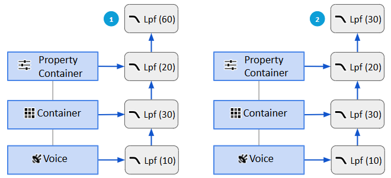

|  |  |
| --- | --- |
| **滤波器累计方式**。在本例中，我们为每个对象指定了 LPF 属性值。最终应用于声音的 LPF 值取决于所选的累计方式。 | |
|  | **Sum All Values**。将各个对象的 LPF 属性值加在一起。 |
|  | **Use Highest Value**。使用对象 LPF 属性值当中的最大值。 |

###### 配置滤波器行为

滤波器行为可通过 Project Settings（工程设置）来指定。

|  |  |
| --- | --- |
| [注意] | 注意 |
| 在更改滤波器行为时，Wwise 将执行以下操作：  - 修改 Work Unit 来针对滤波器属性调节 RTPC 曲线和 State 值。 - 保存、关闭并重新加载工程。  对 Work Unit 所作的修改无法撤消。若想稍后加以恢复，请确保在更改滤波器行为前保存工程副本。 |

**配置滤波器行为：**

1. 通过执行以下任一操作来打开 Project Settings 对话框：

   - 在 **Project**（工程）菜单中，选择 **Project Setting**。
   - 按 **Shift+K**。
2. 切换到 General（常规）选项卡。
3. 在 **Filter Behavior**（滤波器行为）分组中，选择所需滤波器行为：

   - **Sum All Values (Default)**。将滤波器属性值加在一起。
   - **Use Highest Value**。使用最大的滤波器属性值。
4. 点击 **OK** 以应用这些设置。

---

##### Understanding the dual-shelf filter

The dual-shelf filter (DSF) is a type of filter that can attenuate or boost high
frequencies. It is based on the filter design proposed by [Audfray, Rémi; Jot,
Jean-Marc; Dicker, Sam](https://aes2.org/publications/elibrary-page/?id=19780) and is well-suited for accurately simulating physical
acoustic effects such as diffraction. The DSF is also well-suited for situations where tone
control is desired over more dramatic filtering effects that the LPF provides.

The DSF is similar to conventional high-shelf filters (HSF) such as those encountered in the Parametric EQ plugin. However, there are differences between the two that are important to understand.

The filter's transition to the desired high frequency gain is more gradual compared to the conventional shelf filter. The following graph shows the filter response of a conventional HSF with a cutoff frequency of 1 kHz (blue) and DSF (orange). The high frequency gain of both filters is -20 dB. With the HSF, the transition to the high frequency gain of -20 dB begins at around 100 Hz and has a comparatively steeper slope. With the dual-shelf filter, the transition begins much earlier at around 15 Hz and has a much more gradual slope towards -20 dB.


|  |  |
| --- | --- |
| [备注] | 备注 |
| The shape of the transition region can be changed using the emphasis property (see [“Dual-shelf filter properties”一节](ch11s04s04.html#dual_shelf_properties "Dual-shelf filter properties")) |

For acoustics, the DSF's gradual slope is a more accurate representation of diffraction. The following image shows a hypothetical scenario of an emitter and various listeners (colored arrows) at different positions behind a wall (triangular shape). The graph on the right shows the filtering effects of diffraction as sound propagates from the emitter (X), around the wall, and eventually to the listeners. As observed in the graph, the effect of diffraction is a gradual reduction of higher frequency gains that is well-approximated by the DSF.

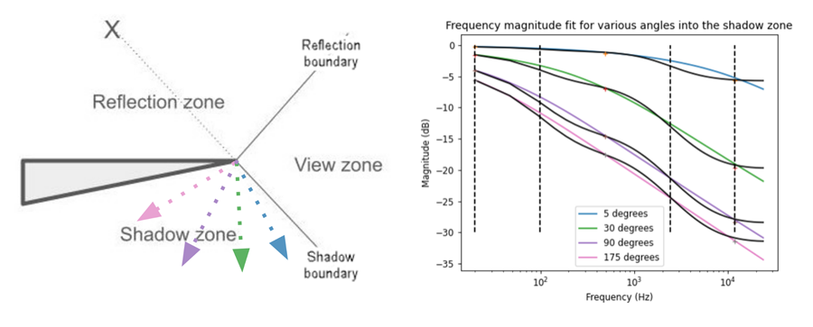

Another important difference between the DSF and conventional shelf-filter is that unlike the conventional HSF, you cannot change the cutoff frequency of the DSF. However this allows for better performance in terms of CPU cycles as many DSFs along a voice's signal path can be represented by just one equivalent filter (see [“Dual-shelf filter behavior”一节](ch11s04s04.html#dual_shelf_behavior "Dual-shelf filter behavior")).

###### Where dual-shelf filters can be used

DSFs are available in the following areas:

- Output Bus（输出总线）
- Game-defined Aux Sends
- Attenuation ShareSets

###### Dual-shelf filter properties

There are two properties that change the behavior of the DSF:

- High Frequency Gain
- Emphasis

Changing the DSF sliders in the vertical property editor and dual-shelf filter curves in attenuation sharesets changes the **high frequency gain**. The following graph shows the degree of high frequency attenuation or boost for various high frequency gain settings.

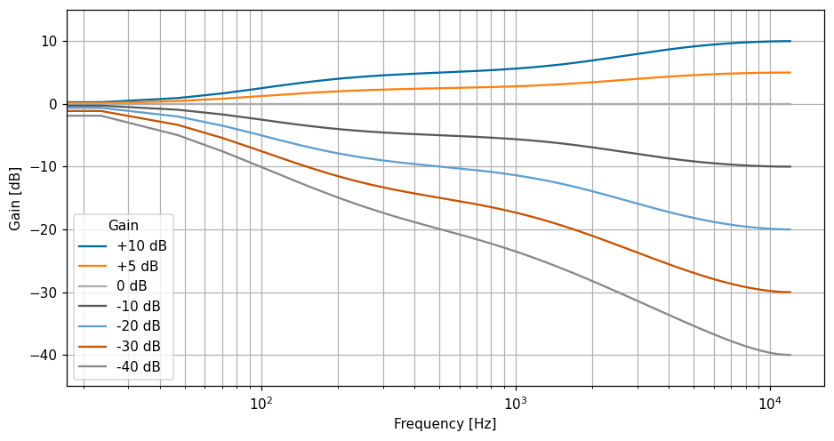

The emphasis property changes the shape of the DSF transition region. This property is similar to the 'Q' parameter, which affects the resonance of conventional shelf filters. Its range is -1 to + 1 and the default is 0.

The following graphs show the effect of emphasis in various settings. In the top graph, the high frequency gain is set to -20 dB. In the bottom graph, the high frequency gain is set to +10 dB.

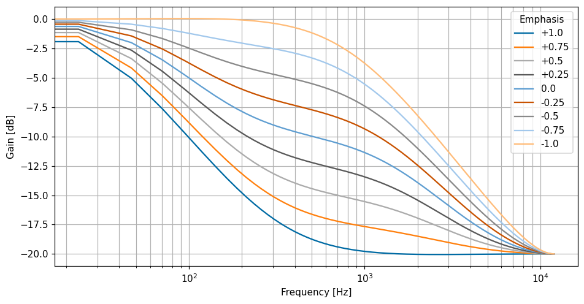

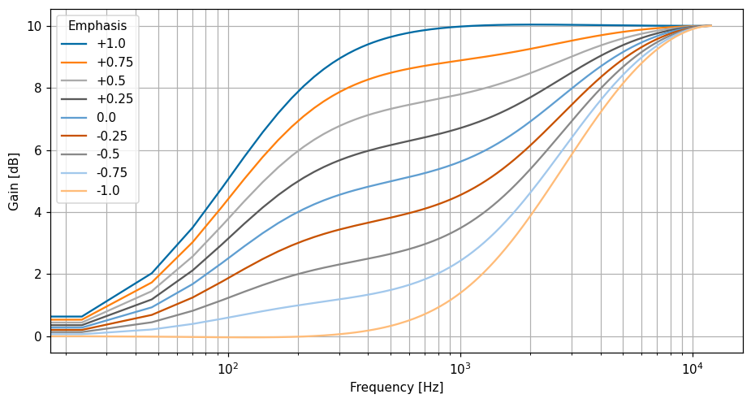

Emphasis is a global property that is changed in the Project Settings.


|  |  |
| --- | --- |
| [注意] | 注意 |
| The selected emphasis is applied to every DSF filter used in the Wwise project. |

###### Dual-shelf filter behavior

The DSF behavior is additive. When multiple DSFs are present along a signal's path, the high frequency gains are summed.

For example, if a voice signal goes through a distance DSF with -2 dB high frequency gain, then a diffraction DSF with -1 dB high frequency gain before finally going through the output bus DSF with -3 dB high frequency gain, the effective high frequency gain is -6 dB. Moreover, as an optimization, the sound engine will only be processing one effective DSF with the high frequency gain of -6 dB instead of creating 3 different DSF instances and processing them individually.

---

#### 通过随机化属性值来改善播放

在游戏当中，同一声音经常会播放不止一次。若要避免每次都播放同样的声音，则可使用 Randomizer 来修改每次播放的声音。

###### 启用 Randomizer 并设置其属性

您可以将 Randomizer 应用于任何带有 Randomizer 图标的属性。

| 图标 | Status | 描述 |
| --- | --- | --- |
|  | Randomizer 已启用 | 随机化器效果已应用到的属性值。 |
|  | Randomizer 已禁用 | 尚未应用随机化器效果的属性值。 |
|  | 随机化器 Mixed | Multi Editor 中只有部分对象为该属性值启用了 Randomizer 效果。Property Editor 或 Contents Editor 中不会看到这个标识。 |

**编辑 Randomizer 属性：**

1. 双击属性的 Randomizer 图标。
2. 在打开的 Randomizer 视图中，根据下表设置属性。

另外，还可通过右键单击属性的 Randomizer 图标并选择 **Enable Randomizer** 或 **Disable Randomizer** 来启用或禁用 Randomizer。

若要同时编辑多个对象的 Randomizer 属性，请在 Project Explorer 中将其全部选中，然后右键单击选中项并选择 **Show in Multi Editor**。

| Randomizer 视图 | |
| --- | --- |
| 界面元素 | 描述 |
| Enabled | 决定 Randomizer 是否作用于对象属性值。如勾选，则应用 Randomizer。如果未勾选，则 Randomizer 不会作用于对象属性值。  Default value: false |
| Min Offset | 用于设置属性的最小可能偏置值。  Default value: 0 |
| Max Offset | 用于设置属性的最大可能偏置值。  Default value: 0 |

Randomizer 视图标题栏会显示所选 Wwise 对象的名称或所选对象的数量（如选择了多个对象）以及所选的属性。

就像 [“Multi Editor”一节](ch60s12s03.html "Multi Editor") 一样，打开的 Randomizer 视图会根据 UI 聚焦位置重新加载相应的对象。除非明确改变属性，否则会一直显示最初加载的属性。Randomizer 视图中不会打开缺少当前所加载属性的对象。

###### 了解 Randomizer 属性

用户有必要了解 Randomizer 会如何应用于属性值。在播放声音对象时，对于每项支持 Randomizer 的属性：

1. 声音对象及其所有上级对象的 Randomizer（如启用）都会生成一个随机值。
2. Randomizer 值的总和会添加到最终属性值。最终属性值包含：

   - 对象属性值。
   - 属性上的 RTPC。
   - 属性上的 State。

无论最终属性值以何种方式计算，都会将最终 Randomizer 值添加到最终属性值。对于 Volume 和 Pitch 属性，始终通过将多个来源叠加来计算属性值。对于 Low-pass filter 和 High-pass filter 属性，则取决于所配置的 Filter Behavior。参阅：

- [“定义相对属性（音量、音高、LPF、HPF）”一节](ch11s04s02.html "定义相对属性（音量、音高、LPF、HPF）")
- [“了解滤波器属性行为（LPF 和 HPF）”一节](ch11s04s03.html "了解滤波器属性行为（LPF 和 HPF）")

下图展示了会如何计算 Voice 对象的 Volume 属性的最终 Randomzier 值。每个对象的 Volume 属性都启用了 Randomizer。最终 Randomizer 值 Rand 为 x、y 和 z 的总和。该值将添加到 Voice 对象的最终 Volume 属性。


---

#### Building Containers hierarchy tips and best practices

在 Wwise 中创建层级结构的方式非常灵活，在项目伊始就制定统一的策略可以节省后期的时间和精力。当然，处理音频工程的方法多种多样；了解相关概念可让游戏获得最佳效果。

###### Grouping objects in the Containers hierarchy

在构建层级结构之前，要构思组织对象的最佳方式。既要节省创作时间，又要更好地管理工程内存占用。关于如何对工程中的不同对象进行有效分组，以下是一些建议，请您根据实际需求选用。

The Property Container is the ultimate memory and CPU saver because some of the Property Container's properties, such as positioning and RTPCs, are shared by all of its child objects. So when you are considering how to organize your objects, think about grouping objects under Property Containers to:

- 共享属性设置，方便统一处理。
- 共享 Overrides （不沿用）属性，避免为多个子对象单独勾选 Override 和指定新值。

|  |  |
| --- | --- |
| [注意] | 注意 |
| Effects applied at the Property Container level is an efficient way to apply the Effect but will not save CPU usage. When you apply an Effect at the Property Container level, an instance of the Effect is applied to all child objects. 实时为各个对象处理效果可能会占用大量 CPU。 |

To optimize memory usage, consider grouping objects into Property Containers to share the following properties:

- 定位
- RTPC（实时参数控制）
- States（状态）
- 随机化器

Let's say you have a Property Container containing 10 sounds and you want to set the sound positioning to 3D. 可以为这些声音逐个勾选 Override Parent（不沿用父选项），并设置为 3D。However, doing it this way uses 10 times more memory at runtime than if you had set the Property Container positioning properties to 3D. Now if you wanted some of the sounds to be panned, you would still be optimizing memory if you set the Property Container's positioning to 3D Emitter. In this case you would override the Property Container and apply panning to the specific sounds because panned sounds do not require additional memory.

While the Property Container is usually your best choice, in certain situations, you can decide to apply properties in containers to optimize memory consumption. If, for example, you are only applying positioning to specific objects within a container, for example footstep sounds in a Random Container, you could save memory by applying the positioning properties to the container and not to the parent Property Container. If, however, you want all the objects in the structure to share the positioning properties, you would apply these at the Property Container level.

###### 为对象分组 C 示例

Let's have a look at how you can group objects in a Property Container effectively using some of the concepts we have just discussed. 本例中，您会处理游戏的对话素材，其中一些是角色语音，另一些是对讲机语音。You could group these under a Dialogue Property Container because you know that you want your dialogue to share properties such as volume, for example.

The following image shows that if you apply a volume setting once to the Dialogue
container, all the objects share the volume.

|  |
| --- |
|  |

Now that you have set your volume for the Property Container, you have decided to add a Parametric EQ effect on the radio dialogue only. You could edit each radio voice and override the Property Container settings for each and apply this effect. But you could also work more efficiently by grouping all the radio voice files together in a container and then override the Property Container settings and add the Effect on the container.

The following image displays using Override parent to add effects to a Dialogue
container.


###### 实时混音和对象属性

当您连接到游戏或游戏模拟器时，可以在 Wwise 中实时修改以下相对属性的值：

- Volume
- Pitch（音高）
- Low-Pass Filter（低通滤波器）
- Center %
- RTPC 值
- State 和 Switch 变换
- Triggers
- Attenuation 控件
- 部分音频和源效果器插件属性

|  |  |
| --- | --- |
| [备注] | 备注 |
| 一般情况下，任何可映射至 Game Parameter 的属性都可在游戏中实时修改。 |

为了能够做到这一点，您需要加载您想在 Transport Control 或 Soundcaster 中修改其属性的对象。如果未加载对象，则更改将不会生效，因为声音引擎中未注册该对象。For Property Containers, which cannot be loaded into the Transport Control, you can load a child object of the Property Container and this will register its parent objects in the sound engine. 在注册对象后，对象将在您连接到游戏时保持注册状态。

|  |  |
| --- | --- |
| [备注] | 备注 |
| 记住，如果您将对象固定在 Transport Control 中，则其它对象要到您取消固定第一个对象后才可加载。然而，如果您已将对象加载到 Soundcaster 中，则此对象将在声音引擎中注册。 |

###### 相对属性和性能

在不同平台上，Wwise 中的有些相对属性（如音高）可能会对性能造成影响。Wwise 中管理音高的机制是基于采样率的，改变声音的音高会增加 CPU 占用，因为必须对文件进行重新采样。

---

### 建立输出总线的结构

总线（bus）是一种用来对工程中对象进行分组的机制，目的是管理混音和最终声音输出，我们将在[Managing Output](ch34.html "管理输出")中进行详细介绍。但是，在工程完成之前，清楚各总线的角色以及它们的在整个工程结构中的工作方式至关重要。

就像需要为工程素材定义结构来以高屋建瓴的方式管理素材一样，您还需要为工程组织输出。By grouping output busses together in a hierarchical structure called the Busses hierarchy, you can define the relative properties, the States, RTPCs, as well as the Effects for the routing of your project.

您应花些时间来思考如何以最佳方式组织工程通路以优化混音过程。例如，您应通过将类似氛围音乐或炮火声的声音连接到相应总线来简化游戏音频的混音。

To begin, you must understand the default structure in your Busses hierarchy. It
consists of main busses, each with their own role and hierarchy: the Main Audio Bus
hierarchy and Secondary bus hierarchies.

#### The Main Audio Bus hierarchy

The Main Audio Bus hierarchy is a structure of output busses through which the sounds and music in your project are routed. 它包含三个不同层级的功能：

- **Main Audio Bus** - The top level element in the
  hierarchy that determines the final output of your audio. You can rename or
  delete any Main Audio Busses you create. You can also apply Effects to a
  Main Audio Bus and move it to a different work unit or virtual
  folder.
- **Audio Busses** - One or more optional busses that can be grouped under a Main Audio Bus to help in the organization and delivery of your sound mix. 您可重命名、移动和删除这些总线；还可以在总线上加效果器。
- **辅助总线** ―― 若干条可选总线，可分组到任何辅助总线或音频总线之下。与音频总线类似，您可以重命名、移动、复制和删除辅助总线；您还可以对辅助总线应用效果器。工程中任何位置的声音对象都可发送到 Auxiliary Bus，来调节音量、总线配置、定位和 RTPC 并应用效果器或状态。在辅助总线中无法做闪避、HDR 混音和声部调节。

|  |  |
| --- | --- |
| [备注] | 备注 |
| 辅助总线无法将音频总线作为子项。它们只能将其它辅助总线作为子项。 |

您可以通过以下 Wwise 界面图标来辨别两种总线类型：Audio Bus 和 Auxiliary Bus。

| 图标 | 代表 |
| --- | --- |
| |  | | --- | |  | | Audio Bus |
| |  | | --- | |  | | Auxiliary Bus |

下表列出了所有可能的 Audio Bus 和 Auxiliary Bus 处理状态图标。有关处理状态的详细信息，请参阅[“了解总线图标和处理状态”一节](ch34s11s01.html "了解总线图标和处理状态")章节。

| 图标 | 代表 |
| --- | --- |
| |  | | --- | |  |  (Audio Bus)  |  | | --- | |  |  (Auxiliary Bus) | Mixing |
| |  | | --- | |  |  (Audio Bus)  |  | | --- | |  |  (Auxiliary Bus) | Processing Audio Objects |
| |  | | --- | |  |  (Audio Bus) | Not Mixing |
| |  | | --- | |  |  (Audio Bus)  |  | | --- | |  |  (Auxiliary Bus) | Processing |

By default, the sounds from the Containers hierarchy are routed through the Main Audio Bus. 但是，在您建立输出结构时，您可以系统地将对象连通到您创建的总线上去。

|  |  |
| --- | --- |
| [备注] | 备注 |
| It is possible to create Work-Units and Virtual Folders under the Busses hierarchy. 这样便于在团队工作环境中管理总线结构。 |

您可以在 **Default Object Values**（默认对象值）对话框中更改工程的默认音频通路。有关这些默认设置的详细信息，请参阅[“为工程指定 Default Object Value”一节](ch06s03.html "为工程指定 Default Object Value")。

#### Secondary Bus 层级结构

Secondary Bus（二路输出）属于音频总线层级结构，用于为主输出（电视或扬声器）以外的其它输出信号内容进行混音。您可以为工程所需的各类型输出创建足够多的 Secondary Audio Bus（二路输出总线）。例如，二路输出可以用作游戏手柄扬声器、聊天耳机或者 DVR-bypass 输出。和主输出结构一样，二路输出结构也可以包含任意数量的子总线和辅助总线。

Sounds routed to the main secondary bus hierarchy will be sent to the secondary output using one of the two following approaches:

- 直接将声音的 **Output Bus**（输出总线）属性设置为 Secondary Bus 层级结构内的任何总线。对于通常只与一个二路输出相关联的声音，这是首选方法。例如，玩家开枪的声音，网球拍击球的声音、PDA （掌上电脑）声音、玩法反馈等。
- Routing a sound through any bus in a Main Audio Bus hierarchy and adding a user or game send to an Auxiliary Bus inside the secondary bus hierarchy. 如果希望同一声音在电视和多个输出（例如用手柄扬声器模拟间谍相机或广播）中同时听到，则这是首选方法。

总线层级只是混音时使用的层级结构。To associate that mix to a specific output, choose the appropriate **Audio Device** ShareSet on the corresponding main bus. 请参阅 Wwise 随附的 [“内置音频设备”一节](ch34s06.html "内置音频设备") 列表。

必须要注意的是，对于游戏中多个玩家可能同时使用的输出端（如游戏控制器、耳机等），相关混音层级结构会针对每个玩家进行复制。对于特定类型的输出，工程定义的仅仅是特定的混音“处方”。实际信号输出到该结构的哪个副本则取决于听者和游戏对象的关系，是由程序员设置的。

默认情况下，创作期间设计工具会将所有声音输出到主声卡，方便您预览声音。<However, you can select different hardware devices for testing. 请参阅 [“Selecting audio output devices”一节](ch04s05.html#setting_output_devices "Selecting audio output devices")。

#### 构建总线层级结构 C 示例

Wwise 为构建总线层级结构提供了很大的灵活性。也就是说，组织工程的声音结构时条条大路通罗马。尽管如此，以下简单示例仍为您提供了一些开发总线结构的常见做法，无论工程的素材和要求的具体组合形式。

In the following image, drawn from the Schematic View, we see a project organized
with four Audio Busses under a Main Audio Bus and three secondary master
busses.

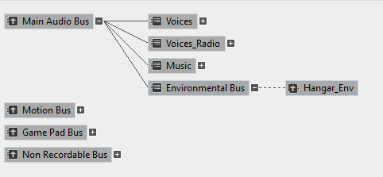

For the Main Audio Bus, we have the following busses:

- **Environmental Bus** -- 环境总线。此总线会基于不同环境因素（例如混响）对玩家可能听到的各种声音进行分组，例如玩家或其它角色走在砾石地板、木地板或水泥地板上的脚步声。
- **Music** -- 音乐。此总线会对所有音乐进行分组，无论这些音乐是在游戏场景中播放的，还是在游戏外操作 UI 菜单时播放的。
- **Voices** -- 语音。此总线会对大多数角色对话进行分组。
- **Voices\_Radio** -- 语音\_无线电。这款游戏中有大量的对话，还有很多语音需要特殊设置来表现无线电中发出的声音效果， 所以我们还在 Voices 这条总线之外添加了这条总线。组织这条总线的方式可能有很多，一种方式是将其设置为 Voices 总线的子总线。But, although conceptually similar, the desired sound output and the mixing it would imply made it easier for us to define it as a separate bus directly under the Main Audio Bus.

为了更方便地调节位于大型飞机库中的声音，我们还添加了一条辅助总线：**Hangar\_Env**。这样做后，当游戏场景移入飞机库时，我们可以将声音（手动或通过游戏调用）发送至该总线，我们可在此处运用玩家在此类环境中可能会听到的开放式回声的混响。

Then we have additional main busses, each feeding a secondary output:

- **Motion Bus** - 振动总线。此总线用于接收所有 Motion 信号（也称为 rumble），并将它们输出到相应的控制器。本例中不存在子总线，尽管对于振动也允许进行更复杂的混音。
- **Non Recordable Bus** - 非录音总线。系统允许有一条不会被 DVR (Digital Video Recorder) 录音的独立输出。希望防止玩家内录和发布版权音乐的话，这是理想的解决方案。对于防止玩家内录和发布版权音乐，这是理想的解决方案。
- **Game Pad Bus** - 游戏控制器。控制器的扬声器可输出玩家将更直接地听到或至少是能明显区分的声音。它非常适合像角色头部撞墙发出的沉闷的声音这样的情况。

|  |  |
| --- | --- |
| [技巧] | 技巧 |
| **建议不要同时将同一声音发送到二路总线和音频总线！** 每个系统都有特定的延迟量。即使是几毫秒的差异，同一声音的两条输出间的延迟也将会产生明显的不和谐。 |

|  |  |
| --- | --- |
| [备注] | 备注 |
| 您可以使用声音对象（包括音乐文件）生成振动数据。有关使用现有声音对象生成振动的详细信息，请参阅[“通过现有声音生成振动效果”一节](ch25s03s01.html "通过现有声音生成振动效果")。 |

**相关主题**

- [Wwise Fundamentals Module 13: Submixing with Additional Audio
  Busses](https://www.audiokinetic.com/en/courses/wwise101/?source=wwise101&id=submixing_with_additional_audio_busses)

---

#### Working with busses

###### 添加总线

To create the structure for your audio routing, you can add Audio Busses to the
Main Audio Bus. You can also create other main busses to mix for other outputs.
When using Motion, you should also create a main bus for motion devices, and route
all sounds (motion is only low-frequency audio) to a bus in that hierarchy. After
you have created a child bus under the main bus, you can create any number of
parent and child busses to build your routing structure.

**To add a child bus in the Busses hierarchy:**

1. 在 Project Explorer 的 Audio 选项卡中，右键点击您要为其创建新父总线子的总线。
2. 从菜单中，选择以下选项之一：

   - **New Child > Audio Bus**（新建子项 > 音频总线）。
   - **New Child > Auxiliary Bus**（新建子项 > 辅助总线）。

   The new child bus is added to the Busses hierarchy.

**To create a parent bus in the Busses hierarchy:**

1. 在 Project Explorer 的 Audio 选项卡中，右键点击您要为其创建新父总线的总线。
2. 从菜单中，选择以下选项之一：

   - **New Parent > Audio Bus**（新建父项 > 音频总线）。
   - **New Parent > Auxiliary Bus**（新建父项 > 辅助总线）。

   The new parent bus is added to the Busses hierarchy.

   |  |  |
   | --- | --- |
   | [备注] | 备注 |
   | 辅助总线不能位于层级结构的顶部。因此在层级顶部，New Parent > Auxiliary Bus 选项将禁用。 |

A Main Audio Bus can be added to any Work Unit or Virtual Folder in the Busses
Hierarchy, as long as there's no Main Audio Bus above that location in the
hierarchy.

**To add a new Main Audio Bus in the Busses hierarchy:**

1. In the Audio tab in the Project Explorer, right-click on a Work Unit or
   virtual folder in the Busses hierarchy.
2. 从菜单中，选择以下选项之一：

   - **New Child > Audio Bus**（新建子项 > 音频总线）。

   The new Main Audio Bus is added to the Busses hierarchy.

添加总线的另一种方法是，复制现有总线并将其粘贴至所需位置。

**To copy and paste an audio bus in the Busses hierarchy:**

1. In the Audio tab in the Project Explorer, right-click the desired bus in
   the Busses hierarchy.
2. 在菜单中，选择 **Copy**（复制）或按下 Ctrl+C。
3. Select another bus in the Busses hierarchy under which you'd like
   to paste the copied bus.
4. 在菜单中，选择 **Paste**（粘贴）或按下 Ctrl+V。

   这时将创建一条与所复制总线的设置完全相同的新总线，并在其名称结尾后缀 \_## 以示区分。

###### 移动总线

在已添加总线之后，您可能会需要更改总线的位置以产生总线之间的不同关系。

**To move a bus to another location in the Busses hierarchy:**

1. 将总线拖动到所需位置。

   总线及其子总线都会移动到新位置。通过更改位置，移动后的总线现在将受其新父属性影响。

###### 删除总线

如果您不小心创建了错误的总线或不再需要特定总线，则可以删除它。在删除一条总线时，其所有子总线也会被删除。连接到该总线上的对象现在已重新指派给该层级结构中的下一个父对象。对象重新指定通路后，其不沿用父对象（Override Parent）的属性保持不变。

下图说明了在删除某条总线后，会对该总线上传输的声音对象造成的影响。

|  |
| --- |
|  |

**To delete a bus in the Busses hierarchy:**

1. 在 Project Explorer 的 Audio 选项卡中，选择要删除的总线，然后执行以下操作之一：

   - 按 **Delete** 键。
   - 在总线的快捷菜单中，选择 **Delete Selection**（删除选中项）。
2. 总线及其子总线可能会被删除，之前连接到删除的总线上的对象现在会连接到父总线上进行传输。

---

#### 定义总线的属性

您可以使用总线属性来对游戏中的音频或振动进行全局更改。在定义总线属性时，您可以执行以下操作：

- [“通过现有声音生成振动效果”一节](ch25s03s01.html "通过现有声音生成振动效果")

由于总线是控制的最后一级，所以您所做的更改都将影响其下方整组对象。

与对象一样，您也可以向总线上添加效果器、使用 RTPC、指派状态以及设置高级属性。有关详细信息，请参阅以下几节：

- [“将 Effect ShareSet 应用于 Wwise 对象”一节](ch24.html#applying_an_effect_shareset_to_an_object "将 Effect ShareSet 应用于 Wwise 对象")
- [“使用 Game Parameter 控制属性值”一节](ch18s03.html "使用 Game Parameter 控制属性值")
- [“将 State 指派给对象和总线”一节](ch16s03.html "将 State 指派给对象和总线")
- [*管理优先级*](ch23.html "管理优先级")

###### 定义总线的相对属性

您可为层级结构中的各条总线定义相对属性。相对属性是累积的，也就是说，总线的属性值会累加到其下的子对象中。

以下是您可以为总线修改的相对属性：

- **Bus Volume** ―― 总线音量。用于直接调整总线的音量大小。
- **Voice Volume**（声部音量）C 总线中正在播放的音频对象所应用的衰减。
- **Voice Pitch**（声部音高）C 总线中正在播放的音频对象的播放速度。

您可以在 Multi Editor（多项编辑器）中同时为多条总线编辑这些属性。从 Project Explorer 的 Audio 选项卡中以及从快捷菜单中选择多条总线，选择 **Show in Multi Editor**。在连接到游戏的同时，您还可以实时微调这些属性。

**定义总线的相对属性的方法如下：**

1. 将一条总线加载到 Property Editor。
2. 键入一个值或拖动相应滑杆来为其中一个相对属性设置一个值：

   |  |  |
   | --- | --- |
   | [备注] | 备注 |
   | 不得在连通音乐对象的总线上操作音高属性。音频总线中对音高所做的更改不会影响音乐对象。 |

###### 闪避信号

在游戏中的有些时间点，需要突显某些音频信号。对此，我们可以通过闪避来完成这一操作：自动降低发送到一条或多条总线的对象的音量来突显另一总线的信号。比如，当角色正在说话的时候，会降低背景音乐的音量。当角色停止说话的时候，会恢复背景音乐的音量。

在接下来的时间线中，在当前总线播放声音时，其他总线将根据 Fade Out（淡出）和 Volume（音量）参数淡出。在当前总线的声音结束时，过了 Recovery time（恢复时间），接着再 Fade In（淡入）。

|  |
| --- |
|  |

|  |  |
| --- | --- |
| [备注] | 备注 |
| 除了自动闪避，我们还可以通过 Meter 效果器插件来实施旁链压缩。藉此，根据源总线的电平动态调节目标总线的电平。跟自动闪避相比，这样可以进行更便捷的控制：只要当前总线上有声音，无论声音的电平是多少，都会按预定设置降低被闪避总线的音量。有关详细信息，请参阅[“Using RTPCs to fine-tune the audio mix”一节](ch18s08.html "Using RTPCs to fine-tune the audio mix")和 [“Meter”一节](ch66s12.html "Meter")。 |

**闪避总线：**

1. 将一条总线加载到 Property Editor。这条是当前总线。它会导致其他总线被*闪避*或被降低音量。不过，闪避不适用于 Auxiliary Bus（辅助总线）。
2. 在 **Auto-ducking**（自动闪避）选项卡中，单击 **Insert...**（插入...）。
3. 在打开的 Project Explorer - Browser（工程资源管理器 - 浏览器）中，选中要在当前总线接收信号时闪避的总线。总线无法要求自己或其直接父总线闪避。
4. 单击 **OK**（确定）来将选定总线添加到窗格中。
5. 为总线设置属性：

   - **Volume**（音量）：决定要在当前总线接收信号时将被闪避总线的音量降低多少。
   - **Fade Out**（淡出）：决定从原始音量淡出到闪避音量需要多长时间。
   - **Fade In**（淡入）：决定淡入并恢复到原始音量需要多长时间。
   - **Curve**（曲线）：决定要使用哪种曲线形状来定义淡出和淡入。
6. 设置窗格中所有总线的共有属性：

   - **Recovery time**（恢复时间）：决定从当前总线信号终止到被闪避信号开始淡入需要多长时间。
   - **Maximum ducking volume**（最大闪避音量）：决定当前总线最多可将窗格中所列总线的音量降低多少。

###### 将音乐替换为玩家自己的音乐

Xbox One、Xbox Series X、PlayStation 4、PlayStation 5、iOS 和 Android 平台允许游戏玩家将游戏音乐替换为自己的音乐。对于所有平台，用户音乐播放时，您必须为要静音的所有总线启用 **Mute for Background Music** 选项。可以选择多条总线，这对音乐总线而言没有限制。

**将总线指派给平台的背景音乐选项：**

1. 将音频总线加载到 Property Editor。
2. 选择 **Mute for background music** 选项。

   现在，在用户通过游戏机上的音乐播放器播放音乐时，此总线将会静音。

平台不同，Mute for background music 的行为会稍稍有点不同。而且，在初始化声音引擎时，需要进行额外编程

- **Android**：Mute／Unmute（静音/取消静音）操作将仅在用户从音乐播放器应用程序切换至游戏时才会出现。也就是说，如果用户音乐自己结束播放了，那么就无需“Unmute”。
- **iOS**：如果在声音引擎初始化设置中设置了 AudioSession 标志（flag）“MixOther”，则 只有在用户从音乐播放器应用程序切换至游戏时才会做 Mute／Unmute 操作。也就是说，如果用户音乐自己结束播放了，那么就无需“Unmute”。在 iOS 8 和更高版本中，如果使用的是 AVAudioSessionCategoryAmbient 类别，则出现任何应用程序的音频中断时，游戏音乐都会发生静音和取消静音。
- **Xbox One、Xbox Series X、PlayStation 4 和 PlayStation 5**：某些平台具有 DVR 功能，可让游戏玩家录制并发布其游戏过程。这会带来一些法律问题，其中涉及到游戏音频当中受版权保护的音乐或用户可替换音乐。虽然游戏工作室有权在其游戏中使用所述音乐，但最终用户可能无权以任何形式对其进行分发。因此，平台要求中通常规定不允许录制用户背景音乐。对此，我们可以采用一种经济高效的解决方案（就 CPU 而言）来将游戏中的音乐和其余声音分开进行混音。使用 Secondary Output（二路输出）功能可完成该操作。

  对于禁止录制的声音，Xbox One、Xbox Series X、PlayStation 4 和 PlayStation 5 提供了专门接收它们的虚拟设备。You will need to create a new main bus to be able to define a different mix for this DVR-bypass Audio Device. 然后更改该新的总线上的 Audio Device 属性，使其指向 DVR-bypass 设备。随后声音可以正常输出到新的总线或子总线中。有关详细信息，请参阅[“了解 Secondary Output”一节](ch34s07.html "了解 Secondary Output")。

---

#### 了解基于对象的音频

基于对象的音频管线允许 Wwise 将各个音频缓冲区连同相应的元数据一并发送到平台操作系统中负责音频的组件（即*终端*）。支持 [*[3D Audio](go01.html#glossary_3daudio "3D Audio")*](go01.html#glossary_3daudio) 的终端可使用此元数据（包括 3D 位置和朝向）来渲染自身的空间化效果。这样可在传输声音的过程中最大限度地提升空间定位精度，因为终端会识别收听配置。藉此，终端可选用最适合的渲染方式来经由耳机或扬声器输出最终混音。

音频缓冲区及对应元数据结合在一起便构成所谓的 *Audio Object*（音频对象）。Bus Hierarchy（总线层级结构）中的 Audio Object 与发送到终端的 System Audio Object 不同。在将总线配置设为 Audio Objects 时，该总线可搭载不同类型的 Audio Object（如 3D 对象、多声道对象、非空间化对象等）。

每个 Audio Object 均可包含：

- 3D 空间化信息（不含亦可）。
- 插件元数据（不含亦可）。(This could be inserted directly on the Audio Object from the Containers hierarchy, or Metadata could be propagated to the Audio Object as it passes through a bus that has a Metadata plug-in.)
- 一个或多个声道。

以下章节详细介绍了如何设定 Audio Object 并确保将其发送到终端：

- [“设定 Audio Object”一节](ch12s03s01.html "设定 Audio Object")
- [“System Audio Device 的作用”一节](ch12s03s02.html "System Audio Device 的作用")
- [“Metadata”一节](ch12s03s03.html "Metadata")

---

##### 设定 Audio Object

以下章节阐述了设定 Audio Object 并确保将其发送到 System Audio Device 以便转换为 System Audio Object 所需执行的四个主要步骤：

- [“为工程启用 3D Audio 和 Audio Object”一节](ch12s03s01.html#enabling_audio_objects "为工程启用 3D Audio 和 Audio Object")
- [“将背景环境声输出到 Main Mix”一节](ch12s03s01.html#routing_to_main_mix "将背景环境声输出到 Main Mix")
- [“将音乐输出到 Passthrough Mix”一节](ch12s03s01.html#routing_to_passthrough "将音乐输出到 Passthrough Mix")
- [“将对空间定位精度要求严格的声音输出到 Audio Objects 总线”一节](ch12s03s01.html#routing_to_audio_objects "将对空间定位精度要求严格的声音输出到 Audio Objects 总线")

###### 为工程启用 3D Audio 和 Audio Object

The following steps ensure that the processing status of the Main Audio Bus will be resolved as **Processing Audio Objects**  and that the System Audio Device will sort its output into three streams: Main Mix, Passthrough Mix, and System Audio Objects.

1. 在 Project Explorer（工程资源管理器）的 Audio（音频）选项卡中，双击 System Audio Device（系统音频设备）来打开 Audio Device Editor（音频设备编辑器）。

   
2. 在 Audio Device Editor（音频设备编辑器）中，选中 **Allow 3D Audio**（允许 3D 音频）和 **Allow System Audio Objects**（允许系统音频对象）。

   
3. 将 **Minimum System Audio Objects Required**（至少所需系统音频对象数）的值设为在构建工程时为了获得适宜的听觉体验至少需要同时播放的独立 3D 单声道声音数量。记住，若此值大于终端支持的 Audio Object 数量，则将 System Audio Device 收到的所有 Audio Object 输出到 Main Mix。注意，必须在终端相关文档中查看并确认终端支持的 Audio Object 数量。

   

   在实施性能分析时，可确认终端是否支持并启用了 [*[3D Audio](go01.html#glossary_3daudio "3D Audio")*](go01.html#glossary_3daudio)。终端的状态由 Audio Device Editor 中的 **Is 3D Audio Active**（是否激活了 3D 音频）予以指示。

   

有关如何针对 Windows 设定 Audio Object 的详细信息，请参阅 Wwise SDK 文档中的[Enabling 3D Audio](https://www.audiokinetic.com/library/edge/?source=SDK&id=windows_specificinfo.html#Windows_Enabling_3DAudio) 章节。

###### 将背景环境声输出到 Main Mix

Main Mix 最适合需要实施双耳处理但无需精确定位 Audio Object 的声音。Main Mix 也叫 Spatialized Bed，是声音的中间表示形式，其位置按照基于声道的格式（如 5.1、7.1、7.1.4、Ambisonics）进行渲染。藉此，可生成适合进行虚拟化（即根据理想的扬声器位置实施虚拟定位）和双耳化处理的混音。

1. In the Audio tab of the Project Explorer, right-click the **Main Audio Bus** and select **New Child** > **Audio Bus**. 键入所需的名称。
2. 打开与新建 Audio Bus（音频总线）对应的 Property Editor（属性编辑器）。Set **Configuration** to **Same as main mix**.

   
3. 针对每个要作为 Main Mix（主混音）的一部分发送到终端的背景环境声对象，打开与之对应的 Property Editor（属性编辑器），然后选择新建的 Audio Bus（音频总线）作为 **Output Bus**（输出总线）。注意，可能需要选中 **Override parent**（不沿用父对象）。

   

###### 将音乐输出到 Passthrough Mix

Passthrough Mix 为立体声配置，可旁通原本可能要在终端执行的 3D 处理。这样可以确保保留全频和原始声道配置的声音。因此，Passthrough Mix 非常适合音乐和其他非剧情声音（如用户界面反馈）。

1. In the Audio tab of the Project Explorer, right-click the **Main Audio Bus** and select **New Child** > **Audio Bus**. 键入所需的名称。
2. 打开与新建 Audio Bus（音频总线）对应的 Property Editor（属性编辑器）。Set **Configuration** to **Same as passthrough mix**.

   
3. 针对所有要作为 Passthrough Mix（直通混音）的一部分发送到终端的对象，打开与之对应的 Property Editor（属性编辑器），然后选择新建的 Audio Bus（音频总线）作为 **Output Bus**（输出总线）。注意，可能需要选中 **Override parent**（不沿用父对象）。

   

###### 将对空间定位精度要求严格的声音输出到 Audio Objects 总线

Audio Objects 尤其适合对定位精度要求严格的声音，这些声音通常与游戏对象关联。每个 Audio Object 都包含可由终端用来模拟方向性的元数据（如位置和散布）。对此，可结合最终用户的收听配置，来最大限度地提升空间定位精度。

1. In the Audio tab of the Project Explorer, right-click the **Main Audio Bus** and select **New Child** > **Audio Bus**. 键入所需的名称。
2. 打开与新建 Audio Bus（音频总线）对应的 Property Editor（属性编辑器）。Set **Configuration** to **Audio Objects**.

   
3. 针对每个要作为 System Audio Object（系统音频对象）发送到终端的声音对象，打开与之对应的 Property Editor（属性编辑器）。

   - Select the newly created Audio Bus as the **Output Bus**. 注意，可能需要选中 **Override parent**（不沿用父对象）。

     
   - Ensure:

     - 启用 **Listener Relative Routing**（听者相对通路）。
     - 将 **3D Spatialization**（3D 空间化）设为 **Position**（位置）或 **Position + Orientation**（位置 + 朝向）。
     - 将 **Speaker Panning / 3D Spatialization Mix**（扬声器声像摆位/3D 空间化混音）设为 100%。
4. 针对每个要输出到 Audio Objects（音频对象）总线的声音，右键单击声音并选择 **Show in Schematic View**（在对象网络视图中显示）。这时将打开 Schematic View。
5. 察看声音经由总线层级结构的路径。确保其不会被输出到混音总线 。在将 Audio Object（音频对象）输出到混音总线时，会销毁其元数据（包括 3D 位置信息）。
6. 确保所有 Audio Object（音频对象）最终被输出到 System Audio Device（系统音频设备）。其他类型的 Audio Device 会对 Audio Object 进行渲染。

有关管线其余部分的详细信息，请参阅 [“System Audio Device 的作用”一节](ch12s03s02.html "System Audio Device 的作用") 章节。

---

##### System Audio Device 的作用

System Audio Device（系统音频设备）是唯一一种支持 Audio Object（音频对象）的内置 Wwise Audio Device。System Audio Device 会根据终端的性能和 System Audio Device 设置决定要将哪些输出发送到终端。

System Audio Device 将按照以下规则选择是将 Audio Object 输出到 Main Mix、Passthrough Mix 还是 System Audio Object：

- 只有满足以下所有要求才会将 Audio Object 作为 System Audio Object 输出到终端：

  - 其设有 **3D Spatialization**。
  - 其 **Speaker Panning / 3D Spatialization Mix**（扬声器声像摆位/3D 空间化混音）被设为了 100%。
  - 其具有不带任何高度声道的标准声道配置。
  - 有足够的 System Audio Object 可供容纳其所有声道。换句话说，在实施性能分析时，Audio Device Editor（音频设备编辑器）中显示的 **System Audio Objects Used**（所用系统音频对象数）不得超过 **Available System Audio Objects**。

    

    |  |  |
    | --- | --- |
    | [备注] | 备注 |
    | 最好不要超出 Available System Audio Objects 的最大限值。对于输出到 Main Mix 的其余 Audio Object，可能会进行不同的处理，最终产生明显的变化。System Audio Object 采用先进先出的优先次序进行分配。 |
- 只有满足以下所有要求才会将不符合上述要求的 Audio Object 输出到 Passthrough Mix：

  - 其采用单声道或立体声声道配置。
  - 其没有 3D 位置。
- 不符合上述全部要求的 Audio Object 将被输出到 Main Mix。对于输出到 Main Mix 的音频，会渲染为 System Audio Device 的 Main Mix 的输出配置。此配置可使用 Audio Device Editor 中的 **Main Mix for Binauralization** 或 **Main Mix for Home Theater** 设置来定义；若两者均被设为 **Use Game-Defined Settings**，则由终端对 Main Mix 配置进行初始化。在这种情况下，Main Mix 配置可满足不同听觉环境的需要。

|  |  |
| --- | --- |
| [备注] | 备注 |
| Audio Object 的插件元数据中定义的 **Mix Behavior**（混音行为）可改写上述默认行为。有关详细信息，请参阅 [“Metadata”一节](ch12s03s03.html "Metadata") 章节。 |

|  |  |
| --- | --- |
| [备注] | 备注 |
| 在 System Audio Device 收到具有 3D 位置和多个声道的 Audio Object 时，会先将其拆分为多个单声道 System Audio Object（每个声道对应一个），然后再发送到终端。比如，对于采用立体声配置的 Audio Object，将拆分为两个 System Audio Object。注意，LFE 声道将被弃用。比如，对于采用 5.1 声道配置的 Audio Object，将拆分为五个 System Audio Object（弃用 LFE 声道）。 |

有关更多详细信息，请参阅 [“了解声部管线”一节](ch34s05.html "了解声部管线") 章节。

---

##### Metadata

元数据是一组与 Audio Object（音频对象）关联的属性，专门供终端或对象处理器使用。元数据允许终端或对象处理器执行各种涉及 Audio Object 的计算，以此生成相应的空间化效果。

A Metadata tab is available in the Primary Editor of all objects and busses in Wwise.

元数据插件仅适用于某些终端或对象处理器。不同的元数据插件所含的各种属性不尽相同。这些属性包括 3D Position（3D 位置）、Azimuth（方位角）、Elevation（高度角）、Focus（聚焦）、Spread（散布）等等。在将元数据插件添加到 Metadata 选项卡时，会将一组属性与 Wwise 对象或总线关联。对于总线，会将元数据填写到所有输出到总线和子总线的对象。

|  |  |
| --- | --- |
| [注意] | 注意 |
| 若将 Audio Object 输出到处于 Mixing（正在混音）状态的总线，则所有与 Audio Object 关联的元数据都会被销毁。有关详细信息，请参阅 [“了解总线图标和处理状态”一节](ch34s11s01.html "了解总线图标和处理状态") 章节。 |

在默认情况下，Wwise 中提供 Wwise System Output Settings 元数据插件。对于其他元数据插件，可通过 Audiokinetic Launcher 加以安装。

###### Mix Behavior

Audio Object 的 Metadata 选项卡中所选 Mix Behavior（混音行为）会改写 System Audio Device（系统音频设备）原本要执行的默认混音行为。

可能的 Mix Behavior 包括：

- **Use Default**（使用默认设置）：允许 System Audio Device 选择最适合此 Audio Object 的目标。有关详细信息，请参阅 [“System Audio Device 的作用”一节](ch12s03s02.html "System Audio Device 的作用") 章节。
- **Mix to Main**（混音到主混音）：强制将 Audio Object 输出到 Audio Device 的 Main Mix。
- **Mix to Passthrough**（混音到直通混音）：强制将 Audio Object 输出到 Audio Device 的 Passthrough Mix。若 Audio Device 不支持 Passthrough Mix，则将 Audio Object 输出到 Main Mix。

---

### Setting up projects for DLC

There are two important things to consider if you plan to add downloadable content (DLC) to
your game.

First, you need to manage your sound structures and media in such a way that one or more DLCs can be merged into the base game. Depending on the changes you make, you have to either repackage existing SoundBanks or add new ones. 有关详细信息，请参阅[“Requirements and best practices for DLC SoundBanks”一节](ch40s08s01.html "Requirements and best practices for DLC SoundBanks")。

Second, you need to plan for packaging so that DLC can be delivered separately from the base
game. Depending on the game engine you are using, packaging requirements and recommendations vary:

- If you are using the Wwise Unreal Integration or the Wwise Unity Integration, we
  recommend that you use the engine packaging options: bulk data packaging for Unreal, or
  Addressables for Unity. For more information, see [Packaging Wwise Assets as Bulk Data](https://www.audiokinetic.com/library/edge/?source=UE4&id=using_features_package_as_bulk_data.html) (Unreal) or [DLC Packaging Tutorial](https://www.audiokinetic.com/library/?source=Unity&id=pg_addressables_tutorial.html) (Unity).
- If you are using a different engine, you can use the Wwise File Packager, but make sure to follow the best practices for DLC. 有关详细信息，请参阅[“Packaging DLC files”一节](ch41s05.html "Packaging DLC files")。

---

## 与游戏互动

本章节包含有关如何使用 Event、Dynamic Sequence 和 Wwise Game Sync 驱动游戏声音的概念和步骤。

- **[*管理 Event*](ch14.html "管理 Event")**C 创建 Event；添加 Action 并为其指派 Target；设置 Event Action 的属性；定义 Event Action 的作用域。
- **[*管理动态对话*](ch15.html "管理动态对话")**C 了解 Dynamic Dialogue 系统；使用 Dialogue Event 和 State；创建路径和后备路径；使用 Probability 和 Weight 功能。
- **[*使用 State*](ch16.html "使用 State")**C 创建 State Group；定义 State 之间的 Transition；将 State 指派给对象和总线。
- **[*使用 Switch*](ch17.html "使用 Switch")**C 创建 Switch 和 Switch Group；将 Game Parameter 值映射到 Switch；将对象指派给多个 Switch Group。
- **[*使用 RTPC*](ch18.html "使用 RTPC")**C 管理 RTPC 中所用的 Game Parameter；使用 Game Parameter 控制属性值；使用 RTPC 坐标图；构建智能音高曲线；使用 LFO、Envelope、Time Modulator；设置旁链压缩。
- **[*使用 Trigger*](ch19.html "使用 Trigger")**C 创建 Trigger；了解 Trigger 机制。
- **[*将 State 和 State Group 用于动态对话*](ch20.html "将 State 和 State Group 用于动态对话")**C 创建 State 和 State Group 并用于 Dynamic Dialogue（含实用示例）。

---

### 管理 Event

Wwise 使用 Event（事件）来驱动游戏中的声音、音乐、对话和振动。事件可确定在游戏中的任意时刻上播放何种声音、音乐、振动或对话。为尽可能多地满足各种情况的要求，提供了两种 Event：

- 动作 Event
- Dialogue events（对白事件）

“动作”事件包含包含若干个动作（Action），这些动作会被用于工程层级结构内不同声音、音乐或振动结构。您选择的动作将指定 Wwise 对象是否播放、暂停、停止等。例如，以下事件可能说明一款游戏中的某处，角色离开多风的田野进入神秘洞穴。

|  |
| --- |
|  |

  

|  |  |
| --- | --- |
| [备注] | 备注 |
| 在大多数情况下，Play 事件与 Stop 动作事件甚至 Pause 或 Resume 事件配对。如果不想为这些类型的动作分别创建单独的事件，则作为替代，您可以使用 Wwise SDK 对声音执行这些动作。有关详细信息，请参阅[“以编程方式停止、暂停和继续播放声音”一节](ch14s05.html#stopping_pausing_and_resuming_sounds_programmatically "以编程方式停止、暂停和继续播放声音")。 |

Dialogue Events, on the other hand, use a type of decision tree containing 状态 Groups to dynamically determine what 对象 is played. 有关对白事件的详细信息，请参阅[*管理动态对话*](ch15.html "管理动态对话")。

在 Wwise 中创建“动作”事件后，这些事件可集成到游戏引擎中，以便在游戏中的适当时间调用这些事件。由于游戏引擎使用事件名称或 ID，因此您可以创建事件，将这些事件集成到游戏中去，之后建立并微调事件的内容，而不必将事件重新集成到游戏中去。只要事件名称或 ID 未更改，就无需额外编程。这为您试用不同对象、添加或删除某些对象以及微调对象之间的过渡提供了极大的灵活性。

为了帮助您轻松识别界面中的事件，事件由以下图标来代表。

| 图标 | 代表 |
| --- | --- |
| |  | | --- | |  | | Event |

#### 使用 Event C 示例

假定您正在创建一款奇幻角色扮演游戏。您知道在游戏的一关中，角色将从森林进入洞穴。您希望在角色进入洞穴时环境音效发生改变。在工程开始阶段，您可以在 Wwise 中使用临时或占位符声音创建一个事件（Event）。该事件将包含一系列动作，这些动作将停止环境“森林”声音并播放环境“洞穴”声音。在创建该事件后，该事件可集成到游戏中，接下来就可以在适当时间触发该事件了。由于在初始集成之后无需额外编程，所以您可以试用不同的声音、添加和删除动作，以及更改动作属性，直到声音听上去满意为止。

下图说明了游戏中动作、事件以及播放的声音之间的关系。

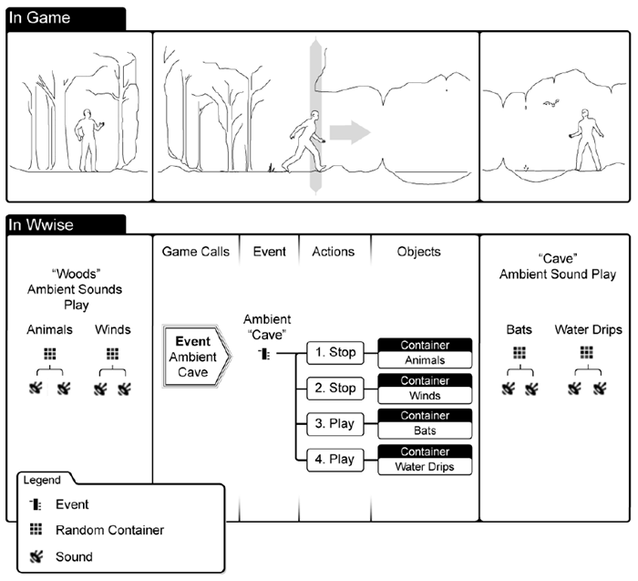

**相关主题**

- [Wwise Fundamentals Module 1: From silence to sound](https://www.audiokinetic.com/en/courses/wwise101/?source=wwise101&id=quick_start_from_silence_to_sound)

---

#### 事件 Action 的类型

Wwise 自带多种动作（Action），这些动作可用于驱动游戏中声音、音乐和振动。动作按类别进行分组，每个类别都包含一系列供您选择的动作。

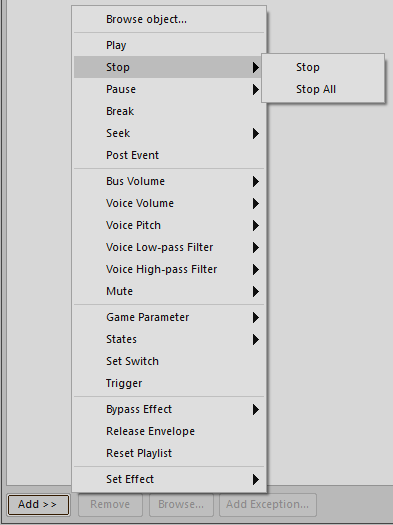

每个动作还有一组属性（例如延迟和淡变），可用于更好地管理输入和输出的对象。下表介绍了所有的事件动作。

|  |  |
| --- | --- |
| [备注] | 备注 |
| 以下为一般描述，没有考虑每个 Action 的 Scope 设置。Scope 可以是 Game Object 或 Global，用于指定存在多个游戏对象时，动作的作用范围。 |

| 事件动作类型 | 描述 |
| --- | --- |
| Empty Event | 不包含动作或对象。 |
| Play | 播放关联对象。 |
| Stop > Stop | 停止播放关联对象。 |
| Stop > Stop All | 停止所有对象的播放，但可以添加例外。 |
| Pause > Pause | 暂停关联对象的播放。 |
| Pause > Pause All | 停止所有对象的播放，但可以添加例外。 |
| Resume > Resume | 恢复播放之前暂停了的关联对象。 |
| Resume > Resume All | 恢复所有暂停对象的播放，但可以添加例外。 |
| Break | 停止播放循环声音或连续容器，同时允许当前对象完成播放。 |
| Seek > Seek | 更改关联 Wwise 对象的播放位置。此操作不会影响当前未播放的对象。 |
| Seek > Seek All | 更改所有 Wwise 对象的播放位置，但可以添加例外。此操作不会影响当前未播放的对象。 |
| Post Event | 从事件内触发别的事件。 |
| Bus Volume > Set Voice Volume | 更改关联总线的音量电平。 |
| Bus Volume > Reset Volume | 将关联总线的音量复位至其原始电平。 |
| Bus Volume > Reset Volume All | 将所有总线的音量复位至其原始值，但可以添加例外。 |
| Voice Volume > Set Voice Volume | 更改关联对象的音量电平。 |
| Voice Volume > Reset Volume | 将关联对象的音量恢复至其原始电平。 |
| Voice Volume > Reset Volume All | 将所有对象的音量复位至其原始值，但可以添加例外。 |
| Voice Pitch > Set Voice Pitch | 更改关联对象的音高。 |
| Voice Pitch > Reset Pitch | 重置音高，将关联对象的音高复位至其原始值。 |
| Voice Pitch > Reset Voice Pitch All | 将所有对象的音高复位至其原始值，但可添加例外。 |
| Voice Low-pass Filter > Set Voice Low-pass Filter | 更改作用于关联 Wwise 对象的低通滤波器效果量。 |
| Voice Low-pass Filter > Reset Voice Low-pass Filter | 将作用于关联 Wwise 对象的低通滤波器效果量复位至其原始值。 |
| Voice Low-pass Filter > Reset Voice Low-pass Filter All | 将所有 Wwise 对象的 Low-Pass Filter 复位至其原始值，但可以添加例外。 |
| Voice High-pass Filter > Set Voice High-pass Filter | 更改应用于关联 Wwise 对象的高通滤波器数量。 |
| Voice High-pass Filter > Reset Voice High-pass Filter | 将应用于关联 Wwise 对象的高通滤波器恢复至其原始值。 |
| Voice High-pass Filter > Reset Voice High-pass Filter All | 将所有 Wwise 对象的 High-Pass Filter 复位至其原始值，但可以添加例外。 |
| Mute > Mute | 将关联对象静音。 |
| Mute > Unmute | 将关联对象恢复为其原始“静音前”音量电平。 |
| Mute > Unmute All | 将所有对象复位至静音前的原始电平，但可以添加例外。 |
| Game Parameter > Set Game Parameter | 更改游戏参数值。 |
| Game Parameter > Reset Game Parameter | 恢复游戏参数的原始值。 |
| States > Set State | 激活特定状态。 |
| States > Enable State | 在应用 Disable State Action 后，为相关 Wwise 对象重新启用 State。 |
| States > Disable State | 为关联 Wwise 对象禁用状态。 |
| Set Switch | 激活特定切换开关。 |
| Trigger （触发器） | 调用 Trigger，以启动 Stinger。 |
| Bypass Effect > Enable Bypass | 旁通作用于关联 Wwise 对象的效果器。 |
| Bypass Effect > Disable Bypass | 删除效果器旁通会将效果器重新作用于关联 Wwise 对象。 |
| Bypass Effect > Reset Bypass Effect | 重置旁通效果器。将关联对象的旁通效果器选项复位至其原始设置。 |
| Bypass Effect > Reset Bypass Effect All） | 将所有 Wwise 对象的旁通效果选项复位至其原始值，但可以添加例外。 |
| Release Envelope | 释放与 Wwise 对象关联的包络。 |
| Reset Playlist | 将指定随机容器/序列容器的播放列表重置为初始状态。这不会影响连续模式播放，也不会影响当前播放的声音。 |
| Set Effect > Set Effect | 设置效果器。覆盖指派给 Wwise 对象上的单个效果器插槽的效果器。 |
| Set Effect > Reset Effect | 重置“设置效果器”。将被 "Set Effect" Action 覆盖的某个对象的给定效果器插槽重置。 |
| Set Effect > Reset Set Effect All | 重置所有“设置效果器”。将被 "Set Effect" Action 覆盖的所有对象的给定效果器插槽重置。 |

---

#### 创建 Event

游戏中的所有对象都是由 Event 驱动的。事件创建过程涉及以下步骤：

- [“创建新的 Event”一节](ch14s02.html#creating_new_event "创建新的 Event")
- [“将 Action 添加到 Event”一节](ch14s02.html#adding_actions_to_an_event "将 Action 添加到 Event")
- [“将目标指派给 Event Action”一节](ch14s02.html#assigning_objects_to_event_actions "将目标指派给 Event Action")
- [“定义 Event Action 的作用域”一节](ch14s02.html#defining_scope_of_an_event_action "定义 Event Action 的作用域")
- [“设置 Event Action 的属性”一节](ch14s02.html#setting_properties_for_an_event_action "设置 Event Action 的属性")

为了给您提供额外的可控性和灵活性，事件可执行一个动作或一系列动作。事件的管理可使用事件编辑器来完成。

在跨平台创作时，您可能会需要从特定平台弃用某些动作。在默认情况下，所有 Action 都包含在 Event 中，但是您可以根据平台进行自定义。有关跨平台创作的详细信息，请参阅[“Excluding project elements from a platform”一节](ch35s01.html#excluding_project_elements_from_platform "Excluding project elements from a platform")。

如果您作为团队的一份子参与同一工程，则可以将事件指派给不同的工作单元，以便各个团队成员都可同时处理不同事件。有关处理工作单元的详细信息，请参阅[“将工程分成 Work Units”一节](ch09s01.html "将工程分成 Work Units")。

###### 创建新的 Event

创建新 Event 时，可以执行以下操作之一：

- 创建不包含动作或目标的空 Event。
- 创建包含特定动作的事件。
- 创建不包含动作或目标的空 Event。

|  |  |
| --- | --- |
| [技巧] | 技巧 |
| 您还可以在 Event Viewer（事件查看器）中通过右键点击来创建事件。在通过 Event Viewer 添加事件时，您还必须将事件指派给特定工作单元。 |

**创建空 Event 的方法如下：**

1. 在 Project Explorer 中，切换至 Events 选项卡。
2. 执行以下操作之一：

   - 选择工作单元或虚拟文件夹，然后点击 Project Explorer 工具栏中的 **Event** 图标。
   - 右键点击工作单元或虚拟文件夹，然后从快捷菜单中选择 **New Child** > **Empty Event**（空事件）。

   新事件已在您在 Project Explorer 中选择的工作单元或虚拟文件夹内创建成功。
3. 将默认名称替换为最适合事件的名称。

   |  |  |
   | --- | --- |
   | [备注] | 备注 |
   | 事件名称中只能包含不带变音符号的的罗马字母、数字和下划线。名称还必须以字母或下划线开头。 |

**创建包含动作的事件的方法如下：**

1. 在 Project Explorer 中，切换至 Events 选项卡。
2. 右键点击要添加事件的工作单元或虚拟文件夹。
3. 从快捷菜单中，选择 **New Child** 以显示事件动作列表。
4. 在 Action 列表中选择 Action 类别或 Action。（选择前者时，将显示包含一系列 Action 的子菜单；请从中选择一个 Action。）

   包含所需动作的新事件已在您在 Project Explorer 中选择的工作单元内创建成功。
5. 将默认名称替换为最适合事件的名称。

   |  |  |
   | --- | --- |
   | [备注] | 备注 |
   | 事件名称中只能包含不带变音符号的的罗马字母、数字和下划线。名称还必须以字母或下划线开头。 |

**创建包含 Action 和目标的事件方法如下：**

1. 在 Project Explorer 的 Audio 选项卡中，选择事件中要包含的一个或多个目标，然后右键单击选项。

   此时将会显示快捷菜单。
2. 选择以下选项之一：

   - **New Event**（新建事件），创建包含所需对象的事件。
   - **New Events (One event per object)**（新建事件（每个对象一个事件）），为每个所选对象创建一个事件。
   - **New Event (Single event for all objects)**（新建事件（所有对象一个事件）），创建一个包含所有所选对象的事件。
3. 在 Action 列表中选择 Action 类别或 Action。（选择前者时，将显示包含一系列 Action 的子菜单；请从中选择一个 Action。）

   于是我们在事件编辑器中创建成功了若干个事件，里面包含所选的动作和对象。
4. 在 **Name**（名称）字段中，将默认名称替换为最适合事件的名称。

   |  |  |
   | --- | --- |
   | [备注] | 备注 |
   | 事件名称中只能包含不带变音符号的的罗马字母、数字和下划线。名称还必须以字母或下划线开头。 |

###### 将 Action 添加到 Event

必须定义事件中要包含的 Action。每个事件都可包含若干个动作。

**将动作添加到事件的方法如下：**

1. 在 Event Editor 中，单击 **Add >>** 按钮。

   此时将会显示动作列表。
2. 从 Action 列表中选择 Action 或 Action 类别。（选择前者时，将显示包含一系列 Action 的子菜单；请从中选择一个 Action。）

   所选的 Action 将被添加到事件。

   现在，可以给事件中的 Action [指派目标](ch14s02.html#assigning_objects_to_event_actions "将目标指派给 Event Action")或者继续为事件添加 Action。

可通过几种其它方式将 Action 添加到事件，如：

- 将 Project Explorer 中的一个或多个元素拖动到 Event Editor 的 Event Action 窗格空白处。随即将生成适用于元素的 Action，但是可以自由更改它。
- 在 Event Editor 的 Event Action 窗格空白处打开快捷菜单后，从其中选择 **New Action**选项。显示的选项与单击 **Add >>** 按钮相同，后者请参阅上面的“将 Action 添加到 Event”列表。
- 可以使用标准 Copy 和 Paste 快捷方式或快捷菜单选项，同时复制和粘贴若干个 Action。

###### 将目标指派给 Event Action

大多数事件动作必须指派给特定对象、结构或游戏同步器。包含一个或多个 Action 但未关联目标的事件称为 Orphaned Event（落单事件）。这些落单事件将显示在 Event Viewer 的 Orphans（落单）选项卡中。这些落单事件也会在您为工程生成完好度报告（Integrity Report）时显示。

为了帮助您识别 Event 中对象的状态，对象名称将以以下一种颜色显示：

- **白色** ―― 表示包含的对象。（在当前平台中。）
- **灰色** ―― 表示未包含的对象。（在当前平台中。）
- **红色** ―― 表示缺失关联对象的事件动作或当前工程缺失的对象。
- **黄色** ―― 表示目前从当前工程中卸载的对象。

|  |  |
| --- | --- |
| [备注] | 备注 |
| 将音乐对象指派给特定 Action（例如 Trigger、Set Switch 以及 Set State）时，请注意这些 Action 可能会延迟，这是因为在音乐对象中可能已经预先定义了这些特定 Action 发生的时刻。 |

**将目标指派给 Event Action 的方法如下：**

1. 在 Event Editor 中，选择要为其指派目标的 Action。
2. 点击 **Browse**（浏览）。

   此时将会显示 Project Explorer - Browser。
3. 浏览层级结构并选择要指派给动作的对象。
4. 单击 **OK**（确定）。

   对象于是指派给 Action 了。

|  |  |
| --- | --- |
| [技巧] | 技巧 |
| 您还可以通过将某对象从 Project Explorer 拖至 Event Action 列表中的动作，来将该对象指派给相应事件动作。 |

###### 定义 Event Action 的作用域

创建事件时必须定义每个 Action 的 Scope。Scope 会指定 Action 在游戏对象中作用的范围。Scope 会指定 Action 在游戏对象中作用的范围。对于某些 Action，您可以选择 Scope；对于其它 Action，Scope 是预先定义好的。

例如，假定您为玩家离开游戏进入菜单这种情况创建了一个事件。This Event will play the “Enter\_Menu” sound, pause all the sounds related to the player, and set the State to “Menu.” In turn, the "Menu" State is set to decrease the volume of the Main Audio Bus by 20 dB, but to increase the volume of the "Music" Audio Bus by 20 dB.

这些事件中各个事件的范围如下所示：

| 事件动作类型 | Scope（作用域） | 备注 |
| --- | --- | --- |
| Play > Menu\_Enter | Game Object | 由于 Play Event 总是由一个游戏对象触发，作用域会设置为 Game Object。 |
| Pause All | Global 或 Game Object | 在该场景中，玩家角色即为调用 Event 的 Game Object。暂停玩家相关的声音，可以让您在阅读菜单时不受干扰。因此，虽然可以将 Scope 设置为 Global，但在这种情况下，使用 Game Object 范畴将允许玩家仍然听到游戏中的其它声音。 |
| Set State > Menu | Global | Set State 的作用域始终为 Global，原因是工程中所有使用该 State 的地方都会响应状态变化。In our scenario, we have a "Menu" State set up on the Main Audio Bus and our "Music" Audio Bus. 让前者音量降低，后者音量增加。  |  |  | | --- | --- | | [备注] | 备注 | | 本示例旨在对 Scope 进行说明，并非最佳音频设计选择。实际上，如果两条总线都是 [Mixing](ch34s11s01.html "了解总线图标和处理状态") Bus，在音量更改时会出现非常短的延时，可能会发出类似 click 或 buzz 的噪声。此外，如果“Music”Audio Bus 上存在线性效果器，则不一定能够保持该总线的音量恒定。不过，在该情况下，我们还可以使用 Bypass Effect Action。 | |

  

**定义 Event 的作用域：**

1. 从 **Scope** 列表中，选择以下选项之一：

   - **Game object**，将事件动作作用于触发事件的游戏对象。
   - **Global**，将事件动作作用于所有游戏对象。

###### 设置 Event Action 的属性

各个事件动作都有一组可用于进一步美化游戏声音、音乐和振动的相关属性。

各个动作都包含不同的属性，但这些属性分别属于以下类别之一：

- 延迟
- Transitions（过渡）
- 旁通效果器属性
- 音量、音高、LPF、游戏参数、跳转、状态或切换开关设置。

|  |  |
| --- | --- |
| [备注] | 备注 |
| 在设置包含音乐对象的某些事件动作的延迟属性（例如触发、设置状态以及设置切换开关）时，请注意实际延迟可能会比指定值要长，这是因为在音乐对象中可能已经预先定义了这些动作发生的时刻。 |

**设置事件动作属性的方法如下：**

1. 在 Event Editor 中，从 Event Action 窗格中选择 Action。

   与所选 Action 关联的属性将显示在 Action Property 窗格中（右侧）。
2. 根据需要为关联的属性指定值。

###### 播放 Event

在创建过程中，您随时都可以试听事件。

|  |  |
| --- | --- |
| [备注] | 备注 |
| 为了试听振动，相应振动设备必须连接到您的电脑。 |

**播放事件的方法如下：**

1. 执行以下操作之一：

   - 在 Event Viewer 中选择一个事件。
   - 将事件加载到 Event Editor（事件编辑器）中。

   事件于是加载到 Transport Control 中来了。
2. 点击 Transport Control 中的 **Play**（播放）图标。

   事件已播放。

|  |  |
| --- | --- |
| [备注] | 备注 |
| 您还可以使用 Soundcaster（声音选角器）播放事件。有关使用 Soundcaster 的详细信息，请参阅[“在 Soundcaster 中试听”一节](ch36s02s01.html "在 Soundcaster 中试听")。 |

---

#### 处理 Event

由于在初始集成事件之后无需额外编程，所以您可以试用不同对象、更改现有对象属性、添加和删除动作以及更改动作属性，直到一切如您所愿为止。

###### 重命名事件

在创建事件后 Wwise 会自动为该事件提供一个名称。这时最佳的做法是用更具描述性的名称对这个事件重新命名。各个事件不得重名，并且名称名称只能包含字母、数字和下划线。第一个字符必须是字母或下划线。

|  |  |
| --- | --- |
| [备注] | 备注 |
| Unless absolutely necessary, you shouldn't rename an Event after it has been integrated into the game. If you rename an Event after it has been integrated into a game, you must also update any instances of the name in the game. The Event will not work until you do this, including while remote connected in either of the Profile and Edit modes. |

**重命名事件的方法如下：**

1. 在 Event Editor（事件编辑器）中，在 **Name**（名称）字段内点击鼠标。

   该事件的名称处于突出显示状态。
2. 为事件键入新名称。

|  |  |
| --- | --- |
| [备注] | 备注 |
| 您也可以在 Project Explorer 的 Events 选项卡中重命名事件。 |

###### 从 Event 中移除 Action

在您试用和建立事件（Event）时，您可能需要从事件中删除若干个动作（Action）。只要事件名称不更改，您可以删除动作而无需额外编程。

**删除 Event 中的 Action**

1. 在 Event Editor 中，选择要从 Event 中删除的 Action。
2. 点击 **Remove**（移除）按钮。

   该动作于是就从事件中删除了。

|  |  |
| --- | --- |
| [技巧] | 技巧 |
| 您也可以删除 Event 中的 Action，方法是选择 Action 并按 Delete 键，或者选择 Action 快捷菜单中的 Delete选项。 |

###### 替换指派给 Event Action 的目标

您可能需要用其它对象替换特定对象，以判断它们在游戏中是否合适。即使在事件已集成到游戏中后，您仍可自由试用不同声音、动作、振动以及动作（Action）等。

**替换指派给 Action 的目标对象的方法如下：**

1. 在事件编辑器中，选择要为其替换对象的动作。
2. 点击 **Browse**（浏览）。

   |  |  |
   | --- | --- |
   | [备注] | 备注 |
   | **Browse** 按钮位于 Event Editor 的底部；不过，在从 Target 列的快捷菜单选择 Set Target 时也会显示 **Browse** 选项。 |

   或打开所选 Action 目标的快捷菜单。

   此时将会显示 Project Explorer - Browser。
3. 浏览层级结构并选择要指派给 Action 的新对象。
4. 单击 **OK**（确定）。

   Action 的新目标对象将显示在 Target 列中。

|  |  |
| --- | --- |
| [技巧] | 技巧 |
| 将适用于 Action 类型的对象从 Project Explorer 拖至 Event Editor 中的 Event Action，替换 Action 的目标。Action 的新目标对象将显示在 Target 列中。  如果对象不适合 Action，则无法拖动它。 |

###### 在 Schematic View 中显示 Event 的对象

如果要查看 Event 中包含的特定对象的工程结构或管线，可通过 Schematic 视图进行快速显示。

**在 Schematic 视图中显示 Event 目标对象管线的方法如下：**

1. 在 Event Editor 中，右键单击要查看其管线的目标对象。

   此时将会显示快捷菜单。
2. 点击 **Show in Schematic View**（显示在对象网络图中）。

   The sound or music 管线 is displayed in the Schematic view.

###### 删除 Event

如果您不再需要某事件，则可以将其删除。在删除某个事件之前，您可能会需要验证它是否被团队中其它成员用在工程中的其它部分，以及它是否已包含在其中一个 SoundBank 中了。如果您或团队中的其他人删除了某个包含在 SoundBank 中的事件，那么这样会产生一个无效的事件。Wwise 不会自动从 SoundBank 中删除事件或其它无效工程元素，因此您将需要手动删除它们。为了帮助您在 SoundBank 内找到这些类型的事件和对象结构，Wwise 会通过 SoundBank 编辑器的 Add（添加）选项卡在名称之后添加单词“Missing”（缺失）。有关无效事件的详细信息，请参阅[“从 SoundBank 中移除工程元素”一节](ch40s03s04s07.html "从 SoundBank 中移除工程元素")。

**删除事件的方法如下：**

1. 执行以下操作之一：

   - 在 Project Explorer 的 Events 选项卡中，右键点击要删除的事件，然后从快捷菜单中选择 **>Delete Selection**。
   - 在 Event Viewer 中，点击要删除的事件，然后按 **Delete** 键。

   于是事件删除掉了。

|  |  |
| --- | --- |
| [备注] | 备注 |
| 如果您误删除了某事件，则可以撤消删除，方法是按 **Ctrl+Z** 或点击 **Edit** > **Undo**。 |

---

#### Event Limiting

The Event Limiting properties of an Event allow you to limit the playback of Events by filtering Post Event commands received from the game.

###### Limit

The Limit property sets the maximum number of concurrent Event playbacks for the same Event. When a Post Event command is received by the Sound Engine, the command will be discarded if the number of concurrent Events for this Event is reached.

|  |  |
| --- | --- |
| [备注] | 备注 |
| Setting a value of 0 instances (displayed as Infinite in the Event Editor) disables the Limit property. |

**To set the Limit property:**

1. In the Event Editor, click in the **Limit** field.
2. Select or type the Limit value.

###### Cooldown Time

The Cooldown Time property limits the rate, in seconds, at which Post Event commands are accepted by the Sound Engine. When a Post Event command is accepted and processed by the Sound Engine, other Post Event commands for the same Event will be discarded for the duration of the Cooldown Time property.

|  |  |
| --- | --- |
| [备注] | 备注 |
| Setting a time value of 0 seconds disables the Cooldown Time property. |

**To set the Cooldown Time:**

1. In the Event Editor, click in the **Cooldown Time** field.
2. Type the Cooldown Time limit value, in seconds.

###### Scope

The Scope property specifies the extent to which the Event Limiting properties are applied to objects within the game. There are two possible values:

- **Global:** The Global scope will apply the limits set by the Event Limiting properties to all Post Event commands received for the same Event, regardless of the Game Object for which they are specified.
- **Game Object:** The Game Object scope will apply the limits set by the Event Limiting properties to Post Events commands received for the same Event only for the Game Object for which they are specified.

|  |  |
| --- | --- |
| [备注] | 备注 |
| If both the Limit and the Cooldown Time properties are disabled, the Event Limiting Scope property is also disabled. |

**Example:** An Event has the following Event Limiting properties:

- Limit: 1
- Cooldown Time: 0.0s
- Scope: Game Object

For this example event, there may be concurrent instances of the Event, but the Event Limiting will only allow one instance of the Event per Game Object, because of the Limit property in combination with Scope property. The Cooldown Time property is not applied, as it is disabled by being set to 0 seconds.

---

#### 事件技巧和经验总结

以下各段将介绍一些可帮助您更好管理工程中事件的技巧和经验总结。

###### 重命名事件

更改 Event 名称前，请检查 Event 是如何集成到游戏中的。如果事件已使用包含事件名称的字符串或 Wwise\_IDs.h 头文件中的 ID 进行了集成，则更改名称将需要额外编程方能使用相应事件。

###### 组织事件

您可以使用工作单元和虚拟文件夹来组织工程中的事件。在工程中有多人同时工作时，将事件划分成多个工作单元可能会很有用处。例如，各个团队成员可在其自己的个人事件工作单元中创建事件。将您的事件划分到不同的工作单元不会影响您的工作效率或工作流程，而且这样做还能避免令人沮丧且费时的修复合并冲突。

###### 将游戏 Event 与 Wwise 中的 Event 匹配

您可以使用 SoundBank 定义文件（SoundBank definition file）来跟踪哪些事件已经集成到游戏中、缺失哪些事件以及还需要在 Wwise 中创建哪些事件。音频程序员可生成游戏的事件列表，然后您可以将定义文件导入 Wwise。您可以使用日志文件中的信息来对游戏中的事件与 Wwise 中创建或缺失的事件进行匹配。有关 SoundBank 定义文件的详细信息，请参阅[“通过导入定义文件创建并填充 SoundBank”一节](ch40s03s02.html "通过导入定义文件创建并填充 SoundBank")。

###### 以编程方式停止、暂停和继续播放声音

Event 信息存储在声音引擎的 Default Memory（默认内存）类别中。为了避免使用过多的内存，可使用 Wwise SDK 中的 [`ExecuteActionOnEvent()`](https://www.audiokinetic.com/library/edge/?source=SDK&id=namespace_a_k_1_1_sound_engine_ac55e3d6ac464b0579a8487c88a755d8c.html) 函数来以编程方式停止、暂停和恢复播放声音。除了创建成对的播放/停止事件以外，您可以创建单个 Play Event，再配套调用 ExecuteActionOnEvent 函数来停止播放这个声音。如果您需要暂停和恢复声音，则无需创建两个单独的事件，只需使用上述相同的函数来执行暂停和 Resume 动作即可。这样可以大大减少工程中的 Event 数量，并释放 Default Memory 类别中的宝贵空间。为了提供额外的可控性，在以编程方式停止、暂停和恢复声音时，您还可以指定淡出时间。有关 ExecuteActionOnEvent 函数的详细信息，请参阅 Wwise SDK 文档。

###### 使用 "Set Voice Pitch" Event 创建音高包络

对于最自然的声音，音高实际上会在一段时间内波动或改变，直到其到达其稳定状态（steady state）或“保持”（sustain）电平。要创建此效果器，您可以使用音高包络。Wwise 不支持预编的音高包络，但您可以通过创建包含多个连续 Set Voice Pitch 动作的事件来靠近该行为。事件中各个 Set Voice Pitch 动作都可在动作属性中的其中一个预定义曲线之后调整一段时间内的音高。当然，序列中最后一个动作可能需要为 Reset Voice Pitch，以便使游戏对象回到其原始状态。

---

### 管理动态对话

当今许多游戏（包括即使战略、体育和冒险游戏）都具有动态的或由游戏中发生的动作驱动的音频组件。对于游戏中可存在的所有不同变量和结果，此类音频的确成为脚本作者和音频设计者的严峻挑战。要涵盖每种条件或结果的所有不同对话组合，您可能需成千上万的素材和复杂的切换容器层级结构。这可能导致内存使用成本非常高昂。为了简化开发流程并降低总体内存消耗，Wwise 引入了 Dynamic Dialogue（动态对白）系统。

Dynamic Dialogue 系统允许在 Wwise 中便捷而高效地构建和管理动态音频。它使用决策树结构内的一套规则来确定要在游戏的任何特定时刻播放哪段对话。

这个系统已经很强大了，而 Wwise SDK 中还有其它功能使您能够在此基础上更进一步，创建运行时的动态序列，这非常适合体育游戏中的现场解说评论。在 Wwise 中，您可以将对话分解为个别单词或小短语，然后将这些对话指派给决策树结构内的特定路径。当游戏播放时，特定单词会提交给声音引擎，这些单词会在该引擎中动态连接在一起以形成流畅而精确到样本点的句子。因为单词和小短语是单独存在的，所以它们还可以多种方式进行组合并复用。有关将动态序列集成到游戏中的详细信息，请参阅  [Wwise SDK 文档](https://www.audiokinetic.com/library/?source=SDK&id=integrating__elements__dynamicdialogue.html) 。

|  |  |
| --- | --- |
| [备注] | 备注 |
| 虽然创建对白事件的初衷是处理游戏对话，但对白事件不只可以用于对白，在游戏中还可以有多种用途，包括处理各种地表类型上的脚步声。 |

#### 了解 Dynamic Dialogue 系统

Wwise 的 Dynamic Dialogue（动态对白）系统的核心是 Dialogue Event（对白事件）。简单来说，Dialogue Event 是一套用于决定要播放哪段对白的规则或条件。Dialogue Event 可用于表现游戏中存在的各种场景、条件或结果。为了确保涵盖所有情形，Wwise 还可以创建默认或后备条件。

所有这些条件是通过使用一系列状态组和状态来定义的。这些状态组和状态可进行组合以创建路径，这些路径可定义游戏中的特定条件或结果。各条路径于是可以与 Wwise 中的特定声音对象进行关联。在游戏进行过程中，随着各个对白事件被调用，游戏会用对白事件中定义的路径来验证当前的条件。与游戏中当前情况以及各条路径的模式、概率和权重匹配的路径可确定播放哪段对话（如果有的话）。

例如，以下对白事件包含与体育游戏中各个玩家名称相关的状态组。各个状态组里的各个值可组合起来以创建可能存在的不同路径或条件。在本例中，解说员可使用玩家的姓氏或全名。

|  |
| --- |
|  |

当没有状态与游戏中的当前情形相匹配时，用户可以创建一条由默认或后备状态构成的路径。这些“后备”路径包含若干个状态组而非状态，并且通常与一个更一般化的声音对象相关联。在前面例子中，后备路径被关联到了声音对象 Them 而非某位选手的姓名。

在 Dialogue Event 中重现了所有条件后，即可将其集成到游戏引擎。在游戏调用 Dialogue Event 时，声音引擎会返回与匹配路径对应的音频对象，以此解析 Dialogue Event。接着，声音引擎便可决定是否将音频对象插入到动态序列中以供播放。“返回音频对象”和“将其插入到动态序列中”之间并非一对一的关系。也就是说，对于解析的每个 Dialogue Event，都可根据需要将返回的音频对象多次添加到动态序列中。

|  |  |
| --- | --- |
| [备注] | 备注 |
| 在创建动态对话时，您与音频程序员紧密合作至关重要，因为许多功能都仅在 Wwise SDK 中可用，包括将单词或短语连接在一起形成句子的能力。 |

由于游戏引擎使用的是对白事件的名称，因此用户可以先创建事件并把它们整合到游戏中，然后再对各个事件的内容进行构建和精雕细琢，此时就无需再把它们重新整合到游戏中了。这给了您极大的灵活性，您可以添加或移除状态，并且能够对不同的声音进行试验，所有这些都无需额外的编程。

|  |  |
| --- | --- |
| [注意] | 注意 |
| 添加、删除和移动对白事件内的状态组将自动修改路径。虽然此类更改可在 Wwise 中轻松完成，但还是需要程序员介入，因为代码将需要相应更新。 |

为了帮助您轻松识别界面中的对白事件，对白事件由以下图标来代表。

| 图标 | 代表 |
| --- | --- |
| |  | | --- | |  | | 对白事件 |

#### 使用 Dialogue Event C 示例

假定您正在创建一款有现场解说评论的冰球游戏。在玩家射门得分时，您希望现场解说对应游戏中的此动作。

为了设置 Wwise 中不同的可能性和结果，您将需要为玩家、动作、过渡等创建对白事件。每个事件都包含一组您已创建好的相应状态组和状态。您必须为每个条件和结果创建一条路径，然后将适当的语音对象指派给各条路径。玩游戏期间，游戏将依据您在 Wwise 中定义的路径匹配当前状态，以确定要播放哪个语音对象。

下图说明了在 Wwise 中创建的对白事件如何能够生成现场解说“克劳斯（Cross，人名）射门，球进了”。

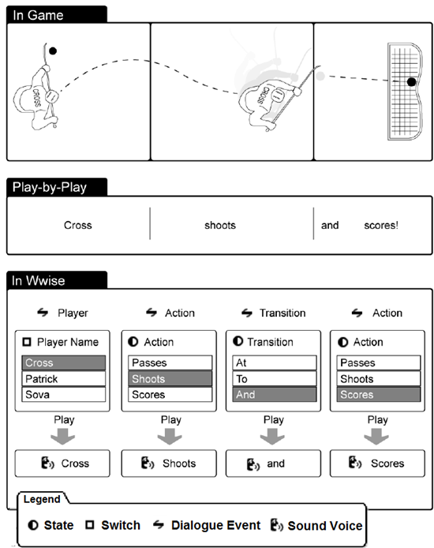

上图经过简化，以说明状态组和对白事件如何能够用于您的游戏。但是，在大多数情况下，游戏将需要更多包含多种不同状态组和状态的复杂对白事件。Wwise 使您能够建立各种更复杂的情景，可使游戏中的动态对话更真实。

下面展示玩家对白事件的一个复杂一点的例子。注意这个对白事件是如何包含多个状态组的。在您有多个状态组时，选中的状态会创建该路径。您可以为状态组和状态的每个组合创建一条路径，然后为每条路径指派一个对象。在游戏中符合特定路径内的每个状态时，指派给该路径的语音对象将会播放。

|  |
| --- |
|  |

---

#### 创建 Dialogue Event

游戏中动态对话的规则要在 Dialogue Event（对白事件）内定义。这些事件的创建涉及以下步骤：

- [“创建新的 Dialogue Event”一节](ch15s01s01.html "创建新的 Dialogue Event")
- [“定义 Dialogue Event 设置”一节](ch15s01s02.html "定义 Dialogue Event 设置")
- [“将 State Group 添加到 Dialogue Event”一节](ch15s01s03.html "将 State Group 添加到 Dialogue Event")
- [“使用 Path 重现游戏中的条件”一节](ch15s01s04.html "使用 Path 重现游戏中的条件")
- [“将对象指派给路径”一节](ch15s01s05.html "将对象指派给路径")

您可以在 Dialogue Event Editor（对白事件编辑器）中管理对白事件。

  

|  |  |
| --- | --- |
| [技巧] | 技巧 |
| 如果您需要创建多条路径，则可以使用快捷方式来创建。要加快创建过程，将 Project Explorer（工程浏览器）中的对象拖放到路径中最后一个未选中状态。Wwise 将自动创建新路径并将对象指派给该路径。有关此快捷方式的详细信息，请参阅[“Dialogue Event 技巧和经验总结”一节](ch15s03.html "Dialogue Event 技巧和经验总结")。 |

---

##### 创建新的 Dialogue Event

在项目的开始阶段，最好花些时间定义动态音频总体需求，方法是分析游戏并将其分解为可管理的组分。在您手头有所有必要的信息时，您可以创建游戏所需的所有对白事件的列表。在创建了这个列表之后，您在 Wwise 中处理和创建事件就会容易多了。

|  |  |
| --- | --- |
| [备注] | 备注 |
| 如果您的团队合作处理同一个工程，则可以将对白事件指派给不同工作单元，以便各个团队成员可同时处理不同的对白事件。有关处理工作单元的详细信息，请参阅[“将工程分成 Work Units”一节](ch09s01.html "将工程分成 Work Units")。 |

**创建新 Dialogue Event 的方法如下：**

1. 在 Project Explorer 中，切换至 Events 选项卡。
2. 在 Dynamic Dialogue（动态对话）部分中，执行以下操作之一：

   - 选择工作单元或虚拟文件夹，然后点击 Project Explorer 工具栏中的 **Dialogue Event**（对白事件）图标。
   - 右键点击工作单元或虚拟文件夹，然后从快捷菜单中选择 **New Child** > **Dialogue Event**（新建子项 > 对白事件）。

   新对白事件于是在您选择的工作单元中创建成功了。
3. 将默认名称替换为最适合对白事件的名称。

   |  |  |
   | --- | --- |
   | [备注] | 备注 |
   | Dialogue Event 名称只能包括不带变音符号的罗马字母、数字和下划线。名称还必须以字母或下划线开头。 |

---

##### 定义 Dialogue Event 设置

对于各个对白事件（Dialogue Event），您需要定义概率设置和模式设置。Probability（概率）设置方便控制 Dialogue Event 实际将音频对象提交到声音引擎以供播放的概率。在提交后，声音引擎便可决定是否将音频对象插入到动态序列中。若该值为 100%，则表示每次游戏调用 Dialogue Event 都会将音频对象提交到声音引擎。若该值为 0，则表示无论在任何情况下都不会将音频对象提交到声音引擎。如果您不希望每次触发对白事件时播放音频，则此选项会特别有用。例如，在格斗比赛中，您可能不希望解说员在格斗选手之间每次发生接触时都进行解说。为了避免此类情形中过度触发音频，您可以把对白事件的概率设置调低。

利用模式设置，您可以进一步控制几条路径同时匹配游戏当前条件这类情形中对白事件的行为。您可以选择两个选项中的一个：Best Match（最佳匹配）和 Weighted（加权）。

**定义对白事件设置的方法如下：**

1. 将对白事件加载到 Dialogue Event Editor。
2. 为对白事件指定 0-100 中的一个概率值。Probability 值决定 Dialogue Event 将音频对象提交到声音引擎以供播放的概率。

   |  |  |
   | --- | --- |
   | [备注] | 备注 |
   | 对白事件的概率可与路径概率值组合在一起工作。 |
3. 当有多个预定义路径都符合运行时触发的 State 时，为了指定声音引擎将以何种方式选择路径，请选择 **Mode 列表**中选项之一：

   - **Best Match**：最佳匹配。选择与运行时触发的 State 最匹配的路径。如果不能完全匹配，则将会选择具有最少通配符 (\*) 的路径。
   - **Weighted**：加权。基于各路径的权重值，随机选择匹配路径之一。

---

##### 将 State Group 添加到 Dialogue Event

各个对白事件（Dialogue Event）包含一组反映游戏内存在的不同条件和结果的规则。这些规则是用 State Group（状态组）和 State（状态）来定义的。在将状态组添加到对白事件中去时，相应状态也会被添加进去。

**将状态组添加到对白事件中的方法如下：**

1. 将对白事件加载到 Dialogue Event Editor。
2. 在 Project Explorer 中，切换至 Game Syncs 选项卡。
3. 在 State Groups（状态组）部分，选择您要添加到对白事件中的若干个状态组。
4. 将状态组拖至 Dialogue Event Editor 的 State Groups 窗格。

   这些状态组和相应的状态就显示在 Dialogue Event Editor 中了。

---

##### 使用 Path 重现游戏中的条件

在 Dialogue Event 中添加了 State Group 和 State 后，您需要设置规则，用来表现游戏中的每个条件和结果。做到这点，需要将不同状态组和状态组合成路径（Path）。

由于涵盖每种情况或结果可能很困难，所以您最好创建每当声音引擎遇到尚未定义特定路径这种情形时可使用的后备或默认路径。这些后备路径使用状态组而非状态。

###### 利用 State 创建路径

通过从对白事件内的各个不同状态组（State Group）中选择一种状态（State），您可以重建游戏中的不同条件和结果。选中的各个状态构成了一条路径。每条路径可与一段对话相关联，以便在游戏中出现特定的条件或结果时， 播放适当的语音对象。

|  |  |
| --- | --- |
| [技巧] | 技巧 |
| 如果您需要创建多条路径，则可以使用快捷方式来创建。要加快创建过程，将 Project Explorer 中的对象拖放到路径中最后一个未选中状态上去。Wwise 将自动创建新路径并将对象指派给该路径。有关此快捷方式的详细信息，请参阅[“Dialogue Event 技巧和经验总结”一节](ch15s03.html "Dialogue Event 技巧和经验总结")。 |

**创建路径的方法如下：**

1. 将对白事件加载到 **Dialogue Event Editor**。
2. 为对白事件中各个状态组点击一个状态。

   **Add Path**（添加路径）变成激活状态。
3. 点击 **Add Path** 创建一条路径。

   路径于是就添加到路径列表了。
4. 通过选择不同的状态组合来继续添加新的路径。

   |  |  |
   | --- | --- |
   | [备注] | 备注 |
   | 要删除某条路径，请选择该状态系列或该路径本身，然后点击 Remove Path（删除路径）。 |

###### 创建后备路径

由于重建游戏中存在的各个条件和结果可能非常困难、非常耗时并且非常昂贵，所以您会希望有某种后备机制能涵盖那些您没有想到或没有时间创建的情况。在 Wwise 中，可通过创建后备路径来实现这种机制。这些后备路径包含若干个状态组而非状态，并且通常与一个更常规的声音对象相关联。例如，在即时战略游戏中，某些情形下某个操作的结果可能无法确定，例如您军团的最终目的地。要涵盖此情形，您可以创建一条路径，其中使用至少一个状态组而非状态。此路径之后将指派给一个声音对象，该对象用来代表行动的开放式结局。在您的军团前往最终目的地的情况下，声音对象可能是“Your army is advancing”（您的军团正在向前推进）。

在为游戏创建对话之前，脚本作者了解 Wwise 中后备算法的工作方法至关重要。假定您有一个包含以下状态组和状态的对白事件：

|  |
| --- |
|  |

在游戏调用该对白事件时，该算法将尝试将游戏中的当前条件（例如（A1, B1, C1））与对白事件中的其中一条路径相匹配，以确定要播放的声音。在不只一条路径与游戏中当前条件匹配时，对白事件的模式将最终确定 Wwise 挑选路径和相应声音的方式。在对白事件处于“'Best Match”模式时，Wwise 将根据对白事件中创建的路径验证游戏中的当前条件，来查找完全的匹配项。如果未找到完全匹配项或找到了匹配路径但没有关联的对白，则算法将在后备路径中查找最近似匹配项（如果存在的话）。

在对白事件处于“'Weighted”模式时，Wwise 会查找所有匹配项，包括所有后备路径。从此匹配项列表中，该算法将查看每条路径的权重并依此确定选择哪条路径以及要播放哪段对话。

下图说明了“最佳匹配”决策算法如何验证所有可能匹配项以确定要播放哪个对象。

|  |
| --- |
|  |

请注意决策算法如何从右到左查找后备。在我们的示例中，它会从 C 开始，然后查看 B，最后查看 A。如果所有其它可能组合都检查过了，则仅考虑最左侧的后备。

|  |  |
| --- | --- |
| [备注] | 备注 |
| 您还可为对白事件创建通用路径。通用路径涵盖所有情况并且无论游戏触发何种状态，都可确保播放对白。 |

**创建后备路径的方法如下：**

1. 将对白事件加载到 Dialogue Event Editor。
2. 点击 State Group 或 Dialoque Event 中每个 State Group 的 State。

   Add Path 按钮变成激活状态。

   |  |  |
   | --- | --- |
   | [备注] | 备注 |
   | 在路径中需要选择至少一个状态组，以便创建后备路径。 |
3. 点击 **Add Path** 创建一条路径。

   路径于是就添加到路径列表了。

   |  |  |
   | --- | --- |
   | [备注] | 备注 |
   | 如果某个状态组已用于创建后备路径，则该状态组在路径名称中会用星号 (\*) 加以表示。 |
4. 通过选择状态组和状态的不同组合，继续添加新路径。

   |  |  |
   | --- | --- |
   | [备注] | 备注 |
   | 要删除某条路径，请选择该状态系列或该路径本身，然后点击 Remove Path（删除路径）。 |

---

##### 将对象指派给路径

在定义对白事件中的路径后，您需要将每条路径与一个对象相关联。通过将对象指派给路径，您可指定当路径内的所有状态都在游戏中成立的时候要播放的对象。要为每种情况添加多样性，您也可以将容器指派给路径。

您随时都可以更改指派给特定对象的路径，方法是只需选择列表中该对象，接着在 State Groups 窗格中选择一个新的路径，然后点击 Update Path（更新路径）按钮。此按钮将仅在 State Groups 窗格中新选择的路径尚未在列表中有相应的条目时才可用。

为了帮助您识别指派给路径的对象的状态，对象名称将以以下颜色之一显示：

- **白色** ―― 表示包含的对象。（在当前平台中）
- **灰色** ―― 表示未包含的对象。（在当前平台中）
- **红色** ―― 表示当前工程中缺失的对象。
- **黄色** ―― 表示目前从当前工程中卸载的对象。

|  |  |
| --- | --- |
| [技巧] | 技巧 |
| 您可在一个步骤中完成创建一条路径并将对象指派给该路径。在创建路径时，只需将某对象从 Project Explorer 拖放至路径中最后一个未选中的状态即可。Wwise 将自动创建新路径并将对象指派给该路径。有关此快捷方式的详细信息，请参阅[“Dialogue Event 技巧和经验总结”一节](ch15s03.html "Dialogue Event 技巧和经验总结")。 |

**将对象指派给路径的方法如下：**

1. 将对白事件加载到 Dialogue Event Editor。
2. 在路径列表中，点击与要为其指派对象的路径对应的 Browse（浏览）按钮 (...)。

   此时将会打开 Project Explorer ―― Browser。
3. 选择要指派给路径的容器或对象。
4. 单击 **OK**（确定）。

   对象已指派给该路径并显示在 Object（对象）列中。

   |  |  |
   | --- | --- |
   | [技巧] | 技巧 |
   | 要从路径中删除某个对象，请右键点击该路径并从菜单中选择 **Set to none**（设置为无）。 |

###### 筛选路径列表

如果同一对白事件内的状态组和状态数量很大，则路径列表可能会变得非常满。如果列表变得无法管理，则您往往需要使用筛选器来进行筛选。

|  |  |
| --- | --- |
| [备注] | 备注 |
| 您还可以通过点击 Path（路径）标题栏按字母顺序对路径列表进行排序。 |

**筛选路径列表的方法如下：**

1. 将对白事件加载到 Dialogue Event Editor。
2. 从 Path Filter（路径筛选器）列表中，选择以下选项之一：

   - **All** -- 所有。显示所有创建的路径。
   - **Current Selection** -- 当前选中项。仅显示那些包含所选状态组或状态的路径。
3. 从 Filter 列表中，选择以下选择之一：

   - **All** ―― 显示所有创建的路径。
   - **Assigned object** -- 指派对象。仅显示与对象关联的路径。
   - **Missing** -- 缺失。仅显示与已从工程中删除的对象相关联的路径。
   - **None** -- 无。仅显示与对象无关联的路径。

---

##### 为路径设置概率和权重

Wwise 为您提供了额外的工具来管理游戏中路径的选择和播放。对于对白事件内的每条路径，您都可以指派概率和权重值。在存在多条匹配路径时，可利用这些属性来指定选中某条路径并播放对应音频对象的概率。

**将概率和权重指派给路径的方法如下：**

1. 将对白事件加载到 Dialogue Event Editor。
2. 使用 **Probability**（概率）滑杆将概率指派给路径：

   概率值决定了某特定路径被选择进而使音频得以播放的概率。最终的播放概率是所选路径概率和对白事件概率的组合。
3. 使用 **Weight**（权重）滑杆将权重指派给路径。

   权重值有助于将某些路径的优先级设定为高于其它路径。在存在其它匹配路径的情况下，权重较高的路径更有可能被选择。在一条匹配路径的权重为 100 时，其它权重低于 100 的匹配路径会被自动弃用。在一条配路径的权重为 0 时，除非其它所有匹配路径的权重也都为 0，否则该路径会被弃用。

   |  |  |
   | --- | --- |
   | [备注] | 备注 |
   | Weight 选项仅在对白事件处于“Weighted”（加权）模式时可用。 |

---

#### 处理 Dialogue Event

如果您打算使用对白事件（Dialogue Event）来驱动游戏中的音频，则应该在工程开始之前与开发团队会面定义游戏中会有的所有不同条件和结果，这点至关重要。

由于路径是一组在游戏调用对白事件时需要验证的规则，所以对路径做的任何更改（包括状态组的数量和顺序）都将导致额外编程。通过提前花些时间定义所有不同规则、变量和条件，您可以避免问题并最大限度地减少额外编程需求。

###### 重命名 Dialogue Event

Wwise 自动在对白事件创建后为该对白事件提供一个名称。最佳做法是用更具描述性的名称来重新命名对白事件。各个事件不得重名，并且名称名称只能包含字母、数字和下划线。第一个字符必须是字母或下划线。

|  |  |
| --- | --- |
| [注意] | 注意 |
| 只有在绝对必要的情况下，您才需要在对白事件集成到游戏中后重命名该对白事件，因为它将要求额外编程以重新集成名称更改。 |

**重命名对白事件的方法如下：**

1. 在 Project Explorer 的 Events 选项卡中，点击要重命名的对白事件。

   该事件的名称处于突出显示状态。
2. 为事件键入新名称。

|  |  |
| --- | --- |
| [技巧] | 技巧 |
| 您还可以在 Dialogue Event Editor 中重命名事件。 |

###### 对 Dialogue Event 中的 State Group 重新排序

对白事件内的状态组顺序非常重要，因为它定义了每条路径上的值序列。如果状态组的顺序有错误，则您还可以随时为这些组重新排序。

|  |  |
| --- | --- |
| [注意] | 注意 |
| 只有在绝对必要的情况下，您才需要在对白事件集成到游戏中后重新排序对白事件内的状态组，因为它将要求额外编程。若必须调整 State Group 的顺序，请务必告知音频程序员以便其在代码中执行相应更改。 |

**重新排序对白事件中状态组的方法如下：**

1. 将对白事件加载到 Dialogue Event Editor。
2. 在 Dialogue Event Editor 的 State Groups 窗格中，将某个状态组拖动到新位置。红线将会显示以帮助您定位该状态组。

   现有路径会自动更新以反映状态组的新顺序。

###### 从 Dialogue Event 中移除 State Group

在项目开发期间，您可以针对对白事件添加或删除若干个状态组。

|  |  |
| --- | --- |
| [注意] | 注意 |
| 若非绝对必要，请勿在 Dialogue Event 集成到游戏后再为其添加或删除 State Group，因为这将要求额外编程。若必须添加或移除 State Group，请务必告知音频程序员以便其在代码中执行相应更改。 |

**从对白事件中删除状态组的方法如下：**

1. 将对白事件加载到 Dialogue Event Editor。
2. 右键点击您要删除的状态组，然后从快捷菜单中选择 **Remove Column**（删除列）。

   状态组及其状态于是从对白事件中删除掉了。

###### 删除 Dialogue Event

如果您不再需要某个对白事件（Dialogue Event），则可以将其删除。在删除某个对白事件之前，您可能会需要验证团队中是否有别人在工程中的其它部分用到了它，以及是否某个 SoundBank（声音包）已经包含了它。如果您或团队中的其他人删除了某个包含在 SoundBank 中的对白事件，则它将创建一个无效的对白事件。Wwise 不会自动从 SoundBank 中删除对白事件，您将需要手动删除它们。为了帮助您跟踪和管理这些类型的对白事件，Wwise 会在 SoundBank Manager（SoundBank管理器）中显示事件的完整列表。有关删除无效事件的详细信息，请参阅[“搜索 SoundBank 中的元素”一节](ch40s03s04s04.html "搜索 SoundBank 中的元素")。您还可以在工程完好度报告中查看无效对白事件的完整列表。有关使用完好度报告的详细信息，请参阅[“排查工程的问题”一节](ch06s04.html "排查工程的问题")。

**删除事件的方法如下：**

1. 在 Project Explorer 的 Events 选项卡中，右键点击您要删除的对白事件，然后从快捷菜单中选择 **Delete Selection**。

   对白事件已删除。

|  |  |
| --- | --- |
| [备注] | 备注 |
| 如果您错误删除了某对白事件，则您可以撤消删除，方法是按 **Ctrl+Z** 或点击 **Edit** > **Undo**（编辑 > 撤消）。 |

###### 播放 Dialogue Event 内的对象

创建过程中，您可以随时试听指派给对白事件（Dialogue Event）内任何一条路径的对象。

**播放对白事件的方法如下：**

1. 将对白事件加载到 Dialogue Event Editor。
2. 选择路径。

   指派的声音对象会自动加载到 Transport Control（播放控制）。
3. 点击 Transport Control 中的 Play（播放）图标。

   声音对象现在播放了。

---

#### Dialogue Event 技巧和经验总结

在创建对白事件（Dialogue Event）之前，您最好查看以下几节，这几节会为您提供一系列技巧和经验总结，帮助您高效创建和管理工程中的对白事件。

###### 创建路径的快捷方式

如果您需要创建多条路径，则可以使用快捷方式来创建。此快捷方式用来确定路径，同时关联声音对象。在确定路径的内容之前，将相应对象从 Project Explorer 中拖放至最后一个未选中状态组或状态上去。

|  |
| --- |
|  |

Wwise 将自动创建新路径并将该对象指派给它。如果路径已经存在，那么当前指派给该路径的对象会被这个新对象所替代。

###### 构建路径的策略

- 首先创建后备路径 - 作为一般规则，最好首先为对白事件创建所有后备路径，以确保您已覆盖所有条件和结果。在创建这些更多的一般后备路径之后，您可以开始建立更多的特定路径。如果您没有时间重建各个条件或开发周期后期添加了新条件，则已经覆盖了所有条件。
- 对状态组排序以最大限度提高算法效率 - 不太可能使用后备的状态组应放置在多个状态组中的首位。这会减少解析路径中回溯算法的运算量，并可提高动态对话系统的整体效率。

在下例中，名叫 Unit（单位）的这个状态组被放在了首位，这是因为它不会有后备。此状态组的后备没有什么意义，因为与 Unit A 和 Unit B 相关联的是游戏中的特定角色，所以这种情况下不可能创建某个通用的“个人”状态组。由于为 Objective（目标）和 ObjectiveStatus（目标状态）状态组创建后备是有意义的，所以这些状态组应放在 Unit 状态组的后面。

|  |
| --- |
|  |

---

### 使用 State

游戏设计师一直面临着一些挑战，那就是利用最少的内存、CPU、素材和磁盘空间创建最动听音频。一种创新而高效的应对方案就是 State（状态）。 使用 State 可以优化声音和音乐素材，允许您为同样的声音灵活创建不同的“Mixing Snapshot”（混音器快照），响应游戏中的变化并改变全局属性。通过改变声音或音乐对象的属性，无需添加新素材就可以创造性地匹配各种游戏情景。在规划工程时，您可以确定 State 在什么时候和什么地方效率最高、最具创意。

#### Using States - example

假设您要模拟当角色处于水下时的声音处理。对此时正在播放的声音，可以用 State 来更改 Volume 和 Low-Pass Filter 值。这样的声音变化就可以模仿角色在水下听到的的枪声或手榴弹爆炸声。

下图演示当游戏调用“underwater”State 时将如何影响枪声和手榴弹声对象的音量和低通滤波器属性。

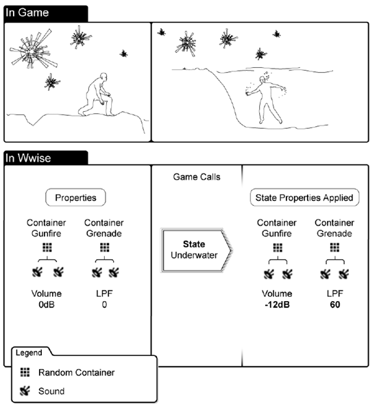

**相关主题**

- [Wwise Fundamentals Module 6: Using States](https://www.audiokinetic.com/en/courses/wwise101/?source=wwise101&id=using_states)

---

#### 使用 State

State（状态）需要隶属于 State Group（状态组），才能供 Wwise 对象使用。可以按逻辑将各各种 State 划分成 State Group 来简化管理。例如，您可能会发现将与游戏主人公相关的 State 组合在一起非常有用。然后您可以创建一个名为 Main Character 的 State Group，向其中添加 State，再将这些 State 应用到与主人公相关联对象的属性上去。在游戏中，您知道主人公将可能经历以下 State：吃惊、镇定和高度紧张。将它们组合在一起，然后定义与单个 State 相关的属性变化非常有用。

|  |
| --- |
|  |

After you have set up your State structure, you can subscribe objects to State Groups in the
Primary Editor and customize the State properties as needed.

为了帮助您在界面中轻松找到 State Group 或 State，Wwise 使用独特的图标来标识它们。

| 图标 | 代表 |
| --- | --- |
| |  | | --- | |  | | State Group |
| |  | | --- | |  | | State（状态） |

###### 创建 State Group

您可以在 Wwise 的以下两个位置之一创建您需要的所有 **State Group**：

- [Project Explorer](ch16s01.html#to_create_new_state_group_for_project_from_project_explorer "在 Project Explorer 中为工程创建新 State Group 的方法是：")
- [States tab of the Primary Editor](ch16s01.html#to_create_new_state_group_for_project_from_states_tab_of_property_editor "To create a new State Group for your project from the States tab of the Primary Editor:")

**在 Project Explorer 中为工程创建新 **State Group** 的方法是：**

1. 在 Project Explorer 中，切换至 Game Syncs 选项卡。
2. 在 **States** 层级中，执行以下操作之一：

   - 选择工作单元或虚拟文件夹，然后点击 Project Explorer 工具栏中的 **State Group**（对白事件）图标。
   - 右键点击工作单元或虚拟文件夹，然后在快捷菜单中点击 <**New Child > State Group**。

   新 State Group 将添加到列表中。
3. 将默认名称替换为更合适的名称。

   |  |  |
   | --- | --- |
   | [备注] | 备注 |
   | State Group 之间不能重名，并且仅包括字母、数字和下划线。只有字母或下划线可以作为首字符。 |
4. 根据需要，继续添加 State Group。

**To create a new State Group for your project from the States tab of the Primary
Editor:**

1. In the States tab of the Primary Editor, click **Add
   >>.**

   此时 State 的选择器菜单将打开。
2. Select **New**
3. 选择要创建新 State Group 的工作单元。
4. 在 Name 字段中，将默认名称替换成更合适的名称。

   |  |  |
   | --- | --- |
   | [备注] | 备注 |
   | State Group 之间不能重名，且只能包括字母、数字和下划线。只有字母或下划线可以作为首字符。 |
5. 点击 **OK** 以创建并采用新的 State Group。

###### 创建 State

当游戏调用 State 时，State 会响应游戏条件，从而令对象的属性发生变化。State 间的过渡可以在 State Group Editor（状态组编辑器）中设置。

**创建新 State 的方法如下：**

1. 在 Project Explorer 中，切换至 Game Syncs 选项卡。
2. 在 States 层级中，执行以下操作之一：

   - 选择 State Group，并点击 Project Explorer 工具栏中的 **State** 图标。
   - 右键点击 State Group，并在快捷菜单中选择 **New Child > State**。

   新 State 将被添加到 State Group 中。
3. 将默认名称替换为更合适的命名。

   |  |  |
   | --- | --- |
   | [备注] | 备注 |
   | 同一 State Group 中的 State 不能重名，且只能包括字母、数字和下划线。只有字母或下划线可以作为首字符。 |
4. 继续按需创建 State。

###### 删除 State 或 State Group

您可能想要删除工程中不再需要的 State（状态）或 State Group（状态组）。记住，删除 State Group 也会删除其中所有的 State。State 删除后将不能再用于之前的对象和预设。

States are integrated in the game using one of two mechanisms:

- They can be integrated by calling an Event with a **Set State** action. In this case, deleting a State or State
  Group will create problems in Wwise as the called State will no longer be
  available.
- They can be integrated by calling the State Group and the State itself. In
  this case, the sound designer who intends to delete the State or State Group
  should advise the audio programmer of the change.

在删除前，请使用 State Group 快捷菜单中的 **Find All References**（查找所有关联）命令来查找哪些对象使用了该 State Group 。

**删除 State Group 的方法如下：**

1. 在 Project Explorer 中，切换至 Game Syncs 选项卡。
2. 在 **States** 层级中，右键点击要删除的 State Group 或 State，并选择 **Delete Selection**。

   选定的 State 或 State Group 将被删除。

|  |  |
| --- | --- |
| [备注] | 备注 |
| 如果您误删了 State 或 State Group，可以按 **Ctrl+Z** 或点击 **Edit > Undo** 来撤消删除。 |

---

#### 为 State Group 内的 State 之间的切换设置过渡

为了同一 State Group（状态组）内各 State（状态）之间能平滑过渡，您可以定义状态过渡的时长。设置过渡时长时，有两个选项：

- [“Defining transitions for all States in a State Group”一节](ch16s02.html#defining_transitions_for_all_states_in_state_group "Defining transitions for all States in a State Group")为 State Group 中所有 State 切换设置相同的过渡时长。
- [“Customizing transitions between States in a State Group”一节](ch16s02.html#customizing_transitions_between_states_in_state_group "Customizing transitions between States in a State Group")为 State Group 内的 State 切换设置不同的过渡时长。

###### Defining transitions for all States in a State Group

您可以为 State Group（状态组）内的所有 State（状态）切换设置统一的过渡时长。

**为选定 State Group 中所有 State 切换设置过渡时长的方法如下：**

1. 在 Project Explorer 中，切换至 Game Syncs 选项卡。
2. 在 States 层级中，双击 State Group 将其加载到 Property Editor 中。
3. In the **Default Transition Time** field, define a
   transition time for all the States in the selected State Group.

|  |  |
| --- | --- |
| [备注] | 备注 |
| 如果未定义 Custom Transition Time，将使用默认过渡时间。 |

###### Customizing transitions between States in a State Group

为让游戏中的 State 改变更逼真，您可能不希望 State Group 内所有 State 切换时过渡时间都相同。在 Custom Transition Time（自定义过渡时间）列表中，可以为任意两个 State 间的切换定义特殊的过渡时长，反向切换时，也可以采用相同的自定义过渡时长。例如，在 Rain State 切换至 Snow State 和反向切换时，可能希望其过渡时间相同。

**为选定 State Group 内 State 之间的切换设置自定义过渡时间的方法如下：**

1. 在 Project Explorer 中，切换至 Game Syncs 选项卡。
2. 在 States 层级中，双击 State Group 将其加载到 Property Editor 中。
3. In the Primary Editor, click **Insert**.

   Transition Time 列表中将新增一行。
4. 在 From 列中，选择源 State。
5. 在 Time 列中，设置两个 State 之间的过渡时间。
6. 在 To 列中，选定目标 State。
7. 要为两个切换方向设置相同的过渡时间，请勾选双向复选框（标记为：<->）。

|  |  |
| --- | --- |
| [备注] | 备注 |
| 您可以点击 **Insert** 添加更多的自定义设置，如果要删除设置，请点击 **Remove**。 |

**相关主题**

- [Wwise Fundamentals Module 6: Using States](https://www.audiokinetic.com/en/courses/wwise101/?source=wwise101&id=using_states)

---

#### 将 State 指派给对象和总线

为工程创建并设置 State 后，您可以将 State Group（状态组）和 State（状态）指派给对象和总线，用来让声音、音乐和振动与游戏中的场景相匹配。然后即可有针对性地调节各场景的声音、音乐或振动属性，以进一步区分。

对象须先采用 State Group，然后其中的所有 State 将自动指派到该对象。每个对象都可以采用多个 State Group。You can also assign State Groups at each level in the Busses and Containers hierarchies.

State 属性始终是相对的。When you apply a State, the effect on the object's properties will be cumulative.

|  |
| --- |
|  |

**将 State Group 指派给对象：**

1. 将对象加载到 Property Editor 中。
2. Switch to the States tab of the Primary Editor.
3. Click the group selector (**>>**) button and select the State Group that you want to assign to the object.

   相关 State 将出现在列表中，对象将采用选定 State Group 中的 State。

---

##### 为音乐对象设置 State 切换点

在互动音乐中，为 State（状态）指定精确的切换时间点非常有用，这样就可以按照正在播放的音乐节奏，确保过渡平滑。在音乐对象属性级别和总线级别都可以设置切换时间点。在音乐对象或总线的 Property Editor（属性编辑器）中，您可以为每个 State Group（状态组）设置最优的切换时间点。时间点可以是 Immediate（立即）、Next Cue（下个提示点） 或 Next Beat（下一拍）等。不过，当 State 切换涉及多个音乐对象且切换设置各不相同时，State 切换将发生在段落中遇到的下一个时间点。

|  |  |
| --- | --- |
| [备注] | 备注 |
| If an Audio Bus only contains Containers hierarchy sound objects, these settings will be ignored and the changes will occur immediately. If however, both music and sound objects are routed through an Audio Bus, the State change will be based on the State change settings of the music objects. |

**为音乐对象和总线定义 State 切换点的方法如下：**

1. 将音乐对象或总线加载到 Property Editor。
2. Switch to the States tab of the Primary Editor.
3. 对于采用的 State Group，在 **Change occurs at** 列中选择下列之一：

   - **Immediate** ―― 立即切换状态。如果音轨设置了 Look-ahead time（预读时间），那么经过预读时间之后 State 才会切换。
   - **Next Grid** ―― 在下一网格线处 **切换状态**。网格线允许您按照任意间隔长度来分割音乐对象。
   - **Next Bar** ―― 在下一小节**切换状态**。
   - **Next Beat** ―― 在下一拍**切换状态**。
   - **Next Cue** ―― 在下一提示点处**切换状态**。下一提示点可以是 Entry cue（入口提示点）、Exit cue（出口提示点），也可以是 Custom Cue（自定义提示点）。
   - **Next Custom Cue** ―― 在下一自定义提示点处**切换状态**。
   - **Entry Cue** ―― 在 Entry cue 处**切换状态**。
   - **Exit Cue** ―― 在 Exit cue 处**切换状态**。

   当前 State Group 中的所有 State 切换都将发生在指定时间点。

   |  |  |
   | --- | --- |
   | [备注] | 备注 |
   | 如果多个音乐对象采用了同一个 State Group，State 切换将对所有对象生效。在遇到的下一个时间点，会为所有对象切换 State。 |

---

##### 自定义对象的 State 属性

将 State Group 指派给对象后，您可以自定义该对象在各 State 下的属性。

**为对象自定义 State 属性值的方法如下：**

1. 将对象加载到 Property Editor 中。
2. Switch to the States tab of the Primary Editor.
3. 通过单击 **Properties**（属性）按钮来打开 **State Properties**（状态属性）对话框。
4. 选中受 State Group（状态组）影响的属性，然后单击 **OK**（确定）按钮。
5. 为各个 State（状态）设置属性值。

在工程中使用 State 之前，有必要先了解 State 值会如何与现有属性值和其他适用修改因子（如 RTPC）进行交互。

在将修改因子应用于现有属性值时，会按照以下某一方式决定最终属性值：

- **Absolute**（绝对值）：使用由 RTPC 决定的值，忽略对象的现有属性值。仅可应用一个 RTPC，不支持应用 State（状态）。
- **Sum All Values**（累加所有值）：将由 RTPC 或 State 决定的值添加到对象的现有属性值。
- **Use Highest Value**（使用最大值）：使用由 RTPC 和对象的现有属性值决定的最大值。
- **Boolean**（布尔值）：使用逻辑 OR 结合由 RTPC 或 State 决定的值。也就是说，若仅设置了一个 RTPC 或 State 值，则设置最终属性值。在这种情况下，会忽略对象的现有属性值。

应用修改因子时所用的方式决定是否使用对象的原始属性值。若属性为绝对值或布尔值，则禁用原始属性控制。否则，原始属性控制保持可用状态。

|  |  |
| --- | --- |
| [备注] | 备注 |
| 应用修改因子时所用的方式是预定义的且无法更改。 |

|  |  |
| --- | --- |
| [备注] | 备注 |
| 有些属性可能具有 Sum All Values 或 Use Highest Value 设置。请参阅[“了解滤波器属性行为（LPF 和 HPF）”一节](ch11s04s03.html "了解滤波器属性行为（LPF 和 HPF）") |

---

##### 在 State 之间复制属性值

若要为多个 State 使用相似的 State 值，可定义相应设置一次，然后将 State 值复制到其他 State。以下章节描述了两种可用方式：

- [“Copying State values to States in any State Group”一节](ch16s03s03.html#copying_state_values_to_any_group "Copying State values to States in any State Group")
- [“Copying State values within the same State Group”一节](ch16s03s03.html#copying_state_values_within_group "Copying State values within the same State Group")

###### Copying State values to States in any State Group

Using this method, you can copy and paste State values between different State Groups and between different object types, including between the Busses and Containers hierarchies. 甚至，还可选择多个目标对象并将值一键粘贴到所有目标对象。

**将 State 值复制到任意 State：**

1. In the States tab of the Primary Editor, select the State whose values you want to copy.
2. 右键单击并在快捷菜单中选择 **Copy**（复制）或者按下 **Ctrl+C**。
3. 在与目标对象对应的 States（状态）选项卡中，选择要将 State 值复制到的所有 State。
4. 右键单击并在快捷菜单中选择 **Paste**（粘贴）或者按下 **Ctrl+V**。针对所有目标对象重复步骤 3 和 4。

   这时会将 State 值复制到目标对象。之后便可根据需要自定义复制的内容（参见“[“自定义对象的 State 属性”一节](ch16s03s02.html "自定义对象的 State 属性")”）。

   |  |  |
   | --- | --- |
   | [备注] | 备注 |
   | 所有在源对象中自定义而未在目标对象中自定义的属性都会被复制到目标对象。在目标对象中自定义而未在源对象中自定义的属性的所有 State 值都会设为 0 或禁用。 |

###### Copying State values within the same State Group

Using the Copy State Values dialog, you can copy the values of a State to an existing or newly-created State within the same State Group. 另外，还可指定哪些与 State Group 关联的对象会受源对象的 State 值影响。

**在同一 State Group 内复制 State 值：**

1. 在以下任一视图中单击 **Copy State Values** 按钮：

   - States tab in the Primary Editor.
   - Mixing Desk。

   The Copy States Values dialog opens.

   |  |  |
   | --- | --- |
   | [技巧] | 技巧 |
   | You can also right-click a State and select **Copy State Values** from either the States tab of the Primary Editor or from within the Mixing Desk. |
2. 点击 **State Group** 选择器（**>>**），并选择要复制自定义属性值的 State 所在的 State Group。
3. 点击 **From** 选择器（**>>**），并选择要复制自定义属性值的 State。

   采用该 State Group 的所有对象都将显示在 Affected Object 列表中。
4. 点击 **To** 选择器（**>>**），并执行下列操作之一：

   - 要将自定义属性值复制到新 State，请选择 **New**，为新 State 命名并点击 **OK**。
   - 要将自定义属性值复制到现有 State，则只需从列表中选择该 State 即可。

   Wwise 将分别处理 **Affected Object** 列表中的对象。
5. 在 **Use**（使用）列中，针对所有要使用新的 State（状态）设置的对象选中复选框。
6. 单击 **OK**（确定）来将 State（状态）设置应用于所选对象。

---

##### 在对象之间复制 State Group

若要为多个不同的对象使用相似的 State Group，可为某个对象定义 State Group，然后将这些 State Group 及关联 State、属性和 State 值复制到另一对象。You can copy and paste State Groups between different object types, including between the Busses and Containers hierarchies.

**复制 State Group：**

1. In the States tab of the Primary Editor, select all of the State Groups you want to copy. 只需在按住 Ctrl 的同时在 State Group 或关联 State 的任意位置单击即可选中。
2. 右键单击并在快捷菜单中选择 **Copy**（复制）或者按下 **Ctrl+C**。
3. 在目标对象的 States（状态）选项卡中，右键单击并在快捷菜单中选择 **Paste**（粘贴）或者按下 **Ctrl+V**。

   这时会将 State Group 及关联 State、属性和 State 值复制到目标对象。

   |  |  |
   | --- | --- |
   | [备注] | 备注 |
   | 若已将某个 State Group 指派给目标对象，则：  - 同时在源 State 和目标 State 中自定义的属性的所有 State 值都会在目标 State 中改写。 - 所有在源对象中自定义而未在目标对象中自定义的属性都会被复制到目标对象。 - 在目标对象中自定义而未在源对象中自定义的属性的所有 State 值都会设为 0 或禁用。 |

   之后便可根据需要修改复制的内容（参见“[“自定义对象的 State 属性”一节](ch16s03s02.html "自定义对象的 State 属性")”）。

---

##### 示例：制造暂时性听力损失效果

假设您正在研发一款第一人称射击游戏。在游戏中，一颗闪爆弹在附近爆炸，让玩家出现了暂时性听力损失。为了模拟这种效果，需要在短时间内让所有声音受到影响。

###### 步骤

使用 State 是实现“暂时性听力损失”的最佳方式。例如，您可以创建名为“GrenadeFX”的 **State Group**，其中包括两种 State：“Stunned”（振晕）和“Normal”（正常）。对于“震晕” State，可以修改 **Pitch**、**Volume**、**Low-pass Filter** 和 **High-pass Filter** 属性值来制造“暂时性听力损失”效果。然后可以在多个控制总线上用这个 **State Group** 来影响音效、环境声、音乐等。

要增强真实感，可以在采用“GrenadeFX”**State Group** 的控制总线上同时用 RTPC，来影响距离效果的强度。State 属性值（音量、音高、HPF 和 LPF）将与 RTPC 叠加，这样即可根据手榴弹与主角/话筒之间的距离来减小或增大属性值。要实现这样的效果，可以执行以下操作：

1. 在 Game Sync 选项卡中创建新游戏参数，例如“Grenade Proximity”，并根据游戏情况设置合适的最小和最大距离。
2. 在使用 **State Group** "GrenadeFX" 的控制总线上，转至 RTPC 选项卡，并为游戏参数“Grenade Proximity”指派一个或多个属性值。
3. 建立属性值映射，榴弹冲击离角色越近，影响越强烈。

在 **Soundcaster** 中进行游戏情景模拟时，可以直接优化 State 和 RTPC 值。例如，播放音乐、环境声、语音和音效，然后将 **State Group** 从“Normal”切换到“Stunned”。别忘了优化不同 State 之间的 **Transition Time**。

为了更真实，还可以在角色进入“震晕” State 时让混响尾音变得混浊。通过对混响的“LPF Cutoff Frequency”属性使用 RTPC 并与 State 同步更改，您可以让混响与对象的 LPF 值一致。

---

#### State 技巧和经验总结

使用 State（状态）时，最好仔细阅读以下各节，其中的一系列技巧和经验总结可以帮您更好地管理 State 在研发中的使用。

###### State properties and CPU and memory usage

在不同平台上，Wwise 中的有些相对属性（如音高）可能会对性能造成影响。Wwise 中管理音高的机制基于采样率。调整对象音高时须对文件重新采样，因此会提高 CPU 占用。

---

### 使用 Switch

在使用层级结构组织对象之外，Wwise 中的 Switch（切换开关）也能帮您简化声音、音乐和振动对象的组织。Switch 代表游戏中特定元素的不同条件，可以用来管理这些条件下的相应对象。这些元素的条件种类非常丰富，可以是天气状况，游戏主角使用的武器等。您可以将特定条件下的对象指派到特定 Switch，这样播放该游戏元素时，将播放当前 Switch 对应的对象。

Switch 可以在运行时简化各种条件的管理，对于众多游戏场景或元素都适用，下面列出少数几个：

- 房间、地面、室内/室外的游戏设置 ―― 可以为不同的地面材质（例如木板、草地、碎石等）创建 Switch。
- 游戏角色 ―― 可以在男性或女性角色讲话时，为对白创建 Switch。
- 天气状态 ―― 可以为暴风雨、暴风雪、小雨或晴天创建 Switch。
- 魔界或仙界的游戏氛围 ―― 可以为不同世界的特有声音创建 Switch。
- 武器 ―― 可以为游戏中火器的不同发射方式、激光和剑创建 Switch。

上述各例中，您都可以先创建 Switch，然后指派相应的对象。指派到 Switch 的对象需要用 Switch Container（切换开关容器）进行编组。When an Event or a Game Parameter value signals a change, the Switch Container verifies the Switch and the correct object is played.

#### Using Switches - example

假设您正在研发一款第一人称射击游戏，其中角色可以在各种环境中走动。每种物理环境中都有不同的地面材质，例如混凝土、草地和泥地，每种表面都需要不同的脚步声。这种情况下，您可以为各地面材质创建 Switch，然后将不同脚步声指派到相应的 Switch。当角色行走在混凝土地面上，“Concrete” Switch 将激活，并播放相应声音。从混凝土走到到草地上时，“Grass” Switch 将激活，并播放相应声音。

下图演示了激活的 Switch 如何影响播脚步声的播放。

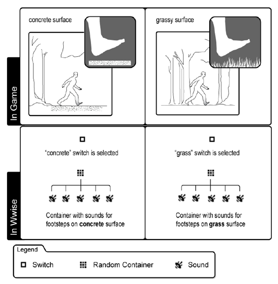

**相关主题**

- [Wwise Fundamentals Module 4: Using Switches](https://www.audiokinetic.com/en/courses/wwise101/?source=wwise101&id=using_switches)

---

#### 使用 Switch

在 Wwise 中，需要先将 Switch（切换开关）置于 Switch Group（切换开关组）中才能使用。通过用 Switch Group 对 Switch 进行编组，您可以高效管理游戏中不同条件下的声音、音乐和振动对象。例如，为了管理角色的各种脚步声，可以创建名为“Ground Textures”的 Switch Group。然后在 Wwise 中为游戏中每种地面材质创建对应的 Switch。根据游戏条件，您可以创建针对碎石地、草地和混凝土的 Switch。

|  |
| --- |
|  |

有了 Switch Group 和 Switch，就可创建 Switch Container 并将对象指派给 Switch 了。关于使用 Switch 和 Switch Container 的详细信息，请参阅[“定义 Switch Container 的内容和行为”一节](ch21s03.html "定义 Switch Container 的内容和行为")。

为了帮您在界面中轻松识别 Switch 或 Switch Group，Wwise 采用独特的图标来标识它们。

| 图标 | 代表 |
| --- | --- |
| |  | | --- | |  | | Switch Group |
| |  | | --- | |  | | Switch（切换开关） |

###### Creating Switch Groups

按逻辑将 Switch（切换开关）编组成 Switch Group（切换开关组）非常有用，用起来也更方便。您可以在 Project Explorer（属性编辑器）的 Game Syncs（游戏同步器）选项卡中创建所有需要的 Switch Group。

**为工程创建新 Switch Group 的方法如下：**

1. 在 Project Explorer 中，切换至 Game Syncs 选项卡。
2. 在 Switches 层级，执行以下操作之一：

   - 选择 Virtual Folder 或 Work Unit，然后点击 Project Explorer 工具栏中的 **Switch Group** 图标。
   - 右键点击 Virtual Folder 或 Work Unit，从快捷菜单中选择**New Child** > **Switch Group** 。

   新的 Switch Group 将被添加到列表中。
3. 将默认名称替换成更合适的命名。

   |  |  |
   | --- | --- |
   | [备注] | 备注 |
   | Switch Group 之间不能重名，且只能包含字母、数字和下划线。只有字母或下划线可以作为首字符。 |
4. 继续按需添加 Switch Group。

###### Creating Switches

游戏元素（例如地面）具有的不同条件在 Wwise 中要有相应的 Switch。您可以在 Project Explorer（属性编辑器）的 Game Syncs（游戏同步器）选项卡中创建 Switch。

**创建新 Switch 的方法如下：**

1. 在 Project Explorer 中，切换至 Game Syncs 选项卡。
2. 在 Switch Groups 列表中，执行下列操作之一：

   - 选择 Switch Group，并点击 Project Explorer 工具栏中的 **Switch** 图标。
   - 右键点击 Switch Group，从快捷菜单选择 **New Child > Switch**。

   新的 Switch 将被添加到 Switch Group 中。
3. 将默认名称替换成更合适的命名。

   |  |  |
   | --- | --- |
   | [备注] | 备注 |
   | Switch Group 中的 Switch 之间不能重名，且只能包含字母、数字和下划线。首字母只能是字母或下划线。 |
4. 继续按需创建 Switch。

###### Deleting Switches or Switch Groups

您可能想删除不再需要的 Switch（切换开关）或 Switch Group（切换开关组）。记住，删除 Switch Group 时也会删除其中的所有 Switch，

删除 Switch 或 Switch Group 前，请检查 Switch 是如何集成到游戏中的。Switch 的集成方式有两种机制：

- 通过调用带有 Set Switch 动作的事件 ―― 删除 Switch 或 Switch Group 后，在 Wwise 中会造成问题，因为事件调用的 Switch 将不存在。
- 通过调用 Switch Group 或 Switch 本身 ―― 要删除 Switch 或 Switch Group 时，声音设计师应告知程序员。

|  |  |
| --- | --- |
| [备注] | 备注 |
| 这将导致与其关联的对象和预设无法找到它们。 |

**删除 Switch 或 Switch Group 的方法如下：**

1. 在 Project Explorer 中，切换至 Game Syncs 选项卡。
2. 在 Switch Group 列表中，右键点击要删除的 Switch Group 或 Switch，然后选择 **Delete Selection**。

   所选 Switch 或 Switch Group 将被删除。

|  |  |
| --- | --- |
| [技巧] | 技巧 |
| 如果误删了 Switch 或 Switch Group，可以按 **Ctrl+Z** 或点击 **Edit > Undo** 来撤消删除。 |

---

#### 将 Game Parameter 值映射到 Switch

In Wwise, you can also use Game Parameter values to drive Switch changes. 创建 Switch Group 和 Game Parameter 后，就可以将参数值映射到 Switch。例如汽车碰撞声，如果您使用 RTPC 来驱动 Switch 切换，那么撞击声和振动效果可以根据冲击力大小而有所不同。通过用冲击力值来触发 Switch 切换，可以轻松确保在发生碰撞时播放正确的对象。

|  |  |
| --- | --- |
| [备注] | 备注 |
| 将 Game Parameter 值映射到 Switch 之前，需要创建并定义游戏参数。关于创建和定义游戏参数的详细信息，请参阅[“Creating Game Parameters”一节](ch18s02.html#creating_game_parameter "Creating Game Parameters")。 |

**将 Game Parameter 值映射到 Switch 的方法如下：**

1. 在 Project Explorer 的 Game Syncs 选项卡中，双击想要通过游戏参数值来驱动的 Switch Group。

   Switch Group 将加载到 Switch Group Property Editor 中。
2. 勾选 **Use Game Parameter** 复选框。

   坐标图视图将启用，Y 轴将显示 Switch Group 中的 Switch 列表。
3. 在 Game Parameter 列表中，选择用于驱动 Switch 切换的游戏参数。

   X 轴将显示所选 Game Parameter 的值域。
4. 在坐标图视图中，双击 X 轴方向的 Game Parameter 曲线来添加点，然后拖拽该点至目标 Switch。

   Switch 的变化将映射到指定的游戏参数值。
5. 双击曲线来继续添加点，并映射到所需的 Switch。

---

#### Switch 技巧和经验总结

使用 Switch（切换开关）时最好能仔细阅读以下各节，其中的一系列技巧和经验总结可以帮您在整个音频开发过程中更好地管理 Switch。

###### 重命名 Switch

更改 Switch 名称前，请检查 Switch 是如何集成到游戏中的。如果是用名称字符串集成的，则更名后将需要额外的编程才能使用。

###### Assigning objects to more than one Switch Group

通常，对象仅可指定到一个 Switch Group。If, however, your game requires that an object is assigned to Switches in different Switch Groups, you can assign a second Switch Group at a higher level in the Busses or Containers hierarchies .

---

### 使用 RTPC

为了在游戏中实现更多动态效果，可能需要将特定对象属性与游戏中的某些参数值绑定。在 Wwise 中，您可以使用实时参数控制（RTPC）来实现这一点。您可以使用曲线沿线上的一系列点创建 RTPC。该曲线表示了 Game Parameter （游戏参数）和 Wwise 中音频属性之间的关系。当游戏中的 Game Parameter 发生变化时，Wwise 使用 RTPC 曲线来确定相应的属性值。

#### Using RTPCs - example

假设您正在创建一款第一人称射击游戏，您希望根据游戏中角色的疲惫级别来确定主人公呼吸声的音量。当角色不太疲惫时，您希望呼吸声听起来非常柔和；非常疲惫时，呼吸声听起来很沉重。这种情况下，您可以使用 RTPC 将 Game Parameter （疲惫程度）指派给 Wwise 属性（音量）。然后您可以使用坐标图视图，将呼吸声音的音量电平映射到游戏中主人公的疲惫级别。

|  |
| --- |
|  |

RTPC 还可用于获取游戏中的其它效果，例如将水深映射到低通滤波值，将爆炸力映射到低频效果值（LFE）等等。

|  |  |
| --- | --- |
| [注意] | 注意 |
| 虽然可为工程中的所有对象、总线、衰减和效果创建 RTPC，但选择性地使用它们非常重要，因为它们会消耗大量的内存和 CPU 资源。 |

**相关主题**

- [Wwise Fundamentals Module 5: Using Game Parameters](https://www.audiokinetic.com/en/courses/wwise101/?source=wwise101&id=using_game_parameters)

---

#### 理解 Wwise 中的 RTPC

在 Wwise 创建 RTPC 涉及以下操作：

- [“Creating Game Parameters”一节](ch18s02.html#creating_game_parameter "Creating Game Parameters")、MIDI Parameter、[LFO](ch18s04.html "使用 LFO")、[Envelope](ch18s05.html "使用包络") 或 [Time](ch18s06.html "使用时间") Modulator。
- [“将 Wwise 属性指派给游戏参数”一节](ch18s03s01.html "将 Wwise 属性指派给游戏参数")
- [“映射 RTPC 坐标图中的值”一节](ch18s03s02.html "映射 RTPC 坐标图中的值")

您可以在 Project Explorer（工程资源管理器）的 Game Syncs（游戏同步器）选项卡中或者 RTPC 选项卡内定义 Game Parameter。属性值和 Game Parameter 之间的关系可以在 Property Editor、Effect Editor 或 Attuenuation Editor 中的 RTPC 选项卡中定义。另外，还可直接在 RTPC 选项卡的侧面板内调节所选参数的属性。

|  |
| --- |
|  |

通过将 X 轴所示的 Game Parameter 映射到 Y 轴所示的 Wwise 属性值，即可让 Game Parameter 按照期望的方式影响对象属性。引擎创建完整 RTPC 曲线的方法是在您创建的控制点之间插入新的控制点。

每个对象、总线、Attenuation（衰减）或 Effect（效果器）实例都可具有多条曲线，用来表示对象属性与参数或调制器之间的不同关系。用于比较时一次可显示多条曲线，也可以一次只显示一条曲线。

###### 使用 RTPC 侧面板

无论是 Game Parameter、MIDI Parameter（MIDI 参数）还是 Wwise 中的三种调制器，RTPC 的 X Axis（X 轴）对象都可设置多种属性值。而且，每个对象都可在对应的 Property Editor（属性编辑器）中单独打开，以便检查并根据需要调节各项属性。不过，一般直接在 RTPC 选项卡内调节属性值会更为便捷。侧面板会始终显示所选 RTPC X Axis 对象的属性，这些属性通常都可直接进行编辑。

若选择多个 RTPC，则侧面板将合并显示其属性及数值。若多个 RTPC 共用同一属性，但其值各不相同，则将显示破折号。

|  |  |
| --- | --- |
| [技巧] | 技巧 |
| 主要可以通过两种方式直接从 RTPC 选项卡来查找引用 RTPC 的对象。  - 在 RTPC 快捷菜单中选择 **Find All References** 命令，以此打开 References 视图并查找使用该 RTPC 的对象。 - 直接单击侧面板右上角带有编号的 References 按钮。此操作同样可以打开加载有对象的 References 视图。 |

  

|  |  |
| --- | --- |
| [技巧] | 技巧 |
| RTPC 选项卡中有两条分割线，可通过拖动来调节三个面板的大小。  - 横线：将所 RTPC 列表与坐标图隔开。 - 纵线：将所列 RTPC 与侧面板隔开（后者列有关联属性）。 |

###### 在 Blend Track 内使用 RTPC

要在对象属性和游戏参数之间创建更加复杂的关系，您可在混合容器的混合轨中使用 RTPC。有关在混合容器中使用 RTPC 的详细信息，请参阅[“定义 Blend Container 的内容和行为”一节](ch21s04.html "定义 Blend Container 的内容和行为")。

---

#### 管理 RTPC 中使用的 Game Parameter

在创建 Game Parameter（游戏参数）之后，才能将游戏中的参数映射到 Wwise 中的属性。您可以管理多个游戏参数，并在 Project Explorer 中 Game Syncs 选项卡中定义其最小值和最大值。

为了帮助您轻松识别界面中的 Game Parameter，它由以下图标表示。

| 图标 | 代表 |
| --- | --- |
| |  | | --- | |  | | Game Parameter（游戏参数） |

###### Creating Game Parameters

若要使用 Game Parameter 来驱动对象的属性值，必须先创建 Game Parameter。您可以在 Wwise 中的以下两个位置创建 Game Parameter：

- Project Explorer 的 Game Sync 选项卡
- Property、Attenuation 或 Effect Editor 的 RTPC 选项卡

|  |  |
| --- | --- |
| [注意] | 注意 |
| 在 Wwise 中命名 Game Parameter 时，只能使用字母，数字和下划线，并确保每个 Game Parameter 名称都是唯一的。 |

|  |  |
| --- | --- |
| [备注] | 备注 |
| Unless absolutely necessary, you should not rename a Game Parameter after it has been integrated into the game. If you rename a Game Parameter after it has been integrated into a game, you must also update any instances of the name in the game. The Game Parameter will not work until you do this, including while remote connected in either of the Profile and Edit modes |

**在 Project Explorer 中创建新的 游戏参数 的方法是：**

1. 在 Project Explorer 中，切换至 Game Syncs 选项卡。
2. 在 Game Parameter 部分，执行以下操作之一：

   - 选择工作单元或虚拟文件夹，然后点击 Project Explorer 工具栏中的 **Game Parameter**（对白事件）图标。
   - 右键点击工作单元或虚拟文件夹，然后从快捷菜单中选择 **New Child** > **Game Parameter**（新建子项 > 对白事件）。

   一个新的 Game Parameter 被添加到 Game Parameter 列表中。
3. 将默认名称替换为最适合该游戏参的名称。

   |  |  |
   | --- | --- |
   | [备注] | 备注 |
   | 第一个字符只能使用字母或下划线。 |
4. 根据需要继续添加游戏参数。

**在 RTPC 选项卡中新建 Game Parameter 的方法如下：**

1. 在 Property Editor、Attenuation Editor 或 Effect Editor 的 RTPC 选项卡中，选择 RTPC 列表中的一个条目。

   如果还没有为该条目选择属性，则通过选择按钮选择一个。
2. 选择 **Game Parameter** 菜单项，然后选择 **New**。

   The New Game Parameter dialog opens.
3. 选择您要在其中创建游戏参数的工作单元。
4. 在 Name 字段中，将默认名称替换成最适合游戏参数的名称。
5. 点击 **OK** 来创建新的 Game Parameter。

###### Defining the range of values for a Game Parameter

创建 Game Parameter 后，您必须设置其最小值和最大值。以赛车为例，最小和最大速度可为 0 和 300 km/h。

您也可以指定 Game Parameter 的默认值。通过游戏参数，您可以为没有明确指定特殊值的所有参数对象设置一个全局值。在以下情况下， Wwise 中指定的 Game Parameter 默认值将被忽略：

- 游戏对象明确地指定了一个特殊值。
- 游戏程序员在 SDK 中定义了一个全局 RTPC 值。

**定义游戏参数的取值区间：**

1. 在 Project Explorer 中，切换至 Game Syncs 选项卡。
2. 在 Game Parameter 部分中，双击要定义其值的 Game Parameter 。

   此时游戏参数加载到 Property Editor 中。
3. 通过指定最小值和最大值来定义参数取值区别。请参阅 [“Game Parameter Settings”一节](ch60s04s03s01s01.html "Game Parameter Settings")。
4. 如果没有明确地指定特殊值，则在 Default 文本框中，指定一个您希望游戏对象使用的全局值。

###### Deleting Game Parameters

您可以删除工程中不再需要的 Game Parameter。删除 Game Parameter 后，对于之前使用它的对象、事件和预设，该参数将变为不可用。

|  |  |
| --- | --- |
| [备注] | 备注 |
| 删除 Game Parameter 之前，请务必与您的音频程序员沟通，以确保不会影响游戏代码。 |

**删除游戏参数：**

1. 在 Project Explorer 中，切换至 Game Syncs 选项卡。
2. 在 Game Parameters 部分中，右键点击您要删除的该游戏参数，然后选择 **Delete Selection**（删除选中项）。

   Game Parameter 将从 Wwise 中删除。

###### Binding Game Parameters to built-in parameters

声音引擎会基于来自游戏的输入计算一组标准值，以便声音设计师以此为基础创建动态音频和振动。这些内置参数可通过 Game Parameter 对应 Property Editor（属性编辑器）中的 **Bind to Built-In Parameter**（绑定到内置参数）列表来访问。系统会根据从游戏接收的游戏对象定位数据来在每帧更新内置参数值。在 Wwise 设计工具中，只有在远程连接到游戏的情况下才会更新这些值。

与标准 Game Parameter 有所不同，无需进行额外的游戏编程就可使用与内置参数绑定的 Game Parameter。

|  |  |
| --- | --- |
| [备注] | 备注 |
| - 当 RTPC 绑定到内置参数时，声音引擎更新各个游戏对象的值。如果 RTPC 用于没有游戏对象关联的全局 Wwise 对象，例如总线或总线效果，则使用默认值。 - Obstruction and occlusion values set on Spatial Audio Portals do not affect the values   of RTPCs bound to built-in parameters. This behavior is intentional and   occurs because RTPCs only provide one value per game object, but a   single game object can have multiple paths through different Portals,   each with different obstruction and occlusion values. - 系统会通过*游戏对象*的位置评估基于发声体位置的内置参数（如 Distance、Azimuth、Emitter Cone 等）。因而，3D 定位设置（如 Automation 和 Hold Listener Orientation）会被忽略。 |

**可用的内置参数：**

- **Distance**

  距离。游戏对象和听者之间的距离。当多个听者或位置指定到同一个游戏对象时，将使用所有听者与声音位置组合之间的最短距离值。
- **Azimuth**

  方位角。投射在水平面上的听者与游戏对象之间的角，单位为度。0 度值表示声音来自听者正前方，-90 度表示声音来自左侧，90 度表示声音来自右侧，+/- 180 度表示声音位于听者正后方。

  当为游戏对象指定了多个听者或声音位置时，则使用听者和声音之间位置最靠近的角度值。
- **Elevation**

  仰角。听者与游戏对象之间相对于水平线的顶角，单位为度。0 度值表示声音位于听者的同一水平面上；90 度值表示声音位于正上方；-90 度表示声音位于正下方。

  当为游戏对象指定了多个听者或声音位置时，则使用听者和声音之间位置最靠近的角度值。
- **Emitter Cone**

  Emitter Cone（发声体锥）表示发声体朝向与发声体和听者间连线所形成的向量之间的 3D 角度。0 度表示发声体直接朝向听者，180 度表示发声体完全背朝听者。

  当为游戏对象指定了多个听者或声音位置时，则使用听者和声音之间位置最靠近的角度值。
- **Obstruction**

  声障。通过 Obstruction，可访问通过  [SetObjectObstructionAndOcclusion](https://www.audiokinetic.com/library/edge/?source=SDK&id=namespace_a_k_1_1_sound_engine_a1b3e18a25b405e55ba82de9b70cd11ba.html)  API 为游戏对象设置的声障值。

  如果为游戏对象指定了多个听者，则声障取值为给距离当前声音位置最近的听者指定的值。
- **Occlusion**

  声笼。通过 Occlusion，可访问通过 SetObjectObstructionAndOcclusion API 为游戏对象设置的声笼值。

  当为游戏对象指定了多个听者时，则声笼取值为给距离当前声音位置最近的听者指定的值。
- **Listener Cone**

  Listener Cone（听者锥）表示听者朝向与发声体和听者间连线形成的向量之间的 3D 夹角。0 度表示听者直接朝向发声体，180 度表示听者完全背朝发声体。

  当为游戏对象指定了多个听者或声音位置时，则使用听者和声音之间位置最靠近的角度值。
- **Diffraction**

  在使用带有 Room 和 Portal 或几何构造的声音传播路径时，Diffraction 可提供由 Wwise Spatial Audio 计算得出的衍射角度。

  In order to receive this built-in parameter, **Diffraction and
  Transmission** must be enabled in the Property Editor, and the
  emitter and listener must be either in separate Rooms connected by one or
  more Portals, or obstructed by geometry that was passed to Wwise Spatial
  Audio.

  通过 Room 和 Portal，“发声体”游戏对象可接收与其干声衍射相关的值；由发散角（度）表示传播路径与发声体和听者之间直线路径的偏差角度。由 Spatial Audio 内部注册的房间游戏对象也会接收到一个衍射值，但与其“湿声”衍射相关――即房间内声音扩散后，声场的衍射保留区。湿声衍射角度是传播路径与从门户开口法线之间的发散角，以度为单位。

  在声音可通过多个 Portal 或多条路径到达听者所在位置时，将选用各条路径当中的最小衍射角度。衍射值的范围为 0 - 100，其代表衍射百分比而非衍射角度。
- **Transmission Loss**

  在使用带有 Room 和 Portal 或几何构造的声音传播路径时，Transmission Loss 可提供由 Wwise Spatial Audio 计算得出的透射损失。

  In order to receive this built-in parameter, **Diffraction and
  Transmission** must be enabled in the Property Editor, and the
  emitter and listener must be either in separate Rooms connected by one or
  more Portals (enabled or not), or obstructed by geometry that was passed to
  Wwise Spatial Audio.

  计算得出的 Transmission Loss 可应用于直接连接发声体和听者的射线。几何构造的 Transmission Loss 可在几何构造上定义 (AkAcousticSurface::transmissionLoss)，Room 的 Transmission Loss 则在 Room 上定义 (AkRoomParams::TransmissionLoss)。该参数的值域为 0 ~ 100。

  将最大值用于发声体和听者所在 Room 以及与之交叉的所有几何构造表面。

  |  |  |
  | --- | --- |
  | [备注] | 备注 |
  | Although the Transmission Loss is taken from the ray corresponding to the direct path, Wwise does not allow signal processing of rays independently, except when using Attenuation curves or project-wide Environmental curves. 比如，倘若存在与透射路径平行的衍射路径，并且想要控制声音上的属性或带有内置 Transmission Loss RTPC 的效果器，则将此属性应用于透射和衍射路径共同产生的信号。这样获得的效果可能并不理想。这一点必须予以考虑。为此，最好基于 Attenuation 曲线来处理音量和由 Transmission Loss 导致的滤波。 |

---

#### 使用 Game Parameter 控制属性值

创建 Game Parameter 后，即可开始为工程中的对象、总线、效果器、衰减和切换开关组创建 RTPC。RTPC 在 Property、Effect 和 Attenuation Editor 的 RTPC 选项卡上或者混合容器的混合轨中定义。创建 RTPC 涉及以下步骤：

- [“将 Wwise 属性指派给游戏参数”一节](ch18s03s01.html "将 Wwise 属性指派给游戏参数")
- [“映射 RTPC 坐标图中的值”一节](ch18s03s02.html "映射 RTPC 坐标图中的值")

在曲线视图中，您可以创建将属性值映射到 Game Parameter 值的 RTPC 曲线。由于在坐标图视图中可以同时显示许多曲线，因此 Wwise 对每条曲线使用不同的颜色。三个相对属性（Volume、Pitch 和 LPF/HPF）始终采用相同基色的色调表示，而工程中的其他属性则可随意地指派颜色。这些随意指定的颜色在不同的工作会话之间可能不相同。

下表显示了都有哪些基色被指派给了相对属性。

| Wwise 属性 | Color |
| --- | --- |
| Volume | （红色） |
| Pitch | （绿色） |
| LPF/HPF | （蓝色） |

  

|  |  |
| --- | --- |
| [备注] | 备注 |
| 对于有些对象和平台，只有部分属性可用; 例如，音高属性将无法影响音乐对象。 |

即使配有颜色编码，您也会发现隐藏特定曲线有助于集中关注一条曲线。有关隐藏曲线的详细信息，请参阅[“在坐标图中显示曲线”一节](ch49s03.html#displaying_curves_in_graph_view "在坐标图中显示曲线")。

在工程中使用 RTPC 之前，有必要先了解 RTPC 值会如何与现有属性值和其他适用修改因子（如 State）进行交互。

在将修改因子应用于现有属性值时，会按照以下某一方式决定最终属性值：

- **Absolute**（绝对值）：使用由 RTPC 决定的值，忽略对象的现有属性值。仅可应用一个 RTPC，不支持应用 State（状态）。
- **Sum All Values**（累加所有值）：将由 RTPC 或 State 决定的值添加到对象的现有属性值。
- **Use Highest Value**（使用最大值）：使用由 RTPC 和对象的现有属性值决定的最大值。
- **Boolean**（布尔值）：使用逻辑 OR 结合由 RTPC 或 State 决定的值。也就是说，若仅设置了一个 RTPC 或 State 值，则设置最终属性值。在这种情况下，会忽略对象的现有属性值。

应用修改因子时所用的方式决定是否使用对象的原始属性值。若属性为绝对值或布尔值，则禁用原始属性控制。否则，原始属性控制保持可用状态。

|  |  |
| --- | --- |
| [备注] | 备注 |
| 应用修改因子时所用的方式是预定义的且无法更改。 |

|  |  |
| --- | --- |
| [备注] | 备注 |
| 有些属性可能具有 Sum All Values 或 Use Highest Value 设置。请参阅[“了解滤波器属性行为（LPF 和 HPF）”一节](ch11s04s03.html "了解滤波器属性行为（LPF 和 HPF）") |

---

##### 将 Wwise 属性指派给游戏参数

创建 Game Parameter 并定义它们的取值范围后，可以考虑将哪些游戏参数指派给哪些属性。

在将属性指派给 Game Parameter、Modulator 或 MIDI 对象后，将发生以下情况：

- 坐标图视图中显示 X 轴和 Y 轴。
- 坐标图视图中创建默认 RTPC 曲线。
- 属性值旁边的 RTPC 图标变为主题指定颜色（Classic 中为蓝色，Dark 中为橙色）。


|  |  |
| --- | --- |
|  | 使用了 RTPC。 |
|  | 未使用 RTPC。 |

**将对象属性指派给游戏参数的方法是：**

1. 将对象、总线、Effect（效果器）或 Attenuation（衰减）实例加载到编辑器中。
2. 切换到 RTPC 选项卡。
3. 点击选择器按钮（**>>**），然后从列表中选择属性。

   新的 RTPC 曲线于是被创建，并被指定唯一的颜色。此时 Wwise 属性也被指派给坐标图视图中的 Y 轴。
4. 从 X Axis（X 轴）列表中选择您要指派给 Wwise 属性的游戏参数。

   游戏参数被指派给图形视图中的 X 轴。

###### 快速添加 RTPC

您可以将 RTPC 添加到任何具有活跃 RTPC 图标的属性。

**快速添加 RTPC：**

1. 找到具有活跃 RTPC 图标的属性，并右键单击文本框、滑杆或旁边的[标志图标](ch45s11.html "使用 Property Editor")。

   此时将会显示快捷菜单。
2. 在菜单中，选择 **Add RTPC**（添加 RTPC）。

   此时将打开子菜单并显示五个不同的 RTPC 对象选项（Game Parameters、MIDI、LFO、Envelope 和 Time）。
3. 选择符合 RTPC 需要的选项。

   此时将显示下一级子菜单。在此可选择新建 RTPC 对象、选择现有对象或浏览并查找特定对象。

   |  |
   | --- |
   |  |
4. 选择或创建 RTPC 对象。

   此时将转到 RTPC 选项卡，并在视图中高亮显示刚刚添加的 RTPC 对象。您可以根据需要进行编辑。

---

##### 映射 RTPC 坐标图中的值

在将 Wwise 属性指派给游戏参数后，便可以开始在坐标图视图中定义它们的关系。您可以使用控制点将属性值映射到游戏参数值。例如，如果您希望汽车以 250 km/h 行驶时音量为 0 dB，则可以在 250 km/h 和 0 dB 的交点处添加一个控制点。创建 RTPC 曲线的方法是在两个控制点之间插值。

下面的 RTPC 坐标图显示如何将游戏参数值（在本例中为“Speed”）映射到 Wwise 中的属性值（在本例中为“Volume”）。X 轴上的 Speed 值在游戏中定义，Y 轴上的 Volume 值由用户控制。

|  |
| --- |
|  |

有关缩放和平移坐标图视图，添加、移动和删除控制点，更改点间曲线的形状，使用线性和分贝标度的信息，以及有关坐标图视图的通用信息，请参阅[*了解坐标图视图*](ch49.html "了解坐标图视图")。

|  |  |
| --- | --- |
| [备注] | 备注 |
| 您可以复制工程中对象内或对象之间的 RTPC 曲线。有关 RTPC 的详细信息，请参阅 [“复制 RTPC 曲线”一节](ch18s03s03.html "复制 RTPC 曲线")。 |

**映射坐标图中值的方法是：**

1. 在坐标图视图中，双击曲线上任意位置以创建控制点。
2. 执行以下操作之一：

   - 将控制点拖到相应的 X 和 Y 坐标。
   - 直接在 X 和 Y 坐标文本框中输入值，以指定控制点的准确位置。
3. 继续添加点，直至曲线完全代表了属性和游戏参数之间的关系。

|  |  |
| --- | --- |
| [技巧] | 技巧 |
| 如果创建控制点后继续按住鼠标键，则可以立即将点拖到适当的位置。 |

###### Building smart pitch curves

当您使用 RTPC 将声音的音高与 Game Parameter 相匹配时，复杂的曲线是创造逼真效果的关键。通过智能音高曲线，您可以轻松地创建自然声音的 RTPC 音高曲线。

智能音高曲线基于以下两个变量：

- **Native value:** 原始音高对应的 Game Parameter 值。
- **Subdivision level** ：曲线的精度，从 1 到 10 分为十个等级。

例如，在赛车游戏中，可以将智能音高曲线应用于引擎声音。如果录制了发动机转速为 2000 RPM 时的发动机噪声，则可以采用原声值为 2000 RPM 的方式创建 RTPC 音高曲线。然后 Wwise 据此推断出其它点，创建出自然声音的曲线。

在使用智能音高曲线创建音高 RTPC 曲线时，Wwise 使用下面的等式创建线性节段：

|  |
| --- |
|  |

曲线的节段越多，曲线的精度越高。不过，在运行时，其它节段需要进一步处理。为了节省 CPU 和内存，应选择能够达到您所需效果的最低细分等级。

|  |  |
| --- | --- |
| [技巧] | 技巧 |
| 有关确保曲线准确性的详细信息，请参阅[“Valid ranges for smart pitch curves”一节](ch18s09.html#valid_ranges_for_smart_pitch_curves "Valid ranges for smart pitch curves")。 |

**创建智能音高曲线的方法是：**

1. 在 RTPC 坐标图视图中创建音高曲线。有关如何操作的详细信息，请参阅[“将 Wwise 属性指派给游戏参数”一节](ch18s03s01.html "将 Wwise 属性指派给游戏参数")。
2. 右键点击音高曲线，然后从菜单中选择 **Build Smart Pitch Curve**。

   The Build Smart Pitch Curve dialog opens.
3. 输入智能音高曲线的原声值。原声值是指录制声音所对应的属性值。
4. 输入智能音高曲线的细分等级。曲线细分等级越高，曲线节段越多，运行时评估时间越长。
5. 单击 **OK**（确定）。

   此时将创建智能音商曲线。

   |  |  |
   | --- | --- |
   | [备注] | 备注 |
   | 只可为 4800 和 -4800 音分之间的音高值创建智能音高曲线。在此范围之外，曲线将在一个极端值处“锁定”。 |

---

##### 复制 RTPC 曲线

在工程中，有时候您会希望跨属性甚至跨对象使用 RTPC 曲线。与其分别创建各条曲线，您可以先定义曲线形状，然后将它复制粘贴到同一对象的另一属性中，甚至工程中其它对象的属性中。

RTPC 曲线可以复制到 Wwise 的以下区域：

- RTPC tab of objects and busses within the Busses and Containers hierarchies.
- 效果的 RTPC 选项卡。
- 源插件的 RTPC 选项卡。
- Blend Track Editor。

**复制对象内和对象之间的 RTPC 曲线的方法是：**

1. 从曲线列表中选择您要复制的曲线。

   |  |
   | --- |
   |  |
2. 执行以下操作之一：

   - 右键点击选定的曲线，然后从菜单中选择 **Copy**。
   - 按 **Ctrl+C**。
3. 执行以下操作之一：

   - 右键点击并从菜单中选择 **Paste**。
   - 按 **Ctrl+V**。

   此时列表中被添加了一条完全一致的 RTPC 曲线。

   |  |
   | --- |
   |  |

   |  |  |
   | --- | --- |
   | [技巧] | 技巧 |
   | To paste one or more curves within another object in your project, simply load the new object into the Property Editor, switch to the RTPC tab of the Primary Editor, and then proceed with Step 3. |
4. 点击选择器开关（**>>**），并从列表中选择任意属性。

   此时选定的属性就应用到曲线形状上了。

   |  |
   | --- |
   |  |

---

##### 从列表中移除 RTPC

当您不再需要 Game Parameter 来驱动 Wwise 中某个特定属性的值时，可以将其从 RTPC 列表中删除。

**从列表中删除 RTPC 的方法是：**

1. 从 RTPC 列表中选择您要删除 RTPC。
2. 按 **Delete** 键。

   RTPC 于是从列表中被移除了。

---

#### 使用 LFO

LFO（低频振荡器）用于为属性值带来随时间变化的调制。LFO 的属性如下：

| 界面元素 | 描述 |
| --- | --- |
| Depth | 深度。振荡器的幅度变化。最大幅度为 1.0。  单位：%  Default value: 100  Range: 0 to 100 |
| Frequency | 频率。每秒钟的周期数。  单位：Hz  Default value: 1  Range: 0 to 20000  Units: Frequency |
| Waveform | 调制器的波形包含以下选项：  - **Sine** - **Triangle** - **Square** - **Saw up** - **Saw down** - **Random**:**Random** （随机）：选择 Random 将在调制器每次运行时随机应用电平。  Default value: Sine |
| Smoothing | 平滑。对波形进行低通滤波，从而平滑尖锐的边缘。  此参数可降低输出增益（具体取决于您的配置）。对于 LFO 频率为 1 Hz 的方波，平滑值低到 30% 就能看到增益降低。LFO 频率越高，平滑值要设得越低才能看到增益降低。比如，2 Hz = 25%、4 Hz = 20%、8 Hz = 10%。对于三角波或锯齿波，平滑值低到 10% 就能看到增益降低。  单位：%  Default value: 0  Range: 0 to 100 |
| PWM | 脉冲宽度调制。脉冲波的宽度；仅用于Square（方波）波形。  单位：%  Default value: 50  Range: 0 to 100 |
| Attack | 起音。振荡器达到满幅度所用的时间。  单位：s  Default value: 0  Range: 0 to 100000 |
| Initial Phase Offset | 初相。振荡器波形的初始相位。  单位：°  Default value: 0  Range: -180 to 180 |
| Scope | 作用域。定义如何创建 LFO 实例：  - **Voice**:声部。为每个声音/对象播放创建的 LFO 实例。 - **Note/Event**:音符/事件。为每个播放实例或在 MIDI 环境中使用时的音符创建一个 LFO 实例。 - **Game Object**:游戏对象。为每个游戏对象创建一个 LFO 实例。 - **Global**:全局。为整个工程创建单个 LFO。  Default value: Note or Event |

在 Wwise 中，有些属性是可加的（例如 Voice Volume、Voice Pitch），有些是不可加的。 当把一个LFO 添加到加性属性上时，LFO 产生的调制将被叠加到该属性的当前值上。在对不可加属性添加 LFO 时，LFO 调制值代替属性的当前值。

**使用 LFO 调制 Voice Volume 的方法是：**

1. 在 Project Explorer 中，选择要添加 LFO 的对象。
2. In the Primary Editor, go to the RTPC tab.
3. 在 RTPC 列表中，点击 [>>] 按钮。
4. 从选择器菜单中，选择 **Voice Volume**。
5. 点击 X 轴选择器按钮。
6. 从选择器菜单中选择 LFO > Default (Custom)。
7. 点击 [...] 按钮以编辑 LFO 属性。
8. 编辑曲线以设置调制范围。

LFO 对象可以被创建成 Custom 或 ShareSet。Custom 对象是原地保存的，即直接保存在拥有该对象的对象内部。ShareSet 被保存在一个单独的工作单元中，并且可以在多个对象之间进行重用。

|  |  |
| --- | --- |
| [注意] | 注意 |
| LFO 和 Envelope（包络）调制器的处理时间取决于其 RTPC 用法。对于大部分属性，将在每个音频控制帧对调制器进行估值。不过，对于 **Voice Volume**（声部音量）属性，将在每个音频采样帧对这些调制器进行估值。请有选择地使用这些调制器，因为它们会占用相当大一部分平台内存和 CPU 资源。 |

|  |  |
| --- | --- |
| [备注] | 备注 |
| LFO 和 Envelope 调制器的 RTPC 光标并不能指示其所在时间点的具体值，因为该值是由调制器的内部属性决定的。 |

---

#### 使用包络

包络用于将属性值控制在预定义的形状内。包络具有 [*[ADSR](go01.html#glossary_adsr "ADSR (Attack-Decay-Sustain-Release)")*](go01.html#glossary_adsr) 形状：

| 界面元素 | 描述 |
| --- | --- |
| Attack Time | 起音时间。定义了当琴键第一次被按下时，电平从零值上升至峰值所用的时间。  单位：s  Default value: 0.2  Range: 0 to 10000 |
| Attack Curve | 起音曲线。把起音曲线的斜率从线性的默认斜率（50%）调整到其它形式：  - 指数风格的包络（0%），其变化速率在最开始较慢，随后逐渐变快 - 对数包络（100%），其变化速率在最开始较快，随后逐渐变慢  单位：%  Default value: 50  Range: 0 to 100 |
| Decay Time | 衰减时间。指随后从起音电平下降到指定延音电平所用的时间。  单位：s  Default value: 0.2  Range: 0 to 10000 |
| Sustain Level | 延音电平。指在释放按键前，声音持续期间主序列的电平。  单位：%  Default value: 100  Range: 0 to 100 |
| Release Time | 释音时间。指释放按键后电平从延音电平衰减到零值所用的时间。  单位：s  Default value: 0.5  Range: 0 to 10000 |
| Scope | 作用域。定义如何创建包络实例：  - **Voice**:**Voice**（声部）：为每个声音/对象播放创建的包络实例。 - **Note/Event**:**Note/Event**（音符/事件）：为每个播放实例或在 MIDI 环境中使用时的音符创建一个包络实例。  Default value: Note or Event |
| Trigger On | 可能触发包络（即进入起音段）的 Action/MIDI Event：  - **Play**:Play Action 或 MIDI Note 事件 - **Note-Off**:仅 MIDI Note-Off 事件  Default value: Play |
| Auto Release | 决定是否需要 Action/MIDI Event 才能让包络退出延音段，并进入释音段。如果进行了设置，则该包络将在经过了 **Sustain Time**（延音时间）后退出延音段。如果没有设置，则该包络将在特定情形下退出延音段：  游戏可通过 [Release Envelope](ch60s02s01s01.html#release_envelope) 事件让包络进入释音段。  如果包络是由 MIDI Note-On Event 触发，还可以通过 MIDI Note-Off Event 让其进入释音段。  Default value: false |
| Maximum Sustain Time | 延音时间。定义了该包络在进入释音段之前，在延音段中维持的时间。如果已设置 **Auto Release**，则此值有效。  单位：s  Default value: 0  Range: 0 to 10000 |
| Stop playback after release | 在释音后停止播放。如果进行了设置，则被关联声音的播放将在释音段完成以后终止。  Default value: true |

包络既可用在 MIDI 环境中，也可用在正常播放环境中。

用在 MIDI 环境中时，包络配置成在 Note-On 或 Note-Off（音符停止）的方式下播放声音。如果以 Note-On 的方式播放声音：

- 包络配置成在 Note-On 时触发（**Trigger On** 参数）。
- 包络一直持续到第一次出现以下情况：

  - 收到 **Release Envelope** 事件，
  - 收到 MIDI Note-Off 事件，
  - 出现延音段的最大时长（设置了 **Auto Release**）。

如果以 Note-Off 的方式播放声音：

- 包络配置成在 Note-Off 时触发（**Trigger On** 参数）。
- 包络一直持续到第一次出现以下情况：

  - 收到 **Release Envelope** 事件，
  - 出现延音段的最大时长（设置了 **Auto Release**）。

当用于播放声音的一般环境中时：

- 包络配置成遇到播放动作时触发（**Trigger On** 参数）。
- 包络一直持续到第一次出现以下情况：

  - 收到 **Release Envelope** 事件，
  - 出现延音段的最大时长（设置了 **Auto Release**）。

|  |  |
| --- | --- |
| [注意] | 注意 |
| LFO 和 Envelope（包络）调制器的处理时间取决于其 RTPC 用法。对于大部分属性，将在每个音频控制帧对调制器进行估值。不过，对于 **Voice Volume**（声部音量）属性，将在每个音频采样帧对这些调制器进行估值。请有选择地使用这些调制器，因为它们会占用相当大一部分平台内存和 CPU 资源。 |

|  |  |
| --- | --- |
| [备注] | 备注 |
| LFO 和 Envelope 调制器的 RTPC 光标并不能指示其所在时间点的具体值，因为该值是由调制器的内部属性决定的。 |

###### Using envelopes with MIDI objects

包络可用于控制属性值和声音的时长。Release 完成时，包络可以停止声音播放。

**To add a Voice Volume envelope to an Containers hierarchy object (instrument):**

1. In the Project Explorer, select an object in the Containers hierarchy.
2. In the Primary Editor, go to the RTPC tab.
3. 点击 RTPC 列表中的 [>>] 按钮。
4. 从选择器菜单中，选择 **Voice Volume**。
5. 点击 X 轴的 [>>] 按钮
6. 在选择器菜单中，选择 **Envelope > Default (Custom)**
7. 点击 [...] 按钮以编辑包络
8. 编辑曲线以设置调制范围。

---

#### 使用时间

时间可用来控制属性值，其方式与 [Distance 和 Azimuth 内置参数](ch18s02.html#binding_game_parameter_to_built_in_parameter "Binding Game Parameters to built-in parameters")相同，即使用 Time Modulator（时间调制器），其中 RTPC 的 X 轴为时间元素。

| 界面元素 | 描述 |
| --- | --- |
| Initial Delay | 初始延迟。等待指定时长后，再开始基于时间的调制。  |  |  | | --- | --- | | [备注] | 备注 | | 在此延迟期间，属性值在 0 时间点处保持为 RTPC 坐标图所决定的值。 |  单位：s  Default value: 0  Range: 0 to 4 |
| Duration | 时长。在正常播放速率下，基于时间的调制进行一次迭代的时长。  |  |  | | --- | --- | | [备注] | 备注 | | 实际总时间受 Initial Delay、Playback Rate 和 Loop Count 影响。 |  单位：s  Default value: 1  Range: 0.1 to 100 |
| Loop Count | 循环次数。调制的重复次数。播放容器的次数。  Default value: 1  Range: 0 to 100 |
| Playback Rate | 播放速率。调整关联声音的播放速率：  - 若值等于 1，则正常播放 - 若值小于 1，则减速播放 - 若值大于 1，则加速播放  Default value: 1  Range: 0.25 to 4 |
| Scope | 范围。定义如何创建时变调制器实例：  - **Voice**:为每个声音/对象实例播放创建一个时间调制器实例。 - **Note/Event**:为每个播放实例或在 MIDI 环境下使用时的音符创建一个时间调制器实例。  Default value: Note or Event |
| Trigger On | 触发时机。可能触发时变调制器的 Action/MIDI Event：  - **Play**:Play Action 或 MIDI Note 事件 - **Note-Off**:仅 MIDI Note-Off 事件  Default value: Play |
| Stop playback at end | 若勾选，达到总时长时（初始延迟、循环次数和播放速率都会计入）将停止播放关联声音。 若未勾选，则达到总时长后，经过调制的属性值将保持为 RTPC 曲线图所决定的最终值。  Default value: true |

从某些方面来说，Time Modulator 与 [LFO Modulator](ch18s04.html "使用 LFO") 和 [Envelope Modulator](ch18s05.html "使用包络") 存在很大差异：

- 它的曲线图可以包含多个控制点，而其他调制器最多只有两个控制点。这方便设计师在特定时间点处精确调整属性值。
- 它可以使用所有可用的[坐标图曲线](ch49s03.html#curve_shapes "指定控制点间曲线的形状的方法如下：")，而其他调制器只能使用线性和分贝标度的曲线。
- 它只包含两项可启用 RTPC 的属性：Initial Delay（初始延迟）和 Playback Rate（播放速率）。

Time Modulator 可创建为 Custom（自定义）或 ShareSet（共享集）。Custom 对象是原地保存的，即直接保存在拥有该对象的对象内部。ShareSet 存储在单独的 Work Unit（工作单元）中，并可被多个对象复用。

---

#### 查看 Game Object

[*[游戏对象](go01.html#glossary_game_object "Game Object")*](go01.html#glossary_game_object)（Game Object）有时候以复杂的方式与 RTPC 交互。为了跟踪这些交互，您可以将 RTPC 坐标图设置为显示您感兴趣的游戏对象。

**查看 RTPC 坐标图中的游戏对象的方法是：**

1. 在 RTPC 选项卡视图的顶部面板中，选择列表中带有关联游戏参数的若干 RTPC。

   曲线图中将显示相应的 Game Parameter 光标标识。
2. 在顶部面板中单击 **Show Game Objects**（显示游戏对象），然后在 Wwise 工具栏中单击 **Start to Capture**（开始捕获）。

   All your game objects will appear in the RTPC graph.

---

#### Using RTPCs to fine-tune the audio mix

动态混音在电子游戏中十分常见。我们经常会使用实时参数控制、混音事件和混音器快照来控制音频焦点。Another powerful tool for achieving clarity in games is side-chaining using Game Parameters and RTPCs.

旁链压缩会监控音频信号的电平，并用来操控另一音频信号。比如，在电台广播中，DJ 说话时会自动降低音乐的音量。在音乐制作中，经常使用旁链压缩来控制低频的能量。比如，在底鼓演奏时快速降低贝斯的音量。

###### Game application

旁链压缩对游戏来说是非常强大的工具，它方便控制玩家关注焦点，并减少喧闹环境下的嘈杂声。另外对于同类对象，它还有助于安排优先级并获得清晰的混音。

当播放的重要声音中存在瞬态信号时，旁链压缩会按照瞬态形状来降低次要声音的音量。

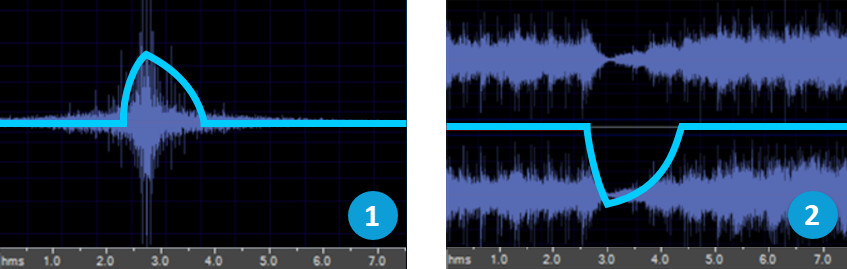

|  |  |
| --- | --- |
|  | 这个是重要声音。其 Output Bus 上插入有 Meter 效果器。 |
|  | 这些是次要声音。其 Output Bus 的音量会随着所测声音的音量的增大而减小。 |

通常，会先在同类对象之间设置优先级系统，再在不同类别之间设置优先级系统。例如，按照这一规则，游戏可判定玩家角色 (PC) 的武器声比非玩家角色 (NPC) 的武器声更重要。然后，旁链压缩就可设置为 PC 武器声播放时降低 NPC 武器声的音量。PC 和 NPC 之间的武器声非常相似；但是，在这种情况下，系统需要确保始终将 PC 声音作为玩家的主要关注焦点。

按照这一理念推断，游戏可判定附近爆炸声应作为主要关注焦点，优先于 PC 和 NPC 武器声。同样地，关键对白应优先于音效声（包括武器声和爆炸声）。

以下图表显示了这一系统的层级结构。

|  |
| --- |
|  |

###### Setting up side-chaining with RTPCs in Wwise

在 Wwise 中，可利用实时参数控制 (RTPC) 和 Meter 效果器轻松设置侧链压缩。以下示例分三步介绍了如何让 PC Weapon 音频总线的信号自动压缩 NPC Weapon 音频总线的信号音量。

1. **创建 Game Parameter**：首先，创建一个游戏参数（即 PC\_Weapon\_Volume），并将取值区间设为 -48 ~ 0，近似代表游戏的动态范围。该游戏参数将被用作总线之间的沟通渠道。

   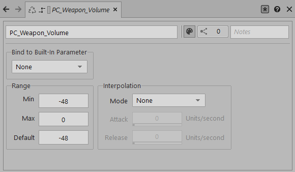
2. **在总线上插入 Meter 效果器**：然后，对于需要确保信号清晰可闻的总线（本例中为 PC\_Weapon 总线），为其插入 Meter 效果器，并选择 Output Game Parameter（输出游戏参数）。

   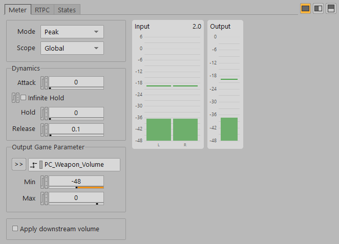

   Meter 效果器会监控输入的音频信号。在将效果器用于旁链压缩时，将使用 Mode（模式）、Attack（起音）、Release（释音）和 Hold（保持）参数来降低输出信号的响应速度，并将平滑处理后的值发送给游戏参数（本例中为 PC\_Weapon\_Volume）。
3. **创建 RTPC 曲线**：最后，为需要衰减的总线创建 RTPC 曲线。在本例中，先将总线音量关联至 PC\_Weapon\_Volume 游戏参数，然后创建衰减曲线。X 轴代表 Meter 效果器计算得出的 RMS 信号，Y 轴代表 NPC Weapon 音频总线音量的衰减量。

   

若要使用旁链压缩构建总线层级结构，只需重复上述三个简单步骤即可。

###### Other applications

因为 Meter 效果器输出的是通用游戏参数，所以任何可关联至 RTPC 的属性都可由旁链压缩驱动。例如，可以用旁链压缩控制 EQ 频段的增益，从而对特定频段进行陷波处理。再如，可以驱动 Compressor 效果器的阈值、修改 Flanger 效果器的 LFO 频率或者增大 FutzBox Lo-Fi 效果器的失真强度。

In addition to the Meter Effect, the Multiband Meter Effect is available to easily measure the audio across specific frequency bands, which might be useful for specific manipulation of EQ bands. 有关详细信息，请参阅[“Multiband Meter”一节](ch66s13.html "Multiband Meter")。

|  |  |
| --- | --- |
| [备注] | 备注 |
| This topic describes how to use Game Parameters and RTPCs to set up and configure side-chaining in order to control various aspects of the audio mix. Wwise also has Sidechain Mixes available as a separate system, described in [“Using Sidechain Mixes with Effects”一节](ch24s04.html "Using Sidechain Mixes with Effects"), which might be desirable for some applications due to greater precision, or ease of use. |

---

#### RTPC 技巧与最佳实路

在使用 RTPC 前，您最好仔细阅读以下章节，它们为您提供了一系列的技巧和经验总结，可帮助您在游戏中充分运用您的声音和振动。

|  |  |
| --- | --- |
| [备注] | 备注 |
| LFO 和 Envelope 调制器的 RTPC 光标并不能指示其所在时间点的具体值，因为该值是由调制器的内部属性决定的。 |

###### RTPC naming

在更改 Game Parameter 名称之前，一定要查证程序员是如何将其整合到游戏引擎中的。如果整合时使用了游戏参数的名称，则应该尽量避免在 Wwise 中自行更名，因为需要您的程序员进行相应处理。

###### 性能

虽然可为工程中的所有对象、总线、效果器、衰减、切换开关组和混合轨创建 RTPC，但选择性地使用它们非常重要，因为它们会消耗大量的平台内存和 CPU 资源。

###### Copying RTPCs to multiple objects

若有大量对象并希望其全部使用一系列相同的 RTPC，可在单个对象中配置所需列表，然后通过 Paste Properties（粘贴属性）视图将这些 RTPC 从该对象复制粘贴到一个或多个其他对象。有关详细信息，请参阅[*复制和粘贴对象属性*](ch55.html "复制和粘贴对象属性")。

###### Valid ranges for smart pitch curves

在原声值附近，智能音高曲线可产生良好的效果；但在极值附近就不一定动听。例如，在 2000 RPM 时测得的发动机声音在 2000 RPM 处听起来很完美，并且在 500 到 3,500 RPM 之间听起来可能也非常不错。然而，超出这个范围，听起来可能就不太自然。在这种情况下，一种解决办法是使用多个测量值和原声值，然后将测量值汇集到混合容器中。有关混合容器的详细信息，请参阅[“定义 Blend Container 的内容和行为”一节](ch21s04.html "定义 Blend Container 的内容和行为")。

###### Creating Doppler type effects using RTPCs

Wwise 声音引擎管线中使用的音高属性针对重采样进行高度优化，可以实时地加快或放慢回放。在 Wwise 中创建多普勒式效果器的“经验总结”方法是让游戏引擎跟踪听者与声源之间的位置增量，该增量基本上等于速度值。然后可以使用 RTPC 将 “Speed” 游戏参数映射到声音的音高属性。当听者和声音在游戏中相互靠近或走远时，音高将升高或降低。这是目前最节省 CPU 资源创建多普勒效果器的方法。

当 Wwise 中使用了多个听者（包括分屏）时，使用音高的多普勒效果器需要特殊的设计考虑。在现实生活中，根据声速以及对象与各个听者之间的距离，声音对各个听者可能具有不同的音高值。在 Wwise 中，由于游戏对象对各个播放音使用一份设定，因此一个声音不可能具有两个不同的音高值。所以，需要通过编程的方式确定一个音高值。

---

### 使用 Trigger

Trigger（触发器）是一种 Wwise 元素，跟其他 Game Sync（游戏同步器）一样会被游戏调用。触发器会定义 Wwise 将做出怎样的特定响应来反映游戏中的情节变化。More specifically, a Trigger responds to a spontaneous occurrence in the game and launches a Stinger. Stinger 是一种短乐句，它会与当前音乐叠加并混合播放，以音乐的形式来对游戏做出响应。For more information about how Triggers and Stingers work together, see [*使用 Stinger*](ch33.html "使用 Stinger").

For example, in a fighting game, when a character lands a powerful kick, you can intensify
the impact of that action with a Stinger. Before you create a Stinger, you must create a
Trigger, perhaps named High kick, to be called at these points in the game, and you must choose
a short Music Segment to associate with the Trigger.

下图展示了游戏关键时刻用来播放 Stinger 的 Trigger 机制。


In Wwise Authoring, Triggers are represented by this icon: .

#### Creating Triggers

You can create Triggers in the Game Syncs tab of the Project Explorer.

**To create a new Trigger:**

1. 在 Project Explorer 中，切换至 Game Syncs 选项卡。
2. 在 Triggers 层级，执行以下操作之一：

   - Select a Work Unit or Virtual Folder and in the Project Explorer toolbar click 
     **Create new 'Trigger'**.
   - 右键点击 Work Unit 或 Virtual Folder，然后从快捷菜单中选择 <**New Child > Trigger**。
3. 将默认名称替换成更合适的命名。

   |  |  |
   | --- | --- |
   | [备注] | 备注 |
   | Each Trigger name must be unique and consist of only letters, digits, and underscores. 只有字母或下划线可以作为首字符。 |

#### Deleting Triggers

Keep in mind that if you delete a Trigger that is assigned to a Stinger, the association
with the Music Segment for the Stinger is removed.

**To delete Triggers:**

1. 在 Project Explorer 中，切换至 Game Syncs 选项卡。
2. In the Triggers section, select the Triggers you want to delete and do either of the
   following:

   - 按 **Delete** 键。
   - Right-click and select **Delete** from the shortcut
     menu.

---

### 将 State 和 State Group 用于动态对话

如今的很多游戏（尤其是体育游戏）都包含 Dynamic Dialogue（动态对白）或由游戏情节驱动的音频内容。如果用传统方法模拟真实对白，可能要创建成千上万的素材，再构建复杂的 Switch Container（切换容器）层级结构，才能满足所有可能的方案。由于内存成本昂贵，所以您需要通过有效的方式来管理工程中的素材。

为了应对这些挑战，Wwise 引入了一种独特的动态对白管理方式，即采用 State 和 State Group（状态组）来预先定义游戏中可能出现各种的情况或结果。State Group 可以表示游戏中的各种元素类别。比如，在足球游戏中，State Group 可能是 Teams（球队）、Players（球员）和 Actions（动作）等。每个 State Group 类别都需要一组对应的 State 值。在足球游戏的例子中，"Teams" State Group 可能包括多个 State 值（如 Dallas、Pittsburgh、New England 等）。

在 Dialogue Event（对白事件）中，State Group 和 State 将被排列组合，以涵盖游戏中所有可能的情况。这些情况称为 Path（路径）。它们会被指派给特定的 Voice（语音）对象。游戏过程中的实时状态会与 Wwise 内 Dialogue Event 中的 State 进行匹配以决定要播放哪段对白。

State Group（状态组）代表游戏中的各种元素类别。比如，体育游戏中的 Teams（球队）和 Players（球员）或动作冒险游戏中的 Friends（队友）、Enemies（敌人）和 Weapons（武器）。在 Project Explorer（工程浏览器）的 Game Syncs（游戏同步器）选项卡中，可以管理 State Group 列表。

为了让您在界面中轻松识别 State Group 和 State，Wwise 将它们用特定图标表示。

| 图标 | 代表 |
| --- | --- |
| |  | | --- | |  | | State Group |
| |  | | --- | |  | | State Group 值 |

#### 将 State 用于 Dynamic Dialogue C 示例

假设您正在开发一款带有现场解说的高尔夫游戏，需要先为其中各个不同类别分别创建 State Group，每个 State Group 要包含该类别对应的所有 State。高尔夫游戏需要多种 State Group，包括 Players（选手）、Clubs（俱乐部）、Courses（球场）、Shots（击球）、Locations（位置）、Reactions（反应）等。

下图展示了在高尔夫游戏中如何将部分类别与 State Group 和其中的 State 进行对应。

|  |
| --- |
|  |

在定义 State Group 和 State 之后，即可将其添加到游戏所需的 Dialogue Event 中。有关如何创建 Dialogue Event 的详细信息，请参阅[“创建 Dialogue Event”一节](ch15s01.html "创建 Dialogue Event")。

#### 创建 State Group

您可以在 Project Explorer 的 Game Syncs 选项卡中创建工程所需的所有 State Group。

**在 Project Explorer 中新建 State Group 的方法如下：**

1. 在 Project Explorer 中，切换至 Game Syncs（游戏同步器）选项卡。
2. 在 State（状态）层级中，执行以下操作之一：

   选中 Virtual Folder（虚拟文件夹）或 Work Unit（工作单元），并点击 Project Explorer 工具栏上的 **State Group** 图标。

   右键点击 Virtual Folder 或 Work Unit ，从快捷菜单中选择 **New Child > State Group**（新建子项 > 状态组）。

   新 State Group 将被添加至 State Group 列表。
3. 将默认名称替换为更合适的命名。

   |  |  |
   | --- | --- |
   | [备注] | 备注 |
   | 各 State Group 不得重名，而且名称只能包含字母、数字和下划线。 |
4. 根据需要，继续添加 State Group。

   |  |  |
   | --- | --- |
   | [技巧] | 技巧 |
   | 双击 State Group 可将其加载到 Property Editor 中。在 **Notes** 字段，还可注明该 State Group 的相关信息。 |

#### 创建 State

您创建的各个 State Group（状态组）可以具有多个不同的值，分别代表每个类别内的不同选项。例如，**Player Name**（玩家名字）这个 State Group 中，各 State（状态）就是游戏中各个玩家的名字。可以在 Project Explorer （工程浏览器）的 Game Syncs（游戏同步器）选项卡中创建工程所需的所有状态。

**在 Project Explorer 中新建 State 的方法如下：**

1. 在 Project Explorer 中，切换至 Game Syncs 选项卡。
2. 在 State（状态）层级中，执行以下操作之一：

   选中 State Group，并点击 Project Explorer 工具栏中的 **State** 图标。

   右键单击 State Group（状态组）并在快捷菜单中依次选择 **New Child** > **State**（新建子对象 > 状态）。

   这时会将新建的 State 添加到 State Group 列表。
3. 将默认名称替换为最能代表 State Group 值的名称。

   |  |  |
   | --- | --- |
   | [备注] | 备注 |
   | 同一 State Group 内的各个 State 不得重名。 |
4. 根据需要继续添加 State。

   |  |  |
   | --- | --- |
   | [技巧] | 技巧 |
   | 双击 State 可将其加载到 Property Editor 中。在 **Notes** 字段，还可注明该 State 的相关信息。 |

#### 删除 State 或 State Group

您可能想要删除不再需要的 State Group（状态组）或 State。在删除 State Group 时，其中的所有 State 也将被删除。记住，若删除 State Group，则会从所有用到它的 Dialogue Event 移除该 State Group。

**删除 State Group 的方法如下：**

1. 在 Project Explorer 中，切换至 Game Syncs 选项卡。
2. 在 **State Groups**（状态组）分区中，右键单击要删除的 State Group 或 State 并选择 **Delete Selection**（删除选中项）。

   这时会删除选中的 State Group 或 State。

   |  |  |
   | --- | --- |
   | [技巧] | 技巧 |
   | 除此之外，也可选中 State Group 或 State 并按下 Delete 键。 |

---

## 使用声音和振动来提升游戏体验

本章节包含有关如何使用各种属性和行为、效果器、振动、定位设置及播放优先级构建沉浸游戏环境的概念和步骤。

- **[*定义对象播放行为*](ch21.html "定义对象播放行为")**C 使用 Random Container、Sequence Container、Switch Container 和 Blend Container；创建循环；对媒体进行流播放；使用 Source Editor。
- **[*定义定位*](ch22.html "定义定位")**C 使用扬声器声像摆位；了解 3D 空间化对象、散布、聚焦和朝向；向总线应用定位；使用 Ambisonics。
- **[*管理优先级*](ch23.html "管理优先级")**C 了解并定义播放优先级；限制播放实例；管理音量较低的对象。
- **[*管理效果器*](ch24.html "管理效果器")**C 向对象和总线应用效果器；使用 Effect ShareSet；旁通、渲染和重排效果器；了解 User-Defined Auxiliary Sends 和 Game-Defined Auxiliary Sends。
- **[*管理 Motion*](ch25.html "管理 Motion")**C 使用现有声音或专用对象生成振动效果；为振动效果构建输出结构；使用 Motion 插件为游戏控制器生成振动效果。

---

### 定义对象播放行为

游戏内出现的各种不同情况会要求声音以不同形式播放。To accommodate these different scenarios, Wwise allows you to define the playback behaviors of each individual object in the Containers hierarchy. 但为了增强播放的灵活性和控制度，您还可以通过 Wwise 将对象编组到不同类型的容器内：

- [“创建随机容器”一节](ch21s02s01.html "创建随机容器")
- [“创建序列容器”一节](ch21s02s02.html "创建序列容器")
- [“定义 Switch Container 的内容和行为”一节](ch21s03.html "定义 Switch Container 的内容和行为")
- [“创建 Blend Container”一节](ch21s04.html#creating_blend_container "创建 Blend Container")

所选的容器类型将决定容器内对象播放的方式。例如，Random Container 随机播放其内容，Sequence Container 按播放列表播放其内容，Switch Container 根据游戏内当前切换开关或状态播放其内容，Blend Container 则使用混合方式或基于 RTPC 来同时播放容器内所有对象。

使用不同容器的组合，您可以高效、创意地为游戏管理各种情形下如何播放声音，从而提升游戏的体验。

---

#### 定义对象的播放行为

工程内的每个对象都具有一组特定行为。这些行为决定每次调用对象时的播放次数，以及是在内存中存储对象，还是直接从 DVD、CD 或硬盘进行流播放。

您可以为对象定义以下行为：

- [“创建循环”一节](ch21s01.html#creating_loop "创建循环")
- [“流播放媒体”一节](ch21s01.html#streaming_media "流播放媒体")

###### 创建循环

默认情况下，对象从头至尾播放一次。不过，有时可能需要多次播放对象。这种情况下可以创建循环。当您决定循环某个对象时，必须定义循环的次数。可以选择无限循环对象，也可以指定循环次数。

默认情况下将循环整个对象，但如果音频文件中添加了 loop region （循环范围）标记，则可以循环对象的一部分。在完整循环中，整个对象将从头至尾播放。播放到对象结尾后，会返回至开头继续播放。它会重复播放，直至完成指定的次数。

|  |
| --- |
|  |

在特定范围循环中，仅循环标记范围之内的部分。对象从头播放，直至循环范围的结尾。然后返回至标记范围的开头，并重复播放循环范围，直至完成指定的循环次数。循环结束后，将播放对象的最后部分。如果是无限循环，则永远不会播放对象的最后部分。Wwise 仅支持一个循环范围，因此请确保在音频文件中仅定义了一个范围。

|  |
| --- |
|  |

|  |  |
| --- | --- |
| [备注] | 备注 |
| 范围标记（或 Audition 中的 start/end 采样）必须在第三方应用程序中创建，如 Adobe® Audition® 和 Sound Forge®。您也可以使用其他第三方应用程序，不过其不在 Wwise 官方支持范围内。 |

**循环播放声音的方法如下：**

1. 将对象加载到 Property Editor 中。
2. Enable **Loop**.

   Loop 参数变为可用。
3. 选择以下选项之一：

   **Infinite** 无限重复，整个对象或文件中定义的循环范围将无限重复。

   **No. of Loops** 次数，指定整个对象或特定循环范围的播放次数。
4. 如果您选择 No. of Loops 选项，请输入对象或特定循环范围的播放次数。

###### 循环播放压缩音频文件

由于压缩文件格式（如 ADPCM）要求文件长度和范围标记与数据块的边界采样对齐，因此转码过程中会添加零本采样来补齐。循环声音时，这些额外的零采样会导致问题。为了避免问题，Wwise 会提示点用户重新转换循环的声音，以确保：

- 补零不会发生在文件结尾。
- 循环范围标记会与数据块边界采样对齐。

Wwise 在重新转码过程中使用变调，以确保这些文件符合压缩格式的要求。循环会精确到采样点，且文件的采样率不会改变。

|  |  |
| --- | --- |
| [备注] | 备注 |
| 音频文件中，如果循环标记短于数据块首尾采样长度，那么在 Wwise 中转换时标记会被移除。 |

###### 流播放媒体

您可以决定哪些对象加载至内存中播放，哪些对象从硬盘、CD 或 DVD 进行流播放。当从磁盘或硬盘流播放媒体时，您还可以选择避免播放延迟，方法是创建一个小缓冲区来补偿提取剩余文件所需的时间。您可以指定缓冲区的大小，以满足不同媒体源（如硬盘、CD 和 DVD）的要求。与流播放文件余下的部分不同，这个小缓冲区实际上存储在 SoundBank 内，并与 SoundBank 一起在游戏中适当的时刻加载至内存中。

|  |  |
| --- | --- |
| [备注] | 备注 |
| 无论是否选择了流播放选项，在 Wwise 中播放音频时总是会使用流播放。因此仅当生成 SoundBank（声音包），且从远程平台或游戏播放时，才会应用流播放设置。 |

**流播放声音的方法如下：**

1. 将对象加载到 Property Editor 中。
2. Enable **Stream**.
3. Enable **Zero Latency** to have no delay from the time the object is triggered to when it is actually played. 为实现零延迟，必须将数据文件开头的特定部分存储在内存中，以补偿从媒体提取剩余文件所需的时间。
4. 在 **Prefetch length** 文本框中，输入毫秒数，即需要存储在内存中的文件数据长度。

---

##### 利用 Source Editor 编辑音频源

Source Editor（源编辑器）可用于编辑以下类型的对象：

- 音频源（WAV 或 AMB 文件）
- 源插件（Silence、Sine、Tone Generator 等）

The editing functions such as trimming, looping, and fades are not available for
the Audio Source objects of music objects, because these operations
are available as part of the Music Segment and Music Clip objects.

以下章节所述的操作都已存储到工程的 Work Unit（工作单元）中。这些操作会在对源素材实施转码的过程中执行并且都是非破坏性的。

有关 Source Editor 的参考信息，请参阅 [“Source Editor：音频源”一节](ch60s01s06.html "Source Editor：音频源")。

###### 对音频源的内容进行修剪

在修剪时，可移除 WAV 文件开头或结尾的无声内容以节省游戏所占的空间。在转码和播放的过程中，会弃用 Trim Start 和 Trim End 以外的内容。

**定义修剪位置：**

- 拖动 **Trim Start**（修剪起点）图柄（波形左下角的四方图柄）。
- 拖动 **Trim End**（修剪终点）图柄（波形右下角的四方图柄）。

###### 定义 Fade-in 和 Fade-out 区域

**定义 Fade-in 和 Fade-out 区域：**

- 拖动 **Fade-in**（淡入）图柄（波形左上角的三角图柄）。
- 拖动 **Fade-out**（淡出）图柄（波形右上角的三角图柄）。
- 右键单击图柄来选择淡变曲线。

###### 循环和交叉淡变

**调节循环点和使用交叉淡变：**

1. 在父级 Sound 对象中，启用 **Loop**（循环）。
2. 在 Source Editor（源编辑器）中，启用 **Override wav loop points**（不沿用 WAV 循环点）。这样就会不沿用 WAV 中的循环点。否则，会默认使用这些循环点。在下一步设置 Loop Start 时，会自动启用 Override wav loop points。
3. 向右拖动 **Loop Start**（循环起点）图柄（波形左上角的绿色图柄）。为避免循环时出现噼啪噪声，建议将循环点放在 PCM 数据的零交叉位置。
4. 向左拖动 **Loop End**（循环终点）图柄（波形右上角的红色图柄）。
5. 在侧面板中，定义 **Crossfade Duration**（交叉淡变时长）。这样可以让循环更流畅，同时还可移除噼啪噪声。

###### 添加和编辑文件标记

音频源文件可能包含标记，有时会被用作同步点或提示点。标记具有与文件位置绑定的唯一 ID。Wwise 可在 Source Editor 的坐标图中使用这些标记。另外，还可编辑这些标记或另外添加标记，但不会影响到原始文件。

您可以单击所需标记并将其拖放到要在源文件中标识的位置。比如，以此来显示文件哪里存在问题。或者提示即将发生的重要事件。比方说在对白中，可利用其来区分不同角色说话的时间点。所以，您可以根据具体需要自由地设置标记。

**在 Source Editor 的侧面板中，可选择 Marker Input Mode：**

- **Use File Markers**（使用文件标记）：使用源音频文件的标记。
- **Use Markers From Transients**（使用来自瞬态的标记）：通过自动检测瞬态起始点来放置标记。在移动 Marker Detection Sensitivity（标记检测灵敏度）滑杆时，才会显示这些标记。灵敏度越高，产生的标记越多。调整滑杆以使检测到的瞬态起始点尽可能靠近所需位置。然后，手动编辑这些标记。一旦编辑标记，标记模式就切换为 Manual Markers。
- **Manual Markers**（手动标记）：使用用户设置的标记。在选中 Manual Markers 时，并不会改变先前已有的标记位置。无论是文件标记还是来自瞬态的标记，用户都可以随时直接编辑。一旦进行编辑，标记选择就会设为 Manual Markers。

在 Source Editor 的坐标图内，可使用四个快捷菜单选项来快速编辑标记。

**标记专用的快捷菜单选项：**

- **Add Marker**（添加标记）：在 Source Editor 坐标图内的现有标记之外打开快捷菜单时，将显示此选项。它用于在坐标图时间线的指定时间点创建新的无标签的标记。
- **Delete All Markers**（删除所有标记）：在 Source Editor 坐标图内任意位置打开快捷菜单时，都会显示此选项。它用于移除来自源文件的所有标记。不过，这并不会影响原始文件标记。
- **Delete Marker**（删除标记）：只有在特定标记图柄位置打开快捷菜单时，才会显示此选项。它用于移除特定标记。它也不会影响原始文件标记。
- **Edit Marker Label...**（编辑标记标签...）：只有在特定标记图柄位置打开快捷菜单时，才会显示此选项。它会显示 Edit Label（编辑标签）对话框，其中显示所选标记的当前标签，便于根据需要更改标签。
- **Edit Markers in List View**（在列表视图中编辑标记）：在 Source Editor 坐标图内任意位置打开快捷菜单时，都会显示此选项。它会显示 List View（列表视图），其中有两个标记专用的列，用来查看和编辑所有源文件中的标记（包括 Wwise 中创建的标记）。

|  |  |
| --- | --- |
| [技巧] | 技巧 |
| 除了使用“撤消”操作（依次选择 Edit > Undo 或按下 Ctrl+Z），还可通过将 **Marker Input Mode**（标记输入模式）改为 **Import From File**（从文件导入），来轻松恢复原始文件的标记。不过，一定要谨慎！在执行此操作后，所有手动输入的标记都将消失。 |

下图简要显示了 Wwise Source Editor 内的一些常用标记选项。

|  |
| --- |
|  |

**相关主题**

- [Wwise Fundamentals Module 2: Using a single WAV file for multiple
  applications](https://www.audiokinetic.com/en/courses/wwise101/?source=wwise101&id=single_sound_multiple_applications)

---

##### 解决音频源完好度问题

在使用外部编辑器编辑音频源属性或编辑 WAV 文件后，对音频源已做的设置可能会变为不可用或不完全可用。

**完好度问题的情况示例：**

1. 在 Wwise 中导入 WAV 文件、创建声音和音频源对象。
2. 在 **Source Editor** 中，修剪 WAV 文件的结尾。
3. 在外部 WAV 编辑器中，将WAV 文件的结尾区域删除，删除区域比修剪区域更长 。

在 Wwise 中，修剪操作将针对不再存在的部分 WAV 文件执行。这种情况就属于音频源完好度问题。

###### 诊断音频源完好度问题

在 Wwise 中的以下地方可以发现音频源完好度出现了问题：

- 在 **Source Editor** 中，带有黄色三角和叹号
- 在 **Integrity Report**（完好度报告） 中，运行 Audio Source（音频源）测试时
- 生成 SoundBanks（声音包）时音频源转码执行期间

###### 修复音频源完好度问题

要修复音频源完好度问题，请执行以下任一操作：

- 通过处理不可用的操作，手动修复音频源。
- 点击 **Audio Source Editor** 中的黄色三角。
- 在列有音频源的位置右键单击音频源或声音对象，并选择 **Repair Audio Source Integrity Issues**（修复音频源完好度问题）。

---

#### 定义 Random/Sequency Container 的播放行为

随机容器（Random Container）和序列容器（Sequence Container）为您提供游戏中声音播放的多种组织形式。随机容器可随机播放一组对象，让您可以创建有趣的声景并增强玩家体验；而序列容器用来以指定顺序持续播放对象。

使用随机和序列容器时，您可以执行以下任务：

- [“创建随机容器”一节](ch21s02s01.html "创建随机容器")
- [“创建序列容器”一节](ch21s02s02.html "创建序列容器")
- [“创建播放列表”一节](ch21s02s03.html "创建播放列表")

**相关主题**

- [Wwise Fundamentals Module 3: Creating sonic variety with few resources](https://www.audiokinetic.com/en/courses/wwise101/?source=wwise101&id=designing_soundscape)

---

##### 创建随机容器

对于所有需要随机播放一组对象的情况，都可以使用随机容器。例如，您可能会需要使用随机容器在格斗游戏中播放所有攻击、击中和反应声音。

在 Wwise 中，随机意味着既可以进行标准随机选择（即在播放时，容器中的各个对象被选中的几率均相等），也可以进行洗牌选择（即被播放完的对象将从选择池中移除）。

您也可以为随机容器内的每个对象指派一个权重值。该权重值可以增加或减小对象被选择播放的概率。为对象设置的权重值是相对于容器内所有对象权重总和来计算的相对值。这就是说，为各个对象指派的权重值代表其被选择播放的几率占总数的比率。例如，如果容器内有两个对象，权重值分别为 1 和 100，则第一个对象将有 1/101 的播放几率，而第二个对象将有 100/101 的几播放率。

###### 使用随机容器 ―― 示例

假如游戏的其中一个环境为洞穴。您希望背景中有水滴声，来营造洞穴环境的氛围。在本例中，可以创建一个随机容器，将所有不同的水滴声编组。由于您希望当角色位于洞穴中时，持续播放水滴声，因此可以将容器的播放模式设置为 **Continuous** 并无限循环。通过随机播放有限数量的声音，可以为场景增加真实感。

|  |
| --- |
|  |

**创建随机容器的方法如下：**

1. In the Project Explorer, right-click any one of the following objects in the Containers hierarchy:

   - Work unit（工作单元）
   - Virtual Folder（虚拟文件夹）
   - Property Container
   - Blend Container（混合容器）
   - Random Container （随机容器）
   - Sequence Container （序列容器）
   - Switch Container（切换容器）
2. 从快捷菜单中，选择 **New Child** > **Random Container**。

   A new Random Container is created and highlighted in the Containers hierarchy.
3. 输入随机容器的名称，然后按下 **Enter**。
4. 双击新的随机容器，将打开其相应的属性和内容编辑器。请参阅 [“Random Container tab”一节](ch60s01s05s03.html "Random Container tab")。
5. 将各对象从 Project Explorer 拖至 Contents Editor 中，来填充随机容器。
6. In the Property Editor, select one of the following options for the Random Type
   property:

   - **Standard**（标准），始终保持对象池完整。播放某个对象后，该对象不会从可播放的对象列表中移除，因此可重复播放。
   - **Shuffle**（洗牌），播放对象后，这些对象会从对象池中移除。该选项可避免重复，直至所有对象均已播放。
7. To avoid objects being repeated one after the other, enable **Limit
   Repetion**.

   您选择的是 Standard 还是 Shuffle 模式将影响该选项的行为。

   在 Standard 模式中，完全随机选择播放对象，但最后播放的 x 个对象将从列表中弃用。

   在 Shuffle 模式中，重置列表时，最后播放的 x 个对象将从列表中排除。
8. In the Limit Repetition To property, choose the number of objects that must be played
   before an object can be repeated.
9. In the Contents Editor or the Random Container tab, assign a weight to each of the
   objects within the container.

   该权重可以让某些对象优先于其它对象播放。为各个对象指派的权重值代表其被选择播放的几率占总数的比率。

---

##### 创建序列容器

For all situations where you want a series of objects to be played back in a particular order, you use a Sequence Container. The Sequence Container plays back the objects in the playlist according to a specified order. 例如，您可以使用序列容器来表现角色的对话。您可以指定对话的顺序，防止角色先说出“再见”后才说出“你好”。

###### 使用序列容器 ―― 示例

假设您正在研发第一人称射击游戏。在游戏的某个环节，玩家必须按下按钮才可打开一扇装有很多解锁机制的大铁门。此时，您可以将所有解锁声音编组至一个序列容器。之后可以创建一个播放列表，按逻辑顺序排列这些声音。您可以将容器的播放模式设置为 Continuous，这样在解锁大门时，便会连续播放这些解锁声。

|  |
| --- |
|  |

**创建序列容器的方法如下：**

1. In the Project Explorer, right-click any one of the following objects in the Containers hierarchy:

   - Work unit（工作单元）
   - Virtual Folder（虚拟文件夹）
   - Property Container
   - Blend Container（混合容器）
   - Random Container （随机容器）
   - Sequence Container （序列容器）
   - Switch Container（切换容器）
2. 从快捷菜单中，选择 **New Child** > **Sequence Container**。

   A new Sequence Container is created and highlighted in the Containers hierarchy.
3. 输入序列容器的名称，然后按下 **Enter**。
4. The Sequence Container Tab of the Primary Editor is displayed. To open its corresponding Property and Contents editors. 请参阅 [“Sequence Container tab”一节](ch60s01s05s04.html "Sequence Container tab")。
5. Populate the Sequence Container in any of the following ways:

   - If the Sequence Container does not have child objects, you
     can drag objects from the Project Explorer into the Contents
     Editor or into the Sequence Container Tab of the Primary Editor.

     |  |  |
     | --- | --- |
     | [备注] | 备注 |
     | Dragging objects into the Contents Editor is not mirrored in the Sequence Container Tab of the Primary Editor. These objects are not added to the playlist.  Dragging objects directly into the Sequence Container Tab adds them to the playlist and also displays them in the Contents Editor. |
   - Click the Add to Playlist (**+**) button and then select from the list of
     child items in the Sequence Container.
6. To define the **At end of playlist** behavior, select one
   of the following options in the Property Editor:

   - **Restart**  从头开始，播放列表中的最后一个对象播放完后，会再次按其原始顺序从头至尾播放列表。
   - **Play in reverse order**  倒序播放，播放列表中的最后一个对象播放完后，会按照倒序从最后一个到第一个播放列表。

|  |  |
| --- | --- |
| [技巧] | 技巧 |
| 通过在 Project Explorer 中选择对象，然后右键点击并选择 **New Parent** > **Sequence Container**，您也可以为多个对象和其它容器一起创建父级序列容器。 |

---

##### 创建播放列表

Create a playlist in a Sequence Container to playback objects in a particular order. Playlists are added to the Sequence Container Tab in the Primary Editor. 请参阅 [“Sequence Container tab”一节](ch60s01s05s04.html "Sequence Container tab")。

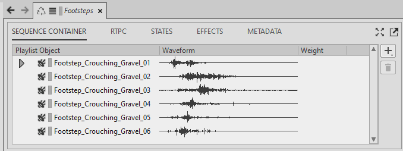

您也可以测试和微调播放列表，添加、移除和给对象重新排序，直至您满意。可以在创建过程中随时播放该播放列表。有关播放播放列表的详情，请参阅 [“播放 Playlist”一节](ch21s02s03.html#playing_playlist "播放 Playlist")。

|  |  |
| --- | --- |
| [备注] | 备注 |
| Even if a Sequence Container has child objects, it can't be played until you create a playlist with those objects. |

###### 为 Playlist 添加和移除对象

您可以通过将对象和其他容器拖入或拖出 Contents Editor 的 Playlist 窗格来创建播放列表。您也可以选择多个对象，然后同时添加或移除它们，来更快地创建列表。

大多数情况下，您将使用序列容器中的对象创建播放列表。但您也可以从 Project Explorer 的 Audio 选项卡中，将对象直接拖至播放列表。这些对象将被从当前位置移动到序列容器中。如果您要创建对象的副本，而不是移动它，则可以按住 Ctrl 键同时将该对象从 Project Explorer 的 Audio 选项卡中拖拽至播放列表。

**在播放列表中添加/移除对象的方法如下：**

1. Select the Sequence Container to open the Primary Editor.

   容器内的对象将显示在 Contents Editor 中。
2. To add an object to the playlist, drag an object from the Contents Editor to the
   Sequence Container Tab.

   对象即被添加至播放列表。
3. To remove an object from the playlist, in the Sequence Container Tab, select the
   object.
4. 按 **Delete** 键。

   对象将被从播放列表中移除，但仍保留在 Contents 面板中。

###### 对播放列表中的对象重新排序

创建播放列表时，您可以为这些对象重新排序，以查看顺序不同时它们听起来效果如何。如果您的播放列表内包含容器，则无法为所含容器内的对象重新排序。

**为播放列表中的对象重新排序的方法如下：**

1. In the Sequence Container Tab, select the object or objects that you want to
   move.
2. 将它们拖拽至播放列表中的新位置。

   这些对象将被移至新位置。

###### 播放 Playlist

播放序列容器前，您必须创建一个播放列表。请参阅 [“创建播放列表”一节](ch21s02s03.html "创建播放列表")。Play 图标表明当前正在播放播放列表中的哪个对象。


若在对象之间使用交叉淡变，则在交叉淡变过程中播放列表中会显示两个 Play 图标。

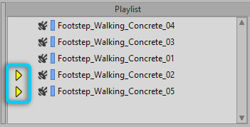

若在对象之间使用延迟，则在延迟过程中 Play 图标会变为 Clock 图标。

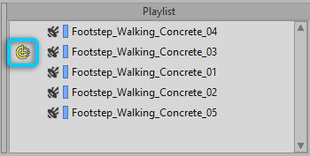

**播放播放列表的方法如下：**

1. Select the Sequence Container to open the Primary Editor.
2. In the Transport Control, click the **Play** icon or press
   the spacebar.

   Wwise 将按指定顺序播放播放列表。

---

##### 定义容器内对象的播放方式

容器可能会包含多个对象。在播放容器时，会根据 Play Mode 设置播放它的一个或所有子对象：

- **[“"Step" Play Mode”一节](ch21s02s04.html#playing_one_object_within_container "\"Step\" Play Mode")**：每次播放容器时播放它的一个子对象。
- **[“"Continuous" Play Mode”一节](ch21s02s04.html#playing_all_objects_within_container "\"Continuous\" Play Mode")**：每次播放容器时播放它的所有子对象。此模式包含在对象之间循环和过渡的选项。

###### "Step" Play Mode

您可能希望每次调用时播放容器内的一个对象。比如，在每次开枪时仅播放一个声音。或者，在每次角色说话时仅播放一句对白台词。要想实现这一点，可将容器的 Play Mode（播放模式）模式设为 Step（步进）。

下图显示了在将手枪的声音放到 Random Container 中并设为 Step 模式时开枪会发生什么。

|  |
| --- |
|  |

**播放容器中的一个对象：**

1. 打开与 Random Container（随机容器）或 Sequence Container（序列容器）对应的 Property Editor（属性编辑器）。
2. In the Property Editor, select the **Step** option of the
   Play Mode property.

   每次播放容器时，将仅播放一个对象。

###### "Continuous" Play Mode

在别的一些情况下，您可能希望每次播放容器时播放容器中的所有对象。比如，在使用游戏中的某些枪支开火时必须逐次播放一系列声音。To achieve this, set the Play Mode of the container to Continuous.

|  |  |
| --- | --- |
| [备注] | 备注 |
| Continuous 播放模式始终应用于游戏对象作用域。有关更多详细信息，请参阅 [“定义容器的范围”一节](ch21s02s05.html "定义容器的范围") 章节。 |

下图显示了当特定枪支开火时，Wwise 如何使用 Continuous 模式的序列容器来播放声音序列。

|  |
| --- |
|  |

在 Continuous 模式下将播放容器内的所有对象，这意味着您可以添加循环，并在对象间应用各种过渡。

|  |  |
| --- | --- |
| [备注] | 备注 |
| 在将 Random Container 设为 Continuous 模式时，某些对象可能会在整个列表播完之前重复数次。这是由于对容器内的各个对象都应用了权重。 |

**播放容器内的所有对象的方法如下：**

1. 打开与 Random Container（随机容器）或 Sequence Container（序列容器）对应的 Property Editor（属性编辑器）。
2. In the **Play Mode** property, select the **Continuous** option.
3. For Sequence Containers, enable **Always reset playlist** to return the playlist to the beginning each time the container is played. 如果您未勾选该选项，则容器将从上次停止处继续播放，更确切地说是从播放列表中下一个对象的起始处播放。
4. Enable **Loop** to loop the entire contents of the
   container.
5. 选择以下选项之一：

   - **Infinite Looping** to specify that the container will be
     repeated indefinitely.
   - **No. of Loops**，指定容器将播放特定次数。
6. 如果您选择 No. of Loops 选项，请输入容器将被播放的次数。
7. 选择 **Transitions** 选项，可以在播放列表中的对象间应用过渡。

   Transition 参数变为可用。
8. 从 Type 列表中，选择以下任一选项：

   - **Xfade (amp)** 淡变（恒定振幅），在两个对象之间保持恒定振幅进行交叉淡变。

     |  |
     | --- |
     |  |
   - **Xfade (power)** 淡变（恒定功率），在两个对象之间保持恒定功率进行交叉淡变。

     |  |
     | --- |
     |  |
   - **Delay** 延迟，在两个对象之间添加无声段落。
   - **Sample Accurate** 精确到采样点，对象之间进行零延迟的无缝过渡。Note that the Opus audio format, when streamed from disk, is not reliable for sample accurate transitions.
   - **Trigger rate** 触发速率，使用特定速率来触发容器内的对象。该选项对于模拟快速枪声十分实用。除此之外，也可使用 MIDI 来以更高的精度发送每个子弹声音。有关详细信息，请参阅 SDK 文档中的[模拟快速射击](https://www.audiokinetic.com/library/edge/?source=SDK&id=goingfurther_rapidgunfire.html)章节。

   |  |  |
   | --- | --- |
   | [备注] | 备注 |
   | 在使用 Xfade、Sample accurate 和 Trigge rate 时有一些局限性。以下几点值得注意：  - Blend Container 和 Switch Container 不支持交叉淡变（Xfade）。当子级 Blend/Switch Container 播放时，其父级 Random/Sequence Container的 Xfade 设置也无法正常工作。 - 假如为 Random/Sequence Container 应用了精确到采样点的过渡，若在当前声音末尾使用中断动作退出循环播放，而没有足够时间预取接下来要播放的声音，则可能会导致无法精确地过渡到指定的声音。为了避免这一问题，可针对这些声音使用内存内容（不进行流播放，也不使用硬件编解码器）。 - 对于使用了 Xfade 或 Trigger rate 过渡方式的容器，带有 Fade out 的 Stop Action 将不起作用。为容器调用 StopEvent 时，如果 Fade out 时间比当前播放的声音更长，则播放结束时声音会突然切断。要避免这种情况，可以使用 Set Voice Volume Action 进行淡出，并延迟 Stop Action。 |
9. 在 **Duration** 文本框中，输入所需的交叉淡变、延迟或触发速率的时长。

   |  |  |
   | --- | --- |
   | [备注] | 备注 |
   | Duration 选项不适用于精确到采样点的过渡。 |

---

##### 定义容器的范围

因为有时会为多个不同的游戏对象使用同一容器，所以需要决定是将游戏中所用容器的所有实例作为一个对象来处理还是各个实例单独处理。在 Wwise 中，这一概念称为容器的范围。您可以将范围设置为以下任一选项：

- **Global**（全局）：将游戏中所用容器的所有实例作为一个对象来处理，以针对所有游戏对象避免重复播放声音或语音对象。
- **Game object**（游戏对象）：将容器的各个实例作为单独的实体进行处理。即不会在所有游戏对象间共用声音内容。

|  |  |
| --- | --- |
| [备注] | 备注 |
| Scope 选项不适用于 Continuous 播放模式下的序列容器，因为每次事件触发该容器时都将播放全部播放列表。 |

###### 定义容器的范围 C 示例

假设您正在研发一个第一人称角色扮演游戏。有 10 名警卫，这些警卫共用 30 条相同的对话。此时，您可以将 30 条语音对象编组至随机容器，并将其设置为 Shuffle 和 Step。您可以为这 10 名警卫使用同一个容器并将容器的范围设为 Global 来避免不同的警卫重复同一段对白的情形。这一概念可以应用至游戏中供多个对象使用的任何容器。

**设置容器的范围：**

1. Select the Sequence Container or a Random Container to open its
   Primary Editor.
2. For the **Scope** property, select one of the following
   options:

   - **Global** 全局，将游戏中使用的所有容器作为一个对象进行处理。因此，可以针对所有游戏对象避免重复声音或语音对象。
   - **Game object** 游戏对象，将容器的各个实例作为单独实体进行处理。即不会在所有游戏对象间共用声音内容。

---

#### 定义 Switch Container 的内容和行为

通过使用 Switch Container（切换容器），您可以根据游戏内的不同条件变化来为对象编组。在 Switch Container（切换容器）中，Swtich（切换开关）或State（状态）被用来代表各个不同条件。例如，可以为角色行走时的所有不同表面材质创建一个切换容器。容器中可能包含与水泥、木材、草地、雪地及游戏中角色可能踩到的其他表面材质对应的 Switch。

|  |
| --- |
|  |

每个切换开关/状态对应于与该条件有关的声音对象。例如，所有混凝土上的脚步声可编组至“Concrete”切换开关，所有木头上的脚步声可编组至“Wood”切换开关，以此类推。当游戏调用切换容器时，Wwise 会验证当前哪个 Switch/State 处于激活状态，以决定播放哪个容器或声音。

下图说明当事件调用“Footsteps”切换容器时发生的情况。该容器根据游戏中角色可行走的不同表面材质将声音编组。在本例中有两个切换开关：Grass 和 Concrete。当该事件调用切换容器时，角色走在草地上（切换开关 = Grass），因此会播放草地上的脚步声。随机容器用于将切换开关内的脚步声编组，因此当角色每次踏到同一表面时，都会播放不同的声音。

|  |
| --- |
|  |

###### 定义 Switch Container 的类型

创建切换容器时，您必须定义该容器应该是基于状态、切换开关，还是 RTPC。一方面，您可以在切换容器的属性编辑器中选择切换开关或状态；另一方面，RTPC 可以关联至 Switch Group Property Editor 中的切换开关组。有关 RTPC（实时参数控制）如何与切换开关进行关联的详细信息，请参阅[“将 Game Parameter 值映射到 Switch”一节](ch17s02.html "将 Game Parameter 值映射到 Switch")。

决定切换开关容器类型后，您还必须为该容器指派切换开关或状态组。这定义了可供指派对象所用的 Switch/State/RTPC。

在为容器指派状态或切换开关组，或将 RTPC 关联至切换开关之前，您必须先创建它们。有关创建切换开关组、状态组和 RTPC 的信息，请参阅：

- [“使用 State”一节](ch16s01.html "使用 State")
- [“使用 Switch”一节](ch17s01.html "使用 Switch")
- [“Creating Game Parameters”一节](ch18s02.html#creating_game_parameter "Creating Game Parameters")

**定义 Switch Container 的类型：**

1. 将 Switch Container 容器加载至 Property Editor 中。
2. In the **Switch Group or State Group**, click **Set SwitchGroup/StateGroup**, and select the Switch
   or State Group to assign to the container.

   In the Primary Editor, the Assigned Objects column is populated with the
   Switches/States of that group.
3. In the Property Editor, click **Set Default Switch/State**,
   and select the Switch/State to be played when the game cannot identify a
   specific Switch or State.

###### 定义 Switch Container 的播放行为

由于切换开关或状态可在游戏中随时更改，因此您需要决定对象是立即应用更改，还是下次播放切换容器时再应用更改。Wwise 提供以下播放模式：

- Step
- Continuous

您可针对 one-shot 声音（一次播放一个的声音，如脚步声）使用 **Step** 选项。而 **Continuous** 选项对于持续循环的对象（如单板滑雪声）则更为实用。

**定义切换容器播放模式的方法如下：**

1. 将 Switch Container 容器加载至 Property Editor 中。
2. For the **Play Mode** property, select one of the following
   options:

   - **Step**，不论播放过程中切换开关是否更改，仅在触发新的播放事件后播放不同的对象。
   - **Continuous**，只要检测到新的 Switch/State，就播放新对象。当选择 Continuous 时，切换播放对象不需要新的播放事件。

###### 为 Switch 和 State 添加和移除对象

您必须将 Switch Container（切换开关容器）内的对象指派给特定的 Switch 或 State（状态）。

You can assign objects to switches by adding objects and other containers to the **Assigned Objects** column of the Primary Editor. 您可以按住 Ctrl 或 Shift 键同时点击多个对象，然后同时添加或移除它们，来更快地指派对象。若将多个对象指派给某个 Switch，则会在 Wwise 内和游戏中运行时同时予以播放。

在大多数情况下，会指派 Switch Container（切换开关容器）中已有的对象。不过，也可能需要将对象直接从 Project Explorer（工程资源管理器）的 Audio（音频）选项卡拖到 Switch/State（切换开关/状态）上。这些对象将被从当前位置移动到切换容器中。如果您要创建对象的副本，而不是移动它，则可按住 Ctrl 键，同时将该对象从 Project Explorer 的 Audio 选项卡中拖拽至 Assigned Objects 面板中的 Switch/State 上。

**为 Switch/State 指派/移除对象的方法如下：**

1. 将 Switch Container 容器加载至 Property Editor 中。

   容器内的对象将显示在 Contents Editor 中。
2. To assign an object to a Switch/State, drag an object from the **Contents** pane to a Switch/State in the **Assigned Objects** column of the Primary Editor.

   对象将被添加至 Switch/State。

   |  |  |
   | --- | --- |
   | [备注] | 备注 |
   | 必须将对象直接拖拽至切换开关或状态的名字上。 |
3. To remove an object from a Switch/State, click the object you want to remove in the
   **Assigned Objects** column.
4. 按 **Delete** 键。

   该对象将从 Switch/State 中移除，但仍保留在 Contents 面板中。

###### 在 Switch 或 State 之间移动对象

如果首次将对象指派至 Switch/State 时出现错误，或是要移动对象，您则可以随时将它们移动至新位置。

|  |  |
| --- | --- |
| [技巧] | 技巧 |
| 要同时移动多个对象，则请按住 Ctrl 键并点击各个对象，然后将它们拖至新位置。 |

**在 Switch 或 State 之间移动对象：**

1. 在 Contents Editor 的 Assigned Objects 面板中，选择要移动的若干个对象。
2. 将对象拖拽至新的 Switch/State。

   对象将被指派至新的 Switch/State。

###### 定义 Switch Container 所含对象的播放行为

由于在游戏内，切换开关和状态会经常变化，因此您需要决定在发生变化时，切换容器内的各个对象将如何反应。可以选择以下播放行为：

- **Play** ―― 决定是每次切换被触发时都重新播放对象，还是仅当触发的 Switch/State 发生变化时才重新播放对象。
- **Across Switches**（多个切换开关）：决定在触发新的 Switch/State 时是否继续播放指派给多个 Switch 的同一对象。
- **Fade In**（淡入）：决定在触发新的 Switch/State 时是否要淡入到新的对象。
- **Fade Out**（淡出）：决定在触发新的 Switch/State 时是否要从现有对象淡出。

**定义切换容器内对象播放行为的方法如下：**

1. 将 Switch Container 容器加载至 Property Editor 中。

   容器内的对象将显示在 Contents Editor 中。
2. 在 Play 列中选择 **1st only** 选项，那么将仅当 Switch/State 有变化时才播放该对象。如果您不勾选 1st only 选项，那么游戏每次触发切换容器时，无论 Switch/State 是否有变化，都将播放该对象。
3. 在 Across Switches 列中选择 **Continue to play** 选项，那么如果音频对象同时指派至源和目标 Switches/States ，则在 Switch/State 变化期间对象将继续播放。如果您不勾选 Continue to play 选项，那么对象将停止并从开头重新播放。

   |  |  |
   | --- | --- |
   | [备注] | 备注 |
   | Across Switches 选项仅适用于 Continuous 播放模式。 |
4. 如果您希望在 Switch/State 发生变化时让新对象淡入，则请在 Fade-In 文本框中输入时间长度。

   |  |  |
   | --- | --- |
   | [备注] | 备注 |
   | Fade-In 选项仅在 Continuous 播放模式下可用。 |
5. 如果您希望在 Switch/State 发生变化时让现有对象淡出，则请在 **Fade Out** 文本框中输入时间长度。

---

#### 定义 Blend Container 的内容和行为

您可以使用 Blend Container（混合容器）将多个对象编组以便同时听到这些对象。也可以将对象置于混合容器内的Blend Track（混合轨）中，这样就可以轻松地为它们应用多个 RTPC 曲线。甚至可以在这些对象之间基于 RTPC 设置它们的交叉淡变。这样当游戏中的参数发生变化时，就可以在对象间创建平滑的过渡。

使用混合容器时，可以执行以下操作：

- [“创建 Blend Container”一节](ch21s04.html#creating_blend_container "创建 Blend Container")
- [“使用 Blend Track”一节](ch21s04s01.html "使用 Blend Track")
- [“管理交叉淡变”一节](ch21s04s02.html "管理交叉淡变")
- [“预览混合容器的内容”一节](ch21s04s03.html "预览混合容器的内容")

###### 创建 Blend Container

在某些游戏情形中，您可能会需要同时播放多个相关对象，来构成复杂的组合。混合容器可以用来将多个对象编组，结构非常灵活。播放容器时，容器内的所有对象会同时播放。

您可以将以下对象添加至混合容器：

- Blend Container（混合容器）
- Random Container（随机容器）
- Sequence Containers（序列容器）
- 声音
- Switch Container（切换容器）
- Voices（语音）

###### 使用混合容器 ―― 示例 1

假设您的游戏发生在农场。您希望玩家能够体验到真实的农场氛围。增强这种体验的一种方式是找到各种农场动物声音（牛哞哞叫声、鸡咯咯叫声、马嘶声），并将这些声音编组至“农场声音”混合容器内，这样玩家就可以同时听到这些声音。

###### 使用混合容器 ―― 示例 2

现在来进一步设置您的农场。您希望玩家进入农场时，可以听到一系列不同声音，而不仅仅是动物嘈杂的叫声。解决这个问题的一种方法是在 Blend Track 内组织声音，并根据游戏参数（一天中的时间）让这些声音进行交叉淡变。例如，您可以创建一个“Chicken Blend Track”，这样玩家就能在清晨听到公鸡啼叫，白天听到咯咯叫声和啄食声，而夜晚保持安静。也可以创建 RTPC，以将声音的特征与游戏参数相关联。例如，您可能会需要当您挥舞剑时，鸡会感到紧张。为此您可创建一个“Agitation （躁动）”RTPC，并创建一个 RTPC 曲线，当 Agitation 等级增加时会提高 Chicken Blend Track 中的音量。

|  |
| --- |
|  |

---

##### 使用 Blend Track

Blend Track 用于将混合容器内的对象及其属性值进行编组。每个 Blend Track 可以包含多个对象，它们可以同时被听到，也可以使用 RTPC 由游戏参数决定何时听到它们。

###### 创建 Blend Track

在混合容器内组织对象的第一个步骤是创建并命名 Blend Track。

**创建新 Blend Track 的方法如下：**

1. 将混合容器加载至属性编辑器。
2. In the Blend Track tab of the Secondary Editor, click **New Blend Track**.
3. 输入 Blend Track 的名称，然后按下 **Enter**。

   此时新的 Blend Track 将显示在 Blend Track Editor 中。
4. 重复该步骤，来创建所需的新 Blend Track。

   您创建的 Blend Track 将显示在 Blend Track Editor，以及 Contents Editor 的 **>Blend Tracks**> 部分中。

   |  |  |
   | --- | --- |
   | [备注] | 备注 |
   | 要删除 Blend Track，请选择 Blend Track，并按下 **Delete**。 |

###### 为 Blend Track 添加和移除对象

如果不为创建的 Blend Track 添加对象的话，Blend Track 则将是空白的。混合容器内的每个 Blend Track 最多可以包含 128 个对象。一个对象可以同时存在于多个 Blend Track 中，一个 Blend Track 也可以多次包含同一对象。您可以在 Content Editor 中为 Blend Track 添加或移除对象。

|  |  |
| --- | --- |
| [技巧] | 技巧 |
| Blend Track 内的对象顺序十分重要，因为顺序决定了这些对象如何行排列和交叉淡变。有关交叉淡变的详细信息，请参阅 [“管理交叉淡变”一节](ch21s04s02.html "管理交叉淡变")。 |

**将对象添加至混合容器中的 Blend Track 的方法如下：**

1. 将混合容器加载至属性编辑器。
2. 将对象从 Contents Editor 或 Project Explorer 中拖至 Blend Tracks 列表中的各个 **Blend Track**，为其添加对象。

|  |  |
| --- | --- |
| [备注] | 备注 |
| 从 Blend Track 中移除对象，选择对象并按下 **Delete**。该操作会从 **Blend Track** 列表中移除对象，但不会从 Contents Editor 中移除对象。 |

###### 将 RTPC 曲线添加到 Blend Track

可以通过两种方式将 RTPC（实时参数控制）曲线添加至 Blend Track：

- 将曲线添加至混合容器本身。
- 将曲线添加至混合容器内的各个 Blend Track。

如果您选择将 RTPC 添加至混合容器本身，该 RTPC 则将同时作用于容器内的所有对象。有关创建和使用 RTPC 的详情，请参阅 [使用 RTPC](ch18.html "使用 RTPC")。

但您也可以将 RTPC 添加至容器内的各个 Blend Track。通过这种方式，您可以仅针对所选对象应用 RTPC。例如，您可以将赛车游戏中的所有碰撞声添加至一个 Blend Track 中。如果您使用冲击力 RTPC 来改变 Blend Track 的音量，则该 RTPC 会影响各个撞击声的音量。

**将 RTPC 曲线添加至 Blend Track 的方法如下：**

1. In the Blend Tracks tab of the Secondary Editor, select the blend
   track to which you want to add RTPC curves, and click the **Property Selector** button.

   可用声音属性列表将被显示。
2. 点击您想用 RTPC 影响的声音属性。

   RTPC 曲线将被显示在图形视图中。
3. 在 X 轴列表中，点击要指派给 Wwise 属性的游戏参数。

   游戏参数被指派给图形视图中的 X 轴。
4. 重复这些步骤，为图形添加更多的 RTPC 曲线。

   |  |  |
   | --- | --- |
   | [备注] | 备注 |
   | 由于您添加了多条使用不同单位的游戏参数曲线，因此单位将不再显示。但您选中控制点时，仍可看到图形下方 X 轴和 Y 轴框中所显示的单位。 |

###### 在 Blend Track 中编辑 RTPC 曲线

将若干条 RTPC 曲线添加至 Blend Track 后，您可以像定义其它 RTPC 曲线那样定义这些曲线。例如，可以添加点、移动它们，也可以定义曲线段形状。有关这些操作的详细信息，请参阅 [“使用 Game Parameter 控制属性值”一节](ch18s03.html "使用 Game Parameter 控制属性值")。

###### 在 Blend Track 中显示 RTPC 曲线

Blend Container（混合容器）中的每条 Blend Track（混合音轨）都可包含多条 RTPC 曲线。使用 Blend Track Editor，您可以同时处理多条 RTPC 曲线。

|  |
| --- |
|  |

当在 RTPC 列表中选择某条 RTPC 曲线时，它会在图形视图中高亮显示，并可以进行编辑。有关使用 RTPC 曲线的详情，请参阅 [“使用 Game Parameter 控制属性值”一节](ch18s03.html "使用 Game Parameter 控制属性值")。

---

##### 管理交叉淡变

混合容器允许同时播放多个对象。在 Blend Track 中启用交叉淡变会改变这些对象的听感和振动。为了便于管理交叉淡变，Blend Track 内的各个对象都显示为长方块。这些长方块将显示在图中，而 X 轴代表游戏参数的变化。这些长方块在 X 轴上的位置表示游戏参数值，当游戏参数位于相应的 X 轴区间时，将听到对应的声音或感受到振动。

当您重叠方块来创建交叉淡变时，会让对象间的过渡更平滑，增加游戏的真实感。交叉淡变也可以与混合容器的Blend Track中的 RTPC 曲线一起使用，来改变对象的属性。

###### 管理交叉淡变 C 示例

例如，假设您的游戏是过山车模拟游戏。游戏玩家可构建速度为 0 - 200 km/h 不等的过山车。最基本的设计方法，可以使用混合容器将 RTPC 指派给过山车的乘客声音，当过山车加速时，的乘客声的音量会增加。假设您已经收集了各种不同的声音来表现乘客反应，从发牢骚、激动喝彩到惊恐的尖叫。如果使用混合容器来组织这些声音，则可以根据过山车的行驶速度，有选择性地播放这些不同的声音。例如，当过山车的速度达到 40 km/h 时，就能开始听到激动喝彩声。玩家可听到不同乘客的声音，并会听到每种声音的音量在增加。

|  |
| --- |
|  |

###### 使用交叉淡变

要在混合容器中使用交叉淡变，您首先需要启用它们。然后可以调整长方块的大小。当游戏参数到达方块所在的 X 轴区间时，就能够听到该对象。当您重叠这些长方块时，就创建了一个交叉淡变。

交叉淡变可以帮助组织播放混合容器内的对象。由于混合容器中的所有声音或振动对象会根据 RTPC 映射同时播放，因此使用交叉淡变可以在对象间实现更平滑的过渡。例如，如果您创建了一个 RTPC 来表现游戏中的时光流逝，则可以让蟋蟀声和鸟鸣声重叠并应用交叉淡变，来营造黎明氛围。

|  |
| --- |
|  |

**使用交叉淡变的方法如下：**

1. 在 Blend Track Editor 中，选择要添加交叉淡变的 Blend Track。

   Blend Track 将变为可用。
2. 选择 Crossfading 选项。

   Game Parameter 列表变为可用。
3. 选择游戏参数，您将以此参数为基础在该 Blend Track 中应用交叉淡变。

   表示对象的长方块将显示在 Blend Track 中，X 轴表示游戏参数。

   Blend Track 中的各个对象在图中都表示为彩色块。这些长方块的颜色与内容编辑器的 Blend Track 中列出的对象颜色相同。
4. 选择某个长方块，并向左或向右拖动其边缘以调整其大小和位置。

   播放时，将按照 X 轴所示播放相应的对象。

###### 结合使用交叉淡变和 RTPC

您可以通过 Blend Track 将 RTPC 曲线的强大功能与交叉淡变的灵活性相结合。在混合容器内，您可以根据游戏参数设置对象之间的交叉淡变，然后为这些相同的对象应用 RTPC 曲线。

|  |
| --- |
|  |

记住，在 Blend Track 中的交叉淡变和 RTPC 曲线可以是基于不同参数的。例如，在过山车模拟游戏中，您可以使用 RTPC 曲线在过山车角度变得陡峭时，提升乘客叫声的音高。但您同时可以为该 Blend Track 添加基于速度的交叉淡变，从而在速度改变时听到不同的声音。因此，当过山车提速时，您可以听到声音的内容变化，当过山车角度更陡峭时，这些声音的音调会变得更高。

|  |
| --- |
|  |

###### 设置交叉淡变模式

Wwise 可以用不同的方式处理交叉淡变，这完全取决于您的偏好。可以使用以下三种方法调整 Blend Track 中各对象间的交叉淡变：

- **None**（无）：在参数值进入方块重叠的部分时，RTPC 的属性立即从最大值过渡到最小值（反之亦然）。
- **Automatic（自动）（默认）：**淡变范围等于相邻方块的重叠部分宽度。如果没有相邻方块，则没有淡变。
- **Manual（手动）：**您可以移动淡入结束或淡出起始的点。淡入起始或淡出结束的点将总是在重叠块的外部下角处开始。

|  |  |
| --- | --- |
| [备注] | 备注 |
| 您也可以修改交叉淡变曲线的形状。有关设置曲线形状的详情，请参阅 [“指定控制点之间曲线的形状”一节](ch49s03.html#specifying_shape_of_curve_between_control_points "指定控制点之间曲线的形状")。 |

**选择交叉淡变模式的方法如下：**

1. 右键点击长方块的边缘，并点击选择一个模式。

###### 使用交叉淡变过渡的注意事项

下面列出了在 **Random Container**（随机容器）或 **Sequence Container**（序列容器）内使用交叉淡变过渡时需要注意的一些事项。

- 音频文件长度

  - 音频文件长度必须大于或等于 0.2 秒。
  - 交叉淡变时间最短为 0.1 秒。
- 交叉淡变时间与音频文件长度的关系

  - 从声音 A 交叉淡变至声音 B 时，声音引擎所允许的淡变时间最长为音频文件 A 长度的一半。如果淡变时间大于允许的最大值，那么将被自动调整为淡出文件长度的一半。

    |  |  |
    | --- | --- |
    | [备注] | 备注 |
    | 如果交叉淡变对于容器内的若干个音频文件过长，则 Wwise 将不会进行限制或提示点。如果需要对交叉淡变时间进行调整，声音引擎会在运行时进行处理。 |
- 暂停和交叉淡变

  - 如果暂停播放使用交叉淡变过渡的声音，同时向暂停操作应用淡出，交叉淡变的时机可能会不准确。
- 音高和交叉淡变

  - 如果使用 RTPC 设置了容器的音高值，或在播放容器时触发了 "Set Pitch" Event Action，则在声音之间应用交叉淡变时可能会出现不符合预期的结果。
- 源插件与交叉淡变

  - 在对源插件应用交叉淡变时，如果无法确定源的结束时间，那么交叉淡变可能会被忽略。例如，当正弦波生成源的时长基于一个 RTPC 时，就会发生这种情况。在这些情况下，交叉淡变被忽略，并且过渡将会在没有交叉淡变的情况下完成。
- 切换容器与交叉淡变

  - 当 **Switch Container** 作为 **Sequence Container** 的子容器时，会根据指派给切换开关的对象数量，区别应用交叉淡变过渡。
- 两个声部

  - 交叉淡变期间，声音引擎会使用两个不同的声部。
- 虚声部和交叉淡变

  - 根据定义，在低于音量阈值或超过播放数量限制时，**Play from Beginning** 和 **Resume** 虚声部行为会影响声音持续时间，这不在交叉淡变时间机制的考虑范围之内。
  - 在音量降到阈值以下时，声部可能会转为虚声部。对于任何声音，会使用其所有音频通道的实际有效音量与阈值相比较。This includes resulting from the contribution of all volumes of the Containers hierarchy, Fade transitions, Interactive-music transitions, RTPCs, States, positioning, and attenuations.
  - 当计算声音的有效音量时，淡变过渡的音量影响也计算在内。因此，在 **Random**、**Sequence** 或  **Blend Container** 内的交叉淡变过渡期间，淡变声音在某些时候将有可能低于音量阈值。如果它们从虚声部恢复时的行为是**Play from Beginning**或**Resume**，则其真实时长将长于容器淡变的逻辑所预期的时长。这将导致不可预测的行为。更糟糕的是，当声音淡出至低于阈值时，它会停止发声，但仍进行“虚拟”播放，因此永远不会结束。因此，容器将可能停止播放后续声音。

  总而言之，建议避免对应用交叉淡变过渡的容器使用这些类型的虚声部。如果对这些容器使用虚声部，建议选择 **Play from elapsed time**（继续播放，如同从未停止播放一样）行为。

---

##### 预览混合容器的内容

您可以使用混合容器创建复杂、真实的声景，因此可能会需要在继续下一步工作前先测试一下。使用 Transport Control 和 Blend Track Editor，您可以预览混合容器的内容。也可以随时进行调整，如改变交叉淡变的长短，或添加 RTPC 曲线点。

在 Blend Track Editor 中显示了播放光标，因此可以在播放混合容器的同时，更改游戏参数。由于您已经将这些对象映射至 Wwise 属性值，因此更改游戏参数值时，会自动改变对象属性值。这样就会模拟当游戏参数改变时发生了什么，从而确认属性映射在游戏中的效果。

|  |
| --- |
|  |

|  |  |
| --- | --- |
| [备注] | 备注 |
| 当您播放混合容器时会播放其中的所有对象，无论它们是否与 Blend Track 相关联。 |

**播放混合容器的内容的方法如下：**

1. 将混合容器加载至 Transport Control。
2. 在 Blend Container Property Editor 中点击 **Edit**，打开 Blend Track Editor。

   此时将显示混合容器中的混合轨。
3. 点击 **Play** 图标。

   播放混合容器时，您可以使用指针更改游戏参数值，以预览或感受对象随参数变化做出的反应。

   |  |  |
   | --- | --- |
   | [技巧] | 技巧 |
   | 微调混合容器内单个对象的 RTPC（实时参数控制）曲线时，您可以将混合容器固定在 Transport Control 中，这样就能一直预览该混合容器。有关在 Transport Control 中固定对象的详情，请参阅 [“Pinning objects in the Transport Control”一节](ch47s02.html "Pinning objects in the Transport Control")。 |

---

#### 对象播放相关的技巧和经验总结

在决定工程层级结构下各个对象的播放行为前，最好仔细查看以下章节。您可以参照其中的技巧和窍门来获得自己想要的结果。

###### 对声音采用流播放

一般来说，最好对体积过大而不好存储在内存中的声音进行流播放。比如，频繁播放的音乐、环境声/房间底噪、语音等。但决定哪个选项最适用时，需要考虑很多因素。

在项目初期，建议就以下事项与开发团队进行沟通：

- 音频可以使用多少播放流？
- 每条播放流的带宽是多少？
- 这些播放流是否会共享？
- 可以同时使用多少播放流？
- 从哪里进行流播放？是平台硬盘、光盘，还是从远程服务器？

通过这些信息以及声音的采样率和压缩格式，您可以进行计算，然后就是否使用流播放声音做出决策。

###### 流播放和预取

同时播放的媒体流越多，需要的预取时间就越长。在开始的时候，可以使用较短的预取时间。但随着项目推进，同时播放的媒体流会越来越多。这时就可能需要使用较长的预取时间。

###### Continuous Containers

When you set containers to Continuous Play Mode, you must also configure the conditions
under which the containers stop playing. If you do not stop them, playback might continue
without producing audio, which consumes system resources and could cause memory leaks.
If enough of these undetected playback leaks occur at the same time, you might receive
the [“Critically high number of active playback instances.”一节](ch62s01s02s52.html "Critically high number of active playback instances.") message in the Wwise capture log.

###### Random Container（随机容器）

将 Random Container（随机容器）范围设置为“Global”（全局）来避免声音重复 ―― 使用 Random Container 的 Shuffle 模式进行连续播放，目的是为了避免声音重复。若容器包含的声音数量有限，且同时要播放很多个该容器，就可能会出现声音重复问题。要避免这样的现象，请确保该容器内声音对象的数量至少为播放实例数量的两倍。比如，若同一 Random Container 有三个播放实例，则建议容器包含至少三个不同的声音对象，以此来避免重复。

###### Blend Container（混合容器）

- CPU 用量：注意，在播放 Blend Container（混合容器）时，会同时播放容器内的所有对象。这样可能会消耗大量的内存。对此，可使用虚声部设置来降低 CPU 用量。但若频繁进行短的交叉淡变，便可能会导致出现毛刺噪声。有关使用虚声部的详细信息，请参阅 [“Volume Threshold 和 Virtual Voices”一节](ch23s01.html#volume_threshold_and_virtual_voices "Volume Threshold 和 Virtual Voices")。
- Switch Container 和 Blend Container 的取舍：在游戏当中，Switch Container（切换开关容器）和 Blend Container 都可与 RTPC 结合使用并产生相近的效果。根据自身需要酌情考虑以下事项：

  - 如果您希望在不同时间播放不同的对象，而且不需要交叉淡变，那么请使用切换容器。
  - 如果希望一直播放所有对象，而且需要交叉淡变，则应使用混合容器。

---

### 定义定位

声音、音乐和振动的定位和传播在吸引玩家，使他们沉浸在游戏中发挥着关键作用；因此，了解如何处理游戏中各种类型的声音和振动效果非常重要。

典型的游戏将拥有以下各种声音和振动效果的组合：

- **局部环境声** ―― 发声体保持在一个位置上。例如，局部环境声音可包括大型机器或喷泉发出的声音。
- **非局部环境声音** ―― 发声体可移动，并不依附于某个特定游戏对象。例如，非局部环境声音可包括环境中的鸟鸣声或昆虫声音。
- **移动对象声音** ―― 发声体随某个特定游戏对象一起移动。例如，移动对象声音可包括游戏角色、动物等触发的任何声音（例如狗叫声或卫兵的吆喝声）。
- **游戏界面声音** ―― 此声音与特定游戏界面要素或者其它保持在屏幕固定位置上的道具相关联。例如，游戏界面声音可包括平视显示器 (HUD) 的部件、菜单声音（按钮、导航）或第一人称射击游戏中的枪声。

Wwise 拥有一套强大灵活的定位工具，可让您处理上述所有声音类型，创造游戏玩家所期待的体验。

#### Positioning - example (part 1)

假设您正在创建一款第一人称潜行类游戏。在游戏的某个环节，一组特工必须前往一座偏远的火山岛，恐怖分子在岛上劫持了一位特工。此任务非常危险，特工们必须团结合作，紧跟彼此。当特工们潜行通过敌人的丛林基地时，他们将经历以下声音和振动：

- 主人公的脚步声。
- 照亮敌人丛林基地的火把的燃烧声。
- 一群恐怖分子在屋内交谈的声音。
- 蚊子在头顶上飞舞的嗡嗡声。
- 从总部发来的最新消息。
- 执行任务的特工们之间的耳语声。
- 在成功完成任务后用于炸毁基地的炸药的爆炸声。
- 岛上火山持续发出的轰鸣声。
- 火山最后喷发声
- 互动音乐

这些声音中的每一个在定位和传播上都需要接受不同的处理。The following sections discuss how the positioning for each of these types of sounds can be managed in Wwise, and [“Positioning - example (part 2)”一节](ch22s10.html#positioning_example_part_2 "Positioning - example (part 2)") provides a summary.

---

#### 理解 Wwise 中的定位

Wwise 拥有各种工具，它们可帮助您逼真地模拟游戏中任何声音对象的定位和传播。The following sections describe how positioning works for the various objects in Wwise.

###### Positioning sound and music objects

作为最基本的功能，声音和音乐对象可以选择是否使用 3D 空间化。

主要不同之处在于如何将源声道映射至输出扬声器。若不使用空间化，则输出声道将与源声道完全匹配；若使用 3D 空间化，则可将各个输入声道输出至环绕声环境中的任何扬声器。在运行中，可通过 Positioning Type 的 RTPC 更改定位方法。

对于非剧情声音和音乐对象，可使用声像器来平衡各个声道的音量，以便使用不同的扬声器播放声音或音乐对象。

对于剧情声音对象，3D 空间化方便使用 X-Y-Z 坐标位置进行计算（也可使用游戏中发声体顶部和前部朝向矢量的 X-Y-Z 坐标）。不过，可在 Wwise 中使用特定动画路径来预定义听者或发声体的空间化信息。

无论是否使用 3D 空间化，Wwise 都提供衰减功能，即模拟音频信号在发声体远离或背离听者时的自然衰减。

|  |  |
| --- | --- |
| [备注] | 备注 |
| 定位信息既用于确定环绕声环境下的空间化，也用于计算衰减对应的距离。 |

###### Setting multiple positions for a single game object

在游戏中，单个声音实例可能不足以构建出逼真的声景。多个实例和位置可能会更逼真一些。

与其复制游戏对象，不如使用 Wwise SDK 的 SetMultiplePositions() 函数为其设置多个位置。这样可以产生很多效果。比如：

- 单个对象从同一区域中的多个位置发出相同的声音：可根据场景将之配置为是否以累加方式增大音量。
- 单个对象从多个位置发出相同的声音，来模拟其基于听者位置从不同方位发声。
- 单个对象发出相同的多声道声音，同时根据听者位置调节声道输出。比如，靠近立体声音频系统的左侧或右侧扬声器。

有关如何实现的详细信息，请参阅 Wwise SDK 文档中的[为单个游戏对象设置多个位](https://www.audiokinetic.com/library/edge/?source=SDK&id=soundengine_3dpositions.html#soundengine_3dpositions_multiplepos)章节。

###### Positioning motion objects

对于不太复杂的设备（例如游戏控制器），它们的马达无法模拟 3D 环境，因此定位无关紧要。然而，可以使用衰减来降低当振动信号远离游戏玩家时振动信号的强度。

###### Setting positioning options within the project hierarchy

在设置对象的定位时，要记住层级结构中的各个对象都可以有定位设置。定位被视为绝对属性，这意味着顶层对象的定位会自动向下传递给所有子对象。然而，如果需要自定义某个特定对象的定位，则可覆盖这些设置。有关层级结构中的定位工作原理的详细信息，请参阅[“工程层级结构中的属性介绍”一节](ch11s04.html "工程层级结构中的属性介绍")。

###### Handling multichannel sources with 3D positioning

多声道声音可像单声道声源一样定位而无需下混为单声道。

为了计算声源对各个扬声器声道的贡献，可围绕[*[听者](go01.html#glossary_listener "Listener")*](go01.html#glossary_listener)以圆弧形式设置“虚拟发声体”。圆弧的边界取决于散布（在 100% 时为整圆，在 0% 时为听者前方的圆点）。然后将圆弧划分为与声道数量相同、大小相等的区域，这样声源的每个原始声道都会对指派的区域有所贡献。例如，对于立体声源，圆圈左侧的虚发声体使用源左声道，右侧的所有虚发声体使用源的右声道。一旦完成，将计算各个虚发声体对各个扬声器的实际贡献。因此即使对于 3D 定位，也多少保存了多声道声像。

|  |  |
| --- | --- |
| [备注] | 备注 |
| 如果散布为 0，那么所有虚发声体位于听者前面的一个点中，这类似于先将所有声道向下混合成单声道，然后再将它定位于 3D 空间。 |

---

#### 使用 Speaker Panning

在经过扬声器声像摆位后，可将声音用于游戏中的各种对象，如菜单声音和角色语音。The Speaker Panning mode is defined for a sound or music object in the Positioning category of the Property Editor. 可用模式有三种，其各自功能如下：

- **Direct Assignment**（直接指派）：此项为默认模式。对象的源音频会根据需要进行[下混](ch34s12.html "下混行为")，以确保与对象的 Output Bus（输出总线）的声道配置保持一致，继而直接指派给对应的声道。若源音频包含的声道少于 Output Bus，则不对内容进行上混；源音频中缺少的声道在 Output Bus 中保持静音。Speaker Panner 不可用。
- **Balance-Fade**（平衡-淡变）：对象的源音频会根据需要进行上混或[下混](ch34s12.html "下混行为")，以确保与对象的 Output Bus 的声道配置保持一致。在这种情况下，Speaker Panner 允许通过移动 2D 平面内的控制点来调节各个声道的音量。有关更多详细信息及相关示例，请参阅[“Balance-Fade Speaker Panning 图解”一节](ch22s02s01.html "Balance-Fade Speaker Panning 图解")章节。
- **Steering**（转向）：对象的源音频会根据需要进行下混，以确保与对象的 Output Bus 的声道配置保持一致。在这种情况下，Speaker Panner 允许在 Output Bus 的各个声道（包括可能存在的高度声道）之间重新分配源音频的内容。若源音频包含的声道少于 Output Bus，则不对内容进行上混；除非使用 Speaker Panner 在这些声道之间重新分配音频内容，否则源音频中缺少的声道在 Output Bus 中保持静音。有关更多详细信息及相关示例，请参阅[“Steering Speaker Panning 图解”一节](ch22s02s02.html "Steering Speaker Panning 图解")章节。

|  |  |
| --- | --- |
| [备注] | 备注 |
| Speaker Panner 不会对 Ambisonics 声音产生影响。 |

|  |  |
| --- | --- |
| [备注] | 备注 |
| 无论在上述哪一模式下，扬声器声像摆位本身都不会考虑听者或发声体的位置或朝向。有关如何启用此类考量因素的详细信息，请参阅[“使用 3D 空间化对象”一节](ch22s03.html "使用 3D 空间化对象")章节。 |

###### 使用 Speaker Panner

**调节经过声像摆位的对象的声道：**

1. 将顶层对象加载到 Property Editor 中。
2. Switch to the Positioning category.

   |  |  |
   | --- | --- |
   | [备注] | 备注 |
   | 如果该对象不是顶层对象，您则必须选择 **Override parent**选项后才能设置 Positioning 选项。 |
3. 从 Speaker Panning（扬声器声像摆位）列表选择 **Balance-Fade**（平衡-淡变）或 **Steering**（转向）选项。

   此时，**Edit...** 按钮将变为启用状态。
4. 单击 **Edit...**（编辑...），打开 Speaker Panner（扬声器声像摆位器）。
5. 将控制点拖到 2D 平面内的任意位置。

   |  |  |
   | --- | --- |
   | [备注] | 备注 |
   | You can specify exact values using the X, Y, and Z coordinate text boxes. |

   在 Balance-Fade 模式下，会根据所指定位置来调节各个声道的音量。在 Steering 模式下，会根据所指定位置重新分配声音内容。

   |  |  |
   | --- | --- |
   | [注意] | 注意 |
   | In Balance-Fade mode, the Z coordinate only applies to 7.1.4 sounds or busses routed to a 7.1.4 bus. Otherwise, no upmixing occurs towards the height speakers. |

###### Using the center speaker

有些声音（如角色语音）对玩法来说至关重要。为了确保其能够被清晰听到，最好将其信号输出到中置扬声器。The **Center %** control in the Property Editor allows you to define the proportion of the signal that will pass through the center speaker. 有关如何使用 Center % 控件的详细信息，请参阅[“将音频信号传送到中置扬声器”一节](ch22s09.html "将音频信号传送到中置扬声器")章节。

###### Attenuation（衰减）

除声像摆位外，还可定义对象的衰减设置。衰减设置用于模拟信号源远离听者时的自然减弱。Wwise 使用一系列曲线来把游戏中的距离值映射到 Wwise 的属性利用这些曲线，可为对象创建基于距离的复杂衰减。为了增加逼真效果，还可使用声锥。声锥根据对象相对于听者的朝向来衰减声音。对于经过摆位的对象，有关如何定义其衰减设置的详细信息，请参阅“[“应用衰减”一节](ch22s07.html "应用衰减")”。

###### 振动对象的声像摆位

对于较为简单的振动设备（如游戏控制器），其内部电机无法模拟 3D 环境，因此应将 Speaker Panning 设置为 Direct Assignment。不过，在有些情况下可能需要根据声源的距离来降低振动信号的强度。对此，为了在非 3D 环境下使用衰减设置，可启用 **Listener Relative Routing**（听者相对通路）并将 **3D Spatialization**（3D 空间化）设为 **None**（无）。

**相关主题**

- [Wwise Fundamentals Module 10: Using Speaker Panning](https://www.audiokinetic.com/en/courses/wwise101/?source=wwise101&id=using_2d_panning)

---

##### Balance-Fade Speaker Panning 图解

在将 Speaker Panning（扬声器声像摆位）设为 **Balance-Fade**（平衡-淡变）时，可使用 Speaker Panner 来调节对象的 Output Bus（输出总线）中各个声道的音量。在选择该模式时，**Edit...**（编辑...）按钮将变为启用状态，同时会打开 Speaker Panner（扬声器声像摆位器）。Speaker Panner 包含一个二维坐标图，其中设有 X 和 Y 坐标以及中心控制点。您可以将控制点拖到坐标图内的任意位置，来调节 Output Bus 的各个声道的音量。靠近控制点的声道的音量会增高，远离控制点的声道的音量会降低。

若对象的源音频包含的声道多于 Output Bus，会先根据[下混行为](ch34s12.html "下混行为")对内容进行下混。若源音频包含的声道少于 Output Bus，会先对内容进行上混（即向后方延展）。For example, stereo channels are replicated in the surround channels. Surround channels of a 4.x/5.x configuration are replicated in the side/back channels of a 6.x/7.x configuration.

实际音量调节取决于 Output Bus 配置。比如，在 Output Bus 为立体声时，Y 坐标不会产生任何影响。有关详细示例，请参阅以下章节。

|  |  |
| --- | --- |
| [备注] | 备注 |
|  |

A quad upmix to 5.1 configuration is similar to the stereo upmixes described in the
following examples. The difference is that in a quad upmix, the front and back pair
are populated from the corresponding source pairs.

###### Volume modulation

下表中的截图阐释了在 5.x 声道总线上对 5.x 声道输入实施声像摆位的情形。输入的声道由彩色方块表示，其会被放在各自的位置上。也就是说，输入的左前声道 (FL) 只在总线的 FL 声道中播放，输入的中置声道 (C) 只在总线的 C 声道中播放（以此类推）。

| 在 5.x 声道总线上对 5.x 声道输入实施声像摆位 | |
| --- | --- |
| Speaker Panner | Output Bus 电平表 |
| |  | | --- | |  |    X = 0，Y = 0。 | |  | | --- | |  |    输入的 FL 声道只在总线的 FL 声道中播放，输入的 C 声道只在总线的 C 声道中播放（以此类推）。 |
| |  | | --- | |  |    X = -50，Y = 0。  输入声道 C、FR、SR 依据各自音量按比例淡出。 | |  | | --- | |  |    右侧声道（FR 和 SR）以 33% 的音量播放，C 声道以 50% 的音量播放。 |
| |  | | --- | |  |    X = -100，Y = 0。 | |  | | --- | |  |    只有左侧声道（FL 和 SL）能听到声音。 |

###### 上混

在输入的声道少于输出时，会先对输入进行上混再实施声像摆位。下表中的截图阐释了在 5.x 声道总线上对立体声输入实施声像摆位的情形。

|  |  |
| --- | --- |
| [注意] | 注意 |
| In Balance-Fade mode, the Z coordinate only applies to 7.1.4 sounds or busses routed to a 7.1.4 bus. Otherwise, no upmixing occurs towards the height speakers. |

| 在 5.x 声道总线上对 2.0 声道输入实施声像摆位 | |
| --- | --- |
| Speaker Panner | Output Bus 电平表 |
| |  | | --- | |  |    X = 0，Y = 0。  先将立体声输入上混为 5.1 再实施声像摆位。 | |  | | --- | |  |    环绕声声道（SL 和 SR）的音量等于前置声道（FL 和 FR）的音量。 |
| |  | | --- | |  |    X = 0，Y = 50。  先将立体声输入上混为 5.1 再实施声像摆位。 | |  | | --- | |  |    前置声道（FL 和 FR）的音量大于环绕声声道（SL 和 SR）的音量。 |
| |  | | --- | |  |    X = -50，Y = 100。  先将立体声输入上混为 5.1 再实施声像摆位。不过，在 Y = 100 时，环绕声声道的音量会降到 0。 | |  | | --- | |  |    FL 声道的音量为 FR 声道的两倍，环绕声声道（SL 和 SR）保持静音。 |

---

##### Steering Speaker Panning 图解

在将 Speaker Panning（扬声器声像摆位）设为 **Steering**（转向），可使用 Speaker Panner 在 Output Bus（输出总线）的各个声道（包括可能存在的高度声道）之间重新分配对象的源音频的内容。在选择该模式时，**Edit...**（编辑...）按钮将变为启用状态，同时会打开 Speaker Panner（扬声器声像摆位器）。Speaker Panner 包含一个三维坐标图，其中设有 X、Y 和 Z 坐标以及中心控制点。您可以将控制点拖到坐标图内的任意位置。对于 Balance-Fade（平衡-淡变）声像摆位器，会调节输入声道的音量；对于 Steering 声像摆位器，会调节输入声道的位置，然后在 Output Bus 的各个声道上对结果实施声像摆位。

若源音频包含的声道多于 Output Bus，会先对内容进行下混。若源音频包含的声道少于 Output Bus，则不对内容进行上混；除非使用 Speaker Panner 在这些声道之间重新分配音频内容，否则源音频中缺少的声道在 Output Bus 中保持静音。

在控制点位于中央时，结果与直接扬声器指派相同：将输入声道连通到对应的输出声道，并在必要时进行下混，但绝对不会进行上混。

|  |  |
| --- | --- |
| [备注] | 备注 |
| 坐标图中并未显示 Z 轴；我们可以通过 Z 轴文本框来查看和调节它的值。而且，它对高度分层中不含声道的配置没有影响。 |

实际内容分配取决于 Output Bus 配置。比如，在 Output Bus 为立体声时，Y 坐标不会产生任何影响。有关详细示例，请参阅以下章节。

###### Steering side to side

下表中的截图阐释了在 5.x 声道总线上对 5.x 声道输入实施声像摆位的情形。在调节控制点时会沿对应方向移动输入声道，然后在输出声道中重新对其实施声像摆位。比如，在向左拖动控制点时，R 声道的位置会向左移动。

| 在 5.x 声道总线上对 2.0 声道输入实施声像摆位 | |
| --- | --- |
| Speaker Panner | Output Bus 电平表 |
| |  | | --- | |  |    X = 0，Y = 0。 | |  | | --- | |  |    输入的 L 声道在总线的 FL 声道中播放，输入的 R 声道在总线的 FR 声道中播放。总线的其他声道保持静音。 |
| |  | | --- | |  |    X = -25，Y = 0。  将输入的 R 声道调到 FR 和 C 声道之间。 | |  | | --- | |  |    同时在总线的 FR 和 C 声道中播放输入的 R 声道。 |
| |  | | --- | |  |    X = -50，Y = 0。  将 R 声道调到 C 声道的正上方。 | |  | | --- | |  |    总线的 C 声道播放 R 声道的信号，总线的 FR 声道保持静音。 |
| |  | | --- | |  |    X = -75，Y = 0。  将 R 声道调到 FL 和 C 声道的中间。 | |  | | --- | |  |    C 声道包含输入的 R 声道的信号，但音量较小；总线的 FL 声道同时包含输入的 L 和 R 声道的信号。其他声道保持静音。 |

###### Steering front to back

下表中的截图阐释了在 5.x 声道总线上对不同多声道输入实施声像摆位的情形。在调节控制点时会沿对应方向移动输入声道，然后在输出声道中重新对其实施声像摆位。比如，在向下拖动控制点时，将在总线的环绕声声道中播放输入的 L 和 R 声道。

| 在 5.x 声道总线上对不同多声道输入实施声像摆位 | |
| --- | --- |
| Speaker Panner | Output Bus 电平表 |
| |  | | --- | |  |    X = -50，Y = -50。  2.0 输入。 | |  | | --- | |  |    总线的 FL 和 SL 声道中可听到 L 声道的声音，总线的所有声道中都可听到 R 声道的声音。 |
| |  | | --- | |  |    X = -50，Y = -100。  2.0 输入。 | |  | | --- | |  |    L 声道只在总线的 SL 声道中播放，R 声道同时在总线的 SL 和 SR 声道中播放。 |
| |  | | --- | |  |    X = -50，Y = 50。  2.0 输入。 | |  | | --- | |  |    注意，沿 Y 轴正向移动控制点不会产生任何影响，效果跟 Y = 0 一样。本例显示输入声道的调节跟[“Steering side to side”一节](ch22s02s02.html#steering_side "Steering side to side")中“X = -50，Y = 0”的情形一样。这是因为输入声音只有立体声，环绕声声道中没有可向前转向的内容。 |
| |  | | --- | |  |    X = -50，Y = -50。  4.0 输入。 | |  | | --- | |  |    将输入的 FL 声道摆位到总线的 FL 声道，将 FR 声道摆位到总线的 C 声道，在总线的 SL 和 FL 声道之间对 SL 声道实施声像摆位，在总线的所有声道之间对 SR 声道实施声像摆位。 |

###### Steering up

虽然用户界面的 2D 平面中并没有显示，但其实可使用 Speaker Panner 左下角的对应滑杆来调节控制点的 Z 坐标。

在将 Z 的值调高到 0 以上时，会在 7.1.4 Output Bus 的高度分层的四个声道中播放 7.1.4 声音的环绕声声道的内容。下表中的截图展示了这一效果。

| Z 坐标 | Output Bus 电平表 |
| --- | --- |
| Z = 0 | 初始状态。 |
| Z = 50 | 在环绕声分层和高度分层的各个声道之间平均分配环绕声分层的内容。 |
| Z = 100 | 在高度分层的各个声道之间对环绕声分层的所有内容实施声像摆位。 |

###### Steering down

虽然用户界面的 2D 平面中并没有显示，但其实可使用 Speaker Panner 左下角的对应滑杆来调节控制点的 Z 坐标。

在将 Z 的值调低到 0 以下时，会在 7.1.4 Output Bus 的环绕声分层的七个声道中播放 7.1.4 声音的高度声道的内容。下表中的截图展示了这一效果。

| Z 坐标 | Output Bus 电平表 |
| --- | --- |
| Z = 0 | 初始状态。 |
| Z = -50 | 在环绕声分层和高度分层的各个声道之间平均分配高度分层的内容。 |
| Z = -100 | 将高度分层的所有内容摆位到环绕声分层。 |

---

#### 使用 3D 空间化对象

对于 3D 空间化声音和音乐对象，各个输入声道可输出至环绕声环境下的任意扬声器，以此来模拟对象相对于听者的移动。为了获得这种增强的环绕声体验，Wwise 同时使用空间定位和衰减。

|  |  |
| --- | --- |
| [备注] | 备注 |
| Wwise Spatial Audio does not support a game object 3D Position set to either **Listener with Automation** or **Emitter with Automation**. Automation captures the current position of the game object and copies it to the voice. It is then updated individually, separate from the game object. The Spatial Audio library doesn't have access to the captured or updated positions on the individual voices, it works only on the game object positions.  Wwise Spatial Audio features are limited for sounds that use Emitter with Automation. Diffraction and Transmission processing is disabled for sounds that use Emitter with Automation. Furthermore, the automation offset does not apply to early reflection processing. Reflections are calculated using the base Game Object position.  Wwise Spatial Audio features are disabled for sounds that use Listener with Automation. This includes early reflection processing, Distance Probe, diffraction and transmission, and room sends. |

您也可以将定位应用于 Audio Bus（音频总线）和 Auxiliary Bus（辅助总线）。请参阅 [“为总线应用定位”一节](ch22s05.html "为总线应用定位")。

###### 空间定位

空间化确定游戏 3D 环境中对象的实际位置或定位。使用空间化时，游戏中的声源移动表现为从不同的扬声器中听到声音。

根据正在处理的声音类型，有两种空间化可供选择：

- **Position**（位置）：仅使用游戏对象的三维定位信息（X-Y-Z 坐标）。
- **Position + Orientation**（位置 + 朝向）：同时使用游戏对象的三维定位和朝向信息（顶部和前部矢量的 X-Y-Z 坐标）。

  |  |  |
  | --- | --- |
  | [备注] | 备注 |
  | 为了更好地理解朝向的微妙之处，请参阅 [“3D 定位图解”一节](ch22s06.html "3D 定位图解")（特别留意 [“Spread 的影响”一节](ch22s06s01.html "Spread 的影响")和[“朝向的影响”一节](ch22s06s02.html "朝向的影响")示例）。 |

除此之外，还可根据声音类型来选择定位类型（共三种）：

- **Emitter**（发声体）：由实时游戏位置数据来定义“发声体”游戏对象的空间定位。在选择 Emitter 时，Wwise 中所定义的传播属性将直接关联至游戏中听者和发声体的位置或朝向。
- **Emitter with Automation**（发声体自动化）：通过在 Wwise 中创建相对于关联“发声体”游戏对象位置的路径来定义对象的空间定位。
- **Listener with Automation**（听者自动化）：通过在 Wwise 中创建相对于关联“听者”游戏对象位置的路径来定义对象的空间定位。

借助自动化，可定义一组忽略游戏对象位置和朝向的固定传播行为。自动空间化路径对游戏界面声音、菜单声音、非固定位置的环境声及语音来说非常有用。

此外，还可选择固定发声体或听者的朝向，或者固定发声体位置（可使用或不使用 Automation）。在启用适用选项后，朝向和位置会随动画路径移动。

游戏中的移动声音和音乐对象大多使用 Emitter 定位，但也可使用 Automation 来完善各种对象，如非固定位置的环境声（鸟叫声或虫鸣声）。

比如，您可能想要模拟蚊子在头顶上飞舞的嗡嗡声。可听到蚊子在周围飞舞时发出的嗡嗡声，但看不到蚊子。因为发声体必须在 3D 空间内移动，所以 3D 空间化使用 Emitter with Automation 或 Listener with Automation 定位较为合适。

无论在 Position Editor（位置编辑器）中选择 **Emitter with Automation** 还是 **Listener with Automation**，都可定义一系列蚊子声音所要遵循的路径：

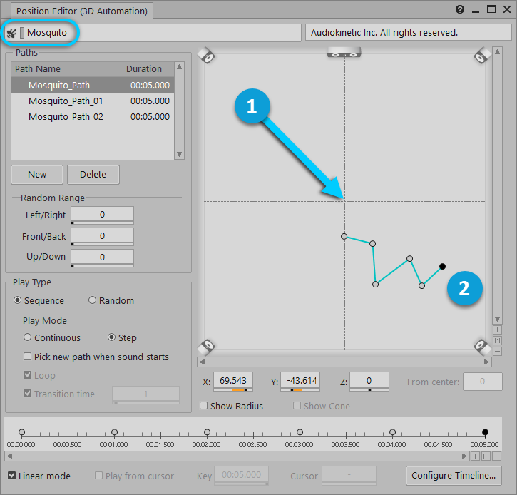

|  |  |
| --- | --- |
|  | 若选择 **Emitter with Automation**，则此处为与 "Mosquito" Sound SFX 关联的“发声体”游戏对象的位置。在这种情况下，需要使用游戏对象来定义能听到嗡嗡声的死水潭区域。  若选择 **Listener with Automation**，则此处为“听者”游戏对象的位置。在这种情况下，无需蚊子相关游戏对象。这时嗡嗡声会随玩家移动。 |
|  | 无论对于哪种情况，都会有一条蚊子声音所要遵循的预定义路径。该路径与死水潭 (Emitter with Automation) 或玩家 (Listener with Automation) 相对。 |

###### Attenuation（衰减）

除空间化外，还可定义对象的衰减设置。衰减设置用于模拟信号源远离听者或在障碍物后面时的自然减弱。Wwise 可使用一系列曲线将 Wwise 属性值（如 Volume 和 Low-Pass Filter）映射到特定的驱动因素（如距离值或声障值）。为了增加逼真效果，还可使用声锥。声锥根据对象相对于听者的朝向来衰减声音。对于空间化对象，有关如何定义其衰减设置的详细信息，请参阅“[“应用衰减”一节](ch22s07.html "应用衰减")”。

###### 组合使用定位选项

您可以组合使用不同的定位选项为游戏创建丰富多样的音频环境。在特定情况下，可能只需要使用空间化；在其他情况下，则可能需要同时使用空间化和衰减。当然，您也可以只使用衰减（详见“[“使用 Speaker Panning”一节](ch22s02.html "使用 Speaker Panning")”）。

|  |  |
| --- | --- |
| [备注] | 备注 |
| 对于那些对游戏玩法很关键的 3D 声音，可能需要将它们的信号传送到中置扬声器，以确保能够清晰听到。Center %（中置百分比）控件可用于定义通过中置扬声器的信号量。有关使用 Center % 控件的详细信息，请参阅[“将音频信号传送到中置扬声器”一节](ch22s09.html "将音频信号传送到中置扬声器")。 |

###### 振动对象的 3D 空间化

并非所有振动设备都完全支持 3D 空间化。例如，游戏控制器内电机很少，移动类型也有限，因此就无法利用 3D 空间定位信息。因此，对于较为简单的振动设备，应将 Speaker Panning（扬声器声像摆位）设置为 Direct Assignment（直接指派）。然而，有些情况下可能需要根据声源的距离降低振动信号的强度。在这些情况下，您可以使用衰减设置而不启用空间化。

###### Wwise 3D 详情

请参阅以下列表来详细了解 Wwise 是如何计算 3D 定位的。如果您只想在设计工具中进行设置，而无需知道这些细节，则可以跳转到下面的第二个列表。

**3D 定位是如何计算的：**

1. 虚声源的位置将根据 Spread 值确定（有关更多详细信息，请参阅[“Spread versus Focus”图示](ch22s07s03.html#spreadvsfocus_image)）。使用多个输入声道时，会在散布弧线上进行相应的声道划分（例如对于立体声，其中一半虚声源位置分配给左侧，剩下的一半分配到右侧）
2. 对于每个虚声源位置，都会计算 VBAP 增益。
3. 所有虚声源位置的增益都是这样合并计算的：

   - 对于每个输出声道，会将全部有效输入声道的增益进行平方并加在一起，
   - 再除以输入声道数量，
   - 然后取商的平方根。

   |  |  |
   | --- | --- |
   | [备注] | 备注 |
   | 要注意在 `Spread == 0` 的特殊情况时，所有的虚声源都在同一位置。这自然需要对输入声道进行下混。 |

**定义 3D 对象属性的方法如下：**

1. 将对象加载到 Property Editor 中。
2. Switch to the Positioning category.

   |  |  |
   | --- | --- |
   | [备注] | 备注 |
   | 如果该对象不是顶层对象，您则必须选择 **Override parent**选项后才能设置 Positioning 选项。 |
3. 启用 **Listener Relative Routing**（听者相对通路）。

   The group activates.
4. 选择 **Position** 或 **Position + Orientation** 选项。
5. In the 3D Position group, select one of the following options to determine the source of the spatialization information:

   - **Emitter**：由游戏实时计算空间定位信息。
   - **Emitter with Automation** 或 **Listener with Automation**：在 Wwise 中使用动画路径来预定义空间定位信息。

   |  |  |
   | --- | --- |
   | [备注] | 备注 |
   | 若选择 Automation 选项，请单击 **Automation…** 按钮，打开 Position Editor (3D Automation)。在此，可定义对象的动画路径。有关创建动画路径的更多信息，请参阅 [“使用动画路径定义空间定位”一节](ch22s08.html "使用动画路径定义空间定位")。 |
6. 若将 Position 设为使用 Listener with Automation 选项，请启用 **Hold Listener Orientation**（固定听者朝向）复选框，以便存储声音开始播放时听者的瞬时朝向，声音播放期间的位置偏移将以此作为基准。在未选择此选项时，将始终通过相同扬声器播放声音，而不管听者朝向如何。在选择此选项时，听者将独立于路径移动。这意味着当听者转身时将通过不同的扬声器听到声音。有关此选项的详细信息，请参阅[“创建顺着听者朝向的动画路径”一节](ch22s08.html#creating_animation_paths_that_follow_orientation_of_listener "创建顺着听者朝向的动画路径")。
7. 若将 Position 设置为 Emitter 选项，请启用 **Hold Emitter Position and Orientation**（固定发声体位置和朝向）复选框来保持声源位置不变，直至播放完毕。若禁用此选项，则每一游戏帧都会更新声源位置信息。
8. 若要计算空间定位信息来模拟 3D 游戏空间内的移动，请将 **3D Spatialization**（3D 空间化）设置为 **Position** 或 **Position + Orientation**。

**相关主题**

- [Wwise Fundamentals Module 9: Using 3D Position Automation](https://www.audiokinetic.com/en/courses/wwise101/?source=wwise101&id=understanding_3d_user_defined)

---

#### Speaker Panning 和 3D Spatialization 交叉淡变

有时，需要同时使用 Speaker Panning（扬声器声像摆位）和 3D Spatialization（3D 空间化）。其中一种典型情况就是，从需要声像摆位的环境过渡到需要空间化的环境。

例如，在玩家在车内收听音乐时，将使用 Direct Assignment（直接指派）来输出声音。在玩家位于车外的城市街道上时，设计师则可能需要使用 3D Spatialization 选项，使其变成开放世界声音。在玩家打开车门走上街道时，还要避免定位方式之间的转换太过突然。这时可通过平滑过渡来消除这种差异。

在 Wwise 内，若未将 3D Spatialization 设为 None（无），则 Speaker Panning / 3D Spatialization Mix 滑杆将变为可用状态。在设为 0 时，不启用 3D Spatialization；在设为 100 时，不启用 Speaker Panning。在设为这两个极限值之间的值时，则会相应地结合两种定位输出。

若要在示例情况下获得所需结果，则可以使用基于距离的 Game Parameter（游戏参数），并针对音乐对象的 Speaker Panning / 3D Spatialization Mix 设置 RTPC。玩家距离汽车越远，滑杆值越小。距离增大时仍可听到汽车音乐，但它会逐渐融入空间化游戏世界音景，而不会像标准立体声音乐一样输出。

|  |  |
| --- | --- |
| [备注] | 备注 |
| 虽然整体影响极小，但仍应注意：在对 Speaker Panning 和 3D Spatialization 进行交叉淡变时，必须同时计算两种定位类型，因此消耗的运行时 CPU 资源也比只选择一种类型时更多一些。 |

---

#### 为总线应用定位

You can apply positioning to Audio Busses and to Auxiliary Busses (but not Main Audio Busses). 为此，要先打开与总线对应的 Property Editor（属性编辑器）。Then, in the Positioning group, enable Listener Relative Routing, and set Speaker Panning or 3D Spatialization. 有关这些参数的详细信息，请参阅 [“Positioning category: Audio and Auxiliary Busses”一节](ch60s01s02s04s05.html "Positioning category: Audio and Auxiliary Busses")。

定位可在以下示例场景中用来增添真实感：游戏中的系统允许玩家使用隐藏式话筒窥探其他玩家。音频将被捕获并传输至地图另一端的一个虚拟扬声器。在对子混音应用 lo-fi 效果器后，可以对其进行空间化定位，听起来好像从扬声器发出一样。. 有关如何实现这一系统的详细信息，请参阅博文[在 Wwise 2017.1 中使用全新的 3D 总线架构：模拟音频监听系统](https://blog.audiokinetic.com/working-with-the-new-3d-bus-architecture-in-wwise-2017.1-simulating-an-audio-surveillance-system/)。

---

#### 3D 定位图解

3D 定位会根据游戏中发声体和听者对象的相对位置和朝向，将声源（支持任何[声道配置](ch22s11.html "了解总线配置")）在总线（支持任何通道配置）中进行声像摆位。这些对象的位置由游戏通过 Wwise 声音引擎 API 设置。除了游戏驱动的位置和方向属性，Spread 和 Focus 这两个基于距离的属性也协同在摆位算法中发挥作用。在使用 Spread 的情况下，Wwise 中的 3D 定位算法允许在点声源和多声道环绕环境之间进行渐变。

**以下是 3D 定位算法的简单说明：**

1. 虚声源位于听者的周围，
2. 每个输入通道对应一组虚声源，它们的位置将根据 Focus（仅限标准配置）进行集中。
3. 虚声源会依据发声体相对于听者的朝向进行旋转（仅适用于 3D Spatialization 设为 **Position + Orientation** 的情况）。
4. 当 Spread 值变小，虚声源将进一步集中在发声体相对于听者的方向上。
5. 每个虚声源都将在输出配置的声道中进行摆位，并进行功率归一化。

关于 Spread 和 Focus 的更多细节，详见[定义各种对象属性的衰减曲线](ch22s07s03.html#wwise_properties_for_attenuation_curves_list "您可为以下 Wwise 属性创建衰减曲线：")页面。

标准多声道声源的各个声道会通过整个平面等分的形式，分配给虚声源组。声源中的高度声道是不支持的，将被弃用。

###### 声道配置类型

Wwise 原生支持 [*[Standard](go01.html#glossary_standard_configuration "标准配置")*](go01.html#glossary_standard_configuration) 及 [*[Ambisonic](go01.html#glossary_ambisonics "Ambisonics")*](go01.html#glossary_ambisonics) 两类声道配置。两者主要区别在于上述步骤 5 中涉及的摆位计算，因为两者对于空间音频的表示方式不同。另外，虚声源的布局也不同，因为 Focus 只是用于控制离散输入声道信号在离散输出声道中的非均匀泄漏，所以该参数只适用于标准配置。但是，虚声源针基于 Spread 的表现和根据发声体-听者关系进行旋转的表现都是一致的，不管声道配置类型如何.

您可以将标准声道配置的音源摆位并输出至 Ambisonic 总线（“编码为 ambisonics”），反之亦然（“从 ambisonics 解码”）。

###### 示例

下面几页中的例子对上述算法的不同方面进行了说明：

- [“Spread 的影响”一节](ch22s06s01.html "Spread 的影响")
- [“朝向的影响”一节](ch22s06s02.html "朝向的影响")
- [“Focus”一节](ch22s06s03.html "Focus")
- [“斜面声源在平面声道配置中的摆位”一节](ch22s06s04.html "斜面声源在平面声道配置中的摆位")
- [“Height Spread 的效果”一节](ch22s06s05.html "Height Spread 的效果")
- [“3D 配置下的声像摆位”一节](ch22s06s06.html "3D 配置下的声像摆位")

---

##### Spread 的影响

Assume the Attenuation curve for Spread is as shown in the image below, such that it is 0% (point source) at large distances and 100% (completely enveloping) at short distances.

|  |
| --- |
|  |

以下各例中使用的 Spread 曲线

下表中，声源的声道配置是 4.0。这样方便将输入声道的分布与虚声源清楚地关联起来（FL：黄色，FR：绿色，SL：蓝色和 SR：红色）。

在第二列 “听者相对于发声体的位置” 中，Emitter（发声体）游戏对象表示为指向北方的箭头，即游戏中游戏对象的朝向被设置为向北。Listener（听者）游戏对象也指向北方，同时面向发声体游戏对象。在这四幅图中，分别将听者部署在四个距离不同的位置，对应得出四个不同的 Spread 值：0, 30, 70 和 100％。

在第三列“虚声源分布方位和输出总线通道能量”中，可以看到虚声源（彩色圆圈）部署方位产生的影响。此外，三角形代表输出总线的声道，中置声道位于顶部。三角形的颜色描述了摆位导致的能量分布，红色越深表示能量越高。

虽然 5.x 扬声器配置的默认角度为 +/-45° 和 +/-135°，但是在本例中我们采用 5.0 配置并将角度设为 +/-72° 和 +/-144°。但它其实可以代表任何其他配置，甚至是 Ambisonics 配置，因为虚声源的分布方位完全相同。

| 当发声体与听者朝向一致且发声体朝向听者时，散布值的影响 | | |
| --- | --- | --- |
| Spread | 听者相对于发声体的位置 | 虚声源分布方位 和输出总线通道的能量 |
| 0% Spread | |  | | --- | |  | | |  | | --- | |  | |
| 30% Spread | |  | | --- | |  | | |  | | --- | |  | |
| 70% Spread | |  | | --- | |  | | |  | | --- | |  | |
| 100% Spread | |  | | --- | |  | | |  | | --- | |  | |

如需转至下一个 3D 定位的例子，请点击 [“朝向的影响”一节](ch22s06s02.html "朝向的影响")。

---

##### 朝向的影响

|  |  |
| --- | --- |
| [备注] | 备注 |
| 有关背景信息，请参考[例 1](ch22s06s01.html "Spread 的影响")。 |

下述发声体朝向的影响仅适用于 3D Spatialization（3D 空间化）设为 **Position + Orientation**（方向 + 朝向）的情况。在此之后，将讨论如何使用 **Position + Orientation** 和 **Position** 这两种3D 空间化模式。

下面的例子类似于上例，只是听者方向朝东。这就同时描述了两种不同朝向因素的影响：

- **发声体相对位置**：发声体位于听者的左侧 ，即根据 Spread 的影响将导致虚声源向左侧集中。在第一张图中 Spread 为 0，效果最明显。
- **发声体相对朝向**：发声体朝向相对于听者逆时针旋转了 90 度，这意味着虚声源分布相应地进行了旋转。在第四张图片中 Spread 为 100，效果最为明显，这些颜色表示输入声道已经进行了旋转。当然，如果声源是单声道情况就会不同。

| 发声体相对朝向在不同散布值下的影响 | | |
| --- | --- | --- |
| Spread | 发声体的相对位置和朝向 | 虚声源分布方位 和输出总线通道的能量 |
| 0% Spread | |  | | --- | |  | | |  | | --- | |  | |
| 30% Spread | |  | | --- | |  | | |  | | --- | |  | |
| 70% Spread | |  | | --- | |  | | |  | | --- | |  | |
| 100% Spread | |  | | --- | |  | | |  | | --- | |  | |

为了确保您了解发声体相对位置和发声体相对朝向之间的差异，下例演示了听者与发声体相对位置为 45 度，相对朝向为 90 度，以及 Spread 为 70％ 的结果。这可以看做是听者朝东，位于发声体声场的西南方。绿色和红色发声体声道分别位于听者的左前方和右前方，蓝色声道则环绕听者。

| 发声体位于听者 45 度方位的摆位效果， 相对朝向为 90 度，Spread 为 70％。 | | |
| --- | --- | --- |
| Spread | 发声体的相对位置和朝向 | 虚声源分布方位 和输出总线通道的能量 |
| 70% Spread | |  | | --- | |  | | |  | | --- | |  | |

从上面的例子中可知，发声体的朝向仅影响多声道声源。用多声道声源表现“声场”，即用多个声音元素在多声道中摆位来形成“环境声”时，用朝向来驱动旋转效果最佳。在运行时，Wwise 将根据听者和发声体的朝向来旋转多声道素材，将环境声有效地与 3D 世界结合在一起。

但是，有时多声道文件并不一定表现声场，而只是用来传递空间感的简单声音，立体声通常如此。这时，保持离散的原始声道能产生最好的空间感，我们不希望对它们进行旋转。对于这种类型的内容，用户可选择使用 3D Spatialization **Position** 而不启用发声体朝向。

如需转至下一个 3D 定位的例子，请点击 [“Focus”一节](ch22s06s03.html "Focus")。

---

##### Focus

|  |  |
| --- | --- |
| [备注] | 备注 |
| 有关背景信息，请参考[例 1](ch22s06s01.html "Spread 的影响")。 |

Focus（聚焦）参数能够在应用旋转和扩散之前，将每个输入声道的虚声源集中在一起。在对离散多声道文件进行摆位时，Focus 参数用于减少输入声道信号在其他输出通道中的泄漏。下图显示了我们之前所述 Spread 值为 70% 案例。其中没有使用 Focus，因此我们可以看到，比如红色输入声道最终会泄漏到中置声道、前右声道，甚至左前声道。

在 Focus 值为 80％ 时，输入通道会集中，可以看到红色输入声道对中置声道、前右声道还是有影响，但程度比以前少而且不影响左前声道了。<片段0311>尽管如此，还是需要特别注意，就算 Focus 为 100％ ，在输入声道并非完全对应输出声道位置时，输入声道至少会进入 2 个输出声道。

上述情况并不适用于 Ambisonics 声像摆位，因为其设计即包含输出声道间的泄漏，尽管是均匀泄漏。因此，当声源的声道配置是 Ambisonic 时，将会忽略 Focus 值。

| 发声体位于听者 45 度方位的摆位效果， 相对朝向为 90 度，Spread 为 70％。 | | | |
| --- | --- | --- | --- |
| Spread | Focus | 发声体的相对位置和朝向 | 虚声源分布方位 和输出总线通道的能量 |
| 70% Spread | 0% Focus | |  | | --- | |  | | |  | | --- | |  | |
| 70% Spread | 80% Focus | |  | | --- | |  | | |  | | --- | |  | |

如需转至下一个 3D 定位的例子，请点击 [“斜面声源在平面声道配置中的摆位”一节](ch22s06s04.html "斜面声源在平面声道配置中的摆位")。

---

##### 斜面声源在平面声道配置中的摆位

|  |  |
| --- | --- |
| [备注] | 备注 |
| 有关背景信息，请参考[例 1](ch22s06s01.html "Spread 的影响")。 |

到目前为止，我们仅仅从上方观察到了扁平声源（4.0，没有高度声道）和扁平的输出声道配置（5.0），现在我们要以立体的视角重新审视。请注意，我们讨论的是虚声源坐标在扬声器平面上的投影，用于计算摆位。

在下图的中间一列 “向上旋转听者” 中，我们展示了当听者向上（朝向天空）30 度时会发生什么。听者的旋转实际上会影响到：

- 发声体声场的相对朝向 （如 Spread 值为 100％ 时所示）；以及
- 点声源的入射角（如 Spread 值为 0％ 时所示）。

这就是为什么点声源（0％ Spread）最终定位在中置扬声器下方。

在最右列“向下旋转发声体”中，我们将发声体向下旋转了 30 度。这样只会影响发声体声场的相对方向，而不会影响点声源的入射角。因此，在 Spread 值为 0％ 的情况下，点声源位于听者的前方，而不是像中间列一样在其下方。注意从 Spread 100％ 到 0％ 时，虚声源分布的逐渐变化。

| 在多种 Spread 取值下，将 4.0 声源在 5.0 声道配置中进行摆位。 | | |
| --- | --- | --- |
| Spread | 向上旋转听者 | 向下旋转发声体 |
|  | |  | | --- | |  | | |  | | --- | |  | |
| 100% Spread | |  | | --- | |  | | |  | | --- | |  | |
| 50% Spread | |  | | --- | |  | | |  | | --- | |  | |
| 0% Spread | |  | | --- | |  | | |  | | --- | |  | |

如需转至下一个 3D 定位的例子，请点击 [“Height Spread 的效果”一节](ch22s06s05.html "Height Spread 的效果")。

---

##### Height Spread 的效果

在典型的 Distance Spread（距离散布）曲线设计中，声源距离听者越远，使用的 Spread 值越小（反之亦然）。这样的话，在距离较近时，声源会像个圆；在距离较远时，就会像个点。另外，在声源靠近时，其入射方向会突然改变，听起来可能不太自然。这时可使用较大的 Spread 值来减轻失真情况。

在声源位于听者上方或下方很远的位置并被摆位到 2D 声道上时，也会出现类似的失真。在距离较远的情况下，Spread 曲线会估算出一个较小的值；这时声源若穿过听者所在平面上的路径，其声像就会从一侧突然摆位到另一侧。对此，可在对象从听者上方或下方穿过时，借助四周的扬声器来对声音进行散布处理，以此在第三维度上没有扬声器的情况下传达高度的变化。这种方式称为 Height Spread（高度散布）。

以飞机为例，先不启用 Height Spread。由于飞得很高，其 Distance Spread 基本上接近 0%。飞机的声音会被当作点声源来摆位，并再现到左前和右前扬声器中。在其飞过听者头顶时，会突然切换到左后和右后扬声器。这样听起来会不自然。

与之相比，若激活 Height Spread，则只有被摆位到 2D 声道才会依据高度角计算出一个最小的 Spread 值。在高度角为 +/-90 度时（即声源位于听者正上方或正下方），Height Spread 的作用比例为 100%。在高度角为 0 度时，该比例为 0%。我们可以在两者之间调节插值来实现平滑过渡。有效 Spread 取 Height Spread 和 Distance Spread 当中的最大值。在上面例子中，因为启用了 Height Spread，所以在飞机从听者正上方飞过时会赋予其一个较大的 Spread 值，在朝着地平线降落时则慢慢由 Distance Spread 接管。

若扬声器配置为 7.1.4，则高度不会对 Spread 计算产生影响。因为在飞机飞过听者头顶时，其会像点声源一样正常摆位到顶部的四个扬声器。与之相比，若声源位于听者下方，则 Height Spread 便会发挥作用，因为下方没有扬声器。

在涉及 Audio Object 的情况下不会应用 Height Spread，但会为对象附加一个表示已启用 Height Spread 的布尔值属性。最终，可能会在将对象的声像摆位到 2D 声道时应用这种散布。

在 Ambisonics 配置下，也不会应用 Height Spread。因为对于 Ambisonics 这种格式，在实施声像摆位时并不知道后续要在哪种耳机或扬声器装置上解码。倘若最终采用的是 2D 扬声器配置，即便应用 Height Spread 也没什么好处。不过，Ambisonics 本身在过渡上就比较平滑，足以减轻由方向突然变化可能造成的失真。

在默认情况下，会启用 Height Spread。若要停用 Height Spread，请在 Attenuation Editor（衰减编辑器）中取消选中对应复选框。在有些情况下（比如对于脚步声），这样效果可能更好一些。

如需转至下一个 3D 定位的例子，请点击 [“3D 配置下的声像摆位”一节](ch22s06s06.html "3D 配置下的声像摆位")。

---

##### 3D 配置下的声像摆位

|  |  |
| --- | --- |
| [备注] | 备注 |
| 有关背景信息，请参考[例 1](ch22s06s01.html "Spread 的影响")。 |

3D 声道配置，即声道配置可以表示来自上方和下方的声音（例如 7.1.4 或 Ambisonics ），在此配置下进行声像摆位，虚声源将按照球面形状分布。下图显示了不同 Spread 和 Focus 取值下的立体声以及 4.0 声源。

请注意 3D 定位只需 7 个输入声道（水平面声道）即可进行摆位，其他声道将被弃用。

而对于 Ambisonics，声道与虚声源组并不完全匹配，但所有的空间信息都被保留了下来。虚声源的转换方式（旋转，集中）与标准配置的转换相同，因此以下各图中除了颜色不同之外，全部适用。

| 在多种 Spread 和 Focus 取值下，将立体声和 4.0 声源在 3D 配置中（图中未显示）进行摆位。 | | | |
| --- | --- | --- | --- |
| 声源配置 | Spread | Focus | 结果 |
| Stereo | 100 | 0 | |  | | --- | |  | |
| Stereo | 30 | 0 | |  | | --- | |  | |
| Stereo | 30 | **80** | |  | | --- | |  | |
| 4.0 | 100 | 0 | |  | | --- | |  | |
| 4.0 | 70 | 0 | |  | | --- | |  | |
| 4.0 | 70 | **50** | |  | | --- | |  | |
| 4.0 | 0 | - | |  | | --- | |  | |

---

#### 应用衰减

您可以使用衰减属性来模拟游戏中的声源在障碍物后面或远离话筒时的自然衰减。Wwise 中的衰减基于以下设置：

- **Attenuation curves**（衰减曲线）：根据发声体和听者之间的距离、声障、声笼、衍射和透射值来影响信号的强度。
- **Cone attenuation**（声锥衰减）：根据发声体相对于听者的朝向来影响信号的强度。

衰减曲线会将 Wwise 属性值（如 Volume 或 Low-Pass Filter）映射到驱动因素值。比如，通过定义以下曲线上各个点的属性，您可以控制对象远离听者时的音量衰减。

|  |
| --- |
|  |

声锥衰减使用一系列夹角进行定义。这些夹角用于定义声源前方、侧方和后方的区域。通过定义声源周围的这些不同区域，您可以根据游戏中对象的朝向来模拟对象的衰减。

|  |
| --- |
|  |

与效果器相似，您可以创建 Attenuation（衰减）属性的实例，然后使用 ShareSets（共享集） 在 Wwise 内的大量不同对象之间进行共享。

**相关主题**

- [Wwise Fundamentals Module 8: Using 3D Spatialization](https://www.audiokinetic.com/en/courses/wwise101/?source=wwise101&id=using_3d_game_defined)

---

##### 管理多份衰减

Attenuation 实例是与衰减相关的属性集合。由于游戏中的许多对象拥有相同的衰减属性，因此您可以先创建一份衰减，然后使用 Attenuation ShareSet 在工程中的许多对象之间共享。

ShareSet 是实例属性的集合，多个对象可以采用该集合。在更改 ShareSet 时，采用该 ShareSet 的所有对象都会受到影响。使用 ShareSet 的优势是您不必一个个地更改各个对象的衰减属性，并且在游戏中可以节省宝贵的内存。

然而在某些情况下，可能不应该共享衰减设置。在这些情况下，可创建拥有独特属性值的自定义衰减实列。

###### Creating Attenuation ShareSets

在定义对象的衰减属性前，必须先创建 Attenuation ShareSet。Attenuation ShareSet 是衰减属性设置的集合。ShareSets 可供需要同类型衰减属性的所有对象使用。

**在工程浏览器中创建 Attenuation ShareSet 的方法是：**

1. 在 Project Explorer 中，切换到 ShareSets 选项卡。
2. 在 **Attenuations**（衰减）区域，执行下列其中一项操作：

   - 选择工作单元或虚拟文件夹，然后点击 Project Explorer 工具栏中的 **Attenuation** 图标。
   - 右键点击工作单元或虚拟文件夹，然后从快捷菜单中选择 **New Child** > **Attenuation**（新建子项 > 衰减）。

   层级结构中，新的 ShareSet 将作为 Work Unit 或 Virtual Folder 的子级显示。
3. 为新建的 ShareSet 输入名称，然后按 Enter。

   新 ShareSet 显示在 Attenuations 层级结构中。

   |  |  |
   | --- | --- |
   | [备注] | 备注 |
   | 各个 Attenuation ShareSet 不得重名。您可以随时重命名 ShareSet，方法是点击 ShareSet，选择 Rename，然后输入新名称。 |

**在 Property Editor 中创建 Attenuation ShareSet 的方法是：**

1. 将对象加载到 Property Editor 中。
2. Switch to the Positioning category.
3. In the Attenuation group, click the Selector button (>>) and select **New** from the menu.

   |  |  |
   | --- | --- |
   | [备注] | 备注 |
   | 若要激活 Attenuation 分组框，则须启用 **Listener Relative Routing**。 |

   The **New Attenuation** dialog opens.
4. Select the Work Unit in which you want to create the Attenuation ShareSet.
5. 输入 ShareSet 的名称并点击 **OK**（确定）。

   新的 ShareSet 将被创建，并应用于当前对象。

###### Deleting Attenuation ShareSets

如果您不再需要某个 Attenuation ShareSet，则可以删除它。在删除某个共享集之前，您应确保没有对象还在用到它。如果删除 ShareSet，则它会自动从采用它的所有对象中移除。

|  |  |
| --- | --- |
| [备注] | 备注 |
| Attenuation Editor（衰减编辑器）中的 **Shared by**（共享对象）框将显示使用当前 Attenuation ShareSet 的对象的完整列表。 |

**删除 Attenuation ShareSet 的方法是：**

1. 在 Project Explorer 中，切换到 ShareSets 选项卡。
2. 在 **Attenuation** 区域，点击要删除的 ShareSet。
3. 按 **Delete** 键。

   ShareSet 被删除，并从采用它的所有对象中移除。

---

##### 将衰减应用到对象

在为工程创建了 Attenuation ShareSets 后，便可以将它们应用到对象上了。这些实例既可以专用，也可以共享，具体取决于您希望它们的属性是作用于一个对象还是多个对象。

###### Applying Attenuation ShareSets to objects

如果需要为对象设置衰减，您则可以对它们应用 Attenuation ShareSet。多个对象可以同时采用同一个 ShareSet，当需要更改时，这可以为您节省大量的时间。

**将 Attenuation ShareSet 作用于对象的方法是：**

1. 将对象加载到 Property Editor 中。
2. Switch to the Positioning category.
3. In the Attenuation group, click the **Selector** button (>>).

   |  |  |
   | --- | --- |
   | [备注] | 备注 |
   | 若要激活 Attenuation 分组框，则须启用 **Listener Relative Routing**。 |

   Attenuation 共享集列表将显示。
4. 选择要应用的 Attenuation 共享集。

   ShareSet 的名称出现在相应文本框中，表明 ShareSet 已应用到对象上。

   |  |  |
   | --- | --- |
   | [备注] | 备注 |
   | 要编辑衰减属性，点击 **Edit** 按钮。 |

###### Converting Attenuation ShareSets into custom instances

Wwise 中的衰减分为两类：

- **自定义衰减**可应用于层级结构中的任意一个对象。在您更改自定义效果器的属性时，只有这个对象会受到影响。
- **Attenuation ShareSets** 可应用于工程层级结构中的许多对象。在更改 ShareSet 的属性时，使用该 ShareSet 的所有对象都将受到影响。

在默认情况下，您创建的所有衰减初始都为 ShareSets。然而，您可以根据您的喜好将 Attenuation ShareSet 转换成自定义衰减。更改后，对衰减的所有修改将只作用于采用它的对象。

**将衰减作用于对象的方法是：**

1. 将对象加载到 Property Editor 中。
2. Switch to the Positioning category.
3. From the Mode list in the Attenuation group, select one of the following options:

   - **Use ShareSets**（使用 ShareSets），以将 ShareSet 应用于当前对象。
   - **Define custom**（自定义），对当前对象做自定义衰减。

     |  |  |
     | --- | --- |
     | [备注] | 备注 |
     | 若要激活 Attenuation 分组框，则须启用 **Listener Relative Routing**。 |

     |  |  |
     | --- | --- |
     | [备注] | 备注 |
     | 要编辑衰减属性，点击 **Edit...** 按钮。 |

---

##### 定义各种对象属性的衰减曲线

为了在 Wwise 中模拟对象的衰减，您可以创建一系列曲线来定义 Wwise 中的特定属性（如 Volume 和 Low-Pass Filter）和不同驱动因素（如游戏中声源到听者的距离）之间的关系。

**您可以为以下驱动因素创建 Attenuation 曲线：**

- **Distance**（距离）：发声体和听者之间的距离。它的值介于 0 和最大距离值之间。最大距离值用于定义对象产生最大距离衰减的点。 由于声音来自于全向声源，因此以最大距离值为半径可以在每个声源周围形成一个球形衰减范围。

  |  |
  | --- |
  |  |
- **Obstruction**（声障）：“发声体”游戏对象和听者之间的声障百分比。它的值介于 0 ~ 100 之间。
- **Occlusion**（声笼）：“发声体”游戏对象和听者之间的声笼百分比。它的值介于 0 ~ 100 之间。
- **Diffraction**（衍射）：发声体和听者之间的衍射路径的衍射百分比。该值由 Spatial Audio 设定，其大小介于 0 ~ 100 之间。
- **Transmission**（透射）：发声体和听者之间的透射路径的透射损失百分比。该值由 Spatial Audio 设定，其大小介于 0 ~ 100 之间。

在默认情况下，会在声源到最大距离之间利用线性插值来构建 Distance Volume 曲线并以此模拟对象的信号衰减。The obstruction, occlusion, diffraction, and transmission curves use the project's corresponding environmental curves.

|  |
| --- |
|  |

虽然这可能适用于大多数情况，但特定对象可能需要更高级的曲线。为了更好地控制衰减曲线，您可以添加控制点。<片段0477>这些点可以将衰减曲线分段，以便您更好地控制对象的衰减。

为了创建更加详细和复杂的定位曲线，您还可以定义各条曲线段的形状。曲线段是两个控制点之间的部分。您可选择各种曲线形状，包括线性曲线、恒定曲线、对数曲线、幂数曲线和 S 曲线。要获取指定曲线形状的详细信息，以及使用图形视图的其它信息，请参阅 [*了解坐标图视图*](ch49.html "了解坐标图视图")。

|  |
| --- |
|  |

**您可为以下 Wwise 属性创建衰减曲线：**

- **Volume**（音量）：发送到音频输出总线的信号的衰减或振幅。
- **Auxiliary Send volumes** - 发送到游戏定义和用户定义的 Auxiliary Bus 的信号的衰减或幅度。此属性仅可由距离驱动。
- **Low-pass filter** ―― 根据指定值来衰减高频的递归滤波器。低通滤波器的单位代表已经应用的低通滤波比例，0 表示无低通滤波（信号不受影响），100 代表最大衰减。
- **High-pass filter** ―― 高通滤波器。根据指定值来衰减低频的递归滤波器。高通滤波器的单位代表已应用的高通滤波比例，其中 0 代表无高通滤波（信号不受影响），100 代表最大衰减。
- **Spread** ―― 散布。扩散到附近扬声器的音频量或百分比，以使声音能够随着距离的增加从低扩散的点声源变为完全扩散的传播源。值 0 表示某扬声器附近的发声体的所有声道只通过该扬声器播放。值 100 表示将扩散声源的声道，以便通过所有扬声器都能够听到或感觉得到。此属性仅可由距离驱动。
- **Focus** ―― 聚焦。百分比值，用于收缩由扩散值生成的虚拟发声体。焦距 0% 表示虚发声体保持不变，值越高，各个虚点越靠近源声道的原点。此属性仅可由距离驱动。

  |  |
  | --- |
  |  |

衰减属性值是相对的，这意味着被衰减影响的对象属性值是衰减值与该对象的现有属性值之和。

**定义衰减曲线的方法如下：**

1. Load an object into the Property Editor and switch to the Positioning category.
2. Within the Attenuation group, click the selector to choose or create an Attenuation ShareSet.

   |  |  |
   | --- | --- |
   | [备注] | 备注 |
   | 若要激活 Attenuation 分组框，则须启用 **Listener Relative Routing**。 |
3. 单击 **Edit...**（编辑...）。

   Attenuation Editor 打开，其中包含选定衰减的属性设置。
4. 在 Max distance（最大距离）文本框中，指定从源点到声音达到最大衰减时的距离。

   |  |  |
   | --- | --- |
   | [备注] | 备注 |
   | 在达到最大距离值后，衰减设置保持不变。 |
5. In the Curves group, select the **Distance Volume** curve from the list.

   这时会在坐标图中显示默认的 Distance Volume 曲线。

   |  |  |
   | --- | --- |
   | [备注] | 备注 |
   | 曲线上的第一点始终代表点声源，最末一点始终代表最大距离值。 |
6. 通过执行以下任一操作来操控 **Distance Volume** Attenuation 曲线：

   - 在曲线上添加点。
   - 将控制点拖至新位置，也可在 X 和 Y 坐标框中输入特定值。
   - 定义曲线段的形状。

   |  |  |
   | --- | --- |
   | [备注] | 备注 |
   | 有关缩放或平移坐标图视图、同时显示多条曲线、添加、移动或删除点、指定标度法或者更改曲线段形状的信息，请参阅[*了解坐标图视图*](ch49.html "了解坐标图视图")。 |
7. 对于剩余的曲线，从 **Curve** 列表中选择以下其中一个选项：

   - **None** - 对相应的属性，不使用 Attenuation 曲线。选择“None”时，相应属性不会衰减，将保持完整长度。
   - **Use Distance Volume**（使用距离音量）：为对应属性使用同一曲线作为 Distance Volume 曲线。此选项仅可用于 Auxiliary send volumes（辅助发送音量）曲线。
   - **Use Project Obstruction**（使用工程声障）：为对应属性使用同一曲线作为工程 Obstruction 曲线。This option is only available for the Obstruction curves.
   - **Use Project Occlusion**（使用工程声笼）：为对应属性使用同一曲线作为工程 Occlusion 曲线。This option is only available for the Occlusion curves.
   - **Use Project Diffraction** to use the same curve as the project Diffraction curve for the corresponding property. This option is only available for the Diffraction curves.
   - **Use Project Transmission** to use the same curve as the project Transmission curve for the corresponding property. This option is only available for the Transmission curves.
   - **Custom**（自定义）：为对应驱动因素属性对创建自定义 Attenuation 曲线。

---

##### 使用锥形边界模拟方向性

在默认情况下，Wwise 中的声音来自于全向声源。然而在现实中，声音通常具有一定的方向性。在 Wwise 中模拟声音的方向可以使用声锥。声锥使用不同的夹角模拟声音在特定方向上的传播。当听者移到这些夹角外面时，Output Bus volume（用作干分量）将衰减。由于 3D Game-defined定位使用实时游戏数据，因此声锥的方向最终由游戏对象的朝向来控制。

以下角定义声锥的区域：

- **Inner angle**: 内角。此夹角定义的区域中输出总线音量不衰减，也没有低通滤波效果发生。
- **Outer angle**: 外角。此夹角定义的区域中输出总线音量发生衰减，低通滤波效果保持在最高水平。

Output Bus Volume 在过渡区域（也即内外角边界之间的区域）中发生滚降。在无衰减发生的内角边界和达到最大衰减值的外角边界之间，使用线性插值法对音量进行衰减。在外角定义的区域中，音量衰减始终等于最大衰减值。

|  |  |
| --- | --- |
| [备注] | 备注 |
| 声锥衰减中定义的 Output Bus 音量衰减和 Low-Pass Filter 的值将与 Attenuation 曲线定义的 Output Bus 音量和 Low-Pass Filter 值叠加。辅助发送音量和值保持不变。 |

Cone Attenuation（声锥衰减）属性旁的 Cone Preview（声锥预览）分区会直观地显示声锥内的不同区域。当您更改内外角值时，预览视图会自动进行更新。

###### 模拟振动的方向

虽然振动来自于全向振动源，但在游戏中，有时候您需要模拟振动在特定方向上的传播。在这些情况下，可以使用 Cone Attenuation 属性。声锥作用于振动和声音的方式是相同的，例外情况是 Low-Pass Filter 设置不作用于振动对象。声锥根据听者相对于振动源朝向的位置，利用不同的角度来减弱振动。

**使用声锥模拟方向性的方法是：**

1. Load an object into the Property Editor and switch to the Positioning category.
2. In the Attenuation group, select or create an Attenuation ShareSet.

   |  |  |
   | --- | --- |
   | [备注] | 备注 |
   | 若要激活 Attenuation 分组框，则须启用 **Listener Relative Routing**。 |
3. 单击 **Edit...**（编辑...）。

   Attenuation Editor 打开，其中包含选定衰减的属性设置。
4. 选择 **Cone Attenuation** 选项。

   声锥控件变为可用。
5. 在Inner angle文本框中，指定一个角度， 该夹角定义的区域中将不会发生 Output Bus 音量衰减。
6. 在 Outer angle 文本框中， 指定一个角度， 该夹角定义的区域中 Output Bus 音量的衰减和 Low-Pass Filter 效果将保持在最大值。

   |  |  |
   | --- | --- |
   | [备注] | 备注 |
   | 内外角之间的区域被称为过渡区域。在此区域中，即无衰减发生的内角边界和达到最大衰减角的外角边界之间，使用线性插值法衰减输出总线音量。 |
7. 在 Max attenuation 文本框中， 可以设置当物体落在外角范围内时， Output Bus 的衰减量。
8. 要对位于内外角之间的声音应用 Low-Pass Filter，在 Low-Pass Filter 文本框中输入一个值。低通滤波器是根据指定值来衰减高频分量的递归滤波器。

   |  |  |
   | --- | --- |
   | [备注] | 备注 |
   | 低通滤波器的单位代表已经应用的低通滤波比例，0 表示无低通滤波（信号不受影响），100 代表最大衰减。 |

---

##### 预览声音的衰减设置

在设置声音的衰减属性后，您可以直接在 Wwise 中预览设置。藉此，可大致了解玩家在声音衰减半径内四处移动或应用声障、声笼、衍射和透射时的声音效果。通过直接在 Wwise 中预览声音衰减的功能，您可以在将任何音频集成到游戏中前先优化和微调您的设置。

|  |  |
| --- | --- |
| [备注] | 备注 |
| 只有使用 Emitter（发声体）定位的声音允许预览衰减设置。 |

您可以在 Attenuation Editor（衰减编辑器）中通过移动坐标图上的驱动因素光标和 **Cone Preview**（声锥预览）控件（如启用声锥衰减）来预览衰减设置。

Cone Preview 以图形形式显示声音的衰减半径（由 Max distance 值定义）。声源始终位于圆圈的正中央。您可以使用以下两个控件来修改听者处在声源不同方位时的声音衰减：

- **圆点**：代表听者相对于声源的实际位置。此圆点可随意移到衰减半径内的任何位置。在从中心位置向外移动圆点时，声音的音量会依据距离驱动的曲线降低，直到在圆圈外缘位置达到最大衰减。通过指定听者的位置，您可以自动确定听者到声源的距离。
- **细线**：代表听者位置相对于声源的角度。在默认情况下，听者位于声源的正前方（角度为 0）。不过，您可以通过拖动细线做圆周运动来修改角度。您可以通过将在 360 度（-180 到 180）全方位内变动角度来模拟环绕声源的移动。

|  |
| --- |
|  |

在播放期间可通过同时修改角度和位置控件来模拟听者相对于声音的移动。

在禁用声锥时，会禁用 Cone Preview 控件。在这种情况下，仍可通过拖动坐标图上的 Distance 光标来更改和预览距离衰减。移动光标也是预览由声障、声笼、衍射和透射产生的衰减的唯一方式。在选择自定义曲线时，会在坐标图上显示与曲线的驱动因素对应的光标。

您可以通过以下方式来重置听者的位置和角度：在按住 Ctrl 的同时单击衰减半径内的任意位置，或者单击 Transport Control 中的 Reset Selector（重置选择器）按钮 [>>]，然后选择 **Reset Attenuation Preview**（重置衰减预览）。

|  |  |
| --- | --- |
| [备注] | 备注 |
| 您还可以修改听者相对于声源的位置，方式是拖动坐标图视图中的 **Distance** 光标。 |

**预览声音衰减设置的方法是：**

1. Load an object into the Property Editor and switch to the Positioning category.
2. 在 Attenuation（衰减）下单击选择器，然后选择 Attenuation ShareSet（衰减共享集），接着单击 **Edit...**（编辑...）。

   Attenuation Editor（衰减编辑器）打开了。
3. 在 Transport Control（走带控制）中，单击 **Play**（播放）图标来播放声音。
4. 要修改听者的位置，将红色小圆圈拖到衰减半径内的任何位置。

   声音此时听起来就好像听者正在环绕声源移动。衰减程度将随着您靠近或远离声源而改变。

   |  |  |
   | --- | --- |
   | [备注] | 备注 |
   | 通过指定听者的位置，您可以自动定义听者到声源的距离。您也可以通过拖动坐标图视图中的 Distance 光标移动听者来靠近或远离声源。 |
5. 若要只更改听者的角度而非距离，则需执行以下操作之一：

   - 点击衰减半径中的任何位置。
   - 拖动黑色细线做圆周运动。

   声音此时听起来就好像听者正在环绕声源移动。如果声锥衰减开启，则衰减将随听者通过声锥的不同区域而变化。更改角度时，距离不会改变。其结果是，声音不会随着距离而衰减。

   |  |  |
   | --- | --- |
   | [备注] | 备注 |
   | 若要重置听者的位置和角度，请在按住 Ctrl 的同时单击衰减半径内的任意位置，或者单击 Transport Control 中的 Reset Selector 按钮 [>>]，然后选择 Reset Attenuation Preview。 |

---

#### 使用动画路径定义空间定位

若想为玩家打造独特的体验，可使用 Automation（自动化）来定义 3D 对象的空间位置。当您在 Wwise 中预定义位置时，无论听者在游戏中的位置和朝向如何，都会遵循以下情况：

- 声音将总是通过相同的扬声器播放。
- 通过相同的电机感受到振动。

使用动画路径定义定位信息。动画路径由每次定义源位置的若干个控制点构成。如果创建了多个点后，对象则将随着时间沿路径进行运动。

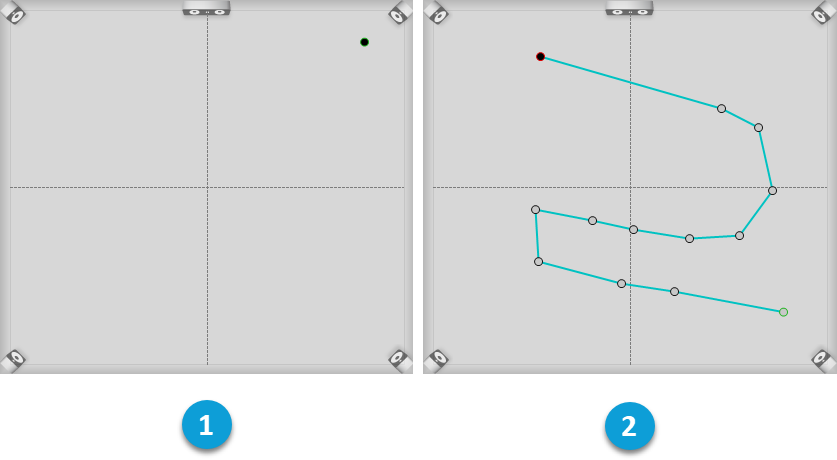

|  |  |
| --- | --- |
|  | 动画路径包含一个控制点。 |
|  | 动画路径包含多个控制点。 |

###### 自动化控件定位 C 示例

假设您正在创建一款角色扮演游戏，故事发生在船上。您想在环境声中听到海鸥叫声。您希望海鸥叫声听起来好像它们正在船边飞翔。为此，可将定位设为 Emitter with Automation（发声体自动化），然后创建多个不同的声音路径，以便模拟鸟儿围绕船只的飞行路线。您可以让海鸥叫声听起来更加逼真，方法是使用 Attenuation ShareSet 来衰减声音。

Automation 可用于游戏中的各种对象，包括非固定位置的环境声，如丛林环境中的虫鸣声、鸟叫声和猴叫声。

###### 创建顺着听者朝向的动画路径

在使用 3D Automation（3D 自动化）时，可选择将动画路径的位置锁定到游戏中听者的朝向。当两者锁定时，无论听者处于什么朝向，都将始终通过相同的扬声器听到声音。当两者不锁定时，听者将独立于路径移动。这意味着当听者转身时将通过不同的扬声器听到声音。

下图显示了听者改变朝向时对动画路径产生的影响。在左侧列中，禁用了 **Hold Listener Orientation**（固定听者朝向）。在右侧列中，启用了该选项。由中心向外的箭头指示 Listener Orientation。

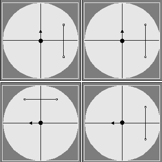

You can set the **Hold Listener Orientation** option in the object's Property Editor. 因为无法在 Wwise 设计工具内更改听者朝向，所以只能在游戏中试听差异。

---

##### 使用动画路径

您可以定义对象的定位，方法是使用一个声源点或多个控制点来创建路径。如果创建了路径，则对象将在指定的一段时间上沿路径进行动画显示。为增加功能和提高灵活性，您可以为同一对象创建多条路径，修改各条路径的时长，然后根据指定的顺序或完全随机的顺序来播放它们。

使用坐标图视图和时间线创建动画路径。有关如何移动/删除控制点，以及如何在坐标图和时间线中进行缩放/平移，具体信息请参阅“[*了解坐标图视图*](ch49.html "了解坐标图视图")”。

###### Creating animation paths

在定义对象的定位前，必须创建动画路径。动画路径由若干个控制点构成。如果使用多个点，则这些点会形成一条动画路径，对象会在指定时间内沿着这条路径运动。

这些路径在坐标图视图中创建。坐标图视图以最大距离值的比例显示各个控制点的位置。这意味着各个控制点的值将位于 0 和 +/- 100 之间，具体取决于点在坐标图的哪个象限。

|  |  |
| --- | --- |
| [备注] | 备注 |
| 在创建第一条路径时，Wwise 会自动将它命名为“ObjectName\_01\_Path”。您可以随时重命名此路径，为它取一个更加有意义的名称。然而各条路径不得重名。 |

**创建动画路径的方法是：**

1. 在 Position Editor (3D Automation) 中，单击 **New**（新建）。

   列表中新增一条动画路径，则坐标图视图中和时间线上也增加一个控制点。
2. 在 Path Name（路径名称）文本框中，输入描述性的名称。
3. 将路径的第一个点拖到坐标图视图中的任何位置，对其进行定位。
4. 要添加更多的点，则双击坐标图视图。

   坐标图视图中的这些点将自动相连，形成一条动画路径。

|  |  |
| --- | --- |
| [技巧] | 技巧 |
| 您可以微调任意控制点的位置，方法是在坐标图视图中拖动任意点或直接在 X 和 Y 坐标文本框中输入该点的坐标值。另外，您还可以更改点之间的间隔时间，方法是在时间线中移动点。 |

###### Randomizing the position of each point along a path

为提高游戏的逼真度和避免重复，您可以轻松地沿各条路径随机设置各个点的位置。为此，您只需要在水平和垂直平面中为各个点定义一个可能值区间即可。在运行时，Wwise 从这些区间中提取随机值来指定控制点的实际位置。

|  |  |
| --- | --- |
| [备注] | 备注 |
| 坐标图视图中各个控制点的位置以最大距离值的比例来衡量。由于 Random Range（随机区间）值用于更改这些点的 X、Y 和 Z 坐标，因此它们采用相同的衡量单位。 |

**沿路径随机设置各个点的位置的方法是：**

1. 在 Position Editor (3D Automation) 中，从路径列表选择路径。
2. In the **Random Range** group, specify a value for the following two properties:

   - **Horizontal** -- 横向。代表各个点 X 和 Y 坐标值的 +/- 偏移量，用于创建可能值区间。在运行时，Wwise 从此区间选择值来定义控制点的横向位置。
   - **Vertical** -- 纵向。代表各个点 Z 坐标值的 +/- 偏移量，用于创建可能值区间。在运行时，Wwise 从此区间选择值来定义控制点的纵向位置。

     |  |  |
     | --- | --- |
     | [备注] | 备注 |
     | 各个点的默认纵向位置（Z 值）是 0。 |

###### Displaying the attenuation radius and cone in the graph view

如果使用衰减来模拟信号远离听者时的自然衰减，则可能需要使用最大距离半径和声锥作为参考，以便您在坐标图视图中创建路径时能够查看不同的衰减区域。

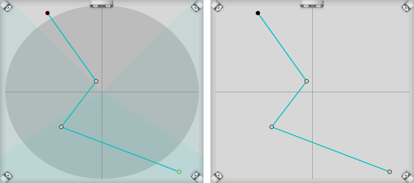

**更改坐标图视图显示的方法是：**

1. In the Display Option group, select either of the following options:

   - **Show Radius**（显示半径），以在坐标图视图中显示衰减最大距离半径。
   - **Show Cone**（显示声锥），以在坐标图视图中显示声锥角度（内角和外角）。

|  |  |
| --- | --- |
| [备注] | 备注 |
| 只有在衰减已应用于当前对象时，Show Radius 和 Show Cone 选项才可用。 |

###### Changing the path duration

您创建的每条路径可具有不同的时长。要更改路径的时长，必须更改时间线的长度。如果时间线上沿线的现有点间隔不均匀（非线性模式），则必须指定是在时间线上按比例分布这些点还是将它们保留在现有位置上。

**更改动画路径时长的方法是：**

1. 在 Path（路径）列表中，点击您要更改其时长的路径。
2. 点击 **Configure Timeline**（配置时间线）按钮。

   The Configure Timeline dialog opens.
3. 在 Length（长度）文本框中，为选定路径指定新的时长。
4. 如果时间线中已经包含控制点，并呈非线性模式，则必须选择以下其中一项：

   - **Stretch proportionally**（按比例拉伸），以重新定位现有控制点，并保持它们之间在时间线上的相对位置。
   - **Preserve key values**（保留关键值），以将控制点保持在它们在时间线上的现有位置上。超出新时间线长度的控制点将被删除。
5. 单击 **OK**（确定）。

   动画路径的长度于是更新了。时间线也发生改变，以反映新的时长。

###### Reordering the animation path list

对于动画路径列表中的路径，如果您想要它们以特定顺序显示或播放，则可以对它们重新排序。

**重新排序路径列表的方法是：**

1. 在路径列表中，点击您要移动的路径。
2. 将选定路径拖到新位置。

|  |  |
| --- | --- |
| [技巧] | 技巧 |
| 在路径列表中移动路径时，将显示一条红线，帮助您了解路径将会放到哪里。 |

###### Deleting animation paths

如果您不再需要路径，则可从列表中移除它。

**删除动画路径的方法是：**

1. 在 Path 列表中，点击您要删除的路径。
2. 点击 **Delete**。

   确认消息框出现。
3. 单击 **OK**（确定）。

   路径于是从列表中移除了。

###### Determining how animation paths are played back

在创建路径后，必须决定如何播放它们。与容器一样，您可以决定是随机播放还是按照路径列表中的指定顺序播放创建的路径。您还可以决定当播放对象时是逐一播放所有路径还是每次只播放一条路径。

**确定播放动画路径方式的方法是：**

1. 在 Position Editor (3D Automation) 中，将播放类型设为以下选项之一：

   - **Sequence**（序列），从头到尾按序列播放列表中的路径。
   - **Random**（随机），随机播放路径，直至播完所有路径。
2. In the Play Mode group, select one of the following options:

   - **Continuous** ―― 逐一播放路径，直至播完所有路径。
   - **Step** ―― 在每次播放对象时从列表中选择一条路径。
3. 如果选择了 Continuous，则 Loop（循环）和 Transition time（过渡时间）将变为可用。

   要无限期地播放整个动画路径列表，选择 **Loop** 选项。

   要在一条路径末端和另一条路径开端之间添加一个线性过渡，则选择 **Transition Time** 选项，并在相应的文本框中指定过渡时间量。
4. 如果选择了 Step，则 Pick new path when sound starts 选项将变为可用。

   选择 **Pick new path when sound starts** 选项将强制 Wwise 在每次播放新声音使用新路径，无论声音是否由播放事件触发。当您希望对连续容器中的各个声音使用不同的路径时，此选项特别有用。

---

##### 处理时间线中的点

在创建动画路径时，需要定义声音沿路径传播的时间。Position Editor (3D Automation) 时间线方便指定各个控制点所对应的时间。


您可以沿时间线来移动控制点，从而定义对象在点之间沿路径运行的速度。您可以移动和删除点，但不能直接在时间线上添加点。控制点只可在坐标图视图中添加。您还可以同时选择多个点来移动或删除整条线段。

|  |  |
| --- | --- |
| [备注] | 备注 |
| 您可以在时间线上缩放和平移控制点，以便更加准确地定位控制点。 |

###### Changing the timeline mode

Position Editor (3D Automation) 中的时间线可设置为以下两种模式之一：

- **Linear**: 线性。控制点沿时间线自动均匀地放置。
- **Non-linear**: 非线性。控制点可放在时间线上任何位置。

当对象沿路径运动时，从一个节点到下一个节点，线性模式将产生匀速的运动。而非线性模式可用于当对象在两点之间沿路径运动时加快和减慢对象的速度。线性模式是默认的时间线模式。

点击 Configure Timeline 按钮可进一步配置时间线的特定行为。有关详细信息，请参阅[“Configuring the positioning timeline”一节](ch50s02.html "Configuring the positioning timeline")。

**更改时间线模式的方法是：**

1. 在 Position Editor (3D Automation) 中，执行以下操作之一：

   - 取消选中 **Linear** 选项以将时间线模式设为非线性。
   - 选择 **Linear** 选项以将时间线模式设为 Linear。

###### Selecting control points in the timeline

在移动或删除时间线中的控制点前，必须先选中控制点。您每次可选择一个、多个或所有控制点。

**选择时间线中一个控制点的方法是：**

1. 在时间线上，点击控制点以选中它。

   所选控制点将变为黑色。

**选择时间线上的多个控制点的方法是：**

1. 在时间线上，画矩形来选中您要选择的点。

   所选的点将变为黑色。

|  |  |
| --- | --- |
| [技巧] | 技巧 |
| 在按住 Ctrl 的同时点击各个点也可以选择多个点。 |

**选择时间线中全部控制点的方法是：**

1. 点击时间线任何位置来激活它。
2. 按下 **Ctrl+A**。

   时间线中的所有点于是都被选中并变成黑色。

###### Moving control points in the timeline

当时间线处于非线性模式时，您可以移动控制点来更改各个点之间的时间。这会让对象在各个控制点之间实现加速或减速移动的效果。一个控制点不可越过它前后的控制点。

**移动时间线上控制点的方法是：**

1. 在时间线上，选择若干个控制点。

   所选控制点将变为黑色。
2. 将选中点拖到时间线上的新位置。

|  |  |
| --- | --- |
| [备注] | 备注 |
| 直接在 Key 字段中输入值也可以移动点。如果选中了多个点，您在 Key 字段中输入的正值（+）或负值（-）则将使这些点偏移到它们初始位置的右侧或左侧。 |

###### Deleting control points in the timeline

除第一个控制点外，您可以删除时间线中的任意控制点。

**从曲线删中除控制点的方法如下：**

1. 在时间线中选择若干个点。

   选中的控制点变成黑色了。
2. 在 Windows 上，按下 **Delete** 键。在 macOS 上，按下 **fn+Delete**。

   控制点于是被从时间线和坐标图视图于中移除了。

---

#### 将音频信号传送到中置扬声器

如果有些声音对游戏的玩法至关重要的话，那么您可能要确保玩家始终能够清楚地听到这些声音。为达到这一目的，您可以将 2D 或 3D 对象的任何比例传送到中置扬声器。例如，赛车游戏中赛车手或者解说员的语音可以完全从中置扬声器中发出来，这样不管游戏中其它声音有多吵，这些语音都能听得清清楚楚。

###### Center % settings

下表描述在各种 Center % 设置中，多少信号将传送到中置扬声器：

| 设置 | Center % |
| --- | --- |
| 0% | 创建幻像中置图像 ―― 没有信号通过中置扬声器。 |
| 1-99% | 不同的信号量通过中置扬声器。随着 Center % 增加，左前和右前扬声器的音量降低。 |
| 100% | 创建独立的中置声像 ―― 信号被全部传送到中置扬声器。 |

|  |  |
| --- | --- |
| [备注] | 备注 |
| 扩散到其它扬声器的信号量多少是基于声源相对于不同扬声器的位置来决定的。 |

**将音频信号传送至中置扬声器的方法是：**

1. 将顶层父对象加载至属性编辑器。
2. Switch to the Positioning category.

   |  |  |
   | --- | --- |
   | [备注] | 备注 |
   | 如果该对象不是顶层对象，您则必须选择 **Override parent**选项后才能设置 Positioning 选项。 |
3. 在 **Center %** 文本框中，可以为信号设置需要通过中置扬声器的音量百分比。

---

#### 定位技巧和经验总结

在 Wwise 中定义对象的定位之前，您最好仔细阅读以下各节。这些章节提供了一系列的示例、技巧和最佳方案，可帮助您更好地管理游戏中对象的定位。

|  |  |
| --- | --- |
| [备注] | 备注 |
| Wwise Spatial Audio does not support a game object 3D Position set to either **Listener with Automation** or **Emitter with Automation**. Automation captures the current position of the game object and copies it to the voice. It is then updated individually, separate from the game object. The Spatial Audio library doesn't have access to the captured or updated positions on the individual voices, it works only on the game object positions.  Wwise Spatial Audio features are limited for sounds that use Emitter with Automation. Diffraction and Transmission processing is disabled for sounds that use Emitter with Automation. Furthermore, the automation offset does not apply to early reflection processing. Reflections are calculated using the base Game Object position.  Wwise Spatial Audio features are disabled for sounds that use Listener with Automation. This includes early reflection processing, Distance Probe, diffraction and transmission, and room sends. |

###### Positioning - example (part 2)

在详细描述 Wwise 中可用的不同定位选项后，现在让我们了解不同的选项可如何用来为我们的第一人称[“Positioning - example (part 1)”一节](ch22.html#positioning_example_part_1 "Positioning - example (part 1)")中的声音和振动效果定义定位。

- **Footsteps**: 脚步。这是一款第一人称游戏，因此主人公的脚步声应始终伴随着摄头。因为这些声音没有移动和衰减，所以在这种情况下将基本的 Speaker Panning（扬声器声像摆位）设置为 Direct Assignment（直接指派）较为合适。然而，对于其它的特工，您需要将声音附加到“agent”游戏对象上，使脚步声与他们的动作相匹配。在这种情况下，结合使用 3D Spatialization（3D 空间化）和 Emitter（发声体）定位较为合适；不过，不需要启用衰减。
- **照亮敌人丛林基地的火把的燃烧声** ―: 这些声音附加到“torch”游戏对象上。虽然它们固定在一个地方，但发声体的位置及其到话筒的距离将随着玩家的移动而改变。若要模拟这种类型的声音，可结合使用 3D 空间化、Emitter 定位和衰减。
- **一群恐怖分子在屋内交谈的声音** ―: 这些声音附加到“terrorist”游戏对象上。这些对象可以在游戏环境内自由移动。若要模拟这种类型的声音，可结合使用 3D 空间化、Emitter 定位和衰减。
- **蚊子在头顶上飞舞的嗡嗡声**：可听到蚊子在周围飞舞时发出的嗡嗡声，但看不到蚊子。因为发声体必须在 3D 空间内移动，所以在这种情况下的 3D 空间化使用 Emitter with Automation（发声体自动化）或 Listener with Automation（听者自动化）定位较为合适。同时使用空间化和衰减的一系列随机播放声音路径可以创建极其逼真的蚊虫声音。在选择 Listener with Automation 选项时，虽然没有实际游戏对象，但会有嗡嗡声随玩家移动。当然，也可选择 Emitter with Automation 选项，并使用“蚊子”游戏对象来定义能听到嗡嗡声的死水潭区域。
- **从总部接收最新情报的声音**：从总部接收情报的通信声既不与任何特定游戏对象关联，也不在周围环境中移动，因此在这种情况下将 Speaker Panning 设置为 Direct Assignment 较为合适。 由于最新情报对于完成任务非常关键，因此您还可能需要将某些或全部声音传送到中置扬声器。
- **执行任务的特工们之间的耳语声**：队友之间的耳语声将关联至各自的游戏对象，因此这些声音使用 3D 空间化较为合适。特工们相互掩护依次行动，需要某种空间定位，但他们既然必须协同作战，因此他们之间的沟通不需要任何衰减。由于队友之间的沟通对于完成任务非常关键，因此您还可能需要将某些或全部声音连通到中置扬声器。
- **在成功完成任务后用于炸毁基地的炸药的爆炸声** ―: 特工将听到和感受到炸药的爆炸声。这些声音和振动对象将被绑定在游戏中会爆炸的对象上。虽然它们固定在一个地方，但发声体/振动体的位置及其到听者的距离将随着玩家的移动而改变。若要模拟这种类型的音效，可结合使用 3D 空间化、Emitter 定位和衰减。
- **岛上火山持续发出的轰鸣声** ―: 火山发出的轰鸣声是该偏远岛屿上持续发出的声音和振动效果。声音和振动对象最好附加在“island”游戏对象上。添加一些衰减可在玩家靠近该岛时，让轰鸣声听起来更加响亮或密集。因为声音和振动没有移动，所以在这种情况下不需要启用空间化。
- **火山最后喷发声**：爆炸导致火山爆发。在最终场景中，玩家坐在运输直升机后排逃离危险之地。火山喷发会产生震耳欲聋的环境声，您可以使用 Listener with Automation 定位选项进行 3D 空间化处理，并应用衰减设置。在 Position Editor (3D Automation) 中，可创建一个或多个路径，来反映直升机和玩家如何上下颠簸、迂回前行，并在烟雾弥漫的风暴中艰难地躲避四溅的碎屑，最终顺利飞越火山口。我们可以启用 Hold Listener Orientation，从而通过不同的扬声器来播放火山喷发声，并反映玩家（听者）所处位置。假如采用多扬声器配置，还可将 3D Spatialization（3D 空间化）选项设为 Position + Orientation（位置 + 朝向），从而表现出直升机不断变换朝向和火山喷发声逐渐衰减，增强真实性。
- **互动音乐**：因为音乐不与任何特定游戏对象关联，且无需在环绕声环境中移动，所以使用 Speaker Panning 较为合适。在示例中，我们希望对部分 Music Track（音乐轨）进行声像摆位，在前后扬声器之间平衡音乐的音量。

|  |  |
| --- | --- |
| [技巧] | 技巧 |
| 在示例中，我们可以想象火山最后喷发声逐渐过渡至欢庆的音乐，最终游戏场景完美结束。为了实现两种声音之间的平滑过渡，可针对 Speaker Panning / 3D Spatialization Mix 设置 RTPC 曲线：对应值从 100（仅启用 3D Spatialization）逐渐降至 0（仅启用 Speaker Panning）。 |

请参考下表，了解在本例中可用于创造不同声音的定位选项的完整概述。

| 声音 | Speaker Panning | | Attenuation（衰减） | 3D Spatialization | | |
| --- | --- | --- | --- | --- | --- | --- |
|  | Direct Assignment | Balance-Fade | Attenuation（衰减） | Emitter（发声体） | Emitter with Automation | Listener with Automation |
| 特工的脚步 | |  | | --- | |  | |  |  |  |  |  |
| 火把 |  |  | |  | | --- | |  | | |  | | --- | |  | |  |  |
| 恐怖分子交谈 |  |  | |  | | --- | |  | | |  | | --- | |  | |  |  |
| 蚊子嗡嗡声 |  |  |  |  | |  | | --- | |  | |  |
| 总部发来的最新情报 | |  | | --- | |  | |  |  |  |  |  |
| 特工沟通 |  |  |  | |  | | --- | |  | |  |  |
| 爆炸 |  |  | |  | | --- | |  | | |  | | --- | |  | |  |  |
| 火山轰鸣 |  |  | |  | | --- | |  | | |  | | --- | |  | |  |  |
| 火山喷发声 |  |  | |  | | --- | |  | |  |  | |  | | --- | |  | |
| 互动音乐 |  | |  | | --- | |  | |  |  |  |  |

此示例描述使用 Wwise 中可用的不同选项创建不同定位和传播类型的一种方式。您的最终选择应该取决于音效本身、游戏需求以及希望创造的特定效果。

###### Performance optimizations

- 在不使用 Attenuation 散布曲线时，请使用单声道声音。若不打算使用散布曲线来拓宽音频信号，则应使用单声道声音来优化性能。不使用散布时，立体声的所有输入声道将映射到同一位置，并且不得不进行动态渲染；而使用单声道时，将离线操作，游戏期间不会占用任何 CPU 资源。
- 请复用或减少 Attenuation Editor（衰减编辑器）中的曲线数量，以便提高性能。记住，在 Attenuation Editor 中创建的曲线越多，占用的运算资源和内存就越多。要提高性能，既可以复用（辅助发送音量的） Output Bus Volume（输出总线音量）曲线，也可不使用任何曲线。
- 使用少量的点和线性曲线段来提高性能。记住，沿曲线添加的点越多，曲线形状越复杂，占用的运算资源和内存就越多。在大多数情况下，对于带有两到三个点的曲线，使用线段就足以达到您所需要的衰减结果。
- 使用 ShareSet 共享衰减属性设置。若游戏中多个对象具有相似的衰减属性，则可使用 ShareSet 来共享这些属性设置。通过共享衰减属性设置，在更改衰减属性时可以同时节省内存和时间。
- 使用定位类型 RTPC 可以为类似的用途复用声音。例如，可以使用相同的声音层级结构将玩家的脚步声设置为 2D，敌人的脚步声设置为 3D。这样可以节省大量内存。

###### 特定定位情景的概述

让我们一起来了解某些特定情景，让您更好地理想 Wwise 中不同定位和衰减设置的工作原理。

|  |  |
| --- | --- |
| [备注] | 备注 |
| 在默认情况下，不会通过中置扬声器播放声音。要将信号的任何部分传送到中置扬声器中，使用 Center % 属性滑杆。 |

###### 情景 1

- Listener Relative Routing：Enabled
- 衰减：无
- 3D Spatialization：None

**结果**：这些设置可以有效地为您提供与 2D 声音相同的定位。

###### 情景 2

- Listener Relative Routing：Enabled
- 衰减：简单线性曲线

  |  |
  | --- |
  |  |
- 3D Spatialization：None

**结果**：这些设置可以在听者远离声源时有效地降低声音音量（衰减），但声音始终处于它在原始声音素材中的准确位置上，没有应用任何定位或旋转（空间定化）。

###### 情景 3

- Listener Relative Routing：Enabled
- 衰减：无
- 3D Spatialization：Position

**结果**：无论听者距离声源多远（衰减），这些设置可以有效地为您提供一个源自特定位置（空间化）但音量永不衰减的声音。

###### 情景 4

- Listener Relative Routing：Enabled
- 衰减：简单线性曲线

  |  |
  | --- |
  |  |
- 散布：简单线型曲线

  |  |
  | --- |
  |  |
- 3D Spatialization：Position
- 声源：单声道

**结果**：这些设置可以有效地达到以下效果：

- 当听者距离声源较远时，声音来自特定位置（空间化），音量较低，主要在一个扬声器中播放（散布）。
- 当听者距离声源较近时，声音来自于特定位置（空间化），接近于最大音量（衰减），并几乎平均分布在两个扬声器之间（散布）。

###### 情景 5

- Listener Relative Routing：Enabled
- 衰减：简单线性曲线

  |  |
  | --- |
  |  |
- 散布：简单线型曲线

  |  |
  | --- |
  |  |
- 3D Spatialization：Position
- 声源：立体声

**结果**：这些设置可以有效地达到以下效果：

- 听者距离声源较远时，声音来自特定位置（空间化），音量较低（衰减）。对于不带散布的、使用空间化的立体声源，两个声道合并形成一个单声道“点声源”。为此，我们建议在没有散布时使用单声道文件，因为这样做可以更加高效地利用 CPU。

  |  |
  | --- |
  |  |
- 使用散布时，新的“虚声源”是指偏离原始声源的声源。例如，对于小散布值，计算得到的虚声源将位于实际位置的左侧和右侧，它们的贡献将添加到扬声器中，与正常的无散布声音无异，唯一不同的是位置稍微不同。

  |  |
  | --- |
  |  |

  随着散布值增加，用于覆盖听者周围大弧度的虚声源数量将更多。显然，为了保持恒定的总功率，这些声源的功率将低于实际声源。

  |  |
  | --- |
  |  |

  |  |  |
  | --- | --- |
  | [备注] | 备注 |
  | 注意，这些声源仅用于音量计算；实际上并没有播放新的声音。 |
- 当听者距离声源较近时，声音来自于特定位置（空间化），接近于最大音量（衰减）。使用高散布值时，声音将来自于所有方向。立体声的左右声道将独立散布。

  |  |
  | --- |
  |  |
- 现在，需要特别注意距离 = 0 的情形。在 Wwise 中，所有空间化计算（和声锥衰减）都以角度为基础。当距离 = 0 时，Wwise 无法确定听者是朝前、朝左、朝右还是其它朝向。应避免在游戏中发生这种情景。如果在游戏中发生了这种情形，Wwise 则将创建立体声的单声道版本来避免计算越界音量。这一逻辑同样适用于声锥衰减。如果听者的朝向未知，Wwise 则将假定不存在任何衰减。这同样适用于声锥 LPF。

---

#### 了解总线配置

This section provides information on all of the options in the Bus Configuration list in the Property Editor. 其中包括输出声道、建议的扬声器角度和排序等详细信息。

|  |  |
| --- | --- |
| [技巧] | 技巧 |
| 要想确保在不同总线配置下获得最佳性能，必须先了解 Wwise 的下混方法。有关详细信息，请参阅[“下混行为”一节](ch34s12.html "下混行为")。 |

| 界面元素：Same as parent | |
| --- | --- |
| 该总线沿用父总线的总线配置，并有可能设为 Not Mixing 状态。藉此，可将总线的属性传给其输入而无需任何处理，从而节省 CPU 和内存资源。不过，若总线包含特定功能（如效果器），则会执行相应处理，也就没法节省资源了。有关更多详细信息，请参阅 [“了解总线图标和处理状态”一节](ch34s11s01.html "了解总线图标和处理状态") 章节。 | |

| 界面元素：Same as main mix | |
| --- | --- |
| 该总线沿用总线管线末端 Audio Device 的 Main Mix 的总线配置。此选项允许在运行时由终端灵活地决定总线配置。 | |

| 界面元素：Same as passthrough mix | |
| --- | --- |
| 该总线沿用总线管线末端 Audio Device 的 Passthrough Mix 的总线配置。此选项允许在运行时由终端灵活地决定总线配置。若启用了 [*[3D Audio](go01.html#glossary_3daudio "3D Audio")*](go01.html#glossary_3daudio) 且终端支持 Passthrough Mix，则采用 2.0 配置对总线输出进行格式化。否则，会跟选中 **Same as main mix** 一样对总线实施处理。 | |

| 界面元素：Audio Objects | |
| --- | --- |
| 该总线会生成 Audio Object。这些 Audio Object 由音频缓冲区和 Metadata 构成，在满足所有条件的情况下可传给终端来进行渲染以获得空间化效果。这种总线配置旨在细化环境中声音的定位，以此满足空间渲染在精度上的高水准要求。  在采用这种配置时，Wwise 会将 Audio Object、3D 位置和朝向信息发送到具备 Audio Object 渲染能力的平台。随后，终端便可利用这些信息来生成相应的 3D 空间化效果。  有关更多详细信息，请参阅 [“了解基于对象的音频”一节](ch12s03.html "了解基于对象的音频") 章节。 | |

| 界面元素：1.0 | |
| --- | --- |
| Channel | Suggested Speaker Angle |
| 中置（C） | 0 度角 |

| 界面元素：2.0 | |
| --- | --- |
| Channel | Suggested Speaker Angle |
| 左（L） | 22-30 度角 |
| 右（R） | 22-30 度角 |

| 界面元素：3.0 | |
| --- | --- |
| Channel | Suggested Speaker Angle |
| 左（L） | 22-30 度角 |
| 右（R） | 22-30 度角 |
| 中置（C） | 0 度角 |

| 界面元素：4.0 | |
| --- | --- |
| Channel | Suggested Speaker Angle |
| 左（L） | 22-30 度角 |
| 右（R） | 22-30 度角 |
| 环绕声左声道（SL） | 90-110 度角 |
| 环绕声右声道（SR） | 90-110 度角 |

| 界面元素：5.1 | |
| --- | --- |
| Channel | Suggested Speaker Angle |
| 左（L） | 22-30 度角 |
| 右（R） | 22-30 度角 |
| 中置（C） | 0 度角 |
| 环绕声左声道（SL） | 90-110 度角 |
| 环绕声右声道（SR） | 90-110 度角 |
| 低频效果声道（LFE） | 不适用 |

| 界面元素：7.1 | |
| --- | --- |
| Channel | Suggested Speaker Angle |
| 左（L） | 22-30 度角 |
| 右（R） | 22-30 度角 |
| 中置（C） | 0 度角 |
| 环绕声左声道（SL） | 90-110 度角 |
| 环绕声右声道（SR） | 90-110 度角 |
| 左后声道（BL） | 135-150 度角 |
| 右后声道（BR） | 135-150 度角 |
| 低频效果声道（LFE） | 不适用 |

Wwise 还支持具有“高度”扬声器的扩展标准声道配置。下面列出了所有可用声道及建议的扬声器角度。

| 具有高度声道的标准配置扩展 | |
| --- | --- |
| Channel | Suggested Speaker Angle |
| 左（L） | 22-30 度角 |
| 右（R） | 22-30 度角 |
| 中置（C） | 0 度角 |
| 环绕声左声道（SL） | 90-110 度角 |
| 环绕声右声道（SR） | 90-110 度角 |
| 中后 (BC) | 180 度 |
| 左后声道（BL） | 135-150 度角 |
| 右后声道（BR） | 135-150 度角 |
| 顶部（T） | 正上方 |
| 高度左前（HFL） | 同 L，高出水平线 |
| 高度中前 (HFC) | 同 C，高出水平线 |
| 高度右前（HFR） | 同 R，高出水平线 |
| 高度左后（HBL） | 高度左后（HBL） |
| 高度中后（HBC） | 高度中后（HBC） |
| 高度右后（HBR） | 同 BR（或 SR），高出水平线 |
| 低频效果声道（LFE） | 不适用 |

| Dolby™ 总线配置 | |
| --- | --- |
| 界面元素 | Channels（声道） |
| 5.1.2 | L + R + C + SL + SR + HFL + HFR + LFE |
| 5.1.4 | L + R + C + SL + SR + HFL + HFR + HBL + HBR + LFE |
| 7.1.2 | L + R + C + BL + BR + SL + SR + HFL + HFR + LFE |
| 7.1.4 | L + R + C + BL + BR + SL + SR + HFL + HFR + HBL + HBR + LFE |

|  |  |
| --- | --- |
| [备注] | 备注 |
| Wwise 支持的 Dolby 配置包括向 5.1 环绕声和 7.1 环绕声配置中添加的高度声道。产生的新标注中增加了第三位数，它表示高度声道的数量。 |

| Ambisonics Bus Configuration | |
| --- | --- |
| 界面元素 | Component Ordering |
| Ambisonics 1st order | W-Y-Z-X |
| Ambisonics 2nd order | W-Y-Z-X-V-T-R-S-U |
| Ambisonics 3rd order | W-Y-Z-X-V-T-R-S-U-Q-O-M-K-L-N-P |
| Ambisonics 4th order | 1-25 |
| Ambisonics 5th order | 1-36 |

|  |  |
| --- | --- |
| [备注] | 备注 |
| Ambisonics 使用独立于扬声器设置的 B-format 声场进行工作。 字母标记用于 1 ~ 3 阶，表示 B-format 各方向声道而非扬声器声道。此标记基于经过 SN3D 归一化的 ACN 声道排序，但就像经过 MaxN 归一化的 FuMa 排序一样，其使用字母而不是数字。高阶使用数字。有关详细信息，请参阅[“Ambisonic 通道排序”一节](ch22s13s01.html "Ambisonic 通道排序")。 |

| Auro 总线配置 | |
| --- | --- |
| 界面元素 | Channels（声道） |
| Auro 10.1 | L + R + C + SL + SR + T + HFL + HFR + HBL + HBR + LFE |
| Auro 11.1 | L + R + C + SL + SR + T + HFL + HFC + HFR + HBL + HBR + LFE |
| Auro 13.1 | L + R + C + BL + BR + SL + SR + T + HFL + HFC + HFR + HBL + HBR + LFE |

|  |  |
| --- | --- |
| [备注] | 备注 |
| Wwise 支持的 Auro 配置包括向 5.1 环绕声和 7.1 环绕声配置中添加的高度声道。生成的标记中声道总数（第一位）增加了：介于 9.1 ~ 13.1 之间，表示增加了 4 ~ 6 个高度声道。比如，Auro 13.1 表示向 7.1 环绕声配置添加了 6 个高度声道。 |

| 界面元素：LFE | |
| --- | --- |
| Channel | Suggested Speaker Angle |
| 0.1（单声道） | 不适用 |

---

#### Speaker and headphone panning rules

In Wwise there are two different panning rules: speaker and headphone. By default, all platforms use the speaker panning rule with the exception of portable consoles (such as Android and iOS), which use the headphone panning rule. 两种模式之间的差异很小，但有助于提供逼真、准确的音频体验；具体取决于您的聆听方式。此设置可以在 Wwise 中试听，也可以在游戏中运行时设置。

|  |
| --- |
|  |

|  |
| --- |
|  |

试听这两种模式的方法是：

- From the menu bar, click **Audio > Main Mix Channel Configuration > 2.0 (Speaker Panning)**
- From the menu bar, click **Audio > Main Mix Channel Configuration > 2.0 (Headphone Panning)**

|  |  |
| --- | --- |
| [备注] | 备注 |
| To set the panning rule in the game, refer to [AK::SoundEngine::SetPanningRule](https://www.audiokinetic.com/library/edge/?source=SDK&id=namespace_a_k_1_1_sound_engine_a3e61f70b39d53dd7b8350f2696d9c59e.html) in the SDK documentation. |

---

#### 使用 Ambisonics

Ambisonics 是一种环绕声技术，可以覆盖水平面以及听者上方和下方的区域。B-format 声场通过球谐函数来表示，能够独立于扬声器配置发挥效果。可以想见，这样就能轻松实现声音跟随听者的旋转。对于声音设计师所需的更加全方位的环绕声表现形式，比如在提供环境声或进行 VR 研发时，Ambisonics 都是可行的选择。<片段1100>

利用 Wwise，可执行以下操作：

- 按照 FuMa 格式（最高三阶）或 AmbiX 格式（最高五阶）导入并播放 B-format 素材。
- 将其他总线配置编码为 Ambisonics 格式，并将 Ambisonics 解码为其他总线配置。
- 使用效果器插件来自定义 Ambisonics 解码。
- 使用 Binauralizer 效果器插件（如 Auro Headphone 和 Resonance Audio）将 Ambisonics 信号转码为立体声信号。
- 使用效果器插件（除了 Stereo Delay 和 Matrix Reverb）来像其他格式一样处理 Ambisonics 信号。
- 将 Ambisonic Bed 传给支持 Ambisonics 的音频设备。支持 Ambisonics 的平台越来越多，此输出可在任一所述平台上播放。
- 使用 Recorder 插件将 Ambisonics 总线的信号录制到磁盘上并重新导入。

|  |  |
| --- | --- |
| [技巧] | 技巧 |
| Wwise 示例工程中提供了几个有关 [Ambisonics 用法](https://www.audiokinetic.com/library/edge/?source=SampleProject&id=example_ambisonics)的示例。 |

**使用 Ambisonic 文件的方法如下：**

1. 导入录制的 B-format Ambisonic 文件，该格式像其他音频文件一样，可以保存为 WAV 或 AMB。有关详细信息，请参阅[“导入媒体文件”一节](ch10s02.html "导入媒体文件")。

   |  |  |
   | --- | --- |
   | [备注] | 备注 |
   | 若要导入 Ambisonics 文件（AMB、AmbiX 和 WAV 文件）并确认 Wwise 已将其正确识别为 Ambisonics，请打开 Source Editor（源编辑器）并查看或编辑 Channel Configuration Override（改写声道配置）菜单中的值。若要打开 Source Editor，请在 Contents Editor（内容编辑器）内双击 SFX（音效）、Music Track（音乐轨）或 Voice（语音）图标。（Views 菜单 > Contents Editor 或 Shift+O）。 |
2. 与其他声音对象一样，请指定适当的 Audio Bus 作为 **Output Bus**。请参阅 [“指定对象的输出连线”一节](ch34s01.html "指定对象的输出连线") 了解详细信息。
3. 若要创建球面声场，请将声音对象的 Spread（散布）设为 100%。有关详细信息，请参阅 [“定义各种对象属性的衰减曲线”一节](ch22s07s03.html "定义各种对象属性的衰减曲线") 章节。

   |  |  |
   | --- | --- |
   | [备注] | 备注 |
   | 在被视作声场并结合使用 3D Spatialization 时，倘若 Spread 保留设为默认值 0，Ambisonics 会像其他多声道文件一样收缩成单声道点声源。 |

Wwise 将根据需要为各声道混音。有关详细信息，请参阅[“对 Ambisonics 进行子混音”一节](ch22s13s04.html "对 Ambisonics 进行子混音")。

**创建 Ambisonics 输出：**

1. 将 Audio Bus 设为以下 Ambisonics 总线配置：

   - **Ambisonics 1st Order**（4 声道）
   - **Ambisonics 2nd Order**（9 声道）
   - **Ambisonics 3rd Order**（16 声道）
   - **Ambisonics 4th Order**（25 声道）
   - **Ambisonics 5th Order**（36 声道）

   有关声道配置的更多信息，请参阅 [Available Ambisonics Bus Configurations table](ch22s11.html#available_ambisonics_bus_configurations)。

   对于通过上述 Audio Bus 输出的源文件，Wwise 会将其混音并适配 Ambisonic 输出。

   |  |  |
   | --- | --- |
   | [备注] | 备注 |
   | If your Sound Engine Audio System specified in the Authoring Audio Preferences dialog is an Audio Device that supports ambisonics, then you can skip this initial step because the Main Audio Bus will already be set to ambisonics. 请参阅 [“Selecting audio output devices”一节](ch04s05.html#setting_output_devices "Selecting audio output devices")。 |
2. 指定一个支持 Ambisonic 声道配置的最终输出设备，例如 3D 双耳系统。

   若不是支持 Ambisonics 的输出，则 Wwise 将自动把对应的声道输出解码为适用的标准输出。有关详细信息，请参阅[“对 Ambisonics 进行子混音”一节](ch22s13s04.html "对 Ambisonics 进行子混音")。

---

##### Ambisonic 通道排序

用于 Ambisonic 的通道排序格式主要有两种，包括通常称为 FuMa 的 Furse-Malham，和通常称为 ACN 的 Ambisonics Channel Number。如下图所示，前者使用字母标记（各组按照字母排序），从 W（全向）声道开始，到右下角，接着到左下角，再到两者中间；然后到下一阶，从 R 开始，到其右边，再到其左边，到最右边，再到最左边；然后到下一阶，并遵循相似的模式。相比之下，后者即 ACN 的编号顺序从左到右，更容易跟踪。

从顶部通道到第 1、2、3 阶排序，图中还表明各阶 Ambisonic 可以看作分别具有 4, 9 和 16 声道的金字塔结构。<片段1143>


###### Ambisonic ordering within Wwise

在 Wwise 中，Ambisonics 文件的排序可能与初始导入文件或后续导出文件不同。在默认情况下，Wwise 希望导入的 1 ~ 3 阶 Ambisonics 文件使用 FuMa 排序，而高阶 Ambisonics 则始终解释为 AmbiX 格式并使用 ACN 排序。

|  |  |
| --- | --- |
| [技巧] | 技巧 |
| 您可以在 Source Editor（源编辑器）中使用 **Channel Configuration Override**（覆盖声道配置）来更改 Wwise 对文件声道的解释方式。 |

Wwise 将把 FuMa 排序转码为经过 SN3D 归一化的新 ACN 排序，不过会保留直到三阶的 FuMa 字母标记。也就是说，在前面的图像中，FuMa 排序将从左到右读取，对应于 W Y Z X V T R S U Q O M K L N P。电平表以及设计工具中的 Source Editor [图像](ch49.html "了解坐标图视图")都将使用这种遵循 ACN 排序的混合显示法。

这也意味着自定义插件的开发可以使用这种经 Wwise 转换的 ACN 排序。对于在 Ambisonics 总线上用 Wwise Recorder 插件录制的文件，可使用 FuMa 排序（从而生成可导入 Wwise 的文件）或 ACN 排序。这是由 Ambisonic Channel Ordering（Ambisonics 声道排序）选项决定的。

---

##### 将 Ambisonics 保留到最终输出

在其中一条总线的 Bus Configuration（总线配置）设为 Ambisonics 时，Wwise 将生成 Ambisonics 信号。这些信号会被解码，也就是说只要 Ambisonics 总线的父总线将 Bus Configuration 设为标准多声道配置（如立体声或 5.1），信号就会被转换为这种标准的配置格式。

The Main Audio Bus inherits the configuration of the endpoint, which depends on the platform and is usually detected automatically. 大部分平台仅支持少数几种输出配置。通常是立体声、5.1 和 7.1。So, in general, the Main Audio Bus has a standard channel configuration, which forces decoding of child ambisonic busses to this configuration. 也就是说，在大部分情况下，Wwise 不会默认输出 Ambisonics 信号。

不过，可编写自定义 Audio Device（音频设备）插件来声明 Ambisonics 配置。In this case, the Main Audio Bus would have an ambisonics Bus Configuration and Wwise would preserve, not decode, the ambisonics signal.

|  |  |
| --- | --- |
| [备注] | 备注 |
| 有些终端支持 Ambisonics 信号。In these cases, the Main Audio Bus can inherit an ambisonics configuration. 有关详细信息，请参阅 [Wwise SDK](https://www.audiokinetic.com/library/edge/?source=SDK&id=index.html) 文档中的平台特定章节。 |

另外，若只想让 Wwise 将 Ambisonics 信号保存到文件中，可直接在 Ambisonics 总线上插入 [“Recorder 插件”一节](ch66s17.html "Recorder 插件")。生成的文件将采用 FuMa 或 AmbiX 格式，其 Ambisonics 阶数等于 Recorder 所在总线的阶数。

---

##### 在插件中使用 Ambisonics

Wwise 插件 API 使用 [`AK_ChannelConfigType_Ambisonic`](https://www.audiokinetic.com/library/edge/?source=SDK&id=_ak_speaker_config_8h_a9e3e31d9ff388daa593222da7672a999.html) 暴露了 Ambisonics 声道配置。因此，在[创建新的插件](https://www.audiokinetic.com/library/?source=SDK&id=goingfurther__newplugins.html)时，开发者可以使用 Ambisonics Bed。

###### Using ambisonics with Effects

Wwise 中所有独立处理声道的效果器（如 Compressor、Guitar Distortion 和 Parametric EQ 插件）都支持 Ambisonics。

|  |  |
| --- | --- |
| [备注] | 备注 |
| 为了保留空间声场，应该在“linked channels（声道链接）”模式下使用压缩效果器。 |

相反，混响效果器对于声道的处理则不同。They typically downmix the input channel, reverberate it, and upmix the reverberated output by mixing more or less decorrelated signals into the output channels. RoomVerb 和 AK Convolution Reverb 可以应用于 Ambisonics 声部/总线。They take the W (omni) channel, reverberate it, and upmix it by mixing decorrelated signals to the omni and directional channels. Matrix Reverb 如应用于 Ambisonics 声部/总线会无法初始化。

---

##### 对 Ambisonics 进行子混音

和其他声道配置一样，Ambisonics 中的声源定位基于混音时游戏对象和听者的位置。因此，Ambisonics 声音对象可采用其他配置进行子混音；但是如果这样做，可能会丢失声音对象的空间信息。例如，如果子混音配置是 7.1，那么当 Ambisonics 音频总线与之混音时，将会失去所有的高度信息。同样，对于 7.1.4 子混音，原先位于听者耳朵下方的对象听起来将位于齐耳高度。因此，建议使用 Ambisonics 配置进行子混音。若空间精度不那么重要，您可以使用较低的阶数。

###### Routing behavior

Wwise 会根据不同配置的输出方式自动将音频转码为 Ambisonics 或从 Ambisonics 转码为其他配置。最终输出取决于所用的不同声道配置和 Spatialization Mode（空间化模式）。根据这些因素，下表提供了路由行为相关的一般信息。

| Routing（信号通路） | 不带 3D Spatialization 的行为 (Direct Speaker Assignment) | 带有 3D Spatialization 的行为 |
| --- | --- | --- |
| 标准配置转换为 Ambisonics | 该信号被编码为 Ambisonics。  单声道信号源将直接编码到 W（全向）声道。  对于多声道声源，每个声道都被视为一个单声道源，入射角度由声道位置决定。例如，对于立体声源，会将其左声道编码为一个单声道源，位于左侧 45 度，右声道同样编码为单声道源，位于右侧 45 度。输入声道角度的详细列表，以度为单位（顺时针）表示：  - L: -45° - R: 45° - C: 0° - SL: -90° - SR: 90° - BL: -135° - BR: 135° - 高度声道的高度角为 +45 度。  使用给定的入射角对声源进行编码非常简单。 | 根据游戏对象相对于听者的位置和朝向，信号将被编码为 Ambisonics。  对于多声道文件，[*[Spread](go01.html#glossary_spread "Spread")*](go01.html#glossary_spread) 和 [*[Focus](go01.html#glossary_focus "Focus")*](go01.html#glossary_focus) 的处理方式跟标准配置完全相同：以虚拟的声源代表各个输入声道，并基于游戏对象、听者、Focus 和 Spread 值将虚声源部署在听者周围，然后进行相应的编码。有关 Spread 和 Focus 的更多详细信息，请参阅 [“定义各种对象属性的衰减曲线”一节](ch22s07s03.html "定义各种对象属性的衰减曲线") 和 [“3D 定位图解”一节](ch22s06.html "3D 定位图解") 。 |
| Ambisonics 转换为 Ambisonics | 各阶 Ambisonics 之间转换时将直接进行扬声器分配。如果输入的阶数较高，则会丢弃额外的声道。如果输入的阶数较低，则输出的额外通道将保持静音。  |  |  | | --- | --- | | [备注] | 备注 | | Ambisonics 始终忽略 Speaker Panning 模式 Balance-Fade。 | | Ambisonics 音频源的 3D 空间化类似于普通的多声道 3D 空间化。在 [*[Spread](go01.html#glossary_spread "Spread")*](go01.html#glossary_spread) 为 0% 时，Ambisonics 输入会收缩为单声道声音，并定位在“发声体”游戏对象所在位置。在 [*[Spread](go01.html#glossary_spread "Spread")*](go01.html#glossary_spread) 为 100% 且 **Spatialization Mode** 设为 **Position + Orientation** 时，Ambisonics 输入会随着游戏对象和听者的相对朝向旋转。不过，若 **Spatialization Mode** 设为 **Position Only**，则不会旋转。有关 3D 空间化的更多详细信息，请参阅 [“3D 定位图解”一节](ch22s06.html "3D 定位图解") 。  当输入和输出阶数不同时，旋转是按较低阶数计算的，较高阶数将被静音。 |
| Ambisonics 转换为标准配置 | 根据游戏指定的扬声器位置，Ambisonics 信号将被解码为输出配置。有关如何设置扬声器位置的信息，请参阅 [`SetSpeakerAngles()`](https://www.audiokinetic.com/library/edge/?source=SDK&id=namespace_a_k_1_1_sound_engine_a7dccf0e26a520d09169fca735daeca80.html) （位于 `AK::SoundEngine`中）。 | 若输出配置为 Ambisonics（如上所述），则 Ambisonics Bed 将会旋转和收缩，不过之后会解码为标准输出配置。 |

  

|  |  |
| --- | --- |
| [注意] | 注意 |
| 若将采用 Direct Speaker Assignment 的单声道音频源编码为 W（全向）声道，而不是将其视为正对前方的音频源，则将导致播放异常。若单声道音频源被输出到 Ambisonics 总线，而该总线又被输出到采用标准配置的总线，则将导致在所有输出声道中播放单声道音频源。这跟 Wwise 中的典型行为不同，通常单声道音频源只会发送到 C 或 L 和 R 声道。 |

---

##### 为实现 3D 空间音频而采用的中间表示形式

博文[《将 Ambisonics 用作空间音频的中间表示形式（针对 VR）》](https://blog.audiokinetic.com/ambisonics-as-an-intermediate-spatial-representation-for-vr/)详细阐述了空间/3D 音频的中间表示形式这一概念。总的来说，就是要对总线层级结构上层的总线进行相应配置以保留 3D 信息，进而在实施双耳混音后将信号传给耳机或在下混后传给扬声器。这在游戏试图运用某些平台中嵌入的 3D 音频技术时尤其有用。

Wwise 针对子混音提供了三种 3D 中间表示形式：

- **Audio Object：**[基于对象的](ch12s03.html "了解基于对象的音频")表示处于管线末端。在此，并不会对发送的各个声音本身实施混音，而只是收集并保留其各自的定位信息，直至用于 Binauralizer 之类的 3D 渲染器。这样便不会丢失任何 3D 信息，确保 3D 渲染器可以最佳状态工作。不过，声音没有实施混音。也就是说，之前可将效果器应用于混音总线的一组声道，现在则需将其单独应用于各个声音（数量可达上百个）。
- **Fixed Object：**声道配置的扬声器位置是已知的。通常会选用 7.1.4 配置。因为其在双耳上方设有高度扬声器，并可表示来自上方的声音。换而言之，7.1.4 无法正确表示来自下方的声音。另外，倘若声音不与扬声器直接对齐，三个临近的扬声器便无法精准传达其方向性。
- **Ambisonics：**Ambisonics 与 Fixed Object 类似，两者的声道数都是恒定的。不过，其空间表示效果不同于 Fixed Object：它相对于旋转具有不变性，所有方向的精度是一致的。这种表示形式的精确度与 Ambisonics 阶数成正比。

---

##### 在 Ambisonics 总线上设置 Binauralizer 效果器

您可以使用某些效果器插件（如 Auro Headphone 或 Resonance Audio C 可通过 Audiokinetic Launcher 安装）将 Ambisonics 信号转码为立体声配置；藉此，可将 Ambisonics 格式用作声音的中间表示形式，进而在信号到达最终输出之前有效地进行下混。

**在 Ambisonics 总线上设置 Binauralizer 效果器：**

1. In the Project Explorer, create a new audio bus under the Main Audio Bus. 本例中命名为了 Binaural。

   
2. In the Audio Bus category of the Property Editor for the new bus, set **Configuration** to one of the ambisonic configurations (while respecting the limitations of the plug-in). Ambisonics 阶数越高，空间音频的中间表示精度越高。

   
3. In the Effects tab of the Primary Editor, click **Add
   Effect**
   , then select none, to add an effect.
4. Click the [>>] selector and select an ambisonic binauralizer Effect from the list, such as Auro Headphone or Resonance Audio. 然后，在效果器名称右侧单击 **New**...（新建...）。

   The New Effect dialog opens.
5. 单击 **OK**（确定）。

   这时会在总线上插入新的效果器。虽然总线的配置为 Ambisonics，但 Binauralizer 效果器会将其 Out Config 设为立体声。

   
6. For all sounds that require binaural processing, in the Property Editor of the sound
   object, set the **Output Bus** to the new bus
   you just configured.

---

##### 对比 Ambisonics 和 Audio Object

###### **对比 Ambisonics 和 Audio Object**

Ambisonics 格式适合用于包括 Binauralizer 在内的各种 3D 渲染器。相较于 Audio Object（音频对象），其可确保由效果器和 3D 渲染器本身对固定数量的声道进行处理，不过在方向性传达方面不那么精准。最终的精确度与所选 Ambisonics 阶数 (1 ~ 5) 成正比。

另一方面，基于对象的管线可在方向性传达方面提供更高的精度。这是因为它会保留每个 Audio Object 的 3D 位置信息而不考虑处理成本。对此，声音设计师需要通过其他方式（如声部限制或 [“3D Audio Bed Mixer”一节](ch66s01.html "3D Audio Bed Mixer") 插件）来控制 Audio Object 的数量及处理成本。

###### 融合 Ambisonics 和 Audio Object

Wwise 中基于对象的管线支持结合 Audio Object 使用其他格式（包括 Ambisonics）。也就是说，两种表示形式之间并不是相互排斥的。比如，您可以使用 Audio Object 来保留声音的元数据，以充分利用 Audio Object 提供的方向性渲染优势。同时，针对其余声音使用 Ambisonics。在采用 Audio Object 配置时，所有没有保留为 Audio Object 的声音都会输出到 Bed。Ambisonics 最为适合表示 Bed。其空间表示相对于旋转具有不变性，所有方向上的精度都是完全一致的。

###### Setting up an ambisonic bed in the context of Audio Objects

顶层音频总线必须采用 Audio Object 来表示，不过我们为 Bed 创建了 Ambisonics 子总线，以将下混的 Ambisonics 声音强制输出到该总线。直接输出到父总线的声音将被视作 Audio Object。Ambisonics Bed 也会被视作单个多声道对象。


目前，Wwise 没有针对对象配套提供 Software Binauralizer 效果器。不过，有些平台在 Audio Device（音频设备）层面支持对对象实施双耳处理。比如，Windows Sonic。In that case, the Main Audio Bus inherits the Audio Object configuration of the Audio Device, and the ambisonic bed can be made its direct child.

如需详细了解 Audio Device 在基于对象的音频管线中的效用，请参阅 [“System Audio Device 的作用”一节](ch12s03s02.html "System Audio Device 的作用")。

---

##### 为头戴式设备使用 Ambisonics

要想确保针对头戴式设备 (HMD) 旋转以 Ambisonics 形式表示的声音，游戏引擎必须将 HMD 头部追踪数据作为听者朝向通过 SetListenerPosition() API 不断传给 Wwise。定位被设为 3D 的声音会与游戏对象绑定。当这些声音在 Ambisonics 总线中混音时，角度的编码取决于游戏对象相对于听者朝向的位置。因此，Ambisonics 下混是由相对于 HMD 作了旋转的声源构成的。

另外，还可结合 B-format 声源使用 3D Spatialization（3D 空间化）。在这种情况下，其将被视作声场并依据游戏对象和听者之间的相对朝向旋转（参见[“将 Ambisonics 视作声场”一节](ch22s13s12.html "将 Ambisonics 视作声场")）。

---

##### 为 VR 制作电影式内容

Ambisonics 的旋转只消耗极少的 CPU 和内存，这要归功于在 Ambisonics 域内计算旋转矩阵。这使得它成为 VR 中交换音频的理想格式。比如，我们可以利用来自任意方向的声源构建整个听觉场景，将其编码为 Ambisonics 信号并用支持 Ambisonics 的 DAW（如 Wwise）存盘。在 VR 设备中播放时，播放引擎只需要读取头部追踪坐标，将 Ambisonics 信号沿反向加以旋转，然后解码/虚拟化为双耳信号并传给耳机。

“[“为头戴式设备使用 Ambisonics”一节](ch22s13s08.html "为头戴式设备使用 Ambisonics")”章节阐释了如何实现互动旋转。除因为头部追踪产生的旋转外，也可用 Wwise 为 VR 制作非互动（电影式）的内容。为此，只需在 Ambisonics 总线上将之前提到的 Binaural Virtualizer 效果器替换为 [“Recorder 插件”一节](ch66s17.html "Recorder 插件")效果器即可。录制的文件为兼容的 FuMa 或 AmbiX 文件，其阶数与总线相同。您可以把这个文件嵌入到 360 度全景视频中，并让玩家用头戴式设备部分所述方法旋转声场。

---

##### 环境

“[“为 VR 制作电影式内容”一节](ch22s13s09.html "为 VR 制作电影式内容")”章节中所述的很多理念也适用于环境效果器（如混响辅助总线）所用的 Auxiliary Bus。RoomVerb 和 AK Convolution Reverb 效果器本身就支持 Ambisonics，不过 Matrix Reverb 并非如此。无论是否要使用前后延迟（Front-Back Delay），都可将其用在立体声、4.0 或更高配置的总线上并发送到 Ambisonics 总线。它们的输出会按照应用于 2D 声音的相同规则编码为 Ambisonics。您可以用 RoomVerb 做同样的操作，也可直接在 Ambisonics 总线上使用它。跟标准多声道配置一样，各个方向声道由去相关性的信号组成。阶数越高，去相关性的声道数越多，消耗的处理资源也越多。建议多多尝试以便在品质和性能之间找到理想的平衡。

---

##### 对比 Ambisonics 声像摆位和 VBAP

Wwise 中 3D 声音默认采用的声像摆位算法基于普遍适用的 VBAP 算法。该算法可以最大限度地提升声音精度，代价是会在一定程度上减弱能量散布的可变性。也就是说，当虚声源位置与扬声器刚好对准时，能量散布最小，当它恰好位于相邻扬声器形成的弧线（标准配置）或三角形（具有高度声道的配置）中央时，能量散布最大。

相比之下，无论声源方向和扬声器布局如何，Ambisonics 都具有恒定的能量散布。Ambisonics 的阶数越低，散布越大。因此，一阶 Ambisonics 非常不精确；而三阶 Ambisonics 较为精确，但仍不如 VBAP 精确。

出于美学方面的考虑，可将单声道声源编码为 Ambisonics Bed。

---

##### 将 Ambisonics 视作声场

Ambionics 声音（无论录制还是合成）特别适合实现环境声。虽然在游戏中通常以高阶 Ambionics 作为空间音频的中间表示形式，但对环境声来说一般低阶 Ambionics 就已足够。

在被视作声场并结合使用 3D Spatialization（3D 空间化）时，倘若 Spread（散布）保留设为默认值 0%，Ambisonics 会像其他多声道格式一样收缩成单声道点声源。为了确保被声场完全环绕，必须向声音对象添加相应的 Attenuation ShareSet（衰减共享集），以此将 Spread 值设为 100%。

如[《为动态环境声使用 Ambisonics》](https://blog.audiokinetic.com/using-ambisonics-for-dynamic-ambiences/)中所述，在将 Spread 设为 100% 并将 3D Spatialization 设为 **Position + Orientation**（位置 + 朝向）时，Ambisonics 声音将依据“发声体”和“听者”游戏对象的相对朝向进行旋转，给人一种声场与周边环境互动的感觉。

Ambisonics 代表传向听者的波前，所以构成声场的声源总是在远处。倘若使用其来表示声场的平移，听起来会比较奇怪。不过，我们可以借助 Spread 来模拟进出声场时的声音效果。事实上，只需将 Spread 降至 100% 以下便可实现沿“发声体”游戏对象所在方位收缩声场的效果。对此，“[“Spread 的影响”一节](ch22s06s01.html "Spread 的影响")”中进行了阐释。Wwise Spatial Audio Room 正是通过这种方式处理房间底噪和混响的（参见[房间底噪](https://www.audiokinetic.com/library/edge/?source=SDK&id=spatial_audio_roomsportals_apioverview.html#spatial_audio_roomsportals_roomtones)）：

- 在听者位于 Room（房间）之内时，Spread 接近于 100%；房间底噪和混响总线在声场旋转时与 Room 朝向绑定。
- 在听者位于 Room 之外时，Room 游戏对象设在最近的 Portal（门户）上；此时，Spread 会降至 50% 以下（具体取决于 Portal 的开口大小）。声场会沿 Portal 方位收缩，并依据 Room 的朝向旋转。随着听者逐渐远离，声场会慢慢地在 Portal 所在位置收缩为点声源。

---

### 管理优先级

在游戏中，您可以同时播放很多对象，对象的数量甚至有可能超出由项目团队设置的数量上限。为了有效管理播放对象的数量，您必须规定同时最多可以播放多少个对象，以及哪些对象会被优先播放。

在 Wwise 中主要有三个属性可以帮您确定在游戏中将同时播放哪些对象：

- **Playback limit** ―― 限制同时允许播放的对象数量。（不包含虚声部。）
- **Playback priority** ―― 个对象相对于另一个对象的重要性。
- **Volume threshold** ―― 低于这一特定音量的对象将不会播放。

通过设置限制、指派优先级和指定最小音量，您可以高效而创新地管理游戏内的多个对象，同时遵循所设定的内存限制。

#### Playback Limit 和 Playback Priority C 示例

假设您正在为一个带宽限制非常严格的游戏作曲。同时只能播放不超过 4 个声部。此时您将顶层父对象的播放数限制设置为 4。每个音乐段落最多包含两条轨道，因此在过渡期间播放各条轨道的前导段和后尾段时，仅会占用两个声部。通过这种方式，如果同时播放两个段落，则仍不会超过仅四个声部的播放数限制。

|  |
| --- |
|  |

但如果在过渡期间游戏触发了插播乐句，那么将超出四个播放流的上限。

|  |
| --- |
|  |

当声部的数量超出播放数限制时，Wwise 会查看各个音乐对象的播放优先级，来决定停止播放哪个音乐对象。In this case, you would probably set the Stinger segment to a lower priority to ensure that the "regular" music continues to play. 但如果该示例中的所有五个对象都具有相同的优先级，那么可以选择终止最后或最先播放的实例。

The following illustration shows how you might set up your music hierarchies along with the values you can assign for Playback Limit and Playback Priority in a case like this.

|  |
| --- |
|  |

For more information about music objects and building your music hierarchies, refer to [*Building your interactive music hierarchies*](ch27.html "Building your interactive music hierarchies").

---

#### 了解 Wwise 如何为对象排列优先级

Advanced Settings（适用于播放）决定游戏中将可以同时播放哪些对象。These playback settings are defined at two different levels within Wwise: at the object level in the Containers hierarchy, and at the bus level in the Busses hierarchy. 因为这些设置在 Wwise 内的不同层级定义，所以对象必须通过两层独立的处理过程才能播放。

The first process occurs at the level of the Containers hierarchy. 当您在这个层级定义对象的 **Advanced Settings** 时，所设置的是全局或各游戏对象的限制。If the limit is reached, the priority then determines which objects will be passed to the bus level in the Busses hierarchy.

The following flowchart shows how Wwise determines which sound, motion, and music objects within the Containers hierarchy will be played per game object. 事实上，最终决定将哪些对象输出到总线之前，可能需要经过不同父级对象的多次迭代（它们都有各自的限制）。


If the new object is not killed or sent to virtual voice at the Containers hierarchy level, it passes to the second process at the Busses level. 在这个层级，根据总线结构内的声部限制，对象将经历类似的流程。

下面的流程图显示了 Wwise 如何决定哪些对象将通过总线输出。


此时，Project Settings General 选项卡中的工程全局限制 **Max Voice Instances** 将决定声音是被终止，还是根据其各自的 Virtual Voice Settings 将其归入虚声部。

|  |  |
| --- | --- |
| [备注] | 备注 |
| All the properties on the Advanced category of the Property Editor are absolute properties. 有关绝对属性和不沿用父属性的详细信息，请参阅 [“设置绝对属性”一节](ch11s04s01.html "设置绝对属性")。 |

###### Volume Threshold 和 Virtual Voices

除了 **Playback Limit** 和 **Playback Priority**，Wwise 还可以根据音量阈值来决定播放哪些声音、音乐和振动对象。当音量降低至音量阈值，或当声音的数量超出 Playback Limit 上限时，会为对象执行以下操作之一：

- 继续播放。
- 终止。
- 移至虚声部列表。

虚声部列表是一种虚拟环境，在这个环境中，声音引擎会监视列表里的声音的特定参数，但不会执行声音处理。如果您选择了该选项，对象则会根据其音量从实声部移至虚声部（反之亦然）。如果音量恢复至音量阈值以上，或声音的数量低于同时播放声音的限制，那么这些对象会自动恢复为实声部。有关音量阈值设置的详细信息，请参阅 [“为工程指定 Volume Threshold”一节](ch06s02s08.html#specifying_volume_thresholds_for_project "为工程指定 Volume Threshold")。有关定义较音量较低的对象的行为的详细信息，请参阅 [“管理音量较低的对象”一节](ch23s04.html "管理音量较低的对象")。

---

#### 限制对象播放实例

在游戏资源紧张或受游戏设计所限的情况下，您必须优化游戏内同时播放的对象。您可以通过以下方法，管理工程内同时播放的各种对象：

- Limiting the number of instances that can be played per game object or globally on one or more Containers hierarchy objects and their children;
- 限制可通过特定总线的对象总数；或
- 限制整个游戏中的对象总数。

达到限制后，Wwise 将使用对象的优先级设置，根据达到限制时所设置的行为，决定忽略哪个对象。如果对象具有相同的优先级，那么可以选择忽略最新的实例，还是忽略最早的实例。

When you set a playback limit at the level of the Containers hierarchy, you control the number of instances within the same structure that can be played either globally or per game object. 如果子对象忽略了父级对象的 Playback Limit，则子对象将不再计入父层级的播放数量限制，可播放的实例总数将是它们的限制数量总和。这意味着，如果父对象的限值为 20，子对象启用 **Ignore parent** 设置且限值为 10，则可播放的实例总数为 30。但是，如果子对象未启用 **Ignore parent** 设置，则可播放的实例总数与父对象相同，均为 20。如下图所示，无论是否忽略父对象都可以为子对象设置限值。这样，就可以针对特定对象及其子对象的最大实例数，实现精准的回放控制。

|  |
| --- |
|  |

When you set the Playback Limit at the Busses level, it specifies the number of sound, music, and/or motion instances that can pass through the bus at any one time. Since the priority of each object has already been specified at the level of the Containers hierarchy, there is no playback priority setting for busses.

在工程/游戏层面上设置播放数限制时，可指定同时处于激活状态的对象数量。各个声音将采用在其 Advanced Settings 中设置的虚声部行为。

**设置 Playback Limit 的方法如下：**

1. 将对象加载到 Property Editor 中。
2. Switch to the Advanced category.
3. 在 **Playback Limit**（播放限值）分组中，选择 **Limit sound instances to:**（将声音实例数限制为:）选项。

   各播放数限制参数变为可用。
4. 在对应的文本框中，输入每个游戏对象可同时播放的最大数量。
5. 请选择以下选项之一，来定义 Playback Limit 的范围：

   - **Global**，针对全局范围应用限制。
   - **Per game object**，针对每个游戏对象应用限制。

   |  |  |
   | --- | --- |
   | [备注] | 备注 |
   | 该选项不适用于总线，因为此限制总是适用于全局范围。 |
6. 请选择以下选项之一，来决定达到 Playback Limit 之后的操作：

   - **Kill voice**，停止播放具有最低优先级的实例。
   - **Use virtual settings**，对声音采用指定的虚声部行为。声音的虚声部行为包括 **Continue to play**、**Kill voice**、**Send to virtual voice** 和 **Kill if finite else virtual**。
7. 达到 Playback Limit 限值并且有多个对象被赋予最低优先级时，为了明确系统应采取的操作，请从 **When priority is equal** 列表中选择以下之一：

   - **Discard oldest instance**，停止播放具有最低优先级的最早实例。
   - **Discard newest instance**，停止播放具有最低优先级的最新实例。
8. 工程/游戏限制可以在 Wwise **Project Settings** 中针对各个平台修改。也可以在游戏正确初始化引擎后，使用 Wwise SDK API 进行修改。

使用声部限制系统时，最好了解以下几点：

- 虚声部不会被视为有效声部。
- 如果声音的虚声部设置为 **Continue to play**，则可能导致超出限值。
- 发送到虚声部的声音在返回实声部时（不再是虚声部），一般可以设置为：**Play from beginning**、**Play from elapsed time** 或 **Resume**。但如果选择了 **Kill if finite else virtual** 选项，则发送到虚声部的声音在返回实声部时将始终采用 **Play from elapsed time** 设置。

例如，我们假设：

- 在一条总线上将同时发声上限设置为 4 个，
- 其 **When limit is reached** 行为设置为 **Use virtual voice settings**。
- 音量阈值设置为 -60 dB。
- 该总线在一帧中播放了 8 个声部。

| 声音名称 | Priority | Volume | 虚声部行为 |
| --- | --- | --- | --- |
| Sound\_1 | 100 | 0 dB | Go Virtual |
| Sound\_2 | 90 | -90 dB | Go Virtual |
| Sound\_3 | 80 | -90 dB | Continue to play（继续播放） |
| Sound\_4 | 70 | 0 dB | Go Virtual |
| Sound\_5 | 60 | 0 dB | Kill voice |
| Sound\_6 | 50 | 0 dB | Kill voice |
| Sound\_7 | 40 | 0 dB | Go Virtual |
| Sound\_8 | 30 | 0 dB | Continue to play（继续播放） |

结果是：

| 声音名称 | 结果 | 原因 |
| --- | --- | --- |
| Sound\_1 | 播放 (1/4) | 最高优先级且高于音量阈值。 |
| Sound\_2 | 将变为虚拟 | 音量低于阈值。 |
| Sound\_3 | 播放 (2/4) | 即使低于音量阈值也继续播放。 |
| Sound\_4 | 播放 (3/4) | - |
| Sound\_5 | 播放 (4/4) | - |
| Sound\_6 | 将被终止 | 超出限制，已有 4 个优先级较高的声音正在播放 |
| Sound\_7 | 将变为虚拟 | 超出限制，已有 4 个优先级较高的声音正在播放 |
| Sound\_8 | 播放 (5/4)\* | \*即使超出限制但仍播放，这是一种特殊的情形，不允许声音变为虚拟或被终止，且不允许替代 4 个正在播放并且优先级较高的声音。 |

**常见问题**

问：限制好像不起作用？这是为什么？

答：检查是否未将声音的虚声部行为设置为**Continue to play**，处于兼容性原因，这是该行为的默认值。超出限制时，使用该设置的任何声音将不会被忽略，也不会被移至虚声部（除非超出限制行为被设置为终止声部）。开始使用 **Use virtual voice settings** 作为超出限制选项时，必须将所有“可去掉”或“可虚拟化”的声音设置为此选项，以开始节省 CPU。

还请牢记，该限值仅适用于选定对象层级内的声音对象。如果子对象启用了 **Ignore Parent** 选项，则将不再计入父层级的播放数量限制且不再受父级限制的约束。

  

问：该限制在大部分时间都起作用，但有时即使没有任何声音被设置为 **Continue to play**，性能分析显示的值仍超出限制。

答：当声音变为虚声部后，这些声音会在几毫秒内（一个音频帧）保持激活状态，才能淡出并避免出现 clicking。例如，如果限制为 1 且已经播放了一个声音，则另一个声音以较高优先级插入时，有效声音数量暂时变为 2，与此同时第一个声音将淡出，成为虚声部。

  

问：为什么当超出限制时发送至虚声部不是默认设置？为什么默认情况下所有声音别设置为继续播放？

答：对于虚声部，部分编解码格式可能不精准，可能需要在音频源中添加 Seek Table，才能支持虚声部中 **return to physical voice** 时的 **Play from elapsed time**选项。出于这个原因，也为了确保默认情况下正常运行，该设置不作为默认设置。例如，Vorbis 格式需要 Seek Table 才能在 **Play from elapsed time** 设置下支持虚声部行为。

---

#### 定义 Playback Priority

达到同时可播放对象数量上限时，无论是在游戏对象层级还是总线层级，Wwise 都将使用各个对象的优先级或相对重要性来确定将播放哪些对象。

您可以使用范围为 1-100 的标准数字分级定义各个对象的优先级，其中 1 为最低优先级，100 为最高优先级。如果对象具有相同的优先级，那么可以选择停止播放最新的实例，还是停止播放最老的实例。

###### 根据距离设定优先级偏置

您也可以根据对象到听者的距离来更改播放优先级。Wwise 使用在 Attenuation Editor 中定义的最大距离来进行优先级偏置。应用的偏置量将取决于对象与听者之间的相对位置。Wwise 在原点不做任何偏置，在衰减最大距离处偏置到最大，而在两点之间偏置值将线性变化。

|  |
| --- |
|  |

###### 根据距离设定优先级偏置 C 示例

假设您有三个不同的对象：Monster1、Monster2 和 Monster3。这三种声音对象的优先级均为 50，优先级偏移量为 -10。Attenuation Editor 中的最大距离设置为 100 米。在游戏中，这些怪兽与听者的距离各不相同。但在本例中假设这些怪兽与听者的距离分别为：

- 怪兽 1：10 米
- 怪兽 2： 50 米
- 怪兽 3： 100 米

因为各个怪兽与听者的距离不同，并根据距离进行了优先级偏置，因此各个声音的优先级各不相同。下图显示了与听者的距离将如何影响各个声音的优先级。

|  |
| --- |
|  |

由于播放优先级与播放数限制配合使用，因此如果发声数超出播放数限制，Wwise 则将使用这些声音的实时优先级决定播放哪些声音。

**定义对象的播放优先级的方法是：**

1. 将顶层父对象加载至属性编辑器。

   |  |  |
   | --- | --- |
   | [备注] | 备注 |
   | 如果该对象不是顶层父对象，则必须选择 **Override parent** 选项后才能设置 **Playback Priority** 选项。 |
2. Switch to the Advanced category.
3. 在 **Priority** 文本框中，输入数字 1 至 100，代表对象的优先级或相对重要性，其中 100 为最高优先级。
4. 要想根据对象与听者之间的距离来进行播放优先级偏置，请选择 **Offset priority by x at max distance** 选项。
5. 在文本框中，指定位于最大距离时优先级的偏移量。

---

#### 管理音量较低的对象

同时播放多个对象时，您需要维持最佳性能表现。要想实现这点，将低于一定音量的对象标记出来是一种好方法，这样它们就不会再占用宝贵的运算资源和内存。虽然您也可以选择继续播放这些听不到的对象，但可能更希望立刻停止它们，或将其放入虚声部列表中排队。

虚声部列表是一种虚拟环境，在这个环境中，声音引擎会监视列表里的声音的特定参数，但不会执行声音处理。将它们添加至虚声部列表的好处是，可以根据对象的音量在实声部和虚声部之间来回移动它们。当音量低于音量阈值时，这些对象将被添加至虚声部列表并停止处理。当音量增加时，比如对象向最大衰减距离内移动时，将会从虚声部移至实声部，这时声音引擎将再次开始处理音频或振动。尽管对音量较低的对象使用虚声部有诸多好处，但由于某些限制，这并不是一个普适的的解决方案，包括对象返回至实声部时会出现较小的延迟，采样准确度也会降低。

为了强化功能和控制，当对象从虚声部返回至实声部时，您也可以定义其播放行为。

|  |  |
| --- | --- |
| [备注] | 备注 |
| 您可以在 Project Settings 对话框中为工程设置 Volume Threshold。有关音量阈值设置的详细信息，请参阅 [“为工程指定 Volume Threshold”一节](ch06s02s08.html#specifying_volume_thresholds_for_project "为工程指定 Volume Threshold")。 |

###### 管理音量较低的对象 C 示例

假设您正在创建一个第一人称射击游戏，主要角色要在各种走廊中穿梭。主角捡起了敌人的对讲机，能够听到敌人之间的通话。此时您可以同时播放多个声音，包括角色的脚步声、幽暗的走廊中燃烧的火把声，以及从对讲机中传出的声音。每种声音都有不同的特质和要求，因此，它们在音量改变时需要不同的处理方法。

| 声音 | 处理 | Wwise 选项 |
| --- | --- | --- |
| 脚步声 | 脚步声通常很短，是一次性声音，因此当其音量低于音量阈值时，您可能会需要终止这些声音，以节省宝贵的音频运算资源。 | **Kill voice** |
| 对讲机 | 由于游戏内的角色可调大或调小无线电声音，因此对讲机声音需要持续性、采样精确度和即时反馈。当其音量低于音量阈值时，您可以继续播放它们。这样一来，当玩家调高音量以继续收听敌人的通信时，就能得到即时且精确到采样点的声音反馈。 | **Continue to play** |
| 火把 | 火把声相对较短，并连续循环。虽然这些声音也需要一定的持续性，但它们不要求与对讲机声音同样的精确度。当这些声音的音量低于音量阈值时，您可以将这些声音发送至虚声部列表。声音引擎可以监测音量电平，但在返回音量阈值以上之前，不会进行任何音频处理。 | **Send to virtual voice（发送至虚声部）** |

**管理音量较低对象的方法是：**

1. 将对象加载到 Property Editor 中。

   |  |  |
   | --- | --- |
   | [备注] | 备注 |
   | 如果该对象不是顶层对象，那么必须选择 Override parent 选项后才能设置 Volume Threshold 选项。 |
2. Switch to the Advanced category.
3. 请从 **Virtual Voice** 组的 **Virtual voice behavior** 列表中选择以下选项之一，指定电平低于音量阈值时游戏对象的行为。

   - **Continue to play**，即使无法听到或感受到对象，但仍继续播放对象。这是能够确保采样点级精确度的唯一选项。
   - **Kill voice**，停止播放对象。
   - **Send to virtual voice**，将对象发送至虚声部列表，声音引擎将监视其中的某些参数，但不会进行处理。
4. 如果选择了 **Send to virtual voice** 选项，必须指定对象从虚声部返回实声部时的行为。因此，请从 **On return to physical voice** 列表中选择以下之一：

   - **Play from beginning** ―― 从头开始播放对象。该选项将重设对象的循环次数。
   - **Play from elapsed time** ―― 继续播放对象，如同从未停止播放一样。
   - **Resume** ―― 对象从实声部移至虚声部列表时，暂停该对象，当它复位至实声部时再恢复播放。

   |  |  |
   | --- | --- |
   | [备注] | 备注 |
   | 音乐对象返回实声部时，将总是使用 **Play from elapsed time** 选项。 |

---

#### 优先级相关技巧和窍门

在定义对象的高级设置前，您可能会需要查看以下章节，其中提供了一系列技巧和经验总结，可以帮助您获得所需结果。

###### Playback Priority

将音乐对象设置为较高优先级 ―― 大多数情况下，游戏中音乐对象的优先级应比其它对象要高。触发的对象数量超过播放数限制时，这将确保音乐会连续播放。

###### Volume Threshold

对于较短的 Sound SFX 对象，其音量低于音量阈值时请将其终止，多数情况下，您应该对低于音量阈值的短小 Sound SFX 对象使用 Kill voice 选项，因为将其发送到虚声部后将导致以下结果：

- 如果选择了 **Play from beginning** 或 **Resume**，则返回实声部时，播放的声音很可能将不合时宜。
- 如果选择了 **Play from elapsed time**，则由于该声音很有可能作为虚声部被终止，所以很可能只会产生无谓的 CPU 消耗。

###### Virtual Voices

决定使用哪个虚声部设置之前，应了解各虚声部设置的内存和 CPU 占用。

- **Play from beginning** - 该选项仅使用少量内存和 CPU，但如果对声音进行了流播放，则从虚声部返回时可能存在延迟。
- **Play from elapsed time** ―― 该选项可以节省部分 CPU 和内存，但如果流播放声音，则声音从虚声部返回时可能会出现延迟。
- **Resume** ―― 该选项使用较少的 CPU，但会占用较大的内存，因为当声音从虚声部返回时将会保留内存缓冲区。请注意，如果声音永远不会重新进入最大衰减距离，而导致声音永远不会从虚声部返回，则在游戏运行过程中该缓冲区将一直保留在内存中。如果很多声音发生这种现象，则内存缓冲区将随时间累积，最终会在游戏中占用大量内存。

下图显示了各个虚声部选项彼此之间以及相对于 **Continue to Play** 选项的内存和 CPU 占用：

|  |
| --- |
|  |

当然，当您考虑声音的音频格式、采样率、流播放设置等因素时，这些选项之间的差异有些可以忽略不计，但也有些差异巨大。

**表 1. 虚声部：计算哪些，不计算哪些**

| 总是计算 | 作为虚声部时不计算 |
| --- | --- |
| - 此时仍会进行定位、声部优先级和音量计算，因为需要依据这些计算结果判断声音是否应返回实声部。 - 在 **Play from elapsed time** 模式下，虚声部播放时仍会进行源插件计算（因为声音引擎无法在源插件中检索播放位置）。 | - 编解码解压缩。 - 音频数据移动、复制或混音。 - LPF, sample-rate conversion, pitch shifting, and effects inserted in the Containers hierarchy. - I/O 读数。 |

  
  

|  |  |
| --- | --- |
| [备注] | 备注 |
| 在大部分时间里，当声部变为虚拟时音频数据的缓冲区将被释放，设置为 **Resume** 行为时除外。 |

|  |  |
| --- | --- |
| [备注] | 备注 |
| Effects on busses of the Busses hierarchy are processed only when there is at least one physical voice playing through this bus. |

###### 对音乐对象做实例限制

对音乐对象进行数量限制时，请注意不要将限制设置得过低，因为某些片段可能无法播放，从而导致音乐出现中断。请牢记，在 Music Segment 中淡变或切换时，很容易就能使用很多实例，因为每个段落中都可能有几个片段带有 Pre-entry 和 Post-exit 部分，也可能播放了 Stinger 段落。

---

### 管理效果器

提升游戏中声音、音乐和振动的一个方式是为工程层级结构中的对象应用若干个效果器。使用 Wwise 的开放式体系结构，您可以轻松创建和定义自己的效果器插件。这些不同的效果器可令游戏声音、音乐和振动更生动和真实。此外，为了帮助您更好地完成此过程，Wwise 自带一些效果器插件和出厂设置共享集。

有关如何利用效果器重构声学环境的详细信息，请参阅[“利用效果器重构声学环境”一节](ch24s02.html "利用效果器重构声学环境")。

#### 创建效果器共享集

效果器的组成是一些属性的集合，这个集合被称为一个实例（instance）。在定义实例时，您可以将其用作共享集，这用来将效果器实例作用于工程内的许多不同对象。使用共享集的优势是您无需为各个对象单独修改效果器属性。但是，如果您愿意，则还可以为一个特定对象定制自定义实例。

在对共享集的效果器属性做出更改后，所有指定了该共享集的对象都会受到影响。

在您向层级结构中的对象或总线应用效果器时，最常见的做法是将此效果器用作共享集。Wwise 自带多个默认和预定义的效果器共享集，但您可能会需要创建自己的共享集来扩展此列表。各个效果器共享集为您提供效果器的一个不同版本，您可以将其作用于工程中的各种对象。

您可以在 Wwise 中的两个位置创建效果器共享集。

- 在 Project Explorer 中
- 在 Property Editor 中

**在 Project Explorer 中创建效果器共享集的方法如下：**

1. 在 Project Explorer 中，切换到 ShareSets 选项卡。
2. 在 Effects（效果器）部分中，右键点击工作单元以创建共享集。

   此时将会显示快捷菜单。
3. 点击 **New Child**（新建子项）。

   此时将会显示可用效果器插件的列表。
4. 选择您要创建的效果器类型。

   新实例会显示为层级结构中工作单元的子项。
5. 将默认名称替换为最适合该新共享集的名称，然后按 **Enter**。

   共享集的新名称以及括号中的效果器类型会显示在效果层级结构中。

   |  |  |
   | --- | --- |
   | [备注] | 备注 |
   | 各个共享集的名称彼此不可重复，并且必须仅包含字母、数字和下划线。它必须以字母或数字开头。您可以随时对共享集进行重命名，方法是右键点击该共享集，选择 **Rename**（重命名）并键入新名称。在共享集集成到游戏中后，只有在绝对必要的情况下，您才需要重命名该共享集，因为重命名将要求额外编程。 |

**在 Property Editor 内创建效果器共享集的方法如下：**

1. 将对象加载到 Property Editor 中。

   |  |  |
   | --- | --- |
   | [备注] | 备注 |
   | 若对象不是顶层对象，则必须先选择 **Override parent** 才能选择 Effect。 |
2. In the Primary Editor, in the Effects table, click Add Effect .

   此时将会显示可用效果器列表。
3. 将鼠标置于要应用的该类型效果器上。

   此时将会显示相应效果器共享集的列表。
4. 点击 **New**（新建）。

   这时会打开 **New Effect**（新建效果器）对话框。
5. 选择要在其中创建效果器共享集的工作单元。
6. 为共享集键入名称。

   |  |  |
   | --- | --- |
   | [备注] | 备注 |
   | 各个共享集的名称彼此不可重复，并且必须仅包含字母、数字和下划线。它必须以字母或数字开头。您可以随时对实例进行重命名，方法是右键点击该实例，选择 **Rename** （重命名）并键入新名称。 |
7. 单击 **OK**（确定）。

   此时会创建新共享集并将其作用于所需对象。

#### 删除效果器共享集

如果您不再需要某个共享集，则可以删除该共享集。在删除某个共享集之前，您应确保没有对象还在用到它。如果您删除某个共享集，则采用了该共享集的对象会自动删除该共享集。

**删除共享集的方法如下：**

1. 在 Project Explorer 中，切换到 ShareSets 选项卡。
2. 在 Effects（效果器）部分中，点击要删除的共享集。
3. 按 **Delete** 键。

   该共享集被删除掉了，并且也从采用它的所有对象中移除了。

#### 将 Effect ShareSet 应用于 Wwise 对象

在创建 Effect ShareSet（效果器共享集）之后，便可加以编辑并将其应用于工程层级结构中的 Wwise 对象。每个 Wwise 对象最多可应用 255 个不同的效果器。如果应用了效果器链，则效果器会以列表中显示的顺序进行处理。应用效果器的顺序至关重要，因为顺序会改变对象的最终结果。

您可以像为其他对象应用效果器一样将效果器应用于总线。在效果器作用于总线时，所有传入音频数据都会在应用效果器之前进行子混音（sub-mixing）。

|  |
| --- |
|  |

有些效果器可能会占用大量 CPU 资源，所以最好制定高效的效果器使用策略。关于应用效果器的某些技巧，请参阅[“效果器相关技巧和窍门”一节](ch24s05.html "效果器相关技巧和窍门")。

|  |  |
| --- | --- |
| [技巧] | 技巧 |
| 不建议将基于时间的效果器（例如 RoomVerb 混响器或延迟）作用于音乐对象，因为这会干扰已经指派给这些对象的基于时间的属性和行为。为了避免这种干扰，可转而将效果器应用于对象所输出到的总线。 |

**将效果器共享集作用于对象的方法如下：**

1. 将对象加载到 Property Editor 中。
2. 切换至 Effect 选项卡。

   |  |  |
   | --- | --- |
   | [备注] | 备注 |
   | 若对象不是顶层对象，则必须先选择 **Override parent** 才能选择 Effect。 |

   
3. 在 Effects 表中，点击 Selector 按钮（**>>**）。

   此时将会显示可作用于对象的效果器列表。
4. 将鼠标置于要应用的该类型效果器上。

   此时将会显示相应效果器共享集的列表。
5. 点击要应用的共享集。

   该共享集会作用于该对象。
6. 重复步骤 3-5 将其它效果器作用于该对象。

   |  |  |
   | --- | --- |
   | [备注] | 备注 |
   | 您最多可以将 255 个不同的效果器应用于某个对象。 |

#### 将 Effect ShareSet 转换为自定义实例

Wwise 中的效果器有两个类别：

- 仅作用于单个对象的**自定义效果器**。在您更改自定义效果器的属性时，只有这个对象会受到影响。
- 可作用于许多对象的**共享集**。在更改共享集属性时，所有使用该共享集的对象都会受到影响。

在默认情况下，您创建的所有效果器初始都为 ShareSets。但是，您可能会需要仅为单个对象来微调共享集。为此，您可以将效果器共享集转换为一份自定义效果器。例如，假定您已创建名为 Funky\_Reverb 的共享集，但您希望仅针对名为 Speech\_1 的声音微调该共享集。您可以将 Funky\_Reverb 作用于 Speech\_1，将其转换为自定义效果器，然后进行更改。. 您所做的更改将仅作用于 Speech\_1，而非采用了 Funky\_Reverb 共享集的对象。

**将共享集转换为自定义效果器的方法如下：**

1. 将已应用该效果器的对象加载到 Property Editor。
2. In the Primary Editor Effects Tab, Effects table, select **Define
   custom** from the Mode list for the Effect that you want to convert
   to a custom instance.

   这份效果器的名称后会跟有单词“Custom”（自定义）。从现在开始，您对实例所做的更改将仅影响使用它的一个对象。

   |  |  |
   | --- | --- |
   | [备注] | 备注 |
   | 您还可以创建自定义效果器实例，方法是将共享集的默认（自定义）版本作用于对象。原始共享集仍存在，并且对于任何采用了此共享集的对象而言，该共享集保持未变。 |

#### 旁通效果器

在将效果器应用于对象后，可通过旁通效果器来试听未经处理的原始版本。您可以为一个对象应用多个效果器，也可选择旁通各个或所有的效果器。您可以旁通层级结构中任意层级的效果器，也可在 Event Manager（事件管理器）中使用 Bypass（旁通）动作或者使用 RTPC 或 State（状态）来旁通游戏中的效果器。

在使用效果器的情况下，会增加运行时的 CPU 用量。若在 CPU 用量方面有顾虑，可旁通效果器并在 Performance Monitor（性能监控器）中察看其对 CPU 用量的影响。有关如何启用 CPU 相关计数器的详细信息，请参阅“[“Performance Monitor Setting”一节](ch62s02s01.html "Performance Monitor Setting")”章节。有关效果器和 CPU 用量的信息，请参阅“[“效果器相关技巧和窍门”一节](ch24s05.html "效果器相关技巧和窍门")”章节。

**旁通一个或多个效果器：**

1. 在 Object Tab（对象选项卡）或 Property Editor（属性编辑器）中打开对象。
2. 选中 Effects（效果器）选项卡。这时 Effects 分区中会列出所有应用于所述对象的效果器。各个效果器显示在单独的行中。

   |  |  |
   | --- | --- |
   | [备注] | 备注 |
   | 若对象不是顶层对象，则必须先选择 **Override parent** 才能选择 Effect。 |
3. 通过执行以下任一操作来旁通单个或所有效果器：

   - 若要旁通单个效果器，请在列表中找到该效果器，然后在行的右侧选中 **Bypass**（旁通）。根据需要重复操作。
   - 若要旁通所有效果器，请在 Effects（效果器）列表底部选中 **Bypass All**（全部旁通）。

   系统将不再对所选效果器进行处理。

#### 渲染效果器

将对象打包到 SoundBank 前，可以为应用到对象的各效果器选择离线渲染。这样可以节省游戏当中所用的 CPU 资源，不过会无法使用 Bypass Effect Event Action（旁通效果器事件动作）来旁通效果器。另外，在渲染效果器时，还会无法将 RTPC 曲线或 State（状态）变化应用于效果器。

在效果器链中渲染一个效果时，也将自动渲染它之前所有的效果器。For example, let's say you have a sound 对象 with the following three Effects applied to it:

- Matrix Reverb（矩阵混响器）
- Parametric EQ（参数均衡器）
- Compressor（压缩器）

如果为 Parametric EQ 选择渲染选项，在打包到 Soundbank 之前还将渲染 Parametric EQ 和 Matrix Reverb 效果器。此外，若旁通了效果器链中的第一个效果器，则后续效果器即便没被旁通也无法进行渲染。

|  |  |
| --- | --- |
| [备注] | 备注 |
| 若针对某个效果器同时选中了 Bypass 和 Render 选项，则将优先应用 Bypass 选项而不会对效果器进行渲染。 |

**离线渲染效果器的方法如下：**

1. 将对象加载到 Property Editor 中。
2. Switch to the Effects tab of the Primary Editor.

   |  |  |
   | --- | --- |
   | [备注] | 备注 |
   | 若对象不是顶层对象，则必须先选择 **Override parent** 才能选择 Effect。 |
3. 在 Effects 表中，为您要渲染的各个效果器选择 **Render**（渲染）选项。

   在生成 SoundBank 时，所选效果器以及之前所有的效果器都将预渲染至对象中。

   |  |  |
   | --- | --- |
   | [备注] | 备注 |
   | 有关生成 SoundBank 的详细信息，请参阅[“为工程生成 SoundBank”一节](ch40s05.html "为工程生成 SoundBank")。 |

#### 编辑效果器属性

您可以根据需要编辑任何效果器的属性。特别是，您有可能会需要先编辑新共享集或自定义效果器的属性，然后再应用它们。如果您不进行编辑，则效果器属性会保留其默认设置。通过将 RPTC 指派给某些属性，您可以进一步增强效果器。

在更改共享集的属性值时，所有使用该效果器的对象都将受到影响。如果编辑某自定义效果器实例，则只有应用了该效果器实例的对象会被更改。

|  |  |
| --- | --- |
| [备注] | 备注 |
| 您可以使用预设来存储效果器属性并提高创建多份效果器的速度。有关预设的详细信息，请参阅[*使用 Preset*](ch54.html "使用 Preset")。 |

**编辑共享集的方法如下：**

1. 在 Project Explorer 的 ShareSet 选项卡中，双击要编辑的共享集。Or, click **Edit** in the Effect Tab in the Primary Editor.

   此时将会为所选效果器打开 Effect Editor。
2. 您可以按照项目中实际需要达到的听觉效果来定义效果器属性。

   |  |  |
   | --- | --- |
   | [备注] | 备注 |
   | 有关效果器属性的完整说明，请点击相应 Effect Editor 中的 Help（帮助）按钮。 |

**编辑自定义效果器的方法如下：**

1. 将对象或总线加载到 Property Editor。
2. Switch to the Effects tab of the Primary Editor.
3. 在 Effect 表中，点击要编辑的自定义效果器的 Edit 图标（**...**）。

   此时将会为所选效果器打开 Effect Editor。
4. 您可以按照项目中实际需要达到的听觉效果来定义效果器属性。

   |  |  |
   | --- | --- |
   | [备注] | 备注 |
   | 有关效果器属性的完整说明，请点击相应 Effect Editor 中的 Help（帮助）按钮。 |
5. 要将自定义效果器实例的属性值返回到该实例基于的共享集的效果器，请点击 **Reset Effect Settings**（重置效果器设置）。

#### 对效果器重新排序

效果器处理顺序可对对象的最终结果产生显著影响。因此，以正确顺序应用效果器至关重要。Wwise 以效果器在表中显示的顺序处理效果器。如果需要，您可以轻松改变效果器在列表中的顺序，方法是将某个效果器拖到列表中的其它位置。

**重新排序效果器的方法如下：**

1. 将对象或总线加载到 Property Editor。
2. Switch to the Effects tab of the Primary Editor.
3. 在 Effect 表中，选择要在列表中上移或下移的效果器。

   整个行现在处于突出显示状态了。
4. 将该效果器拖至列表中的新位置。

   红线表明效果器将在列表中放置的位置。

**相关主题**

- [Wwise Fundamentals Module 14: Working with Effects](https://www.audiokinetic.com/en/courses/wwise101/?source=wwise101&id=working_with_effects)

---

#### 结合 Audio Object 使用效果器

效果器对 Audio Object（音频对象）的处理方式取决于将效果器插入到了哪种类型的总线上以及效果器是否为对象处理器。以下章节详细介绍了各种可能情况：

- [“将效果器插入到混音总线上”一节](ch24s01.html#effects_on_mixing_bus "将效果器插入到混音总线上")
- [“将效果器插入到 Processing Audio Objects 状态的总线上”一节](ch24s01.html#effects_on_audio_objects_bus "将效果器插入到 Processing Audio Objects 状态的总线上")
- [“对象处理器”一节](ch24s01.html#object_processor_instantiation "对象处理器")

###### 将效果器插入到混音总线上

在将效果器插入到混音总线上时，始终在开始处理总线时实施混音。因此，多个总线输入将被混音到单个音频流。另外，在混音阶段还会应用定位转换。总线上所插入的各个效果器仅实例化一次，预混音频流会向效果器依次馈送音频信号。总的来说，处理成本与声道数量成正比。

注意，在总线被实例化多次且各个实例与不同的 Game Object（游戏对象）关联时，会针对每个总线实例将效果器实例化一次。

下图展示了带有效果器的混音总线的内部处理流程：


|  |  |
| --- | --- |
|  | 将声部输出到总线；在混音时对其信号进行采样。 |
|  | 从之前的混音总线得到基于声道的格式。 |
|  | 从之前的总线 Processing Audio Objects 得到一系列 Audio Object。 |
|  | 将所有输入（包括声部、基于声道的输入和 Audio Object）混合在一起。 |
|  | 通过内部混音创建基于声道的格式；不保留单独的 Audio Object。 |
|  | 由效果器操控基于声道的格式。 |
|  | 由总线输出基于声道的格式。  |  |  | | --- | --- | | [备注] | 备注 | | 有些效果器可以改变总线的输出格式。比如，即便总线被配置为了单声道，照样可以输出 Audio Object。 | |

###### 将效果器插入到 Processing Audio Objects 状态的总线上

|  |  |
| --- | --- |
| [注意] | 注意 |
| Processing Audio Objects 状态的总线不支持以下效果器：  - **AK Convolution Reverb**：针对每个 Audio Object 运行一个效果器实例会导致性能问题。 - **Matrix Reverb**：针对每个 Audio Object 运行一个效果器实例会导致性能问题。 - **Peak Limiter**：在 Audio Object 层级应用峰值限制会造成不稳定。在设定 Audio Object 时，可将 Mastering Suite 插件用在 Audio Device 上来应用峰值限制。 - **Recorder**：该效果器无法运行多个实例。 - **RoomVerb**：针对每个 Audio Object 运行一个效果器实例会导致性能问题。 - **Auro Headphone**：不支持。  若把该效果器插入到此类总线上，将无法在运行时对其进行处理。 |

在将效果器用在 Processing Audio Objects 状态的总线上时，有几点需要注意。除非效果器是[“对象处理器”一节](ch24s01.html#object_processor_instantiation "对象处理器")，否则有多少个 Audio Object，就会将每个效果器实例化多少次。比如，若在 Audio Object 总线上插入了 Parametric EQ，并将 10 个 Audio Object 输出到了该总线，则 Parametric EQ 将被实例化 10 次。总的来说，处理成本与输出到总线的 Audio Object 数量成正比。

下图展示了处于 Processing Audio Objects 状态并带有效果器的总线的内部处理流程：

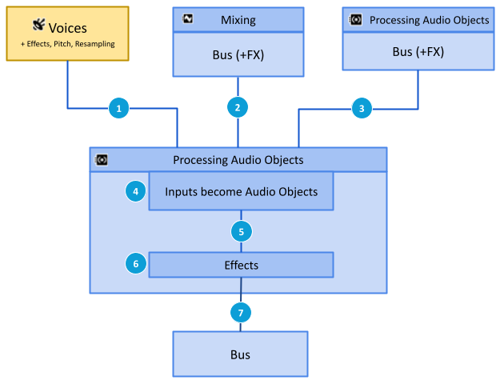

|  |  |
| --- | --- |
|  | 将声部输出到总线；在混音时对其信号进行采样。 |
|  | 从之前的混音总线得到基于声道的格式。 |
|  | 从之前的总线 Processing Audio Objects 得到一系列 Audio Object。 |
|  | 将所有不属于 Audio Object 的输入（比如声部和基于声道的输入）转换为单独的 Audio Object。除此之外，还有提供给总线的其他 Audio Object。 |
|  | 创建一系列 Audio Object。 |
|  | 由效果器单独操控各个 Audio Object。 |
|  | 由总线输出一系列 Audio Object。 |

###### 对象处理器

某些 Wwise 效果器本身就支持 Audio Object。此类效果器称为对象处理器，其仅针对每个总线实例化一次。

- **3D Audio Bed Mixer**：该效果器会被实例化一次，将传入的 Audio Object 转到三种输出中的一种：Main Mix、Passthrough Mix 或一系列未经混音的 3D Audio Object。
- **Compressor/Expander**：该效果器会被实例化一次，在内部下混时仅执行一次分析。所有 Audio Object 都会应用增益衰减。
- **Meter**：该效果器会被实例化一次，在内部下混时仅执行一次分析。所有 Audio Object 只会进行一次动态处理。因此，将输出单个 Game Parameter（游戏参数）值。
- **Mastering Suite**：Mastering Suite 同样与 Audio Object 兼容，其 Multiband Compressor 对 Audio Object 的处理方式与 Compressor 类似。
- **Parametric EQ**：Parametric EQ 只需实例化一次就可对所有 Audio Object 运行相同的 EQ 处理并在内部追踪各个 Audio Object 的滤波器状态。

Reflect 也支持 Audio Object，不过方式有所不同。Reflect 通常会插入到单声道总线上，其可在父总线的配置为 Audio Objects 时输出 Audio Object。随后会针对每个早期反射声输出一个 Audio Object。也就是说，最终可能会产生大量 Audio Object。

---

#### 利用效果器重构声学环境

Wwise 中有两种不同类型的总线，分别是：音频总线和辅助总线。辅助总线与发送系统可以用于实现环境音效。在辅助总线上应用效果器可以重新构建游戏环境对播放声音的影响方式，例如添加混响。辅助总线上的效果器还可以根据游戏对象的位置数据动态发挥作用。

以下章节介绍了在工程中如何在 Auxiliary Bus 上应用效果器。

###### 理解发送

游戏内的环境声学效果可以被模拟出来，方法是在辅助总线上添加一系列效果器并将信号发送给该总线。您可以根据需要创建任意数量的辅助总线；不同总线对应于游戏中的不同环境。您还可以在游戏中使用 SDK 函数 [`SetBusEffect()`](https://www.audiokinetic.com/library/edge/?source=SDK&id=namespace_a_k_1_1_sound_engine_aabbeadd26d528e82003a0c143908d825.html) 动态地向辅助总线上添加效果器。在您为辅助总线定义了效果器后，您需要定义向这些总线发送信号的对象。

您可以选择使用用户定义的辅助发送来静态定义对象发送，也可以选择使用游戏定义的辅助发送，从而让游戏定义这些发送。

**创建辅助总线的方法如下：**

1. In the Busses hierarchy, create an Auxiliary Bus object.
2. 察看辅助总线。
3. 在辅助总线的 Effect（效果器）选项卡中，添加实现相应环境音效所需的效果器。

**使用用户定义的辅助发送将环境音效施加于对象的方法如下：**

1. Inspect the Containers hierarchy object.
2. 将辅助总线拖放至用户定义的辅助发送列表中。
3. 使用 Send volume（发送音量）滑杆定义要发送给辅助总线的信号量，即定义对象参与环境音效的程度。

**使用游戏定义的辅助发送将环境音效施加于对象的方法如下：**

1. Inspect the Containers hierarchy object.
2. 启用选项 **Use game-define auxiliary sends**（使用游戏定义辅助发送）。
3. 在游戏中，使用函数 `AK::SoundEngine::SetGameObjectAuxSendValues()` 为各个游戏对象指派一个辅助发送。

|  |  |
| --- | --- |
| [备注] | 备注 |
| 有关在游戏中映射环境的详细信息，请参阅 Wwise SDK - Windows > 声音引擎集成纵览 > 将 Wwise 元素集成到游戏中 > 集成环境和游戏定义的辅助发送，该章节位于[Wwise SDK 文档](https://www.audiokinetic.com/library/?source=SDK&id=integrating__elements__environments.html)中。您和音频程序员还可观看集成演示，该演示将向您展示如何设置辅助发送的示例。 |

###### 利用 Auxiliary Send 重构声学环境 C 示例

假定您正在制作一款游戏，故事发生在幽灵出没的墓地内和附近。游戏中魅影重重，您希望这些幽灵在不同的环境中听起来不一样。在游戏的一个环节，玩家可以探索教堂、隧道和连接两者的楼梯。对于游戏的这一环节，您定义了以下辅助总线：

- 教堂
- 楼梯
- 隧道

您决定为这三个环境中的各个环境赋予一个独特的混响效果。例如，隧道的空间比教堂小，周围是石墙，形似洞穴，因此它的混响比在教堂中明显。在 Wwise 中，您可以创建一个具有更高混响各个层级和更短衰减时间的混响实例来匹配隧道中的音效，并可创建其它混响来匹配教堂和楼梯中的音效。然后，程序员可以将您创建的辅助总线映射到游戏几何空间结构上。产生的效果是，当幽灵进入隧道中时，幽灵发出的声音所产生的回音远远大于在教堂中的回音。

|  |
| --- |
|  |

Wwise 辅助发送还可以通过动态计算所有并行发送的发送音量来模拟在环境之间的移动。下图说明了此游戏示例的内置动态辅助总线通路和混音。

|  |
| --- |
|  |

对特定声音使用的各个发送的比例取决于各个游戏对象在游戏几何空间中的位置。在本例中，勇敢的玩家正从教堂沿着楼梯下到隧道，幽灵在后面紧追不舍。在穿过隧道的途中，可以将玩家和幽灵定义为 100% 处于楼梯环境，但还要加上 50% 处于教堂环境，40% 处于隧道环境。然后使用各个混响实例以适当的比例处理幽灵的声音。

###### 将 Game-defined Auxiliary Send 集成到工作流程中

在 Wwise 中，您可以使用效果器创建和编辑辅助总线，以及定义哪个对象发送信号给它们。根据游戏对象的位置以编程方式为声音定义辅助发送。下面的步骤描述开发团队如何能够实现游戏定义的辅助发送：

- 音效设计师根据游戏中的环境定义辅助总线对象，例如小屋、教堂和洞穴。
- 音效设计师需确保应受环境效果影响的所有声音都启用了 **Use game-defined auxiliary sends** 选项。
- 当环境出现在游戏几何空间中时，游戏程序员将辅助总线映射到环境中。
- 游戏程序员要创建一个机制来实时计算出环境比例值，并将比例值报告给声音引擎。
- 声音引擎会计算哪一条辅助总线将运用于各个游戏对象所触发的声音。

---

#### 效果器 – SoundBank 管理

效果器 C SoundBank 管理

##### 效果器 C SoundBank 管理

效果器必须打包到 SoundBank 中并由游戏加载。如何将效果器打包到 SoundBank 中取决于其本身的用法。

- **Containers hierarchy:** Any SoundBank that packages an object in the Containers hierarchy also packages all Effects used by that object, unless specifically excluded in the SoundBank Editor.
- **Busses hierarchy:** Effects used by objects in the Busses hierarchy (Busses, Auxiliary Busses) are packaged in the Init SoundBank.
- **Devices hierarchy:** Effects used by Audio Device objects are packaged in the Init SoundBank.

|  |  |
| --- | --- |
| [备注] | 备注 |
| 在生成 SoundBank 的过程中，Wwise 会自动生成 Init SoundBank。 |

Although Busses and Audio Device Effects are automatically added to the Init SoundBank, some Effects, or parts of Effects, are not. 以下条目不会自动添加到 Init SoundBank：

- **效果器媒体：**Init SoundBank 不会打包任何媒体文件。效果器媒体必须打包到 User-defined SoundBank 并在使用效果器之前由游戏加载。
- **Effects loaded at runtime:** Your game can make use of the
  SDK functions to change a Bus or Audio Device effect at runtime. If the Effect
  to be loaded is in use by your project during SoundBank generation (that is,
  referred to by a Bus, Auxiliary Bus, or Audio Device) then it will be packaged
  in the Init SoundBank. Otherwise, the Effect must be packaged in a user-defined
  SoundBank and loaded by the game prior to being used.

有关 SoundBank 管理的详细信息，请参阅“[*管理 SoundBank*](ch40.html "管理 SoundBank")”章节。

---

#### Using Sidechain Mixes with Effects

You can use Wwise Sidechain Mixes to generate or use audio signals across the Containers and Busses hierarchies as a part of their runtime audio processing, in addition to other properties and the inline audio signals the Effects process.

For example, you can use a Sidechain Mix to ensure that audio for certain gameplay sound effects remains clearly audible even if there is a lot of ambient noise in your environment. In this case, you could configure your Busses and Effects in the following way:

1. Create an Audio Bus that combines all gameplay sound effects, and that has an Effect that send the combined audio signal to a Sidechain Mix.
2. Create a separate Audio Bus for the ambient noise, with an Effect that acts as a dynamic range compressor to reduce the ambient noise volume. Configure the Effect to read the audio signal from the Sidechain Mix to drive the compression.

With this type of configuration, the volume of the ambient noise decreases as the volume of the gameplay sound effects sent to the Sidechain Mix increases. Because you are using a Sidechain Mix, you can share the audio of the gameplay sound effects across the two Busses and Effects even though the Effects are not connected and the Busses are on different branches in the Busses hierarchy.

An alternative approach to side-chaining that uses Meters, RTPCs, and other Effects, is described in [“Using RTPCs to fine-tune the audio mix”一节](ch18s08.html "Using RTPCs to fine-tune the audio mix"). However, because Sidechain Mixes can share a complete audio signal across Effects, you can use them for methods of audio processing that are higher fidelity, richer, or more complex than methods that use RTPCs alone.

Compared to RTPCs, Effects that support Sidechain Mixes can benefit in several ways:

- Improved precision in time, because Effects can read per-sample audio data instead of one parameter for an entire audio processing pass
- Measurement of the full audio spectrum of a signal, instead of just a peak amplitude.
- Ability to read multiple channels of audio data, instead of a single data point.

Each Effect defines its own behavior and support for Sidechain Mixes, and Effects can
generate or use Sidechain Mixes in different ways. For information about how individual
Effects work with Sidechain Mixes, refer to each Effect’s respective
documentation.

The following built-in Wwise Effects support Sidechain Mixes:

- [“Sidechain Send”一节](ch66s22.html "Sidechain Send")
- [“Sidechain Receive”一节](ch66s21.html "Sidechain Receive")
- [“Compressor（压缩器）”一节](ch66s04.html "Compressor（压缩器）")
- [“扩展器（Expander）”一节](ch66s06.html "扩展器（Expander）")
- [“Parametric EQ（参数均衡器）”一节](ch66s14.html "Parametric EQ（参数均衡器）")

###### Creating a Sidechain Mix ShareSet

Multiple Sidechain Mixes can be active at one time. Sidechain Mix ShareSets provide unique identification that Effects use to send audio to or receive audio from the correct Sidechain Mix. Each Sidechain Mix ShareSet can be created in your Wwise Project in the Project Explorer, or via the Property Editor or other Views wherever Sidechain Mixes are used by Effects.

To create a Sidechain Mix ShareSet:

- 执行以下操作之一：

  - In the ShareSets tab in the Project Explorer, select a Work Unit
    and click Create new Sidechain Mix.
  - In the Property Editor of an Effect that supports Sidechain Mixes,
    locate the Sidechain Mix area and click the Selector button [>>],
    then click New.

  A Sidechain Mix ShareSet is created in the Sidechain Mixes hierarchy.

###### Configuring Sidechain Mixes

You can select the channel configuration of the Sidechain Mix. Although Sidechain Mixes do not require very many CPU and memory resources, we recommend a small channel configuration to minimize resource usage. A 1.0 signal is sufficient in most cases, unless you are using an Effect that benefits from a wider channel configuration.

It is also possible for the channel configuration of a Sidechain Mix to match the configuration of the Primary Output Device. The “Same as Primary Main Mix” and “Same as Primary Passthrough Mix” options are similar to the “Same as Main Mix” and “Same as Passthrough Mix” options available on Busses. The difference is that the Sidechain Mix specifically refers to the Primary Output Device to determine its configuration:

- “Same as Primary Main Mix” uses the channel configuration of the Main Mix of the Primary Output Device.
- “Same as Primary Passthrough Mix” uses the channel configuration of the Passthrough Mix of the Primary Output Device. If the Primary Output Device does not have a Passthrough Mix, then the Primary Output Device’s Main Mix channel configuration is used instead.

Sidechain Mixes operate independently of the Busses hierarchy, so it is not possible for a Sidechain Mix to mimic the configuration of a specific Bus, such as when a Bus uses a configuration of “Same as Parent”.

The Sidechain Mix view includes a Meter. When remotely connected to a Wwise runtime, the Meter displays the peaks of the monitored Sidechain Mix.

Sidechain Mixes do not support an Audio Objects channel configuration: a Sidechain Mix is always defined as only one multi-channel audio signal. When multiple audio signals contribute to a Sidechain Mix, they are always mixed together into one signal.

###### Sending Audio to a Sidechain Mix

Audio for Sidechain Mixes must first be generated by an Effect. The “Sidechain Send” Effect is the only Effect provided by default in Wwise that generates audio data for Sidechain Mixes. However, it is possible for other Effect plug-ins by third-party developers to generate audio data as well.

The Sidechain Send Effect performs the following:

1. Reads any audio signal being input to the Effect.
2. Downmixes the audio signal to match the channel configuration of the specified Sidechain Mix Destination and applies the specified volume change.
3. Sends the downmixed audio directly to the Sidechain Mix.
4. Sends the input audio signal to the output audio signal without any data modification.

If multiple Effects send audio signals to a Sidechain Mix, all of the audio signals are
mixed together. In this way, multiple Effects that contribute to a single Sidechain
Mix can be active across the voice graph, instead of multiple Aux Bus connections
from many separate Audio Busses to a single Bus.

It is also possible to use this Effect to direct the audio used for a certain part of your
mix directly to a Sidechain Mix, without having to first send the audio to a
separate Bus. However, the Sidechain Send Effect is not an Object Processor, and if
the Sidechain Mix has a multi-channel configuration, the Effect might not correctly
mix down audio objects with positioning data to the destination Sidechain Mix.
Therefore, it is not recommended to use the Sidechain Send Effect on a Bus that
might operate in an Audio Objects configuration.

有关详细信息，请参阅[“Sidechain Send”一节](ch66s22.html "Sidechain Send")。

###### Receiving Audio from a Sidechain Mix

After audio is sent to a Sidechain Mix, another Effect can then receive the Sidechain Mix as a part of its processing.

The "Sidechain Receive" Effect fetches a Sidechain Mix’s audio signal and uses it as the
output audio for an Effect. The Sidechain Receive Effect performs the following:

1. Receives a Sidechain Mix audio signal.
2. Upmixes the Sidechain Mix to match the intended channel configuration
   of the Effect.
3. Replaces the input audio signal of the Effect with the upmixed audio
   from the Sidechain Mix.

The Sidechain Receive Effect is intended to be used for inspecting and debugging a Sidechain Mix. For example, you can use it to easily monitor the result of a given Sidechain Mix, instead of as a component of a full audio mix.

For more information, see [“Sidechain Receive”一节](ch66s21.html "Sidechain Receive")

The Compressor, Expander, and Parametric EQ Effects can also receive a Sidechain Mix signal
as a part of their processing.

When no Sidechain Mix is specified as a Sidechain Input, the Compressor, Expander, and
Parametric EQ Effects use the input audio signal for the analysis of any dynamics
involved in the execution of the effect. However, when a Sidechain Mix is specified
as a Sidechain Input, the Sidechain Mix audio signal is used for the analysis of any
dynamics involved in the execution of the Effect.

In this way, a Compressor can use a Sidechain Mix generated from one part of the Busses
hierarchy to duck the audio of another part of the hierarchy instead of compressing
the dynamic range of the input audio signal by itself.

For more information, see [“Compressor（压缩器）”一节](ch66s04.html "Compressor（压缩器）"), [“扩展器（Expander）”一节](ch66s06.html "扩展器（Expander）"), and [“Parametric EQ（参数均衡器）”一节](ch66s14.html "Parametric EQ（参数均衡器）").

###### Sidechain Mix Scopes

When Effects send audio to a Sidechain Mix or receive audio from a Sidechain Mix, the
Effects must specify what Sidechain Mix to send to or read from. However, an Effect
must also specify the Scope of a Sidechain Mix. Scopes are IDs for the Sidechain Mix
system that allow for the same Sidechain Mix definition to be used across multiple
scenarios simultaneously with mutually exclusive audio. Typically, Scope IDs
correspond to Game Object IDs. You can use Scopes in combination with Wwise Effects
to restrict Sidechain Mix audio signals to specific Listener Game Objects, as
required in some multiplayer audio environments. For the Sidechain Send, Sidechain
Receive, Compressor, Expander, and Parametric EQ Effects, you can do this by setting
the Scope on the Effect to “Game Object” instead of “Global”.

###### Sidechain Mix Delay

The Sidechain Mix system makes it possible for any Effect on any Bus to both send audio data to, and receive audio data from, a Sidechain Mix. Although the Sidechain Mix system is flexible, it does include a disadvantage in the form of a slight delay when receiving audio from a Sidechain mix. The delay has a duration of a single audio rendering pass in Wwise, or approximately 10.6 ms by default, although the exact duration might be different if your sound engine execution is configured with a different number of samples per frame.

In most cases, the delay is not a major problem. However, if there is extremely tight synchronization between sending and receiving Sidechain Mix audio data, the delay might be noticeable.

In music production, for example, you can use the sound of a kick drum to instantaneously duck another bass instrument on the track. To do so, you can send the sound of the kick drum to a Sidechain Mix, use a separate Compressor Effect on the bass instrument to read the audio signal from the Sidechain Mix, and set the attack to 1 millisecond. However, because of the delay before the Compressor Effect receives the Sidechain Mix, the attack for the bass instrument is effectively delayed by 10.6 milliseconds, which might cause the two instruments to overlap.

In such cases, you can compensate for the delay in different ways. 例如：

- Enable the "Delay output" property on the Sidechain Send Effect, which delays its output audio signal by one audio rendering pass. The output audio of the Effect can then be synchronized with any other Effect that receives audio from the same Sidechain Mix. However, be careful if you are working with content that requires low-latency audio playback, such as sound effects that are critical for user interaction and gameplay, or if the same audio is used for multiple Sidechain Send Effects in serial order.
- Depending on the situation, you could add another sound to compensate. In the example above, you could use a Tone Generator to create a loud noise just before or at the same time as the kick drum plays, send it exclusively to a Sidechain Mix, and then mute it before it is sent to any downstream Audio Bus. In this way, the additional instrument lowers the volume of the bass instrument, although the kick drum plays simultaneously.

---

#### 效果器相关技巧和窍门

在 Wwise 中使用效果器时，有很多选项可供使用。您可以利用多种策略来确保以最少的系统资源生成效果最佳的声音。在 Wwise 工程中使用效果器时，不妨根据情况选用以下策略。

###### CPU 用量

效果器总是会消耗 CPU 资源。In general, if you apply Effects at the Busses level, you use less CPU than at other levels. For example, if you apply a RoomVerb Effect on the Main Audio Bus of a game, only one instance is processed at runtime. 相较之下，若在对象层级应用该效果器，则可能会对上百个实例进行处理（具体取决于工程中的对象数）。

除此之外，还可通过对效果器进行渲染来节省 CPU 资源。系统会先对经过渲染的效果器进行处理，再将其打包到 SoundBank（音频包）中。这样的话，便不需要在运行时对其进行处理。不过，无法将 RTPC 应用于经过渲染的处理器，因为在渲染后无法更改这些效果器的属性。

Delay 和 Parametric EQ 等效果器只会占用极少的 CPU 资源。Compressor、Peak Limiter 和 Expander 占用的则会多一些。对于混响，RoomVerb 效果器会占用大量 CPU 资源，但同时也会生成品质很高的声音。除此之外，也可使用 Matrix Reverb，并根据品质和性能需求加以调节。

总的来说，最好的策略就是使用游戏性能分析工具来对工程加以测试。藉此，可实时察看效果器的 CPU 用量，并决定如何使用这些效果器。有关性能分析的更多信息，请参阅[“了解 Wwise 中不同类型的性能分析”一节](ch39s01.html "了解 Wwise 中不同类型的性能分析")。

###### 效果器和音乐

建议不要在对象层级将基于时间的效果器（如 Matrix Reverb 或 Delay）应用于音乐对象，因为效果器可能会对基于时间的属性和已经指派给其的行为产生干扰。To avoid this type of interference, apply the time-based effects at the Busses level, that is, to an Audio Bus.

---

### 管理 Motion

为了使游戏更有代入感，最好添加某种振动反馈。

Wwise 为在游戏中创建和集成振动提供了一套完整的管线。Wwise 为振动实现了全面的、与音频创作相似的管线解决方案，您可以实现以下功能：

- 只需稍加学习，就可以创建复杂、真实的振动效果。
- 将振动轻松集成至游戏内，不会明显影响游戏或声音引擎的表现。
- 使用与音频相同的功能来构建和集成振动。
- 无需额外工作，为各种平台上的同类设备创建振动效果。
- 根据游戏要求，轻松添加或移除振动元素。

#### 了解 Wwise 中振动的工作方式

为了尽可能简单地从音频过渡至振动，Wwise 使用相同的工作流程，很多原理和功能都同时适用于两者。与音频类似，振动对象可以在层级结构中进行组织、可输出至总线，并可使用事件在游戏中触发。同时，还可在 3D 空间化环境中定位，由工程中的各种游戏同步器控制，并打包到 SoundBank（音频包）中。播放方面的主要区别在于，振动是通过游戏控制器而非扬声器播放的。

#### 支持的振动设备

For a list of supported motion devices, see the Game Setup section in the [Integrating Wwise Motion](https://www.audiokinetic.com/library/edge/?source=SDK&id=integrating_elements_motion.html) topic in the Wwise SDK.

You can connect to other device types if you install other third-party plug-ins for
motion.

#### High-level workflow for creating motion

The table below is a high-level workflow for generating motion for the first
time.

| Step | 描述 |
| --- | --- |
| Step 1. Integrate Wwise Motion | See [Integrating Wwise Motion](https://www.audiokinetic.com/library/edge/?source=SDK&id=integrating_elements_motion.html) in the Wwise SDK documentation and [“Prerequisites for creating motion”一节](ch25s03.html#motion_prerequisites "Prerequisites for creating motion"). |
| Step 2. Install the Wwise Motion source plug-in. | From the Audiokinetic Launcher, install the Wwise Motion source plug-in. 请参阅 [“Prerequisites for creating motion”一节](ch25s03.html#motion_prerequisites "Prerequisites for creating motion")。 |
| Step 3. Add a device to the Project Explorer. | Add a device to the Devices Default Work Unit in the Project Explorer Audio tab. See [“Audio Devices”一节](ch60s01s01.html "Audio Devices") and [“为游戏控制器生成振动效果”一节](ch25s03s03s01.html "为游戏控制器生成振动效果"). |
| Step 4. Create a Motion Bus. | Create an Audio Bus and in the Audio Device field select the motion device you added in the previous step. See [*建立输出总线的结构*](ch12.html "建立输出总线的结构") and [“Adding a Motion Bus to a Wwise Project”一节](ch25s02.html "Adding a Motion Bus to a Wwise Project"). |
| Step 5. Decide what type of object you will use to generate motion. | You can create motion from existing sounds or by creating a motion-specific object. 参阅：  - [“使用现有音频信号生成振动信号”一节](ch25s01.html#generating_motion_source_from_an_existing_audio_signal "使用现有音频信号生成振动信号") - [“Generating motion from a motion-specific source”一节](ch25s01.html#generating_motion_using_motion_fx_object "Generating motion from a motion-specific source") |
| Step 6. Filter out high frequencies. | If you are generating sound from existing audio files, filter out high frequencies and boost or reduce the generated motion signal. 请参阅 [“调节由音频生成的振动信号”一节](ch25s03s01.html#boosting_reducing_motion_signal "调节由音频生成的振动信号")。 |

---

#### 生成振动效果的方法

振动数据在 Wwise 中基本上是由一个源产生的。This source can either be an existing media file, a new media file, or a plug-in signal generator, such as the Wwise Motion source plug-in.

在决定了游戏将支持哪些振动设备以后，就要决定使用哪种方法来生成振动。在 Wwise 中，有两种不同的方法可以用于创建一个振动源：

- Using an existing sound.
- 使用振动专用源。

###### 使用现有音频信号生成振动信号

An easy way to generate motion is to use an existing sound and use an auxiliary send to an Auxiliary Bus parented under a Motion Bus. The Motion Bus is simply a regular Audio Bus with a motion device set as its Audio Device. 振动设备插件会将音频信号转换为适合硬件的低频信号。原始声音将不受影响，就像其他使用发送的情况一样。

由于振动源是由现有的音频源生成的，因此在游戏中，该振动也与该音频的播放关联在一起。这意味着在游戏中不需要再用单独的事件触发该振动源。并且，所有影响音频对象的属性、行为、游戏同步器等同样也会影响振动源。

To create motion using an existing audio signal, see [“通过现有声音生成振动效果”一节](ch25s03s01.html "通过现有声音生成振动效果").

###### Generating motion from a motion-specific source

另一种生成振动的方式是创建振动专用的 Wwise 对象。这些振动对象与其他声音对象类似，但使用专门生成振动的源插件，而不是依靠转换音频数据。

|  |
| --- |
|  |

在其他方面，这些振动对象行为就和普通的声音一样。You can build sophisticated motion structures, using objects in the Containers hierarchy, to define the properties and behaviors of your motion effects. 由于这些振动效果并不需要与游戏音频关联在一起，因此可以用它们自己的事件，在游戏中的任何时刻触发它们。

当然，在有些情况中，某一种方法可能会比另一种更适用。关于上述方法的进一步讨论，请参阅 [“为游戏创建振动效果”一节](ch25s03.html "为游戏创建振动效果")。

To generate motion by creating a motion-specific object, see [“创建专用对象来生成振动效果”一节](ch25s03s03.html "创建专用对象来生成振动效果").

###### 振动处理管线

The motion processing pipeline takes the motion signal generated from both types of sources and mixes them together before passing this mix through a separate Motion Bus. 下图显示了 Wwise 如何处理两种类型的振动源，以及振动管线如何融入音频处理管线。

|  |
| --- |
|  |

---

#### Adding a Motion Bus to a Wwise Project

Before you add a motion to a Wwise project, you need a bus associated to the Motion source
plug-in.

###### To add a Motion Bus to a Wwise Project

1. In Wwise Authoring, open the Busses Hierarchy and create a new Audio bus under the
   Default Work Unit.

   |  |  |
   | --- | --- |
   | [备注] | 备注 |
   | It's good practice to rename your motion objects to include "motion". For example, "Motion Bus". |
2. Double-click the new bus to open its Property Editor.
3. In the Audio Device group, click the **Set Audio
   Device** icon and browse the list of devices and select
   Motion.

   This is the Wwise Motion source plug-in.
4. In the Container Default Work Unit, right-click and select **New Child** > **Sound
   SFX**.
5. Rename the Sound SFX object to indicate that it is a motion object. For
   example, "MotionSFX".
6. Double-click the new MotionSFX object to open its Property Editor.
7. In the **Routing** group, click the **Set Output Bus** icon and browse to select the
   Motion Bus you created.
8. (Optional) Do one or both of the following in the Motion Source
   Editor:

   - Change the Actuator Configuration of the Motion plug-in to
     something that matches the targeted controller device.
   - Unlink the Actuator Configuration, depending on the platform.

   You can test the Motion SFX object to verify that the controller
   vibrates.

---

#### 为游戏创建振动效果

在 Wwise 中，您可使用以下方法生成振动：

- [“通过现有声音生成振动效果”一节](ch25s03s01.html "通过现有声音生成振动效果")
- [“创建专用对象来生成振动效果”一节](ch25s03s03.html "创建专用对象来生成振动效果")

具体选择使用哪种方法，要依据各个使用情形的要求和限制来决定。花些时间了解每种方法的优势和劣势，有助于正确选择方法。

Some platforms support multiple types of motion devices, such as rumble-based or haptic-based gamepads. Take the following design considerations into account when generating motion content for multiple types of devices:

- [“Design Considerations for Rumble and Advanced Haptics”一节](ch25s03s02.html "Design Considerations for Rumble and Advanced Haptics")

###### Prerequisites for creating motion

Before you can create motion for your game, perform the following
prerequisites:

**Install the Motion source plug-in**: You can
install the Motion plug-in when you are installing Wwise. If you already have Wwise
installed, you can install the Motion plug-in by modifying the installation. See
[Installing Wwise and Its Components](https://www.audiokinetic.com/library/edge/?source=InstallGuide&id=installing_wwise_and_its_components) in the Audiokinetic Launcher Guide.
For informaition about the Motion plug-in, see [“Motion（振动）”一节](ch65s05.html "Motion（振动）").

**Code setup**: For Game Engine integration, an audio
programmer will have to ensure everything is set up to run motion on Wwise. Refer to
the SDK documentation's [Integrating Wwise Motion](https://www.audiokinetic.com/library/edge/?source=SDK&id=integrating__elements__motion.html) page.

---

##### 通过现有声音生成振动效果

由于很多振动效果将关联至音频事件，如枪声、路面振动、爆炸等，因此您可以直接通过工程中的现有声音和音乐对象生成振动数据。在本例中，Wwise 只需取得音频信号，提取出低频成分，然后对这部分信号进行重采样，就能创建令人信服振动效果。虽然该方法给音频设计师和程序员带来的工作量很少，并且完全适用于与音频同步的振动，但该方法有以下劣势：

- 对创建的振动类型不能进行更多控制。
- 更多的 CPU 资源消耗，因为音频信号必须在运行时进行滤波和重采样，以创建振动数据。
- 无法处理与音频没有关联的振动。

尽管有上述劣势，但在某些情形下该方法也十分实用。例如，该方法极适用于创建游戏中振动的原型。当原型完成且效果得到认可后，您可以决定是否继续创建专用振动对象来实现进一步控制。

通过现有声音生成振动前，您应该留意以下几点：

- 从原始音频源中移除直流偏置将会改变振动输出。
- 由于电机功率、最高速度与重量的物理差异，每个平台控制器的振动输出都会有所不同。

###### 指定振动效果的输出通路

If you plan to generate motion data from an existing audio source or a motion source, you need to first decide through which Motion Bus it will be routed. 振动数据与音频数据不同，要求单独的振动总线层级结构，可通过其中的总线将数据进行输出。You can create this separate hierarchy in the Busses hierarchy by creating a new main bus and assigning the Wwise Motion device to it.

**为振动专用源指定输出总线的方法如下：**

1. Double-click a Container or motion-specific object to open its Property Editor.
2. In the **Output Bus** group, click the **Set Output Bus** button.

   此时将会打开 Project Explorer ―― Browser。
3. Select a Bus that is under your motion device's Bus hierarchy.
4. 单击 **OK**（确定）。

   当前对象及其子对象生成的振动数据即可通过所选的总线进行输出。

**为音频源生成的振动指定输出总线的方法如下：**

1. Double-click a Container or Sound object to open its Property Editor.
2. In the **User-defined Auxiliary Sends** group, select the
   **Override Parent** check box.
3. In the desired **Send** option, select
   the **Set User-Defined Auxiliary Send for
   Send<#>**.

   此时将会打开 Project Explorer ―― Browser。
4. Select a Bus that is under your motion device's Bus hierarchy.
5. 单击 **OK**（确定）。

   当前对象及其子对象生成的振动数据即可通过所选的总线进行输出。

When setting up your routing, make sure to also take note of the bus configuration of the Main Audio Bus, and any Busses you create. For example, most Wwise Motion Audio Devices will use an Anonymous 2-channel Main Audio Bus, such that each channel of the audio is associated with a physical motor, as opposed to a Stereo 2-channel Main Audio Bus. 为了控制将音频输出到哪个声道，即便只有一个声道包含非零数据，可能也要提供 2 声道 Wave 文件作为音频源。倘若这种方法不实用，可将输出路径中的总线设为使用 Stereo 2-channel 输出配置，并借助总线的扬声器声像摆位来将音频重定向到所需声道。

|  |  |
| --- | --- |
| [备注] | 备注 |
| 有些 Wwise Motion Audio Device 可能会使用别的总线配置（如 Stereo 2-channel、Anonymous 4-channel 等）并需要对声道通路进行不同的设置。如需了解支持的设备及各自的声道配置，请参阅[集成 Wwise Motion](https://www.audiokinetic.com/library/?source=SDK&id=integrating_elements_motion.html) 章节。 |

###### 调节由音频生成的振动信号

振动设备仅可生成低频信号，因此可能需要减少或过滤音频源中的高频信号。得到的信号也可能需要放大才能达到合适的强度。Given that the audio signal is transmitted to a Motion Bus through a Send to an Auxiliary Bus, you can use the regular tools provided by the Send feature.

|  |  |
| --- | --- |
| [注意] | 注意 |
| 请不要将高通滤波器应用于振动对象。因为振动设备只会生成低频信号，所以所有高通滤波器都会抑制振动效果。 |

**滤除高频的方法如下：**

1. Double-click a motion related Auxiliary Bus to open its Property Editor.
2. In the **Output Bus** group, modify the **LPF** value to set the cutoff frequency that
   will be used to generate the motion signal.

**增强或减弱生成振动信号的方法如下：**

1. Double-click a Container to open its Property Editor.
2. 在 **User-defined Auxiliary Sends**（用户定义的辅助发送）分组中，修改 **Volume**（音量）值以增强或减弱振动信号。

此外，您也可以在 Auxiliary Bus 上使用效果器，例如 EQ，来提升或减弱某些频段。

|  |  |
| --- | --- |
| [备注] | 备注 |
| 要在 Wwise 中测试振动效果的强度，须将振动设备连接至电脑，然后播放 Wwise 对象。 |

---

##### Design Considerations for Rumble and Advanced Haptics

After you initially design content for Motion on gamepads that have a "rumble" feature and use weighted motors to generate vibrations,
we recommend that you modify the content for advanced haptics because most content for rumble-based gamepads is incompatible with haptics,
and might feel weak or non-existent.

一般来说，基于振动效果的手柄的振动强度会随着源波形振幅的增大而增大。However, the haptics on haptic-based gamepads vibrate with greater intensity the more the waveform fluctuates. Therefore, constant, high-amplitude waveforms, such as those generated by a default Motion source, produce strong vibrations in rumble-based gamepads but no vibration in haptic-based gamepads.

As a temporary means to achieve stronger vibrations without redesigning your Motion source content,
open the Motion source plug-in Source Editor and set the Actuator Configuration to **Generic Haptics 2-Channel**.
Afterwards, you can further develop other solutions for more advanced haptics implementations.

A detailed explanation of how the Motion source and Wwise Motion Audio Device operate can provide some additional context.

The following example shows a Motion source plug-in used to generate a simple, decreasing rumble effect.


This is a Motion source plug-in with a single Driver that runs for one second, starting at a maximum amplitude and ending at an amplitude of zero.
When played, the Motion source plug-in generates the waveform shown in the following image.
To observe this, you can record the output of a bus with the Recorder plug-in, or send the output to a System Audio Device and record the loopback in external software.

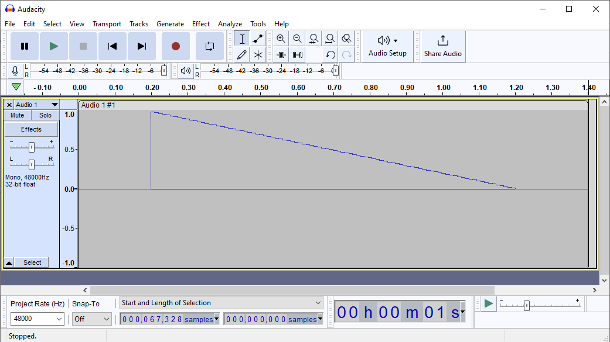

The Wwise sound engine fully interprets this source just like any other audio source.
Similarly, the Motion Audio Device accepts any waveform and uses it to determine the desired amplitude of vibration on supported gamepads.

When the Wwise sound engine is running, it generates samples of audio with each "Audio Render" tick, which occurs at a corresponding tick rate for the primary output.
For example, for a 48KHz audio output with the default configuration of 512 samples per tick, Wwise runs "Audio Render" ticks at a rate of 93.75Hz.
As a part of the "Audio Render" tick, Wwise sends all rendered audio data to all active Audio Devices, including Wwise Motion Audio Devices.
The Wwise Motion Audio Device takes the quantum of audio data, such as the 512 samples of audio, and transforms that into a single vibration value suitable for most gamepad APIs.
This is commonly done by obtaining the maximum amplitude of the provided waveform and sending it to the gamepad API.

For example, it is possible to zoom into a small part of the waveform shown above to see what the amplitude of the waveform is for a given 512 sample window:

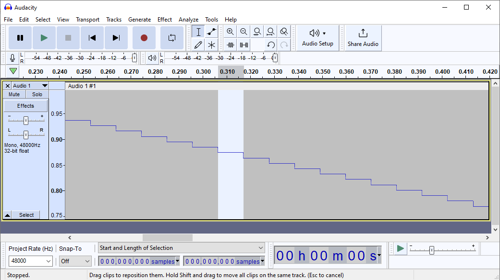

In this case, the intensity of the vibration in the gamepad is approximately 0.90, where 1.00 is the maximum amplitude. On most gamepads,
this value drives the voltage of an electrical current that is attached to a motor, which causes the motor to spin faster, which then creates movement in the gamepad.

Even if the amplitude of the curve is a flat 0.90, as shown in the following image, it still sets the vibration intensity to that value repeatedly for the duration of the effect,
and the motor continues to spin at that amplitude, which creates a consistent rumble vibration.

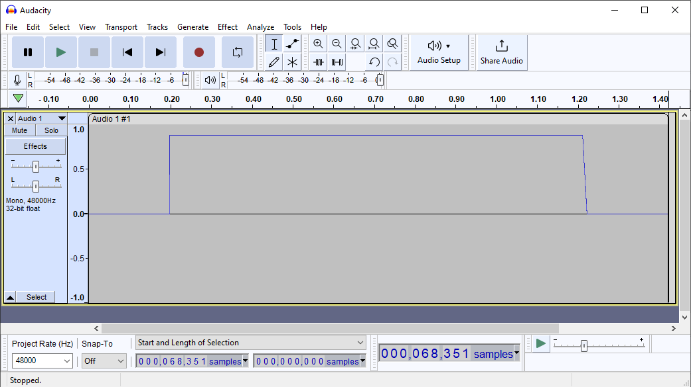

However, when Wwise Motion drives advanced haptics on PS5 or PC, it does not try to obtain a single vibration intensity to send to the device.
Instead, the entire 512-sample waveform is sent to the device without any additional processing,
and is used to directly drive the physical position of a mass inside of a linear actuator in order to generate vibrations in the gamepad.
This is similar to how audio waveforms drive the physical positions of drivers inside speakers to generate sound waves in the air.

Because the actuator is directly positioned by the waveform, if there are no variations in the amplitude of the waveform,
there is no perceived vibration in the gamepad. That is, if you create content that uses the Motion source plug-in for the purpose of rumble-based vibrations,
then effectively no vibration is generated or felt, as shown in the following examples:


There is a simple solution, which we recommend that you do when you first configure advanced haptics:
set the Actuator Configuration of the Motion source to **Generic Haptics 2-Channel**.

This mode of operation attempts to emulate the vibration in the DualShock 4 and Xbox controllers,
in which one motor in the left handle provides low-frequency and impactful movement, and a second motor
in the right handle provides high-frequency and light movement. To do this, the Motion source creates a unique waveform for each channel.
The left channel is a low-frequency square wave and the right channel is a high-frequency sine wave, as shown in the following image:

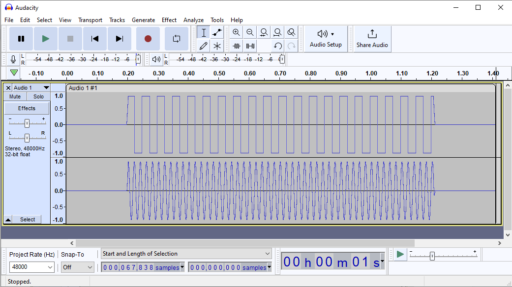

After you update your content to run in that mode, you can incrementally develop and incorporate more content specially built for advanced haptics,
such as prerecorded audio, Tone Generator sources, Synth One sources, or runtime processing of other in-game audio submixes.

Although a high-quality implementation of advanced haptics requires a lot of new content,
it is often possible to use some of that content to drive a rumble-based Wwise Motion Audio Device.
For example, the following waveform, intended for audio, has a strong impact and tail:

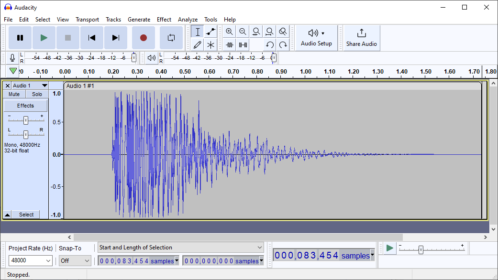

As described previously, a Wwise Motion Audio Device for a rumble-based gamepad transforms the waveform into a single amplitude value
for each quantum of audio data and then sends those amplitudes as vibration intensities to the gamepad.
The amplitudes calculated for the previous example are demonstrated in the following image:

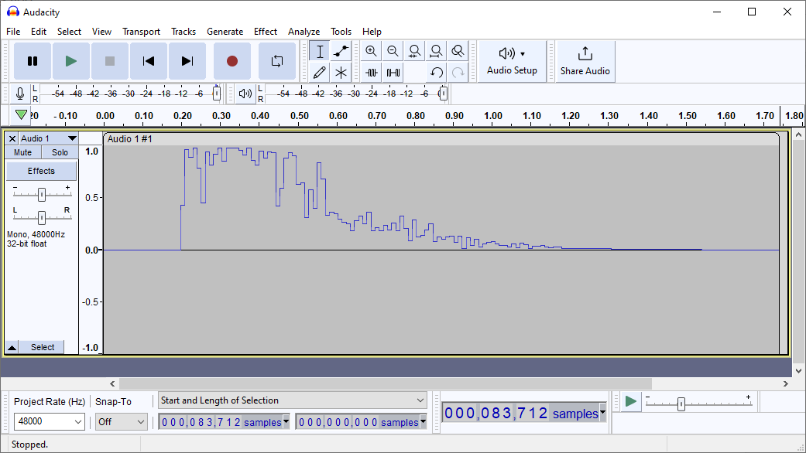

Additional tuning or design work might still be desirable for a rumble-based gamepad.
You could compensate for the inertia of the motors as they start or stop spinning, or the lack of accurate panning of the output.
Such adjustments might keep more content aligned among the different types of gamepad your game supports.

---

##### 创建专用对象来生成振动效果

为了更好地控制振动效果的强度，在工程中最好通过单独的对象来生成振动数据。They can be grouped in containers and Property Containers. 与 Sound SFX（音效）对象类似，它们也具有相应的源（通常为信号发生器插件）。It is usually better to use a specialized plug-in that directly generates motion data. 为此，Wwise 提供了 [“Motion（振动）”一节](ch65s05.html "Motion（振动）") 源插件；不过，使用其他源插件或音频源也是可以的。

具体选用哪个源将取决于实现 振动的设备和所需的振动类型。每个源均包含一组属性参数，您可以使用这些参数微调振动效果。If the client is targeting a device that supports high-resolution haptics (vibrations) or not, the choice of plugin that will generate the signal can be important.

|  |  |
| --- | --- |
| [备注] | 备注 |
| Before creating motion-specific objects, you should have a main bus associated with a motion device. 请参阅 [“指定振动效果的输出通路”一节](ch25s03s01.html#specifying_output_routing_for_motion "指定振动效果的输出通路") 了解如何进行操作。 |

**创建振动专用对象的方法如下：**

1. 在 Project Explorer 的 Audio 选项卡中，右键单击要在其中创建声音对象的工作单元。
2. 从快捷菜单中选择 **New Child** > **Sound**。

   The new Sound object is added to the Containers hierarchy.
3. 将默认名称替换为最适合该对象的名称。

   |  |  |
   | --- | --- |
   | [备注] | 备注 |
   | 在 Wwise 中命名对象时，不得使用以下字符： ':<>%\*?/\|.' |
4. 在 Contents Editor（内容编辑器）中，依次单击 **Add Source** > **Motion**（添加源 > Motion）。

   这时会将 Motion 添加为源。
5. 双击源插件，在属性编辑器中将显示完整属性列表。
6. 根据需要，编辑属性。

   |  |  |
   | --- | --- |
   | [备注] | 备注 |
   | 要获得源插件属性的完整说明，请点击属性编辑器中的 Help 按钮。 |

---

###### 为游戏控制器生成振动效果

由于受电机速度限制，游戏控制器只能重现有限的振动效果。为此，我们专门设计了 Motion 源插件，以便为这些类型的设备生成振动效果。

在结合此插件使用 [RTPC](ch18.html "使用 RTPC") 时，最多可利用八个不同的 Driver（驱动器）来指定振动强度和时长。然后，可以将这些 Driver 应用于不同的促动器（电机），从而实现不同的配置。利用标准的 Wwise [平台链接](ch35s01.html#customizing_object_properties_per_platform "Customizing object properties per platform")功能，可根据平台分别设置 Driver、Actuator Configuration（促动器配置）和 Actuator（促动器）。


|  |  |
| --- | --- |
|  | The Settings tab lists the Drivers and Driver Assignments. |
|  | List of driver assignments and their selected Actuator Configuration. |
|  | Opens a list of predefined Actuator Configurations. Indicates the selected Actuator Configuration is Generic 4-Channel. Applies to only the selected platform. |
|  | Click the expander arrow on the left of this pane to select a drive for which to apply an RTPC curve for the Y axis.  Click the expander for the X axis to select a list of game parameters, MIDI, and modulator sublists. Wwise delivers Factory Motion Assets that you can use to define your Motion curves. |
|  | The RTPC curve(s) for the pinned drivers. Right-click the curve to select a type of curve. |

To view the properties for basis of your RTPC curve, click the Driver row.


###### Motion 插件的基本设置

为了确保振动设备（游戏控制器）的促动器与 Wwise 配合良好，您可以快速选择 Actuator Configuration，并将偏置 Value（值）应用于适用的 Driver。虽然从技术上来说在游戏中直接使用偏置 Value 也未尝不可，但实际应用时最好还是[使用 RTPC](ch25s03s03s01.html#using_rtpcs_with_wwise_motion_source "结合 Motion 插件使用 RTPC") 及关联参数（如时间）来创建和控制振动曲线。

**利用 Motion 插件的 Value 偏置来创建振动效果：**

1. 将[振动专用对象](ch25s03s03.html#create_motionspecific_objects_list "创建振动专用对象的方法如下：")加载到 Property Editor（属性编辑器）中。
2. 在 Contents Editor（内容编辑器）中，双击所列 Motion 将其加载到 Source Editor（源编辑器）中。
3. 在 Internal Driver Channels（内部驱动器声道）分组中，向右移动 Driver 对应的 Value 滑杆，使其值大于 0。

   若使用此 Driver，则将在对象播放期间持续生成恒定强度的振动效果，直至 Event（事件）停止播放对象。
4. 在 Driver Assignment（驱动器指派）分组中，从 Actuator Configuration 列表选择 **1 Channel**（1 声道）。

   这时声道 1 将成为唯一激活的促动器。
5. 在 Channel 1（声道 1）列表中，选择刚刚调整的 Driver。

   If the object plays to a properly set up motion output, there will be a
   constant motion intensity emanating from a single channel of the
   controller for the full duration of the object.

   这表示设备和 Wwise Motion 配合良好。

###### 尝试不同的 Actuator Configuration

在确认设备配合良好的情况下，可按照类似方式尝试使用不同的 Actuator Configuration，并确定适合不同[选定平台](ch35s01.html#switching_to_different_platform "Switching to a different platform")的配置。比如，可将某一 Driver 的偏置 Value 设为 0.1，并将另一 Driver 的偏置 Value 设为 1.0。这样方便测试并辨别哪个控制器电机对应于默认 Sink 的哪个 Actuator。

Actuator Configuration 的给定平台名称指示了已知与 Wwise 默认 Sink 配合良好的设备。不过，这并不意味着这些配置仅适用于所述平台。事实上，有时需要为特定平台选择不同的配置。比如，有些 Android 平板电脑配有两个促动器。这时 2 Channel（2 声道）配置要比默认 Sink 的匿名单声道 Android 配置效果更好。在声道数不匹配时，并不会阻止设备产生振动效果。若声道数量太少，则多个促动器将使用相同的 Driver 声道；若声道数量太多，则将忽略部分声道。

###### 结合 Motion 插件使用 RTPC

大部分情况下，仅仅使用偏置 Value 是不够的。您需要根据游戏参数或预定义 MIDI 事件的时长来定义具体的曲线。[RTPC](ch18.html "使用 RTPC") 刚好可以帮您实现这一操作。

**结合使用 RTPC 和 Motion 插件来调整振动效果：**

1. 将[振动专用对象](ch25s03s03.html#create_motionspecific_objects_list "创建振动专用对象的方法如下：")加载到 Property Editor（属性编辑器）中。
2. 在 Contents Editor（内容编辑器）中，双击所列 Motion 将其加载到 Source Editor（源编辑器）中。
3. 在 RTPC 选项卡中，单击选择器按钮。

   这时将列出所有 Driver。
4. 选择 Driver。

   这时将在 Y Axis（Y 轴）列下显示该 Driver，并在其右侧列中显示新的选择器按钮。
5. 点击选择器按钮。

   这时将显示 Game Parameter（游戏参数）、MIDI 和调制器列表。
6. 选择选项。为简单起见，假定选择 **Time**（时间）。

   这时将显示子列表，以供选择现有 Time Modulator（时间调制器）或创建新的 Time Modulator。
7. 选择 **New...**。

   这时将显示 New Modulator Time（新建调制器时间）对话框。
8. 输入新的 Time Modulator 的名称。然后，单击 **OK**（确定）。

   这时将在 X Axis（X 轴）下显示新创建的 Time Modulator，且坐标图中显示平直曲线。
9. 在 Time Modulator (X) 轴上约 0.2 s 处，双击坐标图曲线。

   这时将新建一个控制点。
10. 将新控制点向上拖至 Driver (Y) 轴上 1.00 处。

    If the object plays to a properly set up motion output, there will be a quick
    rise to full motion intensity emanating from any controller set up
    to use the Driver you specified; and, much more gradually, it will
    completely dissipate.

###### 结合 Motion 插件使用 State

通常，在[使用 RTPC](ch25s03s03s01.html#using_rtpcs_with_wwise_motion_source "结合 Motion 插件使用 RTPC") 的同时，可定义 State（状态）专用偏置 Value，以便根据当前激活的 [State](ch16.html "使用 State") 来增强或减弱振动效果。

**结合使用 Motion 插件和 State 来创建振动效果：**

1. 将[振动专用对象](ch25s03s03.html#create_motionspecific_objects_list "创建振动专用对象的方法如下：")加载到 Property Editor（属性编辑器）中。
2. 在 Contents Editor（内容编辑器）中，双击所列 Motion 将其加载到 Source Editor（源编辑器）中。
3. 选择 States（状态）选项卡。
4. 单击 **Add State Group**（添加状态组）选择器按钮，以便选择所需 State Group（状态组）。

   这时将在选项卡的表格中一并显示 Driver 列以及 State Group 和所含 State。

   |  |  |
   | --- | --- |
   | [技巧] | 技巧 |
   | 若未显示 Driver 列，请右键单击表格标题区，并选择 **Configure Columns...**（配置列...）。这时会显示 State Properties（状态属性）对话框。在此，可选择要显示的 Driver 列。 |
5. 向右或向左移动 State 对应的 Driver Value 滑杆，使其值不为 0。

   If the object plays to a properly set up motion output, the Driver in
   question is used in the called Actuator, and the State in question
   is in effect, then the defined motion rumble will be offset by that
   amount.

|  |  |
| --- | --- |
| [备注] | 备注 |
| 只有安装了 Motion 并将 Motion Factory Presets 添加到工程才会显示这些 Preset。若尚未添加这些 Preset，则可通过 [“Import Factory Assets”一节](ch57s06.html "Import Factory Assets") 对话框进行添加。These presets consist of a variety of Sound SFX objects with a Motion plug-in, predefined to output to a Motion Factory Bus, within the Containers hierarchy. |

---

#### 振动效果相关技巧和窍门

在向游戏添加振动效果之前，最好仔细查看 SDK 文档和简短视频教程。您可以参照其中的示例、技巧和窍门来管理 Wwise 中的振动效果。另外，最好也看看下面的[“振动设备的限制”一节](ch25s04.html#motion_tips_and_best_practices_motion_devices "振动设备的限制")。

**其他文档和视频**

- [集成 Secondary Outputs](https://www.audiokinetic.com/library/edge/?source=SDK&id=integrating__secondary__outputs.html)
- [集成 Wwise Motion](https://www.audiokinetic.com/library/edge/?source=SDK&id=integrating__elements__motion.html)
- [Using Sounds to control Haptic Feedback](https://www.youtube.com/watch?v=I-2aR7McfKw)（视频）

###### 振动设备的限制

- 游戏控制器的播放能力有限。游戏控制器只能播放有限范围的振动效果，游戏玩家很难区分不同类型的振动效果，特别是当同时播放多个效果的时候。因此，最好能够限制为每次仅播放一个振动源。
- 将游戏控制器连接至大功率的 USB 端口。如果振动对象未能在游戏控制器中播放，则请确保该游戏控制器已连接至大功率的 USB 端口。如果 USB 端口没有足够的功率运行振动设备，则系统会卸载设备以保护操作系统或设备本身。计算机前方的 USB 端口通常不具有足够的功率，无法运行振动设备，因此您需要将振动设备连接至计算机背面的 USB 端口。

---

## 创建互动音乐

This section includes an overview and introduction to the interactive music concepts in Wwise, along with extensive procedural information on how to create interactive music for your game.

- **[*理解互动音乐*](ch26.html "理解互动音乐")**C 介绍 Wwise 中的互动音乐；对比纵向和横向工程结构。
- **[*Building your interactive music hierarchies*](ch27.html "Building your interactive music hierarchies")**―an introduction to Music Segments, Music Tracks, Music Playlist Containers, and Music Switch Containers, understanding relative and absolute properties in relation to interactive music, and building and managing hierarchies of music objects.
- **[*定义音乐对象播放行为*](ch28.html "定义音乐对象播放行为")**C 使用时间设置；填充 Music Playlist；定义 Music Playlist Container 的播放行为；在 Music Playlist Container 内创建分组；定义 Music Switch Container 的行为。
- **[*使用 Music Track 和 Music Segment*](ch29.html "使用 Music Track 和 Music Segment")**C 向 Music Track 添加 Sub-Track；向 Music Segment 添加 Music Track；定义 Music Track 的播放行为；将 Sub-Track 与 Switch 和 State 关联；对音乐进行流播放；在 Music Editor 中按间距对齐；使用 Music Clip 和 Music Cue；试听 Music Segment。
- **[*处理 MIDI*](ch30.html "处理 MIDI")**C 创建 MIDI 内容；导入 MIDI 文件；了解 MIDI Target、Tempo 和 Playback Speed。
- **[*创建 MIDI 乐器*](ch31.html "创建 MIDI 乐器")**C 设计 Synth One 乐器或采样乐器；了解 MIDI 音符追踪、MIDI 筛选器和 MIDI Event；向 MIDI Event 添加淡变；使用 MIDI 数据控制对象属性值；使用 MIDI Keymap Editor；使用 MIDI 键盘测试乐器； 将 MIDI 从 DAW 输出到 Wwise。
- **[*使用 Transition*](ch32.html "使用 Transition")**―understanding Transitions and the transition matrix, setting Source and Destination properties, editing fades, and using Transition Segments.
- **[*使用 Stinger*](ch33.html "使用 Stinger")**C 创建 Stinger；定义 Stinger 的播放行为；单独试听或随音乐一起试听 Stinger。

---

### 理解互动音乐

成功的互动音乐可以让游戏配乐富于变化和意义，更适合游戏情景，从而提升游戏体验。例如战斗时可以加快节奏，变得更加有力，而在一片太平之下，可以较为平静和轻快。It can also reinforce special events through Stingers, or snippets played on top of existing music.

成功的互动音乐工程还能充分利用为数不多的资源。源音乐时长与游戏中的配乐总时长之间的比例通常会很低：一小时的作曲覆盖三十个小时的游戏时长并不鲜见。您可以用 Wwise 来组织播放，满足效率需求的同时兼顾多样性。可以顺序或随机播放音乐片段，甚至单独播放构成这些片段的音轨。这样听起来就好像您的游戏配备了时间持久、不断变化的音乐，而原始素材的长度可能只占总时长的一个零头。

#### Using interactive music - example

假设您正在创建一款探险/益智游戏，玩家扮演一位勇敢的考古学家，在古庙中探险，搜寻宝物。

游戏中，玩家有三个主要行为：探索寺庙、躲避陷阱以及与寺庙护卫格斗。您可以用 Wwise 为这些行为分别定义游戏状态：探索（Exploration）、躲避（Stealth）和格斗（Fight）。These states define which music Wwise will play at any point in game, ensuring that the soundtrack is adapted to the Action.

The following illustration demonstrates the effect you can achieve with interactive music:

|  |
| --- |
|  |

您还可以通过互动音乐让游戏音乐变得更持久、更有趣。毕竟，如果游戏环境优美新奇，玩家可能愿意花大量时间进行探索。要是考古学家探险时配乐机械地重复，玩家则可能会失望甚至失落。通过互动音乐可以利用和扩展有限数量的源素材。

总的来说，您可以利用互动音乐这种功能多样的工具，来将游戏由简单的休闲娱乐提升为丰富的互动体验。玩家会感受到考古学家的兴奋和紧张，甚至会花时间来调查精心设计的游戏陷阱和谜题。

---

#### 互动音乐工程结构

构建互动音乐工程时，Wwise 具有很强的灵活性，有无数种方法可以将互动音乐对象编排组合成游戏配乐。However, adopting a coherent strategy at the beginning of a project can save you time and effort later on. 互动音乐工程的两种基本结构如下：

- **纵向结构**：改变 Music Segment（音乐段落）中包含的音轨序列，对游戏配乐重新编排。这类似于在音乐制作中使用的音轨混音，可以帮您利用多轨的长段落让配乐多样化。
- **横向工程结构**：通过随时改变播放的音乐段落，让游戏配乐富于变化。To do this, you can arrange short discrete segments in your music hierarchies, much like you would arrange other objects in the Containers hierarchy. In this way, you can make a compelling score from a selection of short Music Segments while minimizing console requirements.

一般来说，可以同时使用这两种结构来高效地利用工程资源。良好的结构可以让您充分展示音乐，并将游戏机资源运用到极致。

The following sections provide details on implementing either of these structures or a combination of the two.

###### Implementing a vertical project structure

纵向结构的基础是少量重复和变化的 Music Segment（音乐段落），每个段落含有多条 Music Track（音乐轨）。基本的纵向结构可能如下图所示：

|  |
| --- |
|  |

此例中的互动音乐基于一条四轨的 Music Segment。上半部分中，段落正在播放，但没有指定状态。贝斯和鼓的片段位于 Normal（正常）音轨中，每次重复时会播放相同的片段。而吉它则使用序列步进 Sequence Step（序列步进）音轨，其中的片段将按照指定的序列播放。钢琴则是 Random Step（随机步进）音轨，其中的片段将随机播放。对于 Sequence Step 和 Random Step 音轨，制造多样性的关键在于创建 Sub-track（子音轨），让其中的片段替代原始音轨中的片段。

下半部分中，音轨开始响应状态切换。当游戏处于相对平静的探索状态时，鼓是听不到的，只会播放钢琴音轨（由多个子音轨构成）。一旦过渡到激烈的格斗状态，钢琴轨的音量将被拉到底，而鼓的音量将增大，吉它音量也会增大。总体效果是音乐将随着游戏情节而改变。

在纵向结构中，可以使用以下方式来改变将被播放的音轨：

- State 变换
- Random step 子音轨
- Sequence step 子音轨。

如果工程只有少量复杂音乐片段，并且状态切换频率较低，就非常适合纵向法。

###### Implementing a horizontal project structure

横向工程结构的基础是多个简短段落的层级编排。基本的横向工程结构可能如下图所示：

|  |
| --- |
|  |

此例中，两个 Music Playlist Container（音乐播放列表容器）中包含对应于两种游戏状态的 Music Segment：Exploration（探索）和 Fight（格斗）。第一个容器中，段落随机组合排列，因此将随机播放。第二个容器中，段落按序列组合排列，因此将按预定序列播放。游戏从 Exploration 状态过渡到 Fight 状态时，Exploration 容器中播放的最后一个段落将过渡到 Fight 容器中的第一个段落。得到的效果是从一种音乐整体切换到了另一种音乐。

横向工程结构中，可以使用以下方式改变将要播放的段落：

- State 变换
- Random Container（随机容器）
- Sequence Container（序列容器）

A horizontal approach is suggested for projects involving many short, relatively simple pieces of music, and is especially good for projects with frequent state changes.

###### Implementing a combination project structure

通过 Wwise 创建的工程大多同时使用横向和纵向元素，您可以决定每种结构占多大比例最适合您的工程。例如，可以为每种状态创建不同的段落（横向结构），同时用随机子音轨改变各个段落中的音轨播放（纵向结构）。

---

### Building your interactive music hierarchies

To provide a musical score for your game, you will need to manage many musical assets and it is very useful to organize these assets into groups. Just as you can group objects together and create parent/child relationships for the sounds in your project, you can also benefit from organizing all the music assets in your project. This structure not only organizes your music assets but allows you to define properties and behaviors for the groupings that you create. Both sounds and music are organized in the Containers hierarchy.

You can use a combination of the following music object types to group your audio assets and build a structure for your interactive music project:

- [“什么是 Music Segment？”一节](ch27s01.html "什么是 Music Segment？") ―― 由若干 Music Track（音乐轨）组成，每个 Music Track 都包含 Music Clip（音乐片段）。这些片段可以在 Music Segment （音乐段落）内进行排列对齐。
- [“容器类型”一节](ch27s02.html "容器类型") ―― 包含一组 Music Segment 或其它音乐容器，并遵循特定的播放行为。音乐容器共有两种：

  - Music Switch Container（音乐切换容器）根据调用的 Switch（切换开关）或 State（状态）来播放音乐对象。
  - Music Playlist Container（音乐播放列表容器）会按随机或顺序方式播放音乐。

|  |  |
| --- | --- |
| [备注] | 备注 |
| 也可以用 Virtual Folder（虚拟文件夹）将音乐对象分组，但与其它音乐对象不同，Virtual Folder 不具有任何属性或行为。 |

---

#### 什么是 Music Segment？

The Wwise Music Segment is the core music object at the base of interactive music. Like the sound object, it contains the audio assets for the music project. However, there are some important differences between a sound object and a Music Segment:

- Music Segment 可以与其它段落对齐。
- Music Segment 与音乐源之间还有另一个层次，即 Music Track（音乐轨）。

###### 对齐 Music Segment

Music Segment 可在指定点严格对齐，让配乐编曲无缝衔接。下图说明了如何使用 Sync Point（同步点）或 Cue（提示点）来排列和对齐段落。Cue 是附加在 Music Segment 上的标记，用来指示关键时间点，例如 Entry（入点）和 Exit（出点）。将 Cue 结合曲速拍号设置一起使用，就可以按需对齐播放列表中的各段落。

|  |
| --- |
|  |

###### Music Segment 和 Music Track

通常，Music Segment 中至少包含一个 Music Track，您需要用 Music Track 作为中间层来处理 Music Clip（音乐片段）。每个 Music Clip 代表一个音频源，它包含针对不同游戏平台的转码设置，用于转换相应的音频文件。转码过程中，会为各平台创建新文件，而原始音乐文件则保持不变。这样您的互动音乐就可以针对不同目标平台进行优化了。关于针对平台进行音频文件转码，更多信息请参阅[“Authoring across platforms”一节](ch35s01.html "Authoring across platforms")。

下图说明了音频文件和声音对象、音频文件和 Music Segment 之间的关系。

|  |
| --- |
|  |

同一声音对象中，可以添加多个音频源，各自链接不同的音频文件，并允许选择其一来播放。不过，若在 Music Track 中添加新的音频源，则会作为另一 Music Clip 添加到该 Music Track，并显示在 Music Segment Editor（音乐段落编辑器）中。

除此之外，还可将 Event 放在 Music Segment Editor 音轨内的特定时间点。

为了便于在界面中识别 Music Segment 和 Music Track，Wwise 分别为其使用了不同的图标。

| 图标 | 代表 |
| --- | --- |
| |  | | --- | |  | | Music Track （音乐轨） |
| |  | | --- | |  | | Music Segment （音乐段落） |

---

#### 容器类型

To get the most out of the musical score for your game, you require containers with different types of playback behaviors. The following table lists the kinds of containers you can use for interactive music.

| 图标 | 代表 |
| --- | --- |
| |  | | --- | |  | | Music Playlist Container |
| |  | | --- | |  | | Music Switch Container（音乐切换容器） |

###### 组织音乐素材 ―― 示例

假设您正在为一款第一人称动作冒险游戏创建互动音乐，并且想要不同的潜行和战斗音乐。可以把这些音乐对象组织到 Music Switch Container 中，并管理其子对象的属性。Within your Switch Container you would add Music Playlist Containers with music objects that are assigned to a Switch or state for the container.

|  |
| --- |
|  |

You can build your music hierarchies in the early phases of your project based on the game design. You will also need to consider other elements in your project at the same time, such as your Work Units, routing, game syncs and so on. 从工程整体来考虑问题可以帮您有效地为对象分组。

有关如何构建通路结构、Work Unit 以及创建 Game Sync 的详细信息，请参阅以下章节：

- [*Working with a team*](ch09.html "Working with a team")
- [*建立输出总线的结构*](ch12.html "建立输出总线的结构")
- [*使用 State*](ch16.html "使用 State")
- [*使用 Trigger*](ch19.html "使用 Trigger")
- [*使用 Switch*](ch17.html "使用 Switch")
- [*使用 RTPC*](ch18.html "使用 RTPC")

---

#### About the properties of music objects

The properties of a music object are divided into two categories:

- **Relative properties** - Cumulative properties that are defined at each level of the hierarchy, for volume and Low-Pass Filter. 其总和决定最终属性值。了解各相对属性的最大和最小值限制至关重要，各属性的值域如下：

  - Volume（音量）：（-200, +200）单位为 dB
  - Low-pass filter（低通滤波器）：（0, 100）以百分比表示
  - High-pass filter: (0, 100) in percent

  |  |  |
  | --- | --- |
  | [备注] | 备注 |
  | Pitch is not considered for music objects for any platform. |
- **绝对属性** ―― 在特定层级（通常为最高层级）上定义的属性，可以传递给其下所有子音乐对象，例如输出通路。但在各层级上，都可以选择 Override（不沿用）父对象的绝对属性。

  |  |  |
  | --- | --- |
  | [备注] | 备注 |
  | 您可以使用声音对象（包括音乐文件）生成振动数据。有关使用现有声音对象生成振动的详细信息，请参阅[“通过现有声音生成振动效果”一节](ch25s03s01.html "通过现有声音生成振动效果")。 |

与声音对象类似，音乐对象也带有属性标记，说明该属性值是否与其它平台 Link（链接），是否与 RTPC（实时参数控制）中的游戏参数关联，以及是否启用了 Randomizer（随机化器）。

有关为属性值建立链接/取消链接、使用 RTPC 以及随机化属性值的详细信息，请参阅以下几节：

- [“Customizing object properties per platform”一节](ch35s01.html#customizing_object_properties_per_platform "Customizing object properties per platform")
- [“使用 Game Parameter 控制属性值”一节](ch18s03.html "使用 Game Parameter 控制属性值")
- [“通过随机化属性值来改善播放”一节](ch11s05.html "通过随机化属性值来改善播放")

---

#### Working with music objects

The Containers hierarchy gives you the flexibility to organize the music objects in your project as you see fit to produce a full musical score. 在此，可使用快捷菜单和标准 Windows 快捷方式来重命名、剪切、复制和粘贴对象。

###### 添加音乐对象

创建层级结构要从 Work Unit 开始。若单独操作（非多人协作），则可直接从 Default Work Unit（默认工作单元）开始创建层级结构；否则，需要先创建 Work Unit，然后再将音乐对象添加到 Work Unit 中。有关 Work Unit 和版本控制的详细信息，请参阅[*Working with a team*](ch09.html "Working with a team")。

要实际构建音乐结构，可执行以下任一操作：

- 设置好您的工程结构，然后将音频文件导入该结构。
- 先导入音频文件，再将其组织到工程结构中。

  For more information on importing audio files and how they create new objects in the Containers hierarchy, see [*管理工程中的媒体文件*](ch10.html "管理工程中的媒体文件").

**使用 Project Explorer 工具栏，创建子对象的方法是：**

1. 在 Project Explorer 的 Audio（音频）选项卡中，选择新音乐对象所在的工作单元。

   Project Explorer 工具栏中的一系列图标将被激活。
2. 从图标列表中，点击要添加的对象的图标。

   The object is added to the Containers hierarchy under the selected Work Unit.
3. 将默认名称替换为最适合该对象的名称。

   |  |  |
   | --- | --- |
   | [备注] | 备注 |
   | 在 Wwise 中命名音乐对象时，不得使用以下字符：‘:<>%\*?”/\|.’ |

   然后可以将其它音乐对象添加到层级结构中。请提前花些时间理解一下对象之间的关系，以便根据关系相应地组织这些对象。在工程后续进程中，这样会帮您节省大量的时间。

**To create a child object in the Containers hierarchy:**

1. In the Containers hierarchy of the Audio tab of the Project Explorer, right-click the Work Unit in which you want to create your music object.
2. 从快捷菜单中，选择 **New Child**（新建子项）。

   子菜单中会显示您可以添加的对象列表。

   At this level of the hierarchy, you can add any one of the following objects that support interactive music:

   - Work Unit（工作单元）
   - Virtual Folder（虚拟文件夹）
   - Music Switch Container（音乐切换容器）
   - Music Playlist Container （音乐播放列表容器）
   - Music Segment （音乐段落）
3. From the list, select the object that you want to add.

   The object is added to the hierarchy.
4. 将默认名称替换为最适合该音乐对象的名称。

   |  |  |
   | --- | --- |
   | [备注] | 备注 |
   | 在 Wwise 中命名对象时，不得使用以下字符：‘:<>\*?”%/\|.’ |

   接下来可以继续添加其它对象。请提前花些时间熟悉理解对象之间的关系，以便有依据地组织它们，在工程后续进程中，这样会帮您节省大量的时间。

|  |  |
| --- | --- |
| [技巧] | 技巧 |
| 在 Project Explorer 内，可使用预定义的键盘快捷方式快速创建父对象或子对象。比如，在默认情况下，按下 Shift+Alt+F 即可创建父文件夹。若要打开 Keyboard Shortcuts 视图并查找工程所用快捷方式，请在 Project 菜单中单击 **Keyboard Shortcuts...**。 |

###### 添加父级音乐对象

After you have added the first object to your Work Unit, you can begin adding more objects and create parent-child relationships between them. 父对象包含其它对象，在创建一个父对象后，您可以将现有对象移到此新父对象之下。The benefit of creating parent-child relationships is that you can change properties and define behaviors for the parent that will affect the child objects below it. For more information about the properties of interactive music objects, refer to [“About the properties of music objects”一节](ch27s03.html "About the properties of music objects").

**使用 Project Explorer 工具栏创建父对象：**

1. In the Containers hierarchy in the Audio tab of the Project Explorer, select the music object to which you want to add a parent.
2. Press the **Shift** key to display the icons for the music objects that can be added as a parent of the selected object.
3. From the list, click the icon that represents the music object that you want to add.

   The object is added to the Containers hierarchy as the parent of the selected object.
4. 将默认名称替换为最适合该音乐对象的名称。

   |  |  |
   | --- | --- |
   | [备注] | 备注 |
   | 在 Wwise 中命名对象时，不得使用以下字符：‘:<>\*?”%/\|.’ |

**创建父对象的方法是：**

1. In the Containers hierarchy in the Audio tab of the Project Explorer, right-click the object with which you want to create a parent relationship.
2. 从快捷菜单中，选择 **New Parent**（新建父项）。

   子菜单将会打开并显示您可添加的对象列表。

   Depending on the selected object's level in the hierarchy, you have the option of adding any of the following in relation to interactive music as new parent objects:

   - Work Unit（工作单元）
   - Virtual Folder（虚拟文件夹）
   - Music Switch Container（音乐切换容器）
   - Music Playlist Container （音乐播放列表容器）
   - Music Segment （音乐段落）
3. 从对象列表中，点击要添加的对象。

   The new parent object is added to the Containers hierarchy with a default name, based on its object type.
4. Type the name that best represents the music object.

|  |  |
| --- | --- |
| [备注] | 备注 |
| 在 Wwise 中命名对象时，不得使用以下字符：‘:<>\*?”%/\|.’ |

|  |  |
| --- | --- |
| [技巧] | 技巧 |
| 在 Project Explorer 内，可使用预定义的键盘快捷方式快速创建父对象或子对象。比如，在默认情况下，按下 Shift+Alt+F 即可创建父文件夹。若要打开 Keyboard Shortcuts 视图并查找工程所用快捷方式，请在 Project 菜单中单击 **Keyboard Shortcuts...**。 |

###### 移动音乐对象

| 操作 | Results |
| --- | --- |
| 移动音乐对象 | 如果将对象移动到层级结构中的新位置，该对象的属性和行为将受其新父对象影响。 |
| 如果您移动一个与某事件相关联的对象，则该对象仍与该事件有关联。 |

###### 复制和粘贴音乐对象

| 操作 | Results |
| --- | --- |
| 复制音乐对象 | 如果将音乐对象复制并粘贴到新位置，该音乐对象的属性和行为将受其新父对象影响，其子对象也会被复制到新位置。 |
| 如果被复制的音乐对象与某事件相关联，复制后，新对象将与该事件无关。 |

###### 剪切或删除音乐对象

| 操作 | 结果 |
| --- | --- |
| 剪切或删除音乐对象 | 如果剪切或删除某音乐对象，则其子对象也将被删除。 |
| 但是，与其关联的已转码音频文件不会被删除，不再与对象关联的已转码音频文件称为 Orphan File（落单文件）。要删除 Orphan File，您需要清除音频缓存。关于如何删除落单音频文件的详细信息，请参阅[“清除缓存”一节](ch10s06.html "清除缓存")。 |
| 如果您删除或剪切一个与某事件相关联的对象，则将会导致事件中缺失对象。 |

---

#### Building your music hierarchies tips and best practices

互动音乐是具有多种功能的复杂工具，Adopting a coherent strategy for building your music hierarchies at the beginning of a project can save you time and effort later on. 当然，处理互动音乐工程的方法很多，您可以在 Wwise 中使用任何方法来为游戏创造最佳的结果。以下是一些建议，告诉您如何为对象分组能够充分发挥互动音乐的优势。

###### Grouping music objects

Before you start building your music hierarchies you need to think about the best way to organize your objects to save authoring time, but also to manage your project's memory consumption.

To optimize memory usage, consider applying properties at a higher level in the hierarchy so that they can be shared by the entire group. 以下属性可以共享：

- Positioning（定位）
- RTPC（实时参数控制）
- State（状态）
- 随机化器

###### 使用多级 Music Switch Container

最好尽量简化级联 Music Switch Container（音乐切换容器）的层级结构。在可能的情况下确保子级 Music Switch Container 相对独立，让父级 Music Switch Container 负责不同子级之间而非单个子级内部的过渡。

Music Switch Container 可绑定多个 State Group（状态组）或 Switch Group（切换开关组），因此只需一个上层 Music Switch Container 便可提供子对象之间过渡所需的全部逻辑。倘若某个 Music Switch Container 中包含多个子级 Music Switch Container，最好将各个 State Group 和 Switch Group 单独指派给对应的 Music Switch Container，而不要集中控制不同层级结构各个 State 和 Switch 的变化。

注意，在使用多级 Switch Container 时无法为所有过渡统一设定优先顺序，因为过渡是在各个不同子对象中单独设置的，它们各自内部都有普适过渡规则，而且父子音乐切换过渡规则之间并不存在优先关系。这样的话，如果过渡规则之间发生冲突，会很难追踪活跃的音乐过渡。有关过渡的详细信息，请参阅 [*使用 Transition*](ch32.html "使用 Transition")。

---

### 定义音乐对象播放行为

游戏中各种情境下需要播放不同种类的音乐。为满足需求，Wwise 允许独立定义各 Music Segment（音乐段落）和 Music Track（音乐轨）的播放行为。播放音乐时，为了更加灵活可控，Wwise 还允许用两种不同的容器来为对象分组：Music Playlist Container（音乐播放列表容器）和 Music Switch Container（音乐切换容器）。

容器类型决定了其中对象的播放方式，例如，Music Playlist Container 中的内容会根据特定的播放列表来播放，其中可能有一系列随机或顺序播放的对象组。而 Music Switch Container 中的内容则会基于游戏当前的 Switch（切换开关）或 State（状态）来播放。

您可以结合使用不同的容器和播放行为来构建各种播放场景以减少重复并让游戏音乐得到极大提升。

---

#### 定义音乐对象的 Time Settings

在为游戏创作互动音乐时，最好让音乐的变换时机与当前音乐的曲速和节拍协调一致。原始音乐导入 Wwise 后，可以用 Time Settings（时间设置）来指定音乐对象速度和节拍。这些设置作为 Wwise 中音乐对象的标记，可以让您轻松地设置音乐的同步点和过渡点。

除了曲速和拍号，还可使用 Grid（网格）设置来指定如何划分时间网格，从而将 Music Segment（音乐段落）划分成特定长度的虚拟段落。这将为音乐段落添加另一个划分精度，让您在为音乐过渡、状态更改和插播乐句定义同步点时，有更大的灵活性。

您可以为 Music Segment、Music Playlist Container（音乐播放列表容器）和 Music Switch Container（音乐切换容器）设置 Time Settings。

**为音乐对象设置 Time Settings 的方法如下：**

1. 将音乐对象加载到 Property Editor（属性编辑器）。

   |  |  |
   | --- | --- |
   | [备注] | 备注 |
   | 如果不是顶层对象，须先选择 Override parent（不沿用父项）选项，然后才能定义 Time Settings。 |
2. 在 Tempo（速度）文本框中，键入原始音乐的速度（单位为每分钟节拍数，即 bpm）。
3. 在 Time Signature（拍号）文本框中，键入原始音乐每小节的拍数和长度。
4. 在 Frequency（网格频率）下拉菜单中，选择用多长的网格来划分 Music Segment，例如 4 bars（每 4 小节）、beat（每拍）、whole note（每个全音符）等。
5. 若要为频率值设定偏置，请从列表中选择预定义选项，或者通过选择 Custom（自定义）并在对应 Offset（偏置）文本框中键入数值（单位为毫秒）来创建自定义偏置。

   |  |  |
   | --- | --- |
   | [备注] | 备注 |
   | Grid 设置中的 Frequency 和 Offset 让音乐对象多了一种划分精度，在给音乐过渡、状态更改和插播乐句设置同步点时，将会更加灵活。 |

---

#### 定义 Music Playlist Container 的播放行为

为了让工程中数量有限的音乐得到充分利用，可将 Music Segment（音乐段落）分组存放到 Music Playlist Container（音乐播放列表容器）中。Music Playlist Container 用途广泛，允许以多种方式将段落编组，各 Group（编组）都可以有不同的播放行为，播放模式和类型。播放类型决定了该编组将随机播放还是顺序播放，而播放模式决定了该编组每次播放的段落数量。

下图举例展示了如何使用 Music Playlist Container 对工程中的 Music Segment 进行分组。

|  |
| --- |
|  |

###### 在 Music Playlist Container 内创建分组

您可以通过将 Music Segment 分组存放到 Music Playlist Container 中来构建复杂的音乐结构。可以建立多个 Group（编组），将其重新排列、删除、剪切、复制和粘贴，再将 Music Segment 添加到编组中。关于为 Music Playlist Container 添加内容的详细信息，请参阅[“为 Music Playlist Container 添加内容”一节](ch28s02.html#populating_music_playlist "为 Music Playlist Container 添加内容")。

**在 Music Playlist Container 中新建编组的方法如下：**

1. 将音乐播放列表容器加载到 Property Editor。

   顶层组会自动在音乐播放列表编辑器中加以创建。
2. 要在播放列表层级结构中添加新编组，请点击 **New Group**（新编组）。

   层级结构中所选父对象下面将添加新的编组。

   |  |  |
   | --- | --- |
   | [备注] | 备注 |
   | 要从播放列表中删除某个编组，请右键点击并选择 **Delete**（删除），或选择编组并按 Delete 键。整个编组的全部内容都会从播放列表中删除。 |
3. 继续向播放列表中按需添加编组。

   您随时都可以定义播放列表内各个分组的行为。

###### 定义 Music Playlist Container 内各个分组的行为

对于 Music Playlist Container 内的各个分组，可根据需要选用两种播放模式和播放类型。播放类型决定组是以随机方式还是以顺序方式播放。播放模式决定每次播放组时将会播放组的段落数量。

|  |  |
| --- | --- |
| [备注] | 备注 |
| 您选择的播放模式和类型将决定各编组有哪些行为选项可用。 |

**在 Music Playlist Container 中定义 Random Group（随机编组）的方法如下：**

1. 将 Music Playlist Container 加载到 Property Editor（属性编辑器）。

   顶层组会自动在音乐播放列表编辑器中加以创建。
2. In the Primary Editor, from the Group/Segment list, select one of the following
   options to define the playback behavior of the top-level group:

   - **Random Continuous** - Plays all music objects in the group one after the other in random order each time the group is played.
   - **Random Step** -- 随机步进。每次播放编组时，仅随机播放其中的一个音乐对象。
3. 从 Random Type（随机类型）列表中，选择以下选项之一：

   - **Standard** -- 标准模式，始终保持对象池完整。一个音乐对象播放后，该对象将不会从对象列表中删除，因此可能重复播放。
   - **Shuffle** -- 洗牌模式，音乐对象播放后，会从对象池中删除。一个音乐对象播放后，会等到编组中所有其他音乐对象都已播放完毕，才可能重复播放该音乐对象。
4. 可以在 Avoid Repeat（避免重复）文本框中键入数量，这样一个音乐对象播放后，将先播放该数量的其他音乐对象，之后才可能重复播放该音乐对象。
5. 在 Loop Count（循环次数）文本框中，指定整个组将播放的次数或将要播放的步进数。

   |  |  |
   | --- | --- |
   | [备注] | 备注 |
   | 在循环某个步进组时，您可以定义每次播放组时将要播放的组内对象数。 |

**在 Music Playlist Container 中定义 Sequence Group（序列编组）的方法如下：**

1. 将音乐播放列表容器加载到 Property Editor。

   顶层组会自动在音乐播放列表编辑器中加以创建。
2. In the Primary Editor, from the Group/Segment list, select one of the following
   options to define the playback behavior of the top-level group:

   **Sequence Continuous** - Plays all music objects in the group in sequential order each time the group is played.

   **Sequence Step** -- 顺序步进。每次播放编组时，仅播放其中的一个音乐对象，而下次将播放下一个音乐对象。
3. 在 Loop Count 文本框中，指定整个编组的循环播放的次数（或步进数）。

   |  |  |
   | --- | --- |
   | [备注] | 备注 |
   | 对于 Step Group（步进编组），Loop Count 将决定其每次会播放几个对象。比如，若 Sequence Step 分组包含六个段落且 Loop Count 被设为了 2，则在第一次播放分组时会播放段落 1 和 2，在第二次播放分组时会播放段落 3 和 4…以此类推。 |

###### 为 Music Playlist Container 添加内容

Just like the Sequence Container in the Containers hierarchy, you must specify which segments within the Music Playlist Container will be added to the playlist and in which order. Each segment must belong to a group that defines the playback behavior of the segments within the group. 关于定义编组播放行为的详细信息，请参阅[“定义 Music Playlist Container 内各个分组的行为”一节](ch28s02.html#defining_group_behaviors_within_music_playlist_containers "定义 Music Playlist Container 内各个分组的行为")。

**为 Music Playlist Container 添加内容的方法如下：**

1. 将音乐播放列表容器加载到 Property Editor。
2. 在 Content Editor（内容编辑器）中，将若干段落拖拽到音乐播放列表内的编组中。

   所选段落将被添加到编组中。
3. 对于 Random Step（随机步进）或 Random Continuous（随机连续）编组，可以在 Weight（权重）文本框中为各对象设置权重。权重可以让某些音乐对象的优先级高于其它对象。
4. 在 Loop Count（循环次数）文本框中，指定各段落将播放的次数。
5. 继续将段落拖到 Music Playlist Container（音乐播放列表容器）内的各个分组。

---

#### 定义 Music Switch Container 的内容和行为

Music Switch Container 允许根据游戏内特定元素的不同备选方案来对乐曲进行分组。在 Switch Container（切换容器）中，Swtich（切换开关）或 State（状态）代表着各种不同条件。例如，游戏中主角采用不同的行动模式时，可以针对性地创建 Music Switch Container，其中包含战斗场景、紧张情况以及潜行模式的 Switch。

|  |
| --- |
|  |

各 Switch/State 对应着特定条件选项下的音乐对象。本例中，所有游戏战斗相关的 Music Segment 将对应 Switch Fight，与紧张情况相关的 Music Segment 将对应 Switch Stress，以此类推。游戏调用切换容器时，Wwise 会验证哪个 Switch/State 处于激活状态，进而确定播放哪个 Container 或 Music Segment。

下图表示当事件调用了 “Character Action”（角色行动模式）这个 Music Switch Container 时，会发生什么。该容器中，已根据游戏中可能的角色动作类型将音乐分成了几组，有两种状态：潜行（Stealth）和战斗（Fight）。事件调用 Music Switch Container 时，角色正处于潜行模式（State=Stealth），因此会播放潜行模式音乐。您可以使用 Music Playlist Container 对潜行状态下的乐曲进行分组，以确保在角色每次进入潜行模式时都会播放不同变化版本的音乐。

|  |
| --- |
|  |

###### 将 Music Switch Container 与 Game Sync 关联

Music Switch Container（音乐切换容器）可以基于 State（状态）、Switch（切换开关）或 Game Parameter（游戏参数）。要将 Music Switch Container 关联到 Game Parameter，需要先在 Switch Group Property Editor（切换开关组属性编辑器）中将 Switch Group（切换开关组）关联到所需的 Game Parameter。关于 RTPC（实时参数控制）如何与 Switch 进行关联的详细信息，请参阅[“将 Game Parameter 值映射到 Switch”一节](ch17s02.html "将 Game Parameter 值映射到 Switch")。

设置 Music Switch Container 时，首先需要将 Switch Group 或 State Group（状态组）指派给容器，这决定了音乐将对哪些 Switch、State 或 RTPC 做出反应。

为容器指派 Switch\State Group，或将 RTPC 关联至 Switch之前，必须先创建它们。有关创建切换开关组、状态组和 RTPC 的信息，请参阅：

- [*使用 State*](ch16.html "使用 State")
- [*使用 Switch*](ch17.html "使用 Switch")
- [“Creating Game Parameters”一节](ch18s02.html#creating_game_parameter "Creating Game Parameters")

**将 Music Switch Container 与 Game Sync 关联：**

1. 将音乐切换容器加载到音乐编辑器。
2. 执行以下操作之一：

   - 点击编辑器顶部的 [>>] 按钮，并选择 Game Sync（游戏同步器）。
   - 将 Switch Group（切换开关组）或 State Group（状态组）对象从 Project Explorer（工程资源管理器）拖放到编辑器的顶部。

###### 定义 Music Switch Container 内各个音乐对象的行为

在重复使用不同乐段的情况下，Switch 或 State 可能会包含多个相同的音乐对象。这种情况下，需要确定 State 改变时这些共用音乐对象如何播放。视具体情况而异，可能需要音乐对象继续播放，或在下一个同步点停止并从头播放。

下图中， Stealth（潜行）和 Stress（紧张）两个 Switch 关联了同一播放列表编组（S2\_Playlist） 。游戏从潜行切换至紧张模式时（反之亦可），可以选择在下一同步点继续播放 S2\_Playlist，或停止当前音乐段落并从播放列表开头播放。

|  |
| --- |
|  |

**定义 Music Switch Container 内音乐对象播放行为的方法如下：**

1. 将 Music Switch Container（音乐切换容器）加载到 Property Editor（属性编辑器）中。
2. 在 **Play Options** 分组中，根据需要执行以下操作：

   若希望在 Switch/State（切换开关/状态）改变时继续播放源和目标共用的音乐对象，请选中 **Continue to play on Switch change**（在切换开关变化时继续播放）选项。

   如果希望 Switch/State 改变时，源和目标共用的音乐对象在下一个同步点停止并从头播放，则不应勾选 **Continue to play on Switch change** 选项。

   |  |  |
   | --- | --- |
   | [备注] | 备注 |
   | 您可以精准地定义同步点并使用淡变来确保无缝过渡。 |

###### 将音乐对象与 State 和 Switch 关联

在将一个或多个 State Group（状态组）或 Switch Group（切换开关组）指派给 Music Switch Container（音乐切换容器）后，可将不同的音乐对象与相应的 State 或 Switch 组合关联。

每个特定的 State 或 Switch 组合称为一个 Path（路径）， Path 中还可能包括通配符。Paths are then associated with music objects that are children of the Music Switch Container.

**To assign music objects:**

1. 将音乐切换容器加载到音乐编辑器。

   此容器的状态组和切换开关组会显示在音乐切换容器的顶部区域中。
2. 在顶部每个 State Group 或 Switch Group 中选择一个状态。
3. 点击 **Add Path**（添加路径）按钮，在列表中创建条目。

   条目将显示在列表中，但尚未指派对象。
4. 点击条目上的 [...] 按钮，为条目指派音乐对象。

   对象浏览器将弹出，并显示 Music Switch Container 的子对象。
5. Select an object, and click OK.

**To assign music objects using drag and drop:**

1. 将音乐切换容器加载到音乐编辑器。

   此容器内的 State Group 和 Switch Group 会显示在 Music Switch Container 的顶部。
2. 将 Music Switch Container（音乐切换容器）的子对象拖到顶部的 Switch（切换开关）或 State（状态）上以与该子对象建立关联。

---

#### 互动音乐播放技巧和窍门

互动音乐是具有多种功能的复杂工具，项目开始时就为其制定统一的策略可以节省后期的时间和精力。当然，处理互动音乐的方法有很多，您可以在 Wwise 中使用任何方法来为游戏创造最佳音乐效果。下面列出了一些有关如何充分利用互动音乐的建议（包括针对可能出现的播放问题排查故障）。

###### 排查播放故障

If you are having desynchronization or voice starvation problems when auditioning tracks, and you are connected to the game you can set a new look-ahead time in the Property Editor. If you are experiencing these problems in Wwise for unstreamed tracks, you can try adjusting the **Music Track look-ahead time (ms)**. 详请参阅[“Setting the Music Track look-ahead time”一节](ch04s05.html#setting_music_track_look_ahead_time "Setting the Music Track look-ahead time")。

As a general rule, the more tracks that you have playing simultaneously, the more look-ahead time you will need to avoid voice starvation and maintain track synchronization. Look-ahead Time 具体要多长取决于很多因素，包括请求预读时的压缩格式和总计带宽用量。

###### 确保转码精确到采样点

对于以下频率的音频源，Wwise 中所用的采样转码器会略微增加声音的长度（每分钟增加约 12 个采样）：

- 44,100 Hz
- 22,050 Hz
- 11,025 Hz

虽然对于声音对象不成问题，但音乐对象可以在任何 Exit（出口）提示点停止，不一定播放到文件结束，从而可能导致连续性问题。因此，音乐对象最好使用 12,000、24,000、36,000 或 48000Hz 音频文件，这样不会引入错误。

---

### 使用 Music Track 和 Music Segment

The Music Segment is the basic unit of interactive music. 它与多轨音序器类似，用于排列音乐轨和子音乐轨，为游戏创建多声部配乐。音乐轨（Music Track）可包含无限数量的子音乐轨，各条子音乐轨可包含不同的音乐片段。通过为各条音乐轨指定不同的播放行为，可以为游戏中的音乐增加变化。

为了帮助您轻松识别界面中音乐段落和音乐轨，Wwise 使用特定的图标来标识它们。

| 图标 | 代表 |
| --- | --- |
| |  | | --- | |  | | Music Track ―― 音乐轨。每次播放其父段落时播放该音乐轨。 |
| |  | | --- | |  | | Random Music Track ―― 随机音乐轨。每次在播放其父段落时，按随机顺序播放其子音乐轨。 |
| |  | | --- | |  | | Sequence Music Track ―― 序列音乐轨。每次在播放其父段落时，按序播放其子音乐轨。 |
| |  | | --- | |  | | Switch Music Track ―― 切换开关音乐轨。根据相关联的切换开关组播放其子音乐轨。 |
| |  | | --- | |  | | Music Segment ―― 音乐段落。音乐轨的父对象。 |

指定段落中的所有音乐轨都显示在 Music Segment Editor 中。音乐轨包含音乐片段，可以对这些音乐片段进行查看和编辑。这些片段代表音频源，并以波形方式在 Music Segment Editor 时间线上显示。您可以编辑这些这些片段，并在时间线上的特定点给这些片段添加 cue （提示点）。您还可以创建自定义提示点（Custom Cue），以指示何时改变属性变化或进行过渡，或何时播放插播乐句（Stinger）。

其中一种最好用的提示便是 Event（事件）提示。利用这种提示，可将 Event 快速添加到 Music Segment 时间线中的特定时间点。

|  |
| --- |
|  |

Music Segment Editor 包含三个区域：

- Snap 按钮部分，用于将片段和提示点对齐至所选的元素。
- 音轨控制部分，用于编辑音轨的属性设置，以及单条轨道的静音和强制播放。
- 段落时间线部分，用于查看片段和提示点。

|  |
| --- |
|  |

#### 向 Music Segment 添加 Music Track

您可以从 Wwise 中的以下位置将音乐轨（Music Track）添加至段落（Muisc Segment）：

- Project Explorer 的 Audio 选项卡
- Music Segment Editor（音乐段落编辑器）

|  |  |
| --- | --- |
| [备注] | 备注 |
| 默认情况下，新的音轨将使用 Normal 行为。要为音乐轨设置不同的行为，请参阅 [“定义 Music Track 的播放行为”一节](ch29s01.html "定义 Music Track 的播放行为")。 |

**从 Audio 选项卡添加新音乐轨的方法如下：**

1. In the Containers hierarchy, right-click the segment to which you want to add a track and select **New Child > Music Track.**

   新音乐轨被添加到段落中，并显示在 Music Segment Editor 里。
2. 将默认名称替换为更适合音乐轨的名称。

**在 Music Segment Editor 中添加新音乐轨的方法如下：**

1. 将段落加载至 Music Segment Editor。
2. 在 Music Segment Editor 中，右键点击以打开快捷菜单，然后选择 **New Track**。

   这时会打开 New Music Track（新建音乐轨）对话框。
3. 将默认名称替换为更适合音乐轨的名称，然后点击 **OK**。

   新音乐轨将被添加至 Music Segment Editor。

---

#### 定义 Music Track 的播放行为

工程内的每条音乐轨都包含一组特定行为。这些行为决定了音乐轨及其子音乐轨的播放方式，还决定音轨中的音乐是存储在内存中，还是直接从媒体或硬盘中进行流播放。

您可为音乐轨定义以下行为：

- [“流播放音乐”一节](ch29s01.html#streaming_music "流播放音乐")
- [“定义音轨播放类型”一节](ch29s01.html#defining_track_playback_type "定义音轨播放类型")

###### 流播放音乐

您可以决定从内存播放哪些音乐，以及从 DVD、CD 或硬盘流播放哪些音乐。当从磁盘或硬盘流播放音乐时，还可以结合使用以下选项，来避免出现播放延迟和同步问题。

- **Look-ahead time** -- 预读时间。保留特定时间量，使声音引擎能够查找流播放数据。此时间确定该轨的延迟。
- **Prefetch** -- 预取。创建较小的音频缓冲区来预先播放音频文件的开头，同时读取文件的剩余部分，以补偿直接缓冲播放整个文件会造成的延迟。

您可以指定预读时间量和预取量的大小，以满足不同媒体源（如硬盘、CD 和 DVD）的要求。预取过小将导致延迟，过大则会占用过多内存。预读时间过短会导致段落内的音乐轨不同步，预读时间过长则会导致整体播放延迟。您需要对预读大小和预读时间进行试验，以在音乐片段的整体延迟和同步之间找到平衡。

您可以结合使用预读时间和预取设置来降低在游戏中流播放音乐时出现不同步和声部匮乏的几率。例如，当一段音乐的同步点不在段落的开始处，或者没有使用段落的 Pre-entry （前导段）部分，那么加载至内存中的预取数据就无法使用，因此 Wwise 将使用预读时间。

|  |  |
| --- | --- |
| [备注] | 备注 |
| 在 Wwise 设计工具内部播放声音时，总是使用流播放，无论是否选择了流播放选项。因此，游戏中不会进行流播放的音乐对象在 Wwise 中预览时仍将使用流播放。To avoid desynchronization of music tracks and voice starvation while playing back these music objects in Wwise, you might need to define an internal playback look-ahead time. 请参阅 [“Setting the Music Track look-ahead time”一节](ch04s05.html#setting_music_track_look_ahead_time "Setting the Music Track look-ahead time")。 |

**流播放音乐轨的方法如下：**

1. 双击音乐轨，将其加载至属性编辑器中。
2. Enable **Stream**.

   流播放设置将变为可用。
3. 在预读时间文本框内，输入要预留的毫秒数，来允许声音引擎查找流播放数据。该时间定义了音轨的延迟量，因此如果您将其设置为 100 毫秒，则会在按下 Play 按钮 100 毫秒后才听到音乐。

   |  |  |
   | --- | --- |
   | [备注] | 备注 |
   | 如果段落中包含多个具有不同预读时间的音轨，则 Wwise 寻找数据时将使用这些音轨中的最长预读时间。 |
4. 要实现从触发音乐到实际播放之间没有延迟，可以选择 **Zero Latency** 选项。
5. 要达到零延迟，必须将声音开头的特定部分存储在内存中，同时不断读取文件的剩余部分，以补偿直接缓冲播放整个文件会造成的延迟。在 Prefetch length 文本框中，输入要存储在内存中的音乐的毫秒数。

   |  |  |
   | --- | --- |
   | [备注] | 备注 |
   | 预取设置是基于各条音轨的，因此如果音轨中包含多个音乐源，则各个音乐源的开头部分都将加载至内存中。 |

###### 定义音轨播放类型

要为游戏中的音乐增加变化，您可以为段落内的各条音轨定义播放类型。您可使用 normal （常规）音轨，即每次调用段落时只播放同一音轨，也可创建 random （随机）或 sequence （序列）音轨。Random Step （随机步进）和 Sequence Step （序列步进）音轨可包含无限数量的子音轨，用来在每次播放该音轨时播放不同的音乐。

下图显示了三种音轨类型之间播放行为的差别。

|  |
| --- |
|  |

结合使用这三类音轨，可以让游戏每次调用段落时都感觉像是在播放全新的音乐。例如，可以创建包含四个随机步进音轨的音乐段落，各条音轨包含四个子音轨。当游戏调用该音乐段落时，这段音乐就可以拥有 256 种不同的变化。

**定义音轨播放类型的方法如下：**

1. 双击音乐轨，将其加载至属性编辑器中。
2. For the **Music Track Type** property, select one of the
   following:

   - **Normal**，每次播放父段落时即播放当前音轨。处于 Normal 模式时，无法添加子声轨。
   - **Random Step** ，每次播放父段落时，随机播放其中一个子音轨。
   - **Sequence Step** ，每次播放父段落时，按顺序播放其中一个子音轨。
   - **Switch** to select which sub-tracks to play.

---

#### 向音轨添加子音轨

要为配乐增加多样性，您可以向音轨添加分层或子音轨（Sub-Track）。由于可以为音轨和子音轨定义随机或序列行为，因此播放时可以实现近乎无限数量的排列组合。添加子音轨这一功能仅适用于被定义为 Random Step、Sequence Step 或 Switch 的音轨。有关如何使用这些上述行为和音轨的详细信息，请参阅 [“定义 Music Track 的播放行为”一节](ch29s01.html "定义 Music Track 的播放行为")。创建子音轨后，您可以单独预览部分子音轨。当仅需在 Wwise 设计工具中进行测试时，可以使用 Force Usage 功能来取消沿用音轨的随机或序列行为。有关预览单个子音轨的详细信息，请参阅 [“强制播放子音轨”一节](ch29s08.html#forcing_sub_tracks_to_play "强制播放子音轨")。

**将子音轨添加至音轨的方法如下：**

1. 右键点击要添加子音轨的音轨。
2. 在快捷菜单中，选择 **Add Sub-Track**。

   新的子音轨将被添加至音轨。

---

#### 将 Sub-Track 与 Switch 和 State 关联

为了增加配乐的多样性，可以通过切换开关组（Switch Group）/状态组（State Group）来决定播放哪些子音轨。为此，必须将 Track Type 设置为 Switch。有关如何使用这些上述行为和音轨的详细信息，请参阅 [“定义 Music Track 的播放行为”一节](ch29s01.html "定义 Music Track 的播放行为")。

要将子音轨关联至切换开关/状态，必须先为音轨选择切换开关组/状态组。The track's Switch/State Group is selected via the controls in the **Switch Type** box of the track's Property Editor.

通过 Transitions （过渡）选项卡设置音轨随切换开关/状态改变而发生的变化行为。有关如何使用过渡的详细信息，请参阅 [*使用 Transition*](ch32.html "使用 Transition")。

**将子音轨关联至切换开关/状态的方法如下：**

1. 右键点击子音轨的标题栏（黄色栏）。
2. 在快捷菜单中选择 **Association**。
3. 选择现有切换开关/状态，或新建一个切换开关/状态。

   子音轨将被关联至该切换开关/状态。

   切换开关/状态名称将显示在子音轨顶部。

---

#### 为音轨添加内容

您在互动音乐工程中所做的大部分工作都是基于音轨层级，可以添加音乐片段至音轨，然后根据需要对这些片段进行排列、编辑和混音。

要为音乐轨添加子音轨，您可以使用 Audio File Importer 将音乐文件导入至音乐轨中，跟在 Wwise 中导入音频文件一样。有关导入的更多相关信息，请参阅 [“导入媒体文件”一节](ch10s02.html "导入媒体文件")。

###### 快速导入

下表列出了将音频文件导入至音乐轨的快捷方式。

| 操作 | 使用此快捷方式 |
| --- | --- |
| 导入音乐文件。 | 将文件拖至 Project Explorer 中的 Music Track 内。 |

|  |  |
| --- | --- |
| [备注] | 备注 |
| 您也可以使用替换功能，根据需要替换音频文件。有关替换文件的更多相关信息，请参阅 [“替换媒体文件”一节](ch10s03.html "替换媒体文件")。 |

---

#### 从段落中移除音轨和子音轨

当您不再需要音轨或子音轨时，可以从段落中移除它们。删除音轨会同时删除其所有子音轨。

**从音乐段落移除音轨或子音轨的方法如下：**

1. 在 Music Segment Editor 中，右键点击要移除的音轨或子音轨。

   |  |  |
   | --- | --- |
   | [备注] | 备注 |
   | 您也可以在 Project Explorer 的 Audio 选项卡中移除音轨。 |
2. 在快捷菜单中，选择 **Delete**。

   所选音轨及其子音轨将从段落中删除。

|  |  |
| --- | --- |
| [备注] | 备注 |
| 删除音轨或子音轨并不会删除相关的已转码音频文件。当您清除 cache （音频缓存）时仅会从工程中删除落单文件。有关删除音频文件的详细信息，请参阅 [“清除缓存”一节](ch10s06.html "清除缓存")。 |

---

#### 在 Music Editor 中按间距对齐

为了更准确地沿时间线放置片段、提示点，或播放指针，您可以选择按定义的间距对齐它们。

**沿时间线对齐的方法如下：**

1. 要将播放指针、片段或提示点沿时间线与以下项对齐，请点击相应的按钮：

   - Bars/Beats（栏/节奏）
   - Cues（提示点）
   - Clips/Loops（片段/循环）

---

#### 使用片段

通过在 Music Segment Editor 中使用针对片段（Clip）的各种工具，您可以轻松地在时间线上编辑片段。通过上下拖动片段，您可将其从一条音轨移至另一条音轨，也可以将一个片段与另一个片段重叠。向内拖动片段的其中一个手柄可缩短片段，向外拖动手柄可延展片段。在延展片段时，该片段将重复其自身。每次重复被称作一次循环。

|  |
| --- |
|  |

下表列出了在 Music Segment Editor 中使用片段时的各种片段工具和标志。

| 图标 | 名称 | 描述 |
| --- | --- | --- |
| |  | | --- | |  | | 片段裁剪点 | 拖动裁剪点可缩短或延展片段。延展片段时，您将创建循环。 |
| / | 播放指针 | 播放光标。播放或暂停段落时，指示段落中的当前播放位置。当段落停止时，指点开始播放的点。  |  |  | | --- | --- | | [备注] | 备注 | | 如果启用了 Initial Delay，则不会遵循 Source Editor 的播放光标起始位置。有关详细信息，请参阅 Source Editor 文档。 | |
| |  | | --- | |  | | 结束指针 | 拖动它可以缩短或延展 Music Segment Editor 中段落的所有音乐轨。缩短或延展音乐轨不会影响这些声轨内的片段长度或播放。 |
| |  | | --- | |  | | 片段边缘标志 | 循环播放片段时，标识片段的开始。 |

###### 循环片段

在 Music Segment Editor 中拖动片段裁剪点可轻松循环片段。

**在 Music Segment Editor 中循环片段的方法如下：**

1. 点击片段裁剪点，并拖动以延展片段。
2. 延展片段，直至片段边缘标志显示在时间线上。

   一个片段循环就创建好了。您可以继续延展该片段，以根据需要添加多个循环。

###### 移动片段

为帮助分层和排列音乐，您可以在音轨内移动片段。可以在 Music Segment Editor 中，以任意方式排列和重叠片段，对音乐进行编排混合。借助 Snap 功能，可准确地沿着时间线对齐片段。请参阅 [“在 Music Editor 中按间距对齐”一节](ch29s06.html "在 Music Editor 中按间距对齐")。

**移动片段的方法如下：**

1. 在音轨中选择一个片段，并将其拖至新位置。

|  |  |
| --- | --- |
| [技巧] | 技巧 |
| 您也可以使用标准 Windows 剪切、复制和粘贴命令移动片段和整条音轨。 |

###### 分割片段

可以在 Music Segment Editor 中分割片段。例如，当要切分单个低音鼓点时该功能十分实用，这样就可以在每小节中重复它，也可将其插入另一条音轨。您可以将切分出来的低音鼓片段添加至音轨的任意位置，以重新排列甚至重新创作您的音乐。

**分割片段的方法如下：**

1. 将播放指针拖至要分割片段的位置。
2. 在音轨中，右键点击要分割的片段，然后从快捷菜单中选择 **Split on Play Cursor**。

   片段将被分割，分割点位于播放指针位置。现在可以根据需要编辑这些片段。

###### 堆叠片段

重叠片段时，更改片段的堆叠方式十分实用，特别是当要查看已重叠片段的同步点时。可以通过快捷菜单中的 Bring to Front 和 Send to Back 命令实现。

**更改片段的堆叠顺序的方法如下：**

1. 在音乐轨中，右键点击上方的重叠片段，然后选择 **Send to Back**。

   这些片段的顺序会颠倒，原来处于下方的片段现在处于上方。

   |  |  |
   | --- | --- |
   | [备注] | 备注 |
   | 您也可以右键点击下方片段的可见部分，然后选择 **Send to Front** 以更改片段的堆叠顺序。 |

---

#### 试听段落

在段落（Music Segment）中创建好子音轨后，可以随时在 Transport Control 试听段落音轨。要播放片段中的特定点，您可使用播放指针，以指出要从哪里开始播放。

|  |
| --- |
|  |

预览段落时，您可以将所有音轨作为一个整体来预览，也可静音或 Solo 单条音轨，以根据需要预览各条音轨的内容。您也可以仅强制播放一个子音轨。

**在 Transport Control 中试听音轨的方法如下：**

1. 将音乐段落加载至 Music Segment Editor。

   音乐段落中的所有音轨和子音轨都将被加载至 Segment Editor 中，音乐段落也将被加载至 Transport Control 中。

   |  |
   | --- |
   |  |
2. 如果要预览整个段落，则请点击 Transport Control 中的 **Play**。
3. 要静音或 Solo 某条音乐轨，请点击音轨控制区域中的 **Mute** 或 **Solo** 按钮。
4. 如果要从音轨时间线上的某个位置开始播放，则请将播放指针拖至要开始播放的位置。

###### 强制播放子音轨

当播放随机或序列音轨时，将以随机或序列顺序播放子音轨。如果您要对特定子音轨中的片段进行实验，则对于预览变化十分有用的方法是不沿用音轨的随机或序列行为，并强制播放该子音轨。

**强制播放子音轨的方法如下：**

1. 在 Music Segment Editor 中，单击 **Force Usage**  图标，以强制在 Transport Control 中播放该子音轨。

   图标会变为蓝色，所选的子音轨将在 Transport Control 中播放。
2. 要关闭该选项，请再次点击 **Force Usage** 图标。

   |  |  |
   | --- | --- |
   | [技巧] | 技巧 |
   | 在 Transport Control 中，点击  **>>** 以打开 Reset 菜单，然后选择 Reset All Music Tracks Force Usage 来移除此设置。 |

---

#### 使用提示

提示点（Cue）代表时间线上的特定点。提示点主要用作同步点，用于针对在互动音乐中发生各种变化（如状态改变、播放插播乐句和过渡）时对齐音乐段落。这些编排必须考虑曲速和精确到采样点的对齐问题，以及前后衔接相关的注意事项。所有段落均包含入口提示和出口提示，不过也可能包含自定义提示或 Event 提示。

|  |
| --- |
|  |

入口提示点定义了第一个小节的第一个节拍从哪里开始，并根据上一个段落的出口提示点决定从哪里对齐。入口和出口提示点无法从片段中移除，但可以进行编辑。

入口提示点之前的段落区域被称为 Pre-entry（前导段），超出出口提示点的区域被称为 Post-exit（后尾段）。段落的这些部分都可以被播放，但这取决于过渡设置。有关过渡的详细信息，请参阅 [*使用 Transition*](ch32.html "使用 Transition")。

|  |
| --- |
|  |

除入口和出口提示点外，您还可以添加任意数量的自定义提示点，用来将音乐与游戏内容进行同步。甚至，还可直接将 Event 提示添加到 Music Segment（音乐段落），以便灵活调节游戏内容与音乐之间的同步方式。

|  |  |
| --- | --- |
| [备注] | 备注 |
| Event Cue 播放的声音和 Music Segment 之间有可能出现明显的不同步。一般在 Wwise 设计工具中播放时比较显著，不过在游戏运行时也有可能感觉得到。如果需要精确同步，请使用 Stinger 而非 Event Cue。有关详细信息，请参阅 [*使用 Stinger*](ch33.html "使用 Stinger") 章节。 |

###### 添加 Custom Cue

您可以在时间线上的任意位置添加自定义提示点（Custom Cue），用于状态更改、过渡或插播乐句插入。

**将提示点添加至音轨的方法如下：**

1. 在 Music Segment Editor 中，右键点击要添加自定义提示点的时间线标尺刻度。
2. 从快捷菜单中，选择 **Add Custom Cue**。

   新的自定义提示点将被添加到时间线上所选的位置。
3. 将提示点拖至所需位置。
4. 根据需要继续添加自定义提示点。

###### 移除提示

您可随时移除自定义提示点。但无法删除入口和出口提示点。

**移除自定义提示点的方法如下：**

1. 沿音轨时间线，右键点击要移除的自定义提示点。
2. 从快捷菜单中，选择 **Delete**。

   提示点于是从音轨中移除掉了。

###### 命名提示

您可以为提示添加描述性名称。例如当您需要寻找为插播乐句创建的特定提示点时，该功能十分实用。

**描述自定义提示点的方法如下：**

1. 在音轨的时间线上，右键点击要描述的自定义提示点。
2. 在快捷菜单中，选择 **Rename…**。

   这时会打开 Rename Cue（重命名提示）对话框。
3. 输入最能代表提示的名称。
4. 点击 **OK。**

###### 移动 Custom Cue

您可以沿着时间线随意移动 Custom Cue（自定义提示点）。比如根据需要将其拖到所需位置，或者编辑 Cue Time 来提高精度。

**拖动 Custom Cue：**

1. 选中 Custom Cue 并沿时间线左右拖动。

   |  |  |
   | --- | --- |
   | [技巧] | 技巧 |
   | 如需在拖动时对齐，请参阅[“在 Music Editor 中按间距对齐”一节](ch29s06.html "在 Music Editor 中按间距对齐")。 |

**编辑 Cue Time：**

1. 在时间线上，右键单击所要编辑的 Custom Cue。
2. 在快捷菜单中，选择 **Show in Multi Editor**（在多项编辑器中显示）。

   这时将打开 Multi Editor。
3. 在 Multi Editor（多项编辑器）中，在 **Cue Time (Ms)**（提示时间 (Ms)）文本框中输入所需时间，或者拖动滑杆。
4. 关闭 Multi Editor（多项编辑器）。

###### 使用 Entry Cue 和 Exit Cue

您可以将入口（Entry）和出口（Exit）提示点移至时间线上不同的位置，从而延长或缩短段落的前导段（pre-entry）和后尾段（post-exit）区域。

**在所选片段内拖动段落的 Entry Cue 和 Exit Cue：**

1. 选择提示点并沿段落左右拖动。

**编辑 Cue Time：**

1. 在时间线上，右键单击所要编辑的 Entry Cue 或 Exit Cue。
2. 在快捷菜单中，选择 **Show in Multi Editor**（在多项编辑器中显示）。

   这时将打开 Multi Editor。
3. 在 Multi Editor（多项编辑器）中，在 **Cue Time (Ms)**（提示时间 (Ms)）文本框中输入所需时间，或者拖动滑杆。
4. 关闭 Multi Editor（多项编辑器）。

**将入口和出口提示点分别移至所选片段首尾的方法如下：**

1. 右键点击要定义入口和出口提示点位置的片段。
2. 从快捷菜单中，选择 **Move Entry/Exit Cues to Selection （将入口和出口提示点与所选片段对齐）。**

   入口和出口提示点将被放置在所选片段的开头和结尾。

|  |  |
| --- | --- |
| [技巧] | 技巧 |
| 当移动入口提示点时，整个段落将随入口提示点（包括片段和其它提示点）一起移动。当按住 CTRL 键并拖动入口提示点时，只有入口提示点将移动。 |

###### 使用 Event 提示

您可以在 Music Segment（音乐段落）时间线的任意位置添加 Action Event（Dialogue Event 不行）。在播放 Music Segment 时，一旦 Play Cursor（播放光标）到达相应 Event 所在位置，便会自动触发该 Event。为此，可[从 Project Explorer 的 Events 选项卡拖动 Event](ch29s09.html#drag_event_into_music_segment "将 Event 拖到 Music Segment 中：")、[使用快捷菜单](ch29s09.html#add_event_to_music_segment "使用快捷菜单将 Event 提示添加到 Music Segment：")或者[复制粘贴时间线中已有的 Event 提示](ch29s09.html#copy_paste_event_to_music_segment "复制粘贴 Event 提示：")。

|  |  |
| --- | --- |
| [备注] | 备注 |
| Event Cue 播放的声音和 Music Segment 之间有可能出现明显的不同步。一般在 Wwise 设计工具中播放时比较显著，不过在游戏运行时也有可能感觉得到。如果需要精确同步，请使用 Stinger 而非 Event Cue。有关详细信息，请参阅 [*使用 Stinger*](ch33.html "使用 Stinger") 章节。  另外，在触发 Event 后，即便 Music Segment 结束，也可继续播放 Event 中的声音。 |

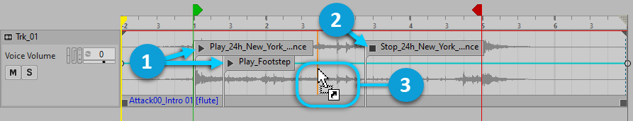

|  |  |
| --- | --- |
|  | 拖动的 Event 会按照最佳间距自动贴合。 |
|  | 图标指示了 Event 的动作类型。 |
|  | 此处光标正将 Event 拖到时间线中。若 Event 有效，将显示箭头（如图所示）。否则，将显示禁止符号。 |

**将 Event 拖到 Music Segment 中：**

1. 转到 Designer（设计师）布局（依次选择 Layouts > Designer 或按下 F5）。
2. From the Project Explorer's Containers hierarchy, select or create a Music Segment with at least one child Music Track, then double-click it.

   此时，将在 Music Segment Editor（音乐段落编辑器）中加载该 Music Segment。
3. 在 Project Explorer 的 Events（事件）选项卡中，选择或创建 Event，然后单击该 Event 并将其拖到 Music Segment Editor 时间线中。

   若该 Event 有效，则时间线中将显示箭头标志。若其无效（比如拖入一个会调用该 Music Segment 的 Event），则时间线中将显示禁止符标志。
4. 在 Event 有效的情况下，在相应时间线位置松开鼠标左键。

   Event 提示在 Music Track 内看上去像个小旗子。

**使用快捷菜单将 Event 提示添加到 Music Segment：**

1. 转到 Designer（设计师）布局（依次选择 Layouts > Designer 或按下 F5）。
2. From the Project Explorer's Containers hierarchy, select or create a Music Segment with at least one child Music Track, then double-click it.

   此时，将在 Music Segment Editor（音乐段落编辑器）中加载该 Music Segment。
3. 在 Music Segment Editor 中，在要添加 Event 提示的位置右键单击 Music Track。

   此时将显示快捷菜单。
4. 在快捷菜单中，选择 **Add Music Event Cue...**（添加音乐事件提示...）。

   此时，Project Explorer Browser（工程资源管理器浏览器）将显示 Events 选项卡内容。
5. 选择所需 Post Event（发送事件）。

   此时将把新的 Event 提示添加到之前在时间线中选择的位置。

   |  |  |
   | --- | --- |
   | [备注] | 备注 |
   | 若 Browser 中没有所需类型的 Post Event，则可另外创建一个。为此，无需返回 Events 选项卡，可通过右键单击 Event 提示来打开快捷菜单，然后单击 **Set Post Event Target**。此时将弹出子菜单。在此可选择另一现有 Event 或另外新建一个。之后，系统将更新 Event 提示，并将其与新的 Post Event Target 关联。 |

|  |  |
| --- | --- |
| [技巧] | 技巧 |
| 在播放 Music Segment 的过程中无法通过快捷菜单添加 Event，即便已经暂停也不行。为此，请务必先停止播放 Music Segment。 |

  

**复制粘贴 Event 提示：**

1. 在 Music Track 中选中 Event 提示。
2. 按下 Ctrl+C 来复制。
3. 在要添加 Event 提示的位置右键单击 Music Track 时间线。
4. 按下 Ctrl+V 来粘贴。

   此时将把新的 Event 提示添加到之前在时间线中选择的位置。

Event 提示跟其他 Music Segment 提示一样可以自由拖放到时间线中所需位置。若其刚好与另一 Event 提示重叠，则 Wwise 将自动调节间距以将其插入到适当位置。若存在四个以上重叠的 Event 提示，则将隐藏标签以便 Wwise 根据窗口大小调节其高度。

---

### 处理 MIDI

In addition to AMB and WAV files, MIDI files can be used with music objects. These file types, once imported, are used to create clips, contained in one or many Music Segment tracks. 就 WAV 片段而言，各个片段都是独立的声音源。然而，MIDI 片段仅包含要播放的音符；必须使用 MIDI 乐器来解释这些音符。The instrument interprets all MIDI Events generated by one or many MIDI clips targeting it.

By default Wwise displays middle C as C4, but this is configurable. 请参阅 [“Setting the MIDI middle-C mapping”一节](ch04s04.html#user_prefs_midi "Setting the MIDI middle-C mapping")。

#### Importing MIDI files

MIDI files can be imported into Music Clips. MIDI files can't be imported into other objects in the Containers hierarchy.

创建 MIDI 片段的方式与 WAV 片段完全相同。有关如何使用文件创建片段的详细信息，请参阅[“为音轨添加内容”一节](ch29s04.html "为音轨添加内容")。

**使用拖放方式导入 MIDI 文件的方法是：**

1. Drag a MIDI file from Windows Explorer or Mac Finder to any location in the Containers hierarchy.

   **Audio File Importer** 将打开。
2. 点击 **Import** 以完成导入操作。

|  |  |
| --- | --- |
| [备注] | 备注 |
| 在拖放期间按住 CTRL 可旁通 Audio File Importer 对话框。 |

**使用 Audio File Importer 导入 MIDI 文件的方法是：**

1. 在 Project Explorer 中选择要导入 .mid 的位置。
2. 使用键盘快捷键 **(Shift + I)** 打开 Audio File Importer。
3. Click the **Add Files** button
4. 找到 MIDI 文件，然后点击 OK。
5. 再次点击 OK，以完成导入操作。

#### 理解 MIDI 内容和 MIDI 目标

MIDI 文件引用存储在音乐轨和段落中包含的音乐片段内。MIDI 片段只包含源 MIDI 信息：音符、弯音、CC。它们并不定义用于播放的乐器。用于播放的乐器由音乐段落和其它上层音乐对象中的 MIDI 目标（MIDI target）引用定义。

- MIDI playable instruments must be created and stored in sound or motion objects.
- MIDI 可播放乐器使用声音常用的标准对象结构。

**例如：**

- Instrument Work Unit

  - Piano (Blend Container)
  - Drum Kit (Sound SFX)

- Music Work Unit

  - Song (Music Segment)

    - Piano Track (Music Track with MIDI clips)
    - Drum Track (Music Track with MIDI clips)
    - Guitar (Music Track with audio clips)

在前例中：

- The **Piano Track** has a **MIDI
  target** reference to the **Piano** Blend
  Container object.
- The **Drum Track** has a **MIDI
  target** reference to the **Drum Kit** Sound SFX
  object.
- **>Guitar Track** 没有 **MIDI 目标**。

When playing a Music Segment with MIDI clips, the MIDI clip sends MIDI data to the
specified MIDI target. The MIDI target (or instrument), located in a sound or motion object,
receives the MIDI data and plays according to its MIDI settings.

**To specify a MIDI target on a music object:**

1. Select a music object (Music Track, Music Segment, or any parent).
2. In the Property Editor, enable **Override Parent** (if
   applicable).
3. Click browse to browse to a MIDI target instrument.

有关详细信息，请参阅[*创建 MIDI 乐器*](ch31.html "创建 MIDI 乐器")。

#### Mixing MIDI and audio content

When MIDI content is played, the music object sends MIDI data to the MIDI target (the
instrument), located in a sound or motion object. The content played by the MIDI target plays in the
context of the audio structure, not in the context of the MIDI source. This means the voice
properties on music objects do not affect the instrument being played.

For example, the Voice Volume on a Music Segment or Music Track doesn't affect a piano
instrument, located on a Sound SFX object. To modify the voice volume of the piano, you must
modify the Voice volume on the Piano object directly, not on the MIDI source.

为了帮助混音，可创建一个总线层级结构，将乐器内容与音乐音频内容组合起来。Routing the instrument and the music track to the same bus provides a single audio mixing point.

#### Understanding MIDI tempo

There is a significant difference between a MIDI clip and a WAV clip. A WAV clip's duration is determined by the content of the source file, while the duration of a MIDI clip depends on the tempo used. The tempo used is determined by the Tempo Source property.

MIDI files typically contain the tempo information for playback at the right speed.
Sometimes this tempo information conflicts with the tempo information found in the music
objects (Music Segment and its parents). You can choose to use either the tempo of the source
MIDI file or the tempo of the MIDI clip's ancestors.

下表列出了可能的速度源：

| 速度源 | 定义 |
| --- | --- |
| 文件 | 使用 MIDI 文件中包含的速度。 |
| Hierarchy | The tempo specified by the MIDI clip's ancestry is used. |

**设置 MIDI 速度源的方法是：**

1. 选择音乐对象。
2. In the Property Editor, go to the **MIDI Clip Tempo**
   group.
3. Select the **Source** to use.

MIDI 片段的速度在创建后可更改，但不会影响时长。时长可通过片段裁剪点进行更改。有关详细信息，请参阅[“使用片段”一节](ch29s07.html "使用片段")。

#### Changing the playback speed of MIDI

Music objects don't have a voice pitch property. However, you can change their **Playback Speed**, which affects:

- The pitch of audio clips.
- The rate of playback of MIDI clips.

播放速度 1 将以原始速度播放。播放速度 2 将以 2 倍的原始速度播放。播放速度 0.5 将以一半的速度播放。

|  |  |
| --- | --- |
| [备注] | 备注 |
| The **Playback Speed** property can also be attached to a Game Parameter in the RTPC tab of the Primary Editor. |

**To change the playback speed:**

1. 察看音乐对象（音乐轨除外）。
2. In the Property Editor, set the **Playback
   Speed**.

---

### 创建 MIDI 乐器

#### 设计 Synth One 乐器

若源插件能够理解 MIDI 消息，便可通过其来创建 MIDI 乐器。

**创建源插件乐器（例如：合成器）的方法如下：**

1. Create an empty **Sound** object on the **Containers hierarchy.**
2. 在 Project Explorer（工程浏览器）中，选择该声音。
3. 在 Contents Editor 中，点击 **Add Source>>**。
4. 从选择器菜单中，选择 **Synth One**。
5. 从 **Views**（视图）菜单中，选择 Source Editor（源编辑器）（Shift+X）。
6. Click on the **Sound** object on the Containers hierarchy to see it in the Source Editor.
7. 在 Source Editor 中，将 **Frequency Mode**（频率模式）设置为 **MIDI Note**（MIDI 音符）。

现在，乐器可作为音乐对象内的 MIDI 目标引用（例如：音乐段落）。

#### 设计简单的采样 MIDI 乐器

Sampled instruments can use all Containers hierarchy containers (Blend Containers, Switch Containers, Random Containers, Sequence Containers and Sounds) for their design. 实现的复杂性将随着乐器设计复杂性而增长。最简单的采样乐器应为单采样点乐器。

**创建单采样点乐器的方法如下：**

1. 在 Project Explorer 中，选择要创建乐器的位置。
2. 从 **Views** 菜单中，选择 **Audio File Importer**（音频文件导入器）（Shift+I）。
3. 单击 **Add Files...**（添加文件...）。
4. 浏览找到 .wav 文件，然后点击 OK（确定）。
5. 再次点击 OK，以完成导入操作。

|  |  |
| --- | --- |
| [技巧] | 技巧 |
| You can also Drag & Drop a WAV file on the Containers hierarchy directly. |

现在，乐器可作为音乐对象内的 MIDI 目标引用（例如：音乐段落）。

|  |  |
| --- | --- |
| [技巧] | 技巧 |
| 使用 Source Editor 修剪导入的样本。通常，您希望删除源开头的任何空白。 |

#### 了解 MIDI 音符追踪

The MIDI note tracking parameters can be found in the MIDI category of the Property Editor for the Containers hierarchy objects. 这些参数决定在播放期间是否在收到 MIDI 消息时改变声音对象的音高。If the played sound is pitch-shifted, it is according to the note of the MIDI message, and the note represented by the object's source; it's root note.

The note tracking parameters can be specified and/or overridden in any of the instrument's Containers hierarchy objects. For more information about properties in the Containers hierarchy, refer to [“工程层级结构中的属性介绍”一节](ch11s04.html "工程层级结构中的属性介绍"). MIDI 音符跟踪参数包括：

- **Override parent**（不沿用父项）：如果勾选，则对象将忽略其上级对象的音符跟踪参数。
- **Enable**（启用）：如果设置该选项，则对象的声音在播放时将会改变音高。音高平移量由接收到的MIDI事件的音符与 **Root Note** 值决定。
- **Root note**：由对象的源所代表的音符。

#### 了解 MIDI 筛选器

The MIDI filters can be found in the MIDI category of the Property Editor for the Containers hierarchy objects. 在收到有关复杂对象结构的 MIDI 消息时，您可以使用 MIDI 筛选器来选择要播放的子对象。

MIDI 筛选器指定将基于以下项来播放相应的子对象：

- MIDI 音符音高。
- MIDI 音符力度。
- MIDI 声道。

因为在声音音高逐渐偏离根音时做重采样可能会产生副作用，所以您可能会需要使用不同根音上的多个录制样本来覆盖乐器的整个音域。在内存受限时有一种技术通常能实现好的效果: 在每个八度音阶范围内只能使用几个不同样本根音，并且将这些音符的音高上调或下调以覆盖八度音阶的全部 12 个半音。

以下是乐器两个八度音阶将根音音高下调二度和上调小二度的示例。

- **乐器（混合容器）**

  - 根音：C3 - 范围：Bb2 至 C#3
  - 根音：E3 - 范围：D3 至 F3
  - 根音：G#3 - 范围：F#3 至 A3
  - 根音：C4 - 范围：Bb3 至 C#4
  - 根音：E4 - 范围：D4 至 F4
  - 根音：G#4 - 范围：F#4 至 A4

在播放容器时，混合容器同时播放各个子对象。然而，筛选器会阻止与筛选器规则不匹配的子对象。

#### 了解 MIDI Event

The MIDI Events properties can be found in the MIDI group of the Property Editor for the Containers hierarchy objects. 在收到 MIDI 消息时，MIDI 事件属性用于确定对象是否必须要播放。对象可在发生 note-on（音符开）事件或 note-off（音符关）事件时播放。请注意，这些属性仅用于启动对象的播放。要停止播放对象，必须为属性指派包络（请参阅[“使用包络”一节](ch18s05.html "使用包络")）。

典型的情形是在 **Note-On** 时 **Play**（播放）。

**创建循环乐器的方法如下：**

- 在 Project Explorer 中，选择要循环的声音。
- In the Property Editor, enable **Loop** on the
  Sound.
- In the Property Editor, set the **Play On** property to
  **Note-On**.
- 从 **Views** 菜单中，打开 Source Editor（Shift+X）。
- 再次察看声音。
- 在 Source Editor 中，移动 **Loop Start**>（循环开始）和 **>Loop End**>（循环结束）光标以排除 WAV 文件的起音区段和释放区段。
- 调整**Crossfade duration**（交叉淡化时长），直到无法听到循环点。

|  |  |
| --- | --- |
| [备注] | 备注 |
| 乐器的循环可通过 **Break on Note-Off**（音符关时中断）属性进行停止。如果该属性已设置，则音符关事件会在允许当前对象完成播放的同时停止循环声音的播放。请记得在源编辑器中设置 **Loop Start** 和 **Loop End** 光标，以便为最终循环播放所需的时长。 |

另一个情形是在释放乐器（即音符关）时播放特定声音。例如，它可用于触发吉他音符结束时的弦闷音。您应创建以下对象和设置：

- Blend Container（混合容器）

  - 起音+循环声音：播放 = Note-On
  - 释放声音：播放 = Note-Off

#### 在 MIDI Event 上添加淡入和淡出

在您希望向乐器添加动态时，您可以使用连接到乐器的 **Voice Volume**（声部音量）的 **Envelope**（包络）。

要向 **Voice Volume** 添加 **Envelope**，请参阅[“使用包络”一节](ch18s05.html "使用包络")。

#### 使用 MIDI 数据控制对象属性值

可以使用以下 MIDI 消息来控制对象属性值：

- MIDI 音符力度。
- MIDI 音符音高（音符号）。
- MIDI 音符频率。
- MIDI 音符触后。
- MIDI CC 值（0-127，包括调制轮）。
- MIDI 弯音。

典型情形是使用 **MIDI Note Velocity**（MIDI 音符力度）控制乐器的 **Voice Volume**。

**使用 MIDI Note Velocity 控制 Voice Volume 的方法如下：**

1. In the Project Explorer, select an object from the Containers hierarchy.
2. In the Primary Editor, go to the RTPC tab.
3. 点击 **RTPC** 列表中的 [>>] 按钮以添加新的条目。
4. 从选择器菜单中，选择 **Voice Volume**。
5. 为 X 轴点击 [>>] 选择器。
6. 从选择器菜单中，选择 **MIDI > MIDI Note Velocity**。
7. 调整 RTPC 图中的声部音量曲线。

#### 使用 MIDI Keymap Editor

The MIDI Keymap Editor view can be used to edit all MIDI properties for Containers hierarchy objects.

**打开该视图的方法如下：**

1. From the Wwise menu, select **Views > Editors > MIDI Keymap
   Editor**.

**为多个对象设置相同属性值的方法如下：**

1. 在 MIDI Keymap Editor 中选择要编辑的对象。
2. 为其中一个所选对象设置属性值。

   所选对象现在已设置为相同值。

**偏移多个对象的属性值的方法如下：**

1. 在 MIDI Keymap Editor 中选择要编辑的对象。
2. 按住 ALT 键并移动其中一个所选对象的属性滑杆。

   所选对象的属性值于是就被偏置了。

**在 MIDI Keymap Editor 中添加属性的方法如下：**

1. 打开 MIDI Keymap Editor 视图设置（Ctrl+Alt+V）。
2. 选择要添加的属性。
3. 按 OK。

   新列现在添加上了。

#### 使用 MIDI 键盘测试乐器

在设计 MIDI 乐器时，您可以使用外部 MIDI 键盘设备测试乐器。

**将设备连接到 Wwise的方法如下：**

1. 在 **Project** 菜单中，选择 **Control Surface Devices**（控制设备）。
2. 点击 **Add**（添加）按钮。
3. 为设备命名。
4. 点击 OK。

   设备现在添加到列表里了。
5. 在 **Receive From**（输入端）列中，选择 MIDI IN（MIDI 输入）设备。

   此时将会显示 **Connected**（已连接）消息。
6. 在 **Send To**（输出端）列中，选择 MIDI OUT（MIDI 输出）设备。

   此时将会显示 **Connected**（已连接）消息。
7. 点击 Close（关闭）。

   设备现在就可以用了。

**将键盘键绑定到当前选中项的方法如下：**

1. 从 **Views** 菜单中，选择 **Control Surface Bindings**（Ctrl+Shift+Q）。
2. 通过点击视图左上方的 [>>] 按钮，创建新的控制设备会话。
3. 点击 **Current Selection**（当前选中项）组（文件夹）。
4. 点击 **Add Binding**（添加绑定）按钮。
5. 点击 **Property/Command**（属性/命令）选择器按钮以打开菜单。
6. 选择 **Object Command > Pass MIDI Note**（对象命令 > 传递 MIDI 音符）。
7. 保存工程。

|  |  |
| --- | --- |
| [备注] | 备注 |
| 确保 **Current Selection** 组在控制设备工具栏中处于激活状态并且您已经在 Project Explorer 中选择了一个对象。 |

在创建会话和绑定后，在 Project Explorer 中选择一个对象将自动为 MIDI 乐器加载该对象，并随时可以播放。

#### 将 MIDI 从 DAW 连通到 Wwise

可以使用虚拟 MIDI 连接器将来自外部应用程序（DAW 或数字音频电脑）的 MIDI 消息连通到 Wwise。在使用 Wwise 内置的乐器时在 DAW 中制作 MIDI 音乐非常有用。

通过创建包含所有乐器的混合容器并使用 MIDI Channel 筛选器区分乐器，您可以同时创建多个乐器。

- **Mac:** 您将要使用的是内置 IAC Driver。从 Applications/Utilities 下启动 Audio MIDI Setup 来开始操作。如果不显示 MIDI Studio，请在 **Window** 中选择 **Show MIDI Window**。单击 **MIDI Device**，双击 IAC Driver 图标，并选中 **Device is online** 选项将其激活。添加任意数量的端口后，它们将显示在您的 DAW 中。端口可用于发送或接收 MIDI Note、MIDI Control Change 和 MIDI Sync 消息。
- **Windows:** 由于 Windows 不自带虚拟 MIDI 驱动程序，您必须下载该程序。在 Windows 上， Mac 的 IAC Bus 替代工具中最知名的是 MIDI Yoke，它是 [MIDI OX Utility](http://www.midiox.com/) 的组件。此驱动程序的另一个替代工具是 Tobias Erichsen 的 [loopMIDI](http://www.tobias-erichsen.de/software/loopmidi.html) ，可以用于将 MIDI 消息从 DAW 输出到 Wwise。您需要将应用程序创建的虚拟 MIDI 端口添加到 Wwise 的控制设备中去。

---

### 使用 Transition

要让互动音乐听起来很自然，关键在于音乐的 Transition（过渡）。没有平滑的过渡，游戏配乐就无法保持连续无缝的变化。将各段音乐粗暴地组合在一起会让人感到极不和谐，并会削弱游戏的真实感。要避免这些问题，可通过 Wwise 自定义音乐对象之间的过渡以尽可能做到无缝衔接。

每当一个音乐对象（称为 Source，即源对象）停止播放，后一个音乐对象（称为 Destination，即目标对象）开始播放，就需要加入平稳的过渡。您可以在各个段落或段落所在容器之间定义过渡。Each transition is carried out automatically by Wwise according to properties you define in the Transitions tab of the Secondary Editor.

您可以指定何时开始过渡以及是否为其加入淡变。另外，还可指定一段音乐作为 Transition Segment（过渡段落）并在过渡的过程中播放。


|  |  |
| --- | --- |
|  | Transition Matrix。 |
|  | Transition Segment 属性。 |
|  | Source 和 Destination 属性。 |

#### 使用 Transition C 示例

假设您正在制作一款方块消除游戏。在游戏过程中，玩家时刻处于以下状态之一：游戏进行得很好（方块被快速清除），或游戏进行得很差（方块都堆在了一起）。您为每种情景都制作了很酷的音乐来最大限度地展示它们。为此，还得确保这两段音乐的过渡听起来自然、和谐。

为满足游戏需要，您可以创建名为 Puzzle Sounds 的 Music Switch Container（音乐切换容器），其中包含两个 Music Playlist Container（音乐播放列表容器），分别命名为 Calm 和 Panic。它们分别关联至两种游戏状态，反映游戏情况。在这两个 Playlist Container 之间实现良好过渡可以让游戏配乐引人入胜。下图显示了如何在游戏中实现过渡：

|  |
| --- |
|  |

在本例中，使用淡入和淡出曲线可以让 Playlist Container 之间的过渡变得平滑。两个容器之间的衔接将更加平缓、自然，而且还能避免在过渡时产生嘈杂的噪音。

---

#### 理解 Transition 规则矩阵

Transitions（过渡）选项卡的中间是 Transition Matrix（过渡矩阵）。您可以使用其创建一系列规则并定义 Music Switch Container（音乐切换容器）或 Music Playlist Container（音乐播放列表容器）内的各个对象如何过渡到容器内的其他各个对象。在使用过渡时，可为容器内的各对象创建特定的规则，也可创建适用于多个对象的通用规则。以下元素均可作为过渡规则的 Source（源）或 Desitination（目标）：

- **Music object：**音乐对象，可以是 Music Segment（音乐段落）、Music Playlist Container，也可以是 Music Switch Container。
- **Virtual Folder：**虚拟文件夹，Music Switch Container 内的音乐对象可组织到虚拟文件夹中。将 Virtual Folder 选为音乐过渡的 Source 或 Destination 时，过渡规则将对该文件夹内的所有音乐对象生效。
- **Any：**任意对象，表示容器中的任何音乐对象都可用作 Source 或 Destination。
- **Nothing：**无对象，表示 Source 或 Destination 为空，即不播放任何音乐对象。

过渡时，Wwise 将从规则列表底部开始向上搜索，直至找到与当前情形匹配的过渡规则。如果未找到匹配的过渡，则 Wwise 则将使用默认的“Any to Any”过渡。

###### 添加过渡规则

Music Switch Container（音乐切换容器）或 Music Playlist Container（音乐播放列表容器）的过渡矩阵中至少包含一条过渡规则：Any to Any（任意到任意）。若想创建更有针对性的过渡规则，则须自行将其添加到过渡矩阵。

**向 Music Switch Container 或 Music Playlist Container 添加自定义过渡：**

1. 将 Music Switch Container 或 Music Playlist Container 加载至 Property Editor 中。
2. In the Transitions tab of the Secondary Editor, click **Add**.
3. 这时会将新建的 Any to Any（任意到任意）过渡规则添加到过渡矩阵。
4. 在 **Source**（源）列中，单击**选择器**按钮 **[>>]**，并根据需要选择以下选项：

   - **Any**任意源。为任何未指定的源音乐对象创建过渡。
   - **Nothing**无对象。创建没有源对象（即不播放任何音乐对象）的过渡。
   - **Browse**，浏览并选择特定音乐对象或含有对象的虚拟文件夹，过渡规则会将其作为源对象。这时会打开 Project Explorer - Browser（工程资源管理器 - 浏览器）。在此，可选择 Source（源）。

   |  |  |
   | --- | --- |
   | [技巧] | 技巧 |
   | 另外，也可直接从 Project Explorer 将音乐对象拖到过渡矩阵中。但要注意，对于加载到 Property Editor 中的容器，只有作为其子对象的音乐对象才能添加到矩阵中。 |
5. 在 **Destination**（过渡目标）列中，点击 **选择按钮** (**>>**)，并选择下列选项之一：

   - **Any**任意对象。过渡将适用于任意目标音乐对象。
   - **Nothing**无对象。创建没有目标对象（即不播放任何音乐对象）的过渡。
   - **Browse**，浏览并选择特定音乐对象或含有对象的虚拟文件夹，过渡规则会将其作为目标对象。这时会打开 Project Explorer - Browser（工程资源管理器 - 浏览器）。在此，可选择 Destination（目标）。

   新建的自定义过渡规则将被添加到过渡矩阵。

   |  |  |
   | --- | --- |
   | [技巧] | 技巧 |
   | 您可以通过选中过渡矩阵中的过渡规则并上下拖动来更改它们的顺序。红线指示会将过渡规则放在哪里。“Any to Any”将是 Wwise 检查的最后一个过渡规则，因此无法从矩阵顶部下移。 |

在 Transitions 选项卡中，还可右键单击现有 Transition 并依据其 **Source** 或 **Destination** 来添加新的 Transition；在其 **Source** 或 **Destination** 未设为 Any 时，可利用 New Transition 快捷菜单选项来复制 **Source** 或 **Destination** 并创建新的 Transition。

###### 复制和粘贴过渡规则

您可以轻松复制粘贴矩阵内的过渡规则来加快 Transition（过渡）的创建流程。

**从 Music Playlist Container（音乐播放列表容器）或 Music Switch Container（音乐切换容器）中复制自定义过渡规则的方法如下：**

1. 将 Music Switch Container 或 Music Playlist Container 加载至 Property Editor 中。
2. Switch to the Transitions tab of the Secondary Editor.
3. 在过渡矩阵中，右键单击要复制的过渡规则并从菜单中选择 **Copy**（复制）。
4. 在列表中，右键单击要粘贴过渡规则的位置并从菜单中选择 **Paste**（粘贴）。

   这时会将过渡规则的副本添加到过渡矩阵中的选定位置。

   |  |  |
   | --- | --- |
   | [技巧] | 技巧 |
   | 另外，也可使用快捷键（Ctrl+C、Ctrl+V）在矩阵内复制粘贴过渡规则。 |

###### 对过渡规则排序

在需要实施过渡时，Wwise 会自下至上检索过渡矩阵来寻找与当前情形匹配的过渡规则。一旦找到匹配的过渡规则就会停止检索，无论找到的过渡规则是否最为合适。为确保应用最为适合的过渡规则，可按从通用到特定的顺序对过渡矩阵中定义的规则进行排序（如下例所示）。

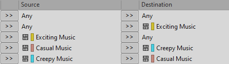

与 Source（源）或 Destination（目标）使用特定音乐对象的过渡规则相比，使用 **Any**（任意）或 **Nothing**（无）的过渡规则应该排在列表前面。这样可以确保 Wwise 在检索通用规则前就能找到特定规则。

###### 移除过渡规则

若不再需要过渡矩阵中定义的过渡规则，则可轻松将其移除。在移除过渡规则时，不会删除 Source（源）和 Destination（目标）音乐对象。

**从 Music Playlist Container（音乐播放列表容器）或 Music Switch Container（音乐切换容器）中移除自定义过渡规则的方法如下：**

1. 将 Music Switch Container 或 Music Playlist Container 加载至 Property Editor 中。
2. Switch to the Transitions tab of the Secondary Editor.
3. 在过渡矩阵中，选择要移除的过渡规则。
4. 单击 **Remove**（移除）或按下 **Delete** 键。

   这时会从过渡矩阵中移除所选过渡规则。

---

#### 设置 Source 和 Destination 属性

在默认情况下，过渡时会直接从某个音乐对象切换到另一音乐对象。过渡规则的强大之处在于您可以自定义 Source（源）和 Desitination（目标）对象，并创建独特的音乐过渡。通过设置 Source 和 Desitination 属性，可以使对象间的过渡听起来平滑、流畅。

为了让对象间的过渡更加灵活可控，可以为 Source 和 Desitination 分别设置多个不同的 Exit（切出）点和 Entry（切入）点。您也可以在 Desitination 对象中选择随机时刻切入。这样按照过渡规则播放时每次切入点都不同，可以减少过渡的重复听感。

设置 Source 和 Desitination 属性时，请注意这些属性仅对该过渡规则有效。例如，假设您的过渡矩阵中存在从 Happy Music（愉快情绪）到 Sad Music（悲伤情绪）的过渡规则，以及从 Happy Music 到 Scary Music（恐惧情绪）的过渡规则。如果希望两个规则中 Happy Music 源都在第一个 Custome Cue（自定义提示点）切出，就需要在两个规则中分别设置。

|  |  |
| --- | --- |
| [备注] | 备注 |
| Source 和 Desitination 允许设置多种属性，但具体属性是否可用将取决于对象和所属容器的类型。 |

**设置 Source 属性的方法如下：**

1. 将 Music Switch Container 或 Music Playlist Container 加载至 Property Editor 中。
2. Switch to the Transitions tab of the Secondary Editor.
3. 选中过渡矩阵中的过渡规则。

   接下来，就可以编辑此过渡规则的 Source 属性了。
4. 如果 Source 对象位于切换容器内，请从 **Exit source at** （切出点）列表中选择下列之一：

   **Immediate（立刻）：**立即停止播放 Source。

   **Next Grid（下一网格线）：**在下一个网格线停止播放 Source。通过 Grid（网格线），可以按任意间隔长度来划分音乐对象。

   **Next Bar（下一小节）：**在下一小节停止播放 Source。

   **Next Beat（下一拍）：**在下一拍停止播放 Source。

   **Next Cue（下一提示点）**：在下一个提示点停止播放 Source，可以是 Custom Cue，也可以是 Exit Cue（出口提示点）。

   **Next Custom Cue（下一自定义提示点）**：在下一个 Custom Cue 停止播放 Source。如果当前 Music Segment（音乐段落）不包含 Custom Cue，则 Wwise将继续播放下一段落，直到遇到 Custom Cue 为止。

   **Exit Cue（出口提示点）：**在出口提示点处停止播放 Source。
5. 如果您选择 Next Cue 或 Next Custom Cue，就可以在 **Match** 文本框中输入提示点名称，精确筛选对该过渡规则有效的提示点。
6. 如果过渡时希望播放 Source 的 Post-exit（后尾段），请选择 **Play post-exit**。

   |  |  |
   | --- | --- |
   | [备注] | 备注 |
   | 仅当 Source 在 Exit Cue 退出，以及在 Exit Cue 处或其后淡出时才会播放 Source 的后尾段，否则过渡时将不会播放后尾段。 |
7. 如果 Source 结束时需要淡出，请选择 **Fade-out**。

**设置 Destination 属性的方法如下：**

1. 将 Music Switch Container 或 Music Playlist Container 加载至 Property Editor 中。
2. Switch to the Transitions tab of the Secondary Editor.
3. 选中过渡矩阵中的过渡规则。

   接下来，就可以编辑此过渡规则的 Destination 属性了。
4. 若 Destination 为 Music Playlist Container，则可选择要首先播放容器里的哪个条目。单击“浏览”按钮 **[...]**，并为 **Jump to**（跳转到）选项指定对应的条目。
5. 若 Destination 为 Music Switch Container，请从 **Sync to**（同步到）列表中选择以下选项之一：

   **Entry Cue（入口提示点）：**将从入口提示点处开始播放 Destination。

   **Same Time as Playing Segment（与现有音乐时间相同）：**Destination 开始播放的位置将与 Source 段落切出的时间点相同。例如，如果 Source 段落已经播了 10 秒，则 Destination 也将从 10 秒处开始播放。

   **Random Cue（随机提示点）**：从随机选择的提示点处开始播放 Destination。勾选该选项即选择了所有提示点，包括 Entry Cue（入口提示点）和所有 Custom Cue。

   **Random Custom Cue（随机自定义提示点）**：将从随机选择的 Custom Cue 处开始播放 Destination。如果段落中没有自定义提示点，则使用入口提示点。

   **Last Exit Position**（上次退出位置）：根据上次 Destination 的段落播了多久施加相应的时间偏置，然后再开始播放 Destination。例如，若上次 Destination 的第三个段落播了 15 秒，则将从 15 秒处开始播放 Destination。
6. 若选用了 Random Cue 或 Random Custom Cue，则可通过 Custom Cue Filter（自定义提示点筛选器）进一步精确筛选有效的开始位置。

   **Match（匹配名称）：**只有用了该名称的提示点才会被选为开始位置。

   **Match source cue name（匹配源提示点名称）：**仅当提示点与 Source 段落所用提示点名称相同时，才会作为开始位置。
7. 过渡时如果要播放 Destination 的 Pre-entry（前导段），请选择 **Play pre-entry（播放前导段）**。
8. 若在开始播放 Destination 时需要淡入，请选择 **Fade-in**（淡入）。

###### 编辑淡变

Fade-in（淡入）和 Fade-out（淡出）是分别指派给 Destination（目标）和 Source（源）音乐对象的两个特殊属性。也可以用于 Transition Segment（过渡段落）的开头和结尾。音乐对象切入和切出时，您可以用淡变让过渡变得更为平滑，很能设置各淡变的长度，时间偏置及曲线形状，进一步修正淡变听感。

**To edit a fade-out:**

1. On the Transitions tab of the Secondary Editor, make sure **Fade-out** is selected, and then click **Edit**.

   **Music Fade Editor**（音乐淡变编辑器）将打开。
2. 在 **Time** 文本框中，键入淡出的持续时间。
3. 在 **Offset** 文本框中，可以指定 Exit Cue（出口提示点）到淡出结束的时长。
4. 在 **Curve** 列表中，选择淡出的曲线形状。

   音乐将按照指定的方式淡出。

**To edit a fade-in:**

1. On the Transitions tab of the Secondary Editor, make sure **Fade-in** is selected, and then click **Edit**.

   **Music Fade Editor**（音乐淡变编辑器）将打开。
2. 在 **Time** 文本框中，键入淡入的持续时间。
3. 在 **Offset** 文本框中，可以指定从淡入开始到 Entry Cue（入口提示点）的时长。
4. 从 **Curve** 列表中，选择淡入的曲线形状。

   这时音乐会按照指定的方式淡入。

---

#### 使用 Transition Segment

为了让过渡的效果更好，有时会另选一段音乐，让它在 Source（源）结束前就开始播放，并持续到 Destination（目标）开始之后。连接所用的这段音乐叫做 Transition Segment（过渡段），在 Wwise 中的所有过渡中都可以使用。下图说明了从 Source 对象到 Destination 对象的过渡中，Transition Segment 将如何播放。

|  |
| --- |
|  |

用户也可以用 Source 对象、Destination 对象及 Transition Segment 三者的 Pre-entry（前导段）与 Post-exit（后尾段）进行组合，让过渡更加平滑无缝。

任何 Music Segment（音乐段落）都可以作为过渡段 ，关于如何创建段落，请参阅 [*使用 Music Track 和 Music Segment*](ch29.html "使用 Music Track 和 Music Segment")。

|  |  |
| --- | --- |
| [备注] | 备注 |
| 如果过渡段所在的 Work Unit（工作单元）已从工程中卸载，该过渡段将显示为黄色。 |

**使用 Transition Segment 的方法如下：**

1. 将 Music Switch Container 或 Music Playlist Container 加载至 Property Editor 中。
2. Switch to the Transitions tab of the Secondary Editor.
3. 选中过渡矩阵中的过渡规则。
4. 选中 **Use transition segment**（使用过渡段落）。
5. 执行以下操作之一：

   - 将段落从 Project Explorer 拖至 **Transition Segment** 中。

     
   - 点击 **Browse** 按钮 (...)，在 Project Explorer - Browser 中选择段落。
6. 如果要播放过渡段的 Pre-entry，请勾选 **Play pre-entry**。
7. 如果播放过渡段时需要淡入，请勾选 **Fade-in**。
8. 如果要播放过渡段的 Post-exit，请勾选 **Play transition post-exit**。
9. 如果停止过渡段时需要淡出，请选择 **Fade-out**。

   |  |  |
   | --- | --- |
   | [备注] | 备注 |
   | 如需详细了解如何编辑 Transition Segment 的 Fade-in 和 Fade-out 属性，请参阅[“编辑淡变”一节](ch32s02.html#editing_fades "编辑淡变")。 |

---

### 使用 Stinger

为了让互动音乐给游戏提供更多反馈，您可以在游戏关键时刻播放 Stinger（插播乐句）。Stinger 是一种简短乐句，可以与当前播放的音乐叠加并混合播放。游戏会调用与 Stinger Music Segment（插播乐句音乐段落）相关联的 Trigger（触发器），从而播放 Stinger。关于使用 Trigger 的详细信息，请参阅 [*使用 Trigger*](ch19.html "使用 Trigger")。

假设前面例子中勇敢的考古学家正在探索神庙并忙着搜寻遗迹。在其一边漫步一边考察周边环境时，会播放探索音乐。在找到宝藏时则会播放一小段别的音乐，来彰显这一振奋人心的发现。但探索音乐不会停止，游戏会调用 Trigger，让一个名为“Found it”的 Stinger 与当前音乐叠加播放，来表示这是重要时刻。Stinger 播完后，探索音乐将继续播放。

|  |
| --- |
|  |

要让 Stinger 与当前音乐叠加播放，需进行以下操作：

- 将音乐对象与 Trigger 关联。
- 将 Music Segment 映射至 Trigger，从而创建 Stinger。
- Define how the Stinger will play back.

#### Using Stingers with music hierarchies

Since Stingers can be created at different levels in the hierarchy, you can assign the
same Trigger to different segments. This means that while the top-level music object might use a
Trigger called, "Treasure", any of its child objects can also use the "Treasure"
Trigger. In this case, the child object would associate the "Treasure" Trigger with a
different segment. This automatically overrides the parent Trigger/Stinger association and
increases the range of Stingers that you can play at important moments in the game. Since only
one Stinger can play for a specific Trigger in the hierarchy of music objects, it is the
associated Stinger of the currently playing child object that will play.

#### 添加 Stinger

You can create Stingers for music objects in the Stingers tab of the music object Primary Editor. Wwise 允许通过两种方式添加 Stinger：

- 在 Project Explorer（工程资源管理器）中进行拖放。
- Using the buttons in the Primary Editor.

您可以任选其一，也可结合使用。

|  |  |
| --- | --- |
| [备注] | 备注 |
| 如果 Stinger 关联的段落已从工程中卸载，该段落将高亮显示为黄色。 |

**从 Project Explorer 中拖拽添加 Stinger 的方法如下：**

1. Load a music object into the Property Editor and switch to the Stingers tab of the
   Primary Editor.
2. From the Game Syncs tab of the Project Explorer, drag a Trigger to the Stingers list.

   Stinger 将自动创建，并由刚刚拖拽的 Trigger 触发。默认情况下，Trigger 不会关联至任何 Music Segment（音乐段落），即显示 Nothing（无段落）。
3. 要将 Music Segment 与 Trigger 关联，请切换至 Project Explorer 的 Audio（音频）选项卡，然后将 Music Segment 拖至 Segment to Play（要播放的段落）一栏。

   该 Music Segment 将替换默认“Nothing”选项，并与该 Trigger 关联。
4. 在 Play At（播放位置）列中选择以下选项之一，来定义何时播放段落：

   - **Immediate** ―― 立即切换状态。如果为 Music Track（音乐轨）设置了 Look-ahead Time（预读时间），则须等到这段时间过后才能播放该 Stinger。
   - **Next Grid** -- 下一网格线。在下一网格线处播放 Stinger。通过 Grid，可以按想要的频率将音乐对象进行虚拟划分。
   - **Next Bar** -- 下一小节。在下一小节处播放 Stinger。
   - **Next Beat** -- 下一拍。在下一拍播放 Stinger。
   - **Next Cue** -- 下一提示点。在下一提示点处播放 Stinger。下一提示点可以是 Entry Cue（入口提示点）、Exit Cue（出口提示点）或者 Custom Cue（自定义提示点）。
   - **Next Custom Cue** -- 下一自定义提示点。在下一个自定义提示点处播放 Stinger。
   - **Entry Cue** -- 入口提示点。在入口提示点处播放 Stinger。
   - **Exit Cue** -- 出口提示点。在出口提示点处播放插播乐句。
5. Repeat steps 2-4 to continue adding Stingers as needed.

**To insert a Stinger using the buttons in the Primary Editor:**

1. On the Stingers tab of the Primary Editor, click **Add**.

   这时会打开 Project Explorer - Browser（工程资源管理器 - 浏览器）对话框。
2. 选择要指派给音乐对象的 Trigger，并单击 **OK**（确定）。

   |  |  |
   | --- | --- |
   | [备注] | 备注 |
   | 要为 Stinger 选择其它 Trigger，请在 Trigger 列中点击 **选择器** 按钮（>>），浏览并选择所需的 Trigger。 |
3. 选择 Trigger 并单击 **OK**。

   Trigger 将添加至 Stinger。
4. 在 **Segment to Play** 列中，点击 "Browse" 按钮 (...)。

   Project Explorer-Browser 将打开。
5. 转到要使用的段落，并单击 **OK**。

   该段落将添加至 Stinger。
6. - **Immediate** ―― 立即切换状态。如果为 Music Track（音乐轨）设置了 Look-ahead Time（预读时间），则须等到这段时间过后才能播放该 Stinger。
   - **Next Grid** -- 下一网格线。在下一网格线处播放 Stinger。通过 Grid，可以按想要的频率将音乐对象进行虚拟划分。
   - **Next Bar** -- 下一小节。在下一小节处播放 Stinger。
   - **Next Beat** -- 下一拍。在下一拍播放 Stinger。
   - **Next Cue** -- 下一提示点。在下一提示点处播放 Stinger。下一提示点可以是 Entry Cue（入口提示点）、Exit Cue（出口提示点）或者 Custom Cue（自定义提示点）。
   - **Next Custom Cue** -- 下一自定义提示点。在下一个自定义提示点处播放 Stinger。
   - **Entry Cue** -- 入口提示点。在入口提示点处播放 Stinger。
   - **Exit Cue** -- 出口提示点。在出口提示点处播放 Stinger。
7. 根据需要继续添加 Stinger。

#### 定义 Stinger 的播放设置

在为音乐对象创建 Stinger 后，可定义特定的设置来控制 Stinger 在游戏中如何播放。要使 Stinger 达到最佳效果，需要考虑以下两个问题：

- **播放 Stinger 后，要等多长时间才能再次播放**。Stinger 的作用是增加音乐编曲的表现力，因此播放时一定不要过多、过频繁，以免弱化其作用。
- **段落所剩时间不足以播放 Stinger 时怎么办。** 如果 Trigger 调用了 Stringer，但在播放时机到来前当前段落就会结束，则不会播放该 Stinger。不过，可选择在播放列表的下一段落中首次遇到符合条件的机会时播放该段落。如果未勾选该选项，该 Stinger 将终止。

**定义 Stinger 播放设置的方法如下：**

1. On the Stingers tab of the Primary Editor, in the **Don't play this Stinger again for x seconds** field, type the number of seconds that must elapse before the Stinger can play again. 若 Trigger（触发器）在指定时间内调用该 Stinger，则该 Trigger 将被忽略。

   |  |  |
   | --- | --- |
   | [备注] | 备注 |
   | “don't play stinger again for（不要再次播放插播乐句）”的起始时间指的是 Stinger 的同步点，即 Stinger 段落入口提示点的时间。 |
2. 若当前段落剩余时间不够而需在下一段落中播放 Stinger，请选中 **Allow playing the Stinger in next segment**（允许在下一段落中播放插播乐句）选项。

   |  |  |
   | --- | --- |
   | [备注] | 备注 |
   | 若未选中该选项，则 Stinger 将被终止。 |

#### 移除 Stinger

您可以删除不需要的 Stinger（插播乐句）。

**从 Stinger 列表中移除 Stinger 的方法如下：**

1. 在 Stingers 选项卡中，选择要移除的 Stinger。
2. 点击 **Remove**（删除）。

   所选 Stinger 将从列表中移除。

   |  |  |
   | --- | --- |
   | [备注] | 备注 |
   | 在删除 Stinger 时，不会影响关联的 Trigger（触发器）或 Music Segment（音乐段落）。 |

#### 预览 Stinger

创建 Stinger（插播乐句）段落后，可以在 Transport Control（播放控制）中单独预览该段落或与其它段落一起试听，从而验证叠加播放效果。Stinger 允许在不同层级中创建，因此您可以为同一 Stinger 进行不同的段落设置。Only one Stinger, however, may play for a specific Trigger in the hierarchy of music objects and it is the child object that determines which Stinger will play. For example if you created a Stinger using the Trigger “Treasure” at the Music Switch Container level, and used the same Trigger “Treasure” for a Stinger in the child object Playlist Container, and then you loaded the Music Switch Container in the Transport Control, and called the Trigger, only the Playlist Container Stinger would play.

In addition, you can also create simulations in the Soundcaster and profile your simulation in the Profiler to monitor performance issues. 关于模拟和性能分析的详细信息，请参阅：

- [“Building simulations”一节](ch36s01.html "Building simulations")
- [“使用 Performance Monitor 进行监控和故障排查”一节](ch39s09.html "使用 Performance Monitor 进行监控和故障排查")

|  |  |
| --- | --- |
| [备注] | 备注 |
| 如果 Stinger 关联的段落已从工程中卸载，该段落将高亮显示为黄色。您将无法预览该 Stinger，除非其所在的 Work Unit（工作单元）被重新加载至工程。 |

**在 Transport Control 中预览 Stinger 的方法如下：**

1. 将 Stinger 段落加载至 Transport Control。

   |  |
   | --- |
   |  |
2. 点击 **Play** 图标。

   Stinger 段落将播放。

**预览 Stinger 与当前音乐叠加播放效果的方法如下：**

1. 将音乐对象加载至 Transport Control。
2. 点击 **Play** 图标。

   Transport Control 中的音乐对象将播放。
3. 在 Game Syncs 区域中，点击 **Triggers** 按钮来显示列表。

   |  |
   | --- |
   |  |
4. 点击 **Call Trigger**（调用触发器）图标。

   相应的 Stinger 将与当前音乐对象叠加播放。您可以继续选择其他 Trigger 并播放与之对应的 Stinger 来试听其在游戏中的效果。

---

## 完善工程

本章节包含有关如何构建最终混音、排查并模拟工程的不同方面以及为游戏生成 SoundBank 和文件包的信息。

- **[*管理输出*](ch34.html "管理输出")**―specifying the output routing of objects, using User-Defined Auxiliary Sends and Game-Defined Auxiliary Sends, using Loudness Normalization or Make-up Gain to adjust volume, understanding the voice pipeline, using built-in Audio Devices, Secondary Outputs, and HDR, converting audio files, understanding bus processing status, monitoring signal levels, using the Busses Console, building a Mixing Session, and working with the Mixing Desk.
- **[*管理平台和语言版本*](ch35.html "管理平台和语言版本")**C 根据平台自定义对象属性和音频源；使用 Inclusion 和 Link 功能；将设置从某一平台复制到另一平台；对工程进行本地化（包括针对不同语言进行试听和实施性能分析）。
- **[*创建模拟*](ch36.html "创建模拟")**C 使用 SoundCaster；管理模拟效果的播放；使用 Game Sync 模拟游戏体验；在模拟环境中细调属性；实时混音和定位；使用 Reset 功能。
- **[*优化 CPU 用量*](ch37.html "优化 CPU 用量")**C 概括了解 Wwise 工程中影响 CPU 用量的主要因素；了解有关 CPU 优化的建议和窍门。
- **[*在 Wwise 中管理内存*](ch38.html "在 Wwise 中管理内存")**C 内存分配概述；追踪方式；平台专用设备内存。
- **[*性能分析*](ch39.html "性能分析")**C 远程连接；从声音引擎捕获数据；筛选性能分析器数据；从 Capture Session 获取统计信息；使用 Capture Log、Performance Monitor、Voice Inspector、Game Object 3D Viewer 和 Audio Object 性能分析视图。
- **[*管理 SoundBank*](ch40.html "管理 SoundBank")**C 在游戏中加载 SoundBank；预备 Action Event；构建、管理和生成 SoundBank；导入定义文件；自动定义 SoundBank；使用脚本生成 SoundBank；了解输出文件夹布局；管理 SoundBank 媒体；SoundBank 管理策略；DLC 注意事项。
- **[*管理 File Package*](ch41.html "管理 File Package")**C 使用 File Packager 工程；在工程内填充、排列和生成 File Package；配置 Block Size；DLC 概述；使用 File Packager 命令行参数。
- **[*Migrating your projects*](ch42.html "Migrating your projects")**C 升级到新的 Wwise 大版本；迁移 Wwise 工程；升级 SDK；测试已迁移的游戏；在所有工作站上升级 Wwise。

---

### 管理输出

On top of the project hierarchy that includes all your objects sits the Busses hierarchy. 通过这一独立的总线层级结构（之前在 [*建立输出总线的结构*](ch12.html "建立输出总线的结构") 中已进行说明），可以将工程层级内很多不同的结构分组。A Main Audio Bus will be used for the main sound mix. 您应为游戏的二路输出（如聊天耳机和游戏手柄振动）创建单独的总线结构。

These main busses create the final level of control for the structures within your project. 总线位于工程层级的顶层，因此您可以使用这些总线创建游戏的最终混音。

Depending on the platform, you can also apply certain Effects to the main busses to help finalize that immersive experience for your game.

#### 音频输出格式

Wwise 将最终混音结果作为离散的 LPCM 声道进行输出。需要注意的是，Wwise 将不会执行任何多声道编码；而只是简单地将 LPCM 数据传送至游戏机或系统。游戏机或系统一旦收到 LPCM 数据，就可以使用这些游戏机或系统支持的几乎任何格式输出这些数据，包括 Dolby、DTS 或 DPL2 格式。

---

#### 指定对象的输出连线

层级结构内的各个对象必须连线至特定总线。只需为顶层父对象进行连线设置，就可以定义整个结构的连线。由于输出连线是一个绝对属性，因此这些设置将自动传递至其下的子对象。但如果需要，您则可以取消沿用父级设置。

The routing for the entire sound structure is defined by the Property Container. 以下图示说明父对象的输出连线设置将如何自动传递至其子对象。

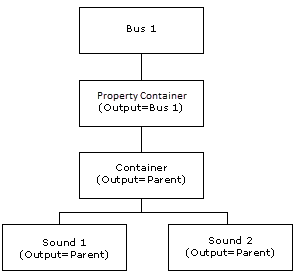

|  |  |
| --- | --- |
| [备注] | 备注 |
| 在默认情况下，会将对象自动输出到 **Default Object Values** 中指定的总线。 |

**指定音频对象的输出通路：**

1. 将顶层对象加载到 Property Editor 中。

   |  |  |
   | --- | --- |
   | [备注] | 备注 |
   | 如果该对象不是顶层对象，您必须选择 **Override parent** 选项后才能设置 Output 选项。 |
2. In the **Output Bus** group, click the browse button.

   此时将会打开 Project Explorer ―― Browser。
3. 选择要将对象进行连线的音频总线。
4. 单击 **OK**（确定）。

   音频总线将被应用至当前对象及其下任何子对象。

**解除当前平台的输出连线的方法如下：**

1. 将顶层对象加载到 Property Editor 中。

   |  |  |
   | --- | --- |
   | [备注] | 备注 |
   | 如果该对象不是顶层对象，您则必须选择 Override parent 后才能设置 Output 选项。 |
2. 在 **Output Bus**（输出总线）分组中，右键单击当前总线名称以打开快捷菜单。
3. 从快捷菜单中选择 **Unlink**。

   现在总线连线已取消链接，您可以为该平台指定其它总线。

---

#### 使用 User-Defined Auxiliary Sends

In addition to the Audio Bus specified for the audio routing, every Interactive Music or Containers hierarchy object can specify up to four User-Defined Auxiliary Sends. 同样，Audio Bus 本身也可以具有最多四个 User-Defined Auxiliary Sends。辅助发送允许将音频信号的一部分发送到其他总线（即 Auxiliary Bus）中，进行并行处理。

用户定义的辅助总线用于在创作和编辑时直接定义静态辅助发送，游戏定义的辅助发送则与它不同，大多是通过在游戏中进行动态定义和控制。

下图显示了一个输出至 Audio Bus 的声音，总线上的辅助发送音量为 5dB，并且该声音还另有两个辅助发送。各个辅助发送都包含音量设置，并被连线至一条辅助发送总线。

|  |
| --- |
|  |

**添加用户定义的辅助发送**

1. 在 Project Explorer 中选择对象，察看该对象的属性。
2. 将一条辅助总线从工程浏览器中拖拽至用户定义的辅助发送列表，或

   点击浏览按钮 [...] 从 Project Explorer 列表中选择一个辅助总线。
3. 为所选的辅助总线设置发送音量

|  |  |
| --- | --- |
| [注意] | 注意 |
| 如果将总线发送至其自身的下级 Auxiliary Bus，则信号将被一系列相同的总线进行循环处理。这可能会导致延迟、音量异常巨大或产生其他不和谐音频效果。 |

  

###### 使用 User-Defined Auxiliary Sends 控制游戏环境

辅助发送可以用于控制游戏中简单场景的环境效果。环境效果通常由密闭空间中的混响和早期反射声来决定。对于各个发声体，游戏可控制以下元素：

- **Send volume**（发送音量），对应湿声部分或反射声大小。
- **Output bus volume**（输出总线音量），对应干声部分或直达声大小。
- **Output bus low-pass filter**（输出总线低通滤波器），对应阻挡或封闭效果的多少，影响直达声或干声部分的频率响应。

通过将游戏参数关联至前两个值，您可以控制各个游戏对象干声信号和湿声信号的大小。之后游戏会计算听者和发声体之间的距离，并将该值指派至游戏参数。在游戏参数指派中，RTPC 曲线将定义信号的湿声和干声部分如何随距离而变化。

通过将游戏参数关联至输出总线的 Low-Pass Filter， 可以根据游戏参数来控制声音中多少高频会被阻挡或削弱。

---

#### 使用 Game-Defined Auxiliary Sends

除了 4 个用户定义的辅助发送外，最多还可以设置 4 个游戏定义的辅助发送。在游戏中使用以下 Wwise SDK 函数，即可控制游戏定义的辅助发送：

- [`AK::SoundEngine::SetGameObjectAuxSendValues()`](https://www.audiokinetic.com/library/edge/?source=SDK&id=namespace_a_k_1_1_sound_engine_af960fca0239e219b9d08c2659fe9e5d4.html)

  使用该函数可以针对特定游戏对象来定义输出至辅助总线的发送音量。通常也被称为湿声音量。
- [`AK::SoundEngine::SetGameObjectOutputBusVolume()`](https://www.audiokinetic.com/library/edge/?source=SDK&id=namespace_a_k_1_1_sound_engine_adf1401ce64872af26cdff05b36e98161.html)

  使用该函数可以定义输出总线音量。通常也被称为干声音量。

但要启用某个对象的游戏定义辅助发送功能，必须激活 **Use game-defined auxiliary sends** 选项。

**启用游戏定义的辅助发送**

1. 在 Project Explorer 中双击某个对象可察看该对象
2. In the Property Editor, in the group **Game-defined Auxiliary
   Sends**:
3. - 如果允许，则点击 **Override parent**。
   - 点击 **Use game-defined auxiliary sends。**

通过为特定对象启用游戏定义的辅助发送，您可以控制哪个对象将会受其影响。在使用游戏定义的辅助发送来控制环境效果的场景中，您将能够控制哪个对象受环境效果的影响，哪个对象不受影响。

当游戏定义的辅助发送被激活时，您可以直接在 Wwise 中更改游戏定义的辅助发送音量，从而对游戏发送音量值（该值将与游戏定义的值叠加）进行调整。

###### 结合使用 Game-Defined Auxiliary Sends 和 Attenuation

游戏定义的辅助发送可以与对象定位属性中所定义的衰减设置结合使用。衰减设置用来根据听者与游戏对象之间的距离来控制以下游戏定义的属性：

- **Game-defined send volume**：用来基于距离来控制衰减多少湿声信号。
- **Output bus volume**：用来基于距离来控制衰减多少干声信号。

---

#### 使用 Loudness Normalization 或 Make-up Gain 调节音量

您可以使用 Make-up Gain（补偿增益）和 Loudness Normalization（响度归一化）来调节各个音频源的音量。与 Wwise 中的其它音量控制不同，这些音量控制对所有基于音量的逻辑行为都是不起作用的。例如，无论声部是否被认为低于阈值（虚拟），改变它们都不会产生影响，另外在进行 HDR 信号衰减时也会忽略它们。它们也不会显示在 Voice Monitor 中。

这些针对声音源的增益总和会显示在 Wwise Profiler 中 Voices 选项卡的 **Normalization / Make-Up Gain**  列中。

###### 源归一化

Wwise 会使用在分析原始文件阶段所收集的响度数据，在运行时根据预估响度自动归一化您的素材。您可以选择以下任一响度测量类型：

- **Integrated** 响度计算大致遵循 ITU-R BS 1770 响度测量建议：采用 K 加权滤波，绝对和相对门限分别为 -70 dB 和 -10 dB，时间窗口为 400 ms，75% 交叠。这种方式适用于长的音频节目内容（如音乐或过场动画）。
- **Momentary Max** 响度计算采用 K 加权滤波，时间窗口为 100 ms，75% 交叠。它会选取整个文件的最大值。这种方式适用于短的个别音频元素（如音效）。

根据 BS 1770，归一化的默认目标响度为 -23 dB。您可以通过调节 Loudness Target（目标响度）属性来自定义此目标值。

源归一化是非破坏性的：声音经分析后的响度值由 Wwise 单独存储，并会在运行时应用正确的归一化增益。该增益是测得和目标响度的函数：增益 = -测得 - 目标 [dB]。比如，若声音经分析后的响度为 -37 dB 并启用了源归一化（默认目标值为 -23），则 Wwise 在运行时将应用 +14 dB (+37 - 23) 的归一化增益。如果声音经分析后的响度为 -12 dB，则归一化增益将为 -11 dB (+12 - 23)。换言之，较弱的声音会加强，而较强的声音会衰减。如果您对基于响度计算的归一化增益不满意，则还可以使用 Make-up Gain （补偿增益）做进一步调节。

---

#### 了解声部管线

以下图示和表格展示了如何处理声部、如何为其设置通路、在哪些环节应用不同的音量和效果器。第一张图显示的是未激活 [*[3D Audio](go01.html#glossary_3daudio "3D Audio")*](go01.html#glossary_3daudio) 的情形。第二张图展示的是激活了 3D Audio 的情形。


|  |  |
| --- | --- |
| **在未激活 3D Audio 时** | |
|  | 这些总线被配置为了 **Same as parent** 且未应用任何效果器。在这种情况下，将把数值应用于通路中的所有条目，但其本身不会实施混音或执行任何处理。 |
|  | 这条总线被配置为了 **Same as parent** 且应用了效果器。在这种情况下，其行为变化取决于是否启用了 3D Audio。 |


|  |  |
| --- | --- |
| **在激活了 3D Audio 时** | |
|  | 这些总线被配置为了 **Same as parent** 且未应用任何效果器。在这种情况下，将把数值应用于通路中的所有条目，但其本身不会实施混音或执行任何处理。 |
|  | 这条总线被配置为了 **Same as parent** 且应用了效果器。在这种情况下，其行为变化取决于是否启用了 3D Audio。 |
|  | The Main Audio Bus is Processing Audio Objects, so no mixing will occur on input. 在这种情况下，将把效果器应用于总线通路中的每个对象。 |
|  | The Audio Objects output by the Main Audio Bus are triaged/mixed here according to their Metadata and what the Sink plug-in supports. 在默认情况下，带有 3D 定位的对象将被归为 System Audio Object，而不会实施混音。对于不带 3D 定位的对象，将根据声道配置实施混音：对于 Mono（单声道）和 Stereo（立体声）对象，将在 Passthrough Mix（直通混音）中混音；对于所有其他对象，则在 Main Mix（主混音）中混音。若要改写此默认行为，请在总线层级结构的相应位置添加 Wwise System Output Settings 元数据插件，或者将其添加到各个音频源。 |
|  | 这里的 Audio Device Effects 启用了 3D Audio 功能，可接收所有 3D Audio 数据（Main Mix、Passthrough Mix 和 System Audio Object），并在一条执行通路中统一应用效果器。 |

| Gain # | 说明 C 无论是否激活 3D Audio 均适用 |
| --- | --- |
|  | 音量应用至所有声道  - 声部音量\*（总线上的 **Voice Volume** 参数以及自动闪避都将作用于这个层级） - 归一化（Normalization）和补偿增益（Makeup Gain） - HDR 信号衰减 - Occlusion  - Project Settings 中的“声笼音量曲线”   - API： [`SetObjectObstructionAndOcclusion()`](https://www.audiokinetic.com/library/edge/?source=SDK&id=namespace_a_k_1_1_sound_engine_a1b3e18a25b405e55ba82de9b70cd11ba.html) - API: [`SetScalingFactor()`](https://www.audiokinetic.com/library/edge/?source=SDK&id=namespace_a_k_1_1_sound_engine_a9b71daa02c5d398d08c9eb0643d52555.html)  LPF 属性和声笼 LPF 曲线（工程设置） |
|  | 各声道独立音量  - 定位  - 2D 声像摆位和 3D 定位   - 中心%   - Distance Attenuation Curve（距离衰减曲线）   - API： [`SetGameObjectOutputBusVolume()`](https://www.audiokinetic.com/library/edge/?source=SDK&id=namespace_a_k_1_1_sound_engine_adf1401ce64872af26cdff05b36e98161.html)   - API： [`SetPosition()`](https://www.audiokinetic.com/library/edge/?source=SDK&id=namespace_a_k_1_1_sound_engine_a789e25bda32d1e11849afb6584942455.html)   - API： [`SetMultiplePositions()`](https://www.audiokinetic.com/library/edge/?source=SDK&id=namespace_a_k_1_1_sound_engine_ad63431938ab1e605a1f6e7fb013c0128.html) - API： [`SetListenerSpatialization()`](https://www.audiokinetic.com/library/edge/?source=SDK&id=namespace_a_k_1_1_sound_engine_a3e3e9e5335df01fca37f9b3ed518e2bd.html) |
|  | “干声路径”  - 输出总线音量 (+ RTPC) - 距离衰减曲线中的“Output Bus Volume”（输出总线音量） - API： [`SetGameObjectOutputBusVolume()`](https://www.audiokinetic.com/library/edge/?source=SDK&id=namespace_a_k_1_1_sound_engine_adf1401ce64872af26cdff05b36e98161.html) - API： [`AkSpeakerVolumeMatrixCallbackInfo()`](https://www.audiokinetic.com/library/edge/?source=SDK&id=struct_ak_speaker_volume_matrix_callback_info.html) - Obstruction  - Project Settings 中的“声障音量曲线”   - API： [`SetObjectObstructionAndOcclusion()`](https://www.audiokinetic.com/library/edge/?source=SDK&id=namespace_a_k_1_1_sound_engine_a1b3e18a25b405e55ba82de9b70cd11ba.html) - 未插入效果的父级总线：音量\*  声障 LPF 曲线（Project Settings） |
|  | “湿声路径”  - - Distance Attenuation 曲线中的 Aux Send 音量  - API： [`AkSpeakerVolumeMatrixCallbackInfo()`](https://www.audiokinetic.com/library/edge/?source=SDK&id=struct_ak_speaker_volume_matrix_callback_info.html) - - User-Defined Auxiliary Sends 音量 (+ RTPC) - - Game-Defined Auxiliary Sends 音量 (+ RTPC) - - API： [`SetGameObjectAuxSendValues()`](https://www.audiokinetic.com/library/edge/?source=SDK&id=namespace_a_k_1_1_sound_engine_af960fca0239e219b9d08c2659fe9e5d4.html) |
|  | - 总线音量\*\* - 定位  - 2D 声像摆位和 3D 定位   - Center %   - Distance Attenuation Curve（距离衰减曲线） - API： [`AkSpeakerVolumeMatrixCallbackInfo()`](https://www.audiokinetic.com/library/edge/?source=SDK&id=struct_ak_speaker_volume_matrix_callback_info.html) - 未插入效果的父级总线：总线音量\*\* |
|  | - 总线音量\*\* - 定位  - 2D 声像摆位和 3D 定位   - Center %   - Distance Attenuation Curve（距离衰减曲线） - 未插入效果的父级总线：总线音量\*\* |
|  | - 总线音量\*\* |

\* 声部音量 = 音量滑杆 + RTPC + 状态 + Set Voice Volume Action （动作）

\*\* 总线音量 = 滑杆 + RTPC + 状态 + Set Voice Volume Action （动作）

---

#### 内置音频设备

对于每个支持的平台，Audio Device（音频设备）代表平台提供的所有实际输出和虚拟输出。默认情况下，Wwise 支持多种音频设备，有些设备仅适用于部分平台。如果您的游戏针对功能不同的多个平台，则可能需要使用 [Link/Unlink](ch11s04.html#about_properties_in_project_hierarchy_property_indicators "属性标志") 功能将音频分别定向到正确的输出。This can be done by changing the **Audio Device** property on the property page of any of the main busses in your Busses hierarchy.

要查看默认音频设备的平台特定详情，请参阅 SDK 文档中的 [Default Wwise Audio Devices](https://www.audiokinetic.com/library/edge/?source=SDK&id=default__audio__devices.html)。

您也可以安装第三方插件来添加其他虚拟输出。请参阅 [“第三方和自定义 Audio Device”一节](ch63s02.html "第三方和自定义 Audio Device")。

有关支持的输出，请参阅以下列表。

###### System

系统提供的默认音频输出。这是每个平台上播放所有音频的输出。

###### Communication

专为聊天或远程通信而设计的输出。可以是耳机或虚拟设备。以下平台均支持该输出：

- Windows
- Xbox One
- Xbox Series X
- PS4
- PS5

###### DVR Bypass

有些平台具有 DVR 功能，允许玩家录制游戏过程并发布。这带来了一些法律问题，涉及到游戏音频中有受版权保护的音乐，和用户可替换音乐中受版权保护的音乐。虽然游戏工作室有权在其游戏中使用该音乐，但终端用户无权以任何形式发布该音乐。因此，平台要求中通常规定不允许录制用户背景音乐。此虚拟音频设备将进行单独混音，而不发送到 DVR，但之后会在主输出中与 DVR 进行混音。以下平台均支持该输出：

- Xbox One
- Xbox Series X
- PS4
- PS5

###### Controller Speaker

有些平台的游戏手柄上有扬声器，每位玩家都可以有单独的输出。以下平台均支持该输出：

- PS4
- PS5

###### Controller Headphone

某些平台可以将耳机连接到游戏控制器，每位玩家都可以有单独的输出。以下平台均支持该输出：

- Xbox One
- Xbox Series X
- PS4
- PS5

###### Auxiliary（辅助）

仅支持 PlayStation 4 平台。请参阅制造商的文档和 [SDK documentation](https://www.audiokinetic.com/library/edge/?source=SDK&id=default__audio__devices.html#default_audio_device_auxiliary) 以了解更多信息。

###### No Output

该虚拟设备不进行输出，可以用于测试，并支持所有平台。

---

#### 了解 Secondary Output

术语“Secondary Output”（二路输出）指的是主电视或主扬声器之外的任何音频输出。对于这些输出，必须根据不同情况独立完成音频混音。You can have as many main secondary busses as you need for each of the expected outputs of the game. 最常见的二路输出是游戏控制器上的扬声器或耳机。也存在其它独立的输出（聊天、背景音乐、耳机等）。本章的下面部分将围绕游戏控制器扬声器进行讨论，但也可以应用至其它所有类型的输出。

To output something on a secondary output, sounds need to be routed to the main secondary bus hierarchy using one of the two following approaches:

- **将声音的 Output Bus 属性直接设置为二路输出层级中的总线。** 这与其他声音路由的工作方式相同。对于通常只与一个二路输出相关联的声音，这是首选方法。例如，玩家发起的枪声，网球拍，PDA声音和玩法反馈等。
- **Routing a sound through any bus in the Main Audio Bus hierarchy and adding a user or game send to an Auxiliary Bus inside the secondary bus hierarchy.** This is the preferred method if the same sound is going to be heard from multiple outputs and/or the TV at the same time. 例如间谍相机和广播等。

总线层级只是混音时使用的层级结构。To associate that mix to a specific output, choose the appropriate [Audio Device ShareSet](ch34s06.html "内置音频设备") on the corresponding main secondary bus.

必须要注意的是，对于游戏中多个玩家可能同时使用的输出端（如游戏控制器、耳机等），相关混音层级结构会针对每个玩家进行复制。对于特定类型的输出，工程定义的仅仅是特定的混音“处方”。实际信号输出到该结构的哪个副本则取决于听者和游戏对象的关系，是由程序员设置的。以下示例对此进行了说明。

- [“Secondary Output 示例”一节](ch34s07.html#secondary_output_examples "Secondary Output 示例")
- [“Background Music 与 DVR 混音示例”一节](ch34s07.html#secondary_output_dvr "Background Music 与 DVR 混音示例")
- [第三方和自定义 Audio Device](https://www.audiokinetic.com/library/edge/?source=Help&id=third_party_custom_audio_devices)

###### Secondary Output 示例

Secondary Bus 层级的所有示例都将使用以下所示的总线结构。Main Audio Bus 层级将被省略。对于每路输出，该结构都将被复制，因此最终的混音是独立的。请注意，只有所需的总线将被实例化。

**图 1. Main Secondary Bus structure**


  

**图 2. 声音进入主输出的简单示例**


  

这是进入主输出的一个声音的简单示例。在常规游戏中，很多声音将被连接至多个子总线。但为简单起见，让我们假设电视输出中仅播放一个声音。

**图 3. 声音进入第二个玩家控制器输出的简单示例**


  

这次让我们在第二个玩家的游戏控制器中播放另一个声音。这次以菜单声为例，假设该玩家在使用菜单，而其它玩家没有。在这种情况下，声音应该独立输出至其总线中，而不进入电视混音。事实上，通过设置游戏听者与游戏对象的关联，该声音将仅在玩家的 2 号控制器中播放。在这里，程序员播放该声音的游戏对象将仅会被控制器 2 的听者所听到。

**图 4. 声音传输至玩家 1、玩家 2 和电视。**

|  |
| --- |
| 声音传输至玩家 1、玩家 2 和电视。 |

  

该示例表明两点：声音可以连线至多个二路输出，并可以连线至电视混音。在本示例中，这可以是玩家 1 发出的预先录制好的无线电求助呼叫，该呼叫可以被玩家 2 听到，因为他们属于同一团队，呼叫声也可以出现在电视中，因为电视角度靠近玩家 2 发出的声音。请注意，该声音的输出总线被设置为总线 1。This bus is duplicated for player 1 and 2, as is the main secondary Bus. 显然，玩家 2 听到的混音必须包含 Sound 2（只有其能听到该声音）及 Sound 1。Both copies of the Main Secondary Bus will have the same effects applied (if any), but won't do so on the same audio signal.

您还应注意到，声音 3 发出的 Send 进入电视混音。可以使用所有类型的 Send，以发送至其它输出。在本例中，由于呼叫也可被“摄影机”听到（根据距离和衰减），因此也需要进入主电视混音。该呼叫将从设定的辅助总线“进入”该混音。

###### Background Music 与 DVR 混音示例

通过 PS4、PS5、Xbox One 和 Xbox Series X 的 DVR 功能录制受版权保护的音乐通常是不允许的。这些平台提供有专门的虚拟设备来单独管理音乐并防止进行录音。在 Wwise 中，这也意味着需要在单独的层级中为音乐混音。我们在 Integration Demo 工程中实现了这个功能。您可以查看 NonRecordable\_Bus，以及 RecordableMusic 和 NonRecordableMusic 声音的设置。代码方面可以查看 DemoBGM.cpp。

NonRecordableMusic（不可录制音乐）被输出到 Non Recordable Bus（不可录制总线），该总线将其信号输出到 DVR\_Bypass 输出中，如下所示：

**图 5. 路由至 NonRecordable\_Bus 的声音**


  

**图 6. 总线 Audio Device 设置为 DVR\_Bypass**


  

在代码方面，为实现该效果所需的处理非常简单。游戏必须使用 Audio Device ShareSet 名称调用 [`AK::SoundEngine::AddOutput()`](https://www.audiokinetic.com/library/edge/?source=SDK&id=namespace_a_k_1_1_sound_engine_a15ab79f954a307902f529d8ccde8ad48.html) 来初始化输出。

在 Wwise 的 Advanced Profiler 中，我们可以看到每个声音都输出至单独的总线和输出。在支持的平台上一般都是如此。（注意，中间的音乐总线被省略了。）

**图 7. Two main busses mixing in separate outputs**

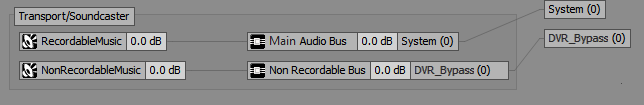

  

在 Wwise 支持的其他平台上均没有 DVR 功能，所以我们要做一些不同处理。在这种情况下，如果不希望游戏音乐缺失，您必须正确地将其输出。您仅需正确地将音频设备 Unlink（取消链接），即可解决该问题。In the main bus Property Editor, the Audio Device property can also be unlinked. 在下面的示例中，我们将 Non Recordable Bus 输出至普通系统输出。不过对于支持的平台，其仍会输出到 DVR\_Bypass。正因如此，Link（链接）图标才有一半是橙色的。这就是我们在 Integration Demo 工程中的处理方式。这种情况下，代码不需要调用 `AK::SoundEngine::AddOutput` 来初始化输出，因为系统输出总是在启动时初始化。

**图 8. 音频设备被设置为系统输出**


  

播放这两种声音时，我们看到两个音频源信号分别通过独立的总线，但是它们最终混合在同一个系统输出中。

**图 9. Two main busses mixing in device**


---

#### 理解 HDR

高动态范围音频（HDR 音频）是一种利用自然声音所跨越的大动态范围电平值来进行混音设计的技术。HDR 也是一个实时系统，可以将宽泛的电平范围动态地映射至更适合于您的声音系统数字输出的范围。

HDR 也是一个实时系统，可以将宽泛的电平范围动态地映射至更适合于您的声音系统数字输出的范围。HDR 系统的任务是把现实中的整个动态范围从约 190 dB 折叠或“压缩”到 96 dB（数字设备允许的动态范围），而且由于基底噪声的存在，这个范围实际会更低。

在 HDR 图像中，色调映射会独立应用至图像的不同区域，以增强各区域内的对比度。HDR 音频采用相同的工作方式；它进行声音电平映射，而非色调映射，并且在本地实时完成。因此，系统随时都会根据构成音频场景的声音电平来自动采用映射。

HDR 词汇表：

| **术语** | **定义** |
| --- | --- |
| **分贝** (dB) | 某声音电平与另一声音电平或任意基准值相比较的对数表示方法。处理振幅时，1 分贝等于 `20 * log10(A/AR)`。+20 dB 的差异表示该声音的振幅比参考声要大 10 倍。 |
| **满量程分贝** (dBFS) | 信号振幅与出现削波前设备可处理的最大振幅相比较的对数表示方法。0 dBFS 值是数字音频输出所能产生的最响的声音。16 位数字音频输出设备范围从 0 dBFS 下至 -96 dBFS。The level of the audio signal coming out of the Main Audio Bus in Wwise should therefore lie between these values. |

###### HDR 示例

在 HDR 音频中，您可以为游戏虚拟世界的声音指定音量值，这些声音涵盖的动态范围要远大于标准 96 dB 16 位输出设备，更像在真实世界的声音。HDR 系统的任务是将这些值转化为 dBFS，如下图所示。

**图 10. HDR 系统输入与输出**

|  |
| --- |
| HDR 系统输入与输出 |

  

输入是虚拟世界的声音电平，相对于任意参考值用分贝 (dB) 表示。这些值可以指定任意大小，因此具有高动态范围。而输出电平则是这些声音在 dBFS 中相应的电平。输出电平的范围视输出设备而异，动态范围通常要比输入低。

HDR 系统最简单的形式如下：系统在各个时刻会选择当前虚拟世界中被设置为最高音量的声音，将其自动映射至 0 dBFS 输出值，然后按比例映射其它所有声音。

让我们用一个例子来说明。假设在给定时刻（“时间 1”），虚拟世界中的声音 “blue（蓝）” 以 +30 dB 播放，如[图 11 “HDR 窗口”](ch34s08.html#hdr_window "图 11. HDR 窗口")中左侧所示。参考值（0 dB）为任意设定。因为“blue”是在时间 1 出现的最响的声音，所以它在 HDR 系统的输出端以 0 dBFS 播放。另一个声音“purple（紫）”在虚拟世界中以 0 dB 播放，即比声音“blue”低 30 dB。因此，它在 HDR 系统的输出端将以 -30 dBFS 播放。第三个声音“green（绿）”在虚拟世界中以 -66 dB 播放，因此在 HDR 系统的输出端为 -96 dBFS。由于系统的输出动态范围限制在 96 dB ，因此“green”的电平与响度声音的下界相对应。在时间 1，低于“green”电平的任何声音都无法听到。

在上例中，虚拟世界（输入端）的动态范围 [-66, +30] dB 称为 **HDR 窗口**。它由 [图 11 “HDR 窗口”](ch34s08.html#hdr_window "图 11. HDR 窗口") 左侧的蓝色区域表示。HDR 窗口具有固定宽度，该宽度由输出设备的动态范围决定。对于 16 位设备，最多为 96 dB，但实际上通常要小一些。在时间 1，+30 dB 的声音是虚拟世界中最响的声音，任何低于 -66 dB 的声音都会听不见，因为该声音低于 HDR 窗口下限。

假设之后在时间 2，另一个声音“orange（橙）”在虚拟世界中以 +50 dB 开始播放。为对应这个更响的声音，HDR 系统将窗口向上滑动 20 dB，因此该声音在输入端的范围现在为 [-44, +50] dB。所有声音随后被映射至新的电平值。+50 dB 的声音以 0 dBFS 播放，+30 dB 的声音以 -20 dBFS 播放，-66 dB 的声音现在低于该窗口下限，因此变得完全听不见了。当“orange”声音在时间 3 停止播放时，窗口会缓慢恢复为原始大小，其它声音也恢复之前的音量。

**图 11. HDR 窗口**

|  |
| --- |
| HDR 窗口 |

  

在左侧，声音电平以系统的输入来表示，分贝 (dB) 为任意参考值。HDR 窗口由蓝色区域表示。在时间 1，窗口顶部与当前最响的声音（蓝色）平齐。在时间 2，另一个声音（橙色）以 +50 dB 开始播放，窗口立即向上滑动以满足需求。之后 -66 dB 的声音（绿色）明显低于该窗口，因此将无法听到。系统输出得到的 dBFS 电平显示在右侧。当 HDR 窗口由于橙色声音向上滑动 +20 dB 时，其它声音的音量下降 -20 dB。在此期间，输出信号中将完全排除绿色声音。请注意，橙色声音在时间 1 期间的输出电平与蓝色声音相同。当橙色声音停止播放时，窗口会缓慢向下滑动，恢复至之前的电平，而其它声音的音量则相应增加。

HDR 系统的工作方式与动态范围限幅器/压缩器类似。当播放较响的声音时，较弱的声音会变得听不见，从而影响您的混音，当单独播放时这些声音就又能听见了。HDR 中声音之间的相对电平会保留，以产生更大动态范围的幻觉，但实际上它们会被压缩至输出设备的较低动态范围内。此外，由于在播放较响声音时系统会进行自动音量闪避，因此您的混音将变得更清晰，并重点更明确。下图对该原则进行了说明。

**图 12. HDR 概述，如系统输入端所见**

|  |
| --- |
| HDR 概述，如系统输入端所见 |

  

仅当播放较响的声音时窗口向上滑动当输入端窗口向上滑动时，输出端音量则会下降。当播放枪声时，之前响度的声音（如树叶声）变得完全听不到。系统输出端声音的实际音量取决于当前时刻声音与窗口顶部之间的距离。此时，如果单独播放，则枪声和爆炸声将以相同的电平从系统中输出，但由于爆炸声被认为要比枪声响并会有效降低枪声的音量，因此听者会留下爆炸声更响的印象。

---

#### 使用 HDR

在 Wwise 中，用户需要选择总线，以将其用作 HDR 电平与满量程（设备）音量之间的转换器。该 HDR 总线使用的输入电平是您在 Wwise 中设置的逻辑电平。因此，连线至 HDR 总线的声音可将其音量设置为远超过 0 dB。而唯一被考虑的因素是其在 HDR 窗口中的位置，该位置由 HDR 总线根据正在播放的内容动态放置。因此，HDR 总线通过提供与音频限幅器/压缩器类似的控制，起到了逻辑限幅器/压缩器的作用。它具有起止响应时间曲线（极小的启动时间、用户定义的释放时间）以控制 HDR 窗口如何及时滑动。它也拥有一个阈值，该阈值可被视为 HDR 窗口可以滑至的最低位置。

|  |  |
| --- | --- |
| [备注] | 备注 |
| 在过去的文献中，HDR 音频系统通常将输入端音量以声压级单位 (dB SPL) 来表达。dB SPL 以分贝为单位，其参考值 (0 dB SPL) 与人类的听觉阈值相对应。Wwise 中没有 SPL 的概念，因为它添加了不必要的复杂性、让界面凌乱，且不会让系统变得更为实用。输入端参考值为任意值，由您来对其进行定义。若要使用 dB SPL，则可将声音结构的音量直接设为正的 dB SPL 值。另一方面，Wwise 中的音量推子的默认范围最高仅为 +12 dB，因此更为实际的做法是选择另一个参考值，然后进行减法运算，为所需的 SPL 值找到对应的分贝值。例如，您可能决定将 100 dB SPL 作为 0 dB 参考值。则 80 dB SPL 声音的音量推子应该被置为 -20 dB，而 130 dB SPL 声音的音量推子应该被置为 +30 dB，以此类推。相应地，您还需要设置 HDR 总线阈值。 |

###### Enabling HDR

You can enable HDR on any bus except Auxiliary Busses and Main Audio Busses. If you
enable HDR on a bus, the HDR properties of that bus are also applied to its
children. Any changes you make to the HDR properties of the child bus are not
used.

The volume of all sound structures routed to an HDR bus, or to one of its
children, is affected by the HDR properties of that bus. All other sounds in your
project are not affected by HDR.

**为Audio Bus 启用 HDR 的方法如下:**

1. 打开与 Audio Bus（音频总线）对应的 Property Editor（属性编辑器）。
2. In the Property Editor, click the eye icon and then select **HDR**.

   The HDR category is not available if you have selected an Auxiliary Bus or a Main Audio
   Bus.

   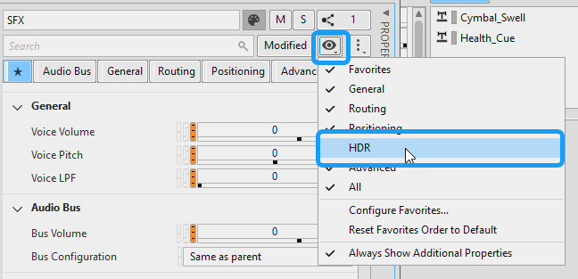

   The HDR category filter is displayed.

   |  |  |
   | --- | --- |
   | [备注] | 备注 |
   | If the HDR properties have yellow caution symbols, you are working with a child bus and the child HDR properties will not be used. The child inherits the parent HDR properties. |
3. Select the **HDR** category filter.
4. Select the **HDR** check box to enable HDR.

如上所述，HDR 窗口顶部的声音将以 0 dBFS 输出。使用 HDR 总线的总线音量推子按比例来缩小 HDR 系统的输出后，再将其与工程中的其它非 HDR 声音进行混音。

###### 将声音输出到 HDR 总线

To have objects in the Containers hierarchy use the HDR system, you must route the objects to an HDR bus.

**To route an object to an HDR bus:**

1. Inspect the object to show its content.
2. In the Property Editor, go to the Output bus group.
3. 选择 HDR 总线作为 **Output bus**。

###### 监控窗口

Voice Monitor 视图显示声部的音量及其包络（如果可见）。

**理解并调试 HDR 系统的方法如下：**

1. 打开 Voice Monitor 视图。
2. 将 HDR 总线拖入视图中。
3. 将 Mode 设置为 Bus input 或 Bus output。Bus input 模式以分贝来显示在进行 HDR 压缩前，HDR 总线输入端的声部电平；而 Bus output 模式则显示在 HDR 压缩和总线输出增益之后， HDR 总线的输出电平。本文档中的大部分图示都是 Voice Monitor 视图的“两端”的屏幕截图。

---

##### 设置 HDR 的动态

每条 HDR 总线均有独立的 HDR 窗口，其位置由当前最响声音的电平决定，而窗口宽度则由和工程的音量阈值决定。The behavior of the HDR window can be edited in the HDR category of each HDR bus. 由于 HDR 总线的作用与音频限幅器/压缩器类似，因此其控制参数也都相似。

- [“使用 HDR Threshold”一节](ch34s09s01s01.html "使用 HDR Threshold")
- [“使用 HDR 起止响应时间”一节](ch34s09s01s02.html "使用 HDR 起止响应时间")
- [“使用 HDR Ratio”一节](ch34s09s01s03.html "使用 HDR Ratio")

---

###### 使用 HDR Threshold

与典型的限幅器/压缩器的阈值类似，HDR 阈值定义了最小输入电平，超出该输入电平则可能导致 HDR 窗口滑动（参考 [图 12 “HDR 概述，如系统输入端所见”](ch34s08.html#hdr_overview_as_seen_on_input_side_of_system "图 12. HDR 概述，如系统输入端所见") 中的黄线），换言之，超出该电平后压缩器将会“启动”。仅播放较弱的声音时，这会直接影响输出时的电平：距离窗口顶部越远，这些声音的输出电平越低。当比阈值高的声音被播放时，较弱的声音会自动向下闪避。理解这一点很重要，即采用无限压缩率时（我们将在稍后讨论这一比率），任何两个输入电平高于该 HDR 阈值的声音在单独播放时都将以相同的输出音量播放，而不管其在 [图 13 “HDR 阈值的效果”](ch34s09s01s01.html#effect_of_hdr_threshold "图 13. HDR 阈值的效果") 中显示的输入音量是多少。

**图 13. HDR 阈值的效果**

|  |
| --- |
| HDR 阈值的效果 |

  

在上图中，左侧显示输入；右侧显示输出。第一次，声音设置为 -21 dB，阈值为 0 dB，以 -21 dBFS 输出。第二次，阈值为 -12 dB，声音以 -9 dBFS 输出。第三次，阈值为 -24 dB，声音高于阈值，因此促使窗口滑动并以 0 dBFS 输出。当声音以 0 dB 重播，输入音量高出阈值，将仍以 0 dBFS 输出。

---

###### 使用 HDR 起止响应时间

标准音频压缩器采用起止响应时间（启动/释放时间），用于定义压缩的时间特性。同样地，HDR 总线可以由用户控制释放时间和形状，由您定义 HDR 窗口如何恢复至较低值。[图 14 “HDR 释放：0、0.5 指数、0.5 线性、1 指数、1 线性”](ch34s09s01s02.html#hdr_release_0_0_5_exponential_0_5_linear_1_exponential_1_linear "图 14. HDR 释放：0、0.5 指数、0.5 线性、1 指数、1 线性") 显示了各种释放时间和模式。对其进行调整，以最小化副作用，如 pumping （突变声）。请注意，没有启动时间的控制器，因为 HDR 系统的启动必须是瞬间的，就像音频限幅器一样。

**图 14. HDR 释放：0、0.5 指数、0.5 线性、1 指数、1 线性**

|  |
| --- |
| HDR 释放：0、0.5 指数、0.5 线性、1 指数、1 线性 |

---

###### 使用 HDR Ratio

到目前为止，我们一直在用音频限幅器来比拟HDR 系统。HDR 窗口顶部严格等同于最响声音的电平，各个高于HDR 阈值的声音在单独播放时，都将以相同的输出电平播放，如 [图 13 “HDR 阈值的效果”](ch34s09s01s01.html#effect_of_hdr_threshold "图 13. HDR 阈值的效果") 中所示。如上所述，HDR 会增加各声音之间的主观动态范围，而这会使“绝对”动态范围（输出端能够呈现的动态范围）变得更小。通过将 HDR 限幅器转换为 HDR 压缩器，可以重新获得部分“绝对”动态范围。您可以使用有限的、更小的压缩比率来实现（默认情况下是无限的）。压缩比率定义了 HDR 窗口是否严格跟踪最响声音电平，它是关于声音电平与 HDR 阈值差值的函数。[图 15 “HDR 压缩比率的效果”](ch34s09s01s03.html#effect_of_hdr_ratio "图 15. HDR 压缩比率的效果") 说明该压缩比率带来的效果。请注意，采用非无限压缩比率时，较响的声音可能会超出 HDR 窗口，因此以高于 0 dBFS 的值从 HDR 系统输出。可以通过降低 HDR 总线或信号路径中其它下游总线的音量，给自己留出足够的动态余量。

**图 15. HDR 压缩比率的效果**

|  |
| --- |
| HDR 压缩比率的效果 |

  

声音的输入电平为 +24 dB（左侧面板），在 HDR 总线中分别以 100:1、4:1、2:1 的比率播放。右侧显示相应输出电平为 0 dBFS、+ 6 dBFS 和 +12 dBFS。另一个声音输入电平为 0 dB，它将以 -24 dB、-18 dB 和 -12 dB 向下闪避。比率为 2:1 时，阈值以上的能量只有一半用于向上推动 HDR 窗口，因此其它声音将以 -12 dB 闪避。请注意，两个声音自始至终保留 24 dB 的电平差。同时，在压缩比率较小时，声音可以超出窗口顶部，因此会高于 0 dBFS，您可以通过降低总线或其父总线的音量保留足够的动态余量。

---

##### 使用振幅包络

由于 HDR 系统采用 Wwise 设置的逻辑音量，因此它并不知道输入声音的实际振幅，因此会在整个声音的持续期间将其视为音量恒定的黑盒。在绝大部分时间，声音的振幅都不同。设想一下具有瞬态峰和衰减过程的撞击声。如果该声音足够响，可以导致 HDR 窗口的位置滑动，那么在整个声音持续期间窗口将很不自然地恒定保持在该位置。在 [图 16 “带衰减的撞击声的 HDR 窗口，无包络”](ch34s09s02.html#hdr_window_with_decaying_impact_sound_without_envelope "图 16. 带衰减的撞击声的 HDR 窗口，无包络") 中查看对窗口位置的影响。

在 Wwise 中，通过启用包络跟踪，可使 HDR 系统看到黑盒内的部分。In the HDR category of the desired sound's properties, check **Enable**: the amplitude envelope of the audio file is then analyzed and is attached to the sound's metadata. 在运行时，HDR 系统使用该数据相应地移动窗口，如 [图 17 “开启包络的带衰减的撞击声的 HDR 窗口，在较弱而稳定的背景音上播放。”](ch34s09s02.html#hdr_window_with_decaying_impact_sound_with_envelope_playing_above_softer_steady_background_sound "图 17. 开启包络的带衰减的撞击声的 HDR 窗口，在较弱而稳定的背景音上播放。") 中所示。

在下图中，输入位于左侧，输出位于右侧，相应的输出波形位于下方。

**图 16. 带衰减的撞击声的 HDR 窗口，无包络**

|  |
| --- |
| 带衰减的撞击声的 HDR 窗口，无包络 |

  

**图 17. 开启包络的带衰减的撞击声的 HDR 窗口，在较弱而稳定的背景音上播放。**

|  |
| --- |
| 开启包络的带衰减的撞击声的 HDR 窗口，在较弱而稳定的背景音上播放。 |

  

请注意上方第一张图中撞击声后有一段间歇，这是由 HDR 系统将其音量视为恒定所导致的。

###### Envelope Sensitivity 和手动编辑

启用包络后，可通过打开源编辑器（下图）来预览结果。若对所追踪包络控制点的精度或数量不满意，可调节 **Envelope Tracking**（包络追踪）分组中 Sensitivity（灵敏度）滑杆的值（参见[图 19 “Envelope Tracking in the Property Editor”](ch34s09s02.html#envelope_group_in_property_editor "图 19. Envelope Tracking in the Property Editor")）。You can work with a group of sounds by enabling the envelope and setting the sensitivity on a higher-level sound structure, a Property Container, for example. 请注意，灵敏度的效果根据原始音频数据而异，因此对于相似声音的变体，结果也有可能不同。另外，您也可以手动编辑各个声音的包络；设置 Sensitivity 控件以便获取接近所需结果的曲线，并移动、移除现有控制点或添加新的控制点。

|  |  |
| --- | --- |
| [备注] | 备注 |
| 只有将声音输出到启用了 HDR 的总线，所追踪包络控制点才会显示在波形上。 |

**图 18. 源编辑器中开启RMS 模式，并显示包络**

|  |
| --- |
| 源编辑器中开启RMS 模式，并显示包络 |

  

**图 19. Envelope Tracking in the Property Editor**

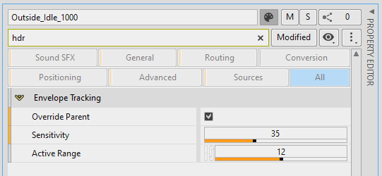

###### 相关区域：Active Range

在典型的情况下，具有较大电平差的声音（如 0 dB 至 -96 dB 范围内的撞击声）在其整个持续期间内不应全程驱动 HDR 窗口，而仅在有限时间段内驱动 HDR 窗口。这一基本原理基于以下悖论：HDR 是一种基于响度的优先级系统，但较响声音中稍弱的部分不应受到强调。例如：手雷声的衰减拖尾与瞬态峰相比重要性很低，因此不应掩盖霰弹枪声的瞬态峰，即使前者从绝对规模上讲更响亮。在本例中，手雷声的有效区域应限制在其第一个瞬态峰。它将使 HDR 窗口向上移动，因此其它声音会闪避。而一旦该声音进入尾部，比如低于峰值 12 dB时，我们通常不希望其它声音继续闪避，即使手雷的峰值音量减去 12 dB 但仍高于音频场景中其它声音的音量。在 HDR 图像中，将 HDR 窗口限制在有效区域内是一种优雅地融合各种“色调区域”的方法。

在 Wwise 中，定义有效区域的方法是以分贝为单位来指定从声音峰值开始的一定范围，即活跃范围。当声音的包络降至活跃范围以下时，该声音被认为在有效区域以外，HDR 系统将认为该声音不再能够驱动 HDR 窗口。[图 20 “活跃范围”](ch34s09s02.html#active_range "图 20. 活跃范围") 使用三种具有不同活跃范围的相似声音说明了这一点。

**图 20. 活跃范围**

|  |
| --- |
| 活跃范围 |

  

具有衰减过程的同一声音与稳定的背景声一起播放三次，活跃范围分别设置为 96 dB、12 dB 和 6 dB。当声音从其峰值降低相应分贝值时，窗口将停止跟随该声音，释放并恢复至空闲状态。窗口移动会明显影响背景声的电平。而窗口和活跃范围不会影响前景声本身。

---

##### HDR and envelopes

声音的包络只会影响其它声音，而永远不会影响其本身，了解这一点十分重要。这是项特点是 HDR 系统与音频压缩器的最大不同之处。在任何时刻，都会测量最响声音的峰值，但自身不会受其包络影响，这会让 HDR 系统的声音清晰可辨。因此在使用包络时，输入声音之间的电平差将不会被严格保留。这样做的好处是在声景中将各种“自身响度”不断变化的声音混合在一起，正如在之前章节中讨论的一样。但当 HDR 窗口大幅移动时，可能会发现声景有一些失真。在 HDR 图像中，当使用大量范围较小的色调区域时，也会出现类似情形。网络中可找到很多失真的 HDR 照片示例。因此我们建议您小心设置高于 HDR 阈值的电平：不要只是盲目地拉拽推子，而是要仔细设置电平和最响声音的包络，以便在混音时为它们留出空间。

避免启用空白包络，因为这需要占用额外的内存。包络对于较弱的声音并不起作用，因为它们永远不会高于 HDR 阈值，因此请确保禁用它们。

请注意在活跃范围值上下摆动的包络，这可能会导致意外行为。在下图中，一个长的爆炸声包络不断出入活跃范围，促使 HDR 窗口发生快速变动。这种情况下，您可能会需要将包络近似粗化，或手动进行编辑。您甚至可能会需要仅在声音的初始峰值期间压低其它声音，然后在后面的隆隆声期间更快速地恢复，从而对包络进行艺术处理并设计出不完全符合现实的包络。

含有较少点的简单的包络会减少声景中的不稳定振幅变化，通常更为可取。

**图 21. 编辑包络 (a)**

|  |
| --- |
| 编辑包络 (a) |

  

**图 22. 编辑包络 (b)**

|  |
| --- |
| 编辑包络 (b) |

  

**图 23. 编辑包络 (c)**

|  |
| --- |
| 编辑包络 (c) |

  

在 (a) 中，源编辑器中显示了爆炸声的包络。红色圈中的点低于活跃范围。播放过程中，包络进出有效区域，导致 HDR 窗口快速移动。输出结果中很明确地显示出背景声受到的严重影响。要修复这个问题，可通过在 (b) 中手动编辑包络，移除两个突出的点。请记住，编辑爆炸声包络只会影响 HDR 窗口，也即影响其它声音，但不会影响爆炸声本身。出于审美原因，设计师可能还会决定仅在爆炸的初始峰值期间压低其它声音，但通过编辑类似于 (c) 的包络，在接下来隆隆声衰减时更早地让其它声音恢复正常音量。有趣的是，三个示例中播放的是完全相同的爆炸声。

---

##### HDR 和 Wwise 声部管线

如上所述，HDR 系统使用 Wwise 设计工具中所设置的逻辑音量，并会忽略音频数据的实际振幅。HDR 系统逻辑将认为声音的电平等同于 HDR 总线输入端的电平，即以 Input bus 模式察看 HDR 总线时，在 Voice Monitor 中所看到的电平。These levels depend on the voice volumes, which are the sum of contributions from the Containers hierarchy, control busses of the Busses hierarchy, actions, RTPC and distance attenuation, as well as on gains of each mixing bus located upstream of the HDR bus in the signal flow. 当多个信号路径通往 HDR 总线，例如当使用辅助发送时，HDR 系统逻辑将使用这些路径中增益最大的一条。

在每个音频帧中，声音引擎将计算 HDR 总线输入端的所有声部音量。随后会执行 HDR 系统逻辑，它会根据 HDR 窗口的位置来计算全局 HDR 增益/衰减，并应用至各个声部。该步骤完成后，将按照正常流程处理声部：首先根据音量阈值对声部进行评估，决定是否为虚声部，然后处理数据并应用音量。

###### Make-Up Gain 和源归一化

HDR 系统的逻辑会忽略由 Wwise 中的两个音量属性：源归一化和补偿增益。这些音量控制独立于逻辑音量，主要用于归一化音频素材，您也可以在将音频导入至 Wwise 之前，在波形编辑器中执行这些操作。例如，您可以使用本地化补偿增益校正两种语言之间的音量差异，但 HDR 系统可以跨语言实现相同的表现。此外，具有可以绕过 HDR 逻辑的音量控制十分重要，源归一化和补偿增益便发挥着这一作用。

请注意，虚声部系统以及 Voice Monitor 计算也不考虑补偿增益和源归一化。但虚声部会将 HDR 信号衰减考虑在内。因此，当声部低于 HDR 窗口时会变为虚声部。

The make-up gain slider in the Property Editor can also be used with HDR for aesthetic purposes. 由于从 HDR 系统角度而言它是不起作用的，因此可将其视为 post-HDR 音量（就信号流而言），您可以通过它来绕过 HDR 窗口更改音量。通常，以高于 HDR 阈值的音量单独播放任何声音，通过系统后都是以同一电平输出。使用补偿增益，您可以有效地以更大音量进行播放。例如，您可能会需要第一人称射击游戏中玩家的枪声远大于其余枪声，这就可以通过 HDR 系统的动态混音功能实现。在这里，可使用补偿增益加强音量。

---

##### HDR 和 Distance Attenuation

可以按常规设计距离衰减曲线。但请注意，HDR 系统可能导致意外表现。当您播放高于 HDR 阈值并且是声景中最响的声音时，它会以 0 dBFS 从系统输出。如果该声音播放时距离为 50 米，但仍高于阈值并且仍为场景中最响的声音，那么它将仍然以 0 dBFS 从系统输出。因此会给人留下衰减曲线在近距离时未起作用的印象。但并非如此。在较近距离时，增加输入音量实际用于压低其它声音，而非增加输出音量。如果没有播放其它声音，则不会引起注意，但您应在为较响的声音设计衰减曲线时记住这点。

**图 24. 距离对较响声音的影响**

|  |
| --- |
| 距离对较响声音的影响 |

  

本例中，听者将稳步远离一个较响的声音（红色）。当较响声音保持高于 HDR 阈值，输入端（左侧）的音量看上去是正确的，输出（右侧）出现停滞，并未随着距离增加而减弱，这样便会留下距离衰减未起作用这一错误印象。而实际上，在距离较近时，超出阈值的音量偏移会影响其它声音（蓝色），而不是较响的声音。

---

##### 将 HDR Window 用作输入变量

The HDR window position can be monitored by looking at the window meter in the HDR category of a bus. 您也可以为它的值指派一个游戏参数。然后就可以通过 RTPC 将该游戏参数映射至任何对象的任何属性。例如，您可以使用窗口位置来改变声音实例的数量上限。

**将游戏参数关联至 HDR 窗口位置的方法如下：**

1. 选中 HDR 总线，在 Property Editor 中察看其内容。
2. In the **Window Top Output Game Parameter** group, browse
   for a Game Parameter.
3. 在 HDR 总线输入中设置游戏参数的范围（单位为分贝）。

You can now monitor the HDR window for that Game Parameter.

|  |  |
| --- | --- |
| [技巧] | 技巧 |
| You can also define a Switch Group that is connected to a Game Parameter used to monitor the Window Top. 有关详细信息，请参阅[“将 Game Parameter 值映射到 Switch”一节](ch17s02.html "将 Game Parameter 值映射到 Switch")。 |

For more information on the HDR window, see [“理解 HDR”一节](ch34s08.html "理解 HDR").

---

#### 对音频文件做转码

在将媒体文件导入 Wwise 中后，就可以针对不同的平台对媒体文件进行转码了。由于许多媒体文件可能使用相同的转码设置，因此您可以创建一系列转码设置 ShareSet，然后将这些 ShareSet 分配给工程中的各个对象。与工程层级结构中的其它属性一样，子项可从父项继承转码设置 ShareSet。当然，您可以在层级结构中的任何层级选择不沿用这些设置，以便对层级结构中的特定对象应用不同的转码设置 ShareSet。

虽然定义属性和行为的时候您无需对媒体文件做转码，但在生成 SoundBank 之前为各个对象指定转码设置 ShareSet 是个好主意，这样做可以充分利用这些自定义设置。如果您不为对象指定 ShareSet，Wwise 将使用默认的转码设置 ShareSet。有关默认转码设置 ShareSet 的详细信息，请参阅[“指定 Default Conversion Settings”一节](ch06s02s02.html#specifying_default_conversion_settings "指定 Default Conversion Settings")。

|  |  |
| --- | --- |
| [备注] | 备注 |
| Wwise 利用机器上多核 CPU 的所有处理核来加快转码过程。 |

与源相关联但未针对当前平台转码的声音对象在 Project Explorer 的 Audio 选项卡中显示为蓝色。

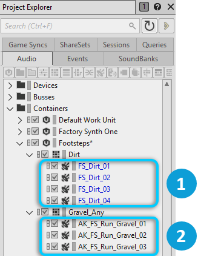

|  |  |
| --- | --- |
|  | 与已针对当前平台转码的声音对应的音频文件。 |
|  | 与未针对当前平台转码的声音对应的音频文件。 |

转码过程包括三步：

- [“Creating audio Conversion Settings ShareSets”一节](ch34s10s01.html "Creating audio Conversion Settings ShareSets")
- [“Assigning Conversion Settings ShareSets to objects”一节](ch34s10s03.html "Assigning Conversion Settings ShareSets to objects")
- [“对音频文件做转码”一节](ch34s10s04.html "对音频文件做转码")

---

##### Creating audio Conversion Settings ShareSets

您应当基于您项目和各个活跃平台的需求来创建用于管理转码设置的 ShareSet。。您在此处的许多选择都可能对音频工程的性能和品质产生重大影响。在对工程中的对象应用 ShareSets 后，您可以随时回来调整转码设置 ShareSet，以在平台和游戏的约束下取得最佳的品质。在您导入音频文件时，您还可以复用在此为多语言和源版本定义的 ShareSet 来加速这一过程。

您可以将其中一个 ShareSet 用作工程的默认转码设置。有关详细信息，请参阅[“指定 Default Conversion Settings”一节](ch06s02s02.html#specifying_default_conversion_settings "指定 Default Conversion Settings")。

Conversion Settings Editor 分为两大区域：

- **Setting**：Audio Source 上方的区域。在此区域中您可以针对每个平台设置转码设置，包括采样率、音频格式和声道数量。
- **Result**：此区域中列出您的所有音频源。在此区域中您可以比较原始源和转码源，包括声道数量、采样率和文件大小。

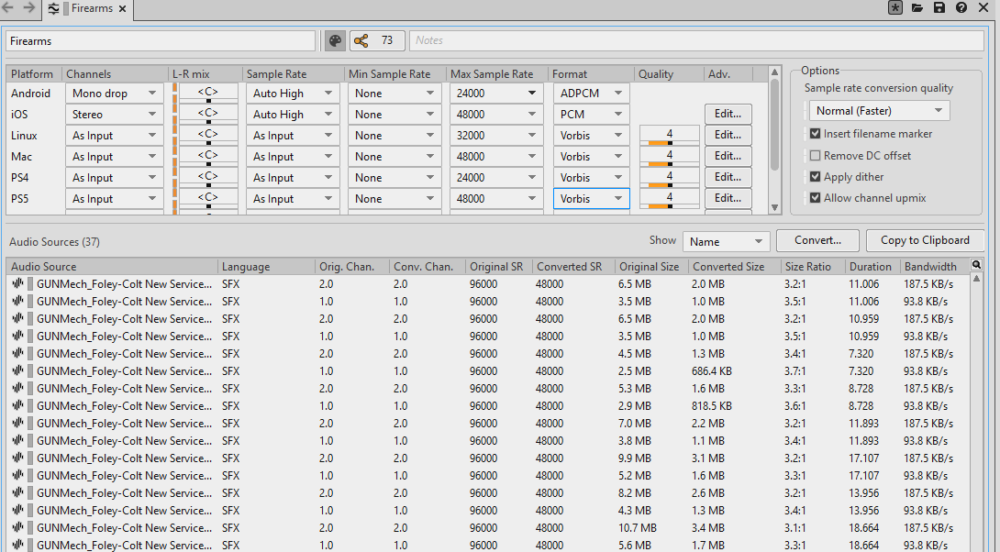

音频转码过程保留了原始文件中的相同音高和时长；不过您可以为您的转码定义以下属性：

- 声道数量（请参阅下文的 [“About audio channels”一节](ch34s10s01.html#about_audio_channels "About audio channels")。）
- 左右混音
- 采样率 （请参阅下文的 [“关于采样率”一节](ch34s10s01.html#about_sample_rates "关于采样率")。）
- 音频格式 （请参阅下文的 [“About audio formats”一节](ch34s10s01.html#about_audio_formats "About audio formats")。）
- 音频格式品质
- 采样率转码品质

您还可以指定您是否要：

- 为对口型或字幕**Insert a filename marker**（插入文件名标记）；
- [**Remove DC offset**](ch34s10s02.html "Removing DC offsets")（移除直流偏置）；

  |  |  |
  | --- | --- |
  | [注意] | 注意 |
  | 对于循环声音，建议保留 DC 偏置。移除机制采用高通滤波器。因此，其可能会以不同的方式修改循环的第一个和最后一个样本。在连续播放第一个和最后一个样本时，这样可能会导致信号中断进而产生可辨的咔哒声。 |
- **Apply dither**（应用抖动）；或者
- **Allow channel upmix**（允许声道上混），这意味着当声道被标为 **Stereo** 或 **Stereo drop** 时单声道源文件将转换成立体声。

  |  |  |
  | --- | --- |
  | [备注] | 备注 |
  | 如果未选择此选项，则无论 **Channel** 设置是什么，单声道源文件都将保留单声道。 |

###### About audio channels

在对多声道音频源进行转码时，必须决定要保留哪些声道。有关详细信息，请参阅[“Channel Configuration”一节](ch10s01s01.html#channel_configuration "Channel Configuration")。

您可以自由选择以下声道选项。不过，只有 ADPCM、WEM Opus、PCM 和 Vorbis 音频格式支持多声道文件的所有配置。在音频格式不支持所选声道选项时，Wwise 会将内容下混为下一个支持的配置。

| 声道选项 | 描述 | 备注 |
| --- | --- | --- |
| As Input | 保留与原始媒体文件相同的音频声道数量。 | 部分平台可能不支持某些音频格式，这时会将多声道文件下混为立体声文件。 |
| Mono | 所有声道全部混音为一个声道。 | L-R Mix 只用于从立体声到单声道的转换。其它声道配置根据[“下混行为”一节](ch34s12.html "下混行为")下混。  LFE 声道总是要丢弃。 |
| Mono drop | 除第一个声道外，丢弃所有声道。 | 根据原始文件的声道配置，第一个声道可以是左声道，也可以是中置声道。 |
| Stereo | 所有声道混音为左前和右前声道。 | L-R Mix 只用于从单声道到立体声的转换。其它声道配置根据[“下混行为”一节](ch34s12.html "下混行为")下混。  LFE 声道总是要丢弃。 |
| Stereo drop | 除定义为左声道或右声道外，丢弃所有其它声道。 | 如果没有定义左声道或右声道，但定义了中置声道（单声道），则会发生以下转换：  左 = 0.707C 右 = 0.707C  转码结果文件将是原始文件的两倍大。 |
| 5.1 | 强制转码为 5.1。 | 保留 Left、Right、Center、LFE、Surround Right 和 Surround Left 声道。  将标准高度声道（如有）下混到匹配的声道中。  若输入格式未包含全部所需声道，则最终输出将生成 5.1 内容，但不会在未提供内容的声道中填充任何声音。 |
| 5.1Drop | 弃用 Left、Right、Center、LFE、Surround Left 和 Surround Right 以外的所有声道。 |  |
| 7.1 | 强制转码为 7.1。 | 保留 Left、Right、Center、LFE、Surround Right、Surround Left、Back Left 和 Back Right 声道。  将标准高度声道（如有）下混到匹配的声道中。  若输入格式未包含全部所需声道，则最终输出将生成 7.1 内容，但不会在未提供内容的声道中填充任何声音。 |
| 7.1Drop | 弃用 Left、Right、Center、LFE、Surround Left、Surround Right、Back Left 和 Back Right 以外的所有声道。 |  |

注意，Wwise 不会实施任何多声道编码；它会直接将 LPCM 数据提供给采用立体声、5.1 或 7.1 环绕声配置的主机或系统。游戏机或系统一旦收到 LPCM 数据，就可以使用这些游戏机或系统支持的几乎任何格式输出这些数据，包括 Dolby、DTS 或 DPL2 格式。不过的确存在一些限制，包括：

- Android 和 iOS 平台仅支持立体声输出。
- Switch 平台仅支持立体声和 5.1 环绕声输出。
- Mac 和 tvOS 平台仅支持立体声及 5.1 和 7.1 环绕声输出。
- 其他平台（如 Windows、PlayStation 4、PlayStation 5、Xbox One 和 Xbox Series X）本身在输出端最高支持 7.1 声道。Wwise 可以支持所有标准声道配置（最高 13.1 声道）和匿名配置（最多 256 个声道）。注意，这些配置需要使用特殊的 sink 插件，这些插件可以解释这些配置或将它们传递到专用硬件。

###### 关于采样率

采样率决定数字音频信号每秒的采样次数。在决定选择什么采样率时，需要考虑许多因素。和其它品质/性能问题一样，设置采样率也是一项保持平衡的艺术。为了给您尽量多的控制，Wwise 为您提供了大量不同的采样率转码选项：

- **As Input** ―― 使用与原始音频文件相同的采样率对文件做转码。如果特定平台或音频格式不支持该采样率，则会改用最接近的可用采样率。
- **Auto (Low/Medium/High)** ―― 在对文件执行 FFT 分析后，使用 Wwise 选定的采样率对文件做转码。低、中、高品质设置之间的区别在于算法使用的截止阈值不同。You can tweak the quality level of each setting by defining their threshold values in the Project Settings dialog. 有关 Wwise 执行的自动采样率检测的详细信息，请参阅[“定义 Sample Rate Automatic Detection 设置”一节](ch06s02s02.html#defining_sample_rate_automatic_detection_settings "定义 Sample Rate Automatic Detection 设置")。
- **300 to 48,000** -- 300 至 48,000。使用特定采样率对文件做转码。各个平台的采样率范围各不相同，最高 48,000 Hz。

|  |  |
| --- | --- |
| [备注] | 备注 |
| 对于 **As Input** 和 **Auto**，您可以通过 **Min Sample Rate** 和 **Max Sample Rate** 分组框进一步限定采样率。 |

###### About audio formats

Wwise 支持以下音频格式。藉此，可更加灵活、可控地应对各个平台的限制：

- **[*[ADPCM](go01.html#glossary_adpcm "ADPCM (Adaptive Differential Pulse Code Modulation)")*](go01.html#glossary_adpcm)**  ―― 一种音频文件编码方法，可对声音信号和由对该声音信号做的预测之间的差异进行量化。ADPCM 量化步长是自适应的，与直接量化信号的 PCM 编码不同。基本上，ADPCM 以音质为代价，显著缩减了容量和 CPU 占用量。因此，它通常用于移动平台。
- **[*[WEM Opus](go01.html#glossary_opus "Opus")*](go01.html#glossary_opus)**  C 一个所有平台均支持的低延迟音频编解码器，针对语音和通用音频进行了优化。就压缩时的音质损失而言，WEM Opus 要优于其他编解码器。利用 Bitrate（比特率）设置可以平衡数据压缩效率和感知声音品质。比特率越大，声音品质越好。此版本为 Opus 规格的标准应用，只不过存储在专门的容器中，在从磁盘进行流播放时寻址和循环效率更高。WEM Opus 解码器需要大量前滚缓冲才能开始解码，所以可能会占用大量 CPU 和流播放资源。因此，它不适合需要大量寻址或循环的情况，比如复杂的互动音乐、精确到采样点的循环或按照指定触发速率播放的容器。不过，为了弥补这一缺点，部分平台上会实施硬件加速的解码。
- **[*[PCM](go01.html#glossary_pcm "PCM（脉冲编码调制）")*](go01.html#glossary_pcm)** - Linear pulse-code modulation encoding, which is also referred to as uncompressed digital audio. PCM offers the best quality and performance at the expense of storage size. By default Wwise converts audio to a bit depth of 16, but you can select a conversion option to preserve 24-bit material at full resolution.
- **[*[Vorbis](go01.html#glossary_vorbis "Vorbis")*](go01.html#glossary_vorbis)**  ―― 一种感知编码方法，支持以固定和可变比特率编码音频文件，同时保持极好的感知声音品质。通过使用 Quality Factor 设置或指定每声道的最大、最小和平均比特率来控制数据压缩效率和感知声音品质之间的平衡。Vorbis 编码器可能需要使用寻址表。有关详细信息，请参阅[“结合 Vorbis 编码器使用 Seek Table”一节](ch34s10s05.html#using_seek_tables_with_vorbis_encoder "结合 Vorbis 编码器使用 Seek Table")。

  Audiokinetic 的 Vorbis 专用版本针对所有平台进行了高度优化。

|  |  |
| --- | --- |
| [备注] | 备注 |
| 出于所有权方面的考虑，还有几种 Wwise 支持的平台专用音频格式在本页面中并未提到。授权用户可登录 Audiokinetic 官网并转到相应页面来查看这些格式的详细信息。 |

每种格式各有长短，您选择的格式取决于特定游戏的 CPU 和内存限制。有关何时使用哪种音频格式的进一步探讨，请参阅[“音频格式”一节](ch34s10s05.html#audio_formats "音频格式")。

###### About DC offsets

使用直流偏置滤波器是移除直流偏置的好办法，因为直流偏置可影响 Wwise 中的音量并产生副作用。不过，有的情况下不得移除直流偏置，例如精确到采样点的容器。在其它情况下，例如在声音归一化为 0 dB 的情况下，您可能需要消除直流偏置，也可能不需要。在转码过程中，默认移除直流偏置。You can, however, disable this setting if needed in the Conversion Settings dialog.

|  |  |
| --- | --- |
| [注意] | 注意 |
| 若直接从音频源生成振动效果，则移除 DC 偏置可能会更改控制器的振动输出。 |

**创建音频转码设置 ShareSet：**

1. 在 Project Explorer 中，切换到 ShareSets 选项卡。
2. 在 Conversion Settings 部分，选择您要创建新 ShareSet 的工作单元。
3. 在 Project Explorer 工具栏中，单击 **Conversion Settings** 图标 。

   选定的工作单元中创建一个新的转码设置 ShareSet。
4. 为 ShareSet 取一个恰当的名称，然后按 **Enter**。
5. 双击新建的 ShareSet 以将它加载到 Conversion Settings Editor 中。
6. 通过选择以下其中一个选项为各个平台指定声道：

   - **As Input** ―― 保留与原始媒体文件相同的音频声道数。
   - **Mono** ―― 将所有声道混音到一个单声道中。
   - **Mono drop** ―― 丢弃除第一个声道外的所有声道。
   - **Stereo ――** 将所有声道混音到左前和右前声道。
   - **Stereo drop** ―― 丢弃除左声道和右声道之外的所有声道。

   |  |  |
   | --- | --- |
   | [备注] | 备注 |
   | 1. 在默认情况下，声道设置跨所有平台链接。要为特定平台设定唯一的声道设置，首先取消链接属性，然后定义设置。 2. 如果您不想增加单声道文件的声道数，则确保禁用 **Allow channel upmix** 选项。 |
7. 如果您将立体声源转换为单声道或者相反，则可以使用 L-R Mix 设置来指定分配给左声道和右声道的信号功率电平。

   |  |  |
   | --- | --- |
   | [备注] | 备注 |
   | 在默认情况下，所有平台之间的 L-R Mix 设置是断开链接的。要为特定平台指定通用的 L-R Mix 设置，首先要链接属性，然后定义设置。 |
8. 在 Sample Rate 列表中选择转码期间每秒采样音频文件的频率。根据游戏的具体情形，您可以选择以下其中一个选项：

   - **As Input** ―― 使用与原始文件相同的采样率来对文件转码。如果特定平台或音频格式不支持该采样率，则会改用最接近的可用采样率。
   - **Auto (Low/Medium/High)** ―― 在对文件执行 FFT 分析后，使用 Wwise 所选的采样率对文件做转码。低、中、高品质设置之间的区别是截止阈值，该值可识别的频率可用于确定文件转码的最佳采样率。You can tweak the quality level of each setting by defining their threshold values in the Project Settings dialog. 有关 Wwise 执行的自动采样率检测的详细信息，请参阅[“定义 Sample Rate Automatic Detection 设置”一节](ch06s02s02.html#defining_sample_rate_automatic_detection_settings "定义 Sample Rate Automatic Detection 设置")。
   - **300 to 48,000** ―― 使用特定采样率对文件做转码。各个平台的采样率范围各不相同，最高 48,000 Hz。
9. 如果将 **Sample Rate** 设为 **As Input** 或 **Auto**，则使用 **Min Sample Rate** 和 **Max Sample Rate** 条目来限制转码采样率。
10. 在 Format（格式）列表中，选择转码所用的音频格式。

    |  |  |
    | --- | --- |
    | [备注] | 备注 |
    | 有些音频格式包含可修改的编码参数。在选用这些音频格式时，Adv. 列中会显示 **Edit** 按钮。单击 **Edit** 按钮可修改所选音频格式的编码参数。For a complete description of the encoding parameters for each audio format, click the Help button in the corresponding dialog. 有关为 Vorbis 音频格式选择参数的最佳做法，请参阅参考文档中的 Vorbis Encoder Parameter 页面。 |
11. 在 Sample rate conversion quality 列表中选择用于转码文件采样率的方法。您可以选择以下其中一种选项：

    - **Normal (Faster)** ―― 以高出 Best 选项三到六倍的速度进行高品质转码。
    - **High (Slower)** ―― 产生最高品质的转码。

    |  |  |
    | --- | --- |
    | [备注] | 备注 |
    | 如果您希望内容中包含高频分量并且您正在转码到低于 24 kHz 的采样率，则建议使用 High 选项。 |
12. 如果您想在各个转码结果文件的开头创建一个标记，则从 Insert Filename Marker 列表中选择 **Yes**。

    此标记只包含文件名，不包含文件的路径和扩展名。在您将动作绑定到声音引擎中播放的声音上时（例如对口型或制作字幕），让名称能看得见会非常有用。
13. 如果您不想在转码过程中移除直流偏置，则取消勾选 **Remove DC Offset** 复选框。

    在默认情况下此选项为勾选状态。在大多数情况下，应该选择移除所有直流偏置。但是在有些情况下，可能不需要消除直流偏置，这些情况包括：

    - 将添加到精确到采样点的容器的声音。
    - 归一化为 0 dB 的声音。

      有关直流偏置如何影响 Wwise 中的音频信号的详细信息，请参阅[“Removing DC offsets”一节](ch34s10s02.html "Removing DC offsets")。

    |  |  |
    | --- | --- |
    | [注意] | 注意 |
    | 如果您直接从音频源中生成振动，则应注意移除直流偏置将改变振动输出。 |
14. 如果您不想在比特率转码期间应用抖动，则应取消选择 **Apply Dither** 复选框。

    抖动是在量化之前添加到信号中的噪声，目的是减少量化过程导致的失真和噪声调制。只有在分辨率变化时（例如从 24 位变为 16 位）才应用抖动。
15. 关闭 Conversion Settings Editor。

    您指定的设置将自动保存，现在可将 ShareSet 指派到工程层级结构中的若干个对象上。
16. 根据工程中所需的转码设置 ShareSet 数量，重复执行步骤 1-14 若干次。

    |  |  |
    | --- | --- |
    | [备注] | 备注 |
    | 在填充 Audio Source 表格前，必须将转码设置 ShareSet 指派到对象，然后使用这些设置对音频文件转码。For more information on assigning a Conversion Settings ShareSet to an object, refer to [“Assigning Conversion Settings ShareSets to objects”一节](ch34s10s03.html "Assigning Conversion Settings ShareSets to objects"). |

---

##### Removing DC offsets

[*[DC offset](go01.html#glossary_dc_offset "DC Offset（直流偏置）")*](go01.html#glossary_dc_offset) 代表信号距离零振幅的百分比。DC 偏置可能会对声音造成不良影响，可选择将其移除。如果您要保留偏置，则应注意在 Wwise 中出现的一些不良影响：

- 具有直流偏置的归一化声音在音频处理期间会达不到最高音量，因为偏置会消耗[*[裕量空间](go01.html#glossary_headroom "Headroom（裕量空间）")*](go01.html#glossary_headroom)。此问题可能会蔓延到整体混音，因为对两个声音（一个带有直流偏置，另一个没有）进行混音将造成这两个声音均获得直流偏置。
- 应用了递归 DSP 算法的任何信号可能对带有直流偏置的音频文件非常敏感，这将造成副作用。[*[reverb](go01.html#glossary_reverb "Reverb")*](go01.html#glossary_reverb) 插件和环境效果插件尤其如此。

|  |  |
| --- | --- |
| [注意] | 注意 |
| 对于循环声音，我们建议不要消除直流偏置。消除机制采用高通滤波器，因此不保证将以相同方法修改循环的第一个采样和最后一个采样，因为并不知道这两个样本将连续播放。这可能产生信号中断，导致听到爆音。 |

为避免性能问题，Wwise 在运行时不做直流偏置的移除。因此，建议在将文件导入 Wwise 之前移除直流偏置。可使用直流偏置滤波器（大多数音频设计工具都提供）来做到，也可以在 Wwise 中的转码过程期间执行（位于 **Conversion Setting** 窗口）。

---

##### Assigning Conversion Settings ShareSets to objects

After you have created the Conversion Settings ShareSets for your project, you can start assigning them to the objects in your project hierarchy. Conversion settings ShareSets, like other object properties, are inherited from parent to child, which means that if you assign a Conversion Settings ShareSet to a Property Container, all containers and objects below it will automatically use the same ShareSet. 当然，您可以不沿用父对象使用的 ShareSet，以便对层级结构中的特定对象或源应用不同的转码设置。

在默认情况下，您创建的所有 Conversion Settings 初始都为 ShareSets。但是，您可以针对一个特定对象来调整 ShareSet。如果您不想在对象之间共享转码设置，则可以创建自定义转码设置。在使用自定义转码设置时，这些设置仅应用于当前对象。如果更改转码设置，则只有此对象将受到影响。

**将转码设置 ShareSet 指派到对象**

1. 将顶层对象加载到 Property Editor 中。

   |  |  |
   | --- | --- |
   | [备注] | 备注 |
   | 如果对象不是顶层对象，则在设置转码设置选项前必须选择 Override Parent 选项。 |
2. Switch to the Conversion category.
3. In the **Conversion Settings** group, click the browse
   button.

   A list of Conversion Settings ShareSets that are currently available in the project is displayed.
4. 在列表中选择您要应用到对象的 ShareSet。
5. 如果您要为对象采用自定义转码设置，则从 **Mode** 列表中选择 **Define custom**。

   这份 Conversion Settings 的名称后会跟有单词“Custom”（自定义）。从现在开始，您对实例所做的更改将仅影响使用它的一个对象。
6. 点击 **Edit** 按钮以将 ShareSet 或自定义转码设置加载到 Conversion Settings Editor 中，您可以在其中优化各种转码设置。
7. 在 Audio Source 表中，检查一下将应用这些转码设置的音频源列表以确保列表正确。

   要完成此表中的信息，必须对音频源做转码。有关转换音频源的详细信息，请参阅[“对音频文件做转码”一节](ch34s10s04.html "对音频文件做转码")。

---

##### 对音频文件做转码

After you have created your Conversion Settings ShareSets and applied them to the various objects in your project, you are ready to convert your audio files. 您可以决定是对层级结构中选定对象的文件还是对所有未转码的音频文件做转码。您还可以根据以下条件指定转码的范围：

- **Platform** ―― 工程中的当前或所有平台。
- **Language** ―― 当前语言或为工程创建的所有语言。这种转码只针对 sound voice（语音声）文件。
- **Sources** ―― Contents Editor 中正在使用的声音版本或声音（源）的所有版本。

对音频文件做转码是一个非常耗时的过程，特别是当工程中有成千上万的素材时尤其如此。为了帮助加速这一过程，Wwise 会自动使用多核机器中的所有处理核心。

To ensure your filenames meet requirements, see [“Understanding file length limitations and naming conventions”一节](ch03s02.html "Understanding file length limitations and naming conventions").

**为特定对象对音频文件做转码的方法是：**

1. To open the Audio File Conversion dialog, do one of the following:

   - In the Audio tab of the Project Explorer or Contents Editor, right-click the object you want to convert, and from the menu, select **Convert**.
   - 选择对象或音频源，然后在菜单栏中点击 **Edit > Convert**。
   - 在 SoundBank Editor 的 Edit 选项卡中，选择并右键点击若干个对象，然后从菜单中选择 **Convert**。
   - 在 Conversion Settings Editor 中，选择音频源表格中的若干个音频源，然后击 **Convert**。

   The Audio File Conversion dialog opens.
2. In the **Platforms** group select one or more of the listed platforms.
3. In the **Languages** group, select one of the following options:

   - **Current language（当前语言）**
   - **All languages（所有语言）**
4. In the **Sources** group, select one of the following options:

   - **In Use version（正在使用的版本）**
   - **All version（所有版本）**
5. 单击 **OK**（确定）。

   The Conversion - In Progress dialog opens. 第一个进度条显示音频源转码过程的总体进度。若干个次要进度条显示各个文件的转码进度。次要进度条的数量将取决于设备中的处理器内核数。

   When the file conversion is complete, the dialog closes.

   |  |  |
   | --- | --- |
   | [备注] | 备注 |
   | If Wwise encounters any issues while converting the audio source, it will display information about them in the Conversion Log at the bottom of the dialog. 您可以随时点击“Stop”来停止转码过程，以进一步调查这些错误消息。Conversion Log（转码日志）条目会同时显示在 Logs（日志）视图的 Conversion（转码）选项卡中。 |
6. 在 Conversion Settings Editor 中，您可以仔细阅读音频源表格中的信息，以确保各个转码源声道数正确，格式正确，采样率恰当，并且大小合理。

   |  |  |
   | --- | --- |
   | [备注] | 备注 |
   | 要查看不同平台的转码结果信息，只需从 Wwise 工具栏的 Platform Selector 列表中选择对应平台即可。 |

**对 Audio 选项卡中的所有音频文件做转码的方法是：**

1. 从 **Project** 菜单中，选择 **Convert All Audio Files**>（清除音频文件缓存）。

   The Audio File Conversion dialog opens.
2. In the **Platforms** group select one or more of the defined platforms.
3. In the **Languages** group, select one of the following options:

   - **Current language（当前语言）**
   - **All languages（所有语言）**
4. In the **Sources** group, select one of the following options:

   - **In Use version（正在使用的版本）**
   - **All version（所有版本）**
5. 单击 **OK**（确定）。

   The Conversion - In Progress dialog opens. 第一个进度条显示音频源转码过程的总体进度。若干个次要进度条显示各个文件的转码进度。次要进度条的数量将取决于设备中的处理器内核数。

   When the file conversion is complete, the dialog closes.

   |  |  |
   | --- | --- |
   | [备注] | 备注 |
   | If Wwise encounters any issues while converting the audio sources, it will display information about them in the conversion log at the bottom of the dialog. 您可以随时点击 **Stop** 来停止转码过程，进一步调查这些错误消息。 |

---

##### 转码技巧和窍门

您您最好仔细阅读以下章节，其中为您提供了一系列技巧和经验总结，在整个音频开发过程中它们可以帮助您更好地管理平台和语言版本。

###### 对多个文件做转码

您可一次性对多个音频文件做转码，方法是在层级结构中右键点击顶层对象（例如容器），然后从快捷菜单中选择 **Convert**。如果您想为整组对象设置转码设置，那么您可以右键点击顶级对象，然后从快捷菜单中选择 **Conversion Settings**。您还可以在 Project Explorer 中选择多个对象，然后定义它们的转码设置或者同时对它们做转码。

###### 转码设置的策略

游戏公司在开发游戏时，很多时候会审查各个平台，然后为各个性能指标（例如内存占用、CPU 和带宽）分配“预算”。预算的一部分将分配给音频团队，由他们高效地针对各个平台来管理这笔预算。不同平台拿到的预算也不相同，因此音频设计师需要理解如何利用各种转码设置来高效地针对这些差异做出补偿，并仍然能设计出优秀的声音。为了了解优化效果，您可以使用 Game Profiler 来监视游戏性能，并在预算范围内根据需要来调整转码设置。

###### 音频格式

在您的预算中还必须考虑到音频格式。审查 Wwise 支持的不同格式的特点非常有用，可以让您为项目做好合理的选择。一般规则是，文件压缩程度越小，则需要的运算资源越少；但是未经压缩的文件通常会占用更多的内存或磁盘空间。

下表为您提供了一些基本的建议和信息，帮助您决定如何编码音频文件。

| 文件格式 | 压缩率 （近似值） | CPU | 内存 | 常见用途示例 | 局限性 |
| --- | --- | --- | --- | --- | --- |
| PCM | 1:1 | 极低 | 高 | 声音需要高保真。 | 无。 |
| ADPCM | 4:1 | 低 | 中等 | 环境声和音效。 | 仅在 64 个采样点边界上循环。 |
| Vorbis | 3-40:1 | 中等到高 | 中等到极低 | 对白、音乐、环境声和音效。 | 元数据开销比其它格式稍大，因此应避免将它用于极小的声音（短于几十毫秒）。需要 Seek Table（文件定位表）进行跳转。 |
| WEM Opus | 10-60:1 | 高（不启用硬件加速）；极低（启用硬件加速） | 中等到极低 | 对白、简单音乐、环境声和音效。 | 功能限制因平台性能而异。有关详细信息，请参见下文“[“How platform capabilities influence WEM Opus limitations and trade-offs”一节](ch34s10s05.html#wem_opus_platform_tradeoffs "How platform capabilities influence WEM Opus limitations and trade-offs")”。 |

###### 结合 Vorbis 编码器使用 Seek Table

Vorbis 编码器的 **Seek table granularity (sample frames)**（寻址表粒度，单位为采样帧）默认设为 16384。虽然并非总会用到寻址表，不过在以下情况下必须使用：

- 结合虚声部“From Elapsed Time”设置使用 Vorbis 编码器时。
- 对互动音乐文件使用 Vorbis 编码器时，特别是当声音引擎必须从除开头之外的位置开始读取文件时。
- 为 Vorbis 编码器使用 Seek Action（寻址动作）时。

要为一系列 Vorbis 编码文件启用 Seek Table，执行以下操作：

- 在 **Conversion Setting** 对话框中，点击正在使用 Vorbis 编码器的平台所对应的 **Edit**。
- 在 **Vorbis Encoder Parameter** 对话框中，通过从 **Seek table granularity** 表中选择一个数字来指定粒度。

Seek Table 粒度越小，需要的内存越多。如果粒度太大，精确到采样点的跳转寻址（互动音乐或 Seek 动作）可能导致 CPU 峰值；如果大于磁盘流播放的粒度，则会造成 I/O 利用率低下。根据经验，所选寻址表大小一般应小于或等于磁盘流播放粒度（即初始化过程中 [`AkDeviceSettings::uGranularity`](https://www.audiokinetic.com/library/?source=SDK&id=struct_ak_device_settings_abd4879bfd150b9a2f898102e3815dbe2.html) 使用的值）。

|  |  |
| --- | --- |
| [备注] | 备注 |
| 若文件太小或与 Seek table granularity 大小相差无几，则寻址可能会失败。在这种情况下，请减小 Seek table granularity。 |

###### How platform capabilities influence WEM Opus limitations and trade-offs

WEM Opus 这种格式的解码行为尤其依赖于平台的性能。确切地说，WEM Opus 会尝试在支持的平台上启用硬件加速。因此，其功能限制和整体效能与目标平台有很大的关系。

在大部分平台上，WEM Opus 通过 CPU 进行解码。在这种情况下，为了获得更高的压缩效率，其要占用比 Vorbis 更多的 CPU 资源。

在目标平台支持 Opus 硬件加速时，这种功能限制便不复存在了：即使是在寻址的时候，也只会占用很少的 CPU。对于这些平台，Wwise 声音引擎会提供相应的选项，以便在初始化过程中启用或禁用低延迟硬件解码。

- 在禁用低延迟解码时，WEM Opus 播放可能会延迟一个音频帧（默认设置通常为 10.6 ms）。寻址操作也会产生类似的延迟。
- 在启用低延迟解码时，WEM Opus 便不会产生上述的额外延迟。不过最好不要同时播放太多采用 WEM Opus 编码的声音，否则容易出现声部匮乏问题。这是因为声音引擎必须等到平台硬件完成解码才能一并对不同的声音进行混音。

注意，此选项为全局设置，也就是说无法针对某个声音单独启用或禁用。所以，必须依据工程的具体用例来谨慎地权衡利弊。

为此，请参阅目标平台的特定 SDK 文档页面，来了解其是否支持 Opus 硬件加速，以及如何启用或禁用低延迟解码。

---

#### 完成终混

在工程中设置总线结构后，就可以对游戏中声音，音乐和振动的混音进行精确调整和故障排查。您可以通过 Wwise 中的两个主要工具对游戏音频进行混音：

- The [Busses Console](ch34s11s03.html "Getting to know the Busses Console") - A mixing console that groups a variety of bus properties into one view.
- [Mixing Desk](ch34s11s04.html "了解 Mixing Desk") - 调音台，使用灵活、功能强大的调音台，将各种总线和对象属性集中到一个视图中。

这两种视图都可用于对游戏进行实时音频终混。不过，Mixing Desk 可实现更加精确的控制。因为其提供了更多可供编辑的属性，并且对象或总线可包含在同一 Mixing Session 中。

|  |  |
| --- | --- |
| [技巧] | 技巧 |
| 为正确调节 Mixing Session 的最终输出，有必要了解一下 Wwise 下混方法。有关详细信息，请参阅[“下混行为”一节](ch34s12.html "下混行为")。 |

**相关主题**

- [Wwise Fundamentals Module 16: Configuring a Mixing Desk](https://www.audiokinetic.com/en/courses/wwise101/?source=wwise101&id=configuring_mixing_desk)

---

##### 了解总线图标和处理状态

总线图标代表 Wwise 所判定的总线处理状态。下表简要阐述了用来判定总线处理状态的标准。一般会将总线视为 Not Mixing 状态，除非无法延迟其所要执行的处理。这是因为 Not Mixing 状态的总线会直接将属性传递给输入而不执行任何处理，相应地在 CPU 和内存使用方面更为高效一些。

| 图标 | 处理状态 | 描述 |
| --- | --- | --- |
| (Audio Bus)    (Auxiliary Bus) | Mixing | Wwise 可将该处理状态应用于 Audio Bus 和 Auxiliary Bus。对于 Mixing 状态的总线，会将其属性传递给发送到总线和子总线的对象。在这种情况下，将对总线上定义的所有效果器进行处理，最终采用基于声道的格式予以输出。  在满足以下条件时将总线视为 Mixing 状态：  - 该总线采用了基于声道的配置（针对顶层总线显式设定或经由 Audio Device 解析）  或 - 其总线配置为 **Same as parent**（与父级相同），且父对象采用了基于声道的配置  同时，满足以下任一条件：  - 该总线为 Auxiliary Bus   - 该总线为 HDR Bus   - 该总线至少应用了一个插入型效果器   - 该总线启用了 Positioning   - It has an RTPC on the Bus Volume or on the     Output Bus's Volume, LPF, HPF, or DSF.  |  |  | | --- | --- | | [注意] | 注意 | | 在将声音发送到 Mixing 状态的总线时，会忽略与该声音关联的元数据或将其用在基于声道的混音中。此元数据既无法恢复也不能再用于 Audio Object 处理器或终端。 | |
| (Audio Bus)    (Auxiliary Bus) | Processing Audio Objects | Wwise 可将该处理状态应用于 Audio Bus 和 Auxiliary Bus。此类总线的所有属性都会传递给发送到总线和子总线的对象。在这种情况下，将对总线上定义的所有效果器进行处理，最终作为 Audio Object 予以输出。  在满足以下条件时将总线视为 Processing Audio Objects 状态：  - （针对顶层总线显式设定或经由 Audio Device 解析）  或 - 其总线配置为 **Same as parent**，且父对象采用了 Audio Objects 总线配置  同时，满足以下任一条件：  - 该总线为 Auxiliary Bus   - 该总线为 HDR Bus   - 该总线至少应用了一个插入型效果器   - 该总线启用了 Positioning   - It has an RTPC on the Bus Volume or on the     Output Bus's Volume, LPF, HPF, or DSF.  有关更多详细信息，请参阅 [“了解基于对象的音频”一节](ch12s03.html "了解基于对象的音频") 章节。 |
| (Audio Bus) | Not Mixing | Wwise 可将该处理状态应用于 Audio Bus。对于 Not Mixing 状态的总线，会将其属性传递给发送到总线和子总线的对象，但不会实施任何处理，也不会修改对象及子对象的格式。在这种情况下，将在声部层级把 Not Mixing 状态的总线上设定的所有属性应用于所发送的对象。  在满足以下条件时将总线视为 Not Mixing 状态：  - 其总线配置设为了 **Same as Parent**。 - 该总线未使用前面所列任何促使其对音频对象实施混音或处理的功能。 |
| (Audio Bus)    (Auxiliary Bus) | Processing | Wwise 可将该处理状态应用于 Audio Bus 和 Auxiliary Bus。在 Wwise 声音引擎连接到终端并接收有关支持格式的信息时，将把该总线的处理状态解析为 Mixing 或 Processing Audio Objects。  在满足以下条件时将总线视为 Processing 状态：  - 其总线配置设为了 **Same as Parent**，且其所有父对象的总线配置同样为 **Same as Parent**。 - 该总线使用了前面所列促使其对音频对象实施混音或处理的功能。  |  |  | | --- | --- | | [备注] | 备注 | | When profiling in Wwise, the resolved status will be displayed in the Property Editor, but not in the Project Explorer. | |

###### 处理状态对性能分析器视图的影响

以下位置不显示 Not Mixing 状态的总线：

- Advanced Profiler 内的 Busses 选项卡
- Advanced Profiler 内的 Voices Graph 选项卡
- Audio Object Profiler

这些位置只会显示 Mixing（正在混音）、Processing Audio Objects（正在处理音频对象）或 Processing（正在处理）状态的总线。具体可参见下图。我们可以看到，Advanced Profiler（高级性能分析器）内的 Busses（总线）选项卡中并未显示 Environmental 和 Environments 总线，而只显示了其子级 Auxiliary Bus：env\_corridor 和 env\_small\_room。这是因为 Environmental 和 Environments 为 Not Mixing（未在混音）状态的总线，而其子级总线为 Processing 状态的总线。

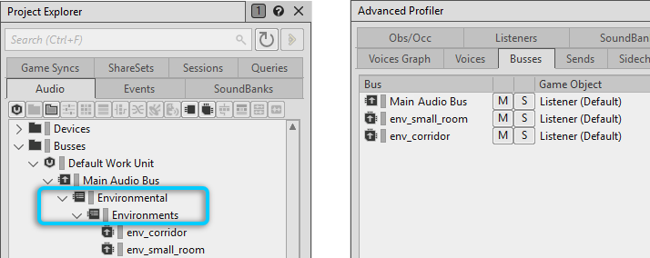

###### 处理状态对电平表的影响

For a non-mixing bus, the meter is not available in the Audio Bus tab of the Secondary Editor. 该位置会显示相应的消息（如下图所示）。对于 Mixing、Processing Audio Objects 或 Processing 状态的总线，此处会显示电平表。

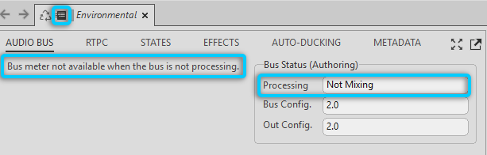

---

##### 监控信号电平

在 Wwise 内，可通过不同的方式测量信号。比如响度级。

###### 响度概览

ITU-R BS.1770 和 EBU R128 标准为测量特定音频工程的响度级和响度范围建议和规范，单位是 loudness unit（LU 或 LUFS）。它还为 True Peak （真实峰值）电平提供了规范和建议。Wwise 的 Loudness Meter 视图和 Meter 视图采用了上述规范和建议。

###### 测量方法

Wwise 提供不同的 PCM 信号测量方法：

| 测量方法 | 描述 |
| --- | --- |
| 响度级 | 测量数字信号感知响度的方法。响度级可以使用不同的时间窗口大小来计算。  响度级可以在 **Loudness Meter** 视图中找到。  单位：LUFS 或 LU |
| 响度范围 | 对一段时间内响度值的统计分析，是动态范围的单位。  响度范围可以在 **Loudness Meter** 视图中找到。  单位：LU |
| True-Peak 电平 | 真实峰值电平。对模拟世界中最大持续信号电平的估算。它非常实用，可确保数模转换器或外部编解码器不会出现削波失真。  真实峰值电平可以在 **Meter** 视图中找到。  单位：dBTP |
| 峰值电平 | 测量极短的时间段内 PCM 信号的最大或最小值。  Wwise 在以下位置显示峰值：  - Wwise Toolbar - Busses Console - Mixing Desk - Meter view  单位：dBFS |
| Root mean square (RMS) | 均方根。RMS 电平以峰值表值测量，并取极短时间段内的平均值。  RMS 电平可以在 **Meter** 视图中找到。  单位：dBFS |

###### Loudness Unit

EBU R128 和 ITU-R BS.1770 规定了响度的测量单位。响度不是以 dBFS 度量的。

| 单位 | 描述 |
| --- | --- |
| Loudness Unit (LU) | 响度单位。0 LU 等于参考电平（默认为 -23 LUFS）。  请注意：可在 **Loudness Meter** 设置中更改该默认值 23 LUFS。 |
| Loudness Unit Full Scale (LUFS) | 满量程响度单位。0 LUFS/LKFS is equal to 0 dBFs @ 1 kHz according to ITU-R BS.1770-4 and EBU R128 |
| LKFS | K加权满量程响度单位。LKFS 与 LUFS 相同。  ITU-R BS.1770-4 使用术语 LKFS。  EBU R128 使用 LUFS。 |

###### 响度测量范围

可使用三种不同的时间范围测量响度。在 Integrated （积分）模式中，可以在较长的时间段内测量游戏的响度级。

| 术语 | 描述 |
| --- | --- |
| Momentary | 瞬时。使用长度为 0.4 秒的滑动矩形时间窗计算响度电平。测量不使用门限（not gated）。 |
| Short-term | 短时。使用长度为 3 秒的滑动矩形时间窗计算响度电平。测量不使用门限（not gated）。 |
| Integrated | 使用用户捕获的数来据计算响度级。积分响度使用门限（忽略所有 -70 LUFS 以下的值），并依据瞬时响度进行长期测量（在整个测量期间持续积分）。单击 **Measure**（测量）按钮时开始测量，再次单击该按钮即停止测量。若要重新开始测量，请单击 **Reset**（重置）按钮。 |

EBU R128 建议积分响度使用 -23 LUFS 的目标电平。针对游戏选择 -23 LUFS 作为目标响度级有助于在游戏玩家使用的输出设备（电视、移动设备等）上获得与其它媒体更为一致输出电平。为整个游戏选择特定目标响度级还可以确保在游戏的不同层级或不同部分，声音的响度都一致。由于游戏内容是动态的，基于 -23.0 LUFS 的目标电平实现精确的归一化几乎不可能实现，因此 ±1.0 LU 的偏差是可以接受的。游戏特定段落的响度级通常是不可预测的。当某些段落仅包含背景元素时（例如背景音乐），或某些段落故意降低声音音量时，响度级可能超出公差。

Sony Worldwide Studios Audio Standards Working Group (ASWG) 在 ASWG-R001 中提出以下建议：

- 面向家用平台所开发的游戏内音频内容，平均响度级应归一化至 -23 LUFS 目标电平，公差为 ±2 LU，考虑到交互式娱乐音频内容的非线性本质，该公差是可以接受的。
- 面向便携式平台所开发的游戏内音频内容，平均响度级应归一化至 -18 LUFS 目标电平，公差为 ±2 LU。
- 音频内容应作为一个整体进行测量，而不应单独针对语音、音效或音乐。
- 音频内容应根据实际尽可能长时间地进行测量，最短为 30 分钟，所测量的游戏段落应具有代表性，应根据游戏玩法涵盖游戏的所有不同部分；

###### 更多有关 Loudness Range (LRA) 的信息

根据游戏类型、目标听众和体验环境不同，推荐的最大 LRA 也不同。最大 LRA 值也可能根据发布平台而异，如移动游戏。这里是根据聆听环境采用不同响度范围的示例：

| 环境 | LRA |
| --- | --- |
| 家庭影院 | 20 |
| 客厅 | 18 |
| 厨房 | 15 |
| 客厅（深夜） | 9 |
| 公共交通（手机） | 6 |

通则：

- 嘈杂的环境要求 LRA 较低，以便听者可正确听到所有内容。
- 较响的扬声器可以使用较大的 LRA

使用响度范围还有助于决定是否需要进行动态压缩。

EBU 提出，通过响度范围测量，可以选择恰当的方式进一步对工程进行动态压缩，以适应听众或发布平台的动态范围公差窗口。实际上，柔和的整体压缩可能会带来令人满意的结果，并可确保对信号的整体动态范围执行统一压缩：

- 低阈值 (< -40 dBFS)
- 中等压缩比 (1:1.2 C 1:1.5)
- 长释放时间 (>1 s)

EBU 还提出，根据原始响度级大小，可以同时通过调节压缩器的补偿增益，以达到 -23 LUFS 目标电平。

###### 真实峰值的详细信

真实峰值测量可检测模拟削波失真。甚至当波峰位于相邻样本之间时，也可预测并避免在后面的数模转换器、采样率转换器，或常用编解码器中出现的失真。

EBU R 128 中推荐的 Maximum Permitted True Peak Level（最大允许真实峰值）为 -1 dBTP。

**To monitor the true peak on the Main Audio Bus:**

1. 使用菜单 **Views > Meter > Meter - Instance A...D**（视图 > 电平表 > 电平表 - 实例 A...D）打开四个 Meter 视图之一。
2. Click […] and select the **Main Audio Bus**.
3. 从列表中，选择 **True Peak** 以监视真实峰值。

###### 在 Wwise 中测量响度

**To monitor the integrated loudness on the Main Audio Bus:**

1. 使用菜单 **Views > Loudness Meter > Loudness Meter - Instance A...D**（视图 > 响度电平表 > 响度电平表 - 实例 A...D）打开四个 Loudness Meter 视图之一。
2. Click […] and select the **Main Audio Bus.**
3. 单击 **Measure**（测量），开始计算积分响度。

**捕获瞬时或短时响度级：**

1. 打开  **Loudness Meter** 视图。
2. 在视图的标题栏中，通过电平表实例选择图标 (A ~ D) 选择响度电平表实例。
3. 点击 [...] 选择一条总线来测量响度。
4. 在 Wwise 工具栏上，单击 **Capture**（捕获）。

---

##### Getting to know the Busses Console

The Busses Console is a mixing console that groups a variety of bus properties into one view so that you can create the final mix of your game audio. 连接至游戏时，您可以一边试听，一边在游戏音频实时播放过程中调节音频和振动的属性。。

您也可以监视与连线至各总线的对象相关的信息，其中包括：

- **Meter** - 显示所有声道的峰值电平。
- **Duck** - 表示总线正在闪避。
- **BG** - 表示总线已绑定背景音乐选项。
- **Bypass** - 表示为该总线选择了 Bypass All 选项。
- **Effect** - 表示该总线应用了效果插件，或一系列效果插件。


###### Fine-tuning your mix using the Busses Console

工程中的总线连线完成后，您就可以进行终混，方法是连接至游戏，并在游戏过程中实时微调相关属性。You can use the Busses Console to easily modify the relative properties of each bus in your project. 属性是累积的，这意味着您定义的这些值会与对象属性值相加。

微调混音时，可以静音或单独播放若干条总线，以便专注于游戏声音或振动的某个特定方面，或者排查特定问题。

|  |  |
| --- | --- |
| [备注] | 备注 |
| 更改总线音高不会影响路由至该总线的音乐对象。 |

**To create the final mix using the Busses Console:**

1. 点击工具栏中的 **Remote** 按钮，连接至游戏。

   这时会打开 Remote Connection（远程连接）对话框并列出网络中当前在运行游戏的机器。
2. 从该列表中，选择要连接的设备。

   |  |  |
   | --- | --- |
   | [备注] | 备注 |
   | 设备的状态须显示为“Ready”（就绪），才能连接该设备。 |
3. 点击 **Connect**（连接）。

   Wwise 将连接至远程游戏设备。游戏设备的名称显示在工具栏中。
4. From the menu bar, click **View > Busses Console**.

   The **Busses Console** is displayed.
5. 游戏运行过程中可以试听音频或振动。
6. 可以通过输入数值或拖动相应滑杆来调整以下属性：

   **Volume** - 输出信号的电平或振幅。

   **Pitch** - 输出信号的播放速度。

   |  |  |
   | --- | --- |
   | [技巧] | 技巧 |
   | 要静音或单独播放特定总线，请点击相应的 **M** 或 **S** 按钮。 |

---

##### 了解 Mixing Desk

Mixing Desk 是一个灵活强大的调音台，它能把各种各样的属性放到同一个视图中，以供实时细调游戏的混音。用户可以在 Mixing Desk 中添加任意对象或总线，然后定义总线连线、应用效果器和衰减共享集、编辑状态属性，并修改各个独立对象和总线的各种属性。

|  |  |
| --- | --- |
| [技巧] | 技巧 |
| 在 Wwise 中，默认情况下您可以按 **F8** 来切换到 Mixer 布局。 |

如果您启动捕获会话，则还可在 Mixing Desk 中查看各个对象的活动，包括某声部何时播放、是否闪避总线以及是否旁通了效果器。各个音频对象还可静音或者独奏，便于单独调节混音通路中的对象。

Mixing Desk 基本上就是一个网格，每列是一个混音器工具栏，每行对应于 Wwise 中的一组常用属性。每个混音器工具栏绑定至一个对象，对象的名称显示在各个工具栏的顶部和底部。

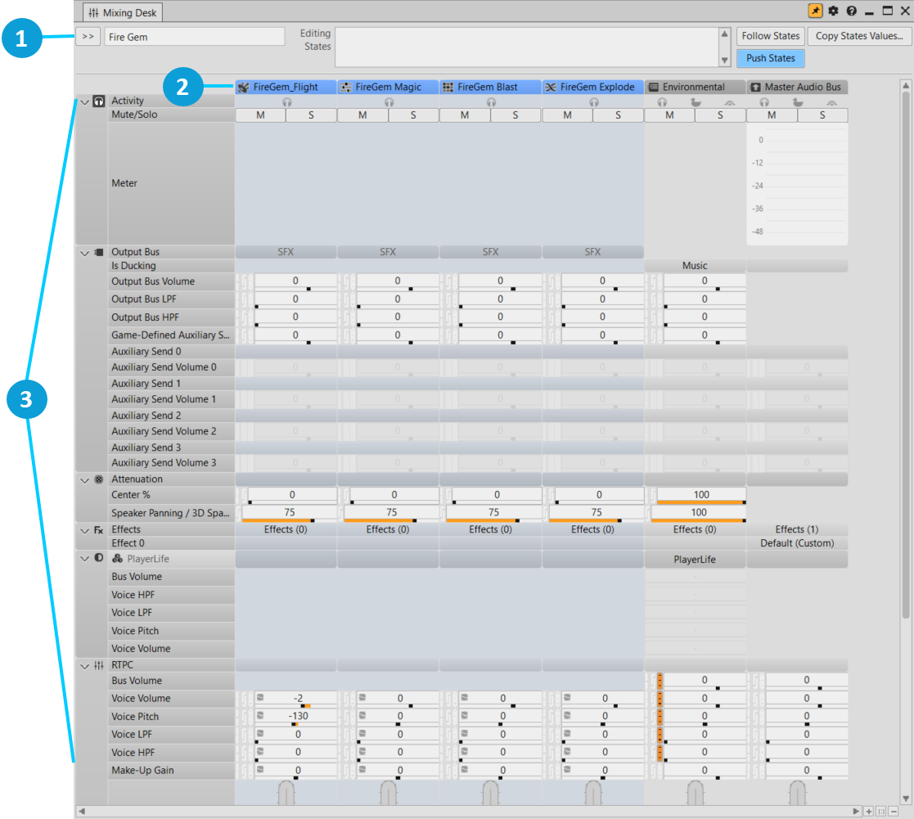

For more information about the Mixing Desk, see [Mixing Desk and Mixing Sessions](https://www.audiokinetic.com/library/edge/?source=Help&id=master_mixer_mixing_desk).

|  |  |
| --- | --- |
|  | Select or create a Mixing Desk. |
|  | Property sets. |
|  | Mixer strips. |

通道条中的各个属性设置都有一个快捷菜单。这些菜单包含与所选属性相关的一组命令。例如，当右键点击 Effect（效果器）插槽（0-3）时，就可以编辑插入效果器的各种属性，可以设置一个新的效果器，或者旁通当前效果器等等。为了访问快捷菜单，只需要在调音台通道条上用右键点击各个属性设置。

Mixing Desk 内的所有元素都会被保存在一个 Mixing Session 中。这样就可以为游戏的不同元素创建不同的 Mixing Session 了。而且，还可设置 Mixing Session 并在稍后继续对游戏的音频混音进行微调。

---

##### 建立 Mixing Session

在使用 Mixing Desk（混音台）对游戏音频的混音进行微调前，需要创建 Mixing Session（混音会话）并为其添加总线或对象。Mixing Session 跟 Preset（预设）或 SoundCaster 会话类似，其也会将 Mixing Desk 的内容存储到工程中以便日后使用。每个 Mixing Session 都会保存在 Project Explorer（工程资源管理器）的 Sessions（会话）选项卡中的对应 Work Unit（工作单元）下。

为便于轻松识别界面中的 Mixing Session，Wwise 使用了独特的图标来予以表示。

| 图标 | 代表 |
| --- | --- |
| |  | | --- | |  | | Mixing Session（混音会话） |

###### 创建 Mixing Session

在使用 Mixing Desk 前，需要创建 Mixing Session。Mixing Session 包含一系列总线和对象并以调音台的形式予以呈现。Mixing Session 中的每条总线和每个对象都会显示一组滑杆和属性值控件以便对游戏的音频混音进行微调。

您可以在 Wwise 中的以下位置创建 Mixing Session：

- Project Explorer 的 Sessions 选项卡。
- 在 Mixing Desk 内。

**通过 Project Explorer 创建 Mixing Session：**

1. 在 Project Explorer 中，切换至 Sessions 选项卡。
2. 在 Mixing Sessions 标题下方，执行以下任一操作：

   选择工作单元或虚拟文件夹，然后在 Project Explorer 工具栏中点击 **Mixing Session** 图标。

   右键点击工作单元或虚拟文件夹，然后在快捷菜单中点击 **New Child** > **Mixing Session**。

   新建的 Mixing Session 将被添加到 Virtual Folder（虚文件夹）或 Work Unit（工作单元）。
3. 将默认名称替换为最能代表 Mixing Session 的名称。
4. 双击新建的 Mixing Session 来将其加载到 Mixing Desk 中。

   接下来，就可以为 Mixing Session 添加总线和对象了。

**通过 Mixing Desk 创建新的 Mixing Session：**

1. 在 Mixing Desk 中，点击 Mixing Session Selector 按钮 (**>>**)，然后从列表中选择 **New**。

   这时会打开 New Mixing Session（新建混音会话）对话框。
2. 选择要在其中新建 Mixing Session 的 Work Unit。
3. 在 Name（名称）字段中，将默认名称替换为最能代表 Mixing Session 的名称。
4. 单击 **OK**（确定）。

   这时会创建 Mixing Session。接下来，就可以为其添加总线和对象了。

###### 将对象/总线添加到 Mixing Session

在创建 Mixing Session（混音会话）后，就可向其添加工程内的总线和对象了。将总线或对象添加至 Mixing Desk 时，将会创建一个混音通道条。通过混音通道条，您可以总览对象或总线的属性设置。它还包含一组控件，让您可以监视各种活动、修改属性、设置效果和状态，以及设置定位属性。

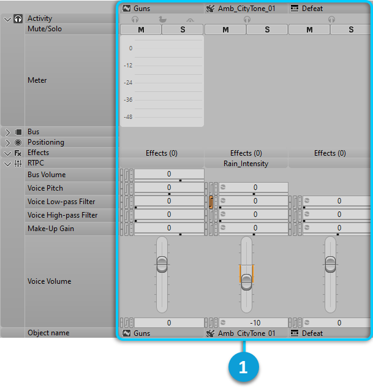

|  |  |
| --- | --- |
|  | 混音通道条。 |

您可以向 Mixing Desk 中添加以下对象：

- Busses
- Property Containers
- 容器
- 声音
- 音乐容器
- Music Segments（音乐段落）
- Music Track

|  |  |
| --- | --- |
| [备注] | 备注 |
| 若 Mixing Session 包含与已从工程中卸载的对象或总线相关的通道条，则该通道条将为空。 |

**将对象/总线添加至混音会话的方法如下：**

1. 通过执行以下任一操作来将 Mixing Session 加载到 Mixing Desk 中：

   - 单击 Mixing Desk Selector 按钮 (**>>**) 并从列表中选择 Mixing Session。
   - 在 Project Explorer（工程资源管理器）的 Sessions（会话）选项卡中双击 Mixing Session。
2. 从 Project Explorer 中，将总线或对象拖至 Mixing Desk。

   此时在 Mixing Desk 中将创建一个混音通道条，代表该对象或总线。
3. 继续添加对象和总线至 Mixing Desk 中。

   |  |  |
   | --- | --- |
   | [备注] | 备注 |
   | Mixing Desk 中包含多个通道条时，一条蓝色插入线会标明通道条的目标位置。 |

###### 对 Mixing Session 内的通道条重新排序

在将总线和对象添加到 Mixing Session 后，可将通道条从某一位置拖到另一位置来随意地对其进行排序。

**对 Mixing Session 内的通道条重新排序：**

1. 将 Mixing Session（混音会话）加载到 Mixing Desk（混音台）中。
2. 点击混音通道条的标题栏，然后将其拖至 Mixing Desk 中的新位置。

   蓝色插入线将显示混音通道条的目标位置。
3. 根据需要继续重新排列混音器通道条。

###### 在 Mixing Session 内调节通道条的宽度

若发现混音通道条过窄或过宽，则可按照如下所述调节其宽度。在下图中，左侧通道条偏窄，右侧通道条偏宽。


**调整混音通道条宽度的方法如下：**

1. 将 Mixing Session（混音会话）加载到 Mixing Desk（混音台）中。
2. 点击 Mixing Desk 的网格部分。
3. 执行以下操作之一：

   要将混音通道条调宽，请按下 **Ctrl** 键，同时向上滚动鼠标滚轮，或点击滚动条旁边的 **+** 符号。

   要将混音通道条调窄，请按下 **Ctrl** 键，同时向下滚动鼠标滚轮，或点击滚动条旁边的 **-** 符号。

###### 从 Mixing Session 中移除通道条

在 Mixing Session 中，随时都可从 Mixing Desk 移除一个或多个通道条。

**从 Mixing Session 中移除通道条：**

1. 执行以下操作之一：

   - 右键点击通道条的标题栏，然后从菜单中选择 **Remove**。
   - 点击要移除的通道条的标题栏，然后按下 **Delete** 键。

   通道条此时将从调音台中移除。

---

##### 自定义 Mixing Desk 中显示的信息

Mixing Desk 可以进行定制，您可以决定将显示哪些类型的信息。借助 Mixing Desk Settings 对话框，可添加或移除不同类型的信息、根据需要选用属性滑杆或推子并指定推子的高度。

**定制 Mixing Desk 中显示信息的方法如下：**

1. 执行以下任一操作，打开 Mixing Desk：

   - 从菜单栏中，点击 **Views** > **Mixing Desk**。
   - 按下 **Ctrl**+**Shift**+**M**。
2. 在 Mixing Desk 标题栏中，点击 **View Settings** 图标。

   

   这时会打开 Mixing Desk Settings（混音台设置）对话框。
3. 对于要在 Mixing Desk 中显示的每类信息，勾选其旁边的复选框。

   |  |  |
   | --- | --- |
   | [备注] | 备注 |
   | 若要查看各个选项的说明，请单击 Mixing Desk Settings 对话框中的 Help 图标。 |
4. 如果您选择了显示竖直推子，则请在 Vertical fader height 文本框中指定高度。
5. 点击 **OK** 应用设置。

---

##### 使用 Mixing Desk 进行混音

Mixing Desk 是您对游戏中不同音频对象进行混音的完美工具。您可以连接到游戏、启动捕获会话、监控音频活动并对 Mixing Session 内的对象和总线的各项属性进行微调。

|  |  |
| --- | --- |
| [技巧] | 技巧 |
| 在 Wwise 中，默认情况下您可以按 **F8** 来切换到 Mixer 布局。 |

**使用 Mixing Desk 混音的方法如下：**

1. 将 Mixing Session（混音会话）加载到 Mixing Desk（混音台）中。
2. 点击工具栏中的 **Remote** 按钮，连接至游戏。

   这时会打开 Remote Connection（远程连接）对话框并列出网络中当前在运行游戏的主机。
3. 从该列表中，选择要连接的设备。
4. 点击 **Connect**（连接）。

   Wwise 将连接至远程游戏主机。游戏主机的名称将显示在工具栏中。
5. 点击 **Start Capture** 按钮（如尚未选择），开启捕获会话。

   现在您可以监视游戏中音频的以下活动：

   | 图标 | Activity | 描述 |
   | --- | --- | --- |
   | |  | | --- | |  | | 声部播放 | 表示正在播放对象。对于总线，它指示正在播放的声部信号正在通过总线。 |
   | |  | | --- | |  | | 闪避 | 表示总线是否正在闪避。 |
   | |  | | --- | |  | | 效果器旁通 | 表示正在旁通插入的效果。 |
6. 游戏运行过程中可以试听音频。
7. 使用下列工具微调游戏中的混音：

   - **属性滑杆/推子** C 修改 Mixing Session 中的对象和总线的各项属性（包括 Volume、Pitch 和 Low-Pass Filter）。
   - **快捷菜单** C 访问与所选属性相关的专用命令。例如，当右键点击 Effect（效果器）插槽（0-3）时，就可以编辑插入效果器的各种属性，可以设置一个新的效果器，或者旁通当前效果器等等。
   - **Follow states** ―― 遵循游戏中的状态更改。

   |  |  |
   | --- | --- |
   | [技巧] | 技巧 |
   | 您随时都可以双击通道条中的对象、总线、State 或 Game Parameter 来将对应的元素加载到 Property Editor 中。 |

---

#### 下混行为

在将采用不同总线配置的声部或总线（输入）发送到不带定位的总线（输出）时，Wwise 会根据以下页面中所述的规则实施下混。

---

##### 标准配置

标准配置全部为典型配置，例如立体声和 5.1，其中各个声道的名称都提示点了相应扬声器的布置。例如，“Height Back Left”声道放置在听者的背后和左侧，并位于空中。

###### LFE

[*[LFE](go01.html#glossary_lfe "LFE")*](go01.html#glossary_lfe) (.1) 不会被下混。如果输入和输出配置都有 LFE 声道，则输入的 LFE 声道信号将被直接复制到输出的相应声道。如果输出没有 LFE 声道，则丢弃输入的 LFE 声道信号。

###### 环绕声道与侧声道

在 4.x 和 5.x 配置中，只有一对扬声器不在前方，因此“侧”声道或“后”声道之间没有区别。它们都是“环绕”的同义词。对于这些配置，我们选择始终调用环绕声声道 SL 和 SR，其中“S”代表“surround”（环绕声）。这导致做出了有些武断的决定，即将 4.x 和 5.x 配置的环绕声声道 SL 和 SR 映射到 6.x 和 7.x 配置的侧声道 SL 和 SR，而不是后声道 BL 和 BR。 这种偏好的合理性在于 5.1 配置中的环绕声扬声器的首选角度（正如 Dolby 所提倡的）可以匹配 7.1 配置中的侧扬声器的角度。

For more details, see [5.1 Virtual speaker setup](http://www.dolby.com/us/en/guide/surround-sound-speaker-setup/5-1-setup.html) and [7.1 Virtual speaker setup](http://www.dolby.com/us/en/guide/surround-sound-speaker-setup/7-1-setup.html) on the Dolby website.

|  |  |
| --- | --- |
| [备注] | 备注 |
| 目前还没有办法配置 Wwise 将 4.x 或 5.x 配置的环绕声声道连通到 6.x 或 7.x 配置的后声道。 |

###### 归一化

鉴于归一化系数的随意性，Wwise 下混不执行归一化。因此，从具有较多声道的配置下混到具有较少声道的配置后常常会造成响度增大的情况。设计师应该根据他们的喜好在总线音量上使用 State 或 RPTC 来处理归一化。

###### 其它配置类型

在将某一阶数的 Ambisonics 配置输出为另一阶数的 Ambisonics 配置时，将弃用输入声道或在输出声道中添加无声内容。将 Ambisonics 配置输出为标准配置称为“解码”。将标准配置输出为 Ambisonics 配置称为“编码”。

匿名配置不执行下混。通路的工作方式与标准配置中的 LFE 声道相似。如果输出中存在相应声道，则直接复制之；否则丢弃之。

---

##### 下混表

下混等式是基于 [*[AC-3](go01.html#glossary_ac3 "AC-3")*](go01.html#glossary_ac3) 标准。无论信号是直接下混（例如 7.1 下混为立体声）还是分步下混（例如 7.1 下混到 5.1，然后再下混到立体声），它们的最终结果都一样。

###### 如何阅读下混表

请考虑下表，表中描述了将 5.1 输入连通到立体声输出时使用的下混等式。

**采样表：将 5.1 连通到立体声**

| 输入声道 | L | | | R | | |
| --- | --- | --- | --- | --- | --- | --- |
|  | 精确值 | 小数值 | dB | 精确值 | 小数值 | dB |
| FL | 1 | 1.000 | 0.00 | 0 | 0.000 | −∞ |
| FR | 0 | 0.000 | −∞ | 1 | 1.000 | 0.00 |
| C | 1/√2 | 0.707 | −3.01 | 1/√2 | 0.707 | −3.01 |
| SL | 1/√2 | 0.707 | −3.01 | 0 | 0.000 | −∞ |
| SR | 0 | 0.000 | −∞ | 1/√2 | 0.707 | −3.01 |

下混获得的立体声信号的左右声道是这些等式的输入值的加权和：

```
            LOUT = FL + 1/√2 * C + 1/√2 * SL
            ROUT = FR + 1/√2 * C + 1/√2 * SR
```

###### 参考表

与上面公式一样，您可以计算各个下混格式的输出信号，方式是将下文下混参考表中的各个输出声道列的总计加起来：

- [至单声道](ch34s12s02.html#tbl_mono)
- [至立体声](ch34s12s02.html#tbl_stereo)
- [至 3.x](ch34s12s02.html#tbl_3x)
- [至 4.x](ch34s12s02.html#tbl_4x)
- [至 5.x](ch34s12s02.html#tbl_5x)
- [至 6.x](ch34s12s02.html#tbl_6x)
- [至 7.x](ch34s12s02.html#tbl_7x)

**至单声道**

| 输入声道 | C | | |
| --- | --- | --- | --- |
|  | 精确值 | 小数值 | dB |
| FL | 1/√2 | 0.707 | −3.01 |
| FR | 1/√2 | 0.707 | −3.01 |
| C | 1 | 1.000 | 0.00 |
| SL | 1/2 | 0.500 | −6.02 |
| SR | 1/2 | 0.500 | −6.02 |
| BL | 1/2 | 0.500 | −6.02 |
| BR | 1/2 | 0.500 | −6.02 |
| Top | 1 | 1.000 | 0.00 |
| HFL | 1/2 | 0.500 | −6.02 |
| HFC | 1/√2 | 0.707 | −3.01 |
| HFR | 1/2 | 0.500 | −6.02 |
| HBL | 1/(2√2) | 0.354 | −9.03 |
| HBR | 1/(2√2) | 0.354 | −9.03 |

**至立体声**

| 输入声道 | L | | | R | | |
| --- | --- | --- | --- | --- | --- | --- |
|  | 精确值 | 小数值 | dB | 精确值 | 小数值 | dB |
| FL | 1 | 1.000 | 0.00 | 0 | 0.000 | −∞ |
| FR | 0 | 0.000 | −∞ | 1 | 1.000 | 0.00 |
| C | 1/√2 | 0.707 | −3.01 | 1/√2 | 0.707 | −3.01 |
| SL | 1/√2 | 0.707 | −3.01 | 0 | 0.000 | −∞ |
| SR | 0 | 0.000 | −∞ | 1/√2 | 0.707 | −3.01 |
| BL | 1/√2 | 0.707 | −3.01 | 0 | 0.000 | −∞ |
| BR | 0 | 0.000 | −∞ | 1/√2 | 0.707 | −3.01 |
| Top | 1/√2 | 0.707 | −3.01 | 1/√2 | 0.707 | −3.01 |
| HFL | 1/√2 | 0.707 | −3.01 | 0 | 0.000 | −∞ |
| HFC | 1/2 | 0.500 | −6.02 | 1/2 | 0.500 | −6.02 |
| HFR | 0 | 0.000 | −∞ | 1/√2 | 0.707 | −3.01 |
| HBL | 1/2 | 0.500 | −6.02 | 0 | 0.000 | −∞ |
| HBR | 0 | 0.000 | −∞ | 1/2 | 0.500 | −6.02 |

**至 3.x**

| 输入声道 | L | | | R | | | C | | |
| --- | --- | --- | --- | --- | --- | --- | --- | --- | --- |
|  | 精确值 | 小数值 | dB | 精确值 | 小数值 | dB | 精确值 | 小数值 | dB |
| FL | 1 | 1.000 | 0.00 | 0 | 0.000 | −∞ | 0 | 0.000 | −∞ |
| FR | 0 | 0.000 | −∞ | 1 | 1.000 | 0.00 | 0 | 0.000 | −∞ |
| C | 0 | 0.000 | −∞ | 0 | 0.000 | −∞ | 1 | 1.000 | 0.00 |
| SL | 1/√2 | 0.707 | −3.01 | 0 | 0.000 | −∞ | 0 | 0.000 | −∞ |
| SR | 0 | 0.000 | −∞ | 1/√2 | 0.707 | −3.01 | 0 | 0.000 | −∞ |
| BL | 1/√2 | 0.707 | −3.01 | 0 | 0.000 | −∞ | 0 | 0.000 | −∞ |
| BR | 0 | 0.000 | −∞ | 1/√2 | 0.707 | −3.01 | 0 | 0.000 | −∞ |
| Top | 1/√3 | 0.577 | −4.77 | 1/√3 | 0.577 | −4.77 | 1/√3 | 0.577 | −4.77 |
| HFL | 1/√2 | 0.707 | −3.01 | 0 | 0.000 | −∞ | 0 | 0.000 | −∞ |
| HFC | 0 | 0.000 | −∞ | 0 | 0.000 | −∞ | 1/√2 | 0.707 | −3.01 |
| HFR | 0 | 0.000 | −∞ | 1/√2 | 0.707 | −3.01 | 0 | 0.000 | −∞ |
| HBL | 1/2 | 0.500 | −6.02 | 0 | 0.000 | −∞ | 0 | 0.000 | −∞ |
| HBR | 0 | 0.000 | −∞ | 1/2 | 0.500 | −6.02 | 0 | 0.000 | −∞ |

**至 4.x**

| 输入声道 | L | | | R | | | SL | | | SR | | |
| --- | --- | --- | --- | --- | --- | --- | --- | --- | --- | --- | --- | --- |
|  | 精确值 | 小数值 | dB | 精确值 | 小数值 | dB | 精确值 | 小数值 | dB | 精确值 | 小数值 | dB |
| FL | 1 | 1.000 | 0.00 | 0 | 0.000 | −∞ | 0 | 0.000 | −∞ | 0 | 0.000 | −∞ |
| FR | 0 | 0.000 | −∞ | 1 | 1.000 | 0.00 | 0 | 0.000 | −∞ | 0 | 0.000 | −∞ |
| C | 1/√2 | 0.707 | −3.01 | 1/√2 | 0.707 | −3.01 | 0 | 0.000 | −∞ | 0 | 0.000 | −∞ |
| SL | 0 | 0.000 | −∞ | 0 | 0.000 | −∞ | 1 | 1.000 | 0.00 | 0 | 0.000 | −∞ |
| SR | 0 | 0.000 | −∞ | 0 | 0.000 | −∞ | 0 | 0.000 | −∞ | 1 | 1.000 | 0.00 |
| BL | 0 | 0.000 | −∞ | 0 | 0.000 | −∞ | 1 | 1.000 | 0.00 | 0 | 0.000 | −∞ |
| BR | 0 | 0.000 | −∞ | 0 | 0.000 | −∞ | 0 | 0.000 | −∞ | 1 | 1.000 | 0.00 |
| Top | 1/√4 | 0.500 | −6.02 | 1/√4 | 0.500 | −6.02 | 1/√4 | 0.500 | −6.02 | 1/√4 | 0.500 | −6.02 |
| HFL | 1/√2 | 0.707 | −3.01 | 0 | 0.000 | −∞ | 0 | 0.000 | −∞ | 0 | 0.000 | −∞ |
| HFC | 1/2 | 0.500 | −6.02 | 1/2 | 0.500 | −6.02 | 0 | 0.000 | −∞ | 0 | 0.000 | −∞ |
| HFR | 0 | 0.000 | −∞ | 1/√2 | 0.707 | −3.01 | 0 | 0.000 | −∞ | 0 | 0.000 | −∞ |
| HBL | 0 | 0.000 | −∞ | 0 | 0.000 | −∞ | 1/√2 | 0.707 | −3.01 | 0 | 0.000 | −∞ |
| HBR | 0 | 0.000 | −∞ | 0 | 0.000 | −∞ | 0 | 0.000 | −∞ | 1/√2 | 0.707 | −3.01 |

**至 5.x**

| 输入声道 | L | | | R | | | C | | | SL | | | SR | | |
| --- | --- | --- | --- | --- | --- | --- | --- | --- | --- | --- | --- | --- | --- | --- | --- |
|  | 精确值 | 小数值 | dB | 精确值 | 小数值 | dB | 精确值 | 小数值 | dB | 精确值 | 小数值 | dB | 精确值 | 小数值 | dB |
| FL | 1 | 1.000 | 0.00 | 0 | 0.000 | −∞ | 0 | 0.000 | −∞ | 0 | 0.000 | −∞ | 0 | 0.000 | −∞ |
| FR | 0 | 0.000 | −∞ | 1 | 1.000 | 0.00 | 0 | 0.000 | −∞ | 0 | 0.000 | −∞ | 0 | 0.000 | −∞ |
| C | 0 | 0.000 | −∞ | 0 | 0.000 | −∞ | 1 | 1.000 | 0.00 | 0 | 0.000 | −∞ | 0 | 0.000 | −∞ |
| SL | 0 | 0.000 | −∞ | 0 | 0.000 | −∞ | 0 | 0.000 | −∞ | 1 | 1.000 | 0.00 | 0 | 0.000 | −∞ |
| SR | 0 | 0.000 | −∞ | 0 | 0.000 | −∞ | 0 | 0.000 | −∞ | 0 | 0.000 | −∞ | 1 | 1.000 | 0.00 |
| BL | 0 | 0.000 | −∞ | 0 | 0.000 | −∞ | 0 | 0.000 | −∞ | 1 | 1.000 | 0.00 | 0 | 0.000 | −∞ |
| BR | 0 | 0.000 | −∞ | 0 | 0.000 | −∞ | 0 | 0.000 | −∞ | 0 | 0.000 | −∞ | 1 | 1.000 | 0.00 |
| Top | 1/√5 | 0.447 | −6.99 | 1/√5 | 0.447 | −6.99 | 1/√5 | 0.447 | −6.99 | 1/√5 | 0.447 | −6.99 | 1/√5 | 0.447 | −6.99 |
| HFL | 1/√2 | 0.707 | −3.01 | 0 | 0.000 | −∞ | 0 | 0.000 | −∞ | 0 | 0.000 | −∞ | 0 | 0.000 | −∞ |
| HFC | 0 | 0.000 | −∞ | 0 | 0.000 | −∞ | 1/√2 | 0.707 | −3.01 | 0 | 0.000 | −∞ | 0 | 0.000 | −∞ |
| HFR | 0 | 0.000 | −∞ | 1/√2 | 0.707 | −3.01 | 0 | 0.000 | −∞ | 0 | 0.000 | −∞ | 0 | 0.000 | −∞ |
| HBL | 0 | 0.000 | −∞ | 0 | 0.000 | −∞ | 0 | 0.000 | −∞ | 1/√2 | 0.707 | −3.01 | 0 | 0.000 | −∞ |
| HBR | 0 | 0.000 | −∞ | 0 | 0.000 | −∞ | 0 | 0.000 | −∞ | 0 | 0.000 | −∞ | 1/√2 | 0.707 | −3.01 |

**至 6.x**

| 输入声道 | L | | | R | | | SL | | | SR | | | BL | | | BR | | |
| --- | --- | --- | --- | --- | --- | --- | --- | --- | --- | --- | --- | --- | --- | --- | --- | --- | --- | --- |
|  | 精确值 | 小数值 | dB | 精确值 | 小数值 | dB | 精确值 | 小数值 | dB | 精确值 | 小数值 | dB | 精确值 | 小数值 | dB | 精确值 | 小数值 | dB |
| FL | 1 | 1.000 | 0.00 | 0 | 0.000 | −∞ | 0 | 0.000 | −∞ | 0 | 0.000 | −∞ | 0 | 0.000 | −∞ | 0 | 0.000 | −∞ |
| FR | 0 | 0.000 | −∞ | 1 | 1.000 | 0.00 | 0 | 0.000 | −∞ | 0 | 0.000 | −∞ | 0 | 0.000 | −∞ | 0 | 0.000 | −∞ |
| C | 1/√2 | 0.707 | −3.01 | 1/√2 | 0.707 | −3.01 | 0 | 0.000 | −∞ | 0 | 0.000 | −∞ | 0 | 0.000 | −∞ | 0 | 0.000 | −∞ |
| SL | 0 | 0.000 | −∞ | 0 | 0.000 | −∞ | 1 | 1.000 | 0.00 | 0 | 0.000 | −∞ | 0 | 0.000 | −∞ | 0 | 0.000 | −∞ |
| SR | 0 | 0.000 | −∞ | 0 | 0.000 | −∞ | 0 | 0.000 | −∞ | 1 | 1.000 | 0.00 | 0 | 0.000 | −∞ | 0 | 0.000 | −∞ |
| BL | 0 | 0.000 | −∞ | 0 | 0.000 | −∞ | 0 | 0.000 | −∞ | 0 | 0.000 | −∞ | 1 | 1.000 | 0.00 | 0 | 0.000 | −∞ |
| BR | 0 | 0.000 | −∞ | 0 | 0.000 | −∞ | 0 | 0.000 | −∞ | 0 | 0.000 | −∞ | 0 | 0.000 | −∞ | 1 | 1.000 | 0.00 |
| Top | 1/√6 | 0.408 | −7.78 | 1/√6 | 0.408 | −7.78 | 1/√6 | 0.408 | −7.78 | 1/√6 | 0.408 | −7.78 | 1/√6 | 0.408 | −7.78 | 1/√6 | 0.408 | −7.78 |
| HFL | 1/√2 | 0.707 | −3.01 | 0 | 0.000 | −∞ | 0 | 0.000 | −∞ | 0 | 0.000 | −∞ | 0 | 0.000 | −∞ | 0 | 0.000 | −∞ |
| HFC | 1/2 | 0.500 | −6.02 | 1/2 | 0.500 | −6.02 | 0 | 0.000 | −∞ | 0 | 0.000 | −∞ | 0 | 0.000 | −∞ | 0 | 0.000 | −∞ |
| HFR | 0 | 0.000 | −∞ | 1/√2 | 0.707 | −3.01 | 0 | 0.000 | −∞ | 0 | 0.000 | −∞ | 0 | 0.000 | −∞ | 0 | 0.000 | −∞ |
| HBL | 0 | 0.000 | −∞ | 0 | 0.000 | −∞ | 0 | 0.000 | −∞ | 0 | 0.000 | −∞ | 1/√2 | 0.707 | −3.01 | 0 | 0.000 | −∞ |
| HBR | 0 | 0.000 | −∞ | 0 | 0.000 | −∞ | 0 | 0.000 | −∞ | 0 | 0.000 | −∞ | 0 | 0.000 | −∞ | 1/√2 | 0.707 | −3.01 |

**至 7.x**

| 输入声道 | L | | | R | | | C | | | SL | | | SR | | | BL | | | BR | | |
| --- | --- | --- | --- | --- | --- | --- | --- | --- | --- | --- | --- | --- | --- | --- | --- | --- | --- | --- | --- | --- | --- |
|  | 精确值 | 小数值 | dB | 精确值 | 小数值 | dB | 精确值 | 小数值 | dB | 精确值 | 小数值 | dB | 精确值 | 小数值 | dB | 精确值 | 小数值 | dB | 精确值 | 小数值 | dB |
| FL | 1 | 1.000 | 0.00 | 0 | 0.000 | −∞ | 0 | 0.000 | −∞ | 0 | 0.000 | −∞ | 0 | 0.000 | −∞ | 0 | 0.000 | −∞ | 0 | 0.000 | −∞ |
| FR | 0 | 0.000 | −∞ | 1 | 1.000 | 0.00 | 0 | 0.000 | −∞ | 0 | 0.000 | −∞ | 0 | 0.000 | −∞ | 0 | 0.000 | −∞ | 0 | 0.000 | −∞ |
| C | 0 | 0.000 | −∞ | 0 | 0.000 | −∞ | 1 | 1.000 | 0.00 | 0 | 0.000 | −∞ | 0 | 0.000 | −∞ | 0 | 0.000 | −∞ | 0 | 0.000 | −∞ |
| SL | 0 | 0.000 | −∞ | 0 | 0.000 | −∞ | 0 | 0.000 | −∞ | 1 | 1.000 | 0.00 | 0 | 0.000 | −∞ | 0 | 0.000 | −∞ | 0 | 0.000 | −∞ |
| SR | 0 | 0.000 | −∞ | 0 | 0.000 | −∞ | 0 | 0.000 | −∞ | 0 | 0.000 | −∞ | 1 | 1.000 | 0.00 | 0 | 0.000 | −∞ | 0 | 0.000 | −∞ |
| BL | 0 | 0.000 | −∞ | 0 | 0.000 | −∞ | 0 | 0.000 | −∞ | 0 | 0.000 | −∞ | 0 | 0.000 | −∞ | 1 | 1.000 | 0.00 | 0 | 0.000 | −∞ |
| BR | 0 | 0.000 | −∞ | 0 | 0.000 | −∞ | 0 | 0.000 | −∞ | 0 | 0.000 | −∞ | 0 | 0.000 | −∞ | 0 | 0.000 | −∞ | 1 | 1.000 | 0.00 |
| Top | 1/√7 | 0.378 | −8.45 | 1/√7 | 0.378 | −8.45 | 1/√7 | 0.378 | −8.45 | 1/√7 | 0.378 | −8.45 | 1/√7 | 0.378 | −8.45 | 1/√7 | 0.378 | −8.45 | 1/√7 | 0.378 | −8.45 |
| HFL | 1/√2 | 0.707 | −3.01 | 0 | 0.000 | −∞ | 0 | 0.000 | −∞ | 0 | 0.000 | −∞ | 0 | 0.000 | −∞ | 0 | 0.000 | −∞ | 0 | 0.000 | −∞ |
| HFC | 0 | 0.000 | −∞ | 0 | 0.000 | −∞ | 1/√2 | 0.707 | −3.01 | 0 | 0.000 | −∞ | 0 | 0.000 | −∞ | 0 | 0.000 | −∞ | 0 | 0.000 | −∞ |
| HFR | 0 | 0.000 | −∞ | 1/√2 | 0.707 | −3.01 | 0 | 0.000 | −∞ | 0 | 0.000 | −∞ | 0 | 0.000 | −∞ | 0 | 0.000 | −∞ | 0 | 0.000 | −∞ |
| HBL | 0 | 0.000 | −∞ | 0 | 0.000 | −∞ | 0 | 0.000 | −∞ | 0 | 0.000 | −∞ | 0 | 0.000 | −∞ | 1/√2 | 0.707 | −3.01 | 0 | 0.000 | −∞ |
| HBR | 0 | 0.000 | −∞ | 0 | 0.000 | −∞ | 0 | 0.000 | −∞ | 0 | 0.000 | −∞ | 0 | 0.000 | −∞ | 0 | 0.000 | −∞ | 1/√2 | 0.707 | −3.01 |

---

### 管理平台和语言版本

由于游戏制作始终是在优化品质和将内存占用最小化之间追求平衡的一门艺术，因此您需要有用于调整和试验属性及素材的手段，以在各个平台的约束条件下提供最佳的游戏体验。在 Wwise 中，您可以为同一工程中的所有平台分别自定义素材、属性和转码设置。另外，您可以为工程的本地化自定义一些语言属性和转码设置。通过使用模拟和性能分析工具，您可以验证您的作品，确保您成功创建了语言和平台版本。

在为工程中的所有语言和平台完成音频制作后，您可以同时为它们中的每一个生成单独的 SoundBank。有关使用 SoundBank 的详细信息，请参阅[*管理 SoundBank*](ch40.html "管理 SoundBank")。

---

#### Authoring across platforms

对于音频设计师，处理不同的平台通常意味着为各个平台创建不同的工程。在 Wwise 中，只用一个工程就可以全部做到。在创建工程时，您可以自动进行跨平台开发，如果您愿意，则甚至可以同时开发。在默认情况下，工程中的所有可用平台都是活跃的，但是您可以从工程中移除平台，以提高工作流程的效率。有关从工程中移除平台的信息，请参阅[“Removing platforms”一节](ch07.html#removing_platform "Removing platforms")。

在创建工程并导入素材和音乐后，设置一系列的转码设置 ShareSet（可以针对各个平台进行自定义），另外根据各个平台的优点和限制定义如何使用素材。

|  |  |
| --- | --- |
| [备注] | 备注 |
| 在 Wwise 中，跨平台制作的前提是您有权针对这些平台进行开发。如果您后来得到了更多的平台权限，则需要更新安装包，以包含这些额外的平台。 |

Wwise 可以让您按照以下方式为各个激活的平台自定义工程：

- [“对音频文件做转码”一节](ch34s10.html "对音频文件做转码")
- [“Customizing object properties per platform”一节](ch35s01.html#customizing_object_properties_per_platform "Customizing object properties per platform")
- [“Excluding project elements from a platform”一节](ch35s01.html#excluding_project_elements_from_platform "Excluding project elements from a platform")
- [“Switching to a different platform”一节](ch35s01.html#switching_to_different_platform "Switching to a different platform")
- [“Copying settings from one platform to another”一节](ch35s01.html#copying_settings_from_one_platform_to_another "Copying settings from one platform to another")

###### Customizing object properties per platform

在 Wwise 中为工程中的特定平台定义声音属性时，默认情况下这些属性设置会覆盖所有活跃的平台。这些属性被称为受到了跨平台链接（linked）。这可以简化跨平台创建工程的过程。但是，如果您想自定义特定平台的属性，则可以对该平台的属性取消链接，然后定义您想要的属性。在取消链接属性时，链接标志会变成橙色。

|  |
| --- |
|  |

在为平台定义属性时，您可以轻松地判断这些属性在另一平台上是否已经取消链接。链接/取消链接标志将部分变为橙色，表示属性已经部分地取消链接。

**对某个平台的某个属性取消链接的方法是：**

1. 右键点击您要取消链接的属性旁边的链接标志。

   此时将会显示快捷菜单。
2. 点击 **Unlink**。

   标志变成橙色，您定义的值将仅适用于当前平台。

   当您切换到该属性仍然链接的平台时，链接标志将显示此属性在另一个平台上未链接。

|  |  |
| --- | --- |
| [备注] | 备注 |
| To link the properties again, right-click the property indicator and select **Link** in the shortcut menu. |

###### Selecting sources per platform

在 Wwise 中，对象可以拥有多个源。在默认情况下，当跨平台播放时，对象将使用同一个源。然而，您可以通过在 Contents Editor 中取消链接这些源来为各个平台指定不同的源。在为该平台生成 SoundBank 时，将使用您选择的源。

|  |
| --- |
|  |

|  |  |
| --- | --- |
| [备注] | 备注 |
| 对于 Sound Voice 对象，您可以为工程中的每种语言分别取消链接源 Use 属性。 |

例如，假设格斗游戏中的角色根据游戏的平台拥有不同的名称。游戏主角最初取名为 Max，但在 Windows 改名为 Arthur。特定 Sound Voice 对象因此将包含两种不同的音频源，各个音频源包含的每行对白几乎完全相同，但使用的是不同的名称。您可以在 Windows 版本中取消链接声音对象 Use 属性，以便该版本中的声音对象使用 Arthur 的对白而不是 Max 的对白。

在定义用于您平台的源时，您可以使用链接/取消链接标志来检查各个源的状态。当某个源在当前平台上被取消链接时，其链接/取消链接标志将完全变为橙色。然而，当该源在另一个平台上被取消链接时，其标志将部分变为橙色。

**为平台选择源的方法是：**

1. 在 Contents Editor 中，通过点击相应的 **Use** 选项选择您要使用的源。

   此时选定的源将应用于所有平台。
2. 如果您只想在当前平台上使用此音频源，请右键单击语言栏中的链接标志。

   此时将会显示快捷菜单。
3. 点击 **Unlink**。

   标志将变为橙色，您决定使用的音源只适用于当前平台和所选语言。

|  |  |
| --- | --- |
| [备注] | 备注 |
| 要再次链接源 Use 属性，则右键点击属性标志并从快捷菜单中选择 **Link**。 |

###### Excluding project elements from a platform

进行音频研发时，需要牢记游戏和游戏平台的内存需求。您还需要考虑哪些平台能够恰当地处理特定素材。为了优化各个平台，您可能需要启用或弃用特定对象。在弃用某个对象后，为该平台生成的 SoundBank 中不会包含该对象。

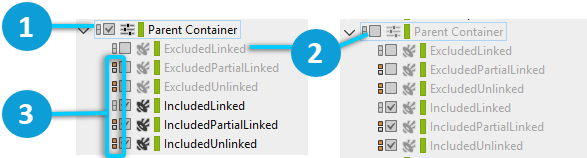

|  |  |
| --- | --- |
|  | The check box is selected which means that the Parent Container will be included in SoundBanks that are generated. |
|  | The check boxes for the ExcludedLinked sound object and the Parent Container are not selected. These objects will be excluded from SoundBanks that are generated. All child objects of the Parent Container will also be excluded. |
|  | Link indicators that show if an object is linked, unlinked, or partially linked to other platforms.  For example, for the IncludedUnlinked sound object, the link indicator is completely orange, which means that it is unlinked on the current platform. The check box is selected, which means the object will be included in the SoundBanks for the current platform, but because the object is unlinked, the check box might be deselected on other platforms. |

Inclusion 复选框可以用来在平台中包含或排除特定对象、文件夹、事件或语言，在 Wwise 的多个视图中都可以看到：

- Project Explorer（对象、效果器、音频设备以及虚拟文件夹和工作单元左侧的无标题复选框）
- Property Editor（对象图标左侧的无标题复选框）
- Contents Editor（内容编辑器中的 **Inc. "Language"** 复选框，其中“Language”对应您工程中的任何语言）
- Event Editor（**Inclusion 复选框**）
- List View（**Inclusion 复选框**）
- Multi Editor（**Inclusion 复选框**）
- Query Editor（**Inclusion 复选框**）

在决定启用或弃用对象后，您可以在 Transport Control 中试听平台专有的音频。还可以使用 Soundcaster 和 Game Profiler 来帮助决定平台中要启用或弃用的对象。有关性能分析和模拟的详细信息，请参阅以下各节：

- [*性能分析*](ch39.html "性能分析")
- [*创建模拟*](ch36.html "创建模拟")

**要在 Wwise 视图中弃用工程元素，请执行以下操作：**

1. 在任何含有 Inclusion 复选框的 Wwise 视图中直接清除 Inclusion 复选框，或使用快捷菜单的 **Inclusion** > **Exclude Selection** 选项。

   该工程元素将不再包含于当前平台中。

|  |  |
| --- | --- |
| [技巧] | 技巧 |
| 您可以同时选择多个元素，以便批量启用或弃用元素。 |

**从所有平台中弃用工程元素的方法如下：**

1. 确保要弃用的工程元素的链接标志为灰色，即该元素已链接。

   - 如果链接标志为橙色，则选择 **Inclusion** > **Link**。
   - 如果链接标志只有顶部为橙色，请[切换当前平台](ch35s01.html#switching_to_different_platform "Switching to a different platform")来查找未链接的平台（全橙）并将其全部改为链接。

   |  |  |
   | --- | --- |
   | [技巧] | 技巧 |
   | 更多关于链接标志的信息，请参阅 [“Linking or unlinking property values”一节](ch45s11.html#linking_unlinking_property_values "Linking or unlinking property values")。 |
2. 重复[要在 Wwise 视图中弃用工程元素，请执行以下操作：](ch35s01.html#list_exclude_elements "要在 Wwise 视图中弃用工程元素，请执行以下操作：")中的步骤。

###### Switching to a different platform

由于 Wwise 工程包含所有活跃的平台版本，因此在开发周期中，您可以随时轻松地从一个平台切换到另一个平台。例如，您可以同时针对多个平台进行开发，而且还可以系统地为各个平台定义特定的对象属性。在您切换平台后，将显示当前的平台版本。

**在有效平台之间切换的方法是：**

1. 在工具栏左侧，单击箭头以显示 Platform Selector（平台选择器）列表。
2. 从 Platform Selector 列表中选择新的平台。

   |  |  |
   | --- | --- |
   | [技巧] | 技巧 |
   | 列表按字母顺序排列，其中每个平台均有对应的快捷方式。比如，若 Wwise 工程包含 A、B、C 三个平台，则按下 Alt+1 将打开平台 A 版本，按下 Alt+3 将打开平台 C 版本。您可以随时按下对应快捷键，以便选择不同平台版本的 Wwise 工程。 |

   此时将显示您选择的平台版本。

|  |  |
| --- | --- |
| [备注] | 备注 |
| 只有已添加到工程中的平台会显示在 Platform Selector 列表中。For information on adding a platform, see [*管理多平台*](ch07.html "管理多平台"). |

###### Copying settings from one platform to another

Since Wwise allows platform-specific editing in your project, at some point you may want to copy these settings from one platform to another. For example, if you have been working on two platforms for some time and are now ready to add a third one, you might want to start with a copy of one of the platforms you have already customized.

The **Copy Platform Settings** dialog, accessed through the [“Platform Manager”一节](ch57s09.html "Platform Manager"), lets you do just that. 您只需指定源和目标平台，Wwise 就会将所有平台相关设置从源平台复制到目标平台。

|  |  |
| --- | --- |
| [备注] | 备注 |
| 平台设置不同于 **Base Platform**。后者一旦选定用于某个平台之后便不会改变了。如果需要新的 **Base Platform**，则必须创建新平台。 |

**从源平台复制到目标平台的平台相关设置：**

- 取消链接的对象参数

  |  |  |
  | --- | --- |
  | [备注] | 备注 |
  | 有一些例外情况：Project Settings 对话框 SoundBanks 和 External Sources 选项卡中的平台相关设置不会复制到目标平台。 |
- Inclusion/exclusion（启用/弃用）
- 取消链接的活跃音频源（Contents Editor 中为声音指定的源）
- 转码设置

  |  |  |
  | --- | --- |
  | [备注] | 备注 |
  | 如果目标平台上不支持源平台上使用的转码格式，则使用目标平台的默认格式代替，并且日志中将显示警告。另外，如果目标平台上的格式不支持源平台上指定的采样率，则它将被修复，并且日志中将显示警告。 |
- Unlinked 3D Attenuation (specified in the Positioning category of the Property
  Editor)
- 取消链接的 3D 衰减曲线（在 Attenuation Editor 中定义）
- Unlinked Effects (specified in the Effects tab of the Primary Editor)

  |  |  |
  | --- | --- |
  | [备注] | 备注 |
  | If an Effect used on the source platform is not supported on the target platform, no effect will be set for the corresponding effect ID on the target platform. |
- 取消链接的对白事件路径目标对象

当设置在源平台上已经取消链接时，该设置在目标平台上也会取消链接，并复制到目标平台。当某设置在目标平台上被链接但在目标平台上已经取消链接时，则目标平台上将重新链接它。

---

#### Localizing your project

一个良好的本地化工程不仅包括将 Sound Voice （Sound Voice）对象替换成经过翻译的版本。本地化版本必须能够成功地重建原始语言中创建的同一种音频体验。在技术上，这包括调整和同步不同语言版本的属性，以使本地化工程的品质可与原始版本媲美。根据游戏的发行计划，可以在开发期间同时进行本地化，也可以在游戏完成后再进行本地化。在 Wwise 中，您可以在开发周期中随时进行本地化。与您在一个工程中同时针对多个平台进行制作一样，您也可以在 Wwise 为一个工程中同时创建多个语言版本，并编辑各个语言版本。请参阅 [*管理语言*](ch08.html "管理语言")。

在 Wwise 中，管理工程的本地化包括以下任务：

- 为工程创建语言。
- 定义参考语言。
- 导入语言文件。
- 试听和分析语言版本。

在 Wwise 中，语言版本保存为 Sound Voice 对象的源，并与各个源的不同音频文件相关联。下图展示了声音对象、其语言源和语言文件之间的关系。

|  |
| --- |
|  |

###### Importing language files

当语言文件准备就绪时，您可以使用 Audio File Importer 将它们导入工程。导入这些文件时，在 Project Explorer 的 Audio 选项卡内的选定语音对象中会创建语言源，并显示在 Contents Editor 中。如果要立即对工程进行本地化，则可在层级结构的最上层导入经过本地化的文件。

在 Contents Editor 中，您可以根据平台灵活地启用或弃用语言源，以及根据平台选择语言源。有关如何根据语言和源版本进行自定义以及根据平台确定要使用的语言源的详细信息，请参阅：

- [“Selecting sources per platform”一节](ch35s01.html#selecting_sources_per_platform "Selecting sources per platform")
- [“Excluding project elements from a platform”一节](ch35s01.html#excluding_project_elements_from_platform "Excluding project elements from a platform").


|  |  |
| --- | --- |
|  | Double-click the voice object to open it in the Property Editor. |
|  | Include or exclude the language for the current platform by selecting or deselecting the **Inc.** check box in the Contents Editor. |

|  |  |
| --- | --- |
| [备注] | 备注 |
| 当您导入音频文件对工程进行本地化时，请确保这些文件的名称与参考语言中的音频文件名称完全相同。 |

**将语言音频文件导入工程的方法是：**

1. Select an object in the Containers hierarchy into which you want to import the language files.

   |  |  |
   | --- | --- |
   | [技巧] | 技巧 |
   | You can quickly localize your entire project by selecting the top level parent in the Containers hierarchy and importing the language files at this level. |
2. From the Wwise menu bar, click **Project > Import Audio Files** (or click Shift + I).

   此时将会打开 Audio File Importer。
3. 选择 **Localize languages** 作为**Import Mode**（导入模式）。

   **Import as Sound Voice** 选项将自动选择 ，并且 **Destination language** 菜单变为可用。您正在导入的语言必须是工程中已添加的语言。
4. 点击以下选项之一：

   - **Add Files**

     The File Open dialog, where you can select the media files - AMB, MID, or WAV - that you want to import, opens.
   - **Add Folders**

     The Folder Open dialog, where you can select a folder which contains the media files that you want to import, opens.
   - **Import Tab Delimited**

     The Open dialog, where you can select a tab delimited text file - TXT or TSV - that defines the audio files to import and the structures to create, opens.

   |  |  |
   | --- | --- |
   | [备注] | 备注 |
   | 一个好习惯是先将新文件导入 Originals 文件夹，然后再将新文件从 Originals 文件夹导入工程。 |
5. 浏览至导入的文件或文件夹所在的位置。
6. 选择后，点击**Open**。

   所选文件于是加载到 Audio File Importer 中了。
7. 点击 **Import**（导入）

   这时会打开 Importing（导入）对话框。在此，可查看文件导入流程的进度。

   |  |  |
   | --- | --- |
   | [备注] | 备注 |
   | 如果存在错误或冲突，则将会打开 Import Conflict Manager。有关如何处理这些冲突的详细信息，请参阅[“管理文件导入问题”一节](ch10s04.html "管理文件导入问题")。 |

   When the import is successfully completed, the Importing dialog closes, and you are returned to the Audio File Importer.
8. When you are finished importing audio files, click **Close** to close the Audio File Importer.

   |  |  |
   | --- | --- |
   | [备注] | 备注 |
   | 如果您使用版本控制，Wwise 则会提示您将导入文件添加到版本控制系统中。 |

###### Switching to a different project language

工程可支持多种语言。请参阅 [*管理语言*](ch08.html "管理语言")。The languages are listed in the Language Selector. 在开发周期内的任何时间点，都可使用 Language Selector 从一种语言切换到另一语言。

**切换工程语言：**

1. 在工具栏中，单击 Language Selector（语言选择器）打开列表。

   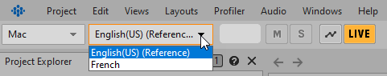
2. 选择另一工程语言。

   这时将显示本地化版本的工程。

###### Auditioning and profiling language versions

在 Wwise 中您可以像平常一样进行试听，创建模拟，并分析各个语言版本。根据分析结果，您可以决定对平台使用特定的语言源版本或源，以获得最佳和效率最高的效果。

有关试听、模拟和分析语言版本的详细信息，请参阅以下各节：

- [*认识 Transport Control 视图*](ch47.html "认识 Transport Control 视图")
- [“使用 Performance Monitor 进行监控和故障排查”一节](ch39s09.html "使用 Performance Monitor 进行监控和故障排查")
- [*创建模拟*](ch36.html "创建模拟")

---

### 创建模拟

在开发过程中，随时使用 Wwise 对象和事件来进行模拟可能会很有帮助。为此，Wwise 创建了一个名为 Soundcaster 的模拟环境，在此您可以异步播放声音、音乐和振动结构。这意味着用户可以控制播放的内容和时机。这对于测试事件、实时混音等操作来说非常方便。Soundcaster 是一款强大的工具，可以用于：

- 原型设计与试验；
- 开发概念验证；以及
- 同时试听声音、音乐和振动。

由于您可以在 Wwise 中单独进行模拟，也可以远程连接到游戏进行模拟，因此 Soundcaster 为您的模拟提供了许多不同的用途。对于任何模拟，用户可以选择：

- 有选择性地试听各个平台的音频或振动。
- 试听预转码的音频文件。
- 在播放时对音频或振动进行性能分析。
- 在 Wwise 中，通过手动模拟游戏动作来混音和测试您的音频和振动。
- 在游戏和 Wwise 中分析音频和振动性能。
- 试用与游戏对象相关联的声音、音乐和振动对象。
- 在游戏中对您的声音、音乐和振动进行混音和测试。

在 Soundcaster 中创建模拟之前，您需要新建一个 Soundcaster session，它类似于一种预设，其中包含模拟中使用的 Wwise 对象和事件。每个 Soundcaster 版面都将作为一个会话保存在 Project Explorer 的 Sessions 选项卡中，显示在其相应的 Work Unit 下面。为帮助您轻松地识别界面中的 Soundcaster 会话，Wwise 使用独特的图标来表示它。

| 图标 | 代表 |
| --- | --- |
| |  | | --- | |  | | Soundcaster Session |

您可以通过在 Project Explorer 中双击会话来访问 Soundcaster，也可以通过在菜单栏中点击 **Views > Soundcaster** 进行访问。在从菜单栏中打开 Soundcaster 时，将显示最近查看过的 Soundcaster 会话。

|  |  |
| --- | --- |
| [技巧] | 技巧 |
| 您还可以按 **Shift + S** 来打开 Soundcaster。 |

Soundcaster 由三个区域构成：

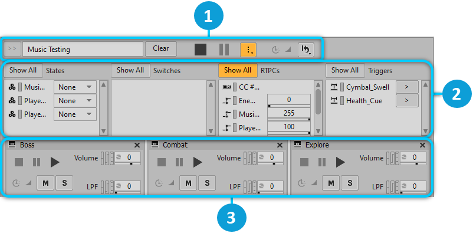

|  |  |
| --- | --- |
|  | 主控制 |
|  | Game Syncs |
|  | 对象和 Event |

在构建模拟时，您可以使用 Soundcaster 的不同区域来使用它的混音和播放功能。

**相关主题**

- [Wwise Fundamentals Module 15: Using Soundcaster](https://www.audiokinetic.com/en/courses/wwise101/?source=wwise101&id=using_soundcaster)

---

#### Building simulations

Soundcaster 可以提供最大的灵活性来满足您创建模拟时的各种需求。您可以添加您想要使用的任何声音、音乐或振动对象，并可根据需要随意更换它们。创建模拟的过程包括以下步骤：

- [“Creating Soundcaster sessions”一节](ch36s01.html#creating_soundcaster_session "Creating Soundcaster sessions")
- [“Adding objects or Events to the Soundcaster”一节](ch36s01.html#adding_objects_or_events_to_soundcaster "Adding objects or Events to the Soundcaster")

|  |  |
| --- | --- |
| [备注] | 备注 |
| 如果 Session 选项卡中没有 Soundcaster 会话，则不能在 Soundcaster 中开展工作。 |

###### Creating Soundcaster sessions

在可以使用 Soundcaster 前，需要创建一个 Soundcaster Session（声音选角器会话）。您可以在 Wwise 的以下两个位置中创建 Soundcaster 会话：

- Project Explorer 的 Session 选项卡。
- Soundcaster 的主控制区。

**在 Project Explorer 中创建 Soundcaster 会话的方法是：**

1. 在 Project Explorer 中，切换至 Sessions 选项卡。
2. 在 Soundcaster Session 标题下，执行以下操作之一：

   - 选择工作单元或虚拟文件夹，然后在 Project Explorer 工具栏中点击 **Soundcaster Session** 图标。
   - 右键点击工作单元或虚拟文件夹，然后在快捷菜单中点击 <**New Child > Soundcaster Session**。

   新的Soundcaster 会话将被添加至虚拟文件夹或工作单元。
3. 将默认名称替换成最适合 Soundcaster 会话的名称。
4. 双击新建的 Soundcaster 会话以在 Soundcaster 中打开该会话。

|  |  |
| --- | --- |
| [备注] | 备注 |
| 在 Project Explorer 中，您可以使用标准的 Windows 快捷键剪切、复制和粘贴 Soundcaster 会话。如果您不再需要 Soundcaster 会话，则可以按 Delete 键来删除它。 |

**在 Soundcaster 中创建新的 Soundcaster 会话的方法是：**

1. 在 Soundcaster 中，点击 Soundcaster Session 选择器开关（**>>**）并从列表中选择 **New**。

   The New Soundcaster Session dialog opens.
2. 为 SoundCaster 会话选择工作单元。
3. 在 Name 字段，将默认名称替换成最适合 Soundcaster 会话的名称。
4. 单击 **OK**（确定）。

   Soundcaster 会话创建完成。

###### Adding objects or Events to the Soundcaster

当您为 Soundcaster 添加对象或事件时，就会创建一个模块，用来表示对象或事件及其属性和行为。它还拥有一系列的控件，可以让您修改属性，以及播放声音、音乐和振动对象。


在您准备好对您收集的一些声音、音乐或振动进行混音或测试时，便可以开始向 Soundcaster 中添加不同的模块。您可以将以下任何类型作为模块添加到 Soundcaster 中：

- Busses
- Property Containers
- 容器
- 声音
- 音乐容器
- Music Segment
- Event

|  |  |
| --- | --- |
| [备注] | 备注 |
| 如果 Soundcaster 会话中包含已从工程中卸载的对象或事件模块，则控件将不可用，模块标题将显示为黄色。 |

**向 Soundcaster 中添加对象/事件的方法是：**

1. 执行以下操作之一：

   - 将对象从 Project Explorer 的 Audio 选项卡拖到 Soundcaster 中。
   - 从 Project Explorer 的 Event 选项卡中，将 Event 拖拽到 Soundcaster 内。

   蓝色模块插入标志出现在您拖动对象/事件的位置。松开鼠标键时，选定的对象/事件将作为模块添加到 Soundcaster 中。

###### 对 Soundcaster 模块进行重新排序

当您为 Soundcaster 添加对象或事件时，就会创建一个模块。虽然可以按任何顺序播放模块，但您可能会想按特定顺序排列它们，以重建特定序列或为测试提供方便。

**更改 Soundcaster 模块的顺序的方法是：**

1. 将您要移动的模块拖到新位置。

   模块移动完成，在 Soundcaster 中，先前位于该位置上的模块下移了。

###### 从 Soundcaster 中移除模块

如果不再需要模块或者准备创建新的模拟，您则可以将模块从 Soundcaster 中移除。

**将模块从 Soundcaster 中移除的方法是：**

1. 执行以下操作之一：

   - 若要移除一个模块，则点击模块标题栏中的 **Close** 按钮。
   - 若要移除所有模块，则点击主控制区中的的 **Clear**。

   于是模块从 Soundcaster 中移除了。

---

#### Managing playback of your simulation

在将模块添加到 Soundcaster 后，便可以开始使用混音和播放选项了。

在播放模拟时，可以执行以下任何任务：

- 试听平台专有的对象和事件。
- 试听预转码的音频文件。
- 当连接到游戏时，试听与特定游戏对象相关的对象和事件。
- 按您希望的任何顺序播放模块。
- 一次管理一个或所有模块的播放。
- 应用游戏同步器。
- 修改模块的属性。
- 在播放时修改对象的 Event Action。
- 试听互动音乐。

###### Specifying Wwise objects to be played

在创建模拟时，您可以根据以下条件选择要播放的声音：

- **平台**，以在模拟中将特定 Wwise 对象在不同的平台上启用或者弃用。有关使用声音和平台的详细信息，请参阅[“Excluding project elements from a platform”一节](ch35s01.html#excluding_project_elements_from_platform "Excluding project elements from a platform")。在创建模拟时，您可以选择只播放当前平台中的声音，也可以选择播放模块中的所有声音。
- **转码后的声音** ―― 将音频文件的原始版本与转码版本进行比较。在对导入的音频文件做转码时，Wwise 保留了音频文件的“原始版本”，您可以随时试听该版本。这些文件已经完成导入转码过程，但还没有针对平台进行转码。在默认情况下，Soundcaster 播放经过转码的声音；然而您可以选择播放原始导入版本。

**播放特定平台的声音和振动对象的方法是：**

1. 在工具栏中，验证一下是否已经为模拟选择了正确的平台。
2. 在 Project Explorer 的 Session 选项卡中，双击您要定义的 Soundcaster 会话。

   选定的会话于是被加载到 Soundcaster 中。
3. 在主控区中，单击 Transport Play Options（走带播放选项）图标 ()。
4. 在 Transport Play Options（走带播放选项）菜单中，选择 **Only Play Objects Included in Platform**（仅播放平台中包含的对象）。

   在此仅可试听当前平台中的对象和 Event（事件）。

   |  |  |
   | --- | --- |
   | [备注] | 备注 |
   | 若要播放所有对象和 Event，请清除 **Only Play Objects Included in Platform** 选项。这时 Transport Play Options 图标会显示为橙色。 |

**播放未转码声音的方法是：**

1. 在主控区中，单击 Transport Play Options（走带播放选项）图标 ()。
2. 在 Transport Play Options（走带播放选项）菜单中，选择 **Play Originals**（播放原始声音）。

   这时会在 SoundCaster 内的所有模块中播放导入的未转码声音。

   |  |  |
   | --- | --- |
   | [备注] | 备注 |
   | 若要播放转码后的声音，请在 Transport Play Options 菜单中选择 **Play Converted**。这时 Transport Play Options 图标会显示为橙色。 |

---

##### 在 Soundcaster 中试听

在选择您要播放的声音或 Motion 后，您可自行决定如何试听 Soundcaster 中的模块。通过使用异步播放功能，您可以按照您选择的顺序（连续、重合等）试听模块。更改播放顺序是测试、试验和帮助您找到最佳序列的一个好方法。您可以根据模拟的任务来决定如何播放这些模块。基本的播放任务是：

- 播放模块。
- 暂停模块播放。
- 停止播放模块。

###### Playing back Soundcaster modules

如果您要试听模块，则可以直接使用您要播放的模块中的控件。在开始按照需要的顺序播放所有需要的模块后，您可以暂停或停止播放选择的任何模块。It is not possible, however, to play back a Property Container or a bus.


您可以选择使用主控件来停止或暂停所有模块。


**播放单个 Soundcaster 模块的方法：**

1. 在模块中，点击 **Play**。

   相关声音将播放到结束为止。
2. 如果您要暂停播放，则点击 **Pause**。

   模块和主控制区中的 Pause 按钮变为黄色。要继续播放，则再次点击 **Pause**。

   |  |  |
   | --- | --- |
   | [备注] | 备注 |
   | 若要从播放列表的开头重新播放 Sequence Container，请在主控区中单击 Reset 图标并选择 **Reset All Random and Sequence Containers**。 |
3. 要停止播放，则点击 **Stop**。

   |  |  |
   | --- | --- |
   | [备注] | 备注 |
   | 要暂停或停止 Soundcaster 中的所有模块，则可使用主控制区中的 **Pause** 和 **Stop** 图标。 |

---

#### Simulating with game syncs

在 Soundcaster 中，您为工程创建的游戏同步器（Game Sync）应有尽有，都可供试用。在游戏和 Wwise 中，您都可以试听状态、切换开关、RTPC 和触发器施加在声音上的效果。通过连接到游戏并将相应模块添加到 Soundcaster，您可以使用游戏同步器随着游戏动作实时对它们进行试听、测试和混音。

选中 Show All 按钮时，创建的所有游戏同步器都将显示在 Soundcaster 的 Game Syncs 区域。否则将只显示与 Soundcaster 中加载的 Wwise 对象相关联的游戏同步器。


###### Enabling States during playback

在将模块添加到 Soundcaster 会话中并确定要播放的 Wwise 对象后，您可以在播放期间启用状态（State）。在将对象拖到 Soundcaster 中时，为模块中的 Wwise 对象所启用的状态组和状态会添加到 State 列表。如果未显示状态，点击 **Show All**。然后，所有状态组和状态都会显示在 States 区域。要了解有关创建状态和指定对象到状态的详细信息，请参阅以下章节：

- [“使用 State”一节](ch16s01.html "使用 State")
- [“将 State 指派给对象和总线”一节](ch16s03.html "将 State 指派给对象和总线")

**在播放期间启用状态的方法是：**

1. 在 States 列表中，选择您要应用的 State。

   该状态将应用于 Soundcaster 中的所有采用了该状态的 Wwise 对象。

|  |  |
| --- | --- |
| [备注] | 备注 |
| 若要切换回为 Switch Container 指定的默认 State，请在主控区中单击 Reset 图标并从菜单中选择 **Reset All States**。 |

###### Assigning Switches during playback

在将模块添加到 Soundcaster 会话中并确定您要试听的 Wwise 对象后，您可以启用在播放期间要应用的切换开关。在将对象拖到 Soundcaster 中时，应用到 Wwise 对象的切换开关组和切换开关会添加到 Switches 区域。如果未显示切换开关，则点击 **Show All**。于是所有切换开关组和切换开关都将显示在 Switches 区域。要了解有关创建 Switch 以及如何使用 Switch 的详细信息，请参阅以下章节：

- [“使用 Switch”一节](ch17s01.html "使用 Switch")
- [“定义 Switch Container 的类型”一节](ch21s03.html#defining_type_of_switch_container "定义 Switch Container 的类型")

**将切换开关指定到模块的方法是：**

1. 从 Switch 列表中选择要应用的 Switch。

   状态于是应用到 Soundcaster 中采用该状态的所有 Wwise 对象上去了。

|  |  |
| --- | --- |
| [备注] | 备注 |
| 若要切换回为 Switch Container 指定的默认 Switch，请在主控区中单击 Reset 图标并从菜单中选择 **Reset All Switches**。 |

###### Simulating changes in Game Parameters

采用所选切换开关组的切换容器将播放对应于所选切换开关的 Wwise 对象。在将模块添加到 Soundcaster 并确定要试听的 Wwise 对象后，便可以测试映射到游戏参数（Game Parameter）的属性值。

- [“管理 RTPC 中使用的 Game Parameter”一节](ch18s02.html "管理 RTPC 中使用的 Game Parameter")
- [“将 Wwise 属性指派给游戏参数”一节](ch18s03s01.html "将 Wwise 属性指派给游戏参数")

要了解有关创建游戏参数和将属性值映射到它们的详细信息，请参阅以下各节：如果没有显示游戏参数，请点击 **Show All**。您创建的所有游戏参数都将显示在 RTPCs 区域。滑杆代表游戏参数值的值域。在将这些值映射到 Wwise 属性值后，在更改这些参数值时将自动更改属性值。

在模拟中，您可以试听这些属性在播放期间的变化。

**在播放期间修改游戏参数值的方法是：**

1. 在播放期间，使用 RTPC 滑杆更改游戏参数值。

   相关的对象属性将根据您在游戏参数和对象属性之间创建的映射而改变。

   |  |  |
   | --- | --- |
   | [备注] | 备注 |
   | 若要将 Game Parameter 切换回其原始设置，请在主控区中单击 Reset 图标并从菜单中选择 **Reset All Game Parameters**。 |

###### Calling Triggers during a simulation

将模块添加到 Soundcaster 并确定要试听的 Wwise 对象后，您还可以测试为音乐触发 Stinger（插播乐句）的 Trigger（触发器）。通过这种方式，您可以模拟游戏在关键时刻通过 Trigger 调用 Stinger 后，插播乐句与当前音乐叠加播放的情况。要了解有关创建触发器以及为它们创建您要在 Soundcaster 中试听的插播乐句的详细信息，请参阅以下各节：

- [*使用 Trigger*](ch19.html "使用 Trigger")
- [*使用 Stinger*](ch33.html "使用 Stinger")

在将对象拖到 Soundcaster 中时，相关触发器会添加到 Triggers 区域。如果未显示触发器，则点击 **Show All**。您创建的所有触发器将显示在 Triggers 区域。

**在播放期间调用触发器的方法是：**

1. 在模块中的音乐对象播放时，从 Triggers 列表中选择您要试听的触发器。

   |  |
   | --- |
   |  |
2. 点击 **Call Trigger** 图标。

   相应的插播乐句将在当前所播放的音乐对象之上播放。您可继续选择其它触发器，播放其相应的插播乐句，以模仿游戏中插播乐句的播放。

---

#### Fine-Tuning properties in a simulation

您可以继续选择触发器，并播放相应的插播乐句来模拟游戏中的音乐。您可以直接在 Soundcaster 中修改各个声音、音乐和振动对象。

|  |  |
| --- | --- |
| [备注] | 备注 |
| 如果您正在使用事件，则需要打开 Event Manager 来更改属性动作。有关使用属性和事件的详细信息，请参阅[“将 Action 添加到 Event”一节](ch14s02.html#adding_actions_to_an_event "将 Action 添加到 Event")。 |

###### 属性标志

您可能注意到，模块中的某些属性值旁边有若干个标志。这些标志显示出属性值是否链接到其它平台、属性值是否使用 RTPC 与游戏参数进行相关，以及是否对属性值应用了随机化器。有关在 Wwise 中如何使用这些标志的详细信息，请参阅[“属性标志”一节](ch11s04.html#about_properties_in_project_hierarchy_property_indicators "属性标志")。


有关链接/取消链接属性值、使用 RTPC 和将属性值随机化的详细信息，请参阅以下各节：

- [“Customizing object properties per platform”一节](ch35s01.html#customizing_object_properties_per_platform "Customizing object properties per platform")
- [“使用 Game Parameter 控制属性值”一节](ch18s03.html "使用 Game Parameter 控制属性值")
- [“通过随机化属性值来改善播放”一节](ch11s05.html "通过随机化属性值来改善播放")

除了这些属性标志外，Soundcaster 还包含播放标志，在播放期间，当发生特定行为或事件时，这些标志将变为蓝色。在主控制区和单个模块中可以查看它们。下表列出了 Soundcaster 中的这些额外属性和动作参数标志。

| 图标 | 名称 | 代表 |
| --- | --- | --- |
| |  | | --- | |  | | Delay | 延迟。已对事件、随机容器或序列容器应用了延迟。 |
| |  | | --- | |  | | Fade | 淡变。已对事件、随机容器或序列容器应用了淡变。 |

有关将这些属性添加到对象的详细信息，请参阅以下各节：

- [“"Continuous" Play Mode”一节](ch21s02s04.html#playing_all_objects_within_container "\"Continuous\" Play Mode")
- [“设置 Event Action 的属性”一节](ch14s02.html#setting_properties_for_an_event_action "设置 Event Action 的属性")

###### Real-time mixing and positioning

在模拟中，您可以使用属性控件在播放前和播放期间执行以下操作：

- **实时混音**，以修改音量、音高、低通属性值。有关对这些属性进行混音的详细信息，请参阅[“定义相对属性（音量、音高、LPF、HPF）”一节](ch11s04s02.html "定义相对属性（音量、音高、LPF、HPF）")。
- **修改定位**，以修改 2D 或 3D 声音或振动传播属性。有关定位的详细信息，请参阅[*定义定位*](ch22.html "定义定位")。


|  |  |
| --- | --- |
| [技巧] | 技巧 |
| 要在 Property 或 Event Editor 中直接修改这些属性，双击模块的标题栏。 |

###### Using the Reset function

在 Soundcaster 中试听一个 Event 模块后，您可能想要改变与该事件相关的对象属性。事件动作可暂时更改对象的属性。在更改属性前，应将属性恢复到它们的初始值。有关使用事件和事件动作的详细信息，请参阅[“处理 Event”一节](ch14s03.html "处理 Event")。您可以分别重置各个模块的事件动作，也可以在 Soundcaster 的主控制区中重置所有模块的事件动作。

|  |  |
| --- | --- |
| [备注] | 备注 |
| 在主控制区，您还可以清除在 Soundcaster 中的音乐轨，以防它们被强制播放。 |

**在主控制区中重置事件动作的方法是：**

1. 在主控区中，单击 Reset（重置）图标。

   此时将打开 Reset 菜单。
2. 在 Reset 菜单中，选择以下其中一项：

   - **Reset All** 可将所有对象恢复到原始设置。
   - **Reset All Random and Sequence Containers** 可清空已为对象触发的所有随机和序列动作。
   - **Reset All Game Parameters** 可清空已为对象触发的所有游戏参数。
   - **Reset All States** 可清空对象的所有 Set State 动作。
   - **Reset All Switches** 可清空已为对象触发的所有 Set Switch 动作。
   - **Reset All Set Mute** 可清空已为对象触发的所有静音动作。
   - **Reset All Set Voice Pitch** 可清空已为对象触发的所有声部音高设置动作。
   - **Reset All Set Voice Volume** 可清空已为对象触发的声部音量设置动作。
   - **Reset All Set Bus Volume** 可清空已为对象触发的总线音量设置动作。
   - **Reset All Set Voice Low-pass Filter** 可清空已为对象触发的所有低通滤波器动作。
   - **Reset All Bypass Effect**  可清空已为对象触发的所有旁通效果动作。
   - **Reset All Set Effect**（重置所有效果器设置）：清除所有已为对象触发的 Set Effect 动作。
   - **Reset All Music Tracks Force Usage** 不再强制播放 Soundcaster 中的特定声轨。
   - **Reset All Source Editor Play Cursors**（重置所有源编辑器播放光标）：清除 Source Editor 中手动触发的播放光标。
   - **Reset Attenuation Preview**（重置衰减预览）：将对象上设置的距离、角度、声障、声笼、衍射和透射值重置为其默认值。

   |  |  |
   | --- | --- |
   | [备注] | 备注 |
   | 主控制区中的 Reset 功能包括其它命令。有关重置 Random Container 和 Sequence Container 的信息，请参阅[“Playing back Soundcaster modules”一节](ch36s02s01.html#playing_back_soundcaster_modules "Playing back Soundcaster modules")。要重置状态、切换开关和游戏参数，请参阅[“Simulating with game syncs”一节](ch36s03.html "Simulating with game syncs")。 |

---

#### Creating simulations tips and best practices

在 Wwise 中创建模拟非常灵活，您可以使用它们高效地执行性能分析、创建概念验证以及在 Wwise 或游戏中测试当前的作品。以下是帮助您取得游戏最佳效果而需要考虑的一些概念。

###### 实时混音和对象属性

当您连接到游戏或游戏模拟器时，可以在 Wwise 中实时修改以下相对属性的值：

- Volume（音量）
- Pitch（音高）
- Low-Pass Filter（低通滤波器）

为了能够做到这一点，您需要加载您想在 **Transport Control** 或 **Soundcaster** 中修改其属性的对象。如果未加载对象，则更改将不会生效，因为声音引擎中未注册该对象。For the Transport Control, certain objects such as Property Containers cannot be loaded, but you can load a child object of the Property Container and this will register its parent objects in the sound engine. Since you can load a Property Container in the Soundcaster, this is not a problem. 在注册对象后，对象将在您连接到游戏时保持注册状态。

|  |  |
| --- | --- |
| [备注] | 备注 |
| 记住，如果您将对象固定在 Transport Control 中，则其它对象要到您取消固定第一个对象后才可加载。然而，如果您已将对象加载到 Soundcaster 中，则此对象将在声音引擎中注册。 |

对于某些属性，包括 Randomizer、Effect、Attenuation 和 Source 插件属性，只有在游戏下次播放该对象时，您所做的更改才会生效。

---

### 优化 CPU 用量

在 Wwise 中设计音频时，CPU 用量是一个非常重要的考量因素。除此之外，还要考虑性能和品质之间的平衡。若针对多个平台进行设计，则须了解各个平台的技术限制和要求，同时兼顾配套软件所需的 CPU 处理资源。

很多 Wwise 功能和插件都会对 CPU 用量产生影响。本节将简要阐述影响 CPU 用量的主要因素，并据此来提供不同的 CPU 优化策略和窍门。总的来说，这当中包括使用 Profiler（参见[*性能分析*](ch39.html "性能分析")）监控 CPU 性能，决定有哪些因素需要考量和处理，然后基于本节中的准则来探索可能的解决方案。

每个 Wwise 工程都是不同的。可用的 CPU 处理资源因平台而异，品质和性能要求也各不相同。因此，并没有一套适用于所有情形的具体准则和建议。相反，您需要不断地尝试，在 Wwise 中试听声音，以此来确定最佳设置。以下主要因素会对 CPU 用量产生影响：

- 同时播放的声部数。声部（尤其是实声部）的数量会对 CPU 产生很大的影响。在声部数增加时，CPU 用量会随之增加。
- 效果器。Wwise 音频效果器会消耗 CPU 处理资源，其具体用量因效果器而异，包括将效果器用在何处，以及是否对其进行渲染。
- 音频编解码器。在通过编解码器对音频文件进行转码时会占用 CPU，有些编解码器需要比别的编解码器更多的 CPU 处理资源。
- Spatial Audio。用于控制 3D 声学效果的各种选项和设置可能会对 CPU 用量产生很大的影响。

后续章节会对以上各项做进一步的阐释。

#### 监控 CPU 用量

因为很多因素都可能会对 Wwise 中的 CPU 用量产生影响，所以并没有一种简单的方法能满足所有 CPU 用量优化的需要。相反，您必须考虑所有与工程相关的因素，并确定可接受的 CPU 用量水平（可能因平台而异），进而使用 Wwise Profiler 来识别 CPU 用量最多的属性和设置并相应地加以调节。说到底，CPU 性能和声音品质之间的恰当平衡取决于用户自己的判断。

通常，可使用 Profiler（参见[*性能分析*](ch39.html "性能分析")）在 Capture Session（捕获会话）期间监控性能，确定总体 CPU 用量和峰值，然后在 Advanced Profiler（高级性能分析器）和 Performance Monitor（性能监控器）中查看对 CPU 用量造成影响的具体因素。在这当中，尤其要注意以下几点：

- 在 Advanced Profiler 中，CPU 选项卡会在会话期间显示对 CPU 用量造成影响的各种因素。藉此，可识别占用 CPU 处理资源最多的插件、音频编解码器、效果器等。

  
- 在 Performance Monitor Settings（性能监控器设置）对话框中，选中名称中包含 CPU 字样的所有相关条目。对此，可根据需要将以下选项用在坐标图和列表中：

  - CPU - Plug-in Total
  - CPU - Total
  - Spatial Audio - CPU
  - Spatial Audio - Path Validation CPU
  - Spatial Audio - Portal Path Validation CPU
  - Spatial Audio - Portal Raytracing CPU
  - Spatial Audio - Raytracing CPU

通过结合 Advanced Profiler 和 Performance Monitor 中的选项，可在 Capture Session 期间对 CPU 用量有一个概括的了解。在确定对 CPU 用量造成影响的因素之后，便可参照本节其他部分所述的建议来对工程的性能实施优化。

#### 优化声部

同时播放的实声部数（即实际播放的声音数）会对 CPU 用量产生很大的影响。为了降低声部所用的 CPU 处理资源数量，可使用以下设置来减少同时播放的声部数：

- **Playback Limit**（播放限值）：决定同一时间最多可播放多少个声音实例。
- **Priority**（优先级）：决定在超出播放限值时要终止哪些声音或将哪些声音发送到虚声部。
- **Virtual Voices**（虚声部）：表示运行时出现但若降到规定音量阈值以下或超出规定播放限值便不予实际播放的声音。建议的虚声部行为为 Kill if finite else virtual（若非无限循环则终止，否则发送到虚声部）。请参阅 [“Advanced category: sound and motion objects”一节](ch60s01s05s12.html "Advanced category: sound and motion objects")。

有关详细信息，请参阅[*管理优先级*](ch23.html "管理优先级")。

#### 优化效果器

效果器会消耗 CPU 处理资源。总的来说，CPU 用量会随同时播放的效果器实例数增加。不过，有一些额外事项需要注意：

- **声道数**。CPU 用量会随音频声道数增加，而声道数因音频总线而异。比如，单声道声音上应用的三个效果器实例占用的 CPU 处理资源要少于 7.1 总线（八个声道）上应用的单个效果器实例。

  另外，有些效果器（如对象处理器）仅针对每条总线实例化一次。有关效果器、Audio Object 和总线的详细信息，请参阅[“结合 Audio Object 使用效果器”一节](ch24s01.html "结合 Audio Object 使用效果器")。
- **效果器类型**。不同类型的效果器占用的 CPU 处理资源数量也不相同。混响效果器便是个特例。大多效果器的 CPU 用量会随着每个声道应用的效果器数线性增加。相比之下，混响效果器的 CPU 用量的增加速率更为和缓一些。并且，不同类型的混响效果器占用的 CPU 处理资源数量也不相同。比如，Matrix Reverb 的 CPU 用量就比 RoomVerb 少（不过它的选项比较少）。其他效果器（如 Compressor 和 Parametric EQ）的 CPU 用量比混响效果器还少。
- **效果器渲染**。有一种方法可以降低效果器的 CPU 用量，就是对效果器进行渲染来使其成为 WEM 文件本身的一部分。在对效果器实施渲染时，会先对经过渲染的效果器进行处理，再将其打包到 SoundBank（音频包）中。这样的话，它就不会占用运行时处理资源了。您可以通过 [“Integrity Report”一节](ch58s01.html "Integrity Report") 来确定哪些效果器适合进行渲染。为此，可选中 Optimizations（优化）选项并运行报告。有关渲染的详细信息，请参阅[“渲染效果器”一节](ch24.html#rendering_effects "渲染效果器")。
- **旁通效果器**。若有些效果器仅适用于特定情形，您可以根据需要来选择将其旁通。比如，若只有当玩家在游戏中处于特定状态时才会使用某个失真效果器，便可利用 RTPC 来应用与监控玩家状态的 Game Parameter（游戏参数）关联的 Bypass Effect 动作。

#### 优化音频编解码器

Wwise 会使用音频编解码器来对音频文件进行压缩和解压。通常，用户需要对音频文件实施压缩以确保其符合工程的内存预算要求。不过，编解码器会占用 CPU 处理资源。一般来说，编解码器输出的音质越高，占用的 CPU 处理资源越多。在决定要使用哪些编解码器时，需要兼顾 CPU 用量、内存用量、存储空间和音频品质。

若要支持多个平台，可通过 Conversion Settings（转码设置）共享集来为不同的平台使用不同的编解码器。有关详细信息，请参阅[“Creating audio Conversion Settings ShareSets”一节](ch34s10s01.html "Creating audio Conversion Settings ShareSets")。

Wwise 支持以下编解码器：

- **PCM**：PCM 并不是音频编解码器，而是一种未压缩文件格式。它可以提供高品质的声音，并占用极少 CPU 处理资源，但需要大量的内存空间。

  为了最大限度地降低 CPU 用量，可将此格式用于短促、重复的声音或高保真音频。
- **Vorbis**：Vorbis 是一款非常流行的编解码器。它可以提供优质的音频，并占用较少 CPU 处理资源。在 Wwise 中，其针对互动媒体和游戏平台进行了优化。

  为了最大限度地降低 CPU 用量，请避免将该格式用于频繁重复的音频文件，因为其每次播放都要占用 CPU 来解压文件。不过，对于大多数其他类型的声音都可使用 Vorbis。
- **Opus**：Opus 可提供与 Vorbis 类似的音质，但会对文件进行更大幅度的压缩。不过，它会占用比 Vorbis 更多的 CPU 处理资源。它适用于长的不重复的音频源（如对白或环境声）。有关如何对 Opus 文件进行解码的更多详细信息，请参阅 [Wwise SDK](https://www.audiokinetic.com/library/edge/?source=SDK&id=index.html) 中的平台特定章节。
- **ADPCM**：ADPCM 可以提供较高的压缩比，并占用极少的 CPU 处理资源，但相对而言音频品质较低。您可以将其用于移动平台来最大限度地降低 CPU 和运行时内存用量。

#### 优化 Spatial Audio

在 Wwise 中，Spatial Audio 是指与 3D 模拟环境下的声音相关的各种设置和配置（如衰减、衍射、反射等）。Spatial Audio 的很多方面都会占用 CPU 处理资源，为此必须测试不同的选项并确定品质和性能之间的恰当平衡。

In Wwise Authoring, many of the options are available in the Property Editor. See
[“Positioning category: Containers hierarchy objects”一节](ch60s01s05s10.html "Positioning category: Containers hierarchy objects") and [“Positioning category: Audio and Auxiliary Busses”一节](ch60s01s02s04s05.html "Positioning category: Audio and Auxiliary Busses")).

Spatial Audio 需要利用 CPU 处理资源来实施与发声体和听者定位、声音衰减、3D 对象的声音反射、衍射等相关的大量计算。Spatial Audio 效果器和设置有多种可能的组合，所以并没有简单普适的 CPU 优化准则。不过，若在 Profiler（性能分析器）中看到 Spatial Audio 占用了大量 CPU 处理资源，以下建议可能会很有帮助：

- 确保空间几何构造尽可能简单。最大限度地减少三角形和衍射边缘的数量。
- 为声音应用有限的衰减。随着最大衰减半径的增大，会需要更多的 CPU 处理资源来搜索路径。在有限衰减曲线达到其最大距离时，曲线会降到工程设置中设定的可闻度阈值以下。
- 避免播放距离太远而听不到的声音，并在超出衰减半径且不会返回时停止播放它们。
- 使用 Room（房间）和 Portal（门户）来分隔相互独立的场景部分。
- 在对 Spatial Audio 进行初始化时，可设置多个 [Spatial Audio Initialization Settings](https://www.audiokinetic.com/library/edge/?source=SDK&id=struct_ak_spatial_audio_init_settings.html) 来控制 CPU 用量：

  - 运用 CPU 负荷均衡。
  - 增大反射和衍射计算所需的移动阈值，藉此以精度为代价来降低 CPU 用量。
  - 减少射线追踪引擎中所用的初级射线数。
  - 减小最大反射阶数。在大部分情况下，一阶和二阶就已足够。
  - 减小衍射阶数。先从四阶开始，不过也可使用二阶或一阶。

有关 Spatial Audio 的详细信息（包括对 CPU 优化的建议），请参阅以下文档：

- 在 Wwise Help 中，参阅[*定义定位*](ch22.html "定义定位")。
- 在 SDK 中，参阅 [Spatial Audio](https://www.audiokinetic.com/library/edge/?source=SDK&id=spatial_audio.html)。尤其，参阅[提升性能](https://www.audiokinetic.com/library/edge/?source=SDK&id=raytracing_geometry_guide.html#raytracing_geometry_guide_performance_tweaking)。
- 在 Unreal Integration 文档中，参阅 [Unreal Spatial Audio 教程](https://www.audiokinetic.com/library/edge/?source=UE4&id=spatialaudio.html)。
- 在 Unity Integration 文档中，参阅[在 Unity 中使用 Spatial Audio](https://www.audiokinetic.com/library/edge/?source=Unity&id=pg_spatialaudio.html)。

#### 其他有关 CPU 优化的资源

除了本文档，还有一些资源包含有关 CPU 优化的信息：

- [优化 CPU 用量](https://www.audiokinetic.com/library/edge/?source=SDK&id=goingfurther_eventmgrthread.html)探讨了基于 SDK 的优化方案，其可为开发者提供用户界面中没有的额外选项。
- 两篇博文 C[《Wwise CPU 优化：通用指南》](https://blog.audiokinetic.com/wwise-cpu-optimizations-general-guidelines/)和[《如何控制声部 C 优化CPU（第 1 部分）》](https://blog.audiokinetic.com/how-to-get-a-hold-on-your-voices-optimizing-for-cpu-part-1/)C 也探讨了相关优化措施。不过请注意，文中的具体数字可能并不适用于最新的平台。
- The [Performance Optimization](https://www.audiokinetic.com/learning/learn-wwise/wwise-performance-optimization) learning material contains many examples and recommendations for CPU (and memory) optimization. 其以基于 Unity 的《Wwise Adventure Game》示例程序为例做了阐释。

**相关主题**

- [Wwise Fundamentals Module 20: Optimizing your sound design](https://www.audiokinetic.com/en/courses/wwise101/?source=wwise101&id=optimizing_game)

---

### 在 Wwise 中管理内存

- All memory allocations are categorized based on their use in the sound engine.
- The default implementation of the memory manager uses the categories to direct allocations to one of multiple memory arenas. Each memory arena, also known as AkMemoryArena, can be configured for different production requirements and memory mangement strategies.

For more detailed information on memory management see:

- [Memory Manager](https://www.audiokinetic.com/library/edge/?source=SDK&id=memorymanager.html)
- [关于降低内存用量的技巧](https://www.audiokinetic.com/library/edge/?source=SDK&id=goingfurther_optimizingmempools_reducing_memory.html)
- [Information for Configuring Memory Arenas](https://www.audiokinetic.com/library/edge/?source=SDK&id=goingfurther_memoryarenas.html)

---

### 性能分析

在完成工程之前，您肯定会想测试一下工程的声音效果，并查明设计方面的潜在问题。为此，可直接在 Wwise 中执行性能分析。当然，您也可以在工程前期根据需要随意使用这一功能。

在 Wwise 中，可采用各种方式来针对不同平台量身打造游戏。利用 Profiler（性能分析器）布局，测试音频和振动效果在各个平台上的性能，从而在一定程度上确保平台之间的一致性。

Additionally, remote connecting to your game allows you to make changes to your design while
your game is running. It can be as minor as adjusting a volume or as complex as adding a new
Random Container to an Event.

在制作过程中，随时都可利用 Profiler 布局，来针对平台分析游戏在特定方面的性能。您可以在 Wwise 中执行[本地性能分析](ch39.html#profiling_locally "本地性能分析")，也可以[通过连接到远程游戏主机来执行性能分析](ch39.html#profiling_in_game "在游戏过程中实施性能分析")。两种方式均可直接从声音引擎捕获性能分析信息（[如下所述](ch39.html#profiling_locally "本地性能分析")）。通过监控声音引擎活动，您可以检测并排查内存、声部、流播放、效果器及其他相关问题。将原型集成到游戏中之前，还可以使用 Game Simulator 和 Soundcaster进行性能分析。

**有关如何执行性能分析的详细信息，请参阅以下子页面并简要了解 Wwise 中提供的不同类型的性能分析：**

- [“了解 Wwise 中不同类型的性能分析”一节](ch39s01.html "了解 Wwise 中不同类型的性能分析")
- [“探索游戏性能分析视图”一节](ch39s02.html "探索游戏性能分析视图")
- [“了解声部性能分析视图”一节](ch39s03.html "了解声部性能分析视图")
- [“了解 Game Object 性能分析视图”一节](ch39s04.html "了解 Game Object 性能分析视图")
- [“了解 Audio Object 性能分析视图”一节](ch39s05.html "了解 Audio Object 性能分析视图")
- [“Editing while profiling a game”一节](ch39s08.html "Editing while profiling a game")

#### 本地性能分析

音频集成到游戏中之前，通过在 Soundcaster 中触发事件、声音和振动对象以及游戏同步器，您可以对 Wwise 工程进行多方面的性能分析。

**本地性能分析**

1. 切换至 **Profiler** 布局。
2. 在 Soundcaster 中添加事件、对象和总线。
3. 点击 **Start Capture**（开始捕获）。
4. 触发 Soundcaster 中的事件、对象或游戏同步器。

   声音引擎的相关信息将被捕获并显示在 Profiler 的各视图中。


#### 在游戏过程中实施性能分析

After your audio and motion are integrated into a game, you can connect Wwise to the game and then profile in real time as the game is being played. You can also create new objects, add new media, and mix the relative properties of your objects in real time in game. 有关详细信息，请参阅“[“Editing while profiling a game”一节](ch39s08.html "Editing while profiling a game")”。

|  |  |
| --- | --- |
| [注意] | 注意 |
| 进行性能分析时，不能使用 Release 版本配置，而且 Wwise 声音引擎的 Debug 版本配置尚未经过优化。 因此，即使游戏运行的是 Debug 版本，我们也不建议您使用 Wwise 的 Debug 版本配置。建议您进行性能分析时，连接到 Wwise 声音引擎的 Profile 版本配置。 |

**对游戏进行性能分析的方法如下：**

1. 启动游戏。
2. 切换至 **Profiler** 布局。
3. 使用 **Remote Connection**（远程连接）连接到游戏。
4. 点击 **Start Capture**（启动捕获）。
5. 开始玩游戏。

   声音引擎的相关信息将被捕获并显示在 Profiler 的各视图中。

**相关主题**

- [Wwise Fundamentals Module 7: Profiling Game Syncs](https://www.audiokinetic.com/en/courses/wwise101/?source=wwise101&id=profiling_game_syncs)
- [Wwise Fundamentals Module 20: Optimizing your sound design](https://www.audiokinetic.com/en/courses/wwise101/?source=wwise101&id=optimizing_game)

---

#### 了解 Wwise 中不同类型的性能分析

在 Wwise 中，有各种类型的性能分析，其分析范围或宽泛或具体：

- 游戏性能分析：着重从声音引擎和工程所含各种组件的角度来分析性能要求和需求。它反映了工程中的声音对平台性能的实时累积影响，并可以查看各声部的影响。
- 声部性能分析：从单个声部的角度监控相应输出。声部性能分析会详细列出不同对象的各种设置，以便确定游戏中声部的实时输出是否合理。
- 游戏对象性能分析：从单个游戏对象的角度分析声音引擎的输出。游戏对象性能分析可以跟踪游戏对象，让您实时观察这些对象的运动和行为，从而找到有问题的游戏对象。

  游戏对象是游戏中的独立实体，对于游戏中所有能作为发声体或听者的元素，音频程序员都会为其注册或创建游戏对象。这些元素包括玩家角色、非玩家角色（NPC）、武器、车辆、怪物以及周围环境中的物体（例如火把）等。游戏对象经过编程后能够独立移动，它们可以关联声音、音乐、振动或能够定位的总线对象。可以同时使用多个游戏对象性能分析工具（Game Object Explorer、3D Game Object Viewer 和 Game Sync Monitor），在游戏或模拟过程中检查游戏对象。

###### 对游戏声音进行性能分析 ―― 示例

假设您正在制作一款格斗游戏，在游戏中玩家控制巨兽参加在宏大城市中心的战斗。您可以使用游戏性能分析和游戏对象性能分析工具来分析游戏声音的性能。

用户可以用游戏性能分析工具分析下列内容：

- 怪兽、警察和旁观者相关的大量声音消耗了多少平台的流播放能力。
- 有多少背景噪声（例如建筑物倒塌声）进入了虚声部（Virtual Voice），它们是在何时进入虚声部的。
- 哪些效果器插件被施用在不同的怪兽咆哮声上，这些效果器的 CPU 占用率如何。
- 时间线上的某些特定时刻会调用哪些 API 函数。

您可以使用声部性能分析工具来执行以下分析：

- 为何听不到警笛声。
- Reverb Effect 如何影响特定位置处旁观者的尖叫声。
- API 调用如何在具体时间点影响某个特定声部。

用户可以使用游戏对象性能分析工具分析下列内容：

- 游戏中各个怪兽声音的衰减半径如何与其它怪兽声音的衰减半径相互作用。
- 警察直升机等游戏对象相对于彼此以及相对于怪兽移动到了何处。
- RTPC（例如“Panic”）如何影响与旁观者游戏对象相关联的声音播放。

这样，游戏性能分析和游戏对象性能分析工具可以让用户全面地了解运转中的游戏声景。

---

#### 探索游戏性能分析视图

Wwise 的游戏性能分析工具由多个视图构成，这些视图共同帮助您分析工程的详细性能。这些视图已合并为 Profiler 布局。

|  |  |
| --- | --- |
| [技巧] | 技巧 |
| 在 Wwise 中，默认情况下您可以按 **F6** 来切换到 Profiler 布局。 |

  

###### Capture Log

Capture Log（捕获日志）可捕获并记录来自声音引擎的所有信息。您可以通过 Capture Log Options（捕获日志选项）来设定要在 Capture Log 中显示哪些捕获信息。若要限制捕获哪些数据类型，请调整 Advanced Profiler 的 Profiler Settings。


###### Advanced Profiler

Advanced Profiler（高级性能分析器）包含有关声音引擎执行的各个活动的性能相关信息，例如 CPU、内存和带宽。一旦从声音引擎捕获到这些信息，它们就会被实时显示出来。You decide what types of information are displayed in the tabs of the Advanced Profiler in the Profiler Settings dialog.

|  |  |
| --- | --- |
| [备注] | 备注 |
| Voices Graph 或 Busses 选项卡中不显示 Not Mixing 状态的总线。有关各种处理状态的详细信息，请参阅[“了解总线图标和处理状态”一节](ch34s11s01.html "了解总线图标和处理状态")章节。 |

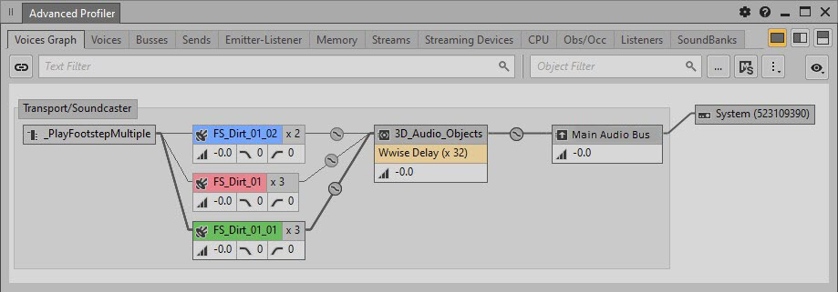

###### Performance Monitor

Performance Monitor（性能监视器）是一整套声音引擎指标，可帮助您监控性能和排查问题。您可以配置 Performance Monitor 来让它只显示您需要的信息。

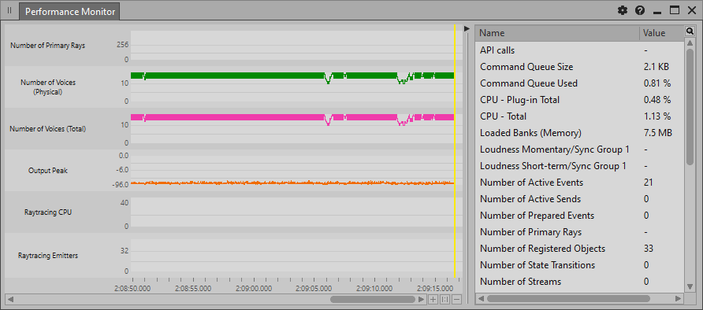

  

|  |  |
| --- | --- |
| [备注] | 备注 |
| 如上图中 Number of Voices (Physical) 和 Number of Voices (Total) 行所示，坐标图顶部的粗线表示当前值已经超出 Graph Max 值。 |

---

#### 了解声部性能分析视图

Wwise 的声部性能分析工具作为对[游戏性能分析](ch39s02.html "探索游戏性能分析视图")的补充，可帮助分析工程的基本构成元素：声部。

Voice Profiler（声部性能分析器）布局整合了其他布局中常用的多个视图，其中有三个主要用来执行声部性能分析：[“Voice Explorer”一节](ch39s03.html#exploring_voice_explorer "Voice Explorer")、[“Voice Inspector”一节](ch39s03.html#exploring_voice_inspector "Voice Inspector") 和 [“Voice Monitor”一节](ch39s03.html#exploring_voice_monitor "Voice Monitor")。

|  |  |
| --- | --- |
| [技巧] | 技巧 |
| 在 Wwise 中，默认情况下您可以按 **F11** 来切换到 Voice Profiler 布局。 |

  

###### Voice Explorer

在捕获会话过程中和完毕后，Voice Explorer（声部资源管理器）会根据 Performance Monitor（性能监控器）或 Voice Monitor（声部监控器）中选定的时间点显示捕获的活跃声部列表。您可以从这些声部中选择一个来显示在 Voice Inspector（声部检视器）中。


###### Voice Inspector

此视图中显示的内容与 Voice Explorer 或 Voice Monitor 视图中所选的声音相关。Voice Inspector 的 Voices Graph（声部图）和 Contribution List（影响列表）面板会显示声部工作流和影响最终音量输出的元素。


###### Voice Monitor

在捕获会话过程中和完毕后，Voice Monitor 会显示捕获信息时间线，并列出播放的每一个声部及其相关音量。在时间线上选择某个时间点时，将列出当时活跃的所有 Wwise 和关联游戏对象及其声部音量。


---

#### 了解 Game Object 性能分析视图

Wwise 的游戏对象性能分析工具包括三个视图，通过配合使用，可以帮助您监控游戏对象以及它们对游戏音频和振动的影响。这三个视图在 Game Object Profiler 布局中可以同时查看。

|  |  |
| --- | --- |
| [技巧] | 技巧 |
| 在 Wwise 中，可以按 **F12** 键切换至 Game Object Profiler 布局。 |

###### Game Object 3D Viewer

Game Object 3D Viewer 即三维对象查看器，能够查看游戏对象、与其他游戏对象的关系，以及它们成为听者之后的情况。您可以对Game Object 3D Viewer 进行设置，使其显示不同类别的数据并改变不同游戏对象的呈现方式。


###### Game Sync Monitor

Game Sync Monitor（游戏同步器监控器）是实时分析 RTPC 数值的工具。此视图会显示 Game Parameter（游戏参数）、Modulator（即 LFO、Envelope 和 Time）和 MIDI 参数的值随时间的变化。


---

#### 了解 Audio Object 性能分析视图

在 Wwise 中，可结合运用以下视图来监控总线管线内 Audio Object 的状态。只需选择 Audio Object Profiler（音频对象性能分析器）布局便可查看所有这些视图。

###### Audio Object 3D Viewer

Audio Object 3D Viewer（音频对象 3D 查看器）提供了 Audio Object 相对于听者位置和朝向的详细定位信息。同时，视图中还显示了散布范围（表示为在围绕听者的球体上投射的圆）。您可以通过配置 Audio Object 3D Viewer 来显示不同类型的信息。而且，还可根据需要更改显示设置。


###### Audio Object List

Audio Object List（音频对象列表）视图提供了总线管线内 Audio Object 的详细信息。视图以树状结构显示了在当前性能分析器光标时间位置实例化的总线和 Audio Object。

Audio Object List 还可用来选择要在其他三个 Audio Object 视图（Audio Object 3D Viewer、Audio Object Metadata 和 Audio Object Meter）中显示的 Audio Object。


###### Audio Object Metadata

Audio Object Metadata（音频对象元数据）视图提供了当前所选 Audio Object 的详细元数据信息。


###### Audio Object Meter

Audio Object Meter（音频对象电平表）以扩展视图的形式提供了当前所选 Audio Object 的测量数据。您可以根据需要将该电平表设为 Peak（峰值）或 RMS（均方根）模式。


---

#### 连接至本地/远程游戏系统

如果想要模拟不同声音在游戏中的效果，或在特定平台上对游戏各方面进行性能分析和故障排查，您首先需要连接运行游戏的设备。局域网中正在运行且未被占用的Wwise 声音引擎都可以连接。

|  |  |
| --- | --- |
| [注意] | 注意 |
| 进行性能分析时，即使游戏使用了 Debug Build，也建议连接到 Wwise 声音引擎的 Profile Build 配置，因为 Debug Build 配置的性能尚未优化。 |

为帮您找到设备，Wwise 会自动搜索同一子网段上的所有 PC 和游戏机，寻找当前运行的 Wwise 声音引擎。您还可以手动输入平台的 IP 地址，连接到子网段外的游戏机或 PC。

|  |  |
| --- | --- |
| [备注] | 备注 |
| 若游戏没有显示在 Wwise 的 Remote Connections 对话框中，请参阅[“排查远程连接问题”一节](ch39s13.html#troubleshooting_remote_connection_issues "排查远程连接问题")来排查问题。 |

**连接到本地/远程游戏系统的方法如下：**

1. 在工具栏中，单击 **Connect to Remote Platform**（连接至远程平台）按钮 。

   这时会打开 Remote Connection（远程连接）对话框并列出网络中当前在运行 Wwise 声音引擎的游戏系统。
2. 从列表中选择要连接的平台。

   |  |  |
   | --- | --- |
   | [备注] | 备注 |
   | 设备的状态须显示为“Ready”（就绪），才能连接该设备。 |
3. 要想从连接起始就捕获信息，请选择 **Start capture on connect**（连接时开始捕获）选项。
4. 点击 **Connect**（连接）。

   Wwise 将连接到本地或远程平台。设备的名称会显示在工具栏中。

   |  |  |
   | --- | --- |
   | [备注] | 备注 |
   | 您也可以手动连接平台，点击 **Connect To IP**（连接到 IP）然后键入远程设备的 IP 地址即可。 |

**从本地/远程设备上断开连接的方法如下：**

1. 在工具栏上，单击 **Disconnect from Remote Platform**（从远程平台断开）按钮 。

   Wwise 将断开与该设备的连接。

###### 使用 Remote Connection 历史记录列表

Wwise 会将成功连接的设备/系统保存至历史记录，从而让您轻松找到曾经使用的系统。连接设备之前必须首先验证其状态，设备状态可以是以下类型之一：

- **Ready（就绪）**: 设备处于就绪状态，可以连接。
- **Busy（繁忙）**: 设备已存在其他连接，因此无法连接。
- **Different Version（版本不同）**: Wwise 版本与远程系统的游戏版本不兼容。
- **Not Available**: 不可用。设备不再与网络相连。

当您希望设备不再出现在历史记录列表中时，可以清空历史记录。

**使用历史记录列表连接到系统的方法如下：**

1. 在工具栏中，单击 **Connect to Remote Platform**（连接至远程平台）按钮 。

   这时会打开 Remote Connection（远程连接）对话框并列出网络中当前在运行游戏的机器。
2. 切换至 History 选项卡。
3. 从 History 列表中选择要连接的设备。
4. 如果希望从连接起始就捕获信息，则请选择 **Start capture on connect** 选项。
5. 点击 **Connect**。

   Wwise 将连接到本地或远程设备。设备的名称会显示在工具栏中。

**清空历史记录列表的方法如下：**

1. 在工具栏中，单击 **Connect to Remote Platform**（连接至远程平台）按钮 。

   这时会打开 Remote Connection（远程连接）对话框并列出网络中当前在运行游戏的机器。
2. 切换至 History 选项卡。
3. 从 History 列表中选择要删除的设备。
4. 执行以下操作之一：

   - 点击 **Remove**。
   - 按 **Delete** 键。

   设备将从 History 列表中删除。

---

#### 从声音引擎捕获数据

连接到机器后，您可以直接从声音引擎捕捉数据，来为游戏音频和振动进行性能分析。所有来自声音引擎的信息都将显示在 Capture Log 中。 其中将记录以下类型的信息条目：

- Notifications（通知）
- Markers（标记）
- Events（事件）
- Actions（动作）
- Properties
- States（状态）
- Switches（切换开关）
- SoundBanks（音频包）
- Events Preparation（事件准备）
- Errors（错误）
- Messages（消息）
- MIDI Events（MIDI 事件）
- API Calls

  - [Event](https://www.audiokinetic.com/library/?source=SDK&id=integrating__elements__events.html)
  - [RTPC](https://www.audiokinetic.com/library/?source=SDK&id=integrating__elements__rtpc.html)
  - [Game](https://www.audiokinetic.com/library/?source=SDK&id=integrating__elements__states.html)

    [Game Syncs](https://www.audiokinetic.com/library/?source=SDK&id=integrating__elements__switches.html)
  - [Game Objects](https://www.audiokinetic.com/library/?source=SDK&id=integrating__elements__gameobjects.html)
  - [Listener Spatialization （空间定位）](https://www.audiokinetic.com/library/?source=SDK&id=soundengine__listeners.html)
  - [Positions（定位）](https://www.audiokinetic.com/library/?source=SDK&id=integrating__elements__3dpos.html)
  - [Auxiliary Bus](https://www.audiokinetic.com/library/?source=SDK&id=quickstart__sample__integration__environments.html)
  - [Obstruction/Occlusion](https://www.audiokinetic.com/library/?source=SDK&id=soundengine__obsocc.html)
  - [Motion（振动）](https://www.audiokinetic.com/library/?source=SDK&id=integrating__elements__motion.html)
  - [MIDI](https://www.audiokinetic.com/library/?source=SDK&id=integrating__elements__midi.html)
  - [Dynamic Sequence （动态序列）](https://www.audiokinetic.com/library/?source=SDK&id=integrating__elements__dynamicdialogue.html)
  - [Spatial Audio](https://www.audiokinetic.com/library/?source=SDK&id=spatial__audio.html)
  - [其他](https://www.audiokinetic.com/library/?source=SDK&id=workingwithsdks__integratingelements.html)

您可以使用 Performance Monitor 和 Advanced Profiler 监控这里的各条记录。这些视图包含有内存、声部和效果器的详细使用情况，以及流播放、SoundBank和插件等相关的详细信息。有关监控性能的详细信息，请参阅[“使用 Performance Monitor 进行监控和故障排查”一节](ch39s09.html "使用 Performance Monitor 进行监控和故障排查")。您也可以使用 Wwise 来分析捕获的数据，并获取游戏或工程中特定音频元素的统计信息。有关获取统计信息的详情，请参阅[“从 Capture Session 获取统计信息”一节](ch39s07s07.html "从 Capture Session 获取统计信息")。

您可以选中 Capture Log 内的错误来在 [“Contextual Help”一节](ch58s08.html "Contextual Help") 视图中查看与之相关的信息，包括详细说明、可能的原因以及推荐的解决步骤。

Wwise 使用以下特殊标记和标颜色，来帮您对 Capture Log 中的条目进行快速分类。

| 界面元素 | 描述 |
| --- | --- |
| **标记** | |
| 圆点 | 圆点的颜色随底色变化：在 Classic（经典）主题下显示为青绿色，在 Dark（深色）主题下显示为橙色。这样方便指示在距离 Performance Monitor 时间光标位置 100 ms 内捕获了 Capture Log 中的哪些条目。颜色越亮，条目离时间光标位置越近。您可以将光标强制移动至特定日志条目所在的时间戳：从快捷菜单 (Ctrl+\) 选择 **Move Cursor to Timestamp**（将光标移至时间戳）。或者直接双击时间戳。 |
| 互连圆点 | 关联圆点的颜色随底色变化：在 Classic（经典）主题下显示为深灰色，在 Dark（深色）主题下显示为白色。这样方便指示 Capture Log 中哪些条目是相互关联的。这些圆点仅在选中日志中的条目时显示。 |
| **颜色** | |
| 选定条目  |  | | --- | |  | | Capture Log 中所选条目会高亮显示为灰色对比色调，该色调随所选主题变化（Classic 主题下高亮显示为深灰色，Dark 主题下高亮显示为浅灰色）。  |  |  | | --- | --- | | [备注] | 备注 | | 您可以选择多个条目，不过会有部分显示和快捷菜单选项不可用。使用标准多选选项：在按住 Shift 的同时连续选择一系列条目，或者在按住 Ctrl 的同时逐一选择多个日志条目。 | |
| 相关条目  |  | | --- | |  | | 所有与选中条目相关的条目均高亮显示为灰色对比色调（比所选条目的颜色更浅或更深），该色调随主题变化。 |
| Error  |  | | --- | |  | | 捕获过程中出现的所有错误均显示为红色。 |
| Messages（消息）  |  | | --- | |  | | 所有消息均显示为黄色。 |

下图说明了各种标记和颜色在 Capture Log 中如何使用。

|  |
| --- |
|  |

将您的设计和原型集成到游戏中之前，通过在 Wwise 中的 Soundcaster（声音选角器）中直接进行捕获，还可以事先对其进行性能分析。有关使用 Soundcaster 的详细信息，请参阅[*创建模拟*](ch36.html "创建模拟")。

|  |  |
| --- | --- |
| [备注] | 备注 |
| 对游戏进行性能分析之前，应将已卸载的工作单元全部加载到工程中。工作单元被卸载时，性能分析信息可能不完整并造成误导。 |

---

##### 指定要捕获的信息类型

由于传输的数据量可能很大，所以从声音引擎捕获信息可能会影响 Wwise 的性能。为此，最好在 Profiler Settings 对话框中限制 Advanced Profiler 生成的信息类型。通过排除一些信息类型，您可以：

- 节省网络传输带宽。
- 节省 Wwise 中的内存空间。
- 省略数据计算，从而节省游戏中的 CPU 时间。
- 省略数据处理或显示，从而节省 Wwise 中的 CPU 时间。

您还可以设置在性能分析会话文件中，是否需要存储 Capture Session（捕获会话）中 Profiler 和 Game Object Profiler 布局中所有视图的全部内容。该会话文件内的数据可供 Wwise 稍后重新加载，从而进一步分析游戏中的音频。

|  |  |
| --- | --- |
| [备注] | 备注 |
| 当超出限制数量时，Wwise 会删除最早的捕获会话。因此，如果您想保存早期的捕获会话，必须在每次性能分析后重命名最早的文件，也可以增大 **Number of sessions kept**。 |

**指定生成和捕获的信息类型的方法如下：**

1. 执行以下操作之一：

   - 在 Advanced Profiler 标题栏中，点击 View Settings（视图设置）图标。
   - 在菜单栏中点击 **Project** > **Profiler Settings**（工程 > Profiler 设置）。
   - 按 **Alt+G**。

   这时将打开 Profiler Settings（性能分析器设置）对话框。
2. 选择列表中的一个或多个信息类型（有关各种信息类型的详细信息，请参阅“[“Profiler Settings”一节](ch57s10.html "Profiler Settings")”）。

   |  |  |
   | --- | --- |
   | [备注] | 备注 |
   | 在 Profiler Settings 对话框中取消选择某种数据类型时，通常会从 Advanced Profiler 中移除对应的选项卡。不过，Spatial Audio（空间音频）信息并无对应选项卡。事实上，该数据类型所对应的是发送至 [“Game Object 3D Viewer”一节](ch62s11.html "Game Object 3D Viewer") 的信息。  [“Game Sync Monitor”一节](ch62s12.html "Game Sync Monitor") 需要同时选中 **Voice Inspector Data** 和 **Game Syncs**。 |
3. 在 **Capture Log** 下面键入最大内存使用量，最小为 10 MB，最大为 4000 MB。

   Game Profiler 使用的内存量将不超过您为 Capture Log 指定的值。
4. 使用 **Number of sessions kept**（保留的会话数量）来指定将存储多少个性能分析会话文件，数量超出时，最早的文件将被删除。
5. 单击 **OK**（确定）。

   Game Profiler 将只捕获所选信息类型的数据。

---

##### 启动/停止捕获流程

开始捕获声音引擎中的信息后，Advanced Profiler、Capture Log 和 Performance Monitor 中将会自动记录数据 。可以在捕获同时查看相应信息，也可以停止捕获并调查出现的问题。若想在捕获的同时查看相应信息，可使用 Show Live Data 选项来让 Capture Log 和 Performance Monitor 与捕获时间保持同步。

|  |  |
| --- | --- |
| [备注] | 备注 |
| 每次启动捕获时， Wwise 都会清空 Capture Log，有关如何保存 Capture Log 内容的详细信息，请参阅 [“保存 Capture Log”一节](ch39s07s08.html "保存 Capture Log") 章节。 |

**启动捕获的方法如下：**

1. 执行以下操作之一：

   - 在菜单栏中，点击 **Layouts**（布局）> **Profiler**（Profiler）。
   - 按 **F6** 键。

   Profiler 布局将显示 。
2. 若想在捕获数据的同时监控性能，可在工具栏上单击 **Show Live Data**（显示实时数据）按钮 。

   选择此项的作用包括：

   - 捕获到数据时 Capture Log 将自动滚动。
   - Performance Monitor 时间光标将跟随游戏时间光标。
3. 在工具栏上，单击 **Start Capture**（开始捕获）按钮 ，来开始在 Capture Log（捕获日志）中捕获数据。
4. 要停止捕获，请点击 **Stop Capture**（停止捕获）。

---

##### 在性能分析视图中筛选数据

###### 概述

在查看性能分析会话时，里面经常会同时显示大量的数据，导致很难准确评估目前发生的状况。在大部分性能分析视图中都可筛选所显示的数据，以此减轻视觉混乱程度并专注于自己感兴趣的对象。

以下位置设有筛选器工具栏：

- Advanced Profiler 的 Voices Graph：[“Voices Graph 选项卡”一节](ch62s03s01.html "Voices Graph 选项卡")
- Advanced Profiler 的 Voices 选项卡：[“Voices（语音）”一节](ch62s03s02.html "Voices（语音）")
- Audio Object 3D Viewer: [“Audio Object 3D Viewer”一节](ch62s05.html "Audio Object 3D Viewer")
- Audio Object List: [“Audio Object List”一节](ch62s06.html "Audio Object List")
- Capture Log：[“Capture Log”一节](ch62s01.html "Capture Log")
- Game Object 3D Viewer：[“Game Object 3D Viewer”一节](ch62s11.html "Game Object 3D Viewer")
- Game Sync Monitor：[“Game Sync Monitor”一节](ch62s12.html "Game Sync Monitor")
- Voice Explorer：[“Voice Explorer”一节](ch62s10.html "Voice Explorer")
- Voice Monitor：[“Voice Monitor”一节](ch62s09.html "Voice Monitor")

###### 有关数据筛选的基础知识

通过在性能分析视图中筛选数据，可减少视图中显示的信息数量。在筛选器工具栏中，可按照三种方式来筛选数据：

| 筛选方式 | 描述 |
| --- | --- |
| Text | 文本。系统会使用指定的文本来筛选视图中显示的内容，从而滤掉与文本不匹配的元素。  文本筛选不区分大小写。它会将文本与当前视图中所含名称或字符串的开头进行匹配。  键入的文本越多，显示的结果越细化。  有关高级用法的详细说明，请参阅“[“使用性能分析器筛选器表达式”一节](ch39s07s04.html "使用性能分析器筛选器表达式")”。 |
| Object（对象） | 对象。系统会使用指定的 Wwise 对象来与当前视图中的对象进行匹配。  同时，还会依据对象关系（如父子对象关系和输出总线关系）对内容进行匹配。  例如：  - Specifying a **Property Container** object also matches its   descendant Sound objects. - 在指定 **Bus** 对象时，还会与直接或间接输出到该总线的对象进行匹配。 |
| Mute/Solo | 静音/独奏。若激活此选项，则从结果中排除启用了 Mute 的对象，而只显示启用了 Solo 的对象。Mute/Solo 功能允许手动筛选元素。  要想重置该筛选器，可在 Wwise 工具栏中单击 Reset Mute 或 Reset Solo 按钮。 |

|  |  |
| --- | --- |
| [备注] | 备注 |
| 在性能分析视图中筛选内容时，并不会影响性能分析器捕获会话中记录的数据。它只会影响视图中显示的信息。 |

###### Link/Unlink 筛选器

在默认情况下，所有性能分析视图中的筛选器都是同步的。这样尤其方便在各个性能分析视图中将不同数据类型的信息关联起来。

您可以通过单击 Link/Unlink（链接/取消链接）按钮来将某个筛选器与其他筛选器取消链接。在取消链接后，该筛选器只作用于当前视图。这样方便在当前视图中采用与同步的筛选器不同的条件来筛选内容。无论什么时候都可再次链接筛选器，重新与其他视图中的筛选器同步。此外，还可将取消链接的筛选器应用于其他视图，在不同的视图之间快速实现筛选器的同步。

| Operation | 描述 |
| --- | --- |
| 筛选器工具栏按钮 | 将鼠标悬停在工具栏中的按钮之上来显示其功能。同时会显示指派给按钮的键盘快捷方式。 |
| 拖放 | 将若干对象拖到对象筛选器上来将其用作对象筛选条件。此操作适用于工程中的大部分但不是全部对象。 |
| 快捷菜单 | 在 **Profiling** 视图中右键单击 **Game** **Object** 时，会显示 **Profiling** 子菜单。此功能适用于工程中的大部分对象。 |
| 主菜单 | **Profiling** 主菜单包含用于清除和同步筛选器的选项。 |
| Text Filter 快捷菜单 | Text Filter 中的快捷菜单提供多种预先配置的筛选器前缀，如 bus:、event:、sound: 等。 |
| 命令和快捷方式 | 您可以使用键盘快捷方式或控制器来执行各种各样的命令。有关键盘快捷方式和控制器用法的详细信息，请参阅以下页面：  [“Profiler 键盘快捷方式”一节](ch39s14.html "Profiler 键盘快捷方式")  [使用控制设备](https://www.audiokinetic.com/library/edge/?source=Help&id=using_control_surface)  [Wwise Authoring API (WAAPI) 快速入门](https://www.audiokinetic.com/library/edge/?source=SDK&id=waapi_gettingstarted.html) |

---

##### 使用性能分析器筛选器表达式

大部分性能分析视图中都设有筛选器工具栏，其中包含了文本字段。您可以使用指定的文本来筛选内容，以减少视图中显示的信息数量，从而快速锁定想要查看的元素。在文本筛选器中，既可直接键入文本，也可结合使用高级表达式，来更好地控制所要筛选的数据。

有关数据筛选的详细信息，请参阅“[“筛选 Capture Log”一节](ch39s07s05.html "筛选 Capture Log")”。

以下示例列举了文本字段中可使用的表达式：

|  |
| --- |
|  |

| 示例 | 描述 |
| --- | --- |
| TEXT | 与源内容中所含单词的开头进行匹配。匹配项不区分大小写。  允许源内容与具有非字母数字字符和大小写变化的字词进行匹配。  例如，TEXT 与以下字词匹配：  - **TEXT** - This is some **TEXT** - **text**ual - object\_**text** - Object**Text** - some1**text** - **Text**ure  TEXT 与以下字词不匹配：  - context |
| TEXT1 TEXT2  TEXT1 TEXT2 TEXT3 | 跟上面一样，只不过筛选器工具栏中指定的所有字词都要跟源内容匹配。  例如，TEXT1 TEXT2 与以下字词匹配：    - text1 hello text2 - text2 hello text1 - text1\_text2    它与以下字词不匹配：    - text1 |
| \*TEXT  TE\*XT | 在匹配时使用通配符，并且不区分大小写。每个通配符都可匹配 0 ~ n 个字符。既可用于仅仅匹配字词的末尾字符，也可用于同时匹配开头和末尾。  例如，\*TEXT 与以下字词匹配：    - con**text** - **text**    \*TEXT 与以下字词不匹配：    - **text1** |
| "TEXT" | 在匹配时不区分大小写，但源内容必须与筛选条件完全匹配。  "TEXT" 与以下字词匹配：    - **TEXT** - **text**    "TEXT" 与以下字词不匹配：    - Some text - textual - context |
| !TEXT  -TEXT | 从结果中排除与指定字词匹配的源内容。  此选项可与表中的任意其他表达式结合使用。  这些筛选条件会从结果中排除以下源内容：    - **text** - **text**ual - some **text**    此选项可与其他筛选器表达式结合使用。直接在表达式的前面添加 ! 或 - 即可。 |
| {67C4FB5B-764A-40CC-A754-1448D2B6E286} | 将指定的 GUID 与源内容对象进行匹配。 |

| 前缀 | 描述 |
| --- | --- |
| sound:TEXT | 针对 **Sound** 名称与源内容中所含字词的开头进行匹配。匹配项不区分大小写。 |
| bus:TEXT | 针对 **Bus** 和 **Aux Bus** 名称与源内容中所含字词的开头进行匹配。匹配项不区分大小写。 |
| target:TEXT | 针对 **Event Target** 对象名称与源内容中所含字词的开头进行匹配。匹配项不区分大小写。 |
| event:TEXT | 针对 **Event** 名称与源内容中所含字词的开头进行匹配。匹配项不区分大小写。 |
| go:TEXT | 针对 **Game Object**  名称与源内容中所含字词的开头进行匹配。匹配项不区分大小写。同时与 **Game Object ID** 数值进行匹配。 |
| fx:TEXT | 针对 **Effect** 名称与源内容中所含字词的开头进行匹配。匹配项不区分大小写。 |
| rtpc:TEXT | 针对 **RTPC 驱动因素**名称与源内容中所含字词的开头进行匹配。RTPC 驱动因素包括 Game Parameter、LFO、Envelope、Time Modulator 和 MIDI 参数。匹配项不区分大小写。 |
| pipelineID:TEXT | 与 **Pipeline ID** 数值进行匹配。 |
| PREFIX:\*TEXT  PREFIX:"TEXT"  !PREFIX:TEXT  PREFIX:{67C4FB5B-764A-40CC-A754-1448D2B6E286} | "PREFIX" 可与以上所列其他筛选器表达式结合使用。 |

---

##### 筛选 Capture Log

您有时可能会发现 Capture Log 中显示的信息太多了。这种情况下可以筛选 Capture Log ，只显示要查看的信息。例如，您可以仅显示特定游戏对象的相关信息，或事件、状态相关的信息。

**筛选 Capture Log 的方法如下：**

1. 在 Capture Log（捕获日志）中，单击 。

   这时将打开 Capture Log Options（捕获日志选项）视图。
2. 仅选择希望在 Capture Log（捕获日志）中显示的选项。

   Capture Log 将根据所选条件进行筛选。

   |  |  |
   | --- | --- |
   | [备注] | 备注 |
   | 如需查看各个选项的说明，请单击 Capture Log Options 视图中的 Help 图标。 |
3. 关闭视图；若打算经常使用该视图，则可将其停靠到布局中。请参阅[“Docking and undocking views and Object Tabs”一节](ch04s02s01.html "Docking and undocking views and Object Tabs")

---

##### 使用 Capture Log 快捷菜单

在已载入信息的 Capture Log（捕获日志）中，右键单击一个或多个条目以显示快捷菜单。除标准[快捷菜单选项](ch05.html#using_shortcut_menus "Using shortcut menus")外，Capture Log 本身还提供一些其他选项。

- **Copy Text to Clipboard**（将文本复制到剪切板）：将选中列信息（包括列标题）以制表符分隔格式复制到剪切板。
- **Move Cursor to Timestamp**（将光标移至时间戳）：将光标移至所选时间戳，并更新所有 Profiler（性能分析器）视图，包括 Performance Monitor（性能监控器）和 Advance Profiler（高级性能分析器）。
- **Move to Previous Related Item**（移至上一相关条目）：选中当前所选条目之前的第一个相关条目（如适用）。
- **Move to Next Related Item**（移至下一相关条目）：选中当前所选条目之后的第一个相关条目（如适用）。

|  |
| --- |
|  |

|  |  |
| --- | --- |
| [技巧] | 技巧 |
| 列出所有游戏对象，例如在Advanced Profiler的[“Capture Log”一节](ch62s01.html "Capture Log")或[“Voices（语音）”一节](ch62s03s02.html "Voices（语音）")和[“Voices Graph 选项卡”一节](ch62s03s01.html "Voices Graph 选项卡")选项卡中，有一个特定的快捷菜单，其中包含以下选项：  - **Mute Game Object**：将该游戏对象关联的所有音频对象静音。 - **Unmute Game Object**：为该游戏对象关联的所有音频对象取消静音。 - **Solo Game Object**：间接地将其他游戏对象关联的所有音频对象静音。 - **Unsolo Game Object**：为其他游戏对象关联的所有音频对象取消静音。 - **Search Game Object in Voice Graph**：打开 Advanced Profiler 的 [“Voices Graph 选项卡”一节](ch62s03s01.html "Voices Graph 选项卡") 选项卡，将其 Filter 设置为指定的游戏对象。 |

---

##### 从 Capture Session 获取统计信息

在 Capture Session（捕获会话）期间或捕获结束后，您可以随时用 Wwise 分析捕获的信息，来获取 Wwise 工程或游戏中特定音频元素相关的统计数据。

|  |  |
| --- | --- |
| [备注] | 备注 |
| 目前，仅限 Dynamic Dialogue（动态对话）的相关信息可以从捕获会话中提取。为了完全理解统计信息，必须明确 Wwise 生成 Dynamic Dialogue 时涉及的各个步骤。有关 Dynamic Dialogue 的详细信息，请参阅[“了解 Dynamic Dialogue 系统”一节](ch15.html#understanding_dynamic_dialogue_system "了解 Dynamic Dialogue 系统")。 |

Profiler Statistics（Profiler 统计数据）视图显示了从 Capture Session 中提取的统计信息，其中包含一系列预定义的查询，方便获取 Capture Log（捕获日志）内各类信息的统计数据。比如，您可以获悉在 Capture Session 期间解析了哪些路径，解析次数和致使音频播放的次数。还可以筛选信息来缩小搜索范围，发现问题并确定必要的对策。

所有激活的 Capture Session 都可以用来提取统计数据，即对于游戏远程捕获的数据或 Wwise 本地捕获的数据，都可以提取相关统计信息。只要 Capture Log 中显示信息，就说明 Capture Session 处于激活状态。

**从 Capture Session 收集统计信息的方法如下：**

1. 启动本地或远程 Capture Session。
2. 在菜单栏中，点击 **Views** > **Profiler Statistics**（视图 > Profiler 统计数据）。

   Profiler Statistics 视图将打开。
3. 从 Queries 列表中，选择以下查询功能：

   - **Paths Used** -- 已使用的路径。表明哪些路径在 Capture Session 期间被解析或添加到动态序列列表中，路径被解析的次数，以及致使音频播放的次数。
   - **Paths Added** -- 已添加的路径。表明在 Capture Session 期间触发了哪些对白事件。对于触发的每个 Dialogue Event，都会显示添加到动态序列列表的对应音频对象，以及该对象被添加的次数。
   - **Dialogue Events Distribution** -- 对白事件分布。显示 Capture Session 期间触发的对白事件相关的统计信息，确切地说，它会显示每个 Dialogue Event 被解析的次数，以及实际触发音频对象播放的次数。
4. 点击 **Run**（运行）。

   查询的结果会显示在 Results（结果）中。
5. 用筛选器来排除不需要的信息。这样可以缩小搜索范围，并快速确定是否应采取必要对策。

---

##### 保存 Capture Log

每次启动捕获会话时 Wwise 都会清空 Capture Log。若在连接远程平台的情况下执行捕获会话，则会话期间捕获的所有数据将自动保存到名为 ProfilingSession.prof 的 PROF 文件。每次启动新的远程捕获会话都会新建一个文件，并在文件名称结尾附加相应的递增编号。在 Profiler Settings 中，可指定要保留多少个文件。另外，还可选择手动将捕获的数据保存到 TXT 文件。两种文件类型的用法如下：

- PROF 文件可在 Wwise 中打开并会填充 Profiler、Voice Profiler 和 Game Object Profiler 布局的所有视图，就跟刚刚完成捕获会话一样。
- TXT 文件只会保存 Capture Log 视图中的信息。各列和排序保持不变。TXT 文件既可使用外部文本编辑器打开，也可导入到外部电子表格程序。

**手动保存 Capture Log：**

1. 在 Capture Log 中，点击 **Save Log**（保存日志）。

   Save As（另存为）窗口将打开。
2. 浏览至希望保存文件的位置。
3. 在 **File name** 中输入文件名称。
4. 根据需要选择文件扩展名：TXT 或 PROF（如可用）。
5. 点击 **Save**（保存）。

   这时将把 Capture Log 的内容保存为文件。

---

##### 从已有的远程捕获会话加载数据

在 Wwise 中，可随时打开之前保存为 PROF 文件的远程捕获会话。在打开文件时，Wwise 会使用之前捕获会话结束时的数据填充 Profiler（性能分析器）、Voice Profiler（声部性能分析器）和 Game Object Profiler（游戏对象性能分析器）布局的所有视图。这样便可对游戏中的音频实施进一步分析。

您可以通过两种方式来加载数据：从文件系统（Windows File Explorer 或 macOS Finder）拖放文件，或从 Remote Connections（远程连接）对话框加载数据。若要从多个捕获会话加载数据，须使用 Remote Connections 对话框。若采用拖放的方式，则每次只能从一个文件加载数据。The following procedures describe both methods.

**通过拖放文件来加载捕获会话数据：**

1. 切换至 Profiler 布局，可以执行以下操作之一：

   - 在菜单栏中，点击 **Layouts** > **Profiler**（视图 > Profiler）。
   - 按 **F6** 键。
2. 将某个 PROF 文件从文件系统（Windows File Explorer 或 macOS Finder）拖放到 Capture Log（捕获日志）视图。

   捕获会话中收集的各项数据将加载到 Profiler、Voice Profiler 和 Game Object Profiler 布局的各个视图中。

**从 Remote Connections 对话框加载捕获会话数据：**

1. 在工具栏中，单击 **Connect to Remote Platform**（连接至远程平台）按钮 。

   这时会打开 Remote Connections（远程连接）对话框。
2. 点击 **Connect To File**（连接到文件）。
3. 选择所需的多个 PROF 文件并点击 **Open**。Press and hold the Shift key while selecting consecutive files. Press and hold the Ctrl key while selecting files that aren't consecutive.

   All of the data collected in the selected capture sessions is loaded into the views of
   the Profiler, Voice Profiler, and Game Object Profiler layouts.

**从多个 Profiling Session 中提取统计信息的方法如下**

1. 在 **View** 菜单中打开 Profiler Statistic 视图。
2. 点击工具栏上的 **Connect to Remote Platform**  按钮。

   这时会打开 Remote Connections（远程连接）对话框。
3. 点击 **Connect To File** 按钮。
4. 选择所需的多个 PROF 文件并点击 **Open**。Press and hold the Shift key while selecting consecutive files. Press and hold the Ctrl key while selecting files that aren't consecutive..

   All of the data collected in the selected capture sessions is processed and the resulting
   statistics are presented in the Profiling Statistics view.

---

#### Editing while profiling a game

A remote connect session can be used to make modifications to a game that is currently
running, without regenerating SoundBanks. These changes to the Wwise project can be
extensive and even include new media. This is supported on all platforms and all game
engines.

Any changes made during a remote connect session do not change the files deployed on a game
console. This means that restarting the game reverts to the content available in the
SoundBanks deployed with the game. To reapply the changes made to the Wwise Project, you
must reconnect Wwise to the game. To make these changes permanent, you must regenerate
the SoundBanks and deploy them with the game.

To enable editing while profiling, in the Remote Connections dialog, set the
synchronization method to **Profile and Edit (Sync Inspected Objects
Only)** or **Profile and Edit (Sync All Modified
Objects)**.

With **Profile and Edit (Sync Inspected Objects Only)**,
only objects that are currently inspected in the Transport Control are updated, in
addition to all necessary related objects, such as the Output Bus, Effects, and
Attenuation. Each time the object in the Transport Control changes, a new update is done
if necessary. With this method, only a small subset of objects is updated at a time.

With **Profile and Edit (Sync All Modified Objects)**, all
objects that are modified in the Wwise project and are currently loaded in the game
through SoundBanks are updated at the moment of connection. They are also updated each
time additional changes are made to the Wwise project during the remote connect session.
Because a large number of sound structures can be loaded in game, the connection process
can take several seconds while Wwise verifies what needs to be updated.

With the synchronization method set to **Profile Only**,
nothing is updated, so you won't hear any changes if you edit your project while
connected to a game. However, this is the preferred method for troubleshooting issues in
game.

###### Side effects of editing while profiling

When either of the **Profile and Edit** methods is
selected, if you change a structure or a playlist that is currently playing, you
might hear audible glitches, sounds that start abruptly, or sounds that stop
abruptly. All these changes are reflected in the Capture Log. Wwise uses the new
structure as if the game loaded it from the start. If you are unsure about the
behavior of these new sounds, redo the scenario from the start in game; at this
point, the new structures will already be in memory, so no transitional glitches
will occur.

If you change media that is currently in use, you will probably hear a click.
Wwise automatically seeks to the same point in the new file that it was at in the
old file. If the content is different, the sound won't match. Also, the transfer of
media takes some time. For this reason, you might see errors related to source
starvation.

Editing while profiling increases memory usage in the game. New media is
transferred to a region of memory reserved specifically for this feature. This
memory is only used in the Debug and Profile configurations and does not count
toward the audio memory budget. You can control the maximum amount of memory used
for Live Media Transfer in the [“设置用户偏好”一节](ch04s04.html "设置用户偏好"). When this memory
limit is reached, unused media is evicted from this region of memory. If you
experience memory issues, you can disable Live Media Transfer by setting the maximum
to 0.

---

#### 使用 Performance Monitor 进行监控和故障排查

Wwise 设计工具与音频引擎紧密集成，因此游戏过程中，您可以实时监控大量的关键表现指标。Game Profiler（游戏性能分析器）还可与 SoundCaster、Game Simulator 和其他 WAAPI 应用结合使用，以便在将设计或原型整合到游戏中之前对其性能进行监控。

Wwise 捕获声音引擎活动的相关信息时，Performance Monitor（性能监控器）中会实时显示性能图表，对应的实际数量和百分比也会显示在右侧的 Performance Data（性能数据）列表中。

这些曲线可以让您快速找到游戏中音频性能超过限制的地方，例如平台限制。组合使用 Performance Monitor、Advanced Profiler 和 Capture Log，可以帮您诊断和解决潜在的问题。

Performance Monitor 允许自定义，即可以设置其中显示哪些性能指标和数值。有关自定义 Performance Monitor 的详细信息，请参阅[“自定义 Performance Monitor”一节](ch39s09.html#customizing_performance_monitor "自定义 Performance Monitor")。

|  |  |
| --- | --- |
| [技巧] | 技巧 |
| 您可以在捕获数据时监控性能，或者启动 Capture Session，在图表中移动光标来调查问题。若想在捕获数据的同时监控性能，须单击 Show Live Data 按钮 ，来让 Capture Log 和 Performance Monitor 与捕获时间保持同步。 |

**监控性能的方法如下：**

1. 连接到远程设备。

   |  |  |
   | --- | --- |
   | [备注] | 备注 |
   | 如果正在使用 Soundcaster 对模块或原型进行性能分析，将在您播放不同模块时捕获信息。 |
2. 执行以下操作之一：

   - 在菜单栏中点击 **Layouts** > **Profiler**（布局 > 性能分析）。
   - 按 **F6** 键。

   Profiler 布局将显示 。
3. 点击工具栏中的 **Start Capture** （开始捕获）按钮。

   Wwise 将显示声音引擎捕获信息相关的平台性能曲线。

   |  |  |
   | --- | --- |
   | [备注] | 备注 |
   | 实心方块表明此处捕获的信息已超过限制，曲线顶部的长方块表明当前值高出最大允许值，底部的方块表明当前值低于最小允许值。 |
4. 将 Performance Monitor（性能监控器）的时间光标拖到坐标图上提示性能问题的位置。

   |  |  |
   | --- | --- |
   | [备注] | 备注 |
   | 在曲线视图中移动光标时，Capture Log 的位置以及 Performance Data 面板和 Advanced Profiler 中显示的数据会自动更新。 |
5. 通过 Advanced Profiler 中的时间光标（白色圆圈）找出导致问题的事件、动作或其它声音引擎活动，或按住 Shift 并点击 Capture Log 中的条目，来将所有性能分析视图与此时间戳同步。
6. 要编辑对象和事件的内容或属性，请双击 Capture Log 中的条目。相应事件或对象将在 Event Editor（事件编辑器）或 Property Editor（属性编辑器）中打开，在其中进行所需修改即可。
7. 查看 Advanced Profiler 各选项卡，可以获取该引擎活动条目的详细性能信息。
8. 要将 Performance Monitor 中的曲线数值保存为文本文件，请右键点击曲线并选择 **Save All Counters to File**（将所有数值保存到文件）。数值将保存为制表符分割的文本文件，其中包含从捕获开始直至当前的所有数值，记录间隔为 200 ms。

###### 自定义 Performance Monitor

有些时候，您可能需要同时监控多个关键指标，而另一些时候则可能只想关注一个特定方面。为了满足不同监控会话的需求，可以增加和删除 Performance Monitor 中的数值显示。

**修改 Performance Monitor 显示内容的方法如下：**

1. 在 Performance Monitor 标题栏中，点击 View Settings 图标。

   这时会打开 Performance Monitor Settings（性能监控器设置）对话框。
2. 在 Show In Graph（显示曲线）列中，选择希望显示在 Performance Monitor 坐标图中的数值。

   |  |  |
   | --- | --- |
   | [备注] | 备注 |
   | 若要查看各项数值的说明，请单击 Performance Monitor Settings 对话框中的 Help 图标。 |
3. 在 Show In List（在列表中显示）列中，选择希望显示在 Performance Data 列表中的数值。
4. 为您选择的数值设置最小和最大值，即数值所对应曲线图的纵坐标范围。
5. 单击 **OK**（确定）。

   Performance Monitor 将会更新，仅显示您选择的数值。

|  |  |
| --- | --- |
| [备注] | 备注 |
| 如果您选择了 Profiler Settings 中禁用的数据类型，则 Performance Monitor 将不会显示该类型的图表。有关更改 Profiler 设置的详细信息，请参阅[“指定要捕获的信息类型”一节](ch39s07s01.html "指定要捕获的信息类型")。 |

---

#### 使用 Voice Inspector 分析声部

为什么这个声音的音量那么大？为什么我听不到这个声音？声音设计师经常会问这样的问题。经过各个层级结构的声音、衰减、Event（事件）、RTPC 和总线的影响，可能很难查明 Wwise 中音量输出电平异常问题的原因。利用 Voice Inspector，用户可以快速查出所有声部的音量驱动因素。

在 Voice Explorer（声部资源管理器）或 Voice Monitor（声部监控器）中选择声音时，将在 Voice Inspector（声部检视器）的 Voice Graph（声部图）中自动选择[*[干声路径](go01.html#glossary_dry_path "干声路径")*](go01.html#glossary_dry_path)，同时在 Contribution List（影响列表）中显示选定干声路径的完整层级结构。All changes made to the Volume/LPF/HPF/DSF are displayed in the Contribution List including RTPCs, States, Distance and Cone Attenuations, and Event Actions. 这些参数会实时更新并与 Performance Monitor/Voice Monitor（性能监控器/声部监控器）时间光标保持同步，方便用户通过移动时间光标来对比这些值随时间的变化。

###### Voice Explorer

Voice Explorer 视图包含所有当时正在播放声音（无论虚实）的 Game Object（时间由 Performance Monitor/Voice Monitor 的时间光标指定）。在对应 Game Objects 下，可能会显示一个或多个活跃声音。在同一 Game Object 当前播放该声音的多个实例时，声音名称会在 Game Object 下出现多次。However, each instance has a different ID and its own Volume/LPF/HPF/DSF profiled independently.

在 Voice Explorer 中选择声音来更新 Voice Inspector 的 Voice Graph 和 Contribution List。默认选择干声路径。每次仅可显示一个声音。

双击声音来打开 Property Editor（属性编辑器）。右键单击声音来显示[标准快捷菜单](ch05.html#using_shortcut_menus "Using shortcut menus")。


###### Voice Inspector

Voice Inspector 视图包含 Voice Graph（左侧）和 Contribution List（右侧）。此视图中显示的内容与 Voice Explorer 或 Voice Monitor 视图中所选的声音相关。

Voice Graph 会显示从音频源到输出的所有声部信号路径。Since the Volume/LPF/HPF/DSF properties can have different values across the signal paths, only one path is active at a time. 对于活跃路径，会高亮显示声部图节点之间的连线。Contribution List 中会显示属性影响及选定路径。对于不属于选定路径的属性，将不予显示。


若要显示不同路径的属性值，请单击声部图节点或所需路径对应的连线。如需检视具有多个发送的路径（常见于 Spatial Audio 场景），可同时选择多个节点（Ctrl+单击）。

在此，可使用双击和右键单击等标准 Voice Graph 操作。


Select an object in the Voice Graph, such as the Main Audio Bus shown in the following image, to highlight the object and the associated path in the Voice Graph. 同时，还会在 Contribution List 中高亮显示该对象及其子对象。


The Contribution List contains, for the selected voice path of the selected sound,
all the parent objects from the Busses and Containers
hierarchies that modify the Volume/LPF/HPF/DSF, including all audio and Auxiliary Busses
involved in mixing the selected sound.

The Contribution List displays the actual value for Volume/LPF/HPF/DSF under each object of the hierarchy. Driver（驱动因素）和 Driver Value（驱动因素值）列会详细显示哪些因素导致了属性变化。若要转到属性页面以便查看属性变化，请双击属性名称。

###### Final Value 和部分和

在 Contribution List 中，顶部的 Final Value（最终值）行会显示所有修改的累计结果。在 Volume（音量）列中，会针对每个适用对象行显示部分和。其表示选定路径节点所做的直接音量修改。注意，LPF 和 HPF 列中并未提供部分和，因为其累计方式因声部管线中应用修改的位置而异；有时取累加值，有时取最大值或最小值。The final DSF value is a weighted average of DSF values of each applicable object row where each DSF value is weighted (multiplied) by its corresponding volume.


|  |  |
| --- | --- |
|  | Final Value 行会显示所有修改的累计结果。 |
|  | Volume 列会针对每个适用对象显示部分和。 |
|  | Partial sums are *not* indicated in the LPF, HPF, and DSF columns. |

|  |  |
| --- | --- |
| [备注] | 备注 |
| 对于未经修改的值，将不予显示。不过，对于曾经修改过的值，倘若恢复为中间值 (0 dB)，则将持续显示。 |

###### 使用 Voice Inspector

您可以在连接游戏的情况下或直接在 Wwise 设计工具中使用 Voice Inspector。

**设置 Voice Inspector：**

1. 转到 Voice Profiler（声部性能分析器）布局 (F11)，或直接打开 Voice Inspector（声部检视器）视图。
2. 在 Voice Inspector 中，单击右上角的“设置”图标或按下 Alt+G，打开 Profiler Settings（性能分析器设置）视图。
3. 启用 **Voices Data**（声部数据）和 **Voice Inspector Data**（声部检视器数据）。

**捕获数据：**

1. 在 Project Explorer（工程资源管理器）中，使用源文件来添加 Sound SFX（音效）。请将其设为无限循环。
2. In the Primary Editor's RTPC tab, add one or more RTPC curves attached to at least one
   value (of Volume, LPF, HPF, or Output Bus DSF).
3. Optionally, in the Property Editor, add an Attenuation ShareSet, and in the Attenuation
   Editor, enable **Cone Use**.
4. 在 Wwise 工具栏中，单击 Start Capture（开始捕获）。(Alt+C)
5. 在 Transport Control（走带控制）中，播放声音。(空格键)
6. 调节各项设置，比如：

   - 在 Attenuation Editor 中，移动 Distance Attenuation（距离衰减）和 Cone Attenuation。
   - In the Property Editor of the Main Audio Bus or the sound, change the base value of
     Volume, Pitch, Low-pass Filter, or High-pass Filter.
7. 停止捕获。(Alt+C)

At this point, the Voice Inspector has recorded all modifications to Volume/LPF/HPF/DSF on this voice. 若要查看这些修改，请打开 Voice Inspector 并在 Voice Monitor 中移动时间光标。

**查看捕获的数据：**

1. 确保打开 Voice Explorer（声部资源管理器）、Voice Inspector（声部检视器）和 Voice Monitor（声部监控器）视图（在默认情况下，Voice Profiler 布局同时包含三个视图）。
2. 在 Voice Monitor（声部监控器）中往回拖动时间光标，直到 Voice Explorer（声部资源管理器）中显示所述循环声音。在 Voice Explorer（声部资源管理器）视图中选中声音。
3. 在 Voice Explorer（声部资源管理器）中选择声音后，Voice Inspector（声部检视器）视图的左侧面板 (Voice Graph) 中会显示整条声部信号流。若在 Voice Graph（声部图）中选择节点，则会显示具体的声部路径，同时相应地更新右侧面板 (Contribution List)。
4. Move the time cursor back and forth in the Voice Monitor to see the
   modifications to Volume/LPF/HPF/DSF during the capture.

   |  |  |
   | --- | --- |
   | [技巧] | 技巧 |
   | Performance Monitor 或 Voice Monitor 中时间光标的移动跟其他视图是同步的。 |

###### 有关特定属性显示方式的说明

为了充分了解 Voice Inspector（声部检视器）中显示的值，请注意以下事项。

- In general, if the same Driver is affecting Volume, LPF, HPF, and/or DSF, it will use only one line.
- **Project Value/SoundBank Value** （工程值/音频包值）：一般通过滑杆（如声音的主音量滑杆）修改的值会写入 SoundBank（音频包）并由游戏加载。在将性能分析器连接到游戏时，这些值会显示为 SoundBank Value。若仅使用性能分析器而不连接游戏（直接开始捕获），则这些基础声音属性将显示为 Project Value。在连接游戏时，任何在捕获之后对这些值所做的调节都会被视为 Live Edit。
- **Live Edit**（实时编辑）：假如在连接游戏时更改属性值，将在 Contribution List（影响列表）中显示为 Live Edit 条目，对应于所应用的偏置。因此，若原始音量为 -10 dB 且滑杆被移到 -4，则 Live Edit 将显示 +6，而 SoundBank Value 保持不变。不过，两者的总和会反映实际音量 (-4 dB)。此规则同样适用于未连接游戏时修改的值。在连接游戏时，Wwise 会将新的修改推送给游戏，同时显示为 Live Edit。这样便于识别需要重新生成的过时 SoundBank。

  |  |  |
  | --- | --- |
  | [备注] | 备注 |
  | 根据何时连接远程平台、何时加载 SoundBank 以及是否重新连接或重新捕获，Voice Inspector 会显示不同的 Live Edit 条目。  - 对于在连接远程平台之前经过编辑而又未保存到所生成的 SoundBank 的属性值，若未加载对应 SoundBank 即加载这些数值，则其将被标记为 Live Edit。同时，SoundBank Value 将被标记为 0，意味着该值被直接忽略。 - 对于上次捕获的 Live Edit 值，在重新开始捕获或重新连接远程平台时会将其标记为 SoundBank Value。 |
- **Event Actions**（事件动作）：在同时有多个活跃的 Action 时，Set/Reset Volume/LPF/HPF（设置/重置音量/LPF/HPF）会合并显示一个当前有效值。比方说，假如针对爆炸声发送了一个 Play Event，并利用第一个 Set Volume Action 将其设为 Absolute 30 dB，然后利用第二个带有 10 秒延迟的 Set Volume Action 将其设为 Relative -20 dB。那么，在触发 Event 大概 10 秒之后，爆炸声对象节点下的 Voice Vol 将会显示为 10。如需进一步查看 Set Volume 动作，请转到 Capture Log（捕获日志）。
- **Attenuation**: The Volume, LPF, HPF, and DSF values of an Attenuation correspond to its emitter-listener pair (also known as a "ray") values. When there are multiple listeners or multiple positions, the Attenuation values represent the maximum Volume, the minimum values of the low and high pass filters and the total gain of the dual-shelf filters among all of the Attenuation's emitter-listener pairs. Expand the Attenuation object node and then its respective rays to view details on any applicable Distance Attenuation, Cone Attenuation, Obstruction, Occlusion, Diffraction, and/or Transmission values, which combine to constitute a ray's values.
- **Source**（源）：此处不会显示 Source Editor（源编辑器）中设置的 Fade In（淡入）和 Fade Out（淡出），因为其会在转码时写入音频文件。
- **Fades**（淡变）：Event Action（Play、Stop、Mute、Unmute、Pause 和 Resume）产生的淡变只有在其不断改变音量时才显示。一旦淡变完成，Contribution List 中将不再显示淡变的行。各个淡变源均会单独显示。
- **RTPC**：在 RTPC 导致属性发生变化时，会将 Game Parameter（游戏参数）显示为 Driver，并在 Driver Value（驱动因素值）列中列出当前的参数值。The corresponding change, once the RTPC curve transforms the value, appears in the Volume, LPF, HPF, or DSF column.
- **States**（状态）：在 State 导致属性发生变化时，将在 Driver 列中列出 State Group（状态组），并在 Driver Value 列中显示当前 State。Volume、LPF 或 HPF 列中会显示属性的相应变化。
- **HDR Window**（HDR 窗口）：因 HDR 窗口变化导致的声音衰减将会显示为 Voice Volume (HDR) 条目，同时会将 HDR 总线显示为 Driver，并在 Driver Value 列中列出 HDR Window 音量。Volume 列中将会报告实际的音量变化（单位为 dB）。
- **Room Bus Normalization**（房间总线归一化）：Spatial Audio 中用来代表 Room 的 Auxiliary Bus（辅助总线）将根据源自该总线的传出连接数对输出进行归一化处理。比如，对于带有两条传出连接的 Room 总线，在选择其中一条传出连接时，通常会在 Voice Graph（声部图）中报告 -6 dB。Contribution List（影响列表）中并不会另行报告该归一化值。

**相关主题**

- [Wwise Fundamentals Module 12: Understanding the Master Audio Bus (Main
  Audio Bus)](https://www.audiokinetic.com/en/courses/wwise101/?source=wwise101&id=using_master_mixer_hierarchy)

---

#### 使用 Game Object 3D Viewer 检查对象

The Game Object 3D Viewer allows you to see how objects interact and move relative to one another in real time.


Each game object is displayed in the Game Object 3D Viewer with an icon.
You can customize the view depending on the options you select in
the Options Toolbar. For example, you can add any cone
or radius that has been applied to a game object to the 3D Viewer. You can also
reduce the number of game objects in the view by using the show/hide button
in the Game Object List. The Game Object List can be filtered by using
the Game Object Filters.

|  |  |
| --- | --- |
| [备注] | 备注 |
| Game objects are kept up to date only when being used. When a game object is registered but is not being used by any playing Event, Effect, or plug-in, the game object position might display the last known used position. |

###### 在 Game Object 3D Viewer 中启用 Spatial Audio

若要在 Game Object 3D Viewer 中显示 Spatial Audio 视觉表示，则需先对其启用性能分析。

Spatial Audio 性能分析数据包括 Geometry（几何构造）和 Portal（门户）的视觉表示，也包括 Emitter（发声体）、Listener（听者）和 Room（空间）的新图标以及由 Diffraction（衍射）、Sound Propagation（声音传播）和 Reflect 插件所创建的声音路径和虚拟对象。

**指定所要分析的数据的方法如下：**

1. 在 Advanced Profiler（高级性能分析器）中，单击 Settings（设置）图标。

   这时将打开 Profiler Settings（性能分析器设置）对话框。
2. 选择 Spatial Audio。
3. 点击 **Close**。

   这时 Game Object 3D Viewer 中将显示相应数据。

|  |  |
| --- | --- |
| [备注] | 备注 |
| Spatial Audio 会使用大量的资源。Game Object 3D Viewer（游戏对象 3D 查看器）中可能会缺少某些信息，如 Spatial Audio Geometry（Spatial Audio 几何构造）。确保通过 [AkInitSettings](https://www.audiokinetic.com/library/?source=SDK&id=struct_ak_init_settings.html) 调大 [uMonitorQueuePoolSize](https://www.audiokinetic.com/library/?source=SDK&id=struct_ak_init_settings_acdb64f2cf024ac17b7db878eb135c523.html#acdb64f2cf024ac17b7db878eb135c523)。 |

###### 指定要在 Game Object 3D Viewer 中显示哪些数据

By toggling options in the 3D Viewer toolbar, you can have as
much or as little information displayed as you choose. The
more options you select, the more complex the view is.

**To specify the information to be displayed in the Game Object 3D
Viewer:**

1. Select from the four categories of options in the toolbar above the 3D Viewer.

   - 视图
   - Text
   - Game Object
   - Acoustics
2. Select an option from the chosen category.

   The corresponding change will appear in the 3D Viewer.

   |  |  |
   | --- | --- |
   | [备注] | 备注 |
   | For a description of each of the options see [“Game Object 3D Viewer Options”一节](ch62s11s01.html "Game Object 3D Viewer Options"). |
3. You can pin options that you use often to the toolbar by selecting their corresponding pin icon.

###### 使用 Camera

To view game objects interacting with each other, you can move the 3D viewer camera in all three dimensions.

| 操作 | Control | 描述 |
| --- | --- | --- |
| **Perspective Camera** | | |
| 平移 | 鼠标中键+拖动 | The camera pans left, right, up, and down. |
| Zoom | 鼠标滚轮  Alt+Right-Click+Drag | 摄影机镜头将被推近和拉远。 |
| Orbit | Alt+Left-Click+Drag | 围绕中心点旋转透视摄像机。 |
| Rotate | 单击+拖动 | 调节透视摄像机镜头的朝向。 |
| Walk Navigation | Click+WASD  Click+Arrow Keys | 以第一人称视角移动透视摄像机，跟玩家在游戏中导航的方式类似。  - W/向上键：前移 - S/向下键：后移 - A/向左键：左移 - D/向右键：右移 - E/Page Up：上移（相对于 World Orientation） - Q/Page Down：下移（相对于 World Orientation）  按住 Shift 来加快移动速度。 |
| **Orthographic Camera** | | |
| 平移 | 鼠标中键+拖动  Right-Click+Drag | The camera pans left, right, up, and down. |
| Zoom | 鼠标滚轮  Alt+Right-Click+Drag | 摄影机镜头将被推近和拉远。 |
| **Camera Toolbar Options** | | |
| Reset Camera |  | 摄影机将被重置，并回到默认位置。 |
| Locate Object |  | 将列表中的选定对象置于摄像机中央。 |
| Follow Object |  | Capture（捕捉）过程中，如果对象移动，摄影机将跟随对象。  选择在使用 Locate Object 操作时跟随的对象。 |
| Frame All |  | 调节摄像机来让 Game Object 3D Viewer 显示所有游戏对象。 |

###### 使用 Game Object Filter

By creating Game Object Filters, you can reduce the number of game objects displayed in the Game Object List. 您可以启用或禁用这些筛选器，并固定 Game Object List 中的个别游戏对象，以便覆盖相应的筛选器设置。

**创建 Game Object Filter：**

1. 在 Game Object 3D Viewer（游戏对象 3D 查看器）的 Game Object Filter（游戏对象筛选器）窗格中，单击选择器按钮 [>>]。
2. 选择 **Name or ID**（名称或 ID）选项。
3. Enter the game object name or ID you would like to
   retain in the Game Object List.

   Game objects that do not have a name or ID matching
   the filter are hidden from the Game Object List.

   |  |  |
   | --- | --- |
   | [备注] | 备注 |
   | 在筛选器字符串中可使用星号作为通配符。 |

   |  |  |
   | --- | --- |
   | [技巧] | 技巧 |
   | 或者也可以先在 Game Object List 中选择一个或多个条目，然后从快捷菜单中选择 **Add to Game Object Filters**（添加到游戏对象筛选器）。这样会为每个选定游戏对象自动创建一个筛选器。 |

**删除 Game Object Filter：**

1. 在 Game Object 3D Viewer（游戏对象 3D 查看器）的 Game Object Filter（游戏对象筛选器）窗格中，单击所要删除的筛选器左侧的选择器按钮 [>>]。
2. 选择 **Remove**（移除）选项。

   这时便会移除该筛选器。

**禁用 Game Object Filter：**

- In the Game Object Filter pane of the Game Object 3D
  Viewer, click the check box located to the left of the
  filter you would like to disable.

  The check box is unselected and all objects that were
  removed by the filter reappear in the Game Object
  List.

**禁用所有 Game Object Filter：**

- 在 Game Object 3D Viewer 中，单击  按钮。

  The button turns gray and all objects that were removed by any of the Game
  Object Filters reappear in the Game Object List.

**固定游戏对象：**

- In the Game Object List pane of the Game Object 3D
  Viewer, click the  button associated to the
  game object you would like to pin. Multiselection is supported.

  The pin button turns blue and the game object
  remains in the Game Object List, regardless of the Game Object Filters.

###### Showing/hiding Game Objects from the 3D Viewer

You can reduce the number of game objects displayed in the 3D Viewer by using the Game Object List.

1. All game objects are shown by default.
2. Hide a game object by unselecting the  button associated to the game object you would like to hide. Multiselection is supported.

   |  |  |
   | --- | --- |
   | [技巧] | 技巧 |
   | Alternatively, you can select one or more game objects in the list, right-click and select **Hide Selected in 3D Viewer**.  The shortcut menu also has two other options:  - **Show Only Selected in 3D Viewer**: Show all selected Game Objects and hide all the others from the 3D Viewer. - **Show All in 3D Viewer**: Show all Game Objects in the 3D Viewer, whether selected in the Game Object List or not. |

###### Selecting objects in the 3D Viewer

Select objects in the 3D viewer to view the list of properties in the Selection Property pane. Selectable objects include Game Objects, Acoustic paths, and Image Sources. For more information about the Selection Properties, refer to [“Selection Properties”一节](ch62s11.html#game_object_3d_viewer_selection_properties "Selection Properties").

| 操作 | Control | 描述 |
| --- | --- | --- |
| Single Select | Left-mouse button | Selects an object at the position of the mouse cursor in the 3D Viewer and displays the object properties in the Selection Property pane.  Replaces previously selected objects with the newly selected object.  If selected area contains multiple selectable objects close to each other, selects one of these objects. Repeating this action cycles through all possible selectable objects.  If selected area doesn't contain any selectable object, selection is cleared. |
| Multi-Select | Ctrl+Left-mouse button | Selects an object at the position of the mouse cursor in the 3D Viewer and displays the object properties in the Selection Property pane.  Adds the newly selected object to the selection. |

**相关主题**

- [“Game Object 3D Viewer”一节](ch62s11.html "Game Object 3D Viewer")
- [“Game Object 3D Viewer 键盘快捷方式”一节](ch62s11s02.html "Game Object 3D Viewer 键盘快捷方式")

---

#### 对 Audio Object 实施性能分析

Wwise 中的性能分析功能允许监控总线管线内 Audio Object（音频对象）的状态。它可以提供有关 Audio Object 的详细信息，比如散布、元数据、电平表以及相对于听者位置和朝向的位置。

1. 若在 Windows 上设计，请启用 [Windows Sonic](https://support.microsoft.com/en-us/windows/how-to-turn-on-spatial-sound-in-windows-10-ca2700a0-6519-448d-5434-56f499d59c96)。这样可以建立一个 Spatial Audio 终端来接收并处理来自 Wwise 的 Audio Object。

   
2. 在 Wwise 菜单栏中，依次选择 **Audio** > **Authoring Audio Preferences...**（音频 > 设计工具音频首选项...）。

   这时将打开 Authoring Audio Preferences 对话框。

   
3. 在 Authoring Audio Preferences（设计工具音频首选项）对话框中，选中 **Allow System Audio Objects**（允许系统音频对象）。

   

   |  |  |
   | --- | --- |
   | [备注] | 备注 |
   | 与游戏引擎不同的是，要想对通过 Wwise 设计工具播放的 Audio Object 实施性能分析，必须启用 System Audio Object 以供 Wwise 使用。 |
4. 在 Project Explorer（工程资源管理器）的 Audio（音频）选项卡中，双击 System Audio Device（系统音频设备）。

   这时将打开 System Audio Device Editor（系统音频设备编辑器）。

   
5. 在 System Audio Device Editor 中，选择 **Allow 3D Audio**（允许 3D 音频）。这样会允许 Audio Device 尝试激活终端的 [*[3D Audio](go01.html#glossary_3daudio "3D Audio")*](go01.html#glossary_3daudio) 功能。

   

   |  |  |
   | --- | --- |
   | [备注] | 备注 |
   | 启用该选项并不意味着一定会激活 3D Audio；只有在平台支持的情况下才会激活 3D Audio。有关此视图中其他元素的详细信息，请参阅 [Audio Device Editor：System](https://www.audiokinetic.com/library/edge/?source=Help&id=audio_devices_editor) 章节。 |
6. Open the Property Editor for the sound you would like to profile and do the following:

   - 将 **3D Spatialization**（3D 空间化）设为 **Position**（位置）。
   - 将 **3D Position**（3D 定位）设为 **Emitter with Automation**（发声体自动化）。
   - Click the **Edit the 3D Automation Paths** button. 这时将打开 Position Editor (3D Automation)（位置编辑器(3D 自动化)）视图。

   

   |  |  |
   | --- | --- |
   | [备注] | 备注 |
   | 通过将 3D 位置指派给声音，可在 Audio Object 3D Viewer（音频对象 3D 查看器）中显示 Audio Object 相对于听者的位置。 |
7. 在 Position Editor (3D Automation) 视图中，单击 **New**（新建）按钮。

   这时将创建一条偏离原点的路径。

   
8. 在菜单栏中，依次选择 **Layouts** > **Audio Object Profiler**（布局 > 音频对象性能分析器）。

   这时将打开 Audio Object Profiler 布局。

   
9. 在布局左上角的 Audio Object List（音频对象列表）视图中，单击 View Settings（视图设置）按钮。

   这时将打开 Profiler Settings（性能分析器设置）对话框。

   
10. 在 Profiler Settings 对话框中，选择 **Audio Object Data**（音频对象数据）和 **Voices Data**（声部数据）选项。
11. 单击 Start Capture（开始捕获）按钮来开始捕获性能分析数据。

    
12. 在菜单栏中，依次选择 **Views** > **Transport Control**（视图 > 走带控制），然后播放想要实施性能分析的声音。
13. 在布局底部的 Voice Monitor（声部监控器）视图中，向左拖动时间光标（黄线），直至在列表中看到该声音。

    

    此时，Audio Object List 视图和 Audio Object 3D Viewer 中会显示 Audio Object。

    
14. 在 Audio Object List 视图中选中声音。

    这时 Audio Object Metadata（音频对象元数据）和 Audio Object Meter（音频对象电平表）视图中会显示与所选 Audio Object 对应的数据。

    

    

---

#### 性能分析技巧和窍门

在 Wwise 中使用 Game Profiler 之前，您可能需要阅读以下章节，其中介绍了一系列可以帮您对游戏各方面进行性能分析和故障排查的技巧和最佳实践。

###### Game Profiler 性能

由于传输的数据量可能很大，所以从声音引擎捕获信息可能会影响 Wwise 的性能。为此，最好在 Profiler Settings 对话框中限制 Advanced Profiler 生成的信息类型。通过排除一些信息类型，您可以：

- 节省网络传输带宽。
- 节省 Wwise 中的内存空间。
- 省略数据计算，从而节省游戏中的 CPU 时间。
- 省略数据处理或显示，从而节省 Wwise 中的 CPU 时间。

###### 在捕获的同时监控性能

若要在从声音引擎捕获数据的同时监控性能，须单击 Show Live Data（显示实时数据）按钮 。否则一段时间之后，Profiler 中的视图将看似未被更新，如同没有捕获到信息一样。若忘记选择 Show Live Data 选项，可随时将 Performance Monitor（性能监控器）的时间光标拖到坐标图上的特定位置来浏览捕获的数据。拖动时间光标时，Profiler 中的其它视图将自动更新。

###### 排查远程连接问题

- 在将 Wwise 连接到游戏时，若 Remote Connections 对话框中未显示电脑/主机，请验证以下信息：

  - 游戏中，Commuication（通信）模块是否正确初始化。详细信息请参阅 [Wwise SDK 文档](https://www.audiokinetic.com/library/?source=SDK&id=workingwithsdks__initialization.html#initialization_comm)的“Initializing Communications”（初始化通信）小节。
  - 确保游戏内初始化通信模块的 AkCommSettings 结构中，“Game Discovery Broadcast Port”（游戏发现广播端口）端口与 Wwise 工程设置中相同。详细信息请参阅[“指定网络端口”一节](ch06s02s07.html "指定网络端口")和 [Wwise SDK 文档](https://www.audiokinetic.com/library/?source=SDK&id=workingwithsdks__initialization.html#initialization_comm)的“Initializing Communications”（初始化通信）小节。
  - 计算机／游戏机是否已经正确连接到网络。注意，有些游戏机会有多个网络适配器，其中一个用于调试，还有一个用于常规网络通信，请确保连接所有网络适配器，然后再用 Wwise 重新连接。
  - 运行游戏的计算机／游戏机与运行 Wwise 的计算机位于相同的子网段。
  - 是否有活跃的防火墙正在阻止连接。如果运行 Wwise 的计算机上有活跃的防火墙，请禁用并检验其是否正在阻止连接。如果确实是防火墙阻止了连接，请尝试将 Wwise 应用程序添加到防火墙的例外列表（请参阅防火墙的说明文档）。如果需要更改 Wwise 通信所用的端口（包括将非动态端口改为固定端口），请参阅[“指定网络端口”一节](ch06s02s07.html "指定网络端口")和 [Wwise SDK 文档](https://www.audiokinetic.com/library/?source=SDK&id=workingwithsdks__initialization.html#initialization_comm)的“Initializing Communications”（初始化通信）小节。
  - 若知道远程电脑/主机的 IP 地址，则可在 Remote Connections 对话框中单击 **Connect to IP** 并手动输入 IP 地址。如果这样可以连接到游戏，说明仅阻止了自远程计算机／游戏机的广播。只要连接电脑/主机一次，就会自动将其显示在 Remote Connections 对话框的 History 选项卡中。也就是说，再次连接时无需输入 IP 地址。
  - 声音引擎是否在使用 Debug 或 Profile 版本。如果使用 Release 版本将无法连接。
- 如果您正使用很大的工程连接游戏并且 Wwise 停留在连接窗口，请尝试以下操作：

  - 打开工程，清空当前 SoundCaster 和 Mixing Desk（调音台）会话，并移除加载到的 Transport Control（走带控制）的对象，接着选择 **Profile and Edit (Sync Inspected Objects Only)**（分析和编辑(仅同步被检视的对象)）而非 **Profile and Edit (Sync All Modified Objects)**（分析和编辑(同步所有修改的对象)），然后连接到游戏。

    |  |  |
    | --- | --- |
    | [备注] | 备注 |
    | 在将 Wwise 连接到游戏时，若选择 **Profile and Edit (Sync All Modified Objects)**，则 Wwise 将向游戏推送所需全部信息以确保其显示内容与游戏同步。This can take some time and use more memory in the game. 若选择 **Profile and Edit (Sync Inspected Objects Only)**，则 Wwise 只需推送与此相关的信息即可。而仅推送 Property Editor、Transport Control 中选择的内容，以及活跃 Soundcaster Session 和 Mixing Desk Session 里的内容。如果 Wwise 工程中有包含大量数据的活跃 Soundcaster Session 或 Mixing Desk Session ，连接游戏时就可能遇到此问题。  Also, modified media (sounds, MIDI, Convolution IR, etc.) that is currently in use by the game will be transferred to the game too. 这样可能需要更长时间才能启动对游戏的性能分析。  若远程连接只是为了实施性能分析，则还可在连接时选择 **Profile Only**。如此一来，便不会在设计工具和游戏之间进行同步。注意，在选择此项的情况下连接会无法在设计工具中播放声音。 |

---

#### Profiler 键盘快捷方式

| 操作 | 使用此快捷方式 |
| --- | --- |
| 打开 Profiler Settings 对话框 | Alt+G |
| 前往下一个蓝色圆圈 | Ctrl + 向上箭头键 |
| 向下前往下一个蓝色圆圈 | Ctrl + 向下箭头键 |
| 强制使用时间光标捕获日志条目 | Shift + 点击 |

---

### 管理 SoundBank

为了高效地管理游戏的音频或振动组件，Wwise 将游戏的所有音频和振动都放到 SoundBank 中。SoundBank 其实就是一个包含音频或振动数据、媒体或两者兼有的文件。这些 SoundBank 在游戏的特定时刻加载到游戏所在平台的内存中。通过仅加载必要的内容，您可以优化每个平台上媒体文件占用的内存大小。SoundBank 是您所有工作的成果，这些成果包含的最终内容会成为游戏的一部分。

Wwise 中有两类 Bank：

- **Initialization (Init) bank** -- 初始化库。一种特殊库，其中包含有关工程的所有通用信息，包括有关总线层级结构、状态、切换开关和 RTPC 的信息。如果条件具备，则它还可能包括音频设备 ShareSet。

  每次 Wwise 生成 SoundBank 时都会自动生成 "Init" SoundBank。Initialization Bank 通常在游戏开始时加载，以便在游戏期间可以轻松获得工程的所有通用信息。在启动游戏时，必须先加载该 SoundBank；否则，可能无法加载其他 SoundBank/内容。"Init" SoundBank 的文件名为 Init.bnk。
- **SoundBank** ―― 此文件中同时包含事件数据、声音、音乐和振动结构数据或音频文件。与 Initialization Bank 不同，SoundBank 一般在游戏的不同时间加载和卸载，以提高平台内存的利用率。

由于所有平台各不相同，因此 Wwise 让您能轻松地针对各个平台定制 SoundBank，并同时为所有平台生成 SoundBank。Wwise 还为您提供故障排查工具，用来排查与 SoundBank 相关的任何问题，确保您遵守不同平台的限制。

每款游戏只能使用一个 Wwise 工程。如果您有多人同时处理一个大型工程，则可以将工程划分为多个独立的工作单元。有关使用工作单元的信息，请参阅[“将工程分成 Work Units”一节](ch09s01.html "将工程分成 Work Units")。

#### Wwise 中的 SoundBank 视图

为了帮助您提高工作效率，Wwise 提供了 SoundBank 布局。此布局包含为工程创建、管理和生成 SoundBank 所需的全部视图，包括 Project Explorer、Event Viewer、SoundBank Manager、SoundBank Editor 以及 Property Editor 或 Event Editor（因所选对象类型而异）。

|  |  |
| --- | --- |
| [技巧] | 技巧 |
| 在 Wwise 中，默认情况下您可以按 **F7** 切换到 SoundBank 布局。 |

  

在 SoundBank Editor 中，可通过将不同的 Event、音效、音乐、振动 (motion) 结构和音频文件添加到 SoundBank 来构建 SoundBank。您可以通过在 Project Explorer 或 SoundBank Manager 中选中 SoundBank 来打开 SoundBank Editor。

SoundBank Editor 包括以下四个选项卡：

- **Add** - 仅显示实际添加到 SoundBank 中的事件、对象层次结构、工作单元和文件夹。自动添加到 SoundBank 中的相应子对象将只显示在 Edit（编辑）选项卡中。在 Add（添加）选项卡中，用户还可以决定各个层级结构元素中那些素信息或媒体类型将包含在 SoundBank 中。
- **Add** ―― 只显示已添加到 SoundBank 的实际事件、对象层级结构、工作单元和文件夹。在此选项卡上，您可以从 SoundBank 中弃用掉特定的 Game Sync。如果弃用了 Game Sync 的话，您则也弃用了与 Game Sync 相关的声音结构和媒体文件。
- **Game Sync** ―― 显示与 Add 选项卡中所包含的事件和声音结构相关的状态、切换开关和触发器的列表。SoundBank 中媒体文件的其它信息也会显示出来，包括采样率、音频格式和文件大小。通过掌握这些附加信息，您可以轻松地微调各个文件的转码设置，以遵守特定平台的限制。用户可以根据语言和对象类型来对列表进行筛选，并将需要从 SoundBank 中弃用的任何工程元素取消选择。
- **Details**（详细信息）C 显示与选定 SoundBank 中不同元素的大小相关的详细信息，并报告所有可能缺失或已被替换的文件。

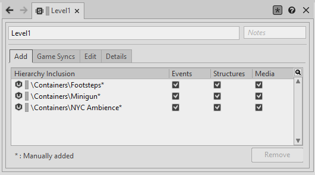

在工程开发期间，您可以随时从 SoundBank Manager 中生成 SoundBank。SoundBank Manager 中会列出 User-defined SoundBank 和 Auto-defined SoundBank。每个列表都包含有关各个 SoundBank 的类型和大小的一些基本信息。另外，SoundBank Manager 中还包含单独的平台和语言列表。在做出选择后，将决定要生成哪些 SoundBank。


**相关主题**

- [Wwise Fundamentals Module 18: Working with Multiple
  SoundBanks](https://www.audiokinetic.com/en/courses/wwise101/?source=wwise101&id=working_with_multiple_soundbanks)
- [Wwise Fundamentals Module 19: Managing SoundBank size](https://www.audiokinetic.com/en/courses/wwise101/?source=wwise101&id=managing_memory)

---

#### 了解如何在游戏中加载 SoundBank

在学习如何在 Wwise 中创建、填充和生成 SoundBank 之前，要先了解游戏加载和管理 SoundBank 信息的不同方式。最佳方式取决于各种不同的因素，包括开发的游戏类型、运行游戏的平台以及项目团队设定的限制。

为了提高灵活性和满足几乎所有游戏类型的需求，Wwise 提供了多种将音频和振动加载到游戏中的方法，包括以下几种：

- [“加载整个 SoundBank”一节](ch40s01.html#loading_bank "加载整个 SoundBank")
- [“Prepare SoundBank（全部内容）”一节](ch40s01.html#preparing_bank_all_content "Prepare SoundBank（全部内容）")
- [“Prepare 动作事件”一节](ch40s01.html#preparing_action_events "Prepare 动作事件")

###### 加载整个 SoundBank

加载 SoundBank 的传统方法使用同时包含事件数据、对象结构数据和媒体的 SoundBank。这些 SoundBank 的全部内容在游戏的特定时刻加载和卸载，确保事件数据和相关媒体在被触发时就可以播放。

下图演示在游戏中使用传统方法创建的 SoundBank 如何在玩家从 1 级升级到 2 级时加载到平台内存和从平台内存中卸载。

|  |
| --- |
|  |

由于特定 SoundBank 的所有数据和媒体同时加载到内存中，因此这种方法不仅确保所有数据和媒体可以在需要时播放，而且在游戏中需要执行极少的磁盘寻址，从而将磁盘腾出来执行对磁盘需求较大的其它任务。

此方法的主要缺点是在 SoundBank 的整个加载期间将占用大量的内存，使您无法灵活地处理复杂的大型游戏。此方法还显式加载 SoundBank 中的所有内容，而不验证媒体文件是否已经加载到内存。这可能会导致同一媒体文件被多次加载到内存中。尽管此传统方法有上述缺点，但是在许多情况下仍非常有用。例如，用于所有数据和媒体必须随时可用的经典弹珠游戏。

###### Prepare SoundBank（全部内容）

为了克服 LoadBank() 机制的一些缺点，您可以先采用 Prepare 操作来"预备" SoundBank 而不是使用 AkBankContent\_All() 加载它们（译注：为了突出 Prepare 是一种 API 调用，文档尽量用英语原文来代表这种预备操作，而不做通篇翻译）。在使用此方法时，SoundBank（音频包）仍可包含所有内容类型（Event、结构数据和媒体文件）；不过，此方法不会立即加载媒体文件，而是借助 PrepareEvent() 机制将所有媒体加载到内存中。通过使用此机制加载媒体，Wwise 首先查看媒体文件是否已经存在内存中，然后再加载它。这可以避免内存中出现媒体文件重复，从而将内存占用保持在最低水平。

除了可以节省内存外，此方法还可以保证顺序访问磁盘，这将避免在使用 PrepareEvent() 中一次 Prepare 一个 Event 时可能发生的随机磁盘寻址。

下图演示了"Prepare Bank（All Content）"（预备 SoundBank（全部内容））机制如何将元数据和内容加载到平台内存中。

|  |
| --- |
|  |

在加载包含 [*[Vorbis](go01.html#glossary_vorbis "Vorbis")*](go01.html#glossary_vorbis) 编码或 [*[WEM Opus](go01.html#glossary_opus "Opus")*](go01.html#glossary_opus) 编码媒体的 SoundBank 时，可利用  [Preparation\_LoadAndDecode](https://www.audiokinetic.com/library/?source=SDK&id=namespace_a_k_1_1_sound_engine_a21e0dbb1f9aebfc22fdd88634dc1067b.html) 预备类型将这些媒体文件解码为非压缩 [*[PCM](go01.html#glossary_pcm "PCM（脉冲编码调制）")*](go01.html#glossary_pcm) 文件。这会使 SoundBank 体积变大，但当事件调用媒体文件时，将立即播放而无需进行解码。

###### Prepare 动作事件

The PrepareEvent() method dynamically loads media when it is required. To use method, the
Action Event metadata must be in a loaded SoundBank and the associated media files
must be accessible in the file system. The corresponding structure metadata can be
included in the same SoundBank as Events or placed in a separate SoundBank, either
user-defined or auto-defined. It can therefore simplify Event and SoundBank
management because you can prepare multiple Events without the need to remember
which SoundBanks contain the necessary media: the Wwise sound engine automatically
retrieves the required files, wherever they are.

This method ensures that after a PostEvent call, the Action Event audio is played
immediately (on the same frame) because there is no need to load the media. However,
it uses more memory than other methods because the media and metadata are loaded and
remain in memory.

|  |  |
| --- | --- |
| [备注] | 备注 |
| - 只有动作 Event 可事先 Prepare。"PrepareEvent()"方法不适用于对话事件。 - Avoid using PrepareEvent() when working with the Wwise Unreal   Integration. Unreal embeds media files in their respective events or   Asset Libraries, so PrepareEvent() would not be able to function   correctly. - Streamed audio that does not have a prefetch buffer cannot be prepared   because the audio is played directly from storage. |

To use this method, call the LoadBank() method to load the SoundBank that contains the
Action Event metadata and keeps it in memory. When PrepareEvent() is called, the
sound engine then "prepares" the Action Events before the game calls PostEvent(). To
prepare an Event, the sound engine loads all non-streaming, referenced media files
from the file system and all referenced structure metadata from a SoundBank, if it
is not already loaded. When the Action Event is no longer required, unload it with
Preparation\_Unload so the corresponding media files are purged from memory.

下图说明如何事先 Preapre Event，以便只将必需的媒体文件加载到内存中。

|  |
| --- |
|  |

When the metadata (also referred to as structure data) is not stored in the same SoundBank as the Events, Wwise includes references to the corresponding content stored in other SoundBanks. Wwise 可以使用名称或 ID 来引用其它 SoundBank。若要在声音引擎中使用 SoundBank 名称，则须在 Project Settings（工程设置）对话框的 SoundBanks（音频包）选项卡中选中 **Use SoundBank Names**（使用音频包名称）选项。To use IDs, clear the option. For more information, see [“SoundBanks 选项卡”一节](ch57s08s03.html "SoundBanks 选项卡").

Media that a SoundBank references must be stored as loose files on disk or be resolvable by
the low-level IO (such as in a File Package).

This method uses memory efficiently but performs more disk seeking than other methods,
which might not be appropriate in situations when many files are already being
streamed from the disk. Also, if the game uses States and Switches, media files
could be loaded into memory unnecessarily. For example, if there are different
sounds for the different moods or energy levels of a crowd in your game, they are
all loaded into memory even if only some of the Switch sounds are valid within a
particular zone of the game. To avoid this problem, you can prepare specific States
or Switches that only load the media files associated with the prepared States or
Switches.

The following illustration shows how you can prepare Switches in advance to limit the
amount of media that is loaded into memory at any particular point in the
game.

|  |
| --- |
|  |

虽然提前 Prepare Game Sync 可以优化内存占用，但注意，这也会降低媒体加载到内存中的速度。Read times are longer when the sound engine needs to search the disk to find the sounds that correspond to the prepared game syncs.

By dynamically loading only the required audio files, The second method provides
flexibility to handle situations where you have either large zones or levels with
many sounds, or limited amounts of memory available to store Event data, structure
data, and media.

|  |  |
| --- | --- |
| [备注] | 备注 |
| [LoadBank](https://www.audiokinetic.com/library/edge/?source=SDK&id=namespace_a_k_1_1_sound_engine_a496b9917fe035f301bcff0accd61f80f.html)、[AkBankContent\_All](https://www.audiokinetic.com/library/?source=SDK&id=namespace_a_k_1_1_sound_engine_ae775cb922db262649dbbaa3fa8117d83.html)、[PrepareEvent](https://www.audiokinetic.com/library/edge/?source=SDK&id=namespace_a_k_1_1_sound_engine_a98b617d05618e6d18680d198845ff3d7.html)、[PrepareGameSyncs](https://www.audiokinetic.com/library/edge/?source=SDK&id=namespace_a_k_1_1_sound_engine_ad5fc8ab51eecee6511d5c61b03659fa4.html) 和 [AkBankContent\_StructureOnly](https://www.audiokinetic.com/library/?source=SDK&id=namespace_a_k_1_1_sound_engine_ae775cb922db262649dbbaa3fa8117d83.html) 函数均可通过 Wwise API 访问。For more information on loading SoundBanks and preparing Events and game syncs, see the [Integrating Banks](https://www.audiokinetic.com/library/?source=SDK&id=integrating__elements__banks.html) section of the Wwise SDK. |

For a detailed overview of the different methods you can use to manage your SoundBanks, see
[“SoundBank 管理策略”一节](ch40s02.html "SoundBank 管理策略").

---

#### SoundBank 管理策略

以下章节阐述了可用于在游戏中创建 SoundBank（音频包）的不同方法。在一款游戏中，您可以使用一种方法或多种不同方法的组合。由于各个游戏各不相同，因此您选择的方法将取决于游戏的具体需求。

在创建 SoundBank 时所做的选择会对管理游戏音频和振动素材所需的工作量产生很大影响。而且，还会直接影响游戏的性能。强烈建议声音设计师和音频程序员仔细查看本节内容以便双方充分了解各种可能性。通过协作，您可以提出满足游戏特定需求的策略。在决定要选用怎样的策略时，要考虑内存用量、I/O 访问以及集成到游戏中的便利度。在大多数情况下，关键在于如何很好地兼顾内存用量和集成的便利性。

以下各节中描述了以下方法：

- [“"All-in-one" SoundBank”一节](ch40s02s01.html "\"All-in-one\" SoundBank")
- [“多个完整的 SoundBank”一节](ch40s02s02.html "多个完整的 SoundBank")
- [“细致地管理媒体”一节](ch40s02s03.html "细致地管理媒体")
- [“Prepare 动作事件”一节](ch40s02s04.html "Prepare 动作事件")
- [“预备 Event 和 Game Sync（Switch 和 State）”一节](ch40s02s05.html "预备 Event 和 Game Sync（Switch 和 State）")
- [“Auto-defined SoundBank”一节](ch40s02s06.html "Auto-defined SoundBank")

|  |  |
| --- | --- |
| [备注] | 备注 |
| 另外还有其它两种方法，它们融合了现有 LoadBank() 和 PrepareEvent() 方法的长处。使用这两种方法可以 Prepare 整个 SoundBank，这意味着您可以将所有数据和媒体合并到同一个 SoundBank 中，避免内存中出现媒体重复，并只有在需要时才加载媒体。有关 Prepare SoundBank 的详细信息，请参阅 Wwise SDK 文档中的 [“声音引擎集成纵览” > “将 Wwise 元素集成到游戏中” > “Prepare SoundBanks” >“集成详情 ―― SoundBanks” > “加载 SoundBank” > “Prepare SoundBank”](https://www.audiokinetic.com/library/?source=SDK&id=soundengine__banks__loading.html#soundengine_banks_preparingbanks)。 |

|  |  |
| --- | --- |
| [技巧] | 技巧 |
| 在加载包含 [*[Vorbis](go01.html#glossary_vorbis "Vorbis")*](go01.html#glossary_vorbis) 编码或 [*[WEM Opus](go01.html#glossary_opus "Opus")*](go01.html#glossary_opus) 编码媒体的 SoundBank 时，可利用 "Preparation\_LoadAndDecode"  [PreparationType](https://www.audiokinetic.com/library/?source=SDK&id=namespace_a_k_1_1_sound_engine_a21e0dbb1f9aebfc22fdd88634dc1067b.html) 将媒体文件解码为非压缩 [*[PCM](go01.html#glossary_pcm "PCM（脉冲编码调制）")*](go01.html#glossary_pcm) 文件。这会导致 SoundBank 变大，但可缩短在调用时访问媒体的时间，因为在播放时就不用等待解压了。  此策略可与一系列其它方法结合来优化素材的管理。 |

---

##### "All-in-one" SoundBank

此方法适用于以下情形：

- 游戏拥有有限数量的音频或振动素材。
- 游戏拥有大量的空闲内存。

当然，大部分游戏都没有可浪费的内存。这种方法的主要优点在于使用和维护起来都很简单。使用这种方法的主要原因是在将整个 Wwise 工程集成到游戏中时用时最少。

**在 Wwise 中创建一体化 SoundBank 的方法是：**

1. 创建一个 SoundBank，然后取一个适当的名称。
2. 将 SoundBank 加载到 SoundBank Editor（音频包编辑器）中，然后将以下条目拖到 Add（添加）选项卡中：

   - The "\Containers\Default Work Unit"
   - "\Events\Default Work Unit"
   - "\Dynamic Dialogue\Default Work Unit"（只有使用动态对白时才需要）

   在默认情况下，Events、Structures 和 Media 列下的复选框全部选中。对于此方法，我们希望将所有内容都包含在 SoundBank 中，因此这非常有用。

   |  |  |
   | --- | --- |
   | [备注] | 备注 |
   | 在新的工程中，只有默认 Work Unit 可用。若创建了别的 Work Unit，可根据需要将其一并添加到 SoundBank 中。 |
3. 在将所有 Work Unit（工作单元）添加到 SoundBank 中后，可生成 SoundBank 并将生成的 SoundBank 文件复制到游戏应用程序中。

###### 集成

有关集成的详细信息，请参阅 Wwise SDK 文档中的 [All-in-one SoundBank](https://www.audiokinetic.com/library/edge/?source=SDK&id=sdk_bank_training.html#sdk_bank_training_Method_1) 章节。

###### 有关此方法的补充说明

下表列举了此方法的优点和缺点。

| 优点 | 缺点 |
| --- | --- |
| 从声音设计师的角度来看，维护 SoundBank 的内容最容易。  由于游戏总是加载同一个 SoundBank，因此更改 SoundBank 的内容时无需重新编译游戏。  在游戏中没有复杂的 SoundBank 加载和卸载过程。  在游戏中无需跟踪可用或者不可用的声音。 | 内存利用率不高，因为整个游戏的所有 Event、结构和内存媒体一直占用内存。 |

虽然这种方法是将音频和振动快速轻松集成到游戏中的好方法，但不要等到工程结束时才考虑换成别的方法来提高游戏内存利用率。

---

##### 多个完整的 SoundBank

此方法适用于以下情形：

- 游戏或其音频／振动内容可以分成多个部分。

此方法非常适用于单人游戏，在单人游戏中，所有可能用到的声音和振动都只是由玩家在游戏中的当前位置决定的。通过将内容分割成多个 SoundBank，管理内存的效率比第一种方法更高，同时仍可轻松地将音频和振动集成到游戏中。

首先，确定如何拆分 SoundBank（音频包）。以下为示例策略：

- 一个通用 SoundBank，其中包含在游戏任何时刻都可能发生的所有 Event。此 SoundBank 将一直保持载入内存。
- 每个关卡或环境配备一个 SoundBank。根据主人公实际位置变化而需要用到的声音和振动。
- 以及一些额外 SoundBank，具体取决于特定游戏的需求。

**在 Wwise 中创建多个完整 SoundBank 的方法是：**

1. 创建游戏所需的多个 SoundBank，并正确地为它们命名，例如"CommonEvent"、"Level\_1"、"Level\_2"和"Level\_3"。
2. 在 Wwise 中把事件分组到虚文件夹中。为每个 SoundBank 创建一个虚文件夹，然后把每个文件夹拖到相应 SoundBank 中。通过文件夹来添加 SoundBank 内容，就可以避免每次工程中加了新事件时都必须编辑 SoundBank 内容的情况。当虚文件夹中的内容改变时， SoundBank 会自动更新。
3. 将所有 Event 添加到各自的 SoundBank。只有在添加原始文件夹之外的 Event 时（如果有的话）才需要此步骤。如果多个 SoundBank 中需要某个 Event，则只需将它添加到必需的 SoundBank 即可。
4. 生成 SoundBank，并将生成的 SoundBank 文件夹复制到游戏应用程序。

###### 集成

有关集成的详细信息，请参阅 Wwise SDK 文档中的[多个完整的 SoundBank](https://www.audiokinetic.com/library/edge/?source=SDK&id=sdk_bank_training.html#sdk_bank_training_Method_2) 章节。

###### 有关此方法的补充说明

下表列举了“多个完整的”SoundBank 方法的优点和缺点。

| 优点 | 缺点 |
| --- | --- |
| 需要的内存可能比 All-in-one SoundBank 少很多。  非常易于集成到游戏中。 | 不太适合在线游戏或基于 Event 的游戏，在这些游戏中，音频或振动需求不仅仅由主人公的位置等简单因素来驱动。  因为 SoundBank 可能包含重复的数据，所以可能导致内存中重复加载某些媒体文件。  因为不同的 SoundBank 可能包含类似的内容，所以可能导致 SoundBank 的总体磁盘占用空间增大。 |

---

##### 细致地管理媒体

此方法适用于以下情形：

- 游戏拥有大量驻留内存的媒体素材。
- 声音设计师很难事先预测媒体需求。
- 工程使用切换开关和状态来确定将为特定 Event 播放的声音或振动对象。
- 声音不易于划分成多个确定的部分。

有的游戏非常复杂，可能要按多种因素来触发声音，这些因素包括游戏纹理、时辰、游戏对象的运动，在多人在线游戏中，还可能包括其它玩家的操作。例如在基于 Event 或对象的环境中，声音可以根据其它一些游戏对象的距离加载到内存中。各个游戏对象都可能有一列 SoundBanks 必须加载，要么因为这些 SoundBank 对应的声源处于一个给定距离范围内，要么仅仅因为按规则只要这些声音存在就必须使用。

另外，切换开关和状态可以确定播放对象。当将播放这些对象的 Event 添加到 SoundBank 时，所有可能用到的媒体也会自动添加到 SoundBank。比如，可能会有一个名为 Play\_Footstep 的 Event。此 Event 将根据地面的当前纹理播放相应的声音，当前纹理通过更改切换开关来指定。虽然这种方法效果非常好，但是当游戏场景发生在伦敦的一座建筑内时，如果在内存中将声音"footstep\_sand.wav"或"footstep\_winter.wav"保持随时就绪状态是对内存的一种浪费。

在此情况下，为了避免浪费内存，您可以将 Event 或对象结构添加到 SoundBank，然后指定 SoundBank 中将要包含的相应对象。例如，让我们对不同的纹理使用不同的脚步声。<XXXX CSOFT xxxxx>在此情况下，我们可以创建以下 SoundBank：

- "EventBank"，其中包含"Play\_Footstep"Event 和结构。
- Winter\_Footstep\_bank：其中包含仅在游戏的某些部分（冬天）发生的脚步声所对应的媒体。
- Desert\_Footstep\_bank：其中包含仅在游戏的某些部分（沙漠）发生的脚步声所对应的媒体。
- "Common\_Footstep\_bank"，其中包含可在任何地方（木材、混凝土等）发生的脚步声所对应的媒体。

###### 在 Wwise 中创建 SoundBank 来细致地管理媒体

假设游戏中有三种不同的纹理（雪地、沙地和混凝土地）。在 Wwise 中，有一个切换容器根据切换开关"ground\_texture"播放三个随机容器中的一个。三个随机容器中的每一个在给定纹理上均有四种脚步声版本。

**在 Wwise 中创建用于微管理媒体的 SoundBank 的方法是：**

1. 创建名为"EventBank"的 SoundBank，然后将它加载到 SoundBank Editor。
2. 将"Play\_Footstep"Event 拖入 SoundBank Editor 的“Add”选项卡。
3. 取消选择此 Event 的"Media"复选框，但保持选中 Events 和 Structures 复选框。
4. 创建其它三个 SoundBank，每个纹理各一个。
5. 在各个 SoundBank 中，拖动与此纹理相关的随机容器。

   |  |  |
   | --- | --- |
   | [备注] | 备注 |
   | 如果不拖放随机容器，则分别拖放各个声音也同样有效。但是使用容器的优势是，当容器的内容改变时，容器中的所有声音将自动添加到 SoundBank 中，无需手动完成所有更改。 |
6. 取消选择三个纹理 SoundBank 中的每一个所对应的"Event"和"Structure"复选框，仅保持选中 Media 类型。
7. 生成 SoundBank，并将生成的 SoundBank 文件夹复制到游戏应用程序。

   此时，我们有四个 SoundBank，一个包含与待播放的音频相关的 Event 和结构数据，另外三个仅包含与特定地面纹理相关的媒体。

###### 集成

有关集成的详细信息，请参阅 Wwise SDK 文档中的[细致地管理媒体](https://www.audiokinetic.com/library/edge/?source=SDK&id=sdk_bank_training.html#sdk_bank_training_Method_3)章节。

###### 有关此方法的补充说明

这个例子只是使用此技术可以完成的众多任务之一。由于可以按对象和 Event 逐一决定各个 SoundBank 包含的内容，因此您可以全面控制各个 SoundBank 的内容。虽然您可以为游戏中的每个对象创建单独的 SoundBank，但是这样维护起来会非常困难，因为在游戏中每个新音效和振动效果都需要新的代码才能正确加载 SoundBank。每款游戏应该尝试的目标是在粒度和游戏集成便利性之间找到良好的平衡。

|  |  |
| --- | --- |
| [备注] | 备注 |
| 若想逐个加载声音，最好分别预备 Event 而非加载整个 SoundBank。有关做 Prepare Event 的详细信息，请参阅[“Prepare 动作事件”一节](ch40s02s04.html "Prepare 动作事件")。 |

下表列出了微管理策略在管理媒体时的优缺点。

| 优点 | 缺点 |
| --- | --- |
| 优化内存占用的最佳选择。  您可以充分控制在游戏任意时刻加载哪些媒体。  为您提供 [“SoundBank 向后兼容性”一节](ch40s08s02.html "SoundBank 向后兼容性")，支持加载较大的媒体 SoundBank。 | 需要声音设计师和游戏程序员密切沟通，共同确定必须加载的 SoundBank 和加载的时机。 |

---

##### Prepare 动作事件

此方法适用于以下情形：

- 需要将媒体设为很高的粒度级别以保持较低的内存用量。
- 不用为管理哪些媒体素材必须指派给哪个 SoundBank 而烦恼。

什么叫预备 Action Event（动作事件）？在调用 [`PrepareEvent()`](https://www.audiokinetic.com/library/edge/?source=SDK&id=namespace_a_k_1_1_sound_engine_a98b617d05618e6d18680d198845ff3d7.html)  函数时，系统会对 Action Event 进行分析，以确保所有与此 Event 相关的结构和媒体均已加载到内存中。否则，系统会自动从磁盘流式传入缺失的信息。在明确撤消以前，Event 一直处于 Prepare 状态。

|  |  |
| --- | --- |
| [备注] | 备注 |
| 只有动作 Event 可事先 Prepare。"PrepareEvent"方法不适用于对话事件。 |

此方法要求创建至少一个 SoundBank，然而结构部件可以位于与 Event 所在的同一个 SoundBank 中，也可处于完全独立的一个 SoundBank 中。

在构建使用 PrepareEvent 机制的 SoundBank 时，条件是至少在一个 SoundBank 中能够找到所需的所有 Event 和结构，而且文件系统必须能够访问这些松散媒体素材。记住，将结构划分到多个 SoundBank 中可以提高内存的管理效率。

在预备 Action Event 之前，Event 本身必须已从某个 SoundBank 加载到内存中（使用 LoadBank()）。由于 Event 中包含在 Prepare Event 时所需的依赖项的信息，因此必须首先加载 Event 所在的 SoundBank。

|  |  |
| --- | --- |
| [备注] | 备注 |
| 另外还可结合 AK::SoundEngine::PrepareBank 来 Prepare Event。使用 PrepareBank 机制的主要优势是无需将 SoundBank 划分为“Event 库”和“媒体库”。在这种方法下，所有内容包含在同一个 SoundBank 中，但是在调用 AK::SoundEngine::PrepareBank 时，只有 SoundBank 的元数据内容加载到内存。当游戏需要媒体时，您可以使用 PrepareEvent 加载媒体。 |

**在 Prepare Event 时在 Wwise 中设置 SoundBank 的方法是：**

1. 创建一个名为"Event"的 SoundBank，并加载到 SoundBank Editor 中。
2. 把工程中的一些动作事件添加到"Events" SoundBank 中，或仅添加事件工作单元。
3. 禁用 **Media** 复选框，只将 **Events** 和 **Structures** 复选框保留为启用状态。在使用 PrepareEvent() 时，媒体不得位于 SoundBank 内，但可以作为松散文件直接从磁盘中加载。

   |  |  |
   | --- | --- |
   | [备注] | 备注 |
   | 在本例中，所有 Event 和结构包含在一个 SoundBank 中。虽然对于小型工程，这是可以接受的，但您很可能会需要将内容拆分到多个 SoundBank。另外还可以创建独立的"Structures"SoundBank，它无需从 SDK 命令行进行显式加载或 Prepare，因为各个 Event 都包含对需要加载的其它 SoundBank 的引用。 |
4. 生成 SoundBank，并将生成的 SoundBank 文件夹复制到游戏应用程序。

   |  |  |
   | --- | --- |
   | [备注] | 备注 |
   | 单个 SoundBank 中包含的结构数据不可在运行时拆分。因此，如果您使用了 AK::SoundEngine::PrepareEvent()，并且需要来自独立 SoundBank 的结构数据，则该 SoundBank 中的所有结构将一次性加载。为此，您可能会想将工程中的结构内容拆分到多个 SoundBank 中，以便最大限度地减少加载到内存中的非必要信息的数量。 |

###### 集成

有关集成的详细信息，请参阅 Wwise SDK 文档中的[预备 Action Event](https://www.audiokinetic.com/library/edge/?source=SDK&id=sdk_bank_training.html#sdk_bank_training_Method_4) 章节。

###### 有关此方法的补充说明

记住，对  [`AK::SoundEngine::PrepareEvent()`](https://www.audiokinetic.com/library/edge/?source=SDK&id=namespace_a_k_1_1_sound_engine_a98b617d05618e6d18680d198845ff3d7.html)  的调用必须视为 I/O 函数调用。在上例中，我们使用了阻塞函数。您可以使用 `AK::SoundEngine::PrepareEvent()` 函数的其它重载来实现非阻塞调用，然后用另一个回调来响应加载完成的通知。

下表列出了“预备 Action Event”的优点和缺点。

| 优点 | 缺点 |
| --- | --- |
| 生成 SoundBank 的过程很简单。  媒体的粒度级别很高。  内存占用总体保持在低水平。  过程自动化非常容易。 | 当逐一加载媒体素材时，可能增加磁盘上的读取和寻址次数。  对总体内存占用量的控制力减弱。  使用交互式音乐时将变得复杂。 |

---

##### 预备 Event 和 Game Sync（Switch 和 State）

此方法适用于以下情形：

- 需要将媒体设为很高的粒度级别以保持较低的内存用量。
- 不想为将媒体素材拆分到多个 SoundBank 而烦恼。
- 工程中的 Event 根据切换开关和状态播放不同的声音。
- 工程中包含根据切换开状和状态播放音乐的互动音乐。

此方法基本与上一种方法相同，但对 Event 做 Prepare 时加载的媒体具有更大的控制力。使用这种方法时，只有 Prepare 的事件和当前活跃的 Game Sync 同时相关的媒体才会加载到内存中。

假设一个简单的工程中有两个 Event ："Play\_Maincharacter\_FootSteps"和"Play\_Monster\_Footsteps"。各个 Event 播放不同的切换容器，后者根据角色在行动时脚下的地面纹理来播放不同的随机声音。切换开关组名称为"GroundTexture"，拥有三个可能的状态："Snow"、"Concrete"和"Sand"。

在 Wwise 中，切换开关容器层级结构如下所示：


在此例中，18 个声音（3 个声音一组，共 6 组）可能加载到内存中。您可以采用“[“Prepare 动作事件”一节](ch40s02s04.html "Prepare 动作事件")”的方法，但粒度级别不会高于“每个 Event 有六个声音加载到内存中”。

您可以采用“[“细致地管理媒体”一节](ch40s02s03.html "细致地管理媒体")”的方法来获得较高的粒度级别，但要为这个简单工程创建六个不同的 SounbBank（在实际工作场合下的工程中，SoundBank 的数量将迅速增加）。于是当怪兽出现时，您必须查看可能用到的纹理，然后再加载相应的 SoundBank。

在当前方法中，您只需指定可能的 Event 和 Game Sync，然后只有合适的媒体才会加载。为了简便起见，可以将所有媒体集中到一个 SoundBank 中。

**在对 Event 和 Game Sync 做 Prepare 时设置 SoundBank 的方法是：**

1. 创建名为"Events"的 SoundBank，并加载到 SoundBank Editor。
2. 将两个 Event 拖到 SoundBank Editor 的 Add 选项卡。
3. 禁用 **Media** 复选框，只将 **Events** 和 **Structures** 复选框保留为启用状态。在使用 PrepareEvent() 时，媒体不得位于 SoundBank 内，但可以作为松散文件直接从磁盘中加载。

   |  |  |
   | --- | --- |
   | [备注] | 备注 |
   | 在本例中，所有 Event 和结构包含在一个 SoundBank 中。虽然对于小型工程，这是可以接受的，但您很可能会需要将内容拆分到多个 SoundBank。另外还可以创建独立的"Structures"SoundBank，它无需从 SDK 命令行进行显式加载或 Prepare，因为各个 Event 都包含对需要加载的其它 SoundBank 的引用。 |
4. 生成 SoundBank，并将生成的 SoundBank 文件夹复制到游戏应用程序。

   |  |  |
   | --- | --- |
   | [备注] | 备注 |
   | 单个 SoundBank 中包含的结构数据不可在运行时拆分。因此，如果使用 AK::SoundEngine::PrepareEvent()，并且需要来自单独 SoundBank 的结构数据，则该 SoundBank 中的所有结构将一次性加载。为此，您可能会想将工程中的结构内容拆分到多个 SoundBank 中，以便最大限度地减少加载到内存中的非必要信息的数量。 |

###### 集成

有关集成的详细信息，请参阅 Wwise SDK 文档中的[预备 Event 和 Game Sync（Switch 和 State）](https://www.audiokinetic.com/library/edge/?source=SDK&id=sdk_bank_training.html#sdk_bank_training_Method_5)章节。

###### 有关此方法的补充说明

下表列举了对 Game Sync 做 Prepare 的优点和缺点。

| 优点 | 缺点 |
| --- | --- |
| 声音包生成过程简单。  媒体的粒度级别很高。  保持较低的总体内存占用。  易于实现过程自动化。  只有加载有用的媒体。 | 当逐一加载媒体素材时，可能增加磁盘上的读取和寻址次数。 |

---

##### Auto-defined SoundBank

此方法适用于以下情形：

- 声音设计师很难事先预测媒体需求。
- 需要将媒体设为很高的粒度级别以保持较低的内存用量。
- 最好以 SoundBank 为单位逐个打包 Event（事件）。

为此，可将 Wwise 配置为针对 Event 和 Auxiliary Bus（辅助总线）自动定义 SoundBank。

**启用 Auto-Defined SoundBank：**

1. 在 Wwise 菜单栏中，依次单击 **Project** > **Project Settings**（工程 > 工程设置）或按下 Shift+K。
2. 在 Project Settings（工程设置）对话框中，选中 SoundBanks（音频包）选项卡，然后选中 **Enable Auto-Defined SoundBanks**（启用自动定义的音频包）复选框。

在选中后，Wwise 便会针对以下各项自动定义 SoundBank：

- User-defined SoundBank（用户定义的音频包）中没有包含的 Event。
- 所有 Auxiliary Bus。

有关更多详细信息，请参阅 [“SoundBanks 选项卡”一节](ch57s08s03.html "SoundBanks 选项卡") 章节。

SoundBank Manager（音频包管理器）的 Auto-Defined SoundBanks（自动定义的音频包）列表中包含可能产生自动定义的 SoundBank 的所有 Wwise 对象。对于每个对象，列表都提供有以下各列来确定是否定义了 SoundBank：

- **Automatic**（自动）：是否定义了 SoundBank（Yes 或 No）。
- **Inc**（启用）：对象的 Inclusion 属性。
- **In User SoundBanks**（在用户音频包中）：一系列包含对象的 User-defined SoundBank。

下图显示了配置为自动定义 SoundBank 的工程的 SoundBank Manager。


在示例工程中，以下 Event 没有 SoundBank：

- Play\_RC3 Event 没有 SoundBank，因为未设置 Event 的 Inclusion 属性。
- Play\_Music Event 没有 SoundBank，因为该 Event 包含在 User-defined SoundBank Music 中。

|  |  |
| --- | --- |
| [备注] | 备注 |
| **Auto-Defined SoundBanks** 列的内容会在每次对工程作出更改后动态更新。其余列只会在生成 SoundBank 后更新。**Date Updated**（更新日期）列会指示上次更新的时间。 |

Auto-defined SoundBank 不包含媒体文件，只包含 Structure 和 Event。下图显示了察看 Auto-defined SoundBank Play\_RC1 时的 SoundBank Editor 的 Add（添加）和 Edit（编辑）选项卡。Auto-defined SoundBank 的内容无法手动编辑。不过，SoundBank Editor 的各个选项卡会提供有关 Auto-defined SoundBank 的内容和引用的有用信息。


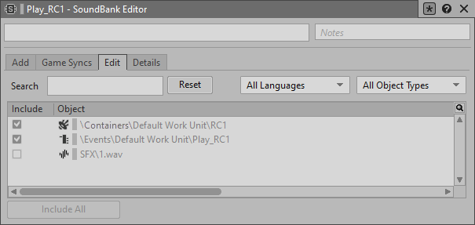

###### 集成

Auto-defined SoundBank 以显式方式排除了媒体。若要使用这种 SoundBank，需添加额外的游戏代码。See the Wwise integration documentation.

- For Unreal: [Understanding Auto-Defined and User-Defined SoundBanks](https://www.audiokinetic.com/library/edge/?source=UE4&id=unreal_using_soundbanks_concepts.html)
- For Unity: [Understanding Auto-Defined and User-Defined SoundBanks](https://www.audiokinetic.com/library/edge/?source=Unity&id=unity_use_soundbanks_concepts.html)

###### 有关此方法的补充说明

下表列出了“自动定义 SoundBank”的优点和缺点。

| 优点 | 缺点 |
| --- | --- |
| 可创建具有较高粒度级别的 SoundBank 和媒体以便游戏引擎根据需要进行管理。  SoundBank 的创建比较简单。  允许综合运用 User-defined SoundBank 和 Auto-defined SoundBank。 | Auto-defined SoundBank 的内容无法手动编辑。  当逐一加载媒体素材时，可能增加磁盘上的读取和寻址次数。  在生成 SoundBank 时，必须生成所有 SoundBank。 |

---

#### 使用 User-defined SoundBank

要在声音引擎中使用 SoundBank 名称，必须在 Project Setting 对话框的 SoundBank 选项卡上选择 Use SoundBank Names 选项。在此，可设置游戏所需 SoundBank 的大小限制和数量。然后，便可根据所选策略以及游戏中的角色、对象、区域或关卡将 Event、对象结构和媒体分组存放到各个 SoundBank 中。

Wwise 对可加载到内存中的 SoundBank 数量及其大小并没有限制。对 SoundBank 大小的唯一限制在于系统或主机上可用的内存。各个工程各不相同，您可以自行决定最适合您工程的方法。

鉴于开发的游戏类型以及选用的 SoundBank（音频包）策略，SoundBank 可能包含不同类型的信息和媒体。您选择的策略将最终确定 SoundBank 的大小和内容。SoundBank 可包含以下任意类型的工程元素的组合：

- Event 数据
- 声音、音乐或振动结构数据
- 媒体文件

在使用 User-defined SoundBank 时涉及以下任务。您可以选择手动创建并填充 SoundBank，也可使用定义文件来批量操作（或两种方法并用）。

- [“手动创建 User-Defined SoundBank”一节](ch40s03s01.html "手动创建 User-Defined SoundBank")
- [“通过导入定义文件创建并填充 SoundBank”一节](ch40s03s02.html "通过导入定义文件创建并填充 SoundBank")
- [“手动填充 SoundBank”一节](ch40s03s03.html "手动填充 SoundBank")
- [“管理 SoundBank 内容”一节](ch40s03s04.html "管理 SoundBank 内容")
- [“重命名 SoundBank”一节](ch40s03s05.html "重命名 SoundBank")
- [“删除 SoundBank”一节](ch40s03s06.html "删除 SoundBank")

---

##### 手动创建 User-Defined SoundBank

在 Wwise 中，可手动创建并填充单个 SoundBank（音频包），也通过导入定义文件来批量创建并填充 SoundBank。该定义文件由用于将 Event（事件）集成到游戏中的 3D 应用程序或关卡编辑器生成。有关导入定义文件的详细信息，请参阅[“通过导入定义文件创建并填充 SoundBank”一节](ch40s03s02.html "通过导入定义文件创建并填充 SoundBank")。为此，可将 Wwise 配置为针对 Event 和 Auxiliary Bus（辅助总线）自动定义 SoundBank。请参阅 [“Auto-defined SoundBank”一节](ch40s02s06.html "Auto-defined SoundBank")。

您可以在 Wwise 的两个不同区域中手动创建 SoundBank：

- [在 Project Explorer 中创建 SoundBank 的方法是：](ch40s03s01.html#to_create_soundbank_from_project_explorer "在 Project Explorer 中创建 SoundBank 的方法是：")
- [在 SoundBank Manager 中创建 SoundBank 的方法是：](ch40s03s01.html#to_create_soundbank_from_soundbank_manager "在 SoundBank Manager 中创建 SoundBank 的方法是：")

|  |  |
| --- | --- |
| [备注] | 备注 |
| 第一次创建 SoundBank 时，Wwise 自动将它命名为"New\_SoundBank\_X"。您可以重命名 SoundBank，为它取一个更加有意义的名称。若打算重命名 SoundBank，请在开发过程的早期执行，因为后期更改的话可能还要额外编程。 |

**在 Project Explorer 中创建 SoundBank 的方法是：**

1. 通过执行以下任一操作切换到 SoundBank 布局：

   - 在菜单栏中，点击 **Layouts** > **SoundBank**。
   - 按 **F7**。
2. 在 Project Explorer 中，切换到 SoundBank 选项卡。
3. 执行以下操作之一：

   - 选择虚拟文件夹或工作单元，然后点击 Project Explorer 中的 **SoundBank** 图标。
   - 右键点击虚拟文件夹或工作单元，然后从快捷菜单中选择 **New Child** > **SoundBank**。

   此时新的 SoundBank 将高亮显示在 Project Explorer 中。
4. 输入 SoundBank 的新名称并按 **Enter**。

   SoundBank 于是创建完成并添加到 SoundBank 列表中了。

   |  |  |
   | --- | --- |
   | [备注] | 备注 |
   | SoundBank 名称中只能包含不带变音符号的的罗马字母、数字和下划线。名称还必须以字母或下划线开头。 |
5. 在 Max Size 文本框中，指定您要为 SoundBank 分配的最大游戏内存。

**在 SoundBank Manager 中创建 SoundBank 的方法是：**

1. 通过执行以下任一操作切换到 SoundBank 布局：

   - 在菜单栏中，点击 **Layouts** > **SoundBank**。
   - 按 **F7**。
2. 在 SoundBank Manager 中，点击 **New** 按钮。

   这时会打开 New SoundBank（新建音频包）对话框。
3. 在 SoundBank 层级结构中，选择您要在其中创建 SoundBank 的工作单元。
4. 在 Name 字段中，将默认名称替换成适合新 SoundBank 的名称。

   |  |  |
   | --- | --- |
   | [备注] | 备注 |
   | SoundBank 名称中只能包含不带变音符号的的罗马字母、数字和下划线。名称还必须以字母或下划线开头。 |
5. 单击 **OK**（确定）。

   SoundBank 于是创建完成并添加到 SoundBank 列表中了。
6. 在 Max Size 文本框中，指定您要为 SoundBank 分配的最大游戏内存。

|  |  |
| --- | --- |
| [备注] | 备注 |
| 若使用版本控制插件且未签出在其中创建 SoundBank 的 Work Unit，Wwise 会询问是否希望仅在尝试保存工程时签出 Work Unit。 |

---

##### 通过导入定义文件创建并填充 SoundBank

其中一种创建并填充 SoundBank（音频包）的方法是导入制表符分隔的文本文件。该文件会按 SoundBank 分类列出游戏中的所有 Event（事件）。通常，这种文件由用于将 Event 集成到游戏中的 3D 应用程序或关卡编辑器生成。在导入定义文件之前，必须在 Wwise 中创建 Event。若 Event 缺失，Import Definition Log 中会对应显示 Event Missing。

定义文件必须包括 SoundBank 的名称和相应的 Event 名称，它们之间通过制表符隔开。下面举例展示了有效的定义文件。其中，→ 表示制表符。

```
          SB1→"Event_01"
          SB2→"Event_02"
          SB2→"Event_03"
          SB3→"Event_04"
```

###### 使用关键字在 SoundBank 中启用/弃用元素

定义文件还可包括特殊关键字，用于定义将在 SoundBank 中启用或弃用的工程元素类型。有以下关键字可供使用：

- **Event**：指定 SoundBank 将包含 Event 信息。
- **Structure**：指定 SoundBank 中将包含声音、音乐或振动结构信息。
- **Media**：指定 SoundBank 中将包含媒体文件。
- **-GameSyncExclusion**：指定特定 Game Sync 将从 SoundBank 中弃用。弃用 Game Sync 时，所有相关声音结构和媒体文件也会被弃用。关键字 -GameSyncExclusion 必须结合以下其中一个关键字使用：

  - **State**：指定特定状态及其所有相关对象和媒体文件都将从 SoundBank 中弃用。此关键字后面必须写上 State Group 名称和 State 名称，名称之间通过制表符隔开。
  - **Switch**：指定特定切换开关及其所有相关对象和媒体文件都将从 SoundBank 中弃用。此关键字后面必须写上切换开关组名称和切换开关名称，名称之间通过制表符隔开。
  - **Trigger**：指定特定触发器及其所有相关对象和媒体文件都将从 SoundBank 中弃用。该关键字后面必须写上 Trigger 名称。
- **-DialogueEvent**：将在 SoundBank 中启用指定特定对白事件。此关键字后面必须写上对白事件的名称、GUID 或short ID（短 ID）。它后面还可以写上 **Event**、**Structure** 或 **Media** 关键字作为包含选项。
- **-EffectShareset**：将在 SoundBank 中启用指定特定效果器 ShareSet。此关键字之后必须附加 Effect ShareSet 的名称、GUID 或 Short ID。它后面还可以写上 **Structure** 或 **Media** 关键字作为包含选项。
- **-AuxBus**：指定将特定辅助总线加入 SoundBank。此关键字后面必须写上总线的名称、GUID 或short ID。它后面还可以写上 **Structure** 或 **Media** 关键字作为包含选项。

```
            My_SoundBank_Normal→"Event_01"
            My_SoundBank_EventandStructure→"Event_02"→Event→Structure
            My_SoundBank_Media→"Event_03"→Media
```

在上图中，被称为"My\_SoundBank\_Normal"的第一个 SoundBank 将包含与 Event\_01 相关的所有 Event 数据、结构数据和媒体文件。被称为"My\_SoundBank\_EventandStructure"的第二个 SoundBank 将只包含与 Event\_02 相关的 Event 和结构数据。被称为"My\_SoundBank\_Media"的第三个同时也是最后一个 SoundBank 将只包含与 Event\_03 相关的媒体文件。

在使用 -GameSyncExclusion 关键字时，必须另起一行为弃用的各个关键字创建单独的条目。弃用 Game Sync 还会弃用所有对应的对象结构和媒体文件。下图展示了 -GameSyncExclusion 关键字在定义文件中的正确用法。其中，→ 表示制表符。

```
            SB1→-GameSyncExclusion→State→StateGroupName→StateName
            SB1→-GameSyncExclusion→Switch→SwitchGroupName→StateName
            SB1→-GameSyncExclusion→Trigger→Trigger
```

|  |  |
| --- | --- |
| [备注] | 备注 |
| Game Sync（State Group、State、Switch Group、Switch 和 Trigger）的名称不需要使用引号（"）。 |

```
            SB1→-EffectShareset→"effect1"→Media
            SB1→-EffectShareset→"effect2"→Structure
            SB1→-EffectShareset→"effect3"→Media→Structure
```

###### 使用 ID 而非字符串来识别 Event 和效果器

如果游戏未对 Event 名称使用字符串，则可以在定义文件中使用以下任一进制系统定义 Event：

- 十六进制
- 小数值

|  |  |
| --- | --- |
| [备注] | 备注 |
| 十六进制和十进制系统可用于标识定义文件中的 Event，但不可用于标识 Game Sync 弃用项中的 State、 Switch 和 Trigger。 |

下图展示如何在定义文件中使用三种不同的进制系统定义 Event。其中，→ 表示制表符。

```
            SB1→"Event_01"
            SB1→26507443
            SB1→0x19478B3
```

|  |  |
| --- | --- |
| [技巧] | 技巧 |
| SoundBank 定义文件还可用于跟踪已经集成到游戏中的、缺失的以及仍需在 Wwise 中创建的 Event。某个程序员可以从游戏中生成 Event 列表，然后您可以将定义文件导入 Wwise。您可以使用日志文件中的信息将游戏中的 Event 与在 Wwise 中创建的 Event 匹配起来。 |

**通过导入定义文件创建 SoundBank 的方法是：**

1. 在 Project Explorer 中，切换到 SoundBank 选项卡。
2. 右键点击您要在其中创建 SoundBank 的工作单元。
3. 从快捷菜单中选择 **Import SoundBank Definition**。

   这时会打开 Open（打开）对话框。
4. 前往保存定义文件的位置。
5. 点击 **Open**。

   这时会打开 Import Definition Log（导入定义日志）对话框。
6. 仔细查看日志中的导入活动。导入活动可以为以下任意一项：

   - **Inclusion Added** ―― 新的事件或效果已添加到现有 SoundBank。
   - **SoundBank Created** ―― 创建了新的 SoundBank。
   - **Inclusion Removed** ―― 某Event 或效果器已从现有 SoundBank 中移除。
   - **Event Missing** ―― 工程中不再存在某 Event 或者某 Event 尚未创建。
   - **Effect Missing** ―― 工程中不再存在某效果器或者某效果器尚未创建。
   - **Exclusion Added** ―― 某 Game Sync 已从现有 SoundBank 中弃用。
   - **Exclusion Deleted** ―― 某 Game Sync 已在现有 SoundBank 中被重新启用。
   - **Exclusion Missing** ―― 工程中不再存在某 Game Sync 或者 Game Sync 尚未创建，因此不能添加弃用项或者从弃用列表中删除。
   - **No Change Detected** ―― 导入的 SoundBank 与 Wwise 中已存在的 SoundBank 相同。
7. 点击 **Close**。

   Wwise 于是会创建 definition file（定义文件）中定义的 SoundBank，并将指定的 Event、对象结构和媒体添加到 SoundBank 中去。

---

##### 手动填充 SoundBank

在手动创建或通过导入定义文件批量创建 SoundBank（音频包）后，可手动添加和排除单个 Event（事件）、Game Sync（游戏同步器）和对象来优化其内容。为帮助您识别 SoundBank 中手动添加或弃用的工程元素，在 SoundBank Editor 的 Add 和 Game Sync 选项卡上，条目旁边会添加一个星号（\*）。


在将工程元素添加到 SoundBank 时，所有相应 Event、对象结构和媒体文件也会自动添加到 SoundBank。然而，您可以通过加入您需要的工程元素类型来修改 SoundBank 的内容。比如，您可能希望 SoundBank 只包含媒体。


为了帮助您更高效地工作，Wwise 允许将完整的结构、工作单元和文件夹从 Project Explorer 拖放到 SoundBank 编辑器中。如果这些工程元素包含子对象，则这些子对象也会自动添加到 SoundBank，但它们只会在 Edit 选项卡上显示。

当父对象、工作单元或文件夹添加到 SoundBank 时，它们与原始工程元素间将保持链接状态。比如，若有 SoundBank 包含一个 Event Work Unit，在稍后将两个 Event 添加到该 Work Unit 时，会将其自动添加到相应 SoundBank。若将该 SoundBank 加载到 SoundBank Editor 中，会发现 Add 选项卡仍然只显示原来的 Event Work Unit，但 Edit 选项卡会显示 Work Unit 内的所有 Event，包括刚刚添加的两个 Event。通过保持此链接，Wwise 确保您的 SoundBank 始终包含工程的最新修改。

|  |  |
| --- | --- |
| [备注] | 备注 |
| 若 SoundBank 包含已从工程中卸载的工程元素，则该工程元素在 SoundBank Editor 的 Add 选项卡中会显示为黄色。 |

**手动填充 SoundBank 的方法是：**

1. 通过执行以下操作之一切换到 SoundBanks 布局：

   - 在菜单栏中，点击 **Layouts** > **SoundBank**。
   - 按 **F7**。
2. 在 SoundBank Manager 中选中一个 SoundBank 来将其加载到 SoundBank Editor 中。
3. 将以下任何元素从 Project Explorer 拖到 SoundBank Editor 的 Add 选项卡：

   - Containers, Sounds, Motion, and Music objects.
   - Folders（文件夹）
   - Event
   - Work Units

   工程元素及其所有相关 Event 的整个层级结构、对象结构和媒体文件将自动添加到 SoundBank。现在您可以进一步优化 SoundBank 的内容，确定您希望启用的工程元素类型。

---

##### 管理 SoundBank 内容

在创建并填充 SoundBank 后，您很可能需要优化内容，在 SoundBank 中启用、弃用和移除特定元素。由于 SoundBank 可包含大量不同的工程元素，为此 Wwise 为您提供了用于启用和弃用工程元素的不同方法，以及帮助您快速定位对象的搜索工具和两个独立筛选选项。

在管理 SoundBank 的内容时，您可以执行以下任务：

- [“在 SoundBank 中启用/弃用工程元素”一节](ch40s03s04s01.html "在 SoundBank 中启用/弃用工程元素")
- [“使用 Game Sync 启用/弃用工程元素”一节](ch40s03s04s02.html "使用 Game Sync 启用/弃用工程元素")
- [“搜索 SoundBank 中的元素”一节](ch40s03s04s04.html "搜索 SoundBank 中的元素")
- [“筛选 SoundBank 中的元素列表”一节](ch40s03s04s05.html "筛选 SoundBank 中的元素列表")
- [“在 SoundBank 之间移动工程元素”一节](ch40s03s04s06.html "在 SoundBank 之间移动工程元素")
- [“从 SoundBank 中移除工程元素”一节](ch40s03s04s07.html "从 SoundBank 中移除工程元素")

---

###### 在 SoundBank 中启用/弃用工程元素

在将 Event 或声音结构添加到 SoundBank 时，Wwise 会自动启用所有相应的 Event、声音结构和音频文件。鉴于对游戏使用的 SoundBank 策略，您可能会想从 SoundBank 中移除所有 Event、声音结构或媒体文件。

###### 示例 C 在 SoundBank 中启用/弃用工程元素

假设您拥有一个包含以下工程元素的小工程：

- 两个随机容器
- 六个声音对象
- 六个音频文件
- 两个播放 Event

您打算在调用 Event 前先通过 Prepare Event 来动态加载媒体文件，因此希望为工程中的所有 Event 构建一个 SoundBank。在这种情况下，您可以先创建 SoundBank，然后将两个 Event 拖到 SoundBank Editor 的 Add 选项卡。

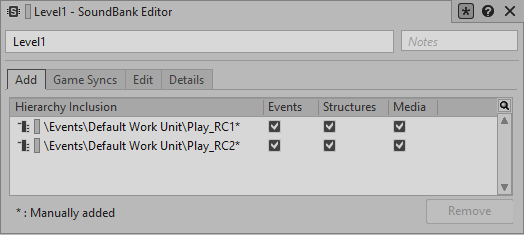

在默认情况下，两个随机容器和六个声音对象的数据，以及六个音频文件，也将添加到 SoundBank。您可以在 SoundBank Editor 的 Edit 选项卡上查看 SoundBank 的全部内容。


要在此 SoundBank 中只包含 Event，您可以返回 Add 选项卡，取消选择 Structures 和 Media 列下的复选框。

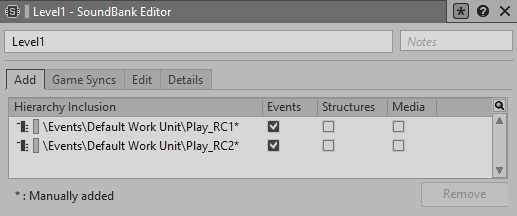

现在 SoundBank 中只启用了两个 Event 的数据。您可以进一步优化 SoundBank，在 SoundBank Editor 的 Edit 选项卡上弃用个别元素。比如，您可能只想将其中某个 Event 包含到此 SoundBank 中以便弃用另一个不需要的 SoundBank。

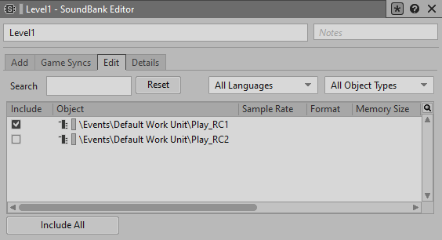

对于包含媒体的 SoundBank，您可以查看有关各个媒体文件的信息，包括它的采样率、音频格式和文件大小。通过掌握这些附加信息，您可以轻松地微调各个文件的转码设置，以遵守特定平台的限制。要更改媒体文件的转码设置，只需右键点击列表中的条目并选择 Conversion Settings 即可。

通过为游戏采取正确的策略，并可灵活地在 SoundBank 中启用和弃用单个元素以及修改单个媒体文件的转码设置，您可以有效地克服游戏的内存约束。

**在 SoundBank 中启用工程元素类型的方法是：**

1. 将 SoundBank 加载到 SoundBank Editor。
2. 对于列表中的各个条目，选择以下任意或所有工程元素类型，以在您的 SoundBank 中启用它们：

   - **Event** ―― 将在 SoundBank 中启用所有相应 Event 数据。
   - **Structure** ―― 将在 SoundBank 中启用所有相应对象结构数据。
   - **Media** ―― 将在 SoundBank 中启用所有相应媒体文件。

     |  |  |
     | --- | --- |
     | [备注] | 备注 |
     | 要弃用与特定工程元素相关的所有 Event、对象结构或媒体文件，则取消选中相应的复选框。要想加快这一操作，可在 Hierarchy Inclusion 列表中选择多个条目，然后再取消选中其中某个复选框。这将弃用所有选定条目的类型。 |

**从 SoundBank 中弃用单个工程元素的方法是：**

1. 将 SoundBank 加载到 SoundBank Editor。
2. 切换到 Edit（编辑）选项卡。

   此时将显示 SoundBank 中包含的所有 Event、对象结构和媒体文件的完整列表。
3. 使用搜索或筛选工具定位您要从 SoundBank 中弃用的工程元素。
4. 取消选择 Event、对象结构或媒体文件的相应复选框。

   工程元素及所有相关工程元素于是从 SoundBank 中弃用掉了。

   |  |  |
   | --- | --- |
   | [备注] | 备注 |
   | 在将父对象从 SoundBank 中弃用时，所有相应子对象也将被弃用。在将父对象重新添加到 SoundBank 之前，您不能选择任何子对象。 |
5. 重复执行步骤 3 和 4，直至将您要移除的所有工程元素都从 SoundBank 中弃用出去。

---

###### 使用 Game Sync 启用/弃用工程元素

在 SoundBank 中启用或弃用声音的另一种快速、便捷的方法是使用 Game Sync。在将 Event 或声音结构添加到 SoundBank 时，SoundBank Editor 的 Game Sync 选项卡上会自动创建相关 Game Sync 的列表。您可以通过弃用特定 Grame Sync 将特定元素从 SoundBank 中弃用。在将 Game Sync 从 SoundBank 弃用时，引用该 Game Sync 的所有对象结构和媒体文件也会被弃用。

通过根据游戏同步器来启用／弃用声音，可以更好地控制在游戏特定时刻加载的声音。这意味着您可以更好地管理游戏平台的内存限制。

|  |  |
| --- | --- |
| [备注] | 备注 |
| 游戏参数不可用于从 SoundBank 中弃用工程元素，因此不会在 SoundBank Editor 的 Game Sync 选项卡上列出。 |

###### 示例 C 使用 Game Sync 启用/弃用工程元素

假设您的一个小游戏由三个不同的区域构成。要完成游戏通关，主人公必须穿过区域 1、2 和 3。在 Wwise 中，您使用切换容器处理主人公的脚步声。您为主人公可能行走的不同地面材质创建了以下四个切换开关：

- Carpet
- Tile
- Wood
- Water

在游戏中，“Water”切换开关只用于区域 2 和 3，而其它三个切换开关用于所有三个区域。您决定定义三个 SoundBank；每个 SoundBank 对应于一个区域。由于各个 SoundBank 中必须包含 Switch Container，因此您需要从区域 1 的 SoundBank 中移除“与水相关”的Event、声音结构和媒体文件。为此，您可以加载区域 1 的 SoundBank，然后切换到 Game Sync 选项卡，并取消选择"Water"切换开关。

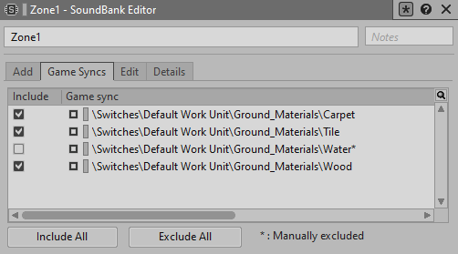

此操作将从 SoundBank “Zone1”中弃用“水”相关声音结构和媒体文件。如果您切换到 Edit 选项卡，则会发现 SoundBank 中不再包含引用此切换开关的声音结构、Event 和媒体文件。

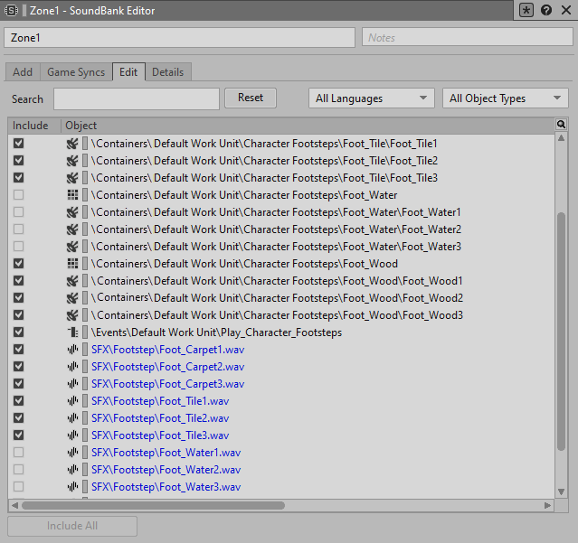

通过导入包含 Game Sync 弃用项的定义文件也可自动将 Game Sync 从 SoundBank 弃用。有关使用定义文件的详细信息，请参阅[“通过导入定义文件创建并填充 SoundBank”一节](ch40s03s02.html "通过导入定义文件创建并填充 SoundBank")。

|  |  |
| --- | --- |
| [备注] | 备注 |
| 您可能会发现 Edit 选项卡中的有些工程元素和媒体文件甚至在手动弃用之前就已变为灰色。当 Switch Container 中包含尚未指定到 Switch 的对象，在添加到 SoundBank 时就会发生这种情况。由于游戏中永远不会播放这些对象，因此它们将自动从 SoundBank 中弃用。 |

**使用 Game Sync 将工程元素从 SoundBank 中弃用的方法是：**

1. 将 SoundBank 加载到 SoundBank Editor。
2. 切换到 **Game Syncs** 选项卡。

   此时将显示与 Add 选项卡上的 Event 或对象相关的 Game Sync 的完整列表。
3. 定位您要从 SoundBank 中弃用的 Game Sync，并取消选择相应的复选框。

   此时 Game Sync 及其所有相关对象和媒体文件就从 SoundBank 中弃用掉了。
4. 重复步骤 3，直至从 SoundBank 中弃用掉您想移除的所有 Game Sync。

---

###### 在 SoundBank 中启用插件媒体

有些效果器（如 AK Convolution Reverb）需要有媒体文件才能工作。比如，AK Convolution Reverb 需要冲激响应文件作为它的插件媒体。这些插件媒体文件需要包含在 SoundBank 中，效果器才能在游戏中正常工作。您还需要确保在需要实例化效果器时加载包含启用了这些媒体文件的 SoundBank。

在 SoundBank 中启用插件媒体文件有很多方法：

- 您可以在 SoundBank 的启用列表中插入 Shareset 效果器对象。
- You can insert the owner object (bus, Auxiliary Bus or Containers hierarchy object) inside the inclusion list of a SoundBank.
- You can insert the Event inside the inclusion list of a SoundBank, if the Effect is owned by an Containers hierarchy object.

通过查看 SoundBank Editor／Edit 选项卡可验证 SoundBank 中是否包含插件媒体文件。

---

###### 搜索 SoundBank 中的元素

鉴于游戏的复杂程度，SoundBank（音频包）中可能会有成百上千个不同的工程元素。因此，拥有能迅速找到特定工程元素的必要工具是至关重要的。为帮助您在 Edit（编辑）选项卡中找到元素，可以使用搜索工具。

**搜索 SoundBank 中的元素的方法是：**

1. 将 SoundBank 加载到 SoundBank Editor。
2. 切换到 Edit（编辑）选项卡。
3. 在 Search 字段中，输入您要查找的工程元素的名称。

   Wwise 对列表进行筛选，使列表仅包含与您输入的名称相匹配的对象。
4. 点击 **Reset**（重置）以清空 Search 字段并再次显示 SoundBank 的全部内容。

---

###### 筛选 SoundBank 中的元素列表

为帮助您查找 SoundBank 中的特定元素，您可以根据语言或对象类型筛选列表。

**筛选 SoundBank 中的元素列表的方法是：**

1. 将 SoundBank 加载到 SoundBank Editor。
2. 切换到 Edit（编辑）选项卡。
3. 要根据语言筛选列表元素，则从 Language Filter 中选择以下其中一个选项：

   **All languages** -- 全部语言。显示工程中所有语言下的工程元素

   **"Language"** -- “语言”。仅显示选定语言下的工程元素。
4. 要根据对象类型筛选元素列表，则从 Object Type 列表中选择以下其中一个选项：

   **All object types** -- 所有对象类型。显示 SoundBank 中的所有对象

   **Event** -- 事件。仅显示 SoundBank 中的事件

   **Structure** -- 结构。仅显示 SoundBank 中的对象结构。

   **Media** -- 媒体。仅显示 SoundBank 中的媒体文件。

---

###### 在 SoundBank 之间移动工程元素

在常见游戏开发工程的过程中，SoundBank 的数量和内容会发生变化。因此，能否高效管理这些 SoundBank 非常重要。为了帮助您更好地管理 SoundBank 的内容，Wwise 可以让您轻松地在 SoundBank 之间移动工程元素。

**在 SoundBank 之间移动工程元素的方法是：**

1. 将 SoundBank 加载到 SoundBank Editor。
2. 从 SoundBank Editor 的 Add 选项卡中选择您要移到另一个 SoundBank 中去的若干个工程元素。
3. 将选中项从 SoundBank Editor 的 Add 选项卡拖到 SoundBank Manager 中的另一个 SoundBank 中去。

   选定的工程元素从原始 SoundBank 中移出，并添加到新的 SoundBank。

---

###### 从 SoundBank 中移除工程元素

在从 SoundBank 中移除元素时，所有相应 Event、对象结构和媒体文件也会被移除。

虽然无效的工程元素在生成过程中会被 Wwise 忽略，且不会导致错误或占用额外的空间，但还是建议将其从 SoundBank 中移除以保证工程的完好度。无效的 Event 和对象结构出现在 SoundBank Editor 上，它们的名称后面会带“Missing”一词。

**从 SoundBank 中移除工程元素的方法是：**

1. 将 SoundBank 加载到 SoundBank Editor。
2. 在 Add 选项卡上，选择您要移除的若干个对象。
3. 按 **Delete** 键。

   此时工程元素连同任何相应的事件、对象结构或媒体文件就从 SoundBank 中移除掉了。

   |  |  |
   | --- | --- |
   | [备注] | 备注 |
   | 如果某个对象或媒体文件被 SoundBank 中的多个工程元素引用，则移除其中一个工程元素并不会自动移除该对象或媒体文件，因为其它工程元素仍在引用它。 |

---

##### 重命名 SoundBank

在创建 SoundBank 后，您可以返回，根据需要对它进行重命名。

|  |  |
| --- | --- |
| [备注] | 备注 |
| 若打算重命名 SoundBank，请在开发过程的早期执行，因为后期更改的话可能还要额外编程。 |

**重命名 SoundBank 的方法是：**

1. 在 Project Explorer 中，切换到 SoundBank 选项卡。
2. 选择您要重命名的 SoundBank，并执行以下操作之一：

   按 **F2**。

   点击 SoundBank 名称字段。

   此时 SoundBank 的名称变成高亮显示。
3. 将 SoundBank 名称替换为新名称，然后按 **Enter**。

---

##### 删除 SoundBank

当您不再需要某个 SoundBank 时，可以将它删除。

**删除 SoundBank 的方法是：**

1. 在 Project Explorer 中，切换到 SoundBank 选项卡。
2. 执行以下操作之一：

   - 右键点击您要删除的 SoundBank，并选择 **Delete Selection**。
   - 点击您要删除的 SoundBank，然后按 **Delete** 键。

   选定的 SoundBank 于是被删除了。

|  |  |
| --- | --- |
| [备注] | 备注 |
| 如果您误删了某个 SoundBank，则可以按 **Ctrl+Z** 或点击 **Edit** > **Undo** 来撤消删除操作。 |

---

#### 配置用户 SoundBank 设置

工程层级的 SoundBank（音频包）设置决定生成过程中包含哪些内容、如何包含这些内容以及以何种格式生成这些内容。请参阅 [“定义工程的 SoundBank 设置”一节](ch06s02s03.html "定义工程的 SoundBank 设置")。

您可以使用用户 SoundBank 设置来覆盖工程设置。这些用户设置只有您自己可以使用，并且只会影响您生成的 SoundBank。

###### 配置用户 SoundBank 常规设置

**配置自定义 SoundBank 用户设置：**

1. 在 SoundBank Manager（音频包管理器）工具栏中，单击 **SoundBank Settings**（音频包设置）工具：

   

   若用户已经覆盖相应设置，则工具将显示橙色背景色。
2. 在菜单中，选择 **User SoundBank Settings**（用户音频包设置）。
3. 在 SoundBanks（音频包）选项卡中，选择 **Override Project SoundBank Settings**（覆盖工程音频包设置）。
4. 选中或取消选中相应选项来为 SoundBank（音频包）配置自定义设置。有关所有这些设置的参考信息，请参阅 [“SoundBanks Settings ― SoundBanks 选项卡”一节](ch58s09s01s01.html "SoundBanks Settings ― SoundBanks 选项卡")。
5. 单击 **OK**（确定）。这时会应用所述设置。除非取消选中 **Override Project SoundBank Settings**，否则这些设置会一直有效。

###### 覆盖工程 SoundBank 路径

SoundBank 保存在 [“SoundBanks 选项卡”一节](ch57s08s03.html "SoundBanks 选项卡")的 SoundBank Paths 分区中指定的位置。不过，您可以使用用户设置来覆盖工程设置。

**覆盖工程 SoundBank 设置：**

1. 在 SoundBank Manager（音频包管理器）工具栏中，单击 **SoundBank Settings**（音频包设置）工具：

   

   若用户已经覆盖相应设置，则工具将显示橙色背景色。
2. 在菜单中，选择 **User SoundBank Settings**（用户音频包设置）。
3. 在 SoundBanks（音频包）选项卡中，选择 **Override Project SoundBank Settings**（覆盖工程音频包设置）。
4. 选中 **Override SoundBank Paths**（覆盖音频包路径）。有关所有这些参数的参考信息，请参阅 [“SoundBanks Settings ― SoundBanks 选项卡”一节](ch58s09s01s01.html "SoundBanks Settings ― SoundBanks 选项卡")的 SoundBank Paths 分区。
5. 单击 **OK**（确定）。这时会应用所述设置。除非取消选中 **Override Project SoundBank Settings** 或 **Override SoundBank Paths**，否则这些设置会一直有效。

###### 覆盖工程生成前和生成后操作

鉴于自身工作流程，在生成 SoundBank（音频包）之前或之后可能要马上执行特定的操作或任务。比如，您可能想在生成前从版本控制系统签出特定 SoundBank 文件，或者想在生成后马上将流播放文件复制到 SoundBank 目录下。虽然这些信息通常是在工程层级手动配置的，但有时候并不希望沿用它们，而是想配置自己的自定义设置。

在 Wwise 中，可通过创建命令行来配置这些类型的任务。Wwise 中有一个专门的命令行编辑器，方便您构建数目不限的命令行。为了进一步简化过程，编辑器中包含命令行中可使用的所有 Wwise 专用环境变量和其它 Windows 环境变量的列表。

|  |  |
| --- | --- |
| [备注] | 备注 |
| 若外部工具返回错误或无法找到，构建过程可能会中断。通过在日志设置中将相应日志严重性级别设为 **Fatal Error** 来完成这一点。要了解详细信息，请参阅[“管理在日志中出现的消息”一节](ch06s02s04.html "管理在日志中出现的消息")。  在自定义 **Global opening step** 失败时，整个构建过程都会中断且不会生成 SoundBank。不过当针对特定平台的自定义步骤失效时，则将只跳过该平台。然而，由于进程运行不完全成功，因此将跳过 **Global closing step**。外部进程必须返回非零值才会被视为失效。 |

可用于编写自定义命令行的专用 Wwise 变量如下：

| 命令行变量 | 描述 |
| --- | --- |
| `$(AllowExceedMaximum)` | 指定当 SoundBanks 超过指定最大大小时是否生成该 SoundBanks。  当选择了 Allow SoundBanks to exceed maximum（允许 SoundBanks 超过最大大小）选项时，此变量设为 True。 |
| `$(GenerateContentFile)` | 指定是否生成相应文件来列出各个 SoundBank 的内容。内容文件包括有关 Event、Buss、State 和 Switch 的信息，以及流播放音频文件和内存音频文件的完整列表。  当选择了 Generate SoundBank content files（生成 SoundBank 内容文件）选项时，此变量设为 True。 |
| `$(GenerateHeaderFile)` | 指定是否生成将 Event、状态、切换开关和游戏参数名称映射到 ID 的头文件。  当选择了 Generate Header File（生成头文件）选项时，此变量设为 True。 |
| `$(GenerateMaxAttenuationInfo)` | 指定是否为 Event 生成最大衰减距离信息。  当选择了 **Metadata Options**: **Max attenuation**选项时，此变量设为 True。 |
| `$(GenerateEstimatedDuration)` | 指定是否为 Event 生成预计最大和最小时长以及时长类型信息。  当选择了 **Metadata Options**: **Estimated Duration** 选项时，此变量设为 True。 |
| `$(HeaderFileFullFilePath)` | 头文件的完整路径，即 $(HeaderFilePath)\Wwise\_IDs.h。 |
| `$(HeaderFilePath)` | 保存头文件的路径或位置。  此路径来自 Header file path（头文件路径）文本框。 |
| `$(InfoFilePath)` | 当前平台的信息文件的完整文件名。 |
| `$(IsRunningFromCmdLine)` | 指定 Wwise 启动的命令行中是否带有“-generatesoundbanks” 选项。 |
| `$(LanguageList)` | 传送到命令行的语言的列表或者 **SoundBank Manager** 中的选定语言的列表。  |  |  | | --- | --- | | [备注] | 备注 | | 列表采用空格隔开。 | |
| `$(Platform)` | 当前平台的名称。 |
| `$(SoundBankList)` | 传送到命令行的 SoundBank 的列表或者 **SoundBank Manager** 中的选定 SoundBank 的列表。  |  |  | | --- | --- | | [备注] | 备注 | | 列表采用空格隔开。并用双引号括起整个参数中的列表。 | |
| `$(SoundBankListAsTextFile)` | 该文本文件中会列出传给命令行的 SoundBank 或 SoundBank Manager 中的选定 SoundBank。这在处理一长串 SoundBank 时会很有用。  |  |  | | --- | --- | | [备注] | 备注 | | 列表采用空格隔开。并用双引号括起整个参数中的列表。 | |
| `$(SoundBankPath)` | 保存当前平台的 SoundBanks 的路径或位置。 |
| `$(UseSoundBankNames)` | 指定选用 SoundBank 名称（设为 true 时）或 ID（设为 false 时）来用于命名生成的 SoundBank BNK 文件，以及在 SoundBanks 中用于引用其它 SoundBank 中的媒体。  当选择了 Use SoundBank names（使用声音包名称）选项时，此变量设为 True。 |
| `$(WwiseExeDriveLetter)` | Wwise 可执行程序（Wwise.exe）所在的电脑盘符。 |
| `$(WwiseExePath)` | Wwise 可执行程序（Wwise.exe）的路径或位置。 |
| `$(WwiseExeProcessID)` | Wwise 可执行程序（Wwise.exe）的进程 ID （数字形式）。 |
| `$(WwiseProjectDriveLetter)` | Wwise 工程所在的电脑盘符。 |
| `$(WwiseProjectName)` | 当前工程的名称。 |
| `$(WwiseProjectPath)` | Wwise 工程的路径或位置。 |
| `$(WaapiWampPort)` | WAAPI 为 WAMP 协议使用的端口。 |
| `$(WaapiHttpPort)` | WAAPI 为 HTTP 协议使用的端口。 |

|  |  |
| --- | --- |
| [备注] | 备注 |
| 环境变量自动进行映射，例如 $(WWISESDK)。 |

为了尽可能提高灵活性，Wwise 支持为以下类型的操作配置不同的命令行：

- **Global opening step** -- 全局初始步骤。适用于所有平台并且在任何其它步骤前执行的命令行。
- **Platform-specific pre-generation step** -- 针对平台的生成前步骤。适用于特定平台并且在生成 SoundBanks 前执行的命令行。
- **Platform-specific post-generation step** -- 针对平台的生成后步骤。适用于特定平台并且在生成 SoundBanks 后执行的命令行。
- **Global closing step** -- 全局结束步骤。适用于所有平台并且在所有其它步之后执行的命令行。

在默认情况下，各个工程都包含平台专有的生成后步骤（post-generation step）命令行，该命令行将流播放文件复制到 SoundBank 目录下。然而，您可以通过执行一个不同的命令行将任何类型的任务自动化。Wwise 还自带另一个出厂命令行，它使用 File Packager 来生成包含 SoundBank 中所有数据和媒体的文件包。有关 File Packager 的详细信息，请参阅[*管理 File Package*](ch41.html "管理 File Package")。有关加载出厂命令行的详细信息，请参阅[“加载出厂/自定义命令行”一节](ch06s02s03.html#loading_factory_custom_command_lines "加载出厂/自定义命令行")。

您还可以将您创建的命令行保存到文件（WCMDLINE）中，以便今后在同一工程中使用，跨工程使用，或者与其它用户共享。有关保存命令的详细信息，请参阅[“将自定义命令行保存至文件”一节](ch06s02s03.html#saving_custom_command_lines_to_file "将自定义命令行保存至文件")。

**覆盖工程生成前操作：**

1. 在 SoundBank Manager（音频包管理器）工具栏中，单击 **SoundBank Settings**（音频包设置）工具：

   

   若用户已经覆盖相应设置，则工具将显示橙色背景色。
2. 在菜单中，选择 **User SoundBank Settings**（用户音频包设置）。
3. 在 SoundBanks（音频包）选项卡中，选择 **Override Project SoundBank Settings**（覆盖工程音频包设置）。
4. 选择 **Override Project Pre-Generation Step**（不沿用工程预生成步骤）选项。
5. 若要添加或修改 Project Settings（工程设置）对话框中配置的要在生成前执行的 Global opening step（全局开始步骤），请单击对应的 **Edit**（编辑）按钮 (...)。

   Pre-Generation Step Editor（生成前步骤编辑器）打开。
6. 在 **Description** 文本框中，输入名称，名称要能清晰描述将要执行的步骤或任务。
7. 在 **Commands** 文本框中，根据需要编写新的命令行或者编辑现有的命令行。

   |  |  |
   | --- | --- |
   | [备注] | 备注 |
   | **Commands** 文本框和与大多数其他文本编辑器一样，允许您按 Enter 键添加新的文本行，选择文本并按 Delete 键删除文本，等等。 |
8. 如果要在命令中插入内置宏和环境变量，则请执行以下操作：

   在 **Macros**（宏）分组框中，根据需要选择以下选项：

   - **Built-in Macros** -- 内置宏。显示可用于 Wwise 命令行中的一列 Wwise 专用变量。
   - **Environment Variables** -- 环境变量。显示可用于 Wwise 命令行中的一列 Windows 专用环境变量。

   要添加变量到命令行中的话，要执行以下操作中的一项：

   - 双击列表中的变量。
   - 从列表中选择变量，然后点击 **Insert**（插入）。

   根据需要，继续添加变量到命令行。
9. 如果需要添加另一个预生成步骤，则只需转至第一行的末尾，按 **Enter**，然后开始创建新的命令行即可。
10. 点击 **OK** 保存命令行并关闭 Pre-Generation Step Editor。

    |  |  |
    | --- | --- |
    | [备注] | 备注 |
    | 如果需要将命令行保存为文件，则在编辑器中点击 Save As（另存为）按钮。有关保存自定义命令行的详细信息，请参阅[“将自定义命令行保存至文件”一节](ch06s02s03.html#saving_custom_command_lines_to_file "将自定义命令行保存至文件")。 |
11. 要添加或修改现有平台专用的预生成步骤，则对各个平台重复执行步骤 3 至 8。

    |  |  |
    | --- | --- |
    | [备注] | 备注 |
    | 您还可以通过点击 Load 按钮将出厂设定和先前保存的自定义命令行加载到 Editor 中。有关加载出厂设定/自定义命令的详细信息，请参阅[“加载出厂/自定义命令行”一节](ch06s02s03.html#loading_factory_custom_command_lines "加载出厂/自定义命令行")。 |

**覆盖工程生成后操作：**

1. 在 SoundBank Manager（音频包管理器）工具栏中，单击 **SoundBank Settings**（音频包设置）工具：

   

   若用户已经覆盖相应设置，则工具将显示橙色背景色。
2. 在菜单中，选择 **User SoundBank Settings**（用户音频包设置）。
3. 选择 **Override Project Post-Generation Step** 选项。
4. 若要添加或修改 Project Settings（工程设置）对话框中配置的要在生成后执行的现有操作，请单击其中一个 **Edit**（编辑）按钮。

   此时将打开 Post-Generation Step Editor。
5. 在 **Description** 文本框中，输入名称，名称要能清晰描述将要执行的步骤或任务。
6. 在 **Command** 文本框中，根据需要编写新的命令行或编辑当前命令行。

   |  |  |
   | --- | --- |
   | [备注] | 备注 |
   | **Commands** 文本框和与大多数其他文本编辑器一样，允许您按 Enter 键添加新的文本行，选择文本并按 Delete 键删除文本，等等。 |
7. 如果要在命令中插入内置宏和环境变量，则请执行以下操作：

   在 **Macros**（宏）分组框中，根据需要选择以下选项：

   - **Built-in Macros** -- 内置宏。显示可用于 Wwise 命令行中的一列 Wwise 专用变量。
   - **Environment Variables** -- 环境变量。显示可用于 Wwise 命令行中的一列 Windows 专用环境变量。

   要添加变量到命令行中的话，要执行以下操作中的一项：

   - 双击列表中的变量。
   - 从列表中选择变量，然后点击 **Insert**（插入）。

   根据需要，继续添加变量到命令行。
8. 如果需要添加另一个预生成步骤，则只需转至第一行的末尾，按 **Enter**，然后开始创建新的命令行即可。
9. 点击 **OK** 以保存命令行并关闭 Post-Generation Step Editor。

   |  |  |
   | --- | --- |
   | [备注] | 备注 |
   | 如果需要将命令行保存为文件，则在编辑器中点击 Save As（另存为）按钮。有关保存自定义命令行的详细信息，请参阅[“将自定义命令行保存至文件”一节](ch06s02s03.html#saving_custom_command_lines_to_file "将自定义命令行保存至文件")。 |
10. 对于全局结束步骤或其它各个平台，重复执行步骤 3 至 8。

    |  |  |
    | --- | --- |
    | [备注] | 备注 |
    | 您还可以通过点击 Load 按钮将出厂设定和先前保存的自定义命令行加载到 Editor 中。有关加载出厂设定/自定义命令的详细信息，请参阅[“加载出厂/自定义命令行”一节](ch06s02s03.html#loading_factory_custom_command_lines "加载出厂/自定义命令行")。 |

###### 为 External Source 指定用户设置

若打算使用 [“External Source（外部源）”一节](ch65s03.html "External Source（外部源）") 插件，则须指定运行时所用外部音频文件的存放位置。您还必须指定保存转码后的源的文件夹，以便在玩游戏时 Wwise 能够使用它们。在工程层级，可在 Project Settings 的 [“External Sources 选项卡”一节](ch57s08s06.html "External Sources 选项卡") 中执行此操作。参见[“为 External Source 指定工程设置”一节](ch06s02s06.html "为 External Source 指定工程设置")。

您可以使用 SoundBank Manager（音频包管理器）的 User Settings（用户设置）覆盖这些工程设置。

**为 External Source 指定用户设置：**

1. 在 SoundBank Manager（音频包管理器）工具栏中，单击 **SoundBank Settings**（音频包设置）工具：

   

   若用户已经覆盖相应设置，则工具将显示橙色背景色。
2. 在菜单中，选择 **User SoundBank Settings**（用户音频包设置）。
3. 在 SoundBank Settings（音频包设置）对话框中，切换到 External Sources（外部源）选项卡。有关此选项卡中字段的参考信息，请参阅 [“SoundBanks Settings - External Sources 选项卡”一节](ch58s09s01s02.html "SoundBanks Settings - External Sources 选项卡")。
4. 单击 **OK**（确定）。这时会应用所述设置。除非取消选中相应的选项，否则这些设置会一直有效。

---

#### 为工程生成 SoundBank

您可以为要创建的各个游戏平台和语言生成 SoundBank。在开发过程中，随时都可以生成 SoundBank，以便您测试如何将它们集成到各种游戏平台中。为了更加方便，Wwise 还可以同时为所有平台和所有语言生成 SoundBank。

在生成 SoundBank 时，SoundBank 可包含以下任何信息：

- Event 信息
- Sound, music, motion, Property Container, and container information
- 内存媒体的声音、音乐或振动数据
- 零延迟流播放文件的预读数据
- 流播放文件的引用

SoundBank 中包含的信息仅可在同一工程中使用，这意味着 SoundBank 只可与同一工程中生成的其它 SoundBank 一起使用。

如果 SoundBank 包含的 Event 或对象结构已从工程中删除，您则仍可以生成该 SoundBank。这些无效的工程元素在生成过程中将被 Wwise 忽略，不会导致错误或占用额外的空间。建议从 SoundBank 中移除这些无效的 Event 和对象结构以保证工程的完好度。

|  |  |
| --- | --- |
| [备注] | 备注 |
| 当 SoundBank 中的 Event 或对象结构变得无效时，相应的图标会被移除，并且在 SoundBank Editor 的 Add 选项卡上，无效 Event 或对象结构的名称后面将显示“Missing”一词。 |

在生成 SoundBank 前，需要设置一系列选项来确定是否生成内容和头文件、是否可使用 SoundBank 名称、SoundBank 的保存位置、是否要将流播放文件复制到 SoundBank 目录等。您可以在 Wwise 内的两个不同层级配置这些 SoundBank 设置：

- **工程层级** C 配置工程的默认设置。这些设置在 Project Settings（工程设置）对话框中配置。有关如何在工程层级配置 SoundBank 设置的详细信息，请参阅[“定义工程的 SoundBank 设置”一节](ch06s02s03.html "定义工程的 SoundBank 设置")。
- **用户层级** C 配置自定义用户设置以覆盖工程设置。用户设置在 SoundBank User Settings（音频包用户设置）对话框中配置。有关如何配置自定义用户设置的详细信息，请参阅[“配置用户 SoundBank 常规设置”一节](ch40s04.html#defining_custom_soundbank_settings "配置用户 SoundBank 常规设置")。

**为工程生成 SoundBank 的方法是：**

1. 通过执行以下任一操作切换到 SoundBank 布局：

   - 在菜单栏中，点击 **Layouts** > **SoundBank**。
   - 按 **F7**。

   除此之外，还可依次单击 Views > SoundBank Manager 或使用快捷键 (Shift+B) 来从其他布局打开 SoundBank Manager 的浮动视图。
2. 在 SoundBank Manager 中，选择您要生成的 SoundBank。

   |  |  |
   | --- | --- |
   | [备注] | 备注 |
   | 若在 Project Settings 中选中 **Enable Auto-Defined SoundBanks**，将无法选择单个 SoundBank。这是因为 Wwise 会为 User-defined SoundBank 中没有包含的 Event 自动定义 SoundBank。您可以通过同时生成所有 SoundBank 来对此进行准确的评估。 |

   |  |  |
   | --- | --- |
   | [技巧] | 技巧 |
   | 在 User-Defined SoundBanks、Platforms 和 Languages 窗格中，可通过 Shift+单击、Ctrl+单击或 Ctrl+A 来选择多个条目。在此之后，只需切换与选定条目对应的复选框，就可将同一状态应用于所有选定条目。 |
3. 在 Platform 列表中，选择您要为它生成 SoundBank 的平台。
4. 在 Language 列表中，选择您要为它生成 SoundBank 的语言。
5. 单击 **Generate Checked**（生成选中项）开始生成 SoundBank（音频包）。

   此时将打开 Generating SoundBank 对话框，您可以在此查看 SoundBank 生成过程的进度。在生成这些 SoundBank 后，会打开 Generating SoundBanks - Completed 对话框。

   |  |  |
   | --- | --- |
   | [备注] | 备注 |
   | 先前生成的并且没有更改的 SoundBank 不会再生成。在这种情况下，**Results** 面板的 **Created** 列中将显示“Up to date”。 |
6. 仔细查看对话框中的消息，确保已成功生成所有 SoundBank（音频包）。这当中包括查看 Log（日志）窗格中的条目。日志中完整列出了各项错误、警告以及其他与生成过程相关的信息。在大部分情况下，这些消息都包含解决步骤。您也可以在 Logs（日志）视图的 [“SoundBank Generation 选项卡”一节](ch58s03.html#soundbank_generation_log "SoundBank Generation 选项卡")中查看日志。

   若要自定义日志，请参阅[“管理在日志中出现的消息”一节](ch06s02s04.html "管理在日志中出现的消息")。
7. 关闭 Generating SoundBanks - Completed（生成音频包 - 已完成）对话框。

   SoundBank 文件位于您指定的文件夹中，现在可以集成到您的游戏中了。

###### 监控 SoundBank 的详细信息

由于遵循各个平台的内存限制很关键，因此能够管理工程中的各个 SoundBank 和对它们进行故障排查非常重要。您需要确定哪些 SoundBank 超出了最大体积、哪些语言文件缺失了、生成的 SoundBank 的总大小以及高效管理 SoundBank 所需要的其它重要信息。

Wwise 将在 SoundBank Editor 的 Detail 选项卡中显示这些详情。


如果您的 SoundBank 包含 Sound Voice 对象，则 Detail 选项卡上的信息将按照语言进行组织。Wwise 还会以红色显示一些信息，帮助您迅速找出潜在问题。

|  |  |
| --- | --- |
| [备注] | 备注 |
| SoundBank Manager 和 SoundBank Editor 中的所有内存信息均以字节为单位。 |

**监视 SoundBank 的详情的方法是：**

1. 在 SoundBank Manager 中，双击想要查看详细信息的 SoundBank。

   相关信息会显示在 SoundBank Editor 的 Details 选项卡中。
2. 请查看 Detail 选项卡的内容了解有关下列内容的信息：

   - **Type** -- 类型。SoundBank 中包含的对象类型，例如音效、声部、音乐和振动。
   - **Language** -- 语言。相应 SoundBank 的语言。
   - **SFX** -- 音效。音效声对象占用的内存量。
   - **Music** -- 音乐。音乐对象占用的内存量。
   - **Voice** -- 声部。特定语言的 Sound Voice 对象占用的内存量。
   - **Data Size** -- 数据大小。特定语言的音效、语音和振动对象占用的总内存量。
   - **Free Space** -- 空闲空间。SoundBank 中的剩余空间。只有指定最大体积时才会显示此值。
   - **Missing Files** -- 缺失文件。特定语言缺失的媒体文件数量。
   - **Files Replaced** -- 被替换文件。当前被参考语言的音频文件所替换的、缺失的 Sound Voice 音频文件的数量。
   - **Memory Size** -- 内存大小。将加载到内存中的 SoundBank 数据所占用的空间量。
   - **Prefetch Size** -- 预读大小。流播放文件的预读数据所占用的空间量。该部分数据通过 SoundBank 加载到内存中，以确保流媒体文件零延迟播放。
   - **File Size** -- 文件大小。生成的 SoundBank 文件的总大小。

###### 使用脚本生成 SoundBank

若打算定期生成 SoundBank（音频包），可创建脚本来自动执行生成过程。为了做到这一点，您可以使用 Wwise SDK 从命令行来生成多个 SoundBank。有关此功能的完整描述，请参阅 Wwise SDK 文档中的 [Wwise SDK >深入探索 >通过命令行生成 SoundBank](https://www.audiokinetic.com/library/?source=SDK&id=bankscommandline.html) 章节。

---

#### SoundBank 输出文件夹布局

Wwise 会将 SoundBank 生成过程中生成的文件写入到配置的输出文件夹（工程的每个平台对应一个输出文件夹）。默认输出文件夹为 <project-directory>/GeneratedSoundBanks/<platform-name>。本节将详细介绍输出文件夹的结构。

###### SoundBank 文件

假设有个包含以下内容的示例工程：

- 一个导入的媒体文件 beep.wav，具有关联的 SFX 对象 sfx\_beep。
- 一个导入的媒体文件 hello.wav，具有关联的 Voice 对象 voice\_hello。
- 两个媒体文件各有一个 Play Event，分别为 play\_beep 和 play\_hello。
- 两个 Event 各有一个 SoundBank，分别为 sb\_beep 和 sb\_hello。
- 工程有一个目标平台：Windows。

在成功完成 SoundBank 生成后，Wwise 将创建下图所示文件结构：


|  |  |
| --- | --- |
|  | 与 Windows 平台对应的输出文件夹。 |
|  | 与本地化 SoundBank 对应的输出文件夹。工程的每种语言对应一个文件夹。有关详细信息，请参阅[*管理语言*](ch08.html "管理语言")。 |
|  | SoundBank 文件 sb\_hello.bnk。因为 SoundBank 包含本地化素材 (Voice hello.wav)，所以 SoundBank 也会进行本地化处理。 |
|  | SoundBank 文件 sb\_beep.bnk。因为 SoundBank 只包含非本地化素材 (SFX beep.wav)，所以 SoundBank 不会进行本地化处理。 |
|  | 元数据文件 sb\_beep.json。此文件包含与 "sb\_beep.bnk" SoundBank 内容相关的元数据。 |
|  | Wwise 会为所有工程自动生成 "Init" SoundBank，不管采用怎样的 SoundBank 设置。 |
|  | 元数据文件 SoundBankInfo.json。此文件包含与生成的所有 SoundBank 相关的元数据。 |
|  | 元数据文件 PlatformInfo.json。此文件包含与上次生成 SoundBank 时的配置相关的元数据。 |
|  | 元数据文件 ProjectInfo.json。此文件包含与上次生成 SoundBank 时的工程配置相关的元数据（如平台列表）。 |

|  |  |
| --- | --- |
| [备注] | 备注 |
| 系统会根据用户的 SoundBank 设置选择是否生成元数据文件。有关详细信息，请参阅 [“SoundBanks 选项卡”一节](ch57s08s03.html "SoundBanks 选项卡") 章节。 |

###### Auto-defined SoundBank

上节介绍了 User-defined SoundBank（用户定义的音频包）的输出文件夹结构。User-defined SoundBank 全部列在 Project Explorer（工程资源管理器）的 SoundBanks 选项卡中。

不过，也可选择将工程配置为自动定义 SoundBank。这样的话，Wwise 便会为特定工程对象生成 SoundBank。有关详细信息，请参阅“[“Auto-defined SoundBank”一节](ch40s02s06.html "Auto-defined SoundBank")”。

为了便于理解，不妨设想对“[“SoundBank 文件”一节](ch40s06.html#soundbank_output_folder_soundbank "SoundBank 文件")”中所述的示例工程做出以下更改：

- 一个导入的媒体文件 footstep.wav，具有关联的 SFX 对象 sfx\_footstep。
- 一个导入的媒体文件 goodbye.wav，具有关联的 Voice 对象 voice\_goodbye。
- 两个媒体文件各有一个 Play Event，分别为 play\_footstep 和 play\_goodbye。
- 新建的 Event 没有包含在任何 User-defined SoundBank 中。

对于 Auto-defined SoundBank（自动定义的音频包），Wwise 会采用与上述 User-defined SoundBank 相同的结构为每个对象类型创建一个新的 SoundBank 层级结构。在更新的示例工程中，Wwise 将为基于 Event（事件）和 Bus（总线）自动定义的 SoundBank 创建新的文件夹层级结构。下图显示了更新的文件夹结构和生成的文件。


|  |  |
| --- | --- |
|  | 为基于 Event 对象自动定义的 SoundBank 生成了新的文件夹层级结构。 |
|  | 新的文件夹层级结构具有与 User-defined SoundBank 层级结构相同的本地化文件夹。 |

|  |  |
| --- | --- |
| [备注] | 备注 |
| 为简单起见，图中略去了以下内容：  - 元数据文件。系统会采用与 User-defined SoundBank 相同的 SoundBank Settings 为 Auto-defined SoundBank 创建元数据文件。 - 基于 Bus 的 Auto-defined SoundBank。 |

###### 媒体文件

工程的 SoundBank 不一定包含所有需要的媒体文件。SoundBank 中未包含的媒体文件被排除的原因有多种多样，比如：

- User-defined SoundBank 以显式方式从 SoundBank 中排除了媒体。
- Auto-defined Soundbank 在使用媒体文件。
- Auto-defined SoundBank 不包含媒体文件。
- 工程规定须对媒体文件进行流播放。

有关更多详细信息，请参阅“[“Auto-defined SoundBank”一节](ch40s02s06.html "Auto-defined SoundBank")”。

SoundBank Settings 可配置为将缺失的媒体文件复制到输出文件夹。在这种情况下，Wwise 会为复制的媒体文件创建新的文件夹层级结构。有关详细信息，请参阅 [“管理 SoundBank 媒体”一节](ch40s07.html "管理 SoundBank 媒体") 章节。

以“[“SoundBank 文件”一节](ch40s06.html#soundbank_output_folder_soundbank "SoundBank 文件")”中所述的同一示例工程为参照，Wwise 不会包含 Auto-defined SoundBank 引用的媒体文件：

- footstep.wav
- goodbye.wav

为便于理解，假设 Wwise 按照如下所述指派了 Media ID（媒体 ID）：

- footstep.wav：111222
- goodbye.wav：3456

下图显示了更新的文件夹结构及复制的媒体文件。


|  |  |
| --- | --- |
|  | Media 文件夹层级结构的根文件夹。 |
|  | Media 文件夹还有本地化层级结构。 |
|  | 复制的媒体文件 footstep.wav（使用指派的 Media ID 进行了重命名）。 |

###### 使用 ID 命名子文件夹

对于大的工程，最终的输出文件夹经常会包含上千个文件。其中的大部分文件往往都在 Media 和 Auto-defined Soundbank 文件夹中。这可能会导致对单个文件夹所含文件数存有限制的平台出现问题。为了将各个文件夹的文件进一步放到子文件夹中，Wwise 提供了 SoundBank 设置 **Sub-folders for Generated Files**（为生成的文件构建子文件夹）。有关更多详细信息，请参阅“[“SoundBanks 选项卡”一节](ch57s08s03.html "SoundBanks 选项卡")”。

在启用该设置后，Wwise 会移动以下类型的文件：

- Auto-defined SoundBank 文件。其中包括 SoundBank 文件 (.bnk) 及关联的元数据。
- 媒体文件。

无论对于以上哪种情况，都会使用文件的 ID（十进制格式）的前两位来确定子文件夹名称。对于媒体文件，文件夹名称就是文件名的前两个字符。对于 SoundBank 文件，则会使用 SoundBank 的 ID。SoundBank 的 ID 可通过关联的元数据文件、全局元数据文件 SoundBankInfo.json 或调用 API 函数 [`AK::SoundEngine::GetIDFromString`](https://www.audiokinetic.com/library/edge/?source=SDK&id=namespace_a_k_1_1_sound_engine_a1aae6ebdec25946fb2897ce0e025366d.html) 来获取。

下图显示了启用该设置后的输出文件夹内容。本例假设 SoundBank 名称解析为以下 ID：

- sb\_beep：1111
- sb\_hello：2222
- sb\_footstep：3333
- sb\_goodbye：4444


注意，User-defined SoundBank 没有移到子文件夹。子文件夹规则仅适用于 Auto-defined SoundBank 和 Media 文件夹。

---

#### 管理 SoundBank 媒体

生成的 SoundBank（音频包）不一定包含所有需要的媒体文件（具体取决于 Wwise 工程的结构）。有些媒体文件可能需要随 SoundBank 一起打包。

为便于理解，假设存在包含以下内容的示例工程：

- 一个导入的媒体文件 beep.wav，具有关联的 SFX 对象 sfx\_beep。
- 一个为播放 SFX 创建的 Event：play\_beep。
- 一个 SoundBank：sb\_beep。SoundBank 唯一包含的内容就是 play\_beep Event。
- 工程有一个目标平台：Windows。

原样导入的文件 beep.wav 包含在工程的 Originals 文件夹中。在生成 sb\_beep SoundBank 的过程中，Wwise 会对 beep.wav 进行处理。

- 该文件将依据 Conversion Settings（转码设置）进行转码。转码后的文件存储在工程的 .cache 文件夹中。有关详细信息，请参阅“[“定义工程的转码设置”一节](ch06s02s02.html "定义工程的转码设置")”。

  转码后的文件指派有 Media ID（媒体 ID）。该 Media ID 是一个随机指派的 32 位整数值。有关详细信息，请参阅[“管理媒体素材 ID”一节](ch10s10.html "管理媒体素材 ID")。

在完成 SoundBank 生成后，Wwise 会在配置的输出文件夹中创建 sb\_beep.bnk 文件。假设为转码后的文件指派的 Media ID 为 123。sb\_beep.bnk 文件包含 play\_beep Event，其引用 123.wem媒体文件。若满足以下条件，Wwise 会将 123.wem 打包到 sb\_beep.bnk 中：

- 没有将声音配置为流播放。有关更多详细信息，请参阅“[“流播放媒体”一节](ch21s01.html#streaming_media "流播放媒体")”。
- 没有将 SoundBank 配置为排除媒体文件。有关更多详细信息，请参阅“[“SoundBank Editor 视图”一节](ch60s03s01.html "SoundBank Editor 视图")”。

若 SoundBank 没有包含媒体文件，Wwise 会尝试在磁盘上查找文件。磁盘上的媒体文件一般都放在特定的位置。有关详细信息，请参阅“[“SoundBank 输出文件夹布局”一节](ch40s06.html "SoundBank 输出文件夹布局")”和“[“管理输出文件夹中的零散媒体文件”一节](ch40s07s01.html "管理输出文件夹中的零散媒体文件")”章节。

---

##### 管理输出文件夹中的零散媒体文件

为工程生成的 SoundBank（音频包）不一定包含游戏需要的所有媒体文件。生成的 SoundBank 中不包含的媒体文件包括：

- 配置为流播放的媒体文件。
- 以显式方式从 SoundBank 中排除的媒体文件。

为了让游戏能够访问未包含在生成的 SoundBank 中的媒体文件，必须从工程的 .cache 文件夹复制媒体文件并使用指派的 Media ID（媒体 ID）进行重命名。我们可以采用两种方式来复制所述媒体文件。

###### 在 SoundBank 生成过程中复制媒体

通过选择 SoundBank Settings（音频包设置）选项 **Copy Loose/Streamed Media**（复制零散/流播放媒体），可将 Wwise 配置为自动复制所需媒体文件。有关详细信息，请参阅“[“SoundBanks 选项卡”一节](ch57s08s03.html "SoundBanks 选项卡")”。

Wwise 工程会为每个平台配置一个输出文件夹。默认文件夹为 <project-directory>/GeneratedSoundBanks/<platform-name>。Wwise 会创建名为 Media 的子文件夹并将媒体文件复制到里面。

|  |  |
| --- | --- |
| [备注] | 备注 |
| **建议最好**使用此方式来复制零散/流播放媒体文件。Wwise 会正确组织文件以确保运行时的默认文件 I/O 实现能够找到这些文件。 |

###### 手动复制零散/流播放媒体文件

缺失的媒体文件可手动复制和重命名。流播放和零散媒体文件列表包含在 SoundBank 生成过程中创建的元数据文件中。Wwise 既可配置为针对整个工程生成一个元数据文件，也可配置为针对每个 SoundBank 生成一个元数据文件。有关如何生成元数据文件的详细信息，请参阅“[“SoundBanks 选项卡”一节](ch57s08s03.html "SoundBanks 选项卡")”。

以下元数据部分用于确定生成的 SoundBank 中缺少哪些媒体文件：

- **StreamedMedia**：列出流播放媒体文件。all-SoundBank 和 per-SoundBank 元数据文件中均包含此部分。
- **LooseMedia**：列出以显式方式从生成的 SoundBank 中排除的媒体文件。all-SoundBank 和 per-SoundBank 元数据文件中均包含此部分。
- **MediaInOtherBanks**：列出以显式方式从关联 SoundBank 中排除但包含在另一 SoundBank 中的媒体文件。只有 per-SoundBank 元数据文件中包含此部分。

每个文件列表条目都包含转码后的媒体文件（位于工程的 .cache 文件夹中）的路径和指派给它的 Media ID。复制的文件必须重命名，其要具有相同的文件扩展名，并使用指派的 ID（十进制格式）作为文件名。

|  |  |
| --- | --- |
| [备注] | 备注 |
| 对于游戏要为 Wwise Runtime 实现自己的文件 I/O 的工程，可能更加适合手动复制零散/流播放媒体文件。 |

---

#### SoundBank 相关技巧和窍门

在定义 SoundBank（音频包）的内容前，最好仔细查看以下章节。您可以参照其中的技巧和窍门来更好地管理游戏中的 SoundBank。

###### 更新 Initialization Bank

每次生成若干个 SoundBank 时，Wwise 会根据需要更新初始化库。这样做时为了确保两套声音包同步。初始化库包含有关工程的所有通用信息（包括有关总线层级结构的信息）以及有关状态、切换开关和 RTPC 的信息。如果更改工程中的任何这些元素，Wwise 则将随着新生成的 SoundBank 为您的游戏更新此声音包。然而，如果没有更改这些工程元素，Wwise 则将不会生成 Init.bnk 的新版本。

**Initialization Bank** ―― 一种特殊库，其中包含有关工程的所有通用信息（包括有关总线层级结构的信息）以及有关状态、切换开关、RTPC 和环境效果器的信息。每次 Wwise 生成 SoundBank 时都会自动生成 "Init" SoundBank。Initialization Bank 通常在游戏开始时加载，以便在游戏期间可以轻松获得工程的所有通用信息。在启动游戏时，必须先加载该 SoundBank；否则，可能无法加载其他 SoundBank。在默认情况下，Initialization Bank 命名为“Init.bnk”。

###### SoundBank 和内存

若在 SoundBank 中包含长的声音，其可能会占用平台的大量内存。为避免占用过多内存，请尝试对长的声音或音乐文件进行流播放。详情参阅[“对声音采用流播放”一节](ch21s05.html#streaming_sounds "对声音采用流播放")和/或[“流播放音乐”一节](ch29s01.html#streaming_music "流播放音乐")。

###### 将常用元素分组存放到 SoundBank 中

将通用元素全部集中到一个 SoundBank 中是一个好方法。比如，可将所有在游戏当中保持加载状态的元素（如菜单、主角等）分组存放到同一 SoundBank 中。对于游戏当中不断加载和卸载的元素，可分组存放到逻辑单元或构成模块中，以便于在游戏当中根据需要进行调换。

###### 使用 Work Unit 和文件夹

为避免每次更改工程时必须编辑 SoundBank，您可以使用文件夹和／或工作单元重新创建设置 SoundBank 的方式。由于 Wwise 在 SoundBank 元素与工程元素之间保持着有效的链接，因此这些文件夹一旦添加到 SoundBank，您就无需再编辑这些 SoundBank了，它们会自动更新。

###### 在 SoundBank 中使用 Event ID

在工程的最后阶段，使用 Event ID 而不是 Event 字符串是一个好办法，因为在继续进行前，声音引擎无需对名称执行哈希算法，Event ID 验证起来会更快。

###### 生成 Integrity Report

在生成 SoundBank 前生成完好度报告（Integrity Report）是一个好主意。完好度报告能展示工程中的错误列表，以及可能的解决方法。通过在生成 SoundBank 前解决所有工程错误，您可以尽可能地减少游戏中的音频或振动问题。

###### 在 SoundBank Editor 中使用多选功能

如果正在使用 SoundBank Editor 的 Add 选项卡，并且需要为多个条目弃用同一类型的工程元素，则您可以在 Hierarchy Inclusion 列表中选择多项，然后取消勾选其中一个复选框。这将为所有选定项弃用该类型。您还可以使用多选功能为多个项来添加类型。

###### SoundBank 名称限制

要规避平台文件系统对文件名的限制，可以将 SoundBank 打成文件包。文件包是个独立的单元。它将平台的文件系统完全分离了出来，消除了系统可能对文件名施加的限制。

###### SoundBank 版本控制

您可以通过多种方式来使用版本控制系统管理工程中生成的文件（SoundBank 和媒体文件）和文件夹。

- 使用版本控制应用程序来手动更新版本控制状态。
- 在 SoundBank Settings（音频包设置）中添加生成前和生成后步骤来更新版本控制状态。有关详细信息，请参阅[“SoundBanks Settings ― SoundBanks 选项卡”一节](ch58s09s01s01.html "SoundBanks Settings ― SoundBanks 选项卡")。
- 在 SoundBank Settings 中启用 **Use Source Control for Generated Files**（针对生成的文件使用版本控制）选项，以通过配置 Wwise 来自动更新工程中所生成文件的版本控制状态。要了解详细信息，请参阅[“SoundBanks Settings ― SoundBanks 选项卡”一节](ch58s09s01s01.html "SoundBanks Settings ― SoundBanks 选项卡")。

无论针对所生成文件如何配置版本控制系统，都请考虑启用以下版本控制选项（如有）：

- **Make files writable**（将文件设为可写状态）：通常，版本控制系统会将处于控制下的文件/文件夹设为只读状态来将其锁定。在将其设为可写状态后，团队成员便可在本地机器上禁用版本控制，并在不更改文件权限的情况下生成 SoundBank。
- **Preserve timestamps**（保留时间戳）：在启用此选项时，会在版本控制同步的过程中保留文件时间戳。这样可在生成 SoundBank 时略微提升 Wwise 的性能。

---

##### Requirements and best practices for DLC SoundBanks

In order to deliver the desired sound structure in a DLC, it is necessary to understand how different changes and additions affect the release structure. 有一些常见情况需要特别注意，下面将详细介绍。

###### 添加子项

You can add DLC-specific children to various Wwise objects. Depending on which objects you
modify, you must either repackage SoundBanks and include them in the DLC package
or add new SoundBanks to the DLC package. The following table lists the objects
to which you can add DLC-specific children and whether the changes require
repackaging of existing SoundBanks or addition of new SoundBanks.

| 需重新打包 SoundBank 才能将子项添加到 DLC 的对象 | 可使用新增 SoundBank 将子项添加到 DLC 的对象 |
| --- | --- |
| - Random/Sequence Container（随机/序列容器） - Switch Container（切换容器） - Blend Container（混合容器） - Music Switch Container（音乐切换容器） - Music Playlist Container （音乐播放列表容器） - Music Segment （音乐段落） | - Property Container - Folder - Work Unit（工作单元） |

The following example shows a hierarchy before any DLC content is added:

- Work Unit（工作单元）

  - Property Container

    - ContainerA

      - Sound1
      - Sound2

ContainerA is included in SoundBank1 for the base game. For the DLC, you could add a
new container under the Containers hierarchy:

- Work Unit（工作单元）

  - Property Container

    - ContainerA

      - Sound1
      - Sound2

    - ContainerB

      - Sound1
      - Sound2

随后您可以创建一个新的 SoundBank2 并添加 ContainerB ，加载 SoundBank1 和 SoundBank2 时，其中的结构将自动合并。但 DLC 中，不能在 ContainerA 下添加声音，并将其加入新的 SoundBank 中进行打包。To do that, you would have to regenerate SoundBank1 and include it in the DLC. It would replace the base game version.

|  |  |
| --- | --- |
| [技巧] | 技巧 |
| If you plan to release DLC, a good strategy is to separate media from other content (Events, structures, and so on). If the DLC does not change the media SoundBanks, you only need to repackage the other SoundBanks, which minimizes the DLC package sizes. |

###### 修改 Init Bank

For DLC, you must repackage the new version of the `Init.bnk` file in the DLC
if you modify busses, game syncs (Game Parameters, Switches, and States), or
environmental effects.

###### 发布多个 DLC

If you plan to release multiple DLCs in parallel or over time in a series, ensure that you continually update the project
`Init.bnk` to include all busses added for DLCs so that the base game and
any combination of DLCs are supported.

For example, you could release the base game (include `Init.bnk` and
`BaseGame.bnk`), the DLC-A (include the updated `Init.bnk` and
`DLC-A.bnk`), and the DLC-B (include the updated `Init.bnk` and
`DLC-B.bnk`). If the Bus structure is different in the base game,
DLC-A, and DLC-B, then any additional busses in DLC-A must also be included in
DLC-B.

Each of the three builds need to include an `Init.bnk` file that includes all busses in the project at the time of that release.
Users could have any of the following combinations of products:

- 没有 DLC
- 仅有 DLC-A
- 仅有 DLC-B
- 有 DLC-A 和 DLC-B

When users have DLC-A and DLC-B, Wwise loads the `Init.bnk` provided in DLC-B.
Because the `Init.bnk` in DLC-B was built after the project was updated for DLC-A, the busses
required for DLC-A are available.

---

##### SoundBank 向后兼容性

在 Wwise 同一大版本下的不同小版本之间，SoundBank（音频包）是完全兼容的。比如，在 2017.1.9 版本的 Wwise 中，您可以正常加载并使用 2017.1.2 生成的 SoundBank。不过，在不同大版本的 Wwise 之间，SoundBank 可能无法兼容。比如，在 2018.1 版本的 Wwise 中，一般无法正常加载并使用 2017.1.2 生成的 SoundBank。您必须在 2018.1 中重新生成 SoundBank。

不过，这一通用规则也有例外情况。若只包含媒体信息（非 Event 或结构信息），则 2016.1 及更高版本中生成的 SoundBank 可与 Wwise 2018.1、Wwise 2017.2.7 及后续版本兼容。注意，这可能不适用于插件媒体。

对于发行时间较长的游戏，会涉及 Wwise 版本更新。为此，建议声音设计师考虑使用这种[仅含媒体的 SoundBank](ch40s02s03.html "细致地管理媒体")。这样升级时只需要更新含有结构和 Event 的音频包（容量要小很多）。

---

### 管理 File Package

The File Packager is a standalone utility that groups a Wwise project's SoundBanks, loose media, and streamed media into one or more file packages. 文件包是将文件系统抽象化之后的独立单元，Loading a file package creates a lookup table in memory, which Wwise uses to locate the media in the package. By using file packages, you can avoid some of the limitations of a platform's file system, including the limit on the length of file names as well as the actual number of files. You can also use file packages to better manage language versions as well as downloadable content (DLC) that is made available after the game is released.

You can use the File Packager to create your file packages manually, or you can use the
command line to run the File Packager as part of the SoundBank generation process. You can
define the command line at the project level or as a custom SoundBank user setting. For more
information on using the command line to launch the File Packager after SoundBank
generation, see the following topics:

- [“定义工程的 SoundBank 设置”一节](ch06s02s03.html "定义工程的 SoundBank 设置")
- [“配置用户 SoundBank 设置”一节](ch40s04.html "配置用户 SoundBank 设置")
- [“在命令行中使用 File Packager 参数”一节](ch41s06.html "在命令行中使用 File Packager 参数")

---

#### 使用 File Packager 工程

Each time you open the File Packager a new session is created. 可以将其另存为新的工程，或打开您之前保存的工程。The File Packager project contains all information related to the packages created during a session, including the number of packages, file assignment settings, and the contents and file order of each package.

**打开 File Packager 的方法如下：**

1. 在 Audiokinetic Launcher 中，选中 **Wwise** 页面。
2. 针对所需 Wwise 版本，在旁边的列表中单击 **Launch File Packager**（启动文件打包器）。

   

   这时会打开对应版本的 File Packager 并显示新的会话。

###### 将 SoundBank 信息导入到工程中

Before you can create and fill your packages, you need to generate SoundBanks in Wwise and
then import the SoundBank data stored in the `SoundbanksInfo.xml` file,
which is located in the platform folder of the platform-specific SoundBank Path.
Wwise generates a `SoundbanksInfo.xml` file for each platform.

|  |  |
| --- | --- |
| [备注] | 备注 |
| In the Project Settings' or the SoundBanks Settings' SoundBanks tab, ensure that the **Generate All Banks Metadata File** and **Generate XML Metadata** options are selected. When these options are selected, Wwise generates the `SoundbanksInfo.xml` file whenever you generate SoundBanks. |

Whenever you open a saved File Packager project, the File Packager automatically reads the
associated `SoundbanksInfo.xml` file and fills the Files to package pane.
If changes are made in Wwise to the SoundBanks and streamed media files,
inconsistencies between the two projects might occur. Missing files are highlighted
in red.

**To import SoundBank information into a File Packager project:**

1. 打开 File Packager。
2. Click **Browse** beside the SoundBanks Info file
   field.

   The Windows File Explorer opens.
3. Browse to the `SoundbanksInfo.xml` file, select it, and click **Open**.

   All SoundBanks and streamed files are loaded into the Files to package pane. By default,
   all SoundBanks and streamed media files are assigned to the
   `Default.pck` package file.

###### 保存 File Packager 工程

You can save File Packager sessions as projects so that you can load them later. File
Packager projects are saved as `.wfpproj` files.

**保存 File Packager 工程的方法如下：**

- 执行以下操作之一：

  - 在菜单栏中，点击 **File** > **Save**。
  - 按 **Ctrl**+**S** 键。

  The project is saved as a `.wfpproj` file.

###### Opening File Packager projects

After you save a file packager project, you can open it later to continue to work on it.
Several instances of the File Packager can be open at one time, so you can work on
multiple projects simultaneously.

**To open a File Packager project:**

1. 打开 File Packager。
2. 从菜单栏中，点击 **File** > **Open**。

   The Windows File Explorer opens.
3. Browse to the directory that contains the File Packager project.
4. Select the `.wfpproj` file and click **Open**.

---

#### Managing file packages in File Packager projects

After you create the File Packager project and import the SoundBank and streamed file
information, you can create and populate the packages you need. You can then generate
the packages so they can be included in the game.

File package management consists of the following tasks:

- [“在工程中添加文件包”一节](ch41s02.html#adding_file_packages_to_project "在工程中添加文件包")
- [“从工程中移除文件包”一节](ch41s02.html#removing_file_packages_from_project "从工程中移除文件包")
- [“Assigning files to packages”一节](ch41s02s01.html "Assigning files to packages")
- [“对文件包内的文件排序”一节](ch41s02s02.html "对文件包内的文件排序")

###### 在工程中添加文件包

根据需要，您可以在工程中添加任意数量的文件包（File Package）。When you add packages, you can specify the *block size*, the number of bytes upon which to align the data in your packages, which can vary depending on each platform's I/O device.

|  |  |
| --- | --- |
| [备注] | 备注 |
| For more information about block size and I/O device constraints, see [Low-Level I/O](https://www.audiokinetic.com/library/?source=SDK&id=streamingmanager__lowlevel.html) in the SDK documentation. For more information about block size, see [“配置 Block Size”一节](ch41s03.html "配置 Block Size"). |

**在工程中添加文件包的方法如下：**

1. 在 Packages 列表中，点击 **Add**（添加）。

   A new package is added to the Packages list.
2. 为新文件包命名，替换默认名称。
3. 按 **Enter** 键。
4. Repeat steps 1-3 until all your packages have been created.
5. (Optional) To specify the number of bytes upon which to align the data in your packages,
   type a value in the **Block Size** field. The
   typical value for each platform is 1, which indicates that there is no
   alignment.

###### 从工程中移除文件包

If you no longer need a package, you can remove it from your project at any time.

**从工程中删除文件包的方法如下：**

1. 从 Packages 列表中，选择要删除的文件包。
2. 点击 **Remove**（删除）。

   文件包将从工程中删除。

---

##### Assigning files to packages

After you create your packages, you can fill them with SoundBanks and streamed media files.

You can assign files to packages in two ways:

- [“Manually assigning files to a package”一节](ch41s02s01.html#manually_adding_files_to_package "Manually assigning files to a package")
- [“Automatically assigning files to a package”一节](ch41s02s01.html#assigning_files_to_package_automatically "Automatically assigning files to a package")

###### Manually assigning files to a package

You can manually assign files to packages when necessary, for example when
creating new game content that will be available after the initial release. When
you manually add files to a package, all automatic file assignments are
overridden.

When you add a SoundBank to a package manually, you can choose to include only the
SoundBank, the streamed files associated with the SoundBank, or both. At any
time, you can switch to the Resulting contents tab of the Package contents pane
to review the actual contents of a package.

**To manually assign files to a package:**

1. Select a package in the Packages pane.

   The contents of the package are displayed in the Package contents pane.
2. 执行以下操作之一：

   - In the Packages pane, select the desired package, then select one or more files from
     Files to package pane and click **Add to
     current package**.
   - In the Packages pane, select the desired package, then drag one or more files from
     the Files to package pane to the Manually added files tab in
     the Package contents pane.
   - Drag one or more files from the Files to package pane to the desired package in the
     Packages pane.

   The number of files assigned to the package appears in parenthese on the Manually added
   files tab in the Package contents pane. The Resulting contents tab
   displays the total number of files included in the package, which might
   be different (for example, if a single SoundBank is added to a package
   that includes references to several streamed media files).

###### Automatically assigning files to a package

You can create a set of rules in the File Packager to automatically assign files to
specific packages. You can select package assignments based on language or file
type. Automatic assignment rules only apply to files that have not already been
manually assigned to packages.

**To automatically assign files to a package:**

- In the Default file assignments pane, use the expandable lists to select the destination
  packages for SoundBanks, Streams, and LooseMedia for each language and
  for SFX files as desired.

  Any files that are not manually assigned to a package are automatically assigned to
  their appropriate packages.

---

##### 对文件包内的文件排序

Files assigned to packages are not organized in any particular order. However, in some
cases you might want certain files to be close to one another to minimize disk
seeking during the game. You can arrange the files within a package with the File
Order Editor.

**为文件包中的文件排序的方法如下：**

1. 执行以下操作之一：

   - 双击 Packages 列表中的文件包。
   - 从 Packages 列表中选择一个文件包并点击 **Edit file order**（编辑文件顺序）。

   File Order Editor 将打开。
2. 执行以下操作之一：

   - In the Package files pane, select the files that you want to reorder and click
     **Add to ordered list**.
   - Drag files from the Packages list pane to the File order
     pane.

   The files are added to the list in the File order pane.
3. (Optional) To reorder a file in the list, drag it to the desired position. A horizontal
   line indicates the insertion point.
4. Continue to rearrange the files until you have created a final order for the files within
   the package.

   All remaining files are automatically added to the ordered list through
   the "Remaining files inserted here" placeholder.

---

#### 配置 Block Size

The Block size determines the number of bytes upon which the data in a package is aligned.
Empty data pads out entries in the package.

A block size of 1 is sufficient for most platforms. However, when using Wwise's Sample
low-level I/O hooks, Windows and Xbox platforms require a multiple of 4096 to match the
size of sectors used for unbuffered I/O. Other implementations of the low-level I/O hook
that your project uses might have different requirements.

You can set this value as part of the File Packager project settings or, if a project is not
being used, as a command-line argument (see [“在命令行中使用 File Packager 参数”一节](ch41s06.html "在命令行中使用 File Packager 参数")).

For more information about how block sizes are used in the runtime, see [Low-Level I/O](https://www.audiokinetic.com/library/edge/?source=SDK&id=streamingmanager_lowlevel.html) in the SDK documentation.

---

#### 生成文件包

After you create and populate file packages and optionally reorder the files, you can
generate one or all packages. File packages are saved as `.pck` files in the
platform-specific SoundBank Path (see [“为已保存的 SoundBank 指定新位置”一节](ch06s02s03.html#specifying_location_for_saved_soundbanks "为已保存的 SoundBank 指定新位置")). You can, however, specify a
different location if required.

如果在生成期间出现错误，将会显示在生成日志中；If no errors occur, you can add these package files to the game.

**To generate all file packages:**

- From the menu bar, click **Generate**
  **All packages**.

  这时会打开 Generating Packages（正在生成文件包）对话框并显示生成流程的进度。If errors are encountered, they are highlighted in the log by a yellow circle.

**To generate selected packages:**

1. In the Packages pane, select the packages you want to generate.
2. From the menu bar, click **Generate**
   **Selected packages**.

   这时会打开 Generating Packages（正在生成文件包）对话框并显示生成流程的进度。If errors are encountered, they are highlighted in the log by a yellow circle.

**To change the output directory:**

1. Click the browse button (**...**) beside the
   Output directory field.

   这时会打开 Browse For Folder（浏览文件夹）对话框。
2. Browse to the desired directory, select the folder, and click **OK**.

   Output directory 中将显示完整路径。

---

#### Packaging DLC files

Downloadable content, or DLC, is additional game content that is delivered separately from
the base game. This topic explains how to use the Wwise File Packager to prepare audio
DLC packages, which you can combine with other game assets. However, if you are using
the Wwise Unreal Integration or the Wwise Unity Integration, we recommend that you use
the bulk asset packaging option in Unreal (see [Packaging Wwise Assets as Bulk Data](https://www.audiokinetic.com/library/edge/?source=UE4&id=using_features_package_as_bulk_data.html)) or the Addressables system in Unity
(see [The Wwise Addressables Package for Unity](https://www.audiokinetic.com/library/edge/?source=Unity&id=pg_addressables.html)), respectively.

If you are using the File Packager for your DLC, it is important to remember the following
best practices and requirements when planning:

- When packaging content for the base game, set all of the default file
  assignments to **None** and manually assign
  files to packages (see [“Manually assigning files to a package”一节](ch41s02s01.html#manually_adding_files_to_package "Manually assigning files to a package")) so that you can
  identify any DLC you add later.
- After you generate the packages for the base game, save the project. You
  can use it as a point of reference for the initial game release.
- Ensure that you place any DLC-specific SoundBanks, streaming files, and
  loose media in separate DLC packages.
- When creating DLC assets, use the same version of Wwise and the same Wwise
  project that you used for the base game to ensure compatibility of the
  SoundBank and package formats.
- If any DLC-specific changes affect SoundBanks that already exist in the
  base game, add the SoundBanks to the DLC package as well. Package loading
  order determines which SoundBanks take precedence in case of
  conflict.
- To determine loading order, use the File Package Low-Level I/O,
  specifically the `CAkFilePackageLowLevelIO::LoadFilePackage()`
  method. For more information, see [Sample File Package Low-Level I/O
  Implementation Walkthrough](ch41.html "管理 File Package").

###### Workflow example

The following example demonstrates how to work with DLC packages.

1. SoundBankA, which contains all of the base game assets, is assigned to
   Package\_Main.
2. The content of SoundBankA is modified after the initial release with
   additional DLC sound structures. It is assigned to the new, DLC-specific
   Package\_DLC.
3. The File Package Low-Level I/O is updated to load Package\_Main before
   Package\_DLC.
4. The game, which has the DLC, loads Package\_Main and then
   Package\_DLC.
5. When the game loads SoundBankA, Wwise loads it from Package\_DLC, which has a higher
   priority than Package\_Main.

使用相同的方法，可以继续为您的游戏部署新增内容。只需记住要手动将所有文件指派至一个文件包，并保存 File Packager 工程来为各版本创建新的起始参考点。

---

#### 在命令行中使用 File Packager 参数

使用命令行生成文件包时，须用特定参数来定义文件包的特征。The following table lists the arguments that you can use.

| 参数 | 描述 |
| --- | --- |
| `-generate` | 启动文件包生成过程，You can combine this argument with the File Packager project path or with the `-info` argument. 示例如下：  - Generate with a File Packager project:  `-generate {project_path}` - Generate a single package with a `SoundbanksInfo.xml` file:  `-generate -info {soundbank_info_filename} -output {package_name}` - Generate a stream package and a bank package with a `SoundbanksInfo.xml`   file:  `-generate -info {soundbank_info_filename} -output_stm {package_name}   -output_bnk {package_name}` |
| `-info {filename}` | Specifies the location of the `SoundbanksInfo.xml` file.  Use with one or multiple of the following:  `-output`  `-put_` |
| `-output {filename}` | 生成一个包含 SoundBank 和流文件的文件包，`{filename}` specifies the package name and location in which to save the generated file package.  You can use this argument when the `{projectpath}` is not specified. It can be either a full file path or the package name. 但都要求包含文件包扩展名。  You can combine this argument with `-output_stm` or `-output_bnk` to generate more than one package file, where each contains a different set of files.  If you explicitly define the `-output` argument, it takes precedence over the value specified in the project. |
| `-output_stm {filename}` | Generates one file package that includes only streamed media files. `{filename}` specifies the package name and location in which to save the generated file package.  You can use this argument when the `{projectpath}` is not specified. It can be either a full file path or the package name. 但都要求包含文件包扩展名。  You can combine this argument with `-output` or `-output_bnk` to generate more than one package file, where each contains a different set of files. |
| `-output_bnk {filename}` | Generates one file package that include only SoundBank files.`{filename}` specifies the package name and location in which to save the generated file package.  You can use this argument when the `{projectpath}` is not specified. It can be either a full file path or the package name. 但都要求包含文件包扩展名。  You can combine this argument with `-output` or `-output_stm` to generate more than one package file, where each contains a different set of files. |
| `-output_loose {directory}`  `-output_loose` | Generates one or multiple file packages that include only loose media files. These files are referenced by Events or structures in at least one SoundBank, but are not included in any SoundBank in the project. `{directory}` is optional and specifies the location in which to save the generated file packages. If `{directory}` is not specified, the packages are generated in the same directory that contains the `SoundbanksInfo.xml` file.  You can use this argument when the `{projectpath}` is not specified. It can be either a relative or absolute directory.  You can combine this argument with `-output`, `-output_stm`, or `-output_bnk` to generate more than one package file, where each contains a different set of files. |
| `-blocksize {number}` | 文件包内数据对齐的字节数，The number depends on the requirements of the platform and your project's I/O hook.  If not specified, a value of `1` is used, which indicates no alignment. |
| `-hideprogressui {boolean}` | 指定在 Wwise 内生成文件包时是否显示 Generating Packages 对话框。  如果设置为 True，则进度对话框将不会显示。默认情况下，此参数为 False。 |
| `{projectpath}` | Specifies a File Packager project path that contains a `WFPPROJ` file. When used with the `-generate` argument, other arguments are ignored and the File Packager project is used to generate the packages.  此参数为可选参数。 |
| `-soundbanks_dir {directory}` | Overrides the information in the `SoundbanksInfo.xml` file (at `SoundBanksInfo/RootPaths/SourceFilesRoot`) that specifies the directory in which the generated SoundBanks were saved by Wwise.  此参数为可选参数。 |
| `-cache_dir {directory}` | Overrides the information in the `SoundbanksInfo.xml` file (at `SoundBanksInfo/RootPaths/SourceFilesRoot`) that specifies the directory in which the generated SoundBanks were saved by Wwise.  This is normally written as `projectpath\.cache\platform\`  此参数为可选参数。 |
| `-languages "{language1} {languageN}"` | Space-separated list that specifies the languages to package. Use double quotation marks to enclose the list in a single argument.  Use the keyword `"SFX"` in the language list to package SFX files as well.  此参数为可选参数。默认情况下会打包所有语言。  仅在未指定 File Packager 工程时才会使用此参数。 |
| `-banks "{soundbank1} {soundbankN}"` | Space-separated list that specifies the SoundBanks to package. Do not include the `.bnk` extensions. Use double quotation marks to enclose the list in a single argument.  此参数为可选参数。默认情况下会打包所有SoundBank。  You can use this argument when the File Packager project is specified: it automatically builds the packages that have references to the specified SoundBanks. |
| `-includedFilesInBanks "{soundbank1} {soundbankN}"` | Space-separated list of SoundBanks that include media files that you want to package as loose media. Do not include the `.bnk` extensions. Use double quotation marks to enclose the list in a single argument.  You can use this option if the `PrepareEvent` API needs loose media, and banks loaded in memory also need the same media.  此参数为可选参数。默认情况下，SoundBank 中的媒体文件不会作为零散文件添加到文件包中。 |
| `-excludedFilesInBanks "{soundbank1} {soundbankN}"` | Space-separated list of SoundBanks that include references to media files that you want to package as loose files. Do not include the `.bnk` extensions. Use double quotation marks to enclose the list in a single argument.  You can use this options if the `PrepareEvent` API needs loose media, and different SoundBanks loaded in memory also need the same media.  此参数为可选参数。By default, media files that are referenced but not included in a SoundBank are added to the package only if they are not referenced in any other SoundBank. |
| `-verbosity {level}` | Specifies how much information is printed in the tool's standard output and error streams.  Set the level to `0` (errors only), `1` (errors and warnings), or `2` (errors, warnings, and information messages).  |  |  | | --- | --- | | [备注] | 备注 | | 消息显示操作可能会减慢大型工程的打包过程。If the tool runs slowly, reduce the verbosity level to improve performance. |  此参数为可选参数。By default, all message types are printed (level `2`). |

---

### Migrating your projects

在准备升级到新的 Wwise 大版本时，必须遵照协同规范来确保将之前版本中创建的工程顺利地迁移到更高版本。这样做的目的是避免对游戏产生任何形式的危害，所以一定要检查新版中执行的更改，并选择性、系统性地将修改应用到游戏代码中。

升级和迁移规范可能会因以下条件而有所不同：

- **处于版本控制之下的工程**：必须在关键点签入工程。
- **多个用户**：必须在本地系统上完成 Wwise 升级、工程迁移、SDK 升级和游戏代码更新，以便多个用户在工作站上统一对 Wwise 进行升级。
- **集成的游戏工程**：必须按照迁移说明中的规定修改游戏代码。

强烈建议迁移团队（由一名或两名指定人员组成）先在本地系统上执行以下任务：

- [“Preparing your projects for migration”一节](ch42.html#before_you_begin "Preparing your projects for migration")
- [“Upgrading Wwise and migrating your project”一节](ch42.html#upgrading_wwise "Upgrading Wwise and migrating your project")
- [“Upgrading Wwise and migrating your project”一节](ch42.html#upgrading_wwise "Upgrading Wwise and migrating your project")
- [“测试”一节](ch42.html#testing "测试")

在迁移团队执行这些任务之后，您可以执行以下操作：

- [“Upgrading Wwise on all workstations”一节](ch42.html#upgrading_wwise_on_all_workstations "Upgrading Wwise on all workstations").

有关处于版本控制之下的工程的升级和迁移工作流程，请参见下表：

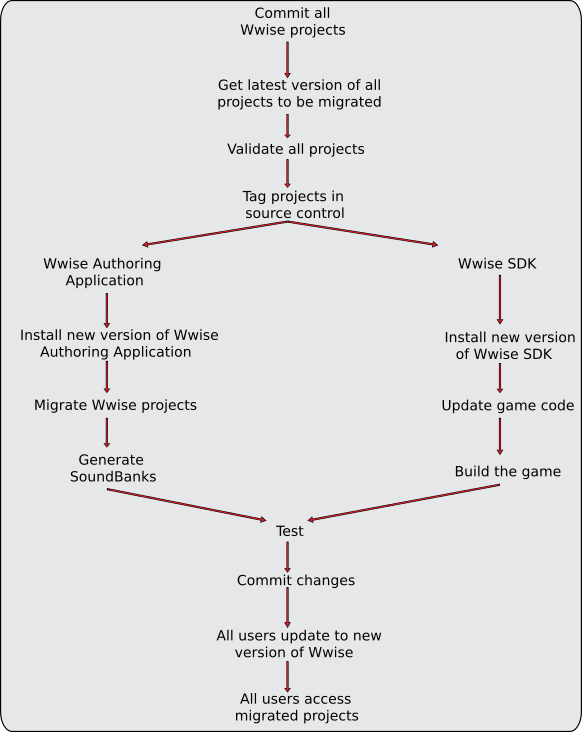

#### Preparing your projects for migration

在升级到新的 Wwise 版本之前，必须针对工程作一些准备（尤其是在已将 Wwise 工程整合到游戏中的情况下）。具体来说，就是针对所要迁移的全部工程重复以下章节中所述的步骤。

迁移团队必须执行以下任务以便做好将工程迁移到最新版本的准备。

1. 提交所有工程：

   1. 对于处于版本控制之下的工程，请求团队其他成员一并提交所有更改。

      这样可以避免以后产生合并问题。
2. 获取所有最新版本的待迁移工程：

   1. 对于处于版本控制之下的工程，将所有工程全部导入到本地系统。
   2. 确保所有工程文件均具备读写权限。

      对于处于版本控制之下的工程，您可能需要从各个子文件夹中签出工程文件 (WPROJ) 和所有 Work Unit 文件 (WWU)。
3. 验证待迁移工程：

   1. 在当前 Wwise 版本中，打开准备迁移的各个 Wwise 工程并进行保存。
   2. 若 Project Load Log（工程加载日志）对话框显示消息和修复建议，请接受这些修复，然后保存更改并关闭工程。重复这一操作，直到不再显示任何消息。这样做的目的是排除所有工程错误以简化升级流程。
4. 标记待迁移工程：

   1. 对于处于版本控制之下的工程，提交并标记为升级之前最后版本的工程。

      若此时提交工程，则将保存迁移之前的所有更改。版本控制记录中，此后的其他更改都与迁移直接相关。

#### Upgrading Wwise and migrating your project

即便对功能集进行了重大更改，工程迁移流程也可确保迁移后的工程具有与之前工程基本相同的声音效果。有关这些更改的详细信息，请参阅[当前 Wwise 版本的版本说明](https://www.audiokinetic.com/library/edge/?source=SDK&id=releasenotes.html)以及其中链接的对应重要迁移说明。

建议迁移团队先在本地系统上将 Wwise 工程迁移到新的 Wwise 版本。在迁移团队测试并提交已迁移的工程之前，所有其他用户不得修改工程。

|  |  |
| --- | --- |
| [备注] | 备注 |
| 在升级到新的版本时并不一定要迁移工程，具体因 Wwise 版本之间的更改类型而异。  - **大版本**：若版本的年份编号（即年份之后第一个小数位）发生变化，则表示该大版本可能存在多项重大更改。比如，2019.1 和 2019.2 都属于大版本。在使用 Wwise 2019.2 打开 Wwise 2019.1 中保存的工程时，Wwise 会提示迁移工程。若接受，则稍后将无法使用 2019.1 版本打开该工程。 - **小版本**：若版本的年份编号（即年份之后第一个小数位）保持不变，而后一小数位发生变化，则表示其为小版本。比如，2019.1.3 和 2019.1.4 都属于小版本，只存在些许更改。在使用 Wwise 2019.1.4 打开 Wwise 2019.1.3 中保存的工程时，无需实施迁移。 |

1. 升级 Wwise：

   1. Upgrade Wwise on your local system as described in [Installing Wwise and Its
      Components](https://www.audiokinetic.com/library/edge/?source=InstallGuide&id=installing_wwise_and_its_components).
2. 将工程迁移到新的版本：

   1. 确认当前 Wwise 工程中的所有文件均具备读写权限。
   2. 进行工程备份并将备份工程存储到系统或网络上的另一文件夹中。Wwise 会自动备份工程，但最好另外手动备份。
   3. 打开新的 Wwise 版本。在打开的 Project Launcher（工程启动器）对话框中，选择准备迁移的工程。

      Project Migration 对话框打开时会提示将工程迁移到更高的 Wwise 版本。

      |  |  |
      | --- | --- |
      | [备注] | 备注 |
      | The Migration dialog is only displayed when significant changes have been made to the project file between versions. 倘若工程不需要迁移，则 Wwise 会跳到迁移流程的下一步。 |
   4. 单击 **Migrate**（迁移）。

      这时 Wwise 会迁移工程。在迁移工程之后，Wwise 会检查现有工程缓存文件夹是否与当前 Wwise 版本兼容。若否，则 Wwise 将删除工程缓存文件夹。在删除工程缓存后，会显示以下消息框。

      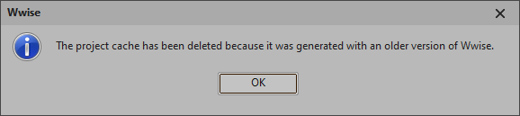
   5. 单击 **OK**（确定）。
   6. 在 Wwise 菜单栏中，依次选择 **Views > Utilities > Logs**（视图 >实用工具 > 日志）。此时将打开 Logs 视图。
   7. 在 Logs（日志）视图中，选中 **Project Load**（工程加载）选项卡。这时 Project Load Log 会显示与迁移有关的消息，并指示有没有针对新版 Wwise 创建任何文件。

      

      |  |  |
      | --- | --- |
      | [备注] | 备注 |
      | 此信息存储在工程文件夹内的 `projectname.wproj_migration.log` 文件中。在必要时，可单击 **Copy to clipboard**（复制到剪贴板）来保存此信息以供稍后参考。 |
   8. 若使用了版本控制系统，请将迁移过程中创建的所有新文件添加到版本控制系统。
   9. 关闭 Logs（日志）视图。
3. 生成 SoundBank（音频包）：

   1. 针对已迁移的工程生成 SoundBank 以便用来测试。

#### Upgrading the Wwise SDK and updating game code

除了升级 Wwise 设计工具，还要执行以下任务来升级 Wwise SDK 并更新游戏代码。

1. 升级 Wwise SDK：

   1. 确认系统满足 Wwise SDK [平台要求](https://www.audiokinetic.com/library/edge/?source=SDK&id=reference_platform.html)。
   2. 可选择卸载之前的 Wwise SDK 版本。

      最好同时手动移除 C++ 示例工程创建的临时文件。
   3. 安装更高的 Wwise SDK 版本。参阅[通过 Launcher 安装 Wwise](https://www.audiokinetic.com/library/wwise_launcher/?source=InstallGuide&id=install_wwise_through_launcher)，并在 **Packages**（数据包）下选中 **SDK (C++)**。
   4. 确认 WWISESDK 环境变量指向更高版本的安装文件夹。（有关如何设置环境变量的详细信息，请参阅[选用多个 Wwise SDK 版本](https://www.audiokinetic.com/library/wwise_launcher/?source=InstallGuide&id=installing_or_upgrading_wwise_and_its_packages#working_with_multiple_versions_of_wwise_sdk)）。
2. 针对更高 Wwise SDK 版本更新游戏代码：

   1. 参阅 Wwise SDK 文档中的迁移说明，以便熟悉需要执行哪些修改。
   2. 若要迁移游戏代码，必须将 C++ 工程的现有功能从之前的版本移植到更高的 Wwise SDK 版本。在此过程中，可能需要修改或重构各个模块中的代码。另外，可能需要针对以下模块执行相应的更改以便更新游戏代码：

      - Sound Engine（声音引擎）
      - Memory Manager
      - Stream Manager
      - Communications Module

      |  |  |
      | --- | --- |
      | [备注] | 备注 |
      | 为了确保更高版本中的有些新功能不会对游戏产生不利影响，建议先升级游戏所需的组件。在确保游戏比较稳定后，则可根据需要集成这些新功能。 |
   3. 根据需要修改代码。

      |  |  |
      | --- | --- |
      | [技巧] | 技巧 |
      | 在修改代码时，最好重新构建 C++ 工程。 |
3. 构建游戏。

#### 测试

在完成升级和迁移之前，必须测试已迁移的游戏。有可能您已经在工作当中创建了一套测试规范。不过作为补充，我们还是列出了一些简单的步骤以供您在测试时参考。建议迁移团队同时在 Wwise 设计工具和游戏中实施这些测试。

**测试已迁移的游戏工程，然后提交：**

1. 在游戏中，确认声音和音频行为。确认事项可能包括：

   - 基本的音频播放。
   - 受代码更改影响的行为。
   - 平台行为。
   - 与 Wwise 设计工具的通信。
2. 将已迁移的 Wwise 工程和代码更改提交到版本控制系统。

在完成测试后，倘若对结果满意，便可指导其他用户升级到最新 Wwise 版本。

#### Upgrading Wwise on all workstations

在本地系统上升级 Wwise、成功迁移工程、执行 SDK 升级及游戏代码更改并完成测试之后，您可以指导其他用户在其工作站上升级 Wwise。

此次升级必须在使用 Wwise 的所有工作站上执行，其中包括：

- 编译机器
- 声音设计师所用工作站
- 开发人员所用工作站
- 所有其他 Wwise 用户工作站

确保包括了所有运行 Wwise 的工作站以便全部进行升级。

**在所有工作站上升级 Wwise：**

1. 可选择卸载所有 Wwise 组件。其中可能包括：

   - Wwise 设计工具
   - Wwise SDK

   有关如何卸载的详细信息，请参阅[卸载 Wwise](https://www.audiokinetic.com/library/wwise_launcher/?source=InstallGuide&id=uninstalling_wwise)。

   |  |  |
   | --- | --- |
   | [备注] | 备注 |
   | 并不一定非要卸载 Wwise。在必要时，可在同一工作站上保留多个 Wwise 版本和内部版本。 |
2. 安装更高的 Wwise 版本。其中可能包括：

   - Wwise 设计工具
   - Wwise SDK
   - Wwise Game Simulator

   有关如何安装的详细信息，请参阅[安装 Wwise 及关联组件包](https://www.audiokinetic.com/library/wwise_launcher/?source=InstallGuide&id=installing_or_upgrading_wwise_and_its_packages)。

**在所有工作站上访问已迁移的 Wwise 工程：**

1. 在安装更高的 Wwise 版本后，检出已迁移的 Wwise 工程。
2. 打开 Wwise。

   此时将显示 End-User License Agreement（最终用户授权协议）。
3. 仔细阅读协议。若接受，请点击 **Accept**（接受）。

   此时将打开 Project Launcher 窗口。
4. 打开已迁移的工程。

   |  |  |
   | --- | --- |
   | [备注] | 备注 |
   | 若部分用户在本地存有 Wwise 工程中的 Work Unit 且未将其添加到版本控制系统，则会弹出消息并提示允许在新的 Wwise 版本中打开工程时迁移这些 Work Unit。 |

   在加载工程之前，Wwise 会检查并确保工程缓存文件夹与当前版本兼容。若否，则 Wwise 将删除工程缓存文件夹。在删除工程缓存后，会显示以下消息框。

   
5. 单击 **OK**（确定）。

   在删除缓存后，便会将工程加载到 Wwise 中。

---

## 使用 Wwise

本章节介绍各个 Wwise 视图的功能以及如何利用其快速投入工作。

- **[*认识 Project Explorer 视图*](ch43.html "认识 Project Explorer 视图")**C 了解界面元素；设置显示选项；使用 Project Explorer Search；使用 Project Explorer 工具栏。
- **[*认识 Event Viewer 视图*](ch44.html "认识 Event Viewer 视图")**C 浏览、排列、筛选和设置显示选项。
- **[*了解 Property Editor*](ch45.html "了解 Property Editor")**―an
  overview including dynamic mixing techniques using playback limit,
  distance-based priority, and virtual voice behavior.
- **[*认识 Contents Editor 视图*](ch46.html "认识 Contents Editor 视图")**C 简要介绍各种对象类型；添加对象；对对象进行重新排序；在窗格之间拖动对象；展开和收起列表；试听对象和音频源。
- **[*认识 Transport Control 视图*](ch47.html "认识 Transport Control 视图")**C 简要介绍 Playback Control 和 Game Syncs 分区；播放和锁定对象；设置播放优先级；播放原始音频文件；播放/不播放音频和振动内容；在播放期间使用 Game Sync。
- **[*认识 Schematic View 视图*](ch48.html "认识 Schematic View 视图")**C 了解界面元素；设置显示选项；搜索、高亮显示和编辑工程对象。
- **[*了解坐标图视图*](ch49.html "了解坐标图视图")**C 简要介绍 Wwise 中的各种坐标图；了解常用元素；设置显示选项；缩放、移动和使用控制点和曲线。
- **[*认识时间线*](ch50.html "认识时间线")**C 简要介绍 Wwise 中的各种时间线；了解时间线元素；缩放和移动；使用 Music Segment Editor 时间线和 Position Editor 时间线。
- **[*使用 Object Tab 和 Object Tab Group*](ch51.html "使用 Object Tab 和 Object Tab Group")**C 使用 Recycle 和 Keep Open 选项卡；Primary Editor 和 Secondary Editor；了解 Object Tab Group 的标题栏；使用 Object Tab 快捷菜单。
- **[*使用 Search、Query 和 Reference*](ch53.html "使用 Search、Query 和 Reference")**C 搜索工程内的元素；查找引用某一对象的所有工程元素；创建和运行查询；创建高级查询；使用出厂查询。
- **[*使用 Preset*](ch54.html "使用 Preset")**C 保存、加载和了解 Preset 内容。
- **[*复制和粘贴对象属性*](ch55.html "复制和粘贴对象属性")**C 将属性和 List Element 从某个对象复制粘贴到一个或多个其他对象。
- **[*使用控制设备*](ch56.html "使用控制设备")**C 将 Control Surface 设备连接到 Wwise；创建 Control Surface Session；使用 Control Surface Binding；了解 Control Surface Binding 的目标；了解 Control Surface 的 View Group；处理 Control Surface Session 中的冲突；使用 Control Surface 工具栏。

---

### 认识 Project Explorer 视图

Project Explorer 是管理 Wwise 工程中所有元素的工具。在它的各个选项卡中，您可以创建、重命名、剪切、复制、粘贴和删除选项卡层级结构中显示的独特元素。各个选项卡还包含工具栏，您可以通过它快速将父对象和子对象添加到工程层级结构。在此中心位置，您可以组织和管理 Wwise 工程的各种元素，包括音频、音乐和振动素材、Bus、Event、SoundBank、Game Sync 等。

在 Project Explorer 中，您还可以将工程元素分成工作单元，让团队的每个成员同时处理工程的不同部分。有关创建工作单元的详细信息，请参阅[“将工程分成 Work Units”一节](ch09s01.html "将工程分成 Work Units")/>。

Project Explorer 包含以下选项卡：

- **Audio** ―― 包含工程中的所有声音、音乐、振动和 Bus 结构。
- **Events** ―― 包含工程中的所有事件（动作和对白）。
- **SoundBanks**  ―― 包括工程中的所有 SoundBank。
- **Game Syncs** ―― 包含工程中的所有 State、Switch、Trigger 和 Game Parameter。
- **ShareSets** ―― 包含工程中的所有效果和 Attenuation ShareSet。
- **Sessions** ―― 包含工程中的所有 Soundcaster 会话。
- **Queries** ―― 包含工程中的所有查询。

To navigate through the different levels in the Project Explorer, you can expand and
collapse the groups by clicking the expander arrows beside each object. Hold Ctrl while
clicking the expander arrow to expand/collapse all child nodes.

|  |  |
| --- | --- |
| [技巧] | 技巧 |
| Press the right and left arrow keys or the plus (+) and minus (-) keys in the number pad to expand or collapse a selected group one node level. 此外，还可按下数字小键盘中的斜线 (/) 和星号 (\*) 键，来展开和折叠分组内的所有子节点。 |

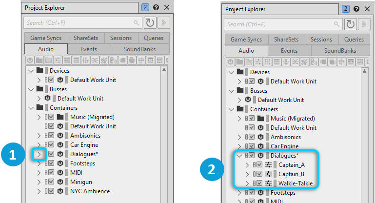

|  |  |
| --- | --- |
|  | 展开 Work Unit。 |
|  | Work Unit 的内容。 |

#### Visual elements in the Project Explorer

Wwise 使用不同的图标表示工程中的各个对象和元素，方便您在 Project Explorer 和界面其它位置中找到不同对象和元素类型。有关所有图标的完整列表和描述，请参阅[“理解 Wwise 中的视觉元素”一节](ch03s01.html "理解 Wwise 中的视觉元素")。

Project Explorer 中还使用其它可视元素（例如颜色）来帮助识别特定对象的状态。例如，对象的颜色可指明它是否具有相关源，或者是否针对特定平台进行了转码。下表包含 Project Explorer 中使用的可视元素的列表。

| 可视元素 | 示例 | 用途 | 选项卡 |
| --- | --- | --- | --- |
| 星号 | |  | | --- | |  | | 对工作单元中的一个或多个工程元素进行了更改。保存工程时，星号将消失。 | 全部 |
| Link 图标 | |  | | --- | |  | | Link 图标为灰色时，表示该对象设置适用于所有平台。Wwise 可以让您同时针对多个平台进行制作，其方法是链接（Link）和取消链接（Unlink）与对象相关联的大多数属性值。默认情况下，对于所有活动平台，所有属性值都是链接在一起的，因此属性在各平台上的值相同。取消链接属性值可让您为特定平台自定义属性值。  关于链接和取消链接的详细信息，请参阅[“Customizing object properties per platform”一节](ch35s01.html#customizing_object_properties_per_platform "Customizing object properties per platform")。 | 音频和 ShareSet（用于效果器和 Audio Device） |
| 复选标记 | |  | | --- | |  | | 当对象名称旁边显示复选标记时，当前平台中包含该对象。当没有显示复选标记时，当前平台中不包含该对象。 | 音频和 ShareSet（用于效果器和 Audio Device） |
| 对象名称为红色 | |  | | --- | |  | | 创建了一个 Sound SFX 或音乐音轨，但没有与源相关联。 | Audio |
| 对象名称为蓝色 | |  | | --- | |  | | 与源相关联的 Sound SFX 或 Music Track 尚未针对当前平台进行转码。 | Audio |
| 对象名称为白色 | |  | | --- | |  | | 与源相关联的声音或音乐轨尚未针对当前平台进行转码。 | Audio |

若使用了版本控制插件，则 Project Explorer 中的 Work Unit（工作单元）上方将显示专用叠加图标以便识别工程文件的状态。例如，标记为 Add、Check-out 和 Check-in 的文件将使用不同的图标。有关叠加图标的详细信息，请参阅[“利用版本控制插件管理工程文件”一节](ch09s05.html "利用版本控制插件管理工程文件")。

#### 在 Project Explorer 中工作

在 Project Explorer 中，您可以使用快捷菜单执行标准的 Windows 资源管理器（或 Mac Finder）命令，例如重命名、剪切、复制和粘贴。您还可以在选项卡内拖放工程元素，或者将工程元素拖放到 Wwise 界面中的其它视图中。请记住，每当您移动对象时，将影响父子关系。有关创建和管理这些元素及其关系的信息，请参阅以下各节：

- [“Building sound and motion hierarchies”一节](ch11s03.html "Building sound and motion hierarchies")
- [*Building your interactive music hierarchies*](ch27.html "Building your interactive music hierarchies")
- [*管理 Event*](ch14.html "管理 Event")
- [*管理动态对话*](ch15.html "管理动态对话")
- [*管理 SoundBank*](ch40.html "管理 SoundBank")
- [“使用 Switch”一节](ch17s01.html "使用 Switch")
- [*使用 State*](ch16.html "使用 State")
- [*使用 RTPC*](ch18.html "使用 RTPC")
- [*使用 Trigger*](ch19.html "使用 Trigger")
- [*将 State 和 State Group 用于动态对话*](ch20.html "将 State 和 State Group 用于动态对话")
- [*管理效果器*](ch24.html "管理效果器")
- [“管理多份衰减”一节](ch22s07s01.html "管理多份衰减")
- [“Building simulations”一节](ch36s01.html "Building simulations")
- [“Creating queries”一节](ch53s03.html#creating_query "Creating queries")

除了标准命令之外，Project Explorer 快捷菜单还由例如包含和排除之类的命令，以及当前选项卡的特定命令，例如 Audio 选项卡中导入和转码音频文件的命令，和 SoundBank 选项卡中导入 SoundBank Definition 的命令。

|  |  |
| --- | --- |
| [备注] | 备注 |
| 您可以在同一布局中同时打开多份 Project Explorer。 |

---

#### Setting display options

为帮助您管理工程中的复杂层级结构，您可能会需要设置 Project Explorer 以特定方式显示，以便您在需要时快速查找特定工程元素。For example, you might want to automatically collapse every grouping so that you can navigate more easily in the Containers hierarchy.

**更改 Project Explorer 显示的方法是：**

1. 在 Project Explorer 的任何选项卡中，右键点击对象。

   此时将会显示快捷菜单。
2. 在快捷菜单中，选择 **Expand Options**。

   此时将显示 Expand Options 子菜单。
3. 选择以下选项之一：

   - **Expand Descendants**（展开子对象）：展开层级结构中的所有对象。
   - **Collapse Descendants**（折叠子对象）：折叠层级结构中的所有对象。

您还可以使用以下键盘快捷键快速在 Project Explorer 中的不同层级导航。

| 键盘快捷键 | 操作 |
| --- | --- |
| 向上箭头 | 在对象列表中向上移动。 |
| 向下箭头 | 在对象列表中向下移动。 |
| 数字小键盘中的向右键或加号键 | 展开对象。 |
| 数字小键盘中的向左键或减号键 | 折叠对象。 |
| 数字小键盘中的斜线键 | 折叠对象中所有级别的节点。 |
| 数字小键盘中的星号键 | 展开对象中所有级别的节点。 |

---

#### Using the Project Explorer search

Project Explorer Search 设在 Project Explorer 视图的最上面。您可以使用其来查找并聚焦于 Project Explorer 的任一选项卡内的特定对象。该功能对包含大量对象的大型工程特别有用。

**使用搜索功能：**

- 通过以下任一方式来在“搜索”字段中输入内容：

  - 在“搜索”字段中键入所需文本。
  - 将一个或多个对象从任意视图拖到“搜索”字段中。

这时会显示搜索结果。系统会根据 [Search 工具](ch53s01.html "搜索工程中的元素")中应用的相同规则来评估搜索匹配项。

下图举例展示了在“搜索”字段中键入单词 foot 后的结果：


|  |  |
| --- | --- |
|  | 系统会指示每个选项卡中的匹配结果总数。在总数大于零时，会高亮显示为黄色。 |
|  | 在各个选项卡内，除非包含与搜索匹配的对象，否则所有层级结构都会收起。朝下的黄色箭头表示分支被部分展开了（只显示匹配的下级对象，隐藏不匹配的下级对象）。单击箭头可显示所有下级对象。  After a search:  - Collapsed hierarchies: No matching objects are   found. - Partially expanded hierarchies (yellow): Some matching objects are found, but not   all children match. - Fully expanded hierarchies: Matching objects are found, and all children   match. |
|  | 对于包含至少一个与搜索匹配的对象的层级结构，只会展开到第一个匹配对象所在的层级。朝右的黄色箭头表示其内隐藏了匹配的下级对象。单击箭头可显示分支中的所有匹配下级对象。不匹配的下级对象会保持隐藏状态。  除此之外，也可单击“搜索”字段右侧的 Show All Search Results 按钮  来显示所有分支中的全部匹配下级对象。 |
|  | 背景底纹会高亮显示所有与搜索匹配的对象。 |
|  | 其内隐藏的附加匹配项数会标明并高亮显示为黄色。 |

|  |  |
| --- | --- |
| [备注] | 备注 |
| Project Explorer Search 支持 [WAQL](https://www.audiokinetic.com/library/edge/?source=SDK&id=waql_introduction.html) 查询；不过，有些 WAQL 功能并不适用于这种搜索。比如，关键词 **orderby**、**reverse** 和 **distinct** 对如何呈现结果不起任何作用。Project Explorer 始终按照名称排列并显示结果且不会显示重复结果。另外，Project Explorer 只会显示所支持类型的对象；有些对象类型从不显示在 Project Explorer 中。比如，不会显示 **Event Action**，而只会显示 **Event** 本身。 |

###### Refreshing the search

按下 Refresh 按钮  可基于 Wwise 中所有参数的当前状态再次执行搜索。上次执行搜索后展开或收起的所有分支将恢复为执行搜索操作后的原始展开状态。注意，在更改对象的父对象或创建、重命名或删除对象时会自动刷新搜索结果，但不会对其他参数更改（比如可能对评估音量的 WAQL 查询产生影响的音量更改）做出反应。Refresh 按钮在这些情况下特别有用。

###### Resetting the search

若要重置搜索，可单击“搜索”字段最右侧的 **x**。这样会清除“搜索”字段中的所有内容和 Project Explorer 中的所有结果。总的来说，在重置搜索时，Project Explorer 中的各个层级结构会恢复为其之前的展开状态。不过，所有在关闭时选中的对象仍然是可见的（即其层级结构会保持展开状态）。

###### 搜索操作和 Selection Channel

搜索操作会与当前 [Selection Channel](ch04s01s01.html "了解 Selection Channel 和 Meter Instance") 关联。也就是说，您可以同时在各个 Selection Channel 中执行不同的搜索。在关闭工程时，会保存所有的活跃搜索；在重新打开时，会自动启动这些搜索。

###### Keyboard shortcuts

在 Wwise 中的任意位置按下 **Ctrl+F** 即可将键盘焦点移到 Project Explorer Search 字段。若 Project Explorer 视图未打开，会在新的窗口中将其打开。

利用 [“键盘快捷方式和自定义命令”一节](ch57s12.html "键盘快捷方式和自定义命令") 对话框，可将 **View** > **Project Explorer** > **Reset Search** 命令映射到键盘快捷方式。此命令的效果跟单击“搜索”字段中的 **x** 一样。

**相关主题**

- [“Project Explorer Search”一节](ch60.html#project_explorer_filter_ref "Project Explorer Search")

---

#### Using the Project Explorer toolbar

Project Explorer 的每个选项卡包含一个图标工具栏。这些图标表示可以添加哦到层级结构中去的工程元素，这些元素可以添加成为选定节点的父项或子项。系统会根据在层级结构中选择的对象类型将不同的图标设为活跃状态。


在默认情况下，该工具栏显示可作为选定节点的子项加以添加的所有工程元素。要显示可以添加的父工程元素，请按 Shift 键。

**使用工具栏将子对象添加到层级结构中的方法是：**

1. 在 Project Explorer 中，选择层级结构中的对象或其它工程元素。

   这时在工具栏中，可添加成为选定元素子项的工程元素所对应的图标激活了。
2. 点击活跃图标之一来创建选定元素的新子项。
3. 为子对象取一个恰当的名称，然后按 **Enter**。

**使用工具栏将父对象添加到层级结构中的方法是：**

1. 在 Project Explorer 中，选择层级结构中的对象或其它工程元素。
2. 按 **Shift** 以显示可添加成为选定元素父项的工程元素。
3. 点击活跃图标之一以创建选定元素的新父项。
4. 为父对象取一个恰当的名称，然后按 **Enter**。

---

#### Project Explorer keyboard shortcuts

| 操作 | 使用此快捷方式 |
| --- | --- |
| 前往搜索字段 | Ctrl+F |
| 折叠子对象 | 数字小键盘中的斜线键 |
| 展开节点 | 数字小键盘中的向右键或加号键 |
| 折叠节点 | 数字小键盘中的向左键或减号键 |
| 向上导航 | 向上箭头 |
| 向下导航 | 向下箭头 |
| 展开子对象 | 数字小键盘中的星号键 |

---

### 认识 Event Viewer 视图

Wwise 使用 Action Event（动作事件）对工程层级中的不同声音、音乐和振动结构采取特定的动作。常见的游戏中，这样的事件可能有数百个，因此能够快速找到所需事件变得至关重要。您可以使用 Event Viewer（事件浏览器）中的排序和筛选工具来查找当前工程中的不同事件。

**To open the Event Viewer:**

- From the menu bar, click **Views > Utilities > Event Viewer**
  and then select a new pinned view (Shift+V) or a selection channel. For details
  on Selection Channels, see [“了解 Selection Channel 和 Meter Instance”一节](ch04s01s01.html "了解 Selection Channel 和 Meter Instance").

  |  |  |
  | --- | --- |
  | [备注] | 备注 |
  | 同一布局中，允许同时打开多个 Event Viewer。 |

The Event Viewer has three different tabs, each of which filters the Events in a different way:

- **Filtered**（筛选） 选项卡 ―― 按字母顺序显示所有事件。您还可以使用 Show All: Sorted 选项，按 Action Type（动作类型）对列表排序或筛选，只显示含特定动作类型的事件。您可以通过单击加号 (+) 和减号 (-) 来展开和折叠文件夹以便浏览筛选出来的 Event。

  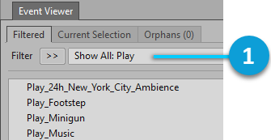

  |  |  |
  | --- | --- |
  |  | Event Viewer 按 Play 动作类型进行筛选。 |
- **Current Selection**（当前选中项）选项卡 C 列出与 Project Explorer（工程资源管理器）的 Audio（音频）选项卡中当前选中的对象关联的 Event。
- **Orphans**（落单事件）选项卡 ―― 显示当前没有与特定对象关联的落单事件。

您还可以删除事件、打开 Event Editor，或者将若干事件从 Event Viewer 拖放到 Wwise 中的其他视图（例如 Soundcaster Editor 或 SoundBank Editor）。

|  |  |
| --- | --- |
| [备注] | 备注 |
| 对白事件不会在 Event Viewer 中显示，Dialogue Events can be viewed on the Events tab of the Project Explorer. |

#### Setting expand and collapse behavior

视情况或个人偏好而异，您可能需要更改 Event Viewer 的显示方式。例如，可以展开或折叠所有分组，或者让 Event Viewer 每次筛选或排序时自动展开各个分组。

**更改 Event Viewer 显示的方法如下：**

1. 在 Event Viewer 中右键点击组标题之一。

   快捷菜单将打开。
2. 选择以下选项之一：

   - **Auto Expand** ―― 每次筛选或排序时自动展开各个分组。
   - **Expand All** ―― 展开所有类别和类型分组。
   - **Collapse All** ―― 折叠所有类别和类型分组。

#### Sorting the Event list

By default, the Event Viewer displays the Filtered tab where all the Events in your project are listed in alphabetical order. 要想更快地找到事件，您可以选择 Show All - Sorted 筛选器，按事件动作进行排序。也就是说所有Play 动作分成一组，所有 Stop 动作分成一组，以此类推。

**对事件列表进行排序的方法如下：**

1. 在 Event Viewer 中，点击 Filtered 选项卡。

   默认情况下，所有事件会按字母顺序列出。
2. 点击 **Filter** 按钮，显示筛选和排序选项。
3. 点击 **Show All - Sorted** 选项。

   All the Events in your project are sorted by Action category and then
   Action type.

#### Filtering the list by Action type

You can filter the Event list by Action type. 例如，可以让列表仅显示 Stop All 动作或 Mute 动作。

**按动作类型对事件列表进行筛选的方法如下：**

1. 在 Event Viewer 中，点击 Filtered 选项卡。

   默认情况下，所有事件会按字母顺序列出。
2. 点击 **Filter** 按钮，显示筛选和排序选项。
3. 选择动作类别，然后点击列表中的动作类型。

   The Events are filtered according to the filter option you
   selected.

#### Filtering the list by current selection

You can filter the list to find specific Events that are associated with one or
more objects selected in the Audio tab of the Project Explorer.

**按当前选定对象对事件列表进行筛选的方法如下：**

1. 在 Project Explorer 的 Audio 选项卡中，选择若干对象。
2. 在 Event Viewer 中，点击 **Current Selection** 选项卡。

   与选定对象相关的事件将显示在事件列表中。

|  |  |
| --- | --- |
| [备注] | 备注 |
| If more than one object is selected in the Audio tab of the Project Explorer, the Events are sorted by object. |

#### Filtering the list by orphaned Events

You can filter the list to find orphaned Events, which are Events that contain Actions that are not associated with any object. Orphans 选项卡标题括号中的数字表示工程中的落单事件总数。

**按落单事件对列表进行筛选的方法如下：**

1. 在 Event Viewer 中，点击 **Orphans** 选项卡。

   The orphaned Events are displayed in the Events list.

#### 浏览 Event Viewer

根据事件列表的排序或筛选方式不同，Event Viewer 中的信息可按多种不同的方式显示。有些筛选和排序选项会在 Event Viewer 中显示层级结构。要浏览不同的层级，可以点击每个 Action（动作）类别/类型旁边的加号（+）和减号（-）来展开和折叠分组。

比如，要在当前所选 **Filter**（筛选器）为 **Show All - Sorted**（全部显示 - 排序）时查看 Stop（停止）动作，必须执行以下操作：

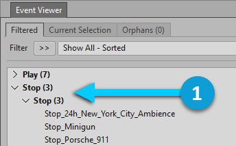

|  |  |
| --- | --- |
|  | 展开 Stop 动作类别和 Stop 动作类型分组来显示不同的 Event。 |

#### Keyboard shortcuts

您还可以在 Event Viewer 中使用以下键盘快捷键，迅速浏览不同层级。

| 键盘快捷键 | 操作 |
| --- | --- |
| 向上箭头 | 在 Event 列表中向上移动。 |
| 向下箭头 | 在 Event 列表中向下移动。 |
| 向右箭头 | 展开 Event 的动作类别或类型分组。 |
| 向左箭头 | Collapse an Event Action category or type grouping. |

---

### 了解 Property Editor

You can use the Property Editor to view and change the properties of objects in the Wwise
Hierarchy. The Property Editor is visible:

- In its own window. From the menu bar, click **Views > Editors >
  Property Editor** (Ctrl+K).
- In the Object Tab Group of the Designer layout. See [*使用 Object Tab 和 Object Tab Group*](ch51.html "使用 Object Tab 和 Object Tab Group") and [“处理布局”一节](ch04s02.html "处理布局").

Select an object in the Project Explorer to view its properties in the Property Editor.
Properties are displayed according to the object's type.

You can filter properties as follows:

- **Predefined categories:** Each object's properties have an
  [“Object specific category”一节](ch45s01.html "Object specific category"). Choose which other categories are
  shown by clicking **Show/Hide Category Filters**
   and selecting or deselecting them. Then select a shown category
  to see the properties in it. You can multi-select categories from among those
  shown.

  Depending on the object type, the following categories might be also
  available:

  - [“General category”一节](ch45s02.html "General category")
  - [“Routing category”一节](ch45s03.html "Routing category")
  - [“Conversion category”一节](ch45s04.html "Conversion category")
  - [“Positioning category”一节](ch45s05.html "Positioning category") (for Containers hierarchy and most Busses hierarchy objects)
  - [“HDR category”一节](ch45s06.html "HDR category") (for Containers hierarchy objects and Audio Busses)
  - [“MIDI category”一节](ch45s07.html "MIDI category") (for Containers hierarchy objects)
  - [“Advanced category”一节](ch45s08.html "Advanced category")（仅适用于除 Auxiliary Bus 外的所有对象）
  - [“Sources category”一节](ch45s09.html "Sources category")
  - [“All category”一节](ch45s10.html "All category")
- **Favorites**: You can configure a custom category
  called Favorites. To populate it:

  - Click **Show/Hide Category Filters** and
    then click **Configure Favorites**.
  - Right-click a property, then select **Add to
    Favorites** or **Configure
    Favorites**.

  If you have configured a least one favorite, filter on favorites by clicking **Show/Hide Category Filters** and selecting **Favorites**. Properties in Favorites are grouped by
  category. You can change the display order of the groups by clicking and dragging
  the  title bar icon. To restore the default order, click **Show/Hide Category Filters** then click **Reset Favorites Order to Default**.
- **Search field**: You can filter on property titles
  by entering text in the search field.
- **Only Show Modified**: This is enabled by clicking . Modified properties are marked with an orange band: , as are groups and categories containing modified
  properties.

Properties are displayed in collapsible groups. Groups can be expanded or collapsed by
clicking on them or by clicking **More Options**
 and then **Expand All** or **Collapse All**. Some groups contain additional properties you can
display by clicking . To have them shown always, click **Show/Hide
Category Filters** and enable **Always Show Additional
Properties**.

Properties are also displayed in the Primary Editor. 请参阅 [“Primary Editor 和 Secondary Editor”一节](ch51s03.html "Primary Editor 和 Secondary Editor")。

When a Game Sync is loaded into the Property Editor, various properties are displayed depending on the game sync type. 下表描述为各个 Game Sync 所显示的属性：

| Game Sync | Property Editor 内容 |
| --- | --- |
| Switch Group | Game Parameter 值映射的名称（Name）、备注（Notes）和 Switch。 |
| Switch | 名称和备注。 |
| State Group | Name, notes, and transition properties between States. |
| State（状态） | 名称、备注和 State 值副本。 |
| Game Parameter（游戏参数） | 名称；备注；要绑定的内置参数；游戏参数的最小值、最大值和默认值；以及插值模式值。 |
| Trigger （触发器） | 名称和备注。 |

---

#### Object specific category

For each object type there is a category containing properties specific to that object type,
for example Sound Voice, or Sound SFX.

The following figure shows the Object specific category for a Sound Voice.

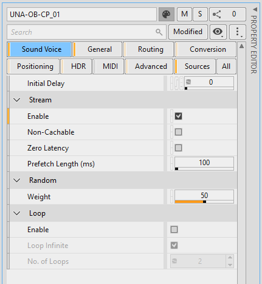

---

#### General category

The General category contains general properties of the selected object. It is contextual:
properties displayed depend on the selected object type.

The following figure shows the General category for a Sound SFX.

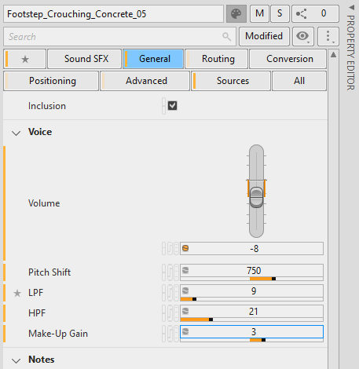

|  |  |
| --- | --- |
| [备注] | 备注 |
| The Vertical Fader is displayed for the Volume setting by default. To switch to the Horizontal Slider, right-click the Volume setting and select **Use Horizontal Slider for Volume**. |

---

#### Routing category

The Routing category contains routing properties of the selected object. 请参阅[“指定对象的输出连线”一节](ch34s01.html "指定对象的输出连线")

The following figure shows the Routing category for a Sound SFX.


---

#### Conversion category

The Conversion category contains conversion properties of the selected object. 另外，您还可以启用响度归一化来调节音量。

The following figure shows the Conversion category for a Sound Voice.

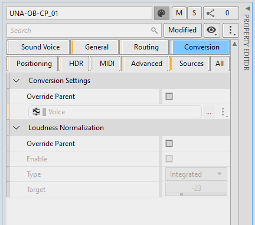

---

#### Positioning category

The Positioning category contains positioning properties of the selected object. 您可以设置对象是使用 Speaker Panning（扬声器声像摆位）和 3D Position（3D 定位）中的一种还是两种。You can then define how each of these types of positioning is implemented. 对于对象的音频信号分配，您还可以指定通过中置扬声器播放的百分比。

The following figure shows the Positioning category for a Sound SFX.


---

#### HDR category

The HDR category contains HDR (high dynamic range) properties of the selected object. HDR
audio is a technique to design a mix using level values spanning a very high dynamic
range as occurs in nature. HDR is also a run-time system that dynamically maps this wide
range of levels to a range that is more suited to your sound system's output. The HDR
category is where you define the HDR behavior and properties for the selected bus or, in
a more limited fashion, audio structure.

请参阅 [“使用 HDR”一节](ch34s09.html "使用 HDR")。

The following figure shows the HDR category for an audio bus.


The following figure shows the HDR category for a Sound Voice.


---

#### MIDI category

The MIDI category contains MIDI properties of the selected object.

The following figures show the MIDI category for a Sound Voice.

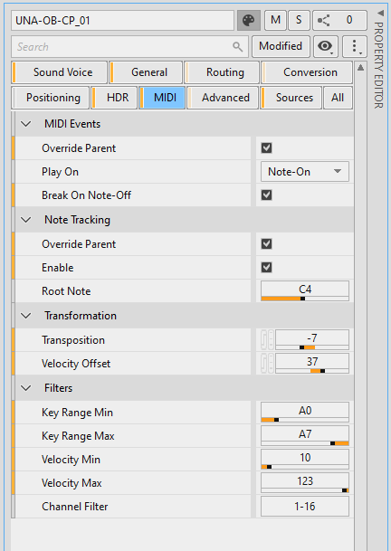

The MIDI category for music objects allows you to specify the target and tempo of the MIDI content of an object. The target can be any playable object in the Containers hierarchy. 速度既可指定为 Interactive Music 对象中所有 MIDI 内容的全局值，也可从 MIDI 文件中获取。

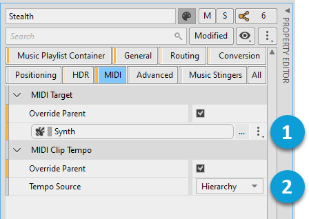

|  |  |
| --- | --- |
|  | Select any playable object from the Containers hierarchy. |
|  | 在 MIDI Clip Tempo（MIDI 片段速度）分区中指定 Source（源）。 |

---

#### Advanced category

Advanced properties are specified to limit the number of sounds playing concurrently and to
specify their behavior when they are inaudible, which respectively provide the following
advantages:

- 提升性能和帮助清理混音
- 节省内存和 CPU 资源

The following figure shows the Advanced category for a Sound SFX.


###### Advanced properties and mixing

You shouldn't wait too late in the production process to adjust the advanced properties. 更准确地说，至少应在混音前或混音期间执行第一轮高级设置调整。If you spend time tweaking your mix too early, and later realize that audio is using too many resources, you might end up using advanced properties so aggressively to keep audio processing within bounds that it would have a dramatic impact on your mix.

播放数限制实际上可帮助您实现混音。将它们当作动态混音的一种形式进行使用，帮助玩家集中注意力于重要的方面，而不是用大量声音来淹没玩家。您还可以使用总线闪避、**Set Volume** 动作、State 或 RTPC 来清理您的混音。

###### Playback limit, priority, and under volume threshold behavior

Playback limits used on sound structures help you limit the number of sounds playing at the same time, either per game object or globally as specified in the Containers hierarchy. (In the Busses hierarchy, it is always globally). 它的逻辑以播放的声音数量为唯一依据。但是，声音设计师可以在整个层级结构中为不同的对象应用单独的数量限制。而且根据需要，还可以通过选择 **Ignore Parent** 选项来创建独立于上级数量限制的层级结构。总而言之，多种级别的播放限制能让声音设计师更容易控制所播放的内容。

在试图播放声音之前将检查播放数限制条件。当声音即将开始播放，并已达到播放数限制时，将停止播放此声音或另一个声音。第一个条件是声音的优先级。当两个候选声音具有相同的优先级时，声音引擎停止播放最早或最新的声音，具体由 **When limit is reached**（达到限制时）和 **When priority is equal**（优先级相同时）属性指定。

|  |  |
| --- | --- |
| [备注] | 备注 |
| 当声音由于播放数限制而被终止时，播放次数低于此限制则不会重新播放该声音。因此需要小心处理无限循环的环境声音。 |

优先级设置可搭配播放数限制一起使用。在层级结构中微调优先级，以平衡播放数限制系统。不应由播放数限制系统终止的声音（例如配音、背景音乐或循环环境声音）应具有最高的优先级。另外，已经生效的优先级还可以受到声音和听者之间的距离影响。

“under **Volume Threshold**”行为与播放数限制和优先级无任何关系。它只是决定当声音无法被听见时的声音行为。为了确定声音能否被听见，Wwise 只会查看音量元数据，它是所有层级结构、总线、状态、RTPC 和 Set Voice Volume 动作对音量产生的影响总和。它不分析 WAV 数据。

###### 动态混音技术

The following dynamic mixing techniques can be applied in the Advanced category.

- **Limit playback on busses or on objects in the
  Containers hierarchy to make room for important sounds**

  例如，当有大量动作、爆炸或玩家应关注的任何元素上时，应减少环境声音和拟音的数量。查找环境声和拟音与枪声和爆炸声并存的总线，对该总线设置限制，并降低前者的优先级。
- **对优先级使用距离偏置**

  例如，在环境声音中，结合基于距离的优先级使用播放数限制，以将焦点集中在更近的声音上。**Offset priority by** 选项指定最大距离处的优先级偏置值，此值插值于 0 和 **at max distance** 之间。
- **闪避不重要的声音的音量**

  有时候不可使用播放数限制。例如，如果您在游戏关卡一开始就启动无限循环的环境声音，则应该避免使用播放数限制功能来停止这些声音，因为通过这种方式停止后，它们就不会再重新播放了。在这种情况或者您认为合适的任何情况下，当游戏音频的其它更重要区域中有活动时，应使用需要的技术来闪避它们的音量。例如，在配音或格斗期间关闭环境声音。当炸弹在您附近爆炸时，您无需听到电灯的晟。此过程可视为元数据[*[侧链](go01.html#glossary_side_chaining "Side-Chaining（旁链）")*](go01.html#glossary_side_chaining)。使用控制总线上的总线闪避功能或特定事件中的 **Set Voice Volume** 动作可用来触发音量变化。

  在特定场合中，一旦通过降低不重要声音的音量来清理混音后，微调它们的“under **Volume Threshold**”行为，以在它们无法被听见时使用尽可能少的 CPU 和内存资源。
- **实现代码侧动态混音系统**

  注意，播放数限制、优先级和优先级偏置可通过 RTPC 将控制接口交给游戏。Nothing prevents you from implementing a system which adapts these properties based on what's happening in the game.

---

#### Sources category

The Sources category contains source properties of the selected object. 请参阅 [“利用 Source Editor 编辑音频源”一节](ch21s01s01.html "利用 Source Editor 编辑音频源")。

The following figure shows the Sources category for a Sound SFX.

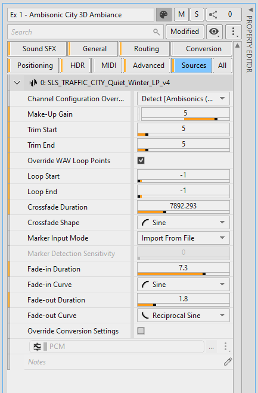

---

#### All category

The All category allows you to edit all of the editable properties of an object. The
availability of properties depends on the object type.

The following figure shows the All category for a Sound SFX.


---

#### 使用 Property Editor

Property Editor 可包含一系列的选项、字段、滑杆、列表、按钮和坐标图视图，您可以用它们定义工程中不同对象和 Game Sync 的属性和行为。如果需要这些工具的使用帮助，请参阅以下各节：

- [“使用文本框和滑杆”一节](ch03.html#using_text_boxes "使用文本框和滑杆")
- [“使用列表”一节](ch03.html#using_lists "使用列表")
- [*了解坐标图视图*](ch49.html "了解坐标图视图")

在 Property Editor 中修改属性值时，您可以选用随机化器或跨平台链接或取消链接该值。在 Wwise 中，这些功能通过独特的图标进行表示。Wwise 还通过图标指示某属性值是否通过 RTPC 指派到了某个游戏参数上。下表介绍了这些图标。

| 图标 | 名称 | 描述 |
| --- | --- | --- |
| |  | | --- | |  | | Inclusion | 决定是否包含该对象。如勾选，则包含该元素。如未勾选，则不会包含该元素。在默认情况下，此设置将应用于所有平台。可以使用 [Link Indicator](ch45s11.html#linking_unlinking_property_values "Linking or unlinking property values")（链接图标，位于复选框左侧）来查看或设置平台专有属性。  未勾选此选项时，Property Editor（属性编辑器）中各属性和行为选项都将不可用。 |

|  |  |  |
| --- | --- | --- |
|  | Link | 链接。属性值已链接到其它有效游戏平台的值。 |
|  | Unlink | 取消链接。属性值没有链接到其它有效游戏平台的值。 |
|  | Partial Unlink | 部分取消链接。当前平台的属性值已链接到其它有效平台，但其它平台的若干个相应值已取消链接。 |
|  | Link Mixed | 有些选定的对象具有不同的链接状态。有些可能是链接的，而另一些则是取消链接或部分取消链接的。 |

|  |  |  |
| --- | --- | --- |
|  | RTPC 已禁用 | 该属性值未绑定至游戏内参数值。 |
|  | RTPC 已启用 | 游戏内参数值已绑定至该属性值。这意味着，例如游戏赛车的速度可直接绑定至 Wwise 中的音调属性。当游戏中的赛车速度提高时，Wwise 中的音调也将实时提高。 |
|  | RTPC 部分启用 | Multi Editor 中只有部分对象为该属性绑定了游戏参数值。Property Editor 或 Contents Editor 中不会看到这个标识。 |

|  |  |  |
| --- | --- | --- |
|  | Randomizer 已启用 | 随机化器效果已应用到的属性值。 |
|  | Randomizer 已禁用 | 尚未应用随机化器效果的属性值。 |
|  | 随机化器 Mixed | Multi Editor 中只有部分对象为该属性值启用了 Randomizer 效果。Property Editor 或 Contents Editor 中不会看到这个标识。 |

|  |  |  |
| --- | --- | --- |
|  | State 已禁用 | 此属性值未与 State 绑定。 |
|  | State 已启用 | State Group 已与此属性值绑定。也就是说，所述属性（如 Volume）可能会随应用的 State 变化。 |
|  | State 混合情形 | State Group 绑定到了 Multi Editor 中加载的一个或多个对象（并非全部）的属性值。Property Editor 或 Contents Editor 中不会看到这个标识。 |

###### Randomizing property values

为了增强游戏中的声音真实感，您可以在 Property Editor 中对大多数属性值应用随机化器。随机化器指定可用于特定属性的可能值域。每次播放对象时，Wwise 将在指定的值域内选择不同的属性值。对各个不同的属性值应用随机化器将确保每次在播放对象时对象听起来会不相同。

有关随机化器和如何使用它们的详细信息，请参阅[“通过随机化属性值来改善播放”一节](ch11s05.html "通过随机化属性值来改善播放")。

###### Linking or unlinking property values

Wwise 还可以让您同时针对多个平台进行制作，其方法是链接（Link）和取消链接（Unlink）与对象相关联的大多数属性值。默认情况下，对于所有活动平台，所有属性值都是链接在一起的，因此属性在各平台上的值相同。取消链接属性值可让您为特定平台自定义属性值。


有关链接和取消链接属性值的详细信息，请参阅[“Customizing object properties per platform”一节](ch35s01.html#customizing_object_properties_per_platform "Customizing object properties per platform")。

###### Assigning property values to Game Parameters

如上所述，您可以将游戏参数指定到 Wwise 中的特定属性值。它们被称为实时参数控制（RTPC）。Wwise gives you visual feedback on which properties have been assigned as an RTPC. 在将属性值指派给 Game Parameter（游戏参数）后，属性的 RTPC 标志会变为主题特定颜色（Classic 中为蓝色，Dark 中为橙色）。


|  |  |
| --- | --- |
|  | 使用了 RTPC。 |
|  | 未使用 RTPC。 |

有关使用 RTPC 的详细信息，请参阅[“使用 Game Parameter 控制属性值”一节](ch18s03.html "使用 Game Parameter 控制属性值")。

###### Displaying a project element's properties

Property Editor 显示与工程中特定工程元素相关的所有属性。您可以在许多不同的视图（例如 Project Explorer 的 Audio 选项卡、Contents Editor 和 Capture Log）中通过双击对象将特定对象加载到 Property Editor。您还可以在 Project Explorer 的 Game Syncs 选项卡中通过双击下列任何一项将 Game Sync 加载到 Property Editor 中：

- Switch Group （切换开关组）
- Switch（切换开关）
- State Group
- State（状态）
- Game Parameter（游戏参数）
- Trigger（触发器）

**在 Designer 布局中显示工程元素属性的方法是：**

1. 在 Designer 布局中，执行以下操作之一：

   - 在 Project Explorer 的 Audio 选项卡内选中某个对象。
   - 在 Project Explorer（工程资源管理器）的 Game Syncs（游戏同步器）选项卡中选择游戏同步器。

   此时将发生下列情况：

   - 对象的属性将显示在 Property Editor 中。
   - 对象或 Game Sync 内包含的所有子对象将显示在 Contents Editor 中。

   

   |  |  |
   | --- | --- |
   |  | 在 Project Explorer 的 Audio 选项卡内选中某个对象。 |
   |  | Property Editor 中加载该对象。 |
   |  | Contents Editor 中加载其子对象。 |

---

### 认识 Contents Editor 视图

父级对象加载到 Property Editor（属性编辑器）时，Contents Editor（内容编辑器）中会显示其子对象。Property Editor 可以加载不同对象结构和其它工程元素，因此 Contents Editor 也会根据加载的对象类型显示不同的布局。

当声音、音乐或振动结构和其它工程元素加载到 Contents Editor 时，您可以快速访问与各对象相关的常见属性，例如音量。通过在 Contents Editor 中进行设置，可以直接编辑子对象，而不必将其再分别加载到 Property Editor 中。Contents Editor 中还允许启用或弃用对象、设置 Playlist（播放列表）和 Switch（切换开关）行为，以及管理音频、振动源和源插件。

下面的章节介绍了声音、音乐和振动结构及其它工程元素在 Contents Editor 中的不同视图。

- [“Sound objects”一节](ch46s01.html "Sound objects")
- [“Random Container（随机容器）”一节](ch46s02.html "Random Container（随机容器）")
- [“Sequence Containers”一节](ch46s03.html "Sequence Containers")
- [“Switch Container（切换容器）”一节](ch46s04.html "Switch Container（切换容器）")
- [“Blend Container（混合容器）”一节](ch46s05.html "Blend Container（混合容器）")
- [“Property Containers”一节](ch46s06.html "Property Containers")
- [“虚拟文件夹”一节](ch46s07.html "虚拟文件夹")
- [“Busses”一节](ch46s08.html "Busses")
- [“Event”一节](ch46s09.html "Event")
- [“Switch Groups（切换开关组）”一节](ch46s10.html "Switch Groups（切换开关组）")
- [“State Groups（状态组）”一节](ch46s11.html "State Groups（状态组）")
- [“Music Track”一节](ch46s12.html "Music Track")
- [“音乐段落”一节](ch46s13.html "音乐段落")
- [“Music Playlist Containers”一节](ch46s14.html "Music Playlist Containers")
- [“Music Switch Containers”一节](ch46s15.html "Music Switch Containers")

---

#### Sound objects

当您将 Sound Object（声音对象）加载到 Property Editor 时，它的 Source（源）将显示在 Contents Editor 中。声音对象可以包含多个源，包括：

- **Take** -- 版本。选择使用哪个源之前，您可以针对同一声音对象的不同版本进行试听和测试。这些音频源可以链接到音频文件、Silence（空白）源、插件或三者的组合。
- **Language** ―― 工程的不同本地化语言版本。关于如何在 Wwise 中使用语言版本，详细信息请参阅[“Localizing your project”一节](ch35s02.html "Localizing your project")。

Contents Editor 中，对于每种不同的源类型，其控件和属性的显示也不同。


|  |  |
| --- | --- |
|  | Audio Source。 |
|  | 源插件。 |
|  | 插件属性控件。 |
|  | 单击添加源插件。 |

---

#### Random Container（随机容器）

当您将 Random Container（随机容器）加载到 Property Editor 时，它的子对象将显示在 Contents Editor 中，可以在其中编辑各对象的属性。


|  |  |
| --- | --- |
|  | 容器中嵌套的对象。 |
|  | 属性控件。 |

---

#### Sequence Containers

当您将 Sequence Container（序列容器）加载到 Property Editor 时，子对象将显示在 Contents Editor 中。可以编辑各对象的属性，并为 Sequence Container 创建播放列表。


|  |  |
| --- | --- |
|  | 容器中嵌套的对象。 |
|  | 属性控件。 |
|  | Playlist 窗格。 |

---

#### Switch Container（切换容器）

当您将 Switch Container（切换容器）加载到 Property Editor 时，子对象将显示在 Contents Editor 中。可以编辑子对象的属性，将它们指派给 Switch，并设置各对象在游戏调用 Switch 时的行为。


|  |  |
| --- | --- |
|  | 容器中嵌套的对象。 |
|  | 指派给 Switch 的对象的行为。 |
|  | Assigned Objects 窗格。 |

---

#### Blend Container（混合容器）

当您将 Blend Container（混合容器）加载到 Property Editor 时，子对象将显示在 Contents Editor 中。可以编辑子对象的属性，并将它们分配至不同的 Bland Track（混合轨）。


|  |  |
| --- | --- |
|  | 容器中嵌套的对象。 |
|  | 属性控件。 |
|  | Blend Tracks 窗格。 |

---

#### Property Containers

When you load a Property Container into the Property Editor, the child objects are displayed in the Contents Editor. You can edit the properties for the child objects of the Property Container in this view.


|  |  |
| --- | --- |
|  | Objects nested in Property Containers. |
|  | 属性控件。 |

---

#### 虚拟文件夹

在将 Virtual Folder（虚文件夹）加载到 Property Editor（属性编辑器）中时，会在 Contents Editor（内容编辑器）中显示其子对象。可以在其中编辑子对象的属性。

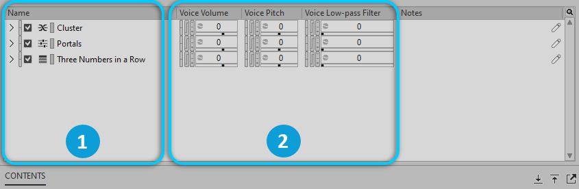

|  |  |
| --- | --- |
|  | Virtual Folder 中嵌套的对象。 |
|  | 属性控件。 |

---

#### Busses

When you load the main bus or a parent bus into the Property Editor, its child busses are loaded into the Contents Editor. 可以在其中编辑子总线属性。


|  |  |
| --- | --- |
|  | 子总线。 |
|  | 属性控件。 |

---

#### Event

在将 Event 加载到 Event Editor（事件编辑器）中时，会在 Contents Editor（内容编辑器）中显示与 Event 关联的对象。可以编辑它们的属性。


|  |  |
| --- | --- |
|  | 与 Event 关联的对象。 |
|  | 属性控件。 |

---

#### Switch Groups（切换开关组）

When you load a Switch Group into the Property Editor, the Switches within the Switch Group will be displayed in the Contents Editor. 可以编辑各个 Switch 的名称，并添加备注。


---

#### State Groups（状态组）

When you load a State Group into the Property Editor, the States within the State Group will be displayed in the Contents Editor. 可以编辑它们的属性。

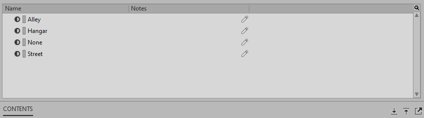

---

#### Music Track

When you load a Music Track into the Property Editor, its source is displayed in the Contents Editor. 虽然也会显示属性，但只有备注可以编辑。

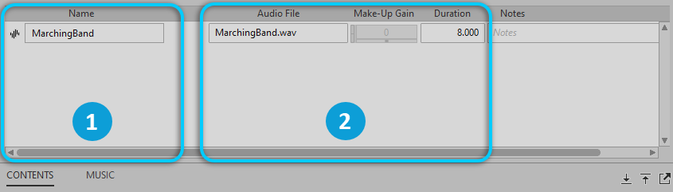

|  |  |
| --- | --- |
|  | 音轨。 |
|  | 属性控件。 |

---

#### 音乐段落

当您将 Music Segment （音乐段落）加载到 Property Editor 中时，其中的音轨将显示在 Contents Editor 中，可以在此编辑其属性。

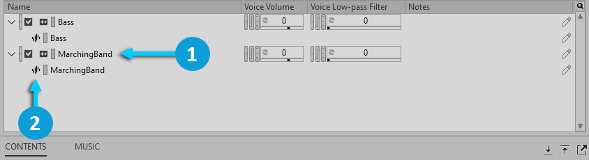

|  |  |
| --- | --- |
|  | Music Segment 中的音轨。 |
|  | 音轨源文件。 |

---

#### Music Playlist Containers

当您将 Music Playlist Container（音乐播放列表容器）加载到 Property Editor 中时，其子对象将显示在 Contents Editor 中，可以在此编辑其属性。


|  |  |
| --- | --- |
|  | Music Playlist Container 中的对象。 |
|  | 属性控件。 |

---

#### Music Switch Containers

当您将 Music Switch Container（音乐切换容器）加载到 Property Editor 中时，其子对象将显示在 Contents Editor 中，可以在此编辑其属性。


|  |  |
| --- | --- |
|  | 容器中的对象。 |
|  | 属性控件。 |

---

#### 使用 Contents Editor

Contents Editor（内容编辑器）中显示了一系列字段、列表、选项和滑杆，可以用它们设置对象、State 和 Switch 的属性和行为。如果需要这些工具的使用帮助，请参阅以下各节：

- [“使用文本框和滑杆”一节](ch03.html#using_text_boxes "使用文本框和滑杆")
- [“使用列表”一节](ch03.html#using_lists "使用列表")

在 Contents Editor 中，您可以播放每个对象，也可以重新排序、复制、粘贴和删除视图中的对象。根据当前加载的对象类型，视图中显示的选项或属性将有所不同。多数视图中，一些属性滑杆旁边会显示特定图标，来表示它们具有特定属性。下表介绍了这些图标。

| 图标 | 名称 | 描述 |
| --- | --- | --- |
|  | | |

|  |  |  |
| --- | --- | --- |
|  | Link | 链接。属性值已链接到其它有效游戏平台的值。 |
|  | Unlink | 取消链接。属性值没有链接到其它有效游戏平台的值。 |
|  | Partial Unlink | 部分取消链接。当前平台的属性值已链接到其它有效平台，但其它平台的若干个相应值已取消链接。 |
|  | Link Mixed | 有些选定的对象具有不同的链接状态。有些可能是链接的，而另一些则是取消链接或部分取消链接的。 |

|  |  |  |
| --- | --- | --- |
|  | RTPC 已禁用 | 该属性值未绑定至游戏内参数值。 |
|  | RTPC 已启用 | 游戏内参数值已绑定至该属性值。这意味着，例如游戏赛车的速度可直接绑定至 Wwise 中的音调属性。当游戏中的赛车速度提高时，Wwise 中的音调也将实时提高。 |
|  | RTPC 部分启用 | Multi Editor 中只有部分对象为该属性绑定了游戏参数值。Property Editor 或 Contents Editor 中不会看到这个标识。 |

|  |  |  |
| --- | --- | --- |
|  | State 已禁用 | 此属性值未与 State 绑定。 |
|  | State 已启用 | State Group 已与此属性值绑定。也就是说，所述属性（如 Volume）可能会随应用的 State 变化。 |
|  | State 混合情形 | State Group 绑定到了 Multi Editor 中加载的一个或多个对象（并非全部）的属性值。Property Editor 或 Contents Editor 中不会看到这个标识。 |

|  |  |  |
| --- | --- | --- |
|  | Randomizer 已启用 | 随机化器效果已应用到的属性值。 |
|  | Randomizer 已禁用 | 尚未应用随机化器效果的属性值。 |
|  | 随机化器 Mixed | Multi Editor 中只有部分对象为该属性值启用了 Randomizer 效果。Property Editor 或 Contents Editor 中不会看到这个标识。 |

---

##### Displaying objects in the Contents Editor

在将对象从层级结构加载到 Property Editor（属性编辑器）中时，会在 Contents Editor（内容编辑器）中显示其子对象。比如，若在 Project Explorer（工程资源管理器）的 Audio（音频）选项卡内选中某个 Sequence Container（序列容器），则会将其加载到 Property Editor 中，并将其子段落加载到 Contents Editor 中。


|  |  |
| --- | --- |
|  | 在 Project Explorer 的 Audio 选项卡内选中某个对象。 |
|  | Property Editor 中加载该对象。 |
|  | Contents Editor 中加载其子对象。 |

您还可以在 Contents Editor 中双击对象，直接浏览工程层级的下级结构。

可以继续沿工程树向下展开，找到与对象关联的源。


|  |  |
| --- | --- |
|  | 在 Contents Editor 中双击某个对象。 |
|  | Contents Editor 中显示其源文件。 |

|  |  |
| --- | --- |
| [备注] | 备注 |
| 要回到上一对象，请按 **Backspace** 键。要向上一级，前往当前对象的父级，请按 Alt+向上箭头。 |

###### Working with sources in the Contents Editor

在 Contents Editor 中，一旦到了源层级，就可以进行音频源或源插件设置了。

在选中与音频源对应的 Source（源）选项卡时，会在 Secondary Editor（辅助编辑器）中打开 Source Editor（源编辑器）。您可以在坐标图或侧面板中编辑音频源。另外，还可使用 Conversion（转码）选项卡来调节转码设置。


在选中与源插件对应的 Source 选项卡时，会在 Property Editor 中显示插件的属性，并可对其进行编辑。


---

##### Adding objects to the Contents Editor

对象加载到 Property Editor 中时，它的内容将显示在 Contents Editor 中。也可以将对象直接添加到 Contents Editor 中，将它们从 Project Explorer 拖放到 Contents Editor 中即可。记住，将对象拖放到 Contents Editor 中时，您是在将其从层级结构中的当前位置移到新位置，即 Contents Editor 中其它对象的父级对象下面。如果不想移动对象，可以按住 Ctrl 同时将对象拖拽到 Contents Editor 中，这样会复制对象，并将其添加到 Contents Editor 中。

源也可以添加到对象，可以直接将其导入到 Contents Editor 中或添加源插件。

|  |  |
| --- | --- |
| [备注] | 备注 |
| Contents Editor 中的对象将按照您设置的顺序显示。在 Project Explorer 的 Audio 选项卡中，Contents Editor 中添加的对象会以字母顺序在其父级对象下显示。 |

---

##### Re-ordering objects within the Contents Editor

您可以根据需要更改 Contents Editor 中对象或源的顺序。这将不会影响它们在 Project Explorer 中的顺序。

**更改对象顺序的方法如下：**

1. 在 Contents Editor 中，将您要移动的对象拖放到新位置。

   红色标志线将显示在对象插入位置的上方。

---

##### Dragging objects between the panes of the Contents Editor

选中 Switch Container（切换容器）、Sequence Container（序列容器）和 Blend Container（混合容器）对象时，Contents Editor 分成两个独立的窗格。第一个窗格包含容器的子对象，而右侧窗格会包含列表。在创建 Playlist（播放列表），或将对象指派到 Switch（切换开关）或 Blend Track（混合轨）时，您可以将对象从一个窗格拖到另一个窗格。

将对象指派给 Switch 时，可以将对象从 Object 窗格拖放到 Assign Object 窗格，也可以将对象从 Project Explorer 的 Audio 选项卡拖放到 Switch 上。关于使用 Switch 的详细信息，请参阅[“定义 Switch Container 的内容和行为”一节](ch21s03.html "定义 Switch Container 的内容和行为")。

|  |  |
| --- | --- |
| [备注] | 备注 |
| 名称是斜体字时，表示 Switch 为空，没有对象指派给它。 |

为 Sequence Container 创建播放列表时，您可以将对象从 Object 窗格拖放到 Playlist 窗格中。关于使用播放列表和 Sequence Container 的详细信息，请参阅[“创建播放列表”一节](ch21s02s03.html "创建播放列表")。

将对象指派到 Blend Track 时，您可以将对象从 Object 窗格拖放到 Blend Track 窗格，也可以从 Project Explorer 的 Audio 选项卡中，将对象拖放到混合轨上。关于使用 Blend Track 的详细信息，请参阅[“为 Blend Track 添加和移除对象”一节](ch21s04s01.html#adding_and_removing_objects_from_blend_tracks "为 Blend Track 添加和移除对象")。

---

##### Expanding or collapsing lists

为了方便在 Contents Editor 窗格中操作对象，您可以展开或折叠列表。此功能适用范围如下：

- **Switch Container** ―― 展开和折叠 Assigned Object 列表。
- **Blend Container** ―― 展开和折叠 Blend Tracks 列表。
- **Language** ―― 展开和折叠每种语言的源列表。

**展开或折叠列表的方法如下：**

1. 执行以下操作之一：

   - 点击想要折叠的列表旁边的箭头。
   - 列表将折叠。
   - 点击想要展开的列表旁边的箭头。

   列表将展开。

**展开或折叠所有语言列表：**

1. 右键点击任一语言标题栏。

   快捷菜单将打开。
2. 执行以下操作之一：

   - 要展开所有语言列表，请点击 **Expand All**。
   - 要折叠所有语言列表，请点击 **Collapse All**。

---

##### Deleting objects

如果不再需要某个对象或源，您可以在 Contents Editor 中删除它。处于测试目的，您可以导入多个源，决定需要哪个版本后再删除其余的源。在 Contents Editor 中删除对象或源时，也会在工程中删除它们。此操作不会自动删除工程 .cache 文件夹中的相关已转码音频文件。要删除 Orphan File（落单文件），您需要清空音频缓存。关于如何管理这些 Orphan File 的详细信息，请参阅[“清除缓存”一节](ch10s06.html "清除缓存")。

**在 Contents Editor 中删除对象的方法如下：**

1. 选择您要删除的对象所对应的图标。
2. 执行以下操作之一：

   - 按 **Delete** 键。
   - 右键点击对象，并在快捷菜单中选择 **Delete**。

   选定的对象或源将从 Contents Editor 和 Project Explorer 的 Audio 选项卡中移除。

|  |  |
| --- | --- |
| [备注] | 备注 |
| 在 Contents Editor 中删除某个对象也会将其从工程中删除。从 Playlist（播放列表）或 Switch 列表中移除对象时，则不会删除，而只会从列表中移除。 |

---

##### Auditioning objects and sources within the Contents Editor

在 Contents Editor（内容编辑器）中，您可以使用 Transport Control（播放控制）试听各对象和源。如果想确定声音或振动对象应该使用哪个源，或者想试听您创建的播放列表，那么试听功能会非常有用。

**在 Contents Editor 中试听对象的方法如下：**

1. 将对象加载到 Transport Control 中。
2. 在 Transport Control 中，点击 **Play** 图标。

   选定的对象将开始播放。
3. 使用 Transport Control 中的其它控件暂停或停止播放。

   关于使用 Transport Control 进行试听的详细信息，请参阅 [*认识 Transport Control 视图*](ch47.html "认识 Transport Control 视图")。

**在 Contents Editor 中试听源的方法如下：**

1. 将声音、语音、振动或音乐对象加载到 Transport Control。
2. 如果有多个源，请为您要播放的源选中旁边的 **Use** 选项。
3. 在 Transport Control 中，点击 **Play** 图标。

   选定的源将开始播放。
4. 使用 Transport Control 中的其它控件暂停或停止播放。

   关于使用 Transport Control 进行试听的详细信息，请参阅 [*认识 Transport Control 视图*](ch47.html "认识 Transport Control 视图")。

---

##### Contents Editor keyboard shortcuts

| 操作 | 使用此快捷方式 |
| --- | --- |
| 向上/向下移动选定项 | 向上/向下方向键 |
| 将对象添加到选定项（向上/向下） | Shift + 向下/向下箭头键 |
| 将选项定向右移动到下一个控制点 | 选项卡 |
| 将选定项向左移动到下一个控制点 | Shift+Tab |
| 将选定项向下移动到下一个控制点 | Ctrl+Tab |
| 将选定项向上移动到下一个控制点 | Ctrl+Shift+Tab |

---

### 认识 Transport Control 视图

在编辑声音、音乐或振动属性时，您需要能够试听您的作品。在 Wwise 中，当您选择一个声音、容器或事件时，它会自动加载到 Transport Control（播放控制）中，您可以在其中试听它。对象的名称将与它的关联图标一起显示在标题栏。

Transport Control 包括两个不同区域：


|  |  |
| --- | --- |
|  | [“Playback Control area”一节](ch47.html#playback_control_area "Playback Control area") |
|  | [“Game Syncs area”一节](ch47.html#game_syncs_area "Game Syncs area") |

|  |  |
| --- | --- |
| [备注] | 备注 |
| Dialogue Events are not loaded into the Transport Control; however, the objects assigned to a path can be loaded. |

#### Playback Control area

Transport Control 包含与播放音频相关的传统控件，例如播放、停止和暂停按钮。您还可以使用 Transport Control 设置确定播放对象的方式。通过选择或取消选择这些设置，您可以指定是播放原始对象还是经过转码的对象，以及是否播放已从当前平台弃用的对象。

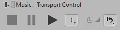

|  |  |
| --- | --- |
| [备注] | 备注 |
| You cannot play back a Property Container or bus, so they are not loaded into the Transport Control when selected. |

Playback Control 区域还包含一系列标志，当特定属性或行为先前已作用于正在播放的对象时，它们会改变颜色。下表列出了 Transport Control 中的属性和动作参数指示器。

| 图标 | 名称 | 代表 |
| --- | --- | --- |
| |  | | --- | |  | | Delay | 已对事件、随机容器和序列容器中的对象应用延迟。 |
| |  | | --- | |  | | Fade | 已对事件、随机容器或序列容器中的对象应用渐变。 |

有关编辑对象的这些属性的详细信息，请参阅以下各节：

- [“"Continuous" Play Mode”一节](ch21s02s04.html#playing_all_objects_within_container "\"Continuous\" Play Mode")
- [“设置 Event Action 的属性”一节](ch14s02.html#setting_properties_for_an_event_action "设置 Event Action 的属性")

另外，请记得进行声音设计时可以使用 Play-Bypass Properties 快捷方式。

Hold Shift while clicking Play to have Wwise play the loaded sound while bypassing its properties. That is, somewhat like a PFL (Pre-Fader Listen) found in some DAWs, Wwise will play the object without its hierarchical properties (including such things as volume, pitch, filters, delays, Effects, Auxiliary Sends, Attenuation Curves, RTPC curves, States, positioning, and bus routing), but with its source edits (such as fades, trims, and loop points) still intact.

|  |  |
| --- | --- |
| [警告] | 警告 |
| If you use the Play - Bypass properties shortcut, the resulting sound might be uncomfortably loud or off-pitch. |

单击 Transport 的 Play 按钮会从播放光标的位置播放片段。当播放光标前进时单击 Play 按钮将添加新的播放光标，并从第一个播放光标的起始位置同时播放。

#### Game Syncs area

除传统播放控件外，Transport Control 还有一个 Game Sync 区，其中包含与当前选定对象相关的所有 State、Switch、Trigger 和 RTPC。您可以使用 Transport Control 作为微型模拟器，来测试您的声音、音乐和振动，以及模拟在游戏中的变化。在播放期间，您可以在 State 和 Switch 之间切换，并试听游戏参数及其映射值。

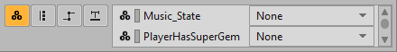

有关使用 Game Sync 的详细信息，请参阅以下各节：

- [*使用 State*](ch16.html "使用 State")
- [“为 Switch 和 State 添加和移除对象”一节](ch21s03.html#adding_and_removing_objects_from_switch_state "为 Switch 和 State 添加和移除对象")
- [“在 Switch 或 State 之间移动对象”一节](ch21s03.html#moving_objects_between_switches_states "在 Switch 或 State 之间移动对象")
- [“管理 RTPC 中使用的 Game Parameter”一节](ch18s02.html "管理 RTPC 中使用的 Game Parameter")
- [*使用 Trigger*](ch19.html "使用 Trigger")

---

#### Setting playback properties

通过启用 Transport Control 中的各种控件，您可以执行以下任何操作：

- [“Using original audio files during playback”一节](ch47s01.html#using_original_audio_files_during_playback "Using original audio files during playback").
- [“Including or excluding audio and motion content for playback”一节](ch47s01.html#including_excluding_audio_and_motion_content_for_playback "Including or excluding audio and motion content for playback").
- [“重置 Transport Control”一节](ch47s01.html#resetting_in_transport_control "重置 Transport Control")

###### Using original audio files during playback

在转码导入的音频文件时，Wwise 将保留音频文件的原始版本，需要时您可以随时试听它们。原始版本未针对平台进行转码。在默认情况下，Transport Control 播放原始声音；然而，您可以选择播放转码版本。

**播放原始声音的方法是：**

1. 在 Transport Control（走带控制）中，单击 Transport Play Options（走带播放选项）按钮 ()。
2. 在 Transport Play Options（走带播放选项）菜单中，选择 **Play Originals**（播放原始声音）。
3. 点击 **Play** 图标。

   Transport Control 中将播放对象的原始转码前的声音。

|  |  |
| --- | --- |
| [备注] | 备注 |
| 若要播放转码后的声音，请在 Transport Play Options 菜单中选择 **Play Converted**。这时 Transport Play Options 按钮会显示为橙色。 |

###### Including or excluding audio and motion content for playback

在创建音频、音乐和振动结构时，您可以决定播放或不播放若干个平台中的特定对象。有关使用平台的详细信息，请参阅[“Excluding project elements from a platform”一节](ch35s01.html#excluding_project_elements_from_platform "Excluding project elements from a platform")。当您播放声音、音乐或振动对象时，可以选择仅播放当前平台中的内容，或者播放加载到 Transport Control 中所有平台的声音、音乐或振动对象。

**播放平台专有的内容的方法如下：**

1. 从工具栏中的 Platform Selector 列表中，为您要试听的对象选择平台。
2. 在 Transport Control（走带控制）中，单击 Transport Play Options（走带播放选项）按钮 ()。
3. 在 Transport Play Options（走带播放选项）菜单中，激活 **Only Play Objects Included in Platform**（仅播放平台中包含的对象）选项。

   此时 Transport Control 中只会播放当前平台中的对象和 Event（事件）。

|  |  |
| --- | --- |
| [备注] | 备注 |
| 若要播放所有对象和 Event，请停用 **Only Play Objects Included in Platform** 选项。这时 Transport Play Options 按钮会显示为橙色。 |

###### 重置 Transport Control

在 Transport Control 中播放对象时，您可以访问对象的一系列属性、行为和游戏同步器，这可以帮助您模拟游戏内的体验。当您连接到游戏时，某些游戏同步器、效果器和事件也可能影响先前定义的对象属性。Transport Control 中的属性标志为您提供有关在播放期间仍然有效的行为或动作的反馈。要将对象恢复为先前的设置，可使用重置功能。

|  |  |
| --- | --- |
| [备注] | 备注 |
| 对于每个事件播放，事件动作属性值会添加到对象的属性中去。当您使用这些事件动作时，应在重新播放对象前重置这些动作属性，以清空累加属性并恢复默认值。要了解有关事件动作如何影响对象属性的详细信息，请参阅[“处理 Event”一节](ch14s03.html "处理 Event")。 |

**重置特定 Transport Control 属性的方法是：**

1. 在 Transport Control（走带控制）中，单击 Reset（重置）图标 ()。

   此时将显示 Reset 菜单。
2. 从 Reset 菜单中选择以下其中一项：

   - **Reset All** 可将所有对象恢复到原始设置。
   - **Reset All Random and Sequence Containers** 可清空已为对象触发的所有随机和序列动作。
   - **Reset All Game Parameters** 可清空已为对象触发的所有游戏参数。
   - **Reset All States** 可清空对象的所有 Set State 动作。
   - **Reset All Switches** 可清空已为对象触发的所有 Set Switch 动作。
   - **Reset All Set Mute** 可清空已为对象触发的所有静音动作。
   - **Reset All Set Voice Pitch** 可清空已为对象触发的所有声部音高设置动作。
   - **Reset All Set Voice Volume** 可清空已为对象触发的声部音量设置动作。
   - **Reset All Set Bus Volume** 可清空已为对象触发的总线音量设置动作。
   - **Reset All Set Voice Low-pass Filter** 可清空已为对象触发的所有低通滤波器动作。
   - **Reset All Bypass Effect**  可清空已为对象触发的所有旁通效果动作。
   - **Reset All Set Effect**（重置所有效果器设置）：清除所有已为对象触发的 Set Effect 动作。
   - **Reset All Music Tracks Force Usage** 不再强制播放 Soundcaster 中的特定声轨。
   - **Reset All Source Editor Play Cursors**（重置所有源编辑器播放光标）：清除 Source Editor 中手动触发的播放光标。
   - **Reset Attenuation Preview**（重置衰减预览）：将对象上设置的距离、角度、声障、声笼、衍射和透射值重置为其默认值。

---

#### Pinning objects in the Transport Control

Transport Control 自动加载 Property Editor 中当前显示的任何对象。但是，当您在 Project Explorer 中选择任何对象或事件时，在默认情况下，它将替代 Transport Control 中的内容。如果您希望无论您选择任何其它内容，Transport Control 中都会一直将对象保持为加载状态，则您可以固定（pin）该对象来阻止加载其它对象。

|  |  |
| --- | --- |
| [备注] | 备注 |
| 在实时混音时，您需要将对象加载到 Transport Control 中，以使针对该对象的相对属性的更改生效。确保在实时混音之前未固定对象。 |

###### Using pinning - example

假设您正在试听 Random Container，很想知道混响效果器对于容器中特定对象的声音效果。您可以将对象固定（pin）在 Transport Control 中。然后在 Property Editor 中对父对象应用混响，单独试听该对象的效果。如果您不固定对象，则容器中的所有对象将以随机模式播放，并且您想试听的对象可能不会播放。通过固定对象，您可以修改父级设置，然后随时再次试听对象。

**固定 Transport Control 中加载的对象的方法是：**

1. 将对象加载到 Transport Control 中。
2. 在 Transport Control 中，点击 **Pin**。

   Pin 图标将变成红色，即使您将其他对象或事件加载到 Property Editor 中或者在 Project Explorer 中选择另一个对象，此对象或事件仍将保留在 Transport Control 中。

|  |  |
| --- | --- |
| [技巧] | 技巧 |
| 按 **Ctrl+Alt+P** 以加载对象并将它固定在 Transport Control。要取消固定对象，则按 **Ctrl+P**。 |

---

#### Playing, pausing, or stopping content

如果您想试听对象，则可使用 Transport Control 中的标准播放控件。


Transport Control 视图中的主要控制按钮都有对应快捷键，以方便您在实时编辑属性值时启动、暂停和停止播放。要获取键盘快捷方式的完整列表，请参阅 [“Using keyboard shortcuts”一节](ch05.html#using_keyboard_shortcuts "Using keyboard shortcuts")。

**在 Transport Control 中播放声音的方法是：**

1. 将对象加载到 Transport Control 中。
2. 执行以下任何一项操作：

   - 点击 **Play** 图标。
   - 相关内容将一直播放到结束为止。
   - 要暂停播放，点击 **Pause** 图标。
   - 此时 Pause 图标变成黄色。要继续播放，则再次点击 **Pause**。
   - 若要停止回放，点击 **Stop** 图标。

---

#### Using game syncs during playback

在 Transport Control 中，您可以访问为工程创建的 Game Sync。To audition the States, Switches, and RTPCs as they are applied to your sounds, music, and motion objects, you can do any of the following.

###### Enabling States during playback

在将对象加载到 Transport Control 中时，可从列表中选择对象采用的 State Group 和 State，来模拟播放期间游戏中发生的 State 和 State 变化。这意味着，在播放对象时，您可以试听 State 属性，还可以切换 State 来试听 State 更改。要了解有关创建 State、您将在 Transport Control 中试听的 State 属性和过渡，以及将对象指派到 State 的详细信息，请参阅以下各节：

- [“使用 State”一节](ch16s01.html "使用 State")
- [“将 State 指派给对象和总线”一节](ch16s03.html "将 State 指派给对象和总线")

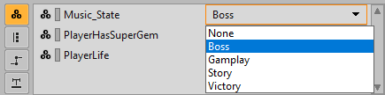

**在播放期间启用状态的方法是：**

1. 将对象加载到 Transport Control 中。
2. 在 Game Syncs（游戏同步器）分区中，单击 State（状态）图标 ()。
3. 在 States 列表中，选择您要应用的 State。

   在播放期间，State 将作用于 Transport Control 内采用该 State 的所有声音。
4. 点击 **Play** 图标。

   播放期间将应用您选择的 State。在对象播放时，您可以继续切换 State 来模拟游戏。

|  |  |
| --- | --- |
| [备注] | 备注 |
| 若要切换回默认 State，请单击 Reset 图标并选择 **Reset All States**。 |

###### Assigning Switches during playback

当对象加载到 Transport Control 时，您可以从 Switch Group 和 Switch 的列表中选择对象已指定的 Switch 和 Switch Group，以模拟播放期间游戏中将发生的 Switch 切换。这意味着在播放对象时，您可以切换 Switch，并试听切换。要了解有关创建 Switch 以及如何使用 Switch 的详细信息，请参阅以下章节：

- [“使用 Switch”一节](ch17s01.html "使用 Switch")
- [“定义 Switch Container 的类型”一节](ch21s03.html#defining_type_of_switch_container "定义 Switch Container 的类型")


**在播放期间指定 Switch 的方法是：**

1. 将对象加载到 Transport Control 中。
2. 在 Game Syncs（游戏同步器）分区中，单击 Switch（切换开关）图标 ()。
3. 从 Switch 列表中选择要应用的 Switch。

   状态于是应用到 Soundcaster 中采用该状态的所有对象上去了。
4. 点击 **Play** 图标。

   播放期间将应用您选择的 Switch。当播放对象时，您可以继续切换 Switch 来模拟游戏。

|  |  |
| --- | --- |
| [备注] | 备注 |
| 若要切换回在 Property Editor 中为 Switch Container 指定的默认 Switch，请单击 Reset 图标并选择 **Reset All Switches**。 |

###### Changing game parameter values during playback

当对象加载到 Transport Control 时，相关的 RTPC 将显示在 Games Syncs 区。该区域提供一个滑块，您可以在播放对象时更改游戏参数。由于您已经将这些值映射至 Wwise 属性值，因此更改游戏参数值时，会自动改变对象属性值。这样就会模拟当游戏参数改变时发生了什么，从而确认属性映射在游戏中的效果。在将模块添加到 Soundcaster 并确定要试听的 Wwise 对象后，便可以测试映射到游戏参数（Game Parameter）的属性值。

- [“管理 RTPC 中使用的 Game Parameter”一节](ch18s02.html "管理 RTPC 中使用的 Game Parameter")
- [“将 Wwise 属性指派给游戏参数”一节](ch18s03s01.html "将 Wwise 属性指派给游戏参数")

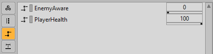

在模拟中，您可以试听这些属性在播放期间的变化。

**在播放期间修改游戏参数值的方法是：**

1. 将对象加载到 Transport Control 中。
2. 在 Game Syncs（游戏同步器）分区中，单击 Game Parameter（游戏参数）图标 ()。

   此时将显示已映射到对象的游戏参数。
3. 点击 **Play** 图标。

   当对象播放时，您可以使用 RTPC 滑块更改游戏参数值，以了解声音如何对更改做出反应。

|  |  |
| --- | --- |
| [备注] | 备注 |
| 若要将 Game Parameter 切换回其默认设置，请单击 Reset 图标并选择 **Reset All Game Parameters**。 |

|  |  |
| --- | --- |
| [备注] | 备注 |
| To bypass Game Parameter interpolation, hold Ctrl while using the RTPC slider in **Transport Control**, or the Game Parameter cursor in the RTPC tab of the Primary Editor. |

###### Calling Triggers during playback

除了试听此对象外，您还可以从触发器列表中选择 Trigger 来试听 Stinger。插播乐句是简短的乐句，与当前播放的音乐进行叠加，混合播放。通过这种方式，您可以模拟游戏在关键时刻通过 Trigger 调用 Stinger 后，插播乐句与当前音乐叠加播放的情况。要了解有关创建触发器以及为它们创建您要在 Transport Control （播放控制）中试听的插播乐句的详细信息，请参阅以下各节：

- [*使用 Trigger*](ch19.html "使用 Trigger")
- [*使用 Stinger*](ch33.html "使用 Stinger")

|  |
| --- |
|  |

**在播放期间调用触发器的方法是：**

1. 将音乐对象加载至 Transport Control 中。
2. 点击 **Play** 图标。

   随即播放加载至 Transport Control 中的音乐对象。
3. 在 Game Syncs（游戏同步器）分区中，单击 Trigger（触发器）图标来显示 Trigger 列表 ()。
4. 单击 **Call Trigger**（调用触发器）图标 ()。

   相应的插播乐句将在当前所播放的音乐对象之上播放。You can select other Triggers and play back the corresponding Stingers to simulate the music in the game.

---

#### Transport Control keyboard shortcuts

| 操作 | 使用此快捷方式 |
| --- | --- |
| 播放/停止 | 空格键 |
| Play - Bypass 属性 | Shift + 空格键（在任何位置）  Shift + 点击 Play（在 Transport 内） |
| 暂停/恢复 | Ctrl + 空格键 |
| 切换 **Play Originals** 或 **Play Converted** | Alt+O |
| 切换 **Only Play Objects Included in Platform** | Alt+I |
| 固定/取消固定 | Ctrl+Shift+P |
| 加载并固定在 Transport Control 中 | Ctrl+Alt+P |
| 全部重置 | Ctrl+Alt+R |

---

### 认识 Schematic View 视图

The Schematic View displays a graphical representation of the structure of your Wwise
project. You can use the Schematic View to get an overview of a project, locate project objects,
or analyze project structure one object at a time. The Schematic View includes icons
representing each project object, the object names, and lines and nodes representing their
relationships. You can customize how the Schematic View displays project object details as
well.


#### Identifying project objects and connectors

The Schematic View is made up of icons representing project objects and connectors representing their relationship to one another. 下表描述了工程对象之间的连线。有关代表工程对象的图标的信息，请参阅[“理解 Wwise 中的视觉元素”一节](ch03s01.html "理解 Wwise 中的视觉元素")。

| 图标 | 名称 | 描述 |
| --- | --- | --- |
| |  | | --- | |  | | 实线 | 这些线用于连接父对象和子对象。 |
| |  | | --- | |  | | 虚线 | 此类线用于将总线连接到子对象，以演示通路。 |
| |  | | --- | |  | | 加号（白色） | 点击将展开示意图，并显示对象的所有子项。 |
| |  | | --- | |  | | 加号（黄色） | 如果当前没有显示对象的所有子项，则点击它将显示所有子项。  |  |  | | --- | --- | | [备注] | 备注 | | 若针对其他对象选中了 **Show in Schematic View** 或子对象与当前搜索条件不匹配，则将隐藏子对象。 | |
| |  | | --- | |  | | 减号 | 点击它将折叠对象的所有子项。 |

#### Setting the Schematic View display options

您可以通过使用 Schematic View Setting 来自定义示意图中各个工程对象要显示的信息。

**To specify the information to be displayed in the Schematic View:**

1. Click the options icon in the upper right corner of the Schematic View.

   The Schematic View Settings dialog opens.
2. 从以下信息类型中选择：

   - **Icon Strip** ―― 显示一排代表对象属性的图标。如果对象属性已经改变，则图标显示为白色，您则可以将鼠标悬浮在它上方以了解详细信息。如果属性仍为默认值，图标则会变成灰色。
   - **Mute/Solo** ―― 显示各个对象的静音和 Solo 按钮。
   - **Bus** ―― 显示为对象指定通路的总线。
   - **Conversion Setting** ――显示对象正在使用的转码设置 ShareSet。
   - **Effect** ―― 显示已应用到对象的任何效果器。
   - **Positioning Type**（定位类型）：显示应用于对象的定位类型（No Positioning、3D Emitter、3D Emitter with Automation、3D Listener with Automation）。
   - **Game Parameters**（游戏参数）：显示通过 RTPC 影响对象的 Game Parameter。
   - **State Group** ―― 显示对象指定的状态组。
   - **Advanced Settings** ―― 显示对对象高级设置所做的任何更改（例如播放数限制或音量阈值）。
   - **Volume** ―― 显示指定到对象的音量。
   - **Pitch** ―― 显示指定到对象的音高。

     |  |  |
     | --- | --- |
     | [备注] | 备注 |
     | 不显示音乐对象的音高，因为音高不适用于它们。 |
   - **Low Pass** ―― 显示指定到对象的低通滤波器。
3. 单击 **OK**（确定）。

   Schematic View 显示您为各个工程对象选择的信息。

#### Searching for project objects

You can find a project object quickly in the Schematic View by using the Search
function.

**To search for a project object in the Schematic View:**

1. 在 **Search** 字段中，输入您要查找到的工程对象的名称。

   此时，Wwise 会高亮显示与所输入名称匹配的工程对象，并隐藏不相关的对象。
2. Click **Reset** to erase the Search field and reset the
   Schematic View.

|  |  |
| --- | --- |
| [备注] | 备注 |
| 搜索不区分大小写，在您输入搜索项的同时开始查找对象。搜索引擎从字首开始检查，因此当输入“gun”时将找到“gun”、“big\_gun”和“gunner”，而不是“shotgun”。 |

#### Showing project objects

You can simplify the project schema presented in the Schematic View by specifying one
project object to be highlighted.

**To highlight a project object in the Schematic View:**

1. In the Schematic View, right-click a project object.

   此时将会显示快捷菜单。
2. 从快捷菜单中选择 **Show in Schematic View**。

   此时将显示选定对象的总线通路。对象高亮显示，并且无关的对象被隐藏。
3. To reset the Schematic View, click **Clear**.

|  |  |
| --- | --- |
| [技巧] | 技巧 |
| You can also drag an object from the Project Explorer to show it in the Schematic View. 还可以在 Property Editor 或 Contents Editor 中点击右键，然后选择 **Show in Schematic View**。 |

#### Editing project objects directly

You can use the controls displayed under each project object in the Schematic View to edit the object. 这些控件的工作原理与 Property Editor 中的控件相同。有关如何使用这些控件的详细信息，请参阅[*Wwise 界面基础知识*](ch03.html "Wwise 界面基础知识")。

|  |
| --- |
|  |

使用 Schematic View Setting 显示这些控件。有关这些设置的详细信息，请参阅[“Setting the Schematic View display options”一节](ch48.html#setting_schematic_view_display_options "Setting the Schematic View display options")。

#### Editing project objects in the Property Editor

If you prefer to edit object properties directly, you can quickly open the Property
Editor for a project object from the Schematic View.

**为工程对象打开 Property Editor 的方法是：**

1. In the Schematic View, right-click a project object.

   此时将会显示快捷菜单。
2. 从快捷菜单中选择 **Edit**。

   此时将为该工程对象打开 Property Editor 。

|  |  |
| --- | --- |
| [备注] | 备注 |
| You can leave the Schematic View open while you work in this Property Editor. The changes you make to a project object in the Property Editor are reflected immediately in the Schematic View. |

**相关主题**

- [Wwise Fundamentals Module 13: Submixing with Additional Audio Busses](https://www.audiokinetic.com/en/courses/wwise101/?source=wwise101&id=submixing_with_additional_audio_busses)

---

#### Schematic View keyboard shortcuts

| 操作 | 使用此快捷方式 |
| --- | --- |
| 更改选定项，浏览工程，展开或折叠层级结构 | 方向箭头 |
| 转至兄弟对象组的第一个子对象 | Home |
| 转至兄弟对象组的最后一个子对象 | End |
| Go to the Main Audio | Ctrl+Home |
| 在 Property Editor 中编辑选定项 | Enter |
| 播放 | 空格键 |
| 前往搜索字段 | F3 |
| （从搜索字段）转至工程层级结构 | Enter |

---

### 了解坐标图视图

Wwise 的多种视图中都包含坐标图。您可使用这些坐标图映射两个变量之间的关系、规划空间定位，也可通过坐标图监控性能。

Wwise 中包含多种不同的坐标图。虽然这些坐标图通常支持很多相同的功能，但各有不同。

下表说明了各个坐标图特有的功能。

| 使用该坐标图 | 操作 |
| --- | --- |
| Primary Editor (RTPC tab) | 定义游戏参数值与 Wwise 中属性值之间的关系。 |
| Blend Tracks Editor（混合轨编辑器） | 混合轨编辑器。将对象编组至混合轨中，并让它们随若干个 RTPC（实时参数控制）曲线变化，或在对象之间进行交叉淡变。 |
| Attenuation Editor | 衰减编辑器。定义了听者与声源之间的距离将如何影响声音的某些属性，用来创建真实的声音衰减效果。 |
| Position Editor | 位置编辑器。创建 3D 环境内的路径，用来在环绕声扬声器环境内进行声音定位。 |
| Switch Group Property Editor（切换开关属性编辑器） | 切换开关属性编辑器。将切换开关组内的不同切换开关映射至特定游戏参数。 |
| Music Fade Editor | 音乐淡变编辑器。定义音乐过渡中两段音乐之间的淡入/淡出曲线。 |
| Performance Monitor | 性能监视器。当游戏、游戏模拟器或 Soundcaster（声音选角器）触发游戏元素时，查看与声音引擎的性能相关的信息。  Performance Monitor 中的信息为只读信息，仅用于诊断用途。因此，您无法添加和移除控制点，或编辑任何曲线。 |
| Game Sync Monitor | 游戏同步器监控器。追踪 Game Parameter、Modulator（即 LFO、Envelope 和 Time）和 MIDI 参数的 RTPC 值随时间的变化。  Game Sync Monitor 中的信息为只读信息，仅用于诊断用途。因此，您无法添加和移除控制点，或编辑任何曲线。 |
| Reflect - Effect Editor | 允许编辑五种基于距离的不同曲线，分别用来定义音量 Attenuation（衰减）、Spread（散布）百分比和声音高低切截止频率。 |
| SoundSeed Air - Woosh Source Plugin Editor (Object Path Graph) | SoundSeed Air - Woosh 源插件编辑器。创建定义 Woosh 场景内物体的轨迹的路径，并且为声音远离时定义该声音的衰减。 |
| Soundseed Air (Wind/Woosh) Source Plugin Editor（源插件编辑器） | SoundSeed Air (Wind/Woosh) 源插件编辑器。创建一组自动化曲线，用来定义生成的 wind 或 woosh 声音的属性。 |
| Voice Monitor | 声部监视器。在时间线视图上查看所播放的 Wwise 对象声部的音量曲线。 |

当创建声音路径或监控性能，以及使用音乐段落时，还需要定义时间范围。此时，坐标图视图与时间线相关联。有关在 Wwise 中使用时间线的详细信息，请参阅 [Getting to Know the Timeline](ch50.html "认识时间线")。

#### 坐标图中的常用元素

虽然 Wwise 中的各个坐标图视图稍有不同，但它们包含某些通用元素，如缩放控制、滚动栏，以及曲线或路径的控制点。下图显示了坐标图中的各个通用元素。

|  |
| --- |
|  |

---

#### 更改坐标图的显示内容

您可以更改坐标图显示方式，从而更准确地放置控制点，或更仔细地检查特定区域。

###### 缩放和平移坐标图

您以可使用平移和缩放工具沿路径放置特定控制点，也可更仔细地检查特定区域内的信息。可以放大和缩小、进行上下左右平移。

所有平移和缩放控件均有相关的键盘快捷键。

| 操作 | 使用此快捷方式 |
| --- | --- |
| 放大 | Z + 选取框 |
| 垂直放大 ―― 以当前鼠标位置为中心 | Ctrl + 向上滚动鼠标滚轮 |
| 垂直缩小 ―― 以当前鼠标位置为中心 | Ctrl + 向下滚动鼠标滚轮 |
| 水平放大 ―― 以当前鼠标位置为中心 | Ctrl + Shift + 向上滚动鼠标滚轮 |
| 水平缩小 ―― 以当前鼠标位置为中心 | Ctrl + Shift + 向下滚动鼠标滚轮 |
| 重置缩放（放大时） | Z + 点击 |
| 向左平移视图（放大时） | Shift + 向上滚动鼠标滚轮 |
| 向右平移视图（放大时） | Shift + 向下滚动鼠标滚轮 |
| 向上平移视图（放大时） | 向上滚动鼠标滚轮 |
| 向下平移视图（放大时） | 向下滚动鼠标滚轮 |
| 任意平移（放大时） | X + 拖动 |

快捷方式的完整列表请参阅[“Using keyboard shortcuts”一节](ch05.html#using_keyboard_shortcuts "Using keyboard shortcuts")。

**放大坐标图视图的方法如下：**

1. 在坐标图视图工具栏中，点击 **Zoom In** 图标。

   坐标图朝向坐标图视图中心放大。

**缩小坐标图视图的方法如下：**

1. 在坐标图视图工具栏中，点击 **Zoom Out** 图标。

   坐标图从坐标图视图中心缩小。

**重设坐标图视图中的平移和缩放的方法如下：**

1. 在坐标图视图工具栏中，点击 **Reset** 图标。

   坐标图视图重设，以显示所有现有点。

**平移坐标图视图的方法如下：**

1. 放大坐标图视图。
2. 执行以下操作之一：

   - 要向上平移，请向上移动鼠标滚轮。
   - 要向下平移，请向下移动鼠标滚轮。
   - 要向右平移，请按下 Shift 并向下移动鼠标滚轮。
   - 要向左平移，请按下 Shift 并向上移动鼠标滚轮。
   - 要任意平移，请按下 **x** 并在坐标图视图内拖动鼠标。

###### 定义坐标图的坐标显示方式

当查看以分贝为单位的曲线时，您可以选择以严格的线性方式显示曲线，还是以更常用的（对数）方式显示声音分贝数。在线性坐标下，Y 轴上间隔距离相等。在分贝坐标下，Y 轴坐标将模拟人耳将声音解释成不同分贝数的方式。在接近于零时，间隔距离较大，而在较低分贝值下，间隔距离较小。

下图显示了以分贝坐标和线性坐标显示同一音量曲线之间的不同。

|  |
| --- |
|  |

由于分贝坐标会影响分贝单位沿 Y 轴的分布，所以坐标显示方式还将影响控制点如何在坐标图视图内移动。例如，与 -80 dB 相比，当点位于 0 dB 时，分贝坐标中 -5 dB 的变化将要求移动距离更大。但在线性定标中，-5 dB 的变化将总是导致沿 Y 轴的移动距离相同。

在大多数情况下，分贝坐标将更准确地表示出特定游戏参数值下所听到的声音。但当创建游戏参数与 Wwise 属性之间的直接关系时，就需要使用线性坐标。例如，假设您要将 Voices 总线的音量映射至游戏中的音量滑杆，允许游戏玩家提高或降低人声的音量。此时您需要将声音音量直接映射至游戏的音量参数。由于沿 X 轴的音量是线性的，因此同样需要让 Y 轴以线性显示。

|  |  |
| --- | --- |
| [备注] | 备注 |
| 坐标显示方式会影响 Y 轴上的单位，因此如果同时显示两个或多个使用不同显示显示的曲线，则 Y 轴上的单位将不会显示。 |

**定义坐标图视图的坐标显示方式的方法如下：**

1. 在坐标图视图中，右键点击曲线。

   此时将会显示快捷菜单。
2. 选择以下任一一种坐标显示方式：

   - **dB scaling** 根据人耳解释声音的通用（对数）方式，以分贝数显示曲线。
   - **Linear scaling** 以严格的线性方式显示曲线。

   坐标图视图将根据您选择的方法来显示曲线。

###### 显示或隐藏网格线

部分坐标图视图使用网格线，可以帮助您更准确地放置控制点。可以选择显示或隐藏这些网格线，这并不会影响坐标图中的点。

|  |  |
| --- | --- |
| [备注] | 备注 |
| 默认情况下将显示网格线。 |

**隐藏坐标图视图中的网格线的方法如下：**

1. 右键点击坐标图视图。

   此时将会显示快捷菜单。
2. 选择以下任一选项：

   - **Display Grid (Vertical)**，移除垂直网格线。
   - **Display Grid (Horizontal)** ，移除水平网格线。
3. 重复步骤 1-2 可移除剩余的网格线。

**显示坐标图视图中的网格线的方法如下：**

1. 右键点击坐标图视图。

   此时将会显示快捷菜单。
2. 选择以下任一选项：

   - **Display Grid (Vertical)**，添加垂直网格线。
   - **Display Grid (Horizontal)**，添加水平网格线。
3. 重复步骤 1-2 可添加剩余的网格线。

###### 显示或隐藏光标

RTPC 视图包含各条曲线的游戏参数光标和刻度线。在游戏参数光标顶部有一个标识框，标有相应游戏参数的名称，及其在曲线上的当前值。您可以在播放过程中前后拖动光标，以模拟游戏参数值的变化。刻度线可以帮助您确定对应于特定游戏参数值的相应属性值。您可以选择显示或隐藏光标，这不会影响坐标图上的点。

|  |
| --- |
|  |

|  |  |
| --- | --- |
| [备注] | 备注 |
| 默认情况下将显示光标和刻度线。如果显示多条曲线，则仅当这些曲线使用同一坐标显示方式且 Y 轴使用同一单位时，才会显示刻度线。 |

**在坐标图视图中隐藏光标的方法如下：**

1. 右键点击坐标图视图。

   快捷菜单将打开。
2. 选择 **Show cursors**。

   光标从坐标图中移除。

**在坐标图视图中显示光标的方法如下：**

1. 右键点击坐标图视图。

   快捷菜单将打开。
2. 选择 **Show cursors**。

   光标将显示在坐标图视图中。

---

#### 在坐标图中使用控制点

坐标图视图中的控制点可以用来定义路径或曲线的形状，也可以创建两个变量间的特定关系曲线。您可随时添加、移动和删除曲线上的点。也可以同时选择多个点，来操控或删除若干条曲线上的特定部分。

###### 添加控制点

您可沿曲线在任意位置添加控制点，以定义其形状或创建不同变量之间的关系。由于您需要在各个坐标图视图中定义不同类型的信息，因此添加控制点的方式会稍有不同。下表显示了如何在不同的坐标图视图中添加点。

| 坐标图 | 添加点 | 在两点间插入点 |
| --- | --- | --- |
| RTPC/Blend Tracks Editor（RTPC/混合轨编辑器） | 不适用 | 在曲线上的两个点之间双击。 |
| Position Editor（位置编辑器） | 双击 | Ctrl + 在曲线上的两个点之间双击。 |
| Attenuation Editor | 不适用 | 在曲线上的两个点之间双击。 |
| Switch Group Property Editor（切换开关属性编辑器） | 不适用 | 在曲线上的两个点之间双击。 |
| Music Fade Editor（音乐淡变编辑器） | 不适用 | 不适用 |
| Performance Monitor | 不适用 | 不适用 |
| Game Sync Monitor | 不适用 | 不适用 |
| SoundSeed Air - Woosh Source Plugin Editor (Object Path Graph) | 双击 | Ctrl + 在曲线上的两个点之间双击。 |
| Soundseed Air (Wind/Woosh) Source Plugin Editor（源插件编辑器） | 不适用 | 在曲线上的两个点之间双击。 |

###### 选择控制点

移动或删除坐标图视图中的控制点之前，必须先选择控制点。您每次可选择一个、多个或所有控制点。如果在坐标图视图中同时显示多条曲线，您则可选择不同曲线上的多个点，来移动或删除它们。

**在坐标图视图中选择控制点的方法如下：**

1. 在坐标图视图中，点击控制点，以选中该控制点。

   所选控制点将变为黑色。

**在坐标图视图中选择多个控制点的方法如下：**

1. 在坐标图视图中，执行以下任一操作：

   - 拖拽选取框，使其包括要选择的点。
   - Ctrl + 点击要选择的点。

   所选的点将变为黑色。

**选择坐标图视图中的所有控制点的方法如下：**

1. 点击坐标图视图以激活该视图。
2. 按下 **Ctrl+A**。

   坐标图视图中的所有点将被选中，并变为黑色。

###### 移动控制点

通过移动坐标图内任意位置的若干个控制点，可操控若干条曲线的形状。但当坐标图视图缩放至最小时，您将受到坐标图的外框限制。

**移动坐标图中的控制点的方法如下：**

1. 在坐标图中，选择若干个控制点。

   所选控制点将变为黑色。
2. 将控制点拖至坐标图边框内的任意位置。

|  |  |
| --- | --- |
| [备注] | 备注 |
| 也可使用箭头键，或者直接在 X 和 Y 坐标字段中输入值以移动控制点。如果选择了多个点，则在 X 和 Y 字段中输入的值将使各点坐标在其原始位置基础上进行增减。 |

###### 删除控制点

如果要从曲线或路径中移除点，则可以将其删除。但某些点无法删除。下表说明了在各个坐标图视图中可删除的点。

| 坐标图 | 可删除的点 |
| --- | --- |
| RTPC/Blend Tracks Editor（RTPC/混合轨编辑器） | 除第一个点和最后一个点以外的所有点。 |
| Attenuation Editor | 除第一个点和最后一个点以外的所有点。 |
| Position Editor（位置编辑器） | 除第一个点以外的所有点。 |
| Switch Group Property Editor（切换开关属性编辑器） | 除第一个点和最后一个点以外的所有点。 |
| Music Fade Editor | 不适用 ―― Music Fade Editor 中没有控制点。 |
| Performance Monitor | 不适用 ―― Performance Monitor 中没有控制点。 |
| Game Sync Monitor | 不适用 ―― Game Sync Monitor 中没有控制点。 |
| SoundSeed Air - Woosh Source Plugin Editor (Object Path Graph) | 除第一个点以外的所有点。 |
| Soundseed Air (Wind/Woosh) Source Plugin Editor（源插件编辑器） | 除第一个点和最后一个点以外的所有点。 |

**从曲线删中除控制点的方法如下：**

1. 选择曲线或路径上的若干个点。

   所选控制点将变为黑色。
2. 在 Windows 上，按下 **Delete** 键。在 macOS 上，按下 **fn+Delete**。

   控制点将从曲线中移除。

---

#### 在坐标图中使用曲线

有时会同时使用同一坐标图内的多条曲线，所以有必要学习如何执行以下基本任务。

|  |  |
| --- | --- |
| [备注] | 备注 |
| RTPC 曲线可从一个属性复制到另一个属性，也可从一个对象复制到另一个对象。有关 RTPC 的详细信息，请参阅 [“复制 RTPC 曲线”一节](ch18s03s03.html "复制 RTPC 曲线")。 |

###### 在坐标图中显示曲线

在 Wwise 中的大部分坐标图视图中，您都可以使用多条曲线来代表不同的路径，或代表游戏参数与 Wwise 属性之间不同的关系。从列表中选择曲线时，该曲线会显示在坐标图视图中。如果坐标图支持多条曲线显示，如 RTPC 和 Attenuation Editor 坐标图视图，您则可以按下 Ctrl 并点击多条曲线，以在坐标图视图中同时显示所有曲线。

如果希望曲线在不被选中的情况下仍然显示在坐标图视图中，则可将其固定至坐标图视图。固定曲线后，它的轮廓会总会保留在坐标图视图中。但不会显示曲线控制点。必须选择曲线后才能编辑该曲线的控制点。

下图显示了 RTPC 坐标图视图中已选和固定曲线之间的差异。

|  |
| --- |
|  |

如果坐标图视图中显示了多条曲线，则不会显示 X 和 Y 轴上的单位。当游戏参数和曲线的属性单位不同时会发生这种情况。例如，如果同时显示音高和音量曲线，则 Y 轴上的单位将消失，因为一个单位是音分，而另一个单位是分贝。

|  |  |
| --- | --- |
| [备注] | 备注 |
| 如果坐标图视图中显示的曲线的坐标显示方式不同，则不会在 Y 轴上显示单位。有关坐标显示方式的详细信息，请参阅 [“定义坐标图的坐标显示方式”一节](ch49s01.html#defining_scaling_method_of_graph_view "定义坐标图的坐标显示方式")。 |

**在坐标图视图中显示曲线的方法如下：**

1. 在坐标图视图中，从曲线列表中选择曲线。

   曲线将显示在坐标图视图中。
2. 要显示更多曲线，请按住 Ctrl 并点击列表中的曲线。

   这些曲线随即显示在坐标图视图中。如果几条曲线使用不同的单位，则 X 或 Y 轴上的单位将消失。

**将曲线固定至坐标图视图的方法如下：**

1. 在曲线列表中，点击要固定至坐标图视图的曲线的固定图标（左侧的图钉图标）。

   固定图标变为蓝色，该曲线显示在坐标图视图中。

   选择其它曲线时，已固定曲线的轮廓将保留显示在坐标图视图中，直至取消固定。

###### 指定控制点之间曲线的形状

为更好、更灵活地控制工程中的曲线，Wwise 可以定义各条曲线段落的形状。曲线段是两个控制点之间的部分。您可选择各种曲线形状，包括线性曲线、恒定曲线、对数曲线、幂数曲线和 S 曲线。

|  |  |
| --- | --- |
| [备注] | 备注 |
| 虽然曲线工具很灵活，但要求更多的处理，因此会增加 CPU 占用。 |

|  |
| --- |
|  |

**指定控制点间曲线的形状的方法如下：**

1. 在坐标图视图中，右键点击曲线的段落。

   随即显示快捷菜单
2. 从菜单中，选择以下任一选项：

   - Logarithmic (Base 3)（底数为 3 的对数曲线）
   - Sine (Constant Power Fade In) -- 恒定功率淡入的正弦曲线。当用于曲线的“淡入”部分时，该 Sine 曲线形状仅提供恒定功率交叉淡变。
   - Logarithmic (Base 1.41)（底数为 1.41 的对数曲线）
   - Inverted S-Curve（反转 S 曲线）
   - Linear（线性）
   - Constant（恒定）
   - S-Curve（S 曲线）
   - Exponential (Base 1.41)（底数为 1.41 的指数曲线）
   - Sine (Constant Power Fade Out) -- 恒定功率淡出的正弦曲线。当用于曲线的“淡出”部分时，该 Sine 曲线形状仅提供恒定功率交叉淡变。
   - Exponential (Base 3)（底数为 3 的指数曲线）

   所选曲线形状将应用至该曲线段落。
3. 根据需要，继续应用曲线形状至曲线的其它段落。

---

#### Graph View 键盘快捷方式

| 操作 | 使用此快捷方式 |
| --- | --- |
| 放大 | Z + 选取框 |
| 垂直放大 ―― 以当前鼠标位置为中心 | Ctrl + 向上滚动鼠标滚轮 |
| 垂直缩小 ―― 以当前鼠标位置为中心 | Ctrl + 向下滚动鼠标滚轮 |
| 水平放大 ―― 以当前鼠标位置为中心 | Ctrl + Shift + 向上滚动鼠标滚轮 |
| 水平缩小 ―― 以当前鼠标位置为中心 | Ctrl + Shift + 向下滚动鼠标滚轮 |
| 重置平移和缩放（放大时） | Z + 点击 |
| 向上平移视图（放大时） | 向上滚动鼠标滚轮 |
| 向下平移视图（放大时） | 向下滚动鼠标滚轮 |
| 向左平移视图（放大时） | Shift + 向上滚动鼠标滚轮 |
| 向右平移视图（放大时） | Shift + 向下滚动鼠标滚轮 |
| 任意平移（放大时） | X + 拖动 |
| 重置平移（放大时） | X + 点击 |
| 插入点 | 双击 |
| 移动选定点 | 方向键 |
| 更准确地移动点 | Shift + 拖动 |
| 选择非连续点 | Ctrl + 点击 |
| 选择所有点 | Ctrl+A |
| 将选定项移到下一个点 | 选项卡 |
| 将选定项移到上一个点 | Shift+Tab |
| 将选定项锁定到 X 或 Y 轴 | Alt + 拖动 |

---

### 认识时间线

Wwise 中的多个视图内有一条时间线，以便您可以在工程中使用基于时间的信息来实现不同的目的。下列视图内有时间线：

- Music Segment Editor（音乐段落编辑器）
- Position Editor（位置编辑器）
- Performance Monitor
- Game Sync Monitor
- Voice Monitor

虽然这些时间线一般支持很多相同的功能，但这些时间线之间也存在差异。下表描述各条时间线的独特用途。

| 使用此时间线 | 操作 |
| --- | --- |
| Music Segment Editor（音乐段落编辑器） | 编排和同步互动音乐组件。 |
| Position Editor（位置编辑器） | 定义声音路径的时间段。 |
| Performance Monitor | 从 Performance Monitor 中查看基于时间的捕获信息。 |
| Game Sync Monitor | 游戏同步器监控器。查看 RTPC 值随时间的变化。 |
| Voice Monitor | 查看 Wwise 对象声部的基于时间的音量电平。 |

在创建声音路径和监控性能时，时间线结合坐标图视图一起使用。有关坐标图视图的详细信息，请参阅[“在坐标图中使用控制点”一节](ch49s02.html "在坐标图中使用控制点")。

#### Elements of the timeline

由于 Wwise 中有三种不同的时间线，下面将分别对它们进行讨论。在 Position Editor (3D Automation) 中，添加至坐标图的控制点也会显示在时间线中。时间线显示控制点所对应的时间。通过从空间和时间上绘制控制点，您不仅可以定义声音的位置，而且还可以定义声音沿路径传输所需要的时间。下图显示了 Position Editor (3D Automation) 时间线中的不同元素。

|  |
| --- |
|  |

在 Performance Monitor 中，时间线帮助您定位从声音引擎中捕获并在日志中记载的各个动作和通知。下图显示 Performance Monitor 时间线中的不同元素。

|  |
| --- |
|  |

在 Music Segment Editor 中，音乐片段沿时间线分轨显示。时间线和波形本身帮助您定位可发生过渡、状态切换和插播乐句的最适当音乐部分。入口提示点、出口提示点和任意数量的自定义提示点可沿时间线放置在这些特定的位置上。

|  |
| --- |
|  |

---

#### Panning and zooming the timeline

您可以使用平移和缩放工具仔细检查信息，帮助您在非常具体的时间添加控制点或提示点。您可以执行放大、缩小、左移和右移操作。Music Segment Editor 中的时间线沿 X 轴和 Y 轴上布置了这些工具。

所有平移和缩放控件均有相关的键盘快捷键。

| 操作 | 使用此快捷方式 |
| --- | --- |
| 放大 | Z + 选取框 |
| 垂直放大 ―― 以当前鼠标位置为中心 | Ctrl + 向上滚动鼠标滚轮 |
| 垂直缩小 ―― 以当前鼠标位置为中心 | Ctrl + 向下滚动鼠标滚轮 |
| 水平放大 ―― 以当前鼠标位置为中心 | Ctrl + Shift + 向上滚动鼠标滚轮 |
| 水平缩小 ―― 以当前鼠标位置为中心 | Ctrl + Shift + 向下滚动鼠标滚轮 |
| 重置缩放（放大时） | Z + 点击 |
| 向左平移视图（放大时） | Shift + 向上滚动鼠标滚轮 |
| 向右平移视图（放大时） | Shift + 向下滚动鼠标滚轮 |
| 向上平移视图（放大时） | 向上滚动鼠标滚轮 |
| 向下平移视图（放大时） | 向下滚动鼠标滚轮 |
| 任意平移 | X + 拖动 |

快捷方式的完整列表请参阅[“Using keyboard shortcuts”一节](ch05.html#using_keyboard_shortcuts "Using keyboard shortcuts")。

**放大时间线的方法是：**

1. 在时间线工具栏中，点击 **Zoom In** 图标。

   时间线将以时间线的中心为中心进行放大。

**缩小时间线的方法是：**

1. 在时间线工具栏中，点击 **Zoom Out** 图标。

   时间线将以时间线的中心为中心进行缩小。

**重置平移和放大时间线的方法是：**

1. 在时间线工具栏中，点击 **Reset** 图标。

   时间线重置为显示所有控制点。

**平移时间线的方法是：**

1. 放大时间线。
2. 执行以下操作之一：

   - 要向上平移，请向上移动鼠标滚轮。
   - 要向下平移，请向下移动鼠标滚轮。
   - 要向右平移，请按下 Shift 并向下移动鼠标滚轮。
   - 要向左平移，请按下 Shift 并向上移动鼠标滚轮。
   - 要做任意平移，则按 **x** 并用鼠标按住时间线进行拖动。

---

#### Configuring the positioning timeline

在创建空间路径时，需要定义对象沿路径传输的时间。Position Editor 时间线可让您指定各个控制点所对应的时间。与坐标图视图一样，您可以缩放和平移时间线，以便更加准确地定位控制点。您还可以为您创建的各条路径配置时间线长度。

您可以配置时间线的属性和行为。例如，您可以指定时间线的长度或者定义时间线上的控制点在添加新控制点时的行为。时间线的长度自动定义选定路径的长度。您可以配置时间线，使您创建的各条路径具有不同的时长。

When the timeline is in linear mode, you can only define the length of the timeline
because the behaviors of the points on the timeline are predetermined.

**To configure the timeline:**

1. 在 Position Editor (3D Automation) 中，单击 **Configure Timeline**（配置时间线）按钮。

   The Timeline Configuration dialog opens.
2. 在 Length 字段中，以 mm:ss.ms 为格式输入时间线的时长。

   |  |  |
   | --- | --- |
   | [备注] | 备注 |
   | 时间线的最大长度为 59:59:999。 |
3. 如果您要更改时间线的长度，并且时间线处于非线性模式下，则选择以下其中一个选项：

   - **Stretch proportionally** -- 按比例拉伸。重新定位现有控制点，使它们之间保持相对比例。
   - **Preserve key values** -- 保留关键值。保持现有控制点的位置。

     |  |  |
     | --- | --- |
     | [备注] | 备注 |
     | 如果您使用 Preserve key values 选项来缩短时间线的长度，则某些控制点可能会被删除。如果准备删除控制点，则删除前会显示确认消息。 |
4. 在 Insert Key Every 字段中，输入您要在上一个现有控制点与时间线上插入的任何新控制点之间添加的时间量。
5. 点击 **OK** 以接受更改。

   时间线于是按照新的设置进行重新配置。

---

#### Working with the Music Segment Editor timeline

Music Segment Editor 时间线是互动音乐工程中用于管理编曲的关键。时间线为您使用段落（Segment）、音轨（Track）和片段（Clip）提供重要反馈。

###### Configuring the Music Segment Editor timeline

要优化排列音乐，您可以按照以下方式配置时间线：

- **Seconds** ―― 以秒为单位显示时间线。当您放大此视图时，时间线将以十分之一、百分之一和千分之一秒递增显示时间。
- **Bars and Beats** ―― 以小节和节拍为单位显示时间线。如果您使用的音乐素材必须与音乐节拍一致，则应使用此设置。时间线上的增量由相应 Property Editor 中指定的拍号（Time Signature）决定。

**To configure the timeline in the Music Segment Editor to seconds:**

1. 右键点击时间线，然后选择 **Seconds**。

   时间线的显示单位被重新配置为秒。

   |  |
   | --- |
   |  |

**To configure the timeline in the Music Segment Editor to bars and beats:**

1. 右键点击时间线，然后选择 **Bars and Beats**。

   时间线的显示单位被重新配置为小节和节拍。

   |  |
   | --- |
   |  |

###### Extending and shortening Music Tracks on the timeline

在时间线上使用片段时，您可以调整时间线的长度。

**在 Music Segment Editor 中调整时间线长短的方法是：**

1. |  |
   | --- |
   |  |

   沿时间线将 End Cursor 图标拖到期望的位置。

   |  |
   | --- |
   |  |

---

### 使用 Object Tab 和 Object Tab Group

Object Tab Group（对象选项卡分组）设在 Designer（设计师）布局的中央位置。其可能不包含、包含一个或多个 Object Tab（具体取决于所作选择）。Wwise 中的任何对象都可显示在 Object Tab 中，其会根据各个对象的特性自动进行调整。Object Tab 方便在一个位置集中显示并快速访问与对象最为相关的各种编辑器。

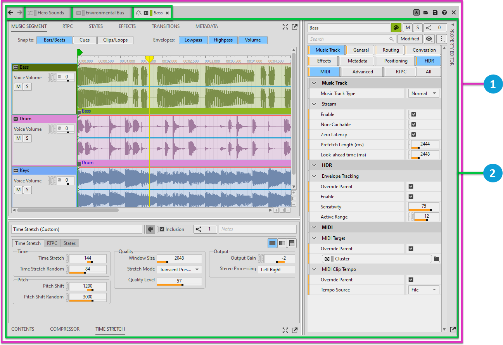

|  |  |
| --- | --- |
|  | Object Tab Group。 |
|  | 三个示例 Object Tab。 |

界面中设有两种类型的 Object Tab：Recycle（回收）和 Keep Open（保持打开）。通常，Object Tab Group 中打开的第一个选项卡为 Recycle 选项卡。这意味着，每次在 Project Explorer 内选中某个对象，Recycle 选项卡都会在同一 Object Tab 中换掉之前选中的对象。回收图标会表明选项卡类型。

若要在选项卡中保持打开对象，可双击选项卡或右键单击选项卡并选择 **Keep Open**。这样会将选项卡由 Recycle 选项卡转换为 Keep Open 选项卡。同时，会移除回收（Recycle）图标。在将选项卡转换为 Keep Open 选项卡后，无法再将其恢复为 Recycle 选项卡。随后在 Project Explorer 中选择对象时，会自动打开新的 Recycle 选项卡并显示所选对象。新打开的这个选项卡始终显示在当前选定 Object Tab 的右侧。

|  |  |
| --- | --- |
| [备注] | 备注 |
| Object Tab Group 内同一时间只能有一个 Recycle 选项卡处于打开状态。 |

**在 Recycle 选项卡中查看对象：**

- 在 Project Explorer（工程资源管理器）中选中任意对象。

**若要在 Keep Open 选项卡中查看对象，请执行以下任一操作：**

- 将 Wwise 中的对象拖到 Object Tab Group（对象选项卡分组）的标题栏上。您可在现有 Object Tab区域内选择放置选项卡的位置。
- From the Change Selection Channel menu in the title bar, select **Open New Tab On Double-Click** and then double-click any object in Wwise. 这时会在当前选定 Object Tab 右侧打开新的 Object Tab。

  |  |  |
  | --- | --- |
  | [备注] | 备注 |
  | **Open New Tab On Double-Click** is on by default. Deselect this option if you don't want an Object Tab to be opened when you double-click an object in Wwise. |
- 右键单击 Wwise 中的任意对象，并单击 **Open in New Tab**（在新的选项卡中打开）。这时会在当前选定 Object Tab 右侧打开新的 Object Tab。

**若要关闭 Object Tab，请执行以下任一操作：**

- 单击选项卡右上角的 **x**。
- 右键单击选项卡并选择 **Close**（Ctrl+F4 或 Ctrl+W）。
- 中键单击选项卡。

**若要重新排列 Object Tab Group 内的 Object Tab：**

- 向左或向右拖动选项卡。

Object Tab 和 Object Tab Group 均可停靠和取消停靠。有关详细信息，请参阅 [“Docking and undocking views and Object Tabs”一节](ch04s02s01.html "Docking and undocking views and Object Tabs") 章节。

---

#### Understanding an Object Tab Group's title bar

The following table describes each of the icons that might be displayed in the title bar of
an Object Tab Group.

|  |  |
| --- | --- |
| [备注] | 备注 |
| Some of the icons displayed in the title bar depend on what selection you made in the Change Selection Channel menu. The Change Selection Channel menu also contains two options that do not display icons. These options are also described in the following table. |

| 界面元素 | 描述 |
| --- | --- |
|  | Moves backward (Backspace) through the objects previously displayed in the currently selected Object Tab. |
|  | After selecting the back arrow, moves forward (Shift+Backspace) through the objects previously displayed in the currently selected Object Tab. |
|  | 单击并拖动来启动整个浮动 Object Tab Group 的停靠。注意，此图标仅会显示在包含多个 Object Tab 的浮动 Object Tab Group 的标题栏中。 |
|  | 加载预设。加载之前保存的预设。 |
|  | 将选定 Object Tab 内的所有值的当前状态保存到 Preset。 |
|  | 显示与活跃编辑器（Primary Editor 或 Secondary Editor）相关的在线帮助。单击所述编辑器中的任一位置即可将编辑器指定为活跃状态。活跃编辑器会显示较为突出的矩形框线。  在 Secondary Editor 中有多个选项卡时，会打开与选定选项卡对应的在线帮助。 |
|  | 关闭 Object Tab Group。 |
| **Change Selection Channel menu** | |
|  | **Sync with Any Selection Channel**：将 Object Tab Group 同步到 Designer 布局的 Project Explorer 和 Event Viewer 中选择的对象，而不管这些视图的 Selection Channel 如何。 |
|  | **Pinned**：禁止与 Project Explorer 和 Event Viewer 中选择的对象同步。后续在这些视图中所做的选择不会反映在 Object Tab Group 中。 |
|  | **Sync with Selection Channel 1-4**：将 Object Tab Group 同步到特定 Selection Channel (1-4) 的 Project Explorer 或 Event Viewer。也就是说，在选项卡中选择的对象始终与对应 Project Explorer 或 Event Viewer 中选择的对象匹配。 |
|  | **Open New Tab On Double-Click**: When selected, if you double-click an object in the Project Explorer, it opens a new Object Tab. |
|  | **Follow Object Selection**: If selected, when you click an Object Tab, the corresponding object is automatically selected in the Project Explorer of the same selection channel. |

---

#### Using the Object Tab shortcut menu

右键单击任意 Object Tab（对象选项卡）即可访问以下快捷菜单：

- **Back**（后退）：返回之前选择的对象 (Backspace)。
- **Next**（前进）：在选择 Back 后，可通过选择 Next 来返回原始对象 (Shift+Backspace)。
- **Keep Open**（保持打开）：将 Object Tab 由 Recycle（回收）选项卡转换为 Keep Open 选项卡 (Ctrl+P)。在选择之后会从选项卡中移除回收图标，并且选项卡不再更新及反映 Project Explorer 中所做的选择。
- **Duplicate**（复制）：在同一 Object Tab Group（对象选项卡分组）内另外打开一个 Object Tab 实例 (Ctrl+D)。
- **Detach**（解绑）：将 Object Tab 与 Object Tab Group 解绑。在选择之后，会将选项卡作为新的 Object Tab Group 显示在浮动窗口中。不过，可在必要时将其重新拖到原始 Object Tab Group 中。

  在将剩下的最后一个 Object Tab 与 Object Tab Group 解绑时，会关闭 Object Tab Group，除非其是 Designer（设计师）布局中剩下的唯一 Object Tab Group。在这种情况下，会在布局中保留一个空白 Object Tab Group。
- **Split to the Right**（向右分隔）：在仅包含选定 Object Tab 的当前 Object Tab Group 右侧打开一个 Object Tab Group。在选择之后，会另外创建一个选项卡实例，包括 Primary Editor 和 Secondary Editor（如有）。藉此，可同时在 Object Tab 内查看和编辑不同的选项卡。
- **Close**（关闭）：关闭 Object Tab。
- **Close Other Tabs**（关闭其他选项卡）：关闭 Object Tab Group 中的所有其他 Object Tab。
- **Close Tabs to the Right**（关闭右侧选项卡）：关闭 Object Tab Group 中的 Object Tab 右侧的所有 Object Tab。

---

#### Primary Editor 和 Secondary Editor

每个 Object Tab 由上部窗格中的 Primary Editor（适用于大部分对象类型）和下部窗格中的 Secondary Editor 组成。

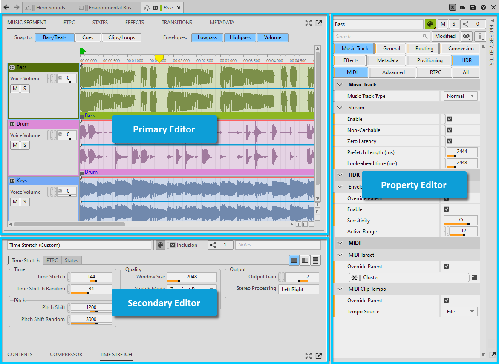

The Primary Editor typically presents the Event Editor or the Audio Device Editor depending on the type of object selected. Secondary Editor 会为每个与当前选定对象密切相关的其他编辑器留出一个选项卡。单击窗格底部的选项卡名称可在这些编辑器之间切换。


下表列举了一些可包含在 Secondary Editor 中的选项卡以及可能导致其包含其内的条件。

| 选项卡名称 | 包含条件 |
| --- | --- |
| <Effect Name> | <效果器名称>。在对象上插入了效果器。A tab appears for each Effect inserted on the object, displayed from left to right. |
| Attenuation（衰减） | An attenuation instance (ShareSet or custom) has been defined in the Positioning Category of the Property Editor. |
| 内容 | 内容。大多数对象均默认包含该选项卡。 |
| Music | Included for music objects. |
| Source | 源。对象为声音对象且关联有源文件或带有源插件。 |

Buttons in the Property, Primary, and Secondary Editors provide the following
functionality:

|  |  |
| --- | --- |
|  | Minimizes the Property Editor (Ctrl+`). |
|  | Maximizes the Primary Editor (`) or the Secondary Editor (Shift+`) within the Object Tab. You can also maximize those editors by double clicking on one of their tabs. |
|  | For the Primary and Secondary Editors, duplicates the currently selected tab in a floating window. For the Property Editor, duplicates the editor in a floating window. |

**在所述编辑器中使用键盘快捷方式：**

- 在窗格上部或下部任意位置单击来将编辑器指定为活跃编辑器。活跃编辑器会显示较为突出的矩形框线。在 Secondary Editor 中有多个选项卡时，单击与要使用键盘快捷方式的编辑器对应的选项卡。

Any keyboard shortcuts that apply to the editor can be used, including the F1 key (or
Help button), which opens the reference topic pertaining to the active editor.

---

##### Effects tab

Effects（效果器）选项卡用于将一个或多个效果器应用于工程层级结构中的对象或总线。在应用效果器时，必须决定是应用效果器的 ShareSet 还是自定义实例。您还可以旁通、渲染或编辑效果器。

The following figure shows the Effects tab for a Sound SFX.


|  |  |
| --- | --- |
|  | 向所选对象应用多达 255 个效果器。 |
|  | 单独渲染或旁通效果器。 |
|  | 统一旁通所有效果器。 |

---

##### RTPC tab

The controls on the [“RTPC tab”一节](ch60s01s05s02.html "RTPC tab") enable you to edit specific sound properties in real time based on real-time parameter value changes that occur within the game. 参数值显示在坐标图视图中，其中一个轴表示 Wwise 中的属性值，另一个轴表示游戏中的参数值。您可以一次处理一条曲线，也可以同时编辑所有曲线。

The following figure shows the RTPC tab for a Sound Voice.


---

##### States tab

States 选项卡允许您为当前对象添加包含各种 State 的 State Group。然后，您可以为每个状态自定义[*[累积属性](go01.html#glossary_additive_type_properties "Additive Type Property（累积型属性）")*](go01.html#glossary_additive_type_properties)值，例如音高和音量，来进一步定义对象的特征。通过单击 **Properties** 按钮，即可根据所选对象类型来添加或删除对象属性。

请参阅 [“使用 State”一节](ch16s01.html "使用 State")。

The following figure shows the States tab for a Sound Voice.

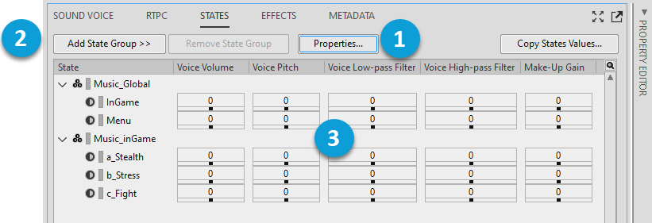

|  |  |
| --- | --- |
|  | Click **Properties** to add or remove property columns in the table. |
|  | Click **Add State Group** and **Remove State Group** to customize additive properties per State. |
|  | Editable states applied to the object. |

---

##### Auto-ducking tab

在与 Audio Bus（音频总线）对应的 Auto-ducking（自动闪避）选项卡中，可通过插入窗格中的其他总线来突显当前总线。在当前总线上检测到信号时，会降低插入的所有总线的音量。

有关详细说明，请参阅[“闪避信号”一节](ch12s02.html#ducking_signals "闪避信号")。有关各个界面元素的描述，请参阅 [“Auto-Ducking tab: Audio Busses”一节](ch60s01s02s02s01.html "Auto-Ducking tab: Audio Busses")。

请参阅 [“定义总线的属性”一节](ch12s02.html "定义总线的属性")。

The following figure shows the Auto-ducking tab for an audio bus.


|  |  |
| --- | --- |
|  | **当前总线**：本例中为 Dialogue 总线。在此总线上检测到信号时，将闪避条目 2 中所述的总线。 |
|  | **受当前总线控制的总线**：这些总线的音量将被降低。 |

---

##### Transitions tab

The main part of the Transitions tab is the transition matrix, a list of rules that defines how each object within a Music Switch or Playlist Container transitions to every other object within the container. 它还包含控件用来为过渡中的各个源和目标自定义属性，以及指定过渡段落用途和属性。

请参阅 [*使用 Transition*](ch32.html "使用 Transition")。

The following figure shows the Transitions tab for a music switch.


|  |  |
| --- | --- |
|  | Transition Matrix。 |
|  | Source 和 Destination 属性。 |
|  | Transition Segment 属性。 |

---

##### Stingers tab

在 Stinger（插播乐句）选项卡中，您可以创建触发器列表，为它们指定要播放的段落，以及指定播放它们的时间。您还可以为各个 Stinger 设置播放选项。

请参阅 [*使用 Stinger*](ch33.html "使用 Stinger")。

The following figure shows the Stingers tab for a music segment.


---

##### Metadata tab

The [“Metadata tab”一节](ch60s01s05s01.html "Metadata tab") allows you to associate an unlimited number of Metadata plug-ins with an object. 在将元数据插件与对象关联时，必须指定其 Type 和 Mode（Use ShareSets 或 Define custom）。通过单击 Edit [...] 按钮可打开 Metadata Editor（元数据编辑器），并编辑元数据插件的各项属性。

The following figure shows the Metadata tab for a Sound Voice.


|  |  |
| --- | --- |
|  | 将任意数量的元数据插件应用于所选对象。 |
|  | 编辑左侧面板中所选各个插件的属性。 |

---

### Working with the Media Pool

The Media Pool is where you can search, organize, audition, and select your audio files to
import into Wwise. This is invaluable if you have downloaded Strata libraries or are working
with third-party sound libraries. These libraries often contain large numbers of files,
which can make it time-consuming to find what you want. You can add these library folders to
Media Pool databases to search for and audition your files directly in Wwise.

When you create a database and point to a path on your local or network drive, the Media
Pool extracts the metadata of each file, such as duration, bit depth, and sample rate. The
Media Pool caches the metadata so you can quickly search your libraries and filter the
results to get the files you want.

The databases you create in the Media Pool are not project-specific. You can open a
different project in Wwise and the databases you created persist. The databases are created
locally. If someone else opens the same project on their computer, they do not have access
to your databases.

You can access the Media Pool through the following menus or by pressing **Ctrl+P**:

- **Views > Utilities > Media Pool**
- **Project > Media Pool**


|  |  |
| --- | --- |
|  | Databases pane lists the Project Originals folder and the User Databases folder where you can create databases and Virtual Folders to organize your databases. From here you can:  - Create new Databases and Virtual folders. - Rename and organize your folders and databases. - Open the Database Settings dialog. - See the number of Databases you have in the Media Pool   beside name of the Databases tab. - Select which Databases to search.  For more information on Databases, see [“Working with databases”一节](ch52s01.html "Working with databases"). |
|  | Use the drop-down list to select a type of search:  - **Selected Fields**: When you type a text string, the Results pane displays the closest matches for that string on the top of the list. The string is searched in the metadata fields that you selected to search by. Click the **Select Searchable Fields** (gear) icon to choose which fields to search by. 参见[“Searching for files by metadata”一节](ch52s01.html#searching_media_pool_databases "Searching for files by metadata")。 - **Audio Description**:   Uses Similar Sound Search to find files that sound like   the description you type. For example if you type, "loud   car crash", the Media Pool searches your databases to   find files with similar sounds to a loud car crash. For   more information about Similar Sound Search, see [“Similar Sound Search”一节](ch52s02.html "Similar Sound Search").  |  |  |   | --- | --- |   | [备注] | 备注 |   | You must have Similar Sound Search installed to use **Audio Description**. 详请参阅[“Installing Similar Sound Search”一节](ch52s02.html#install_similar_sound_search "Installing Similar Sound Search")。 | |
|  | Type a text string to search by file fields or a description of a sound to search by Similar Sound Search.  |  |  | | --- | --- | | [备注] | 备注 | | Only text fields can be searched. | |
|  | The Results pane displays the list of audio files based on your search and filter criteria. From here you can:  - View the audio files resulting in your search and   filter criteria. - Right-click a file or files to import them into your   project. - Right-click a file to find similar sounds in your   databases. - Right-click a file to import auto-detected   regions. - Configure the columns.  For more information, see:  - [“Configuring the Results columns”一节](ch52s01.html#configuring_media_pool_results "Configuring the Results columns") - [“Importing from the Results pane”一节](ch52s05.html#importing_from_results_list "Importing from the Results pane") - [“Similar Sound Search”一节](ch52s02.html "Similar Sound Search") |
|  | Click **Stop Search** to stop any search in progress.  Click **Refresh Search** if the contents of your database changes. |
|  | Metadata pane where you can view the metadata information for a selected file by which you can search and filter. Right-click on the metadata field and select to either add it as a column in the Results pane or add it as filter in the Filters pane. For information about the metadata fields, see [“Media Pool metadata”一节](ch52s03.html "Media Pool metadata"). |
|  | Filters pane where you can add, modify, and delete filters that can be included or excluded when searching for audio files. You can see the number of Filters you have created by the number in parentheses beside the name of the Filters tab.  For more information on Filters, see [“Filtering databases”一节](ch52s01.html#filtering_media_pool_databases "Filtering databases"). |
|  | Transport pane where can control the following playback parameters:  - Volume - Pitch - LPF - HPF - Loop - Auto-play on Selection - Stop or play the playback. Alternatively, you can   press the spacebar.  You can transfer all the changes that you make to the Volume, Pitch, LPF, HPF, and Loop properties when you import the files by clicking the **Apply on Import** icon beside each option.  有关详细信息，请参阅[“Auditioning audio files”一节](ch52s04.html "Auditioning audio files")。 |
|  | Audio Preview/Region Selector where you can:  - Position the playback cursor using the mouse. - Play or stop playback with the spacebar. - Skip to next and previous regions using the arrow   keys. - Select regions by:  - Manually clicking and dragging in the     waveform.   - Clicking on audio file markers.   - Enabling **Auto Select     Detected Regions**.   - Right-clicking the waveform and selecting     **Select All Detected     Regions**. - View the file path. - Add files or regions to the Audio File   Importer. - Find similar sounds to the selected regions or file   with Similar Sound Search.  For more information, see:  - [“Importing from the Audio Preview/Region Selector pane”一节](ch52s05.html#importing_from_preview "Importing from the Audio Preview/Region Selector pane") - [“Importing regions into your project”一节](ch52s06.html "Importing regions into your project") - [“Similar Sound Search”一节](ch52s02.html "Similar Sound Search") |

---

#### Working with databases

In the Media Pool you can create databases, which you can then organize, search, and
filter to quickly find audio files in your local or network libraries.

###### Creating databases

There are two folders in the **Databases** tab:

- **Project Originals**: Lists the audio files
  in your project. After you import files into your project, they are included
  in this list.
- **User Databases**: Used to create databases
  and Virtual Folders to organize the audio files in your libraries.

**To create databases:**

1. From the Media Pool **Databases** tab, do one
   of the following:

   - Right-click **User Databases**
     and then select **New Child** >
     **Media Pool Database**.
   - Click the **Create Media Pool
     Database** icon.
   - Drag and drop one or many folders from your local file browser
     to a User Databases Virtual Folder.
2. Enter a name for your database.
3. To open the Media Pool Database Settings dialog, do one of the following:

   - Double-click the database.
   - Right-click the database and then select **Database Settings**.
4. Click **+**  to create a path to the folder
   containing the files you want to add to the database.
5. Browse to select the folder and then click **Select
   Folder**.
6. 单击 **OK**（确定）。

   The Media Pool recursively scans the folders linked to the database and
   adds all audio file metadata to that database. The files are then displayed
   in the Results pane.

   |  |  |
   | --- | --- |
   | [备注] | 备注 |
   | The Media Pool detects the following audio formats: .wav, .amb, and .adm. |

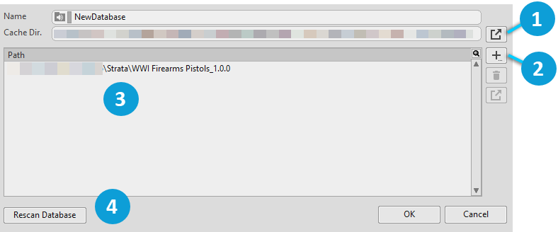

|  |  |
| --- | --- |
|  | Open the folder containing the database cache files. |
|  | Click + to link your library folder to the database. |
|  | The list of library folders that are tracked by your database. |
|  | Click **Rescan Database** to manually scan your database because of file changes. Media Pool databases are scanned every time you open a project.  |  |  | | --- | --- | | [备注] | 备注 | | If you suspect a scan has failed or a database cache is corrupted. Click **Open Containing Folder** to delete the cached files, and then click **Rescan Database**. The tracked folders are stored in a separate settings file and are not affected. Database settings are found in: `%AppData%\Audiokinetic\MediaPool\` | |

###### Organizing databases

To organize your databases and access files quickly, you can create Virtual
Folders and add databases to them. To create a folder or database:

- Right-click a folder and then select **New Child >
  Virtual Folder** or **Media Pool
  Database**: Creates a new child folder or child
  database.
- Click the **Create new Media Pool
  Database** icon: Creates a new database under the folder or
  database you have selected.
- Right-click a folder or database and then select **New Parent > Virtual Folder**: Creates a new parent
  Virtual Folder where you can add databases.
- With a virtual folder selected, click the **Create
  new Virtual Folder** icon. Creates a new folder under the
  selected virtual folder.

You can further organize your Databases pane by right-clicking a
folder or database and then selecting:

- **Delete**: Delete your database or
  folder. Alternatively, you can press the **Delete** key.
- **Rename**: Rename you database or
  folder. Alternatively, you can press **F2**.
- **Set color**: Select a color for a
  folder or database. A color bar is displayed beside the folder or
  database name.

###### Configuring the Results columns

By default, the Results pane displays only the **Name** and **Waveform** columns. To
configure the columns, do one of the following:

- To add or remove columns, right-click the column header and select
  **Configure Columns** and then select
  the field to display as a column.
- To reorder the columns, right-click the column header and select
  **Configure Columns**. Reorder a
  selected field by dragging and dropping it.
- To add a column from a field in the Metadata pane, right-click a field
  and select **Add Field as Column**. For
  example, to add a **Sample Rate** column,
  right-click **Sample Rate** and then select
  **Add Field as Column**.

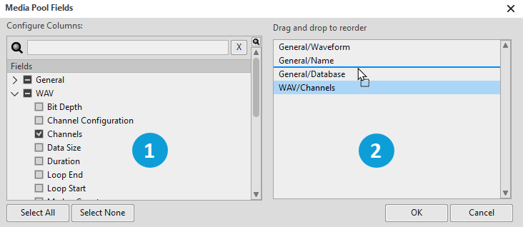

|  |  |
| --- | --- |
|  | Select a field to include in the Results pane. Deselect a field to remove from Results pane.  Search for a field in the Search bar. |
|  | Select and drag the field to place it in the order it will be displayed in the Results pane. In this image, the WAV/Channels field is being dragged to appear after the General/Name field. |

###### Searching for files by metadata

Use the Search field at the top of the Results pane to find specific audio files.
As you type in the Search field, the Media Pool searches the metadata in the
database files and displays matches in the Results pane.

The Results pane displays both the Project Originals and the Database files.
Select or deselect the check box next to the folders or databases you want to
include or exclude from the search.

To search for files by metadata:

1. Select the **Selected Fields** option
   Search drop-down list.
2. Click the gear icon to the right of the **Search** field and then select the check box for each
   field to include in the search.
3. Type in the text string to search by.

   You can use the following operators to get more precise results:

   - **Exact phrase**: Use double
     quotes (") to find a specific phrase, for example, "footstep
     medium".
   - **Exclude words**: Use a
     hyphen (-) or exclamation mark (!) to remove unwanted
     results. For example: footstep !concrete.

   As you type, the Results pane is dynamically populated with matches.
   The best matches appear at the top of the list.

For a file to appear in the Results pane, each word in the search string
must be found at least once in the selected metadata fields. Using quotation marks
to specify an exact phrase enforces that the words should appear in the same field
in the written order.

|  |  |
| --- | --- |
| [技巧] | 技巧 |
| Right-click the file in the Results pane or the waveform in the Audio Preview/Region Selector and select either **Copy Path to Clipboard** or **Copy Filename to Clipboard** to paste exact matches. |

The word matching process is approximate, allowing for prefix matches. For
example, “foot” matches with “footstep”. The approximate search also allows for
typos. For example, “foottep” matches with “footstep”.

Matched files are given a score that ranks the exact matches higher than
approximate matches. To view the **Score** column,
right-click the column header and select **Configure
Columns** to select the Score field.

|  |  |
| --- | --- |
| [备注] | 备注 |
| You can also search by Similar Sound Search. 请参阅 [“Similar Sound Search”一节](ch52s02.html "Similar Sound Search")。 |

###### Filtering databases

You can create filters to refine the list of audio files in the Results
pane.

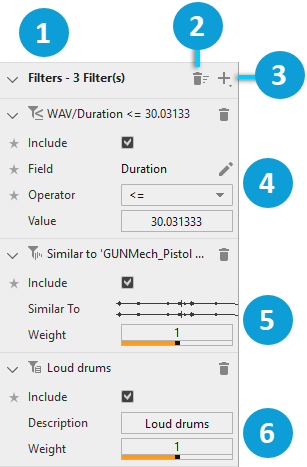

|  |  |
| --- | --- |
|  | The number of filters in the Filters pane. |
|  | Click the delete icon to delete all filters. Alternatively you can click the delete icon beside a filter to delete only that one. |
|  | Click **+** to add a filter. |
|  | A field filter created by selecting or right-clicking a metadata field. |
|  | An **Audio Similarity** filter to find audio files with a similar sound to the waveform of the selected file. |
|  | An **Audio Description** filter to find audio files that sound similar to the description you type. |

**To create a filter from the Metadata pane:**

1. Select a file from the Results pane. The metadata for that file is
   displayed in the Metadata pane.
2. In the Metadata pane, right-click a field and select **Add Field Filter**. For example, to filter the results by
   Sample Rate, right-click **Sample Rate** and
   then click **Add Field Filter**.

   The field is displayed in the **Filters**
   pane with its current value.
3. Select an operator and enter or edit the value.

   The Results pane is updated based on the operator and value that you have
   configured.

**To create a filter in the Filters pane:**

1. Click the Filters tab.
2. Click **+**.
3. 选择以下任一选项：

   - **Field**: Filters by metadata
     fields.
   - **Audio Similarity**: Ranks
     search results based on their similarity to the waveform of the
     audio of the selected file.
   - **Audio Description**: Ranks
     search results based on their similarity to the description of a
     sound.
4. If you selected **Field**, click the pencil
   icon to select a field you want to filter by and then click **OK**.
5. Select an operator and enter the value.

   The Results pane is updated based on the operator and value that you have
   selected.

**To create an Audio Similarity filter**

1. 执行以下操作之一：

   - In the Media Pool Results pane, right-click a file and select
     **Find Similar**.
   - In the Media Pool Audio Preview/Region Selector, right-click
     anywhere in the waveform and select **Find
     Similar**.
   - In the Media Pool Audio Preview/Region Selector, right-click a
     selected region and then select **Find
     Similar (Region)**.
   - In the Project Explorer, right-click a Sound SFX object and
     select **Find Similar in Media
     Pool**.

   The filter is added to the Filters pane.
2. Set a weight for the filter, if desired.

|  |  |
| --- | --- |
| [备注] | 备注 |
| For more information on **Audio Similarity** and **Audio Description**, see [“Similar Sound Search”一节](ch52s02.html "Similar Sound Search"). |

The following tables describe the filter properties.

| Properties shared by all filters | 描述 |
| --- | --- |
| Filter name | Displays the name and information about the filter configuration. To change the order of how the filters appear in the Filters pane, right-click the name of the filter and select either **Move Up Media Pool Filter at index #** or **Move Down Media Pool Filter at index #**. |
| 包含 | Select to filter based on the field. If you deselect this check box, this filter is removed from your search criteria. |

| Field Filter Properties | 描述 |
| --- | --- |
| Field | The metadata field by which to filter the results. |
| Operator | The operation that defines how to filter the field. This operator changes depending if the field is a text or numeric field.  The operators for text fields:  - != (not equal to) - = (equal to) - contains - starts with - ends with - matches regex (regular expression).  For more information about regular expressions   that Wwise uses, see [Regular expression reference](https://www.audiokinetic.com/library/edge/?source=Help&id=regexref).  The operators for numeric fields:  - < (less than) - <= (less than or equal to) - != (not equal to) - = (equal to) - &gt;= (greater than or equal to) - &gt; (greater than) |
| Value | The value by which the operator filters the results. For example, for the numeric field **Sample Rate**, you can filter a your results to include only audio files that have a Sample Rate of < 48000 Hz.  The operator is less than (**<**) and the value is **48000**. |

| Similar Sound Search Properties | 描述 |
| --- | --- |
| 描述 | Used for the **Audio Description** for Similar Sound Search filter. Type a description of the sound to filter by, for example, "buzzing". |
| Similar To | Displays the waveform that other audio files are compared to. |
| Weight | The relative importance of the similarity filter to other filters. Used for both **Audio Similarity** and **Audio Description** filters. Use this to boost or reduce the impact of a given similarity filter for ranking the search results. |

---

#### Similar Sound Search

Similar Sound Search allows you to search for sounds in your Media Pool databases
using either a text query or a reference audio clip. This removes the need for keyword
tagging and time-consuming manual navigation through vast sound libraries. It was
designed specifically for sound effects and discovers unexpected matches that would be
difficult to find using conventional search methods. For example, a sound labeled
“smashing fruit” might be found as a match for the query “footsteps in mud.”

In particular, Similar Sound Search allows for:

- **Text-to-audio retrieval:** In the list to
  the right of the Search field, select **Audio
  Description** and then type a description of the desired sound.
  Results are ranked based only on their audio content.
- **Audio-to-audio retrieval:** Right-click any
  file in the Results pane and click **Find
  Similar**. The sonic qualities of the file are used as a
  reference to find similar results.

In both cases, Similar Sound Search provides a new way to find audio,
even if it was recorded for a different purpose. These two techniques enrich traditional
filtering, which depends on metadata, extending the possibilities of existing sound
libraries.

Similar Sound Search uses a non-generative machine learning model to place audio and
text into a shared search space where sounds are grouped by acoustic and semantic
similarity. It is an optional package you can add to Wwise using the Audiokinetic
Launcher.

For more information about how Audiokinetic uses this non-generative machine learning
model, see [Use of Artificial
Intelligence](https://www.audiokinetic.com/en/solutions/use-of-ai).

###### Installing Similar Sound Search

Similar Sound Search is an option in the Packages menu when installing Wwise or
modifying a Wwise installation. It is disabled by default. When enabled, more CPU is
used during scanning of the Original and Media Pool files after opening a project.
Additionally, more disk space is used in the `.cache` directory for the
project and for Media Pool databases.

To install Similar Sound Search:

1. From the Audiokinetic Launcher Wwise page, do one of the
   following:

   - Select a version of Wwise to install and click **Install**.
   - From an installed version of Wwise, click **Install options** (wrench icon) and
     then select **Modify**.
2. In the Packages list, select **Similar Sound
   Search**.
3. Click **Next**.
4. Click **Install** or **Modify**.

To use Similar Sound Search, you must enable it after installing it.

###### Enabling Similar Sound Search

Similar Sound Search is disabled by default. To enable it:

1. From the menu bar, click **Project > User
   Preferences** (Shift+U).
2. In the Similarity Search group, select **Enable
   Similar Sound Search in Media Pool**.
3. Click **OK** to save your settings and
   close the dialog.

###### Searching or filtering files using Similar Sound Search

You can search and filter for similar files in the following two ways:

- **Audio Description**: Ranks audio files
  in the Results pane using text-to-audio similarity. When you type a
  description of a sound, that description is compared directly to the
  audio content of all the files in the Results pane. This allows you to
  search for candidate sounds regardless of how they were labeled. For
  example, the description “footsteps in mud” might be highly similar to
  recordings labeled as “smashing fruit".
- **Audio Similarity**: Ranks audio files
  in the Results pane using audio-to-audio similarity. The audio content
  of the reference sound is compared to all of the audio files in the
  Results pane.

In both cases, the results are reordered based on their similarity score. Search
by Audio Description directly in the Search bar. Search for Audio Similarity in the
waveform. Search by both Audio Description and Audio Similarity using
filters.

###### To search by Audio Description in the Search bar

1. From the **Selected Fields** drop-down list,
   select **Audio Description**.
2. Type in a phrase to describe the sound you are looking for. For example,
   "loud car crash".

   The search dynamically returns files that sound similar to the description
   as type, the most similar being at the top of the Results pane.

###### To search by Audio Similarity in the waveform

- Right-click the waveform of a file in the Results pane or in the Audio
  Preview/Region Selector and select **Find
  Similar**.
- Right-click a region in waveform of the Audio Preview/Region Selector and
  select **Find Similar (Region)**.

The results are reordered with the most similar to the waveform or region you
selected at the top of the Results pane.

###### To search by creating filters for both Audio Similarity and Audio Description

You can create filters for both Audio Similarity and Audio Description. 有关详细信息，请参阅[“Filtering databases”一节](ch52s01.html#filtering_media_pool_databases "Filtering databases")。

---

#### Media Pool metadata

The WAV (Waveform Audio File Format) is a standard digital audio file format used for
storing an audio bit stream. While the core of a WAV file contains the raw audio data,
it can also store a variety of metadata, providing additional information about the
audio content. This metadata can be found in different "chunks" within the file.

The following table lists the fields supported by the Media Pool, which include
standard WAV fields, Broadcast Wave Format (BWF) extension fields, and iXML
metadata:

| Field Name | 描述 |
| --- | --- |
| Filename | Name of the WAV file in the file system; a primary identifier. |
| **WAV** | Standard audio file format. |
| Duration | Total playing time of the audio samples, per channel. |
| 采样 | Total count of individual audio samples, per channel. |
| Data Size（数据大小） | Size (in bytes) of the raw audio data within the 'data' chunk. |
| Loop Start | Time of the beginning of a loop, in seconds; found in 'smpl' chunk. |
| Loop End | Time of the end of a loop, returning to Loop Start, in seconds; found in 'smpl' chunk. |
| Marker Count | Total number of defined markers (cue points) for specific time points in the audio; found in 'cue' chunk. |
| 采样率 | Number of audio samples captured per second (Hz), indicating time resolution; found in the 'fmt' chunk. |
| 位深 | Number of bits per audio sample, indicating amplitude resolution; found in the 'fmt' chunk. Wwise supports the following bit depths; 16-bit integer, 24-bit integer, 32-bit float. |
| Channels（声道） | Number of audio channels, for example, 1 for mono and 2 for stereo; found in the 'fmt' chunk. |
| Channel Configuration | Specifies the channel arrangement and role of audio channels. |
| **BWFXML** | Root XML tag (<BWFXML>) enclosing iXML metadata within a WAV file.  Open standard for embedding detailed XML-based production metadata in Broadcast Wave Format (BWF) files.  <http://www.gallery.co.uk/ixml/> |
| BWFXML/PROJECT | iXML field: Name of the associated project. |
| BWFXML/FILE\_UID | iXML field: Globally unique identifier for the audio file. |
| BWFXML/ASWG | iXML section: Sony PlayStation Studios' Audio Standards Working Group.  <https://github.com/Sony-ASWG/iXML-Extension> |
| BWFXML/BWF | iXML section (<BEXT>) for embedding or referencing BWF 'bext' chunk metadata.  <https://tech.ebu.ch/docs/tech/tech3285.pdf> |
| BWFXML/USER | iXML section for custom, user-defined metadata fields. Used by Strata to store additional information, including TRACKNAME and Universal Category System (UCS) fields, such as CATID and FXNAME.  <https://universalcategorysystem.com/> |

---

#### Auditioning audio files

You can use the Transport and Audio Preview/Region Selector panes to audition your
audio files.

When you modify any of the property values in the Transport pane, these changes
persist after you select another file in the Results pane. When you close the Media Pool
view, the properties are reset to their default values.


|  |  |
| --- | --- |
|  | Stop or play the audio file. Alternatively, press the spacebar. |
|  | Click the down arrow to expand or collapse the Audio Preview/Region Selector waveform. |
|  | Click the **Auto-Play on Selection** icon to auto play a file as soon as you select it. |
|  | Audition the Volume, Pitch, LPF, HPF, and Loop the playback.  You can transfer all the changes that you make to the Volume, Pitch, LPF, HPF, and Loop properties when you import the files by clicking the **Apply on Import** icon beside each option. The WAV file is never modified when you make changes to the options. The changes are transferred as properties in the imported object. You can modify these properties in the Property Editor after importing the file. |
|  | Click the **Auto Select Detected Regions** icon to let the Media Pool define regions for your audio file. Wwise can automatically detect regions in WAV files based on their content. It detects the energy and silence and uses heuristics to determine regions of interest in the audio. This is particularly useful when an audio file contains several takes or variations of the same type of sound.  For example, the detected regions can be imported into a Random Container, reducing the amount of work necessary to prepare the files. |
|  | The waveform of the audio file where you can:  - Select regions. - View markers that can be used to select   regions. - Right-click to import the entire audio file or the   selected regions. - Right-click a region to add an **Audio Similarity** filter to your   results. - Click where you want to start playback and then press   spacebar. Press spacebar again to return to the point   where you started. - Adjust the size of the region using the   handles. |
|  | Information about the waveform that includes:    - Duration - 采样率 - Bit Rate（比特率） - Channel Configuration |
|  | Click **Files (#)** to add selected files to the Audio File Importer.  Click **Regions (#)** to add selected regions to the Audio File Importer. |

---

#### Importing audio files into your project

You can import audio files using the [Audio File Importer](https://www.audiokinetic.com/library/edge/?source=Help&id=audio_file_importer) or by dragging them directly into the Containers
hierarchy.

When you import files directly into the Containers hierarchy, you have the option of
importing them as one of the following object types if the target Container allows it:

- Sound SFX（音效声）
- Sound Voice（语音声）
- Music Segment （音乐段落）
- Audio Source
- Music Track （音乐轨）

|  |  |
| --- | --- |
| [备注] | 备注 |
| When you import an audio file from the Project Originals list in the Media Pool, a copy is created in the Project Explorer. |

###### Importing from the Results pane

Select a file or a group of files and do one of the following:

- Right-click and select **Add File in Audio File
  Importer**. The Audio File Importer dialog is displayed and
  contains the selected file.
- Right-click and select **Import File to 'Default
  Work Unit'** and then select either **Sound FX**, **Sound Voice**,
  or **Music Segment**.
- With a Container selected in the Project Explorer, right-click and
  select **Import File to <Container
  name>** and then select the file type. Your file or files
  are added to the selected Container in the Project Explorer.
- Drag a file or files directly into the Default Work Unit in the
  Project Explorer.
- Drag a file or files into the Audio File Importer.
- Select a file or files and press the **Shift+I** keys or click**Files(#)**. The file(s) are added to the Audio File
  Importer.

###### Importing from the Audio Preview/Region Selector pane

执行以下操作之一：

- Right-click anywhere in the waveform and then select **Add File in Audio File Importer**. The Audio
  File Importer dialog is displayed and contains the selected file.
- Click **Files (#)**. The Audio File
  Importer dialog is displayed and contains the selected file.
- With a Container selected in the Project Explorer, right-click
  anywhere in the waveform and then select **Import
  File to <Folder or container name>** and then select the
  type of file. Your file is added to the folder that you have selected in
  the Project Explorer.
- Right-click anywhere in the waveform and then select **Import File to 'Default Work Unit'** and then
  select the type of file.

###### Importing files using drag and drop

You can import audio files by dragging and dropping them to either the Audio File
Importer dialog or to your project Default Work Unit. The drag and drop function is
sensitive to the destination. You can only drag types of files into the destinations
that allow it. Drag and drop your files by doing one of the following:

- Select a file or files from the Results pane and drag it into the
  Audio File Importer.
- Select a file or files from the Results pane and drag it onto any
  object in the Containers hierarchy in the Project Explorer. The file or
  files are imported into the Project Explorer.

---

#### Importing regions into your project

You can select and import regions of an audio file in the Audio Preview/Region
Selector in the Media Pool. Regions are a selected portion of an audio file. You can
select and import one or more regions. You can also select regions from markers in the
waveform.

When you import a region, the entire audio file is imported to the Project Originals
folder. Objects are created in the project at the Object destination with the region
selected in the Source Editor. When you import more than one region, each region is
saved with a number appended to the Object name. For example, if you import three
regions from the same file, each region is saved as an object with "\_01", "\_02", and
"\_03" appended to the object name.

The following image shows three selected regions in a waveform.

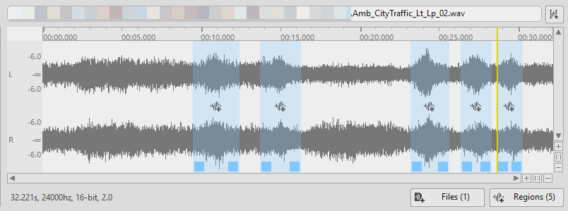

###### Selecting regions

To select regions, do one of the following:

- Click the starting point of the region you want to select and drag to
  the end point of the desired region.
- Hold **Ctrl** or **Shift** and select multiple regions.
- If your file has markers, you can select a marker as a region by
  clicking the marker name.
- Select the **Auto Select Detected
  Regions** icon.

  Wwise automatically detects regions in WAV files based on the energy
  and silence and uses heuristics to determine regions of interest. This
  is particularly useful when an audio file contains several takes or
  variations of the same type of sound. For example, the detected regions
  can be imported into a Random Container in just a few steps, reducing
  the amount of work necessary to prepare the files.
- Right-click the waveform of a file in the Audio Preview/Region
  Selector pane and select **Select All Detected
  Regions**.

###### Deselecting regions

To deselect regions, do one of the following:

- Right-click a region and select either **Deselect
  Region** or **Deselect All
  Regions**.
- Press **Esc**.

###### Importing regions from the Results pane

If you are importing directly into an existing Sound SFX object in your project,
you can import the detected regions as audio sources. If you are importing the
detected regions into your Default Work Unit, you can select to import them as
either Sound SFX or Sound Voice objects.

1. In the Results pane, right-click a single file, or select more than
   one file and right-click, and then select **Import
   Detected Region(s) to <selected Container in the Project
   Explorer>** or **Import Detected
   Region(s) to 'Default Work Unit'**.
2. Select the type of object to import as.

Wwise automatically detects regions in WAV files based on the energy and silence
and uses heuristics to determine regions of interest. This is particularly useful
when an audio file contains several takes or variations of the same type of sound.
For example, the detected regions can be imported into a Random Container in just a
few steps, reducing the amount of work necessary to prepare the files.

###### Importing regions from the Audio Preview/Region Selector pane

To import regions into your project, select a region or regions and then do one of
the following:

- Click **Regions(#)**. The region or
  regions are displayed in the Audio File Importer dialog.
- Right-click a region and then select **Add Regions
  in Audio File Importer**. The regions are added to the
  Audio File Importer.
- Right-click a region and then select **Import
  Selected Region(s) to <folder selected in Project
  Explorer>**. The Objects are added to the folder that you
  have selected in the Project Explorer.
- Right-click a region and then select **Import
  Selected Region(s) to 'Default Work Unit'**. The Objects
  are added to the Default Work Unit in the Project Explorer.
- Press and hold the drag icon in a region and then drag and drop it in
  a Container in the Project Explorer. If you have more than one region
  selected, they will all be included in the drag and drop.

---

### 使用 Search、Query 和 Reference

Wwise 工程可能包含数千种声音和振动效果、容器、事件和其他对象。随着工程扩大，能够迅速找到特定工程元素将变得越来越重要。为此，Wwise 提供三种强大高效的方法来查找工程中的元素：

- **Search** ―― 搜索。一款基于文本的快速搜索工具，在您输入搜索内容的同时就会显示匹配项。
- **Query** ―― 查询。一款更加强大的搜索工具，它使用一系列的条件或标准进行搜索。
- **Reference** ―― 引用。一款搜索工具，可以查找工程中包含直接引用特定对象或元素的元素。

Search 工具使用起来快速、简便。用户只需在 Search 字段中键入一些文本，Wwise 就会检查每个工程元素的 Name（名称）和 Notes（备注）字段来搜索匹配项。在您输入时，所有匹配项会自动显示在 Results 列表中。

Reference 工具使用起来也很快速、简便。您只需右键点击对象，选择 Find All Reference（查找所有引用），Wwise 就会创建一张列表，表中包含直接引用当前对象的对象和其它工程元素。引用列表将显示在 Reference 视图中。

而 Query 工具可为您提供更加精密和强大的搜索引擎。在 Query 中，您可以定义一系列标准（Criteria），以便搜索工程中的具体元素。例如，您可以创建一个 Query 来查找所有 Prefetch 长度为100 ms 并启用了流播放的声音对象，然后使用 **Show in Multi Editor** 命令将其全部更改为150 ms。Query 虽然设置时间略长，但一旦创建即可发挥强大的作用，您可以随时在开发周期中使用它们。

通过使用这两种搜索工具，您能够查找工程中的几乎任何单个或一系列元素。

|  |  |
| --- | --- |
| [备注] | 备注 |
| 当 Work Unit 从工程中卸载时， Wwise 将无法搜索或查询其中的元素。 |

---

#### 搜索工程中的元素

您可以使用搜索工具快速轻松地查找工程中的任何元素。搜索（Search）工具是一种基于简单文本的搜索技术。用户只需在 Search 字段中键入一些文本，Wwise 就会检索整个工程来查找所有 Name（名称）和 Notes（备注）匹配的元素。如果找到了匹配项，则会自动将结果显示在 Result 列表中。

|  |  |
| --- | --- |
| [备注] | 备注 |
| 您还可以通过为查询添加 $ 前缀来在 Search 字段中键入 WAQL 查询。有关详细信息，请参阅[了解 Wwise Authoring Query Language (WAQL)](https://www.audiokinetic.com/library/edge/?source=SDK&id=waql_introduction.html)。 |

Search 工具会通过检查 Name 或 Notes 字段中各个新词的开头来寻找匹配项。在 Wwise 中，如果单词中包含非字母数字字符（例如空格、下划线、破折号等）或存在大小字变化，它们则将被视为不同的单词。了解这一点非常重要，搜索工具在查找匹配项时将考虑这一点。下表展示了几个不同的示例：

| 搜索字段文本 | 匹配 | 不匹配 |
| --- | --- | --- |
| Big | Big\_Car  Big Car  Bigcar  VeryBigCar | Verybigcar |
| Small Car | Small Fast Car  Small\_Car  Very small car | Smallcar  Verysmallcar |
| mediumcar | mediumcar  VeryMediumcar  Very\_Mediumcar | Medium（数值）  Car |

Search 工具支持将 "!" 用作 NOT（非）运算符。在 Search 字段文本前面包含此运算符时，会滤掉所有与文本匹配的结果。比如，"!Big" 会滤掉上表中列出的所有与 Big 匹配的条目。

您可以使用 List View 来执行搜索，不过也可使用 Wwise 工具栏右侧的 Search 字段来实施快速搜索。在结果列表中，可将工程元素加载到与其对应的编辑器中。在使用 List View 时，还可右键单击列表中的一系列选定项来执行各种任务（包括多项编辑、转码和删除）。

**搜索工程中元素的方法是：**

1. 在 Wwise 工具栏中，在 Search（搜索）字段中键入工程元素的名称、备注或其中一部分（在 Wwise 中的任意位置按下 Ctrl+Shift+F 即可将键盘焦点移到 Search 字段）。

   在键入时，会在 Search 字段下显示 Names/Notes 匹配的一系列工程元素。

   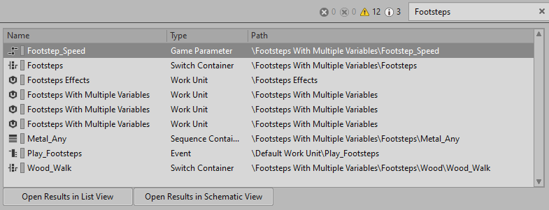
2. 执行以下操作之一：

   - 点击 **Open Results in List View** 可在 List View 中显示结果的完整列表。
   - 点击 **Open Results in Schematic View** 可在 Schematic View 中显示结果的完整列表。
   - 点击您要查找的工程元素以将它加载到相应的编辑器。
   - 使用箭头键浏览 Results（结果）列表，然后按 **Enter** 将所选元素加载到相应编辑器。

   |  |  |
   | --- | --- |
   | [备注] | 备注 |
   | 如果在 List View 中显示结果，则选择一项可自动地将它加载到 Transport Control 中以便立即播放。您还可以右键点击列表中的一系列条目来执行各种任务，包括 Multi-Edit（多项编辑）、Convert（转码）和 Delete（删除） |
3. 在 Search（搜索）字段中单击 **x**，来清除输入条目和下方列中列出的结果。

---

#### Finding the project elements that reference a particular object

There might be cases during the development of your project where you want to find all the
elements in your project that contain direct references to a particular object. For example,
you might want to find which Events reference a particular object or which SoundBanks
reference a particular Event. In Wwise, you can do this with the Find All References command
that is accessible from most of the shortcut menus. All elements that reference a particular
object are displayed in the [“Reference View 视图”一节](ch60s12s05.html "Reference View 视图"), where you can open each project
element, make changes, if necessary, and then move on.

|  |  |
| --- | --- |
| [备注] | 备注 |
| 仅当工程元素直接引用了特定对象或元素时，才会显示在引用视图中。 |

在大多数情况下，您主要搜索引用某一个特定对象的元素，但您也可以查找引用一系列对象的所有元素。

|  |  |
| --- | --- |
| [备注] | 备注 |
| 引用列表不会自动更新，因此，如果对工程做了更改，则需要点击 Refresh 按钮以手动更新引用列表。 |

**查找引用特定对象的工程元素的方法是：**

1. 执行以下操作之一：

   - 右键点击单个或多个工程元素，然后从快捷菜单中选择 **Find all references**（查找所有引用）。
   - 按 Shift+F3 打开 Reference 视图，然后将一个或一系列对象拖到 References to:（引用）字段。
   - 按 Shift+F3 打开 Reference 视图，点击 References to: 字段旁边的 Browse 按钮，选择工程元素，然后点击 **OK**。

   |  |  |
   | --- | --- |
   | [备注] | 备注 |
   | 如果在 Project Explorer、Property Editor 或 Reference View 中选择一个对象或元素的同时按下 Shift+F3 组合键，Wwise 则会自动搜索引用选定对象的对象。 |

   引用选定对象的一系列工程元素显示在 Reference 视图中。

---

#### Working with queries

当您需要查找工程中的特定对象而 Search 工具又找不到时，您可以在 Query Editor（查询编辑器）中创建查询。Query Editor 是一款复杂、强大的工具，可帮助您在工程进行搜索，查找您需要的任何对象。您的查询条件既可以设置得宽泛一些，也可以明确一些，具体取决于需要。您还可以保存和重新加载查询条件，让您的工作流程变得更加高效。在运行查询条件后，您可以一次性编辑 Results 窗格中的所有对象。例如，您可以使用 Multi Editor 开启或关闭流功能，也可以更改 Results 窗格中整组对象的转码设置。

例如，您可以创建并运行查询来执行以下任务：

- 要查找工程中以“sword”开头的所有声音，创建以 SFX 为声音类型、sword\* 为名称的声音查询。
- 要查找输出至给定总线的所有 Music Segment，请创建一个针对 Music Segment 的 Query 并查询该总线名称。
- 要查找低通滤波器属性大于 10 的所有声部，创建 sound type（声音类型）为 Voice、Low-Pass Filter 属性值大于 10 的声音查询。

Query Editor 包括以下分区：


|  |  |
| --- | --- |
|  | Query 描述 |
|  | Criteria Browser |
|  | Criteria 列表 |
|  | Results 列表 |

###### Creating queries

在 Wwise 中创建查询时，您即建立了一个独特的搜索来查找工程中的对象。在对查询命名后，该查询将保存起来供今后使用。

在 Wwise 中，有两个地方可以创建查询：

- Project Explorer 的 Queries 选项卡
- 在 Query Editor 中

**在 Queries 选项卡中创建新的查询：**

1. 在 Project Explorer 中，切换到 Queries 选项卡。
2. 执行以下操作之一：

   - 选择工作单元或虚拟文件夹，然后点击 Project Explorer 工具栏中的 **Query** 图标。
   - 右键点击工作单元或虚拟文件夹，然后从快捷菜单中选择 **New Child** > **Query**（新建子项 > 衰减）。

   新的 Query 将被添加到选定的 Work Unit 或 Virtual Folder。
3. 将默认名称替换成最适合该查询操作的名称，然后按 **Enter**。

   |  |  |
   | --- | --- |
   | [备注] | 备注 |
   | 各个查询不得重名，且不可包括以下字符：‘:<>\*?”/\|.’。您可以随时重命名查询，方法是右键点击它，选择 *Rename*（重命名），然后输入新的名称。 |

**在 Query Editor 中创建新的查询的方法是：**

1. In the Query Editor, click **New**

   此时将打开 New Query 对话框。
2. 选择想要创建 Query 的 Work Unit。
3. 输入查询的名称。

   |  |  |
   | --- | --- |
   | [备注] | 备注 |
   | 各个查询不得重名，且不可包括以下字符：‘:<>\*?”/\|.’。您可以随时重命名查询，方法是右键点击它，选择 *Rename*（重命名），然后输入新的名称。 |
4. 单击 **OK**（确定）。

   此时将创建新的查询。

###### Defining and running queries

第一次运行查询时，需要决定使用什么标准来搜索工程。这些标准会自动保存，在您今后再次运行此查询时可以为您节省时间。

|  |  |
| --- | --- |
| [备注] | 备注 |
| 查询结果将考虑由于被父对象覆盖而目前没有使用的对象级属性。If you encounter unexpected results in the Query Editor, you can look for hidden object-level properties by temporarily enabling the Override Parent option in the Property Editor. |

**定义查询的内容的方法是：**

1. 将查询加载到 Query Editor 中。
2. 在 Notes 字段中输入有关查询的任何附加信息。
3. 在 Query From（从此处查询）列表中，执行以下操作：

   - 选择要搜索的对象类型或其他工程元素。如果您不想搜索特定类型的对象，则选择 **All Objects**（全部对象）。

     要在层级结构中指定查询的起始位置，则需执行以下操作：

     - 在 Start From Here（从此处开始）框附近，点击 **Browse** 按钮（...）。
     - 这时会打开 Project Explorer - Browser（工程资源管理器 - 浏览器）对话框。
     - 前往您希望 Wwise 开始搜索的文件夹。
     - 单击 **OK**（确定）。

       |  |  |
       | --- | --- |
       | [备注] | 备注 |
       | 要清除您已选择的起始位置，点击 **Reset**。 |
   - 若要执行 WAQL 查询，请选中 **WAQL Query**（WAQL 查询）。这时 **WAQL Query** 字段将高亮显示（可用），而 **Start From** 字段将变为灰色（不可用）。有关如何创建 WAQL 查询的详细信息，请参阅[了解 Wwise Authoring Query Language (WAQL)](https://www.audiokinetic.com/library/edge/?source=SDK&id=waql_introduction.html)。
4. 从 Platform 列表中选择以下其中一个选项：

   - **All**（全部），以搜索用于工程所包含的任何平台上的对象。
   - **Current**（当前），以搜索用于当前选定平台上的对象。
5. 在浏览器列表中，选择查询所依据的各个条件。执行以下操作：

   双击某个标准，以将它加载到 Criteria 列表。

   为此标准输入或选择条件。在输入标准时，您可以使用通配符（\*）来替代词的一部分。

   |  |  |
   | --- | --- |
   | [备注] | 备注 |
   | 要删除条件，则需右键点击它，然后选择 **Remove**。 |
6. 在 Operator（运算符）列表中，执行以下操作之一：

   **And**，以返回满足所有标准的结果。

   **Or**，以返回满足至少一个标准的结果。

   |  |  |
   | --- | --- |
   | [备注] | 备注 |
   | 如果需要创建包含两个运算符的复杂查询，则可创建搜索条件组。有关搜索条件组的详细信息，请参阅[“Creating advanced queries using criteria groups”一节](ch53s03.html#creating_advanced_queries_using_criteria_groups "Creating advanced queries using criteria groups")。 |
7. 点击 **Run Query**（运行查询）。

   此时将会显示查询结果。您可以通过点击各个列标题来对结果进行排序。

   |  |  |
   | --- | --- |
   | [技巧] | 技巧 |
   | 当您选择 Result 列表中的某个条目时，它会自动加载至播放控制，并准备进行播放。您可以右键点击 Result 列表中的一系列条目来访问各种命令，如 **Edit**、**Show in Multi Editor**、**Show in Schematic View** 和 **Convert**。您还可以双击 Results 列表中的任何项，以在 Property Editor 中显示它。您也可将属性元素从 Results 列表拖至 Project Explorer。For example, you can drag one or more sound objects from the Results list into a Property Container within the Project Explorer. |
8. 要保留查询结果以便在另一应用程序中使用，则点击 **Copy to Clipboard**（复制到剪贴板）。
9. 要清空标准和搜索结果，则点击 **Clear**。

|  |  |
| --- | --- |
| [备注] | 备注 |
| 在 Wwise 中，对象有一些固有属性，即使被父对象的属性所代替，但仍然有效。如果您在结果中发现误报，即结果中不包含您正在搜索的标准，则这些对象的固有属性也可能被 Override parent 选项所覆盖。 |

###### Creating advanced queries using criteria groups

在某些情况下，使用一个运算符的基本查询不够具体，无法准确地找到您正在查找的内容。在这些情况下，您可以使用搜索条件组来创建更加高级的搜索。搜索条件组是具有独立运算符控制的标准的子集。它可以让您使用不同类型的运算符来创建查询。例如，您可以创建一个查询来搜索名称以字母 P 开头并（AND）包含数字 1 或（OR）0 的所有对象。


您可以在该查询中使用若干个条件组来查找工程中的特定对象或其它元素。搜索条件组甚至可以与其它搜索条件组进行嵌套，创建出极其复杂的查询。

**在查询中创建搜索条件组的方法是：**

1. 将查询加载到 Query Editor 中。
2. 在 Browser 列表中，双击 Criteria Grouping（标准编组）部分中的 **Group (And/Or)**（编组（与/或）选项。

   新的搜索条件组添加到 Criteria 列表中。
3. 在 Browser 列表中，通过执行以下操作添加若干个标准到搜索条件组：

   选择 Criteria 列表中的搜索条件组。

   双击标准以将它添加到搜索条件组。

   为此标准输入或选择条件。在输入标准时，您可以使用通配符（\*）来替代词的一部分。

   |  |  |
   | --- | --- |
   | [备注] | 备注 |
   | 要对组中的标准重新排序，只需将标准拖到新位置即可。标准一旦添加到编组中，就不能将它拖到编组外。 |
4. 从 Criteria Group Operator（搜索条件组运算符）列表中，选择以下其中一项：

   **And**（与），以返回满足编组中所有标准的结果。

   **Or** ―― 用于返回至少满足编组中一个标准的结果。

   |  |  |
   | --- | --- |
   | [备注] | 备注 |
   | 要在编组外添加另一个标准，在编组外进行点击以取消选中它，然后双击 Browser 列表中的标准。 |
5. 点击 **Run Query**（运行查询）。

   此时将会显示查询结果。您可以通过点击各个列标题来对结果进行排序。

   |  |  |
   | --- | --- |
   | [技巧] | 技巧 |
   | 当您选择 Result 列表中的某个条目时，它会自动加载至播放控制，并准备进行播放。您可以右键点击 Result 列表中的一系列条目来访问各种命令，如 **Edit**、**Show in Multi Editor**、**Show in Schematic View** 和 **Convert**。您还可以双击 Results 列表中的任何项，以在 Property Editor 中显示它。您也可将属性元素从 Results 列表拖至 Project Explorer。For example, you can drag one or more sound objects from the Results list into a Property Container within the Project Explorer. |
6. 要保留查询结果以便在另一应用程序中使用，则点击 **Copy to Clipboard**（复制到剪贴板）。
7. 要清空标准和搜索结果，则点击 **Clear**。

###### Using factory-defined queries

Wwise 为许多常见查询提供了一些预定义出厂预设。使用它们比从头开始定义查询节省时间。

**运行出厂定义的查询的方法是：**

1. 在 Project Explorer 中，切换到 Queries 选项卡。
2. 在 Factory Queries（工厂定义的查询）列表中，双击查询。

   该查询加载到 Query Editor 中。
3. 根据需要为标准输入或选择条件。在输入标准时，您可以使用通配符（\*）来替代词的一部分。
4. 点击 **Run Query**（运行查询）。

   此时将会显示查询结果。您可以通过点击各个列标题来对结果进行排序。

   |  |  |
   | --- | --- |
   | [技巧] | 技巧 |
   | 当您选择 Result 列表中的某个条目时，它会自动加载至播放控制，并准备进行播放。您可以右键点击 Result 列表中的一系列条目来访问各种命令，如 **Edit**、**Show in Multi Editor**、**Show in Schematic View** 和 **Convert**。您还可以双击 Results 列表中的任何项，以在 Property Editor 中显示它。您也可将属性元素从 Results 列表拖至 Project Explorer。For example, you can drag one or more sound objects from the Results list into a Property Container within the Project Explorer. |
5. 要保留查询结果以便在另一应用程序中使用，则点击 **Copy to Clipboard**（复制到剪贴板）。
6. 要清空标准和搜索结果，则点击 **Clear**。

###### Deleting queries

您可以删除不再需要的查询。

**删除查询的方法是：**

1. 在 Project Explorer 中，切换到 Queries 选项卡。
2. 右键点击您要删除的查询，并选择 **Delete Selection**（删除选中对象）。

   选中的查询被删除。

|  |  |
| --- | --- |
| [备注] | 备注 |
| 如果您无意中删错了查询，则可以按 **Ctrl+Z** 或点击 **Edit（编辑）> Undo（撤消）** 来撤消删除操作。 |

---

#### Queries tips and best practices

在 Wwise 中创建查询时，有许多选项可用。在设计查询时运用特定策略，可以准确、快速、稳定地获得您需要的结果。下面是在工程中使用效果器时您可能需要考虑的一些策略。

###### Object type details

Browser 列表中的许多标准都有条件，可以让您进一步缩小查询范围。不过，这些条件会随 Query From（从此处查询）列表中所选的对象类型变化。例如，对于 Property Value 标准，请考虑以下三种情形：

- 如果选择“Audio Source”作为对象类型，则有包括位深和采样率等一系列条件可供您选择。
- 如果选择“Event”作为对象类型，则无条件可用，因为它对于此对象类型不是有效的标准（在 Wwise 中，事件没有属性）。

因此，对象类型的选择非常重要，它决定了您可以用于查询的条件。

###### Speeding up queries

几个简单的选择可以让您的查询运行速度变得更快。

- 在 Query From 列表中指定对象类型。
- 如果您要查找平台专有的内容，则选择平台。
- 使用 **Start From Here**（从此处开始）来选择层级结构中尽可能深的位置。

###### Using wildcards in queries

通配符是一些符号，它们通过扩展搜索词的参数来提高关键词搜索的灵活性。在您试图查找包含以特定字母或数字开头或结尾的不同工程元素时，可以使用通配运算符来代替搜索词的一部分。在 Wwise 中，通配符是星号（\*）。例如，要查找名称中包含 LOOP 的所有对象，应在条件文本框中输入 **\*LOOP\***。而要查找以字母 LOOP 开头的所有对象，应在条件文本框中输入 **LOOP\***。最后，要查找以字母 LOOP 结尾的所有对象，应在条件文本框中输入 **\*LOOP**。

---

### 使用 Preset

Preset（预设）是与对象、效果器、定位、衰减或元数据相关的一组特定属性值。它们保存在一个专门的文件中，便于稍后在同一工程内重复使用。通过使用预设，您无需重新创建您想重新用于工程中其它对象的特定属性设置。您只需要设置一次这些属性值，保存预设，然后将预设应用于工程中的其它对象即可。这可以提高工作效率，即省时又省力。

|  |  |
| --- | --- |
| [备注] | 备注 |
| Unlike ShareSets, the property values in a Preset cannot be shared across objects. |

预设图标显示在各个视图的标题栏中，在标题栏中可以保存和加载预设。


|  |  |
| --- | --- |
|  | Load Preset （加载预设） |
|  | Save Preset （保存预设） |

#### 预设的内容

预设于是得到保存，在同一工程中可随时重新使用该预设。下表描述了所有预设及其保存的信息。

| Preset（预设） | 层级结构中的位置 | 内容 |
| --- | --- | --- |
| 对象/源属性 | 顶层对象 | All property values in the Property Editor. |
| 子对象 | All property values in the Property Editor.  若保存 Preset 时未启用 **Override parent** 选项，则 Override 设置下的内容将不会保存到 Preset 中。若保存到 Preset 时启用了该选项，则 Preset 中将包含所有相应的 Override 属性值。但是，系统默认不启用 Override 选项。只有启用 **Override parent** 后，才能使用 Override 属性。 |
| Effect | - | Effect 的所有属性值。 |
| 定位（2D） | - | 点声源的位置。 |
| 定位（3D 自动化） | - | Position Editor (3D Automation) 中的所有定位路径、设置和值。 |
| Attenuation（衰减） | - | 所有曲线和所有衰减设置。 |
| Metadata | - | 元数据的所有属性值。 |

#### 保存预设

在 Wwise 中，可以为以下任何元素保存预设：

- Property values and settings for objects and sources within the Containers hierarchy
- 定位值
- 衰减设置
- Effect Editor 中的效果器值
- Metadata Editor 中的元数据值

保存预设时，Wwise 会保存视图中各个选项卡上的各个值。保存预设后，预设将按以下其中一个类别分组：

- Audio Bus（音频总线）
- Auxiliary Bus
- Property Container
- Random or Sequence Container（随机或序列容器）
- Switch Container（切换容器）
- Blend Container（混合容器）
- Sound SFX/Voice（音效／语音对象）
- Audio Source Plug-in（音频源插件）
- Music Switch Container（音乐切换容器）
- Music Playlist Container （音乐播放列表容器）
- Music Segment （音乐段落）
- Music Track （音乐轨）
- 定位（3D 自动化）
- 定位（2D）
- Attenuation（衰减）
- Effects
- Metadata

When you open the Save Preset dialog, the Presets will be filtered to show only those Presets that are in the same category.

**保存预设的方法是：**

1. 在视图标题栏中，点击 **Save Preset** 图标。

   The Save Preset dialog opens.
2. 在 **Name** 字段中，输入预设的名称。
3. 在 **Notes** 字段中，输入进一步描述预设的任何信息。
4. 点击 **Save** 或按 **Enter**。

   预设于是得到保存，在同一工程中可随时重新使用该预设。

#### 加载预设

在保存 Preset（预设）后，可将其应用于工程内的其他对象、效果器、定位、衰减或元数据。

When you open the Load Preset dialog, the Presets will be filtered to show only those Presets that are in the same category.

**加载预设的方法是：**

1. 在视图标题栏中，点击 **Load Preset** 图标。

   The Load Preset dialog opens.
2. 从列表中选择预设。
3. 点击 **Load** 或按 **Enter**。

   这时将把 Preset 应用于对象。

#### 删除预设

如果不再需要某个预设，则可以删除它。

**删除预设的方法是：**

1. 在视图标题栏中，点击 **Load Preset** 图标。

   The Load Preset dialog opens.

   |  |  |
   | --- | --- |
   | [技巧] | 技巧 |
   | You can also delete Presets from the Save Preset dialog. |
2. 在 Preset 列表中，点击您要删除的预设。

   此时 Delete 按钮变成已启用。
3. 点击 **Delete**。

   该预设于是从 Preset 列表和工程中被删除掉了。

---

### 复制和粘贴对象属性

在处理包含大量对象的复杂工程时，有时要确保多个对象的某些属性具有相同的设置。比如，为多个 SFX 对象或 Music Track（音乐轨）使用一系列相同的 RTPC 或 Stinger（插播乐句）来反映游戏中共有的环境效果。为此，可使用 Paste Properties（粘贴属性）视图来快速填写多个对象的一组属性。

利用 Paste Properties 视图，可复制并粘贴两种类型的信息（分别显示在不同窗格中）：

- Properties（属性）：与 Property Editor（属性编辑器）中提供的各个选项对应的配置设置。比如，Output Bus（输出总线）、Loudness Normalization（响度归一化）等。
- List Element（列表元素）：能以列表形式添加到其他对象的对象。Paste Properties 视图支持以下列表：

  - RTPC
  - Stingers
  - Metadata
  - Music Cue

下图显示了 Paste Properties 视图及若干示例数据：

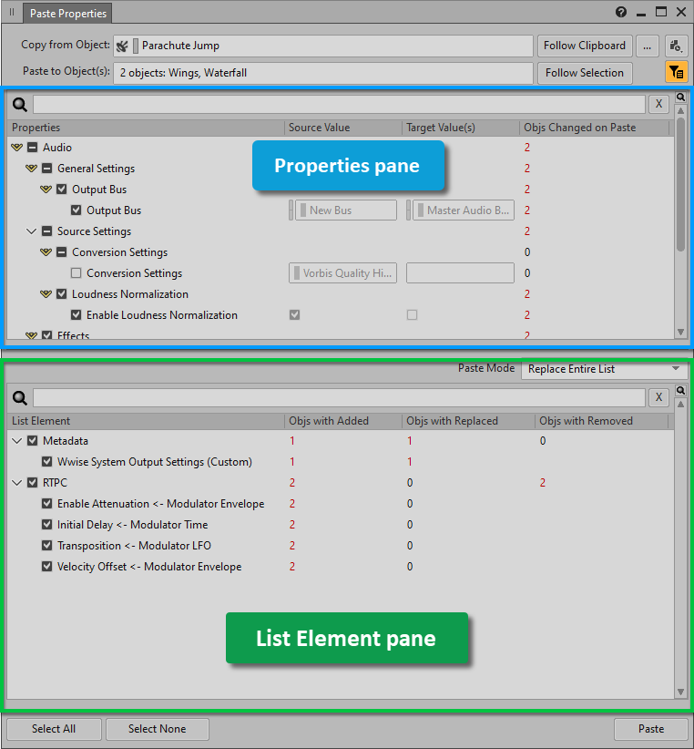

在视图顶部，可选择源对象和目标对象。源对象和目标对象可以是不同的类型（如 SFX 对象和 Music Track）。不过，一般会在相同类型的对象之间复制属性和列表元素。在本例中，有一个源 SFX 对象和两个目标 SFX 对象。

Properties 窗格中显示了部分源对象和目标对象属性之间的比对。列表中显示了源对象中存在的属性。不过，其并未显示目标对象中存在而源对象中不存在的属性。

List Element 窗格中显示了源对象独有的或其值与目标对象的值不同的列表元素。跟 Properties 窗格一样，该分区不会显示目标对象中存在而源对象中不存在的条目，即便其在 Objs with Removed 列中间接指示了是否存在所述条目（参见本主题后面的“[“Paste mode”一节](ch55.html#paste_properties_mode "Paste mode")”章节）。

#### Viewing object details

Properties 窗格中的 Objs Changed on Paste（对象在粘贴时被更改）列以及 List Element 窗格中的 Objs with Added（对象包含添加的条目）、Objs with Replaced（对象包含替换的条目）和 Objs with Removed（对象包含移除的条目）列会指示目标对象的数量。不过，这些列并未指示到底哪些对象会受到影响。然而，在处理大量对象时，这些详细信息可能会很重要。

您可以通过将鼠标悬停在相应列中的数值上来在工具提示中查看受影响对象的名称：

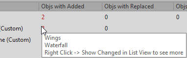

如图所示，工具提示包含对象名称。有关详细信息，可参照工具提示的建议：右键单击数值，然后单击 **Show Changed in List View**（在列表视图中显示更改的对象）来打开 [“List View（列表视图）”一节](ch60s12s02.html "List View（列表视图）")（列表视图），以查看在粘贴属性时会更改哪些对象。注意，此选项与 **Show in List View**（在列表视图中显示）菜单选项不同。该选项也会打开 List View，但会显示*所有*目标对象。

#### Paste mode

Objs with Replaced 和 Objs with Removed 列中显示的数据会随 Paste Mode（粘贴模式）改变。Paste Mode 决定针对目标对象执行粘贴操作时的效果。倘若不会替换或移除任何条目，则对应列中的数值变为短横线。这表示列数据与所选 Paste Mode 无关。

以下示例显示在 List Element 窗格中将 Paste Mode 设为了 Replace Entire List（替换整个列表）。若采用此模式来粘贴属性，则会删除目标对象中存在的列表，并替换为源对象中所选的列表元素。

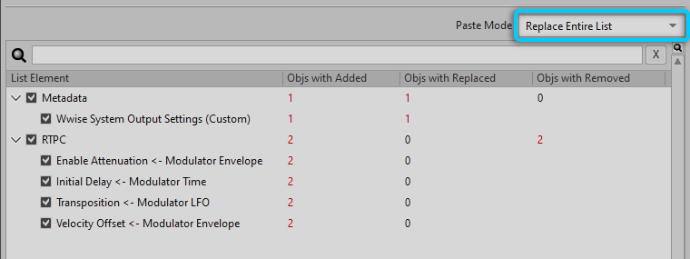

若将 Paste Mode 设为 Add New, Replace Existing（添加新的，替换现有），则不会从目标对象中移除多出的列表元素，且 Objs with Removed 列中的数值会替换为短横线：

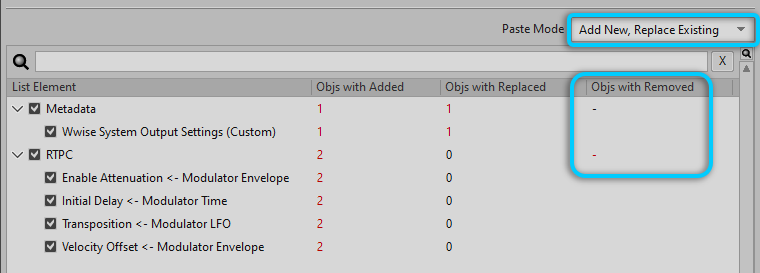

若将 Paste Mode 设为 Add New, Keep Existing（添加新的，保留现有），则会将新的列表元素粘贴到目标对象，但不会替换现有元素或移除多出的元素：

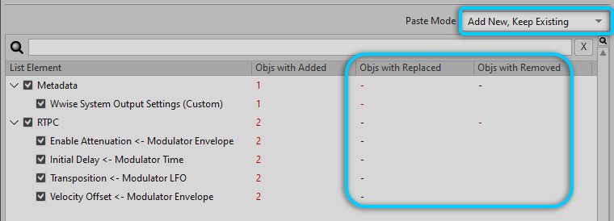

#### Pasting object properties

您可以通过 Paste Properties（粘贴属性）视图将属性从源对象复制粘贴到一个或多个目标对象。藉此，确保一组对象的选定属性和列表元素（如 RTPC、Stinger、Music Cue 和 Metadata）具有完全相同的设置。

**粘贴属性：**

1. 依次单击 **Views > Utilities > Paste Properties**（视图 >实用工具 > 粘贴属性）。这时会打开 Paste Properties 窗口。
2. 选择包含要以下列某一方式复制的属性的源对象：

   - 将对象从 Project Explorer（工程资源管理器）复制到 Copy from Object（从对象复制）选择框。
   - 单击 **Follow Clipboard**（跟随剪贴板），然后通过快捷菜单或 **Ctrl+C** 键盘快捷方式来复制 Project Explorer（工程资源管理器）中的对象。
   - 单击“浏览”按钮 (**[...]**)，然后从 Project Explorer - Browser（工程资源管理器 - 浏览器）选择对象。
3. 采用以下任一方式来选择一个或多个目标对象：

   - 选择 Project Explorer（工程资源管理器）中的一个或多个对象，然后将其拖到 Paste to Object(s)（粘贴到对象）选择框。
   - 单击 **Follow Selection**（跟随选择），然后选择 Project Explorer（工程资源管理器）中的一个或多个对象。

   这时视图上半部分中的 Properties（属性）窗格会列出源对象中的对象属性。同样地，List Element（列表元素）窗格会显示源对象中的 RTPC、Metadata（元数据）、Stinger（插播乐句）或 Music Cue（音乐提示）。各个窗格右侧的列会显示在单击 **Paste** 时更改的对象的数量。
4. 检查列表来确保选择了全部所需的属性和列表元素。若要排除某些属性或列表对象，请清除对应的复选框。
5. 从 List Element（列表元素）窗格右上角的菜单中选择 Paste Mode（粘贴模式）：

   - **Replace Entire List**（替换整个列表）。完全移除目标对象列表元素，并将所选列表元素从源对象复制到目标对象。
   - **Add New, Replace Existing**（添加新的，替换现有）。将所有列表元素从源对象复制到目标对象，同时替换目标对象中已经存在的列表元素，但不从目标对象移除任何多出的列表元素。
   - **Add New, Keep Existing**（添加新的，保留现有）。粘贴源对象中存在而目标对象中不存在的列表元素，但是不替换或移除目标对象中已经存在的列表元素。
6. 单击 **Paste**（粘贴）。这时会将所选属性和列表元素粘贴到目标对象。

#### Reverting your changes

若要还原在粘贴属性时所作的更改（比如在测试或查看详细信息之后），可撤消整套粘贴命令。虽然粘贴操作遵从标准 Wwise 撤消和重做准则（参见“[“在 Wwise 中 Undo 和 Redo 操作”一节](ch03.html#undoing_and_redoing_actions_in_wwise "在 Wwise 中 Undo 和 Redo 操作")”），但要注意并没有办法有选择性地撤消原始粘贴的特定部分（比如单个 RTPC 或对其中某个目标对象所作的全部更改）。

**撤消 Paste Properties 命令：**

- 在菜单栏中，依次单击 **Edit > Undo Paste Properties**（编辑 > 撤消粘贴属性）。

  这时会还原所有更改。

---

### 使用控制设备

您可以使用 Control Surface 设备来控制 Wwise 功能或工程属性。Wwise 支持 MIDI 协议和 Mackie 协议。在用 TouchOSC Bridge 配对后，还可以将 Wwise 与 iOS 设备和 Android 设备上的 TouchOSC 应用程序一起使用，该应用程序支持 MIDI。

**相关主题**

- [Wwise Fundamentals Module 17: Using Control Surfaces](https://www.audiokinetic.com/en/courses/wwise101/?source=wwise101&id=using_control_surfaces)

---

#### 将 Control Surface 设备连接到 Wwise

Wwise 支持两类控制设备协议：

- MIDI 协议
- Mackie HUI MIDI 映射协议（MCU Pro）

**在您开始前：**

- 确保设备物理连接到计算机。
- 确保设备已打开。
- 确保您已为设备安装正确的驱动程序。

|  |  |
| --- | --- |
| [备注] | 备注 |
| Wwise 原本不支持 Open Sound Control（开放声音控制，OSC）协议。但 TouchOSC 等应用程序支持 MIDI 并且可与 TouchOSC Bridge 一起使用。 |

**将设备连接到 Wwise的方法如下：**

1. 从 **Project**（工程）菜单中，选择 **Control Surface Devices**（控制设备）。
2. 点击 **Add**（添加）按钮。
3. 为设备命名。
4. 点击 OK（确定）。

   设备现在添加到列表里了。
5. 在 **Receive From**（输入端）列中，选择 MIDI IN（MIDI 输入）设备。

   此时将会显示 **Connected**（已连接）消息。
6. 在 **Send To**（输出端）列中，选择 MIDI OUT（MIDI 输出）设备。

   此时将会显示 **Connected** 消息。
7. 点击 Close（关闭）。

   设备现在就可以用了。

|  |  |
| --- | --- |
| [备注] | 备注 |
| Control Surface Devices 设置就存储在本地计算机上。 |

---

#### 创建 Control Surface Session

Control Surface Session（控制设备会话）定义硬件控件连接到 Wwise 功能或工程属性的方式。Control Surface Sessio 定义一列绑定。各个绑定都将一个硬件控件（按钮、滑杆、旋钮、键等）连接到 Wwise 元素（属性或命令）上。

在单个 Wwise 工程中可以创建多个 Control Surface Sessions，允许这样做有一些理由：

- Wwise 工程可能有多个用户，这些用户会使用不同的硬件设备。
- 不同的使用情形。
- 不同的用户有不同的需求或偏好。

您可以通过 Control Surface Bindings 视图或 Project Explorer 创建 Control Surface Session。

|  |  |
| --- | --- |
| [备注] | 备注 |
| Control Surface Sessions 存储在工程内，并且可用在任何使用此工程的计算机上。 |

**通过 Control Surface Bindings 视图创建 Control Surface Session：**

1. 在 **Views**（视图）菜单中，依次单击 **Utilities > Control Surface Bindings**（实用工具 > 控制器绑定）。这时将打开 Control Surface Bindings 视图。
2. 单击选择器按钮 [>>] 来打开选择器菜单。
3. 点击 **New**（新建）。
4. 为会话输入名称。
5. 单击 **OK**（确定）。

   此时将会创建并加载会话。

**通过 Project Explorer 创建 Control Surface Session：**

1. 在 Project Explorer（工程资源管理器）中，打开 Sessions（会话）选项卡。
2. 在 Control Surface Sessions 文件夹中，选中所需 Work Unit（工作单元）。
3. 在 Project Explorer（工程资源管理器）中，单击 **Create new 'Control Surface Session'**（创建新的控制器会话）按钮 ()。

   这时将在 Work Unit 下显示新建的 Control Surface Session 对象。
4. 为新建的会话键入名称并按下 **Enter**。

   这时将创建会话以供编辑。您可以在 Project Explorer 中双击来在 Object Tab 中打开会话。

---

#### 浏览 Control Surface Session

您可以在 Control Surface Bindings（控制器绑定）视图中打开单个 Control Surface Session（控制器会话）。倘若需要管理别的会话，可选择在 Object Tab（对象选项卡）中打开。所有通过 Project Explorer（工程资源管理器）打开的会话都会显示在 Object Tab 中（默认为非活跃状态）。所有通过 Control Surface Bindings 视图打开的会话默认为活跃状态。

若要更改活跃会话，请在该视图或与所需会话对应的 Object Tab 中单击“激活”图标 ()。橙色图标表示会话处于活跃状态，灰色图标表示其处于非活跃状态。活跃会话还会显示在 Control Surface Toolbar（控制器工具栏）中。

在以下示例中，Control Surface Bindings 视图中显示了 Default Control Surface Session，Object Tab 中显示了另外两个 Control Surface Session。Default Control Surface Session 处于活跃状态。


|  |  |
| --- | --- |
|  | Control Surface Bindings 视图 |
|  | Object Tab |

---

#### 创建 Control Surface Binding

Control Surface Binding 可将硬件控件（如按钮、滑杆、旋钮或按键）与 Wwise 元素（属性或命令）关联。

**每个绑定有三个元素：**

- **Property/Command**（属性/命令）：

  - Object Property：对象属性。目标对象上要修改的属性名。
  - Object Command（对象命令）：针对目标对象执行的命令或操作。
  - Global Command（全局命令）：针对所有对象执行的命令或操作。
- **Object/Index**：对象/索引。指定目标对象。
- **Controller Assignment**：控制器指派。用 MIDI 消息 ID 来识别硬件控件元素。

**绑定项存储在三个不同组内，每个组都具有定义目标对象的不同机制。**

- **Global**：全局。目标对象直接在绑定中指定。
- **Current Selection**（当前选中项）：Wwise 中最新选中的目标对象。
- **View Group**：视图组。根据当前加载 Binding Group 的视图（如 Mixing Desk 和 Mixing Session，或 Soundcaster 和 Soundcaster Session），决定控制哪些目标对象。视图中加载的每个对象都有一个索引。

您可以为多种场景创建绑定：

- [“为键盘快捷方式创建绑定”一节](ch56s04.html#creating_binding_for_keyboard_shortcut "为键盘快捷方式创建绑定")
- [“创建绑定以修改当前选中项”一节](ch56s04.html#creating_binding_to_modify_current_selection "创建绑定以修改当前选中项")
- [“创建绑定以修改特定对象属性值”一节](ch56s04.html#creating_binding_to_modify_specific_object_property_value "创建绑定以修改特定对象属性值")

###### 为键盘快捷方式创建绑定

您可以使用 Global Binding（全局绑定）配置全局命令，继而通过 Keyboard Shortcut Manager（键盘快捷方式管理器）或 Control Surface Session（控制器会话）的绑定来触发。

**创建全局绑定：**

1. 采用以下任一方式来打开 Control Surface Session：

   在 Project Explorer 中：

   1. 打开 Sessions（会话）选项卡，并双击所需 Control Surface Session。这时将在 Object Tab（对象选项卡）中打开会话。
   2. 单击“激活”图标 ()。这时将加载并激活会话。

   在菜单栏中：

   1. 依次单击 **Views > Utilities > Control Surface Bindings**（视图 > 实用工具 > 控制器绑定）。这时将打开 Control Surface Bindings 视图。
   2. 单击选择器按钮 [>>]，并选中所需会话。这时将加载并激活会话。
2. 选择 **Global**（全局）组。
3. 单击 **Add & Learn Binding**（添加并学习绑定）。

   这时将添加绑定条目。**Learn** 按钮的颜色会变为绿色（表示按钮处于激活状态）。
4. 单击选择器按钮 [>>]，然后单击 **Global commands**（全局命令）。这时将打开 Command Selection（命令选择）对话框。
5. 从列表中选择所需属性并单击 **OK**（确定）。
6. 使用所需的硬件控件来作绑定。

   这时将停用 **Learn** 按钮，并创建绑定以供编辑。

|  |  |
| --- | --- |
| [备注] | 备注 |
| **Global Commands** 的绑定可在其它组内进行创建，例如 **Current Selection**（当前选中项）组或 **View**（视图）组。 |

###### 创建绑定以修改特定对象属性值

您可以创建 Control Surface Bindings 并让其指向工程中的特定对象属性值。这样方便将控制器指派关联到 Game Parameter 等对象。

**创建控制 Game Parameter 模拟值的绑定的方法如下：**

1. 采用以下任一方式来打开 Control Surface Session：

   在 Project Explorer 中：

   1. 打开 Sessions（会话）选项卡，并双击所需 Control Surface Session。这时将在 Object Tab（对象选项卡）中打开会话。
   2. 单击“激活”图标 ()。这时将加载并激活会话。

   在菜单栏中：

   1. 依次单击 **Views > Utilities > Control Surface Bindings**（视图 > 实用工具 > 控制器绑定）。这时将打开 Control Surface Bindings 视图。
   2. 单击选择器按钮 [>>]，并选中所需会话。这时将加载并激活会话。
2. 选择 **Global**（全局）组。
3. 单击 **Add & Learn Binding**（添加并学习绑定）。

   这时将添加绑定条目。**Learn** 按钮的颜色会变为绿色（表示按钮处于激活状态）。
4. 采用以下任一方式来选择 Property/Command：

   - 在 Transport Control（走带控制）中单击 Game Parameter（游戏参数）的模拟值。
   - 单击选择器按钮 [>>] 并浏览属性：

     1. 在上下文菜单中，单击 **Object Properties**（对象属性）。
     2. 依次选择 **Game Syncs > Game Parameter > Simulation Value**（游戏同步器 > 游戏参数 > 模拟值）。
     3. 单击 **OK**（确定）。
5. 使用所需的硬件控件来作绑定。

   这时将停用 **Learn** 按钮，并创建绑定以供编辑。

###### 创建绑定以修改当前选中项

在 Control Surface Session 中，可定义用来将选定对象的属性值与硬件控制器控件（如滑杆、旋钮或按钮）关联的绑定。

比如，将控制器的四个滑杆指派给以下属性：

- Voice Volume（声部音量）。
- Voice Pitch（声部音高）。
- Voice Low-pass Filter（声部低通滤波器）。
- Voice High-pass Filter（声部高通滤波器）。

在创建绑定后，会将四个滑杆与选定对象的这些属性关联。若配有电动推子（如 Mackie Control Universal Pro），则在当前选中项变化时各个推子会自动移到当前值。

**创建修改当前选中项 Voice Volume 的绑定的方法如下：**

1. 采用以下任一方式来打开 Control Surface Session：

   在 Project Explorer 中：

   1. 打开 Sessions（会话）选项卡，并双击所需 Control Surface Session。这时将在 Object Tab（对象选项卡）中打开会话。
   2. 单击“激活”图标 ()。这时将加载并激活会话。

   在菜单栏中：

   1. 依次单击 **Views > Utilities > Control Surface Bindings**（视图 > 实用工具 > 控制器绑定）。这时将打开 Control Surface Bindings 视图。
   2. 单击选择器按钮 [>>]，并选中所需会话。这时将加载并激活会话。
2. 选择 **Current Selection**（当前选中项）组。
3. 单击 **Add & Learn Binding**（添加并学习绑定）。

   这时将添加绑定条目。**Learn** 按钮的颜色会变为绿色（表示按钮处于激活状态）。
4. 采用以下任一方式来选择 Property/Command：

   - 在 Transport Control（走带控制）中单击 Game Parameter（游戏参数）的模拟值。
   - 单击选择器按钮 [>>] 并浏览属性：

     1. 在上下文菜单中，单击 **Object Properties**（对象属性）。
     2. 依次选择 **Audio > General Settings > Voice > Voice Volume**（音频 > 常规设置 > 声部 > 声部音量）。
     3. 单击 **OK**（确定）。
5. 使用所需的硬件控件来作绑定。

   这时将停用 **Learn** 按钮，并创建绑定以供编辑。

当前选中项绑定还可用于触发当前选中项上的命令。比如，将一组按钮映射到以下命令：

- Mute（静音）
- Solo（单独播放）
- Play
- Stop（停止）

**创建对当前选中项静音的绑定的方法如下：**

1. 选择 **Current Selection**（当前选中项）组。
2. 单击 **Add & Learn Binding**（添加并学习绑定）。

   这时将添加绑定条目。**Learn** 按钮的颜色会变为绿色（表示按钮处于激活状态）。
3. 使用所需的硬件控件来作绑定。

   这时将停用 **Learn** 按钮，并创建绑定以供编辑。
4. 单击选择器按钮 [>>]。
5. 在上下文菜单中，依次单击 **Object commands > Mute**（对象命令 > 静音）。
6. 使用所需的硬件控件来作绑定。

   这时将停用 **Learn** 按钮，并创建绑定以供编辑。

若配有控制器按钮，其在静音时会亮起，在未静音时会熄灭。

---

#### 理解 Control Surface 的 View Group

您可以使用 View Group（视图分组）来将特定视图（对象）的内容与 Binding Group（绑定分组）的内容绑定。比如，您可以将 Mixing Desk 的对象映射到 Control Surface。

View Group 包含与视图中的对象关联的绑定，这些对象由视图中的索引进行标识。

下面展示了支持 View Group 的视图及其如何指派索引：

- **Mixing Desk**：调音台。各个垂直条带一个索引。
- **List View, Query Editor, Reference View, Busses Console**: one index per row.
- **Property Editor, Effect Editor, Source Editor, Modulator Editor**：属性编辑器、效果器编辑器、源编辑器、调制器编辑器。只能使用 1号索引，代表当前对象。
- **Soundcaster**：声音选角器。每个模块一个索引。

下面举例展示了可用在 Mixing Desk、List View 或 SoundCaster 内的 Control Surface View Group：

- **混音 View Group**：

  - 绑定：Property:Voice Volume - Index:1 - Key:MyController Ch.1 CC 0
  - 绑定：Property:Voice Volume - Index:2 - Key:MyController Ch.1 CC 1
  - 绑定：Property:Voice Volume - Index:3 - Key:MyController Ch.1 CC 2
  - 绑定：Property:Voice Volume - Index:4 - Key:MyController Ch.1 CC 3
  - 绑定：Command:Solo - Index:1 - Key:MyController Ch.1 CC 32
  - 绑定：Command:Solo - Index:2 - Key:MyController Ch.1 CC 33
  - 绑定：Command:Solo - Index:3 - Key:MyController Ch.1 CC 34
  - 绑定：Command:Solo - Index:4 - Key:MyController Ch.1 CC 35
  - 绑定：Command:Mute - Index:1 - Key:MyController Ch.1 CC 64
  - 绑定：Command:Mute - Index:2 - Key:MyController Ch.1 CC 65
  - 绑定：Command:Mute - Index:3 - Key:MyController Ch.1 CC 66
  - 绑定：Command:Mute - Index:4 - Key:MyController Ch.1 CC 67

此 View Group 会将：

- 4 个硬件滑杆映射到 4 个对象的 Voice Volume。
- 4 个硬件按钮映射到 4 个对象的 Solo。
- 4 个硬件按钮映射到 4 个对象的 Mute。

###### 创建 View Group

您必须先创建分组才能将 View Group 与支持的视图关联。

**创建 View Group 的方法如下：**

1. 采用以下任一方式来打开 Control Surface Session：

   在 Project Explorer 中：

   1. 打开 Sessions（会话）选项卡，并双击所需 Control Surface Session。这时将在 Object Tab（对象选项卡）中打开会话。
   2. 单击“激活”图标 ()。这时将加载并激活会话。

   在菜单栏中：

   1. 依次单击 **Views > Utilities > Control Surface Bindings**（视图 > 实用工具 > 控制器绑定）。这时将打开 Control Surface Bindings 视图。
   2. 单击选择器按钮 [>>]，并选中所需会话。这时将加载并激活会话。
2. 在视图或选项卡中，单击 **Add Group**（添加分组）。
3. 为分组键入名称并单击 **OK**（确定）。
4. 通过 **Add & Learn Binding**（添加并学习绑定）按钮在分组内创建绑定（如“[“创建 Control Surface Binding”一节](ch56s04.html "创建 Control Surface Binding")”中所述）。

###### 将 View Group 与 Mixing Desk 关联

以下操作阐释了如何将 View Group 与 Mixing Desk 视图关联来复制本节开头示例中所述的映射。

要完成所述操作，请确保存在活跃的 Control Surface Session 和至少一个 View Group。

**将 View Group 与 Mixing Desk 相关联的方法如下：**

1. 在 **Views**（视图）菜单中，依次单击 **Editors > Mixing Desk**（编辑器 > 混音台）。
2. 在 Mixing Desk（混音台）的右上角单击选择器按钮 [>>]。
3. 在菜单中，单击所需 View Group：

   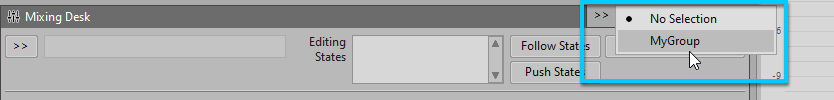

   这时将加载 View Group，并在 Mixing Desk 视图及 Control Surface Toolbar 中显示分组的名称。您可以通过单击任一位置的分组名称来激活或停用分组。

---

#### 处理 Control Surface Session 中的冲突

多个活跃绑定可能会与其 Controller Assignment（控制器指派）发生冲突。注意，无法同时加载多个具有相同键位的绑定。

|  |  |
| --- | --- |
| [备注] | 备注 |
| 通过 Control Surface Session 进行的绑定会从上到下进行加载。在发生冲突时，第一个绑定的优先级最高。这时仅会加载第一个存在冲突的绑定。 |

发现冲突时：

- Control Surface 工具栏中的分组名称旁会显示黄色三角。
- Control Surface Session 视图中的绑定旁会显示黄色消息。

处理冲突的方式有很多种：

- 将 Control Surface Session 视图中的绑定重新排序来更改优先级。
- 使用绑定条目上的快捷菜单来解决冲突。
- 针对其中一个存在冲突的绑定更改控制器指派。

|  |  |
| --- | --- |
| [技巧] | 技巧 |
| 在有些情况下，可对同一分组中的不同绑定使用相同的控制器指派。例如，您可以创建一个 Effect View Group 用来绑定不同的效果器属性。因为 Effect Editor 每次只能加载一个效果器，所以各个绑定之间并不会发生冲突。 |

---

#### 使用 Control Surface 工具栏

在 Control Surface Session 处于活跃状态时，Wwise 界面顶部会显示 Control Surface Toolbar。您可以通过在 Control Surface Bindings 视图或 Control Surface Session Object Tab 中单击“激活”按钮来打开和关闭工具栏。

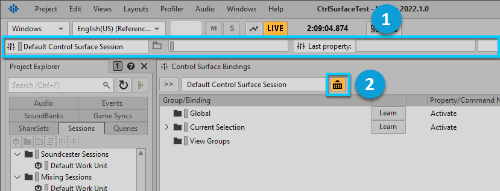

|  |  |
| --- | --- |
|  | Control Surface Toolbar |
|  | 激活/停用 Control Surface Session |

Control Surface Toolbar 包含以下元素（从左向右排列）：

| 界面元素 | 描述 |
| --- | --- |
| 活跃 Control Surface Session | 显示当前活跃的 Control Surface Session。双击可在 Object Tab 中打开会话。 |
|  | 打开 Control Surface Session 列表。可通过从列表中选择会话来切换到不同的会话。 |
| 当前选中对象 | 显示当前选定对象。 |
| Last Property Changed | 显示上次使用 Control Surface Binding 修改的对象、属性和值（用滑杆表示）。 |
| 已加载的绑定组 | 这些按钮显示以下各[绑定组](ch56s04.html#binding_groups "绑定项存储在三个不同组内，每个组都具有定义目标对象的不同机制。")是否处于活跃状态:  - Global：全局。目标对象在全局绑定中定义。 - Current Selection：当前选中对象。目标对象为当前选中对象。 - View Group：视图组。目标对象通过指定视图在指定组中加载。比如，按钮可能会显示为 `YourGroup:Soundcaster`，表示工程中定义了名为 YourGroup 的 View Group 且其用在 SoundCaster 内。不同视图中可能会定义多个 View Group，因此有时会显示不止一个按钮。  单击分组名称可激活或停用分组。颜色变化用以指示分组状态：  - Active（活跃）：橙色 - Inactive：不活跃。灰色 |
|  | 停用 Control Surface Session 并关闭 Control Surface Toolbar。 |

---

## 参考主题

本章节提供有关 Wwise 中各种选项和视图的完整信息（可通过视图、对话框等右上角的 Help 图标进行访问）。

- **[*工程*](ch57.html "工程")**C 简要介绍可通过 Project 菜单访问的各种功能。
- **[*视图*](ch58.html "视图")**C 简要介绍可通过 Views 菜单访问的各种功能。
- **[*Edit, Windows, and Help*](ch59.html "Edit, Windows, and Help")**C 简要介绍可通过 Edit、Audio、Windows 和 Help 菜单访问的各种功能。
- **[*Project Explorer*](ch60.html "Project Explorer")**C 简要介绍可通过 Project Explorer 的选项卡访问的各种功能，包括 Work Unit、Preset、Randomizer、Batch Rename、List View、Multi Editor、Schematic View、Reference View 和 Object Property Settings 对话框。
- **[*Event Viewer*](ch61.html "Event Viewer")**C 简要介绍 Event Viewer 及其三个选项卡：Filtered、Current Selection 和 Orphans。
- **[*Profiler 视图*](ch62.html "Profiler 视图")**C 简要介绍各种性能分析器视图：Capture Log、Performance Monitor、Advanced Profiler、Voice Inspector、Audio Object 3D Viewer、Audio Object List、Audio Object Metadata、Audio Object Meter、Voice Monitor、Voice Explorer、Game Object 3D Viewer、Game Sync Monitor 和 Profiler Statistics。

---

### 工程

您可以通过 Project（工程）菜单创建、打开和关闭 Wwise 工程。同样，还可利用 Project 菜单所提供的一系列对话框来管理工程结构、调整工程设置和首选项以及其他工程操作。

---

#### File Manager

File Manager（文件管理器）对话框会显示有关工程文件的信息以及已经导入到工程中的原始源文件。File Manager 中的信息分为以下三个选项卡：

- [“Work Units 选项卡 ”一节](ch57s01s01.html "Work Units 选项卡")
- [“Source Files 选项卡 ”一节](ch57s01s02.html "Source Files 选项卡")
- [“Generated Files 选项卡”一节](ch57s01s03.html "Generated Files 选项卡")

通过使用版本控制插件，File Manager 可与版本控制软件紧密集成。 这意味着您可以直接在 Wwise 中执行很多版本控制功能，如文件 check-in 和 check-out。 您可以使用 Wwise 自带的版本控制插件，也可以使用 Wwise SDK 来创建任何版本控制软件与 Wwise 的集成插件，这要用到这些软件自己的 SDK。

您可以在 Wwise 的 Project Settings（工程设置）对话框中配置版本控制插件。在配置版本控制插件后，该插件的名称将显示在 File Manager 的标题栏中。 要了解为工程配置版本控制插件的详细信息，请参阅[“配置版本控制插件”一节](ch06s02s01.html#configuring_source_control_plug_ins "配置版本控制插件")。

|  |  |
| --- | --- |
| [备注] | 备注 |
| 版本控制功能可通过右键点击 File Manager 中的文件来访问。 根据您当前使用的版本控制插件，命令列表将各不相同。 |

---

##### Work Units 选项卡

File Manager 的 Work Units 选项卡显示有关各个工作单元的信息，包括有关文件状态和所有者的信息，以及哪些文件为只读文件。

您还可以执行某些工程管理任务，如文件重命名和删除。 不过，假如使用了版本控制插件，则右键单击列表中的 Wwise 工程文件或 Work Unit 将显示一组附加命令（如 Check-in 和 Check-out）。具体显示什么命令将取决于 Wwise 使用的版本控制系统类型。

|  |  |
| --- | --- |
| [注意] | 注意 |
| Default Work Units 是关键的工程文件，不得重命名或删除。 |

| 界面元素 | 描述 |
| --- | --- |
| Perforce:    Subversion（已弃用）： | 将待处理文件发送至服务器进行处理。 您可以选择以下任一选项：  - **Work Units**（工作单元）：仅将待处理 Work Unit 发送至服务器以供处理。 - **Sources** ―― 仅将待处理源文件发送至服务器进行处理。 - **All**（全部）：同时将待处理 Work Unit 和源文件发送至服务器以供处理。  此按钮仅在使用版本控制插件时可用。 |
| Perforce:    Subversion（已弃用）： | 从文档库（depot）中检索文件的最新版本来更新文件的工作副本。 您可以选择以下任一选项：  - **Work Units**：从文档库检索最新版本，但仅更新 Work Unit 文件。 - **Sources** ―― 通过从文档库中获取文件的最新版本，仅更新源文件。 - **All**：从文档库检索最新版本，并同时更新 Work Unit 和源文件。  此按钮仅在使用版本控制插件时可用。 |
| Project Folder | 工程文件夹。保存当前工程的文件夹的位置或路径。 |
|  | 打开搜索框，在其中输入标准字母和数字会筛选掉视图中不相匹配的元素。阅读 [“使用表格”一节](ch03.html#using_tables "使用表格") 了解详细信息。  点击搜索图标左侧的 Close（关闭）图标，以关闭搜索字段并删除筛选器。  |  |  | | --- | --- | | [备注] | 备注 | | 搜索不包括[“List View（列表视图）”一节](ch60s12s02.html "List View（列表视图）"), [“Query Editor”一节](ch60s07s01.html "Query Editor"), [“MIDI Keymap Editor 视图”一节](ch60s01s03s06s01s01.html "MIDI Keymap Editor 视图"), and [“Reference View 视图”一节](ch60s12s05.html "Reference View 视图")中折叠起来的节点。  The search is not included in the Settings for Source objects. | |
|  | 配置列…。右键单击表格标题来打开 **Configure Columns** 对话框以指定要显示的列及其顺序。详请参阅[“使用表格”一节](ch03.html#using_tables "使用表格")。 |
| File（文件） | 当前文件或文件夹的名称。 该文件可为 Wwise 工程文件、Work Unit 文件或文件夹。 |
| Status | 状态。文件的版本控制状态（如 Edit 或 Add）。文件的状态通过 Wwise 版本控制插件从您的版本控制软件种获取。  例如，如果您使用的是 Perforce 插件，则文件可能具有以下任一状态：  - **Add** ―― 添加。文件位于 changelist（更改列表）中，可 check-in 到文档库中。 - **Branch** ―― 分支。现有文档库文件的一个副本已添加至 changelist ，可 check-in 至文档库中。 - **Delete** ―― 删除。该文件位于 changelist 中，可从文档库中删除。 - **Edit** ―― 编辑。文档库文件的一个工作副本已 check-out 到工作区，以便进行编辑。 - **Local only** ―― 仅本地。已在本地创建文件，但尚未 check-in 到文档库。 - **Lock** ―― 锁定。文档库文件被锁定，其它用户无法 check-out 该文件进行编辑。 - **Normal** ―― 正常。该文件已 check-in 到文档库。  如果文件的状态为未知，则会显示一条横线 (-)。 |
| Owner(s) | 文件的所有者。  如果文件的所有者为未知，则会显示一条横线 (-)。 |
| Modified | 已修改。显示文件是否被修改过。 |
| Read-Only | 只读。显示文件是否为只读。 |
|  | 复制到剪贴板。将对话框的内容复制到 Windows 剪贴板以便将信息粘贴到新的文件中。 |
|  | 关闭 File Manager。 |

**相关主题**

- [“查看工程文件的状态”一节](ch09s02.html "查看工程文件的状态")
- [“配置版本控制插件”一节](ch06s02s01.html#configuring_source_control_plug_ins "配置版本控制插件")
- [“利用版本控制插件管理工程文件”一节](ch09s05.html "利用版本控制插件管理工程文件")

---

##### Source Files 选项卡

File Manager 的 Source Files 选项卡显示工程 Original 文件夹中包含的媒体文件的相关信息。 在 File Manager 内，您可以确定媒体文件的状态和所有者，以及哪些文件为只读。

您也可以直接在 File Manager 中移动或删除不再需要的源文件。但如果您使用的是版本控制插件，则右键点击列表中的文件将显示一组额外的命令，如 Submit Change和 Check out。 具体显示什么命令将取决于 Wwise 使用的版本控制系统类型。

| 界面元素 | 描述 |
| --- | --- |
| Sources Folder | 源文件夹。保存原始源媒体文件的文件夹的位置或路径。 |
|  | 打开搜索框，在其中输入标准字母和数字会筛选掉视图中不相匹配的元素。阅读 [“使用表格”一节](ch03.html#using_tables "使用表格") 了解详细信息。  点击搜索图标左侧的 Close（关闭）图标，以关闭搜索字段并删除筛选器。  |  |  | | --- | --- | | [备注] | 备注 | | 搜索不包括[“List View（列表视图）”一节](ch60s12s02.html "List View（列表视图）"), [“Query Editor”一节](ch60s07s01.html "Query Editor"), [“MIDI Keymap Editor 视图”一节](ch60s01s03s06s01s01.html "MIDI Keymap Editor 视图"), and [“Reference View 视图”一节](ch60s12s05.html "Reference View 视图")中折叠起来的节点。  The search is not included in the Settings for Source objects. | |
|  | 配置列…。右键单击表格标题来打开 **Configure Columns** 对话框以指定要显示的列及其顺序。详请参阅[“使用表格”一节](ch03.html#using_tables "使用表格")。 |
| File（文件） | 文件或文件夹的名称。 |
| Status | 源媒体文件的状态，如编辑或添加。 文件的状态通过 Wwise 版本控制插件从您的版本控制软件种获取。  例如，如果您使用的是 Perforce 插件，则文件具有以下任一状态：  - **Add** ―― 添加。文件位于 changelist（更改列表）中，可 check-in 到文档库中。 - **Branch** ―― 分支。现有文档库文件的一个副本已添加至 changelist ，可 check-in 至文档库中。 - **Delete** ―― 删除。该文件位于 changelist 中，可从文档库中删除。 - **Edit** ―― 编辑。文档库文件的一个工作副本已 check-out 到工作区，以便进行编辑。 - **Local only** ―― 仅本地。已在本地创建文件，但尚未 check-in 到文档库。 - **Lock** ―― 锁定。文档库文件被锁定，其它用户无法 check-out 该文件进行编辑。 - **Normal** ―― 正常。该文件已 check-in 到文档库。  如果文件的状态为未知，则会显示一条横线 (-)。 |
| Owner | 文件的所有者。  如果文件的所有者为未知，则会显示一条横线 (-)。 |
| Read-Only | 只读。显示文件是否为只读。 |
| 用途 | 显示源文件是否被工程内的若干个音频/振动源使用。 音频源可有以下任一使用状态：  - **In use** ―― 源文件与工程中的音频源相关联。 - **Not used** ―― 源文件不再与工程中的音频源相关联。 - **Unknown** ―― Wwise 无法区分未使用的文件与从工程中卸载了的文件。 此使用状态仅在从工程内上传 Work Unit（工作单元）后显示。  **Usage** 列中所示信息会受到 Undo（撤消）列表中所有操作的影响，包括文件导入和对象删除。因此，信息看起来可能不会是最新的。 在删除被标记为“Not used”的任何文件之前，最好关闭并重新打开工程，以确保信息是最新的。 |
|  | 复制到剪贴板。将对话框的内容复制到 Windows 剪贴板以便将信息粘贴到新的文件中。 |
|  | 关闭 File Manager。 |

**相关主题**

- [“查看工程文件的状态”一节](ch09s02.html "查看工程文件的状态")
- [“配置版本控制插件”一节](ch06s02s01.html#configuring_source_control_plug_ins "配置版本控制插件")
- [“利用版本控制插件管理工程文件”一节](ch09s05.html "利用版本控制插件管理工程文件")
- [“Moving source files within the Originals folder using Perforce”一节](ch09s05.html#moving_source_files_within_originals_folder_using_perforce "Moving source files within the Originals folder using Perforce")
- [“Renaming files when using Perforce”一节](ch09s05.html#renaming_files_when_using_perforce "Renaming files when using Perforce")
- [“Deleting files from your project when using Perforce”一节](ch09s05.html#deleting_files_from_project_when_using_perforce "Deleting files from your project when using Perforce")

---

##### Generated Files 选项卡

File Manager（文件管理器）的 Generated Files（生成的文件）选项卡会显示有关工程内输出文件夹所含文件的信息。Generated Files 选项卡允许逐一查看针对工程的各个平台生成的文件。

工程的输出文件夹可通过工程的 SoundBank Settings（音频包设置）进行配置。工程的输出文件夹包含两个文件夹：一个用于工程层级的文件，一个用于工程的各个平台。在默认情况下，工程输出文件夹为 <Project>/GeneratedSoundBanks。各个平台文件夹为工程文件夹的子对象，其使用平台名称分别进行命名。比如，有个名为 MyProject 的工程，其支持 Windows 和 Mac 平台。那么，输出文件夹会跟下面一样：

- <Project>/GeneratedSoundBanks
- <Project>/GeneratedSoundBanks/Windows
- <Project>/GeneratedSoundBanks/Mac

输出文件夹中所含的文件由 SoundBank Settings 决定。有关详细信息，请参阅[“SoundBanks 选项卡”一节](ch57s08s03.html "SoundBanks 选项卡")

在 File Manager 中，您可以确定所生成文件的状态和所有者以及哪些文件为只读文件。而且，直接在 File Manager 中就可移动或删除已经生成但不再需要的文件。但如果您使用的是版本控制插件，则右键点击列表中的文件将显示一组额外的命令，如 Submit Change和 Check out。 具体显示什么命令取决于结合 Wwise 使用的版本控制系统类型。

| 界面元素 | 描述 |
| --- | --- |
| Platform | 平台。 针对该平台显示生成的文件。 |
| Folder | 文件夹。在该位置或路径下的文件夹保存生成的文件。 |
|  | 打开搜索框，在其中输入标准字母和数字会筛选掉视图中不相匹配的元素。阅读 [“使用表格”一节](ch03.html#using_tables "使用表格") 了解详细信息。  点击搜索图标左侧的 Close（关闭）图标，以关闭搜索字段并删除筛选器。  |  |  | | --- | --- | | [备注] | 备注 | | 搜索不包括[“List View（列表视图）”一节](ch60s12s02.html "List View（列表视图）"), [“Query Editor”一节](ch60s07s01.html "Query Editor"), [“MIDI Keymap Editor 视图”一节](ch60s01s03s06s01s01.html "MIDI Keymap Editor 视图"), and [“Reference View 视图”一节](ch60s12s05.html "Reference View 视图")中折叠起来的节点。  The search is not included in the Settings for Source objects. | |
|  | 配置列…。右键单击表格标题来打开 **Configure Columns** 对话框以指定要显示的列及其顺序。详请参阅[“使用表格”一节](ch03.html#using_tables "使用表格")。 |
| File（文件） | 文件或文件夹的名称。 |
| Status | 状态。文件的状态（如 Edit 或 Add）。文件的状态通过 Wwise 版本控制插件从您的版本控制软件种获取。  比如，若您使用的是 Perforce 插件，则文件可能具有以下任一状态：  - **Add** ―― 添加。文件位于 changelist（更改列表）中，可 check-in 到文档库中。 - **Branch** ―― 分支。现有文档库文件的一个副本已添加至 changelist ，可 check-in 至文档库中。 - **Delete** ―― 删除。该文件位于 changelist 中，可从文档库中删除。 - **Edit** ―― 编辑。文档库文件的一个工作副本已 check-out 到工作区，以便进行编辑。 - **Local only** ―― 仅本地。已在本地创建文件，但尚未 check-in 到文档库。 - **Lock** ―― 锁定。文档库文件被锁定，其它用户无法 check-out 该文件进行编辑。 - **Normal** ―― 正常。该文件已 check-in 到文档库。  如果文件的状态为未知，则会显示一条横线 (-)。 |
| Owner(s) | 所有者。文件的所有者。  如果文件的所有者为未知，则会显示一条横线 (-)。 |
| Read-Only | 只读。显示文件是否为只读。 |
|  | 复制到剪贴板。将对话框的内容复制到 Windows 剪贴板以便将信息粘贴到新的文件中。 |
|  | 关闭 File Manager。 |

**相关主题**

- [“SoundBanks 选项卡”一节](ch57s08s03.html "SoundBanks 选项卡")
- [*管理 SoundBank*](ch40.html "管理 SoundBank")

---

#### License Manager

在 License Manager（授权管理器）中，您可指定用于工程的授权秘钥。该秘钥可在登录至 Audiokinetic 网站时从您的帐户获得。必须使用秘钥才能解锁无限制生成 SoundBank（声音包）、将 Wwise 用于商业用途。

若要打开 License Manager，请在菜单栏中依次单击 **Project > License Manager**（工程 > 授权管理器）。

有关更多信息及如何排除故障，请参阅 [Audiokinetic 产品授权常见问题解答](https://www.audiokinetic.com/en/general/licensing/faq/trialLicensing/)。

| 界面元素 | 描述 |
| --- | --- |
| Import License（按钮） | 导入授权。打开文件对话框，选择一个包含授权秘钥的文本文件，以将其导入工程中。 |
| Paste from clipboard（按钮） | 从剪贴板粘贴。从剪贴板导入从 Audiokinetic 网站复制的授权秘钥。 |
| Remove License（按钮） | Remove the license key currently present in your project and revert to the Trial License. |
| License description（文本） | 授权说明。显示当前在工程使用的授权秘钥的相关信息。 |
| Save（按钮） | 保存。在工程中应用授权秘钥并保存此更改。 |
| Close / Cancel（按钮） | 关闭/取消。关闭 License Manager，不更改工程授权秘钥。 |

---

#### Remote Connections

Remote Connections（远程连接）对话框允许通过局域网与远程游戏主机连接并进行交互。Remote Connections 对话框会显示当前连接状态并且包含以下两个选项卡：

- [“Available 选项卡”一节](ch57s03s01.html "Available 选项卡") ―― 显示自动发现的网络上的远程游戏机列表。
- [“History 选项卡”一节](ch57s03s02.html "History 选项卡") ―― 用来手动创建和管理之前连接到网络上的游戏机的连接列表。

|  |  |
| --- | --- |
| [备注] | 备注 |
| 对于Vorbis 编码文件，只有使用 Seek Table 进行转换时，远程连接过程中 Source Editor 的播放光标才起作用。 |

---

##### Available 选项卡

Remote Connections（远程连接）对话框的 Available（可用）选项卡会显示网络中自动发现的远程游戏主机。为了使 Wwise 自动检测并连接到某个游戏机，该游戏机必须与 Wwise 位于相同的网络子网中，并且必须在 Wwise 工程设置中以及在游戏中初始化通信模块时指定相同的“Game Discovery Broadcast Port”。

| 界面元素 | 描述 |
| --- | --- |
|  | 打开搜索框，在其中输入标准字母和数字会筛选掉视图中不相匹配的元素。阅读 [“使用表格”一节](ch03.html#using_tables "使用表格") 了解详细信息。  点击搜索图标左侧的 Close（关闭）图标，以关闭搜索字段并删除筛选器。  |  |  | | --- | --- | | [备注] | 备注 | | 搜索不包括[“List View（列表视图）”一节](ch60s12s02.html "List View（列表视图）"), [“Query Editor”一节](ch60s07s01.html "Query Editor"), [“MIDI Keymap Editor 视图”一节](ch60s01s03s06s01s01.html "MIDI Keymap Editor 视图"), and [“Reference View 视图”一节](ch60s12s05.html "Reference View 视图")中折叠起来的节点。  The search is not included in the Settings for Source objects. | |
|  | 配置列…。右键单击表格标题来打开 **Configure Columns** 对话框以指定要显示的列及其顺序。详请参阅[“使用表格”一节](ch03.html#using_tables "使用表格")。 |
| Name | 名称。您将连接到的特定游戏机的名称。 |
| Platform | 游戏机的平台类型，从 [“Platform Manager”一节](ch57s09.html "Platform Manager") 中定义的名称中进行选择。 |
| Base Platform | 基础平台。平台对应的 SDK，如 Android、iOS、PlayStation 4、Switch、Windows 或 Xbox One。 |
| Status | 远程游戏机的状态。状态可以是以下类型之一：  - **Ready** ―― 就绪。游戏机处于就绪状态，可接受连接。 - **Busy** ―― 忙碌。游戏机已连接到设备，因此无法再接受任何连接。状态为 Busy 时，会显示已连接到游戏机的设备名称。 - **Different Version** ―― 版本不同。Wwise 的版本与运行在远程 PC 或游戏机上的游戏版本不兼容。 - **Not Available** ―― 不可用。设备不再与网络相连。 |
| IP Address | IP 地址。游戏机的网络地址。 |
| Application Name | 应用名。在初始化声音引擎时提供的应用程序名称。 |
| Port | 检测到的通信动态端口。（仅通过 IP 连接时可用） |
| Ping | Ping。往返延迟（毫秒）。 |
|  | 更新有关列表中各个游戏机的信息。 |
|  | 连接到列表中当前选择的设备。 |
|  | 连接到 IP…。打开对话框以指定主机的 IP 地址。 |
|  | 连接到文件…。打开对话框以选择包含上一性能分析会话所有数据的 .prof 文件。 |
|  | 删除列表中当前所选设备的连接。 |
| Synchronization Method | 同步方式。指定如何处理与远程应用的同步：  - **Profile Only**: There is no synchronization with the   remote instance.  Note that playback in Wwise Authoring is unavailable when connected in **Profile Only** mode because objects and media are not synchronized   with the remote instance.  您可以使用该选项快速连接到远程应用来实施性能分析，同时避免因意外同步而导致声音引擎对工程作出更改。 - **Profile and Edit (Sync Inspected Objects Only)**: Only   objects that are currently inspected in the Transport Control are synchronized, in   addition to all necessary related objects, such as the Output Bus, Effects, and   Attenuation.  This means that changes to other objects in your Wwise project are not synchronized.   The sound engine plays back objects in the remote instance based on the behaviors defined   in the last generated SoundBanks, while also applying any changes made to the Wwise   project during the current remote connect session.  Modified media (sounds, MIDI, Convolution IR, etc.) that is currently in use by the   game is also transferred to the game. - **Profile and Edit (Sync All Modified Objects)**: All objects   that are modified in the Wwise project and are also loaded in the remote instance are   synchronized.  您可以使用此选项来在连接时自动同步所有加载的对象（在连接的情况下加载 SoundBank 时也会如此）。  Modified media (sounds, MIDI, Convolution IR, etc.) that is currently in use by the game is   also transferred to the game.  有关更多详细信息，请参阅“[“Editing while profiling a game”一节](ch39s08.html "Editing while profiling a game")”。 |
| Start capture on connect | 连接上即开始捕获。决定何时开始捕获过程。如果勾选该选项，则捕获过程会在连接时开始。如果未勾选该选项，则捕获过程仅在您点击 Start Capture 按钮时开始。  新捕获过程每次启动时，Capture Log 中的所有现有数据都会清除。 |
| Status | 状态。显示您当前是否连接到远程游戏机。如果已连接，它就会显示远程游戏机的名称和 IP 地址。 |
|  | 关闭。关闭 Remote Connections 对话框，而不中断任何活跃连接。 |

**相关主题**

- [“连接至本地/远程游戏系统”一节](ch39s06.html "连接至本地/远程游戏系统")
- [“从已有的远程捕获会话加载数据”一节](ch39s07s09.html "从已有的远程捕获会话加载数据")
- [“指定网络端口”一节](ch06s02s07.html "指定网络端口")

---

##### History 选项卡

[“Remote Connections”一节](ch57s03.html "Remote Connections") 对话框的 History（历史记录）选项卡会列出曾经连接的主机。您可以手动连接到游戏机并从历史记录列表中删除游戏机。

| 界面元素 | 描述 |
| --- | --- |
|  | 打开搜索框，在其中输入标准字母和数字会筛选掉视图中不相匹配的元素。阅读 [“使用表格”一节](ch03.html#using_tables "使用表格") 了解详细信息。  点击搜索图标左侧的 Close（关闭）图标，以关闭搜索字段并删除筛选器。  |  |  | | --- | --- | | [备注] | 备注 | | 搜索不包括[“List View（列表视图）”一节](ch60s12s02.html "List View（列表视图）"), [“Query Editor”一节](ch60s07s01.html "Query Editor"), [“MIDI Keymap Editor 视图”一节](ch60s01s03s06s01s01.html "MIDI Keymap Editor 视图"), and [“Reference View 视图”一节](ch60s12s05.html "Reference View 视图")中折叠起来的节点。  The search is not included in the Settings for Source objects. | |
|  | 配置列…。右键单击表格标题来打开 **Configure Columns** 对话框以指定要显示的列及其顺序。详请参阅[“使用表格”一节](ch03.html#using_tables "使用表格")。 |
| Name | 名称。游戏机或计算机的名称。 |
| Platform | 游戏机的平台类型，从 [“Platform Manager”一节](ch57s09.html "Platform Manager") 中定义的名称中进行选择。 |
| Base Platform | 基础平台。平台对应的 SDK，如 Android、iOS、PlayStation 4、Switch、Windows 或 Xbox One。 |
| Status | 远程游戏机的状态。状态可以是三种类型之一：  - **Ready** ―― 就绪。游戏机处于就绪状态，可接受连接。 - **Busy** ―― 游戏机已连接到设备，因此无法再接受任何连接。状态为 Busy 时，会显示已连接到游戏机的设备名称。 - **Not Available** ―― 游戏机不再与网络相连的情形。 |
| IP Address | IP 地址。游戏机的网络地址。 |
|  | 更新有关列表中各个游戏机的信息。 |
|  | 从列表中删除所选游戏机。 |
|  | 连接到列表中当前选择的设备。 |
|  | 连接到 IP…。打开对话框以指定主机的 IP 地址。 |
|  | 连接到文件…。打开对话框以选择包含上一性能分析会话所有数据的 .prof 文件。 |
|  | 删除列表中当前所选设备的连接。 |
| Synchronization Method | 同步方式。指定如何处理与远程应用的同步：  - **Profile Only**: There is no synchronization with the   remote instance.  Note that playback in Wwise Authoring is unavailable when connected in **Profile Only** mode because objects and media are not synchronized   with the remote instance.  您可以使用该选项快速连接到远程应用来实施性能分析，同时避免因意外同步而导致声音引擎对工程作出更改。 - **Profile and Edit (Sync Inspected Objects Only)**: Only   objects that are currently inspected in the Transport Control are synchronized, in   addition to all necessary related objects, such as the Output Bus, Effects, and   Attenuation.  This means that changes to other objects in your Wwise project are not synchronized.   The sound engine plays back objects in the remote instance based on the behaviors defined   in the last generated SoundBanks, while also applying any changes made to the Wwise   project during the current remote connect session.  Modified media (sounds, MIDI, Convolution IR, etc.) that is currently in use by the   game is also transferred to the game. - **Profile and Edit (Sync All Modified Objects)**: All objects   that are modified in the Wwise project and are also loaded in the remote instance are   synchronized.  您可以使用此选项来在连接时自动同步所有加载的对象（在连接的情况下加载 SoundBank 时也会如此）。  Modified media (sounds, MIDI, Convolution IR, etc.) that is currently in use by the game is   also transferred to the game.  有关更多详细信息，请参阅“[“Editing while profiling a game”一节](ch39s08.html "Editing while profiling a game")”。 |
| Start Capture On Connect | 连接上即开始捕获。决定何时开始捕获过程。如果勾选该选项，则捕获过程会在连接时启动。如果未勾选该选项，则捕获过程仅在您点击 Start Capture 按钮时开始。  新捕获过程每次启动时，Capture Log 中的所有现有数据都会清除。 |
| Status | 状态。显示您当前是否连接到远程游戏机。如果已连接，它就会显示远程游戏机的名称和 IP 地址。 |
|  | 关闭。关闭 Remote Connections 对话框，而不中断任何活跃连接。 |

**相关主题**

- [“连接至本地/远程游戏系统”一节](ch39s06.html "连接至本地/远程游戏系统")
- [“使用 Remote Connection 历史记录列表”一节](ch39s06.html#using_remote_connection_history_list "使用 Remote Connection 历史记录列表")
- [“从已有的远程捕获会话加载数据”一节](ch39s07s09.html "从已有的远程捕获会话加载数据")

---

#### Nuendo Connection Settings

**Nuendo Connection Settings**（Nuendo 连接设置）对话框允许配置 Wwise 和 Steinberg® Nuendo® 数字音频工作站软件之间的链接。但要启用该功能，还需要对 Nuendo 进行一些配置。请参阅 Nuendo 手册了解详情。

|  |  |
| --- | --- |
| [备注] | 备注 |
| Access to the **Nuendo Connection Settings** dialog is only possible if you installed the Nuendo Game Audio Connect plug-in. See [Adding Platform Components to Your Current Installation](https://www.audiokinetic.com/en/library/edge/?source=InstallGuide&id=modyfing_wwise#adding_platform_components_to_your_current_installation) in the Audiokinetic Launcher documentation for details on how to add plug-ins to your Wwise installation via the Audiokinetic Launcher. |

**与 Nuendo 连接后可实现各种交互：**

- 将导出区域拖至 Nuendo 的 Game Audio Connect（游戏音频连接）窗口：通过 [“Audio File Importer 对话框”一节](ch57s05s01.html "Audio File Importer 对话框") 将文件直接发送至 Wwise。可对网络中的多台设备执行该操作。
- 在 Nuendo 中导出音频缩混：通知 Wwise 执行音频导入，如果导出目录是两台设备上均可使用的共享路径，则可跨设备执行，并可在 Wwise **Nuendo Connection Settings** 中进行配置。
- 使用 Wwise 对象快捷菜单选项 **Edit in Nuendo**（在 Nuendo 中编辑）：Nuendo 会查找源工程并高亮显示导出的区域。
- **Create in Nuendo**（在 Nuendo 中创建）快捷选项仅适用于 Music Segment（音乐段落）对象。选中后会弹出 Steinberg Hub 窗口，可以在 Nuendo 中创建新的工程。Nuendo 将弹出窗口，询问您 **Do you want to import the transferred Segment into this Project**（是否要将转换的片段导入此工程？）点击 **Yes** 将音乐片段添加到 Project Zone。

| 界面元素 | 描述 |
| --- | --- |
| Server Address | 服务器地址。运行 Nuendo 的设备的网络地址，可以是 IP 地址（如“127.0.0.1”），也可以是主机名（如“localhost”）。将该字段留空，并应用默认值“127.0.0.1”。 |
| Port | Nuendo 连接使用的网络端口，该端口应与在 Nuendo 的 Game Audio Connect 设置的“Local Game Audio Connect TCP Port（本地游戏音频连接 TCP 端口）”字段中选择的值相匹配。将该字段留空，使用默认值“4444”。 |
| Exported asset share path | 导出的素材共享路径。用于通过网络使用 Nuendo 交换素材的文件系统路径，该路径必须针对 Wwise 设置，让 Wwise 能在运行于另外一台设备上时，可找到从 Nuendo 导出的素材。 |

  

|  |  |
| --- | --- |
| [备注] | 备注 |
| For more info on using Wwise with Nuendo, consult the Nuendo documentation on [Exporting Audio Assets to a Game Audio Engine](https://steinberg.help/nuendo/v8/en/cubase_nuendo/topics/game_audio_connect/game_audio_connect_exporting_audio_assets_to_a_game_audio_engine_c.html) and [Game Audio Connect](https://steinberg.help/nuendo/v8/en/cubase_nuendo/topics/game_audio_connect/game_audio_connect_c.html). |

---

#### Importing

Wwise 有两种不同的导入功能，用于添加声音对象及其关联的媒体文件：

- [“Audio File Importer 对话框”一节](ch57s05s01.html "Audio File Importer 对话框")导入用于Wwise 对象的媒体文件。轻松导入单个或少量音频文件也可以[使用制表符分割的文件](ch10s02s05.html "从用制表符分割的文本文件导入媒体文件")来导入大量音频文件及其工程层级结构。
- [“Voice Asset Importer 对话框”一节](ch57s05s02.html "Voice Asset Importer 对话框")仅导入 Sound Voice 对象，也可通过制表符分隔文件导入关联的 Random Container。适用于批量导入对话。

在以上导入界面中点击 **Import** 后，可能会弹出的对话框包括以下三种：

- [“Import Conflict Manager 对话框”一节](ch57s05s03.html "Import Conflict Manager 对话框")：只有当正在导入的文件与工程冲突时才会弹出此对话框。
- [“Import Completed 对话框”一节](ch57s05s04.html "Import Completed 对话框")：成功完成导入时弹出，并显示与本次导入有关的信息。
- [“Import Stopped 对话框”一节](ch57s05s05.html "Import Stopped 对话框")：中途停止导入时弹出，显示已完成部分的相关说明。

---

##### Audio File Importer 对话框

在 Audio File Importer 中，您可以将 Sound SFX 和 Sound Voice 媒体文件导入 Wwise 工程，并且确定这些文件的整合方式及其在工程中的位置。您可以在不同的时间，出于不同原因导入文件：

- 将新文件导入工程并创建新的结构
- 替换现有文件
- 针对各语言版本进行本地化

To access the Audio File Importer:

- From Wwise menu bar, click **Views** > **Audio File Importer**.
- From the Wwise menu bar, click **Project** > **Import Audio Files**.
- Click **Shift + I**.
- Right-click an object in the Project Explorer and then select **Import Audio Files**.

在 Audio File Importer 中可以根据导入文件的使用方式，可以指定相应的导入模式。

在导入某个文件后，该文件已被验证为 Wwise 支持的格式。如果在导入过程中出现问题，您则可以在 Import Conflict Manager（导入冲突管理器）中查看错误，也许还可能解决一些问题。

###### Wwise 支持哪些文件？

支持以下音频文件属性和格式：

**PCM 音频格式**

- WAV 和 AMB

**声道配置**

- 0.1 至 13.1

**采样率**

- 最高 96 kHz

**位深**

- 16位
- 24位

|  |  |
| --- | --- |
| [备注] | 备注 |
| Wwise 还可以导入 32 位浮点式 PCM（脉冲编码调制）文件；但是，转码格式最高仅支持 24 位。此外，若在 [“Transport Control”一节](ch58s10.html "Transport Control") 中播放，文件将被转换成 16 位。 |

###### DC Offsets

直流偏置。有时使用直流偏置筛选器来消除直流偏置是很好的方法，因为直流偏置可影响 Wwise 中的音量并导致副作用。在某些情况下，您将无法消除直流偏置，例如，对于精确到采样点的容器。在其它情况下，例如在声音归一化为 0 dB 的情况下，您可能需要消除直流偏置，也可能不需要。This setting can be enabled in the Conversion Settings dialog.

|  |  |
| --- | --- |
| [注意] | 注意 |
| 对于循环声音，我们建议不要消除直流偏置。消除机制采用高通滤波器，因此不保证将以相同方法修改循环的第一个采样和最后一个采样，因为并不知道这两个样本将连续播放。这可能产生信号中断，导致听到爆音。 |

| 界面元素 | 描述 |
| --- | --- |
|  | 打开搜索框，在其中输入标准字母和数字会筛选掉视图中不相匹配的元素。阅读 [“使用表格”一节](ch03.html#using_tables "使用表格") 了解详细信息。  点击搜索图标左侧的 Close（关闭）图标，以关闭搜索字段并删除筛选器。  |  |  | | --- | --- | | [备注] | 备注 | | 搜索不包括[“List View（列表视图）”一节](ch60s12s02.html "List View（列表视图）"), [“Query Editor”一节](ch60s07s01.html "Query Editor"), [“MIDI Keymap Editor 视图”一节](ch60s01s03s06s01s01.html "MIDI Keymap Editor 视图"), and [“Reference View 视图”一节](ch60s12s05.html "Reference View 视图")中折叠起来的节点。  The search is not included in the Settings for Source objects. | |
|  | 配置列…。右键单击表格标题来打开 **Configure Columns** 对话框以指定要显示的列及其顺序。详请参阅[“使用表格”一节](ch03.html#using_tables "使用表格")。 |
| Import Mode | - **Create new objects**：将文件作为当前 Wwise 工程中的新对象进行导入。 - **Replace audio files**：导入文件将替代当前 Wwise 工程中的媒体文件。 - **Localize languages**：将文件作为当前工程的本地化语音进行导入。 |
| Import as | - Sound SFX：将文件作为 Sound SFX 对象导入到工程层级中的指定位置。 - Sound Voice：将文件作为 Sound Voice 对象导入到工程层级中的指定位置。 |
| Destination language | 目标语言。指明导入的 Sound Voice 文件属于何种语言，下拉列表将显示 Language Manager 中指定的工程语言类型。 |
| Audio file destination | 音频文件的目标位置。为需要导入到 Original 路径中的文件和文件夹选择一个子文件夹。 |
| Object destination | 对象目标。允许选择游戏目录下的当前工程路径中的位置，媒体文件将导入其中并可在 Project Explorer - Browser（工程浏览器 ―― 浏览器）中进行选择。 |
|  | Opens the File Open dialog where you can select files that you want to import. |
|  | Opens the Folder Open dialog where you can select folders that you want to import.  |  |  | | --- | --- | | [技巧] | 技巧 | | 您也可以将系统中的文件或文件夹拖拽至导入列表中。 | |
| Import Tab Delimited | 导入按制表符分割的文件...。导入用制表符分割好的文本文件，其中定义了要导入的音频文件以及要创建的结构。  有关详细信息，请参阅[“从用制表符分割的文本文件导入媒体文件”一节](ch10s02s05.html "从用制表符分割的文本文件导入媒体文件")。 |
|  | 从导入列表中删除当前所选文件和文件夹。 |
| Audio File/Folder | 音频文件/文件夹。要导入的各个音频文件或文件夹的名称。 |
|  | Template selector（模板选择器）. 显示快捷菜单，用来浏览模板并选择最近使用的模板。在选择一个模板后，系统将使用当前的模板匹配模式，将音频文件名称与模板对象名称进行匹配。  |  |  | | --- | --- | | [技巧] | 技巧 | | 您可以从列表中选择多个条目并选择一个模板，来快速地将该模板同时应用于多个条目。 | |
| Template | 模板。为要导入的文件或文件夹显示相关的模板对象。有关详细信息，请参阅[“使用模板导入媒体文件”一节](ch10s02s03.html "使用模板导入媒体文件")。 |
| Object Type/Action | Shows a list of the possible object types to create for the WAV file or folder. 而且，还会列出以下可能的操作：  - **No Object**（无对象）：选择此选项将不会为 WAV 文件或文件夹创建 Wwise 对象。请注意，为 WAV 文件选择此选项时，文件仍会被导入。You need to remove the entry from the list if you do not want to have the WAV file imported. 使用 DEL 键从列表中删除条目。 - **Use existing object**（使用现有对象）：选择此选项时，将不会为 WAV 文件或文件夹创建新的 Wwise 对象，而会复用工程中具有相同的名称的现有对象，并将现有内容与导入条目的子对象进行合并。此选项仅在导入目标路径中找到匹配对象时才可用。 - **Copy template**（复制模板）：选择此选项将复制相关模板对象（包括它的所有设置），并将导入的 WAV 文件用于复制的对象。此选项仅在关联模板时才可用。  |  |  | | --- | --- | | [技巧] | 技巧 | | 您可以从列表中选择多个条目并更改对象类型或操作，来快速地同时修改多个条目。 | |
| Object | 对象。显示导入的对象名称和类型。  对象名称颜色可能为：  - **White**，创建新对象时将显示为白色。 - **Yellow**，根据关联模板创建新对象时将显示为黄色。 - **Gray**，基于现有对象创建子对象时将显示为灰色。  |  |  | | --- | --- | | [备注] | 备注 | | 如果目标结构中出现名称冲突，所创建的对象则可能会使用不同的名称。如果目标位置已存在同名对象，则会附加数字后缀，按序递增。 | |
| Message | 消息。显示有关当前情况的详细信息。您可以查看这些消息，来确保导入正确完成。 |
| File Size | 媒体文件的大小（单位为 KB）。 |
| Date Modified | 修改日期。最后一次更改媒体文件的日期和时间。 |
| Template match mode | 模板匹配模式。设置使用模板时的匹配模式。  - **Match all**（匹配全部）：尝试使用字符串相似度和指派算法将各个音频文件和文件夹与模板对象进行匹配。音频文件名称和模板名称不需要相同。此方法在大多数情况下是有效的，但如果音频文件名称与模板名称差异过大，则有可能匹配失误。 - **Perfect matches only**（仅完全匹配）：仅将音频文件与相同名称的模板匹配。 |
| Auto Add/Checkout on Source Control | 自动添加/签出源文件。决定 Wwise 是否通过 Source Control 对导入的文件执行 Add 或 Checkout 操作。  |  |  | | --- | --- | | [备注] | 备注 | | 只有在 Project Settings 的 [“General 选项卡”一节](ch57s08s01.html "General 选项卡")中选择了版本控制插件才会显示此选项。 | |
| **Custom Properties** 按钮 | 显示 Custom Properties 编辑器对话框，方便为导入的对象设置自定义属性。  |  |  | | --- | --- | | [备注] | 备注 | | 此选项仅在 Project Settings（工程设置）中设置了自定义属性时才可用。 | |
|  | Opens the Importing dialog where you can view the progress of the file import and stop the import if required. |
|  | Closes the Audio Importer dialog. |

**相关主题**

- [“导入媒体文件”一节](ch10s02.html "导入媒体文件")
- [“导入用于音效的媒体文件”一节](ch10s02s01.html "导入用于音效的媒体文件")
- [“导入用于旁白的媒体文件”一节](ch10s02s04.html "导入用于旁白的媒体文件")
- [“替换媒体文件”一节](ch10s03.html "替换媒体文件")
- [“替换 Sound Voice 媒体文件”一节](ch10s03.html#replacing_sound_voice_media_files "替换 Sound Voice 媒体文件")
- [“导入 SFX 文件”一节](ch10s03.html#replacing_sfx_files "导入 SFX 文件")
- [“管理文件导入问题”一节](ch10s04.html "管理文件导入问题")
- [“为音轨添加内容”一节](ch29s04.html "为音轨添加内容")

---

##### Voice Asset Importer 对话框

在 Voice Asset Importer 中，您可以将制表符分隔文件的内容导入到 Wwise 中，从而在工程中自动创建多个 Sound Voice 对象。Voice Asset Importer 不仅能加速创建过程，而且可以减少可能出现的错误。

|  |  |
| --- | --- |
| [备注] | 备注 |
| 可以在 Microsoft Excel 等外部应用中生成制表符分隔的文本文件。 |

虽然电子表格可能含有各种类型的信息，但 Wwise 仅会读取以下四种类型信息：

- **Filename** ―― 文件名。此信息用于创建 Sound Voice 对象和其对应的音频源。最初音频源将为空，但它的确包含对相同名称的音频文件的引用。也就是说，您可以在 Wwise 中像处理其它音频文件那样替换它。
- **Random Container name** ―― 随机容器名称。如果文本文件中包含此信息，则将被用于创建相应 Sound Voice 对象的父随机容器。
- **Sound Voice notes** -- 声音对象备注。此信息会添加到 Sound Voice 对象的 Notes（备注）字段。
- **Audio source note** ―― 音频源备注。此信息会添加到音频源的 Notes 字段。

文本文件中信息的顺序和信息量并不重要，因为在导入文件之前，您必须指定要导入文本文件中的哪些列。可以通过将文本文件中的列指定为四种信息类型中的一种，来完成此操作。如果文本文件中的某列尚未指定为四种信息类型中的一种，则该列将被 Wwise 忽略。

这其中，只有文件名是必须导入的信息。由于该文件名用于创建 Wwise 的 Sound Voice 对象和音频源，因此文本文件中的每个文件名必须独一无二。关联到音频源的音频文件（WAV）也会使用该文件名。

为了帮您确保各列已正确指定，Voice Assets Importer 还会显示将要创建的对象和导入信息的预览。

| 界面元素 | 描述 |
| --- | --- |
| File to import | 要导入的文件。显示要导入的制表符分隔文本文件的名称和位置。 |
|  | Opens a dialog where you can specify which tab delimited text file you want to import. |
| **导入选项** | |
| Use header | 使用标题。确定标题行名称是否显现在 Column Index（列索引）列表中。如果不选择此选项，Column Index 列表则将使用数字来标记列，例如，Column 1、Column 2 等。 |
| Header row | 标题行。指定文本文件中的哪行包含了列标题。 |
| Start import at row | 数据导入起始行。指定 Wwise 从哪一行开始读取语音素材信息。 |
| Column Type | 列类型。Wwise 可导入的四种类型信息如下所示：  - **Filename** - 将导入的 Sound Voice 对象和音频源名称。 - **Random Container Name** -- 随机容器名称。随机容器的名称。 - **Sound Voice Note** - 将添加到 Sound Voice对象 **Notes** 字段中的信息。例如，您可能会需要添加说话角色的名称。 - **Audio Source Note** - 将添加到音频源 **Notes** 字段的信息。例如，您可能会需要包含所说的实际对话文本。  在 Wwise 中创建语音素材仅需要 Filename 信息。 |
| Column Index | 列索引。用制表符分割的文本文件中包含的可用列列表。您可以将文本文件中的各列映射到 Wwise 中的不同列类型。 |
| **语音素材预览** | |
| Sound Voice（语音声） | Wwise 中将导入的 Sound Voice 对象名称。如果不存在文件名，则列表单元格将显示一个短划线。  这是您在 Wwise 中所创建内容的预览。 |
| Random Container （随机容器） | 随机容器。Wwise 中随机容器的名称。如果没有随机容器，则列表单元格将显示一个短划线。  这是您在 Wwise 中所创建内容的预览。 |
| Sound Note | 将添加到相应 Sound Voice 对象 Notes 字段的信息。如果 Sound Voice 对象没有注释，则单元格中会显示短横线。  这是您在 Wwise 中所创建内容的预览。 |
| Source Note | 源说明。该信息将添加到相应音频源的 Note 字段。如果音频源没有任何备注，则列表单元格将显示一个短划线。  这是您在 Wwise 中所创建内容的预览。 |
| Import Destination | 导入目标。工程层级结构中将创建新语音素材的位置。 |
|  | 打开 Project Explorer - Browser（工程浏览器 ―― 浏览器），您可以在其中指定要将新的语音素材创建到哪个 Wwise 对象或文件夹中。 |
| **Custom Properties** 按钮 | 显示 Custom Properties 编辑器对话框，方便为导入的对象设置自定义属性。  |  |  | | --- | --- | | [备注] | 备注 | | 此选项仅在 Project Settings（工程设置）中设置了自定义属性时才可用。 | |
|  | Opens the Importing dialog where you can view the progress of the file import and stop the import if required. |
|  | Closes the Voice Asset Importer dialog without importing the assets from the text file. |

**相关主题**

- [“导入文本文件中的语音素材”一节](ch10s02s06.html "导入文本文件中的语音素材")
- [“替换 Sound Voice 媒体文件”一节](ch10s03.html#replacing_sound_voice_media_files "替换 Sound Voice 媒体文件")

---

##### Import Conflict Manager 对话框

In the Import Conflict Manager dialog, you can view and resolve, if possible, the two types of errors that occur during the import process:

- **Recoverable errors**（可恢复错误）是您可以更正或可以自动更正的错误；例如，媒体文件已经存在或文件名不正确。
- **Non-recoverable errors**（不可恢复的错误）需要您替换无法导入的文件，或者修改这些文件后才能导入。导入 Wwise 不支持的音频格式，或者导入属性超出 Wwise 指定范围的文件，都会导致不可恢复的错误。

The Import Conflict Manager dialog has two sections:

- Error
- Import File

|  |  |
| --- | --- |
| [备注] | 备注 |
| 导入文件。在 Import Conflict Manager 中选择 Replace（替换）操作将替换现有文件。此操作无法撤消，即使通过 Undo 操作也无法撤消。找回被替换文件的唯一方法是重新导入该文件，即用该文件之前的版本替换该文件。 |

| 界面元素 | 描述 |
| --- | --- |
| Import destination | 导入目标。文件将导入至此对象 |
| Import language/SFX | 文件作为 Sound Voice 对象导入时的指定语言。对于音效声和音乐对象，将显示为 SFX。 |
| Set all to | 将所有项设置为。选择其中一个命令键，会将操作应用于 Error 列表中的所有可恢复错误。  - **Replace** -- 替换。当存在同名媒体文件时，选择此命令会将所有现有媒体文件替换为导入的文件。 - **Use Existing** -- 使用现有文件。当存在同名媒体文件时，选择此命令会使用现有文件，而非导入的文件。 - **Cancel** -- 取消。在存在同名媒体文件时，选择此命令会取消媒体文件导入。  |  |  | | --- | --- | | [备注] | 备注 | | 导入文件。在 Import Conflict Manager 中选择 Replace（替换）操作将替换现有文件。此操作无法撤消，即使通过 Undo 操作也无法撤消。找回被替换文件的唯一方法是重新导入该文件，即用该文件之前的版本替换该文件。 | |
| **Error** | |
| Audio File | 出错媒体文件的名称。 |
| Status | 导入文件的错误状态：  - 不可恢复的错误会显示为红色。 - 可恢复错误会显示为白色。 - 已恢复错误会显示为白色的 Ready（就绪）状态。 |
| Message | 提供有关错误和解决方案（如果有的话）的信息。 |
| Operation | 操作。可能解决可恢复错误的操作列表。  - **Replace** ―― 当存在同名媒体文件时，选择此命令会将现有文件替换为导入的文件。如果您选择了 **Create new objects** 导入模式，使用该选项将替换现有文件并创建新的 Wwise 对象。 - **Use Existing** - 若已经存在媒体文件，选择此选项会使用现有文件而非导入的文件。 - **Cancel** - 若已经存在媒体文件，选择此选项会取消音频导入。如果出现了不可恢复的错误，则只能使用 Cancel 操作。  |  |  | | --- | --- | | [备注] | 备注 | | 导入文件。在 Import Conflict Manager 中选择 Replace（替换）操作将替换现有文件。此操作无法撤消，即使使用 Undo（撤消）操作也无法撤消。找回被替换文件的唯一方法是重新导入该文件，即用该文件之前的版本替换该文件。 | |
|  | 将错误日志中的信息复制到 Windows 剪贴板，以便将信息粘贴到新的文件中。 |
| **Import Files（导入文件）** | |
| Audio File | 音频文件。显示可供导入的文件的名称。 |
| Status | 状态。显示要导入文件是否为 Ready 状态。 |
|  | Opens the Importing dialog where you can view the progress of the file import and stop the import if required. |
|  | Closes the Import Conflict Manager dialog without performing any operations on the files. |

**相关主题**

- [“管理文件导入问题”一节](ch10s04.html "管理文件导入问题")
- [“管理可恢复的错误”一节](ch10s04.html#managing_recoverable_errors "管理可恢复的错误")
- [“管理不可恢复的错误”一节](ch10s04.html#managing_non_recoverable_errors "管理不可恢复的错误")

---

##### Import Completed 对话框

The Import Completed dialog displays the number of files that have been successfully imported, and information about the import process such as the import status or errors.

| 界面元素 | 描述 |
| --- | --- |
| Import（导入） | 导入。两条进度栏，显示正被导入的媒体文件的进度，以及成功导入的媒体文件数。 |
| Messages | 消息。提供导入期间错误的详细信息；例如，导入的文件可能缺失了某个组件。 |
|  | 将消息中的信息复制到 Windows 剪贴板，以便将信息粘贴到新的文件中。 |
|  | 关闭。关闭 Import Completed 对话框。 |

---

##### Import Stopped 对话框

The Import Stopped dialog displays the number of files that have been successfully imported, and information about the import process such as the import status or errors.

| 界面元素 | 描述 |
| --- | --- |
| Import（导入） | 导入。两条进度栏，显示正被导入的媒体文件的进度，以及成功导入的媒体文件数。 |
| Messages | 消息。提供导入期间错误的详细信息；例如，导入的文件可能缺失了某个组件。 |
|  | 将消息中的信息复制到 Windows 剪贴板，以便将信息粘贴到新的文件中。 |
|  | Closes the Import Stopped dialog. |

---

#### Import Factory Assets

使用 Import Factory Assets（导入出厂素材）对话框来导入工程素材（如声音示例、效果器预设或插件媒体文件）。

您可以在菜单栏中依次单击 **Project** > **Import Factory Assets**（工程 > 导入出厂素材）来访问此对话框。

创建工程时，系统会提示您导入出厂素材。您可以使用此对话框将工程创建期间没有导入的素材（比如安装插件后新增的可用素材）导入到工程中。

| 界面元素 | 描述 |
| --- | --- |
|  | 打开搜索框，在其中输入标准字母和数字会筛选掉视图中不相匹配的元素。阅读 [“使用表格”一节](ch03.html#using_tables "使用表格") 了解详细信息。  点击搜索图标左侧的 Close（关闭）图标，以关闭搜索字段并删除筛选器。  |  |  | | --- | --- | | [备注] | 备注 | | 搜索不包括[“List View（列表视图）”一节](ch60s12s02.html "List View（列表视图）"), [“Query Editor”一节](ch60s07s01.html "Query Editor"), [“MIDI Keymap Editor 视图”一节](ch60s01s03s06s01s01.html "MIDI Keymap Editor 视图"), and [“Reference View 视图”一节](ch60s12s05.html "Reference View 视图")中折叠起来的节点。  The search is not included in the Settings for Source objects. | |
|  | 配置列…。右键单击表格标题来打开 **Configure Columns** 对话框以指定要显示的列及其顺序。详请参阅[“使用表格”一节](ch03.html#using_tables "使用表格")。 |
| Factory Assets（列表） | 出厂素材。列出 Wwise 安装的素材。  被禁用的素材是已导入至工程中的素材，或与工程中的文件发生冲突的素材。  使用复选框选择要安装哪个素材组。 |
| Select All（按钮） | 全选。选择列表中的所有素材组。只能选中已启用的素材。 |
| Select None（按钮） | 全部不选。取消选中列表中的所有素材组。 |
| OK（按钮） | 确认导入工程中已选择的素材组。  |  |  | | --- | --- | | [备注] | 备注 | | 该操作要求在导入前先保存工程。导入后将重新加载工程。 |  |  |  | | --- | --- | | [备注] | 备注 | | 该操作不会自动将文件添加至版本控制。完成该操作后，您需要手动将新导入的文件添加至版本控制。 | |
| Cancel（按钮） | 取消操作。 |

---

#### Audio File Conversion

在 Audio File Conversion（音频文件转码）对话框中，可指定要基于哪些平台、语言和源版本对所选媒体文件进行转码。所选媒体文件会在此过程中进行采样率、比特率、声道格式和格式属性的转换。

|  |  |
| --- | --- |
| [备注] | 备注 |
| 若通过 **Project** 菜单的 **Convert All Audio Files** 选项打开 Audio File Conversion 对话框，则将对工程中的所有文件进行转码。若想仅对一个或多个所选音频文件进行转码，请通过 **Edit** 菜单或快捷菜单打开 **Convert** 选项。 |

| 界面元素 | 描述 |
| --- | --- |
| Platforms（平台） | 平台。在 [“Platform Manager”一节](ch57s09.html "Platform Manager") 中为工程定义的所有平台中，根据所选的平台对媒体文件做转码。 |
| Languages（语言） | |
| Current language（当前语言） | 当前语言。仅对当前所选语言的媒体文件做转码。 |
| All languages（所有语言） | 所有语言。针对工程中所有可用的语言，对媒体文件做转码。 |
| **Source（源）** | |
| In Use version（正在使用的版本） | 正在使用的版本。仅对声音对象 Contents Editor 中指定为 In Use（正在使用）的媒体资源版本做转码。 |
| All version（所有版本） | 所有版本。对声音对象的所有媒体资源版本做转码。 |
|  | 确定。基于给定设置对媒体文件进行转码，并关闭 Audio File Conversion 对话框。 |
|  | 取消。关闭 Audio File Conversion 对话框而不执行转码操作。 |

**相关主题**

- [“对音频文件做转码”一节](ch34s10s04.html "对音频文件做转码")
- [“Creating audio Conversion Settings ShareSets”一节](ch34s10s01.html "Creating audio Conversion Settings ShareSets")
- [“Assigning Conversion Settings ShareSets to objects”一节](ch34s10s03.html "Assigning Conversion Settings ShareSets to objects")
- [“Authoring across platforms”一节](ch35s01.html "Authoring across platforms")
- [*管理语言*](ch08.html "管理语言")

---

##### Conversion - In Progress/Stopped

Conversion - In Progress（转码 - 处理中）对话框包含一个显示整体音频源转码进度的主进度条以及一组与正在转码的各个文件对应的次级进度条。次要进度条的数量将取决于设备中的处理器内核数。Wwise 将使用所有处理器内核，来尽可能快地完成转码过程。该对话框还会显示包含转码过程相关信息的日志（包括转码状态和错误）。

您可以随时停止转码过程。在转码中断时，Wwise 会自动显示 Conversion - Stopped（转码 - 停止）对话框。

| 界面元素 | 描述 |
| --- | --- |
| Operation | 操作。显示正在执行的高级任务的名称，以及各个正在转码的文件名称。 |
| Progress | 进度。一系列进度条将用来显示正在转换的各媒体文件的进度。  主进度条显示音频源转码的整个进度。多个次要进度条显示各个媒体文件的转码进度。如果您的设备具有多核处理器，则各个内核都有其自己的进度条。  如果转码停止，则此列将为空。 |
| Details | 详细信息。显示有关各个内核所执行特定任务的详细信息。  如果转码停止，则此列将为空。 |
| **Log（日志）** | |
| |  | | --- | |  |  (类型 ―― 颜色) | 显示不同类型消息的对应颜色。日志中有以下类型：  - **Yellow** -- 黄色。针对转码警告。 - **Red** -- 红色。针对转码错误。 - **White** -- 白色。针对一般消息。 |
| Time | 警告、错误或消息的生成时间。 |
| ID | 该错误、警告或消息的 ID。 |
| Message | 消息。转码文件时遇到问题的描述。 |
| Platform | 发现问题的平台。 |
| Parameters | 参数。与错误、警告或消息有关的工程元素列表。  您可以双击某个工程元素，将其加载到编辑器中。 |
|  | 将 Message 文本框中的信息复制到 Windows 剪贴板，以便将信息粘贴到新的文件中。 |
|  | 停止。停止转码并显示 Conversion - Stopped 对话框。  此按钮仅在 Conversion - In Progress 对话框中可用。 |
|  | 关闭。关闭 Conversion Stopped 对话框。  此按钮仅在 Conversion - Stopped 对话框中可用。 |

---

#### Project Settings

在 Project Settings（工程设置）对话框中，可为工程指定特定设置和默认值（包括通路、音量等）。工程将使用您定义的这些设置、默认值、属性，直至您对这些设置进行编辑或不沿用。以下页面详述了视图中不同的选项卡及其相关联的工程设置。

- [“General 选项卡”一节](ch57s08s01.html "General 选项卡")
- [“Source Settings 选项卡”一节](ch57s08s02.html "Source Settings 选项卡")
- [“SoundBanks 选项卡”一节](ch57s08s03.html "SoundBanks 选项卡")
- [“Logs 选项卡”一节](ch57s08s04.html "Logs 选项卡")
- [“Environmental Curves Tab”一节](ch57s08s05.html "Environmental Curves Tab")
- [“External Sources 选项卡”一节](ch57s08s06.html "External Sources 选项卡")
- [“Network 选项卡”一节](ch57s08s07.html "Network 选项卡")
- [“Custom Properties 选项卡”一节](ch57s08s08.html "Custom Properties 选项卡")

---

##### General 选项卡

常规。在 General 选项卡中，您可为工程定义以下工程：

- 版本控制插件配置
- 原始音频文件夹位置
- 缓存文件夹位置
- 事件创建
- 用户界面首选项

| 界面元素 | 描述 |
| --- | --- |
|  | 打开搜索框，在其中输入标准字母和数字会筛选掉视图中不相匹配的元素。阅读 [“使用表格”一节](ch03.html#using_tables "使用表格") 了解详细信息。  点击搜索图标左侧的 Close（关闭）图标，以关闭搜索字段并删除筛选器。  |  |  | | --- | --- | | [备注] | 备注 | | 搜索不包括[“List View（列表视图）”一节](ch60s12s02.html "List View（列表视图）"), [“Query Editor”一节](ch60s07s01.html "Query Editor"), [“MIDI Keymap Editor 视图”一节](ch60s01s03s06s01s01.html "MIDI Keymap Editor 视图"), and [“Reference View 视图”一节](ch60s12s05.html "Reference View 视图")中折叠起来的节点。  The search is not included in the Settings for Source objects. | |
|  | 配置列…。右键单击表格标题来打开 **Configure Columns** 对话框以指定要显示的列及其顺序。详请参阅[“使用表格”一节](ch03.html#using_tables "使用表格")。 |
| **Filter Behavior（滤波器行为）** | |
| Voice LPF and HPF behavior | 声部 LPF 和 HPF 行为。决定如何计算 LPF 和 HPF 属性值。  - **Sum All Values (Default)**。累加所有值 (默认)。将属性值加在一起。 - **Use Highest Value**。使用最大值。使用属性值当中的最大值。  请参阅 [“了解滤波器属性行为（LPF 和 HPF）”一节](ch11s04s03.html "了解滤波器属性行为（LPF 和 HPF）")。 |
| DSF Emphasis | Applies a global emphasis property to all DSF filters in the Wwise project. 请参阅 [“Understanding the dual-shelf filter”一节](ch11s04s04.html "Understanding the dual-shelf filter")。 |
| **Source Control（版本控制）** | |
| Plug-in | 插件。工程版本控制插件的名称。您可以选择以下任一选项：  有关 Wwise 支持哪些版本的详细信息，请参阅 [“Supported Perforce/Subversion versions”一节](ch09s05.html#supported_perforce_subversion_versions "Supported Perforce/Subversion versions")。  - **No Source Control** ―― 无版本控制。如果您不使用版本控制系统管理素材和工程文件。 - **Perforce**。 - **Subversion（已弃用）**：若工作站上所装 Subversion 版本与版本控制插件构建所用版本不兼容，则 Plug-in 列表中不会显示 Subversion 选项。 - **Other Source Control**（其他版本控制）C 如果使用别的版本控制系统（已自行创建版本控制插件）。 |
|  | 配置...。在选择版本控制插件时可用。打开 Source Control Plug-in Configuration 对话框以便定义插件的配置。比如，**Use Audiokinetic Wave Viewer to diff WAV files**。请参阅 [*Wwise Wave Viewer*](ch73.html "Wwise Wave Viewer")。 |
| Show source control file status in user interface | 在用户界面中显示版本控制文件状态。启用对版本控制插件的文件状态查询，以便显示版本控制状态和所有者。  启用后会显示：  - Work Unit 状态图标 - Work Unit 状态图标和所有者（视图标题栏工具提示中） - Wwise 工程 (WPROJ) 状态和所有者（Wwise 标题栏中）  遇到版本控制插件或服务器性能问题时，禁用该选项。 |
| Prompt for checkout on edit | 编辑时提示签出。若启用，则在修改已添加到版本控制系统但未签出的文件时自动打开 Pending Source Control Operations（待处理版本控制操作）对话框。该对话框会提示签出被修改的文件。  若禁用，则只有尝试保存 Wwise 工程才会提示签出被修改的文件。 |
| **Original Audio Files** | |
| Use project's location | 使用工程的位置。指定保存工程的原始媒体文件文件夹的位置。该路径可与工程的目录相关，也可以是绝对路径。默认位置为“Originals”。 |
|  | 打开 Browse for Folder 对话框以选择要将原始媒体文件存储到哪个位置。  |  |  | | --- | --- | | [备注] | 备注 | | 使用浏览按钮选择文件时，如有可能，Wwise 将自动将路径解析为（相对于工程的）相对路径。 | |
| 不沿用当前用户的位置 | 仅为当前用户指定新位置。该路径可与工程的目录相关，也可以是绝对路径。  这在以下情形中十分实用：  - 您暂时没有 Originals 文件夹的访问权限。 - 您没有更改 Originals 文件夹内容的权限。 - 您需要为 Originals 文件夹创建临时位置，而不更改工程的 Originals 文件夹的位置。 |
|  | 打开 Browse for Folder 对话框以重新选择要将当前用户的原始媒体文件存储到哪个位置。  |  |  | | --- | --- | | [备注] | 备注 | | 使用浏览按钮选择文件时，如有可能，Wwise 将自动将路径解析为（相对于工程的）相对路径。 | |
| **Cached Audio Files（缓存音频文件）** | |
| Use project's location | 使用工程的位置。指定保存工程的缓存文件文件夹的位置。该路径可与工程的目录相关，也可以是绝对路径。默认位置为“.cache”。 |
|  | 打开 Browse for Folder 对话框以选择要在将工程缓存文件存储到哪个位置。  |  |  | | --- | --- | | [备注] | 备注 | | 使用浏览按钮选择文件时，如有可能，Wwise 将自动将路径解析为（相对于工程的）相对路径。 | |
| 不沿用当前用户的位置 | 仅为当前用户指定新位置。该路径可与工程的目录相关，也可以是绝对路径。  这在以下情形中十分实用：  - 您暂时没有权限访问缓存文件夹。 - 您没有权限改变缓存文件夹的内容。 - 您需要为缓存文件夹创建一个临时存储位置，同时不改变工程的缓存文件夹的位置。 |
|  | 打开 Browse for Folder 对话框以重新选择要将当前用户的工程缓存文件存储到哪个位置。  |  |  | | --- | --- | | [备注] | 备注 | | 使用浏览按钮选择文件时，如有可能，Wwise 将自动将路径解析为（相对于工程的）相对路径。 | |
| **Event Creation（事件创建）** | |
|  | Event Creation 设置为新创建的事件指定的名称。  - **Define settings for project** ―― 定义工程的设置。为工程指定 Event Creation 设置。 - **Override settings for current user** ―― 不沿用当前用户的设置。仅为当前用户指定 Event Creation 设置。 |
| Add action name | 添加动作名称。在启用后，新建事件的动作名称将用来创建事件名称：  - **set as prefix** ―― 设置为前缀。该 action 名称用作前缀：<action\_name>\_<object\_name>。 - **set as suffix** ―― 设置为后缀。该 action 名称用作后缀：<object\_name>\_<action\_name>。 |
| Modify case | 修改大小写。如果启用，则新事件名称的大小写将设置为：  - **all lowercase** ―― 全部小写。新事件de名称为全部小写。 - **all uppercase** ―― 全部大写。新事件的名称为全部大写。 |
| **User Interface** | |
| Project color  |  | | --- | |  | | 单击图标可打开颜色选择器。  |  | | --- | |  |  选择颜色并将其应用于此工程的 Wwise 菜单条。  |  |  | | --- | --- | | [备注] | 备注 | | 若选中颜色选择器最左侧方块，则对象沿用其父对象的颜色。若针对对象显式选择某种颜色，则显示调色板图标并在右下角标注黄色三角（如图所示）。 | |
| **Saved Files** | |
| Line Ending | 行结束符。指定以下文件中的行结束符：  - 工程文件：`.wproj` - 工程设置文件：`.wsettings` - Work Unit 文件：`.wwu` - `Wwise_IDS.h` - SoundBank 文件：  - Bank、Event 和 Bus 文件：`.xml`、`.json`、`.txt`   - `ProjectInfo.xml`、`ProjectInfo.json`   - `PlatformInfo.xml`、`Platform.json`   - `SoundbanksInfo.xml`、`SoundbanksInfo.json`   - `PluginInfo.xml`、`PluginInfo.json`  选项包括：  - **LF (default)** - **CRLF** C 在有些版本控制工作流程中可能更好一些。详请参阅[“结合版本控制系统使用 Wwise”一节](ch09s03.html "结合版本控制系统使用 Wwise")。 |
|  | 确定。关闭 Project Settings 对话框并保存设置。 |
|  | 取消。关闭 Project Settings 对话框而不保存设置。 |

**相关主题**

- [“配置版本控制插件”一节](ch06s02s01.html#configuring_source_control_plug_ins "配置版本控制插件")
- [“定义 Originals 文件夹设置”一节](ch06s02s01.html#defining_originals_folder_settings "定义 Originals 文件夹设置")
- [“定义缓存文件夹设置”一节](ch06s02s01.html#defining_cache_folder_settings "定义缓存文件夹设置")
- [“了解滤波器属性行为（LPF 和 HPF）”一节](ch11s04s03.html "了解滤波器属性行为（LPF 和 HPF）")

---

##### Source Settings 选项卡

源设置。在 Source Settings 选项卡中，您定义工程的以下各项：

- 默认转码设置 ShareSet，用于新创建的对象。
- Sample Rate Automatic Detection（采样率自动检测）
- 音量阈值，由自动采样率检测使用

| 界面元素 | 描述 |
| --- | --- |
| **Default Conversion Settings（默认转码设置）** | |
| (ShareSet) | 将用作工程默认 Conversion Settings（转码设置）的 ShareSet 的名称。  在以下情况下，将使用默认 Conversion Settings：  创建新对象时。仅会在新对象为顶级父对象时使用默认 Conversion Settings。如果新对象是另一对象的子对象，它将继承父对象的 Conversion Settings。  为所有未分配 Conversion Settings 共享集的对象生成 SoundBank 时。 |
| (浏览) | 打开 Project Explorer - Browser（工程资源管理器 - 浏览器）。在此，可浏览并选择要用作工程默认 Conversion Settings 的 ShareSet。 |
| **Sample Rate Automatic Detection（采样率自动检测）** | |
| Auto Detect FFT Window Size | FFT 窗口大小。定义 FFT 算法使用的 Hanning 窗口的大小，以分析媒体文件的声波。  在从 Conversion Settings 对话框的 Sample Rate 列表中选择 Auto Low、Auto Medium 或 Auto High 选项时，Wwise 会使用 FFT 算法来为媒体文件自动检测适宜的采样率。  Default value: 512 |
| **Volume Thresholds（音量阈值）** | |
| Low quality | 定义相应截止音量阈值以识别用于确定给定媒体文件最佳采样率的频率。较高的阈值将导致转码处理中将使用较低品质的采样率。  低品质音量阈值用于归一化频谱的环境下。  在从 Conversion Settings 对话框的 Sample Rate 列表中选择 Auto Low 选项时，将使用低品质音量阈值。  Default value: -30  Range: -96.3 to 0 |
| Medium quality | 定义相应截止音量阈值以识别用于确定给定媒体文件最佳采样率的频率。较高的阈值将导致转码处理中将使用较低品质的采样率。  中等品质音量阈值用于归一化频谱的环境下。  在从 Conversion Settings 对话框的 Sample Rate 列表中选择 Auto Medium 选项时，将使用中品质音量阈值。  Default value: -40  Range: -96.3 to 0 |
| High quality | 定义相应截止音量阈值以识别用于确定给定媒体文件最佳采样率的频率。较高的阈值将导致转码处理中将使用较低品质的采样率。  高品质音量阈值用于归一化频谱的环境下。  在从 Conversion Settings 对话框的 Sample Rate 列表中选择 Auto High 选项时，将使用高品质音量阈值。  Default value: -50  Range: -96.3 to 0 |
|  | 确定。关闭 Project Settings 对话框并保存设置。 |
|  | 取消。关闭 Project Settings 对话框而不保存设置。 |

**相关主题**

- [“指定 Default Conversion Settings”一节](ch06s02s02.html#specifying_default_conversion_settings "指定 Default Conversion Settings")
- [“定义 Sample Rate Automatic Detection 设置”一节](ch06s02s02.html#defining_sample_rate_automatic_detection_settings "定义 Sample Rate Automatic Detection 设置")

---

##### SoundBanks 选项卡

在 Project Settings（工程设置）对话框的 SoundBanks（音频包）选项卡中，可定义 SoundBank 的各项设置。例如，您可以指定是否为 SoundBank 生成内容和头文件、是否使用 SoundBank 名称，以及 SoundBank 的存储位置。在该选项卡内，您还可指定在生成 SoundBank 之前或之后执行的预定义或自定义步骤。

这些设置将作用于为该工程生成的所有 SoundBank。这些设置是在工程层级定义的。不过，用户可覆盖 SoundBank User Settings（音频包用户设置）对话框中的工程设置并创建自定义的 SoundBank 设置。

| 界面元素 | 描述 |
| --- | --- |
| **SoundBank Settings** | |
| Enable Auto-Defined SoundBanks | 启用自动定义的音频包。指定 Wwise 是否针对各个对象自动定义 SoundBank。在设置后，Wwise 可能会针对有些对象自动定义 SoundBank。有关详细信息，请参阅“[“Auto-defined SoundBank”一节](ch40s02s06.html "Auto-defined SoundBank")”。  |  |  | | --- | --- | | [备注] | 备注 | | Wwise 为 Event 自动定义的 SoundBank 仅包含 Event 和引用的 Structure，其会以显式方式排除媒体。若要使用这种 SoundBank，需在游戏代码内添加额外的代码。有关详细信息，请参阅[“了解如何在游戏中加载 SoundBank”一节](ch40s01.html "了解如何在游戏中加载 SoundBank")。 | |
| Copy Loose/Streamed Media | 复制零散/流播放媒体。指定 Wwise 是否在 SoundBank 生成过程中将媒体自动复制到输出文件夹。若启用，则 Wwise：  - 将生成的 SoundBank 所需的媒体文件从 Cache 文件夹复制到输出文件夹。这些文件会被复制到 <output-folder-name>/Media 文件夹。 - 若启用了 **Remove Unused Generated Files**，请从 Media 文件夹移除不必要的文件。  |  |  | | --- | --- | | [备注] | 备注 | | This option replaces CopyStreamedFiles.exe. 之前都是在构建后操作中使用 CopyStreamedFiles.exe 来复制媒体文件。现在已经移除该应用程序。 | |
| Create Sub-Folders for Generated Files | 为生成的文件创建子文件夹。指定是否在输出文件夹中创建子文件夹。若启用，则 Wwise 将为以下内容创建子文件夹：  - 复制的媒体文件。有关详细信息，请参阅 [“管理 SoundBank 媒体”一节](ch40s07.html "管理 SoundBank 媒体") 章节。 - 自动定义的 SoundBank。有关详细信息，请参阅 [“Auto-defined SoundBank”一节](ch40s02s06.html "Auto-defined SoundBank") 章节。  这些文件将被放在使用关联条目的 ID 命名的子文件夹中。该 ID 的前两个十进制数位按照如下所述确定：  - 对于媒体文件，将媒体的 ID 用于文件名称。 - 对于 SoundBank 文件，可在关联元数据文件 <soundbank-name>.(json|xml) 中找到该 ID。  有关详细信息，请参阅[“SoundBank 输出文件夹布局”一节](ch40s06.html "SoundBank 输出文件夹布局")。  |  |  | | --- | --- | | [备注] | 备注 | | 若要将工程的输出文件夹添加到版本控制系统中，请考虑启用此选项。有些版本控制系统会为每个文件夹的文件数设置固定的限值。此选项可在各个子文件夹中平均分配文件。 | |
| Remove Unused Generated Files | 移除生成但未使用的文件。若选中，则在 SoundBank 生成过程中从输出文件夹移除生成但未使用的文件。移除的文件包括：  - SoundBank (.bnk) 文件。 - 元数据文件（.json、.xml、.txt）。只有在名称已知（如 SoundBanksInfo.json）或同时存在关联 SoundBank (.bnk) 文件时才会移除带有此扩展名的文件。 - 媒体 (.wem) 文件。  若选中该项，还会移除空白文件夹。移除的文件夹包括：  - Auto-Defined SoundBank 文件夹：Event 和 Bus。  |  |  | | --- | --- | | [备注] | 备注 | | 若要将工程的输出文件夹添加到版本控制系统中，请考虑启用此选项。版本控制系统中也会移除所述文件。 | |
| Use Source Control for Generated Files | |  |  | | --- | --- | | [注意] | 注意 | | 若禁用此选项，则即便添加到了版本控制系统中，也不会更新生成的文件的状态。 |  将版本控制系统应用于生成的文件。若选中，则在 SoundBank 生成过程中基于对所生成文件的更改（添加、删除或编辑）来更新版本控制系统状态。更新的文件包括：  - SoundBank (.bnk) 文件。 - 元数据文件（.json、.xml、.txt）。只有在名称已知（如 SoundBanksInfo.json）或同时存在关联 SoundBank (.bnk) 文件时才会移除带有此扩展名的文件。 - 媒体 (.wem) 文件。  |  |  | | --- | --- | | [备注] | 备注 | | 只有配置了版本控制系统，此选项才有效。有关详细信息，请参阅[“General 选项卡”一节](ch57s08s01.html "General 选项卡")。 | |
| Use SoundBank Names for Filenames | 决定在进行以下任务时，使用 SoundBank 名称还是 ID：  - 为生成的 SoundBank 文件命名（如 Init.bnk 或 1355168291.bnk） - 在某一 SoundBank 引用另一 SoundBank 中的媒体时识别目标文件  根据游戏中使用的低级 I/O 实现，该选项可能会影响如何调用 AK::SoundBank::LoadBank()。有关详细信息，请参阅 Wwise SDK 文档中的 [使用 SoundBank 名称](https://www.audiokinetic.com/library/edge/?source=SDK&id=soundengine__banks__general.html) 章节。路径为“声音引擎集成纵览 > 将 Wwise 元素集成到游戏中 > 集成 SoundBank > 集成详情 C SoundBank > 一般信息”。  Default value: true |
| Allow SoundBanks to Exceed Maximum Size | 决定是否允许生成超出大小上限的 SoundBank。 |
| **Metadata Files** | |
| Generate All Banks Metadata File | 为所有音频包生成元数据文件。为每个指定类型（XML 或 JSON）创建一个文件 (SoundbanksInfo.xml/SoundbanksInfo.json)，并在其中列出所有生成的 SoundBank 的信息。此文件包含 SoundBank 名称、路径、语言、所含 Event 和文件（AMB、WAV 和 WEM）以及为 Metadata Options 指定的各项详细信息。  此选项还会创建以下文件（XML 或 JSON）：  - **PluginInfo**：包含工程中所用全部插件的信息。 - **PlatformInfo**：包含工程中所用平台的特定信息。 - **ProjectInfo**：包含工程全局信息（如平台和语言列表）。 |
| Generate Per Bank Metadata Files | 为每个音频包生成元数据文件。为每个指定类型（XML 或 JSON）和单独生成的 SoundBank 创建文件，并在其中列出相关信息。这些文件包含 SoundBank 名称、路径、语言、所含 Event 和文件（AMB、WAV 和 WEM）以及为 Metadata Options 选项指定的各项详细信息。  此选项还会创建以下文件（XML 或 JSON）：  - **PluginInfo**：包含工程中所用全部插件的信息。 - **PlatformInfo**：包含工程中所用平台的特定信息。 - **ProjectInfo**：包含工程全局信息（如平台和语言列表）。 |
| **Files Types** | |
| Generate XML Metadata | 生成 XML 元数据。无论启用了哪个 Generate Metadata File 选项，都可在此指定创建 XML 版本。若未启用任何 Generate Metadata File 选项，则将禁用此选项。 |
| Generate JSON Metadata | 生成 JSON 元数据。无论启用了哪个 Generate Metadata File 选项，都可在此指定创建 JSON 版本。若未启用任何 Generate Metadata File 选项，则将禁用此选项。 |
| **Include in Metadata** | |
| Object GUID | 对象 GUID。向被引用对象添加全局唯一标识符。 |
| Object Path | 对象路径。向被引用对象添加对象路径。 |
| Object Color | Adds the color index to referenced objects. To determine the RGB values, consult the theme color definitions in `Authoring\Data\Themes\dark\main.json`, and locate the `ObjectColor_PaletteColor` entries. |
| Max Attenuation | 最大衰减。决定是否在每个 Event 的元数据文件中包含最大衰减信息（详见 [Attenuation Editor](ch60s05s02.html "Attenuation Editor") 中的 Max distance 属性）。只有 “Play Event” 和 “Post Event” Action 可以设为非零值。  Default value: true |
| Estimated duration | 将尝试计算 SoundBank 中每个 Event 的预期时长。对于各个事件，soundbanksinfo.xml 文件中将包含 DurationType、MinDuration 和 MaxDurations 属性。DurationType 可以是以下值：“OneShot”、“Infinite”、“Mixed”或“Unknown”。“OneShot”表示非循环声音；“Infinite”表示循环声音；“Mixed”表示声音可能无限循环（可能基于随机因素或切换开关）；“Unknown”表示 Wwise 无法确定时长。MinDuration 和 MaxDuration 属性表示事件的最短和最长时长。请注意，这些范围仅为估算值，根据运行时条件不同，可能并不完全准确。  Default value: true |
| Root Output Path | 根输出路径。在该文件夹下保存生成的跟平台无关的全局文件。这些文件包括：  - 头文件 (.h)。 - ProjectInfo 元数据文件（.json、.xml）。 |
|  | 浏览。打开 Windows 资源管理器或 Mac Finder，以便更改 SoundBank 头文件的默认保存位置。 |
| Generate header file | 创建包含名称与 ID 映射关系的头文件。头文件用于映射 Event、State、Switch 和 Game Parameter。  该文件将保存在头文件路径中，其命名为“Wwise\_IDs.h”。  如果程序员倾向于在代码中使用 ID，则必须生成头文件。  Default value: false |
| Generate Bank Content TXT Files | 创建文件，其中列出各个 SoundBank 内容。内容文件包含有关 Event、总线、State 和 Switch 的信息以及流播放媒体文件和内存中媒体文件的完整列表。  您可以通过关联列表指定 SoundBank 内容文件的文本文件类型。 |
| **SoundBank Paths（SoundBank 路径）** | |
|  | 配置列…。右键单击表格标题来打开 **Configure Columns** 对话框以指定要显示的列及其顺序。详请参阅[“使用表格”一节](ch03.html#using_tables "使用表格")。 |
| Platform | 平台。与特定路径或位置关联的平台的名称。 |
| SoundBank Folder | 保存 SoundBank 的路径或特定文件夹。  根据您使用的是工程位置还是当前用户的自定义位置，该路径或位置可能不同。 |
| (浏览) | 打开 Browse For Folder 对话框以指定新的文件夹来保存各个平台的 SoundBank。 |
| **Pre-Generation Step（预生成步骤）** | |
|  | 配置列…。右键单击表格标题来打开 **Configure Columns** 对话框以指定要显示的列及其顺序。详请参阅[“使用表格”一节](ch03.html#using_tables "使用表格")。 |
| Platform | 平台。执行自定义步骤的平台名称，如 Windows、Mac、iOS 和 PlayStation 4。  Global opening step（全局初始步骤）是独立于各平台的步骤，将在其它任何步骤之前执行。 |
| 描述 | 描述命令行的信息。  点击描述后按下 F2，即可在表中直接编辑描述。 |
| Command Line | 一种 shell 命令行，允许在 SoundBank 生成后执行自定义步骤。将流播放文件复制到 SoundBank 保存位置的默认命令行。  点击命令，然后按下 F2 即可直接在表中编辑命令行。如果有多个命令行，则必须打开 Post-Generation Step Editor 才能编辑其它的命令行。 |
| (浏览) | 打开 Browse For Folder 对话框以指定新的文件夹来保存各个平台的 SoundBank。 |
| **Post-Generation Step（生成后步骤）** | |
|  | 配置列…。右键单击表格标题来打开 **Configure Columns** 对话框以指定要显示的列及其顺序。详请参阅[“使用表格”一节](ch03.html#using_tables "使用表格")。 |
| Platform | 平台。执行自定义步骤的平台名称，如 Windows、Mac、iOS 和 PlayStation 4。  Global opening step（全局初始步骤）是独立于各平台的步骤，将在其它任何步骤之前执行。 |
| 描述 | 描述命令行的信息。  点击描述后按下 F2，即可在表中直接编辑描述。 |
| Command Line | 一种 shell 命令行，允许在 SoundBank 生成后执行自定义步骤。将流播放文件复制到 SoundBank 保存位置的默认命令行。  点击命令，然后按下 F2 即可直接在表中编辑命令行。如果有多个命令行，则必须打开 Post-Generation Step Editor 才能编辑其它的命令行。 |
| (浏览) | 打开 Browse For Folder 对话框以指定新的文件夹来保存各个平台的 SoundBank。 |
|  | 确定。保存工程设置并关闭对话框。 |
|  | 取消。关闭 Project Settings 对话框而不保存设置。 |

**相关主题**

- [“定义 SoundBank 工程设置”一节](ch06s02s03.html#defining_soundbank_project_settings "定义 SoundBank 工程设置")
- [“为已保存的 SoundBank 指定新位置”一节](ch06s02s03.html#specifying_location_for_saved_soundbanks "为已保存的 SoundBank 指定新位置")
- [“定义要在生成 SoundBank 之前/之后执行的操作”一节](ch06s02s03.html#defining_steps_to_be_performed_pre_post_soundbank_generation "定义要在生成 SoundBank 之前/之后执行的操作")

---

###### Pre-Generation/Post-Generation Step Editor

您可通过 Pre-Generation/Post-Generation Step Editor 创建和编辑全局打开和关闭命令行，以及基于平台的命令行。这些命令行用来在生成 SoundBank 前后执行自定义作业。例如，您可创建检查版本控制系统中特定文件的生成前步骤命令行，也可创建将 SoundBank 通过 File Packager 编组至包的生成后命令行。您可加载 Wwise 提供的现有命令行，也可将命令行保存至文件，以便跨工程使用它们。

由于使用同一编辑器为所有平台定义生成前和生成后步骤，因此在标题栏中会明确显示以下信息：

- 您创建的是生成前还是生成后步骤。
- 为其创建命令行的平台。
- 命令行是工程还是用户设置。

| 界面元素 | 描述 |
| --- | --- |
| 描述 | 名称或描述所执行命令类型的其它信息。 |
| Commands | 命令。一种命令行 shell 形式，您可创建全局和平台专用命令行。  通过创建多个全局和平台专用命令行，您可在 SoundBank 生成前或生成后执行多个不同的作业。 |
| **Macros（宏命令）** | |
| Built-in Macros | 内置宏。一组 Wwise 变量，可用于编写自定义命令行。  有关每种变量的说明，请参考 [“覆盖工程生成前和生成后操作”一节](ch40s04.html#defining_custom_user_steps_to_be_performed_pre_post_soundbank_generation "覆盖工程生成前和生成后操作")。 |
| Environment Variables | 环境变量。一组 Windows 环境变量，可用于编写自定义命令行。 |
|  | 配置列…。右键单击表格标题来打开 **Configure Columns** 对话框以指定要显示的列及其顺序。详请参阅[“使用表格”一节](ch03.html#using_tables "使用表格")。 |
| Name | 名称。宏或环境变量的名称。 |
| Current Value | 当前值。相应宏或环境变量的当前值或设置。比如，若在 **SoundBank Settings** 分组框中选中了 **Use SoundBank names** 选项，则会将 `$(UseSoundBankNames)` 宏的当前值设为 `true`。 |
|  | 将所选的宏或环境变量添加至命令行。  变量将添加至指针所在位置，或替换命令行中的所选文本。  除点击 Insert 外，您只需双击列表中的变量便可将其添加至命令行。 |
|  | 加载…。打开 Windows 的 Open File 对话框以加载之前保存的命令行或出厂命令行。点击 Load 按钮时，您可选择以下选项：  - **From Factory Folder** C 打开对话框并转到保存出厂命令行的文件夹。 - **From Last Location** C 打开对话框并转到上次加载了命令行的文件夹。 |
|  | 将命令行数据保存为 .wcmdline 文件，这样之后便可在同一工程或跨工程使用创建的这些命令行。 |
|  | 确定。保存命令行并关闭对话框。 |
|  | 关闭 Pre-Generation/Post-Generation Editor，不保存命令行。 |

**相关主题**

- [“覆盖工程生成前和生成后操作”一节](ch40s04.html#defining_custom_user_steps_to_be_performed_pre_post_soundbank_generation "覆盖工程生成前和生成后操作")
- [“定义要在生成 SoundBank 之前/之后执行的操作”一节](ch06s02s03.html#defining_steps_to_be_performed_pre_post_soundbank_generation "定义要在生成 SoundBank 之前/之后执行的操作")

---

##### Logs 选项卡

有时不希望或不需要在生成过程中在 SoundBank Log（音频包日志）中或在转码过程中在 Conversion Log（转码日志）中显示特定警告和/或消息。有时还会想根据自己的策略来更改特定消息的严重性。您也可限制日志中显示的消息的数量（按类型）。

| 界面元素 | 描述 |
| --- | --- |
|  | 打开搜索框，在其中输入标准字母和数字会筛选掉视图中不相匹配的元素。阅读 [“使用表格”一节](ch03.html#using_tables "使用表格") 了解详细信息。  点击搜索图标左侧的 Close（关闭）图标，以关闭搜索字段并删除筛选器。  |  |  | | --- | --- | | [备注] | 备注 | | 搜索不包括[“List View（列表视图）”一节](ch60s12s02.html "List View（列表视图）"), [“Query Editor”一节](ch60s07s01.html "Query Editor"), [“MIDI Keymap Editor 视图”一节](ch60s01s03s06s01s01.html "MIDI Keymap Editor 视图"), and [“Reference View 视图”一节](ch60s12s05.html "Reference View 视图")中折叠起来的节点。  The search is not included in the Settings for Source objects. | |
|  | 配置列…。右键单击表格标题来打开 **Configure Columns** 对话框以指定要显示的列及其顺序。详请参阅[“使用表格”一节](ch03.html#using_tables "使用表格")。 |
| Ignore | 忽略。决定是否在日志中显示该消息类型。默认情况下将显示所有消息类型。选中该复选框后，Wwise 将忽略相应的消息类型，日志中将不会显示此类消息。 |
| ID | 指派给特定错误、警告或消息的 ID。 |
| Message | 消息。转码或生成 SoundBank 过程中遇到的问题描述。 |
| Severity | 严重性。转码或生成 SoundBank 过程中遇到问题时应用的严重性。  |  |  | | --- | --- | | [备注] | 备注 | | 使用命令行生成 SoundBank 时，WwiseConsole.exe 进程会返回一个代码，表示 SoundBank 生成过程中找到的最大严重性值。0：仅消息或没有任何消息，1：重大错误或错误，2：警告。您可使用该列以控制返回值。 | |
| Max Messages Per Message Id | 决定 Wwise 是否限制日志中显示的消息的数量（按类型）。您可指定显示的消息数量上限。  同一数字将作用于所有消息类型。  Default value: 100 |
| Warn, while profiling, when number of Resume/Play-From-Beginning virtual voices exceeds: | 若在执行性能分析时 Resume/Play-From-Beginning（继续/从头播放）的虚声部数超出该值，则发出警告。确定 Wwise 是否在 Resume/Play-From-Beginning 类型的虚声部数超出指定数值时向 Capture Log（捕获日志）输出错误消息。 |
|  | 保存您对列表所做的任何更改，然后关闭 Log Ignore List。 |
|  | 关闭 Log Ignore List，不保存更改。 |

**相关主题**

- [“管理在日志中出现的消息”一节](ch06s02s04.html "管理在日志中出现的消息")

---

##### Environmental Curves Tab

In the Environmental Curves tab of the Project Settings dialog, you can define the default curves for obstruction, occlusion, diffraction, and transmission by specifying an Attenuation ShareSet.

| 界面元素 | 描述 |
| --- | --- |
| Project Environmental Curves | The attenuation ShareSet to be used at the project level.  Sounds that don't have an attenuation ShareSet use the Obstruction, Occlusion, Diffraction, and Transmission curves set here.  Alternatively, for sounds that do have an attenuation ShareSet, you can set their Obstruction, Occlusion, Diffraction, and Transmission to use these project curves instead of creating custom ones.  |  |  | | --- | --- | | [备注] | 备注 | | - Although the referenced ShareSet contains distance curves, they aren't used at the project level. Environmental curves are Obstruction, Occlusion, Diffraction, and Transmission curves. - Project curves set to Use Project Obstruction, Occlusion, Diffraction, or Transmission, are treated as set to None. - A ShareSet used at the project level can also be used on an individual sound. For more information see [“应用衰减”一节](ch22s07.html "应用衰减"). When a ShareSet is used on an individual sound, the distance curves are used. | |
|  | 确定。关闭 Project Settings 对话框并保存设置。 |
|  | 取消。关闭 Project Settings 对话框而不保存设置。 |

**相关主题**

- [“Defining environmental curves for your project”一节](ch06s02s05.html "Defining environmental curves for your project")
- [“Attenuation Editor”一节](ch60s05s02.html "Attenuation Editor")

---

##### External Sources 选项卡

在 Project Settings（工程设置）对话框的 External Sources（外部源）选项卡中，可指定 External Sources List（外部源列表）文件的存放位置。这个 XML 文件包含与 [“External Source（外部源）”一节](ch65s03.html "External Source（外部源）") 插件所用音频文件相关的信息。其中包括其存放位置、Conversion Settings（转码设置）以及用于保存 External Source 音频文件以供游戏使用的输出文件夹。

| 界面元素 | 描述 |
| --- | --- |
| **Input Path（输入路径）** | |
|  | 配置列…。右键单击表格标题来打开 **Configure Columns** 对话框以指定要显示的列及其顺序。详请参阅[“使用表格”一节](ch03.html#using_tables "使用表格")。 |
| Platform | 工程中当前处于激活状态的各种平台的名称。 |
| External Sources List | 外部源列表。External Sources List 文件所在的完整路径。  这个 XML 文件包含与 External Source 相关的信息。其中包括其存放位置和文件转码所要使用的 Conversion Settings。 |
| (浏览) | 打开 Windows 浏览器以前往并选择 External Sources List 文件。 |
| **Output Path（输出路径）** | |
|  | 配置列…。右键单击表格标题来打开 **Configure Columns** 对话框以指定要显示的列及其顺序。详请参阅[“使用表格”一节](ch03.html#using_tables "使用表格")。 |
| Platform | 工程中当前处于激活状态的各种平台的名称。 |
| External Sources Output Folder | 将外部源转码后输出的文件夹。 |
| (浏览) | 打开 Browse For Folder 对话框以选择要将转码后的外部音频源保存到哪个文件夹。 |
|  | 确定。关闭 Project Settings 对话框并保存设置。 |
|  | 取消。关闭 Project Settings 对话框而不保存设置。 |

**相关主题**

- [“为 External Source 指定工程设置”一节](ch06s02s06.html "为 External Source 指定工程设置")

---

##### Network 选项卡

在 Project Settings（工程设置）对话框的 Network（网络）选项卡中，可指定 Wwise 设计工具与游戏通信时所要使用的端口号。

| 界面元素 | 描述 |
| --- | --- |
| **Game Discovery Broadcast Port (game side)（游戏探查广播端口（游戏端））** | |
| Communication Port Discovery Broadcast | 端口号。游戏端打开的端口。Wwise 设计工具将 Game Discovery（游戏探查）消息广播至该端口，因此游戏中和 Wwise 工程中应使用相同的端口，这点十分重要。由于游戏和Wwise 设计工具需要确定该端口，因此该端口不得为动态（不得设置为 0）。  Default value: 24024  Range: 1 to 65535 |
| **Game Discovery Response Port (authoring application side)（游戏探查响应端口（设计工具端））** | |
| Communication Port Discovery Response | 端口号。由设计工具打开的端口，当尝试找到您可连接的游戏时，会侦听在网络中广播的 Game Discovery 消息的响应。该端口号可以是动态的，这意味着操作系统需要时将选择随机端口号，而不是使用固定端口号。要使用动态端口号，请将该值设置为 0（这是默认值）。  Default value: 0  Range: 0 to 65535 |
|  | 确定。关闭 Project Settings 对话框并保存设置。 |
|  | 取消。关闭 Project Settings 对话框而不保存设置。 |

**相关主题**

- [“指定网络端口”一节](ch06s02s07.html "指定网络端口")
- [“连接至本地/远程游戏系统”一节](ch39s06.html "连接至本地/远程游戏系统")

---

##### Custom Properties 选项卡

|  |  |
| --- | --- |
| [备注] | 备注 |
| 此处的选项卡描述均针对原有的自定义属性定义方法。最新且更有效的自定义属性定义方法是使用 XML 文件（详见 SDK 文档的“ [定义自定义属性](https://www.audiokinetic.com/library/edge/?source=SDK&id=defining__custom__properties.html) ”页面）。不过，这两种方法仍然有效（详见 SDK 文档）。 |

In the Custom Properties tab of the Project Settings dialog, you can define your own properties for the Sound and Audio Source objects of the Containers hierarchy. 这些自定义属性随后可从以下位置访问：

- [“List View（列表视图）”一节](ch60s12s02.html "List View（列表视图）")
- [“Query Editor”一节](ch60s07s01.html "Query Editor")
- [“Multi Editor”一节](ch60s12s03.html "Multi Editor")

游戏还可查询这些属性的值。更改 Custom Property 列表将强制保存并重新加载 Wwise 工程。

| 界面元素 | 描述 |
| --- | --- |
| **Custom Properties（自定义属性）** | |
|  | 配置列…。右键单击表格标题来打开 **Configure Columns** 对话框以指定要显示的列及其顺序。详请参阅[“使用表格”一节](ch03.html#using_tables "使用表格")。 |
| ID | 属性的识别符号。游戏使用该识别符号，通过 Sound Engine API 查询该属性的值。无法编辑。 |
| Name | 属性的名称。注意，在保存到 XML 文件时会将前缀 Custom: 自动添加到属性名称中。 |
| Location | 属性的位置。可为以下项：  - Audio Source - 声音 |
| Type | 属性的类型。可为以下项：  - Boolean（布尔量） - Integer（整型） - Real（实数） |
| Default | 属性的默认值。 |
| Min（最小值） | 属性的最小值。 |
| Max（最大值） | 属性的最大值。 |
|  | 添加新自定义属性。 |
|  | 移除所选自定义属性。 |
|  | 确定。关闭 Project Settings 对话框并保存设置。 |
|  | 取消。关闭 Project Settings 对话框而不保存设置。 |

---

##### Advanced Folder Picker

Advanced Folder Picker（高级文件夹选取器）对话框方便指定和构建某些工程设置的路径（如 Original 和 Cache 文件夹）。尤其是，您可以利用该对话框来预览这些设置所用环境变量的启用情况。

| 界面元素 | 描述 |
| --- | --- |
| Path | 路径。在通过单击 OK 关闭对话框时返回的字符串。 |
| Browse | 浏览。打开文件夹选取器对话框以转到文件夹所在位置。 |
| Preview | 预览。预览估算得出的 **Path**，同时将环境变量扩展为实际值。若设置了 **Preview as Absolute Path**，则还会尝试将 Path 由相对路径转换为绝对路径，以与对应系统实际所用的路径保持一致。 |
| Environment Variables | 环境变量。列出可用作路径的宏的环境变量。 |
|  | 配置列…。右键单击表格标题来打开 **Configure Columns** 对话框以指定要显示的列及其顺序。详请参阅[“使用表格”一节](ch03.html#using_tables "使用表格")。 |
| Name | 名称。环境变量的名称。 |
| Current Value | 当前值。环境变量的当前值。 |
|  | 插入。将所选环境变量添加到 Path。  变量将添加至指针所在位置，或替换命令行中的所选文本。  除单击 Insert 外，还可双击列表中的变量来将其添加到命令行。 |
|  | 确定。关闭对话框并返回路径。 |
|  | 取消。关闭对话框而不返回路径。 |

**相关主题**

- [“定义 Originals 文件夹设置”一节](ch06s02s01.html#defining_originals_folder_settings "定义 Originals 文件夹设置")
- [“定义缓存文件夹设置”一节](ch06s02s01.html#defining_cache_folder_settings "定义缓存文件夹设置")
- [“为 External Source 指定工程设置”一节](ch06s02s06.html "为 External Source 指定工程设置")

---

#### Platform Manager

Platform Manager（平台管理器）对话框允许定义工程所用平台。各个目标 (SDK) 可拥有任意数量的平台。创建新工程时会为各个目标创建一个平台。

Platform Manager 列有全部所需的平台操作 (Add/Remove/Rename)。单击 **OK**（确定）按钮可执行所有待处理平台操作。单击 **Cancel**（取消）按钮则放弃所有待处理平台操作。

|  |  |
| --- | --- |
| [备注] | 备注 |
| 执行平台操作要求 Wwise 保存然后重新加载该工程。 |

| 界面元素 | 描述 |
| --- | --- |
|  | 配置列…。右键单击表格标题来打开 **Configure Columns** 对话框以指定要显示的列及其顺序。详请参阅[“使用表格”一节](ch03.html#using_tables "使用表格")。 |
| Platform | 已定义平台的独有字母数字名称。 |
| Base Platform | 平台的 SDK。 |
| Pending Actions | 待执行操作。点击 **OK** 即可执行操作（如指定平台的 **Add** 或 **Copy Settings**）。 |
| Volume Threshold | 音量阈值。在低于该默认音量电平时，将按照 Property Editor 的 Advanced Settings 中所定义行为管理声部。例如，可对低于音量阈值的声部执行以下任何操作：  - Continue to play - Be killed - Sent to the virtual voice list  可使用 Wwise SDK API 而不沿用该值。  **Note**:即便继续播放或变为虚声部，只要低于音量阈值，声部就不会被听到。 **Note**:默认滑杆范围为 -96 至 0。您可以通过直接输入值，或在编辑控件上移动鼠标来输入超出限制范围的值。  Default value: -80  Range: -96 to 0 |
| Max Voice Instances | 最大声部实例数。同一时刻能够在整个工程中同时处于激活状态的声部的最大数量。虚声部不会被记为活跃声部。超出这一限制后，具有最低优先级的声部将采取它们的虚声部行为。如果优先级相等，则出现时间早的声音将被认为有较高的优先级。各个声音可不沿用其自身的虚声部行为，虚声部行为包括：  - Continue to play（继续播放） - Be killed（被终止） - Send to virtual voice（发送至虚声部）  |  |  | | --- | --- | | [备注] | 备注 | | 如果某些声音的虚声部行为被设置为 **Continue to play**，则不会受声部实例最大数目的限制。要遵守此限制，播放声部时需要将其虚声部行为设置为 **Kill voice** 或 **Send to Virtual voice**。 |  可使用 Wwise SDK API 而不沿用该值。 |
|  | 添加…。打开 [“Add Platform”一节](ch57s09s01.html "Add Platform") 对话框。新平台将添加至 **Platforms** 列表。  点击 **OK** 按钮即可将新平台将添加至工程。 |
|  | Removes the selected platform. 若平台是最近添加的（通过 **Add** 按钮），则只会从 Platforms 列表中移除该平台。否则，会将该平台标记为移除，点击 **OK** 按钮即可从工程中移除。 |
|  | Renames the selected platform. 重命名所选平台。新平台名称在所有平台中不能重名，只能包含字母数字字符。 |
|  | 添加…。打开 [“Copy Platform Settings”一节](ch57s09s02.html "Copy Platform Settings") 对话框。接受这些设置的平台将在 **Platforms** 列表中标记为复制。点击 **OK** 按钮即可复制这些平台设置。 |
|  | 确定。关闭 Platform Manager 对话框，并执行所有待处理的平台操作。 |
|  | 取消。关闭 Platform Manager 对话框，而不对工程做任何更改。 |

**相关主题**

- [*管理多平台*](ch07.html "管理多平台")
- [“Copy Platform Settings”一节](ch57s09s02.html "Copy Platform Settings")
- [“为工程指定 Volume Threshold”一节](ch06s02s08.html#specifying_volume_thresholds_for_project "为工程指定 Volume Threshold")

---

##### Add Platform

在 Platform Manager（平台管理器）内单击 **Add**（添加），然后在弹出的 Add Platform（添加平台）对话框中添加新的平台。新平台将添加至 Platform Manager 中的 Platforms（平台）列表。

| 界面元素 | 描述 |
| --- | --- |
| Base Platform | 基础平台。平台的 SDK，从 Wwise 可用的 SDK 完整列表中进行选择。 |
| Override Default Name | 不沿用默认名称。为新平台设置的唯一字母数字名称（接受下划线，不接受空格）。大多数情况下强烈建议使用默认名称，因为第三方 Wwise 集成可能会固定使用这些默认平台的名称。 |
| Copy Settings | 复制设置。如启用，新平台将继承所选平台的设置。您只能从现有平台中复制设置。详情请参阅 [从源平台复制到目标平台的平台相关设置：](ch35s01.html#list_settings_copied_over "从源平台复制到目标平台的平台相关设置：")。  |  |  | | --- | --- | | [备注] | 备注 | | 您也可通过 Platform Manager 将设置从一个平台复制到另一个平台。 | |
|  | 确定。关闭 Add Platform 对话框并将新的平台添加到 Platform Manager 的 **Platforms** 列表。 |
|  | 取消。关闭 Add Platform 对话框，而不对工程做任何更改。 |

---

##### Copy Platform Settings

Copy Platform Settings（复制平台设置）对话框允许将设置从某一平台复制到另一平台。向工程添加新平台时该操作尤为适用，这样该新平台一开始便会与另一个现有平台拥有相同的状态，而不会使用默认值或“已链接”设置。

| 界面元素 | 描述 |
| --- | --- |
| From | 源。要复制其设置的源平台。只可选择现有平台（打开 Platform Manager 前既已存在的平台）。 |
| To | 目标。复制设置的目标平台。这可以是新添加的平台（打开 Platform Manager 前不存在），也可以是除源平台外的现有平台。 |
|  | 确定。关闭 Copy Platform Settings 对话框并在 Platform Manager 的 Platforms 列表中将平台标记为复制。 |
|  | 取消。关闭 Copy Platform Settings 对话框而不对工程做任何更改。 |

**相关主题**

- [“Copying settings from one platform to another”一节](ch35s01.html#copying_settings_from_one_platform_to_another "Copying settings from one platform to another")

---

#### Profiler Settings

Profiler Settings（性能分析器设置）对话框允许指定在捕获过程中 Game Profiler 要捕获哪些类型的信息。如果您选择过多的信息类型，Wwise 的性能则可能会受到影响。通过清除一些选项，您可以获得以下好处：

- 节省网络传输带宽。
- 节省 Wwise 中的内存空间。
- 省略数据计算，从而节省游戏中的 CPU 时间。
- 省略数据处理或显示，从而节省 Wwise 中的 CPU 时间。

|  |  |
| --- | --- |
| [备注] | 备注 |
| 在 Profiler Settings 对话框中取消选择某种数据类型时，通常会从 Advanced Profiler 中移除对应的选项卡。不过，Spatial Audio（空间音频）信息并无对应选项卡。事实上，该数据类型所对应的是发送至 [“Game Object 3D Viewer”一节](ch62s11.html "Game Object 3D Viewer") 的信息。 |

| 界面元素 | 描述 |
| --- | --- |
| CPU Data | CPU 数据。决定 Game Profiler 是否捕获与 CPU 用量有关的信息。其中包括各种插件的 CPU 用量。 |
| Memory Data | 内存数据。决定 Game Profiler 是否捕获与声音引擎的 Memory Manager 中注册的内存类别相关的信息。 |
| Stream Data | 播放流数据。决定 Game Profiler 是否捕获与声音引擎管理的各条播放流有关的信息。 |
| Voices Data | 声部数据。决定 Game Profiler 是否捕获与声音引擎管理的各个声部有关的信息。 |
| Listener Data | 听者数据。决定 Game Profiler 是否捕获与声音引擎管理的各个听者有关的信息。 |
| Obstruction/Occlusion Data | 声障/声笼数据。决定 Game Profiler 是否捕获影响游戏对象的声障、声笼、衍射、透射损失和发声体散布等信息。注意，必须启用该项才能在 [“Game Object 3D Viewer”一节](ch62s11.html "Game Object 3D Viewer") 中查看散布声锥。 |
| Markers Notification Data | 标记通知数据。确定 Game Profiler 是否捕获音频文件标记和 Music Segment 自定义提示点的相关信息。 |
| SoundBanks | 音频包。决定 Game Profiler 是否捕获与已加载到内存中的 SoundBank 相关的信息。 |
| Loaded Media | 已加载的媒体。决定 Game Profiler 是否捕获与加载到内存中的媒体相关的信息。 |
| Prepared Events and Busses | Determines whether prepared object information is captured, and whether the Prepared Events and Busses tab in the Advanced Profiler is usable. |
| Prepared Game Sync | 预备游戏同步器。决定 Game Profiler 是否捕获与使用 `PrepareGameSyncs` 函数预备的游戏同步器相关的信息。 |
| Interactive Music | 互动音乐。决定 Game Profiler 是否捕获与互动音乐相关的信息，即 Music Playlist Container 回调和音乐对象之间的过渡。 |
| Streaming Device Data | 流播放设备数据。允许捕获来自所有流播放设备的信息并使用 Advanced Profiler 的 Streaming 选项卡。 |
| Meter | 电平表。允许使用信号测量数据来驱动总线和电平表视图中的电平表以及输出峰值和输出 DC 偏置。 |
| Auxiliary Sends Data | 辅助发送数据。决定 Game Profiler 是否捕获与声音引擎管理的各个辅助发送有关的信息。 |
| API Calls | API 调用。决定 Game Profiler 是否捕获 Wwise API 调用。 |
| Game Syncs | 游戏同步器。决定 Game Profiler 是否捕获与 Game Sync 相关的信息并显示在 Game Sync Monitor 中。 |
| Spatial Audio | Spatial Audio。决定 Game Profiler 是否捕获与 Spatial Audio 有关的数据。其中包括发声体、听者、几何构造、房间及关联门户。 |
| Spatial Audio Ray Casting | Spatial Audio 射线投射。决定 Game Profiler 是否捕获与 Spatial Audio 射线投射引擎有关的数据。其中包括反射射线、衍射射线和边缘受体。 |
| Voice Inspector Data | 声部检视器数据。决定 Game Profiler 是否捕获与 Voice Inspector 和 Game Sync Monitor 视图有关的数据。 |
| Audio Object Data | 音频对象数据。决定 Game Profiler 是否捕获与 Audio Object 有关的数据。 |
| **Capture Log** | |
| Maximum File Size (MB) | 最大文件大小 (MB)。指定 Capture Log 可写入的最大文件大小。  最小值：10 MB  最大值：32,000 MB  默认值：2,000 MB |
| Number of sessions kept | 保留会话数。指定将捕获会话保存为 PROF 文件的最大数量。当超出限制数量时，Wwise 会删除最早的捕获会话。 |
| Enable CPU Timeline | 启用 CPU 时间线。在 Advanced Profiler 的 CPU 选项卡中启用 CPU 时间线视图。CPU Timeline 提供详细的 CPU 计时信息（包括跨线程的信息）以便在 Wwise 中深入分析 CPU 活动。注意，该选项仅供高级用户使用。它可以与其他工具一起用来对整个进程的 CPU 活动进行深入的分析，以详细说明为何有些任务比较耗时或者为何没有按时调度相关作业。 |
| Reduce thread heights dynamically | 动态降低线程高度。在启用此选项时，会降低 CPU 时间线中的线程高度以与视图中的当前 CPU 计时区间协调一致（相对于整个性能分析会话中 CPU 计时区间的高度）。您可以在游戏要求 Wwise 在多个线程之间执行操作时启用此选项。这样方便一并查看整个时钟周期内的活动。 |
|  | 应用您对 Game Profiler 设置所做的更改。 |
|  | 取消。关闭 Profiler Settings 对话框而不应用对 Game Profiler 设置所做的任何更改。 |

**相关主题**

- [“指定要捕获的信息类型”一节](ch39s07s01.html "指定要捕获的信息类型")
- [“连接至本地/远程游戏系统”一节](ch39s06.html "连接至本地/远程游戏系统")
- [“从声音引擎捕获数据”一节](ch39s07.html "从声音引擎捕获数据")

---

#### Control Surface Devices

Control Surface Device（控制设备）对话框用来配置与 Wwise 配合使用的硬件控制器设备。

|  |  |
| --- | --- |
| [技巧] | 技巧 |
| 如果在 Wwise 处于打开状态时 MIDI 设备断开连接或被关闭，您可以打开 Control Surface Device 对话框来自动重新连接它们。 |

| 界面元素 | 描述 |
| --- | --- |
| **属性列** | |
|  | 打开搜索框，在其中输入标准字母和数字会筛选掉视图中不相匹配的元素。阅读 [“使用表格”一节](ch03.html#using_tables "使用表格") 了解详细信息。  点击搜索图标左侧的 Close（关闭）图标，以关闭搜索字段并删除筛选器。  |  |  | | --- | --- | | [备注] | 备注 | | 搜索不包括[“List View（列表视图）”一节](ch60s12s02.html "List View（列表视图）"), [“Query Editor”一节](ch60s07s01.html "Query Editor"), [“MIDI Keymap Editor 视图”一节](ch60s01s03s06s01s01.html "MIDI Keymap Editor 视图"), and [“Reference View 视图”一节](ch60s12s05.html "Reference View 视图")中折叠起来的节点。  The search is not included in the Settings for Source objects. | |
|  | 配置列…。右键单击表格标题来打开 **Configure Columns** 对话框以指定要显示的列及其顺序。详请参阅[“使用表格”一节](ch03.html#using_tables "使用表格")。 |
| Device Name | 设备名称。显示控制设备的名称。  此名称用在控制设备绑定中。 |
| Device Type | 设备的类型。 |
| Receive From | 发送端。要使用的输入设备。 |
| Status (Receive From) | 状态（输入端）。输入设备的连接状态。 |
| Send To | 接收端。要使用的输出设备。 |
| Status (Send To) | 状态接收端。输出设备的连接状态。 |
| **按钮** | |
| Add | 添加...。向 Wwise 中添加新设备。  在点击 **Add** 后，为设备输入相关名称并点击 **OK**（确定）。 |
| Remove | 从设备列表中删除所选设备。 |
| Rename | 重命名。更改设备名称。  |  |  | | --- | --- | | [注意] | 注意 | | Changing the device name breaks existing Bindings that use that device name. | |
| Close | 关闭。关闭对话框。  |  |  | | --- | --- | | [备注] | 备注 | | 列表中指定的设备会自动保存。 | |

---

#### 键盘快捷方式和自定义命令

###### 添加键盘快捷方式

利用键盘快捷方式，您可以通过按下键盘上的组合键来执行各种常见操作，而无需繁复地点击 UI 按钮。这样可以帮助您加快工作速度。您可通过 Keyboard Shortcut（键盘快捷方式）对话框配置 Wwise 中的大部分键盘快捷方式。Keyboard Shortcuts 对话框中按照类别列出了可用的命令及其关联的快捷键。

在将鼠标悬停在界面中的按钮或工具上时会弹出工具提示。工具提示会对工具加以说明，通常还会显示关联的键盘快捷方式。菜单中也会显示键盘快捷方式。

Wwise 还有其他一些键盘快捷方式。因为不可编辑，此处并未列出。对应的界面和工作流程中会有说明。

|  |
| --- |
|  |

**显示 Keyboard Shortcuts 对话框**

1. 进入菜单：**Project（工程）> Keyboard Shortcuts（键盘快捷方式）**。或
2. 按下 **Ctrl+Shift+K**（默认）。

您可为 Keyboard Shortcuts 对话框中的各个命令设置若干个快捷键。

**为命令指派新的快捷方式**

1. 在左侧的命令列表中选择命令。
2. 点击 **New Shortcut（新快捷方式）**编辑框，以在其中放置键盘焦点。
3. 在键盘上按下快捷键。例如，要为命令指派 **Ctrl+B**，请按住 **Ctrl** 并按下 **B**。
4. 如果显示发生冲突，则请选择其它快捷键，或去除冲突
5. 点击 **Assign**（指派）按钮。

**为现有快捷方式命令取消指派**

1. 在左侧的命令列表中选择命令。
2. 从右侧的列表中选择要移除的快捷键。
3. 点击 **Remove**（移除）按钮。

|  |  |
| --- | --- |
| [技巧] | 技巧 |
| 要为您自己的参考创建快捷方式列表，您可执行以下步骤：  1. 打开 **Keyboard Shortcuts** 对话框。 2. 选择整个快捷方式列表（或按下 **Ctrl+A**）。 3. 按下 **Ctrl+C** 以复制这些快捷方式。 4. 在电子表格应用程序中粘贴以制表符分隔的内容。 |

###### 通过 Keyboard Shortcuts 对话框添加自定义命令

您可以根据需要创建一系列自定义命令并为其指派键盘快捷方式，从而加快工作流程。为此，可将自定义命令列表保存到 *.json* 文件以供 Wwise 引用。在加载后，会在 Keyboard Shortcuts 菜单中显示这些自定义命令。

在 Wwise 的 Keyboard Shortcuts 菜单中，您可以创建、编辑和重新加载自定义命令。

**创建自定义命令列表：**

1. 打开 **Keyboard Shortcuts** 对话框。
2. 按下 Create（创建）按钮。这时将提示您选择列表的保存位置。选项包括：

   - **Create in Installation Folder**（在安装文件夹中创建）：安装文件夹中，Authoring\\Data\\Add-onsCommands 下
   - **Create in Project Folder**（在工程文件夹中创建）：工程文件夹中，Add-onsCommands 下
   - **Create in User Folder**（在用户文件夹中创建）：用户数据目录中，%APPDATA%\\Audiokinetic\\Wwise\\Add-onsCommands 下
3. 选择首选位置。这时将打开文件资源管理器窗口，并显示所要创建的 *commands.json* 文件。
4. 根据需要选择是否重命名文件，然后单击 **Save**（保存）。这时 *.json* 文件将保存到指定位置，并自动在默认编辑器中打开。

   |  |  |
   | --- | --- |
   | [备注] | 备注 |
   | 每个目录下只能有一个用于定义自定义命令的 .json 文件。 |
5. 填充自定义命令列表并保存文件。有关如何定义自定义命令的信息，请参阅[定义命令扩展](https://www.audiokinetic.com/library/edge/?source=SDK&id=defining_custom_commands.html)页面。
6. 返回 Wwise，并单击 **Reload All**（全部重新加载）按钮，以将最新更改重新加载到 *.json* 文件中。这时将在 **Command List**（命令列表）中显示自定义命令。在此，可向其指派键盘快捷方式。

**编辑自定义命令列表：**

1. 打开 **Keyboard Shortcuts** 对话框。
2. 按下 **Edit**（编辑）按钮。这时将提示您选择 *.json* 文件的保存位置。选项包括：

   - **Edit in Installation Folder**
   - **Edit in Project Folder**
   - **Edit in User Folder**
3. 选择相应的位置。这时将打开文件资源管理器窗口，并显示之前创建的 *.json* 文件。
4. 选中 *.json* 文件并单击 **Open**（打开）。这时将自动在默认编辑器中打开文件。
5. 执行更改并保存文件。
6. 返回 Wwise，并单击 **Reload All**（全部重新加载）按钮，以将最新更改重新加载到 *.json* 文件中。这时将在 **Command List**（命令列表）中显示自定义命令。在此，可向其指派键盘快捷方式。

| 界面元素 | 描述 |
| --- | --- |
|  | 打开搜索框，在其中输入标准字母和数字会筛选掉视图中不相匹配的元素。阅读 [“使用表格”一节](ch03.html#using_tables "使用表格") 了解详细信息。  点击搜索图标左侧的 Close（关闭）图标，以关闭搜索字段并删除筛选器。  |  |  | | --- | --- | | [备注] | 备注 | | 搜索不包括[“List View（列表视图）”一节](ch60s12s02.html "List View（列表视图）"), [“Query Editor”一节](ch60s07s01.html "Query Editor"), [“MIDI Keymap Editor 视图”一节](ch60s01s03s06s01s01.html "MIDI Keymap Editor 视图"), and [“Reference View 视图”一节](ch60s12s05.html "Reference View 视图")中折叠起来的节点。  The search is not included in the Settings for Source objects. | |
|  | 配置列…。右键单击表格标题来打开 **Configure Columns** 对话框以指定要显示的列及其顺序。详请参阅[“使用表格”一节](ch03.html#using_tables "使用表格")。 |
| **命令列表** | |
| Name (column) | 名称。显示命令的名称或类别。 |
| Shortcut (column) | 快捷方式。显示当前指派给特定命令的快捷方式列表。  |  |  | | --- | --- | | [备注] | 备注 | | 若快捷方式显示为灰色，则表示该快捷方式为只读。显示的目的只是为了参考，而无法进行更改。 | |
| **Command Add-ons** | |
| Create（按钮） | 创建。显示菜单以便在指定位置创建新的命令定义文件。 |
| Edit（按钮） | 编辑。显示菜单以便在指定位置编辑现有命令定义文件。 |
| Reload All（按钮） | 全部重新加载。从各个已知位置找到的定义文件重新加载所有命令扩展。该项用于在编辑定义文件后重新加载自定义命令。 |
| **Current Shortcuts（当前快捷方式）** | |
| Remove (button) | 移除。从当前命令的自定义列表移除当前所选快捷方式。 |
| Reset to Default (button) | 重置为默认设置。将当前命令重置为出厂默认快捷方式。  |  |  | | --- | --- | | [注意] | 注意 | | 该操作将移除当前命令的所有手动指派的快捷方式。 | |
| **New Shortcut** | |
|  | 该编辑框用于为当前命令设置新的快捷方式。输入键后，点击 **Assign** 按钮，以将该快捷键关联至当前命令。 |
| Assign (button) | 指派。将编辑框中显示的快捷方式指派给当前命令。 |
| Reset All Shortcuts（按钮） | 重置所有快捷方式。将列表中的命令全部重置为出厂默认快捷方式。  |  |  | | --- | --- | | [注意] | 注意 | | 该操作将移除所有命令的所有手动指派的快捷方式。 | |
| **Conflict** | |
|  | 冲突。该冲突框仅在指派快捷方式后出现冲突时显示。它会指示引起冲突的命令。 |
| Remove [conflict] (button) | 移除。在指派快捷方式后出现冲突时，会在冲突框中显示 **Remove** 按钮。若要移除（取消指派）冲突命令的快捷方式，请单击 **Remove** 按钮。 |
| Go to conflict (button) | 转到冲突。直接跳至冲突命令。在移除冲突命令的 Current Shortcuts 后，必须返回刚才要新建快捷方式的命令，并在 New Shortcut 中重新键入所需快捷方式。 |

---

### 视图

许多 Wwise 视图都可以从整个设计工具中的多个相关位置打开，如在 [Project Explorer](ch60.html "Project Explorer") 中打开，或通过其 [快捷菜单搜索选项](ch60s12.html#shortcut_menu "快捷菜单搜索选项") 打开。不过，对于在工程中广泛应用的某些视图，仅可通过 Views 菜单、[“键盘快捷方式和自定义命令”一节](ch57s12.html "键盘快捷方式和自定义命令") 或加载特定[布局](ch04s02.html "处理布局")来打开。这些视图包括：

**工程全局验证**

- [“Integrity Report”一节](ch58s01.html "Integrity Report")

**音频对象的细节和播放**

- [“Details”一节](ch58s02.html "Details")
- [“Transport Control”一节](ch58s10.html "Transport Control")
- [“Audio Device Meter”一节](ch58s04.html "Audio Device Meter")
- [“Loudness Meter”一节](ch58s05.html "Loudness Meter")
- [“Meter”一节](ch58s07.html "Meter")

**布局特有视图**

- [“SoundBank Manager 视图”一节](ch58s09.html "SoundBank Manager 视图")
- [“Busses Console”一节](ch58s06.html "Busses Console")

除此之外，View 菜单还允许直接快速访问以下所有视图。

- [“Acoustic Texture Editor”一节](ch60s05s05.html "Acoustic Texture Editor")
- [“Advanced Profiler”一节](ch62s03.html "Advanced Profiler")
- [“Attenuation Editor”一节](ch60s05s02.html "Attenuation Editor")
- [“Audio Device Editor：System”一节](ch60s01s01s01.html "Audio Device Editor：System")
- [“Audio File Importer 对话框”一节](ch57s05s01.html "Audio File Importer 对话框")
- [“Audio Object 3D Viewer”一节](ch62s05.html "Audio Object 3D Viewer")
- [“Audio Object List”一节](ch62s06.html "Audio Object List")
- [“Audio Object Metadata”一节](ch62s07.html "Audio Object Metadata")
- [“Audio Object Meter”一节](ch62s08.html "Audio Object Meter")
- [“Batch Rename 视图”一节](ch60s12s01.html "Batch Rename 视图")
- [“Blend Track Editor”一节](ch60s01s03s04s01.html "Blend Track Editor")
- [“Capture Log”一节](ch62s01.html "Capture Log")
- **Contents Editor**（随当前所选对象加载。请参见 [Project Explorer](ch60.html "Project Explorer") 各选项卡中不同对象的内容编辑器视图。）
- [“Control Surface Binding 视图和 Control Surface 会话”一节](ch60s06s03.html "Control Surface Binding 视图和 Control Surface 会话")
- [“Conversion Settings Editor”一节](ch60s05s03.html "Conversion Settings Editor")
- [“Details”一节](ch58s02.html "Details")
- [“Dialogue Event Editor 视图”一节](ch60s02s02.html "Dialogue Event Editor 视图")
- [“Effect Plug-in Editor”一节](ch60s05s01.html "Effect Plug-in Editor")
- [Event Viewer](ch61.html "Event Viewer")
- [“Game Object 3D Viewer”一节](ch62s11.html "Game Object 3D Viewer")
- [“Game Sync Monitor”一节](ch62s12.html "Game Sync Monitor")
- [“Integrity Report”一节](ch58s01.html "Integrity Report")
- [“List View（列表视图）”一节](ch60s12s02.html "List View（列表视图）")
- [“Logs 视图”一节](ch58s03.html "Logs 视图")
- [“MIDI Keymap Editor 视图”一节](ch60s01s03s06s01s01.html "MIDI Keymap Editor 视图")
- [“Busses Console”一节](ch58s06.html "Busses Console")
- [“Mixing Desk 和 Mixing Session”一节](ch60s06s02.html "Mixing Desk 和 Mixing Session")
- [“Modulator Editor 视图”一节](ch60s05s04.html "Modulator Editor 视图")
- [“Multi Editor”一节](ch60s12s03.html "Multi Editor")
- [“Music Editor 视图”一节](ch60s01s04s08.html "Music Editor 视图")
- [“Music Fade Editor”一节](ch60s01s04s08s04.html "Music Fade Editor")
- [“Performance Monitor”一节](ch62s02.html "Performance Monitor")
- [“Position Editor (3D Automation)”一节](ch60s01s08.html "Position Editor (3D Automation)")
- [“Profiler Statistics 视图”一节](ch62s13.html "Profiler Statistics 视图")
- [Project Explorer](ch60.html "Project Explorer")
- [“打开和关闭工程”一节](ch06s01.html#project_load_log "打开和关闭工程")
- **Property Editor**（随当前所选对象加载。请参见 [Project Explorer](ch60.html "Project Explorer") 各选项卡中不同对象的内容编辑器视图。）
- [“Contextual Help”一节](ch58s08.html "Contextual Help")
- [“Query Editor”一节](ch60s07s01.html "Query Editor")
- [Randomizer（随机化器）](ch11s05.html "通过随机化属性值来改善播放")
- [“Reference View 视图”一节](ch60s12s05.html "Reference View 视图")
- [“Schematic View”一节](ch60s12s04.html "Schematic View")
- [“SoundBank Editor 视图”一节](ch60s03s01.html "SoundBank Editor 视图")
- [“SoundBank Manager 视图”一节](ch58s09.html "SoundBank Manager 视图")
- [“Soundcaster 和 Soundcaster Session”一节](ch60s06s01.html "Soundcaster 和 Soundcaster Session")
- [“Source Editor: plug-ins”一节](ch60s01s03s14.html "Source Editor: plug-ins")
- [“Speaker Panner”一节](ch60s01s07.html "Speaker Panner")
- [“Transport Control”一节](ch58s10.html "Transport Control")
- [“Voice Inspector”一节](ch62s04.html "Voice Inspector")
- [“Voice Monitor”一节](ch62s09.html "Voice Monitor")
- [“Paste Properties”一节](ch58s11.html "Paste Properties")

|  |  |
| --- | --- |
| [技巧] | 技巧 |
| If a view name is unavailable in the Views menu, then the view is already open. If you cannot see it, it might be minimized or otherwise hidden from view. 要找到该视图，尝试从 [“Windows”一节](ch59s02.html "Windows") 会话中激活它。 |

---

#### Integrity Report

您可在 Wwise Integrity Report（完好度报告）中生成包含工程相关信息（包括错误及解决方法）的报告。Integrity Report 列出以下错误：

- 缺失的媒体文件
- 失踪的音频或振动源
- 插件问题
- SoundBanks 缺少Events

By double-clicking an error in the Error list, you can open a corresponding Wwise dialog where you can resolve the error, or receive further information about how to handle it. 要获取工程错误及相应建议的完整列表，请参阅 [“Integrity Report 问题”一节](ch06s04.html#integrity_report_issues "Integrity Report 问题")。

您也可对 Integrity Report 进行筛选，以仅显示指定的信息类型，如以下项的详细信息：

- Platforms（平台）
- Languages（语言）
- 音频文件和源
- 层级结构
- 参考源
- 优化

| 界面元素 | 描述 |
| --- | --- |
|  | 打开搜索框，在其中输入标准字母和数字会筛选掉视图中不相匹配的元素。阅读 [“使用表格”一节](ch03.html#using_tables "使用表格") 了解详细信息。  点击搜索图标左侧的 Close（关闭）图标，以关闭搜索字段并删除筛选器。  |  |  | | --- | --- | | [备注] | 备注 | | 搜索不包括[“List View（列表视图）”一节](ch60s12s02.html "List View（列表视图）"), [“Query Editor”一节](ch60s07s01.html "Query Editor"), [“MIDI Keymap Editor 视图”一节](ch60s01s03s06s01s01.html "MIDI Keymap Editor 视图"), and [“Reference View 视图”一节](ch60s12s05.html "Reference View 视图")中折叠起来的节点。  The search is not included in the Settings for Source objects. | |
|  | 配置列…。右键单击表格标题来打开 **Configure Columns** 对话框以指定要显示的列及其顺序。详请参阅[“使用表格”一节](ch03.html#using_tables "使用表格")。 |
| Platforms（平台） | 指定所选平台的相关错误是否显示在 Integrity Report 中。 |
| Languages（语言） | 语言。启用语言列表，您可在其中选择在完好度报告中显示与单个语言相关的错误。 |
| （语言列表） | 指定在完好度报告中显示与若干种所选语言相关的错误。 |
| **Reports（报告）** | |
| Audio Files and Sources | 音频文件和源。指定在完好度报告中仅显示与媒体文件和源相关的错误。 |
| 层级结构 | Specifies that only errors related to the Busses and Containers hierarchies will be displayed in the Integrity Report. |
| 引用失效 | 引用失效。指定在完好度报告中仅显示与无效引用相关的错误。 |
| 优化 | 优化。指定在完好度报告中仅显示与优化相关的错误。 |
|  | 根据已指定的选项生成完好度报告。  点击 **Stop** 按钮，以停止生成过程。 |
| Platform | 发生错误的平台。 |
| Type | 与错误相关联的源类型。  SFX（音效）  Language |
| Object Name | 与错误相关联的 Wwise 对象的名称。 |
| Status | 状态。错误相关信息。 |
| Comments/Suggestions | 备注/建议。如何解决错误的相关信息。 |
| Hierarchy | 层级结构。与错误相关联的对象的层级中的路径或位置。 |
| Project Name | 当前工程的名称。 |
| Date Generated | 生成日期。生成报告的日期和时间。 |
|  | Opens the Save As dialog where you can browse to the location where you want to save the integrity report as a tab delimited TXT file. |

**相关主题**

- [“生成 Integrity Report”一节](ch06s04.html#generating_an_integrity_report "生成 Integrity Report")
- [“保存 Integrity Report”一节](ch06s04.html#saving_an_integrity_report "保存 Integrity Report")

---

#### Details

Details（细节）视图显示工程层级结构中对象的详细信息。

| 界面元素 | 描述 |
| --- | --- |
| Location | 位置。工程层级结构中的路径或对象位置。 |

---

#### Logs 视图

Logs（日志）视图包含以下五个选项卡，可显示所有 Wwise 信息、警告和错误：

- [General](ch58s03.html#general_tab_log "General 选项卡")
- [Project Load](ch06s01.html#project_load_log "打开和关闭工程")
- [SoundBank Generation](ch58s03.html#soundbank_generation_log "SoundBank Generation 选项卡")
- [Conversion](ch58s03.html#conversion_tab_log "Conversion 选项卡")
- [WAAPI](ch58s03.html#waapi_tab_log "WAAPI 选项卡")

您可以通过以下方式打开 Logs 视图：

- [Wwise 工具栏](ch03.html "Wwise 界面基础知识")：单击日志标志
- [Views 菜单](ch58.html "视图")
- F4 [键盘快捷方式](ch57s12.html "键盘快捷方式和自定义命令")

Logs 视图中的所有选项卡均采用标准的列和按钮布局（详见下表）。

| 界面元素 | 描述 |
| --- | --- |
|  | 打开搜索框，在其中输入标准字母和数字会筛选掉视图中不相匹配的元素。阅读 [“使用表格”一节](ch03.html#using_tables "使用表格") 了解详细信息。  点击搜索图标左侧的 Close（关闭）图标，以关闭搜索字段并删除筛选器。  |  |  | | --- | --- | | [备注] | 备注 | | 搜索不包括[“List View（列表视图）”一节](ch60s12s02.html "List View（列表视图）"), [“Query Editor”一节](ch60s07s01.html "Query Editor"), [“MIDI Keymap Editor 视图”一节](ch60s01s03s06s01s01.html "MIDI Keymap Editor 视图"), and [“Reference View 视图”一节](ch60s12s05.html "Reference View 视图")中折叠起来的节点。  The search is not included in the Settings for Source objects. | |
| Severity | 严重性。显示以下用于指示严重级别的图标：  - ：白色，表示常规信息，通常不会影响当前操作的完整性。 - ：黄色，表示警告，可能会影响当前操作的完整性。 - ：红色，表示错误，会影响当前操作的完整性。 - ：黑色，表示重大错误，会导致当前操作无法完成。  |  |  | | --- | --- | | [备注] | 备注 | | 您可以更改 SoundBank Generation 和 Conversion 日志中显示的大部分消息的严重性。有关详细信息，请参阅[“管理在日志中出现的消息”一节](ch06s02s04.html "管理在日志中出现的消息")。 | |
| Time | 时间。错误、警告或消息的生成时间。 |
| ID | 该错误、警告或消息的 ID。 |
| Message | 消息。有关所遇问题的描述。 |
| Parameters | 参数。与错误、警告或消息有关的工程元素列表。  您可以双击某个工程元素，将其加载到编辑器中。 |
|  | 将信息复制到剪贴板中，这样您可将该信息粘贴至新文件中。 |
|  | 清除。移除当前所选选项卡中的所有条目。 |

###### General 选项卡

General（常规）选项卡会记录 Wwise 核心系统相关问题，包括 Command Manager、自定义属性、Layout Manager、插件和 Theme Manager 问题。

###### Project Load 选项卡

Project Load（工程加载）选项卡会记录 [“打开和关闭工程”一节](ch06s01.html#project_load_log "打开和关闭工程") 中报告的 Wwise 工程问题。其中大部分都是有关迁移到当前工程版本的概要消息。不过，在出现 XML 错误和各种工程不一致情况时也会显示相应问题。

###### SoundBank Generation 选项卡

SoundBank Generation（音频包生成）选项卡会记录生成过程中发现的问题或潜在问题相关信息。下面列出了可能遇到的几类问题：

- The custom post-generation executable can't be found. 无法找到自定义生成后可执行步骤。在这种情况下，将不会执行您指定的自定义生成后步骤。
- A generated SoundBank references data or media in another SoundBank that is not being generated. 生成的 SoundBank 引用了另一未生成的 SoundBank 中的数据或媒体。在这种情况下将自动生成被引用的 SoundBank。
- If media files are duplicated in more than one SoundBanks. 媒体文件在多个 SoundBank 中重复出现。这只是一个警告，旨在帮助您查找和移除重复的媒体文件。
- If a sound object references a media file that cannot be found in any of the generated SoundBanks. 声音对象引用了已生成 SoundBank 中无法找到的媒体文件。在这种情况下，游戏中将不会播放声音对象。
- SoundBank 引用了工程中已卸载的 Event 或对象。在这种情况下，您可以将对应的 Work Unit 重新加载至工程来解决该问题。
- SoundBank names have a 252-character limit. The limit is evaluated when generating a SoundBank, which is written to disk within your project hierarchy's full file path. If that path exceeds your operating system's limit, then generation will fail with `error 14: Can't write bank file`. 详请参阅[“Understanding file length limitations and naming conventions”一节](ch03s02.html "Understanding file length limitations and naming conventions")。

###### Conversion 选项卡

The Conversion tab keeps a record of issues reported in the Log panel of the Conversion - Completed dialog.

If Wwise encounters any issues while converting the audio source, such as an empty or invalid file, it will display information about them in the Conversion Log at the bottom of the dialog.

###### WAAPI 选项卡

WAAPI 选项卡会记录使用 [Wwise Authoring API](https://www.audiokinetic.com/library/edge/?source=SDK&id=waapi.html) 的过程中遇到的所有问题。其中包括连接、服务器和有效性问题。详请参阅[“Configuring the Wwise Authoring API (WAAPI)”一节](ch04s04.html#user_prefs_waapi "Configuring the Wwise Authoring API (WAAPI)")。

###### 忽略日志条目

若不想在日志中继续显示特定警告或消息，则可使用 Project Settings（工程设置）对话框将这些警告和消息添加到 Log Ignore List（日志忽略列表）。有关详细信息，请参阅[“管理在日志中出现的消息”一节](ch06s02s04.html "管理在日志中出现的消息")。

对于 General、Project Load 和 WAAPI 日志，请单击 View Settings（视图设置）图标，以便打开 [“Logs Settings”一节](ch58s03s01.html "Logs Settings") 并选择要忽略的消息。

**相关主题**

- [“解决工程中的不一致现象”一节](ch09s04.html "解决工程中的不一致现象")
- [“Logs 选项卡”一节](ch57s08s04.html "Logs 选项卡")
- [“管理在日志中出现的消息”一节](ch06s02s04.html "管理在日志中出现的消息")

---

##### Logs Settings

The Logs Settings dialog allows you to filter out messages, warnings, and errors displayed in three of the five tabs of the Logs view, namely the [“General 选项卡”一节](ch58s03.html#general_tab_log "General 选项卡"), [“打开和关闭工程”一节](ch06s01.html#project_load_log "打开和关闭工程"), and [“WAAPI 选项卡”一节](ch58s03.html#waapi_tab_log "WAAPI 选项卡"). 对于另外两个选项卡（[“Conversion 选项卡”一节](ch58s03.html#conversion_tab_log "Conversion 选项卡") 和 [“SoundBank Generation 选项卡”一节](ch58s03.html#soundbank_generation_log "SoundBank Generation 选项卡")），请转到 Project Settings（工程设置）对话框的 [“Logs 选项卡”一节](ch57s08s04.html "Logs 选项卡")。

| 界面元素 | 描述 |
| --- | --- |
| Ignore | 忽略。决定在下次 Wwise 输出指定日志时是否显示对应消息类型。默认情况下将显示所有消息类型。在选中此复选框后，Wwise 将忽略该消息类型，日志中也不再予以显示。 |
| Message | 消息。描述遇到的问题。 |

|  |  |
| --- | --- |
| [技巧] | 技巧 |
| 您也可以通过直接在日志中右键单击一条或多条消息并选择 **Add Message(s) to Ignore List** 来将消息添加到 Log Ignore List。 |

**相关主题**

- [“管理在日志中出现的消息”一节](ch06s02s04.html "管理在日志中出现的消息")

---

#### Audio Device Meter

Audio Device Meter（音频设备电平表）视图会显示 Audio Device 的三种输出流的电平：

- Main mix
- Passthrough
- Objects

Main mix 和 Passthrough 电平表会显示各个声道的值，Objects 电平表会显示各个 System Audio Object 的值。如需了解音频如何被分为这三个输出流，请参阅 [“System Audio Device 的作用”一节](ch12s03s02.html "System Audio Device 的作用")。

电平表的颜色为：

- 绿色，低于 -6 dB
- 黄色，从 -6 dB 至 0 dB
- 红色，高于 0 dB

电平表数据源既可与当前正在播放的对象同步，也可在加载性能分析会话时与历史数值同步。在电平表显示性能分析会话历史记录时，可使用 Wwise 工具栏上的 **LIVE**（实时）按钮返回当前数值。

有关详细信息，请参阅[“监控信号电平”一节](ch34s11s02.html "监控信号电平")。

有关 Audio Device Meter Instance（A、B、C 或 D）的详细信息，请参阅[“了解 Selection Channel 和 Meter Instance”一节](ch04s01s01.html "了解 Selection Channel 和 Meter Instance")

Audio Device Meter 视图会显示以下元素：

| 界面元素 | 描述 |
| --- | --- |
| [name] | 名称。Audio Device 的名称。 |
|  | 打开 Project Explorer - Browser（工程资源管理器 - 浏览器）。可在其中指定要测量哪个 Audio Device 的电平。“浏览”按钮仅在视图浮动时可用。 |
| Main mix | 主混音。显示 Main Mix（主混音）的各个声道的电平。 |
| Passthrough | 直通。显示 Passthrough Mix（直通混音）的两个声道的电平。 |
| Objects | 对象。显示各个 System Audio Object（系统音频对象）的电平。 |

---

#### Loudness Meter

Loudness Meter 提供了测量音频信号的响度级别和响度范围的标准方法。它基于以下标准：

- **EBU R128**
- **ITU-R BS.1770-4**

有关响度的详细信息，请参阅[“监控信号电平”一节](ch34s11s02.html "监控信号电平")。

Loudness Meter 会显示以下元素：

| 界面元素 | 描述 |
| --- | --- |
| Momentary | 瞬时。使用长度为 0.4 秒的滑动矩形时间窗计算响度电平。测量不使用门限（not gated）。  依据工具栏上的 Show Live Data（显示实时数据）状态，瞬时值既可为当前测量的值，也可为时间光标所在位置的值。 |
| Short-term | 短时。使用长度为 3 秒的滑动矩形时间窗计算响度电平。测量不使用门限（not gated）。  依据工具栏上的 Show Live Data（显示实时数据）状态，短时值既可为当前测量的值，也可为时间光标所在位置的值。 |
| Momentary and short-term graph | 瞬时和短时坐标图。瞬时值和短时值的坐标图。只有在打开性能分析器捕获会话时才会激活该坐标图。您可以使用 Wwise 工具栏上的 Start Capture（开始捕获）按钮来开始收集瞬时值和短时值。  在显示捕获会话时，可单击坐标图来检视之前的瞬时值和短时值。在调节时间光标时，其他性能分析视图也会受到影响。 |
| Measure | 测量。开始或停止测量积分响度。若激活，则测量**积分响度**和**响度范围**。Measure 状态不会对瞬时响度或短时响度产生影响。 |
| Reset | 重置。重置当前测量。此操作相当于单击 **Measure** 两次来先开始再停止测量。在重置测量时会重置积分响度和响度范围。 |
| Integrated | 积分。测量期间计算得出的响度级。积分响度使用门限（忽略所有 -70 LUFS 以下的值），并依据瞬时响度进行长期测量（在整个测量期间持续积分）。单击 Measure（测量）按钮时开始测量，再次单击该按钮即停止测量。若要重新开始测量，请单击 Reset（重置）按钮。 |
| Loudness Range (LRA) | 响度范围 LRA。响度范围是统计计算得出的声音内容的动态范围，该范围对应于使用门限（所有低于 -70 LUFS 的值都会被忽略）的积分响度测量结果。响度范围从宏观尺度上测量响度变化，单位为 LU（响度单位）。  单击 **Measure**（测量）按钮时开始测量，再次单击该按钮即停止测量。若要重新开始测量，请单击 **Reset**（重置）按钮。 |

###### 响度表监视

您可以直接在 Loudness Meter 或 Performance Monitor（性能监控器）中适时捕获以下响度级：

- Momentary Loudness Level - Instance A
- Momentary Loudness Level - Instance B
- Momentary Loudness Level - Instance C
- Momentary Loudness Level - Instance D
- Short-Term Loudness Level - Instance A
- Short-Term Loudness Level - Instance B
- Short-Term Loudness Level - Instance C
- Short-Term Loudness Level - Instance D

有关详细信息，请参阅[“在 Wwise 中测量响度”一节](ch34s11s02.html#measuring_loudness_in_wwise "在 Wwise 中测量响度")。

---

##### Loudness Meter Settings 对话框

Loudness Meter Settings（响度表设置）对话框由两列组成，一列是设置，另一列是各自的值。

| 界面元素 | 描述 |
| --- | --- |
|  | 配置列…。右键单击表格标题来打开 **Configure Columns** 对话框以指定要显示的列及其顺序。详请参阅[“使用表格”一节](ch03.html#using_tables "使用表格")。 |
| **显示选项：** | |
| Target Level | 目标电平。定义目标电平值，显示为绿色。此值还将定义 LUFS 到 LU 的转换函数。  EBU 建议值：-23 LUFS |
| Target Range | 目标范围。定义目标区域范围（绿色）。例如，具有 -23 LUFS 目标电平的1 LU 目标范围定义 -24 至 -22 的绿色区域。  EBU 建议值：1 LU  索尼全球工作室音频标准工作组（ASWG）建议值：2 LU |
| Target Extended Range | 目标扩展范围。定义扩展区域的范围（黄色） |
| Scale | 尺度。标准：-18 LU 至 +9 LU（-41 LUFS 至 -14 LUFS）  扩展：-36 LU 至 +18 LU（-59 LUFS 至 -5 LUFS） |
| Unit（单位） | LU（响度单位）：目标电平为 0 LU  LUFS （响度单位满量程）：目标电平由目标电平指定（默认值为 -23 LUFS）。 |
| **按钮：** | |
|  | 将设置复位至默认的 EBU R128 建议值。 |
|  | 应用您对 Loudness Meter Setting 所做的更改并关闭该对话框。 |

---

#### Busses Console

The Busses Console gives you quick access to all the controls available for the Audio Busses in the Busses hierarchy. 在声音、音乐或振动进行故障排查、模拟或混音时，您可以快速静音、 Solo 、更改效果器的属性或更改特定总线的音量和音高设置。

| 界面元素 | 描述 |
| --- | --- |
|  | 打开搜索框，在其中输入标准字母和数字会筛选掉视图中不相匹配的元素。阅读 [“使用表格”一节](ch03.html#using_tables "使用表格") 了解详细信息。  点击搜索图标左侧的 Close（关闭）图标，以关闭搜索字段并删除筛选器。  |  |  | | --- | --- | | [备注] | 备注 | | 搜索不包括[“List View（列表视图）”一节](ch60s12s02.html "List View（列表视图）"), [“Query Editor”一节](ch60s07s01.html "Query Editor"), [“MIDI Keymap Editor 视图”一节](ch60s01s03s06s01s01.html "MIDI Keymap Editor 视图"), and [“Reference View 视图”一节](ch60s12s05.html "Reference View 视图")中折叠起来的节点。  The search is not included in the Settings for Source objects. | |
|  | 配置列…。右键单击表格标题来打开 **Configure Columns** 对话框以指定要显示的列及其顺序。详请参阅[“使用表格”一节](ch03.html#using_tables "使用表格")。 |
| Busses | A list of the Audio Busses within the Busses hierarchy. |
| （电平表） | 每声道峰值电平表。有关扬声器配置和声道的详细信息，请参阅[“了解总线配置”一节](ch22s11.html "了解总线配置")。  信号电平为绿色，表明低于 -6 dB，黄色表明处于 -6 dB 至 0 dB 范围，红色表明高于 0 dB。  电平表数据源既可与当前正在播放的对象同步，也可在加载性能分析会话时与历史数值同步。在电平表显示性能分析会话历史记录时，可使用 Wwise 工具栏上的 **LIVE**（实时）按钮返回当前数值。  |  |  | | --- | --- | | [备注] | 备注 | | 对于 Not Mixing 状态的总线，不会显示电平表。有关各种处理状态的详细信息，请参阅[“了解总线图标和处理状态”一节](ch34s11s01.html "了解总线图标和处理状态")章节。 | |
| (Mute and Solo) | 控制对象的 Mute（静音）和 Solo（单独播放）状态，也会显示该对象是否处于被动静音和 Solo 状态。  将对象静音会使其在当前监听中无法听到。让对象 Solo 会使工程中的所有其它对象无声。  粗体的 **M** 或 **S** 表明已为对象主动设置了 Mute 或 Solo 状态。褪色的非粗体 **M** 或 **S** 表明对象的 Mute 或 Solo 状态是由于其它对象状态而被动设置的。  将对象静音会让其子对象被动静音。  让对象 Solo 会使同级对象被动静音，并让子对象和父对象被动 Solo。  |  |  | | --- | --- | | [技巧] | 技巧 | | 在点击 Solo 按钮的同时按住 Ctrl 键，可以强制仅 Solo 该 Solo 按钮所在的对象。 |  |  |  | | --- | --- | | [备注] | 备注 | | Mute 和 Solo 仅用于监视目的，而不会保存在工程中或存储在 SoundBank（声音包）中。 | |
| Bus Volume | 在 Bus 或 Auxiliary Bus 级别的音频信号衰减（电平或振幅）。有关音量的详细信息，请参阅[“了解声部管线”一节](ch34s05.html "了解声部管线")。  默认值：0  范围：-200 至 200  单位：dB  |  |  | | --- | --- | | [备注] | 备注 | | 默认滑杆范围从 -96 至 +12。您可以通过直接输入值，或在编辑控件上移动鼠标来输入超出限制范围的值。 | |
| Voice Volume（声部音量）。 | 对象输出到总线或发送至辅助总线之前的衰减（电平或振幅）。有关音量的详细信息，请参阅[“了解声部管线”一节](ch34s05.html "了解声部管线")。  默认值：0 范围：-400 至 400 单位：dB  |  |  | | --- | --- | | [备注] | 备注 | | 默认滑杆范围从 -96 至 +12 dB。您可以通过直接输入值或在编辑控件上移动鼠标来输入超出限制范围的值。 | |
| Voice Pitch | 声部音高。定义音频对象的播放速度。其中：  - 音高 0 = 正常速度。 - 音高 1,200 = 2 倍的速度。 - 音高 2,400 = 4 倍的速度。 - 音高 -1,200 = 0.5 倍的速度。 - 音高 -2,400 = 0.25 倍的速度  |  |  | | --- | --- | | [技巧] | 技巧 | | 1,200 音分相当于一个八度。 |  Default value: 0  Range: -2400 to 2400  Units: Cents |
| Voice Low-pass Filter | 声部低通滤波器。基于指定频率值针对高频进行衰减的递归滤波器。  此滤波器的单位表示低通滤波的百分比，其中 0 表示无低通滤波（信号不受影响）而 100 表示最大衰减。  有关更多详细信息，请参阅 [Wwise 中 LPF 和 HPF 值与截止频率的对应关系](ch11s04s02s01.html#wwise_lpf_value_cutoff_frequencies "Wwise 中 LPF 和 HPF 值与截止频率的对应关系") 页面。  单位：%  Default value: 0  Range: 0 to 100 |
| Voice High-pass Filter | 声部高通滤波器。基于指定频率针对低频进行衰减的递归滤波器。  此滤波器的单位表示高通滤波的百分比，其中 0 表示无高通滤波（信号不受影响）而 100 表示最大衰减。  有关更多详细信息，请参阅 [Wwise 中 LPF 和 HPF 值与截止频率的对应关系](ch11s04s02s01.html#wwise_lpf_value_cutoff_frequencies "Wwise 中 LPF 和 HPF 值与截止频率的对应关系") 页面。  单位：%  Default value: 0  Range: 0 to 100 |
| Duck | 闪避。指示正在闪避总线。  如果闪避采取淡入淡出，则在淡入效果开始时 Duck 列中将显示标志，并在淡出效果结束时消失。 |
| BG | 指示总线是否绑定到背景音乐选项，即当用户音乐响动时是否将该总线静音。选择此选项时，如果玩家愿意，当前总线则可替换成玩家自己的音乐。有关详细信息，请参阅[“将音乐替换为玩家自己的音乐”一节](ch12s02.html#replacing_music_with_player_own_music "将音乐替换为玩家自己的音乐")。  Only one bus in the Busses hierarchy can be used for background music. |
| Bypass | 旁通。指示为相应总线选择了 Bypass All 选项。 |
| Effect | 效果器。作用于总线的效果器类型。  如果应用了多个效果器，则它们将依次列出。  被旁通的效果器呈灰色。 |

**相关主题**

- [*建立输出总线的结构*](ch12.html "建立输出总线的结构")
- [“定义总线的属性”一节](ch12s02.html "定义总线的属性")
- [“完成终混”一节](ch34s11.html "完成终混")

---

#### Meter

Meter（电平表）视图可显示三种不同的电平：

- Peak
- True Peak（真峰值，如 ITU-R BS.1770-4 所定义）
- RMS（均方根）

每种电平显示各个声道的值。有关扬声器配置和声道的详细信息，请参阅[“了解总线配置”一节](ch22s11.html "了解总线配置")。

电平表的颜色分为：

- 绿色，低于 -6 dB
- 黄色，从 -6 dB 至 0 dB
- 红色，高于 0 dB

电平表数据源既可与当前正在播放的对象同步，也可在加载性能分析会话时与历史数值同步。在电平表显示性能分析会话历史记录时，可使用 Wwise 工具栏上的 **LIVE**（实时）按钮返回当前数值。

有关详细信息，请参阅[“监控信号电平”一节](ch34s11s02.html "监控信号电平")。

有关 Meter Instance（A、B、C 或 D）的详细信息，请参阅[“了解 Selection Channel 和 Meter Instance”一节](ch04s01s01.html "了解 Selection Channel 和 Meter Instance")

Meter 会显示以下元素：

| 界面元素 | 描述 |
| --- | --- |
| Peak | 峰值 。峰值电平表测量 PCM（脉冲编码调制）信号在极短时间内的最大值或最小值。（单位：dBFS） |
| True Peak | 真峰值。真峰值是在模拟域中对数字信号的最大峰值的估计值。此值对于确保数模转换器没有饱和非常有用。（单位：dBTP）  按 ITU-R BS.1770-4 规范实现真峰值。 |
| Root mean square (RMS) | 均方根。RMS 电平以峰值表值测量，并取极短时间段内的平均值。 |
| 3D Meter | 在 3D Meter 模式下，会以三维球体来表示 Ambisonics 信号的方向性。它会计算球体上每一虚拟扬声器位置的峰值电平。最后，依据球体上的各个采样位置生成热图。最后，依据球体上的各个采样位置生成热图。A heatmap representation is then generated from each of the positions on the sphere. 3D Meter 模式目前仅适用于采用 Ambisonics 总线配置的总线。  有关 3D Meter 模式的详细信息，请参阅 [“3D Meter”一节](ch58s07s01.html "3D Meter")。 |

---

##### 3D Meter

在 3D Meter 模式下，会以三维球体来表示 Ambisonics 信号的方向性。它会计算球体上每一位置的峰值电平。最后，依据球体上的各个采样位置生成热图。最后，依据球体上的各个采样位置生成热图。A heatmap representation is then generated from each of the positions on the sphere. 3D Meter 模式目前仅适用于采用 Ambisonics 总线配置的总线。在解码过程中，会为 Ambisonics 信号的各个声道应用相应的增益系数，使得电平表所示电平与目标扬声器配置精确匹配。因此，3D Meter 模式的主要作用是监控方向特性而非电平值。

###### Panels and Shortcut Menu

3D Meter 设有四个独立面板，方便从不同视角查看电平表。每个面板中的视角均可调整。To do this, right-click anywhere within a panel and open the "Viewpoint" submenu. To reset a viewpoint to its default orientation and zoom level, right-click and select **Reset Viewpoint**.

###### 交互

每个面板中均可使用鼠标滚轮进行缩放。在选择视角后，还可通过单击鼠标左键并拖动来旋转视图。

###### 局部总线空间

电平表是基于总线的角度来显示方向性的。局部总线空间采用球体周围的坐标轴标记来指示（前/后、上/下和左/右）。电平表中的方向数据取决于总线输出信号的发声体及其听者的位置。例如水平面上，某个发声体作为声源设有两个听者，并位于两者中间。此时，3D Meter 就会显示来自左右两侧的方向数据。

###### 定位总线

对总线本身的直接定位并不会影响电平表，因为该定位是在将输入源在总线中混音之后应用的。如要查看总线定位之后所产生的效果，则必须使用父级总线的电平表。

###### 空间分辨率

在解码 Ambisonics 信号时，空间分辨率取决于 Ambisonics 阶数和目标扬声器配置。因此，电平表上显示的数据和扬声器配置中听到的实际效果之间可能会有出入。

###### 3D Meter 设置

3D Meter 具有各种可配置设置，可通过 Meter Settings（电平表设置）对话框访问。

| 界面元素 | 描述 |
| --- | --- |
|  | 配置列…。右键单击表格标题来打开 **Configure Columns** 对话框以指定要显示的列及其顺序。详请参阅[“使用表格”一节](ch03.html#using_tables "使用表格")。 |
| **Meter 选项** | |
| Meter Minimum | 电平表最小值。决定针对 Meter 显示的最小值。  默认值：-72  范围：-96 ~ 0  单位：dB |
| **3D Meter 选项** | |
| **平滑选项** | |
| Release（释音） | 释音。当监控到的电平低于当前输出值时，输出读数降低 10 dB 所花的时间。  默认值：0.1  范围：0.05 ~ 10  单位：s |
| **颜色映射** | |
| 音量映射：黑色 C 蓝色 | 在高于该音量电平时，电平表颜色将由黑色转变为蓝色。  默认值：-20  范围：-96 ~ 0  单位：dB |
| 音量映射：蓝色 C 绿色 | 在高于该音量电平时，电平表颜色将由蓝色转变为绿色。  默认值：-16  范围：-96 ~ 0  单位：dB |
| 音量映射：绿色 C 黄色 | 在高于该音量电平时，电平表颜色将由绿色转变为黄色。  默认值：-12  范围：-96 ~ 0  单位：dB |
| 音量映射：黄色 C 橙色 | 在高于该音量电平时，电平表颜色将由黄色转变为橙色。  默认值：-8  范围：-96 ~ 0  单位：dB |
| 音量映射：橙色 C 红色 | 在高于该音量电平时，电平表颜色将由橙色转变为红色。  默认值：-4  范围：-96 ~ 0  单位：dB |
| 音量映射：红色 | 在高于该音量电平时，电平表颜色将为红色。  默认值：0  范围：-96 ~ 0  单位：dB |

---

#### Contextual Help

Contextual Help（上下文帮助）视图会根据与 Wwise 用户界面的交互来显示帮助条目。其中包含与以下各项相关的信息：

- Wwise 内最新选择的属性。A help entry appears if the selected field, check box, slider, or button sets a property, but does not appear if the selected element opens a dialog, list, or view.
- [“Capture Log”一节](ch62s01.html "Capture Log") 中选定的错误消息。[“Capture Log 中报告的错误”一节](ch62s01s02.html "Capture Log 中报告的错误") 中提供了相同的信息。

您可以在 [“Help”一节](ch59s03.html "Help") 菜单中设置 Contextual Help 语言。

---

#### SoundBank Manager 视图

SoundBank Manager（音频包管理器）会显示为工程创建的 SoundBank。它还会显示各个 SoundBank 的相关信息，包括其当前大小、剩余空间量，以及 SoundBank 的类型或内容。创建 SoundBank 之前，您可以自定义用户设置，并可以指定将为哪些平台和语言生成 SoundBank。

在 SoundBank Manager 中双击 SoundBank 时，会在 SoundBank Editor（音频包编辑器）中自动显示所选 SoundBank 的相关信息。

SoundBank Manager 会显示两个 SoundBank 列表：

- **User-Defined SoundBanks**：此列表显示在上部窗格中，其包含所有通过编辑工程创建的 SoundBank。这些 SoundBank 由用户创建并完全定义，并可通过手动创建来单独添加或通过导入定义文件来自动添加。有关详细信息，请参阅“[“手动创建 User-Defined SoundBank”一节](ch40s03s01.html "手动创建 User-Defined SoundBank")”。
- **Auto-Defined SoundBanks**：此列表显示在下部窗格中，其包含所有 Wwise 可自动创建 SoundBank 的对象。对于每个对象，都会列明是否自动创建了 SoundBank。若未创建 SoundBank，则会在附加列中显示用于确定原因所需的信息。有关详细信息，请参阅“[“Auto-defined SoundBank”一节](ch40s02s06.html "Auto-defined SoundBank")”。

|  |  |
| --- | --- |
| [备注] | 备注 |
| 在编辑工程时，两个 SoundBank 列表会动态添加和移除行。不过，每行中显示的信息：  - 只在生成 SoundBank 后更新。 - 显示与当前活跃平台和语言对应的 SoundBank 信息。有关详细信息，请参阅“[“Switching to a different platform”一节](ch35s01.html#switching_to_different_platform "Switching to a different platform")”和“[“Switching to a different project language”一节](ch35s02.html#switching_to_different_language_version "Switching to a different project language")”章节。 |

| 界面元素 | 描述 |
| --- | --- |
| Show Hierarchy | 显示层级结构。更改条目在 SoundBank 列表中的显示方式。若选中，则按层级显示条目以及 Work Unit（工作单元）、文件夹和其他对象。若取消选中，则以简单列表形式显示条目。 |
|  | 影响 Auto-Defined SoundBank 列表内容的显示选项：  - **Show Events**（显示事件）：在 Auto-Defined SoundBank 列表中显示 Event。 - **Show Audio Busses**（显示音频总线）：在 Auto-Defined SoundBank 列表中显示 Audio Bus。 - **Show Generated Auto SoundBanks**（显示生成的自动定义的音频包）：在 Auto-Defined SoundBank 列表中显示自动定义了 SoundBank 的条目。 - **Show Non-Generated Auto SoundBanks**（显示生成的未自动定义的音频包）：在 Auto-Defined SoundBank 列表中显示未自动定义 SoundBank 的条目。  只要取消选中了列表中的选项，显示选项按钮就会显示为橙色。  |  |  | | --- | --- | | [备注] | 备注 | | 有关 Auto-Defined SoundBank 的更多详细信息，请参阅“[“Auto-defined SoundBank”一节](ch40s02s06.html "Auto-defined SoundBank")”章节。 | |
| [Platform] | [平台]。列出显示了 SoundBank 信息的当前活跃平台。若要更改活跃平台，请参阅“[“Switching to a different platform”一节](ch35s01.html#switching_to_different_platform "Switching to a different platform")”章节。 |
| [Language] | [语言]。列出显示了 SoundBank 信息的当前活跃语言。若要更改活跃语言，请参阅“[“Switching to a different project language”一节](ch35s02.html#switching_to_different_language_version "Switching to a different project language")”章节。 |
|  | 打开 Keyboard Shortcuts 对话框。在此，可在特定 Work Unit 下创建并命名新的 SoundBank。 |
|  | 显示 SoundBank Generation Log，其中包含与生成 SoundBank 过程中发现的已有问题或潜在问题相关的信息。  该按钮会显示情况严重的 SoundBank Generation Log 条目数。 |
|  | 生成选中项。打开 [“Generating SoundBanks 对话框”一节](ch58s09s04.html "Generating SoundBanks 对话框") 对话框，并根据指定的设置为选定平台和语言生成所选 SoundBank 和对应文件。若自上次生成 SoundBank 后未作任何更改，则不重新生成 SoundBank。 |
|  | 全部生成。打开 [“Generating SoundBanks 对话框”一节](ch58s09s04.html "Generating SoundBanks 对话框") 对话框，并根据指定的设置为所有平台和语言（无论是否选中）生成全部 SoundBank 和对应文件。若自上次生成 SoundBank 后未作任何更改，则不重新生成 SoundBank。 |
|  | SoundBank Settings：  - **Project SoundBank Settings**：打开 Project Settings 对话框并转到 SoundBanks 选项卡。您可以在此对话框中设定工程的 SoundBank 设置。Project SoundBank Settings 将应用于所有用户，除非在 User SoundBank Settings 中覆盖。 - **User SoundBank Settings**：打开 SoundBanks Settings 对话框。此对话框用于定义自定义用户设置，其会覆盖 Project SoundBank Settings 中的设置。  只要修改了此对话框中的选项，相应设置按钮就会显示为橙色。其表示 User SoundBank Settings 会覆盖 Project SoundBank Settings。 |
| **User-Defined SoundBank** | |
| User-Defined SoundBank | 用户定义的音频包。User-Defined SoundBanks 列表的第一列。该列包含 User-Defined SoundBank 的名称。有关详细信息，请参阅[“使用 User-defined SoundBank”一节](ch40s03.html "使用 User-defined SoundBank")。  在启用 **Show Hierarchy** 的情况下显示 SoundBank 时，此列会显示 Work Unit、文件夹和 SoundBank 的层级结构。在选择工作单元或文件夹时，还会自动选择所有子对象。在取消选择时，也会取消选择所有子对象。  若 SoundBank 存在问题，则其名称将显示为红色。这些问题可能是：  - 当前 Data Size 值超出 Max Size 中允许的最大内存值。 - SoundBanks 不包含某些所选语言版本的 Sound Voice 源文件。  |  |  |   | --- | --- |   | [备注] | 备注 |   | If **Use reference language as stand-in** is selected in the Language Manager, then the missing language voices will be output in the reference language; however, the SoundBank name will still be red. 详请参阅[*管理语言*](ch08.html "管理语言")。 |    只会生成选中了对应复选框的 SoundBank。  若在 Project Settings 中选中 **Enable Auto-Defined SoundBanks**，将无法选择单个 SoundBank。这是因为 Wwise 会为 User-defined SoundBank 中没有包含的 Event 自动定义 SoundBank。您可以通过同时生成所有 SoundBank 来对此进行准确的评估。有关此 SoundBank 管理策略的详细信息，请参阅[“Auto-defined SoundBank”一节](ch40s02s06.html "Auto-defined SoundBank")。 |
| ID | 此 ID 用于在调用 SDK 函数时识别 SoundBank。注意，该 ID 使用 SDK 函数 [AK::SoundEngine::GetIDFromString](https://www.audiokinetic.com/library/edge/?source=SDK&id=namespace_a_k_1_1_sound_engine_a1aae6ebdec25946fb2897ce0e025366d.html) 获取。  生成的元数据文件也包含 SoundBank 的 ID。有关详细信息，请参阅“[“SoundBanks 选项卡”一节](ch57s08s03.html "SoundBanks 选项卡")”。 |
| On Disk | 磁盘上。显示行条目是否存在对应的 SoundBank 文件。若存在相应文件，则该列包含 SoundBank 文件 (.bnk) 图标。否则，该列为空。  每次生成 SoundBank 后都会更新此列中的信息。  若针对生成的文件启用并配置了版本控制系统，则该图标会指示文件的版本控制状态。 |
| Data Size（数据大小） | 数据大小。针对当前所选平台 SoundBank 将使用的游戏内存量。  若 SoundBank 包含 Sound Voice，则将根据当前所选语言同时更新 Data Size 列。  若超出最大限值，则 Data Size 值显示为红色。所显示的大小是上次生成 SoundBank 时得到的值；只有再次成功生成 SoundBank 之后才会更新。  **Units**：字节 |
| Decoded Size | 解码后大小。在当前所选平台下，包含解码后 Vorbis 或 Opus 媒体的 SoundBank 所要使用的游戏内存量。若 SoundBank 不含 Vorbis 或 Opus 媒体文件，则此值与 Data Size 相同。  若 SoundBank 包含 Sound Voice，则将根据当前所选语言同时更新 Decoded Size 列。  **Units**：字节 |
| Max Size | 最大大小。为该 SoundBank 分配的最大游戏内存量。  可以为该值取消链接，允许各个平台的最大内存不相同。  即使超出您指定的最大内存量，仍然可以成功生成 SoundBank。  值为 0 时表示该 SoundBank 的大小没有限制。此时，控件显示“Infinite”，而非“0”。  单位：字节  Default value: 0  Range: 0 to 2147483647 |
| Free Space | 剩余空间。SoundBank 中的剩余空间量。剩余空间是由 Max Size 减去 Data Size 得到的。若 Data Size 超出 Max Size，则 Free Space 值将显示为红色。  **Units**：字节 |
| Type | 显示相应 SoundBank 中包含的对象类型，如音效、语音和音乐。如果 SoundBank 包含所有四种对象，则该列将显示“All”（全部）。  若 SoundBank 中同时包含 Sound Voice 和其他类型的声音，则此列中的文本显示为红色。这是为了警告您数据将对每种生成的语言进行复制，对于语音以外的类型这是没有必要的。 |
| Date Updated | 更新日期。上一次更新 SoundBank 的日期和时间。 |
|  | 打开搜索框，在其中输入标准字母和数字会筛选掉视图中不相匹配的元素。阅读 [“使用表格”一节](ch03.html#using_tables "使用表格") 了解详细信息。  点击搜索图标左侧的 Close（关闭）图标，以关闭搜索字段并删除筛选器。  |  |  | | --- | --- | | [备注] | 备注 | | 搜索不包括[“List View（列表视图）”一节](ch60s12s02.html "List View（列表视图）"), [“Query Editor”一节](ch60s07s01.html "Query Editor"), [“MIDI Keymap Editor 视图”一节](ch60s01s03s06s01s01.html "MIDI Keymap Editor 视图"), and [“Reference View 视图”一节](ch60s12s05.html "Reference View 视图")中折叠起来的节点。  The search is not included in the Settings for Source objects. | |
|  | 配置列…。右键单击表格标题来打开 **Configure Columns** 对话框以指定要显示的列及其顺序。详请参阅[“使用表格”一节](ch03.html#using_tables "使用表格")。 |
| **Auto-Defined SoundBank** | |
| Auto-Defined SoundBank | 自动定义的音频包。Auto-Defined SoundBanks 列表的第一列。该列包含 Wwise 可能自动定义 SoundBank 的对象的名称。  此列包含：  - Init SoundBank。每个工程仅包含一个 Init SoundBank，不管采用怎样的 SoundBank 设置。 - 可能自动定义 SoundBank 的各个对象。请参阅 [“Auto-defined SoundBank”一节](ch40s02s06.html "Auto-defined SoundBank") 了解详细信息。  在启用 **Show Hierarchy** 的情况下显示 SoundBank 时，此列会显示自动定义了 SoundBank 的对象及其层级结构（跟 Project Explorer 视图中显示的一样）。 |
| ID | 此 ID 用于在调用 SDK 函数时识别 SoundBank。注意，该 ID 使用 SDK 函数 [AK::SoundEngine::GetIDFromString](https://www.audiokinetic.com/library/edge/?source=SDK&id=namespace_a_k_1_1_sound_engine_a1aae6ebdec25946fb2897ce0e025366d.html) 获取。  生成的元数据文件也包含 SoundBank 的 ID。有关更多详细信息，请参阅“[“SoundBanks 选项卡”一节](ch57s08s03.html "SoundBanks 选项卡")”。 |
| On Disk | 磁盘上。显示行条目是否存在对应的 SoundBank 文件。若存在相应文件，则该列包含 SoundBank 文件 (.bnk) 图标。否则，该列为空。  每次生成 SoundBank 后都会更新此列中的信息。  若针对生成的文件启用并配置了版本控制系统，则该图标会指示文件的版本控制状态。 |
| Inc | 启用。显示是否设置了对象的 Inclusion 属性（如适用）。  对于具有 Inclusion 属性的对象，必须设置该属性才能包含自动定义的 SoundBank。  |  |  | | --- | --- | | [备注] | 备注 | | 每次生成 SoundBank 后都会更新此列中的信息。它*不会*在修改工程后动态更新。 | |
| In User-Defined | 为用户定义。显示哪个 User-defined SoundBank 包含相应对象（如适用）。  这可能决定对象是否包含自动定义的 SoundBank（取决于工程配置）。有关详细信息，请参阅[“使用 User-defined SoundBank”一节](ch40s03.html "使用 User-defined SoundBank")。  |  |  | | --- | --- | | [备注] | 备注 | | 每次生成 SoundBank 后都会更新此列中的信息。它*不会*在修改工程后动态更新。 | |
| Type | 显示相应 SoundBank 中包含的对象类型，如音效、语音和音乐。如果 SoundBank 包含所有四种对象，则该列将显示“All”（全部）。  若 SoundBank 中同时包含 Sound Voice 和其他类型的声音，则此列中的文本显示为红色。这是为了警告您数据将对每种生成的语言进行复制，对于语音以外的类型这是没有必要的。 |
| Date Updated | 更新日期。上一次更新 SoundBank 的日期和时间。 |
|  | 打开搜索框，在其中输入标准字母和数字会筛选掉视图中不相匹配的元素。阅读 [“使用表格”一节](ch03.html#using_tables "使用表格") 了解详细信息。  点击搜索图标左侧的 Close（关闭）图标，以关闭搜索字段并删除筛选器。  |  |  | | --- | --- | | [备注] | 备注 | | 搜索不包括[“List View（列表视图）”一节](ch60s12s02.html "List View（列表视图）"), [“Query Editor”一节](ch60s07s01.html "Query Editor"), [“MIDI Keymap Editor 视图”一节](ch60s01s03s06s01s01.html "MIDI Keymap Editor 视图"), and [“Reference View 视图”一节](ch60s12s05.html "Reference View 视图")中折叠起来的节点。  The search is not included in the Settings for Source objects. | |
|  | 配置列…。右键单击表格标题来打开 **Configure Columns** 对话框以指定要显示的列及其顺序。详请参阅[“使用表格”一节](ch03.html#using_tables "使用表格")。 |
| **Platforms（平台）** | |
| Platforms（平台） | 平台。当前工程中可用并处于活动状态的平台列表。  将为选中的平台生成 SoundBank。  列表中只有针对当前工程授权的平台才可用。有关如何针对各个平台获取授权的详细信息，请参阅 Audiokinetic Launcher 文档的“故障排查”章节。 |
|  | 打开搜索框，在其中输入标准字母和数字会筛选掉视图中不相匹配的元素。阅读 [“使用表格”一节](ch03.html#using_tables "使用表格") 了解详细信息。  点击搜索图标左侧的 Close（关闭）图标，以关闭搜索字段并删除筛选器。  |  |  | | --- | --- | | [备注] | 备注 | | 搜索不包括[“List View（列表视图）”一节](ch60s12s02.html "List View（列表视图）"), [“Query Editor”一节](ch60s07s01.html "Query Editor"), [“MIDI Keymap Editor 视图”一节](ch60s01s03s06s01s01.html "MIDI Keymap Editor 视图"), and [“Reference View 视图”一节](ch60s12s05.html "Reference View 视图")中折叠起来的节点。  The search is not included in the Settings for Source objects. | |
|  | 配置列…。右键单击表格标题来打开 **Configure Columns** 对话框以指定要显示的列及其顺序。详请参阅[“使用表格”一节](ch03.html#using_tables "使用表格")。 |
| **Languages（语言）** | |
| Languages（语言） | 语言。当前工程中使用的语言列表。  将为选中的语言生成 SoundBank。 |
|  | 打开搜索框，在其中输入标准字母和数字会筛选掉视图中不相匹配的元素。阅读 [“使用表格”一节](ch03.html#using_tables "使用表格") 了解详细信息。  点击搜索图标左侧的 Close（关闭）图标，以关闭搜索字段并删除筛选器。  |  |  | | --- | --- | | [备注] | 备注 | | 搜索不包括[“List View（列表视图）”一节](ch60s12s02.html "List View（列表视图）"), [“Query Editor”一节](ch60s07s01.html "Query Editor"), [“MIDI Keymap Editor 视图”一节](ch60s01s03s06s01s01.html "MIDI Keymap Editor 视图"), and [“Reference View 视图”一节](ch60s12s05.html "Reference View 视图")中折叠起来的节点。  The search is not included in the Settings for Source objects. | |
|  | 配置列…。右键单击表格标题来打开 **Configure Columns** 对话框以指定要显示的列及其顺序。详请参阅[“使用表格”一节](ch03.html#using_tables "使用表格")。 |

**相关主题**

- [“手动创建 User-Defined SoundBank”一节](ch40s03s01.html "手动创建 User-Defined SoundBank")
- [“通过导入定义文件创建并填充 SoundBank”一节](ch40s03s02.html "通过导入定义文件创建并填充 SoundBank")
- [“手动填充 SoundBank”一节](ch40s03s03.html "手动填充 SoundBank")
- [“重命名 SoundBank”一节](ch40s03s05.html "重命名 SoundBank")
- [“在 SoundBank 之间移动工程元素”一节](ch40s03s04s06.html "在 SoundBank 之间移动工程元素")
- [“删除 SoundBank”一节](ch40s03s06.html "删除 SoundBank")
- [“为工程生成 SoundBank”一节](ch40s05.html "为工程生成 SoundBank")
- [“使用脚本生成 SoundBank”一节](ch40s05.html#using_scripts_to_generate_soundbanks "使用脚本生成 SoundBank")

---

##### SoundBanks Settings 对话框

您可以在 SoundBanks Settings（音频包设置）对话框中为自己的 SoundBank 设定自定义设置。自定义用户设置时，必须取消沿用相应的[工程设置](ch57s08s03.html "SoundBanks 选项卡")。

SoundBanks Settings 对话框分为两个不同的选项卡：

- [“SoundBanks Settings ― SoundBanks 选项卡”一节](ch58s09s01s01.html "SoundBanks Settings ― SoundBanks 选项卡")
- [“SoundBanks Settings - External Sources 选项卡”一节](ch58s09s01s02.html "SoundBanks Settings - External Sources 选项卡")

---

###### SoundBanks Settings — SoundBanks 选项卡

SoundBanks Settings ― SoundBanks 选项卡

###### SoundBanks Settings ― SoundBanks 选项卡

您可以在 SoundBanks Settings（音频包设置）对话框的 SoundBanks 选项卡中为自己的 SoundBank 设定自定义设置。例如，您可以指定是否为 SoundBank 生成内容和头文件、是否使用 SoundBank 名称，以及 SoundBank 的存储位置。在此对话框内，还可指定要在生成 SoundBank 之前/之后执行的预定义或自定义操作。这些用户设置会覆盖 Project Settings 对话框中定义的 SoundBank 工程设置。

| 界面元素 | 描述 |
| --- | --- |
| 不沿用工程 SoundBank 设置 | 不沿用工程 SoundBank 设置，用来为 SoundBank 创建自定义设置。 |
| Enable Auto-Defined SoundBanks | 启用自动定义的音频包。指定 Wwise 是否针对各个对象自动定义 SoundBank。在设置后，Wwise 可能会针对有些对象自动定义 SoundBank。有关详细信息，请参阅“[“Auto-defined SoundBank”一节](ch40s02s06.html "Auto-defined SoundBank")”。  |  |  | | --- | --- | | [备注] | 备注 | | Wwise 为 Event 自动定义的 SoundBank 仅包含 Event 和引用的 Structure，其会以显式方式排除媒体。若要使用这种 SoundBank，需在游戏代码内添加额外的代码。有关详细信息，请参阅[“了解如何在游戏中加载 SoundBank”一节](ch40s01.html "了解如何在游戏中加载 SoundBank")。 | |
| Copy Loose/Streamed Media | 复制零散/流播放媒体。指定 Wwise 是否在 SoundBank 生成过程中将媒体自动复制到输出文件夹。若启用，则 Wwise：  - 将生成的 SoundBank 所需的媒体文件从 Cache 文件夹复制到输出文件夹。这些文件会被复制到 <output-folder-name>/Media 文件夹。 - 若启用了 **Remove Unused Generated Files**，请从 Media 文件夹移除不必要的文件。  |  |  | | --- | --- | | [备注] | 备注 | | This option replaces CopyStreamedFiles.exe. 之前都是在构建后操作中使用 CopyStreamedFiles.exe 来复制媒体文件。现在已经移除该应用程序。 | |
| Create Sub-Folders for Generated Files | 为生成的文件创建子文件夹。指定是否在输出文件夹中创建子文件夹。若启用，则 Wwise 将为以下内容创建子文件夹：  - 复制的媒体文件。有关详细信息，请参阅 [“管理 SoundBank 媒体”一节](ch40s07.html "管理 SoundBank 媒体") 章节。 - 自动定义的 SoundBank。有关详细信息，请参阅 [“Auto-defined SoundBank”一节](ch40s02s06.html "Auto-defined SoundBank") 章节。  这些文件将被放在使用关联条目的 ID 命名的子文件夹中。该 ID 的前两个十进制数位按照如下所述确定：  - 对于媒体文件，将媒体的 ID 用于文件名称。 - 对于 SoundBank 文件，可在关联元数据文件 <soundbank-name>.(json|xml) 中找到该 ID。  有关详细信息，请参阅[“SoundBank 输出文件夹布局”一节](ch40s06.html "SoundBank 输出文件夹布局")。  |  |  | | --- | --- | | [备注] | 备注 | | 若要将工程的输出文件夹添加到版本控制系统中，请考虑启用此选项。有些版本控制系统会为每个文件夹的文件数设置固定的限值。此选项可在各个子文件夹中平均分配文件。 | |
| Remove Unused Generated Files | 移除生成但未使用的文件。若选中，则在 SoundBank 生成过程中从输出文件夹移除生成但未使用的文件。移除的文件包括：  - SoundBank (.bnk) 文件。 - 元数据文件（.json、.xml、.txt）。只有在名称已知（如 SoundBanksInfo.json）或同时存在关联 SoundBank (.bnk) 文件时才会移除带有此扩展名的文件。 - 媒体 (.wem) 文件。  若选中该项，还会移除空白文件夹。移除的文件夹包括：  - Auto-Defined SoundBank 文件夹：Event 和 Bus。  |  |  | | --- | --- | | [备注] | 备注 | | 若要将工程的输出文件夹添加到版本控制系统中，请考虑启用此选项。版本控制系统中也会移除所述文件。 | |
| Use Source Control for Generated Files | |  |  | | --- | --- | | [注意] | 注意 | | 若禁用此选项，则即便添加到了版本控制系统中，也不会更新生成的文件的状态。 |  将版本控制系统应用于生成的文件。若选中，则在 SoundBank 生成过程中基于对所生成文件的更改（添加、删除或编辑）来更新版本控制系统状态。更新的文件包括：  - SoundBank (.bnk) 文件。 - 元数据文件（.json、.xml、.txt）。只有在名称已知（如 SoundBanksInfo.json）或同时存在关联 SoundBank (.bnk) 文件时才会移除带有此扩展名的文件。 - 媒体 (.wem) 文件。  |  |  | | --- | --- | | [备注] | 备注 | | 只有配置了版本控制系统，此选项才有效。有关详细信息，请参阅[“General 选项卡”一节](ch57s08s01.html "General 选项卡")。 | |
| Use SoundBank Names for Filenames | 决定在进行以下任务时，使用 SoundBank 名称还是 ID：  - 为生成的 SoundBank 文件命名（如 Init.bnk 或 1355168291.bnk） - 在某一 SoundBank 引用另一 SoundBank 中的媒体时识别目标文件  根据游戏中使用的低级 I/O 实现，该选项可能会影响如何调用 AK::SoundBank::LoadBank()。有关详细信息，请参阅 Wwise SDK 文档中的 [使用 SoundBank 名称](https://www.audiokinetic.com/library/edge/?source=SDK&id=soundengine__banks__general.html) 章节。路径为“声音引擎集成纵览 > 将 Wwise 元素集成到游戏中 > 集成 SoundBank > 集成详情 C SoundBank > 一般信息”。  Default value: true |
| Allow SoundBanks to Exceed Maximum Size | 决定是否允许生成超出大小上限的 SoundBank。 |
| Generate All Banks Metadata File | 为所有音频包生成元数据文件。为每个指定类型（XML 或 JSON）创建一个文件 (SoundbanksInfo.xml/SoundbanksInfo.json)，并在其中列出所有生成的 SoundBank 的信息。此文件包含 SoundBank 名称、路径、语言、所含 Event 和文件（AMB、WAV 和 WEM）以及为 Metadata Options 指定的各项详细信息。  此选项还会创建以下文件（XML 或 JSON）：  - **PluginInfo**：包含工程中所用全部插件的信息。 - **PlatformInfo**：包含工程中所用平台的特定信息。 - **ProjectInfo**：包含工程全局信息（如平台和语言列表）。 |
| Generate Per Bank Metadata Files | 为每个音频包生成元数据文件。为每个指定类型（XML 或 JSON）和单独生成的 SoundBank 创建文件，并在其中列出相关信息。这些文件包含 SoundBank 名称、路径、语言、所含 Event 和文件（AMB、WAV 和 WEM）以及为 Metadata Options 选项指定的各项详细信息。  此选项还会创建以下文件（XML 或 JSON）：  - **PluginInfo**：包含工程中所用全部插件的信息。 - **PlatformInfo**：包含工程中所用平台的特定信息。 - **ProjectInfo**：包含工程全局信息（如平台和语言列表）。 |
| Generate XML Metadata | 生成 XML 元数据。无论启用了哪个 Generate Metadata File 选项，都可在此指定创建 XML 版本。若未启用任何 Generate Metadata File 选项，则将禁用此选项。 |
| Generate JSON Metadata | 生成 JSON 元数据。无论启用了哪个 Generate Metadata File 选项，都可在此指定创建 JSON 版本。若未启用任何 Generate Metadata File 选项，则将禁用此选项。 |
| **Include in Metadata** | |
| Object GUID | 对象 GUID。向被引用对象添加全局唯一标识符。 |
| Object Path | 对象路径。向被引用对象添加对象路径。 |
| Object Color | Adds the color index to referenced objects. To determine the RGB values, consult the theme color definitions in `Authoring\Data\Themes\dark\main.json`, and locate the `ObjectColor_PaletteColor` entries. |
| Max Attenuation | 最大衰减。决定是否在每个 Event 的元数据文件中包含最大衰减信息（详见 [Attenuation Editor](ch60s05s02.html "Attenuation Editor") 中的 Max distance 属性）。只有 “Play Event” 和 “Post Event” Action 可以设为非零值。  Default value: true |
| Estimated duration | 将尝试计算 SoundBank 中每个 Event 的预期时长。对于各个事件，soundbanksinfo.xml 文件中将包含 DurationType、MinDuration 和 MaxDurations 属性。DurationType 可以是以下值：“OneShot”、“Infinite”、“Mixed”或“Unknown”。“OneShot”表示非循环声音；“Infinite”表示循环声音；“Mixed”表示声音可能无限循环（可能基于随机因素或切换开关）；“Unknown”表示 Wwise 无法确定时长。MinDuration 和 MaxDuration 属性表示事件的最短和最长时长。请注意，这些范围仅为估算值，根据运行时条件不同，可能并不完全准确。  Default value: true |
| Root Output Path | 根输出路径。在该文件夹下保存生成的跟平台无关的全局文件。这些文件包括：  - 头文件 (.h)。 - ProjectInfo 元数据文件（.json、.xml）。 |
|  | 浏览。打开 Windows 资源管理器或 Mac Finder，以便更改 SoundBank 头文件的默认保存位置。 |
| Generate header file | 创建包含名称与 ID 映射关系的头文件。头文件用于映射 Event、State、Switch 和 Game Parameter。  该文件将保存在头文件路径中，其命名为“Wwise\_IDs.h”。  如果程序员倾向于在代码中使用 ID，则必须生成头文件。  Default value: false |
| Generate Bank Content TXT Files | 创建文件，其中列出各个 SoundBank 内容。内容文件包含有关 Event、总线、State 和 Switch 的信息以及流播放媒体文件和内存中媒体文件的完整列表。  您可以通过关联列表指定 SoundBank 内容文件的文本文件类型。 |
| **SoundBank Paths（SoundBank 路径）** | |
|  | 配置列…。右键单击表格标题来打开 **Configure Columns** 对话框以指定要显示的列及其顺序。详请参阅[“使用表格”一节](ch03.html#using_tables "使用表格")。 |
| Platform | 平台。与特定路径或位置关联的平台的名称。 |
| SoundBank Folder | 保存 SoundBank 的路径或特定文件夹。  根据您使用的是工程位置还是当前用户的自定义位置，该路径或位置可能不同。 |
| (浏览) | 打开 Browse For Folder 对话框以指定新的文件夹来保存各个平台的 SoundBank。 |
| **Pre-Generation Step（预生成步骤）** | |
|  | 配置列…。右键单击表格标题来打开 **Configure Columns** 对话框以指定要显示的列及其顺序。详请参阅[“使用表格”一节](ch03.html#using_tables "使用表格")。 |
| Platform | 平台。执行自定义步骤的平台名称，如 Windows、Mac、iOS 和 PlayStation 4。  Global opening step（全局初始步骤）是独立于各平台的步骤，将在其它任何步骤之前执行。 |
| 描述 | 描述命令行的信息。  点击描述后按下 F2，即可在表中直接编辑描述。 |
| Command Line | 一种 shell 命令行，允许在 SoundBank 生成后执行自定义步骤。将流播放文件复制到 SoundBank 保存位置的默认命令行。  点击命令，然后按下 F2 即可直接在表中编辑命令行。如果有多个命令行，则必须打开 Post-Generation Step Editor 才能编辑其它的命令行。 |
| （编辑） | 打开 Pre-Generation Step Editor，以创建和编辑命令行来执行自定义任务。例如，您可以编写命令行，从版本控制系统中 checkout 特定 SoundBank 文件。  除点击 **Edit** 按钮外，您还可以双击表中的行，在 Pre-Generation Step Editor 中打开命令行。 |
| **Post-Generation Step（生成后步骤）** | |
|  | 配置列…。右键单击表格标题来打开 **Configure Columns** 对话框以指定要显示的列及其顺序。详请参阅[“使用表格”一节](ch03.html#using_tables "使用表格")。 |
| Platform | 平台。执行自定义步骤的平台名称，如 Windows、Mac、iOS 和 PlayStation 4。  Global opening step（全局初始步骤）是独立于各平台的步骤，将在其它任何步骤之前执行。 |
| 描述 | 描述命令行的信息。  点击描述后按下 F2，即可在表中直接编辑描述。 |
| Command Line | 一种 shell 命令行，允许在 SoundBank 生成后执行自定义步骤。将流播放文件复制到 SoundBank 保存位置的默认命令行。  点击命令，然后按下 F2 即可直接在表中编辑命令行。如果有多个命令行，则必须打开 Post-Generation Step Editor 才能编辑其它的命令行。 |
| （编辑） | 打开 Post-Generation Step Editor，可以创建和编辑命令行，来执行自定义任务。例如，您可以编写命令行，从版本控制系统中 checkout 特定 SoundBank 文件。  除点击 **Edit** 按钮外，您还可双击表中的行，在 Post-Generation Step Editor 中打开命令行。 |
|  | 确定。保存工程设置并关闭对话框。 |
|  | 取消。关闭 Project Settings 对话框而不保存设置。 |

**相关主题**

- [“配置用户 SoundBank 设置”一节](ch40s04.html "配置用户 SoundBank 设置")
- [“覆盖工程 SoundBank 路径”一节](ch40s04.html#specifying_custom_location_for_saved_soundbanks "覆盖工程 SoundBank 路径")
- [“覆盖工程生成前和生成后操作”一节](ch40s04.html#defining_custom_user_steps_to_be_performed_pre_post_soundbank_generation "覆盖工程生成前和生成后操作")
- [“Managing file packages in File Packager projects”一节](ch41s02.html "Managing file packages in File Packager projects")
- [“在命令行中使用 File Packager 参数”一节](ch41s06.html "在命令行中使用 File Packager 参数")

---

###### SoundBanks Settings - External Sources 选项卡

您可以在 SoundBanks Settings（音频包设置）对话框的 External Sources（外部源）选项卡中为 [“External Source（外部源）”一节](ch65s03.html "External Source（外部源）") 插件所用的外部源指定自定义设置。您可以选择不沿用现有的工程设置，转而使用自己的 External Sources List 文件。您也可以指定不同的输出文件夹来将 External Source 音频文件保存在其中以供游戏使用。

| 界面元素 | 描述 |
| --- | --- |
| Convert external sources when generating banks | 在生成 SoundBank 时对外部源进行转码。若启用，则在生成 SoundBank 时将 [External Source](ch65s03.html "External Source（外部源）") 音频文件转码为 WEM 格式。只有将文件转码为 WEM 格式，声音引擎才能在运行时使用；不过，若不在本地使用这些文件，则可禁用该选项来加快 SoundBank 生成速度。  Default value: true |
| Override Input Path | 不沿用输入路径。不沿用现有的工程设置，转而使用不同的 External Sources List 文件。 |
|  | 配置列…。右键单击表格标题来打开 **Configure Columns** 对话框以指定要显示的列及其顺序。详请参阅[“使用表格”一节](ch03.html#using_tables "使用表格")。 |
| Platform | 工程中当前处于激活状态的各种平台的名称。 |
| External Sources List | 外部源列表。External Sources List 文件所在的完整路径。  此数据文件包含与 External Sources 插件所用外部源相关的信息。 |
| (浏览) | 打开 Windows 浏览器，您可以前往输入音频源列表文件所在的文件夹。 |
| Override Output Path | 不沿用输出路径。不沿用现有的工程设置，转而为 External Sources 插件所用的转码音频文件指定自定义的输出文件夹。 |
|  | 配置列…。右键单击表格标题来打开 **Configure Columns** 对话框以指定要显示的列及其顺序。详请参阅[“使用表格”一节](ch03.html#using_tables "使用表格")。 |
| Platform | 工程中当前处于激活状态的各种平台的名称。 |
| External Sources Output Folder | 外部源输出文件夹。将转码后的 External Source 输出到该文件夹。 |
| (浏览) | 打开 Browse For Folder 对话框以选择要将转码后的外部音频源保存到哪个文件夹。 |
|  | 确定。关闭 Project Settings 对话框并保存设置。 |
|  | 取消。关闭 Project Settings 对话框而不保存设置。 |

**相关主题**

- [“为 External Source 指定用户设置”一节](ch40s04.html#specifying_input_ouput_location_for_external_source_files "为 External Source 指定用户设置")
- [“Auto-defined SoundBank”一节](ch40s02s06.html "Auto-defined SoundBank")

---

##### Import Definition Log 对话框

Import Definition Log（导入定义日志）对话框会显示与使用定义文件导入的 SoundBank（音频包）相关的信息。日志为已执行的各个任务创建一个条目。出现以下情况时，条目会添加到日志中：创建 SoundBank、在现有 SoundBank 中添加 Event、删除 Event 或检测到 Event 缺失时，以及添加、删除 Game Sync 或报告其缺失时。若未对 SoundBank 进行任何更改，则日志显示 No Change Detected 消息。

| 界面元素 | 描述 |
| --- | --- |
| SoundBank | 导入的 SoundBank 的名称。 |
| Import Activity | 显示导入过程中发生的活动：  - **Event Added**：新的 Event 已添加到现有 SoundBank。 - **SoundBank Created**：创建了新的 SoundBank。 - **Event Deleted**：已从现有 SoundBank 删除 Event。 - **Event Missing**：工程中不再存在某 Event 或者某 Event 尚未创建。 - **Exclusion Added**：从现有 SoundBank 中弃用了一个 Game Sync。 - **Exclusion Deleted**：Game Sync 被重新包含至现有的 SoundBank。 - **Exclusion Missing**：Game Sync 在工程中不再存在或尚未创建 ，因此无法将其添加到弃用列表或从弃用列表中删除。 - **No Change Detected**：导入的 SoundBank 与 Wwise 中已有的 SoundBank 完全相同。 |
| Event | SoundBank 中添加或删除 Event 的名称，或者工程中缺失的 Event 的名称。 |
|  | 将日志中的信息复制到 Windows 剪贴板，以便将信息粘贴到新的文件中。 |
|  | 关闭。关闭 Import Definition Log 对话框。 |

**相关主题**

- [“通过导入定义文件创建并填充 SoundBank”一节](ch40s03s02.html "通过导入定义文件创建并填充 SoundBank")

---

##### Import Completed 对话框

Import Completed（导入完成）对话框会显示已经成功导入的文件数以及与导入过程相关的信息（如导入状态或导入错误）。

| 界面元素 | 描述 |
| --- | --- |
| Import（导入） | 导入。两条进度栏，显示正被导入的媒体文件的进度，以及成功导入的媒体文件数。 |
| Messages（消息） | 消息。提供导入期间错误的详细信息；例如，导入的文件可能缺失了某个组件。 |
|  | 将消息中的信息复制到 Windows 剪贴板，以便将信息粘贴到新的文件中。 |
|  | 继续。关闭 Import Completed 对话框，然后继续执行 SoundBank 生成过程。 |
|  | 关闭。关闭 Import Completed 对话框。 |

---

##### Generating SoundBanks 对话框

几个 Generating SoundBanks（生成音频包）对话框基本相同，只不过使用了不同的标签名称来指示当前状态。因此在处理时，对话框标签为“In Progress”；停止时标签为“Stopped”；处理完成时标签为“Completed”。因此，开始时会显示 **Generating SoundBanks - In Progress** 对话框，结束时显示 **Generating SoundBanks - Completed** 对话框。

所有这些对话框均包含三个信息面板，其会显示以下信息（详见下表）：

- 文件转码过程中不同操作的进度；
- 不同 SoundBank 生成的结果；以及
- 进度日志，包括信息和警告（如果出现错误或可能出现错误）。

在处理过程中，顶部面板将显示一个整体进度的主要进度条，以及一组针对各个正在转码文件的次要进度条。次级进度条的数量取决于设备中的处理器内核数。Wwise 使用所有处理内核来对声音包中的文件做转码，以尽快地执行生成过程。日志面板显示与生成过程（包括生成状态和错误）相关的信息。

您可以随时停止生成过程。在生成过程中断时，Wwise 会自动显示 **Generating SoundBanks - Stopped**（生成音频包 - 已停止）对话框。除使用红色字体 Stopped 替代上部面板中列出的所有操作外，此对话框基本上没什么变化。您仍可以查看结果，并在日志中查看生成停止前发生的问题。

| 界面元素 | 描述 |
| --- | --- |
|  | 配置列…。右键单击表格标题来打开 **Configure Columns** 对话框以指定要显示的列及其顺序。详请参阅[“使用表格”一节](ch03.html#using_tables "使用表格")。 |
| Operation | 操作。在生成 SoundBank 时，该列显示正在执行的各个任务的名称。在生成过程完成时，将显示“Completed”。 |
| Progress | 在生成 SoundBank 时，该列包含一系列进度条，显示 SoundBank 的生成进度。  主要进度条显示 SoundBank 的整个生成进度。一系列次要进度条将显示 SoundBank 生成过程中，正在执行的各个操作的进度。若设备使用的是多核处理器，则会将各个内核用于对 SoundBank 中的文件实施转码并显示与之对应的进度条。  当生成完成后，该列将显示为空。 |
| Details | 在生成 SoundBank 时，该列显示当前执行的任务的其它信息。  当生成完成后，该列将显示为空。 |
| **Results** | |
|  | 打开搜索框，在其中输入标准字母和数字会筛选掉视图中不相匹配的元素。阅读 [“使用表格”一节](ch03.html#using_tables "使用表格") 了解详细信息。  点击搜索图标左侧的 Close（关闭）图标，以关闭搜索字段并删除筛选器。  |  |  | | --- | --- | | [备注] | 备注 | | 搜索不包括[“List View（列表视图）”一节](ch60s12s02.html "List View（列表视图）"), [“Query Editor”一节](ch60s07s01.html "Query Editor"), [“MIDI Keymap Editor 视图”一节](ch60s01s03s06s01s01.html "MIDI Keymap Editor 视图"), and [“Reference View 视图”一节](ch60s12s05.html "Reference View 视图")中折叠起来的节点。  The search is not included in the Settings for Source objects. | |
|  | 配置列…。右键单击表格标题来打开 **Configure Columns** 对话框以指定要显示的列及其顺序。详请参阅[“使用表格”一节](ch03.html#using_tables "使用表格")。 |
| SoundBanks | 已生成的 SoundBank 的名称。  |  |  | | --- | --- | | [备注] | 备注 | | **Init** 是 [*[Initialization Bank](go01.html#glossary_initialization_bank "Initialization Bank（初始化库）")*](go01.html#glossary_initialization_bank) 的默认名称。每个工程都包含这个特殊的 SoundBank，其会与生成的各个 SoundBank 列在一起。 | |
| Platforms（平台） | 平台。生成的 SoundBank 将用于哪些平台。 |
| Language/SFX | 语言／音效。生成 SoundBank 的语言。如果 SoundBank 不包含任何声部对象，则该列将显示“SFX”。 |
| Created | 已创建。显示“Yes”或“No”以指示 SoundBank 是否成功生成。如果未生成 SoundBank，则显示“Up to Date”，因为自上一次生成后没有任何更改。 |
| Status | 描述 SoundBank 生成状态的信息。报告与生成有关的任何异常，如缺失文件或 SoundBank 超出上限。 |
| **日志**：请参阅 [“SoundBank Generation 选项卡”一节](ch58s03.html#soundbank_generation_log "SoundBank Generation 选项卡")。 | |
|  | 关闭。关闭 SoundBanks Generation - Completed 对话框。 |

---

##### Generating SoundBanks - Stopped 对话框

Generating SoundBanks - Stopped（生成音频包 - 已停止）对话框会显示在停止生成过程前已成功生成的 SoundBank 数。它还会显示生成日志，其中包含与生成过程中出现或可能出现的问题相关的信息。您可以在对话框内查看这些错误消息，也可以将它们复制到 Windows 剪贴板，以粘贴至其它应用程序。

在生成过程中，此对话框包含一个显示整体 SoundBank 生成进度的主进度条以及一组与正在转码的各个文件对应的次级进度条。次级进度条的数量取决于设备中的处理器内核数。Wwise 使用所有处理核心来对 SoundBank 中的文件做转码，以尽快执行生成过程。

| 界面元素 | 描述 |
| --- | --- |
|  | 配置列…。右键单击表格标题来打开 **Configure Columns** 对话框以指定要显示的列及其顺序。详请参阅[“使用表格”一节](ch03.html#using_tables "使用表格")。 |
| Operation | 操作。在生成 SoundBank 时，该列显示正在执行的各个任务的名称。当生成过程被中断时将显示“Stopped”。 |
| Progress | 在生成 SoundBank 时，该列包含一系列进度条，显示 SoundBank 的生成进度。  主要进度条显示 SoundBank 的整个生成进度。一系列次要进度条将显示 SoundBank 生成过程中，正在执行的各个操作的进度。若设备使用的是多核处理器，则会将各个内核用于对 SoundBank 中的文件实施转码并显示与之对应的进度条。  如果生成停止，则此列为空。 |
| Details | 生成 SoundBank 时，该列显示各个内核当前正在执行的特定任务的其它信息。  如果生成停止，则此列为空。 |
| **Results** | |
|  | 打开搜索框，在其中输入标准字母和数字会筛选掉视图中不相匹配的元素。阅读 [“使用表格”一节](ch03.html#using_tables "使用表格") 了解详细信息。  点击搜索图标左侧的 Close（关闭）图标，以关闭搜索字段并删除筛选器。  |  |  | | --- | --- | | [备注] | 备注 | | 搜索不包括[“List View（列表视图）”一节](ch60s12s02.html "List View（列表视图）"), [“Query Editor”一节](ch60s07s01.html "Query Editor"), [“MIDI Keymap Editor 视图”一节](ch60s01s03s06s01s01.html "MIDI Keymap Editor 视图"), and [“Reference View 视图”一节](ch60s12s05.html "Reference View 视图")中折叠起来的节点。  The search is not included in the Settings for Source objects. | |
|  | 配置列…。右键单击表格标题来打开 **Configure Columns** 对话框以指定要显示的列及其顺序。详请参阅[“使用表格”一节](ch03.html#using_tables "使用表格")。 |
| SoundBanks | 已生成的 SoundBank 的名称。 |
| Platforms（平台） | 平台。生成的 SoundBank 将用于哪些平台。 |
| Language/SFX | 语言／音效。生成 SoundBank 的语言。如果 SoundBank 不包含语音对象，则该列将显示“SFX”。 |
| Created | 已创建。显示是否成功生成了 SoundBank。 |
| Status | 描述 SoundBank 生成状态的信息。报告与生成过程有关的异常情况，如缺失文件或 SoundBank 超出上限。 |
| **日志**：请参阅 [“SoundBank Generation 选项卡”一节](ch58s03.html#soundbank_generation_log "SoundBank Generation 选项卡")。 | |
|  | 关闭。关闭 SoundBanks Generation - Stopped 对话框。 |

---

#### Transport Control

When you select a Wwise object, it is loaded into the Transport Control where you can
audition it. Selectable objects are sounds, containers, Music Segments and Containers, and
Events (not Dialogue Events). With them, you can:

- Audition an imported but unconverted version of a file. 请参阅 [“Using original audio files during playback”一节](ch47s01.html#using_original_audio_files_during_playback "Using original audio files during playback")。
- Specify objects to audition based on platform. 请参阅 [“Including or excluding audio and motion content for playback”一节](ch47s01.html#including_excluding_audio_and_motion_content_for_playback "Including or excluding audio and motion content for playback")。
- Use the [“Playback Control area”一节](ch47.html#playback_control_area "Playback Control area") to monitor the playback of fades and delays.
- Audition any applied States, Switches, and RTPCs. 请参阅[“Using game syncs during playback”一节](ch47s04.html "Using game syncs during playback")

The Transport Control is a [view](ch04s01.html "处理视图") you can open by selecting
**Views** > **Transport Control** (Shift+T) from the menu bar.
Some layouts include the Transport Control by default. They are listed in [“处理布局”一节](ch04s02.html "处理布局").

The Transport Control title bar displays the name and icon of a selected object.

To learn more about the Transport Control, see [*认识 Transport Control 视图*](ch47.html "认识 Transport Control 视图").

| 界面元素 | 描述 |
| --- | --- |
| **Transport Control** | |
| (Name) | 名称。已加载到 Transport Control 的 Wwise 对象的名称和图标。以下 Wwise 对象可加载到 Transport Control 中：  **Event** |
| **Sound SFX（音效声）** |
| **Sound Voice（语音声）** |
| **Random Container （随机容器）** |
| **Sequence Container （序列容器）** |
| **Blend Container（混合容器）** |
| **Switch Container（切换容器）** |
| **Music Segment （音乐段落）** |
| **Music Playlist Container （音乐播放列表容器）** |
| **Music Switch Container（音乐切换容器）** |
| (固定/取消固定) | 固定。当选中该选项时，当前加载的对象会锁定在 Transport Control 中，而且即使 Property Editor 中有其它对象，新对象也不会加载。 |
|  | 停止播放。 |
|  | 暂停播放。再次点击此按钮将恢复播放。 |
|  | 播放加载到 Transport Control 中的对象。  Hold Shift while clicking Play to have Wwise play the loaded sound while bypassing its properties. That is, somewhat like a PFL (Pre-Fader Listen) found in some DAWs, Wwise will play the object without its hierarchical properties (including such things as volume, pitch, filters, delays, Effects, Auxiliary Sends, Attenuation Curves, RTPC curves, States, positioning, and bus routing), but with its source edits (such as fades, trims, and loop points) still intact.  |  |  | | --- | --- | | [警告] | 警告 | | If you use the Play - Bypass properties shortcut, the resulting sound might be uncomfortably loud or off-pitch. |  单击 Transport 的 Play 按钮会从播放光标的位置播放片段。当播放光标前进时单击 Play 按钮将添加新的播放光标，并从第一个播放光标的起始位置同时播放。 |
| (Transport Play Options) | 打开 Transport Play Options 菜单并显示以下选项：  - **Play Originals** 和 **Play Converted** - **Only Play Objects Included in   Platform**  若选择 **Play Originals**，则播放原始未转码格式的声音。若选择 **Play Converted**，则播放转码版本的声音（如有）。  |  |  | | --- | --- | | [备注] | 备注 | | 在针对特定平台对某个音频文件做转码时，转码的目的是要满足该平台的特定硬件要求。因此，如果 Wwise 设计工具的运行平台不支持该文件类型，可能会无法播放这些转码文件。 |  若选择 **Only Play Objects Included in Platform**，则 Transport Control 中仅可播放所选平台中包含的声音。  默认值为 **Play Originals**，同时激活 **Only Play Objects Included in Platform**。若对这些值实施更改，则 Transport Play Options 按钮将显示为橙色。 |
| (Delay) | 延迟。指示是否对 Event Action、Random Container 或 Sequence Container 应用了延迟。若应用了延迟，则此图标在延迟期间会变为橙色。 |
| (Fade) | 淡变。指示是否对 Event Action、Random Container 或 Sequence Container 应用了淡变。若应用了淡变，则此图标在淡变期间会变为橙色。 |
| (Reset 菜单) | 打开 Reset 菜单并显示以下选项：  - **Reset All** 可将所有对象恢复到原始设置。 - **Reset All Random and Sequence Containers** 可清空已为对象触发的所有随机和序列动作。 - **Reset All Game Parameters** 可清空已为对象触发的所有游戏参数。 - **Reset All States** 可清空对象的所有 Set State 动作。 - **Reset All Switches** 可清空已为对象触发的所有 Set Switch 动作。 - **Reset All Set Mute** 可清空已为对象触发的所有静音动作。 - **Reset All Set Voice Pitch** 可清空已为对象触发的所有声部音高设置动作。 - **Reset All Set Voice Volume** 可清空已为对象触发的声部音量设置动作。 - **Reset All Set Bus Volume** 可清空已为对象触发的总线音量设置动作。 - **Reset All Set Voice Low-pass Filter** 可清空已为对象触发的所有低通滤波器动作。 - **Reset All Bypass Effect**  可清空已为对象触发的所有旁通效果动作。 - **Reset All Set Effect**（重置所有效果器设置）：清除所有已为对象触发的 Set Effect 动作。 - **Reset All Music Tracks Force Usage** 不再强制播放 Soundcaster 中的特定声轨。 - **Reset All Source Editor Play Cursors**（重置所有源编辑器播放光标）：清除 Source Editor 中手动触发的播放光标。 - **Reset Attenuation Preview**（重置衰减预览）：将对象上设置的距离、角度、声障、声笼、衍射和透射值重置为其默认值。 |
| **Game Syncs** | |
|  | 游戏同步器。显示所有与当前对象关联的 State Group 和 State。 |
| （状态组） | 状态组。分配给当前对象的各个 State Group 的名称。 |
| （State） | 状态。在播放期间可以修改的相应 State 的列表。 |
|  | 显示与当前对象关联的所有 Switch Group 和 Switch。 |
| （Swtich Group） | 切换开关组。与当前对象关联的各个 Switch Group 的名称。 |
| (Switch) | 切换开关。在播放期间可以改动的相应 Switch 的列表。 |
|  | 在 Game Syncs 区域中显示指派给当前对象的所有 Game Parameter。 |
| (Game Parameter Name) | 分配给当前对象的各个 Game Parameter 的名称。 |
| (Value) | 各 Game Parameter 值，可在播放并试听 RTPC 效果时修改。 |
|  | 在 Game Syncs 区域中显示与当前对象相关的所有触发器。 |
| (Trigger Name) | 触发器名称。与 Soundcaster 中的对象关联的触发器的列表。 |
|  | 调用对应 Stinger，从而在播放当前音乐对象的同时触发插播乐句。 |

**相关主题**

- [“Setting playback properties”一节](ch47s01.html "Setting playback properties")
- [“Using original audio files during playback”一节](ch47s01.html#using_original_audio_files_during_playback "Using original audio files during playback")
- [“Including or excluding audio and motion content for playback”一节](ch47s01.html#including_excluding_audio_and_motion_content_for_playback "Including or excluding audio and motion content for playback")
- [“重置 Transport Control”一节](ch47s01.html#resetting_in_transport_control "重置 Transport Control")
- [“Pinning objects in the Transport Control”一节](ch47s02.html "Pinning objects in the Transport Control")
- [“Playing, pausing, or stopping content”一节](ch47s03.html "Playing, pausing, or stopping content")
- [“Enabling States during playback”一节](ch47s04.html#using_game_syncs_during_playback_enabling_states_during_playback "Enabling States during playback")
- [“Assigning Switches during playback”一节](ch47s04.html#using_game_syncs_during_playback_assigning_switches_during_playback "Assigning Switches during playback")
- [“Changing game parameter values during playback”一节](ch47s04.html#changing_game_parameter_values_during_playback "Changing game parameter values during playback")
- [“Calling Triggers during playback”一节](ch47s04.html#calling_triggers_during_playback "Calling Triggers during playback")

---

#### Paste Properties

您可以通过 Paste Properties（粘贴属性）视图将各种属性从某个对象复制到一个或多个其他对象。比如，您可能需要管理一系列相同类型的对象，并想为多个或所有对象设定相同的设置，或者希望其使用一系列相同的 RTPC。Paste Properties 视图方便高效地管理各个对象的此类数据。

有关 Paste Properties 视图和如何使用它的详细信息，请参阅“[*复制和粘贴对象属性*](ch55.html "复制和粘贴对象属性")”章节。

| 界面元素 | 描述 |
| --- | --- |
| Copy from Object | 从对象复制。包含要将其属性复制粘贴到一个或多个目标对象的源对象。要选择源对象，可将对象从 Project Explorer（工程资源管理器）复制到此选择框，或者使用右侧的按钮（Follow Clipboard、Browse for Source Objects 和 Select a Recent Paste）。 |
| Paste to Object(s) | 粘贴到对象。包含一个或多个目标对象。您可以将对象从 Project Explorer 拖到此处，或者使用右侧的 Follow Selection 按钮。 |
|  | 跟随剪贴板。在选中时，会将复制到剪贴板的对象设为源对象。 |
|  | 跟随选择。在选中时，会将 Project Explorer 中单击的对象设为目标对象。 |
|  | 打开 Project Explorer - Browser（工程资源管理器 - 浏览器），以便从中选择源对象。 |
|  | 列出最近的 15 项粘贴操作。您可以选择其中一项来查看源对象和目标对象、Property Filter（属性筛选器）按钮状态、所用 Paste Mode 以及选中或清除的复选框。 |
|  | 开启或关闭 Property Filter。在选中时，两个对象对比窗格仅显示在单击 **Paste** 时更改的对象。 |
|  | 打开搜索框，在其中输入标准字母和数字会筛选掉视图中不相匹配的元素。阅读 [“使用表格”一节](ch03.html#using_tables "使用表格") 了解详细信息。  点击搜索图标左侧的 Close（关闭）图标，以关闭搜索字段并删除筛选器。  |  |  | | --- | --- | | [备注] | 备注 | | 搜索不包括[“List View（列表视图）”一节](ch60s12s02.html "List View（列表视图）"), [“Query Editor”一节](ch60s07s01.html "Query Editor"), [“MIDI Keymap Editor 视图”一节](ch60s01s03s06s01s01.html "MIDI Keymap Editor 视图"), and [“Reference View 视图”一节](ch60s12s05.html "Reference View 视图")中折叠起来的节点。  The search is not included in the Settings for Source objects. | |
| Properties | 属性。显示对应层级结构内的对象属性。跟其他层级结构视图一样，您可以展开和折叠父对象来显示或隐藏子元素。若启用了 Property Filter，则仅显示其值与目标对象中的对应值不同的属性。不显示 RTPC 和 State（状态）图标。 |
| Source Value | 源值。显示源对象中的属性的值。所有值都是只读的。 |
| Target Value(s) | 目标值。显示目标对象中的属性的值。若有多个具有不同值的目标对象，则显示短横线。若没有目标支持属性且禁用了 Property Filter，则值为空。所有值都是只读的。 |
| Objs Changed on Paste | 对象在粘贴时被更改。显示在单击 **Paste** 时更改的目标对象数。若有多个目标对象，则可右键单击数值，然后单击 **Show Changed in List View**（在列表视图中显示更改的对象），来列出受影响的对象。若没有目标支持属性且禁用了 Property Filter，则不显示任何内容。 |
|  | 指示属性列表仅部分可见，且仅显示源对象中与目标对象中属性的值不同的属性。只有开启了 Property Filter 才会显示这些箭头。要查看整个属性列表，可单击相应箭头来显示该分区的整个属性列表。此时，图标会变为常规的灰色展开箭头。除此之外，还可关闭 Property Filter 来查看所有分区的全部属性。 |
| Paste Mode | 粘贴模式。决定在将 List Element 粘贴到目标对象时其会受怎样的影响。其设有三个选项：  - **Replace Entire List**（替换整个列表）。完全移除目标对象列表元素，并将所选列表元素从源对象复制到目标对象。 - **Add New, Replace Existing**（添加新的，替换现有）。将所有列表元素从源对象复制到目标对象，同时替换目标对象中已经存在的列表元素，但不从目标对象移除任何多出的列表元素。 - **Add New, Keep Existing**（添加新的，保留现有）。粘贴源对象中存在而目标对象中不存在的列表元素，但是不替换或移除目标对象中已经存在的列表元素。 |
| List Element | 列表元素。显示要从源对象复制到目标对象的 List Element。共有四个列表：  - Metadata - RTPC - Stingers - Music Cue |
| Objs with Added | 对象包含添加的条目。显示在单击 **Paste** 时接收新的 List Element 的目标对象数。若有多个目标对象，则可右键单击数值，然后单击 **Show Changed in List View**（在列表视图中显示更改的对象），来列出受影响的对象。 |
| Objs with Replaced | 对象包含替换的条目。显示在单击 **Paste** 时包含要替换的 List Element 的目标对象数。若有多个目标对象，则可右键单击数值，然后单击 **Show Changed in List View**（在列表视图中显示更改的对象），来列出受影响的对象。 |
| Objs with Removed | 对象包含移除的条目。显示在单击 **Paste** 时包含要移除的 List Element 的目标对象数。若有多个目标对象，则可右键单击数值，然后单击 **Show Changed in List View**（在列表视图中显示更改的对象），来列出受影响的对象。 |
|  | 全部选择。选中 Properties 和 List Elements 分区中的所有复选框。 |
|  | 全部不选。清除 Properties 和 List Elements 分区中的所有复选框。 |
|  | 粘贴。将属性和 List Element 从源对象复制到目标对象。 |

**相关主题**

- [*复制和粘贴对象属性*](ch55.html "复制和粘贴对象属性")
- [“Pasting object properties”一节](ch55.html#paste_properties_paste "Pasting object properties")

---

### Edit, Windows, and Help

除 [Project](ch57.html "工程")（工程）、[Views](ch58.html "视图")（视图）和 [Layouts](ch04s02.html "处理布局")（布局）外，Wwise 还设有其他一些专用菜单（详见下文相应页面）。

- [“Edit”一节](ch59s01.html "Edit")（编辑）：提供一些常用快捷选项，方便在 Wwise 工程内执行相应操作。
- [“Windows”一节](ch59s02.html "Windows")（窗口）：管理各个浮动视图。
- [“Help”一节](ch59s03.html "Help")（帮助）：快速访问多个信息源。

---

#### Edit

Edit（编辑）菜单提供一些常用快捷选项，方便执行相应 Wwise 操作：

- **Undo**（撤消）：撤消上次 Wwise 属性更改。在 Undo 后，会显示该次更改的简短描述(**Ctrl+Z**)
- **Redo**（重做）：应用上次撤消的更改。在 Redo 后，会显示该次更改的简短描述(**Ctrl+Y**)
- **Cut**（剪切）：将 Note（备注）等字段中所选可编辑文本剪切至剪贴板(**Ctrl+X**)
- **Copy**（复制）：将 Note 等字段中所选可编辑文本添加至剪贴板(**Ctrl+Y**)
- **Paste**（粘贴）：将剪贴板所含内容粘贴至所选位置(**Ctrl+C**)
- **Convert**（转码）：打开 [“Audio File Conversion”一节](ch57s07.html "Audio File Conversion") 对话框，以便对当前所选音频对象进行转码。(**Shift+C**)
- **Navigate Backward**（向后导航）：加载上次关闭的选定条目(**Backspace 或 Alt+向左键**)
- **Navigate Forward**（向前导航）：加载下次选定条目。该选项仅在执行过向后导航后可用(**Shift+Backspace 或 Alt+向右键**)
- **Navigate Up**（向上导航）：加载当前选定条目的父对象(**Alt+向上键**)

---

#### Windows

在使用特定布局时，您可随时打开许多不同的浮动视图。You can manage these floating views efficiently using the Windows dialog. Within the Windows dialog, you can easily activate a particular floating view, maximize, minimize, and restore views, move views, and close views.

| 界面元素 | 描述 |
| --- | --- |
| View Name | 视图名。当前打开的浮动视图的列表。  从列表中选择若干个视图以启用窗口管理按钮。 |
|  | 选择列表中的所有视图。 |
|  | 清空先前选择的所有视图。 |
|  | 激活所选浮动视图并将其置于窗口堆栈的最上层。 |
|  | 最小化所选浮动视图。 |
|  | 最大化所选浮动视图。 |
|  | 将先前已经最小化或最大化的所选浮动视图复位至原始大小和位置。 |
|  | 将所选浮动视图移至监视器内的新位置。 |
|  | 关闭所选浮动视图。 |
|  | Closes the Windows dialog. |

**相关主题**

- [“管理布局内的浮动视图”一节](ch04s01.html#managing_floating_views_within_layout "管理布局内的浮动视图")

---

#### Help

Help（帮助）菜单方便快速访问多个信息源：

- **Wwise Help**（Wwise 帮助）：打开《Wwise 帮助》文档。该文档内含有关 Wwise 使用的概念指导以及各个 UI 元素的参考资料。
- **Contextual Help**（上下文帮助）：打开 Contextual Help 视图。该视图提供有关所选属性的信息以及 Capture Log 中的错误消息。有关详细信息，请参阅[“Contextual Help”一节](ch58s08.html "Contextual Help")章节。
- **Wwise SDK Documentation**（Wwise SDK 文档）：打开《Wwise SDK》文档。该文档内含有关如何利用 SDK 自定义 Wwise 的概括说明以及详细的代码描述。
- **Documentation Source**: Specifies the documentation format of the reference topics, either online at audiokinetic.com or the Wwise Help CHM.
- **Documentation Language**（文档语言）：指定文档所用语言（English、Japanese、Korean 或 Simplified Chinese）。This includes the [“Contextual Help”一节](ch58s08.html "Contextual Help") view, the reference topics, and the Wwise SDK documentation.

  默认语言为操作系统的语言，除非不存在该语言，或直至设置被修改。
- **Wwise Q&A (Online)**（Wwise 问答 - 在线）：访问 [社区问答](https://www.audiokinetic.com/qa/) 页面，以便在 Wwise 用户与专家社区内提问和作答。
- **Legal Notices…**（法律声明...）：打开选项卡式窗口，可查看最终用户许可协议、授权声明、版权信息（涵盖 Wwise、合作伙伴插件及开源组件）。
- **About Wwise…**（关于 Wwise...）：打开启动画面窗口，以便查看 Wwise 版本和内部版本号。

---

### Project Explorer

在 Project Explorer（工程资源管理器）中，可以组织并管理 Wwise 工程的各种元素，如音频素材、总线、Event（事件）和 Game Sync（游戏同步器）。在各个选项卡中，您可以创建、重命名、剪切、复制、粘贴和删除选项卡层级结构中显示的独特元素。各个选项卡还包含工具栏，您可以通过它快速将父对象和子对象添加到工程层级结构。

若您的团队合作处理同一个工程，则还可将工程元素划分成不同的 Work Unit（工作单元），以便各个成员同时处理工程的不同部分。有关创建工作单元的详细信息，请参阅[*Working with a team*](ch09.html "Working with a team")/>。

Project Explorer 包含以下选项卡：

- [“Audio tab”一节](ch60s01.html "Audio tab"): Displays all the Audio Devices, sound, music, motion, and bus
  structures in your project.
- [“Events 选项卡”一节](ch60s02.html "Events 选项卡")：显示工程中的所有 Action Event（动作事件）和 Dynamic Dialogue Event（动态对白事件）。
- [“SoundBanks 选项卡”一节](ch60s03.html "SoundBanks 选项卡")：显示工程中的 SoundBank 列表。
- [“Game Syncs 选项卡”一节](ch60s04.html "Game Syncs 选项卡")：显示工程中的所有Switch（切换开关）、State（状态）、Game Parameters（游戏参数）和Trigger（触发器）。
- [“ShareSets 选项卡”一节](ch60s05.html "ShareSets 选项卡")：显示工程中的所有 Effects、Attenuations、Conversion Settings、Modulators（调制器）、Audio Devices（音频设备）和 Virtual Acoustics（虚拟声学）共享集。
- [“Sessions 选项卡”一节](ch60s06.html "Sessions 选项卡")：显示工程中的所有 Soundcaster、Mixing Desk 和 Control Surface 会话。
- [“Queries 选项卡”一节](ch60s07.html "Queries 选项卡")：显示工程中的所有 Queries。

#### Project Explorer Search

您可以使用 Project Explorer（工程资源管理器）的 Search（搜索）字段来查找并聚焦于 Project Explorer 视图的任一选项卡内的特定对象。此搜索功能对包含大量对象的大型工程特别有用。该字段设在 Project Explorer 的最上面，其包含下图所示的三个组件：

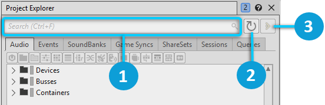

|  |  |
| --- | --- |
|  | 通过在字段中键入或将一个或多个对象从任意视图拖到字段中来搜索 Project Explorer 内容。在将对象拖到字段中时，其会替换所有现有内容。  在搜索处于活跃状态时，字段最右侧会显示 **x**。单击 **x** 可重置搜索。 |
|  | 基于 Wwise 中所有参数的当前状态重新应用搜索并重置显示的结果。上次执行搜索后展开或收起的所有分支将恢复为执行搜索操作后的原始展开状态。  注意，在更改对象的父对象或创建、重命名或删除对象时会自动刷新搜索结果，但不会对其他参数更改（比如可能对评估音量的 WAQL 查询产生影响的音量更改）做出反应。Refresh 按钮在这些情况下特别有用。 |
|  | 在搜索文本与对象及其下级对象匹配时，只会展开到第一个匹配对象所在的层级。单击此按钮可展开所有包含与搜索匹配的对象的分支。 |

有关更多详细信息，请参阅 [“Using the Project Explorer search”一节](ch43s02.html "Using the Project Explorer search") 章节。

---

#### Audio tab

在 Project Explorer 中的 Audio 选项卡中，您可以使用树形视图创建和管理工程素材的层级结构，此视图与 Windows 资源管理器或 Mac Finder 十分相似。You can organize your assets using several different types of objects such as regular folders like you would find in Windows, and other objects that are specific to Wwise such as Music Segments, containers, and Property Containers.

您可以通过点击加号 (+) 和减号 (-) 标记来展开和折叠各种类型的文件夹和对象，从而浏览树形结构。在此选项卡中，可重命名、剪切、复制、粘贴和删除对象，创建 Event（事件），导入并转换媒体文件。您还可以将若干个对象在文件夹之间和其它对象之间拖放，也可以拖放至 Wwise 界面内的不同视图。Audio 选项卡还包含一个工具栏，可让您快速将对象、总线和文件夹添加至工程层级结构。

要访问 Project Explorer 的命令，请在 Project Explorer 中右键点击对象。

| 界面元素 | 描述 |
| --- | --- |
| （工具栏） | 显示代表工程元素的若干个图标，这些元素可添加作为 Project Explorer 中所选节点的父节点或子节点。  在默认情况下，该工具栏显示可作为选定节点的子项加以添加的所有工程元素。要显示可以添加的父工程元素，请按 Shift 键。  要向所选节点添加子节点，只需点击图标栏中的任一活跃图标即可。要向所选节点添加父节点，只需按住 Shift 键并点击图标栏中的任一活跃图标即可。  根据工程层级结构中当前所选的对象类型，不同的图标将变成活跃状态。 |
| [“Audio Devices”一节](ch60s01s01.html "Audio Devices") | A complete list of Audio Devices in your project sorted by Work Units and Virtual Folders. Double-click an Audio Device to open the [“Audio Device Editor：System”一节](ch60s01s01s01.html "Audio Device Editor：System").  |  |  | | --- | --- | | [备注] | 备注 | | 列出的音频设备是 sink（底层硬件抽象层）插件，它们是第三方或开发商使用 SDK 的 sink 插件框架创建的。They are only available to those who have created and/or incorporated these plug-ins into Wwise. 相应地它们没有工具栏图标。因此，创建时需要从 Audio Devices 部分的 Work Unit 快捷菜单选择 **New Child**（新建子对象）。在 **Work Unit** and **Virtual Folder** 选项下，会列出所有可用的 Audio Device 插件。These Audio Devices are also automatically added to the Init.bnk file. |  |  |  | | --- | --- | | [技巧] | 技巧 | | 如需深入了解如何开发 Audio Device 插件，请参阅  [SDK 文档](https://www.audiokinetic.com/library/?source=SDK&id=soundengine__plugins__audiodevices.html) 。 | |
| [“Busses hierarchy”一节](ch60s01s02.html "Busses hierarchy") | 对象层级结构顶部的总线层级结构，可让您定义工程内各种声音、音乐和振动结构的通路。  将不同的结构编组至总线后，您可以修改属性（如音量和音高），定义行为（如闪避），并可对整组应用效果器。  双击总线以打开 Bus Property Editor。 |
| [“Containers hierarchy: sound and motion objects”一节](ch60s01s03.html "Containers hierarchy: sound and motion objects") | Actor-Mixer 层级结构。工程内素材的层级结构。The Containers hierarchy can be comprised of a series of sound, motion, and music objects, organized in containers and folders. Click an object to open it in an object tab. |
| For objects in the Devices and Containers hierarchies: | |
| Inclusion | 启用。决定是否在生成 SoundBank 时在其中包含相应元素。如勾选，则包含该元素。如未勾选，则不会包含该元素。  为了针对各个平台来优化声音设计，有时需在特定平台上弃用某些元素。在默认情况下，此复选框会应用于所有平台。使用复选框左侧的 [Link 标志](ch45s11.html#linking_unlinking_property_values "Linking or unlinking property values") 来取消链接相应元素。然后，便可根据平台来自定义复选框的状态。  若取消选中此选项，则将禁用编辑器中的属性和行为选项。  Default value: true |

  

|  |  |
| --- | --- |
| [技巧] | 技巧 |
| To open the selected items in the default External Editor, press Ctrl+E. 有关详细信息，请参阅[“在外部编辑器中编辑音频文件”一节](ch10s07.html "在外部编辑器中编辑音频文件")。 |

**相关主题**

- [“Setting display options”一节](ch43s01.html "Setting display options")
- [“Using the Project Explorer toolbar”一节](ch43s03.html "Using the Project Explorer toolbar")
- [“添加父对象”一节](ch11s03.html#building_actor_mixer_hierarchy_adding_parent_objects "添加父对象")
- [“Adding objects to the Containers hierarchy”一节](ch11s03.html#adding_objects_to_actor_mixer_hierarchy "Adding objects to the Containers hierarchy")
- [“Managing objects in the Containers hierarchy”一节](ch11s03.html#managing_objects_in_actor_mixer_hierarchy "Managing objects in the Containers hierarchy")
- [“Working with music objects”一节](ch27s04.html "Working with music objects")
- [“Creating Work Units in your project”一节](ch09s01.html#creating_work_units_in_project "Creating Work Units in your project")

---

##### Audio Devices

The Devices hierarchy is a series of Audio Devices, each representing the physical and virtual outputs provided by the supported platforms. Wwise 默认包含以下内置 Audio Device：

- Communication
- Controller Headphones
- DVR Bypass
- No Output
- Controller Speaker
- System

有关每一类型的详细信息，请参阅[“内置音频设备”一节](ch34s06.html "内置音频设备")章节。

每个 Audio Device 属性选项的描述都可在以下 Audio Device Editor（音频设备编辑器）分区中找到：

- [“Audio Device Editor：System”一节](ch60s01s01s01.html "Audio Device Editor：System")
- [“Audio Device Editor：其他”一节](ch60s01s01s02.html "Audio Device Editor：其他")

|  |  |
| --- | --- |
| [备注] | 备注 |
| 只有 System Audio Device 支持潜在 [*[3D Audio](go01.html#glossary_3daudio "3D Audio")*](go01.html#glossary_3daudio) 功能。因此，System Audio Device Editor 内包含很多其他 Audio Device 类型的 Audio Device Editor 中没有的属性。 |

另外，还可通过安装第三方插件来添加其他虚拟输出。在这种情况下，Audio Device Editor 会显示开发者希望包含的各项信息。不过会依据针对 Audio Device 插件创建的 XML 中提供的信息，自动生成默认 UI（类似 [Source Editor: Plug-ins](https://www.audiokinetic.com/library/2019.2.7_7402/?source=Help&id=source_plug_in_editor)）及相关字段。请参阅 [“第三方和自定义 Audio Device”一节](ch63s02.html "第三方和自定义 Audio Device") 了解详细信息。

**相关主题**

- [“内置音频设备”一节](ch34s06.html "内置音频设备")
- [“第三方和自定义 Audio Device”一节](ch63s02.html "第三方和自定义 Audio Device")

---

###### Audio Device Editor：System

Audio Device Editor（音频设备编辑器）中包含一系列与 Audio Device 关联的属性。您可以实时修改其中的很多属性，并使用编辑器的 Effects（效果器）选项卡插入效果器。

下表列出并描述了 System Audio Device 所对应 Audio Device Editor 中包含的所有界面元素。

| General | |
| --- | --- |
| 界面元素 | 描述 |
| [name] | 名称。Audio Device 的名称。 |
| (Object Color) | 显示对象的颜色。单击图标可打开颜色选择器。    选择一种颜色并将其应用于对象。在为对象选择某种颜色时，会在选定方块上显示调色板图标，并在右下角标注黄色三角（如图所示）。  若要沿用父对象的颜色，请选中颜色选择器最左侧的方块。 |
| Inclusion | 启用。决定是否在生成 SoundBank 时在其中包含相应元素。如勾选，则包含该元素。如未勾选，则不会包含该元素。  为了针对各个平台来优化声音设计，有时需在特定平台上弃用某些元素。在默认情况下，此复选框会应用于所有平台。使用复选框左侧的 [Link 标志](ch45s11.html#linking_unlinking_property_values "Linking or unlinking property values") 来取消链接相应元素。然后，便可根据平台来自定义复选框的状态。  若取消选中此选项，则将禁用编辑器中的属性和行为选项。  Default value: true |
| (Show references) | 指示工程中有多少元素包含对对象的直接引用。若存在对对象的引用，则图标显示为橙色；若不存在此类引用，则图标显示为灰色。  通过单击该按钮，可打开 [“Reference View 视图”一节](ch60s12s05.html "Reference View 视图")，并在 **References to:**（引用:）字段中查看对象的名称。 |
| Notes | 备注。有关 Audio Device 的其他信息。 |
|  | 设置 Audio Device Editor 中选定标签页的显示方式。默认情况下，整体面板中仅显示一个选定标签页。不过，您可以通过单击分隔器按钮将面板沿横向或纵向一分为二，显示两个不同的标签页。当前所选选项将以高亮背景色显示。  |  |  | | --- | --- | | [备注] | 备注 | | 无法同时在两个面板中显示同一标签页。若选中的标签页已在另一面板中显示，则另一面板将自动显示另一标签页。 | |
|  | 打开搜索框，在其中输入标准字母和数字会筛选掉视图中不相匹配的元素。阅读 [“使用表格”一节](ch03.html#using_tables "使用表格") 了解详细信息。  点击搜索图标左侧的 Close（关闭）图标，以关闭搜索字段并删除筛选器。  |  |  | | --- | --- | | [备注] | 备注 | | 搜索不包括[“List View（列表视图）”一节](ch60s12s02.html "List View（列表视图）"), [“Query Editor”一节](ch60s07s01.html "Query Editor"), [“MIDI Keymap Editor 视图”一节](ch60s01s03s06s01s01.html "MIDI Keymap Editor 视图"), and [“Reference View 视图”一节](ch60s12s05.html "Reference View 视图")中折叠起来的节点。  The search is not included in the Settings for Source objects. | |
| Allow 3D Audio | 允许 3D 音频。若启用该选项，则允许 Audio Device 尝试激活终端的 3D Audio 功能。若禁用该选项，则将停用所有 3D Audio 功能。  |  |  | | --- | --- | | [备注] | 备注 | | 启用该选项并不意味着一定会激活 3D Audio；只有在平台支持的情况下才会激活 3D Audio。 |  有关更多详细信息，请参阅 [了解基于对象的音频](ch12s03.html "了解基于对象的音频") 页面。  Default value: false |
| Main Mix Configuration for Binauralization | 针对双耳合成的主混音配置。在激活 3D Audio 时，若终端使用针对双耳合成优化的 3D Audio 技术（比如在用户使用耳机时），则将此声道配置指派给 Main Mix。  Default value: Use Game-Defined Settings |
| Main Mix Configuration for Home Theater | 针对家庭影院的主混音配置。在激活 3D Audio 时，若终端使用针对家庭影院装置优化的 3D Audio 技术，则将此声道配置指派给 Main Mix。  Default value: Use Game-Defined Settings |
| Allow System Audio Objects | 允许系统音频对象。在激活 3D Audio 并启用该选项的情况下，若终端支持的 Audio Object 数量大于指定的阈值（即 **Minimum System Audio Objects Required** 的值），则允许 Audio Device 将 System Audio Object 发送到终端。  若禁用该选项，则禁止发送各个 System Audio Object。  在禁用时，会将 Audio Object 混音到 Main Mix，同时保留其空间特性。在这种情况下，最终的空间精度将取决于 Main Mix 的配置。  Default value: true |
| Minimum System Audio Objects Requirement | 最低系统音频对象要求。定义终端至少要支持多少个 System Audio Object，声音引擎才会生成 System Audio Object。  您可以使用此属性来确保将系统的 3D 音频处理能力保持在一定的水平。比如，在将该值设为 50 的情况下，若平台无法做到至少同时支持 50 个 Audio Object，则禁止其使用 System Audio Object。藉此，可避免尝试播放的对象超出系统支持的数量，进而导致对部分对象实施不同的混音处理。在这种情况下，将无法保证每次播放音频时都会产生相同的效果。  因此，该值应略微大于游戏在任意时刻可能播放的 System Audio Object 数量。  Default value: 32  Range: 0 to 65535 |
| Override Color | 不沿用颜色。启用 Color 滑块以便更改所选对象的色块。  Default value: false |
| Color | 参见上述说明。 |
| Inclusion | 参见上述说明。 |
| Audio > Effects | 音频 > 效果器。可插入或旁通的效果器。 |
| **Device Info** | |
| Is 3D Audio Active | 已激活 3D Audio。指示终端是否激活了 3D Audio 功能。 |
| Is Passthrough Active | 已激活直通。指示终端是否接收单独的 Passthrough Mix 以在终端旁通 3D 音频处理。 |
| Available System Audio Objects | 可用系统音频对象。终端支持的 System Audio Object 数量。 |
| System Audio Objects Used | 已用系统音频对象。当前正在播放的 System Audio Object 的数量。 |
| Main Mix Channel Configuration | 主混音声道配置。发送到系统终端的 Main Mix 的声道配置。 |
| Passthrough Channel Configuration | 直通声道配置。发送到系统终端的 Passthrough Mix 的声道配置。 |
| Main Mix Buffer Size | 主混音缓冲区大小。每个音频帧的采样数。 |

---

###### Audio Device Editor：其他

Audio Device Editor（音频设备编辑器）中包含一系列与 Audio Device 关联的属性。您可以实时修改其中的很多属性，并使用编辑器的 Effects（效果器）选项卡插入效果器。

下表列出并描述了 System（系统）以外各种 Audio Device 类型所对应 Audio Device Editor 中包含的界面元素。其中包括以下 Audio Device 类型：

- Communication
- Controller Headphones
- DVR Bypass
- No Output
- Controller Speaker

| General | |
| --- | --- |
| 界面元素 | 描述 |
| [name] | 名称。Audio Device 的名称。 |
| (Object Color) | 显示对象的颜色。单击图标可打开颜色选择器。    选择一种颜色并将其应用于对象。在为对象选择某种颜色时，会在选定方块上显示调色板图标，并在右下角标注黄色三角（如图所示）。  若要沿用父对象的颜色，请选中颜色选择器最左侧的方块。 |
| Inclusion | 启用。决定是否在生成 SoundBank 时在其中包含相应元素。如勾选，则包含该元素。如未勾选，则不会包含该元素。  为了针对各个平台来优化声音设计，有时需在特定平台上弃用某些元素。在默认情况下，此复选框会应用于所有平台。使用复选框左侧的 [Link 标志](ch45s11.html#linking_unlinking_property_values "Linking or unlinking property values") 来取消链接相应元素。然后，便可根据平台来自定义复选框的状态。  若取消选中此选项，则将禁用编辑器中的属性和行为选项。  Default value: true |
| (Show references) | 指示工程中有多少元素包含对对象的直接引用。若存在对对象的引用，则图标显示为橙色；若不存在此类引用，则图标显示为灰色。  通过单击该按钮，可打开 [“Reference View 视图”一节](ch60s12s05.html "Reference View 视图")，并在 **References to:**（引用:）字段中查看对象的名称。 |
| Notes | 备注。有关 Audio Device 的其他信息。 |
|  | 设置 Audio Device Editor 中选定标签页的显示方式。默认情况下，整体面板中仅显示一个选定标签页。不过，您可以通过单击分隔器按钮将面板沿横向或纵向一分为二，显示两个不同的标签页。当前所选选项将以高亮背景色显示。  |  |  | | --- | --- | | [备注] | 备注 | | 无法同时在两个面板中显示同一标签页。若选中的标签页已在另一面板中显示，则另一面板将自动显示另一标签页。 | |
|  | 打开搜索框，在其中输入标准字母和数字会筛选掉视图中不相匹配的元素。阅读 [“使用表格”一节](ch03.html#using_tables "使用表格") 了解详细信息。  点击搜索图标左侧的 Close（关闭）图标，以关闭搜索字段并删除筛选器。  |  |  | | --- | --- | | [备注] | 备注 | | 搜索不包括[“List View（列表视图）”一节](ch60s12s02.html "List View（列表视图）"), [“Query Editor”一节](ch60s07s01.html "Query Editor"), [“MIDI Keymap Editor 视图”一节](ch60s01s03s06s01s01.html "MIDI Keymap Editor 视图"), and [“Reference View 视图”一节](ch60s12s05.html "Reference View 视图")中折叠起来的节点。  The search is not included in the Settings for Source objects. | |
| DVR Recordable | DVR 可录音。决定是否将此 Audio Device 的输出发送到 DVR。通过旁通 DVR 可在第三方录制和发布游戏过程的情形下避免音乐版权方面的法律问题。  以下平台支持该选项：  - Xbox One - Xbox Series X - PS4 - PS5  |  |  | | --- | --- | | [备注] | 备注 | | 只有 DVR Bypass Audio Device 才会显示此选项。 | |
| Override Color | 不沿用颜色。启用 Color 滑块以便更改所选对象的色块。  Default value: false |
| Color | 参见上述说明。 |
| Inclusion | 参见上述说明。 |
| Audio > Effects | 音频 > 效果器。可插入或旁通的效果器。 |

---

###### Audio Device Editor：Effects

在与 Audio Device 对应的 Effects 选项卡中，若有 Mastering Suite 和/或 GME Real-time Voice Service 插件，最多可向 Audio Device 应用 255 个效果器。各个插件会分别提供对应的效果器类型：Mastering Suite 和 Tencent GME Session。

Mastering Suite 存在一定的限制。若使用 Mastering Suite 效果器类型，则仅可添加单个效果器，且须添加到最后一个插槽（其他效果器类型没有这种限制）。有关详细信息，请参阅“[“Mastering Suite”一节](ch64s01.html "Mastering Suite")”和“[“了解声部管线”一节](ch34s05.html "了解声部管线")”章节。

在 Wwise 中应用效果器时，要注意声部可能会经过以下四个层级的效果器渲染：

- Up to 255 Effects can be applied to a voice in the Containers
  hierarchy, but remember that child objects can also override their parent objects'
  Effects.
- 总线层级结构输出路径中的每条 Audio Bus 和 Auxiliary Bus 最多可应用 255 个效果器。
- Up to 255 Effects can be applied to the final main bus (the Main Audio or the
  Main Secondary Bus).
- Audio Device（音频设备）最多可应用 255 个效果器。

这意味着允许将一系列效果器应用于最终输出。您可以通过执行以下操作来管理这些效果器：

- 使用 Mode 选项将效果器设为 ShareSet，以此来同时调节同一效果器的多个实例。另外，还可根据需要将 Mode 设为 Custom，来将特定设置应用于单个效果器实例。
- 根据需要选中 Bypass 复选框来暂时移除效果器，或取消选中该复选框来恢复使用效果器。这样方便在测试当中确定效果器所产生的影响。另外，还可在 RTPC 中使用 Bypass 选项或在 Event 中使用 "Bypass Effect" Action 来针对特定游戏场景或 Event 移除效果器。

|  |  |
| --- | --- |
| [备注] | 备注 |
| Effects on Audio Devices are slightly different from Effects on objects in the Containers hierarchy or Busses hierarchy. 注意以下几点：  - 若添加 Mastering Suite 效果器类型，则仅可向 Audio Device 添加单个效果器，且须将其添加到最后一个效果器插槽。 - 可用的效果器特定于 Audio Device。 - Audio Device 效果器不支持 RTPC。 - Unlike Effects on objects in the Containers hierarchy, Audio Device Effects   cannot be rendered. For information on the Effects tab of objects   in the Containers hierarchy, see [“Effects tab: Containers hierarchy objects”一节](ch60s01s05s08.html "Effects tab: Containers hierarchy objects"). - 在 PS5 上，会在将音频发送到扬声器或耳机之前在平台的专用单元上对 Mastering Suite 进行处理。在其他平台上，会在 Wwise 音频管线末端在软件模式下对 Mastering Suite 进行处理。 |

| General | |
| --- | --- |
| 界面元素 | 描述 |
| [name] | 对象的名称。 |
| (Object Color) | 显示对象的颜色。单击图标可打开颜色选择器。    选择一种颜色并将其应用于对象。在为对象选择某种颜色时，会在选定方块上显示调色板图标，并在右下角标注黄色三角（如图所示）。  若要沿用父对象的颜色，请选中颜色选择器最左侧的方块。 |
| (Show references) | 指示工程中有多少元素包含对对象的直接引用。若存在对对象的引用，则图标显示为橙色；若不存在此类引用，则图标显示为灰色。  通过单击该按钮，可打开 [“Reference View 视图”一节](ch60s12s05.html "Reference View 视图")，并在 **References to:**（引用:）字段中查看对象的名称。 |
| Notes | 备注。对象属性的额外信息。 |
|  | 设置 Property Editor 中选定标签页的显示方式。默认情况下，整体面板中仅显示一个选定选项卡。不过，您可以通过单击分隔器按钮将面板沿横向或纵向一分为二。当前所选选项将以高亮背景色显示。  无法同时在两个面板中打开同一选项卡。若尝试在两个面板中打开同一选项卡，则第一个面板将自动打开别的选项卡。  |  |  | | --- | --- | | [技巧] | 技巧 | | - 在按住 Ctrl 的同时按下与所要查看的 Property Editor 选项卡的编号对应的数字。比如，若 RTPC 为第四个可见选项卡，则按下 Ctrl+4 时将打开 RTPC 选项卡。 | |

| Effects | |
| --- | --- |
| 界面元素 | 描述 |
|  | 配置列…。右键单击表格标题来打开 **Configure Columns** 对话框以指定要显示的列及其顺序。详请参阅[“使用表格”一节](ch03.html#using_tables "使用表格")。 |
| **Effects** | |
| （选择器） | 可应用于 Audio Device 的效果器及对应实例列表。为此，必须先通过 Audiokinetic Launcher 安装至少一个以下插件：  - Mastering Suite 插件提供 Mastering Suite 效果器。 - GME Real-time Voice Service 插件提供 Tencent GME Session 效果器。  若要移除效果器，可选择 **None**（无）。 |
| ID | 效果器的标识号。导流体对于 Mastering Suite 效果器，仅可添加单个效果器，且须将其放在最后一个插槽。 |
| Effect | 效果器。应用于 Audio Device 的效果器的类型。 |
| Name | 名称。应用于 Audio Device 的效果器实例的名称。效果器实例可以是 ShareSet 或 ShareSet 的自定义实例。  对应列表中会显示选定效果器类型的所有效果器实例。 |
| Prev. | 上一个。选择 Effects 层级结构中的上一 ShareSet。 |
| Next | 下一个。选择 Effects 层级结构中的下一 ShareSet。 |
| Mode | 模式。确定是否共享效果器。模式可以是：  - **Define custom**（定义自定义）：创建自定义效果器实例，不在对象之间共享其属性。 - **Use ShareSet**（使用共享集）：使用效果器的 ShareSet，可在对象之间共享效果器属性。  |  |  | | --- | --- | | [备注] | 备注 | | 若添加自定义效果器，然后把 **Mode** 改为 **Use ShareSets**，将打开 Create ShareSet from Custom Object（通过自定义对象创建共享集）警告对话框。其设有三个选项：  - **Convert**（转码）：打开 New Effect（新建效果器）对话框，以便使用指定的效果器设置创建新的 ShareSet。 - **Revert**（还原）： 清除 Effect Editor 并将效果器还原为 ShareSet 的原始设置。 - **Cancel**（取消）：将 Mode 恢复为 Define custom，并返回未经修改的 Effect Editor。 | |
| （在层级结构中的位置） | 显示 ShareSet 在 Effects 层级结构中的位置。若为效果器的自定义实例，则显示自定义实例的名称。 |
| Bypass | 旁通。决定是否旁通所选效果器实例。若选中复选框，则移除效果器。若取消选中复选框，则恢复使用效果器。  此选项在以下情况下非常有用：  - 在对游戏实施性能分析时，可启用或禁用此选项来确定效果器对声音设计及 Performance Monitor 中所示 CPU 用量的影响。 - 在按平台定制声音设计时，可取消链接对象上的效果器，并针对处理能力较弱的平台旁通该对象上的某些效果器。  另外，还可在 RTPC 中使用 Bypass 选项或在 Event 中使用 “Bypass Effect” Action 来针对特定游戏场景或 Event 移除效果器。  Default value: false |
| Edit | 编辑。打开 Effect Editor，以便实时编辑所选效果器实例的属性。 |
| Bypass All | 全部旁通。决定是否旁通对象上插入的所有效果器。若选中复选框，则移除所有效果器。若取消选中复选框，则恢复使用效果器。  此选项在以下情况下非常有用：  - 在对游戏实施性能分析时，可启用或禁用此选项来确定效果器对声音设计及 Performance Monitor 中所示 CPU 用量的影响。 - 在按平台定制声音设计时，可取消链接对象上的效果器，并针对处理能力较弱的平台旁通该对象上的所有效果器。  另外，还可在 RTPC 中使用 Bypass 选项或在 Event 中使用 “Bypass Effect” Action 来针对特定游戏场景或 Event 移除效果器。  Default value: false |

---

##### Busses hierarchy

The Busses hierarchy is a hierarchical series of busses at the top of your project hierarchy that allow you to group many different sound and motion structures according to the main categories within a game. 例如，您可以使用一条 Audio Bus 对所有 Interactive Music 中的声音结构和所有语音进行编组，用另一条 Audio Bus 对所有音效进行编组，同时使用一条 Motion Bus 对所有振动效果进行编组，以此类推。

|  |  |
| --- | --- |
| [备注] | 备注 |
| It is possible to create Work-Units and Virtual Folders under the Busses hierarchy. 这样便于在团队工作环境中管理总线结构。 |

各条总线都有一组属性和行为，您可以使用它们来定义通过总线的对象在游戏中的听觉效果和播放方式。These properties and behaviors are located in the Property and Contents Editors of the different Busses hierarchy objects.

The descriptions for each of the Busses property options can be found in the following Property Editor descriptions:

- [“Property Editor: Main Audio and Main Secondary Busses”一节](ch60s01s02s01.html "Property Editor: Main Audio and Main Secondary Busses")
- [“Property Editor：Audio Bus”一节](ch60s01s02s02.html "Property Editor：Audio Bus")
- [“Property Editor: Auxiliary Busses”一节](ch60s01s02s03.html "Property Editor: Auxiliary Busses")

除了上述页面中的 General Settings 外，每个对象在 Property Editor 中都还有一些其他的选项卡，如下所述：

- [“Common tabs and categories: Busses hierarchy objects”一节](ch60s01s02s04.html "Common tabs and categories: Busses hierarchy objects")

When a Busses object is selected in the Project Explorer, the corresponding Contents Editor loads some information about its child or source objects.

- [“Contents Editor: Main Audio, Audio, and Auxiliary Busses”一节](ch60s01s02s05.html "Contents Editor: Main Audio, Audio, and Auxiliary Busses")

有关 Advanced Settings、Effect、RTPC 和 States 选项卡中属性的说明，请参阅 [“Common tabs and categories: Busses hierarchy objects”一节](ch60s01s02s04.html "Common tabs and categories: Busses hierarchy objects")。

---

###### Property Editor: Main Audio and Main Secondary Busses

The Property Editor contains the exact same properties for Main Audio Busses and Main Secondary Busses. 这是您为工程中的所有不同声音和音乐结构定义 Volume、LFE、Pitch 和 Low-Pass Filter 的最终层级。Where the Main Audio Bus final output is the primary audio system (be that a handheld device, television, or more elaborate speaker setup), the secondary main bus final output is a complementary audio output that might be available, such as a game controller. 这可以在 Audio Device 属性中选择， 仅在每个总线层级结构的最高级别可用。

|  |  |
| --- | --- |
| [备注] | 备注 |
| 某些选项并非在所有平台上都可用。 |

| General | |
| --- | --- |
| 界面元素 | 描述 |
| [name] | 对象的名称。 |
| (Object Color) | 显示对象的颜色。单击图标可打开颜色选择器。    选择一种颜色并将其应用于对象。在为对象选择某种颜色时，会在选定方块上显示调色板图标，并在右下角标注黄色三角（如图所示）。  若要沿用父对象的颜色，请选中颜色选择器最左侧的方块。 |
| (Mute and Solo) | 控制对象的 Mute（静音）和 Solo（单独播放）状态，也会显示该对象是否处于被动静音和 Solo 状态。  将对象静音会使其在当前监听中无法听到。让对象 Solo 会使工程中的所有其它对象无声。  粗体的 **M** 或 **S** 表明已为对象主动设置了 Mute 或 Solo 状态。褪色的非粗体 **M** 或 **S** 表明对象的 Mute 或 Solo 状态是由于其它对象状态而被动设置的。  将对象静音会让其子对象被动静音。  让对象 Solo 会使同级对象被动静音，并让子对象和父对象被动 Solo。  |  |  | | --- | --- | | [技巧] | 技巧 | | 在点击 Solo 按钮的同时按住 Ctrl 键，可以强制仅 Solo 该 Solo 按钮所在的对象。 |  |  |  | | --- | --- | | [备注] | 备注 | | Mute 和 Solo 仅用于监视目的，而不会保存在工程中或存储在 SoundBank（声音包）中。 | |
| (Show references) | 指示工程中有多少元素包含对对象的直接引用。若存在对对象的引用，则图标显示为橙色；若不存在此类引用，则图标显示为灰色。  通过单击该按钮，可打开 [“Reference View 视图”一节](ch60s12s05.html "Reference View 视图")，并在 **References to:**（引用:）字段中查看对象的名称。 |
|  | Enter text in the search field to find specific properties or property groups. Results are displayed as you type. The search is not case-sensitive and searches all properties associated with an object, even if their category is not selected for display.  When a search is active, an **x** appears at the far-right side of the field and all category buttons are unavailable. Click the **x** to clear the search. |
| (Only Show Modified) | When selected, only properties that have been modified from their default value are displayed and all category filter buttons are unavailable. If a search is active, it is only applied to modified properties.  Modified properties are displayed with an orange band at the left side of the property list and at the left side of the corresponding category button. |
| (Show/Hide Category Filters) | Opens a list of all categories associated with the object currently loaded in the Property Editor. For each category selected in the list, a corresponding button is displayed at the top of the list of properties. Select these buttons to display the related properties. Ctrl+click or Shift+click to select multiple buttons.  **Always Show Additional Properties** expands the less frequently used properties, which are collapsed by default. |
| (More Options) | Opens the following options:  - **Reset Expand/Collapse to Default**: Returns to the default expansion. - **Collapse All**: Collapses all categories and groups in the Property Editor. - **Expand All**: Expands all categories and groups in the Property Editor. |
| (Open Property Editor Settings) | Opens the [“Object Property Settings”一节](ch60s12s06.html "Object Property Settings") dialog, which allows you to configure which properties are available for display in the Property Editor. |
| (Open in New Window) | Duplicates the Property Editor as a floating view. An instance of the editor remains in the Object Tab. |

| Bus | |
| --- | --- |
| 界面元素 | 描述 |
| **Specific** | |
| Bus Volume | 总线音量。Bus 或 Auxiliary Bus 上的音频信号衰减（电平或振幅）。有关音量的详细信息，请参阅 [理解声部管线](ch34s05.html "了解声部管线") 页面。  |  |  | | --- | --- | | [备注] | 备注 | | 默认滑杆范围从 -96 至 +12。您可以通过直接输入数值或在聚焦于编辑控件之上时滑动鼠标来调到限值以上。Bus Volume 设置默认显示 Vertical Fader。若要切换到 Horizontal Slider，请右键单击 Volume 设置并选择 **Use Horizontal Slider for Volume**。 |  Default value: 0  Range: -200 to 200  Units: dB |
| **Audio Device** | |
| Audio Device | 音频设备。用于输出该总线所生成音频的音频设备。选择 Audio Device 部分中定义的现有 Audio Device ShareSet。若要使用第三方 Audio Device 插件，则可能需要先创建 ShareSet。  |  |  | | --- | --- | | [备注] | 备注 | | 若工程适用平台不支持指定的 Audio Device，则此字段将高亮显示为蓝色。同时，警告消息将指示无效的平台。此外，若尝试为无效的平台生成 SoundBank，则 [SoundBank Generation 选项卡](ch58s03.html#soundbank_generation_log "SoundBank Generation 选项卡") 中也将显示警告消息。 | |

| General | |
| --- | --- |
| 界面元素 | 描述 |
| **Specific** | |
| Override Color | 不沿用颜色。启用 Color 滑块以便更改所选对象的色块。  Default value: false |
| Color | 颜色。在方块中显示对象颜色；如未设置，则显示随机颜色。此键有助于识别显示在坐标图视图中的对象线条。  Default value: 0  Range: 0 to 26 |
| **Voice** | |
| Voice Volume | 对象输出到总线或发送至辅助总线之前的衰减（电平或振幅）。有关音量的详细信息，请参阅 [理解声部管线](ch34s05.html "了解声部管线") 页面。  |  |  | | --- | --- | | [备注] | 备注 | | 默认滑杆范围从 -96 至 +12 dB。您可以通过直接输入值或在编辑控件上移动鼠标来输入超出限制范围的值。 |  Default value: 0  Range: -200 to 200  Units: dB |
| Voice Pitch | 声部音高。定义音频对象的播放速度。其中：  - 音高 0 = 正常速度。 - 音高 1,200 = 2 倍的速度。 - 音高 2,400 = 4 倍的速度。 - 音高 -1,200 = 0.5 倍的速度。 - 音高 -2,400 = 0.25 倍的速度  |  |  | | --- | --- | | [技巧] | 技巧 | | 1,200 音分相当于一个八度。 |  Default value: 0  Range: -2400 to 2400  Units: Cents |
| Voice Low-pass Filter | 声部低通滤波器。基于指定频率值针对高频进行衰减的递归滤波器。  此滤波器的单位表示低通滤波的百分比，其中 0 表示无低通滤波（信号不受影响）而 100 表示最大衰减。  有关更多详细信息，请参阅 [Low-pass 和 High-pass Filter 值与截止频率的关系](ch11s04s02s01.html "Low-pass 和 High-pass Filter 值与截止频率的关系") 。  Default value: 0  Range: 0 to 100 |
| Voice High-pass Filter | 声部高通滤波器。基于指定频率针对低频进行衰减的递归滤波器。  此滤波器的单位表示高通滤波的百分比，其中 0 表示无高通滤波（信号不受影响）而 100 表示最大衰减。  Default value: 0  Range: 0 to 100 |
| Make-up Gain | 补偿增益。声部的音量增益（单位为分贝 (dB)），应用于所有其它音量调整后，。Make-up Gain 在各个 Container 之间是累加的。  请参阅 [理解声部管线](ch34s05.html "了解声部管线") 以了解声音将如何经过处理、路由以及在哪些环节可以应用音量和效果器。  有关响度归一化的详细信息，请参阅 [使用响度归一化或补偿增益来调节音量](ch34s04.html "使用 Loudness Normalization 或 Make-up Gain 调节音量") 。  |  |  | | --- | --- | | [备注] | 备注 | | 默认滑杆范围从 -96 至 +12。您可以通过直接输入值，或在编辑控件上移动鼠标来输入超出限制范围的值。 |  Default value: 0  Range: -200 to 200  Units: dB |

**相关主题**

- [“定义相对属性（音量、音高、LPF、HPF）”一节](ch11s04s02.html "定义相对属性（音量、音高、LPF、HPF）")

---

###### Property Editor：Audio Bus

The Property Editor contains the properties for the selected Audio Bus. You can adjust the overall Volume, Pitch, Low-pass filter, High-pass filter, ducking properties amongst others.

| General | |
| --- | --- |
| 界面元素 | 描述 |
| [name] | 对象的名称。 |
| (Object Color) | 显示对象的颜色。单击图标可打开颜色选择器。    选择一种颜色并将其应用于对象。在为对象选择某种颜色时，会在选定方块上显示调色板图标，并在右下角标注黄色三角（如图所示）。  若要沿用父对象的颜色，请选中颜色选择器最左侧的方块。 |
| (Mute and Solo) | 控制对象的 Mute（静音）和 Solo（单独播放）状态，也会显示该对象是否处于被动静音和 Solo 状态。  将对象静音会使其在当前监听中无法听到。让对象 Solo 会使工程中的所有其它对象无声。  粗体的 **M** 或 **S** 表明已为对象主动设置了 Mute 或 Solo 状态。褪色的非粗体 **M** 或 **S** 表明对象的 Mute 或 Solo 状态是由于其它对象状态而被动设置的。  将对象静音会让其子对象被动静音。  让对象 Solo 会使同级对象被动静音，并让子对象和父对象被动 Solo。  |  |  | | --- | --- | | [技巧] | 技巧 | | 在点击 Solo 按钮的同时按住 Ctrl 键，可以强制仅 Solo 该 Solo 按钮所在的对象。 |  |  |  | | --- | --- | | [备注] | 备注 | | Mute 和 Solo 仅用于监视目的，而不会保存在工程中或存储在 SoundBank（声音包）中。 | |
| (Show references) | 指示工程中有多少元素包含对对象的直接引用。若存在对对象的引用，则图标显示为橙色；若不存在此类引用，则图标显示为灰色。  通过单击该按钮，可打开 [“Reference View 视图”一节](ch60s12s05.html "Reference View 视图")，并在 **References to:**（引用:）字段中查看对象的名称。 |
|  | Enter text in the search field to find specific properties or property groups. Results are displayed as you type. The search is not case-sensitive and searches all properties associated with an object, even if their category is not selected for display.  When a search is active, an **x** appears at the far-right side of the field and all category buttons are unavailable. Click the **x** to clear the search. |
| (Only Show Modified) | When selected, only properties that have been modified from their default value are displayed and all category filter buttons are unavailable. If a search is active, it is only applied to modified properties.  Modified properties are displayed with an orange band at the left side of the property list and at the left side of the corresponding category button. |
| (Show/Hide Category Filters) | Opens a list of all categories associated with the object currently loaded in the Property Editor. For each category selected in the list, a corresponding button is displayed at the top of the list of properties. Select these buttons to display the related properties. Ctrl+click or Shift+click to select multiple buttons.  **Always Show Additional Properties** expands the less frequently used properties, which are collapsed by default. |
| (More Options) | Opens the following options:  - **Reset Expand/Collapse to Default**: Returns to the default expansion. - **Collapse All**: Collapses all categories and groups in the Property Editor. - **Expand All**: Expands all categories and groups in the Property Editor. |
| (Open Property Editor Settings) | Opens the [“Object Property Settings”一节](ch60s12s06.html "Object Property Settings") dialog, which allows you to configure which properties are available for display in the Property Editor. |
| (Open in New Window) | Duplicates the Property Editor as a floating view. An instance of the editor remains in the Object Tab. |

| Bus | |
| --- | --- |
| 界面元素 | 描述 |
| **Specific** | |
| Bus Volume | 总线音量。Bus 或 Auxiliary Bus 上的音频信号衰减（电平或振幅）。有关音量的详细信息，请参阅 [理解声部管线](ch34s05.html "了解声部管线") 页面。  |  |  | | --- | --- | | [备注] | 备注 | | 默认滑杆范围从 -96 至 +12。您可以通过直接输入数值或在聚焦于编辑控件之上时滑动鼠标来调到限值以上。Bus Volume 设置默认显示 Vertical Fader。若要切换到 Horizontal Slider，请右键单击 Volume 设置并选择 **Use Horizontal Slider for Volume**。 |  Default value: 0  Range: -200 to 200  Units: dB |
| Bus Configuration | 总线配置。决定采用哪种配置对总线输出进行格式化，其可能会影响总线的处理状态。您可以利用此设置将混音延迟到总线管线的后端，来节省 CPU 和内存资源或减少必须对总线上插入的效果器进行处理的声道数。  其中的可用选项包括：  - **Same as parent** - 该总线沿用父总线的总线配置，并有可能设为 Not Mixing 状态。藉此，可将总线的属性传给其输入而无需任何处理，从而节省 CPU 和内存资源。不过，若总线包含特定功能（如效果器），则会执行相应处理，也就没法节省资源了。有关更多详细信息，请参阅   [了解总线图标和处理状态](ch34s11s01.html "了解总线图标和处理状态")   页面。 - **Same as main mix** - 该总线沿用总线管线末端 Audio Device 的 Main Mix 的总线配置。此选项允许在运行时由终端灵活地决定总线配置。 - **Same as passthrough mix** - 该总线沿用总线管线末端 Audio Device 的 Passthrough Mix 的总线配置。此选项允许在运行时由终端灵活地决定总线配置。若启用了 3D Audio 且终端支持 Passthrough Mix，则采用 2.0 配置对总线输出进行格式化。否则，会跟选中 **Same as main mix** 一样对总线实施处理。 - **Audio Objects** - 该总线会生成 Audio Object。这些 Audio Object 由音频缓冲区和 Metadata 构成，在满足所有条件的情况下可传给终端来进行渲染以获得空间化效果。  所有顶层总线（如 Main Audio Bus）的 Bus Configuration 都将自动设为 **Defined by device**。这是因为这些总线始终沿用关联 Audio Device 的总线配置。  有关列表中的上述及其他选项的详细信息，请参阅 [了解总线配置](ch22s11.html "了解总线配置") 页面。  Default value: Same as parent |
| **Auto-Ducking** | |
| Recovery Time | 恢复时间。从当前总线内的音频信号终止到闪避信号的淡入效果开始所需要的时间。  单位：s  Default value: 1  Range: 0 to 10 |
| Maximum ducking volume | 最大闪避音量。决定当前总线最多可将所列总线的音量降低多少。使用滑杆在 0 ~ -96 之间选择数值。若要在 -97 ~ -200 之间选择数值，请使用键盘或鼠标滚轮。  Default value: -96  Range: -200 to 0  Units: dB |

| General | |
| --- | --- |
| 界面元素 | 描述 |
| **Specific** | |
| Override Color | 不沿用颜色。启用 Color 滑块以便更改所选对象的色块。  Default value: false |
| Color | 颜色。在方块中显示对象颜色；如未设置，则显示随机颜色。此键有助于识别显示在坐标图视图中的对象线条。  Default value: 0  Range: 0 to 26 |
| **Voice** | |
| Voice Volume | 对象输出到总线或发送至辅助总线之前的衰减（电平或振幅）。有关音量的详细信息，请参阅 [理解声部管线](ch34s05.html "了解声部管线") 页面。  |  |  | | --- | --- | | [备注] | 备注 | | 默认滑杆范围从 -96 至 +12 dB。您可以通过直接输入值或在编辑控件上移动鼠标来输入超出限制范围的值。 |  Default value: 0  Range: -200 to 200  Units: dB |
| Voice Pitch | 声部音高。定义音频对象的播放速度。其中：  - 音高 0 = 正常速度。 - 音高 1,200 = 2 倍的速度。 - 音高 2,400 = 4 倍的速度。 - 音高 -1,200 = 0.5 倍的速度。 - 音高 -2,400 = 0.25 倍的速度  |  |  | | --- | --- | | [技巧] | 技巧 | | 1,200 音分相当于一个八度。 |  Default value: 0  Range: -2400 to 2400  Units: Cents |
| Voice Low-pass Filter | 声部低通滤波器。基于指定频率值针对高频进行衰减的递归滤波器。  此滤波器的单位表示低通滤波的百分比，其中 0 表示无低通滤波（信号不受影响）而 100 表示最大衰减。  有关更多详细信息，请参阅 [Low-pass 和 High-pass Filter 值与截止频率的关系](ch11s04s02s01.html "Low-pass 和 High-pass Filter 值与截止频率的关系") 。  Default value: 0  Range: 0 to 100 |
| Voice High-pass Filter | 声部高通滤波器。基于指定频率针对低频进行衰减的递归滤波器。  此滤波器的单位表示高通滤波的百分比，其中 0 表示无高通滤波（信号不受影响）而 100 表示最大衰减。  Default value: 0  Range: 0 to 100 |
| Make-up Gain | 补偿增益。声部的音量增益（单位为分贝 (dB)），应用于所有其它音量调整后，。Make-up Gain 在各个 Container 之间是累加的。  请参阅 [理解声部管线](ch34s05.html "了解声部管线") 以了解声音将如何经过处理、路由以及在哪些环节可以应用音量和效果器。  有关响度归一化的详细信息，请参阅 [使用响度归一化或补偿增益来调节音量](ch34s04.html "使用 Loudness Normalization 或 Make-up Gain 调节音量") 。  |  |  | | --- | --- | | [备注] | 备注 | | 默认滑杆范围从 -96 至 +12。您可以通过直接输入值，或在编辑控件上移动鼠标来输入超出限制范围的值。 |  Default value: 0  Range: -200 to 200  Units: dB |

**相关主题**

- [“定义总线的相对属性”一节](ch12s02.html#defining_relative_properties_of_bus "定义总线的相对属性")
- [“闪避信号”一节](ch12s02.html#ducking_signals "闪避信号")
- [“将音乐替换为玩家自己的音乐”一节](ch12s02.html#replacing_music_with_player_own_music "将音乐替换为玩家自己的音乐")

---

####### Auto-Ducking tab: Audio Busses

Use the Auto-Ducking tab to configure ducking. 在该选项卡中命名当前正在编辑属性的相应总线。该总线为当前总线，其会压低其他总线的音量。若要选择要闪避的总线，请单击 **Insert**（插入）。

| General | |
| --- | --- |
| 界面元素 | 描述 |
| [name] | 对象的名称。 |
| (Object Color) | 显示对象的颜色。单击图标可打开颜色选择器。    选择一种颜色并将其应用于对象。在为对象选择某种颜色时，会在选定方块上显示调色板图标，并在右下角标注黄色三角（如图所示）。  若要沿用父对象的颜色，请选中颜色选择器最左侧的方块。 |
| (Mute and Solo) | 控制对象的 Mute（静音）和 Solo（单独播放）状态，也会显示该对象是否处于被动静音和 Solo 状态。  将对象静音会使其在当前监听中无法听到。让对象 Solo 会使工程中的所有其它对象无声。  粗体的 **M** 或 **S** 表明已为对象主动设置了 Mute 或 Solo 状态。褪色的非粗体 **M** 或 **S** 表明对象的 Mute 或 Solo 状态是由于其它对象状态而被动设置的。  将对象静音会让其子对象被动静音。  让对象 Solo 会使同级对象被动静音，并让子对象和父对象被动 Solo。  |  |  | | --- | --- | | [技巧] | 技巧 | | 在点击 Solo 按钮的同时按住 Ctrl 键，可以强制仅 Solo 该 Solo 按钮所在的对象。 |  |  |  | | --- | --- | | [备注] | 备注 | | Mute 和 Solo 仅用于监视目的，而不会保存在工程中或存储在 SoundBank（声音包）中。 | |
| (Show references) | 指示工程中有多少元素包含对对象的直接引用。若存在对对象的引用，则图标显示为橙色；若不存在此类引用，则图标显示为灰色。  通过单击该按钮，可打开 [“Reference View 视图”一节](ch60s12s05.html "Reference View 视图")，并在 **References to:**（引用:）字段中查看对象的名称。 |

| Auto-Ducking | |
| --- | --- |
| 界面元素 | 描述 |
| Recovery Time | 恢复时间。从当前总线内的音频信号终止到闪避信号的淡入效果开始所需要的时间。  单位：s  Default value: 1  Range: 0 to 10 |
| Maximum ducking volume | 最大闪避音量。决定当前总线最多可将所列总线的音量降低多少。使用滑杆在 0 ~ -96 之间选择数值。若要在 -97 ~ -200 之间选择数值，请使用键盘或鼠标滚轮。  Default value: -96  Range: -200 to 0  Units: dB |
|  | 打开 Project Explorer ―― Browser，您可以在此选择要添加到自动闪避列表中的音频总线。  The **Main Audio Bus** cannot be selected, and an Audio Bus cannot duck itself or any of its parent busses. |
|  | 移除。从要被当前总线闪避的总线列表中删除选定总线。 |
|  | 配置列…。右键单击表格标题来打开 **Configure Columns** 对话框以指定要显示的列及其顺序。详请参阅[“使用表格”一节](ch03.html#using_tables "使用表格")。 |
| Busses | 总线。 Audio Bus 的名称。 |
| Volume | 音量。指定在闪避过程中要将总线的音量降低多少 dB。滑杆范围为 -96 ~ 0，默认设为 -6。若要设为 -96 以下的值，请使用键盘。 |
| Fade Out | 淡出。从原始音量淡出至闪避音量所需要的时间。 |
| Fade In | 淡入。从闪避音量淡入至原始音量所需要的时间。 |
| Curve | 曲线。用于定义信号淡出并重新淡入的曲线形状。 |
| Target | 目标。定义闪避系统的目标属性。  以下是两个可能值：  - **Bus Volume**（总线音量）：直接以最终总线音量为目标。 - **Voice Volume**（声部音量）：以总线中正在播放的音频对象为目标。该项会同时影响作用于目标音频对象的发送。 |

**相关主题**

- [“闪避信号”一节](ch12s02.html#ducking_signals "闪避信号")

---

####### HDR category: Audio Busses

Using the properties in the HDR category, you can define the HDR behavior for the current bus.

|  |  |
| --- | --- |
| [备注] | 备注 |
| HDR is not available for Main Audio Busses. |

各条 HDR 总线会维护有一个 HDR 窗口，该窗口的位置和宽度分别取决于任意时刻响度最大的声音和工程的音量阈值。有关工程的 Volume Threshold 的详细信息，请参阅 Project Settings 章节。The behavior of the HDR window can be edited in the HDR properties of each HDR bus. 有两组控件；一组控件从电平方面影响窗口的行为（增益计算），另一组控件从时间方面影响窗口的行为（起止响应时间）。

| H DR | |
| --- | --- |
| 界面元素 | 描述 |
| **Specific** | |
| Enable HDR | 启用 HDR。定义总线是否已启用 HDR。  有关详细信息，请参阅 [使用 HDR](ch34s09.html "使用 HDR") 。  Default value: false |
| **Dynamics** | |
| Threshold | 阈值。定义最小输入电平（单位：dB），超过此电平，HDR 窗口可能会滑动。  有关详细信息，请参阅 [使用 HDR 阈值](ch34s09s01s01.html "使用 HDR Threshold") 。  Default value: 0  Range: -96 to 96 |
| Release Time | 释音时间。定义当目标声音低于当前值时，HDR 窗口复位的速率。  在 Linear Mode（见下文）中，Release TIme 指下降大约 10 分贝所需要的时间（以秒为单位）。  在 Exponential Mode 中，Release TIme 指到达目标值与当前值之差的 0.37 倍（即1/e）处需要的时间（以秒为单位）。  有关详细信息，请参阅 [使用 HDR 起止响应时间](ch34s09s01s02.html "使用 HDR 起止响应时间") 。  单位：s  Default value: 0  Range: 0 to 20 |
| HDR Ratio | 比率。此控件的行为类似于音频压缩器中的比率控制。它是衡量 HDR 窗口的定义与峰值之间关系紧密程度的方法。  当 Ratio 的值非常大时，HDR 窗口紧跟峰值，这样一来，输入 HDR 总线的两个声音（一个峰值高出阈值 20 dB，另一个峰值高出阈值 40 dB）只要不是同时播放，输出电平就会同为 0 dBFS。这两个过程的差别在于后一个声音将导致低于阈值的所有声音上产生 -20 dB 的衰减，而前者将导致 -40 dB 的衰减。当比率较低（比如 4）时，峰值为 +20 dB 的声音将产生 +5 dB 的输出，而峰值为 +40 dB 的声音将产生 +10 dB 的输出。对于低于阈值的声音，衰减分别为 -15 dB 和 -30 dB。  因此，使用较低的比率有利于为高于阈值的声音赢回“全局”动态范围，否则这些动态将被 HDR 系统解除。缺点是声音峰值可能会超过阈值，因此您需要在 HDR 总线之后留出足够的裕量空间，以避免出现削波现象。  有关详细信息，请参阅 [使用 HDR 压缩比率](ch34s09s01s03.html "使用 HDR Ratio") 。  Default value: 100  Range: 1 to 100 |
| HDR Release Time Mode | 释音模式。定义窗口释放到下限值时的行为。  - 在 **Linear Mode** 中，窗口顶部在分贝尺度上呈线性移动（即在线性尺度上呈指数变化）。 - 在 **Exponential Mode** 中，它以分贝尺度上呈指数移动。它的速度取决于 Release Time（见上文）。  有关详细信息，请参阅 [使用 HDR 起止响应时间](ch34s09s01s02.html "使用 HDR 起止响应时间") 。  Default value: Exponential |
| **Window Top Output Game Parameter** | |
| HDR Window Top Output Game Parameter | HDR 窗口顶部输出游戏参数。定义接收 HDR 窗口位置的 Game Parameter。  有关详细信息，请参阅 [将 HDR 窗口用作输入变量](ch34s09s06.html "将 HDR Window 用作输入变量") 。 |
| HDR Output Game Parameter Min | HDR 输出游戏参数最小值。定义 Game Parameter 可设置的最小值。  单位：dB  Default value: 0  Range: -100 to 100 |
| HDR Output Game Parameter Max | HDR 输出游戏参数最大值。定义 Game Parameter 可设置的最大值。  单位：dB  Default value: 100  Range: -100 to 100 |

**相关主题**

- [“理解 HDR”一节](ch34s08.html "理解 HDR")
- [“Enabling HDR”一节](ch34s09.html#enabling_hdr_in_project "Enabling HDR")
- [“HDR category”一节](ch45s06.html "HDR category")

---

###### Property Editor: Auxiliary Busses

| General | |
| --- | --- |
| 界面元素 | 描述 |
| [name] | 对象的名称。 |
| (Object Color) | 显示对象的颜色。单击图标可打开颜色选择器。    选择一种颜色并将其应用于对象。在为对象选择某种颜色时，会在选定方块上显示调色板图标，并在右下角标注黄色三角（如图所示）。  若要沿用父对象的颜色，请选中颜色选择器最左侧的方块。 |
| (Mute and Solo) | 控制对象的 Mute（静音）和 Solo（单独播放）状态，也会显示该对象是否处于被动静音和 Solo 状态。  将对象静音会使其在当前监听中无法听到。让对象 Solo 会使工程中的所有其它对象无声。  粗体的 **M** 或 **S** 表明已为对象主动设置了 Mute 或 Solo 状态。褪色的非粗体 **M** 或 **S** 表明对象的 Mute 或 Solo 状态是由于其它对象状态而被动设置的。  将对象静音会让其子对象被动静音。  让对象 Solo 会使同级对象被动静音，并让子对象和父对象被动 Solo。  |  |  | | --- | --- | | [技巧] | 技巧 | | 在点击 Solo 按钮的同时按住 Ctrl 键，可以强制仅 Solo 该 Solo 按钮所在的对象。 |  |  |  | | --- | --- | | [备注] | 备注 | | Mute 和 Solo 仅用于监视目的，而不会保存在工程中或存储在 SoundBank（声音包）中。 | |
| (Show references) | 指示工程中有多少元素包含对对象的直接引用。若存在对对象的引用，则图标显示为橙色；若不存在此类引用，则图标显示为灰色。  通过单击该按钮，可打开 [“Reference View 视图”一节](ch60s12s05.html "Reference View 视图")，并在 **References to:**（引用:）字段中查看对象的名称。 |
|  | Enter text in the search field to find specific properties or property groups. Results are displayed as you type. The search is not case-sensitive and searches all properties associated with an object, even if their category is not selected for display.  When a search is active, an **x** appears at the far-right side of the field and all category buttons are unavailable. Click the **x** to clear the search. |
| (Only Show Modified) | When selected, only properties that have been modified from their default value are displayed and all category filter buttons are unavailable. If a search is active, it is only applied to modified properties.  Modified properties are displayed with an orange band at the left side of the property list and at the left side of the corresponding category button. |
| (Show/Hide Category Filters) | Opens a list of all categories associated with the object currently loaded in the Property Editor. For each category selected in the list, a corresponding button is displayed at the top of the list of properties. Select these buttons to display the related properties. Ctrl+click or Shift+click to select multiple buttons.  **Always Show Additional Properties** expands the less frequently used properties, which are collapsed by default. |
| (More Options) | Opens the following options:  - **Reset Expand/Collapse to Default**: Returns to the default expansion. - **Collapse All**: Collapses all categories and groups in the Property Editor. - **Expand All**: Expands all categories and groups in the Property Editor. |
| (Open Property Editor Settings) | Opens the [“Object Property Settings”一节](ch60s12s06.html "Object Property Settings") dialog, which allows you to configure which properties are available for display in the Property Editor. |
| (Open in New Window) | Duplicates the Property Editor as a floating view. An instance of the editor remains in the Object Tab. |

| Aux Bus | |
| --- | --- |
| 界面元素 | 描述 |
| **Specific** | |
| Bus Volume | 总线音量。Bus 或 Auxiliary Bus 上的音频信号衰减（电平或振幅）。有关音量的详细信息，请参阅 [理解声部管线](ch34s05.html "了解声部管线") 页面。  |  |  | | --- | --- | | [备注] | 备注 | | 默认滑杆范围从 -96 至 +12。您可以通过直接输入数值或在聚焦于编辑控件之上时滑动鼠标来调到限值以上。Bus Volume 设置默认显示 Vertical Fader。若要切换到 Horizontal Slider，请右键单击 Volume 设置并选择 **Use Horizontal Slider for Volume**。 |  Default value: 0  Range: -200 to 200  Units: dB |
| Bus Configuration | 总线配置。决定采用哪种配置对总线输出进行格式化，其可能会影响总线的处理状态。您可以利用此设置将混音延迟到总线管线的后端，来节省 CPU 和内存资源或减少必须对总线上插入的效果器进行处理的声道数。  其中的可用选项包括：  - **Same as parent** - 该总线沿用父总线的总线配置，并有可能设为 Not Mixing 状态。藉此，可将总线的属性传给其输入而无需任何处理，从而节省 CPU 和内存资源。不过，若总线包含特定功能（如效果器），则会执行相应处理，也就没法节省资源了。有关更多详细信息，请参阅   [了解总线图标和处理状态](ch34s11s01.html "了解总线图标和处理状态")   页面。 - **Same as main mix** - 该总线沿用总线管线末端 Audio Device 的 Main Mix 的总线配置。此选项允许在运行时由终端灵活地决定总线配置。 - **Same as passthrough mix** - 该总线沿用总线管线末端 Audio Device 的 Passthrough Mix 的总线配置。此选项允许在运行时由终端灵活地决定总线配置。若启用了 3D Audio 且终端支持 Passthrough Mix，则采用 2.0 配置对总线输出进行格式化。否则，会跟选中 **Same as main mix** 一样对总线实施处理。 - **Audio Objects** - 该总线会生成 Audio Object。这些 Audio Object 由音频缓冲区和 Metadata 构成，在满足所有条件的情况下可传给终端来进行渲染以获得空间化效果。  所有顶层总线（如 Main Audio Bus）的 Bus Configuration 都将自动设为 **Defined by device**。这是因为这些总线始终沿用关联 Audio Device 的总线配置。  有关列表中的上述及其他选项的详细信息，请参阅 [了解总线配置](ch22s11.html "了解总线配置") 页面。  Default value: Same as parent |

| General | |
| --- | --- |
| 界面元素 | 描述 |
| **Specific** | |
| Override Color | 不沿用颜色。启用 Color 滑块以便更改所选对象的色块。  Default value: false |
| Color | 颜色。在方块中显示对象颜色；如未设置，则显示随机颜色。此键有助于识别显示在坐标图视图中的对象线条。  Default value: 0  Range: 0 to 26 |

**相关主题**

- [“定义总线的相对属性”一节](ch12s02.html#defining_relative_properties_of_bus "定义总线的相对属性")
- [“闪避信号”一节](ch12s02.html#ducking_signals "闪避信号")
- [“将音乐替换为玩家自己的音乐”一节](ch12s02.html#replacing_music_with_player_own_music "将音乐替换为玩家自己的音乐")

---

###### Common tabs and categories: Busses hierarchy objects

Properties in Wwise are grouped into logical tabs in the Primary Editor and logical categories in the Property Editor. Both editors are found in Object Tabs. Across all Busses hierarchy objects, the following tabs and categories have common properties:

- [“Audio Bus tab and Auxiliary Bus tab: busses”一节](ch60s01s02s04s01.html "Audio Bus tab and Auxiliary Bus tab: busses") to see a meter and bus status.
- [“Effects tab: busses”一节](ch60s01s02s04s02.html "Effects tab: busses")对通过总线的所有对象应用若干个效果器。
- [“States tab: busses”一节](ch60s01s02s04s03.html "States tab: busses")为特定对象定义自定义状态值。

Additionally, the following are shared by some, but not all, of the Busses hierarchy objects:

- [“Routing category: Audio and Auxiliary Busses”一节](ch60s01s02s04s04.html "Routing category: Audio and Auxiliary Busses") to define properties related to the output bus, as well as game-defined and user-defined auxiliary sends, and early reflections.
- [“Positioning category: Audio and Auxiliary Busses”一节](ch60s01s02s04s05.html "Positioning category: Audio and Auxiliary Busses")使用摆位或 3D 定位来进行总线信号的定位。
- [“Advanced category: Audio Busses”一节](ch60s01s02s04s06.html "Advanced category: Audio Busses")定义可并行通过总线的声部的播放数限制。

Also see [“Common tabs and categories: audio structures”一节](ch60s01s05.html "Common tabs and categories: audio structures") for other tabs and properties common across multiple Busses hierarchy objects.

---

####### Audio Bus tab and Auxiliary Bus tab: busses

In the Audio Bus or Auxiliary Bus tab, there is a bus meter (if processing), bus status
information, and the HDR Window (if HDR is enabled for the bus).

| 总线专用 | |
| --- | --- |
| 界面元素 | 描述 |
| （电平表） | 每声道峰值电平表。有关扬声器配置和声道的详细信息，请参阅[“了解总线配置”一节](ch22s11.html "了解总线配置")。  信号电平为绿色，表明低于 -6 dB，黄色表明处于 -6 dB 至 0 dB 范围，红色表明高于 0 dB。  电平表数据源既可与当前正在播放的对象同步，也可在加载性能分析会话时与历史数值同步。在电平表显示性能分析会话历史记录时，可使用 Wwise 工具栏上的 **LIVE**（实时）按钮返回当前数值。  |  |  | | --- | --- | | [备注] | 备注 | | 对于 Not Mixing 状态的总线，不会显示电平表。有关各种处理状态的详细信息，请参阅[“了解总线图标和处理状态”一节](ch34s11s01.html "了解总线图标和处理状态")章节。 | |

| Bus Status (Authoring) | |
| --- | --- |
| 界面元素 | 描述 |
| Processing | 处理。根据 Wwise 中对工程的设定来显示总线的处理状态；运行时的处理状态可能会有所不同。有关如何确定处理状态的详细信息，请参阅[“了解总线图标和处理状态”一节](ch34s11s01.html "了解总线图标和处理状态")章节。 |
| Bus Config. | 总线配置。根据 Wwise 中对工程的设定来显示 Pre-Effects stage（效果器前处理阶段）的总线配置；运行时的总线配置可能会有所不同。  The displayed value is read-only. You can change it with the Configuration property in the Property Editor for the selected Audio Bus or Auxiliary Bus. See [“Property Editor：Audio Bus”一节](ch60s01s02s02.html "Property Editor：Audio Bus") or [“Property Editor: Auxiliary Busses”一节](ch60s01s02s03.html "Property Editor: Auxiliary Busses").  在对总线实施混音时，会在执行混音后进入 Pre-Effects stage，但此时并不会对效果器进行处理。比如，在将总线的总线配置设为 2.0 时，会先将所有输入混音为立体声配置，然后才会将效果器添加到立体声信号中。也就是说，Bus Config. 字段显示的是两个阶段之间的总线配置。 |
| Out Config. | 输出配置。显示 Post-Effects stage（效果器后处理阶段）的总线配置。在此之前已实施混音并对效果器进行了处理。其依据为 Wwise 中对工程的设定；运行时的总线配置可能会有所不同。  因为效果器有可能会改变总线配置，所以 Out Config. 跟 Bus Config. 未必相同。比如，对于应用有 Reflect 插件的总线。其 Bus Config. 可能为 1.0，而 Out Config. 却为 Audio Objects（音频对象）。  若总线上未插入效果器，则 Bus Config. 和 Out Config. 完全相同。若总线上插入了效果器，则 Out Config. 默认显示 Unknown（未知），除非正在对来自声音引擎的捕获数据实施分析。在这种情况下，将显示实际的 Out Config.。 |

| HDR | |
| --- | --- |
| 界面元素 | 描述 |
| HDR Window | 显示 -96 db 到 96 db 的完整窗口范围，其中适用的 HDR 阈值范围将显示为浅蓝色矩形。Only visible when the bus is HDR enabled. 请参阅 [“Enabling HDR”一节](ch34s09.html#enabling_hdr_in_project "Enabling HDR")。 |

---

####### Effects tab: busses

在总线的 Effects（效果器）选项卡中，最多可将 255 个不同的效果器应用于 Audio Bus（音频总线）或 Auxiliary Bus（辅助总线）。在将效果器应用于基于声道的总线时，所有传入音频数据都会在应用效果器之前进行子混音。这些效果器将以它们出现在列表中的相同顺序来起作用。

|  |  |
| --- | --- |
| [备注] | 备注 |
| 若将效果器插入到 Audio Object（音频对象）总线上，则依据具体所用的效果器决定是否在处理之前对传入数据进行子混音。有关更多详细信息，请参阅 [“结合 Audio Object 使用效果器”一节](ch24s01.html "结合 Audio Object 使用效果器") 章节。 |

在 Wwise 中应用效果器时，要注意声部可能会经过以下四个层级的效果器渲染：

- Up to 255 Effects can be applied on the voice in the Containers hierarchy. 但请记住，子对象也可以不沿用其父对象的效果器。
- 总线层级结构输出路径中的每条 Audio Bus 和 Auxiliary Bus 最多可应用 255 个效果器。
- Up to 255 Effects can be applied on the final main bus (the Main Audio or the Main Secondary Bus).
- Audio Device（音频设备）最多可应用 255 个效果器。

这意味着允许将一系列效果器应用于最终输出。您可以通过执行以下操作来管理这些效果器：

- 使用 Mode 选项将效果器设为 ShareSet，以此来同时调节同一效果器的多个实例。另外，还可根据需要将 Mode 设为 Custom，来将特定设置应用于单个效果器实例。
- 根据需要选中 Bypass 复选框来暂时移除效果器，或取消选中该复选框来恢复使用效果器。这样方便在测试当中确定效果器所产生的影响。另外，还可在 RTPC 中使用 Bypass 选项或在 Event 中使用 "Bypass Effect" Action 来针对特定游戏场景或 Event 移除效果器。

Unlike Effects on objects in the Containers hierarchy, Effects on busses cannot be rendered.

|  |  |
| --- | --- |
| [技巧] | 技巧 |
| For information on the Effects tab of objects in the Containers hierarchy, see [“Effects tab: Containers hierarchy objects”一节](ch60s01s05s08.html "Effects tab: Containers hierarchy objects"). |

| General | |
| --- | --- |
| 界面元素 | 描述 |
| [name] | 对象的名称。 |
| (Object Color) | 显示对象的颜色。单击图标可打开颜色选择器。    选择一种颜色并将其应用于对象。在为对象选择某种颜色时，会在选定方块上显示调色板图标，并在右下角标注黄色三角（如图所示）。  若要沿用父对象的颜色，请选中颜色选择器最左侧的方块。 |
| (Mute and Solo) | 控制对象的 Mute（静音）和 Solo（单独播放）状态，也会显示该对象是否处于被动静音和 Solo 状态。  将对象静音会使其在当前监听中无法听到。让对象 Solo 会使工程中的所有其它对象无声。  粗体的 **M** 或 **S** 表明已为对象主动设置了 Mute 或 Solo 状态。褪色的非粗体 **M** 或 **S** 表明对象的 Mute 或 Solo 状态是由于其它对象状态而被动设置的。  将对象静音会让其子对象被动静音。  让对象 Solo 会使同级对象被动静音，并让子对象和父对象被动 Solo。  |  |  | | --- | --- | | [技巧] | 技巧 | | 在点击 Solo 按钮的同时按住 Ctrl 键，可以强制仅 Solo 该 Solo 按钮所在的对象。 |  |  |  | | --- | --- | | [备注] | 备注 | | Mute 和 Solo 仅用于监视目的，而不会保存在工程中或存储在 SoundBank（声音包）中。 | |
| (Show references) | 指示工程中有多少元素包含对对象的直接引用。若存在对对象的引用，则图标显示为橙色；若不存在此类引用，则图标显示为灰色。  通过单击该按钮，可打开 [“Reference View 视图”一节](ch60s12s05.html "Reference View 视图")，并在 **References to:**（引用:）字段中查看对象的名称。 |

| Effects | |
| --- | --- |
| 界面元素 | 描述 |
|  | 配置列…。右键单击表格标题来打开 **Configure Columns** 对话框以指定要显示的列及其顺序。详请参阅[“使用表格”一节](ch03.html#using_tables "使用表格")。 |
| **Effects** | |
| （选择器） | 打开可应用于对象的一系列效果器及对应实例。若选择效果器，则其将替换之前占用插槽的效果器。  要删除效果器，请选择 **None**（无）选项。 |
| ID | 效果器的标识号。导流体 |
| Effect | 要应用于总线的效果器类型，如 Compressor、Matrix Reverb 或 Parametric EQ。 |
| Name | 总线上的效名称型。效果器实例可以是 ShareSet 或 ShareSet 的自定义实例。  所选效果器类型的所有效果器实例都将显示在相应的列表中。 |
| Prev. | 上一个。选择 Effects 层级结构中的上一 ShareSet。 |
| Next | 下一个。选择 Effects 层级结构中的下一 ShareSet。 |
| Mode | 模式。确定是否共享效果器。模式可以是：  - **Define custom**（定义自定义）：创建自定义效果器实例，不在对象之间共享其属性。 - **Use ShareSets**（使用共享集）：使用效果器的 ShareSet，可在对象之间共享效果器属性。  |  |  | | --- | --- | | [备注] | 备注 | | 若添加自定义效果器，然后把 **Mode** 改为 **Use ShareSets**，将打开 Create ShareSet from Custom Object（通过自定义对象创建共享集）警告对话框。其设有三个选项：  - **Convert**（转码）：打开 New Effect（新建效果器）对话框，以便使用指定的效果器设置创建新的 ShareSet。 - **Revert**（还原）： 清除 Effect Editor 并将效果器还原为 ShareSet 的原始设置。 - **Cancel**（取消）：将 Mode 恢复为 Define custom，并返回未经修改的 Effect Editor。 | |
| Bypass | 旁通。决定是否旁通所选效果器实例。若选中复选框，则移除效果器。若取消选中复选框，则恢复使用效果器。  此选项在以下情况下非常有用：  - 在对游戏实施性能分析时，可启用或禁用此选项来确定效果器对声音设计及 Performance Monitor 中所示 CPU 用量的影响。 - 在按平台定制声音设计时，可取消链接对象上的效果器，并针对处理能力较弱的平台旁通该对象上的某些效果器。  另外，还可在 RTPC 中使用 Bypass 选项或在 Event 中使用 “Bypass Effect” Action 来针对特定游戏场景或 Event 移除效果器。  Default value: false |
| Edit | 编辑。打开 [“Effect Plug-in Editor”一节](ch60s05s01.html "Effect Plug-in Editor") 以便实时编辑所选效果器实例的属性。 |
|  | 打开可应用于总线的一系列效果器及对应实例。选择效果器以将其添加到 Effects 列表底部的下一可用插槽。  在添加效果器后，可将其选中并在列表中上下拖动。使用 Ctrl 或 Shift 键来选择并拖动多个效果器。  另外，也可通过在 Project Explorer（工程资源管理器）的 ShareSets 选项卡中拖动 ShareSet 或右键单击列表中的效果器并选择 **Add Effect**（添加效果器）来将效果器添加到列表中。在这种情况下，会在当前插槽中插入新的效果器，并将所有后续效果器下移一列。 |
|  | 删除在 Effects 列表中选择的效果器。您可以使用 Ctrl 或 Shift 键来选择多个效果器。 |
| （在层级结构中的位置） | 显示 ShareSet 在 Effects 层级结构中的位置。若为效果器的自定义实例，则显示自定义实例的名称。 |
| Bypass All | 全部旁通。决定是否旁通对象上插入的所有效果器。若选中复选框，则移除所有效果器。若取消选中复选框，则恢复使用效果器。  此选项在以下情况下非常有用：  - 在对游戏实施性能分析时，可启用或禁用此选项来确定效果器对声音设计及 Performance Monitor 中所示 CPU 用量的影响。 - 在按平台定制声音设计时，可取消链接对象上的效果器，并针对处理能力较弱的平台旁通该对象上的所有效果器。  另外，还可在 RTPC 中使用 Bypass 选项或在 Event 中使用 “Bypass Effect” Action 来针对特定游戏场景或 Event 移除效果器。  Default value: false |

**相关主题**

- [“将 Effect ShareSet 应用于 Wwise 对象”一节](ch24.html#applying_an_effect_shareset_to_an_object "将 Effect ShareSet 应用于 Wwise 对象")
- [“将 Effect ShareSet 转换为自定义实例”一节](ch24.html#converting_effect_sharesets_into_custom_instances "将 Effect ShareSet 转换为自定义实例")
- [“编辑效果器属性”一节](ch24.html#editing_effect_properties "编辑效果器属性")
- [“旁通效果器”一节](ch24.html#bypassing_an_effect "旁通效果器")
- [“渲染效果器”一节](ch24.html#rendering_effects "渲染效果器")
- [“对效果器重新排序”一节](ch24.html#re_ordering_effects "对效果器重新排序")

---

####### States tab: busses

In the States tab, you can assign States to all objects that pass through the bus to further define the characteristics of each object when a particular State is enabled. 您可以使用当前 State 属性、创建当前 State 设置、或完全禁用当前总线的某个 State。

在创建互动音乐时，使用正在播放的音乐的速度和节拍来安排 state 切换的时机非常有用，可以确保平滑过渡。在音频总线的 Property Editor 中，您可以设置当前选定的 State Group 中所有状态切换的最佳时间点。时间点可以是 Immediate（立即）、Next Cue（下个提示点） 或 Next Beat（下一拍）等。

由于声音和音乐对象可能组合在一起通过同一条总线，因此极可能遇到存在冲突的状态切换设置。下表说明了每种情况下的最佳切换点。

| 界面元素 | 描述 |
| --- | --- |
| 仅声音对象 | 立即 |
| 仅音乐对象 | 在第一个音乐状态切换条件得到满足时。 |
| 声音和音乐对象 | 在第一个音乐状态切换条件得到满足时。 |

| General | |
| --- | --- |
| 界面元素 | 描述 |
| [name] | 对象的名称。 |
| (Object Color) | 显示对象的颜色。单击图标可打开颜色选择器。    选择一种颜色并将其应用于对象。在为对象选择某种颜色时，会在选定方块上显示调色板图标，并在右下角标注黄色三角（如图所示）。  若要沿用父对象的颜色，请选中颜色选择器最左侧的方块。 |
| (Mute and Solo) | 控制对象的 Mute（静音）和 Solo（单独播放）状态，也会显示该对象是否处于被动静音和 Solo 状态。  将对象静音会使其在当前监听中无法听到。让对象 Solo 会使工程中的所有其它对象无声。  粗体的 **M** 或 **S** 表明已为对象主动设置了 Mute 或 Solo 状态。褪色的非粗体 **M** 或 **S** 表明对象的 Mute 或 Solo 状态是由于其它对象状态而被动设置的。  将对象静音会让其子对象被动静音。  让对象 Solo 会使同级对象被动静音，并让子对象和父对象被动 Solo。  |  |  | | --- | --- | | [技巧] | 技巧 | | 在点击 Solo 按钮的同时按住 Ctrl 键，可以强制仅 Solo 该 Solo 按钮所在的对象。 |  |  |  | | --- | --- | | [备注] | 备注 | | Mute 和 Solo 仅用于监视目的，而不会保存在工程中或存储在 SoundBank（声音包）中。 | |
| (Show references) | 指示工程中有多少元素包含对对象的直接引用。若存在对对象的引用，则图标显示为橙色；若不存在此类引用，则图标显示为灰色。  通过单击该按钮，可打开 [“Reference View 视图”一节](ch60s12s05.html "Reference View 视图")，并在 **References to:**（引用:）字段中查看对象的名称。 |

| States（状态） | |
| --- | --- |
| 界面元素 | 描述 |
|  | 打开 State Group 选择器，您可以在其中选择现有 State Group 或创建新的 State Group。 |
|  | 从采用的 State Group 列表中删除所选 State Group。 |
|  | [“State Properties 对话框 ”一节](ch60s01s09.html "State Properties 对话框") 将打开，您可以在其中指定哪些 State 属性适用于该对象。 |
|  | 复制状态值…。打开 Copy States Values 对话框。 |
| **属性列** | |
|  | 打开搜索框，在其中输入标准字母和数字会筛选掉视图中不相匹配的元素。阅读 [“使用表格”一节](ch03.html#using_tables "使用表格") 了解详细信息。  点击搜索图标左侧的 Close（关闭）图标，以关闭搜索字段并删除筛选器。  |  |  | | --- | --- | | [备注] | 备注 | | 搜索不包括[“List View（列表视图）”一节](ch60s12s02.html "List View（列表视图）"), [“Query Editor”一节](ch60s07s01.html "Query Editor"), [“MIDI Keymap Editor 视图”一节](ch60s01s03s06s01s01.html "MIDI Keymap Editor 视图"), and [“Reference View 视图”一节](ch60s12s05.html "Reference View 视图")中折叠起来的节点。  The search is not included in the Settings for Source objects. | |
|  | 点击列标题区 **Configure Columns**（配置列）快捷方式（右键点击）选项。p  对于 States 选项卡，会打开 [“State Properties 对话框 ”一节](ch60s01s09.html "State Properties 对话框")而非 Configure Columns 对话框。指定要为此对象使用的 State 属性。 |
| State（状态） | 状态。 分配给当前对象的 State 和 State Group。 |
| 表中显示的 State 属性包括所有在 [“State Properties 对话框 ”一节](ch60s01s09.html "State Properties 对话框") 中选择的对象特定[*[累积属性](go01.html#glossary_additive_type_properties "Additive Type Property（累积型属性）")*](go01.html#glossary_additive_type_properties)。The following rows give only the default State properties for Busses hierarchy objects. 有关针对特定对象的属性信息，请参阅相应的 Property Editor 或选项卡说明，例如对于 Game-defined Auxiliary Sends Volume，可以参见 [“Property Editor：Audio Bus”一节](ch60s01s02s02.html "Property Editor：Audio Bus")。 | |
| Bus Volume | 在 Bus 或 Auxiliary Bus 级别的音频信号衰减（电平或振幅）。有关音量的详细信息，请参阅[“了解声部管线”一节](ch34s05.html "了解声部管线")。  默认值：0  范围：-200 至 200  单位：dB  |  |  | | --- | --- | | [备注] | 备注 | | 默认滑杆范围从 -96 至 +12。您可以通过直接输入值，或在编辑控件上移动鼠标来输入超出限制范围的值。 | |
| Voice Volume（声部音量）。 | 对于特定状态，当前播放的对象所输出的电平或振幅将如何改变。  默认值：0 范围：-400 至 +400 单位：dB  |  |  | | --- | --- | | [备注] | 备注 | | 默认滑杆范围从 -96 至 +12。您可以通过直接输入值或在编辑控件上移动鼠标来输入超出限制范围的值。 | |
| Voice Pitch | 声部音高。定义音频对象的播放速度。其中：  - 音高 0 = 正常速度。 - 音高 1,200 = 2 倍的速度。 - 音高 2,400 = 4 倍的速度。 - 音高 -1,200 = 0.5 倍的速度。 - 音高 -2,400 = 0.25 倍的速度  |  |  | | --- | --- | | [技巧] | 技巧 | | 1,200 音分相当于一个八度。 |  Default value: 0  Range: -2400 to 2400  Units: Cents |
| Voice Low-pass Filter | 声部低通滤波器。基于指定频率值针对高频进行衰减的递归滤波器。  此滤波器的单位表示低通滤波的百分比，其中 0 表示无低通滤波（信号不受影响）而 100 表示最大衰减。  有关更多详细信息，请参阅 [Wwise 中 LPF 和 HPF 值与截止频率的对应关系](ch11s04s02s01.html#wwise_lpf_value_cutoff_frequencies "Wwise 中 LPF 和 HPF 值与截止频率的对应关系") 页面。  单位：%  Default value: 0  Range: 0 to 100 |
| Voice High-pass Filter | 声部高通滤波器。基于指定频率针对低频进行衰减的递归滤波器。  此滤波器的单位表示高通滤波的百分比，其中 0 表示无高通滤波（信号不受影响）而 100 表示最大衰减。  有关更多详细信息，请参阅 [Wwise 中 LPF 和 HPF 值与截止频率的对应关系](ch11s04s02s01.html#wwise_lpf_value_cutoff_frequencies "Wwise 中 LPF 和 HPF 值与截止频率的对应关系") 页面。  单位：%  Default value: 0  Range: 0 to 100 |
| Make-up Gain | 补偿增益。声部的音量增益（单位为分贝 (dB)），应用于所有其它音量调整后，。Make-up Gain 在各个 Container 之间是累加的。  请参阅 [理解声部管线](ch34s05.html "了解声部管线") 以了解声音将如何经过处理、路由以及在哪些环节可以应用音量和效果器。  有关响度归一化的详细信息，请参阅 [使用响度归一化或补偿增益来调节音量](ch34s04.html "使用 Loudness Normalization 或 Make-up Gain 调节音量") 。  |  |  | | --- | --- | | [备注] | 备注 | | 默认滑杆范围从 -96 至 +12。您可以通过直接输入值，或在编辑控件上移动鼠标来输入超出限制范围的值。 |  Default value: 0  Range: -200 to 200  Units: dB |
| Change occurs at: | 确定当前音乐对象响应 State 变化的时间点。以下选项可用：  - **Immediate** ―― 立即切换状态。 - **Next Grid** ―― 切换发生在下一个预定义网格间隔处。网格是可对音乐对象进行虚拟分割的任意方法。 - **Next Bar** ―― 切换发生在下一小节处。 - **Next Beat** ―― 切换发生在下一拍处。 - **Next Cue** ―― 切换发生在下一提示点处。下一提示点可以是 Entry（入口）、Exit（出口）或自定义提示点。 - **Next Custom Cue** ―― 切换发生在下一自定义提示点处。 - **Entry Cue** ―― 切换发生在入口提示点处。 - **Exit Cue** ―― 切换发生在出口提示点处。  如果正在播放多个音乐对象，则会在首次遇到符合条件的机会时，为所有音乐对象应用状态更改。 |

**相关主题**

- [“将 State 指派给对象和总线”一节](ch16s03.html "将 State 指派给对象和总线")
- [“自定义对象的 State 属性”一节](ch16s03s02.html "自定义对象的 State 属性")
- [“为音乐对象设置 State 切换点”一节](ch16s03s01.html "为音乐对象设置 State 切换点")
- [“创建 State Group”一节](ch16s01.html#working_with_states_creating_state_group "创建 State Group")
- [“创建 State”一节](ch16s01.html#working_with_states_creating_state "创建 State")

---

####### Routing category: Audio and Auxiliary Busses

In the Routing category, you can define properties related to the output bus, as well as game-defined and user-defined auxiliary sends, and early reflections.

| Routing | |
| --- | --- |
| 界面元素 | 描述 |
| **Output Bus** | |
| Volume (to Output Bus) | 音量（连通至输出总线）。输出到音频总线时，信号的衰减或幅度。  |  |  | | --- | --- | | [备注] | 备注 | | 默认滑杆范围从 -96 至 +12。您可以通过直接输入值，或在编辑控件上移动鼠标来输入超出限制范围的值。 |  |  |  | | --- | --- | | [技巧] | 技巧 | | 在使用了 User-Defined Auxiliary Send（用户定义的辅助发送）的湿声/干声混合情况下，Output Bus Volume（输出总线音量）将与干声电平相关联，而辅助发送音量则相反，将与湿声电平相关联。可以为 Output Bus Volume 和 Auxiliary Send Volume（辅助发送音量）使用 RTPC（实时参数控制），来控制游戏的平衡。 |  Default value: 0  Range: -200 to 200  Units: dB |
| Low-pass Filter (to Output Bus) | 低通滤波器（连通至输出总线）。对输出到音频总线的信号使用低通滤波器。  声部低通滤波器。基于指定频率值针对高频进行衰减的递归滤波器。  其单位代表低通滤波的百分比，其中 0 表示无低通滤波（信号不受影响）而 100 表示最大衰减。  有关更多详细信息，请参阅 [Wwise 中 LPF 和 HPF 值与截止频率的对应关系](ch11s04s02s01.html#wwise_lpf_value_cutoff_frequencies "Wwise 中 LPF 和 HPF 值与截止频率的对应关系") 页面。  单位：%  Default value: 0  Range: 0 to 100 |
| High-pass Filter (to Output Bus) | 高通滤波器（连通至输出总线）。对输出到音频总线的信号使用高通滤波器。  声部高通滤波器。基于指定频率针对低频进行衰减的递归滤波器。  其单位代表低高通滤波的百分比，其中 0 表示无高通滤波（信号不受影响）而 100 表示最大衰减。  有关更多详细信息，请参阅 [Wwise 中 LPF 和 HPF 值与截止频率的对应关系](ch11s04s02s01.html#wwise_lpf_value_cutoff_frequencies "Wwise 中 LPF 和 HPF 值与截止频率的对应关系") 页面。  单位：%  Default value: 0  Range: 0 to 100 |
| Dual-shelf Filter (to Output Bus) | 双通道搁架滤波器(到输出总线)。此双通道搁架滤波器用于输出到音频输出总线的信号。  声部低通滤波器。基于指定增益值针对高频进行衰减或增强的递归滤波器。  |  |  | | --- | --- | | [备注] | 备注 | | 默认滑杆范围从 -96 至 +12 dB。您可以通过直接输入值或在编辑控件上移动鼠标来输入超出限制范围的值。 |  单位：dB  Default value: 0  Range: -200 to 200  Units: dB |
| **Game-Defined Auxiliary Sends** | |
| Use game-defined aux sends | 使用游戏定义的辅助发送。决定对象是否使用关联游戏对象的 Game-Defined Auxiliary Send。Game-Defined Auxiliary Send 设置包括 Auxiliary Bus 和 Send Volume。  若启用，则对象受由以下函数从游戏发送的值影响：  - [AK::SoundEngine::SetGameObjectAuxSendValues()](https://www.audiokinetic.com/library/?source=SDK&id=ak__soundengine__setgameobjectauxsendvalues.html) - [AK::SoundEngine::SetGameObjectOutputBusVolume()](https://www.audiokinetic.com/library/?source=SDK&id=ak__soundengine__setgameobjectoutputbusvolume.html)  另外，若游戏已初始化 Spatial Audio 并将 Room 和 Portal 数据发送到 Wwise，则此选项决定是否要将对象发送到基于游戏对象的位置为 Room 和 Portal 定义的 Auxiliary Bus。  有关此选项的更多详细信息，请参阅 [理解发送](ch24s02.html#understanding_sends "理解发送") 页面。  Default value: false |
| Volume (Game-defined auxiliary sends) | 音量（游戏定义的辅助发送）。决定为该游戏对象设置的游戏定义的辅助发送音量的衰减。  使用此音量以偏置游戏定义的辅助发送值。  |  |  | | --- | --- | | [备注] | 备注 | | 默认滑杆范围从 -96 至 +12。您可以通过直接输入值，或在编辑控件上移动鼠标来输入超出限制范围的值。 |  Default value: 0  Range: -200 to 200  Units: dB |
| Game-defined Auxiliary Sends LPF | 声部低通滤波器。基于指定频率值针对高频进行衰减的递归滤波器。  此滤波器的单位表示低通滤波的百分比，其中 0 表示无低通滤波（信号不受影响）而 100 表示最大衰减。  Default value: 0  Range: 0 to 100 |
| Game-defined Auxiliary Sends HPF | 声部高通滤波器。基于指定频率针对低频进行衰减的递归滤波器。  此滤波器的单位表示高通滤波的百分比，其中 0 表示无高通滤波（信号不受影响）而 100 表示最大衰减。  Default value: 0  Range: 0 to 100 |
| Game-defined Auxiliary Sends DSF | 声部低通滤波器。基于指定增益值针对高频进行衰减或增强的递归滤波器。  |  |  | | --- | --- | | [备注] | 备注 | | 默认滑杆范围从 -96 至 +12 dB。您可以通过直接输入值或在编辑控件上移动鼠标来输入超出限制范围的值。 |  Default value: 0  Range: -200 to 200  Units: dB |
| **User-Defined Auxiliary Sends > Send 0, Send 1, Send 2, Send 3** | |
| User Auxiliary Send | 决定此对象向哪个 Auxiliary Bus 发送音频数据。辅助发送只能以 Auxiliary Bus 为目标。  **添加辅助发送的方法是：**  1. 点击选择器按钮 […]。 2. 在 Busses 层级结构下选择 Auxiliary Bus。 3. 点击 **OK** 。 4. 为此新增发送总线设置发送音量。  |  |  | | --- | --- | | [备注] | 备注 | | 您可以在 Busses 层级结构下的任意位置创建 Auxiliary Bus 作为现有 Bus 或现有 Auxiliary Bus 的子对象。 |  |  |  | | --- | --- | | [技巧] | 技巧 | | 您可以将 Project Explorer（工程浏览器）中的辅助总线对象拖放到 User-Defined Auxiliary Send 列表中，来快速添加辅助发送。 | |
| User-Defined Auxiliary Send Volume | 发送到 Auxiliary Bus 的信号衰减。  |  |  | | --- | --- | | [备注] | 备注 | | 默认滑杆范围从 -96 至 +12 dB。您可以通过直接输入值，或在编辑控件上移动鼠标来输入超出限制范围的值。 |  |  |  | | --- | --- | | [备注] | 备注 | | 仅在选择了一个辅助总线条目时，此滑杆才会处于激活状态。 |  Default value: 0  Range: -200 to 200  Units: dB |
| User Auxiliary Send LPF | 用户辅助发送 LPF。对于通过 User Auxiliary Send (User-Defined Auxiliary Send 0 - 3) 之一发送至 Auxiliary Bus 的音频信号，所应用的 Low-Pass Filter 值。  有关更多详细信息，请参阅 [Wwise 中 LPF 和 HPF 值与截止频率的对应关系](ch11s04s02s01.html#wwise_lpf_value_cutoff_frequencies "Wwise 中 LPF 和 HPF 值与截止频率的对应关系") 页面。  Default value: 0  Range: 0 to 100 |
| User Auxiliary Send HPF | 用户辅助发送 HPF。对于通过 User Auxiliary Send (User-Defined Auxiliary Send 0 - 3) 之一发送至 Auxiliary Bus 的音频信号，所应用的 High-Pass Filter 值。  有关更多详细信息，请参阅 [Wwise 中 LPF 和 HPF 值与截止频率的对应关系](ch11s04s02s01.html#wwise_lpf_value_cutoff_frequencies "Wwise 中 LPF 和 HPF 值与截止频率的对应关系") 页面。  Default value: 0  Range: 0 to 100 |
| **Early Reflections** | |
| Early Reflections Auxiliary Send | 早期反射辅助发送。在 Wwise Spatial Audio 中启用反射处理，并决定将此对象发送到哪条 Auxiliary Bus 来进行早期反射处理。  早期反射处理用于模拟声波在游戏内几何构造所定义的虚拟表面发生反弹的声学现象。因为最初的几次反射会将大部分空间信息传达给听者，所以最好通过后期混响来单独地处理早期反射，然后使用 Reflect 插件生成更多细节。  为了渲染早期反射，必须将 Auxiliary Bus 指派给早期反射发送，并把 Reflect 插件指派给 Auxiliary Bus 上的效果器插槽。  若未指定任何发送，则 Wwise Spatial Audio 将不针对声音计算早期反射路径。  |  |  | | --- | --- | | [备注] | 备注 | | ：另外，也可通过 Spatial Audio API 来为每个游戏对象指派反射 Auxiliary Bus。若既通过 API 指派了反射总线又在设计工具中将其指派给了声音，则从设计工具获取用于该声音的总线。 |  |  |  | | --- | --- | | [备注] | 备注 | | 为了计算反射，Wwise Spatial Audio 库必须初始化，而且游戏必须将上层几何构造发送到 Wwise Spatial Audio。 |  **添加辅助发送的方法是：**  1. 点击选择器按钮 […]。 2. 在 Busses 层级结构下选择 Auxiliary Bus。 3. 点击 **OK** 。 4. 为此新增发送总线设置发送音量。  |  |  | | --- | --- | | [备注] | 备注 | | 您可以在 Busses 层级结构下的任意位置创建 Auxiliary Bus 作为现有 Bus 或现有 Auxiliary Bus 的子对象。 |  |  |  | | --- | --- | | [技巧] | 技巧 | | 您可以将 Project Explorer（工程浏览器）中的辅助总线对象拖放到 User-Defined Auxiliary Send 列表中，来快速添加辅助发送。 | |
| Early Reflections Auxiliary Send Volume | 早期反射辅助发送音量。决定如何衰减发送到反射 Auxiliary Bus 的信号。此控件还会影响 API 指定的反射辅助发送的音量。  |  |  | | --- | --- | | [备注] | 备注 | | 默认滑杆范围从 -96 至 +12 dB。您可以通过直接输入值，或在编辑控件上移动鼠标来输入超出限制范围的值。 |  Default value: 0  Range: -200 to 200  Units: dB |

---

####### Positioning category: Audio and Auxiliary Busses

The properties in the Positioning category allow you to redefine how audio will be mixed at the output of the current Audio or Auxiliary Bus. 就像 [“Positioning category: Containers hierarchy objects”一节](ch60s01s05s10.html "Positioning category: Containers hierarchy objects")一样，Audio Bus 和 Auxiliary Bus 可以使用扬声器声像摆位或 3D 空间化定位。

两种定位之间的主要区别在于源声道映射到输出扬声器的方式上。在默认情况下，对于采用声像摆位的声音，其源声道与输出扬声器一致。而且，无论听者或游戏对象的位置或朝向如何，都会通过左前和右前扬声器来播放声音。不过，您可以使用 Speaker Panner（扬声器声像器）来平衡各个声道的音量，以使声音可以通过不同的扬声器听到。

3D 空间化依赖于发声体相对于听者的位置。只有发声体和听者为不同的游戏对象，才能执行 3D 空间化。In the Wwise Project, objects of the Containers hierarchy are associated to their emitter when the game posts Events. 在 Wwise 对象启用 Listener Relative Routing 选项时，其输出总线将关联至听者。Normally, the Listener Relative Routing option is enabled in the Containers hierarchy, so that busses that follow are associated with the listener. 注意，只有启用 Listener Relative Routing 选项的 Wwise 对象才能执行 3D 空间化定位，因为对象必须关联至发声体，并混音到与听者关联的总线中。

对于总线，在启用 Listener Relative Routing 时，总线输出的子混音信号将成为发声体，并由游戏来定位。为了实现这一功能，必须为游戏精心设置一系列发声体和听者。比如，利用 Wwise Spatial Audio 模块，针对用作 Room 的总线管理发声体。请参阅 [Spatial Audio Documentation](https://www.audiokinetic.com/library/edge/?source=SDK&id=spatial__audio.html) 了解详情。

此外，还可将距离衰减应用于随“发声体”和“听者”游戏对象之间距离变化的声音，然后在 Wwise 内利用 Attenuation ShareSet 来让各种不同的对象共享这些设置。

| Positioning | |
| --- | --- |
| 界面元素 | 描述 |
| **Specific** | |
| Center % | 中置百分比。通过中置扬声器的音量或音量百分比。  - 对于启用 Direct Assignment 的扬声器声像摆位，仅当单声道对象输出至带中置声道的总线时，Center % 值才适用。在底层源文件或插件为单声道时，Container 对象为单声道。在 Bus Configuration 设为 1.0 时，总线为单声道。 - 对于应用 Balance-Fade 的扬声器声像摆位，Center % 值仅适用于带中置声道的输出（如单声道、3.0、5.1 和 7.1）。 - 对于 3D 空间化，Center % 值同样仅适用于带中置声道的输出；不过还要注意，只有开启此值，信号才会发送至中置声道。  |  |  | | --- | --- | | [技巧] | 技巧 | | 有关如何使用 Center % 的详细信息，请参阅 [将音频信号传送至中置扬声器](ch22s09.html "将音频信号传送到中置扬声器") 页面。 |  Default value: 100  Range: 0 to 100 |
| Speaker Panning | 默认设为 Direct Assignment。其中，FL 对应 FL 扬声器，FR 对应 FR 扬声器，以此类推。  若设为 Balance - Fade，则允许调节 2.0 ~ 7.1 Audio Bus 中各个声道的音量。参照 Speaker Panner，离圆点较近的声道的音量会增大，离圆点较远的声道的音量会减小。  若设为 Steering，则允许在输出总线声道当中重新分配不同声道的声音。配比将依据相对于 Speaker Panner 中圆点的位置进行计算。  Panner 不受音频源内所含声道数影响。  |  |  | | --- | --- | | [备注] | 备注 | | Panner 不会对 Ambisonics 声音产生影响。 |  Default value: Direct Assignment |
| **Listener Relative Routing** | |
| Listener Relative Routing | 听者相对通路。若启用，将针对该 Wwise 对象计算发声体与听者的关系。对于 Containers 层级结构中的对象，一般都要评估发声体与听者的关系。不过对于总线对象，只有总线所输出的子混音代表独立的发声体，并且该发声体需要由游戏明确定位并针对听者进行 3D 空间化处理，才有必要启用 Listener Relative Routing。常见用例包括由 Wwise Spatial Audio 关联至 Room 的辅助总线和承载 Reflect 插件的早期反射总线。  有关 Room 和 Wwise 的详细信息，请参阅 Wwise Spatial Audio 文档。  发声体与听者关系的评估会对信号通路产生很大影响，对此可在 Wwise Profiler 的 Voice Graph 中一窥究竟。  Default value: false |
| 3D Spatialization | 3D 空间化。指定是否计算音频源定位以便模拟 3D 空间内的运动。根据需要选择以下选项：  - **None**（默认）：声音将依据 Speaker Panning 设置进行摆位。 - **Position**:声音将依据发声体和听者的相对位置进行摆位。 - **Position + Orientation**:声音将依据发声体和听者的相对位置进行摆位。同时，声音的多声道内容还会随着发声体和听者的相对朝向旋转。仅当输入文件为多声道且散布大于零时，Orientation 才会起作用。  Default value: None |
| Speaker Panning / 3D Spatialization Mix | 扬声器声像摆位/3D 空间化混音。Speaker Panning 和 3D Spatialization 之间的交叉淡变。在将空间化设为 None 以外的值时可用。  Default value: 100  Range: 0 to 100 |
| **Listener Relative Routing > Attenuation** | |
| Enable Attenuation | 启用衰减。在选中时，将应用指定 Attenuation ShareSet 的衰减曲线。您可以为此属性添加 RTPC，以此控制是否在运行时应用衰减曲线。  Default value: true |
| Attenuation Instance | 衰减实例。Wwise 对象的 Attenuation 实例。该实例分为 ShareSet 和自定义两种。有关详细信息，请参阅 [将 Attenuation 实例应用于对象](ch22s07s02.html "将衰减应用到对象") 页面。 |
| Distance Scaling % | 默认值：100 取值范围：1 ~ 10000  距离缩放 %。按比例对此对象上应用的最大衰减距离进行调节。您可以在此属性上添加 RTPC 来在运行时按比例调节声音的最大衰减距离。  Default value: 1  Range: 0.01 to 100 |
| **Listener Relative Routing > 3D Position** | |
| 3D Position | 3D 定位。定义如何计算位置，以便进行 3D 定位（衰减和空间化）。  C Emitter：游戏定义的定位。 C Emitter + Automation：基于“发声体”游戏对象位置的 User-Defined 自动化定位。使用 **Automation** 按钮进行编辑。  |  |  | | --- | --- | | [备注] | 备注 | | 对于使用 Emitter + Automation 的声音，Wwise Spatial Audio 功能存在一定限制。对于这样的声音，会禁用衍射和透射处理。而且，自动化偏置不适用于早期反射处理。对此，会使用基准 Game Object 位置来计算反射。 |  C Listener + Automation：基于“听者”游戏对象的 User-Defined 自动化定位。使用 **Automation** 按钮进行编辑。  |  |  | | --- | --- | | [备注] | 备注 | | 对于使用 Listener + Automation 的声音，Wwise Spatial Audio 功能会被禁用。其中包括早期反射处理、Distance Probe、衍射和透射以及 Room 发送。 |  Default value: Emitter |
| Hold Listener Orientation | 跟踪听者方向。确定动画路径的位置是否锁定到听者的朝向。  若未选中此选项，则路径将随听者移动。这意味着无论听者的朝向是什么，总是能够通过相同的扬声器听到声音。若选中，则听者将独立于路径移动。这意味着当听者转身时将通过不同的扬声器听到声音。  比如可以在听者周围使用自动化路径，在游戏中创建非固定位置的鸟叫声。有一个单点路径位于右前象限中。当听者在游戏中转身时，将发生以下情况：  - Hold Listener Orientation (OFF)：始终通过右前扬声器播放鸟叫声。 - Hold Listener Orientation (ON)：通过不同的扬声器播放鸟叫声。  此选项可用于创建非固定位置的环境声。  此选项只能在游戏中测试，因为 Wwise 设计工具中还没有听者的概念。  Default value: false |
| Hold Emitter Position and Orientation | 若启用，则将存储声音开始播放时游戏对象的瞬时位置和朝向，以及声音播放期间相对该基准位置的偏移。  |  |  | | --- | --- | | [备注] | 备注 | | 对于启用 **Hold Emitter Position and Orientation** 的声音，Wwise Spatial Audio 功能会被禁用。其中包括早期反射处理、Distance Probe、衍射和透射以及 Room 发送。 |  Default value: false |
| Diffraction and Transmission | 衍射和透射。针对声音在 Spatial Audio 中启用衍射和透射处理。  衍射用于模拟声波在障碍物周围发生弯曲的声学现象，透射则用于模拟声波在虚拟环境中穿透障碍物的传播情形。障碍物由通过 API 从游戏传到 Spatial Audio 的 Room、Portal 或几何构造定义。声波在障碍物周围的弯曲取决于衍射设置，声波穿透障碍物的传播情形则取决于透射损失。两者都会影响声音的最终音量和滤波效果。  为了对衍射和透射进行模拟，游戏必须定义上层几何构造或 Room 和 Portal，并将其发送到 Wwise Spatial Audio。  在针对声音启用衍射和透射时，Wwise Spatial Audio 中会发生以下情况：  - 计算发声体和听者之间的声音路径。该路径由一条直达/透射路径和零条或多条衍射路径构成。 - 针对直达/透射路径计算透射损失系数 (0%-100%)。透射损失由声音所穿透的 Room 和几何构造决定。 - 按照声音衰减设置中定义的 **Transmission** 曲线将透射损失系数 (%) 换算为音量/低通/高通滤波器值。声音会相应地被衰减和滤波。 - 根据衍射路径中的角度之和计算衍射系数 (0%-100%)。直线路径视为 0% 衍射，弯曲角度达到或超过 180 度的路径视为 100% 衍射。 - 按照声音衰减设置中定义的 **Diffraction** 曲线将衍射系数 (%) 换算为音量/低通/高通滤波器值。声音会相应地被衰减和滤波。 - 对于衍射路径，通过计算声音相对于听者的视位置创建虚声源位置，让听者感觉声音就像围绕角落或通过 Portal 传播一样。  |  |  | | --- | --- | | [备注] | 备注 | | Game Object 3D Viewer 允许用户查看 Wwise Spatial Audio 内发生了什么，包括上层几何构造、Portal 以及声音的衍射路径和生成的虚声源位置。 |  |  |  | | --- | --- | | [备注] | 备注 | | 为了使 **Diffraction and Transmission** 生效，Wwise Spatial Audio 库必须初始化，而且游戏必须将上层几何构造或 Room 和 Portal 发送到 Wwise Spatial Audio。 |  Default value: false |

**相关主题**

- [“为总线应用定位”一节](ch22s05.html "为总线应用定位")
- [“3D 定位图解”一节](ch22s06.html "3D 定位图解")
- [“使用 3D 空间化对象”一节](ch22s03.html "使用 3D 空间化对象")
- [“应用衰减”一节](ch22s07.html "应用衰减")
- [“将衰减应用到对象”一节](ch22s07s02.html "将衰减应用到对象")
- [“使用动画路径定义空间定位”一节](ch22s08.html "使用动画路径定义空间定位")
- [“创建顺着听者朝向的动画路径”一节](ch22s08.html#creating_animation_paths_that_follow_orientation_of_listener "创建顺着听者朝向的动画路径")
- [“将音频信号传送到中置扬声器”一节](ch22s09.html "将音频信号传送到中置扬声器")

---

####### Advanced category: Audio Busses

The properties in the Advanced category for all Busses hierarchy objects, except [Auxiliary Busses](ch60s01s02s03.html "Property Editor: Auxiliary Busses"), allow you to specify the overall number of sound, music, and/or motion instances that can be passed through a bus simultaneously.

| Advanced | |
| --- | --- |
| 界面元素 | 描述 |
| **Playback Limit** | |
| Ignore Parent Playback Limit | 忽略父项。决定当前对象及子对象是受父级 Playback Limit 的制约（勾选），还是在当前级别进行定义（不勾选）。对于顶层对象，此选项将不可用。  Default value: false |
| Limit Sound Instances | 发声数限制。同一层级结构中可同时播放的声音或振动的数量。  Default value: false |
| Sound Instance Limit | Default value: 50  Range: 1 to 1000 |
| When limit is reached: | 当达到上限时。决定在达到播放数上限时将会发生什么。您可以选择以下选项之一：  - **Kill voice for lowest priority：** 停止播放具有最低优先级的实例。在某个对象被终止后，会执行几毫秒的小淡出。 - **Use virtual voice settings for lowest priority：** 为优先级最低的声部应用其Virtual voice behavior。Refer to the **Virtual 声部 behavior** row in this table.  请记住，各个实体都可不沿用其自己的行为，因此声音的虚声部行为可能仍是丢弃声音或继续播放。  Default value: Kill voice |
| When priority is equal: | 当达到上限且优先级相等时。决定在达到播放数上限并且不只一个对象具有最低优先级时将会发生什么。您可以选择以下选项之一：  - **Discard oldest instance** ―― 丢弃最早播放的优先级最低的实例。 - **Discard newest instance** ―― 丢弃最新播放的优先级最低的实例。  Default value: Discard oldest |

**相关主题**

- [“限制对象播放实例”一节](ch23s02.html "限制对象播放实例")

---

###### Contents Editor: Main Audio, Audio, and Auxiliary Busses

This Contents Editor gives you quick access to some of the most common properties associated with the child busses of the selected Main Audio, Audio, or Auxiliary Bus.

| 相对属性 | |
| --- | --- |
| 界面元素 | 描述 |
|  | 点击列标题区 **Configure Columns**（配置列）快捷方式（右键点击）选项。p  此时将会打开 [“Object Property Settings”一节](ch60s12s06.html "Object Property Settings")。指定要显示的列及其顺序。  |  |  | | --- | --- | | [备注] | 备注 | | You cannot configure the columns for Source Contents Editors. | |
| Voice Volume（声部音量）。 | 对象输出到总线或发送至辅助总线之前的衰减（电平或振幅）。有关音量的详细信息，请参阅[“了解声部管线”一节](ch34s05.html "了解声部管线")。  默认值：0 范围：-400 至 400 单位：dB  |  |  | | --- | --- | | [备注] | 备注 | | 默认滑杆范围从 -96 至 +12 dB。您可以通过直接输入值或在编辑控件上移动鼠标来输入超出限制范围的值。 | |
| Voice Pitch | 声部音高。定义音频对象的播放速度。其中：  - 音高 0 = 正常速度。 - 音高 1,200 = 2 倍的速度。 - 音高 2,400 = 4 倍的速度。 - 音高 -1,200 = 0.5 倍的速度。 - 音高 -2,400 = 0.25 倍的速度  |  |  | | --- | --- | | [技巧] | 技巧 | | 1,200 音分相当于一个八度。 |  Default value: 0  Range: -2400 to 2400  Units: Cents |
| Voice Low-pass Filter | 声部低通滤波器。基于指定频率值针对高频进行衰减的递归滤波器。  此滤波器的单位表示低通滤波的百分比，其中 0 表示无低通滤波（信号不受影响）而 100 表示最大衰减。  有关更多详细信息，请参阅 [Wwise 中 LPF 和 HPF 值与截止频率的对应关系](ch11s04s02s01.html#wwise_lpf_value_cutoff_frequencies "Wwise 中 LPF 和 HPF 值与截止频率的对应关系") 页面。  单位：%  Default value: 0  Range: 0 to 100 |

**相关主题**

- [“Customizing object properties per platform”一节](ch35s01.html#customizing_object_properties_per_platform "Customizing object properties per platform")
- [“通过随机化属性值来改善播放”一节](ch11s05.html "通过随机化属性值来改善播放")
- [“Adding objects to the Contents Editor”一节](ch46s16s02.html "Adding objects to the Contents Editor")
- [“Re-ordering objects within the Contents Editor”一节](ch46s16s03.html "Re-ordering objects within the Contents Editor")
- [“Expanding or collapsing lists”一节](ch46s16s05.html "Expanding or collapsing lists")
- [“Deleting objects”一节](ch46s16s06.html "Deleting objects")
- [“Auditioning objects and sources within the Contents Editor”一节](ch46s16s07.html "Auditioning objects and sources within the Contents Editor")

---

##### Containers hierarchy: sound and motion objects

The Containers hierarchy is a hierarchical series of sound, motion, and music objects, all of which can be organized within a variety of different containers. Descriptions of each of the sound and motion object property options can be found in the following Property Editor descriptions. For information on music objects, see [“Containers hierarchy: music objects”一节](ch60s01s04.html "Containers hierarchy: music objects").

- [“Property Editor: Property Container”一节](ch60s01s03s01.html "Property Editor: Property Container")
- [“Property Editor: Random Container and Sequence Container”一节](ch60s01s03s02.html "Property Editor: Random Container and Sequence Container")
- [“Property Editor：Switch Container”一节](ch60s01s03s03.html "Property Editor：Switch Container")
- [“Property Editor：Blend Container”一节](ch60s01s03s04.html "Property Editor：Blend Container")
- [“Property Editor: Sound SFX and Sound Voice”一节](ch60s01s03s05.html "Property Editor: Sound SFX and Sound Voice")

除了上述页面中的 General Settings 外，每个对象在 Property Editor 中都还有一些其他的选项卡，如下所述：

- [“Common tabs and categories: Containers hierarchy objects”一节](ch60s01s03s06.html "Common tabs and categories: Containers hierarchy objects")

When a Containers hierarchy object is selected in the Project Explorer, the corresponding Contents Editor loads some information about its child or source objects.

- [“Contents Editor: Property Container”一节](ch60s01s03s07.html "Contents Editor: Property Container")
- [“Contents Editor 视图：Random Container”一节](ch60s01s03s08.html "Contents Editor 视图：Random Container")
- [“Contents Editor 视图：Sequence Container”一节](ch60s01s03s09.html "Contents Editor 视图：Sequence Container")
- [“Contents Editor 视图：Switch Container”一节](ch60s01s03s10.html "Contents Editor 视图：Switch Container")
- [“Contents Editor 视图：Blend Container”一节](ch60s01s03s11.html "Contents Editor 视图：Blend Container")
- [“Contents Editor: Sound SFX”一节](ch60s01s03s12.html "Contents Editor: Sound SFX")
- [“Contents Editor: Sound Voice”一节](ch60s01s03s13.html "Contents Editor: Sound Voice")

---

###### Property Editor: Property Container

The Property Editor contains the properties for the selected Property Container. 对象属性决定对象在游戏中播放时的特性。

Each Property Container has a set of properties that can be used to define the characteristics of each object in game. 这些属性位于 Property Editor 中。When you load a Property Container in the Property Editor, the Contents Editor automatically displays a list of all the objects found within the Property Container. Contents Editor 还包含一系列控件，通过它们，您无需将对象加载到 Property Editor 中即可快速编辑对象的属性。

All properties in the General category are relative properties, such as volume and pitch. See [“工程层级结构中的属性介绍”一节](ch11s04.html "工程层级结构中的属性介绍") to understand the difference between relative and absolute properties.

For a
description of the MIDI and Advanced properties, refer to [“Common tabs and categories: Containers hierarchy objects”一节](ch60s01s03s06.html "Common tabs and categories: Containers hierarchy objects").

请参阅 [“了解声部管线”一节](ch34s05.html "了解声部管线") 以了解声音将如何经过处理、路由以及在哪些环节可以应用音量和效果器。

| General | |
| --- | --- |
| 界面元素 | 描述 |
| [name] | 对象的名称。 |
| (Object Color) | 显示对象的颜色。单击图标可打开颜色选择器。    选择一种颜色并将其应用于对象。在为对象选择某种颜色时，会在选定方块上显示调色板图标，并在右下角标注黄色三角（如图所示）。  若要沿用父对象的颜色，请选中颜色选择器最左侧的方块。 |
| (Mute and Solo) | 控制对象的 Mute（静音）和 Solo（单独播放）状态，也会显示该对象是否处于被动静音和 Solo 状态。  将对象静音会使其在当前监听中无法听到。让对象 Solo 会使工程中的所有其它对象无声。  粗体的 **M** 或 **S** 表明已为对象主动设置了 Mute 或 Solo 状态。褪色的非粗体 **M** 或 **S** 表明对象的 Mute 或 Solo 状态是由于其它对象状态而被动设置的。  将对象静音会让其子对象被动静音。  让对象 Solo 会使同级对象被动静音，并让子对象和父对象被动 Solo。  |  |  | | --- | --- | | [技巧] | 技巧 | | 在点击 Solo 按钮的同时按住 Ctrl 键，可以强制仅 Solo 该 Solo 按钮所在的对象。 |  |  |  | | --- | --- | | [备注] | 备注 | | Mute 和 Solo 仅用于监视目的，而不会保存在工程中或存储在 SoundBank（声音包）中。 | |
| (Show references) | 指示工程中有多少元素包含对对象的直接引用。若存在对对象的引用，则图标显示为橙色；若不存在此类引用，则图标显示为灰色。  通过单击该按钮，可打开 [“Reference View 视图”一节](ch60s12s05.html "Reference View 视图")，并在 **References to:**（引用:）字段中查看对象的名称。 |
|  | Enter text in the search field to find specific properties or property groups. Results are displayed as you type. The search is not case-sensitive and searches all properties associated with an object, even if their category is not selected for display.  When a search is active, an **x** appears at the far-right side of the field and all category buttons are unavailable. Click the **x** to clear the search. |
| (Only Show Modified) | When selected, only properties that have been modified from their default value are displayed and all category filter buttons are unavailable. If a search is active, it is only applied to modified properties.  Modified properties are displayed with an orange band at the left side of the property list and at the left side of the corresponding category button. |
| (Show/Hide Category Filters) | Opens a list of all categories associated with the object currently loaded in the Property Editor. For each category selected in the list, a corresponding button is displayed at the top of the list of properties. Select these buttons to display the related properties. Ctrl+click or Shift+click to select multiple buttons.  **Always Show Additional Properties** expands the less frequently used properties, which are collapsed by default. |
| (More Options) | Opens the following options:  - **Reset Expand/Collapse to Default**: Returns to the default expansion. - **Collapse All**: Collapses all categories and groups in the Property Editor. - **Expand All**: Expands all categories and groups in the Property Editor. |
| (Open Property Editor Settings) | Opens the [“Object Property Settings”一节](ch60s12s06.html "Object Property Settings") dialog, which allows you to configure which properties are available for display in the Property Editor. |
| (Open in New Window) | Duplicates the Property Editor as a floating view. An instance of the editor remains in the Object Tab. |

| General | |
| --- | --- |
| 界面元素 | 描述 |
| **Specific** | |
| Override Color | 不沿用颜色。启用 Color 滑块以便更改所选对象的色块。  Default value: false |
| Color | 颜色。在方块中显示对象颜色；如未设置，则显示随机颜色。此键有助于识别显示在坐标图视图中的对象线条。  Default value: 0  Range: 0 to 26 |
| Inclusion | 启用。决定是否在生成 SoundBank 时在其中包含相应元素。如勾选，则包含该元素。如未勾选，则不会包含该元素。  为了针对各个平台来优化声音设计，有时需在特定平台上弃用某些元素。在默认情况下，此复选框会应用于所有平台。使用复选框左侧的 [Link 标志](ch45s11.html#linking_unlinking_property_values "Linking or unlinking property values") 来取消链接相应元素。然后，便可根据平台来自定义复选框的状态。  若取消选中此选项，则将禁用编辑器中的属性和行为选项。  Default value: true |
| **Voice** | |
| Voice Volume | 对象输出到总线或发送至辅助总线之前的衰减（电平或振幅）。有关音量的详细信息，请参阅 [理解声部管线](ch34s05.html "了解声部管线") 页面。  |  |  | | --- | --- | | [备注] | 备注 | | 默认滑杆范围从 -96 至 +12 dB。您可以通过直接输入值或在编辑控件上移动鼠标来输入超出限制范围的值。 |  Default value: 0  Range: -200 to 200  Units: dB |
| Voice Pitch | 声部音高。定义音频对象的播放速度。其中：  - 音高 0 = 正常速度。 - 音高 1,200 = 2 倍的速度。 - 音高 2,400 = 4 倍的速度。 - 音高 -1,200 = 0.5 倍的速度。 - 音高 -2,400 = 0.25 倍的速度  |  |  | | --- | --- | | [技巧] | 技巧 | | 1,200 音分相当于一个八度。 |  Default value: 0  Range: -2400 to 2400  Units: Cents |
| Voice Low-pass Filter | 声部低通滤波器。基于指定频率值针对高频进行衰减的递归滤波器。  此滤波器的单位表示低通滤波的百分比，其中 0 表示无低通滤波（信号不受影响）而 100 表示最大衰减。  有关更多详细信息，请参阅 [Wwise 中 LPF 和 HPF 值与截止频率的对应关系](ch11s04s02s01.html#wwise_lpf_value_cutoff_frequencies "Wwise 中 LPF 和 HPF 值与截止频率的对应关系") 页面。  单位：%  Default value: 0  Range: 0 to 100 |
| Voice High-pass Filter | 声部高通滤波器。基于指定频率针对低频进行衰减的递归滤波器。  此滤波器的单位表示高通滤波的百分比，其中 0 表示无高通滤波（信号不受影响）而 100 表示最大衰减。  有关更多详细信息，请参阅 [Wwise 中 LPF 和 HPF 值与截止频率的对应关系](ch11s04s02s01.html#wwise_lpf_value_cutoff_frequencies "Wwise 中 LPF 和 HPF 值与截止频率的对应关系") 页面。  单位：%  Default value: 0  Range: 0 to 100 |
| Make-up Gain | 补偿增益。声部的音量增益（单位为分贝 (dB)），应用于所有其它音量调整后，。Make-up Gain 在各个 Container 之间是累加的。  请参阅 [理解声部管线](ch34s05.html "了解声部管线") 以了解声音将如何经过处理、路由以及在哪些环节可以应用音量和效果器。  有关响度归一化的详细信息，请参阅 [使用响度归一化或补偿增益来调节音量](ch34s04.html "使用 Loudness Normalization 或 Make-up Gain 调节音量") 。  |  |  | | --- | --- | | [备注] | 备注 | | 默认滑杆范围从 -96 至 +12。您可以通过直接输入值，或在编辑控件上移动鼠标来输入超出限制范围的值。 |  Default value: 0  Range: -96 to 96  Units: dB |

**相关主题**

- [“指定对象的输出连线”一节](ch34s01.html "指定对象的输出连线")
- [*管理效果器*](ch24.html "管理效果器")
- [“定义相对属性（音量、音高、LPF、HPF）”一节](ch11s04s02.html "定义相对属性（音量、音高、LPF、HPF）")
- [“定义工程设置”一节](ch06s02.html "定义工程设置")

---

###### Property Editor: Random Container and Sequence Container

The Property Editor contains the properties and behavior options for the selected Random or Sequence Container. 对象属性决定声音和振动对象在游戏中播放时的特性。对象行为决定在游戏中任何时刻播放的声音和振动对象。

Random Container 是按随机顺序播放的若干个对象的组合。而 Sequence Container 是根据特定播放列表播放的若干个对象的组合。

|  |  |
| --- | --- |
| [备注] | 备注 |
| 在这种情况下，对象包含容器。 |

The General properties include relative properties, such as volume and pitch, as well as behaviors. See [“工程层级结构中的属性介绍”一节](ch11s04.html "工程层级结构中的属性介绍") to understand the difference between relative and absolute properties.

For a
description of the MIDI and Advanced properties, refer to [“Common tabs and categories: Containers hierarchy objects”一节](ch60s01s03s06.html "Common tabs and categories: Containers hierarchy objects").

请参阅 [“了解声部管线”一节](ch34s05.html "了解声部管线") 以了解声音将如何经过处理、路由以及在哪些环节可以应用音量和效果器。

| General | |
| --- | --- |
| 界面元素 | 描述 |
| [name] | 对象的名称。 |
| (Object Color) | 显示对象的颜色。单击图标可打开颜色选择器。    选择一种颜色并将其应用于对象。在为对象选择某种颜色时，会在选定方块上显示调色板图标，并在右下角标注黄色三角（如图所示）。  若要沿用父对象的颜色，请选中颜色选择器最左侧的方块。 |
| (Mute and Solo) | 控制对象的 Mute（静音）和 Solo（单独播放）状态，也会显示该对象是否处于被动静音和 Solo 状态。  将对象静音会使其在当前监听中无法听到。让对象 Solo 会使工程中的所有其它对象无声。  粗体的 **M** 或 **S** 表明已为对象主动设置了 Mute 或 Solo 状态。褪色的非粗体 **M** 或 **S** 表明对象的 Mute 或 Solo 状态是由于其它对象状态而被动设置的。  将对象静音会让其子对象被动静音。  让对象 Solo 会使同级对象被动静音，并让子对象和父对象被动 Solo。  |  |  | | --- | --- | | [技巧] | 技巧 | | 在点击 Solo 按钮的同时按住 Ctrl 键，可以强制仅 Solo 该 Solo 按钮所在的对象。 |  |  |  | | --- | --- | | [备注] | 备注 | | Mute 和 Solo 仅用于监视目的，而不会保存在工程中或存储在 SoundBank（声音包）中。 | |
| (Show references) | 指示工程中有多少元素包含对对象的直接引用。若存在对对象的引用，则图标显示为橙色；若不存在此类引用，则图标显示为灰色。  通过单击该按钮，可打开 [“Reference View 视图”一节](ch60s12s05.html "Reference View 视图")，并在 **References to:**（引用:）字段中查看对象的名称。 |
|  | Enter text in the search field to find specific properties or property groups. Results are displayed as you type. The search is not case-sensitive and searches all properties associated with an object, even if their category is not selected for display.  When a search is active, an **x** appears at the far-right side of the field and all category buttons are unavailable. Click the **x** to clear the search. |
| (Only Show Modified) | When selected, only properties that have been modified from their default value are displayed and all category filter buttons are unavailable. If a search is active, it is only applied to modified properties.  Modified properties are displayed with an orange band at the left side of the property list and at the left side of the corresponding category button. |
| (Show/Hide Category Filters) | Opens a list of all categories associated with the object currently loaded in the Property Editor. For each category selected in the list, a corresponding button is displayed at the top of the list of properties. Select these buttons to display the related properties. Ctrl+click or Shift+click to select multiple buttons.  **Always Show Additional Properties** expands the less frequently used properties, which are collapsed by default. |
| (More Options) | Opens the following options:  - **Reset Expand/Collapse to Default**: Returns to the default expansion. - **Collapse All**: Collapses all categories and groups in the Property Editor. - **Expand All**: Expands all categories and groups in the Property Editor. |
| (Open Property Editor Settings) | Opens the [“Object Property Settings”一节](ch60s12s06.html "Object Property Settings") dialog, which allows you to configure which properties are available for display in the Property Editor. |
| (Open in New Window) | Duplicates the Property Editor as a floating view. An instance of the editor remains in the Object Tab. |

| Random Sequence Container | |
| --- | --- |
| 界面元素 | 描述 |
| **Specific** | |
| Initial Delay | 初始延迟。在播放前应用的初始延迟。此延迟将加到父项和子项的初始延迟。  |  |  | | --- | --- | | [备注] | 备注 | | 此延迟将改变 Trigger Rate 模式下容器的行为，因为子对象的延迟将使 Trigger Rate 的间隔时间加长。 |  |  |  | | --- | --- | | [备注] | 备注 | | 如果启用了 Initial Delay，则不会遵循 Source Editor 的播放光标起始位置。有关详细信息，请参阅 [Source Editor 文档](ch60s01s06.html#play_cursor) 。 |  |  |  | | --- | --- | | [备注] | 备注 | | 如果RTPC绑定到初始延迟或优先级，使用内置参数来控制RTPC会导致出问题。使用给定游戏对象播放声音时，会计算这些内置参数。因此，它们对大部分声音属性来说都很适用。内置参数控制的 RTPC 不适用于对象的播放逻辑属性（如 Initial Delay 和 Priority），因为触发 Play Action 时它们的值是未知的。 |  单位：s  Default value: 0  Range: 0 to 3600 |
| Random or Sequence | - **Random**:随机。定义容器为 Random Container，这意味着容器中的对象将随机播放。有两种不同的随机播放模式：Standard 和 Shuffle。 - **Sequence**:序列。将容器定义为 Sequence Container，这意味着将根据用户指定的播放列表来播放容器中的对象。  Default value: Random |
| Random type | - **Standard**:标准模式。保持容器中的对象池完整。播放某个对象后，该对象不会从可播放的对象列表中移除，因此可重复播放。 - **Shuffle**:洗牌模式。在播放对象将它们从对象池中移除。此选项避免在播放完所有对象之前重复播放声音。在重置列表时，最后播放的对象不会重复播放。  Default value: Standard |
| Limit Repetition | 避免重复。确定在重复播放某个对象之前必须播放的其它对象的个数。  您选择的是 Standard 还是 Shuffle 模式将影响该选项的行为。  在 Standard 模式中，完全随机选择播放对象，但最后播放的 x 个对象将从列表中弃用。  在 Shuffle 模式中，循环播放容器时，将从列表中排除最近播放的 x 个对象。  若非循环 Random Container 设为 Shuffle 和 Continuous，则 Limit Repetition To 选项不会对容器的播放产生影响。  Default value: true |
| Limit Repetition To | 避免重复。确定在重复播放某个对象之前必须播放的其它对象的个数。  您选择的是 Standard 还是 Shuffle 模式将影响该选项的行为。  在 Standard 模式中，完全随机选择播放对象，但最后播放的 x 个对象将从列表中弃用。  在 Shuffle 模式中，循环播放容器时，将从列表中排除最近播放的 x 个对象。  若非循环 Random Container 设为 Shuffle 和 Continuous，则 Limit Repetition To 选项不会对容器的播放产生影响。  Default value: 1  Range: 1 to 999 |
| Sequence At End of Playlist | 在播放列表结束时。定义在播放完播放列表中的最后一个对象后的序列播放行为。有两个选项可供选择：  - **Restart**:从头开始。在播放播放列表中的最后一个对象后，从头到尾按初始顺序播放列表。 - **Play in reverse order**:逆序播放。在播放播放列表中的最后一个对象后，从尾到头按相反顺序播放列表。  Default value: Restart |
| **Mode** | |
| Step or Continuous | Step: 每次播放容器时，仅播放容器内的一个对象。  Continuous: 每次播放容器时，会完整播放容器内的所有对象。若配置为无限循环，则容器必须采用 Stop Action 才能停止。  Default value: Step |
| Scope | - **Global**:全局域。将游戏中使用的所有容器实例作为一个对象处理，以避免游戏对象之间出现重复。 例如，当游戏中的一组角色全部使用相同的句子时，可以使用 Random、Shuffle 和 Step 功能的 Global 选项来确保角色每次讲话时讲不同的句子。 - **Game object**:游戏对象域。容器的各个实例被视为独立实体，因此不在游戏对象之间共享。  Default value: Global |
| Always reset playlist | 总是重置播放列表。确定在播放期间停止播放容器后再重新播放时，是继续播放还是返回到播放列表的开头。  如果勾选此选项，则容器将返回到播放列表的开头。如果不勾选，则容器将在播放列表中的下一个对象处开始播放。  Default value: true |
| **Loop** | |
| Loop | 循环。启用控件用于定义容器播放次数。  Default value: false |
| Infinite | 无限次。指定无限重复播放容器。  Default value: Infinite |
| No. of loops | 播放容器的次数。  Default value: 2  Range: 1 to 32767 |
| **Transitions** | |
| Transitions | 过渡。启用控件，用于在容器内的对象之间创建和定义过渡。  Default value: false |
| Type | 类型。列出可在容器中各个对象之间应用的过渡。  - **Xfade (amp)** - 淡变（恒定振幅），在两个对象之间保持恒定振幅进行交叉淡变。 - **Xfade (power)** - 淡变（恒定功率），在两个对象之间保持恒定功率进行交叉淡变。 - **Delay** - 延迟，在两个对象之间添加无声段落。 - **Sample Accurate** - 精确到采样点，对象之间进行零延迟的无缝过渡。 - **Trigger rate**：按照指定的速率播放容器内的新对象。该选项对于模拟快速枪声十分实用。除此之外，也可使用 MIDI 来以更高的精度发送每个子弹声音。有关详细信息，请参阅 SDK 文档中的   [模拟快速射击](https://www.audiokinetic.com/library/edge/?source=SDK&id=goingfurther__rapidgunfire.html)   章节。  在使用 Xfade、Sample accurate 和 Trigge rate 时有一些局限性。以下几点需要注意：  - Blend 和 Switch Container 不支持交叉淡变（Xfade）。当子级 Blend/Switch Container 播放时，其父级 Random/Sequence Container的 Xfade 设置也无法正常工作。 - 对于使用了 Xfade 或 Trigger rate 过渡方式的容器，带有 Fade out 的 Stop Action 将不起作用。为容器调用 StopEvent 时，如果 Fade out 时间比当前播放的声音更长，则播放结束时声音会突然切断。要避免这种情况，可以使用 Set Voice Volume Action 进行淡出，并延迟 Stop Action。  Default value: Xfade (amp) |
| Duration | 时长。片段之间的交叉淡变或延迟长度。如果选择 Trigger Rate 作为过滤类型，那么 Duration 决定触发下一个声音前将经过的时间。  选择 Sample Accurate 选项时，Duration 滑杆不可用。  交叉淡变的最大时长等于声音时长的一半。如果交叉淡变时间长于声音时长的一半，则交叉淡变时长将自动调整为最大允许值。声音引擎会在运行时执行这一自动调整操作。Wwise 不会限制或指示交叉淡变时间对于容器中的某些声音过长。  Default value: 1  Range: 0 to 3600 |

| General | |
| --- | --- |
| 界面元素 | 描述 |
| **Specific** | |
| Override Color | 不沿用颜色。启用 Color 滑块以便更改所选对象的色块。  Default value: false |
| Color | 颜色。在方块中显示对象颜色；如未设置，则显示随机颜色。此键有助于识别显示在坐标图视图中的对象线条。  Default value: 0  Range: 0 to 26 |
| Inclusion | 启用。决定是否在生成 SoundBank 时在其中包含相应元素。如勾选，则包含该元素。如未勾选，则不会包含该元素。  为了针对各个平台来优化声音设计，有时需在特定平台上弃用某些元素。在默认情况下，此复选框会应用于所有平台。使用复选框左侧的 [Link 标志](ch45s11.html#linking_unlinking_property_values "Linking or unlinking property values") 来取消链接相应元素。然后，便可根据平台来自定义复选框的状态。  若取消选中此选项，则将禁用编辑器中的属性和行为选项。  Default value: true |
| **Voice** | |
| Voice Volume | 对象输出到总线或发送至辅助总线之前的衰减（电平或振幅）。有关音量的详细信息，请参阅 [理解声部管线](ch34s05.html "了解声部管线") 页面。  |  |  | | --- | --- | | [备注] | 备注 | | 默认滑杆范围从 -96 至 +12 dB。您可以通过直接输入值或在编辑控件上移动鼠标来输入超出限制范围的值。 |  Default value: 0  Range: -200 to 200  Units: dB |
| Voice Pitch | 声部音高。定义音频对象的播放速度。其中：  - 音高 0 = 正常速度。 - 音高 1,200 = 2 倍的速度。 - 音高 2,400 = 4 倍的速度。 - 音高 -1,200 = 0.5 倍的速度。 - 音高 -2,400 = 0.25 倍的速度  |  |  | | --- | --- | | [技巧] | 技巧 | | 1,200 音分相当于一个八度。 |  Default value: 0  Range: -2400 to 2400  Units: Cents |
| Voice Low-pass Filter | 声部低通滤波器。基于指定频率值针对高频进行衰减的递归滤波器。  此滤波器的单位表示低通滤波的百分比，其中 0 表示无低通滤波（信号不受影响）而 100 表示最大衰减。  有关更多详细信息，请参阅 [Wwise 中 LPF 和 HPF 值与截止频率的对应关系](ch11s04s02s01.html#wwise_lpf_value_cutoff_frequencies "Wwise 中 LPF 和 HPF 值与截止频率的对应关系") 页面。  单位：%  Default value: 0  Range: 0 to 100 |
| Voice High-pass Filter | 声部高通滤波器。基于指定频率针对低频进行衰减的递归滤波器。  此滤波器的单位表示高通滤波的百分比，其中 0 表示无高通滤波（信号不受影响）而 100 表示最大衰减。  有关更多详细信息，请参阅 [Wwise 中 LPF 和 HPF 值与截止频率的对应关系](ch11s04s02s01.html#wwise_lpf_value_cutoff_frequencies "Wwise 中 LPF 和 HPF 值与截止频率的对应关系") 页面。  单位：%  Default value: 0  Range: 0 to 100 |
| Make-up Gain | 补偿增益。声部的音量增益（单位为分贝 (dB)），应用于所有其它音量调整后，。Make-up Gain 在各个 Container 之间是累加的。  请参阅 [理解声部管线](ch34s05.html "了解声部管线") 以了解声音将如何经过处理、路由以及在哪些环节可以应用音量和效果器。  有关响度归一化的详细信息，请参阅 [使用响度归一化或补偿增益来调节音量](ch34s04.html "使用 Loudness Normalization 或 Make-up Gain 调节音量") 。  |  |  | | --- | --- | | [备注] | 备注 | | 默认滑杆范围从 -96 至 +12。您可以通过直接输入值，或在编辑控件上移动鼠标来输入超出限制范围的值。 |  Default value: 0  Range: -96 to 96  Units: dB |

**相关主题**

- [“指定对象的输出连线”一节](ch34s01.html "指定对象的输出连线")
- [*管理效果器*](ch24.html "管理效果器")
- [“定义相对属性（音量、音高、LPF、HPF）”一节](ch11s04s02.html "定义相对属性（音量、音高、LPF、HPF）")
- [“创建随机容器”一节](ch21s02s01.html "创建随机容器")
- [“创建序列容器”一节](ch21s02s02.html "创建序列容器")
- [“为 Playlist 添加和移除对象”一节](ch21s02s03.html#adding_and_removing_objects_from_playlist "为 Playlist 添加和移除对象")
- [“对播放列表中的对象重新排序”一节](ch21s02s03.html#re_ordering_objects_in_playlist "对播放列表中的对象重新排序")
- [“播放 Playlist”一节](ch21s02s03.html#playing_playlist "播放 Playlist")
- [“"Step" Play Mode”一节](ch21s02s04.html#playing_one_object_within_container "\"Step\" Play Mode")
- [“"Continuous" Play Mode”一节](ch21s02s04.html#playing_all_objects_within_container "\"Continuous\" Play Mode")
- [“定义容器的范围”一节](ch21s02s05.html "定义容器的范围")

---

###### Property Editor：Switch Container

The Property Editor contains the properties and behavior options for the selected Switch Container. 对象属性决定对象在游戏中播放时的特性。对象行为决定游戏中任何时刻播放的对象。

Switch Container 根据 Switch 或 State 播放对象或容器，Switch 或 State 对应于游戏环境中的特定局部或全局变化。例如，角色脚步声的 Switch Container 可能包含草地、混凝土、木材和角色在游戏中可能行走的任何其它表面所对应的 Switch。各个 Switch 由游戏引擎触发，有特定的声音或容器与它们相关联。

The General properties include relative properties, such as volume and pitch, as well as behaviors. See [“工程层级结构中的属性介绍”一节](ch11s04.html "工程层级结构中的属性介绍") to understand the difference between relative and absolute properties.

For a
description of the MIDI and Advanced properties, refer to [“Common tabs and categories: Containers hierarchy objects”一节](ch60s01s03s06.html "Common tabs and categories: Containers hierarchy objects").

请参阅 [“了解声部管线”一节](ch34s05.html "了解声部管线") 以了解声音将如何经过处理、路由以及在哪些环节可以应用音量和效果器。

| General | |
| --- | --- |
| 界面元素 | 描述 |
| [name] | 对象的名称。 |
| (Object Color) | 显示对象的颜色。单击图标可打开颜色选择器。    选择一种颜色并将其应用于对象。在为对象选择某种颜色时，会在选定方块上显示调色板图标，并在右下角标注黄色三角（如图所示）。  若要沿用父对象的颜色，请选中颜色选择器最左侧的方块。 |
| (Mute and Solo) | 控制对象的 Mute（静音）和 Solo（单独播放）状态，也会显示该对象是否处于被动静音和 Solo 状态。  将对象静音会使其在当前监听中无法听到。让对象 Solo 会使工程中的所有其它对象无声。  粗体的 **M** 或 **S** 表明已为对象主动设置了 Mute 或 Solo 状态。褪色的非粗体 **M** 或 **S** 表明对象的 Mute 或 Solo 状态是由于其它对象状态而被动设置的。  将对象静音会让其子对象被动静音。  让对象 Solo 会使同级对象被动静音，并让子对象和父对象被动 Solo。  |  |  | | --- | --- | | [技巧] | 技巧 | | 在点击 Solo 按钮的同时按住 Ctrl 键，可以强制仅 Solo 该 Solo 按钮所在的对象。 |  |  |  | | --- | --- | | [备注] | 备注 | | Mute 和 Solo 仅用于监视目的，而不会保存在工程中或存储在 SoundBank（声音包）中。 | |
| (Show references) | 指示工程中有多少元素包含对对象的直接引用。若存在对对象的引用，则图标显示为橙色；若不存在此类引用，则图标显示为灰色。  通过单击该按钮，可打开 [“Reference View 视图”一节](ch60s12s05.html "Reference View 视图")，并在 **References to:**（引用:）字段中查看对象的名称。 |
|  | Enter text in the search field to find specific properties or property groups. Results are displayed as you type. The search is not case-sensitive and searches all properties associated with an object, even if their category is not selected for display.  When a search is active, an **x** appears at the far-right side of the field and all category buttons are unavailable. Click the **x** to clear the search. |
| (Only Show Modified) | When selected, only properties that have been modified from their default value are displayed and all category filter buttons are unavailable. If a search is active, it is only applied to modified properties.  Modified properties are displayed with an orange band at the left side of the property list and at the left side of the corresponding category button. |
| (Show/Hide Category Filters) | Opens a list of all categories associated with the object currently loaded in the Property Editor. For each category selected in the list, a corresponding button is displayed at the top of the list of properties. Select these buttons to display the related properties. Ctrl+click or Shift+click to select multiple buttons.  **Always Show Additional Properties** expands the less frequently used properties, which are collapsed by default. |
| (More Options) | Opens the following options:  - **Reset Expand/Collapse to Default**: Returns to the default expansion. - **Collapse All**: Collapses all categories and groups in the Property Editor. - **Expand All**: Expands all categories and groups in the Property Editor. |
| (Open Property Editor Settings) | Opens the [“Object Property Settings”一节](ch60s12s06.html "Object Property Settings") dialog, which allows you to configure which properties are available for display in the Property Editor. |
| (Open in New Window) | Duplicates the Property Editor as a floating view. An instance of the editor remains in the Object Tab. |

| Switch Container | |
| --- | --- |
| 界面元素 | 描述 |
| **Specific** | |
| Initial Delay | 初始延迟。在播放前应用的初始延迟。此延迟将加到父项和子项的初始延迟。  |  |  | | --- | --- | | [备注] | 备注 | | 此延迟将改变 Trigger Rate 模式下容器的行为，因为子对象的延迟将使 Trigger Rate 的间隔时间加长。 |  |  |  | | --- | --- | | [备注] | 备注 | | 如果启用了 Initial Delay，则不会遵循 Source Editor 的播放光标起始位置。有关详细信息，请参阅 [Source Editor 文档](ch60s01s06.html#play_cursor) 。 |  |  |  | | --- | --- | | [备注] | 备注 | | 如果RTPC绑定到初始延迟或优先级，使用内置参数来控制RTPC会导致出问题。使用给定游戏对象播放声音时，会计算这些内置参数。因此，它们对大部分声音属性来说都很适用。内置参数控制的 RTPC 不适用于对象的播放逻辑属性（如 Initial Delay 和 Priority），因为触发 Play Action 时它们的值是未知的。 |  单位：s  Default value: 0  Range: 0 to 3600 |
| Play Mode | - **Step:** 不论播放过程中切换开关是否更改，仅在触发新的播放事件后播放不同的对象。此选项对于一次性声音有用，例如行走在不同表面上的脚步声。 - **Continuous:** 连续模式。只要检测到新的 Switch 就切换对象。当选择 Continuous 时，切换播放对象不需要新的播放事件。容器必须采用 Stop Action 才能停止；即便没有播放任何声部，容器也会保持活跃状态并监控 Switch/State 变化。此选项适用于循环声音，例如从雪地切换到冰面的滑板滑雪声。  Default value: Step |
| **Switch Group or State Group** | |
| Switch Group | 分组。指定到当前容器的 Switch Group 或 State Group。  Group 列表包含当前工程当前具有的所有 Switch Group 或 State Group。  Group 列表的内容取决于选择的是 Switch 还是 State。 |
| **Default Switch or State** | |
| Default Switch/State | 默认切换开关／状态。当游戏无法识别特定 Switch 或 State 时将播放的 Switch 或 State。 |

| General | |
| --- | --- |
| 界面元素 | 描述 |
| **Specific** | |
| Override Color | 不沿用颜色。启用 Color 滑块以便更改所选对象的色块。  Default value: false |
| Color | 颜色。在方块中显示对象颜色；如未设置，则显示随机颜色。此键有助于识别显示在坐标图视图中的对象线条。  Default value: 0  Range: 0 to 26 |
| Inclusion | 启用。决定是否在生成 SoundBank 时在其中包含相应元素。如勾选，则包含该元素。如未勾选，则不会包含该元素。  为了针对各个平台来优化声音设计，有时需在特定平台上弃用某些元素。在默认情况下，此复选框会应用于所有平台。使用复选框左侧的 [Link 标志](ch45s11.html#linking_unlinking_property_values "Linking or unlinking property values") 来取消链接相应元素。然后，便可根据平台来自定义复选框的状态。  若取消选中此选项，则将禁用编辑器中的属性和行为选项。  Default value: true |
| **Voice** | |
| Voice Volume | 对象输出到总线或发送至辅助总线之前的衰减（电平或振幅）。有关音量的详细信息，请参阅 [理解声部管线](ch34s05.html "了解声部管线") 页面。  |  |  | | --- | --- | | [备注] | 备注 | | 默认滑杆范围从 -96 至 +12 dB。您可以通过直接输入值或在编辑控件上移动鼠标来输入超出限制范围的值。 |  Default value: 0  Range: -200 to 200  Units: dB |
| Voice Pitch | 声部音高。定义音频对象的播放速度。其中：  - 音高 0 = 正常速度。 - 音高 1,200 = 2 倍的速度。 - 音高 2,400 = 4 倍的速度。 - 音高 -1,200 = 0.5 倍的速度。 - 音高 -2,400 = 0.25 倍的速度  |  |  | | --- | --- | | [技巧] | 技巧 | | 1,200 音分相当于一个八度。 |  Default value: 0  Range: -2400 to 2400  Units: Cents |
| Voice Low-pass Filter | 声部低通滤波器。基于指定频率值针对高频进行衰减的递归滤波器。  此滤波器的单位表示低通滤波的百分比，其中 0 表示无低通滤波（信号不受影响）而 100 表示最大衰减。  有关更多详细信息，请参阅 [Wwise 中 LPF 和 HPF 值与截止频率的对应关系](ch11s04s02s01.html#wwise_lpf_value_cutoff_frequencies "Wwise 中 LPF 和 HPF 值与截止频率的对应关系") 页面。  单位：%  Default value: 0  Range: 0 to 100 |
| Voice High-pass Filter | 声部高通滤波器。基于指定频率针对低频进行衰减的递归滤波器。  此滤波器的单位表示高通滤波的百分比，其中 0 表示无高通滤波（信号不受影响）而 100 表示最大衰减。  有关更多详细信息，请参阅 [Wwise 中 LPF 和 HPF 值与截止频率的对应关系](ch11s04s02s01.html#wwise_lpf_value_cutoff_frequencies "Wwise 中 LPF 和 HPF 值与截止频率的对应关系") 页面。  单位：%  Default value: 0  Range: 0 to 100 |
| Make-up Gain | 补偿增益。声部的音量增益（单位为分贝 (dB)），应用于所有其它音量调整后，。Make-up Gain 在各个 Container 之间是累加的。  请参阅 [理解声部管线](ch34s05.html "了解声部管线") 以了解声音将如何经过处理、路由以及在哪些环节可以应用音量和效果器。  有关响度归一化的详细信息，请参阅 [使用响度归一化或补偿增益来调节音量](ch34s04.html "使用 Loudness Normalization 或 Make-up Gain 调节音量") 。  |  |  | | --- | --- | | [备注] | 备注 | | 默认滑杆范围从 -96 至 +12。您可以通过直接输入值，或在编辑控件上移动鼠标来输入超出限制范围的值。 |  Default value: 0  Range: -96 to 96  Units: dB |

**相关主题**

- [“指定对象的输出连线”一节](ch34s01.html "指定对象的输出连线")
- [*管理效果器*](ch24.html "管理效果器")
- [“定义相对属性（音量、音高、LPF、HPF）”一节](ch11s04s02.html "定义相对属性（音量、音高、LPF、HPF）")
- [“定义 Switch Container 的类型”一节](ch21s03.html#defining_type_of_switch_container "定义 Switch Container 的类型")
- [“定义 Switch Container 的播放行为”一节](ch21s03.html#defining_playback_behavior_of_switch_container "定义 Switch Container 的播放行为")

---

###### Property Editor：Blend Container

The Property Editor contains the properties and behavior options for the selected Blend Container. 对象属性决定对象在游戏中播放时的特性。对象行为决定游戏中任何时刻播放的对象。

Blend Container （混合容器）是若干个对象或容器的组合，这些对象或容器会同时播放。Blend Container 内的对象可编入 Blend Track，在其中可将属性通过 RTPC 映射至 Game Parameter 值。在 Blend Track 内的两个对象之间也可基于游戏参数的值来施加交叉淡变。Blend Container 最适用于设计汽车发动机在加速、减速和换档时所发出的各种声音。

The General properties include relative properties, such as volume and pitch, as well as behaviors. See [“工程层级结构中的属性介绍”一节](ch11s04.html "工程层级结构中的属性介绍") to understand the difference between relative and absolute properties.

For a
description of the MIDI and Advanced properties, refer to [“Common tabs and categories: Containers hierarchy objects”一节](ch60s01s03s06.html "Common tabs and categories: Containers hierarchy objects").

请参阅 [“了解声部管线”一节](ch34s05.html "了解声部管线") 以了解声音将如何经过处理、路由以及在哪些环节可以应用音量和效果器。

| General | |
| --- | --- |
| 界面元素 | 描述 |
| [name] | 对象的名称。 |
| (Object Color) | 显示对象的颜色。单击图标可打开颜色选择器。    选择一种颜色并将其应用于对象。在为对象选择某种颜色时，会在选定方块上显示调色板图标，并在右下角标注黄色三角（如图所示）。  若要沿用父对象的颜色，请选中颜色选择器最左侧的方块。 |
| (Mute and Solo) | 控制对象的 Mute（静音）和 Solo（单独播放）状态，也会显示该对象是否处于被动静音和 Solo 状态。  将对象静音会使其在当前监听中无法听到。让对象 Solo 会使工程中的所有其它对象无声。  粗体的 **M** 或 **S** 表明已为对象主动设置了 Mute 或 Solo 状态。褪色的非粗体 **M** 或 **S** 表明对象的 Mute 或 Solo 状态是由于其它对象状态而被动设置的。  将对象静音会让其子对象被动静音。  让对象 Solo 会使同级对象被动静音，并让子对象和父对象被动 Solo。  |  |  | | --- | --- | | [技巧] | 技巧 | | 在点击 Solo 按钮的同时按住 Ctrl 键，可以强制仅 Solo 该 Solo 按钮所在的对象。 |  |  |  | | --- | --- | | [备注] | 备注 | | Mute 和 Solo 仅用于监视目的，而不会保存在工程中或存储在 SoundBank（声音包）中。 | |
| (Show references) | 指示工程中有多少元素包含对对象的直接引用。若存在对对象的引用，则图标显示为橙色；若不存在此类引用，则图标显示为灰色。  通过单击该按钮，可打开 [“Reference View 视图”一节](ch60s12s05.html "Reference View 视图")，并在 **References to:**（引用:）字段中查看对象的名称。 |
|  | Enter text in the search field to find specific properties or property groups. Results are displayed as you type. The search is not case-sensitive and searches all properties associated with an object, even if their category is not selected for display.  When a search is active, an **x** appears at the far-right side of the field and all category buttons are unavailable. Click the **x** to clear the search. |
| (Only Show Modified) | When selected, only properties that have been modified from their default value are displayed and all category filter buttons are unavailable. If a search is active, it is only applied to modified properties.  Modified properties are displayed with an orange band at the left side of the property list and at the left side of the corresponding category button. |
| (Show/Hide Category Filters) | Opens a list of all categories associated with the object currently loaded in the Property Editor. For each category selected in the list, a corresponding button is displayed at the top of the list of properties. Select these buttons to display the related properties. Ctrl+click or Shift+click to select multiple buttons.  **Always Show Additional Properties** expands the less frequently used properties, which are collapsed by default. |
| (More Options) | Opens the following options:  - **Reset Expand/Collapse to Default**: Returns to the default expansion. - **Collapse All**: Collapses all categories and groups in the Property Editor. - **Expand All**: Expands all categories and groups in the Property Editor. |
| (Open Property Editor Settings) | Opens the [“Object Property Settings”一节](ch60s12s06.html "Object Property Settings") dialog, which allows you to configure which properties are available for display in the Property Editor. |
| (Open in New Window) | Duplicates the Property Editor as a floating view. An instance of the editor remains in the Object Tab. |

| Blend Container | |
| --- | --- |
| 界面元素 | 描述 |
| **Specific** | |
| Initial Delay | 初始延迟。在播放前应用的初始延迟。此延迟将加到父项和子项的初始延迟。  |  |  | | --- | --- | | [备注] | 备注 | | 此延迟将改变 Trigger Rate 模式下容器的行为，因为子对象的延迟将使 Trigger Rate 的间隔时间加长。 |  |  |  | | --- | --- | | [备注] | 备注 | | 如果启用了 Initial Delay，则不会遵循 Source Editor 的播放光标起始位置。有关详细信息，请参阅 [Source Editor 文档](ch60s01s06.html#play_cursor) 。 |  |  |  | | --- | --- | | [备注] | 备注 | | 如果RTPC绑定到初始延迟或优先级，使用内置参数来控制RTPC会导致出问题。使用给定游戏对象播放声音时，会计算这些内置参数。因此，它们对大部分声音属性来说都很适用。内置参数控制的 RTPC 不适用于对象的播放逻辑属性（如 Initial Delay 和 Priority），因为触发 Play Action 时它们的值是未知的。 |  单位：s  Default value: 0  Range: 0 to 3600 |
| Play mode | **Step**:Blend Container 在 Play 后开始所有子对象的回放。当所有子声部都停止播放时（或收到 Stop 行动），我们就认为 Blend Container 回放停止。  **Continuous**:Blend Container 依据交叉淡变区域主动控制子对象的 Play 和 Stop（在 RTPC 值位于片段区域内时播放子对象，在位于其外时停止）。容器必须采用 Stop Action 才能停止；即便没有播放任何声部，容器也会保持活跃状态并监控 RTPC 变化。  Default value: Step |

| General | |
| --- | --- |
| 界面元素 | 描述 |
| **Specific** | |
| Override Color | 不沿用颜色。启用 Color 滑块以便更改所选对象的色块。  Default value: false |
| Color | 颜色。在方块中显示对象颜色；如未设置，则显示随机颜色。此键有助于识别显示在坐标图视图中的对象线条。  Default value: 0  Range: 0 to 26 |
| Inclusion | 启用。决定是否在生成 SoundBank 时在其中包含相应元素。如勾选，则包含该元素。如未勾选，则不会包含该元素。  为了针对各个平台来优化声音设计，有时需在特定平台上弃用某些元素。在默认情况下，此复选框会应用于所有平台。使用复选框左侧的 [Link 标志](ch45s11.html#linking_unlinking_property_values "Linking or unlinking property values") 来取消链接相应元素。然后，便可根据平台来自定义复选框的状态。  若取消选中此选项，则将禁用编辑器中的属性和行为选项。  Default value: true |
| **Voice** | |
| Voice Volume | 对象输出到总线或发送至辅助总线之前的衰减（电平或振幅）。有关音量的详细信息，请参阅 [理解声部管线](ch34s05.html "了解声部管线") 页面。  |  |  | | --- | --- | | [备注] | 备注 | | 默认滑杆范围从 -96 至 +12 dB。您可以通过直接输入值或在编辑控件上移动鼠标来输入超出限制范围的值。 |  Default value: 0  Range: -200 to 200  Units: dB |
| Voice Pitch | 声部音高。定义音频对象的播放速度。其中：  - 音高 0 = 正常速度。 - 音高 1,200 = 2 倍的速度。 - 音高 2,400 = 4 倍的速度。 - 音高 -1,200 = 0.5 倍的速度。 - 音高 -2,400 = 0.25 倍的速度  |  |  | | --- | --- | | [技巧] | 技巧 | | 1,200 音分相当于一个八度。 |  Default value: 0  Range: -2400 to 2400  Units: Cents |
| Voice Low-pass Filter | 声部低通滤波器。基于指定频率值针对高频进行衰减的递归滤波器。  此滤波器的单位表示低通滤波的百分比，其中 0 表示无低通滤波（信号不受影响）而 100 表示最大衰减。  有关更多详细信息，请参阅 [Wwise 中 LPF 和 HPF 值与截止频率的对应关系](ch11s04s02s01.html#wwise_lpf_value_cutoff_frequencies "Wwise 中 LPF 和 HPF 值与截止频率的对应关系") 页面。  单位：%  Default value: 0  Range: 0 to 100 |
| Voice High-pass Filter | 声部高通滤波器。基于指定频率针对低频进行衰减的递归滤波器。  此滤波器的单位表示高通滤波的百分比，其中 0 表示无高通滤波（信号不受影响）而 100 表示最大衰减。  有关更多详细信息，请参阅 [Wwise 中 LPF 和 HPF 值与截止频率的对应关系](ch11s04s02s01.html#wwise_lpf_value_cutoff_frequencies "Wwise 中 LPF 和 HPF 值与截止频率的对应关系") 页面。  单位：%  Default value: 0  Range: 0 to 100 |
| Make-up Gain | 补偿增益。声部的音量增益（单位为分贝 (dB)），应用于所有其它音量调整后，。Make-up Gain 在各个 Container 之间是累加的。  请参阅 [理解声部管线](ch34s05.html "了解声部管线") 以了解声音将如何经过处理、路由以及在哪些环节可以应用音量和效果器。  有关响度归一化的详细信息，请参阅 [使用响度归一化或补偿增益来调节音量](ch34s04.html "使用 Loudness Normalization 或 Make-up Gain 调节音量") 。  |  |  | | --- | --- | | [备注] | 备注 | | 默认滑杆范围从 -96 至 +12。您可以通过直接输入值，或在编辑控件上移动鼠标来输入超出限制范围的值。 |  Default value: 0  Range: -96 to 96  Units: dB |

**相关主题**

- [“指定对象的输出连线”一节](ch34s01.html "指定对象的输出连线")
- [*管理效果器*](ch24.html "管理效果器")
- [“定义相对属性（音量、音高、LPF、HPF）”一节](ch11s04s02.html "定义相对属性（音量、音高、LPF、HPF）")
- [“创建 Blend Track”一节](ch21s04s01.html#creating_blend_tracks "创建 Blend Track")
- [“为 Blend Track 添加和移除对象”一节](ch21s04s01.html#adding_and_removing_objects_from_blend_tracks "为 Blend Track 添加和移除对象")

---

####### Blend Track Editor

您可以在 Blend Track Editor（混合轨编辑器）中编辑 Blend Container（混合容器）的内容。这些容器的内容同时播放，但您可以变动这些内容，使其属性能够通过 RTPC 曲线和交叉淡变进行控制。

Blend Track Editor 由两个主要区域构成：您可以在一个区域中启用和定义交叉淡变，在另一个区域中定义 RTPC 曲线并在坐标图视图中创建交叉淡变区域。您还可以将 RTPC 曲线从一个属性复制到另一个属性，从一条声轨复制到另一条声轨，或从一个对象复制到另一个对象。

坐标图中还显示 Game Parameter 光标，方便在播放期间前后拖动进行测试。您可以在播放期间实时修改这些点。

|  |  |
| --- | --- |
| [备注] | 备注 |
| 您必须创建至少一条混合轨才能使 Blend Track Editor 中的大多数选项可见。 |

| 界面元素 | 描述 |
| --- | --- |
|  | 打开搜索框，在其中输入标准字母和数字会筛选掉视图中不相匹配的元素。阅读 [“使用表格”一节](ch03.html#using_tables "使用表格") 了解详细信息。  点击搜索图标左侧的 Close（关闭）图标，以关闭搜索字段并删除筛选器。  |  |  | | --- | --- | | [备注] | 备注 | | 搜索不包括[“List View（列表视图）”一节](ch60s12s02.html "List View（列表视图）"), [“Query Editor”一节](ch60s07s01.html "Query Editor"), [“MIDI Keymap Editor 视图”一节](ch60s01s03s06s01s01.html "MIDI Keymap Editor 视图"), and [“Reference View 视图”一节](ch60s12s05.html "Reference View 视图")中折叠起来的节点。  The search is not included in the Settings for Source objects. | |
|  | 配置列…。右键单击表格标题来打开 **Configure Columns** 对话框以指定要显示的列及其顺序。详请参阅[“使用表格”一节](ch03.html#using_tables "使用表格")。 |
| Blend Container（混合容器） | 混合容器。您当前正在编辑其混合轨的 Blend Container 的名称。 |
|  | 在 Blend Track Editor 中创建新的混合轨。 |
| Name | 名称。当前混合轨的名称。 |
|  | 删除当前混合轨。 |
| Crossfade | 交叉淡变。确定是否在当前混合轨中启用交叉淡变。如果选择此选项，您则可以在当前混合轨中使用交叉淡变区域。 |
| Crossfade Control Input | 交叉淡变控制输入。显示用于交叉淡变的 Game Parameter。若要更改用于交叉淡变的 Game Parameter，请展开列表并选择新的 Game Parameter。 |
|  | 显示可映射至 Game Parameter 的 Wwise 属性。 |
| (固定/取消固定) | 决定坐标图视图中是否显示 RTPC 曲线。  如果选择了 Pin 图标，则无论是否选中该曲线，RTPC 曲线都会显示在坐标图视图中。 |
| |  | | --- | |  |  （颜色块） | 在坐标图视图中显示 RTPC 曲线的颜色。每条新曲线都会被分配一种不同的颜色。  相对属性（音量、音高、低通滤波器等）始终为相同的颜色。 |
| Y axis | Y 轴。分配给 Y 轴的 Wwise 属性。  要更改分配给 Y 轴的 Wwise 属性，请点击 Wwise Property Display 按钮并选择新的属性。 |
| X axis | 指派到 X 轴的游戏中参数。  若要更改指派给 X 轴的 Game Parameter，请展开列表并选择新的 Game Parameter。 |
| Notes | 备注。有关 RTPC 的任何额外信息。 |
| (坐标图) | 游戏中参数（X 轴）与 Wwise 属性值（Y 轴）之间关系的图形表示。  坐标图视图可同时显示多条曲线。 |
| X | 所选控制点的 X 轴坐标。X 值代表所选 Game Parameter 的值。  如果选择了多个控制点，则字段显示 0 值，这时可以针对所有已选控制点的当前值，进行统一的增大或减小。例如，如果您选择两个控制点并在 X 文本框中输入 -5，则两个控制点都将向左移动 5 个单位。 |
| Y | 所选控制点的 Y 轴坐标。Y 值表示属性值（音量（单位为分贝）、音高（单位为音分）或低通滤波器（单位为百分比）。  如果选择了多个控制点，则字段显示 0 值，这时可以针对所有已选控制点的当前值，进行统一的增大或减小。例如，如果您选择两个控制点并在 Y 文本框中输入 -5，则两个控制点都将向下移动 5 个单位。 |
|  | 基于坐标图视图的中心进行放大。 |
|  | 将坐标图视图重置为默认的 1:1 缩放比例。 |
|  | 基于坐标图视图的中心进行缩小。 |

**相关主题**

- [“创建 Blend Container”一节](ch21s04.html#creating_blend_container "创建 Blend Container")
- [“使用 Blend Track”一节](ch21s04s01.html "使用 Blend Track")
- [“为 Blend Track 添加和移除对象”一节](ch21s04s01.html#adding_and_removing_objects_from_blend_tracks "为 Blend Track 添加和移除对象")
- [“管理交叉淡变”一节](ch21s04s02.html "管理交叉淡变")
- [“更改坐标图的显示内容”一节](ch49s01.html "更改坐标图的显示内容")
- [“在坐标图中使用控制点”一节](ch49s02.html "在坐标图中使用控制点")
- [“在坐标图中使用曲线”一节](ch49s03.html "在坐标图中使用曲线")

---

###### Property Editor: Sound SFX and Sound Voice

The Property Editor contains the properties and behavior options for the selected sound object (an SFX or a Voice). 如音高和音量等对象属性决定着游戏中音频的声音效果。如循环和流播放等对象行为决定在游戏任何给定时间如何播放声音。

The General properties include relative properties, such as volume and pitch, as well as behaviors. See [“工程层级结构中的属性介绍”一节](ch11s04.html "工程层级结构中的属性介绍") to understand the difference between relative and absolute properties.

For a
description of the MIDI and Advanced properties, refer to [“Common tabs and categories: Containers hierarchy objects”一节](ch60s01s03s06.html "Common tabs and categories: Containers hierarchy objects").

请参阅 [“了解声部管线”一节](ch34s05.html "了解声部管线") 以了解声音将如何经过处理、路由以及在哪些环节可以应用音量和效果器。

| General | |
| --- | --- |
| 界面元素 | 描述 |
| [name] | 对象的名称。 |
| (Object Color) | 显示对象的颜色。单击图标可打开颜色选择器。    选择一种颜色并将其应用于对象。在为对象选择某种颜色时，会在选定方块上显示调色板图标，并在右下角标注黄色三角（如图所示）。  若要沿用父对象的颜色，请选中颜色选择器最左侧的方块。 |
| (Mute and Solo) | 控制对象的 Mute（静音）和 Solo（单独播放）状态，也会显示该对象是否处于被动静音和 Solo 状态。  将对象静音会使其在当前监听中无法听到。让对象 Solo 会使工程中的所有其它对象无声。  粗体的 **M** 或 **S** 表明已为对象主动设置了 Mute 或 Solo 状态。褪色的非粗体 **M** 或 **S** 表明对象的 Mute 或 Solo 状态是由于其它对象状态而被动设置的。  将对象静音会让其子对象被动静音。  让对象 Solo 会使同级对象被动静音，并让子对象和父对象被动 Solo。  |  |  | | --- | --- | | [技巧] | 技巧 | | 在点击 Solo 按钮的同时按住 Ctrl 键，可以强制仅 Solo 该 Solo 按钮所在的对象。 |  |  |  | | --- | --- | | [备注] | 备注 | | Mute 和 Solo 仅用于监视目的，而不会保存在工程中或存储在 SoundBank（声音包）中。 | |
| (Show references) | 指示工程中有多少元素包含对对象的直接引用。若存在对对象的引用，则图标显示为橙色；若不存在此类引用，则图标显示为灰色。  通过单击该按钮，可打开 [“Reference View 视图”一节](ch60s12s05.html "Reference View 视图")，并在 **References to:**（引用:）字段中查看对象的名称。 |
|  | Enter text in the search field to find specific properties or property groups. Results are displayed as you type. The search is not case-sensitive and searches all properties associated with an object, even if their category is not selected for display.  When a search is active, an **x** appears at the far-right side of the field and all category buttons are unavailable. Click the **x** to clear the search. |
| (Only Show Modified) | When selected, only properties that have been modified from their default value are displayed and all category filter buttons are unavailable. If a search is active, it is only applied to modified properties.  Modified properties are displayed with an orange band at the left side of the property list and at the left side of the corresponding category button. |
| (Show/Hide Category Filters) | Opens a list of all categories associated with the object currently loaded in the Property Editor. For each category selected in the list, a corresponding button is displayed at the top of the list of properties. Select these buttons to display the related properties. Ctrl+click or Shift+click to select multiple buttons.  **Always Show Additional Properties** expands the less frequently used properties, which are collapsed by default. |
| (More Options) | Opens the following options:  - **Reset Expand/Collapse to Default**: Returns to the default expansion. - **Collapse All**: Collapses all categories and groups in the Property Editor. - **Expand All**: Expands all categories and groups in the Property Editor. |
| (Open Property Editor Settings) | Opens the [“Object Property Settings”一节](ch60s12s06.html "Object Property Settings") dialog, which allows you to configure which properties are available for display in the Property Editor. |
| (Open in New Window) | Duplicates the Property Editor as a floating view. An instance of the editor remains in the Object Tab. |

| Sound | |
| --- | --- |
| 界面元素 | 描述 |
| **Specific** | |
| Initial Delay | 初始延迟。在播放前应用的初始延迟。此延迟将加到父项和子项的初始延迟。  |  |  | | --- | --- | | [备注] | 备注 | | 此延迟将改变 Trigger Rate 模式下容器的行为，因为子对象的延迟将使 Trigger Rate 的间隔时间加长。 |  |  |  | | --- | --- | | [备注] | 备注 | | 如果启用了 Initial Delay，则不会遵循 Source Editor 的播放光标起始位置。有关详细信息，请参阅 [Source Editor 文档](ch60s01s06.html#play_cursor) 。 |  |  |  | | --- | --- | | [备注] | 备注 | | 如果RTPC绑定到初始延迟或优先级，使用内置参数来控制RTPC会导致出问题。使用给定游戏对象播放声音时，会计算这些内置参数。因此，它们对大部分声音属性来说都很适用。内置参数控制的 RTPC 不适用于对象的播放逻辑属性（如 Initial Delay 和 Priority），因为触发 Play Action 时它们的值是未知的。 |  单位：s  Default value: 0  Range: 0 to 3600 |
| **Stream** | |
| Stream | 此控件启用后可以让您直接从游戏媒体中流播放音频。  SoundBank 中不包含流媒体文件。运行时打开并从磁盘中读取流媒体文件的工作由 Wwise Stream Manager 负责，并最终由底层 I/O 子模块负责。有关 Wwise I/O 的更多详细信息，请参阅 [Wwise SDK 文档](https://www.audiokinetic.com/library/edge/?source=SDK&id=streamingdevicemanager.html) 。  流播放文件描述于文件 SoundBanksInfo.xml 中，SoundBanksInfo.xml 文件是在生成 SoundBank 时为各个平台创建的。有关更多详细信息，请参阅 [管理 SoundBank](ch40.html "管理 SoundBank") 。  |  |  | | --- | --- | | [备注] | 备注 | | 在 Project Settings 或 SoundBanks Settings 的 SoundBanks 选项卡下，须始终启用 Generate Metadata Files 选项。此外，还须启用 Generate XML Metadata 选项。利用这些设置，Wwise 可在每次成功生成 SoundBank 时自动生成 SoundbanksInfo.xml 文件。 |  Default value: false |
| Is Non Cachable | 不可缓存。在流播放管理器中启用缓冲区时，禁用此文件的缓存。这可以有效避免长循环或不经常播放的文件耗尽流播放缓冲区，使其它声音能够更好地利用这些缓冲区。  Default value: false |
| Zero Latency | 零延迟。创建包含音频文件开头部分的小型音频缓冲区，其中包括预取文件其余部分所需要的延迟时间。这可以实现无延迟地流播放整个声音。  延迟和预取设置按声轨进行设置。如果各条声轨具有多个音乐源，则各个源的开头部分需要加载到内存中。  Default value: false |
| Prefetch length (ms) | 为了无延迟地播放流播放声音而加载到内存中的声音开头部分（以毫秒为单位）。  单位：ms  Default value: 100  Range: 0 to 10000 |
| **Loop** | |
| Loop | 循环。启用控件来定义文件内的声音或指定循环区域播放次数。  某些压缩音频文件格式（例如 ADPCM）要求循环标记位于事先指定的样本边界上。为了满足这些要求，在使用 Loop 选项时必须再次对文件转码。  Default value: false |
| Infinite | 无限次。指定无限重复播放文件中的声音或指定循环区域。  Default value: true |
| No. of loops | 循环次数。文件中的声音或指定循环区域的播放次数。  Default value: 2  Range: 1 to 32767 |

| General | |
| --- | --- |
| 界面元素 | 描述 |
| **Specific** | |
| Override Color | 不沿用颜色。启用 Color 滑块以便更改所选对象的色块。  Default value: false |
| Color | 颜色。在方块中显示对象颜色；如未设置，则显示随机颜色。此键有助于识别显示在坐标图视图中的对象线条。  Default value: 0  Range: 0 to 26 |
| Inclusion | 启用。决定是否在生成 SoundBank 时在其中包含相应元素。如勾选，则包含该元素。如未勾选，则不会包含该元素。  为了针对各个平台来优化声音设计，有时需在特定平台上弃用某些元素。在默认情况下，此复选框会应用于所有平台。使用复选框左侧的 [Link 标志](ch45s11.html#linking_unlinking_property_values "Linking or unlinking property values") 来取消链接相应元素。然后，便可根据平台来自定义复选框的状态。  若取消选中此选项，则将禁用编辑器中的属性和行为选项。  Default value: true |
| **Voice** | |
| Voice Volume | 对象输出到总线或发送至辅助总线之前的衰减（电平或振幅）。有关音量的详细信息，请参阅 [理解声部管线](ch34s05.html "了解声部管线") 页面。  |  |  | | --- | --- | | [备注] | 备注 | | 默认滑杆范围从 -96 至 +12 dB。您可以通过直接输入值或在编辑控件上移动鼠标来输入超出限制范围的值。 |  Default value: 0  Range: -200 to 200  Units: dB |
| Voice Pitch | 声部音高。定义音频对象的播放速度。其中：  - 音高 0 = 正常速度。 - 音高 1,200 = 2 倍的速度。 - 音高 2,400 = 4 倍的速度。 - 音高 -1,200 = 0.5 倍的速度。 - 音高 -2,400 = 0.25 倍的速度  |  |  | | --- | --- | | [技巧] | 技巧 | | 1,200 音分相当于一个八度。 |  Default value: 0  Range: -2400 to 2400  Units: Cents |
| Voice Low-pass Filter | 声部低通滤波器。基于指定频率值针对高频进行衰减的递归滤波器。  此滤波器的单位表示低通滤波的百分比，其中 0 表示无低通滤波（信号不受影响）而 100 表示最大衰减。  有关更多详细信息，请参阅 [Wwise 中 LPF 和 HPF 值与截止频率的对应关系](ch11s04s02s01.html#wwise_lpf_value_cutoff_frequencies "Wwise 中 LPF 和 HPF 值与截止频率的对应关系") 页面。  单位：%  Default value: 0  Range: 0 to 100 |
| Voice High-pass Filter | 声部高通滤波器。基于指定频率针对低频进行衰减的递归滤波器。  此滤波器的单位表示高通滤波的百分比，其中 0 表示无高通滤波（信号不受影响）而 100 表示最大衰减。  有关更多详细信息，请参阅 [Wwise 中 LPF 和 HPF 值与截止频率的对应关系](ch11s04s02s01.html#wwise_lpf_value_cutoff_frequencies "Wwise 中 LPF 和 HPF 值与截止频率的对应关系") 页面。  单位：%  Default value: 0  Range: 0 to 100 |
| Make-up Gain | 补偿增益。声部的音量增益（单位为分贝 (dB)），应用于所有其它音量调整后，。Make-up Gain 在各个 Container 之间是累加的。  请参阅 [理解声部管线](ch34s05.html "了解声部管线") 以了解声音将如何经过处理、路由以及在哪些环节可以应用音量和效果器。  有关响度归一化的详细信息，请参阅 [使用响度归一化或补偿增益来调节音量](ch34s04.html "使用 Loudness Normalization 或 Make-up Gain 调节音量") 。  |  |  | | --- | --- | | [备注] | 备注 | | 默认滑杆范围从 -96 至 +12。您可以通过直接输入值，或在编辑控件上移动鼠标来输入超出限制范围的值。 |  Default value: 0  Range: -96 to 96  Units: dB |

**相关主题**

- [“不沿用父对象属性”一节](ch11s04s01.html#overriding_parent_properties "不沿用父对象属性")
- [“指定对象的输出连线”一节](ch34s01.html "指定对象的输出连线")
- [*管理效果器*](ch24.html "管理效果器")
- [“定义相对属性（音量、音高、LPF、HPF）”一节](ch11s04s02.html "定义相对属性（音量、音高、LPF、HPF）")
- [“创建循环”一节](ch21s01.html#creating_loop "创建循环")
- [“流播放媒体”一节](ch21s01.html#streaming_media "流播放媒体")
- [“通过随机化属性值来改善播放”一节](ch11s05.html "通过随机化属性值来改善播放")
- [“Customizing object properties per platform”一节](ch35s01.html#customizing_object_properties_per_platform "Customizing object properties per platform")
- [“定义工程设置”一节](ch06s02.html "定义工程设置")

---

###### Common tabs and categories: Containers hierarchy objects

Properties in Wwise are grouped into logical tabs in the Primary Editor and logical categories in the Property Editor. Both editors are found in Object Tabs. The following tabs and categories are common across all Containers hierarchy objects:

- [“MIDI category: Containers hierarchy objects”一节](ch60s01s03s06s01.html "MIDI category: Containers hierarchy objects") to define the MIDI synthesizer properties of objects in the Containers hierarchy.
- [“Sources category: Sound SFX and Sound Voice”一节](ch60s01s03s06s02.html "Sources category: Sound SFX and Sound Voice") to modify the properties of the sources of a
  sound object.

Also see [“Common tabs and categories: audio structures”一节](ch60s01s05.html "Common tabs and categories: audio structures") for other tabs and properties common across multiple Containers hierarchy objects.

---

####### MIDI category: Containers hierarchy objects

For objects located in the Containers hierarchy, there are a series of
controls that allow you to define the object's behavior as a MIDI synthesizer:

- Filters（筛选器）控件用于指定对象所要处理的 MIDI Event。
- MIDI Events（MIDI 事件）控件用于指定要针对收到的 MIDI 事件执行哪些动作。

| M ID I | |
| --- | --- |
| 界面元素 | 描述 |
| **MIDI Events** | |
| Override parent | 决定 MIDI Event 属性是从父级继承还是在当前层级定义。当没有勾选该选项时，MIDI 事件控制是不可用的。  对于顶层对象，此选项将不可用。  Default value: false |
| Play On | 确定哪些类型的 MIDI Note 事件会导致对象播放。  - Note-On - Note-Off  Default value: Note-On |
| MIDI break on note-off | 在音符关时中断。如果 **Play On** 设置为 Note-On，则该属性决定了是否在接收到音符关事件时让正在播放的对象停止循环播放。如果是这样，则被循环的声音或连续容器的播放将被停止，同时允许当前对象完成播放。  Default value: false |
| **Note Tracking** | |
| Override parent | 不沿用父项。决定是继承父对象的音符跟踪控制，还是在层级结构的当前层级中定义对音符跟踪的控制。当没有勾选该选项时，音符跟踪控制是不可用的。  对于顶层对象，此选项将不可用。  Default value: false |
| Enable MIDI note tracking | 启用。如果勾选该选项，则该节点在播放时会做移调。变调的量由接收到的 MIDI 事件音符和 Root Note 值确定。  Default value: false |
| MIDI tracking root note | 根音。该节点声音的根音。这个值与接收到的 MIDI 音符联合决定了该节点声音的移调量。  |  |  | | --- | --- | | [备注] | 备注 | | 如果音符跟踪未启用，则会忽略此值。 |  Default value: 60  Range: 0 to 127 |
| **Transformation** | |
| Transposition | 移调。作用于 MIDI 事件音符的偏置。移调是在 Key Range（音调范围）筛选器之前应用的。  Default value: 0  Range: -127 to 127 |
| Velocity Offset | 力度偏置。作用于 MIDI 事件的音符力度上的偏移量。仅适用于 MIDI 音符事件该偏置会在 Velocity（力度）筛选器之前应用。  Default value: 0  Range: -127 to 127 |
| **Filters** | |
| Key Range Min | 音调范围。对接收到的 MIDI 音符事件的音符进行筛选。如果收到的 MIDI 音符事件的力度不在最小值 - 最大值范围内，则会忽略它。  默认最小值：C-1，默认最大值：G9  |  |  | | --- | --- | | [备注] | 备注 | | 用数值表示的 MIDI 音符与各个八度之间的对应关系在用户偏好设置中指定；有关详细信息，请参阅 [用户首选项](ch04s04.html "设置用户偏好") 。 |  Default value: 0  Range: 0 to 127 |
| Key Range Max | 音调范围。对接收到的 MIDI 音符事件的音符进行筛选。如果收到的 MIDI 音符事件的力度不在最小值 - 最大值范围内，则会忽略它。  默认最小值：C-1，默认最大值：G9  |  |  | | --- | --- | | [备注] | 备注 | | 用数值表示的 MIDI 音符与各个八度之间的对应关系在用户偏好设置中指定；有关详细信息，请参阅 [用户首选项](ch04s04.html "设置用户偏好") 。 |  Default value: 127  Range: 0 to 127 |
| Velocity Min | 力度。对接收到的 MIDI 音符事件的力度进行过滤。如果收到的 MIDI 音符事件的力度不在最小值 - 最大值范围内，则会忽略它。  Default value: 0  Range: 0 to 127 |
| Velocity Max | 力度。对接收到的 MIDI 音符事件的力度进行过滤。如果收到的 MIDI 音符事件的力度不在最小值 - 最大值范围内，则会忽略它。  Default value: 127  Range: 0 to 127 |
| Channel Filter | 通道。对接收到的 MIDI 音符事件的通道进行过滤。如果收到的 MIDI 音符事件 Channel 与筛选条件不符，则会忽略它。  Default value: 65535  Range: 0 to 65535 |

---

######## MIDI Keymap Editor 视图

The MIDI Keymap Editor is where you can define and modify the MIDI properties of an object in the Containers hierarchy and all its descendants. 这对例如编辑 MIDI 合成器所有节点的 MIDI 滤波器可能非常有用。

The MIDI Keymap Editor is available from the Views menu.

With the MIDI Keymap Editor you can choose which object properties to display, and
edit them.

**Working with search results**

- 显示搜索结果时，则选择一项可自动地将它加载到 [“Transport Control”一节](ch58s10.html "Transport Control") 中以便立即播放。If the corresponding view is not open, double-click the object.
- 您也可以在结果列表中选择一个或多个条目，然后右键单击以显示快捷菜单命令。Many of these, including **Show in Multi Editor** (Ctrl+M), **Show in Schematic View** (Ctl+Shift+S), and **Convert** (Shift+C), are common to a variety of objects. 但是，也有几个命令仅在搜索与查询视图中显示：

  - **Refresh All Sizes**（刷新所有对象的预计大小）：刷新结果列表中所有对象的 Preview Size。
  - **Refresh Size**（刷新对象的预计大小）：仅刷新选中对象的 Preview Size。
  - **Remove From View**：从当前搜索的结果列表中删除所选对象。

**To choose which columns (properties) are displayed:**

When different types of objects appear in the list, all of the columns possible for those
objects are shown.

Both of the following methods open the [“Object Property Settings”一节](ch60s12s06.html "Object Property Settings").

- Right-click the list header and select **Configure
  Columns**.
- Click **View Settings** (Ctrl+Alt+H) in the title
  bar.

**To view and edit effects:**

1. Click  **View Settings** (Ctrl+Alt+H) in the title
   bar.
2. In the [“Object Property Settings”一节](ch60s12s06.html "Object Property Settings") list, navigate to Audio > Effects, and
   choose the effect properties to view and click OK.
3. An Effects folder appears under any appropriate object. Expand it to view the effects in
   rows and their properties in columns. This displays the same properties as the [“Effects tab: Containers hierarchy objects”一节](ch60s01s05s08.html "Effects tab: Containers hierarchy objects").

**To edit properties of multiple items:**

- Modifying a property (slider, combo, or check box) sets the property to the same value
  for all selected objects.
- Holding the Alt key and dragging a slider offsets the selected objects' values instead
  of setting them to an absolute value.

| 界面元素 | 描述 |
| --- | --- |
|  | 点击视图右上角中的 View Settings 图标。  这时会打开 [“Object Property Settings”一节](ch60s12s06.html "Object Property Settings") 对话框。选择要为适用 Wwise 对象类型显示的各项属性。 |
|  | 点击列标题区 **Configure Columns**（配置列）快捷方式（右键点击）选项。p  这时会打开 [“Object Property Settings”一节](ch60s12s06.html "Object Property Settings") 对话框。Select the individual properties for every possible Wwise object type that you want to display as a column. |
|  | 打开搜索框，在其中输入标准字母和数字会筛选掉视图中不相匹配的元素。阅读 [“使用表格”一节](ch03.html#using_tables "使用表格") 了解详细信息。  点击搜索图标左侧的 Close（关闭）图标，以关闭搜索字段并删除筛选器。  |  |  | | --- | --- | | [备注] | 备注 | | 搜索不包括[“List View（列表视图）”一节](ch60s12s02.html "List View（列表视图）"), [“Query Editor”一节](ch60s07s01.html "Query Editor"), [“MIDI Keymap Editor 视图”一节](ch60s01s03s06s01s01.html "MIDI Keymap Editor 视图"), and [“Reference View 视图”一节](ch60s12s05.html "Reference View 视图")中折叠起来的节点。  The search is not included in the Settings for Source objects. | |

|  |  |
| --- | --- |
| 普通列：如果在“对象属性设置”中选择了以下属性，则在结果区域中始终显示为列。其他列根据“结果”区域中列出的对象类型显示。 | |
| Name | 名称。与搜索条件相匹配的对象或工程元素的名称。 |
| Path | 对象或工程元素在工程层级结构中的位置。 |
| Notes | 对象或工程元素的备注或注释。 |
| Type | 结果中所包含的对象或工程元素的类型。例如：声音、总线、SoundBank、Query、效果器等。  Default value: All Objects |
| (Mute and Solo) | 控制对象的 Mute（静音）和 Solo（单独播放）状态，也会显示该对象是否处于被动静音和 Solo 状态。  将对象静音会使其在当前监听中无法听到。让对象 Solo 会使工程中的所有其它对象无声。  粗体的 **M** 或 **S** 表明已为对象主动设置了 Mute 或 Solo 状态。褪色的非粗体 **M** 或 **S** 表明对象的 Mute 或 Solo 状态是由于其它对象状态而被动设置的。  将对象静音会让其子对象被动静音。  让对象 Solo 会使同级对象被动静音，并让子对象和父对象被动 Solo。  |  |  | | --- | --- | | [技巧] | 技巧 | | 在点击 Solo 按钮的同时按住 Ctrl 键，可以强制仅 Solo 该 Solo 按钮所在的对象。 |  |  |  | | --- | --- | | [备注] | 备注 | | Mute 和 Solo 仅用于监视目的，而不会保存在工程中或存储在 SoundBank（声音包）中。 | |

|  |  |  |  |  |
| --- | --- | --- | --- | --- |
| Size Preview（预计大小）：打开视图时将计算其中所有对象的大小预计值。它们将在基本改变（如更换平台）发生时自动刷新。  |  |  | | --- | --- | | [备注] | 备注 | | 无法计算或不适用于对象的字段将标记为“ - ”。 | | |
| Total Size（总大小） | 该元素 Media Size 和 Structure Size 大小的总和，近似等于它们将在 SoundBank 中占用的大小。 |
| Media Size | Wwise 对象的媒体文件（包括转换的源文件，事件和效果器）将在 SoundBank 中占用的近似大小。    |  |  | | --- | --- | | [备注] | 备注 | | 对于需要授权的 Effect，除非输入相应授权码，否则其大小值将不计入。 |    如果父对象同时设置了 [media files are set to stream](ch21s01.html#streaming_media "流播放媒体") 与 **Zero latency**，将只显示较小的音频缓冲区大小。如果父对象选择了流播放但未启用 **Zero Latency** 设置，其大小将不会显示。  |  |  | | --- | --- | | [注意] | 注意 | | 在很多情况下，对象的媒体大小已改变，但视图未更新。要确保所有的预计大小都是最新的，请使用快捷菜单中的 **Refresh All Size** 命令。要更新一个或多个特定项，请选择它们并使用 **Refresh Size** 快捷菜单选项。 | |
| Object Size | Wwise 对象将在 SoundBank 中占用的大致大小，不包括磁盘上声音文件的大小。  |  |  | | --- | --- | | [备注] | 备注 | | Action 不具有大小。只位于 Init Bank 中的对象，如 Game Sync，大小将不计入。 | |
| When limit is reachedStructure Size | 对象及其子结构将在 SoundBank 中占用的近似大小，其中对象大小即为 Object Size。 |

|  |  |
| --- | --- |
| Other Column：除了上述列，许多对象类型的特有属性也可以添加为列。在查询返回所配置的列的属性时，会根据结果予以显示。 | |

---

####### Sources category: Sound SFX and Sound Voice

See [“利用 Source Editor 编辑音频源”一节](ch21s01s01.html "利用 Source Editor 编辑音频源") for details on modifying the Sources properties.

| Audio File Source | |
| --- | --- |
| 界面元素 | 描述 |
| **Specific** | |
| Channel Configuration Override | 声道配置。列出音频源可用的声道配置，可选择将其显示在坐标图中。  音频波形始终按照 Wwise 的规定排序显示声道。对于 5.1，对应 L + R + C + SL + SR + LFE（坐标图左侧，从上到下）。对于一阶 Ambisonics，对应 W + Y + Z + X。  Wwise 按照显示顺序解释所选声道配置并将其输出到坐标图中。音频源声道配置可按以下文件排序模式进行解释：  - **SMPTE**:在默认情况下，Wwise 将文件顺序诠释为 SMPTE（Microsoft 标准），除非其包含 Ambisonics 标头。对于 5.1，将显示为 5.1(L,R,C,LFE,SL,SR)。不过，列表中会显示默认设置及 Detect [channelconfig]。其中，channelconfig 表示检测到的配置。对于 5.1，将显示为 Detect [5.1(L,R,C,LFE,SL,SR)]。 - **FuMa**:在默认情况下，Wwise 将 Ambisonics Component Ordering 以及一阶、二阶和三阶 Ambisonics 的声道排序解释为 FuMa。对于一阶 Ambisonics，将显示为 4(Ambisonics) (FuMa)。不过，列表中会显示默认设置及 Detect [channelconfig]。其中，channelconfig 表示检测到的配置。对于一阶 Ambisonics，将显示为 Detect [4(Ambisonics)(FuMa)]。FuMa 没有定义高阶 Ambisonics。高阶 Ambisonics 仅解释为 AmbiX (经过 SN3D 归一化的 ACN 排序)。 - **Anonymous**:匿名 Channel Config 选项直接按照坐标图中的显示顺序来标记声道编号。一阶 Ambisonics 文件将显示为 4 (Anonymous)；在坐标图中直接显示为 1 + 2 + 3 + 4。同样地，5.1 文件将显示为 6 (Anonymous)；在坐标图中直接显示为 1 + 2 + 3 + 4 + 5 + 6。 - **Film**:除 Ambisonics 文件外，列表中的备选文件排序为 Film。对于 5.1，将显示为 5.1(L,C,R,SL,SR,LFE)。 - **AmbiX**:对于 Ambisonics，列表中的备选文件排序为 AmbiX（经过 SN3D 归一化的 ACN 排序）。对于一阶 Ambisonics，将显示为 4(Ambisonics)(AmbiX)。  Default value: 0 |
| Make-Up Gain | 补偿增益。原始音频文件音量电平的增加量或降低量。  Default value: 0  Range: -24 to +24  Units: dB |
| Trim Start | 裁剪起点。定义裁剪起始位置。转码和播放期间不包含裁剪起点位置左侧的任何内容。  单位：s  Default value: -0.001 |
| Trim End | 裁剪终点。定义裁剪结尾位置。转码和播放期间不包含裁剪终点右侧的任何内容。  单位：s  Default value: -0.001 |
| Override file loop points | 不沿用文件循环点。定义正在使用的循环点：  - **Checked**:使用工程中的循环点。 - **Unchecked**:使用 WAV 文件中的循环点。  Default value: false |
| Loop Start | 循环起点。定义循环开头。  |  |  | | --- | --- | | [备注] | 备注 | | 只有当父声音启用了循环时才使用循环点。 |  Default value: -0.001 |
| Loop End | 循环终点。定义循环结尾。  |  |  | | --- | --- | | [备注] | 备注 | | 只有当父声音启用了循环时才使用循环点。 |  Default value: -0.001 |
| Crossfade duration | 交叉淡变时长。定义位于循环点周围的、在每次循环时应用交叉淡变的区域。它可以让循环更流畅，可用于清除特定循环点处可能发生的卡嗒声和爆音。  单位：ms  Default value: 0  Range: 0 to 60000 |
| Crossfade Shape | 交叉淡变形状。交叉淡变曲线的形状。列表选项为：  - Logarithmic (Base 3) - Sine - Logarithmic (Base 1.41) - Inverted S-Curve - Linear - S-Curve - Exponential (Base 1.41) - Reciprocal Sine - Exponential (Base 3)  Default value: Sine |
| Marker Input Mode | 标记输入模式。决定如何管理标记。您可以选择以下选项之一：  - **Import From File**: 使用原始音频文件中保存的标记。 - **Detect From Transients**：自动检测音频文件中的瞬态起始点，并在测得位置添加标记。在选择此选项时，将显示检测灵敏度滑杆。检测灵敏度用于控制瞬态起始点检测算法的灵敏度。 - **Manual Markers**: 手动放置标记。  |  |  | | --- | --- | | [备注] | 备注 | | 在移动、移除或新增标记后，将自动切换为手动模式。 |  Default value: Import From File |
| Marker Detection Sensitivity | 标记检测灵敏度。瞬态检测算法的灵敏度。灵敏度值越大，产生的瞬态标记越多。  Default value: 0  Range: 0 to 100 |
| Fade-in Duration | 淡入时长。淡入曲线的时长。  单位：ms  Default value: 0  Range: 0 to 3600 |
| Fade-in Curve | 淡入曲线。淡入曲线的形状。列表选项为：  - Logarithmic (Base 3) - Sine - Logarithmic (Base 1.41) - Inverted S-Curve - Linear - S-Curve - Exponential (Base 1.41) - Reciprocal Sine - Exponential (Base 3)  Default value: Sine |
| Fade-out Duration | 淡出时长。淡出曲线的时长。  单位：ms  Default value: 0  Range: 0 to 3600 |
| Fade-out Curve | 淡出曲线。淡出曲线的形状。列表选项为：  - Logarithmic (Base 3) - Sine - Logarithmic (Base 1.41) - Inverted S-Curve - Linear - S-Curve - Exponential (Base 1.41) - Reciprocal Sine - Exponential (Base 3)  Default value: Reciprocal Sine |

---

###### Contents Editor: Property Container

This Contents Editor gives you quick access to some of the most common properties associated with objects within the Property Container.

| 界面元素 | 描述 |
| --- | --- |
|  | 点击列标题区 **Configure Columns**（配置列）快捷方式（右键点击）选项。p  此时将会打开 [“Object Property Settings”一节](ch60s12s06.html "Object Property Settings")。指定要显示的列及其顺序。  |  |  | | --- | --- | | [备注] | 备注 | | You cannot configure the columns for Source Contents Editors. | |
| [name] | 对象的名称。 |
| Inclusion | 启用。决定是否在生成 SoundBank 时在其中包含相应元素。如勾选，则包含该元素。如未勾选，则不会包含该元素。  为了针对各个平台来优化声音设计，有时需在特定平台上弃用某些元素。在默认情况下，此复选框会应用于所有平台。使用复选框左侧的 [Link 标志](ch45s11.html#linking_unlinking_property_values "Linking or unlinking property values") 来取消链接相应元素。然后，便可根据平台来自定义复选框的状态。  若取消选中此选项，则将禁用编辑器中的属性和行为选项。  Default value: true |
| Voice Volume（声部音量）。 | 对象输出到总线或发送至辅助总线之前的衰减（电平或振幅）。有关音量的详细信息，请参阅[“了解声部管线”一节](ch34s05.html "了解声部管线")。  默认值：0 范围：-400 至 400 单位：dB  |  |  | | --- | --- | | [备注] | 备注 | | 默认滑杆范围从 -96 至 +12 dB。您可以通过直接输入值或在编辑控件上移动鼠标来输入超出限制范围的值。 | |
| Voice Pitch | 声部音高。定义音频对象的播放速度。其中：  - 音高 0 = 正常速度。 - 音高 1,200 = 2 倍的速度。 - 音高 2,400 = 4 倍的速度。 - 音高 -1,200 = 0.5 倍的速度。 - 音高 -2,400 = 0.25 倍的速度  |  |  | | --- | --- | | [技巧] | 技巧 | | 1,200 音分相当于一个八度。 |  Default value: 0  Range: -2400 to 2400  Units: Cents |
| Voice Low-pass Filter | 声部低通滤波器。基于指定频率值针对高频进行衰减的递归滤波器。  此滤波器的单位表示低通滤波的百分比，其中 0 表示无低通滤波（信号不受影响）而 100 表示最大衰减。  有关更多详细信息，请参阅 [Wwise 中 LPF 和 HPF 值与截止频率的对应关系](ch11s04s02s01.html#wwise_lpf_value_cutoff_frequencies "Wwise 中 LPF 和 HPF 值与截止频率的对应关系") 页面。  单位：%  Default value: 0  Range: 0 to 100 |
| Notes | 备注。对象属性的额外信息。 |

**相关主题**

- [“Customizing object properties per platform”一节](ch35s01.html#customizing_object_properties_per_platform "Customizing object properties per platform")
- [“通过随机化属性值来改善播放”一节](ch11s05.html "通过随机化属性值来改善播放")
- [“Adding objects to the Contents Editor”一节](ch46s16s02.html "Adding objects to the Contents Editor")
- [“Re-ordering objects within the Contents Editor”一节](ch46s16s03.html "Re-ordering objects within the Contents Editor")
- [“Expanding or collapsing lists”一节](ch46s16s05.html "Expanding or collapsing lists")
- [“Deleting objects”一节](ch46s16s06.html "Deleting objects")
- [“Auditioning objects and sources within the Contents Editor”一节](ch46s16s07.html "Auditioning objects and sources within the Contents Editor")

---

###### Contents Editor 视图：Random Container

这个Contents Editor 可让您快速访问与音频源关联的属性。Contents Editor 可以让您快速访问与 Random Container 中的对象相关联的一些最常见属性。

| 界面元素 | 描述 |
| --- | --- |
|  | 点击列标题区 **Configure Columns**（配置列）快捷方式（右键点击）选项。p  此时将会打开 [“Object Property Settings”一节](ch60s12s06.html "Object Property Settings")。指定要显示的列及其顺序。  |  |  | | --- | --- | | [备注] | 备注 | | You cannot configure the columns for Source Contents Editors. | |
| [name] | 对象的名称。 |
| Inclusion | 启用。决定是否在生成 SoundBank 时在其中包含相应元素。如勾选，则包含该元素。如未勾选，则不会包含该元素。  为了针对各个平台来优化声音设计，有时需在特定平台上弃用某些元素。在默认情况下，此复选框会应用于所有平台。使用复选框左侧的 [Link 标志](ch45s11.html#linking_unlinking_property_values "Linking or unlinking property values") 来取消链接相应元素。然后，便可根据平台来自定义复选框的状态。  若取消选中此选项，则将禁用编辑器中的属性和行为选项。  Default value: true |
| Voice Volume（声部音量）。 | 对象输出到总线或发送至辅助总线之前的衰减（电平或振幅）。有关音量的详细信息，请参阅[“了解声部管线”一节](ch34s05.html "了解声部管线")。  默认值：0 范围：-400 至 400 单位：dB  |  |  | | --- | --- | | [备注] | 备注 | | 默认滑杆范围从 -96 至 +12 dB。您可以通过直接输入值或在编辑控件上移动鼠标来输入超出限制范围的值。 | |
| Voice Pitch | 声部音高。定义音频对象的播放速度。其中：  - 音高 0 = 正常速度。 - 音高 1,200 = 2 倍的速度。 - 音高 2,400 = 4 倍的速度。 - 音高 -1,200 = 0.5 倍的速度。 - 音高 -2,400 = 0.25 倍的速度  |  |  | | --- | --- | | [技巧] | 技巧 | | 1,200 音分相当于一个八度。 |  Default value: 0  Range: -2400 to 2400  Units: Cents |
| Voice Low-pass Filter | 声部低通滤波器。基于指定频率值针对高频进行衰减的递归滤波器。  此滤波器的单位表示低通滤波的百分比，其中 0 表示无低通滤波（信号不受影响）而 100 表示最大衰减。  有关更多详细信息，请参阅 [Wwise 中 LPF 和 HPF 值与截止频率的对应关系](ch11s04s02s01.html#wwise_lpf_value_cutoff_frequencies "Wwise 中 LPF 和 HPF 值与截止频率的对应关系") 页面。  单位：%  Default value: 0  Range: 0 to 100 |
| Notes | 备注。对象属性的额外信息。 |

**相关主题**

- [“Customizing object properties per platform”一节](ch35s01.html#customizing_object_properties_per_platform "Customizing object properties per platform")
- [“通过随机化属性值来改善播放”一节](ch11s05.html "通过随机化属性值来改善播放")
- [“Adding objects to the Contents Editor”一节](ch46s16s02.html "Adding objects to the Contents Editor")
- [“Re-ordering objects within the Contents Editor”一节](ch46s16s03.html "Re-ordering objects within the Contents Editor")
- [“Expanding or collapsing lists”一节](ch46s16s05.html "Expanding or collapsing lists")
- [“Deleting objects”一节](ch46s16s06.html "Deleting objects")
- [“Auditioning objects and sources within the Contents Editor”一节](ch46s16s07.html "Auditioning objects and sources within the Contents Editor")

---

###### Contents Editor 视图：Sequence Container

This Contents Editor provides a list of all objects in the Sequence Container and gives
you quick access to some of the most common properties associated with those objects.

|  |  |
| --- | --- |
| [备注] | 备注 |
| The Contents Editor does not display the Sequence Container playlist. The playlist is displayed in the Sequence Container tab in the Primary Editor. 请参阅 [“Sequence Container tab”一节](ch60s01s05s04.html "Sequence Container tab")。 |

| 界面元素 | 描述 |
| --- | --- |
|  | 点击列标题区 **Configure Columns**（配置列）快捷方式（右键点击）选项。p  此时将会打开 [“Object Property Settings”一节](ch60s12s06.html "Object Property Settings")。指定要显示的列及其顺序。  |  |  | | --- | --- | | [备注] | 备注 | | You cannot configure the columns for Source Contents Editors. | |
| [name] | 对象的名称。 |
| Inclusion | 启用。决定是否在生成 SoundBank 时在其中包含相应元素。如勾选，则包含该元素。如未勾选，则不会包含该元素。  为了针对各个平台来优化声音设计，有时需在特定平台上弃用某些元素。在默认情况下，此复选框会应用于所有平台。使用复选框左侧的 [Link 标志](ch45s11.html#linking_unlinking_property_values "Linking or unlinking property values") 来取消链接相应元素。然后，便可根据平台来自定义复选框的状态。  若取消选中此选项，则将禁用编辑器中的属性和行为选项。  Default value: true |
| Voice Volume（声部音量）。 | 对象输出到总线或发送至辅助总线之前的衰减（电平或振幅）。有关音量的详细信息，请参阅[“了解声部管线”一节](ch34s05.html "了解声部管线")。  默认值：0 范围：-400 至 400 单位：dB  |  |  | | --- | --- | | [备注] | 备注 | | 默认滑杆范围从 -96 至 +12 dB。您可以通过直接输入值或在编辑控件上移动鼠标来输入超出限制范围的值。 | |
| Voice Pitch | 声部音高。定义音频对象的播放速度。其中：  - 音高 0 = 正常速度。 - 音高 1,200 = 2 倍的速度。 - 音高 2,400 = 4 倍的速度。 - 音高 -1,200 = 0.5 倍的速度。 - 音高 -2,400 = 0.25 倍的速度  |  |  | | --- | --- | | [技巧] | 技巧 | | 1,200 音分相当于一个八度。 |  Default value: 0  Range: -2400 to 2400  Units: Cents |
| Voice Low-pass Filter | 声部低通滤波器。基于指定频率值针对高频进行衰减的递归滤波器。  此滤波器的单位表示低通滤波的百分比，其中 0 表示无低通滤波（信号不受影响）而 100 表示最大衰减。  有关更多详细信息，请参阅 [Wwise 中 LPF 和 HPF 值与截止频率的对应关系](ch11s04s02s01.html#wwise_lpf_value_cutoff_frequencies "Wwise 中 LPF 和 HPF 值与截止频率的对应关系") 页面。  单位：%  Default value: 0  Range: 0 to 100 |
| Notes | 备注。对象属性的额外信息。 |

**相关主题**

- [“为 Playlist 添加和移除对象”一节](ch21s02s03.html#adding_and_removing_objects_from_playlist "为 Playlist 添加和移除对象")
- [“对播放列表中的对象重新排序”一节](ch21s02s03.html#re_ordering_objects_in_playlist "对播放列表中的对象重新排序")
- [“播放 Playlist”一节](ch21s02s03.html#playing_playlist "播放 Playlist")
- [“Customizing object properties per platform”一节](ch35s01.html#customizing_object_properties_per_platform "Customizing object properties per platform")
- [“Adding objects to the Contents Editor”一节](ch46s16s02.html "Adding objects to the Contents Editor")
- [“Re-ordering objects within the Contents Editor”一节](ch46s16s03.html "Re-ordering objects within the Contents Editor")
- [“Dragging objects between the panes of the Contents Editor”一节](ch46s16s04.html "Dragging objects between the panes of the Contents Editor")
- [“Expanding or collapsing lists”一节](ch46s16s05.html "Expanding or collapsing lists")
- [“Deleting objects”一节](ch46s16s06.html "Deleting objects")
- [“Auditioning objects and sources within the Contents Editor”一节](ch46s16s07.html "Auditioning objects and sources within the Contents Editor")

---

###### Contents Editor 视图：Switch Container

This Contents Editor provides a list of all objects in the Switch Container and gives you quick access to the properties associated with those objects.

| 界面元素 | 描述 |
| --- | --- |
|  | 点击列标题区 **Configure Columns**（配置列）快捷方式（右键点击）选项。p  此时将会打开 [“Object Property Settings”一节](ch60s12s06.html "Object Property Settings")。指定要显示的列及其顺序。  |  |  | | --- | --- | | [备注] | 备注 | | You cannot configure the columns for Source Contents Editors. | |
| [name] | 对象的名称。 |
| Inclusion | 启用。决定是否在生成 SoundBank 时在其中包含相应元素。如勾选，则包含该元素。如未勾选，则不会包含该元素。  为了针对各个平台来优化声音设计，有时需在特定平台上弃用某些元素。在默认情况下，此复选框会应用于所有平台。使用复选框左侧的 [Link 标志](ch45s11.html#linking_unlinking_property_values "Linking or unlinking property values") 来取消链接相应元素。然后，便可根据平台来自定义复选框的状态。  若取消选中此选项，则将禁用编辑器中的属性和行为选项。  Default value: true |
| Voice Pitch | 声部音高。定义音频对象的播放速度。其中：  - 音高 0 = 正常速度。 - 音高 1,200 = 2 倍的速度。 - 音高 2,400 = 4 倍的速度。 - 音高 -1,200 = 0.5 倍的速度。 - 音高 -2,400 = 0.25 倍的速度  |  |  | | --- | --- | | [技巧] | 技巧 | | 1,200 音分相当于一个八度。 |  Default value: 0  Range: -2400 to 2400  Units: Cents |
| Voice Low-pass Filter | 声部低通滤波器。基于指定频率值针对高频进行衰减的递归滤波器。  此滤波器的单位表示低通滤波的百分比，其中 0 表示无低通滤波（信号不受影响）而 100 表示最大衰减。  有关更多详细信息，请参阅 [Wwise 中 LPF 和 HPF 值与截止频率的对应关系](ch11s04s02s01.html#wwise_lpf_value_cutoff_frequencies "Wwise 中 LPF 和 HPF 值与截止频率的对应关系") 页面。  单位：%  Default value: 0  Range: 0 to 100 |
| Notes | 备注。对象属性的额外信息。 |
| Assigned Object | 指派的对象。Switch Container 内指派到特定 Switch 或 State 的对象列表。通过指派对象，您可以定义针对各个 Switch 或 State 将播放的对象。If several objects are assigned to a Switch, they will all be played back simultaneously at runtime.  各个 Switch/State 由显示其名称的标题栏隔开。默认 Switch/State 的标题栏中将显示带方括号的“Default”字样。  您可以通过点击标题栏中的箭头来展开和折叠 State Group 或 Switch Group。 |

**相关主题**

- [“定义 Switch Container 所含对象的播放行为”一节](ch21s03.html#defining_playback_behaviors_of_objects_within_switch_container "定义 Switch Container 所含对象的播放行为")
- [“为 Switch 和 State 添加和移除对象”一节](ch21s03.html#adding_and_removing_objects_from_switch_state "为 Switch 和 State 添加和移除对象")
- [“在 Switch 或 State 之间移动对象”一节](ch21s03.html#moving_objects_between_switches_states "在 Switch 或 State 之间移动对象")
- [“Customizing object properties per platform”一节](ch35s01.html#customizing_object_properties_per_platform "Customizing object properties per platform")
- [“通过随机化属性值来改善播放”一节](ch11s05.html "通过随机化属性值来改善播放")
- [“Adding objects to the Contents Editor”一节](ch46s16s02.html "Adding objects to the Contents Editor")
- [“Re-ordering objects within the Contents Editor”一节](ch46s16s03.html "Re-ordering objects within the Contents Editor")
- [“Expanding or collapsing lists”一节](ch46s16s05.html "Expanding or collapsing lists")
- [“Deleting objects”一节](ch46s16s06.html "Deleting objects")
- [“Auditioning objects and sources within the Contents Editor”一节](ch46s16s07.html "Auditioning objects and sources within the Contents Editor")

---

###### Contents Editor 视图：Blend Container

这个Contents Editor 可让您快速访问与音频源关联的属性。Contents Editor 可以让您快速访问与 Blend Container 内的对象相关联的属性。它分为两个独立窗格：

- 列出混合容器中对象的 Object list 窗格。
- 用于将对象指派到各种 blend track 的 Blend Track 窗格。

| 界面元素 | 描述 |
| --- | --- |
|  | 点击列标题区 **Configure Columns**（配置列）快捷方式（右键点击）选项。p  此时将会打开 [“Object Property Settings”一节](ch60s12s06.html "Object Property Settings")。指定要显示的列及其顺序。  |  |  | | --- | --- | | [备注] | 备注 | | You cannot configure the columns for Source Contents Editors. | |
| [name] | 对象的名称。 |
| Inclusion | 启用。决定是否在生成 SoundBank 时在其中包含相应元素。如勾选，则包含该元素。如未勾选，则不会包含该元素。  为了针对各个平台来优化声音设计，有时需在特定平台上弃用某些元素。在默认情况下，此复选框会应用于所有平台。使用复选框左侧的 [Link 标志](ch45s11.html#linking_unlinking_property_values "Linking or unlinking property values") 来取消链接相应元素。然后，便可根据平台来自定义复选框的状态。  若取消选中此选项，则将禁用编辑器中的属性和行为选项。  Default value: true |
| Voice Volume（声部音量）。 | 对象输出到总线或发送至辅助总线之前的衰减（电平或振幅）。有关音量的详细信息，请参阅[“了解声部管线”一节](ch34s05.html "了解声部管线")。  默认值：0 范围：-400 至 400 单位：dB  |  |  | | --- | --- | | [备注] | 备注 | | 默认滑杆范围从 -96 至 +12 dB。您可以通过直接输入值或在编辑控件上移动鼠标来输入超出限制范围的值。 | |
| Voice Pitch | 声部音高。定义音频对象的播放速度。其中：  - 音高 0 = 正常速度。 - 音高 1,200 = 2 倍的速度。 - 音高 2,400 = 4 倍的速度。 - 音高 -1,200 = 0.5 倍的速度。 - 音高 -2,400 = 0.25 倍的速度  |  |  | | --- | --- | | [技巧] | 技巧 | | 1,200 音分相当于一个八度。 |  Default value: 0  Range: -2400 to 2400  Units: Cents |
| Voice Low-pass Filter | 声部低通滤波器。基于指定频率值针对高频进行衰减的递归滤波器。  此滤波器的单位表示低通滤波的百分比，其中 0 表示无低通滤波（信号不受影响）而 100 表示最大衰减。  有关更多详细信息，请参阅 [Wwise 中 LPF 和 HPF 值与截止频率的对应关系](ch11s04s02s01.html#wwise_lpf_value_cutoff_frequencies "Wwise 中 LPF 和 HPF 值与截止频率的对应关系") 页面。  单位：%  Default value: 0  Range: 0 to 100 |
| Notes | 备注。对象属性的额外信息。 |
| Blend Tracks（混合轨） | 混合轨列表。Blend Container 中已指派到特定混合声轨的对象列表。  各个 blend track 由显示其名称的标题栏隔开。在将容器拖放到名称之上时，会将其添加到 Blend Track 中。  您可以通过点击标题栏中的箭头来展开和折叠 blend track 分组。 |

**相关主题**

- [“为 Blend Track 添加和移除对象”一节](ch21s04s01.html#adding_and_removing_objects_from_blend_tracks "为 Blend Track 添加和移除对象")
- [“在 Blend Track 中编辑 RTPC 曲线”一节](ch21s04s01.html#editing_rtpc_curves_in_blend_track "在 Blend Track 中编辑 RTPC 曲线")
- [“Customizing object properties per platform”一节](ch35s01.html#customizing_object_properties_per_platform "Customizing object properties per platform")
- [“通过随机化属性值来改善播放”一节](ch11s05.html "通过随机化属性值来改善播放")
- [“Adding objects to the Contents Editor”一节](ch46s16s02.html "Adding objects to the Contents Editor")
- [“Re-ordering objects within the Contents Editor”一节](ch46s16s03.html "Re-ordering objects within the Contents Editor")
- [“Expanding or collapsing lists”一节](ch46s16s05.html "Expanding or collapsing lists")
- [“Deleting objects”一节](ch46s16s06.html "Deleting objects")
- [“Auditioning objects and sources within the Contents Editor”一节](ch46s16s07.html "Auditioning objects and sources within the Contents Editor")

---

###### Contents Editor: Sound SFX

此 Contents Editor（内容编辑器）方便快速访问与 SFX 对象的音频和插件源关联的属性。您必须点击音频源才会显示相关列标题。

| 界面元素 | 描述 |
| --- | --- |
|  | 点击列标题区 **Configure Columns**（配置列）快捷方式（右键点击）选项。p  此时将会打开 [“Object Property Settings”一节](ch60s12s06.html "Object Property Settings")。指定要显示的列及其顺序。  |  |  | | --- | --- | | [备注] | 备注 | | You cannot configure the columns for Source Contents Editors. | |
| [name] | 对象的名称。 |
| Use | 使用。确定源的版本：  - 播放。 - 包含在 SoundBank（音频包）中。  此选项仅在声音对象内具有多个源时才可见。 |
| Audio File | 音频文件。源链接到的原始音频文件的名称。 |
| Make-up Gain | 补偿增益。声部的音量增益（单位为分贝 (dB)），应用于所有其它音量调整后，。Make-up Gain 在各个 Container 之间是累加的。  请参阅 [理解声部管线](ch34s05.html "了解声部管线") 以了解声音将如何经过处理、路由以及在哪些环节可以应用音量和效果器。  有关响度归一化的详细信息，请参阅 [使用响度归一化或补偿增益来调节音量](ch34s04.html "使用 Loudness Normalization 或 Make-up Gain 调节音量") 。  |  |  | | --- | --- | | [备注] | 备注 | | 默认滑杆范围从 -96 至 +12。您可以通过直接输入值，或在编辑控件上移动鼠标来输入超出限制范围的值。 |  Default value: 0  Range: -200 to 200  Units: dB |
| Duration | 音频源的时长。 |
| Notes | 备注。对象属性的额外信息。 |
|  | 向声音对象中添加新的源。  当您点击 Add Source 按钮时，将显示可添加的可用源列表。  |  |  | | --- | --- | | [备注] | 备注 | | 声音对象还可包含多种插件源。Contents Editor 中显示的列标题取决于您使用的插件。在使用插件源时，您可能遇到以下情况：  - 给定平台上不支持该插件。 - 给定机器中没有安装该插件。    如果当前平台上不支持您使用的插件，则该源在 Contents Editor 中将显示为灰色。如果没有安装该插件，则 Contents Editor 中将显示它；但 **Use** 按钮与 **Notes** 字段之间不会显示通常显示的属性控件，而显示“Source plug-in not installed”（未安装源插件）消息。 | |

**相关主题**

- [“使用插件创建 Source”一节](ch10s08.html "使用插件创建 Source")
- [“Customizing object properties per platform”一节](ch35s01.html#customizing_object_properties_per_platform "Customizing object properties per platform")
- [“Selecting sources per platform”一节](ch35s01.html#selecting_sources_per_platform "Selecting sources per platform")
- [“Adding objects to the Contents Editor”一节](ch46s16s02.html "Adding objects to the Contents Editor")
- [“Re-ordering objects within the Contents Editor”一节](ch46s16s03.html "Re-ordering objects within the Contents Editor")
- [“Expanding or collapsing lists”一节](ch46s16s05.html "Expanding or collapsing lists")
- [“Deleting objects”一节](ch46s16s06.html "Deleting objects")
- [“Auditioning objects and sources within the Contents Editor”一节](ch46s16s07.html "Auditioning objects and sources within the Contents Editor")

---

###### Contents Editor: Sound Voice

这个Contents Editor 可让您快速访问与音频源关联的属性。您必须点击音频源才会显示相关列标题。

在使用 Sound Voice（语音）对象时，Contents Editor（内容编辑器）将通过语言标题栏来区分同时使用的不同语言版本。您可以使用语言标题栏上的向上和向下箭头来展开和折叠不同的语言分区。

| 界面元素 | 描述 |
| --- | --- |
|  | 点击列标题区 **Configure Columns**（配置列）快捷方式（右键点击）选项。p  此时将会打开 [“Object Property Settings”一节](ch60s12s06.html "Object Property Settings")。指定要显示的列及其顺序。  |  |  | | --- | --- | | [备注] | 备注 | | You cannot configure the columns for Source Contents Editors. | |
| [name] | 对象的名称。 |
| Inc. （Language（语言）） | 包含该语言。决定是否包含指定语言的源。  |  |  | | --- | --- | | [备注] | 备注 | | 若语言显示为斜体，则表示其没有关联源（音频文件或源插件）。 | |
| Use | 使用。对于语言，它包含 Link/Unlink（链接/取消链接）图标，方便为各平台应用不同的属性设置。有关详细信息，请参阅[“Linking or unlinking property values”一节](ch45s11.html#linking_unlinking_property_values "Linking or unlinking property values")。  对于源，则决定声音对象内哪个版本会被：  - 播放。 - 包含在 SoundBank（音频包）中。  此选项仅在声音对象内具有多个源时才可见。 |
| Audio File | 音频文件。源链接到的音频文件的名称。 |
| Make-up Gain | 补偿增益。声部的音量增益（单位为分贝 (dB)），应用于所有其它音量调整后，。Make-up Gain 在各个 Container 之间是累加的。  请参阅 [理解声部管线](ch34s05.html "了解声部管线") 以了解声音将如何经过处理、路由以及在哪些环节可以应用音量和效果器。  有关响度归一化的详细信息，请参阅 [使用响度归一化或补偿增益来调节音量](ch34s04.html "使用 Loudness Normalization 或 Make-up Gain 调节音量") 。  |  |  | | --- | --- | | [备注] | 备注 | | 默认滑杆范围从 -96 至 +12。您可以通过直接输入值，或在编辑控件上移动鼠标来输入超出限制范围的值。 |  Default value: 0  Range: -200 to 200  Units: dB |
| Duration | 音频源的时长。 |
| Notes | 备注。对象属性的额外信息。 |
|  | 向声音对象中添加新的源。  当您点击 Add Source 按钮时，将显示可添加的可用源列表。  |  |  | | --- | --- | | [备注] | 备注 | | 声音对象还可包含多种插件源。Contents Editor 中显示的列标题取决于您使用的插件。在使用插件源时，您可能遇到以下情况：  - 给定平台上不支持该插件。 - 给定机器中没有安装该插件。    如果当前平台上不支持您使用的插件，则该源在 Contents Editor 中将显示为灰色。如果没有安装该插件，则 Contents Editor 中将显示它；但 **Use** 按钮与 **Notes** 字段之间不会显示通常显示的属性控件，而显示“Source plug-in not installed”（未安装源插件）消息。 | |

**相关主题**

- [“使用插件创建 Source”一节](ch10s08.html "使用插件创建 Source")
- [“Customizing object properties per platform”一节](ch35s01.html#customizing_object_properties_per_platform "Customizing object properties per platform")
- [“Selecting sources per platform”一节](ch35s01.html#selecting_sources_per_platform "Selecting sources per platform")
- [“Adding objects to the Contents Editor”一节](ch46s16s02.html "Adding objects to the Contents Editor")
- [“Re-ordering objects within the Contents Editor”一节](ch46s16s03.html "Re-ordering objects within the Contents Editor")
- [“Expanding or collapsing lists”一节](ch46s16s05.html "Expanding or collapsing lists")
- [“Deleting objects”一节](ch46s16s06.html "Deleting objects")
- [“Auditioning objects and sources within the Contents Editor”一节](ch46s16s07.html "Auditioning objects and sources within the Contents Editor")

---

###### Source Editor: plug-ins

插件的 Source Editor（源编辑器）不同于[音频源的 Source Editor](ch60s01s06.html "Source Editor：音频源")。它可以从 [“Contents Editor: Sound SFX”一节](ch60s01s03s12.html "Contents Editor: Sound SFX") 和 [“Contents Editor: Sound Voice”一节](ch60s01s03s13.html "Contents Editor: Sound Voice") 打开。直接双击音频源图标即可。


|  |  |
| --- | --- |
|  | 打开与音频源对应的 Source Editor |
|  | 打开与插件对应的 Source Editor |

它包含一系列与源插件关联的属性。该编辑器将基于您当前正在编辑的源插件来显示不同的属性。您可以实时修改各项属性并利用 RTPC 将其映射至 Game Parameter（游戏参数）。

Wwise 自带多个[源插件](ch65.html "源插件")。若要了解各个源插件的属性信息，请先打开所需插件的 Source Editor，然后单击其中的 Help（帮助）按钮。

另外，借助 Wwise 的开放式体系结构，您还可以轻松创建和集成自己的源插件。**Source Plug-in Editor** 可以显示插件程序员希望包含的任何信息。但是会使用默认 UI，并根据源插件 XML 中提供的信息来自动生成其中的各个字段。

有关为 Wwise 开发插件的详细信息，请查阅 SDK 文档。

---

##### Containers hierarchy: music objects

Interactive music involves a hierarchical series of Music Segments and Music Tracks, which you can organize in various music containers. This is done in the Containers hierarchy.

Each music object has a set of properties and behaviors that can be used to define how the objects passing through the object will sound and play in game. 这些属性和行为位于 Property Editor 和 Contents Editor 内。

The descriptions of each of the music object property options can be found in the following Property Editor descriptions:

- [“Property Editor: Music Switch Container（属性编辑器：音乐开关容器）”一节](ch60s01s04s01.html "Property Editor: Music Switch Container（属性编辑器：音乐开关容器）")
- [“属性编辑器：Music Playlist Container （音乐播放列表容器）”一节](ch60s01s04s02.html "属性编辑器：Music Playlist Container （音乐播放列表容器）")
- [“属性编辑器：Music Segment （音乐段落）”一节](ch60s01s04s03.html "属性编辑器：Music Segment （音乐段落）")
- [“属性编辑器：Music Track （音乐轨）”一节](ch60s01s04s04.html "属性编辑器：Music Track （音乐轨）")

除了上述页面中的 General Settings 外，每个对象在 Property Editor 中都还有一些其他的选项卡，如下所述：

- [“Common tabs and categories: music objects”一节](ch60s01s04s05.html "Common tabs and categories: music objects")

在 Project Explorer 中选择交互音乐对象时，Contents Editor 中会加载其子对象或源对象的相关信息。

- [“Contents Editor: music objects”一节](ch60s01s04s06.html "Contents Editor: music objects")
- [“Contents Editor（内容编辑器)：Music Track（音乐轨）”一节](ch60s01s04s07.html "Contents Editor（内容编辑器)：Music Track（音乐轨）")

---

###### Property Editor: Music Switch Container（属性编辑器：音乐开关容器）

The Property Editor contains the properties and behavior options for the selected Music Switch Container. 音乐对象属性决定了音乐在游戏中的听觉效果。音乐对象行为决定了在游戏任一时刻播放哪些音乐片段。

The General properties include relative properties, such as volume and Low-Pass Filter, as well as behaviors, including Switch type, tempo, and time signature.

有关绝对属性和相对属性的完整说明，请参阅[“About the properties of music objects”一节](ch27s03.html "About the properties of music objects")。

For a description of the States, Transitions, and Stingers tabs, as well as the MIDI and
Advanced properties, refer to [“Common tabs and categories: music objects”一节](ch60s01s04s05.html "Common tabs and categories: music objects").

| General | |
| --- | --- |
| 界面元素 | 描述 |
| [name] | 对象的名称。 |
| (Object Color) | 显示对象的颜色。单击图标可打开颜色选择器。    选择一种颜色并将其应用于对象。在为对象选择某种颜色时，会在选定方块上显示调色板图标，并在右下角标注黄色三角（如图所示）。  若要沿用父对象的颜色，请选中颜色选择器最左侧的方块。 |
| (Mute and Solo) | 控制对象的 Mute（静音）和 Solo（单独播放）状态，也会显示该对象是否处于被动静音和 Solo 状态。  将对象静音会使其在当前监听中无法听到。让对象 Solo 会使工程中的所有其它对象无声。  粗体的 **M** 或 **S** 表明已为对象主动设置了 Mute 或 Solo 状态。褪色的非粗体 **M** 或 **S** 表明对象的 Mute 或 Solo 状态是由于其它对象状态而被动设置的。  将对象静音会让其子对象被动静音。  让对象 Solo 会使同级对象被动静音，并让子对象和父对象被动 Solo。  |  |  | | --- | --- | | [技巧] | 技巧 | | 在点击 Solo 按钮的同时按住 Ctrl 键，可以强制仅 Solo 该 Solo 按钮所在的对象。 |  |  |  | | --- | --- | | [备注] | 备注 | | Mute 和 Solo 仅用于监视目的，而不会保存在工程中或存储在 SoundBank（声音包）中。 | |
| (Show references) | 指示工程中有多少元素包含对对象的直接引用。若存在对对象的引用，则图标显示为橙色；若不存在此类引用，则图标显示为灰色。  通过单击该按钮，可打开 [“Reference View 视图”一节](ch60s12s05.html "Reference View 视图")，并在 **References to:**（引用:）字段中查看对象的名称。 |
|  | Enter text in the search field to find specific properties or property groups. Results are displayed as you type. The search is not case-sensitive and searches all properties associated with an object, even if their category is not selected for display.  When a search is active, an **x** appears at the far-right side of the field and all category buttons are unavailable. Click the **x** to clear the search. |
| (Only Show Modified) | When selected, only properties that have been modified from their default value are displayed and all category filter buttons are unavailable. If a search is active, it is only applied to modified properties.  Modified properties are displayed with an orange band at the left side of the property list and at the left side of the corresponding category button. |
| (Show/Hide Category Filters) | Opens a list of all categories associated with the object currently loaded in the Property Editor. For each category selected in the list, a corresponding button is displayed at the top of the list of properties. Select these buttons to display the related properties. Ctrl+click or Shift+click to select multiple buttons.  **Always Show Additional Properties** expands the less frequently used properties, which are collapsed by default. |
| (More Options) | Opens the following options:  - **Reset Expand/Collapse to Default**: Returns to the default expansion. - **Collapse All**: Collapses all categories and groups in the Property Editor. - **Expand All**: Expands all categories and groups in the Property Editor. |
| (Open Property Editor Settings) | Opens the [“Object Property Settings”一节](ch60s12s06.html "Object Property Settings") dialog, which allows you to configure which properties are available for display in the Property Editor. |
| (Open in New Window) | Duplicates the Property Editor as a floating view. An instance of the editor remains in the Object Tab. |

| Music Switch Container | |
| --- | --- |
| 界面元素 | 描述 |
| **Specific** | |
| Playback Speed | 播放速度。调整音乐对象内容的播放速度：  - 若值等于 1，则正常播放 - 若值小于 1，则减速播放 - 若值大于 1，则加速播放  对于不同的媒体类型，Playback Speed 会产生不同的影响：  - WAV：播放内容时，音高将变高或变低。 - MIDI：播放内容时，速度将变快或变慢。  |  |  | | --- | --- | | [备注] | 备注 | | 此值与上级对象的 Playback Speed 相乘决定对象的实际播放速度。 |  |  |  | | --- | --- | | [备注] | 备注 | | 在 Interactive Music 播放实例期间，会将活跃 Segment 的实际播放速度应用于同一播放实例的所有在播 Segment。这在应用交叉淡变的情况下在两个段落之间实施过渡时尤其重要。淡入（现在活跃）的 Segment 的播放速度会应用于淡出（之前活跃）的 Segment。 |  Default value: 1  Range: 0.25 to 4 |
| **Switch** | |
| Mode | 模式。在运行时触发的状态或切换开关有不只一条预定义路径可以匹配的情况下，指定声音引擎将选择哪条路径。  - **Best Match** C 最佳匹配。选择与运行时触发的状态或切换开关最匹配的路径。如果不能完全匹配，则将会选择具有最少通配符 (\*) 的路径。 - **Weighted** C 加权。基于各路径的权重值，随机选择匹配路径之一。  因为在路径中可以使用通配符（\*），所以可能同时有几条预定义的路径都能够匹配在运行时触发的状态或切换开关。  Default value: Best Match |
| Continue to play on Switch change | 切换开关改变时继续播放。决定在触发新的 Switch 时是否继续播放多个 Switch 中的音乐对象。  如果选择了此选项并且音乐对象位于两个 Switch 中，则音乐对象将继续播放，就像 Switch 没有发生切换一样。如果 Switch 发生切换但没有选择此选项，则音乐对象将在下一同步点停止播放，然后再从头开始播放。  Default value: true |
| **Time** | |
| Override parent | 不沿用父项。选择继承父对象的时间设置行为，还是在当前层级结构中自行定义。未勾选时，时间设置控制将不可用。  对于顶层对象，此选项将不可用。  Default value: false |
| Tempo | 速度。音乐对象的曲速和节拍。此设置应与原始音乐源（Source）的速度匹配。  速度和拍号设置将决定 Music Editor（音乐编辑器）中的时间标尺刻度，让您轻松地将同步点设定在下一拍、小节或网格处。  单位：BPM  Default value: 120  Range: 1 to 400 |
| Time Signature | 拍号。小节的节拍数量和长度。此设置应与原始音乐源（Source）的拍号匹配。  Default value: 4  Range: 1 to 64 |
| Time Signature | 拍号。小节的节拍数量和长度。此设置应与原始音乐源（Source）的拍号匹配。  Default value: 4 |
| **Time > Grid** | |
| Frequency | Music Segment 的网格线将按照指定的时长间隔进行划分。这将为音乐段落添加另一个划分精度，让您在为音乐过渡、状态更改和插播乐句定义同步点时，有更大的灵活性。  选择了 Next Grid（下一格）选项时，Frequency 和 Offset（偏置）设置将影响状态更改、过渡和插播乐句的行为。  Default value: 4 Bars |
| Offset | 偏置。针对指定频率值进行的偏置。您可以从列表中选择标准偏置值，或创建自定义偏置值（单位为毫秒）。  Default value: No |
| Offset Ms | 偏置 (ms)。按毫秒显示偏置。在指定 Custom 偏置时适用。  Default value: 0  Range: 0 to 99999 |

| General | |
| --- | --- |
| 界面元素 | 描述 |
| **Specific** | |
| Override Color | 不沿用颜色。启用 Color 滑块以便更改所选对象的色块。  Default value: false |
| Color | 颜色。在方块中显示对象颜色；如未设置，则显示随机颜色。此键有助于识别显示在坐标图视图中的对象线条。  Default value: 0  Range: 0 to 26 |
| Inclusion | 启用。决定是否在生成 SoundBank 时在其中包含相应元素。如勾选，则包含该元素。如未勾选，则不会包含该元素。  为了针对各个平台来优化声音设计，有时需在特定平台上弃用某些元素。在默认情况下，此复选框会应用于所有平台。使用复选框左侧的 [Link 标志](ch45s11.html#linking_unlinking_property_values "Linking or unlinking property values") 来取消链接相应元素。然后，便可根据平台来自定义复选框的状态。  若取消选中此选项，则将禁用编辑器中的属性和行为选项。  Default value: true |
| **Voice** | |
| Voice Volume | 对象输出到总线或发送至辅助总线之前的衰减（电平或振幅）。有关音量的详细信息，请参阅 [理解声部管线](ch34s05.html "了解声部管线") 页面。  |  |  | | --- | --- | | [备注] | 备注 | | 默认滑杆范围从 -96 至 +12 dB。您可以通过直接输入值或在编辑控件上移动鼠标来输入超出限制范围的值。 |  Default value: 0  Range: -200 to 200  Units: dB |
| Voice Low-pass Filter | 声部低通滤波器。基于指定频率值针对高频进行衰减的递归滤波器。  此滤波器的单位表示低通滤波的百分比，其中 0 表示无低通滤波（信号不受影响）而 100 表示最大衰减。  有关更多详细信息，请参阅 [Wwise 中 LPF 和 HPF 值与截止频率的对应关系](ch11s04s02s01.html#wwise_lpf_value_cutoff_frequencies "Wwise 中 LPF 和 HPF 值与截止频率的对应关系") 页面。  单位：%  Default value: 0  Range: 0 to 100 |
| Voice High-pass Filter | 声部高通滤波器。基于指定频率针对低频进行衰减的递归滤波器。  此滤波器的单位表示高通滤波的百分比，其中 0 表示无高通滤波（信号不受影响）而 100 表示最大衰减。  有关更多详细信息，请参阅 [Wwise 中 LPF 和 HPF 值与截止频率的对应关系](ch11s04s02s01.html#wwise_lpf_value_cutoff_frequencies "Wwise 中 LPF 和 HPF 值与截止频率的对应关系") 页面。  单位：%  Default value: 0  Range: 0 to 100 |
| Make-up Gain | 补偿增益。声部的音量增益（单位为分贝 (dB)），应用于所有其它音量调整后，。Make-up Gain 在各个 Container 之间是累加的。  请参阅 [理解声部管线](ch34s05.html "了解声部管线") 以了解声音将如何经过处理、路由以及在哪些环节可以应用音量和效果器。  有关响度归一化的详细信息，请参阅 [使用响度归一化或补偿增益来调节音量](ch34s04.html "使用 Loudness Normalization 或 Make-up Gain 调节音量") 。  |  |  | | --- | --- | | [备注] | 备注 | | 默认滑杆范围从 -96 至 +12。您可以通过直接输入值，或在编辑控件上移动鼠标来输入超出限制范围的值。 |  Default value: 0  Range: -96 to 96  Units: dB |

**相关主题**

- [“指定对象的输出连线”一节](ch34s01.html "指定对象的输出连线")
- [*管理效果器*](ch24.html "管理效果器")
- [“将 Music Switch Container 与 Game Sync 关联”一节](ch28s03.html#associating_music_switch_container_to_one_or_more_game_syncs "将 Music Switch Container 与 Game Sync 关联")
- [“定义 Music Switch Container 内各个音乐对象的行为”一节](ch28s03.html#defining_behaviors_of_music_objects_within_music_switch_containers "定义 Music Switch Container 内各个音乐对象的行为")
- [“定义音乐对象的 Time Settings”一节](ch28s01.html "定义音乐对象的 Time Settings")

---

###### 属性编辑器：Music Playlist Container （音乐播放列表容器）

The Property Editor contains the properties and behavior options for the selected Playlist Container. 音量和低通滤波器等 Music Playlist Container 属性决定了音乐在游戏中的听觉效果。通过速度和拍号等 Music Playlist Container 行为，您可以定义计量单位来对音乐划分区间。

The General properties include relative properties, such as volume and Low-Pass Filter, as well as behaviors.

有关绝对属性和相对属性的完整说明，请参阅[“About the properties of music objects”一节](ch27s03.html "About the properties of music objects")。

For
a description of the properties on the States, Transitions, and Stingers tabs, as well as in the MIDI and Advanced categories, refer
to [“Common tabs and categories: music objects”一节](ch60s01s04s05.html "Common tabs and categories: music objects").

| General | |
| --- | --- |
| 界面元素 | 描述 |
| [name] | 对象的名称。 |
| (Object Color) | 显示对象的颜色。单击图标可打开颜色选择器。    选择一种颜色并将其应用于对象。在为对象选择某种颜色时，会在选定方块上显示调色板图标，并在右下角标注黄色三角（如图所示）。  若要沿用父对象的颜色，请选中颜色选择器最左侧的方块。 |
| (Mute and Solo) | 控制对象的 Mute（静音）和 Solo（单独播放）状态，也会显示该对象是否处于被动静音和 Solo 状态。  将对象静音会使其在当前监听中无法听到。让对象 Solo 会使工程中的所有其它对象无声。  粗体的 **M** 或 **S** 表明已为对象主动设置了 Mute 或 Solo 状态。褪色的非粗体 **M** 或 **S** 表明对象的 Mute 或 Solo 状态是由于其它对象状态而被动设置的。  将对象静音会让其子对象被动静音。  让对象 Solo 会使同级对象被动静音，并让子对象和父对象被动 Solo。  |  |  | | --- | --- | | [技巧] | 技巧 | | 在点击 Solo 按钮的同时按住 Ctrl 键，可以强制仅 Solo 该 Solo 按钮所在的对象。 |  |  |  | | --- | --- | | [备注] | 备注 | | Mute 和 Solo 仅用于监视目的，而不会保存在工程中或存储在 SoundBank（声音包）中。 | |
| (Show references) | 指示工程中有多少元素包含对对象的直接引用。若存在对对象的引用，则图标显示为橙色；若不存在此类引用，则图标显示为灰色。  通过单击该按钮，可打开 [“Reference View 视图”一节](ch60s12s05.html "Reference View 视图")，并在 **References to:**（引用:）字段中查看对象的名称。 |
|  | Enter text in the search field to find specific properties or property groups. Results are displayed as you type. The search is not case-sensitive and searches all properties associated with an object, even if their category is not selected for display.  When a search is active, an **x** appears at the far-right side of the field and all category buttons are unavailable. Click the **x** to clear the search. |
| (Only Show Modified) | When selected, only properties that have been modified from their default value are displayed and all category filter buttons are unavailable. If a search is active, it is only applied to modified properties.  Modified properties are displayed with an orange band at the left side of the property list and at the left side of the corresponding category button. |
| (Show/Hide Category Filters) | Opens a list of all categories associated with the object currently loaded in the Property Editor. For each category selected in the list, a corresponding button is displayed at the top of the list of properties. Select these buttons to display the related properties. Ctrl+click or Shift+click to select multiple buttons.  **Always Show Additional Properties** expands the less frequently used properties, which are collapsed by default. |
| (More Options) | Opens the following options:  - **Reset Expand/Collapse to Default**: Returns to the default expansion. - **Collapse All**: Collapses all categories and groups in the Property Editor. - **Expand All**: Expands all categories and groups in the Property Editor. |
| (Open Property Editor Settings) | Opens the [“Object Property Settings”一节](ch60s12s06.html "Object Property Settings") dialog, which allows you to configure which properties are available for display in the Property Editor. |
| (Open in New Window) | Duplicates the Property Editor as a floating view. An instance of the editor remains in the Object Tab. |

| Music Playlist Container | |
| --- | --- |
| 界面元素 | 描述 |
| **Specific** | |
| Playback Speed | 播放速度。调整音乐对象内容的播放速度：  - 若值等于 1，则正常播放 - 若值小于 1，则减速播放 - 若值大于 1，则加速播放  对于不同的媒体类型，Playback Speed 会产生不同的影响：  - WAV：播放内容时，音高将变高或变低。 - MIDI：播放内容时，速度将变快或变慢。  |  |  | | --- | --- | | [备注] | 备注 | | 此值与上级对象的 Playback Speed 相乘决定对象的实际播放速度。 |  |  |  | | --- | --- | | [备注] | 备注 | | 在 Interactive Music 播放实例期间，会将活跃 Segment 的实际播放速度应用于同一播放实例的所有在播 Segment。这在应用交叉淡变的情况下在两个段落之间实施过渡时尤其重要。淡入（现在活跃）的 Segment 的播放速度会应用于淡出（之前活跃）的 Segment。 |  Default value: 1  Range: 0.25 to 4 |
| **Time** | |
| Override parent | 不沿用父项。选择继承父对象的时间设置行为，还是在当前层级结构中自行定义。未勾选时，时间设置控制将不可用。  对于顶层对象，此选项将不可用。  Default value: false |
| Tempo | 速度。音乐对象的曲速和节拍。此设置应与原始音乐源（Source）的速度匹配。  速度和拍号设置将决定 Music Editor（音乐编辑器）中的时间标尺刻度，让您轻松地将同步点设定在下一拍、小节或网格处。  单位：BPM  Default value: 120  Range: 1 to 400 |
| Time Signature | 拍号。小节的节拍数量和长度。此设置应与原始音乐源（Source）的拍号匹配。  Default value: 4  Range: 1 to 64 |
| Time Signature | 拍号。小节的节拍数量和长度。此设置应与原始音乐源（Source）的拍号匹配。  Default value: 4 |
| **Time > Grid** | |
| Frequency | Music Segment 的网格线将按照指定的时长间隔进行划分。这将为音乐段落添加另一个划分精度，让您在为音乐过渡、状态更改和插播乐句定义同步点时，有更大的灵活性。  选择了 Next Grid（下一格）选项时，Frequency 和 Offset（偏置）设置将影响状态更改、过渡和插播乐句的行为。  Default value: 4 Bars |
| Offset | 偏置。针对指定频率值进行的偏置。您可以从列表中选择标准偏置值，或创建自定义偏置值（单位为毫秒）。  Default value: No |
| Offset Ms | 偏置 (ms)。按毫秒显示偏置。在指定 Custom 偏置时适用。  Default value: 0  Range: 0 to 99999 |

| General | |
| --- | --- |
| 界面元素 | 描述 |
| **Specific** | |
| Override Color | 不沿用颜色。启用 Color 滑块以便更改所选对象的色块。  Default value: false |
| Color | 颜色。在方块中显示对象颜色；如未设置，则显示随机颜色。此键有助于识别显示在坐标图视图中的对象线条。  Default value: 0  Range: 0 to 26 |
| Inclusion | 启用。决定是否在生成 SoundBank 时在其中包含相应元素。如勾选，则包含该元素。如未勾选，则不会包含该元素。  为了针对各个平台来优化声音设计，有时需在特定平台上弃用某些元素。在默认情况下，此复选框会应用于所有平台。使用复选框左侧的 [Link 标志](ch45s11.html#linking_unlinking_property_values "Linking or unlinking property values") 来取消链接相应元素。然后，便可根据平台来自定义复选框的状态。  若取消选中此选项，则将禁用编辑器中的属性和行为选项。  Default value: true |
| **Voice** | |
| Voice Volume | 对象输出到总线或发送至辅助总线之前的衰减（电平或振幅）。有关音量的详细信息，请参阅 [理解声部管线](ch34s05.html "了解声部管线") 页面。  |  |  | | --- | --- | | [备注] | 备注 | | 默认滑杆范围从 -96 至 +12 dB。您可以通过直接输入值或在编辑控件上移动鼠标来输入超出限制范围的值。 |  Default value: 0  Range: -200 to 200  Units: dB |
| Voice Low-pass Filter | 声部低通滤波器。基于指定频率值针对高频进行衰减的递归滤波器。  此滤波器的单位表示低通滤波的百分比，其中 0 表示无低通滤波（信号不受影响）而 100 表示最大衰减。  有关更多详细信息，请参阅 [Wwise 中 LPF 和 HPF 值与截止频率的对应关系](ch11s04s02s01.html#wwise_lpf_value_cutoff_frequencies "Wwise 中 LPF 和 HPF 值与截止频率的对应关系") 页面。  单位：%  Default value: 0  Range: 0 to 100 |
| Voice High-pass Filter | 声部高通滤波器。基于指定频率针对低频进行衰减的递归滤波器。  此滤波器的单位表示高通滤波的百分比，其中 0 表示无高通滤波（信号不受影响）而 100 表示最大衰减。  有关更多详细信息，请参阅 [Wwise 中 LPF 和 HPF 值与截止频率的对应关系](ch11s04s02s01.html#wwise_lpf_value_cutoff_frequencies "Wwise 中 LPF 和 HPF 值与截止频率的对应关系") 页面。  单位：%  Default value: 0  Range: 0 to 100 |
| Make-up Gain | 补偿增益。声部的音量增益（单位为分贝 (dB)），应用于所有其它音量调整后，。Make-up Gain 在各个 Container 之间是累加的。  请参阅 [理解声部管线](ch34s05.html "了解声部管线") 以了解声音将如何经过处理、路由以及在哪些环节可以应用音量和效果器。  有关响度归一化的详细信息，请参阅 [使用响度归一化或补偿增益来调节音量](ch34s04.html "使用 Loudness Normalization 或 Make-up Gain 调节音量") 。  |  |  | | --- | --- | | [备注] | 备注 | | 默认滑杆范围从 -96 至 +12。您可以通过直接输入值，或在编辑控件上移动鼠标来输入超出限制范围的值。 |  Default value: 0  Range: -96 to 96  Units: dB |

**相关主题**

- [“指定对象的输出连线”一节](ch34s01.html "指定对象的输出连线")
- [*管理效果器*](ch24.html "管理效果器")
- [“定义音乐对象的 Time Settings”一节](ch28s01.html "定义音乐对象的 Time Settings")

---

###### 属性编辑器：Music Segment （音乐段落）

The Property Editor contains the properties and behavior options for the selected segment object. 音量和和低通滤波器等段落属性决定了音乐在游戏中的听觉效果。通过速度和拍号等段落行为，您可以定义计量单位来对音乐划分区间。

The General properties include relative properties, such as volume and Low-Pass Filter, as well as behaviors.

有关绝对属性和相对属性的完整说明，请参阅[“About the properties of music objects”一节](ch27s03.html "About the properties of music objects")。

For a
description of the MIDI and Advanced properties, refer to [“Common tabs and categories: Containers hierarchy objects”一节](ch60s01s03s06.html "Common tabs and categories: Containers hierarchy objects").

| General | |
| --- | --- |
| 界面元素 | 描述 |
| [name] | 对象的名称。 |
| (Object Color) | 显示对象的颜色。单击图标可打开颜色选择器。    选择一种颜色并将其应用于对象。在为对象选择某种颜色时，会在选定方块上显示调色板图标，并在右下角标注黄色三角（如图所示）。  若要沿用父对象的颜色，请选中颜色选择器最左侧的方块。 |
| (Mute and Solo) | 控制对象的 Mute（静音）和 Solo（单独播放）状态，也会显示该对象是否处于被动静音和 Solo 状态。  将对象静音会使其在当前监听中无法听到。让对象 Solo 会使工程中的所有其它对象无声。  粗体的 **M** 或 **S** 表明已为对象主动设置了 Mute 或 Solo 状态。褪色的非粗体 **M** 或 **S** 表明对象的 Mute 或 Solo 状态是由于其它对象状态而被动设置的。  将对象静音会让其子对象被动静音。  让对象 Solo 会使同级对象被动静音，并让子对象和父对象被动 Solo。  |  |  | | --- | --- | | [技巧] | 技巧 | | 在点击 Solo 按钮的同时按住 Ctrl 键，可以强制仅 Solo 该 Solo 按钮所在的对象。 |  |  |  | | --- | --- | | [备注] | 备注 | | Mute 和 Solo 仅用于监视目的，而不会保存在工程中或存储在 SoundBank（声音包）中。 | |
| (Show references) | 指示工程中有多少元素包含对对象的直接引用。若存在对对象的引用，则图标显示为橙色；若不存在此类引用，则图标显示为灰色。  通过单击该按钮，可打开 [“Reference View 视图”一节](ch60s12s05.html "Reference View 视图")，并在 **References to:**（引用:）字段中查看对象的名称。 |
|  | Enter text in the search field to find specific properties or property groups. Results are displayed as you type. The search is not case-sensitive and searches all properties associated with an object, even if their category is not selected for display.  When a search is active, an **x** appears at the far-right side of the field and all category buttons are unavailable. Click the **x** to clear the search. |
| (Only Show Modified) | When selected, only properties that have been modified from their default value are displayed and all category filter buttons are unavailable. If a search is active, it is only applied to modified properties.  Modified properties are displayed with an orange band at the left side of the property list and at the left side of the corresponding category button. |
| (Show/Hide Category Filters) | Opens a list of all categories associated with the object currently loaded in the Property Editor. For each category selected in the list, a corresponding button is displayed at the top of the list of properties. Select these buttons to display the related properties. Ctrl+click or Shift+click to select multiple buttons.  **Always Show Additional Properties** expands the less frequently used properties, which are collapsed by default. |
| (More Options) | Opens the following options:  - **Reset Expand/Collapse to Default**: Returns to the default expansion. - **Collapse All**: Collapses all categories and groups in the Property Editor. - **Expand All**: Expands all categories and groups in the Property Editor. |
| (Open Property Editor Settings) | Opens the [“Object Property Settings”一节](ch60s12s06.html "Object Property Settings") dialog, which allows you to configure which properties are available for display in the Property Editor. |
| (Open in New Window) | Duplicates the Property Editor as a floating view. An instance of the editor remains in the Object Tab. |

| Music Segment | |
| --- | --- |
| 界面元素 | 描述 |
| **Specific** | |
| Playback Speed | 播放速度。调整音乐对象内容的播放速度：  - 若值等于 1，则正常播放 - 若值小于 1，则减速播放 - 若值大于 1，则加速播放  对于不同的媒体类型，Playback Speed 会产生不同的影响：  - WAV：播放内容时，音高将变高或变低。 - MIDI：播放内容时，速度将变快或变慢。  |  |  | | --- | --- | | [备注] | 备注 | | 此值与上级对象的 Playback Speed 相乘决定对象的实际播放速度。 |  |  |  | | --- | --- | | [备注] | 备注 | | 在 Interactive Music 播放实例期间，会将活跃 Segment 的实际播放速度应用于同一播放实例的所有在播 Segment。这在应用交叉淡变的情况下在两个段落之间实施过渡时尤其重要。淡入（现在活跃）的 Segment 的播放速度会应用于淡出（之前活跃）的 Segment。 |  Default value: 1  Range: 0.25 to 4 |
| **Time** | |
| Override parent | 不沿用父项。选择继承父对象的时间设置行为，还是在当前层级结构中自行定义。未勾选时，时间设置控制将不可用。  对于顶层对象，此选项将不可用。  Default value: false |
| Tempo | 速度。音乐对象的曲速和节拍。此设置应与原始音乐源（Source）的速度匹配。  速度和拍号设置将决定 Music Editor（音乐编辑器）中的时间标尺刻度，让您轻松地将同步点设定在下一拍、小节或网格处。  单位：BPM  Default value: 120  Range: 1 to 400 |
| Time Signature | 拍号。小节的节拍数量和长度。此设置应与原始音乐源（Source）的拍号匹配。  Default value: 4  Range: 1 to 64 |
| Time Signature | 拍号。小节的节拍数量和长度。此设置应与原始音乐源（Source）的拍号匹配。  Default value: 4 |
| **Time > Grid** | |
| Frequency | Music Segment 的网格线将按照指定的时长间隔进行划分。这将为音乐段落添加另一个划分精度，让您在为音乐过渡、状态更改和插播乐句定义同步点时，有更大的灵活性。  选择了 Next Grid（下一格）选项时，Frequency 和 Offset（偏置）设置将影响状态更改、过渡和插播乐句的行为。  Default value: 4 Bars |
| Offset | 偏置。针对指定频率值进行的偏置。您可以从列表中选择标准偏置值，或创建自定义偏置值（单位为毫秒）。  Default value: No |
| Offset Ms | 偏置 (ms)。按毫秒显示偏置。在指定 Custom 偏置时适用。  Default value: 0  Range: 0 to 99999 |

| General | |
| --- | --- |
| 界面元素 | 描述 |
| **Specific** | |
| Override Color | 不沿用颜色。启用 Color 滑块以便更改所选对象的色块。  Default value: false |
| Color | 颜色。在方块中显示对象颜色；如未设置，则显示随机颜色。此键有助于识别显示在坐标图视图中的对象线条。  Default value: 0  Range: 0 to 26 |
| Inclusion | 启用。决定是否在生成 SoundBank 时在其中包含相应元素。如勾选，则包含该元素。如未勾选，则不会包含该元素。  为了针对各个平台来优化声音设计，有时需在特定平台上弃用某些元素。在默认情况下，此复选框会应用于所有平台。使用复选框左侧的 [Link 标志](ch45s11.html#linking_unlinking_property_values "Linking or unlinking property values") 来取消链接相应元素。然后，便可根据平台来自定义复选框的状态。  若取消选中此选项，则将禁用编辑器中的属性和行为选项。  Default value: true |
| **Voice** | |
| Voice Volume | 对象输出到总线或发送至辅助总线之前的衰减（电平或振幅）。有关音量的详细信息，请参阅 [理解声部管线](ch34s05.html "了解声部管线") 页面。  |  |  | | --- | --- | | [备注] | 备注 | | 默认滑杆范围从 -96 至 +12 dB。您可以通过直接输入值或在编辑控件上移动鼠标来输入超出限制范围的值。 |  Default value: 0  Range: -200 to 200  Units: dB |
| Voice Low-pass Filter | 声部低通滤波器。基于指定频率值针对高频进行衰减的递归滤波器。  此滤波器的单位表示低通滤波的百分比，其中 0 表示无低通滤波（信号不受影响）而 100 表示最大衰减。  有关更多详细信息，请参阅 [Wwise 中 LPF 和 HPF 值与截止频率的对应关系](ch11s04s02s01.html#wwise_lpf_value_cutoff_frequencies "Wwise 中 LPF 和 HPF 值与截止频率的对应关系") 页面。  单位：%  Default value: 0  Range: 0 to 100 |
| Voice High-pass Filter | 声部高通滤波器。基于指定频率针对低频进行衰减的递归滤波器。  此滤波器的单位表示高通滤波的百分比，其中 0 表示无高通滤波（信号不受影响）而 100 表示最大衰减。  有关更多详细信息，请参阅 [Wwise 中 LPF 和 HPF 值与截止频率的对应关系](ch11s04s02s01.html#wwise_lpf_value_cutoff_frequencies "Wwise 中 LPF 和 HPF 值与截止频率的对应关系") 页面。  单位：%  Default value: 0  Range: 0 to 100 |
| Make-up Gain | 补偿增益。声部的音量增益（单位为分贝 (dB)），应用于所有其它音量调整后，。Make-up Gain 在各个 Container 之间是累加的。  请参阅 [理解声部管线](ch34s05.html "了解声部管线") 以了解声音将如何经过处理、路由以及在哪些环节可以应用音量和效果器。  有关响度归一化的详细信息，请参阅 [使用响度归一化或补偿增益来调节音量](ch34s04.html "使用 Loudness Normalization 或 Make-up Gain 调节音量") 。  |  |  | | --- | --- | | [备注] | 备注 | | 默认滑杆范围从 -96 至 +12。您可以通过直接输入值，或在编辑控件上移动鼠标来输入超出限制范围的值。 |  Default value: 0  Range: -96 to 96  Units: dB |

**相关主题**

- [“指定对象的输出连线”一节](ch34s01.html "指定对象的输出连线")
- [*管理效果器*](ch24.html "管理效果器")
- [“定义音乐对象的 Time Settings”一节](ch28s01.html "定义音乐对象的 Time Settings")

---

###### 属性编辑器：Music Track （音乐轨）

The Property Editor contains the properties and behavior options for the selected Music Track. 音量和低通滤波器等声轨属性决定了音乐在游戏中的听觉效果。声轨行为（例如声轨类型和流播放）决定了音乐在游戏任一时刻的播放方式。

The General properties include relative properties, such as volume and Low-Pass Filter, as well as behaviors.

有关绝对属性和相对属性的完整说明，请参阅[“About the properties of music objects”一节](ch27s03.html "About the properties of music objects")。

For a
description of the MIDI and Advanced properties, refer to [“Common tabs and categories: Containers hierarchy objects”一节](ch60s01s03s06.html "Common tabs and categories: Containers hierarchy objects").

| General | |
| --- | --- |
| 界面元素 | 描述 |
| [name] | 对象的名称。 |
| (Object Color) | 显示对象的颜色。单击图标可打开颜色选择器。    选择一种颜色并将其应用于对象。在为对象选择某种颜色时，会在选定方块上显示调色板图标，并在右下角标注黄色三角（如图所示）。  若要沿用父对象的颜色，请选中颜色选择器最左侧的方块。 |
| (Mute and Solo) | 控制对象的 Mute（静音）和 Solo（单独播放）状态，也会显示该对象是否处于被动静音和 Solo 状态。  将对象静音会使其在当前监听中无法听到。让对象 Solo 会使工程中的所有其它对象无声。  粗体的 **M** 或 **S** 表明已为对象主动设置了 Mute 或 Solo 状态。褪色的非粗体 **M** 或 **S** 表明对象的 Mute 或 Solo 状态是由于其它对象状态而被动设置的。  将对象静音会让其子对象被动静音。  让对象 Solo 会使同级对象被动静音，并让子对象和父对象被动 Solo。  |  |  | | --- | --- | | [技巧] | 技巧 | | 在点击 Solo 按钮的同时按住 Ctrl 键，可以强制仅 Solo 该 Solo 按钮所在的对象。 |  |  |  | | --- | --- | | [备注] | 备注 | | Mute 和 Solo 仅用于监视目的，而不会保存在工程中或存储在 SoundBank（声音包）中。 | |
| (Show references) | 指示工程中有多少元素包含对对象的直接引用。若存在对对象的引用，则图标显示为橙色；若不存在此类引用，则图标显示为灰色。  通过单击该按钮，可打开 [“Reference View 视图”一节](ch60s12s05.html "Reference View 视图")，并在 **References to:**（引用:）字段中查看对象的名称。 |
|  | Enter text in the search field to find specific properties or property groups. Results are displayed as you type. The search is not case-sensitive and searches all properties associated with an object, even if their category is not selected for display.  When a search is active, an **x** appears at the far-right side of the field and all category buttons are unavailable. Click the **x** to clear the search. |
| (Only Show Modified) | When selected, only properties that have been modified from their default value are displayed and all category filter buttons are unavailable. If a search is active, it is only applied to modified properties.  Modified properties are displayed with an orange band at the left side of the property list and at the left side of the corresponding category button. |
| (Show/Hide Category Filters) | Opens a list of all categories associated with the object currently loaded in the Property Editor. For each category selected in the list, a corresponding button is displayed at the top of the list of properties. Select these buttons to display the related properties. Ctrl+click or Shift+click to select multiple buttons.  **Always Show Additional Properties** expands the less frequently used properties, which are collapsed by default. |
| (More Options) | Opens the following options:  - **Reset Expand/Collapse to Default**: Returns to the default expansion. - **Collapse All**: Collapses all categories and groups in the Property Editor. - **Expand All**: Expands all categories and groups in the Property Editor. |
| (Open Property Editor Settings) | Opens the [“Object Property Settings”一节](ch60s12s06.html "Object Property Settings") dialog, which allows you to configure which properties are available for display in the Property Editor. |
| (Open in New Window) | Duplicates the Property Editor as a floating view. An instance of the editor remains in the Object Tab. |

| Music Track | |
| --- | --- |
| 界面元素 | 描述 |
| **Stream** | |
| Stream | 此控件启用后可以让您直接从游戏媒体中流播放音频。  SoundBank 中不包含流媒体文件。运行时打开并从磁盘中读取流媒体文件的工作由 Wwise Stream Manager 负责，并最终由底层 I/O 子模块负责。有关 Wwise I/O 的更多详细信息，请参阅 [Wwise SDK 文档](https://www.audiokinetic.com/library/edge/?source=SDK&id=streamingdevicemanager.html) 。  流播放文件描述于文件 SoundBanksInfo.xml 中，SoundBanksInfo.xml 文件是在生成 SoundBank 时为各个平台创建的。有关更多详细信息，请参阅 [管理 SoundBank](ch40.html "管理 SoundBank") 。  |  |  | | --- | --- | | [备注] | 备注 | | 在 Project Settings 或 SoundBanks Settings 的 SoundBanks 选项卡下，须始终启用 Generate Metadata Files 选项。此外，还须启用 Generate XML Metadata 选项。利用这些设置，Wwise 可在每次成功生成 SoundBank 时自动生成 SoundbanksInfo.xml 文件。 |  Default value: false |
| Is Non Cachable | 不可缓存。在流播放管理器中启用缓冲区时，禁用此文件的缓存。这可以有效避免长循环或不经常播放的文件耗尽流播放缓冲区，使其它声音能够更好地利用这些缓冲区。  Default value: false |
| Zero Latency | 零延迟。创建包含音频文件开头部分的小型音频缓冲区，其中包括预取文件其余部分所需要的延迟时间。这可以实现无延迟地流播放整个声音。  延迟和预取设置按声轨进行设置。如果各条声轨具有多个音乐源，则各个源的开头部分需要加载到内存中。  Default value: false |
| Prefetch length (ms) | 为了无延迟地播放流播放声音而加载到内存中的声音开头部分（以毫秒为单位）。  单位：ms  Default value: 100  Range: 0 to 10000 |
| Lookahead Time | 预读时间。声音引擎预留用于对流播放数据进行寻址的时间。此时间决定音轨的延迟。若预读时间为 100 毫秒，则按下 Play 按钮后 100 毫秒才能听到音乐。  若预读时间太短，则音轨在播放期间可能会变得不同步。  单位：ms |
| **Specific** | |
| Track Type | 声轨类型。定义当前声轨及其子声轨的播放行为。Track Type 可以是下列之一：  - **Normal**:正常。每次播放父段落时播放当前声轨。处于 Normal 模式时，无法添加子声轨。 - **Random Step**:随机步进。每次播放父段落时，按随机顺序播放子声轨之一。 - **Sequence Step**:顺序步进。每次播放父段落时，按顺序依次播放子声轨之一。 - **Switch**:播放与活跃 Switch/State 关联的子音轨。  Default value: Normal |
| **Switch Group or State Group** | |
| Switch Group | 分组。指定到当前容器的 Switch Group 或 State Group。  Group 列表包含当前工程当前具有的所有 Switch Group 或 State Group。  Group 列表的内容取决于选择的是 Switch 还是 State。 |
| **Default Switch or State** | |
| Default Switch/State | 默认切换开关／状态。当游戏无法识别特定 Switch 或 State 时将播放的 Switch 或 State。 |

| General | |
| --- | --- |
| 界面元素 | 描述 |
| **Specific** | |
| Override Color | 不沿用颜色。启用 Color 滑块以便更改所选对象的色块。  Default value: false |
| Color | 颜色。在方块中显示对象颜色；如未设置，则显示随机颜色。此键有助于识别显示在坐标图视图中的对象线条。  Default value: 0  Range: 0 to 26 |
| Inclusion | 启用。决定是否在生成 SoundBank 时在其中包含相应元素。如勾选，则包含该元素。如未勾选，则不会包含该元素。  为了针对各个平台来优化声音设计，有时需在特定平台上弃用某些元素。在默认情况下，此复选框会应用于所有平台。使用复选框左侧的 [Link 标志](ch45s11.html#linking_unlinking_property_values "Linking or unlinking property values") 来取消链接相应元素。然后，便可根据平台来自定义复选框的状态。  若取消选中此选项，则将禁用编辑器中的属性和行为选项。  Default value: true |
| **Voice** | |
| Voice Volume | 对象输出到总线或发送至辅助总线之前的衰减（电平或振幅）。有关音量的详细信息，请参阅 [理解声部管线](ch34s05.html "了解声部管线") 页面。  |  |  | | --- | --- | | [备注] | 备注 | | 默认滑杆范围从 -96 至 +12 dB。您可以通过直接输入值或在编辑控件上移动鼠标来输入超出限制范围的值。 |  Default value: 0  Range: -200 to 200  Units: dB |
| Voice Low-pass Filter | 声部低通滤波器。基于指定频率值针对高频进行衰减的递归滤波器。  此滤波器的单位表示低通滤波的百分比，其中 0 表示无低通滤波（信号不受影响）而 100 表示最大衰减。  有关更多详细信息，请参阅 [Wwise 中 LPF 和 HPF 值与截止频率的对应关系](ch11s04s02s01.html#wwise_lpf_value_cutoff_frequencies "Wwise 中 LPF 和 HPF 值与截止频率的对应关系") 页面。  单位：%  Default value: 0  Range: 0 to 100 |
| Voice High-pass Filter | 声部高通滤波器。基于指定频率针对低频进行衰减的递归滤波器。  此滤波器的单位表示高通滤波的百分比，其中 0 表示无高通滤波（信号不受影响）而 100 表示最大衰减。  有关更多详细信息，请参阅 [Wwise 中 LPF 和 HPF 值与截止频率的对应关系](ch11s04s02s01.html#wwise_lpf_value_cutoff_frequencies "Wwise 中 LPF 和 HPF 值与截止频率的对应关系") 页面。  单位：%  Default value: 0  Range: 0 to 100 |
| Make-up Gain | 补偿增益。声部的音量增益（单位为分贝 (dB)），应用于所有其它音量调整后，。Make-up Gain 在各个 Container 之间是累加的。  请参阅 [理解声部管线](ch34s05.html "了解声部管线") 以了解声音将如何经过处理、路由以及在哪些环节可以应用音量和效果器。  有关响度归一化的详细信息，请参阅 [使用响度归一化或补偿增益来调节音量](ch34s04.html "使用 Loudness Normalization 或 Make-up Gain 调节音量") 。  |  |  | | --- | --- | | [备注] | 备注 | | 默认滑杆范围从 -96 至 +12。您可以通过直接输入值，或在编辑控件上移动鼠标来输入超出限制范围的值。 |  Default value: 0  Range: -96 to 96  Units: dB |

**相关主题**

- [“指定对象的输出连线”一节](ch34s01.html "指定对象的输出连线")
- [*管理效果器*](ch24.html "管理效果器")
- [“定义 Music Track 的播放行为”一节](ch29s01.html "定义 Music Track 的播放行为")
- [“流播放音乐”一节](ch29s01.html#streaming_music "流播放音乐")
- [“定义音轨播放类型”一节](ch29s01.html#defining_track_playback_type "定义音轨播放类型")
- [“将 Sub-Track 与 Switch 和 State 关联”一节](ch29s03.html "将 Sub-Track 与 Switch 和 State 关联")

---

###### Common tabs and categories: music objects

Properties in Wwise are grouped into logical tabs in the Primary Editor and logical categories in the Property Editor. Both editors are found in Object Tabs. Across all music objects, the following tabs and categories have common properties:

- [“States tab: music objects”一节](ch60s01s04s05s01.html "States tab: music objects")为特定音乐对象定义 state 值。
- [“Transitions tab: music objects”一节](ch60s01s04s05s02.html "Transitions tab: music objects")定义音乐播放列表或 Music Switch Container 内的音乐对象之间的过渡。
- [“Stingers tab: music objects”一节](ch60s01s04s05s03.html "Stingers tab: music objects")创建和定义 Stinger，它是与当前播放音乐进行叠加并混音的简单乐句。
- [“MIDI category: music objects”一节](ch60s01s04s05s04.html "MIDI category: music objects") to define the MIDI playback of music
  objects.
- [“Advanced category: music objects”一节](ch60s01s04s05s05.html "Advanced category: music objects") to define the advanced
  playback priority of music objects.

|  |  |
| --- | --- |
| [备注] | 备注 |
| Transition 选项卡仅适用于 Music Switch Container 和 Music Playlist Container。Stingers 选项卡适用于除音乐轨之外的所有音乐对象。 |

Also see [“Common tabs and categories: audio structures”一节](ch60s01s05.html "Common tabs and categories: audio structures") for other tabs and properties common across multiple music objects.

---

####### States tab: music objects

在 State 选项卡中，您可以将 State 分配给音乐对象，以便进一步定义启用特定状态时的音乐特征。您可以使用默认的 State 属性，可以设置 State 值，也可以为当前音乐对象完全禁用某个 State。对于音乐对象，您还可以指定音乐中允许在哪些时间点响应状态变化。

| General | |
| --- | --- |
| 界面元素 | 描述 |
| [name] | 对象的名称。 |
| (Object Color) | 显示对象的颜色。单击图标可打开颜色选择器。    选择一种颜色并将其应用于对象。在为对象选择某种颜色时，会在选定方块上显示调色板图标，并在右下角标注黄色三角（如图所示）。  若要沿用父对象的颜色，请选中颜色选择器最左侧的方块。 |
| (Mute and Solo) | 控制对象的 Mute（静音）和 Solo（单独播放）状态，也会显示该对象是否处于被动静音和 Solo 状态。  将对象静音会使其在当前监听中无法听到。让对象 Solo 会使工程中的所有其它对象无声。  粗体的 **M** 或 **S** 表明已为对象主动设置了 Mute 或 Solo 状态。褪色的非粗体 **M** 或 **S** 表明对象的 Mute 或 Solo 状态是由于其它对象状态而被动设置的。  将对象静音会让其子对象被动静音。  让对象 Solo 会使同级对象被动静音，并让子对象和父对象被动 Solo。  |  |  | | --- | --- | | [技巧] | 技巧 | | 在点击 Solo 按钮的同时按住 Ctrl 键，可以强制仅 Solo 该 Solo 按钮所在的对象。 |  |  |  | | --- | --- | | [备注] | 备注 | | Mute 和 Solo 仅用于监视目的，而不会保存在工程中或存储在 SoundBank（声音包）中。 | |
| (Show references) | 指示工程中有多少元素包含对对象的直接引用。若存在对对象的引用，则图标显示为橙色；若不存在此类引用，则图标显示为灰色。  通过单击该按钮，可打开 [“Reference View 视图”一节](ch60s12s05.html "Reference View 视图")，并在 **References to:**（引用:）字段中查看对象的名称。 |

| States（状态） | |
| --- | --- |
| 界面元素 | 描述 |
|  | 打开 State Group 选择器，您可以在其中选择现有 State Group 或创建新的 State Group。 |
|  | 从采用的 State Group 列表中删除所选 State Group。 |
|  | [“State Properties 对话框 ”一节](ch60s01s09.html "State Properties 对话框") 将打开，您可以在其中指定哪些 State 属性适用于该对象。 |
|  | 复制状态值…。打开 Copy States Values 对话框。 |
| **属性列** | |
|  | 打开搜索框，在其中输入标准字母和数字会筛选掉视图中不相匹配的元素。阅读 [“使用表格”一节](ch03.html#using_tables "使用表格") 了解详细信息。  点击搜索图标左侧的 Close（关闭）图标，以关闭搜索字段并删除筛选器。  |  |  | | --- | --- | | [备注] | 备注 | | 搜索不包括[“List View（列表视图）”一节](ch60s12s02.html "List View（列表视图）"), [“Query Editor”一节](ch60s07s01.html "Query Editor"), [“MIDI Keymap Editor 视图”一节](ch60s01s03s06s01s01.html "MIDI Keymap Editor 视图"), and [“Reference View 视图”一节](ch60s12s05.html "Reference View 视图")中折叠起来的节点。  The search is not included in the Settings for Source objects. | |
|  | 点击列标题区 **Configure Columns**（配置列）快捷方式（右键点击）选项。p  对于 States 选项卡，会打开 [“State Properties 对话框 ”一节](ch60s01s09.html "State Properties 对话框")而非 Configure Columns 对话框。指定要为此对象使用的 State 属性。 |
| State（状态） | 状态。 分配给当前对象的 State 和 State Group。 |
| 表中显示的 State 属性包括所有在 [“State Properties 对话框 ”一节](ch60s01s09.html "State Properties 对话框") 中选择的对象特定[*[累积属性](go01.html#glossary_additive_type_properties "Additive Type Property（累积型属性）")*](go01.html#glossary_additive_type_properties)。The following rows give only the default State properties for music objects. 有关对象特定属性的信息，请参阅相应的 Property Editor 或 Property Editor 标签页。 | |
| Voice Volume（声部音量）。 | 对于特定状态，当前播放的对象所输出的电平或振幅将如何改变。  默认值：0 范围：-400 至 +400 单位：dB  |  |  | | --- | --- | | [备注] | 备注 | | 默认滑杆范围从 -96 至 +12。您可以通过直接输入值或在编辑控件上移动鼠标来输入超出限制范围的值。 | |
| Voice Low-pass Filter | 声部低通滤波器。基于指定频率值针对高频进行衰减的递归滤波器。  此滤波器的单位表示低通滤波的百分比，其中 0 表示无低通滤波（信号不受影响）而 100 表示最大衰减。  有关更多详细信息，请参阅 [Wwise 中 LPF 和 HPF 值与截止频率的对应关系](ch11s04s02s01.html#wwise_lpf_value_cutoff_frequencies "Wwise 中 LPF 和 HPF 值与截止频率的对应关系") 页面。  单位：%  Default value: 0  Range: 0 to 100 |
| Voice High-pass Filter | 声部高通滤波器。基于指定频率针对低频进行衰减的递归滤波器。  此滤波器的单位表示高通滤波的百分比，其中 0 表示无高通滤波（信号不受影响）而 100 表示最大衰减。  有关更多详细信息，请参阅 [Wwise 中 LPF 和 HPF 值与截止频率的对应关系](ch11s04s02s01.html#wwise_lpf_value_cutoff_frequencies "Wwise 中 LPF 和 HPF 值与截止频率的对应关系") 页面。  单位：%  Default value: 0  Range: 0 to 100 |
| Make-up Gain | 补偿增益。声部的音量增益（单位为分贝 (dB)），应用于所有其它音量调整后，。Make-up Gain 在各个 Container 之间是累加的。  请参阅 [理解声部管线](ch34s05.html "了解声部管线") 以了解声音将如何经过处理、路由以及在哪些环节可以应用音量和效果器。  有关响度归一化的详细信息，请参阅 [使用响度归一化或补偿增益来调节音量](ch34s04.html "使用 Loudness Normalization 或 Make-up Gain 调节音量") 。  |  |  | | --- | --- | | [备注] | 备注 | | 默认滑杆范围从 -96 至 +12。您可以通过直接输入值，或在编辑控件上移动鼠标来输入超出限制范围的值。 |  Default value: 0  Range: -200 to 200  Units: dB |
| Change occurs at: | 确定当前音乐对象响应 State 变化的时间点。以下选项可用：  - **Immediate** ―― 立即切换状态。 - **Next Grid** ―― 切换发生在下一个预定义网格间隔处。网格是可对音乐对象进行虚拟分割的任意方法。 - **Next Bar** ―― 切换发生在下一小节处。 - **Next Beat** ―― 切换发生在下一拍处。 - **Next Cue** ―― 切换发生在下一提示点处。下一提示点可以是 Entry（入口）、Exit（出口）或自定义提示点。 - **Next Custom Cue** ―― 切换发生在下一自定义提示点处。 - **Entry Cue** ―― 切换发生在入口提示点处。 - **Exit Cue** ―― 切换发生在出口提示点处。  如果正在播放多个音乐对象，则会在首次遇到符合条件的机会时，为所有音乐对象应用状态更改。 |

**相关主题**

- [“将 State 指派给对象和总线”一节](ch16s03.html "将 State 指派给对象和总线")
- [“自定义对象的 State 属性”一节](ch16s03s02.html "自定义对象的 State 属性")
- [“为音乐对象设置 State 切换点”一节](ch16s03s01.html "为音乐对象设置 State 切换点")
- [“创建 State Group”一节](ch16s01.html#working_with_states_creating_state_group "创建 State Group")
- [“创建 State”一节](ch16s01.html#working_with_states_creating_state "创建 State")

---

####### Transitions tab: music objects

在 Transition 选项卡中可以定义音乐播放列表或 Music Switch Container 内的音乐对象之间的过渡。过渡指在当前播放的音乐对象切换到另一个音乐对象时用户指定使用的音乐行为。各个过渡都有一个源（Source）和一个目标（Destination）。源与目标之间可以使用额外的段落（被称为过渡段落）作为音乐连接。

The Transitions tab contains the transition matrix, which allows you to create a set of rules that define how each object transitions to every other object within the container. 用户可以为各个对象创建明确的规则，也可以创建作用于多个对象的一般规则。默认的“Any to Any”过渡规则作用于其它所有未被定义的过渡。

过渡列表将按降序显示在 Transitions 选项卡中。当需要一个过渡时，Wwise 将从列表底部开始搜索，直到发现一个适用于当前情形的过渡为止。如果未找到匹配的过渡，则 Wwise 则将使用默认的“Any to Any”过渡。

为了便于定义过渡，音乐开关容器的子级音乐对象可以用虚拟文件夹进行组织。然后即可选择虚拟文件夹作为过渡规则的源或目标。在过渡系统搜索要应用的规则时，如果文件夹内的任何音乐对象与源或目标匹配上了，则该源文件夹或目标文件夹将匹配。

| General | |
| --- | --- |
| 界面元素 | 描述 |
| [name] | 对象的名称。 |
| (Object Color) | 显示对象的颜色。单击图标可打开颜色选择器。    选择一种颜色并将其应用于对象。在为对象选择某种颜色时，会在选定方块上显示调色板图标，并在右下角标注黄色三角（如图所示）。  若要沿用父对象的颜色，请选中颜色选择器最左侧的方块。 |
| (Mute and Solo) | 控制对象的 Mute（静音）和 Solo（单独播放）状态，也会显示该对象是否处于被动静音和 Solo 状态。  将对象静音会使其在当前监听中无法听到。让对象 Solo 会使工程中的所有其它对象无声。  粗体的 **M** 或 **S** 表明已为对象主动设置了 Mute 或 Solo 状态。褪色的非粗体 **M** 或 **S** 表明对象的 Mute 或 Solo 状态是由于其它对象状态而被动设置的。  将对象静音会让其子对象被动静音。  让对象 Solo 会使同级对象被动静音，并让子对象和父对象被动 Solo。  |  |  | | --- | --- | | [技巧] | 技巧 | | 在点击 Solo 按钮的同时按住 Ctrl 键，可以强制仅 Solo 该 Solo 按钮所在的对象。 |  |  |  | | --- | --- | | [备注] | 备注 | | Mute 和 Solo 仅用于监视目的，而不会保存在工程中或存储在 SoundBank（声音包）中。 | |
| (Show references) | 指示工程中有多少元素包含对对象的直接引用。若存在对对象的引用，则图标显示为橙色；若不存在此类引用，则图标显示为灰色。  通过单击该按钮，可打开 [“Reference View 视图”一节](ch60s12s05.html "Reference View 视图")，并在 **References to:**（引用:）字段中查看对象的名称。 |

| Transitions（过渡） | |
| --- | --- |
| 界面元素 | 描述 |
| No. | 指定给过渡规则的编号。  当性能分析期间发生过渡时，Capture Log 中会显示过渡监视消息。过渡使用此编号进行标识。 |
| Source | 源。参与过渡的源音乐对象。  点击选择器按钮可访问以下选项：  - **Any**任意源。为任何未指定的源音乐对象创建过渡。 - **Nothing**无源。创建一个没有源的过渡，即不播放任何音乐对象。 - **Browse** 浏览。选择特定的音乐对象或包含音乐对象的虚拟文件夹作为源来创建过渡。  如果 Source 列中未指定音乐对象或文件夹，则 Wwise 将应用第一个具有源“Any”的过渡。 |
| Destination | 目标。参与过渡的目标音乐对象。  点击选择器按钮可访问以下选项：  - **Any**，为任何未指定的目标音乐对象创建一个过渡。 - **Nothing**，创建一个没有目标的过渡，即不播放任何音乐对象。 - **Browse**，选择特定的音乐对象或包含音乐对象的虚拟文件夹作为目标来创建过渡。  如果 Destination 列中未指定音乐对象或文件夹，Wwise 则将应用第一个具有目标"Any"的过渡。 |
|  | Adds a transition to the transition matrix. |
|  | Removes a selected transition from the transition matrix. |
| **Source** | |
| Exit source at | 退出源的时机。指示启动退出时源中所处的时刻。您可从以下选项中选择：  - **Immediate（立刻）：** 立即停止播放 Source。 - **Next Grid（下一网格线）：** 在下一个网格线停止播放 Source。网格是可对音乐对象进行虚拟分割的任意方法。 - **Next Bar（下一小节）：** 在下一小节停止播放 Source。 - **Next Beat：** 在下一拍停止源的播放。 - **Next Cue（下一提示点）：** 在下一个提示点停止播放 Source，可以是 Custom Cue，也可以是 Exit Cue（出口提示点）。 - **Next Custom Cue（下一自定义提示点）：** 在下一个 Custom Cue 停止播放 Source。如果当前段落不包含自定义提示点，则 Wwise 将继续播放下一个段落，直到发现一个自定义提示点为止。 - **Exit Cue（出口提示点）：** 在出口提示点处停止播放 Source。  |  |  | | --- | --- | | [备注] | 备注 | | 当选择“Next Cue”或“Next Custom Cue”时，您可以定义要匹配的自定义提示点名称。该名称必须完全匹配。如果未指定任何名称，则任何自定义提示点都将匹配。 |  此选项仅适用于 Music Switch Container。  Default value: Exit Cue |
| Match (exit source at) | 如果“Exit source at”选项设置为“Next Cue”或“Next Custom Cue”，则指定要匹配的自定义提示点的名称。如果未指定任何名称，则任何自定义提示点都将匹配。  该名称必须与源上的自定义提示点名称完全匹配。名称匹配是区分大小写的。 |
| Play post-exit | 播放后尾段。如果选择此选项，则源段落的后尾段将会播放。后尾段是指出口提示点右侧的区域。  仅当源在出口提示点处退出，或在出口提示点处或之后淡出时，才播放源的后尾段。否则，过渡期间绝不会播放后尾段。  Default value: true |
| Fade-out | 淡出。决定当源段落到达结尾时是否应用淡出。  Default value: false |
|  | 显示 [“Music Fade Editor”一节](ch60s01s04s08s04.html "Music Fade Editor")，您可以在其中编辑源的淡出。 |
| **Destination** | |
| Jump To | 同步到。确定音乐对象中目标开始播放的时刻。您可从以下选项中选择：  - **Start of Playlist**:播放列表的开头。跳到第一个播放列表项。 - **Specific Playlist Item**:特定播放列表项。跳到指定的播放列表项。若要指定所要跳到的播放列表项，请单击“浏览”按钮。此项仅在目标对象为 Music Playlist Container 时可用。 - **Last Played Segment**:上次播放的段落。跳到上次播放的段落。 - **Next Segment**:下一段落。跳到上次播放的段落之后的下一播放列表项。  Default value: Start of Playlist |
|  | 此时将会显示 Project Explorer ―― Browser，您可以在此选择目标播放列表项。 |
| Sync to | 同步到。确定音乐对象中目标开始播放的时刻。您可从以下选项中选择：  - **Entry cue**:目标将在其入口提示点处开始播放。 - **Same time as playing segment**:目标将在与源段落相同的时间标记处开始播放。例如，如果源段落从头开始已经播放了 15 秒，则目标将从 15 秒处开始播放。 - **Random Cue**:在随机选择的提示点处开始播放目标。勾选了此选项，则可选择任何提示点，包括入口提示点或匹配筛选条件的任何自定义提示点。请参见 Match source cue name 和 Match (jump to destination)。 - **Random Custom Cue**:目标将在与筛选条件匹配的随机选择自定义提示点处开始播放。请参见Match source cue name 和 Match (specify cue name)。如果段落中没有自定义提示点，则使用入口提示点。 - **Last Exit Position**:根据上次 Destination 的段落播了多久施加相应的时间偏置，然后再开始播放 Destination。例如，若上次 Destination 的第三个段落播了 15 秒，则将从 15 秒处开始播放 Destination。  |  |  | | --- | --- | | [备注] | 备注 | | **Last Exit Position** 选项仅适用于同一播放实例期间父级 Music Container 的过渡。 |  Default value: Entry Cue |
| Match source cue name | 匹配源提示点名。确定哪些自定义提示点适合作为目标段落中的起始位置。只有名称与过渡源中使用的提示点名称匹配的自定义提示点才可能作为起始位置。例如，如果源在名为“A”的自定义提示点处退出，则目标将在名为“A”的自定义提示点处开始。  字符串比较不区分大小写，但它必须完全匹配（没有通配符）。  此选项仅在“Sync to”设置为“Random Cue”或“Random Custom Cue”时才能使用。  如果未找到任何匹配项，则将使用入口提示点。  此选项仅在以下情况时才能正常工作：  - “Exit Source At”设置被设为“Next Cue”或“Next Custom Cue”。 - “Source”对象不是“nothing”。  名称匹配仅会影响自定义提示点的选择；它不会影响入口提示点的适用性。如果使用“Random Cue”作为“Sync to”属性，则所选目标提示点要么会是名称与源退出时的提示点名称相匹配的自定义提示点，或者入口提示点。使用“Random Custom Cue”作为“Sync to”属性以从可能的目标中移除入口提示点。  **Match（指定提示点名称）** 决定哪些自定义提示点可以用作目标段落的起点位置。在自定义提示点中，只有名称与编辑框中的字符串相匹配的提示点才可能作为起始位置。如果未指定任何名称，则任何自定义提示点都将匹配。  字符串比较不区分大小写，但它必须完全匹配（没有通配符）。  此选项仅在“Sync to”设置为“Random Cue”或“Random Custom Cue”时才能使用。  如果未找到任何匹配项，则将使用入口提示点。  名称匹配仅会影响自定义提示点的选择；它不会影响入口提示点的适用性。如果使用“Random Cue”作为“Sync to”属性，所选目标提示点则将是名称与“Match”文本字段中输入的字符串相对应的自定义提示点，或者入口提示点。使用“Random Custom Cue”作为“Sync to”属性以从可能的目标中移除入口提示点。  Default value: Match specific name |
| Match (specify cue name) | 匹配源提示点名。确定哪些自定义提示点适合作为目标段落中的起始位置。在自定义提示点中，只有名称与编辑框中的字符串相匹配的提示点才可能作为起始位置。如果未指定任何名称，则任何自定义提示点都将匹配。  字符串比较不区分大小写，但它必须完全匹配（没有通配符）。  此选项仅在“Sync to”设置为“Random Cue”或“Random Custom Cue”时才能使用。  如果未找到任何匹配项，则将使用入口提示点。  名称匹配仅会影响自定义提示点的选择；它不会影响入口提示点的适用性。如果使用“Random Cue”作为“Sync to”属性，所选目标提示点则将是名称与“Match”文本字段中输入的字符串相对应的自定义提示点，或者入口提示点。使用“Random Custom Cue”作为“Sync to”属性以从可能的目标中移除入口提示点。 |
| Play pre-entry | 播放前导段。如果选择此选项，则将播放目标段落的前导段。前导段是指入口提示点左侧的区域。  只有在目标在其入口提示点处开始时，目标的前导段才会播放。在其他情况下，前导段将不会在过渡期间播放。  Default value: true |
| Fade-in | 淡入。决定当目标段落开始播放时是否应用淡入效果。  Default value: false |
|  | 显示 [“Music Fade Editor”一节](ch60s01s04s08s04.html "Music Fade Editor")，您可以在其中编辑过渡目标的淡入。 |
| **Transition Segment（过渡段落）** | |
| Use transition segment | 使用过渡段落。如果选择此选项，则在过渡期间会播放过渡段落。过渡段落是以音乐方式连接源对象和目标对象的一段短音乐。  Default value: false |
|  | 此时将会显示 Project Explorer Browser，您可以在此选择过渡段落。 |
| Play transition pre-entry | 播放过渡前导段。如果选择此选项，则将播放过渡段落的前导段。前导段是指入口提示点左侧的区域。  Default value: true |
| Fade-In | 淡入。如果选择此选项， 则在过渡段落开始播放时将应用淡入效果。  Default value: false |
|  | 此时将显示 Music Fade Editor，您可在此编辑过渡段落的淡入效果。 |
| Play transition post-exit | 播放过渡后尾段。如果选择此选项，则将播放过渡段落的后尾段。后尾段是指出口提示点右侧的区域。  Default value: true |
| Fade-out | 淡出。如果选择此选项，当过渡段落达到尾段时则将对过渡段落应用淡出效果。  Default value: false |
|  | 此时将显示 Music Fade Editor，您可在此编辑过渡段落的淡出效果。 |

**相关主题**

- [“添加过渡规则”一节](ch32s01.html#adding_transitions "添加过渡规则")
- [“移除过渡规则”一节](ch32s01.html#removing_transitions "移除过渡规则")
- [“设置 Source 和 Destination 属性”一节](ch32s02.html "设置 Source 和 Destination 属性")
- [“使用 Transition Segment”一节](ch32s03.html "使用 Transition Segment")

---

####### Stingers tab: music objects

插播乐句。Stingers 选项卡可用于创建和定义插播乐句。插播乐句是与当前播放音乐叠加并混音的简单乐句。在游戏中，Stinger 被称为触发器。在此选项卡中，您可以将 Music Segment 映射到 Trigger，并定义调用触发器时音乐片段的播放选项。

| General | |
| --- | --- |
| 界面元素 | 描述 |
| [name] | 对象的名称。 |
| (Object Color) | 显示对象的颜色。单击图标可打开颜色选择器。    选择一种颜色并将其应用于对象。在为对象选择某种颜色时，会在选定方块上显示调色板图标，并在右下角标注黄色三角（如图所示）。  若要沿用父对象的颜色，请选中颜色选择器最左侧的方块。 |
| (Mute and Solo) | 控制对象的 Mute（静音）和 Solo（单独播放）状态，也会显示该对象是否处于被动静音和 Solo 状态。  将对象静音会使其在当前监听中无法听到。让对象 Solo 会使工程中的所有其它对象无声。  粗体的 **M** 或 **S** 表明已为对象主动设置了 Mute 或 Solo 状态。褪色的非粗体 **M** 或 **S** 表明对象的 Mute 或 Solo 状态是由于其它对象状态而被动设置的。  将对象静音会让其子对象被动静音。  让对象 Solo 会使同级对象被动静音，并让子对象和父对象被动 Solo。  |  |  | | --- | --- | | [技巧] | 技巧 | | 在点击 Solo 按钮的同时按住 Ctrl 键，可以强制仅 Solo 该 Solo 按钮所在的对象。 |  |  |  | | --- | --- | | [备注] | 备注 | | Mute 和 Solo 仅用于监视目的，而不会保存在工程中或存储在 SoundBank（声音包）中。 | |
| (Show references) | 指示工程中有多少元素包含对对象的直接引用。若存在对对象的引用，则图标显示为橙色；若不存在此类引用，则图标显示为灰色。  通过单击该按钮，可打开 [“Reference View 视图”一节](ch60s12s05.html "Reference View 视图")，并在 **References to:**（引用:）字段中查看对象的名称。 |

| Stingers | |
| --- | --- |
| 界面元素 | 描述 |
| **Stinger 设置** | |
|  | 配置列…。右键单击表格标题来打开 **Configure Columns** 对话框以指定要显示的列及其顺序。详请参阅[“使用表格”一节](ch03.html#using_tables "使用表格")。 |
| Trigger （触发器） | 使用当前 Stinger 的 Trigger 名称。 |
|  | 打开选择器菜单, 您可以在其中选择要通过哪个 Trigger 调用当前的 Stinger。 |
| Segment To Play | Trigger 事件发生时将播放的 Music Segment 名称。 |
|  | 打开 Project Explorer - Browser， 您可以在其中选择 Trigger 调用 Stinger 时将播放的片段。 |
| Play Segment At | 段落播放时机。确定在哪个时间点播放 Stinger。以下选项可用：  - **Immediate**:立即播放。 - **Next Grid**:在下一个预定义网格间隔处播放。网格是可对音乐对象进行虚拟分割的任意方法。通过向音乐对象添加另一个粒度级别，您可以高度灵活地为插播乐句定义同步点。 - **Next Bar**:在下一小节处播放。 - **Next Beat**:在下一拍处播放。 - **Next Cue**:在下一提示点处播放。下一提示点可以是 Entry、Exit 或自定义提示点。 - **Next Custom Cue**:在下一自定义提示点处播放。 - **Entry Cue**:在入口提示点处播放。 - **Exit Cue**:在出口提示点处播放。  Default value: Immediate |
| Custom cue match name | 匹配的提示点名。确定可选作“Play At”位置的自定义提示点。如果未指定任何名称，则任何自定义提示点都将匹配。  字符串比较不区分大小写，但它必须完全匹配（没有通配符）。  此选项仅在“Play At”设置为“Next Cue”或“Next Custom Cue”时才能使用。  名称匹配仅影响自定义提示点的选择；它不会影响入口或出口提示点的适用性。 |
|  | 向 Stinger 表中添加一行，用来在这一行中定义以下内容：  将会触发 Stinger 的 Trigger。  将会播放的 Music Segment。  Music Segment 将开始播放的时间点。 |
|  | 从 Stinger 列表中删除当前选定的 Stinger 及其相关组件。 |
| **Stinger 选项** | |
| Don’t play this Stinger again for x seconds. | 在 x 秒内不再播放此插播乐句。在经过 x 秒后才能再次使用该 Stinger。  若 Trigger 在 x 秒内调用此 Stinger，则将忽略或弃用 Trigger。Capture Log 中将显示消息，说明无法播放该 Stinger。注意，Don’t play Stinger again for x seconds 基于插播乐句的同步点，即插播乐句的入口提示点出现的时间点。  例如，对于一个 1 秒每拍的段落，其 Stinger 前导段长 1.5 秒，同步规则为“下一拍”，而且在 3 秒内不再播放 Stinger。试想，在发布 Trigger 时，此段落刚好播放到整拍。由于前导段长 1.5 秒，因此插播乐句的入口提示点无法与段落的下一拍同步，而会与再下一拍同步（即 2 秒后）。因此，接下来 5 秒内所发布的 Trigger（同步点之前的 2 秒以及不再播放的 3 秒）将全部弃用。  此外，当前时刻值也被算在内。例如，“不再播放”时间设为 0 时，在当前 Trigger 到达同步点之前，将弃用其他 Trigger。这样就不会在同一精确时间播放两个或更多 Stinger。  Default value: 0  Range: 0 to 3600 |
| Allow playing Stinger in next segment (if applicable) | 允许在下一段落中播放插播乐句（如适用）。决定是否可在播放列表内下一段落中播放此 Stinger。若 Trigger 调用了 Stinger，且在当前段落中下一个播放 Stinger 的时机太晚，则不播放 Stinger。但若选中此选项，将在播放列表内下一段落中首次出现符合条件的机会时播放 Stinger。Stinger 入点在 Play At 字段中定义。  Default value: Yes |

**相关主题**

- [“添加 Stinger”一节](ch33.html#adding_stingers "添加 Stinger")
- [“移除 Stinger”一节](ch33.html#removing_stingers "移除 Stinger")
- [“定义 Stinger 的播放设置”一节](ch33.html#defining_playback_settings_for_stingers "定义 Stinger 的播放设置")
- [“预览 Stinger”一节](ch33.html#auditioning_stingers "预览 Stinger")

---

####### MIDI category: music objects

The properties in the MIDI category allow you to specify the target and tempo of the MIDI content
of a music object. The target can be any playable sound or motion object. The tempo can be specified
as a global value for all MIDI content in the music object, or it can be obtained from the MIDI
files.

| M ID I | |
| --- | --- |
| 界面元素 | 描述 |
| **MIDI Target** | |
| Override parent | 不沿用父项。决定是继承父对象的 MIDI 目标，还是在层级结构的当前层级中定义 MIDI 目标。当没有勾选该选项时，MIDI target 控件是不可用的。  对于顶层对象，此选项将不可用。  Default value: false |
| Target | 目标。定义要将 MIDI Event 全部输出到 Container 中的哪个节点。  包含 MIDI 片段的音轨需要 MIDI 目标。音轨或其上级之一必须指定 MIDI 目标。 |
| **MIDI Clip Tempo** | |
| Override parent | 不沿用父项。决定是继承父对象的 MIDI 片段速度，还是在层级结构的当前层级中定义 MIDI 片段速度。当没有勾选该选项时，MIDI 片段速度是不可用的。  对于顶层对象，此选项将不可用。  Default value: false |
| Source | 源。决定用于播放 MIDI 片段的速度。  **Hierarchy** C 层级结构。从片段上级对象的时间设置获得的速度。  **File** C 文件。从片段的原始 MIDI 文件获得的速度。  请注意，在创建 MIDI 片段时会使用此设置来确定其时长。在片段创建后更改此字段会更改用于表达该片段的速度，但不会更改片段的时长。要更改 MIDI 片段的时长，请使用片段裁剪点。  Default value: Hierarchy |

---

####### Advanced category: music objects

The properties in the Advanced category for music objects, which are located in the Containers Hierarchy, include a series of controls that allow you to define the advanced playback behaviors of your music objects. 您可以定义各个游戏对象可同时播放的实例数，指定各个声音对象的播放优先级，确定当音量低于音量阈值时音乐是继续播放、终止，还是移到虚声部列表。

| Advanced | |
| --- | --- |
| 界面元素 | 描述 |
| **Playback Limit** | |
| Ignore Parent Playback Limit | 忽略父项。决定当前对象及子对象是受父级 Playback Limit 的制约（勾选），还是在当前级别进行定义（不勾选）。对于顶层对象，此选项将不可用。  Default value: false |
| Limit Sound Instances | 发声数限制。同一层级结构中可同时播放的声音或振动的数量。  Default value: false |
| Sound Instance Limit | Default value: 50  Range: 1 to 1000 |
| Limitation sound instances to: | 发声数限制。同一层级结构中可同时播放的声音或振动的数量。此限制数将应用到所选范围：  - **Per game object：** 每个游戏对象。分别为此层级中的每个游戏对象应用发声限制。 - **Globally：** 全局。为此层级中所有游戏对象的发声总数应用限制。  Default value: Game object |
| When limit is reached: | 当达到上限时。决定在达到播放数上限时将会发生什么。您可以选择以下选项之一：  - **Kill voice for lowest priority：** 停止播放具有最低优先级的实例。在某个对象被终止后，会执行几毫秒的小淡出。 - **Use virtual voice settings for lowest priority：** 为优先级最低的声部应用其Virtual voice behavior。Refer to the **Virtual 声部 behavior** row in this table.  请记住，各个实体都可不沿用其自己的行为，因此声音的虚声部行为可能仍是丢弃声音或继续播放。  Default value: Kill voice |
| When priority is equal: | 当达到上限且优先级相等时。决定在达到播放数上限并且不只一个对象具有最低优先级时将会发生什么。您可以选择以下选项之一：  - **Discard oldest instance** ―― 丢弃最早播放的优先级最低的实例。 - **Discard newest instance** ―― 丢弃最新播放的优先级最低的实例。  Default value: Discard oldest |
| **Virtual Voice** | |
| Override parent | 不沿用父对象。决定是继承父对象的虚声部设置，还是在层级结构的当前层级中进行定义。当没有勾选该选项时，虚声部控件将不可用。  对于顶层对象，此选项将不可用。  Default value: false |
| Virtual voice behavior | 当对象音量低于音量阈值或播放数量超出限制时，对象的行为。您可以选择以下选项之一：  - **Continue to play**，即使无法听到或感受到对象，但仍继续播放对象。 - **Kill voice**，停止播放对象。此选项不会施加任何淡出处理。 - **Send to virtual voice**，将对象发送到虚声部列表。当某个对象被发送到虚声部列表时，该对象的某些参数将由声音引擎监视，但不会对音频或振动进行任何处理。 - **Kill if finite else virtual**，如果对象不是无限循环，则停止播放；如果对象无限循环，则将发送到虚声部列表。  对于音乐对象，若选择 **Send to virtual voice** 或 **Kill if finite else virtual**，则在恢复为实声部时继续播放对象，如同从未停止播放一样。  Default value: Continue to play |
| **Playback Priority** | |
| Override parent | 对于顶层对象，此选项将不可用。  不沿用父对象。决定播放优先级是从父对象继承还是在层级结构当前层级进行定义。当没有勾选该选项时，Playback Priority 控件将不可用。  Default value: false |
| Priority | 优先级。优先级为 1 的对象具有最低的优先级，而优先级为 100 的对象具有最高的优先级。  此值决定在达到播放数上限时会播放哪些对象。  该属性用于定义同一结构下各个对象的相对重要性。  Default value: 50  Range: 0 to 100 |
| Use Priority Distance Factor | Default value: false |
| Offset priority by x at max distance | 在最大距离时对优先级做量为 x 的偏置。指定一个值，当对象达到 Attenuation Editor 中指定的最大距离值时，可以用此值来升高或降低该对象的优先级。  在选择此选项时，如果对象落入衰减最大距离值内的任何位置，则会对对象的优先级做一个偏置。应用的偏置量将取决于对象与听者之间的相对位置。  当没有勾选该选项时，距离听者的距离不会影响对象的优先级。  Default value: -10  Range: -100 to 100 |

**相关主题**

- [“限制对象播放实例”一节](ch23s02.html "限制对象播放实例")
- [“定义 Playback Priority”一节](ch23s03.html "定义 Playback Priority")
- [“管理音量较低的对象”一节](ch23s04.html "管理音量较低的对象")

---

###### Contents Editor: music objects

通过 Contents Editor，您可以快速访问 Music Switch Container（音乐切换容器）、Music Playlist Container（音乐播放列表容器）和 Music Segment（音乐片段）相关的常见属性，以及它们的音频源。

| 界面元素 | 描述 |
| --- | --- |
|  | 点击列标题区 **Configure Columns**（配置列）快捷方式（右键点击）选项。p  此时将会打开 [“Object Property Settings”一节](ch60s12s06.html "Object Property Settings")。指定要显示的列及其顺序。  |  |  | | --- | --- | | [备注] | 备注 | | You cannot configure the columns for Source Contents Editors. | |
| Inclusion | 启用。决定是否在生成 SoundBank 时在其中包含相应元素。如勾选，则包含该元素。如未勾选，则不会包含该元素。  为了针对各个平台来优化声音设计，有时需在特定平台上弃用某些元素。在默认情况下，此复选框会应用于所有平台。使用复选框左侧的 [Link 标志](ch45s11.html#linking_unlinking_property_values "Linking or unlinking property values") 来取消链接相应元素。然后，便可根据平台来自定义复选框的状态。  若取消选中此选项，则将禁用编辑器中的属性和行为选项。  Default value: true |
| Voice Volume（声部音量）。 | 对象输出到总线或发送至辅助总线之前的衰减（电平或振幅）。有关音量的详细信息，请参阅[“了解声部管线”一节](ch34s05.html "了解声部管线")。  默认值：0 范围：-400 至 400 单位：dB  |  |  | | --- | --- | | [备注] | 备注 | | 默认滑杆范围从 -96 至 +12 dB。您可以通过直接输入值或在编辑控件上移动鼠标来输入超出限制范围的值。 | |
| Voice Low-pass Filter | 声部低通滤波器。基于指定频率值针对高频进行衰减的递归滤波器。  此滤波器的单位表示低通滤波的百分比，其中 0 表示无低通滤波（信号不受影响）而 100 表示最大衰减。  有关更多详细信息，请参阅 [Wwise 中 LPF 和 HPF 值与截止频率的对应关系](ch11s04s02s01.html#wwise_lpf_value_cutoff_frequencies "Wwise 中 LPF 和 HPF 值与截止频率的对应关系") 页面。  单位：%  Default value: 0  Range: 0 to 100 |
| Notes | 备注。对象属性的额外信息。 |

**相关主题**

- [“定义 Music Switch Container 内各个音乐对象的行为”一节](ch28s03.html#defining_behaviors_of_music_objects_within_music_switch_containers "定义 Music Switch Container 内各个音乐对象的行为")
- [“Customizing object properties per platform”一节](ch35s01.html#customizing_object_properties_per_platform "Customizing object properties per platform")
- [“通过随机化属性值来改善播放”一节](ch11s05.html "通过随机化属性值来改善播放")
- [“Adding objects to the Contents Editor”一节](ch46s16s02.html "Adding objects to the Contents Editor")
- [“Re-ordering objects within the Contents Editor”一节](ch46s16s03.html "Re-ordering objects within the Contents Editor")
- [“Expanding or collapsing lists”一节](ch46s16s05.html "Expanding or collapsing lists")
- [“Deleting objects”一节](ch46s16s06.html "Deleting objects")
- [“Auditioning objects and sources within the Contents Editor”一节](ch46s16s07.html "Auditioning objects and sources within the Contents Editor")

---

###### Contents Editor（内容编辑器)：Music Track（音乐轨）

这个Contents Editor 可让您快速访问与音频源关联的属性。

| 界面元素 | 描述 |
| --- | --- |
|  | 点击列标题区 **Configure Columns**（配置列）快捷方式（右键点击）选项。p  此时将会打开 [“Object Property Settings”一节](ch60s12s06.html "Object Property Settings")。指定要显示的列及其顺序。  |  |  | | --- | --- | | [备注] | 备注 | | You cannot configure the columns for Source Contents Editors. | |
| [name] | 对象的名称。 |
| Audio File | 音频文件。源链接到的音频文件的名称。 |
| Make-Up Gain | 补偿增益。作用于音频文件音量的偏置值（增加或减少）。  默认值：0  范围：-24 至 +24  单位：dB  在 Music Sources Contents Editor 中，此选项不可用。 |
| Duration | 音频源的时长。 |
| Notes | 备注。对象属性的额外信息。 |

**相关主题**

- [“Customizing object properties per platform”一节](ch35s01.html#customizing_object_properties_per_platform "Customizing object properties per platform")
- [“Adding objects to the Contents Editor”一节](ch46s16s02.html "Adding objects to the Contents Editor")
- [“Re-ordering objects within the Contents Editor”一节](ch46s16s03.html "Re-ordering objects within the Contents Editor")
- [“Deleting objects”一节](ch46s16s06.html "Deleting objects")
- [“Auditioning objects and sources within the Contents Editor”一节](ch46s16s07.html "Auditioning objects and sources within the Contents Editor")

---

###### Music Editor 视图

用户可以在 Music Editor（音乐编辑器）中处理音乐对象的内容，为 Wwise 工程创建多样和可自适应的互动音乐。在这里, 您可以编排和编辑 Music Segment（音乐片段）的内容，组合 Music Playlist Container（音乐播放列表容器）的内容, 也可以为 Music Switch Container（音乐切换容器）的开关或状态分配内容。

以下音乐对象可显示在 Music Editor 中：

- [“Music Switch Container Association Editor”一节](ch60s01s04s08s01.html "Music Switch Container Association Editor")
- [“Music Playlist Editor”一节](ch60s01s04s08s02.html "Music Playlist Editor")
- [“Music Segment Editor（音乐段落编辑器）”一节](ch60s01s04s08s03.html "Music Segment Editor（音乐段落编辑器）")

---

####### Music Switch Container Association Editor

在 Switch Container Association Editor（音乐切换容器关联编辑器）中，您可以排列和组合 State 或 Switch 来创建不同“路径”（Path），用于动态地确定在游戏中选择进行播放的一段音乐。在编辑器中，您可以添加并排列您希望执行所选音乐的不同 State Group 或 Switch Group。然后选择 State 或 Switch 的不同组合来定义路径，各条路径都可与特定音乐对象相关联。在运行时，声音引擎根据预定义的路径匹配当前 State 或 Switch，从而确定要播放的一段声音。您还可以使用权重值来决定特定路径被选择的可能性高低。

| 界面元素 | 描述 |
| --- | --- |
|  | 创建完整的通用路径（\*.\*），来适用任意状态或切换开关。  此选项仅在通用路径尚不存在时才可用。 |
|  | 适用所选的状态/切换开关组或状态/切换开关值创建路径。 |
|  | 更新路径。针对所选音频对象更新路径。此选项会将所选对象的路径替换为当前选择的 State 或 Switch。  此选项仅在所选路径尚未出现在列表中，并且在列表中选择了一个对象时才可用。 |
|  | 从路径列表中删除所选路径。 |
|  | 取消选中 States/Switches 窗格中的所有 State 和 Switch。 |
| （States/Switches 窗格） | 显示已分配给当前所选 Music Switch Container 的 State Group 和 Switch Group。您可以选择不同的状态或切换开关，来创建不同路径组合。 |
|  | 打开可让用户从备选 Switch Group 或 State Group 对象列表中进行选择的菜单。The user may also create a new State Group or Switch Group from this menu by selecting "New". |
| Mode | 模式。在运行时触发的状态或切换开关有不只一条预定义路径可以匹配的情况下，指定声音引擎将选择哪条路径。  - **Best Match** C 最佳匹配。选择与运行时触发的状态或切换开关最匹配的路径。如果不能完全匹配，则将会选择具有最少通配符 (\*) 的路径。 - **Weighted** C 加权。基于各路径的权重值，随机选择匹配路径之一。  因为在路径中可以使用通配符（\*），所以可能同时有几条预定义的路径都能够匹配在运行时触发的状态或切换开关。  Default value: Best Match |
| Path Filter | 路径筛选器。显示可用于筛选路径的列表。可以使用以下筛选器：  **All** -- 所有。显示所有已创建的路径。  **Current Selection** -- 当前选中项。仅显示包含所选切换开关或状态的路径。 |
| Object Filter | - 路径筛选器。显示可用于筛选路径的列表。可以使用以下筛选器： - **All** -- 所有。显示所有已创建的路径。 - **Assigned object** -- 指派对象。仅显示与对象关联的路径。 - **Missing** -- 缺失。仅显示与已删除的对象相关联的路径。 - **None** -- 无。仅显示未与对象进行关联的路径。 |
|  | 配置列…。右键单击表格标题来打开 **Configure Columns** 对话框以指定要显示的列及其顺序。详请参阅[“使用表格”一节](ch03.html#using_tables "使用表格")。 |
| Path | 路径。包含 Music Switch Container 中可能存在的 Switch 或 State 的多种组合之一的特定路径。这些路径与音乐对象相关联。  路径可能包含通配符，这将匹配任何相应的 Switch 或 State。通配符由星号表示。 |
| Weight | 权重。当存在其它匹配路径的情况下，该路径被选择的可能性。  在一条匹配路径的权重为 100 时，其它权重低于 100 的匹配路径会被自动弃用。在一条配路径的权重为 0 时，除非其它所有匹配路径的权重也都为 0，否则该路径会被弃用。  此选项仅在 Dialogue Event 处于“Weighted”模式时才适用。  单位：%  Default value: 50  Range: 0 to 100 |
| Object（对象） | 指派给路径的对象。  可以将指派给路径的对象与其它平台断开链接，以便为相同路径根据不同平台来指派不同的对象。 |
| (浏览) | 浏览。打开Project Explorer - Browser（工程浏览器 ―― 浏览器），可以在其中选择将指派给此路径的对象。  您还可以直接从 Project Explorer 中拖拽对象。 |

**相关主题**

- [“将音乐对象与 State 和 Switch 关联”一节](ch28s03.html#associating_music_objects_with_states_and_or_switches "将音乐对象与 State 和 Switch 关联")
- [“将 Music Switch Container 与 Game Sync 关联”一节](ch28s03.html#associating_music_switch_container_to_one_or_more_game_syncs "将 Music Switch Container 与 Game Sync 关联")
- [“定义 Music Switch Container 内各个音乐对象的行为”一节](ch28s03.html#defining_behaviors_of_music_objects_within_music_switch_containers "定义 Music Switch Container 内各个音乐对象的行为")

---

####### Music Playlist Editor

音乐播放列表编辑器。您可以在 Music Playlist Editor 中组合 Music Playlist Container 的内容。您可以在 Music Playlist Container 中排列段落和组的播放顺序，然后定义其属性。Playlist Container 中的组可使用步进模式（step）或连续模式（continuous）进行随机或顺序播放。

您必须先至少添加一个段落或组，Music Playlist Editor 中的大多数选项才可用。请参阅 [“定义 Music Playlist Container 的播放行为”一节](ch28s02.html "定义 Music Playlist Container 的播放行为")。

| 界面元素 | 描述 |
| --- | --- |
|  | 配置列…。右键单击表格标题来打开 **Configure Columns** 对话框以指定要显示的列及其顺序。详请参阅[“使用表格”一节](ch03.html#using_tables "使用表格")。 |
| |  | | --- | |  |  (Play indicator) | 播放标志。在播放期间，指示当前正在播放的组或段落。 |
| Play Mode | 组／段落。Music Playlist Container 中按特定播放顺序排列的对象列表。  播放列表确定在游戏引擎调用 Playlist Container 时播放的对象和播放的顺序。  有四种可用的组与段落：  - **Sequence continuous**:序列连续模式。每次播放组时，依次按顺序播放该组中的所有音乐对象。 - **Sequence step**:序列步进模式。每次播放组时，仅播放组中的一个音乐对象。下次播放该组时，将播放组中的下一个音乐对象。 - **Random continuous**:随机连续模式。每次播放组时，随机逐一播放该组中的所有音乐对象。 - **Random step**:随机步进模式。每次播放组时，仅随机播放所选组中的一个音乐对象。  Default value: Sequence Continuous |
| Random type | Defines whether a group uses standard or shuffle mode.  - **Standard**:标准模式。保持容器中的对象池完整。播放某个对象后，该对象不会从可播放的对象列表中移除，因此可重复播放。 - **Shuffle**:洗牌模式。在播放对象将它们从对象池中移除。此选项避免在播放完所有对象之前重复播放声音。在重置列表时，最后播放的对象不会重复播放。  该选项仅适用于 Random Group。  Default value: Standard |
| Avoid Repeat | 避免重复。确定在重复播放某个对象之前必须播放的其它对象的个数。  您选择的是 Standard 还是 Shuffle 模式将影响该选项的行为。  在 Standard 模式中，完全随机选择播放对象，但最后播放的 x 个对象将从列表中弃用。  在 Shuffle 模式中，重置列表时，最后播放的 x 个对象将从列表中排除。  若非循环 Random Group 设为 Shuffle 和 Continuous，则 Limit Repetition To 选项不会对分组的播放产生影响。  此选项仅适用于 Random Group。  Default value: 1  Range: 0 to 999 |
| Weight | 权重。当播放容器时选中该对象的概率。  此选项仅适用于 Random Group。  Default value: 50  Range: 0.001 to 100 |
| Loop Count | 循环计数。组或组内对象将播放的次数。最终结果取决于正在循环播放的组的类型：  - Sequence Continuous 组：循环计数定义每次播放组时整个组将播放的次数。 - Sequence Step 组：循环计数定义每次播放组时组内对象将播放的次数。例如，有六个段落且循环计数为 2 的 Sequence Step 组将在第一次播放组时播放段落 1 和 2，在第二次播放组时播放段落 3 和 4，以此类推。  Random Continuous 组：循环计数定义组每次播放时整个组将播放的次数。 - Random Step 组：循环计数定义每次播放组时组内将播放的对象个数。  默认值：1 范围：1 至 32,767  要将循环次数设置为无限循环，请将循环数设置为 1，然后点击下箭头。 |
|  | 创建所选组的子组。For information on creating, moving, and deleting groups, see [“定义 Music Playlist Container 的播放行为”一节](ch28s02.html "定义 Music Playlist Container 的播放行为").  |  |  | | --- | --- | | [技巧] | 技巧 | | Right-click a group to open a shortcut menu with the options Cut, Copy, Paste, and Delete. | |

---

####### Music Segment Editor（音乐段落编辑器）

在 Music Segment Editor 中，您可以编排和编辑 Music Segment 所包含的音轨和子音轨。音轨的基本构成元素为片段 (Clip)，它是一个代表单个源文件的矩形区域。

用户可以向左或向右沿声轨拖动片段来调整它的播放时间。用户可以向上或向下拖动片段将它移动到另一声轨上。用户还可以在同一声轨上对多个片段进行重叠。向内拖动片段的其中一个手柄可缩短片段，向外拖动手柄可延展片段。在延展片段时，该片段将重复其自身。每次重复被称作一次循环。

|  |  |
| --- | --- |
| [备注] | 备注 |
| 用户必须先至少创建一条声轨，然后 Music Segment Editor 中的大多数选项才可用。 |

提示点（Cue）和播放光标也是 Music Segment Editor 的一部分。提示点（Cue）是附加于段落上的标记，用于指示关键时刻，例如入口（entry）和出口（exit）。您还可以创建自定义提示点（Custom Cue），以指示何时改变属性变化或进行过渡，或何时播放插播乐句（Stinger）。播放光标将随着段落的播放而移动，但用户也可以移动它来控制播放起始点。

| 界面元素 | 描述 |
| --- | --- |
| （音乐段落名称） | 当前正在编辑的音轨所属的 Music Segment 的名称将显示在编辑器的标题栏中。若要编辑该名称，请转到 [“属性编辑器：Music Segment （音乐段落）”一节](ch60s01s04s03.html "属性编辑器：Music Segment （音乐段落）")。 |
| Snap to | 锁定到。当您水平滑动片段、提示点或光标时，片段、提示点或光标将锁定到所选区间的最近的匹配时刻。有三个选项可供选择：  **Bars/Beat**，用于锁定到最近小节或节拍的开头。在音乐时间线上，这些小节/节拍以浅灰线表示。 |
| **Cue**，用于锁定到最近的提示点。它可以是入口提示点、出口提示点或自定义提示点。 |
| **Clips/Loops**，用于锁定到最近片段或循环的开头。在音乐时间线中，它们以小蓝色三角形表示。  要将对象直接移至指定的区间，请按住 **Alt** 并拖动对象。 |
| Envelopes | 包络。为以下属性启用包络编辑：  - **Low-pass**：低通滤波。深蓝色曲线 - **High-pass**：高通滤波。浅蓝色曲线 - **Volume**：音量。红色曲线  当启用包络编辑时，可在各个音乐片段中修改关联的曲线。  |  |  | | --- | --- | | [技巧] | 技巧 | | 在启用曲线时，双击曲线可在段落中添加一个点。右键点击曲线段落可更改段落形状。 | |
| **（音乐时间线）** | |
| /  (Play cursor) | 播放光标。播放或暂停段落时，指示段落中的当前播放位置。当段落停止时，指点开始播放的点。 |
| |  | | --- | |  |  (Entry cue) | 入口提示点。定义段落的入口提示点。入口提示点的左侧区域是段落的前导段（pre-entry）区域。游戏中可能播放也可能不播放前导段区域，具体取决于过渡设置。  |  |  | | --- | --- | | [技巧] | 技巧 | | 当移动入口提示点时，整个段落将随入口提示点（包括片段和其它提示点）一起移动。当按住 CTRL 键并拖动入口提示点时，只有入口提示点将移动。 | |
| |  | | --- | |  |  (Exit cue) | 出口提示点。定义段落的出口提示点。出口提示点的右侧区域是段落的后尾段（post-exit）区域。游戏中可能播放也可能不播放后尾段区域，具体取决于过渡设置。 |
| |  | | --- | |  |  (Custom cue) | 自定义提示点。为段落定义自定义提示点。此提示点可用于定义过渡、Stinger 将播放的位置或状态更改将发生的位置。  |  |  | | --- | --- | | [技巧] | 技巧 | | 按住 Shift 并点击段落编辑器标尺可快速在特定时刻上创建自定义提示点。 |  |  |  | | --- | --- | | [技巧] | 技巧 | | 在游戏中可使用回调（Callback）获取提示点名称。这对于在播放音乐时依序接收元数据非常有用。 |  双击自定义提示点以设置其名称。 |
| **（Track Editor）** | |
| (Music track name) | 音乐轨名称。您当前正在编辑的音乐轨的图标和名称。 |
| |  | | --- | |  |  （Force Usage） | 强制使用。强制当前子fnr 轨在 Transport Control 或 Soundcaster 中播放。一次仅可强制播放声轨中的一条子声轨。  这仅适用于随机步进（random step）或序列步进（sequence step）声轨。 |
| (Mute and Solo) | 控制对象的 Mute（静音）和 Solo（单独播放）状态，也会显示该对象是否处于被动静音和 Solo 状态。  将对象静音会使其在当前监听中无法听到。让对象 Solo 会使工程中的所有其它对象无声。  粗体的 **M** 或 **S** 表明已为对象主动设置了 Mute 或 Solo 状态。褪色的非粗体 **M** 或 **S** 表明对象的 Mute 或 Solo 状态是由于其它对象状态而被动设置的。  将对象静音会让其子对象被动静音。  让对象 Solo 会使同级对象被动静音，并让子对象和父对象被动 Solo。  |  |  | | --- | --- | | [技巧] | 技巧 | | 在点击 Solo 按钮的同时按住 Ctrl 键，可以强制仅 Solo 该 Solo 按钮所在的对象。 |  |  |  | | --- | --- | | [备注] | 备注 | | Mute 和 Solo 仅用于监视目的，而不会保存在工程中或存储在 SoundBank（声音包）中。 | |
| **（声轨）** | |
| |  | | --- | |  |  (Clip handle) | 片段裁剪点。缩短或延展片段。延展片段时，您将创建循环。 |
| |  | | --- | |  |  (Clip separator) | 片段分隔符。指示循环中各片段之间的边界。 |
| Clip Fade-in Mode | 淡变裁剪点。缩短或延展片段淡入或淡出。  默认情况下，音乐片段淡入淡出设置为在交叉或重叠时自动淡变。  在淡变裁剪点禁用时，淡变自动执行，并且时长等于重叠时长。只需移动裁剪点即可进入手动模式，然后手动设置时长。  在淡变裁剪点启用时，淡变时长已由用户手动设置。右键点击裁剪点以打开快捷菜单，然后选择 Automatically fade when crossing（有交叉时自动淡变）返回自动模式。  |  |  | | --- | --- | | [技巧] | 技巧 | | 右键点击淡变曲线以打开快捷菜单，然后可更改其形状。 |  Default value: Manual |
| |  | | --- | |  |  (End cursor) | 结束光标。在 Music Segment Editor 中缩短或延展某段落中的所有音乐轨。缩短或延展音乐轨不会影响这些声轨内的片段长度或播放。 |
| |  | | --- | |  |  (Event cue) | 事件提示。在播放光标到达时间线中某个时间点时触发提示的 Event。 |

---

######## Music Segment Editor keyboard shortcuts

| 操作 | 按下 |
| --- | --- |
| 跳到段落的开头 | Home |
| 跳到段落的末尾 | End |
| 跳到第一轨 | Shift+Home |
| 跳到最后一轨 | Shift+End |
| 跳到左上 | Ctrl+Home |
| 跳到右下 | Ctrl+End |
| 将播放光标移到入口提示点（Entry cue） | 0 |
| 将播放光标移到出口提示点（Exit cue） | 1 |
| 将播放光标移到自定义提示点 | 2 到 8 |
| 将播放光标移到段落开头 | . （点号） |
| 锁定到小节/节拍 | Q |
| 锁定到提示点 | W |
| 锁定到片段/循环 | E |
| 在光标位置分割 | S |
| 放大 | + |
| 放大（选定项） | Z + 选取框 |
| 缩小 | - |
| 平移 | X + 鼠标拖动 |
| 在播放光标处插入提示点 | Insert |
| 设置入口提示点 | Ctrl + 点击标尺 |
| 设置出口提示点 | Alt + 点击标尺 |
| 设置新的自定义提示点 | Shift + 点击标尺 |
| 移动入口/出口提示点到选定区域 | P |

**相关主题**

- [“向 Music Segment 添加 Music Track”一节](ch29.html#adding_music_tracks_to_segments "向 Music Segment 添加 Music Track")
- [“从段落中移除音轨和子音轨”一节](ch29s05.html "从段落中移除音轨和子音轨")
- [“为音轨添加内容”一节](ch29s04.html "为音轨添加内容")
- [“分割片段”一节](ch29s07.html#splitting_clips "分割片段")
- [“移动片段”一节](ch29s07.html#moving_clips "移动片段")
- [“试听段落”一节](ch29s08.html "试听段落")
- [“使用提示”一节](ch29s09.html "使用提示")

---

####### Music Fade Editor

音乐淡变编辑器。在 Music Fade Editor 中，您可以定义当一个音乐对象过渡到另一个音乐对象时所使用的各个淡变的属性。这包括目标对象的淡入效果、源对象的淡出效果和过渡段落的淡入淡出效果。用户可以定义各个淡变的长度和偏置，以及用于进一步自定义过渡的曲线形状。

|  |  |
| --- | --- |
| [备注] | 备注 |
| 要想听到淡变效果，过渡必须具有非零时长。 |

| Option（选项） | 描述 |
| --- | --- |
| Fade | 淡变。当前正在编辑的淡变类型。 |
| Owner | 所有者。过渡所属音乐对象的名称。例如，Music Switch Container 拥有该容器中各段落之间的所有过渡。 |
| (坐标图) | 时间（X 轴）和音乐对象（Y 轴）之间关系的图形表示。 |
|  | 基于坐标图视图的中心进行放大。 |
|  | 将坐标图视图重置为默认的 1:1 缩放比例。 |
|  | 基于坐标图视图的中心进行缩小。 |
| **Fade** | |
| Time | 时长。淡变的时长。  单位：s  Default value: 0  Range: 0 to 60 |
| Offset | 偏置。相关提示点（入口或出口）和淡变之间的时差。  单位：s  Default value: 0  Range: -60 to 60 |
| Fade Curve | 曲线。指定淡变的曲线形状，例如指数型、对数型或 S 型曲线。  Default value: Linear |

**相关主题**

- [“编辑淡变”一节](ch32s02.html#editing_fades "编辑淡变")

---

##### Common tabs and categories: audio structures

Properties in Wwise are grouped into logical tabs in the Primary Editor and logical categories in the Property Editor. Both editors are found in Object Tabs. Across all audio structures, the following tabs and categories have common properties:

- [“Metadata tab”一节](ch60s01s05s01.html "Metadata tab")：将元数据插件与对象关联。
- [“RTPC tab”一节](ch60s01s05s02.html "RTPC tab")创建和管理 Wwise 属性与游戏中参数之间的关系。
- [“States tab: sound and motion objects”一节](ch60s01s05s06.html "States tab: sound and motion objects") to assign States to an object and define
  the characteristics of the object when a particular State is enabled.
- [“Routing category”一节](ch60s01s05s07.html "Routing category") includes all the absolute properties, such as output routing.

Additionally, the following tabs and properties are common to objects across two of the
three Project Explorer hierarchies:

- [“Effects tab: Containers hierarchy objects”一节](ch60s01s05s08.html "Effects tab: Containers hierarchy objects")：在对象上添加并调节多达 255 个[效果器插件](ch66.html "效果器插件")。
- [“Conversion category: Containers hierarchy objects”一节](ch60s01s05s09.html "Conversion category: Containers hierarchy objects") to apply conversions
  settings to one or more objects or sources within the Containers hierarchy.
- [“Positioning category: Containers hierarchy objects”一节](ch60s01s05s10.html "Positioning category: Containers hierarchy objects")：通过扬声器声像摆位、衰减或更为复杂、精确的 3D 空间化定位来设置对象的听觉位置。
- [“HDR category: Containers hierarchy objects”一节](ch60s01s05s11.html "HDR category: Containers hierarchy objects") to define the HDR properties
  of objects within the Containers hierarchy.
- [“Advanced category: sound and motion objects”一节](ch60s01s05s12.html "Advanced category: sound and motion objects") to define the advanced playback priority of the objects within the Containers hierarchy.

---

###### Metadata tab

|  |  |
| --- | --- |
| [备注] | 备注 |
| The Metadata tab for busses is exactly the same as the Metadata tab for objects in the Containers hierarchy except that the **Override parent** check box does not apply. |

Metadata（元数据）选项卡允许将任意数量的元数据插件关联到对象。在将元数据插件与对象关联时，必须指定其 Type 和 Mode（Use ShareSets 或 Define custom）。通过单击 Edit 按钮 [...] 可打开 Metadata Editor，并编辑元数据插件的各项属性。

Metadata 选项卡分为两个面板。在左侧面板中，可添加或移除元数据插件、指派名称和模式或在 Metadata Editor 中将其打开。在右侧面板（看起来像是一个简化版的 [“Multi Editor”一节](ch60s12s03.html "Multi Editor")）中，可统一编辑多个选定插件的属性。

| General | |
| --- | --- |
| 界面元素 | 描述 |
| [name] | 对象的名称。 |
| (Object Color) | 显示对象的颜色。单击图标可打开颜色选择器。    选择一种颜色并将其应用于对象。在为对象选择某种颜色时，会在选定方块上显示调色板图标，并在右下角标注黄色三角（如图所示）。  若要沿用父对象的颜色，请选中颜色选择器最左侧的方块。 |
| (Mute and Solo) | 控制对象的 Mute（静音）和 Solo（单独播放）状态，也会显示该对象是否处于被动静音和 Solo 状态。  将对象静音会使其在当前监听中无法听到。让对象 Solo 会使工程中的所有其它对象无声。  粗体的 **M** 或 **S** 表明已为对象主动设置了 Mute 或 Solo 状态。褪色的非粗体 **M** 或 **S** 表明对象的 Mute 或 Solo 状态是由于其它对象状态而被动设置的。  将对象静音会让其子对象被动静音。  让对象 Solo 会使同级对象被动静音，并让子对象和父对象被动 Solo。  |  |  | | --- | --- | | [技巧] | 技巧 | | 在点击 Solo 按钮的同时按住 Ctrl 键，可以强制仅 Solo 该 Solo 按钮所在的对象。 |  |  |  | | --- | --- | | [备注] | 备注 | | Mute 和 Solo 仅用于监视目的，而不会保存在工程中或存储在 SoundBank（声音包）中。 | |
| (Show references) | 指示工程中有多少元素包含对对象的直接引用。若存在对对象的引用，则图标显示为橙色；若不存在此类引用，则图标显示为灰色。  通过单击该按钮，可打开 [“Reference View 视图”一节](ch60s12s05.html "Reference View 视图")，并在 **References to:**（引用:）字段中查看对象的名称。 |

| Metadata | |
| --- | --- |
| 界面元素 | 描述 |
| Override parent | 不沿用父级。决定是从父对象沿用元数据插件，还是在层级结构的当前层级另行定义。在没有选中此项时，元数据选项不可用。  若对象为总线或顶层对象，则 Override parent 选项不可用。  默认值：False（否） |
| Link 标志 | 您可以使用 [Link 标志](ch45s11.html#linking_unlinking_property_values "Linking or unlinking property values")（**Metadata** 标题栏左侧）来查看或设置平台专有属性。  此项用于链接或取消链接整列元数据插件而非列表中的个别条目。 |
| **Metadata** | |
|  | 配置列…。右键单击表格标题来打开 **Configure Columns** 对话框以指定要显示的列及其顺序。详请参阅[“使用表格”一节](ch03.html#using_tables "使用表格")。 |
| Type | 类型。元数据插件的类型。 |
| Name | 名称。元数据实例的名称。元数据实例既可为 ShareSet，也可为 ShareSet 的自定义实例。对应列表中会显示选定元数据类型的所有元数据实例。 |
| Mode | 模式。决定是否共享元数据实例。模式可以是：  - **Define custom**（定义自定义）：创建自定义元数据插件实例，不在对象之间共享其属性。 - **Use ShareSets**（使用共享集）：使用元数据插件的 ShareSet，可在对象之间共享元数据属性。 |
| Edit | 编辑。打开 Metadata Editor（元数据编辑器），并实时编辑选定元数据实例的属性。 |
|  | **Add**（添加）按钮方便将元数据插件添加到列表中。The list of Metadata plug-ins and corresponding instances that can be selected are presented in a list. |
|  | **Delete**（删除）按钮方便从列表中移除所选元数据插件。 |
| (Name 字段) | 名称。可编辑文本字段，用于显示所选元数据插件的名称。若选中多个插件，则此字段为空。 |
|  | References（引用）按钮用于显示工程中引用了多少个当前所选元数据插件。  在单击该按钮后，将打开 [“Reference View 视图”一节](ch60s12s05.html "Reference View 视图") 并显示直接引用所选元数据插件的所有工程对象/元素。  |  |  | | --- | --- | | [备注] | 备注 | | 在选择多个元数据插件时，该按钮将变为灰色并显示 0。  显示的最大值为 999。在个别情况下有 1,000 个或更多引用时，该数值不会继续增大，但 Reference 视图中会显示所有对象/元素。 | |
|  | 配置列…。右键单击表格标题来打开 **Configure Columns** 对话框以指定要显示的列及其顺序。详请参阅[“使用表格”一节](ch03.html#using_tables "使用表格")。 |
| Name | 名称。当前所选元数据插件的属性名称。  |  |  | | --- | --- | | [备注] | 备注 | | ShareSet 包含 Color 和 Inclusion 属性，而自定义实例则不包含。 | |
| Value | 值。当前所选元数据插件的属性值。此面板中执行的修改将应用于左侧面板中具有对应属性的所有选定插件。  若多个选定插件具有同一属性但属性值不同，则 Value 列中将显示短横线（如下图所示）。在这种情况下，仍可照常编辑属性并将更改应用于具有对应属性的所有选定插件。 |
|  | 打开搜索框，在其中输入标准字母和数字会筛选掉视图中不相匹配的元素。阅读 [“使用表格”一节](ch03.html#using_tables "使用表格") 了解详细信息。  点击搜索图标左侧的 Close（关闭）图标，以关闭搜索字段并删除筛选器。  |  |  | | --- | --- | | [备注] | 备注 | | 搜索不包括[“List View（列表视图）”一节](ch60s12s02.html "List View（列表视图）"), [“Query Editor”一节](ch60s07s01.html "Query Editor"), [“MIDI Keymap Editor 视图”一节](ch60s01s03s06s01s01.html "MIDI Keymap Editor 视图"), and [“Reference View 视图”一节](ch60s12s05.html "Reference View 视图")中折叠起来的节点。  The search is not included in the Settings for Source objects. | |

---

###### RTPC tab

|  |  |
| --- | --- |
| [备注] | 备注 |
| The RTPC tab for busses is exactly the same as the RTPC tab for objects in the Containers hierarchy except that the Inclusion box does not apply. The [“Effect Plug-in Editor”一节](ch60s05s01.html "Effect Plug-in Editor") has an identical RTPC tab to the one for objects in the Containers hierarchy. |

RTPC（实时参数控制）选项卡可让您将游戏中的参数映射到 Wwise 属性值上去。两者之间的关系表示为坐标图视图中的 RTPC 曲线，其中 X 轴代表游戏中的参数，Y 轴代表 Wwise 属性。您可以沿各条曲线添加控制点，来定义两个值之间的具体关系。您可以选择一次显示一条曲线，也可以选择全部同时显示，以便进行比较。您还可以将曲线从一个属性复制到另一个属性或者从一个对象复制到另一个对象。

坐标图中显示有 Game Parameter 光标，方便在播放期间前后拖动以测试属性值映射效果。您还可以在播放期间实时修改这些点。播放期间，坐标图视图还将显示游戏对象的参数值。也即对于显示的各条曲线，将根据游戏对象来显示相应的参数值。

在坐标图下方，RTPC 选项卡分成了两个面板。在左侧面板中，可创建 RTPC、重新指派 Wwise 属性值或更改关联的游戏参数。右侧面板（RTPC 侧面板）看起来像是简化版的 [“Multi Editor”一节](ch60s12s03.html "Multi Editor")。在该面板中，可编辑多个选定参数的属性，包括调制器 ShareSet。

|  |  |
| --- | --- |
| [备注] | 备注 |
| 须在 Project Explorer（工程资源管理器）的 Game Syncs（游戏同步器）选项卡中创建至少一个 Game Parameter，RTPC 选项卡中的选项才会启用。 |

|  |  |
| --- | --- |
| [备注] | 备注 |
| 若要在播放期间旁通 Game Parameter 插值，请在按住 Ctrl 的同时操作 Game Parameter 光标。 |

| General | |
| --- | --- |
| 界面元素 | 描述 |
| [name] | 对象的名称。 |
| (Object Color) | 显示对象的颜色。单击图标可打开颜色选择器。    选择一种颜色并将其应用于对象。在为对象选择某种颜色时，会在选定方块上显示调色板图标，并在右下角标注黄色三角（如图所示）。  若要沿用父对象的颜色，请选中颜色选择器最左侧的方块。 |
| (Mute and Solo) | 控制对象的 Mute（静音）和 Solo（单独播放）状态，也会显示该对象是否处于被动静音和 Solo 状态。  将对象静音会使其在当前监听中无法听到。让对象 Solo 会使工程中的所有其它对象无声。  粗体的 **M** 或 **S** 表明已为对象主动设置了 Mute 或 Solo 状态。褪色的非粗体 **M** 或 **S** 表明对象的 Mute 或 Solo 状态是由于其它对象状态而被动设置的。  将对象静音会让其子对象被动静音。  让对象 Solo 会使同级对象被动静音，并让子对象和父对象被动 Solo。  |  |  | | --- | --- | | [技巧] | 技巧 | | 在点击 Solo 按钮的同时按住 Ctrl 键，可以强制仅 Solo 该 Solo 按钮所在的对象。 |  |  |  | | --- | --- | | [备注] | 备注 | | Mute 和 Solo 仅用于监视目的，而不会保存在工程中或存储在 SoundBank（声音包）中。 | |
| (Show references) | 指示工程中有多少元素包含对对象的直接引用。若存在对对象的引用，则图标显示为橙色；若不存在此类引用，则图标显示为灰色。  通过单击该按钮，可打开 [“Reference View 视图”一节](ch60s12s05.html "Reference View 视图")，并在 **References to:**（引用:）字段中查看对象的名称。 |

| RTPC（实时参数控制） | |
| --- | --- |
| 界面元素 | 描述 |
| (坐标图) | 游戏中参数（X 轴）与 Wwise 属性值（Y 轴）之间关系的图形表示。  坐标图视图可同时显示多条曲线。 |
|  | 基于坐标图视图的中心进行放大。 |
|  | 将坐标图视图重置为默认的 1:1 缩放比例。 |
|  | 基于坐标图视图的中心进行缩小。 |
| **坐标** | |
| X | 所选控制点的 X 轴坐标。  如果选择了多个控制点，则字段显示 0 值，这时可以针对所有已选控制点的当前值，进行统一的增大或减小。例如，如果您选择两个控制点并在 X 文本框中输入 -5，则两个控制点都将向左移动 5 个单位。 |
| Y | 所选控制点的 Y 轴坐标。  如果选择了多个控制点，则字段显示 0 值，这时可以针对所有已选控制点的当前值，进行统一的增大或减小。例如，如果您选择两个控制点并在 Y 文本框中输入 -5，则两个控制点都将向下移动 5 个单位。 |
|  | 打开搜索框，在其中输入标准字母和数字会筛选掉视图中不相匹配的元素。阅读 [“使用表格”一节](ch03.html#using_tables "使用表格") 了解详细信息。  点击搜索图标左侧的 Close（关闭）图标，以关闭搜索字段并删除筛选器。  |  |  | | --- | --- | | [备注] | 备注 | | 搜索不包括[“List View（列表视图）”一节](ch60s12s02.html "List View（列表视图）"), [“Query Editor”一节](ch60s07s01.html "Query Editor"), [“MIDI Keymap Editor 视图”一节](ch60s01s03s06s01s01.html "MIDI Keymap Editor 视图"), and [“Reference View 视图”一节](ch60s12s05.html "Reference View 视图")中折叠起来的节点。  The search is not included in the Settings for Source objects. | |
|  | 配置列…。右键单击表格标题来打开 **Configure Columns** 对话框以指定要显示的列及其顺序。详请参阅[“使用表格”一节](ch03.html#using_tables "使用表格")。 |
| （选择器） | 打开选择器菜单，在此您可以选择您要映射到游戏中参数的 Wwise 属性。  对于用户定义和游戏定义的辅助发送，其低通滤波器和高通滤波器参数虽然在 General Settings 中未显示，但可以将它们用于 RTPC 控制。 |
| (固定/取消固定) | 决定坐标图视图中是否显示 RTPC 曲线。  如果选择了 Pin 图标，则无论是否选中该曲线，RTPC 曲线都会显示在坐标图视图中。 |
| |  | | --- | |  |  （颜色块） | 在坐标图视图中显示 RTPC 曲线的颜色。每条新曲线都会被分配一种不同的颜色。  相对属性（音量、音高、低通滤波器等）始终为相同的颜色。 |
| Y axis | Y 轴。分配给 Y 轴的 Wwise 属性。  要更改分配给 Y 轴的 Wwise 属性，请点击 Wwise Property Display 按钮并选择新的属性。 |
| X axis | X 轴。指派给 X 轴的 Game Parameter、MIDI 控制器或调制器。  若要选择不同的 X 轴指派，请展开列表。 |
| Notes | 备注。有关 RTPC 的任何额外信息。 |
| **RTPC 侧面板** | |
| [name field] | 名称字段。可编辑文本字段，用于显示所选 RTPC 对象 (X Axis) 的名称。 |
|  | References（引用）按钮，用于显示工程中引用了多少个当前所选 RTPC 对象。  在单击该按钮后，将打开 [“Reference View 视图”一节](ch60s12s05.html "Reference View 视图") 并显示直接引用所选 RTPC 对象的所有工程对象/元素。  |  |  | | --- | --- | | [备注] | 备注 | | 在选择多个 RTPC 对象时，该按钮将变为灰色并显示 0。  显示的最大值为 999。在个别情况下有 1,000 个或更多引用时，该数值不会继续增大，但 Reference 视图中会显示所有对象/元素。 | |
| RTPC 侧面板的 Name 和 Value 列会显示当前所选 RTPC 对象 (X Axis) 的所有属性和对应值（可直接编辑）。若多个所选 RTPC 影响的属性相同，但其值各不相同，则将显示破折号。  |  |  | | --- | --- | | [注意] | 注意 | | 即便属性值中显示破折号，也照样可以进行编辑。不过，所做修改将应用于涉及的所有选定 RTPC。 |  双击 RTPC 对象可打开编辑器视图。下述 Simulation Value 属性除外。双击该属性将转到对象的编辑器帮助页面（[“Game Parameter Property Editor”一节](ch60s04s03s01.html "Game Parameter Property Editor") 或 [“Modulator Editor 视图”一节](ch60s05s04.html "Modulator Editor 视图")），并显示属性信息。 | |
| Simulation Value | 模拟值。设置所选 Game Parameter 的当前值来定位坐标图中的 Game Parameter 光标，仅用于设计工具内的模拟。您可以在 Game Parameter 的 Property Editor 中设置相应字段和滑杆范围；不过，此属性仅会显示在 RTPC 部分，如 [RTPC 侧面板](ch60s01s05s02.html#rtpc_side_panel) 和 [Multi Editor](ch60s12s03.html "Multi Editor") 。  Default value: 50 |

**相关主题**

- [“将 Wwise 属性指派给游戏参数”一节](ch18s03s01.html "将 Wwise 属性指派给游戏参数")
- [“映射 RTPC 坐标图中的值”一节](ch18s03s02.html "映射 RTPC 坐标图中的值")
- [“从列表中移除 RTPC”一节](ch18s03s04.html "从列表中移除 RTPC")
- [“Creating Game Parameters”一节](ch18s02.html#creating_game_parameter "Creating Game Parameters")
- [“查看 Game Object”一节](ch18s07.html "查看 Game Object")
- [“更改坐标图的显示内容”一节](ch49s01.html "更改坐标图的显示内容")
- [“添加控制点”一节](ch49s02.html#adding_control_points "添加控制点")
- [“选择控制点”一节](ch49s02.html#selecting_control_points "选择控制点")
- [“移动控制点”一节](ch49s02.html#moving_control_points "移动控制点")
- [“删除控制点”一节](ch49s02.html#deleting_control_points "删除控制点")

---

####### Build Smart Pitch Curve 对话框

In the Build Smart Pitch Curve dialog, you can define the properties of a smart pitch curve. 智能音高曲线是 Wwise 使用您提供的值生成的 RTPC 曲线。这些曲线代表游戏属性值变化所导致的自然音高变化。

| 界面元素 | 描述 |
| --- | --- |
| Native (X Axis parameter) value | 原声值。在设为该 Game Parameter（游戏参数）值时，可听到对应声音的原始音高。 |
| Subdivision level | 细分等级。曲线的精度，分为 1 至 10 个等级。 |
|  | 根据原始值和细分等级创建智能音高曲线。 |
|  | Closes the dialog without building a smart pitch curve. |

**相关主题**

- [“Building smart pitch curves”一节](ch18s03s02.html#building_smart_pitch_curves "Building smart pitch curves")

---

###### Random Container tab

The Random Container tab displays the objects in a Random Container. 请参阅 [“创建随机容器”一节](ch21s02s01.html "创建随机容器")。

| Random Container （随机容器） | |
| --- | --- |
| 界面元素 | 描述 |
|  | 配置列…。右键单击表格标题来打开 **Configure Columns** 对话框以指定要显示的列及其顺序。详请参阅[“使用表格”一节](ch03.html#using_tables "使用表格")。 |
| Object（对象） | The list of objects in the Random Container. By assigning objects, you define which objects will be played. |
| Waveform | The waveform of the Sound SFX or Sound Voice. |
| Weight | 权重。在播放容器时选择该对象的播放概率。  将容器中各个对象的权重相加，为各个对象指定的数字相对于权重和代表在所有对象中选择播放该对象的几率。例如，如果容器内有两个对象，权重值分别为 1 和 100，则第一个对象将有 1/101 的播放几率，而第二个对象将有 100/101 的几播放率。  Default value: 50  Range: 0.001 to 100 |

---

###### Sequence Container tab

In the Sequence Container tab you can add and sort the playlist objects in a Sequence Container. 请参阅 [“创建序列容器”一节](ch21s02s02.html "创建序列容器")。

| Sequence Container （序列容器） | |
| --- | --- |
| 界面元素 | 描述 |
|  | 配置列…。右键单击表格标题来打开 **Configure Columns** 对话框以指定要显示的列及其顺序。详请参阅[“使用表格”一节](ch03.html#using_tables "使用表格")。 |
| (Add to Playlist) | Click to add an object from the Contents editor. |
| (Remove Selected from Playlist) | Click to remove the selected objects from the playlist. |
| Playlist Object | When you create a Sequence Container, an empty Playlist is added to the Sequence Container Tab. You can populate it so that objects are played back in a particular order. 请参阅 [“创建播放列表”一节](ch21s02s03.html "创建播放列表")。 |
| Waveform | The waveform of the Sound SFX or Sound Voice. |
| Weight | 权重。在播放容器时选择该对象的播放概率。  将容器中各个对象的权重相加，为各个对象指定的数字相对于权重和代表在所有对象中选择播放该对象的几率。例如，如果容器内有两个对象，权重值分别为 1 和 100，则第一个对象将有 1/101 的播放几率，而第二个对象将有 100/101 的几播放率。  Default value: 50  Range: 0.001 to 100 |

---

###### Switch Container tab: sound and motion objects

In the Switch Container tab you can assign the objects within a Switch Container to a particular Switch or State. 请参阅 [“为 Switch 和 State 添加和移除对象”一节](ch21s03.html#adding_and_removing_objects_from_switch_state "为 Switch 和 State 添加和移除对象")。

| Switch Container（切换容器） | |
| --- | --- |
| 界面元素 | 描述 |
|  | 配置列…。右键单击表格标题来打开 **Configure Columns** 对话框以指定要显示的列及其顺序。详请参阅[“使用表格”一节](ch03.html#using_tables "使用表格")。 |
| (More Options) | Opens the following options:  - **Clear All**:   Removes all associations from the list. - **Automatically Assign   with Best Match**: Assigns objects to   matching groups. - **Expand All**:   Expands all groups in the Primary Editor. - **Collapse All**:   Collapses all groups in the Primary   Editor. |
| (Remove Selected Association(s)) | Click Remove Selected Association(s) to remove the selected associations from the list. |
| Assigned Object | 指派的对象。Switch Container 内指派到特定 Switch 或 State 的对象列表。通过指派对象，您可以定义针对各个 Switch 或 State 将播放的对象。If several objects are assigned to a Switch, they will all be played back simultaneously at runtime.  Click  to add objects to a group. |
| Waveform | The waveform of the Sound SFX or Sound Voice. |
| First Occurrence Only | 播放。确定是在游戏引擎每次触发 Switch Container 时播放对象，还是仅在切换 Switch 时播放对象。  若启用 First Occurrence Only 选项，则仅在 Switch 第一次改变后播放对象。随后触发同一 Switch Container 将不会播放对象。若禁用 First Occurrence Only 选项，则每次游戏引擎触发 Switch Container 时均播放对象。  Default value: false |
| Continue to play on Switch change | 切换开关改变时继续播放。决定在触发新的 Switch 时是否继续播放多个 Switch 中的音乐对象。  如果选择了此选项并且音乐对象位于两个 Switch 中，则音乐对象将继续播放，就像 Switch 没有发生切换一样。如果 Switch 发生切换但没有选择此选项，则音乐对象将在下一同步点停止播放，然后再从头开始播放。  Default value: true |
| Fade-in Time | 淡入。当 Switch 发生切换时对象淡入所需要的时间。  只有当 Switch 行为设为 Continuous 时，此选项才可用。  单位：s  Default value: 0  Range: 0 to 60 |
| Fade-out Time | 当 Switch 发生切换时对象淡出所需要的时间。  单位：s  Default value: 0  Range: 0 to 60 |

---

###### States tab: sound and motion objects

|  |  |
| --- | --- |
| [备注] | 备注 |
| The [“Effect Plug-in Editor”一节](ch60s05s01.html "Effect Plug-in Editor") has an identical States tab to the one for objects in the Containers hierarchy. |

在 State 选项卡中，您可以为对象指派状态，来为对象进一步定义在启用特定状态时的对象特性。当对象注册有多个状态时，单个属性可能会受到多个状态值变化的影响。此时，每项数值变化会被叠加在一起。例如，两个不同 State Group（状态组）中的两个 State（状态）均导致音量变化为 -6 dB 时，假如两者同时变为活跃状态，则最终音量为 -12 dB。

| General | |
| --- | --- |
| 界面元素 | 描述 |
| [name] | 对象的名称。 |
| (Object Color) | 显示对象的颜色。单击图标可打开颜色选择器。    选择一种颜色并将其应用于对象。在为对象选择某种颜色时，会在选定方块上显示调色板图标，并在右下角标注黄色三角（如图所示）。  若要沿用父对象的颜色，请选中颜色选择器最左侧的方块。 |
| (Mute and Solo) | 控制对象的 Mute（静音）和 Solo（单独播放）状态，也会显示该对象是否处于被动静音和 Solo 状态。  将对象静音会使其在当前监听中无法听到。让对象 Solo 会使工程中的所有其它对象无声。  粗体的 **M** 或 **S** 表明已为对象主动设置了 Mute 或 Solo 状态。褪色的非粗体 **M** 或 **S** 表明对象的 Mute 或 Solo 状态是由于其它对象状态而被动设置的。  将对象静音会让其子对象被动静音。  让对象 Solo 会使同级对象被动静音，并让子对象和父对象被动 Solo。  |  |  | | --- | --- | | [技巧] | 技巧 | | 在点击 Solo 按钮的同时按住 Ctrl 键，可以强制仅 Solo 该 Solo 按钮所在的对象。 |  |  |  | | --- | --- | | [备注] | 备注 | | Mute 和 Solo 仅用于监视目的，而不会保存在工程中或存储在 SoundBank（声音包）中。 | |
| (Show references) | 指示工程中有多少元素包含对对象的直接引用。若存在对对象的引用，则图标显示为橙色；若不存在此类引用，则图标显示为灰色。  通过单击该按钮，可打开 [“Reference View 视图”一节](ch60s12s05.html "Reference View 视图")，并在 **References to:**（引用:）字段中查看对象的名称。 |

| States（状态） | |
| --- | --- |
| 界面元素 | 描述 |
|  | 打开 State Group 选择器，您可以在其中选择现有 State Group 或创建新的 State Group。 |
|  | 从采用的 State Group 列表中删除所选 State Group。 |
|  | [“State Properties 对话框 ”一节](ch60s01s09.html "State Properties 对话框") 将打开，您可以在其中指定哪些 State 属性适用于该对象。 |
|  | 复制状态值…。打开 Copy States Values 对话框。 |
| **属性列** | |
|  | 打开搜索框，在其中输入标准字母和数字会筛选掉视图中不相匹配的元素。阅读 [“使用表格”一节](ch03.html#using_tables "使用表格") 了解详细信息。  点击搜索图标左侧的 Close（关闭）图标，以关闭搜索字段并删除筛选器。  |  |  | | --- | --- | | [备注] | 备注 | | 搜索不包括[“List View（列表视图）”一节](ch60s12s02.html "List View（列表视图）"), [“Query Editor”一节](ch60s07s01.html "Query Editor"), [“MIDI Keymap Editor 视图”一节](ch60s01s03s06s01s01.html "MIDI Keymap Editor 视图"), and [“Reference View 视图”一节](ch60s12s05.html "Reference View 视图")中折叠起来的节点。  The search is not included in the Settings for Source objects. | |
|  | 点击列标题区 **Configure Columns**（配置列）快捷方式（右键点击）选项。p  对于 States 选项卡，会打开 [“State Properties 对话框 ”一节](ch60s01s09.html "State Properties 对话框")而非 Configure Columns 对话框。指定要为此对象使用的 State 属性。 |
| State（状态） | 状态。 分配给当前对象的 State 和 State Group。 |
| 表中显示的 State 属性包括所有在 [“State Properties 对话框 ”一节](ch60s01s09.html "State Properties 对话框") 中选择的对象特定[*[累积属性](go01.html#glossary_additive_type_properties "Additive Type Property（累积型属性）")*](go01.html#glossary_additive_type_properties)。The following rows give only the default State properties for Containers hierarchy objects. 有关对象专有属性的信息，请参阅对应的 Property Editor 或 Property Editor 选项卡页面。比如，可在 [“MIDI category: Containers hierarchy objects”一节](ch60s01s03s06s01.html "MIDI category: Containers hierarchy objects") 中查看 Transposition 和 Velocity Offset。 | |
| Voice Volume（声部音量）。 | 对于特定状态，当前播放的对象所输出的电平或振幅将如何改变。  默认值：0 范围：-400 至 +400 单位：dB  |  |  | | --- | --- | | [备注] | 备注 | | 默认滑杆范围从 -96 至 +12。您可以通过直接输入值或在编辑控件上移动鼠标来输入超出限制范围的值。 | |
| Voice Pitch | 声部音高。定义音频对象的播放速度。其中：  - 音高 0 = 正常速度。 - 音高 1,200 = 2 倍的速度。 - 音高 2,400 = 4 倍的速度。 - 音高 -1,200 = 0.5 倍的速度。 - 音高 -2,400 = 0.25 倍的速度  |  |  | | --- | --- | | [技巧] | 技巧 | | 1,200 音分相当于一个八度。 |  Default value: 0  Range: -2400 to 2400  Units: Cents |
| Voice Low-pass Filter | 声部低通滤波器。基于指定频率值针对高频进行衰减的递归滤波器。  此滤波器的单位表示低通滤波的百分比，其中 0 表示无低通滤波（信号不受影响）而 100 表示最大衰减。  有关更多详细信息，请参阅 [Wwise 中 LPF 和 HPF 值与截止频率的对应关系](ch11s04s02s01.html#wwise_lpf_value_cutoff_frequencies "Wwise 中 LPF 和 HPF 值与截止频率的对应关系") 页面。  单位：%  Default value: 0  Range: 0 to 100 |
| Voice High-pass Filter | 声部高通滤波器。基于指定频率针对低频进行衰减的递归滤波器。  此滤波器的单位表示高通滤波的百分比，其中 0 表示无高通滤波（信号不受影响）而 100 表示最大衰减。  有关更多详细信息，请参阅 [Wwise 中 LPF 和 HPF 值与截止频率的对应关系](ch11s04s02s01.html#wwise_lpf_value_cutoff_frequencies "Wwise 中 LPF 和 HPF 值与截止频率的对应关系") 页面。  单位：%  Default value: 0  Range: 0 to 100 |
| Make-up Gain | 补偿增益。声部的音量增益（单位为分贝 (dB)），应用于所有其它音量调整后，。Make-up Gain 在各个 Container 之间是累加的。  请参阅 [理解声部管线](ch34s05.html "了解声部管线") 以了解声音将如何经过处理、路由以及在哪些环节可以应用音量和效果器。  有关响度归一化的详细信息，请参阅 [使用响度归一化或补偿增益来调节音量](ch34s04.html "使用 Loudness Normalization 或 Make-up Gain 调节音量") 。  |  |  | | --- | --- | | [备注] | 备注 | | 默认滑杆范围从 -96 至 +12。您可以通过直接输入值，或在编辑控件上移动鼠标来输入超出限制范围的值。 |  Default value: 0  Range: -200 to 200  Units: dB |

**相关主题**

- [“将 State 指派给对象和总线”一节](ch16s03.html "将 State 指派给对象和总线")
- [“自定义对象的 State 属性”一节](ch16s03s02.html "自定义对象的 State 属性")
- [“创建 State Group”一节](ch16s01.html#working_with_states_creating_state_group "创建 State Group")
- [“创建 State”一节](ch16s01.html#working_with_states_creating_state "创建 State")

---

###### Routing category

In the Routing category, you can define properties related to the output bus, as well as game-defined and user-defined auxiliary sends, and early reflections.

| Routing | |
| --- | --- |
| 界面元素 | 描述 |
| **Output Bus** | |
| Override parent | 不沿用父项。选择继承父对象的输出连线，还是在当前层级结构中自行定义。当没有勾选该选项时，输出控制是不可用的。  对于顶层对象，此选项将不可用。  Default value: false |
| Output Bus | 输出总线。定义要通过 Busses 层级结构下的哪条 Audio Bus 来输出对象。  当该对象继承父对象的输出属性时，此选项不可用。  可取消链接 Audio Bus 以便为特定平台创建不同的输出路径。  有关详细信息，请参阅 [解除当前平台的输出连线的方法如下：](ch34s01.html#to_unlink_output_routing_for_current_platform "解除当前平台的输出连线的方法如下：") 。 |
| Volume (to Output Bus) | 音量（连通至输出总线）。输出到音频总线时，信号的衰减或幅度。  |  |  | | --- | --- | | [备注] | 备注 | | 默认滑杆范围从 -96 至 +12。您可以通过直接输入值，或在编辑控件上移动鼠标来输入超出限制范围的值。 |  |  |  | | --- | --- | | [技巧] | 技巧 | | 在使用了 User-Defined Auxiliary Send（用户定义的辅助发送）的湿声/干声混合情况下，Output Bus Volume（输出总线音量）将与干声电平相关联，而辅助发送音量则相反，将与湿声电平相关联。可以为 Output Bus Volume 和 Auxiliary Send Volume（辅助发送音量）使用 RTPC（实时参数控制），来控制游戏的平衡。 |  Default value: 0  Range: -200 to 200  Units: dB |
| Low-pass Filter (to Output Bus) | 低通滤波器（连通至输出总线）。对输出到音频总线的信号使用低通滤波器。  声部低通滤波器。基于指定频率值针对高频进行衰减的递归滤波器。  其单位代表低通滤波的百分比，其中 0 表示无低通滤波（信号不受影响）而 100 表示最大衰减。  有关更多详细信息，请参阅 [Wwise 中 LPF 和 HPF 值与截止频率的对应关系](ch11s04s02s01.html#wwise_lpf_value_cutoff_frequencies "Wwise 中 LPF 和 HPF 值与截止频率的对应关系") 页面。  单位：%  Default value: 0  Range: 0 to 100 |
| High-pass Filter (to Output Bus) | 高通滤波器（连通至输出总线）。对输出到音频总线的信号使用高通滤波器。  声部高通滤波器。基于指定频率针对低频进行衰减的递归滤波器。  其单位代表低高通滤波的百分比，其中 0 表示无高通滤波（信号不受影响）而 100 表示最大衰减。  有关更多详细信息，请参阅 [Wwise 中 LPF 和 HPF 值与截止频率的对应关系](ch11s04s02s01.html#wwise_lpf_value_cutoff_frequencies "Wwise 中 LPF 和 HPF 值与截止频率的对应关系") 页面。  单位：%  Default value: 0  Range: 0 to 100 |
| Dual-shelf Filter (to Output Bus) | 双通道搁架滤波器(到输出总线)。此双通道搁架滤波器用于输出到音频输出总线的信号。  声部低通滤波器。基于指定增益值针对高频进行衰减或增强的递归滤波器。  |  |  | | --- | --- | | [备注] | 备注 | | 默认滑杆范围从 -96 至 +12 dB。您可以通过直接输入值或在编辑控件上移动鼠标来输入超出限制范围的值。 |  单位：dB  Default value: 0  Range: -200 to 200  Units: dB |
| **Game-Defined Auxiliary Sends** | |
| Override parent | 不沿用父项。决定是继承父对象的游戏定义的辅助发送使用情况，还是在层级结构的当前层级中定义游戏定义的辅助发送使用情况。在没有勾选该选项时，游戏定义的辅助控制是不可用的。  |  |  | | --- | --- | | [备注] | 备注 | | 对于顶层对象，此选项将不可用。 |  Default value: false |
| Use game-defined aux sends | 使用游戏定义的辅助发送。决定对象是否使用关联游戏对象的 Game-Defined Auxiliary Send。Game-Defined Auxiliary Send 设置包括 Auxiliary Bus 和 Send Volume。  若启用，则对象受由以下函数从游戏发送的值影响：  - [AK::SoundEngine::SetGameObjectAuxSendValues()](https://www.audiokinetic.com/library/?source=SDK&id=ak__soundengine__setgameobjectauxsendvalues.html) - [AK::SoundEngine::SetGameObjectOutputBusVolume()](https://www.audiokinetic.com/library/?source=SDK&id=ak__soundengine__setgameobjectoutputbusvolume.html)  另外，若游戏已初始化 Spatial Audio 并将 Room 和 Portal 数据发送到 Wwise，则此选项决定是否要将对象发送到基于游戏对象的位置为 Room 和 Portal 定义的 Auxiliary Bus。  有关此选项的更多详细信息，请参阅 [理解发送](ch24s02.html#understanding_sends "理解发送") 页面。  Default value: false |
| Volume (Game-defined auxiliary sends) | 音量（游戏定义的辅助发送）。决定为该游戏对象设置的游戏定义的辅助发送音量的衰减。  使用此音量以偏置游戏定义的辅助发送值。  |  |  | | --- | --- | | [备注] | 备注 | | 默认滑杆范围从 -96 至 +12。您可以通过直接输入值，或在编辑控件上移动鼠标来输入超出限制范围的值。 |  Default value: 0  Range: -200 to 200  Units: dB |
| Game-defined Auxiliary Sends LPF | 声部低通滤波器。基于指定频率值针对高频进行衰减的递归滤波器。  此滤波器的单位表示低通滤波的百分比，其中 0 表示无低通滤波（信号不受影响）而 100 表示最大衰减。  Default value: 0  Range: 0 to 100 |
| Game-defined Auxiliary Sends HPF | 声部高通滤波器。基于指定频率针对低频进行衰减的递归滤波器。  此滤波器的单位表示高通滤波的百分比，其中 0 表示无高通滤波（信号不受影响）而 100 表示最大衰减。  Default value: 0  Range: 0 to 100 |
| Game-defined Auxiliary Sends DSF | 声部低通滤波器。基于指定增益值针对高频进行衰减或增强的递归滤波器。  |  |  | | --- | --- | | [备注] | 备注 | | 默认滑杆范围从 -96 至 +12 dB。您可以通过直接输入值或在编辑控件上移动鼠标来输入超出限制范围的值。 |  Default value: 0  Range: -200 to 200  Units: dB |
| **User-Defined Auxiliary Sends** | |
| Override parent | 不沿用父项。选择继承父对象的用户定义的辅助发送设置，还是在当前层级中自行定义。在未勾选该选项时，用户定义的辅助发送设置是不可用的。  |  |  | | --- | --- | | [备注] | 备注 | | 对于顶层对象，此选项将不可用。 |  Default value: false |
| **User-Defined Auxiliary Sends > Send 0, Send 1, Send 2, Send 3** | |
| User Auxiliary Send | 决定此对象向哪个 Auxiliary Bus 发送音频数据。辅助发送只能以 Auxiliary Bus 为目标。  **添加辅助发送的方法是：**  1. 点击选择器按钮 […]。 2. 在 Busses 层级结构下选择 Auxiliary Bus。 3. 点击 **OK** 。 4. 为此新增发送总线设置发送音量。  |  |  | | --- | --- | | [备注] | 备注 | | 您可以在 Busses 层级结构下的任意位置创建 Auxiliary Bus 作为现有 Bus 或现有 Auxiliary Bus 的子对象。 |  |  |  | | --- | --- | | [技巧] | 技巧 | | 您可以将 Project Explorer（工程浏览器）中的辅助总线对象拖放到 User-Defined Auxiliary Send 列表中，来快速添加辅助发送。 | |
| User-Defined Auxiliary Send Volume | 发送到 Auxiliary Bus 的信号衰减。  |  |  | | --- | --- | | [备注] | 备注 | | 默认滑杆范围从 -96 至 +12 dB。您可以通过直接输入值，或在编辑控件上移动鼠标来输入超出限制范围的值。 |  |  |  | | --- | --- | | [备注] | 备注 | | 仅在选择了一个辅助总线条目时，此滑杆才会处于激活状态。 |  Default value: 0  Range: -200 to 200  Units: dB |
| User Auxiliary Send LPF | 用户辅助发送 LPF。对于通过 User Auxiliary Send (User-Defined Auxiliary Send 0 - 3) 之一发送至 Auxiliary Bus 的音频信号，所应用的 Low-Pass Filter 值。  有关更多详细信息，请参阅 [Wwise 中 LPF 和 HPF 值与截止频率的对应关系](ch11s04s02s01.html#wwise_lpf_value_cutoff_frequencies "Wwise 中 LPF 和 HPF 值与截止频率的对应关系") 页面。  Default value: 0  Range: 0 to 100 |
| User Auxiliary Send HPF | 用户辅助发送 HPF。对于通过 User Auxiliary Send (User-Defined Auxiliary Send 0 - 3) 之一发送至 Auxiliary Bus 的音频信号，所应用的 High-Pass Filter 值。  有关更多详细信息，请参阅 [Wwise 中 LPF 和 HPF 值与截止频率的对应关系](ch11s04s02s01.html#wwise_lpf_value_cutoff_frequencies "Wwise 中 LPF 和 HPF 值与截止频率的对应关系") 页面。  Default value: 0  Range: 0 to 100 |
| **Early Reflections** | |
| Override parent | 不沿用父对象。决定是从父对象沿用早期反射辅助发送设置，还是在层级结构中的当前层级另行定义。在没有选中此项时，早期反射辅助发送控件不可用。  |  |  | | --- | --- | | [备注] | 备注 | | 对于顶层对象，此选项将不可用。 |  Default value: false |
| Early Reflections Auxiliary Send | 早期反射辅助发送。在 Wwise Spatial Audio 中启用反射处理，并决定将此对象发送到哪条 Auxiliary Bus 来进行早期反射处理。  早期反射处理用于模拟声波在游戏内几何构造所定义的虚拟表面发生反弹的声学现象。因为最初的几次反射会将大部分空间信息传达给听者，所以最好通过后期混响来单独地处理早期反射，然后使用 Reflect 插件生成更多细节。  为了渲染早期反射，必须将 Auxiliary Bus 指派给早期反射发送，并把 Reflect 插件指派给 Auxiliary Bus 上的效果器插槽。  若未指定任何发送，则 Wwise Spatial Audio 将不针对声音计算早期反射路径。  |  |  | | --- | --- | | [备注] | 备注 | | ：另外，也可通过 Spatial Audio API 来为每个游戏对象指派反射 Auxiliary Bus。若既通过 API 指派了反射总线又在设计工具中将其指派给了声音，则从设计工具获取用于该声音的总线。 |  |  |  | | --- | --- | | [备注] | 备注 | | 为了计算反射，Wwise Spatial Audio 库必须初始化，而且游戏必须将上层几何构造发送到 Wwise Spatial Audio。 |  **添加辅助发送的方法是：**  1. 点击选择器按钮 […]。 2. 在 Busses 层级结构下选择 Auxiliary Bus。 3. 点击 **OK** 。 4. 为此新增发送总线设置发送音量。  |  |  | | --- | --- | | [备注] | 备注 | | 您可以在 Busses 层级结构下的任意位置创建 Auxiliary Bus 作为现有 Bus 或现有 Auxiliary Bus 的子对象。 |  |  |  | | --- | --- | | [技巧] | 技巧 | | 您可以将 Project Explorer（工程浏览器）中的辅助总线对象拖放到 User-Defined Auxiliary Send 列表中，来快速添加辅助发送。 | |
| Early Reflections Auxiliary Send Volume | 早期反射辅助发送音量。决定如何衰减发送到反射 Auxiliary Bus 的信号。此控件还会影响 API 指定的反射辅助发送的音量。  |  |  | | --- | --- | | [备注] | 备注 | | 默认滑杆范围从 -96 至 +12 dB。您可以通过直接输入值，或在编辑控件上移动鼠标来输入超出限制范围的值。 |  Default value: 0  Range: -200 to 200  Units: dB |

---

###### Effects tab: Containers hierarchy objects

Effects（效果器）选项卡允许将多达 255 个不同的效果器应用于对象。这些效果器将以它们出现在列表中的相同顺序来起作用。在将 Effect（效果器）应用于对象时，必须决定要应用哪种 Effect 类型、使用 ShareSet（共享集）还是自定义实例、是否渲染 Effect。此外，还可根据需要选择旁通 Effect。您可以随时单击 Edit（编辑）按钮来编辑效果器的属性。

|  |  |
| --- | --- |
| [技巧] | 技巧 |
| For information on the Busses object Effects tab, see [“Effects tab: busses”一节](ch60s01s02s04s02.html "Effects tab: busses"). |

| General | |
| --- | --- |
| 界面元素 | 描述 |
| [name] | 对象的名称。 |
| (Object Color) | 显示对象的颜色。单击图标可打开颜色选择器。    选择一种颜色并将其应用于对象。在为对象选择某种颜色时，会在选定方块上显示调色板图标，并在右下角标注黄色三角（如图所示）。  若要沿用父对象的颜色，请选中颜色选择器最左侧的方块。 |
| (Mute and Solo) | 控制对象的 Mute（静音）和 Solo（单独播放）状态，也会显示该对象是否处于被动静音和 Solo 状态。  将对象静音会使其在当前监听中无法听到。让对象 Solo 会使工程中的所有其它对象无声。  粗体的 **M** 或 **S** 表明已为对象主动设置了 Mute 或 Solo 状态。褪色的非粗体 **M** 或 **S** 表明对象的 Mute 或 Solo 状态是由于其它对象状态而被动设置的。  将对象静音会让其子对象被动静音。  让对象 Solo 会使同级对象被动静音，并让子对象和父对象被动 Solo。  |  |  | | --- | --- | | [技巧] | 技巧 | | 在点击 Solo 按钮的同时按住 Ctrl 键，可以强制仅 Solo 该 Solo 按钮所在的对象。 |  |  |  | | --- | --- | | [备注] | 备注 | | Mute 和 Solo 仅用于监视目的，而不会保存在工程中或存储在 SoundBank（声音包）中。 | |
| (Show references) | 指示工程中有多少元素包含对对象的直接引用。若存在对对象的引用，则图标显示为橙色；若不存在此类引用，则图标显示为灰色。  通过单击该按钮，可打开 [“Reference View 视图”一节](ch60s12s05.html "Reference View 视图")，并在 **References to:**（引用:）字段中查看对象的名称。 |

| Effects | |
| --- | --- |
| 界面元素 | 描述 |
| Override parent | 不沿用父项。确定所用效果器是从父项继承还是在层级结构的当前层级定义。不勾选此选项就用不了 Effects 选项。  如果对象是顶层对象，则 Override parent 选项将不可用。  Default value: false |
| **Effects** | |
|  | 配置列…。右键单击表格标题来打开 **Configure Columns** 对话框以指定要显示的列及其顺序。详请参阅[“使用表格”一节](ch03.html#using_tables "使用表格")。 |
| （选择器） | 打开可应用于对象的一系列效果器及对应实例。若选择效果器，则其将替换之前占用插槽的效果器。  要删除效果器，请选择 **None**（无）选项。 |
| ID | 效果器的标识号。导流体 |
| Effect | 效果器。要应用于对象的效果器类型，如 Compressor、Matrix Reverb 或 Parametric EQ。 |
| Name | 名称。应用于对象的效果器实例的名称。效果器实例可以是 ShareSet 或 ShareSet 的自定义实例。  所选效果器类型的所有效果器实例都将显示在相应的列表中。 |
| Prev. | 上一个。选择 Effects 层级结构中的上一 ShareSet。 |
| Next | 下一个。选择 Effects 层级结构中的下一 ShareSet。 |
| Mode | 模式。确定是否共享效果器。模式可以是：  - **Define custom**（定义自定义）：创建其属性不在对象之间共享的自定义效果器实例。 - **Use ShareSets**（使用共享集）：使用效果器的 ShareSet，可在对象之间共享效果器属性。  |  |  | | --- | --- | | [备注] | 备注 | | 若添加自定义效果器，然后把 **Mode** 改为 **Use ShareSets**，将打开 Create ShareSet from Custom Object（通过自定义对象创建共享集）警告对话框。其设有三个选项：  - **Convert**（转码）：打开 New Effect（新建效果器）对话框，以便使用指定的效果器设置创建新的 ShareSet。 - **Revert**（还原）： 清除 Effect Editor 并将效果器还原为 ShareSet 的原始设置。 - **Cancel**（取消）：将 Mode 恢复为 Define custom，并返回未经修改的 Effect Editor。 | |
| Render | 渲染。决定是否在打包到 SoundBank 中之前渲染所选效果器实例。  在打包到 SoundBank 之前对效果器进行渲染可以节省游戏期间的运算消耗。然而，这也会限制游戏的互动性，因为在勾选了 Render 选项时就不能使用 RTPC 了。  Default value: false |
| Bypass | 旁通。决定是否旁通所选效果器实例。若选中复选框，则移除效果器。若取消选中复选框，则恢复使用效果器。  此选项在以下情况下非常有用：  - 在对游戏实施性能分析时，可启用或禁用此选项来确定效果器对声音设计及 Performance Monitor 中所示 CPU 用量的影响。 - 在按平台定制声音设计时，可取消链接对象上的效果器，并针对处理能力较弱的平台旁通该对象上的某些效果器。  另外，还可在 RTPC 中使用 Bypass 选项或在 Event 中使用 “Bypass Effect” Action 来针对特定游戏场景或 Event 移除效果器。  Default value: false |
| Edit | 编辑。打开 [“Effect Plug-in Editor”一节](ch60s05s01.html "Effect Plug-in Editor") 以便实时编辑所选效果器实例的属性。 |
|  | 打开可应用于对象的一系列效果器及对应实例。选择效果器以将其添加到 Effects 列表底部的下一可用插槽。  在添加效果器后，可将其选中并在列表中上下拖动。使用 Ctrl 或 Shift 键来选择并拖动多个效果器。  另外，也可通过在 Project Explorer（工程资源管理器）的 ShareSets 选项卡中拖动 ShareSet 或右键单击列表中的效果器并选择 **Add Effect**（添加效果器）来将效果器添加到列表中。在这种情况下，会在当前插槽中插入新的效果器，并将所有后续效果器下移一列。 |
|  | 删除在 Effects 列表中选择的效果器。您可以使用 Ctrl 或 Shift 键来选择多个效果器。 |
| （在层级结构中的位置） | 显示在 Effect 层级结构中可以找到所选 ShareSet 的位置。如果它是效果器的自定义实例，它将显示自定义实例的名称。 |
| Bypass All | 全部旁通。决定是否旁通对象上插入的所有效果器。若选中复选框，则移除所有效果器。若取消选中复选框，则恢复使用效果器。  此选项在以下情况下非常有用：  - 在对游戏实施性能分析时，可启用或禁用此选项来确定效果器对声音设计及 Performance Monitor 中所示 CPU 用量的影响。 - 在按平台定制声音设计时，可取消链接对象上的效果器，并针对处理能力较弱的平台旁通该对象上的所有效果器。  另外，还可在 RTPC 中使用 Bypass 选项或在 Event 中使用 “Bypass Effect” Action 来针对特定游戏场景或 Event 移除效果器。  Default value: false |

**相关主题**

- [*管理效果器*](ch24.html "管理效果器")
- [“将 Effect ShareSet 转换为自定义实例”一节](ch24.html#converting_effect_sharesets_into_custom_instances "将 Effect ShareSet 转换为自定义实例")
- [“编辑效果器属性”一节](ch24.html#editing_effect_properties "编辑效果器属性")
- [“旁通效果器”一节](ch24.html#bypassing_an_effect "旁通效果器")
- [“渲染效果器”一节](ch24.html#rendering_effects "渲染效果器")
- [“对效果器重新排序”一节](ch24.html#re_ordering_effects "对效果器重新排序")

---

###### Conversion category: Containers hierarchy objects

The properties in the Conversion category allow you, among other things, to apply Conversion Setting ShareSets to an object. 在将 Conversion Settings 应用于对象时，必须决定是采用 ShareSet（共享集）还是自定义实例形式来应用 Conversion Settings。您可以随时使用 Edit（编辑）按钮来编辑 Conversion Settings。

The Conversion category also allows you to enable loudness normalization to adjust
the volume.

|  |  |
| --- | --- |
| [备注] | 备注 |
| 在将 Conversion Settings 共享集应用于父对象时，这些设置会自动应用于所有子对象。不过，您可以在层级结构中的任何层级上不沿用这些设置，而是选择 Override parent 选项并应用不同的 ShareSet。 |

| Conversion | |
| --- | --- |
| 界面元素 | 描述 |
| **Conversion Settings** | |
| Override Conversion Settings | 不沿用父对象。决定 Conversion Settings 是从父对象继承还是在当前层级定义。  如果对象是顶层对象，则 Override parent 选项将不可用。  Default value: false |
| Conversion Settings | 可作用于对象的转码设置实例列表。所选实例的名称将显示在相应文本框中。  要删除转码设置实例，请选择 **None** （无）选项。 |
| **Loudness Normalization** | |
| Override parent | 不沿用父项。确定响度归一化设置是从父项继承，还是在层级结构的当前层级定义。  如果对象是顶层对象，则 Override parent 选项将不可用。  Default value: false |
| Enable Loudness Normalization | 启用响度归一化。确定响度归一化是否激活。  对源做归一化，方法是应用一个自动增益，这个增益是通过源录音中测到的响度所计算得到的。  有关响度归一化的详细信息，请参阅 [使用响度归一化或补偿增益来调节音量](ch34s04.html "使用 Loudness Normalization 或 Make-up Gain 调节音量") 页面。  Default value: false |
| Loudness Normalization Type | 响度归一化类型。定义归一化的响度测量类型。  - Integrated (default)：大致遵循 ITU-R BS 1770 标准。 - Momentary Max：通过极短 (100 ms) 的窗口估算获得的最高响度值。  有关响度归一化的详细信息，请参阅 [使用响度归一化或补偿增益来调节音量](ch34s04.html "使用 Loudness Normalization 或 Make-up Gain 调节音量") 页面。  Default value: Integrated |
| Loudness Normalization Target | 响度归一化目标。决定归一化的目标响度级 (LUFS)。  有关响度归一化的详细信息，请参阅 [使用响度归一化或补偿增益来调节音量](ch34s04.html "使用 Loudness Normalization 或 Make-up Gain 调节音量") 页面。  Default value: -23  Range: -96 to 0  Units: dB |

**相关主题**

- [“Assigning Conversion Settings ShareSets to objects”一节](ch34s10s03.html "Assigning Conversion Settings ShareSets to objects")
- [“对音频文件做转码”一节](ch34s10s04.html "对音频文件做转码")
- [“Creating audio Conversion Settings ShareSets”一节](ch34s10s01.html "Creating audio Conversion Settings ShareSets")

---

###### Positioning category: Containers hierarchy objects

The properties in the Positioning category allow you to define how sounds will propagate in your game. 声音的传播取决于它的定位类型。在 Wwise 中，声音可使用扬声器声像摆位或 3D 空间化。两种定位之间的主要区别在于源声道映射到输出扬声器的方式上。在默认情况下，对于采用声像摆位的声音，其源声道与输出扬声器一致。而且，无论听者或游戏对象的位置或朝向如何，都会通过左前和右前扬声器来播放声音。不过，您可以使用 Speaker Panner（扬声器声像器）来平衡各个声道的音量，以使声音可以通过不同的扬声器听到。

对于 3D 空间化声音，可将各个输入声道输出至环绕声环境中的任意扬声器，从而轻松模拟声音相对于听者的移动。使用 3D 空间化声音时，可在 Wwise 中自行预定义空间化，或者使用游戏对象在游戏中的实际位置。

3D 空间化依赖于发声体相对于听者的位置。只有发声体和听者为不同的游戏对象，才能执行 3D 空间化。In the Wwise Project, objects of the Containers hierarchy are associated to their emitter when the game posts events. 在 Wwise 对象启用 Listener Relative Routing 选项时，其输出总线将关联至听者。Normally, the Listener Relative Routing option is enabled in the Containers hierarchy, so that busses that follow are associated with the listener. 注意，只有启用 Listener Relative Routing 选项的 Wwise 对象才能执行 3D 空间化，因为对象必须关联至发声体，并混音到与听者关联的总线中。

|  |  |
| --- | --- |
| [备注] | 备注 |
| You should enable Listener Relative Routing on sounds and other objects of the Containers hierarchy even if they don't utilize 3D spatialization. 否则，其输出总线会关联至发声体而非听者，进而导致总线实例出现差异。 |

此外，还可将距离衰减应用于随“发声体”和“听者”游戏对象之间距离变化的声音，然后在 Wwise 内利用 Attenuation ShareSet 来让各种不同的对象共享这些设置。

对于不太复杂的设备（例如游戏控制器），它们的马达无法模拟 3D 环境，因此定位无关紧要。然而，可以使用衰减来降低当振动信号远离游戏玩家时振动信号的强度。

|  |  |
| --- | --- |
| [备注] | 备注 |
| Although the positioning of busses must be considered in relation to its impact on all objects that go through it, their [Positioning properties](ch60s01s02s04s05.html "Positioning category: Audio and Auxiliary Busses") is almost identical to the Positioning properties of objects in the Containers hierarchy. 只是没有 Override parent（不沿用父对象）选项。 |

| Positioning | |
| --- | --- |
| 界面元素 | 描述 |
| **Specific** | |
| Override parent | 不沿用父项。确定定位和衰减设置是从父项继承还是在层级结构的当前层级定义。当选择此选项时，Positioning 控件不可用。  对于顶层对象，此选项将不可用。  Default value: false |
| Center % | 中置百分比。通过中置扬声器的音量或音量百分比。  - 对于启用 Direct Assignment 的扬声器声像摆位，仅当单声道对象输出至带中置声道的总线时，Center % 值才适用。在底层源文件或插件为单声道时，Container 对象为单声道。在 Bus Configuration 设为 1.0 时，总线为单声道。 - 对于应用 Balance-Fade 的扬声器声像摆位，Center % 值仅适用于带中置声道的输出（如单声道、3.0、5.1 和 7.1）。 - 对于 3D 空间化，Center % 值同样仅适用于带中置声道的输出；不过还要注意，只有开启此值，信号才会发送至中置声道。  |  |  | | --- | --- | | [技巧] | 技巧 | | 有关如何使用 Center % 的详细信息，请参阅 [将音频信号传送至中置扬声器](ch22s09.html "将音频信号传送到中置扬声器") 页面。 |  Default value: 0  Range: 0 to 100 |
| Speaker Panning | 默认设为 Direct Assignment。其中，FL 对应 FL 扬声器，FR 对应 FR 扬声器，以此类推。  若设为 Balance - Fade，则允许调节 2.0 ~ 7.1 Audio Bus 中各个声道的音量。参照 Speaker Panner，离圆点较近的声道的音量会增大，离圆点较远的声道的音量会减小。  若设为 Steering，则允许在输出总线声道当中重新分配不同声道的声音。配比将依据相对于 Speaker Panner 中圆点的位置进行计算。  Panner 不受音频源内所含声道数影响。  |  |  | | --- | --- | | [备注] | 备注 | | Panner 不会对 Ambisonics 声音产生影响。 |  Default value: Direct Assignment |
| **Listener Relative Routing** | |
| Listener Relative Routing | 听者相对通路。若启用，将针对该 Wwise 对象计算发声体与听者的关系。对于 Containers 层级结构中的对象，一般都要评估发声体与听者的关系。因为这些对象与发声体关联，而总线大多都是跟听者关联。  确保信号链中至少有一个对象启用了 Listener Relative Routing（是何定位类型并不重要）；否则，可能导致混音图完全重复（包括总线及效果器）。这样不仅会使用更多 CPU 处理资源，还会导致大部分插入到总线中的效果器（如压缩器）出现异常。  在发声体和听者为不同的游戏对象时，Wwise Profiler 的 Voice Graph 中应会显示此故障。注意，在通过设计工具播放声音时可能不会显示，因为 Transport/SoundCaster 游戏对象同时为发声体和听者。  在执行游戏对象驱动的 3D 定位（衰减和空间化）时，同样要评估发声体与听者的关系。  Default value: true |
| 3D Spatialization | 3D 空间化。指定是否计算音频源定位以便模拟 3D 空间内的运动。根据需要选择以下选项：  - **None**（默认）：声音将依据 Speaker Panning 设置进行摆位。 - **Position**:声音将依据发声体和听者的相对位置进行摆位。 - **Position + Orientation**:声音将依据发声体和听者的相对位置进行摆位。同时，声音的多声道内容还会随着发声体和听者的相对朝向旋转。仅当输入文件为多声道且散布大于零时，Orientation 才会起作用。  Default value: None |
| Speaker Panning / 3D Spatialization Mix | 扬声器声像摆位/3D 空间化混音。Speaker Panning 和 3D Spatialization 之间的交叉淡变。在将空间化设为 None 以外的值时可用。  Default value: 100  Range: 0 to 100 |
| **Listener Relative Routing > Attenuation** | |
| Enable Attenuation | 启用衰减。在选中时，将应用指定 Attenuation ShareSet 的衰减曲线。您可以为此属性添加 RTPC，以此控制是否在运行时应用衰减曲线。  Default value: true |
| Attenuation Instance | 衰减实例。Wwise 对象的 Attenuation 实例。该实例分为 ShareSet 和自定义两种。有关详细信息，请参阅 [将 Attenuation 实例应用于对象](ch22s07s02.html "将衰减应用到对象") 页面。 |
| Distance Scaling % | 默认值：100 取值范围：1 ~ 10000  距离缩放 %。按比例对此对象上应用的最大衰减距离进行调节。您可以在此属性上添加 RTPC 来在运行时按比例调节声音的最大衰减距离。  Default value: 1  Range: 0.01 to 100 |
| **Listener Relative Routing > 3D Position** | |
| 3D Position | 3D 定位。定义如何计算位置，以便进行 3D 定位（衰减和空间化）。  C Emitter：游戏定义的定位。 C Emitter + Automation：基于“发声体”游戏对象位置的 User-Defined 自动化定位。使用 **Automation** 按钮进行编辑。  |  |  | | --- | --- | | [备注] | 备注 | | 对于使用 Emitter + Automation 的声音，Wwise Spatial Audio 功能存在一定限制。对于这样的声音，会禁用衍射和透射处理。而且，自动化偏置不适用于早期反射处理。对此，会使用基准 Game Object 位置来计算反射。 |  C Listener + Automation：基于“听者”游戏对象的 User-Defined 自动化定位。使用 **Automation** 按钮进行编辑。  |  |  | | --- | --- | | [备注] | 备注 | | 对于使用 Listener + Automation 的声音，Wwise Spatial Audio 功能会被禁用。其中包括早期反射处理、Distance Probe、衍射和透射以及 Room 发送。 |  Default value: Emitter |
| Hold Listener Orientation | 跟踪听者方向。确定动画路径的位置是否锁定到听者的朝向。  若未选中此选项，则路径将随听者移动。这意味着无论听者的朝向是什么，总是能够通过相同的扬声器听到声音。若选中，则听者将独立于路径移动。这意味着当听者转身时将通过不同的扬声器听到声音。  比如可以在听者周围使用自动化路径，在游戏中创建非固定位置的鸟叫声。有一个单点路径位于右前象限中。当听者在游戏中转身时，将发生以下情况：  - Hold Listener Orientation (OFF)：始终通过右前扬声器播放鸟叫声。 - Hold Listener Orientation (ON)：通过不同的扬声器播放鸟叫声。  此选项可用于创建非固定位置的环境声。  此选项只能在游戏中测试，因为 Wwise 设计工具中还没有听者的概念。  Default value: false |
| Hold Emitter Position and Orientation | 若启用，则将存储声音开始播放时游戏对象的瞬时位置和朝向，以及声音播放期间相对该基准位置的偏移。  |  |  | | --- | --- | | [备注] | 备注 | | 对于启用 **Hold Emitter Position and Orientation** 的声音，Wwise Spatial Audio 功能会被禁用。其中包括早期反射处理、Distance Probe、衍射和透射以及 Room 发送。 |  Default value: false |
| Diffraction and Transmission | 衍射和透射。针对声音在 Spatial Audio 中启用衍射和透射处理。  衍射用于模拟声波在障碍物周围发生弯曲的声学现象，透射则用于模拟声波在虚拟环境中穿透障碍物的传播情形。障碍物由通过 API 从游戏传到 Spatial Audio 的 Room、Portal 或几何构造定义。声波在障碍物周围的弯曲取决于衍射设置，声波穿透障碍物的传播情形则取决于透射损失。两者都会影响声音的最终音量和滤波效果。  为了对衍射和透射进行模拟，游戏必须定义上层几何构造或 Room 和 Portal，并将其发送到 Wwise Spatial Audio。  在针对声音启用衍射和透射时，Wwise Spatial Audio 中会发生以下情况：  - 计算发声体和听者之间的声音路径。该路径由一条直达/透射路径和零条或多条衍射路径构成。 - 针对直达/透射路径计算透射损失系数 (0%-100%)。透射损失由声音所穿透的 Room 和几何构造决定。 - 按照声音衰减设置中定义的 **Transmission** 曲线将透射损失系数 (%) 换算为音量/低通/高通滤波器值。声音会相应地被衰减和滤波。 - 根据衍射路径中的角度之和计算衍射系数 (0%-100%)。直线路径视为 0% 衍射，弯曲角度达到或超过 180 度的路径视为 100% 衍射。 - 按照声音衰减设置中定义的 **Diffraction** 曲线将衍射系数 (%) 换算为音量/低通/高通滤波器值。声音会相应地被衰减和滤波。 - 对于衍射路径，通过计算声音相对于听者的视位置创建虚声源位置，让听者感觉声音就像围绕角落或通过 Portal 传播一样。  |  |  | | --- | --- | | [备注] | 备注 | | Game Object 3D Viewer 允许用户查看 Wwise Spatial Audio 内发生了什么，包括上层几何构造、Portal 以及声音的衍射路径和生成的虚声源位置。 |  |  |  | | --- | --- | | [备注] | 备注 | | 为了使 **Diffraction and Transmission** 生效，Wwise Spatial Audio 库必须初始化，而且游戏必须将上层几何构造或 Room 和 Portal 发送到 Wwise Spatial Audio。 |  Default value: false |

**相关主题**

- [“使用 Speaker Panning”一节](ch22s02.html "使用 Speaker Panning")
- [“使用 3D 空间化对象”一节](ch22s03.html "使用 3D 空间化对象")
- [“应用衰减”一节](ch22s07.html "应用衰减")
- [“将衰减应用到对象”一节](ch22s07s02.html "将衰减应用到对象")
- [“使用动画路径定义空间定位”一节](ch22s08.html "使用动画路径定义空间定位")
- [“创建顺着听者朝向的动画路径”一节](ch22s08.html#creating_animation_paths_that_follow_orientation_of_listener "创建顺着听者朝向的动画路径")
- [“将音频信号传送到中置扬声器”一节](ch22s09.html "将音频信号传送到中置扬声器")

---

###### HDR category: Containers hierarchy objects

You can adjust the properties in the HDR category for an object to further define
the behavior of the sound in the HDR system.

HDR 系统对所有声音执行离线分析，并抽取包络。这些信息用于与总线和声音 HDR 设置一起驱动 HDR 动力学。

有关详细信息，请参阅[“理解 HDR”一节](ch34s08.html "理解 HDR")。

| H DR | |
| --- | --- |
| 界面元素 | 描述 |
| **Envelope Tracking** | |
| Override parent | 不沿用父项。确定 HDR 包络跟踪是从父项继承还是在层级结构的当前层级定义。当不选择此选项时，包络跟踪控件将不可用。  对于顶层对象，此选项将不可用。  Default value: false |
| Enable Envelope | 启用包络。启用时，HDR 窗口遵循最响声音的分析包络（如果高于阈值）。它还用于确定声音是否位于其活跃范围内（请参阅下文的 Active Range 属性）。  禁用时，计算窗口顶部不考虑声音的包络。  有关详细信息，请参阅 [使用振幅包络](ch34s09s02.html "使用振幅包络") 。  Default value: false |
| HDR Envelope Sensitivity | 敏感度。定义算法中采用的包络灵敏度，用于减少包络中的点数。  - 两个端点之间始终保留一个点。 - 在设为 0 时，将不保留其他点。 - 在设为 100 时，将保留所有点。  在手动编辑包络前一直使用灵敏度。  有关详细信息，请参阅 [包络灵敏度和手动编辑](ch34s09s02.html#envelope_sensitivity_and_manual_editing "Envelope Sensitivity 和手动编辑") 。  单位：%  Default value: 20  Range: 0 to 100 |
| Active Range | 活跃范围。根据声音的峰值为各个声部定义 HDR 动态处理激活的值域，单位：分贝。活跃范围根据声音的分析包络定义声音中的兴趣区：只要当前包络电平大于“峰值电平”与“活跃电平”之差，则为“活跃”。当不活跃时，HDR 动态处理不考虑声音的内容。当活跃范围为 0 时，声音对 HDR 窗口的位置无影响。  有关详细信息，请参阅 [有效区域：活跃范围](ch34s09s02.html#region_of_interest_active_range "相关区域：Active Range") 。  单位：dB  Default value: 12  Range: 0 to 96 |

---

###### Advanced category: sound and motion objects

The properties in the Advanced category for sound and motion objects contain a series of controls that allow you to define the advanced playback behaviors of the objects. 您可以定义各个游戏对象可同时播放的实例数，指定各个对象的播放优先级，并确定当音量低于音量阈值时对象是继续播放、被终止还是移到虚声部声部列表中。

| Advanced | |
| --- | --- |
| 界面元素 | 描述 |
| **Playback Limit** | |
| Ignore Parent Playback Limit | 忽略父项。决定当前对象及子对象是受父级 Playback Limit 的制约（勾选），还是在当前级别进行定义（不勾选）。对于顶层对象，此选项将不可用。  Default value: false |
| Limit Sound Instances | 发声数限制。同一层级结构中可同时播放的声音或振动的数量。  Default value: false |
| Sound Instance Limit | Default value: 50  Range: 1 to 1000 |
| Limitation sound instances to: | 发声数限制。同一层级结构中可同时播放的声音或振动的数量。此限制数将应用到所选范围：  - **Per game object：** 每个游戏对象。分别为此层级中的每个游戏对象应用发声限制。 - **Globally：** 全局。为此层级中所有游戏对象的发声总数应用限制。  Default value: Game object |
| When limit is reached: | 当达到上限时。决定在达到播放数上限时将会发生什么。您可以选择以下选项之一：  - **Kill voice for lowest priority：** 停止播放具有最低优先级的实例。在某个对象被终止后，会执行几毫秒的小淡出。 - **Use virtual voice settings for lowest priority：** 为优先级最低的声部应用其Virtual voice behavior。Refer to the **Virtual 声部 behavior** row in this table.  请记住，各个实体都可不沿用其自己的行为，因此声音的虚声部行为可能仍是丢弃声音或继续播放。  Default value: Kill voice |
| When priority is equal: | 当达到上限且优先级相等时。决定在达到播放数上限并且不只一个对象具有最低优先级时将会发生什么。您可以选择以下选项之一：  - **Discard oldest instance** ―― 丢弃最早播放的优先级最低的实例。 - **Discard newest instance** ―― 丢弃最新播放的优先级最低的实例。  Default value: Discard oldest |
| **Virtual Voice** | |
| Override parent | 不沿用父对象。决定是继承父对象的虚声部设置，还是在层级结构的当前层级中进行定义。当没有勾选该选项时，虚声部控件将不可用。  对于顶层对象，此选项将不可用。  Default value: false |
| Virtual voice behavior | 当对象音量低于音量阈值或播放数量超出限制时，对象的行为。您可以选择以下选项之一：  - **Continue to play**，即使无法听到或感受到对象，但仍继续播放对象。 - **Kill voice**，停止播放对象。此选项不会施加任何淡出处理。 - **Send to virtual voice**，将对象发送到虚声部列表。当某个对象被发送到虚声部列表时，该对象的某些参数将由声音引擎监视，但不会对音频或振动进行任何处理。 - **Kill if finite else virtual**，如果对象不是无限循环，则停止播放；如果对象无限循环，则将发送到虚声部列表。  对于音乐对象，若选择 **Send to virtual voice** 或 **Kill if finite else virtual**，则在恢复为实声部时继续播放对象，如同从未停止播放一样。  Default value: Continue to play |
| On return to physical voice | |  |  | | --- | --- | | [备注] | 备注 | | 这些选项不适用于音乐对象。对于 Container 对象，其仅在 Virtual voice behavior 设为 **Send to virtual voice** 或 **Kill if finite else virtual** 时可用。 |  返回实声部时。决定从虚声部复位至实声部的对象的行为。  您可以选择以下选项之一：  - **Play from beginning** ―― 从头开始播放对象。该选项将重设对象的循环次数。 - **Play from elapsed time** ―― 继续播放对象，如同从未停止播放一样。该选项并不能达到样点级精确，因此，在声音回到实声部时可能会与其它声音的播放失去同步。 - **Resume** ―― 对象从实声部移至虚声部列表时，暂停该对象，当它复位至实声部时再恢复播放。  Default value: Play from elapsed time |
| **Playback Priority** | |
| Override parent | 对于顶层对象，此选项将不可用。  不沿用父对象。决定播放优先级是从父对象继承还是在层级结构当前层级进行定义。当没有勾选该选项时，Playback Priority 控件将不可用。  Default value: false |
| Priority | 优先级。优先级为 1 的对象具有最低的优先级，而优先级为 100 的对象具有最高的优先级。  此值决定在达到播放数上限时会播放哪些对象。  该属性用于定义同一结构下各个对象的相对重要性。  Default value: 50  Range: 0 to 100 |
| Use Priority Distance Factor | Default value: false |
| Offset priority by x at max distance | 在最大距离时对优先级做量为 x 的偏置。指定一个值，当对象达到 Attenuation Editor 中指定的最大距离值时，可以用此值来升高或降低该对象的优先级。  在选择此选项时，如果对象落入衰减最大距离值内的任何位置，则会对对象的优先级做一个偏置。应用的偏置量将取决于对象与听者之间的相对位置。  当没有勾选该选项时，距离听者的距离不会影响对象的优先级。  Default value: -10  Range: -100 to 100 |

**相关主题**

- [“限制对象播放实例”一节](ch23s02.html "限制对象播放实例")
- [“定义 Playback Priority”一节](ch23s03.html "定义 Playback Priority")
- [“管理音量较低的对象”一节](ch23s04.html "管理音量较低的对象")

---

##### Source Editor：音频源

音频源的 Source Editor（源编辑器）与[插件的 Source Editor](ch60s01s03s14.html "Source Editor: plug-ins") 有所不同。它可以从 [“Contents Editor: Sound SFX”一节](ch60s01s03s12.html "Contents Editor: Sound SFX")、[“Contents Editor（内容编辑器)：Music Track（音乐轨）”一节](ch60s01s04s07.html "Contents Editor（内容编辑器)：Music Track（音乐轨）")、 或 [“Contents Editor: Sound Voice”一节](ch60s01s03s13.html "Contents Editor: Sound Voice")打开。为此，可直接双击音频源图标或使用键盘快捷方式（默认为 Shift + X）。


|  |  |
| --- | --- |
|  | 打开与音频源对应的 Source Editor |
|  | 打开与插件对应的 Source Editor |

|  |  |
| --- | --- |
| [备注] | 备注 |
| SoundSeed Grain 是一款付费插件，可为 Wwise 用户提供粒子合成功能。与其他插件不同的是，其设有 Source 选项卡。它跟音频源的 Source Editor 大致相同。除此页面中提供的信息外，Soundseed Grain 用户可查阅 [“Source settings”一节](ch65s10s02.html#ssg_source_settings "Source settings")，了解 Soundseed Grain 特定功能的详细信息。 |

这里提供了音频源的相关信息，包括音频文件的名称和时长。音频源是音频文件与对象之间的独立抽象层。音频源在原始音频文件导入工程时创建，并链接到原始音频文件。

有关 Source Editor 的详细信息，请参阅[“利用 Source Editor 编辑音频源”一节](ch21s01s01.html "利用 Source Editor 编辑音频源")。

| 音频源属性 | |
| --- | --- |
| 界面元素 | 描述 |
| [name] | 对象的名称。 |
| [source name] | 音频源。音频源文件的名称。 |
| Notes | 备注。对象属性的额外信息。 |

| Source 选项卡 | |
| --- | --- |
| 界面元素 | 描述 |
| **Graph View（坐标图视图）**（请参阅[*了解坐标图视图*](ch49.html "了解坐标图视图")了解概述。） | |
| Waveform  |  | | --- | |  | | 波形。在时间线上显示 PCM（WAV 或 AMB）文件的内容，提供 [Peak 或 RMS 模式](ch60s01s06.html#mode)。  有关声道名称和配置的详细信息，请参阅[“了解总线配置”一节](ch22s11.html "了解总线配置")。 |
| Envelope Edit - HDR | 包络编辑 - HDR。定义是否启用 HDR 包络的编辑功能。要显示此选项，必须满足以下条件：  - 父对象连到启用了 HDR 的总线 - 父对象启用了 Envelope Tracking（包络跟踪） |
| Fade-in handle | 淡入起点。定义淡入区域。可右键点击淡入曲线来选择要应用的淡变曲线。 |
| Fade-out handle | 淡出终点。定义淡出区域。可右键点击淡出曲线来选择要应用的淡变曲线。 |
| /  (Play cursor) | 时间线与波形在 Play Cursor 操作方面有所不同。The timeline allows you to drag and drop the Play Cursor to wherever you want the playback to start from. 而在波形上则无法拖放 Play Cursor。不过，可通过直接单击波形实现同样的效果。  将 Play Cursor 移动至所需起始点来自定义 Sound SFX（音效）或 Sound Voice（语音）的起始位置时，只会影响创作工具中的声音播放。在游戏中，无论通过哪种间接对象（比如与 Sound SFX 或 Sound Voice 的父对象或 Event）来调整 Play Cursor，片段都不会从自定义起始点开始播放，而只会从头开始。  单击 Transport 的 Play 按钮会从播放光标的位置播放片段。当播放光标前进时单击 Play 按钮将添加新的播放光标，并从第一个播放光标的起始位置同时播放。  |  |  | | --- | --- | | [备注] | 备注 | | 对于 Vorbis 编码的音频源，只有当转码时启用了 Seek Table（寻址表）时，Source Editor 的 Play Cursor 才会起作用。 | |
| |  | | --- | |  | | 标识音频源完好度问题。  将鼠标放在图标上方以查看有关工具提示点的完好度问题。  点击黄色三角形图标以尝试解决问题。  有关完好度问题的详细信息，请参阅[“解决音频源完好度问题”一节](ch21s01s02.html "解决音频源完好度问题")。  |  |  | | --- | --- | | [注意] | 注意 | | 如果聚焦到坐标图的特定区域，则用来显示提醒图标的坐标图右上角可能会隐藏起来。 | |
| Mode | 模式。定义用于显示波形的模式。  - **Peak**：标准显示模式。显示各个声道。这些值代表绘制区域的峰值 PCM 值，单位：分贝。 - **RMS**：显示 RMS（均方根）值。折叠所有声道。这些值代表绘制区域的峰值 RMS 值。 |
| Reset | 重置以下元素：  - 裁剪区的开头和结尾 - 循环开头和结尾 - Override file loop points - 淡入和淡出 - Crossfade duration - HDR 包络 - 播放指针 |

| Conversion 选项卡 | |
| --- | --- |
| 界面元素 | 描述 |
| **Conversion Settings（转码设置）**  For a description of the Conversion Settings group properties, refer to [“Conversion category: Containers hierarchy objects”一节](ch60s01s05s09.html "Conversion category: Containers hierarchy objects"). | |
| **File Properties**  The File Properties group has three columns:  - [property name] - Original（原始）：表示文件的原始版本。 - Converted（转码后）：表示文件的转码后版本。 | |
| File Path | 文件路径。源文件的完整路径。  |  |  | | --- | --- | | [技巧] | 技巧 | | As paths can be too long to fit the group, you may want to drag the column header splitters to see the full path. 或者，也可使用 **Open containing folder** 快捷菜单选项直接转到文件存放位置。 | |
| Channels（声道） | 声道。音频源文件中包含的不同音频声道的数量。 |
| 采样率 | 采样率。表示音频源数字音频信号的每秒采样次数，单位：赫兹（Hz）。 |
| File Size | 文件大小。描述音频源文件所占内存大小的值和度量单位。 |
| Duration | 时长。音频源文件从开始到结束的时间长度，单位：秒。 |
| Bandwidth | 带宽。在给定时间内可能传输的最大数据量。  单位：KB/s（每秒千字节数） |
| Format | 格式。音频源文件的音频格式，例如 PCM 或 ADPCM。 |

**相关主题**

- [“利用 Source Editor 编辑音频源”一节](ch21s01s01.html "利用 Source Editor 编辑音频源")

---

##### Speaker Panner

Speaker Panner（声像摆位器）的行为取决于对象所对应 Property Editor（属性编辑器）内 Positioning（定位）选项卡中的 Speaker Panning（扬声器声像摆位）设置。在默认情况下，Speaker Panning 将设置为 **Direct Assignment**（直接指派）。此时，无论听者或游戏对象的位置或朝向如何，都会将 2D 声音和音乐的声道直接指派给输出总线的对应声道。这时无法使用 Speaker Panner 视图。

不过，您可以选择通过其他两个 Speaker Panning 选项来启用 Speaker Panner 视图。然后，便可按照以下所述使用其调节源音频与输出总线各个声道的关联方式：

- **Balance-Fade**（平衡-淡变）：Speaker Panner 包含一个二维坐标图，其中设有 X 和 Y 坐标以及中心圆点。X 坐标用于控制左右扬声器平衡，Y 坐标用于控制前后扬声器平衡。您可以将圆点拖到此坐标图内的任意位置，来*调节输出总线各个声道的音量*。离圆点较近的声道的音量会增大，离圆点较远的声道的音量会减小。

  |  |  |
  | --- | --- |
  | [备注] | 备注 |
  | 在输出总线为立体声时，Y 坐标不会产生任何影响。在圆点位于坐标图中央时，7.1 声道配置的各个旁置扬声器均处于最大电平状态。  The Z coordinate only works for 7.1.4 sounds routed to 7.1.4 busses. Only the height channels are heard when Z is 100, and only the channels of the plane are heard when the Z is -100. |
- **Steering**（转向）：Speaker Panner 包含一个三维坐标图，其中设有 X、Y 和 Z 坐标以及中心圆点。X 坐标用于控制左右配比，Y 坐标用于控制前后配比，Y 坐标用于控制上下配比。您可以将圆点拖到此坐标图内的任意位置，来*调节输出总线各个声道的源音频配比*。配比将依据相对于圆点的位置进行计算。

  |  |  |
  | --- | --- |
  | [备注] | 备注 |
  | 坐标图中并未显示 Z 轴；我们可以通过 Z 轴滑杆来查看和调节它的值。而且，它对高度分层中不含声道的配置没有影响。 |

| 界面元素 | 描述 |
| --- | --- |
| Name | 对象的名称。 |
| Notes | 备注。对象属性的额外信息。 |
| (坐标图) | 坐标图。以图形形式显示 5.1 环境中圆点相对于听者和扬声器的位置。  |  |  | | --- | --- | | [备注] | 备注 | | 您可以在对象所对应 Property Editor 的 Positioning 选项卡中使用 **Center %** 滑杆来定义中置声道。 | |
|  | 基于坐标图视图的中心进行放大。 |
|  | 将坐标图视图重置为默认的 1:1 缩放比例。 |
|  | 基于坐标图视图的中心进行缩小。 |
| Pan Left-Right | 声像摆位左右。定义圆点在 X 轴上的坐标。  Default value: 0  Range: -100 to 100 |
| Pan Front-Rear | 声像摆位前后。定义圆点在 Y 轴上的坐标（不会影响立体声配置。）  Default value: 0  Range: -100 to 100 |
| Pan Up-Down | 声像摆位上下。定义圆点在 Z 轴上的坐标（对高度分层中不含声道的配置没有影响）。  |  |  | | --- | --- | | [备注] | 备注 | | 只有将 Speaker Panning 模式设为 Steering，或设为 Balance-Fade 并将 7.1.4 声音或总线输出到 7.1.4 总线，才会显示 Z 轴滑杆。 |  |  |  | | --- | --- | | [备注] | 备注 | | 坐标图中并未显示 Z 轴；我们可以通过 Z 轴滑杆来查看和调节它的值。 |  Default value: 0  Range: -100 to 100 |

**相关主题**

- [“使用 Speaker Panning”一节](ch22s02.html "使用 Speaker Panning")
- [“将音频信号传送到中置扬声器”一节](ch22s09.html "将音频信号传送到中置扬声器")

---

##### Position Editor (3D Automation)

在 Position Editor (3D Automation) 中，可使用动画路径来定义环绕声环境下对象的空间定位。您可以创建多个不同版本的路径，然后让对象沿着这些路径运动。您也可以定义如何播放这些不同的路径。用户创建的路径将取代游戏中游戏对象和听者的定位和朝向。

3D 自动化定位可用于多种不同情形，如游戏界面声音、菜单声音、非固定位置的环境声及语音。

---

###### Position Editor (3D Automation) 界面元素

| 界面元素 | 描述 |
| --- | --- |
| Name | 将应用传播行为的 Wwise 对象的名称。 |
| Notes | 备注。有关已应用的对象或传播行为的额外信息。 |
| Paths | |
|  | 在列表中创建新的动画路径。 |
|  | 从列表中删除所选的动画路径。 |
|  | 配置列…。右键单击表格标题来打开 **Configure Columns** 对话框以指定要显示的列及其顺序。详请参阅[“使用表格”一节](ch03.html#using_tables "使用表格")。 |
| Path Name | 动画路径的名称。 |
| Duration | 动画路径的时长。 |
| **Random Range（随机范围）** | |
| Horizontal | 横向。每次播放时对路径的横向位置进行随机化。该值用作各个点 X 和 Y 坐标值的 +/- 偏置，从而创建可能的取值范围。运行时 Wwise 从这些范围内挑选一个随机值来指定控制点的横向位置。  默认值：0  范围：0 至 100  单位：最大距离值的百分比 |
| Vertical | 纵向。每次播放时对路径的纵向位置进行随机化。该值用作各个点 Z 坐标值的 +/- 偏置，从而创建可能的取值范围。运行时 Wwise 从这个范围内挑选一个随机值来指定控制点的纵向位置。  默认值：0  范围：0 至 100  单位：最大距离值的百分比  路径上各个点的默认纵向位置（Z 值）为 0。 |
| **Play Type（播放类型）** | |
| Sequence | 顺序播放。列表从头到尾按顺序播放动画路径。播放完最后一条路径时，将复位至列表的开头。 |
| Random | 随机播放。按随机顺序播放动画路径，直至所有路径均已播放。 |
| **Play Mode（播放模式）** | |
| Continuous | 连续模式。逐一播放动画路径，直至所有路径均已播放。 |
| Step | 步进模式。播放列表中的单个动画路径。 |
| Use new path for each sound | 每次播放新声音时强制使用新路径，无论该声音是否被播放事件触发。  如果选择此选项，您则可以为连续容器内播放的各个声音使用不同的路径。如果未选择此选项，则连续容器内的各个声音将使用同一条路径。  仅当将动画路径的播放模式设置为 Step 时才可使用该选项。  Default value: false |
| Loop | 循环。确定是否无限播放动画路径。如果选择此选项，则将无限地播放整个路径列表。如果取消选择此选项，则仅播放一次整个列表。  此选项仅当选择 Continuous 选项后才可用。 |
| Transition time | 过渡时间。确定一条路径结束与另一条路径开始之间所需要的时间。  此选项仅当选择 Continuous 选项后才可用。  Default value: 1 |
| 坐标图视图 | 横向三维声场或振动场内控制点位置的可视二维表示。坐标图视图显示动画路径，并可让您通过创建半径和锥形边界来模拟横向轴上的三维衰减。 |
|  | 基于坐标图视图的中心进行放大。 |
|  | 将坐标图视图重置为默认的 1:1 缩放比例。 |
|  | 基于坐标图视图的中心进行缩小。 |
| Pan Left-Right (3D) | 当前所选控制点的 X 轴坐标。X 坐标单位为衰减最大距离的百分比；因此无论实际距离值大小（甚至可以是 0），该值将总是介于 0 至 +/- 100 之间。  如果选中了多个控制点，则该字段将显示 0 值。通过这种方式，您可以相对于当前值增大或减小所有选中控制点的值。例如，如果您选中两个控制点并在 X 文本框中输入 -5，则两个控制点将向左移动 5 个百分比单位。  Default value: 0  Range: -100 to 100 |
| Pan Front-Rear (3D) | 当前所选控制点的 Y 轴坐标。Y 坐标单位为衰减最大距离的百分比；因此无论实际距离值大小（甚至可以是 0），该值将总是介于 0 至 +/- 100 之间。  如果选中了多个控制点，则该字段将显示 0 值。通过这种方式，您可以相对于当前值增大或减小所有选中控制点的值。例如，如果您选中两个控制点并在 Y 文本框中输入 -5，则两个控制点将向下移动 5 个百分比单位。  Default value: 35  Range: -100 to 100 |
| Pan Up-Down (3D) | 当前所选控制点的 Z 轴坐标。Z 坐标单位为衰减最大距离的百分比；因此无论实际距离值大小（甚至可以是 0），该值将总是介于 0 至 +/- 100 之间。  如果选中了多个控制点，则该字段将显示 0 值。通过这种方式，您可以相对于当前值增大或减小所有选中控制点的值。例如，如果您选中两个控制点并在 Z 文本框中输入 -5，则两个控制点将向下移动 5 个百分比单位。  Default value: 0  Range: -100 to 100 |
| From center | 所选控制点与半径中心之间的实际距离（Wwise 单位）。  该字段为只读，仅当选择 Radius 选项时启用。 |
| **Display Options（显示选项）** | |
| Show Radius | 显示半径。在坐标图视图中显示衰减最大距离半径。半径单位为最大距离值的百分比。  如果不使用任何衰减，则该选项不可用。 |
| Show Cone | 显示声锥。在坐标图视图中显示声锥角度（内角和外角）  如果不使用基于声锥的衰减，则该选项不可用。 |
| (Timeline) | 时间线。控制点的可视化表示，以时间为度量单位。时间线使用 mm:ss:ms 时间格式显示时间。  无法删除时间线上的第一个控制点键。 |
|  | 以 50% 系数向时间线的中心放大。 |
|  | 将时间线重设为默认缩放系数比率 1:1。 |
|  | 从时间线的中心缩小。  时间线只能缩小至时间线的长度。 |
| Linear mode | 线性模式。确定控制点是否沿时间线均匀分布。  如果勾选该选项，则控制点将总是沿时间线均匀分布，形成关键帧与关键帧之间均速运动。如果未勾选该选项，则控制点可放置在时间线上的任意位置，这会造成关键帧之间加速或减速的效果。 |
| Key | 显示所选控制点的当前时间。  该选项在 Linear 模式中为只读。 |
|  | Opens the [“Timeline Configuration 对话框”一节](ch60s01s08s03.html "Timeline Configuration 对话框") dialog where you can define certain properties and behaviors of the Position Editor timeline. |

---

###### Position Editor (3D Automation) 键盘快捷方式

| 操作 | 使用此快捷方式 |
| --- | --- |
| 向上和向下导航 | 上/下方向箭头 |

请参阅 [“Graph View 键盘快捷方式”一节](ch49s04.html "Graph View 键盘快捷方式") 了解路径编辑器和时间线视图中的快捷键。

**相关主题**

- [“Creating animation paths”一节](ch22s08s01.html#creating_an_animation_path "Creating animation paths")
- [“Randomizing the position of each point along a path”一节](ch22s08s01.html#randomizing_position_of_each_point_along_path "Randomizing the position of each point along a path")
- [“Changing the path duration”一节](ch22s08s01.html#changing_path_duration "Changing the path duration")
- [“Reordering the animation path list”一节](ch22s08s01.html#reordering_animation_path_list "Reordering the animation path list")
- [“Deleting animation paths”一节](ch22s08s01.html#deleting_an_animation_path "Deleting animation paths")
- [“Determining how animation paths are played back”一节](ch22s08s01.html#determining_how_animation_paths_are_played_back "Determining how animation paths are played back")
- [“Displaying the attenuation radius and cone in the graph view”一节](ch22s08s01.html#displaying_attenuation_radius_and_cone_in_graph_view "Displaying the attenuation radius and cone in the graph view")
- [“将音频信号传送到中置扬声器”一节](ch22s09.html "将音频信号传送到中置扬声器")
- [“应用衰减”一节](ch22s07.html "应用衰减")
- [“更改坐标图的显示内容”一节](ch49s01.html "更改坐标图的显示内容")
- [“Configuring the positioning timeline”一节](ch50s02.html "Configuring the positioning timeline")

---

###### Timeline Configuration 对话框

The Timeline Configuration dialog is where you define the properties and behaviors of the Position Editor timeline. 您可以定义时间线的长度、新控制点键之间的时间间隔，以及缩短或延长时间线时现有关键帧如何反应。

| 界面元素 | 描述 |
| --- | --- |
| Length（长度） | 长度。定义时间线的长度，格式为 mm:ss.ms。时间线的最大长度为 59:59:999。 |
| Stretch proportionally | 当更改时间线的长度时，现有控制点键将重新定位，以保持它们在时间线上的相对位置。  该选项仅当时间线处于 Non-Linear 模式时才可用。 |
| Preserve key values | 保留键值。更改时间线的长度时，时间线上的控制点键保留各自的位置。  超出新时间线长度的控制点键将被删除。  该选项仅当时间线处于 Non-Linear 模式时才可用。 |
| Insert Key Every | 每隔 ... 插入键。每隔确定在时间线上插入控制点键时控制点键之间的时长。该选项仅作用于非线性模式。  默认值为一秒 (00:01:000)。 |
|  | Closes the Time Configuration dialog and applies the settings you selected. |
|  | Closes the Time Configuration dialog without applying any changes to the timeline. |

**相关主题**

- [“Changing the path duration”一节](ch22s08s01.html#changing_path_duration "Changing the path duration")
- [“Configuring the positioning timeline”一节](ch50s02.html "Configuring the positioning timeline")

---

##### State Properties 对话框

The State Properties dialog allows you to add and remove State properties from the object. Unlike the Configure Columns dialog, this does not just remove from view the property column in the table. 此外，各列顺序在 State 选项卡中是固定的；您不能重新排列它们。

| 界面元素 | 描述 |
| --- | --- |
| Properties | 适用于所选对象的所有 State 属性的列表。  勾选相应复选框将属性应用到对象。 |
|  | 选择列表中的所有属性。 |
|  | 取消选择列表中的所有属性。 |
|  | 关闭 State Property 对话框并为所选对象的 State 选项卡表格应用修改。 |
|  | 关闭 State Property 对话框，不为所选对象的 State 选项卡表格应用修改。 |

---

#### Events 选项卡

Project Explorer（工程资源管理器）的 Events（事件）选项卡会按 [“Work Units”一节](ch60s10.html "Work Units") 和文件夹显示工程所含 Event 的完整列表，包括 Action Event（动作事件）和 Dialogue Event（对白事件）。在此选项卡中，可创建和管理 Event，并通过单击加号 (+) 和减号 (-) 来展开和折叠 Work Unit（工作单元）文件夹，以便浏览各个 Event 工作单元。此外，Events 选项卡还设有工具栏，方便向工程层级结构快速添加添加 Event、Work Unit 和文件夹。

| 界面元素 | 描述 |
| --- | --- |
| （工具栏） | 显示代表工程元素的若干个图标，这些元素可添加作为 Project Explorer 中所选节点的父节点或子节点。  在默认情况下，该工具栏显示可作为选定节点的子项加以添加的所有工程元素。要显示可以添加的父工程元素，请按 Shift 键。  要向所选节点添加子节点，只需点击图标栏中的任一活跃图标即可。要向所选节点添加父节点，只需按住 Shift 键并点击图标栏中的任一活跃图标即可。  根据层级结构中当前所选的对象类型，不同的图标将处于活跃状态。 |
| Event | 事件。按照为工程创建的 Work Unit 和文件夹来显示 Action Event 的完整列表。双击 Event 可打开 [“Event Editor”一节](ch60s02s01.html "Event Editor")。 |
| Dynamic Dialogue | 动态对白。按照为工程创建的 Work Unit 和文件夹来显示 Dialogue Event 的完整列表。双击 Dialogue Event 可打开 [“Dialogue Event Editor 视图”一节](ch60s02s02.html "Dialogue Event Editor 视图")。 |

**相关主题**

- [“Using the Project Explorer toolbar”一节](ch43s03.html "Using the Project Explorer toolbar")
- [“创建新的 Event”一节](ch14s02.html#creating_new_event "创建新的 Event")
- [“重命名事件”一节](ch14s03.html#renaming_an_event "重命名事件")
- [“删除 Event”一节](ch14s03.html#deleting_events "删除 Event")
- [“创建新的 Dialogue Event”一节](ch15s01s01.html "创建新的 Dialogue Event")
- [“重命名 Dialogue Event”一节](ch15s02.html#renaming_dialogue_event "重命名 Dialogue Event")
- [“删除 Dialogue Event”一节](ch15s02.html#deleting_dialogue_events "删除 Dialogue Event")
- [“播放 Dialogue Event 内的对象”一节](ch15s02.html#playing_back_objects_within_dialogue_event "播放 Dialogue Event 内的对象")
- [“Creating Work Units in your project”一节](ch09s01.html#creating_work_units_in_project "Creating Work Units in your project")

---

##### Event Editor

在 Event Editor（事件编辑器）中，可管理工程内的 Action Event（动作事件）。Action Event 包含应用于不同对象或结构的各种动作，如 Play（播放）、Pause All（全部暂停）和 Stop All（全部停止）。这些 Event 会集成到游戏引擎中，并在游戏的不同时间点触发。每个 Event 都可包含多个 Action。您可以进一步为各个动作指定特定属性并应用特定条件。

Event Editor 中采用以下颜色来帮助识别 Event 内各个对象的状态：

- **白色**：适用于当前平台中所含对象。
- **灰色**：适用于当前平台中未包含的对象。
- **红色**：适用于缺少关联对象的 Event Action。若没有目标对象或无法找到指定目标，则 Target（目标）字段将显示红色边框。同时，对象名称也会显示为红色。

| 界面元素 | 描述 |
| --- | --- |
| Name | 名称。Event 的名称。各个 Event 的名称不可重复。 |
| Event ID | 事件 ID。与 Event 关联的标识号。Wwise 会为每个 Event 指派一个唯一的编号。  在游戏引擎不支持文本字符串时，可在工程中使用 Event ID 来代替 Event 名称。 |
| Notes | 备注。为 Event 附加的额外信息，方便进一步说明。 |
| Event Action | 事件动作。Event Editor 主窗格。此处可列出、添加、移除和编辑 Event 的 Action。 |
|  | 点击列标题区 **Configure Columns**（配置列）快捷方式（右键点击）选项。p  这时会打开 [“Object Property Settings”一节](ch60s12s06.html "Object Property Settings") 对话框。Select the individual properties for every possible Wwise object type that you want to display as a column. |
| 图标 | 图标可以代表单个 Action 类型，或按逻辑划分的一组 Action 类型。  **下面详细列出了各种不同图标：**   - 播放声音1 - : Stop - : Pause - : Resume - : Break - : Seek - : Post Event - : Volume - : Pitch - : LPF - : HPF - : Mute - : Game Parameter - : State - : Switch - : Trigger - : Bypass - : Reset Envelope - : Reset Playlist |
| Path | 路径。所选 Event 在工程层级结构内的位置。Event 旁边的方格中会列出 Action、Target 或例外数（设置 All 类型动作时）。  此字段为只读字段。 |
| Inclusion | 启用。决定是否在生成 SoundBank 时在其中包含相应元素。如勾选，则包含该元素。如未勾选，则不会包含该元素。  为了针对各个平台来优化声音设计，有时需在特定平台上弃用某些元素。在默认情况下，此复选框会应用于所有平台。使用复选框左侧的 [Link 标志](ch45s11.html#linking_unlinking_property_values "Linking or unlinking property values") 来取消链接相应元素。然后，便可根据平台来自定义复选框的状态。  若取消选中此选项，则将禁用编辑器中的属性和行为选项。  Default value: true |
| Notes | 备注。向特定 Event Action 添加的额外信息或注释。 |
| **Playback Limit（播放数限制）** | |
| For a complete description of the Event Limiting set of properties, See [“Event Limiting”一节](ch14s04.html "Event Limiting"). | |
| Limit | The maximum number of concurrent instances of an Event that is allowed by the Event Limiting before Post Event commands are discarded. A value of 0 (displayed as Infinite) disables the property. |
| Cooldown Time | The time duration, in seconds, for which new Post Event commands will be discarded after a Post Event command is successfully processed. A value of 0 seconds disables the property. |
| Scope | The scope for which the Event Limiting properties are applied to Events. |
| **Event 属性** | |
| 有关 Event 属性列的完整列表和描述，请参阅 [“Event Action 列表”一节](ch60s02s01s01.html "Event Action 列表") 参考表中的“Action 属性”列。 | |
| [Action 属性] | 该上下文窗格显示所选 Event Action 的所有属性。所列属性因 Event Action 列表中所选 Action 类型而异。可按照与 [“Multi Editor”一节](ch60s12s03.html "Multi Editor") 中大致相同的方式编辑这些设置。  若要查看各种 Event Action 属性的描述，直接单击下一页面（[“Event Action 列表”一节](ch60s02s01s01.html "Event Action 列表")）中的相应 Action 链接即可。 |
|  | 配置列…。右键单击表格标题来打开 **Configure Columns** 对话框以指定要显示的列及其顺序。详请参阅[“使用表格”一节](ch03.html#using_tables "使用表格")。 |
| Name | 名称。属性或行为的名称。此处所列属性或行为基于所选 Event Action。 |
| Value | 值。该属性值适用于所选 Event Action 的属性。这可以包括数值，但也可以是用于启用或禁用某些行为或属性的复选框。  对于数值字段（如音量），可指定更改相对属性还是绝对属性。在值之后添加 + 或 - 符号，可为所选对象属性创建偏置。在值之前添加符号，则会将对象属性更改为该绝对值。  根据情况，Value 列左侧可能会显示 Link（链接）标志，表示其是否适用于多个平台。详情请参阅 [“Linking or unlinking property values”一节](ch45s11.html#linking_unlinking_property_values "Linking or unlinking property values")。 |
|  | 在向 Event 添加 Action 时显示完整的选项列表。  为此，可打开并浏览 [“Project Explorer - Browser”一节](ch60s08.html "Project Explorer - Browser")，然后选择对象以自动应用相关 Action。或者，直接从列表分组中选择 Action。 |
|  | 移除所选 Event Action。 |
|  | [“Project Explorer - Browser”一节](ch60s08.html "Project Explorer - Browser") 将打开，可在其中选择想要为所选 Event Action 指派的 Target 的对象。 |
|  | Opens the [“Project Explorer - Browser”一节](ch60s08.html "Project Explorer - Browser") where you can select the target object that you want to **not** be included in the currently selected "All" type Action. 该例外会与其他例外一起直接显示在 Action 下方。Target 属性用于指定例外对象。例外列表可折叠或展开。不过，例外数量会始终显示在 Path 和 Target 字段中。 |

**相关主题**

- [“Event Action 列表”一节](ch60s02s01s01.html "Event Action 列表")
- [“创建新的 Event”一节](ch14s02.html#creating_new_event "创建新的 Event")
- [“将 Action 添加到 Event”一节](ch14s02.html#adding_actions_to_an_event "将 Action 添加到 Event")
- [“将目标指派给 Event Action”一节](ch14s02.html#assigning_objects_to_event_actions "将目标指派给 Event Action")
- [“定义 Event Action 的作用域”一节](ch14s02.html#defining_scope_of_an_event_action "定义 Event Action 的作用域")
- [“设置 Event Action 的属性”一节](ch14s02.html#setting_properties_for_an_event_action "设置 Event Action 的属性")
- [“播放 Event”一节](ch14s02.html#playing_back_an_event "播放 Event")
- [“重命名事件”一节](ch14s03.html#renaming_an_event "重命名事件")
- [“从 Event 中移除 Action”一节](ch14s03.html#removing_actions_from_an_event "从 Event 中移除 Action")
- [“替换指派给 Event Action 的目标”一节](ch14s03.html#replacing_objects_assigned_to_event_actions "替换指派给 Event Action 的目标")
- [“删除 Event”一节](ch14s03.html#deleting_events "删除 Event")

---

###### Event Action 列表

下表显示了 Wwise 中可用的不同 Action（动作）类型的完整列表。单击链接可查看与各个 Event Action 相关的参数。

|  |  |
| --- | --- |
| [Play](ch60s02s01s01.html#bp1304732) |  |
| Stop | [Stop](ch60s02s01s01.html#bp1304811), [Stop All](ch60s02s01s01.html#bp1304876) |
| Pause | [Pause](ch60s02s01s01.html#bp1305022), [Pause All](ch60s02s01s01.html#bp1305118), [Resume](ch60s02s01s01.html#bp1305304), [Resume All](ch60s02s01s01.html#bp1305389) |
| [Break](ch60s02s01s01.html#bp1304789) |  |
| Seek | [Seek](ch60s02s01s01.html#bp1307910)、[SeekAll](ch60s02s01s01.html#bp1308071) |
| [Post Event](ch60s02s01s01.html#bp1404489) |  |
| Bus Volume | [Set Bus Volume](ch60s02s01s01.html#set_bus_volume), [Reset Bus Volume](ch60s02s01s01.html#reset_bus_volume), [Reset Bus Volume All](ch60s02s01s01.html#reset_bus_volume_all) |
| Voice Volume（声部音量）。 | [Set Voice Volume](ch60s02s01s01.html#bp1305913), [Reset Voice Volume](ch60s02s01s01.html#bp1306039), [Reset Voice Volume All](ch60s02s01s01.html#bp1306112) |
| Voice Pitch（声部音高） | [Set Voice Pitch](ch60s02s01s01.html#bp1306605), [Reset Voice Pitch](ch60s02s01s01.html#bp1306765), [Reset Voice Pitch All](ch60s02s01s01.html#bp1306834) |
| Voice Low-pass Filter | [Set Voice Low-pass Filter](ch60s02s01s01.html#bp1306981), [Reset Voice Low-pass Filter](ch60s02s01s01.html#bp1307108), [Reset Voice Low-pass Filter All](ch60s02s01s01.html#bp1307181) |
| Voice High-pass Filter（声部高通滤波器）。 | [Set Voice High-pass Filter](ch60s02s01s01.html#bp1306981_1), [Reset Voice High-pass Filter](ch60s02s01s01.html#bp1307108_1), [Reset Voice High-pass Filter All](ch60s02s01s01.html#bp1307181_1) |
| Mute（静音） | [Mute](ch60s02s01s01.html#bp1305621), [UnMute](ch60s02s01s01.html#bp1305694), [UnMute All](ch60s02s01s01.html#bp1305767) |
| Game Parameter（游戏参数） | [Set Game Parameter](ch60s02s01s01.html#bp1405913)、[Reset Game Parameter](ch60s02s01s01.html#bp1307039) |
| States（状态） | [Enable State](ch60s02s01s01.html#bp1307396), [Disable State](ch60s02s01s01.html#bp1307421), [Set State](ch60s02s01s01.html#bp1307327) |
| [Set Switch](ch60s02s01s01.html#bp1307446) |  |
| [Trigger （触发器）](ch60s02s01s01.html#bp1307865) |  |
| Bypass Effect（旁通效果器） | [Enable Bypass](ch60s02s01s01.html#bp1307514), [Disable Bypass](ch60s02s01s01.html#bp1307595), [Reset Bypass Effect](ch60s02s01s01.html#bp1307676), [Reset Bypass Effect All](ch60s02s01s01.html#bp1307738) |
| [Release Envelope](ch60s02s01s01.html#release_envelope) |  |
| [Reset Playlist](ch60s02s01s01.html#reset_playlist) |  |
| Set Effect | [Set Effect](ch60s02s01s01.html#event_action_set_effect)、[Reset Set Effect](ch60s02s01s01.html#event_action_reset_set_effect)、[Reset Set Effect All](ch60s02s01s01.html#event_action_reset_set_effect_all) |

  

|  |  |
| --- | --- |
| [备注] | 备注 |
| 下表详细列出了各项 Action 属性。However, in the Event properties pane, the **Hide or Show Properties** shortcut menu option prompts the [“Object Property Settings”一节](ch60s12s06.html "Object Property Settings") dialog where you can select which of these properties to hide or display. |

  

| Action 类型和属性 | 描述 |
| --- | --- |
| **Play** | 播放关联 Wwise 对象。 |
| Target | 目标。Action 的应用对象。 |
| Scope | 范围。指定为哪些游戏对象应用 Action。  对于 Play 动作，Scope 始终为 Game Object。 |
| Delay | 延时，执行 Action 之前的时间量。  单位：s  Default value: 0  Range: 0 to 600 |
| Probability | 概率。概率值定义 Play Action 的执行概率。  单位：%  Default value: 100  Range: 0 to 100 |
| Fade Time | Action 逐渐生效所需的时间。  渐变将在指定的延迟（如果存在）后开始。  单位：s  Default value: 0  Range: 0 to 60 |
| Fade-in Curve | 定义 Action 的淡入曲线形状。  Default value: Linear |
| **Stop** | 停止。停止关联 Wwise 对象的播放。 |
| Target | 目标。Action 的应用对象。 |
| Scope | 通过以下两个选项指定 Action 应用于哪些游戏对象：  - **Game object**，将事件动作作用于触发事件的游戏对象。 - **Global**，将事件动作作用于所有游戏对象。  Default value: Game Object |
| Delay | 延时，执行 Action 之前的时间量。  单位：s  Default value: 0  Range: 0 to 600 |
| Fade Time | Action 逐渐生效所需的时间。  渐变将在指定的延迟（如果存在）后开始。  单位：s  Default value: 0  Range: 0 to 60 |
| Fade-out Curve | 淡出曲线。用于定义 Action 如何淡出的曲线形状。  Default value: Linear |
| **Stop All** | 全部停止。停止播放所有 Wwise 对象，但可添加[例外](ch60s02s01.html#add_exceptions)。 |
| Scope | 通过以下两个选项指定 Action 应用于哪些游戏对象：  - **Game object**，将事件动作作用于触发事件的游戏对象。 - **Global**，将事件动作作用于所有游戏对象。  Default value: Game Object |
| Delay | 延时，执行 Action 之前的时间量。  单位：s  Default value: 0  Range: 0 to 600 |
| Fade Time | Action 逐渐生效所需的时间。  渐变将在指定的延迟（如果存在）后开始。  单位：s  Default value: 0  Range: 0 to 60 |
| Fade-out Curve | 淡出曲线。用于定义 Action 如何淡出的曲线形状。  Default value: Linear |
| Resume State Transitions | 指定 Stop All 是否也包括恢复状态之间任何暂停的转换。  |  |  | | --- | --- | | [备注] | 备注 | | 只有当 Action Scope 设为 Global 时，此选项才可用。 |  Default value: true |
| Apply to Dynamic Sequences | 应用至动态序列。指定 Action 的 All 选项是否同时包含动态序列。这些动态序列 [需在 SDK 中编程以便配合 Dialogue Event 使用](https://www.audiokinetic.com/library/edge/?source=SDK&id=soundengine__dynamicdialogue.html) 。  Default value: true |
| **Pause** | 暂停。暂停关联 Wwise 对象的播放。 |
| Target | 目标。Action 的应用对象。 |
| Scope | 通过以下两个选项指定 Action 应用于哪些游戏对象：  - **Game object**，将事件动作作用于触发事件的游戏对象。 - **Global**，将事件动作作用于所有游戏对象。  Default value: Game Object |
| Delay | 延时，执行 Action 之前的时间量。  单位：s  Default value: 0  Range: 0 to 600 |
| Fade Time | Action 逐渐生效所需的时间。  渐变将在指定的延迟（如果存在）后开始。  单位：s  Default value: 0  Range: 0 to 60 |
| Fade-out Curve | 淡出曲线。用于定义 Action 如何淡出的曲线形状。  Default value: Linear |
| Include Delayed Resume Actions | 是否暂停 Wwise 对象的延迟 Resume 动作。如果勾选该选项，则延迟了的 Resume 动作将会暂停。如果未勾选该选项，则延迟了的 Resume 动作将不会暂停，并且对象将在延迟周期结束之后恢复播放。  Default value: true |
| **Pause All** | 停止所有对象的播放，但可以添加[例外](ch60s02s01.html#add_exceptions)。 |
| Scope | 通过以下两个选项指定 Action 应用于哪些游戏对象：  - **Game object**，将事件动作作用于触发事件的游戏对象。 - **Global**，将事件动作作用于所有游戏对象。  Default value: Game Object |
| Delay | 延时，执行 Action 之前的时间量。  单位：s  Default value: 0  Range: 0 to 600 |
| Fade Time | Action 逐渐生效所需的时间。  渐变将在指定的延迟（如果存在）后开始。  单位：s  Default value: 0  Range: 0 to 60 |
| Fade-out Curve | 淡出曲线。用于定义 Action 如何淡出的曲线形状。  Default value: Linear |
| Apply to State Transitions | Specifies if the “All” of the Action also includes any Transitions between States for the Target.  |  |  | | --- | --- | | [备注] | 备注 | | 只有当 Action Scope 设为 Global 时，此选项才可用。 |  Default value: true |
| Apply to Dynamic Sequences | 应用至动态序列。指定 Action 的 All 选项是否同时包含动态序列。这些动态序列 [需在 SDK 中编程以便配合 Dialogue Event 使用](https://www.audiokinetic.com/library/edge/?source=SDK&id=soundengine__dynamicdialogue.html) 。  Default value: true |
| Include Delayed Resume Actions | 是否暂停 Wwise 对象的延迟 Resume 动作。如果勾选该选项，则延迟了的 Resume 动作将会暂停。如果未勾选该选项，则延迟了的 Resume 动作将不会暂停，并且对象将在延迟周期结束之后恢复播放。  Default value: true |
| **Resume** | 续播。恢复播放之前暂停的关联 Wwise 对象。 |
| Target | 目标。Action 的应用对象。 |
| Scope | 通过以下两个选项指定 Action 应用于哪些游戏对象：  - **Game object**，将事件动作作用于触发事件的游戏对象。 - **Global**，将事件动作作用于所有游戏对象。  Default value: Game Object |
| Delay | 延时，执行 Action 之前的时间量。  单位：s  Default value: 0  Range: 0 to 600 |
| Fade Time | Action 逐渐生效所需的时间。  渐变将在指定的延迟（如果存在）后开始。  单位：s  Default value: 0  Range: 0 to 60 |
| Fade-in Curve | 定义 Action 的淡入曲线形状。  Default value: Linear |
| Master Resume | Clears all pause actions applied to the associated Wwise 对象.  如果选中，应用于 Wwise 对象的所有暂停动作将被清除，导致 Wwise 对象恢复播放。如果未选中，则只清除一个暂停动作，保留其他暂停动作。  对象应用了多个暂停动作时，简单的恢复动作将无法恢复对象的播放。要强制播放，您必须使用 Master resume 选项。  Default value: false |
| **Resume All** | 全部继续。继续播放所有暂停的 Wwise 对象，但可添加[例外](ch60s02s01.html#add_exceptions)。 |
| Scope | 通过以下两个选项指定 Action 应用于哪些游戏对象：  - **Game object**，将事件动作作用于触发事件的游戏对象。 - **Global**，将事件动作作用于所有游戏对象。  Default value: Game Object |
| Delay | 延时，执行 Action 之前的时间量。  单位：s  Default value: 0  Range: 0 to 600 |
| Fade Time | Action 逐渐生效所需的时间。  渐变将在指定的延迟（如果存在）后开始。  单位：s  Default value: 0  Range: 0 to 60 |
| Fade-in Curve | 定义 Action 的淡入曲线形状。  Default value: Linear |
| Apply to State Transitions | Specifies if the “All” of the Action also includes any Transitions between States for the Target.  |  |  | | --- | --- | | [备注] | 备注 | | 只有当 Action Scope 设为 Global 时，此选项才可用。 |  Default value: true |
| Apply to Dynamic Sequences | 应用至动态序列。指定 Action 的 All 选项是否同时包含动态序列。这些动态序列 [需在 SDK 中编程以便配合 Dialogue Event 使用](https://www.audiokinetic.com/library/edge/?source=SDK&id=soundengine__dynamicdialogue.html) 。  Default value: true |
| Master Resume | Clears all pause actions applied to the associated Wwise 对象.  如果选中，应用于 Wwise 对象的所有暂停动作将被清除，导致 Wwise 对象恢复播放。如果未选中，则只清除一个暂停动作，保留其他暂停动作。  对象应用了多个暂停动作时，简单的恢复动作将无法恢复对象的播放。要强制播放，您必须使用 Master resume 选项。  Default value: false |
| **Break** | 中断。停止播放循环声音、振动对象或连续容器，但允许当前对象播放完毕。 |
| Target | 目标。Action 的应用对象。 |
| Scope | 通过以下两个选项指定 Action 应用于哪些游戏对象：  - **Game object**，将事件动作作用于触发事件的游戏对象。 - **Global**，将事件动作作用于所有游戏对象。  Default value: Game Object |
| Delay | 延时，执行 Action 之前的时间量。  单位：s  Default value: 0  Range: 0 to 600 |
| **Seek** | 更改关联 Wwise 对象的播放位置。  此操作不会影响当前未播放的对象。  如需了解 Seek 事件动作相关备注和限制的完整列表，请参阅下文 [“Seek/SeekAll 备注和限制”一节](ch60s02s01s01.html#seek_seekall_notes_and_restrictions "Seek/SeekAll 备注和限制") 部分。 |
| Target | 目标。Action 的应用对象。 |
| Scope | 通过以下两个选项指定 Action 应用于哪些游戏对象：  - **Game object**，将事件动作作用于触发事件的游戏对象。 - **Global**，将事件动作作用于所有游戏对象。  Default value: Game Object |
| Delay | 延时，执行 Action 之前的时间量。  单位：s  Default value: 0  Range: 0 to 600 |
| Seek Type | 跳转位置使用什么类型的值。共有以下值可用：  - **Percent**（百分比，默认类型）：以声音总时长的百分比来表示跳转位置。 - **Time**:*Time*\*（时间）：以文件开始后的时间的绝对值来表示跳转位置，单位为秒。  Default value: Percent |
| Seek Percent | 以声音总时长的百分比来表示跳转位置。此时长会将循环考虑在内。例如，定位到自己循环两次的声音的 50% 会将光标置于第二次循环的开头。  无限循环的声音是一种例外情况，因为时长是无限的。在此类情况下，有效跳转位置的计算会以声音未循环来进行计算，然后通过考虑循环来应用。因此，不可能在无限循环声音的循环区域之后（“尾声部分”）进行跳转。  在音乐段落内进行定位时，定位是相对于 Entry Cue（开始提示）进行的并且对象持续时间由 Entry Cue 和 Exit Cue（退出提示）进行定义。因此，不可能在 Entry Cue 之前（Pre-Entry（预开始））或在 Exit Cue 之后（Post-Exit（退出后））进行定位。  单位：%  Default value: 0  Range: 0 to 100 |
| Seek Time | 以时间绝对值来表示跳转位置。此时长会将循环考虑在内。例如，跳转到自己循环两次的 10 秒声音的 10 秒处会将光标置于第二次循环的开头。  同样，不可能在无限循环声音的循环区域后（在结尾部分）进行定位。  在音乐段落内进行跳转时，跳转是相对于 Entry Cue 进行的。因此，不可能在 Entry Cue 之前（前导段）进行定跳转但是，可以使用此选项在 Exit Cue 之后（后尾段）进行跳转。  单位：s  Default value: 0  Range: 0 to 3600 |
| Seek To Nearest Marker | 将最近的标记点作为跳转位置。在标记导入到 Wwise 时将标记嵌入到波形文件中并予以保留。  在音乐段落内进行定位时，此选项旨在将有效的位置和 Segment Editor 中编写的最近的 Segment Custom Cue（段落自定义提示点）或 Segment Entry Cue（段落开始提示点）对齐。Exit Cue 将始终会被忽略。  Default value: false |
| **SeekAll** | 更改所有 Wwise 对象的播放位置，但可以添加[例外](ch60s02s01.html#add_exceptions)。  此操作不会影响当前未播放的对象。  如需了解 SeekAll 事件动作相关备注和限制的完整列表，请参阅下文 [“Seek/SeekAll 备注和限制”一节](ch60s02s01s01.html#seek_seekall_notes_and_restrictions "Seek/SeekAll 备注和限制")。 |
| Scope | 通过以下两个选项指定 Action 应用于哪些游戏对象：  - **Game object**，将事件动作作用于触发事件的游戏对象。 - **Global**，将事件动作作用于所有游戏对象。  Default value: Game Object |
| Delay | 延时，执行 Action 之前的时间量。  单位：s  Default value: 0  Range: 0 to 600 |
| Seek Type | 跳转位置使用什么类型的值。共有以下值可用：  - **Percent**（百分比，默认类型）：以声音总时长的百分比来表示跳转位置。 - **Time**:*Time*\*（时间）：以文件开始后的时间的绝对值来表示跳转位置，单位为秒。  Default value: Percent |
| Seek Percent | 以声音总时长的百分比来表示跳转位置。此时长会将循环考虑在内。例如，定位到自己循环两次的声音的 50% 会将光标置于第二次循环的开头。  无限循环的声音是一种例外情况，因为时长是无限的。在此类情况下，有效跳转位置的计算会以声音未循环来进行计算，然后通过考虑循环来应用。因此，不可能在无限循环声音的循环区域之后（“尾声部分”）进行跳转。  在音乐段落内进行定位时，定位是相对于 Entry Cue（开始提示）进行的并且对象持续时间由 Entry Cue 和 Exit Cue（退出提示）进行定义。因此，不可能在 Entry Cue 之前（Pre-Entry（预开始））或在 Exit Cue 之后（Post-Exit（退出后））进行定位。  单位：%  Default value: 0  Range: 0 to 100 |
| Seek Time | 以时间绝对值来表示跳转位置。此时长会将循环考虑在内。例如，跳转到自己循环两次的 10 秒声音的 10 秒处会将光标置于第二次循环的开头。  同样，不可能在无限循环声音的循环区域后（在结尾部分）进行定位。  在音乐段落内进行跳转时，跳转是相对于 Entry Cue 进行的。因此，不可能在 Entry Cue 之前（前导段）进行定跳转但是，可以使用此选项在 Exit Cue 之后（后尾段）进行跳转。  单位：s  Default value: 0  Range: 0 to 3600 |
| Seek To Nearest Marker | 将最近的标记点作为跳转位置。在标记导入到 Wwise 时将标记嵌入到波形文件中并予以保留。  在音乐段落内进行定位时，此选项旨在将有效的位置和 Segment Editor 中编写的最近的 Segment Custom Cue（段落自定义提示点）或 Segment Entry Cue（段落开始提示点）对齐。Exit Cue 将始终会被忽略。  Default value: false |
| **Post Event** | 发送事件。从事件内触发别的事件。 |
| Target | 目标。Action 的应用对象。 |
| Scope | 范围。指定为哪些游戏对象应用 Action。  对于 Post 动作，Scope 始终设为 Game Object。 |
| Delay | 延时，执行 Action 之前的时间量。  单位：s  Default value: 0  Range: 0 to 600 |
| **Set Bus Volume** | 设置音量。更改关联 Wwise 总线的音量电平。 |
| Target | 目标。Action 的应用对象。 |
| Scope | 通过以下两个选项指定 Action 应用于哪些游戏对象：  - **Game object**，将事件动作作用于触发事件的游戏对象。 - **Global**，将事件动作作用于所有游戏对象。  Default value: Game Object |
| Delay | 延时，执行 Action 之前的时间量。  单位：s  Default value: 0  Range: 0 to 600 |
| Fade Time | Action 逐渐生效所需的时间。  渐变将在指定的延迟（如果存在）后开始。  单位：s  Default value: 0  Range: 0 to 60 |
| Fade-in Curve | 定义 Action 的淡入曲线形状。  Default value: Linear |
| Volume | Wwise 总线音量的变化。音量电平的变动方式，具体取决于值是绝对值，还是相对值。  |  |  | | --- | --- | | [备注] | 备注 | | 默认滑杆范围从 -96 至 +96。您可以通过直接输入值，或在编辑控件上移动鼠标来输入超出限制范围的值。 |  单位：dB  Default value: 0  Range: -200 to 200  Units: dB |
| Absolute/Relative | 绝对/相对。设置如何应用 Action：  - **Absolute**:直接使用指定值。 - **Relative**:目标值将按指定量增减。  Default value: Absolute |
| **Reset Bus Volume** | 重置音量。将关联 Wwise 总线的音量复位至其原始电平。 |
| Target | 目标。Action 的应用对象。 |
| Scope | 通过以下两个选项指定 Action 应用于哪些游戏对象：  - **Game object**，将事件动作作用于触发事件的游戏对象。 - **Global**，将事件动作作用于所有游戏对象。  Default value: Game Object |
| Delay | 延时，执行 Action 之前的时间量。  单位：s  Default value: 0  Range: 0 to 600 |
| Fade Time | Action 逐渐生效所需的时间。  渐变将在指定的延迟（如果存在）后开始。  单位：s  Default value: 0  Range: 0 to 60 |
| Fade-out Curve | 淡出曲线。用于定义 Action 如何淡出的曲线形状。  Default value: Linear |
| **Reset Bus Volume All** | 重置所有音量。将所有 Wwise 总线的音量复位至其原始值, although [exceptions](ch60s02s01.html#add_exceptions) can be added.。 |
| Scope | 通过以下两个选项指定 Action 应用于哪些游戏对象：  - **Game object**，将事件动作作用于触发事件的游戏对象。 - **Global**，将事件动作作用于所有游戏对象。  Default value: Game Object |
| Delay | 延时，执行 Action 之前的时间量。  单位：s  Default value: 0  Range: 0 to 600 |
| Fade Time | Action 逐渐生效所需的时间。  渐变将在指定的延迟（如果存在）后开始。  单位：s  Default value: 0  Range: 0 to 60 |
| Fade-out Curve | 淡出曲线。用于定义 Action 如何淡出的曲线形状。  Default value: Linear |
| **Set Voice Volume （启用旁通）** | 设置音量。更改关联 Wwise 对象的音量电平。 |
| Target | 目标。Action 的应用对象。 |
| Scope | 通过以下两个选项指定 Action 应用于哪些游戏对象：  - **Game object**，将事件动作作用于触发事件的游戏对象。 - **Global**，将事件动作作用于所有游戏对象。  Default value: Game Object |
| Delay | 延时，执行 Action 之前的时间量。  单位：s  Default value: 0  Range: 0 to 600 |
| Fade Time | Action 逐渐生效所需的时间。  渐变将在指定的延迟（如果存在）后开始。  单位：s  Default value: 0  Range: 0 to 60 |
| Fade-in Curve | 定义 Action 的淡入曲线形状。  Default value: Linear |
| Volume | Wwise 总线音量的变化。音量电平的变动方式，具体取决于值是绝对值，还是相对值。  |  |  | | --- | --- | | [备注] | 备注 | | 默认滑杆范围从 -96 至 +96。您可以通过直接输入值，或在编辑控件上移动鼠标来输入超出限制范围的值。 |  单位：dB  Default value: 0  Range: -200 to 200  Units: dB |
| Absolute/Relative | 绝对/相对。设置如何应用 Action：  - **Absolute**:直接使用指定值。 - **Relative**:目标值将按指定量增减。  Default value: Absolute |
| **Reset Voice Volume** | 重置音量。将关联 Wwise 对象的音量复位至其原始电平。 |
| Target | 目标。Action 的应用对象。 |
| Scope | 通过以下两个选项指定 Action 应用于哪些游戏对象：  - **Game object**，将事件动作作用于触发事件的游戏对象。 - **Global**，将事件动作作用于所有游戏对象。  Default value: Game Object |
| Delay | 延时，执行 Action 之前的时间量。  单位：s  Default value: 0  Range: 0 to 600 |
| Fade Time | Action 逐渐生效所需的时间。  渐变将在指定的延迟（如果存在）后开始。  单位：s  Default value: 0  Range: 0 to 60 |
| Fade-out Curve | 淡出曲线。用于定义 Action 如何淡出的曲线形状。  Default value: Linear |
| **Reset Voice Volume All** | 重置所有音量。将所有 Wwise 对象的音量复位至其原始值, although [exceptions](ch60s02s01.html#add_exceptions) can be added.。 |
| Scope | 通过以下两个选项指定 Action 应用于哪些游戏对象：  - **Game object**，将事件动作作用于触发事件的游戏对象。 - **Global**，将事件动作作用于所有游戏对象。  Default value: Game Object |
| Delay | 延时，执行 Action 之前的时间量。  单位：s  Default value: 0  Range: 0 to 600 |
| Fade Time | Action 逐渐生效所需的时间。  渐变将在指定的延迟（如果存在）后开始。  单位：s  Default value: 0  Range: 0 to 60 |
| Fade-out Curve | 淡出曲线。用于定义 Action 如何淡出的曲线形状。  Default value: Linear |
| **Set Voice Pitch** | 设置音高。更改关联 Wwise 对象的音高。 |
| Target | 目标。Action 的应用对象。 |
| Scope | 通过以下两个选项指定 Action 应用于哪些游戏对象：  - **Game object**，将事件动作作用于触发事件的游戏对象。 - **Global**，将事件动作作用于所有游戏对象。  Default value: Game Object |
| Delay | 延时，执行 Action 之前的时间量。  单位：s  Default value: 0  Range: 0 to 600 |
| Fade Time | Action 逐渐生效所需的时间。  渐变将在指定的延迟（如果存在）后开始。  单位：s  Default value: 0  Range: 0 to 60 |
| Fade-in Curve | 定义 Action 的淡入曲线形状。  Default value: Linear |
| Voice Pitch | 声部音高。音高的变化。  音高的修改方式，具体取决于值是绝对值，还是相对值。  Default value: 0  Range: -4800 to 4800 |
| Absolute/Relative | 绝对/相对。设置如何应用 Action：  - **Absolute**:直接使用指定值。 - **Relative**:目标值将按指定量增减。  Default value: Absolute |
| **Reset Voice Pitch** | 重置音高，将关联对象的音高复位至其原始值。 |
| Target | 目标。Action 的应用对象。 |
| Scope | 通过以下两个选项指定 Action 应用于哪些游戏对象：  - **Game object**，将事件动作作用于触发事件的游戏对象。 - **Global**，将事件动作作用于所有游戏对象。  Default value: Game Object |
| Delay | 延时，执行 Action 之前的时间量。  单位：s  Default value: 0  Range: 0 to 600 |
| Fade Time | Action 逐渐生效所需的时间。  渐变将在指定的延迟（如果存在）后开始。  单位：s  Default value: 0  Range: 0 to 60 |
| Fade-out Curve | 淡出曲线。用于定义 Action 如何淡出的曲线形状。  Default value: Linear |
| **Reset Voice Pitch All** | 重置所有声部音高。将所有 Wwise 对象的音高恢复至其原始值，但可添加[例外](ch60s02s01.html#add_exceptions)。 |
| Scope | 通过以下两个选项指定 Action 应用于哪些游戏对象：  - **Game object**，将事件动作作用于触发事件的游戏对象。 - **Global**，将事件动作作用于所有游戏对象。  Default value: Game Object |
| Delay | 延时，执行 Action 之前的时间量。  单位：s  Default value: 0  Range: 0 to 600 |
| Fade Time | Action 逐渐生效所需的时间。  渐变将在指定的延迟（如果存在）后开始。  单位：s  Default value: 0  Range: 0 to 60 |
| Fade-out Curve | 淡出曲线。用于定义 Action 如何淡出的曲线形状。  Default value: Linear |
| **Set LPF** | 更改作用于关联 Wwise 对象的低通滤波器效果量。 |
| Target | 目标。Action 的应用对象。 |
| Scope | 通过以下两个选项指定 Action 应用于哪些游戏对象：  - **Game object**，将事件动作作用于触发事件的游戏对象。 - **Global**，将事件动作作用于所有游戏对象。  Default value: Game Object |
| Delay | 延时，执行 Action 之前的时间量。  单位：s  Default value: 0  Range: 0 to 600 |
| Fade Time | Action 逐渐生效所需的时间。  渐变将在指定的延迟（如果存在）后开始。  单位：s  Default value: 0  Range: 0 to 60 |
| Fade-in Curve | 定义 Action 的淡入曲线形状。  Default value: Linear |
| Low-Pass Filter | 低通滤波器。Wwise 对象 Low-Pass Filter 的变化量。低通滤波器的修改方式，具体取决于值是绝对值，还是相对值。  单位：%  Default value: 0  Range: -100 to 100 |
| Absolute/Relative | 绝对/相对。设置如何应用 Action：  - **Absolute**:直接使用指定值。 - **Relative**:目标值将按指定量增减。  Default value: Absolute |
| **Reset LPF** | 将作用于关联 Wwise 对象的低通滤波器效果量复位至其原始值。 |
| Target | 目标。Action 的应用对象。 |
| Scope | 通过以下两个选项指定 Action 应用于哪些游戏对象：  - **Game object**，将事件动作作用于触发事件的游戏对象。 - **Global**，将事件动作作用于所有游戏对象。  Default value: Game Object |
| Delay | 延时，执行 Action 之前的时间量。  单位：s  Default value: 0  Range: 0 to 600 |
| Fade Time | Action 逐渐生效所需的时间。  渐变将在指定的延迟（如果存在）后开始。  单位：s  Default value: 0  Range: 0 to 60 |
| Fade-out Curve | 淡出曲线。用于定义 Action 如何淡出的曲线形状。  Default value: Linear |
| **Reset LPF All** | 将作用于所有 Wwise 对象的 Low-Pass Filter 效果量复位至其原始值，但可以添加[例外](ch60s02s01.html#add_exceptions)。 |
| Scope | 通过以下两个选项指定 Action 应用于哪些游戏对象：  - **Game object**，将事件动作作用于触发事件的游戏对象。 - **Global**，将事件动作作用于所有游戏对象。  Default value: Game Object |
| Delay | 延时，执行 Action 之前的时间量。  单位：s  Default value: 0  Range: 0 to 600 |
| Fade Time | Action 逐渐生效所需的时间。  渐变将在指定的延迟（如果存在）后开始。  单位：s  Default value: 0  Range: 0 to 60 |
| Fade-out Curve | 淡出曲线。用于定义 Action 如何淡出的曲线形状。  Default value: Linear |
| **Set HPF** | 设置高通滤波器。更改作用于关联 Wwise 对象的高通滤波器效果量。 |
| Target | 目标。Action 的应用对象。 |
| Scope | 通过以下两个选项指定 Action 应用于哪些游戏对象：  - **Game object**，将事件动作作用于触发事件的游戏对象。 - **Global**，将事件动作作用于所有游戏对象。  Default value: Game Object |
| Delay | 延时，执行 Action 之前的时间量。  单位：s  Default value: 0  Range: 0 to 600 |
| Fade Time | Action 逐渐生效所需的时间。  渐变将在指定的延迟（如果存在）后开始。  单位：s  Default value: 0  Range: 0 to 60 |
| Fade-in Curve | 定义 Action 的淡入曲线形状。  Default value: Linear |
| High-Pass Filter | Wwise对象High-Pass Filter 数值的变化。高通滤波器的修改方式，具体取决于值是绝对值，还是相对值。  Default value: 0  Range: -100 to 100 |
| Absolute/Relative | 绝对/相对。设置如何应用 Action：  - **Absolute**:直接使用指定值。 - **Relative**:目标值将按指定量增减。  Default value: Absolute |
| **Reset HPF** | 重置高通滤波器。将作用于关联 Wwise 对象的高通滤波器效果量复位至其原始值。 |
| Target | 目标。Action 的应用对象。 |
| Scope | 通过以下两个选项指定 Action 应用于哪些游戏对象：  - **Game object**，将事件动作作用于触发事件的游戏对象。 - **Global**，将事件动作作用于所有游戏对象。  Default value: Game Object |
| Delay | 延时，执行 Action 之前的时间量。  单位：s  Default value: 0  Range: 0 to 600 |
| Fade Time | Action 逐渐生效所需的时间。  渐变将在指定的延迟（如果存在）后开始。  单位：s  Default value: 0  Range: 0 to 60 |
| Fade-out Curve | 淡出曲线。用于定义 Action 如何淡出的曲线形状。  Default value: Linear |
| **Reset HPF All** | 将应用于所有 Wwise 对象的高通滤波器数量恢复至其原始值, although [exceptions](ch60s02s01.html#add_exceptions) can be added. |
| Scope | 通过以下两个选项指定 Action 应用于哪些游戏对象：  - **Game object**，将事件动作作用于触发事件的游戏对象。 - **Global**，将事件动作作用于所有游戏对象。  Default value: Game Object |
| Delay | 延时，执行 Action 之前的时间量。  单位：s  Default value: 0  Range: 0 to 600 |
| Fade Time | Action 逐渐生效所需的时间。  渐变将在指定的延迟（如果存在）后开始。  单位：s  Default value: 0  Range: 0 to 60 |
| Fade-out Curve | 淡出曲线。用于定义 Action 如何淡出的曲线形状。  Default value: Linear |
| **Mute（静音）** | 将关联 Wwise 对象静音。 |
| Target | 目标。Action 的应用对象。 |
| Scope | 通过以下两个选项指定 Action 应用于哪些游戏对象：  - **Game object**，将事件动作作用于触发事件的游戏对象。 - **Global**，将事件动作作用于所有游戏对象。  Default value: Game Object |
| Delay | 延时，执行 Action 之前的时间量。  单位：s  Default value: 0  Range: 0 to 600 |
| Fade Time | Action 逐渐生效所需的时间。  渐变将在指定的延迟（如果存在）后开始。  单位：s  Default value: 0  Range: 0 to 60 |
| Fade-out Curve | 淡出曲线。用于定义 Action 如何淡出的曲线形状。  Default value: Linear |
| **UnMute** | 解除静音。将关联 Wwise 对象恢复为其“静音前”的原始音量电平。 |
| Target | 目标。Action 的应用对象。 |
| Scope | 通过以下两个选项指定 Action 应用于哪些游戏对象：  - **Game object**，将事件动作作用于触发事件的游戏对象。 - **Global**，将事件动作作用于所有游戏对象。  Default value: Game Object |
| Delay | 延时，执行 Action 之前的时间量。  单位：s  Default value: 0  Range: 0 to 600 |
| Fade Time | Action 逐渐生效所需的时间。  渐变将在指定的延迟（如果存在）后开始。  单位：s  Default value: 0  Range: 0 to 60 |
| Fade-in Curve | 定义 Action 的淡入曲线形状。  Default value: Linear |
| **UnMute All** | 将所有 Wwise 对象恢复为其原始“静音前”音量电平, although [exceptions](ch60s02s01.html#add_exceptions) can be added. |
| Target | 目标。Action 的应用对象。 |
| Scope | 通过以下两个选项指定 Action 应用于哪些游戏对象：  - **Game object**，将事件动作作用于触发事件的游戏对象。 - **Global**，将事件动作作用于所有游戏对象。  Default value: Game Object |
| Delay | 延时，执行 Action 之前的时间量。  单位：s  Default value: 0  Range: 0 to 600 |
| Fade Time | Action 逐渐生效所需的时间。  渐变将在指定的延迟（如果存在）后开始。  单位：s  Default value: 0  Range: 0 to 60 |
| Fade-in Curve | 定义 Action 的淡入曲线形状。  Default value: Linear |
| **Set Game Parameter** | 更改游戏参数值。 |
| Target | 目标。Action 的应用对象。 |
| Scope | 通过以下两个选项指定 Action 应用于哪些游戏对象：  - **Game object**，将事件动作作用于触发事件的游戏对象。 - **Global**，将事件动作作用于所有游戏对象。  Default value: Game Object |
| Delay | 延时，执行 Action 之前的时间量。  单位：s  Default value: 0  Range: 0 to 600 |
| Fade Time | Action 逐渐生效所需的时间。  渐变将在指定的延迟（如果存在）后开始。  单位：s  Default value: 0  Range: 0 to 60 |
| Fade-in Curve | 定义 Action 的淡入曲线形状。  Default value: Linear |
| Value | 值。Game Parameter 的目标值。值修改的方式，具体取决于值是绝对值还是相对值。  |  |  | | --- | --- | | [备注] | 备注 | | 默认滑杆范围是有限的。您可以通过直接输入值，或在编辑控件上移动鼠标来输入超出限制范围的值。 |  Default value: 0 |
| Absolute/Relative | 绝对/相对。设置如何应用 Action：  - **Absolute**:直接使用指定值。 - **Relative**:目标值将按指定量增减。  Default value: Absolute |
| Bypass Game Parameter Interpolation | 旁通游戏参数插值。该选项用于旁通 Game Parameter 的内部渐变。  Default value: false |
| **Reset Game Parameter** | 重置游戏参数。将 Game Parameter 值改回默认值。 |
| Target | 目标。Action 的应用对象。 |
| Scope | 通过以下两个选项指定 Action 应用于哪些游戏对象：  - **Game object**，将事件动作作用于触发事件的游戏对象。 - **Global**，将事件动作作用于所有游戏对象。  Default value: Game Object |
| Delay | 延时，执行 Action 之前的时间量。  单位：s  Default value: 0  Range: 0 to 600 |
| Fade Time | Action 逐渐生效所需的时间。  渐变将在指定的延迟（如果存在）后开始。  单位：s  Default value: 0  Range: 0 to 60 |
| Fade-out Curve | 淡出曲线。用于定义 Action 如何淡出的曲线形状。  Default value: Linear |
| Bypass Game Parameter Interpolation | 旁通游戏参数插值。该选项用于旁通 Game Parameter 的内部渐变。  Default value: false |
| **Enable State** | 在应用 Disable State Action 后，为相关 Wwise 对象重新启用 State。 |
| Target | 目标。Action 的应用对象。 |
| Scope | 范围。指定为哪些游戏对象应用 Action。  对于 Enable State 动作，Scope 始终设为 Global。 |
| Delay | 延时，执行 Action 之前的时间量。  单位：s  Default value: 0  Range: 0 to 600 |
| **Disable State** | 为关联 Wwise 对象禁用状态。  |  |  | | --- | --- | | [技巧] | 技巧 | | 此功能基本上可以用 State 的 **None**（无）选项来替代。在很多情况下，将全局 State 目标更改为 **None** 更为简便；不过，有时仍需为特定 Wwise 对象调用 **Disable State** 事件动作。 | |
| Target | 目标。Action 的应用对象。 |
| Scope | 范围。指定为哪些游戏对象应用 Action。  对于 Disable State 动作，Scope 始终为 Global。 |
| Delay | 延时，执行 Action 之前的时间量。  单位：s  Default value: 0  Range: 0 to 600 |
| **Set State** | 激活特定状态。  The State Group and State, selected in the Action Properties group, are displayed in the **Objects** column. |
| Target | 目标。Action 的应用对象。 |
| Scope | 范围。指定为哪些游戏对象应用 Action。  对于 Set State 动作，Scope 始终为 Global。 |
| Delay | 延时，执行 Action 之前的时间量。  单位：s  Default value: 0  Range: 0 to 600 |
| **Set Switch** | 激活特定切换开关。  所选 Switch Group（切换开关组）和 Switch（切换开关）显示在 **Objects** 列中。 |
| Target | 目标。Action 的应用对象。 |
| Scope | 范围。指定为哪些游戏对象应用 Action。  对于 Set Switch 动作，Scope 将始终为 Game Object。 |
| Delay | 延时，执行 Action 之前的时间量。  单位：s  Default value: 0  Range: 0 to 600 |
| **Trigger （触发器）** | 调用 Trigger，以启动 Stinger。  所选 Trigger 显示在 Objects 列中。 |
| Target | 目标。Action 的应用对象。 |
| Scope | 通过以下两个选项指定 Action 应用于哪些游戏对象：  - **Game object**，将事件动作作用于触发事件的游戏对象。 - **Global**，将事件动作作用于所有游戏对象。  Default value: Game Object |
| Delay | 延时，执行 Action 之前的时间量。  单位：s  Default value: 0  Range: 0 to 600 |
| **Enable Bypass （启用旁通）** | 旁通作用于关联 Wwise 对象的效果器。  |  |  | | --- | --- | | [备注] | 备注 | | 只有使用同一范围选项（All 或者 Specific）时，Enable Bypass 和 Disable Bypass 动作才会相互影响。若针对效果器应用了 Enable/Disable Bypass 动作，必须使用相同范围的选项才能撤消该动作。 |  例如：使用选项 Specific 的 Enable Bypass 仅可使用带选项 Specific 的 Disable Bypass 进行撤消。 |
| Target | 目标。Action 的应用对象。 |
| Scope | 通过以下两个选项指定 Action 应用于哪些游戏对象：  - **Game object**，将事件动作作用于触发事件的游戏对象。 - **Global**，将事件动作作用于所有游戏对象。  Default value: Game Object |
| Delay | 延时，执行 Action 之前的时间量。  单位：s  Default value: 0  Range: 0 to 600 |
| Bypass All | 全部旁通。决定是否旁通对象上插入的所有效果器。若选中复选框，则移除所有效果器。若取消选中复选框，则恢复使用效果器。  此选项在以下情况下非常有用：  - 在对游戏实施性能分析时，可启用或禁用此选项来确定效果器对声音设计及 Performance Monitor 中所示 CPU 用量的影响。 - 在按平台定制声音设计时，可取消链接对象上的效果器，并针对处理能力较弱的平台旁通该对象上的所有效果器。  另外，还可在 RTPC 中使用 Bypass 选项或在 Event 中使用 “Bypass Effect” Action 来针对特定游戏场景或 Event 移除效果器。  Default value: false |
| Bypass | 旁通。决定是否旁通所选效果器实例。若选中复选框，则移除效果器。若取消选中复选框，则恢复使用效果器。  此选项在以下情况下非常有用：  - 在对游戏实施性能分析时，可启用或禁用此选项来确定效果器对声音设计及 Performance Monitor 中所示 CPU 用量的影响。 - 在按平台定制声音设计时，可取消链接对象上的效果器，并针对处理能力较弱的平台旁通该对象上的某些效果器。  另外，还可在 RTPC 中使用 Bypass 选项或在 Event 中使用 “Bypass Effect” Action 来针对特定游戏场景或 Event 移除效果器。  Default value: false |
| **Disable Bypass** | 禁用旁通。取消 Effect 旁通设置，并将 Effect 重新应用于相关的 Wwise 对象。  |  |  | | --- | --- | | [备注] | 备注 | | 只有使用同一范围选项（All 或者 Specific）时，Enable Bypass 和 Disable Bypass 动作才会相互影响。若针对效果器应用了 Enable/Disable Bypass 动作，必须使用相同范围的选项才能撤消该动作。 |  例如：使用选项 Specific 的 Enable Bypass 仅可使用带选项 Specific 的 Disable Bypass 进行撤消。 |
| Target | 目标。Action 的应用对象。 |
| Scope | 通过以下两个选项指定 Action 应用于哪些游戏对象：  - **Game object**，将事件动作作用于触发事件的游戏对象。 - **Global**，将事件动作作用于所有游戏对象。  Default value: Game Object |
| Delay | 延时，执行 Action 之前的时间量。  单位：s  Default value: 0  Range: 0 to 600 |
| Bypass All | 全部旁通。决定是否旁通对象上插入的所有效果器。若选中复选框，则移除所有效果器。若取消选中复选框，则恢复使用效果器。  此选项在以下情况下非常有用：  - 在对游戏实施性能分析时，可启用或禁用此选项来确定效果器对声音设计及 Performance Monitor 中所示 CPU 用量的影响。 - 在按平台定制声音设计时，可取消链接对象上的效果器，并针对处理能力较弱的平台旁通该对象上的所有效果器。  另外，还可在 RTPC 中使用 Bypass 选项或在 Event 中使用 “Bypass Effect” Action 来针对特定游戏场景或 Event 移除效果器。  Default value: false |
| Bypass | 旁通。决定是否旁通所选效果器实例。若选中复选框，则移除效果器。若取消选中复选框，则恢复使用效果器。  此选项在以下情况下非常有用：  - 在对游戏实施性能分析时，可启用或禁用此选项来确定效果器对声音设计及 Performance Monitor 中所示 CPU 用量的影响。 - 在按平台定制声音设计时，可取消链接对象上的效果器，并针对处理能力较弱的平台旁通该对象上的某些效果器。  另外，还可在 RTPC 中使用 Bypass 选项或在 Event 中使用 “Bypass Effect” Action 来针对特定游戏场景或 Event 移除效果器。  Default value: false |
| **Reset Bypass Effect** | 重置旁通效果器。将关联对象的旁通效果器选项复位至其原始设置。 |
| Target | 目标。Action 的应用对象。 |
| Scope | 通过以下两个选项指定 Action 应用于哪些游戏对象：  - **Game object**，将事件动作作用于触发事件的游戏对象。 - **Global**，将事件动作作用于所有游戏对象。  Default value: Game Object |
| Delay | 延时，执行 Action 之前的时间量。  单位：s  Default value: 0  Range: 0 to 600 |
| Bypass All | 全部旁通。决定是否旁通对象上插入的所有效果器。若选中复选框，则移除所有效果器。若取消选中复选框，则恢复使用效果器。  此选项在以下情况下非常有用：  - 在对游戏实施性能分析时，可启用或禁用此选项来确定效果器对声音设计及 Performance Monitor 中所示 CPU 用量的影响。 - 在按平台定制声音设计时，可取消链接对象上的效果器，并针对处理能力较弱的平台旁通该对象上的所有效果器。  另外，还可在 RTPC 中使用 Bypass 选项或在 Event 中使用 “Bypass Effect” Action 来针对特定游戏场景或 Event 移除效果器。  Default value: false |
| Bypass | 旁通。决定是否旁通所选效果器实例。若选中复选框，则移除效果器。若取消选中复选框，则恢复使用效果器。  此选项在以下情况下非常有用：  - 在对游戏实施性能分析时，可启用或禁用此选项来确定效果器对声音设计及 Performance Monitor 中所示 CPU 用量的影响。 - 在按平台定制声音设计时，可取消链接对象上的效果器，并针对处理能力较弱的平台旁通该对象上的某些效果器。  另外，还可在 RTPC 中使用 Bypass 选项或在 Event 中使用 “Bypass Effect” Action 来针对特定游戏场景或 Event 移除效果器。  Default value: false |
| **Reset Bypass Effect All** | 将所有 Wwise 对象的旁通效果选项复位至其原始值，但可以添加[例外](ch60s02s01.html#add_exceptions)。 |
| Scope | 通过以下两个选项指定 Action 应用于哪些游戏对象：  - **Game object**，将事件动作作用于触发事件的游戏对象。 - **Global**，将事件动作作用于所有游戏对象。  Default value: Game Object |
| Delay | 延时，执行 Action 之前的时间量。  单位：s  Default value: 0  Range: 0 to 600 |
| Bypass All | 全部旁通。决定是否旁通对象上插入的所有效果器。若选中复选框，则移除所有效果器。若取消选中复选框，则恢复使用效果器。  此选项在以下情况下非常有用：  - 在对游戏实施性能分析时，可启用或禁用此选项来确定效果器对声音设计及 Performance Monitor 中所示 CPU 用量的影响。 - 在按平台定制声音设计时，可取消链接对象上的效果器，并针对处理能力较弱的平台旁通该对象上的所有效果器。  另外，还可在 RTPC 中使用 Bypass 选项或在 Event 中使用 “Bypass Effect” Action 来针对特定游戏场景或 Event 移除效果器。  Default value: false |
| Bypass | 旁通。决定是否旁通所选效果器实例。若选中复选框，则移除效果器。若取消选中复选框，则恢复使用效果器。  此选项在以下情况下非常有用：  - 在对游戏实施性能分析时，可启用或禁用此选项来确定效果器对声音设计及 Performance Monitor 中所示 CPU 用量的影响。 - 在按平台定制声音设计时，可取消链接对象上的效果器，并针对处理能力较弱的平台旁通该对象上的某些效果器。  另外，还可在 RTPC 中使用 Bypass 选项或在 Event 中使用 “Bypass Effect” Action 来针对特定游戏场景或 Event 移除效果器。  Default value: false |
| **Release Envelope** | 释音包络。使[包络调制器](ch60s05s04s02.html "调制器包络")进入释音段，从而结束延音段。 |
| Target | 目标。Action 的应用对象。 |
| Scope | 通过以下两个选项指定 Action 应用于哪些游戏对象：  - **Game object**，将事件动作作用于触发事件的游戏对象。 - **Global**，将事件动作作用于所有游戏对象。  Default value: Game Object |
| Delay | 延时，执行 Action 之前的时间量。  单位：s  Default value: 0  Range: 0 to 600 |
| **Reset Playlist** | 重置播放列表。返回 [Sequence Container](ch60s01s03s02.html "Property Editor: Random Container and Sequence Container")（序列容器）播放列表的开头，而不播放下一对象。 |
| Target | 目标。Action 的应用对象。 |
| Scope | 通过以下两个选项指定 Action 应用于哪些游戏对象：  - **Game object**，将事件动作作用于触发事件的游戏对象。 - **Global**，将事件动作作用于所有游戏对象。  Default value: Game Object |
| Delay | 延时，执行 Action 之前的时间量。  单位：s  Default value: 0  Range: 0 to 600 |
| **Set Effect** | 设置效果器。覆盖指派给 Wwise 对象上的单个效果器插槽的效果器。  |  |  | | --- | --- | | [备注] | 备注 | | 被 "Set Effect" Action 覆盖的效果器可被 SDK 进一步覆盖。若在性能分析期间将效果器指派给了 Wwise 对象，则该效果器在优先级上高于被覆盖的效果器。 | |
| Target | 目标。Action 的应用对象。 |
| Scope | 范围。指定为哪些游戏对象应用 Action。  对于 "Set Effect" Action，Scope 始终为 Global。 |
| Delay | 延时，执行 Action 之前的时间量。  单位：s  Default value: 0  Range: 0 to 600 |
| Effect Slot | 效果器插槽。对象的效果器链中的位置。  |  |  | | --- | --- | | [备注] | 备注 | | 该值是从零开始的。也就是说，第一个 Effect Slot 的位置为 0。 |  Default value: 0  Range: 0 to 254 |
| Target Effect | 目标效果器。要指派给 [Target](ch14s02.html#assigning_objects_to_event_actions "将目标指派给 Event Action") 的效果器链的给定 [Effect Slot](ch24.html#applying_an_effect_shareset_to_an_object "将 Effect ShareSet 应用于 Wwise 对象") 的效果器。 |
| **Reset Set Effect** | 重置“设置效果器”。将被 "Set Effect" Action 覆盖的某个对象的给定效果器插槽重置。 |
| Target | 目标。Action 的应用对象。 |
| Scope | 范围。指定为哪些游戏对象应用 Action。  对于 "Set Effect" Action，Scope 始终为 Global。 |
| Delay | 延时，执行 Action 之前的时间量。  单位：s  Default value: 0  Range: 0 to 600 |
| Effect Slot | 效果器插槽。对象的效果器链中的位置。  |  |  | | --- | --- | | [备注] | 备注 | | 该值是从零开始的。也就是说，第一个 Effect Slot 的位置为 0。 |  Default value: 0  Range: 0 to 254 |
| **Reset Set Effect All** | 重置所有“设置效果器”。将被 "Set Effect" Action 覆盖的所有对象的给定效果器插槽重置。 |
| Scope | 范围。指定为哪些游戏对象应用 Action。  对于 "Set Effect" Action，Scope 始终为 Global。 |
| Delay | 延时，执行 Action 之前的时间量。  单位：s  Default value: 0  Range: 0 to 600 |
| Effect Slot | 效果器插槽。对象的效果器链中的位置。  |  |  | | --- | --- | | [备注] | 备注 | | 该值是从零开始的。也就是说，第一个 Effect Slot 的位置为 0。 |  Default value: 0  Range: 0 to 254 |

###### Seek/SeekAll 备注和限制

- 创建 Event 时，若要从第一个 Wwise 声音对象的特定位置开始播放，请在 Seek 动作之后添加 Play 动作。
- 在跳转时不执行任何音量淡入淡出，因此在声音播放期间进行跳转则可能导致爆音。
- Music Playlist Container（音乐播放列表容器）和振动对象不支持跳转。
- 当声音是插件源时，如果插件中实现了跳转，则跳转将由插件执行。当前，只有 [“Silence”一节](ch65s06.html "Silence") 支持跳转。
- 跳转仅适用于当前播放的声音。您不能使用此选项以在属于连续序列部分的对象之间跳转。
- 如果跳转位置大于声音长度，则声音将停止播放。
- 如果播放声音的其中一个上层对象是具有以下特殊过渡的连续（随机或序列）容器，则跳转将失败：

  - Trigger rate（触发率）
  - 交叉淡变（幅度）
  - 交叉淡变（功率）
  - 精确到采样点（只有在当前播放的声音是连续序列的第一个声音时，跳转才会对连续序列生效并做精确到采样点的过渡。）
- 跳转时间或百分比会将循环（和循环区域）考虑在内（请参阅“Seek percent”和“Seek time”参数的说明）。
- 在跳转之后，播放可能会因流播放延迟而延迟。在 Music Segment 这种情形中，此延迟等于段落的预读时间（请参阅音乐轨的属性）。段落的预读时间是所有采用流播放的子音轨中最大的流播放预读值。

**相关主题**

- [“创建新的 Event”一节](ch14s02.html#creating_new_event "创建新的 Event")
- [“将 Action 添加到 Event”一节](ch14s02.html#adding_actions_to_an_event "将 Action 添加到 Event")
- [“将目标指派给 Event Action”一节](ch14s02.html#assigning_objects_to_event_actions "将目标指派给 Event Action")
- [“定义 Event Action 的作用域”一节](ch14s02.html#defining_scope_of_an_event_action "定义 Event Action 的作用域")
- [“设置 Event Action 的属性”一节](ch14s02.html#setting_properties_for_an_event_action "设置 Event Action 的属性")
- [“播放 Event”一节](ch14s02.html#playing_back_an_event "播放 Event")
- [“重命名事件”一节](ch14s03.html#renaming_an_event "重命名事件")
- [“从 Event 中移除 Action”一节](ch14s03.html#removing_actions_from_an_event "从 Event 中移除 Action")
- [“替换指派给 Event Action 的目标”一节](ch14s03.html#replacing_objects_assigned_to_event_actions "替换指派给 Event Action 的目标")
- [“删除 Event”一节](ch14s03.html#deleting_events "删除 Event")

---

##### Dialogue Event Editor 视图

在 Dialogue Event Editor（对白事件编辑器）中，您可以排列和组合状态或切换开关来创建不同“路径”，用于在游戏中动态选择要播放哪个单词或词组。在该编辑器中，可添加并排列想要包含在 Event 中的 State Group（状态组）或 Switch Group（切换开关组）。随后可以选择状态或切换开关的不同组合来定义路径，每条路径可以与一个特定声部或声音对象相关联。在运行时，声音引擎会根据预定义路径来匹配触发的 State 或 Switch，以便确定要播放哪个声音。您还可以使用权重值来决定特定路径被选择的可能性高低。

| 界面元素 | 描述 |
| --- | --- |
| Name | Dialogue Event 的名称。 |
| Notes | 备注。与 Dialogue Event 有关的附加信息。 |
| **Settings（设置）** | |
| Probability | 概率。使用该路径播放音频的可能性。  最终的播放概率是所选路径概率和对白事件概率的组合。  单位：%  Default value: 100  Range: 0 to 100 |
|  | 创建完整的通用路径（\*.\*），来适用任意状态或切换开关。  此选项仅在通用路径尚不存在时才可用。 |
|  | 适用所选的状态/切换开关组或状态/切换开关值创建路径。 |
|  | 更新路径。针对所选音频对象更新路径。此选项会将所选对象的路径替换为当前选择的状态或切换开关。  此选项仅在所选路径尚未出现在列表中，并且在列表中选择了一个对象时才可用。 |
|  | 从路径列表中删除所选路径。 |
|  | 取消选中窗格中的所有状态和切换开关。 |
| （State/Switch 窗格） | 显示已分配给当前所选 Dialogue Event 的 State Group 和 Switch Group。您可以选择不同的状态或切换开关，来创建不同路径组合。 |
|  | 打开可让用户从备选 Switch Group 或 State Group 对象列表中进行选择的菜单。The user may also create a new State Group or Switch Group from this menu by selecting "New". |
| Mode | 模式。在运行时触发的状态或切换开关有不只一条预定义路径可以匹配的情况下，指定声音引擎将选择哪条路径。  - **Best Match** C 最佳匹配。选择与运行时触发的状态或切换开关最匹配的路径。如果不能完全匹配，则将会选择具有最少通配符 (\*) 的路径。 - **Weighted** C 加权。基于各路径的权重值，随机选择匹配路径之一。  因为在路径中可以使用通配符（\*），所以可能同时有几条预定义的路径都能够匹配在运行时触发的状态或切换开关。  Default value: Best Match |
| Path Filter | 路径筛选器。显示可用于筛选路径的列表。可以使用以下筛选器：  - **All** -- 所有。显示所有已创建的路径。 - **Current Selection** -- 当前选中项。仅显示包含所选切换开关或状态的路径。 |
| Object Filter | 路径筛选器。显示可用于筛选路径的列表。可以使用以下筛选器：  - **All** -- 所有。显示所有已创建的路径。 - **Assigned object** -- 指派对象。仅显示与对象关联的路径。 - **Missing** -- 缺失。仅显示与已删除的对象相关联的路径。 - **None** -- 无。仅显示未与对象进行关联的路径。 |
|  | 配置列…。右键单击表格标题来打开 **Configure Columns** 对话框以指定要显示的列及其顺序。详请参阅[“使用表格”一节](ch03.html#using_tables "使用表格")。 |
| Path | 路径。路径是对白事件中一组切换开关或状态的特定组合。这些路径将与声部或声音对象相关联。  路径可能包含通配符，这将匹配任何相应的 Switch 或 State。通配符由星号表示。 |
| Probability | 概率。使用该路径播放音频的可能性。  最终的播放概率是所选路径概率和对白事件概率的组合。  单位：%  Default value: 100  Range: 0 to 100 |
| Weight | 权重。当存在其它匹配路径的情况下，该路径被选择的可能性。  在一条匹配路径的权重为 100 时，其它权重低于 100 的匹配路径会被自动弃用。在一条配路径的权重为 0 时，除非其它所有匹配路径的权重也都为 0，否则该路径会被弃用。  此选项仅在 Dialogue Event 处于“Weighted”模式时才适用。  单位：%  Default value: 50  Range: 0 to 100 |
| Object（对象） | 指派给路径的对象。  可以将指派给路径的对象与其它平台断开链接，以便为相同路径根据不同平台来指派不同的对象。 |
| (浏览) | 浏览。打开Project Explorer - Browser（工程浏览器 ―― 浏览器），可以在其中选择将指派给此路径的对象。  您还可以直接从 Project Explorer 中拖拽对象。 |

**相关主题**

- [“创建新的 Dialogue Event”一节](ch15s01s01.html "创建新的 Dialogue Event")
- [“将 State Group 添加到 Dialogue Event”一节](ch15s01s03.html "将 State Group 添加到 Dialogue Event")
- [“利用 State 创建路径”一节](ch15s01s04.html#creating_paths_using_states "利用 State 创建路径")
- [“创建后备路径”一节](ch15s01s04.html#creating_fallback_paths "创建后备路径")
- [“筛选路径列表”一节](ch15s01s05.html#filtering_path_list "筛选路径列表")
- [“为路径设置概率和权重”一节](ch15s01s06.html "为路径设置概率和权重")
- [“将对象指派给路径”一节](ch15s01s05.html "将对象指派给路径")
- [“对 Dialogue Event 中的 State Group 重新排序”一节](ch15s02.html#re_ordering_state_groups_in_dialogue_event "对 Dialogue Event 中的 State Group 重新排序")
- [“从 Dialogue Event 中移除 State Group”一节](ch15s02.html#removing_state_groups_from_dialogue_event "从 Dialogue Event 中移除 State Group")
- [“播放 Dialogue Event 内的对象”一节](ch15s02.html#playing_back_objects_within_dialogue_event "播放 Dialogue Event 内的对象")

---

##### Contents Editor 视图：事件

在 Event Manager（事件管理器）中创建或编辑 Event 时，Contents Editor（内容编辑器）会显示与所选事件关联的对象。此外，Contents Editor 还包含 Event 内每个对象的相关常用属性。您可以直接编辑 Event 内每个对象的属性，而无需在 Property Editor（属性编辑器）中逐个加载。

| 界面元素 | 描述 |
| --- | --- |
|  | 点击列标题区 **Configure Columns**（配置列）快捷方式（右键点击）选项。p  此时将会打开 [“Object Property Settings”一节](ch60s12s06.html "Object Property Settings")。指定要显示的列及其顺序。  |  |  | | --- | --- | | [备注] | 备注 | | You cannot configure the columns for Source Contents Editors. | |
| Name | 名称。Event 内所含对象的名称。 |
| Inclusion | 启用。决定是否在生成 SoundBank 时在其中包含相应元素。如勾选，则包含该元素。如未勾选，则不会包含该元素。  为了针对各个平台来优化声音设计，有时需在特定平台上弃用某些元素。在默认情况下，此复选框会应用于所有平台。使用复选框左侧的 [Link 标志](ch45s11.html#linking_unlinking_property_values "Linking or unlinking property values") 来取消链接相应元素。然后，便可根据平台来自定义复选框的状态。  若取消选中此选项，则将禁用编辑器中的属性和行为选项。  Default value: true |
| Voice Volume（声部音量）。 | 音量。对象播放的电平或振幅。 |
| Voice Pitch（声部音高） | 对象播放的速度。  此属性对音乐对象不可用。 |
| Voice Low-pass Filter | 声部低通滤波器。基于指定频率值针对高频进行衰减的递归滤波器。  此滤波器的单位表示低通滤波的百分比，其中 0 表示无低通滤波（信号不受影响）而 100 表示最大衰减。  有关更多详细信息，请参阅 [Wwise 中 LPF 和 HPF 值与截止频率的对应关系](ch11s04s02s01.html#wwise_lpf_value_cutoff_frequencies "Wwise 中 LPF 和 HPF 值与截止频率的对应关系") 页面。  单位：%  Default value: 0  Range: 0 to 100 |
| Notes | 备注。对象的任何额外信息。 |

**相关主题**

- [“Customizing object properties per platform”一节](ch35s01.html#customizing_object_properties_per_platform "Customizing object properties per platform")
- [“通过随机化属性值来改善播放”一节](ch11s05.html "通过随机化属性值来改善播放")
- [“Adding objects to the Contents Editor”一节](ch46s16s02.html "Adding objects to the Contents Editor")
- [“Re-ordering objects within the Contents Editor”一节](ch46s16s03.html "Re-ordering objects within the Contents Editor")
- [“Expanding or collapsing lists”一节](ch46s16s05.html "Expanding or collapsing lists")
- [“Deleting objects”一节](ch46s16s06.html "Deleting objects")
- [“Auditioning objects and sources within the Contents Editor”一节](ch46s16s07.html "Auditioning objects and sources within the Contents Editor")

---

#### SoundBanks 选项卡

Project Explorer（工程资源管理器）的 SoundBanks（音频包）选项卡会按 [“Work Units”一节](ch60s10.html "Work Units") 和文件夹显示 SoundBank 的完整列表。在此选项卡中，还可创建和管理 SoundBank，并通过单击加号 (+) 和减号 (-) 来展开和折叠 Work Unit（工作单元）文件夹以便浏览各个 SoundBank 工作单元。此外，SoundBanks 选项卡还设有工具栏，方便向工程层级结构快速添加 SoundBank、Work Unit 和文件夹。

| 界面元素 | 描述 |
| --- | --- |
| （工具栏） | 显示代表工程元素的若干个图标，这些元素可添加作为 Project Explorer 中所选节点的父节点或子节点。  在默认情况下，该工具栏显示可作为选定节点的子项加以添加的所有工程元素。要显示可以添加的父工程元素，请按 Shift 键。  要向所选节点添加子节点，只需点击图标栏中的任一活跃图标即可。要向所选节点添加父节点，只需按住 Shift 键并点击图标栏中的任一活跃图标即可。  根据层级结构中当前所选的对象类型，不同的图标将处于活跃状态。 |
| SoundBanks | 音频包。按照为工程创建的文件夹和 Work Unit 来显示 SoundBank 的完整列表。双击 SoundBank 以打开 SoundBank Manager。 |

**相关主题**

- [“Using the Project Explorer toolbar”一节](ch43s03.html "Using the Project Explorer toolbar")
- [“手动创建 User-Defined SoundBank”一节](ch40s03s01.html "手动创建 User-Defined SoundBank")
- [“重命名 SoundBank”一节](ch40s03s05.html "重命名 SoundBank")
- [“删除 SoundBank”一节](ch40s03s06.html "删除 SoundBank")
- [“Creating Work Units in your project”一节](ch09s01.html#creating_work_units_in_project "Creating Work Units in your project")
- [“通过导入定义文件创建并填充 SoundBank”一节](ch40s03s02.html "通过导入定义文件创建并填充 SoundBank")

---

##### SoundBank Editor 视图

您可以通过 SoundBank Editor（SoundBank 编辑器）来添加和管理工程中 SoundBank 的内容。SoundBank 可包含任意数量的 Event、Wwise 对象和转码媒体文件。在游戏中的特定环节，其中一些特定工程元素将被加载到游戏的平台内存中，等待游戏触发特定的对象。

SoundBank 编辑器中包含四个不同的选项卡：

- [“SoundBank 编辑器 ―― Add 选项卡”一节](ch60s03s01s01.html "SoundBank 编辑器 ―― Add 选项卡")：仅显示实际添加至 SoundBank 的 Event、层级结构、Work Unit 和文件夹。自动添加到 SoundBank 中的相应子对象将只显示在 Edit（编辑）选项卡中。在 Add（添加）选项卡中，用户还可以决定各个层级结构元素中那些素信息或媒体类型将包含在 SoundBank 中。
- [“SoundBank 编辑器 ―― Game Syncs（游戏同步器）选项卡”一节](ch60s03s01s02.html "SoundBank 编辑器 ―― Game Syncs（游戏同步器）选项卡")：列出 Add 选项卡中所含 Event 和声音结构引用的游戏同步器（Game Parameter 除外）。在这个选项卡中，用户可以基于特定的游戏同步器，对相应的声音结构、事件和媒体文件进行筛选。
- [“SoundBank编辑器 ―― Edit（编辑）选项卡”一节](ch60s03s01s03.html "SoundBank编辑器 ―― Edit（编辑）选项卡")― 显示了详细列表，列出了各个独立的事件、对象和媒体文件，包括与 Add 选项卡中所有层级化工程元素的所有子对象。用户可以根据语言和对象类型来对列表进行筛选，并将需要从 SoundBank 中弃用的任何工程元素取消选择。
- [“SoundBank 编辑器 ―― Details（详细信息）选项卡”一节](ch60s03s01s04.html "SoundBank 编辑器 ―― Details（详细信息）选项卡")― 显示了该 SoundBank 的所有方面的细节信息，包括内存尺寸，文件尺寸，音效声和人声尺寸，以及缺失文件和被替代文件的数量（如果有的话）。

---

###### SoundBank 编辑器 —— Add 选项卡

SoundBank 编辑器 ―― Add 选项卡

###### SoundBank 编辑器 ―― Add 选项卡

您可以通过 SoundBank 编辑器的 Add 选项卡来为 SoundBank 添加内容。您可以从 Project Explorer（工程资源管理器）或 Event Viewer（事件查看器）拖动各种工程元素（包括 Event、声音对象和 Work Unit），来将其添加至 SoundBank。当您添加父对象元素时，所有相应的子对象也将被自动添加至 SoundBank。对于各个工程元素，您还须决定是否在 SoundBank 内包含所有相应的事件、对象结构和媒体。

Wwise 对已添加至 SoundBank 的工程元素使用以下颜色显示，来区分不同的问题：

- **红色** ―― 工程中缺少该工程元素。
- **黄色** ―― 该工程元素已从工程中卸载。

| 界面元素 | 描述 |
| --- | --- |
|  | 打开搜索框，在其中输入标准字母和数字会筛选掉视图中不相匹配的元素。阅读 [“使用表格”一节](ch03.html#using_tables "使用表格") 了解详细信息。  点击搜索图标左侧的 Close（关闭）图标，以关闭搜索字段并删除筛选器。  |  |  | | --- | --- | | [备注] | 备注 | | 搜索不包括[“List View（列表视图）”一节](ch60s12s02.html "List View（列表视图）"), [“Query Editor”一节](ch60s07s01.html "Query Editor"), [“MIDI Keymap Editor 视图”一节](ch60s01s03s06s01s01.html "MIDI Keymap Editor 视图"), and [“Reference View 视图”一节](ch60s12s05.html "Reference View 视图")中折叠起来的节点。  The search is not included in the Settings for Source objects. | |
|  | 配置列…。右键单击表格标题来打开 **Configure Columns** 对话框以指定要显示的列及其顺序。详请参阅[“使用表格”一节](ch03.html#using_tables "使用表格")。 |
| Name | SoundBank 的名称。 |
| Notes | 备注。SoundBank 的其它信息。 |
| 包含的层级结构 | 层级结构内该层的对象被包含在 SoundBank 中。低于该层的所有对象也会自动包含在 SoundBank 中。  工程元素可以手动添加至 SoundBank 中，也可以通过导入 SoundBank 定义文件来添加。为了帮助您区分这两种方法，手动添加的工程元素名称后面会添加一个星号 (\*)。 |
| Event | 事件。确定是否在 SoundBank 中包含与特定工程元素关联的 Event。 |
| 声音结构 | 结构。确定是否在 SoundBank 中包含与特定工程元素关联的声音、音乐和振动结构。 |
| 媒体 | 决定是否在 SoundBank 中包含与该工程元素相关联的媒体。 |
|  | 从 SoundBank 中移除所选工程元素和相应的事件、结构和媒体文件。 |

**相关主题**

- [“通过导入定义文件创建并填充 SoundBank”一节](ch40s03s02.html "通过导入定义文件创建并填充 SoundBank")
- [“手动填充 SoundBank”一节](ch40s03s03.html "手动填充 SoundBank")
- [“在 SoundBank 中启用/弃用工程元素”一节](ch40s03s04s01.html "在 SoundBank 中启用/弃用工程元素")
- [“使用 Game Sync 启用/弃用工程元素”一节](ch40s03s04s02.html "使用 Game Sync 启用/弃用工程元素")
- [“在 SoundBank 之间移动工程元素”一节](ch40s03s04s06.html "在 SoundBank 之间移动工程元素")
- [“从 SoundBank 中移除工程元素”一节](ch40s03s04s07.html "从 SoundBank 中移除工程元素")

---

###### SoundBank 编辑器 —— Game Syncs（游戏同步器）选项卡

SoundBank 编辑器 ―― Game Syncs（游戏同步器）选项卡

###### SoundBank 编辑器 ―― Game Syncs（游戏同步器）选项卡

SoundBank 编辑器的 Game Syncs 选项卡显示了被已添加至 SoundBank 的声音结构所引用的一组 Game Sync。您可以在该列表中调整 SoundBank 的内容，基于特定游戏同步器来启用或弃用特定事件、对象结构或媒体文件。例如，假设您为主要角色的脚步声使用了切换容器，且该切换容器包含木头、瓦片、毯子和水四个切换开关。水切换开关仅用于游戏中的一个区域，因此为了避免不必要地加载“水材质脚步”声，除了仅包含水材质的 SoundBank 外，您可以为其它材质域的 SoundBank 将水材质切换开关弃用。通过根据游戏同步器来启用／弃用声音，可以更好地控制在游戏特定时刻加载的声音。这意味着您可以更好地管理游戏平台的内存限制。要从 SoundBank中 弃用特定游戏同步器及其相应的对象和媒体文件，只需将该游戏同步器旁的复选框取消选择即可。

|  |  |
| --- | --- |
| [备注] | 备注 |
| 游戏参数将不包含在 Game Sync 列表中。 |

| 界面元素 | 描述 |
| --- | --- |
|  | 打开搜索框，在其中输入标准字母和数字会筛选掉视图中不相匹配的元素。阅读 [“使用表格”一节](ch03.html#using_tables "使用表格") 了解详细信息。  点击搜索图标左侧的 Close（关闭）图标，以关闭搜索字段并删除筛选器。  |  |  | | --- | --- | | [备注] | 备注 | | 搜索不包括[“List View（列表视图）”一节](ch60s12s02.html "List View（列表视图）"), [“Query Editor”一节](ch60s07s01.html "Query Editor"), [“MIDI Keymap Editor 视图”一节](ch60s01s03s06s01s01.html "MIDI Keymap Editor 视图"), and [“Reference View 视图”一节](ch60s12s05.html "Reference View 视图")中折叠起来的节点。  The search is not included in the Settings for Source objects. | |
|  | 配置列…。右键单击表格标题来打开 **Configure Columns** 对话框以指定要显示的列及其顺序。详请参阅[“使用表格”一节](ch03.html#using_tables "使用表格")。 |
| Name | SoundBank 的名称。 |
| Notes | 备注。SoundBank 的其它信息。 |
| 包含 | 决定 SoundBank 中是否包含特定的游戏同步器，及其相应的对象或媒体文件。  要从 SoundBank 中弃用游戏同步器，请将其取消选择。 |
| Game Sync | 游戏同步器。列出 Add 选项卡中所含 Event 和声音结构引用的 State（状态）、Switch（切换开关）和 Trigger（触发器）。  点击列标题栏，可以按字母升序或降序来排序信息。  游戏同步器可以手动从 SoundBank 中弃用，也可以通过导入 SoundBank 定义文件弃用。为帮助您区分这两种方法，被手动弃用的游戏同步器名称会添加一个星号 (\*)。 |
|  | 在 SoundBank 中包含所有游戏同步器及其相关的对象和媒体文件。 |
|  | 在 SoundBank 中弃用所有游戏同步器及其相关的对象和媒体文件。 |

**相关主题**

- [“使用 Game Sync 启用/弃用工程元素”一节](ch40s03s04s02.html "使用 Game Sync 启用/弃用工程元素")
- [“在 SoundBank 中启用/弃用工程元素”一节](ch40s03s04s01.html "在 SoundBank 中启用/弃用工程元素")
- [“搜索 SoundBank 中的元素”一节](ch40s03s04s04.html "搜索 SoundBank 中的元素")
- [“筛选 SoundBank 中的元素列表”一节](ch40s03s04s05.html "筛选 SoundBank 中的元素列表")

---

###### SoundBank编辑器 —— Edit（编辑）选项卡

SoundBank编辑器 ―― Edit（编辑）选项卡

###### SoundBank编辑器 ―― Edit（编辑）选项卡

SoundBank 编辑器的 Edit 选项卡中显示了将包含在 SoundBank 中的各个工程元素。该列表详细列出了被添加至 Add 选项卡的对象层级包含的各个元素。您可通过该详细列表来调整 SoundBank 中的内容，弃用特定事件、对象结构或媒体文件。

显示 SoundBank 中媒体文件的详情，包括采样率、音频格式和文件大小。通过掌握这些附加信息，您可以轻松地微调各个文件的转码设置，以遵守特定平台的限制。要更改媒体文件的转码设置，只需右键点击列表中的条目并选择 Conversion Settings 即可。

如果要从 SoundBank 中弃用特定元素，则只需将该元素取消勾选即可。点击任一列的标题栏可按字母升序/降序来排列工程元素。您也可以使用搜索或筛选器来快速找到特定元素。

| 界面元素 | 描述 |
| --- | --- |
|  | 打开搜索框，在其中输入标准字母和数字会筛选掉视图中不相匹配的元素。阅读 [“使用表格”一节](ch03.html#using_tables "使用表格") 了解详细信息。  点击搜索图标左侧的 Close（关闭）图标，以关闭搜索字段并删除筛选器。  |  |  | | --- | --- | | [备注] | 备注 | | 搜索不包括[“List View（列表视图）”一节](ch60s12s02.html "List View（列表视图）"), [“Query Editor”一节](ch60s07s01.html "Query Editor"), [“MIDI Keymap Editor 视图”一节](ch60s01s03s06s01s01.html "MIDI Keymap Editor 视图"), and [“Reference View 视图”一节](ch60s12s05.html "Reference View 视图")中折叠起来的节点。  The search is not included in the Settings for Source objects. | |
|  | 配置列…。右键单击表格标题来打开 **Configure Columns** 对话框以指定要显示的列及其顺序。详请参阅[“使用表格”一节](ch03.html#using_tables "使用表格")。 |
| Name | SoundBank 的名称。 |
| Notes | 备注。SoundBank 的其它信息。 |
| Search | 筛选列表中显示的工程元素。  在该文本框中输入全部或部分名称，则仅有名称中包含相应字符的元素会被显示。 |
|  | 清除 Search 栏中的内容。  清除 Search 栏后，将重新显示 SoundBank 中工程元素的完整列表。 |
| （语言筛选器） | 按语言筛选列表。  您可通过语言筛选器来查看每种语言的 SoundBank 内容。 |
| （对象筛选器） | 按对象类型筛选列表。  您可使用以下任意对象类型对列表进行筛选：  **Events**（事件）：仅显示添加至 SoundBank 的 Event。  **Structures**（结构）― 仅显示添加至 SoundBank 的对象结构。  **Media**（媒体）― 仅显示添加至 SoundBank 的媒体文件。 |
| 包含 | 决定 SoundBank 中是否包含某个事件、对象或媒体文件。  要从 SoundBank 中弃用对象元素，请取消选中相应的复选框。  如果弃用了父对象，则也将自动弃用所有相应的子对象。 |
| Object（对象） | 对象。当前 SoundBank 中所有对象结构、事件和媒体文件的列表。  点击列标题栏，可以按字母升序或降序来排序信息。 |
| 采样率 | 采样率。SoundBank 中的音频文件的采样率。  采样率定义了每秒内对数字音频信号进行采样的次数，单位为赫兹 (Hz)。各个平台的采样率范围各不相同，最高 48,000 Hz。  如果媒体文件尚未针对当前平台转码，则采样率信息将以蓝色显示；如果工程缺失原始媒体文件，则以红色显示。 |
| Format | SoundBank 中的音频文件的格式，例如 PCM、Vorbis 或 ADPCM。请参阅 [“About audio formats”一节](ch34s10s01.html#about_audio_formats "About audio formats") 了解关于为平台选择音频文件格式的详细信息。  如果媒体文件尚未针对当前平台转码，则格式信息将以蓝色显示；如果工程缺失原始媒体文件，则以红色显示。 |
| Memory Size | 内存大小。当 SoundBank 加载至内存中时，已转码的媒体文件将占用的平台内存量。  **Unit**（单位）：字节  如果选择流播放媒体文件，则内存大小将为零。 |
| Decoded Size | 解码后大小。在当前所选平台下，包含解码后 Opus 或 Vorbis 媒体的 SoundBank 所要使用的游戏内存量。若 SoundBank 不含 Opus 或 Vorbis 媒体文件，则此值与 Data Size 相同。  |  |  | | --- | --- | | [备注] | 备注 | | 如果 SoundBank 包含 Sound Voice 对象，则与 Data Size 列一样， 根据当前所选语言不同，Decoded Size 列也将更新。 |    **Units**：字节 |
| Prefetch Size | 预取大小。当 SoundBank 加载至内存中时，流播放媒体文件的预取数据将占用多少平台内存量。  预取数据将被加载至内存中，以确保流播放媒体文件没有延迟。  **Unit**（单位）：字节 |
| File Size | 已转码媒体文件的总大小。  该数字不代表将生成 SoundBank 中的数据量，因为还取决于是否流播放媒体文件及其预取状态。  **Unit**（单位）：字节 |
| ID | 媒体文件的 9 位唯一识别号。 |
|  | 包括 SoundBank 中的所有事件、对象和媒体文件。 |

**相关主题**

- [“在 SoundBank 中启用/弃用工程元素”一节](ch40s03s04s01.html "在 SoundBank 中启用/弃用工程元素")
- [“搜索 SoundBank 中的元素”一节](ch40s03s04s04.html "搜索 SoundBank 中的元素")
- [“筛选 SoundBank 中的元素列表”一节](ch40s03s04s05.html "筛选 SoundBank 中的元素列表")
- [“Creating audio Conversion Settings ShareSets”一节](ch34s10s01.html "Creating audio Conversion Settings ShareSets")
- [“对音频文件做转码”一节](ch34s10s04.html "对音频文件做转码")

---

###### SoundBank 编辑器 —— Details（详细信息）选项卡

SoundBank 编辑器 ―― Details（详细信息）选项卡

###### SoundBank 编辑器 ―― Details（详细信息）选项卡

SoundBank 编辑器的 Details 选项卡将显示所选 SoundBank 内不同元素的大小，以及缺失文件相关的信息。该选项卡中的信息将按语言种类排序。

| 界面元素 | 描述 |
| --- | --- |
| Name | SoundBank 的名称。 |
| Notes | 备注。SoundBank 的其它信息。 |
| Maximum size | 最大内存量。为该 SoundBank 设置的最大游戏内存占用量。  **Units**：字节 |
| Date updated | 更新日期。SoundBank 创建或最后一次更新的日期和时间。 |
|  | 配置列…。右键单击表格标题来打开 **Configure Columns** 对话框以指定要显示的列及其顺序。详请参阅[“使用表格”一节](ch03.html#using_tables "使用表格")。 |
| Types（类型） | 类型。对应 SoundBank 中包含的各种对象类型，如 SFX、Voice 和 Music。如果 SoundBank 包含所有四种对象，则该列将显示“All”（全部）。 |
| Languages（语言） | 语言。当前工程中使用的语言列表。如果使用了多种语言，则这些语言将按字母顺序显示。  如果 SoundBank 中不包含 Voice 对象，则该栏为空。 |
| SFX（音效） | 音效。当前 SoundBank 中声音 SFX 对象占用的内存量。  **Units**：字节 |
| Music | 当前 SoundBank 中音乐对象占用的内存量。  **Units**：字节 |
| Voice | 语音。特定语言的 Sound Voice 对象占用的内存量。  **Units**：字节 |
| Data Size（数据大小） | 数据大小。音效声和特定语言的 Sound Voice 对象占用的内存量。  如果超出为该 SoundBank 设置的最大内存量，则当前大小将显示为红色。  **Units**：字节  |  |  | | --- | --- | | [备注] | 备注 | | 即使超出您指定的最大内存量，仍然可以成功生成 SoundBank。 | |
| Free Space | 剩余空间。SoundBank 中的剩余空间量。剩余空间是由最大内存量减去数据大小得到的。如果数据大小超出最大内存量，则剩余空间值将显示为红色。  **Units**：字节 |
| Missing Files | 缺失文件。该语言缺失的媒体文件（音效声和 Sound Voice ）数量。 |
| Files Replaced | 已替换的文件。该语言中缺失且被参考语言的音频文件所取代的 Sound Voice 音频文件数量。 |
| Memory Size | 内存大小。要加载至内存的 SoundBank 数据所占用的空间量。  **Units**：字节 |
| Prefetch Size | 预取大小。流播放媒体文件的预取数据占用的空间量。当加载 SoundBank 时会将该信息加载至内存，以确保流播放媒体文件没有延迟。  **Units**：字节 |
| File Size | 文件大小。生成的 SoundBank 文件的总大小。  **Units**：字节 |

**相关主题**

- [“监控 SoundBank 的详细信息”一节](ch40s05.html#monitoring_details_of_soundbank "监控 SoundBank 的详细信息")

---

#### Game Syncs 选项卡

Project Explorer 的 Game Syncs 选项卡显示工程中以文件夹形式组织的 Game Sync（State、Switch 、Trigger 和Game Parameter）的完整列表和[“Work Units”一节](ch60s10.html "Work Units")。在此选项卡中，可创建和管理 Game Sync 及各个 Work Unit，并通过单击加号 (+) 和减号 (-) 来展开和折叠 Work Unit（工作单元）文件夹以便浏览 Game Sync 工作单元。Game Syncs 选项卡还包含一个工具栏，可让您快速将 Game Sync、Work Unit 和文件夹添加至工程层级结构。

| 界面元素 | 描述 |
| --- | --- |
| （工具栏） | 显示代表工程元素的若干个图标，这些元素可添加作为 Project Explorer 中所选节点的父节点或子节点。  在默认情况下，该工具栏显示可作为选定节点的子项加以添加的所有工程元素。要显示可以添加的父工程元素，请按 Shift 键。  要向所选节点添加子节点，只需点击图标栏中的任一活跃图标即可。要向所选节点添加父节点，只需按住 Shift 键并点击图标栏中的任一活跃图标即可。  根据层级结构中当前所选的对象类型，不同的图标将处于活跃状态。 |
| [“Switches（切换开关）”一节](ch60s04s01.html "Switches（切换开关）") | 切换开关。按照 Virtual Folder（虚拟文件夹）和 Work Unit（工作单元）显示工程内 Switch Group（切换开关组）和 Switch 的完整列表。双击 Switch Group 或 Switch 可打开对应的属性编辑器。 |
| [“States（状态）”一节](ch60s04s02.html "States（状态）") | 状态。按照 Virtual Folder 和 Work Unit 显示工程内 State Group（状态组）和 State 的完整列表。双击 State Group 或 State 可打开对应的属性编辑器。 |
| [Game Parameters](ch60s04s03s01.html "Game Parameter Property Editor") | 游戏参数。按照 Virtual Folder 和 Work Unit 显示工程内 Game Parameter 的完整列表。双击 Game Parameter 可打开 Game Parameter Property Editor（游戏参数属性编辑器）。 |
| [Triggers](ch60s04s04s01.html "Trigger Property Editor") | 触发器。按照 Virtual Folder 和 Work Unit 显示工程内 Trigger 的完整列表。双击 Trigger 可打开 Trigger Property Editor（触发器属性编辑器）。 |

**相关主题**

- [“Using the Project Explorer toolbar”一节](ch43s03.html "Using the Project Explorer toolbar")
- [“创建 State Group”一节](ch16s01.html#working_with_states_creating_state_group "创建 State Group")
- [“创建 State”一节](ch16s01.html#working_with_states_creating_state "创建 State")
- [“Creating Switch Groups”一节](ch17s01.html#creating_switch_group "Creating Switch Groups")
- [“Creating Switches”一节](ch17s01.html#creating_switch "Creating Switches")
- [“管理 RTPC 中使用的 Game Parameter”一节](ch18s02.html "管理 RTPC 中使用的 Game Parameter")
- [“Creating Triggers”一节](ch19.html#creating_trigger "Creating Triggers")
- [“创建 State Group”一节](ch20.html#working_with_state_groups_creating_state_group "创建 State Group")
- [“创建 State”一节](ch20.html#working_with_state_groups_creating_state "创建 State")
- [“Creating Work Units in your project”一节](ch09s01.html#creating_work_units_in_project "Creating Work Units in your project")

---

##### Switches（切换开关）

Switch（切换开关）是 Wwise 中的一种元素，代表游戏中特定元素可能存在的多个备选条件。可以用它方便地管理这些备选项的相应对象并简化声音、音乐和振动对象的组织结构。

Switch 可归入 Switch Group（切换开关组），它代表具有多种备选条件的游戏元素。例如，游戏元素可以是玩家所用武器，而备选条件可以是不同的武器类型。您可以将各个备选对象指派给对应的 Switch，以便在游戏中根据 Switch 的生效状态来播放相应的对象。

在以下章节中，可查看 Switch Group 和 Switch 各项属性的描述：

- [“Switch Group Property Editor”一节](ch60s04s01s01.html "Switch Group Property Editor")
- [“Property Editor：Switch（切换开关）”一节](ch60s04s01s02.html "Property Editor：Switch（切换开关）")
- [“Contents Editor 视图：Switch Group”一节](ch60s04s01s03.html "Contents Editor 视图：Switch Group")

---

###### Switch Group Property Editor

在 Switch Group Property Editor（切换开关组属性编辑器）中，可将 Switch Group 内的各个 Switch 映射至特定的 Game Parameter（游戏参数）。>采用映射后，游戏传来的参数值将决定 Switch Container 内的哪个 Swtich 将激活，从而播放不同的声音、音乐或振动对象。而后根据游戏传递的参数值切换 Switch。

| 界面元素 | 描述 |
| --- | --- |
| Name | Switch Group 的名称。 |
| Notes | 备注。Switch Group 的其它信息。 |
| **Game Parameter（游戏参数）** | |
| Use Game Parameter | 使用游戏参数。决定 Switch Group 内的 Switch 是否映射至 Game Parameter 值。  如存在映射，则 Switch 可以由游戏传递的参数值驱动。  Default value: false |
| (坐标图) | 游戏参数（X 轴）和 Wwise 中 Switch Group 内各个 Switch（Y 轴）之间关系的图形化表示。 |
|  | 基于坐标图视图的中心进行放大。 |
|  | 将坐标图视图重置为默认的 1:1 缩放比例。 |
|  | 基于坐标图视图的中心进行缩小。 |
| **坐标** | |
| X | 所选控制点的 X 轴坐标。  如果选择了多个控制点，则字段显示 0 值，这时可以针对所有已选控制点的当前值，进行统一的增大或减小。例如，如果您选择两个控制点并在 X 文本框中输入 -5，则两个控制点都将向左移动 5 个单位。 |
| Y | 所选控制点的 Y 轴坐标。  如果选择了多个控制点，则字段显示 0 值，这时可以针对所有已选控制点的当前值，进行统一的增大或减小。例如，如果您选择两个控制点并在 Y 文本框中输入 -5，则两个控制点都将向下移动 5 个单位。 |
| （游戏参数） | 映射到此 Switch Group 内不同 Switch 的 Game Parameter 或 MIDI 控制器。  |  |  | | --- | --- | | [备注] | 备注 | | 若使用了 MIDI 控制器，则仅可在 MIDI 播放情境下使用 Switch Group。A MIDI playback context is any object in the Containers hierarchy that is played as a result of a MIDI note-on/off event.  比如，包含 MIDI 片段并指定了 Switch Container 作为其 MIDI 目标的 Interactive Music Segment。MIDI 片段的每个 "Note-On"/"Note-Off" Event 都会指向具有关联 MIDI 播放情境的 Switch Container。并且，指定的 MIDI 控制器（控制 Switch Group）上的每个 MIDI 控制器 Event 都会更新具有关联 MIDI 播放情境的 Switch Group。 | |
|  | Opens the New Switch dialog where you can name the Switch that you want to create. |

**相关主题**

- [“Creating Switch Groups”一节](ch17s01.html#creating_switch_group "Creating Switch Groups")
- [“Deleting Switches or Switch Groups”一节](ch17s01.html#deleting_switch_group_switch "Deleting Switches or Switch Groups")
- [“Creating Switches”一节](ch17s01.html#creating_switch "Creating Switches")
- [“定义 Switch Container 的类型”一节](ch21s03.html#defining_type_of_switch_container "定义 Switch Container 的类型")
- [“将 Game Parameter 值映射到 Switch”一节](ch17s02.html "将 Game Parameter 值映射到 Switch")

---

###### Property Editor：Switch（切换开关）

您可以通过 Switch Property Editor（切换开关属性编辑器）为所选 Switch 命名或者添加说明。Switch 不得重名，并且名称只能包含字母、数字和下划线。第一个字符必须是字母或下划线。

| 界面元素 | 描述 |
| --- | --- |
| Name | Switch 的名称。 |
| Notes | 备注。有关 Switch 的其它信息。 |

**相关主题**

- [“Creating Switches”一节](ch17s01.html#creating_switch "Creating Switches")
- [“Deleting Switches or Switch Groups”一节](ch17s01.html#deleting_switch_group_switch "Deleting Switches or Switch Groups")

---

###### Contents Editor 视图：Switch Group

Switch Group（切换开关组）对应的 Contents Editor（内容编辑器）会列出所选 Switch Group 内的各个 Switch。另外，在此还可针对 Switch Group 内的所有 Switch 快速重命名并添加备注。

| 界面元素 | 描述 |
| --- | --- |
|  | 点击列标题区 **Configure Columns**（配置列）快捷方式（右键点击）选项。p  此时将会打开 [“Object Property Settings”一节](ch60s12s06.html "Object Property Settings")。指定要显示的列及其顺序。  |  |  | | --- | --- | | [备注] | 备注 | | You cannot configure the columns for Source Contents Editors. | |
| Name | 名称。所选 Switch Group 内 Switch 的名称和对应图标。 |
| Notes | 备注。各个 Switch 的其它信息。 |

**相关主题**

- [“Creating Switches”一节](ch17s01.html#creating_switch "Creating Switches")
- [“Deleting Switches or Switch Groups”一节](ch17s01.html#deleting_switch_group_switch "Deleting Switches or Switch Groups")
- [“将 Game Parameter 值映射到 Switch”一节](ch17s02.html "将 Game Parameter 值映射到 Switch")

---

##### States（状态）

State（状态）是 Wwise 中的一种元素，方便为同一声音灵活地创建不同的“混音器快照”，并依据游戏中的变化在全局范围内应用这些属性更改，从而创新而高效地对声音和音乐素材进行表现优化。通过更改音频或振动对象的属性，可以用独特方式匹配游戏中的动作，而无需添加新的素材。这样便可轻松管理这些备选条件下的相应对象，并简化对象的组织结构。

State 可归入 State Group（状态组），它代表具有多种备选条件的游戏情境。例如，游戏元素可以是玩家所用武器，而备选条件可以是不同的武器类型。您可以将各个备选对象指派给对应的 Switch，以便在游戏中根据 Switch 的生效状态来播放相应的对象。

在以下部分中，可查看 State Group 和 State 各项属性的描述：

- [“State Group Property Editor”一节](ch60s04s02s01.html "State Group Property Editor")
- [“Property Editor：State”一节](ch60s04s02s02.html "Property Editor：State")
- [“Contents Editor 视图：State Group”一节](ch60s04s02s04.html "Contents Editor 视图：State Group")

---

###### State Group Property Editor

在 State Group Property Editor（状态组属性编辑器）中，您可以定义在同一 State Group 中两个 State 之间切换所需要的时间。例如，两个状态之间的音量可能有所不同，这时就可以定义需要过多久才应用第二个 State 的音量。可以选择对 State Group 内所有 state 使用默认过渡时间，也可以为 State Group 中的单个 state 设置自定义过渡时间。

| 界面元素 | 描述 |
| --- | --- |
| Name | State Group 的名称。 |
| Notes | 备注。State Group 的其它信息。 |
| **Transitions（过渡）** | |
| Default Transition Time | 默认过渡时间。State Group 中所有 State 之间的过渡时长。  Default value: 1  Range: 0 to 60 |
| **Custom Transition Time（自定义过渡时间）** | |
|  | 配置列…。右键单击表格标题来打开 **Configure Columns** 对话框以指定要显示的列及其顺序。详请参阅[“使用表格”一节](ch03.html#using_tables "使用表格")。 |
| From | 源。过渡的源 State。 |
| Time | 时间。所选源 state 和目标 state 之间的过渡时长。 |
| 操作 | 目标。过渡的目标 State。  过渡的源 State 和目标 State 不得相同。 |
| （双向） | 指定该过渡时间是否将用于双向过渡。  选中该复选框后，过渡时间将同时用于两个 State 之间的正向和反向过渡。例如，当从源 state 过渡至目标 state 时，将应用您定义的过渡时间，反向过渡时也是这样。  取消选择后，过渡时间是单向的，即从左至右。即仅当从源 state 过渡至目标 state 时才应用过渡时间，在方向相反（从目标状态过渡至源状态）时不应用。 |
|  | 在 Custom Transition Time 表格中添加新条目，您可以在该表格中修改各个 state 之间的过渡时间。 |
|  | 移除 Custom Transition Time 表中的所选条目。 |

**相关主题**

- [“创建 State Group”一节](ch16s01.html#working_with_states_creating_state_group "创建 State Group")
- [“创建 State”一节](ch16s01.html#working_with_states_creating_state "创建 State")
- [“Defining transitions for all States in a State Group”一节](ch16s02.html#defining_transitions_for_all_states_in_state_group "Defining transitions for all States in a State Group")
- [“Customizing transitions between States in a State Group”一节](ch16s02.html#customizing_transitions_between_states_in_state_group "Customizing transitions between States in a State Group")

---

###### Property Editor：State

在 State Property Editor（状态属性编辑器）中，您可以为各个 state 修改音高、音量和低通滤波器的值。

| 界面元素 | 描述 |
| --- | --- |
|  | 打开搜索框，在其中输入标准字母和数字会筛选掉视图中不相匹配的元素。阅读 [“使用表格”一节](ch03.html#using_tables "使用表格") 了解详细信息。  点击搜索图标左侧的 Close（关闭）图标，以关闭搜索字段并删除筛选器。  |  |  | | --- | --- | | [备注] | 备注 | | 搜索不包括[“List View（列表视图）”一节](ch60s12s02.html "List View（列表视图）"), [“Query Editor”一节](ch60s07s01.html "Query Editor"), [“MIDI Keymap Editor 视图”一节](ch60s01s03s06s01s01.html "MIDI Keymap Editor 视图"), and [“Reference View 视图”一节](ch60s12s05.html "Reference View 视图")中折叠起来的节点。  The search is not included in the Settings for Source objects. | |
|  | 配置列…。右键单击表格标题来打开 **Configure Columns** 对话框以指定要显示的列及其顺序。详请参阅[“使用表格”一节](ch03.html#using_tables "使用表格")。 |
| Name | State 的名称。 |
| Notes | 备注。State 的其它信息。 |
| Copy State Values（复制状态属性值） | 复制状态属性值。点击 **Copy States Values** 以显示 [“Copy State Values（复制状态属性值）”一节](ch60s04s02s03.html "Copy State Values（复制状态属性值）") 对话框，将一个自定义 state 的各个属性设置复制到另一个状态。 |

**相关主题**

- [“创建 State Group”一节](ch16s01.html#working_with_states_creating_state_group "创建 State Group")
- [“删除 State 或 State Group”一节](ch16s01.html#working_with_states_deleting_states_state_groups "删除 State 或 State Group")
- [“创建 State”一节](ch16s01.html#working_with_states_creating_state "创建 State")
- [“为 State Group 内的 State 之间的切换设置过渡”一节](ch16s02.html "为 State Group 内的 State 之间的切换设置过渡")
- [“自定义对象的 State 属性”一节](ch16s03s02.html "自定义对象的 State 属性")
- [“在 State 之间复制属性值”一节](ch16s03s03.html "在 State 之间复制属性值")
- [“在对象之间复制 State Group”一节](ch16s03s04.html "在对象之间复制 State Group")

---

###### Copy State Values（复制状态属性值）

The Copy States Values dialog allows you to copy the property settings from one custom State to another. 您可以将 State 值复制到同一 State Group 中的现有或新建 State。

| 界面元素 | 描述 |
| --- | --- |
| State Group | 状态组。State Group 的名称 |
| （State Group 选择器） | 显示工程中 State Group 的完整列表。  当您选择 State Group 时，其名称会显示在 State Group 字段中。 |
| From | 源。要复制属性值的源 state 名称。 |
| （State 选择器） | 显示所选 State Group 内的 State 列表。  当您选择 State 时，其名称会显示在 From 字段中。 |
| 操作 | 目标。State 值将被复制到的目标 State 名称。 |
| （State 选择器） | 显示所选 State Group 内的 state 列表。  要在所选 State Group 内创建新的 state，请点击“New”选项。  当您选择 State 时，其名称会显示在 To 字段中。 |
| **受影响的对象** | |
|  | 配置列…。右键单击表格标题来打开 **Configure Columns** 对话框以指定要显示的列及其顺序。详请参阅[“使用表格”一节](ch03.html#using_tables "使用表格")。 |
| Use | 使用。确定哪些对象将复制 State 值。 |
| Object Name | 对象名称。工程中采用了所选 State Group 的对象名称。  该列表中的对象是将受新复制 State 属性值影响的对象。 |
| 操作 | 动作。指定在将 State 值复制到 To 字段中所选 State 后的操作。可执行以下两种操作：  - **Overwrite existing state values** ―― 当目标对象已使用自定义 state 属性时，这些属性将被所复制的属性设置覆盖。 - **Create new state values** ―― 当对象使用默认 state 属性时，将使用复制的属性设置创建一个自定义版本。 |
|  | 选择列表中的所有对象。 |
|  | 取消选择列表中的所有对象。 |
|  | 将自定义属性设置将从源 state 复制到目标 state。 |
|  | Closes the dialog without copying the custom property settings. |

**相关主题**

- [“在 State 之间复制属性值”一节](ch16s03s03.html "在 State 之间复制属性值")
- [“在对象之间复制 State Group”一节](ch16s03s04.html "在对象之间复制 State Group")

---

###### Contents Editor 视图：State Group

当前所选 State Group（状态组）内的全部 State 均显示在对应 Contents Editor（内容编辑器）中。您可以快速编辑与各个 state 关联的多个属性，而无需在属性编辑器中逐个打开编辑。

| 界面元素 | 描述 |
| --- | --- |
|  | 点击列标题区 **Configure Columns**（配置列）快捷方式（右键点击）选项。p  此时将会打开 [“Object Property Settings”一节](ch60s12s06.html "Object Property Settings")。指定要显示的列及其顺序。  |  |  | | --- | --- | | [备注] | 备注 | | You cannot configure the columns for Source Contents Editors. | |
| Name | 名称。State 的名称和对应图标。 |
| Notes | 备注。State 的其它信息。 |

**相关主题**

- [“创建 State Group”一节](ch16s01.html#working_with_states_creating_state_group "创建 State Group")
- [“删除 State 或 State Group”一节](ch16s01.html#working_with_states_deleting_states_state_groups "删除 State 或 State Group")
- [“创建 State”一节](ch16s01.html#working_with_states_creating_state "创建 State")

---

##### Game Parameters

Game Parameter（游戏参数）是 Wwise 的一种元素，方便利用 [*[RTPC](go01.html#glossary_rtpc "RTPC（实时参数控制）")*](go01.html#glossary_rtpc) 来更改游戏引擎对象属性值。

在以下页面中，可查看各项 Game Parameter 属性的描述：

- [“Game Parameter Property Editor”一节](ch60s04s03s01.html "Game Parameter Property Editor")

---

###### Game Parameter Property Editor

在 Game Parameter Property Editor（游戏参数属性编辑器）中，可定义各个 Game Parameter 的最大值和最小值，以便将属性值映射至值范围之内。例如，您可以将赛车游戏中的值设置为映射至车辆的加速度。当车加速时，映射的属性会作用于声音。

| 界面元素 | 描述 |
| --- | --- |
| Name | 名称。RTPC 所用 Game Parameter 的名称。 |
| Notes | 备注。与 Game Parameter 有关的附加信息。 |
| Bind to Built-In Param: | 绑定至内置参数。将此 Game Parameter 绑定至声音引擎中计算得出的内置参数。选择以下其中一项：  **有关内置参数的详细信息，请参阅 [可用内置参数](ch18s02.html#avaialble_builtin_parameters "可用的内置参数：") 。**  - **Distance**:与游戏对象的距离。 - **Azimuth**:水平方位角。 - **Elevation**:竖直仰角。 - **Emitter Cone**:游戏对象的朝向与听者之间的夹角。 - **Obstruction**:由游戏对该游戏对象进行设定。 - **Occlusion**:由游戏对该游戏对象进行设定。 - **Listener Cone**:游戏对象与听者朝向（前部）之间的夹角。 - **Diffraction**:由 Wwise Spatial Audio 对游戏对象进行设定。 - **Transmission Loss**:由 Wwise Spatial Audio 对游戏对象进行设定。  |  |  | | --- | --- | | [备注] | 备注 | | 如果RTPC绑定到初始延迟或优先级，使用内置参数来控制RTPC会导致出问题。使用给定游戏对象播放声音时，会计算这些内置参数。因此，它们对大部分声音属性来说都很适用。内置参数控制的 RTPC 不适用于对象的播放逻辑属性（如 Initial Delay 和 Priority），因为触发 Play Action 时它们的值是未知的。 |  Default value: None |
| **Range** | |
| Min/Max | The minimum and maximum values of the Game Parameter that is mapped to properties in Wwise. 请参阅 [“Game Parameter Settings”一节](ch60s04s03s01s01.html "Game Parameter Settings")。 |
| Default | 默认值。游戏对象使用的全局值，这些游戏对象不会具体指定一个值。  如果游戏程序员使用 SDK 为游戏对象定义了全局 RTPC 值，则默认值也将被忽略。 |
| Interpolation Mode | 插值模式。选择 Game parameter 插值模式  - **None**:*None*\*：直接跳至目标值。 - **Slew Rate**:*Slew Rate*\*：将 Game Parameter 变化速率限制为指定的 Attack 和 Release 速率。 - **Filtering Over time**:*Filtering Over time*\*：在特定 Attack/Release 时间内将 Game Parameter 当前值设为目标值的 99.5%。  Default value: None |
| Attack | 起振。在变量增大时插值模式使用的比率（或时间）。  Default value: 50  Range: 0 to 1000000 |
| Release | 释放。变量减小时插值模式使用的比率（或时间）。  Default value: 0  Range: 0 to 100000 |

**相关主题**

- [“Creating Game Parameters”一节](ch18s02.html#creating_game_parameter "Creating Game Parameters")
- [“Defining the range of values for a Game Parameter”一节](ch18s02.html#defining_range_of_values_for_game_parameter "Defining the range of values for a Game Parameter")
- [“将 Wwise 属性指派给游戏参数”一节](ch18s03s01.html "将 Wwise 属性指派给游戏参数")
- [“Deleting Game Parameters”一节](ch18s02.html#deleting_game_parameter "Deleting Game Parameters")
- [“Binding Game Parameters to built-in parameters”一节](ch18s02.html#binding_game_parameter_to_built_in_parameter "Binding Game Parameters to built-in parameters")

---

####### Game Parameter Settings

Modifying the Min or Max value of a Game Parameter affects the RTPC curves and blend
tracks that use that game perimeter for their X axes.

| 界面元素 | 描述 |
| --- | --- |
| Min（最小值） | 最小值。映射至 Wwise 中属性的 Game Parameter 最小值。 |
| Max（最大值） | The maximum value of the Game Parameter that is mapped to properties in Wwise. |
| Stretch | All items are kept, but their X positions might change as the curve/bend blend track is stretched or compressed to match the new range in X. Values of Set Game Parameter actions are also scaled. |
| Preserve X | Maintains the position of all items, but those that fall outside the new range are deleted. Values of Set Game Parameter actions are clamped. |

---

##### Triggers

Trigger（触发器）是 Wwise 中的一种元素，可由游戏调用并定义 Wwise 中的特定响应方式，以便应对当前游戏情境的变化。具体到互动音乐中，Trigger 会启动 [*[Stinger](go01.html#glossary_stinger "Stinger（插播乐句）")*](go01.html#glossary_stinger)（插播乐句）来响应游戏中的突发事件。

在以下页面中，可查看各项 Trigger 属性的描述：

- [“Trigger Property Editor”一节](ch60s04s04s01.html "Trigger Property Editor")

---

###### Trigger Property Editor

您可以通过 Trigger Property Editor（切换开关属性编辑器）为所选 Trigger 命名或者添加说明。触发器之间不能重名，并且只能包括字母、数字和下划线。第一个字符必须是字母或下划线。

| 界面元素 | 描述 |
| --- | --- |
| Name | Trigger 的名称。 |
| Notes | 备注。Trigger 的其它信息。 |

**相关主题**

- [“Creating Triggers”一节](ch19.html#creating_trigger "Creating Triggers")
- [“Deleting Triggers”一节](ch19.html#deleting_trigger "Deleting Triggers")
- [“添加 Stinger”一节](ch33.html#adding_stingers "添加 Stinger")

---

#### ShareSets 选项卡

Project Explorer（工程资源管理器）的 ShareSets（共享集）选项卡会按 Work Unit（工作单元）显示 ShareSet 的完整列表。在此选项卡中，可创建并管理 ShareSet 及其对应的 Work Unit。Effects（效果器）部分中列有 Wwise 配套提供的 Factory Effects（出厂效果器）。

您可以通过单击加号 (+) 和减号 (-) 来展开和折叠文件夹以便浏览各个文件夹和 Work Unit。ShareSet 选项卡还包含一个工具栏，可让您快速将 ShareSet、Work Unit 和文件夹添加至工程层级结构。

| 界面元素 | 描述 |
| --- | --- |
| （工具栏） | 显示代表工程元素的若干个图标，这些元素可添加作为 Project Explorer 中所选节点的父节点或子节点。  在默认情况下，该工具栏显示可作为选定节点的子项加以添加的所有工程元素。要显示可以添加的父工程元素，请按 Shift 键。  要向所选节点添加子节点，只需点击图标栏中的任一活跃图标即可。要向所选节点添加父节点，只需按住 Shift 键并点击图标栏中的任一活跃图标即可。  根据层级结构中当前所选的对象类型，不同的图标将处于活跃状态。 |
| Effects | 效果器。按照 Virtual Folder（虚拟文件夹）和 Work Unit 显示工程内 Effect 共享集的完整列表。双击效果器 ShareSet 以打开 [“Effect Plug-in Editor”一节](ch60s05s01.html "Effect Plug-in Editor")。 |
| Attenuations | 衰减。按照 Virtual Folder 和 Work Unit 显示工程内 Attenuation 共享集的完整列表。双击 Attenuation ShareSet 以打开 [“Attenuation Editor”一节](ch60s05s02.html "Attenuation Editor")。 |
| Conversion Settings（转码设置） | 转码设置。按照 Virtual Folder 和 Work Unit 显示工程内 Conversion Settings 共享集的完整列表。双击 Conversion Settings 共享集可打开 [“Conversion Settings Editor”一节](ch60s05s03.html "Conversion Settings Editor")。 |
| Modulators | 调制器。按照 Virtual Folder 和 Work Unit 显示工程内 LFO、Envelope 和 Time Modulator 共享集的完整列表。双击 Modulator ShareSet 以打开 [“Modulator Editor 视图”一节](ch60s05s04.html "Modulator Editor 视图")。 |
| Virtual Acoustics | 虚拟声学。按照 Virtual Folder 和 Work Unit 显示工程内 Virtual Acoustics 共享集的完整列表。Virtual Acoustics 目前仅包含 Acoustic Texture（声学材质）。这些材质可配合 [“Reflect”一节](ch66s19.html "Reflect") 插件来表示不同的材料属性。这些属性（如频率吸收）可模拟不同材料对早期反射声的影响。  比方说，吸声材料对所有声场的吸收率都是 100%，那么就会完全吸收而不产生任何反射。相比之下，反射性较强的材料（如水泥）本身通常会反射一定量的声音，其对所有频段的整体吸收率较低（假设为 10 ~ 30%），而对高频部分的吸收率相对较高。其他材料（如特定木材）一般比水泥的反射性偏弱，而对低频部分的吸收率相对较高。  双击 Texture 可打开 [“Acoustic Texture Editor”一节](ch60s05s05.html "Acoustic Texture Editor")。 |
| **For Effects:** | |
| Inclusion | 启用。决定是否在生成 SoundBank 时在其中包含相应元素。如勾选，则包含该元素。如未勾选，则不会包含该元素。  为了针对各个平台来优化声音设计，有时需在特定平台上弃用某些元素。在默认情况下，此复选框会应用于所有平台。使用复选框左侧的 [Link 标志](ch45s11.html#linking_unlinking_property_values "Linking or unlinking property values") 来取消链接相应元素。然后，便可根据平台来自定义复选框的状态。  若取消选中此选项，则将禁用编辑器中的属性和行为选项。  Default value: true |

**相关主题**

- [“Using the Project Explorer toolbar”一节](ch43s03.html "Using the Project Explorer toolbar")
- [“创建效果器共享集”一节](ch24.html#creating_effect_sharesets "创建效果器共享集")
- [“删除效果器共享集”一节](ch24.html#deleting_effect_sharesets "删除效果器共享集")
- [“将 Effect ShareSet 转换为自定义实例”一节](ch24.html#converting_effect_sharesets_into_custom_instances "将 Effect ShareSet 转换为自定义实例")
- [“Creating Attenuation ShareSets”一节](ch22s07s01.html#creating_an_attenuation_shareset "Creating Attenuation ShareSets")
- [“Deleting Attenuation ShareSets”一节](ch22s07s01.html#deleting_an_attenuation_shareset "Deleting Attenuation ShareSets")
- [“Applying Attenuation ShareSets to objects”一节](ch22s07s02.html#applying_an_attenuation_shareset_to_an_object "Applying Attenuation ShareSets to objects")
- [“Converting Attenuation ShareSets into custom instances”一节](ch22s07s02.html#converting_attenuation_sharesets_into_custom_instances "Converting Attenuation ShareSets into custom instances")
- [“Creating Work Units in your project”一节](ch09s01.html#creating_work_units_in_project "Creating Work Units in your project")
- [“内置音频设备”一节](ch34s06.html "内置音频设备")

---

##### Effect Plug-in Editor

Effect Editor（效果器编辑器）包含一系列与对象或总线所用 Effect 实例相关的属性。它会根据当前正在编辑的 Effect 显示不同的属性。您可以实时修改各项属性并利用 RTPC 将其映射至 Game Parameter（游戏参数）。

Wwise 配套提供多种效果器（详见[效果器插件](ch66.html "效果器插件")章节）。不过利用 Wwise 的开放式体系，您也可以轻松地创建和集成自己的效果器插件。要获得各个效果器属性的相关信息，请点击 Effect Editor 中的 Help（帮助）按钮。

|  |  |
| --- | --- |
| [备注] | 备注 |
| [*McDSP FutzBox Lo-Fi Distortion 插件*](ch68.html "McDSP FutzBox Lo-Fi Distortion 插件")、[*McDSP ML1 Mastering Limiter 插件*](ch69.html "McDSP ML1 Mastering Limiter 插件") 和 [“AK Convolution Reverb（卷积混响）”一节](ch66s03.html "AK Convolution Reverb（卷积混响）") 在所有 Wwise 版本中均有提供；不过需要单独的许可证，除非其已包含在所购 Wwise Power Pack 捆绑包内。而且这些插件还必须在 Launcher（启动器）中添加为附加插件。 |

  

|  |  |
| --- | --- |
| [备注] | 备注 |
| 有些平台只提供部分 Effect。 |

###### Effect Editor 内设选项卡

Effect Editor 中有三个选项卡：

- **Effect Settings**（效果器设置）：所加载 Effect 的主要属性（详见插件文档）。
- **RTPC**：该标准 RTPC 控件采用与其他音频对象相同的方式作用于效果器。有关详细信息，请参阅 Audio 选项卡文档的 [“RTPC tab”一节](ch60s01s05s02.html "RTPC tab") 页面。
- **States**（状态）：该标准 State 控件采用与其他音频对象相同的方式作用于效果器。有关详细信息，请参阅 Audio 选项卡文档的 [“States tab: sound and motion objects”一节](ch60s01s05s06.html "States tab: sound and motion objects") 页面。

---

##### Attenuation Editor

Attenuation Editor（衰减编辑器）允许定义特定对象的衰减属性。通过创建一系列曲线来定义特定 Wwise 属性（如 Volume 和 Low-Pass Filter）和特定驱动因素（如声源和听者之间的距离或声障）之间的关系，可模拟游戏中声音、音乐和振动的复杂衰减行为。您可以利用声锥对衰减实施进一步的微调，来基于发声体相对于听者的朝向模拟衰减。

您可通过定义每条曲线段的形状来创建详细、复杂的衰减曲线。曲线段是两个控制点之间的部分。您可选择各种曲线形状，包括线性曲线、恒定曲线、对数曲线、幂数曲线和 S 曲线。

这些衰减设置也可另存为共享集，这意味着您可在工程中的多个对象之间共享这些设置。

|  |  |
| --- | --- |
| [备注] | 备注 |
| 衰减值总是加到相关对象的现有属性值上。因此，如果声音或者音乐的层级结构具有 -20 dB 的累积音量电平，然后将音量衰减 -64 dB，则对象的音量为 -84 dB。 |

一些衰减属性可使用 RTPC 进行控制。要了解 RTPC 属性的说明，请切换至 [“RTPC tab”一节](ch60s01s05s02.html "RTPC tab") 并点击 Help 图标。要了解有关如何应用 RTPC 的更多信息，请参阅[*使用 RTPC*](ch18.html "使用 RTPC")/>。

| 界面元素 | 描述 |
| --- | --- |
| Name | 衰减共享集的名称。 |
| Shared by | 共享对象。当前采用所选共享集的对象列表。 |
|  | 打开搜索框，在其中输入标准字母和数字会筛选掉视图中不相匹配的元素。阅读 [“使用表格”一节](ch03.html#using_tables "使用表格") 了解详细信息。  点击搜索图标左侧的 Close（关闭）图标，以关闭搜索字段并删除筛选器。  |  |  | | --- | --- | | [备注] | 备注 | | 搜索不包括[“List View（列表视图）”一节](ch60s12s02.html "List View（列表视图）"), [“Query Editor”一节](ch60s07s01.html "Query Editor"), [“MIDI Keymap Editor 视图”一节](ch60s01s03s06s01s01.html "MIDI Keymap Editor 视图"), and [“Reference View 视图”一节](ch60s12s05.html "Reference View 视图")中折叠起来的节点。  The search is not included in the Settings for Source objects. | |
| Notes | 有关已应用的共享集或衰减设置的额外信息。 |
| **Attenuation Settings（衰减设置）** | |
| 坐标图视图 | 以图形形式显示特定 Wwise 属性（如 Volume 和 Low-Pass Filter）和不同驱动因素（如距离和声障）之间的关系。所有这些曲线合起来基于距离、声障、声笼、衍射和透射模拟游戏内声音、音乐和振动对象的衰减。  对于由距离驱动的曲线，X 轴表示距离。其最小值为 0，最大值由当前 Max distance 值决定。对于由声障、声笼、衍射和透射驱动的曲线，X 轴表示百分比。Y 轴值取决于在 Curves 列表中选择的属性曲线。  坐标图视图中的两个默认控制点表示半径中心和最大距离的值。  半径中心无法删除或沿 X 轴移动，因为它由游戏对象（3D 游戏定义）或听者位置（3D 自动化）定义。您可以添加额外的点来修改衰减曲线的形状。  在播放过程中，可通过拖动 Distance、Obstruction、Occlusion、Diffraction 和 Transmission 光标来预览衰减曲线所产生的效果。  坐标图视图可同时显示多条曲线。 |
|  | 基于坐标图视图的中心进行放大。 |
|  | 将坐标图视图重置为默认的 1:1 缩放比例。 |
|  | 基于坐标图视图的中心进行缩小。 |
|  | Show Game Object values in the curve graph when capturing. |
| **坐标** | |
| X | 所选控制点的 X 轴坐标。X 轴的值可能因 Curves 列表中所选的曲线而异。  如果选择了多个控制点，则字段显示 0 值，这时可以针对所有已选控制点的当前值，进行统一的增大或减小。例如，如果您选择两个控制点并在 X 文本框中输入 -5，则两个控制点都将向左移动 5 个单位。 |
| Y | 所选控制点的 Y 轴坐标。根据在 Curves 列表中所选的曲线，Y 轴值可能不同。  如果选择了多个控制点，则字段显示 0 值，这时可以针对所有已选控制点的当前值，进行统一的增大或减小。例如，如果您选择两个控制点并在 Y 文本框中输入 -5，则两个控制点都将向下移动 5 个单位。 |
| **曲线** | |
|  | 配置列…。右键单击表格标题来打开 **Configure Columns** 对话框以指定要显示的列及其顺序。详请参阅[“使用表格”一节](ch03.html#using_tables "使用表格")。 |
| (固定/取消固定) | 确定是否在坐标图视图中显示衰减曲线。  当选择了 Pin 图标时，无论是否选择曲线，坐标图视图中都将显示衰减曲线。 |
| |  | | --- | |  |  （颜色块） | 在坐标图视图中显示衰减曲线的颜色。每条属性曲线分配有不同的颜色。 |
| |  | | --- | |  |  (Link/Unlink) | 显示曲线是否作用于所有平台。 |
| 属性 | 应用了衰减的 Wwise 属性。Properties are categorized by their driver.  Drivers are displayed along the X axis in the graph view. 您可以为以下驱动因素创建衰减曲线：  - **Distance**（距离）：发声体和听者之间的距离。其最大值由 Max distance 滑杆决定。 - **Obstruction**（声障）：“发声体”游戏对象和听者之间的声障百分比。它的值介于 0 ~ 100 之间。 - **Occlusion**（声笼）：“发声体”游戏对象和听者之间的声笼百分比。它的值介于 0 ~ 100 之间。 - **Diffraction**（衍射）：发声体和听者之间的衍射路径的衍射百分比。该值由 Spatial Audio 设定，其大小介于 0 ~ 100 之间。 - **Transmission**（透射）：发声体和听者之间的透射路径的透射损失百分比。该值由 Spatial Audio 设定，其大小介于 0 ~ 100 之间。  Properties are displayed along the Y axis in the graph view. 您可为以下 Wwise 属性创建衰减曲线：  - **Volume**（音量）：对声音的音量施加偏置。对应于湿声/干声中的干声部分。 - **Auxiliary Send Volume** ―― 辅助发送音量。偏置游戏定义和用户定义的辅助发送音量。对应于湿声/干声场景中的湿声部分。 - **Low-pass filter** ―― 根据指定值来衰减高频的递归滤波器。 - **High-pass filter** ―― 高通滤波器。根据指定值来衰减低频的递归滤波器。 - **Dual-shelf filter** - The recursive filter that attenuates high frequencies based on a specified gain. - **Spread** ―― 散布。扩散到附近扬声器的音频量或百分比，以使声音能够随着距离的增加从低扩散的点声源变为完全扩散的传播源。对于多声道声音，各个声道单独扩散。 - **Focus** ―― 聚焦。百分比值，用于收缩由扩散值生成的虚拟发声体。对于 0% 焦点，虚发声体保持不变，但值越高，各个虚拟点距离源声道原始位置越近。  |  |  | | --- | --- | | [备注] | 备注 | | Obstruction、Occlusion、Diffraction 和 Transmission 驱动因素仅可与 Volume、Low-pass filter 和 High-pass filter 属性关联。  Auxiliary send volumes、Spread 和 Focus 属性仅可与 Distance 驱动因素关联。 | |
| Curve | 指定将用于各个属性的衰减曲线。您可选择以下任一选项：  - **None**（无）：不创建衰减曲线，**不**基于关联驱动因素对相应属性应用衰减。不过，若属性包含在其他曲线中，则仍有可能对其应用衰减。 - **Use Distance Volume**（使用距离音量）：使用 Distance Volume 衰减曲线。此选项仅适用于 Distance Auxiliary send volumes 曲线。 - **Use Project Obstruction**（使用工程声障）：使用相同属性的工程 Obstruction 曲线。This option is only available for curves driven by Obstruction. - **Use Project Occlusion**（使用工程声笼）：使用相同属性的工程 Occlusion 曲线。This option is only available for curves driven by Occlusion. - **Use Project Diffraction** - The Project's Diffraction curve of the same property is used. This option is only available for curves driven by Diffraction. - **Use Project Transmission** - The Project's Transmission curve of the same property is used. This option is only available for curves driven by Transmission. - **Custom**（自定义）：为对应驱动因素属性对创建自定义衰减曲线。  请记住，您创建的每条新曲线都需要额外的运算资源。 |
| Max distance | 最大距离。对象的信号达到其最低电平时与声源的距离。此距离仅用于由距离驱动的曲线，由坐标图中最后一个控制点表示。在此控制点之后，对象信号的衰减保持不变。  声音和振动的传播各向均匀的，因此最大距离值围绕发射源呈现球面形状。  默认值：100 默认滑杆范围：1 至 200 输入范围：1 至 10,000,000,000 单位：Wwise 距离单位  Wwise 距离单位将与您在游戏中使用的距离单位（例如厘米、米等）相匹配。 |
| **Objects using this Attenuation** | |
|  | Refresh the list of objects using this Attenuation. |
|  | Select this icon to scale the curve graph to the scaled max distance of the object. If **Show Game Object Values** is enabled, all game objects with the same effective max distance will be shown in the curve graph. Icon is grayed out if the object is not using this Attenuation. |
| Name | The name of the object using the current attenuation. Clicking on this opens the object in a new tab. |
| Distance Scaling % | 默认值：100 取值范围：1 ~ 10000  距离缩放 %。按比例对此对象上应用的最大衰减距离进行调节。您可以在此属性上添加 RTPC 来在运行时按比例调节声音的最大衰减距离。  Default value: 1  Range: 0.01 to 100 |
| Effective Max Distance | The effective max distance value using the object's distance scaling percentage. |
| **Properties** | |
| Height Spread | 高度散布。若在 2D 配置下实施声像摆位，则 Height Spread 根据高度角自动计算最小散布值；若在 7.1.4 之类的 3D 配置（半球空间）下实施声像摆位，则直接根据负高度角计算最小散布值。藉此，可帮助实现 3D 声音从听者上方或下方掠过时声像摆位的平滑过渡。  在默认情况下，始终启用 Height Spread，即便声音没有衰减。只能通过取消选中 Height Spread 来禁用该属性。若想在声音没有衰减的情况下禁用 Height Spread，须专门为此创建 Attenuation ShareSet，并设置恒定不变的 Output Bus Volume。  有关详细信息，请参阅 [Height Spread 的效果](ch22s06s05.html "Height Spread 的效果") 页面。  Default value: true |
| Cone Use | 声锥衰减。创建使用一系列具有不同角度的锥形来控制衰减的声锥。锥形边界的方向最终由游戏对象的朝向控制。  声锥衰减值会加到基于距离的衰减值上。  Default value: false |
| Cone max attenuation | 最大衰减。当发射源位于过渡区以外时的音量衰减量。  Cone max attenuation 设有链接标志和 RTPC 标志。有关详细信息，请参阅 [使用 Property Editor](ch45s11.html "使用 Property Editor") 页面。  单位：dB  Default value: -6.0  Range: -200 to 0  Units: dB |
| Cone inner angle | 内角。该角度用于定义不发生衰减的区域。  Cone inner angle 定义 Cone Preview 的顶部边界。在修改值时实时重新绘制。  内角和外角之间的区域称为过渡区。该区域内的音量衰减在零衰减和 Cone max attenuation 值之间以线性方式做插值处理。  单位：°  Default value: 90  Range: 0 to 360 |
| Cone outer angle | 外角。该角用于定义音量、低通滤波器、扩散和焦点衰减保持其最大电平的区域。  Cone outer angle 定义 Cone Preview 的底部边界。在修改值时实时重新绘制。  内角和外角之间的区域称为过渡区。该区域内的音量衰减在零衰减和 Cone max attenuation 值之间以线性方式做插值处理。  单位：°  Default value: 245  Range: 0 to 360 |
| Cone Low-pass filter | 声部低通滤波器。基于指定频率值针对高频进行衰减的递归滤波器。  此滤波器的单位代表将要应用的低通滤波百分比。其中，0 表示无低通滤波（信号不受影响），100 表示最大衰减。  Cone Low-pass filter 设有链接标志和 RTPC 标志。有关详细信息，请参阅 [使用 Property Editor](ch45s11.html "使用 Property Editor") 页面。  有关更多详细信息，请参阅 [Wwise 中 LPF 和 HPF 值与截止频率的对应关系](ch11s04s02s01.html#wwise_lpf_value_cutoff_frequencies "Wwise 中 LPF 和 HPF 值与截止频率的对应关系") 页面。  单位：%  Default value: 0  Range: 0 to 100 |
| Cone High-pass filter | 声部高通滤波器。基于指定频率针对低频进行衰减的递归滤波器。  此滤波器的单位代表将要应用的高通滤波百分比。其中，0 表示无高通滤波（信号不受影响），100 表示最大衰减。  Cone High-pass filter 设有链接标志和 RTPC 标志。有关详细信息，请参阅 [使用 Property Editor](ch45s11.html "使用 Property Editor") 页面。  单位：%  Default value: 0  Range: 0 to 100 |
| **Cone Preview** | |
| |  | | --- | |  | | 衰减预览。声音最大半径衰减的图形表示，其中声音源直接位于圆圈的中心。  **该工具不是声像摆位器，因此移动红色圆圈不会将声音放置在环绕声场中。该工具仅可用于预览衰减设置。**  Cone Preview 具有以下两项功能：  - 显示声锥衰减的不同区域。当修改内角值和外角值时，声锥的不同区域会实时更新。 - 您可通过在播放过程中修改听者的位置来预览声音的衰减。听者的位置由它与声音源之间的角度（黑线）和距离（红圈）确定。您可以通过在 Cone Preview 窗口中直接单击/拖动来调节距离和角度。  Cone Preview 仅适用于使用听者位置的对象。 |

**相关主题**

- [“定义各种对象属性的衰减曲线”一节](ch22s07s03.html "定义各种对象属性的衰减曲线")
- [“使用锥形边界模拟方向性”一节](ch22s07s04.html "使用锥形边界模拟方向性")
- [“预览声音的衰减设置”一节](ch22s07s05.html "预览声音的衰减设置")
- [“管理多份衰减”一节](ch22s07s01.html "管理多份衰减")
- [“将音频信号传送到中置扬声器”一节](ch22s09.html "将音频信号传送到中置扬声器")
- [“更改坐标图的显示内容”一节](ch49s01.html "更改坐标图的显示内容")
- [“添加控制点”一节](ch49s02.html#adding_control_points "添加控制点")
- [“指定控制点之间曲线的形状”一节](ch49s03.html#specifying_shape_of_curve_between_control_points "指定控制点之间曲线的形状")
- [“定义坐标图的坐标显示方式”一节](ch49s01.html#defining_scaling_method_of_graph_view "定义坐标图的坐标显示方式")
- [“Creating Game Parameters”一节](ch18s02.html#creating_game_parameter "Creating Game Parameters")
- [“将 Wwise 属性指派给游戏参数”一节](ch18s03s01.html "将 Wwise 属性指派给游戏参数")
- [“映射 RTPC 坐标图中的值”一节](ch18s03s02.html "映射 RTPC 坐标图中的值")

---

##### Conversion Settings Editor

将文件导入 Wwise 后，这些文件需要针对工程中的各个有效平台做转码。由于许多音频源将使用相同的转码设置，因此可以用 ShareSet 来管理工程中的转码设置。在每个 ShareSet 中，您可以定义各种不同的转码设置，包括声道数、音频格式、质量和采样率。通过这些设置，您可以为各个平台优化最终的声音。创建 ShareSet 并进行转码设置后，可以将它们应用于工程中的各种对象。

这里的一些属性将对工程中的品质、性能、内存和 CPU 占用产生重大影响。有关这些问题的详细信息，请参阅[“转码设置的策略”一节](ch34s10s05.html#strategies_for_conversion_settings "转码设置的策略")。

**Conversion Settings Editor** 还显示有关每个平台的原始音频源和转码音频源的信息。利用该信息可以轻松地比较两个文件并找到工程中每个平台的最佳转码设置。

| 界面元素 | 描述 |
| --- | --- |
|  | 打开搜索框，在其中输入标准字母和数字会筛选掉视图中不相匹配的元素。阅读 [“使用表格”一节](ch03.html#using_tables "使用表格") 了解详细信息。  点击搜索图标左侧的 Close（关闭）图标，以关闭搜索字段并删除筛选器。  |  |  | | --- | --- | | [备注] | 备注 | | 搜索不包括[“List View（列表视图）”一节](ch60s12s02.html "List View（列表视图）"), [“Query Editor”一节](ch60s07s01.html "Query Editor"), [“MIDI Keymap Editor 视图”一节](ch60s01s03s06s01s01.html "MIDI Keymap Editor 视图"), and [“Reference View 视图”一节](ch60s12s05.html "Reference View 视图")中折叠起来的节点。  The search is not included in the Settings for Source objects. | |
|  | 配置列…。右键单击表格标题来打开 **Configure Columns** 对话框以指定要显示的列及其顺序。详请参阅[“使用表格”一节](ch03.html#using_tables "使用表格")。 |
| Name | 名称。转码设置共享集的名称。 |
| Shared by | 共享对象。当前采用所选转码设置共享集的对象列表。  使用自定义 Conversion Settings 时，此字段将变为“Used by（使用对象）”。 |
| Notes | 备注。有关转码的详细信息。 |
| Platform | 工程中的平台列表。  转码设置是为工程中的每个平台设置的。 |
| Channels | 声道数。您希望包含在转码文件中的音频声道数。  以下选项可用：  - **As Input** C 同输入。将音频声道数保持与原始媒体文件相同。 - **Mono** C 单声道。所有声道将混合为一个声道，但 LFE 除外，该声道将被弃用。 - **Mono drop** C 单声道弃用。除了第一个声道外，其它所有声道都将被弃用。 - **Stereo** C 立体声。所有声道都将混合到左前和右前声道，但 LFE 除外，该声道将被弃用。 - **Stereo drop** C 立体声弃用。除了左声道和右声道外，其它所有声道都被弃用。  有关 Wwise 如何处理音频声道的下混转换的详细信息，请参阅 [创建音频转码设置 ShareSet](ch34s10s01.html "Creating audio Conversion Settings ShareSets") 。  Default value: As Input |
| L-R Mix | 左右混音。左扬声器和右扬声器的信号功率电平，其中 <C> 代表两个扬声器上的功率均等指派。  L-R Mix 控制仅在将单声道声音转换为立体声（反之亦然）时应用。对于所有其它转换，混音都由 Wwise 完成。有关 Wwise 如何处理 L-R Mix 的详细信息，请参阅[“About audio channels”一节](ch34s10s01.html#about_audio_channels "About audio channels")。 |
| Sample Rate | 数字音频信号每秒采样的次数，单位为赫兹 (Hz)。  您可以选择以下选项中的任何一个选项：  - **As Input** - 使用与原始音频文件相同的采样率对文件做转码。如果特定平台或音频格式不支持该采样率，则会改用最接近的可用采样率。 - **Auto (Low/Medium/High)** - 在对文件执行 FFT 分析后，使用 Wwise 选定的采样率对文件做转码。低品质、中品质和高品质设置之间的区别是截止频率阈值，该阈值将用于确定转码结果文件的最佳采样率。您可以通过在 Project Setting 对话框中定义其阈值来微调各种设置的品质高低。 - **300 to 48,000** C 300 至 48,000。使用特定采样率对文件做转码。各种平台和格式对应的采样率范围可能有所不同。  Default value: 0 |
| Min Sample Rate | 最小采样率。仅在 **Sample Rate** 设置为 **As Input** 或 **Auto** 时才会采用。定义转码文件的最小采样率。 |
| Max Sample Rate | 最小采样率。仅在 **Sample Rate** 设置为 **As Input** 或 **Auto** 时才会采用。定义转码文件的最大采样率。 |
| Format | 格式。要针对各个平台将音频源转码成的音频格式。其中包括：  - **[*[ADPCM](go01.html#glossary_adpcm "ADPCM (Adaptive Differential Pulse Code Modulation)")*](go01.html#glossary_adpcm)** - **[*[WEM Opus](go01.html#glossary_opus "Opus")*](go01.html#glossary_opus)** - **[*[PCM](go01.html#glossary_pcm "PCM（脉冲编码调制）")*](go01.html#glossary_pcm)** - **[*[Vorbis](go01.html#glossary_vorbis "Vorbis")*](go01.html#glossary_vorbis)**  [并非所有音频格式都支持多声道文件](ch34s10s01.html#about_audio_channels "About audio channels")。比如，若原始文件为多声道文件并要使用对接受的声道配置有限制的编解码器进行转码，则应从 Channels 列表中选择以下选项之一：Mono、Mono drop、Stereo 或 Stereo drop。如果选择 **As Input** 选项，Wwise 将强制下混为立体声或单声道。 |
| Sample rate conversion quality | 品质。压缩文件的品质设置。  某些音频格式（例如 Vorbis）允许进行品质设置。更高的品质设置意味着：  - 更多的磁盘空间需求。 - 更好的音频品质。  Default value: Normal |
| Adv. | 高级。针对某些音频格式的特殊设置。点击 **Edit**（编辑）以对这些格式进行设置。 |
| **Options（选项）** | |
| 采样率转码品质 | 采样率转换品质。确定用于转换采样率的方法。您可以选择以下方法之一；  - **Normal**: 正常。转码品质较好，比“High”（高）选项快 3 到 6 倍。 - **High** ―: 最佳转码品质。  如果原始音频内容包含高频，并且您的转码采样率低于 24 kHz，则建议您使用“High”选项。 |
| Insert filename marker | 插入文件名标记。确定是否在文件开头添加带有文件名的标记。  对于将特定动作绑定到声音引擎中的特定文件，例如对口型这种情况，可能会非常有用。  标记仅包含文件名，而没有文件的路径和扩展名。  Default value: false |
| Remove DC offset | 移除直流偏置。移除已转码音频文件的 [*[DC Offset](go01.html#glossary_dc_offset "DC Offset（直流偏置）")*](go01.html#glossary_dc_offset) 。直流偏置可能会导致 clicking 噪声、音量损失和失真。  下列情况下，最好移除直流偏置：  - 源文件录制质量较差，波形相对于 0 点不对称； - 效果器导致声音存在累积偏置（这种情况很难预测，但有可能是造成问题的原因。）  不过对于以下情况，最好不要移除直流偏置：  - 位于精确到采样点的容器中的声音。 - 归一化为 0 dB 的声音。 - 精确到采样点的循环播放声音。事实上，我们建议不要为循环播放的声音消除直流偏置。消除机制采用高通滤波器，因此不保证将以相同方法修改循环的第一个采样和最后一个采样，因为并不知道这两个样本将连续播放。这可能产生信号中断，导致听到爆音。  Default value: false |
| Apply dither | 应用抖动。对音频源进行比特率转换时应用抖动。  抖动是在量化之前添加到信号中的噪声，目的是减少量化过程导致的失真和噪声调制。抖动仅在采样位深更改（例如从 16 位变为 8 位）时才会应用。  如果不勾选此选项，则将不会应用抖动。默认情况下，此选项已启用。  Default value: false |
| Allow channel upmix | 允许声道上混。如果选中此选项并且 Channel 列表设置为 Stereo 或 Stereo drop，则单声道源文件将在转码期间上混为该立体声配置。如果未选中此选项，则无论 Channel 如何设置，单声道源文件转码时都不会进行上混。  Default value: true |
| **Audio Sources** | |
| Show | 显示。确定哪些信息显示在 Audio Source 列中。您可以选择以下选项之一：  - **Name**: 名称。仅显示音频源名称。 - **Path**: 路径。显示完整路径，包括音频源名称。 |
|  | Opens the Audio File Conversion dialog for the audio sources using this Conversion Setting. 还可以使用音频源列表中的快捷菜单，来对音频源做转码。 |
|  | 将所选平台的转码结果复制到 Windows 剪贴板，以便将它们粘贴到其它应用程序。 |
|  | 配置列…。右键单击表格标题来打开 **Configure Columns** 对话框以指定要显示的列及其顺序。详请参阅[“使用表格”一节](ch03.html#using_tables "使用表格")。 |
| Audio Source | 音频源。音频源的名称。在 Show 选项设置为 Path（路径）时，完整路径将会与音频源的名称一起显示。 |
| Language | 音频源的语言。 |
| Orig. Chan. | 源声道。原始音频源的声道配置。 |
| Conv. Chan. | 转码后声道。转码后音频源的声道配置。 |
| Original SR | 原始音频源的采样率。 |
| Converted SR | 转码后音频源的实际采样率。 |
| Original Size | 原始音频源大小。 |
| Converted Size | 转码后的源大小。 |
| Size Ratio | 大小比率。原始音频源大小和转码源大小的比率。 |
| Duration | 时长。转码后音频源的长度（单位为秒）。 |
| Bandwidth | 带宽。在给定时间内可能传输的最大数据量。  单位：KB/s（每秒千字节数）  如果您将鼠标指针放在带宽列中的某个值上，则将会出现以千位/秒（kbps）显示的带宽值提示点。 |

**相关主题**

- [“Creating audio Conversion Settings ShareSets”一节](ch34s10s01.html "Creating audio Conversion Settings ShareSets")
- [“Assigning Conversion Settings ShareSets to objects”一节](ch34s10s03.html "Assigning Conversion Settings ShareSets to objects")
- [“对音频文件做转码”一节](ch34s10s04.html "对音频文件做转码")

---

###### ADPCM Parameters

In the ADCPM Parameters dialog you can set the Loop fix parameter of the ADPCM codec. Platinum Games Inc. 贴心地向 Audiokinetic 提供了其在 Wwise 中使用的 ADPCM 编码器和解码器。

| 界面元素 | 描述 |
| --- | --- |
| ADPCM Encoding Parameters（ADPCM 编码参数） | |
| Loop fix | 循环播放修复。当循环标记不在数据块边界采样点上时，将其对齐的方法列表。  - **Pitch Shifting**：根据平台升高或降低音高来保证文件转换时能对齐样本边界。 - **Interpolation/Elimination** ―: 根据平台添加或删除样本来保证文件转换时能对齐样本边界。 |
|  | Closes the ADPCM Parameters dialog and saves your settings. |
|  | Closes the ADPCM Parameters dialog without saving your settings. |

---

###### Vorbis Encoder Parameters

In the Vorbis Encoder Parameters dialog you can define properties for Vorbis audio files. Vorbis 编码器是感知音频编解码器，能在改变比特率的同时稳定地保持指定的品质。在大多数情况下，使用默认模式会在相同比特率下实现最一致的品质。

|  |  |
| --- | --- |
| [备注] | 备注 |
| Audiokinetic 支持的 Vorbis 格式针对交互式媒体和游戏平台进行了优化。它不遵循标准的 Ogg/Vorbis 文件格式。请勿期待媒体播放器或其它标准 Ogg/Vorbis 工具能够正确读取这些流播放。 |

在某些需要严格控制比特率情况下，可以直接定义比特率设置。此功能通过使用一个 bitrate reservoir（位储存池）储存未使用的位，来让比特率以平均值为基准，保持在您指定的范围内。在很多情况下，这会导致品质下降。此选项仅应该在需要严格控制比特率的特定情况下使用。

此外，如果您打算使用 Vorbis 编码器，使用 **Play from elapsed time** 虚声部行为时就需要启用 Seek Table。

|  |  |
| --- | --- |
| [备注] | 备注 |
| 对于Vorbis 编码文件，只有使用 Seek Table 进行转换时，远程连接过程中 Source Editor 的播放光标才起作用。 |

默认情况下，Seek Table 选项将处于关闭状态以节省磁盘空间。请确保在选择此虚声部行为的情况下打开此设置；否则，使用时将不会播放声音。

- For more general information about the Vorbis codec, refer to: <http://vorbis.com/faq>.
- For more technical information on the Vorbis codec, refer to: <http://xiph.org/vorbis/doc/Vorbis_I_spec.html>.

| 界面元素 | 描述 |
| --- | --- |
| Quality Factor | 品质因数。压缩文件品质表示为十进制浮点值， -2 作为一个超低设置，相对于恒定品质更注重低比特率，而 0.0 的目的是产生一直稳定的品质结果。  更高的品质设置意味着：  - 需要更多的磁盘空间 - 更好的音频品质 - 产生稳定一致的品质结果  Vorbis 可变比特率编解码器将在改变比特率的同时，稳定地保持您指定的编码品质。高压缩率可能导致品质下降。为了获得更高的品质就要降低压缩率，请选择较大的品质数值。  默认值：+4 范围：-2 至 +10  对于低于 0 的品质编码设置，每个立体声文件的Vorbis 解码器将占用 24 KB 的底层引擎内存。 |
| Managed Bitrate | 定制比特率。管理各个声道的平均比特率，以及最小和最大比特率。  尽管 Vorbis 编解码器原生支持可变比特率，它也支持限定最小值和最大值来“管理”流播放比特率，以及让其趋近平均值的功能。以上功能仅应在要求限制比特率时才能使用，例如要限制文件流播放的带宽时。虽然差别通常较小，但定制比特率模式的输出效果相比可变比特率编码（使用相等比特率）的效果要逊色。  |  |  | | --- | --- | | [备注] | 备注 | | 请注意，当设置得太过或将比特率限制在极小范围内都可能影响输出品质，结果会极其糟糕。 | |
| Average bitrate (kbps per channel) | 平均比特率（每声道 kbps）。平均比特率值，位储存池将以此为参考值来跟踪编码比特率。  默认值：64  范围：16 至 240 单位：每声道 kbps |
| Min bitrate (kbps per channel) | 最小比特率（每声道 kbps）。编码声道的最小比特率。  默认值：64  范围：16 至 240  单位：每声道 kbps  Vorbis 编解码器支持的有效比特率范围有限，具体取决于编码文件的采样率。有效范围相关的详细信息，请查阅[“Valid Vorbis Bitrate Setting”一节](ch60s05s03s02.html#valid_vorbis_bitrate_settings "Valid Vorbis Bitrate Setting")。 |
| Max bitrate (kbps per channel) | 最大比特率（每声道 kbps）。编码声道的最大比特率。  默认值：64  范围：16 至 240  单位：每声道 kbps  Vorbis 编解码器支持的有效比特率范围有限，具体取决于编码文件的采样率。有效范围相关的详细信息，请查阅[“Valid Vorbis Bitrate Setting”一节](ch60s05s03s02.html#valid_vorbis_bitrate_settings "Valid Vorbis Bitrate Setting")。 |
| Advanced Settings | 高级设置。启用存储池（reservoir）设置的功能。  此功能应仅供具有编码专业知识的用户使用。 |
| Bit reservoir time | 位储存池时间。位储存池在跟踪比特率时将使用的最小/最大比特率限制。在此范围内，位储存池通过控制音频帧大小和改变比特率，可以让起伏较大的比特率趋于平均。  默认值：2  范围：0 至 10  单位：秒 |
| Reservoir bias factor | 位储存池偏差因数。此设置影响位储存池如何进行位存储 ―― 设置较高时，将导致低比特率情况下可以储存更多的位。设置越低，比特率变化时储存的位也会越少。  默认值：0.1 范围：0 至 1 |
| Average track slew time | 平均跟踪转换时间。位储存池跟踪器在响应最小和最大比特率时间时的过渡时长。  默认值：1.5  范围：0 至 10  单位：秒 |
| Seek table granularity (sample frames) | Seek Table（文件定位表）粒度（采样帧）。这些设置用于确定音频文件将使用多少 Seek 位置或关键帧。Seek Table 通常用于选择了 Play from elapsed time 选项的虚声部。设置越低，声音恢复时间将越靠近准确的剩余时间。  默认：16,384  范围：1,024 至 32,768  单位：PCM 帧（每帧为 1/采样频率） |
|  | Closes the Vorbis Encoder Parameters dialog and saves your settings. |
|  | Closes the Vorbis Encoder Parameters dialog without saving your settings. |

  

###### Valid Vorbis Bitrate Setting

有效 Vorbis 比特率设置。比特率控制是使用位储存池算法来实现的。在编码过程中，编码器将固定大小的储存池用作编码“储蓄帐户”。在音频帧采样小于目标比特率时，未使用的位将被储存到池中，以供将来的音频帧使用。当帧采样大于目标比特率时，则会从池中提取“存储”的位。编码控制将防止储存池变为负值（在指定了最大比特率时）或超过上限（在指定了最小比特率时）。“平均比特率”作为长范围比特率跟踪时的基准点，即根据帧采样大于或小于设定的平均值，来调整编码器的比特率大小。

Vorbis 编解码器支持的有效比特率范围有限，具体取决于编码文件的采样率。如果比特率设置（平均值、最小值、最大值）超出编码文件的有效范围，则这些值将会被设置成有效范围内最接近的值，一则警告将在转码对话框中将出现，并显示用于编码的实际比特率。Refer to the table below to determine valid bitrates for given sample rates.

| 采样（Hz） | 单声道最小值（kbps） | 单声道最大值（kbps） | 立体声最小值（kbps / 声道） | 立体声最大值（kbps / 声道） |
| --- | --- | --- | --- | --- |
| 8,000 | 8 | 42 | 5 | 32 |
| 10,000 | 14 | 50 | 8 | 44 |
| 12,000 | 14 | 50 | 8 | 44 |
| 14,000 | 14 | 50 | 8 | 44 |
| 16,000 | 16 | 100 | 10 | 86 |
| 18,000 | 16 | 100 | 10 | 86 |
| 20,000 | 22 | 90 | 14 | 86 |
| 22,050 | 22 | 90 | 14 | 86 |
| 24,000 | 22 | 90 | 14 | 86 |
| 28,000 | 24 | 190 | 14 | 190 |
| 32,000 | 24 | 190 | 14 | 190 |
| 36,000 | 24 | 190 | 14 | 190 |
| 44,100 | 26 | 240 | 16 | 250 |
| 48,000 | 26 | 240 | 16 | 250 |

---

###### Opus 参数

标准版 Opus 编码器适用于所有平台，而 OpusNX 版仅适用于部分平台。两者内部算法相同，所以参数也基本一样。现介绍如下：

| 界面元素 | 描述 |
| --- | --- |
| Bitrate/quality | 码率/品质。此滑杆用于指定单个 Opus 声道的码率，即千位/秒 (kbit/s)。码率越高，声音品质越好。 |

For more general information about the Opus codec, refer to: <https://wiki.xiph.org/OpusFAQ>.

---

###### PCM Parameters

PCM encoding parameters are described below:

| 界面元素 | 描述 |
| --- | --- |
| Max Bit Depth | This parameter specifies the maximum bit depth used when encoding into PCM. The default of 16 bits provides excellent quality. Setting this to 24 bits preserves the full resolution of matching source material. |

---

##### Modulator Editor 视图

在 Modulator Editor（调制器编辑器）中，可定义所选调制器的特性。在将调制器作用于 RTPC 之前，这些特性将决定调制器的输出。有关如何对调制器使用 RTPC 的详细信息，请参阅[*使用 RTPC*](ch18.html "使用 RTPC")。

|  |  |
| --- | --- |
| [备注] | 备注 |
| Modulator 自身的一些属性也可以通过 RTPC，用 Game parameter 或其他 Modulator 进行控制。 |

|  |  |
| --- | --- |
| [备注] | 备注 |
| LFO 和 Envelope 调制器的 RTPC 光标并不能指示其所在时间点的具体值，因为该值是由调制器的内部属性决定的。 |

这些调制器设置也可另存为 ShareSet，也就是说用户可以在工程的多个对象之间共享这些设置。

|  |  |
| --- | --- |
| [注意] | 注意 |
| LFO 和 Envelope（包络）调制器的处理时间取决于其 RTPC 用法。对于大部分属性，将在每个音频控制帧对调制器进行估值。不过，对于 **Voice Volume**（声部音量）属性，将在每个音频采样帧对这些调制器进行估值。请有选择地使用这些调制器，因为它们会占用相当大一部分平台内存和 CPU 资源。 |

**相关主题**

- [“调制器 LFO”一节](ch60s05s04s01.html "调制器 LFO")
- [“调制器包络”一节](ch60s05s04s02.html "调制器包络")
- [“调制器时间”一节](ch60s05s04s03.html "调制器时间")

---

###### 调制器 LFO

下表列出了低频振荡器（LFO）调制器的属性。有关使用 LFO 调制器的详细信息，请参阅[“使用 LFO”一节](ch18s04.html "使用 LFO")。

| 界面元素 | 描述 |
| --- | --- |
| Name | 名称。调制器共享集的名称。 |
| Shared by | 共享对象。当前采用所选共享集的对象列表。 |
|  | 打开搜索框，在其中输入标准字母和数字会筛选掉视图中不相匹配的元素。阅读 [“使用表格”一节](ch03.html#using_tables "使用表格") 了解详细信息。  点击搜索图标左侧的 Close（关闭）图标，以关闭搜索字段并删除筛选器。  |  |  | | --- | --- | | [备注] | 备注 | | 搜索不包括[“List View（列表视图）”一节](ch60s12s02.html "List View（列表视图）"), [“Query Editor”一节](ch60s07s01.html "Query Editor"), [“MIDI Keymap Editor 视图”一节](ch60s01s03s06s01s01.html "MIDI Keymap Editor 视图"), and [“Reference View 视图”一节](ch60s12s05.html "Reference View 视图")中折叠起来的节点。  The search is not included in the Settings for Source objects. | |
| Notes | 备注。有关已应用的共享集或调制器设置的详细信息。 |

| 界面元素 | 描述 |
| --- | --- |
| Depth | 深度。振荡器的幅度变化。最大幅度为 1.0。  单位：%  Default value: 100  Range: 0 to 100 |
| Frequency | 频率。每秒钟的周期数。  单位：Hz  Default value: 1  Range: 0 to 20000  Units: Frequency |
| Waveform | 调制器的波形包含以下选项：  - **Sine** - **Triangle** - **Square** - **Saw up** - **Saw down** - **Random**:**Random** （随机）：选择 Random 将在调制器每次运行时随机应用电平。  Default value: Sine |
| Smoothing | 平滑。对波形进行低通滤波，从而平滑尖锐的边缘。  此参数可降低输出增益（具体取决于您的配置）。对于 LFO 频率为 1 Hz 的方波，平滑值低到 30% 就能看到增益降低。LFO 频率越高，平滑值要设得越低才能看到增益降低。比如，2 Hz = 25%、4 Hz = 20%、8 Hz = 10%。对于三角波或锯齿波，平滑值低到 10% 就能看到增益降低。  单位：%  Default value: 0  Range: 0 to 100 |
| PWM | 脉冲宽度调制。脉冲波的宽度；仅用于Square（方波）波形。  单位：%  Default value: 50  Range: 0 to 100 |
| Attack | 起音。振荡器达到满幅度所用的时间。  单位：s  Default value: 0  Range: 0 to 100000 |
| Initial Phase Offset | 初相。振荡器波形的初始相位。  单位：°  Default value: 0  Range: -180 to 180 |
| Scope | 作用域。定义如何创建 LFO 实例：  - **Voice**:声部。为每个声音/对象播放创建的 LFO 实例。 - **Note/Event**:音符/事件。为每个播放实例或在 MIDI 环境中使用时的音符创建一个 LFO 实例。 - **Game Object**:游戏对象。为每个游戏对象创建一个 LFO 实例。 - **Global**:全局。为整个工程创建单个 LFO。  Default value: Note or Event |

|  |  |
| --- | --- |
| [备注] | 备注 |
| LFO 和 Envelope 调制器的 RTPC 光标并不能指示其所在时间点的具体值，因为该值是由调制器的内部属性决定的。 |

**相关主题**

- [“Modulator Editor 视图”一节](ch60s05s04.html "Modulator Editor 视图")

---

###### 调制器包络

下表列出了包络调制器的属性。有关使用包络的详细信息，请参阅[“使用包络”一节](ch18s05.html "使用包络")。

| 界面元素 | 描述 |
| --- | --- |
| Name | 名称。调制器共享集的名称。 |
| Shared by | 共享对象。当前采用所选共享集的对象列表。 |
|  | 打开搜索框，在其中输入标准字母和数字会筛选掉视图中不相匹配的元素。阅读 [“使用表格”一节](ch03.html#using_tables "使用表格") 了解详细信息。  点击搜索图标左侧的 Close（关闭）图标，以关闭搜索字段并删除筛选器。  |  |  | | --- | --- | | [备注] | 备注 | | 搜索不包括[“List View（列表视图）”一节](ch60s12s02.html "List View（列表视图）"), [“Query Editor”一节](ch60s07s01.html "Query Editor"), [“MIDI Keymap Editor 视图”一节](ch60s01s03s06s01s01.html "MIDI Keymap Editor 视图"), and [“Reference View 视图”一节](ch60s12s05.html "Reference View 视图")中折叠起来的节点。  The search is not included in the Settings for Source objects. | |
| Notes | 备注。有关已应用的共享集或调制器设置的详细信息。 |

| 界面元素 | 描述 |
| --- | --- |
| Attack Time | 起音时间。定义了当琴键第一次被按下时，电平从零值上升至峰值所用的时间。  单位：s  Default value: 0.2  Range: 0 to 10000 |
| Attack Curve | 起音曲线。把起音曲线的斜率从线性的默认斜率（50%）调整到其它形式：  - 指数风格的包络（0%），其变化速率在最开始较慢，随后逐渐变快 - 对数包络（100%），其变化速率在最开始较快，随后逐渐变慢  单位：%  Default value: 50  Range: 0 to 100 |
| Decay Time | 衰减时间。指随后从起音电平下降到指定延音电平所用的时间。  单位：s  Default value: 0.2  Range: 0 to 10000 |
| Sustain Level | 延音电平。指在释放按键前，声音持续期间主序列的电平。  单位：%  Default value: 100  Range: 0 to 100 |
| Release Time | 释音时间。指释放按键后电平从延音电平衰减到零值所用的时间。  单位：s  Default value: 0.5  Range: 0 to 10000 |
| Scope | 作用域。定义如何创建包络实例：  - **Voice**:**Voice**（声部）：为每个声音/对象播放创建的包络实例。 - **Note/Event**:**Note/Event**（音符/事件）：为每个播放实例或在 MIDI 环境中使用时的音符创建一个包络实例。  Default value: Note or Event |
| Trigger On | 可能触发包络（即进入起音段）的 Action/MIDI Event：  - **Play**:Play Action 或 MIDI Note 事件 - **Note-Off**:仅 MIDI Note-Off 事件  Default value: Play |
| Auto Release | 决定是否需要 Action/MIDI Event 才能让包络退出延音段，并进入释音段。如果进行了设置，则该包络将在经过了 **Sustain Time**（延音时间）后退出延音段。如果没有设置，则该包络将在特定情形下退出延音段：  游戏可通过 [Release Envelope](ch60s02s01s01.html#release_envelope) 事件让包络进入释音段。  如果包络是由 MIDI Note-On Event 触发，还可以通过 MIDI Note-Off Event 让其进入释音段。  Default value: false |
| Maximum Sustain Time | 延音时间。定义了该包络在进入释音段之前，在延音段中维持的时间。如果已设置 **Auto Release**，则此值有效。  单位：s  Default value: 0  Range: 0 to 10000 |
| Stop playback after release | 在释音后停止播放。如果进行了设置，则被关联声音的播放将在释音段完成以后终止。  Default value: true |

|  |  |
| --- | --- |
| [备注] | 备注 |
| LFO 和 Envelope 调制器的 RTPC 光标并不能指示其所在时间点的具体值，因为该值是由调制器的内部属性决定的。 |

**相关主题**

- [“Modulator Editor 视图”一节](ch60s05s04.html "Modulator Editor 视图")

---

###### 调制器时间

下表列出了时间调制器的属性。有关如何使用时间的详细信息，请参阅“[“使用时间”一节](ch18s06.html "使用时间")”。

| 界面元素 | 描述 |
| --- | --- |
| Name | 名称。调制器共享集的名称。 |
| Shared by | 共享对象。当前采用所选共享集的对象列表。 |
|  | 打开搜索框，在其中输入标准字母和数字会筛选掉视图中不相匹配的元素。阅读 [“使用表格”一节](ch03.html#using_tables "使用表格") 了解详细信息。  点击搜索图标左侧的 Close（关闭）图标，以关闭搜索字段并删除筛选器。  |  |  | | --- | --- | | [备注] | 备注 | | 搜索不包括[“List View（列表视图）”一节](ch60s12s02.html "List View（列表视图）"), [“Query Editor”一节](ch60s07s01.html "Query Editor"), [“MIDI Keymap Editor 视图”一节](ch60s01s03s06s01s01.html "MIDI Keymap Editor 视图"), and [“Reference View 视图”一节](ch60s12s05.html "Reference View 视图")中折叠起来的节点。  The search is not included in the Settings for Source objects. | |
| Notes | 备注。有关已应用的共享集或调制器设置的详细信息。 |

| 界面元素 | 描述 |
| --- | --- |
| Initial Delay | 初始延迟。等待指定时长后，再开始基于时间的调制。  |  |  | | --- | --- | | [备注] | 备注 | | 在此延迟期间，属性值在 0 时间点处保持为 RTPC 坐标图所决定的值。 |  单位：s  Default value: 0  Range: 0 to 4 |
| Duration | 时长。在正常播放速率下，基于时间的调制进行一次迭代的时长。  |  |  | | --- | --- | | [备注] | 备注 | | 实际总时间受 Initial Delay、Playback Rate 和 Loop Count 影响。 |  单位：s  Default value: 1  Range: 0.1 to 100 |
| Loop Count | 循环次数。调制的重复次数。播放容器的次数。  Default value: 1  Range: 0 to 100 |
| Playback Rate | 播放速率。调整关联声音的播放速率：  - 若值等于 1，则正常播放 - 若值小于 1，则减速播放 - 若值大于 1，则加速播放  Default value: 1  Range: 0.25 to 4 |
| Scope | 范围。定义如何创建时变调制器实例：  - **Voice**:为每个声音/对象实例播放创建一个时间调制器实例。 - **Note/Event**:为每个播放实例或在 MIDI 环境下使用时的音符创建一个时间调制器实例。  Default value: Note or Event |
| Trigger On | 触发时机。可能触发时变调制器的 Action/MIDI Event：  - **Play**:Play Action 或 MIDI Note 事件 - **Note-Off**:仅 MIDI Note-Off 事件  Default value: Play |
| Stop playback at end | 若勾选，达到总时长时（初始延迟、循环次数和播放速率都会计入）将停止播放关联声音。 若未勾选，则达到总时长后，经过调制的属性值将保持为 RTPC 曲线图所决定的最终值。  Default value: true |

**相关主题**

- [“Modulator Editor 视图”一节](ch60s05s04.html "Modulator Editor 视图")

---

##### Acoustic Texture Editor

在 Acoustic Texture Editor（声学材质编辑器）中，可定义 Acoustic Texture 的属性。

| 界面元素 | 描述 |
| --- | --- |
| Name | Acoustic Texture 的名称。 |
| Shared by | 共享对象。当前采用所选共享集的对象列表。 |
| Notes | 备注。Acoustic Texture 的其它信息。 |
| **声学材质设置** | |
| Frequency Absorption | 频率吸收。相应频率范围内声音的吸收百分比。以下各个频段对应的可调百分比滑块 (0 ~ 100) 会受到底部全局滑块 (-100 ~ 100%) 偏置影响，生成最终的百分比值 (-100 ~ 200)，并显示在频段滑块右侧方框中。  在应用 [“Reflect”一节](ch66s19.html "Reflect") 时，负值视为零。它表示无吸收的全反射，而非共振反射。  |  |  | | --- | --- | | [备注] | 备注 | | 虽然上述定义显示不同吸收频段之间存在明确界限，但是实际上频段会有一定的重叠。 |  The Hz values for each band are defined by the plug-in, such as Reflect, that works with the Acoustic Texture.  **Material Filtering** in the Reflect plug-in is by default set to Favor Performance, which uses four times less CPU. You can change this setting to Favor Quality in the [“Reflect properties”一节](ch66s19.html#wwise_reflect_properties "Reflect properties"). |
| **频段** | |
| Absorption Low | 吸收低频。低于 Mid Low 频段的所有频率。  Default value: 0  Range: 0 to 100 |
| Absorption Mid Low | 吸收中低频。所有低于 Mid High 频段但高于 Low 频段的频率。  Default value: 0  Range: 0 to 100 |
| Absorption Mid High | 吸收中高频。所有低于 High 频段但高于 Mid Low 频段的频率。  Default value: 0  Range: 0 to 100 |
| Absorption High | 吸收高频。高于 Mid High 频段的所有频率。  Default value: 0  Range: 0 to 100 |
| Absorption Offset | 吸收偏置。该滑块用于将以上所有频段的滑块移动相同的值，从而对吸收百分比进行偏置。  Default value: 0  Range: -100 to 100 |

When using the Reflect plug-in and Material Filtering is set to Favor Performance in the [“Reflect properties”一节](ch66s19.html#wwise_reflect_properties "Reflect properties"), the Absorption Mid Low and Absorption Mid High together parameterize a single mid-absorption. This mid-absorption is calculated as sqrt(Absorption Mid Low \* Absorption Mid High). For example, if Absorption Mid Low is 4 and Absorption Mid High is 25, the mid-absorption is 10 when Material Filtering is set to Favor Performance.

---

#### Sessions 选项卡

Project Explorer（工程资源管理器）的 Sessions（会话）选项卡会按所创建 Work Unit（工作单元）显示会话的完整列表。在此选项卡中，可创建并管理会话和 Work Unit。

您可以通过单击加号 (+) 和减号 (-) 来展开和折叠 Work Unit 文件夹，以便浏览各个 Work Unit。Sessions 选项卡还包含一个工具栏，可让您快速将 Session、Work Unit 和文件夹添加至工程层级结构。

| 界面元素 | 描述 |
| --- | --- |
| （工具栏） | 显示代表工程元素的若干个图标，这些元素可添加作为 Project Explorer 中所选节点的父节点或子节点。  在默认情况下，该工具栏显示可作为选定节点的子项加以添加的所有工程元素。要显示可以添加的父工程元素，请按 Shift 键。  要向所选节点添加子节点，只需点击图标栏中的任一活跃图标即可。要向所选节点添加父节点，只需按住 Shift 键并点击图标栏中的任一活跃图标即可。  根据层级结构中当前所选的对象类型，不同的图标将处于活跃状态。 |
| [Soundcaster Sessions](ch60s06s01.html "Soundcaster 和 Soundcaster Session") | 按照 Virtual Folder（虚拟文件夹）和 Work Unit 显示 Soundcaster 会话的完整列表。双击 Soundcaster 会话以在 Soundcaster 中查看会话。 |
| [Mixing Session](ch60s06s02.html "Mixing Desk 和 Mixing Session") | 按照 Virtual Folder 和 Work Unit 显示 Mixing Session 的完整列表。双击一个 Mixing Session 以在 Mixing Desk 中查看该会话。 |
| [Control Surface Session](ch60s06s03.html "Control Surface Binding 视图和 Control Surface 会话") | 按照 Virtual Folder 和 Work Unit 显示 Control Surface Session 的完整列表。双击一个 Control Surface Session 以在 Control Surface Bindings（控制设备绑定）中查看该会话。 |

**相关主题**

- [“Using the Project Explorer toolbar”一节](ch43s03.html "Using the Project Explorer toolbar")
- [“Creating Soundcaster sessions”一节](ch36s01.html#creating_soundcaster_session "Creating Soundcaster sessions")
- [“Building simulations”一节](ch36s01.html "Building simulations")
- [“Managing playback of your simulation”一节](ch36s02.html "Managing playback of your simulation")
- [“Creating Work Units in your project”一节](ch09s01.html#creating_work_units_in_project "Creating Work Units in your project")

---

##### Soundcaster 和 Soundcaster Session

在 Wwise Soundcaster 中，您可以通过模拟来实时混音和播放音频和振动。这样您可以创建原型和概念验证，以及试验和测试您的想法。

利用 Soundcaster 控件，可快速更改、编辑和应用对象、Event、State、Switch、Trigger 和 RTPC 的属性，然后在 Wwise 和游戏中试听结果。当连接到游戏时，您可以播放与所选游戏对象关联的声音，并在游戏等环境中试听 State（举例而言）。如果愿意，您则还可以播放未转码文件。您已创建的各个 Soundcaster 布局都可作为 Project Explorer 的 Sessions 选项卡中的 Soundcaster 会话加以保存。Soundcaster 会话就像一个预置，其中包含模拟中所用到的 Wwise 对象和 Event。

| 界面元素 | 描述 |
| --- | --- |
| (Soundcaster Session Selector) | 声音选角器会话选择器。工程内当前存在的 Soundcaster 会话的列表。  所选 Soundcaster 会话的名称显示在相应字段中。 |
|  | 移除 Soundcaster 中的所有模块并停止所有播放。 |
| **Soundcaster 控件** | |
| |  | | --- | |  | | 停止所有 Soundcaster 模块的播放。 |
| |  | | --- | |  | | 暂停所有 Soundcaster 模块的播放。再次点击此按钮将恢复播放。 |
| (Transport Play Options) | 打开 Transport Play Options 菜单并显示以下选项：  - **Play Originals** 和 **Play Converted** - **Only Play Objects Included in Platform**  若选择 **Play Originals**，则播放原始未转码格式的声音。若选择 **Play Converted**，则播放转码版本的声音（如有）。  |  |  | | --- | --- | | [备注] | 备注 | | 在针对特定平台对某个音频文件做转码时，转码的目的是要满足该平台的特定硬件要求。因此，如果 Wwise 设计工具的运行平台不支持该文件类型，可能会无法播放这些转码文件。 |  若选择 **Only Play Objects Included in Platform**，则 Transport Control 中仅可播放所选平台中包含的声音。  默认值为 **Play Originals**，同时激活 **Only Play Objects Included in Platform**。若对这些值实施更改，则 Transport Play Options 按钮将显示为橙色。 |
| |  | | --- | |  |  (Delay) | 延迟。指示是否对 Event Action、Random Container 或 Sequence Container 应用了延迟。如果存在延迟，则此图标在延迟期间会变成蓝色。 |
| |  | | --- | |  |  (Fade) | 淡变。指示是否对 Event Action、Random Container 或 Sequence Container 应用了淡变。如果存在淡变，则此图标在淡变期间会变成蓝色。 |
| (Reset 菜单) | 打开 Reset 菜单并显示以下选项：  - **Reset All** 可将所有对象恢复到原始设置。 - **Reset All Random and Sequence Containers** 可清空已为对象触发的所有随机和序列动作。 - **Reset All Game Parameters** 可清空已为对象触发的所有游戏参数。 - **Reset All States** 可清空对象的所有 Set State 动作。 - **Reset All Switches** 可清空已为对象触发的所有 Set Switch 动作。 - **Reset All Set Mute** 可清空已为对象触发的所有静音动作。 - **Reset All Set Voice Pitch** 可清空已为对象触发的所有声部音高设置动作。 - **Reset All Set Voice Volume** 可清空已为对象触发的声部音量设置动作。 - **Reset All Set Bus Volume** 可清空已为对象触发的总线音量设置动作。 - **Reset All Set Voice Low-pass Filter** 可清空已为对象触发的所有低通滤波器动作。 - **Reset All Bypass Effect**  可清空已为对象触发的所有旁通效果动作。 - **Reset All Set Effect**（重置所有效果器设置）：清除所有已为对象触发的 Set Effect 动作。 - **Reset All Music Tracks Force Usage** 不再强制播放 Soundcaster 中的特定声轨。 - **Reset All Source Editor Play Cursors**（重置所有源编辑器播放光标）：清除 Source Editor 中手动触发的播放光标。 - **Reset Attenuation Preview**（重置衰减预览）：将对象上设置的距离、角度、声障、声笼、衍射和透射值重置为其默认值。 |
| **Game Syncs** | |
| States（状态） | |
|  | 若选中，则将显示工程中创建的所有 State Group 和 State，而非仅显示与加载到 Soundcaster 中的对象关联的 State 和 State Group。 |
| （状态组） | 状态组。与 Soundcaster 中对象关联的各个 State Group 的名称。 |
| （State） | 状态。与当前所选 State Group 关联的各个 State 的名称。 |
| **Switches（切换开关）** | |
|  | 切换开关。当选择了该选项时，将显示工程中已为 Soundcaster 内的对象创建的所有 Switch Group 和 Switch，而非仅仅显示与加载到 Soundcaster 中的对象相关联的 Switch 和 Switch Group。 |
| （Swtich Group） | 状态组。与 Soundcaster 中对象关联的各个 Switch Group 的名称。 |
| (Switch) | 切换开关。与 Switch Group 关联的各个 Switch 的名称。 |
| RTPC | |
|  | 当勾选该选项时，将显示工程中已创建的所有 RTPC ，而非仅仅显示与加载到 Soundcaster 中的对象关联的 RTPC。 |
| (Game Parameter Name) | 游戏参数名称。对象层级结构中各个 Game Parameter 的名称。 |
| (Value) | 值。在播放期间，可修改此 Game Parameter 值来试听 RTPC 效果。 |
| Triggers | |
|  | 在 Game Syncs 区域中显示与当前对象相关的所有触发器。 |
| (Trigger Name) | 触发器名称。与 Soundcaster 中的对象关联的触发器的列表。 |
|  | 调用对应 Stinger，从而在播放当前音乐对象的同时触发插播乐句。 |

| Soundcaster 模块 | |
| --- | --- |
| 界面元素 | 描述 |
| （标题栏） | 已作为 Soundcaster 模块而添加的工程元素的名称和图标。以下工程元素可添加到 Soundcaster 中：  **Event** |
| **Sound SFX（音效声）** |
| **Sound Voice（语音声）** |
| **Random Container （随机容器）** |
| **Sequence Container （序列容器）** |
| **Blend Container（混合容器）** |
| **Switch Container（切换容器）** |
| **Property Container** |
| **Audio Bus（音频总线）** |
| **Music Segment （音乐段落）** |
| **Music Playlist Container （音乐播放列表容器）** |
| **Music Switch Container（音乐切换容器）** |
| |  | | --- | |  | | 停止 Soundcaster 模块的播放。 |
| |  | | --- | |  | | 暂停 Soundcaster 模块的播放。暂停后，再次点击此按钮将恢复播放。 |
| |  | | --- | |  | | 播放所选 Soundcaster 模块。  Hold Shift while clicking Play to have Wwise play the loaded sound while bypassing its properties. That is, somewhat like a PFL (Pre-Fader Listen) found in some DAWs, Wwise will play the object without its hierarchical properties (including such things as volume, pitch, filters, delays, Effects, Auxiliary Sends, Attenuation Curves, RTPC curves, States, positioning, and bus routing), but with its source edits (such as fades, trims, and loop points) still intact.  |  |  | | --- | --- | | [警告] | 警告 | | If you use the Play - Bypass properties shortcut, the resulting sound might be uncomfortably loud or off-pitch. |  单击 Transport 的 Play 按钮会从播放光标的位置播放片段。当播放光标前进时单击 Play 按钮将添加新的播放光标，并从第一个播放光标的起始位置同时播放。 |
| (Delay) | 延迟。指示是否对 Event Action、Random Container 或 Sequence Container 应用了延迟。当存在延迟时，此图标在延迟期间变成蓝色。 |
| (Fade) | 淡变。指示是否对 Event Action、Random Container 或 Sequence Container 应用了淡变。如果存在淡变，则此图标在淡变期间会变成蓝色。 |
| (Mute and Solo) | 控制对象的 Mute（静音）和 Solo（单独播放）状态，也会显示该对象是否处于被动静音和 Solo 状态。  将对象静音会使其在当前监听中无法听到。让对象 Solo 会使工程中的所有其它对象无声。  粗体的 **M** 或 **S** 表明已为对象主动设置了 Mute 或 Solo 状态。褪色的非粗体 **M** 或 **S** 表明对象的 Mute 或 Solo 状态是由于其它对象状态而被动设置的。  将对象静音会让其子对象被动静音。  让对象 Solo 会使同级对象被动静音，并让子对象和父对象被动 Solo。  |  |  | | --- | --- | | [技巧] | 技巧 | | 在点击 Solo 按钮的同时按住 Ctrl 键，可以强制仅 Solo 该 Solo 按钮所在的对象。 |  |  |  | | --- | --- | | [备注] | 备注 | | Mute 和 Solo 仅用于监视目的，而不会保存在工程中或存储在 SoundBank（声音包）中。 | |
| Voice Volume（声部音量）。 | 对象输出到总线或发送至辅助总线之前的衰减（电平或振幅）。有关音量的详细信息，请参阅[“了解声部管线”一节](ch34s05.html "了解声部管线")。  默认值：0 范围：-400 至 400 单位：dB  |  |  | | --- | --- | | [备注] | 备注 | | 默认滑杆范围从 -96 至 +12 dB。您可以通过直接输入值或在编辑控件上移动鼠标来输入超出限制范围的值。 | |
| Voice Pitch | 声部音高。定义音频对象的播放速度。其中：  - 音高 0 = 正常速度。 - 音高 1,200 = 2 倍的速度。 - 音高 2,400 = 4 倍的速度。 - 音高 -1,200 = 0.5 倍的速度。 - 音高 -2,400 = 0.25 倍的速度  |  |  | | --- | --- | | [技巧] | 技巧 | | 1,200 音分相当于一个八度。 |  Default value: 0  Range: -2400 to 2400  Units: Cents |
| Voice Low-pass Filter | 声部低通滤波器。基于指定频率值针对高频进行衰减的递归滤波器。  此滤波器的单位表示低通滤波的百分比，其中 0 表示无低通滤波（信号不受影响）而 100 表示最大衰减。  有关更多详细信息，请参阅 [Wwise 中 LPF 和 HPF 值与截止频率的对应关系](ch11s04s02s01.html#wwise_lpf_value_cutoff_frequencies "Wwise 中 LPF 和 HPF 值与截止频率的对应关系") 页面。  单位：%  Default value: 0  Range: 0 to 100 |

---

###### SoundCaster 键盘快捷方式

| 操作 | 使用此快捷方式 |
| --- | --- |
| Play - Bypass 属性 | Shift + 点击 Play |
| 全部暂停/全部恢复 | Ctrl + Shift + 空格键 |
| 切换 **Play Originals** 或 **Play Converted** | Alt+O |
| 切换 **Only Play Objects Included in Platform** | Alt+I |
| 全部重置 | Ctrl+Alt+R |

**相关主题**

- [“Adding objects or Events to the Soundcaster”一节](ch36s01.html#adding_objects_or_events_to_soundcaster "Adding objects or Events to the Soundcaster")
- [“对 Soundcaster 模块进行重新排序”一节](ch36s01.html#re_ordering_soundcaster_modules "对 Soundcaster 模块进行重新排序")
- [“从 Soundcaster 中移除模块”一节](ch36s01.html#removing_modules_from_soundcaster "从 Soundcaster 中移除模块")
- [“Specifying Wwise objects to be played”一节](ch36s02.html#specifying_wwise_objects_to_be_played "Specifying Wwise objects to be played")
- [“在 Soundcaster 中试听”一节](ch36s02s01.html "在 Soundcaster 中试听")
- [“Enabling States during playback”一节](ch36s03.html#simulating_with_game_syncs_enabling_states_during_playback "Enabling States during playback")
- [“Assigning Switches during playback”一节](ch36s03.html#simulating_with_game_syncs_assigning_switches_during_playback "Assigning Switches during playback")
- [“Simulating changes in Game Parameters”一节](ch36s03.html#simulating_changes_in_game_parameters "Simulating changes in Game Parameters")
- [“Calling Triggers during a simulation”一节](ch36s03.html#calling_triggers_during_simulation "Calling Triggers during a simulation")

---

##### Mixing Desk 和 Mixing Session

Mixing Desk（调音台）是一款灵活强大的调音台，它将各种属性组合到同一个视图中，以便能优化游戏的混音。您可以向 Mixing Desk 中添加任何对象或总线，然后定义通路、应用效果器和衰减 ShareSet、编辑 state 属性，以及修改工程中各个对象和总线的属性。

如果您启动捕获会话，则还可在 Mixing Desk 中查看各个对象的活动，包括某声部何时播放、是否闪避总线以及是否旁通了效果器。还可以将各条总线设为静音，以便在音频混音中微调各个对象。

Mixing Desk 基本上就是一个网格，每列是一个混音器工具栏，每行对应于 Wwise 中的一组常用属性。每个混音器工具栏绑定至一个对象，对象的名称显示在各个工具栏的顶部和底部。

|  |  |
| --- | --- |
| [技巧] | 技巧 |
| 在 Wwise 中，默认情况下您可以按 **F8** 来切换到 Mixer 布局。 |

混音器工具栏中的各个属性设置都有一个快捷菜单。这些菜单包含与所选属性相关的一组命令。要访问此快捷菜单，只需在混音器工具栏中右击属性设置。您还可以按任何顺序排列混音器工具栏，方法是将它们从一个位置拖至另一个位置。

|  |  |
| --- | --- |
| [技巧] | 技巧 |
| 当选择多个对象时，修改某个属性（滑杆或者推子）会影响所有选中的对象，并将该对象的值设置为所有其它选中对象的值。但是，当按住 Alt 键并拖动滑杆或推子时，所选对象的值将被偏置而不是设为一个绝对值。 |

###### 结合使用 Control Surface 和 Mixing Desk

您可以将控制器（MIDI 硬件控制器）连接至混音台。有关说明，请参阅“[“理解 Control Surface 的 View Group”一节](ch56s05.html "理解 Control Surface 的 View Group")”。

在右键单击网格之外的区域时，会打开 Mixing Desk 快捷菜单，并显示 **Control Surface Bindings**（控制器绑定）子菜单。在该子菜单中，可选择要将会话中的哪个 State Group（状态组）用于 Mixing Desk 所关联的控制器绑定组。

在将 Control Surface Binding Group 用于 Mixing Desk 时，将默认使用各列中的关联对象进行绑定（**Session Objects** 菜单项）。但如果是从 **Control Surface Bindings** 子菜单中选择 State Group，则将使用该 State Group 的当前状态来绑定属性（如 Voice Volume）。

这在利用 Mixing Desk 测试混音状态时非常有用。您可以使用 **Follow States** 按钮将混音台设为自动跟随当前状态。这会影响控制器绑定。

|  |  |
| --- | --- |
| [技巧] | 技巧 |
| 您可以通过键盘快捷方式或控制器绑定来执行各种全局命令，允许更改当前用于 Control Surface Bindings 的状态组，而无需使用快捷菜单。 |

| 界面元素 | 描述 |
| --- | --- |
| (Mixing Session 选择器) | 工程中当前存在的混音会话列表。  所选混音会话的名称会显示在对应字段内。 |
| Editing States | 编辑状态。与混音会话中的对象相关联的各个 State Group 的名称和相应 State。  当前所选状态会更改 Mixing Desk 中正在编辑的 State。 |
| Follow States | 若启用，则混音会话跟随游戏中的 State 变化。若禁用，则混音会话中的 State 将不跟随游戏中的 State 变化。 |
| Push States | When enabled, each time you change a State in the Editing States pane of the mixing session, the State also changes in the game, the Transport Control, and the Soundcaster. |
|  | Opens the Copy States Values dialog where you can copy the property settings from one State to another within the same State Group. |
| Activity | 活动。使用一系列图标指示总线或对象内是否存在任何音频活动。  您可以使用以下图标来监视各个对象或总线的活动：  - **Voice Playback** ―― 指示正在播放对象。对于总线，它指示正在播放的声部信号正在通过总线。 - **Ducking** ―― 指示是否正在闪避总线。 - **Effect Bypass**（效果器旁通）：指示插入的 Effect 是否被旁通。 |
| (Mute and Solo) | 控制对象的 Mute（静音）和 Solo（单独播放）状态，也会显示该对象是否处于被动静音和 Solo 状态。  将对象静音会使其在当前监听中无法听到。让对象 Solo 会使工程中的所有其它对象无声。  粗体的 **M** 或 **S** 表明已为对象主动设置了 Mute 或 Solo 状态。褪色的非粗体 **M** 或 **S** 表明对象的 Mute 或 Solo 状态是由于其它对象状态而被动设置的。  将对象静音会让其子对象被动静音。  让对象 Solo 会使同级对象被动静音，并让子对象和父对象被动 Solo。  |  |  | | --- | --- | | [技巧] | 技巧 | | 在点击 Solo 按钮的同时按住 Ctrl 键，可以强制仅 Solo 该 Solo 按钮所在的对象。 |  |  |  | | --- | --- | | [备注] | 备注 | | Mute 和 Solo 仅用于监视目的，而不会保存在工程中或存储在 SoundBank（声音包）中。 | |
| （电平表） | 每声道峰值电平表。有关扬声器配置和声道的详细信息，请参阅[“了解总线配置”一节](ch22s11.html "了解总线配置")。  信号电平为绿色，表明低于 -6 dB，黄色表明处于 -6 dB 至 0 dB 范围，红色表明高于 0 dB。  电平表数据源既可与当前正在播放的对象同步，也可在加载性能分析会话时与历史数值同步。在电平表显示性能分析会话历史记录时，可使用 Wwise 工具栏上的 **LIVE**（实时）按钮返回当前数值。  |  |  | | --- | --- | | [备注] | 备注 | | 对于 Not Mixing 状态的总线，不会显示电平表。有关各种处理状态的详细信息，请参阅[“了解总线图标和处理状态”一节](ch34s11s01.html "了解总线图标和处理状态")章节。 | |
| 在将对象作为调音台通道条添加到 Mixing Session 中时，若与对象关联的属性设置为显示在 [“Mixing Desk Settings 对话框”一节](ch60s06s02s01.html "Mixing Desk Settings 对话框") 中，则 Mixing Desk 会列出所有这些属性。有关这些属性的详细信息，请参阅对象的对应 Property Editor 文档（[“Busses hierarchy”一节](ch60s01s02.html "Busses hierarchy")、[“Containers hierarchy: sound and motion objects”一节](ch60s01s03.html "Containers hierarchy: sound and motion objects") 或 [“Containers hierarchy: music objects”一节](ch60s01s04.html "Containers hierarchy: music objects") 页面下）。 | |
|  | 加宽混音器工具栏。 |
|  | 将混音器工具栏重置为默认宽度。 |
|  | 缩窄混音器工具栏。 |

  

|  |  |
| --- | --- |
| [技巧] | 技巧 |
| 若选中多个调音台通道条（按住 Shift 或 Ctrl 并单击通道条标题栏），则修改 Volume（音量）、Pitch（音高）、Low-pass filter（低通滤波器）或 High-pass filter（高通滤波器）时会影响全部所选对象。 |

**相关主题**

- [“使用 Mixing Desk 进行混音”一节](ch34s11s07.html "使用 Mixing Desk 进行混音")
- [“了解 Mixing Desk”一节](ch34s11s04.html "了解 Mixing Desk")
- [“自定义 Mixing Desk 中显示的信息”一节](ch34s11s06.html "自定义 Mixing Desk 中显示的信息")
- [“创建 Mixing Session”一节](ch34s11s05.html#creating_mixing_session "创建 Mixing Session")
- [“将对象/总线添加到 Mixing Session”一节](ch34s11s05.html#adding_objects_busses_to_mixing_session "将对象/总线添加到 Mixing Session")
- [“对 Mixing Session 内的通道条重新排序”一节](ch34s11s05.html#reording_mixing_strips_within_mixing_session "对 Mixing Session 内的通道条重新排序")
- [“在 Mixing Session 内调节通道条的宽度”一节](ch34s11s05.html#resizing_mixing_strips_within_mixing_session "在 Mixing Session 内调节通道条的宽度")
- [“从 Mixing Session 中移除通道条”一节](ch34s11s05.html#removing_mixing_strips_from_mixing_session "从 Mixing Session 中移除通道条")

---

###### Mixing Desk Settings 对话框

The Mixing Desk Settings dialog allows you to enable or disable the type of information displayed in the Mixing Desk. 此外，还可定义纵向推子和电平表的高度。

| 界面元素 | 描述 |
| --- | --- |
| **监视** | |
| Activity | 决定 Mixing Desk 中是否显示监视信息。在 Mixing Desk 中可对以下活动进行监视：  - 声部播放 - 总线闪避 - 效果器旁通 |
| Mute/Solo | 确定静音或 Solo 功能是否在 Mixing Desk 中可用。 |
| Meter | 确定电平表是否在 Mixing Desk 中可用。 |
| **Bus** | |
| Output Bus（输出总线） | 输出总线。决定是否在 Mixing Desk 中显示用于输出对象的 Bus 的名称。 |
| Is Ducking | 正在闪避。在当前 Bus 输出音频时，决定是否在 Mixing Desk 中显示正在闪避的 Bus 名称。 |
| Output Bus Volume  (horizontal slider) | 输出总线音量(横向滑杆)。决定是否在调音台通道条中显示音量滑杆。此滑杆可用来控制对象 Output Bus 的音量电平。 |
| Output Bus Low-pass Filter  (horizontal slider) | 输出总线低通滤波器(横向滑杆)。决定是否在调音台通道条中显示 Low-pass filter 滑杆。此滑杆可用来控制对象 Output Bus 的滤波器值。 |
| Output Bus High-pass Filter  (horizontal slider) | 输出总线高通滤波器(横向滑杆)。决定是否在调音台通道条中显示 High-pass filter 滑杆。此滑杆可用来控制对象 Output Bus 的滤波器值。 |
| Game-Defined Auxiliary Sends Volume  (horizontal slider) | 游戏定义的辅助发送音量(横向滑杆)。决定是否在 Mixing Desk 中显示指定编号的 Auxiliary Send Bus。 |
| User-Defined Auxiliary Send 0-3 | 用户定义的辅助发送 0-3。决定是否在 Mixing Desk 中显示指定编号的 Auxiliary Send Bus。 |
| User-Defined Auxiliary Send Volume 0-3 | 用户定义的辅助发送音量 0-3。决定是否在 Mixing Desk 中显示指定编号的 Auxiliary Send Volume。 |
| **定位** | |
| Attenuation（衰减） | 衰减。确定是否在 Mixing Desk 中显示衰减共享集信息。 |
| Center % | 中置百分比。确定是否在 Mixing Desk 中显示Center % 信息。 |
| **Effects** | |
| Effect 0-3（效果器 0-3） | 效果器 0-3。决定是否在 Mixing Desk 中显示 Effect 插槽 0-3 中的 Effect 信息。 |
| **States（状态）** | |
| State Group | 状态组。决定是否在 Mixing Desk 中显示各个对象的 State Group 信息。 |
| State Properties | 状态属性。决定是否在 Mixing Desk 中显示添加至各个对象的 State Properties。 |
| **Properties** | |
| RTPC（实时参数控制） | 决定是否在 Mixing Desk 中显示 RTPC 控件。 |
| Bus Volume (horizontal slider) | 总线音量(横向滑杆)。决定是否在 Mixing Desk 中显示 Bus Volume 信息。 |
| Voice Volume  (horizontal slider) | 音量水平滑杆。确定是否在混音器工具栏中显示水平音量滑杆。此滑杆可让您控制各个对象或总线的音量电平。 |
| Voice Pitch  (horizontal slider) | 声部音高(横向滑杆)。决定是否在调音台通道条中显示横向 Pitch 滑杆。此滑杆可让您控制各个对象或总线的音高值。 |
| Voice Low-pass filter  (horizontal slider) | 声部低通滤波器(横向滑杆)。决定是否在调音台通道条中显示横向 Low-pass filter 滑杆。此滑杆可让您控制各个对象或总线的 LPF 值（有关详细信息，请参见[“Wwise 中 LPF 和 HPF 值与截止频率的对应关系”一节](ch11s04s02s01.html#wwise_lpf_value_cutoff_frequencies "Wwise 中 LPF 和 HPF 值与截止频率的对应关系")）。 |
| Voice High-pass filter  (horizontal slider) | 声部高通滤波器(横向滑杆)。决定是否在调音台通道条中显示横向 High-pass filter 滑杆。此滑杆可让您控制各个对象或总线的 HPF 值。 |
| Make-up Gain (vertical fader) | 补偿增益(纵向推子)。决定是否在 Mixing Desk 中显示对象的纵向 Make-up Gain 推子。 |
| Bus Volume  (vertical fader) | 音量纵向推子。确定是否在混音器工具栏中显示垂直音量推子。此推子可用来控制各个 Bus 的音量电平。 |
| Voice Pitch  (vertical fader) | 音高纵向推子。确定是否在混音器工具栏中显示垂直音高推子。此推子可让您控制各个对象或总线的音高值。 |
| Voice Low-pass filter  (vertical fader) | 低通滤波器纵向推子。确定是否在混音器工具栏中显示垂直低通滤波器推子。此推子可让您控制各个对象或总线的 LPF 值（有关详细信息，请参见[“Wwise 中 LPF 和 HPF 值与截止频率的对应关系”一节](ch11s04s02s01.html#wwise_lpf_value_cutoff_frequencies "Wwise 中 LPF 和 HPF 值与截止频率的对应关系")）。 |
| Voice High-pass filter  (vertical fader) | 高通滤波器纵向滑杆。确定是否在混音器工具栏中显示垂直高通滤波器推子。此推子可让您控制各个对象或总线的 HPF 值。 |
| Make-up Gain (vertical fader) | 补偿增益。确定是否在 Mixing Desk 中显示 Make-up Gain 信息。 |
| **其它** | |
| Object Name | 对象名。确定是否在各个混音器工具栏的底部显示对象或总线的名称。 |
| Vertical fader height | 纵向推子高度。决定 Mixing Desk 中纵向推子的高度（像素）。 |
| Meter height | 电平表高度。决定 Mixing Desk 中电平表的高度（像素）。 |
|  | 应用您对 Mixing Desk 设置所做的更改。 |
|  | Closes the Mixing Desk Settings dialog without applying your settings. |

**相关主题**

- [“自定义 Mixing Desk 中显示的信息”一节](ch34s11s06.html "自定义 Mixing Desk 中显示的信息")
- [“了解 Mixing Desk”一节](ch34s11s04.html "了解 Mixing Desk")

---

##### Control Surface Binding 视图和 Control Surface 会话

在 Control Surface Bindings（控制器绑定）视图中，可定义 Control Surface 设备在 Wwise 中的行为。您可以使用 Control Surface 设备来控制 Wwise 功能或工程属性。有关详细信息，请参阅[*使用控制设备*](ch56.html "使用控制设备")。

Control Surface Bindings 视图会显示当前活跃的 Control Surface Session。

| 界面元素 | 描述 |
| --- | --- |
|  | 当前工程内的 Control Surface Session 列表。  所选 Control Surface Session 的名称会显示在名称字段内。  选择 Control Surface Session 会将其相关的绑定加载到 Wwise 中。 |
|  | 打开搜索框，在其中输入标准字母和数字会筛选掉视图中不相匹配的元素。阅读 [“使用表格”一节](ch03.html#using_tables "使用表格") 了解详细信息。  点击搜索图标左侧的 Close（关闭）图标，以关闭搜索字段并删除筛选器。  |  |  | | --- | --- | | [备注] | 备注 | | 搜索不包括[“List View（列表视图）”一节](ch60s12s02.html "List View（列表视图）"), [“Query Editor”一节](ch60s07s01.html "Query Editor"), [“MIDI Keymap Editor 视图”一节](ch60s01s03s06s01s01.html "MIDI Keymap Editor 视图"), and [“Reference View 视图”一节](ch60s12s05.html "Reference View 视图")中折叠起来的节点。  The search is not included in the Settings for Source objects. | |
|  | 配置列…。右键单击表格标题来打开 **Configure Columns** 对话框以指定要显示的列及其顺序。详请参阅[“使用表格”一节](ch03.html#using_tables "使用表格")。 |
|  | 激活或停用 Control Surface Session 并打开或关闭 Control Surface Toolbar。 |
| **组** | |
| Global | Global 组中是与特定对象有关的绑定。  目标对象可以直接在绑定中指定。  有关详细信息，请参阅：  - [“为键盘快捷方式创建绑定”一节](ch56s04.html#creating_binding_for_keyboard_shortcut "为键盘快捷方式创建绑定") - [“创建绑定以修改特定对象属性值”一节](ch56s04.html#creating_binding_to_modify_specific_object_property_value "创建绑定以修改特定对象属性值") |
| Current Selection | 当前选中项。Current Selection 组中是与当前选中的对象有关的绑定。  此组中绑定以 Wwise 中当前所选对象为目标对象。  有关详细信息，请参阅[“创建绑定以修改当前选中项”一节](ch56s04.html#creating_binding_to_modify_current_selection "创建绑定以修改当前选中项")。 |
| View Groups | 视图组。View Group 组中是将视图中的对象与绑定动态关联的 View Group 列表，View Group 可以被加载到视图中。  View Group 绑定的目标对象由加载了绑定组的视图来定义。视图中加载的每个对象都有一个索引。  您可以通过单击 **Add Group** 按钮来创建 View Group。  有关 View Group 的详细信息，请参阅 [“理解 Control Surface 的 View Group”一节](ch56s05.html "理解 Control Surface 的 View Group")。 |
| **属性列** | |
| Group/Binding | 组/绑定。显示绑定或组的名称。  您可以使用 Binding 上的快捷菜单来重命名 Binding。 |
| Learn | 学习。为绑定激活/停用学习模式。  在激活以后，绑定将一直保持学习模式，直到学习模式被停用，或关联了有效属性/命令和硬件控件为止。 |
| [>>] （选择器） | 打开菜单以便选择用于 Binding 的命令或属性。 |
| Property/Command name | 属性/命令名称。定义绑定的行为。  点击 [>>] 选择器以选择属性或命令。  有关详细信息，请参阅[“创建 Control Surface Binding”一节](ch56s04.html "创建 Control Surface Binding")。 |
| Object/Index | 对象/索引。为绑定的属性或命令定义目标对象。  点击 [...] 按钮，在 Global 组中浏览要绑定的对象。 |
| [...]  （按钮） | 浏览要设置为绑定目标的对象。  此按钮仅适用于 Global 组内的绑定。 |
| Controller Assignment | 控制器指派。定义要将 Control Surface 设备上的哪个硬件控件用于 Binding。 |
| Status | 状态。指明未加载绑定的原因。  可能的状态举例：  - 控制器指派冲突 - 目标对象无法解析（目前没有选择，或视图不包含此类对象） - 绑定不完整  有关冲突的详细信息，请参阅 [“处理 Control Surface Session 中的冲突”一节](ch56s06.html "处理 Control Surface Session 中的冲突")。 |
| **按钮** | |
| Add & Learn Binding | 添加和学习绑定。在选组中添加新的绑定并激活学习模式。  除非学习模式处于停用状态，或已经关联了有效属性/命令和硬件控件，否则绑定将一直保持学习模式，。 |
| Add Group | 添加组。在 **View Group** 文件夹中创建新的 View Group。View Group 可加载到视图中，从而将视图中的对象与绑定进行动态关联。 |
| Remove | 删除。删除 Control Surface Binding 中所选的绑定或 View Group。  Global、Current Selection 和 View Group 三个组无法删除。 |

**相关主题**

- [“使用 Control Surface 工具栏”一节](ch56s07.html "使用 Control Surface 工具栏")

---

#### Queries 选项卡

Project Explorer（工程资源管理器）的 Queries（查询）选项卡会按所创建 Work Unit（工作单元）显示工程内查询的完整列表。在此选项卡中，可创建并管理查询 Work Unit。

您可以通过单击加号 (+) 和减号 (-) 来展开和折叠 Work Unit 文件夹，以便浏览各个 Work Unit。Queries 选项卡还包含一个工具栏，可让您快速将 Query、Work Unit 和文件夹添加至工程层级结构。

| 界面元素 | 描述 |
| --- | --- |
| （工具栏） | 显示代表工程元素的若干个图标，这些元素可添加作为 Project Explorer 中所选节点的父节点或子节点。  在默认情况下，该工具栏显示可作为选定节点的子项加以添加的所有工程元素。要显示可以添加的父工程元素，请按 Shift 键。  要向所选节点添加子节点，只需点击图标栏中的任一活跃图标即可。要向所选节点添加父节点，只需按住 Shift 键并点击图标栏中的任一活跃图标即可。  根据层级结构中当前所选的对象类型，不同的图标将处于活跃状态。 |
| Queries | 查询。按照 Virtual Folder（虚拟文件夹）和 Work Unit 显示查询的完整列表。双击一个查询以在 [“Query Editor”一节](ch60s07s01.html "Query Editor") 中查看该查询。 |

**相关主题**

- [“Using the Project Explorer toolbar”一节](ch43s03.html "Using the Project Explorer toolbar")
- [“Creating queries”一节](ch53s03.html#creating_query "Creating queries")
- [“Defining and running queries”一节](ch53s03.html#defining_and_running_query "Defining and running queries")
- [“Deleting queries”一节](ch53s03.html#deleting_query "Deleting queries")
- [“Creating Work Units in your project”一节](ch09s01.html#creating_work_units_in_project "Creating Work Units in your project")

---

##### Query Editor

在 Query Editor（查询编辑器）中，您可以创建和运行查询。查询大体上是请求显示工程中的一部分信息。当查找特定对象时，您可创建非常具体的查询；也可创建一般性查询，例如查找特定平台中的所有声音对象。另外，Query Editor 还支持 WAQL 查询。有关 WAQL 查询的详细信息，请参阅[了解 Wwise Authoring Query Language (WAQL)](https://www.audiokinetic.com/library/edge/?source=SDK&id=waql_introduction.html)。

与查询条件相匹配的所有工程元素显示在 Results 列表中。当您选择 Result 列表中的某个条目时，它会自动加载至播放控制，并准备进行播放。您可以右键点击 Result 列表中的一系列条目来访问各种命令，如 Edit、Show in Multi Editor、Show in Schematic View 和 Convert。您可以随时在 Results 列表中双击条目，以在 Property Editor 中显示该条目。您也可将属性元素从 Results 列表拖至 Project Explorer。For example, you can drag one or more sound objects from the Results list into a Property Container or containers within the Project Explorer.

**Working with search results**

- 显示搜索结果时，则选择一项可自动地将它加载到 [“Transport Control”一节](ch58s10.html "Transport Control") 中以便立即播放。If the corresponding view is not open, double-click the object.
- 您也可以在结果列表中选择一个或多个条目，然后右键单击以显示快捷菜单命令。Many of these, including **Show in Multi Editor** (Ctrl+M), **Show in Schematic View** (Ctl+Shift+S), and **Convert** (Shift+C), are common to a variety of objects. 但是，也有几个命令仅在搜索与查询视图中显示：

  - **Refresh All Sizes**（刷新所有对象的预计大小）：刷新结果列表中所有对象的 Preview Size。
  - **Refresh Size**（刷新对象的预计大小）：仅刷新选中对象的 Preview Size。
  - **Remove From View**：从当前搜索的结果列表中删除所选对象。

**To choose which columns (properties) are displayed:**

When different types of objects appear in the list, all of the columns possible for those
objects are shown.

Both of the following methods open the [“Object Property Settings”一节](ch60s12s06.html "Object Property Settings").

- Right-click the list header and select **Configure
  Columns**.
- Click **View Settings** (Ctrl+Alt+H) in the title
  bar.

**To view and edit effects:**

1. Click  **View Settings** (Ctrl+Alt+H) in the title
   bar.
2. In the [“Object Property Settings”一节](ch60s12s06.html "Object Property Settings") list, navigate to Audio > Effects, and
   choose the effect properties to view and click OK.
3. An Effects folder appears under any appropriate object. Expand it to view the effects in
   rows and their properties in columns. This displays the same properties as the [“Effects tab: Containers hierarchy objects”一节](ch60s01s05s08.html "Effects tab: Containers hierarchy objects").

**To edit properties of multiple items:**

- Modifying a property (slider, combo, or check box) sets the property to the same value
  for all selected objects.
- Holding the Alt key and dragging a slider offsets the selected objects' values instead
  of setting them to an absolute value.

| 界面元素 | 描述 |
| --- | --- |
|  | 点击视图右上角中的 View Settings 图标。  这时会打开 [“Object Property Settings”一节](ch60s12s06.html "Object Property Settings") 对话框。选择要为适用 Wwise 对象类型显示的各项属性。 |
| Name | 查询的名称 |
|  | 打开选择器菜单，您可在此创建新查询或选择已有查询。 |
|  | 从 Query Editor 中清除所有条件和搜索结果。 |
| Notes | 备注。用于描述查询的任何额外信息。 |
| Query From | 从此处查询。所要搜索的对象类型或其他工程元素，如声音、Audio Bus（音频总线）、SoundBank（音频包）等。  除此之外，也可从列表中选择 **WAQL Query** 来启用 WAQL Query 字段。 |
| Start From | 起始位置。工程层级结构中开始查询的位置。 |
|  | 打开 Project Explorer - Browser 对话框以选择要从哪个位置开始查询。 |
|  | 重设 Start From Here 位置。 |
| WAQL Query | WAQL 查询。所要执行的 WAQL 查询。有关 WAQL 查询的详细信息，请参阅[了解 Wwise Authoring Query Language (WAQL)](https://www.audiokinetic.com/library/edge/?source=SDK&id=waql_introduction.html)。  |  |  | | --- | --- | | [备注] | 备注 | | 此字段仅在从 **Query From** 列表中选择 **WAQL Query** 时可用。 | |
| Platform | 搜索所涵盖的若干个平台。 |
|  | 搜索工程，找出满足搜索条件的对象和其它工程元素。 |
| **Criteria** | |
| Browser | 浏览器。查询所依据的条件列表，如 Name 或 Output Bus。 |
|  | 打开搜索框，在其中输入标准字母和数字会筛选掉视图中不相匹配的元素。阅读 [“使用表格”一节](ch03.html#using_tables "使用表格") 了解详细信息。  点击搜索图标左侧的 Close（关闭）图标，以关闭搜索字段并删除筛选器。  |  |  | | --- | --- | | [备注] | 备注 | | 搜索不包括[“List View（列表视图）”一节](ch60s12s02.html "List View（列表视图）"), [“Query Editor”一节](ch60s07s01.html "Query Editor"), [“MIDI Keymap Editor 视图”一节](ch60s01s03s06s01s01.html "MIDI Keymap Editor 视图"), and [“Reference View 视图”一节](ch60s12s05.html "Reference View 视图")中折叠起来的节点。  The search is not included in the Settings for Source objects. | |
| Criteria | 为查询所选择的条件列表。 |
| Operator | 当查询中包含多个条件时使用的逻辑运算符。可使用以下运算符：  **And**，匹配所有条件的项。  **Or**，匹配至少一个条件的项。 |
|  | 配置列…。右键单击表格标题来打开 **Configure Columns** 对话框以指定要显示的列及其顺序。详请参阅[“使用表格”一节](ch03.html#using_tables "使用表格")。 |
| Name | 名称。搜索所依据的条件的名称和类别。 |
| Condition | 搜索所依据的条件的特定详情。  对于某些条件，当您试图查找包含特定字母或数字或者以它们开头或结尾的不同工程元素时，您可以使用通配符（在 Wwise 为星号 (\*)）来替换部分单词。 |
| **Results** | |
|  | 点击列标题区 **Configure Columns**（配置列）快捷方式（右键点击）选项。p  这时会打开 [“Object Property Settings”一节](ch60s12s06.html "Object Property Settings") 对话框。Select the individual properties for every possible Wwise object type that you want to display as a column. |
|  | 打开搜索框，在其中输入标准字母和数字会筛选掉视图中不相匹配的元素。阅读 [“使用表格”一节](ch03.html#using_tables "使用表格") 了解详细信息。  点击搜索图标左侧的 Close（关闭）图标，以关闭搜索字段并删除筛选器。  |  |  | | --- | --- | | [备注] | 备注 | | 搜索不包括[“List View（列表视图）”一节](ch60s12s02.html "List View（列表视图）"), [“Query Editor”一节](ch60s07s01.html "Query Editor"), [“MIDI Keymap Editor 视图”一节](ch60s01s03s06s01s01.html "MIDI Keymap Editor 视图"), and [“Reference View 视图”一节](ch60s12s05.html "Reference View 视图")中折叠起来的节点。  The search is not included in the Settings for Source objects. | |

|  |  |
| --- | --- |
| 普通列：如果在“对象属性设置”中选择了以下属性，则在结果区域中始终显示为列。其他列根据“结果”区域中列出的对象类型显示。 | |
| Name | 名称。与搜索条件相匹配的对象或工程元素的名称。 |
| Path | 对象或工程元素在工程层级结构中的位置。 |
| Notes | 对象或工程元素的备注或注释。 |
| Type | 结果中所包含的对象或工程元素的类型。例如：声音、总线、SoundBank、Query、效果器等。  Default value: All Objects |
| (Mute and Solo) | 控制对象的 Mute（静音）和 Solo（单独播放）状态，也会显示该对象是否处于被动静音和 Solo 状态。  将对象静音会使其在当前监听中无法听到。让对象 Solo 会使工程中的所有其它对象无声。  粗体的 **M** 或 **S** 表明已为对象主动设置了 Mute 或 Solo 状态。褪色的非粗体 **M** 或 **S** 表明对象的 Mute 或 Solo 状态是由于其它对象状态而被动设置的。  将对象静音会让其子对象被动静音。  让对象 Solo 会使同级对象被动静音，并让子对象和父对象被动 Solo。  |  |  | | --- | --- | | [技巧] | 技巧 | | 在点击 Solo 按钮的同时按住 Ctrl 键，可以强制仅 Solo 该 Solo 按钮所在的对象。 |  |  |  | | --- | --- | | [备注] | 备注 | | Mute 和 Solo 仅用于监视目的，而不会保存在工程中或存储在 SoundBank（声音包）中。 | |

|  |  |
| --- | --- |
| Platform | 对象或工程元素所在的平台。 |

|  |  |  |  |  |
| --- | --- | --- | --- | --- |
| Size Preview（预计大小）：打开视图时将计算其中所有对象的大小预计值。它们将在基本改变（如更换平台）发生时自动刷新。  |  |  | | --- | --- | | [备注] | 备注 | | 无法计算或不适用于对象的字段将标记为“ - ”。 | | |
| Total Size（总大小） | 该元素 Media Size 和 Structure Size 大小的总和，近似等于它们将在 SoundBank 中占用的大小。 |
| Media Size | Wwise 对象的媒体文件（包括转换的源文件，事件和效果器）将在 SoundBank 中占用的近似大小。    |  |  | | --- | --- | | [备注] | 备注 | | 对于需要授权的 Effect，除非输入相应授权码，否则其大小值将不计入。 |    如果父对象同时设置了 [media files are set to stream](ch21s01.html#streaming_media "流播放媒体") 与 **Zero latency**，将只显示较小的音频缓冲区大小。如果父对象选择了流播放但未启用 **Zero Latency** 设置，其大小将不会显示。  |  |  | | --- | --- | | [注意] | 注意 | | 在很多情况下，对象的媒体大小已改变，但视图未更新。要确保所有的预计大小都是最新的，请使用快捷菜单中的 **Refresh All Size** 命令。要更新一个或多个特定项，请选择它们并使用 **Refresh Size** 快捷菜单选项。 | |
| Object Size | Wwise 对象将在 SoundBank 中占用的大致大小，不包括磁盘上声音文件的大小。  |  |  | | --- | --- | | [备注] | 备注 | | Action 不具有大小。只位于 Init Bank 中的对象，如 Game Sync，大小将不计入。 | |
| When limit is reachedStructure Size | 对象及其子结构将在 SoundBank 中占用的近似大小，其中对象大小即为 Object Size。 |

|  |  |
| --- | --- |
| Other Column：除了上述列，许多对象类型的特有属性也可以添加为列。在查询返回所配置的列的属性时，会根据结果予以显示。 | |
|  | 将查询结果复制到 Windows 剪贴板，这样您便可以将结果粘贴至其它应用程序中。 |

**相关主题**

- [“Creating queries”一节](ch53s03.html#creating_query "Creating queries")
- [“Defining and running queries”一节](ch53s03.html#defining_and_running_query "Defining and running queries")
- [“Creating advanced queries using criteria groups”一节](ch53s03.html#creating_advanced_queries_using_criteria_groups "Creating advanced queries using criteria groups")
- [“Using factory-defined queries”一节](ch53s03.html#using_factory_defined_queries "Using factory-defined queries")
- [“Deleting queries”一节](ch53s03.html#deleting_query "Deleting queries")

---

#### Project Explorer - Browser

在 Wwise 中，某些时候将打开 Project Explorer-Browser，以便您前往并选择特定 Wwise 对象。

| 界面元素 | 描述 |
| --- | --- |
| |  | | --- | |  |  |  | | --- | |  | | 打开搜索框，在其中输入标准字母和数字会筛选掉视图中不相匹配的元素。阅读 [“使用表格”一节](ch03.html#using_tables "使用表格") 了解详细信息。  但也存在例外情况，Project Explorer - Browser 搜索的工作方式与其它搜索筛选器不完全相同。而与[“搜索工程中的元素”一节](ch53s01.html "搜索工程中的元素")类似。这表示：  - 还可在对象的备注和备注中进行搜索；并且 - 搜索仅从单词的开头进行评估，因此不会检测单词中间匹配的情况。  - 此外，除空格外，特殊字符（如“-”、“\_”、“!”和“,”）和大小写变换（从小写变为大写）也被视为单词分隔符。    点击搜索图标左侧的 Close（关闭）图标，以关闭搜索字段并删除筛选器。 |
| （工程层级结构） | Displays a hierarchy of relevant objects within the Project Explorer, such as the Containers or Busses hierarchies. |
|  | 确认在层级结构中为您准备执行的任务所选择的项。 |
|  | 关闭 Project Explorer-Browser，但不选择工程层级结构中的对象。 |

---

#### New（Browser）

When you create a new project element outside of the Project Explorer, the New dialog opens where you must specify the Work Unit within which the new element will be created.

| 界面元素 | 描述 |
| --- | --- |
| |  | | --- | |  |  |  | | --- | |  | | 打开搜索框，在其中输入标准字母和数字会筛选掉视图中不相匹配的元素。阅读 [“使用表格”一节](ch03.html#using_tables "使用表格") 了解详细信息。  但也存在例外情况，与 Project Explorer - Browser 一样，New 对话框搜索的工作方式与其它搜索筛选器不完全相同。而与[“搜索工程中的元素”一节](ch53s01.html "搜索工程中的元素")类似。这表示：  - 还可在对象的备注和备注中进行搜索；并且 - 搜索仅从单词的开头进行评估，因此不会检测单词中间匹配的情况。  - 此外，除空格外，特殊字符（如“-”、“\_”、“!”和“,”）和大小写变换（从小写变为大写）也被视为单词分隔符。    点击搜索图标左侧的 Close（关闭）图标，以关闭搜索字段并删除筛选器。 |
| （层级结构） | 在 Project Explorer 中显示相应工程元素的结构。例如，如果在 Property Editor 的 Output Bus 面板中单击 Browse [...] 按钮，则将显示总线层级结构。 |
| Name | 新工程元素的名称。 |
|  | 确定。在所选 Work Unit 内创建新的工程元素。 |
|  | 关闭 New-Browser，但不在工程层级结构中创建对象。 |

**相关主题**

- [“创建 State Group”一节](ch16s01.html#working_with_states_creating_state_group "创建 State Group")
- [“创建效果器共享集”一节](ch24.html#creating_effect_sharesets "创建效果器共享集")
- [“Creating queries”一节](ch53s03.html#creating_query "Creating queries")
- [“Creating Soundcaster sessions”一节](ch36s01.html#creating_soundcaster_session "Creating Soundcaster sessions")
- [“Creating Game Parameters”一节](ch18s02.html#creating_game_parameter "Creating Game Parameters")
- [“手动创建 User-Defined SoundBank”一节](ch40s03s01.html "手动创建 User-Defined SoundBank")

---

#### Work Units

可以使用 Work Unit 在 Project Explorer 中对工程进行组织。在 Project Explorer 的各个选项卡中，都可将 Work Unit 作为元素来创建，用于将工程划分成独立的文件，以便在版本控制系统（可在 Projects Settings 的 [“General 选项卡”一节](ch57s08s01.html "General 选项卡") 的 Source Control 分组框中设置）中进行管理。

在 Project Explorer 层级结构中添加 Work Unit 后，将显示 [“New Work Unit 对话框”一节](ch60s10s01.html "New Work Unit 对话框") 对话框，可在其中命名工作单元及其对应的 WWU 文件。

**相关主题**

- [*Working with a team*](ch09.html "Working with a team")
- [“将工程分成 Work Units”一节](ch09s01.html "将工程分成 Work Units")
- [*管理效果器*](ch24.html "管理效果器")
- [“定义相对属性（音量、音高、LPF、HPF）”一节](ch11s04s02.html "定义相对属性（音量、音高、LPF、HPF）")

---

##### New Work Unit 对话框

In the New Work Unit dialog you can specify a name for the new Work Unit that you are creating.

|  |  |
| --- | --- |
| [注意] | 注意 |
| 在创建 Work Unit 后，将无法撤消/恢复。 |

| 界面元素 | 描述 |
| --- | --- |
| Name | 新 Work Unit 的名称。 |
| File（文件） | Work Unit 的创建路径或位置。  路径包括新 Work Unit 的名称和扩展名。 |
| Automatically add to source control | 启用该项时，Wwise 会将新 Work Unit 自动添加至版本控制。  |  |  | | --- | --- | | [备注] | 备注 | | 只有在 Project Settings 的 [“General 选项卡”一节](ch57s08s01.html "General 选项卡")中选择了版本控制插件才会显示此选项。 | |
|  | 在工程中创建 Work Unit |
|  | Closes the New Work Unit dialog without creating a new Work Unit. |

**相关主题**

- [“Creating Work Units in your project”一节](ch09s01.html#creating_work_units_in_project "Creating Work Units in your project")

---

##### Commit Filter/Submit Changes 对话框

The Submit Changes/Commit Filter dialog displays a complete list of pending Work Units and/or source files that will be sent to the server where they will be checked-in. 为提高灵活性，您可以选择将要把哪些文件发往服务器。

| 界面元素 | 描述 |
| --- | --- |
| （待处理文件列表） | 待处理 Work Unit 和要发往服务器并检入的完整源文件列表。  在默认情况下会选中所有文件，但您可以取消选择不想发往服务器的文件。 |
|  | 选择列表中的所有文件。 |
|  | 清除选择列表中的所有文件。 |
|  | 将所选待处理文件 check-in 发送至服务器。 |
|  | Closes the dialog without checking-in the pending files. |

**相关主题**

- [“Submitting your changes to the Perforce depot”一节](ch09s05.html#submitting_changes_to_perforce_depot "Submitting your changes to the Perforce depot")

---

#### 预设

预设是一种专门用来保存对象、效果器、定位、衰减或元数据相关属性设置的文件。[“Containers hierarchy: sound and motion objects”一节](ch60s01s03.html "Containers hierarchy: sound and motion objects")、[“Containers hierarchy: music objects”一节](ch60s01s04.html "Containers hierarchy: music objects")、[“Busses hierarchy”一节](ch60s01s02.html "Busses hierarchy") 和 [ShareSet](ch60s05.html "ShareSets 选项卡") 对象的 Property Editor 右上角都设有两个可点击的图标。Effect Editor（效果器编辑器）和 Metadata Editor（元数据编辑器）中也包含这些图标。


|  |  |
| --- | --- |
|  | Load Preset （加载预设） |
|  | Save Preset （保存预设） |

它们会打开 [“Load Preset dialog”一节](ch60s11s01.html "Load Preset dialog") 和 [“Save Preset dialog”一节](ch60s11s02.html "Save Preset dialog")。

---

##### Load Preset dialog

The Load Preset dialog displays a list of Presets for the current object, Effect, Positioning, Attenuation, or Metadata. 预设列表经过筛选，仅显示适用的预设。This means that when you open the Load Preset dialog from the Effect Editor, for example, only the Presets for that particular Effect will appear in the list.

| 界面元素 | 描述 |
| --- | --- |
| Name | 列表中所选预设的名称。 |
| Notes | 与列表中所选预设相关的任何说明。 |
|  | 配置列…。右键单击表格标题来打开 **Configure Columns** 对话框以指定要显示的列及其顺序。详请参阅[“使用表格”一节](ch03.html#using_tables "使用表格")。 |
| Name | 已保存的预设的名称。 |
| Notes | 有关现有预设的额外信息。 |
|  | 删除列表中当前选定的预设。 |
|  | 加载列表中当前选定的预设。 |
|  | Closes the dialog without loading a Preset. |

**相关主题**

- [“加载预设”一节](ch54.html#loading_presets "加载预设")
- [“保存预设”一节](ch54.html#saving_presets "保存预设")
- [“删除预设”一节](ch54.html#deleting_presets "删除预设")

---

##### Save Preset dialog

The Save Preset dialog allows you to save Presets for any of the following:

- Property values and settings for objects within the Busses and Containers hierarchies
- 定位值和设置
- 衰减值和设置
- Effect Editor 中的效果器值
- Metadata Editor 中的元数据值

保存预设时，它将保存视图内各个选项卡中的各个值。

| 界面元素 | 描述 |
| --- | --- |
| Name | 为当前预设设置的名称。 |
| Notes | 要添加的用于解释当前预设的任何额外信息。 |
|  | 配置列…。右键单击表格标题来打开 **Configure Columns** 对话框以指定要显示的列及其顺序。详请参阅[“使用表格”一节](ch03.html#using_tables "使用表格")。 |
| Name | 已保存的预设的名称。 |
| Notes | 有关现有预设的额外信息。 |
|  | 删除列表中当前选定的预设。 |
|  | 将整个视图的当前设置另存为预设。 |
|  | Closes the dialog without saving a Preset. |

**相关主题**

- [“保存预设”一节](ch54.html#saving_presets "保存预设")
- [“加载预设”一节](ch54.html#loading_presets "加载预设")
- [“删除预设”一节](ch54.html#deleting_presets "删除预设")

---

#### 搜索和工程全局编辑

除了在 [“Queries 选项卡”一节](ch60s07.html "Queries 选项卡") 内部创建针对工程全局的查询，还可通过五种不同视图对您的工程进行搜索和编辑，所有视图均可用通过多数 Project Explorer 元素的快捷菜单访问。

  

|  |
| --- |
|  |

**快捷菜单搜索选项**

- **Batch Rename**: Opens the selected elements (there must be at least two) in the [“Batch Rename 视图”一节](ch60s12s01.html "Batch Rename 视图").
- **Show in List View**： 显示在列表视图中。在 [“List View（列表视图）”一节](ch60s12s02.html "List View（列表视图）") 中打开所选元素。
- **Show in Multi Editor**： 显示在多项编辑器中。在 [“Multi Editor”一节](ch60s12s03.html "Multi Editor") 中打开所选元素。
- **Show in Schematic View**： 显示在对象网络图中。在 [“Schematic View”一节](ch60s12s04.html "Schematic View") 中打开所选元素。
- **Find all reference**：查找所有引用。在 [“Reference View 视图”一节](ch60s12s05.html "Reference View 视图") 中打开所选元素。

|  |  |
| --- | --- |
| [技巧] | 技巧 |
| 大多数搜索和编辑视图的各列内容，如 [“Query Editor”一节](ch60s07s01.html "Query Editor")，都可以在 [“Object Property Settings”一节](ch60s12s06.html "Object Property Settings") 对话框中调整。 |

---

##### Batch Rename 视图

要打开下图所示的 Batch Rename 视图，可以在 **View** 菜单中选择或使用其快捷键方式（默认情况下为 Ctrl + F2）选择。它由 **Settings**（左侧）和 **Preview**（右侧）面板组成。浏览器（如 List 视图或 Project Explorer）中的任何可编辑对象都可以拖动到 **Preview** 面板进行重命名。

|  |
| --- |
|  |

您可以在 **Settings** 面板中输入您的搜索项和替换模式。此面板包含两个主要列：

- 左侧是 **Name** 列，用于识别选项。
- 右侧是 **Value** 列，给出条目。

下表详细介绍了这些选项。

| 界面元素 | 描述 |
| --- | --- |
|  | 打开搜索框，在其中输入标准字母和数字会筛选掉视图中不相匹配的元素。阅读 [“使用表格”一节](ch03.html#using_tables "使用表格") 了解详细信息。  点击搜索图标左侧的 Close（关闭）图标，以关闭搜索字段并删除筛选器。  |  |  | | --- | --- | | [备注] | 备注 | | 搜索不包括[“List View（列表视图）”一节](ch60s12s02.html "List View（列表视图）"), [“Query Editor”一节](ch60s07s01.html "Query Editor"), [“MIDI Keymap Editor 视图”一节](ch60s01s03s06s01s01.html "MIDI Keymap Editor 视图"), and [“Reference View 视图”一节](ch60s12s05.html "Reference View 视图")中折叠起来的节点。  The search is not included in the Settings for Source objects. | |
|  | 配置列…。右键单击表格标题来打开 **Configure Columns** 对话框以指定要显示的列及其顺序。详请参阅[“使用表格”一节](ch03.html#using_tables "使用表格")。 |
| **Apply To** | 作用于。通过两种列表选项指定搜索和潜在重命名的目标。  - Name ―― 将批量重命名作用于所列对象的名称。 - Notes ―― 将批量重命名作用于所列对象的备注。 |
| **Replace** | 替换。启用此选项可激活以下替换设置。 |
| Find what | 查找什么。在所选对象的名称或说明中指定要替换的文本或正则表达式模式。 |
| Replace with | 换成。指定替换文本或正则表达式替换物。 |
| Match case | 匹配大小写。在禁用 **Use Regular Expression** 的情况下，指定 **Find what** 文本的匹配项是否区分大小写。 |
| Use Regular Expression | 指定 **Find what** 和 **Replace with** 字段是否识别正则表达式语法。  |  |  | | --- | --- | | [备注] | 备注 | | Wwise 使用 ECMAScript 正则表达式样式，[“正则表达式参考”一节](ch05s01s04.html "正则表达式参考")中将详细进行介绍。 | |
| Occurrence | 出现点。指定要替换的匹配项。  - First ―― 匹配文本的第一个匹配项。 - Last ―― 匹配文本的最后一个匹配项。 - All ―― 匹配文本的各个匹配项。  |  |  | | --- | --- | | [备注] | 备注 | | 此列表不适用正则表达式。 | |
| **Remove** | 删除。启用此选项会激活以下删除设置。 |
| Count | 字符数。指定要删除的字符数。可以直接在字段中输入值或使用滑杆（0 至 100，除非在字段中输入更大值）。 |
| At position | 所在位置。指定在删除之前要忽略的字符数。可以直接在字段中输入值，也可以使用滑杆输入值。 |
| From | 从何处开始。指定从对象名称或备注的 **beginning** 或 **end** 进行删除。 |
| **Insert** | 插入。启用此选项以激活以下插入设置。 |
| Insert what | 插入什么。指定如何解释 **To insert** 字段条目。共有两个选项：  - **Text**，仅插入 **To insert** 字段中输入的文本；或 - **Text with numbers**，插入根据 C++ printf 格式化数字模式定义的数字，并且能够进行任何适用的文本调整。选择器列表列出了常用的数字模式。 |
| # start at | 指定起始数值。对于 Batch Rename 中列出的按照 **Before** 列的字母顺序排序的各个对象，它们的编号将从此值开始以 1 递增。 |
| To insert | 指定插入文本或包含 C++ printf 格式化数字模式的文本的输入字段。  选择器（仅在 **Insert what** 设置为 **Text with number** 时才处于活跃状态）提供以下数值型 C++ printf 格式预定义列表选项：  - **Decimal (d%)**  ―― 十进制数，基数为 10，格式（0-9） - **Decimal with zero padding (%02d)** ―― 十进制数，基数为 10，个位数补零格式（00-09） - **Hexadecimal lower case (%X)** ―― 十六进制数，基数为 16，格式中使用小写字母（0-f）表示值 10 至 15 - **Hexadecimal upper case (%X)** ―― 十六进制数，基数为 16，格式中使用大写字母（0-F）表示值 10 至 15 - **Hexadecimal upper case (%X)** ―― 十六进制数，基数为 16，格式中使用大写字母表示值 10 至 15，并且最多为四个字符进行补零至四位 (0x0000-0x000F)。 |
| At position | 插入位置。指定在插入之前要跳过的字符数。 |
| From | 指定 **At position** 开始计数的字符位置：  - **Beginning** ―― 在名称或备注的第一个字符之前开始计数。例如，在对象“car engine”中将 **At position** 设为 3，则将在“r”之后插入数字，得到“car1 engine”。 - **End** ―― 在名称或备注的最后一个字符之后开始计数。例如，在对象“car engine”中将 **At position** 设为 3，则将在“i”之前插入数字，得到“car eng1ine”。 |
|  | 将以上选项重置为默认的空状态。使用 Ctrl+Z 撤消重置操作。 |

右侧的 **Preview** 面板列出将包含在批量重命名过程中的对象。要添加对象，请将其从其他视图（如 Project Explorer）拖到 **Preview**面板。要添加更多对象，请在拖拽添加对象时按住 Shift 键；否则，将将视图中的对象拖动到 **Preview** 面板将替换其中列出的所有对象。要删除对象，请选中它们，然后按 Delete 键或在其快捷菜单中选择 **Remove From List**。除了全选（使用 Ctrl+A 或仅靠手动选择）并删除它们，单击 **Remove All** 也可清除 **Preview** 面板中的内容。

| 界面元素 | 描述 |
| --- | --- |
|  | 打开搜索框，在其中输入标准字母和数字会筛选掉视图中不相匹配的元素。阅读 [“使用表格”一节](ch03.html#using_tables "使用表格") 了解详细信息。  点击搜索图标左侧的 Close（关闭）图标，以关闭搜索字段并删除筛选器。  |  |  | | --- | --- | | [备注] | 备注 | | 搜索不包括[“List View（列表视图）”一节](ch60s12s02.html "List View（列表视图）"), [“Query Editor”一节](ch60s07s01.html "Query Editor"), [“MIDI Keymap Editor 视图”一节](ch60s01s03s06s01s01.html "MIDI Keymap Editor 视图"), and [“Reference View 视图”一节](ch60s12s05.html "Reference View 视图")中折叠起来的节点。  The search is not included in the Settings for Source objects. | |
|  | 配置列…。右键单击表格标题来打开 **Configure Columns** 对话框以指定要显示的列及其顺序。详请参阅[“使用表格”一节](ch03.html#using_tables "使用表格")。 |
| Name | 名称。显示对象名称。  |  |  | | --- | --- | | [备注] | 备注 | | 当 **Apply to**设置为 **Name** 时，对象名称相当于 **Before** 列。因此，**Name** 列仅在 **Apply to** 设置为 **Notes** 时才显示。 | |
| Before | 改名前。显示未修改的对象名称或备注。 |
| After | 改名后。显示修改过的对象名称或备注。 |
| (类型 ―― 颜色) | 针对显示的消息类型，显示三种可能的颜色方框之一。如果没有消息，则不显示任何方框。  绿色 ―― 成功（仅在点击**Rename All** 之后才显示）。  黄色 ―― 警告（仍可以重命名）。**No Change** 是在重命名之后可能显示的一条警告。  红色 ―― 错误（无法重命名）。 |
| Message | 消息。显示三种可能类型的消息：成功、警告或错误。  成功消息：  - **Successfully renamed（重命名成功）**  警告消息：  - **No Replace match detected.（没有发现匹配的替换）** - **Insert text does not have a valid printf format number.（输入文本没有包含有效的 printf 格式表示的数字）** - **No change.（没有变化）**  错误消息：  - **Resulting name is already used by a sibling object or is otherwise reserved**（结果名称已被兄弟对象占用或者被禁用）. - **Resulting name would be blank.（结果名称会为空白。）** - **File path would exceed system limit of characters.（文件路径会超出系统字符上限）** - **Name would contain invalid characters (<>\*?:"/\|%) for this object type.（名称会包含无效字符 (<>\*?:"/\|%)）**  |  |  | | --- | --- | | [备注] | 备注 | | 如果对象具有多条适用消息，则仅显示最新找到的消息。 | |
| |  | | --- | |  | | 汇总错误和警告消息的数量。 |
|  | 从面板中删除所有对象。 |
|  | 对 Preview 面板中的所有对象应用批量重命名，无论它们是不是通过搜索筛选器从视图中筛选出来的。  |  |  | | --- | --- | | [技巧] | 技巧 | | 按住 Ctrl+Z 撤消该操作。 |  在重命名 Work Unit（工作单元）或 Physical Folder（实文件夹）时，会打开 **Source Control Operation**（版本控制操作）对话框。在此，必须确认是否继续操作，因为后续没有办法撤消。 |

---

##### List View（列表视图）

通过 List View 可在 Wwise 中搜索、查看和编辑对象。

**To open List View:**

- With an object selected:

  - Right-click, then select **Show in List
    View**.
  - Use the keyboard shortcut **Ctrl+Shift+L**.
- In the Wwise toolbar search results, click **List
  View**.

**To populate List View with objects:**

- Use the **Search** field at the top of the List View. 详请参阅[“搜索工程中的元素”一节](ch53s01.html "搜索工程中的元素")。
- Drag objects from elsewhere in Wwise into List View. 拖动时按住 Shift 可以添加对象，而会不替换对象。

**Working with search results**

- 显示搜索结果时，则选择一项可自动地将它加载到 [“Transport Control”一节](ch58s10.html "Transport Control") 中以便立即播放。If the corresponding view is not open, double-click the object.
- 您也可以在结果列表中选择一个或多个条目，然后右键单击以显示快捷菜单命令。Many of these, including **Show in Multi Editor** (Ctrl+M), **Show in Schematic View** (Ctl+Shift+S), and **Convert** (Shift+C), are common to a variety of objects. 但是，也有几个命令仅在搜索与查询视图中显示：

  - **Refresh All Sizes**（刷新所有对象的预计大小）：刷新结果列表中所有对象的 Preview Size。
  - **Refresh Size**（刷新对象的预计大小）：仅刷新选中对象的 Preview Size。
  - **Remove From View**：从当前搜索的结果列表中删除所选对象。

**To choose which columns (properties) are displayed:**

When different types of objects appear in the list, all of the columns possible for those
objects are shown.

Both of the following methods open the [“Object Property Settings”一节](ch60s12s06.html "Object Property Settings").

- Right-click the list header and select **Configure
  Columns**.
- Click **View Settings** (Ctrl+Alt+H) in the title
  bar.

**To view and edit effects:**

1. Click  **View Settings** (Ctrl+Alt+H) in the title
   bar.
2. In the [“Object Property Settings”一节](ch60s12s06.html "Object Property Settings") list, navigate to Audio > Effects, and
   choose the effect properties to view and click OK.
3. An Effects folder appears under any appropriate object. Expand it to view the effects in
   rows and their properties in columns. This displays the same properties as the [“Effects tab: Containers hierarchy objects”一节](ch60s01s05s08.html "Effects tab: Containers hierarchy objects").

**To edit properties of multiple items:**

- Modifying a property (slider, combo, or check box) sets the property to the same value
  for all selected objects.
- Holding the Alt key and dragging a slider offsets the selected objects' values instead
  of setting them to an absolute value.

| 界面元素 | 描述 |
| --- | --- |
|  | 点击视图右上角中的 View Settings 图标。  这时会打开 [“Object Property Settings”一节](ch60s12s06.html "Object Property Settings") 对话框。选择要为适用 Wwise 对象类型显示的各项属性。 |
| Search | 输入与工程元素的 Name 或 Notes 完全或部分匹配的内容。搜索工具将在 Result 列表中动态显示所有匹配项。  |  |  | | --- | --- | | [备注] | 备注 | | 您还可以通过为查询添加 $ 前缀来在 Search 字段中键入 WAQL 查询。有关详细信息，请参阅[了解 Wwise Authoring Query Language (WAQL)](https://www.audiokinetic.com/library/edge/?source=SDK&id=waql_introduction.html)。 | |
| Reset | 将清除搜索框中的所有输入，以及下面列出的相应结果。如果各列内容是由特定对象列表决定的，单击 **Reset** 将清除列标题。 |
| Refresh | 刷新。刷新结果列表中的所有内容。 |
| **Results** | |
|  | 点击列标题区 **Configure Columns**（配置列）快捷方式（右键点击）选项。p  这时会打开 [“Object Property Settings”一节](ch60s12s06.html "Object Property Settings") 对话框。Select the individual properties for every possible Wwise object type that you want to display as a column. |
|  | 打开搜索框，在其中输入标准字母和数字会筛选掉视图中不相匹配的元素。阅读 [“使用表格”一节](ch03.html#using_tables "使用表格") 了解详细信息。  点击搜索图标左侧的 Close（关闭）图标，以关闭搜索字段并删除筛选器。  |  |  | | --- | --- | | [备注] | 备注 | | 搜索不包括[“List View（列表视图）”一节](ch60s12s02.html "List View（列表视图）"), [“Query Editor”一节](ch60s07s01.html "Query Editor"), [“MIDI Keymap Editor 视图”一节](ch60s01s03s06s01s01.html "MIDI Keymap Editor 视图"), and [“Reference View 视图”一节](ch60s12s05.html "Reference View 视图")中折叠起来的节点。  The search is not included in the Settings for Source objects. | |

|  |  |
| --- | --- |
| 普通列：如果在“对象属性设置”中选择了以下属性，则在结果区域中始终显示为列。其他列根据“结果”区域中列出的对象类型显示。 | |
| Name | 名称。与搜索条件相匹配的对象或工程元素的名称。 |
| Path | 对象或工程元素在工程层级结构中的位置。 |
| Notes | 对象或工程元素的备注或注释。 |
| Type | 结果中所包含的对象或工程元素的类型。例如：声音、总线、SoundBank、Query、效果器等。  Default value: All Objects |
| (Mute and Solo) | 控制对象的 Mute（静音）和 Solo（单独播放）状态，也会显示该对象是否处于被动静音和 Solo 状态。  将对象静音会使其在当前监听中无法听到。让对象 Solo 会使工程中的所有其它对象无声。  粗体的 **M** 或 **S** 表明已为对象主动设置了 Mute 或 Solo 状态。褪色的非粗体 **M** 或 **S** 表明对象的 Mute 或 Solo 状态是由于其它对象状态而被动设置的。  将对象静音会让其子对象被动静音。  让对象 Solo 会使同级对象被动静音，并让子对象和父对象被动 Solo。  |  |  | | --- | --- | | [技巧] | 技巧 | | 在点击 Solo 按钮的同时按住 Ctrl 键，可以强制仅 Solo 该 Solo 按钮所在的对象。 |  |  |  | | --- | --- | | [备注] | 备注 | | Mute 和 Solo 仅用于监视目的，而不会保存在工程中或存储在 SoundBank（声音包）中。 | |

|  |  |  |  |  |
| --- | --- | --- | --- | --- |
| Size Preview（预计大小）：打开视图时将计算其中所有对象的大小预计值。它们将在基本改变（如更换平台）发生时自动刷新。  |  |  | | --- | --- | | [备注] | 备注 | | 无法计算或不适用于对象的字段将标记为“ - ”。 | | |
| Total Size（总大小） | 该元素 Media Size 和 Structure Size 大小的总和，近似等于它们将在 SoundBank 中占用的大小。 |
| Media Size | Wwise 对象的媒体文件（包括转换的源文件，事件和效果器）将在 SoundBank 中占用的近似大小。    |  |  | | --- | --- | | [备注] | 备注 | | 对于需要授权的 Effect，除非输入相应授权码，否则其大小值将不计入。 |    如果父对象同时设置了 [media files are set to stream](ch21s01.html#streaming_media "流播放媒体") 与 **Zero latency**，将只显示较小的音频缓冲区大小。如果父对象选择了流播放但未启用 **Zero Latency** 设置，其大小将不会显示。  |  |  | | --- | --- | | [注意] | 注意 | | 在很多情况下，对象的媒体大小已改变，但视图未更新。要确保所有的预计大小都是最新的，请使用快捷菜单中的 **Refresh All Size** 命令。要更新一个或多个特定项，请选择它们并使用 **Refresh Size** 快捷菜单选项。 | |
| Object Size | Wwise 对象将在 SoundBank 中占用的大致大小，不包括磁盘上声音文件的大小。  |  |  | | --- | --- | | [备注] | 备注 | | Action 不具有大小。只位于 Init Bank 中的对象，如 Game Sync，大小将不计入。 | |
| When limit is reachedStructure Size | 对象及其子结构将在 SoundBank 中占用的近似大小，其中对象大小即为 Object Size。 |

|  |  |
| --- | --- |
| Other Column：除了上述列，许多对象类型的特有属性也可以添加为列。在查询返回所配置的列的属性时，会根据结果予以显示。 | |
|  | 将搜索结果复制到 Windows 剪贴板，这样您就可以将结果粘贴至其它应用程序中。 |

---

##### Multi Editor

通过 Multi Editor（多项编辑器），用户可以一次定义和修改多个对象的属性。在以下情况下这可能非常有用，例如，您希望通过一条特定总线为多个容器指定通路，或您希望修改一系列对象和总线的音量。您可以在 Multi Editor 中快速轻松完成此任务。

您可以在 View 菜单中直接打开 Multi Editor（多项编辑器），然后再选择对象进行编辑。或者也可以先选择要编辑的对象，然后点击右键并从弹出的菜单中选择 **Show in Multi Editor**（在多项编辑器中显示）打开多项编辑器。

所选对象将会被加载至 Multi Editor 视图中。如果只有一个对象，其名称将显示在左上选项卡中。否则，该选项卡将显示所选对象的计数。虽然可以在不关闭视图的情况下对工程进行任意操作，但要注意 Multi Editor 会重新加载其他视图中选择的对象。

使用 Multi Editor 几乎可以修改所有 Wwise 对象的任何属性。基本上只有对象的 **Mute**、**Solo**、**Name** 和 **Notes** 属性不支持在 Multi Editor 中进行编辑。

Multi Editor 显示所选对象的相关属性。也就是说，显示的属性和行为取决于您选择的对象类型。举例来说，如果为 Switch Container 打开 Multi Editor，您将会在 Property Editor 中看到该 Switch Container 的属性；如果选择的是声音文件，Property Editor 则会显示该声音文件的属性；以此类推。

如果您为包含多种对象的选定项打开 Multi Editor，则某些显示的属性可能仅适用于一部分选定项。另外对于特定属性，只有所选对象均具有相同值，才会显示其值。通常会具有多个不同值，所以会显示一个小破折号“ - ”，表示无法显示单一值。

|  |  |
| --- | --- |
| [技巧] | 技巧 |
| 要查看所选对象各个属性的描述，请参考相应 Property Editor 中的帮助。 |

除指定属性值并定义行为外，您还可以执行以下操作：

- **指定输入绝对值还是相对值**：在输入的值后面添加 + 或 -，即可指定应用到所选对象的属性值是相对的还是绝对的。您放置 + 或 - 符号的位置决定了您添加的是绝对值还是相对值 ―― 符号放置在值之前表明指定的是绝对值；符号放置在值之后表明指定的是相对值。例如，为之前音量为 -17 dB 的对象输入绝对值 -23，会将所有对象的音量改为 -23 dB。而为音量设置为 -15 dB、-20 dB 和 -10 dB 的对象输入 6+ 这样的相对值，意味着将进行偏置，所有对象的音量将增加 6 dB。
- **关联/取消关联属性值**：您可以通过 Link 为所有平台使用同样的属性值，或是 Unlink 来为当前平台创建自定义属性值。
- **启用随机化器**：您可以启用 Randomizer 来为一个值设置其随机范围。Randomizer 在每次播放对象时修改对象的属性值，方法是从您指定的值范围中选择一个值。
- **添加 RTPC**：在 Multi Editor 中加载单个对象时，可通过 Game Parameter、MIDI 或 Modulator 对象添加新的 RTPC。在加载多个对象时，此选项不可用；不过，可使用 [“Paste Properties”一节](ch58s11.html "Paste Properties") 视图将 RTPC 从一个对象复制到一个或多个其他对象。
- **Vew and edit effects:**

  1. Click  **View Settings** (Ctrl+Alt+H) in
     the title bar.
  2. In the [“Object Property Settings”一节](ch60s12s06.html "Object Property Settings") list, navigate to
     Audio > Effects, and choose the effect properties to view and click
     OK.
  3. An Effects folder appears under any appropriate object. Expand it to
     view the effects in rows and their properties in columns. This displays
     the same properties as the [“Effects tab: Containers hierarchy objects”一节](ch60s01s05s08.html "Effects tab: Containers hierarchy objects").
  4. To delete an effect, right-click it and select **Delete**.
  5. To move an effect, right-click it and select **Move Up** or **Move Down**,
     depending on its position.
- View object counts. For Effects and RTPC faders, a count is given in the Value
  column:

  - **count: n**: where *n* is a numeric
    value, indicates the quantity.
  - **mixed count: n-n**: where *n* is a
    numeric value, indicates the high and low quantities for more than one
    object.

| 界面元素 | 描述 |
| --- | --- |
|  | 点击视图右上角中的 View Settings 图标。  这时会打开 [“Object Property Settings”一节](ch60s12s06.html "Object Property Settings") 对话框。选择要为适用 Wwise 对象类型显示的各项属性。 |
|  | 有三个选项用来选择面板中属性的显示方式。  - **Tree view**：树形视图。在对象层级结构中显示相应对象属性。像其他层级结构视图一样，允许扩展和折叠父项来显示或隐藏子元素。 - **Flat view**： 扁平视图。在一个平铺列表中显示所有对象的属性，对象在层级结构中的位置完全由其路径名表示。在此视图中，只列出了可编辑的属性。其不可编辑的结构和层级元素只在路径名中可见。 - **Flat view (name only)**：扁平视图（仅显示名称）。在平铺列表中列出所有对象的属性，不指示其在层级中的位置。 |
|  | 根据当前选定对象的相对层级位置，打开一个三选项列表，用于更改选中对象，并在面板中编辑。每个选项都会显示相应的对象数量，以及对象类型（如果统一的话）。  - **All children - "#" objects**：所有子对象 - 对象个数。为所选对象的所有直接下级对象显示属性。 - **All descendants - "#" objects**：所有下属对象 - 对象个数。为所选对象的所有下级对象显示属性。 - **All parents - "#" objects**：所有父对象 -对象个数。为所选对象的所有直接上级对象显示属性。    |  |  | | --- | --- | | [备注] | 备注 | | 对于 Event，没有直接关联的属性。属性适用于 Event 的子项：Action。因此，批量编辑 Event 时，请务必选择 **All descendant** 或 **All children**。 | |
|  | 配置列…。右键单击表格标题来打开 **Configure Columns** 对话框以指定要显示的列及其顺序。详请参阅[“使用表格”一节](ch03.html#using_tables "使用表格")。 |
|  | 打开搜索框，在其中输入标准字母和数字会筛选掉视图中不相匹配的元素。阅读 [“使用表格”一节](ch03.html#using_tables "使用表格") 了解详细信息。  点击搜索图标左侧的 Close（关闭）图标，以关闭搜索字段并删除筛选器。  |  |  | | --- | --- | | [备注] | 备注 | | 搜索不包括[“List View（列表视图）”一节](ch60s12s02.html "List View（列表视图）"), [“Query Editor”一节](ch60s07s01.html "Query Editor"), [“MIDI Keymap Editor 视图”一节](ch60s01s03s06s01s01.html "MIDI Keymap Editor 视图"), and [“Reference View 视图”一节](ch60s12s05.html "Reference View 视图")中折叠起来的节点。  The search is not included in the Settings for Source objects. | |
| Name | 名称。属性或行为的名称。此处列出的属性或行为将基于所选的对象。  |  |  | | --- | --- | | [备注] | 备注 | | Color 属性总是首先列出。该属性值显示与所选对象关联的颜色，通过单击可打开颜色选择器并[设置色块](ch04s03.html "设置颜色")。 | |
| Value | 值。您希望分配给所有所选对象的属性值。这可以包括数值，但也可以是用于启用或禁用某些行为或属性的复选框。  对于数值，您可以指定更改相对属性还是绝对属性。在值之后添加 + 或 - 符号，可为所选对象的属性创建偏置。在数值前添加符号，对象的属性将会改为绝对值。  对于 **Use Game-Defined Auxiliary Sends**（使用游戏定义辅助发送）这样的复选框，显示实心框（）则说明其适用于若干选定对象，但非全部。  |  |  | | --- | --- | | [备注] | 备注 | | 除非对象位于顶层或不沿用父对象，否则从其父对象继承的属性将无法在 Property Editor 中启用，如 **Use Game-Defined Auxiliary Send**。在 Multi Editor 中，只要多个所选对象中有一个允许启用，更改仍将影响所有对象。但是，在启用 Override parent 选项前，设置将不会生效。 |    根据情况，Value 列可能显示 Link、RTPC 标志，或者在字段的左侧显示 Randomizer 标志。由于 Multi Editor 能够编辑多个对象，其中每个都可能有不同设置，因此为 [Link Mixed、RTPC Mixed 和 Randomizer Mixed](ch03s01.html#property_value_indicators) 情况提供了特殊标志。 |

---

##### Schematic View

Schematic View（对象网络视图）视图会以图形形式显示工程中总线、振动、音乐和声音对象的层次结构。在默认情况下，Schematic View 显示整个工程的层级结构和不同通路连接，但您可以使用 Search 字段筛选视图，只显示某对象的层级结构。

|  |  |
| --- | --- |
| [备注] | 备注 |
| [“Voices Graph 选项卡”一节](ch62s03s01.html "Voices Graph 选项卡") 不显示 Not Mixing 状态的总线，Schematic View 则显示所有总线，而不论其处于何种处理状态。有关各种处理状态的详细信息，请参阅[“了解总线图标和处理状态”一节](ch34s11s01.html "了解总线图标和处理状态")章节。 |

  

|  |  |
| --- | --- |
| [技巧] | 技巧 |
| 在 Wwise 中，默认情况下您可以按 **F9** 来切换到 Schematic 布局。 |

以下列表显示节点之间的不同连接类型。

| 连接类型 | 描述 |
| --- | --- |
|  | 定义两个节点间的层级结构关系。左侧节点是右侧节点（子节点）的父节点。 |
|  | 定义两个节点之间的通路关系。左侧节点为 Audio Bus（音频总线），右侧节点为音频对象。 |
|  | 定义两个节点之间的通路关系，其中右侧节点不沿用父对象的通路。左侧节点是总线。右侧节点为音频对象。 |
|  | 定义两个节点之间的辅助发送通路关系，其中右侧节点（音频对象）将音频发送到左侧 Auxiliary Bus（辅助总线）。 |
| |  | | --- | |  | | 点击将展开示意图，并显示对象的所有子项。 |
| |  | | --- | |  | | 如果当前没有显示对象的所有子项，则点击它将显示所有子项。  |  |  | | --- | --- | | [备注] | 备注 | | 若针对其他对象选中了 **Show in Schematic View** 或子对象与当前搜索条件不匹配，则将隐藏子对象。 | |
| |  | | --- | |  | | 点击它将折叠对象的所有子项。 |

以下列表显示 Schematic View 中的不同界面元素。

| 界面元素 | 描述 |
| --- | --- |
| Search | 搜索。筛选 Schematic View 中显示的对象。  在该文本框中输入全部或部分对象名称，以仅显示该对象的层级结构。 |
|  | 清除 Search 栏中的内容。  当清空 Search 字段时，整个工程层级结构将再次显示在 Schematic View 中。 |
| Schematic view | 对象网络视图。完整工程层级结构的图形表示。 |
| **（图标栏）** | |
| |  | | --- | |  |  （总线） | 显示对象通路所使用的总线。 |
| |  | | --- | |  |  （总线） | 显示该对象的用户定义型辅助发送的列表。 |
| |  | | --- | |  |  （效果器） | 效果器。显示对象所用 Conversion Settings（转码设置）共享集的名称。 |
| |  | | --- | |  |  （效果器） | 显示已作用于对象的任何效果器。 |
| |  | | --- | |  |  （定位类型） | 显示应用于对象的定位类型（No Positioning、3D Emitter、3D Emitter with Automation、3D Listener with Automation）。 |
| |  | | --- | |  |  （游戏参数） | 游戏参数。显示通过 RTPC 影响对象的 Game Parameter。 |
| |  | | --- | |  |  （状态组） | 显示对象所属的 State Group。 |
| |  | | --- | |  |  （高级设置） | 显示对某一对象的高级设置所作的更改（如播放数限制或音量阈值）。 |

**相关主题**

- [*认识 Schematic View 视图*](ch48.html "认识 Schematic View 视图")

---

###### Schematic View Settings 对话框

Schematic View Settings（对象网络视图设置）对话框允许筛选与 Schematic View 中显示的属性值相关的信息。

| 界面元素 | 描述 |
| --- | --- |
| **General** | |
| Icon Strip | 图标栏。显示一行图标，这些图标表示对对象属性所作的更改。 |
| Mute/Solo | 静音／ Solo。显示对象的 Mute 和 Solo 按钮。 |
| Bus | 总线。显示对象的总线通路。 |
| Conversion Settings（转码设置） | 转码设置。显示应用于对象的 Conversion Settings 共享集（如存在）。 |
| Effect | 效果器。显示应用于对象的 Effect（如存在）。 |
| Game Parameters | 游戏参数。显示通过 RTPC 影响对象的 Game Parameter。 |
| State Group | 显示会影响对象的 State Group（状态组）。 |
| Advanced Settings | 高级设置。显示已为对象指定的高级设置。 |
| **属性** | |
| Volume | 显示各个工程对象的音量设置。 |
| Pitch | 显示各个工程对象的音高设置。 |
| Low-Pass | 显示各个工程对象的声部低通滤波器设置。 |
| High-Pass | 显示各个工程对象的声部高通滤波器设置。 |

**相关主题**

- [“Setting the Schematic View display options”一节](ch48.html#setting_schematic_view_display_options "Setting the Schematic View display options")

---

##### Reference View 视图

Reference View（引用视图）显示包含直接引用工程中特定对象或元素的所有工程元素。例如，您可以查找哪个 Event 或哪个 SoundBank 引用了特定对象。只需将一个或多个对象添加到 **References to:** 字段中，那么 Wwise 将自动显示直接引用这些对象的所有项目元素列表。

|  |  |
| --- | --- |
| [技巧] | 技巧 |
| 在 Wwise 的大部分视图中按下 Shift+F3，可在 Reference View 中显示当前选择的所有引用。 |

  

|  |  |
| --- | --- |
| [备注] | 备注 |
| 只有直接引用选定对象或元素（而非其子对象）的工程元素才会显示在 Reference 视图中。 |

**Working with search results**

- 显示搜索结果时，则选择一项可自动地将它加载到 [“Transport Control”一节](ch58s10.html "Transport Control") 中以便立即播放。If the corresponding view is not open, double-click the object.
- 您也可以在结果列表中选择一个或多个条目，然后右键单击以显示快捷菜单命令。Many of these, including **Show in Multi Editor** (Ctrl+M), **Show in Schematic View** (Ctl+Shift+S), and **Convert** (Shift+C), are common to a variety of objects. 但是，也有几个命令仅在搜索与查询视图中显示：

  - **Refresh All Sizes**（刷新所有对象的预计大小）：刷新结果列表中所有对象的 Preview Size。
  - **Refresh Size**（刷新对象的预计大小）：仅刷新选中对象的 Preview Size。
  - **Remove From View**：从当前搜索的结果列表中删除所选对象。

**To choose which columns (properties) are displayed:**

When different types of objects appear in the list, all of the columns possible for those
objects are shown.

Both of the following methods open the [“Object Property Settings”一节](ch60s12s06.html "Object Property Settings").

- Right-click the list header and select **Configure
  Columns**.
- Click **View Settings** (Ctrl+Alt+H) in the title
  bar.

**To view and edit effects:**

1. Click  **View Settings** (Ctrl+Alt+H) in the title
   bar.
2. In the [“Object Property Settings”一节](ch60s12s06.html "Object Property Settings") list, navigate to Audio > Effects, and
   choose the effect properties to view and click OK.
3. An Effects folder appears under any appropriate object. Expand it to view the effects in
   rows and their properties in columns. This displays the same properties as the [“Effects tab: Containers hierarchy objects”一节](ch60s01s05s08.html "Effects tab: Containers hierarchy objects").

**To edit properties of multiple items:**

- Modifying a property (slider, combo, or check box) sets the property to the same value
  for all selected objects.
- Holding the Alt key and dragging a slider offsets the selected objects' values instead
  of setting them to an absolute value.

| 界面元素 | 描述 |
| --- | --- |
|  | 点击视图右上角中的 View Settings 图标。  这时会打开 [“Object Property Settings”一节](ch60s12s06.html "Object Property Settings") 对话框。选择要为适用 Wwise 对象类型显示的各项属性。 |
| (固定/取消固定) | 选中固定选项时，当前加载的对象会锁定在 Reference View 中，而且即使 Property Editor 中加载了其它对象，Reference View 中也不会加载新对象。 |
| References to: | 您项目元素引用的对象或工程元素的名称。  您可使用以下任一方法将对象或元素添加至该字段：  - 右键点击对象或元素并从菜单中选择 Find All Reference。 - 从 Wwise 中的其它视图中拖动对象或元素。 - 单击浏览按钮并选择对象或元素。 - 从 Project Explorer 中选择对象或元素。  |  |  | | --- | --- | | [备注] | 备注 | | 如果从 Project Explorer 选择一个或多个对象后，系统**不能**即时自动更新选择引用的对象，则可能存在以下问题：  - 当前选择的对象已固定，仅查找直接引用它的所有工程元素。要纠正此问题，请再次点击 Pin 按钮取消固定该对象。 - 用户界面工作流程偏好选项“Inspect objects when selection changes”已关闭（默认情况下，此选项将开启），可通过 Project > User Preferences 或 Shift-U 访问。要纠正此问题，请启用该选项。 | |
| (浏览) | 打开 Project Explorer - Browser，您可在此选择对象或工程元素。 |
|  | 更新引用列表。  如果更改了工程，则引用列表不会自动更新。您需要通过点击 Refresh 按钮来手动更新引用列表。 |
| **（引用列表）** | |
|  | 点击列标题区 **Configure Columns**（配置列）快捷方式（右键点击）选项。p  这时会打开 [“Object Property Settings”一节](ch60s12s06.html "Object Property Settings") 对话框。Select the individual properties for every possible Wwise object type that you want to display as a column. |
|  | 打开搜索框，在其中输入标准字母和数字会筛选掉视图中不相匹配的元素。阅读 [“使用表格”一节](ch03.html#using_tables "使用表格") 了解详细信息。  点击搜索图标左侧的 Close（关闭）图标，以关闭搜索字段并删除筛选器。  |  |  | | --- | --- | | [备注] | 备注 | | 搜索不包括[“List View（列表视图）”一节](ch60s12s02.html "List View（列表视图）"), [“Query Editor”一节](ch60s07s01.html "Query Editor"), [“MIDI Keymap Editor 视图”一节](ch60s01s03s06s01s01.html "MIDI Keymap Editor 视图"), and [“Reference View 视图”一节](ch60s12s05.html "Reference View 视图")中折叠起来的节点。  The search is not included in the Settings for Source objects. | |

|  |  |
| --- | --- |
| 普通列：如果在“对象属性设置”中选择了以下属性，则在结果区域中始终显示为列。其他列根据“结果”区域中列出的对象类型显示。 | |
| Name | 名称。与搜索条件相匹配的对象或工程元素的名称。 |
| Path | 对象或工程元素在工程层级结构中的位置。 |
| Notes | 对象或工程元素的备注或注释。 |
| Type | 结果中所包含的对象或工程元素的类型。例如：声音、总线、SoundBank、Query、效果器等。  Default value: All Objects |
| (Mute and Solo) | 控制对象的 Mute（静音）和 Solo（单独播放）状态，也会显示该对象是否处于被动静音和 Solo 状态。  将对象静音会使其在当前监听中无法听到。让对象 Solo 会使工程中的所有其它对象无声。  粗体的 **M** 或 **S** 表明已为对象主动设置了 Mute 或 Solo 状态。褪色的非粗体 **M** 或 **S** 表明对象的 Mute 或 Solo 状态是由于其它对象状态而被动设置的。  将对象静音会让其子对象被动静音。  让对象 Solo 会使同级对象被动静音，并让子对象和父对象被动 Solo。  |  |  | | --- | --- | | [技巧] | 技巧 | | 在点击 Solo 按钮的同时按住 Ctrl 键，可以强制仅 Solo 该 Solo 按钮所在的对象。 |  |  |  | | --- | --- | | [备注] | 备注 | | Mute 和 Solo 仅用于监视目的，而不会保存在工程中或存储在 SoundBank（声音包）中。 | |

|  |  |  |  |  |
| --- | --- | --- | --- | --- |
| Size Preview（预计大小）：打开视图时将计算其中所有对象的大小预计值。它们将在基本改变（如更换平台）发生时自动刷新。  |  |  | | --- | --- | | [备注] | 备注 | | 无法计算或不适用于对象的字段将标记为“ - ”。 | | |
| Total Size（总大小） | 该元素 Media Size 和 Structure Size 大小的总和，近似等于它们将在 SoundBank 中占用的大小。 |
| Media Size | Wwise 对象的媒体文件（包括转换的源文件，事件和效果器）将在 SoundBank 中占用的近似大小。    |  |  | | --- | --- | | [备注] | 备注 | | 对于需要授权的 Effect，除非输入相应授权码，否则其大小值将不计入。 |    如果父对象同时设置了 [media files are set to stream](ch21s01.html#streaming_media "流播放媒体") 与 **Zero latency**，将只显示较小的音频缓冲区大小。如果父对象选择了流播放但未启用 **Zero Latency** 设置，其大小将不会显示。  |  |  | | --- | --- | | [注意] | 注意 | | 在很多情况下，对象的媒体大小已改变，但视图未更新。要确保所有的预计大小都是最新的，请使用快捷菜单中的 **Refresh All Size** 命令。要更新一个或多个特定项，请选择它们并使用 **Refresh Size** 快捷菜单选项。 | |
| Object Size | Wwise 对象将在 SoundBank 中占用的大致大小，不包括磁盘上声音文件的大小。  |  |  | | --- | --- | | [备注] | 备注 | | Action 不具有大小。只位于 Init Bank 中的对象，如 Game Sync，大小将不计入。 | |
| When limit is reachedStructure Size | 对象及其子结构将在 SoundBank 中占用的近似大小，其中对象大小即为 Object Size。 |

|  |  |
| --- | --- |
| Other Column：除了上述列，许多对象类型的特有属性也可以添加为列。在查询返回所配置的列的属性时，会根据结果予以显示。 | |
|  | 将搜索结果复制到 Windows 剪贴板，这样您就可以将结果粘贴至其它应用程序中。 |

**相关主题**

- [“Finding the project elements that reference a particular object”一节](ch53s02.html "Finding the project elements that reference a particular object")

---

##### Object Property Settings

The Object Property Settings dialog allows you to configure which columns to show in a number of views. 可用的列将按组排序，用于显示 Wwise 中所有对象类型的所有属性，包括一些所有对象都适用的属性。

The Object Property Settings can be opened when clicking on the View Settings icon of
different views or by selecting **Configure Columns** when
right-clicking the header band of the columns. It is also possible to open the Object
Property Settings from the **Hide or Show Properties**
shortcut menu option available in the [“Multi Editor”一节](ch60s12s03.html "Multi Editor").

**以下视图是互连的，因此某个视图中执行的列更改会应用于其他视图：**

- [“List View（列表视图）”一节](ch60s12s02.html "List View（列表视图）")
- [“Query Editor”一节](ch60s07s01.html "Query Editor")
- [“Reference View 视图”一节](ch60s12s05.html "Reference View 视图")
- [“Event Editor”一节](ch60s02s01.html "Event Editor")

|  |  |
| --- | --- |
| [备注] | 备注 |
| [“MIDI Keymap Editor 视图”一节](ch60s01s03s06s01s01.html "MIDI Keymap Editor 视图") 视图虽然也带有列显示设置和 Object Property Settings 对话框，但其并不与其他视图互连。 |

如上述视图一样，大部分 Wwise 对象的 Contents Editor（内容编辑器）的列配置也是互连的。不过，对于 Wwise 对象的 Contents Editor，仅可通过右键单击列标题区并选择 **Configure Columns…** 来打开 Object Property Settings。

|  |  |
| --- | --- |
| [备注] | 备注 |
| 此外，[“Contents Editor 视图：Random Container”一节](ch60s01s03s08.html "Contents Editor 视图：Random Container") 和 [“Contents Editor 视图：Switch Container”一节](ch60s01s03s10.html "Contents Editor 视图：Switch Container") 也带有列显示设置和 Object Property Settings 对话框；不过，它们并不与其他对象的 Contents Editor 互连。 |

| 界面元素 | 描述 |
| --- | --- |
|  | 打开搜索框，在其中输入标准字母和数字会筛选掉视图中不相匹配的元素。阅读 [“使用表格”一节](ch03.html#using_tables "使用表格") 了解详细信息。  点击搜索图标左侧的 Close（关闭）图标，以关闭搜索字段并删除筛选器。  |  |  | | --- | --- | | [备注] | 备注 | | 搜索不包括[“List View（列表视图）”一节](ch60s12s02.html "List View（列表视图）"), [“Query Editor”一节](ch60s07s01.html "Query Editor"), [“MIDI Keymap Editor 视图”一节](ch60s01s03s06s01s01.html "MIDI Keymap Editor 视图"), and [“Reference View 视图”一节](ch60s12s05.html "Reference View 视图")中折叠起来的节点。  The search is not included in the Settings for Source objects. | |
|  | 配置列…。右键单击表格标题来打开 **Configure Columns** 对话框以指定要显示的列及其顺序。详请参阅[“使用表格”一节](ch03.html#using_tables "使用表格")。 |
| 属性 | 按照树形组织的一系列对象属性，可通过复选框在视图中添加或删除它们。 |
| Affected Object Type | 可能受所选属性影响的所有 Wwise 对象列表，包括音频总线、容器和声音等若干对象类型。 |
|  | 全部不选。取消选择所有属性。 |
|  | 重置为默认设置。在单击此按钮后，将把属性选择恢复为默认设置。 |

---

### Event Viewer

Event Viewer 中将显示已经为项目创建的 Action Event。它包含以下三个选项卡：

- [“Filtered 选项卡”一节](ch61s01.html "Filtered 选项卡")允许您按 Action Type 筛选 Event 列表。
- [“Current Selection 选项卡”一节](ch61s02.html "Current Selection 选项卡")允许您查看当前所选对象的 Event。
- [“Orphan 选项卡”一节](ch61s03.html "Orphan 选项卡")允许您查看已经创建，但尚未指派对象的 Event。

您还可以通过 Event Viewer 浏览 Event、从工程中删除 Event，并且打开 [“Event Editor”一节](ch60s02s01.html "Event Editor") 编辑 Event。

---

#### Filtered 选项卡

Filtered 选项卡显示了工程中 Event 的完整列表。Event 列表默认按字母顺序排列。但是，您可以按操作类型对列表进行排序，或者筛选，仅显示包含特定操作类型的 Event。与 Project Explorer 类似，点击加号（+）和减号（-）来展开和折叠文件夹，即可浏览经过筛选的 Event。

还可以单击以下选项卡，按照特定排序条件显示 Event：

- [“Current Selection 选项卡”一节](ch61s02.html "Current Selection 选项卡")
- [“Orphan 选项卡”一节](ch61s03.html "Orphan 选项卡")

| 界面元素 | 描述 |
| --- | --- |
| Filter | 显示可用于筛选 Event 的条件列表。点击该按钮，可显示筛选器列表。  所选筛选器的名称会显示在相应文本框中。 |
|  | 打开搜索框，在其中输入标准字母和数字会筛选掉视图中不相匹配的元素。阅读 [“使用表格”一节](ch03.html#using_tables "使用表格") 了解详细信息。  点击搜索图标左侧的 Close（关闭）图标，以关闭搜索字段并删除筛选器。  |  |  | | --- | --- | | [备注] | 备注 | | 搜索不包括[“List View（列表视图）”一节](ch60s12s02.html "List View（列表视图）"), [“Query Editor”一节](ch60s07s01.html "Query Editor"), [“MIDI Keymap Editor 视图”一节](ch60s01s03s06s01s01.html "MIDI Keymap Editor 视图"), and [“Reference View 视图”一节](ch60s12s05.html "Reference View 视图")中折叠起来的节点。  The search is not included in the Settings for Source objects. | |
| (Event list) | 显示工程中 Event 的完整列表。Event 列表可以按字母顺序排序，也可以按照其中一个筛选器选项排序。  |  |  | | --- | --- | | [技巧] | 技巧 | | 如果列出的 Event 旁边显示“[Missing]”，则表示事件不完整；它们缺少目标对象。 | |

**相关主题**

- [“浏览 Event Viewer”一节](ch44.html#navigating_event_viewer "浏览 Event Viewer")
- [“Sorting the Event list”一节](ch44.html#sorting_event_list "Sorting the Event list")
- [“Filtering the list by Action type”一节](ch44.html#filtering_list_by_action_type "Filtering the list by Action type")

---

#### Current Selection 选项卡

对于 Project Explorer 的 **Audio**、**Event** 或 Game Syncs 选项卡中当前所选的对象，Current Selection 选项卡将显示与其关联的 Event 列表。

还可以单击以下选项卡，按照特定排序条件显示 Event：

- [“Filtered 选项卡”一节](ch61s01.html "Filtered 选项卡")
- [“Orphan 选项卡”一节](ch61s03.html "Orphan 选项卡")

| 界面元素 | 描述 |
| --- | --- |
|  | 打开搜索框，在其中输入标准字母和数字会筛选掉视图中不相匹配的元素。阅读 [“使用表格”一节](ch03.html#using_tables "使用表格") 了解详细信息。  点击搜索图标左侧的 Close（关闭）图标，以关闭搜索字段并删除筛选器。  |  |  | | --- | --- | | [备注] | 备注 | | 搜索不包括[“List View（列表视图）”一节](ch60s12s02.html "List View（列表视图）"), [“Query Editor”一节](ch60s07s01.html "Query Editor"), [“MIDI Keymap Editor 视图”一节](ch60s01s03s06s01s01.html "MIDI Keymap Editor 视图"), and [“Reference View 视图”一节](ch60s12s05.html "Reference View 视图")中折叠起来的节点。  The search is not included in the Settings for Source objects. | |
| Current Selection (Event list) | 显示与 Project Explorer 的 Audio、Event 或 Game Syncs 选项卡中当前所选的对象关联的 Event。 如果选定了多个对象，Event 会按对象分组。 |

**相关主题**

- [“Filtering the list by current selection”一节](ch44.html#filtering_list_by_current_selection "Filtering the list by current selection")

---

#### Orphan 选项卡

Orphans 选项卡显示那些已经创建，但尚未与特定 Wwise 对象相关联的落单 Event。

还可以单击以下选项卡，按照特定排序条件显示 Event：

- [“Filtered 选项卡”一节](ch61s01.html "Filtered 选项卡")
- [“Current Selection 选项卡”一节](ch61s02.html "Current Selection 选项卡")

| 界面元素 | 描述 |
| --- | --- |
|  | 打开搜索框，在其中输入标准字母和数字会筛选掉视图中不相匹配的元素。阅读 [“使用表格”一节](ch03.html#using_tables "使用表格") 了解详细信息。  点击搜索图标左侧的 Close（关闭）图标，以关闭搜索字段并删除筛选器。  |  |  | | --- | --- | | [备注] | 备注 | | 搜索不包括[“List View（列表视图）”一节](ch60s12s02.html "List View（列表视图）"), [“Query Editor”一节](ch60s07s01.html "Query Editor"), [“MIDI Keymap Editor 视图”一节](ch60s01s03s06s01s01.html "MIDI Keymap Editor 视图"), and [“Reference View 视图”一节](ch60s12s05.html "Reference View 视图")中折叠起来的节点。  The search is not included in the Settings for Source objects. | |
| Orphan (Event list) | 显示已创建，但尚未与对象进行关联的 Event 列表。Orphan 列表按字母顺序排列。 |

---

### Profiler 视图

三个布局涵盖了 Wwise 内不同范围的性能分析，而且每个布局都有自己特定的视图。

| Layout（布局） | 描述 | 所含视图 |
| --- | --- | --- |
| Profiler | Profiler 布局允许您在捕获时监控每个游戏元素的性能。您还可以在将 Soundcaster 触发的模拟内容集成到游戏之前监视这些模拟的性能。 | - [“Advanced Profiler”一节](ch62s03.html "Advanced Profiler") - [“Capture Log”一节](ch62s01.html "Capture Log") - [“Performance Monitor”一节](ch62s02.html "Performance Monitor") |
| Voice Profiler | Voice Profiler（性能分析器）布局允许监控游戏中捕获的声部，并检查驱动每个声部的结构。 | - [“Capture Log”一节](ch62s01.html "Capture Log") - [Project Explorer](ch60.html "Project Explorer") - Property Editor - [“Transport Control”一节](ch58s10.html "Transport Control") - [“Voice Inspector”一节](ch62s04.html "Voice Inspector") - [“Voice Monitor”一节](ch62s09.html "Voice Monitor") |
| Game Object Profiler | Game Object Profiler 布局允许您监控游戏中注册的游戏对象，包括发声体、听者或既是发声体又是听者的对象。 | - [“Game Object 3D Viewer”一节](ch62s11.html "Game Object 3D Viewer") - [“Game Sync Monitor”一节](ch62s12.html "Game Sync Monitor") |

**性能分析器附加视图**

- [“Profiler Statistics 视图”一节](ch62s13.html "Profiler Statistics 视图"): 允许您在捕获会话结束后，收集游戏中某些音频元素的相关统计信息。

---

#### Capture Log

Capture Log（捕获日志）用于捕获并记录来自声音引擎的所有信息。其中还包括特定的行为，例如游戏中触发的事件，或研发原型时在 Soundcaster 或 Game Simulator 中手动触发的事件。捕获的每条信息都会作为单独的条目记录在 Capture Log 中。双击 Capture Log 中的条目，即可在 Property Editor 或 Event Editor 中加载相关的 Wwise 对象或事件。此外，还可在条目上按下 Ctrl+\ 以便移动 Performance Monitor（性能监控器）中的时间光标，并将所有其他视图同步至同一时间。

您可以使用不同筛选条件（例如游戏对象类型、Wwise 对象名称或声音引擎执行的特定类型的活动）来筛选列表。您也可以将列表保存为 PROF 文件，以便之后在 Wwise 中重新加载它。或者，也可以选择一种文本文件格式导出，然后将其导入 Microsoft Excel 中进行排序和进一步分析。

除此之外，还可通过将 PROF 文件拖放到 Capture Log 视图上来从已有的 Profiler 捕获会话加载数据。

| 筛选器工具栏 | |
| --- | --- |
| This view includes a filtering toolbar, which allows you to reduce the amount of information displayed in the view so you can focus on specific elements. 有关更多详细信息，请参阅 [“在性能分析视图中筛选数据”一节](ch39s07s03.html "在性能分析视图中筛选数据") 章节。 | |
|  | |
|  | **Unlink Filter**：禁止在多个筛选器视图之间同步。 |
|  | **Text Filter**：通过指定文本来筛选内容。系统会将您所指定的字词与内容中所含名称或字符串的开头进行匹配。键入的字词越多，显示的结果越细化。匹配项不区分大小写。有关高级用法的信息，请参阅“[“使用性能分析器筛选器表达式”一节](ch39s07s04.html "使用性能分析器筛选器表达式")”。 |
|  | **Object Filter**：通过指定 Wwise 对象来筛选内容。系统会将您所指定的 Wwise 工程对象与视图中的内容进行匹配。同时，还会依据对象关系（如父子对象关系和输出总线关系）对内容进行匹配。 |
|  | **Browse Object Filter**：显示 Project Explorer 浏览器，以便选择所要筛选的对象。 |
|  | **Mute/Solo Filtering**：若启用，则从结果中排除激活了 Mute 的对象，而只显示激活了 Solo 的对象。 |
|  | **Options**：显示其他操作。 |

| 界面元素 | 描述 |
| --- | --- |
|  | 打开 Capture Log Options 视图。在此，可定义要按照怎样的条件来筛选 Capture Log 输出。 |
|  | 将 Capture Log 内容保存为 PROF 文件或制表符分隔的文本文件。文本文件将包含任何已作用于列表的筛选或分类。 |
|  | 打开搜索框，在其中输入标准字母和数字会筛选掉视图中不相匹配的元素。阅读 [“使用表格”一节](ch03.html#using_tables "使用表格") 了解详细信息。  点击搜索图标左侧的 Close（关闭）图标，以关闭搜索字段并删除筛选器。  |  |  | | --- | --- | | [备注] | 备注 | | 搜索不包括[“List View（列表视图）”一节](ch60s12s02.html "List View（列表视图）"), [“Query Editor”一节](ch60s07s01.html "Query Editor"), [“MIDI Keymap Editor 视图”一节](ch60s01s03s06s01s01.html "MIDI Keymap Editor 视图"), and [“Reference View 视图”一节](ch60s12s05.html "Reference View 视图")中折叠起来的节点。  The search is not included in the Settings for Source objects. | |
| （标志） | 圆点的颜色随底色变化：在 Classic（经典）主题下显示为青绿色，在 Dark（深色）主题下显示为橙色。这样方便指示在距离 Performance Monitor 时间光标位置 100 ms 内捕获了 Capture Log 中的哪些条目。颜色越亮，条目离时间光标位置越近。您可以将光标强制移动至特定日志条目所在的时间戳：从快捷菜单 (Ctrl+\) 选择 **Move Cursor to Timestamp**（将光标移至时间戳）。或者直接双击时间戳。 |
| 关联圆点的颜色随底色变化：在 Classic（经典）主题下显示为深灰色，在 Dark（深色）主题下显示为白色。这样方便指示 Capture Log 中哪些条目是相互关联的。它们只有在日志中选择单个条目时才会显示。 |
| Timestamp | 时间戳。捕获该条目时的游戏时间。时间戳有助于识别在 Wwise 中模拟中 或游戏中发生的情形的精确时间。  |  |  | | --- | --- | | [技巧] | 技巧 | | 按下 Ctrl+\ 或双击时间戳可将 Game Profiler 光标移动至条目所对应的时间。 | |
| Type | 记录在 Capture Log 中的条目类型。有关[不同捕获信息类型](ch62s01s01.html#capture_log_types)的简短列表和说明，请参阅 Capture Log Options 页面。 |
| 描述 | 有关日志项的描述性信息。还可能包括属性值更改、状态更改等相关信息。 |
| Wwise Object Name | Wwise 对象名称。与日志条目关联的 Wwise 对象的名称（如存在）。  如果多个 Wwise 对象与日志项相关联，则会显示“Multiple Object”。如果没有与日志项相关联的 Wwise 对象，则会显示“No Element”。 |
| Wwise Object ID | Wwise 对象 ID。与日志条目关联的 Wwise 对象的 ID（如存在）。  如果多个 Wwise 对象与日志项相关联，则会显示“Multiple Object”。如果没有与日志项相关联的 Wwise 对象，则会显示“No Element”。  |  |  | | --- | --- | | [备注] | 备注 | | 在使用 Capture Log 中的搜索字段时，ID 必须完整且准确才会匹配。 | |
| Game Object Name（游戏对象名称） | 与日志项关联的游戏对象的名称。  “Transport/Soundcaster” 可跟没有关联游戏对象的 Wwise 对象所触发的条目相关。 |
| Game Object ID（游戏对象 ID） | 游戏对象 ID。与日志条目关联的游戏对象的 ID。  “Transport/Soundcaster” 可跟没有关联游戏对象的 Wwise 对象所触发的条目相关。  |  |  | | --- | --- | | [备注] | 备注 | | 在使用 Capture Log 中的搜索字段时，ID 必须完整且准确才会匹配。 | |
| Scope | 作用域。日志项作用于游戏内的对象的范围。作用域可以是两种类型之一：  - **Global**，意味着日志条目适用于所有游戏对象。 - **Game object**，意味着日志条目仅适用于在游戏对象列中的游戏对象。 |

**相关主题**

- [“连接至本地/远程游戏系统”一节](ch39s06.html "连接至本地/远程游戏系统")
- [“指定要捕获的信息类型”一节](ch39s07s01.html "指定要捕获的信息类型")
- [“启动/停止捕获流程”一节](ch39s07s02.html "启动/停止捕获流程")
- [“筛选 Capture Log”一节](ch39s07s05.html "筛选 Capture Log")
- [“使用 Capture Log 快捷菜单”一节](ch39s07s06.html "使用 Capture Log 快捷菜单")
- [“从 Capture Session 获取统计信息”一节](ch39s07s07.html "从 Capture Session 获取统计信息")
- [“保存 Capture Log”一节](ch39s07s08.html "保存 Capture Log")
- [“从已有的远程捕获会话加载数据”一节](ch39s07s09.html "从已有的远程捕获会话加载数据")
- [“使用 Performance Monitor 进行监控和故障排查”一节](ch39s09.html "使用 Performance Monitor 进行监控和故障排查")
- [“Capture Log Options”一节](ch62s01s01.html "Capture Log Options")
- [“Capture Log 中报告的错误”一节](ch62s01s02.html "Capture Log 中报告的错误")

---

##### Capture Log Options

Capture Log Options（捕获日志选项）视图允许根据条目类型、Wwise 对象名称和作用域等一系列筛选选项来在 Capture Log 中加入或移除条目。

| 界面元素 | 描述 |
| --- | --- |
| **Include 关系** | |
| Playback Relation（竖排圆点） | 显示播放关系。显示目标对象所在事件的所有通知，即使它们与目标对象没有直接联系。它会显示所有元素，用蓝点符号链接在一起。 |
| Include game object relations | 包括游戏对象关系。将包含发生在与所选对象具有相同的游戏对象的那些对象上发生的事情。例如，假定您已经选择了 Sound A 作为筛选后的对象，并且它是在已经播放了 Sound B 的某个游戏对象播放。它将在 Capture Log 视图中的该游戏对象上添加所有关于 Sound B 的播放关系。 |
| Include parents and busses（使用 Object Filter 时） | 包含父级和总线。将包含针对所选对象的所有父对象层级和子对象可能连通到的所有总线的通知。 |
| **Scope** | |
| Global | 全局。显示适用于所有游戏对象的条目。 |
| Game object | 游戏对象。仅显示适用于特定游戏对象的条目。 |
| **Types（类型）** | |
| Notifications | 通知。显示来自声音引擎的通知。通知包含声音引擎处理动作的状态。  例如：事件播放。开始延迟。 |
| Markers（标记） | 显示音频文件标记和音乐片段自定义提示。 |
| Event | 显示由 Wwise 或游戏引擎触发的动作事件和对话事件。 |
| Actions | 显示事件中的动作。 |
| Properties | 属性。显示对属性值所做的更改。 |
| States | 状态。显示状态更改。 |
| Switches | 切换开关。显示切换开关更改。 |
| SoundBanks | 显示与 SoundBank 有关的信息，包括 SoundBank 的名称。 |
| Events Preparation（事件准备） | 准备事件。显示使用 [`PrepareEvent()`](https://www.audiokinetic.com/library/edge/?source=SDK&id=namespace_a_k_1_1_sound_engine_a98b617d05618e6d18680d198845ff3d7.html)和 [`PrepareGameSyncs()`](https://www.audiokinetic.com/library/edge/?source=SDK&id=namespace_a_k_1_1_sound_engine_ad5fc8ab51eecee6511d5c61b03659fa4.html)函数准备的事件和游戏同步器。 |
| Error | 错误。显示声音引擎出现的任何错误。 |
| Messages | 消息。显示声音引擎发送的任何消息。消息通常会传达问题或特殊信息。这些消息可在游戏引擎中进行编程。  例如：未知事件名。主人公的脚步声。 |
| MIDI 事件 | MIDI 事件。显示声音引擎播放的所有 MIDI 事件。  Information derived from the MIDI file is displayed as per the MIDI Events, and especially the Filters, in the [MIDI properties](ch60s01s03s06s01.html#wwiseobject_sound_midi). 其中将显示通道数（1 - 16），MIDI 事件名（Note-on 音符开或 Note-off 音符关），键位以及力度。 |
| API Calls | 显示对声音引擎的 API 调用。这里显示了 API 的大致类别，可根据需要选择或排除，包括：  - [Event](https://www.audiokinetic.com/library/?source=SDK&id=integrating__elements__events.html) - [RTPC](https://www.audiokinetic.com/library/?source=SDK&id=integrating__elements__rtpc.html) - [Game](https://www.audiokinetic.com/library/?source=SDK&id=integrating__elements__states.html)  [Game Syncs](https://www.audiokinetic.com/library/?source=SDK&id=integrating__elements__switches.html) - [Game Objects](https://www.audiokinetic.com/library/?source=SDK&id=integrating__elements__gameobjects.html) - [Listener Spatialization （空间定位）](https://www.audiokinetic.com/library/?source=SDK&id=soundengine__listeners.html) - [Positions（定位）](https://www.audiokinetic.com/library/?source=SDK&id=integrating__elements__3dpos.html) - [Auxiliary Bus](https://www.audiokinetic.com/library/?source=SDK&id=quickstart__sample__integration__environments.html) - [Obstruction/Occlusion](https://www.audiokinetic.com/library/?source=SDK&id=soundengine__obsocc.html) - [Motion（振动）](https://www.audiokinetic.com/library/?source=SDK&id=integrating__elements__motion.html) - [MIDI](https://www.audiokinetic.com/library/?source=SDK&id=integrating__elements__midi.html) - [Dynamic Sequence （动态序列）](https://www.audiokinetic.com/library/?source=SDK&id=integrating__elements__dynamicdialogue.html) - [Spatial Audio](https://www.audiokinetic.com/library/?source=SDK&id=spatial__audio.html) - [其他](https://www.audiokinetic.com/library/?source=SDK&id=workingwithsdks__integratingelements.html)  列出的每个调用都将显示相应函数以及传递的参数（如果存在）。 |
|  | Resets the dialog to the default settings. |
|  | 选择列表中的所有类型。 |
|  | 清除列表中所有类型的选择。 |

**相关主题**

- [“筛选 Capture Log”一节](ch39s07s05.html "筛选 Capture Log")

---

##### Capture Log 中报告的错误

下面列出了在使用 Wwise 执行游戏性能分析时， Capture Log（捕获日志）中可能报告的所有错误。若其中未列出您所遇到的错误，请联系 Audiokinetic 技术支持部门或[提交 Bug Report](https://www.audiokinetic.com/library/wwise_launcher/?source=InstallGuide&id=reporting_bugs)。

在联系技术支持部门时，如能清楚地描述重现步骤，将可以大大加快调查流程。另外，强烈建议在重现问题时记录性能分析会话。有关更多详细信息，请参阅。

Using the Project Zipper, which is accessible from the wrench icon on the Projects page of the Audiokinetic Launcher, zip your project files and send them with your profiling session.

Capture Log 中报告的大多数错误与之前的通知关系密切。若要查找这些通知，请选择错误行并顺着左侧互连圆点找到所选实例相关的全部消息。一般情况下，通过查看之前的消息可以更好地了解错误发生的环境。

|  |  |
| --- | --- |
| [备注] | 备注 |
| Project Settings 中的 选项卡允许指定是否在 Resume/Play-From-Beginning 虚声部的数量超出指定上限时记录错误。 |

**Capture Log 错误**

- [“3D Audio Object limit exceeded; object will be mixed.”一节](ch62s01s02s01.html "3D Audio Object limit exceeded; object will be mixed.")
- [“AddOutput() needs unique Listeners for multi-instance outputs using the same Audio Device type.”一节](ch62s01s02s02.html "AddOutput() needs unique Listeners for multi-instance outputs using the same Audio Device type.")
- [“AkInitSettings::uNumSamplesPerFrame set to a value that is not 256, 512, or 1024. 3D Audio will be disabled.”一节](ch62s01s02s03.html "AkInitSettings::uNumSamplesPerFrame set to a value that is not 256, 512, or 1024. 3D Audio will be disabled.")
- [“AkInitSettings::uNumSamplesPerFrame value unsupported by Opus hardware decoder. Supported size: 256, 512 and 1024. Opus will be disabled.”一节](ch62s01s02s04.html "AkInitSettings::uNumSamplesPerFrame value unsupported by Opus hardware decoder. Supported size: 256, 512 and 1024. Opus will be disabled.")
- [“AkOutputDeviceID not found as an active device in call to function ...”一节](ch62s01s02s05.html "AkOutputDeviceID not found as an active device in call to function ...")
- [“AkPlatformInitSettings::uMaxSystemAudioObjects (...) does not meet minimum requirement of ... System Audio Objects. System Audio Objects will be mixed.”一节](ch62s01s02s06.html "AkPlatformInitSettings::uMaxSystemAudioObjects (...) does not meet minimum requirement of ... System Audio Objects. System Audio Objects will be mixed.")
- [“AK::SoundEngine::AddOutput: Output already exists, not added a second time. Shareset: ... Device: ...”一节](ch62s01s02s07.html "AK::SoundEngine::AddOutput: Output already exists, not added a second time. Shareset: ... Device: ...")
- [“AK::SoundEngine::SetMultiplePositions: Too many positions.”一节](ch62s01s02s08.html "AK::SoundEngine::SetMultiplePositions: Too many positions.")
- [“AK::SpatialAudio::SetGeometry: error setting geometry.”一节](ch62s01s02s09.html "AK::SpatialAudio::SetGeometry: error setting geometry.")
- [“AK::SpatialAudio::RemoveGeometry: error removing geometry set.”一节](ch62s01s02s10.html "AK::SpatialAudio::RemoveGeometry: error removing geometry set.")
- [“AK::SpatialAudio::SetGeometryInstance: error setting a geometry instance.”一节](ch62s01s02s11.html "AK::SpatialAudio::SetGeometryInstance: error setting a geometry instance.")
- [“AK::SpatialAudio::RemoveGeometryInstance: error removing a geometry instance.”一节](ch62s01s02s12.html "AK::SpatialAudio::RemoveGeometryInstance: error removing a geometry instance.")
- [“AK::SpatialAudio::SetGameObjectRadius: Outer radius must be greater than inner radius.”一节](ch62s01s02s13.html "AK::SpatialAudio::SetGameObjectRadius: Outer radius must be greater than inner radius.")
- [“AK::SpatialAudio::SetGeometry - More than two triangles are connected to the same edge.”一节](ch62s01s02s14.html "AK::SpatialAudio::SetGeometry - More than two triangles are connected to the same edge.")
- [“AK::SpatialAudio::SetGeometry - Triangle formed by vertices [v0, v1, v2] is too large.”一节](ch62s01s02s15.html "AK::SpatialAudio::SetGeometry - Triangle formed by vertices [v0, v1, v2] is too large.")
- [“AK::SpatialAudio::SetGeometry - Triangle number ... is skipped because it is invalid; two or more of its vertices are at the same position.”一节](ch62s01s02s16.html "AK::SpatialAudio::SetGeometry - Triangle number ... is skipped because it is invalid; two or more of its vertices are at the same position.")
- [“AK::SpatialAudio::SetGeometryInstance - Transform is not valid.”一节](ch62s01s02s17.html "AK::SpatialAudio::SetGeometryInstance - Transform is not valid.")
- [“AK::SpatialAudio::SetPortal: Invalid extent. Extent dimensions must be positive.”一节](ch62s01s02s18.html "AK::SpatialAudio::SetPortal: Invalid extent. Extent dimensions must be positive.")
- [“AK::SpatialAudio::SetPortal: Portal must have a front room which is distinct from its back room.”一节](ch62s01s02s19.html "AK::SpatialAudio::SetPortal: Portal must have a front room which is distinct from its back room.")
- [“AK::SpatialAudio::SetGeometryInstance or AK::SpatialAudio::SetRoom: Geometry instances which are not watertight cannot be used for the definition of a room.”一节](ch62s01s02s20.html "AK::SpatialAudio::SetGeometryInstance or AK::SpatialAudio::SetRoom: Geometry instances which are not watertight cannot be used for the definition of a room.")
- [“Ambisonic is only available with 3D audio. 3D audio is not enabled in the Audio Device, reverting to standard configuration.”一节](ch62s01s02s21.html "Ambisonic is only available with 3D audio. 3D audio is not enabled in the Audio Device, reverting to standard configuration.")
- [“Another process is using Microsoft Spatial Sound objects. Some audio objects may be mixed.”一节](ch62s01s02s22.html "Another process is using Microsoft Spatial Sound objects. Some audio objects may be mixed.")
- [“Attempting to set a rendered Effect”一节](ch62s01s02s23.html "Attempting to set a rendered Effect")
- [“Audio command is too large to fit in the command queue. Break the command in smaller pieces.”一节](ch62s01s02s24.html "Audio command is too large to fit in the command queue. Break the command in smaller pieces.")
- [“Audio command queue is full, blocking caller. Reduce number of calls to sound engine or boost command queue memory.”一节](ch62s01s02s25.html "Audio command queue is full, blocking caller. Reduce number of calls to sound engine or boost command queue memory.")
- [“Audio Device could not honor the channel config requested with AkOutputSettings; default config will be used.”一节](ch62s01s02s26.html "Audio Device could not honor the channel config requested with AkOutputSettings; default config will be used.")
- [“Audio Device not found in Init bank.”一节](ch62s01s02s27.html "Audio Device not found in Init bank.")
- [“Audio Device not found in Init bank: ...”一节](ch62s01s02s28.html "Audio Device not found in Init bank: ...")
- [“Audio node not found in call.”一节](ch62s01s02s29.html "Audio node not found in call.")
- [“Audio thread resumed, audio restarts.”一节](ch62s01s02s30.html "Audio thread resumed, audio restarts.")
- [“Audio thread suspended. Audio output will be silent.”一节](ch62s01s02s31.html "Audio thread suspended. Audio output will be silent.")
- [“Bank Load Failed.”一节](ch62s01s02s32.html "Bank Load Failed.")
- [“Bank or Media pointer not aligned to ... bytes.”一节](ch62s01s02s33.html "Bank or Media pointer not aligned to ... bytes.")
- [“Bus not found in Init bank.”一节](ch62s01s02s34.html "Bus not found in Init bank.")
- [“Bus <name> not found in Init bank.”一节](ch62s01s02s35.html "Bus <name> not found in Init bank.")
- [“Cannot initialize passthrough. Passthrough and objects will be disabled.”一节](ch62s01s02s36.html "Cannot initialize passthrough. Passthrough and objects will be disabled.")
- [“Cannot initialize with ambisonic channel configuration, reverting to standard configuration.”一节](ch62s01s02s37.html "Cannot initialize with ambisonic channel configuration, reverting to standard configuration.")
- [“Cannot open file ... in path(s): ...”一节](ch62s01s02s38.html "Cannot open file ... in path(s): ...")
- [“Cannot schedule music segments: Stopping music.”一节](ch62s01s02s39.html "Cannot schedule music segments: Stopping music.")
- [“Cannot schedule music switch transition in upcoming segments: using Exit Cue.”一节](ch62s01s02s40.html "Cannot schedule music switch transition in upcoming segments: using Exit Cue.")
- [“Cannot seek in sound that is within a continuous container with special transitions.”一节](ch62s01s02s41.html "Cannot seek in sound that is within a continuous container with special transitions.")
- [“Can't call ... on child bus. Use on main busses only.”一节](ch62s01s02s42.html "Can't call ... on child bus. Use on main busses only.")
- [“Codec plug-in not registered.”一节](ch62s01s02s43.html "Codec plug-in not registered.")
- [“Container is not compatible with MIDI playback.”一节](ch62s01s02s44.html "Container is not compatible with MIDI playback.")
- [“Convolution Reverb media type is not compatible with plug-in. Soundbanks may need to be re-generated due to plug-in version differences, or were generated for the wrong platform.”一节](ch62s01s02s45.html "Convolution Reverb media type is not compatible with plug-in. Soundbanks may need to be re-generated due to plug-in version differences, or were generated for the wrong platform.")
- [“Convolution Reverb plug-in parameters are invalid, effect is disabled.”一节](ch62s01s02s46.html "Convolution Reverb plug-in parameters are invalid, effect is disabled.")
- [“Could not allocate effect.”一节](ch62s01s02s47.html "Could not allocate effect.")
- [“Could not initialize 3D audio.”一节](ch62s01s02s48.html "Could not initialize 3D audio.")
- [“Could not connect to audio input device. Audio input callback will not be called.”一节](ch62s01s02s49.html "Could not connect to audio input device. Audio input callback will not be called.")
- [“Could not find plug-in dynamic library.”一节](ch62s01s02s50.html "Could not find plug-in dynamic library.")
- [“Could not register plugin.”一节](ch62s01s02s51.html "Could not register plugin.")
- [“Critically high number of active playback instances.”一节](ch62s01s02s52.html "Critically high number of active playback instances.")
- [“Cross-Fade transition ignored: Estimated length not available. Make sure sounds with Cross-Fade transitions virtual mode are set to "Play from elapsed time" and that only sounds with finite duration are used.”一节](ch62s01s02s53.html "Cross-Fade transition ignored: Estimated length not available. Make sure sounds with Cross-Fade transitions virtual mode are set to \"Play from elapsed time\" and that only sounds with finite duration are used.")
- [“Device ID not recognized by the platform or is disabled.”一节](ch62s01s02s54.html "Device ID not recognized by the platform or is disabled.")
- [“Dead game object ID used in function ... This object was unregistered with AK::SoundEngine::UnregisterGameObj some time prior this call.”一节](ch62s01s02s55.html "Dead game object ID used in function ... This object was unregistered with AK::SoundEngine::UnregisterGameObj some time prior this call.")
- [“Duplicated media has different length in bank X. Check previously unloaded bank. Stopping sound.”一节](ch62s01s02s56.html "Duplicated media has different length in bank X. Check previously unloaded bank. Stopping sound.")
- [“Dynamic Sequence already closed.”一节](ch62s01s02s57.html "Dynamic Sequence already closed.")
- [“Dynamic Sequence ID not found.”一节](ch62s01s02s58.html "Dynamic Sequence ID not found.")
- [“Early reflections are not supported on sounds using 3D Position: Listener with Automation. The assigned early reflections bus will be ignored.”一节](ch62s01s02s59.html "Early reflections are not supported on sounds using 3D Position: Listener with Automation. The assigned early reflections bus will be ignored.")
- [“Effect ShareSet not found in function ...”一节](ch62s01s02s60.html "Effect ShareSet not found in function ...")
- [“End of pre-connection errors.”一节](ch62s01s02s61.html "End of pre-connection errors.")
- [“Error while computing virtual source elapsed time.”一节](ch62s01s02s62.html "Error while computing virtual source elapsed time.")
- [“Error while loading bank.”一节](ch62s01s02s63.html "Error while loading bank.")
- [“Error processing convolution effect.”一节](ch62s01s02s64.html "Error processing convolution effect.")
- [“Event ID not found.”一节](ch62s01s02s65.html "Event ID not found.")
- [“External source missing from `PostEvent` call.”一节](ch62s01s02s66.html "External source missing from PostEvent call.")
- [“Failed creating hardware-accelerated voice.”一节](ch62s01s02s67.html "Failed creating hardware-accelerated voice.")
- [“Failed creating source.”一节](ch62s01s02s68.html "Failed creating source.")
- [“Failed posting event: <EventName>.”一节](ch62s01s02s69.html "Failed posting event: <EventName>.")
- [“Failed to connect System Audio Object to Apple Spatial Audio. Some sounds will not be audible.”一节](ch62s01s02s70.html "Failed to connect System Audio Object to Apple Spatial Audio. Some sounds will not be audible.")
- [“File ... could not be opened due to permissions, access rights or conflicting open modes. (Found in path(s): ...).”一节](ch62s01s02s71.html "File ... could not be opened due to permissions, access rights or conflicting open modes. (Found in path(s): ...).")
- [“File header too large due to markers or envelope.”一节](ch62s01s02s72.html "File header too large due to markers or envelope.")
- [“File ... not found in path(s): ...”一节](ch62s01s02s73.html "File ... not found in path(s): ...")
- [“File access error during source creation. Look for previous file errors in the log.”一节](ch62s01s02s74.html "File access error during source creation. Look for previous file errors in the log.")
- [“File or loop region is too small to be played properly.”一节](ch62s01s02s75.html "File or loop region is too small to be played properly.")
- [“FLT\_MAX not supported in function ...”一节](ch62s01s02s76.html "FLT_MAX not supported in function ...")
- [“Game message ...”一节](ch62s01s02s77.html "Game message ...")
- [“Hardware accelerated audio decoding failed.”一节](ch62s01s02s78.html "Hardware accelerated audio decoding failed.")
- [“Hardware audio subsystem stopped responding. Silent mode is enabled.”一节](ch62s01s02s79.html "Hardware audio subsystem stopped responding. Silent mode is enabled.")
- [“Ignoring seek after end of playlist.”一节](ch62s01s02s80.html "Ignoring seek after end of playlist.")
- [“Impulse Response configuration type does not match input signal's configuration type.”一节](ch62s01s02s81.html "Impulse Response configuration type does not match input signal's configuration type.")
- [“Incompatible plug-in dynamic library file.”一节](ch62s01s02s82.html "Incompatible plug-in dynamic library file.")
- [“Inconsistent content for media ... between banks ... and ... Soundbanks will have to be regenerated and redeployed.”一节](ch62s01s02s83.html "Inconsistent content for media ... between banks ... and ... Soundbanks will have to be regenerated and redeployed.")
- [“Inconsistent source status.”一节](ch62s01s02s84.html "Inconsistent source status.")
- [“Initialization of output device failed.”一节](ch62s01s02s85.html "Initialization of output device failed.")
- [“Insufficient memory preparing media. Sound will not play.”一节](ch62s01s02s86.html "Insufficient memory preparing media. Sound will not play.")
- [“Insufficient Space to Load Bank.”一节](ch62s01s02s87.html "Insufficient Space to Load Bank.")
- [“Internal error, contact Support with this information.”一节](ch62s01s02s88.html "Internal error, contact Support with this information.")
- [“Invalid file header.”一节](ch62s01s02s90.html "Invalid file header.")
- [“Invalid file size for ... at path ...”一节](ch62s01s02s91.html "Invalid file size for ... at path ...")
- [“Invalid floating point value detected : non-finite(or NaN) priority.”一节](ch62s01s02s92.html "Invalid floating point value detected : non-finite(or NaN) priority.")
- [“Invalid float in parameter ... of function ...”一节](ch62s01s02s93.html "Invalid float in parameter ... of function ...")
- [“Invalid parameter ... in function call ...”一节](ch62s01s02s94.html "Invalid parameter ... in function call ...")
- [“Invalid plug-in execution mode.”一节](ch62s01s02s95.html "Invalid plug-in execution mode.")
- [“Invalid Sound Engine command received. Command will be skipped.”一节](ch62s01s02s96.html "Invalid Sound Engine command received. Command will be skipped.")
- [“Invalid State Group ID.”一节](ch62s01s02s97.html "Invalid State Group ID.")
- [“Invalid transform in function ...”一节](ch62s01s02s98.html "Invalid transform in function ...")
- [“I/O Error: Stream ... did not terminate normally (code ...). Memory leak detected.”一节](ch62s01s02s99.html "I/O Error: Stream ... did not terminate normally (code ...). Memory leak detected.")
- [“I/O settings incompatible. Block size must be between one and Granularity and whole fraction of the granularity.”一节](ch62s01s02s100.html "I/O settings incompatible. Block size must be between one and Granularity and whole fraction of the granularity.")
- [“Invalid configuration for Mastering Suite; processing halted.”一节](ch62s01s02s101.html "Invalid configuration for Mastering Suite; processing halted.")
- [“Invalid File.”一节](ch62s01s02s102.html "Invalid File.")
- [“Job Manager ran out of memory. Significant loss of performance or instability may occur.”一节](ch62s01s02s103.html "Job Manager ran out of memory. Significant loss of performance or instability may occur.")
- [“Job worker function was called more often than it was requested. Check your sound engine integration.”一节](ch62s01s02s104.html "Job worker function was called more often than it was requested. Check your sound engine integration.")
- [“Load bank failed : incompatible bank version.”一节](ch62s01s02s105.html "Load bank failed : incompatible bank version.")
- [“Lower engine command list is full.”一节](ch62s01s02s106.html "Lower engine command list is full.")
- [“Mastering Suite: Unable to register to the ... callback.”一节](ch62s01s02s107.html "Mastering Suite: Unable to register to the ... callback.")
- [“Mastering Suite: Unable to unregister the ... callback.”一节](ch62s01s02s108.html "Mastering Suite: Unable to unregister the ... callback.")
- [“Maximum Impulse Response length of hardware Convolution Reverb reached.”一节](ch62s01s02s109.html "Maximum Impulse Response length of hardware Convolution Reverb reached.")
- [“Maximum number of hardware-accelerated voices reached. Voice will not play.”一节](ch62s01s02s110.html "Maximum number of hardware-accelerated voices reached. Voice will not play.")
- [“Media not available.”一节](ch62s01s02s111.html "Media not available.")
- [“Media ... could not be updated from Wwise Project. Previous media, if available, will be
  used.”一节](ch62s01s02s112.html "Media ... could not be updated from Wwise Project. Previous media, if available, will be used.")
- [“Media updated: ... transferred from Wwise Project. Glitches might be heard. Previous media from other sources (bank, prepared, etc) will be ignored.”一节](ch62s01s02s113.html "Media updated: ... transferred from Wwise Project. Glitches might be heard. Previous media from other sources (bank, prepared, etc) will be ignored.")
- [“Media was not loaded for this source.”一节](ch62s01s02s114.html "Media was not loaded for this source.")
- [“Memory allocation error in Mastering Suite; processing halted.”一节](ch62s01s02s115.html "Memory allocation error in Mastering Suite; processing halted.")
- [“Memory allocation failed.”一节](ch62s01s02s116.html "Memory allocation failed.")
- [“Microsoft Spatial Sound not enabled by user.”一节](ch62s01s02s117.html "Microsoft Spatial Sound not enabled by user.")
- [“Microsoft Spatial Sound: Too many dynamic objects. Some sounds may not play.”一节](ch62s01s02s118.html "Microsoft Spatial Sound: Too many dynamic objects. Some sounds may not play.")
- [“Mismatching media size error for file ... Possibly caused by mismatching sound bank or WEM resources.”一节](ch62s01s02s119.html "Mismatching media size error for file ... Possibly caused by mismatching sound bank or WEM resources.")
- [“Missing music node parent. Make sure all banks containing music structures are completely loaded.”一节](ch62s01s02s120.html "Missing music node parent. Make sure all banks containing music structures are completely loaded.")
- [“Monitor Queue full. Increase the size of uMonitorQueuePoolSize. Message size ... bytes.”一节](ch62s01s02s121.html "Monitor Queue full. Increase the size of uMonitorQueuePoolSize. Message size ... bytes.")
- [“Monitor Queue message is too large. Increase the size of uMonitorQueuePoolSize. Message size ... bytes.”一节](ch62s01s02s122.html "Monitor Queue message is too large. Increase the size of uMonitorQueuePoolSize. Message size ... bytes.")
- [“Music engine: Seeking failed. Music will continue from current position.”一节](ch62s01s02s123.html "Music engine: Seeking failed. Music will continue from current position.")
- [“Music system is stopped because a music playlist is modified.”一节](ch62s01s02s124.html "Music system is stopped because a music playlist is modified.")
- [“No audio device found on system.”一节](ch62s01s02s125.html "No audio device found on system.")
- [“No default Switch value selected in group ...”一节](ch62s01s02s126.html "No default Switch value selected in group ...")
- [“No input files for Impact.”一节](ch62s01s02s127.html "No input files for Impact.")
- [“No marker in file; seeking to specified location.”一节](ch62s01s02s128.html "No marker in file; seeking to specified location.")
- [“No memory size provided in AkExternalSource structure, but data pointer was used. Fill uiMemorySize.”一节](ch62s01s02s129.html "No memory size provided in AkExternalSource structure, but data pointer was used. Fill uiMemorySize.")
- [“Non-compliant device memory detected. Device memory is required for hardware acceleration.”一节](ch62s01s02s130.html "Non-compliant device memory detected. Device memory is required for hardware acceleration.")
- [“Non-empty array of listeners specified for AddOutput() but uNumListeners is set to zero.”一节](ch62s01s02s131.html "Non-empty array of listeners specified for AddOutput() but uNumListeners is set to zero.")
- [“Not a plug-in dynamic library.”一节](ch62s01s02s132.html "Not a plug-in dynamic library.")
- [“Not a valid Switch value ... in group ...”一节](ch62s01s02s133.html "Not a valid Switch value ... in group ...")
- [“Not enough memory in I/O pool to start stream.”一节](ch62s01s02s134.html "Not enough memory in I/O pool to start stream.")
- [“Not enough memory to complete the operation in ...”一节](ch62s01s02s135.html "Not enough memory to complete the operation in ...")
- [“Not enough memory to start sound.”一节](ch62s01s02s136.html "Not enough memory to start sound.")
- [“Nothing to play in Dynamic Sequence.”一节](ch62s01s02s137.html "Nothing to play in Dynamic Sequence.")
- [“No Switch Group selected for this Switch Container.”一节](ch62s01s02s138.html "No Switch Group selected for this Switch Container.")
- [“Number of Resume and/or Play-From-Beginning virtual voices has reached warning limit (see Project Settings > Log tab). There may be some infinite, leaked voices.”一节](ch62s01s02s139.html "Number of Resume and/or Play-From-Beginning virtual voices has reached warning limit (see Project Settings > Log tab). There may be some infinite, leaked voices.")
- [“NX audio device notification registration failed, output format changes will not be detected.”一节](ch62s01s02s140.html "NX audio device notification registration failed, output format changes will not be detected.")
- [“Opus decoder failure.”一节](ch62s01s02s141.html "Opus decoder failure.")
- [“Output bus ... not found. Make sure that the Init bank is loaded first.”一节](ch62s01s02s142.html "Output bus ... not found. Make sure that the Init bank is loaded first.")
- [“Pending action was destroyed because a critical memory allocation failed.”一节](ch62s01s02s143.html "Pending action was destroyed because a critical memory allocation failed.")
- [“Play Failed.”一节](ch62s01s02s144.html "Play Failed.")
- [“Playing a trigger-rate container as part of a sample-accurate playlist is not supported and will sound out-of-sync.”一节](ch62s01s02s145.html "Playing a trigger-rate container as part of a sample-accurate playlist is not supported and will sound out-of-sync.")
- [“Playing ID already exists. New playing IDs must be generated when posting events.”一节](ch62s01s02s146.html "Playing ID already exists. New playing IDs must be generated when posting events.")
- [“Playing ID ... not found in function ...”一节](ch62s01s02s147.html "Playing ID ... not found in function ...")
- [“Plug-in does not support Audio Objects bus configuration.”一节](ch62s01s02s148.html "Plug-in does not support Audio Objects bus configuration.")
- [“Plug-in execution failure.”一节](ch62s01s02s149.html "Plug-in execution failure.")
- [“Plug-in initialization failure.”一节](ch62s01s02s150.html "Plug-in initialization failure.")
- [“Plugin media at index ... not available.”一节](ch62s01s02s151.html "Plugin media at index ... not available.")
- [“Plug-in media unavailable.”一节](ch62s01s02s152.html "Plug-in media unavailable.")
- [“Plug-in ... ”一节](ch62s01s02s153.html "Plug-in ...")
- [“Plug-in ... Shareset ... ”一节](ch62s01s02s154.html "Plug-in ... Shareset ...")
- [“Plug-in not found.”一节](ch62s01s02s155.html "Plug-in not found.")
- [“Plug-in unsupported channel configuration.”一节](ch62s01s02s156.html "Plug-in unsupported channel configuration.")
- [“Plug-in version doesn't match sound engine version. Ensure the plug-in is compatible with this version of Wwise.”一节](ch62s01s02s157.html "Plug-in version doesn't match sound engine version. Ensure the plug-in is compatible with this version of Wwise.")
- [“Portal ... not found in function ...”一节](ch62s01s02s158.html "Portal ... not found in function ...")
- [“Portals cannot connect rooms that are in the same Reverb Zone hierarchy.”一节](ch62s01s02s159.html "Portals cannot connect rooms that are in the same Reverb Zone hierarchy.")
- [“Recorder: Cannot create output file.”一节](ch62s01s02s160.html "Recorder: Cannot create output file.")
- [“ReplaceOutput could not properly remove old output device.”一节](ch62s01s02s161.html "ReplaceOutput could not properly remove old output device.")
- [“Rescheduling music clips because a track was modified.”一节](ch62s01s02s162.html "Rescheduling music clips because a track was modified.")
- [“Reset Playlist action on a continuous container is ignored.”一节](ch62s01s02s163.html "Reset Playlist action on a continuous container is ignored.")
- [“Reset Playlist action with a game object specific scope is ignored on a global container.”一节](ch62s01s02s164.html "Reset Playlist action with a game object specific scope is ignored on a global container.")
- [“Reverting to default Built-in Audio Device.”一节](ch62s01s02s165.html "Reverting to default Built-in Audio Device.")
- [“Reverting to Dummy Audio device (no output).”一节](ch62s01s02s166.html "Reverting to Dummy Audio device (no output).")
- [“Seeking after end of file. Playback will stop.”一节](ch62s01s02s167.html "Seeking after end of file. Playback will stop.")
- [“Seek failed due to seeking past end of file.”一节](ch62s01s02s168.html "Seek failed due to seeking past end of file.")
- [“Seek table required to seek in Opus sources. Please update conversion settings.”一节](ch62s01s02s169.html "Seek table required to seek in Opus sources. Please update conversion settings.")
- [“Seek table is not present, or seek table granularity is larger than the maximum decode buffer size. Conversion settings may need to be updated.”一节](ch62s01s02s170.html "Seek table is not present, or seek table granularity is larger than the maximum decode buffer size. Conversion settings may need to be updated.")
- [“Segment look-ahead plus pre-entry duration is longer than previous segment in sequence.”一节](ch62s01s02s171.html "Segment look-ahead plus pre-entry duration is longer than previous segment in sequence.")
- [“Selected media ... not available.”一节](ch62s01s02s172.html "Selected media ... not available.")
- [“Selected node not available. Make sure the structure associated to the event is loaded or that the event has been prepared.”一节](ch62s01s02s173.html "Selected node not available. Make sure the structure associated to the event is loaded or that the event has been prepared.")
- [“SetBusConfig and ResetBusConfig cannot modify master bus speaker configuration, it is dictated by the output device.”一节](ch62s01s02s174.html "SetBusConfig and ResetBusConfig cannot modify master bus speaker configuration, it is dictated by the output device.")
- [“Some errors occurred pre-connection, listed below:”一节](ch62s01s02s175.html "Some errors occurred pre-connection, listed below:")
- [“Sound Engine was already initialized. New settings ignored.”一节](ch62s01s02s176.html "Sound Engine was already initialized. New settings ignored.")
- [“Sound Engine is not initialized yet or Init bank has not been loaded. Function: ... ”一节](ch62s01s02s177.html "Sound Engine is not initialized yet or Init bank has not been loaded. Function: ...")
- [“Soundbanks have been generated with Convolution Reverb parameters that do not match Sound Engine runtime conditions. No wet path will be heard.”一节](ch62s01s02s178.html "Soundbanks have been generated with Convolution Reverb parameters that do not match Sound Engine runtime conditions. No wet path will be heard.")
- [“Source file is of different format than expected.”一节](ch62s01s02s179.html "Source file is of different format than expected.")
- [“Source plug-in not found in currently loaded banks.”一节](ch62s01s02s180.html "Source plug-in not found in currently loaded banks.")
- [“Source starvation.”一节](ch62s01s02s181.html "Source starvation.")
- [“Stinger could not be scheduled in this segment or was dropped.”一节](ch62s01s02s182.html "Stinger could not be scheduled in this segment or was dropped.")
- [“Switch ... is bound to RTPC ... It can not be set directly.”一节](ch62s01s02s183.html "Switch ... is bound to RTPC ... It can not be set directly.")
- [“Switch Group ... has no Switch Values at all. Switch container will do nothing.”一节](ch62s01s02s184.html "Switch Group ... has no Switch Values at all. Switch container will do nothing.")
- [“System does not meet minimum requirement for System Audio Objects. System Audio Objects will be mixed.”一节](ch62s01s02s185.html "System does not meet minimum requirement for System Audio Objects. System Audio Objects will be mixed.")
- [“System ran out of resources while loading plug-in dynamic library.”一节](ch62s01s02s186.html "System ran out of resources while loading plug-in dynamic library.")
- [“The Audio Device specified by AddOutput() or Init() could not be initialized.”一节](ch62s01s02s187.html "The Audio Device specified by AddOutput() or Init() could not be initialized.")
- [“The game object for an event was not registered as an emitter. Make sure the game object is registered as an emitter before using it to post an event.”一节](ch62s01s02s188.html "The game object for an event was not registered as an emitter. Make sure the game object is registered as an emitter before using it to post an event.")
- [“The hardware-accelerated voice subsystem failed to initialize.”一节](ch62s01s02s189.html "The hardware-accelerated voice subsystem failed to initialize.")
- [“The playing sound is assigned the same Early Reflection Auxiliary Bus in the Authoring Tool that has been set via AK::SpatialAudio::SetImageSource. Use a unique bus to avoid image source conflicts.”一节](ch62s01s02s190.html "The playing sound is assigned the same Early Reflection Auxiliary Bus in the Authoring Tool that has been set via AK::SpatialAudio::SetImageSource. Use a unique bus to avoid image source conflicts.")
- [“Too many children in one single container.”一节](ch62s01s02s191.html "Too many children in one single container.")
- [“Too many event posts on event.”一节](ch62s01s02s192.html "Too many event posts on event.")
- [“Too many game objects in array in <Function>”一节](ch62s01s02s193.html "Too many game objects in array in <Function>")
- [“Transition not sample-accurate due to codec internal error.”一节](ch62s01s02s194.html "Transition not sample-accurate due to codec internal error.")
- [“Transition not sample-accurate due to incompatible audio formats.”一节](ch62s01s02s195.html "Transition not sample-accurate due to incompatible audio formats.")
- [“Transition not sample-accurate due to incompatible encoding parameters.”一节](ch62s01s02s196.html "Transition not sample-accurate due to incompatible encoding parameters.")
- [“Transition not sample-accurate due to mixed channel configurations.”一节](ch62s01s02s197.html "Transition not sample-accurate due to mixed channel configurations.")
- [“Transition not sample-accurate due to source starvation.”一节](ch62s01s02s198.html "Transition not sample-accurate due to source starvation.")
- [“Transition not sample-accurate, the new source is shorter than two audio frames. Use a software codec to support this case.”一节](ch62s01s02s199.html "Transition not sample-accurate, the new source is shorter than two audio frames. Use a software codec to support this case.")
- [“Triggered a game-object-scoped modulator in a global context (such as a bus or bus effect). Modulator will have global scope.”一节](ch62s01s02s200.html "Triggered a game-object-scoped modulator in a global context (such as a bus or bus effect). Modulator will have global scope.")
- [“Triggered a note-scoped or playing-instance-scoped modulator in a global context (such as a bus or bus effect). Modulator will have global scope.”一节](ch62s01s02s201.html "Triggered a note-scoped or playing-instance-scoped modulator in a global context (such as a bus or bus effect). Modulator will have global scope.")
- [“Type mismatch while loading bank. Object ... is a ... in the currently loading bank. It was a ... in bank ...”一节](ch62s01s02s202.html "Type mismatch while loading bank. Object ... is a ... in the currently loading bank. It was a ... in bank ...")
- [“Unexpected call to PrepareGameSyncs.”一节](ch62s01s02s203.html "Unexpected call to PrepareGameSyncs.")
- [“Unexpected error in Mastering Suite; processing halted.”一节](ch62s01s02s204.html "Unexpected error in Mastering Suite; processing halted.")
- [“Unknown Argument Value name.”一节](ch62s01s02s205.html "Unknown Argument Value name.")
- [“Unknown/Dead game object ID used in <FunctionName>. Make sure the game object is registered before using it and do not use it once it was unregistered.”一节](ch62s01s02s206.html "Unknown/Dead game object ID used in <FunctionName>. Make sure the game object is registered before using it and do not use it once it was unregistered.")
- [“Unknown Dialogue Event: ...”一节](ch62s01s02s207.html "Unknown Dialogue Event: ...")
- [“Unknown game object ID used in function ... This ID was not registered with AK::SoundEngine::RegisterGameObj before.”一节](ch62s01s02s208.html "Unknown game object ID used in function ... This ID was not registered with AK::SoundEngine::RegisterGameObj before.")
- [“Unknown IO device error. .. returned .. on file ...”一节](ch62s01s02s209.html "Unknown IO device error. .. returned .. on file ...")
- [“Unknown State Group referenced.”一节](ch62s01s02s210.html "Unknown State Group referenced.")
- [“Unload bank failed, requested bank was not found.”一节](ch62s01s02s211.html "Unload bank failed, requested bank was not found.")
- [“Unsupported encoding, only PCM, ADPCM, and Vorbis are supported.”一节](ch62s01s02s212.html "Unsupported encoding, only PCM, ADPCM, and Vorbis are supported.")
- [“Unsupported feedback connection to Audio Objects bus.”一节](ch62s01s02s225.html "Unsupported feedback connection to Audio Objects bus.")
- [“Virtual source failed becoming physical.”一节](ch62s01s02s213.html "Virtual source failed becoming physical.")
- [“Voice starvation.”一节](ch62s01s02s214.html "Voice starvation.")
- [“Vorbis decoder allocation failed.”一节](ch62s01s02s215.html "Vorbis decoder allocation failed.")
- [“Vorbis decoder failure.”一节](ch62s01s02s216.html "Vorbis decoder failure.")
- [“Warning: Bank contains rendered source effects which can't be edited in Wwise.”一节](ch62s01s02s217.html "Warning: Bank contains rendered source effects which can't be edited in Wwise.")
- [“Wrong number of Arguments for Dialogue Event argument list in function: ... Expected ..., got ...”一节](ch62s01s02s218.html "Wrong number of Arguments for Dialogue Event argument list in function: ... Expected ..., got ...")
- [“Wwise audio out of range ...”一节](ch62s01s02s219.html "Wwise audio out of range ...")
- [“Wwise audio out of range ... , bus ID ...”一节](ch62s01s02s220.html "Wwise audio out of range ... , bus ID ...")
- [“Wwise audio out of range. Bus Effect ..., bus ID ...”一节](ch62s01s02s221.html "Wwise audio out of range. Bus Effect ..., bus ID ...")
- [“Wwise audio out of range. ..., ray ...”一节](ch62s01s02s222.html "Wwise audio out of range. ..., ray ...")
- [“Wwise disconnected during transfer of file ... Sound will be terminated. Other errors may occur.”一节](ch62s01s02s223.html "Wwise disconnected during transfer of file ... Sound will be terminated. Other errors may occur.")
- [“Wwise Motion Device Initialization.”一节](ch62s01s02s224.html "Wwise Motion Device Initialization.")

---

###### 3D Audio Object limit exceeded; object will be mixed.

“超出 3D Audio Object 限值，将对对象实施混音。”将对原本要作为独立 3D Audio Object 单独发送到系统的声部实施混音。原因是已经有太多独立 3D Audio Object 在播放了。

对于支持独立对象的 3D 音频系统，通常会限制可同时播放的对象数量。比如，Windows Sonic for Headphones 在 Windows 10 上最多支持 112 个单独的 3D 对象（有关详细信息，请参阅 Microsoft 的 [Spatial Sound 文档](https://docs.microsoft.com/en-us/windows/win32/coreaudio/spatial-sound)）。

每次新的声部超出该限值，Capture Log（捕获日志）中都会显示此错误。

**推荐的解决步骤：**

- 若不打算在 3D 空间中对此声部实施定位，请将其 3D Spatialization（3D 空间化）属性改为 **None**（无）。
- 若不打算将此声部作为独立对象进行发送，而只是想避免显示该错误消息，请通过混音总线输出声音。除此之外，若受制于混音层级结构，则可将 “Wwise System Output Settings” Metadata ShareSet（元数据共享集）与声音绑定，并将 **Mix Behavior**（混音行为）属性设为 **Mix to main**（混音到主混音）。
- If you would rather opt out of using a system's discrete 3D audio objects capabilities when it doesn't support a certain number of objects, increase the value of the **System Minimum Object Requirement** property of the System ShareSet used by the main bus. 注意，也可针对各个平台分别执行此操作。
- To opt out of discrete 3D Audio Objects entirely, deselect the **Enable Objects** property of the System ShareSet used by the main bus.

---

###### AddOutput() needs unique Listeners for multi-instance outputs using the same Audio Device type.

“AddOutput() 需要为使用同一音频设备类型的多个输出分别指定不同的听者。”在将同一 Audio Device 类型用于多个输出时（比如对于 Game Controller 音频或振动），无法只使用该 Audio Device 类型来解析声音通路。您必须针对使用同一 Audio Device 类型创建的每个实例分别指定不同的听者。只有这样每个输出才能获得不同的混音。

**推荐的解决步骤：**

- 注册一个新的 Game Object，并将其用作每个使用同一 Audio Device 类型的输出的听者。

**另请参阅：**

- [集成 Secondary Outputs](https://www.audiokinetic.com/library/edge/?source=SDK&id=integrating_secondary_outputs.html)
- [集成 Wwise Motion](https://www.audiokinetic.com/library/edge/?source=SDK&id=integrating_elements_motion.html) 中的“多人游戏考量因素”章节。
- SDK\samples\IntegrationDemo 中的 IntegrationDemoMotion 示例展示了使用振动和音频输出时的这种情况。

---

###### AkInitSettings::uNumSamplesPerFrame set to a value that is not 256, 512, or 1024. 3D Audio will be disabled.

“AkInitSettings::uNumSamplesPerFrame 被设为了 256、512 和 1024 以外的值。将禁用 3D 音频。”在 System Audio Device 属性中启用了 Allow 3D Audio，但音频帧大小与 3D 音频硬件不兼容。其要求音频帧大小为 256、512 或 1024 个采样。任何其他值都将导致此错误。

**推荐的解决步骤：**

- 在调用 [`AK::SoundEngine::Init`](https://www.audiokinetic.com/library/edge/?source=SDK&id=namespace_a_k_1_1_sound_engine_a9a26da64092b97243844df77cbcdbf5f.html#a27257629833b9481dcfdf5e793d9d037) 之前，将 `AkInitSettings::uNumSamplesPerFrame` 改为 256、512 或 1024。
- 若不想使用 3D Audio，请在 Wwise 工程的 System Audio Device（系统音频设备）设置中取消选中 **Allow 3D Audio**（允许 3D 音频）。

---

###### AkInitSettings::uNumSamplesPerFrame value unsupported by Opus hardware decoder. Supported size: 256, 512 and 1024. Opus will be disabled.

“AkInitSettings::uNumSamplesPerFrame 值不受 Opus 硬件解码器支持。支持的值: 256、512 和 1024。将禁用 Opus。”Opus 硬件解码器仅支持所列的三个缓冲区大小值。否则，所有使用 Opus 的声音都会显示错误且无法播放。

**推荐的解决步骤：**

- 在调用 [`AK::SoundEngine::Init`](https://www.audiokinetic.com/library/edge/?source=SDK&id=namespace_a_k_1_1_sound_engine_a9a26da64092b97243844df77cbcdbf5f.html#a27257629833b9481dcfdf5e793d9d037) 之前，将 `AkInitSettings::uNumSamplesPerFrame` 改为 256、512 或 1024。

---

###### AkOutputDeviceID not found as an active device in call to function ...

“在调用函数…时无法找到与 AkOutputDeviceID 匹配的活跃设备。”若 Wwise 无法找到与所提供 [`AkOutputDeviceID`](https://www.audiokinetic.com/library/edge/?source=SDK&id=_common_2_ak_types_8h_ab608859e8c575f46ce18433e32aa2ccd.html) 匹配的声音引擎在用设备，则将出现此错误。

**推荐的解决步骤：**

- 使用 Debug 版本库，将调试程序连接至游戏，然后重现相同场景。
- 检查供替换所用的 [`AkOutputDeviceID`](https://www.audiokinetic.com/library/edge/?source=SDK&id=_common_2_ak_types_8h_ab608859e8c575f46ce18433e32aa2ccd.html) 是否与 [`AK::SoundEngine::Init`](https://www.audiokinetic.com/library/edge/?source=SDK&id=namespace_a_k_1_1_sound_engine_a9a26da64092b97243844df77cbcdbf5f.html) 期间使用的 [`AkOutputDeviceID`](https://www.audiokinetic.com/library/edge/?source=SDK&id=_common_2_ak_types_8h_ab608859e8c575f46ce18433e32aa2ccd.html) 匹配。注意，若所提供 [`AkInitSettings::settingsMainOutput`](https://www.audiokinetic.com/library/edge/?source=SDK&id=struct_ak_init_settings_a9c5254abf13a5c3bf60ddd27c48db4d7.html) 中的 `audioDeviceShareset` 为 0，则初始 [`AkOutputDeviceID`](https://www.audiokinetic.com/library/edge/?source=SDK&id=_common_2_ak_types_8h_ab608859e8c575f46ce18433e32aa2ccd.html) 将是 System 共享集的 ID。该共享集使用所提供 [`AkInitSettings::settingsMainOutput`](https://www.audiokinetic.com/library/edge/?source=SDK&id=struct_ak_init_settings_a9c5254abf13a5c3bf60ddd27c48db4d7.html) 中的 `idDevice` 混音。
- 检查供替换所用的 [`AkOutputDeviceID`](https://www.audiokinetic.com/library/edge/?source=SDK&id=_common_2_ak_types_8h_ab608859e8c575f46ce18433e32aa2ccd.html) 是否与之前通过 [`AK::SoundEngine::AddOutput()`](https://www.audiokinetic.com/library/edge/?source=SDK&id=namespace_a_k_1_1_sound_engine_a15ab79f954a307902f529d8ccde8ad48.html) 或 [`AK::SoundEngine::ReplaceOutput()`](https://www.audiokinetic.com/library/edge/?source=SDK&id=namespace_a_k_1_1_sound_engine_a81521a4611d3891c499ec9c5eb421ac2.html) 返回的 [`AkOutputDeviceID`](https://www.audiokinetic.com/library/edge/?source=SDK&id=_common_2_ak_types_8h_ab608859e8c575f46ce18433e32aa2ccd.html) 匹配。
- 检查是否使用所述 [`AkOutputDeviceID`](https://www.audiokinetic.com/library/edge/?source=SDK&id=_common_2_ak_types_8h_ab608859e8c575f46ce18433e32aa2ccd.html) 调用了 [`AK::SoundEngine::RemoveOutput()`](https://www.audiokinetic.com/library/edge/?source=SDK&id=namespace_a_k_1_1_sound_engine_a0932ed2a3669258ecc3bbe6448314020.html)。

---

###### AkPlatformInitSettings::uMaxSystemAudioObjects (...) does not meet minimum requirement of ... System Audio Objects. System Audio Objects will be mixed.

“AkPlatformInitSettings::uMaxSystemAudioObjects (...) 不符合…系统音频对象的最低要求。将对系统音频对象实施混音。”在当前配置下，要有一定数量的 Audio Object，系统才能正常运行。不过，初始化设置对此数量做了限制。虽然限制 Audio Object 的数量是个很好的做法，但要满足最低要求才能按照预期播放所有声音。所有超出限值的 3D Audio Object 声音都将在音频 Bed 中实施混音。

注意，这其实不能所作错误，而只是表明当前设置并非最优的。

**推荐的解决步骤：**

- 检查工程中所用的 3D 对象数量，并根据需要增大 [`AkPlatformInitSettings::uMaxSystemAudioObjects`](https://www.audiokinetic.com/library/edge/?source=SDK&id=windows__ak_platform_init_settings.html)。

---

###### AK::SoundEngine::AddOutput: Output already exists, not added a second time. Shareset: ... Device: ...

“AK::SoundEngine::AddOutput: 输出已经存在，不能再次添加。共享集: …设备:…”游戏代码调用了 [`AK::SoundEngine::AddOutput`](https://www.audiokinetic.com/library/edge/?source=SDK&id=namespace_a_k_1_1_sound_engine_a15ab79f954a307902f529d8ccde8ad48.html) 函数并尝试添加系统中已经存在的音频输出。此项并非严重错误。现有输出会继续正常工作。

**推荐的解决步骤：**

- 移除函数调用。
- 重新估算参数 in\_settings.audioDeviceShareset 和 in\_settings.idDevice 以指向不同的物理设备。

---

###### AK::SoundEngine::SetMultiplePositions: Too many positions.

“AK::SoundEngine::SetMultiplePositions: 位置太多。”[`AK::SoundEngine::SetMultiplePositions`](https://www.audiokinetic.com/library/edge/?source=SDK&id=namespace_a_k_1_1_sound_engine_ad63431938ab1e605a1f6e7fb013c0128.html) 的 `in_pPositions` 参数数组太大，无法装入命令队列。

**推荐的解决步骤：**

- 减少此函数中使用的位置数量。
- 增大命令队列内存：在调用 [`AK::SoundEngine::Init`](https://www.audiokinetic.com/library/edge/?source=SDK&id=namespace_a_k_1_1_sound_engine_a9a26da64092b97243844df77cbcdbf5f.html#a27257629833b9481dcfdf5e793d9d037) 之前更改 [`AkInitSettings.uCommandQueueSize`](https://www.audiokinetic.com/library/edge/?source=SDK&id=struct_ak_init_settings_afd6ada0769c6316e7950961c38cc09d0.html)。有关初始化设置的详细信息，请参阅[高级声音引擎集成](https://www.audiokinetic.com/library/edge/?source=SDK&id=soundengine__integration__init__advanced.html)。

---

###### AK::SpatialAudio::SetGeometry: error setting geometry.

“AK::SpatialAudio::SetGeometry: 设置几何构造时出错。”在使用 [`AK::SpatialAudio::SetGeometry`](https://www.audiokinetic.com/library/edge/?source=SDK&id=namespace_a_k_1_1_spatial_audio_a0cada36fab682ebb3005a79dd05a5640.html) 设置几何构造时出现错误。

**可能的原因：**

- 输入参数缺少三角形、顶点或表面。
- 可用内存不足，无法完成操作。

---

###### AK::SpatialAudio::RemoveGeometry: error removing geometry set.

“AK::SpatialAudio::RemoveGeometry: 移除几何构造集时出错。”在使用 [`AK::SpatialAudio::RemoveGeometry`](https://www.audiokinetic.com/library/edge/?source=SDK&id=namespace_a_k_1_1_spatial_audio_ae450803c582e5e6e2f8906cfdd384a25.html) 移除几何构造时出现错误。

**可能的原因：**

- 在尝试移除几何构造时，若其尚未使用 [`AK::SpatialAudio::SetGeometry`](https://www.audiokinetic.com/library/edge/?source=SDK&id=namespace_a_k_1_1_spatial_audio_a0cada36fab682ebb3005a79dd05a5640.html) 进行设置，则将出现此错误。
- 作为参数给定的标识符跟设置几何构造时所用的标识符不一致。
- 可用内存不足，无法完成操作。

---

###### AK::SpatialAudio::SetGeometryInstance: error setting a geometry instance.

“AK::SpatialAudio::SetGeometryInstance: 设置几何构造实例时出错。”在使用 [`AK::SpatialAudio::SetGeometryInstance`](https://www.audiokinetic.com/library/edge/?source=SDK&id=namespace_a_k_1_1_spatial_audio_ac2d5e660de0cc2a323d50f44a2731fa9.html) 设置几何构造时出现错误。

**可能的原因：**

- 若尚未使用 [`AK::SpatialAudio::SetGeometry`](https://www.audiokinetic.com/library/edge/?source=SDK&id=namespace_a_k_1_1_spatial_audio_a0cada36fab682ebb3005a79dd05a5640.html) 设置几何构造，则将出现此错误。
- 可用内存不足，无法完成操作。

---

###### AK::SpatialAudio::RemoveGeometryInstance: error removing a geometry instance.

“AK::SpatialAudio::RemoveGeometryInstance: 移除几何构造实例时出错。”在使用 [`AK::SpatialAudio::RemoveGeometryInstance`](https://www.audiokinetic.com/en/library/edge/?source=SDK&id=namespace_a_k_1_1_spatial_audio_aca44a83a0ffcdde183bed22e0827e4ab.html) 设置几何构造时出现错误。

**可能的原因：**

- 在尝试移除几何构造实例时，若其尚未使用 [`AK::SpatialAudio::SetGeometryInstance`](https://www.audiokinetic.com/library/edge/?source=SDK&id=namespace_a_k_1_1_spatial_audio_ac2d5e660de0cc2a323d50f44a2731fa9.html) 进行设置，则将出现此错误。

---

###### AK::SpatialAudio::SetGameObjectRadius: Outer radius must be greater than inner radius.

“AK::SpatialAudio::SetGameObjectRadius: 外半径必须大于内半径。”正如错误所述，函数的两个参数必须一致。

**推荐的解决步骤：**

- 对游戏发来的函数调用进行调试以找到内外半径值的原点。

---

###### AK::SpatialAudio::SetGeometry - More than two triangles are connected to the same edge.

“AK::SpatialAudio::SetGeometry - 两个以上三角形连到了同一边缘。”[`AK::SpatialAudio::SetGeometry`](https://www.audiokinetic.com/library/edge/?source=SDK&id=namespace_a_k_1_1_spatial_audio_a0cada36fab682ebb3005a79dd05a5640.html) 中提供的某个三角形的构造不正确。API 要求只能有两个三角形共用同一边缘。

**推荐的解决步骤：**

- 分析游戏执行的 API 调用：打开 [Profiler Settings](ch57s10.html "Profiler Settings") (Alt-G)，并启用 **API Calls**（API 调用）。重新测试场景，并检查函数在此错误之前收到的参数。

  错误字符串会指示三角形数组内错误共享同一边缘的三个三角形的索引，以及构成所述边缘的顶点数组中的索引。

---

###### AK::SpatialAudio::SetGeometry - Triangle formed by vertices [v0, v1, v2] is too large.

“AK::SpatialAudio::SetGeometry - 顶点 [v0, v1, v2] 构成的三角形太大。”提供给 [`AK::SpatialAudio::SetGeometry`](https://www.audiokinetic.com/library/edge/?source=SDK&id=namespace_a_k_1_1_spatial_audio_a0cada36fab682ebb3005a79dd05a5640.html) 的三角形太大。

**可能的原因：**

- 该问题的原因是，三角形的两个或多个顶点离得太远，导致在执行某些计算时出现浮点溢出。

**推荐的解决步骤：**

- 分析游戏执行的 API 调用：打开 [Profiler Settings](ch57s10.html "Profiler Settings") (Alt-G)，并启用 **API Calls**（API 调用）。重新测试场景，并检查函数在此错误之前收到的参数。

  对于太大的三角形来说，错误消息中的数字表示三角形数组中的三角形索引以及顶点数组中对应的顶点索引。

---

###### AK::SpatialAudio::SetGeometry - Triangle number ... is skipped because it is invalid; two or more of its vertices are at the same position.

“AK::SpatialAudio::SetGeometry - 忽略了三角形数量…，因为它是无效的；其有两个或多个顶点处于同一位置。”没有正确定义提供给 [`AK::SpatialAudio::SetGeometry`](https://www.audiokinetic.com/library/edge/?source=SDK&id=namespace_a_k_1_1_spatial_audio_a0cada36fab682ebb3005a79dd05a5640.html) 的三角形。

**可能的原因：**

- 该问题的原因是，在同一三角形中使用了具有相同坐标的顶点，因而只定义了一条线或一个点。

**推荐的解决步骤：**

- 分析游戏执行的 API 调用：打开 [Profiler Settings](ch57s10.html "Profiler Settings") (Alt-G)，并启用 **API Calls**（API 调用）。重新测试场景，并检查函数在此错误之前收到的参数。

  错误消息中的数字表示三角形数组中的三角形索引以及顶点数组中对应的顶点索引。

---

###### AK::SpatialAudio::SetGeometryInstance - Transform is not valid.

“AK::SpatialAudio::SetGeometryInstance - 变换无效。”没有正确定义提供给 [`AK::SpatialAudio::SetGeometryInstance`](https://www.audiokinetic.com/library/edge/?source=SDK&id=namespace_a_k_1_1_spatial_audio_ac2d5e660de0cc2a323d50f44a2731fa9.html) 的变换。

**可能的原因：**

- 该问题的原因是，输入位置不是有效的矢量或朝向矢量没有归一化或不互相垂直。

---

###### AK::SpatialAudio::SetPortal: Invalid extent. Extent dimensions must be positive.

“AK::SpatialAudio::SetPortal: 边界无效。边界尺寸必须为正值。”传给 [`AK::SoundEngine::SetPortal`](https://www.audiokinetic.com/library/edge/?source=SDK&id=namespace_a_k_1_1_spatial_audio_aeffa58bec3569a1bac5feac3e0c370d9.html) 的尺寸无效。

**可能的原因：**

- 将负的 Portal 边界值传给了函数。

**推荐的解决步骤：**

- 检查传给函数的所有值，并确保其全部都是正值。

---

###### AK::SpatialAudio::SetPortal: Portal must have a front room which is distinct from its back room.

“AK::SpatialAudio::SetPortal: 门户必须设有前方房间和后方房间”。Portal（门户）必须连接两个不同的 Room（房间）。通过 `AkPortalParams::FrontRoom` 和 `AkPortalParams::BackRoom` 传给  [`AK::SpatialAudio::SetPortal`](https://www.audiokinetic.com/library/edge/?source=SDK&id=namespace_a_k_1_1_spatial_audio_aeffa58bec3569a1bac5feac3e0c370d9.html) 的 Room ID（房间 ID）完全相同。

**推荐的解决步骤：**

- 分析游戏执行的 API 调用：打开 [Profiler Settings](ch57s10.html "Profiler Settings") (Alt-G)，并启用 **API Calls**（API 调用）。重新测试场景，并检查函数在此错误之前收到的参数。
- 通过 `AkPortalParams::FrontRoom` 和 `AkPortalParams::BackRoom` 传递给  [`AK::SpatialAudio::SetPortal`](https://www.audiokinetic.com/library/edge/?source=SDK&id=namespace_a_k_1_1_spatial_audio_aeffa58bec3569a1bac5feac3e0c370d9.html)  的 Room 不得相同。

---

###### AK::SpatialAudio::SetGeometryInstance or AK::SpatialAudio::SetRoom: Geometry instances which are not watertight cannot be used for the definition of a room.

“AK::SpatialAudio::SetGeometryInstance 或 AK::SpatialAudio::SetRoom: 无法将不严密的几何构造实例用于房间定义。”Room（房间）定义所用的几何构造实例必须是严密的。

**推荐的解决步骤：**

- 在将几何构造用于 Room 定义前确保其是严密的（不含任何开口）。

---

###### Ambisonic is only available with 3D audio. 3D audio is not enabled in the Audio Device, reverting to standard configuration.

“Ambisonics 仅适用于 3D 音频。未在音频设备中启用 3D 音频，将恢复为标准配置。”只有在输出设备使用 3D 音频时才能使用 Ambisonics 混音功能。在支持此功能的平台上，该功能始终是可选的且应在 System Audio Device 设置中明确启用。

**推荐的解决步骤：**

- 在 System Audio Device（系统音频设备）设置中启用 **Allow 3D Audio**（允许 3D 音频）选项。

---

###### Another process is using Microsoft Spatial Sound objects. Some audio objects may be mixed.

“另一进程正在使用 Microsoft Spatial Sound 对象。可能会对某些音频对象实施混音。”在 Windows 上，所有当前运行的进程（包括游戏和应用）只能共用一定数量的 Microsoft Spatial Sound 对象。若 Capture Log（捕获日志）中显示此消息，则表示声音引擎无法保有这些对象，因为另一进程已经保有它们。最终，会将本来要作为 System Audio Object（系统音频对象）发送的 Audio Object 混音到 Main Mix（主混音）中。

**可能的原因：**

- Wwise 设计工具保有全部系统对象，导致同一 PC 上运行的游戏无法使用它们。
- 正在后台运行另一使用 Microsoft Spatial Sound 的游戏或应用。

**推荐的解决步骤：**

- If you are trying to audition System Audio Objects from within Wwise, first stop all other applications or games using the Microsoft Spatial Sound API. Then enable **Allow System Audio Objects**. 详请参阅[“Reserving system audio objects”一节](ch04s05.html#allow_system_audio_objects "Reserving system audio objects")。
- 若想在同一 PC 上与 Wwise 同时运行的游戏中试听 System Audio Object，首先要确保停止运行其他所有使用 Microsoft Spatial Sound API 的应用或游戏。Then disable **Allow System Audio Objects**. 详请参阅[“Reserving system audio objects”一节](ch04s05.html#allow_system_audio_objects "Reserving system audio objects")。

|  |  |
| --- | --- |
| [备注] | 备注 |
| 有些 Windows 版本存在漏洞，会禁止活跃的 Spatial Sound 媒体流获取已被另一进程释放的对象。在这种情况下，必须重新启动媒体流，才能获取这些对象。  若确定游戏是唯一在使用 Microsoft Spatial Sound 的进程，而 Capture Log 中依然显示此错误，则可能需要重新启动声音引擎来规避这一问题。 |

---

###### Attempting to set a rendered Effect

This error occurs when setting an Effect on an object in the Containers hierarchy in a slot and either:

- 效果器插槽已经包含经过渲染的效果器。
- 具有更高索引的效果器插槽包含经过渲染的效果器。

An Effect slot can be set using either the SDK function [`AK::SoundEngine::SetContainerEffect`](https://www.audiokinetic.com/library/edge/?source=SDK&id=namespace_a_k_1_1_sound_engine_a00256bfd86c2bed14c626922fc4417b0.html) or using an Event Set Effect Action.

---

###### Audio command is too large to fit in the command queue. Break the command in smaller pieces.

“音频命令太大，无法装入命令队列。请将命令拆分为多个部分”。若 Wwise SDK API 的单个函数调用对整个命令队列来说太大，则将出现此错误。可能触发此错误的函数一般都可将数组作为参数进行传递。该问题通常是由  [`AK::SoundEngine::SetMultiplePositions`](https://www.audiokinetic.com/library/edge/?source=SDK&id=namespace_a_k_1_1_sound_engine_ad63431938ab1e605a1f6e7fb013c0128.html) 造成的，可能在单个调用中包含大量位置（上千个）。将数组拆分为多个部分，执行多个函数调用。

---

###### Audio command queue is full, blocking caller. Reduce number of calls to sound engine or boost command queue memory.

“音频命令队列已满，调用程序被阻止。请减少声音引擎调用或增大命令队列内存”。音频命令队列是一种将所有 API 调用从游戏传递至内部声音引擎的机制。在 Performance Monitor（性能监控器）视图中，可监控此内存缓冲区。在此缓冲区装满命令后，将暂时阻止游戏线程继续添加其他命令。这样做是为了避免因 API 调用丢失而导致游戏和声音引擎之间出现同步问题。不过这可能会造成游戏帧率出现短暂的下降。

**可能的原因：**

- 单个游戏帧中的 API 执行的调用太多。这是报告此错误时最常见的原因。该问题通常是由  [`SetPosition`](https://www.audiokinetic.com/library/edge/?source=SDK&id=namespace_a_k_1_1_sound_engine_a789e25bda32d1e11849afb6584942455.html)、  [`SetRTPCValue`](https://www.audiokinetic.com/library/edge/?source=SDK&id=class_a_k_1_1_i_ak_global_plugin_context_afd9075833fd9d0d4f3ef1b011f832fe3.html)、  [`SetSwitch`](https://www.audiokinetic.com/library/edge/?source=SDK&id=namespace_a_k_1_1_sound_engine_a9c9d57ba7b3af2b896e26297a7657264.html) 等函数的冗余调用造成的。此外，若在启动实际游戏进程之前设置关卡、创建大量 Game Object（游戏对象）、设置位置和 RTPC，也会出现此问题。
- 所执行的 API 调用包含大量参数数组，需要占用很大内存（如  [`SetMultiplePositions`](https://www.audiokinetic.com/library/edge/?source=SDK&id=ak__soundengine__setmultiplepositions.html) 或 Spatial Audio 几何构造调用）。
- 音频处理线程非常繁忙，导致无法处理命令。在这种情况下，会同时出现 Voice Starvation（声部匮乏）错误。
- 音频处理线程被阻止或锁死。这表示游戏或 Wwise 出现了问题。

**推荐的解决步骤：**

- 分析游戏执行的 API 调用：打开 [Profiler Settings](ch57s10.html "Profiler Settings") (Alt-G)，并启用 **API Calls**（API 调用）。这样可以识别哪个游戏进程在向队列大量输送 API 调用。
- 检查游戏中 Wwise 的 Game Sync（游戏同步器）更新方式，包括 State（状态）、Switch（切换开关）、Game Parameter（游戏参数）。仅在必要时更新这些参数。
- 在游戏帧内添加  [`AK::SoundEngine::RenderAudio`](https://www.audiokinetic.com/library/edge/?source=SDK&id=namespace_a_k_1_1_sound_engine_afe54af0f5be38be061e8a3c7d7642bb1.html) 调用，以便将游戏帧拆分为多个音频帧。RenderAudio 只作为同一游戏帧内一系列 API 调用的结束位置标记。它会触发音频命令队列处理，并更新内部声音引擎状态。但是，该函数调用并不会渲染实际的音频。
- 确保音频处理线程拥有足够高的 CPU 处理优先级（线程名为 `AK::EventMgrThread`，其优先级由 `AkPlatformInitSettings::threadLEngine` 设定）。若是因此造成的问题，则游戏会同时出现大量 Voice Starvation 错误。
- 将调试器连接至游戏，并确认线程（即 `AK::EventMgrThread`）确实在运行。若未运行，则表示游戏已丢失所有声音。出现此问题时，请联系 Audiokinetic 技术支持部门。
- 增大命令队列内存（请参阅 [AkInitSettings::uCommandQueueSize](https://www.audiokinetic.com/library/edge/?source=SDK&id=struct_ak_init_settings_afd6ada0769c6316e7950961c38cc09d0.html#afd6ada0769c6316e7950961c38cc09d0) ）。

**另请参阅：**

- [“Profiler Settings”一节](ch57s10.html "Profiler Settings")

---

###### Audio Device could not honor the channel config requested with AkOutputSettings; default config will be used.

“音频设备无法遵守 AkOutputSettings 所请求的声道配置；将使用默认配置。”`AkOutputSettings` 包含有效的声道配置，但其与输出设备不兼容。

在这种情况下，Audio Device（音频设备）会忽略请求，并根据硬件性能选择最适宜的声道配置。

**可能的原因：**

- 请求将多声道配置用于单声道或立体声设备。
- 请求将 Ambisonics 配置用于非 3D 音频管线。

**推荐的解决步骤：**

- 将 `AkOutputSettings` 的声道配置改为输出设备支持的配置。
- 将 `AkOutputSettings` 的声道配置重置为默认配置，以便 Audio Device 根据硬件性能选择对管线来说最适宜的声道配置。

**另请参阅：**

- [“System Audio Device 的作用”一节](ch12s03s02.html "System Audio Device 的作用")

---

###### Audio Device not found in Init bank.

“未在 Init 音频包中找到音频设备。”没有找到 API 调用引用的 Audio Device ID。

**可能的原因：**

- 尚未加载 Init SoundBank。
- 函数参数中传递的 ID 拼写有误。
- 在将 Audio Device 添加到工程中之后没有重新生成或重新部署 Init SoundBank。

**推荐的解决步骤：**

- 连接 Wwise Profiler（性能分析器）并检查是否在发生此错误之前加载了 Init SoundBank（音频包）。
- 打开 [Profiler Settings](ch57s10.html "Profiler Settings") (Alt-G)，并启用 **API Calls**（API 调用）。连接 Wwise Profiler（性能分析器）并检查是否将参数传给了触发此错误的函数。
- 在测试主机上重新生成并重新部署 SoundBank（音频包）。
- 在调用 [`AK::SoundEngine::AddOutput()`](https://www.audiokinetic.com/library/edge/?source=SDK&id=namespace_a_k_1_1_sound_engine_a15ab79f954a307902f529d8ccde8ad48.html) 时，确认代码中 Audio Device（音频设备）对象的名称与 Wwise 工程中所设名称一致。

---

###### Audio Device not found in Init bank: ...

“未在 Init 音频包中找到音频设备: …。”没有找到 API 调用引用的 Audio Device。

**可能的原因：**

- 尚未加载 Init SoundBank。
- 函数参数中传递的名称拼写有误。
- 在将 Audio Device 添加到工程中之后没有重新生成或重新部署 Init SoundBank。

**推荐的解决步骤：**

- 连接 Wwise Profiler（性能分析器）并检查是否在发生此错误之前加载了 Init SoundBank（音频包）。
- 打开 [Profiler Settings](ch57s10.html "Profiler Settings") (Alt-G)，并启用 **API Calls**（API 调用）。连接 Wwise Profiler（性能分析器）并检查是否将参数传给了触发此错误的函数。
- 在测试主机上重新生成并重新部署 SoundBank（音频包）。

---

###### Audio node not found in call.

“未在调用中找到音频节点。”没有在当前加载的 SoundBank 中找到指定函数的参数引用的音频节点。

**可能的原因：**

- 尚未加载或在调用前已卸载包含此音频节点的 SoundBank。
- 工程中没有任何 SoundBank 包含该音频节点。
- 函数参数中传递的 ID 拼写有误。
- 在将音频节点添加到工程中之后没有重新生成或重新部署 SoundBank。

**推荐的解决步骤：**

- 连接 Wwise Profiler（性能分析器）并检查是否在发生此错误之前加载了包含该对象的 SoundBank（音频包）。
- 打开 [Profiler Settings](ch57s10.html "Profiler Settings") (Alt-G)，并启用 **API Calls**（API 调用）。连接 Wwise Profiler（性能分析器）并检查是否将参数传给了触发此错误的函数。或者，也可针对指定函数调用在游戏代码中放置断点。
- 在测试主机上重新生成并重新部署 SoundBank（音频包）。

---

###### Audio thread resumed, audio restarts.

“音频线程恢复，重新启动音频。”在游戏生命周期内的各个时间点都可能会显示此消息。比如，在操作系统将游戏转到前台（活跃状态）时，或在移动设备上的电话呼叫结束时。这并不代表出现了问题。通常只是因为调用了 [`AK::SoundEngine::WakeupFromSuspend`](https://www.audiokinetic.com/library/edge/?source=SDK&id=namespace_a_k_1_1_sound_engine_a9244da1d4d0deedcabdaaae863fcff47.html)。在发出特定操作系统通知时，Wwise 也会自动触发该消息。另请参阅[“Audio thread resumed, audio restarts.”一节](ch62s01s02s30.html "Audio thread resumed, audio restarts.")

---

###### Audio thread suspended. Audio output will be silent.

“音频线程中止。音频输出将保持静音。”在游戏生命周期内的各个时间点都可能会显示此消息。比如，在操作系统将游戏转到后台时，或在移动设备上的电话呼叫开始时。这并不代表出现了问题。通常只是因为调用了 [`AK::SoundEngine::Suspend`](https://www.audiokinetic.com/library/edge/?source=SDK&id=namespace_a_k_1_1_sound_engine_afc66d31bf5c6425d841ca3510e2d0539.html)。在发出特定操作系统通知时，Wwise 也会自动触发该消息。在生命周期事件结束后应会继续播放声音，并且会显示 [“Audio thread resumed, audio restarts.”一节](ch62s01s02s30.html "Audio thread resumed, audio restarts.")。

---

###### Bank Load Failed.

“音频包加载失败”。此为一般性错误消息，表示 SoundBank（音频包）加载失败。SoundBank 的任何内容都无法播放。

**可能的原因：**

- 找不到 SoundBank 文件（在此之前应会出现 File Not Found 错误）。
- SoundBank 由其它版本的 Wwise 生成（在此之前应会出现 Wrong Bank Version 错误）。此错误会声明 SoundBank 和 SDK 版本。
- SoundBank 文件损坏。
- 在加载 SoundBank 时，出现 I/O 错误。

**推荐的解决步骤：**

- 若使用 Wwise 中提供的默认 I/O 代码，请确认 SetBasePath 或 AddBasePath 调用指向正确的目录。
- 确保使用合适版本的 Wwise 正确地生成 SoundBank。
- 若使用 Unity 或 Unreal，请确保将 Unity 或 Unreal 内的 Wwise Integration 更新至与设计工具相同的版本。
- 确保正确地生成 SoundBank 并将其部署到目标上。
- 若使用自定义 I/O 挂钩，请调试自定义 I/O 挂钩代码。

---

###### Bank or Media pointer not aligned to ... bytes.

“Bank 或 Media 指针未对齐至…字节。”若使用  [`AK::SoundEngine::LoadBank`](https://www.audiokinetic.com/library/edge/?source=SDK&id=namespace_a_k_1_1_sound_engine_a496b9917fe035f301bcff0accd61f80f.html)（内存指针版本）或  [`AK::SoundEngine::SetMedia`](https://www.audiokinetic.com/library/edge/?source=SDK&id=namespace_a_k_1_1_sound_engine_ae93bba30404755a4d2e592c3bfbf340c.html) 且传递的数据指针没有对齐到预期粒度，则将出现此错误。具体因平台和编解码器而异。默认要求为 16 字节。

**可能的原因：**

- 媒体指针没有对齐到默认的 16 字节。

**推荐的解决步骤：**

- 在加载数据前分配内存并确保对齐无误。

---

###### Bus not found in Init bank.

在从游戏调用多个函数时，可能会出现此错误。在这种情况下，会报告具体的函数。此错误表示该 Bus ID 在执行调用时不存在。

**可能的原因：**

- Bus ID 拼写有误。
- 未加载 Init SoundBank（初始化音频包），或者加载时出现错误。
- 在更改 Wwise 工程中的总线结构后，未重新生成并重新部署 Init SoundBank。

**推荐的解决步骤：**

- 将总线的数字 ID 与 Init.txt 文件中提供的 ID 进行比对。
- 在游戏构建中重新生成并重新部署 Init.bnk 文件。

---

###### Bus <name> not found in Init bank.

Bus <name> not found in Init bank.

###### Bus <name> not found in Init bank.

在从游戏调用多个函数时，可能会出现此错误。在这种情况下，会报告具体的函数。此错误表示该 Bus ID 在执行调用时不存在。

**可能的原因：**

- Bus 名称拼写有误。
- 未加载 Init SoundBank（初始化音频包），或者加载时出现错误。
- 在更改 Wwise 工程中的总线结构后，未重新生成并重新部署 Init SoundBank。

**推荐的解决步骤：**

- 将总线名称的拼写与 Init.txt 文件或 Wwise 工程中提供的名称进行比对。
- 在游戏构建中重新生成并重新部署 Init.bnk 文件。

---

###### Cannot initialize passthrough. Passthrough and objects will be disabled.

“无法初始化直通属性。将禁用直通属性及相应对象。”若无法初始化 3D 对象处理器，则可能会出现此错误。在这种情况下，将改为在 Main Mix（主混音）中对对象的音频实施混音。

**可能的原因：**

- 3D Audio 处理库或硬件被另一进程占用（通常为 Unreal 或 Unity）。

**推荐的解决步骤：**

- 确保禁用 Unreal 或 Unity 的音频系统。

---

###### Cannot initialize with ambisonic channel configuration, reverting to standard configuration.

“无法初始化 Ambisonics 声道配置，将恢复为标准配置。”在初始化 3D 音频服务时，硬件拒绝了指定声道配置。将禁用 Ambisonics 输出，所有音频都将按照基于普通声道的配置实施混音。

**可能的原因：**

- 主机的音频设置明确禁用 3D Audio。
- 3D Audio 处理库或硬件被另一进程占用（通常为 Unreal 或 Unity）。

**推荐的解决步骤：**

- 确保禁用 Unreal 或 Unity 的音频系统。
- 检查主机上系统的音频设置或音频输出属性。

---

###### Cannot open file ... in path(s): ...

“无法打开以下路径中的文件…: …。”找到了指定的文件，但无法通过所列路径访问。这通常是文件权限错误，但不同的操作系统可能会给出触发此消息的其他错误。

若没有找到文件，则将显示 [“File ... not found in path(s): ...”一节](ch62s01s02s73.html "File ... not found in path(s): ...") 错误。

**可能的原因：**

- 文件权限阻止当前用户执行的 Read 操作。
- 操作系统返回了未知错误。

**推荐的解决步骤：**

- 针对指定文件检查游戏的部署文件夹下的文件权限。

---

###### Cannot schedule music segments: Stopping music.

“无法安排音乐段落: 停止音乐”。音乐播放列表内播放的段落太多或包含无限循环。

**可能的原因：**

- 段落的入口提示点与出口提示点重叠。
- 队列中包含大量很短的段落。

**推荐的解决步骤：**

- 检查入口提示点和出口提示点，确保两者没有重叠。
- 降低音乐容器的复杂度。

---

###### Cannot schedule music switch transition in upcoming segments: using Exit Cue.

“无法在下一段落中安排音乐切换容器过渡: 使用出口提示点”。在 Music Switch Container（音乐切换容器）无法按照规定的过渡规则安排音乐过渡时，将出现此错误。比如，当前状态所对应的播放列表包含很短的段落，因为淡入/淡出或目标前导段很长，所以规则要求将过渡点设在很久以后。这时便会出现所述情况。播放列表无法提前安排 64 个以上的段落。

**推荐的解决步骤：**

- 调整淡变时间。
- 调整前导段时间。
- 降低 Music Switch Container 的复杂度。

---

###### Cannot seek in sound that is within a continuous container with special transitions.

“连续容器包含特殊过渡，无法在声音中寻址”。若 Random/Sequence Container 设为 Continuous，且 Transition Type 设为 XFade (amp)、XFade (power)、Trigger Rate 或 Sample Accurate，则请求针对所述容器寻址时将发生此错误。这些过渡可能会要求在尚未准备好播放的声音中寻址（过渡的第二个声音）。

**推荐的解决步骤：**

- 对于要在 Continuous 模式下播放 Random/Sequence Container 的 Event，避免调用 [`AK::SoundEngine::SeekOnEvent()`](https://www.audiokinetic.com/library/edge/?source=SDK&id=namespace_a_k_1_1_sound_engine_a602a2d51d394c55e1896d3ffa521adff.html)。

---

###### Can't call ... on child bus. Use on main busses only.

The specified function can only modify the state of main busses.

**推荐的解决步骤：**

- 确认要在 Wwise 工程中使用哪条总线。

---

###### Codec plug-in not registered.

“未注册编解码器插件”。未找到要求用于解码声音的编解码器插件。将不会播放声音。在使用 AllPluginFactories.h 时，默认包含所有编解码器，但可以自行选择。

**可能的原因：**

- 未使用 AllPluginFactories.h（并无不妥），但缺少编解码器包含文件 (\*\*\*Factory.h) 或未链接库。

**推荐的解决步骤：**

- 确保游戏中有一个 CPP 包含指定的编解码器 Factory 包含文件。确保静态链接对应的库。参阅[集成详情 C 插件](https://www.audiokinetic.com/library/edge/?source=SDK&id=soundengine__integration__plugins.html)。

---

###### Container is not compatible with MIDI playback.

The container targeted for MIDI playback cannot be in Continuous mode.

MIDI playback may be initiated as part of a Music Container playback, or via one of the SDK MIDI functions.

---

###### Convolution Reverb media type is not compatible with plug-in. Soundbanks may need to be re-generated due to plug-in version differences, or were generated for the wrong platform.

“Convolution Reverb 媒体类型与插件不兼容。因为插件版本不同或为错误的平台生成了音频包，所以可能需要重新生成音频包。”若使用了之前的 Wwise 版本生成 Impulse Response（冲激响应）或为别的平台生成了 Impulse Response，则将出现此错误。

**推荐的解决步骤：**

- Regenerate SoundBanks.

---

###### Convolution Reverb plug-in parameters are invalid, effect is disabled.

“Convolution Reverb 插件参数无效，效果器被禁用。”若有一个或多个 Convolution Reverb 参数无效，则将出现此错误。

**可能的原因：**

- 所加载的 SoundBank（音频包）并不是为当前平台生成的。在将同一 SoundBank 用于所有平台时可能会出现这种情况。

**推荐的解决步骤：**

- 确认 Wwise 工程中的 Convolution Reverb 参数。
- 重新生成包含插件的 SoundBank。

---

###### Could not allocate effect.

“无法分配效果器”。此错误表示没有足够的内存，无法为插件参数分配所需内存。此错误之前通常会出现 Insufficient Memory（内存不足）错误。

**可能的原因：**

- 总计可用 Wwise 内存太少。
- 运行时加载和创建的对象太多。
- 在自定义插件开发过程中出现错误。

**推荐的解决步骤：**

- 增加可用内存总量：在调用 [`AK::MemoryMgr::Init`](https://www.audiokinetic.com/library/edge/?source=SDK&id=namespace_a_k_1_1_memory_mgr_a570a4ed4f667c187d21a821d846f4567.html) 之前增大 [`AkMemSettings::uMemAllocationSizeLimit`](https://www.audiokinetic.com/library/edge/?source=SDK&id=struct_ak_mem_settings_ab95afe86b5ae21cf432d6ca030703055.html)。
- 减少通过 SoundBank（音频包）加载的对象数量。

**另请参阅：**

- [“Memory allocation failed.”一节](ch62s01s02s116.html "Memory allocation failed.")
- [高级声音引擎集成](https://www.audiokinetic.com/library/edge/?source=SDK&id=soundengine__integration__init__advanced.html)：了解有关初始化设置的详细信息。

---

###### Could not initialize 3D audio.

“无法初始化 3D 音频。”Audio Device（音频设备）无法初始化 Wwise 3D Audio 管线所需的硬件资源。Audio Device 不会激活 3D 音频功能（如 Passthrough Mix 和 System Audio Objects）。

**可能的原因：**

- 配置用于 Audio Device 的硬件设备不支持双耳合成。
- 操作系统错误导致无法初始化双耳合成系统。

**推荐的解决步骤：**

- 通过 `AkOutputSettings::idDevice` 将 Audio Device 配置为使用不同的硬件设备。
- 若希望当前硬件设备支持双耳合成，请联系 Audiokinetic 技术支持部门。

**另请参阅：**

- [“了解基于对象的音频”一节](ch12s03.html "了解基于对象的音频")
- [“System Audio Device 的作用”一节](ch12s03s02.html "System Audio Device 的作用")

---

###### Could not connect to audio input device. Audio input callback will not be called.

“无法连接到音频输入设备。将不会调用音频输入回调。”Audio Device 无法将回调连接到硬件音频输入设备。在 iOS 上，必须通过 System Audio Device（系统音频设备）来设置输入回调才能使用话筒输入。

**可能的原因：**

- 为音频输入配置的硬件设备无法发出单声道信号。

**推荐的解决步骤：**

- 在 iOS 系统设置中配置不同的音频输入设备。
- 若多个输入设备依然存在此错误，请联系 Audiokinetic 技术支持部门。

---

###### Could not find plug-in dynamic library.

“无法找到插件动态库。”未在磁盘上找到指定的插件动态库。该错误会声明插件的名称。若在工程中使用了插件但未与游戏可执行文件进行静态链接，则将发生此错误。在出现此情况时，Wwise 会尝试查找对应的动态链接库文件（文件扩展名为 DLL、SO、BUNDLE 或 PRX，具体取决于平台）。

动态链接策略是可选的，游戏开发人员可根据个人偏好选择链接策略。不过，若 Wwise 工程中使用了插件，则其代码必须链接至游戏。请注意，可混合使用链接策略。比如，针对某些插件使用静态链接，针对其他插件使用动态链接。

**可能的原因：**

- 在静态链接时，未使用 AllPluginFactories.h（并无不妥），但缺少插件包含文件 (\*\*\*Factory.h) 或未链接库。
- 在动态链接时，未将动态链接库文件（文件扩展名为 .dll、.so、.bundle 或 .prx）部署至目标平台。
- 在动态链接时，未正确设置动态链接库搜索路径。在默认情况下，系统会自动正确设置。不过，有些实现人员希望通过  [`AkInitSettings::szPluginDLLPath`](https://www.audiokinetic.com/library/edge/?source=SDK&id=struct_ak_init_settings_a65c27619257fb99581d3853016a434eb.html#a65c27619257fb99581d3853016a434eb) 进行手动更改。
- Unity 用户：更改 Wwise 工程时包含了新插件，但游戏版本未将所需 DLL 打包。

**推荐的解决步骤：**

- 确保游戏中有一个 .cpp 包含指定的插件 Factory 包含文件。确保静态链接对应的库。参阅 [集成详情 C 插件](https://www.audiokinetic.com/library/edge/?source=SDK&id=soundengine__integration__plugins.html)。
- 若在游戏中更改了默认的 `AkInitSettings::szPluginDLLPath`，请确保该路径存在。
- 若使用动态链接，请确保所需动态链接库包含在打包/分发系统中，并安装到目标平台上。
- Unity 用户：重新构建游戏，并将缺失文件包含在内。

---

###### Could not register plugin.

“无法注册插件。”在磁盘上找到了指定的插件动态库，但加载库时出现错误。此错误通常表示在加载时无法找到插件的外部依赖项。

**推荐的解决步骤：**

- 对于第三方插件（并非由 Audiokinetic 开发），请参阅插件相关文档并确认前提要求。
- 联系插件供应商以获取支持。
- 对于贵公司内部开发的插件，请直接咨询当值程序员…

---

###### Critically high number of active playback instances.

The critically high number of active playback instances can negatively affect performance and lead to system instability.

**推荐的解决步骤：**

- Identify and resolve any possible resource leaks, such as the following:

  - Blend, Switch, Random, or Sequence containers in "Continuous" playback mode.
  - Infinitely looping containers that are triggered but never stopped.

  One type of pattern is known to cause this problem: infinitely looping containers in trigger rate mode that trigger other continuous sounds at regular intervals. Avoid this type of pattern.

---

###### Cross-Fade transition ignored: Estimated length not available. Make sure sounds with Cross-Fade transitions virtual mode are set to "Play from elapsed time" and that only sounds with finite duration are used.

“已忽略交叉淡变过渡: 预计长度不可用。确保将采用交叉淡变过渡虚声部设置的声音设为‘从剩余时间开始播放’，并仅使用有限时长的声音”。为了计算交叉淡变的参数，需要提供声音的实际时长。无限时长的声音没有结尾，所以无法设为交叉淡变的开始声音。声音的虚声部设置会对实际时长产生影响。因此，在选择 Play From Beginning（从头开始播放）和 Resume（恢复）选项时，声音保持活跃状态的时间要比实际媒体长很多。

开始声音或结束声音将不会进行交叉淡变。

**推荐的解决步骤：**

- Validate the Virtual Voice Behavior in the Property Editor used for the sound associated with this error. 仅使用 Play from elapsed time（从已用时间开始播放）或 Continue to play（继续播放）。
- 确认声音并非无限循环。

---

###### Device ID not recognized by the platform or is disabled.

“设备 ID 无法被平台识别或已被禁用”。在尝试调用 [`AK::SoundEngine::AddOutput()`](https://www.audiokinetic.com/library/edge/?source=SDK&id=namespace_a_k_1_1_sound_engine_a15ab79f954a307902f529d8ccde8ad48.html) 或 [`AK::SoundEngine::ReplaceOutput()`](https://www.audiokinetic.com/library/edge/?source=SDK&id=namespace_a_k_1_1_sound_engine_a81521a4611d3891c499ec9c5eb421ac2.html) 时，提供的 [`AkOutputSettings::idDevice`](https://www.audiokinetic.com/library/edge/?source=SDK&id=struct_ak_output_settings_a0e145d97af362b7f3267b64ca0e38054.html) 值无效。此 ID 通常为特定于平台的操作系统或设备驱动程序的硬件设备标识符 (HID)。一般情况下，会通过平台的服务对其进行检索。

**推荐的解决步骤：**

- 使用 Debug 版本库，将调试程序连接至游戏，然后重现相同场景。
- 检查提供的 [`AkOutputSettings::idDevice`](https://www.audiokinetic.com/library/edge/?source=SDK&id=struct_ak_output_settings_a0e145d97af362b7f3267b64ca0e38054.html) 值是否是有效的设备 ID。
- 在 Windows 上，检查提供的 [`AkOutputSettings::idDevice`](https://www.audiokinetic.com/library/edge/?source=SDK&id=struct_ak_output_settings_a0e145d97af362b7f3267b64ca0e38054.html) 是否与 [`AK::GetDeviceID()`](https://www.audiokinetic.com/library/edge/?source=SDK&id=namespace_a_k_a84b3896b7b5b223c72b5ea826fae6bd8.html) 调用返回的值匹配（该调用使用的 `IMMDevice` 的当前状态为 Active 或 Unplugged）。比如，在最初枚举之后，设备的状态可能已经发生改变。

---

###### Dead game object ID used in function ... This object was unregistered with AK::SoundEngine::UnregisterGameObj some time prior this call.

对于需要 Game Object ID（游戏对象 ID）的 API 函数，如果使用无法识别的 ID 来调用，将出现此错误。提供了函数的名称，以便查找游戏代码。Game Object 曾经活跃，其原有名称显示在 Game Object 列中。Game Object 的生存期从 [`AK::SoundEngine::RegisterGameObj`](https://www.audiokinetic.com/library/edge/?source=SDK&id=namespace_a_k_1_1_sound_engine_a895ed0f83a0dea8fc284491c0ee0152c.html) 开始到 [`AK::SoundEngine::UnregisterGameObj`](https://www.audiokinetic.com/library/edge/?source=SDK&id=namespace_a_k_1_1_sound_engine_af53445c959103c84ea50c17d665f254a.html) 结束。若在这些调用之后执行函数调用，则将发生此错误。

请注意，以下调用序列是合法的：  
  `AK::SoundEngine::RegisterGameObj(MyGameObjID);   
 AK::SoundEngine::PostEvent("Play_MySound", MyGameObjID);   
 AK::SoundEngine::UnregisterGameObj(MyGameObjID);`

|  |  |
| --- | --- |
| [备注] | 备注 |
| If you are using the Unity game engine, the lifetime of a Wwise Game Object follows the lifetime of the `AkGameObj` component. |

**可能的原因：**

- 在函数调用前已注销 Game Object。
- Unity 用户：Script Execution Order（脚本执行顺序）可能有误，导致出现以上情况之一。

**推荐的解决步骤：**

- 打开 [Profiler Settings](ch57s10.html "Profiler Settings")（性能分析器设置），并启用 **API Calls**（API 调用）。然后，重现场景。在 Capture Log（捕获日志）中，该错误之前应显示出现问题的调用及所有参数。
- 在 Game Object 3D Viewer（游戏对象 3D 查看器）中，确认 Game Object 的生存期。记下时间戳以便与 Capture Log 进行比对。
- 更改函数调用的顺序，使其介于相关的 `RegisterGameObj` 和 `UnregisterGameObj` 之间。
- Unity 用户：查看 Unity 中的 Script Execution Order（脚本执行顺序）。

**另请参阅：**

- [`AK::SoundEngine::RegisterGameObj()`](https://www.audiokinetic.com/library/edge/?source=SDK&id=namespace_a_k_1_1_sound_engine_a895ed0f83a0dea8fc284491c0ee0152c.html)
- [`AK::SoundEngine::UnregisterGameObj()`](https://www.audiokinetic.com/library/edge/?source=SDK&id=namespace_a_k_1_1_sound_engine_af53445c959103c84ea50c17d665f254a.html)
- [AkGameObj 类引用](https://www.audiokinetic.com/library/edge/?source=Unity&id=class_ak_game_obj.html)

---

###### Duplicated media has different length in bank X. Check previously unloaded bank. Stopping sound.

“音频包 X 中的重复媒体拥有不同的时长。检查之前卸载的音频包。停止播放声音”。在满足以下所有条件时会出现此错误：

- 两个或多个音频包中存在重复的媒体。比如，将一个声音添加到了两个音频包，或者两个不同的声音使用了位于两个不同音频包中的同一媒体文件。
- 某个音频包仅包含 Prefetch 部分（用于 Zero Latency Streaming）。
- 另一音频包包含更长的 Prefetch 部分（用于 Zero Latency Streaming）或整个媒体。
- 当前有个正在播放的声音使用了此媒体。
- 卸载了某个包含所述媒体的音频包。

若满足上述所有条件，则将在 Bank Unloaded（已卸载音频包）消息之后马上显示上述消息。此消息将包含其中涉及的某个音频包的名称，Bank Unloaded 消息则指向另一音频包。另外，Capture Log（捕获日志）的 Wwise Object（Wwise 对象）列将显示之前播放且使用了这些媒体副本的声音。该声音会立即停止播放。

**可能的原因：**

- 从旧的构建版本加载了过时的音频包，其包含过期数据。
- Wwise 工程包含两个不同 Prefetch 时长的单独声音，它们位于两个不同的音频包中。

**推荐的解决步骤：**

- 清空 Wwise 工程的 .cache 文件夹，重新生成 SoundBank，然后重新打包（如有必要）并重新部署至目标平台。
- 在 Wwise 工程中找到错误消息所指的声音。找到使用同一媒体文件的另一声音。确保两者始终使用相同的 Zero Latency（零延迟）时长。

---

###### Dynamic Sequence already closed.

“动态序列已关闭”。曾尝试操作 Dynamic Sequence（动态序列），但该序列已关闭。确保所有 Dynamic Sequence 函数调用均在  [`AK::SoundEngine::DynamicSequence::Close`](https://www.audiokinetic.com/library/edge/?source=SDK&id=namespace_a_k_1_1_sound_engine_1_1_dynamic_sequence_ab204d963f6b81abc102a6d6b8272b591.html) 之前执行。Wwise 收到调用后，您可以确认其先后顺序：打开 [Profiler Settings](ch57s10.html "Profiler Settings")（性能分析器设置），并启用 **API Calls**（API 调用）。

---

###### Dynamic Sequence ID not found.

“未找到动态序列 ID”。曾尝试操作 Sequence ID（序列 ID）对应的 Dynamic Sequence（动态序列），但该序列从未打开。确保针对该 Sequence ID 的所有 Dynamic Sequence 函数调用均在成功调用  [`AK::SoundEngine::DynamicSequence::Open`](https://www.audiokinetic.com/library/edge/?source=SDK&id=namespace_a_k_1_1_sound_engine_1_1_dynamic_sequence_ae1255816f8ed9f3e1020f2075f12c690.html) 之后执行。Wwise 收到调用后，您可以确认其先后顺序：打开 [Profiler Settings](ch57s10.html "Profiler Settings")（性能分析器设置），并启用 **API Calls**（API 调用）。

---

###### Early reflections are not supported on sounds using 3D Position: Listener with Automation. The assigned early reflections bus will be ignored.

“不支持针对使用‘3D 定位: 听者自动化’的声音应用早期反射。将忽略指派的早期反射总线。”在使用早期反射总线时，必须将声音的 3D Position（3D 定位）设为 **Emitter**（发声体）或 **Emitter with Automation**（发声体自动化）。不过，注意在使用 Emitter with Automation 时仍然只会从发声体位置计算反射。对于反射的来源，将忽略自动化偏置。有关如何针对声音设置早期反射的详细信息，请参阅 [`Spatial Audio`](https://www.audiokinetic.com/library/edge/?source=SDK&id=spatial__audio.html) 页面。

**推荐的解决步骤：**

- 在声音的 General Settings（常规设置）选项卡中清空 Early Reflections Auxiliary Bus（即设为 None），或者在 Positioning（定位）选项卡中将 3D Position 改为 **Emitter**。

---

###### Effect ShareSet not found in function ...

“未在函数…中找到效果器共享集。”没有在当前加载的 SoundBank 中找到指定函数的参数引用的 Effect ShareSet。

**可能的原因：**

- 尚未加载或在调用前已卸载包含此 Effect ShareSet 的 SoundBank。
- 工程中没有任何 SoundBank 包含该 Effect ShareSet。
- 函数参数中传递的 ID 拼写有误。
- 在将 Effect ShareSet 添加到工程中之后没有重新生成或重新部署 SoundBank。

|  |  |
| --- | --- |
| [备注] | 备注 |
| 若 Audio Bus 指向所用的 Audio Device ShareSet，则会将 Audio Bus 所用的 Effect ShareSet 打包到 Init SoundBank 中。若非如此，则须将 Effect ShareSet 手动添加到 User-Defined SoundBank。并且，该 SoundBank 必须由游戏加载。 |

**推荐的解决步骤：**

- 连接 Wwise Profiler（性能分析器）并检查是否在发生此错误之前加载了包含该 ShareSet（共享集）的 SoundBank（音频包）。
- 打开 [Profiler Settings](ch57s10.html "Profiler Settings")（性能分析器设置），并启用 **API Calls**（API 调用）。连接 Wwise Profiler（性能分析器）并检查是否将参数传给了触发此错误的函数。或者，也可针对指定函数调用在游戏代码中放置断点。
- 在测试主机上重新生成并重新部署 SoundBank（音频包）。

---

###### End of pre-connection errors.

在连接到游戏时，会在 Capture Log（捕获日志）顶部简要列出连接之前游戏中出现的所有错误。这条消息表示已到错误列表的结尾。

---

###### Error while computing virtual source elapsed time.

“在计算虚声源经过的时间时出错。”此为内部错误。如需了解更多详细信息，请联系 Audiokinetic 技术支持部门。

---

###### Error while loading bank.

“在加载音频包时出错。”此错误表示在解码 SoundBank（音频包）结构时 SoundBank 加载进程失败。这是一个万不得已时给出的错误，可能由各种差错类型导致。请在 Capture Log（捕获日志）中查看此前出现的其他错误。

**可能的原因：**

- 磁盘上的 SoundBank 损坏。
- 出现未处理的“内存不足”错误。此错误应向技术支持部门报告。
- 某意外错误。

**推荐的解决步骤：**

- 检查日志中的内存不足错误并解决这些错误。
- 重新生成 SoundBank，并重新部署至目标平台。
- 联系 Audiokinetic 技术支持部门。在重现问题时，最好捕获 ProfilingSession.prof。有关详细信息，请参阅[“保存 Capture Log”一节](ch39s07s08.html "保存 Capture Log")。

---

###### Error processing convolution effect.

“使用了与 Sound Engine 运行时条件不匹配的 Convolution Reverb 参数生成音频包。将无法听到‪湿声路径的音频信号。”与 AK Convolution Reverb 相关。在处理时出现异常错误。

**推荐的解决步骤：**

- 重新生成 SoundBank 和媒体。若问题依然存在，则表示可能硬件发生了故障、游戏存在漏洞或 Wwise 本身出现了问题。在这种情况下，请联系 Audiokinetic 技术支持部门。

---

###### Event ID not found.

“未找到事件 ID。”调用了 `PostEvent`，但声音引擎无法找到指定 Event。相关 Event 会显示在同一行。

**可能的原因：**

- 未加载或未正确加载 SoundBank（音频包）。
- SoundBank 没有更新。
- Event 名称拼写有误。
- Event ID 拼写有误。

**推荐的解决步骤：**

- 请确保游戏代码中的名称或 ID 拼写正确。
- 检查并修复此错误之前出现的 SoundBank 加载错误。
- 检查 Advanced Profiler（高级性能分析器）中的 SoundBanks（音频包）选项卡，确保 Event 包含在 SoundBank 中且该 SoundBank 已加载。
- 确保 SoundBank 已经更新。
- 确保已在游戏构建过程中正确打包 SoundBank。
- 确保在目标平台/移动端上正确部署 SoundBank。

---

###### External source missing from PostEvent call.

###### External source missing from `PostEvent` call.

“PostEvent 调用缺少外部源。”[`AK::SoundEngine::PostEvent`](https://www.audiokinetic.com/library/edge/?source=SDK&id=namespace_a_k_1_1_sound_engine_a41e9ef8d42951871fe4a8ae58a29a68e.html) 调用中的 Event（事件）需要替换一个或多个 External Source（外部源）文件。部分所需源没有提供 API 调用。请注意，一个 Event 中可包含多个 External Source，运行时必须在代码中全部提供。而且，External Source ID 还要匹配。

**推荐的解决步骤：**

- 在 Wwise 工程中，确认 Event 的目标以及 Event 中需要多少个 External Source。留意字符串或数字标识符。这些 ID 必须提供给 `PostEvent`。在调用 `PostEvent` 时，请确保数组中包含相同数量的 External Source 且 ID 全部与 Wwise 工程中的 ID 匹配。

**另请参阅：**

- [集成 External Source](https://www.audiokinetic.com/library/edge/?source=SDK&id=integrating__external__sources.html)

---

###### Failed creating hardware-accelerated voice.

“无法创建启用了硬件加速的声部。”若声音采用了硬件加速的音频格式，而其又无法从平台操作系统获取相应的资源来启动解码，则会出现此错误。这时将无法播放该声音。

**可能的原因：**

- SoundBank 或媒体损坏可能会导致出现此问题。
- 超出声部数限值或为硬件操作预留的内存量。

**推荐的解决步骤：**

- 重新生成 SoundBank 和媒体。若问题依然存在，则表示可能硬件发生了故障、游戏存在漏洞或 Wwise 本身出现了问题。在这种情况下，请联系 Audiokinetic 技术支持部门。

---

###### Failed creating source.

“无法创建音频源。”此为一般性错误，表示无法启动音频源。

**可能的原因：**

- 源使用了一个未注册的插件。此错误之前可能会出现插件错误。
- 没有足够的内存，无法创建源（在此之前应会出现内存不足错误）
- 此源的总线不存在。**Init** SoundBank（初始化音频包）可能没有更新。
- 某意外错误。

**推荐的解决步骤：**

- 检查日志中的“内存不足”错误，并通过分配更多内存来加以解决。请参阅 [“Memory allocation failed.”一节](ch62s01s02s116.html "Memory allocation failed.")。
- 确保 **Init** SoundBank 与包含此源的 SoundBank 同步。重新生成并重新复制这些 SoundBank。
- 联系 Audiokinetic 技术支持部门。在重现问题时，最好捕获 ProfilingSession.prof。有关详细信息，请参阅[“保存 Capture Log”一节](ch39s07s08.html "保存 Capture Log")。

---

###### Failed posting event: <EventName>.

Failed posting event: <EventName>.

###### Failed posting event: <EventName>.

“无法发送事件: <EventName>。”此为与 [`AK::SoundEngine::PostEvent`](https://www.audiokinetic.com/library/edge/?source=SDK&id=namespace_a_k_1_1_sound_engine_a41e9ef8d42951871fe4a8ae58a29a68e.html) 相关的一般性错误，可能由各种差错类型导致。通常可从 Capture Log（捕获日志）中的上一行错误看出原因。

**另请参阅：**

- [“Event ID not found.”一节](ch62s01s02s65.html "Event ID not found.")

---

###### Failed to connect System Audio Object to Apple Spatial Audio. Some sounds will not be audible.

“无法将系统音频对象连接到 Apple Spatial Audio。有些声音会听不到。”Audio Device（音频设备）接收了用于新的 System Audio Object（系统音频对象）的输入，但无法将其作为 Apple Spatial Audio 点声源连接到音频输出信号网络。Audio Device 会在播放的时候一直尝试连接对象，所以声音的开头部分可能是无声的，也可能完全听不到。

只有在 macOS、iOS 或 tvOS 上使用通过 Apple Spatial Audio 实现的 3D Audio 管线时才会出现这种情况。

**可能的原因：**

- Apple Spatial Audio 要处理的点声源过多。

**推荐的解决步骤：**

- 减少 AkPlatformInitSettings::uNumSpatialAudioPointSources 中分配的 Spatial Audio 点声源数。

**另请参阅：**

- [“了解基于对象的音频”一节](ch12s03.html "了解基于对象的音频")
- [“System Audio Device 的作用”一节](ch12s03s02.html "System Audio Device 的作用")

---

###### File ... could not be opened due to permissions, access rights or conflicting open modes. (Found in path(s): ...).

**可能的原因：**

- 别的应用程序在独占模式下打开了文件。
- 文件在访问权限受保护的目录下。
- 未停止录音即尝试读取由 Recorder 效果器插件实施的录音。

**推荐的解决步骤：**

- 检查给定文件夹的用户权限。
- 检查版本控制系统对所报告文件的设置。
- 检查电脑的防病毒设置。
- 若与 Recorder 效果器插件实施的录音相关，请务必停止录音。

---

###### File header too large due to markers or envelope.

“标记点或包络导致文件头过大。”无法启动当前播放的文件，因为解析标记点或音量包络数据（用于 HDR 处理）需要太多内存或超出文件格式头限制。在这种情况下，无法读取文件。

**可能的原因：**

- 在 Source 选项中启用了瞬态自动标记功能。若阈值太精细，可能会生成太多标记点。
- 在生成包络时采用了精细的阈值，导致生成了太多包络控制点。
- 原始文件包含太多标记点。
- 原始文件包含大的数据标记点。这种情况常见于包含用来对口型的动画数据的文件。

**推荐的解决步骤：**

- 在 Wwise 的 Source Editor（源编辑器）中，更改自动标记选项。然后，重新生成并重新部署 SoundBank（音频包）。
- 移除来自源文件的无用标记点。
- 在 Wwise 的 Source Editor（源编辑器）中，更改自动包络分析选项。然后，重新生成并重新部署 SoundBank（音频包）。

---

###### File ... not found in path(s): ...

“未在以下路径中找到文件…: …。”无法找到指定文件。在这种情况下，会列出搜索的路径。

**可能的原因：**

- 没有设置 SoundBank 路径，或设置的文件夹不正确。
- 没有在测试主机上正确部署文件。
- Wwise 工程没有生成该文件。
- 没有将该文件打包到部署包中。

**推荐的解决步骤：**

- 若使用 Wwise 中提供的默认 I/O 代码，请确认 `CAkDefaultIOHookBlocking::SetBasePath` 或 `CAkDefaultIOHookBlocking::AddBasePath`) 调用指向正确的目录。
- 确保正确地生成 SoundBank 或 WEM 文件。
- 确保正确地生成 SoundBank 并将其部署到目标上。
- 若使用 Unity，请确保在对游戏进行打包前 Unity 工程的 StreamedAssets 目录下存在该文件。
- 若使用自定义 I/O 挂钩，请调试自定义 I/O 挂钩代码。

---

###### File access error during source creation. Look for previous file errors in the log.

The sound engine encountered a file-related error when accessing the media source file. In general, this error is preceded by a "file not found" or "file permission" error above this error line in the log. That error contains the specific file and path that was used to start playing this sound.

有关详细信息，请参阅“[“File ... not found in path(s): ...”一节](ch62s01s02s73.html "File ... not found in path(s): ...")”和“[“File ... could not be opened due to permissions, access rights or conflicting open modes. (Found in path(s): ...).”一节](ch62s01s02s71.html "File ... could not be opened due to permissions, access rights or conflicting open modes. (Found in path(s): ...).")”章节。

---

###### File or loop region is too small to be played properly.

“文件或循环区域太短，无法正确播放。”文件中的循环点间隔时间不够长。若文件中没有循环点，会将文件设为整个进行循环，但是它太短了。

**可能的原因：**

- 在循环区域短于一个音频帧时，硬件解码器可能会报告此错误。

|  |  |
| --- | --- |
| [备注] | 备注 |
| 音频帧的长度在声音引擎初始化时由 [`AkInitSettings.uNumSamplesPerFrame`](https://www.audiokinetic.com/library/edge/?source=SDK&id=struct_ak_init_settings_a2438a18ece872c83175f70d7f70d659b.html) 的值定义。 |

**推荐的解决步骤：**

- 在 Wwise 的 Source Editor（源编辑器）中，增长循环区域。然后，重新生成并重新部署 SoundBank（音频包）。
- 使用其它编解码器。所有软件编解码器都可处理短小的循环。然后，重新生成并重新部署 SoundBank（音频包）。

---

###### FLT_MAX not supported in function ...

FLT\_MAX not supported in function ...

###### FLT\_MAX not supported in function ...

“函数…中不支持 FLT\_MAX。”在有些函数中无法将最大 IEEE 浮点值 FLT\_MAX 用作输入参数值，因为这样会导致不符合预期的行为。在这种情况下，将忽略函数调用。

**推荐的解决步骤：**

- 在游戏代码中查找哪里使用了所述函数，并确认其所用的值是否为有效的浮点值。

---

###### Game message ...

“游戏消息…。”这是一条由游戏代码而非 Wwise 生成的自由格式消息。

---

###### Hardware accelerated audio decoding failed.

“无法对启用了硬件加速的音频进行解码”。上一音频解码操作没有成功完成。此操作中涉及的所有启用了硬件加速的声部都可能会出现声部匮乏或被完全停止。

此错误在一般情况下是不会发生的。倘若发生了，则表示可能被解码的音频源存在特殊性或 Wwise 本身出现了问题。在这种情况下，请联系 Audiokinetic 技术支持部门来协助解决此问题。

---

###### Hardware audio subsystem stopped responding. Silent mode is enabled.

“硬件音频系统停止响应。已启用静默模式”。此错误表示音频驱动程序长时间未对 Wwise 做出响应。这通常是因为音频驱动程序崩溃，且重新配置或重置后未通知声音引擎或应用程序。引擎处于安全模式，未选择任何音频设备。音频事件仍将被处理，因此与游戏的同步并未中断。

通常，在系统的音频驱动程序重启后，此错误会自行修复。

在部分系统上（如 iOS 和 Android 手机），因电话呼叫而收到系统中断请求时会出现此错误。在中断结束后，音频一般会恢复。

---

###### Ignoring seek after end of playlist.

“避免在播放列表结束后寻址。”播放列表中当前所含全部条目播完后，又尝试对 Interactive Music（互动音乐）播放列表进行寻址。

**推荐的解决步骤：**

- 在 Wwise Profiler（性能分析器）的 [Profiler Settings](ch57s10.html "Profiler Settings")（性能分析器设置）中，启用 **API Calls**（API 调用），并查明哪个 [`SeekOnEvent`](https://www.audiokinetic.com/library/edge/?source=SDK&id=namespace_a_k_1_1_sound_engine_a602a2d51d394c55e1896d3ffa521adff.html) API 调用使用了错误的值。

---

###### Impulse Response configuration type does not match input signal's configuration type.

“使用了与 Sound Engine 运行时条件不匹配的 Convolution Reverb 参数生成音频包。将无法听到‪湿声路径的音频信号。”与 AK Convolution Reverb 相关。Impulse Response（冲激响应）的声道配置与输入信号的配置不兼容。

For more information on Impulse Response compatibility rules, refer to [Multi-channel input signals and impulse responses](ch66s03.html#multichannel_input_signals_and_impulse_responses "多声道输入信号和冲激响应").

**可能的原因：**

- The Convolution Reverb effect is placed after an incompatible effect plug-in.
- The Convolution Reverb effect is placed on a Bus with an incompatible channel configuration.
- The Convolution Reverb effect is placed on an object in the Containers hierarchy that uses an incompatible source.

**推荐的解决步骤：**

- If the plug-in is not the first effect in the effect chain, make sure the previous effect outputs a signal compatible with the channel configuration of the Impulse Response.

  If the plug-in is placed on a Bus, change the bus configuration of the Bus containing the plug-in.

  If the plug-in is placed on an object in the Containers hierarchy, make sure the channel configuration of the object's source is compatible with the channel configuration of the Impulse Response.

---

###### Incompatible plug-in dynamic library file.

“不兼容的插件动态库文件”。由于文件的格式与平台的标准动态库文件格式不匹配，导致尝试加载插件动态库失败。

**可能的原因：**

- 打包游戏文件的过程中文件损坏。
- 针对不同的平台编译了所要打包的库。
- 编译库时所用的 SDK 版本低于平台固件支持的版本。

**推荐的解决步骤：**

- 检查工程的打包步骤，确保复制与目标平台对应的库文件。
- 在打包过程中通过文件哈希机制验证文件复制操作，以此来检测文件损坏错误。
- 在编译插件时，确保针对目标平台使用最新的 SDK 版本。

---

###### Inconsistent content for media ... between banks ... and ... Soundbanks will have to be regenerated and redeployed.

When this happens, the second media copy is discarded and this message appears. However, in some situations, this can lead to issues later if the sound is also streaming from disk. This error occurs if all of the following criteria are true:

- A Sound or Music Clip is duplicated in two or more banks.
- One bank was generated.
- A change was made to the media of the sound. For example, any change in the Source Editor or the file itself was edited outside of Wwise.
- The *other* bank was generated alone.
- Both banks are loaded in-game.

Another common workflow that can lead to this error is forgetting to package or deploy all banks on the target console. The effect is the same: the media in one bank doesn't match the media in other banks. In this case, it is not a generation problem but a deployment problem.

**推荐的解决步骤：**

- Regenerate your SoundBanks, repackage them (if needed), and redeploy to the target console.
- Alternatively, clear all SoundBanks from the console working directory.

---

###### Inconsistent source status.

“源状态不一致。”此为启动声音时发生的一般性错误。此错误表示存在内部错误。请向 Audiokinetic 技术支持部门报告此问题。

---

###### Initialization of output device failed.

“无法初始化输出设备。”`AK::SoundEngine::AddOutput` 调用可能不完整或其无法将音频输出添加到系统中。在该错误的上一行应当显示了更为具体的错误。查看并检查 Capture Log（捕获日志）中的上一行错误。

---

###### Insufficient memory preparing media. Sound will not play.

“预备媒体的内存不足。声音将无法播放。”可用内存不足，无法加载与 Event（事件）或 Switch（切换开关）相关的媒体。

**推荐的解决步骤：**

- 将 SoundBank 拆分为多个小的 SoundBank，并在恰当时机动态加载。
- 卸载未使用的 SoundBank。
- 增加可用内存总量：在调用 [`AK::MemoryMgr::Init`](https://www.audiokinetic.com/library/edge/?source=SDK&id=namespace_a_k_1_1_memory_mgr_a570a4ed4f667c187d21a821d846f4567.html) 之前增大 [`AkMemSettings::uMemAllocationSizeLimit`](https://www.audiokinetic.com/library/edge/?source=SDK&id=struct_ak_mem_settings_ab95afe86b5ae21cf432d6ca030703055.html)。

---

###### Insufficient Space to Load Bank.

“空间不足，无法加载音频包”。可用内存不足，无法加载 SoundBank（音频包）中包含的全部对象。请注意，此错误与 SoundBank 的 Event（事件）和 Structure（结构）部分有关，而与 Media（媒体）部分无关。

**推荐的解决步骤：**

- 将 SoundBank 拆分为多个小的 SoundBank，并在恰当时机动态加载。
- 卸载未使用的 SoundBank。
- 增加可用内存总量：在调用 [`AK::MemoryMgr::Init`](https://www.audiokinetic.com/library/edge/?source=SDK&id=namespace_a_k_1_1_memory_mgr_a570a4ed4f667c187d21a821d846f4567.html) 之前增大 [`AkMemSettings::uMemAllocationSizeLimit`](https://www.audiokinetic.com/library/edge/?source=SDK&id=struct_ak_mem_settings_ab95afe86b5ae21cf432d6ca030703055.html)。

---

###### Internal error, contact Support with this information.

“内部错误，请将该信息提供给技术支持部门。”声音引擎内出现无法预料的错误。该情况须由 Audiokinetic 的工程师加以调查。请联系 Audiokinetic 技术支持部门。

---

###### Invalid channel configuration specified for SetSidechainMixConfig. Audio Objects configuration is not supported.

This error originates from [`AK::SoundEngine::SetSidechainMixConfig`](https://www.audiokinetic.com/library/edge/?source=SDK&id=namespace_a_k_1_1_sound_engine_a89e4bddb45ad3fea4a03f69a3e0b2fc5.html). It indicates that an invalid channel configuration was passed as a parameter when calling the API. This may be a result of the AkChannelConfig not being initialized properly, or attempting to use an Audio Objects configuration for the Sidechain Mix.

**推荐的解决步骤：**

- Enusre the AkChannelConfig parameter is correctly initialized in code.

---

###### Invalid file header.

文件头无效。流播放文件无法解码，因为文件头已损坏或它不是支持的文件类型。涉及的声音会显示在此错误报告中。

**可能的原因：**

- 文件损坏。
- 转码文件时所用 Wwise 版本有误。
- AkExternalSource 使用了非 WEM 格式的文件。

**推荐的解决步骤：**

- 重新转码并重新复制文件。
- 使用与游戏中所用 Sound Engine（声音引擎）匹配的 Wwise 版本。
- 针对 AkExternalSource 使用 WEM 文件。
- 将原始文件和转码后文件发送给 Audiokinetic 技术支持部门以供分析。

---

###### Invalid file size for ... at path ...

“路径…下…的文件大小无效。”I/O 挂钩报告的文件大小为 0 字节。此错误仅会在游戏写入了自定义底层 I/O 挂钩时出现。

**推荐的解决步骤：**

- 采用 Debug 库编译并运行游戏。在出现此问题时会触发断言。在这种情况下，请让程序员调试自定义 I/O 挂钩代码。

---

###### Invalid floating point value detected : non-finite(or NaN) priority.

“检测到无效浮点值: 非有限或 NaN 优先级”。检测到声音的 Priority（优先级）参数为无效值。系统将不会计算部分声音的优先级。

**可能的原因：**

- 为 SoundEngine API 提供了无效的输入值。这种情况通常由 RTPC 或 Position 导致。

**推荐的解决步骤：**

- 打开 [Profiler Settings](ch57s10.html "Profiler Settings")（性能分析器设置），启用 **API Calls**（API 调用），并重现所遇情况。查看新的 API 调用值无效错误。
- 若该问题依然存在，请联系 Audiokinetic 技术支持部门。

---

###### Invalid float in parameter ... of function ...

“函数…的参数…中的浮点值无效。”指定浮点参数为非数字 (NAN) 或无穷大 (+/- INF)，两者都不能用作声音引擎的函数中的输入参数。

**推荐的解决步骤：**

- 检查游戏代码中对所述函数的所有调用。确认各项输入参数。
- 打开 [Profiler Settings](ch57s10.html "Profiler Settings")（性能分析器设置），启用 **API Calls**（API 调用），并重现所遇情况。查看新的 API 调用值无效错误。

---

###### Invalid parameter ... in function call ...

“函数调用…中的参数…无效。”指定参数超出范围或对函数来说是非法值。参阅 SDK 函数文档并确认哪些是可接受的值。

---

###### Invalid plug-in execution mode.

“插件执行模式无效”。此错误表示所列 Effect（效果器）插件曾尝试强制执行无效的音频格式更改（声道数或采样率）。该错误通常会在插件开发过程中发生。

**推荐的解决步骤：**

- 联系插件供应商，如果您是插件作者，请使用调试程序排查错误。

---

###### Invalid Sound Engine command received. Command will be skipped.

The game attempted to send an unrecognized command ID to the Sound Engine through the Command Buffer API.

**可能的原因：**

- A programming mistake in the game code.
- The game uses a dynamically linked version of the Sound Engine, and the game is compiled against the wrong version of the Wwise SDK header files.

**推荐的解决步骤：**

- Verify that all command IDs sent through the Command Buffer API correspond to values
  listed in the `AkCommand` enum.
- Make sure the game is compiled using the Wwise SDK header files included with the Sound Engine DLL.

---

###### Invalid State Group ID.

“状态组 ID 无效。”[`AK::SoundEngine::SetState`](https://www.audiokinetic.com/library/edge/?source=SDK&id=namespace_a_k_1_1_sound_engine_a68dc9be195962c671b82fbb354b68cc5.html) 未找到要使用的 State Group（状态组）的名称或数字 ID。

**可能的原因：**

- 尚未加载或无法正确加载 Init SoundBank（初始化音频包）。
- Init SoundBank 没有更新，未包含最新更改。
- 代码中的 State Group 名称或 ID 拼写有误。

**推荐的解决步骤：**

- 查看 Wwise Profiler（性能分析器）的 SoundBanks（音频包）选项卡，并确认已加载 Init SoundBank。
- 重新生成 SoundBank，并重新部署至目标平台。
- 检查 State Group 的名称。

---

###### Invalid transform in function ...

“函数…中的变换无效。”传给指定函数的向量无效。

**可能的原因：**

- `AkTransform` 的前部和顶部向量没有相互正交。
- `AkTransform` 的前部和顶部向量的模（长度）均不等于 1，或有一个不等于 1。

**推荐的解决步骤：**

- 分析游戏执行的 API 调用：打开 [Profiler Settings](ch57s10.html "Profiler Settings") (Alt-G)，并启用 **API Calls**（API 调用）。重新测试场景，并检查函数在此错误之前收到的参数。

---

###### I/O Error: Stream ... did not terminate normally (code ...). Memory leak detected.

This error happens when terminating the sound engine if there are streamed files that are still expecting transfers from the Low Level I/O systems.
This is a programming error that can happen if the game has a custom Low Level I/O implementing the IAkLowLevelIOHook interface. If your game does not have a custom I/O hook, or it uses Unreal or Unity, please contact Audiokinetic Support.

**可能的原因：**

- A call to [`AK::StreamMgr::IAkLowLevelIOHook::BatchRead`](https://www.audiokinetic.com/library/edge/?source=SDK&id=class_a_k_1_1_stream_mgr_1_1_i_ak_low_level_i_o_hook_a9bc325405bc17c0a5105d0a53981b186.html) or [`AK::StreamMgr::IAkLowLevelIOHook::BatchWrite`](https://www.audiokinetic.com/library/edge/?source=SDK&id=class_a_k_1_1_stream_mgr_1_1_i_ak_low_level_i_o_hook_a8f5041a24e395784437a62cdd2140505.html) did not answer all required transfers by calling in\_pTransferItems[i]->pTransferInfo->pCallback().
  All transfers must be answered by exactly one call, either when the operation completes successfully or an error is detected. If a transfer is not answered, that stream occupies one I/O slot until the game is terminated.
- An internal bug in the Wwise Stream Manager. Please contact Audiokinetic Support.

---

###### I/O settings incompatible. Block size must be between one and Granularity and whole fraction of the granularity.

“I/O 设置不兼容。块大小须介于 1 和‘粒度’设置之间。‘粒度’设置须为块大小的整数倍”。AkDeviceSettings 中的 I/O 设置不一致或无效。

**可能的原因：**

- Block Size（块大小）必须介于 1 和 Granularity（粒度）设置之间。Granularity 设置必须为 Block Size 的整数倍。
- uBufferSize 与平台的缓冲区对齐设置不一致（一般为 16 字节）

**推荐的解决步骤：**

- 检查调用  [`AK::StreamMgr::Create`](https://www.audiokinetic.com/library/edge/?source=SDK&id=namespace_a_k_1_1_stream_mgr_af9d67dd0e502e5603a2921099916e2ab.html) 时使用的  [`AkDeviceSettings`](https://www.audiokinetic.com/library/edge/?source=SDK&id=struct_ak_device_settings.html)。
- 采用 Debug 库编译游戏，并重现场景。将所有断言语句报告给 Audiokinetic 技术支持部门。
- 若游戏采用自行定制版本的 Stream Manager（流管理器）或 I/O 挂钩，请连接调试程序并查明错误。

---

###### Invalid configuration for Mastering Suite; processing halted.

“Mastering Suite 的配置无效；处理已中止。”Mastering Suite 插件的配置无效。

**推荐的解决步骤：**

- Regenerate SoundBanks.

---

###### Invalid File.

与 SoundSeed Grain 插件相关。媒体文件缺失或配置无效。如需了解可能的原因和推荐的解决步骤，请参阅 [“Plug-in media unavailable.”一节](ch62s01s02s152.html "Plug-in media unavailable.")。

---

###### Job Manager ran out of memory. Significant loss of performance or instability may occur.

“作业管理程序耗尽内存。可能会出现严重的性能下降或不稳定问题。”在关键内存分配过程中，声音引擎的 Job Manager 系统耗尽内存。因为此内存分配不允许失败，所以在成功之前会一直重试，在此期间将会冻结音频渲染。

**可能的原因：**

- 在关键 Job Manager 分配期间，[`AK::MemoryMgr`](https://www.audiokinetic.com/library/edge/?source=SDK&id=namespace_a_k_1_1_memory_mgr.html) 耗尽内存。

**推荐的解决步骤：**

- 要想避免这一问题，可在声音引擎初始化期间为 Job Manager 分配预先分配一定数量的内存片。在声音引擎的初始化设置中增大内存片数量或增大这些内存片的大小。对此，可参阅 SDK 文档中的[降低 Job Manager 内存用量](https://www.audiokinetic.com/library/edge/?source=SDK&id=goingfurther_eventmgrthread.html#eventmgrthread_jobmgr_memory)。
- 确保游戏对 [`AK::MemoryMgr`](https://www.audiokinetic.com/library/edge/?source=SDK&id=namespace_a_k_1_1_memory_mgr.html) 的实现不会对 ID 为 `AkMemID_JobMgr` 的分配施加硬性限制。

---

###### Job worker function was called more often than it was requested. Check your sound engine integration.

“作业辅助函数被调用的次数比请求的次数多。检查声音引擎集成。”声音引擎的作业管理程序会通过提供辅助函数回调来向游戏发送有关 CPU 时间的请求。它希望游戏针对每个请求调用一次该函数。

否则，在执行音频处理的过程中会出现问题。

**可能的原因：**

- 若 Capture Log（捕获日志）中显示此消息，则表示游戏在声音引擎没有明确发出请求的情况下调用了辅助函数回调。

**推荐的解决步骤：**

- 查看 SDK 文档中有关[并行执行音频渲染作业](https://www.audiokinetic.com/library/edge/?source=SDK&id=goingfurther_eventmgrthread.html#eventmgrthread_jobmgr)的要求，并确认游戏是否完全符合所述要求。

---

###### Load bank failed : incompatible bank version.

“音频包加载失败: 不兼容该音频包版本”。未加载指定的 SoundBank（音频包），因为生成时所用 Wwise 设计工具的版本与游戏声音引擎不同。记住，Wwise 包含两个组件：声音设计师使用的设计工具和游戏中包含的声音引擎组件（通常相互静态关联）。两者版本必须相同。

对于 Unity 和 Unreal 用户，声音引擎部分会随 Unity/Unreal Wwise Integration 一并安装。

此错误仅会在**大**版本更新导致版本存在差异时出现。大版本编号为 YEAR.MAJOR.PATCH.BUILD。若 PATCH 编号不为 0，则表示基于大版本的补丁版本/小版本。除非版本说明中另行声明，否则音频包在基于同一大版本的所有补丁版本之间兼容。

**可能的原因：**

- 近期更新 Wwise 时，仅更新了设计工具。针对工程的所有平台更新 SDK 组件或 Unity/Unreal Wwise Integration。
- 近期更新了 Wwise，但未针对工程的所有平台重新生成并重新部署 SoundBank。
- 所加载的 SoundBank 由不同版本的 Wwise 生成。确保同时将新的 SoundBank 复制到正确位置以便游戏读取。
- 当前加载的 SoundBank 在生成时，所选平台并非当前平台。例如，如果要在 Xbox 上运行，则请确保该 SoundBank 不是为 Windows 生成的。
- 包含该 SoundBank 的内存已损坏（在内存指针 in\_pInMemoryBankPtr 与 LoadBank 一起使用时）。
- 主机的测试沙盒磁盘上存在过时或落单的 SoundBank 文件。在这种情况下，请从主机删除所有 .bnk 文件并重新部署游戏。

---

###### Lower engine command list is full.

“底层引擎命令列表已满。”此错误表示内部进程耗尽了内存。在此之前通常会出现 Insufficient Memory（内存不足）错误。

**推荐的解决步骤：**

- 增大内存限值：在调用  [`AK::SoundEngine::Init`](https://www.audiokinetic.com/library/edge/?source=SDK&id=namespace_a_k_1_1_sound_engine_a9a26da64092b97243844df77cbcdbf5f.html#a27257629833b9481dcfdf5e793d9d037) 之前更改  [`AkMemSettings.uMemAllocationSizeLimit`](https://www.audiokinetic.com/library/edge/?source=SDK&id=struct_ak_mem_settings_ab95afe86b5ae21cf432d6ca030703055.html#ab95afe86b5ae21cf432d6ca030703055)。有关初始化设置的详细信息，请参阅[高级声音引擎集成](https://www.audiokinetic.com/library/edge/?source=SDK&id=soundengine__integration__init__advanced.html)。
- 利用 Playback Limit（播放限制）和 Virtual Voice（虚声部）来终止声部，从而优化内存管理。

---

###### Mastering Suite: Unable to register to the ... callback.

“Mastering Suite: 无法注册…回调。”在通过 `AK::IAkGlobalPluginContext::RegisterGlobalCallback` 注册 Sound Engine（声音引擎）回调函数时，Mastering Suite 插件遇到错误。

**推荐的解决步骤：**

- 若此问题依然存在，请联系 Audiokinetic 技术支持部门。

---

###### Mastering Suite: Unable to unregister the ... callback.

“Mastering Suite: 无法注销…回调。”在通过 `AK::IAkGlobalPluginContext::UnregisterGlobalCallback` 注销 Sound Engine（声音引擎）回调函数时，Mastering Suite 插件遇到错误。

**推荐的解决步骤：**

- 若此问题依然存在，请联系 Audiokinetic 技术支持部门。

---

###### Maximum Impulse Response length of hardware Convolution Reverb reached.

“使用了与 Sound Engine 运行时条件不匹配的 Convolution Reverb 参数生成音频包。将无法听到‪湿声路径的音频信号。”与 AK Convolution Reverb 相关。启用了硬件加速，最终的 Impulse Response 长度大于支持的长度。

**推荐的解决步骤：**

- 禁用硬件加速或调节 `Reverb, Pre Delay`（Reverb 预延迟）参数的值。

---

###### Maximum number of hardware-accelerated voices reached. Voice will not play.

“硬件加速声部达到最大数量。将不会播放声部”。同时播放了太多使用了硬件加速音频格式的声部。

**可能的原因：**

- “启用了硬件加速的声部达到最大数量。将不会播放声部”。同时播放了太多采用硬件加速的音频格式的声部。有些音频格式可能会自动选择在特定平台上使用硬件加速。
- 您使用了大量启用了硬件加速的多声道声音。在有些平台上，声道数量允许超出限值。比如，同时解码的单声道/立体声音频源可以多于 5.1 或 7.1 音频源。
- 虚声部阈值设得太低。

**推荐的解决步骤：**

- 针对有些声音使用不同的转码设置。请参阅章节来了解对不同平台和用例来说哪种转码设置效果最佳。
- 限制最多允许同时播放多少个采用硬件加速的音频格式的声音。
- 针对启用了硬件加速的声音使用单声道或立体声音频源。
- 将虚声部阈值设得高一些。

---

###### Media not available.

与 SoundSeed Grain 插件相关。无法找到媒体文件。如需了解可能的原因和推荐的解决步骤，请参阅 [“Plug-in media unavailable.”一节](ch62s01s02s152.html "Plug-in media unavailable.")。

---

###### Media ... could not be updated from Wwise Project. Previous media, if available, will be used.

“无法通过 Wwise 工程更新媒体…。将使用之前的媒体(如有)。”在将 Wwise 连接到游戏时，其会尝试基于 Wwise 工程中添加或修改的媒体来更新游戏。添加或修改了给定媒体文件，但无法进行更新。通常可从 Capture Log（捕获日志）中的上一行错误看出失败的原因。

这条消息还表明已部署的游戏版本中的 SoundBank（音频包）不是最新的。虽然无需立即加以更新，但游戏在连接 Wwise 时的声音效果会跟部署更改后不一样。

**该错误可能由以下操作引发：**

- 在现有容器中添加新的 Sound（音效）或 Voice（语音）文件。
- 使用新的文件作为 Sound、Voice 或 Music Track（音乐轨）源替换现有文件。
- 在 Source Editor（源编辑器）中更改 Begin（开头）或 End（结尾）标记或其他 Source 属性。
- 更改 Sound、Voice 或 Music Track 的 Conversion Settings（转码设置）。
- 更改 AK Convolution Reverb 的 Impulse Response（冲激响应）。
- 添加新的 AK Convolution Reverb。
- 更改其他源或效果器插件的插件特定媒体。

**推荐的解决步骤：**

- 在 Capture Log 中寻找有关文件故障的线索。
- 在连接到游戏时，在 Remote Connections（远程连接）对话框的列表中选择 **Profile Only**（仅分析）。这样可以避免针对游戏实时更新媒体。

---

###### Media updated: ... transferred from Wwise Project. Glitches might be heard. Previous media from other sources (bank, prepared, etc) will be ignored.

“已更新媒体: 从 Wwise 工程传输了…。可能会听到毛刺噪声。将忽略之前通过其他源(音频包、预备的媒体等)加载的媒体。”在 Wwise 工程中添加或修改了给定媒体文件。在将 Wwise 连接到游戏时，其会基于新增或修改的媒体来更新游戏。这种媒体更新不是永久的；磁盘上的文件不会被修改。在这种情况下，将忽略所有通过音频包加载方式加载到内存中的媒体版本。

这条消息还表明已部署的游戏版本中的 SoundBank（音频包）不是最新的。虽然无需立即加以更新，但游戏在连接 Wwise 时的声音效果会跟部署更改后不一样。

**该错误可能由以下操作引发：**

- 在现有容器中添加新的 Sound（音效）或 Voice（语音）文件。
- 使用新的文件作为 Sound、Voice 或 Music Track（音乐轨）源替换现有文件。
- 在 Source Editor（源编辑器）中更改 Begin（开头）或 End（结尾）标记或其他 Source 属性。
- 更改 Sound、Voice 或 Music Track 的 Conversion Settings（转码设置）。
- 更改 AK Convolution Reverb 的 Impulse Response（冲激响应）。
- 添加新的 AK Convolution Reverb。
- 更改其他源或效果器插件的插件特定媒体。

|  |  |
| --- | --- |
| [备注] | 备注 |
| 若不想让 Wwise 更新游戏中的媒体，请在连接到游戏时在 Remote Connections 对话框的列表中选择 **Profile Only**。 |

---

###### Media was not loaded for this source.

“未针对此源加载媒体”。Wwise 期待找到媒体以便播放声音，但媒体并未加载。在 SoundBank（音频包）拆分为 Structure（结构）和 Media（媒体）时，可能出现此错误。因为加载了 Structure 音频包，所以可触发 Event（事件）。但是，若未加载 Media 音频包，将无法播放任何声音。

**可能的原因：**

- SoundBank 加载失败。
- [`PrepareBank()`](https://www.audiokinetic.com/library/edge/?source=SDK&id=namespace_a_k_1_1_sound_engine_a3b2589f5d1e30e4a8a69c62d9ee78547.html) 或 [`PrepareEvent()`](https://www.audiokinetic.com/library/edge/?source=SDK&id=namespace_a_k_1_1_sound_engine_a98b617d05618e6d18680d198845ff3d7.html) 调用失败。
- SoundBank 没有更新。

**推荐的解决步骤：**

- 在 Capture Log（捕获日志）中查看 SoundBank 失败的相关线索。
- 在 Capture Log 中查看 [`PrepareEvent()`](https://www.audiokinetic.com/library/edge/?id=namespace_a_k_1_1_sound_engine_aec68a4bc3d55b101daffa3de01893a95.htmlsource=SDK&id=namespace_a_k_1_1_sound_engine_a9acdc9745d7277f83131cdfff9b482ad.html) 或 [`PrepareEvent()`](https://www.audiokinetic.com/library/edge/?source=SDK&id=namespace_a_k_1_1_sound_engine_a98b617d05618e6d18680d198845ff3d7.html) 失败的相关线索。

---

###### Memory allocation error in Mastering Suite; processing halted.

“Mastering Suite 遇到内存分配错误；处理已中止。”Mastering Suite 插件遇到了内存分配错误。

**推荐的解决步骤：**

- 请参阅[“Memory allocation failed.”一节](ch62s01s02s116.html "Memory allocation failed.")

---

###### Memory allocation failed.

“内存分配失败。”可用内存不足，导致内存分配失败。在初始化时通过设置 `AkMemSettings::uMemAllocationSizeLimit` 在代码中定义了 Wwise 可以使用的最大内存量。注意，Advanced Profiler（高级性能分析器）中的 Memory（内存）选项卡会显示每隔 200 ms 截取的内存当前状态快照。因此，即使是在报告错误的相应时间点，有可能也会显示内存充足。

**推荐的解决步骤：**

- 通过卸载未使用的 SoundBank（音频包）或将 SoundBank 拆分为更小的文件来降低内存用量。这样可以节省大量内存。
- 通过注销更少的 Game Object（游戏对象）来降低内存用量。
- 增大 `AkMemSettings::uMemAllocationSizeLimit`。

**另请参阅：**

- [“Memory”一节](ch62s03s08.html "Memory")
- [Memory Manager](https://www.audiokinetic.com/library/edge/?source=SDK&id=memorymanager.html)

---

###### Microsoft Spatial Sound not enabled by user.

“用户未启用 Microsoft Spatial Sound。”若声音引擎被初始化为了使用 3D Audio Object（3D 音频对象），但却禁用了 Windows Sound Setting **Spatial Sound**，则将报告此错误。在这种情况下，将把所有 Audio Object 下混到音频 Bed。

此项只是信息性消息。这时仍可继续游戏，但声音不会是 3D 的。

**推荐的解决步骤：**

- 在 Windows Sound Settings 菜单中，选择 **Spatial Sound (Off)** 来切换 Spatial Sound 的使用状态。

---

###### Microsoft Spatial Sound: Too many dynamic objects. Some sounds may not play.

“Microsoft Spatial Sound: 动态对象太多。有些声音可能无法播放。”系统没有足够的 Audio Object 可用。所有超出限值的 3D Audio Object 声音都将在音频 Bed 中实施混音。

**推荐的解决步骤：**

- 关闭其他使用 Audio Object（音频对象）的应用程序。
- 在 Wwise 的 Authoring Audio Preferences（设计工具首选项）中禁用 Audio Object（音频对象）。请参阅 [“Reserving system audio objects”一节](ch04s05.html#allow_system_audio_objects "Reserving system audio objects")。

---

###### Mismatching media size error for file ... Possibly caused by mismatching sound bank or WEM resources.

“文件…存在媒体大小不匹配错误。可能是因为音频包或 WEM 资源不匹配。”只有使用 [Zero Latency](ch21s01.html#streaming_media "流播放媒体")（零延迟）选项的声音才会触发此错误。它表示 Wwise 检测到 WEM 文件的大小跟生成引用它的 SoundBank 时的大小不一样。这通常表示在生成、打包或部署 SoundBank 和 WEM 文件时出现了问题。这一流程一般会由游戏引擎进行处理。

**可能的原因：**

- 在游戏中打包或部署 SoundBank（音频包）和 WEM 时出现错误。若未能复制其中一个文件，则会导致此问题。
- 两个 SoundBank 中的声音重复，进而导致 Zero Latency 部分重复。若仅重新生成了一个 SoundBank，则可能出现此问题。
- 在游戏中加载了过时的 SoundBank。
- 在读取此音频流时，I/O 挂钩出现问题。通常与自定义 I/O 挂钩的使用有关。
- 存在内部错误。

**推荐的解决步骤：**

- 重新生成 SoundBank。
- 清理音频文件缓存，并重新转码 WEM 文件。您可以通过 File（文件）菜单清理文件缓存，也可手动删除 .cache 文件夹中相应的 WEM 文件。
- 删除测试主机上的所有 .bnk 和 .wem 文件。
- 在 Conversion Settings（转码设置）中使用别的编解码器。
- 若此问题依然存在，请联系 Audiokinetic 技术支持部门。

---

###### Missing music node parent. Make sure all banks containing music structures are completely loaded.

“缺少音乐节点父对象。确保完全加载了包含音乐结构的所有音频包。”此错误消息表示用户可添加不属于同一音乐树的过渡段落，然后从 SoundBank 中明确弃用该过渡段落的父对象。

**推荐的解决步骤：**

- 在音乐 SoundBank（音频包）中包含父对象。
- 必要时加载缺少的音乐 SoundBank（音频包）。
- 在同一树中为过渡段落重新设置父对象。

---

###### Monitor Queue full. Increase the size of uMonitorQueuePoolSize. Message size ... bytes.

“监控队列已满。增大 uMonitorQueuePoolSize。消息大小…字节。”Wwise Profiler（性能分析器）所用的 Monitor Queue（监控队列）已满而无法包含一条消息。此错误的唯一不良后果是 Wwise Profiler 中会缺少一条消息。

**可能的原因：**

- 在使用 API 性能分析时，若 API 调用骤然增多，则可能会出现此错误。
- 同一 CPU 内核上的线程具有不同的优先级，导致无法及时运行监控线程。

**推荐的解决步骤：**

- 增大 `AkInitSettings::uMonitorQueuePoolSize`。
- 更有规律地调用 `AK::SoundEngine::RenderAudio` 以免 API 调用突然增多。
- 利用 CPU 性能分析器检查共用同一 CPU 内核的所有线程的线程优先级。

---

###### Monitor Queue message is too large. Increase the size of uMonitorQueuePoolSize. Message size ... bytes.

“监控队列消息太长。增大 uMonitorQueuePoolSize。消息大小…字节。”Wwise Profiler（性能分析器）所用的 Monitor Queue（监控队列）无法包含其中一条要发送到 Profiler 的消息。消息的最大大小为 `AkInitSettings::uMonitorQueuePoolSize` 的一半。在分析 API 调用时可能会触发此错误，因为有些 API 会传递不受值域限制的参数数组。此错误的唯一不良后果是 Wwise Profiler 中会缺少一条消息。

**推荐的解决步骤：**

- 确认对 `AK::SoundEngine::SetMultiplePositions` 和所有 Spatial Audio 几何构造函数的调用以减少参数数组的数量。此消息通常表示 API 调用格式不正确。
- 增大 `AkInitSettings::uMonitorQueuePoolSize`。

---

###### Music engine: Seeking failed. Music will continue from current position.

“音乐引擎: 寻址失败。将从当前位置继续播放音乐。”音乐系统无法寻址到不同的位置，很可能会启动向另一段落的过渡。这通常是由之前出现的另一错误导致的。在这种情况下，请转到 Capture Log（捕获日志）来查看并解决之前发生的错误。

---

###### Music system is stopped because a music playlist is modified.

“因音乐播放列表修改，导致音乐系统停止。”在播放过程中修改 Music Playlist（音乐播放列表）或容器时，将发生此错误。此错误通常在 Wwise 与游戏相连时出现。

**可能的原因：**

- 在播放过程中修改了音乐结构。
- 游戏音乐结构与 Wwise 工程中的音乐结构不同（旧内容）。

**推荐的解决步骤：**

- 重新生成并重新部署音乐 SoundBank。

---

###### No audio device found on system.

“未在系统中找到音频设备。”Wwise 无法找到用于输出声音的活跃音频设备。此错误仅会在 Windows 上在 Audio Properties（音频属性）面板中禁用所有音频设备时出现。

**推荐的解决步骤：**

- 启用一个音频设备。
- 若是在服务器机器上看到此错误（其通常没有音频系统），直接忽略即可。

---

###### No default Switch value selected in group ...

“未在分组…中选择默认的切换开关值。”有个 Switch Container 被设为了在未设 Switch 的 Game Object 上播放。为此，其尝试了改为使用默认的 Switch，但 Wwise 工程中没有选择任何默认的 Switch 值。注意，如果 Game Object 上设有 Switch 值，可以选择不指派默认的 Switch 值。

**可能的原因：**

- 没有在 Switch Container 上设置默认的 Switch 值。
- 没有在发送 Event 前在 Game Object 上设置 Switch 值。
- 在 Switch Container 中选择了默认值，但没有更新 SoundBank。
- 内存不足，无法完全创建 Switch Container。

**推荐的解决步骤：**

- 确保在 Switch Container（切换开关容器）中设置默认的 Switch 值。
- 确保在播放此 Switch Container（切换开关容器）的 Game Object（游戏对象）上设置 Switch 值。
- 重新生成并重新部署音乐 SoundBank。
- 确认 Capture Log（捕获日志）中是否显示了 "Memory allocation failed" 错误。若是，请查看如何修复相应错误：[“Memory allocation failed.”一节](ch62s01s02s116.html "Memory allocation failed.")

---

###### No input files for Impact.

Pertains to the Impacter plug-in. 插件无法找到任何媒体文件。如需了解可能的原因和推荐的解决步骤，请参阅 [“Plug-in media unavailable.”一节](ch62s01s02s152.html "Plug-in media unavailable.")。

---

###### No marker in file; seeking to specified location.

“文件中无标记；寻址到指定位置”。已请求在声音中寻址并对齐至标记。但文件中并无标记。在使用  [`AK::SoundEngine::SeekOnEvent`](https://www.audiokinetic.com/library/edge/?source=SDK&id=namespace_a_k_1_1_sound_engine_a602a2d51d394c55e1896d3ffa521adff.html) 时，可能会出现此问题。受此影响的声音将显示在 Wwise Object（Wwise 对象）列中。将寻址到函数调用中指定的时间，而非按要求对齐至标记。

**推荐的解决步骤：**

- 在 Source Editor（源编辑器）中打开文件，并查看有无标记。若没有，请使用外部工具添加标记。
- 将  [`AK::SoundEngine::SeekOnEvent`](https://www.audiokinetic.com/library/edge/?source=SDK&id=namespace_a_k_1_1_sound_engine_a602a2d51d394c55e1896d3ffa521adff.html) 的 `in_bSeekToNearestMarker` 参数设为 false。

---

###### No memory size provided in AkExternalSource structure, but data pointer was used. Fill uiMemorySize.

“AkExternalSource 结构中未提供内存大小，但使用了数据指针。填写 uiMemorySize。”在结合 External Source（外部源）使用 AK::SoundEngine::PostEvent 并在内存中预先加载了数据时，必须为  [`AkExternalSourceInfo`](https://www.audiokinetic.com/library/edge/?source=SDK&id=struct_ak_external_source_info.html) 结构提供有效的 pInMemory 和 uiMemorySize。

**推荐的解决步骤：**

- 使用预加载 WEM 文件的全部字节数填写 uiMemorySize。
- 改为在 szFile 中指定文件名称，以便使用从磁盘流播放的版本。

---

###### Non-compliant device memory detected. Device memory is required for hardware acceleration.

“检测到不合要求的设备内存。硬件加速需要使用设备内存。”声音引擎所用的 Memory Manager 分配了不合要求的设备内存。设备内存是具有特殊属性的平台特定虚拟内存段；有些硬件加速的解码操作需要这些属性。通常会在使用硬件音频解码器时出现这种情况。

**可能的原因：**

- 游戏采用对 `AK::MemoryMgr` 的默认实现，但却为设备内存分配回调提供了错误的初始化设置。
- 游戏采用对 `AK::MemoryMgr` 的自定义实现，而其没有正确实现设备内存分配函数。

**推荐的解决步骤：**

- 查看 SDK 文档中有关[如何正确覆盖默认 Memory Manager](https://www.audiokinetic.com/library/edge/?source=SDK&id=memorymanager.html) 的要求，并确认游戏是否完全符合所述要求。

---

###### Non-empty array of listeners specified for AddOutput() but uNumListeners is set to zero.

“为 AddOutput() 指定了一组听者(数量不为零)，但却将 uNumListeners 设为了零。”函数 AK::SoundEngine::AddOutput() 的参数 in\_pListenerIDs 和 uNumListeners 负责用来指定一组听者。两者必须一致。

**推荐的解决步骤：**

- 确保将 uNumListeners 设为合适的值。
- 或者将 in\_pListenerIDs 设为 null。

---

###### Not a plug-in dynamic library.

“不是插件动态库。”加载了有效的动态库，但没有导出与 Wwise 声音引擎插件相符的符号。

**可能的原因：**

- 插件代码未使用 `AK_IMPLEMEMENT_PLUGIN_FACTORY` 宏。

**推荐的解决步骤：**

- 将编译单元添加到使用 `AK_IMPLEMENT_PLUGIN_FACTORY` 宏的插件。有关如何编写相符 Wwise 声音引擎插件的更多详细信息，请参阅 Wwise SDK 文档中的[声音引擎插件概述](https://www.audiokinetic.com/library/edge/?source=SDK&id=soundengine_plugins.html)章节。

---

###### Not a valid Switch value ... in group ...

“分组…中的切换开关值…无效。”表示 Switch Container 已触发播放但无法播放任何声音。

**可能的原因：**

- 在工程中， **Assigned Objects**（指派的对象）窗口中的 Switch Container（切换开关容器）内没有与 Switch Value 关联的声音。
- 在工程中，Switch Container 的属性中没有定义 Default Switch/State（默认切换开关/状态），或者未针对游戏中的 Game Object（游戏对象）设置 Switch Value。
- 在游戏中，在Game Object（游戏对象）上设置了 Switch Value，但 Assigned Objects（指派的对象）分区中没有任何与之关联的 Assigned Object。

---

###### Not enough memory in I/O pool to start stream.

“I/O 池中内存不足，无法启动流播放”。I/O 池没有足够的内存，无法读取流播放文件头。声音将终止。

**推荐的解决步骤：**

- 增大 I/O 池中的内存量。在初始化序列中，初始化 Streaming Manager（流播放管理器）之前设置  [`AkDeviceSettings::uIOMemorySize`](https://www.audiokinetic.com/library/edge/?source=SDK&id=struct_ak_device_settings_a75893592924a59881fe2cbca4e4ddd04.html)。
- 连接 Wwise Profiler 并检查 Streaming 选项卡。检查流播放声部数量上有没有异常。
- 减少流播放声音，同时使用虚声部和播放限制。

**推荐的解决步骤：**

- [管理音量较低的对象](https://www.audiokinetic.com/library/edge/?source=Help&id=managing_low_volume_objects)
- [限制对象的播放实例](https://www.audiokinetic.com/library/edge/?source=Help&id=limiting_object_playback_instances)
- [Audiokinetic Stream Manager 初始化设置](https://www.audiokinetic.com/library/edge/?source=SDK&id=streamingmanager__settings.html)

---

###### Not enough memory to complete the operation in ...

“内存不足，无法在…内完成操作。”大部分 API 函数调用都会分配一些内存。若超出总体内存预算，则将出现此错误。在此之前，Capture Log（捕获日志）中应会显示 [“Memory allocation failed.”一节](ch62s01s02s116.html "Memory allocation failed.")。有关推荐的解决步骤，请参阅 [“Memory allocation failed.”一节](ch62s01s02s116.html "Memory allocation failed.")。

---

###### Not enough memory to start sound.

“内存不足，无法启动声音。”可用内存不足，无法分配播放声音所需的全部缓冲区和结构。在这种情况下，声音不会播放。若超出总体内存预算，则将出现此错误。在此之前，Capture Log（捕获日志）中应会显示 [“Memory allocation failed.”一节](ch62s01s02s116.html "Memory allocation failed.")。有关推荐的解决步骤，请参阅 [“Memory allocation failed.”一节](ch62s01s02s116.html "Memory allocation failed.")。

---

###### Nothing to play in Dynamic Sequence.

“动态序列中无可播放内容”。在使用  [`AK::SoundEngine::DynamicSequence`](https://www.audiokinetic.com/library/edge/?source=SDK&id=namespace_a_k_1_1_sound_engine_1_1_dynamic_sequence.html) 时，若队列中插入了无效声音 ID，则将出现此错误。在此之前，通常会显示 ResolveDialogueEvent 通知及其他信息。

**可能的原因：**

- [`AK::SoundEngine::DynamicDialogue::ResolveDialogueEvent`](https://www.audiokinetic.com/library/edge/?source=SDK&id=namespace_a_k_1_1_sound_engine_1_1_dynamic_dialogue_a18385d0523eb14ff57bd4ea9f18c08f6.html)  未能解析实际声音的参数路径。
- 音频包可能没有更新。

**推荐的解决步骤：**

- 更改  [`AK::SoundEngine::DynamicDialogue::ResolveDialogueEvent`](https://www.audiokinetic.com/library/edge/?source=SDK&id=namespace_a_k_1_1_sound_engine_1_1_dynamic_dialogue_a18385d0523eb14ff57bd4ea9f18c08f6.html) 调用中的 Dialogue Event（对白事件）路径和参数，使其指向有效的声音。
- 重新生成并部署 SoundBank（音频包）。

**另请参阅：**

- [`AK::SoundEngine::DynamicSequence`](https://www.audiokinetic.com/library/edge/?source=SDK&id=namespace_a_k_1_1_sound_engine_1_1_dynamic_sequence.html)
- [`AK::SoundEngine::DynamicDialogue::ResolveDialogueEvent`](https://www.audiokinetic.com/library/edge/?source=SDK&id=namespace_a_k_1_1_sound_engine_1_1_dynamic_dialogue_a18385d0523eb14ff57bd4ea9f18c08f6.html)

---

###### No Switch Group selected for this Switch Container.

“未为此切换开关容器选择切换开关组。”表示没有在工程中为此消息结尾指定的 Switch Container 指派 Switch Group。在这种情况下，不会播放任何内容。

**推荐的解决步骤：**

- 在工程中，向 Switch Container（切换开关容器）指派 Switch Group（切换开关组）。
- 确保生成包含此 Switch Container（切换开关容器）的 SoundBank（音频包），并在主机上正确地加以部署。

---

###### Number of Resume and/or Play-From-Beginning virtual voices has reached warning limit (see Project Settings > Log tab). There may be some infinite, leaked voices.

Number of Resume and/or Play-From-Beginning virtual voices has reached warning limit (see Project Settings > Log tab). There may be some infinite, leaked voices.

###### Number of Resume and/or Play-From-Beginning virtual voices has reached warning limit (see Project Settings > Log tab). There may be some infinite, leaked voices.

“设置为‘恢复’或‘从头开始播放’的虚声部数达到警告限值（参见 Project Settings > Log 选项卡）。可能存在无限声部的泄漏现象”。虚声部数已达到临界值，这表示游戏中很可能存在错误，或者 Wwise 工程中的设置不合理。在以下情况下，虚声部可能会永远保持活跃状态：

- 声音设为无限循环，Virtual Voice Behavior（虚声部行为）设为 Kill（终止）以外的选项。此声音必须由 Stop Event（停止事件）主动停止。
- 声音的 Virtual Voice Behavior 设为 Resume（恢复）或 Play From Beginning（从头开始播放），但因音量不够高而一直没有恢复为 **Physical**（实声部）。因此，一直没有播放到结尾。

**另请参阅：**

- [“Advanced category”一节](ch45s08.html "Advanced category")

---

###### NX audio device notification registration failed, output format changes will not be detected.

“NX 音频设备通知注册失败，将无法检测输出格式变化。”此错误非常罕见，通常表示 Switch 上出现了硬件或操作系统问题。不过，它的唯一不良后果是当用户在主机的 System Audio Properties（系统音频属性）中做出相应更改时不会自动更改音频输出格式。

**推荐的解决步骤：**

- 重新启动主机。

---

###### Opus decoder failure.

Opus 解码器遇到了损坏的流，无法继续解码声音。声音会停止播放。

**可能的原因：**

- 声音启用了 [Zero Latency](ch21s01.html#streaming_media "流播放媒体")（零延迟）选项，在消耗 Zero Latency 缓冲后，SoundBank（音频包）中的媒体部分与流播放的 WEM 文件不匹配。这可能是因为：

  - 在游戏中打包或部署 SoundBank（音频包）和 WEM 时出现错误。若未能复制其中一个文件，则会导致此问题。
  - 两个 SoundBank 中的声音重复，进而导致 Zero Latency 部分重复。若仅重新生成了一个 SoundBank，则可能出现此问题。
  - 在游戏中加载了旧的 SoundBank。
- 在读取此音频流时，I/O 挂钩出现问题。通常与自定义 I/O 挂钩的使用有关。
- 存在内部 Wwise 漏洞。

**推荐的解决步骤：**

- 重新生成 SoundBank。
- 清理音频文件缓存，并重新转码 WEM 文件。您可以通过 File（文件）菜单清理文件缓存，也可手动删除 .cache 文件夹中相应的 WEM 文件。
- 在 Conversion Settings（转码设置）中使用别的编解码器。
- 若此问题依然存在，请联系 Audiokinetic 技术支持部门。

---

###### Output bus ... not found. Make sure that the Init bank is loaded first.

“未找到输出总线…。确保先加载 Init 音频包。”没有在当前加载的结构中找到指定的输出总线。错误消息的结尾会报告当前加载的引用该总线的对象。

**可能的原因：**

- 尚未加载 Init SoundBank，或者加载时出现错误。
- 没有在对工程中的总线结构做出更改后重新生成 Init SoundBank。

**推荐的解决步骤：**

- 重新生成 SoundBank。
- 确保通过成功调用 [`AK::SoundEngine::LoadBank`](https://www.audiokinetic.com/library/edge/?source=SDK&id=namespace_a_k_1_1_sound_engine_a496b9917fe035f301bcff0accd61f80f.html) 来加载 Init.bnk。

---

###### Pending action was destroyed because a critical memory allocation failed.

“关键内存分配失败，已终止待处理操作”。内存不足，无法安排具有延迟的 Event（事件）操作或进行重复计数的 Sequence/Random Container（序列/随机容器）。将不执行后续操作。在此之前应会出现“[“Memory allocation failed.”一节](ch62s01s02s116.html "Memory allocation failed.")”错误。

---

###### Play Failed.

“播放失败。”此为一般性错误，表示无法完成 Event（事件）。通常可从 Capture Log 中的上一行错误看出失败的原因。

**推荐的解决步骤：**

- 查看 Capture Log 中上一行错误。
- 选择 Capture Log 中的对应错误，并顺着互连圆点标志找到所有相关通知。从其中某项通知中应当可以看出导致故障的原因。

---

###### Playing a trigger-rate container as part of a sample-accurate playlist is not supported and will sound out-of-sync.

“不支持在精确到采样点的播放列表中播放精确到触发率的容器，否则声音会不同步。”此错误表示 Sequence Container（序列容器）或 Random Container（随机容器）将 Transition Type（过渡类型）设为了 **Trigger rate**（触发率），而其父级 Sequence Container 或 Random Container 却将 Transition Type 设为了 **Sample accurate**（精确到采样点）。

Wwise 不支持这样的设置。精确到触发率的容器只会播放一个声音，然后便会静音，直到下一帧。

**推荐的解决步骤：**

- 更改结构或属性来避开这种容器设置。
- 若想执行粒子合成，请试试 SoundSeed Grain 插件。

---

###### Playing ID already exists. New playing IDs must be generated when posting events.

A PostEvent command was received from the client for an existing playing ID.

**可能的原因：**

- The client has posted more than one event using the same playing ID through the Command Buffer API.

**推荐的解决步骤：**

- Use the function ak\_generate\_playing\_id() to generate a new playing ID when constructing a PostEvent command.

---

###### Playing ID ... not found in function ...

“未在函数…中找到播放 ID…。”指定函数需要有效的播放 ID 参数才能继续。声音引擎无法识别所提供的标识符。

播放 ID 由函数 [`AK::SoundEngine::PostEvent()`](https://www.audiokinetic.com/library/edge/?source=SDK&id=namespace_a_k_1_1_sound_engine_a41e9ef8d42951871fe4a8ae58a29a68e.html) 返回。

**可能的原因：**

- 所提供的播放 ID 属于已经完全结束或停止的 Event（事件）。
- `AK::SoundEngine::PostEvent()` 没有返回播放 ID 值。

**推荐的解决步骤：**

- 在游戏代码中找到指定函数调用，并对 Playing ID（播放 ID）值的来源进行调试。
- 打开 Wwise Profiler（性能分析器），确认是否在此调用前停止了 Event（事件）。

---

###### Plug-in does not support Audio Objects bus configuration.

“插件不支持‘音频对象’总线配置”。此错误表示在总线配置为 Audio Objects 的总线上对所列效果器或对象处理器插件进行了实例化，而这种运作方式对该插件来说是无效的。要么针对总线在 Property Editor（属性编辑器）中将总线配置显式设为了 **Audio Objects**（音频对象），要么另一插件对总线进行了隐式设置。

**推荐的解决步骤：**

- 将总线改为支持的配置：在属性页面将配置显式设为合适的声道配置（非 Audio Objects），或者在 Effects（效果器）列表中检查前面应用的插件。当中可能有插件将配置改为了 Audio Objects。

---

###### Plug-in execution failure.

“插件执行失败”。此错误表示在运行当中处理音频数据时无法执行所列插件（源、效果器、混音器或 sink）。

**可能的原因：**

- 通常在因内存不足而无法分配临时处理缓冲区时发生。
- 部分第三方插件可能因内部原因而生成此错误。

**推荐的解决步骤：**

- 检查此 Plug-in execution failure 错误之前出现的内存错误。可能需要增大内存总量。

---

###### Plug-in initialization failure.

“插件初始化失败”。此错误表示因插件特定内部原因而无法初始化所列插件（源、效果器、混音器或 sink）。通常第三方插件会发生此错误。

**可能的原因：**

- 未知，因插件供应商而异。

**推荐的解决步骤：**

- 查看 Capture Log（捕获日志）中的其他错误消息。
- 查看调试程序的 Debug（调试）日志中的消息。
- 有关此插件的特定限制信息，请参阅该插件的文档。
- 联系插件供应商。

---

###### Plugin media at index ... not available.

Pertains to the Impacter plug-in. 无法加载媒体文件。如需了解可能的原因和推荐的解决步骤，请参阅 [“Plug-in media unavailable.”一节](ch62s01s02s152.html "Plug-in media unavailable.")。

---

###### Plug-in media unavailable.

“插件媒体不可用”。此错误表示需要附加媒体来运行所列插件（源、效果器、混音器或 sink），但未加载或未找到媒体。此为 AK Convolution Reverb 常见错误，但其他第三方插件也可能发生。

**可能的原因：**

- 未在 SoundBank（音频包）中包含媒体。
- 未加载包含媒体的 SoundBank。
- 在将媒体添加到工程中之后，没有重新生成并重新部署包含媒体的 SoundBank。

**推荐的解决步骤：**

- 在 SoundBank 内容编辑器中，确认媒体包含在音频包中。若不包含，请将总线或 ShareSet（共享集）拖放到音频包上。
- 在 Wwise Advanced Profiler（高级性能分析器）中，确认已成功加载 SoundBank（SoundBanks 或 Voices Graph 选项卡中）。若未成功加载，请查看 Capture Log（捕获日志）中的错误，并调查 SoundBank 错误。
- 在主机上重新生成并重新部署 SoundBank。

---

###### Plug-in ...

此为来自第三方插件的自定义消息。有关详细信息，请参阅指定插件的文档或联系供应商。若插件名称显示为编号，则表示很可能没有在设计工具中正确安装插件。

---

###### Plug-in ... Shareset ...

此为来自第三方插件的自定义消息。有关详细信息，请参阅指定插件的文档或联系供应商。若插件名称显示为编号，则表示很可能没有在设计工具中正确安装插件。

---

###### Plug-in not found.

“未找到插件”。此错误表示游戏所加载的 SoundBank（音频包）使用了未知的源、效果器、混音器或 sink 插件。因此，无法找到可执行此插件的代码。

**可能的原因：**

- 游戏代码无法与插件库建立静态链接。所有 Unreal 游戏和大部分自研引擎都可能出现此问题。
- 游戏无法找到插件动态库（DLL 或 SO）。所有 Unity 游戏和部分自研引擎都可能出现此问题。
- 游戏因缺少依赖关系而无法加载插件动态库（DLL 或 SO）。查看相关插件文档中的要求。
- SoundBank 没有更新。
- SoundBank 已损坏。
- Init.bnk 没有加载调用 `AK::SoundEngine::GetDeviceList` 的插件，或者没有通过 `AK::SoundEngine::RegisterPlugin` 显式调用该插件。

**推荐的解决步骤：**

- 若游戏与 Wwise 库静态链接，请确认游戏的 #include "ThePluginFactory.h" 和链接选项。详见：  [集成详情 C 插件](https://www.audiokinetic.com/library/edge/?source=SDK&id=soundengine__integration__plugins.html)
- 若游戏使用动态链接（比如 Unity），请重新生成 SoundBank 并构建游戏。
- 重新生成 SoundBank，并重新打包到游戏中（包括 Init.bnk）。
- For sink plug-ins, verify that a ShareSet for this plug-in is associated with at least one main bus.

---

###### Plug-in unsupported channel configuration.

“插件不支持声道配置”。此错误表示所列插件（源、效果器或混音器）不支持相应对象的声道配置。

**可能的原因：**

- Bus Channel Configuration（总线声道配置）属性与 Mixer（混音器）或 Effect（效果器）插件不兼容。Ambisonics 专用插件可能会出现此错误。其他插件可能不支持其他声道配置。

**推荐的解决步骤：**

- 查看故障插件相关文档。

---

###### Plug-in version doesn't match sound engine version. Ensure the plug-in is compatible with this version of Wwise.

“插件版本与声音引擎版本不匹配。请确保插件与此 Wwise 版本兼容”。此错误表示编译环境不理想或 Unity 集成不完善。如果近期升级了 Wwise，之后通常会发生此错误。任何类型的插件（Effect、Source 等）都包含游戏端使用的库，需要链接游戏代码。在游戏端插件代码与其余声音引擎库不匹配时，将出现此错误。请注意，游戏库仍可正确链接，但无法在运行时正常工作。

**可能的原因：**

- 因文件权限问题而未更新旧版本库。
- 在 Unity 中，通常因文件权限问题导致 Plugins 文件夹中留有旧的 DLL/SO/BUNDLE/PRX。
- 在 Unity 中，平台/移动端上留有旧的 DLL/SO/BUNDLE/PRX，导致无法使用新文件替换。

**推荐的解决步骤：**

- 查看 Wwise/SDK/[Platform]/lib 文件夹，并确认所有库的时间戳均相同。
- 在 Unity 中，查看 Wwise/Plugins/DSP 文件夹，并确认所有库的时间戳均相同。
- 清理并重新编译游戏。
- 清理目标平台/移动端上的部署文件夹，然后重新部署游戏。

---

###### Portal ... not found in function ...

“未在函数…中找到门户…。”之前未使用 [`AK::SpatialAudio::SetPortal`](https://www.audiokinetic.com/library/edge/?source=SDK&id=namespace_a_k_1_1_spatial_audio_aeffa58bec3569a1bac5feac3e0c370d9.html) 将传递给 [`AK::SpatialAudio::SetPortalObstructionAndOcclusion`](https://www.audiokinetic.com/library/edge/?source=SDK&id=namespace_a_k_1_1_spatial_audio_aaf04c21b13be01b9f66cd77618423110.html) 或 [`AK::SpatialAudio::SetGameObjectToPortalObstruction`](https://www.audiokinetic.com/library/edge/?source=SDK&id=namespace_a_k_1_1_spatial_audio_a97160dbbde1cd5d6dd6a78332e4739a7.html) 的 Portal ID（门户 ID）注册到 Spatial Audio。

**推荐的解决步骤：**

- 分析游戏执行的 API 调用：打开 [Profiler Settings](ch57s10.html "Profiler Settings") (Alt-G)，并启用 **API Calls**（API 调用）。重新测试场景，并检查函数在此错误之前收到的参数。
- 根据错误字符串中所写 ID，使用 [`AK::SpatialAudio::SetPortal`](https://www.audiokinetic.com/library/edge/?source=SDK&id=namespace_a_k_1_1_spatial_audio_aeffa58bec3569a1bac5feac3e0c370d9.html) 将 Portal 注册到 Spatial Audio。

---

###### Portals cannot connect rooms that are in the same Reverb Zone hierarchy.

“门户无法连通相同混响区域层级结构下的房间。”Portal（门户）必须连通属于独立 Room（房间）层级结构的 Room。通过  [`AK::SpatialAudio::SetReverbZone`](https://www.audiokinetic.com/library/edge/?source=SDK&id=namespace_a_k_1_1_spatial_audio_af57f04a0250faecc0246cf0552c03ca6.html) 创建 Room 层级结构，由此创建 Room 之间的父子关系。

**推荐的解决步骤：**

- 分析游戏执行的 API 调用：打开 [Profiler Settings](ch57s10.html "Profiler Settings") (Alt-G)，并启用 **API Calls**（API 调用）。重新测试场景，并检查函数在出现此错误之前收到的参数。
- 确保通过 `AkPortalParams::FrontRoom` 和 `AkPortalParams::BackRoom` 指定并传给  [`AK::SpatialAudio::SetPortal`](https://www.audiokinetic.com/library/edge/?source=SDK&id=namespace_a_k_1_1_spatial_audio_aeffa58bec3569a1bac5feac3e0c370d9.html) 的 Room 具有不同的父对象且不在由 Reverb Zone（混响区域）创建的相同 Room 层级结构下。
- [`AK::SpatialAudio::SetReverbZone`](https://www.audiokinetic.com/library/edge/?source=SDK&id=namespace_a_k_1_1_spatial_audio_af57f04a0250faecc0246cf0552c03ca6.html) 不得在已通过 Portal 连通的 Room 之间创建父子或同级关系。

---

###### Recorder: Cannot create output file.

“Recorder: 无法创建输出文件。”与 Recorder 插件相关。插件无法创建输出文件。

**推荐的解决步骤：**

- 确认 Wwise 工程中提供的输出文件路径。
- 确保输出路径具备写入权限。
- 有关插件配置的更多详细信息，请参阅 [“Recorder 插件”一节](ch66s17.html "Recorder 插件")。

---

###### ReplaceOutput could not properly remove old output device.

“ReplaceOutput 无法正常移除旧的输出设备”。在调用 [`AK::SoundEngine::ReplaceOutput()`](https://www.audiokinetic.com/library/edge/?source=SDK&id=namespace_a_k_1_1_sound_engine_a81521a4611d3891c499ec9c5eb421ac2.html) 时，若无法找到并移除与所提供 [`AkOutputDeviceID`](https://www.audiokinetic.com/library/edge/?source=SDK&id=_common_2_ak_types_8h_ab608859e8c575f46ce18433e32aa2ccd.html) 匹配的设备（尽管最初调用成功），则将出现此问题。该问题的可能原因是，在将 [`AkOutputDeviceID`](https://www.audiokinetic.com/library/edge/?source=SDK&id=_common_2_ak_types_8h_ab608859e8c575f46ce18433e32aa2ccd.html) 传给 [`AK::SoundEngine::ReplaceOutput()`](https://www.audiokinetic.com/library/edge/?source=SDK&id=namespace_a_k_1_1_sound_engine_a81521a4611d3891c499ec9c5eb421ac2.html) 以便移除设备时，同时针对该设备 ID 调用了 [`AK::SoundEngine::RemoveOutput()`](https://www.audiokinetic.com/library/edge/?source=SDK&id=namespace_a_k_1_1_sound_engine_a0932ed2a3669258ecc3bbe6448314020.html)。This will result in the new output losing all previously set listeners, and the main bus may not be updated with the new Audio Device ShareSet.

**推荐的解决步骤：**

- 使用 Debug 版本库，将调试程序连接至游戏，然后重现相同场景。
- 避免使用同一 [`AkOutputDeviceID`](https://www.audiokinetic.com/library/edge/?source=SDK&id=_common_2_ak_types_8h_ab608859e8c575f46ce18433e32aa2ccd.html) 调用 [`AK::SoundEngine::RemoveOutput()`](https://www.audiokinetic.com/library/edge/?source=SDK&id=namespace_a_k_1_1_sound_engine_a0932ed2a3669258ecc3bbe6448314020.html) 和 [`AK::SoundEngine::ReplaceOutput()`](https://www.audiokinetic.com/library/edge/?source=SDK&id=namespace_a_k_1_1_sound_engine_a81521a4611d3891c499ec9c5eb421ac2.html)。[`AK::SoundEngine::ReplaceOutput()`](https://www.audiokinetic.com/library/edge/?source=SDK&id=namespace_a_k_1_1_sound_engine_a81521a4611d3891c499ec9c5eb421ac2.html) 会从内部移除设备，因此没必要同时调用两个函数。
- 若有意同时调用两个函数，请更改 [`AK::SoundEngine::RemoveOutput()`](https://www.audiokinetic.com/library/edge/?source=SDK&id=namespace_a_k_1_1_sound_engine_a0932ed2a3669258ecc3bbe6448314020.html) 或 [`AK::SoundEngine::ReplaceOutput()`](https://www.audiokinetic.com/library/edge/?source=SDK&id=namespace_a_k_1_1_sound_engine_a81521a4611d3891c499ec9c5eb421ac2.html) 使用的 [`AkOutputDeviceID`](https://www.audiokinetic.com/library/edge/?source=SDK&id=_common_2_ak_types_8h_ab608859e8c575f46ce18433e32aa2ccd.html)，以免使用同一 [`AkOutputDeviceID`](https://www.audiokinetic.com/library/edge/?source=SDK&id=_common_2_ak_types_8h_ab608859e8c575f46ce18433e32aa2ccd.html) 调用两个函数。比如，在可能的情况下，有时要设置单独的 Audio Device ShareSet，但并不希望两个或多个输出使用同一设备。

---

###### Rescheduling music clips because a track was modified.

“因音轨修改而无法重新安排音乐片段”。在播放过程中修改音轨时，将出现此错误。通常在 Wwise 与游戏相连时出现。这会导致音序器重新安排片段，并造成音乐不同步。

**可能的原因：**

- 在播放过程中修改了音乐结构。
- 游戏音乐结构与 Wwise 工程中的音乐结构不同（旧内容）。

**推荐的解决步骤：**

- 重新生成并重新部署音乐 SoundBank。

---

###### Reset Playlist action on a continuous container is ignored.

“连续容器上设置的‘重置播放列表’动作不起作用。”将 Sequence Container（序列容器）或 Random Container（随机容器）设为了连续播放，但无法在播放时修改播放列表。

**推荐的解决步骤：**

- 从 Event（事件）移除 Reset Playlist（重置播放列表）动作。
- 停止播放容器，接着重置播放列表，然后重新开始播放容器。

---

###### Reset Playlist action with a game object specific scope is ignored on a global container.

“全局容器上游戏对象作用域的‘重置播放列表’动作不起作用。”Sequence Container（序列容器）或 Random Container（随机容器）的播放列表始终特定于游戏对象。因此，若容器设置了 Reset Playlist 动作而其 Scope 属性设为了 Global，则发送相应 Event 不起任何作用。

**推荐的解决步骤：**

- 从 Event（事件）移除 Reset Playlist（重置播放列表）动作。
- 将容器的 Scope（作用域）属性改为 Game Object（游戏对象）。

---

###### Reverting to default Built-in Audio Device.

此消息始终显示在另一错误之后。它表示，由于之前的错误，音频输出将转到平台的默认输出。如需了解详细信息，可在 Capture Log（捕获日志）中查看此前出现的错误。

---

###### Reverting to Dummy Audio device (no output).

此消息始终显示在另一错误之后。它表示音频输出不会发送到任何物理设备，而会被直接忽略。在这种情况下，不会有任何声音。声音引擎的其余操作会继续正常执行；处理 Event 和声音、在声音播完时产生回调等。在 Capture Log（捕获日志）中查看此前出现的错误，并逐项查明原因以便解决此问题。

---

###### Seeking after end of file. Playback will stop.

“在文件结束后寻址。将停止播放。”在使用 [`AK::SoundEngine::SeekOnEvent`](https://www.audiokinetic.com/library/edge/?source=SDK&id=namespace_a_k_1_1_sound_engine_a602a2d51d394c55e1896d3ffa521adff.html) 且 SeekPercent 参数高于 100% 或 Position 参数大于声音文件长度时，可能会出现此错误。

**推荐的解决步骤：**

- 确认 [`AK::SoundEngine::SeekOnEvent`](https://www.audiokinetic.com/library/edge/?source=SDK&id=namespace_a_k_1_1_sound_engine_a602a2d51d394c55e1896d3ffa521adff.html) 函数的参数。若在 [Profiler Settings](ch57s10.html "Profiler Settings")（性能分析器设置）中启用了 **API Calls**（API 调用），则可在 Capture Log（捕获日志）中此错误附近查找哪些调用参数出现了问题。
- 确认声音文件的长度。错误行应会指向有问题的声音，直接双击 Wwise Object（Wwise 对象）列即可转至 Sound（声音）部分。

**另请参阅：**

- [`AK::SoundEngine::SeekOnEvent`](https://www.audiokinetic.com/library/edge/?source=SDK&id=namespace_a_k_1_1_sound_engine_a602a2d51d394c55e1896d3ffa521adff.html)

---

###### Seek failed due to seeking past end of file.

与 SoundSeed Grain 插件相关。在插件执行期间出现错误。其中一个 Grain（粒子）尝试在文件结尾之外寻址。该 Grain 将被销毁。

**推荐的解决步骤：**

- 若该错误依然存在，请联系 Audiokinetic 技术支持部门。

---

###### Seek table required to seek in Opus sources. Please update conversion settings.

“寻址表要求在 OpusNX 源中寻址。请更新转码设置。”声音引擎无法在 Opus 编码源中寻址。Opus 编解码器是一种可变码率编解码器；因此，需要使用寻址表来寻址到特定位置。

**可能的原因：**

- 针对没有寻址表的 Opus 编码声音发送了带有 Seek（寻址）动作的 Event（事件）。
- 针对没有寻址表的 Opus 编码声音调用了 [`AK::SoundEngine::SeekOnEvent`](https://www.audiokinetic.com/library/edge/?source=SDK&id=namespace_a_k_1_1_sound_engine_a602a2d51d394c55e1896d3ffa521adff.html)。
- 对于没有寻址表的 Opus 编码声音，Advanced Settings（高级设置）中的 Virtual voice behavior（虚声部行为）设为了 **Play from elapsed time**（继续播放，如同从未停止播放一样）。
- 该声音的长度短于寻址表粒度。

**推荐的解决步骤：**

- 在声音的 Conversion Setting 中添加 Seek Table。

  |  |  |
  | --- | --- |
  | [注意] | 注意 |
  | 一般可通过添加寻址表来解决这一问题。在应用以下所列的其他解决方案时要谨慎，尤其是在更改 Virtual Voice 设置的时候。 |
- 在声音的 **Conversion Setting** 中更改编解码器类型。
- 在声音的 Advanced Settings（高级设置）中将 Virtual voice behavior（虚声部行为）改为除 **Play from elapsed time**（继续播放，如同从未停止播放一样）外的其他选项。
- 减小寻址表粒度的帧数，或者选择帧大小较小的 ShareSet。
- 避免在此声音上做跳转。

---

###### Seek table is not present, or seek table granularity is larger than the maximum decode buffer size. Conversion settings may need to be updated.

声音引擎无法在 Vorbis 编码编码源中进行跳转。Vorbis 编解码器是可变比特率编解码器；因此，要跳转到特定位置，您需要 Seek Table。

**可能的原因：**

- 对于未启用 Seek Table 的 Vorbis 编码声音，调用了带有 Seek 行为的事件。
- 为某个 Vorbis 编码声音调用了  [`AK::SoundEngine::SeekOnEvent`](https://www.audiokinetic.com/library/edge/?source=SDK&id=namespace_a_k_1_1_sound_engine_a602a2d51d394c55e1896d3ffa521adff.html)，但该声音没有启用 Seek Table。
- 对于没有使用 Seek Table 的 Vorbis 编码声音，其 Advanced Settings 中虚声部行为采用了 **Play from elapsed time**。
- 该声音的长度短于寻址表粒度。
- 解码缓冲区限值小于寻址表粒度。

**推荐的解决步骤：**

- 在声音的 Conversion Setting 中添加 Seek Table。

  |  |  |
  | --- | --- |
  | [备注] | 备注 |
  | 通常，可通过增加寻址表来解决这一问题。在应用以下所列的其他解决方案时要谨慎，尤其是在更改虚声部设置的时候。 |
- 减小寻址表粒度的帧数，或者选择帧大小较小的 ShareSet。
- 在声音的 **Conversion Setting** 中更改编解码器类型。
- 在声音的 Advanced Settings（高级设置）中将 Virtual voice behavior（虚声部行为）改为除 **Play from elapsed time**（继续播放，如同从未停止播放一样）外的其他选项。
- 避免在此声音上做跳转。

---

###### Segment look-ahead plus pre-entry duration is longer than previous segment in sequence.

This error occurs when the look-ahead setting cannot be honored by the Interactive
Music system. This can result in music desynchronization.

**可能的原因：**

- 某一流播放片段的时长（含前导段）小于指定预读时间。

**推荐的解决步骤：**

- 更改片段的时长。
- 更改预读时间。请参阅 [“定义 Music Track 的播放行为”一节](ch29s01.html "定义 Music Track 的播放行为")。
- 将片段放入 SoundBank（而非进行流播放）。请参阅 [*管理 SoundBank*](ch40.html "管理 SoundBank")。

---

###### Selected media ... not available.

“所选媒体…不可用。”选择了要播放的声音，但没有加载对应媒体。该声音和媒体文件的 ID 会显示在同一行中。

**可能的原因：**

- 声音结构和声音媒体在两个不同的 SoundBank 中，但只加载了结构。
- 声音结构和声音媒体在两个不同的 SoundBank 中，在更改媒体文件后没有使用相同的内容生成两者。
- 从旧的构建版本加载了有些 SoundBank，其包含过期数据。

**推荐的解决步骤：**

- 找到并确保提前加载包含所需媒体文件的 SoundBank（音频包）。
- 确保通过重新生成来更新 SoundBank（音频包）。
- 确保在测试主机上正确部署所有 SoundBank（音频包）。

---

###### Selected node not available. Make sure the structure associated to the event is loaded or that the event has been prepared.

“所选节点不可用。确保加载与事件关联的结构或已经预备好事件。 ”选择了但没有加载要播放的声音。该声音的 ID 已在同一行进行报告。

**可能的原因：**

- Event（事件）指向未加载的声音。
- Random Container（随机容器）尝试启用未加载的子声音。
- Switch Container（切换容器）尝试启用未加载的子声音。
- 音乐播放列表尝试启用未加载的子声音。
- 动态对话事件尝试启用未加载的子声音。
- 音频包没有更新，导致所选声音 ID 无效。

**推荐的解决步骤：**

- 查看 Capture Log 并选择该错误。根据相关通知（用互连圆点标记）来寻找导致此错误的 Event。
- 确保将声音添加到 SoundBank（音频包）中并加载该 SoundBank。
- 确保 SoundBank 已经更新。
- 确保在测试主机上正确部署 SoundBank（音频包）。

---

###### SetBusConfig and ResetBusConfig cannot modify master bus speaker configuration, it is dictated by the output device.

This error originates from [`AK::SoundEngine::SetBusConfig`](https://www.audiokinetic.com/library/edge/?source=SDK&id=namespace_a_k_1_1_sound_engine_aa4da48bc7fe7adc10f42272f62fd33fe.html) and indicates that the `audioNodeID` parameter points to a Bus that is a Main Audio Bus (top-most level in the hierarchy). Main Audio Busses take their speaker configuration from the hardware they output to.

**推荐的解决步骤：**

- 仅提供子总线 ID。确认 Wwise 工程中的总线结构。
- 检查总线名称/ID 有无拼写错误。

---

###### Some errors occurred pre-connection, listed below:

在连接到游戏时，会在 Capture Log（捕获日志）顶部简要列出连接之前游戏中出现的所有错误。在修复所有错误后，这行消息会消失。

---

###### Sound Engine was already initialized. New settings ignored.

“声音引擎已经初始化。新的设置不起作用。”在调用 [`AK::SoundEngine::Init`](https://www.audiokinetic.com/library/edge/?source=SDK&id=namespace_a_k_1_1_sound_engine_a9a26da64092b97243844df77cbcdbf5f.html#a27257629833b9481dcfdf5e793d9d037) 时，若声音引擎仍处于活跃状态，则将出现此错误。这种情况不受支持。若想更改引擎的全局参数，必须先终止引擎，然后重新初始化。

---

###### Sound Engine is not initialized yet or Init bank has not been loaded. Function: ...

“声音引擎尚未初始化或没有加载 Init 音频包。函数: …。”在通过调用 [`AK::SoundEngine::Init`](https://www.audiokinetic.com/library/edge/?source=SDK&id=namespace_a_k_1_1_sound_engine_a9a26da64092b97243844df77cbcdbf5f.html#a27257629833b9481dcfdf5e793d9d037) 完成声音引擎初始化之前，大部分函数都无法调用。在完成加载 Init SoundBank（音频包）之前，很多函数都不会起任何作用。

**推荐的解决步骤：**

- 更改函数调用的顺序，确保在 AK::SoundEngine::Init 和 Init.bnk 文件加载之后调用指定函数。
- 使用  [`AK::SoundEngine::LoadBank`](https://www.audiokinetic.com/library/edge/?source=SDK&id=namespace_a_k_1_1_sound_engine_a496b9917fe035f301bcff0accd61f80f.html) 的回调功能来获知 Init.bnk 文件完成加载的时间，并在此之后执行相应调用。
- 使用  [`AK::SoundEngine::RegisterAudioDeviceStatusCallback`](https://www.audiokinetic.com/library/edge/?source=SDK&id=namespace_a_k_1_1_sound_engine_a3f31beb89a4f3ef42475b0849020abe3.html) 来获知第一个 Audio Device 的就绪时间，并在此之后执行相应调用。

---

###### Soundbanks have been generated with Convolution Reverb parameters that do not match Sound Engine runtime conditions. No wet path will be heard.

“使用了与 Sound Engine 运行时条件不匹配的 Convolution Reverb 参数生成音频包。将无法听到‪湿声路径的音频信号。”与 AK Convolution Reverb 相关。若 Impulse Response（冲激响应）文件具有与 Sound Engine（声音引擎）不同的采样率，则将出现此错误。

**推荐的解决步骤：**

- 默认生成的 Convolution Reverb Impulse Response 用于在 Sound Engine 中以 48 KHz 的频率播放。因此，有必要在初始化时通过调用 `AK::SouneEngine::Init` 来强制使用 Sounde Engine 的采样率。

---

###### Source file is of different format than expected.

“源文件格式与预期不同。”在流播放文件或外部源所用编解码器与相关 SoundBank（音频包）结构或 [`AK::SoundEngine::PostEvent()`](https://www.audiokinetic.com/library/edge/?source=SDK&id=namespace_a_k_1_1_sound_engine_a41e9ef8d42951871fe4a8ae58a29a68e.html) 调用中所述不同时，将出现此错误。

**可能的原因：**

- 近期在工程的 Conversion Settings（转码设置）中更改了编解码器。
- 对于 External Source（外部源），[`AK::SoundEngine::PostEvent()`](https://www.audiokinetic.com/library/edge/?source=SDK&id=namespace_a_k_1_1_sound_engine_a41e9ef8d42951871fe4a8ae58a29a68e.html) 调用所对应 [`AkExternalSourceInfo`](https://www.audiokinetic.com/library/edge/?source=SDK&id=struct_ak_external_source_info.html) 结构中传递的格式中指定的编解码器与实际文件格式不一致。

**推荐的解决步骤：**

- 确保生成所有 SoundBank 和 WEM 文件（流播放文件），并将其部署至目标平台。
- 若使用 External Source，请验证 WSOURCES 文件中所指定 Conversion Settings 中使用的编解码器。

---

###### Source plug-in not found in currently loaded banks.

“未在当前所加载音频包中找到源插件”。若声音使用了源插件，但其属性未包含在 SoundBank（音频包）中或未加载所述 SoundBank，则将出现此错误。出现此错误的唯一原因是 SoundBank Editor（音频包编辑器）的 Edit（编辑）选项卡中明确排除了部分结构。

**推荐的解决步骤：**

- 查找哪些 SoundBank 应包含该 Sound（声音）和 Source（源）插件。在 SoundBank Editor 中打开该 SoundBank，并确认其中包含了所有与该 Sound 相关的元素。

---

###### Source starvation.

“源匮乏”。在使用来自磁盘的流播放声音时，将出现此错误。它表示磁盘无法及时提供必要数据。

**推荐的解决步骤：**

- 为了更好地理解如何解决工程中出现的此问题，请参阅 SDK 文档中的[排查源匮乏问题](https://www.audiokinetic.com/library/edge/?source=SDK&id=streamingmanager__tips.html#streamingmanager_tips_troubleshooting_sourcestarvation)部分。

---

###### Stinger could not be scheduled in this segment or was dropped.

“插播乐句无法安排到此段落中或已被弃用”。若 Trigger（触发器）调用了 Stinger（插播乐句），但在当前或下一段落中再次播放 Stinger 的时机太晚，因此弃用了 Stinger，则将出现此错误。

**推荐的解决步骤：**

- 在 Stinger（插播乐句）属性中设置 **Allow playing Stinger in next segment**（允许在下一段落中播放插播乐句）。

---

###### Switch ... is bound to RTPC ... It can not be set directly.

“切换开关…绑定到了 RTPC…。无法直接进行设置。”若通过 Event 或函数调用显式设置 Switch 值，但对应 Switch Group 由 RTPC 驱动，则将出现此错误。在这种情况下，将忽略 Switch 值。

**推荐的解决步骤：**

- 避免在 Event（事件）中的 Set Switch（设置切换开关）动作中使用该 Switch Group（切换开关组）。
- 避免在  [`SetSwitch`](https://www.audiokinetic.com/library/edge/?source=SDK&id=namespace_a_k_1_1_sound_engine_a9c9d57ba7b3af2b896e26297a7657264.html) 函数调用中使用该 Switch Group（切换开关组）。
- 在 Wwise 工程内的 Switch Group（切换开关组）定义中取消选中 **Use Game Parameter**（使用游戏参数）选项。

---

###### Switch Group ... has no Switch Values at all. Switch container will do nothing.

“切换开关组…没有任何切换开关值。切换开关容器将不起作用。”在开始播放 Switch Container 时，若其所用的 Switch Group 没有任何 Switch 值，则将出现此错误。

**推荐的解决步骤：**

- 确保 Wwise 工程中的 Switch Group（切换开关组）具有 Switch 值。
- 确保生成使用此 Switch Group（切换开关组）的 Init 和其他 SoundBank（音频包），并在主机上正确地加以部署。

---

###### System does not meet minimum requirement for System Audio Objects. System Audio Objects will be mixed.

“系统无法满足系统音频对象的最低要求。将对系统音频对象实施混音。”Microsoft Spatial Audio 系统没有足够的 Audio Object 可用。所有超出限值的 3D Audio Object 声音都将在音频 Bed 中实施混音。

**推荐的解决步骤：**

- 关闭其他使用 Audio Object（音频对象）的应用程序。（仅限 Windows）。
- Disable the use of Audio Objects. 请参阅 [“Reserving system audio objects”一节](ch04s05.html#allow_system_audio_objects "Reserving system audio objects")。

另请参阅[启用 3D Audio](https://www.audiokinetic.com/library/edge/?source=SDK&id=windows_specificinfo.html) 来详细了解如何设置 3D Audio。

---

###### System ran out of resources while loading plug-in dynamic library.

“在加载插件动态库时系统耗尽资源”。系统需要分配内存以满足插件的静态分配需求。在加载库时，系统耗尽了相应资源。

**可能的原因：**

- 插件需要加载大量静态内存。
- 在加载插件时，游戏已经预留了太多虚拟内存。

**推荐的解决步骤：**

- 避免为所用插件分配过多的静态内存。
- 检查游戏的内存消耗，并确保在加载 SoundBank 时为插件留有足够的内存。

---

###### The Audio Device specified by AddOutput() or Init() could not be initialized.

“无法初始化 AddOutput() 或 Init() 指定的音频设备。”在初始化新的音频输出时发生未知错误。此错误通常与第三方 Audio Device 插件（音频输出插件）的使用有关。

**可能的原因：**

- 此平台上不支持所述插件。
- 该插件不支持所需的音频扬声器配置。
- 发生了特定于该插件的未知错误。

**推荐的解决步骤：**

- 确认 Audio Device（音频设备）插件文档中的扬声器配置限制，并确保在 `AkInitSettings::outputSettings` 中传递有效的配置。
- 使用 Debug 版本库，将调试程序连接至游戏，然后重现相同场景。确认 Debug（调试）日志中是否显示有其他信息。
- 查明传递至 [`AK::SoundEngine::AddOutput()`](https://www.audiokinetic.com/library/edge/?source=SDK&id=namespace_a_k_1_1_sound_engine_a15ab79f954a307902f529d8ccde8ad48.html) 的相关 ShareSet（共享集）中使用了哪个插件，并联系插件供应商。

---

###### The game object for an event was not registered as an emitter. Make sure the game object is registered as an emitter before using it to post an event.

“未将事件的游戏对象注册为发声体。确保在使用游戏对象发送事件前将其注册为发声体。”在 Insufficient Memory 等错误之后可能会出现此错误。这表示虽然存在 Game Object，但没有完成它的初始化。

**推荐的解决步骤：**

- 转到 Capture Log（捕获日志），查看与所述 Game Object（游戏对象）相关的其他错误，确保先修复这些错误。
- 若该错误依然存在，请联系 Audiokinetic 技术支持部门。

---

###### The hardware-accelerated voice subsystem failed to initialize.

“无法初始化启用了硬件加速的声部子系统”。负责对特定音频格式进行解码的硬件子系统不可用。这时将无法启动声音引擎。

这表示硬件或操作系统出现了严重问题。在这种情况下，请联系制造商来了解相关细节。

---

###### The playing sound is assigned the same Early Reflection Auxiliary Bus in the Authoring Tool that has been set via AK::SpatialAudio::SetImageSource. Use a unique bus to avoid image source conflicts.

“在设计工具中将正在播放的声音指派给了通过 AK::SpatialAudio::SetImageSource 设置的同一早期反射辅助总线。为避免镜像声源冲突，请使用不同的总线。”Wwise 设计工具中指派给声音的 Early Reflections Auxiliary Bus（早期反射辅助总线）与传给 [`AK::SpatialAudio::SetImageSource`](https://www.audiokinetic.com/library/edge/?source=SDK&id=namespace_a_k_1_1_spatial_audio_aab4d85317c62724c00d25ba8913fb503.html) 的总线发生冲突。

**可能的原因：**

- 在 Wwise 设计工具中将某条 Early Reflections Auxiliary Bus 指派给了声音，而该 Auxiliary Bus 所用的总线与传给 API 函数 [`AK::SpatialAudio::SetImageSource`](https://www.audiokinetic.com/library/edge/?source=SDK&id=namespace_a_k_1_1_spatial_audio_aab4d85317c62724c00d25ba8913fb503.html) 的总线相同，并且在播放同样的游戏对象。单个 Reflect 插件无法同时接收来自几何构造 API 和 SetImageSource API 的镜像声源数据。

**推荐的解决步骤：**

- 若同时使用几何反射 API 和 SetImageSource API，请务必为 SetImageSource 单独指派一条 Auxiliary Bus，并确保其不同于 Wwise 设计工具中用来在同一游戏对象上播放声音的 Auxiliary Bus。为此，可复制包含 Reflect 插件的相应 Auxiliary Bus，并将其指派给存在冲突的声音。这样可确保为该声音创建一条不同的总线。

---

###### Too many children in one single container.

“单个容器中包含太多子对象”。某容器（Random、Sequence 或 Blend）中包含了太多子对象。限值为 65536 个子对象。其他子容器不包括在此限值内，因此可将内容分别放入多个容器以免超出限值。

---

###### Too many event posts on event.

“事件发布条目太多。”[`AK::SoundEngine::PostMIDIOnEvent`](https://www.audiokinetic.com/library/edge/?source=SDK&id=namespace_a_k_1_1_sound_engine_ab24b5dc8bd4d1adbdc6aa5c98d94d946.html) 函数的参数中的 `AkMIDIPost` 条目太多；无法将整个数组装入命令队列。

**推荐的解决步骤：**

- 减少函数中使用的 `AkMIDIPost` 条目数。
- 增大命令队列内存：在调用 [`AK::SoundEngine::Init`](https://www.audiokinetic.com/library/edge/?source=SDK&id=namespace_a_k_1_1_sound_engine_a9a26da64092b97243844df77cbcdbf5f.html#a27257629833b9481dcfdf5e793d9d037) 之前更改 `AkInitSettings.uCommandQueueSize`。有关初始化设置的详细信息，请参阅[高级声音引擎集成](https://www.audiokinetic.com/library/edge/?source=SDK&id=soundengine__integration__init__advanced.html)。

---

###### Too many game objects in array in <Function>

Too many game objects in array in <Function>

###### Too many game objects in array in <Function>

“<Function> 中的数组包含太多游戏对象。”指定函数的游戏对象参数数组太大，无法装入命令队列。

**推荐的解决步骤：**

- 减少此函数中使用的游戏对象数。
- 增大命令队列内存：在调用  [`AK::SoundEngine::Init`](https://www.audiokinetic.com/library/edge/?source=SDK&id=namespace_a_k_1_1_sound_engine_a9a26da64092b97243844df77cbcdbf5f.html#a27257629833b9481dcfdf5e793d9d037) 之前更改 `AkInitSettings.uCommandQueueSize`。有关初始化设置的详细信息，请参阅[高级声音引擎集成](https://www.audiokinetic.com/library/edge/?source=SDK&id=soundengine__integration__init__advanced.html)。

---

###### Transition not sample-accurate due to codec internal error.

“因编解码器内部错误导致过渡无法精确到采样点。”此错误仅会在精确到采样点的过渡涉及硬件加速的编解码器时出现。此错误可能由各种差错类型导致，其表示很可能出现了意外的情况。

**推荐的解决步骤：**

- 确认所涉及的声音，并将其 Conversion Settings（转码设置）改为别的编解码器。
- 联系 Audiokinetic 技术支持部门来协助查明问题原因。

---

###### Transition not sample-accurate due to incompatible audio formats.

“因不兼容音频格式导致过渡无法精确到采样点”。若两个声音采用不同的音频格式，并设为在精确到采样点的过渡中顺序播放，则将出现此错误。有些启用了硬件加速的编解码器依赖于硬件来执行精确到采样点的过渡；因此，过渡中的所有声音需要使用相同的硬件。在 Random/Sequence Container（随机/序列容器）、Interactive Music（互动音乐）中或在代码中使用 Dynamic Sequence（动态序列）机制时，可能存在此类过渡。

**推荐的解决步骤：**

- 确认所涉及的声音，并通过更改 Conversion Settings（转码设置）将其设为相同的音频格式。

---

###### Transition not sample-accurate due to incompatible encoding parameters.

“因不兼容编码参数导致过渡无法精确到采样点”。若两个声音采用相同的音频格式和不同的编码参数，并设为在精确到采样点的过渡中顺序播放，则将出现此错误。有些启用了硬件加速的编解码器需要声音采用完全相同的编码参数才能执行精确到采样点的过渡。在 Random/Sequence Container（随机/序列容器）、Interactive Music（互动音乐）中或在代码中使用 Dynamic Sequence（动态序列）机制时，可能存在此类过渡。

**推荐的解决步骤：**

- 确认所涉及的声音，并通过更改 Conversion Settings（转码设置）来使所有编码参数保持一致。

---

###### Transition not sample-accurate due to mixed channel configurations.

“因混用声道配置而导致过渡无法精确到采样点”。若两个声音采用不同的声道配置，并设为在精确到采样点的过渡中顺序播放，则将出现此错误。在 Random/Sequence Container（随机/序列容器）、Interactive Music（互动音乐）中或在代码中使用 Dynamic Sequence（动态序列）机制时，可能存在此类过渡。声音将停止。

**推荐的解决步骤：**

- 确认所涉及的声音，并通过更改 Conversion Settings（转码设置）将其设为相同的声道配置。
- 使用其他声音源。

---

###### Transition not sample-accurate due to source starvation.

“因源匮乏而导致过渡无法精确到采样点”。若在两个声音之间出现精确到采样点的过渡时刚好发生 Source Starvation（源匮乏）错误，则将出现此错误。此情况只有在将第二个声音设为从磁盘进行流播放时才会发生。在 Random/Sequence Container（随机/序列容器）、Interactive Music（互动音乐）中或在代码中使用 Dynamic Sequence（动态序列）机制时，可能存在此类过渡。在此之前应会出现 Source Starvation 错误。声音将停止。

**推荐的解决步骤：**

- 为第二个声音使用 [Zero Latency](ch21s01.html#streaming_media "流播放媒体")（零延迟）机制。
- 选择不要流播放第二个声音，而是将其放入 SoundBank（音频包）。
- 审查是否只是当时使用的磁盘流数量太多，Wwise 或游戏中其他模块都可能导致此情况。通常会在游戏引擎层级来平衡各模块之间的流播放要求。如需详细了解 Wwise Streaming Manager（流播放管理器）操作，请参阅： [流播放/流管理器](https://www.audiokinetic.com/library/edge/?source=SDK&id=streamingdevicemanager.html) 。

---

###### Transition not sample-accurate, the new source is shorter than two audio frames. Use a software codec to support this case.

“过渡无法精确到采样点，新的源短于两个音频帧。使用软件编解码器来提供相应支持。”若 Sequence Container（序列容器）或 Random Container（随机容器）在两个声音之间设置了精确到采样点的过渡，但因第二个声音太短导致硬件解码器无法正确加以处理，则将出现此错误。短的声音是指其短于两个音频帧。音频帧的长度在声音引擎初始化时由 [`AkInitSettings.uNumSamplesPerFrame`](https://www.audiokinetic.com/library/edge/?source=SDK&id=struct_ak_init_settings_a2438a18ece872c83175f70d7f70d659b.html) 的值定义。该值通常为 512 或 1024 个采样（10 ms 或 21.1 ms）。

**推荐的解决步骤：**

- 为两个声音使用软件编解码器（Vorbis、ADPCM 或 PCM）。
- 确保精确到采样点的过渡中涉及的所有声音均长于两帧。
- 在 Sequence Container（序列容器）或 Random Container（随机容器）中使用别的过渡类型。

---

###### Triggered a game-object-scoped modulator in a global context (such as a bus or bus effect). Modulator will have global scope.

“全局对象（如总线或总线效果器）触发了音符或播放实例范围的调制器。调制器将在全局作用域生效”。Modulator（调制器）将在全局作用域生效。若要采用游戏对象作用域，则须为全局对象移除调制器。

---

###### Triggered a note-scoped or playing-instance-scoped modulator in a global context (such as a bus or bus effect). Modulator will have global scope.

“全局对象（如总线或总线效果器）触发了音符或播放实例范围的调制器。调制器将在全局作用域生效”。Modulator（调制器）将在全局作用域生效。若要采用音符作用域或播放实例作用域，则须为全局对象移除调制器。

---

###### Type mismatch while loading bank. Object ... is a ... in the currently loading bank. It was a ... in bank ...

“加载音频包时类型不匹配。对象…是当前加载的音频包中的…。它之前是音频包…中的…。”此错误表示 Wwise 中所用的唯一标识符存在冲突。两个对象共用两个不同 SoundBank 中的同一标识符。

**可能的原因：**

- 通常情况是主机测试目录下存在未使用且没有更新的 SoundBank。
- 极个别情况下是存在真正的标识符冲突。

**推荐的解决步骤：**

- 删除测试主机上的所有 .bnk 文件。
- 在 Wwise 工程中更改所述对象的名称，然后重新生成 SoundBank（音频包）。
- 联系 Audiokinetic 技术支持部门，因为这也有可能是个内部漏洞。

---

###### Unexpected call to PrepareGameSyncs.

“意外调用 PrepareGameSyncs。”只有在 [`AkInitSettings::bEnableGameSyncPreparation`](https://www.audiokinetic.com/library/edge/?source=SDK&id=struct_ak_init_settings_a65a86ebc5f0f7c6e3612a70e102f1cfd.html) 设为 true 时，才能成功调用 [`AK::SoundEngine::PrepareGameSyncs`](https://www.audiokinetic.com/library/edge/?source=SDK&id=namespace_a_k_1_1_sound_engine_ad5fc8ab51eecee6511d5c61b03659fa4.html)。已忽略调用。请参阅 [AK::SoundEngine::PrepareGameSyncs](https://www.audiokinetic.com/library/edge/?source=SDK&id=namespace_a_k_1_1_sound_engine_ad5fc8ab51eecee6511d5c61b03659fa4.html)。

---

###### Unexpected error in Mastering Suite; processing halted.

“Mastering Suite 出现异常错误；处理已中止。”Mastering Suite 插件在处理过程中遇到了异常错误。

**推荐的解决步骤：**

- 若此问题依然存在，请联系 Audiokinetic 技术支持部门。

---

###### Unknown Argument Value name.

“未知参数值名称。”[`AK::SoundEngine::DynamicDialogue::ResolveDialogueEvent`](https://www.audiokinetic.com/library/edge/?source=SDK&id=namespace_a_k_1_1_sound_engine_1_1_dynamic_dialogue_a18385d0523eb14ff57bd4ea9f18c08f6.html) 调用无法将给定 Argument（参数）解析为 Wwise 工程中的参数。将弃用缺失的参数，改用 Fallback 参数值。

**可能的原因：**

- Argument 名称拼写有误。
- 在更改 Project（工程）中的 Dialogue Event（对白事件）后，未重新生成并重新部署包含该 Dialogue Event 的 SoundBank（音频包）。

---

###### Unknown/Dead game object ID used in <FunctionName>. Make sure the game object is registered before using it and do not use it once it was unregistered.

Unknown/Dead game object ID used in <FunctionName>. Make sure the game object is registered before using it and do not use it once it was unregistered.

###### Unknown/Dead game object ID used in <FunctionName>. Make sure the game object is registered before using it and do not use it once it was unregistered.

“<FunctionName> 中使用了未知/非活动游戏对象 ID。确保在使用前注册游戏对象，一旦注销了就不要再使用它。”对于需要 Game Object ID（游戏对象 ID）的 API 函数，如果使用无法识别的 ID 来调用，将出现此错误。提供了函数的名称，以便查找游戏代码。若某 Game Object 曾经活跃，则将其标记为 Dead Game Object（非活动游戏对象），同时在 Game Object 列中显示对象的原有名称。Game Object 的生存期从 [`AK::SoundEngine::RegisterGameObj`](https://www.audiokinetic.com/library/edge/?source=SDK&id=namespace_a_k_1_1_sound_engine_a895ed0f83a0dea8fc284491c0ee0152c.html) 开始到 [`AK::SoundEngine::UnregisterGameObj`](https://www.audiokinetic.com/library/edge/?source=SDK&id=namespace_a_k_1_1_sound_engine_af53445c959103c84ea50c17d665f254a.html) 结束。若在这些调用之前或之后执行函数调用，则将发生此错误。

请注意，以下调用序列是合法的：  
  `AK::SoundEngine::RegisterGameObj(MyGameObjID);   
 AK::SoundEngine::PostEvent("Play_MySound", MyGameObjID);   
 AK::SoundEngine::UnregisterGameObj(MyGameObjID);`

|  |  |
| --- | --- |
| [备注] | 备注 |
| If you are using the Unity game engine, the lifetime of a Wwise Game Object follows the lifetime of the `AkGameObj` component. |

**可能的原因：**

- 在函数调用前从未注册 Game Object。
- 在函数调用前已注销 Game Object。
- Game Object ID 损坏。
- Unity 用户：Script Execution Order（脚本执行顺序）可能有误，导致出现以上情况之一。

**推荐的解决步骤：**

- 打开 [Profiler Settings](ch57s10.html "Profiler Settings")（性能分析器设置），并启用 **API Calls**（API 调用）。然后，重现场景。在 Capture Log（捕获日志）中，该错误之前应显示出现问题的调用及所有参数。
- 在 Game Object 3D Viewer（游戏对象 3D 查看器）视图中，确认 Game Object 的生存期。
- 更改函数调用顺序，使其介于相关的 `RegisterGameObj` 和 `UnregisterGameObj` 之间。
- Unity 用户：查看 Unity 中的 Script Execution Order（脚本执行顺序）。

**另请参阅：**

- [`AK::SoundEngine::RegisterGameObj()`](https://www.audiokinetic.com/library/edge/?source=SDK&id=namespace_a_k_1_1_sound_engine_a895ed0f83a0dea8fc284491c0ee0152c.html)
- [`AK::SoundEngine::UnregisterGameObj()`](https://www.audiokinetic.com/library/edge/?source=SDK&id=namespace_a_k_1_1_sound_engine_af53445c959103c84ea50c17d665f254a.html)
- [AkGameObj 类引用](https://www.audiokinetic.com/library/edge/?source=Unity&id=class_ak_game_obj.html)

---

###### Unknown Dialogue Event: ...

“未知对白事件: …。”[`AK::SoundEngine::DynamicDialogue::ResolveDialogueEvent`](https://www.audiokinetic.com/library/edge/?source=SDK&id=namespace_a_k_1_1_sound_engine_1_1_dynamic_dialogue_a18385d0523eb14ff57bd4ea9f18c08f6.html) 调用无法找到给定 Dialogue Event。

**可能的原因：**

- Event 名称拼写有误。
- 在更改 Project（工程）中的 Dialogue Event（对白事件）后，未重新生成并重新部署包含该 Dialogue Event 的 SoundBank（音频包）。

---

###### Unknown game object ID used in function ... This ID was not registered with AK::SoundEngine::RegisterGameObj before.

对于需要 Game Object ID（游戏对象 ID）的 API 函数，如果使用无法识别的 ID 来调用，将出现此错误。提供了函数的名称，以便查找游戏代码。Game Object 的生存期从 [`AK::SoundEngine::RegisterGameObj`](https://www.audiokinetic.com/library/edge/?source=SDK&id=namespace_a_k_1_1_sound_engine_a895ed0f83a0dea8fc284491c0ee0152c.html) 开始到 [`AK::SoundEngine::UnregisterGameObj`](https://www.audiokinetic.com/library/edge/?source=SDK&id=namespace_a_k_1_1_sound_engine_af53445c959103c84ea50c17d665f254a.html) 结束。

|  |  |
| --- | --- |
| [备注] | 备注 |
| If you are using the Unity game engine, the lifetime of a Wwise game object follows the lifetime of the `AkGameObj` component. |

**可能的原因：**

- 在函数调用前从未注册 Game Object。
- Game Object ID 损坏。
- Unity 用户：Script Execution Order（脚本执行顺序）可能有误，导致出现以上情况之一。

**推荐的解决步骤：**

- 打开 [Profiler Settings](ch57s10.html "Profiler Settings")（性能分析器设置），并启用 **API Calls**（API 调用）。然后，重现场景。在 Capture Log（捕获日志）中，该错误之前应显示出现问题的调用及所有参数。
- 在 Game Object 3D Viewer（游戏对象 3D 查看器）视图中，确认 Game Object 的生存期。记下时间戳以便与 Capture Log 进行比对。
- 更改函数调用的顺序，使其介于相关的 `RegisterGameObj` 和 `UnregisterGameObj` 之间。
- Unity 用户：查看 Unity 中的 Script Execution Order（脚本执行顺序）。

**另请参阅：**

- [“Profiler Settings”一节](ch57s10.html "Profiler Settings")
- [`AK::SoundEngine::RegisterGameObj()`](https://www.audiokinetic.com/library/edge/?source=SDK&id=namespace_a_k_1_1_sound_engine_a895ed0f83a0dea8fc284491c0ee0152c.html)
- [`AK::SoundEngine::UnregisterGameObj()`](https://www.audiokinetic.com/library/edge/?source=SDK&id=namespace_a_k_1_1_sound_engine_af53445c959103c84ea50c17d665f254a.html)
- [AkGameObj 类引用](https://www.audiokinetic.com/library/edge/?source=Unity&id=class_ak_game_obj.html)

---

###### Unknown IO device error. .. returned .. on file ...

“未知 IO 设备错误”。此错误表示在 I/O 设备上执行 Read（读取）或 Write（写入）操作时出现错误。The actual error is device-specific and reported in the message. 若游戏运用自行实现的 I/O 挂钩，则可能出现此错误。

**推荐的解决步骤：**

- 将调试程序连接至 I/O 挂钩代码。
- If you do not have a custom I/O hook, contact Audiokinetic Support.

---

###### Unknown State Group referenced.

“引用了未知的状态组。”SoundBank（音频包）中所含的一个或多个条目引用了未知的 State Group（状态组）。已知的 State Group 包含在 Init.bnk 中。此问题很可能是因为没有更新 Init.bnk 导致的。

Soundbank 加载并不会失败，但会将默认过渡时间设为 0s 并在内部创建 State Group。其他一些加载的对象以及 API 函数调用都可引用 State Group。

**推荐的解决步骤：**

- 重新生成 SoundBank（音频包）。

---

###### Unload bank failed, requested bank was not found.

“音频包卸载失败，未找到所需音频包。”[`AK::SoundEngine::UnloadBank`](https://www.audiokinetic.com/library/edge/?source=SDK&id=namespace_a_k_1_1_sound_engine_a14f24a29c85709544f68d13cbfe8ab69.html) 调用无法将作为参数传递的 SoundBank ID（音频包 ID）解析为现有音频包。已忽略调用。

**可能的原因：**

- 已经卸载 SoundBank
- SoundBank 的名称/ID 拼写有误。

---

###### Unsupported encoding, only PCM, ADPCM, and Vorbis are supported.

与 SoundSeed Grain 插件相关。插件不支持对媒体文件的编码。

**推荐的解决步骤：**

- 在 Wwise 工程中更改媒体文件的 Conversion Settings（转码设置）。
- 重新生成 SoundBank（音频包）。

---

###### Virtual source failed becoming physical.

“虚声源未能变为实声源”。若之前播放的声部被归入虚声部，然后请求再次变为实声部（有声），则可能出现此错误。With hardware codecs such as ATRAC9 and Opus, the hardware limitations may have been reached while the voice was virtual.

**可能的原因：**

- 硬件编解码器因硬件限制而无法重新初始化。
- 内存不足，无法分配工作数据。这种情况下，Capture Log（捕获日志）中此错误之前应会出现 Insufficient Memory（内存不足）错误。

**推荐的解决步骤：**

- 利用 Playback Limit（播放限制）管理实声部，并为新的声部预留空间。此目标有时可能无法实现。
- 增大内存限值：在调用  [`AK::SoundEngine::Init`](https://www.audiokinetic.com/library/edge/?source=SDK&id=namespace_a_k_1_1_sound_engine_a9a26da64092b97243844df77cbcdbf5f.html#a27257629833b9481dcfdf5e793d9d037) 之前更改  [`AkMemSettings.uMemAllocationSizeLimit`](https://www.audiokinetic.com/library/edge/?source=SDK&id=struct_ak_mem_settings_ab95afe86b5ae21cf432d6ca030703055.html#ab95afe86b5ae21cf432d6ca030703055)。有关初始化设置的详细信息，请参阅[高级声音引擎集成](https://www.audiokinetic.com/library/edge/?source=SDK&id=soundengine__integration__init__advanced.html)。

---

###### Voice starvation.

声部匮乏。此错误表明声音引擎无法及时生成音频缓冲区，造成缓冲区耗尽。音频输出可能已经出现毛刺噪声。

**可能的原因：**

- 总体 CPU 负载过高。
- 其他的线程在抢占音频线程。
- 音频负载过高（需要处理的声部数量太多）。

**推荐的解决步骤：**

- 连接 Wwise Profiler 并评估 CPU %、声部的数量以及运行的效果器数量和类型。
- 找到一些方法通过实例限制来剔除一些声部。
- 设法从游戏角度剔除一些声部和游戏对象（比如距离听众 10 km 的对象其实没有存在的必要）。
- 尽早将实声部变为虚声部。
- 降低效果器的数量或品质。
- 更改用于源的编解码格式或格式的压缩品质（在多种品质设置中，Vorbis 的 CPU 占用大于其它编码）。
- 将某程序员编程环境的性能分析器连接到您的游戏，然后检查是否存在具有相同或更高优先级其它线程，这些线程可能会挤走音频线程。
- 确保声音引擎线程优先级高于普通游戏线程。

---

###### Vorbis decoder allocation failed.

与 SoundSeed Grain 插件相关。在 Vorbis 解码器处理过程中出现内存分配失败问题。

**推荐的解决步骤：**

- 请参阅[“Memory allocation failed.”一节](ch62s01s02s116.html "Memory allocation failed.")

---

###### Vorbis decoder failure.

“Vorbis 解码器故障”。Vorbis 解码器遇到了损坏的流，无法继续解码声音。声音会停止播放。

**可能的原因：**

- 声音启用了 [Zero Latency](ch21s01.html#streaming_media "流播放媒体")（零延迟）选项，在消耗 Zero Latency 缓冲后，SoundBank（音频包）中的媒体部分与流播放的 WEM 文件不匹配。这可能是因为：

  - 在游戏中打包或部署 SoundBank（音频包）和 WEM 时出现错误。若未能复制其中一个文件，则会导致此问题。
  - 两个 SoundBank 中的声音重复，进而导致 Zero Latency 部分重复。若仅重新生成了一个 SoundBank，则可能出现此问题。
  - 在游戏中加载了旧的 SoundBank。
- 在读取此音频流时，I/O 挂钩出现问题。通常与自定义 I/O 挂钩的使用有关。

**推荐的解决步骤：**

- 重新生成 SoundBank。
- 清理音频文件缓存，并重新转码 WEM 文件。您可以通过 File（文件）菜单清理文件缓存，也可手动删除 .cache 文件夹中相应的 WEM 文件。

---

###### Warning: Bank contains rendered source effects which can't be edited in Wwise.

“警告: 音频包所含源插件的效果器经过渲染后，无法在 Wwise 中编辑源插件”。此错误表示曾尝试实时修改 Source（源）插件的参数，而该插件被标记为 Render（渲染）。修改已标记为 Render 的 Effect（效果器）插件也会发生此错误。这些插件在生成 SoundBank（音频包）时已内嵌在音频中，因此无法进行实时编辑。

这只是一条警告消息。在下次生成 SoundBank 时，会采用新的参数设置。

---

###### Wrong number of Arguments for Dialogue Event argument list in function: ... Expected ..., got ...

“以下函数中对白事件参数列表的参数数量有误: …。预期为…，实际为…。”此错误表示使用 Dialogue Event 的函数没有收到足够的 Argument。需要整个 Argument 列表。

**推荐的解决步骤：**

- 确认 Wwise 工程中指定 Dialogue Event（对白事件）所需的 Argument（参数）数量。

---

###### Wwise audio out of range ...

此错误仅会在启用 [`AkInitSettings::bDebugOutOfRangeCheckEnabled`](https://www.audiokinetic.com/library/edge/?source=SDK&id=struct_ak_init_settings_a0ffc62cdbb07d0c8ebb2440fd177625b.html) 时出现。它表示内部进程生成的采样超出范围。在这种情况下，肯定存在内部漏洞。为此，请将整条消息提供给 Audiokinetic 技术支持部门。

---

###### Wwise audio out of range ... , bus ID ...

此错误仅会在启用 [`AkInitSettings::bDebugOutOfRangeCheckEnabled`](https://www.audiokinetic.com/library/edge/?source=SDK&id=struct_ak_init_settings_a0ffc62cdbb07d0c8ebb2440fd177625b.html) 时出现。它表示内部进程生成的采样超出范围。在这种情况下，肯定存在内部漏洞。为此，请将整条消息提供给 Audiokinetic 技术支持部门。

---

###### Wwise audio out of range. Bus Effect ..., bus ID ...

此错误仅会在启用 [`AkInitSettings::bDebugOutOfRangeCheckEnabled`](https://www.audiokinetic.com/library/edge/?source=SDK&id=struct_ak_init_settings_a0ffc62cdbb07d0c8ebb2440fd177625b.html) 时出现。它表示内部进程生成的采样超出范围。在这种情况下，肯定存在内部漏洞。为此，请将整条消息提供给 Audiokinetic 技术支持部门。

---

###### Wwise audio out of range. ..., ray ...

此错误仅会在启用 [`AkInitSettings::bDebugOutOfRangeCheckEnabled`](https://www.audiokinetic.com/library/edge/?source=SDK&id=struct_ak_init_settings_a0ffc62cdbb07d0c8ebb2440fd177625b.html) 时出现。它表示内部进程生成的采样超出范围。在这种情况下，肯定存在内部漏洞。为此，请将整条消息提供给 Audiokinetic 技术支持部门。

---

###### Wwise disconnected during transfer of file ... Sound will be terminated. Other errors may occur.

This error occurs when the Wwise authoring tool disconnects from a game and a WEM file is streaming due to a Live Media Transfer.

This only happens when a Sound or Music Clip is set to Stream and the media of that sound is modified while connected to the Game, which causes the sound to start streaming from the Authoring tool to get the new media. This streaming happens over the network, instead of from disk. Therefore, if the connection is terminated, the stream can't continue.

Note that the Sound associated with that file has stopped. Playing that sound again in game will result in a File Not Found error.

**推荐的解决步骤：**

- Reconnect Wwise to your game to stream the modified files again.
- Rebuild your SoundBanks and redeploy to transfer the new media files to the console, then restart your game.

---

###### Wwise Motion Device Initialization.

“Wwise Motion 设备初始化”。这些消息包含有关 Wwise Motion Audio Device 初始化方式及结果的信息。这些消息提供对潜在错误的诊断，Wwise Motion 正常运行时无需担心。

若需要额外的支持来阐释错误的性质，请联系 Audiokinetic 支持团队并对问题加以说明（包括相关的 Wwise Profiler Capture Log 数据）。

---

###### Unsupported feedback connection to Audio Objects bus.

“对音频对象总线的反馈连接不受支持。”在 Voice Graph（声部图）中检测到活跃的反馈连接，而其以 Audio Objects（音频对象）总线为目标。对 Audio Objects 总线的反馈连接是不受支持的。因此，建议将总线配置改为对输入连接实施下混的配置。比如，Same as Main Mix（与主混音相同）或特定扬声器配置。另外，若反馈连接并非由复杂音频传播或空间音频设置所致，则可设法避免造成反馈连接的情形。反馈连接之所以出现，通常是因为某些发声体-听者关系在 Voice Graph 中形成了循环。

---

#### Performance Monitor

Performance Monitor（性能监视器）显示有关性能的信息，包括声音引擎执行的各个活动的 CPU、内存和流播放等内容。在从声音引擎捕获到信息时，相应信息会以坐标图形式实时进行显示。曲线图的右侧列出了一系列关键性能计数器，用于显示图形中各时间点的实际性能。您可以通过在坐标图中拖动 Performance Monitor 的时间光标来查看特定时间点上各个计数器的性能。除此之外，还可按下 **Alt+逗点** (,) 来向左移动一个音频帧，或按下 **Alt+句点** (.) 来向右移动一个音频帧。

You can add, remove, or change the counters that are displayed in the Performance Monitor in the
[“Performance Monitor Setting”一节](ch62s02s01.html "Performance Monitor Setting")
dialog. To open the Performance Monitor Settings dialog, click the View Settings icon in the title bar of the Performance Monitor.

| 界面元素 | 描述 |
| --- | --- |
|  | 单击视图右上角的 View Settings 图标以弹出 [“Performance Monitor Setting”一节](ch62s02s01.html "Performance Monitor Setting") ，可在其中指定曲线图和性能数据列表中显示哪些内容。 |
|  | 打开搜索框，在其中输入标准字母和数字会筛选掉视图中不相匹配的元素。阅读 [“使用表格”一节](ch03.html#using_tables "使用表格") 了解详细信息。  点击搜索图标左侧的 Close（关闭）图标，以关闭搜索字段并删除筛选器。  |  |  | | --- | --- | | [备注] | 备注 | | 搜索不包括[“List View（列表视图）”一节](ch60s12s02.html "List View（列表视图）"), [“Query Editor”一节](ch60s07s01.html "Query Editor"), [“MIDI Keymap Editor 视图”一节](ch60s01s03s06s01s01.html "MIDI Keymap Editor 视图"), and [“Reference View 视图”一节](ch60s12s05.html "Reference View 视图")中折叠起来的节点。  The search is not included in the Settings for Source objects. | |
| 坐标图视图 | 在捕获过程中会实时更新的一系列性能坐标图。其中会显示性能 [计数器](ch62s02s01.html#profiler_counters) ，可以在 [“Performance Monitor Setting”一节](ch62s02s01.html "Performance Monitor Setting") 的 **Show in Graph** 列中指定。  |  |  | | --- | --- | | [备注] | 备注 | | 性能坐标图将一直处于坐标图视图中，直到新捕获过程开始为止。 | |
|  | 向 Performance Monitor 视图的中心放大。 |
|  | 将坐标图视图重置为默认的 1:1 缩放比例。 |
|  | 从 Performance Monitor 坐标图视图中心缩小。 |
| 性能数据列表 | 性能[计数器](ch62s02s01.html#profiler_counters)的列表，在捕捉过程中会实时更新相应数值，并且根据曲线图时间轴中的选定时刻显示数值。  可以在 [“Performance Monitor Setting”一节](ch62s02s01.html "Performance Monitor Setting") 的 **Show in List** 列中选定要列出的的性能计数器。 |

**相关主题**

- [“使用 Performance Monitor 进行监控和故障排查”一节](ch39s09.html "使用 Performance Monitor 进行监控和故障排查")
- [“自定义 Performance Monitor”一节](ch39s09.html#customizing_performance_monitor "自定义 Performance Monitor")
- [“从已有的远程捕获会话加载数据”一节](ch39s07s09.html "从已有的远程捕获会话加载数据")
- [“Using keyboard shortcuts”一节](ch05.html#using_keyboard_shortcuts "Using keyboard shortcuts")

---

##### Performance Monitor Setting

The Performance Monitor Settings dialog contains a list of counters that you can add or remove from the Performance Monitor's graph and data list views. 您也可以更改每个曲线计数器的显示范围。

| 界面元素 | 描述 |
| --- | --- |
|  | 配置列…。右键单击表格标题来打开 **Configure Columns** 对话框以指定要显示的列及其顺序。详请参阅[“使用表格”一节](ch03.html#using_tables "使用表格")。 |
| Counter | 计数器。可在 Performance Monitor 中显示的计数器的名称。  |  |  | | --- | --- | | [备注] | 备注 | | 有些计数器并不适用于所有平台。 |  - **API calls**: 在特定时刻，针对声音引擎的 API 调用数量。开放调用的数量包括对同一个函数的多次调用。所以比如在某一时刻有 5 个不同的 API 函数被调用，但由于对同一个函数进行了多次调用，所以总调用次数可能要比 5 高得多。 - **Command Queue Size**：当前为 Command Queue 分配的内存量，用于储存游戏应用程序发送给声音引擎的命令。命令队列的默认大小为 256 KB。最大值可以在 Wwise SDK 中进行设置。  例如：播放事件（Play Event）。RTPC = 50。  |  |  |   | --- | --- |   | [备注] | 备注 |   | 只有在 [“Profiler Settings”一节](ch57s10.html "Profiler Settings") 中启用了 **API Calls** 数据类型，才会在 Capture Log 中显示相应的命令。 | - **Command Queue Used**：当前时刻 Command Queue 的占用百分比。 - **CPU - Plug-in Total**：在指定时刻，插件占用的 CPU 比例。 - **CPU - Total**: 音频线程的 CPU 占用量。Audio Thread CPU 所基于的计数器会从唤醒处理音频的音频线程时开始计数，并在音频线程处理完成时结束计数。根据所在平台和运行在同一 CPU 核心上的其它线程的优先级，此数字可能会比声音引擎的实际 CPU 占用大很多。但是，您可以将其视为“音频运算资源百分比”，也就是说，如果它接近 100%，则音频将很有可能无 CPU 可用。 - **Hardware Audio Decoder Usage**：任意时刻所用 Hardware Audio Decode 资源的百分比。  只有在选择特定平台（PS4 和 PS5）时才会显示此计数器。 - **Live Media Transfers (Memory - Wwise)**: The total size of the media files that have been transferred to the game because of live edits done while connected. This memory is not used in the Release configuration. - **Loaded Banks (Memory - Wwise)**: The current size of the SoundBanks that have been loaded into memory by Wwise. - **Loaded Banks (Memory - Integration)**: The current size of the SoundBanks that have been loaded into memory by the game engine integration and are not managed by Wwise. This includes memory tracked via the [`AK::SoundEngine::LoadBankMemoryView`](https://www.audiokinetic.com/library/edge/?source=SDK&id=namespace_a_k_1_1_sound_engine_a7e8069027779f518a2049dffbb8ecbcb.html) API. - **Loaded Media (Memory - Wwise)**: The total size of the media files that have been loaded into memory by Wwise. - **Loaded Media (Memory - Integration)**: The total size of the media files that have been loaded into memory by the game engine integration and are not managed by Wwise. This includes memory tracked via the [`AK::SoundEngine::LoadBankMemoryView`](https://www.audiokinetic.com/library/edge/?source=SDK&id=namespace_a_k_1_1_sound_engine_a7e8069027779f518a2049dffbb8ecbcb.html) and [`AK::SoundEngine::SetMedia`](https://www.audiokinetic.com/library/edge/?source=SDK&id=namespace_a_k_1_1_sound_engine_ae93bba30404755a4d2e592c3bfbf340c.html) APIs. - **Loudness Momentary**(Instance A to D)[“Loudness Meter”一节](ch58s05.html "Loudness Meter")：瞬时（0.4 秒矩形时间窗口）响度级。 - **Loudness Short-term**(Instance A to D)[“Loudness Meter”一节](ch58s05.html "Loudness Meter")：短期（3 秒矩形时间窗口）响度级。 - **Number of Active Events**：由游戏发送（尚未达到相应 Active Listener 上限）的事件数量。 - **Number of Active Listeners**：活跃的听者数量。 - **Number of Active Sends**：活跃的 Game-defined 或 User-defined 辅助发送数量。 - **Number of System Audio Objects Used**:   The number of System Audio Objects playing at any one time. - **Number of Prepared Events**： 使用函数  [`PrepareEvent()`](https://www.audiokinetic.com/library/edge/?source=SDK&id=namespace_a_k_1_1_sound_engine_a98b617d05618e6d18680d198845ff3d7.html)进行预备的事件数量。  当预备 Event 时，只有该 Event 关联的特定媒体会被加载到内存中。 - **Number of Registered Objects**：当前时刻已注册的游戏对象数量。 - **Number of State Transitions**：当前时刻 State 之间的过渡数量。 - **Number of Streams**：当前时刻打开的流播放的总数。 - **Number of Streams (Active)**：激活的流数量。在上一个性能分析帧中，如果流播放需要或正在等待至少一条 I/O 传输时，则该流播放处于活跃状态。 - **Number of Transitions/Interpolations**：当前时刻活动的淡变/过渡/插值的数量。 - **Number of Voices (Physical)**: 当前时刻播放的实声部数量。 - **Number of Voices (Total)**: 当前时刻播放的音频声部或独立实例总数（实声部和虚声部）。 - **Number of Voices (Virtual)**：在指定时刻，虚声部列表中的虚声部数量。 - **Output Peak**：在指定时刻，声音引擎的峰值输出，单位为 dB。 - **Prepared Events (Memory)**： 已预备的事件所占用的内存大小。该大小也包括预备事件之后，因此而加载到内存中的所有媒体文件的大小。 - **Profiler Bandwidth**：由游戏发送到 Wwise 设计工具的性能分析数据量。单位：KB/s（千字节/秒）。 - **Spatial Audio - Computed Edges**：此帧当中已处理的衍射边缘数。Spatial Audio 针对边缘可见性构建有相应的内部数据结构。对此，每帧都会逐步加以更新。  |  |  |   | --- | --- |   | [备注] | 备注 |   | Spatial Audio counters (except for the Spatial Audio - CPU) might not be reported correctly when Multi-Core Rendering is enabled. 请参阅 [“Enabling multi-core rendering (Windows only)”一节](ch04s05.html#multi_core_rendering "Enabling multi-core rendering (Windows only)")。 | - **Spatial Audio - CPU**：Spatial Audio 的总计 CPU 用量，表示为音频帧的百分比。该值约等于 Spatial Audio - Raytracing CPU、Spatial Audio - Path Validation CPU、Spatial Audio - Portal Raytracing CPU 和 Spatial Audio - Portal Path Validation CPU 之和。注意，这跟 Advanced Profiler CPU 选项卡中显示的 CPU 百分比有所不同：Spatial Audio CPU 表示每次调用 Spatial Audio 时的 CPU 占用率，而 CPU 选项卡中所示 Spatial Audio CPU 百分比则表示一帧之内的累计 CPU 占用率。除此之外，CPU 选项卡中所示实例数表示每帧调用 Spatial Audio 的次数。在调用 Spatial Audio 时并不一定会触发路径的计算。Spatial Audio - CPU 值取决于发声体的数量、几何构造的复杂程度（即三角形和衍射边缘的数量）和所启用的功能（即反射阶数、衍射和对衍射的反射）。 - **Spatial Audio - Diffraction Edges**：当前 3D 环境中的衍射边缘总数。 - **Spatial Audio - Emitters Processed**：由 Spatial Audio 处理的发声体数量：对于每个发声体，Spatial Audio 都会对反射和衍射路径进行验证。 - **Spatial Audio - Path Validation CPU**：Spatial Audio 在路径验证阶段的 CPU 用量，表示为音频帧的百分比。在路径验证阶段，Spatial Audio 会对射线追踪阶段找到的以及之前帧中验证过的潜在反射和衍射路径进行验证。Spatial Audio - Path Validation CPU 成本主要受发声体数量影响：发声体越多，成本就越高。 - **Spatial Audio - Portal Path Validation CPU**：Spatial Audio 在验证从 Portal 到听者和发声体的路径时的 CPU 用量，表示为音频帧的百分比。Spatial Audio - Portal Path Validation CPU 成本主要受发声体数量和 Room 与 Portal 通路的复杂程度影响。 - **Spatial Audio - Portal Raytracing CPU**：Spatial Audio 在对环境进行采样以查找从 Portal 到听者和发声体的潜在路径时的 CPU 用量，表示为音频帧的百分比。Spatial Audio - Portal Raytracing CPU 成本主要取决于几何构造的复杂程度（即三角形和衍射边缘的数量）和所启用的功能（即反射阶数、衍射和对衍射的反射）。该值不受发声体的数量影响。 - **Spatial Audio - Primary Rays**：由 Spatial Audio 标定的初级射线数量。 - **Spatial Audio - Raytracing CPU**：Spatial Audio 在射线追踪阶段的 CPU 用量，表示为音频帧的百分比。在射线追踪阶段，Spatial Audio 会对环境进行采样以查找听者和发声体之间的潜在反射和衍射路径。Spatial Audio - Raytracing CPU 成本主要取决于几何构造的复杂程度（即三角形和衍射边缘的数量）和所启用的功能（即反射阶数、衍射和对衍射的反射）。该值不受发声体的数量影响。 - **Spatial Audio - Triangles**：当前 3D 环境中的三角形总数。 - **Total Reserved Memory**：预留或映射到物理内存的内存总量（运行时内存分配不一定会使用）。 - **Total Streaming Bandwidth**：在指定时刻，流播放占用的总带宽。此值包含 Low-level I/O 传输以及通过 Stream Manager 缓存进行的传输（不需要访问磁盘），因此此值大于或等于总 I/O 带宽。 - **Total Streaming Bandwidth (Low-Level)**：在指定时刻，流播放占用的总带宽。总底层播放流带宽。该值仅会考虑 Low-level I/O 传输，并且不考虑 Stream Manager 中通过缓存数据所做的虚拟传输。 - **Total Used Memory**：运行时内存分配所用的内存总量。 |
| Show in Graph | 在坐标图中显示。确定计数器是否显示在 Performance Monitor 坐标图视图中。 |
| Show in List | 在列表中显示。确定计数器是否显示在 Performance Data 列表中。 |
| Graph Min | 坐标图最小值。为各个计数器定义坐标图带的最小值域。选择高亮的字段进行修改。  |  |  | | --- | --- | | [备注] | 备注 | | 在曲线图底部显示的粗线表示当前值小于 Graph Min（图表下限）。 | |
| Graph Max | 坐标图最大值。为各个计数器定义坐标图带的最大纵轴值域。选择高亮的字段进行修改。  |  |  | | --- | --- | | [备注] | 备注 | | 在曲线图上方显示的粗线表示当前值大于 Graph Max （图表上限）。 | |
| Moving Avg | 移动平均。定义在多长的采样期间移动平均曲线；值越大，曲线越平滑。  |  |  | | --- | --- | | [备注] | 备注 | | 在设为零时，将不显示任何平均曲线。 | |
|  | 根据您指定的设置，针对 Performance Monitor 坐标图视图添加或删除计数器。 |
|  | Closes the Performance Monitor Settings dialog without applying any of the changes you made to the Performance Monitor settings. |

**相关主题**

- [“自定义 Performance Monitor”一节](ch39s09.html#customizing_performance_monitor "自定义 Performance Monitor")
- [“从已有的远程捕获会话加载数据”一节](ch39s07s09.html "从已有的远程捕获会话加载数据")

---

#### Advanced Profiler

Advanced Profiler（高级性能分析器）显示有关声音引擎内部工作的广泛深入的信息。比如，您可以获取与声音引擎的 Memory Manager（内存管理器）中注册的内存类别相关的信息。您可以通过单击 Show Live Data 按钮  来在捕获的同时查看相应信息，或者通过在坐标图中拖动 Performance Monitor 的时间光标来查看特定时间点的信息。除此之外，还可按下 **Alt+逗点** (,) 来向左移动一个音频帧，或按下 **Alt+句点** (.) 来向右移动一个音频帧。

Advanced Profiler 具有以下几个选项卡：

- [“Voices Graph 选项卡”一节](ch62s03s01.html "Voices Graph 选项卡")
- [“Voices（语音）”一节](ch62s03s02.html "Voices（语音）")
- [“Busses”一节](ch62s03s03.html "Busses")
- [“Sends”一节](ch62s03s04.html "Sends")
- [“Sidechain Mixes”一节](ch62s03s05.html "Sidechain Mixes")
- [“Audio Devices”一节](ch62s03s06.html "Audio Devices")
- [“Emitter-Listener Associations（发声体与听者的关系）”一节](ch62s03s07.html "Emitter-Listener Associations（发声体与听者的关系）")
- [“Memory”一节](ch62s03s08.html "Memory")
- [“Memory Arenas”一节](ch62s03s09.html "Memory Arenas")
- [“Streams”一节](ch62s03s10.html "Streams")
- [“Streaming Devices”一节](ch62s03s11.html "Streaming Devices")
- [“CPU”一节](ch62s03s12.html "CPU")
- [“Obs/Occ”一节](ch62s03s13.html "Obs/Occ")
- [“Listeners”一节](ch62s03s14.html "Listeners")
- [“SoundBanks”一节](ch62s03s15.html "SoundBanks")
- [“Loaded Media”一节](ch62s03s16.html "Loaded Media")
- [“Prepared Events and Busses”一节](ch62s03s17.html "Prepared Events and Busses")
- [“Prepared Game Sync”一节](ch62s03s18.html "Prepared Game Sync")
- [“API Calls”一节](ch62s03s19.html "API Calls")

---

##### Voices Graph 选项卡

声部图。Advanced Profiler ― Voices Graph 选项卡实时显示底层声音引擎管理的声部或播放实例用到的经过优化的总线层级结构。

| 筛选器工具栏 | |
| --- | --- |
| This view includes a filtering toolbar, which allows you to reduce the amount of information displayed in the view so you can focus on specific elements. 有关更多详细信息，请参阅 [“在性能分析视图中筛选数据”一节](ch39s07s03.html "在性能分析视图中筛选数据") 章节。 | |
|  | |
|  | **Unlink Filter**：禁止在多个筛选器视图之间同步。 |
|  | **Text Filter**：通过指定文本来筛选内容。系统会将您所指定的字词与内容中所含名称或字符串的开头进行匹配。键入的字词越多，显示的结果越细化。匹配项不区分大小写。有关高级用法的信息，请参阅“[“使用性能分析器筛选器表达式”一节](ch39s07s04.html "使用性能分析器筛选器表达式")”。 |
|  | **Object Filter**：通过指定 Wwise 对象来筛选内容。系统会将您所指定的 Wwise 工程对象与视图中的内容进行匹配。同时，还会依据对象关系（如父子对象关系和输出总线关系）对内容进行匹配。 |
|  | **Browse Object Filter**：显示 Project Explorer 浏览器，以便选择所要筛选的对象。 |
|  | **Mute/Solo Filtering**：若启用，则从结果中排除激活了 Mute 的对象，而只显示激活了 Solo 的对象。 |
|  | **Options**：显示其他操作。 |

| 界面元素 | 描述 |
| --- | --- |
| 视图 | 单击 **View** 选择按钮来显示或隐藏视图中的以下元素：  - **Game Objects**：在视图中显示或隐藏游戏对象。 - **Events**:：在 Graph 视图中显示或隐藏事件。 - **Targets**：在视图中显示或隐藏目标。  目标是指事件要播放的目标对象，目标对象播放时会触发其子音源。在目标为 Random Container 时，启用此选项将同时显示作为事件目标的 Random Container 及其播放的源对象。 - **Virtual Voices**：在视图中显示或隐藏虚声部。 - **Devices**：在视图中显示或隐藏最终输出设备。 - **Volumes**：在视图中显示或隐藏音量值。 - **LPF**：在视图中显示或隐藏 LPF 值。 - **HPF**：在视图中显示或隐藏 HPF 值。 - **DSF**: Displays or hides the DSF values in the graph view. |
| 坐标图视图 | 显示声音引擎生成的各个声部的结构和内容。有关更多信息，请参阅以下 [“坐标图视图”一节](ch62s03s01.html#graph_view "坐标图视图") 部分。 |

###### 坐标图视图

游戏中所播放的各元素的信息将显示在图表中。这些元素基本上都是各种类型的 Wwise 对象，它们会根据前后关系从左到右进行排列，从游戏对象开始，接下来是事件及其目标（如 Container、State 和 Switch），然后到声音和音乐对象，最后是总线结构输出。

|  |  |
| --- | --- |
| [技巧] | 技巧 |
| 您可以单击图表中的任何元素，在 Property Editor 中打开它。 |

  

|  |  |
| --- | --- |
| [备注] | 备注 |
| 坐标图中不显示 Not Mixing 状态的总线。有关各种处理状态的详细信息，请参阅[“了解总线图标和处理状态”一节](ch34s11s01.html "了解总线图标和处理状态")章节。 |

  

|  |  |
| --- | --- |
| [备注] | 备注 |
| 为了使振动对象的总线层级结构恰当地显示在 Voices 选项卡中，您需要在电脑上安装适当的振动设备驱动程序。 |

结构中每个元素之间的关系用线条来表示，并且包含元素信息。For example, hovering over or clicking on an object highlights its entire path: parent objects, child objects, and connection lines. 音频对象和 Auxiliary Bus（辅助总线）之间由虚线连接。红色虚线表示延迟。在音量输出旁边，会以毫秒为单位显示延迟量。

|  |
| --- |
|  |

如果 Auxiliary Bus 在当前音频帧中正在进行混音，那么后续到达的辅助发送信号就会出现延迟。Wwise 必须等待下一个音频帧，才能将新的辅助发送信号进行混音。为了避免这种情况，请勿向更低层级的 Auxiliary Bus 进行辅助发送。

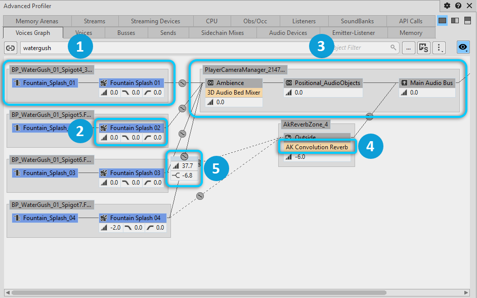

|  |  |
| --- | --- |
|  | The large light grey box (BP\_WaterGush\_01\_Spigot4\_3...) represents the Game Object that is associated with the Event (Fountain\_Splash\_02) and Sound SFX (Fountain Splash 02). |
|  | The blue boxes represent the Event (Fountain\_Splash\_02) and the Sound SFX (Fountain Splash 02) objects. Numbers and icons indicate the relative volume level in decibels, low-pass filter (0-100), and high pass filter (0-100). |
|  | The large light grey box represents the Listener Game Object (PlayerCameraManager\_2147...) that is associated with the Busses and their applied effects. Numbers and icons indicate the relative volume level in decibels. |
|  | The yellow box (AK Convolution Reverb) beneath the Bus (AkReverbZone\_4) represents the Effect applied on the Bus. Numbers and icons indicate the relative volume level in decibels. |
|  | Click the small grey circle to view the volume and amount of latency in milliseconds applied to this connection. |

Voice Graph 选项卡中的数据仅在各个捕获周期收集一次。但是，您可以使用 Performance/Voice Monitor 中的时间光标来浏览不同时间段的数据。

|  |  |
| --- | --- |
| [技巧] | 技巧 |
| 列出所有游戏对象，例如在Advanced Profiler的[“Capture Log”一节](ch62s01.html "Capture Log")或[“Voices（语音）”一节](ch62s03s02.html "Voices（语音）")和[“Voices Graph 选项卡”一节](ch62s03s01.html "Voices Graph 选项卡")选项卡中，有一个特定的快捷菜单，其中包含以下选项：  - **Mute Game Object**：将该游戏对象关联的所有音频对象静音。 - **Unmute Game Object**：为该游戏对象关联的所有音频对象取消静音。 - **Solo Game Object**：间接地将其他游戏对象关联的所有音频对象静音。 - **Unsolo Game Object**：为其他游戏对象关联的所有音频对象取消静音。 - **Search Game Object in Voice Graph**：打开 Advanced Profiler 的 [“Voices Graph 选项卡”一节](ch62s03s01.html "Voices Graph 选项卡") 选项卡，将其 Filter 设置为指定的游戏对象。 |

**相关主题**

- [“连接至本地/远程游戏系统”一节](ch39s06.html "连接至本地/远程游戏系统")
- [“从声音引擎捕获数据”一节](ch39s07.html "从声音引擎捕获数据")
- [“使用 Performance Monitor 进行监控和故障排查”一节](ch39s09.html "使用 Performance Monitor 进行监控和故障排查")

---

##### Voices（语音）

Advanced Profiler ― Voice（声部）选项卡显示有关声音引擎在任一时刻管理的各个声部或播放实例的信息。

|  |  |
| --- | --- |
| [备注] | 备注 |
| 为了使振动对象显示在 Voices 选项卡中，您需要在电脑上安装适当的振动设备驱动程序。 |

  

|  |  |
| --- | --- |
| [备注] | 备注 |
| **Game Object** 、 **Target** 、 **Wwise Object** 和 **Bus** 列均显示相应的 Mute 和 Solo 按钮（如 [“Busses”一节](ch62s03s03.html "Busses") 选项卡文档中所述）。但请注意，游戏对象将对 Wwise 对象产生特殊的影响。如果游戏对象被静音，则其关联的所有 Wwise 对象都将会静音。如果游戏对象被独奏，那么只有其相关的 Wwise 对象可能会播放；这是由它们自身的 Mute 和 Solo 设置决定的。 |

| 筛选器工具栏 | |
| --- | --- |
| This view includes a filtering toolbar, which allows you to reduce the amount of information displayed in the view so you can focus on specific elements. 有关更多详细信息，请参阅 [“在性能分析视图中筛选数据”一节](ch39s07s03.html "在性能分析视图中筛选数据") 章节。 | |
|  | |
|  | **Unlink Filter**：禁止在多个筛选器视图之间同步。 |
|  | **Text Filter**：通过指定文本来筛选内容。系统会将您所指定的字词与内容中所含名称或字符串的开头进行匹配。键入的字词越多，显示的结果越细化。匹配项不区分大小写。有关高级用法的信息，请参阅“[“使用性能分析器筛选器表达式”一节](ch39s07s04.html "使用性能分析器筛选器表达式")”。 |
|  | **Object Filter**：通过指定 Wwise 对象来筛选内容。系统会将您所指定的 Wwise 工程对象与视图中的内容进行匹配。同时，还会依据对象关系（如父子对象关系和输出总线关系）对内容进行匹配。 |
|  | **Browse Object Filter**：显示 Project Explorer 浏览器，以便选择所要筛选的对象。 |
|  | **Mute/Solo Filtering**：若启用，则从结果中排除激活了 Mute 的对象，而只显示激活了 Solo 的对象。 |
|  | **Options**：显示其他操作。 |

| 界面元素 | 描述 |
| --- | --- |
|  | 打开搜索框，在其中输入标准字母和数字会筛选掉视图中不相匹配的元素。阅读 [“使用表格”一节](ch03.html#using_tables "使用表格") 了解详细信息。  点击搜索图标左侧的 Close（关闭）图标，以关闭搜索字段并删除筛选器。  |  |  | | --- | --- | | [备注] | 备注 | | 搜索不包括[“List View（列表视图）”一节](ch60s12s02.html "List View（列表视图）"), [“Query Editor”一节](ch60s07s01.html "Query Editor"), [“MIDI Keymap Editor 视图”一节](ch60s01s03s06s01s01.html "MIDI Keymap Editor 视图"), and [“Reference View 视图”一节](ch60s12s05.html "Reference View 视图")中折叠起来的节点。  The search is not included in the Settings for Source objects. | |
|  | 配置列…。右键单击表格标题来打开 **Configure Columns** 对话框以指定要显示的列及其顺序。详请参阅[“使用表格”一节](ch03.html#using_tables "使用表格")。 |
| Game Object | 与对象关联的游戏对象的名称。  |  |  | | --- | --- | | [技巧] | 技巧 | | 列出所有游戏对象，例如在Advanced Profiler的[“Capture Log”一节](ch62s01.html "Capture Log")或[“Voices（语音）”一节](ch62s03s02.html "Voices（语音）")和[“Voices Graph 选项卡”一节](ch62s03s01.html "Voices Graph 选项卡")选项卡中，有一个特定的快捷菜单，其中包含以下选项：  - **Mute Game Object**：将该游戏对象关联的所有音频对象静音。 - **Unmute Game Object**：为该游戏对象关联的所有音频对象取消静音。 - **Solo Game Object**：间接地将其他游戏对象关联的所有音频对象静音。 - **Unsolo Game Object**：为其他游戏对象关联的所有音频对象取消静音。 - **Search Game Object in Voice Graph**：打开 Advanced Profiler 的 [“Voices Graph 选项卡”一节](ch62s03s01.html "Voices Graph 选项卡") 选项卡，将其 Filter 设置为指定的游戏对象。 | |
| Event | 触发了目标播放行为的事件名称。 |
| Target | 事件播放的目标对象。目标的播放已触发 Wwise 对象的播放。 |
| Wwise Object | Wwise 对象。声音引擎播放的对象名称。 |
| (Mute and Solo) | 控制对象的 Mute（静音）和 Solo（单独播放）状态，也会显示该对象是否处于被动静音和 Solo 状态。  将对象静音会使其在当前监听中无法听到。让对象 Solo 会使工程中的所有其它对象无声。  粗体的 **M** 或 **S** 表明已为对象主动设置了 Mute 或 Solo 状态。褪色的非粗体 **M** 或 **S** 表明对象的 Mute 或 Solo 状态是由于其它对象状态而被动设置的。  将对象静音会让其子对象被动静音。  让对象 Solo 会使同级对象被动静音，并让子对象和父对象被动 Solo。  |  |  | | --- | --- | | [技巧] | 技巧 | | 在点击 Solo 按钮的同时按住 Ctrl 键，可以强制仅 Solo 该 Solo 按钮所在的对象。 |  |  |  | | --- | --- | | [备注] | 备注 | | Mute 和 Solo 仅用于监视目的，而不会保存在工程中或存储在 SoundBank（声音包）中。 | |
| Bus | 总线。输出对象的总线的名称。 |
| Voice Volume（声部音量）。 | 声部音量。工程层级结构中定义的声部电平。该值的影响因素包括层级结构中所有父对象和总线的音量电平、状态、RTPC 和 Set Voice Volume 动作。 |
| Panning Volumes | 声像摆位音量。在声部被混入第一条混音总线的各个声道时声部的输出电平。此值严格表示各个声道的空间化增益。  有关声道顺序的说明，请参阅[“了解总线配置”一节](ch22s11.html "了解总线配置")。 |
| Game-Defined Auxiliary Send Volume（游戏定义的辅助发送音量） | 游戏定义的辅助发送值偏置，以 dB 为单位。 |
| Total Volume | Volume of the voice plus the contributions from all mixing bus gains of the signal path, from the voice down to the Main Audio Bus inclusively. 当存在多条信号路径时，例如要使用辅助发送时，采取所有路径音量中的最大值。Total Volume 会与 Volume Threshold 计算评估，以用来决定是否转换到虚声部。它几乎包含 Wwise 中的所有音量偏置，但不包括那些属于归一化和补偿增益的偏置（请参见下方的 Normalization / Make-Up Gain 列）。 |
| Normalization / Make-Up Gain | 归一化／补偿增益。音量增益已作用于音频源，独立于 Wwise 中的其它逻辑音量。它来自补偿增益属性、响度归一化和局部音量偏置（音频源的补偿增益）。它不包含在 Total Volume 中，因此针对音量阈值评估声部时会予以忽略。它对 HDR 透明，并且 **Voice Monitor** 也不会予以考虑。  有关详细信息，请参阅[“HDR 和 Wwise 声部管线”一节](ch34s09s04.html "HDR 和 Wwise 声部管线")。 |
| Device | 设备。声音的传播媒介（比如，系统的主音频输出使用 **Main**，而 PS4、PS5、Xbox One 和 Xbox Series X 上的背景音乐扬声器则使用 **Background**）。 |
| Voice LPF | 声部低通滤波器。LPF 真正作用于主声部管线，此值包含 Base LPF、Occlusion（声笼） LPF 和声锥及距离衰减 LPF。 |
| Voice HPF | 声部 HPF。HPF 真正作用于主声部管线，此值包含 Base HPF、Occlusion HPF 和声锥及距离衰减 HPF。 |
| Priority | 优先级。优先级定义了同一个层级结构中各个对象的相对重要性。 |
| Virtual | 虚拟。表明对象正位于虚声部列表中。 |
| Over Limit | 超出上限。表明对象因为其播放实例数超过其节点播放数限幅器之一的限制而变成了虚对象。 |

**相关主题**

- [“连接至本地/远程游戏系统”一节](ch39s06.html "连接至本地/远程游戏系统")
- [“从声音引擎捕获数据”一节](ch39s07.html "从声音引擎捕获数据")
- [“使用 Performance Monitor 进行监控和故障排查”一节](ch39s09.html "使用 Performance Monitor 进行监控和故障排查")

---

##### Busses

Advanced Profiler ―Bus 选项卡显示有关任一时刻声音引擎中正在混音或处理音频的各条总线的信息。

|  |  |
| --- | --- |
| [备注] | 备注 |
| Busses 选项卡中不显示 Not Mixing 状态的总线。有关各种处理状态的详细信息，请参阅[“了解总线图标和处理状态”一节](ch34s11s01.html "了解总线图标和处理状态")章节。 |

| 界面元素 | 描述 |
| --- | --- |
|  | 打开搜索框，在其中输入标准字母和数字会筛选掉视图中不相匹配的元素。阅读 [“使用表格”一节](ch03.html#using_tables "使用表格") 了解详细信息。  点击搜索图标左侧的 Close（关闭）图标，以关闭搜索字段并删除筛选器。  |  |  | | --- | --- | | [备注] | 备注 | | 搜索不包括[“List View（列表视图）”一节](ch60s12s02.html "List View（列表视图）"), [“Query Editor”一节](ch60s07s01.html "Query Editor"), [“MIDI Keymap Editor 视图”一节](ch60s01s03s06s01s01.html "MIDI Keymap Editor 视图"), and [“Reference View 视图”一节](ch60s12s05.html "Reference View 视图")中折叠起来的节点。  The search is not included in the Settings for Source objects. | |
|  | 配置列…。右键单击表格标题来打开 **Configure Columns** 对话框以指定要显示的列及其顺序。详请参阅[“使用表格”一节](ch03.html#using_tables "使用表格")。 |
| Bus | 总线或辅助总线的名称。 |
| Game Objects | 该游戏对象的类型。 |
| (Mute and Solo) | 控制对象的 Mute（静音）和 Solo（单独播放）状态，也会显示该对象是否处于被动静音和 Solo 状态。  将对象静音会使其在当前监听中无法听到。让对象 Solo 会使工程中的所有其它对象无声。  粗体的 **M** 或 **S** 表明已为对象主动设置了 Mute 或 Solo 状态。褪色的非粗体 **M** 或 **S** 表明对象的 Mute 或 Solo 状态是由于其它对象状态而被动设置的。  将对象静音会让其子对象被动静音。  让对象 Solo 会使同级对象被动静音，并让子对象和父对象被动 Solo。  |  |  | | --- | --- | | [技巧] | 技巧 | | 在点击 Solo 按钮的同时按住 Ctrl 键，可以强制仅 Solo 该 Solo 按钮所在的对象。 |  |  |  | | --- | --- | | [备注] | 备注 | | Mute 和 Solo 仅用于监视目的，而不会保存在工程中或存储在 SoundBank（声音包）中。 | |
| Bus Volume | 总线音量。工程层级结构中定义的总线输出电平。该值包括层级结构中的所有状态的音量电平、RTPC 和 Set Voice Volume Action。 |
| Mix Count | 混音数。由总线混合在一起的输入数量。 |
| Effect 0..3 | 表示总线上处理的效果器类型（效果器序号为 0 到 3）。 |
| Audio Device | 音频设备。指示要将此总线输出到的 Audio Device 的 ShareSet。活跃的 Audio Device 会列在 [“Audio Devices”一节](ch62s03s06.html "Audio Devices") 选项卡中。 |
| Device ID | 设备 ID。指示要将此总线输出到的 Audio Device 的 ID。活跃的 Audio Device 及其 Device ID 也会列在 [“Audio Devices”一节](ch62s03s06.html "Audio Devices") 选项卡中。 |

**相关主题**

- [“连接至本地/远程游戏系统”一节](ch39s06.html "连接至本地/远程游戏系统")
- [“从声音引擎捕获数据”一节](ch39s07.html "从声音引擎捕获数据")
- [“使用 Performance Monitor 进行监控和故障排查”一节](ch39s09.html "使用 Performance Monitor 进行监控和故障排查")

---

##### Sends

Advanced Profiler 中的 Sends 选项卡中，针对声音引擎当前播放的对象（每个声部或播放实例），显示了哪些发送目前处于活动状态。

| 界面元素 | 描述 |
| --- | --- |
|  | 打开搜索框，在其中输入标准字母和数字会筛选掉视图中不相匹配的元素。阅读 [“使用表格”一节](ch03.html#using_tables "使用表格") 了解详细信息。  点击搜索图标左侧的 Close（关闭）图标，以关闭搜索字段并删除筛选器。  |  |  | | --- | --- | | [备注] | 备注 | | 搜索不包括[“List View（列表视图）”一节](ch60s12s02.html "List View（列表视图）"), [“Query Editor”一节](ch60s07s01.html "Query Editor"), [“MIDI Keymap Editor 视图”一节](ch60s01s03s06s01s01.html "MIDI Keymap Editor 视图"), and [“Reference View 视图”一节](ch60s12s05.html "Reference View 视图")中折叠起来的节点。  The search is not included in the Settings for Source objects. | |
|  | 配置列…。右键单击表格标题来打开 **Configure Columns** 对话框以指定要显示的列及其顺序。详请参阅[“使用表格”一节](ch03.html#using_tables "使用表格")。 |
| Game Object | 与对象关联的游戏对象的名称。  |  |  | | --- | --- | | [技巧] | 技巧 | | 列出所有游戏对象，例如在Advanced Profiler的[“Capture Log”一节](ch62s01.html "Capture Log")或[“Voices（语音）”一节](ch62s03s02.html "Voices（语音）")和[“Voices Graph 选项卡”一节](ch62s03s01.html "Voices Graph 选项卡")选项卡中，有一个特定的快捷菜单，其中包含以下选项：  - **Mute Game Object**：将该游戏对象关联的所有音频对象静音。 - **Unmute Game Object**：为该游戏对象关联的所有音频对象取消静音。 - **Solo Game Object**：间接地将其他游戏对象关联的所有音频对象静音。 - **Unsolo Game Object**：为其他游戏对象关联的所有音频对象取消静音。 - **Search Game Object in Voice Graph**：打开 Advanced Profiler 的 [“Voices Graph 选项卡”一节](ch62s03s01.html "Voices Graph 选项卡") 选项卡，将其 Filter 设置为指定的游戏对象。 | |
| Wwise Object | Wwise 对象。声音引擎播放的对象名称。 |
| Auxiliary Bus | 为辅助发送设置的 Auxiliary Bus 名称。 |
| Send Volume | 发送音量，单位是分贝（dB）。 |
| Send Type | 使用的发送类型。可以是：  - Game-defined auxiliary send (游戏定义的辅助发送）（0 至 3） - 用户定义的辅助发送 (游戏定义的辅助发送）（0 至 3） |

**相关主题**

- [“连接至本地/远程游戏系统”一节](ch39s06.html "连接至本地/远程游戏系统")
- [“从声音引擎捕获数据”一节](ch39s07.html "从声音引擎捕获数据")
- [“使用 Performance Monitor 进行监控和故障排查”一节](ch39s09.html "使用 Performance Monitor 进行监控和故障排查")

---

##### Sidechain Mixes

The Advanced Profiler - Sidechain Mixes tab displays the sidechain operations that occurred at any point in time.

| 界面元素 | 描述 |
| --- | --- |
|  | 打开搜索框，在其中输入标准字母和数字会筛选掉视图中不相匹配的元素。阅读 [“使用表格”一节](ch03.html#using_tables "使用表格") 了解详细信息。  点击搜索图标左侧的 Close（关闭）图标，以关闭搜索字段并删除筛选器。  |  |  | | --- | --- | | [备注] | 备注 | | 搜索不包括[“List View（列表视图）”一节](ch60s12s02.html "List View（列表视图）"), [“Query Editor”一节](ch60s07s01.html "Query Editor"), [“MIDI Keymap Editor 视图”一节](ch60s01s03s06s01s01.html "MIDI Keymap Editor 视图"), and [“Reference View 视图”一节](ch60s12s05.html "Reference View 视图")中折叠起来的节点。  The search is not included in the Settings for Source objects. | |
|  | 配置列…。右键单击表格标题来打开 **Configure Columns** 对话框以指定要显示的列及其顺序。详请参阅[“使用表格”一节](ch03.html#using_tables "使用表格")。 |
| Sidechain Mix | The name of the sidechain mix.  |  |  | | --- | --- | | [技巧] | 技巧 | | 列出所有游戏对象，例如在Advanced Profiler的[“Capture Log”一节](ch62s01.html "Capture Log")或[“Voices（语音）”一节](ch62s03s02.html "Voices（语音）")和[“Voices Graph 选项卡”一节](ch62s03s01.html "Voices Graph 选项卡")选项卡中，有一个特定的快捷菜单，其中包含以下选项：  - **Mute Game Object**：将该游戏对象关联的所有音频对象静音。 - **Unmute Game Object**：为该游戏对象关联的所有音频对象取消静音。 - **Solo Game Object**：间接地将其他游戏对象关联的所有音频对象静音。 - **Unsolo Game Object**：为其他游戏对象关联的所有音频对象取消静音。 - **Search Game Object in Voice Graph**：打开 Advanced Profiler 的 [“Voices Graph 选项卡”一节](ch62s03s01.html "Voices Graph 选项卡") 选项卡，将其 Filter 设置为指定的游戏对象。 | |
| Scope | The name of the game object that is the scope of the operation, or "Global". |
| Operation | The operation type, either "Send" or "Receive". |
| Bus/Voice | The name of the bus or the voice that generated the operation. |
| Effect | The name of the effect on the bus or voice that generated the operation. |

**相关主题**

- [“连接至本地/远程游戏系统”一节](ch39s06.html "连接至本地/远程游戏系统")
- [“从声音引擎捕获数据”一节](ch39s07.html "从声音引擎捕获数据")
- [“使用 Performance Monitor 进行监控和故障排查”一节](ch39s09.html "使用 Performance Monitor 进行监控和故障排查")

---

##### Audio Devices

Advanced Profiler - Audio Devices（高级性能分析器 - 音频设备）选项卡会显示声音引擎中活跃的各个 Audio Device 的相关信息。您可以在调用 [`AK::SoundEngine::Init`](https://www.audiokinetic.com/library/edge/?source=SDK&id=namespace_a_k_1_1_sound_engine_a9a26da64092b97243844df77cbcdbf5f.html#a9a26da64092b97243844df77cbcdbf5f) 时使用 [`AkOutputSettings`](https://www.audiokinetic.com/library/edge/?source=SDK&id=struct_ak_output_settings.html) 来在声音初始化时指定活跃的设备，并通过调用 [`AK::SoundEngine::AddOutput`](https://www.audiokinetic.com/library/edge/?source=SDK&id=namespace_a_k_1_1_sound_engine_a15ab79f954a307902f529d8ccde8ad48.html)、[`AK::SoundEngine::ReplaceOutput`](https://www.audiokinetic.com/library/edge/?source=SDK&id=namespace_a_k_1_1_sound_engine_a81521a4611d3891c499ec9c5eb421ac2.html) 或 [`AK::SoundEngine::RemoveOutput`](https://www.audiokinetic.com/library/edge/?source=SDK&id=namespace_a_k_1_1_sound_engine_a0932ed2a3669258ecc3bbe6448314020.html) 来添加、替换或移除活跃的设备。

| 界面元素 | 描述 |
| --- | --- |
|  | 打开搜索框，在其中输入标准字母和数字会筛选掉视图中不相匹配的元素。阅读 [“使用表格”一节](ch03.html#using_tables "使用表格") 了解详细信息。  点击搜索图标左侧的 Close（关闭）图标，以关闭搜索字段并删除筛选器。  |  |  | | --- | --- | | [备注] | 备注 | | 搜索不包括[“List View（列表视图）”一节](ch60s12s02.html "List View（列表视图）"), [“Query Editor”一节](ch60s07s01.html "Query Editor"), [“MIDI Keymap Editor 视图”一节](ch60s01s03s06s01s01.html "MIDI Keymap Editor 视图"), and [“Reference View 视图”一节](ch60s12s05.html "Reference View 视图")中折叠起来的节点。  The search is not included in the Settings for Source objects. | |
|  | 配置列…。右键单击表格标题来打开 **Configure Columns** 对话框以指定要显示的列及其顺序。详请参阅[“使用表格”一节](ch03.html#using_tables "使用表格")。 |
| Audio Devices | 音频设备。识别工程中的 Audio Device ShareSet。 |
| Device ID | 设备 ID。识别使用此 Audio Device ShareSet 的特定设备。 |
| Specified Listeners | 指定的听者。显示提供给 [`AK::SoundEngine::AddOutput`](https://www.audiokinetic.com/library/edge/?source=SDK&id=namespace_a_k_1_1_sound_engine_a15ab79f954a307902f529d8ccde8ad48.html) 的听者。只有在多个使用同一 ShareSet 的 Audio Device 同时处于活跃状态时才会考虑 Specified Listener。在使用多个共用同一 ShareSet 的 Audio Device 时，Specified Listener 会识别要将哪些听者输出到此设备。对于没有 Specified Listener 的 Audio Device，会接收来自未被任何其他使用同一 ShareSet 的 Audio Device 指定的听者的声音。 |

**相关主题**

- [“Audio Devices”一节](ch60s01s01.html "Audio Devices")
- [“了解 Secondary Output”一节](ch34s07.html "了解 Secondary Output")

---

##### Emitter-Listener Associations（发声体与听者的关系）

Advanced Profiler 中的 Emitter-Listener 选项卡显示了发声体与听者关系的信息。

| 界面元素 | 描述 |
| --- | --- |
|  | 打开搜索框，在其中输入标准字母和数字会筛选掉视图中不相匹配的元素。阅读 [“使用表格”一节](ch03.html#using_tables "使用表格") 了解详细信息。  点击搜索图标左侧的 Close（关闭）图标，以关闭搜索字段并删除筛选器。  |  |  | | --- | --- | | [备注] | 备注 | | 搜索不包括[“List View（列表视图）”一节](ch60s12s02.html "List View（列表视图）"), [“Query Editor”一节](ch60s07s01.html "Query Editor"), [“MIDI Keymap Editor 视图”一节](ch60s01s03s06s01s01.html "MIDI Keymap Editor 视图"), and [“Reference View 视图”一节](ch60s12s05.html "Reference View 视图")中折叠起来的节点。  The search is not included in the Settings for Source objects. | |
|  | 配置列…。右键单击表格标题来打开 **Configure Columns** 对话框以指定要显示的列及其顺序。详请参阅[“使用表格”一节](ch03.html#using_tables "使用表格")。 |
| Emitter（发声体） | 该发声体与听者的关系中，“发声体”游戏对象的 ID、或游戏对象的名称。与 API 调用  [`SetListeners()`](https://www.audiokinetic.com/library/edge/?source=SDK&id=namespace_a_k_1_1_sound_engine_a2f85a55c38afa2e0dbc6172a7bec91d1.html) 和  [`SetGameObjectAuxSendValues()`](https://www.audiokinetic.com/library/edge/?source=SDK&id=namespace_a_k_1_1_sound_engine_af960fca0239e219b9d08c2659fe9e5d4.html) 的第一个参数对应。可以是任意游戏对象。  |  |  | | --- | --- | | [备注] | 备注 | | 在 Emitter-Listener 选项卡中双击列出的游戏对象将会打开由该游戏对象 ID 筛选的 Voices Graph 选项卡。 | |
| Listener | 该发声体与听者的关系中，“听者”游戏对象的 ID、或游戏对象的名称。与 API 调用  [`SetListeners()`](https://www.audiokinetic.com/library/edge/?source=SDK&id=namespace_a_k_1_1_sound_engine_a2f85a55c38afa2e0dbc6172a7bec91d1.html) 和  [`SetGameObjectAuxSendValues()`](https://www.audiokinetic.com/library/edge/?source=SDK&id=namespace_a_k_1_1_sound_engine_af960fca0239e219b9d08c2659fe9e5d4.html) 的第二个参数对应。可以是任意游戏对象。  |  |  | | --- | --- | | [备注] | 备注 | | 在 Emitter-Listener 选项卡中双击列出的游戏对象将会打开由该游戏对象 ID 筛选的 Voices Graph 选项卡。 | |
| Bus | 与该对象关联的总线的名称。 |
| Level | 游戏对象应用的发送值百分比，与发送音量有关。 |
| Routing Type | User-defined（用户定义）：使用 API 调用  [`SetListeners()`](https://www.audiokinetic.com/library/edge/?source=SDK&id=namespace_a_k_1_1_sound_engine_a2f85a55c38afa2e0dbc6172a7bec91d1.html) 设置的关联。包括工程中所有的直接输出和用户定义的发送。用户关联可以应用于 Voice Graph 中的任何节点。  "Game-defined"：游戏定义的发送。使用  [`SetGameObjectAuxSendValues()`](https://www.audiokinetic.com/library/edge/?source=SDK&id=namespace_a_k_1_1_sound_engine_af960fca0239e219b9d08c2659fe9e5d4.html)API 调用设置的关联。对于游戏定义的发送，不管工程设置如何，都将完全通过 API 调用来定义符合条件的 GameObjectID 和 AuxBusID 配对。 |

**相关主题**

- [“连接至本地/远程游戏系统”一节](ch39s06.html "连接至本地/远程游戏系统")
- [“从声音引擎捕获数据”一节](ch39s07.html "从声音引擎捕获数据")
- [“使用 Performance Monitor 进行监控和故障排查”一节](ch39s09.html "使用 Performance Monitor 进行监控和故障排查")

---

##### Memory

内存。Advanced Profiler ― Memory 选项卡显示有关 Wwise 声音引擎如何管理内存的信息。信息中会指示内存管理器追踪的各个内存类别。

|  |  |
| --- | --- |
| [备注] | 备注 |
| The Memory tab only tracks how much memory has been allocated by the memory manager in Wwise, but does not track how much memory has been reserved from the system. Use the [“Memory Arenas”一节](ch62s03s09.html "Memory Arenas") tab to monitor memory reservation and fragmentation. |

| 界面元素 | 描述 |
| --- | --- |
| **全局统计信息** | |
| Used | 用量。所有类别的内存总量。 |
| Total Reserved | The total amount of memory reserved by the memory manager across all memory arenas. |
| **类别表** | |
|  | 打开搜索框，在其中输入标准字母和数字会筛选掉视图中不相匹配的元素。阅读 [“使用表格”一节](ch03.html#using_tables "使用表格") 了解详细信息。  点击搜索图标左侧的 Close（关闭）图标，以关闭搜索字段并删除筛选器。  |  |  | | --- | --- | | [备注] | 备注 | | 搜索不包括[“List View（列表视图）”一节](ch60s12s02.html "List View（列表视图）"), [“Query Editor”一节](ch60s07s01.html "Query Editor"), [“MIDI Keymap Editor 视图”一节](ch60s01s03s06s01s01.html "MIDI Keymap Editor 视图"), and [“Reference View 视图”一节](ch60s12s05.html "Reference View 视图")中折叠起来的节点。  The search is not included in the Settings for Source objects. | |
|  | 配置列…。右键单击表格标题来打开 **Configure Columns** 对话框以指定要显示的列及其顺序。详请参阅[“使用表格”一节](ch03.html#using_tables "使用表格")。 |
| Category Name | 类别名称。内存类别的名称。The categories and subcategories are defined as follows:  - **Game Object**: Registered emitter objects as well as others. - **Integration**: Allocations specific to game engine integrations, like callbacks or capturing audio output. - **Job Manager**: Allows for asynchronously rendering audio buffers over single and multiple cores. - **Media**: Compressed and uncompressed media in memory. This value increases if you decode your SoundBanks on load. - **Object**:  - **Event**: Events and Actions.   - **Object**: Memory allocations that have not been categorized or don't fit with other categories.   - **Structure**: Mainly the hierarchical structure and container settings. - **Processing**:  - **Processing**: Audio buffers for decompression, applying     Effects, mixing, and DSP. This value is directly influenced by the     number of physical voices and busses.   - **Processing (Plug-in)**: Allocations for plug-ins like AK Convolution Reverb, RoomVerb, and Time Stretch. - **Profiler**:  - **Monitor Queue**: Fixed-size allocation for Profiler connection     data.   - **Profiler**: Everything other than Monitor Queue, for example, debug names for objects. - **Sound Engine**: Basic initialization of the   sound engine and other systems used for sound engine management. - **Spatial Audio**:  - **Geometry**: Geometry sent to Wwise.   - **Reflection/Diffraction Paths**: Mainly the memorization of propagation.   - **Spatial Audio**: Various other memory allocations. - **Streaming**:  - **Streaming**: Supportive costs of streaming. For example, there's a cost for each file opened.   - **Streaming I/O**: Fixed-size buffer into which streamed media chunks are loaded. - **Temp**:  - **Temp (Audio Render)**: Pool of memory to manage temporary allocations. |
| Used | 用量。各个内存类别当前的内存用量。 |
| Peak Used | 峰值用量。自内存管理器初始化以来各个内存类别的峰值内存用量。 |
| Allocs | 分配数。自内存管理器初始化以来执行的分配数。  若此数值递增，则表示内存管理器当前正在分配内存。 |
| Frees | 释放数。自内存管理器初始化以来执行的释放数。  若此数值递增，则表示内存管理器当前正在释放内存。 |
| Cur. Allocs | 当前分配的内存块的数量。Current Alloc 值是通过 Alloc 的数目减去 Free 的数目得到的。  若此数值递增或递减，则表示内存管理器当前正在分配或释放内存。 |

**相关主题**

- [“连接至本地/远程游戏系统”一节](ch39s06.html "连接至本地/远程游戏系统")
- [“从声音引擎捕获数据”一节](ch39s07.html "从声音引擎捕获数据")
- [“使用 Performance Monitor 进行监控和故障排查”一节](ch39s09.html "使用 Performance Monitor 进行监控和故障排查")

---

##### Memory Arenas

The Advanced Profiler - Memory Arenas tab displays information about how memory is managed when using the default memory allocator. This tab is primarily used to monitor the total memory reserved for the Wwise sound engine, and to review memory fragmentation over time. For more information about tuning memory arenas, see [Configuration and Tuning of AkMemoryArenas](https://www.audiokinetic.com/library/edge/?source=SDK&id=goingfurther_memoryarenas.html).

| 界面元素 | 描述 |
| --- | --- |
| **全局统计信息** | |
| Total Heap Used | The sum of used memory across all arenas. |
| Total Reserved | The total amount of memory reserved across all arenas. |
| Num Spans Reserved | The total number of spans reserved across all arenas. |
| **Heap Details** | |
|  | 配置列…。右键单击表格标题来打开 **Configure Columns** 对话框以指定要显示的列及其顺序。详请参阅[“使用表格”一节](ch03.html#using_tables "使用表格")。 |
| Name/Span Address Name | The name of the memory arena is listed for the root nodes. The different memory arenas are as follows:  - **Primary**: The default memory arena used by most memory categories. - **Media**: The memory arena used for memory allocations that go to the Media memory category, usually from loading SoundBanks. - **Profiler**: The memory arena used for memory allocations that go to the Profiler and Monitor Queue memory category. This memory arena does not exist in the Release build configuration. - **Device**: The memory arena used for handling any device-specific memory allocations. This is present only on specific platforms that use device-specific memory for audio processing.  Below each memory arena name, all of the spans that belong to the memory arena is listed. Each span is identified by the location of its address in memory in the runtime being profiled. |
| Used | The amount of memory used for the arena as a whole, or the amount of memory used in each span. |
| Free | The amount of free memory available across all spans in the arena, or the amount of memory available in each span. Free memory is characterized by any memory that is reserved but unused. |
| Reserved | The amount of reserved memory across all spans in the arena, or the amount of memory reserved by each span. |
| Largest Free/Fragmentation | The largest contiguous free space of memory across every span in the arena is listed for the root nodes of the tree. This is the largest memory allocation that the arena can service before it needs to request a new span or recycle an unused span.  For each span, a map is displayed, which shows the portions of the span that have memory allocated. The map is up to 32 cells in length, each representing the amount of reserved space that is used. Spans with a reserved size that is not a power-of-two have fewer visible cells. For example, a span that is 4MiB in size shows 32 cells, each representing 128KiB of memory, but a span that is 6MiB in size only shows 24 cells, each representing 256KiB of memory. |
| Allocs | The number of allocations that the memory arena has performed since initialization, including small-block allocations, or the number of allocations that each span has performed since initialization of the span. |
| Frees | The number of deallocations that the memory arena has performed since initialization, including small-block allocations, or the number of deallocations that each span has performed since initialization of the span. |
| Cur. Allocs | The number of memory allocations the memory arena currently has active, including small-block allocations, or the number of active allocations for each span. |
| Type | The span type, between Base, Medium, Large, and Huge. Base spans are created when the memory arena is initialized, Medium spans are secondary spans that are created on demand as memory is required, Large spans are secondary spans for allocations of a certain size (but are only present when support for Large allocations is enabled), and Huge spans are secondary spans that were created for a single memory allocation. This column is empty for memory arenas, and is only populated for span rows. |
| User Data | The value of the user data provided from the callback to allocate a new span, or just a hyphen if zero was returned. This column is empty for memory arenas, and is only populated for span rows. |
| **Small Block Allocator (SBA) Details** | |
| Name/Small Block Size Class | The name of the memory arena for the root items in the tree, or the different size classes for the SBA. |
| Used | The amount of memory used by the SBA in the arena, or the amount of memory used in each SBA size class. |
| Free | The amount of memory that is reserved and unused for the entire SBA in the arena, or the amount of memory that is reserved and unused for just the SBA size class. |
| Reserved | The amount of memory that is reserved for the entire SBA in the arena, or the amount of memory that is reserved for just the SBA size class. |
| SBA Spans Reserved | The number of spans that are reserved for the entire SBA in the arena, or the number of spans that are reserved for just the SBA size class. |
| Allocs | The number of allocations that have been performed for the entire SBA in the arena since initialization, or the number of allocations that have been performed for just the SBA size class. |
| Frees | The number of deallocations that have been performed for the entire SBA in the arena since initialization, or the number of deallocations that have been performed for just the SBA size class. |
| Cur. Allocs | The number of allocations that are currently active for the entire SBA in the arena, or the number of allocations that are currently active for just the SBA size class. |

**相关主题**

- [*在 Wwise 中管理内存*](ch38.html "在 Wwise 中管理内存")

---

##### Streams

Advanced Profiler ― Stream 选项卡显示有关 Wwise 声音引擎如何管理各路流播放的信息。有关 Wwise 中 I/O 管理的详细信息，请参阅 SDK 文档的“流播放/流管理器”章节。

| 界面元素 | 描述 |
| --- | --- |
|  | 打开搜索框，在其中输入标准字母和数字会筛选掉视图中不相匹配的元素。阅读 [“使用表格”一节](ch03.html#using_tables "使用表格") 了解详细信息。  点击搜索图标左侧的 Close（关闭）图标，以关闭搜索字段并删除筛选器。  |  |  | | --- | --- | | [备注] | 备注 | | 搜索不包括[“List View（列表视图）”一节](ch60s12s02.html "List View（列表视图）"), [“Query Editor”一节](ch60s07s01.html "Query Editor"), [“MIDI Keymap Editor 视图”一节](ch60s01s03s06s01s01.html "MIDI Keymap Editor 视图"), and [“Reference View 视图”一节](ch60s12s05.html "Reference View 视图")中折叠起来的节点。  The search is not included in the Settings for Source objects. | |
|  | 配置列…。右键单击表格标题来打开 **Configure Columns** 对话框以指定要显示的列及其顺序。详请参阅[“使用表格”一节](ch03.html#using_tables "使用表格")。 |
| Device Name | 设备名称。流播放所在的设备名称。从您实现的  [`IAkLowLevelIOHook::GetDeviceDesc()`](https://www.audiokinetic.com/library/?source=SDK&id=class_a_k_1_1_stream_mgr_1_1_i_ak_low_level_i_o_hook_a06860cb1211c2ebd5c49f4429cc66a0b.html)中返回的字符串。 |
| Stream Name | 播放流的名称。通过设计工具播放时，流名称是流播放音频文件的完整文件路径。在游戏中播放时，它是音频源的名称。 |
| Priority | 播放流的优先级。在不只一条播放流等待响应时，优先级能够影响计划程序服务流播放的顺序。 |
| Tgt. Buffer Size | 目标缓冲区长度。是由代码中指定的流播放设备的目标缓冲区长度（ [AkDeviceSettings::fTargetAutoStmBufferLength](https://www.audiokinetic.com/library/?source=SDK&id=struct_ak_device_settings_af396c1626da7df1bbb6d9129e132b02f.html) ，以毫秒为单位）乘以流播放的预期吞吐量（以每秒字节数为单位）来计算得到的。在流播放声音的缓冲区低于目标缓冲区长度时，这向流播放设备表明需要更多的 I/O 数据。在流播放声音超过目标缓冲区长度时，该流会空闲。 |
| Ref. Memory | 流播放引用的内存量。它不包含用于 I/O 传输的内存。它可视为衡量在任一时刻流播放送到声音引擎的数据量。例如，如果某播放流整个展现出 “Buffering Status”（缓冲状态）却只引用了 0 字节内存，则这也就是说，它的所有 I/O 传输已被调度，但一条也没有完成，进而导致流的匮乏。由于 I/O 内存池被拆分为大小相等的块 （在 [AkDeviceSettings::uGranularity](https://www.audiokinetic.com/library/?source=SDK&id=struct_ak_device_data_a73ceca6480ceffa50466df30b5d2120f.html) 中指定），因此引用的内存量可能会大于实际的有效数据量。例如，这些块之一包含文件的最后几个字节。当为某个指定设备启用数据缓存时，其所有播放流引用的内存总和可能超过其流播放 I/O 池大小，因为这些播放流中的某些流引用了相同的内存。 |
| Buffering Status | 缓冲状态。流播放逼近其目标缓冲区程度的图形化表示。  状态栏有可能显示为两种颜色：  - **灰色**：表示已经缓冲的请求的数据部分。 - **橙色（Classic 主题下为蓝色）**：表示尚未缓冲的请求的数据部分。其中包括 I/O 传输已经安排但尚未完成处理的数据。  在没有请求任何数据时，状态栏显示空白。  若整个状态栏显示为灰色，则表示播放流的缓冲达到目标，播放流变为空闲状态。随着声音引擎不断使用来自播放流的数据，缓冲区长度逐渐缩短，使其降到目标以下。此时，播放流会请求获取更多数据。若缓冲区没有恢复到目标长度，则状态栏变为橙色（Classic 主题下为蓝色）。  状态栏的颜色取决于性能分析器最后采样时播放流的瞬时状态。下图举例展示了部分为灰色、部分为橙色的状态栏。不过，对于大多数现代数据存储设备，状态栏在全灰色和全橙色（或全蓝色）之间的过渡非常快，前后往往只有一帧的时间。因此，大部分情况下看到的状态栏都只是其中一种颜色。 |
| File Size | 文件大小。采用流播放的文件大小。 |
| File Position | 文件位置。表明文件内流播放位置的图形化表示。 |
| Total Bandwidth | 总带宽。文件在上一个性能分析帧中的流播放速率。此值会考虑所有传输，包括从 Stream Manager 缓存发生的传输。 |
| Bandwidth (Low-Level) | 总带宽。文件在上一个性能分析帧中的流播放速率。底层流带宽。与 Total Bandwidth 字段不同，此字段值会考虑在底层设备内发生的传输。此值始终低于或等于 Total Bandwidth。 |
| Est. Throughput | 估计吞吐量。播放流的估计吞吐量。声音引擎根据流播放的编码格式和声道数来估计引擎处理来自该流的数据的速度。它会将此值作为启发值向播放流推送，流播放将使用该值来确定其目标缓冲长度（缓冲区大小）。 |
| Active | 活跃。如果流播放在上一个性能分析帧中至少处于活跃状态一次，则指示 **True**。如果播放流尚未达到目标缓冲或正在等待至少一条 I/O 传输完成，则该流处于活跃状态。 |

**相关主题**

- [“连接至本地/远程游戏系统”一节](ch39s06.html "连接至本地/远程游戏系统")
- [“从声音引擎捕获数据”一节](ch39s07.html "从声音引擎捕获数据")
- [“使用 Performance Monitor 进行监控和故障排查”一节](ch39s09.html "使用 Performance Monitor 进行监控和故障排查")

---

##### Streaming Devices

流播放设备。Advanced Profiler ― Streaming Device 选项卡显示有关各个由 Wwise 声音引擎管理的流播放设备的信息。有关 Wwise 中 I/O 管理的详细信息，请参阅 SDK 文档的 [流播放/流管理器](https://www.audiokinetic.com/library/?source=SDK&id=streamingdevicemanager.html)章节。

| 界面元素 | 描述 |
| --- | --- |
|  | 打开搜索框，在其中输入标准字母和数字会筛选掉视图中不相匹配的元素。阅读 [“使用表格”一节](ch03.html#using_tables "使用表格") 了解详细信息。  点击搜索图标左侧的 Close（关闭）图标，以关闭搜索字段并删除筛选器。  |  |  | | --- | --- | | [备注] | 备注 | | 搜索不包括[“List View（列表视图）”一节](ch60s12s02.html "List View（列表视图）"), [“Query Editor”一节](ch60s07s01.html "Query Editor"), [“MIDI Keymap Editor 视图”一节](ch60s01s03s06s01s01.html "MIDI Keymap Editor 视图"), and [“Reference View 视图”一节](ch60s12s05.html "Reference View 视图")中折叠起来的节点。  The search is not included in the Settings for Source objects. | |
|  | 配置列…。右键单击表格标题来打开 **Configure Columns** 对话框以指定要显示的列及其顺序。详请参阅[“使用表格”一节](ch03.html#using_tables "使用表格")。 |
| Device Name | 设备的名称。此字符串是通过您实现的 IAkLowLevelIOHook::GetDeviceDesc() 函数返回的。 |
| IO Pool Size | I/O 池大小。为此设备的流播放 I/O 内存池预留的内存量。预留大小是在创建流播放设备时设置的，设置是通过  [`AkDeviceSettings::uIOMemorySize`](https://www.audiokinetic.com/library/edge/?source=SDK&id=struct_ak_device_settings_a75893592924a59881fe2cbca4e4ddd04.html) 进行的。 |
| Ratio Used | 占用。已占用内存量与流播放 I/O 池中预留总内存相比的图形化表示。深灰条表示引用的缓存（它无法被丢弃），而浅灰条表示未引用的缓存（它可被丢弃）。 |
| Ref'd Mem. | 已引用内存。当前用在流播放 I/O 内存池中的内存量，因为它会被流播放引用或被固定到缓存中（pin-to-cache）。 |
| Peak Ref'd Mem. | 峰值引用内存。流播放 I/O 内存池中曾经使用的最大引用内存量（光标所指时间之前任意时刻）。  该值可有助于您确定内存占用量何时逼近预留的内存上限。  与其它内存池不同，不时达到流播放 I/O 池上限是可以接受的。最显著的结果是源匮乏（source starvation）。但是，如果这些播放流需要的内存量大大超过可用内存，则这些流可能会停滞非常长的时间。 |
| Cached Memory | 缓存。缓存中未引用的内存，也就是说该内存既没有用于流播放，也没有被固定到缓冲区中，该内存在流播放 I/O 内存池中。 |
| Pinned to Cache | 固定到缓存。已经固定（预留）的流播放 I/O 内存池缓存。 |
| Allocs | 分配数。自流播放 I/O 内存池创建以来执行的分配数。  此数字改变时，它表明流播放 I/O 内存池当前正在分配内存。 |
| Frees | 释放数。自流播放 I/O 内存池创建以来执行的释放数。  若此数值改变，则表示流播放 I/O 内存池当前正在释放内存。 |
| Cur. Allocs | 当前分配数。流播放 I/O 内存池中当前分配的内存块数。Current Alloc 值是通过 Alloc 的数目减去 Free 的数目得到的。  若此数值改变，则表示内存池当前正在分配或释放内存。 |
| Cache Efficiency | 缓存效率。数据缓存效率的估计值。缓存效率是从性能分析会话期间底层带宽和总带宽之间的平均差异计算得出（请参见下方的“Bandwidth (Low-Level)”和“Total Bandwidth”）。  您可以针对给定设备在流播放 I/O 内存池中启用数据缓存（参阅 SDK 文档中的 `AkDeviceSettings::bUseStreamCache`）。在准备数据传输之前，流播放设备会在池中搜索对应于此文件的数据。如果找到此数据，则会直接使用此数据并且不会将任何 I/O 传输请求发送至Low-level I/O。 |
| Granularity | 设备的 Granularity（ `AkDeviceSettings::uGranularity` ），它表示流播放 I/O 池中每个内存块的大小，也定义了向 Low-level I/O 请求的 I/O 传输大小。 |
| Active Streams | 活跃流。在任一时刻此设备中活跃播放流的数量。如果播放流尚未达到目标缓冲或正在等待至少一条 I/O 传输完成，则该流处于活跃状态。 |
| Total Bandwidth | 总带宽。此设备中的所有播放流在上一个性能分析帧中的数据传输速率。此值会考虑所有传输，包括从 Stream Manager 缓存发生的传输。 |
| Bandwidth (Low-Level) | 底层带宽。此设备中的所有播放流在上一个性能分析帧中的文件传输速率。底层流带宽。与 Total Bandwidth 字段不同，此字段值会考虑在底层设备内发生的传输。此值始终低于或等于 Total Bandwidth。 |
| Completed Req. (Low-Level) | 完成的底层 I/O 请求。在上一个性能分析帧中，Low-level I/O 中完成的 I/O 传输请求的数量。 |
| Canceled Req. (Low-Level) | 取消的底层 I/O 请求。在上一个性能分析帧中， Low-level I/O 中取消的 I/O 传输请求的数量。 |
| Pending Req. (Low-Level) | 待处理请求。在进行性能分析时，正在等待Low-level I/O 完成的 I/O 传输请求的数量。 |
| Custom Parameter | 显示您实现的 `IAkLowLevelIOHook::GetData()` 返回的值。 |

**相关主题**

- [“连接至本地/远程游戏系统”一节](ch39s06.html "连接至本地/远程游戏系统")
- [“从声音引擎捕获数据”一节](ch39s07.html "从声音引擎捕获数据")
- [“使用 Performance Monitor 进行监控和故障排查”一节](ch39s09.html "使用 Performance Monitor 进行监控和故障排查")

---

##### CPU

Advanced Profiler C 此选项卡显示有关各个元素所用 CPU 百分比的信息。

| 界面元素 | 描述 |
| --- | --- |
|  | 打开搜索框，在其中输入标准字母和数字会筛选掉视图中不相匹配的元素。阅读 [“使用表格”一节](ch03.html#using_tables "使用表格") 了解详细信息。  点击搜索图标左侧的 Close（关闭）图标，以关闭搜索字段并删除筛选器。  |  |  | | --- | --- | | [备注] | 备注 | | 搜索不包括[“List View（列表视图）”一节](ch60s12s02.html "List View（列表视图）"), [“Query Editor”一节](ch60s07s01.html "Query Editor"), [“MIDI Keymap Editor 视图”一节](ch60s01s03s06s01s01.html "MIDI Keymap Editor 视图"), and [“Reference View 视图”一节](ch60s12s05.html "Reference View 视图")中折叠起来的节点。  The search is not included in the Settings for Source objects. | |
|  | 配置列…。右键单击表格标题来打开 **Configure Columns** 对话框以指定要显示的列及其顺序。详请参阅[“使用表格”一节](ch03.html#using_tables "使用表格")。 |
| Name | 名称。CPU 用量计算所涉及的元素的名称。 |
| Type | 类型。元素的类型。比如 Codec、Source、Effect、Mixer 或 Sink。 |
| % CPU | 元素使用的 CPU 百分比。 |
| Number of Instances | 实例数。基于上一测定期间实施的性能测定次数估算的元素实例数。对于有些插件，各帧的估值可能有所不同。 |

**相关主题**

- [“连接至本地/远程游戏系统”一节](ch39s06.html "连接至本地/远程游戏系统")
- [“从声音引擎捕获数据”一节](ch39s07.html "从声音引擎捕获数据")
- [“使用 Performance Monitor 进行监控和故障排查”一节](ch39s09.html "使用 Performance Monitor 进行监控和故障排查")

---

##### Obs/Occ

Obs/Occ（声障/声笼）选项卡显示影响游戏对象的声障、声笼、衍射、透射损失、散布和开口等信息。

| 界面元素 | 描述 |
| --- | --- |
|  | 打开搜索框，在其中输入标准字母和数字会筛选掉视图中不相匹配的元素。阅读 [“使用表格”一节](ch03.html#using_tables "使用表格") 了解详细信息。  点击搜索图标左侧的 Close（关闭）图标，以关闭搜索字段并删除筛选器。  |  |  | | --- | --- | | [备注] | 备注 | | 搜索不包括[“List View（列表视图）”一节](ch60s12s02.html "List View（列表视图）"), [“Query Editor”一节](ch60s07s01.html "Query Editor"), [“MIDI Keymap Editor 视图”一节](ch60s01s03s06s01s01.html "MIDI Keymap Editor 视图"), and [“Reference View 视图”一节](ch60s12s05.html "Reference View 视图")中折叠起来的节点。  The search is not included in the Settings for Source objects. | |
|  | 配置列…。右键单击表格标题来打开 **Configure Columns** 对话框以指定要显示的列及其顺序。详请参阅[“使用表格”一节](ch03.html#using_tables "使用表格")。 |
| Game Object | 游戏对象的唯一 ID。 |
| Index/ID | 索引/ID。声音位置的索引和 Spatial Audio 声音路径的哈希 ID（如适用）。您可以使用  [`AK::SoundEngine::SetMultiplePositions()`](https://www.audiokinetic.com/library/edge/?source=SDK&id=namespace_a_k_1_1_sound_engine_ad63431938ab1e605a1f6e7fb013c0128.html) API 将索引（从 0 开始）传给游戏对象。若游戏对象只有一个位置，则此列将显示短横线 (-)。在 Spatial Audio 发声体启用衍射和透射时，将显示位置索引并后缀一串字符，以此向声音路径指派唯一标识符。这串字符是个由 Spatial Audio 生成和指派的唯一哈希值。通过结合 Voice Inspector（声部检视器）交叉引用该哈希值，可查看声音路径的音量和滤波贡献；通过结合 Game Object 3D Viewer（游戏对象 3D 查看器）交叉引用该哈希值，可查看声音路径及其虚拟位置。 |
| ListenerID | 听者的唯一 ID。 |
| Obstruction | 声障。针对与给定位置索引和听者对应的游戏对象显示的声障值（百分比）。 |
| Occlusion | 声笼。针对与给定位置索引和听者对应的游戏对象显示的声笼值（百分比）。 |
| Diffraction | 衍射。针对给定声音位置索引和听者显示的衍射系数，表示为百分比值 (0-100%)。 |
| Transmission Loss | 透射损失。针对给定声音位置索引和听者显示的透射损失系数，表示为百分比值 (0-100%)。 |
| Spread | 散布。由 Spatial Audio 指派给此游戏对象的声源散布值。声源散布依据 [`Radial Emitter`](https://www.audiokinetic.com/library/edge/?source=SDK&id=spatial_audio_radial_emitters.html) 的径向边界计算。若游戏对象为 Spatial Audio Room，则依据 Portal 相对于听者的边界计算。  |  |  | | --- | --- | | [备注] | 备注 | | 此处并不显示依据衰减曲线计算得出的散布值。若该值可用于游戏对象上播放的给定声音，则使用其覆盖此处显示的声源散布值。 |    |  |  | | --- | --- | | [技巧] | 技巧 | | 在启用 Obstruction/Occlusion 性能分析数据时，可在 [“Game Object 3D Viewer”一节](ch62s11.html "Game Object 3D Viewer") 中查看给定声音的最终散布值。请参阅[“指定要捕获的信息类型”一节](ch39s07s01.html "指定要捕获的信息类型") | |
| Aperture | 开口。开口值代表穿过发声体和听者之间声音路径的最小 Portal 开口，可用于限制特定声音的最大散布效果。每个声音的散布都将被限制在开口值范围之内，无论其是通过  [`AK::SpatialAudio::SetGameObjectRadius()`](https://www.audiokinetic.com/library/edge/?source=SDK&id=namespace_a_k_1_1_spatial_audio_a8c2e8f50769b6ae29dcbcb636e9c33f2.html)  API 还是 Attenuation ShareSet 中的散布曲线定义。 |

**相关主题**

- [“连接至本地/远程游戏系统”一节](ch39s06.html "连接至本地/远程游戏系统")
- [“从声音引擎捕获数据”一节](ch39s07.html "从声音引擎捕获数据")
- [“使用 Performance Monitor 进行监控和故障排查”一节](ch39s09.html "使用 Performance Monitor 进行监控和故障排查")

---

##### Listeners

听者。Advanced Profiler ― Listener 选项卡显示有关游戏中活跃听者的信息。听者是游戏中的一个虚拟话筒或振动传感器，用于帮助用户把声音分配给特定的扬声器或将振动分配给特定的电机，从而模拟一个三维环境。例如，在多人赛车游戏中，轨道上各个玩家控制的赛车可以是一个听者。该选项卡显示哪个听者与游戏中的哪个玩家相关联，以及哪个游戏对象的声音和振动与哪个听者相关联。

Wwise 必须为每个听者注册一个游戏对象，并为每个听者进行完整的混音过程。这些需要在 Wwise SDK 中设置。为方便起见，可以将 `listenerID` 字段设置为 `AK_INVALID_GAME_OBJECT` ，这将告知声音引擎，只需使用 `SetListeners()` 或 `SetDefaultListeners()` API 函数已经指定的听者。这个功能有助于代码迁移以及最常见的辅助发送场景，这样可以让听者与直接输出的听者相同。请参考  [Wwise SDK documentation](https://www.audiokinetic.com/library/?source=SDK&id=soundengine__listeners.html)中的 集成 Listener 章节来了解更多信息。

| 界面元素 | 描述 |
| --- | --- |
|  | 打开搜索框，在其中输入标准字母和数字会筛选掉视图中不相匹配的元素。阅读 [“使用表格”一节](ch03.html#using_tables "使用表格") 了解详细信息。  点击搜索图标左侧的 Close（关闭）图标，以关闭搜索字段并删除筛选器。  |  |  | | --- | --- | | [备注] | 备注 | | 搜索不包括[“List View（列表视图）”一节](ch60s12s02.html "List View（列表视图）"), [“Query Editor”一节](ch60s07s01.html "Query Editor"), [“MIDI Keymap Editor 视图”一节](ch60s01s03s06s01s01.html "MIDI Keymap Editor 视图"), and [“Reference View 视图”一节](ch60s12s05.html "Reference View 视图")中折叠起来的节点。  The search is not included in the Settings for Source objects. | |
|  | 配置列…。右键单击表格标题来打开 **Configure Columns** 对话框以指定要显示的列及其顺序。详请参阅[“使用表格”一节](ch03.html#using_tables "使用表格")。 |
| Listener | 听者的名称。 |
| Spatialization | 听者的空间定位状态。 |
| L | 左扬声器偏置。 |
| R | 右扬声器偏置。 |
| C | 中置扬声器偏置。 |
| RR | 右后扬声器偏置。 |
| RL | 左后扬声器偏置。 |
| LFE | 低频效果扬声器偏置。 |
| Game Object | 游戏对象的名称。 |
| Listener | 列出关联的听者游戏对象。 |

**相关主题**

- [“连接至本地/远程游戏系统”一节](ch39s06.html "连接至本地/远程游戏系统")
- [“从声音引擎捕获数据”一节](ch39s07.html "从声音引擎捕获数据")
- [“使用 Performance Monitor 进行监控和故障排查”一节](ch39s09.html "使用 Performance Monitor 进行监控和故障排查")

---

##### SoundBanks

Advanced Profiler ― SoundBank 选项卡显示有关已隐式或显式加载到内存的 SoundBank 信息，包括 SoundBank 大小、它包含的媒体文件数量以及媒体已加载到内存中的位置。使用 LoadBank() 时，SoundBank 会显式加载到内存中。

| 界面元素 | 描述 |
| --- | --- |
|  | 打开搜索框，在其中输入标准字母和数字会筛选掉视图中不相匹配的元素。阅读 [“使用表格”一节](ch03.html#using_tables "使用表格") 了解详细信息。  点击搜索图标左侧的 Close（关闭）图标，以关闭搜索字段并删除筛选器。  |  |  | | --- | --- | | [备注] | 备注 | | 搜索不包括[“List View（列表视图）”一节](ch60s12s02.html "List View（列表视图）"), [“Query Editor”一节](ch60s07s01.html "Query Editor"), [“MIDI Keymap Editor 视图”一节](ch60s01s03s06s01s01.html "MIDI Keymap Editor 视图"), and [“Reference View 视图”一节](ch60s12s05.html "Reference View 视图")中折叠起来的节点。  The search is not included in the Settings for Source objects. | |
|  | 配置列…。右键单击表格标题来打开 **Configure Columns** 对话框以指定要显示的列及其顺序。详请参阅[“使用表格”一节](ch03.html#using_tables "使用表格")。 |
| Name | 名称。加载到内存中的 SoundBank 的名称。 |
| Media Memory | 媒体内存。SoundBank 及其对应的媒体文件占用的内存量。  对于流播放媒体和[自动定义的 SoundBank](ch40s02s06.html "Auto-defined SoundBank")，Media Memory 为 0 字节。对于后者，Wwise 为 Event 自动定义的 SoundBank 仅包含 Event 和引用的 Structure，其会以显式方式排除媒体。  根据 SoundBank 的大小，将会显示内存值，单位为字节、千字节 （KB）或兆字节 (MB)。 |
| Object Memory | 默认内存池。从 SoundBank 加载的声音结构已占用的内存量。 |
| Wwise Objects | The number of Wwise objects, such as sound and motion objects, and busses, that are currently loaded into memory. |
| Media Files | 媒体文件。当前加载到内存中的媒体文件的数量。 |
| Memory Category | 内存类别。指示将 SoundBank 媒体加载到了哪个内存类别。 |
| Explicit Load | 显式加载。是使用 LoadBank() 函数显式加载 SoundBank，还是使用  [`PrepareEvent()`](https://www.audiokinetic.com/library/edge/?source=SDK&id=namespace_a_k_1_1_sound_engine_a98b617d05618e6d18680d198845ff3d7.html)函数隐式加载。 |

**相关主题**

- [“连接至本地/远程游戏系统”一节](ch39s06.html "连接至本地/远程游戏系统")
- [“从声音引擎捕获数据”一节](ch39s07.html "从声音引擎捕获数据")
- [“使用 Performance Monitor 进行监控和故障排查”一节](ch39s09.html "使用 Performance Monitor 进行监控和故障排查")

---

##### Loaded Media

已加载媒体。Advanced Profiler ― Loaded Media 选项卡显示有关通过  [`PrepareEvent()`](https://www.audiokinetic.com/library/edge/?source=SDK&id=namespace_a_k_1_1_sound_engine_a98b617d05618e6d18680d198845ff3d7.html) 和 PrepareGameSyncs() 函数已加载到内存的媒体文件的信息。

| 界面元素 | 描述 |
| --- | --- |
|  | 打开搜索框，在其中输入标准字母和数字会筛选掉视图中不相匹配的元素。阅读 [“使用表格”一节](ch03.html#using_tables "使用表格") 了解详细信息。  点击搜索图标左侧的 Close（关闭）图标，以关闭搜索字段并删除筛选器。  |  |  | | --- | --- | | [备注] | 备注 | | 搜索不包括[“List View（列表视图）”一节](ch60s12s02.html "List View（列表视图）"), [“Query Editor”一节](ch60s07s01.html "Query Editor"), [“MIDI Keymap Editor 视图”一节](ch60s01s03s06s01s01.html "MIDI Keymap Editor 视图"), and [“Reference View 视图”一节](ch60s12s05.html "Reference View 视图")中折叠起来的节点。  The search is not included in the Settings for Source objects. | |
|  | 配置列…。右键单击表格标题来打开 **Configure Columns** 对话框以指定要显示的列及其顺序。详请参阅[“使用表格”一节](ch03.html#using_tables "使用表格")。 |
| Media File Name | 媒体文件名。加载到内存的媒体文件的名称。 |
| Size | 大小。加载到内存的媒体文件的大小。 |
| Format | 格式。加载到内存的媒体文件的音频格式。  |  |  | | --- | --- | | [备注] | 备注 | | 已通过 `DecodeBank()` 调用解码的 Opus 或 Vorbis 媒体文件将显示为 PCM。 |    |  |  | | --- | --- | | [技巧] | 技巧 | | 请参阅 [“About audio formats”一节](ch34s10s01.html#about_audio_formats "About audio formats") 以了解有关 Wwise 支持格式的更多信息。 | |
| SoundBank Name | 声音包名称。包含媒体文件的 SoundBank 的名称。 |

**相关主题**

- [“连接至本地/远程游戏系统”一节](ch39s06.html "连接至本地/远程游戏系统")
- [“从声音引擎捕获数据”一节](ch39s07.html "从声音引擎捕获数据")
- [“使用 Performance Monitor 进行监控和故障排查”一节](ch39s09.html "使用 Performance Monitor 进行监控和故障排查")

---

##### Prepared Events and Busses

The Advanced Profiler - Prepared Events and Busses tab displays information about the objects that
have been prepared using the [`PrepareEvent()`](https://www.audiokinetic.com/library/edge/?source=SDK&id=namespace_a_k_1_1_sound_engine_a98b617d05618e6d18680d198845ff3d7.html) or PrepareBus() functions.

When an Event is prepared, structures and loose media files required to successfully post the Event are loaded.

When a Bus is prepared, all loose media files required by Effects placed on the Bus are loaded.

| 界面元素 | 描述 |
| --- | --- |
|  | 打开搜索框，在其中输入标准字母和数字会筛选掉视图中不相匹配的元素。阅读 [“使用表格”一节](ch03.html#using_tables "使用表格") 了解详细信息。  点击搜索图标左侧的 Close（关闭）图标，以关闭搜索字段并删除筛选器。  |  |  | | --- | --- | | [备注] | 备注 | | 搜索不包括[“List View（列表视图）”一节](ch60s12s02.html "List View（列表视图）"), [“Query Editor”一节](ch60s07s01.html "Query Editor"), [“MIDI Keymap Editor 视图”一节](ch60s01s03s06s01s01.html "MIDI Keymap Editor 视图"), and [“Reference View 视图”一节](ch60s12s05.html "Reference View 视图")中折叠起来的节点。  The search is not included in the Settings for Source objects. | |
|  | 配置列…。右键单击表格标题来打开 **Configure Columns** 对话框以指定要显示的列及其顺序。详请参阅[“使用表格”一节](ch03.html#using_tables "使用表格")。 |
| Name | The name of the object that was prepared. |
| Type | The type of object that was prepared, either "Event" or "Audio Bus". |
| Count | The number of times the object has been prepared. |

**相关主题**

- [“连接至本地/远程游戏系统”一节](ch39s06.html "连接至本地/远程游戏系统")
- [“从声音引擎捕获数据”一节](ch39s07.html "从声音引擎捕获数据")
- [“使用 Performance Monitor 进行监控和故障排查”一节](ch39s09.html "使用 Performance Monitor 进行监控和故障排查")

---

##### Prepared Game Sync

Advanced Profiler ― Prepared Game Sync 选项卡显示有关已使用  [`PrepareGameSyncs()`](https://www.audiokinetic.com/library/edge/?source=SDK&id=namespace_a_k_1_1_sound_engine_ad5fc8ab51eecee6511d5c61b03659fa4.html) API 函数"预备"的状态和切换开关的信息。当 Prepare 了某游戏同步器时，仅与该游戏同步器关联的媒体文件才会加载到内存中。

| 界面元素 | 描述 |
| --- | --- |
|  | 打开搜索框，在其中输入标准字母和数字会筛选掉视图中不相匹配的元素。阅读 [“使用表格”一节](ch03.html#using_tables "使用表格") 了解详细信息。  点击搜索图标左侧的 Close（关闭）图标，以关闭搜索字段并删除筛选器。  |  |  | | --- | --- | | [备注] | 备注 | | 搜索不包括[“List View（列表视图）”一节](ch60s12s02.html "List View（列表视图）"), [“Query Editor”一节](ch60s07s01.html "Query Editor"), [“MIDI Keymap Editor 视图”一节](ch60s01s03s06s01s01.html "MIDI Keymap Editor 视图"), and [“Reference View 视图”一节](ch60s12s05.html "Reference View 视图")中折叠起来的节点。  The search is not included in the Settings for Source objects. | |
|  | 配置列…。右键单击表格标题来打开 **Configure Columns** 对话框以指定要显示的列及其顺序。详请参阅[“使用表格”一节](ch03.html#using_tables "使用表格")。 |
| Group Name | 组名。做了 Prepare 的 State 或 Switch 所属的 Switch Group 或 State Group 的名称。 |
| Game Sync Name | 游戏同步器名称。已使用 PrepareGameSync() API 函数"预备"的 Switch 或 State 的名称。 |
| Game Sync Type | 游戏同步器类型。指定做了 Prepare 的游戏同步器是 Switch 还是 State。 |

**相关主题**

- [“连接至本地/远程游戏系统”一节](ch39s06.html "连接至本地/远程游戏系统")
- [“从声音引擎捕获数据”一节](ch39s07.html "从声音引擎捕获数据")
- [“使用 Performance Monitor 进行监控和故障排查”一节](ch39s09.html "使用 Performance Monitor 进行监控和故障排查")

---

##### API Calls

Advanced Profiler 中的 API Calls 选项卡显示了特定时间点的 API 调用的信息

| 界面元素 | 描述 |
| --- | --- |
|  | 打开搜索框，在其中输入标准字母和数字会筛选掉视图中不相匹配的元素。阅读 [“使用表格”一节](ch03.html#using_tables "使用表格") 了解详细信息。  点击搜索图标左侧的 Close（关闭）图标，以关闭搜索字段并删除筛选器。  |  |  | | --- | --- | | [备注] | 备注 | | 搜索不包括[“List View（列表视图）”一节](ch60s12s02.html "List View（列表视图）"), [“Query Editor”一节](ch60s07s01.html "Query Editor"), [“MIDI Keymap Editor 视图”一节](ch60s01s03s06s01s01.html "MIDI Keymap Editor 视图"), and [“Reference View 视图”一节](ch60s12s05.html "Reference View 视图")中折叠起来的节点。  The search is not included in the Settings for Source objects. | |
|  | 配置列…。右键单击表格标题来打开 **Configure Columns** 对话框以指定要显示的列及其顺序。详请参阅[“使用表格”一节](ch03.html#using_tables "使用表格")。 |
| API Call Time | API 调用时间。捕获会话中发生该调用的精确时间，以毫秒为单位。  格式：h:mm:ss.sss |
| API Function Name | 在当前的精确 API 调用时间，所调用函数的名称。  |  |  | | --- | --- | | [技巧] | 技巧 | | **Copy to Clipboard** 快捷菜单选项是一种快捷方法，可以将 API 函数名称复制到 [SDK documentation](https://www.audiokinetic.com/library/?source=SDK&id=index.html) 的搜索字段。 | |
| Total Call | 调用总数。函数调用的总数。 |

**相关主题**

- [“连接至本地/远程游戏系统”一节](ch39s06.html "连接至本地/远程游戏系统")
- [“从声音引擎捕获数据”一节](ch39s07.html "从声音引擎捕获数据")
- [“使用 Performance Monitor 进行监控和故障排查”一节](ch39s09.html "使用 Performance Monitor 进行监控和故障排查")

---

#### Voice Inspector

The Voice Inspector provides detailed information about Volume, LPF, HPF and DSF (the "value") for selected voice paths processed by a sound. The information displays the values of all contributors to the hierarchy, from the source to the Main Audio Bus, and the runtime value modifications, such as Event Actions, transitions, distance attenuation, and cone angles.

为了在视图中加载信息，必须确保已捕获相应信息，并选择了捕获的时间点。然后，[Voices Graph](ch62s04.html#panel_voices_graph) 和 [Contribution List](ch62s04.html#panel_contribution) 面板才会显示对应的声部信息。

|  |  |
| --- | --- |
| [备注] | 备注 |
| 有两种类型的数据必须加以分析：Voices 和 Voice Inspector。若不启用前者，则 [“Voice Monitor”一节](ch62s09.html "Voice Monitor") 和 [“Voice Inspector”一节](ch62s04.html "Voice Inspector") 均不显示任何数据。若不启用后者，则 Voice Inspector 将仅显示以下消息：“This view needs "Voice Inspector Data". Enable it in the [“Profiler Settings”一节](ch57s10.html "Profiler Settings").”。为此，可通过单击消息中的链接或视图标题栏中的 View Settings（视图设置）按钮，快速打开 Profiler Settings（性能分析器设置）视图。 |

| 界面元素 | 描述 |
| --- | --- |
|  | 通过单击视图右上角的 View Settings 图标，可打开 [“Profiler Settings”一节](ch57s10.html "Profiler Settings")，并指定要捕获的数据类型。若要在 Voice Inspector 中查看信息，必须启用 Voice Inspector Data（声部检视器数据）。 |
| Voice Graph  声部图。此面板显示的内容与 Advanced Profiler（高级性能分析器）的 [“Voices Graph 选项卡”一节](ch62s03s01.html "Voices Graph 选项卡") 选项卡相同，其中包括经过优化的总线层级结构、每个声部在运行时使用的底层引擎以及声音引擎管理的播放实例。不过，在此并不能按照对象或通过输入文字来筛选结果。 | |
| 视图 | 单击 **View** 选择按钮来显示或隐藏视图中的以下元素：  - **Game Objects**：在视图中显示或隐藏游戏对象。 - **Events**:：在 Graph 视图中显示或隐藏事件。 - **Targets**：在视图中显示或隐藏目标。  目标是指事件要播放的目标对象，目标对象播放时会触发其子音源。在目标为 Random Container 时，启用此选项将同时显示作为事件目标的 Random Container 及其播放的源对象。 - **Virtual Voices**：在视图中显示或隐藏虚声部。 - **Devices**：在视图中显示或隐藏最终输出设备。 - **Volumes**：在视图中显示或隐藏音量值。 - **LPF**：在视图中显示或隐藏 LPF 值。 - **HPF**：在视图中显示或隐藏 HPF 值。 - **DSF**: Displays or hides the DSF values in the graph view. |
| 坐标图视图 | 显示声音引擎生成的各个声部的结构和内容。有关详细信息，请参阅 Voices Graph 选项卡参考文档的 [“坐标图视图”一节](ch62s03s01.html#graph_view "坐标图视图") 章节。 |
| **Contribution List** | |
|  | 打开搜索框，在其中输入标准字母和数字会筛选掉视图中不相匹配的元素。阅读 [“使用表格”一节](ch03.html#using_tables "使用表格") 了解详细信息。  点击搜索图标左侧的 Close（关闭）图标，以关闭搜索字段并删除筛选器。  |  |  | | --- | --- | | [备注] | 备注 | | 搜索不包括[“List View（列表视图）”一节](ch60s12s02.html "List View（列表视图）"), [“Query Editor”一节](ch60s07s01.html "Query Editor"), [“MIDI Keymap Editor 视图”一节](ch60s01s03s06s01s01.html "MIDI Keymap Editor 视图"), and [“Reference View 视图”一节](ch60s12s05.html "Reference View 视图")中折叠起来的节点。  The search is not included in the Settings for Source objects. | |
| Name | 名称。影响选定声部最终值的对象的名称。  The first row always displays **Σ Final Value** for the sum total of the Volume, LPF, HPF and DSF of the selected voice.  下面的分行会显示 Wwise 对象（如总线、容器和声音）的节点。节点下会进一步显示子对象的详细信息，包括 Attenuation 和发声体-听者对。最后一级子节点下会显示 Driver 所改动的对象属性的名称（如 Bus Volume 和 Voice Volume）。 |
| Driver | The cause of a possible change in the Final Value for the voice's Volume, LPF, HPF or DSF. 它可以是游戏参数，也可以是 Wwise 元素（广义来说包括对象、属性和设置）。  **可能的驱动因素：**   - **Music Segment Envelope**（如 Music Track 包含音量曲线） - **Background Music Mute** - **Cone Attenuation** - **Distance Attenuation（距离衰减）** - **闪避** - **Events/Actions**（包括 Set Volume Action、LPF 和 HPF） - **Fade in/out**（包括 Event 产生的所有淡入/淡出） - **HDR Gain**（HDR 窗口更改音量时） - **Live Edit**（用户在连接游戏的情况下执行修改时） - **Modulator**（显示 Modulator 名称和图标 C 可为 LFO、Time 或 Envelope） - **Mute**（在触发 Mute Action 后显示。在 Unmute 后隐藏） - **Obstruction**（显示在 Attenuation 节点下） - **Occlusion**（显示在 Attenuation 节点下） - **Pause**（在触发 Pause Action 后显示。在 Resume 后隐藏） - **Project Value**（Property Editor 中显示的属性值。仅用在执行本地性能分析时） - **Randomizer（随机化器）** - **RTPC**（显示 RTPC 名称） - **SoundBank Value**（从 SoundBank 获取） - **State**（显示 State Group 名称） - **Normalization** (Either loudness normalization or downmix normalization.) - **Switch（切换开关）** - **Diffraction Tapering** - **Smoothing** - **Portal Transition** - **Propagation Path Gain**（Spatial Audio 所作的调节。比如，导入/淡出影响的路径） - **Room Send**（由 Spatial Audio 设置的 Game-Defined Auxiliary Send） - **SetEarlyReflectionsVolume** - **SetGameObjectAuxSendValues** - **SetGameObjectOutputBusVolume** - **Transmission Loss** - **Diffraction** - **User-Defined Sends**  |  |  | | --- | --- | | [技巧] | 技巧 | | For further information on these drivers, see [“有关特定属性显示方式的说明”一节](ch39s10.html#voice_inspector_notes_on_properties "有关特定属性显示方式的说明"). | |
| Driver Value | 驱动因素值。特定驱动因素的对应值。 |
| Volume | 音量。驱动因素对声部音量的影响 (dB)，将舍入为最近似的整数值。 |
| LPF | 低通滤波。驱动因素对声部低通滤波器截止频率的影响，以百分比表示。如需了解对应频率，请参阅 [“Wwise 中 LPF 和 HPF 值与截止频率的对应关系”一节](ch11s04s02s01.html#wwise_lpf_value_cutoff_frequencies "Wwise 中 LPF 和 HPF 值与截止频率的对应关系")。 |
| HPF | 高通滤波。驱动因素对声部高通滤波器截止频率的影响，以百分比表示。如需了解对应频率，请参阅 [“Wwise 中 LPF 和 HPF 值与截止频率的对应关系”一节](ch11s04s02s01.html#wwise_lpf_value_cutoff_frequencies "Wwise 中 LPF 和 HPF 值与截止频率的对应关系")。 |
| DSF | The impact of the drivers to establish a dual-shelf filter gain (in dB) on the voice. |

**相关主题**

- [设置 Voice Inspector：](ch39s10.html#setting_up_voice_inspector "设置 Voice Inspector：")
- [“使用 Voice Inspector 分析声部”一节](ch39s10.html "使用 Voice Inspector 分析声部")
- [“有关特定属性显示方式的说明”一节](ch39s10.html#voice_inspector_notes_on_properties "有关特定属性显示方式的说明")
- [“筛选 Capture Log”一节](ch39s07s05.html "筛选 Capture Log")

---

#### Audio Object 3D Viewer

Audio Object 3D Viewer（音频对象 3D 查看器）提供了 Audio Object 相对于听者位置和朝向的详细定位信息。同时，视图中还显示了散布范围（表示为围绕听者的球体）。此视图中显示的信息基于当前性能分析器光标时间。

Audio Object 3D Viewer 可与 [“Audio Object List”一节](ch62s06.html "Audio Object List") 结合使用。要想在 Audio Object 3D Viewer 中显示内容，必须在 Audio Object List（音频对象列表）中选择 Audio Object 情境。Audio Object 情境包括总线、游戏对象和效果器处理阶段。Audio Object 情境由 Audio Object List 中的 Visibility（可见性）图标  表示。通过单击 Audio Object List 中的 Audio Object，可自动在 Audio Object 3D Viewer 中选择情境。

您可以使用以下控件在 3D 视图中进行浏览：

- 若要围绕中心调节摄像机位置，请单击、按住并拖动鼠标左键（仅可在 Perspective 摄像机模式下执行此操作）。
- 若要进行缩放，请使用鼠标滚轮慢慢调节，或者单击、按住并拖动鼠标右键。
- 若要更改摄像机预设，请使用工具栏上的摄像机菜单按钮。

|  |  |
| --- | --- |
| [备注] | 备注 |
| 若要在此视图中显示信息，则须在 [“Profiler Settings”一节](ch57s10.html "Profiler Settings") 中启用 **Audio Object Data** 以捕获数据，同时在捕获会话中选择时间点。 |

| 筛选器工具栏 | |
| --- | --- |
| This view includes a filtering toolbar, which allows you to reduce the amount of information displayed in the view so you can focus on specific elements. 有关更多详细信息，请参阅 [“在性能分析视图中筛选数据”一节](ch39s07s03.html "在性能分析视图中筛选数据") 章节。 | |
|  | |
|  | **Unlink Filter**：禁止在多个筛选器视图之间同步。 |
|  | **Text Filter**：通过指定文本来筛选内容。系统会将您所指定的字词与内容中所含名称或字符串的开头进行匹配。键入的字词越多，显示的结果越细化。匹配项不区分大小写。有关高级用法的信息，请参阅“[“使用性能分析器筛选器表达式”一节](ch39s07s04.html "使用性能分析器筛选器表达式")”。 |
|  | **Object Filter**：通过指定 Wwise 对象来筛选内容。系统会将您所指定的 Wwise 工程对象与视图中的内容进行匹配。同时，还会依据对象关系（如父子对象关系和输出总线关系）对内容进行匹配。 |
|  | **Browse Object Filter**：显示 Project Explorer 浏览器，以便选择所要筛选的对象。 |
|  | **Mute/Solo Filtering**：若启用，则从结果中排除激活了 Mute 的对象，而只显示激活了 Solo 的对象。 |
|  | **Options**：显示其他操作。 |

| 界面元素 | 描述 |
| --- | --- |
|  | Click the View Settings icon in the upper right corner of the view to open the [“Profiler Settings”一节](ch57s10.html "Profiler Settings") dialog, where you can specify the type of data to capture. |
|  | 指示当前使用的摄像机选项。您可以选择以下任一选项：  - **Perspective**（透视）C 围绕中心点自由移动。 - **Top**（俯视）C 将摄像机放在听者上方。 - **Front**（前视）C 将摄像机放在听者前方。 - **Back**（后视）C 将摄像机放在听者后方。 |
|  | 将缩放比例重置为默认设置。在选择 **Perspective** 摄像机选项时，此按钮还会将摄像机恢复到默认位置。 |
|  | Opens the [“Audio Object 3D Viewer Options”一节](ch62s05s01.html "Audio Object 3D Viewer Options") dialog in which you can select the options that you want to appear in the Audio Object 3D Viewer. |
| Bus | 总线。与 Audio Object List 中所聚焦处理阶段关联的总线。 |
| Game Object | 游戏对象。与 Audio Object List 中所聚焦处理阶段关联的游戏对象。 |
| Stage | 阶段。指向 Audio Object List 中选择聚焦的处理阶段，并在 3D 查看器中显示相应的 Audio Object。 |
| Game Object 3D Viewer | 游戏对象 3D 查看器。以图形形式在三维空间中呈现 Audio Object 的相对位置。 |

**相关主题**

- [“了解基于对象的音频”一节](ch12s03.html "了解基于对象的音频")
- [“对 Audio Object 实施性能分析”一节](ch39s12.html "对 Audio Object 实施性能分析")

---

##### Audio Object 3D Viewer Options

Audio Object 3D Viewer Options（音频对象 3D 查看器选项）允许选择要在 [“Audio Object 3D Viewer”一节](ch62s05.html "Audio Object 3D Viewer") 中显示的选项。

| 界面元素 | 描述 |
| --- | --- |
| **General** | |
| Show Grid | 显示网格。在 3D 视图中显示网格线和数值。 |
| Linear Threshold (meters) | 线性阈值(米)。若从原点的距离低于此值，则以 Linear Scaling 方式显示网格；若高于此值，则以 Logarithmic Scaling 方式显示网格。这两种缩放方式的用法如下：  - **Linear Scaling**（线性缩放）：在显示 Audio Object 时按照与听者的距离进行线性缩放。在 Audio Object 与听者的距离相对有限时，这种缩放方式比较有用。为了方便参照距离，会相应地显示头部模型（可使用 **Inter-Ear Distance (cm)** 设置配置大小）。  |  |  |   | --- | --- |   | [备注] | 备注 |   | When the game connects the scaling factor of game units per meter will be automatically set in the view settings. In order to get an accurate head scaling, ensure the game units per meter value is set correctly. | - **Logarithmic Scaling**（对数缩放）：在显示 Audio Object 时按照与听者的距离进行对数缩放。在将 Audio Object 置于空间较大的环境（如外部世界）时，这种缩放方式比较有用。 |
| Grid Max (meters) | 网格最大(米)。为所有要显示的 Audio Object 设定的最大值。超出此范围的所有 Audio Object 都将显示在网格范围之外。 |
| Grid Size | 网格大小。在采用 Logarithmic Scaling 时（在 Linear Threshold 以外），将按比例放大和缩小网格。这种效果跟普通的缩放类似。在采用 Linear Scaling 时（在 Linear Threshold 以内），网格、头部和球体都不会缩放。 |
| Grid Units | 网格单位。允许用户选择如何显示网格数值（距离）。可用选项包括 **Meters**（米）和 **Game Units**（游戏单位）。您可以使用 **Game Units To Meters** 设置来指定两者之间的比率。 |
| Show X-Y-Z Axis | 显示 X-Y-Z 轴。在左下角显示三个轴。这些轴与听者坐标系对应。 |
| Inter-Ear Distance (cm) | 耳间距离 (cm)。按 Linear Scaling 模式设置两耳之间的距离。  |  |  | | --- | --- | | [备注] | 备注 | | Audio Object 与头部的距离必须采用相同的单位来显示。Use the Game Units Per Meter setting in order to change the number of game units in a meter. | |
| Game Units Per Meter | Sets the scaling factor of the game units per meter for the view. 比如，在游戏单位为厘米时，该值就是 100。  若游戏通过  [`fGameUnitsToMeters`](https://www.audiokinetic.com/library/edge/?source=SDK&id=struct_ak_init_settings_acbb4594e7634edbe91adec361e2cf111.html) 初始化设置予以设定，则无需调节此设置。 |

---

#### Audio Object List

Audio Object List（音频对象列表）视图提供了总线管线内 Audio Object 的详细信息。视图以树状结构显示了在当前性能分析器光标时间位置实例化的总线和 Audio Object。

Audio Object List 还可显示总线的不同效果器处理阶段。总线上插入的效果器可修改、删除或创建 Audio Object。比如，Reflect 可根据游戏数据创建新的 Audio Object。

|  |  |
| --- | --- |
| [备注] | 备注 |
| 若要在此视图中显示信息，则须在 [“Profiler Settings”一节](ch57s10.html "Profiler Settings") 中启用 **Audio Object Data** 以捕获数据，同时在捕获会话中选择时间点。 |

|  |  |
| --- | --- |
| [备注] | 备注 |
| Audio Object List 视图中不显示 Not Mixing 状态的总线。有关总线处理状态的详细信息，请参阅[“了解总线图标和处理状态”一节](ch34s11s01.html "了解总线图标和处理状态")章节。 |

| 筛选器工具栏 | |
| --- | --- |
| This view includes a filtering toolbar, which allows you to reduce the amount of information displayed in the view so you can focus on specific elements. 有关更多详细信息，请参阅 [“在性能分析视图中筛选数据”一节](ch39s07s03.html "在性能分析视图中筛选数据") 章节。 | |
|  | |
|  | **Unlink Filter**：禁止在多个筛选器视图之间同步。 |
|  | **Text Filter**：通过指定文本来筛选内容。系统会将您所指定的字词与内容中所含名称或字符串的开头进行匹配。键入的字词越多，显示的结果越细化。匹配项不区分大小写。有关高级用法的信息，请参阅“[“使用性能分析器筛选器表达式”一节](ch39s07s04.html "使用性能分析器筛选器表达式")”。 |
|  | **Object Filter**：通过指定 Wwise 对象来筛选内容。系统会将您所指定的 Wwise 工程对象与视图中的内容进行匹配。同时，还会依据对象关系（如父子对象关系和输出总线关系）对内容进行匹配。 |
|  | **Browse Object Filter**：显示 Project Explorer 浏览器，以便选择所要筛选的对象。 |
|  | **Mute/Solo Filtering**：若启用，则从结果中排除激活了 Mute 的对象，而只显示激活了 Solo 的对象。 |
|  | **Options**：显示其他操作。 |

| 界面元素 | 描述 |
| --- | --- |
|  | Click the View Settings icon in the upper right corner of the view to open the [“Profiler Settings”一节](ch57s10.html "Profiler Settings") dialog, where you can specify the type of data to capture. |
| Item | 条目。显示设备、总线、阶段和 Audio Object 的名称。若 Audio Object 本身没有名称，则显示发起对象 (Instigator) 的名称。 |
| Game Object | 游戏对象。显示与条目关联的游戏对象的名称。对于总线，该项为与总线关联的游戏对象（如有）。对于 Audio Object，该项为与 Instigator 关联的游戏对象。 |
| Pipeline ID | 管线 ID。对于总线，显示总线的管线 ID。  对于 Audio Object，显示 Audio Object 的 Instigator 的管线 ID。  Instigator 是指用来创建 Audio Object 的管线元素。Instigator 既可以是总线管线元素，也可以是声部管线元素。Instigator 还可定义 Audio Object 上插入的元数据。  在有些情况下，Audio Object 可引用已经不存在的 Instigator。比如对于效果器尾音，用来创建 Audio Object 的管线元素就可能已被终止。在这种情况下，名称可能只能引用管线 ID。这时可通过在筛选器工具栏中前缀 pipelineId: 来在 Voice Monitor（声部监控器）中查找管线元素。 |
|  | 仅在列表中显示处于 Pre-Effects stage（效果器前处理阶段）的 Audio Object。Pre-Effects stage 设在对效果器进行处理之前。在对总线实施混音时（详见[“了解总线图标和处理状态”一节](ch34s11s01.html "了解总线图标和处理状态")章节），Pre-Effects stage 位于混音阶段之后。 |
|  | 仅在列表中显示处于 Post-Effects stage（效果器后处理阶段）的 Audio Object。  Post-Effects stage 设在对所有效果器进行处理之后。  若总线上未插入效果器，则 Pre-Effects stage 和 Post-Effects stage 没有区别。 |
|  | 显示处于各个效果器处理阶段（包括 Pre-Effects stage）的 Audio Object。  在这种情况下，将监控各个效果器前后的所有 Audio Object。 |
|  | 定义采用哪种模式来显示电平表。  - **Peak**：标准显示模式。显示各个声道。这些值代表绘制区域的峰值 PCM 值，单位：分贝。 - **RMS**：显示 RMS（均方根）值。折叠所有声道。这些值代表绘制区域的峰值 RMS 值。 |
|  | 配置列…。右键单击表格标题来打开 **Configure Columns** 对话框以指定要显示的列及其顺序。详请参阅[“使用表格”一节](ch03.html#using_tables "使用表格")。 |
|  | 在有 Instigator 对象时，可使用这些按钮来控制 Instigator 对象的 Mute 和 Solo 状态，并显示 Instigator 对象的隐式 Mute 和 Solo 状态。  若 Instigator 对象设为 Mute 状态，则在当前监控会话中将该 Instigator 对象静音。若 Instigator 对象设为 Solo 状态，则将工程中除此之外的所有其他对象静音。  粗体 **M** 或 **S** 表示将 Instigator 对象显式设为了 Mute 或 Solo 状态。淡色非粗体 **M** 或 **S** 表示通过另一对象的状态将 Instigator 对象隐式设为了 Mute 或 Solo 状态。  若 Instigator 对象隐式设为 Mute 状态，则将子级对象静音。  若 Instigator 对象隐式设为 Solo 状态，则将同级对象静音，并将子级和父级对象隐式设为 Solo 状态。  |  |  | | --- | --- | | [备注] | 备注 | | Mute 和 Solo 仅用于监视目的，而不会保存在工程中或存储在 SoundBank（声音包）中。 | |
|  | 在 [“Audio Object 3D Viewer”一节](ch62s05.html "Audio Object 3D Viewer") 中显示处于效果器处理阶段的对象时，Visibility（可见性）图标为激活状态 ()；在没有显示所述对象时，图标为停用状态 ()。 |
| Item | 参见上述说明。 |
| Game Object | 参见上述说明。 |
| Audio Object ID | 音频对象 ID。显示 Audio Object 的唯一 ID。每次将 Audio Object 发送到父总线或辅助总线时其 ID 都会改变。Audio Object 经由效果器处理时 Audio Object ID 也会改变。 |
| Pipeline ID | 参见上述说明。 |
| 3D Spatialization | 3D 空间化。指示 Audio Object 是否应用了 3D 空间化效果。 |
|  | 打开搜索框，在其中输入标准字母和数字会筛选掉视图中不相匹配的元素。阅读 [“使用表格”一节](ch03.html#using_tables "使用表格") 了解详细信息。  点击搜索图标左侧的 Close（关闭）图标，以关闭搜索字段并删除筛选器。  |  |  | | --- | --- | | [备注] | 备注 | | 搜索不包括[“List View（列表视图）”一节](ch60s12s02.html "List View（列表视图）"), [“Query Editor”一节](ch60s07s01.html "Query Editor"), [“MIDI Keymap Editor 视图”一节](ch60s01s03s06s01s01.html "MIDI Keymap Editor 视图"), and [“Reference View 视图”一节](ch60s12s05.html "Reference View 视图")中折叠起来的节点。  The search is not included in the Settings for Source objects. | |

**相关主题**

- [“了解基于对象的音频”一节](ch12s03.html "了解基于对象的音频")
- [“对 Audio Object 实施性能分析”一节](ch39s12.html "对 Audio Object 实施性能分析")

---

#### Audio Object Metadata

Audio Object Metadata（音频对象元数据）视图提供了当前所选 Audio Object 的详细元数据信息。要想在此视图中显示内容，必须在 [“Audio Object List”一节](ch62s06.html "Audio Object List") 中选择 Audio Object。此视图中显示的信息基于当前性能分析器光标时间。

元数据是随 Audio Object 一并存储的各种信息。Metadata includes the positioning information from Wwise, as well as the custom Metadata plug-in’s information inserted from the Containers hierarchy or the Busses Hierarchy.

元数据可由效果器插件或终端用来渲染 Audio Object。有关元数据的详细信息，请参阅 [“Metadata”一节](ch12s03s03.html "Metadata") 章节。

|  |  |
| --- | --- |
| [备注] | 备注 |
| 若要在此视图中显示信息，则须在 [“Profiler Settings”一节](ch57s10.html "Profiler Settings") 中启用 **Audio Object Data** 以捕获数据，同时在捕获会话中选择时间点。 |

| 界面元素 | 描述 |
| --- | --- |
|  | Click the View Settings icon in the upper right corner of the view to open the [“Profiler Settings”一节](ch57s10.html "Profiler Settings") dialog, where you can specify the type of data to capture. |
|  | 配置列…。右键单击表格标题来打开 **Configure Columns** 对话框以指定要显示的列及其顺序。详请参阅[“使用表格”一节](ch03.html#using_tables "使用表格")。 |
| Metadata | 元数据。显示元数据条目的名称和元数据中各项数值的名称。 |
| Value | 值。显示元数据条目的值。 |
| Source | 源。对于用户应用的元数据，显示在 Wwise 工程的哪个位置设置了此元数据。For example, if the metadata was added to a Property Container object, you would see the Property Container object here. 通过双击对象可打开相应视图并定义元数据。 |
|  | 打开搜索框，在其中输入标准字母和数字会筛选掉视图中不相匹配的元素。阅读 [“使用表格”一节](ch03.html#using_tables "使用表格") 了解详细信息。  点击搜索图标左侧的 Close（关闭）图标，以关闭搜索字段并删除筛选器。  |  |  | | --- | --- | | [备注] | 备注 | | 搜索不包括[“List View（列表视图）”一节](ch60s12s02.html "List View（列表视图）"), [“Query Editor”一节](ch60s07s01.html "Query Editor"), [“MIDI Keymap Editor 视图”一节](ch60s01s03s06s01s01.html "MIDI Keymap Editor 视图"), and [“Reference View 视图”一节](ch60s12s05.html "Reference View 视图")中折叠起来的节点。  The search is not included in the Settings for Source objects. | |

**相关主题**

- [“了解基于对象的音频”一节](ch12s03.html "了解基于对象的音频")
- [“对 Audio Object 实施性能分析”一节](ch39s12.html "对 Audio Object 实施性能分析")

---

#### Audio Object Meter

Audio Object Meter（音频对象电平表）以扩展视图的形式提供了当前所选 Audio Object 的测量数据。要想在此视图中显示内容，必须在 [“Audio Object List”一节](ch62s06.html "Audio Object List") 中选择 Audio Object。此视图中显示的信息基于当前性能分析器光标时间。

|  |  |
| --- | --- |
| [备注] | 备注 |
| 若要在此视图中显示信息，则须在 [“Profiler Settings”一节](ch57s10.html "Profiler Settings") 中启用 **Audio Object Data** 以捕获数据，同时在捕获会话中选择时间点。 |

| 界面元素 | 描述 |
| --- | --- |
|  | Click the View Settings icon in the upper right corner of the view to open the [“Profiler Settings”一节](ch57s10.html "Profiler Settings") dialog, where you can specify the type of data to capture. |
| The metered object | 被测量对象。显示被测量 Audio Object 的名称。 |
| Peak/RMS | 峰值/均方根。定义采用哪种模式来显示电平表。  - **Peak**：标准显示模式。显示各个声道。这些值代表绘制区域的峰值 PCM 值，单位：分贝。 - **RMS**：显示 RMS（均方根）值。折叠所有声道。这些值代表绘制区域的峰值 RMS 值。 |
| Meter | 电平表。用于显示 Audio Object 电平的标准电平表。 |

**相关主题**

- [“了解基于对象的音频”一节](ch12s03.html "了解基于对象的音频")
- [“对 Audio Object 实施性能分析”一节](ch39s12.html "对 Audio Object 实施性能分析")

---

#### Voice Monitor

Voice Monitor 视图显示了使用性能分析器进行捕获的期间，所播放各声部的音量。您可以将该视图的作用域设置到某条特定总线或针对当前播放的所有声部。列表中显示的声部是在特定时间播放的声部，按时间光标进行显示。

| 筛选器工具栏 | |
| --- | --- |
| This view includes a filtering toolbar, which allows you to reduce the amount of information displayed in the view so you can focus on specific elements. 有关更多详细信息，请参阅 [“在性能分析视图中筛选数据”一节](ch39s07s03.html "在性能分析视图中筛选数据") 章节。 | |
|  | |
|  | **Unlink Filter**：禁止在多个筛选器视图之间同步。 |
|  | **Text Filter**：通过指定文本来筛选内容。系统会将您所指定的字词与内容中所含名称或字符串的开头进行匹配。键入的字词越多，显示的结果越细化。匹配项不区分大小写。有关高级用法的信息，请参阅“[“使用性能分析器筛选器表达式”一节](ch39s07s04.html "使用性能分析器筛选器表达式")”。 |
|  | **Object Filter**：通过指定 Wwise 对象来筛选内容。系统会将您所指定的 Wwise 工程对象与视图中的内容进行匹配。同时，还会依据对象关系（如父子对象关系和输出总线关系）对内容进行匹配。 |
|  | **Browse Object Filter**：显示 Project Explorer 浏览器，以便选择所要筛选的对象。 |
|  | **Mute/Solo Filtering**：若启用，则从结果中排除激活了 Mute 的对象，而只显示激活了 Solo 的对象。 |
|  | **Options**：显示其他操作。 |

| 界面元素 | 描述 |
| --- | --- |
| All voices | 所有声部。此声部模式显示所有适时播放的声部。显示的音量为最终声部音量。 |
| Bus input | 总线输入。此声部模式显示所有播放到某总线的声部。显示的音量是在该总线的环境中，在 HDR 衰减之前计算的。  当选择该模式时，需要指定总线。 |
| Bus output | 总线输出。此声部模式显示所有播放到某总线的声部。显示的音量为该声部离开该总线时的混音音量。  当选择该模式时，需要指定总线。 |
|  | 配置列…。右键单击表格标题来打开 **Configure Columns** 对话框以指定要显示的列及其顺序。详请参阅[“使用表格”一节](ch03.html#using_tables "使用表格")。 |
| Color | 颜色。在方块中显示对象颜色；如未设置，则显示随机颜色。此键有助于识别显示在坐标图视图中的对象线条。  Default value: 0  Range: 0 to 26 |
| Wwise Object | Wwise 对象名称。 |
| (Mute and Solo) | 控制对象的 Mute（静音）和 Solo（单独播放）状态，也会显示该对象是否处于被动静音和 Solo 状态。  将对象静音会使其在当前监听中无法听到。让对象 Solo 会使工程中的所有其它对象无声。  粗体的 **M** 或 **S** 表明已为对象主动设置了 Mute 或 Solo 状态。褪色的非粗体 **M** 或 **S** 表明对象的 Mute 或 Solo 状态是由于其它对象状态而被动设置的。  将对象静音会让其子对象被动静音。  让对象 Solo 会使同级对象被动静音，并让子对象和父对象被动 Solo。  |  |  | | --- | --- | | [技巧] | 技巧 | | 在点击 Solo 按钮的同时按住 Ctrl 键，可以强制仅 Solo 该 Solo 按钮所在的对象。 |  |  |  | | --- | --- | | [备注] | 备注 | | Mute 和 Solo 仅用于监视目的，而不会保存在工程中或存储在 SoundBank（声音包）中。 | |
| Volume | 音量。工程层级结构中定义的声部电平，由所选模式决定：  - **Voice Volume**（声部音量）：**All voice** 模式的列标题。 - **Input Volume**（输入音量）：**Bus input** 模式的列标题。 - **Mix Volume**（混音音量）：**Bus output** 模式的列标题。 |

**使用 Voice Monitor 的方法如下：**

1. 点击 **Start Capture** 开始捕获，或连接到游戏。
2. 播放声音。
3. 打开 Voice Monitor 视图。
4. 选择一个声部模式。

**筛选声部的方法是：**

1. 使用以下筛选器之一动态更新 Voice Monitor 表和坐标图视图的内容。

   - **Object filter**（对象筛选器）：点击选择器，将会提示点 [“Project Explorer - Browser”一节](ch60s08.html "Project Explorer - Browser") 。选择一个对象（如事件、容器、虚拟文件夹、工作单元、声音或音乐片段）以显示对象的输出，及其所有后续环节的输出。选择一条总线以显示连通到该总线或该总线的后代的所有对象。
   - **Text filter**（文本筛选器）：输入文本以筛选出其名称中具有匹配子字符串的对象。

请参见[*了解坐标图视图*](ch49.html "了解坐标图视图")以了解有关使用坐标图视图的详细信息，并参见[*认识时间线*](ch50.html "认识时间线")以了解有关时间性的详细信息。

---

#### Voice Explorer

Voice Explorer 会依据性能分析捕获会话中的当前时间光标来显示正在播放的声部。同时按照正在播放的实例来组织声部，每发送一次 Event 都对应一个正在播放的实例。比如，在针对同一 Event 调用 **PostEvent** 两次时，会在 Voice Explorer 中生成两个正在播放的实例。Voice Explorer 提供有多个组织选项，方便按照 Game Object、Event Name 和 Event Target 进行分行。

|  |  |
| --- | --- |
| [技巧] | 技巧 |
| 您可以通过在以下某个视图的时间线上单击来快速更改性能分析器时间光标的位置：Voice Monitor、Performance Monitor、Game Sync Monitor。在 Wwise 工具栏中单击 **LIVE** 来与最新数据同步。 |

| 筛选器工具栏 | |
| --- | --- |
| This view includes a filtering toolbar, which allows you to reduce the amount of information displayed in the view so you can focus on specific elements. 有关更多详细信息，请参阅 [“在性能分析视图中筛选数据”一节](ch39s07s03.html "在性能分析视图中筛选数据") 章节。 | |
|  | |
|  | **Unlink Filter**：禁止在多个筛选器视图之间同步。 |
|  | **Text Filter**：通过指定文本来筛选内容。系统会将您所指定的字词与内容中所含名称或字符串的开头进行匹配。键入的字词越多，显示的结果越细化。匹配项不区分大小写。有关高级用法的信息，请参阅“[“使用性能分析器筛选器表达式”一节](ch39s07s04.html "使用性能分析器筛选器表达式")”。 |
|  | **Object Filter**：通过指定 Wwise 对象来筛选内容。系统会将您所指定的 Wwise 工程对象与视图中的内容进行匹配。同时，还会依据对象关系（如父子对象关系和输出总线关系）对内容进行匹配。 |
|  | **Browse Object Filter**：显示 Project Explorer 浏览器，以便选择所要筛选的对象。 |
|  | **Mute/Solo Filtering**：若启用，则从结果中排除激活了 Mute 的对象，而只显示激活了 Solo 的对象。 |
|  | **Options**：显示其他操作。 |

| 界面元素 | 描述 |
| --- | --- |
| 视图选项 | - **Toggle Game Object visibility**：按照 Game Object 和正在播放的实例组织并列出声部。 - **Toggle Event visibility**：按照 Event 和正在播放的实例组织并列出声部。 - **Toggle Event Target visibility**：按照 Event Target 和正在播放的实例组织并列出声部。 |
| 声部列表 | 按照正在播放的实例组织并列出正在播放的声部。各列因视图选项而异。  属性列：    - **Mute/Solo**：将 Game Object、Target 或 Sound 对象设为 Mute 或 Solo 状态。 - **Game Object**：在调用 PostEvent 时指定的游戏对象（只有在**没有**激活 Toggle Game Object visibility 选项时才会显示）。 - **Event**：产生声音的 Event 的名称（只有在**没有**激活 Toggle Event visibility 选项时才会显示）。 - **Target**：产生声音的 Event Target 的名称（只有在**没有**激活 Toggle Event Target visibility 选项时才会显示）。 - **Name**：Game Object、Event、Target 或 Sound 对象的名称。 - **ID**：Game Object ID、Event ID、Target ID 或 Sound ID。 - **Bus**：输出总线的名称。 - **Listener**：与游戏对象关联的听者。 |

**相关主题**

- [“使用 Voice Inspector 分析声部”一节](ch39s10.html "使用 Voice Inspector 分析声部")

---

#### Game Object 3D Viewer

Game Object 3D Viewer（游戏对象 3D 查看器）会以三维动态视觉形式呈现游戏中的游戏对象（发声体和听者）。

|  |  |
| --- | --- |
| [技巧] | 技巧 |
| 在 Wwise 中，默认情况下可以按 **F12** 键切换至 Game Object Profiler 布局。 |

The Game Object 3D Viewer can be separated in three distinct sections: [“Scene Graph”一节](ch62s11.html#game_object_3d_viewer_scene_graph "Scene Graph"), [“Game Object 3D Viewer”一节](ch62s11.html#game_object_3d_viewer_3d_viewer "Game Object 3D Viewer"), and [“Selection Properties”一节](ch62s11.html#game_object_3d_viewer_selection_properties "Selection Properties").

| Game Object 3D Viewer | |
| --- | --- |
|  | |
|  | **Scene Graph**: Shows a list of Game Objects present in the profiled game. |
|  | **3D Viewer**: Shows a 3D representation of the profiled game. |
|  | **Selection Properties**: Shows the properties of selected objects in the 3D Viewer. |

###### Scene Graph

The Scene Graph displays a list of Game Objects in the 3D Viewer.

| 筛选器工具栏 | |
| --- | --- |
| This view includes a filtering toolbar, which allows you to reduce the amount of information displayed in the view so you can focus on specific elements. 有关更多详细信息，请参阅 [“在性能分析视图中筛选数据”一节](ch39s07s03.html "在性能分析视图中筛选数据") 章节。 | |
|  | |
|  | **Unlink Filter**：禁止在多个筛选器视图之间同步。 |
|  | **Text Filter**：通过指定文本来筛选内容。系统会将您所指定的字词与内容中所含名称或字符串的开头进行匹配。键入的字词越多，显示的结果越细化。匹配项不区分大小写。有关高级用法的信息，请参阅“[“使用性能分析器筛选器表达式”一节](ch39s07s04.html "使用性能分析器筛选器表达式")”。 |
|  | **Object Filter**：通过指定 Wwise 对象来筛选内容。系统会将您所指定的 Wwise 工程对象与视图中的内容进行匹配。同时，还会依据对象关系（如父子对象关系和输出总线关系）对内容进行匹配。 |
|  | **Browse Object Filter**：显示 Project Explorer 浏览器，以便选择所要筛选的对象。 |
|  | **Mute/Solo Filtering**：若启用，则从结果中排除激活了 Mute 的对象，而只显示激活了 Solo 的对象。 |
|  | **Options**：显示其他操作。 |

| 界面元素 | 描述 |
| --- | --- |
| (启用/禁用) | Select to enable all Game Object Filters in the Game Object Filter list. When selected, the Game Object Filters and the Filtering Toolbar criteria are applied to the Game Object List. When deselected, only the Filtering Toolbar criteria are applied.  This button is selected by default.  |  |  | | --- | --- | | [备注] | 备注 | | If a Game Object Filter is not selected in the Game Object Filter list, it will not be enabled by selecting this button. | |
| **Game Object Filter** | |
| (启用/禁用) | Select to filter the Game Object List by name or ID. When a new filter is created, it is selected by default. |
| （选择器） | 允许通过选择 **Name or ID** 并输入游戏对象的名称或 ID 来创建新的 Game Object Filter。The filter is applied to the Game Object List.  若要从列表中移除筛选器，请选择 **Remove** 选项。 |
| **Game Object List** | |
| (Shown/Hidden) | Shows/hides an object in the Game Object List from the 3D Viewer. |
| (Mute and Solo) | 控制对象的 Mute（静音）和 Solo（单独播放）状态，也会显示该对象是否处于被动静音和 Solo 状态。  将对象静音会使其在当前监听中无法听到。让对象 Solo 会使工程中的所有其它对象无声。  粗体的 **M** 或 **S** 表明已为对象主动设置了 Mute 或 Solo 状态。褪色的非粗体 **M** 或 **S** 表明对象的 Mute 或 Solo 状态是由于其它对象状态而被动设置的。  将对象静音会让其子对象被动静音。  让对象 Solo 会使同级对象被动静音，并让子对象和父对象被动 Solo。  |  |  | | --- | --- | | [技巧] | 技巧 | | 在点击 Solo 按钮的同时按住 Ctrl 键，可以强制仅 Solo 该 Solo 按钮所在的对象。 |  |  |  | | --- | --- | | [备注] | 备注 | | Mute 和 Solo 仅用于监视目的，而不会保存在工程中或存储在 SoundBank（声音包）中。 | |
| (固定/取消固定) | 固定/取消固定 Game Object List 中的对象。A pinned object is displayed in the list regardless of the Game Object Filter or its presence in the 3D Viewer. |
| Emitting Voices | 发出的声部数量。游戏对象发出的声部数量。 |
| Listening Voices | 听到的声部数量。游戏对象听到的声部数量。有关详细信息，请参阅[集成 Listener](https://www.audiokinetic.com/library/edge/?source=SDK&id=soundengine_listeners.html)。 |
| Virtual Voices | 虚声部的数量。 |
| ID | 在注册时为 Game Object 指定的 ID。 |
|  | 注册。游戏对象的注册时间戳。有关详细信息，请参阅[注册游戏对象](https://www.audiokinetic.com/library/edge/?source=SDK&id=soundengine_gameobj.html#soundengine_gameobj_reg)。 |
| Unregistered | 注销。游戏对象的注销时间戳。有关详细信息，请参阅[注册游戏对象](https://www.audiokinetic.com/library/edge/?source=SDK&id=soundengine_gameobj.html#soundengine_gameobj_reg)。 |
| Room ID | 房间 ID。当前包含 Game Object 的 Room 的 ID。Room ID 仅适用于 Spatial Audio Emitter 和 Spatial Audio Listener。它不适用于 Room Game Object 和未使用 Spatial Audio 的 Game Object。 |
| **Game Object List Context Menu** | |
| Add to Game Object Filters | Add the names of the selected game object(s) in the Game Object Filter section above. |
| Hide Selected in 3D Viewer | Hide the selected game object(s) in the 3D Viewer. |
| Show Only Selected in 3D Viewer | Show the selected game object(s) in the 3D Viewer and hide all other game objects. |
| Show All in 3D Viewer | Show all the game objects of the list in the 3D Viewer. |


The 3D viewer is the middle section of the Game Object 3D Viewer. It shows a 3D representation of the profiled game.

| 3D Viewer Toolbar | |
| --- | --- |
|  | |
|  | **Select Camera**: Indicates the camera option currently being used. 您可以选择以下选项之一：  - **Perspective 1** to switch to Camera 1, which you can move freely in the scene. - **Perspective 2** to switch to Camera 2, which you can move freely in the scene. - **Top** to position the camera above the scene. - **Bottom** to position the camera below the scene. - **Left** to position the camera to the left of the scene. - **Right** to position the camera to the right of the scene. - **Front** to position the camera to the front of the scene. - **Back** to position the camera to the back of the scene. |
|  | **Reset Camera**: Returns the camera to its default position. |
|  | **Locate Game Object**: Displays a list of game objects from which you can choose one on which the camera will be centered. |
|  | **Follow Game Object**: Sets the camera to follow the selected game object during capture. |
|  | **Frame All**: Adjusts the Game Object 3D Viewer to show all followed game objects. |
|  | **Display Options**: Opens a context menu that you can use to select which categories are displayed or hidden in the Options Toolbar below. |

| 3D Viewer Toolbar: Options | |
| --- | --- |
| This toolbar displays the Game Object 3D Viewer options, allowing you to show and hide information in the 3D Viewer. 有关更多详细信息，请参阅“[“Game Object 3D Viewer Options”一节](ch62s11s01.html "Game Object 3D Viewer Options")”。 | |
|  | |
|  | **View**: Displays options about the 3D Viewer in general. |
|  | **Game Object**: Displays options about game objects in the 3D Viewer. |
|  | **Acoustics**: Displays options about Acoustics elements in the 3D Viewer. |
|  | |
|  | **View Menu**: Displays the options related to the View category. Each category has their own menu. |
|  | **Pin button**: Adds or removes the option from the toolbar itself. This helps accessing frequently used options more easily. An option that doesn't have a pin button will be included in the option above when the latter is added to the toolbar. |

| 界面元素 | 描述 |
| --- | --- |
| Game Object 3D Viewer | 以图形形式在三维空间中呈现游戏对象的相对位置。  The following camera movements are possible:  - Hold the middle mouse button and drag to pan. - Use the mouse wheel or Alt+Right-click and drag to zoom. - Alt+click and drag to orbit the camera. - Right-click and drag to rotate (orient) the camera. - Hold the right mouse button and press WASD or the arrow keys to move the   camera. - Hold the Shift key to move faster (only for walk movement). |
| |  | | --- | |  |  （轴标志） | 根据三个轴来指示摄像机方向。 |
|  | 指示 Game Object 是发声体。 |
|  | 指示 Game Object 既是发声体又是听者。 |
| Attenuation Radius and Cone | 直观地显示所发出声音的衰减半径和声锥。若声音带有衰减，则为由距离驱动的曲线设置最大距离。此距离表示为围绕“发声体”游戏对象的球体的半径。若衰减还有声锥，则还会在 3D 视图中显示内锥。内锥的角度对应于衰减的内锥值。 |
| Direct Path | 在通过“发声体”游戏对象播放声音且听者处于视野之内时，会在两者之间绘制直达路径。“处于视野之内”意味着听者和发声体之间的距离小于衰减半径。 |
| Spread Cones | 散布声锥。直观地显示发声体的声音散布。散布角度会随声音上应用的 Spread Attenuation（散布衰减）曲线变化。您可以在 [“Game Object 3D Viewer Options”一节](ch62s11s01.html "Game Object 3D Viewer Options") 中调节整个散布声锥的大小。  另外，还可由 Spatial Audio 应用散布声锥。在这种情况下，会将其显示为其他颜色。有关更多详细信息，请参阅 [Spatial Audio Spread Cones](ch62s11.html#sa_spread_cones)。 |
| **Spatial Audio** | |
|  | 指示 Game Object 是 Spatial Audio Room，而该 Spatial Audio Room 既是发声体又是听者。 |
|  | 指示通过 Reflect 插件创建的 Spatial Audio 镜像声源。They represent the position from where the reflected sound is emitted. 根据反射阶数（一阶、二阶或高阶），它们将显示为三种不同的颜色。 |
|  | 对于穿过 Spatial Audio Portal 的衍射或声音传播，指示其所创建的 Spatial Audio 发声体的虚声源位置。The virtual emitter icon takes the color of the path it is created from. |
| Geometry | 几何构造。指示通过 Spatial Audio 注册的几何构造。其会依据 **Display as Wire Frame** [“Game Object 3D Viewer Options”一节](ch62s11s01.html "Game Object 3D Viewer Options") 显示为空心线框 (1) 或实心色块 (2)。  When grey, geometry is associated with a room and is not used for reflection or diffraction (a).  When geometry is of other colors (b and c), they represent Spatial Audio Geometry. 声音在遇到此类几何构造时会发生反射、衍射或透射（取决于具体配置）。其颜色因几何构造各个表面上应用的 Acoustic Texture（声学材质）而异。有关如何设置 Wwise 对象颜色的详细信息，请参阅[“设置颜色”一节](ch04s03.html "设置颜色")章节。在示例 (b) 中，没有指派任何 Acoustic Texture。在示例 (c) 中，指派了 “Wood Deep Factory” Acoustic Texture。  另请参阅：[Geometry](https://www.audiokinetic.com/library/edge/?source=SDK&id=spatial_audio_apigeometry.html) |
| Portal | 门户。指示 Spatial Audio Room 中的入口。它们在 3D Viewer 中显示为彩色条带。声音可在非彩色区域内传播。The color of the Portal changes depending if it is opened or closed (Disabled). 其会依据 **Display as Wire Frame** [“Game Object 3D Viewer Options”一节](ch62s11s01.html "Game Object 3D Viewer Options") 显示为空心线框 (1) 或实心色块 (2)。  另请参阅：[Room 和 Portal](https://www.audiokinetic.com/library/edge/?source=SDK&id=using_rooms_and_portals.html) |
| Reflection Paths | 反射路径。这些路径代表启用了 Reflect 的声音如何从发声体发出，然后通过 Spatial Audio Geometry 反射，最后到达 Spatial Audio Listener 所在位置。我们将声音到达听者所在位置前经过的反射表面数量称为反射阶数。每一阶的反射都会显示为不同的颜色。  | 颜色 | Light 主题 | Dark/Classic 主题 | | --- | --- | --- | | 红色 | 一阶 | 四阶 | | 深橙色 | 二阶 | 三阶 | | 浅橙色 | 三阶 | 二阶 | | 黄色 | 四阶 | 一阶 |  下图中使用了 Light 主题。其中，一阶反射路径显示为了红色，二阶反射路径显示为了深橙色。    若 Geometry（几何构造）启用了衍射，则将显示衍射后的反射路径。衍射类型有两种：视区衍射和影区衍射。At the edge of the Geometry, a percentage appears representing the amount of filtering applied to the reflected sound from the diffraction. The more filtering is applied, the more the path becomes transparent.  在反射点和 Spatial Audio Listener 之间被启用了衍射的 Geometry 阻挡时，将出现影区衍射。    在路径未被启用了衍射的 Geometry 遮挡时，将出现视区衍射。The reflection point snaps on the edge of the Geometry and a diffraction percentage and level appears on the path.    另请参阅：  - [使用 Geometry API 模拟早期反射](https://www.audiokinetic.com/library/edge/?source=SDK&id=spatial_audio_apigeometry_er.html) - [早期反射的几何衍射](https://www.audiokinetic.com/library/edge/?source=SDK&id=spatial_audio_apigeometry_diffract.html#spatial_audio_apigeometry_diffract_er) |
| Diffraction and Transmission Paths | 衍射和透射路径。这些路径代表启用了衍射和透射的声音如何从 Emitter 发出，然后传播到启用了衍射的 Geometry 背后，最后到达 Spatial Audio Listener 所在位置。The more a sound is filtered, the more the path becomes transparent.  衍射路径上的每个边缘都会显示一个百分比值，其代表衍射边缘对声音产生的滤波强度。下图展示了几何衍射路径。  在听者处于启用了衍射的 Geometry 背后时，将使用透射路径来替代直达路径。几何构造表面上的点表示由于声音穿过启用了衍射的 Geometry 表面而产生的透射损失。路径可能会穿过多个表面，但只会将最大的透射损失值应用于声音并显示在路径上。    在声音穿过房间的墙壁时也会生成透射路径。在这种情况下，会在透射损失值下显示 "(Room)"。若路径穿过 Room 和启用了衍射的 Geometry，则在透射路径上显示两个值当中的较大值。    可在 Portal 的边缘生成衍射路径。这些路径会采用不同的绘制方式，以区别于由启用了衍射的 Geometry 产生的衍射路径。    衍射路径既可由 Portal 也可由启用了衍射的 Geometry 产生。在这种情况下，会同时显示两种颜色的衍射路径。    另请参阅：  - [使用 Geometry API 模拟衍射和透射](https://www.audiokinetic.com/library/edge/?source=SDK&id=spatial_audio_apigeometry_diffract.html) - [为其他房间的声音传播建模](https://www.audiokinetic.com/library/edge/?source=SDK&id=spatial_audio_roomsportals_apioverview.html#spatial_audio_roomsportals_modelingsoundpropagationfromotherrooms) |
| Radial Emitter | 圆形发声体。Radial Emitter 会显示两个代表其内外半径的球体。这两条半径决定在模拟圆形声源时为声音应用多少散布效果。 |
| Spatial Audio Spread Cones | 在 Spatial Audio 产生散布时，其可能会显示为不同的颜色。下图分别显示了 (1) Radial Emitter 散布、(2) 被阻挡的 Radial Emitter（依据路径是衍射还是透射路径显示不同颜色的散布声锥）、(3) 因受 Portal 开口限制而收缩的散布声锥。 |
| Room Extent | Room 边界代表 Room 的 Volume。该值用于估算穿透房间墙壁的声音产生的散布。只有在 Spatial Audio 知晓几何构造的情况下，才会为 Room 赋予边界。有关更多详细信息，请参阅[设置 Room Geometry](https://www.audiokinetic.com/library/edge/?source=SDK&id=spatial_audio_roomsportals_apiconfig.html#spatial_audio_roomsportals_apiconfigroomgeometry)。由几何构造的顶点生成凸形形状。在下图中，可看到不同 Room 形状的边界。 |
| 边缘受体 | 边缘受体由射线投射引擎用于查找与衍射边缘的潜在交点。每个衍射边缘与一个或多个边缘受体关联。 |
| 反射射线 | 通过投射反射射线可对环境进行采样并查找潜在的反射路径。 |
| 衍射射线 | 通过投射衍射射线可对环境进行采样并查找潜在的衍射路径。 |
| Emitter clusters | Emitter clusters group emitters based on distance to the listener and other criteria. |

###### Selection Properties

The selection property panel is on the right of the Game Object 3D Viewer. It shows the properties of objects selected in the 3D Viewer. Selectable objects include Game Objects, Acoustic Paths, and Image Sources. For more information on how to select objects in the 3D Viewer, refer to [“Selecting objects in the 3D Viewer”一节](ch39s11.html#object_selection "Selecting objects in the 3D Viewer").

| 属性 | 描述 |
| --- | --- |
| **Game Objects** | |
| Type | The type of Game Object:  - Listener: Listens to a sound source. - Distance Probe: An object that is used for distance calculations for a   specified listener. - Emitter: Emits a sound source. - Virtual Position: The position of the game object that is created by   diffraction or game object radius. - Room: A symbolic representation of a distinct acoustic environment within   the simulation. Assigned to a game object, the room emits Reverb and Room   Tone. |
| Ray ID | The ID of the selected game object's position followed by the ID of its corresponding path, if there is one. |
| Position | The position of the Game Object |
| 输入声道 | Indicates which channels are emitted by the Game Object if it only uses a subset of the possible source channels. |
| Emitting Voices | The number of voices emitted by the Game Object. |
| Listening Voices | The number of voices listened to by the Game Object. |
| Virtual Voices | 虚声部的数量。 |
| Voice Names | The emitted voice names. |
|  | The registration timestamp of the Game Object. |
| Unregistered | The unregistration timestamp of the Game Object. |
| Outer Radius | The outer radius applied to the Game Object in game units. |
| Inner Radius | The inner radius applied to the Game Object in game units. |
| Room | The Room containing the selected Game Object. |
| Room Data | The monitoring data of the Room.  This data is only present if the selected Game Object is of type Room.  | 属性 | 描述 | | --- | --- | | Front | Front Room Orientation. Room orientation has an effect when the associated auxiliary bus is set with 3D Spatialization in Wwise, as 3D Spatialization implements relative rotation of the emitter (room) and listener. | | Up | Up Room Orientation. Room orientation has an effect when the associated auxiliary bus is set with 3D Spatialization in Wwise, as 3D Spatialization implements relative rotation of the emitter (room) and listener. | | Reverb Aux Bus | The reverb auxiliary bus that is associated with this room. | | Reverb Level | The reverb control value for the send to Reverb Aux Bus. Valid range: (0.f-1.f). | | Transmission Loss % | The transmission loss value for the Room, describing the average amount of sound energy dissipated by the walls of the room. | | Aux Send Level | Send level for sounds that are posted on the room game object; adds reverb to ambience and room tones. Valid range: (0.f-1.f). | | Prority | The prority of this room. Room priority is used by the room containment system to disambiguate cases where an object is inside several rooms at the same time. In this case, the room with the higher priority is selected. | | Geometry Instance ID | The Geometry Instance which describes the size and shape of the Room. | | Is a Reverb Zone | A Reverb Zone establishes a parent-child relationship between two Rooms and allows for sound propagation between them as if they were the same Room, without the need for a connecting Portal. | | Parent Room | The Parent Room of the Reverb Zone. | |
| **Diffraction Paths and Direct Paths** | |
| Emitter（发声体） | The Game Object emitting the source of this path. |
| Path Length | The length of the path in game units. |
| Transmission Loss % | The total transmission loss percentage applied on this path. |
| Diffraction % | The total diffraction percentage applied on this path. |
| Obstruction % | The total obstruction percentage applied on this path. |
| Occlusion % | The total occlusion percentage applied on this path. |
| Spread % | The percentage of spread applied on this path. |
| Aperture % | The smallest portal opening along the path. It restricts the maximum spread. |
| Gain | The propagation path gain. Includes volume tapering gain to ensure that diffraction paths do not cut in or out when the maximum diffraction angle is exceeded. |
| Hit Point  (Direct Paths with Transmission Loss Only) | The point where the path hits a geometry surface with the highest amount of transmission loss.  | 属性 | 描述 | | --- | --- | | Position | The position of the transmission hit point. | | Transmission Loss % | The percentage of transmission loss at hit point. | |
| Node  (Diffraction Paths Only) | A diffraction node in the path. Diffraction nodes are listed in order from listener to emitter.  | 属性 | 描述 | | --- | --- | | Position | The position of the diffraction edge. | | Diffraction % | The diffraction percentage applied on this edge. | | Portal | The node's Portal. | |
| **Reflection Paths** | |
| Emitter（发声体） | Game Object emitting the sound of this Reflection path. |
| Distance | Length of the reflection path. |
| Level（电平） | Linear gain applied to the image source. |
| Diffraction % | Total diffraction percentage value of the reflection path. |
| Occlusion % | Total occlusion percentage value of the reflection path. |
| Reflection Order | The order of reflection. |
| Node | A reflection or diffraction node in the path. Nodes are listed in order from listener to emitter.  | 属性 | 描述 | | --- | --- | | Position | The position of the reflection point or the diffraction edge. | | Diffraction % | The diffraction percentage applied on the diffraction edge. | | Acoustic Texture | The Acoustic Texture of the surface at the reflection point. | |
| **Image Sources** | |
| Position | Position of the image source. |
| Level（电平） | Linear gain applied to the image source. |
| Game Object | The Game Object of the image source. |

**相关主题**

- [“Game Object 3D Viewer Options”一节](ch62s11s01.html "Game Object 3D Viewer Options")
- [“Game Object 3D Viewer 键盘快捷方式”一节](ch62s11s02.html "Game Object 3D Viewer 键盘快捷方式")
- [“使用 Game Object 3D Viewer 检查对象”一节](ch39s11.html "使用 Game Object 3D Viewer 检查对象")

---

##### Game Object 3D Viewer Options

您可以使用 Game Object 3D Viewer Options（游戏对象 3D 查看器选项）来指定要在 [“Game Object 3D Viewer”一节](ch62s11.html "Game Object 3D Viewer") 中显示哪些信息。

| 界面元素 | 描述 |
| --- | --- |
| **视图** | |
| Icon Size | 3D 对象图标大小。Game Object 图标大小的缩放倍数。  默认值：1.0 范围：0.0 ~ 4.0 单位：不适用 |
| Text Size | 文本大小。3D Viewer 中文本大小的缩放倍数。  默认值：1.0 范围：0.1 ~ 4.0 单位：不适用 |
| Game Units Per Meter | 游戏单位/米。一米之内包含多少个游戏单位。该项便于以米为单位调节设置的大小。  默认值：1  UI 范围：0.001 ~ 1000  范围：FLT\_MIN ~ FLT\_MAX  单位：游戏单位/米  若游戏通过 [`fGameUnitsToMeters`](https://www.audiokinetic.com/library/edge/?source=SDK&id=struct_ak_init_settings_acbb4594e7634edbe91adec361e2cf111.html) 初始化设置予以设定，则无需调节此设置。 |
| Grid（网格） | 显示网格。决定是否在 3D Viewer 中显示基底平面上的网格。 |
| Grid Subdivision Size | 网格细分大小。基底网格线之间的间距。  默认值：1  范围：0.1 至 10,000  单位：游戏计量单位 |
| World Axis | 显示世界轴。决定是否在 3D Viewer 中显示世界轴标志。 |
| World Orientation | 世界朝向。3D Viewer 内坐标图中指向朝上的矢量。以下选项可用：  - **Y Up**（Y 朝上）C 将 X-Z 平面用作基底。 - **Z Up**（Z 朝上）C 将 X-Y 平面用作基底。 - **X Up**（X 朝上）C 将 Y-Z 平面用作基底。 |
| Camera Speed | 移动速度。决定摄像机移动的速度。  Default value: 1.0 (approximately 15 units per second) Range: 0.1 to 10 Units: Wwise units per frame |
| Camera Acceleration | 移位加速因子。用于决定在按住 Shift 并移动摄像机时加速的倍数。  Default value: 3  Range: 0.1 to 10  Units: N/A |
| **Game Object** | |
| Game Object Name（游戏对象名称） | 显示名称文本。决定是否在 3D Viewer 中显示游戏对象的名称。 |
| Game Object Input Channels | 显示输入声道文本。指示给定 Game Object 的各个位置由哪些声道发声。  如果指定 Game Object 在各位置上仅使用源声道中的一部分，开启 **Input Channel** 选项将显示每个位置使用了哪些声道。 ---------例如使用 [`AK::SoundEngine::SetMultiplePositions`](https://www.audiokinetic.com/library/edge/?source=SDK&id=namespace_a_k_1_1_sound_engine_ad63431938ab1e605a1f6e7fb013c0128.html) 函数的 AkChannelEmitter 版本来设定游戏对象位置的时候。  如果指定 Game Object 的所有位置都使用全部声道发声，那么启用 **Input Channels** 选项将没有变化。 |
| Game Object Position | 显示定位文本。决定是否在 3D Viewer 中显示游戏对象的坐标。 |
| Game Object Voices | 显示名称文本。决定是否在 3D Viewer 中显示所用 Attenuation ShareSet 的名称（如有）。 |
| Active Voices Only | 仅显示活跃声部。若启用此选项，则仅在查看器中显示具有活跃声部的游戏对象。若游戏对象发出活跃声部或其为活跃声部的听者，则认为该游戏对象包含活跃声部。 |
| Virtual Voices | 显示虚声部。若启用此选项，则在查看器中显示包含虚声部的游戏对象。 |
| Axis | 显示轴。决定是否在 3D Viewer 中显示与游戏对象前轴和顶轴对齐的箭头。这些箭头的颜色分别与 Z 轴和 Y 轴对应。  Also determines whether the arrow aligned with the front of a Portal is displayed in the 3D Viewer. This arrow is shown in the same color and opacity as the Portal. |
| Axis Size | The length of the top and front axes that indicate the orientation of a Game Object or Portal.  默认值：1 范围：0.1 至 10,000 单位：游戏单位 |
| Radius Opacity | Adjusts visibility of the Game Object radii within the Game Object 3D Viewer, where 0 is transparent and 1 is fully opaque.  默认值：0.5  范围：0 至 1  单位：不适用 |
| Inaudible Radius | Determines whether the radii of a Game Object are shown when the listener is beyond the Max distance defined in its attenuation. |
| Attenuation Cone | 显示衰减声锥。决定是否在 3D Viewer 中显示声部的衰减声锥（如有）。 |
| Attenuation Radius | 显示衰减半径。决定是否在 3D Viewer 中显示声部的衰减半径（如有）。 |
| Attenuation Spread | 显示散布声锥。决定是否在 3D Viewer 中的“听者”游戏对象上显示散布声锥。 |
| Spread Size | 散布声锥大小。调节散布声锥的大小。  默认值：2.0  滑杆范围：0.01 ~ 1000 单位：米 |
| **Acoustics** | |
| Diffraction | Determines whether diffraction paths or diffraction rays are displayed in the 3D Viewer. 以下选项可用：  - **None** - Neither diffraction paths nor   diffraction rays are displayed in the 3D Viewer. - **Paths** - Displays diffraction paths in the 3D Viewer. 它们代表声音如何发出，然后经过 Spatial Audio Portal 或 Spatial Audio Geometry 边缘衍射，最后到达听者所在位置。 - **Rays** - Displays the diffraction rays cast by the ray casting engine instead of the audio paths. 通过投射衍射射线可对环境进行采样并查找潜在的衍射路径。 |
| Diffraction Edges | 显示衍射边缘。决定是否在 3D Viewer 中的 Spatial Audio Geometry 上显示衍射边缘。 |
| 边缘受体 | 显示边缘受体。显示各个边缘受体。边缘受体由射线投射引擎用于查找潜在的衍射边缘。 |
| Virtual Emitters | Determines whether virtual emitters are displayed in the 3D Viewer. They represent the simulated position of the emitted sound after diffracting from Spatial Audio Portals or Geometry edges. |
| Inaudible Paths | 显示不可闻路径。决定是否在 3D Viewer 中显示不可闻路径。 |
| Reflection | Determines whether reflection paths or reflection rays are displayed in the 3D Viewer. 以下选项可用：  - **None** - Neither reflection paths nor   reflection rays are displayed in the 3D Viewer. - **Paths** - Displays reflection paths in the 3D Viewer. 这些路径由 Spatial Audio 创建以发送到 Reflect 效果器插件。它们代表声音如何发出，然后经过 Spatial Audio Geometry 反射，最后到达听者所在位置。 - **Rays** - Displays the reflection rays cast by the ray casting engine instead of the audio paths. 通过投射反射射线可对环境进行采样并查找潜在的反射路径。 |
| Image Sources | 显示反射镜像声源。决定是否在 3D Viewer 中显示镜像声源及图标。它们代表 Reflect 插件所创建镜像声源的位置。 |
| Portal Info | Determines if captured Portal information, such as the name and state, is displayed. |
| Diffraction % | Determines whether diffraction percentages are displayed in the 3D Viewer. They represent the amount of diffraction applied at a Spatial Audio Geometry edge. |
| Transmission % | Determines whether transmission percentages are displayed in the 3D Viewer. They represent the amount of transmission loss applied when a sound passes through a Spatial Audio Geometry. |
| Wire Frame | 显示为透明线框。决定是将 Portal 和 Geometry 显示为透明线框还是实心色块。 |
| Transparent Triangles | 显示透明三角形。决定是否显示透明三角形。透明三角形是透射损失为 0.0 的三角形。 |
| Reverb Zone Transition Regions | 显示过渡区。决定是否在 3D Viewer 中显示 Reverb Zone 的 Transition Region。 |
| Geometry Opacity | 几何构造不透明度。调节 Game Object 3D Viewer 中 Spatial Audio Geometry 的不透明度。其中，0 表示透明，1 表示完全不透明。  默认值：0.5  范围：0 至 1  单位：不适用 |
| Portal Opacity | 门户不透明度。调节 Game Object 3D Viewer 中 Spatial Audio Portal 的不透明度。其中，0 表示透明，1 表示完全不透明。  默认值：0.5  范围：0 至 1  单位：不适用 |
| Room Extent Opacity | 房间边界不透明度。调节 Game Object 3D Viewer 中 Spatial Audio Room Extent 的不透明度。其中，0 表示透明，1 表示完全不透明。  Room 边界是通过不同的 Room 顶点计算得出的边界框。Room 边界可用于计算 Room 的湿声透射散布。  有关更多详细信息，请参阅[设置 Room Geometry](https://www.audiokinetic.com/library/edge/?source=SDK&id=spatial_audio_roomsportals_apiconfig.html#spatial_audio_roomsportals_apiconfigroomgeometry)。  默认值：0.0  滑杆范围：0 ~ 1 单位：不适用 |
| Clusters | Select to display emitter clusters in the 3D Viewer. They represent grouped emitters based on their distance from the listener and other criteria. Clusters are represented by transparent spheres. Each cluster has a different color, and colors might change from frame to frame. The largest sphere represents the cluster leader. See [Emitter Clustering](https://www.audiokinetic.com/library/edge/?source=SDK&id=raytracing_geometry_guide.html#emitter_clustering_(experimental)) for more information. |
| Cluster Size | Adjusts the size of spheres representing emitter clusters in the 3D Viewer.    Default value: 1.0  Slider Range: 0 to 5.0 Units: N/A |

###### 相关主题

- [“Game Object 3D Viewer”一节](ch62s11.html "Game Object 3D Viewer")
- [“在 Game Object 3D Viewer 中启用 Spatial Audio”一节](ch39s11.html#enable_spatial_audio_objects "在 Game Object 3D Viewer 中启用 Spatial Audio")
- [“指定要在 Game Object 3D Viewer 中显示哪些数据”一节](ch39s11.html#specifying_data_to_be_displayed_in_game_object_3d_viewer "指定要在 Game Object 3D Viewer 中显示哪些数据")
- [“使用 Camera”一节](ch39s11.html#working_with_camera "使用 Camera")

---

##### Game Object 3D Viewer 键盘快捷方式

只有 Game Object 3D Viewer 活动时才可使用以下快捷键。

| 操作 | 使用此快捷方式 |
| --- | --- |
| Follows the located object with the camera as it moves during capture. | Ctrl+F |
| 恢复摄像机的默认位置 | Ctrl+R |
| 将所有游戏对象和听者框在视图中。 | Ctrl+A |
| Navigate forward (in Perspective camera) | Right-click+W/Up |
| Navigate backward (in Perspective camera) | Right-click+S/Down |
| Navigate left (in Perspective camera) | Right-click+A/Left |
| Navigate Right (in Perspective camera) | Right-click+D/Right |
| Navigate Up (in Perspective camera) | Right-click+E/Page Up |
| Navigate Down (in Perspective camera) | Right-click+Q/Page Down |
| 加速查看器中的移动 | Shift |
| Switch to Perspective camera 1 | Ctrl+1 |
| Switch to Perspective camera 2 | Ctrl+2 |
| 切换到摄像机顶视图 | T |
| Switch to Bottom camera view | B |
| Switch to Left camera view | L |
| Switch to Right camera view | R |
| 切换到摄像机前视图 | F |
| Switch to Back camera view | K |

###### 相关主题

- [“Game Object 3D Viewer”一节](ch62s11.html "Game Object 3D Viewer")
- [“使用 Camera”一节](ch39s11.html#working_with_camera "使用 Camera")

---

#### Game Sync Monitor

Game Sync Monitor（游戏同步器监控器）会追踪 Game Parameter（游戏参数）、Modulator（即 LFO、Envelope 和 Time）和 MIDI 参数的 RTPC 值随时间的变化。有关如何设置 RTPC 值的详细信息，请参阅[集成详情 C RTPC](https://www.audiokinetic.com/library/edge/?source=SDK&id=soundengine_rtpc.html) 章节。

| 筛选器工具栏 | |
| --- | --- |
| This view includes a filtering toolbar, which allows you to reduce the amount of information displayed in the view so you can focus on specific elements. 有关更多详细信息，请参阅 [“在性能分析视图中筛选数据”一节](ch39s07s03.html "在性能分析视图中筛选数据") 章节。 | |
|  | |
|  | **Unlink Filter**：禁止在多个筛选器视图之间同步。 |
|  | **Text Filter**：通过指定文本来筛选内容。系统会将您所指定的字词与内容中所含名称或字符串的开头进行匹配。键入的字词越多，显示的结果越细化。匹配项不区分大小写。有关高级用法的信息，请参阅“[“使用性能分析器筛选器表达式”一节](ch39s07s04.html "使用性能分析器筛选器表达式")”。 |
|  | **Object Filter**：通过指定 Wwise 对象来筛选内容。系统会将您所指定的 Wwise 工程对象与视图中的内容进行匹配。同时，还会依据对象关系（如父子对象关系和输出总线关系）对内容进行匹配。 |
|  | **Browse Object Filter**：显示 Project Explorer 浏览器，以便选择所要筛选的对象。 |
|  | **Mute/Solo Filtering**：若启用，则从结果中排除激活了 Mute 的对象，而只显示激活了 Solo 的对象。 |
|  | **Options**：显示其他操作。 |

| 界面元素 | 描述 |
| --- | --- |
|  | **Group by Game Object**（按游戏对象分组）：将 Name 列中内容相同的多个行归为单个行并显示通用名称。 |
|  | 打开搜索框，在其中输入标准字母和数字会筛选掉视图中不相匹配的元素。阅读 [“使用表格”一节](ch03.html#using_tables "使用表格") 了解详细信息。  点击搜索图标左侧的 Close（关闭）图标，以关闭搜索字段并删除筛选器。  |  |  | | --- | --- | | [备注] | 备注 | | 搜索不包括[“List View（列表视图）”一节](ch60s12s02.html "List View（列表视图）"), [“Query Editor”一节](ch60s07s01.html "Query Editor"), [“MIDI Keymap Editor 视图”一节](ch60s01s03s06s01s01.html "MIDI Keymap Editor 视图"), and [“Reference View 视图”一节](ch60s12s05.html "Reference View 视图")中折叠起来的节点。  The search is not included in the Settings for Source objects. | |
|  | 配置列…。右键单击表格标题来打开 **Configure Columns** 对话框以指定要显示的列及其顺序。详请参阅[“使用表格”一节](ch03.html#using_tables "使用表格")。 |
| Name | 名称。识别 RTPC 或游戏对象（如选中 **Group by Game Object**）。 |
| Game Object | 游戏对象。识别与 RTPC 值关联的游戏对象（比如  [`AK::SoundEngine::SetRTPCValue`](https://www.audiokinetic.com/library/edge/?source=SDK&id=namespace_a_k_1_1_sound_engine_ab0e4ddefe5ea550b2f356edaa5a49a26.html) 中指定的游戏对象）。 |
| Playing ID | 播放 ID。识别与 RTPC 值关联的播放 ID。您可以为通过调用  [`AK::SoundEngine::SetRTPCValueByPlayingID`](https://www.audiokinetic.com/library/edge/?source=SDK&id=namespace_a_k_1_1_sound_engine_a7caeef1dde89425615aa37085469015a.html) 设置的 RTPC 值填充此字段，也可为 MIDI Target 上作用域为 Voice（声部）的调制器填充此字段。有关调制器作用域的详细信息，请参阅“[“Modulator Editor 视图”一节](ch60s05s04.html "Modulator Editor 视图")”章节。 |
| MIDI Target | Identifies the target node in the Containers hierarchy to which the associated MIDI Event was routed. 您可以为特定于 MIDI Target 的 RTPC 值填充此字段。比如，MIDI Target 上的 MIDI 参数（音符、力度和频率）或调制器。有关 MIDI Target 的详细信息，请参阅“[“理解 MIDI 内容和 MIDI 目标”一节](ch30.html#understanding_midi_content_and_midi_target "理解 MIDI 内容和 MIDI 目标")”和“[“MIDI category: music objects”一节](ch60s01s04s05s04.html "MIDI category: music objects")”章节。 |
| Pipeline ID | 管线 ID。识别要将 RTPC 值应用于哪个声部或总线实例。您可以为调制器作用域为 Note or Event（音符或事件）的 MIDI Target 填充此字段。Pipeline ID 对应于 Voice Explorer（声部资源管理器）和 Voice Inspector（声部检视器）中的 Target ID（目标 ID）或 Sound ID（声音 ID）。此列的快捷菜单可用于在 Voice Explorer 或 Voice Inspector 中显示对应条目。有关所述视图的详细信息，请参阅“[“Voice Explorer”一节](ch62s10.html "Voice Explorer")”章节。 |
| Value | 值。显示 RTPC 的当前值。 |

---

#### Profiler Statistics 视图

在您已经完成捕获会话之后，您可以使用 Profiler Statistic（性能分析器统计）视图获取有关 Wwise 工程或游戏中某些音频元素的统计信息。您甚至可以一边正在捕获声音引擎来的信息，一边提取统计信息。

|  |  |
| --- | --- |
| [备注] | 备注 |
| 目前，仅限 Dynamic Dialogue（动态对话）的相关信息可以从捕获会话中提取。为了完全理解统计信息，必须明确 Wwise 生成 Dynamic Dialogue 时涉及的各个步骤。有关 Dynamic Dialogue 的详细信息，请参阅[“了解 Dynamic Dialogue 系统”一节](ch15.html#understanding_dynamic_dialogue_system "了解 Dynamic Dialogue 系统")。 |

Profiler Statistic 视图包含一系列预定义查询功能，为您提供有关不同信息子集的统计信息。比如，您可以获悉在 Capture Session 期间解析了哪些路径，解析次数和致使音频播放的次数。您可以从任何活动的捕获会话中提取统计数据，也就是说您可以收集与从远程游戏捕获的数据或在 Wwise 内本地捕获的数据有关的统计信息。只要 Capture Log 中显示信息，就说明 Capture Session 处于激活状态。

Profiler Statistic 视图是上下文相关的，也就是说根据您已经选择的查询，视图中会显示不同的选项。以下查询可供选用：

- [“Profiler Statistics (Query - Paths Used)”一节](ch62s13s01.html "Profiler Statistics (Query - Paths Used)")
- [“Profiler Statistics (Query - Dialogue Events Added)”一节](ch62s13s02.html "Profiler Statistics (Query - Dialogue Events Added)")
- [“Profiler Statistics (Query - Dialogue Events Distribution)”一节](ch62s13s03.html "Profiler Statistics (Query - Dialogue Events Distribution)")
- None - Profiler Statistics 视图中将不显示任何信息。

| 界面元素 | 描述 |
| --- | --- |
| Queries | 一系列预定义的查询，使用当前捕获会话显示有关特定子集的统计信息。 |
|  | 对当前捕获会话期间收集的信息运行所选查询。所有 Dialogue Event 信息都将显示在 Result 面板中。 |
|  | 清空所有查询中的累积统计数据。 |
| Update automatically | 自动更新。勾选该选项后，当有来自游戏的捕获数据时，所选查询将会实时更新。未勾选该选项时，可使用“Run”来手动更新数据。 |
| Keep statistics across sessions | 跨会话保存统计数据。在启用该选项的情况下，当新捕获会话开始时，不会清除统计数据。这允许针对许多不同游戏场景来累积统计信息。  |  |  | | --- | --- | | [注意] | 注意 | | 点击 **Run** 按钮将清除跨会话累积的数据并仅显示有关当前捕获会话的统计信息。 | |

---

##### Profiler Statistics (Query - Paths Used)

“Paths Used”查询会向您显示哪些路径在捕获会话期间被解析并添加到动态序列列表、这些路径被解析的次数，以及导致音频播放的次数。有多个筛选器时，用来快速分类信息，以确定是否需要采取什么动作。

| 界面元素 | 描述 |
| --- | --- |
| **Filters** | |
|  | 配置列…。右键单击表格标题来打开 **Configure Columns** 对话框以指定要显示的列及其顺序。详请参阅[“使用表格”一节](ch03.html#using_tables "使用表格")。 |
| Filter | 筛选器。可以用于筛选 Result 窗格中显示信息的筛选器类型。您可以使用以下任何筛选器来筛选信息：  - **Path** ―― 显示有关特定路径的信息。 - **Added** C 根据解析路径并将音频对象添加到动态序列列表的次数筛选 Results 窗格中显示的信息。 - **Played** C 根据音频对象播放期间生成路径的次数筛选 Results 窗格中显示的信息。 |
| Parameters | 参数。一系列属性，用来为各个筛选器定义特定条件。  对于接受文本字符串的字段，您可以键入名称的任何部分；但是不支持通配符。 |
| **Results** | |
|  | 配置列…。右键单击表格标题来打开 **Configure Columns** 对话框以指定要显示的列及其顺序。详请参阅[“使用表格”一节](ch03.html#using_tables "使用表格")。 |
| Path | 路径。构成在捕获会话期间被解析路径的 State Group 和 State。 |
| Added | 添加。解析对应路径并将音频对象添加到动态序列列表的次数。 |
| Played | 播放。音频对象播放期间生成解析路径的次数。 |

**相关主题**

- [“启动/停止捕获流程”一节](ch39s07s02.html "启动/停止捕获流程")
- [“从 Capture Session 获取统计信息”一节](ch39s07s07.html "从 Capture Session 获取统计信息")
- [“从已有的远程捕获会话加载数据”一节](ch39s07s09.html "从已有的远程捕获会话加载数据")

---

##### Profiler Statistics (Query - Dialogue Events Added)

“Dialogue Events Added”查询将显示在捕获会话期间触发了哪些 Dialogue Event。对于触发的每个 Dialogue Event，都会显示添加到动态序列列表的对应音频对象，以及该对象被添加的次数。同时有多个可用筛选器时，用来快速分类信息，以确定是否需要采取什么动作。

| 界面元素 | 描述 |
| --- | --- |
| **Filters** | |
|  | 配置列…。右键单击表格标题来打开 **Configure Columns** 对话框以指定要显示的列及其顺序。详请参阅[“使用表格”一节](ch03.html#using_tables "使用表格")。 |
| Filter | 筛选器。可以用于筛选 Result 窗格中显示信息的筛选器类型。您可以使用以下任何筛选器来筛选信息：  - **Event Name** ―― 显示有关特定 Dialogue Event 的相关信息。 - **Target Object** C 显示与特定音频对象有关的信息。 - **Count** C 根据针对各个 Dialogue Event 将特定音频对象添加到动态序列的次数筛选 Results 窗格中显示的信息。 |
| Parameters | 参数。一系列属性，用来为各个筛选器定义特定条件。  对于接受文本字符串的字段，您可以键入名称的一部分；但是不支持通配符。 |
| **Results** | |
|  | 配置列…。右键单击表格标题来打开 **Configure Columns** 对话框以指定要显示的列及其顺序。详请参阅[“使用表格”一节](ch03.html#using_tables "使用表格")。 |
| Event Name | 事件名称。捕获会话期间触发的 Dialogue Event 的名称。 |
| Target Object | 目标对象。针对特定 Dialogue Event 添加到动态序列列表的音频对象的名称。 |
| Count | 计数。针对特定 Dialogue Event 将音频对象添加到动态序列列表的次数。 |

**相关主题**

- [“启动/停止捕获流程”一节](ch39s07s02.html "启动/停止捕获流程")
- [“从 Capture Session 获取统计信息”一节](ch39s07s07.html "从 Capture Session 获取统计信息")
- [“从已有的远程捕获会话加载数据”一节](ch39s07s09.html "从已有的远程捕获会话加载数据")

---

##### Profiler Statistics (Query - Dialogue Events Distribution)

“Dialogue Events Distribution”查询将显示捕获会话期间触发的 Dialogue Event 相关的统计信息。确切地说，它会显示每个 Dialogue Event 被解析的次数，以及实际触发音频对象播放的次数。您可以进一步深入发掘每个 Dialogue Event，查看解析了哪些路径及解析次数（实际数量和占总数的百分比）。有多个筛选器时，用来快速分类信息，以确定是否需要采取什么动作。

| 界面元素 | 描述 |
| --- | --- |
| **Filters** | |
|  | 配置列…。右键单击表格标题来打开 **Configure Columns** 对话框以指定要显示的列及其顺序。详请参阅[“使用表格”一节](ch03.html#using_tables "使用表格")。 |
| Filter | 筛选器。您可以用于筛选所选查询找到的信息的筛选器类型。您可以使用以下任何筛选器来筛选信息：  - **Event Name** ―― 显示有关特定 Dialogue Event 的信息 - **Added** ―― 根据 Dialogue Event 被添加到动态序列中的次数来筛选信息。 - **Played** C 根据音频对象播放期间生成 Dialogue Event 的次数筛选信息。 |
| Parameters | 参数。一系列属性，用来为各个筛选器定义特定条件。  对于接受文本字符串的字段，您可以键入名称的一部分；但是不支持通配符。 |
| **Results** | |
|  | 配置列…。右键单击表格标题来打开 **Configure Columns** 对话框以指定要显示的列及其顺序。详请参阅[“使用表格”一节](ch03.html#using_tables "使用表格")。 |
| Event Name | Dialogue Event 的名称。 |
| Added | 添加。解析对应 Dialogue Event 并将音频对象添加到动态序列列表的次数。 |
| Played | 播放。音频对象播放期间生成 Dialogue Event 的次数。 |
| Selected Event | 针对结果列表中选择的 Event ，显示其更多统计信息。 |
| **Filters** | |
|  | 配置列…。右键单击表格标题来打开 **Configure Columns** 对话框以指定要显示的列及其顺序。详请参阅[“使用表格”一节](ch03.html#using_tables "使用表格")。 |
| Filter | 可用于筛选所选 Dialogue Event 信息的筛选器类型。您可以使用以下任何筛选器来筛选信息：  - **Value** ―― 显示有关特定状态组或状态的信息。 - **Count** ―― 基于路径被解析的次数筛选信息。 - **%** ―― 基于路径被解析的实际百分比筛选信息。 |
| Parameters | 参数。用来为各个筛选器定义条件的属性。  对于接受文本字符串的字段，您可以键入名称的一部分；但是不支持通配符。 |
| **值分布** | |
|  | 配置列…。右键单击表格标题来打开 **Configure Columns** 对话框以指定要显示的列及其顺序。详请参阅[“使用表格”一节](ch03.html#using_tables "使用表格")。 |
| Value | 当前捕获会话期间，显示所选 Dialogue Event 相关联的 State Group 和/或 State 的名称。 |
| Count | 相应状态在当前捕获会话中的发布次数。 |
| % | 百分比。相应状态的发布次数表示为在当前捕获会话期间发布的状态总数的百分比。 |

**相关主题**

- [“启动/停止捕获流程”一节](ch39s07s02.html "启动/停止捕获流程")
- [“从 Capture Session 获取统计信息”一节](ch39s07s07.html "从 Capture Session 获取统计信息")
- [“从已有的远程捕获会话加载数据”一节](ch39s07s09.html "从已有的远程捕获会话加载数据")

---

## Wwise 插件

This section provides detailed descriptions of the various plug-ins for Wwise developed by
Audiokinetic. Some plug-ins are built-in to Wwise and others must be installed through
the Launcher.

To view the available Audiokinetic plug-ins, see the [Plug-ins &
Assets](https://www.audiokinetic.com/wwise/plugins) page. From there you can click **Filters** > **Audiokinetic** to view the list
of Audiokinetic plug-ins.

For information on installing plug-ins through the Launcher, see [Installing
Plug-ins](https://www.audiokinetic.com/library/edge/?source=InstallGuide&id=installing_plugins) in the Audiokinetic Launcher guide.

|  |  |
| --- | --- |
| [备注] | 备注 |
| You can install plug-ins using the Launcher and then use them in your project in Wwise. However, if you don't apply a license to your project that covers these plug-ins, you get an error when generating SoundBanks. For more information, see [Projects](https://www.audiokinetic.com/library/edge/?source=InstallGuide&id=projects) in the Audiokinetic Launcher guide. |

The following types of plug-ins are available:

- **[*Audio Device 插件*](ch63.html "Audio Device 插件")**C 简要介绍用作 Audio Device 的插件：第三方和自定义 Audio Device、AK ASIO Output。
- **[*Audio Device 效果器插件*](ch64.html "Audio Device 效果器插件")**C 简要介绍作为效果器插入到 Audio Device 上的插件。
- **[*源插件*](ch65.html "源插件")**C 简要介绍用于代替源文件来生成音频或振动效果的插件。
- **[*效果器插件*](ch66.html "效果器插件")**C 简要介绍作为效果器插入并用于增强声音、振动或音乐的插件。
- **[*VST3 插件*](ch67.html "VST3 插件")**C VST 插件的安装说明及简要介绍。

---

### Audio Device 插件

Audio Device plug-ins receive the final mixed audio samples at the end of the Wwise pipeline and pass them to the part of the deployment platform that processes audio, referred to as an endpoint. The Audio Device plug-in formats the data according to the requirements of the endpoint.

---

#### AK ASIO Output

（请参阅下文的 [“AK ASIO output properties”一节](ch63s01.html#asio_output_plug_in_properties "AK ASIO output properties")。）

AK ASIO Output 插件使用 Steinberg Audio Stream Input/Output (ASIO) SDK 连接兼容 ASIO 的输出设备。

###### 借助 AK ASIO 输出设备在 Wwise 设计工具中监控工程

To monitor your project in Wwise Authoring through an AK ASIO output device, an ASIO driver can be selected for a main bus. 请参阅 [“Selecting audio output devices”一节](ch04s05.html#setting_output_devices "Selecting audio output devices")。

###### Selecting an ASIO driver outside of Wwise Authoring

|  |  |
| --- | --- |
| [注意] | 注意 |
| - WWISEASIODRV 环境变量会改写 Authoring Audio Preferences 中选择的驱动程序。 - Selecting AK ASIO Output as the Audio Device on multiple main busses is not   supported. - Selecting a System Audio Device on a bus while having an ASIO Audio Device on   another bus might cause device exclusivity conflicts. |

To select an ASIO hardware device outside of the Wwise authoring tool, it is necessary to create a "WWISEASIODRV" environment variable with a value set to match the ASIO driver name specified for a main bus in Authoring Audio Preferences. 请参阅 [“Selecting audio output devices”一节](ch04s05.html#setting_output_devices "Selecting audio output devices")。

比如，对于名为 ASIO\_Output 的 "ASIO Output" Audio Device ShareSet（音频设备共享集），若 Hardware Device 列中显示“ASIO\_Output - ASIO 驱动程序的名称”，则必须将 WWISEASIODRV 值设为 ASIO 驱动程序的名称。

###### AK ASIO output properties

| 界面元素 | 描述 |
| --- | --- |
| **AK ASIO Output 属性** | |
| Channel Configuration | 声道配置。设置输出设备的声道数及声道配置。有关详细信息，请参阅[“了解总线配置”一节](ch22s11.html "了解总线配置")。  若选择 **Default**（默认），则沿用所选 ASIO 硬件设备的声道数。  另外，对于非标准配置的总线的声道数，还可使用匿名配置来设置。若要配置匿名声道数，请打开 `C:\Program Files (x86)\Audiokinetic\Wwise <version>\Authoring\x64\Release\bin\plugins\ASIO.xml`，然后添加下图中指示的命令行。本例所示为 6 个声道，不过只要数值在 1 ~ 255 之间都是允许的。 |
| Base Channel | 基准声道。对总线的所有输出声道进行偏置，以便将第一个输出声道作为基准声道。系统会从基准声道开始顺序输出各个声道。  默认值为 1，即从第一个声道开始输出。  比如，若针对立体声配置（两个声道）将基准声道设为 2，则将输出到声道 2 和 3 而非 1 和 2。 |

**相关主题**

- [“AK ASIO Input ”一节](ch65s01.html "AK ASIO Input")

---

#### 第三方和自定义 Audio Device

在 Wwise 工程中，您可以访问第三方音频设备。如果适用，则请查阅文档以获得详细信息。但是，通过 Wwise 的开放式输出插件框架，程序员可创建和集成自己的 Audio Device 输出插件。

若想使用 sink 插件以便执行后期处理或将音频信号输出至非标硬件，请定义新的 Audio Device（音频设备）。若游戏不使用此类自定义处理，则无需创建 Audio Device。在默认情况下，Wwise 会显示工程中所用平台支持的内置 Audio Device。

一个工程中可定义多个 Audio Device 对象。You can select the one to use in the property page of any of the main busses of your project. 请记住，有些设备仅适用于部分平台。因此，请使用 Link/Unlink（链接/取消链接）功能在各个平台上指定不同的设备。注意，程序员可在初始化时或添加二路输出时改写代码中选择的设备。如需了解如何选择设备，请参阅《 [SDK 文档](https://www.audiokinetic.com/library/?source=SDK&id=struct_ak_output_settings_af1ff3ac68f3fa137c847144117d01535.html#af1ff3ac68f3fa137c847144117d01535)》。

###### 有关为 Wwise 开发插件的详细信息

有关为 Wwise 开发插件的详细信息，请查阅  [SDK 文档](https://www.audiokinetic.com/library/?source=SDK&id=effectpluginsoundengine.html) 。

**相关主题**

- [“内置音频设备”一节](ch34s06.html "内置音频设备")
- [*建立输出总线的结构*](ch12.html "建立输出总线的结构")
- [“Secondary Bus 层级结构”一节](ch12.html#the_master_secondary_bus_hierarchy "Secondary Bus 层级结构")
- [集成 Secondary Outputs](https://www.audiokinetic.com/library/edge/?source=SDK&id=integrating__secondary__outputs.html)

---

### Audio Device 效果器插件

Similar to Effect plug-ins, Audio Device Effect plug-ins apply DSP algorithms to existing sounds received as audio data. Unlike Effect plug-ins, they can only be inserted on an Audio Device.

---

#### Mastering Suite

Mastering Suite 是一款免费插件，专门提供相应功能来对混音实施修正，以便在不同的终端上进行播放。这款多合一 Audio Device 效果器插件包含四个模块：[“Parametric EQ（参数均衡器）”一节](ch64s01s01.html "Parametric EQ（参数均衡器）")、[“Multiband Compressor”一节](ch64s01s02.html "Multiband Compressor")、[“Master Volume”一节](ch64s01s03.html "Master Volume") 和 [“Limiter”一节](ch64s01s04.html "Limiter")。您可以根据所连终端和输出环境的特性来调节这些模块，从而提升音频输出的整体品质。

###### 安装

若要使用 Mastering Suite，必须在 Wwise 上安装该插件。参见[安装付费和合作伙伴插件](https://www.audiokinetic.com/library/wwise_launcher/?source=InstallGuide&id=installing_integrated_plugins)。该插件需要获取授权才能激活并顺利生成 SoundBank（音频包）。如需从 Audiokinetic 获取免费授权，请访问[插件：Mastering Suite](https://www.audiokinetic.com/products/plug-ins/mastering-suite/)页面。

在安装插件后，会默认将 Mastering Suite 出厂素材添加到新建的工程。使用 [“Import Factory Assets”一节](ch57s06.html "Import Factory Assets") 对话框将其添加到现有工程。

###### 用途

Mastering Suite 插件专门用在音频管线的末端。因此，其仅可插入到 System Audio Device（系统音频设备）的最后一个效果器插槽上。您可以在 Audio Device Editor（音频设备编辑器）的 Effects（效果器）选项卡中完成此操作。请参阅 [“Audio Device Editor：Effects”一节](ch60s01s01s03.html "Audio Device Editor：Effects")。

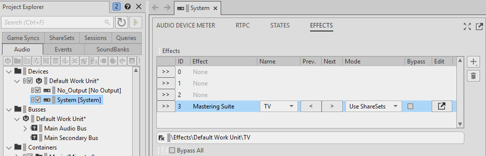

出厂素材针对常见用例提供以下 ShareSet（共享集）：

- Headphones
- HomeCinema
- HomeCinemaHeightBoost
- NightMode
- NightModeStrong
- SoundBar
- TV

|  |  |
| --- | --- |
| [注意] | 注意 |
| 1. Only one instance of the Mastering Suite is supported at any time. This plug-in only    operates on the full mix, and is therefore categorized as an Audio    Device Effect. See [“了解声部管线”一节](ch34s05.html "了解声部管线") for    more details on the Wwise voice pipeline. 2. Mastering Suite is designed to use a speaker-based output configuration of up to 7.1.4    channels. Using other types of output configurations such as Ambisonics    causes the plug-in initialization to fail. |

|  |
| --- |
|  |

1. **[“Parametric EQ（参数均衡器）”一节](ch64s01s01.html "Parametric EQ（参数均衡器）")**：可针对每个频段来配置滤波器模式、频率、谐振和增益。
2. **[“Multiband Compressor”一节](ch64s01s02.html "Multiband Compressor")**：可针对每个频段来配置频率、起音/释音时间、阈值、比率、补偿增益和拐点。
3. **[“Master Volume”一节](ch64s01s03.html "Master Volume")**：可调节每个声道的音量设置。
4. **[“Limiter”一节](ch64s01s04.html "Limiter")**：可选择软拐点、硬拐点和高级限幅模式。

这四个模块之间相互链接，其中禁用的模块将被视为旁通状态。每个模块在左上角都设有一个复选框。这样方便禁用不需要的模块或单独监听特定模块带来的效果。

|  |
| --- |
|  |

---

##### Parametric EQ（参数均衡器）

Parametric EQ 模块用于均衡不同频率的信号，最多支持六个 EQ 频段。

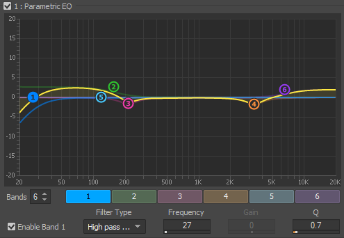

每个 EQ 频段都可单独进行控制和禁用，

并分别提供有多种滤波器模式可供配置。您可以根据滤波器模式来设置截止频率、谐振 Q 值和增益参数。下表简要列出了根据为给定频段选择的滤波器模式都可配置哪些参数。

| Filter Mode | Cut-off Frequency | Resonant Q Value | Gain |
| --- | --- | --- | --- |
| [“Off”一节](ch64s01s01.html#mastering_suite_module_param_eq_mode_off "Off") | 不适用 | 不适用 | 不适用 |
| [“Low pass resonant (two-pole)”一节](ch64s01s01.html#mastering_suite_module_param_eq_mode_low_pass_2p "Low pass resonant (two-pole)") | 可配置 | 可配置 | 不适用 |
| [“High pass resonant (two-pole)”一节](ch64s01s01.html#mastering_suite_module_param_eq_mode_high_pass_2p "High pass resonant (two-pole)") | 可配置 | 可配置 | 不适用 |
| [“Peak (notch)”一节](ch64s01s01.html#mastering_suite_module_param_eq_mode_peak "Peak (notch)") | 可配置 | 可配置 | 可配置 |
| [“High shelf”一节](ch64s01s01.html#mastering_suite_module_param_eq_mode_high_shelf "High shelf") | 可配置 | 不适用 | 可配置 |
| [“Low shelf”一节](ch64s01s01.html#mastering_suite_module_param_eq_mode_low_shelf "Low shelf") | 可配置 | 不适用 | 可配置 |
| [“Low pass one-pole”一节](ch64s01s01.html#mastering_suite_module_param_eq_mode_low_pass_1p "Low pass one-pole") | 可配置 | 不适用 | 不适用 |
| [“High pass one-pole”一节](ch64s01s01.html#mastering_suite_module_param_eq_mode_high_pass_1p "High pass one-pole") | 可配置 | 不适用 | 不适用 |

###### Off

滤波器按原样输出输入信号。

###### Low pass resonant (two-pole)

此滤波器会滤除高频信号，其在截止频率附近出现音量峰值（可配置）。它的滚降速率快于 Low Pass (One-Pole) 滤波器，为每个八度 -12 dB。

在该滤波器模式下，可以参数形式设置截止频率和 Q 值：

- 截止频率定义会在多高的频率出现滚降。
- Q 值按照如下方式控制滤波器谐振（Q 值越高，截止频率附近的信号衰减得越厉害）：

  - 在 Q=0.7 时，滤波器不会出现谐振峰值。音量在截止频率处的减小幅度为 -3 dB。
  - 在 Q=1.0 时，滤波器在截止频率以下出现谐振峰值。截止频率处的音量为 0 dB。
  - 在 Q=2.0 时，滤波器在截止频率处出现谐振峰值 (+6 dB)。

###### High pass resonant (two-pole)

此滤波器会滤除低频信号，其在截止频率附近出现谐振峰值（可配置）。它跟 Low Pass Resonant (Two-Pole) 滤波器相似，只不过会衰减截止频率以下的信号。

在该滤波器模式下，可以参数形式设置截止频率和 Q 值。

有关截止频率和 Q 参数的特性，请参见 [“Low pass resonant (two-pole)”一节](ch64s01s01.html#mastering_suite_module_param_eq_mode_low_pass_2p "Low pass resonant (two-pole)") 滤波器模式。

###### Peak (notch)

此滤波器只会衰减截止频率附近的信号，而允许截止频率以上/以下的信号通过。

在该滤波器模式下，可以参数形式设置截止频率、Q 值和增益：

- 截止频率控制相对于输入音量的输出音量会在多高的频率出现峰值。
- Q 值控制受滤波器影响的频段宽度（以截止频率为中心）。Q 值越低，受影响的频段宽度越宽（峰值曲线越平坦）。Q 值越高，受影响的频段宽度越窄（峰值曲线越陡峭）。
- 增益控制截止频率处的音量增益（单位为 dB）。

###### High shelf

此滤波器会增大/减小高频信号的音量。频率在过渡频段以下的信号不受影响。

在该滤波器模式下，可以参数形式设置截止频率和增益：

- 截止频率控制过渡频段的中心频率。
- 增益控制过渡频段之后的音量增减幅度（单位为 dB）。

增益在截止频率处降低一半。

###### Low shelf

此滤波器与 [“High shelf”一节](ch64s01s01.html#mastering_suite_module_param_eq_mode_high_shelf "High shelf") 滤波器正好相反，它会增大/减小低频信号的音量。频率在过渡频段以上的信号不受影响。

###### Low pass one-pole

此滤波器会滤除高频信号。

在该滤波器模式下，可以参数形式设置截止频率。

音量在指定频率处的减小幅度为 -3 dB，滚降速率为每个八度 -6 dB。也就是说，两倍截止频率处的输出为 -6 dB。在此之后频率每翻一倍，相对于输入音量的输出音量就会缓慢减小 6 dB。

###### High pass one-pole

此滤波器与 [“Low pass one-pole”一节](ch64s01s01.html#mastering_suite_module_param_eq_mode_low_pass_1p "Low pass one-pole") 滤波器正好相反，它会滤除低频信号。

---

##### Multiband Compressor

Multiband Compressor 模块用于压缩超出阈值的音量，最多支持四个频段。您可以随意设定用于分割各个频段的频率。

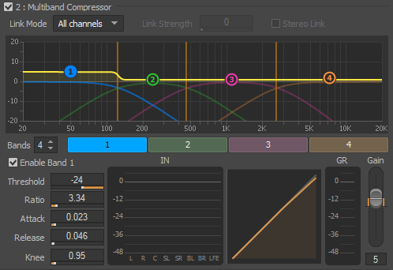

每个频段都可设置以下参数：

- *Crossover Frequency*（分频频率）：在多高的频率分割频段（在坐标图中标示为竖线）。
- *Threshold*（阈值）：在多高的电平开始应用压缩。
- *Ratio*（比率）：要应用多大幅度的压缩，相当于实际增益每增高 1 dB 时电平会超出阈值多少。
- *Attack*: Time, in seconds, for the compression to be fully applied after the level has gone over the threshold.
- *Release*: Time, in seconds, for the compression to stop being applied after level returned below the threshold.
- *Knee*（拐点）：在接近和超过阈值时应用多大幅度的压缩（数值越大，幅度越小）。
- *Gain*（增益）：在压缩之后应用多高的补偿增益。

您可以根据需要设置如何在声道之间链接各项压缩属性，相应地来选择三种不同的模式：*No Link*、*All Channels* 和 *Partial Link*。在后两种模式下，会根据针对各个声道计算得出的最大压缩值来应用压缩。

- *No link*（不链接）：单独向每个声道应用压缩。
- *All channels*（所有声道）：统一向所有声道应用最大压缩。
- *Partial link*（部分链接）：使用 Link Strength 值来控制声道的压缩。对于对应声道，按照最大值应用压缩；对于其他声道，则按照相对于最大值的 Link Strength 比率应用压缩。

*Partial link* 模式提供两个参数来控制如何向链接在一起的声道（即压缩幅度小于最大值的声道）应用压缩：

- *Link Strength*（链接强度）：在压缩其他声道（即压缩幅度小于最大值的声道）时在最大压缩值的基础上应用相应的比率。这样方便控制如何按照相对于最大值的比率 (0% ~ 100%) 向所述声道应用压缩。
- *Stereo Link*（立体声链接）：允许将左右一对声道链接起来。这样可以强行向任意声道对统一应用压缩。

###### 使用 Mastering Suite 进行压缩

下图展示了压缩器会应用怎样的处理：将输入信号分开，按照频段进行压缩，然后再合并起来。


您可以向各个频段应用不同幅度的压缩；这样便可实施更加精细的配置，从而移除不需要的效果（如 pumping）。这在使用单频段压缩器时是做不到的。

Multiband Compressor 所用的压缩算法旨在平滑地调节信号能量，使得其在输出到人耳时听起来比较自然。换句话说，它会根据针对每个频段计算得出的输入信号的均方根 (RMS) 值来控制压缩比率。因此，它无法控制突发峰值（若要控制突发峰值，请使用 [“Limiter”一节](ch64s01s04.html "Limiter") 模块）。


---

##### Master Volume

Master Volume 模块用于按照指定的分贝值来增高/降低所有声道的增益。除此之外，还可针对各个声道单独指定增益值。


每个声道都可指定不同的增益值，最高支持 7.1.4 声道配置。在启用性能分析时，会以彩色形式标示活跃的声道。

为方便进行试听，每个声道均设有 Mute（静音）和 Solo（独奏）按钮。

利用模块右上角的 Link（链接）按钮，可相对于初始位置来统一移动所有推子。

---

##### Limiter

Limiter 模块用于控制音量以免其超出用户定义的阈值。

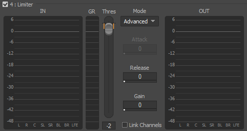

Link Channels（链接声道）复选框允许在声道之间链接各项 Limiter 属性。在默认情况下，此选项处于未选中状态。这时会对各个声道单独进行限幅。

可用的 Limiter 模式有三种：[“Hard-knee limiter”一节](ch64s01s04.html#mastering_suite_module_limiter_hard_knee "Hard-knee limiter")、[“Soft-knee limiter”一节](ch64s01s04.html#mastering_suite_module_limiter_soft_knee "Soft-knee limiter") 和 [“Advanced limiter”一节](ch64s01s04.html#mastering_suite_module_limiter_advanced "Advanced limiter")。可用参数因模式而异（详见下表）。

| Limiter Mode | Attack | Release | Gain | Latency |
| --- | --- | --- | --- | --- |
| [“Soft-knee limiter”一节](ch64s01s04.html#mastering_suite_module_limiter_soft_knee "Soft-knee limiter") | 可配置 | 可配置 | 不适用 | 不适用 |
| [“Hard-knee limiter”一节](ch64s01s04.html#mastering_suite_module_limiter_hard_knee "Hard-knee limiter") | 不适用 | 不适用 | 不适用 | 不适用 |
| [“Advanced limiter”一节](ch64s01s04.html#mastering_suite_module_limiter_advanced "Advanced limiter") | 不适用 | 可配置 | 可配置 | 2.67 ms |

###### Soft-knee limiter

When the audio signal exceeds the threshold level, the soft-knee limiter temporarily allows the threshold to be exceeded, and gradually changes the audio signal back to the threshold level over the specified attack time. 在音频信号的电平降到阈值以下时，则会在指定的释音时间内逐渐停止信号衰减。

The soft-knee limiter keeps distortion to a minimum and produces natural-sounding results. 不过，除非为阈值和起音时间设置一定的余量，否则其将无法正常工作。If the threshold is too high, or if the attack time is too long, the soft-knee limiter operates in the same way as the [“Hard-knee limiter”一节](ch64s01s04.html#mastering_suite_module_limiter_hard_knee "Hard-knee limiter") when the signal reaches 0 dB.

###### Hard-knee limiter

With the hard-knee limiter, audio signals are cut off at the threshold value. 这对信号只在短时间内超出阈值的情况比较有用，但若频繁超出阈值，则可能会出现严重失真。

###### Advanced limiter

The advanced limiter is the most transparent of the three limiters while allowing more control over the output. 这是因为信号并不会超出阈值。*It achieves this by introducing a small latency of 2.67 ms.* This allows the limiter to automatically configure the attack and react to peaks smoothly, before the input reaches the threshold. 在此模式下，可配置阈值、释音时段和输出增益。

|  |  |
| --- | --- |
| [注意] | 注意 |
| *The advanced limiter mode is not supported when mixing with Audio Objects.* For performance reasons, the advanced limiter mode is replaced by the soft limiter mode when mixing with Audio Objects.  *这一限制不适用于 PS5，该平台在硬件中实施处理。* |

---

##### 性能

Mastering Suite 包含多个模块，其占用的处理资源各不相同。各个模块的处理成本取决于其自身配置。以下章节详细介绍了各种 Mastering Suite 配置下的处理成本。

注意，Mastering Suite 处理成本测算结果是使用 Wwise 内 Advanced Profiler 窗口中的 CPU 选项卡获取的。为此，我们把 Wwise 连接到了 Integration Demo 应用程序（随 Wwise SDK 一起提供）。其中只有一个 Mastering Suite 效果器实例。然后，在将 AMD Ryzen 3700X CPU 时钟频率设为 4.0 GHz 的情况下针对 Windows 平台进行了测算。

###### Performance per module

下表列出了 7.1.4 混合输出声道配置（12 个声道）下 Audio Device（音频设备）对应的 Mastering Suite 性能成本。性能成本测算结果表示为 CPU 用量的百分比。效果器由单个 CPU 核心进行处理。当中使用了两种 Mastering Suite 模块配置（如下所列）。先在激活所有模块的情况下测算性能成本，之后又在每次激活一个模块的情况下测定。

如前所述，Audio Device 采用了混合输出配置；也就是说，它不会处理 Audio Object（音频对象）。后面章节会详细介绍基于对象的管线的性能成本。

**配置 1**：Parametric EQ 活跃，6 频段；Multiband Compressor 活跃，4 频段；Master Volume 活跃；Limiter 活跃，Soft 模式。

|  |
| --- |
|  |

**配置 2**：Parametric EQ 活跃，3 频段；Multiband Compressor 活跃，2 频段；Master Volume 活跃；Limiter 活跃，Soft 模式。

|  |
| --- |
|  |

| 活跃模块 | 配置 1 的 CPU 用量 | 配置 2 的 CPU 用量 |
| --- | --- | --- |
| 所有模块 | 1.15% | 0.57% |
| 仅 Parametric EQ | 0.30% | 0.20% |
| 仅 Multiband Compressor | 0.75% | 0.34% |
| 仅 Master Volume | 0.10% | 0.10% |
| 仅 Limiter | 0.23% | 0.23% |

###### Limiter modes

下表列出了不同 Limiter 模式的相对处理成本。测算当中采用了与前述章节相同的条件。

| Limiter Mode | CPU 占用 |
| --- | --- |
| Hard | 0.16% |
| Soft | 0.23% |
| Advanced | 0.23% |

###### Audio Object processing

本节将详细介绍基于对象的管线中 Audio Device 配置下的 Mastering Suite 性能成本。当中 Mastering Suite 需要处理三条音频流：

- **Main mix**（主混音）：最终混音的声道配置。
- **Stereo Passthrough**（立体声直通）：立体声声道配置。
- **Audio Objects**（音频对象）：单独发送到 Audio Device 的各个 Audio Object。

Audio Object 的处理成本较高，其与所支持的最大 Audio Object 数量成正比。下表列出了不同最大 Audio Object 数量配置下的性能成本。

在基于对象的音频管线中进行处理时有个很大的区别，就是在实施性能分析的情况下生成各个 Audio Object 的测算值（Multiband Compressor 和 Limiter）时会执行额外的处理（见下图）。这种额外的处理会影响 Advanced Profiler（高级性能分析器）内 CPU 选项卡中显示的测得性能成本。该值并不代表 Mastering Suite 的真实性能成本；Release 版本的 Mastering Suite 没有包含性能分析代码。为在不执行额外处理时获取真实性能成本，我们使用了 Release 版本的 Mastering Suite。下表列出了各项数值：

|  |
| --- |
|  |

**配置**：Parametric EQ 活跃，6 频段；Multiband Compressor 活跃，4 频段；Master Volume 活跃；Limiter 活跃，Soft 模式。

| 最大 Audio Object 数量 | CPU 用量（启用性能分析） | CPU 用量（禁用性能分析） |
| --- | --- | --- |
| 40 | 5.30% | 4.30% |
| 20 | 3.90% | 2.90% |

**配置**：Parametric EQ 活跃，3 频段；Multiband Compressor 活跃，2 频段；Master Volume 活跃；Limiter 活跃，Soft 模式。

| 最大 Audio Object 数量 | CPU 用量（启用性能分析） | CPU 用量（禁用性能分析） |
| --- | --- | --- |
| 40 | 2.80% | 2.00% |
| 20 | 2.00% | 1.50% |

###### 结论

显然，Parametric EQ 和 Multiband Compressor 占用的处理资源最多，尤其是在启用所有频段的情况下。因此，最好依据自身处理预算来适当减少这些模块的频段数量。

---

##### Changing Mastering Suite in game

允许在游戏正在运行的时候动态更改 Mastering Suite。用户可添加、移除或替换 Mastering Suite ShareSet。不过，必须满足以下条件：

- **已经注册插件**：可在游戏代码中注册 Mastering Suite 插件。有关详细信息，请参阅[集成详情 C 插件](https://www.audiokinetic.com/library/edge/?source=SDK&id=soundengine_integration_plugins.html)。
- **已经加载 ShareSet**：必须在加载的 SoundBank 中创建 Mastering Suite ShareSet。若被 SoundBank 中的另一条目引用或将 ShareSet 以显式方式添加到了 SoundBank 中，则会将 Mastering Suite ShareSet 包含在 SoundBank 中。

若要在运行时更改 Mastering Suite ShareSet，最好的方法是使用 "Set Effect" Event Action。有关更多详细信息，请参阅“[“Event Action 列表”一节](ch60s02s01s01.html#event_action_set_effect)”。目标 Effect ShareSet 将自动打包到与 Event 相同的 SoundBank 中。

另外，还可通过调用 SDK 函数 [`SetOutputDeviceEffect`](https://www.audiokinetic.com/library/edge/?source=SDK&id=namespace_a_k_1_1_sound_engine_ad455f291883c352a87b5b03da64549aa.html) 来以编程方式更改 ShareSet。为此，须将每个要指派的 Mastering Suite ShareSet 手动添加到 SoundBank 并确保在发布调用前进行加载。

为了避免出现毛刺噪声，强烈建议不要在添加/移除了 Mastering Suite 的 Output Device 上播放声音。

---

### 源插件

Source plug-ins provide audio content to an output buffer using synthesis methods such as physical modeling, modulation synthesis, and sampling synthesis.

---

#### AK ASIO Input

|  |  |
| --- | --- |
| [注意] | 注意 |
| 此插件目前仍处于实验阶段。 |

（请参阅下文的 [“AK ASIO input properties”一节](ch65s01.html#asio_input_plug_in_properties "AK ASIO input properties")。）

AK ASIO Input 插件可用于从兼容 ASIO 的设备输入声音。

|  |  |
| --- | --- |
| [注意] | 注意 |
| 为了从相应设备捕获输入数据，必须配合 ASIO Audio Device ([“AK ASIO Output”一节](ch63s01.html "AK ASIO Output")) 来运行 AK ASIO Input。 |

###### AK ASIO input properties

| 界面元素 | 描述 |
| --- | --- |
| **AK ASIO Input 属性** | |
| Channel Configuration | 声道配置。设置输入源的声道数及声道配置。有关详细信息，请参阅[“了解总线配置”一节](ch22s11.html "了解总线配置")。 |
| Base Channel | 基准声道。对各输入声道进行偏置，以便将第一个输入声道设为基准声道。 |

###### Example of different properties

下图阐释了声道配置和基准声道属性会对输入产生怎样的影响。本例适用于包含两个输入的设备，其声音将输出到 4.0 总线。

|  |
| --- |
|  |

**相关主题**

- [“AK ASIO Output”一节](ch63s01.html "AK ASIO Output")

---

#### Audio Input（音频输入）

Audio Input（音频输入）源插件允许游戏生成的音频内容通过 Wwise 声音引擎进行处理。为此，可以在 Wwise 层级结构中创建 Audio Input（音频输入）源插件，通过 Event 进行触发，然后添加到 SoundBank 中。

使用此源插件可以实现以下目的：

- 从连接到 PC 声卡的麦克风捕获音频。
- 允许 IP 语音通过声音引擎进行处理。
- 直接播放不在 Wwise 工程中的磁盘音频文件。

|  |  |
| --- | --- |
| [备注] | 备注 |
| 有关 Audio Input 的详细信息，请参阅 [Wwise SDK 文档](https://www.audiokinetic.com/library/?source=SDK&id=referencematerial__audioinput.html)。 |

您可能注意到了 Source Plug-in Editor 和 Contents Editor 中的一些属性值旁边带有标志。该标志表明属性值是否通过 RTPC 与 Game Parameter 关联。

下表介绍了这两种类型的 RTPC（实时参数控制）标志：

| 标志 | 名称 | 描述 |
| --- | --- | --- |
| |  | | --- | |  | | RTPC - 开启 | 属性值已使用 RTPC 绑定到游戏中的参数值。 |
| |  | | --- | |  | | RTPC - 关闭 | 属性值未与游戏中的参数值绑定。 |

**编辑器**

- [“Source Editor：Audio Input”一节](ch65s02s01.html "Source Editor：Audio Input")
- [“内容编辑器：Audio Input ”一节](ch65s02s02.html "内容编辑器：Audio Input")

---

##### Source Editor：Audio Input

Source Editor（源编辑器）显示所有与所选的 Audio Input（音频输入）插件相关联的基本属性。您可以设置 [*[Gain](go01.html#glossary_gain "Gain（增益）")*](go01.html#glossary_gain)（增益）或应用 RTPC（实时参数控制）。

有关集成 Audio Input 的信息，请参阅 [Wwise SDK 文档](https://www.audiokinetic.com/library/?source=SDK&id=effectplugin.html)。

| 界面元素 | 描述 |
| --- | --- |
| Name | 名称。该 Audio Input 的名称。 |
| Source Plug-in（源插件） | 源插件。源插件的类型。 |
| Notes | 备注。有关 Audio Input 的其他信息。 |
| **Effect Settings** | |
| **Audio Input（音频输入）** | |
| Gain | 增益。音频输出的音量或振幅。  Default value: -12  Range: -96.3 to 0  Units: dB |
| **RTPC（实时参数控制）** | |
| RTPC 选项卡中，允许对 Audio Input 的 **Gain** 属性创建 RTPC。相关通用信息，请参阅 [“RTPC tab”一节](ch60s01s05s02.html "RTPC tab") 页。 | |

---

##### 内容编辑器：Audio Input

通过 Contents Editor（内容编辑器）可以快速访问与 Audio Input（音频输入）相关的属性。 须点击 Audio Input 源，以显示相关列标题。

| 界面元素 | 描述 |
| --- | --- |
|  | 点击列标题区 **Configure Columns**（配置列）快捷方式（右键点击）选项。p  此时将会打开 [“Object Property Settings”一节](ch60s12s06.html "Object Property Settings")。指定要显示的列及其顺序。  |  |  | | --- | --- | | [备注] | 备注 | | You cannot configure the columns for Source Contents Editors. | |
| Name | 名称。Audio Input 源插件的名称。 |
| Use | 采用。决定声音对象内的哪个源将会被：  - 播放。 - 包含在 SoundBank（音频包）中。 - 此选项仅在声音对象内具有多个源时才可见。 |
| Gain | 增益。音频输出的音量或振幅。  Default value: -12  Range: -96.3 to 0  Units: dB |
| Notes | 备注。有关 Audio Input 源的详细信息。 |
|  | 向声音对象中添加新的源。  点击 Add Source（添加源）按钮时，将显示可添加源的列表。 |

---

#### External Source（外部源）

In Wwise, each sound object is linked to a specific source. The source is the sound that
plays, for example, when triggered by an Event. Typically, the source is an audio file found
in a static SoundBank that is generated before the game is played.

With the External Source plug-in, the source can be an audio file that is not part of a
SoundBank. Instead, the file is provided externally and loaded dynamically at runtime. This
is especially useful for scenarios where there are large numbers of sounds. Without the
plug-in, you would need to create a sound object and an Event in Wwise for each sound, and
manage the resulting SoundBanks. The plug-in also supports the playback of audio generated
at runtime, such as that based on user input or preferences.

However, compared to using precompiled SoundBanks, the External Source plug-in introduces
complexity to the workflow, and some manual setup in the Wwise SDK. For detailed
instructions, see the [Integrating External Sources](https://www.audiokinetic.com/library/?source=SDK&id=integrating__external__sources.html) and [Using External Sources](https://www.audiokinetic.com/en/library/edge/?source=UE4&id=using_features_ext_src.html) sections of the Wwise SDK documentation. It also requires
implementation in Wwise Authoring, as in this example:

1. On a sound object, add an External Source:

   1. Open the Contents Editor of the sound object. 请参阅 [“Sound objects”一节](ch46s01.html "Sound objects")。
   2. Click **Add Source**, and select **External Source**.
   3. In the Contents Editor, if multiple SFXs are present, select the one to use in the
      **Use** column. For this and other
      properties, see [“Contents Editor：External Source”一节](ch65s03s01.html "Contents Editor：External Source").
2. Create a play Event with the sound object as its Target.
3. Add the Event to a SoundBank, unless **Enable Auto-Defined
   SoundBanks** is enabled in the [“SoundBanks 选项卡”一节](ch57s08s03.html "SoundBanks 选项卡").
4. Add the target sound files to the External Sources List file. This is an XML file
   containing paths to your input files and their conversion settings. WAV files must
   be converted to WEM to be used by the sound engine at runtime. The conversion can be
   done either when the banks are generated, or by the audio programmer from the [Wwise command line](https://www.audiokinetic.com/en/library/edge/?source=SDK&id=bankscommandline.html).
5. In Project Settings, set the location of the External Sources List file, and the directory for the converted output files. 请参阅 [“为 External Source 指定工程设置”一节](ch06s02s06.html "为 External Source 指定工程设置")。To override these project settings for your user, go to the [“SoundBanks Settings - External Sources 选项卡”一节](ch58s09s01s02.html "SoundBanks Settings - External Sources 选项卡") and enable **Override Project SoundBank Settings**.

---

##### Contents Editor：External Source

The Contents Editor gives you access to the properties associated with the [“External Source（外部源）”一节](ch65s03.html "External Source（外部源）"). Click the source entry in the Contents Editor to display the associated column headings.

For information about the SDK implementation, see [Integrating External Sources](https://www.audiokinetic.com/library/?source=SDK&id=integrating__external__sources.html) in the Wwise SDK documentation.

| 界面元素 | 描述 |
| --- | --- |
| Name | External Source 插件的名称。 |
| Use | 采用。决定声音对象内的哪个源将会被：  - 播放。 - 包含在 SoundBank（音频包）中。 - 此选项仅在声音对象内具有多个源时才可见。 |
| Cookie | The cookie is a hash of the source name that is used at runtime to identify the external source. |
| Notes | 备注。有关 External Source 的详细信息。 |
|  | 向声音对象中添加新的源。  点击 Add Source（添加源）按钮时，将显示可添加源的列表。 |

---

#### Impacter

Impacter 是一款专门用来处理撞击类声音文件的实时音频源插件。这些文件由具有猝发或瞬态起始点和指数衰减包络的短促声音构成。利用这款插件，您可以按照以下方式操控源声音：

- **Cross-synthesis**（交叉合成）：Impacter 将每个源文件拆分为两个分层：撞击和主体。撞击分层由声音的冲激构成，主体分层则由声音的回响构成。在使用 Impacter 处理一组文件时，该插件会针对每一播放事件将某一文件的撞击分层和另一文件的主体分层随机结合。同时，该插件还允许单独启用或弃用每个文件的撞击和主体分层。
- **Physicality manipulation**（物理操控）：Impacter 允许修改产生撞击声的对象的感知质量、速度、位置和粗糙度。另外，您还可以向这些属性指派随机化参数，来针对各个播放事件创建不同的声音版本。
- **Mapping properties to game physics**（将属性映射到游戏物理）：您可以将各个插件实例与 Game Object（游戏对象）、Event（事件）或 RTPC 关联。另外，还可设定 Impacter 的参数以反映与材质和碰撞相关的游戏引擎物理。

设计工具支持将文件拖放到 Source Editor（源编辑器）中。所有分析都可在设计工具插件内完成处理，无需使用外部分析工具或分析结果文件。工程的 SoundBank（音频包）中包含最终合成模型以供运行时使用。

**局限性**

Impacter 插件中的分析和合成算法非常高效，因为其会对所处理的声音类型作出可靠的假设。它们针对具有猝发或瞬态起始点和指数衰减包络的短促声音进行了专门的设计。这样既可适当处理衰减中的时间变化或二次瞬态，又可保证这些特性不会受到合成参数太大的影响。

其他类型的声音也可拖到该插件中，但在使用给定参数设计声音时可能会产生不合预期的行为。当然，这并不影响我们使用 Impacter 来尝试和探索不同的声音设计。只不过对于徐缓的声音，分析时间会更长一些，而且完成分析之前还会影响设计工具播放声音。

**编辑器**

- [“Source Editor：Impacter”一节](ch65s04s01.html "Source Editor：Impacter")
- [“Contents Editor：Impacter”一节](ch65s04s02.html "Contents Editor：Impacter")

---

##### Source Editor：Impacter

Source Editor（源编辑器）会显示所有与 Impacter 插件关联的属性。

如需概括了解 Impacter 插件，请参阅 [“Impacter”一节](ch65s04.html "Impacter") 章节。

| 界面元素 | 描述 |
| --- | --- |
|  | 配置列…。右键单击表格标题来打开 **Configure Columns** 对话框以指定要显示的列及其顺序。详请参阅[“使用表格”一节](ch03.html#using_tables "使用表格")。 |
| Name | 名称。用户为此 Impacter 插件实例设定的名称。 |
| Source Plugin | 源插件。源插件的类型。 |
| Notes | 备注。有关 Impacter 插件的其他信息。 |
|  | 设置 Source Editor 中选定标签页的显示方式。默认情况下，整体面板中仅显示一个选定标签页。不过，您可以通过单击分隔器按钮将面板沿横向或纵向一分为二，显示两个不同的标签页。当前所选选项将以高亮背景色显示。  |  |  | | --- | --- | | [备注] | 备注 | | 无法同时在两个面板中显示同一标签页。若选中的标签页已在另一面板中显示，则另一面板将自动显示另一标签页。 | |
| **Effect Settings** | |
| **File Input** | |
| Audio Source | 音频源。音频源文件的名称。 |
| Impact Selection | 撞击选择。选择将哪个撞击分层添加到 SoundBank 以供随机挑选用来合成。  若有多个撞击分层，则随机选择时始终避免播放之前播放的撞击分层。  撞击分层包含分析当中剩余用来驱动合成的音频。其可与来自其他文件的主体分层结合用来进行交叉合成。  若 Solo 撞击分层，则会在设计工具中单独将其选中以供试听。Solo 设置不会应用于 SoundBank。  最多 64 个文件。 |
| Body Selection | 主体选择。选择将哪些主体分层添加到 SoundBank 以供随机挑选用来合成。  若只有一个撞击分层，则随机选择时仅避免重复播放之前播放的主体分层。  主体分层包含通过音频分析提取的一系列合成参数。其可与来自其他文件的撞击分层结合用来进行交叉合成。  若 Solo 主体分层，则会在设计工具中单独将其选中以供试听。Solo 设置不会应用于 SoundBank。  最多 64 个文件。 |
|  | 打开搜索框，在其中输入标准字母和数字会筛选掉视图中不相匹配的元素。阅读 [“使用表格”一节](ch03.html#using_tables "使用表格") 了解详细信息。  点击搜索图标左侧的 Close（关闭）图标，以关闭搜索字段并删除筛选器。  |  |  | | --- | --- | | [备注] | 备注 | | 搜索不包括[“List View（列表视图）”一节](ch60s12s02.html "List View（列表视图）"), [“Query Editor”一节](ch60s07s01.html "Query Editor"), [“MIDI Keymap Editor 视图”一节](ch60s01s03s06s01s01.html "MIDI Keymap Editor 视图"), and [“Reference View 视图”一节](ch60s12s05.html "Reference View 视图")中折叠起来的节点。  The search is not included in the Settings for Source objects. | |
|  | 添加文件。允许浏览其他文件。 |
|  | 删除所有文件。从插件中删除所有文件。 |
| **Impact Params** | |
| Mass | 质量。以独特方式对声音实施时间拉伸、音高变换或信号压缩，来改变听者对发声体大小或重量的直观感受。仅在撞击的开头应用 RTPC 更新。  Default value: 1.0  Range: 0.01 to 2.0 |
| Mass Random | 质量随机。对 Mass 参数施加正的随机偏置。  Default value: 0.0  Range: 0.0 to 2.0 |
| Velocity | 速度。影响撞击的强度，进而改变声音的音色和振幅。仅在撞击的开头应用 RTPC 更新。  Default value: 1.0  Range: 0.05 to 1.0 |
| Velocity Random | 速度随机。对 Velocity 参数施加负的随机偏置。  Default value: 0.0  Range: -1.0 to 0 |
| Position | 位置。塑造声音的音色，产生在表面多个不同位置发生撞击的效果。仅在撞击的开头应用 RTPC 更新。  Default value: 0.0  Range: 0.0 to 1.0 |
| Position Random | 位置随机。对 Impact Position 参数施加正的随机偏置。  Default value: 0.0  Range: 0.0 to 1.0 |
| Roughness | 粗糙度。为声音增添金属般的不和谐效果。仅在撞击的开头应用 RTPC 更新。  Default value: 0  Range: 0.0 to 1.0 |
| Roughness Random | 粗糙度随机。对 Roughness 参数施加正的随机偏置。  Default value: 0.0  Range: 0.0 to 1.0 |
| Min Duration | 最小时长。设置循环或结束播放事件之前的最小时长。若最小时长大于撞击分层，则附加无声内容。仅在撞击的开头应用 RTPC 更新。  Default value: 0.0  Range: 0.0 to 10.0 |
| Output Level | 输出电平。应用于最终信号的电平。仅在撞击的开头应用 RTPC 更新。  Default value: 0  Range: -96 to 24  Units: dB |

---

##### Contents Editor：Impacter

Contents Editor（内容编辑器）方便快速访问与 Impacter 插件关联的一些常用属性。注意，必须单击 Impacter 源才能显示相关列标题。

如需概括了解 Impacter 插件，请参阅 [“Impacter”一节](ch65s04.html "Impacter") 章节。

| 界面元素 | 描述 |
| --- | --- |
| Name | 名称。Impacter 插件的名称。 |
| Use | 采用。决定声音对象内的哪个源将会被：  - 播放。 - 将被包括在 SoundBank 中。  |  |  | | --- | --- | | [备注] | 备注 | | 只有在声音对象具有多个源时才会显示 Use 选项。 | |
| Notes | 备注。有关 Impacter 插件的其他信息。 |
| Mass | 质量。以独特方式对声音实施时间拉伸、音高变换或信号压缩，来改变听者对发声体大小或重量的直观感受。仅在撞击的开头应用 RTPC 更新。  Default value: 1.0  Range: 0.01 to 2.0 |
| Velocity | 速度。影响撞击的强度，进而改变声音的音色和振幅。仅在撞击的开头应用 RTPC 更新。  Default value: 1.0  Range: 0.05 to 1.0 |
| Position | 位置。塑造声音的音色，产生在表面多个不同位置发生撞击的效果。仅在撞击的开头应用 RTPC 更新。  Default value: 0.0  Range: 0.0 to 1.0 |
| Roughness | 粗糙度。为声音增添金属般的不和谐效果。仅在撞击的开头应用 RTPC 更新。  Default value: 0  Range: 0.0 to 1.0 |
|  | 向声音对象中添加新的源。  当您点击 **Add Source**（添加源）按钮时，会显示一个可以添加的[*源插件*](ch65.html "源插件")列表。 |

---

#### Motion（振动）

Motion 插件是一款源插件，其可用于为游戏所用不同设备（包括游戏控制器）生成振动效果。通过 Motion 插件，您可以为游戏所用不同振动设备的各个促动器应用不同的 Driver（驱动器）曲线。通过综合运用 Driver 偏置、State（状态）偏置和 RTPC 曲线，这八个 Driver 声道可定义振动效果的强度和时长。

|  |  |
| --- | --- |
| [注意] | 注意 |
| 请不要将高通滤波器应用于振动对象。因为振动设备只会生成低频信号，所以所有高通滤波器都会抑制振动效果。 |

您可能注意到了 Source Editor（源编辑器）中的一些属性值旁边带有标志。该标志表明属性值是否通过 RTPC 与 Game Parameter 关联。

以下表格介绍了两种 RTPC 标志：

| 标志 | Name | 描述 |
| --- | --- | --- |
| |  | | --- | |  | | RTPC - 开启 | 属性值已使用 RTPC 绑定到游戏中的参数值。 |
| |  | | --- | |  | | RTPC - 关闭 | 属性值未与游戏中的参数值绑定。 |

**编辑器**

- [“Source Editor：Motion”一节](ch65s05s01.html "Source Editor：Motion")
- [“Contents Editor：Motion”一节](ch65s05s02.html "Contents Editor：Motion")

---

##### Source Editor：Motion

Source Editor 显示与 Motion 插件关联的所有属性。

您可以定义 Driver 偏置、RTPC 曲线或 State 偏置，以便为不同的 Driver 生成相应正值，从而输出各种类型的振动效果（其中，1 表示振动强度最大，0 或负值表示无振动效果）。此外，还可利用 [“Game Parameters”一节](ch60s04s03.html "Game Parameters")、[MIDI](ch60s01s03s06s01.html "MIDI category: Containers hierarchy objects") 和[调制器](ch60s05s04.html "Modulator Editor 视图")来设置振动曲线的总体时长和强度变化。

然后，根据需要将这八个 Driver（编号 A ~ H）指派给适用于所选 Actuator Configuration 的不同促动器（电机）。

|  |  |
| --- | --- |
| [备注] | 备注 |
| 一般来说，基于振动效果的手柄的振动强度会随着源波形振幅的增大而增大。不过，DualSense 手柄上的触觉设备的振动强度会随着波形振幅的*波动*而增大。因此，恒定的高振幅波形（比如由默认 Motion Source 生成的波形）会在基于振动效果的手柄上产生强烈的振动，但在 DualSense 手柄上却不会产生任何振动。  “想在 DualSense 手柄上产生更强的振动，但又不想对 Motion Source 内容进行重新设计”的权变措施：将 Actuator Configuration 设为 **DualSense 2-Channel**。 |

The following table describes the Settings tab of the Motion Source property editor. For
information about the RTPC tab, see [“RTPC tab”一节](ch51s03s02.html "RTPC tab"). For information about the States
tab, see [“States tab”一节](ch51s03s03.html "States tab").

| 界面元素 | 描述 |
| --- | --- |
| Name | 名称。Motion 插件的名称。 |
| Notes | 备注。有关 Motion 插件的任何额外信息。 |
| **Internal Driver Channels** | |
|  | 打开搜索框，在其中输入标准字母和数字会筛选掉视图中不相匹配的元素。阅读 [“使用表格”一节](ch03.html#using_tables "使用表格") 了解详细信息。  点击搜索图标左侧的 Close（关闭）图标，以关闭搜索字段并删除筛选器。  |  |  | | --- | --- | | [备注] | 备注 | | 搜索不包括[“List View（列表视图）”一节](ch60s12s02.html "List View（列表视图）"), [“Query Editor”一节](ch60s07s01.html "Query Editor"), [“MIDI Keymap Editor 视图”一节](ch60s01s03s06s01s01.html "MIDI Keymap Editor 视图"), and [“Reference View 视图”一节](ch60s12s05.html "Reference View 视图")中折叠起来的节点。  The search is not included in the Settings for Source objects. | |
| Driver | 驱动器。用于驱动促动器振幅的曲线（共 8 条）。该值可以是绝对值，也可利用 RTPC 进行调整。比如，可利用 [Time Modulator](ch60s05s04s03.html "调制器时间") 调整曲线如何随时间变化。所用驱动器曲线选项由 Driver Assignment 中的设置决定。  Default value: 0.0  Range: 0 to 1 |
| **Driver Assignment** | |
|  | 打开搜索框，在其中输入标准字母和数字会筛选掉视图中不相匹配的元素。阅读 [“使用表格”一节](ch03.html#using_tables "使用表格") 了解详细信息。  点击搜索图标左侧的 Close（关闭）图标，以关闭搜索字段并删除筛选器。  |  |  | | --- | --- | | [备注] | 备注 | | 搜索不包括[“List View（列表视图）”一节](ch60s12s02.html "List View（列表视图）"), [“Query Editor”一节](ch60s07s01.html "Query Editor"), [“MIDI Keymap Editor 视图”一节](ch60s01s03s06s01s01.html "MIDI Keymap Editor 视图"), and [“Reference View 视图”一节](ch60s12s05.html "Reference View 视图")中折叠起来的节点。  The search is not included in the Settings for Source objects. | |
| Actuator Configuration | 促动器配置。已知设备的一组配置，每项配置分别针对设备可用的促动器之一。有三种匿名配置可供未知设备使用。  - **Android**:单个匿名声道。 - **PlayStation Move**:单个匿名声道。 - **DualShock 2-Channel**:低频声道和高频声道各一个。 - **Switch 2-Channel**:低频声道和高频声道各一个。 - **Switch 4-Channel**:低频声道和高频声道各两个。 - **Xbox 4-Channel**:低频声道、高频声道、左侧触发器声道和右侧触发器声道各一个（无法在 Wwise 设计中工具测试）。 - **Generic 1-Channel**:单个匿名声道。 - **Generic 2-Channel**:两个匿名声道。 - **Generic 4-Channel**:四个匿名声道。 - **DualSense 2-Channel**:低频声道和高频声道各一个，可为支持高保真触觉效果的设备（如 DualSense™ 控制器）生成波形，以便模拟使用双电机振动的手柄（如 DUALSHOCK®4）的行为。  |  |  | | --- | --- | | [备注] | 备注 | | 促动器配置的默认平台名称指示适用于 Wwise 默认 sink 的已知平台。但是，这并不说这些配置仅可用于该平台。有时，甚至可能希望针对特定平台选择不同的配置。例如，有些 Android 平板电脑设有两个促动器，这时最好采用 2 Channel 配置，而非默认 sink 的单个匿名声道 Android 配置。声道数不匹配并不会影响振动；如果促动器的数量较多，会使用相同的 Driver 声道，而如果定义的声道数量较多，则会忽略部分声道。 |  Default value: Generic 1-Channel |
| Low Frequency 1 | 低频 1。使用此设置为设备的第一个低频（大号）促动器选择驱动器曲线。  Default value: Driver A |
| High Frequency 1 | 高频 1。使用此设置为设备的第一个高频（小号）促动器选择驱动器曲线。  Default value: Driver A |
| Low Frequency 2 | 低频 2。使用此设置为设备的第二个低频（大号）促动器选择驱动器曲线。  Default value: Driver A |
| High Frequency 2 | 高频 2。使用此设置为设备的第二个高频（小号）促动器选择驱动器曲线。  Default value: Driver A |
| Left Impulse Trigger | 左侧触发器。使用此设置为设备的左侧触发器促动器选择驱动器曲线。  Default value: Driver A |
| Right Impulse Trigger | 右侧触发器。使用此设置为设备的右侧触发器促动器选择驱动器曲线。  Default value: Driver A |
| Channel 1 (Anonymous) | 使用此设置为匿名促动器选择驱动器曲线。可供匿名配置使用。  Default value: Driver A |
| Channel 2 (Anonymous) | 使用此设置为匿名促动器选择驱动器曲线。可供匿名配置使用。  Default value: Driver A |
| Channel 3 (Anonymous) | 使用此设置为匿名促动器选择驱动器曲线。可供匿名配置使用。  Default value: Driver A |
| Channel 4 (Anonymous) | 使用此设置为匿名促动器选择驱动器曲线。可供匿名配置使用。  Default value: Driver A |

**相关主题**

- [“为游戏控制器生成振动效果”一节](ch25s03s03s01.html "为游戏控制器生成振动效果")
- [*管理 Motion*](ch25.html "管理 Motion")

---

##### Contents Editor：Motion

Contents Editor（内容编辑器）是 Motion 插件最基本的组件。在 Contents Editor 中，仅可访问标准属性。

| 界面元素 | 描述 |
| --- | --- |
|  | 点击列标题区 **Configure Columns**（配置列）快捷方式（右键点击）选项。p  此时将会打开 [“Object Property Settings”一节](ch60s12s06.html "Object Property Settings")。指定要显示的列及其顺序。  |  |  | | --- | --- | | [备注] | 备注 | | You cannot configure the columns for Source Contents Editors. | |
| Name | 名称。Motion 插件的名称。 |
| Use | 使用。确定振动对象内哪个源将被：  - 播放 - 包含在 SoundBank（音频包）中。  此选项仅在振动对象内设有多个源时可见。 |
| Notes | 备注。有关振动源的附加信息。 |
|  | 向声音对象中添加新的源。  点击 Add Source（添加源）按钮时，将显示可添加源的列表。 |

---

#### Silence

Silence 插件是一个源插件示例，您可以用它创建不播放任何音频或振动的空白信号源。

您可能注意到了 Source Editor 和 Contents Editor 中的一些属性值旁边会带有标志。该标志表明属性值是否通过 RTPC 与 Game Parameter 关联。

| 标志 | 名称 | 描述 |
| --- | --- | --- |
| |  | | --- | |  | | RTPC - 开启 | 属性值已使用 RTPC 绑定到游戏中的参数值。 |
| |  | | --- | |  | | RTPC - 关闭 | 属性值未与游戏中的参数值绑定。 |

**编辑器**

- [“Source Editor: Silence”一节](ch65s06s01.html "Source Editor: Silence")
- [“Contents Editor: Silence”一节](ch65s06s02.html "Contents Editor: Silence")

---

##### Source Editor: Silence

Source Editor 中显示与 Silence 插件相关的所有属性。您可以通过修改属性值来添加不同长度的空白信号源。

| 界面元素 | 描述 |
| --- | --- |
| Name | 名称。用户对此 Silence 插件的命名。 |
| Source Plug-in（源插件） | 源插件。源插件的类型。 |
| Notes | 备注。Silence 插件的其它信息。 |
| **Length（长度）** | |
| Duration | 空白信号的时长。  单位：s  Default value: 1.0  Range: 0.001 to 3600 |
| Random Min | 随机化最小值。对 Duration 值进行偏置，定义空白信号源的最小可能长度。  由于您无法对空白信号源插件应用 Randomizer，因此 Rand Min 和 Rand Max 属性可以用来指定随机化的最小和最大偏置值。  单位：s  Default value: 0.0  Range: -3600 to 0 |
| Random Max | An offset from the Duration value that defines the maximum possible length of the silence.  由于您无法对空白信号源插件应用 Randomizer，因此 Rand Min 和 Rand Max 属性可以用来指定随机化的最小和最大偏置值。  单位：s  Default value: 0.0  Range: 0 to 3600 |

---

##### Contents Editor: Silence

您可以通过 Contents Editor 快速访问与 Silence 插件相关联的属性。必须点击 Silence 源才能显示相关的列标题。

|  |  |
| --- | --- |
| [备注] | 备注 |
| 由于您无法对空白信号源插件应用 Randomizer，因此 Rand. Min 和 Rand. Max 属性可以用来指定随机化的最小和最大偏置值。 |

| 界面元素 | 描述 |
| --- | --- |
| Name | 名称。空白信号源插件的名称。 |
| Use | 采用。决定声音对象内的哪个源将会被：  - 播放。 - 包含在 SoundBank（音频包）中。  此选项仅在声音对象内具有多个源时才可见。 |
| Duration | 空白信号的时长。  默认值：1 默认  滑杆范围：0.001 至 10 输入范围：0.001 至 3,600  单位：秒 |
| Rand. Min | 随机化最小值。对 Length 值进行偏置，定义空白信号源可能持续的最短时间。  默认值：0 默认  滑杆范围：-10 至 0  输入范围：-3,600 至 0  单位：秒 |
| Rand. Max | 随机化最大值。对 Length 值进行偏置，定义空白信号源可能持续的最长时间。  默认值：0 默认  滑杆范围：0 至 10  输入范围：0 至 3,600  单位：秒 |
| Notes | 备注。有关空白信号源的其它信息。 |
|  | 向声音对象中添加新的源。  点击 Add Source（添加源）按钮时，将显示可添加源的列表。 |

---

#### Sine（正弦波）

Sine 是一款样本源插件，其可利用正弦波形为游戏生成各种各样的声音。

您可能注意到了 Source Plug-in Editor 和 Contents Editor 中的一些属性值旁边带有标志。该标志表明属性值是否通过 RTPC 与 Game Parameter 关联。

以下表格介绍了两种 RTPC 标志：

| 标志 | 名称 | 描述 |
| --- | --- | --- |
| |  | | --- | |  | | RTPC - 开启 | 属性值已使用 RTPC 绑定到游戏中的参数值。 |
| |  | | --- | |  | | RTPC - 关闭 | 属性值未与游戏中的参数值绑定。 |

**编辑器**

- [“Source Editor：Sine”一节](ch65s07s01.html "Source Editor：Sine")
- [“Contents Editor：Sine”一节](ch65s07s02.html "Contents Editor：Sine")

---

##### Source Editor：Sine

Source Editor 中将显示与 Sine 插件相关的所有属性。您可以修改各属性值，来创建不同的乐音和音效。

|  |  |
| --- | --- |
| [技巧] | 技巧 |
| 在由 Sine 创建的乐音和其它一次性非循环声音之间过渡时，为避免出现爆音，请使用 5 ms 的淡入和淡出效果。 |

| 界面元素 | 描述 |
| --- | --- |
| Name | 名称。用户对此 Sine 插件的命名。 |
| Source Plugin | 源插件。源插件的类型。 |
| Notes | 备注。有关 Sine 插件的其它信息。 |
| **正弦波参数** | |
| Frequency | 乐音的频率。  单位：Hz  Default value: 440.0  Range: 20 to 20000  Units: Frequency |
| Gain | 增益。乐音输出的电平或振幅。  单位：dB  Default value: -12  Range: -96.3 to 0  Units: dB |
| Duration | 乐音时长，期间振幅将一直保持恒定。  单位：s  Default value: 1.0  Range: 0.001 to 3600 |
| |  | | --- | |  |  (Link/Unlink) | 显示是否在所有平台上应用 Channel 选择。 |
| Channel | 用于指定声音的输出声道，包含两个选项：Mono 和 LFE。  Default value: Mono |

---

##### Contents Editor：Sine

Contents Editor（内容编辑器）方便快速访问与 Sine 插件关联的一些常用属性。必须点击正弦波插件源才会显示相关列标题。

| 界面元素 | 描述 |
| --- | --- |
| Name | 正弦波插件的名称。 |
| Use | 采用。决定声音对象内的哪个源将会被：  - 将被播放。 - 将被包括在 SoundBank 中。 - 此选项仅在声音对象内具有多个源时才可见。 |
| Frequency | 乐音的频率。  单位：Hz  Default value: 440.0  Range: 20 to 20000  Units: Frequency |
| Gain | 增益。乐音输出的电平或振幅。  单位：dB  Default value: -12  Range: -96.3 to 0  Units: dB |
| Duration | 乐音时长，期间振幅将一直保持恒定。  单位：s  Default value: 1.0  Range: 0.001 to 3600 |
| Notes | 备注。有关 Sine 插件的其它信息。 |
|  | 向声音对象中添加新的源。  当您点击 **Add Source**（添加源）按钮时，会显示一个可以添加的[*源插件*](ch65.html "源插件")列表。 |

---

#### Soundseed Air Wind

Soundseed Air 包含两个独立的插件：Soundseed Wind 和 Soundseed Woosh。Soundseed Wind 插件是一个 Wwise 源插件，它可以模拟在风吹过和绕过对象时的气流声。这些声音是通过使用实时变化的参数集来驱动合成算法得到的。由于风声完全是合成的，因此不需要源音频文件。Soundseed Wind 可以节省游戏的内存，因为您不再需要过去使用的较长循环风声环境 .wav 文件。

|  |  |
| --- | --- |
| [备注] | 备注 |
| 如果您计划为您的游戏开发、集成和发布 Soundseed Air，则需要购买单独的授权。有关详细信息，请联系 Audiokinetic 销售团队，邮件地址是： [sales@audiokinetic.com。](mailto:sales@audiokinetic.com) |

系统会为各个源创建一个 Soundseed Wind scene（Soundseed Wind 场景）。各个场景包含风本身和若干个 deflector （导流体）对象。风的实际移动将通过定义多个不同属性值（如风向、风速和风级）来创建。创建导流体对象并在整个场景中放置它们，来定义当风吹过这些对象时的声音特征。各个导流体对象都有一套自己的属性，包括频率和增益。这将提供强大的功能和灵活性，用来在游戏中创建几乎任何类型的风声。

|  |  |
| --- | --- |
| [备注] | 备注 |
| 虽然 Soundseed Wind 是一种灵活的合成器，但使用缓慢变化的参数时，它可能会产生最佳的效果。较短的风声其实更适合用 Soundseed Woosh 来合成，如果尝试用 Soundseed Wind 来创建，则可能会出现错误和不想要的声音。 |

###### Wind propagation through a scene

Soundseed Wind 模拟场景中的风流；Direction（方向）指定风流进入场景的进入点。可以预计到，压力波会首先碰撞距离进入点最近的导流体。然后，气流将在风的推动下在场景中传播。随着气流的传播，您将听到距离进入点更远的导流体对象在遇到压力波时发出的声音。请注意，进入点的风速越高，气流推进的速度就越快。

下图展示了使用属性集来定义风和一系列导流体的典型场景。导流体的尺寸大小和颜色深浅取决于给它们设置的频率和增益属性值。

|  |
| --- |
|  |

###### Using automation curves

您可以使用各种其它工具来进一步优化风声。例如，可使用自动化曲线，根据时间来控制风声和导流体属性。您可以通过添加任意数量的点和使用各种曲线形状，来创建复杂的曲线。下图展示了复杂的风速自动化曲线示例。

|  |
| --- |
|  |

###### Cyclic nature of automation

当循环播放风声时，自动化曲线进行周期性重复。当 Duration（时长）极短时，可能会遇到这样的现象：随着 Playback rate（播放速率）加快，声音听上去会时快时慢。这是因为各个采样点之间的间隔变得比自动化曲线的实际周期更长造成的。这种情况下，下一个控制采样将变为自动化曲线的下一个周期的起始点。

###### Distance-based attenuation

您也可以为风声应用基于距离的衰减。在最小距离之外，导流体距离每增加一倍，就产生 -6 dB 衰减。通过设置以下属性，可以微调场景中导流体的衰减：

- **Minimum distance** ―― 最小距离，到场景中心距离在此半径范围内的导流体，将不应用衰减。
- **Roll-off factor** ―― 衰减曲线的斜率，值越高曲线就越陡，即衰减越快。例如，衰减系数为 2，风声衰减速度将变为两倍。

下图展示了 Soundseed Air 插件使用的衰减模型。最小距离和最大距离相同的情况下，使用了三种不同的衰减系数，以显示每种情况下衰减将如何应用。

|  |
| --- |
|  |

###### Controlling properties using RTPCs

在 Wwise 中，大部分属性都可以使用属性滑杆来进行实时修改。许多属性还可以通过 RTPC 映射至游戏中的参数。属性值旁边有一个特殊标志，显示它是否使用 RTPC。

下表介绍了两种 RTPC 标志：

| 标志 | 名称 | 描述 |
| --- | --- | --- |
| |  | | --- | |  | | RTPC - 开启 | 属性值已使用 RTPC 绑定到游戏中的参数值。 |
| |  | | --- | |  | | RTPC - 关闭 | 属性值未与游戏中的参数值绑定。 |

**编辑器**

- [“Source Editor: Soundseed Wind”一节](ch65s08s01.html "Source Editor: Soundseed Wind")
- [“Contents Editor: Soundseed Wind”一节](ch65s08s02.html "Contents Editor: Soundseed Wind")

---

##### Source Editor: Soundseed Wind

Source Editor 显示与 Soundseed Wind 插件相关的所有属性。

要了解 Soundseed Wind 插件的概况，请参阅[“Soundseed Air Wind”一节](ch65s08.html "Soundseed Air Wind")。

| 界面元素 | 描述 |
| --- | --- |
|  | 配置列…。右键单击表格标题来打开 **Configure Columns** 对话框以指定要显示的列及其顺序。详请参阅[“使用表格”一节](ch03.html#using_tables "使用表格")。 |
| Name | 用户为该 Soundseed Wind 插件所取的名称。 |
| Source Plugin | 源插件。源插件的类型。 |
| Notes | 备注。Soundseed Wind 插件的其它相关信息。 |
| **Effect Settings** | |
| Deflectors | 导流体。场景中可通过一系列导流体属性与风进行互动的对象。 |
| ID | 导流体的标识号。 |
| [M] | 将该导流体设置为静音。这有助于风声场景的制作。  可以同时将多个导流体设置为静音。无论导流体静音与否，Wwise 都将对所有导流体进行渲染。 |
| [S] | 将其它导流体设置为静音，来单独监听所选的导流体。这有助于风声场景的制作。  可以同时对多个导流体进行 Solo。无论导流体 Solo 与否，Wwise 都将对所有导流体进行渲染。  已经存在其它 Solo 导流体时，要想 Solo 某个导流体，只需按住 Ctrl 并点击 Solo 按钮即可。当前导流体的 Solo 按钮将点亮，并清除已选择的其它所有 Solo 按钮。 |
| Frequency | 暴露在中等速风下时，导流体的中心共振频率。  在 Deflector Positions 坐标图视图中，Frequency 值将决定导流体圆圈的大小。  单位：Hz  Default value: 440  Range: 20 to 20000  Units: Frequency |
| Q Factor | 品质因数。导流体共振曲线的尖锐程度或陡峭程度。品质因数与带宽成反比，因此较大的 Q 值对应窄带宽，而较小的 Q 值对应较宽带宽。  高 Q 值适用于模拟规则或圆形表面，而低 Q 值适合模拟不规则表面。  Default value: 10.0  Range: 0.1 to 50 |
| Gain | 增益。导流体信号的放大量。增大该值可以“增强”导流体信号。减小该值可“减弱”或衰减导流体信号。  在 Deflector Positions 坐标图视图中，增益值还决定导流体圆圈的颜色。深灰色对应高增益值，而浅灰色对应低增益值。  Default value: 0  Range: -24 to 24  Units: dB |
| |  | | --- | |  | | 在 Deflector 列表中添加新的导流体，并在 Deflector Positions 坐标图视图中创建导流体对象。  您也可以通过在 Deflector Positions 坐标图视图中双击任意位置，来创建新的导流体。 |
| |  | | --- | |  | | 从 Deflector 列表和 Deflector Positions 坐标图视图中删除所选导流体。 |
| **Deflector Positions（导流体位置）** | |
| (坐标图) | 导流体相对于扬声器的位置的图形表示，基于 4.0 扬声器环境显示。  要在坐标图视图内改变导流体位置，只需点击其内圈，然后将其拖至新位置即可。 |
|  | 基于坐标图视图的中心进行放大。 |
|  | 将坐标图视图重置为默认的 1:1 缩放比例。 |
|  | 基于坐标图视图的中心进行缩小。 |
| X | 导流体的 X 轴坐标。X 值的单位为 Max Distance（最大距离）值的百分比。 |
| Y | 导流体的 Y 轴坐标。Y 值的单位为 Max Distance（最大距离）值的百分比。 |
| Maximum Distance | 最大距离。定义风声场景的最大尺寸。  在坐标图视图中，最大距离以外圈表示。由于外圈位置固定，因此当您更改最大距离值时，将会相应地调整最小距离圈的大小。  虽然在修改最大距离值时，场景中的导流体看起来没有发生移动，但实际上其位置已根据最大距离值进行了调整。  Default value: 10.0  Range: 1.0 to 100.0 |
| **Properties** | |
| (固定/取消固定) | 当选择另一条曲线时，该属性曲线是否仍保留在坐标图视图中。  当选择 Pin 图标时，无论是否选择该曲线，曲线都会显示在坐标图视图中。 |
| |  | | --- | |  |  （颜色块） | 该颜色即为坐标图视图中相应属性曲线的颜色。 |
| Wind Speed | 风速。风的平均速度。风速会使场景中的导流体产生音高偏置。  Default value: 0  Range: -2400 to 2400 |
| Direction | 风向。起风的方向。  角度将映射至如下方向：  - 0 度 ― 北（前） - 90 度 ― 东（右） - 180 或 -180 度 ― 南（后） - -90 度 ― 西（左）  Default value: 0  Range: -180 to 180 |
| Variability | 多样性。因阵风造成的风速变化量。  在属性值缓慢变化时，Soundseed Wind 将产生最佳效果。因此，同时使用高 Variability （多样性）、高 Gustiness（阵风）和高 Q 值很可能会产生不良效果。  Default value: 0.25  Range: 0.0 to 1.0 |
| Gustiness | 阵风。风速随时间变化的可能性。  Default value: 0.5  Range: 0.0 to 1.0 |
| Frequency Shift | 频率偏移。全局属性，定义所有导流体中心频率的上下偏移量。  Default value: 0.0  Range: -4.0 to 4.0 |
| Q Factor Shift | 品质因数。全局属性，定义所有导流体 品质因数的上下偏移量。  Default value: 0.0  Range: -4.0 to 4.0 |
| Gain Offset | 增益偏置。全局属性，定义所有导流体增益的偏置量。该属性可以用作主增益控制。  Default value: 0.0  Range: -96.3 to 24.0  Units: dB |
| Value | 相应属性的设定数值。 |
| Random | 随机（+/-）。相应属性值的正负偏置，定义了属性可能的值域。例如，为属性值添加随机值 1 表示属性的可能值域为 [（值 - 1）至（值 +1）]。  定义 Random 值后，每次播放风声时，Wwise 都会从值域（值 +/- 随机）范围内随机选择一个值。  Default value: 0.0  Range: 0.0 to 3600.0 |
| Automate | 自动化。在声音时长内，可以使用自动化曲线来调整属性值。  勾选该选项后，您就可以在坐标图视图中编辑相应属性的自动化曲线。  Default value: false |
| **Time** | |
| Duration | 风声音源的长度（单位为秒）。  通过将父声音对象的 Loop 属性设置为 Infinite，您可以创建无限循环的风声。  Default value: 10.0  Range: 0.1 to 3600.0 |
| Duration random | 时长随机。Duration 属性的正负偏置，定义了其可能的值域。例如，如果将 Duration 设置为 10，将 Duration random 设置为 5，那么 Duration 的可能值域为（5 至 15），即 [（Duration 值 - 5）至（Duration 值 +5）]。  定义了 Duration random 值后，每次播放风声时，Wwise 都会从值域（值 +/- 随机）范围内随机选择一个值。对于循环播放的声音，每次循环都将使用随机的时长。 |
| Playback rate | 播放速率。时长属性的系数，定义风声的播放速率。例如，值为 2 时，将以 2 倍的速率渲染合成声音，这会使声音短一倍。  如果以动态速率（遵循 Game Parameter）读取循环自动化曲线，则此选项很有用。例如，假设游戏中的角色服用了可以将时间变慢一倍的药物；那么以 0.5 的播放速度循环自动化曲线，将使所有气流声与游戏的时间流逝保持同步。  Default value: 1.0  Range: 0.1 to 10.0 |
| (坐标图) | 以图形来显示属性值自动化曲线，其中 X 轴表示声音的时长，Y 轴表示基于原始属性值的偏置量。  只有选择了 Automate 选项的曲线才能在坐标图视图中进行编辑。您可以通过点击和拖动曲线上的点来移动它们。要添加点，请双击曲线上的任意位置。右键点击曲线的某个部分，可以选择不同的曲线形状。  如果将 RTPC 关联至自动化属性值，则 Wwise 会将自动化曲线中定义的属性值与 RTPC 曲线中定义的值相加。  坐标图视图可以同时显示多条曲线，方法是在列表中选择多个属性或使用固定选项。 |
|  | 基于坐标图视图的中心进行放大。 |
|  | 将坐标图视图重置为默认的 1:1 缩放比例。 |
|  | 基于坐标图视图的中心进行缩小。 |
| X | 所选控制点的 X 轴坐标。  如果选择了多个控制点，则字段显示 0 值，这时可以针对所有已选控制点的当前值，进行统一的增大或减小。例如，如果您选择两个控制点并在 X 文本框中输入 -5，则两个控制点都将向左移动 5 个单位。 |
| Y | 所选控制点的 Y 轴坐标。  如果选择了多个控制点，则字段显示 0 值，这时可以针对所有已选控制点的当前值，进行统一的增大或减小。例如，如果您选择两个控制点并在 Y 文本框中输入 -5，则两个控制点都将向下移动 5 个单位。 |
| **Attenuation（衰减）** | |
| Minimum Distance | 最小距离。到场景中心距离在此半径范围内的导流体，将不应用衰减（0 dB）。  有关 Soundseed Wind 所用衰减模型的详细信息，请参阅 [Soundseed Air Wind](ch65s08.html "Soundseed Air Wind") 页面。  Default value: 5.0  Range: 0.1 to 50 |
| Roll-off Factor | 衰减系数。指定衰减曲线的斜率，值越高，曲线越陡，或者衰减越快。  值为 1 时，在最小距离以外，导流体的距离每增加一倍，将产生 -6 dB 衰减。衰减系数为 2 时，曲线会更陡峭，导流体衰减速度加快一倍。相反，衰减系数为 0.5 时，曲线会更平缓，导流体衰减速度放慢一倍。  有关 Soundseed Wind 所用衰减模型的详细信息，请参阅 [Soundseed Air Wind](ch65s08.html "Soundseed Air Wind") 页面。  Default value: 1  Range: 0.0 to 4 |
| **Settings（设置）** | |
| Dynamic range | Determines the dynamic range or the ratio between the highest and lowest levels in the wind signal that can result from changes in wind speed.  值越小，动态范围越窄，即风速的变化对电平变化的影响越小。在风速变化相同的情况下，值越大，风声信号的电平范围越宽。  Default value: 0.5  Range: 0 to 1 |
| Channels | 声道。声道输出配置。您可以选择以下任一选项：  - **1.0** ―― 以单声道输出，无空间定位。 - **2.0** ―― 以立体声输出，采用左右空间定位。 - **4.0** ―― 以 4.0 声道输出，采用环绕声空间定位。  单位：°  Default value: 2.0 |

---

##### Contents Editor: Soundseed Wind

您可以通过 Contents Editor 快速访问 Soundseed Wind 插件的一些最常用的属性。必须点击 Soundseed Wind 源才能显示相关的列标题。

要了解 Soundseed Wind 插件的概况，请参阅[“Soundseed Air Wind”一节](ch65s08.html "Soundseed Air Wind")。

| 界面元素 | 描述 |
| --- | --- |
| Name | 名称。Soundseed Wind 插件的名称。 |
| Use | 采用。决定声音对象内的哪个源将会被：  - 将被播放。 - 将被包括在 SoundBank 中。 - 此选项仅在声音对象内具有多个源时才可见。 |
| Notes | 备注。Soundseed Wind 插件的其它相关信息。 |
| Wind Speed | 风速。风的平均速度。风速会使场景中的导流体产生音高偏置。  Default value: 0  Range: -2400 to 2400 |
| Direction | 风向。风移动的路径或路线。0 度值表示风从正面（即北）吹来，180 度或 -180 度值表示风从背面（即南）吹来。  默认值：0  滑杆范围：-180 至 180  单位：度 |
| Variability | 多样性。因阵风造成的风速相对于时间的变化量。  默认值：0.25  滑杆范围：0 至 1 |
| Gustiness | 阵风。风的加速度随时间变化的可能性。  默认值：0.5  滑杆范围：0 至 1 |
| Gain Offset | 增益偏置。全局属性，定义所有导流体增益的偏置量。该属性可以用作主增益控制。  Default value: 0.0  Range: -96.3 to 24.0  Units: dB |
|  | 向声音对象中添加新的源。  当您点击 **Add Source**（添加源）按钮时，会显示一个可以添加的[*源插件*](ch65.html "源插件")列表。 |

---

#### Soundseed Air Woosh

Soundseed Air 包含两个独立的插件：Soundseed Wind 和 Soundseed Woosh。Soundseed Whoosh 插件是一个源插件，能够生成物体划过空气所产生的声音。为了创建这类声音，就要定义导流体对象的特征，及其运动轨迹和速度。Woosh 声完全是合成的，因此不需要任何源音频文件。Soundseed Woosh 可以节省游戏中的内存，因为不再需要过去使用的 .wav 文件。此外，Woosh 声源可以借助多种随机化功能，来实现各种变化。

|  |  |
| --- | --- |
| [备注] | 备注 |
| 如果您计划为您的游戏开发、集成和发布 Soundseed Air，则需要购买单独的授权。有关详细信息，请联系 Audiokinetic 销售团队，邮件地址是： [sales@audiokinetic.com。](mailto:sales@audiokinetic.com) |

Soundseed Woosh 场景与 Soundseed Wind 场景不同，它描述的是物体穿过场景的运动轨迹或路径。运动对象包含一个或多个导流体对象组。其中各个组都有自己的一套属性，包括频率和增益。向组中添加 Deflector Sections（多段导流体）可以将导流体对风的导流作用划分为多个区域。virtual behaviour如果导流体分为多段，Wwise 则会在导流体各段的属性设置之间进行内插处理。如果物体两端的形状不同（如锥形交通路标），那么这个功能会很实用。

###### Object path

运动对象的速度影响不同导流体对象组的共振频率，实际 woosh 声就是由此产生的。通过修改导流体组的数量、组中的导流体数量、导流体共振频率属性以及对象在空气中的运动速度，您可以在游戏中创建各种 woosh 声。

下图展示了一个典型 woosh 场景，其中定义了运动对象的轨迹（本例中为剑）。每个导流体的共振频率以及对象在空气中的运动速度将决定实际的 woosh 声。对象基于 Woosh 速度曲线沿路径移动。

|  |
| --- |
|  |

在 Woosh 中，时间、路径和速度之间的关系与 Wwise 中其它路径/时间关系稍有不同。在 Wwise 中，使用 3D 用户定义的定位的对象在整条路径中以相同的速度移动；但在 Woosh 中并非如此。如果运动对象的速度使用了自动化曲线，它将以曲线定义的速度移动；当速度处于最高点时，将沿路径运动较长的距离。位置参考点（同时显示在 Object path 坐标图和 Property 坐标图中）允许您在路径上的特定点对照查看运动 woosh 对象的速度。

###### Using automation curves

可以使用基于时间的自动化曲线来控制对象的速度和各种导流体属性。您可以通过添加任意数量的点和使用各种曲线形状，来创建复杂的曲线。下图展示了复杂的对象速度自动化曲线示例。

|  |
| --- |
|  |

|  |  |
| --- | --- |
| [备注] | 备注 |
| 为保持合理的性能，两点之间的对象速度曲线只能使用线性曲线形状。 Wwise 中所有的其它自动化曲线都可以使用全部曲线形状。 |

###### Cyclic nature of automation curves

循环播放 Woosh 声时，自动化曲线将周期性重复。当 Duration（时长）极短时，可能会遇到这样的现象：随着 Playback rate（播放速率）加快，声音听起来会时快时慢。这是因为各个采样点之间的间隔变得比自动化曲线的实际周期更长造成的。这种情况下，下一个控制采样将变为自动化曲线的下一个周期的起始点。

###### Control rate oversampling

对于高度动态化的声音，您可以对所有曲线的控制频率进行 Oversampling（过采样），以确保声音的特性变化更贴近控制曲线。过采样会以高于常规缓冲区周期的频率（大部分平台上约为 21 毫秒）来读取控制曲线和路径数据。过采样值将作为分母，有效地使控制频率周期缩短。例如，控制频率过采样值为 16 时，将导致每 1.33 毫秒（~21 ms/16）对控制曲线采样一次。与读取频率较低时相比，这可以减少共振频率突变，并确保对象的定位更贴近路径。需要注意的是，过采样会提高计算成本，因此最好仅在需要时使用。

下图展示了如何使用过采样影响控制频率，来更准确地贴近实际控制曲线。

|  |
| --- |
|  |

###### Spatialization

Soundseed Woosh 插件使用基于角度的空间定位以及极小的 Spread（扩散值）。这意味着，如果将一个对象完全置于听者的右方，则该对象仅发送给右声道。而如果将该对象置于右上角（与听者保持 45 度），则信号会发送给左声道和右声道，但右声道会占据绝大部分能量。当对象靠近听者放置时，与基于轴的声像摆位相比，该方法可以实现更高级别的动态定位处理。

在四声道配置中，放置在角落的对象将大部发布送至与其位置相对应的声道，但也会发送至各个临近声道，功率为主声道的一半。

###### Distance-based attenuation

您也可以让 Woosh 声基于距离进行衰减。在最小距离以外，对象的距离每增加一倍，都会产生 -6 dB 衰减。当对象沿其轨迹移动时，通过设置以下属性值，可以微调基于距离的衰减：

- **Minimum distance** ―― 最小距离，到场景中心距离在此半径范围内的导流体，将不应用衰减。
- **Roll-off factor** ―― 衰减曲线的斜率，值越高曲线就越陡，即衰减越快。例如，衰减系数为 2 时，Woosh 声衰减速度加快一倍。

下图展示了 Soundseed Air 插件使用的衰减模型。保持最小距离相同而使用三种不同的衰减系数时，将如何进行衰减。

|  |
| --- |
|  |

在 Woosh 插件中使用定位和衰减控制的主要好处是，您可以用自动化曲线来定义 Woosh 声对象沿其路径移动的速度。还可以选择对控制曲线进行过采样，更好地将对象的位置随时与其路径相匹配。

您仍可以使用 Wwise 的常规衰减和定位控制，但必须理解这些控制的作用将独立于插件内的定位与衰减控制。如果您选择使用 Wwise 的常规定位或衰减控制，则必须为 Woosh 源所在的对象定义其位置。为此，可以通过用户定义的 3D 定位来创建路径，也可使用游戏定义的 3D 定位来将 Woosh 源所在的对象附加至游戏对象。

###### Color noise and spectral tilt

您还可以通过选择不同的噪声颜色来指定合成 Woosh 声的频谱斜率，这些噪声颜色包括：

- **白色噪声** ―― 频谱将不会倾斜。
- **粉色噪声** ―― 频谱斜率为每八度 -3 dB，信号的高频将被削弱。
- **红色噪声** ―― 频谱斜率为每八度 -6 dB，信号的高频被削弱的程度将高于粉色噪声。
- **紫色噪声** ―― 频谱斜率为每八度 +6 dB，信号的高频将被强化。

下图显示了各种噪声颜色的频谱斜率：

|  |
| --- |
|  |

###### Controlling properties using RTPCs

在 Wwise 中，大部分属性都可以使用属性滑杆来进行实时修改。许多属性还可以通过 RTPC 映射至游戏中的参数。属性值旁边有一个特殊标志，显示它是否使用 RTPC。

下表介绍了两种 RTPC 标志：

| 标志 | 名称 | 描述 |
| --- | --- | --- |
| |  | | --- | |  | | RTPC - 开启 | 属性值已使用 RTPC 绑定到游戏中的参数值。 |
| |  | | --- | |  | | RTPC - 关闭 | 属性值未与游戏中的参数值绑定。 |

**编辑器**

- [“Source Editor: Soundseed Woosh”一节](ch65s09s01.html "Source Editor: Soundseed Woosh")
- [“Contents Editor: Soundseed Woosh”一节](ch65s09s02.html "Contents Editor: Soundseed Woosh")

---

##### Source Editor: Soundseed Woosh

Source Editor 显示与 Soundseed Air (Woosh) 插件关联的所有属性。

要了解 Soundseed Woosh 插件的概况，请参阅[“Soundseed Air Woosh”一节](ch65s09.html "Soundseed Air Woosh")。

| 界面元素 | 描述 |
| --- | --- |
|  | 配置列…。右键单击表格标题来打开 **Configure Columns** 对话框以指定要显示的列及其顺序。详请参阅[“使用表格”一节](ch03.html#using_tables "使用表格")。 |
| Name | 名称。用户为该 Soundseed Air (Woosh) 插件所取的名称。 |
| Source Plugin | 源插件。源插件的类型。 |
| Notes | 备注。有关 Soundseed Woosh 插件的其它信息。 |
| **Effect Settings** | |
| **Deflector（导流体）** | |
| Anchor | 锚点。确定对象移动时是否围绕指定导流体旋转。指定锚点可以让各导流体以不同的速度与风相遇。如果未定义锚点，则会假定所有导流体以相同速度移动。  例如，假设一个对象有三个导流体，将其中第一个导流体定义为锚点。  - **Deflector 1**：无速度。 - **Deflector 2**:以导流体 3 一半的速度移动。 - **Deflector 3**:全速移动，速度由对象的 Speed（速度）属性值定义。  Default value: false |
| [M] | 将该导流体设置为静音。这有助于创建 Woosh 声场景。  可以同时将多个导流体设置为静音。无论导流体静音与否，Wwise 都将对所有导流体进行渲染。 |
| [S] | 将其它导流体设置为静音，来单独监听所选的导流体。这有助于创建 Woosh 声场景。  可以同时对多个导流体进行 Solo。无论导流体 Solo 与否，Wwise 都将对所有导流体进行渲染。  已经存在其它 Solo 导流体时，要想 Solo 某个导流体，只需按住 Ctrl 并点击 Solo 按钮即可。当前导流体的 Solo 按钮将点亮，并清除已选择的其它所有 Solo 按钮。 |
| Frequency | 暴露在中等速风下时，导流体的中心共振频率。  在 Deflector Positions 坐标图视图中，Frequency 值将决定导流体圆圈的大小。  单位：Hz  Default value: 440  Range: 20 to 20000  Units: Frequency |
| Q Factor | 品质因数。导流体共振曲线的尖锐程度或陡峭程度。品质因数与带宽成反比，因此较大的 Q 值对应窄带宽，而较小的 Q 值对应较宽带宽。  高 Q 值适用于模拟规则或圆形表面，而低 Q 值适合模拟不规则表面。  Default value: 10.0  Range: 0.1 to 50 |
| Gain | 增益。导流体信号的放大量。增大该值可以“增强”导流体信号。减小该值可“减弱”或衰减导流体信号。  在 Deflector Positions 坐标图视图中，增益值还决定导流体圆圈的颜色。深灰色对应高增益值，而浅灰色对应低增益值。  Default value: 0  Range: -24 to 24  Units: dB |
| Section | 导流段。组内导流体的数量。可通过创建一组导流体来区分导流体的不同区域。如果导流体分为多段，Wwise 则会在导流体各段的属性设置之间进行内插处理。如果物体两端的形状不同（如锥形交通路标），那么这个功能会很实用。  默认值：1  滑杆范围：1 至 100 |
| |  | | --- | |  | | 在 Deflector 列表中创建新的导流体。 |
| |  | | --- | |  | | 从 Deflector 列表中删除选择的导流体。 |
| **Object Path** | |
| (坐标图) | 以图示表示对象将遵循的 Woosh 声路径。该路径定义了物体在 Woosh 场景内的轨迹，也定义了声音在远离时如何衰减（如果启用了衰减）。  要在路径上添加新的点，在坐标图视图中双击即可。  位置参考点将同时显示在 Object path 坐标图视图和 Property 坐标图视图中。可用于定义运动对象经过路径特定点时的速度。 |
|  | 基于坐标图视图的中心进行放大。 |
|  | 将坐标图视图重置为默认的 1:1 缩放比例。 |
|  | 基于坐标图视图的中心进行缩小。 |
| X | 对象在 X 轴上的坐标。 |
| Y | 对象在 Y 轴上的坐标。 |
| **Properties** | |
| (固定/取消固定) | 当选择另一条曲线时，该属性曲线是否仍保留在坐标图视图中。  当选择 Pin 图标时，无论是否选择该曲线，曲线都会显示在坐标图视图中。 |
| |  | | --- | |  |  （颜色块） | 该颜色即为坐标图视图中相应属性曲线的颜色。 |
| Name | 属性的名称。您可编辑以下属性的值：  **Object Speed** ―― 对象速度。运动速度最快的导流体的平均速度。运动速度最快的导流体是距锚点（如果存在）最远的导流体。  对象速度将使场景中导流体产生能量偏置。该属性定义了移动速度对导流体共振频率造成的影响。  默认情况下，Object Speed 属性的 Automate 选项将被选中。自动化曲线包含以下三个点 (t=0, 0)、(t=0.25, 100)、(t=0.5, 0)。  默认值：0  滑杆范围：-50 至 50  **Frequency Shift**― 全局属性，定义所有导流体中心频率的上下偏移量。例如，值为 1 时，中心频率将加倍，而值为 -1 时，中心频率减半。  默认值：0  滑杆范围：-4 至 4  **Q Factor Scale** ―― 全局属性，定义所有导流体品质因数的上下偏移量。例如，值为 1 时，品质因数将加倍，而值为 -1 时，品质因数将减半。  默认值：0  滑杆范围：-4 至 4  **Gain Offset** ―― 全局属性，定义所有导流体增益的偏置量。该属性可以用作主增益控制。  默认值：0  滑杆范围：-96 至 24  单位：dB |
| Value | 相应属性的设定数值。 |
| Random | 作用于相应属性值上的一个绝对偏置量，定义了属性可能的值域。例如，为属性值添加随机值 1 表示属性的可能值域为 [（值 - 1）至（值 +1）]。  定义 Random 值后，每次播放 Woosh 声时，Wwise 都会从值域（值 +/- 随机）内随机选择一个值。这会使整个曲线向上或向下平移。 |
| Automate | 自动化。在声音时长内，可以使用自动化曲线来调整属性值。  勾选该选项后，您就可以在坐标图视图中编辑相应属性的自动化曲线。  Default value: false |
| **Time** | |
| Duration | Woosh 声的长度（单位：秒）。  您可以将父声音对象的 Loop 属性设置为 Infinite，来创建无限循环的 Woosh 声。  Default value: 0.5  Range: 0.1 to 3600.0 |
| Duration Random | 作用于 Duration 属性的正负偏置量，定义其可能的值域。例如，如果将 Duration 设置为 10，将 Duration random 设置为 5，那么 Duration 的可能值域为（5 至 15），即 [（Duration 值 - 5）至（Duration 值 +5）]。  定义了 Duration 随机值后，每次播放 Woosh 声时，Wwise 都会从从值域（值 +/- 随机）内随机选择一个值。对于循环播放的声音，每次循环都将使用随机的时长。  Default value: 0.0  Range: 0.0 to 3600.0 |
| Playback Rate | A factor applied to the duration property value that determines the rate at which the woosh sound is played back. 例如，值为 2 时，将以 2 倍的速率渲染合成声音，这会使声音短一倍。  如果以动态速率（遵循 Game Parameter）读取循环自动化曲线，则此选项很有用。例如，假设游戏中的角色服用了可以将时间变慢一倍的药物；那么以 0.5 的播放速度循环自动化曲线，将使所有气流声与游戏的时间流逝保持同步。  Default value: 1.0  Range: 0.1 to 10.0 |
| (坐标图) | 以图形来显示属性值自动化曲线，其中 X 轴表示声音的时长，Y 轴表示基于原始属性值的偏置量。  只有选择了 Automate 选项的曲线才能在坐标图视图中进行编辑。您可以通过点击和拖动曲线上的点来移动它们。要添加点，请双击曲线上的任意位置。右键点击曲线的某个部分，可以选择不同的曲线形状。请注意，对象速度曲线只能使用线性曲线形状。  如果将 RTPC 关联至自动化属性值，则 Wwise 会将自动化曲线中定义的属性值与 RTPC 曲线中定义的值相加。  坐标图视图可以同时显示多条曲线，方法是在列表中选择多个属性或使用固定选项。 |
|  | 基于坐标图视图的中心进行放大。 |
|  | 将坐标图视图重置为默认的 1:1 缩放比例。 |
|  | 基于坐标图视图的中心进行缩小。 |
| X | 所选控制点的 X 轴坐标。  如果选择了多个控制点，则字段显示 0 值，这时可以针对所有已选控制点的当前值，进行统一的增大或减小。例如，如果您选择两个控制点并在 X 文本框中输入 -5，则两个控制点都将向左移动 5 个单位。 |
| Y | 所选控制点的 Y 轴坐标。  如果选择了多个控制点，则字段显示 0 值，这时可以针对所有已选控制点的当前值，进行统一的增大或减小。例如，如果您选择两个控制点并在 Y 文本框中输入 -5，则两个控制点都将向下移动 5 个单位。 |
| **Speed Point Random（速度点随机）** | |
| Speed | 速度。针对曲线上的所有点，设置对象速度属性值的正负偏置量。定义了各个点的速度值域。例如，为对象速度属性值添加随机值 25 意味着各个点的可能速度值为 [（值 - 25）至（值 + 25）]。  在定义随机值后，每次播放 Woosh 声时，Wwise 都会为曲线上的各个点从值域（值 +/- 随机）内随机选择一个值。这可以达到将曲线上的各个点单独上移或下移的效果。  默认值：10  滑杆范围：0 至 50 |
| Time | 时间。曲线上各个点的时间偏置量的绝对值。它定义了各个点的时间值域。例如，为属性值添加随机值 1 意味着各个点的可能时间值为 [（值 - 1）至（值 + 1）]。  在定义随机值后，每次播放 Woosh 声时，Wwise 都会为曲线上的各个点从值域（值 +/- 随机）内随机选择一个值。这可以达到将曲线上的各个点单独进行左右移动的效果。  点的顺序不会改变，因此曲线的轮廓将被保留。也就是说，各个点的时间可以在上一点和下一点之间随机移动。  Default value: .5  Range: 0 to 1 |
| **Distance Attenuation（距离衰减）** | |
| Distance Attenuation | 确定 Woosh 声是否随距离衰减。  Default value: true |
| Minimum Distance | 最小距离。到场景中心距离在此半径范围内的导流体，将不应用衰减（0 dB）。该属性的单位为场景边界距离的百分比。  有关 Soundseed Woosh 所用衰减模型的详细信息，请参阅 [Soundseed Air Woosh](ch65s09.html "Soundseed Air Woosh") 页面。  Default value: 10  Range: 1 to 100 |
| Roll-off Factor | 衰减系数。指定衰减曲线的斜率，值越高，曲线越陡，或者衰减越快。  值为 1 时，在最小距离以外，导流体的距离每增加一倍，将产生 -6 dB 衰减。衰减系数为 2 时，曲线会更陡峭，导流体衰减速度加快一倍。相反，衰减系数为 0.5 时，曲线会更平缓，导流体衰减速度放慢一倍。  有关 Soundseed Wind 所用衰减模型的详细信息，请参阅 [Soundseed Air Wind](ch65s08.html "Soundseed Air Wind") 页面。  Default value: 1  Range: 0.0 to 4 |
| **Settings（设置）** | |
| Noise Color | 噪声颜色。定义 Woosh 声信号的频谱斜率。您可以选择以下颜色中的任一选项：  - **白色噪声** ―― 频谱将不会倾斜。 - **粉红噪声** ―― 频谱的斜率为每八度 -3 dB。频谱的斜率为负值，将对高频进行弱化。 - **红色噪声** ―― 频谱的斜率为每八度 -6 dB。负斜率将更陡峭，对高频的弱化程度将高于粉红噪声。 - **紫色噪声** ―― 频谱的斜率为每八度 +6 dB。频谱的斜率为正值，将对高频率进行强化。  Default value: White |
| Channels | 声道。声道输出配置。您可以选择以下任一选项：  - **1.0** ―― 以单声道输出，无空间定位。 - **2.0** ―― 以立体声输出，采用左右空间定位。 - **4.0** ―― 以 4.0 声道输出，采用环绕声空间定位。  单位：°  Default value: 2.0 |
| Oversampling | 过采样。对定位和距离衰减控制曲线进行采样的速率。  Woosh 声大多是非常短的声音，通常短于 1 秒。因此，您可能需要使用 Oversampling 控件，以高于常规缓冲区周期（大部分平台上约为 21 毫秒）的速率来读取控制曲线以及沿路径定位。过采样值将作为分母，可以有效地缩短控制频率周期。例如，控制频率过采样值为 8 时，将导致每 2.63 毫秒（~21 ms/8）对控制曲线采样一次。  过采样会增加运算成本，因此最好仅在需要时使用。  Default value: 1  Range: 1 to 8 |
| Dynamic Range | 对象速度变化所造成的最高和最低 Woosh 声信号之间的动态范围或比率。  值越小，动态范围越窄，即对象速度的变化对电平变化的影响越小。在 Woosh 声速度不变的情况下，值越大，Woosh 声信号的电平范围越宽。  Default value: 1  Range: 0 to 1 |

---

##### Contents Editor: Soundseed Woosh

您可以通过 Contents Editor 快速访问与 Soundseed Air (Woosh) 插件中的最常用属性。您必须点击 Soundseed Air (Woosh) 源才能显示相关联的列标题。

要了解 Soundseed Woosh 插件的概况，请参阅[“Soundseed Air Woosh”一节](ch65s09.html "Soundseed Air Woosh")。

| 界面元素 | 描述 |
| --- | --- |
| Name | Tone Generator 插件的名称。 |
| Use | 采用。决定声音对象内的哪个源将会被：  - 将被播放。 - 将被包括在 SoundBank 中。 - 此选项仅在声音对象内具有多个源时才可见。 |
| Speed | 运动速度最快的导流体的平均速度。运动速度最快的导流体是距锚点（如果存在）最远的导流体。  对象速度将使场景中导流体产生能量偏置。该属性定义了移动速度对导流体共振频率造成的影响。  默认值：0  滑杆范围：-50 至 50 |
| Frequency Shift | 频率偏移。全局属性，定义所有导流体中心频率的上下偏移量。例如，值为 1 时，中心频率将加倍，而值为 -1 时，中心频率减半。  Default value: 0.0  Range: -4.0 to 4.0 |
| Q Factor Shift | 品质因数。全局属性，定义所有导流体 品质因数的上下偏移量。例如，值为 1 时，品质因数将加倍，而值为 -1 时，品质因数将减半。  Default value: 0.0  Range: -4.0 to 4.0 |
| Gain Offset | 增益偏置。全局属性，定义了所有导流体增益的偏置量。该属性可以用作主增益控制。  Default value: 0.0  Range: -96.3 to 24.0  Units: dB |
| Notes | 备注。有关 Soundseed Woosh 插件的其它信息。 |
|  | 向声音对象中添加新的源。  当您点击 **Add Source**（添加源）按钮时，会显示一个可以添加的[*源插件*](ch65.html "源插件")列表。 |

---

#### Soundseed Grain

Soundseed Grain 是 Wwise 中的一款粒子合成器源插件。在粒子合成过程中，会分小段播放音频文件（粒化），并为其应用振幅包络（加窗），然后在输出时实施下混。同时，对每个粒子的发射间隔、粒子的时长、源文件的读取速度（相当于音高）、源文件中的位置这些属性进行独立控制，最终的效果即利用单个源文件生成各种各样的声音。另外，由于粒子的发射间隔可能小于其时长，所以粒子之间有时会重叠。

利用此粒子合成工具，设计师可以尽情地发挥创意，并巧妙地设定运行时参数，最终制作出各种新奇有趣的声音。

|  |
| --- |
|  |

本图很好地阐释了粒子合成的一般概念。注意，它并不局限于 Wwise Soundseed Grain。

图片来源：Miraglia, Dusti. “Grain: A Comprehensive And In-Depth First Look Into Propellerhead's New Granular Synth From Reason 10. Should It Really Just Be 'Taken With A ‘Grain’ Of Salt'?” LearnSoundDSine.com, 9 Dec. 2017, learnsounddsine.com/2017/10/22/grain-a-comprehensive-and-in-depth-first-look-into-propellerheads-new-granular-synth-from-reason-10-should-it-really-just-be-taken-with-a-grain-of-salt/。

Soundseed Grain 能单独为每个粒子应用滤波效果，而且还拥有 3D 空间化功能。所有这些参数都可通过 RTPC 和内嵌粒子调制器（Mod 1、Mod 2、Mod 3 和 Mod 4）进行调制和随机化。

###### Waveform view

Waveform（波形）视图会按照声道下混样式来显示该插件使用的音频文件波形。在此，可使用 Filename（文件名）字段右侧的“浏览”按钮 [...] 加载新的音频文件。

|  |
| --- |
|  |

在 Waveform 视图右下角，可以看到 Wave 文件的有效时长（如插件所示）。在 Source（源）选项卡中更改文件的 Trim（修剪）点时，该时长会随之变化。有关 Soundseed Grain 媒体管理的更多详细信息，请参阅“[“Source settings”一节](ch65s10s02.html#ssg_source_settings "Source settings")”。在设置 Playback Position（播放位置）对应的调制器（见“[“Using saw up mode for scanning file/implement time scaling effects”一节](ch65s10s01.html#Using_saw_up_mod_for_scanning_file "Using saw up mode for scanning file/implement time scaling effects")”）时，可以参考文件时长。

通过拖动 Position（位置）和 Offset（偏置）光标（Offset 仅在选中 Snap to markers 时显示），可以快速、精准地更改对应的 Position 和 Offset 属性（见“[“控件”一节](ch65s10.html#ssg_playback)”）。

在激活工具栏中的 Start Capture/Stop Capture（开始捕获/停止捕获）按钮来捕获数据时，Grain Visualizer（粒子观察器）会叠加显示在 Waveform 视图之上，并显示文件中每个粒子的瞬时位置。其中，矩形的透明度代表了粒子包络的音量。有关数据捕获的更多详细信息，请参阅“[“从声音引擎捕获数据”一节](ch39s07.html "从声音引擎捕获数据")”。

###### 控件

The Soundseed Grain plug-in has six groups of controls, described below.

|  |
| --- |
|  |

**Grains**

In the Grains group you can define the time between each grain's emission, the grains' duration, and the shape of the envelope. 这些设置会直观地显示在 Envelope Visualizer 中。

您可以通过指定粒子的发射间隔或发射速率（频率）来设置粒子发声。另外，也可使用 MIDI 音符来控制相关属性（见“[“使用 MIDI”一节](ch65s10.html#Using_MIDI "使用 MIDI")”）。在 Select Freq/Time（选择频率/时间）下拉菜单中，可通过选择相应的菜单项来指定设置方式。粒子发射间隔和粒子时长的值可从很低设到很高，而且还能精确到采样点，不受 Wwise 声音引擎的帧大小（控制速率）的限制。

您可以通过选择相应的菜单项来设置粒子的时长：

- **Time between Emissions**（发射间隔）：直接设定值。
- **Emissions per second**（每秒发射次数）：发射间隔的倍数。
- **MIDI Duration**（MIDI 时长）。

**播放**

The Playback group exposes controls to define position in the source audio file where grains are read. 其中，Position（位置）用来定义源音频文件中粒子的开始位置（表示为文件时长的百分比）。在顺序读取文件时，Speed（速度）和 Pitch（音高）则用来控制读取方向和速度。在将 Speed 绝对值设为大于或小于 1 时，将导致音高升高或降低。在将 Speed 设为负值时，将反向读取源音频文件。

在粒子的读取位置跨过 100%（反向时为 0%）时，将折回 0%（反向时为 100%）。

在设有标记时，通过选中 Snap to markers（对齐到标记），可将标记位置作为粒子开始位置。标记可手动导入和编辑，也可自动指派给源音频文件中的 Transient（瞬态峰）。有关标记的更多详细信息，请参阅 [Source 选项卡](ch65s10s02.html#ssg_source_settings "Source settings")。

**Filter**

每个粒子都有一个独立的滤波器，The Filter group controls it. 因为要将滤波器单独应用于每个粒子，所以最好结合调制器使用该滤波器。假如要对整条输出统一实施滤波（比如为所有粒子应用相同的滤波器设置），为了提升 Wwise 的性能，最好使用 EQ 插入效果器。

**定位**

This group defines the behavior with multichannel output. The output channel configuration is set in the Output group below. 在选择 Direct Speaker Assignment（直接指派扬声器）时，将把源文件的各个声道原样指派给合成器输出的对应声道；在选择 3D Spatialization（3D 空间化）时，则会使用 Azimuth（方位角）、Elevation（高度角）和 Spread（散布）对每个粒子实施空间化处理（“[“Source Editor: Soundseed Grain”一节](ch65s10s02.html "Source Editor: Soundseed Grain")”中对此有明确说明，具体可在 Wwise 的“[“Contextual Help”一节](ch58s08.html "Contextual Help")”视图中查看）。

**Output**

Output（输出）分组框用于选择输出声道配置和合成器的整体电平。

在默认情况下，会在创建合成器后将默认的 Envelope（包络）指派给 Output Level（输出电平）。对于 MIDI，在触发 Note Off（音符关）事件时会停止合成器 。

**VU Meter**

This meters the signal at the output of the synthesizer, and its channel configuration matches that which is set in the Output group.

###### Envelope visualizer

|  |
| --- |
|  |

Envelope Visualizer（包络观察器）方便预览粒子包络的形状和重叠情况。重叠量取决于发射速率、粒子时长和释音时间。这些值尚未经过 RTPC 或调制，所以实际结果可能会有所不同。

通过拖动此窗口顶部和底部的图柄，可编辑 Attack（起音）和 Release（释音）时间。In order to have asymmetrical windows, you first need to unlink Release from Attack by disabling the "link" button to the left of the Release parameter in the Grains group.

起音时间从粒子的开始位置算起，所以计入粒子的时长；释音时间从粒子的结束位置算起，故而不计入粒子的时长。

###### Grain modulators and modulator assignment

|  |
| --- |
|  |

Soundseed Grain 设有 4 个 LFO / Randomizer，可指派给任何属性。除了内嵌到了粒子合成器的设置窗口中，这些所谓的 Grain Modulator（粒子调制器）还有一个主要特性，就是其取值在整个粒子持续期间保持不变。比如，在将某个粒子调制器指派给 Filter Cutoff（滤波器截止频率）时，每个粒子的滤波器截止频率在其持续期间都会保持不变。另一方面，它又有很高的响应频率。假如发射速率非常快，比方说每 100 毫秒发射一次，它会按此速度准确地为每个粒子返回一个新值。这些 LFO 会在每次发射粒子时调整一次属性，但并不受 Wwise 的控制速率（声音引擎的缓冲区大小）限制，因此可以及时地改变属性。

在左侧窗格中，可定义 Grain Modulator 的属性。在此，可选择各种双极波形和单极波形 (+)，并按照时间或频率来设置 LFO 速度。

在右侧窗格中，可指定将调制器指派给哪些属性。在此，可将属性指派给一个或多个调制器，并根据需要设定调制量。调制 Amount（数量）代表的含义因属性而异。总的来说，频率（Emission、Filter Cutoff 等）相关调制量一般按八度度量，而 Position、Pitch 和 Speed 的调制量通常按对应属性的单位度量（比如 Pitch 按音分度量）。如有疑问，请单击对应行的 Amount 滑杆，并查看 [“Contextual Help”一节](ch58s08.html "Contextual Help") 视图。

在针对某项指派设定调制 Amount 之后，会应用 Quantization（量化）。比方说，为 Pitch 应用 Major（大调）量化，并将调制 Amount 设为 500 音分。对于单极调制，允许的 Pitch 偏置将为 0、200、400 和 500（对应 C Major 音阶的 C-D-E-F）；对于双极调制，则为 -500、-300、-100、0、200、400 和 500（对应 C Major 音阶的 G-A-B-C-D-E-F）。

在将 Grain Modulator 应用于某项属性时，该属性滑杆旁边的 Modulation（调制）图标会亮起。

|  |
| --- |
|  |

###### 滑杆反馈

在捕获数据时，在滑杆的编辑区间下方会以亮线显示经过 RTPC 和调制后的当前滑杆值。在亮线快速移动时，以较深颜色显示的区间相比当前值会滞后。此行为与 VU 电平表相似。另外，因为插件内嵌了粒子调制器，所以滑杆的数值显示下方会显示深色区间。该区间直接受该属性的粒子调制 Amount 控制，这在调制速率大于粒子发射速率时非常有用。有关更多详细信息，请参阅上文的“Grain Modulator 和 Modulator Assignment”章节。

###### 使用 MIDI

您可以通过 [Interactive Music](pt05.html "创建互动音乐")（互动音乐）或 [Control Surface](ch56.html "使用控制设备")（控制器）发送的 MIDI Event（MIDI 事件）来触发 Soundseed Grain 实例。同样地，也可设定由游戏或 SDK 发送 MIDI 音符。在合成器内，可根据需要灵活运用 MIDI 音符。比如，将 MIDI 音符的频率用作粒子发射速率。为此，可将 Select Freq/Time 下拉菜单设为 MIDI Emissions Per Second（每秒 MIDI 发射次数）。此外，也可同时另行使用 MIDI 音符的频率来控制粒子的时长。比方说，A1 (55 Hz) 对应 18.182 ms。为此，可将 Duration（时长）菜单设为 **MIDI Duration**（MIDI 时长）。另外，还可使用 MIDI 音符来控制粒子的 Pitch 偏置。为此，可选中 **MIDI Pitch**（MIDI 音高）复选框，并设定偏置基于哪个 Root note（根音）。

|  |  |
| --- | --- |
| [备注] | 备注 |
| 在结合 MIDI 使用 Soundseed Grain 时，可能会希望让合成器按照上述方式处理音符追踪，而不是让 Wwise Pitch Shift 对合成器的整条输出信号统一实施音高变换。因此，对于应用了该插件的声音，请务必在 MIDI 选项卡中**禁用** Note Tracking（音符跟踪）。 |

**相关主题**

- [“Soundseed Grain tips”一节](ch65s10s01.html "Soundseed Grain tips")
- [“Source Editor: Soundseed Grain”一节](ch65s10s02.html "Source Editor: Soundseed Grain")
- [“Contents Editor: Soundseed Grain plug-in”一节](ch65s10s03.html "Contents Editor: Soundseed Grain plug-in")

---

##### Soundseed Grain tips

While exploring the Soundseed Grain granular synthesis, keep the following tips in mind.

1. [“Press Start Capture”一节](ch65s10s01.html#press_start_capture "Press Start Capture")
2. [“Preview: edit in external editor”一节](ch65s10s01.html#Preview_Edit_in_External_Editor "Preview: edit in external editor")
3. [“Using saw up mode for scanning file/implement time scaling effects”一节](ch65s10s01.html#Using_saw_up_mod_for_scanning_file "Using saw up mode for scanning file/implement time scaling effects")
4. [“设计 3D 环境声”一节](ch65s10s01.html#Designing_3D_ambiences "设计 3D 环境声")
5. [“Sound positioning settings”一节](ch65s10s01.html#sound_Positioning_settings "Sound positioning settings")
6. [“Soundseed Grain 设计”一节](ch65s10s01.html#SoundSeed_Grain_Design "Soundseed Grain 设计")
7. [“Amplitude and filter are best used with grain modulation”一节](ch65s10s01.html#Amplitude_and_Filter_are_best_used_with_grain_modulation "Amplitude and filter are best used with grain modulation")
8. [“Using markers in a macro window”一节](ch65s10s01.html#Using_markers_in_a_macrowindow "Using markers in a macro window")

###### Press Start Capture

在 Wwise 中，必须明确启动实时监控。为此，可在工具栏中单击 Start Capture（开始捕获）按钮 。同时，确保启用 Show Live Data（显示实时数据）选项 ，除非要查看之前时间点的数据。在启动捕获后，会同时激活 Grain Visualizer（粒子观察器）、Slider Feedback（滑杆反馈）和 VU Meter（电平表）。如此一来，便可使用合成器十分方便地完成设计。

###### Preview: edit in external editor

Soundseed Grain 不支持直接预览已经加载但尚未粒化的文件。若想试听文件内容，请右键单击波形视图，并选择 **Edit in External Editor**（在外部编辑器中编辑），然后选用适合的编辑器。详请参阅[“Managing external editors for audio”一节](ch04s04.html#selecting_external_audio_editors "Managing external editors for audio")。

###### Using saw up mode for scanning file/implement time scaling effects

为了让 Position（位置）按照顺序扫描文件，进而应用时间缩放效果（单独应用时间拉伸和音高变换），可以直接将 Saw up+（上锯齿波+）调制器指派给 Position 属性。

1. 在 Soundseed Grain 中加载文件。
2. 选择适合的调制器。在此，我们选用 Mod 3（调制器 3），因为其默认 Waveform（波形）便是 Saw up+。
3. 在 Modulator（调制器）视图中，将所选调制器的 Waveform 类型设为 **Saw up+**，并将 Time/Freq（时间/频率）模式设为 **Period**（周期），然后将 Period 设为文件的时长（如 Waveform 视图左下角所示）。文件时长显示为秒，而调制器周期以毫秒为单位，所以要将该值乘以 1,000。比如，若文件时长为 2.00 秒，则将调制器周期设为 2,000。
4. 在 Modulator Assignment（调制器指派）视图中，将 Property（属性）设为 Position，并将 Modulator 设为所选调制器（本例中为 Mod 3），然后将 Amount（数量）设为 100。

|  |
| --- |
|  |

若减小调制器的 Period，则 Soundseed Grain 会以更快的速度扫描文件。在必要时，可为调制器的 Period 应用 RTPC。另外，还可选用不同的波形。比如，使用矩形 LFO 实现对文件的 ping-pong 扫描。

###### 设计 3D 环境声

对于 3D 环境声，在设计 Soundseed Grain 音色时，要尽可能提高声场的沉浸感和环绕程度，比如将播放时的散布百分比设为 100%。然后，Wwise 会在声音的 Spread（散布）值小于 100 时将其收缩成点声源。

###### Sound positioning settings

1. 选中应用了合成器的声音。
2. 在 Property Editor（属性编辑器）的 Positioning（定位）选项卡中，将 3D Spatialization（3D 空间化）模式设为 Position（位置）或 Position + Orientation（位置 + 朝向）。将 Attenuation（衰减）共享集设为 Spread 曲线。

|  |
| --- |
|  |

|  |  |
| --- | --- |
| [备注] | 备注 |
| 除了使用 Attenuation ShareSet，还可将声音用作 Spatial Audio **Room**（Spatial Audio 房间），然后让 Wwise Spatial Audio 根据听者与该 Room 的 Portal（门户）的距离来调制散布百分比。有关 Room 和环境声的更多详细信息，请参阅 [Wwise Spatial Audio SDK 文档](https://www.audiokinetic.com/library/edge/?source=SDK&id=spatial__audio.html)。 |

###### Soundseed Grain 设计

在 Soundseed Grain 中创建环绕环境声时，通常会使用单声道或多声道文件，然后围绕听者生成 3D 空间化粒子。

1. 请确保输出配置为多声道。为了获得最佳效果，最好与输出总线的配置保持一致。不过也完全可以输出一阶 Ambisonics，然后在三阶 Ambisonics 总线中混音。
2. 将 Positioning 模式设为 3D Spatialization。
3. 通过 Azimuth（方位角）和 Elevation（高度角）实施随机调制。
4. 根据需要设置 Spread（比如设为 100 便会充满整个空间）。假如使用的是多声道素材，请确保 Spread 大于 0，否则会将所有粒子视为点声源，并下混为单声道。

|  |
| --- |
|  |

###### Amplitude and filter are best used with grain modulation

Amplitude（振幅）属性与 Level（电平）属性的效果相同，只不过其表示为百分比而非分贝，所以一般不太直观。它的主要作用是生成不同振幅的粒子。比如，若将 Amplitude 设为 0，并将 Amplitude 指派给 Random+（随机+）调制器，同时将 Amount 设为 100，则会随机生成振幅介于 0 和 100% 之间的粒子。为了获得同样的效果，也可将 Amplitude 设为 50，并使用双极 Random 调制器，同时将 Amount 设为 50。

Filter（滤波器）与 Amplitude 相似。有多少个同时播放的粒子，就会应用多少个滤波器。假如希望滤波设置不随时间变化，那么出于性能方面的考虑，虽然每个滤波器占用的资源并不多，但最好还是使用 EQ 插入效果器。不过，假如要为各个粒子应用不同的滤波设置，请结合使用滤波器实施粒子调制。

|  |
| --- |
|  |

###### Using markers in a macro window

为了制作发动机声音，您可能已经导入了录音，并为每一分段设置了不同的 RPM 或发动机状态。然后，您希望合成器根据所需状态在一系列文件分段中随机选取粒子。对此，可将每个分段视为一个宏窗口，并从中选取粒子。为了制作这种宏窗口，可以在 RTPC 的基础上应用粒子调制。

1. 将 Position 属性指派给 RTPC，然后绑定到相应的游戏参数（如 RPM）。此 RTPC 用来定义宏窗口的左侧边界。
2. 将 Position 属性指派给 Random+ 调制器，并根据需要设置 Amount。该 Amount 用来定义宏窗口的宽度（表示为文件时长的百分比）。
3. 若要使窗口的宽度随 RPM 变化，则使用 RTPC 将其绑定到 RPM。

|  |  |
| --- | --- |
| [备注] | 备注 |
| 除上述方法外，也可使用双极 Random 调制器波形。在这种情况下，Position RTPC 用来定义窗口的中心而非左侧边界。 |

|  |  |
| --- | --- |
| [备注] | 备注 |
| 对于发动机声音，可能需要对每次轰鸣位置进行标记，并使用 Snap to markers（对齐到标记）选项。 |

|  |
| --- |
|  |

---

##### Source Editor: Soundseed Grain

Source Editor（源编辑器）会显示所有与 Soundseed Grain 插件相关的属性。

在此页面的前半部分，我们先了解下该插件的 Effect Settings（效果器设置）选项卡。不过，Soundseed Grain 插件与其他插件有所不同，它还包含了另外两个选项卡。对此，我们将在下文 [“Source settings”一节](ch65s10s02.html#ssg_source_settings "Source settings") 部分加以说明。

如需概括了解 Soundseed Grain 插件，请参阅 [“Soundseed Grain”一节](ch65s10.html "Soundseed Grain")。

| 界面元素 | 描述 |
| --- | --- |
| Name | 名称。用户为此 Soundseed Grain 插件实例设定的名称。 |
| Source Plug-in（源插件） | 源插件。源插件的类型。 |
| Notes | 备注。有关 Soundseed Grain 插件的其他信息。 |
| Filename | 文件名。粒子合成器所要使用的音频源文件（WAV 或 AMB）。单击该字段右侧的“浏览”按钮可选择文件。 |
| **Grains** | |
| Time between Emissions | 发射间隔。粒子的发射间隔，单位为 ms。  需将 Select Freq/Time 设为 **Time Between Emissions**。  Default value: 1000  Range: 0.05 to 50000 |
| Emissions per Second | 每秒发射个数。每秒发射的粒子数。  需将 Select Freq/Time 设为 **Emissions per Second**。  Default value: 1  Range: 0.02 to 20000  Units: Frequency |
| Duration Link | 在选择 **Duration Multiplier** 时，可将粒子时长指定为发射间隔的倍数。在选择 **Duration** 时，粒子时长完全独立于发射间隔。在选择 **MIDI Duration** 时，若通过 MIDI 音符触发合成器，则使用音符长度覆盖粒子时长。在调制 Duration 属性时，将调制 **MIDI Duration**。  Default value: Duration Multiplier |
| Duration Multiplier | 时长倍数。粒子时长相对于发射速率(使用 Emissions per Second 或 Time Between Emissions 设定)的倍数。此控件仅在 Duration Link 设为 Duration Multiplier 时可用。  在设为 1 时，实际粒子时长等于粒子发射间隔；此时，包络释音与包络起音重叠，粒子之间前后接合。在小于 1 时，粒子之间会有间隙；在大于 1 时，粒子将相互堆叠。  Default value: 1  Range: 0.001 to 1000 |
| Duration | 时长。粒子时长，单位为 ms。此控件仅在 Duration Link 设为 Duration 时可用。  |  |  | | --- | --- | | [备注] | 备注 | | 粒子包络的释音部分未计入粒子时长，所以粒子实际可能会更长一些。 |  Default value: 1000  Range: 0.02 to 10000.0 |
| Amplitude | 振幅。粒子的振幅，单位为百分比。  用调制器控制此控件，可以用于调节粒子的相对电平。  |  |  | | --- | --- | | [备注] | 备注 | | 若有效振幅降至零以下，则听到的结果是振幅回升，但信号会 180 度反相。 |  Default value: 100  Range: 0 to 100 |
| Attack | 起音。粒子包络的起音时间，单位为 ms。在 Window Mode 为 **Release Same as Attack** 时，Release 时间等于 Attack 时间。  Attack 包络从粒子开始位置算起，所以计入粒子时长；包络的释音部分(Release)从粒子结束位置算起，故而不计入粒子时长。  您可以使用 Grain Visualizer 窗口左上角的图柄来更改 Attack 时间。  |  |  | | --- | --- | | [备注] | 备注 | | 若 Attack 时间长于粒子时长，则播放粒子时不会达到其最大音量，而会按 Attack 被截断时的对应包络电平播放。 |  Default value: 10  Range: 0 to 5000 |
| |  | | --- | |  |  Window Mode | 若选择独立设置 Attack 和 Release，则可为包络 Attack 和 Release 时间设置不同的值。  默认值：Release Same as Attack |
| Release | 释音。粒子包络的释音时间，单位为 ms。在 Window Mode 为 **Release Same as Attack** 时，将忽略该设置。  释音包络从粒子结束位置算起，所以不计入粒子时长；包络的起音部分(Attack)从粒子开始位置算起，故而计入粒子时长。  您可以使用 Grain Visualizer 窗口右下角的图柄来更改释音时间。  Default value: 10  Range: 0 to 5000 |
| Grain Envelope Shape | 粒子包络形状。定义粒子包络中 Attack 和 Release 部分的形状。  可用选项包括：  - Linear - Constant Power - Exponential - Raised Cosine  Default value: Linear |
| **播放** | |
| Position | 粒子在源文件中的读取位置。该位置表示为文件时长的百分比。  若选中 Snap to markers 且存在标记，则将粒子的有效开始位置设到最靠近此控件所设位置的标记。  Default value: 0  Range: 0 to 100 |
| Snap to Markers | 对齐到标记。若选中该选项且存在标记，则将选定粒子的开始位置设到最靠近 Position 位置的标记。  Default value: false |
| Offset% | 粒子在源文件中的读取位置。该位置表示为文件时长的百分比。  此位置偏置仅在选中 Snap to markers 时生效，它会从最靠近 Position 的标记进一步偏置粒子开始位置。  Default value: 0  Range: -100 to 100 |
| Pitch | 音高。粒子移调所基于的音高，单位为音分。  在值大于 0 时，将加快播放速度；在值小于 0 时，将减慢播放速度。  有效播放速度同时取决于粒子 Speed。  Default value: 0  Range: -4800 to 4800  Units: Cents |
| Map MIDI to Grain Pitch | 将 MIDI 映射至粒子音高。在设置时，若通过 MIDI 音符触发合成器，则将相对于 Root 的音符值添加至粒子 Pitch。  Default value: false |
| Root MIDI Note | MIDI 根音。定义 MIDI 根音以便根据输入的 MIDI 音符值生成 Pitch 偏置。  Default value: 60  Range: 0 to 127 |
| Speed | 速度。粒子的播放速度。  - 在速度等于 1 时，将按照与原始声音相同的速度播放粒子。 - 在速度大于 1 时，将按照比原始声音快的速度播放粒子，因此其音高会偏高。 - 在速度小于 1 但为正值时，将按照比原始声音慢的速度播放粒子，因此其音高会偏低。 - 在速度为负值时，将反向播放粒子。  粒子播放的有效速度同时取决于粒子 Pitch。  Default value: 1  Range: -4 to 4 |
| **Filter** | |
| Filter Type | 滤波器类型。应用于各个粒子的滤波器类型。  - LPF6: 一阶(每个八度 6 dB)低通滤波器。在应用此滤波器时，参数 Filter Q 不起作用。 - LPF12: 二阶(每个八度 12 dB)低通滤波器。 - HPF6: 一阶(每个八度 6 dB)高通滤波器。在应用此滤波器时，参数 Filter Q 不起作用。 - HPF12: 二阶(每个八度 12 dB)高通滤波器。 - BP: 二阶(每侧每个八度 6 dB)带通滤波器。在应用此滤波器时，参数 Filter Q 不起作用。  Default value: LPF12 |
| Filter Cutoff | 滤波器截止频率。粒子滤波器的截止频率或中心频率，单位为 Hz。  Default value: 20000  Range: 20 to 20000  Units: Frequency |
| Filter Q | 滤波器 Q。粒子滤波器的品质因数。此值越大，滤波器在滤波器截止频率附近的振幅就越大。  Filter Q 仅在 Filter Type 设为 **LPF12**， **HPF12** 或 **BP** 时生效。  Default value: 0.707  Range: 0.1 to 100 |
| **定位** | |
| Channels | 定义是否将粒子空间化，使其匹配 Output Config 中指定的合成器输出声道配置，还是直接进行指派。  - Direct Speaker Assignment: 不应用空间化或声像摆位。若 Output Config 包含中置声道，则将单声道文件输出至中置声道，否则输出至左前和右前声道。通常，会将输入声道映射至相同的输出声道；若输出配置中不存在这些声道，则将弃用所述输入。 - 3D Spatialization: 使用 Azimuth、Elevation 和 Spread，将粒子 3D 空间化，适配合成器的输出配置。注意，Output Config 须包含多个声道，空间化才会起作用。  Default value: Direct Speaker Assignment |
| Azimuth | 方位角。粒子空间定位的方位角，单位为度，正值表示向右。  此控件需要将 Channels 设为 **3D Spatialization**，仅在合成器的 Output Config 设为多声道配置时有效。  Default value: 0  Range: -180 to 180 |
| Elevation | 高度角。粒子空间定位的高度角，单位为度，正值表示向上。  此控件需要将 Channels 设为 **3D Spatialization**，仅在合成器的 Output Config 设为多声道配置时有效。  Default value: 0  Range: -90 to 90 |
| Spread | 散布。空间化定位中使用的粒子散布，单位为百分比。此项相当于 Wwise 中的 Attenuation Spread。  此控件需要将 Channels 设为 **3D Spatialization**，仅在合成器的 Output Config 设为多声道配置时有效。  Default value: 0  Range: 0 to 100 |
| **Output** | |
| Output Config | 输出配置。合成器输出强制使用的声道配置。  利用多声道输出配置，可轻松创建 3D 环境声。为此，可将声音定位设为 3D，并将 Attenuation ShareSet 设为在近距离位置使用 Spread。在设计合成器时，请使用 **3D Spatialization** 并调制 Azimuth 和 Elevation (如适用)，以此将输出设为最大环绕程度。在捕获数据并播放声音时，Effect 的 VU Meter 中会显示声道配置。  |  |  | | --- | --- | | [备注] | 备注 | | Wwise 会根据声音的定位设置对合成器的输出信号进一步实施声像摆位或空间化。 |  |  |  | | --- | --- | | [备注] | 备注 | | 若在播放过程中更改输出配置，则新的配置到下次播放合成器时才会生效。 |  Default value: Mono |
| Output Level | 输出电平。应用于最终信号的电平。  Default value: 0  Range: -96 to 24  Units: dB |
| **VU Meter** | |
|  | A per channel peak meter, which meters the signal at the output of the synthesizer, and its channel configuration matches that which is set in the [Output](ch65s10s02.html#output) group. 有关扬声器配置和声道的详细信息，请参阅[“了解总线配置”一节](ch22s11.html "了解总线配置")。   信号电平为绿色，表明低于 -6 dB，黄色表明处于 -6 dB 至 0 dB 范围，红色表明高于 0 dB。 |
| **Envelope Visualizer** | |
|  | Envelope Visualizer（包络观察器）方便预览粒子包络的形状和重叠情况。重叠量取决于发射速率、粒子时长和释音时间。这些值尚未经过 RTPC 或调制，所以实际结果可能会有所不同。 |
| |  |  | | --- | --- | | [备注] | 备注 | | 以下各行是 Modulator 1 的属性说明。不过，所有四个 Modulator 同样适用。 | | |
| **Grain Modulators（左侧窗格）** | |
| Modulator 1 Waveform | 调制器 1 - 波形。Modulator 1 的波形类型。  可用波形类型包括：  - Sine: 双极正弦波 - Triangle: 双极三角波 - Square: 双极方波 - Saw up: 双极上锯齿波 - Saw down: 双极下锯齿波 - Random: 双极正弦波 - Sine+: 单极正弦波 - Triangle+: 单极三角波 - Square+: 单极方波 - Saw up+: 单极上锯齿波 - Saw down+: 单极下锯齿波 - Random+: 单极正弦波  Default value: Random |
| Modulator 1 Time/Freq | 指定如何定义振荡速率：时间(即周期，单位为 ms)或频率(Hz)。  Default value: Frequency |
| Modulator Period | 调制器 - 周期。Modulator 的周期，单位为 ms。  Default value: 1000  Range: 0.05 to 120000 |
| Modulator 1 Output | 调制器 1 - 输出。Modulator 1 的输出电平。在设为负值时，将反转调制器的极性。  Default value: 100  Range: -100 to 100 |
| **Modulator Assignment（右侧窗格）**  |  |  | | --- | --- | | [备注] | 备注 | | 以下各行描述了各种 Property 选择下的 Amount 和 Quantization 列。 | | |
| **Amount** | |
| Amplitude Modulation | 振幅 - 调制。应用于 Amplitude 的调制量。  调制量的单位为百分比，可高于或低于原始值(因所选调制器波形而异)。在设为负值时，将反转调制器的输出信号(即反转极性)。  |  |  | | --- | --- | | [备注] | 备注 | | 在采用双极调制器时，可降至 0 以下。比如，在设为 -50% 时，将按照原始电平的 50% 播放粒子，但会反转信号的极性。 |  Default value: 0  Range: 0 to 100 |
| Attack Modulation | 起音 - 调制。应用于 Attack 的调制量。  调制量的单位为八度，可高于或低于原始值(因所选调制器波形而异)。在上调一个八度时，会将起音时长减半；在下调一个八度时，会将起音时长加倍。在设为负值时，将反转调制器的输出信号(即反转极性)。  Default value: 0  Range: -10 to 10 |
| Azimuth Modulation | 方位角 - 调制。应用于 Azimuth 的调制量。  调制量的单位为度，可高于或低于原始值(因所选调制器波形而异)。在设为负值时，将反转调制器的输出信号(即反转极性)。  Default value: 0  Range: 0 to 180 |
| Duration Modulation | 时长 - 调制。应用于 Duration 的调制量。  调制量的单位为八度，可高于或低于原始值(因所选调制器波形而异)。在上调一个八度时，时长将会减半；在下调一个八度时，时长将会加倍。在设为负值时，将反转调制器的输出信号(即反转极性)。  Default value: 0  Range: -10 to 10 |
| Duration Multiplier Modulation | 时长倍数 - 调制。应用于 Duration Multiplier 的调制量。  调制量的单位为八度，可高于或低于原始值(因所选调制器波形而异)。在上调一个八度时，时长将会减半(即时长倍数减半)；在下调一个八度时，时长将会加倍。在设为负值时，将反转调制器的输出信号(即反转极性)。  Default value: 0  Range: -10 to 10 |
| Elevation Modulation | 高度角 - 调制。应用于 Elevation 的调制量。  调制量的单位为度，可高于或低于原始值(因所选调制器波形而异)。在设为负值时，将反转调制器的输出信号(即反转极性)。  Default value: 0  Range: 0 to 90.0 |
| Filter Cutoff Modulation | 滤波器截止频率 - 调制。应用于 Filter Cutoff 的调制量。  调制量的单位为八度，可高于或低于原始值(因所选调制器波形而异)。在设为负值时，将反转调制器的输出信号(即反转极性)。  Default value: 0  Range: -10 to 10 |
| Filter Modulation | 滤波器 Q - 调制。应用于 Filter Q 的调制量。  调制量表示为 Q 偏置，可高于或低于原始值(因所选调制器波形而异)。在设为负值时，将反转调制器的输出信号(即反转极性)。  Default value: 0  Range: 0 to 100 |
| Emissions per Second Modulation | 每秒发射个数 - 调制。应用于 Emissions per Second 的调制量。  调制量的单位为八度，可高于或低于原始值(因所选调制器波形而异)。在设为负值时，将反转调制器的输出信号(即反转极性)。  Default value: 0  Range: -10 to 10 |
| Time Between Emissions Modulation | 发射间隔 - 调制。应用于 Time Between Emissions 的调制量。  调制量的单位为八度，可高于或低于原始值(因所选调制器波形而异)。在上调一个八度时，时长将会减半；在下调一个八度时，时长将会加倍。在设为负值时，将反转调制器的输出信号(即反转极性)。  |  |  | | --- | --- | | [备注] | 备注 | | Time Between Emissions Mod 1 的值与 Emissions Per Second Mod 1 相同。换句话说，若将 Select Freq/Time 设为 **Frequency**，则相同的值会产生等量的调制。 |  Default value: 0  Range: -10 to 10 |
| Position Modulation | 位置 - 调制。应用于 Position 的调制量。  调制量表示为文件时长的百分比，可高于或低于原始值(因所选调制器波形而异)。在设为负值时，将反转调制器的输出信号(即反转极性)。  Default value: 0  Range: 0 to 100 |
| Offset Modulation | 偏置 - 调制。应用于 Offset 的调制量。  调制量表示为文件时长的百分比，可高于或低于原始值(因所选调制器波形而异)。在设为负值时，将反转调制器的输出信号(即反转极性)。  Default value: 0  Range: 0 to 100 |
| Release Modulation | 释音 - 调制。应用于 Release 的调制量。  调制量的单位为八度，可高于或低于原始值(因所选调制器波形而异)。在上调一个八度时，会将释音时长减半；在下调一个八度时，会将释音时长加倍。在设为负值时，将反转调制器的输出信号(即反转极性)。  Default value: 0  Range: -10 to 10 |
| Speed Modulation | 速度 - 调制。应用于 Speed 的调制量。  调制量表示为速度偏置，可高于或低于原始值(因所选调制器波形而异)。在设为负值时，将反转调制器的输出信号(即反转极性)。  Default value: 0  Range: 0 to 4 |
| Spread Modulation | 散布 - 调制。应用于 Spread 的调制量。  调制量表示为偏置，可高于或低于原始值(因所选调制器波形而异)。在设为负值时，将反转调制器的输出信号(即反转极性)。  Default value: 0  Range: 0 to 100 |
| Pitch Modulation | 音高 - 调制。应用于 Pitch 的调制量。  调制量的单位为音分，可高于或低于原始值(因所选调制器波形而异)。在设为负值时，将反转调制器的输出信号(即反转极性)。  Default value: 0  Range: 0 to 4800 |
| **Quantization（量化）** | |
| Amplitude Quantization | 应用于 **Amplitude** 的调制量化。  此属性值可用的量化方案包括:  - None: 无量化。 - (-1, 1): 量化至调制器波形的顶部和底部。 - (-1, 0, 1): 量化至调制器波形的顶部、中间和底部。Middle 仅适用于双极波形，对应基准 **Amplitude** 值。  Default value: None |
| Attack Quantization | 应用于 Attack 的调制量化。  此属性值可用的量化方案包括:  - None: 无量化。 - (-1, 1): 量化至调制器波形的顶部和底部。 - (-1, 0, 1): 量化至调制器波形的顶部、中间和底部。Middle 仅适用于双极波形，对应基准 **Attack** 值。 - Chromatic: 仅允许量化为半音(1/12 个八度)。比如，若将调制量设为 0.5 个八度，则允许在基准 Attack 时长的基础上调制 {-6、-5、-4、-3、-2、-1、0、1、2、3、4、5、6} 个半音(参见下方备注)。 - Major: 仅允许量化为大调音阶的音程。比如，若将调制量设为 0.5 个八度，则允许在基准 Attack 时长的基础上调制 {-5、-3、-1、0、2、4、5} 个半音(参见下方备注)。 - Minor: 仅允许量化为小调音阶的音程。比如，若将调制量设为 0.5 个八度，则允许在基准 Attack 时长的基础上调制 {-5、-4、-2、0、2、3、5} 个半音(参见下方备注)。 - Pentatonic: 仅允许量化为五声音阶的音程。比如，若将调制量设为 0.5 个八度，则允许在基准 Attack 时长的基础上调制 {-5、-2、0、3、5} 个半音(参见下方备注)。  |  |  | | --- | --- | | [备注] | 备注 | | 在此，下调一个八度相当于将时间拉长 2 倍。同样地，下调一个半音相当于将时间拉长 2 开 12 次方倍(1.059 倍)。 |  Default value: None |
| Azimuth Quantization | 应用于 Azimuth 的调制量化。  此属性值可用的量化方案包括:  - None: 无量化。 - (-1, 1): 量化至调制器波形的顶部和底部。 - (-1, 0, 1): 量化至调制器波形的顶部、中间和底部。Middle 仅适用于双极波形，对应基准 Azimuth 值。  Default value: None |
| Duration Quantization | 应用于 Duration 的调制量化。  此属性值可用的量化方案包括:  - None: 无量化。 - (-1, 1): 量化至调制器波形的顶部和底部。 - (-1, 0, 1): 量化至调制器波形的顶部、中间和底部。Middle 仅适用于双极波形，对应基准 Duration 值。 - Chromatic: 仅允许量化为半音(1/12 个八度)。比如，若将调制量设为 0.5 个八度，则允许在基准 Duration 的基础上调制 {-6、-5、-4、-3、-2、-1、0、1、2、3、4、5、6} 个半音(参见下方备注)。 - Major: 仅允许量化为大调音阶的音程。比如，若将调制量设为 0.5 个八度，则允许在基准 Duration 的基础上调制 {-5、-3、-1、0、2、4、5} 个半音(参见下方备注)。 - Minor: 仅允许量化为小调音阶的音程。比如，若将调制量设为 0.5 个八度，则允许在基准 Duration 的基础上调制 {-5、-4、-2、0、2、3、5} 个半音(参见下方备注)。 - Pentatonic: 仅允许量化为五声音阶的音程。比如，若将调制量设为 0.5 个八度，则允许在基准 Duration 的基础上调制 {-5、-2、0、3、5 } 个半音(参见下方备注)。  |  |  | | --- | --- | | [备注] | 备注 | | 下调一个八度相当于将时间拉长 2 倍。同样地，下调一个半音相当于将时间拉长 2 开 12 次方倍(1.059 倍)。 |  Default value: None |
| Duration Multiplier Quantization | 应用于 Duration Multiplier 的调制量化。  此属性值可用的量化方案包括:  - None: 无量化。 - (-1, 1): 量化至调制器波形的顶部和底部。 - (-1, 0, 1): 量化至调制器波形的顶部、中间和底部。Middle 仅适用于双极波形，对应基准 **Duration Multiplier** 值。  Default value: None |
| Elevation Quantization | 应用于 Elevation 的调制量化。  此属性值可用的量化方案包括:  - None: 无量化。 - (-1, 1): 量化至调制器波形的顶部和底部。 - (-1, 0, 1): 量化至调制器波形的顶部、中间和底部。Middle 仅适用于双极波形，对应基准 Elevation 值。  Default value: None |
| Filter Cutoff Quantization | 应用于 Filter Cutoff 的调制量化。  此属性值可用的量化方案包括:  - None: 无量化。 - (-1, 1): 量化至调制器波形的顶部和底部。 - (-1, 0, 1): 量化至调制器波形的顶部、中间和底部。Middle 仅适用于双极波形，对应基准 Filter Cutoff 值。 - Chromatic: 仅允许量化为半音(1/12 个八度)。比如，若将调制量设为 0.5 个八度，则允许在基准 Filter Cutoff 频率的基础上调制 {-6、-5、-4、-3、-2、-1、0、1、2、3、4、5、6} 个半音。 - Major: 仅允许量化为大调音阶的音程。比如，若将调制量设为 0.5 个八度，则允许在基准 Filter Cutoff 频率的基础上调制 {-5、-3、-1、0、2、4、5} 个半音。 - Minor: 仅允许量化为小调音阶的音程。比如，若将调制量设为 0.5 个八度，则允许在基准 Filter Cutoff 频率的基础上调制 {-5、-4、-2、0、2、3、5} 个半音。 - Pentatonic: 仅允许量化为五声音阶的音程。比如，若将调制量设为 0.5 个八度，则允许在基准 Filter Cutoff 频率的基础上调制 {-5、-2、0、3、5 } 个半音。  Default value: None |
| Filter Quantization | 应用于 Filter Q 的调制量化。  此属性值可用的量化方案包括:  - None: 无量化。 - (-1, 1): 量化至调制器波形的顶部和底部。 - (-1, 0, 1): 量化至调制器波形的顶部、中间和底部。Middle 仅适用于双极波形，对应基准 Filter Q 值。  Default value: None |
| Emissions per Second Quantization | 应用于 Emissions per Second 的调制量化。  此属性值可用的量化方案包括:  - None: 无量化。 - (-1, 1): 量化至调制器波形的顶部和底部。 - (-1, 0, 1): 量化至调制器波形的顶部、中间和底部。Middle 仅适用于双极波形，对应基准 Emissions per Second 值。 - Chromatic: 仅允许量化为半音(1/12 个八度)。比如，若将调制量设为 0.5 个八度，则允许在基准 Emissions per Second 频率的基础上调制 {-6、-5、-4、-3、-2、-1、0、1、2、3、4、5、6} 个半音。 - Major: 仅允许量化为大调音阶的音程。比如，若将调制量设为 0.5 个八度，则允许在基准 Emissions per Second 频率的基础上调制 {-5、-3、-1、0、2、4、5} 个半音。 - Minor: 仅允许量化为小调音阶的音程。比如，若将调制量设为 0.5 个八度，则允许在基准 Emissions per Second 频率的基础上调制 {-5、-4、-2、0、2、3、5} 个半音。 - Pentatonic: 仅允许量化为五声音阶的音程。比如，若将调制量设为 0.5 个八度，则允许在基准 Emissions per Second 频率的基础上调制 {-5、-2、0、3、5 } 个半音。  Default value: None |
| Time Between Emissions Quantization | 应用于 Time Between Emissions 的调制量化。  此属性值可用的量化方案包括:  - None: 无量化。 - (-1, 1): 量化至调制器波形的顶部和底部。 - (-1, 0, 1): 量化至调制器波形的顶部、中间和底部。Middle 仅适用于双极波形，对应基准 Time Between Emissions 值。 - Chromatic: 仅允许量化为半音(1/12 个八度)。比如，若将调制量设为 0.5 个八度，则允许在基准 Time Between Emissions 时长的基础上调制 {-6、-5、-4、-3、-2、-1、0、1、2、3、4、5、6} 个半音(参见下方备注)。 - Major: 仅允许量化为大调音阶的音程。比如，若将调制量设为 0.5 个八度，则允许在基准 Time Between Emissions 时长的基础上调制 {-5、-3、-1、0、2、4、5} 个半音(参见下方备注)。 - Minor: 仅允许量化为小调音阶的音程。比如，若将调制量设为 0.5 个八度，则允许在基准 Time Between Emissions 时长的基础上调制 {-5、-4、-2、0、2、3、5} 个半音(参见下方备注)。 - Pentatonic: 仅允许量化为五声音阶的音程。比如，若将调制量设为 0.5 个八度，则允许在基准 Time Between Emissions 时长的基础上调制 {-5、-2、0、3、5} 个半音(参见下方备注)。  |  |  | | --- | --- | | [备注] | 备注 | | Time Between Emissions 调制等同于 Emissions per Second 调制。因此，相同的调制值会产生一样的行为。在此，下调一个八度相当于将时间拉长 2 倍。同样地，下调一个半音相当于将时间拉长 2 开 12 次方倍(1.059 倍)。 |  Default value: None |
| Position Quantization | 应用于 Position 的调制量化。  此属性值可用的量化方案包括:  - None: 无量化。 - (-1, 1): 量化至调制器波形的顶部和底部。 - (-1, 0, 1): 量化至调制器波形的顶部、中间和底部。Middle 仅适用于双极波形，对应基准 Position 值。  Default value: None |
| Offset Quantization | 应用于 Offset 的调制量化。  此属性值可用的量化方案包括:  - None: 无量化。 - (-1, 1): 量化至调制器波形的顶部和底部。 - (-1, 0, 1): 量化至调制器波形的顶部、中间和底部。Middle 仅适用于双极波形，对应基准 Offset 值。  Default value: None |
| Release Quantization | 应用于 Release 的调制量化。  此属性值可用的量化方案包括:  - None: 无量化。 - (-1, 1): 量化至调制器波形的顶部和底部。 - (-1, 0, 1): 量化至调制器波形的顶部、中间和底部。Middle 仅适用于双极波形，对应基准 Release 值。 - Chromatic: 仅允许量化为半音(1/12 个八度)。比如，若将调制量设为 0.5 个八度，则允许在基准 Release 时长的基础上调制 {-6、-5、-4、-3、-2、-1、0、1、2、3、4、5、6} 个半音(参见下方备注)。 - Major: 仅允许量化为大调音阶的音程。比如，若将调制量设为 0.5 个八度，则允许在基准 Release 时长的基础上调制 {-5、-3、-1、0、2、4、5} 个半音(参见下方备注)。 - Minor: 仅允许量化为小调音阶的音程。比如，若将调制量设为 0.5 个八度，则允许在基准 Release 时长的基础上调制 {-5、-4、-2、0、2、3、5} 个半音(参见下方备注)。 - Pentatonic: 仅允许量化为五声音阶的音程。比如，若将调制量设为 0.5 个八度，则允许在基准 Release 时长的基础上调制 {-5、-2、0、3、5} 个半音(参见下方备注)。  |  |  | | --- | --- | | [备注] | 备注 | | 在此，下调一个八度相当于将时间拉长 2 倍。同样地，下调一个半音相当于将时间拉长 2 开 12 次方倍(1.059 倍)。 |  Default value: None |
| Speed Quantization | 应用于 Speed 的调制量化。  此属性值可用的量化方案包括:  - None: 无量化。 - (-1, 1): 量化至调制器波形的顶部和底部。 - (-1, 0, 1): 量化至调制器波形的顶部、中间和底部。Middle 仅适用于双极波形，对应基准 Speed 值。  Default value: None |
| Spread Quantization | 应用于 Spread 的调制量化。  此属性值可用的量化方案包括:  - None: 无量化。 - (-1, 1): 量化至调制器波形的顶部和底部。 - (-1, 0, 1): 量化至调制器波形的顶部、中间和底部。Middle 仅适用于双极波形，对应基准 Spread 值。  Default value: None |
| Pitch Quantization | 应用于 Pitch 的调制量化。  此属性值可用的量化方案包括:  - None: 无量化。 - (-1, 1): 量化至调制器波形的顶部和底部。 - (-1, 0, 1): 量化至调制器波形的顶部、中间和底部。Middle 仅适用于双极波形，对应基准 Pitch 值。 - Chromatic: 仅允许量化为半音(1/12 个八度)。比如，若将调制量设为 0.5 个八度，则允许在基准 Pitch 的基础上调制 {-6、-5、-4、-3、-2、-1、0、1、2、3、4、5、6} 个半音。 - Major: 仅允许量化为大调音阶的音程。比如，若将调制量设为 0.5 个八度，则允许在基准 Pitch 的基础上调制 {-5、-3、-1、0、2、4、5} 个半音。 - Minor: 仅允许量化为小调音阶的音程。比如，若将调制量设为 0.5 个八度，则允许在基准 Pitch 的基础上调制 {-5、-4、-2、0、2、3、5} 个半音。 - Pentatonic: 仅允许量化为五声音阶的音程。比如，若将调制量设为 0.5 个八度，则允许在基准 Pitch 的基础上调制 {-5、-2、0、3、5 } 个半音。  Default value: None |

###### Source settings

此插件可同时用来管理媒体，所以 Source Editor 中另外设置了两个选项卡：

**Source tab**

在 Source（源）选项卡中，可以看到熟悉的 Wwise [Source Editor](ch60s01s06.html "Source Editor：音频源") 界面，其中的侧面板显示了 Soundseed Grain 特定属性。在此，可编辑 Trim（修剪）、Fade（淡变）和 Marker（标记），就像在 Wwise 中编辑标准源一样。注意，此处所做全部更改均会保存为“前期效果”。也就是说，它会影响存入 SoundBank（音频包）之前的媒体。因此，假如更改了 Trim，那么在运行时插件使用的源文件将会是修剪后的文件。

|  |  |
| --- | --- |
| [注意] | 注意 |
| Moving the Trim cursors changes the meaning of the Position setting, since it depends on the audio file's duration. |

在 Source 选项卡中，可添加和编辑标记。若要查看完整的源文件标记列表，请单击 **Edit Markers in List View**（在列表视图中打开标记）。

  

在 Effect Settings 选项卡中，选中 **Snap to markers**，将有效的粒子开始位置设到最近的标记。

|  |  |
| --- | --- |
| [备注] | 备注 |
| 若存在标记，则在源音频文件坐标图的 Effect Settings 选项卡中显示为蓝色竖线。 |

  

**Conversion tab**

在 Conversion（转码）选项卡中，可选择专门用于该插件的 Conversion ShareSet，以便在将媒体存入 SoundBank 之前进行编码。Soundseed Grain 支持所有声道下混和采样率选项，不过仅限于 PCM、ADPCM 和 Vorbis 编解码器。

|  |  |
| --- | --- |
| [警告] | 警告 |
| 目前，Soundseed Grain 仅支持在运行时解码 PCM、ADPCM 和 Vorbis 文件。若在 Conversion 选项卡中为 Soundseed Grain Sound SFX（音效）选择其他编解码器（如 Opus），则会导致其无法播放，并且 [“Capture Log”一节](ch62s01.html "Capture Log") 中也会显示错误消息。 |

  

|  |  |
| --- | --- |
| [备注] | 备注 |
| 请不要将 ADPCM 用于每声道帧数小于 64 的文件。 |

|  |  |
| --- | --- |
| [备注] | 备注 |
| 需要使用寻址表来解码 Vorbis 文件。对于长度短于最小寻址表大小（每声道 1,024 个采样）的文件，请勿使用 Vorbis 格式。 |

为此，您可以选择其他编解码器，然后让游戏在将 SoundBank 加载到内存中时执行解码。有关 Decode Bank 流程的更多详细信息，请参阅 SDK 文档中的 [`AK::SoundEngine::DecodeBank`](https://www.audiokinetic.com/library/edge/?source=SDK&id=namespace_a_k_1_1_sound_engine_a2d99e91099dba3eae8b2c67f9582bc01.html)。

---

##### Contents Editor: Soundseed Grain plug-in

在 Contents Editor（内容编辑器）中，可快速访问与 Soundseed Grain 插件相关的各项基本属性。

如需概括了解 Soundseed Grain 插件，请参阅 [“Soundseed Grain”一节](ch65s10.html "Soundseed Grain")。

| 界面元素 | 描述 |
| --- | --- |
| Name | 名称。Soundseed Grain 插件的名称。  在选中插件名称时，其右侧将显示关联的音频源文件名。 |
| Notes | 备注。有关 Soundseed Grain 插件的其他信息。 |

---

#### Synth One

Synth One 源插件可以为游戏生成各种各样的声音。Synth One 包含两种振荡器。振荡器信号会单独生成，随后合并形成最终的输出信号。

下图显示了 Synth One 插件的信号通路。

|  |
| --- |
|  |

|  |  |
| --- | --- |
| [备注] | 备注 |
| 与很多声音编辑软件不同，Wwise 中的振荡器具有频带限制。这不仅有助于避免超出奈奎斯特频率的谐波导致的不和谐噪音，还可以节省 CPU 和内存占用。对于基频极高的乐音，与没有频带限制的情况相比，只存在较少谐波。 |

Synth One 要求输入频率值才能生成振荡器输出信号。Frequency mode（频率模式）决定了指定输入频率的方式：

- 基频：既可以在设计工具中直接指定，也可以通过 RTPC（实时参数控制）由游戏在运行时指定。该模式最适用于生成非循环声音。
- MIDI Note（MIDI 音符）：输入频率由 Synth One 接收到的 MIDI Note 事件决定。很明显，该模式最适用于音乐，且仅当 Synth One 作为 MIDI 乐器的一部分时才适用。要了解如何设置 MIDI 乐器的更多详情，请参阅[*处理 MIDI*](ch30.html "处理 MIDI")。

Synth One 使用输入频率来让两个振荡器生成信号。各个振荡器将使用以下配置参数来生成其输出：

- Waveform -- 波形。所用的波形类型
- Trabsoise -- 移调。输入频率移调
- Invert -- 反相。反转输出信号
- PWM ―― 脉冲宽度调制

对于第一个振荡器，Synth One 还提供调频 (FM) 设置。如果使用了 FM，则将使用第二个振荡器的输出信号来调制第一个振荡器的输出。

随后再合并两个振荡器的信号。在合并信号前将设置各个振荡器的电平，您可以将其中一个静音，或将两个都静音。这些振荡器通过两种方式合并：

- Mix：振荡器输出采样相加
- Ring：振荡器输出采样相乘

Synth One 还可以生成噪声：粉色噪声、白色噪声或紫色噪声。与振荡器一样，您可以设置噪声发生器的输出电平。

最终的输出信号包括合并后的振荡器信号，以及噪声发生器信号。您可以设置最终信号的输出电平。

您可能注意到了 Source Plug-in Editor 和 Contents Editor 中的一些属性值旁边带有标志。这些标志显示了属性值是否通过 RTPC 与控制输入相关联。控制输入可为 Game Parameter（游戏参数）或调制器。要了解 RTPC 和控制输入的详情，请参阅[*使用 RTPC*](ch18.html "使用 RTPC")。

以下表格介绍了两种 RTPC 标志：

| 标志 | 名称 | 描述 |
| --- | --- | --- |
| |  | | --- | |  | | RTPC - 开启 | 属性值已通过 RTPC 关联至控制输入。 |
| |  | | --- | |  | | RTPC - 关闭 | 属性值尚未关联至控制输入。 |

**编辑器**

- [“Source Editor：Synth One”一节](ch65s11s01.html "Source Editor：Synth One")
- [“Contents Editor：Synth One”一节](ch65s11s02.html "Contents Editor：Synth One")

**相关主题**

- [*创建 MIDI 乐器*](ch31.html "创建 MIDI 乐器")
- [“使用 MIDI 键盘测试乐器”一节](ch31.html#testing_an_instrument_with_midi_keyboard "使用 MIDI 键盘测试乐器")
- [“使用 LFO”一节](ch18s04.html "使用 LFO")
- [“使用包络”一节](ch18s05.html "使用包络")

---

##### Source Editor：Synth One

Source Editor 显示与 Synth One 插件相关的所有属性。您可以通过修改各种属性值来创建不同的乐音。

|  |  |
| --- | --- |
| [技巧] | 技巧 |
| 在由 Synth One 创建的纯乐音和其它一次性非循环声音之间过渡时，为了避免出现爆音，请使用 5 ms 的淡入和淡出。 |

| 界面元素 | 描述 |
| --- | --- |
| Name | 用户为该 Synth One 插件所取的名称。 |
| Source Plugin | 源插件。源插件的类型。 |
| Notes | 备注。Synth One 插件的其它相关信息。 |
| **Input（输入）** | |
| Frequency Mode | 频率模式。振荡器的输入频率来源。  **Base Frequency**:用 Base Frequency 属性决定频率。  **MIDI Note**:由接收到的 MIDI 音符事件决定频率。  默认值：Base Frequency  Default value: Base Frequency |
| Base Frequency | 基频。振荡器的输入频率，单位为 Hz；仅当 **Frequency Mode** 设置为 **Base Frequency** 时启用。  默认值：1000 |
| **Oscillators（振荡器）** | |
| Waveform | 振荡器输出的波形类型。  可以使用以下波形：  - Sine - Triangular - Square - Sawtooth  Default value: Sine |
| Transpose | 移调。将输入频率移调，单位为音分。  Default value: 0  Range: -3600 to 3600  Units: Cents |
| Level | 电平。振荡器的输出电平，单位为 dB。该电平值将在合并振荡器之前应用。  Default value: -6.0  Range: -96.0 to 24.0  Units: dB |
| PWM | 脉冲宽度调制，单位为百分比。  请注意，将 PWM 设为 50 将不会进行相关计算，从而提升性能。  Default value: 50  Range: 0.0 to 100.0 |
| Invert | 反转。是否反转振荡器的输出。  Default value: false |
| **Noise（噪声）** | |
| Noise Shape | 噪声形状。所生成的噪声类型。  可用噪声类型：  - White Noise - Pink Noise - Red Noise - Purple Noise  Default value: White Noise |
| Noise Level | 噪声电平。噪声模块的输出电平，单位为 dB。该电平值将应用在噪声模块的输出信号与合并振荡器输出信号进行混合之前。  请注意，将噪声电平设为 -96 将不会进行噪声相关的计算，从而提升性能。  Default value: -96.0  Range: -96.0 to 24.0  Units: dB |
| **Quality** | |
| Over-sampling | 过采样。是否采用过采样来生成振荡器输出。  启用该选项可以提高声音品质，但会降低性能。  Default value: true |
| **Output** | |
| Operation Mode | 模式。如何合并振荡器输出。  提供以下输出模式：  - Mix：各个采样相加 - Ring：各个采样相乘  Default value: Mix |
| FM Amount | 频率调制。该值决定了振荡器 2 的输出信号中，有多少将用于调制振荡器 1 的输出。  请注意，将 FM 设置为 0 将不会进行相关计算，从而提升性能。  Default value: 0  Range: 0 to 100 |
| Output Level | 电平。最终信号的电平，该信号由合并后的振荡器输出信号与噪声发生器的输出信号混合而成。  Default value: 0.0  Range: -96.0 to 24.0  Units: dB |

---

##### Contents Editor：Synth One

您可以通过 Contents Editor 快速访问与 Synth One 插件相关的一些常用属性。必须点击 Synth One 源才能显示相关列标题。

| 界面元素 | 描述 |
| --- | --- |
| Name | Synth One 插件的名称。 |
| Use | 采用。决定声音对象内的哪个源将会被：  - 将被播放。 - 将被包括在 SoundBank 中。 - 此选项仅在声音对象内具有多个源时才可见。 |
| Frequency Mode | 频率模式。振荡器的输入频率来源。  **Base Frequency**:用 Base Frequency 属性决定频率。  **MIDI Note**:由接收到的 MIDI 音符事件决定频率。  默认值：Base Frequency  Default value: Base Frequency |
| Base Frequency | 基频。振荡器的输入频率，单位为 Hz；仅当 **Frequency Mode** 设置为 **Base Frequency** 时启用。  默认值：1000 |
| Output Level | 电平。最终信号的电平，该信号由合并后的振荡器输出信号与噪声发生器的输出信号混合而成。  Default value: 0.0  Range: -96.0 to 24.0  Units: dB |
| Notes | 备注。Synth One 插件的其它相关信息。 |
|  | 向声音对象中添加新的源。  当您点击 **Add Source**（添加源）按钮时，会显示一个可以添加的[*源插件*](ch65.html "源插件")列表。 |

---

#### Tone Generator

Tone Generator 是一个源插件，您可以通过它为游戏生成多种声音和振动效果器。Wwise Tone Generator 可以用以下类型的波形创建乐音和振动效果器：

- Sine（正弦波）
- Triangular（三角波）
- Square（方波）
- Sawtooth（锯齿波）
- White Noise（白噪声）
- Pink Noise（粉红噪声）

|  |  |
| --- | --- |
| [备注] | 备注 |
| 与很多声音编辑软件不同，Wwise 中的振荡器具有频带限制。这不仅有助于避免超出奈奎斯特频率的谐波导致的不和谐噪音，还可以节省 CPU 和内存占用。对于基频极高的乐音，与没有频带限制的情况相比，只存在较少谐波。 |

您可能注意到了 Source Plug-in Editor 和 Contents Editor 中的一些属性值旁边带有标志。该标志表明属性值是否通过 RTPC 与 Game Parameter 关联。

以下表格介绍了两种 RTPC 标志：

| 标志 | 名称 | 描述 |
| --- | --- | --- |
| |  | | --- | |  | | RTPC - 开启 | 属性值已使用 RTPC 绑定到游戏中的参数值。 |
| |  | | --- | |  | | RTPC - 关闭 | 属性值未与游戏中的参数值绑定。 |

**编辑器**

- [“Source Editor：Tone Generator”一节](ch65s12s01.html "Source Editor：Tone Generator")
- [“Contents Editor：Tone Generator”一节](ch65s12s02.html "Contents Editor：Tone Generator")

---

##### Source Editor：Tone Generator

Source Editor 显示与 Tone Generator 插件相关的所有属性。您可以通过修改各种属性值来创建不同的乐音和振动效果。

|  |  |
| --- | --- |
| [技巧] | 技巧 |
| 在由 Tone Generator 创建的纯乐音和其它一次性非循环声音之间进行过渡时，为了避免出现爆音，请使用 5 ms 的淡入和淡出。 |

| 界面元素 | 描述 |
| --- | --- |
| Name | 用户为此 Tone Generator 插件所取的名称。 |
| Source Plug-in（源插件） | 源插件。源插件的类型。 |
| Notes | 备注。有关 Tone Generator 插件的其它信息。 |
| **Frequency** | |
| Frequency | 乐音的频率。如果使用了扫频，则该值将作为乐音的起始频率。  Default value: 1000.0  Range: 20 to 20000  Units: Frequency |
| Rand.（随机化）Min | 随机最小值。Frequency 值的偏置，定义乐音的最小可能频率。  由于无法对插件的频率应用 Modifier，因此在为 Tone Generator 插件指定最小和最大偏置值时， Rand Min 和 Rand Max 属性将起到随机化器的作用。 |
| Rand.（随机化）Max | 随机最大值。Frequency 值的偏置，定义乐音的最大可能频率。 |
| Sweep Frequency | 扫频频率。启用时，您可以更改乐音从开始到结束的频率。  Default value: false |
| Stop Frequency | 结束频率。乐音将在此频率处停止。  单位：Hz  Default value: 1000.0  Range: 20 to 20000  Units: Frequency |
| Stop Frequency Random Min | 随机最小值。Frequency 值的偏置，定义乐音的最小可能 Stop Frequency 值。  Default value: 0.0  Range: -12000 to 0 |
| Stop Frequency Random Max | 随机最大值。Stop Frequency 值的偏置，定义乐音的最大可能 Stop Frequency 值。  Default value: 0.0  Range: 0 to 12000 |
| **Interpolation（插值）** | |
| Linear | 线性。从起始频率到结束频率进行线性变化。 |
| Logarithmic | 对数。从起始频率到结束频率的进行呈对数变化。 |
| **Waveform** | |
| Type | 类型。用于创建乐音的波形或噪声类型。  可以使用以下波形：  - Sine - Triangular - Square - Sawtooth - White Noise - Pink Noise  Default value: Sine |
| Gain | 增益。乐音输出的电平或振幅。  单位：dB  Default value: -12.0  Range: -96.3 to 0  Units: dB |
| |  | | --- | |  |  (Link/Unlink) | 显示是否在所有平台上应用 Channel 选择。 |
| Channel | 用于指定乐音的输出声道，包含两个选项：Mono 和 LFE。  Default value: Mono |
| **Duration** | |
| Duration | - **Fixed duration**:乐音时长，期间振幅将一直保持恒定。 - **Envelope**:包络。启用 ADSR 振幅包络控制。如果所有 ADSR 控制均设为 0，则不会播放任何声音。  Default value: Fixed Duration |
| Attack | 起音时长。声音达到最大振幅时所花费的时间。  单位：s  Default value: 0.0  Range: 0 to 3600 |
| Decay | 衰减时长。声音的振幅降至 Sustain level（延音电平）所花费的时间。  单位：s  Default value: 0.0  Range: 0 to 3600 |
| Sustain | 延音时长。乐音保持在 Sustain level 的时间。  单位：s  Default value: 1.0  Range: 0 to 3600 |
| Sustain level | 延音电平。声音振幅保持恒定时的电平。  单位：dB  Default value: -12.0  Range: -96.3 to 0  Units: dB |
| Release | 释音时长。声音的振幅从 Sustain level 降至静音所花费的时间。  单位：s  Default value: 0.0  Range: 0 to 3600 |

---

##### Contents Editor：Tone Generator

您可以通过 Contents Editor 快速访问与 Tone Generator 插件相关的一些最常用属性。必须点击 Tone Generator 源才能显示相关列标题。

| 界面元素 | 描述 |
| --- | --- |
| Name | Tone Generator 插件的名称。 |
| Use | 采用。决定声音对象内的哪个源将会被：  - 将被播放。 - 将被包括在 SoundBank 中。 - 此选项仅在声音对象内具有多个源时才可见。 |
| Frequency | 乐音的频率。如果使用了扫频，则该值将作为乐音的起始频率。  Default value: 1000.0  Range: 20 to 20000  Units: Frequency |
| Type | 类型。用于创建乐音的波形或噪声类型。  可以使用以下波形：  - Sine - Triangular - Square - Sawtooth - White Noise - Pink Noise  Default value: Sine |
| Gain | 增益。乐音输出的电平或振幅。  单位：dB  Default value: -12.0  Range: -96.3 to 0  Units: dB |
| Notes | 备注。有关 Tone Generator 插件的其它信息。 |
|  | 向声音对象中添加新的源。  当您点击 **Add Source**（添加源）按钮时，会显示一个可以添加的[*源插件*](ch65.html "源插件")列表。 |

---

### 效果器插件

Effect plug-ins apply DSP algorithms to existing sounds received as audio data.

---

#### 3D Audio Bed Mixer

（请参阅下文的 [“3D Audio Bed Mixer properties”一节](ch66s01.html#wwise_3daudiobedmixer_properties "3D Audio Bed Mixer properties")。）

3D Audio Bed Mixer 插件可通过对 Audio Object（音频对象）实施混音来减少发送到总线的 Audio Object 数量。藉此，降低 Audio Object 处理所消耗的 CPU 资源数量。该插件一般插入到 Audio Objects 总线上，其可能会生成三种输出：Main Mix、Passthrough Mix 和一系列未经混音的 Audio Object（符合条件的话会在管线末端升级为 [*[System Audio Object](go01.html#glossary_system_audio_object "System Audio Object")*](go01.html#glossary_system_audio_object)）。

该插件会复制 System Audio Device（系统音频设备）的 Audio Object 输出机制的行为。有关此机制的详细信息，请参阅“[“System Audio Device 的作用”一节](ch12s03s02.html "System Audio Device 的作用")”章节。

The 3D Audio Bed Mixer plug-in can only be inserted on a bus; it cannot be inserted on
objects in the Containers hierarchy.

###### Main Mix

Main Mix（主混音）代表空间化 Bed，其通常使用环绕声或 Ambisonics 声道配置来围绕听者构建由剧情声音构成的声景。这种混音适合在终端实施双耳处理。

3D Audio Bed Mixer 始终为 Main Mix 生成单个 Audio Object。在默认情况下，该插件会查询管线末端的 Audio Device 来确定 Main Mix 配置。除此之外，也可在插件属性中设置 Main Mix 的声道配置。

倘若代表 Main Mix 的 Audio Object 到达 Audio Device，肯定会在 Audio Device 对应的 Main Mix 中实施混音。

###### Passthrough Mix

Passthrough Mix（直通混音）是用于直接摆位到用户耳机的平面立体声 Bed。其专门用来旁通双耳处理。

3D Audio Bed Mixer 有时并不会为 Passthrough Mix 生成 Audio Object。这取决于 **Passthrough Mix** 属性及管线末端的 Audio Device 的 3D Audio 能力。在默认情况下，只有 Audio Device 支持 Passthrough Mix 才会生成 Passthrough Mix。

倘若为 Passthrough Mix 生成了 Audio Object 且其到达 Audio Device，肯定会在 Audio Device 对应的 Passthrough Mix（如有）中实施混音。

###### 适宜 System Audio Object

适宜 System Audio Object 是指符合所有要求并可由 Audio Device 升级为 [*[System Audio Object](go01.html#glossary_system_audio_object "System Audio Object")*](go01.html#glossary_system_audio_object) 的 Audio Object。

3D Audio Bed Mixer 可能会决定不在 Main Mix 或 Passthrough Mix 中实施混音而直接让适宜 System Audio Object 通过。这取决于相应属性及管线末端的 Audio Device 的 [*[3D Audio](go01.html#glossary_3daudio "3D Audio")*](go01.html#glossary_3daudio) 能力。在默认情况下，只有 Audio Device 提供相应支持，该插件才会输出适宜 System Audio Object。

适宜 System Audio Object 的最大数量可通过插件的 **System-Eligible Audio Object Limit** 属性来控制。所有超出此限值的适宜 System Audio Object 都将实施混音。

|  |  |
| --- | --- |
| [备注] | 备注 |
| 该插件不会考虑 Audio Device 的 System Audio Object 限值，因为其无法保证其他适宜 System Audio Object 不会到达 Audio Device。 |

下图简要阐释了插件的行为。


|  |  |
| --- | --- |
|  | 将声部输出到总线。 |
|  | 从之前的混音总线得到基于声道的格式。 |
|  | 从之前的总线 Processing Audio Objects 得到一系列 Audio Object。 |
|  | 按照以下方式把对总线的输入提供给插件：  - 若总线处于 Mixing（正在混音）状态，则将所有输入（包括声部、基于声道的输入和 Audio Object）混合在一起，并作为单个 Audio Object 提供给插件。 - 若总线处于 Processing Audio Objects（正在处理音频对象）状态，则将所有不属于 Audio Object 的输入（比如声部和基于声道的输入）转换为单独的 Audio Object。在此之后，会将其与总线收到的所有其他 Audio Object 一起传给插件。 |
|  | 插件查询 System Audio Device 设置。这些设置会影响插件的行为（如下表中所述）。 |
|  | 检查总线收到的 Audio Object 是否为适宜 System Audio Object。不符合要求的 Audio Object 将被输出到 Main Mix。 |
|  | 应用 System-Eligible Audio Object Limit。超出此限值的 Audio Object 将被输出到 Main Mix。 |
|  | 未做 3D 空间化处理的单声道和立体声 Audio Object 将被输出到 Passthrough Mix。 |

###### 3D Audio Bed Mixer properties

| 界面元素 | 描述 |
| --- | --- |
| Name | 名称。效果器实例的名称。  效果器实例是一组效果器属性设置。它们可以是两种类型之一：自定义或共享集。自定义实例只能由一个对象使用，然而共享集可在多个对象之间共享。 |
| (Object Color) | 显示对象的颜色。单击图标可打开颜色选择器。    选择一种颜色并将其应用于对象。在为对象选择某种颜色时，会在选定方块上显示调色板图标，并在右下角标注黄色三角（如图所示）。  若要沿用父对象的颜色，请选中颜色选择器最左侧的方块。 |
| Inclusion | 启用。决定是否在生成 SoundBank 时在其中包含相应元素。如勾选，则包含该元素。如未勾选，则不会包含该元素。  为了针对各个平台来优化声音设计，有时需在特定平台上弃用某些元素。在默认情况下，此复选框会应用于所有平台。使用复选框左侧的 [Link 标志](ch45s11.html#linking_unlinking_property_values "Linking or unlinking property values") 来取消链接相应元素。然后，便可根据平台来自定义复选框的状态。  若取消选中此选项，则将禁用编辑器中的属性和行为选项。  Default value: true |
| (Show references) | 指示工程中有多少元素包含对对象的直接引用。若存在对对象的引用，则图标显示为橙色；若不存在此类引用，则图标显示为灰色。  通过单击该按钮，可打开 [“Reference View 视图”一节](ch60s12s05.html "Reference View 视图")，并在 **References to:**（引用:）字段中查看对象的名称。 |
| Notes | 备注。Effect 的其它信息。 |
| Metering | 电平测量。指示当前正在测量电平的对象的名称。 |
|  | 允许浏览其他要测量电平的对象。  |  |  | | --- | --- | | [备注] | 备注 | | 只有对于包含 VU 电平表的效果器，Effect Editor 中才会显示电平测量界面元素。 | |
|  | 设置 Effect Editor 中选定标签页的显示方式。默认情况下，整体面板中仅显示一个选定标签页。不过，您可以通过单击分隔器按钮将面板沿横向或纵向一分为二，显示两个不同的标签页。当前所选选项将以高亮背景色显示。  |  |  | | --- | --- | | [备注] | 备注 | | 无法同时在两个面板中显示同一标签页。若选中的标签页已在另一面板中显示，则另一面板将自动显示另一标签页。 | |

|  |  |
| --- | --- |
| Main Mix Configuration | 主混音配置。由插件生成的 Main Mix 的声道配置。在选择 **Same as Audio Device** 时，将依据总线管线末端 Audio Device 的性能选择该配置。这种行为等同于选择 **Same as Main Mix** 作为总线本身的 Bus Configuration。  Default value: Same as Audio Device |
| Passthrough Mix | 直通混音。决定插件是否要生成代表直通（非空间化）混音的附加 Audio Object。  - **When Audio Device supports it**:插件查询总线管线末端的 Audio Device 来决定是否生成直通混音。只有 Audio Device 支持，才会生成直通混音。 - **Always**:无论 Audio Device 是否支持，都会生成直通混音。 - **Never**:无论 Audio Device 是否支持，都不生成直通混音。  |  |  | | --- | --- | | [备注] | 备注 | | 若不生成直通混音，将转而在 Main Mix 中对原本要在 Passthrough Mix 中混音的 Audio Object 进行混音。 |  Default value: When Audio Device supports it |
| Preserve System-Eligible Audio Objects | 保留适宜系统音频对象。决定插件是否让带有 3D 空间化效果的 Audio Object 通过而不在 Main Mix 中对其进行混音。  - **When Audio Device supports it**:插件查询总线管线末端的 Audio Device 来决定是对适宜 System Audio Object 进行混音还是让其通过。若 Audio Device 支持 System Audio Object，将保留 System Audio Object，否则将对其进行混音。 - **Always**:保留适宜 System Audio Object，直至达到 System-Eligible Audio Object Limit，而无论 Audio Device 是否支持。 - **Never**:始终在 Main Mix 中对适宜 System Audio Object 进行混音，而无论 Audio Device 是否支持。  Default value: When Audio Device supports it |
| System-Eligible Audio Object Limit | 适宜系统音频对象限值。插件可输出的适宜 System Audio Object 的最大数量。所有超出此限值的适宜 System Audio Object 都将实施混音。  |  |  | | --- | --- | | [备注] | 备注 | | 该限值仅在保留 System Audio Object（由 Preserve System-Eligible Audio Objects 属性决定）时适用。 |  Default value: 64  Range: 0 to 512 |

---

#### AK Channel Router

|  |  |
| --- | --- |
| [注意] | 注意 |
| 此插件目前仍处于实验阶段。 |

（请参阅下文的 [“AK Channel Router properties”一节](ch66s02.html#channel_router_plug_in_properties "AK Channel Router properties")。）

AK Channel Router 效果器插件可将多个采用不同声道配置的声音或总线混音并输出到单个总线。这在 Audio Device（音频设备）具有多个声道且需要非标准输出配置时特别有用。

在总线上插入此效果器后，可将 Channel Router Settings 元数据添加到任意子总线或输出到该总线的声音来配置子总线所输出到的声道。对于没有此元数据的子总线，将使用默认值 1。若有多个总线或声音输出到同一声道，则会将这些声道下混成单声道。

|  |  |
| --- | --- |
| [备注] | 备注 |
| 此插件仅可插入到将 **Bus Configuration** 设为 **Audio Objects** 的总线上。所以，该插件无法插入到顶层总线上。 |

###### Example usage

比方说，为 "Bus A" Audio Bus（音频总线）所输出到的 Audio Device（音频设备）包含 16 个声道，然后希望在前 8 个声道 (1 ~ 8) 输出 7.1 内容，接着在中间 4 个声道 (9 ~ 12) 输出 4.0 内容，最后在其余 4 个声道 (13 ~ 16) 输出无声内容。

1. 在 Bus A 所对应 Property Editor（属性编辑器）的 General Settings（常规设置）选项卡中，将 **Bus Configuration**（总线配置）设为 **Audio Objects**（音频对象）。
2. 在 Effects（效果器）选项卡中，添加 AK Channel Router 效果器插件。
3. 在 Bus A 下新建一条子 Audio Bus，并将其命名为 Audio Bus 7-1。
4. 在与 Audio Bus 7-1 对应的 Property Editor 中执行以下操作：

   1. 在 General Settings（常规设置）选项卡中，将 **Bus Configuration**（总线配置）设为 **7.1**。
   2. 在 Metadata（元数据）选项卡中，添加 Channel Router Settings 元数据。

      将 Channel Router Settings 元数据的 **Channel**（声道）属性保留设为 **1**，以此来将此子总线的输出输出到父总线的声道 1-8。
5. 在 Bus A 下另建一条子 Audio Bus，并将其命名为 Audio Bus 4-0。
6. 在与 Audio Bus 4-0 对应的 Property Editor 中执行以下操作：

   1. 在 General Settings（常规设置）选项卡中，将 **Bus Configuration**（总线配置）设为 **4.0**。
   2. 在 Metadata（元数据）选项卡中，添加 Channel Router Settings 元数据。
   3. 将 Channel Router Settings 元数据的 **Channel**（声道）属性保留设为 **9**，以此来将此子总线的输出输出到父总线的声道 9-13。

###### AK Channel Router properties

| 界面元素 | 描述 |
| --- | --- |
| **总线属性** | |
| Bus Configuration | 总线配置。覆盖 Property Editor 中所选的总线配置。在默认情况下，会将此项设为使用与总线输出所输出到的 Audio Device 相同的总线配置。 |
| **元数据属性** | |
| Channel | 声道。决定输出总线的哪个声道会接收声音或总线的第一个输出声道。AK Channel Router 效果器必须插入到输出总线上。  比如，在将立体声声音的 Channel 属性设为 3 时，会输出到对应输出总线的声道 3 和 4。 |

---

#### AK Convolution Reverb（卷积混响）

（请参阅下文的 [“AK Convolution Reverb properties”一节](ch66s03.html#convolution_reverb_plug_in_properties "AK Convolution Reverb properties")。）

AK Convolution Reverb（卷积混响）插件可用于模拟真实空间中的声学效果。 对于每个空间建模，它都使用预先录制的冲激响应，并使用给定冲激响应文件与输入音频信号进行卷积运算。这样会将冲激响应中携带的录音房间声学特性应用到传入音频信号上，令声音听起来就像在该环境内播放一样。

AK Convolution Reverb 自带一系列现成的声学空间[“预设”一节](ch60s11.html "预设")，在新的 Wwise 工程内均可使用。此外，您还可以使用通过现有库（商用或免费）或自有空间录音获得的冲激响应。

这些空间的声学属性可通过大量设置（在界面中可以编辑这些设置）进行调节，从而做到用同一冲激响应录音得到多样可选择的空间。

AK Convolution Reverb 插件分两个阶段进行处理：

- |  |  |
  | --- | --- |
  | [注意] | 注意 |
  | 当更改了这些离线设置之一时，必须重新生成 SoundBank，并重新部署到游戏（即，出于带宽方面的考虑，不通过网络通信在性能分析中推送）。 |

  **离线冲激响应转码**：对于原本显示的冲激响应文件，以离线方式应用某些特定设置。每当其中一个参数发生变化时，后台就会创建一个新的经过转换的冲激响应，并对它应用离线参数设置。 冲激响应图示内或上方的所有控制参数（位于界面的左侧部分）均为离线处理的参数。 后台会自动让这些变更生效，以在 Wwise 中播放或在生成 SoundBank 时播放。
- **实时处理**：在运行时，将预处理冲激响应与输入信号进行卷积运算，同时进行一系列其他运行时数字信号处理操作（大多可利用 RTPC 控制）。冲激响应图示右侧的这些参数全部在运行时应用，不会对打包到 SoundBank 中的冲激响应文件作出任何更改。

###### Integrating AK Convolution Reverb inside the game

为了确保 Effect 在游戏内正常运行，必须将 AK Convolution Reverb 冲激响应文件包含在 SoundBank 中。有关详细信息，请参阅[“在 SoundBank 中启用插件媒体”一节](ch40s03s04s03.html "在 SoundBank 中启用插件媒体")。

###### Importing custom impulse responses

AK Convolution Reverb 插件支持 WAV 标准格式的冲激响应，以便您可以提供自己的冲激响应录音。 它可接受 16 位或 24 位整数格式的 WAV 文件。 同时，支持所有声道配置。

Wwise Convolution Reverb 插件使用以脉冲声音录制的冲激响应。 在使用正弦波法录制冲激响应时，必须首先正确地对录音执行去卷积（有商业产品可以执行该操作）。 为了获得最佳结果，在 AK Convolution Reverb 中加载冲激响应前，请按照如下方式编辑冲激响应 WAV 文件：

- 移除冲激响应开头处不必要的空白（或电平非常低的噪声），以避免出现不想要的延迟。
- 移除声音结尾处不必要的无声音源（或非常低的幅度噪声），以避免对性能和内存占用造成不良影响。 这还将加快 Wwise 频繁执行的冲激响应转码的速度。
- 移除录音中的干声尖峰。
- 按照最高可能位深（比如采用 24 位录音）对波形进行归一化，确保在卷积引擎内获得理想的信噪比。

|  |  |
| --- | --- |
| [备注] | 备注 |
| 除了对真实空间进行采样之外，还可以对电子混响单元或其它设备的冲激响应进行采样。 |

###### 多声道输入信号和冲激响应

AK Convolution Reverb 插件可导入 Wwise 所支持全部声道配置的冲激响应，甚至可以是采用 7.1.4、Ambisonics 甚至 3 阶高度声道的标准配置。将 Channels 的下混选项设为 **As Input**（与输入相同）时，可按原样使用它们。设为其他下混选项时，则会生成单声道或立体声冲激响应。不过，输入信号和冲激响应声道配置需要大致匹配。若两者无法匹配，则在播放 Effect 时 Capture Log（捕获日志）中会显示错误消息：Unsupported channel configuration（不支持的声道配置）。规则如下：

- 通常，输入信号和冲激响应的声道配置类型必须相同。例如，Ambisonics 声音须采用 Ambisonics 冲激响应进行卷积运算，而标准声音（立体声、5.1 等）则须采用标准冲激响应进行卷积运算。
- 单声道声音或冲激响应可采用任意配置类型，不受上述规则限制。
- 匿名声道配置仅适用于 Filter（滤波器）模式，而不适用于 Reverb（混响）模式，除非只有一个声道。

|  |  |
| --- | --- |
| [备注] | 备注 |
| "Input signal" refers to the signal to be processed by the plug-in. The source of the input signal can vary based on where the effect is placed. When Convolution Reverb is placed after another effect in an effect chain, the input signal is the output signal of the previous effect in the chain. The previous effect determines the channel configuration of the input signal. When Convolution Reverb is the first effect in the chain, the source of the input signal depends on the type of object on which it is placed.  On an object in the Containers hierarchy, the input signal is the output of the source of the object. The channel configuration of the input signal is also controlled by the source of the object.  On a Bus, the input signal is the downmix performed by the Bus. The channel configuration of the input signal matches the Bus' channel configuration. |

在 Reverb 模式下，首先将按照 Input Levels（输入电平）设置将输入信号下混为单声道或立体声。然后，进行多声道卷积运算，最终将按照 Output Levels（输出电平）设置将结果上混并恢复为原始多声道配置。具体下混为单声道还是立体声，取决于输入和冲激响应的配置类型以及输入信号的声道数。

- 在采用标准配置时，会将输入声道下混为立体声，除非只有一个声道（即单声道或 0.1）。中置和 LFE 声道的影响可通过 Input Levels 来控制。此外，Input Spread（输入散布）会决定两个下混声道之间的串扰量。这两个声道分别采用冲激响应的左侧和右侧声道进行卷积运算。
- 在采用 Ambisonics 配置时，不支持 Input Spread。因此，始终会将输入信号下混为单声道。也就是使用 W 声道。然后，采用冲激响应的各个声道进行卷积运算，并将得到的各声道分别在对应输出声道中混音。接着，再根据 Front（前向）和 Rear（后向）两个 Reverb Level（混响电平）以及 Rear Delay （后向延迟）对输出进行附加处理。若输入信号和冲激响应的 Ambisonics 阶数不同，则按照两者中较低阶数进行卷积运算，而高阶声道中不会添加湿声。

在 Filter 模式下，在各个声道和冲激响应声道之间直接进行卷积运算。

- 在采用标准配置时，会使用最佳匹配冲激响应声道来对输入声道进行卷积运算。例如，在对左后 (BL) 输入声道进行卷积时，首选左后冲激响应声道，其次是左侧 (SL)，再次是左前 (FL)。
- 在采用 Ambisonics 和匿名配置时，如果冲激响应的声道数为 N，对于第 i 个输入声道，将使用冲激响应的 i % N 声道对其进行卷积运算。换句话说，会按照顺序对各个声道进行卷积，直到所有冲激响应声道都已使用，然后再从头开始。

###### Memory and CPU optimizations

我们可以采用多种机制来减少 AK Convolution Reverb 的资源占用（CPU 和内存）：

- 时域截断：可利用开始和结束标记来修剪冲激响应文件的长度。由于 CPU 和内存消耗与冲激响应的长度直接相关，因此通过有效减少冲激响应的长度可实现显著优化。 如果导入的冲激响应未能正确裁剪，并在起点和结束点前包含相当长的空白，则应仔细裁剪该冲激响应，以避免使用任何不必要的资源。
- 冲激响应下混选项：在很多情况下，需要利用多声道冲激响应来实现对空间的准确感知。但有时使用单声道冲激响应便已足够。 在这种情况下，只需确保您使用冲激响应声道之一（左声道或右声道）或者通过提供的下混选项对两个声道进行下混来获得更有效的卷积。
- 频域截断：可利用阈值参数，在最低频率降至阈值以下时停止处理卷积，从而进一步减少卷积的内存和 CPU 占用。对于较高的阈值，检测到的截止频率会突然变化，造成扫频和尾音截断等副作用。 可使用平滑参数减少这些副作用，方法是避免冲激响应中出现剧烈变化，但要以降低优化效果为代价。 下图显示阈值和平滑参数对检测到的卷积截止频率的效果。

  

  
- 低通滤波：与频域截断的阈值参数结合使用时，可对冲激响应进行低通滤波处理，并通过时变曲线控制，从而获得进一步的优化效果。由于低通滤波令高频衰减更快（在创建黑暗声音环境时可能有用），因此在使用强烈的低通滤波时，频率截断算法可以更大刀阔斧地执行截断，并节省更多的内存和 CPU。
- 优化率显示：在实施以上某项优化时，请注意观察优化率显示数值，同时确认造成的音频差异不会影响原始房间的准确听感。

###### Audio signal latency in AK Convolution Reverb

由于对 Convolution 效果器的处理，即便在效果器中指定了 0 ms 的 Pre Delay，还是可能在干声和湿声音频信号中引入一些延迟。为了实施内部卷积处理，效果器需要在一个或多个声音引擎帧做一定数量的音频样本缓冲，接着执行卷积处理，然后逐渐输出处理的缓冲结果。所要缓冲的样本数由效果器上的 Block Size 属性定义。

比如，假定针对声音引擎将 [`AkInitSettings.uNumSamplesPerFrame`](https://www.audiokinetic.com/library/edge/?source=SDK&id=struct_ak_init_settings_a2438a18ece872c83175f70d7f70d659b.html) 配置为每帧处理 256 个样本，但将 Convolution 效果器的 Block Size 设为 1024。在第一个声音引擎帧，效果器会将 256 个音频样本作为输入并存储在缓冲区中。在接下来的两帧，将重复这一操作。在第四帧，在做了 1024 个样本的缓冲后实施完整的卷积处理，然后只输出前 256 个样本的处理数据。在接下来的三帧，输出剩余 768 帧的处理数据，同时再次对输入音频进行缓冲，以便稍后执行另一卷积处理。这最终会对输出音频信号带来 768 个样本的延迟。

不过，假定针对声音引擎将 [`AkInitSettings.uNumSamplesPerFrame`](https://www.audiokinetic.com/library/edge/?source=SDK&id=struct_ak_init_settings_a2438a18ece872c83175f70d7f70d659b.html) 配置为每帧处理 256 个样本，而将 Convolution 效果器的 Block Size 设为 256。在这种情况下，效果器会在每一帧将 256 个音频样本作为输入，接着执行卷积处理，然后输出 256 个样本。这时给输出音频信号带来的延迟为 0 个样本。这确实会占用更多的内存和 CPU 资源，因为每帧都要执行卷积处理，而不是每四帧执行一次。不过，若要进行零延迟处理，这样可能会很有用。

相反，若信号的延迟不是问题，不妨将 Block Size 设得大一些。这样可降低卷积处理的频率，从而减少效果器摊销的 CPU 成本。Every Wwise project is different比如，效果器本身不打算处理任何干声信号部分，而且已经做好对湿声信号实施延迟的准备。这种情况就适合采用上述方式。

###### Additional notes

|  |  |
| --- | --- |
| [注意] | 注意 |
| The AK Convolution Reverb plug-in is only compatible with sound engine sample rates of 48000 Hz. This is the default setting in [uSampleRate](https://www.audiokinetic.com/library/edge/?source=SDK&id=struct_ak_platform_init_settings_a2bf6f000f256b146d6cd36401a234b85.html#a2bf6f000f256b146d6cd36401a234b85). |

  

|  |  |
| --- | --- |
| [技巧] | 技巧 |
| 混响的复杂性（影响 CPU 和内存占用）与转码后冲激响应文件的长度成正比。 在混响时间很长时，最好采用参数化混响解决方案（如 [“RoomVerb”一节](ch66s20.html "RoomVerb") 插件）。 |

  

|  |  |
| --- | --- |
| [技巧] | 技巧 |
| 在专门微调混响预设时，修改离线参数时在后台中创建的转码结果文件可能会导致转码结果文件积压，只有关闭工程或生成 SoundBank 才可解决这一问题。 在这种情况下，清空 Windows 平台上的音频文件缓存（仅限落单文件）可能是一个好办法。 |

  

|  |  |
| --- | --- |
| [技巧] | 技巧 |
| AK Convolution Reverb 插件可能会占用相当可观的内存和 CPU 资源。好办法是在设计初期规划所需的内存和 CPU。 请详细了解各项优化参数（如冲激响应、阈值、截断和下混），以便利用其确保插件的开销要求在可接受范围内。 |

###### AK Convolution Reverb properties

| 界面元素 | 描述 |
| --- | --- |
| Name | 名称。效果器实例的名称。  效果器实例是一组效果器属性设置。它们可以是两种类型之一：自定义或共享集。自定义实例只能由一个对象使用，然而共享集可在多个对象之间共享。 |
| (Object Color) | 显示对象的颜色。单击图标可打开颜色选择器。    选择一种颜色并将其应用于对象。在为对象选择某种颜色时，会在选定方块上显示调色板图标，并在右下角标注黄色三角（如图所示）。  若要沿用父对象的颜色，请选中颜色选择器最左侧的方块。 |
| Inclusion | 启用。决定是否在生成 SoundBank 时在其中包含相应元素。如勾选，则包含该元素。如未勾选，则不会包含该元素。  为了针对各个平台来优化声音设计，有时需在特定平台上弃用某些元素。在默认情况下，此复选框会应用于所有平台。使用复选框左侧的 [Link 标志](ch45s11.html#linking_unlinking_property_values "Linking or unlinking property values") 来取消链接相应元素。然后，便可根据平台来自定义复选框的状态。  若取消选中此选项，则将禁用编辑器中的属性和行为选项。  Default value: true |
| (Show references) | 指示工程中有多少元素包含对对象的直接引用。若存在对对象的引用，则图标显示为橙色；若不存在此类引用，则图标显示为灰色。  通过单击该按钮，可打开 [“Reference View 视图”一节](ch60s12s05.html "Reference View 视图")，并在 **References to:**（引用:）字段中查看对象的名称。 |
| Notes | 备注。Effect 的其它信息。 |
| Metering | 电平测量。指示当前正在测量电平的对象的名称。 |
|  | 允许浏览其他要测量电平的对象。  |  |  | | --- | --- | | [备注] | 备注 | | 只有对于包含 VU 电平表的效果器，Effect Editor 中才会显示电平测量界面元素。 | |
|  | 设置 Effect Editor 中选定标签页的显示方式。默认情况下，整体面板中仅显示一个选定标签页。不过，您可以通过单击分隔器按钮将面板沿横向或纵向一分为二，显示两个不同的标签页。当前所选选项将以高亮背景色显示。  |  |  | | --- | --- | | [备注] | 备注 | | 无法同时在两个面板中显示同一标签页。若选中的标签页已在另一面板中显示，则另一面板将自动显示另一标签页。 | |

|  |  |
| --- | --- |
| **AK Convolution Reverb 离线设置**  这些属性在离线时作用于已转码的 IR 文件。 运行时不能修改它们。 | |
| **冲激响应设置** | |
| Filename | 文件名。卷积选用的冲激响应文件（WAV 或 AMB）。 |
| (浏览) | Opens a load dialog, where you can browse to and select the impulse response file (WAV or AMB) to be used for the convolution. |
| Channel Config | 声道配置。列出音频源可用的声道配置，配置会影响声道的转换方式。  Wwise 可按以下文件声道排序来识别音频源声道配置：  - **SMPTE**:在默认情况下，Wwise 将文件顺序识别为 SMPTE（Microsoft 标准），除非其包含 Ambisonics 文件头。对于 5.1，将显示为 **5.1(L,R,C,LFE,SL,SR)**。  不过，列表中会显示默认设置及 Detect [channelconfig]。其中，channelconfig 表示检测到的配置。对于 5.1，将显示为 **Detect [5.1(L,R,C,LFE,SL,SR)]**。 - **FuMa**:在默认情况下，对于 Ambisonics Component Ordering，Wwise 将文件顺序识别为 FuMa。对于 Ambisonics 1-1，将显示为 **4(Ambisonics) (FuMa)**。  不过，列表中会显示默认设置及 Detect [channelconfig]。其中，channelconfig 表示检测到的配置。对于 Ambisonics 1-1，将显示为 **Detect [4(Ambisonics)(FuMa)]**。 - **Anonymous**:匿名 Channel Config 选项直接按照图中显示顺序来标记声道编号。因此，Ambisonics 1-1 文件将显示为 1 + 2 + 3 + 4，而 5.1 文件则显示为 1 + 2 + 3 + 4 + 5 + 6。 - **Film**:除 Ambisonics 文件外，列表中的备选文件排序为 Film。对于 5.1，将显示为 **5.1(L,C,R,SL,SR,LFE)**。 - **AmbiX**:对于 Ambisonics，列表中的备选文件排序为 AmbiX（经过 SN3D 归一化的 ACN 排序）。对于 Ambisonics 1-1，将显示为 **4(Ambisonics)(AmbiX)**。  Default value: 0 |
| (固定/取消固定) | 当选择另一条曲线时，该属性曲线是否仍保留在坐标图视图中。  当选择 Pin 图标时，无论是否选择该曲线，曲线都会显示在坐标图视图中。 |
| |  | | --- | |  |  （颜色块） | 该颜色即为坐标图视图中相应属性曲线的颜色。 |
| Volume | 音量。对用不同录音电平录制的冲激响应进行补偿的音量偏置。 当结合曲线自动化（automation）使用时，它是创建幅度时间包络来修改冲激响应特征的强大工具。 例如，在冲激响应中采用音量淡变可在混响中形成更强的漫反射。  Default value: 0  Range: -96.3 to 24  Units: dB |
| LPF（低通滤波器） | 通过曲线自动化，LPF 可用于控制具有时变特性的低通滤波效果的截止频率。 这可用于模拟不同的频率相关阻尼特征。 例如，逐渐衰减的 LPF 包络一般会导致房间听起来比较晦暗，材料吸收率较高。  曲线范围：20 至 20,000 单位：Hz |
| Automate | 自动化。在原始冲激响应的持续期间内启用属性自动化，使用用户可编辑的曲线来操作。  勾选该选项后，您就可以在坐标图视图中编辑相应属性的自动化曲线。  Default value: false |
| **冲激响应变换** | |
| IR Stretch | 拉伸。冲激响应重采样因子。 这将通过重采样应用移调（pitch shift）效果器（从而影响其时长）。 它可以用来模拟较小或较大的空间，方法是平移冲激响应的共振频率。 属性值为 100 时不会改变时长和频率。 值为 50 将使经过转码的冲激响应缩短一倍，并有更高的共振频率（通常对应更小的声学空间）。 值为 200 将使经过转码的冲激响应增加一倍，并有更低的共振频率（通常对应更大的声学空间）。  Default value: 100  Range: 50 to 200 |
| IR Channels | 多声道冲激响应可用的下混选项包括：  - **As Input**:使用所有冲激响应声道实施多声道卷积运算。 - **Stereo**:对冲激响应进行立体声下混，并进行立体声卷积运算。对于匿名声道配置，将忽略此设置（改用 As Input）。 - **Mixdown**:将所有冲激响应声道进行下混，并对所有声道进行单声道卷积运算。对于匿名配置和 Ambisonics 配置，将使用第一个声道或 W 声道。 - **Left only**:使用冲激响应的左声道对所有声道执行单声道卷积。 对于匿名配置和 Ambisonics 配置，将使用第一个声道或 W 声道。 - **Right only**:使用冲激响应的右声道对所有声道执行单声道卷积。 对于匿名配置和 Ambisonics 配置，将使用第一个声道或 W 声道。  |  |  | | --- | --- | | [备注] | 备注 | | 只有在使用多声道冲激响应文件时，此控件才可用。 |  Default value: As Input |
| IR Balance | 平衡控件可用来平移立体声冲激响应。 这对于在录制时某个声道信号更强的冲激响应十分有用，使用这样的冲激响应可能导致立体声像（湿声分量）异常地偏向一侧。  由于平衡控制会通过不同权重对冲激响应立体声声道做重新混音，因此它也可以结合“Channels”参数的“Mixdown”选项使用，以有效地在左右声道的特征之间进行插值。  |  |  | | --- | --- | | [备注] | 备注 | | 只有在使用立体声冲激响应文件且 Channels 参数设为 **Stereo** 或 **Mixdown** 时，此控件才可用。 |  Default value: 0  Range: -100 to 100 |
| **冲激响应优化** | |
| Threshold | 阈值。指定一个电平，低于该电平时，冲激响应中所含的能量将被丢弃，以节省内存和 CPU 资源。 在计算特定频率的能量时会与该阈值相比较，由于特定频率的能量在冲激响应中随着时间而变化，这样做可优化卷积的存储和处理，而将品质损失降至最低。 值为 -144 dB 将处理全部冲激响应信息，而更低的值通常会消除能量低的高频信息，以获得显著优化。 阈值越高（如超过 -50 dB），压缩导致的副作用越明显。 建议您在不显著影响音频品质的情况下，将阈值设得尽可能高。 要了解详情，请参阅[“Memory and CPU optimizations”一节](ch66s03.html#memory_and_cpu_optimizations "Memory and CPU optimizations")。  默认值：-144  滑杆范围：-144 至 -30  单位：dB |
| Smooth | 平滑。使用低通滤波对根据阈值参数检测到的特定频率截断点进行平滑处理。 平滑处理可用于补偿因使用高阈值所导致的副作用。 使用高平滑值的后果是将削弱优化成果，因此只有在在必要时才应使用该值。 请注意，有时最好将阈值参数设为较低值，而不是使用较大的平滑参数值。 要了解详情，请参阅[“Memory and CPU optimizations”一节](ch66s03.html#memory_and_cpu_optimizations "Memory and CPU optimizations")。  |  |  | | --- | --- | | [备注] | 备注 | | 只有当将阈值参数设置为 -144 dB 以上时该选项才会启用。 |  默认值：0  滑杆范围：0 至 100 |
| HW Acceleration | 硬件加速。有些平台针对卷积处理设有硬件加速选项。在启用该选项时，可降低卷积效果器的 CPU 用量。 |
| Input Threshold | 输入阈值。在该值以下视为输入音频的高频成分音量太低而不会产生明显的听觉影响。通过忽略被认为不相关的高频音频信息，可降低卷积处理过程中占用的 CPU 资源。 |
| Block Size | 块大小。效果器的傅里叶变换和卷积处理所用的块的大小。可通过增加块大小来降低效果器的 CPU 成本，但这样会延长输出音频的延迟。要了解详情，请参阅[“Audio signal latency in AK Convolution Reverb”一节](ch66s03.html#convolution_latency "Audio signal latency in AK Convolution Reverb")。 |
| **IR 信息显示** | |
| Original | 原始信息。有关插件中加载的原始冲激响应文件的信息。 |
| Converted | 有关经过转换的冲激响应（即对原始冲激响应文件应用所有离线设置后）的信息。 |
| Channels | 声道。冲激响应文件中所含的声道数。 |
| Length（长度） | 长度。冲激响应文件的时长（秒）。 |
| Peak | 冲激响应文件的所有声道的峰值幅度（dB）。 |
| RT60 | RT60 是一种声学度量，用于计算混响时延。 也就是说，RT60 是对信号衰减 60 dB 所用时间的度量。  |  |  | | --- | --- | | [技巧] | 技巧 | | 在选择截断的结束标记位置的过程中，原始的 RT60 值可作为一个较好的起点。 |  |  |  | | --- | --- | | [备注] | 备注 | | RT60 是由斜率投影计算得来的估算值，因此 RT60 时间实际上要长于冲激响应本身的长度。 | |
| Lower Engine Memory | 底层引擎内存。指示每个使用当前效果器设置的播放实例预计需要多少运行时内存 (KB)。此估值假定在环绕声 (5.1) 环境下处理效果器。 |
| SoundBank Memory | SoundBank 内存占用。在使用当前设置打包至 SoundBank 时已转换的冲激响应文件将占用的预估内存量（单位为 KB）。 |
| Optimizations | 优化比显示 。确定总共节省了多少内存（SoundBank 和底层引擎），计算依据是优化参数和冲激响应使用开始标记和结束标记得出的截断。 因此，比率 2:1 表示在当前设置下，只需要一半的内存来执行卷积。 |
| **冲激响应图形显示控件** | |
|  | 基于坐标图视图的中心进行放大。 |
|  | 将坐标图视图重置为默认的 1:1 缩放比例。 |
|  | 基于坐标图视图的中心进行缩小。 |
| X | 所选控制点的 X 轴坐标。  如果选择了多个控制点，则字段显示 0 值，这时可以针对所有已选控制点的当前值，进行统一的增大或减小。例如，如果您选择两个控制点并在 X 文本框中输入 -5，则两个控制点都将向左移动 5 个单位。 |
| Y | 所选控制点的 Y 轴坐标。  如果选择了多个控制点，则字段显示 0 值，这时可以针对所有已选控制点的当前值，进行统一的增大或减小。例如，如果您选择两个控制点并在 Y 文本框中输入 -5，则两个控制点都将向下移动 5 个单位。 |
| **冲激响应时域显示** | |
| （波形图视图） | 显示原始冲激响应的图形表示。 加载的冲激响应为多声道时，所示波形将经过全波整流和下混。坐标图中也可显示音量和 LPF 属性的自动化曲线。 X 轴表示原始冲激响应声音的时长，Y 轴表示在具体时刻所应用的属性值。  只有选择了 Automate 选项的曲线才能在坐标图视图中进行编辑。您可以通过点击和拖动曲线上的点来移动它们。要添加点，请双击曲线上的任意位置，然后可以右键点击曲线段来选择不同的曲线形状。  坐标图视图可以同时显示多条曲线，方法是在列表中选择多个属性或使用固定选项。 |
| Begin 标记 | 开始标记。从卷积中移除原始冲激响应的开始部分。 它可用于获取不同听感的混响（如有更多漫反射的混响），或剪裁冲激响应文件，以移除可不必要的预延迟（pre-delay），这种延迟会导致能觉察到的延迟。 要了解详情，请参阅[“Memory and CPU optimizations”一节](ch66s03.html#memory_and_cpu_optimizations "Memory and CPU optimizations")。 |
| End 标记 | 结束标记。从卷积中移除原始冲激响应的结束部分。 这可用于获得不同听感的混响（例如更短的混响时间），或通过执行更短的混响来减少资源占用。 要了解详情，请参阅[“Memory and CPU optimizations”一节](ch66s03.html#memory_and_cpu_optimizations "Memory and CPU optimizations")。 |
| **冲激响应频域显示** | |
| （EQ 坐标图视图） | 在此原始冲激图形视图中，可通过更改频率响应来自定义冲激响应的音色特性（图形均衡器），并直接利用曲线控件来绘制所需频率响应。X 轴表示频率，Y 轴表示在具体频率上应用的所需增益。  您可以通过点击和拖动曲线上的点来移动它们。要添加点，请双击曲线上的任意位置，然后可以右键点击曲线段来选择不同的曲线形状。    |  |  | | --- | --- | | [备注] | 备注 | | 绘制的响应约每 20 Hz 采样一次。 在最大频率（20,000 Hz）上指定的增益会一直延伸到奈奎斯特频率处。 请注意，极突然的过渡可通过滤波过程有效地平滑掉，以避免出现 Gibbs 现象，会出现该现象是因为滤波过程具有非常小的过渡频带，而非真正意义上的砖墙。 | |
| IR Enable EQ | 启用/禁用图形均衡器。  |  |  | | --- | --- | | [技巧] | 技巧 | | 当只采用默认曲线时禁用图形均衡器（整个频谱均采用 0 dB），以加速音频文件转码过程。 |  Default value: false |
| **AK Convolution Reverb 运行时设置**  插件将在运行时应用这些属性。它们不会影响转码后的 IR 文件，所以可以实时修改。大部分属性可使用 RTPC 在游戏内控制（请参阅[*使用 RTPC*](ch18.html "使用 RTPC")了解详细信息）。 | |
| **Reverb 效果器设置** | |
| Reverb Type | 确定使用的算法类型。  **Reverb** 默认的混响模式。在此模式中，首先使用 Input Level 版块中的控件下混多声道内容。 然后，进行多声道卷积运算，最终将按照 Output Levels（输出电平）设置将结果上混并恢复为原始多声道配置。同时，还将优化利用内存和 CPU 资源，来进行散布、预延迟和后声道延迟等附加处理。  |  |  | | --- | --- | | [技巧] | 技巧 | | 对于所有用于混响的场合，应使用该操作模式。 |  **Filter**:此模式可用于在各个声道和冲激响应声道之间进行直接卷积运算。与混响模式不同，该模式中不执行下混或上混，因此不启用输入/输出电平。 对于标准多声道冲激响应，左侧输入声道（左前、左和左后）采用左侧冲激响应声道进行卷积运算，而右侧输入声道则采用右侧冲激响应声道进行卷积运算。  |  |  | | --- | --- | | [技巧] | 技巧 | | 该模式可用于对所有输入声道应用复杂的频率响应（如电子设备的频响，或用校准过的冲激响应文件来执行砖墙滤波）。 |  Default value: Reverb |
| Pre Delay | 预延迟。指定直接信号与混响信号之间的延迟。 虽然预延迟支持 Exclusive RTPC，但其仅可用于在播放之前实施初始化。若使用 RTPC 在播放期间实时更改预延迟，则将反复重新初始化延迟缓冲区，进而导致混响信号突然静音或陡然变化。  Default value: 0  Range: 0 to 1000 |
| Rear Delay | 后置延迟。指定前声道与后声道的混响输出之间的延迟。  **Caution** 在 Filter 模式下，此属性不会对 Ambisonics 声音产生影响。  Default value: 0  Range: 0 to 200 |
| **Input Levels（输入电平 ）** | |
| Center Input Level | 中置。确定中置声道向混响算法贡献的信号量。  Default value: 0  Range: -96.3 to 0  Units: dB |
| LFE Input Level | 确定 LFE 声道向混响算法贡献的信号量。  Default value: -96.3  Range: -96.3 to 0  Units: dB |
| Input Spread | 输入散布。决定混响处理前，左右下混声道之间的串扰量。这样可以扩大输入信号在下混之后的散布范围，从而拓宽空间感，弥补冲激响应各声道的强相关性。  在值为 0 时，会将输入信号下混为单声道，然后采用各个冲激响应声道进行卷积运算。在值为 180 时，则会将多声道卷积运算的结果直接馈送至各独立声道。  换句话说，在 Input Spread 值为 180（最大值）时，只会采用左侧冲激响应声道对摆位至左侧的传入声音进行卷积运算，而这对声音传播来说显然是不合理的。  |  |  | | --- | --- | | [技巧] | 技巧 | | 对于多声道冲激响应，建议在 Reverb 模式下使用单声道或准单声道下混（Input Spread 值接近于 0）。对于单声道冲激响应，必须使用较大的 Input Spread 值。因为，只有这样才能为左侧和右侧声道生成不同的信号，从而产生空间感。 |  **Caution**:此属性不适用于 Filter 模式，其不会对 1.0（单声道）或 1.1 声道的声音产生影响。对于 Ambisonics 冲激响应配置，将忽略此属性。  |  |  | | --- | --- | | [备注] | 备注 | | Input Spread 可用于 Ambisonics 输入信号和单声道冲激响应。 |  Default value: 0  Range: 0 to 180 |
| **Reverb Levels（混响电平）** | |
| Reverb Front Level | 前置。控制作用于左前和右前声道的混响量。 该属性控制不会影响可显式控制的中置声道。  Default value: 0  Range: -96.3 to 0  Units: dB |
| Reverb Rear Level | 后置。控制作用于左后和右后声道的混响量。  Default value: 0  Range: -96.3 to 0  Units: dB |
| Reverb Center Level | 中置。控制作用于中置声道（如果有）的混响量。  Default value: 0  Range: -96.3 to 0  Units: dB |
| Reverb LFE Level | 控制作用于 LFE 声道（如有的话）的混数量。  Default value: -96.3  Range: -96.3 to 0  Units: dB |
| **Output Levels（输出电平）** | |
| Dry Level | 干声电平。确定作用于直接路径声音的增益系数。  Default value: -96.3  Range: -96.3 to 0  Units: dB |
| Reverb Level | 混响电平。确定作用于混响信号（混响尾音）的增益系数。  Default value: -20  Range: -96.3 to 0  Units: dB |
| Output Spread | 对于标准声道配置（立体声、5.1 等），Output Spread 将决定发送至左侧声道（左前和左后）和右侧声道（右前和右后）混响信号的相似性。这样就可以通过扩大或缩小信号混响（湿声部分）的散布范围来增强或减弱空间感。  当使用零值时，左声道和右声道的混响输出相同。 在值为 180 时，则会将多声道卷积运算的结果直接馈送至各独立声道。  对于 Ambisonics 配置，扩散并不只是横向的（立体声），而是遍布所有方向。实际上，它会改变各方向声道与全向声道 W 之间的比重。  在通过耳机监听时该效果会更明显，因为没有会减弱效果的扬声器串扰。  **Caution**:此属性不适用于 Filter 模式，其不会对 1.0（单声道）或 1.1 声道的声音产生影响。  单位：°  Default value: 180  Range: 0 to 180 |

---

#### Compressor（压缩器）

（请参阅下文的 [“Compressor properties”一节](ch66s04.html#wwise_compressor_properties "Compressor properties")。）

Compressor 插件通过将输入信号中高于阈值的部分削弱，来缩小信号的动态范围。当信号很强并高于阈值时，Compressor 将降低信号的增益。当信号较弱并低于阈值时，则不会应用增益衰减。

压缩比率决定了输入高于阈值时的动态压缩范围。例如，压缩比率为 4 表示输入信号每高于阈值 4 dB，输出信号仅高于阈值 1 dB。

|  |
| --- |
|  |

要在增益衰减区和无增益衰减区之间提供平滑的过渡，您可以指定 attack （起音）属性和 release（释音）属性的时间。 起音时间是指达到增益衰减所花费的时间。释音时间是指停止增益衰减时，信号恢复至正常电平所花费的时间。

|  |
| --- |
|  |

Compressor 插件包含一系列属性，其中很多属性可实时编辑，并可使用 RTPC 映射至特定游戏参数。

您可以使用 Compressor 插件创造各种不同压缩效果。比如，在模拟游戏角色之间的无线电通信时，可将白噪声和不同的语音输出到同一总线，然后在该总线上应用 Wwise Compressor 效果器。可以设置压缩器属性，让单词或短语间隔期间的白噪音量增加，并在语音开始后快速降低。

|  |  |
| --- | --- |
| [注意] | 注意 |
| 具有直流偏置的声音可能会影响压缩效果器的结果。确保在 Wwise 中应用 Wwise Compressor 效果器之前移除 DC 偏置。 |

  

|  |  |
| --- | --- |
| [备注] | 备注 |
| The following are some general remarks on Wwise dynamic processing plug-ins:  - Compressor、Expander 或 Peak Limiter 插件中的 Ratio（比例）控件上不做插值（[*[RTPC](go01.html#glossary_rtpc "RTPC（实时参数控制）")*](go01.html#glossary_rtpc) 参数）。在播放期间更改此参数可能导致非常干净的信号中出现信号不连续。 - 具有[*[直流偏置](go01.html#glossary_dc_offset "DC Offset（直流偏置）")*](go01.html#glossary_dc_offset)的声音可能改变压缩/扩展结果，因为旁链检测算法将发生大幅度偏移。在 Wwise 中使用声音之前应删除直流偏置。 - Compressor（压缩器）、Expander（扩展器）和 Peak limiter（峰值限幅器）是非线性音频处理。也就是说，处理顺序至关重要。例如，您在效果器之前或之后应用增益，结果将会有所不同。 - 对于第一个音频缓冲区，处理算法处于称为"非稳定"（non-steady）状态。因为[旁链](ch18s08.html "Using RTPCs to fine-tune the audio mix")估计信号功率时不清楚以前的情况，所以其在估计过程中可能有一小段时间内的信号功率估计是错误的（但前提是在声音开始播放时已使用了 Compressor）。解决此问题的方法（如果确实存在此问题）是以比率 1 启动 Compressor，一会儿之后再将其调为所需值。 - 如果 Compressor 应用某增益衰减并且突然被旁通了，则将会听到信号断续。一种可能的解决方案是在旁通效果器前将压缩比渐变为 1。 |

###### Using Compressor on an Audio Objects bus

“将线性效果器（如 [“Parametric EQ（参数均衡器）”一节](ch66s14.html "Parametric EQ（参数均衡器）")）分别应用于多个 Audio Object”跟“将其统一应用于这些对象的下混”并无区别。然而，对大多数非线性效果器（如 Compressor 或 Expander）来说并非如此。不过，Compressor 插件比较特殊，它属于对象处理器插件。在将 Compressor 插入到 Audio Object（音频对象）总线上时会产生以下结果：

- 无论有多少个 Audio Object 输出到该总线，都只会针对每个总线实例将效果器实例化一次。
- 它可以通过作用于内部下混来实现对多个 Audio Object 的统一压缩，同时保留各个 Audio Object 而不对其实施下混。
- 所有 Audio Object 都会应用增益衰减。
- 在 Channel Linked 模式下，会实施隐式压缩。所以，Channel Link 选项并不起作用。

有关更多详细信息，请参阅 [“结合 Audio Object 使用效果器”一节](ch24s01.html "结合 Audio Object 使用效果器") 章节。

###### Using Compressor with a Sidechain Mix

By default, when no Sidechain Mix is specified as a Sidechain Input, the Compressor Effect
analyzes the input audio signal to evaluate how to modify the signal’s gain, apply that modification
to the input audio signal, and use that as the output audio for the Effect. However, when a Sidechain Mix
is specified as a Sidechain Input, the analysis instead receives the Sidechain Mix audio signal, uses that
to evaluate the desired gain modification of the input audio signal, applies that modification to the input audio signal, and uses that as the output audio for the Effect.

有关详细信息，请参阅[“Using Sidechain Mixes with Effects”一节](ch24s04.html "Using Sidechain Mixes with Effects")。

###### Compressor properties

| 界面元素 | 描述 |
| --- | --- |
| Name | 名称。效果器实例的名称。  效果器实例是一组效果器属性设置。它们可以是两种类型之一：自定义或共享集。自定义实例只能由一个对象使用，然而共享集可在多个对象之间共享。 |
| (Object Color) | 显示对象的颜色。单击图标可打开颜色选择器。    选择一种颜色并将其应用于对象。在为对象选择某种颜色时，会在选定方块上显示调色板图标，并在右下角标注黄色三角（如图所示）。  若要沿用父对象的颜色，请选中颜色选择器最左侧的方块。 |
| Inclusion | 启用。决定是否在生成 SoundBank 时在其中包含相应元素。如勾选，则包含该元素。如未勾选，则不会包含该元素。  为了针对各个平台来优化声音设计，有时需在特定平台上弃用某些元素。在默认情况下，此复选框会应用于所有平台。使用复选框左侧的 [Link 标志](ch45s11.html#linking_unlinking_property_values "Linking or unlinking property values") 来取消链接相应元素。然后，便可根据平台来自定义复选框的状态。  若取消选中此选项，则将禁用编辑器中的属性和行为选项。  Default value: true |
| (Show references) | 指示工程中有多少元素包含对对象的直接引用。若存在对对象的引用，则图标显示为橙色；若不存在此类引用，则图标显示为灰色。  通过单击该按钮，可打开 [“Reference View 视图”一节](ch60s12s05.html "Reference View 视图")，并在 **References to:**（引用:）字段中查看对象的名称。 |
| Notes | 备注。Effect 的其它信息。 |
| Metering | 电平测量。指示当前正在测量电平的对象的名称。 |
|  | 允许浏览其他要测量电平的对象。  |  |  | | --- | --- | | [备注] | 备注 | | 只有对于包含 VU 电平表的效果器，Effect Editor 中才会显示电平测量界面元素。 | |
|  | 设置 Effect Editor 中选定标签页的显示方式。默认情况下，整体面板中仅显示一个选定标签页。不过，您可以通过单击分隔器按钮将面板沿横向或纵向一分为二，显示两个不同的标签页。当前所选选项将以高亮背景色显示。  |  |  | | --- | --- | | [备注] | 备注 | | 无法同时在两个面板中显示同一标签页。若选中的标签页已在另一面板中显示，则另一面板将自动显示另一标签页。 | |

|  |  |
| --- | --- |
| Threshold | 阈值。输入信号达到此电平时，压缩器将开始应用增益衰减。  Default value: 0  Range: -96.3 to 0 |
| Ratio | 比率。输入信号与超出阈值的输出信号之间的关系。 该值定义超出阈值的输出信号的斜率。  比率 2 表示输入信号每低于阈值 2 dB，输出信号中仅会保留 1 dB。 当压缩比率大于等于 10:1 时，将启用 Limiting（限制）。  Default value: 1.5  Range: 1 to 50 |
| Attack Time | 起音。从输入电平超过阈值起，到 Compressor 完全应用增益衰减的时长。  |  |  | | --- | --- | | [备注] | 备注 | | 如果 Attack 时间设置为 0，则不会有起音时间。 |  单位：s  Default value: 0.1  Range: 0 to 2 |
| Release Time | 从输入电平降低至阈值以下开始，到 Compressor 完全停止增益衰减的时长。  单位：s  Default value: 0.1  Range: 0 to 2 |
| Output Gain | 增益。在执行动态压缩后作用于输出信号的增益量，可弥补潜在增益损失。  Default value: 0  Range: -24 to 24  Units: dB |
| Process LFE | 决定是否在 LFE 声道中处理效果。选中后，将在 LFE 声道中进行效果处理。如果未勾选该选项，则 LFE 声道不会受影响。  选中此选项会增加 CPU 用量，即便管线中并没有 LFE 信号。  Default value: true |
| Channel Link | 声道链路。将相同的增益衰减作用于所有声道。 这通过对所有声道的信号提取均方根功率来实现。 设置阈值的方法是针对已链接的声道缩放功率（单位：dB）。  如果未勾选该选项，声道之间将不会共享信息，各个声道将独立应用效果器。  在基于对象的配置下运行时，将忽略此选项。  Default value: true |
| Sidechain Mix | 旁链压缩混音。该 Sidechain Mix 将用作触发 Compressor 工作的依据。  |  |  | | --- | --- | | [备注] | 备注 | | 若未设置，则将输入信号作为触发依据。 | |
| Sidechain Mix Scope | 旁链压缩混音作用域。旁链压缩混音的作用域，可为 Global 或 Game Object。  Default value: Global |

---

#### Delay

如果需要增强声音效果，您则可以使用延迟（Delay）插件，让声音更宽并添加回声。延迟效果器可以将音频信号延迟指定的时长。这种延迟会在指定时长内将音频信号发送回输入端，并生成回音效果。延迟的范围可从几毫秒至一秒。当延迟时间较长（超过 50 毫秒）时，会形成回声，并产生非常有趣的效果。如果将延迟效果器用于即兴吉他这样的乐器，则结果中将充满吉他的声音。如果延迟时间较短，则会产生重叠效果，听起来会好像有多个吉他在弹奏。如果增加了反馈，则音频信号会一直重复，而且每次重复时变得更轻。使用少量对话片段来有效创建人群声，也可以使用这一策略。

###### Delay 属性

Delay 插件包含一系列属性，可用于为音频环境创建回声效果。许多这些属性还可使用 RTPC 映射至游戏参数。

|  |  |
| --- | --- |
| [备注] | 备注 |
| Delay 效果器也可用在 Auxiliary Bus 中。 |

| 界面元素 | 描述 |
| --- | --- |
| Name | 名称。效果器实例的名称。  效果器实例是一组效果器属性设置。它们可以是两种类型之一：自定义或共享集。自定义实例只能由一个对象使用，然而共享集可在多个对象之间共享。 |
| (Object Color) | 显示对象的颜色。单击图标可打开颜色选择器。    选择一种颜色并将其应用于对象。在为对象选择某种颜色时，会在选定方块上显示调色板图标，并在右下角标注黄色三角（如图所示）。  若要沿用父对象的颜色，请选中颜色选择器最左侧的方块。 |
| Inclusion | 启用。决定是否在生成 SoundBank 时在其中包含相应元素。如勾选，则包含该元素。如未勾选，则不会包含该元素。  为了针对各个平台来优化声音设计，有时需在特定平台上弃用某些元素。在默认情况下，此复选框会应用于所有平台。使用复选框左侧的 [Link 标志](ch45s11.html#linking_unlinking_property_values "Linking or unlinking property values") 来取消链接相应元素。然后，便可根据平台来自定义复选框的状态。  若取消选中此选项，则将禁用编辑器中的属性和行为选项。  Default value: true |
| (Show references) | 指示工程中有多少元素包含对对象的直接引用。若存在对对象的引用，则图标显示为橙色；若不存在此类引用，则图标显示为灰色。  通过单击该按钮，可打开 [“Reference View 视图”一节](ch60s12s05.html "Reference View 视图")，并在 **References to:**（引用:）字段中查看对象的名称。 |
| Notes | 备注。Effect 的其它信息。 |
| Metering | 电平测量。指示当前正在测量电平的对象的名称。 |
|  | 允许浏览其他要测量电平的对象。  |  |  | | --- | --- | | [备注] | 备注 | | 只有对于包含 VU 电平表的效果器，Effect Editor 中才会显示电平测量界面元素。 | |
|  | 设置 Effect Editor 中选定标签页的显示方式。默认情况下，整体面板中仅显示一个选定标签页。不过，您可以通过单击分隔器按钮将面板沿横向或纵向一分为二，显示两个不同的标签页。当前所选选项将以高亮背景色显示。  |  |  | | --- | --- | | [备注] | 备注 | | 无法同时在两个面板中显示同一标签页。若选中的标签页已在另一面板中显示，则另一面板将自动显示另一标签页。 | |

|  |  |
| --- | --- |
| Delay time | 延迟的时长。较短延迟时间或回声可以得到重叠效果。时间较长可以产生回声。  单位：s  Default value: 0.5  Range: 0.001 to 1 |
| Enable Feedback | 启用反馈。确定是否将反馈用在延迟效果器中。  Default value: true |
| Feedback | 反馈。发送回输入端的延迟信号量。每次重复时，信号音量将变得更轻。  高反馈值可能产生啸叫效果，因为会重复听到延迟的声音。  单位：%  Default value: 15  Range: 0 to 100 |
| Wet/Dry Mix | 湿声/干声比例。输出信号中，处理过的信号量比例。  0 意味着输出完全是干声信号。100 意味着输出完全是湿声延迟信号。  单位：%  Default value: 25  Range: 0 to 100 |
| Output Level | 输出电平。延迟效果器的整体输出电平。  单位：dB  Default value: 0  Range: -96.3 to 0  Units: dB |
| Process LFE | 决定确定是否在 LFE 声道中处理 Effect效果。选中后，将在 LFE 声道中处理效果。未勾选时，将出现以下情况之一：  如果效果器在辅助总线中使用，则在 LFE 频道中将会保持无声。  作为插入效果器应用时，则 LFE 声道将不受影响。  Default value: true |

---

#### 扩展器（Expander）

（请参阅下文的 [“Expander properties”一节](ch66s06.html#expander_plug_in_properties "Expander properties")。）

Expander（扩展器）插件通过减弱输入信号低于预定义阈值的任意部分来扩大信号的动态范围。 当信号很弱并低于阈值时，扩展器开始降低信号的增益。当信号等于或高于阈值时，不对信号应用增益衰减。

比率因子决定当输入低于阈值时的动态扩展范围。 例如，比率 4 表示输入信号每低于阈值 4 dB，输出信号中仅会保留 1 dB。

|  |
| --- |
|  |

要在增益衰减区和无增益衰减区之间提供平滑的过渡，您可以指定 attack （起音）属性和 release（释音）属性的时间。 Attack 时间是指当输入低于阈值时增益衰减所花费的时间。 Release 时间是指当不再做增益衰减时，信号恢复至阈值电平所花费的时间。

|  |
| --- |
|  |

Expander 插件包含一系列属性，其中很多属性可实时编辑，并可使用 RTPC 映射至特定游戏参数。

您可以使用 Expander 插件减少不需要的背景噪音。 例如，您可能需要减少低音背景噪声（如嘶嘶声)，以使其它声音听得更清楚。 在某些情况下，您可以通过设置高扩展率（超过 10:1）将声音从输出信号中完全清除。 这一高比率被称为噪声门，因为对于增益已降到该范围的声音，此门将对这些声音关闭。

|  |  |
| --- | --- |
| [注意] | 注意 |
| 具有直流偏置的声音可能会改变 Expander 效果器的结果。 请确保先从音频文件中移除直流偏置后再在 Wwise 中应用 Expander Effect。 您可以在导入音频文件前移除直流偏置，也可以在 Wwise 中对音频文件做转码时移除。 |

  

|  |  |
| --- | --- |
| [备注] | 备注 |
| The following are some general remarks on Wwise dynamic processing plug-ins:  - Compressor、Expander 或 Peak Limiter 插件中的 Ratio（比例）控件上不做插值（[*[RTPC](go01.html#glossary_rtpc "RTPC（实时参数控制）")*](go01.html#glossary_rtpc) 参数）。在播放期间更改此参数可能导致非常干净的信号中出现信号不连续。 - 具有[*[直流偏置](go01.html#glossary_dc_offset "DC Offset（直流偏置）")*](go01.html#glossary_dc_offset)的声音可能改变压缩/扩展结果，因为旁链检测算法将发生大幅度偏移。在 Wwise 中使用声音之前应删除直流偏置。 - Compressor（压缩器）、Expander（扩展器）和 Peak limiter（峰值限幅器）是非线性音频处理。也就是说，处理顺序至关重要。例如，您在效果器之前或之后应用增益，结果将会有所不同。 - 对于第一个音频缓冲区，处理算法处于称为"非稳定"（non-steady）状态。因为[旁链](ch18s08.html "Using RTPCs to fine-tune the audio mix")估计信号功率时不清楚以前的情况，所以其在估计过程中可能有一小段时间内的信号功率估计是错误的（但前提是在声音开始播放时已使用了 Compressor）。解决此问题的方法（如果确实存在此问题）是以比率 1 启动 Compressor，一会儿之后再将其调为所需值。 - 如果 Compressor 应用某增益衰减并且突然被旁通了，则将会听到信号断续。一种可能的解决方案是在旁通效果器前将压缩比渐变为 1。 |

###### Using Expander on an Audio Objects bus

“将线性效果器（如 [“Parametric EQ（参数均衡器）”一节](ch66s14.html "Parametric EQ（参数均衡器）")）分别应用于多个 Audio Object”跟“将其统一应用于这些对象的下混”并无区别。然而，对大多数非线性效果器（如 Compressor 或 Expander）来说并非如此。不过，Expander 插件比较特殊，它属于对象处理器插件。在将 Expander 插入到 Audio Object（音频对象）总线上时会产生以下结果：

- 无论有多少个 Audio Object 输出到该总线，都只会针对每个总线实例将效果器实例化一次。
- 它可以通过作用于内部下混来实现对多个 Audio Object 的统一扩展，同时保留各个 Audio Object 而不对其实施下混。
- 所有 Audio Object 都会应用增益衰减。
- 在 Channel Linked 模式下，会实施隐式扩展。所以，Channel Link 选项并不起作用。

有关更多详细信息，请参阅 [“结合 Audio Object 使用效果器”一节](ch24s01.html "结合 Audio Object 使用效果器") 章节。

###### Using Expander with a Sidechain Mix

By default, when no Sidechain Mix is specified as a Sidechain Input, the Expander Effect analyzes the input audio signal to evaluate how to modify the signal’s gain, apply that modification to the input audio signal, and use that as the output audio for the Effect. However, when a Sidechain Mix is specified as a Sidechain Input, the analysis instead receives the Sidechain Mix audio signal, uses that to evaluate the desired gain modification of the input audio signal, applies that modification to the input audio signal, and uses that as the output audio for the Effect.

有关详细信息，请参阅[“Using Sidechain Mixes with Effects”一节](ch24s04.html "Using Sidechain Mixes with Effects")。

###### Expander properties

| 界面元素 | 描述 |
| --- | --- |
| Name | 名称。效果器实例的名称。  效果器实例是一组效果器属性设置。它们可以是两种类型之一：自定义或共享集。自定义实例只能由一个对象使用，然而共享集可在多个对象之间共享。 |
| (Object Color) | 显示对象的颜色。单击图标可打开颜色选择器。    选择一种颜色并将其应用于对象。在为对象选择某种颜色时，会在选定方块上显示调色板图标，并在右下角标注黄色三角（如图所示）。  若要沿用父对象的颜色，请选中颜色选择器最左侧的方块。 |
| Inclusion | 启用。决定是否在生成 SoundBank 时在其中包含相应元素。如勾选，则包含该元素。如未勾选，则不会包含该元素。  为了针对各个平台来优化声音设计，有时需在特定平台上弃用某些元素。在默认情况下，此复选框会应用于所有平台。使用复选框左侧的 [Link 标志](ch45s11.html#linking_unlinking_property_values "Linking or unlinking property values") 来取消链接相应元素。然后，便可根据平台来自定义复选框的状态。  若取消选中此选项，则将禁用编辑器中的属性和行为选项。  Default value: true |
| (Show references) | 指示工程中有多少元素包含对对象的直接引用。若存在对对象的引用，则图标显示为橙色；若不存在此类引用，则图标显示为灰色。  通过单击该按钮，可打开 [“Reference View 视图”一节](ch60s12s05.html "Reference View 视图")，并在 **References to:**（引用:）字段中查看对象的名称。 |
| Notes | 备注。Effect 的其它信息。 |
| Metering | 电平测量。指示当前正在测量电平的对象的名称。 |
|  | 允许浏览其他要测量电平的对象。  |  |  | | --- | --- | | [备注] | 备注 | | 只有对于包含 VU 电平表的效果器，Effect Editor 中才会显示电平测量界面元素。 | |
|  | 设置 Effect Editor 中选定标签页的显示方式。默认情况下，整体面板中仅显示一个选定标签页。不过，您可以通过单击分隔器按钮将面板沿横向或纵向一分为二，显示两个不同的标签页。当前所选选项将以高亮背景色显示。  |  |  | | --- | --- | | [备注] | 备注 | | 无法同时在两个面板中显示同一标签页。若选中的标签页已在另一面板中显示，则另一面板将自动显示另一标签页。 | |

|  |  |
| --- | --- |
| Threshold | 阈值。指定一个点，低于该点时 Expander 开始处理信号，并应用增益衰减。  单位：dB  Default value: -40  Range: -96.3 to 0 |
| Ratio | 比率。表示已应用的扩展量。 比率为 2:1 表示低于阈值的输出电平部分将进一步减少，减幅是输入值的两倍。 当比率等于和高于 10:1 将创建一个噪声门。  Default value: 3  Range: 1 to 50 |
| Attack Time | 启动时间。指当输入低于阈值时增益衰减所花费的时间。  单位：s  Default value: 0.1  Range: 0 to 2 |
| Release Time | 释放时间。指不再应用增益衰减时信号恢复至阈值电平所花费的时间。  单位：s  Default value: 0.01  Range: 0 to 2 |
| Output Gain | 输出增益。动态扩展后作用于输出电平的增益。  Default value: 0  Range: -24 to 24  Units: dB |
| Process LFE | 决定是否在 LFE 声道中处理效果。选中后，将在 LFE 声道中进行效果处理。如果未勾选该选项，则 LFE 声道不会受影响。  Default value: true |
| Channel Link | 声道链路。将相同的增益衰减作用于所有声道。 这通过对所有声道的信号提取均方根功率来实现。 设置阈值的方法是针对已链接的声道缩放功率（单位：dB）。  如果未勾选该选项，声道之间将不会共享信息，各个声道将独立应用效果器。  Default value: true |
| Sidechain Mix | 旁链压缩混音。该 Sidechain Mix 将用作触发 Expander 工作的依据。  |  |  | | --- | --- | | [备注] | 备注 | | 若未设置，则将输入信号作为触发依据。 | |
| Sidechain Mix Scope | 旁链压缩混音作用域。旁链压缩混音的作用域，可为 Global 或 Game Object。  Default value: Global |

---

#### Flanger

（请参阅下文的 [“Flanger properties”一节](ch66s07.html#flanger_plug_in_properties "Flanger properties")。）

Flanging（镶边）音频效果的条件是两个相同信号进行混音，但其中一个信号发生少量而渐变的延迟。 这会产生扫频梳状滤波器效果：合成频谱中将产生在线性谐波级数中彼此相关的峰值和陷波。 使用 LFO 振荡器改变延迟会导致在频谱中上下移动。

###### Comb filter spectral controls

Fanger 算法基于“统一梳状滤波器”（unified comb filter），可控制陷波和峰值的深度及其相对位置（如奇次或偶次谐波）。 这允许梳状滤波器可通过修改“前馈”和“反馈”系数来作出多样的频谱形态。

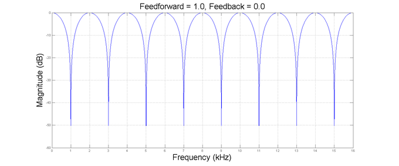

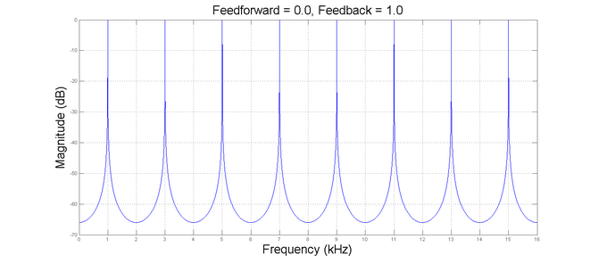

下图举列说明使用 0.5 ms 固定延迟可实现的幅度响应类型。 前馈系数控制频谱中的陷波深度，而反馈系数控制峰值幅度。


系数的符号可控制陷波或峰值出现在奇次谐波（采用正系数时）还是偶次谐波（采用负系数时），如下所示。

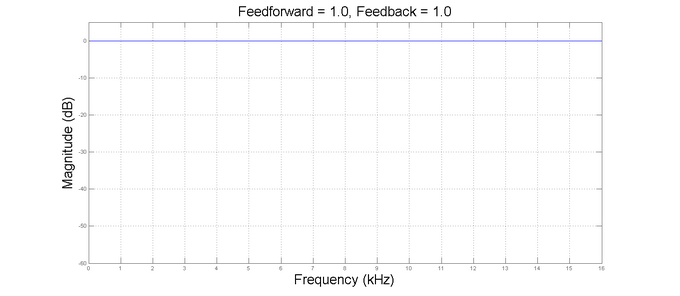


The feedforward and feedback components can be used together to build different spectral shapes for combining the effect of notches and peak as shown below.


延迟可有效控制陷波或峰值之间的间距。 延迟增加一倍，陷波之间的距离将减半，如下例所示。

###### Alternate effects

借助“Blend”参数进一步提供的灵活性，可实现不同于镶边的效果，该参数可将延迟线的输入（包括反馈路径）与延迟线的前馈路径混合。

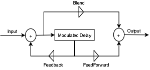

颤音（vibrato）效果就是这样一个例子（音高发生有规律的脉动变化）。 颤音可以表现为音高的变化量以及其变化速度。将反馈和混合值设置为 0 的时候，则只会保留（已调制）前馈路径（颤音分量）。

###### Flanger properties

Flanger 插件包含一系列属性，其中很多属性可实时编辑，并可使用 RTPC 映射至特定游戏参数。

| 界面元素 | 描述 |
| --- | --- |
| Name | 名称。效果器实例的名称。  效果器实例是一组效果器属性设置。它们可以是两种类型之一：自定义或共享集。自定义实例只能由一个对象使用，然而共享集可在多个对象之间共享。 |
| (Object Color) | 显示对象的颜色。单击图标可打开颜色选择器。    选择一种颜色并将其应用于对象。在为对象选择某种颜色时，会在选定方块上显示调色板图标，并在右下角标注黄色三角（如图所示）。  若要沿用父对象的颜色，请选中颜色选择器最左侧的方块。 |
| Inclusion | 启用。决定是否在生成 SoundBank 时在其中包含相应元素。如勾选，则包含该元素。如未勾选，则不会包含该元素。  为了针对各个平台来优化声音设计，有时需在特定平台上弃用某些元素。在默认情况下，此复选框会应用于所有平台。使用复选框左侧的 [Link 标志](ch45s11.html#linking_unlinking_property_values "Linking or unlinking property values") 来取消链接相应元素。然后，便可根据平台来自定义复选框的状态。  若取消选中此选项，则将禁用编辑器中的属性和行为选项。  Default value: true |
| (Show references) | 指示工程中有多少元素包含对对象的直接引用。若存在对对象的引用，则图标显示为橙色；若不存在此类引用，则图标显示为灰色。  通过单击该按钮，可打开 [“Reference View 视图”一节](ch60s12s05.html "Reference View 视图")，并在 **References to:**（引用:）字段中查看对象的名称。 |
| Notes | 备注。Effect 的其它信息。 |
| Metering | 电平测量。指示当前正在测量电平的对象的名称。 |
|  | 允许浏览其他要测量电平的对象。  |  |  | | --- | --- | | [备注] | 备注 | | 只有对于包含 VU 电平表的效果器，Effect Editor 中才会显示电平测量界面元素。 | |
|  | 设置 Effect Editor 中选定标签页的显示方式。默认情况下，整体面板中仅显示一个选定标签页。不过，您可以通过单击分隔器按钮将面板沿横向或纵向一分为二，显示两个不同的标签页。当前所选选项将以高亮背景色显示。  |  |  | | --- | --- | | [备注] | 备注 | | 无法同时在两个面板中显示同一标签页。若选中的标签页已在另一面板中显示，则另一面板将自动显示另一标签页。 | |

|  |  |
| --- | --- |
| Delay | 延迟。梳状滤波器使用的延迟参数。 小延迟值将产生较少的频谱陷波／峰值。 大延迟值将在频率陷波／峰值之间产生小间隙。  单位：ms  Default value: 5  Range: 0.2 to 100 |
| **颜色设置** | |
| Blend | 混合。用于不进入被调制的延迟线的信号（反馈和干声信号的总和）上的缩放因子。 可用于创建从镶边到颤音等一系列效果。  Default value: 1.0  Range: 0 to 1 |
| Feedforward | 前馈。代表调制梳状滤波器的前馈路径所做贡献的缩放因子。 该参数取较大（绝对）值时将在频谱中形成较大的陷波。 而负值将把陷波放置在偶次谐波位置。  Default value: 1  Range: -1 to 1 |
| Feedback | 反馈。代表调制梳状滤波器的反馈路径所做贡献的缩放因子。 该参数取较大（绝对）值时将在频谱中产生较大的峰值。 而负值将把峰值放置在偶次谐波位置。  单位：线性增益  Default value: 0  Range: -1 to 1 |
| **Output 设置** | |
| Wet/Dry Mix | 控制湿声通路（Effect 输出）和干声通路（Effect 输入）之间的平衡。值为 0 时，原始信号将不受效果器影响的，而值为 100 时，则完全输出效果器信号。  单位：%  Default value: 100  Range: 0 to 100 |
| Output Gain | 增益。在执行动态压缩后作用于输出信号的增益量，可弥补潜在增益损失。  Default value: 0  Range: -24 to 24  Units: dB |
| Process Center | 确定是否在中置声道中处理效果。选中后，中置声道将不受效果器的影响。  Default value: false |
| Process LFE | 确定是否在 LFE 声道中处理效果。选中后，LFE 声道将不受效果器的影响。  Default value: false |
| **LFO 部分** | |
| LFO Depth | 深度。控制实际延迟长度的调幅量，单位为百分比。 值为 0% 时，梳状滤波器使用的延迟长度总是由延迟参数指定。 值为 100% 时，延迟长度调制为它的整个范围。  单位：%  Default value: 50  Range: 0 to 100 |
| LFO Frequency | 调制信号的频率。  单位：Hz  Default value: 1  Range: 0.02 to 20000  Units: Frequency |
| LFO Waveform | 波形。调制信号的形状。  值：Sine、Square、Triangle、Upward sawtooth、Downward sawtooth。  **Caution**:虽然在运行时可使用 RTPC 更改此参数，但不能保证信号是连续的。  Default value: Sine |
| LFO Smoothing | 平滑。作用于调制信号的平滑量。 它按特定值进行低通滤波，从 0 映射至 100%。 在 0% 时，信号按原样输出。 使用大值时，边缘和间断将进行平滑处理。  |  |  | | --- | --- | | [备注] | 备注 | | 此设置对正弦波无任何影响。 |  单位：%  Default value: 0  Range: 0 to 100 |
| PWM (Pulse Width Modulation) | 脉冲宽度调制。仅作用于方波形。 在一个周期内调制脉冲的宽度。 值为 50% 时，信号在半个周期内处于满幅度，剩下半个周期则为 0。 值接近 100% 时，信号在几乎整个周期内都处于满幅度，而只有极短的时间让幅度降到 0。  单位：%  Default value: 50  Range: 0 to 100 |
| **Initial Phase（初相）** | |
| LFO Phase Offset | 偏置。将所有声道的调制信号的相位偏置某个特定值。  |  |  | | --- | --- | | [备注] | 备注 | | 虽然在运行时可通过 RTPC 更改该参数，但在该效果器的实例已经开始播放后设置该参数时，该参数不会产生任何效果。 |  单位：°  Default value: 0  Range: -180 to 180 |
| LFO Spread Mode | 散布模式。定义初始阶段散布（参见参数“Spread”）如何应用于所有声道。 例如，将 Spread Mode 设置为“Front-Rear”时，所有前置声道开始使用等于 0 的相位进行播放，所有后置声道开始使用等于“Spread”的相位进行播放。 如果存在（并已处理），则 LFE 声道总是与左前声道同步。  值：  - **Left-Right**:左前声道和左后声道从偏置 0 开始播放，右前和右后声道从偏置“Spread”开始播放。 如果存在，则中置声道会从偏置“Spread”/2 开始播放。 - **Front-Rear**:前置和中置声道采用偏置 0 开始播放，后置声道采用偏置“Spread”开始播放。 - **Circular**:该模式在 1.x、2.x 和 3.x 配置的左声道和右声道之间，以及在 4.x 和 5.x 配置的左前声道和右后声道之间应用两极扩散 。 例如，3.0 信号将从以下相位开始：L=0、C=“Spread”/2、R=“Spread”。 5.0 信号将从以下相位开始：FL=0、C=“Spread”/4、FR=“Spread”/2、RL=“Spread”/2、RR=“Spread”。 - **Random**:各个声道将从均匀分布在 0 和“Spread”之间的随机相位开始。  |  |  | | --- | --- | | [备注] | 备注 | | 虽然在运行时可通过 RTPC 更改该参数，但在该效果器的实例已经开始播放后设置该参数时，该参数不会产生任何效果。 |  Default value: Left-Right |
| LFO Phase Spread | 散布。各声道之间初始相位扩散的差异量。 该值影响各个声道的方式取决于 Spread Mode 。  |  |  | | --- | --- | | [备注] | 备注 | | 虽然在运行时可通过 RTPC 更改该参数，但在该效果器的实例已经开始播放后设置该参数时，该参数不会产生任何效果。 |  单位：°  Default value: 0  Range: 0 to 180 |

|  |  |
| --- | --- |
| [注意] | 注意 |
| 请记住，在参数取大值时，Feedback 参数可使声音逐渐增大。 |

|  |  |
| --- | --- |
| [注意] | 注意 |
| 效果尾音（即声音停止输入后的一段时间，其间效果器将继续输出延迟线中累积的数据）与反馈值大小无关。也就是说，对于强反馈值，效果器可能会在音量很大的时候终止输出。 |

另请参阅[“Tremolo 属性”一节](ch66s25.html#Tremolo_LFO_Phase)了解 LFO 参数的详细说明。

---

#### Gain

为了提升声音效果，您可能会想要去影响音频信号的幅度。

您可以通过 Gain（增益）插件来单独控制全频带声道和 LFE 声道的增益。 这些属性还可使用 RTPC 映射至游戏参数。

###### Gain 属性

| 界面元素 | 描述 |
| --- | --- |
| Name | 名称。效果器实例的名称。  效果器实例是一组效果器属性设置。它们可以是两种类型之一：自定义或共享集。自定义实例只能由一个对象使用，然而共享集可在多个对象之间共享。 |
| (Object Color) | 显示对象的颜色。单击图标可打开颜色选择器。    选择一种颜色并将其应用于对象。在为对象选择某种颜色时，会在选定方块上显示调色板图标，并在右下角标注黄色三角（如图所示）。  若要沿用父对象的颜色，请选中颜色选择器最左侧的方块。 |
| Inclusion | 启用。决定是否在生成 SoundBank 时在其中包含相应元素。如勾选，则包含该元素。如未勾选，则不会包含该元素。  为了针对各个平台来优化声音设计，有时需在特定平台上弃用某些元素。在默认情况下，此复选框会应用于所有平台。使用复选框左侧的 [Link 标志](ch45s11.html#linking_unlinking_property_values "Linking or unlinking property values") 来取消链接相应元素。然后，便可根据平台来自定义复选框的状态。  若取消选中此选项，则将禁用编辑器中的属性和行为选项。  Default value: true |
| (Show references) | 指示工程中有多少元素包含对对象的直接引用。若存在对对象的引用，则图标显示为橙色；若不存在此类引用，则图标显示为灰色。  通过单击该按钮，可打开 [“Reference View 视图”一节](ch60s12s05.html "Reference View 视图")，并在 **References to:**（引用:）字段中查看对象的名称。 |
| Notes | 备注。Effect 的其它信息。 |
| Metering | 电平测量。指示当前正在测量电平的对象的名称。 |
|  | 允许浏览其他要测量电平的对象。  |  |  | | --- | --- | | [备注] | 备注 | | 只有对于包含 VU 电平表的效果器，Effect Editor 中才会显示电平测量界面元素。 | |
|  | 设置 Effect Editor 中选定标签页的显示方式。默认情况下，整体面板中仅显示一个选定标签页。不过，您可以通过单击分隔器按钮将面板沿横向或纵向一分为二，显示两个不同的标签页。当前所选选项将以高亮背景色显示。  |  |  | | --- | --- | | [备注] | 备注 | | 无法同时在两个面板中显示同一标签页。若选中的标签页已在另一面板中显示，则另一面板将自动显示另一标签页。 | |

|  |  |
| --- | --- |
| Full Band Gain | 全频带增益。作用于除 LFE 之外的所有声道的增益。  Default value: 0  Range: -96.3 to 24  Units: dB |
| LFE Gain | LFE 增益。作用于 LFE 声道的增益（如果有 LFE 声道的话）。  Default value: 0  Range: -96.3 to 24  Units: dB |

---

#### Guitar Distortion（吉他失真效果器）

（请参阅下文的 [“Guitar Distortion properties”一节](ch66s09.html#guitar_distortion_plug_in_properties "Guitar Distortion properties")。）

失真是一种非线性处理，它会更改波形的形状，引入原始信号中不存在的频率分量。Guitar Distortion 插件模拟常见“stomp box”失真的行为，从而获取典型的吉他失真声音。

###### Distortion types

Guitar Distortion 插件可提供几种失真算法效果。以下传递函数图演示不同失真类型如何对信号产生影响。在图像中，没有失真时，传递函数（左侧）将显示输出振幅始终与输入振幅相同。输入正弦波（右侧）时，算法输出将没有失真。

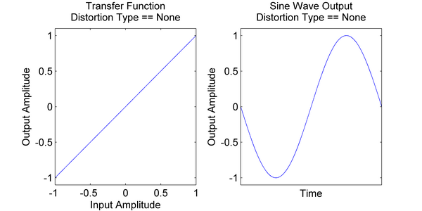

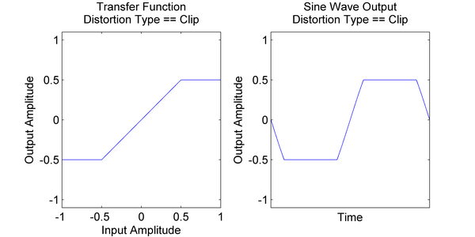

在振幅达到过载电平时，“Clip”失真类型将采用硬拐点（即无过渡）方式，将正负振幅对称削去相同的电平。

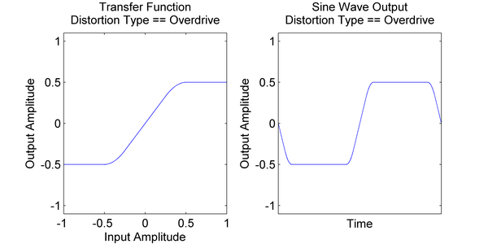

在振幅达到过载电平时，“Overdrive”失真类型将采用软拐点方式，缓慢过渡至完全削波，将正负振幅对称削去相同的电平。


在振幅达到过载电平时，“Heavy”失真类型将采用软拐点方式，缓慢过渡至完全削波，将正负振幅对称削去相同的电平。传递函数在零值周围曲线更陡峭，所以削波保持的时间会更长。它通常与较大的 Drive 参数值一起使用，以获得重金属失真效果。


“Fuzz”失真类型会为正负振幅不对称地削去电平。它为负振幅采用软拐点方式，缓慢过渡至完全削波，而正振幅在高电平时则使用硬拐点。此类型的失真更适合单音独奏型素材，因为在输入复杂的复音时，它会很快变得非常不和谐。Tone 参数主要用于控制负振幅的软拐点（图中 Tone 参数设置为 10）。

###### Rectification


Rectification 参数值在 50% 以下时将执行半波整流，在 50% 和 100% 之间时将执行全波整流。半波整流用于让负振幅部分保持在特定电平之上；如图例，可以通过 Rectification 参数逐步将起始点 -1 调整为 0，值为 0% 时不会应用半波整流，值为 50% 时则不允许负振幅低于 0，即完全削波。

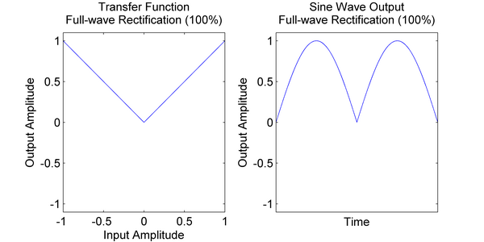

全波整流会更进一步，随着 Rectification 参数值上升，输入的负信号部分将逐步变为正信号。值为 100% 时将实现全波整流，负信号部分的极性将完全反转。它能起到让基频翻倍的作用，可用于实现“高八度”效果。

###### Equalizer controls

由于失真是非线性处理（即在失真之前和之后应用增益不等效），因此进行滤波时，在失真算法之前和之后针对特定频率应用增益，效果也不同。实际上，常见做法是先以特定方式进行信号滤波（如增强低频），让失真算法以所需的方式运行，然后再滤除相同的频带来抵消失真前的滤波效果。因此，在失真处理前后将提供功能全面的参数均衡器，以便自定义失真行为并获取多样的失真效果。

###### Guitar Distortion properties

Guitar Distortion 插件包含一系列属性，其中很多属性可实时编辑，并可使用 RTPC 映射至特定游戏参数。

| 界面元素 | 描述 |
| --- | --- |
| Name | 名称。效果器实例的名称。  效果器实例是一组效果器属性设置。它们可以是两种类型之一：自定义或共享集。自定义实例只能由一个对象使用，然而共享集可在多个对象之间共享。 |
| (Object Color) | 显示对象的颜色。单击图标可打开颜色选择器。    选择一种颜色并将其应用于对象。在为对象选择某种颜色时，会在选定方块上显示调色板图标，并在右下角标注黄色三角（如图所示）。  若要沿用父对象的颜色，请选中颜色选择器最左侧的方块。 |
| Inclusion | 启用。决定是否在生成 SoundBank 时在其中包含相应元素。如勾选，则包含该元素。如未勾选，则不会包含该元素。  为了针对各个平台来优化声音设计，有时需在特定平台上弃用某些元素。在默认情况下，此复选框会应用于所有平台。使用复选框左侧的 [Link 标志](ch45s11.html#linking_unlinking_property_values "Linking or unlinking property values") 来取消链接相应元素。然后，便可根据平台来自定义复选框的状态。  若取消选中此选项，则将禁用编辑器中的属性和行为选项。  Default value: true |
| (Show references) | 指示工程中有多少元素包含对对象的直接引用。若存在对对象的引用，则图标显示为橙色；若不存在此类引用，则图标显示为灰色。  通过单击该按钮，可打开 [“Reference View 视图”一节](ch60s12s05.html "Reference View 视图")，并在 **References to:**（引用:）字段中查看对象的名称。 |
| Notes | 备注。Effect 的其它信息。 |
| Metering | 电平测量。指示当前正在测量电平的对象的名称。 |
|  | 允许浏览其他要测量电平的对象。  |  |  | | --- | --- | | [备注] | 备注 | | 只有对于包含 VU 电平表的效果器，Effect Editor 中才会显示电平测量界面元素。 | |
|  | 设置 Effect Editor 中选定标签页的显示方式。默认情况下，整体面板中仅显示一个选定标签页。不过，您可以通过单击分隔器按钮将面板沿横向或纵向一分为二，显示两个不同的标签页。当前所选选项将以高亮背景色显示。  |  |  | | --- | --- | | [备注] | 备注 | | 无法同时在两个面板中显示同一标签页。若选中的标签页已在另一面板中显示，则另一面板将自动显示另一标签页。 | |

|  |  |
| --- | --- |
| **Pre-Distortion EQ** | |
| Pre-Distortion EQ Band Enable | 勾选后将启用 EQ 频带。  Default value: false |
| Pre-Distortion EQ Band Curve | 曲线。相应 EQ 频带信号的滤波类型。可以使用以下筛选器：  - **Low Pass** ―― 低通。从指定频率中提供高频率的固定斜率衰减。 低于该点，信号几乎不受影响，但高于截止频率点时，频率越高，衰减逐步增大。 - **High Pass** ―― 高通。从指定频率中提供低频率的固定斜率衰减。 高于该点，信号几乎不受影响，而低于截止频率点时，频率越低，衰减逐步增大。 - **Band Pass** ―― 带通。拒绝指定中心频率周围的所有频率。 中心周围的频率范围由 Q 进行控制。 - **Notch** ―― 带阻。为指定频率范围的固定衰减提供一个不同的宽度。 中心周围的频率范围由 Q 进行控制。 - **Low Shelf** ―― 低架。为指定范围的低频率提供增益/衰减。 此曲线类型也被称为 Bass Tone Control（低音控制）。 - **High Shelf** ―― 高架。为指定范围的高频率提供增益/衰减。 此曲线类型也被称为 Treble Tone Control（高音控制）。 - **Peaking** ―― 峰值。为指定频率范围的放大/衰减提供一个不变的宽度。 峰值周围的频率范围由 Q 进行控制。  Default value: Low Shelf |
| Pre-Distortion EQ Band Gain | 增益。所选频带的音频信号的放大量。增大此值将“增强”音频信号。 减小此值将“削减”或衰减音频信号。  |  |  | | --- | --- | | [备注] | 备注 | | 当选择了 Low Pass、High Pass、Notch 和 Band Pass 曲线时，Gain 控件不可用，因为这些滤波器类型的通带已经归一化为 0 dB。 |  Default value: 0  Range: -48 to 48  Units: dB |
| Pre-Distortion EQ Band Frequency | 评率。频谱中将受到增益影响的部分。  单位：Hz  Default value: 1000  Range: 20 to 20000  Units: Frequency |
| Pre-Distortion EQ Band Quality Factor | 品质因数。中心频率周围将受增益变化影响的区域。 低 Q 值表示带宽范围较宽，相反，高 Q 值表示带宽范围较窄。  当选择了 Low Pass、High Pass、Low Shelf 和 High Shelf 曲线时，该控制不可用。  Default value: 1  Range: 0.1 to 20 |
| **失真** | |
| Type | 失真算法的类型。以下选项可用：  - **None**: **None：**不应用失真。 - **Overdrive**:**Overdrive：**平滑、蓝调类型的失真。 - **Heavy**:**Heavy：**硬失真，将产生大量高频谐波。 - **Clip**:**Clip：**不具有拐点过渡的硬削波。通常会导致不悦耳的静态噪音（削波失真）。 - **Fuzz**:**Fuzz：**不对称的硬削波和软削波，正负振幅阈值不同。此类型的失真将导致大量谐波，输入信号为复杂的乐音时，将很快产生不和谐的噪音。  Default value: None |
| Drive | 此参数用于在应用传递函数前调整输入信号。可视其为失真量。  单位：%  Default value: 50  Range: 0 to 100 |
| Tone | 按照上文所述方式更改传递函数。  |  |  | | --- | --- | | [备注] | 备注 | | 只有在失真类型设置为 Fuzz 时此参数才有效。 |  单位：%  Default value: 50  Range: 0 to 100 |
| Distortion Rectification | 将影响输入信号负值部分的半波或全波整流量。有关详细信息，请参阅 [Rectification](ch66s09.html#wwise_guitar_distortion_plug_in_rectification "Rectification") 。  单位：%  Default value: 0  Range: 0 to 100 |
| **Output** | |
| Output Gain | 输出信号的增益量。  Default value: 0  Range: -24 to 24  Units: dB |
| Wet/Dry Mix | 控制湿声通路（Effect 输出）和干声通路（Effect 输入）之间的平衡。值为 0 时，原始信号将不受效果器影响的，而值为 100 时，则完全输出效果器信号。  单位：%  Default value: 100  Range: 0 to 100 |
| **Post-Distortion EQ** | |
| Post-Distortion EQ Band Enable | 勾选后将启用 EQ 频带。  Default value: false |
| Post-Distortion EQ Band Curve | 曲线。相应 EQ 频带信号的滤波类型。可以使用以下筛选器：  - **Low Pass** ―― 低通。从指定频率中提供高频率的固定斜率衰减。 低于该点，信号几乎不受影响，但高于截止频率点时，频率越高，衰减逐步增大。 - **High Pass** ―― 高通。从指定频率中提供低频率的固定斜率衰减。 高于该点，信号几乎不受影响，而低于截止频率点时，频率越低，衰减逐步增大。 - **Band Pass** ―― 带通。拒绝指定中心频率周围的所有频率。 中心周围的频率范围由 Q 进行控制。 - **Notch** ―― 带阻。为指定频率范围的固定衰减提供一个不同的宽度。 中心周围的频率范围由 Q 进行控制。 - **Low Shelf** ―― 低架。为指定范围的低频率提供增益/衰减。 此曲线类型也被称为 Bass Tone Control（低音控制）。 - **High Shelf** ―― 高架。为指定范围的高频率提供增益/衰减。 此曲线类型也被称为 Treble Tone Control（高音控制）。 - **Peaking** ―― 峰值。为指定频率范围的放大/衰减提供一个不变的宽度。 峰值周围的频率范围由 Q 进行控制。  Default value: Low Shelf |
| Post-Distortion EQ Band Gain | 增益。所选频带的音频信号的放大量。增大此值将“增强”音频信号。 减小此值将“削减”或衰减音频信号。  |  |  | | --- | --- | | [备注] | 备注 | | 当选择了 Low Pass、High Pass、Notch 和 Band Pass 曲线时，Gain 控件不可用，因为这些滤波器类型的通带已经归一化为 0 dB。 |  单位：dB  Default value: 0  Range: -48 to 48  Units: dB |
| Post-Distortion EQ Band Frequency | 评率。频谱中将受到增益影响的部分。  单位：Hz  Default value: 1000  Range: 20 to 20000  Units: Frequency |
| Post-Distortion EQ Band Quality Factor | 品质因数。中心频率周围将受增益变化影响的区域。 低 Q 值表示带宽范围较宽，相反，高 Q 值表示带宽范围较窄。  当选择了 Low Pass、High Pass、Low Shelf 和 High Shelf 曲线时，该控制不可用。  Default value: 1  Range: 0.1 to 20 |

---

#### Harmonizer

Harmonizer（和声效果器）是一种变调器，它将移调和原始音高相结合，创建出两个或三个和声。 Harmonizer 插件可用于更改音频信号的音高，而不会影响其时长。 该插件可与复杂的复音信号（比如不仅是人声）配合使用，并可对音高上下移调。 或者在不包含任何干声信号时，也可用作高品质变调器。

###### Choosing the window size

选择 Window Size（窗口大小）参数是获取高品质结果的重要步骤。 虽然默认值（1024）对大部分内容而言效果都很好，但要在获得最佳移调效果的同时让副作用达到最小，则微调该参数十分重要。 虽然窗口大小设置得大一点可获得更佳的频率分辨率，但时域分辨率会相应变得不太准确，因此会导致瞬态信号变模糊。 因此调整窗口大小参数要在时间分辨率和频率分辨率之间达到妥协。

理想的窗口大小设置取决于音频内容，具有大量瞬态成分的信号（如击打声、鼓声、爆炸声等）使用较小的窗口更好，而具有稳定频率内容（如语音、乐器等）的谐波信号可能使用较大的窗口参数值时效果最好，因为这样可以获得更准确的频率分辨率。

###### Harmonizer plug-in properties

Harmonizer 插件包含一系列属性，其中很多属性可实时编辑，并可使用 RTPC 映射至特定游戏参数。

| 界面元素 | 描述 |
| --- | --- |
| Name | 名称。效果器实例的名称。  效果器实例是一组效果器属性设置。它们可以是两种类型之一：自定义或共享集。自定义实例只能由一个对象使用，然而共享集可在多个对象之间共享。 |
| (Object Color) | 显示对象的颜色。单击图标可打开颜色选择器。    选择一种颜色并将其应用于对象。在为对象选择某种颜色时，会在选定方块上显示调色板图标，并在右下角标注黄色三角（如图所示）。  若要沿用父对象的颜色，请选中颜色选择器最左侧的方块。 |
| Inclusion | 启用。决定是否在生成 SoundBank 时在其中包含相应元素。如勾选，则包含该元素。如未勾选，则不会包含该元素。  为了针对各个平台来优化声音设计，有时需在特定平台上弃用某些元素。在默认情况下，此复选框会应用于所有平台。使用复选框左侧的 [Link 标志](ch45s11.html#linking_unlinking_property_values "Linking or unlinking property values") 来取消链接相应元素。然后，便可根据平台来自定义复选框的状态。  若取消选中此选项，则将禁用编辑器中的属性和行为选项。  Default value: true |
| (Show references) | 指示工程中有多少元素包含对对象的直接引用。若存在对对象的引用，则图标显示为橙色；若不存在此类引用，则图标显示为灰色。  通过单击该按钮，可打开 [“Reference View 视图”一节](ch60s12s05.html "Reference View 视图")，并在 **References to:**（引用:）字段中查看对象的名称。 |
| Notes | 备注。Effect 的其它信息。 |
| Metering | 电平测量。指示当前正在测量电平的对象的名称。 |
|  | 允许浏览其他要测量电平的对象。  |  |  | | --- | --- | | [备注] | 备注 | | 只有对于包含 VU 电平表的效果器，Effect Editor 中才会显示电平测量界面元素。 | |
|  | 设置 Effect Editor 中选定标签页的显示方式。默认情况下，整体面板中仅显示一个选定标签页。不过，您可以通过单击分隔器按钮将面板沿横向或纵向一分为二，显示两个不同的标签页。当前所选选项将以高亮背景色显示。  |  |  | | --- | --- | | [备注] | 备注 | | 无法同时在两个面板中显示同一标签页。若选中的标签页已在另一面板中显示，则另一面板将自动显示另一标签页。 | |

|  |  |
| --- | --- |
| Input | 输入。该参数确定 Harmonizer 将处理哪些声道。  值：  - **As Input**:与输入相同。处理所有输入声道（默认）。 - **Mono-Center**:单声道／中置。仅处理中置声道。 还会处理单声道信号。 - **Stereo**:立体声。仅处理左前和右前扬声器。 - **L-R-C**:左／中／右。处理所有前置扬声器，包括中置（如有的话）。 - **L-R-Ls-Rs**:左／右／左环绕／右环绕。处理前置和后置立体声对。 - **L-R-C-Ls-Rs**:左／右／中／左环绕／右环绕。处理所有全频带声道。 - **Left Only**:和声效果器仅处理左声道。 在总线中插入效果器时，此模式能有效减少 CPU 的使用率，它假定连通到效果器的音频内容是未使用定位或声像摆位的单声道声音。左声道的和声结果会作用于左前声道和右前声道的湿声路径。 但干声路径保留原始声道内容。  Default value: As Input |
| Process LFE | 处理 LFE（低频效果）。该参数确定和声效果器是否处理 LFE（低频效果）（低频效果）声道。  Default value: false |
| Window Size | 窗口大小。窗口大一些可改进频率分辨率，但会让瞬态信号变模糊。 因此该参数是时间分辨率和频率分辨率之间妥协的结果。 请参阅以上章节，了解如何选择该参数值的详情。  单位：采样帧  Default value: 1024  Range: 256 to 4096 |
| Delay Dry | 延迟干声。确定是否对干声信号做延迟，以保持与和声（湿声路径）同步。  |  |  | | --- | --- | | [备注] | 备注 | | 当在辅助总线中使用 Harmonizer 时，该属性不起作用。 在本例中，干声信号由发送至辅助总线的对象定义。 |  Default value: true |
| **Harmonizer 的 Voice 参数** | |
| Voice Enable | 启用声部。确定是否启用指定音高的声部。  |  |  | | --- | --- | | [备注] | 备注 | | 为避免造成不必要的副作用并节省资源，请务必禁用所有不需要的声部（而不是使用零音高或极低的声部电平等等）。 |  Default value: false |
| Pitch Shift | 移调。该参数指定将音高提升或降低的量（单位为音分）。 +1200 音分指向上移调一个八度，-1200 指向下移调一个八度。  单位：音分  Default value: 0  Range: -2400 to 2400 |
| Voice Gain | 作用于指定和声声部的增益量，用来平衡不同的和声声部。  Default value: 0  Range: -96 to 24  Units: dB |
| **声部 Filter 参数** | |
| Voice Filter Type | 确定可作用于和声声部信号的滤波的类型。 可以使用以下筛选器：  - **None** ―― 禁用声部滤波器。 - **Low Pass** ―― 低通。从指定频率中提供高频率的固定斜率衰减。 低于该点，信号几乎不受影响，但高于截止频率点时，频率越高，衰减逐步增大。 - **High Pass** ―― 高通。从指定频率中提供低频率的固定斜率衰减。 高于该点，信号几乎不受影响，而低于截止频率点时，频率越低，衰减逐步增大。 - **Band Pass** ―― 带通。拒绝指定中心频率周围的所有频率。 中心周围的频率范围由 Q 进行控制。 - **Notch** ―― 带阻。为指定频率范围的固定衰减提供一个不同的宽度。 中心周围的频率范围由 Q 进行控制。 - **Low Shelf** ―― 低架。为指定范围的低频率提供增益/衰减。 此曲线类型也被称为 Bass Tone Control（低音控制）。 - **High Shelf** ―― 高架。为指定范围的高频率提供增益/衰减。 此曲线类型也被称为 Treble Tone Control（高音控制）。 - **Peaking** ―― 峰值。为指定频率范围的放大/衰减提供一个不变的宽度。 峰值周围的频率范围由 Q 进行控制。  Default value: None |
| Voice Filter Gain | 增益。对和声声部信号所选频带的放大量。 增大此值将“增强”音频信号。 减小此值将“削减”或衰减音频信号。  |  |  | | --- | --- | | [备注] | 备注 | | 当选择了 Low Pass、High Pass、Notch 和 Band Pass 曲线时，Gain 控件不可用，因为这些滤波器类型的通带已经归一化为 0 dB。 |  Default value: 0  Range: -24 to 24  Units: dB |
| Voice Filter Frequency | 评率。频谱中将受到增益影响的部分。  单位：Hz  Default value: 1000  Range: 20 to 20000  Units: Frequency |
| Voice Filter Q Factor | 品质因数。中心频率周围将受增益变化影响的区域。 低 Q 值表示带宽范围较宽，相反，高 Q 值表示带宽范围较窄。  当选择了 Low Pass、High Pass、Low Shelf 和 High Shelf 曲线时，该控制不可用。  Default value: 1  Range: 0.1 to 20 |
| **Output Levels（输出电平）** | |
| Dry Level | 干声电平。作用于未处理信号的增益。  Default value: 0  Range: -96 to 24  Units: dB |
| Wet Level | 湿声电平。作用于和声声部信号的增益。  Default value: 0  Range: -96 to 24  Units: dB |

---

#### Matrix Reverb（矩阵混响器）

用户可以使用 Matrix Reverb（矩阵混响）插件在游戏内模拟声学空间效果的声音反射。 该插件效果器专为需要性能优秀、品质也好的游戏开发者而创建。 它特有的控件可以让您在混响品质与 CPU 及内存占用之间取得平衡，帮助您在游戏和平台的限制下获得最佳的结果。 虽然该混响插件比 RoomVerb 效果器插件使用的 CPU 更少，但它的控件也少一些，因此也更难用来创建逼真的效果。

Matrix Reverb 插件在其算法中考虑以下所有概念：

- **Direct sound** ―― 直达声。直接传输至听者耳朵、不经过任何表面反射的声波。 大部分声音天然地会被墙壁或天花板反射。
- **Early reflection** ―― 早期反射。声音产生的第一组声波反射。 这些反射为大脑提供反射表面的相关信息，并可使听者了解到声源相对于这些表面的位置。
- **Reverb tail** ―― 混响尾音。当声波继续被表面材质反射时产生的后续声波反射。
- **Echo density** ―― 回声密度。混响算法每秒产生的回声量。
- **Modal density** ―― 模态密度。模态是音频信号的频域表示中的峰值。 当模拟大多数的声学空间时，增加模态密度可改善混响的逼真度。减低模态密度可能导致嗡嗡声。
- **Delay line**― 延迟线。一种算法处理，可模拟声音传播通过可变的距离所花费的时间。 增加延迟线数量可增大混响的模态密度和回声密度。
- **Delay lengths** ―― 延迟长度。声音进入和退出延迟线时刻之间的时间间隔。 增加延迟长度将增大模态密度，但会减小回声密度。

|  |  |
| --- | --- |
| [备注] | 备注 |
| 目前，该效果无法用于 Ambisonics。如果在 ambisonic（声场环绕声）声部或总线上使用，则不会初始化。 |

###### Matrix Reverb 属性

很多 Matrix Reverb 属性都可实时编辑，并利用 RTPC 映射至特定 Game Parameter（游戏参数）。

| 界面元素 | 描述 |
| --- | --- |
| Name | 名称。效果器实例的名称。  效果器实例是一组效果器属性设置。它们可以是两种类型之一：自定义或共享集。自定义实例只能由一个对象使用，然而共享集可在多个对象之间共享。 |
| (Object Color) | 显示对象的颜色。单击图标可打开颜色选择器。    选择一种颜色并将其应用于对象。在为对象选择某种颜色时，会在选定方块上显示调色板图标，并在右下角标注黄色三角（如图所示）。  若要沿用父对象的颜色，请选中颜色选择器最左侧的方块。 |
| Inclusion | 启用。决定是否在生成 SoundBank 时在其中包含相应元素。如勾选，则包含该元素。如未勾选，则不会包含该元素。  为了针对各个平台来优化声音设计，有时需在特定平台上弃用某些元素。在默认情况下，此复选框会应用于所有平台。使用复选框左侧的 [Link 标志](ch45s11.html#linking_unlinking_property_values "Linking or unlinking property values") 来取消链接相应元素。然后，便可根据平台来自定义复选框的状态。  若取消选中此选项，则将禁用编辑器中的属性和行为选项。  Default value: true |
| (Show references) | 指示工程中有多少元素包含对对象的直接引用。若存在对对象的引用，则图标显示为橙色；若不存在此类引用，则图标显示为灰色。  通过单击该按钮，可打开 [“Reference View 视图”一节](ch60s12s05.html "Reference View 视图")，并在 **References to:**（引用:）字段中查看对象的名称。 |
| Notes | 备注。Effect 的其它信息。 |
| Metering | 电平测量。指示当前正在测量电平的对象的名称。 |
|  | 允许浏览其他要测量电平的对象。  |  |  | | --- | --- | | [备注] | 备注 | | 只有对于包含 VU 电平表的效果器，Effect Editor 中才会显示电平测量界面元素。 | |
|  | 设置 Effect Editor 中选定标签页的显示方式。默认情况下，整体面板中仅显示一个选定标签页。不过，您可以通过单击分隔器按钮将面板沿横向或纵向一分为二，显示两个不同的标签页。当前所选选项将以高亮背景色显示。  |  |  | | --- | --- | | [备注] | 备注 | | 无法同时在两个面板中显示同一标签页。若选中的标签页已在另一面板中显示，则另一面板将自动显示另一标签页。 | |

|  |  |
| --- | --- |
| Pre-delay | 预延迟。信号进入混响单元前发生的延迟。 较长的预延迟时间可用于模拟较大的空间，这样的空间需要较长时间才能听到最早的回声。 根据预延迟与为混响指定的最短延迟线之和，将定期听到第一个反射。 虽然预延迟支持 Exclusive RTPC，但其仅可用于在播放之前实施初始化。若使用 RTPC 在播放期间实时更改预延迟，则将反复重新初始化延迟缓冲区，进而导致混响信号突然静音或陡然变化。  单位：s  Default value: 0  Range: 0 to 1 |
| Reverb Time | 混响时间。声音从原始幅度衰减 60 dB 所花费的时间。  单位：s  Default value: 4  Range: 0.1 to 10 |
| HF Ratio | HF 比率。控制高频相对于低频混响时间的滚降衰减系数。 例如，比率为 2 表示奈奎斯特频率的混响时间比 DC（直流信号，即 0 Hz 震荡频率） 的混响时间短一倍。  当该比率的值小于 1 时，高频混响时间比低频混响时间更长。 当使用短混响并结合长延迟和高 HF 比率时，这种插件采用的基本混响算法可能会出现稳定性问题，为了避免这种问题，实际使用的 HF 比率会比指定值小。  Default value: 2  Range: 0.5 to 10 |
| Wet Level | 湿声电平。作用于混响声的增益系数。  Default value: -35  Range: -96.3 to 0  Units: dB |
| Dry Level | 干声电平。作用于直接路径声音的增益系数。  Default value: -96.3  Range: -96.3 to 0  Units: dB |
| Process LFE | 决定确定是否在 LFE 声道中处理 Effect效果。选中后，将在 LFE 声道中处理效果。未勾选时，将出现以下情况之一：  如果效果器在辅助总线中使用，则在 LFE 频道中将会保持无声。  作为插入效果器应用时，则 LFE 声道将不受影响。  Default value: true |
| Quality vs. Performance | 品质与性能。指定在声音品质与性能（内存和处理）之间进行取舍的设置，您可选择以下任一选项：  - Favor performance（性能优先）。 - Balance quality and performance（平衡品质和性能）。 - Favor quality（品质优先）。 - Maximize quality（最高品质）。  Default value: Balance quality and performance |
| Delay Lengths Mode | - **Default delay lengths**:指定要使用的延迟长度默认设置。 - **Custom delay lengths**:自定义延迟长度。指定一个延迟线矩阵，每条延迟线都有独立的延迟长度，用此延迟线矩阵来改变混响的“上色”并添加艺术效果。 较长的延迟线将增加混响的模态密度，但同时也会增加内存占用和降低回声密度。  Default value: Default delay lengths |
| Custom delay lengths time | 自定义延迟时长。各延迟线矩阵项的延迟时长，其默认值各不相同。  单位：ms  Default value: 30.86  Range: 1 to 35 |

---

#### Meter

Meter 插件效果可在不修改信号的情况下测量信号电平，还能将此电平作为 Game Parameter 输出。输出值的动态和值域是可调的。 该插件非常实用，可实现[旁链](ch18s08.html "Using RTPCs to fine-tune the audio mix")，测量后的总线电平可通过 RTPC 驱动其它总线的音量。

###### Meter 属性

| 界面元素 | 描述 |
| --- | --- |
| Name | 名称。效果器实例的名称。  效果器实例是一组效果器属性设置。它们可以是两种类型之一：自定义或共享集。自定义实例只能由一个对象使用，然而共享集可在多个对象之间共享。 |
| (Object Color) | 显示对象的颜色。单击图标可打开颜色选择器。    选择一种颜色并将其应用于对象。在为对象选择某种颜色时，会在选定方块上显示调色板图标，并在右下角标注黄色三角（如图所示）。  若要沿用父对象的颜色，请选中颜色选择器最左侧的方块。 |
| Inclusion | 启用。决定是否在生成 SoundBank 时在其中包含相应元素。如勾选，则包含该元素。如未勾选，则不会包含该元素。  为了针对各个平台来优化声音设计，有时需在特定平台上弃用某些元素。在默认情况下，此复选框会应用于所有平台。使用复选框左侧的 [Link 标志](ch45s11.html#linking_unlinking_property_values "Linking or unlinking property values") 来取消链接相应元素。然后，便可根据平台来自定义复选框的状态。  若取消选中此选项，则将禁用编辑器中的属性和行为选项。  Default value: true |
| (Show references) | 指示工程中有多少元素包含对对象的直接引用。若存在对对象的引用，则图标显示为橙色；若不存在此类引用，则图标显示为灰色。  通过单击该按钮，可打开 [“Reference View 视图”一节](ch60s12s05.html "Reference View 视图")，并在 **References to:**（引用:）字段中查看对象的名称。 |
| Notes | 备注。Effect 的其它信息。 |
| Metering | 电平测量。指示当前正在测量电平的对象的名称。 |
|  | 允许浏览其他要测量电平的对象。  |  |  | | --- | --- | | [备注] | 备注 | | 只有对于包含 VU 电平表的效果器，Effect Editor 中才会显示电平测量界面元素。 | |
|  | 设置 Effect Editor 中选定标签页的显示方式。默认情况下，整体面板中仅显示一个选定标签页。不过，您可以通过单击分隔器按钮将面板沿横向或纵向一分为二，显示两个不同的标签页。当前所选选项将以高亮背景色显示。  |  |  | | --- | --- | | [备注] | 备注 | | 无法同时在两个面板中显示同一标签页。若选中的标签页已在另一面板中显示，则另一面板将自动显示另一标签页。 | |

|  |  |
| --- | --- |
| Mode | 电平计量模式。 该插件可设置为跟踪峰值或 RMS。  - **Peak**:将电平表设为 Peak 模式。这样对瞬态的反应会更灵敏。 - **RMS**:将电平表设为 RMS 模式。这样一般对语音处理比较好。  Default value: RMS |
| Scope | - **Global**:将电平表设为作用于适用 Wwise 音频元素（总线、容器、Music Segment 等等）的所有输入，并将所述元素的多个游戏对象实例统一视为一个整体的游戏对象。 - **Game Object**:电平表将应用到每个游戏对象的输入信号。  Default value: Global |
| **Dynamics（动态）** | |
| Attack | 启动时间。当监视电平超出当前输出值时，输出值升高 10 分贝所花费的时间。  单位：s  Default value: 0.0  Range: 0 to 10 |
| Infinite Hold | 无限保持。若启用，则将输出值无限期保持在启用该选项后监控到的最高电平。也就是说，输出值只会增大而不会减小。  在启用此选项时，Hold 属性值不起作用。  Default value: false |
| Hold | 保持。输出值从监控到的电平低于当前输出值时开始降低所花的时间。  在启用 Infinite Hold 时，此属性不起作用。  单位：s  Default value: 0  Range: 0 to 10 |
| Release | 释放时间。当监视电平低于当前输出值时，输出值降低 10 分贝所花费的时间。  单位：s  Default value: 0.1  Range: 0 to 10 |
| **Output Game Parameter** | |
|  | 设置后，会基于播放实例的 Scope（无论是特定 Game Object 还是全局），将输出值发送到此 Game Parameter。  |  |  | | --- | --- | | [技巧] | 技巧 | | 请确保所选 Game Parameter 的范围大于输出值范围。有关 Game Parameter 范围设置的详细信息，请参阅 [“Game Parameter Property Editor”一节](ch60s04s03s01.html "Game Parameter Property Editor")。 | |
| Min | 最小输出值。  Default value: -48  Range: -96.3 to 0 |
| Max | 最大输出值。  Default value: 0  Range: -96.3 to 12 |
| Apply Downstream Volume | 应用下游音量。启用后，电平表将显示在上层对象层级中作用的音量增益。 比如，若 Main Audio Bus 的音量增大 10，子级 Audio Bus 的音量减小 15，则其所有子对象将沿用 -5 的累计增益。虽然增益始终都能听到，但除非启用此选项，否则电平表不会显示。  Default value: false |
| （VU 电平表） | 一对电平表，显示音频信号的输入电平，以及 Game Parameter 的输出值。  要启用 VU 电平表，必须点击 Wwise 工具栏中的 Start Capture 按钮。  The VU meters only work when the Effect has been applied to a bus in the Busses hierarchy. 对于 ShareSet 而言，必须在 Effect Editor 的“Shared by”列表中勾选该总线。 |

---

#### Multiband Meter

The Multiband Meter Effect is similar to the Meter Effect, but meters multiple frequency bands of the audio signal in one effect, and drives values for multiple game parameters. The Multiband Meter provides enhanced control over the frequency space of a mix, which you can use to implement advanced forms of side-chaining with RTPCs.

The Effect performs the following steps:

1. Downmixes the input audio signal into a single channel of data.
2. Performs a fullband measurement of the level of the audio signal.
3. Runs a bank of parallel Butterworth high-pass and low-pass filters to split the audio signal into multiple frequency bands.
4. Measures the level of each filtered audio signal.

It is also possible to monitor the filtered audio signals when Wwise is connected to the sound engine. Typically, the Multiband Meter Effect does not modify the output audio signal in any way. However, when one of the **Listen** check boxes is set, the output audio of the Multiband Meter Effect is replaced with one of the filtered audio signals used for the metering process. This is intended to be used for debugging purposes, in order to review which portion of the audio signal is being metered.

###### Multiband Meter properties

| 界面元素 | 描述 |
| --- | --- |
| Name | 名称。效果器实例的名称。  效果器实例是一组效果器属性设置。它们可以是两种类型之一：自定义或共享集。自定义实例只能由一个对象使用，然而共享集可在多个对象之间共享。 |
| (Object Color) | 显示对象的颜色。单击图标可打开颜色选择器。    选择一种颜色并将其应用于对象。在为对象选择某种颜色时，会在选定方块上显示调色板图标，并在右下角标注黄色三角（如图所示）。  若要沿用父对象的颜色，请选中颜色选择器最左侧的方块。 |
| Inclusion | 启用。决定是否在生成 SoundBank 时在其中包含相应元素。如勾选，则包含该元素。如未勾选，则不会包含该元素。  为了针对各个平台来优化声音设计，有时需在特定平台上弃用某些元素。在默认情况下，此复选框会应用于所有平台。使用复选框左侧的 [Link 标志](ch45s11.html#linking_unlinking_property_values "Linking or unlinking property values") 来取消链接相应元素。然后，便可根据平台来自定义复选框的状态。  若取消选中此选项，则将禁用编辑器中的属性和行为选项。  Default value: true |
| (Show references) | 指示工程中有多少元素包含对对象的直接引用。若存在对对象的引用，则图标显示为橙色；若不存在此类引用，则图标显示为灰色。  通过单击该按钮，可打开 [“Reference View 视图”一节](ch60s12s05.html "Reference View 视图")，并在 **References to:**（引用:）字段中查看对象的名称。 |
| Notes | 备注。Effect 的其它信息。 |
| Metering | 电平测量。指示当前正在测量电平的对象的名称。 |
|  | 允许浏览其他要测量电平的对象。  |  |  | | --- | --- | | [备注] | 备注 | | 只有对于包含 VU 电平表的效果器，Effect Editor 中才会显示电平测量界面元素。 | |
|  | 设置 Effect Editor 中选定标签页的显示方式。默认情况下，整体面板中仅显示一个选定标签页。不过，您可以通过单击分隔器按钮将面板沿横向或纵向一分为二，显示两个不同的标签页。当前所选选项将以高亮背景色显示。  |  |  | | --- | --- | | [备注] | 备注 | | 无法同时在两个面板中显示同一标签页。若选中的标签页已在另一面板中显示，则另一面板将自动显示另一标签页。 | |

|  |  |
| --- | --- |
| Mode | 电平计量模式。 该插件可设置为跟踪峰值或 RMS。  - **Peak**:将电平表设为 Peak 模式。这样对瞬态的反应会更灵敏。 - **RMS**:将电平表设为 RMS 模式。这样一般对语音处理比较好。  Default value: RMS |
| Scope | - **Global**:将电平表设为作用于适用 Wwise 音频元素（总线、容器、Music Segment 等等）的所有输入，并将所述元素的多个游戏对象实例统一视为一个整体的游戏对象。 - **Game Object**:电平表将应用到每个游戏对象的输入信号。  Default value: Global |
| Infinite Hold | 无限保持。若启用，则将输出值无限期保持在启用该选项后监控到的最高电平。也就是说，输出值只会增大而不会减小。  在启用此选项时，Hold 属性值不起作用。  Default value: false |
| Apply Downstream Volume | 应用下游音量。启用后，电平表将显示在上层对象层级中作用的音量增益。 比如，若 Main Audio Bus 的音量增大 10，子级 Audio Bus 的音量减小 15，则其所有子对象将沿用 -5 的累计增益。虽然增益始终都能听到，但除非启用此选项，否则电平表不会显示。  Default value: false |
| **Per-Band Properties and Dynamics** | |
| **Output Game Parameter** | |
|  | When set, the output value is sent to this Game Parameter based on the playing instance's Scope, either a specific Game Object or globally.  |  |  | | --- | --- | | [技巧] | 技巧 | | 请确保所选 Game Parameter 的范围大于输出值范围。有关 Game Parameter 范围设置的详细信息，请参阅 [“Game Parameter Property Editor”一节](ch60s04s03s01.html "Game Parameter Property Editor")。 | |
| Low Freq | 高频截止。定义所要测量的频率范围的下限。为方便进行测量，系统会在此频率点执行高通滤波器处理。  单位：Hz  Default value: 800  Range: 20 to 20000  Units: Frequency |
| Low Roll-off | 高频滚降。定义所要测量的频率范围的滚降。值越高，计量范围附近的滚降越陡峭。  单位：dB/八度  Default value: 24 dB/Oct |
| High-Freq | 高频截止。定义所要测量的频率范围的上限。为方便进行测量，系统会在此频率点执行低通滤波。  单位：Hz  Default value: 16000  Range: 20 to 20000  Units: Frequency |
| High Roll-off | 高频滚降。定义所要测量的频率范围的滚降。值越高，计量范围附近的滚降越陡峭。  单位：dB/八度  Default value: Disabled |
| Attack | 启动时间。当监视电平超出当前输出值时，输出值升高 10 分贝所花费的时间。  单位：s  Default value: 0.0  Range: 0 to 10 |
| Hold | 保持。输出值从监控到的电平低于当前输出值时开始降低所花的时间。  在启用 Infinite Hold 时，此属性不起作用。  单位：s  Default value: 0  Range: 0 to 10 |
| Release | 释放时间。当监视电平低于当前输出值时，输出值降低 10 分贝所花费的时间。  单位：s  Default value: 0.1  Range: 0 to 10 |
| Min | 最小输出值。  Default value: -48  Range: -96.3 to 0 |
| Max | 最大输出值。  Default value: 0  Range: -96.3 to 12 |
| Listen | 监听。若选中，则将效果器的输出音频信号替换为当前针对给定频段测量的滤波音频信号。您可以据此进行调试来精准判定当前针对给定频段分析的音频内容。  同一时间只能监听一个频段。此属性不会一直起作用，只有在连接到正在运行的声音引擎实例时才会生效。 |

---

#### Parametric EQ（参数均衡器）

为了增强声音，有时需要创建能够影响音频信号频率分量的效果器。通过使用 Parametric EQ 插件，您可以应用各种滤波器塑造声音频谱。

Parametric EQ 包含一系列属性，可用于为音频环境创建各种效果。许多这些属性还可使用 RTPC 映射至游戏参数。 In addition, you have the flexibility of working in up to eight frequency bands where you can apply different properties to each band.

Parametric EQ 可作为 Object Processor（对象处理器）来使用。也就是说，它只会针对每条总线实例化一次，而不会针对每条总线上的每个 Audio Object（音频对象）实例化一次。这样做只是出于性能上的考虑，并不会影响信号处理的结果。有关详细信息，请参阅[“结合 Audio Object 使用效果器”一节](ch24s01.html "结合 Audio Object 使用效果器")。

###### Parametric EQ Graph

The Parametric EQ plug-in contains a graph that displays the frequency response of the EQ's processing. When editing the Parametric EQ, the graph displays the frequency response of each band as individual curves as well as a curve of the frequency response of all bands accumulated together. When profiling, the graph displays an additional curve of the accumulated frequency response of all bands including any changes to properties from RTPCs and any contributions made from the Dynamic Gain.

The graph can also be used to edit certain the properties of each band. You can enable or disable each band by double-clicking their respective control point. The control points can be dragged horizontally to control the Frequency of each band. Depending on the band's filter type, you can also drag the control points vertically to control the Gain or Q of each band. You can use the mouse wheel to zoom the graph in and out vertically, which can be used to make fine-tuned adjustments to each band.

###### Parametric EQ Dynamics

In addition to being able to dynamically adjust properties of the Parametric EQ effect through RTPCs, the effect can also dynamically adjust the Gain of each band based on an audio signal.

When Dynamics are enabled for any band, the Parametric EQ effect either reads the specified Sidechain Mix or it uses the input audio signal itself as the Dynamics Input signal. The Dynamics Input is mixed down to a single channel of audio, run through a filter-bank based on the properties of the bands which have Dynamics enabled, and then the root mean square of each filtered band of the Dynamics Input is metered. The metered value of each band of the Dynamics Input is used to calculate a new Dynamic Gain, based on the Dynamics Threshold and Range specified for the band. Finally, this Dynamic Gain is added to whatever the Gain of the specified band is set to.

To monitor the processing for the Dynamics Input, expand the splitter to the right to view the Dynamics Input and Dynamics Gain meters. The Dynamics Input meter shows the metered result of each filtered band of the Dynamics Input. The Dynamics Gain meter shows the calculated Dynamic Gain being applied to each band.

With these Dynamics features, you can use the Parametric EQ as a dynamic EQ such as those used in some DAWs. For example, you can use these features to correct the volume of specific bands of audio when they get too loud, perform frequency-based ducking across different portions of your audio mix, or automatically apply other adjustments in order to improve the overall clarity of your mix.

###### Soloing Bands

The Parametric EQ effect allows for specific bands of audio to be listened to when profiling the sound engine.

You can click the **Solo Band** button to enable a different operating mode for the Parametric EQ effect. When Solo Band is active, the effect applies a filter on the input audio based on the properties of the active band to isolate just the portion of the audio affected by the active band and uses that as the output audio of the effect. For example, when soloing a band configured as a Low Shelf filtered with a cut-off frequency of 500Hz, the output audio is isolated to just the portion of the input audio at 500Hz and lower, and not apply any other processing to the signal. This can be used to inform what portion of the audio mix is affected by each band in the EQ.

Similarly, you can click the **Solo Band Dynamics Input** button to listen to one of the filtered bands of the Dynamics Input in isolation from all other processing. When Solo Band Dynamics Input is active, the effect applies a filter on the Dynamic Input audio, and uses that as the output audio of the effect. This shows what audio is driving each band of the Dynamics Input.

When the Solo Band is active, note that all other audio rendering in the sound engine is still active, as this only affects the audio processing of the Parametric EQ effect. To listen to one of the bands of audio in isolation of your entire mix, other audio busses might need to be muted or other effects might need to be bypassed.

###### Parametric EQ 属性

| 界面元素 | 描述 |
| --- | --- |
| Name | 名称。效果器实例的名称。  效果器实例是一组效果器属性设置。它们可以是两种类型之一：自定义或共享集。自定义实例只能由一个对象使用，然而共享集可在多个对象之间共享。 |
| (Object Color) | 显示对象的颜色。单击图标可打开颜色选择器。    选择一种颜色并将其应用于对象。在为对象选择某种颜色时，会在选定方块上显示调色板图标，并在右下角标注黄色三角（如图所示）。  若要沿用父对象的颜色，请选中颜色选择器最左侧的方块。 |
| Inclusion | 启用。决定是否在生成 SoundBank 时在其中包含相应元素。如勾选，则包含该元素。如未勾选，则不会包含该元素。  为了针对各个平台来优化声音设计，有时需在特定平台上弃用某些元素。在默认情况下，此复选框会应用于所有平台。使用复选框左侧的 [Link 标志](ch45s11.html#linking_unlinking_property_values "Linking or unlinking property values") 来取消链接相应元素。然后，便可根据平台来自定义复选框的状态。  若取消选中此选项，则将禁用编辑器中的属性和行为选项。  Default value: true |
| (Show references) | 指示工程中有多少元素包含对对象的直接引用。若存在对对象的引用，则图标显示为橙色；若不存在此类引用，则图标显示为灰色。  通过单击该按钮，可打开 [“Reference View 视图”一节](ch60s12s05.html "Reference View 视图")，并在 **References to:**（引用:）字段中查看对象的名称。 |
| Notes | 备注。Effect 的其它信息。 |
| Metering | 电平测量。指示当前正在测量电平的对象的名称。 |
|  | 允许浏览其他要测量电平的对象。  |  |  | | --- | --- | | [备注] | 备注 | | 只有对于包含 VU 电平表的效果器，Effect Editor 中才会显示电平测量界面元素。 | |
|  | 设置 Effect Editor 中选定标签页的显示方式。默认情况下，整体面板中仅显示一个选定标签页。不过，您可以通过单击分隔器按钮将面板沿横向或纵向一分为二，显示两个不同的标签页。当前所选选项将以高亮背景色显示。  |  |  | | --- | --- | | [备注] | 备注 | | 无法同时在两个面板中显示同一标签页。若选中的标签页已在另一面板中显示，则另一面板将自动显示另一标签页。 | |

|  |  |
| --- | --- |
| Enable | 启用。决定是否激活给定频段并做相应处理。  Default value: false |
| Type | 类型。决定给定频段应用哪种滤波器：  - **Low Pass Flat** ―― 低通。从指定频率中提供高频率的固定斜率衰减。 在低于该点时，信号具有平坦的频率响应；但在截止频率点以上，频率越高衰减得越厉害。衰减的速率可通过 Rolloff 属性来控制。 - **High Pass Flat** ―― 高通。从指定频率中提供低频率的固定斜率衰减。 在高于该点时，信号具有平坦的频率响应；但在截止频率点以下，频率越低衰减得越厉害。衰减的速率可通过 Rolloff 属性来控制。 - **Low Pass Q** C 从给定频率开始对高频成分实施衰减。藉此，可基于 Q 值在截止频率处调高音量；在截止频率点以下，频率越高衰减越厉害。衰减的速率可通过 Rolloff 属性来控制。 - **High Pass Q** C 从给定频率开始对低频成分实施衰减。藉此，可基于 Q 值在截止频率处调高音量；在截止频率点以下，频率越低衰减越厉害。衰减的速率可通过 Rolloff 属性来控制。 - **Band Pass** ―― 带通。拒绝指定中心频率周围的所有频率。 中心周围的频率范围由 Q 进行控制。 - **Notch** ―― 带阻。为指定频率范围的固定衰减提供一个不同的宽度。 中心周围的频率范围由 Q 进行控制。 - **Low Shelf** ―― 低架。为指定范围的低频率提供增益/衰减。 此曲线类型也被称为 Bass Tone Control（低音控制）。 - **High Shelf** ―― 高架。为指定范围的高频率提供增益/衰减。 此曲线类型也被称为 Treble Tone Control（高音控制）。 - **Peaking** ―― 峰值。为指定频率范围的放大/衰减提供一个不变的宽度。 峰值周围的频率范围由 Q 进行控制。  Default value: Peaking |
| Gain | 增益。定义将给定频段的音频信号放大多少。  在选择 Low Pass Flat、High Pass Flat、Low Pass Q、High Pass Q、Notch 或 Band Pass 曲线时，Gain 控件不可用，因为这些滤波器类型会将通带归一化为 0 dB 或其独立于 Gain 运作。  Default value: 0  Range: -24 to 24  Units: dB |
| Frequency | 频率。定义在给定频段受滤波器影响的频谱部分。  Default value: 9000  Range: 20 to 20000  Units: Frequency |
| Quality Factor | 品质因数。定义对给定频段来说中心频率附近受增益变化影响的区间。对于 Band Pass、Peaking 和 Notch 滤波器，在设置较低的 Q 值时带宽较宽，在设置较高的 Q 值时带宽较窄。对于 Low Pass Q 和 High Pass Q 滤波器，在设置较低的 Q 值时会在截止频率附近调低滤波器的音量，在设置较高的 Q 值时会在截止频率附近调高滤波器的音量。  在将 Filter Type 设为 Low Pass、High Pass、Low Shelf 或 High Shelf 时，此控件不可用。  Default value: 1  Range: 0.025 to 100 |
| Rolloff | 滚降。定义给定频段的滤波器在截止频率以上的衰减速率。  Rolloff 属性仅在将给定频段的滤波器类型设为 Low Pass Flat、High Pass Flat、Low Pass Q 或 High Pass Q 时可用。  单位：dB/八度  Default value: 12 dB/oct |
| Dynamics Enable | 动态启用。决定是否激活对给定频段的 Gain 的动态调整。跟其他 Dynamics 属性一样，此属性仅在将给定频段的 Filter Type 设为 Low Shelf、High Shelf 或 Peaking 时可用。  Default value: false |
| Dynamics Threshold | 动态阈值。定义经过频段滤波后的 Dynamics Input 的电平超过多少即开始在给定频段应用 Dynamic Gain。  Default value: 0  Range: -60 to 24 |
| Dynamics Range | 动态范围。定义 Dynamic Gain 最多可在给定频段应用多大的增益偏置。若此值为负，则 Dynamic Gain 也将为负，对给定频段起到压缩的作用。若此值为正，则 Dynamic Gain 也将为正，对给定频段起到扩展的作用。  Default value: 0  Range: -30 to 30 |
| Dynamics Attack | 动态起音。定义在 Dynamics Input 测得音量升高到给定频段的阈值以上时 Dynamic Gain 达到目标值需要多长时间。  单位：s  Default value: 0.1  Range: 0 to 2 |
| Dynamics Release | 动态释音。定义在 Dynamics Input 测得音量降低到给定频段的阈值以下时 Dynamic Gain 趋于零需要多长时间。  单位：s  Default value: 0.1  Range: 0 to 2 |
| Output Gain | 输出增益。Parametric EQ 效果器的总体输出电平。  Default value: 0  Range: -24 to 24  Units: dB |
| Num Bands | 频段数目。定义效果器有多少个可用频段。在设为较低数值时能以比禁用频段还要好一点的效果降低 CPU 和内存成本。  Default value: 3  Range: 1 to 8 |
| Process LFE | 决定是否在 LFE 声道中处理效果。选中后，将在 LFE 声道中进行效果处理。如果未勾选该选项，则 LFE 声道不会受影响。  Default value: true |
| Sidechain Mix Source | 旁链压缩混音来源。指向用于 Dynamics Input 的 Sidechain Mix 对象。若未指定 Sidechain Mix，则将效果器的输入音频用作 Dynamics Input。 |
| Sidechain Mix Scope | 旁链压缩混音作用域。定义从 Sidechain Mix 接收音频时 Sidechain Mix Scope 的 ID。  在将 Scope 设为 Global 时，Sidechain Mix Scope 的 ID 为 0。  在将 Scope 设为 Game Object 时，Sidechain Mix Scope 的 ID 为与 Bus 或 Voice 绑定的 Game Object ID。  Default value: Global |

---

#### Peak Limiter（峰值限幅器）

（请参阅下文的 [“Peak Limiter 属性”一节](ch66s15.html#wwise_peak_limiter_properties "Peak Limiter 属性")。）

Peak Limiter（峰值限幅器）插件效果器控制音频信号的动态范围。 实现方法是削弱对音频信号中暂时超出预定义信号峰值阈值的部分。要执行此处理，它利用预读时间（look-head time）检查信号峰值。 当音频信号恢复至可接受的值时，Peak Limiter 会停止削弱该信号。

|  |  |
| --- | --- |
| [注意] | 注意 |
| 预读时间会给输出信号带来延迟。 |

您可以使用 Peak Limiter 插件效果器限制音频信号的整体动态范围，并因此增加信号的总体可放大量。 您还可以使用它校平多个音频信号的增益，防止出现削波现象。 整体而言，这可以给人留下辨析度更高和冲击力更强的印象。

|  |  |
| --- | --- |
| [技巧] | 技巧 |
| To reduce clipping in your overall project, apply the Peak Limiter to the Main Audio Bus. |

下图显示了具有峰值 x 的音频信号。 如果不使用 Peak Limiter，则峰值 x 听起来将是一声突如其来的巨响。 图中的直线 c 表示音频信号的近似极限。 通过将 Peak Limiter 设置为直线 b 处的阈值，您可以消除最糟糕的超出音量，而不会对原始音频信号造成不利影响。

|  |
| --- |
|  |

比率系数确定当输入超出阈值时，峰值限幅器使用的动态压缩的程度。 例如，比率为 4 表示输入信号每超出阈值 4 dB，在输出信号中仅能观察到超出阈值 1 dB。

|  |
| --- |
|  |

  

|  |  |
| --- | --- |
| [备注] | 备注 |
| The following are some general remarks on Wwise dynamic processing plug-ins:  - Compressor、Expander 或 Peak Limiter 插件中的 Ratio（比例）控件上不做插值（[*[RTPC](go01.html#glossary_rtpc "RTPC（实时参数控制）")*](go01.html#glossary_rtpc) 参数）。在播放期间更改此参数可能导致非常干净的信号中出现信号不连续。 - 具有[*[直流偏置](go01.html#glossary_dc_offset "DC Offset（直流偏置）")*](go01.html#glossary_dc_offset)的声音可能改变压缩/扩展结果，因为旁链检测算法将发生大幅度偏移。在 Wwise 中使用声音之前应删除直流偏置。 - Compressor（压缩器）、Expander（扩展器）和 Peak limiter（峰值限幅器）是非线性音频处理。也就是说，处理顺序至关重要。例如，您在效果器之前或之后应用增益，结果将会有所不同。 - 对于第一个音频缓冲区，处理算法处于称为"非稳定"（non-steady）状态。因为[旁链](ch18s08.html "Using RTPCs to fine-tune the audio mix")估计信号功率时不清楚以前的情况，所以其在估计过程中可能有一小段时间内的信号功率估计是错误的（但前提是在声音开始播放时已使用了 Compressor）。解决此问题的方法（如果确实存在此问题）是以比率 1 启动 Compressor，一会儿之后再将其调为所需值。 - 如果 Compressor 应用某增益衰减并且突然被旁通了，则将会听到信号断续。一种可能的解决方案是在旁通效果器前将压缩比渐变为 1。 |

###### Peak Limiter 属性

Peak Limiter 插件包含一系列属性，其中很多都可以实时编辑并利用 RTPC 映射到特定的 Game Parameter（游戏参数）。

|  |  |
| --- | --- |
| [备注] | 备注 |
| 具有直流偏置的声音可能会改变 Peak Limiter 效果器的结果。 请确保先从音频文件中移除直流偏置后再在 Wwise 中应用 Peak Limiter。 |

| 界面元素 | 描述 |
| --- | --- |
| Name | 名称。效果器实例的名称。  效果器实例是一组效果器属性设置。它们可以是两种类型之一：自定义或共享集。自定义实例只能由一个对象使用，然而共享集可在多个对象之间共享。 |
| (Object Color) | 显示对象的颜色。单击图标可打开颜色选择器。    选择一种颜色并将其应用于对象。在为对象选择某种颜色时，会在选定方块上显示调色板图标，并在右下角标注黄色三角（如图所示）。  若要沿用父对象的颜色，请选中颜色选择器最左侧的方块。 |
| Inclusion | 启用。决定是否在生成 SoundBank 时在其中包含相应元素。如勾选，则包含该元素。如未勾选，则不会包含该元素。  为了针对各个平台来优化声音设计，有时需在特定平台上弃用某些元素。在默认情况下，此复选框会应用于所有平台。使用复选框左侧的 [Link 标志](ch45s11.html#linking_unlinking_property_values "Linking or unlinking property values") 来取消链接相应元素。然后，便可根据平台来自定义复选框的状态。  若取消选中此选项，则将禁用编辑器中的属性和行为选项。  Default value: true |
| (Show references) | 指示工程中有多少元素包含对对象的直接引用。若存在对对象的引用，则图标显示为橙色；若不存在此类引用，则图标显示为灰色。  通过单击该按钮，可打开 [“Reference View 视图”一节](ch60s12s05.html "Reference View 视图")，并在 **References to:**（引用:）字段中查看对象的名称。 |
| Notes | 备注。Effect 的其它信息。 |
| Metering | 电平测量。指示当前正在测量电平的对象的名称。 |
|  | 允许浏览其他要测量电平的对象。  |  |  | | --- | --- | | [备注] | 备注 | | 只有对于包含 VU 电平表的效果器，Effect Editor 中才会显示电平测量界面元素。 | |
|  | 设置 Effect Editor 中选定标签页的显示方式。默认情况下，整体面板中仅显示一个选定标签页。不过，您可以通过单击分隔器按钮将面板沿横向或纵向一分为二，显示两个不同的标签页。当前所选选项将以高亮背景色显示。  |  |  | | --- | --- | | [备注] | 备注 | | 无法同时在两个面板中显示同一标签页。若选中的标签页已在另一面板中显示，则另一面板将自动显示另一标签页。 | |

|  |  |
| --- | --- |
| **Effect Settings** | |
| Threshold | 阈值。输入电平高于此电平时，Peak Limiter 压缩器将启用增益衰减。  单位：dB  Default value: 0  Range: -96.3 to 0 |
| Ratio | 比率。输入信号与超出阈值的输出信号之间的关系。 该值定义超出阈值的输出信号的斜率。  比率 4:1 表示输入信号每超出阈值 4 dB，在输出信号中仅保留 1 dB。  Default value: 10  Range: 1 to 50 |
| Look Ahead Time | 预读时间。用于检测即将出现的信号峰值的时间偏置。 该值正好等于 Peak Limiter 所引入的延迟。  单位：s  Default value: 0.01  Range: 0.001 to 0.02 |
| Release Time | 从输入电平低于阈值时起，到 Peak Limiter 停止增益衰减的时长。  单位：s  Default value: 0.1  Range: 0.001 to 0.5 |
| Output gain | 输出增益。在执行动态压缩步骤后作用于输出信号的增益量，动态压缩步骤用来补偿增益衰减过程会导致的潜在增益损失。  Default value: 0  Range: -24 to 24  Units: dB |
| Process LFE | 决定是否在 LFE 声道中处理效果。选中后，将在 LFE 声道中进行效果处理。如果未勾选该选项，则 LFE 声道不会受影响。  Default value: true |
| Channel Link | 声道链路。将相同的增益衰减作用于所有声道。 这通过对所有声道的信号提取均方根功率来实现。 设置阈值的方法是针对已链接的声道缩放功率（单位：dB）。  如果未勾选该选项，声道之间将不会共享信息，各个声道将独立应用效果器。  Default value: true |
| （VU 电平表） | 显示音频信号（包括输入电平、输出电平以及作用于信号峰值的增益衰减电平）不同电平的一系列电平表。  要启用 VU 电平表，必须点击 Wwise 工具栏中的 Start Capture 按钮。  The VU meters only work when the peak limiter effect has been applied to a bus in the Busses hierarchy. 对于 ShareSet 而言，必须在 Effect Editor 的“Shared by”列表中勾选该总线。 |
| Input | 输入。显示输入音频信号的电平。 |
| Gain Reduction | 增益衰减。显示作用于信号峰值的增益衰减量。 |
| Output | 输出。显示音频输出的电平。 |

---

#### Pitch Shifter

Pitch Shifter 插件可用于更改音频信号的音高，而不影响其时长。 该插件可与复杂的复音信号（比如不仅是人声）配合使用，并可对音高上下移调。 当干声信号未完全衰减时，它还可用作 Harmonizer（和声效果器）（虽然对此我们推荐 [“Harmonizer”一节](ch66s10.html "Harmonizer") 解决方案）。

###### Choosing the delay time

延迟时间参数会影响使用算法时导致的缺陷类型。短延迟值可导致调幅杂音，但不会产生明显的回声问题。而使用较大延迟值将不会再遇到调幅问题，与单声道上的干声信号相比，会使指定音程的移调听起来音更准，但会听到明显的回声效应。 建议：对于只做音调变高（不做和声效果）的声音通常建议采用 10 ms 至 100 ms 之间的范围。 在这些情况下产生的回声是可接受的，并不需要很高的音高分辨率，因为并没有原始（干声）信号作为参照。

理想的延迟取决于音频内容，拥有大量瞬态（如击打声、鼓声、爆炸声等）的信号可能使用较小的 Delay Time 设置较好，而具有更稳定频率内容（如语音、乐器等）的谐波信号使用稍大的延迟参数值可能最好，因为它可提供更准确的频率分辨率。

###### Pitch Shifter properties

Pitch Shifter 插件包含一系列属性，其中很多属性可实时编辑，并可使用 RTPC 映射至特定游戏参数。

| 界面元素 | 描述 |
| --- | --- |
| Name | 名称。效果器实例的名称。  效果器实例是一组效果器属性设置。它们可以是两种类型之一：自定义或共享集。自定义实例只能由一个对象使用，然而共享集可在多个对象之间共享。 |
| (Object Color) | 显示对象的颜色。单击图标可打开颜色选择器。    选择一种颜色并将其应用于对象。在为对象选择某种颜色时，会在选定方块上显示调色板图标，并在右下角标注黄色三角（如图所示）。  若要沿用父对象的颜色，请选中颜色选择器最左侧的方块。 |
| Inclusion | 启用。决定是否在生成 SoundBank 时在其中包含相应元素。如勾选，则包含该元素。如未勾选，则不会包含该元素。  为了针对各个平台来优化声音设计，有时需在特定平台上弃用某些元素。在默认情况下，此复选框会应用于所有平台。使用复选框左侧的 [Link 标志](ch45s11.html#linking_unlinking_property_values "Linking or unlinking property values") 来取消链接相应元素。然后，便可根据平台来自定义复选框的状态。  若取消选中此选项，则将禁用编辑器中的属性和行为选项。  Default value: true |
| (Show references) | 指示工程中有多少元素包含对对象的直接引用。若存在对对象的引用，则图标显示为橙色；若不存在此类引用，则图标显示为灰色。  通过单击该按钮，可打开 [“Reference View 视图”一节](ch60s12s05.html "Reference View 视图")，并在 **References to:**（引用:）字段中查看对象的名称。 |
| Notes | 备注。Effect 的其它信息。 |
| Metering | 电平测量。指示当前正在测量电平的对象的名称。 |
|  | 允许浏览其他要测量电平的对象。  |  |  | | --- | --- | | [备注] | 备注 | | 只有对于包含 VU 电平表的效果器，Effect Editor 中才会显示电平测量界面元素。 | |
|  | 设置 Effect Editor 中选定标签页的显示方式。默认情况下，整体面板中仅显示一个选定标签页。不过，您可以通过单击分隔器按钮将面板沿横向或纵向一分为二，显示两个不同的标签页。当前所选选项将以高亮背景色显示。  |  |  | | --- | --- | | [备注] | 备注 | | 无法同时在两个面板中显示同一标签页。若选中的标签页已在另一面板中显示，则另一面板将自动显示另一标签页。 | |

|  |  |
| --- | --- |
| Input | 输入。该参数决定变调器将处理哪些声道。  值：  - **As Input**:与输入相同。处理所有输入声道（默认）。 - **Mono-Center**:单声道／中置。仅处理中置声道。 还会处理单声道信号。 - **Stereo**:立体声。仅处理左前和右前扬声器。 - **L-R-C**:左／中／右。处理所有前置扬声器，包括中置（如有的话）。 - **L-R-Ls-Rs**:左／右／左环绕／右环绕。处理前置和后置立体声对。 - **L-R-C-Ls-Rs**:左／右／中／左环绕／右环绕。处理所有全频带声道。  Default value: As Input |
| Process LFE | 该参数确定 Pitch Shifter 是否将处理 LFE（低频效果） 声道。  Default value: false |
| Delay Time | 长延迟时间将减少调幅杂音，但可造成显著的回声。请参阅以上章节，了解如何选择该参数值的详情。  单位：ms  Default value: 50  Range: 10 to 400 |
| Delay Dry | 延迟干声。确定是否应该对干声信号做延迟，以保持与移调信号（湿声路径）的同步。  |  |  | | --- | --- | | [备注] | 备注 | | 当在辅助总线上使用移调器时，该属性不起作用。 在本例中，干声信号由发送至辅助总线的对象定义。 |  Default value: false |
| Pitch Shift | 移调。该参数指定音高将提升或降低的量（单位为音分）。 具体说来，+1200 音分向上移调一个八度，-1200 向下移调一个八度。 该值支持 RTPC（实时参数控制），并可以在播放过程中平滑更改，不会产生副作用。  单位：音分  Default value: 0  Range: -2400 to 2400 |
| **Filters 参数** | |
| Filter Type | 确定可作用于移调（湿声）信号的滤波类型。 可以使用以下筛选器：  - **None** ―― 禁用该滤波器。 - **Low Pass** ―― 低通。从指定频率中提供高频率的固定斜率衰减。 低于该点，信号几乎不受影响，但高于截止频率点时，频率越高，衰减逐步增大。 - **High Pass** ―― 高通。从指定频率中提供低频率的固定斜率衰减。 高于该点，信号几乎不受影响，而低于截止频率点时，频率越低，衰减逐步增大。 - **Band Pass** ―― 带通。拒绝指定中心频率周围的所有频率。 中心周围的频率范围由 Q 进行控制。 - **Notch** ―― 带阻。为指定频率范围的固定衰减提供一个不同的宽度。 中心周围的频率范围由 Q 进行控制。 - **Low Shelf** ―― 低架。为指定范围的低频率提供增益/衰减。 此曲线类型也被称为 Bass Tone Control（低音控制）。 - **High Shelf** ―― 高架。为指定范围的高频率提供增益/衰减。 此曲线类型也被称为 Treble Tone Control（高音控制）。 - **Peaking** ―― 峰值。为指定频率范围的放大/衰减提供一个不变的宽度。 峰值周围的频率范围由 Q 进行控制。  Default value: None |
| Filter Gain | 增益。移调（湿声）信号为所选频带执行的放大量。 增大此值将“增强”音频信号。 减小此值将“削减”或衰减音频信号。  |  |  | | --- | --- | | [备注] | 备注 | | 当选择了 Low Pass、High Pass、Notch 和 Band Pass 曲线时，Gain 控件不可用，因为这些滤波器类型的通带已经归一化为 0 dB。 |  Default value: 0  Range: -24 to 24  Units: dB |
| Frequency | 评率。频谱中将受到增益影响的部分。  单位：Hz  Default value: 1000  Range: 20 to 20000  Units: Frequency |
| Filter Q Factor | 品质因数。中心频率周围将受增益变化影响的区域。 低 Q 值表示带宽范围较宽，相反，高 Q 值表示带宽范围较窄。  当选择了 Low Pass、High Pass、Low Shelf 和 High Shelf 曲线时，该控制不可用。  Default value: 1  Range: 0.1 to 20 |
| **Output Levels（输出电平）** | |
| Dry Level | 干声电平。作用于未处理信号的增益。  Default value: -96  Range: -96 to 24  Units: dB |
| Wet Level | 作用于移调（湿声）信号的增益。  Default value: 0  Range: -96 to 24  Units: dB |

---

#### Recorder 插件

Recorder 插件效果器允许设计人员录制 AMB、WAV 或 WEM 文件。这包括除了能导致静音的定制（如虚声部等）之外的任何定制。 在 Wwise 创作工具或游戏中都能使用。

Be careful when choosing the hierarchical position of your Recorder. It can be applied to any single object in the Containers hierarchy. 音频信号进入 Recorder 后，将立即保存音频文件。随后播放期间，将在该文件中录音，直到对象播放完成（包括所有循环）。此后每次重新播放时（对象开始播放时），Recorder 都将重写该文件。It can also be applied to a bus, which implies that it will not output the file until the bus is unloaded, resulting in a typically larger AMB, WAV, or WEM. Note that if a recorder plug-in instance is added to a parent in the hierarchy (for example on a Property Container or a parent bus) then the file will be overwritten every time audio begins on one of the child objects or busses.

###### Recorder properties

| 界面元素 | 描述 |
| --- | --- |
| Name | 名称。效果器实例的名称。  效果器实例是一组效果器属性设置。它们可以是两种类型之一：自定义或共享集。自定义实例只能由一个对象使用，然而共享集可在多个对象之间共享。 |
| (Object Color) | 显示对象的颜色。单击图标可打开颜色选择器。    选择一种颜色并将其应用于对象。在为对象选择某种颜色时，会在选定方块上显示调色板图标，并在右下角标注黄色三角（如图所示）。  若要沿用父对象的颜色，请选中颜色选择器最左侧的方块。 |
| Inclusion | 启用。决定是否在生成 SoundBank 时在其中包含相应元素。如勾选，则包含该元素。如未勾选，则不会包含该元素。  为了针对各个平台来优化声音设计，有时需在特定平台上弃用某些元素。在默认情况下，此复选框会应用于所有平台。使用复选框左侧的 [Link 标志](ch45s11.html#linking_unlinking_property_values "Linking or unlinking property values") 来取消链接相应元素。然后，便可根据平台来自定义复选框的状态。  若取消选中此选项，则将禁用编辑器中的属性和行为选项。  Default value: true |
| (Show references) | 指示工程中有多少元素包含对对象的直接引用。若存在对对象的引用，则图标显示为橙色；若不存在此类引用，则图标显示为灰色。  通过单击该按钮，可打开 [“Reference View 视图”一节](ch60s12s05.html "Reference View 视图")，并在 **References to:**（引用:）字段中查看对象的名称。 |
| Notes | 备注。Effect 的其它信息。 |
|  | 设置 Effect Editor 中选定标签页的显示方式。默认情况下，整体面板中仅显示一个选定标签页。不过，您可以通过单击分隔器按钮将面板沿横向或纵向一分为二，显示两个不同的标签页。当前所选选项将以高亮背景色显示。  |  |  | | --- | --- | | [备注] | 备注 | | 无法同时在两个面板中显示同一标签页。若选中的标签页已在另一面板中显示，则另一面板将自动显示另一标签页。 | |

|  |  |
| --- | --- |
| **File Attributes（文件属性）** | |
| Format | 文件格式：WAV，用于存储音频位流的行业标准 Waveform Audio File Format；或者 Wwise 描述文件 WEM。  Default value: WAV |
| Ambisonic Channel Ordering | Ambisonics 声道排序。对于 Ambisonics 声道配置，此设置可用于在 FuMa 排序和 ACN 排序 (AmbiX) 之间切换。  |  |  | | --- | --- | | [备注] | 备注 | | 对于 3 阶以上的 Ambisonics，会忽略此设置且文件将始终为 AmbiX，因为 FuMa 并没有 3 阶以上的定义。 |  |  |  | | --- | --- | | [备注] | 备注 | | 在默认情况下，若阶数低于或等于 3，则 Wwise 将导入的 Ambisonics 文件解释为 FuMa；若高于 3，则解释为 AmbiX。因此，在将此设置设为 FuMa 时，任何阶数的 Ambisonics 文件都可正确导入到 Wwise 中。 |  Default value: FuMa |
| **Authoring Tool Output Path（设计工具输出路径）** | |
| Path | 路径。录音文件的完整或相对路径（相对于 Documents 文件夹）的名称和文件名。使用右侧的选择器按钮搜索文件或位置。通过向文件名添加 “%s” 可在调用效果器时在文件名中包含当前日期和时间。 |
| Status | 状态。指定好的文件完整路径。 如果没有问题，则会以黑色字体显示。 如果出现错误，则会用方括号列出错误（空白文件路径除外），并以红色字体显示。 错误类型包括：  - [Will not record in Authoring Tool]：文件名路径为空白。 - [Invalid Filename]：生成的文件名路径包含保留字符（<,>,:,",/,\,|,?,\*），或超出系统字符长度限制。 - [Directory Not Found] ―― 目录路径：指定文件名路径中的目录不存在。 - [Write Access Denied] ―― 目录路径：用户对指定的文件名路径没有写入权限。    |  |  | | --- | --- | | [备注] | 备注 | | 如显示任何上述问题，Authoring Tool Recoding Status（设计工具录音状态）将变为 Cannot Record（不能录音）。 | |
| **Game Output Path（游戏输出路径）** | |
| Path | 路径。相对于 SoundBank 位置的文件名。  **Caution**:Mac 路径必须使用正斜杠。Windows 会将正斜杠和反斜杠解释为文件夹分隔符，Mac 则会将反斜杠解释为部分文件名。 |
| Status | 状态。如果没出现任何问题，则会以黑色字体使用 $（Game base path）相对变量（即游戏基本路径）显示指定文件名的完整路径。 该变量对应于 SoundBank 的位置。 例如，在运行时，如果 soundbank 位于 \Game\Audio\Soundbanks\Linux 并且 Path 设置为 Recording.wav，则 $(Game base path)\Recording.wav 即表示 \Game\Audio\Soundbanks\Linux\Recording.wav。如果出现错误，则会用方括号列出错误（空白文件路径除外），并以红色字体显示。 错误类型包括：  - [Will not record in Game]：文件名路径为空。 - [Path Must Be Relative]：不允许使用绝对路径。 - [Invalid Filename]：生成的文件名包含无效的字符（Windows 上包括 <、>、:、"、/、\、|、?、\*；macOS 上包括 : ）。 |
| Stereo Downmix | 可将具有两个以上声道的任何输入下混至立体声文件。 它激活以下 7.1 配置音量滑杆，以调整立体声下混中的不同输入声道（无论是哪些声道）的相对重要性。  |  |  | | --- | --- | | [备注] | 备注 | | 对于 Ambisonic 声道配置，Stereo 下混将不起作用。 |  Default value: true |
| Front | 前置。作用于前置扬声器的 [*[gain](go01.html#glossary_gain "Gain（增益）")*](go01.html#glossary_gain) 。  Default value: 0.0  Range: -96.3 to 0  Units: dB |
| Center | 中置。作用于中置扬声器的增益。  Default value: -3.0  Range: -96.3 to 0  Units: dB |
| Surround | 环绕声道。作用于环绕扬声器的增益。  Default value: -3.0  Range: -96.3 to 0  Units: dB |
| Back | 后置。作用于后置扬声器的增益。  Default value: -3.0  Range: -96.3 to 0  Units: dB |
| LFE | 作用于 LFE 声道上的增益。  Default value: -96.3  Range: -96.3 to 0  Units: dB |
| **Recorder Input（录音机输入）** | |
| Apply Downstream Volume | 启用时，上层层级上的增益将作用于输出文件。 例如，如果 Main Audio Bus（主音频总线）的音量增加 10，子音频总线的音量减少 15，则子音频总线及其所有子音频总线将继承 -5 的总增益量。 虽然该增益始终能听见，但除非启用该选项，否则录音机输出的音频文件将不会包含这个增益。  Default value: false |
| Import in Wwise | 导入 Wwise。提示点 [“Audio File Importer 对话框”一节](ch57s05s01.html "Audio File Importer 对话框") 以方便导入录音文件。 |
| |  |  | | --- | --- | | [备注] | 备注 | | 以下功能仅适用于 Windows 版的 Wwise。 | | |
| Authoring Tool Recording Status | 设计工具录音状态。录音过程的当前状态包含：  - Idle：当前未录音。 - Recording：当前正在录制适用的播放对象。 - Cannot Record：未录音，因为 Authoring Tool Output Path 的当前状态显示为错误。 |
| |  | | --- | |  | | 以峰值模式在时间线上显示 PCM（WAV 或 AMB）所有声道的内容。 |

---

#### Recorder (ADM)

|  |  |
| --- | --- |
| [注意] | 注意 |
| This plug-in is experimental. |

The Recorder (ADM) Effect plug-in records the signal passing through an audio object-format
bus. The content is saved to a WAV file in ADM format, which records multiple beds and
individual 3D objects with animation. The plug-in can be used both in Wwise Authoring and in
game.

The channel count of the WAV file is fixed for the duration of the recording. The channels
are allocated to main mix, passthrough mix, extra beds, and individual audio objects as
needed. Channels are reused for objects of the same type. For example, after an audio object
is destroyed, the channel it used is reused for the next audio object. Audio objects from
the bus are assigned to main mix, passthrough, or audio objects using rules similar to the
[“3D Audio Bed Mixer”一节](ch66s01.html "3D Audio Bed Mixer") or system audio output with 3D
enabled. The Recorder (ADM) honors the Wwise System Output Settings metadata. In addition to
the standard assignment rules, when **Preserve Extra Beds** is
enabled, objects with no 3D Spatialization and no speaker panning are not mixed.

The WAV file is created as soon as audio begins passing through the bus. By default, this
file is recorded to until silence is detected, and it's overwritten each time audio resumes.
However, when the **Hold** property is enabled, a single file
is created during a recording session, even if there are periods of silence. A Recorder(ADM)
ShareSet with **Hold** enabled can be used in combination with
the Set Effect and Reset Set Effect Event Actions. This makes it easy to control the
recording time. (See [“事件 Action 的类型”一节](ch14s01.html "事件 Action 的类型") for details.)

**Known issues and limitations:**

- WAV files created by Recorder (ADM) cannot be imported into software that requires
  the Dolby Atmos Profile, such as ProTools or Nuendo. We recommend you use the EAR
  Production Suite in REAPER to load the recorded files.
- Only the following bed formats are supported:

  - Mono
  - Stereo
  - 3.0LCR
  - 5.0Surround (no LFE)
  - 5.1Surround
  - 7.1Surround
  - 7.1.4Surround

  2D objects in other formats, including ambisonics, are mixed into the main
  mix.

###### Recorder (ADM) properties

| 界面元素 | 描述 |
| --- | --- |
| Name | 名称。效果器实例的名称。  效果器实例是一组效果器属性设置。它们可以是两种类型之一：自定义或共享集。自定义实例只能由一个对象使用，然而共享集可在多个对象之间共享。 |
| (Object Color) | 显示对象的颜色。单击图标可打开颜色选择器。    选择一种颜色并将其应用于对象。在为对象选择某种颜色时，会在选定方块上显示调色板图标，并在右下角标注黄色三角（如图所示）。  若要沿用父对象的颜色，请选中颜色选择器最左侧的方块。 |
| Inclusion | 启用。决定是否在生成 SoundBank 时在其中包含相应元素。如勾选，则包含该元素。如未勾选，则不会包含该元素。  为了针对各个平台来优化声音设计，有时需在特定平台上弃用某些元素。在默认情况下，此复选框会应用于所有平台。使用复选框左侧的 [Link 标志](ch45s11.html#linking_unlinking_property_values "Linking or unlinking property values") 来取消链接相应元素。然后，便可根据平台来自定义复选框的状态。  若取消选中此选项，则将禁用编辑器中的属性和行为选项。  Default value: true |
| (Show references) | 指示工程中有多少元素包含对对象的直接引用。若存在对对象的引用，则图标显示为橙色；若不存在此类引用，则图标显示为灰色。  通过单击该按钮，可打开 [“Reference View 视图”一节](ch60s12s05.html "Reference View 视图")，并在 **References to:**（引用:）字段中查看对象的名称。 |
| Notes | 备注。Effect 的其它信息。 |
|  | 设置 Effect Editor 中选定标签页的显示方式。默认情况下，整体面板中仅显示一个选定标签页。不过，您可以通过单击分隔器按钮将面板沿横向或纵向一分为二，显示两个不同的标签页。当前所选选项将以高亮背景色显示。  |  |  | | --- | --- | | [备注] | 备注 | | 无法同时在两个面板中显示同一标签页。若选中的标签页已在另一面板中显示，则另一面板将自动显示另一标签页。 | |

|  |  |
| --- | --- |
| Channel Count | 声道数。定义要在 ADM 输出文件中写入多少个声道。该值在文件从头到尾都是固定的。在对象数超过可用声道数时，将在 Main Mix 中对对象实施混音。  Default value: 64  Range: 2 to 128 |
| Main Mix Channel Config | 主混音声道配置。定义 Main Mix (Bed) 的声道配置。在因超出可用声道数或所用选项与 ADM 对象不兼容而无法将对象写入为动态对象时，将在 Main Mix 中对其实施混音。  Default value: 7.1 |
| Enable Passthrough Mix | 启用直通混音。若启用，将在 ADM 输出文件中创建立体声 Passthrough Mix 对象。这种混音遵循与音频输出设备层级的直通信号相同的规则。  Default value: false |
| Preserve Extra Beds | 保留附加 Bed。若启用，则尽可能将 2D 对象保留为单独的 Bed 而不是发送到 Main Mix。  Default value: false |
| Apply Downstream Volume | 启用时，上层层级上的增益将作用于输出文件。 例如，如果 Main Audio Bus（主音频总线）的音量增加 10，子音频总线的音量减少 15，则子音频总线及其所有子音频总线将继承 -5 的总增益量。 虽然该增益始终能听见，但除非启用该选项，否则录音机输出的音频文件将不会包含这个增益。  Default value: false |
| Hold | 保持。在启用时，即便没有输入，Recorder 也会保持活跃状态。此属性可与 RTPC 控件一起用来确保不会在静音时段将录音重置。若要终止 Recorder，必须禁用此属性。  Default value: false |
| **Authoring Tool Output Path（设计工具输出路径）** | |
| Path | 路径。录音文件的完整或相对路径（相对于 Documents 文件夹）的名称和文件名。使用右侧的选择器按钮搜索文件或位置。通过向文件名添加 “%s” 可在调用效果器时在文件名中包含当前日期和时间。 |
| Status | 状态。指定好的文件完整路径。 如果没有问题，则会以黑色字体显示。 If there are errors, they are listed in square brackets and - except for blank filepaths - in red font. 错误类型包括：  - [Will not record in Authoring Tool]：文件名路径为空白。 - [Invalid Filename]：生成的文件名路径包含保留字符（<,>,:,",/,\,|,?,\*），或超出系统字符长度限制。 - [Directory Not Found] ―― 目录路径：指定文件名路径中的目录不存在。 - [Write Access Denied] ―― 目录路径：用户对指定的文件名路径没有写入权限。    |  |  | | --- | --- | | [备注] | 备注 | | 如显示任何上述问题，Authoring Tool Recoding Status（设计工具录音状态）将变为 Cannot Record（不能录音）。 | |
| **Game Output Path（游戏输出路径）** | |
| Path | 路径。相对于 SoundBank 位置的文件名。  **Caution**:Mac 路径必须使用正斜杠。Windows 会将正斜杠和反斜杠解释为文件夹分隔符，Mac 则会将反斜杠解释为部分文件名。 |
| Status | 状态。如果没出现任何问题，则会以黑色字体使用 $（Game base path）相对变量（即游戏基本路径）显示指定文件名的完整路径。 该变量对应于 SoundBank 的位置。 例如，在运行时，如果 soundbank 位于 \Game\Audio\Soundbanks\Linux 并且 Path 设置为 Recording.wav，则 $(Game base path)\Recording.wav 即表示 \Game\Audio\Soundbanks\Linux\Recording.wav。如果出现错误，则会用方括号列出错误（空白文件路径除外），并以红色字体显示。 错误类型包括：  - [Will not record in Game]：文件名路径为空。 - [Path Must Be Relative]：不允许使用绝对路径。 - [Invalid Filename]：生成的文件名包含无效的字符（Windows 上包括 <、>、:、"、/、\、|、?、\*；macOS 上包括 : ）。 |

---

#### Reflect

（请参阅下文的 [“Reflect properties”一节](ch66s19.html#wwise_reflect_properties "Reflect properties")。）

Reflect 效果器插件利用多[*[抽头](go01.html#glossary_tap "Tap（延迟线分流）")*](go01.html#glossary_tap)时变[*[延迟线](go01.html#glossary_delay_line "Delay Line（延迟线）")*](go01.html#glossary_delay_line)及滤波器来模拟空间化早期反射。

在涉及声学特性的几何建模时，通常采用“[镜像声源法](http://interactiveacoustics.info/html/GA_IS.html)”计算空间化早期反射声。采用这种方法，可以通过镜像声源来表示早期反射声，就像反射声音的几何表面是镜面一样，具体可参见下图。

|  |
| --- |
|  |

在此图中，发声体 E 和听者 L 位于同一几何构造（房间）内（即黑色实线框标示部分）。从发声体到听者的反射路径标示为绿色实线。镜像声源法针对各个反射面生成发声体的镜像。镜像声源位于表面之后的等距离处，与发声体的连线与反射面正交。声音传播的总距离相当于镜像声源和听者之间的距离。注意，镜像声源的分布方位严格依赖于发声体位置和几何构造，而与听者位置无关。

对于给定插件实例，游戏会向其推送一系列镜像声源。对于每个镜像声源，都会向延迟线添加一个抽头 (tap)，然后依据其相对 3D 位置、由距离和衍射驱动的曲线及关联 [“Acoustic Texture”一节](ch66s19.html#acoustic_textures "Acoustic Texture") 进一步滤波、摆位和缩放。

Reflect 一般用在代表早期反射的 Auxiliary Bus 上。若总线与其声音来源对应的游戏对象建立关联，则便可准确模拟早期反射声。

###### 在 Wwise 工程中设置 Reflect

1. 添加用于早期反射的 Auxiliary Bus：

   1. 在 Project Explorer（工程资源管理器）中，右键单击要在其下创建 Early Reflection Auxiliary Bus 的总线。
   2. Select **New Child** > **Presets** and choose either **Physically-Based Early Reflection Auxiliary Bus**, **Simplified Early Reflection Auxiliary Bus** or **Legacy Early Reflection Auxiliary Bus**. We recommend using the simplified or physically-based auxiliary bus to benefit from all of Reflect's features. See the [“Intended Reflect workflow”一节](ch66s19.html#reflect_intended "Intended Reflect workflow") below.

      |  |  |
      | --- | --- |
      | [备注] | 备注 |
      | These Presets are only available when Reflect is installed and the **Reflect** and/or **Reflect (Physically-Based)** Factory Presets have been added to your project. If the Presets haven't been added, you can add them using the [“Import Factory Assets”一节](ch57s06.html "Import Factory Assets") dialog. |

      

      创建了新的 Auxiliary Bus 并为其添加了 Reflect 效果器插件。有关此总线的更多详细信息，请参阅“[“Reflect Auxiliary Bus 的特性”一节](ch66s19.html#reflect_auxilary_bus_settings "Reflect Auxiliary Bus 的特性")”章节。
2. 配置想要反射的声音：

   1. 若要[“Setting up Reflect with spatial audio”一节](ch66s19.html#reflect_setup_spatialaudio "Setting up Reflect with spatial audio")（首选方式）或使用 [SpatialAudio::SetImageSource](https://www.audiokinetic.com/library/edge/?source=SDK&id=namespace_a_k_1_1_spatial_audio_aab4d85317c62724c00d25ba8913fb503.html) API，请在 Sound Property Editor（声音属性编辑器）的 General Settings（常规设置）选项卡中将新建的总线指派给 Early Reflections（早期反射）的 **Auxiliary Bus**（辅助总线）。除此之外，还可设置发送音量。
   2. 若要[“Setting up Reflect without spatial audio”一节](ch66s19.html#reflect_setup_nospatialaudio "Setting up Reflect without spatial audio")或将其发送到其他 Auxiliary Bus（辅助总线）来实施后期混响，请在 Sound Property Editor（声音属性编辑器）的 General Settings（常规设置）选项卡中选中 **Use game-defined auxiliary sends**（使用游戏定义的辅助发送）。

      
   3. 通常会以 3D 形式对所要反射的声音进行空间化处理并应用衰减。在 Sound Property Editor 的 Positioning 选项卡中：

      1. 选中 **Listener Relative Routing**（听者相对通路）。
      2. 将 3D Spatialization（3D 空间化）设为 **Position + Orientation**（位置 + 朝向）。
      3. 在 **Attenuation**（衰减）分组框中添加衰减。

      
3. 在 Reflect Effect Editor 中配置效果器：

   1. 通过修改 **Output Config**（输出配置）属性，将输出声道设为所需配置。其中，**Parent Bus**（父总线）代表 Auxiliary Bus 的父总线的输出总线配置。
   2. 在默认情况下，所有曲线均设为 **Use Attenuation**（使用衰减）。若将有些声音的 Early Reflections **Auxiliary Bus**（早期反射辅助总线）设为了此 Reflect 效果器上添加的 Auxiliary Bus，并且声音应用有衰减，则可选择 **Attenuations >**（衰减 >）按钮来在列表中查看衰减。通过选择此列表中的衰减，可在坐标图中查看不同的曲线。除此之外，还可将曲线设为 **Custom**（自定义）并自行设定。

      |  |  |
      | --- | --- |
      | [备注] | 备注 |
      | **Distance High-shelf Filter** and **Diffraction High-shelf Filter** curves are always custom, because these curves don't exist in Wwise Attenuation ShareSets. |
   3. 若有自定义曲线，请确保将 **Max Distance**（最大距离）设置得足够大，确保镜像声源发出的声音能够到达听者所在位置。

      
4. 确保已获取 Reflect 插件授权。
5. 生成 SoundBank（音频包）。

###### Reflect Auxiliary Bus 的特性

当[“在 Wwise 工程中设置 Reflect”一节](ch66s19.html#reflect_setup_wwise "在 Wwise 工程中设置 Reflect") 时，会创建一条 Auxiliary Bus（辅助总线）。它是标准 Auxiliary Bus，其采用了以下设置：

- 总线配置按照如下所述定义（取决于所选 Preset）：

  - **The Simplified and Physically-Based Presets**: The bus configuration is Audio Objects. 在将输入总线配置设为 Audio Objects 时，允许 Reflect 插件接收输入声音中的更多信息（比如声音上应用的衰减）。这样方便 Reflect 插件使用声音的衰减曲线来对输出声音进行滤波（如用户指定）。
  - **Legacy** Preset：总线配置为 1.0（单声道）。虽然 Reflect 能够处理多声道输入声音，但是其首先会将其下混为单声道。因此，将总线直接设置为单声道会更加高效，这样可以避免 Wwise 对发送到此 Auxiliary Bus 的声部执行不必要的空间化计算。

  |  |  |
  | --- | --- |
  | [备注] | 备注 |
  | 总线配置（Audio Objects 或单声道）不会影响 Reflect 的输出配置。您可以通过 Reflect 的 Effect Settings 来设定早期反射空间化所用的输出配置。 |
- 它上面添加有 Reflect 插件。The Legacy, Simplified, and Physically-Based Presets include different instances of Reflect. The Legacy Reflect instance is set to use **Custom** curves for its filtering, while the Simplified Reflect instance is set to **Use Attenuation** distance curves instead. For the Physically-Based preset, its diffraction curves are set to use **Custom** curves, which approximate the effect of lifelike diffraction using Shelf Filters. In all cases, this can be changed in the Reflect Effect Editor.

  |  |  |
  | --- | --- |
  | [备注] | 备注 |
  | 只有当所在早期反射 Auxiliary Bus 的总线配置设为 Audio Objects 时，设为 **Use Attenuation** 曲线的 Reflect 效果器才能检索衰减曲线。Likewise, Occlusion from Portals is only supported if the bus configuration is set to **Audio Objects** in the Simplified mode, by using the retrieved occlusion curve. |
- 在 Positioning（定位）选项卡中，选中了 **Listener Relative Routing**（听者相对通路）选项，而将 3D Spatialization（3D 空间化）保留为了 **None**（无）。否则，Wwise 会对 Reflect 生成和空间化的镜像声源实施进一步的摆位和衰减。

  注意，此总线应用的所有衰减都会基于发声体和听者的位置影响总线输出。若要基于不同镜像声源和听者的位置自定义衰减，请转到 Reflect Effect Editor。

###### Intended Reflect workflow

Reflect 既可在原有 (legacy) 模式也可在简化 (simplified) 模式下使用。在原有模式下，用户必须设定一系列自定义曲线来对早期反射实施衰减。在简化模式下，Reflect 会使用各个声音自身的衰减曲线对早期反射实施衰减。前提假设是应当按照与声音本身相同的曲线来对声音的早期反射实施衰减。

Reflect 的简化模式可通过将早期反射辅助总线设为 Audio Objects 输入总线配置来激活。藉此，声音引擎可获取输入声音的衰减曲线，以在 Reflect 插件执行当中进行使用。这并不会影响辅助总线的输出，因为 Reflect 为非原地效果器。用户可在 Reflect Effect Editor 的 Output Config 属性中选择输出配置。

该模式称为简化模式。因为用户只需将声音与 Simplified Early Reflection Auxiliary Bus 关联，便可自动对声音的早期反射进行合理的设计。鉴于每个声音都可单独应用衰减，简化模式还允许同一 Reflect 效果器对多个声音实施不同的衰减。与之相比，在原有模式下，需要创建不同的 Reflect Effect ShareSet 来获取不同的曲线。

为了允许在简化模式下实施一些自定义，每个 Reflect ShareSet 都设置了距离和衍射扭曲属性。藉此，可分别突显或弱化距离和衍射产生的效果。比如，可通过设置正的距离扭曲值来将镜像声源定位到离听者更远的位置。这样的话，会对早期反射实施比直达信号更多的衰减，从而弱化由距离驱动的曲线所产生的效果。距离扭曲会将距离保持在 0 和曲线的最大距离之间。同样，也可通过扭曲衍射来突显或弱化衍射产生的效果（在 0 ~ 100 之间移动衍射值）。除此之外，还可利用 RTPC 来设置这些扭曲值，以依据游戏参数突显或弱化效果。

若扭曲不能满足要求，可以使用自定义曲线。各条曲线可单独设为使用衰减曲线或自定义曲线。注意，自定义曲线对所有使用同一 Reflect 效果器的声音来说都是单独设定的。扭曲处理也会影响自定义曲线。

The Physically-Based preset is a hybrid between the legacy and simplified modes. It works on an Audio Objects bus configuration and uses the input sound's distance attenuation curves, like in the simplified mode. However, for diffraction, it uses custom curves. These custom curves approximate the effect of lifelike diffraction, using volume attenuation and a shelf filter. Although the input sound typically has diffraction-driven curves built-in in Wwise, the diffraction effect simulated in Reflect mostly happens in the View zone, instead of the Shadow zone, and these zones affect the sound in different ways. The custom curves of the Physically-Based preset are likely to be more adequate for modeling view zone diffraction than the built-in curves in Wwise. Refer to [Spatial Audio Concepts - Diffraction](https://www.audiokinetic.com/library/edge/?source=SDK&id=spatial_audio_concepts.html#spatial_audio_concepts_diffraction) for an illustration of the View and Shadow diffraction zones.

只有在所有曲线都始终设为 Custom 并且想竭力避免使用 Audio Object 的情况下才建议使用原有模式。

###### Setting up Reflect with spatial audio

在[“在 Wwise 工程中设置 Reflect”一节](ch66s19.html#reflect_setup_wwise "在 Wwise 工程中设置 Reflect")后，需要在游戏端加以设置。为此，可使用 Spatial Audio API。

1. 确保通过包含 `AK/Plugin/AkReflectFXFactory.h` 来注册 Reflect 插件。
2. 包含 Spatial Audio 头文件：`AK/SpatialAudio/Common/AkSpatialAudio.h`。
3. 初始化 Spatial Audio 模块，并注册 Spatial Audio 听者。

   ```
   // Initialize Wwise Spatial Audio.
   AkSpatialAudioInitSettings settings;
   res = AK::SpatialAudio::Init(settings);

   // Register the listener game object if not already done, and then register it as the one and only spatial audio listener.
   static const AkGameObjectID LISTENER_ID = 10000;
   AK::SoundEngine::RegisterGameObj( LISTENER_ID, "Listener" );
   AK::SpatialAudio::RegisterListener( LISTENER_ID );
   ```
4. 定义并设置构成 Reflect 几何构造表面的几何构造。

   创建 `AkGeometryParams`，并填入几何构造的三角形、顶点和表面。

   ```
   static const AkGeometrySetID GEOMETRY_ID = 200;
   AkGeometryParams geometryParam;

   // Fill triangles, vertices and surfaces into geometryParam.
   // 参见 Integration Demo 中的示例。
   // ...

   AK::SpatialAudio::SetGeometry( GEOMETRY_ID, geometryParams );
   ```

###### Setting up Reflect without spatial audio

在[“在 Wwise 工程中设置 Reflect”一节](ch66s19.html#reflect_setup_wwise "在 Wwise 工程中设置 Reflect")后，需要在游戏端加以设置。

1. 确保通过包含 `AK/Plugin/AkReflectFXFactory.h` 来注册 Reflect 插件。
2. 包含 Reflect 头文件：`AK/Plugin/AkReflectGameData.h`。
3. 另外可能还要将 `AkReflectFX.lib` 添加到可执行程序的输入库。
4. 使用 Reflect API 创建镜像声源，并根据想要从哪里反射声音来设定其位置。

   ```
   // Create an AkReflectGameData object.
   AkReflectGameData * reflectGameData = nullptr;
   reflectGameData = (AkReflectGameData *)_alloca(AkReflectGameData::GetSize(1));
   // Fill in the data.
   reflectGameData->listenerID = LISTENER_ID;
   reflectGameData->uNumImageSources = 1;
   reflectGameData->arSources[0].uID = 123;
   reflectGameData->arSources[0].params.sourcePosition = { 200, 0, 0 };
   // The following represents a distance factor between the listener and the image source.
   // If the source position corresponds to the reflective surface, the number should be two.
   reflectGameData->arSources[0].params.fDistanceScalingFactor = 1.f;
   reflectGameData->arSources[0].params.fLevel = 1.f;
   // Associate the image source with Acoustic Textures here if needed.
   reflectGameData->arSources[0].texture.uNumTexture = 0;
   reflectGameData->arSources[0].name.SetName("Img src 1");

   // Send to Reflect.
   AK::SoundEngine::SendPluginCustomGameData(AK::SoundEngine::GetIDFromString("ER"), EMITTER_ID, AkPluginTypeEffect, AKCOMPANYID_AUDIOKINETIC, 171, reflectGameData, AkReflectGameData::GetSize(1));
   ```
5. 在需要更新镜像声源的位置时，发送新的 `AkReflectGameData`。

###### Acoustic Texture

每个镜像声源最多可传递四种 Acoustic Texture（声学材质）。Acoustic Texture 代表材料属性（详见 [“Acoustic Texture Editor”一节](ch60s05s05.html "Acoustic Texture Editor")）。在应用插件的过程中，各材质的四个吸收频段（Low、Mid Low、Mid High 和 High）转换为四频段衰减。When Material Filtering is set to Favor Performance (see the [“Reflect properties”一节](ch66s19.html#wwise_reflect_properties "Reflect properties")), which is the default value, then the Mid Low and Mid High frequency band attenuations are averaged and used as a single mid-band frequency band attenuation. If, however, Material Filtering is set to Favor Quality, these four frequency band attenuations are used as-is in four cascaded filters.

在应用多种 Acoustic Texture 时，频段吸收系数的效果将叠加，就像把信号连续滤波一样。这样可以有效模拟先后碰到多个表面后生成的反射声。


**Reflect mapping of frequency absorption bands**

If Material Filtering is set to Favor Performance (see the [“Reflect properties”一节](ch66s19.html#wwise_reflect_properties "Reflect properties")), the frequency band attentuations occur at:

- **Low**（低）：< 250 Hz
- **Mid**: =1,000 Hz
- **High**: > 5,000 Hz

The frequencies for absorptions can not be changed when Material Filtering is set to Favor Performance.

Otherwise, when Material Filtering is set to Favor Quality, the frequency band attenuations occur at:

- **Low**（低）：< 250 Hz
- **Mid Low**（中低）：> 250 Hz 且 < 1,000 Hz
- **Mid High**（中高）：> 1,000 Hz 且 < 4,000 Hz
- **High**（高）：> 4,000 Hz

|  |  |
| --- | --- |
| [技巧] | 技巧 |
| The Reflect values for frequency absorption can be changed when Material Filtering is set to Favor Quality, but this should only be needed in very particular scenarios. 为此，可直接编辑 `%Wwise%\Authoring\x64\Release\bin\plugins\AkReflect.xml` 文件，更改 `BaseTextureFrequency` 的 `Default Value`。这样会定义新的默认 Low 频段，其他频段将按照两个八度的间隔连续排布。 |

###### 利用 Reflect 模拟第三人称声音的反射

要想将 Reflect 用于第三人称声音，必须在与该发声体关联的总线上运行该插件。有关详细信息，请参阅 [3D 总线](ch60s01s02s04s05.html "Positioning category: Audio and Auxiliary Busses")和  [`AK::SoundEngine::SetGameObjectAuxSendValues()`](https://www.audiokinetic.com/library/edge/?source=SDK&id=namespace_a_k_1_1_sound_engine_af960fca0239e219b9d08c2659fe9e5d4.html)。您可以利用 [`AK::SpatialAudio`](https://www.audiokinetic.com/library/?source=SDK&id=namespace_a_k_1_1_spatial_audio.html) 服务来相应地设置总线实例。

###### 微调 Reflect 设置

Wwise Reflect 提供一组简单的参数，方便微调生成的反射声。

反射声是将输入信号进行下混后，再经过摆位、滤波和延迟得到的。游戏驱动的镜像声源的距离和 Wwise Reflect 的 Speed of Sound 都会影响延迟时间。滤波和音量缩放将依据镜像声源距离和衍射系数，通过各个曲线计算得到。此外，滤波还会受镜像声源的 Acoustic Texture 影响。

|  |  |
| --- | --- |
| [技巧] | 技巧 |
| 距离衰减曲线用来模拟空气对声音的吸收和能量衰减。 |

###### Working with diffraction

镜像声源也可应用衍射系数。若为镜面衍射，则该系数一般为零；若声音传播路径需要在反射表面边缘附近弯曲才能到达听者所在位置，则衍射系数不为零。这种反射的振幅一般较小且会经过滤波。Reflect 提供各种曲线，方便根据衍射系数来微调这些参数。有关衍射、衍射与早期反射的交互作用、`AK::SpatialAudio` 模拟方式的详细信息，请参阅 [Spatial Audio 概念 C 衍射](https://www.audiokinetic.com/library/edge/?source=SDK&id=spatial_audio_concepts.html#spatial_audio_concepts_diffraction)和[早期反射的几何衍射](https://www.audiokinetic.com/library/edge/?source=SDK&id=spatial_audio_apigeometry_diffract.html#spatial_audio_apigeometry_diffract_er)。

###### Working with occlusion

Image sources can also have occlusion values. Spatial Audio assigns Portal occlusion according to the max of the Portal occlusion values for each Portal a reflection passed through. Reflect does not expose a bespoke curve for occlusion, therefore occlusion is only available when the bus configuration of the early reflection Auxiliary Bus is set to Audio Objects, which allows occlusion curves to be retrieved from each sound. See also: [Spatial Audio Concepts - Obstruction and Occlusion](https://www.audiokinetic.com/library/edge/?source=SDK&id=spatial_audio_concepts.html#spatial_audio_concepts_obsocc).

###### Reducing Doppler artifacts

Delaying a signal using a time-varying delay causes its pitch to shift in proportion to the rate of change of the delay. This is called the Doppler effect. Although this phenomenon occurs in the real world, in the context of a game, it can cause undesirable artifacts. This is particularly true considering that game physics is often more abrupt than real world physics, and deals with geometries that can be unnatural. (They are typically optimized for gameplay and graphics, not audio.) Reflect offers mechanisms to minimize these artifacts.

Image sources undergo three consecutive transformations, which can help control Doppler. Here is an overview of the algorithms.


The first step is delay smoothing. It applies a smoothing filter to each reflection time, causing them to update more gradually. It is especially useful for reducing artifacts caused by abrupt or irregular position updates from the game engine, such as when the game and audio engine run at different update rates or are not perfectly synchronized. The following figure depicts its effect on delay.


Next, a pitch limiting step forces the audio signal to stay within the specified pitch shift limit. It does this by capping the rate of delay change. The following figures show how pitch is capped, and how this affects the effective delay time.


When the rate of delay change is clamped at the value required to satisfy the pitch limit, a discrepancy occurs between the effective delay and the target delay. When this discrepancy exceeds a certain threshold, defined by the **Delay Error Tolerance** property, the system corrects the delay using a short crossfade between the effective delay and the target delay. The following figure illustrates this process.


Here are a few tips for using these properties.

- Use **Delay Smoothing** to smooth out position updates coming from the game. Increase the value if position changes occur in small, abrupt bursts rather than a continuous motion.
- If you want to preserve the Doppler effect, keep the **Pitch Limit** set to a high value.
- If you want to reduce or eliminate the Doppler effect, lower the **Pitch Limit** to 100 (one semitone) or less.
- If you want to suppress the Doppler effect and you prefer a timing discrepancy over potential crossfade artifacts, increase the **Delay Error Tolerance**.
- If you want to suppress the Doppler effect and you don't mind crossfading, decrease the **Delay Error Tolerance**. Crossfading is typically transparent with wideband sounds.

###### Reducing phasing artifacts

在两个或多个镜像声源的距离非常近时，极个别情况下可能会听到[*[相位偏移](go01.html#glossary_phasing "Phasing")*](go01.html#glossary_phasing)杂音。在 Reflect 插件中，可通过两种方式来减弱相位偏移效应：

- 使用[*[去相关滤波器](go01.html#glossary_decorrelation_filter "Decorrelation Filter")*](go01.html#glossary_decorrelation_filter)：对源自延迟线抽头的音频信号实施细微的修改（去相关）。因为各个信号之间存在微妙的差异，在信号叠加时便不易出现相位偏移。
- 修改 Direct Sound Time（直达声时间）：将延迟时间在用户定义的值以内的多个镜像声源合并为单个逻辑镜像声源。这样便不会渲染多个镜像声源，也就不容易出现相位偏移杂音。不过，合并只能减弱反射与直达路径的相位偏移，在反射以较大的延迟产生干扰时并无帮助。

两种方式有好有坏：合并占用的 CPU 处理资源相对较少，但用途有限；去相关这种方法比较复杂，但总体上的效果更好。

###### Reflect properties

| 界面元素 | 描述 |
| --- | --- |
| Name | 名称。效果器实例的名称。  效果器实例是一组效果器属性设置。它们可以是两种类型之一：自定义或共享集。自定义实例只能由一个对象使用，然而共享集可在多个对象之间共享。 |
| (Object Color) | 显示对象的颜色。单击图标可打开颜色选择器。    选择一种颜色并将其应用于对象。在为对象选择某种颜色时，会在选定方块上显示调色板图标，并在右下角标注黄色三角（如图所示）。  若要沿用父对象的颜色，请选中颜色选择器最左侧的方块。 |
| Inclusion | 启用。决定是否在生成 SoundBank 时在其中包含相应元素。如勾选，则包含该元素。如未勾选，则不会包含该元素。  为了针对各个平台来优化声音设计，有时需在特定平台上弃用某些元素。在默认情况下，此复选框会应用于所有平台。使用复选框左侧的 [Link 标志](ch45s11.html#linking_unlinking_property_values "Linking or unlinking property values") 来取消链接相应元素。然后，便可根据平台来自定义复选框的状态。  若取消选中此选项，则将禁用编辑器中的属性和行为选项。  Default value: true |
| (Show references) | 指示工程中有多少元素包含对对象的直接引用。若存在对对象的引用，则图标显示为橙色；若不存在此类引用，则图标显示为灰色。  通过单击该按钮，可打开 [“Reference View 视图”一节](ch60s12s05.html "Reference View 视图")，并在 **References to:**（引用:）字段中查看对象的名称。 |
| Notes | 备注。Effect 的其它信息。 |
| Metering | 电平测量。指示当前正在测量电平的对象的名称。 |
|  | 允许浏览其他要测量电平的对象。  |  |  | | --- | --- | | [备注] | 备注 | | 只有对于包含 VU 电平表的效果器，Effect Editor 中才会显示电平测量界面元素。 | |
|  | 设置 Effect Editor 中选定标签页的显示方式。默认情况下，整体面板中仅显示一个选定标签页。不过，您可以通过单击分隔器按钮将面板沿横向或纵向一分为二，显示两个不同的标签页。当前所选选项将以高亮背景色显示。  |  |  | | --- | --- | | [备注] | 备注 | | 无法同时在两个面板中显示同一标签页。若选中的标签页已在另一面板中显示，则另一面板将自动显示另一标签页。 | |

|  |  |
| --- | --- |
| **General** | |
| Speed Of Sound | 声速。游戏单位每秒。该单位与游戏使用并发送至 Reflect 的距离单位对应。声音在空气中的传播速度约为 340 m/s。若游戏所用单位为厘米，则该值应为 34,000(cm)/s。镜像声源延迟时间的计算方式是将距离除以声音速度。  注意：较小的声音速度值或较大的镜像声源距离值会导致较长的延迟时间，进而导致较高的内存用量。内存用量高就免不了会出现 CPU 峰值。  Default value: 345  Range: 0.001 to 2147483648 |
| Distance Warping | 距离扭曲。针对镜像声源突显或弱化距离产生的效果。通过双线性变换对距离值实施扭曲处理来在 0 到曲线的最大距离之间提高或降低它的值。在更改 Distance Warping 值时，会对应修改插件的由距离驱动的曲线的形状。这样有助于更加直观地呈现相应效果。  Default value: 0  Range: -100 to 100 |
| Diffraction Warping | 衍射扭曲。针对镜像声源突显或弱化衍射产生的效果。通过双线性变换对衍射百分比实施扭曲处理来在 0 到 100 之间提高或降低它的值。在更改 Diffraction Warping 值时，会对应修改插件的由衍射驱动的曲线的形状。这样有助于更加直观地呈现相应效果。  Default value: 0  Range: -100 to 100 |
| Delay Smoothing | 延迟平滑处理。针对不同反射时间应用平滑滤波器。增大平滑处理幅度将减慢反射时间的更新速度，但同时也有助于限制移动时产生的多普勒变调。  **Delay Smoothing** 尤其适合减少因为游戏引擎突然或不规律地更新位置而产生的杂音。比如，在游戏和音频引擎以不同的更新速率运行或两者不完全同步的时候。  归一化值介于 0 和 1 之间。在反射时长/延迟不断变化时，不会更新该值。此参数可由 RTPC 和 State 控制；不过，建议在游戏当中不要更新 RTPC 或 State。虽然可以进行实时更新，但在处理过程中有可能会产生杂音。  Default value: 0.5  Range: 0 to 1 |
| Smoothing Type | **This property is deprecated.**  平滑类型。定义平滑滤波器响应随时间变化的形状。IIR 和 FIR 对应的曲线图标指示滤波器对射线距离突变产生的影响。 |
| Threshold Mode | **This property is deprecated.**  阈值模式。Continous（连续）模式允许移动时产生最大限度的多普勒变调。若移动速度快到超出阈值，则将降低反射声音量，直至音高恢复至阈值以下。若将阈值设为 0，则每次出现移动时都会降低反射声音量。  Step（步进）模式允许距离阈值“冒泡”（即不连续），只有达到一定的最小位移量才会更新反射声。若将阈值设为 0，则每次出现移动时 Wwise Reflect 都会在新旧反射声之间交叉淡变。交叉淡变会产生时间拉伸效果，但不会修改音高。 |
| Pitch Limit | 音高限值。设置最多允许存在多少音分的多普勒变调。变调是由延迟时间的变化引起的。因此，延迟变化速率被限定在指定的 Pitch Limit 以内。在降低此速率以与限值协调一致时，有效延迟和期望延迟之间可能会出现差异。此差异可通过 **Delay Error Tolerance** 属性来控制。  在反射时长/延迟不断变化时，将不会更新此值。此参数可由 RTPC 和 State 控制；不过，建议在游戏当中不要更新 RTPC 或 State。虽然可以进行实时更新，但在处理过程中有可能会产生杂音。  Default value: 300  Range: 0 to 9600 |
| Distance Threshold | **This property is deprecated.**  距离阈值。在步进阈值模式下，按游戏单位设置射线距离变化的最小值，超过此下限后将更新反射声延迟时间。在设为 0 时，每次移动都时会将反射声交叉淡变。在反射时长/延迟不断变化时，将不会更新此值。此参数可由 RTPC 和 State 控制；不过，建议在游戏当中不要更新 RTPC 或 State。虽然可以进行实时更新，但在处理过程中有可能会产生杂音。 |
| Delay Error Tolerance | 延迟误差容限。设置有效延迟和期望延迟之间最多允许存在多大差异。在延迟变化速率受到 **Pitch Limit** 限制时，有效延迟和期望延迟之间可能会出现差异。若此差异超出给定容限，系统会在有效延迟和目标延迟之间插入短的交叉淡变来调节延迟。  此容限近似表示为目标延迟的百分比。比如，若容限为 25% 且目标延迟为 100 ms，则容许的最大误差为 25 ms。不过，映射并不是完全线性的：在将值设为 100% 时，任何差异都被允许（即对误差大小不做限制）。  对于有些音频内容，交叉淡变可能会引入细微的杂音。在设置 **Delay Error Tolerance** 时，要在可接受的时机偏差和交叉淡变可能导致的杂音之间做出取舍。  在反射时长/延迟不断变化时，将不会更新此值。此参数可由 RTPC 和 State 控制；不过，建议在游戏当中不要更新 RTPC 或 State。虽然可以进行实时更新，但在处理过程中有可能会产生杂音。  Default value: 25  Range: 0 to 100 |
| Image Source Fade Time | 镜像声源淡变时间。在新增镜像声源时向延迟抽头添加淡入，在移除镜像声源时向延迟抽头添加淡出。单位为毫秒。  为了保留瞬态，在初始化 Reflect 时不会应用淡入。在 Reflect 插件开始处理音频后添加镜像声源时才会应用淡入。  为了避免出现噼啪噪声，至少会应用 1 个音频缓冲区的淡出。  Default value: 500  Range: 0 to 10000 |
| Direct Sound Max Delay | 直达声最大延迟。在该镜像声源延迟 (ms) 下，镜像声源的反射声会与直达声融合。藉此，可抑制反射声和直达声之间出现的相位偏移杂音。比如，在发声体和听者都靠近表面时可能出现的杂音。  一般设为 20 ms 的默认值就可消除大部分对直达路径的可闻干扰。不过，理想值取决于声音的频率内容。  Default value: 20  Range: 0 to 1000 |
| Decorrelation Strength | 去相关强度。设置 [*[去相关滤波器](go01.html#glossary_decorrelation_filter "Decorrelation Filter")*](go01.html#glossary_decorrelation_filter) 的相位迁移强度。随着强度的增加，相位偏移会减弱。不过，强度越大对输出信号的修饰很可能就越多。  Default value: 0.0  Range: 0 to 100.0 |
| Decorrelation Mode | 去相关模式。将 [*[去相关滤波器](go01.html#glossary_decorrelation_filter "Decorrelation Filter")*](go01.html#glossary_decorrelation_filter) 的相位偏移设为以下任一模式：  - **Favor Performance**:占用较少内存和 CPU 资源，但会对输出信号进行修饰。 - **Favor Quality**:占用较多内存和 CPU 资源，但实施的修饰相对少一些。  Default value: Favor Performance |
| Widen Stereo Field | 拓宽立体声声场。若启用，将使用 [*[去相关滤波器](go01.html#glossary_decorrelation_filter "Decorrelation Filter")*](go01.html#glossary_decorrelation_filter) 拓宽立体声声像声场。宽度增加的幅度取决于 Decorrelation Strength。若要启用此功能，须在 Distance Spread 曲线中将 Spread 设为大于 0 的值。  注意，在启用此选项时，Reflect 会占用较多的内存和 CPU 资源。  Default value: false |
| Material Filtering | 设置材料滤波模式：  - **Favor Performance**:通过低架/高架滤波器模拟大部分材料的声学属性（可将 CPU 用量降低四倍）。在使用 Favor Performance 时，中低和中高频段的吸收并不是独立的，而是会共同形成中频增益。参见   [Acoustic Textures](ch66s19.html#acoustic_textures "Acoustic Texture")   页面。 - **Favor Quality**:通过精细的四频段滤波器逼真地模拟材料的声学属性。 |
| Center % | 中置 %。3D 定位所使用的中置声道百分比。有关 Wwise 如何在 3D 定位中处理 Center % 的更多详细信息，请参阅 [Positioning 选项卡：音频和辅助总线](ch60s01s02s04s05.html "Positioning category: Audio and Auxiliary Busses") 页面。  Default value: 100  Range: 0 to 100 |
| Output Config | 输出配置。Reflect 为非原地效果器，其可采用与输入不同的声道配置来输出信号。Output Config 允许设计师选择要在哪种声道配置下对早期反射实施空间化处理。  若值为 **Parent Bus**，则 Reflect 将查询并使用对应父总线的总线配置。  注意，若 Output Config 为 Audio Objects，则 Reflect 将针对每个早期反射声输出一个 Audio Object。也就是说，最终可能会产生大量 Audio Object。建议将 Output Config 设为 Audio Objects 以外的空间化配置。  Default value: Same as main mix |
| Output Level | 输出电平。 [*[Wet Signal](go01.html#glossary_wet_signal "Wet Signal（湿声信号）")*](go01.html#glossary_wet_signal) 的音量电平 (dB)。  Default value: 0  Range: -96 to 24 |
| **Monitoring List** | |
| Filter | 筛选。键入全部或部分匹配内容（如游戏对象的名称或 ID）。坐标图视图中的 Monitoring List 列表和曲线游标都将只显示匹配的镜像声源。 |
|  | 重置。清空 Filter 字段并在下方各列和相关坐标图中显示 Reflect 影响的所有镜像声源。 |
|  | 控制镜像声源的 Mute（静音）和 Solo（独奏）状态，并显示其被动静音和独奏状态。  在静音镜像声源时，其在当前监控会话中不会播放。在 Solo 镜像声源时，当前 Reflect 中的所有其他镜像声源都会静音。  粗体 **M** 或 **S** 字样表示镜像声源被直接设为 Mute 或 Solo 状态。非粗体淡色 **M** 或 **S** 字样表示镜像声源由于另一状态而被动设为 Mute 或 Solo 状态。  |  |  | | --- | --- | | [备注] | 备注 | | Mute 和 Solo 仅用于监视目的，而不会保存在工程中或存储在 SoundBank（声音包）中。 | |
| Image Source ID | 镜像声源 ID。与镜像声源关联的标识号。它是由游戏指派的唯一号码。 |
| Image Source Name | 镜像声源名称。镜像声源的名称。 |
| Game Object ID（游戏对象 ID） | 与游戏对象关联的标识号。它是由游戏指派的唯一号码。 |
| Game Object Name（游戏对象名称） | 名称。游戏对象的名称。 |
| Textures | 材质。反射声音的 [Acoustic Texture](ch60s05s05.html "Acoustic Texture Editor") 名称（如未找到名称，则显示 ID）。各阶反射均列有多种材质。  |  |  | | --- | --- | | [备注] | 备注 | | 在出现阻挡对象时反射路径会发生衍射，每个衍射边缘都将显示 (Edge)。 | |
| Distance | 距离。按游戏单位显示镜像声源和听者之间的距离。This value is used to evaluate the image source curves that are based on distance. |
| Level（电平） | 电平。镜像声源所发出声音的增益。此电平既可由用户使用 AkImageSourceParams 来设定，也可由 Spatial Audio 依据边缘反射产生的衍射角度来控制。对于后一种情况，若为镜面反射，则值为 1；若反射方向与表面平行，则值为 0。 |
| Diffraction | 衍射。对于可视区衍射，该项为镜面方向和反射方向之间的角度。对于阴影区衍射，该项为阴影区边界和反射方向之间的角度。 |
| Occlusion | The current value of occlusion. |
| Delay | 延迟。应用 Distance Smoothing 后的当前延迟值（毫秒）。  |  |  | | --- | --- | | [备注] | 备注 | | The Distance column displays the absolute distance between the image source and the listener. However, the delay calculation is based on the difference between the absolute image source distance and the distance between the emitter and listener. The delay is calculated in this way because in Wwise, the direct sound is instantaneous (there is no inherent delay based on distance). The delay might therefore seem inconsistent with the distance displayed in the Distance column. | |
| Pitch | 当前音高。连续阈值模式下，按音分显示当前反射距离改变所产生的多普勒变调。 |
| Doppler Suppression | The discrepancy between the target delay and the actual delay, caused by limiting pitch shift due to Doppler suppression. This value is an indication of how much the system is holding back delay updates to stay within the **Pitch Limit**. It's influenced by the **Delay Error Tolerance** setting.  When the value reaches 100%, the tolerance is exceeded, and the system crossfades to bring the actual delay in line with the target delay. This resets the value to 0.  When in step threshold mode (deprecated), this value indicates the accumulated displacement away from the current reflection length that has yet to be applied. It resets to 0 when the distance threshold is exceeded. |
| Attenuation Name | 衰减名称。与镜像声源关联的衰减的名称。若无关联衰减，则此列将显示 None。若无法检索有关衰减的信息，因为未将 ER Aux Bus 设为 Audio Objects 配置，则该列将显示 Unknown。若 Reflect 效果器的所有曲线均被设为 **Custom**，则不会获取衰减信息，并且该列会显示 None。 |
| (Image Source 坐标图视图) | 以图形形式显示曲线驱动因素（X 轴）和镜像声源属性值（Y 轴）之间的关系。  坐标图视图可同时显示多条曲线。  在使用距离和衍射扭曲属性时，会在坐标图中对相应曲线实施扭曲处理。自定义曲线会显示可编辑的未扭曲曲线以及扭曲后的曲线。 |
| Attenuations > | 衰减 >。该上下文菜单按钮允许用户在可与使用此 Reflect 效果器的镜像声源关联的衰减之间切换。此按钮中会显示应用于特定声音的衰减。这些声音的早期反射 Auxiliary Bus 上添加了当前 Reflect 效果器。在实施性能分析时，还会将镜像声源的 **Attenuation Name** 列中显示的所有衰减添加到列表中。 |
| (衰减标题) | 在通过 **Attenuations >** 按钮选择衰减时，会在衰减标题中显示其名称。可在此标题上单击来打开与之对应的 Attenuation Editor。 |
| Cursor Name Category | 游标名称类别。该列表用于指定坐标图中是否显示以下参数标记：  - No Flag - Image Source ID - Image Source Name - Game Object ID - Game Object Name - Texture(s) |
| X | 所选控制点的 X 轴坐标。X 值代表所选 Distance 或 Diffraction 的值（取决于曲线驱动因素）。  如果选择了多个控制点，则字段显示 0 值，这时可以针对所有已选控制点的当前值，进行统一的增大或减小。例如，若选中两个控制点并将 X 滑块移至 -5，则两个控制点将同时左移 5 个单位。 |
| Y | 所选控制点的 Y 轴坐标。Y 值代表属性值：Distance Attenuation 音量（分贝）、Distance Spread（百分比）或 Low/High-Pass Filter（赫兹）。  如果选择了多个控制点，则字段显示 0 值，这时可以针对所有已选控制点的当前值，进行统一的增大或减小。例如，若选中两个控制点并在 Y 文本框中输入 5，则两个控制点同时上移 5 个单位。 |
|  | 基于坐标图视图的中心进行放大。 |
|  | 将坐标图视图重置为默认的 1:1 缩放比例。 |
|  | 基于坐标图视图的中心进行缩小。 |
| Max Distance | 最大距离。由距离驱动并设为 Custom 的曲线的最大距离（游戏单位）。 |
| (固定/取消固定) | 锁定/解锁。在启用 Pin 图标后，属性曲线的轮廓即便未被选中也会显示在坐标图视图中。 |
| Color | 颜色。该色块图例用来区分不同的坐标图视图曲线。 |
| Properties | 属性。Reflect 镜像声源曲线，选中后会显示在坐标图中。  - **Distance Volume**（距离音量）：基于镜像声源到听者距离的 Volume 衰减。 - **Distance Low-Pass Filter**：距离低通滤波（镜像声源到听者）C 基于镜像声源到听者距离的一阶低通滤波。 - **Distance High-Pass Filter**：距离高通滤波（镜像声源到听者）C 基于镜像声源到听者距离的一阶高通滤波。 - **Distance High-shelf Filter**: High-shelf filter based on the distance between the image source and the listener. This curve sets the gain of the high frequency band, while the gain at low frequency is fixed to 0 dB. The frequency response smoothly transitions from 0 dB to the desired high-frequency gain, between approximately 200 Hz and 5000 Hz, mimicking the gentle slope of most natural phenomena. - **Distance Spread**（距离散布）：3D 定位所用 Spread，基于镜像声源到听者距离。有关 Wwise 如何在 3D 定位中处理 Spread 的详细信息，请参阅《Wwise 帮助》的“[3D 定位是如何计算的：](ch22s03.html#how_3d_positioning_is_calculated "3D 定位是如何计算的：")”。 - **Diffraction Volume**（衍射音量）：基于此反射路径衍射系数的 Volume 衰减。为了保证镜面反射和衍射反射之间的插值平滑，请确保在 0% 衍射时该值为 0 dB。 - **Diffraction Low-pass Filter**（衍射低通滤波）：基于此镜像声源的衍射系数的一阶低通滤波。为了保证镜面反射和衍射反射之间的插值平滑，请确保在 0% 衍射时该值最大（无滤波）。 - **Diffraction High-pass Filter**（衍射高通滤波）：基于此镜像声源的衍射系数的一阶高通滤波。为了保证镜面反射和衍射反射之间的插值平滑，请确保在 0% 衍射时该值最小（无滤波）。 - **Diffraction High-shelf Filter**: High-shelf filter based on the diffraction between the image source and the listener. This curve sets the gain of the high frequency band, while the gain at low frequency is fixed to 0 dB. The frequency response smoothly transitions from 0 dB to the desired high-frequency gain, between approximately 200 Hz and 5000 Hz, mimicking the gentle slope of natural phenomena. |
| Curve | 曲线。用于对应属性的曲线。  - **Use Attenuation**（使用衰减）：对应属性曲线将使用同一属性和驱动因素的衰减曲线。 - **Custom**（自定义）：对应属性将使用自定义曲线，选中后可在坐标图中编辑。 |

---

#### RoomVerb

（请参阅下文的 [“RoomVerb properties”一节](ch66s20.html#wwise_roomverb_properties "RoomVerb properties")。）

您可以使用 RoomVerb 混响器插件来模拟游戏声学空间内的声音反射。 该插件效果器为多功能混响，拥有大量控件，可让您重建任意类型的空间。 与高度优化的 Matrix Reverb 插件相比，该混响插件使用更多的 CPU，但凭借其更多的控制，您可以实现更为逼真的效果。

许多 RoomVerb 属性都可以实时编辑，并使用 RTPC 映射到特定的 Game Parameter。通过 RTPC 执行的属性变化将即时应用并经过合理插值，因此不会产生任何音频副作用。对于无法映射至 Game Parameter 的属性，在 Wwise 内仍可在播放过程中随时更改。不过在有些情况下，更改这些属性会导致重置 Effect（效果器），在一定程度上影响听感。

RoomVerb 插件在其算法中考虑以下概念：

- **模态（或频率）密度** ―― 模态是音频信号频域表示中的峰值。 当模拟大多数的声学空间时，增加模态密度可改善混响的逼真度。减低模态密度可能导致嗡嗡声。
- **Echo density** ―― 回声密度。混响算法每秒产生的回声量。 该数字过低时，会产生尖锐的声音。 该数字过高时，会听到非常“密实”的混响尾声。

###### RoomVerb processing pipeline

当 RoomVerb 效果器插件作用于声音时，音频信号分将为以下两部分：

- **干声信号** ―― 直接信号，或信号不经过处理的部分。
- **湿声信号** ―― 经过处理的信号，或应用 RoomVerb 效果器设置的信号部分。

RoomVerb 的湿声部分包括两个主要部分。 信号的第一个部分包括早期反射（ER）分量，第二个部分包括混响分量。 可自由选择是否使用 ER 分量，方便优化 Effect 处理和内存分配。Effect 插件内的各项设置可定义实际的 ER 和混响单元，它们将与原始干声信号一起，重新混音并使用同一信号输出。下图显示应用了 RoomVerb 效果的声音的处理管线。

|  |
| --- |
|  |

###### RoomVerb properties

| 界面元素 | 描述 |
| --- | --- |
| Name | 名称。效果器实例的名称。  效果器实例是一组效果器属性设置。它们可以是两种类型之一：自定义或共享集。自定义实例只能由一个对象使用，然而共享集可在多个对象之间共享。 |
| (Object Color) | 显示对象的颜色。单击图标可打开颜色选择器。    选择一种颜色并将其应用于对象。在为对象选择某种颜色时，会在选定方块上显示调色板图标，并在右下角标注黄色三角（如图所示）。  若要沿用父对象的颜色，请选中颜色选择器最左侧的方块。 |
| Inclusion | 启用。决定是否在生成 SoundBank 时在其中包含相应元素。如勾选，则包含该元素。如未勾选，则不会包含该元素。  为了针对各个平台来优化声音设计，有时需在特定平台上弃用某些元素。在默认情况下，此复选框会应用于所有平台。使用复选框左侧的 [Link 标志](ch45s11.html#linking_unlinking_property_values "Linking or unlinking property values") 来取消链接相应元素。然后，便可根据平台来自定义复选框的状态。  若取消选中此选项，则将禁用编辑器中的属性和行为选项。  Default value: true |
| (Show references) | 指示工程中有多少元素包含对对象的直接引用。若存在对对象的引用，则图标显示为橙色；若不存在此类引用，则图标显示为灰色。  通过单击该按钮，可打开 [“Reference View 视图”一节](ch60s12s05.html "Reference View 视图")，并在 **References to:**（引用:）字段中查看对象的名称。 |
| Notes | 备注。Effect 的其它信息。 |
| Metering | 电平测量。指示当前正在测量电平的对象的名称。 |
|  | 允许浏览其他要测量电平的对象。  |  |  | | --- | --- | | [备注] | 备注 | | 只有对于包含 VU 电平表的效果器，Effect Editor 中才会显示电平测量界面元素。 | |
|  | 设置 Effect Editor 中选定标签页的显示方式。默认情况下，整体面板中仅显示一个选定标签页。不过，您可以通过单击分隔器按钮将面板沿横向或纵向一分为二，显示两个不同的标签页。当前所选选项将以高亮背景色显示。  |  |  | | --- | --- | | [备注] | 备注 | | 无法同时在两个面板中显示同一标签页。若选中的标签页已在另一面板中显示，则另一面板将自动显示另一标签页。 | |

|  |  |
| --- | --- |
| **Early Reflections（早期反射）** | |
| Enable Early Reflections | 早期反射。指定是否计算和处理信号的早期反射分量。  Default value: true |
| ER pattern | ER 模式。包含预定义早期反射到达时间（单位为毫秒）和增益（线性）的模式，它们是特定声学空间的特征。 |
| ER Room Size | Determines the time scaling applied to the ER pattern.  零值表示选择的 ER 模式不做时间缩放，值为 100 表示在接收各个早期反射前的时间加一倍，值为 -100 表示所选 ER 模式花费时间减半。 请注意，第一次早期反射的时间是了解建模声学空间大小的一条良好的感知线索。  Default value: 0  Range: -100 to 100 |
| ER Rear Delay | 后置延迟。发送至前置和后置声道的早期反射之间的延迟。  在结合矩阵编码系统（如 Dolby Pro Logic 2）对环绕声信号使用非零 Rear Delay 时，可能会听到一些副作用（通常作梳状滤波效应）。 比如，在 Xbox 360 平台上使用模拟立体声输出时，就可能会出现这种情况。  单位：ms  Default value: 0  Range: 0 to 100 |
| **Reverb** | |
| Pre Delay | 预延迟。指定直达声与密集混响尾音开头之间的时间。 虽然预延迟支持 Exclusive RTPC，但其仅可用于在播放之前实施初始化。若使用 RTPC 在播放期间实时更改预延迟，则将反复重新初始化延迟缓冲区，进而导致混响信号突然静音或陡然变化。  单位：ms  Default value: 25  Range: 0 to 1000 |
| Decay Time | 衰减时间。声音的低频从其原始幅度降低 60 dB 所花费的时间。  单位：s  Default value: 1.2  Range: 0.2 to 10 |
| HF Damping | HF 阻尼。衰减系数，用于控制高频相对于低频的混响时间。  当该比率的值小于 1 时，高频混响时间比低频混响时间长。  Default value: 2.25  Range: 0.5 to 10 |
| Density | 密度。直接修改感知模态密度。 较低的值通常会导致出现一定量的嗡嗡声，而较高的设置会导致声音频率较平，并伴有嘈杂的混响尾声。  此属性与插件的内存和 CPU 用量成正比，因为模态密度高的话延迟线也会比较长。这些较长的延迟线类似于较大的空间，因此该属性有时可用于控制感知到的空间大小。 该属性与“Room shape”（空间形状）和“Quality”（品质）属性紧密配合来起作用。  单位：%  Default value: 80  Range: 0 to 100 |
| Room Shape | Determines the perceived coloration of the reverb by controlling (along with the Density property) the delay lengths used by the algorithm while maintaining a constant modal density. 通常来说，高空间形状设置意味着最长和最短延迟长度之间存在较少差异。 这类似于常规形状的空间，例如立方体。 Room Shape 设置越小，延迟线之间的发散则越大。  建议您对各个 Density 值试验一下不同的 Room Shape 设置。  单位：%  Default value: 100  Range: 0 to 100 |
| Quality | 品质。决定算法使用的混响单元数量。较高的 Quality 值可显著改善混响的音频品质，但 CPU 占用将成比例地增加。  如果要提升 Quality，则最好降低 Density 值，反之亦然。 较低的 Quality 值（如 2）通常不能提供逼真的混响所需的回声密度。 较高的 Quality 值可能会模拟出反射性更强的空间。  单位：混响数量  Default value: 8  Range: 2 to 16 |
| Diffusion | 漫反射。直接控制混响的回声密度特征。 较低的 Diffusion 值有时会导致尖锐的声音，此时可明显听到各个回声。较高的 Diffusion 值会形成更密集的混响尾音。 较高的 Diffusion 还意味着瞬态信号将由于其能量随时间扩散而渐渐模糊。 该属性的效果在具有陡峭瞬态部分的声音素材上最为明显，如小军鼓敲击声。  单位：%  Default value: 100  Range: 0 to 100 |
| Stereo Width | 立体声宽度。决定在左声道（前或后）和右声道（前或后）中输出的 ER + 混响内容之间的相似性。 这可以形成更强的空间感，方法是扩大早期反射和混响的立体声散布（Spread）。  当使用零值时，左声道和右声道的 ER + 混响输出相同。 因此可获得一定的内存和 CPU 优化。 值为 180 表示各侧收到完全不同的 ER + 混响信号。 当通过耳机监视时该效果会更明显，因为耳机没有会减弱效果的扬声器串扰（cross-talk）。  该属性对于 1.0（单声道）或 1.1 声道声音没有效果。  单位：°  Default value: 180  Range: 0 to 180 |
| **Tone** | |
| Enable Tone | 乐音。指定是否将架式滤波器和峰值滤波器作用于混响信号的各种分量。 勾选后，您可以应用最多三种不同的滤波器。 每种滤波器也可插入信号链中的不同点。  Default value: false |
| Filter Band Insert | 插入。确定信号链中的滤波器应用点。 提供以下插入点：  - **Off**:不应用任何滤波器。 - **ER only**:向信号的早期反射部分应用滤波器。 - **Reverb only**:向信号的混响尾音部分应用滤波器。 - **ER + Reverb**:向信号的早期反射和混响尾音部分及应用滤波器。  未选择早期反射选项时，无论选择了哪个插入点，ER 分量将总是被忽略。  Default value: ER + Reverb |
| Filter Band Curve | 曲线。确定可作用于信号的滤波类型。 可以使用以下筛选器：  - **Low shelf** ―― 底架。增强或削减低频率，高频不受影响。 - **Peaking** ―― 峰值。增强或削减特定频率区域，较低和较高频率不受影响。 该频率区域的宽度可使用 Q 属性进行控制。 - **High shelf** ―― 高架。增强或削弱高频率，低频不受影响。  Default value: High shelf |
| Gain | 增益。所选频带的音频信号放大量。 增加该值，可增强音频信号。 减小该值将削弱音频信号。  单位：dB  Default value: 0  Range: -32 to 32 |
| Filter Band Frequency | 评率。频谱中将受到增益影响的部分。  单位：Hz  Default value: 10000  Range: 20 to 20000  Units: Frequency |
| Filter Band Q | 品质因数。中心频率周围将受增益变化影响的区域。 低 Q 值表示带宽会较宽，相反，高 Q 值表示带宽会较窄。  仅当 Curve 属性设置为峰值时，Q 属性才可用。  Default value: 1  Range: 0.1 to 10 |
| **Input Levels（输入电平 ）** | |
| Center Input Level | 中置。确定中置声道向混响算法贡献的信息量。  Default value: 0  Range: -96.3 to 0  Units: dB |
| LFE Input Level | 确定 LFE 声道向混响算法贡献的信号量。  Default value: -96.3  Range: -96.3 to 0  Units: dB |
| **Reverb Levels（混响电平）** | |
| Front Level | 前置。控制作用于左前和右前声道的后期混响量。 该属性控制不会影响可显式控制的中置声道。  该属性不会影响没有后置声道的声道配置。 此时，控制湿声电平（ER + 混响）会更为直观。  Default value: 0  Range: -96.3 to 0  Units: dB |
| Rear Level | 后置。控制作用于左后和右后声道的后期混响量。  该属性不会影响没有后置声道的声道配置。 此时，控制湿声电平（ER + 混响）会更为直观。  Default value: 0  Range: -96.3 to 0  Units: dB |
| Center Level | 中置。 控制作用于中置声道（如果有该声道）的后期混响量。  Default value: 0  Range: -96.3 to 0  Units: dB |
| LFE Level | 控制作用于 LFE 声道（如果有该声道）的后期混响数量。  Default value: -96.3  Range: -96.3 to 0  Units: dB |
| **Output Levels（输出电平）** | |
| Dry Level | 干声电平。确定作用于直接路径声音的增益系数。  Default value: -96.3  Range: -96.3 to 0  Units: dB |
| ER Level | 确定作用于早前反射信号的增益系数。  未选择 Early reflections（早期反射）复选框时，该控制不起任何作用。  Default value: -20  Range: -96.3 to 0  Units: dB |
| Reverb Level | 混响电平。确定作用于混响信号（混响尾音）的增益系数。  Default value: -20  Range: -96.3 to 0  Units: dB |
| Estimated memory usage | 预计内存占用。用于生成该效果的预计内存占用量。（KB） 该预计假设采用环绕声配置。 如果没有左后声道和右后声道，则使用的内存将稍低于显示的数量。  对于 Windows 平台，该值假设声音品质 (AkSoundQuality) 设置为 High（48 kHz 采样率）。 如果声音品质设置为 Low（24 kHz 采样率），则预计的内存量通常为显示的值的一半。 |

---

#### Sidechain Receive

The Sidechain Receive Effect receives an audio signal from a Sidechain Mix.

When a Sidechain Mix is specified on the plug-in, the input audio signal is ignored. Instead, a new audio signal is received from the Sidechain Mix and directly downmixed or upmixed to match the Effect’s intended channel configuration based on the input audio signal. This signal from the Sidechain Mix is used as the output signal of the Effect.
You can only use Sidechain Receive Effects on Audio and Auxiliary Buses, not on Voices.
Sidechain Receive Effect is not an Object Processor, and if used on an Audio Objects bus, the same Sidechain Mix signal is received multiple times: once for each Audio Object flowing through the bus.
The Sidechain Receive Effect is intended to be used to inspect and debug a Sidechain Mix. For example, you can use it to easily monitor the result of a given Sidechain Mix, not as a component of a full audio mix.
For more information on the Sidechain Mix system, see [“Using Sidechain Mixes with Effects”一节](ch24s04.html "Using Sidechain Mixes with Effects").

###### Sidechain Receive properties

| 界面元素 | 描述 |
| --- | --- |
| Name | 名称。效果器实例的名称。  效果器实例是一组效果器属性设置。它们可以是两种类型之一：自定义或共享集。自定义实例只能由一个对象使用，然而共享集可在多个对象之间共享。 |
| (Object Color) | 显示对象的颜色。单击图标可打开颜色选择器。    选择一种颜色并将其应用于对象。在为对象选择某种颜色时，会在选定方块上显示调色板图标，并在右下角标注黄色三角（如图所示）。  若要沿用父对象的颜色，请选中颜色选择器最左侧的方块。 |
| Inclusion | 启用。决定是否在生成 SoundBank 时在其中包含相应元素。如勾选，则包含该元素。如未勾选，则不会包含该元素。  为了针对各个平台来优化声音设计，有时需在特定平台上弃用某些元素。在默认情况下，此复选框会应用于所有平台。使用复选框左侧的 [Link 标志](ch45s11.html#linking_unlinking_property_values "Linking or unlinking property values") 来取消链接相应元素。然后，便可根据平台来自定义复选框的状态。  若取消选中此选项，则将禁用编辑器中的属性和行为选项。  Default value: true |
| (Show references) | 指示工程中有多少元素包含对对象的直接引用。若存在对对象的引用，则图标显示为橙色；若不存在此类引用，则图标显示为灰色。  通过单击该按钮，可打开 [“Reference View 视图”一节](ch60s12s05.html "Reference View 视图")，并在 **References to:**（引用:）字段中查看对象的名称。 |
| Notes | 备注。Effect 的其它信息。 |
| Metering | 电平测量。指示当前正在测量电平的对象的名称。 |
|  | 允许浏览其他要测量电平的对象。  |  |  | | --- | --- | | [备注] | 备注 | | 只有对于包含 VU 电平表的效果器，Effect Editor 中才会显示电平测量界面元素。 | |
|  | 设置 Effect Editor 中选定标签页的显示方式。默认情况下，整体面板中仅显示一个选定标签页。不过，您可以通过单击分隔器按钮将面板沿横向或纵向一分为二，显示两个不同的标签页。当前所选选项将以高亮背景色显示。  |  |  | | --- | --- | | [备注] | 备注 | | 无法同时在两个面板中显示同一标签页。若选中的标签页已在另一面板中显示，则另一面板将自动显示另一标签页。 | |

|  |  |
| --- | --- |
| Sidechain Mix Source | 旁链压缩混音来源。指向用于发送音频信号的 Sidechain Mix 对象。 |
| Scope | 作用域。定义从 Sidechain Mix 接收音频时 Sidechain Mix Scope 的 ID。  在将 Scope 设为 Global 时，Sidechain Mix Scope 的 ID 为 0。  在将 Scope 设为 Game Object 时，Sidechain Mix Scope 的 ID 为与 Bus 绑定的 Game Object ID。  Default value: Global |
| Volume | 音量。定义为调节输出音频而向 Sidechain Mix 所接收音频信号应用的增益。  默认值：0  取值范围：-96.3 ~ 24  单位：dB  Default value: 0  Range: -200 to 200  Units: dB |

---

#### Sidechain Send

The Sidechain Send Effect sends an input audio signal to a Sidechain Mix.

When a Sidechain Mix is specified on the plug-in, the input audio signal is downmixed or upmixed to match the Sidechain Mix’s channel configuration, then sent to the Sidechain Mix. Other Effects can then receive the audio signal of the Sidechain Mix as a part of their audio processing.
You can only use Sidechain Send Effects on Audio and Auxiliary Busses, not on Voices.
The Sidechain Send effect is not an Object Processor and if the Sidechain Mix has a multi-channel configuration, the Effect might not correctly mix down audio objects with positioning data to the destination Sidechain Mix. Therefore, we recommend that you do not use the Sidechain Send effect on a Bus that operates in an Audio Objects configuration.
For more information on the Sidechain Mix system, see [“Using Sidechain Mixes with Effects”一节](ch24s04.html "Using Sidechain Mixes with Effects").

###### Sidechain Send properties

| 界面元素 | 描述 |
| --- | --- |
| Name | 名称。效果器实例的名称。  效果器实例是一组效果器属性设置。它们可以是两种类型之一：自定义或共享集。自定义实例只能由一个对象使用，然而共享集可在多个对象之间共享。 |
| (Object Color) | 显示对象的颜色。单击图标可打开颜色选择器。    选择一种颜色并将其应用于对象。在为对象选择某种颜色时，会在选定方块上显示调色板图标，并在右下角标注黄色三角（如图所示）。  若要沿用父对象的颜色，请选中颜色选择器最左侧的方块。 |
| Inclusion | 启用。决定是否在生成 SoundBank 时在其中包含相应元素。如勾选，则包含该元素。如未勾选，则不会包含该元素。  为了针对各个平台来优化声音设计，有时需在特定平台上弃用某些元素。在默认情况下，此复选框会应用于所有平台。使用复选框左侧的 [Link 标志](ch45s11.html#linking_unlinking_property_values "Linking or unlinking property values") 来取消链接相应元素。然后，便可根据平台来自定义复选框的状态。  若取消选中此选项，则将禁用编辑器中的属性和行为选项。  Default value: true |
| (Show references) | 指示工程中有多少元素包含对对象的直接引用。若存在对对象的引用，则图标显示为橙色；若不存在此类引用，则图标显示为灰色。  通过单击该按钮，可打开 [“Reference View 视图”一节](ch60s12s05.html "Reference View 视图")，并在 **References to:**（引用:）字段中查看对象的名称。 |
| Notes | 备注。Effect 的其它信息。 |
| Metering | 电平测量。指示当前正在测量电平的对象的名称。 |
|  | 允许浏览其他要测量电平的对象。  |  |  | | --- | --- | | [备注] | 备注 | | 只有对于包含 VU 电平表的效果器，Effect Editor 中才会显示电平测量界面元素。 | |
|  | 设置 Effect Editor 中选定标签页的显示方式。默认情况下，整体面板中仅显示一个选定标签页。不过，您可以通过单击分隔器按钮将面板沿横向或纵向一分为二，显示两个不同的标签页。当前所选选项将以高亮背景色显示。  |  |  | | --- | --- | | [备注] | 备注 | | 无法同时在两个面板中显示同一标签页。若选中的标签页已在另一面板中显示，则另一面板将自动显示另一标签页。 | |

|  |  |
| --- | --- |
| Sidechain Mix Destination | 旁链压缩混音目标。指向用于接收输入音频信号的 Sidechain Mix ShareSet。 |
| Scope | 作用域。定义从 Sidechain Mix 接收音频时 Sidechain Mix Scope 的 ID。  在将 Scope 设为 Global 时，Sidechain Mix Scope 的 ID 为 0。  在将 Scope 设为 Game Object 时，Sidechain Mix Scope 的 ID 为与 Bus 绑定的 Game Object ID。  Default value: Global |
| Volume | 音量。定义为调节输出音频而向 Sidechain Mix 所接收音频信号应用的增益。  默认值：0  取值范围：-96.3 ~ 24  单位：dB  Default value: 0  Range: -200 to 200  Units: dB |
| Delay Output | 延迟输出。若启用，则效果器的输出音频将延迟一个音频处理周期（约 10.6 ms）。不过，具体延迟时长可能会因声音引擎配置而有所不同。  您可以利用此延迟来将经过效果器处理的音频信号与读取 Sidechain Mix 的其他效果器精准同步。  Default value: false |

---

#### Stereo Delay

Stereo Delay（立体声延迟）插件可用于创建各种延迟效果器，这些效果器可反馈至左右平面上的的其它声道。 它可以用于创建大型立体声效果器（大于实际对象）或信号可在两边弹跳的效果（如乒乓延迟）。

###### Stereo Delay 属性

Stereo Delay 插件包含一系列属性，其中很多属性可实时编辑，并可使用 RTPC 映射至特定游戏参数。

| 界面元素 | 描述 |
| --- | --- |
| Name | 名称。效果器实例的名称。  效果器实例是一组效果器属性设置。它们可以是两种类型之一：自定义或共享集。自定义实例只能由一个对象使用，然而共享集可在多个对象之间共享。 |
| (Object Color) | 显示对象的颜色。单击图标可打开颜色选择器。    选择一种颜色并将其应用于对象。在为对象选择某种颜色时，会在选定方块上显示调色板图标，并在右下角标注黄色三角（如图所示）。  若要沿用父对象的颜色，请选中颜色选择器最左侧的方块。 |
| Inclusion | 启用。决定是否在生成 SoundBank 时在其中包含相应元素。如勾选，则包含该元素。如未勾选，则不会包含该元素。  为了针对各个平台来优化声音设计，有时需在特定平台上弃用某些元素。在默认情况下，此复选框会应用于所有平台。使用复选框左侧的 [Link 标志](ch45s11.html#linking_unlinking_property_values "Linking or unlinking property values") 来取消链接相应元素。然后，便可根据平台来自定义复选框的状态。  若取消选中此选项，则将禁用编辑器中的属性和行为选项。  Default value: true |
| (Show references) | 指示工程中有多少元素包含对对象的直接引用。若存在对对象的引用，则图标显示为橙色；若不存在此类引用，则图标显示为灰色。  通过单击该按钮，可打开 [“Reference View 视图”一节](ch60s12s05.html "Reference View 视图")，并在 **References to:**（引用:）字段中查看对象的名称。 |
| Notes | 备注。Effect 的其它信息。 |
| Metering | 电平测量。指示当前正在测量电平的对象的名称。 |
|  | 允许浏览其他要测量电平的对象。  |  |  | | --- | --- | | [备注] | 备注 | | 只有对于包含 VU 电平表的效果器，Effect Editor 中才会显示电平测量界面元素。 | |
|  | 设置 Effect Editor 中选定标签页的显示方式。默认情况下，整体面板中仅显示一个选定标签页。不过，您可以通过单击分隔器按钮将面板沿横向或纵向一分为二，显示两个不同的标签页。当前所选选项将以高亮背景色显示。  |  |  | | --- | --- | | [备注] | 备注 | | 无法同时在两个面板中显示同一标签页。若选中的标签页已在另一面板中显示，则另一面板将自动显示另一标签页。 | |

|  |  |
| --- | --- |
| **Left/Right Delay Parameters（左/右延迟参数）** | |
| Input | This parameter determines which channel(s) will be used to feed the corresponding (left or right) delay line.  值：  - **Left/Right**:分别使用左声道或右声道（默认设置）。 - **Center**:中置声道（如果有中置）会向延迟线提供信息。 - **Left/Right + Center**：左/右信号将与中置声道下混，来向延迟线提供信息。 - **None**:延迟线输入为无声。  Default value: Right |
| Enable Feedback | 启用反馈。该参数确定延迟线的输出是否反馈到同一延迟线的输入。  Default value: false |
| Feedback | Gain applied to the feedback path before its re-injection into the same delay line input.  |  |  | | --- | --- | | [警告] | 警告 | | 使用高反馈增益可累积产生极高的信号电平，具体取决于输入信号内容。 这样声音听起来会很大，而且有可能会损坏设备。 |  Default value: -12  Range: -48 to 0  Units: dB |
| Enable Crossfeed | 启用交叉馈送 L/R。该参数决定延迟线的输出是否反馈到其它声道上延迟线的延迟长度输入。 左延迟输出可向右延迟输入提供信息，反之亦然。 该设置可创建乒乓类型的立体声延迟。  Default value: false |
| Crossfeed | 交叉馈送 L/R 增益。在反馈路径重新注入另一声道的延迟线输入之前，作用于此反馈路径的增益。  |  |  | | --- | --- | | [警告] | 警告 | | 使用高交叉馈送增益可累积产生极高的信号电平，具体取决于输入信号内容。这样声音听起来会很大，而且有可能会损坏设备。 |  Default value: -12  Range: -48 to 0  Units: dB |
| **Filters 参数** | |
| Filter Type | 确定可作用于湿声信号的滤波类型。 可以使用以下筛选器：  - **None** ―― 禁用该滤波器。 - **Low Pass** ―― 低通。从指定频率中提供高频率的固定斜率衰减。 低于该点，信号几乎不受影响，但高于截止频率点时，频率越高，衰减逐步增大。 - **High Pass** ―― 高通。从指定频率中提供低频率的固定斜率衰减。 高于该点，信号几乎不受影响，而低于截止频率点时，频率越低，衰减逐步增大。 - **Band Pass** ―― 带通。拒绝指定中心频率周围的所有频率。 中心周围的频率范围由 Q 进行控制。 - **Notch** ―― 带阻。为指定频率范围的固定衰减提供一个不同的宽度。 中心周围的频率范围由 Q 进行控制。 - **Low Shelf** ―― 低架。为指定范围的低频率提供增益/衰减。 此曲线类型也被称为 Bass Tone Control（低音控制）。 - **High Shelf** ―― 高架。为指定范围的高频率提供增益/衰减。 此曲线类型也被称为 Treble Tone Control（高音控制）。 - **Peaking** ―― 峰值。为指定频率范围的放大/衰减提供一个不变的宽度。 峰值周围的频率范围由 Q 进行控制。  Default value: None |
| Filter Gain | 增益。作用于湿声信号所选频带上的放大量。 增大此值将“增强”音频信号。 减小此值将“削减”或衰减音频信号。  |  |  | | --- | --- | | [备注] | 备注 | | 当选择了 Low Pass、High Pass、Notch 和 Band Pass 曲线时，Gain 控件不可用，因为这些滤波器类型的通带已经归一化为 0 dB。 |  Default value: 0  Range: -24 to 24  Units: dB |
| Filter Frequency | 评率。频谱中将受到增益影响的部分。  单位：Hz  Default value: 1000  Range: 20 to 20000  Units: Frequency |
| Filter Q Factor | 品质因数。中心频率周围将受增益变化影响的区域。 低 Q 值表示带宽范围较宽，相反，高 Q 值表示带宽范围较窄。  当选择了 Low Pass、High Pass、Low Shelf 和 High Shelf 曲线时，该控制不可用。  Default value: 1  Range: 0.1 to 20 |
| **Output Levels（输出电平）** | |
| Dry Level | 干声电平。作用于未处理信号的增益。  Default value: 0  Range: -96 to 24  Units: dB |
| Wet Level | 湿声。作用于延迟信号的增益。  Default value: 0  Range: -96 to 24  Units: dB |
| Front/Rear Balance | F/R 平衡。立体声效果器的前置/后置对比。 例如值为 -100 时仅在前置声道有湿声信号。 值为 0 时前置和后置扬声器中都会有湿声信号。 值为 100 时将仅在后置声道中有湿声信号。  Default value: -100  Range: -100 to 100 |

---

#### Time Stretch

Time Stretch 插件可在确保不影响音高的情况下调节音频信号的速度和时长。该插件即可用于时间拉伸，也可用于时间压缩，并且可以在播放过程中采用时变时间缩放比例。 该插件适用于单音和复音。

|  |  |
| --- | --- |
| [注意] | 注意 |
| 1. This Effect is not recommended for music objects because it can have a negative    effect on timing. Alternatively, you can use the [Pitch Shifter](https://www.audikinetic.com/library/edge/?source=Help&id=wwise_pitch_shifter_plug_in) plug-in for music objects. 2. Time compression below 50% is not recommended for streamed assets. Higher pitches    might cause source starvation due to higher throughput required. Time Stretching on the    other hand is not a problem for streaming assets. |

###### Choosing the window size

选择 Window Size（窗口大小）参数是获取高品质结果的重要步骤。 虽然默认值 (2048) 对大部分内容而言效果都很好，但要获得最佳的时间缩放效果及尽可能小的副作用，则微调该参数十分必要。虽然窗口大小设置得大一点可获得更佳的频率分辨率，但时域分辨率会相应变得不太准确，因此会导致瞬态信号变模糊。 因此调整窗口大小参数要在时间分辨率和频率分辨率之间达到妥协。

理想的窗口大小设置取决于音频内容：具有大量瞬态成分（如击打声、鼓声和爆炸声）的信号使用较小窗口时效果更好，而具有稳定频率内容的谐波信号（如语音和乐器）可能使用较大窗口时效果最好，因为这样可以获得更为准确的频率分辨率。

当用较大的时间拉伸设置来大幅放慢信号时，通常需要使用较大的窗口大小参数值，因为当慢速播放声音时，频率分辨率问题会变得非常显著。

###### Algorithm choice

Time Stretch 插件允许根据需要选用两种时间拉伸算法：Classic 模式（Wwise 2021.1 及更早版本）和 Transient Preserving 模式。Transient Preserving 模式允许进一步微调品质水准和立体声处理。

###### Time Stretch properties

Time Stretch 插件包含一系列属性，其中很多都可以实时编辑并利用 RTPC 映射到特定的 Game Parameter（游戏参数）。

| 界面元素 | 描述 |
| --- | --- |
| Name | 名称。效果器实例的名称。  效果器实例是一组效果器属性设置。它们可以是两种类型之一：自定义或共享集。自定义实例只能由一个对象使用，然而共享集可在多个对象之间共享。 |
| (Object Color) | 显示对象的颜色。单击图标可打开颜色选择器。    选择一种颜色并将其应用于对象。在为对象选择某种颜色时，会在选定方块上显示调色板图标，并在右下角标注黄色三角（如图所示）。  若要沿用父对象的颜色，请选中颜色选择器最左侧的方块。 |
| Inclusion | 启用。决定是否在生成 SoundBank 时在其中包含相应元素。如勾选，则包含该元素。如未勾选，则不会包含该元素。  为了针对各个平台来优化声音设计，有时需在特定平台上弃用某些元素。在默认情况下，此复选框会应用于所有平台。使用复选框左侧的 [Link 标志](ch45s11.html#linking_unlinking_property_values "Linking or unlinking property values") 来取消链接相应元素。然后，便可根据平台来自定义复选框的状态。  若取消选中此选项，则将禁用编辑器中的属性和行为选项。  Default value: true |
| (Show references) | 指示工程中有多少元素包含对对象的直接引用。若存在对对象的引用，则图标显示为橙色；若不存在此类引用，则图标显示为灰色。  通过单击该按钮，可打开 [“Reference View 视图”一节](ch60s12s05.html "Reference View 视图")，并在 **References to:**（引用:）字段中查看对象的名称。 |
| Notes | 备注。Effect 的其它信息。 |
| Metering | 电平测量。指示当前正在测量电平的对象的名称。 |
|  | 允许浏览其他要测量电平的对象。  |  |  | | --- | --- | | [备注] | 备注 | | 只有对于包含 VU 电平表的效果器，Effect Editor 中才会显示电平测量界面元素。 | |
|  | 设置 Effect Editor 中选定标签页的显示方式。默认情况下，整体面板中仅显示一个选定标签页。不过，您可以通过单击分隔器按钮将面板沿横向或纵向一分为二，显示两个不同的标签页。当前所选选项将以高亮背景色显示。  |  |  | | --- | --- | | [备注] | 备注 | | 无法同时在两个面板中显示同一标签页。若选中的标签页已在另一面板中显示，则另一面板将自动显示另一标签页。 | |

|  |  |
| --- | --- |
| **Time** | |
| Time Stretch | 时间拉伸。原始声音时长的百分比。 100% 对应于无时间拉伸，而 200% 则对应两倍时长。 同样的，时间压缩也可实现，使用 50% 会使声音的时长减半。 该值支持 RTPC（实时参数控制），并可以在播放过程中平滑更改，不会产生副作用。  单位：原始时长的百分比  Default value: 100  Range: 25 to 1600 |
| Time Stretch Random | 时间拉伸随机。对指定的时间拉伸因子做一个随机的偏置，偏置的范围是正负 Time Stretch Rando 的值。 这将对目标 voice（声部）的整个时长有效。 播放过程中接收到的 RTPC 仅会在下一次播放时考虑进来。  单位：原始时长的百分比  Default value: 0  Range: 0 to 200 |
| **Pitch** | |
| Pitch Shift | 移调。该参数指定音高将提升或降低的量（单位为音分）。 具体说来，+1200 音分向上移调一个八度，-1200 向下移调一个八度。 该值支持 RTPC（实时参数控制），并可以在播放过程中平滑更改，不会产生副作用。  单位：音分  Default value: 0  Range: -4800 to 4800 |
| Pitch Shift Random | 时间变换随机。对 Pitch Shift 量施加偏置，范围为正负 Pitch Shift 随机值。在应用 Pitch Shift 的整个期间内，此设置对声部都有影响。播放过程中接收到的 RTPC 仅会在下一次播放时考虑进来。  单位：音分  Default value: 0  Range: 0 to 4800 |
| **Quality** | |
| Window Size | 窗口大小。窗口大一些可改进频率分辨率，但会让瞬态信号变模糊。 因此该参数是时间分辨率和频率分辨率之间妥协的结果。 请参阅以上章节，了解如何选择该参数值的详情。  单位：采样帧  Default value: 2048  Range: 256 to 8192 |
| Stretch Mode | 拉伸模式。要使用哪种时间拉伸算法。  以下选项可用：  - **Classic**:Time Stretch 使用 Wwise 2021.1 及更早版本的算法。 - **Transient Preserving**:Time Stretch 使用改进算法。在选中此模式时，Quality Level 滑杆允许对算法的性能进行微调，Stereo Processing 控件允许改进对复杂立体声混音的处理。  Default value: Classic |
| Quality Level | 品质级别。允许在适当降低声音品质的情况下对改进时间拉伸算法的性能进行精细控制。此控件仅在将 Stretch Mode 设为 Transient Preserving 时可用。  在将 Quality Level 设为 100 时，将对声音的所有部分进行处理。随着级别的降低，算法的 CPU 需求会下降，但声音品质会受影响。确切来说，在向下调节品质滑杆时会引入轻微的底噪或相位偏移效应，因为算法会跳过输入声音频谱的部分区间来节省计算资源。  建议在 Performance Monitor 中查看 CPU % 值的同时微调此参数。  Default value: 100  Range: 0 to 100 |
| **Output** | |
| Output Gain | 增益。在执行动态压缩后作用于输出信号的增益量，可弥补潜在增益损失。  Default value: 0  Range: -24 to 24  Units: dB |
| Stereo Processing | 立体声处理。用来处理立体声输入的方式。此控件仅在将 Stretch Mode 设为 Transient Preserving 时可用。  以下选项可用：  - **Left Right**:正常处理立体声输入。 - **Center Cut**:在应用时间拉伸之前将立体声输入拆分为左中右三个分量。它们随后会被重构为左声道和右声道。Center Cut 处理仅适用于立体声（2 声道）输入。  相较于 Classic 模式，Transient Preserving 模式会对声音的相位产生更大的影响。Center Cut 选项允许更好地保有复杂的立体声混音。  Default value: Left Right |

---

#### Tremolo（震音）

（请参阅下文的 [“Tremolo 属性”一节](ch66s25.html#wwise_tremolo_properties "Tremolo 属性")。）

Tremolo（震音）插件使用单极载波信号来调制输入信号的幅度。 载波的特征（如频率和波形类型）在该插件属性的“LFO”部分进行定义。

另外还可指定调制量（即“深度”）。 下图显示了由矩形载波调制的信号，有两个不同的调制量。

|  |
| --- |
|  |

部分载波波形具有内在的二阶不连续性（三角形）、一阶不连续性（矩形），或两种不连续性兼有（锯齿）。 这种不连续性可能会在结果信号中产生不想要的副作用，特别是在较高的频率中。 您可以对这些不连续性进行平滑处理，方法是使用 LFO 版块的平滑参数。 它会将低通滤波器作用于 LFO 信号，将 0 至 100% 通过指数函数映射为奈奎斯特频率至 LFO 的基频。 下图显示经过不同平滑处理的矩形载波信号。

|  |
| --- |
|  |

###### Tremolo 属性

Tremolo 插件包含一系列属性，其中很多属性可实时编辑，并可使用 RTPC 映射至特定游戏参数。 其它属性比如 Initial Phase（初相）可使用 RTPC 更改，但仅当开始处理效果时使用。

初相属性用于随时间而滑动载波信号。 您也可使用 Spread 和 Spread Mode 属性为声道指定彼此的相对相位。 例如，采用 180 度的 Spread 和 Left-Right 这个 Spread Mode ，您可将 Tremolo 插件转化为自动声像摆位效果器。

震音使用的典型频率在亚音频范围（0.02 至 20 Hz）内。 但该插件还允许使用音频频率，生成类似于环形调制的效果。

| 界面元素 | 描述 |
| --- | --- |
| Name | 名称。效果器实例的名称。  效果器实例是一组效果器属性设置。它们可以是两种类型之一：自定义或共享集。自定义实例只能由一个对象使用，然而共享集可在多个对象之间共享。 |
| (Object Color) | 显示对象的颜色。单击图标可打开颜色选择器。    选择一种颜色并将其应用于对象。在为对象选择某种颜色时，会在选定方块上显示调色板图标，并在右下角标注黄色三角（如图所示）。  若要沿用父对象的颜色，请选中颜色选择器最左侧的方块。 |
| Inclusion | 启用。决定是否在生成 SoundBank 时在其中包含相应元素。如勾选，则包含该元素。如未勾选，则不会包含该元素。  为了针对各个平台来优化声音设计，有时需在特定平台上弃用某些元素。在默认情况下，此复选框会应用于所有平台。使用复选框左侧的 [Link 标志](ch45s11.html#linking_unlinking_property_values "Linking or unlinking property values") 来取消链接相应元素。然后，便可根据平台来自定义复选框的状态。  若取消选中此选项，则将禁用编辑器中的属性和行为选项。  Default value: true |
| (Show references) | 指示工程中有多少元素包含对对象的直接引用。若存在对对象的引用，则图标显示为橙色；若不存在此类引用，则图标显示为灰色。  通过单击该按钮，可打开 [“Reference View 视图”一节](ch60s12s05.html "Reference View 视图")，并在 **References to:**（引用:）字段中查看对象的名称。 |
| Notes | 备注。Effect 的其它信息。 |
| Metering | 电平测量。指示当前正在测量电平的对象的名称。 |
|  | 允许浏览其他要测量电平的对象。  |  |  | | --- | --- | | [备注] | 备注 | | 只有对于包含 VU 电平表的效果器，Effect Editor 中才会显示电平测量界面元素。 | |
|  | 设置 Effect Editor 中选定标签页的显示方式。默认情况下，整体面板中仅显示一个选定标签页。不过，您可以通过单击分隔器按钮将面板沿横向或纵向一分为二，显示两个不同的标签页。当前所选选项将以高亮背景色显示。  |  |  | | --- | --- | | [备注] | 备注 | | 无法同时在两个面板中显示同一标签页。若选中的标签页已在另一面板中显示，则另一面板将自动显示另一标签页。 | |

|  |  |
| --- | --- |
| **LFO 部分** | |
| LFO Depth | 深度。作用于输入信号的调幅量，单位为百分比。 值为 0% 时，输入信号保持不变通过。 值为 100% 时，信号按最大量来调制。  单位：%  Default value: 100  Range: 0 to 100 |
| LFO Frequency | 调制信号的频率。  单位：Hz  Default value: 1  Range: 0.02 to 20000  Units: Frequency |
| LFO Waveform | 波形。调制信号的形状。  |  |  | | --- | --- | | [备注] | 备注 | | **注意：**虽然可使用 RTPC 在运行时更改其参数，但该信号不保证是连续的。 |  值：Sine、Square、Triangle、Upward sawtooth、Downward sawtooth。  Default value: Sine |
| LFO Smoothing | Amount of smoothing applied to the modulating signal. 它按特定值进行低通滤波，从 0 映射至 100%。 在 0% 时，信号按原样输出。 使用大值时，边缘和间断将进行平滑处理。  |  |  | | --- | --- | | [备注] | 备注 | | 此设置对正弦波无任何影响。 |  单位：%  Default value: 0  Range: 0 to 100 |
| PWM (Pulse Width Modulation) | 脉冲宽度调制。仅作用于方波形。 在一个周期内调制脉冲的宽度。 值为 50% 时，信号在半个周期内处于满幅度，剩下半个周期则为 0。 值接近 100% 时，信号在几乎整个周期内都处于满幅度，而只有极短的时间让幅度降到 0。  单位：%  Default value: 50  Range: 0 to 100 |
| **Initial Phase（初相）** | |
| Offset | 偏置。将所有声道的调制信号的相位偏置某个特定值。  |  |  | | --- | --- | | [备注] | 备注 | | **注意：**虽然该参数可通过 RTPC 在运行时更改，但当开始播放该效果的实例后再设置该参数时，该设置不会产生任何效果。 |  单位：°  Default value: 0  Range: -180 to 180 |
| LFO Spread Mode | 散布模式。定义初始阶段散布（参见参数“Spread”）如何应用于所有声道。 例如，将散布模式设置为“Front-Rear（前-后）”时，所有前置声道开始播放时相位等于0，所有后置声道开始播放时相位等于“Spread”的值。 如果存在（并已处理），则 LFE 声道总是与左前声道同步。  值：  - Left-Right：左前和左后声道开始播放时偏置为 0，右前和右后方声道开始播放时偏置为“Spread”值。 如果存在，则中置声道会从偏置“Spread”/2 开始播放。 - Front-Rear：前置和中置声道开始播放时偏置为 0，后置声道开始播放时偏置为 “Spread”值。 - Circular：该模式在 1.x、2.x 和 3.x 配置的左声道和右声道之间，以及 4.x 和 5.x 配置的左前声道和右后声道之间应用扩散的两极。 例如，3.0 信号将从以下相位开始：L=0、C=“Spread”/2、R=“Spread”。 5.0 信号将从以下相位开始：FL=0、C=“Spread”/4、FR=“Spread”/2、RL=“Spread”/2、RR=“Spread”。 - Random：各个声道初始使用均匀分布在 0 和“Spread”之间的随机相位。  |  |  | | --- | --- | | [备注] | 备注 | | 虽然在运行时可通过 RTPC 更改该参数，但在该效果器的实例已经开始播放后设置该参数时，该参数不会产生任何效果。 |  Default value: Left-Right |
| LFO Phase Spread | 散布。各声道之间初始相位散布的差异量。该值影响各个声道的方式取决于 Spread Mode 。  |  |  | | --- | --- | | [备注] | 备注 | | **注意：**虽然该参数可通过 RTPC 在运行时更改，但当开始播放该效果的实例后再设置该参数时，该设置不会产生任何效果。 |  单位：°  Default value: 0  Range: 0 to 180 |
| **Output 版块** | |
| Output Gain | 增益。作用于调制信号的增益。  Default value: 0  Range: -24 to 24  Units: dB |
| Process Center | 处理中置。表示对中置声道（如果有中置的话）是做调制还是直通。 中置声道只有在 3.x 和 5.x 配置中才有。  Default value: true |
| Process LFE | 处理 LFE。表示对 LFE 声道（如果有 LFE 的话）是做调制还是直通。LFE 声道仅存在于 X.1 配置中。  Default value: true |

---

### VST3 插件

以下 Wwise 插件可以 VST3 格式提供：

- [“Compressor（压缩器）”一节](ch66s04.html "Compressor（压缩器）")
- [“Stereo Delay”一节](ch66s23.html "Stereo Delay")
- [“扩展器（Expander）”一节](ch66s06.html "扩展器（Expander）")
- [“Flanger”一节](ch66s07.html "Flanger")
- [“Gain”一节](ch66s08.html "Gain")
- [“Guitar Distortion（吉他失真效果器）”一节](ch66s09.html "Guitar Distortion（吉他失真效果器）")
- [“Harmonizer”一节](ch66s10.html "Harmonizer")
- [“Matrix Reverb（矩阵混响器）”一节](ch66s11.html "Matrix Reverb（矩阵混响器）")
- [“Parametric EQ（参数均衡器）”一节](ch66s14.html "Parametric EQ（参数均衡器）")
- [“Peak Limiter（峰值限幅器）”一节](ch66s15.html "Peak Limiter（峰值限幅器）")
- [“Pitch Shifter”一节](ch66s16.html "Pitch Shifter")
- [“RoomVerb”一节](ch66s20.html "RoomVerb")
- [“Stereo Delay”一节](ch66s23.html "Stereo Delay")
- [“Tremolo（震音）”一节](ch66s25.html "Tremolo（震音）")

这些插件与所有支持该格式的 DAW 兼容，因此可用在 DAW 以及 Wwise 中。虽然 Wwise 中默认提供这些插件，但要[安装](ch67.html#vst_installation "Installing the Wwise VST3 plug-in suite")才能用在 DAW 中。


#### System requirements

| 系统组件 | 要求 |
| --- | --- |
| 操作系统 | - Windows 10 或 11（64 位） - Mac OS X High Sierra 10.13 或更高版本 |
| Memory | 4 GB 内存 |

#### Installing the Wwise VST3 plug-in suite

若要下载并安装 VST3 插件，须拥有 Audiokinetic 用户帐户。

**安装 Wwise VST3 插件套件：**

1. 访问 [Audiokinetic 官网](https://www.audiokinetic.com/)并登录用户帐户。
2. 依次点击您的用户名和**帐户设置**。
3. 在“下载”分区下，接受相应的法律文件。
4. 根据所用操作系统（Windows 或 macOS）下载 **Wwise VST Plugin** 数据包。
5. 根据所用操作系统执行以下操作：

   - Windows：将所下载 `.zip` 存档的内容解压，并将 `.vst3` 文件移到以下目录：`C:\Program Files\Common Files\VST3`。若电脑上没有 `VST3` 文件夹，请加以创建。

     Windows 可能会请求获取相应权限以将文件复制到此文件夹。这时请接受请求。
   - Mac：双击所下载的 `.pkg` 文件。这时将打开安装程序。请按照屏幕提示完成安装。安装程序会将 `.vst3` 文件自动移到正确位置。

#### Feature limitations

有些插件功能在 VST3 版本的 Wwise 插件中不可用。所有与所述声道配置相关的控件和选项都会被禁用，这主要是由 VST3 插件中声道配置的匿名性质决定的。

VST3 插件中会禁用以下控件和选项。

| Parameters | Plug-ins |
| --- | --- |
| OUTPUT：Process LFE | Compressor、Delay、Expander、Flanger、Harmonizer、Matrix Reverb、Parametric EQ、Peak Limiter、Pitch Shifter、Tremolo |
| OUTPUT：Channel Link | Compressor、Expander、Peak Limiter |
| OUTPUT：Process Center | Flanger、Tremolo |
| LFE | Gain |
| OUTPUT：Process Center | Flanger |
| GENERAL：Input Type | Harmonizer |
| PITCH SHIFT：Input Type  PITCH SHIFT：Delay Time | Pitch Shifter |
| INPUT：Center  INPUT：Front  INPUT：Rear  INPUT：LFE | RoomVerb |
| LEFT：Input Type：Center  LEFT：Input Type：Left + Center  RIGHT：Input Type：Center  RIGHT：Input Type：Right + Center  OUTPUT：Front/Rear Balance | Stereo Delay |

#### Known issues

VST3 插件套件存在以下已知问题：

- 在 MAC OS X High Sierra 10.13 上，在循环播放过程中运行 Pitch Shifter 时导致发生崩溃。

---

## 合作伙伴插件

本章节将详细介绍 Audiokinetic 合作伙伴为 Wwise 开发的各种插件。在有些情况下，文档未纳入 Wwise Help，不过会提供相应链接。

|  |  |
| --- | --- |
| [备注] | 备注 |
| 对于此处未列出的合作伙伴插件，可单击插件 Effect Editor 右上角的 Help 按钮 (F1)。这时会打开对应的 PDF。 |

- **McDSP**

  - [*McDSP FutzBox Lo-Fi Distortion 插件*](ch68.html "McDSP FutzBox Lo-Fi Distortion 插件")
  - [*McDSP ML1 Mastering Limiter 插件*](ch69.html "McDSP ML1 Mastering Limiter 插件")
- **ReadSpeaker**

  - [*ReadSpeaker speechEngine*](ch70.html "ReadSpeaker speechEngine")
- **Crankcase Audio**

  - [REV 2 for Wwise 用户指南 C 英语](https://media.gowwise.com/documents/library/CrankcaseAudioREV_Quickstart_Guide_en.pdf)
  - [REV 2 for Wwise 用户指南 C 日语](https://media.gowwise.com/documents/library/CrankcaseAudioREV_UserGuide_ja.pdf)
- **Tencent**

  - [GME In-Game Voice
    Chat](https://www.audiokinetic.com/en/library/gme/?source=TencentGME&id=gme_overview)
- **Meta**:

  - [Meta XR Audio](https://www.audiokinetic.com/library/metaxraudio/)

---

### McDSP FutzBox Lo-Fi Distortion 插件

McDSP FutzBox Lo-Fi Distortion（McDSP FutzBox 低保真失真）插件是用于产生低保真音频信号的失真和噪声发生器。


一般的游戏都要对对白和其他音轨进行修改或扭曲处理，来模拟收音机、电话、电视和其他设备发出的失真声音。现在通过一款软件产品就可以模拟此类声音环境。这些模拟被称为 SIM（合成冲激模型），它们以极其优化的格式提供精确建模，使 FutzBox 的 DSP 功耗低于基于卷积的常规产品。而且，SIM 可以实时扩展和动态更改。

除了 SIM 声音包，FutzBox 还包含 Filter、EQ、Distortion、Noise Generator、Hyper Gate 以及各种 Lo-Fi 效果器（如降采样和降位深）。原始和失真音频可以实时混音，以适应场景变化或其它自动化需求。

拥有以下特性：

- 合成冲激模型（SIM）库
- 可配置的失真效果器（包括 Filter、EQ、Distortion、降采样和降位深）
- 灵活的噪声发生器，具有闪避功能
- 针对信号缺失效果器的超灵敏门限
- 超低延迟
- 单声道和立体声版本

|  |  |
| --- | --- |
| [备注] | 备注 |
| The McDSP effects are available in all versions of Wwise. However, they require a separate license. See the [Wwise McDSP Plug-in](https://www.audiokinetic.com/wwise/plugins/mcdsp) product page. |

---

#### FutzBox overview

FutzBox 插件适用于使用原本制作精良的音频声轨快速创建失真的低保真信号。典型的 FutzBox 应用程序可将完美的对白声轨变为失真的电话呼叫、喧闹的收音机广播或扩音器广播。

通过使用 SIM（合成冲激模型）库，可实时选择和扩展源自电话、电视、答录机等的整体声音。此技术旨在以高度优化的格式复制以前只能通过使用冲激响应才可用的声音，无任何内部延迟。

FutzBox 中可用的其它模块包括音频滤波器、灵活的失真部分、均衡器、噪声发生器、超主动门限和低保真效果器（包括降采样和位深减少）。

另外，FutzBox 还包含 Mix 干声/湿声混合控件。藉此，可将原始音频信号组合在一起，或以某种替代方式匹配游戏中发生的场景，从而取代运行单独的失真音轨的现行方法。许多 McDSP FutzBox 属性都可以实时编辑，并使用 RTPC 映射到特定的 Game Parameter。属性值旁边有一个特殊标志，显示它是否使用 RTPC。

下表介绍了两种 RTPC 标志：

| 标志 | Name | 描述 |
| --- | --- | --- |
| |  | | --- | |  | | RTPC - 开启 | 属性值已使用 RTPC 绑定到游戏中的参数值。 |
| |  | | --- | |  | | RTPC - 关闭 | 属性值未与游戏中的参数值绑定。 |

另外还准备了大量[“预设”一节](ch60s11.html "预设") ，让您能快速上手。您可以原封不动地使用这些预设，也可以从它们出发来做出原创性的效果。

---

#### Effect Editor - McDSP FutzBox Lo-Fi Distortion Effect plug-in

Effect Editor 显示与 McDSP FutzBox Lo-Fi Distortion 插件关联的所有属性。

| 界面元素 | 描述 |
| --- | --- |
| Name | 名称。效果器实例的名称。  效果器实例是一组效果器属性设置。它们可以是两种类型之一：自定义或共享集。自定义实例只能由一个对象使用，然而共享集可在多个对象之间共享。 |
| (Object Color) | 显示对象的颜色。单击图标可打开颜色选择器。    选择一种颜色并将其应用于对象。在为对象选择某种颜色时，会在选定方块上显示调色板图标，并在右下角标注黄色三角（如图所示）。  若要沿用父对象的颜色，请选中颜色选择器最左侧的方块。 |
| Inclusion | 启用。决定是否在生成 SoundBank 时在其中包含相应元素。如勾选，则包含该元素。如未勾选，则不会包含该元素。  为了针对各个平台来优化声音设计，有时需在特定平台上弃用某些元素。在默认情况下，此复选框会应用于所有平台。使用复选框左侧的 [Link 标志](ch45s11.html#linking_unlinking_property_values "Linking or unlinking property values") 来取消链接相应元素。然后，便可根据平台来自定义复选框的状态。  若取消选中此选项，则将禁用编辑器中的属性和行为选项。  Default value: true |
| (Show references) | 指示工程中有多少元素包含对对象的直接引用。若存在对对象的引用，则图标显示为橙色；若不存在此类引用，则图标显示为灰色。  通过单击该按钮，可打开 [“Reference View 视图”一节](ch60s12s05.html "Reference View 视图")，并在 **References to:**（引用:）字段中查看对象的名称。 |
| Notes | 备注。Effect 的其它信息。 |
| Metering | 电平测量。指示当前正在测量电平的对象的名称。 |
|  | 允许浏览其他要测量电平的对象。  |  |  | | --- | --- | | [备注] | 备注 | | 只有对于包含 VU 电平表的效果器，Effect Editor 中才会显示电平测量界面元素。 | |
|  | 设置 Effect Editor 中选定标签页的显示方式。默认情况下，整体面板中仅显示一个选定标签页。不过，您可以通过单击分隔器按钮将面板沿横向或纵向一分为二，显示两个不同的标签页。当前所选选项将以高亮背景色显示。  |  |  | | --- | --- | | [备注] | 备注 | | 无法同时在两个面板中显示同一标签页。若选中的标签页已在另一面板中显示，则另一面板将自动显示另一标签页。 | |

|  |  |
| --- | --- |
| In | 输入。调整输入信号的电平。  默认值：0 滑杆范围：-24 至 24  单位：dB |
| **Pre-Filter** | 滤波器。将以下滤波器作用于音频信号：  **高通滤波器（HPF）** ―― HPF 控件定义作用于音频信号的高通滤波器的特性。高通滤波器适用于消除低频噪声、不想要的的爆破音和直流偏置。对于失真应用，低频内容损失在许多通信设备（如电话、步话机、收音机和扩音器等）中都很常见。  **低通滤波器（LPF）** ―― LPF 控件定义作用于音频信号的低通滤波器的特性。低通滤波器适用于消除背景噪声（例如磁带嘶嘶声、瀑布流和一般的环境背景噪声）。 |
| **HPF** | |
| Freq | 截止频率。音频信号低于此频率时将被移除。  默认值：40 滑杆范围：20 至 20,000  单位：Hz |
| 12dB/24dB | 决定高于或低于选定频率的信号衰减形状和幅度（表示为每个八度多少分贝）。我们将之称为“斜率”。 |
| Q | 品质因数。各个滤波器内的共振峰量。  默认值：0 滑杆范围：0 至 100 |
| **LPF** | |
| Freq | 截止频率，音频信号高于此频率时将被移除。  默认值：18,000 滑杆范围：20 至 20,000  单位：Hz |
| 12dB/24dB | 决定高于或低于选定频率的信号衰减形状和幅度（表示为每个八度多少分贝）。我们将之称为“斜率”。 |
| Q | 品质因数。各个滤波器内的共振峰量。  默认值：0 滑杆范围：0 至 100 |
| **失真** | 将失真作用于音频信号。失真会导致音频信号的幅度范围呈非线性。有几种失真类型可用于模拟各种程度的声音损毁。 |
| Amount | 量。音频信号内引入的失真程度。  默认值：0 滑杆范围：0 至 100  单位：百分比 |
| Mode | 模式。作用于音频信号的失真类型。对每种模式使用不同的算法。 |
| Intensity | 强度。控制失真音调。注意，共有两种 Intensity 模式：原始和调谐。  低一点的设置会产生“柔和”的失真，高一点的设置会产生“明快”的失真。  默认值：0 滑杆范围：0 至 100  单位：百分比 |
| Chop | 削波。决定如何移除部分失真动态范围。低一点的设置会让信号略显尖锐，高一点的设置会让声音非常杂乱。  在 Single 模式下，音频信号中只能有一个 Chop。在 Multi 模式下，有多个 Chop。  默认值：0 滑杆范围：0 至 100  单位：百分比 |
| Rectify | 整流。降低音频波形周期负部分的振幅，直到它在最大设置下达到零。  Rectify 控件独立于 Distortion Amount 和 Intensity 控件运行。  默认值：0 滑杆范围：0 至 100  单位：百分比 |
| Wobble | 抖动。对信号电平进行调制来引入低频信号失真。  Wobble 控件的运作独立于 Distortion Amount 和 Intensity 控件。  默认值：0 滑杆范围：0 至 100  单位：百分比 |
| **EQ/Filter** | 均衡。将均衡器作用于输入音频信号。EQ 控件可用于以所选频率和所选量（增益）在所选带宽（Q）上加上或减去信号。 |
| Freq | 截止频率。用于加上或减去一部分音频信号。  默认值：1000 滑杆范围：120 至 12,000  单位：Hz |
| Q | 品质因数。均衡器的形状。  默认值：0 滑杆范围：0 至 100  单位：百分比 |
| Gain | 增益。提高或降低音频信号。  默认值：0 滑杆范围：-12 至 12  单位：dB |
| Type | 类型。作用于音频信号的均衡器或滤波器的类型。您可以选择以下选项之一：  - HPF - High-Pass Filter - EQ - Peaking filter - LPF - Low-Pass Filter |
| **SIM（Synthetic Impulse Model，合成冲激模型）** | 启用 SIM 控件，使您可以从视频游戏内容制作中常用的各种设备的建模声音足迹库中挑选。 |
| Device | 设备。使用向左键和向右键循环浏览各种设备。或者，单击设备名称来打开菜单并按类别查看各种可用设备。比如，在 Radios 类别内，可找到以下设备：  - 调幅收录机 - 黑色晶体管收音机 - 便携式收音机  其他类别，包括 Cell Phones、Ear Buds、Speakers、Toys 和 Vehicles。 |
| Tune | 调谐。改变 SIM 的整机频率响应。  默认值：100 滑杆范围：50 至 200  单位：百分比 |
| **Lo-Fi** | 低保真。启用 Lo-Fi 控件以便通过修改采样率、位深和滤波量来操控音频信号。 |
| Rate | 速率。降低低保真效果器的采样率。  默认值：关闭 范围：1,455 至 24,000 |
| Filter | 滤波器。作用于低保真效果器的滤波量。  此选项可以减少为效果器降低采样时产生的混叠效应（aliasing artifact）。  默认值：0 滑杆范围：0 至 100  单位：百分比 |
| 位 | 位深。用于定义各个音频采样点的信息位数。  默认值：关闭范围：2 ~ 23 |
| **Noise Generator** | 噪声发生器。向输入音频中添加背景噪声。 |
| Level（电平） | 电平。作用于输入信号的噪声量。  默认值：-96 范围：-96 至 0 单位：dB |
| HPF | HPF 频率。高通滤波器的截止频率，音频信号低于此频率时将被移除。  默认值：40 滑杆范围：20 至 20,000  单位：Hz |
| LPF | LPF 频率。低通滤波器的截止频率，信号高于此频率时将被移除。  默认值：18000 滑杆范围：20 至 20,000  单位：Hz |
| Duck | 阈值。输入信号的电平，噪声电平在达到此电平时将减少指定的范围值。  默认值：0 滑杆范围：-40 至 0  单位：dB |
| Range | 衰减范围。当输入信号高于阈值电平时作用于输入信号的噪声电平降低量。  默认值：-20 滑杆范围：-40 至 0  单位：dB |
| Recovery | 恢复。从完全噪声通过闪避变化到无噪声电平过程中的噪声闪避速率。  默认值：20 滑杆范围：2 至 200  单位：毫秒 |
| **Hyper-Gate** | 门限。将门限作用于输入音频信号。门限控件可让您在输入信号低于阈值时对其衰减，消除非期望的背景或Low-level噪声。 |
| Threshold | 阈值。输入信号的电平达到此电平时，信号电平将受到 Range 值指定的衰减。  默认值：-40 滑杆范围：-80 至 0  单位：dB |
| Range | 衰减范围。当信号电平低于阈值电平时信号电平的减少量。  默认值：0 滑杆范围：-80 to 0  单位：dB |
| Hold | 保持。在输入电平最初超过阈值电平后门限保持开启状态的时长。  默认值：10 滑杆范围：0.1 至 100  单位：毫秒 |
| Attack | 起音 。门限开启并且不再降低信号电平时的速率。  默认值：1  范围：0.1 至 100  单位：毫秒 |
| Release（释音） | 释音。门限关闭并降低信号电平时的速率。  默认值：100 滑杆范围：0.1 至 1,000  单位：毫秒 |
| Out | 输出 。调整输出信号的电平。  默认值：0 滑杆范围：-24 至 24  单位：dB |
| Mix | 平衡。定义处理后的（湿声）信号和原始（干声）信号之间的平衡。  默认值：100（湿声） 范围：0 至 100  单位：百分比 |

---

#### Using the FutzBox plug-in

FutzBox 插件可使用滤波器、失真、均衡器、噪声和门限模块创建各种低保真声音。在数字音频电脑的此类处理类型中，通过使用 SIM 可以添加大量的声音调色盘。以下几节介绍 FutzBox 插件中的算法的基本运算，详细地介绍 FutzBox 插件的某些功能，并概述 FutzBox 插件的某些应用。

---

#### Understanding the basics

FutzBox 随附多种 Futz 效果器，其基本操作在以下段落中进行说明。

###### Synthetic impulse models (SIMs)

合成冲激模型。与冲激响应不同，SIM 的 CPU 功耗大大减少，没有内部延迟，并且可实时进行操作。各个 SIM 具有一组可通过 Tune 控件调整的独特参数。

FutzBox 包括在音乐和后期内容制作中常用的各种设备的建模声音应用库。收音机、电话、扬声器、电视等设备均可在 SIM 部分中通过组织有序的菜单进行选取。

在与 FutzBox 中其它效果器组合使用时，这些 SIM 可提供多样的声音来扭曲音频，或者制造对白来自于低保真通信设备的错觉。

###### High-pass filter (HPF)

High-Pass Filter（高通滤波器）可消除低于所选频率的信号，并让高于所选频率的信号不受影响地通过（“高通”术语由此而来）。高通滤波器具有一个以每倍频程的信号衰减量（单位为 dB）进行衡量的斜率。通常，这些值是 6 dB / Oct 的倍数。在高通滤波器的选定频率上，信号衰减通常为 -3 dB，但是该值可能随滤波器的设计而异。

高通滤波器适用于消除低频噪声、不想要的人声爆破音和直流偏置。对于失真应用，低频内容损失在许多通信设备（如电话、步话机、收音机和扩音器等）中都很常见。

###### Low-pass filter (LPF)

Low-Pass Filter（低通滤波器）可消除高于所选频率的信号，并让低于所选频率的信号不受影响地通过（“低通”术语由此而来）。低通滤波器具有一个以每倍频程的信号衰减量（单位为 dB）进行衡量的斜率。通常，这些值是 6 dB / Oct 的倍数。在低通滤波器的选定频率上，信号衰减通常为 - 3 dB，但是该值可能随滤波器的设计而异。

低通滤波器适用于消除背景噪声（例如，磁带嘶嘶声、瀑布流水声和一般环境背景噪声）。

###### Parametric EQ（参数均衡器）

参数均衡器。Parametric EQ 用于以所选频率和所选增益量在所选带宽（Q）上加上或减去信号。

###### 失真

失真。当振幅范围不再呈线性时，信号将变得失真。振幅的某些范围将受到限幅，这种限幅处理会产生失真声音。在数字域中，当信号电平达到 0 dB 最大值时将发生这种情况。而在模拟域中，各种电平上均可发生这种情况，并且可能改变声音的特性。FutzBox 提供几种类型的失真来模拟各种程度的声音损毁。Intensity（强度）控件以细微（和非细微）的方式改变此效果器，具体取决于所选的失真类型。

###### Rectification

整流。信号在其波形的负（或正）部分降为零时被称为做了整流。在不太理想的条件下，这可能会导致某些通信设备中出现问题。FutzBox 可让用户控制信号整流量，方法是控制音频波形负值部分中的信号衰减量。整流设置为 50% 将把负波形周期的信号电平降为零。整流设置为 100% 将完全反转负波形周期。大于 50% 的整流设置可将额外的音高失真引入输入信号。

###### Noise generator

噪声发生器。FutzBox 随附基本的噪声发生器，可将背景噪声添加到输入音频中。高通和低通滤波器作用于噪声，因此噪音的声音足迹可能不同于音频信号的声音足迹。噪声闪避部分可用于在输入音频超过所选阈值时降低噪声电平。降噪量可通过范围控件进行控制，并且噪声返回其原始电平的速率可通过恢复控件进行调整。

###### Gate

门限。门限用于在输入信号低于阈值时对其进行衰减，消除非期望的背景噪声或Low-level噪声。在此状态下，门限状态通常被称为“关闭”，即任何音频都无法从中通过。在某些更高级的门限（例如 FutzBox）中，衰减量或范围也是可控的。范围控制将允许一定量的信号通过，或者一点都无法通过。当门限不再衰减时，信号将不受影响地通过。在此状态中，门限状态通常被称为“开启”。

某些门限（例如，在 FutzBox 和其它 McDSP 产品中）具有保持（hold）控件。保持控件用于设置在信号电平低于所选阈值之后门限保持开启状态的时间。这会阻止门限反复开启／关闭，对输出信号产生不想要的 buzz（蜂鸣）效果。

起音和释音时间决定了门限停止和开始衰减的速度（开启和关闭）。快速的起音和释音时间非常适用于信号电平迅速变化的敲击乐声轨。慢速设置更适用于人声和低音乐器。

出于声音失真目的，FutzBox 门限还有其它一些用途，包括在无信号进入 FutzBox 时减少来自噪声发生器的噪声输出、产生静态衰减或信号衰减或者改变输入音频的起音和衰减。

---

#### Taking a closer look at the FutzBox Lo-Fi Distortion Effect plug-in

###### Separating noise and audio signals

正如上一节中所述，音频信号和噪声源具有单独的一套滤波设置。它主要用于将音频与噪声分开，以便两个信号彼此减少竞争。例如在使用高通滤波器时，可将噪声限制在 10 kHz 以上的频率。然后便可对经过修改或失真处理的音频进行滤波和均衡，消除超过 10 kHz 频率的主要内容（对于普通对白并不难，不过您明白意思就行）。

注意，SIM 声音特质会应用于整个失真信号，以使传入音频和噪声发生器输出得到进一步处理后听上去来自于同一个源。比如，次品收音机中的背景噪声一般与其总体输出音频具有大致相同的声音特质。

###### SIM tuning

合成冲激模型（SIM）是实际冲激响应的有效模拟。此外，它们没有内部延迟，可实时操控。位于 SIM 控件模块的 Tuning（调谐）控件可调整各个 SIM 的各种参数来获得各种声音结果。各个 SIM 具有一组各自的调谐参数。

使用 SIM 调谐控件可调节给定 SIM 以更好地适应特定应用。许多 SIM 在调谐控件扫过整个范围时将形成有趣的相位效应。此效果对于自动化可能非常有用 C 声音体验在播放期间始终一致，且运动效果能让失真更加逼真。

###### Audio signal EQ using resonant filters

FutzBox 音频处理的第一阶段是高通和低通滤波器。这些滤波器包括可控共振（滤波器 Q）。最大提升大约为 24 dB。这些峰值对于强调信号频谱的部分频段非常有效。

###### Dialogue and vocal distortion

使用 FutzBox 可实现各种失真效果。有关创建适宜的失真对白和人声音轨的一些常用技巧包括：

- 使用高通音频滤波器衰减音频的低端。
- 在各种失真模式下单独或同时试听 Distortion Amount 和 Rectify 控制。
- 使用 EQ 为失真音频增添“临场感”。
- 在 SIM Preset 接近所需设置时，使用 SIM 分区的 Scale 控件体验一下效果。

最后，请勿忘记使用 Output 控件对修改版音频和原始音频的电平进行平衡。这样失真音频和原始音频之间的过渡会显得更加平滑。

###### Creating low fidelity version of music

如果想让制作的音乐听上去像是在老式电子管收音机中播放一样，则 FutzBox 非常适合产生此类效果。进一步来说，如果音乐应该具有时代感（如 1940 年代的管弦乐），则谨慎使用 FutzBox 有利于使原始数字录音尽可能地复古。

在音乐制作中使用音频/鼓循环是常见做法，而 FutzBox 非常适合操控此类音频源。如果两小节强节奏需要一些额外的冲击力，FutzBox 则可提供各种各样的声音。

###### Signal dropout effects

当任何门限设置过于激进（阈值过高，起音时间、时长和释音时间太短）时，可能会导致输入音频无法通过输出。FutzBox 门限特别适合此类应用。Attack、Hold 和 Release 控件的范围可能导致获得较差的门限设置。当结合 FutzBox 中的其它效果器使用时，可逼真地模拟许多通信设备中常见的信号丢包效果。

---

### McDSP ML1 Mastering Limiter 插件

McDSP ML1 Mastering Limiter（母带限幅器）插件可控制信号峰值，同时提升整体声音电平。You can apply the ML1 effect to the Main Audio Bus to quickly achieve stunning results for any game.

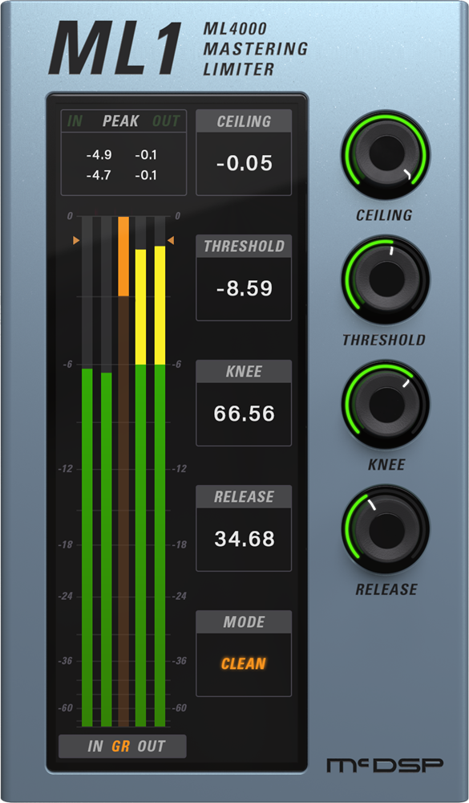

|  |  |
| --- | --- |
| [备注] | 备注 |
| Audiokinetic 的 McDSP ML1 Mastering Limiter 版本中使用的算法与 ProTools 略有不同。这些变化旨在满足以下特定条件：在处理过载的输入信号（最多 +12 dB）时，让输出中产生大量的削波失真。 |

Ceiling（上限）控件可设置最大输出电平。Threshold 控件确定限幅器开始检测信号峰值的电平。Ceiling 和 Threshold 间的电平差是作用于输入音频的最大增益量。强信号峰值通常将受到限制，而低信号电平会被抬升。两类信号都不会超出 Ceiling 控件电平。

Knee（拐点）控件可调整输入信号电平增强和输入信号限幅之间的过渡。在常规的限幅器中，信号电平将持续增加，直到达到输出上限。这使得音频变得更响亮，但是可能会产生大量的失真。在输出上限之前设置软拐点可减少失真量并使限幅器更加透明。

Release（释音）控件决定限幅器从信号峰值削减恢复的速度。释音越快，限幅器输出电平越强。ML1 限幅器的另一个独特控件 ―― Mode（模式）控件 ―― 可设置限幅器处理峰值和整个信号功率的方式。Release 时长和 Mode 设置的不同组合能让 ML1 具有多种风格。从富有冲击力的鼓噪声到微妙的人声限幅，ML1 Mastering Limiter 全都可以做到。

McDSP ML1 插件包含一系列属性，其中很多属性可实时编辑，并可使用 RTPC 映射至特定游戏参数。 属性值旁边有一个特殊标志，显示它是否使用 RTPC。

下表介绍了两种 RTPC 标志：

| 标志 | Name | 描述 |
| --- | --- | --- |
| |  | | --- | |  | | RTPC - 开启 | 属性值已使用 RTPC 绑定到游戏中的参数值。 |
| |  | | --- | |  | | RTPC - 关闭 | 属性值未与游戏中的参数值绑定。 |

另外还准备了大量[“预设”一节](ch60s11.html "预设") ，让您能快速上手。您可以原封不动地使用这些预设，也可以从它们出发来做出原创性的效果。

|  |  |
| --- | --- |
| [备注] | 备注 |
| The McDSP effects are available in all versions of Wwise. However, they require a separate license. See the [Wwise McDSP Plug-in](https://www.audiokinetic.com/wwise/plugins/mcdsp) product page. |

---

#### Effect Editor - McDSP ML1 Mastering Limiter Effect plug-in

Effect Editor 会显示与 McDSP ML1 Mastering Limiter 插件有关的所有属性。

有关 McDSP ML1 Mastering Limiter 插件的概述，请参阅[*McDSP ML1 Mastering Limiter 插件*](ch69.html "McDSP ML1 Mastering Limiter 插件")。有关详细信息，请参阅 [McDSP 网站](https://mcdsp.com/plugin-index/ml4000/)。请注意：Wwise 实现的 McDSP ML1 Mastering 效果器可能与其网站上讨论的效果器略有不同。

|  |  |
| --- | --- |
| [备注] | 备注 |
| Audiokinetic 的 McDSP ML1 Mastering Limiter 版本中使用的算法与 ProTools 略有不同。这些变化旨在满足以下特定条件：在处理过载的输入信号（最多 +12 dB）时，让输出中产生大量的削波失真。 |

| 界面元素 | 描述 |
| --- | --- |
| Name | 名称。效果器实例的名称。  效果器实例是一组效果器属性设置。它们可以是两种类型之一：自定义或共享集。自定义实例只能由一个对象使用，然而共享集可在多个对象之间共享。 |
| (Object Color) | 显示对象的颜色。单击图标可打开颜色选择器。    选择一种颜色并将其应用于对象。在为对象选择某种颜色时，会在选定方块上显示调色板图标，并在右下角标注黄色三角（如图所示）。  若要沿用父对象的颜色，请选中颜色选择器最左侧的方块。 |
| Inclusion | 启用。决定是否在生成 SoundBank 时在其中包含相应元素。如勾选，则包含该元素。如未勾选，则不会包含该元素。  为了针对各个平台来优化声音设计，有时需在特定平台上弃用某些元素。在默认情况下，此复选框会应用于所有平台。使用复选框左侧的 [Link 标志](ch45s11.html#linking_unlinking_property_values "Linking or unlinking property values") 来取消链接相应元素。然后，便可根据平台来自定义复选框的状态。  若取消选中此选项，则将禁用编辑器中的属性和行为选项。  Default value: true |
| (Show references) | 指示工程中有多少元素包含对对象的直接引用。若存在对对象的引用，则图标显示为橙色；若不存在此类引用，则图标显示为灰色。  通过单击该按钮，可打开 [“Reference View 视图”一节](ch60s12s05.html "Reference View 视图")，并在 **References to:**（引用:）字段中查看对象的名称。 |
| Notes | 备注。Effect 的其它信息。 |
| Metering | 电平测量。指示当前正在测量电平的对象的名称。 |
|  | 允许浏览其他要测量电平的对象。  |  |  | | --- | --- | | [备注] | 备注 | | 只有对于包含 VU 电平表的效果器，Effect Editor 中才会显示电平测量界面元素。 | |
|  | 设置 Effect Editor 中选定标签页的显示方式。默认情况下，整体面板中仅显示一个选定标签页。不过，您可以通过单击分隔器按钮将面板沿横向或纵向一分为二，显示两个不同的标签页。当前所选选项将以高亮背景色显示。  |  |  | | --- | --- | | [备注] | 备注 | | 无法同时在两个面板中显示同一标签页。若选中的标签页已在另一面板中显示，则另一面板将自动显示另一标签页。 | |

|  |  |
| --- | --- |
| Ceiling | 上限。指定最大输出信号电平。  默认值：0 滑杆范围：-36 至 0  单位：dB |
| Thresh | 阈值。限幅器开始检测输入信号峰值时所要达到的信号电平。Ceiling 和 Threshold 之差是限幅器的最大补偿增益。  默认值：0 滑杆范围：-36 至 0  单位：dB |
| Knee | 拐点。指定限幅动作过渡，其中 0 产生一个正常的硬拐点，而 100 产生一个软拐点。  Knee 控件修改限幅器的增益结构，以减少失真，同时最大限度地提高输出电平。增大 Knee 控件将向限幅响应曲线添加软拐点。  默认值：0 滑杆范围：0 至 100  单位：百分比 |
| Release（释音） | 释音。限幅器从削减信号峰值中恢复的速率。释音时间越短，整体输出信号电平越高。  默认值：10 滑杆范围：1 至 5,000  单位：毫秒 |
| Mode | 模式。二次检测的类型，用于产生各种限幅类型，以适合各种输入信号和应用。您有以下选项：  - **Clean** ―― 清晰模式。最透明的限幅器模式。信号电平将以最少的可测量失真量进行调整。 - **Soft** ―― 软模式。略响于 Clean 模式，但也非常透明。 - **Smart** ―― 智能模式。智能限幅会最大限度地减少信号失真，同时信号电平增加量比 Soft 模式多。 - **Dynamic** ―― 动态模式。比 Smart 模式更响，并且在某些条件下会增加一点压缩造成的泵动突变效应。 - **Loud** ―― 响亮模式。尽可能响，同时保持信号失真最小。 - **Crush** ―― 强压模式。响于 Loud 模式，信号有些失真。 |
| （VU 电平表） | 显示音频信号（包括输入电平、输出电平以及作用于信号峰值的增益衰减电平）不同电平的一系列电平表。  要启用 VU 电平表，必须点击 Wwise 工具栏中的 Start Capture 按钮。  The VU meters only work when the ML1 effect has been applied to a bus in the Busses hierarchy. 对于 ShareSet 而言，必须在 Effect Editor 的 Shared by 列表中选中该总线。  |  |  | | --- | --- | | [备注] | 备注 | | 只有在立体声总线中使用该效果器时，电平表左右声道才是真实读数。对于所有其他配置来说，右声道将不使用，由左声道显示峰值。 | |
| In | 输入。显示输入音频信号的电平。 |
| GR | 增益衰减。显示作用于信号峰值的增益衰减量。 |
| Out | 输出。显示音频输出的电平。 |

---

#### A closer look at the ML1 Mastering Limiter plug-in

###### Knee 和 Mode

ML1 Mastering Limiter 是现有最灵活的限幅器之一。限幅器的首要用途是避免输入信号超过所选输出上限。但是，此过程可能会给音频带来许多主观变化。为了确保 ML1 可为给定声音素材提供正确的效果器，ML1 用户界面中增添了两个重要且独特的控件 C Knee 和 Mode。

Knee 控件可修改限幅器的增益结构，以减少失真，同时最大限度地提高输出电平。增大 Knee 控件将向限幅响应曲线添加软拐点。下表列出了 Knee 控件值的近似拐点大小。

| 拐点值 | 近似拐点大小 |
| --- | --- |
| 0% | 0 dB |
| 25% | 3 dB |
| 50% | 6 dB |
| 75% | 9 dB |
| 100% | 12 dB |

ML1 具有三种检测算法，这三种检测算法一起工作以充分利用信号数据来最大程度地提高电平和减少失真。Mode 控件影响峰值检测阶段的交互方式。请注意，当 Release 时间短于 200 毫秒时，Mode 控件的效果很容易听出来，而当 Release 时间短于 20 毫秒时则更显著。

所有模式仍与 Knee 控件进行交互。在试听各个模式时，建议调节 Knee 控件。在许多情况下，Knee 控件更适合调整限幅效果器以适应输入音频。

###### Release tricks

虽然 ML1 Threshold 和 Ceiling 控件可设置最大的信号增加量，但 Release 控件可在提高响度响度方面发挥作用。

当信号峰值出现时，限幅器将做出一系列决策来做到最大限度地减少信号峰值并将失真降至最低。在峰值通过后，限幅器会恢复。在此恢复期间，限幅器将继续扮演提高总体信号电平的角色。当恢复时间更短时，总体信号电平将更加频繁地提高，并且信号的响度响度也将提高。Release 控件决定恢复时间，为此才具有如此巨大的范围。通常，短于 50 毫秒的释音时间会产生大量的失真。在 ML1 中，释音时间可短至 1 毫秒（在某些情况下甚至更短），从而支持在极少失真（如果有的话）的情况下提高最大绝对响度响度。

因此在使用中，当 Threshold、Ceiling、Knee 和 Mode 控件未充分提高响度响度时，将 Release 控件时间缩短至低于 25 毫秒的任何值（甚至缩短至 1 毫秒）也可调节信号电平。相反，如果信号电平过大，当释音时间变短时，比如超过 300 毫秒的任意值时，则将出现某种电平下降。

---

#### ML1 Mastering Limiter applications

###### 母带

在内容制作的最后阶段，确定并严格遵守最大信号电平。进入 Mastering Limiter，此设备能够获得透明结果并确保不会超过输出上限。ML1 把这个作为主要应用方向，为此做了设计上的考虑。

###### Bus level control

在混音期间，会话的许多元素都会被压缩，以便建立大致可预测的信号电平，然后通过音量推子的自动移动来自动完成信号电平的动态变化（而不使用声轨的原始动态）。ML1 可设置各种总线的最大输出电平，并且可使用 Knee、Mode 和 Release 控件将主观上合适的效果器添加到这些组中。具体而言，Knee 控件可有效地将 ML1 设置为压缩器，并将砖墙式限幅器设置为最终输出级。用户仅需设置阈值和上限，然后即可确保信号电平不会高出此上限。粗混音（甚至终混）可快捷轻松地完成。

###### Gentle limiting

许多乐器及其性能仅要求微量限幅，但仍必须遵守输出上限的要求。ML1 独特的 Knee 控件当设置为超过 50% 时，可为此类更平滑透明的限幅动作提供良好的效果。

---

### ReadSpeaker speechEngine

ReadSpeaker speechEngine 插件可为 Wwise 工程提供文本转语音支持。该插件采用自研的文本转语音引擎，其针对性能和内存用量进行了优化，确保可无缝集成并高效地利用资源。它可以在设备端实时处理文本并生成音频，实现动态对白、旁白、GUI 元素诵读等功能。

ReadSpeaker speechEngine 插件具有以下功能和优点：

- 允许诵读屏幕 UI 元素以增强游戏的可玩性。
- 方便在开发前期对配音做原型设计。
- 支持在多人游戏中将聊天消息转化为语音。
- 可几乎零延迟地诵读 AI 生成的文本和对白。
- 可为本地化提供多种语言的母语配音素材。

语音皆由 ReadSpeaker 录制和处理，并与配音演员签订有完全披露协议。

|  |  |
| --- | --- |
| [备注] | 备注 |
| 在 Nintendo Switch 和 PS4 上，语音听起来跟在 Wwise 设计工具中和其他平台上略有不同，原因是其使用了不同的语音模型。 |

#### 安装

您可以通过 Audiokinetic Launcher 安装 speechEngine 插件。有关详细信息，请参阅[安装插件](https://www.audiokinetic.com/library/wwise_launcher/?source=InstallGuide&id=installing_plugins)。

在安装插件后，可将其作为 Containers 层级结构下的子对象添加到工程中。另外，也可将其添加为音频源或将 speechEngine 对象与 Event、Game Sync 等关联起来。

#### RTPC

Speed、Pitch、Pause 和 Comma Pause 等语音相关参数都支持 RTPC。鉴于 DSP 模型方面的限制，无法实时察看所做的更改，但可在调用之间进行调整。

#### 依赖项

若应用程序被静态链接到 speechEngine 插件，则须同时链接到随插件一并分发的 libvtapi 库。比如，对于 Windows 64-bit vc170 平台，该库位于 `SDK\x64_vc170\Release\lib\libvtapi.lib`。

若要在运行时加载插件，以下所列依赖 DLL 必须在系统的 DLL 加载操作能找到的路径：

- `* vt_[lang].dll`

#### 在运行时发送文本

您可以使用 [AK::SoundEngine::SendPluginCustomGameData](https://www.audiokinetic.com/library/edge/?source=SDK&id=namespace_a_k_1_1_sound_engine_aa1d99f0095ab128c8d9e8052dd2f3931.html) 函数来在运行时从游戏发送文本给插件。

使用 Company ID 和 Plug-in ID 参数在运行时查找插件：

```
in_uCompanyID = 312
in_uPluginID = 1
```

|  |  |
| --- | --- |
| [备注] | 备注 |
| 文本必须采用 UTF-8 字符编码。 |

如需查看完整的 C++ 示例，请参阅随 IntegrationDemo 工程一并提供的 `DemoSpeechEngine.cpp` 文件。

#### 局限性

- 每次只能播放一个 speechEngine 声音。
- 首次请求播放特定 speechEngine 语音时延迟时间比较长。后面再播放相同语音的时候延迟时间就跟平时一样了。

---

#### 平台支持

本节列出了 speechEngine 插件支持的平台、架构以及 SDK 版本。

**Windows：**

- 架构：

  - x64
- SDK 版本：

  - vc160
  - vc170

**Android：**

- 架构：

  - arm64-v8a
  - x86\_x64
- SDK 版本：

  - Android NDK r25b
  - 最低 API 21

**iOS：**

- 架构：

  - iphoneos（不支持模拟器）
- SDK 版本：

  - Xcode 15
  - Xcode 16

**Linux：**

- 架构：

  - x64

---

#### 游戏引擎集成

本节包含针对特定游戏引擎集成场景的补充说明。

###### 复制 Unity Integration 所需的库

除了 speechEngine 插件库，在 Windows 上运行时还需要语音动态库（如 `vt_eng.dll` 英语库或 `vt_fre.dll` 法语库）。

要在构建阶段复制所需的库，请使用 Unity Editor 辅助脚本。该脚本位于 Unity 工程的以下目录中：`SDK/Plugins/speechEngine/Unity/Editor/SpeechEnginePluginImporterScript.cs`。

###### 将字符编码转换为 UTF-8

所有运行时发送的文本都必须采用 UTF-8 字符编码。对于有些平台，可能要将文本由别的编码类型转换为 UTF-8。以下针对 Unity 和 Unreal 的示例代码展示了如何将 Windows 上默认的 UTF-16 编码转换为 UTF-8。对于其他平台，可能要根据所用的编码类型对代码进行修改。

**Unity：**

```
public byte[] ConvertUtf16ToUtf8Bytes(string utf16String)
{
	// 获取 UTF-8 编码
	Encoding utf8 = Encoding.UTF8;

	// 将 UTF-16 字符串转换为 UTF-8 字节数组
	byte[] utf8Bytes = utf8.GetBytes(utf16String);

	return utf8Bytes;
}

byte[] textArray = ConvertUtf16ToUtf8Bytes(Text);
System.Runtime.InteropServices.GCHandle pinned = System.Runtime.InteropServices.GCHandle.Alloc(textArray, System.Runtime.InteropServices.GCHandleType.Pinned);
IntPtr address = pinned.AddrOfPinnedObject();
AkUnitySoundEngine.SendPluginCustomGameData(0, this.gameObject, AkPluginType.AkPluginTypeSource, 312, 1, address, (uint)textArray.Length + 1);
pinned.Free();
				
```

**Unreal：**

```
FString utf16_text = TEXT("This is a UTF-16 string at its core.");
FStringView fStringView(utf16_text);
auto ConvertedTemp = StringCast<UTF8CHAR>(fStringView.GetData(), fStringView.Len());
auto utf8_text = ConvertedTemp.Get();
SoundEngine->SendPluginCustomGameData(0, 100, AkPluginTypeSource, 312, 1, utf8_text, ConvertedTemp.Length() + 1);
				
```

###### 在 Mac 上生成 SoundBank

speechEngine 插件不支持 Mac 平台。但若通过 Wwise Unreal/Unity Integration 来生成 SoundBank，将自动为 Mac 生成 SoundBank，而这可能会导致发生错误。因此，建议针对 Mac 以显式方式从工程中弃用所有 speechEngine 元素以避免此类错误。有关详细信息，请参阅[从平台中弃用工程元素](https://www.audiokinetic.com/en/library/edge/?source=Help&id=authoring_across_platforms#excluding_project_elements_from_platform)。

###### 针对 iOS 编译 IntegrationDemo 的 speechEngine 页面

要编译 IntegrationDemo 的 speechEngine 插件页面，您需要修改随 Wwise SDK 一并提供的 Xcode 工程。

在 IntegrationDemo Xcode 属性中：

- 在 **General - Frameworks, Libraries and Embedded Content** 下：

  - 添加 `Applications/Audiokinetic/Wwise[version]/SDK/iOS_Xcode[version]/[configuration]/bin` 下找到的所有 `vt_[lang]_q22.framework` 文件。
- 在 **Build Settings** 下：

  - 将 `@executable_path/Frameworks` 添加到 `Runpath Search Paths`。
  - 将 `../../../iOS_Xcode$(XCODE_VERSION_MAJOR)/Profile$(EFFECTIVE_PLATFORM_NAME)/bin` 添加到 `Framework Search Paths`。

---

#### 在 Android 上集成 speechEngine

###### 链接

若要集成到应用中，必须链接 `libSpeechEngine` 模块。具体怎么做取决于所用配置和构建系统。

比如，您可以将以下代码添加到应用的 `Android.mk` 文件：

```
include $(CLEAR_VARS)
LOCAL_MODULE := libSpeechEngine
LOCAL_SRC_FILES := $(APP)/$(CONFIG)/bin/libSpeechEngine.so
include $(PREBUILT_SHARED_LIBRARY)
```

在必要时，可将 `libSpeechEngine` 模块作为动态库或共享库添加到配置中。

###### 依赖项

speechEngine 模块必须根据所选语音加载与语言对应的动态库。比如，在选用 Adam 时，会加载 `vt_bre.so` (British English) 库。

这些库遵从 `vt_[lang].so` 命名规范，并且要与 `libSpeechEngine.so` 放在同一文件夹中（通常为 `jniLibs` 文件夹）。

在安装插件时，会将这些语音文件复制到 `$WWISEROOT/SDK/Android_{config}/{config}/libs` 中。

---

#### Parameters

您可以在用户界面中调节以下插件参数。

**Pitch**

|  |  |
| --- | --- |
| Min（最小值） | 50 |
| Max（最大值） | 200 |
| Default | 125 |

**Speed**

|  |  |
| --- | --- |
| Min（最小值） | 50 |
| Max（最大值） | 400 |
| Default | 125 |

|  |  |
| --- | --- |
| [备注] | 备注 |
| 平时使用读屏软件的玩家一般会用快速文本转语音阅读器。此设置允许玩家逐级设置诵读的速度，使用起来非常便捷。 |

**Pause**

在文本中出现自然停顿时插入停顿。延长或缩短的停顿包括：

- 句末
- 省略号 (...)

|  |  |
| --- | --- |
| Min（最小值） | 0 |
| Max（最大值） | 3000 (ms) |
| Default | 0 |

**Comma Pause**

在句子中使用逗号时插入停顿。

|  |  |
| --- | --- |
| Min（最小值） | 0 |
| Max（最大值） | 3000 (ms) |
| Default | 0 |

**Voice**

为特定对象设置发音人。可用语音分为不同的语言/变体（可选）/发音人。

所有语音均可预览。不过，在将语音导出到 SoundBank 时需要获取授权。

**语音合成标记语言 (SSML)**

启用/禁用 SSML 处理。

SSML 标记的结构跟 XML 标记类似，前后都要加尖括号 (<>)。其中包含标记名称和可选属性。标记名称定义修改类型，属性则提供具体的参数。

比如，对于 `<emphasis level="strong">This is important</emphasis>`，阅读器会着重强调其中的表述。

有关详细信息，请参阅[语音合成标记语言 (SSML)](https://cloud.google.com/text-to-speech/docs/ssml)。

即便没有在文本中插入标记，启用 SSML 也会略微增加语音合成过程中对性能的影响。

|  |  |
| --- | --- |
| [备注] | 备注 |
| `<audio>` 和 `<voice>` 标记不适用于此插件。 |

**Text**

调用对象时使用的默认文本（可通过 `SendPluginCustomGameData()` 更改）。

---

#### 版本说明

本节包含 ReadSpeaker speechEngine 插件的所有版本说明。

**2025.1.4**

- **新增功能**

  - **SP-5598** 新增了以下语音素材：

    - Paul - 英语(美国) - 男
    - Bridget - 英语(英国) - 女
    - Benoit - 法语 - 男
    - Max - 德语 - 男
    - Matteo - 意大利语 - 男
    - Hayato - 日语 - 男
    - Qiang - 中文(普通话) - 男
    - Maru - 韩语 - 男
    - Tiago - 葡萄牙语 - 男
    - Julia - 葡萄牙语(巴西) - 女
    - Pilar - 西班牙语(卡斯蒂利亚) - 女
- **性能改进**

  - **SP-5697** 现在使用线程池来减少插件初始化时的线程创建开销。
- **其他改进**

  - **SP-5832** 添加了对 PS5 SDK 12 的支持。
- **漏洞修复**

  - **SP-5699** 已修复：在同时初始化多个 speechEngine 语音时，有些语音卡在了演示模式。

**2025.1.3**

- **文档改进**

  - **SP-5560** 现在支持针对参数显示 Wwise 设计工具上下文帮助。

**2025.1.2**

- **社区报告的漏洞修复**

  - **WG-79624** 已修复：Linux 上缺少共享语言库。

  **新增功能**

  - **SP-5404** 添加了 StaticCRT 配置和库。

**2025.1.1**

- **文档改进**

  - **SP-5340** 注明了如何将 Unreal 和 Unity 字符串转换为 UTF-8 编码格式。

**2024.1.6**

- **其他改进**

  - **SP-5355** 添加了对 Switch SDK 20 的支持。

**2024.1.5**

- 初始版本。

---

#### 开源组件

Audiokinetic ReadSpeaker speechEngine 插件中提供以下开源组件。

若决定使用此插件，须遵守下文相关开源授权的条款。

---

##### Base64

```
[Base64 License]
-----------------------------------------------------------------
Copyright (c) 2001 Bob Trower, Trantor Standard Systems Inc.

Permission is hereby granted, free of charge, to any person
obtaining a copy of this software and associated
documentation files (the "Software"), to deal in the
Software without restriction, including without limitation
 the rights to use, copy, modify, merge, publish, distribute,
sublicense, and/or sell copies of the Software, and to
permit persons to whom the Software is furnished to do so,
subject to the following conditions:

The above copyright notice and this permission notice shall
be included in all copies or substantial portions of the
Software.

THE SOFTWARE IS PROVIDED "AS IS", WITHOUT WARRANTY OF ANY
KIND, EXPRESS OR IMPLIED, INCLUDING BUT NOT LIMITED TO THE
WARRANTIES OF MERCHANTABILITY, FITNESS FOR A PARTICULAR
PURPOSE AND NONINFRINGEMENT. IN NO EVENT SHALL THE AUTHORS
OR COPYRIGHT HOLDERS BE LIABLE FOR ANY CLAIM, DAMAGES OR
OTHER LIABILITY, WHETHER IN AN ACTION OF CONTRACT, TORT OR
OTHERWISE, ARISING FROM, OUT OF OR IN CONNECTION WITH THE
SOFTWARE OR THE USE OR OTHER DEALINGS IN THE SOFTWARE.
-----------------------------------------------------------------
```

---

##### ICONV

```
-----------------------------------------------------------------
                                 Apache License
                           Version 2.0, January 2004
                        http://www.apache.org/licenses/

   TERMS AND CONDITIONS FOR USE, REPRODUCTION, AND DISTRIBUTION

   1. Definitions.

      "License" shall mean the terms and conditions for use, reproduction,
      and distribution as defined by Sections 1 through 9 of this document.

      "Licensor" shall mean the copyright owner or entity authorized by
      the copyright owner that is granting the License.

      "Legal Entity" shall mean the union of the acting entity and all
      other entities that control, are controlled by, or are under common
      control with that entity. For the purposes of this definition,
      "control" means (i) the power, direct or indirect, to cause the
      direction or management of such entity, whether by contract or
      otherwise, or (ii) ownership of fifty percent (50%) or more of the
      outstanding shares, or (iii) beneficial ownership of such entity.

      "You" (or "Your") shall mean an individual or Legal Entity
      exercising permissions granted by this License.

      "Source" form shall mean the preferred form for making modifications,
      including but not limited to software source code, documentation
      source, and configuration files.

      "Object" form shall mean any form resulting from mechanical
      transformation or translation of a Source form, including but
      not limited to compiled object code, generated documentation,
      and conversions to other media types.

      "Work" shall mean the work of authorship, whether in Source or
      Object form, made available under the License, as indicated by a
      copyright notice that is included in or attached to the work
      (an example is provided in the Appendix below).

      "Derivative Works" shall mean any work, whether in Source or Object
      form, that is based on (or derived from) the Work and for which the
      editorial revisions, annotations, elaborations, or other modifications
      represent, as a whole, an original work of authorship. For the purposes
      of this License, Derivative Works shall not include works that remain
      separable from, or merely link (or bind by name) to the interfaces of,
      the Work and Derivative Works thereof.

      "Contribution" shall mean any work of authorship, including
      the original version of the Work and any modifications or additions
      to that Work or Derivative Works thereof, that is intentionally
      submitted to Licensor for inclusion in the Work by the copyright owner
      or by an individual or Legal Entity authorized to submit on behalf of
      the copyright owner. For the purposes of this definition, "submitted"
      means any form of electronic, verbal, or written communication sent
      to the Licensor or its representatives, including but not limited to
      communication on electronic mailing lists, source code control systems,
      and issue tracking systems that are managed by, or on behalf of, the
      Licensor for the purpose of discussing and improving the Work, but
      excluding communication that is conspicuously marked or otherwise
      designated in writing by the copyright owner as "Not a Contribution."

      "Contributor" shall mean Licensor and any individual or Legal Entity
      on behalf of whom a Contribution has been received by Licensor and
      subsequently incorporated within the Work.

   2. Grant of Copyright License. Subject to the terms and conditions of
      this License, each Contributor hereby grants to You a perpetual,
      worldwide, non-exclusive, no-charge, royalty-free, irrevocable
      copyright license to reproduce, prepare Derivative Works of,
      publicly display, publicly perform, sublicense, and distribute the
      Work and such Derivative Works in Source or Object form.

   3. Grant of Patent License. Subject to the terms and conditions of
      this License, each Contributor hereby grants to You a perpetual,
      worldwide, non-exclusive, no-charge, royalty-free, irrevocable
      (except as stated in this section) patent license to make, have made,
      use, offer to sell, sell, import, and otherwise transfer the Work,
      where such license applies only to those patent claims licensable
      by such Contributor that are necessarily infringed by their
      Contribution(s) alone or by combination of their Contribution(s)
      with the Work to which such Contribution(s) was submitted. If You
      institute patent litigation against any entity (including a
      cross-claim or counterclaim in a lawsuit) alleging that the Work
      or a Contribution incorporated within the Work constitutes direct
      or contributory patent infringement, then any patent licenses
      granted to You under this License for that Work shall terminate
      as of the date such litigation is filed.

   4. Redistribution. You may reproduce and distribute copies of the
      Work or Derivative Works thereof in any medium, with or without
      modifications, and in Source or Object form, provided that You
      meet the following conditions:

      (a) You must give any other recipients of the Work or
          Derivative Works a copy of this License; and

      (b) You must cause any modified files to carry prominent notices
          stating that You changed the files; and

      (c) You must retain, in the Source form of any Derivative Works
          that You distribute, all copyright, patent, trademark, and
          attribution notices from the Source form of the Work,
          excluding those notices that do not pertain to any part of
          the Derivative Works; and

      (d) If the Work includes a "NOTICE" text file as part of its
          distribution, then any Derivative Works that You distribute must
          include a readable copy of the attribution notices contained
          within such NOTICE file, excluding those notices that do not
          pertain to any part of the Derivative Works, in at least one
          of the following places: within a NOTICE text file distributed
          as part of the Derivative Works; within the Source form or
          documentation, if provided along with the Derivative Works; or,
          within a display generated by the Derivative Works, if and
          wherever such third-party notices normally appear. The contents
          of the NOTICE file are for informational purposes only and
          do not modify the License. You may add Your own attribution
          notices within Derivative Works that You distribute, alongside
          or as an addendum to the NOTICE text from the Work, provided
          that such additional attribution notices cannot be construed
          as modifying the License.

      You may add Your own copyright statement to Your modifications and
      may provide additional or different license terms and conditions
      for use, reproduction, or distribution of Your modifications, or
      for any such Derivative Works as a whole, provided Your use,
      reproduction, and distribution of the Work otherwise complies with
      the conditions stated in this License.

   5. Submission of Contributions. Unless You explicitly state otherwise,
      any Contribution intentionally submitted for inclusion in the Work
      by You to the Licensor shall be under the terms and conditions of
      this License, without any additional terms or conditions.
      Notwithstanding the above, nothing herein shall supersede or modify
      the terms of any separate license agreement you may have executed
      with Licensor regarding such Contributions.

   6. Trademarks. This License does not grant permission to use the trade
      names, trademarks, service marks, or product names of the Licensor,
      except as required for reasonable and customary use in describing the
      origin of the Work and reproducing the content of the NOTICE file.

   7. Disclaimer of Warranty. Unless required by applicable law or
      agreed to in writing, Licensor provides the Work (and each
      Contributor provides its Contributions) on an "AS IS" BASIS,
      WITHOUT WARRANTIES OR CONDITIONS OF ANY KIND, either express or
      implied, including, without limitation, any warranties or conditions
      of TITLE, NON-INFRINGEMENT, MERCHANTABILITY, or FITNESS FOR A
      PARTICULAR PURPOSE. You are solely responsible for determining the
      appropriateness of using or redistributing the Work and assume any
      risks associated with Your exercise of permissions under this License.

   8. Limitation of Liability. In no event and under no legal theory,
      whether in tort (including negligence), contract, or otherwise,
      unless required by applicable law (such as deliberate and grossly
      negligent acts) or agreed to in writing, shall any Contributor be
      liable to You for damages, including any direct, indirect, special,
      incidental, or consequential damages of any character arising as a
      result of this License or out of the use or inability to use the
      Work (including but not limited to damages for loss of goodwill,
      work stoppage, computer failure or malfunction, or any and all
      other commercial damages or losses), even if such Contributor
      has been advised of the possibility of such damages.

   9. Accepting Warranty or Additional Liability. While redistributing
      the Work or Derivative Works thereof, You may choose to offer,
      and charge a fee for, acceptance of support, warranty, indemnity,
      or other liability obligations and/or rights consistent with this
      License. However, in accepting such obligations, You may act only
      on Your own behalf and on Your sole responsibility, not on behalf
      of any other Contributor, and only if You agree to indemnify,
      defend, and hold each Contributor harmless for any liability
      incurred by, or claims asserted against, such Contributor by reason
      of your accepting any such warranty or additional liability.

   END OF TERMS AND CONDITIONS
-----------------------------------------------------------------
Copyright © 2000-2019 ReadSpeaker
All Rights Reserved.

Licensed under the Apache License, Version 2.0 (the "License"); you may not use this file except in compliance with the License.
You may obtain a copy of the License at

  http://www.apache.org/licenses/LICENSE-2.0
  
Unless required by applicable law or agreed to in writing, software distributed 
under the License is distributed on an "AS IS" BASIS, WITHOUT WARRANTIES OR CONDITIONS OF ANY KIND, 
either express or implied. See the License for the specific language governing permissions and limitations under the License.
-----------------------------------------------------------------
Copyright (c) 1999,2000
Konstantin Chuguev.  All rights reserved.

Redistribution and use in source and binary forms, with or without
modification, are permitted provided that the following conditions
are met:
1. Redistributions of source code must retain the above copyright
   notice, this list of conditions and the following disclaimer.
2. Redistributions in binary form must reproduce the above copyright
   notice, this list of conditions and the following disclaimer in the
   documentation and/or other materials provided with the distribution.
3. All advertising materials mentioning features or use of this software
   must display the following acknowledgement:
 This product includes software developed by Konstantin Chuguev
 and its contributors.

THIS SOFTWARE IS PROVIDED BY THE AUTHOR AND CONTRIBUTORS ``AS IS'' AND
ANY EXPRESS OR IMPLIED WARRANTIES, INCLUDING, BUT NOT LIMITED TO, THE
IMPLIED WARRANTIES OF MERCHANTABILITY AND FITNESS FOR A PARTICULAR PURPOSE
ARE DISCLAIMED.  IN NO EVENT SHALL THE AUTHOR OR CONTRIBUTORS BE LIABLE
FOR ANY DIRECT, INDIRECT, INCIDENTAL, SPECIAL, EXEMPLARY, OR CONSEQUENTIAL
DAMAGES (INCLUDING, BUT NOT LIMITED TO, PROCUREMENT OF SUBSTITUTE GOODS
OR SERVICES; LOSS OF USE, DATA, OR PROFITS; OR BUSINESS INTERRUPTION)
HOWEVER CAUSED AND ON ANY THEORY OF LIABILITY, WHETHER IN CONTRACT, STRICT
LIABILITY, OR TORT (INCLUDING NEGLIGENCE OR OTHERWISE) ARISING IN ANY WAY
UT OF THE USE OF THIS SOFTWARE, EVEN IF ADVISED OF THE POSSIBILITY OF
SUCH DAMAGE.

iconv (Charset Conversion Library) v1.0

ReadSpeaker has been used with the following changes and additions.

When changing from ucs to each code page value, the value of 0xFFFE (UCS_CHAR_INVALID) is replaced by space

utf-8.c
Modify ucs_t utf8_convert_to_ucs for case (byte == 0xa3)

cp949.c
static const iconv_ccs_convtable_8bit from_ucs_00[163] = {0xFFFE} --> {0xA1CC}

cp950.c
Modify static const iconv_ccs_convtable_8bit to_ucs_C6[161~254]
Add static const iconv_ccs_convtable_8bit to_ucs_C7 in static const iconv_ccs_convtable_16bit to_ucs
Add static const iconv_ccs_convtable_8bit to_ucs_C8 in static const iconv_ccs_convtable_16bit to_ucs
Modify static const iconv_ccs_convtable_8bit from_ucs_25[109~112]
Modify static const iconv_ccs_convtable_8bit from_ucs_54[80] = {0xFFFE} --> {0xA76F}
Modify static const iconv_ccs_convtable_8bit from_ucs_72[50] = {0xFFFE} --> {0xACB0}
Add static const iconv_ccs_convtable_8bit from_ucs_F6 in static const iconv_ccs_convtable_16bit from_ucs
Add static const iconv_ccs_convtable_8bit from_ucs_F7 in static const iconv_ccs_convtable_16bit from_ucs
Add static const iconv_ccs_convtable_8bit from_ucs_F8 in static const iconv_ccs_convtable_16bit from_ucs

windows-1250.c
Modify static const iconv_ccs_convtable_8bit from_ucs_02[24~27] for Romanian
-----------------------------------------------------------------
```

---

##### expat

```
-----------------------------------------------------------------
Copyright (c) 1998-2000 Thai Open Source Software Center Ltd and Clark Cooper
Copyright (c) 2001-2017 Expat maintainers

Permission is hereby granted, free of charge, to any person obtaining
a copy of this software and associated documentation files (the
"Software"), to deal in the Software without restriction, including
without limitation the rights to use, copy, modify, merge, publish,
distribute, sublicense, and/or sell copies of the Software, and to
permit persons to whom the Software is furnished to do so, subject to
the following conditions:

The above copyright notice and this permission notice shall be included
in all copies or substantial portions of the Software.

THE SOFTWARE IS PROVIDED "AS IS", WITHOUT WARRANTY OF ANY KIND,
EXPRESS OR IMPLIED, INCLUDING BUT NOT LIMITED TO THE WARRANTIES OF
MERCHANTABILITY, FITNESS FOR A PARTICULAR PURPOSE AND NONINFRINGEMENT.
IN NO EVENT SHALL THE AUTHORS OR COPYRIGHT HOLDERS BE LIABLE FOR ANY
CLAIM, DAMAGES OR OTHER LIABILITY, WHETHER IN AN ACTION OF CONTRACT,
TORT OR OTHERWISE, ARISING FROM, OUT OF OR IN CONNECTION WITH THE
SOFTWARE OR THE USE OR OTHER DEALINGS IN THE SOFTWARE.
-----------------------------------------------------------------
```

---

##### cURL

```
-----------------------------------------------------------------
COPYRIGHT AND PERMISSION NOTICE

Copyright (c) 1996 - 2019, Daniel Stenberg, daniel@haxx.se, and many contributors, see the 
THANKS file.

All rights reserved.

Permission to use, copy, modify, and distribute this software for any purpose with or without fee is 
hereby granted, provided that the above copyright notice and this permission notice appear in all 
copies.

THE SOFTWARE IS PROVIDED "AS IS", WITHOUT WARRANTY OF ANY KIND, EXPRESS OR 
IMPLIED, INCLUDING BUT NOT LIMITED TO THE WARRANTIES OF MERCHANTABILITY, 
FITNESS FOR A PARTICULAR PURPOSE AND NONINFRINGEMENT OF THIRD PARTY RIGHTS.
IN NO EVENT SHALL THE AUTHORS OR COPYRIGHT HOLDERS BE LIABLE FOR ANY CLAIM, 
DAMAGES OR OTHER LIABILITY, WHETHER IN AN ACTION OF CONTRACT, TORT OR 
OTHERWISE, ARISING FROM, OUT OF OR IN CONNECTION WITH THE SOFTWARE OR THE 
USE OR OTHER DEALINGS IN THE SOFTWARE.

Except as contained in this notice, the name of a copyright holder shall not be used in advertising or 
otherwise to promote the sale, use or other dealings in this Software without prior written 
authorization of the copyright holder.
-----------------------------------------------------------------
```

---

##### OpenSSL

```
-----------------------------------------------------------------
Copyright (c) 1998-2019 The OpenSSL Project.  All rights reserved.

Redistribution and use in source and binary forms, with or without
modification, are permitted provided that the following conditions
are met:

1. Redistributions of source code must retain the above copyright
   notice, this list of conditions and the following disclaimer.

2. Redistributions in binary form must reproduce the above copyright
   notice, this list of conditions and the following disclaimer in
   the documentation and/or other materials provided with the
   distribution.

3. All advertising materials mentioning features or use of this
   software must display the following acknowledgment:
   "This product includes software developed by the OpenSSL Project
   for use in the OpenSSL Toolkit. (http://www.openssl.org/)"

4. The names "OpenSSL Toolkit" and "OpenSSL Project" must not be used to
   endorse or promote products derived from this software without
   prior written permission. For written permission, please contact
   openssl-core@openssl.org.

5. Products derived from this software may not be called "OpenSSL"
   nor may "OpenSSL" appear in their names without prior written
   permission of the OpenSSL Project.

6. Redistributions of any form whatsoever must retain the following
   acknowledgment:
   "This product includes software developed by the OpenSSL Project
   for use in the OpenSSL Toolkit (http://www.openssl.org/)"

THIS SOFTWARE IS PROVIDED BY THE OpenSSL PROJECT ``AS IS'' AND ANY
EXPRESSED OR IMPLIED WARRANTIES, INCLUDING, BUT NOT LIMITED TO, THE
IMPLIED WARRANTIES OF MERCHANTABILITY AND FITNESS FOR A PARTICULAR
PURPOSE ARE DISCLAIMED.  IN NO EVENT SHALL THE OpenSSL PROJECT OR
ITS CONTRIBUTORS BE LIABLE FOR ANY DIRECT, INDIRECT, INCIDENTAL,
SPECIAL, EXEMPLARY, OR CONSEQUENTIAL DAMAGES (INCLUDING, BUT
NOT LIMITED TO, PROCUREMENT OF SUBSTITUTE GOODS OR SERVICES;
LOSS OF USE, DATA, OR PROFITS; OR BUSINESS INTERRUPTION)
HOWEVER CAUSED AND ON ANY THEORY OF LIABILITY, WHETHER IN CONTRACT,
STRICT LIABILITY, OR TORT (INCLUDING NEGLIGENCE OR OTHERWISE)
ARISING IN ANY WAY OUT OF THE USE OF THIS SOFTWARE, EVEN IF ADVISED
OF THE POSSIBILITY OF SUCH DAMAGE.

This product includes cryptographic software written by Eric Young
(eay@cryptsoft.com).  This product includes software written by Tim
Hudson (tjh@cryptsoft.com).
-----------------------------------------------------------------
```

---

##### SSLeay

```
-----------------------------------------------------------------
Copyright (C) 1995-1998 Eric Young (eay@cryptsoft.com)
All rights reserved.

This package is an SSL implementation written
by Eric Young (eay@cryptsoft.com).
The implementation was written so as to conform with Netscapes SSL.

This library is free for commercial and non-commercial use as long as
the following conditions are aheared to.  The following conditions
apply to all code found in this distribution, be it the RC4, RSA,
lhash, DES, etc., code; not just the SSL code.  The SSL documentation
included with this distribution is covered by the same copyright terms
except that the holder is Tim Hudson (tjh@cryptsoft.com).

Copyright remains Eric Young's, and as such any Copyright notices in
the code are not to be removed.
If this package is used in a product, Eric Young should be given attribution
as the author of the parts of the library used.
This can be in the form of a textual message at program startup or
in documentation (online or textual) provided with the package.

Redistribution and use in source and binary forms, with or without
modification, are permitted provided that the following conditions
are met:
1. Redistributions of source code must retain the copyright
   notice, this list of conditions and the following disclaimer.
2. Redistributions in binary form must reproduce the above copyright
   notice, this list of conditions and the following disclaimer in the
   documentation and/or other materials provided with the distribution.
3. All advertising materials mentioning features or use of this software
   must display the following acknowledgement:
   "This product includes cryptographic software written by
    Eric Young (eay@cryptsoft.com)"
   The word 'cryptographic' can be left out if the rouines from the library
   being used are not cryptographic related :-).
4. If you include any Windows specific code (or a derivative thereof) from
   the apps directory (application code) you must include an acknowledgement:
   "This product includes software written by Tim Hudson (tjh@cryptsoft.com)"

THIS SOFTWARE IS PROVIDED BY ERIC YOUNG ``AS IS'' AND
ANY EXPRESS OR IMPLIED WARRANTIES, INCLUDING, BUT NOT LIMITED TO, THE
IMPLIED WARRANTIES OF MERCHANTABILITY AND FITNESS FOR A PARTICULAR PURPOSE
ARE DISCLAIMED.  IN NO EVENT SHALL THE AUTHOR OR CONTRIBUTORS BE LIABLE
FOR ANY DIRECT, INDIRECT, INCIDENTAL, SPECIAL, EXEMPLARY, OR CONSEQUENTIAL
DAMAGES (INCLUDING, BUT NOT LIMITED TO, PROCUREMENT OF SUBSTITUTE GOODS
OR SERVICES; LOSS OF USE, DATA, OR PROFITS; OR BUSINESS INTERRUPTION)
HOWEVER CAUSED AND ON ANY THEORY OF LIABILITY, WHETHER IN CONTRACT, STRICT
LIABILITY, OR TORT (INCLUDING NEGLIGENCE OR OTHERWISE) ARISING IN ANY WAY
OUT OF THE USE OF THIS SOFTWARE, EVEN IF ADVISED OF THE POSSIBILITY OF
SUCH DAMAGE.

The licence and distribution terms for any publically available version or
derivative of this code cannot be changed.  i.e. this code cannot simply be
copied and put under another distribution licence
[including the GNU Public Licence.]
-----------------------------------------------------------------
```

---

##### zlib

```
-----------------------------------------------------------------
 zlib.h -- interface of the 'zlib' general purpose compression library
  version 1.2.11, January 15th, 2017

  Copyright (C) 1995-2017 Jean-loup Gailly and Mark Adler

  This software is provided 'as-is', without any express or implied
  warranty.  In no event will the authors be held liable for any damages
  arising from the use of this software.

  Permission is granted to anyone to use this software for any purpose,
  including commercial applications, and to alter it and redistribute it
  freely, subject to the following restrictions:

  1. The origin of this software must not be misrepresented; you must not
     claim that you wrote the original software. If you use this software
     in a product, an acknowledgment in the product documentation would be
     appreciated but is not required.
  2. Altered source versions must be plainly marked as such, and must not be
     misrepresented as being the original software.
  3. This notice may not be removed or altered from any source distribution.

  Jean-loup Gailly        Mark Adler
  jloup@gzip.org          madler@alumni.caltech.edu
-----------------------------------------------------------------
```

---

##### PCRE

```
-----------------------------------------------------------------
PCRE LICENCE
------------

PCRE is a library of functions to support regular expressions whose syntax
and semantics are as close as possible to those of the Perl 5 language.

Release 8 of PCRE is distributed under the terms of the "BSD" licence, as
specified below. The documentation for PCRE, supplied in the "doc"
directory, is distributed under the same terms as the software itself. The data
in the testdata directory is not copyrighted and is in the public domain.

The basic library functions are written in C and are freestanding. Also
included in the distribution is a set of C++ wrapper functions, and a
just-in-time compiler that can be used to optimize pattern matching. These
are both optional features that can be omitted when the library is built.

THE BASIC LIBRARY FUNCTIONS
---------------------------

Written by:       Philip Hazel
Email local part: ph10
Email domain:     cam.ac.uk

University of Cambridge Computing Service,
Cambridge, England.

Copyright (c) 1997-2020 University of Cambridge
All rights reserved.

PCRE JUST-IN-TIME COMPILATION SUPPORT
-------------------------------------

Written by:       Zoltan Herczeg
Email local part: hzmester
Email domain:     freemail.hu

Copyright(c) 2010-2020 Zoltan Herczeg
All rights reserved.

STACK-LESS JUST-IN-TIME COMPILER
--------------------------------

Written by:       Zoltan Herczeg
Email local part: hzmester
Email domain:     freemail.hu

Copyright(c) 2009-2020 Zoltan Herczeg
All rights reserved.

THE C++ WRAPPER FUNCTIONS
-------------------------

Contributed by:   Google Inc.

Copyright (c) 2007-2012, Google Inc.
All rights reserved.

THE "BSD" LICENCE
-----------------

Redistribution and use in source and binary forms, with or without
modification, are permitted provided that the following conditions are met:

    * Redistributions of source code must retain the above copyright notice,
      this list of conditions and the following disclaimer.

    * Redistributions in binary form must reproduce the above copyright
      notice, this list of conditions and the following disclaimer in the
      documentation and/or other materials provided with the distribution.

    * Neither the name of the University of Cambridge nor the name of Google
      Inc. nor the names of their contributors may be used to endorse or
      promote products derived from this software without specific prior
      written permission.

THIS SOFTWARE IS PROVIDED BY THE COPYRIGHT HOLDERS AND CONTRIBUTORS "AS IS"
AND ANY EXPRESS OR IMPLIED WARRANTIES, INCLUDING, BUT NOT LIMITED TO, THE
IMPLIED WARRANTIES OF MERCHANTABILITY AND FITNESS FOR A PARTICULAR PURPOSE
ARE DISCLAIMED. IN NO EVENT SHALL THE COPYRIGHT OWNER OR CONTRIBUTORS BE
LIABLE FOR ANY DIRECT, INDIRECT, INCIDENTAL, SPECIAL, EXEMPLARY, OR
CONSEQUENTIAL DAMAGES (INCLUDING, BUT NOT LIMITED TO, PROCUREMENT OF
SUBSTITUTE GOODS OR SERVICES; LOSS OF USE, DATA, OR PROFITS; OR BUSINESS
INTERRUPTION) HOWEVER CAUSED AND ON ANY THEORY OF LIABILITY, WHETHER IN
CONTRACT, STRICT LIABILITY, OR TORT (INCLUDING NEGLIGENCE OR OTHERWISE)
ARISING IN ANY WAY OUT OF THE USE OF THIS SOFTWARE, EVEN IF ADVISED OF THE
POSSIBILITY OF SUCH DAMAGE.

End
-----------------------------------------------------------------
```

---

## Wwise 工具

本章节提供有关 Wwise 随附的各种工具（包括 Multi-Channel Creator）的信息。

- **[*File Packager*](ch71.html "File Packager")**C 使用 File Packager、File Order Editor 和 Generating Packages 对话框。
- **[*使用 Multi-Channel Creator*](ch72.html "使用 Multi-Channel Creator")**C 定义设置；使用单声道和立体声源创建多声道文件；创建匿名多声道文件；了解 Log。
- **[*Wwise Wave Viewer*](ch73.html "Wwise Wave Viewer")**C 在单独的查看器中查看、比较和播放波形文件。

---

### File Packager

在 File Packager 窗口中，可将 Wwise 工程的SoundBank、零散媒体或流播放文件分组到若干个文件包中。根据游戏的需求，您可以将这些文件进行任意组合，并创建文件包。

通过将 SoundBanksInfo.xml 文件导入 File Packager 来进行检索，可以获取Wwise 工程的 SoundBank 和流文件的所有信息。默认情况下，所有文件都会添加到 default.pck 包文件中，该包文件的创建位置在各个平台的 SoundBank 路径根目录下。也可以创建新的文件包，手动将文件添加至其中并修改文件包的储存位置。

|  |  |
| --- | --- |
| [备注] | 备注 |
| In the Project Settings' or the SoundBanks Settings' SoundBanks tab, ensure that the **Generate All Banks Metadata File** and **Generate XML Metadata** options are selected. When these options are selected, Wwise generates the `SoundbanksInfo.xml` file whenever you generate SoundBanks. |

File Packager 窗口还包含文件通路工具，它用来基于语言和文件类型自动将 SoundBank 和流播放文件指派给特定包。

File Packager 中创建的各个会话都可保存为一个工程，以便您可在会话中途随时轻松保存您的工作并随时返回到保存的会话。

有关命令行选项，请参阅[“在命令行中使用 File Packager 参数”一节](ch41s06.html "在命令行中使用 File Packager 参数")。

| 菜单 | 描述 |
| --- | --- |
| Tools > Create and assign packages for all language | 工具 > 为所有语言创建和指派包。为语言创建一个新包。针对创建的各个包，将流播放文件、零散媒体和 SoundBank 指派给相应语音的包。如果该语言的包已经存在，则不创建任何包并且不会修改现有包。 |
| Tools > Freeze selected packages | 工具 > 冻结所选包。获取所选包并确保所有内容都非常明确（的确在手动添加的文件中）并且没有隐含的内容。该过程将确保没有指派规则引用所选包。做好的包内容将不会更改。  在您可为其准备可下载内容的游戏版本之后，可使用该功能。它将确保传输的动态创建包已冻结。 |

| 界面元素 | 描述 |
| --- | --- |
| SoundBanks Info file | SoundBank 信息文件。SoundBanksInfo.xml 文件的路径，该文件提供 Wwise 工程内 SoundBank、零散媒体和流播放文件的列表。  SoundBanksInfo.xml 文件的内容将显示在 Files to Package 视图中。  路径可以是绝对路径或相对路径。相对路径相对的是 File Packager 工程文件目录。 |
| |  | | --- | |  | | Opens the Windows Open File dialog where you can select the SoundbanksInfo.xml file that creates a list of all SoundBanks and streamed media files that can be packaged. |
| Output directory | 输出目录。文件包将被保存的网络位置。  路径可以是绝对路径或相对路径。相对路径相对的是 SoundbanksInfo.xml 文件目录。默认情况下，File Packager 使用 SoundbanksInfo.xml 文件目录。 |
| |  | | --- | |  | | Opens the Browse for Folder dialog where you can navigate to the location where you want the package files to be saved. |
| **Files to package（待打包的文件）** | |
| Filename | 文件名。可添加到若干个包的 SoundBank、流播放文件或零散媒体的名称。 |
| File type | 文件类型：SoundBank、流播放文件或零散媒体。 |
| Language/SFX | 语言/音效。与该文件关联的语言。如果文件与任何语言都不关联，则该文件会被认为是音效。 |
| File size | 文件的大小。 |
| Packages | 已经包含了文件的包。 |
| |  | | --- | |  | | 将所选文件添加到 Package Manager 中所选的包中去。 |
| **Packages（文件包）** | |
| Name | 名称。文件包的名称。  该名称是输出目录的相对路径，可包含子文件夹，例如“my\_folder\package1.pck”。 |
| Added | 手动添加到包里的文件数量。 |
| Resulting | 包中包含的结果文件总数。 |
| Missing | 包中缺失的文件数量。  如果文件是手动添加到包中的并且之后从原始 Wwise 工程中删除掉了的话，则这些文件可能会缺失。 |
| Data size | 数据大小。列在包结果内容中的所有文件总和。 |
| Header size | 包的近似文件头大小。它表示将包加载到声音引擎中的近似内存占用量。 |
| |  | | --- | |  | | 创建新的包。 |
| |  | | --- | |  | | 删除当前所选包。 |
| |  | | --- | |  | | 打开 File Order Editor（文件顺序编辑器），您可以在其中以特定顺序排列包内的文件。  排列包内文件的顺序可优化磁盘寻道事件。 |
| Block Size | 块大小。包内数据对齐的字节数。指定什么数字将取决于平台 I/O 设备的要求。有关块大小和各个平台 I/O 设备限制的详细信息，请参阅 SDK 文档的 [Streaming > Low-Level I/O](https://www.audiokinetic.com/library/?source=SDK&id=streamingmanager__lowlevel.html)（流式 > 底层 I/O）部分。  每个平台的默认值都是 1。  默认值 1 表示无需对齐。 |
| **默认文件指派** | |
| Assign Language/SFX files to: | 将语言/音效文件指派给。此版块内的选项用来将与特定语音或音效关联的 SoundBank、零散媒体和流播放文件指派给特定包。  仅在文件并非手动指派给包时才会使用默认指派。 |
| Language | 语言。SoundBank和流播放文件存在的语言/音效列表。 |
| SoundBanks | 音频包。与相应语言/音效关联的 SoundBank 自动指派到的包。  仅在文件并非手动指派给包时才会使用默认指派。 |
| Streams | 流播放。与相应语言/音效关联的流播放文件自动指派到的包。  仅在文件并非手动指派给包时才会使用默认指派。 |
| LooseMedia | 零散媒体。如果文件没有与相应语言/音效存在特定关联，则会自动指派到这种包中。  仅在文件并非手动指派给包时才会使用默认指派。 |
| Assign remaining files to: | 将剩余文件指派给。此版块内的选项用来将所有剩余 SoundBank、流播放文件、外部源和零散媒体连通到特定包。 |
| SoundBanks | 任何剩余的 SoundBank 会自动指派给这种包。 |
| Streamed files | 流播放文件。任何剩余流播放文件会自动指派给这种包。 |
| External source | 外部源。任何剩余外部源都会自动指派给这种包。 |
| Loose media | 零散媒体。任何其它剩余文件都会自动指派给这种包。 |
| **包内容** | |
| Manually added file | 已手动添加到包的 SoundBank、流播放文件、外部源或零散媒体。 |
| Filename | SoundBank、流播放文件、零散媒体或外部源的名称。 |
| File type | 文件类型：SoundBank、流播放文件、外部源或零散文件。 |
| Language/SFX | 语言/音效。与该文件关联的语言。如果文件与任何语言都不关联，则该文件会被认为是音效。 |
| File size | 文件的大小。 |
| Inclusion Mode（仅在 Manually added file 选项卡中可用） | 包含模式。决定SoundBank、其关联的流播放文件或所有零散媒体是否包含在包中。您可以选择以下选项之一：  - **SoundBank only（仅有SoundBank）** - **Streamed file（流播放文件）** - **SoundBank 和流播放文件** - **Loose media（零散媒体）** - **SoundBank 和零散媒体** - **Streamed files and loose media（流播放文件和零散媒体）** - **All files** |
| |  | | --- | |  | | 所有文件。从包中删除所选文件。 |
| Resulting content（结果内容） | SoundBank、流播放文件或零散媒体都包含在包里。  此选项卡标题栏中显示的数字表示包中包含的文件总数。  此选项卡上的数字可能与 Manually added file 选项卡上的数字不同，因为当手动添加 SoundBank 时，会有多个流播放文件自动添加到相同的包的，而 SoundBank 可能包含对这些流播放文件的引用。 |
| Filename | 可添加到包中的SoundBank、零散媒体或流播放文件的名称。 |
| File type | 文件的类型：SoundBank、流播放文件、零散媒体或混合类型。 |
| Language/SFX | 语言／音效。相应文件关联的语言。如果文件与任何语言都不关联，则该文件会被认为是音效。 |
| File size | 文件的大小。 |
| |  | | --- | |  | | 将 Resulting Content 窗格中的信息复制到 Windows 剪贴板，以便您可以将信息粘贴到新的文件中。 |

**相关主题**

- [“使用 File Packager 工程”一节](ch41s01.html "使用 File Packager 工程")
- [“将 SoundBank 信息导入到工程中”一节](ch41s01.html#importing_soundbank_information_into_project "将 SoundBank 信息导入到工程中")
- [“Opening File Packager projects”一节](ch41s01.html#opening_existing_file_packager_projects "Opening File Packager projects")
- [“保存 File Packager 工程”一节](ch41s01.html#saving_file_packager_projects "保存 File Packager 工程")
- [“在工程中添加文件包”一节](ch41s02.html#adding_file_packages_to_project "在工程中添加文件包")
- [“从工程中移除文件包”一节](ch41s02.html#removing_file_packages_from_project "从工程中移除文件包")
- [“Assigning files to packages”一节](ch41s02s01.html "Assigning files to packages")
- [“Automatically assigning files to a package”一节](ch41s02s01.html#assigning_files_to_package_automatically "Automatically assigning files to a package")
- [“Manually assigning files to a package”一节](ch41s02s01.html#manually_adding_files_to_package "Manually assigning files to a package")
- [“对文件包内的文件排序”一节](ch41s02s02.html "对文件包内的文件排序")
- [“生成文件包”一节](ch41s04.html "生成文件包")

---

#### File Order Editor 视图

在 File Order Editor（文件顺序编辑器）中，您可以按特定顺序排列包内的文件。对包内的所有文件排序非常耗时而且没有必要。如果包内只有几个文件需要以特定顺序排列，则您可以排列这些文件，然后使用“Remaining files inserted here”（在此处插入剩余文件）占位符来放置包内的所有其它文件。

要访问 File Order Editor，请在 File Packager（（文件打包器））窗口的 Package（包）视图中点击 **Edit file order**（编辑文件顺序）按钮。

| 界面元素 | 描述 |
| --- | --- |
| **Package files（包文件）** | |
| Filename | 添加到包中的SoundBank、流播放文件或零散媒体的名称。 |
| File Type | 文件的类型：SoundBank、流播放文件、零散媒体或混合类型。 |
| Language/SFX | 语言／音效。相应文件关联的语言。如果文件与任何语言都不关联，则该文件会被认为是音效。 |
| File size | 文件的大小。 |
| |  | | --- | |  | | 将所选文件添加到有序列表内的下一个位置。  您还可以从 Package file 视图中直接将文件拖到有序列表内的特定位置。 |
| **File order（文件顺序）** | |
| Filename | 包内已按特定顺序排列的SoundBank、零散媒体或流播放文件的名称。  “Remaining files inserted here”占位符表示包内尚未按具体顺序排列的所有文件。 |
| File Type | 文件的类型：SoundBank、流播放文件、零散媒体或混合类型。 |
| Language/SFX | 语言／音效。相应文件关联的语言。如果文件与任何语言都不关联，则该文件会被认为是音效。 |
| File size | 文件的大小。 |
| |  | | --- | |  | | 从有序列表中删除所选文件。  当某个文件从有序列表中显式删除时，该文件仍保留在包中，但已添加回“Remaining files inserted here”占位符。 |
| |  | | --- | |  | | 从有序列表中删除标记为“missing”的所有文件。 |

**相关主题**

- [“对文件包内的文件排序”一节](ch41s02s02.html "对文件包内的文件排序")

---

#### Generating Packages dialog

The Generating Packages dialog displays information about each file that was added to the package during the generation process. 在生成过程中发现的任何问题都会突出显示为黄色。

| 界面元素 | 描述 |
| --- | --- |
| |  | | --- | |  |  (类型 ―― 颜色) | 显示不同类型消息的对应颜色。SoundBank日志分为以下类型：  **White** -- 白色。针对一般消息。  **Yellow**（黄色）―－代表包生成警告。  **Red**（红色）－－代表包生成错误。 |
| （消息） | 已添加到包的原始文件的位置。如果在生成过程中出现问题，则有关问题的信息将显示在黄色圆圈的旁边。 |
| |  | | --- | |  | | 将日志中的信息复制到 Windows 剪贴板，以便将信息粘贴到新的文件中。 |
| |  | | --- | |  | | 停止包生成过程。 |
| |  | | --- | |  | | Closes the Building Packages dialog. |

**相关主题**

- [“生成文件包”一节](ch41s04.html "生成文件包")
- [“在命令行中使用 File Packager 参数”一节](ch41s06.html "在命令行中使用 File Packager 参数")

---

### 使用 Multi-Channel Creator

Wwise Multi-Channel Creator 是一款独立的实用工具，可通过组合多个单声道或立体声音频文件创建多声道音频文件。您也可以使用该工具将特定单声道文件标记为 0.1 分量或独立 LFE 声道。然后可导入这些文件（从 0.1 到 13.1 标准声道，或最多至 255 个匿名声道），并在 Wwise 工程内使用。

这些源文件必须带有特殊识别前缀，然后将其放入用户定义的“Input”文件夹内。Multi-Channel Creator 扫描 Input 文件夹，以创建一系列可能的多声道配置。生成新的多声道文件前，必须选择所需的配置。Multi-Channel Creator 将新的多声道文件保存在用户定义的“Output”文件夹中。

您可以使用该工具创建单独的文件，也可批量处理多个多声道文件。

下图说明使用 Multi-Channel Creator 创建多声道文件的工作流程。

|  |
| --- |
|  |

#### Supported audio formats and features

Multi-Channel Creator 支持多种标准声道配置，使用 Settings 对话框中指定的前缀标识声道（如 “FL”、“C”、“LFE”等）。它还支持匿名配置，其中声道按照用户规定的顺序排列。此类配置的前缀包含数字。Multi-Channel Creator 可生成最多 255 个声道的匿名多声道音频文件。

Multi-Channel Creator 仅支持 PCM 音频格式（.wav）的文件。如果您尝试使用其它不支持的文件格式，则在生成输出文件时将发生错误。生成日志中将显示这些错误。

Multi-Channel Creator 还会在原始源文件中保留所有标记和循环点的位置。如果在源文件中找到重复的标记或循环点，Multi-Channel Creator 将移除重复项，仅在输出文件中保留一份标记或循环点。

#### 启动 Multi-Channel Creator

Multi-Channel Creator 在您安装 Wwise 安装于 Wwise 应用程序所在的同一文件夹中。Wwise Multi-Channel Creator 可通过 Audiokinetic Launcher 中 **Launch Wwise** 按钮旁的下拉菜单启动。完成创建多声道文件后，您可以退出该应用程序。

**启动 Multi-Channel Creator 的方法是：**

1. 执行以下操作之一：

   - 在 Start 菜单中，搜索 **Multi-Channel Creator**。
   - 在桌面上双击 **Multi-Channel Creator** 图标。

   此时将打开 **Multi-Channel Creator** 应用程序。

     

   |  |
   | --- |
   |  |

**退出 Multi-Channel Creator 的方法是：**

1. 在窗口标题栏中，点击 **Close** (**X**) 图标。

   此时 **Multi-Channel Creator** 应用程序将关闭。

#### Defining the Multi-Channel Creator settings

在使用 **Multi-Channel Creator** 前，必须定义该应用程序的设置。这些设置按用户保存在应用程序数据文件夹中（Application Data > Audiokinetic > MultiChannelCreator）。

这些设置包含一组前缀，它们用于表示不同的声道或构成多声道音频文件的声道集合。在定义这些前缀后，必须将它们添加至各个源文件名的结尾，以便系统能够轻松识别哪些输入文件包含哪些声道。由于输入文件可以是单声道也可以是立体声文件，因此您可以定义单声道和立体声前缀。

例如，假设您要为您的 Wwise 工程创建名为“Bang.wav”的 5.1 爆炸声。每个声道有六种不同的单声道声音：

- 左前
- 右前
- 中置
- 左环绕
- 右环绕
- LFE

For the purposes of this example, the default suffixes will be used, but you can use any suffix you want as long as it is defined in the Settings dialog. 下表显示如何将前缀添加至源文件名。

| 声道 | 前缀 | 源文件名 |
| --- | --- | --- |
| 左前 | .L | Bang.L.wav |
| 右前 | .R | Bang.R.wav |
| 中置 | .C | Bang.C.wav |
| 左环绕 | .SL | Bang.SL.wav |
| 右环绕 | .SR | Bang.SR.wav |
| LFE | .LFE | Bang.LFE.wav |

在将前缀添加至文件名后，Multi-Channel Creator 可以为您提供一列可能的多声道配置，您可以从中选择您需要的配置。

Another option in the Settings dialog allows you to determine how the system will handle source files of different lengths. Multi-Channel Creator 可以通过两种不同的方法处理以上情形，一种方法是使用无声音源填补短文件，使它们具有相同的长度，另一种方法是取消多声道文件生成过程。

**定义 Multi-Channel Creator 设置的方法是：**

1. 在菜单栏中，点击 **Settings** > **Settings**。

   The Settings dialog opens.
2. 要处理不同长度的输入文件，请从 **When file lengths are different** 列表中选择以下选项之一：

   - **Abort operation**，以取消多声道文件生成过程。
   - **Pad shortest files with silence**，以向短文件的结尾添加无声音源，使所有源文件具有相同长度。
3. 要更改单声道或立体声声道文件的默认前缀，请在列表中选择任一声道，然后点击相应的前缀。

   前缀将以蓝色高亮显示。
4. 输入您想用于代表所选声道的一个或一系列字母。
5. 按 **Enter** 键。
6. 对列表中的其它声道重复步骤 3-5。
7. 点击 **OK**

   The changes you made to the settings are saved and the Settings dialog is closed.

#### Creating Multi-Channel files from mono/stereo sources

在生成多声道文件前必须执行以下步骤准备源文件：

- 创建单声道或立体声源文件。
- Name them appropriately using the special suffixes defined in the Settings dialog.
- 将源文件放置在单独的“Input”文件夹中。Input 文件夹中的源文件可以分成子文件夹。

然后，您可以开始创建用于 Wwise 工程的多声道文件。

创建过程涉及以下步骤：

- 指定包含源单声道或立体声音频文件的 Input 文件夹。
- 指定用于保存多声道文件的 Output 文件夹。
- 选择要生成的多声道文件。
- 从一列适用的配置中选择某一多声道配置。
- 生成多声道文件。

**创建多声道文件的方法是：**

1. 要指定 Input 文件夹，执行以下任一操作：

   - 在 Input 文件夹字段中输入文件夹的完整路径。
   - 将文件夹从 Windows 资源管理器或 Mac Finder 中拖至 **Input** 文件夹字段。
   - 点击 Input 文件夹 **Browse** (...) 按钮，导航至包含源文件的文件夹，选择该文件夹，然后按下 **OK**。

   Multi-Channel Creator 将自动扫描文件夹，并在 Output preview 列表中显示内容。

   |  |
   | --- |
   |  |

   如果 Input 文件夹包含子文件夹，则输出文件名将包含文件夹结构。

   |  |  |
   | --- | --- |
   | [备注] | 备注 |
   | 如果更改了 Input 文件夹的内容，您则可以手动更新 Output preview，方法是点击 Refresh > Refresh 或按 F5。 |
2. 要指定 Output 文件夹，请执行以下任一操作：

   - 在 Output 文件夹字段中输入文件夹的完整路径。
   - Click the Output folder **Browse** () button, navigate to the folder where you want the multi-channel files to be saved, select the folder, and then press **OK**.
3. 在 Output preview 表中，选择要作为多声道文件输出的文件。

   |  |
   | --- |
   |  |

   |  |  |
   | --- | --- |
   | [备注] | 备注 |
   | 您可以使用 Select All 或 Select None 按钮来选择所有文件或取消选择。 |
4. 对于要输出的各个文件，请从 Configuration 列表中选择多声道配置。

   |  |
   | --- |
   |  |
5. 点击 **Process** 开始生成您选定的多声道文件。

   The Log dialog is displayed showing you the status of each multi-channel file that is created.

   |  |
   | --- |
   |  |
6. Click **Close** to close the Log dialog.

   生成的多声道文件保存在 Output 文件夹中。

#### Creating anonymous multi-channel audio files

匿名声道配置是指事先未确定声道角色的配置，如“左前”或“低频效果”。它们完全遵循用户规定的顺序。必须使用特殊插件才能在运行解释它们。匿名多声道文件最多可包含 255 个声道。

创建匿名多声道文件需要两个步骤：

1. 在 Settings 中为匿名配置设置分隔符（请参阅[“Defining the Multi-Channel Creator settings”一节](ch72.html#defining_multi_channel_creator_settings "Defining the Multi-Channel Creator settings")）；
2. 使用具有相同名称的多个单声道音频文件，以该分隔符加数字为前缀。

单声道文件将按其前缀值排序，并将它们一并放入匿名多声道音频文件中。

例如，假设您可以使用 4 个单声道文件创建 4 声道匿名多声道音频文件。打开 Settings 对话框，并输入“.”作为 **Suffix Separator for Anonymous Audio Files**。然后，您可以将其命名为以下名称：

- MyFile.1.wav
- MyFile.2.wav
- MyFile.123.wav
- MyFile.9999.wav

标示为“4 (Anonymous)”的匿名配置将显示在主屏幕中。一旦生成，便将创建匿名多声道文件。声道将按前缀的升序排序（如上所述）。

---

#### Multi-Channel Creator reference

以下各节包含 Multi-Channel Creator 各个主窗口内的界面选项的详细说明。The following windows and dialogs are described:

- [“Multi-Channel Creator window”一节](ch72s01s01.html "Multi-Channel Creator window")
- [“Settings dialog”一节](ch72s01s02.html "Settings dialog")
- [“Log dialog”一节](ch72s01s03.html "Log dialog")

---

##### Multi-Channel Creator window

在 Multi-Channel Creator 窗口中，您可以指定源单声道或立体声文件的位置，这些文件将用于创建将导入到 Wwise 工程的多声道文件。您还可以指定保存新创建的多声道文件的输出文件夹。一旦指定 Input 文件夹，则 Output preview（输出预览）中会自动填入内容。Output preview 显示将与可能输出配置的列表一起创建的多声道文件。

要了解声道配置的详细信息，请参阅[“了解总线配置”一节](ch22s11.html "了解总线配置")。

| 界面元素 | 描述 |
| --- | --- |
| Input folder | Input 文件夹。该文件夹包含源单声道和立体声音频文件，这些文件将被合并起来创建多声道文件。  Input 文件夹中的各个音频文件的名称必须包含特定前缀，这样 Multi-Channel Creator 才能轻松识别各个文件具有的声道。You can define these suffixes in the Settings dialog. |
|  | Opens the Browse for Folder dialog where you can navigate to the 'Input folder'. |
| Output folder | Output 文件夹。用于保存多声道文件的文件夹。 |
|  | Opens the Browse for Folder dialog where you can navigate to the 'Output folder'. |
| **Output Preview（输出预览）** | |
| |  | | --- | |  |  （选择） | 确定将生成的多声道文件。 |
| Output file name | 输出文件名。将生成的多声道文件的名称。  如果 Input 文件夹中的源文件分成子文件夹，则 Output 文件名将包含相对于输出文件夹的完整路径。 |
| Configuration | 配置。一系列可能的多声道配置。这些配置是根据 Input 文件夹中的各个源音频文件具有的声道建立的。  要了解声道配置的详细信息，请参阅[“了解总线配置”一节](ch22s11.html "了解总线配置")。 |
|  | 在 Output preview 列表中选择要处理的所有多声道文件。 |
|  | 在 Output preview 列表中清除选择所有多声道文件。 |
|  | 启动所选输出文件的生成流程。 |

---

##### Settings dialog

In the Settings dialog, you can define the file name suffixes that the Multi-Channel Creator will use to identify which channels exist for each audio file. 单声道和立体声文件必须使用不同的前缀。您还可以指定当组合不同长度的文件来创建多声道文件时将如何处理这些文件。

To access the Settings dialog, click **Settings > Settings** in the Multi-Channel Creator window.

| 界面元素 | 描述 |
| --- | --- |
| When file lengths are different | 当文件长度不相同时。确定不同长度的源文件在合并后如何进行处理。您可以选择以下选项之一：  - **Abort operation** ―― 停止特定文件的生成过程，但继续批量生成其它文件。 - **Pad shortest files with silence** ―― 向短文件的结尾添加无声音源，使所有源文件具有相同长度。 |
| **Suffixes** | |
| **后缀。设置单声道前缀** | |
| Channels | 声道。构成多声道音频文件的不同单声道音频声道。 |
| Suffixes | 后缀。代表不同音频声道的若干个字母。这些前缀必须添加至各个源文件名的末尾，以使 Multi-Channel Creator 能够识别特定音频文件中包含的声道。 |
| **设置立体声声道前缀** | |
| Channels | 声道。不同类型的立体声音频声道。 |
| Suffixes | 后缀。代表不同音频声道的若干个字母。这些前缀必须添加至各个源文件名的末尾，以使 Multi-Channel Creator 能够识别特定音频文件中包含的声道。 |
| Anonymous configuration separator | 匿名配置分隔符。定义匿名配置的前缀分隔符。此类配置的前缀定义为 [匿名配置的前缀分隔符][数字]。例如，输入“.”作为分隔符。这样有效的前缀示例为“.45”。将字段保留空白，以禁用全部匿名配置。 |
|  | Closes the dialog after saving the changes you made to the settings. |
|  | Closes the dialog without saving any changes you have made to the settings. |

---

##### Log dialog

The Log dialog displays the multi-channel files that have been generated. 它还会显示生成日志，其中包含在生成过程中发生的任何问题的相关信息。您可以将日志中的信息复制并粘贴至其它应用程序，以做进一步调查。如果在多声道文件生成过程中发生任何问题，您则可以随时停止生成过程。

| 界面元素 | 描述 |
| --- | --- |
| Progress | 进度。显示多声道创建过程进度的进度条。 |
| Messages（消息） | |
| Files | 已生成的多声道文件的名称。 |
| Status | 显示多声道创建过程的状态。 |
| Messages | |
|  | 消息。将日志的内容复制到 Windows 剪贴板，以便将其粘贴至其它应用程序以做进一步调查。 |
|  | 停止生成过程，但保留已生成的文件不变。  该按钮仅在生成过程中可用。 |
|  | Closes the Log dialog.  该按钮只有在生成过程完成后才能用。 |

---

### Wwise Wave Viewer

使用 Wave Viewer（波形查看器）加载波形文件、播放其音频、对其进行比较并分析其波形。

**启动 Wave Viewer**

- **Audiokinetic Launcher**：在 Audiokinetic Launcher 中，从左侧菜单选择 Wwise。Then, in the list of installed versions, from the list, select **Launch Wwise Wave Viewer**.

  
- **Windows 命令提示**：可执行文件位于 `C:\Program Files (x86)\Audiokinetic\Wwise <version>\Authoring\x64\Release\bin\WaveViewer.exe`。
- **键盘快捷方式**：可对 Wave Viewer 进行配置来在 Wwise 设计工具环境下通过键盘快捷方式予以启动。详请参阅[“键盘快捷方式和自定义命令”一节](ch57s12.html "键盘快捷方式和自定义命令")和[“为键盘快捷方式创建绑定”一节](ch56s04.html#creating_binding_for_keyboard_shortcut "为键盘快捷方式创建绑定")。
- **退出 Wave Viewer**：跟使用标准操作系统命令一样，可使用 Esc 键关闭 Wave Viewer。

**在 Wave Viewer 中打开文件**

- **拖放**：Wave Viewer 支持以标准方式将文件从操作系统的文件浏览器拖放到应用程序中。除此之外，在 Windows 中还可执行以下操作：

  - 从 File Explorer（文件资源管理器）拖动文件来替换当前文件。
  - 在按住 Ctrl 的同时从 File Explorer 拖动文件来添加到当前文件。
  - 在按住 Shift 的同时从 File Explorer 拖动两个文件来对其进行比较。
- **菜单**：依次选择 **File** > **Open** (Ctrl+O)。
- **多个文件**：在以上两种情形下，都可使用标准鼠标选择操作来选择多个文件。
- **Windows 命令提示**：通过 `WaveViewer.exe <file1> <fileN>` 打开一个或多个文件。

**播放文件**

- **开始和停止播放**：单击视图模板来选择文件，并按下**空格键**开始播放。再次按下空格键即可停止播放并将播放光标重置到文件开头。

**文件信息**

- **文件路径**：文件路径显示在波形模板的左下角。若要将其复制到剪贴板，请右键单击模板并选择 **Copy selected path**（复制所选路径）。若要在 Windows File Explorer 中查看文件，请右键单击并选择 **Open Containing Folder**（打开包含该内容的文件夹）。
- **文件属性**：视图模板左侧列有以下信息：播放位置（秒）、文件长度（秒）、采样数、采样率 (Hz)、位深和声道数（如 1.0、5.1 或 7.1）。

**对两个文件进行比较**

- **Windows 命令提示**：`WaveViewer.exe <file1> <file2>`。
- **Wave Viewer**：在 Wave Viewer 中，从菜单依次选择 **File** > **Diff** (Ctrl+D)。另外，还可在按住 Shift 的同时从 Windows File Explorer 拖动两个文件来对其进行比较。
- **Wwise 版本控制**：可将 Wave Viewer 用作 Wwise 版本控制插件的比较工具。请参阅 [“配置版本控制插件”一节](ch06s02s01.html#configuring_source_control_plug_ins "配置版本控制插件")。

**显示工具**

- **DB scaling**（DB 缩放）：以分贝为单位对波形进行缩放。通过依次选择 **View** > **DB scaling**（视图 > DB 缩放）进行切换。
- **Mixdown channels**（声道下混）：在启用时，视图会显示各个声道的最大峰值。此项对单声道文件不起作用。通过依次选择 **View** > **Mixdown channels**（视图 > 声道下混）进行切换。对于多声道文件，会在左侧显示播放声道，并在视图模板上显示多个波形。
- **Normalize waveform**（波形归一化）：归一化可在保证品质的同时将音频的音量最大化。若要进行归一化处理，请右键单击波形并选择 **Normalize waveform**（波形归一化）。选择 **Reset Normalize Waveform**（重置波形归一化）即可撤消。
- **Peak dB values**（dB 峰值）：若要查看文件某部分的峰值，请拖动鼠标来选择波形区间。该值会显示在选定区间。
- **Rectified waveform**（整流波形）：在启用时，视图会结合最小和最大峰值来显示两者当中的绝对最高值。通过依次选择 **View** > **Rectified waveform**（视图 > 整流波形）进行切换。
- **Show markers**（显示标记）：在启用时，会显示标记（如有）。标记是波形中相应位置的元数据。通过依次选择 **View** > **Show markers**（视图 > 显示标记）进行切换。
- **Zoom**（缩放）：使用 **Ctrl+鼠标滚轮**在 X 轴（时间）上进行缩放。您可以使用画面右下角的**滚动条按钮**来在 X 和 Y 轴上进行缩放并重置缩放。

---

## 其他资源

下表简要列出了针对 Wwise 提供的各种学习材料和资源。我们希望这些材料和资源能够有助于您将 Wwise 整合到内容制作流程中去。

|  |  |
| --- | --- |
| 版本说明 | 有关 [新功能信息](https://www.audiokinetic.com/library/?source=SDK&id=releasenotes.html)、产品局限和解决方法，请参阅发布说明。 |
| Audiokinetic Launcher 文档 | 使用 [Audiokinetic Launcher 文档](https://www.audiokinetic.com/library/wwise_launcher/?source=InstallGuide&id=wwise_installation_migration)来安装或重新安装 Wwise 及关联组件。 |
| Wwise 视频教程 | 所有用户都可观看我们提供的[视频教程](https://www.audiokinetic.com/learning/videos/)，了解 Wwise 概念以及如何在 Wwise 中执行特定任务。 |
| Wwise 认证 | 如需查看更多在线课程材料，请参阅 [Wwise 认证](https://www.audiokinetic.com/education/learn-wwise/)。 |
| Wwise SDK 文档 | 有关[如何集成声音引擎](https://www.audiokinetic.com/library/?source=SDK&id=workingwithsdks.html)、[WAAPI®](https://www.audiokinetic.com/library/?source=SDK&id=waapi.html)、插件等的信息，请参阅 [SDK 文档](https://www.audiokinetic.com/library/edge/?source=SDK&id=index.html)。 |
| Wwise 示例 | 如需简要了解如何在 Wwise 中运用各种方式完成实用声音设计，请参阅 [Wwise 示例](https://www.audiokinetic.com/learning/samples)。 |
| Audiokinetic 问答论坛（Q&A） | 请访问我们的  [Audiokinetic 问答论坛](https://www.audiokinetic.com/qa/)以询问和回答问题，这个论坛是 Wwise 用户和专家组成的社区。 |
| Wwise 技术支持中心 | 访问我们的[在线技术支持中心](http://www.audiokinetic.com/support)。 |

---

## 词汇表

此词汇表旨在定义整个帮助文档中使用的技术术语。其中包括声音设计与编程词汇的[通用术语](go01.html#generalterminology "通用术语")，以及涵盖了 Wwise 特有（包括 Audiokietic 专利）对象和概念的[Wwise 专用术语](go01.html#wwiseterminology "Wwise 专用术语")。

#### 通用术语

3D Audio
:   3D 音频。以包含听者平面上方和下方信息的中间格式提供音频，然后由终端根据听者的设置转码为耳机的双耳混音或基于声道的混音（含高度声道）。这样可以获得比非 3D 音频更高的空间精度。

AC-3
:   针对声音编码算法的一种压缩标准。有关详细信息，请参阅详述此[数字音频压缩标准](https://www.atsc.org/atsc-documents/a522012-digital-audio-compression-ac-3-e-ac-3-standard-12172012/)的文档。

ADPCM (Adaptive Differential Pulse Code Modulation)
:   自适应差分脉冲编码调制。一种音频文件编码方法，用于量化声音信号与根据该声音信号所做的预测之间的差异。ADPCM 量化步长是自适应的，与直接量化信号的 PCM 编码不同。基本上，ADPCM 以音质为代价，显著缩减了容量和 CPU 占用量。因此，它通常用于移动平台。

Ambisonics
:   Ambisonics 是一种环绕声技术，可以覆盖水平面声场以及听者上方和下方的区域。通过其 B-format 声场表示法，Ambisonics 能够独立于扬声器配置发挥效果。

ADSR (Attack-Decay-Sustain-Release)
:   包络的形状由该声音的起音时间（和 Wwise 中的起音曲线）、衰减时间、延音电平和释音时间来决定。

位深
:   用于描述数字音频文件内每个采样点的位数。在 PCM 音频中，位深决定信号的最大可能动态范围。

Bit Rate（比特率）
:   每秒发送或接收的数据量（即位数）。比特率越高，处理的文件数据越多，通常分辨率也越高。

Cent（音分）
:   一种音高度量单位，相当于半音程的 1/100。八度音阶由 1200 个音分组成。

Coloration
:   着色。就音频滤波器而言，滤波器的频谱最好是一条直线。偏差（如波峰和波谷）会给滤波器的特性带来着色进而影响输出信号。

DC Offset（直流偏置）
:   直流表示声音波形的中心。偏置表示到波形中心 0.0 点的距离百分比。

dBFS（满量程分贝）
:   （分贝满量程）数字系统中的分贝振幅电平，这些系统具有最高的可用电平（如 PCM 编码）。

Decorrelation Filter
:   去相关滤波器。该滤波器会对原始输入信号进行干扰，但会保留大部分的原始声音特性。您可以使用 Decorrelation Filter 来减少在 Reflect 等插件中将两个或更多相似信号叠加时产生的相位偏移杂音。

Delay Line（延迟线）
:   Delay Line 处理器单元可以将信号延迟若干采样点后输出。

Depot（文档库）
:   Perforce 版本控制服务器中的中央文件存储库。它包含提交到服务器的所有文件的所有版本。

Dithering（抖动）
:   在量化前添加到信号中的噪声，用于减少量化过程导致的失真和噪声调制。虽然噪声电平会略有上升，但频谱形状的抖动可让这种上升变得尽可能不明显。这种噪声没有失真的危害大，可以让低电平信号听得更清楚。

Downmix（下混）
:   将多声道源中的所有声道混合成具有较少声道的兼容版本（例如立体声或单声道）的过程。

干声路径
:   从声音直接到总线的声部信号基本路径。

Dry Signal（干声信号）
:   完全由未经处理的原始信号构成的输出。

Echo Density（回声密度）
:   混响算法每秒产生的回声量。

Frequency（频率）
:   单位时间对应的循环次数。

Gain（增益）
:   信号功率或振动的变化。

Harmonics（谐波）
:   基频的倍数。举例来说，如果基频是 50 Hz，则第二谐波是 100 Hz，第三谐波是 150 Hz，以此类推。

Headroom（裕量空间）
:   放大器或音频设备中的正常工作电平与削波电平之间的电平差（单位：dB）。

High-Pass Filter（高通滤波器）
:   一种递归滤波器，用于衰减低于截止频率的频率。此滤波器的单位代表已应用的高通滤波效果器的百分比，其中 0 表示高通滤波（信号不受影响），100 表示最大衰减。

Dual-Shelf Filter
:   A recursive filter that can attenuate or boost frequencies. This type of filter is well-suited for modeling physical effects such as air absorption and diffraction.

HMD (Head Mounted Device)
:   头戴显示器，为虚拟现实（VR）开发的设备，旨在基于玩家的头部运动来提供视觉与音频输入。

高动态范围音频（HDR 音频）
:   一种利用自然声音所跨越的大动态范围电平值来进行混音设计的技术。HDR 也是一个实时系统，可以将宽泛的电平范围动态地映射至更适合于您的声音系统数字输出的范围。

HRTF（头部相关传递函数）
:   声音通过不同物理介质从空间某点传递到耳朵的方式。成对的 HRTF 可合成双耳声，使声音好像源自于空间中的特定某点。

Inharmonicity（不和谐度）
:   局部谐波音高与真正谐波之间的偏置比例（基频的整数倍）。

Intensity Stereo（强度立体声）
:   一种失真音频编码技术，它去除高频内容的相位校准信息，以将它合并到单声道信号中，同时保留强度信息来重构立体声信号。

Latency（延迟）
:   在计算机内部处理或生成音频信号时所固有的延迟。

LFE
:   低频效果声道。专门针对 10-120 Hz 低沉声音设计的音频声道的名称。LFE 声道是完全独立的声道，必须以 x.1 媒体文件形式导入 Wwise。

Limiting（限幅）
:   一种极端的压缩形式，其中输入/输出关系变得非常扁平（10:1 或更高）。它对信号电平做出硬性限制。

Low-Pass Filter（低通滤波器）
:   一种递归滤波器，用于衰减高于截止频率的频率。此滤波器的单位代表已经应用的低通滤波效果器的百分比，其中 0 表示低通滤波（信号不受影响），100 表示最大衰减。

Modal density（模态密度）
:   模态指音频信号在频域表示法中的峰值。当模拟大多数的声学空间时，增加模态密度可改善混响的逼真度。减低模态密度可能导致嗡嗡声。

Noise Shaping（噪声整形）
:   一种有助于将数字信号位深减少所造成的杂音最小化的技术。

Nyquist 频率
:   可准确采样的最高音频频率，相当于采样率的二分之一。Nyquist 采样定理表明，采样率必须至少是输入样本最高频率的两倍才能准确地重构原始信号。

Opus
:   一个低延迟的音频编解码器，针对语音和通用音频进行了优化，压缩时音质损失方面优于其他编解码器。详请参阅“[“转码技巧和窍门”一节](ch34s10s05.html "转码技巧和窍门")”。

Outro（结尾部分）
:   声音的末尾部分，对应于开头部分。

Passband（通带）
:   基本无衰减地通过滤波器的频带。

PCM（脉冲编码调制）
:   一种音频文件编码方法，采用独特的二进制表示法即脉冲编码。通过测量两个编码点之间的值对它们进行量化；选择与最近点相关的值。

PCM 帧（PCM frame）
:   PCM 帧包括在给定时刻上所有声道的采样。每帧代表 1/采样率秒。

Phasing
:   相位偏移。两个非常相似的音频信号叠加时经常会产生的效应。带相位偏移的声音一般有种金属声或合成音在空间中回荡的感觉！

Pitch
:   声部音高。对象的播放速度。

Prediction filter（预测滤波器）
:   根据语音信号行为的可预测性对语音信号进行建模的方法，可用作有损音频压缩技术。

Quantization（量化）
:   将音频文件的值域细分为子域的过程，各个子域由指定值表示。

Recursive Filter（递归滤波器）
:   一种滤波器，使用先前计算的输出值和当前输入值计算最近的输出。也称为反馈滤波器。

Ripple (in passband)（（通带内）波纹）
:   通带内最大衰减和最小衰减之差。

RMS power（RMS 功率）
:   均方根（Root Mean Square）。它是一种测量信号平均振幅的方法，在多数情况下，信号功率比使用峰值振幅时更接近。获得此值的方法是将给定时间窗口期间的采样值的平方加起来，然后计算结果的平方根。

Side-Chaining（旁链）
:   监视音频信号的电平，并使用音频信息实时操控另一个音频信号。此技术用于自动控制不重要声音的音量，从而在最终混音中更多地强调更加重要的声音。

Source Control（版本控制）
:   用于管理各种文件（如 Wwise 工程, 工作单元和音频文件）的修改，其中每个文件的修订版本都标记了版本识别号、修改时间和修改人。大多数版本控制系统中都可以比较、还原和合并修订版本。

标准配置
:   标准离散声道配置，如立体声，4.0，5.1，7.1 和 7.1.4。Ambisonics 不属于标准配置。

Tab-delimited File（用制表符分割的文件）
:   一种特殊类型的纯文本文件，其中信息通过制表符分割成列。

Tap（延迟线分流）
:   信号从 [Delay Line（延迟线）](go01.html#glossary_delay_line "Delay Line（延迟线）") 中被提取出来的分流点。

VBAP (Vector Base Amplitude Panning)
:   矢量基幅值平移。一种常用算法，用于多个扬声器配置下，对若干不同方向的虚拟声源进行精准 3D 定位。

Volume
:   音量。音频输出的振幅或强度级别。

Vorbis
:   一种感知编码方法，支持以各种比特率编码音频文件，同时保持非常好的感知声音品质。通过使用 Quality Factor（品质因数）或指定每声道的最大、最小和平均比特率来控制数据压缩效率和感知声音品质的平衡。

    Audiokinetic 的 Vorbis 专用版本针对所有平台进行了高度优化。

WAVEFORMATEXTENSIBLE（扩展型波形文件格式定义结构）
:   为具有两个以上声道的格式定义波形音频数据格式的结构。为了在输入时保留 WAV 文件的特定多声道配置，必须将 WAV 头文件中的声道信息定义为扩展型波形文件格式定义结构的声道掩码的一部分。

湿声路径
:   从基本干声路径中分支后通过 Auxiliary Bus 的声部信号路径，一般会先应用 Effect（如 Reverb）和其他修改，然后再发送到总线。

Wet Signal（湿声信号）
:   完全由经过处理的声音构成的输出。

World Builder（世界编辑器）
:   用于创建游戏虚拟环境的应用程序。

#### Wwise 专用术语

Absolute Propert（绝对属性）
:   这些属性通常在顶层父对象上定义，它们会自动下传到各个父项的子对象，例如定位和播放优先级。您可以不沿用顶层父属性，而在层级结构的不同层级定义这些属性。

Property Container
:   A hierarchical structure of one or more sounds, motion objects, containers, and/or Property Containers. You can use a Property Container to control properties for all objects below it.

Additive Type Property（累积型属性）
:   此类 Wwise 属性可以通过如 RTPC 和 State 这样的不同设置进行多次更改，各种属性偏置值经过累积得到最终数值。

Audio Input（音频输入）
:   此处的 Audio Input 是一种源插件的示例，允许通过 Wwise 管线发送游戏生成的音频内容，并由声音引擎处理。

Audio Object
:   音频对象。由音频缓冲区和 [*Metadata*](go01.html#idm1510233200) 构成，在满足所有条件的情况下可传给终端来进行渲染以获得空间化效果。

Attenuation（衰减）
:   当远离发声源时，声音、音乐或者振动对象的音量会相应地减小。

Attenuation ShareSet （衰减共享集）
:   基于音源与听者之间相对距离而进行的音量衰减设定。这些设定保存为共享集，可在工程间共享。

Audio Bus（音频总线）
:   An optional bus that can be grouped (with other Audio and Auxiliary Busses) under a Main Audio Bus to help in the organization and delivery of your sound mix. 您可重命名、移动和删除这些总线；还可以在总线上加效果器。

Audio Source
:   音频源。音频文件和声音对象之间的独立抽象层。音频源链接到导入到工程中的音频文件。音频源保持链接到您导入工程中的音频文件，以便您可以在随时引用它。

Audio Object
:   Any object within the Busses or Containers hierarchies in
    the Audio tab of the Project Explorer.

Auto-ducking
:   自动闪避。此动作将降低一个音频信号的音量电平，以便让另一并行音频信号更加突出。

Auxiliary Bus
:   一种特殊类型的音频总线，通常用于应用混响和延迟等效果器来模拟环境效果器或进行动态混音（[*[旁链](go01.html#glossary_side_chaining "Side-Chaining（旁链）")*](go01.html#glossary_side_chaining)）。

Auxiliary Send（辅助发送）
:   用于将音频信号发送到辅助总线的音频信号通路技术。可根据声音对象来控制辅助发送，在使用 SDK API 时，也可根据游戏对象来控制辅助发送。

Blend Container（混合容器）
:   该组中的对象或容器将被同时播放。此容器中的对象可编组到 Blend Track（混合轨）中，然后使用 RTPC 将属性映射到游戏参数。在同一条Blend Track上的各个对象之间也可以基于游戏参数值来进行交叉淡变。

Cache（缓存）
:   一个工程文件夹，其中包含您正在开发的平台的所有转码结果文件。在默认情况下，此文件夹存储在本地，但您可以修改它的位置。多个用户不得同时访问缓存文件夹。

Child Object（子对象）
:   层级结构中位于上层对象或父对象内的对象。

Clip
:   代表音频源的音乐对象。片段按音乐轨进行排列。

Compressor（压缩器）
:   一种音频效果插件，通过削弱输入信号高出预定义阈值的任何部分来缩小信号的动态范围。

Container（容器）
:   若干个对象的组合，包括根据某中既定行为播放的声音、振动对象或容器。Wwise 中有多种不同类型的 Container，包括 [Random Container （随机容器）](go01.html#glossary_random_container "Random Container （随机容器）")、[Sequence Container （序列容器）](go01.html#glossary_sequence_container "Sequence Container （序列容器）")、[Switch Container（切换容器）](go01.html#glossary_switch_container "Switch Container（切换容器）")、[Blend Container（混合容器）](go01.html#glossary_blend_container "Blend Container（混合容器）")、[Music Switch Container（音乐切换容器）](go01.html#glossary_music_switch_container "Music Switch Container（音乐切换容器）") 以及 [Music Playlist Container （音乐播放列表容器）](go01.html#glossary_music_playlist_container "Music Playlist Container （音乐播放列表容器）")。

Control Surface Session（控制器会话）
:   一种可保存的工程元素，用来定义 Wwise 如何与使用了 MIDI 或 Mackie 协议的外部控制器设备进行交互。连接了兼容设备并设置了绑定后，即可打开 Control Surface Session（控制器会话）并使用该设备来控制 Wwise 的功能。

Conversion Settings（转码设置）
:   音频文件参数的组合，包括采样率、音频格式和声道数量，它们定义各个平台的音频文件的总体品质、内存和 CPU 占用。

AK Convolution Reverb（卷积混响）
:   一种音频效果器，它利用 IR（冲激响应）模拟真实空间（例如音乐厅、建筑物、街道、汽车内饰、房间、户外、森林等）的声学特性。

Cue（提示点）
:   附加在音乐段落上的标记，用于指示关键点，例如进入点或退出点。

Custom Cue（自定义提示点）
:   附加到音乐段落上的用户创建的标记，用于指示关键同步点。Entry cue（入口提示点）和Exit cue（出口提示点）不属于自定义提示点。

dB Scaling（分贝定标）
:   在表示以分贝为单位的属性时，用于以对数刻度显示坐标图视图 X 轴的选项。

Default Work Unit
:   XML 文件，其中包含工程中与它们所针对的特定元素相关的所有信息。例如，Event 的 Default Work Unit.wwu 文件包含与 Event 相关的所有信息，State 的 Default Work Unit.wwu 文件包含与 State 相关的所有信息，以此类推。在创建工程时将创建默认工作单元。

Definition File（定义文件）
:   按 SoundBank 分类列出游戏中所有事件的文本文件。

Delay
:   一种音频效果器插件，通过将音频信号延迟指定时间段来添加回声。

Dialogue Event（对白事件）
:   使用一组规则或条件来触发游戏音频的方法，这些规则或条件通过与游戏内的可能条件相匹配的切换开关或状态值来表达。这些切换开关或状态值被安排在路径中，然后被指派到 Wwise 对象。当游戏调用 Dialogue Event 时，游戏先将其当前情形与 Dialogue Event 中定义的情形进行匹配，然后播放相应的对白片段。

Diffraction
:   对 Wwise 来说，衍射是内建的 Game Parameter（游戏参数） ，由 [Spatial Audio](https://www.audiokinetic.com/library/edge/?source=SDK&id=spatial__audio.html) 计算声音和 [*[Shadow Boundary](go01.html#glossary_shadow_boundary "Shadow boundary")*](go01.html#glossary_shadow_boundary)（阴影边界）之间的偏差角度，大致模拟声波遇到转角或其他障碍物时，衍射声路径的偏移角度。

Effect Chain（效果器链）
:   以特定顺序应用到对象或总线的一系列效果器。

Effect Instance（效果器实例）
:   可保存并应用到其他对象或总线上的一组自定义效果器属性。效果器实例属性还可跨对象共享。

Effect ShareSet （效果共享集）
:   效果共享集。音频效果插件设定，可用于增强游戏中音频效果。这些设定保存为共享集，可在工程间共享。

Empty Event
:   不包含任何动作或对象的事件。

Environmental Effect（环境效果器）
:   根据游戏对象在游戏几何图形中的位置更改该对象所生成声音的属性集合的效果器。

Event（Action Event）（动作事件）
:   触发游戏中音频的方法，使用一个或一系列动作（如播放、静音和暂停）来控制若干个 Wwise 对象。

扩展器（Expander）
:   Expander 插件通过削弱输入信号低于预定义阈值的任何部分来扩大信号的动态范围。当信号很弱并低于阈值时，扩展器开始降低信号的增益。当信号等于或高于阈值时，不对信号应用增益衰减。

External Source（外部源）
:   在运行时将声音对象与音频文件相关联的源插件。通过它可管理原本需要大量开销的大量对白行。它有助于节省运行时的内存，简化在为游戏生成 DLC 内容时有时候需要更换音频文件的过程。

File Manager
:   文件管理器。该对话框会显示有关工程文件和原始导入源文件的信息，并允许在适用的情况下管理诸多版本控制插件功能。

Flanger
:   将两个相同信号混合在一起的音频效果，其中一个信号以微小的渐变时间量延迟，以产生扫频式梳状滤波效果。

Flat View（扁平视图）
:   停靠在布局中的视图。

Focus
:   百分比值，用于收缩由扩散值生成的虚拟发声体。对于 0% 焦点，虚发声体保持不变，但值越高，各个虚拟点距离源声道原始位置越近。

Folder
:   High level structure in the Containers hierarchy, used to manage other structures of Property Containers, containers, and so on.

Game Object
:   界面、触发器或声音等元素可附加到其上的游戏实体。

Game Parameter（游戏参数）
:   使用 RTPC 可映射到 Wwise 属性值的游戏参数，例如赛车游戏中的速度和 RPM。

Game Sync
:   一组 Wwise 元素，包括 State、切换开关、RTPC、触发器和变量，根据游戏中的条件调用它们，并相应地修改音频和振动。

Game Unit（游戏计量单位）
:   用于计算游戏几何构造的基本长度单位。例如， 秘密潜入游戏的 FPS 可使用节拍作为游戏计量单元，而太空征服游戏可使用光年。

Guitar Distortion（吉他失真效果器）
:   一种音频效果器，它更改音频波形的形状，引入原始信号中不存在的频率分量。Guitar Distortion 效果器用于模拟常用失真单块效果器的行为来获取典型的吉他失真声音。

Harmonizer
:   将几个有音调的声部添加到输入信号的音频效果器。

HDR (High dynamic range) window
:   The HDR system in Wwise is based on the HDR window, a dynamic range that determines
    which sounds are heard and at what level. Think of it as a moving window of audible range
    that constantly adjusts to the loudest sounds in your mix.

Imported folder（导入文件夹）
:   隐藏的工程 .cache 文件夹，其中包含导入工程中的、经过特别导入转码过程的音频文件。

Image Source
:   镜像声源。发声体相对于房间墙壁的镜像位置，在 Reflect 中根据[镜像声源技术](http://interactiveacoustics.info/html/GA_IS.html)计算得出。

标志
:   Wwise 界面中的特定图标，用于指示特定属性值的状态。例如，RTPC 标志显示属性值是否具有关联的 RTPC。

Initialization Bank（初始化库）
:   一种特殊类型的库，其中包含工程的所有常规信息（包括有关总线层级结构的信息）和有关状态、切换开关和 RTPC 的信息。每个工程只有一个初始化库，默认情况下它被命名为“Init.bnk”。初始化库必须是启动游戏时加载的第一个库。如果第一个加载的不是它，则后续的 SoundBank 可能会拒绝加载。

Input Range（输入范围）
:   可为属性输入的完整值域，与滑杆范围相反。

Integrity Report（完好度报告）
:   Wwise 中生成的一种报告，它显示工程中的错误或问题，并提供修复方案建议。

Interactive Music
:   一种音乐创作和编曲方法，用于创建响应于游戏内动作的、模块化的配乐。

Invalid Events（无效事件）
:   已从工程中删除但 SoundBank 中仍包含的 Event。

IR（冲激响应）
:   测量某个位置（例如音乐厅）真实声学特性所生成的音频文件。AK Convolution Reverb 效果器中借助 Impulse Response 向传入信号应用特定场所的声学特性。

Layout（布局）
:   为方便完成特定任务或工作而组合在一起的一系列视图。

Listener
:   游戏中的虚拟话筒或振动传感器，帮助将声音指定到特定扬声器或特定马达的振动来模拟 3D 环境。

Look-ahead time（预读时间）
:   在流播放中，它指为声音引擎查找流播放数据所预留的时间。

Busses hierarchy
:   工程层级结构顶层的总线或一系列总线，您可以根据游戏中的主要类别来编组许多不同的声音、音乐和振动结构。例如，您可以将所有语音或音乐结构组合在一条音频总线下，所有声音效果器组合在另一条音频总线下，以此类推。

Main Audio Bus
:   A Main Audio Bus is found at the top level of nested work units and virtual folders, as long as there's no other audio bus above it in the hierarchy. The final audio output, through a potentially extensive network of sub-busses, is ultimately decided by settings specified in the Main Audio Busses and Effects applied to them.

main secondary bus
:   The term "main secondary bus" refers to any bus found at the top level of nested work units and virtual folders, where the final output is a secondary one, such as a game controller, as long as there's no other audio bus above it in the hierarchy.

Matrix Reverb（矩阵混响器）
:   专为游戏制作而优化的独特混响效果，它可以平衡品质和性能，包括实时编辑和 RTPC 映射功能。

Media Pool
:   The Media Pool is where you can search, organize, audition, and select your audio
    files to import into Wwise. The Media Pool extracts the metadata of each file, such as
    duration, bit depth, and sample rate, and then caches it to search your libraries and
    filter the results. The Media Pool also supports [Similar Sound Search](go01.html#glossary_similar_sound_search "Similar Sound Search"),
    which uses a non-generative machine learning model to search your databases.

Media Pool fields
:   In the Media Pool, fields refer to the metadata of WAV files. This includes the
    filename, the WAV format chunk, and the iXML chunk (BWFXML). For a list of the fields that
    refer to the metadata supported by the Media Pool, see [“Media Pool metadata”一节](ch52s03.html "Media Pool metadata").

Media Pool metadata
:   The Media Pool accesses the metadata of WAV files in your audio file libraries. While
    the core of a WAV file contains the raw audio data, it also stores a variety of metadata,
    providing additional information about the audio content. This metadata can be found in
    different "chunks" within the file. It is used as fields by which to filter and search.
    For a list of the metadata supported by the Media Pool, see [“Media Pool metadata”一节](ch52s03.html "Media Pool metadata").

Metadata
:   元数据。一组与 [*[Audio Object](go01.html#glossary_side_chaining "Side-Chaining（旁链）")*](go01.html#glossary_side_chaining) 关联的属性，专门供终端或对象处理器用来生成空间化效果。典型的 Metadata 包括 3D Position、Azimuth、Elevation、Focus 和 Spread。

Meter Effect（电平表效果器）
:   在不修改信号的情况下测量信号电平的音频效果，另可将此电平作为游戏参数输出。该插件非常实用，可实现[*[旁链](go01.html#glossary_side_chaining "Side-Chaining（旁链）")*](go01.html#glossary_side_chaining)，测量后的总线电平可通过 RTPC 驱动其它总线的音量。

Meter (Peak)（电平表（峰值））
:   显示各个声道的音频信号电平的一系列电平表。虽然音频和辅助总线显示输出信号，但动态效果（例如压缩器和限幅器）通常显示音频输入、音频输出和已应用的增益衰减。

Mixing Desk
:   一种灵活强大的调音控制台，它将各种总线和对象属性编组到单一视图中，用于实时优化游戏的音频混音。

Mixing Session（混音会话）
:   您选择的在调音台中使用的一组 Wwise 对象，可在任何时候保存和重新使用它们。

调制器包络
:   在 MIDI 或常规音频播放中，使用预定义的 ADSR（包络）调整波形的一种技巧。

调制器 LFO
:   在 MIDI 或常规音频播放中，使用 LFO（低频振荡器）调整波形或音频属性的一种技巧。

振动对象
:   Wwise 中您为工程创建的单个振动素材的一种表示。通常，这些对象控制着主机的游戏控制器的振动。每个振动对象可以包含数个声源，这些声源决定了游戏中实际生成什么样的振动。

Music Clip（音乐片段）
:   音乐轨的基本组件，显示为矩形区域，表示一个 WAV 文件。

Music Playlist Container （音乐播放列表容器）
:   A group of one or more music objects and/or Containers that are played back in a random or sequential order.

Music Segment （音乐段落）
:   A multi-track music object. It is the basic unit of interactive music.

Music Switch Container（音乐切换容器）
:   根据调用的 Switch 或 State 播放的若干个音乐对象或容器的组合。

Music Track （音乐轨）
:   可以包含多个独立音乐片段音乐对象，并以波形形式显示它们，使您能够在音乐片段中以视觉方式进行调整。

    Wwise 中有多种不同类型的 Music Track，包括 [Random Music Track](go01.html#glossary_random_musictrack "Random Music Track")、 [Sequence Music Track](go01.html#glossary_sequence_musictrack "Sequence Music Track") 和 [Switch Music Track（切换开关音乐轨）](go01.html#glossary_switch_musictrack "Switch Music Track（切换开关音乐轨）")。

Nested Object（嵌套对象）
:   位于另一个对象内的对象。

Nested Object（嵌套工作单元）
:   嵌套工作单元。嵌套在另一 Work Unit 内的 Work Unit。藉此，可在团队工作环境下将工程文件分得更为精细，避免在合并版本控制系统中的文件时发生冲突。

Noise Gate（噪声门效果器）
:   在 Expander 效果插件中创建的一种效果器，它几乎可以完全消除输出信号中的声音。创建噪声门效果器的方式是，设置高扩展率（大于 10:1），阻拦增益衰减到此程度的声音。

Object（对象）
:   Elements in Wwise, such as the sounds, motion, Property Containers, and containers that are used to contain, group, and define sounds and voices, motion, and music within the project hierarchy.

Obstruction
:   指游戏中对象（如柱子等）部分挡住声音对象与听者之间空间的一种状况。

Occlusion（声笼）
:   指游戏中对象（如墙壁等）完全挡住声音对象与听者之间空间的一种状况。

Originals（原始音频）文件夹
:   此文件夹中包含导入到工程中的音频文件未经改动的副本。此文件夹通常要做版本控制。

Orphan file（落单文件）
:   不再与声音Motion 或音乐对象相关联的音频文件。在您删除声音对象时不会自动删除这些文件。要删除这些文件，则要清空音频 .cache 文件夹。

Output buffer latency（输出缓冲延迟）
:   音频播放期间引入的延迟，由 Wwise 使用的输出缓冲去数量决定。

Parametric EQ（参数均衡器）
:   一种音频效果器插件，通过它可以应用各种滤波器来对声音频谱塑形。

Parent Object（父对象）
:   层级结构中的对象，其中包含子对象。

Peak Limiter（峰值限幅器）
:   控制音频信号动态范围的音频效果器。实现方法是削弱对音频信号中暂时超出预定义信号峰值阈值的部分。

Physical Folder（实文件夹）
:   硬盘上位于 Wwise 工程根下的目录，可包含工程中使用的其他实文件夹或工作单元。实文件夹不能作为容器、 Motion 或声音对象的子对象。

Physical Voice（实声部）
:   声音引擎播放和处理音频和振动所在的游戏物理环境。当音量电平变得极低时，声音和振动对象可转移到虚拟环境中，由声音引擎进行管理和监视，但不执行音频处理。

Pitch Shifter
:   一种音频效果，可更改音高，但不影响所获音频信号的时长。

Point Source（点声源）
:   如同从单点发出声音或振动的声源。

Post-exit（后尾段）
:   出口提示点（exit cue）后的段落区域，可用于互动音乐中的过渡。

Pre-entry（前导段）
:   入口提示点（entry cue）前的段落区段，可用于互动音乐中的过渡。

Prefetch Time（预取时间）
:   在流播放中，它指一种小型缓冲区，照顾预取剩余文件数据所需要的延迟时间。

Preset（预设）
:   对象、效果和声音传播的一组自定义属性，可保存起来供随时复用。

Query（查询）
:   包含一组特定的搜索条件，用于查找特定对象或工程元素。

Random Container （随机容器）
:   按随机顺序播放的若干个声音、振动对象或容器的组合。

Randomizer（随机化器）
:   Wwise 中作用于属性值的一种特殊效果器，通过它您可以定义每次播放对象时可随机使用的可能值域。

Random Music Track
:   每次播放其父段落时，将按随机顺序播放其子音乐轨。

Relative Property（相对属性）
:   可在工程层级结构的各个层级上定义的属性，例如音量和音高。这些属性值是累加的，即父项的属性值将累加到子项的属性值上。

Reverb
:   一种音频效果器插件，用于模拟特定房间或空间的声学特性。

Room Coupling（房间配对）
:   Wwise Spatial Audio 中的概念，描述声音如何受到其所在房间的声学特性影响，并通过门户（房间开口）和墙壁（经过不同程度的阻塞和遮挡）以漫射场形式传播到相邻房间。

RoomVerb
:   一种多功能高品质混响效果器插件，用于模拟特定房间或空间的声学特性。

RTPC（实时参数控制）
:   实时参数控制（Real Time Parameter Controls）的缩写。一种互动方法，用于通过将游戏参数值映射到 Wwise 中的属性来驱动游戏中的音频。RTPC 还可用于通过将游戏参数映射到切换开关组来驱动切换开关的切换。

采样率
:   在将模拟信号转换成数字信号或数字转码期间，每秒采样音频信号的频率。

Send Volume
:   发送到辅助总线的音频信号的电平或振幅。

Sequence Container （序列容器）
:   根据特定播放列表播放的若干个声音、振动对象或容器的组合。

Sequence Music Track
:   每次播放其父级段落时，都将按照顺序播放其子音轨。

Shadow boundary
:   View Region（照明区域，即声波路径未发生改变的区域）和 Shadow Region（阴影区域，即声波由于衍射而发生偏折的区域）的分界线。

ShareSet（共享集）
:   可在对象之间共享、用于定义效果器或衰减等属性的一组属性。

ShortID
:   短 ID。在 Wwise 工程内添加对象时，会在相关 Work Unit 文件中创建相应条目，并为其赋予一个 128 位的全局唯一标识符 (GUID) 编号。ShortID 可以是对象 GUID 的 FNV 哈希值，也可以是对象名称的 FNV 哈希值，即生成 32 位标识符。ShortID 的创建取决于对象的类型：

    - 对于 Event、Game Sync 和 SoundBank，哈希值为隐式值，不会在 Work Unit 文件 (XML) 中声明。它是 Wwise 工程中对象名称的 32 位 FNV 哈希值。
    - 对于所有其他对象（WorkUnit、Sound、Container、Bus 等），ShortID 为 GUID 字节的 32 位 FNV 哈希值。

    您可以在 SDK 中查看 FNV 哈希算法的 C++ 实现方式：\SDK\include\AK\Tools\Common\AkFNVHash.h

Silence Source（空白源）
:   一种插件音源，可以指定时长，但在此期间内不会产生声音和振动。

Similar Sound Search
:   Uses a non-generative machine learning model to search audio files in your Media Pool
    databases. You can search for sounds that are similar to a selected file or to a
    description of a sound you type in the search field. Copyright 2025 Sony Group
    Corporation.

Slider Range（滑杆范围）
:   使用滑块设置属性时的默认值范围，如果在字段中手动输入此范围之外的值，将会改变滑块范围。

SoundBank
:   事件数据、声音、音乐、振动结构数据或媒体的编组，可在游戏中特定时刻一起加载至游戏平台内存中。

Soundcaster
:   Wwise 中的一种视图，可以在其中根据需要插入和移除对象或事件，提供了播放控制、试听和在 Wwise 或游戏中的实时混音等功能。

Soundcaster Session（声音选角器会话）
:   可被保存的工程元素，包含使用 Soundcaster 创建的特定模拟中所用的 Wwise 对象和事件。

SoundFrame（声音构架）
:   Audiokinetic technologies that provide a framework for communicating with Wwise. WAAPI
    is the latest SoundFrame technology. See [Using the Wwise Authoring API (WAAPI)](https://www.audiokinetic.com/library/edge/?source=SDK&id=waapi.html) for details.

System Audio Object
:   系统音频对象。发送到系统的 [*[3D Audio](go01.html#glossary_3daudio "3D Audio")*](go01.html#glossary_3daudio) 终端的 Audio Object。

    在到达总线管线末端的 Audio Device 时，Audio Object 会升级为 System Audio Object。只有满足以下所有要求，Audio Object 才会升级：

    - 其设有 **3D Spatialization**。
    - 其 **Speaker Panning / 3D Spatialization Mix**（扬声器声像摆位/3D 空间化混音）被设为了 100%。
    - 其具有不带任何高度声道的标准声道配置。

WAAPI
:   一种允许外部应用程序与 Wwise 进行无缝通信的编程接口。

声音对象
:   Wwise 工程中您创建的单个音频素材的一种表示。每个声音对象都包含若干声源，即游戏中播放的实际音频内容。注意，Wwise 文档中使用的大写 "Sound" 是指 Sound 对象。它可以是 Sound SFX，也可以是 Sound Voice。

Sound SFX（音效声）
:   A Sound object within the Containers hierarchy that contains sounds, music, and ambiences.

Sound Voice（语音声）
:   包含对话或游戏语音的声音对象。

Source Plug-in（源插件）
:   由 Wwise 外部的插件创建的音频或振动源。

Spatialization
:   Wwise 中用于确定声音或音乐对象在游戏 3D 环境中的实际位置的一种功能。

Spread
:   扩散到附近扬声器的音频量或百分比，以使声音能够随着距离的增加从低扩散的点声源变为完全扩散的传播源。对于多声道声音，各个声道单独扩散。

State（状态）
:   根据游戏中的物理和环境条件的变化，对游戏音频属性进行全局偏置或调整。

State Group
:   将相关的状态进行分组，用来管理游戏环境中的全局更改。

Stereo Delay
:   一种音频效果器，与内置滤波器一起提供双声道延迟。它有反馈和交叉回馈控件来控制延迟信号从一个声道发送到另一个声道，创建立体声效果。

Stinger（插播乐句）
:   与当前正在播放音乐叠加并混音的简短乐句。

Switch（切换开关）
:   Switch 代表游戏中特定元素的替代项，用于帮助管理这些替代项的相应对象。举例而言，如果角色在混凝土表面上奔跑，然后进入草地，则切换容器中的脚步声应随之改变，以匹配地面的变化。

Switch Container（切换容器）
:   该容器应用了一系列 Swtich 或 State，每一个都包含对应于游戏环境特定变化的一组声音、振动对象或容器。例如，角色脚步声的 Switch Container 可包含角色在游戏中可能行走的草地、混凝土、木材等表面所对应的 Switch。

Switch Group （切换开关组）
:   将相关的切换开关进行分组，用来管理游戏内指定元素在不同条件下的替代选项。

Switch Music Track（切换开关音乐轨）
:   根据相关联的切换开关组播放其子音乐轨。

Time Stretch
:   一种音频效果器，可改变时长但不影响所获音频信号的音高。

过渡
:   在互动音乐中，使用 Transition 的目的是在源音乐段落和目标音乐段落之间实现无缝过渡。

Transition Time（过渡时间）
:   同一状态组中从一个状态过渡到另一个状态所使用的时间。在过渡期间，将发生两个状态属性的插值。

Transmission（传输）
:   Wwise Spatial Audio 中的一个概念，指的是声能通过障碍物后剩下的比例。

Tremolo（震音）
:   使用无极载波信号调制输入信号振幅的音频效果。

Trigger （触发器）
:   一种 Game Sync，响应游戏中的突发事件并播放 Stinger（插播乐句）。

Virtual Folder（虚拟文件夹）
:   An organizational object, displayed as a folder and contained within a Work Unit or one of its child objects, in which you can place other objects, such as Virtual Folders, Property Containers, containers, motion objects, and sounds. 虚拟文件夹不能作为容器、振动或声音的子对象，且在硬盘上没有对应的目录。

Virtual Voice（虚声部）
:   一种虚拟环境，在此声音和振动由声音引擎管理和监视但不执行处理。当对象的音量电平低于音量阈值时，它们将进入虚声部。

Voice
:   单独或离散的音频或振动播放实例。

Voice Starvation（声部匮乏）
:   当声音引擎无法及时向平台硬件缓冲区提供音频数据时，Capture Log 中显示的一种错误消息类型。这种问题发生在 CPU 使用过量的场合。例如，平台 CPU 尝试混合过多声源或者同时使用过多音频效果器。

Volume Threshold
:   一个特定音量电平，低于此电平，可以明确地确定声音、音乐和振动对象的行为。例如，低于音量阈值的声部可以继续播放、终止或者将其发送到虚声部列表。These behaviors are defined in the Advanced category of the object's Property Editor.

Work Unit（工作单元）
:   一个独特的 XML 文件，其中包含与工程中特定部分或元素相关的信息。

---
