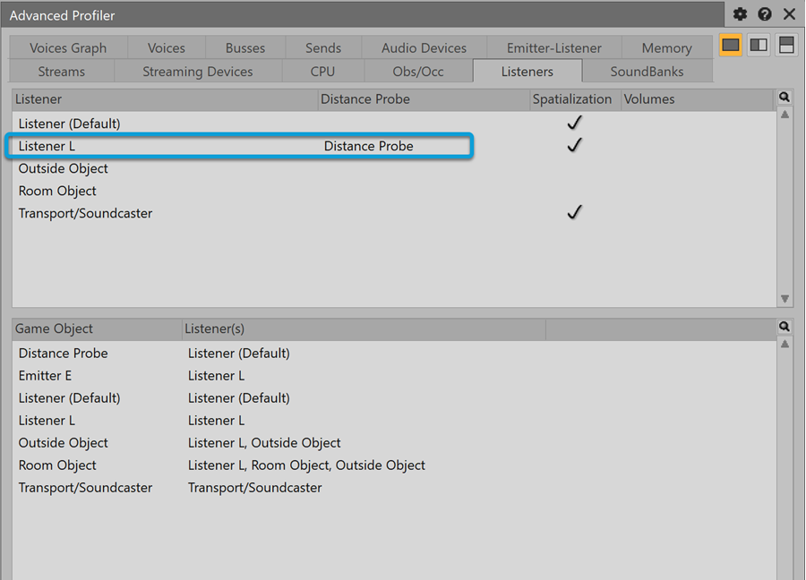
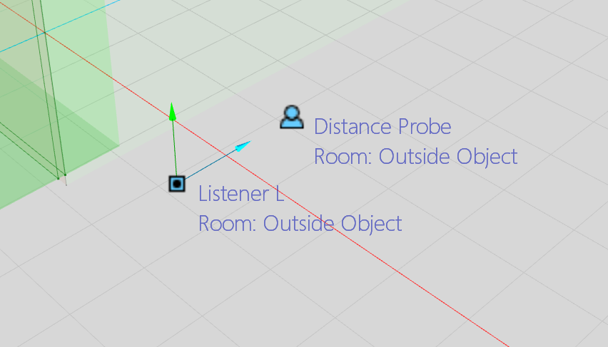
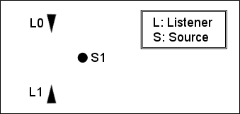

# 集成 Listener

|  |
| --- |
| Wwise SDK 2025.1.4 - Windows |

集成 Listener

- [简介](soundengine_listeners.html#soundengine_listeners_intro)
- [注册听者](soundengine_listeners.html#soundengine_registering_listeners)
- [设置 Listener 的位置信息](soundengine_listeners.html#soundengine_listeners_settingpos)
- [在第三人称游戏中设置听者](soundengine_listeners.html#third_person_perspective)
- [Distance Probe](soundengine_listeners.html#distance_probe)
- [单一输出设备中的多个听者](soundengine_listeners.html#soundengine_listeners_multi)

# 简介

听者是代表游戏中麦克风位置的游戏对象。将一个游戏对象指定为听者可以让 3D 声音被指派到扬声器，以便模拟真实的 3D 环境。与之相似，发声体游戏对象代表一个虚拟扬声器，当它被指派到一个听者时，发声体的位置信息就被映射到听者的坐标系统中，以此渲染出 3D 声音。Wwise 中会给所有的游戏对象指派一个变换（transform）——一个位置向量以及前方和上方向量，不管这些对象是作为发声体还是听者（或两者都是）。游戏对象的变换必须每帧更新，保证声音通过正确的扬声器进行渲染。

# 注册听者

为了听到声音，至少要注册一个游戏对象并且将其指派为听者。您可以使用 `AK::SoundEngine::SetDefaultListeners` 来将听者指派到所有其它游戏对象，或者用 `AK::SoundEngine::SetListeners` 来将听者指派到特定游戏对象，并覆盖使用 `AK::SoundEngine::SetDefaultListeners` 所做的设置。以下是我们注册游戏对象并将其指派为默认听者的方法：

[AkGameObjectID](_ak_typedefs_8h_a352a1eb6955fa208062e40a9ccdd2560.html#a352a1eb6955fa208062e40a9ccdd2560) MY\_DEFAULT\_LISTENER = 0;

// 注册主要听者。

[AK::SoundEngine::RegisterGameObj](namespace_a_k_1_1_sound_engine_a895ed0f83a0dea8fc284491c0ee0152c.html#a895ed0f83a0dea8fc284491c0ee0152c)(MY\_DEFAULT\_LISTENER, "My Default Listener");

// 将一个听者设置为默认。

[AK::SoundEngine::SetDefaultListeners](namespace_a_k_1_1_sound_engine_a4fe9102cd3cb2b59dda5d3d635dc49fe.html#a4fe9102cd3cb2b59dda5d3d635dc49fe)(&MY\_DEFAULT\_LISTENER, 1);

// 注册游戏对象来播放声音

[AkGameObjectID](_ak_typedefs_8h_a352a1eb6955fa208062e40a9ccdd2560.html#a352a1eb6955fa208062e40a9ccdd2560) MY\_EMITTER = 1;

[AK::SoundEngine::RegisterGameObj](namespace_a_k_1_1_sound_engine_a895ed0f83a0dea8fc284491c0ee0152c.html#a895ed0f83a0dea8fc284491c0ee0152c)(MY\_EMITTER, "My Emitter");

// At this point "My Emitter" has 1 listener, "My Default Listener", because we designated it as the default listener.

[AkGameObjectID](_ak_typedefs_8h_a352a1eb6955fa208062e40a9ccdd2560.html#a352a1eb6955fa208062e40a9ccdd2560) MY\_LISTENER\_NO2 = 2;

[AK::SoundEngine::RegisterGameObj](namespace_a_k_1_1_sound_engine_a895ed0f83a0dea8fc284491c0ee0152c.html#a895ed0f83a0dea8fc284491c0ee0152c)(MY\_LISTENER\_NO2, "My Listener #2");

// 如果我们只想为“My Emitter”变更听者，可以按以下方式：

[AK::SoundEngine::SetListeners](namespace_a_k_1_1_sound_engine_a2f85a55c38afa2e0dbc6172a7bec91d1.html#a2f85a55c38afa2e0dbc6172a7bec91d1)(MY\_EMITTER , &MY\_LISTENER\_NO2, 1);

// 这时，“My Emitter”有一个听者叫作“My Listener #2”。所有其它游戏对象仍然有“My Default Listener”作为它们的听者。

您可以通过在 Wwise 设计工具中查看 Advanced Profiler 的 Emitter-Listener 选项卡，来检查已在代码中指派的发声体-听者关联。简单的游戏会选择一个游戏对象作为所有游戏对象的默认听者；但是也可以使用多个听者输出到一个输出设备上。请见以下的 [单一输出设备中的多个听者](soundengine_listeners.html#soundengine_listeners_multi) 。我们也可以将听者用于子混音的 3D 定位。想要做到这点，需要将听者指派到特定的游戏对象，这些游戏对象同时也是听者，它们创建出游戏对象和听者相互关联形成的有向图。

# 设置 Listener 的位置信息

就像针对所有游戏对象一样，要使用 `AK::SoundEngine::SetPosition()` 函数来设置听者的位置。只要 Listener 的任何位置或朝向向量发生变化，就应执行此操作。

[AkTransform](struct_ak_transform.html) listenerTransform;

(... 在此设置 listenerTransform 的位置和朝向成员……)

[AK::SoundEngine::SetPosition](namespace_a_k_1_1_sound_engine_a789e25bda32d1e11849afb6584942455.html#a789e25bda32d1e11849afb6584942455)( listenerPosition );

[AkTransform](struct_ak_transform.html "Position and orientation of objects in a \"local\" space") 类型保存着在游戏 3D 空间中定义听者位置和指向的信息。听者的位置（Position），OrientationFront，以及 OrientationTop 向量可以使用 `AkTransform` 类型的 getter 和 setter 来访问。

|  |  |
| --- | --- |
|  | **备注:** `OrientationFront` 向量定义 Listener 头部的朝向。此向量应该与 OrientationTop 向量正交，后者用于定义 Listener 头的斜度。对于人类听者，可以将 OrientationFront 向量视为听者的鼻子（伸出面部指向远处），而 OrientationTop 向量与它正交，从鼻子指向上方，位于听者眼睛之间，经过额头继续向上。 |

请参阅 [X-Y-Z 坐标系统](soundengine_3dpositions.html#soundengine_3dpositions_xyz) 了解 Wwise 声音引擎中 X、Y 和 Z 轴分别对应什么。

必须定义朝向向量，才能正确渲染音频。它们不可以是零向量，需要是单位向量。它们也必须是直角。

|  |  |
| --- | --- |
|  | **备注:** Listener 的信息最多每帧更新一次。即使多次调用了 `AK::SoundEngine::SetPosition()` 函数，调用 `AK::SoundEngine::RenderAudio()` 时只考虑最后一个值。 |

|  |  |
| --- | --- |
|  | **技巧:** 如果您遇到声音渲染上的异常情况，例如原希望从左扬声器中发出的声音结果却从右扬声器中发出，则应通过 `AK::SoundEngine::SetPosition()` 函数检查提供给声音引擎的 Listener 位置信息。您可以尝试设置一个已知的 Listener 恒定位置，检查在此情况下渲染是否正确，以排除混淆了 X、Y 和 Z 轴的情况。有关此功能的详情，请参阅 [X-Y-Z 坐标系统](soundengine_3dpositions.html#soundengine_3dpositions_xyz) 。 |

# 在第三人称游戏中设置听者

在将音频整合到第三人称视角 (TPP) 的游戏或模拟环境中时，有时并不确定要将“听者”游戏对象放在哪里；有些人希望放在摄像机位置，有些人则希望放在玩家角色位置。虽然位置不同，但摄像机和玩家角色从某些方面来说都归属于玩家。通过将 Distance Probe 与主摄像机听者关联，可按照各自的方式将其位置应用于声音计算。要理解这种方式，需对模拟的各个方面加以分析。

## 声像摆位和空间化

在几乎所有的场景中，声像摆位和空间化（包括 Wwise 中的散布和聚焦）都应基于摄像机的位置和朝向。模拟当中摄像机和声音相对朝向之间的脱节 – 相对于最终扬声器阵列（无论物理还是虚拟双耳渲染）– 都会导致沉浸感的减弱。比如，若摄像机直接朝向某个声音，则该声音应从中置扬声器声道发出。又如，摄像机左侧的声音应从左侧扬声器发出。

为了实现这一目标，必须将“听者”游戏对象放在活跃的摄像机上，并更新听者的朝向以确保与之协调一致。

## 基于距离的衰减

3D 声音通常会根据“发声体”和“听者”游戏对象之间的距离衰减，应用于声音的衰减曲线以获取音量、高通滤波器和低通滤波器值。这样的话，近处的声音（对体验更重要）会更响亮。

不过，在 TPP 游戏中，关注焦点并非摄像机本身而是玩家角色。因此，在根据发声体和玩家角色而非发声体和摄像机之间的距离对声音实施衰减时会获得更好的沉浸感。

要理解为何会如此，不妨设想这样一个场景：在距离衰减基于摄像机位置时，会获得不符合预期的音量波动。设想在 TPP 游戏中摄像机跟随玩家角色沿着被火把照亮的走廊前进。每个火把都会发出低强度声音并且会迅速衰减。要想转动摄像机以使其朝向另一方向，必须绕着角色旋转摄像机。在此过程中，摄像机会靠近一个或多个火把。声音会变大，然后又变小。玩家角色没有移动，火把在场景中的相对重要性也没变，但音量波动却表明情况并非如此。

为了基于相对于玩家角色的距离对声音实施衰减，必须在玩家角色位置放置一个游戏对象，并将其指定为主听者的 Distance Probe。

# Distance Probe

Distance Probe 是个可选的游戏对象，可用作“听者”游戏对象的代替物。在将 Distance Probe 指派给听者时，为输出给听者的所有声音应用的衰减距离将基于 Distance Probe 和“发声体”游戏对象之间的距离。

无论是否指派了 Distance Probe，声像摆位、空间化、散布和聚焦始终基于“听者”游戏对象的位置和朝向。

除此之外：

- 每个“听者”游戏对象都可拥有零个或一个设为 Distance Probe 的游戏对象。
- 一个游戏对象可作为多个听者的 Distance Probe。
- 将听者指派给其自己的 Distance Probe 相当于将 Distance Probe 设为 None。

您可以使用 `AK::SoundEngine::SetDistanceProbe` API 将 Distance Probe 指派给“听者”游戏对象。

## 对 Distance Probe 实施性能分析

所有指派的 Distance Probe 都会显示在 Advanced Profiler 的 Listeners 选项卡中。下图展示使用 `AK::SoundEngine::SetDistanceProbe` API 将名为 Distance Probe 的游戏对象指派给了 Listener L。

Distance Probe 在 Game Object 3D Viewer 中显示为图标。注意，为方便起见，Game Object 3D Viewer 中 Distance Probe 的可见性与 Listener 的可见性进行了绑定；所有应用于 Listener 的滤波器也会应用于 Distance Probe。

## 其他实现说明

在 TPP 游戏中，无需将 Distance Probe 精准地放在玩家角色所在位置。您可以随意尝试设定位置来获得想要的结果。这里列出了一些建议：尝试按照不同的距离比例将 Distance Probe 放在摄像机和角色之间。该比例可作为可调值暴露给设计师以便其在角色位置和摄像机位置之间插入数值。 在过场动画和过场时刻当中，可能需要移动、禁用 Distance Probe 或将其转换为不同的游戏对象。Distance Probe 不需要是静态的。

有关如何在将 Distance Probe 指派给 Spatial Audio Listener 时运用各种 Spatial Audio 功能的详细信息，请参阅 [第三人称视角和 Spatial Audio](spatial_audio_third_person.html) 章节。

# 单一输出设备中的多个听者

在单人游戏中，您始终只有一个视角，因此一个 Listener 就够了。然而，如果多个玩家可以同时在同一系统上玩游戏，或者同时显示多个视角，那么各个视角都需要有自己的 Listener ，从而正确地为所有这些视角渲染音频。

实现多个 Listener 的主要难点在于声源的定位对于玩家所见并不总是合理。这主要是游戏仅使用一组扬声器来为多个玩家再现 3D 环境所造成的。

下图简要地展示了这一问题。由于 Listener 0 希望在左扬声器中听到声源，而 Listener 1 希望在右扬声器中听到声源，因此很难讲哪些扬声器应该用来播放声源。

图：两个 Listener 在不同的扬声器中听到相同的声源

Wwise 可设置任意数量的听者。除非以下情况，将默认在主输出设备中合并所有听者：

- 它们是专门用于通过 `AK::SoundEngine::SetListeners` 向另一个听者发声的，或
- 它们专门通过 `AK::SoundEngine::AddOutput` 连通到一个辅助设备。

以下的部分包括了当所有听者融合到同一个输出设备时的例子，也描述了 Wwise 声音引擎如何让程序员操作这些听者，以便完成期望的行为。

|  |  |
| --- | --- |
|  | **备注:** 与多个 Listener 相关的一切功能都只能由游戏程序员通过 SDK 来实现。Wwise 设计工具中没有专门的选项用来为多个 Listener 管理声源在游戏中的定位。 |

## 多个 Listener ：捕获声源

每个听者都会生成一个混音图。对于各个声源，相对于它们所作用的各个 Listener 分别计算距离衰减和声锥衰减。

### 音量衰减管理

当多个听者在捕获一个声源时，声源会在它相应听者对应的每条总线实例中连续混音。在混音时，每个听者会独立应用衰减音量。

### LPF 衰减管理

与衰减音量相反，衰减 LPF 和 HPF 会直接在声源上应用；因此，Wwise 必须基于特定声源的所有发声体-听者关联选择一个值。以下是声音引擎如何计算要应用于各个声源的最终低通滤波器：

1. 此声源所作用的各个 Listener ：
   1. 根据声源与此 Listener 之间的距离计算 LPF。
   2. 根据声源与此 Listener 之间的角度计算 LPF。
   3. 保留两个值中的最大值。
2. 获得所有 Listener 中的最小值，并添加对象的 LPF（常规值和 RTPC）。

在下表中详述的示例中， Listener 0 的值是 max( 10, 40 ) = 40， Listener 1 的值是 max( 50, 10 ) = 50。两值中的最小数是 40，然后将此数与对象的值 5 相加，从而获得最终值 45：

|  |  |  |  |  |  |
| --- | --- | --- | --- | --- | --- |
| **Listener 0** | | **Listener 1** | | **Object** | **Final LPF for  the source** |
| **锥形 LPF** | **半径 LPF** | **锥形 LPF** | **半径 LPF** |
| 10 | 40 | 50 | 10 | 5 | 45 |

## 音量偏置与空间化

*3D Spatialization*（3D 空间化）会根据声音相对于听者的位置在各个扬声器之间对声音进行声像摆位。

然而，如果两个玩家在分屏显示器上玩游戏，您可能会希望在左扬声器中听到听者 1（第一个玩家），在右扬声器中听到听者 2（第二个玩家），而完全不用根据声音相对于各个 Listener 的位置在扬声器之间定位声音的常规办法。

为了提供更多的控制和更高的灵活性，Wwise 可以让游戏程序员对指定的 Listener 禁用空间定位，也可为各个声道设置自定义音量偏置，从而指定在各个扬声器中将如何听到此 Listener 捕获的声音。

可以调用 `AK::SoundEngine::SetListenerSpatialization()` 来修改各个 Listener 的这些设置：

virtual [AKRESULT](_ak_enums_8h_a64f7d1f79613cc4dcc49a4efba6caa63.html#a64f7d1f79613cc4dcc49a4efba6caa63) [AK::SoundEngine::SetListenerSpatialization](namespace_a_k_1_1_sound_engine_a3e3e9e5335df01fca37f9b3ed518e2bd.html#a3e3e9e5335df01fca37f9b3ed518e2bd)(

[AkGameObjectID](_ak_typedefs_8h_a352a1eb6955fa208062e40a9ccdd2560.html#a352a1eb6955fa208062e40a9ccdd2560) in\_uListenerID, // Listener game object ID

bool in\_bSpatialized, // Spatialization toggle (True : enable spatialization, False : disable spatialization)

[AkChannelConfig](struct_ak_channel_config.html) in\_channelConfig, // Channel configuration associated with volumes in\_pVolumeOffsets. 如果 in\_pVolumeOffsets 为空，则忽略。

[AK::SpeakerVolumes::VectorPtr](namespace_a_k_1_1_speaker_volumes_ad437e8acf5a9509d22a2d13629502afa.html#ad437e8acf5a9509d22a2d13629502afa) in\_pVolumeOffsets = NULL // 各个扬声器的音量偏置，单位：dB。请参见 AkSpeakerVolumes.h 了解如何操作此向量。

) = 0;

第一个参数是 Listener ID。第二个参数必须设置为 `True` ，以针对此 Listener 启用空间定位，或者设置为 `False` ，以禁用它。最后两个参数代表包含该 Listener 上各个声道的衰减的向量，单位：dB。如果 `in_bSpatialized` 是 `False` ，则它为各个声道设置音量，在默认情况下音量是 0dB。若 `in_bSpatialized` 为 `True，则针对各个声道按给定量偏置默认` 3D 空间化计算得出的音量。

音量向量绑定到声道配置 `in_channelConfig` 。如果 `in_channelConfig` 为 5.1，则音量向量应有 6 个值。使用 [AK::SpeakerVolumes::Vector](namespace_a_k_1_1_speaker_volumes_1_1_vector.html "Volume vector services.") namespace 中定义的功能操作它。声道顺序对应于 [AkSpeakerConfig.h](_ak_speaker_config_8h.html) 中定义的声道掩码位（channel mask bits），LFE 除外（总是位于末尾的）。

对于两个玩家使用分屏玩游戏的例子，程序员可使用以下代码：

// 将听者 1 和 2 注册为所有发声体的默认听者。

// 您也可能最好通过换用 AK::SoundEngine::SetListeners 来明确选择哪些发声体向哪些听者发声。

[AkGameObjectID](_ak_typedefs_8h_a352a1eb6955fa208062e40a9ccdd2560.html#a352a1eb6955fa208062e40a9ccdd2560) listeners[2] = {1,2};

[AK::SoundEngine::RegisterGameObj](namespace_a_k_1_1_sound_engine_a895ed0f83a0dea8fc284491c0ee0152c.html#a895ed0f83a0dea8fc284491c0ee0152c)(listeners[0]);

[AK::SoundEngine::RegisterGameObj](namespace_a_k_1_1_sound_engine_a895ed0f83a0dea8fc284491c0ee0152c.html#a895ed0f83a0dea8fc284491c0ee0152c)(listeners[1]);

[AK::SetDefaultListeners](namespace_a_k_1_1_sound_engine_a4fe9102cd3cb2b59dda5d3d635dc49fe.html#a4fe9102cd3cb2b59dda5d3d635dc49fe)(listeners[0],2);

// 使用 7.1 扬声器设置定义扬声器偏置（如果平台支持的话）

[AkChannelConfig](struct_ak_channel_config.html) cfg;

cfg.[SetStandard](struct_ak_channel_config_a4c0f4b3d39608a10c9b330c1ef8281a7.html#a4c0f4b3d39608a10c9b330c1ef8281a7)( [AK\_SPEAKER\_SETUP\_7\_1](_ak_speaker_config_8h_a69b5f93e12513edd50b60f5fe763dfd5.html#a69b5f93e12513edd50b60f5fe763dfd5) );

[AkUInt32](_ak_numeral_types_8h_a39c6c5d577901802ca77775760b704ce.html#a39c6c5d577901802ca77775760b704ce) uVectorSize = [AK::SpeakerVolumes::Vector::GetRequiredSize](namespace_a_k_1_1_speaker_volumes_1_1_matrix_a59458aba2b1be3fa678021a3aea813b9.html#a59458aba2b1be3fa678021a3aea813b9)( cfg.[uNumChannels](struct_ak_channel_config_af86d291ad68bcc75d3a47e4582dc69fc.html#af86d291ad68bcc75d3a47e4582dc69fc) );

[AK::SpeakerVolumes::VectorPtr](namespace_a_k_1_1_speaker_volumes_ad437e8acf5a9509d22a2d13629502afa.html#ad437e8acf5a9509d22a2d13629502afa) vVolumes = ([AK::SpeakerVolumes::VectorPtr](namespace_a_k_1_1_speaker_volumes_ad437e8acf5a9509d22a2d13629502afa.html#ad437e8acf5a9509d22a2d13629502afa))AkAlloca( uVectorSize );

vVolumes[0] = 0.f; // 左

vVolumes[1] = -96.3f; // 右

vVolumes[2] = -6.f; // 中置

vVolumes[3] = 0.f; // 左后

vVolumes[4] = -96.3f; // 右后

vVolumes[5] = 0.f; // 侧左

vVolumes[6] = -96.3f; // 侧右

vVolumes[7] = 0.f; // LFE

[AK::SoundEngine::SetListenerSpatialization](namespace_a_k_1_1_sound_engine_a3e3e9e5335df01fca37f9b3ed518e2bd.html#a3e3e9e5335df01fca37f9b3ed518e2bd)( listeners[0], false, cfg, vVolumes );

vVolumes[0] = -96.3f; //左

vVolumes[1] = 0.f; // 右

vVolumes[2] = -6.f; // 中置

vVolumes[3] = -96.3f; // Rear left

vVolumes[4] = 0.f; // 右后

vVolumes[5] = -96.3f; // Side left

vVolumes[6] = 0.f; // 侧右

vVolumes[7] = 0.f; // LFE

[AK::SoundEngine::SetListenerSpatialization](namespace_a_k_1_1_sound_engine_a3e3e9e5335df01fca37f9b3ed518e2bd.html#a3e3e9e5335df01fca37f9b3ed518e2bd)( listeners[1], false, cfg, vVolumes );

如果声音通往的总线按照用户定义的声道配置而不同于 7.1，则声道向量将使用标准的下混配方在内部下混，然后再作用于声音。

要改回使用常规的空间化，您可以调用：

// Enable regular spatialization on listeners 0 and 0

[AK::SoundEngine::SetListenerSpatialization](namespace_a_k_1_1_sound_engine_a3e3e9e5335df01fca37f9b3ed518e2bd.html#a3e3e9e5335df01fca37f9b3ed518e2bd)( 1, true );

[AK::SoundEngine::SetListenerSpatialization](namespace_a_k_1_1_sound_engine_a3e3e9e5335df01fca37f9b3ed518e2bd.html#a3e3e9e5335df01fca37f9b3ed518e2bd)( 1, true );

### 音量管线

下图按照执行的顺序展示对各个声源所做的不同操作，以使各个 Listener 能够计算各个扬声器中的最终音量：

图：Wwise 声音引擎中的音量管线

参见
:   - [游戏集成例程](samplecode.html#samplecode_integration)
    - [集成详情——3D 位置](soundengine_3dpositions.html)
    - [集成详情——游戏对象](soundengine_gameobj.html)

[AK::SoundEngine::SetDefaultListeners](namespace_a_k_1_1_sound_engine_a4fe9102cd3cb2b59dda5d3d635dc49fe.html#a4fe9102cd3cb2b59dda5d3d635dc49fe)

AKSOUNDENGINE\_API AKRESULT SetDefaultListeners(const AkGameObjectID \*in\_pListenerObjs, AkUInt32 in\_uNumListeners)

[AkGameObjectID](_ak_typedefs_8h_a352a1eb6955fa208062e40a9ccdd2560.html#a352a1eb6955fa208062e40a9ccdd2560)

AkUInt64 AkGameObjectID

Game object ID

**Definition:** [AkTypedefs.h:39](_ak_typedefs_8h_source.html#l00039)

[AkChannelConfig::uNumChannels](struct_ak_channel_config_af86d291ad68bcc75d3a47e4582dc69fc.html#af86d291ad68bcc75d3a47e4582dc69fc)

AkUInt32 uNumChannels

Number of channels.

**Definition:** [AkSpeakerConfig.h:444](_ak_speaker_config_8h_source.html#l00444)

[AkChannelConfig](struct_ak_channel_config.html)

**Definition:** [AkSpeakerConfig.h:436](_ak_speaker_config_8h_source.html#l00435)

[AK::SoundEngine::RegisterGameObj](namespace_a_k_1_1_sound_engine_a895ed0f83a0dea8fc284491c0ee0152c.html#a895ed0f83a0dea8fc284491c0ee0152c)

AKSOUNDENGINE\_API AKRESULT RegisterGameObj(AkGameObjectID in\_gameObjectID)

[AK::SpeakerVolumes::Matrix::GetRequiredSize](namespace_a_k_1_1_speaker_volumes_1_1_matrix_a59458aba2b1be3fa678021a3aea813b9.html#a59458aba2b1be3fa678021a3aea813b9)

AkForceInline AkUInt32 GetRequiredSize(AkUInt32 in\_uNumChannelsIn, AkUInt32 in\_uNumChannelsOut)

**Definition:** [AkSpeakerVolumes.h:303](_ak_speaker_volumes_8h_source.html#l00303)

[AkTransform](struct_ak_transform.html)

Position and orientation of objects in a "local" space

**Definition:** [Ak3DObjects.h:255](_ak3_d_objects_8h_source.html#l00254)

[AK::SoundEngine::SetListenerSpatialization](namespace_a_k_1_1_sound_engine_a3e3e9e5335df01fca37f9b3ed518e2bd.html#a3e3e9e5335df01fca37f9b3ed518e2bd)

AKSOUNDENGINE\_API AKRESULT SetListenerSpatialization(AkGameObjectID in\_uListenerID, bool in\_bSpatialized, AkChannelConfig in\_channelConfig, AK::SpeakerVolumes::VectorPtr in\_pVolumeOffsets=NULL)

[AK\_SPEAKER\_SETUP\_7\_1](_ak_speaker_config_8h_a69b5f93e12513edd50b60f5fe763dfd5.html#a69b5f93e12513edd50b60f5fe763dfd5)

#define AK\_SPEAKER\_SETUP\_7\_1

**Definition:** [AkSpeakerConfig.h:211](_ak_speaker_config_8h_source.html#l00211)

[AK::SoundEngine::SetListeners](namespace_a_k_1_1_sound_engine_a2f85a55c38afa2e0dbc6172a7bec91d1.html#a2f85a55c38afa2e0dbc6172a7bec91d1)

AKSOUNDENGINE\_API AKRESULT SetListeners(AkGameObjectID in\_emitterGameObj, const AkGameObjectID \*in\_pListenerGameObjs, AkUInt32 in\_uNumListeners)

[AK::SoundEngine::SetPosition](namespace_a_k_1_1_sound_engine_a789e25bda32d1e11849afb6584942455.html#a789e25bda32d1e11849afb6584942455)

AKSOUNDENGINE\_API AKRESULT SetPosition(AkGameObjectID in\_GameObjectID, const AkSoundPosition &in\_Position, AkSetPositionFlags in\_eFlags=AkSetPositionFlags\_Default)

[AKRESULT](_ak_enums_8h_a64f7d1f79613cc4dcc49a4efba6caa63.html#a64f7d1f79613cc4dcc49a4efba6caa63)

AKRESULT

**Definition:** [AkEnums.h:32](_ak_enums_8h_source.html#l00031)

[AkChannelConfig::SetStandard](struct_ak_channel_config_a4c0f4b3d39608a10c9b330c1ef8281a7.html#a4c0f4b3d39608a10c9b330c1ef8281a7)

AkForceInline void SetStandard(AkUInt32 in\_uChannelMask)

Set channel config as a standard configuration specified with given channel mask.

**Definition:** [AkSpeakerConfig.h:511](_ak_speaker_config_8h_source.html#l00511)

[AkUInt32](_ak_numeral_types_8h_a39c6c5d577901802ca77775760b704ce.html#a39c6c5d577901802ca77775760b704ce)

uint32\_t AkUInt32

Unsigned 32-bit integer

**Definition:** [AkNumeralTypes.h:35](_ak_numeral_types_8h_source.html#l00035)

[AK::SpeakerVolumes::VectorPtr](namespace_a_k_1_1_speaker_volumes_ad437e8acf5a9509d22a2d13629502afa.html#ad437e8acf5a9509d22a2d13629502afa)

AkSpeakerVolumesMatrixPtr VectorPtr

**Definition:** [AkTypedefs.h:95](_ak_typedefs_8h_source.html#l00095)