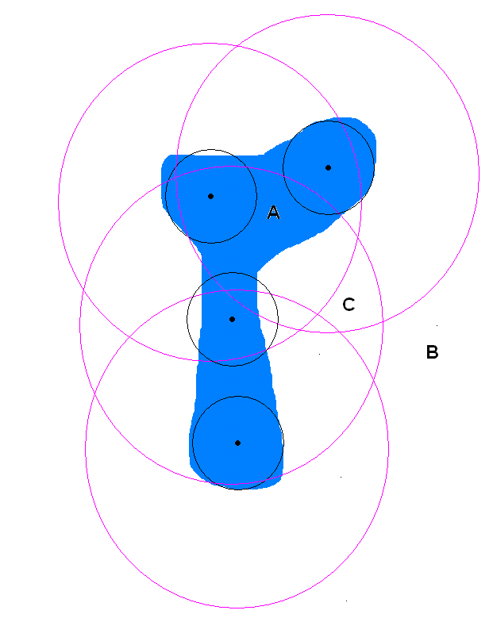
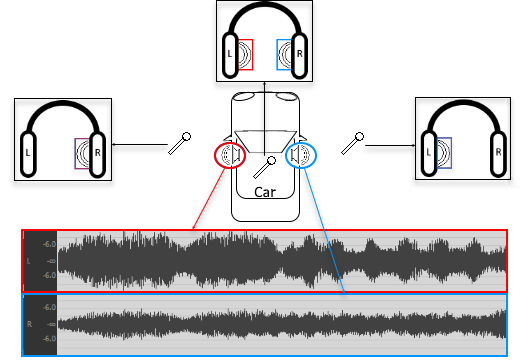
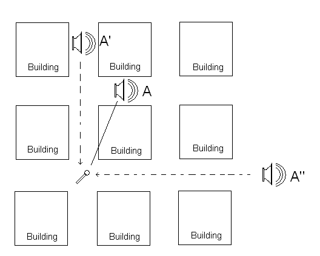
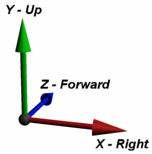

# 集成详情——3D 位置

|  |
| --- |
| Wwise SDK 2025.1.4 - Windows |

集成详情——3D 位置

在 Wwise 中，可通过将 Event 发送给游戏注册的对象来播放声音，游戏还可能为对象指定位置。这些游戏对象称为 *发声体* (emitter)。您可以利用模拟的 3D 环境中 *发声体* (emitter) 和 *听者* (listener) 之间的相对位置，来进一步设置声音的声像摆位和其他属性，进而构建逼真的 3D 环境并为玩家打造身临其境的视听体验。

在 Wwise 中，设计师既可选择手动对输出到玩家所用扬声器的声音实施声像摆位，也可设为由游戏根据对象位置实时定位声音。另外，还可指派一组衰减曲线和设置，并根据距离或角度来修改声音属性（音量、滤波等）。

# 设置游戏对象的位置

针对需要使用此信息来定位声音的每个游戏对象调用 `AK::SoundEngine::SetPosition()` 函数。另外，还要针对“听者”游戏对象调用该函数。每当游戏对象的位置改变时，您都需要设置位置。

[AKRESULT](_ak_enums_8h_a64f7d1f79613cc4dcc49a4efba6caa63.html#a64f7d1f79613cc4dcc49a4efba6caa63) [AK::SoundEngine::SetPosition](namespace_a_k_1_1_sound_engine_a789e25bda32d1e11849afb6584942455.html#a789e25bda32d1e11849afb6584942455)(

[AkGameObjectID](_ak_typedefs_8h_a352a1eb6955fa208062e40a9ccdd2560.html#a352a1eb6955fa208062e40a9ccdd2560) in\_GameObjectID, // Game object identifier

const AkSoundPosition & in\_Position // Position to set

);

第一个参数是游戏对象的 ID。请参阅 [集成详情——游戏对象](soundengine_gameobj.html) 了解详情。

第二个参数是 `AkTransform` 结构，其中包含的向量代表游戏对象的位置和朝向。请参阅 [X-Y-Z 坐标系统](soundengine_3dpositions.html#soundengine_3dpositions_xyz) 了解 Wwise 声音引擎中 X、Y 和 Z 轴分别对应什么。

|  |  |
| --- | --- |
|  | **备注:** 这意味着，即使您在调用 `AK::SoundEngine::RenderAudio()` 函数前多次调用 `AK::SoundEngine::SetPosition()，也仍将只考虑最后一个值。` |

## 跟踪听者的位置

为了模拟发声体位置自动跟随听者位置的行为，必须在每一帧将游戏对象的位置明确设为与听者位置相同的数值。另外，也可发送作用于“听者”游戏对象的 Event。

## 为单个游戏对象设置多个位置

因为 `AK::SoundEngine::SetPosition()` 函数只允许为每个游戏对象设置一个 3D 位置，所以要想为单个游戏对象设置多个 3D 位置，必须使用 `AK::SoundEngine::SetMultiplePositions()` 函数才行。

[AKRESULT](_ak_enums_8h_a64f7d1f79613cc4dcc49a4efba6caa63.html#a64f7d1f79613cc4dcc49a4efba6caa63) [AK::SoundEngine::SetMultiplePositions](namespace_a_k_1_1_sound_engine_aec6be4dca0249557ea2680b755bd218a.html#aec6be4dca0249557ea2680b755bd218a)(

[AkGameObjectID](_ak_typedefs_8h_a352a1eb6955fa208062e40a9ccdd2560.html#a352a1eb6955fa208062e40a9ccdd2560) in\_GameObjectID, ///< Game object identifier.

const AkSoundPosition \* in\_pPositions, ///< 要应用的位置数组。

[AkUInt16](_ak_numeral_types_8h_a7100a9b0a3b01df7639c1dc512678219.html#a7100a9b0a3b01df7639c1dc512678219) in\_NumPositions, ///< 所提供数组中指定的位置数。

[AkMultiPositionType](_ak_enums_8h_a751ba836dfd5edf52ceaab00cf74b6c1.html#a751ba836dfd5edf52ceaab00cf74b6c1) in\_eMultiPositionType ///< \ref AkMultiPositionType

);

);

Select the `AkMultiPositionType` carefully. 如何选择取决于具体情况以及要创建的效果类型。

- If you pass `AkMultiPositionType_MultiSources`, the different sound volumes are added, which simulates multiple objects emitting the same sound at the same time. 此函数可以用在很多不同的场景，比如在多个对象发出相同声音时就很适合。不过，在各个声音距离太近时使用该函数可能会出现一些问题。这个问题在于：因为多个声音完全同相播放，所以音量累加的时候容易出现削波失真。
- If you pass `AkMultiPositionType_MultiDirections`, the volume played in each speaker is the maximum in each direction. 此函数可以用来模拟游戏中的各种不同场景，包括墙壁开口、面声源及多个对象同时发出相同声音的情形。If, however, the game player expects the sound to grow louder when two or more objects emitting the sound are in close proximity, add the sounds with `AkMultiPositionType_MultiSources`.
- Do not use `AkMultiPositionType_SingleSource` with `SetMultiplePositions()` because it only takes the first listed position into account.
- 由于技术限制，会始终将启用了衍射的声音视为 `MultiPositionType_MultiDirections` 。

### 为多个声音位置应用声障值和声笼值

`AK::SoundEngine::SetObjectObstructionAndOcclusion` API 会向所有声音位置应用单个声障值和声笼值。若选用 `AK::SoundEngine::SetMultipleObstructionAndOcclusion` ，则会将唯一的声障值和声笼值指派给各个声音位置。有关详细信息，请参阅 [声障、声笼及 Game-defined Auxiliary Sends](soundengine_obsocc.html) 章节。

## 用例示例

通过为单个游戏对象创建多个位置，您可以模拟很多音效，包括：

- [Area sounds](soundengine_3dpositions.html#area_sounds)
- [同一区域中多个对象发出同样的声音。](soundengine_3dpositions.html#multiple_objects)
- [将单个声源的各个声道输出到不同位置](soundengine_3dpositions.html#stereo_speakers)
- [模拟从豁口传来的声音（声音重定位）](soundengine_3dpositions.html#simulating_sounds)

### Area sounds

您可以通过选用 `MultiPositionType_MultiDirections` 并设置合适的 Spread 值及基于距离的音量衰减值来模拟区域声音。在使用此方法时，需要位置增多的时候音量不会累加升高。通过使用这种方法重建面声源，您可以用一个声音获得从多个方向传来的、有逼真衰减的效果。

在下列中，黑点代表声音的初始位置，黑圆圈代表衰减的最小距离和散布，红圆圈代表最大衰减半径：

图：有多个位置的面声源示例

蓝色区域代表游戏中的湖泊。湖泊发出的环境声通过使用有四个位置的声音来模拟。

当听者位于 A 位置时，湖泊的声音应来自所有方向。这可以通过设置适当高的散布值来实现，高散布值可使声音散布，使它们在所有扬声器中播放。

在听者位于位置 B 处时，已经超出最大衰减距离。这意味着在最大衰减距离处，听者要么会听不到湖泊的声音，要么只能听到微弱的声音。由于您用了多个位置来模拟大湖，因此声音总是会从合适的方向传过来。

当听者位于 C 位置时，将从张角很大的扬声器（~180 度）中听到湖声，但听者到湖泊有一定距离，因此声音会发生衰减。在这种情况下，听者仍位于衰减半径内，因此湖声不会发生最大衰减。

使用这项技术，您可以通过重叠多个声音位置来重建任何类型的对象形状。然而请记住，每添加一个新位置，就需要更多的 CPU 来计算音量结果。

### 同一区域中多个对象发出同样的声音。

举例来说，在游戏的某一关中，走廊墙壁上布置了一系列的火炬，将走廊照得透亮。这些火炬完全一样，会播放完全相同的声音。假如针对每个火炬分别发送一个 Play Event（假设有 20 个火炬），会大幅增加 CPU 和内存消耗。另外，如果使用流播放声音，则您可能会有多条重复的流，这会增加 I/O 访问次数。

在这种情况下，使用 `SetMultiplePositions()` 将极大地提高性能。它还可让您用一次操作来轻松控制所有声音，并减少需要注册的游戏对象的数量。

When creating this scenario in game, you can use either `AkMultiPositionType_MultiSources` or `AkMultiPositionType_MultiDirections`.

`AkMultiPositionType_MultiSources` will usually be more accurate, but may be problematic if positions are too close to one another. 记住，当只播放一个声部来模拟多个声音时，Wwise 会累加不同位置上的音量，从而可能导致音量超过 0 dB。`MultiPositionType_MultiDirections` 占用 CPU 较少，其只采用最大音量并让各个扬声器按此音量来播放。因为 `MultiPositionType_MultiDirections` 不会增加音量，所以其可保证不会有削波失真发生，因而可能更适用。

尽管一个声音有多个位置，但声音引擎仍只播放一个声部。这意味着当所有声音都超出值域时，只会处理一个虚声部。

### 将单个声源的各个声道输出到不同位置

假设汽车正在通过扬声器（即发声体）大声地播放立体声录制音乐。左侧和右侧发声体便可分别输出立体声音乐源文件的左侧和右侧输入声道（如下图所示）。

在这种情况下，可结合使用 `SetMultiplePositions()` 函数和 `AkChannelEmitter` 参数，来灵活地指派输入声道。同时，利用 `AkChannelMask` 指定发声体位置要使用哪个输入声道（左侧或右侧）。如此一来，假如声源的左侧和右侧输入声道的音频内容不同，听者在不同位置听到的声音就会存在一定的差异。

图解单个多声道声源如何在不同位置输出各个声道

|  |  |
| --- | --- |
|  | **备注:** 上图所示汽车左侧和右侧听者将会在单个输出声道中同时听到左侧（红色）和右侧（蓝色）发声体混在一起输出的音频内容，因此该输出声道高亮显示为紫色。各个发声体输出的内容的具体混合比例取决于为其设定的衰减距离和衰减曲线。比如，在听者位于汽车右侧一定距离处时，应该会听到更多右侧扬声器输出的内容，因为相对而言左侧内容的衰减幅度要更大些。在该距离远到一定程度时，听者甚至可能会完全听不到左侧扬声器输出的内容。 |

### 模拟从豁口传来的声音（声音重定位）

当声音遇到声障或声笼时，那么可能听起来就像从别的方向而不是从声源的实际位置传来。在这些情况下，您可以将声音摆在多个位置，创建出您希望的效果。

举例来说，假设声部的直接传播路径被建筑物遮挡——见下图。那么使用两个替代点 A' 和 A''，而不是使用对象 A 的实际位置，听起来会更加逼真。当这样做的时候，使用 `SetObjectObstructionAndOcclusion()` ，这样会对所有位置应用同样的声笼和声障参数，或者也可以使用 `SetMultipleObstructionAndOcclusion()` ，为各个声音位置指定独有的声笼和声障值。

图：使用替代位置重新定位声音

此方法还非常适用于模拟已经被摧毁的环境，声音来自于许多随意的位置。在重新定位声音时，最好使用 `MultiPositionType_MultiDirections` 。

# X-Y-Z 坐标系统

Wwise 声音采用左手坐标系。默认值如下所示，不过最主要的是发声体相对于听者朝向系统的位置和朝向：

- X：指向右侧的向量
- Y：上方向量
- Z：前方向量。

Wwise 声音引擎中 X、Y 和 Z 轴的方向。

有关集成 3D 位置的示例，请参阅 [3D 位置示例](quickstart_sample_integration_3dpos.html#soundengine_integration_positions) 。

参见
:   - [游戏集成例程](samplecode.html#samplecode_integration) 中的例程，了解游戏对象定位的例子。
    - [集成 Listener](soundengine_listeners.html)
    - [集成详情——游戏对象](soundengine_gameobj.html)

[AkUInt16](_ak_numeral_types_8h_a7100a9b0a3b01df7639c1dc512678219.html#a7100a9b0a3b01df7639c1dc512678219)

uint16\_t AkUInt16

Unsigned 16-bit integer

**Definition:** [AkNumeralTypes.h:33](_ak_numeral_types_8h_source.html#l00033)

[AkGameObjectID](_ak_typedefs_8h_a352a1eb6955fa208062e40a9ccdd2560.html#a352a1eb6955fa208062e40a9ccdd2560)

AkUInt64 AkGameObjectID

Game object ID

**Definition:** [AkTypedefs.h:39](_ak_typedefs_8h_source.html#l00039)

[AkMultiPositionType](_ak_enums_8h_a751ba836dfd5edf52ceaab00cf74b6c1.html#a751ba836dfd5edf52ceaab00cf74b6c1)

AkMultiPositionType

**Definition:** [AkEnums.h:316](_ak_enums_8h_source.html#l00315)

[AK::SoundEngine::SetMultiplePositions](namespace_a_k_1_1_sound_engine_aec6be4dca0249557ea2680b755bd218a.html#aec6be4dca0249557ea2680b755bd218a)

AKSOUNDENGINE\_API AKRESULT SetMultiplePositions(AkGameObjectID in\_GameObjectID, const AkSoundPosition \*in\_pPositions, AkUInt16 in\_NumPositions, AkMultiPositionType in\_eMultiPositionType=AkMultiPositionType\_MultiDirections, AkSetPositionFlags in\_eFlags=AkSetPositionFlags\_Default)

[AK::SoundEngine::SetPosition](namespace_a_k_1_1_sound_engine_a789e25bda32d1e11849afb6584942455.html#a789e25bda32d1e11849afb6584942455)

AKSOUNDENGINE\_API AKRESULT SetPosition(AkGameObjectID in\_GameObjectID, const AkSoundPosition &in\_Position, AkSetPositionFlags in\_eFlags=AkSetPositionFlags\_Default)

[AKRESULT](_ak_enums_8h_a64f7d1f79613cc4dcc49a4efba6caa63.html#a64f7d1f79613cc4dcc49a4efba6caa63)

AKRESULT

**Definition:** [AkEnums.h:32](_ak_enums_8h_source.html#l00031)