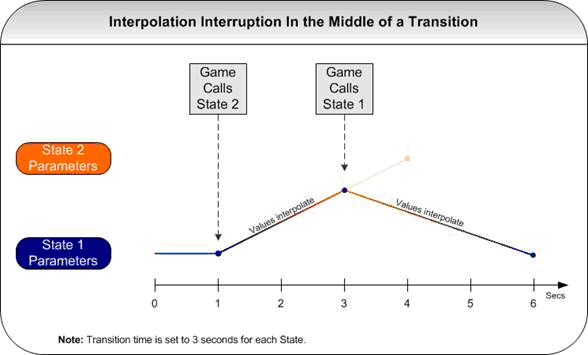

# 集成详情—— State（状态）

|  |
| --- |
| Wwise SDK 2025.1.4 - Windows |

集成详情—— State（状态）

# 简介

State（状态）是全局影响所有游戏对象音频属性的变化。每个 State Group（状态组）只可有一个当前状态，由所有游戏对象共享。

例如，状态组可以是：

- Weather（天气）

此状态组的不同状态可以是：

- Sunny（晴天）
- Rainy（雨天）
- Cloudy（阴天）
- 无

|  |  |
| --- | --- |
|  | **备注:** 每个状态组都有称作“None”（无）的状态。“None”状态代表状态组的初始状态，不可移除。在“None”状态下，没有对参数做任何更改。 |

# 状态系统

状态系统是一种强大的工具，有许多用途。It allows you to modify multiple parameters at a time for various objects (sounds, Property Containers, busses, and so on). 您可以做到用一个命令更改声音引擎中所有对象的行为。虽然状态用途很广，但并非在每种情况下都是最佳解决方案。例如，考虑需要对少量对象的一个参数进行迅速更新的情况。在此例中，使用 RTPC 可以减少资源使用，比使用状态更快。

# 使用状态系统

通过 SDK 设置状态的方式无非就是调用如下函数：

[AK::SoundEngine::SetState](namespace_a_k_1_1_sound_engine_a68dc9be195962c671b82fbb354b68cc5.html#a68dc9be195962c671b82fbb354b68cc5)( L"Weather", L"Sunny" );

或者

[AK::SoundEngine::SetState](namespace_a_k_1_1_sound_engine_a68dc9be195962c671b82fbb354b68cc5.html#a68dc9be195962c671b82fbb354b68cc5)( AK::STATES::WEATHER::GROUP, AK::STATES::WEATHER::STATE::SUNNY );

# 识别 State

使用 SDK 设置状态有两种方式：使用字符串（Unicode 或 Ansi），或使用 ID。

使用字符串可以提高代码的可读性，适合在开发期间或者通常使用字符串的环境中使用。使用 ID 后，Wwise 就无需在运行时散列名称了。

# 启用 ID

要使用 ID，需在 Wwise Generate SoundBanks 对话框中选择“Generate header file”选项。定义文件 Wwise\_IDs.h 包含所有必要的 ID。每次生成 SoundBank 时都会更新此文件。

有关头文件的示例，请参阅 [集成详情—— SoundBank](soundengine_banks.html) 。

|  |  |
| --- | --- |
|  | **注意:** 使用 ID 时，在生成新 SoundBank 时保持 .h 文件更新是很重要的。否则，可能发生 ID 不匹配或编译错误。 |

有关使用 Wwise 生成 SoundBank 的更多信息，请参阅 Wwise 帮助。

# 驱动 State

您可以选用两种方式来驱动 State：SDK `AK::SoundEngine::SetState()` 函数和 Wwise 中生成的 SetState 动作。然而，在同一状态中同时使用两种方式会出问题。比如，倘若声音设计师在其创建的 Event 中添加 SetState 动作，而音频程序员使用 SDK `AK::SoundEngine::SetState()` 函数驱动 State，可能会很难控制 State。因此，我们强烈建议声音设计师和音频程序员一起决定到底如何驱动 State，无论是针对单个 State Group 还是整个工程。在就如何更改 State 达成一致的前提下，两种方式是可以同时使用的。比如，音频程序员仅使用 SDK `SetState()` 函数对 State 进行初始化，而在游戏其他部分全部通过 Event 来驱动 State。

|  |  |
| --- | --- |
|  | **技巧:** If a state behavior is the same for many sounds, you can give those sounds a common parent (such as a Property Container) and put the state settings there, instead of duplicating them in each sound. 这可以加快声音设计师编辑设置的速度。还会降低存储状态参数所需要的内存，因为状态数据存储在同一处而不是许多处。 |

# State 过渡

当触发状态变换时，如果定义了过渡，则会开始从参数值 A 过渡到参数值 B。默认过渡时间应用于所有参数。过渡时间可在 Wwise 中设定。

如果过渡时间设置为 0（即无过渡时间），则无过渡，参数值会直接跳到目标值。如果有了过渡段，游戏声音却没有改善，则过渡应设为 0，以节省过渡资源。

如果在上一个状态仍在过渡时触发了第二个状态变换，则新参数将定义新目标，并且参数将使用新的过渡时间从当前值过渡到新的目标值。如果过渡被中断，则当前值将过渡到之前的值。例如，如果在 State 1 到 State 2 的过渡中，一个新来的 State 变换要变到 State 1，造成当前的过渡中断，则值将使用新的过渡时间从当前设置切换回 State 1。

对于布尔型参数和由 State 驱动的切换容器，将忽略状态过渡时间。切换容器有它们自己的选项来驱动当状态或切换开关变换时的行为。

有关集成状态的示例，请参阅 [State 示例](quickstart_sample_integration_states.html#soundengine_integration_states) 。

参见
:   [了解 State](concept_state.html), [集成详情——游戏对象](soundengine_gameobj.html), [集成详情——切换开关](soundengine_switch.html), [AK::SoundEngine::SetState()](namespace_a_k_1_1_sound_engine_a68dc9be195962c671b82fbb354b68cc5.html#a68dc9be195962c671b82fbb354b68cc5)

[AK::SoundEngine::SetState](namespace_a_k_1_1_sound_engine_a68dc9be195962c671b82fbb354b68cc5.html#a68dc9be195962c671b82fbb354b68cc5)

AKSOUNDENGINE\_API AKRESULT SetState(AkStateGroupID in\_stateGroup, AkStateID in\_state)